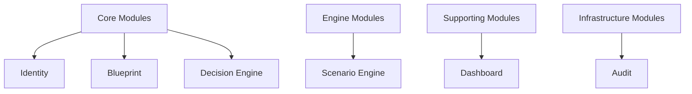
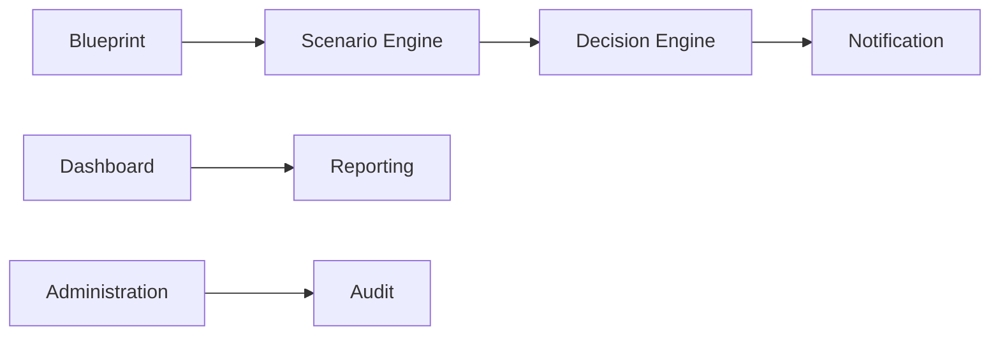
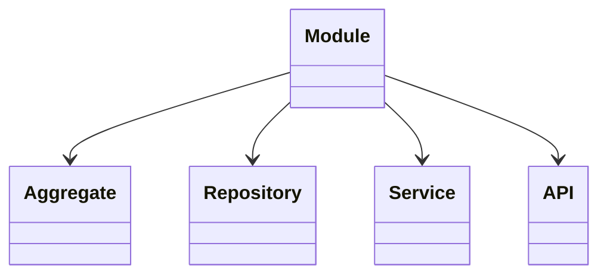
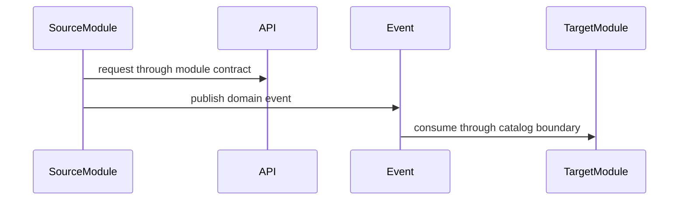
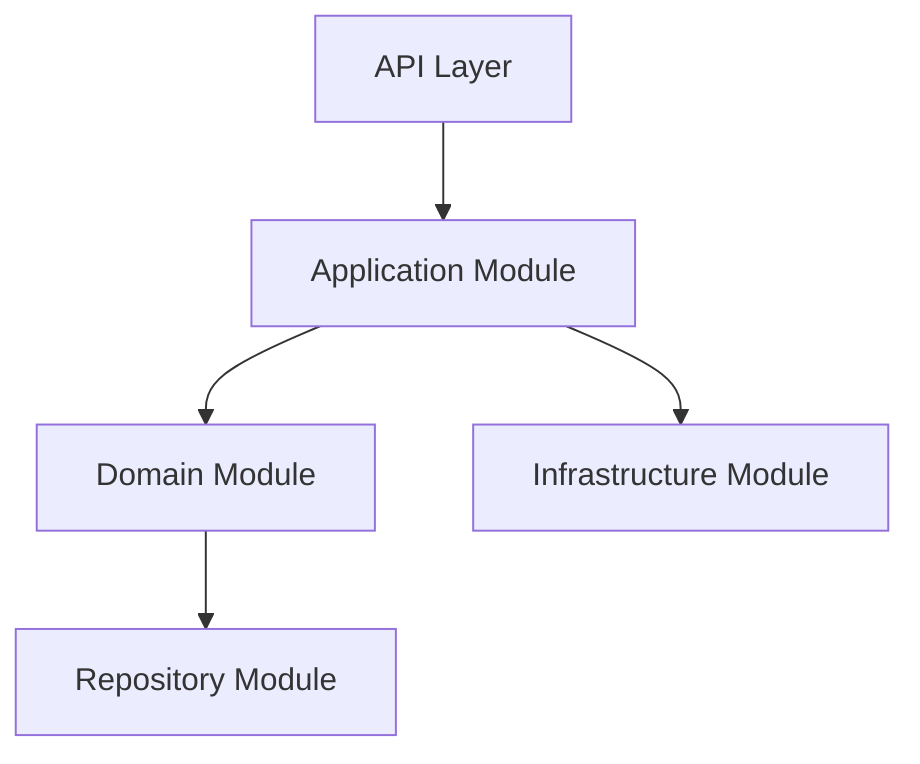
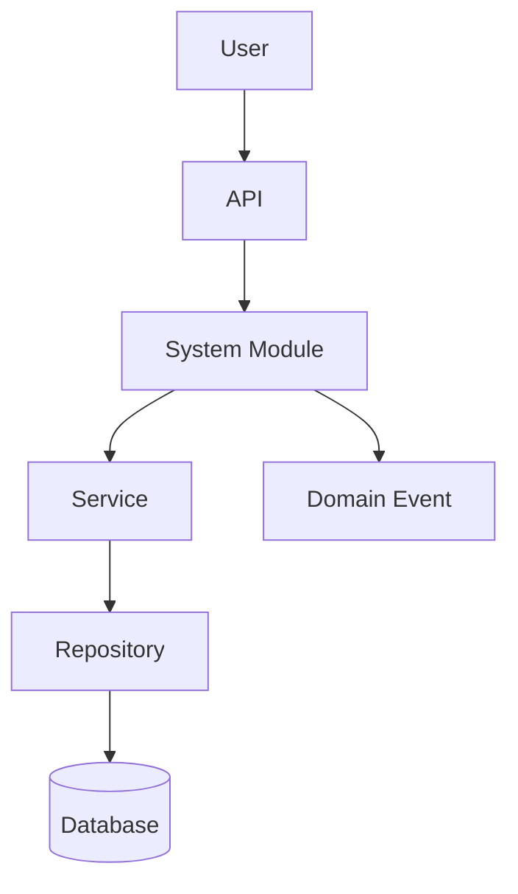

> **ADR-001 PWA Runtime Alignment:** Atlas v1 uses PWA v1 Runtime, Browser Runtime, and IndexedDB Runtime. Future Cloud Architecture is optional future mapping and must not be required for v1.\r\n\r\n# System Module Catalog
## Split Navigation
- [System module catalog entries](system-module/catalog-entries.md)
- [System module definition standard](system-module/definition-standard.md)
- [System module dependencies](system-module/dependencies.md)
- [System module governance and testing](system-module/governance-and-testing.md)
- [System module relationship matrices](system-module/relationship-matrices.md)
- [System module diagrams, testing, and edge cases](system-module/diagrams-testing-edge-cases.md)

# Document Control

Document Name: System Module Catalog
Document Path: knowledge/catalog/system-module-catalog.md
Document Type: Atlas Enterprise Canonical Specification
Version: 1.0
Status: Canonical Specification
Domain: Platform
Bounded Context: Platform
Owner: Project Atlas
Source of Truth: Atlas System Module Source of Truth
Last Updated: 2026-07-12

Related Specifications:
- knowledge/domain-model-catalog.md
- knowledge/bounded-context-catalog.md
- knowledge/aggregate-catalog.md
- knowledge/entity-catalog.md
- knowledge/value-object-catalog.md
- knowledge/enumeration-catalog.md
- knowledge/repository-catalog.md
- knowledge/command-catalog.md
- knowledge/domain-event-catalog.md
- knowledge/domain-service-catalog.md
- knowledge/application-service-catalog.md
- knowledge/service-catalog.md
- knowledge/api-governance-framework.md
- knowledge/integration-framework.md
- knowledge/workflow-engine-framework.md
- knowledge/background-job-framework.md
- knowledge/scheduler-framework.md
- knowledge/automation-framework.md
- knowledge/event-driven-architecture.md
- docs/specification/04-DomainModel.md
- docs/specification/04A-DomainInventory.md
- docs/database/05-DatabaseDesign.md
- docs/database/06-ERD.md
- docs/api/07-API.md

# Purpose

System Module Catalog defines Atlas module ownership across Domain, Bounded Context, Aggregate, Entity, Repository, Command, Domain Event, Application Service, Domain Service, Workflow, API, Integration, Database, Scheduler, Automation, Background Job, and Engine concerns. It is the source of truth for module boundaries, module responsibility, module dependency, module contract, module lifecycle, security, audit, performance, availability, and scalability.

# Scope

- System Module
- Business Module
- Core Module
- Supporting Module
- Infrastructure Module
- Shared Module
- Module Boundary
- Module Responsibility
- Module Dependency
- Module Contract
- Module Ownership
- Module Lifecycle

# Module Definition Standard

Every Module entry uses the following complete Enterprise contract.
- Module Name
- Display Name
- Category
- Domain
- Subdomain
- Bounded Context
- Purpose
- Business Meaning
- Description
- Responsibilities
- Non Responsibilities
- Owned Aggregates
- Owned Entities
- Owned Value Objects
- Owned Enumerations
- Owned Repositories
- Owned Commands
- Owned Domain Events
- Owned Application Services
- Owned Domain Services
- Owned APIs
- Owned Workflows
- Owned Schedulers
- Owned Automations
- Owned Background Jobs
- Owned Integrations
- Owned Database Objects
- Owned Engines
- Inbound Dependencies
- Outbound Dependencies
- Published Events
- Consumed Events
- Security Boundary
- Authorization
- Audit
- Performance
- Availability
- Scalability
- Version
- Example

# Complete Module Catalog

The complete per-module specifications have been split into dedicated files to keep this catalog navigable while preserving the canonical module inventory.

| Module | Specification |
|---|---|
| Identity | knowledge/catalog/system-modules/identity.md |
| Blueprint | knowledge/catalog/system-modules/blueprint.md |
| IPS | knowledge/catalog/system-modules/ips.md |
| Cash Flow Engine | knowledge/catalog/system-modules/cash-flow-engine.md |
| Investment Engine | knowledge/catalog/system-modules/investment-engine.md |
| Loan Engine | knowledge/catalog/system-modules/loan-engine.md |
| Retirement Engine | knowledge/catalog/system-modules/retirement-engine.md |
| Home Upgrade Engine | knowledge/catalog/system-modules/home-upgrade-engine.md |
| Decision Engine | knowledge/catalog/system-modules/decision-engine.md |
| Scenario Engine | knowledge/catalog/system-modules/scenario-engine.md |
| Dashboard | knowledge/catalog/system-modules/dashboard.md |
| Notification | knowledge/catalog/system-modules/notification.md |
| Automation | knowledge/catalog/system-modules/automation.md |
| Reporting | knowledge/catalog/system-modules/reporting.md |
| Administration | knowledge/catalog/system-modules/administration.md |
| Audit | knowledge/catalog/system-modules/audit.md |
| Configuration | knowledge/catalog/system-modules/configuration.md |
| Feature Flag | knowledge/catalog/system-modules/feature-flag.md |
| Policy | knowledge/catalog/system-modules/policy.md |
| Integration | knowledge/catalog/system-modules/integration.md |

# Module Ownership Matrix

| Module | Domain | Bounded Context | Aggregate | Entity | Repository | Command | Domain Event | Application Service | Domain Service | API | Workflow | Integration | Database |
|---|---|---|---|---|---|---|---|---|---|---|---|---|---|
| Identity | Identity | Identity | User, Household | User, Household | UserRepository, HouseholdRepository | Identity commands and access queries | Identity and access events | UserApplicationService | DecisionService | /api/v1/users, /api/v1/households | Identity workflow | Identity integration | users, households |
| Blueprint | Financial Planning | Financial Profile | Household, GoalPlan, RetirementPlan, Property | Household, Goal, Property | HouseholdRepository, GoalRepository, PropertyRepository | RecordIncome, RecordExpense, UpdateRetirementPlan, PurchaseHome, SellHome | SalaryReceived, ExpenseRecorded, RetirementPlanUpdated, HomePurchased, HomeSold | BlueprintApplicationService, GoalApplicationService | CashFlowService, RetirementService, PortfolioService | /api/v1/blueprint, /api/v1/goals, /api/v1/properties | Goal workflow | Planning integration | households, goals, properties |
| IPS | Protection | Investment | AssetPortfolio, Policy, Scenario | Portfolio, Holding, Policy, Scenario | PortfolioRepository, ScenarioRepository | IssuePolicy, PayPremium, RebalancePortfolio | PolicyIssued, PremiumPaid, CoverageUpdated, PortfolioRebalanced | IPSApplicationService, PortfolioApplicationService | RiskService, AllocationService, PortfolioService | /api/v1/ips, /api/v1/policies | Protection workflow | Protection integration | policies, portfolios |
| Cash Flow Engine | Cash Flow | Cash Flow | Household, Loan, Policy | Household, Mortgage, Policy | HouseholdRepository, LoanRepository | RecordIncome, RecordExpense, RecordLoanPayment, PayPremium | SalaryReceived, BonusReceived, ExpenseRecorded, PassiveIncomeReceived, LoanPaymentMade, PremiumPaid | DashboardApplicationService | CashFlowService | Internal | Cash flow workflow | Cash flow integration | cash_flow_items, loan_payments |
| Investment Engine | Investment | Investment | AssetPortfolio | Asset, Portfolio, Holding | AssetRepository, PortfolioRepository | CreatePortfolio, BuySecurity, SellSecurity, RebalancePortfolio | PortfolioCreated, SecurityPurchased, SecuritySold, PortfolioRebalanced | PortfolioApplicationService | PortfolioService, AllocationService | /api/v1/portfolios | Portfolio workflow | Market integration | assets, portfolios, holdings |
| Loan Engine | Loan | Loan | Loan, LiabilityPortfolio | Mortgage, Liability | LoanRepository, LiabilityRepository | CreateLoan, RecordLoanPayment, RefinanceLoan | LoanCreated, LoanPaymentMade, LoanRefinanced, LoanClosed | LoanApplicationService | LoanService | /api/v1/loans | Loan workflow | Loan integration | loans, loan_payments |
| Retirement Engine | Retirement | Retirement | RetirementPlan, GoalPlan, Scenario | Goal, Scenario | GoalRepository, ScenarioRepository | UpdateRetirementPlan, EvaluateScenario | RetirementPlanUpdated, RetirementGoalReached, RetirementWithdrawalStarted, ScenarioEvaluated | BlueprintApplicationService, ScenarioApplicationService | RetirementService, ScenarioService | /api/v1/goals, /api/v1/scenarios | Retirement workflow | Retirement integration | goals, scenarios |
| Home Upgrade Engine | Property | Property | Property | Property | PropertyRepository | PurchaseHome, SellHome, UpdatePropertyValue | HomePurchased, HomeSold, HomeValueUpdated, HomeUpgradeStarted, HomeUpgradeCompleted | BlueprintApplicationService | PortfolioService | /api/v1/properties | Property workflow | Property integration | properties, property_valuations |
| Decision Engine | Decision | Decision | DecisionSession, Recommendation, Scenario | Decision, Recommendation, Scenario | DecisionRepository, ScenarioRepository | AcceptRecommendation, RejectRecommendation, EvaluateScenario | RecommendationGenerated, DecisionAccepted, DecisionRejected, ScenarioEvaluated | DecisionApplicationService | DecisionService, ScoringService, ExplainabilityService | /api/v1/decisions, /api/v1/recommendations | Decision workflow | Decision integration | decisions, recommendations |
| Scenario Engine | Scenario | Scenario | Scenario, DecisionSession | Scenario, Decision | ScenarioRepository, DecisionRepository | EvaluateScenario, ReplayScenario | ScenarioEvaluated, RuleEvaluated, HardConstraintTriggered, ScoreAdjusted, SnapshotCreated, ReplayCompleted | ScenarioApplicationService | ScenarioService, ScoringService, RiskService | /api/v1/scenarios | Scenario workflow | Scenario integration | scenarios, scenario_results |
| Dashboard | Dashboard | Platform | Household, AssetPortfolio, LiabilityPortfolio, GoalPlan, Scenario | Household, Asset, Liability, Goal, Scenario | HouseholdRepository, PortfolioRepository, LoanRepository, GoalRepository, ScenarioRepository | RecordIncome, RecordExpense, UpdatePropertyValue | SalaryReceived, ExpenseRecorded, HomeValueUpdated | DashboardApplicationService | CashFlowService, PortfolioService, LoanService, RetirementService | /api/v1/dashboard | Dashboard refresh workflow | Dashboard integration | dashboard_views |
| Notification | Notification | Platform | Notification, DecisionSession, Recommendation | Notification, Decision, Recommendation | NotificationRepository, DecisionRepository | Notification delivery commands from catalog-aligned handlers | DecisionAccepted, DecisionRejected, RecommendationGenerated | NotificationApplicationService | ExplainabilityService, DecisionService | /api/v1/notifications | Notification workflow | Notification integration | notifications |
| Automation | Automation | Platform | Configuration, Scenario, Notification | Configuration, Scenario, Notification | AuditRepository, ScenarioRepository, NotificationRepository | EvaluateScenario, ReplayScenario | ScenarioEvaluated, ReplayCompleted | AdministrationApplicationService | ScenarioService | Internal | Automation workflow | Automation integration | audit_log, configuration |
| Reporting | Reporting | Platform | Household, Scenario, DecisionSession, AssetPortfolio, Loan, Policy | Household, Scenario, Decision, Portfolio, Mortgage, Policy | HouseholdRepository, ScenarioRepository, DecisionRepository, PortfolioRepository, LoanRepository, AuditRepository | Report generation commands from catalog-aligned handlers | Report source events through read models | ReportApplicationService | ExplainabilityService, ScenarioService, PortfolioService, LoanService | /api/v1/reports | Report workflow | Report integration | report_views, audit_log |
| Administration | Administration | Platform | Configuration, Scenario, Notification, Household | Configuration, Scenario, Notification, Household | AuditRepository, ScenarioRepository, NotificationRepository, HouseholdRepository | ReplayScenario | SnapshotCreated, ReplayCompleted | AdministrationApplicationService | ExplainabilityService, ScenarioService | /api/v1/administration, /api/v1/audit | Administration workflow | Administration integration | configuration, audit_log |
| Audit | Audit | Platform | Audit, Configuration | Audit, Configuration | AuditRepository | All catalog commands | All catalog domain events | AdministrationApplicationService | ExplainabilityService | /api/v1/audit | Audit workflow | Audit integration | audit_log, command_history, event_history |
| Configuration | Configuration | Platform | Configuration | Configuration | AuditRepository | Administration operations | Configuration and replay events | AdministrationApplicationService | ScenarioService | /api/v1/administration | Configuration workflow | Configuration integration | configuration |
| Feature Flag | Platform | Platform | Configuration | Configuration | AuditRepository | Administration operations | Configuration events | AdministrationApplicationService | ExplainabilityService | Internal | Feature flag workflow | Feature flag integration | configuration |
| Policy | Protection | Platform | Policy, Configuration | Policy, Configuration | AuditRepository | IssuePolicy, PayPremium | PolicyIssued, PremiumPaid, CoverageUpdated | IPSApplicationService, AdministrationApplicationService | RiskService | /api/v1/policies | Policy workflow | Policy integration | policies, configuration |
| Integration | Integration | Platform | Configuration, Notification | Configuration, Notification | AuditRepository | Integration operations | Integration and audit events | AdministrationApplicationService | ExplainabilityService | Internal | Integration workflow | External integration | integration_log |

# Module Dependency Matrix

| Module | Mapping | Owner | Dependency Control |
|---|---|---|---|
| Identity | User, Household; User, Household; UserRepository, HouseholdRepository; Identity commands and access queries; Identity and access events | Identity | Inbound: None; Outbound: Platform, Blueprint |
| Blueprint | Household, GoalPlan, RetirementPlan, Property; Household, Goal, Property; HouseholdRepository, GoalRepository, PropertyRepository; RecordIncome, RecordExpense, UpdateRetirementPlan, PurchaseHome, SellHome; SalaryReceived, ExpenseRecorded, RetirementPlanUpdated, HomePurchased, HomeSold | Blueprint | Inbound: Identity; Outbound: Decision, Scenario, Dashboard |
| IPS | AssetPortfolio, Policy, Scenario; Portfolio, Holding, Policy, Scenario; PortfolioRepository, ScenarioRepository; IssuePolicy, PayPremium, RebalancePortfolio; PolicyIssued, PremiumPaid, CoverageUpdated, PortfolioRebalanced | IPS | Inbound: Identity, Blueprint; Outbound: Decision, Notification |
| Cash Flow Engine | Household, Loan, Policy; Household, Mortgage, Policy; HouseholdRepository, LoanRepository; RecordIncome, RecordExpense, RecordLoanPayment, PayPremium; SalaryReceived, BonusReceived, ExpenseRecorded, PassiveIncomeReceived, LoanPaymentMade, PremiumPaid | Cash Flow Engine | Inbound: Blueprint, Loan; Outbound: Dashboard, Scenario |
| Investment Engine | AssetPortfolio; Asset, Portfolio, Holding; AssetRepository, PortfolioRepository; CreatePortfolio, BuySecurity, SellSecurity, RebalancePortfolio; PortfolioCreated, SecurityPurchased, SecuritySold, PortfolioRebalanced | Investment Engine | Inbound: Identity; Outbound: Scenario, Decision |
| Loan Engine | Loan, LiabilityPortfolio; Mortgage, Liability; LoanRepository, LiabilityRepository; CreateLoan, RecordLoanPayment, RefinanceLoan; LoanCreated, LoanPaymentMade, LoanRefinanced, LoanClosed | Loan Engine | Inbound: Identity, Cash Flow Engine; Outbound: Scenario, Dashboard |
| Retirement Engine | RetirementPlan, GoalPlan, Scenario; Goal, Scenario; GoalRepository, ScenarioRepository; UpdateRetirementPlan, EvaluateScenario; RetirementPlanUpdated, RetirementGoalReached, RetirementWithdrawalStarted, ScenarioEvaluated | Retirement Engine | Inbound: Blueprint, Scenario Engine; Outbound: Decision |
| Home Upgrade Engine | Property; Property; PropertyRepository; PurchaseHome, SellHome, UpdatePropertyValue; HomePurchased, HomeSold, HomeValueUpdated, HomeUpgradeStarted, HomeUpgradeCompleted | Home Upgrade Engine | Inbound: Blueprint; Outbound: Scenario, Dashboard |
| Decision Engine | DecisionSession, Recommendation, Scenario; Decision, Recommendation, Scenario; DecisionRepository, ScenarioRepository; AcceptRecommendation, RejectRecommendation, EvaluateScenario; RecommendationGenerated, DecisionAccepted, DecisionRejected, ScenarioEvaluated | Decision Engine | Inbound: Scenario Engine; Outbound: Notification, Reporting |
| Scenario Engine | Scenario, DecisionSession; Scenario, Decision; ScenarioRepository, DecisionRepository; EvaluateScenario, ReplayScenario; ScenarioEvaluated, RuleEvaluated, HardConstraintTriggered, ScoreAdjusted, SnapshotCreated, ReplayCompleted | Scenario Engine | Inbound: Blueprint, Cash Flow Engine, Investment Engine, Loan Engine; Outbound: Decision Engine |
| Dashboard | Household, AssetPortfolio, LiabilityPortfolio, GoalPlan, Scenario; Household, Asset, Liability, Goal, Scenario; HouseholdRepository, PortfolioRepository, LoanRepository, GoalRepository, ScenarioRepository; RecordIncome, RecordExpense, UpdatePropertyValue; SalaryReceived, ExpenseRecorded, HomeValueUpdated | Dashboard | Inbound: All business modules; Outbound: Notification |
| Notification | Notification, DecisionSession, Recommendation; Notification, Decision, Recommendation; NotificationRepository, DecisionRepository; Notification delivery commands from catalog-aligned handlers; DecisionAccepted, DecisionRejected, RecommendationGenerated | Notification | Inbound: Decision Engine, Dashboard; Outbound: EmailService |
| Automation | Configuration, Scenario, Notification; Configuration, Scenario, Notification; AuditRepository, ScenarioRepository, NotificationRepository; EvaluateScenario, ReplayScenario; ScenarioEvaluated, ReplayCompleted | Automation | Inbound: Scheduler; Outbound: Scenario Engine, Notification |
| Reporting | Household, Scenario, DecisionSession, AssetPortfolio, Loan, Policy; Household, Scenario, Decision, Portfolio, Mortgage, Policy; HouseholdRepository, ScenarioRepository, DecisionRepository, PortfolioRepository, LoanRepository, AuditRepository; Report generation commands from catalog-aligned handlers; Report source events through read models | Reporting | Inbound: Dashboard, Decision Engine; Outbound: FileStorageService |
| Administration | Configuration, Scenario, Notification, Household; Configuration, Scenario, Notification, Household; AuditRepository, ScenarioRepository, NotificationRepository, HouseholdRepository; ReplayScenario; SnapshotCreated, ReplayCompleted | Administration | Inbound: Platform; Outbound: All modules |
| Audit | Audit, Configuration; Audit, Configuration; AuditRepository; All catalog commands; All catalog domain events | Audit | Inbound: All modules; Outbound: Administration |
| Configuration | Configuration; Configuration; AuditRepository; Administration operations; Configuration and replay events | Configuration | Inbound: Administration; Outbound: All modules |
| Feature Flag | Configuration; Configuration; AuditRepository; Administration operations; Configuration events | Feature Flag | Inbound: Configuration; Outbound: All modules |
| Policy | Policy, Configuration; Policy, Configuration; AuditRepository; IssuePolicy, PayPremium; PolicyIssued, PremiumPaid, CoverageUpdated | Policy | Inbound: IPS; Outbound: Decision Engine |
| Integration | Configuration, Notification; Configuration, Notification; AuditRepository; Integration operations; Integration and audit events | Integration | Inbound: All modules; Outbound: External systems |

# Domain Module Matrix

| Module | Mapping | Owner | Dependency Control |
|---|---|---|---|
| Identity | User, Household; User, Household; UserRepository, HouseholdRepository; Identity commands and access queries; Identity and access events | Identity | Inbound: None; Outbound: Platform, Blueprint |
| Blueprint | Household, GoalPlan, RetirementPlan, Property; Household, Goal, Property; HouseholdRepository, GoalRepository, PropertyRepository; RecordIncome, RecordExpense, UpdateRetirementPlan, PurchaseHome, SellHome; SalaryReceived, ExpenseRecorded, RetirementPlanUpdated, HomePurchased, HomeSold | Blueprint | Inbound: Identity; Outbound: Decision, Scenario, Dashboard |
| IPS | AssetPortfolio, Policy, Scenario; Portfolio, Holding, Policy, Scenario; PortfolioRepository, ScenarioRepository; IssuePolicy, PayPremium, RebalancePortfolio; PolicyIssued, PremiumPaid, CoverageUpdated, PortfolioRebalanced | IPS | Inbound: Identity, Blueprint; Outbound: Decision, Notification |
| Cash Flow Engine | Household, Loan, Policy; Household, Mortgage, Policy; HouseholdRepository, LoanRepository; RecordIncome, RecordExpense, RecordLoanPayment, PayPremium; SalaryReceived, BonusReceived, ExpenseRecorded, PassiveIncomeReceived, LoanPaymentMade, PremiumPaid | Cash Flow Engine | Inbound: Blueprint, Loan; Outbound: Dashboard, Scenario |
| Investment Engine | AssetPortfolio; Asset, Portfolio, Holding; AssetRepository, PortfolioRepository; CreatePortfolio, BuySecurity, SellSecurity, RebalancePortfolio; PortfolioCreated, SecurityPurchased, SecuritySold, PortfolioRebalanced | Investment Engine | Inbound: Identity; Outbound: Scenario, Decision |
| Loan Engine | Loan, LiabilityPortfolio; Mortgage, Liability; LoanRepository, LiabilityRepository; CreateLoan, RecordLoanPayment, RefinanceLoan; LoanCreated, LoanPaymentMade, LoanRefinanced, LoanClosed | Loan Engine | Inbound: Identity, Cash Flow Engine; Outbound: Scenario, Dashboard |
| Retirement Engine | RetirementPlan, GoalPlan, Scenario; Goal, Scenario; GoalRepository, ScenarioRepository; UpdateRetirementPlan, EvaluateScenario; RetirementPlanUpdated, RetirementGoalReached, RetirementWithdrawalStarted, ScenarioEvaluated | Retirement Engine | Inbound: Blueprint, Scenario Engine; Outbound: Decision |
| Home Upgrade Engine | Property; Property; PropertyRepository; PurchaseHome, SellHome, UpdatePropertyValue; HomePurchased, HomeSold, HomeValueUpdated, HomeUpgradeStarted, HomeUpgradeCompleted | Home Upgrade Engine | Inbound: Blueprint; Outbound: Scenario, Dashboard |
| Decision Engine | DecisionSession, Recommendation, Scenario; Decision, Recommendation, Scenario; DecisionRepository, ScenarioRepository; AcceptRecommendation, RejectRecommendation, EvaluateScenario; RecommendationGenerated, DecisionAccepted, DecisionRejected, ScenarioEvaluated | Decision Engine | Inbound: Scenario Engine; Outbound: Notification, Reporting |
| Scenario Engine | Scenario, DecisionSession; Scenario, Decision; ScenarioRepository, DecisionRepository; EvaluateScenario, ReplayScenario; ScenarioEvaluated, RuleEvaluated, HardConstraintTriggered, ScoreAdjusted, SnapshotCreated, ReplayCompleted | Scenario Engine | Inbound: Blueprint, Cash Flow Engine, Investment Engine, Loan Engine; Outbound: Decision Engine |
| Dashboard | Household, AssetPortfolio, LiabilityPortfolio, GoalPlan, Scenario; Household, Asset, Liability, Goal, Scenario; HouseholdRepository, PortfolioRepository, LoanRepository, GoalRepository, ScenarioRepository; RecordIncome, RecordExpense, UpdatePropertyValue; SalaryReceived, ExpenseRecorded, HomeValueUpdated | Dashboard | Inbound: All business modules; Outbound: Notification |
| Notification | Notification, DecisionSession, Recommendation; Notification, Decision, Recommendation; NotificationRepository, DecisionRepository; Notification delivery commands from catalog-aligned handlers; DecisionAccepted, DecisionRejected, RecommendationGenerated | Notification | Inbound: Decision Engine, Dashboard; Outbound: EmailService |
| Automation | Configuration, Scenario, Notification; Configuration, Scenario, Notification; AuditRepository, ScenarioRepository, NotificationRepository; EvaluateScenario, ReplayScenario; ScenarioEvaluated, ReplayCompleted | Automation | Inbound: Scheduler; Outbound: Scenario Engine, Notification |
| Reporting | Household, Scenario, DecisionSession, AssetPortfolio, Loan, Policy; Household, Scenario, Decision, Portfolio, Mortgage, Policy; HouseholdRepository, ScenarioRepository, DecisionRepository, PortfolioRepository, LoanRepository, AuditRepository; Report generation commands from catalog-aligned handlers; Report source events through read models | Reporting | Inbound: Dashboard, Decision Engine; Outbound: FileStorageService |
| Administration | Configuration, Scenario, Notification, Household; Configuration, Scenario, Notification, Household; AuditRepository, ScenarioRepository, NotificationRepository, HouseholdRepository; ReplayScenario; SnapshotCreated, ReplayCompleted | Administration | Inbound: Platform; Outbound: All modules |
| Audit | Audit, Configuration; Audit, Configuration; AuditRepository; All catalog commands; All catalog domain events | Audit | Inbound: All modules; Outbound: Administration |
| Configuration | Configuration; Configuration; AuditRepository; Administration operations; Configuration and replay events | Configuration | Inbound: Administration; Outbound: All modules |
| Feature Flag | Configuration; Configuration; AuditRepository; Administration operations; Configuration events | Feature Flag | Inbound: Configuration; Outbound: All modules |
| Policy | Policy, Configuration; Policy, Configuration; AuditRepository; IssuePolicy, PayPremium; PolicyIssued, PremiumPaid, CoverageUpdated | Policy | Inbound: IPS; Outbound: Decision Engine |
| Integration | Configuration, Notification; Configuration, Notification; AuditRepository; Integration operations; Integration and audit events | Integration | Inbound: All modules; Outbound: External systems |

# Bounded Context Module Matrix

| Module | Mapping | Owner | Dependency Control |
|---|---|---|---|
| Identity | User, Household; User, Household; UserRepository, HouseholdRepository; Identity commands and access queries; Identity and access events | Identity | Inbound: None; Outbound: Platform, Blueprint |
| Blueprint | Household, GoalPlan, RetirementPlan, Property; Household, Goal, Property; HouseholdRepository, GoalRepository, PropertyRepository; RecordIncome, RecordExpense, UpdateRetirementPlan, PurchaseHome, SellHome; SalaryReceived, ExpenseRecorded, RetirementPlanUpdated, HomePurchased, HomeSold | Blueprint | Inbound: Identity; Outbound: Decision, Scenario, Dashboard |
| IPS | AssetPortfolio, Policy, Scenario; Portfolio, Holding, Policy, Scenario; PortfolioRepository, ScenarioRepository; IssuePolicy, PayPremium, RebalancePortfolio; PolicyIssued, PremiumPaid, CoverageUpdated, PortfolioRebalanced | IPS | Inbound: Identity, Blueprint; Outbound: Decision, Notification |
| Cash Flow Engine | Household, Loan, Policy; Household, Mortgage, Policy; HouseholdRepository, LoanRepository; RecordIncome, RecordExpense, RecordLoanPayment, PayPremium; SalaryReceived, BonusReceived, ExpenseRecorded, PassiveIncomeReceived, LoanPaymentMade, PremiumPaid | Cash Flow Engine | Inbound: Blueprint, Loan; Outbound: Dashboard, Scenario |
| Investment Engine | AssetPortfolio; Asset, Portfolio, Holding; AssetRepository, PortfolioRepository; CreatePortfolio, BuySecurity, SellSecurity, RebalancePortfolio; PortfolioCreated, SecurityPurchased, SecuritySold, PortfolioRebalanced | Investment Engine | Inbound: Identity; Outbound: Scenario, Decision |
| Loan Engine | Loan, LiabilityPortfolio; Mortgage, Liability; LoanRepository, LiabilityRepository; CreateLoan, RecordLoanPayment, RefinanceLoan; LoanCreated, LoanPaymentMade, LoanRefinanced, LoanClosed | Loan Engine | Inbound: Identity, Cash Flow Engine; Outbound: Scenario, Dashboard |
| Retirement Engine | RetirementPlan, GoalPlan, Scenario; Goal, Scenario; GoalRepository, ScenarioRepository; UpdateRetirementPlan, EvaluateScenario; RetirementPlanUpdated, RetirementGoalReached, RetirementWithdrawalStarted, ScenarioEvaluated | Retirement Engine | Inbound: Blueprint, Scenario Engine; Outbound: Decision |
| Home Upgrade Engine | Property; Property; PropertyRepository; PurchaseHome, SellHome, UpdatePropertyValue; HomePurchased, HomeSold, HomeValueUpdated, HomeUpgradeStarted, HomeUpgradeCompleted | Home Upgrade Engine | Inbound: Blueprint; Outbound: Scenario, Dashboard |
| Decision Engine | DecisionSession, Recommendation, Scenario; Decision, Recommendation, Scenario; DecisionRepository, ScenarioRepository; AcceptRecommendation, RejectRecommendation, EvaluateScenario; RecommendationGenerated, DecisionAccepted, DecisionRejected, ScenarioEvaluated | Decision Engine | Inbound: Scenario Engine; Outbound: Notification, Reporting |
| Scenario Engine | Scenario, DecisionSession; Scenario, Decision; ScenarioRepository, DecisionRepository; EvaluateScenario, ReplayScenario; ScenarioEvaluated, RuleEvaluated, HardConstraintTriggered, ScoreAdjusted, SnapshotCreated, ReplayCompleted | Scenario Engine | Inbound: Blueprint, Cash Flow Engine, Investment Engine, Loan Engine; Outbound: Decision Engine |
| Dashboard | Household, AssetPortfolio, LiabilityPortfolio, GoalPlan, Scenario; Household, Asset, Liability, Goal, Scenario; HouseholdRepository, PortfolioRepository, LoanRepository, GoalRepository, ScenarioRepository; RecordIncome, RecordExpense, UpdatePropertyValue; SalaryReceived, ExpenseRecorded, HomeValueUpdated | Dashboard | Inbound: All business modules; Outbound: Notification |
| Notification | Notification, DecisionSession, Recommendation; Notification, Decision, Recommendation; NotificationRepository, DecisionRepository; Notification delivery commands from catalog-aligned handlers; DecisionAccepted, DecisionRejected, RecommendationGenerated | Notification | Inbound: Decision Engine, Dashboard; Outbound: EmailService |
| Automation | Configuration, Scenario, Notification; Configuration, Scenario, Notification; AuditRepository, ScenarioRepository, NotificationRepository; EvaluateScenario, ReplayScenario; ScenarioEvaluated, ReplayCompleted | Automation | Inbound: Scheduler; Outbound: Scenario Engine, Notification |
| Reporting | Household, Scenario, DecisionSession, AssetPortfolio, Loan, Policy; Household, Scenario, Decision, Portfolio, Mortgage, Policy; HouseholdRepository, ScenarioRepository, DecisionRepository, PortfolioRepository, LoanRepository, AuditRepository; Report generation commands from catalog-aligned handlers; Report source events through read models | Reporting | Inbound: Dashboard, Decision Engine; Outbound: FileStorageService |
| Administration | Configuration, Scenario, Notification, Household; Configuration, Scenario, Notification, Household; AuditRepository, ScenarioRepository, NotificationRepository, HouseholdRepository; ReplayScenario; SnapshotCreated, ReplayCompleted | Administration | Inbound: Platform; Outbound: All modules |
| Audit | Audit, Configuration; Audit, Configuration; AuditRepository; All catalog commands; All catalog domain events | Audit | Inbound: All modules; Outbound: Administration |
| Configuration | Configuration; Configuration; AuditRepository; Administration operations; Configuration and replay events | Configuration | Inbound: Administration; Outbound: All modules |
| Feature Flag | Configuration; Configuration; AuditRepository; Administration operations; Configuration events | Feature Flag | Inbound: Configuration; Outbound: All modules |
| Policy | Policy, Configuration; Policy, Configuration; AuditRepository; IssuePolicy, PayPremium; PolicyIssued, PremiumPaid, CoverageUpdated | Policy | Inbound: IPS; Outbound: Decision Engine |
| Integration | Configuration, Notification; Configuration, Notification; AuditRepository; Integration operations; Integration and audit events | Integration | Inbound: All modules; Outbound: External systems |

# Aggregate Module Matrix

| Module | Mapping | Owner | Dependency Control |
|---|---|---|---|
| Identity | User, Household; User, Household; UserRepository, HouseholdRepository; Identity commands and access queries; Identity and access events | Identity | Inbound: None; Outbound: Platform, Blueprint |
| Blueprint | Household, GoalPlan, RetirementPlan, Property; Household, Goal, Property; HouseholdRepository, GoalRepository, PropertyRepository; RecordIncome, RecordExpense, UpdateRetirementPlan, PurchaseHome, SellHome; SalaryReceived, ExpenseRecorded, RetirementPlanUpdated, HomePurchased, HomeSold | Blueprint | Inbound: Identity; Outbound: Decision, Scenario, Dashboard |
| IPS | AssetPortfolio, Policy, Scenario; Portfolio, Holding, Policy, Scenario; PortfolioRepository, ScenarioRepository; IssuePolicy, PayPremium, RebalancePortfolio; PolicyIssued, PremiumPaid, CoverageUpdated, PortfolioRebalanced | IPS | Inbound: Identity, Blueprint; Outbound: Decision, Notification |
| Cash Flow Engine | Household, Loan, Policy; Household, Mortgage, Policy; HouseholdRepository, LoanRepository; RecordIncome, RecordExpense, RecordLoanPayment, PayPremium; SalaryReceived, BonusReceived, ExpenseRecorded, PassiveIncomeReceived, LoanPaymentMade, PremiumPaid | Cash Flow Engine | Inbound: Blueprint, Loan; Outbound: Dashboard, Scenario |
| Investment Engine | AssetPortfolio; Asset, Portfolio, Holding; AssetRepository, PortfolioRepository; CreatePortfolio, BuySecurity, SellSecurity, RebalancePortfolio; PortfolioCreated, SecurityPurchased, SecuritySold, PortfolioRebalanced | Investment Engine | Inbound: Identity; Outbound: Scenario, Decision |
| Loan Engine | Loan, LiabilityPortfolio; Mortgage, Liability; LoanRepository, LiabilityRepository; CreateLoan, RecordLoanPayment, RefinanceLoan; LoanCreated, LoanPaymentMade, LoanRefinanced, LoanClosed | Loan Engine | Inbound: Identity, Cash Flow Engine; Outbound: Scenario, Dashboard |
| Retirement Engine | RetirementPlan, GoalPlan, Scenario; Goal, Scenario; GoalRepository, ScenarioRepository; UpdateRetirementPlan, EvaluateScenario; RetirementPlanUpdated, RetirementGoalReached, RetirementWithdrawalStarted, ScenarioEvaluated | Retirement Engine | Inbound: Blueprint, Scenario Engine; Outbound: Decision |
| Home Upgrade Engine | Property; Property; PropertyRepository; PurchaseHome, SellHome, UpdatePropertyValue; HomePurchased, HomeSold, HomeValueUpdated, HomeUpgradeStarted, HomeUpgradeCompleted | Home Upgrade Engine | Inbound: Blueprint; Outbound: Scenario, Dashboard |
| Decision Engine | DecisionSession, Recommendation, Scenario; Decision, Recommendation, Scenario; DecisionRepository, ScenarioRepository; AcceptRecommendation, RejectRecommendation, EvaluateScenario; RecommendationGenerated, DecisionAccepted, DecisionRejected, ScenarioEvaluated | Decision Engine | Inbound: Scenario Engine; Outbound: Notification, Reporting |
| Scenario Engine | Scenario, DecisionSession; Scenario, Decision; ScenarioRepository, DecisionRepository; EvaluateScenario, ReplayScenario; ScenarioEvaluated, RuleEvaluated, HardConstraintTriggered, ScoreAdjusted, SnapshotCreated, ReplayCompleted | Scenario Engine | Inbound: Blueprint, Cash Flow Engine, Investment Engine, Loan Engine; Outbound: Decision Engine |
| Dashboard | Household, AssetPortfolio, LiabilityPortfolio, GoalPlan, Scenario; Household, Asset, Liability, Goal, Scenario; HouseholdRepository, PortfolioRepository, LoanRepository, GoalRepository, ScenarioRepository; RecordIncome, RecordExpense, UpdatePropertyValue; SalaryReceived, ExpenseRecorded, HomeValueUpdated | Dashboard | Inbound: All business modules; Outbound: Notification |
| Notification | Notification, DecisionSession, Recommendation; Notification, Decision, Recommendation; NotificationRepository, DecisionRepository; Notification delivery commands from catalog-aligned handlers; DecisionAccepted, DecisionRejected, RecommendationGenerated | Notification | Inbound: Decision Engine, Dashboard; Outbound: EmailService |
| Automation | Configuration, Scenario, Notification; Configuration, Scenario, Notification; AuditRepository, ScenarioRepository, NotificationRepository; EvaluateScenario, ReplayScenario; ScenarioEvaluated, ReplayCompleted | Automation | Inbound: Scheduler; Outbound: Scenario Engine, Notification |
| Reporting | Household, Scenario, DecisionSession, AssetPortfolio, Loan, Policy; Household, Scenario, Decision, Portfolio, Mortgage, Policy; HouseholdRepository, ScenarioRepository, DecisionRepository, PortfolioRepository, LoanRepository, AuditRepository; Report generation commands from catalog-aligned handlers; Report source events through read models | Reporting | Inbound: Dashboard, Decision Engine; Outbound: FileStorageService |
| Administration | Configuration, Scenario, Notification, Household; Configuration, Scenario, Notification, Household; AuditRepository, ScenarioRepository, NotificationRepository, HouseholdRepository; ReplayScenario; SnapshotCreated, ReplayCompleted | Administration | Inbound: Platform; Outbound: All modules |
| Audit | Audit, Configuration; Audit, Configuration; AuditRepository; All catalog commands; All catalog domain events | Audit | Inbound: All modules; Outbound: Administration |
| Configuration | Configuration; Configuration; AuditRepository; Administration operations; Configuration and replay events | Configuration | Inbound: Administration; Outbound: All modules |
| Feature Flag | Configuration; Configuration; AuditRepository; Administration operations; Configuration events | Feature Flag | Inbound: Configuration; Outbound: All modules |
| Policy | Policy, Configuration; Policy, Configuration; AuditRepository; IssuePolicy, PayPremium; PolicyIssued, PremiumPaid, CoverageUpdated | Policy | Inbound: IPS; Outbound: Decision Engine |
| Integration | Configuration, Notification; Configuration, Notification; AuditRepository; Integration operations; Integration and audit events | Integration | Inbound: All modules; Outbound: External systems |

# Entity Module Matrix

| Module | Mapping | Owner | Dependency Control |
|---|---|---|---|
| Identity | User, Household; User, Household; UserRepository, HouseholdRepository; Identity commands and access queries; Identity and access events | Identity | Inbound: None; Outbound: Platform, Blueprint |
| Blueprint | Household, GoalPlan, RetirementPlan, Property; Household, Goal, Property; HouseholdRepository, GoalRepository, PropertyRepository; RecordIncome, RecordExpense, UpdateRetirementPlan, PurchaseHome, SellHome; SalaryReceived, ExpenseRecorded, RetirementPlanUpdated, HomePurchased, HomeSold | Blueprint | Inbound: Identity; Outbound: Decision, Scenario, Dashboard |
| IPS | AssetPortfolio, Policy, Scenario; Portfolio, Holding, Policy, Scenario; PortfolioRepository, ScenarioRepository; IssuePolicy, PayPremium, RebalancePortfolio; PolicyIssued, PremiumPaid, CoverageUpdated, PortfolioRebalanced | IPS | Inbound: Identity, Blueprint; Outbound: Decision, Notification |
| Cash Flow Engine | Household, Loan, Policy; Household, Mortgage, Policy; HouseholdRepository, LoanRepository; RecordIncome, RecordExpense, RecordLoanPayment, PayPremium; SalaryReceived, BonusReceived, ExpenseRecorded, PassiveIncomeReceived, LoanPaymentMade, PremiumPaid | Cash Flow Engine | Inbound: Blueprint, Loan; Outbound: Dashboard, Scenario |
| Investment Engine | AssetPortfolio; Asset, Portfolio, Holding; AssetRepository, PortfolioRepository; CreatePortfolio, BuySecurity, SellSecurity, RebalancePortfolio; PortfolioCreated, SecurityPurchased, SecuritySold, PortfolioRebalanced | Investment Engine | Inbound: Identity; Outbound: Scenario, Decision |
| Loan Engine | Loan, LiabilityPortfolio; Mortgage, Liability; LoanRepository, LiabilityRepository; CreateLoan, RecordLoanPayment, RefinanceLoan; LoanCreated, LoanPaymentMade, LoanRefinanced, LoanClosed | Loan Engine | Inbound: Identity, Cash Flow Engine; Outbound: Scenario, Dashboard |
| Retirement Engine | RetirementPlan, GoalPlan, Scenario; Goal, Scenario; GoalRepository, ScenarioRepository; UpdateRetirementPlan, EvaluateScenario; RetirementPlanUpdated, RetirementGoalReached, RetirementWithdrawalStarted, ScenarioEvaluated | Retirement Engine | Inbound: Blueprint, Scenario Engine; Outbound: Decision |
| Home Upgrade Engine | Property; Property; PropertyRepository; PurchaseHome, SellHome, UpdatePropertyValue; HomePurchased, HomeSold, HomeValueUpdated, HomeUpgradeStarted, HomeUpgradeCompleted | Home Upgrade Engine | Inbound: Blueprint; Outbound: Scenario, Dashboard |
| Decision Engine | DecisionSession, Recommendation, Scenario; Decision, Recommendation, Scenario; DecisionRepository, ScenarioRepository; AcceptRecommendation, RejectRecommendation, EvaluateScenario; RecommendationGenerated, DecisionAccepted, DecisionRejected, ScenarioEvaluated | Decision Engine | Inbound: Scenario Engine; Outbound: Notification, Reporting |
| Scenario Engine | Scenario, DecisionSession; Scenario, Decision; ScenarioRepository, DecisionRepository; EvaluateScenario, ReplayScenario; ScenarioEvaluated, RuleEvaluated, HardConstraintTriggered, ScoreAdjusted, SnapshotCreated, ReplayCompleted | Scenario Engine | Inbound: Blueprint, Cash Flow Engine, Investment Engine, Loan Engine; Outbound: Decision Engine |
| Dashboard | Household, AssetPortfolio, LiabilityPortfolio, GoalPlan, Scenario; Household, Asset, Liability, Goal, Scenario; HouseholdRepository, PortfolioRepository, LoanRepository, GoalRepository, ScenarioRepository; RecordIncome, RecordExpense, UpdatePropertyValue; SalaryReceived, ExpenseRecorded, HomeValueUpdated | Dashboard | Inbound: All business modules; Outbound: Notification |
| Notification | Notification, DecisionSession, Recommendation; Notification, Decision, Recommendation; NotificationRepository, DecisionRepository; Notification delivery commands from catalog-aligned handlers; DecisionAccepted, DecisionRejected, RecommendationGenerated | Notification | Inbound: Decision Engine, Dashboard; Outbound: EmailService |
| Automation | Configuration, Scenario, Notification; Configuration, Scenario, Notification; AuditRepository, ScenarioRepository, NotificationRepository; EvaluateScenario, ReplayScenario; ScenarioEvaluated, ReplayCompleted | Automation | Inbound: Scheduler; Outbound: Scenario Engine, Notification |
| Reporting | Household, Scenario, DecisionSession, AssetPortfolio, Loan, Policy; Household, Scenario, Decision, Portfolio, Mortgage, Policy; HouseholdRepository, ScenarioRepository, DecisionRepository, PortfolioRepository, LoanRepository, AuditRepository; Report generation commands from catalog-aligned handlers; Report source events through read models | Reporting | Inbound: Dashboard, Decision Engine; Outbound: FileStorageService |
| Administration | Configuration, Scenario, Notification, Household; Configuration, Scenario, Notification, Household; AuditRepository, ScenarioRepository, NotificationRepository, HouseholdRepository; ReplayScenario; SnapshotCreated, ReplayCompleted | Administration | Inbound: Platform; Outbound: All modules |
| Audit | Audit, Configuration; Audit, Configuration; AuditRepository; All catalog commands; All catalog domain events | Audit | Inbound: All modules; Outbound: Administration |
| Configuration | Configuration; Configuration; AuditRepository; Administration operations; Configuration and replay events | Configuration | Inbound: Administration; Outbound: All modules |
| Feature Flag | Configuration; Configuration; AuditRepository; Administration operations; Configuration events | Feature Flag | Inbound: Configuration; Outbound: All modules |
| Policy | Policy, Configuration; Policy, Configuration; AuditRepository; IssuePolicy, PayPremium; PolicyIssued, PremiumPaid, CoverageUpdated | Policy | Inbound: IPS; Outbound: Decision Engine |
| Integration | Configuration, Notification; Configuration, Notification; AuditRepository; Integration operations; Integration and audit events | Integration | Inbound: All modules; Outbound: External systems |

# Repository Module Matrix

| Module | Mapping | Owner | Dependency Control |
|---|---|---|---|
| Identity | User, Household; User, Household; UserRepository, HouseholdRepository; Identity commands and access queries; Identity and access events | Identity | Inbound: None; Outbound: Platform, Blueprint |
| Blueprint | Household, GoalPlan, RetirementPlan, Property; Household, Goal, Property; HouseholdRepository, GoalRepository, PropertyRepository; RecordIncome, RecordExpense, UpdateRetirementPlan, PurchaseHome, SellHome; SalaryReceived, ExpenseRecorded, RetirementPlanUpdated, HomePurchased, HomeSold | Blueprint | Inbound: Identity; Outbound: Decision, Scenario, Dashboard |
| IPS | AssetPortfolio, Policy, Scenario; Portfolio, Holding, Policy, Scenario; PortfolioRepository, ScenarioRepository; IssuePolicy, PayPremium, RebalancePortfolio; PolicyIssued, PremiumPaid, CoverageUpdated, PortfolioRebalanced | IPS | Inbound: Identity, Blueprint; Outbound: Decision, Notification |
| Cash Flow Engine | Household, Loan, Policy; Household, Mortgage, Policy; HouseholdRepository, LoanRepository; RecordIncome, RecordExpense, RecordLoanPayment, PayPremium; SalaryReceived, BonusReceived, ExpenseRecorded, PassiveIncomeReceived, LoanPaymentMade, PremiumPaid | Cash Flow Engine | Inbound: Blueprint, Loan; Outbound: Dashboard, Scenario |
| Investment Engine | AssetPortfolio; Asset, Portfolio, Holding; AssetRepository, PortfolioRepository; CreatePortfolio, BuySecurity, SellSecurity, RebalancePortfolio; PortfolioCreated, SecurityPurchased, SecuritySold, PortfolioRebalanced | Investment Engine | Inbound: Identity; Outbound: Scenario, Decision |
| Loan Engine | Loan, LiabilityPortfolio; Mortgage, Liability; LoanRepository, LiabilityRepository; CreateLoan, RecordLoanPayment, RefinanceLoan; LoanCreated, LoanPaymentMade, LoanRefinanced, LoanClosed | Loan Engine | Inbound: Identity, Cash Flow Engine; Outbound: Scenario, Dashboard |
| Retirement Engine | RetirementPlan, GoalPlan, Scenario; Goal, Scenario; GoalRepository, ScenarioRepository; UpdateRetirementPlan, EvaluateScenario; RetirementPlanUpdated, RetirementGoalReached, RetirementWithdrawalStarted, ScenarioEvaluated | Retirement Engine | Inbound: Blueprint, Scenario Engine; Outbound: Decision |
| Home Upgrade Engine | Property; Property; PropertyRepository; PurchaseHome, SellHome, UpdatePropertyValue; HomePurchased, HomeSold, HomeValueUpdated, HomeUpgradeStarted, HomeUpgradeCompleted | Home Upgrade Engine | Inbound: Blueprint; Outbound: Scenario, Dashboard |
| Decision Engine | DecisionSession, Recommendation, Scenario; Decision, Recommendation, Scenario; DecisionRepository, ScenarioRepository; AcceptRecommendation, RejectRecommendation, EvaluateScenario; RecommendationGenerated, DecisionAccepted, DecisionRejected, ScenarioEvaluated | Decision Engine | Inbound: Scenario Engine; Outbound: Notification, Reporting |
| Scenario Engine | Scenario, DecisionSession; Scenario, Decision; ScenarioRepository, DecisionRepository; EvaluateScenario, ReplayScenario; ScenarioEvaluated, RuleEvaluated, HardConstraintTriggered, ScoreAdjusted, SnapshotCreated, ReplayCompleted | Scenario Engine | Inbound: Blueprint, Cash Flow Engine, Investment Engine, Loan Engine; Outbound: Decision Engine |
| Dashboard | Household, AssetPortfolio, LiabilityPortfolio, GoalPlan, Scenario; Household, Asset, Liability, Goal, Scenario; HouseholdRepository, PortfolioRepository, LoanRepository, GoalRepository, ScenarioRepository; RecordIncome, RecordExpense, UpdatePropertyValue; SalaryReceived, ExpenseRecorded, HomeValueUpdated | Dashboard | Inbound: All business modules; Outbound: Notification |
| Notification | Notification, DecisionSession, Recommendation; Notification, Decision, Recommendation; NotificationRepository, DecisionRepository; Notification delivery commands from catalog-aligned handlers; DecisionAccepted, DecisionRejected, RecommendationGenerated | Notification | Inbound: Decision Engine, Dashboard; Outbound: EmailService |
| Automation | Configuration, Scenario, Notification; Configuration, Scenario, Notification; AuditRepository, ScenarioRepository, NotificationRepository; EvaluateScenario, ReplayScenario; ScenarioEvaluated, ReplayCompleted | Automation | Inbound: Scheduler; Outbound: Scenario Engine, Notification |
| Reporting | Household, Scenario, DecisionSession, AssetPortfolio, Loan, Policy; Household, Scenario, Decision, Portfolio, Mortgage, Policy; HouseholdRepository, ScenarioRepository, DecisionRepository, PortfolioRepository, LoanRepository, AuditRepository; Report generation commands from catalog-aligned handlers; Report source events through read models | Reporting | Inbound: Dashboard, Decision Engine; Outbound: FileStorageService |
| Administration | Configuration, Scenario, Notification, Household; Configuration, Scenario, Notification, Household; AuditRepository, ScenarioRepository, NotificationRepository, HouseholdRepository; ReplayScenario; SnapshotCreated, ReplayCompleted | Administration | Inbound: Platform; Outbound: All modules |
| Audit | Audit, Configuration; Audit, Configuration; AuditRepository; All catalog commands; All catalog domain events | Audit | Inbound: All modules; Outbound: Administration |
| Configuration | Configuration; Configuration; AuditRepository; Administration operations; Configuration and replay events | Configuration | Inbound: Administration; Outbound: All modules |
| Feature Flag | Configuration; Configuration; AuditRepository; Administration operations; Configuration events | Feature Flag | Inbound: Configuration; Outbound: All modules |
| Policy | Policy, Configuration; Policy, Configuration; AuditRepository; IssuePolicy, PayPremium; PolicyIssued, PremiumPaid, CoverageUpdated | Policy | Inbound: IPS; Outbound: Decision Engine |
| Integration | Configuration, Notification; Configuration, Notification; AuditRepository; Integration operations; Integration and audit events | Integration | Inbound: All modules; Outbound: External systems |

# Command Module Matrix

| Module | Mapping | Owner | Dependency Control |
|---|---|---|---|
| Identity | User, Household; User, Household; UserRepository, HouseholdRepository; Identity commands and access queries; Identity and access events | Identity | Inbound: None; Outbound: Platform, Blueprint |
| Blueprint | Household, GoalPlan, RetirementPlan, Property; Household, Goal, Property; HouseholdRepository, GoalRepository, PropertyRepository; RecordIncome, RecordExpense, UpdateRetirementPlan, PurchaseHome, SellHome; SalaryReceived, ExpenseRecorded, RetirementPlanUpdated, HomePurchased, HomeSold | Blueprint | Inbound: Identity; Outbound: Decision, Scenario, Dashboard |
| IPS | AssetPortfolio, Policy, Scenario; Portfolio, Holding, Policy, Scenario; PortfolioRepository, ScenarioRepository; IssuePolicy, PayPremium, RebalancePortfolio; PolicyIssued, PremiumPaid, CoverageUpdated, PortfolioRebalanced | IPS | Inbound: Identity, Blueprint; Outbound: Decision, Notification |
| Cash Flow Engine | Household, Loan, Policy; Household, Mortgage, Policy; HouseholdRepository, LoanRepository; RecordIncome, RecordExpense, RecordLoanPayment, PayPremium; SalaryReceived, BonusReceived, ExpenseRecorded, PassiveIncomeReceived, LoanPaymentMade, PremiumPaid | Cash Flow Engine | Inbound: Blueprint, Loan; Outbound: Dashboard, Scenario |
| Investment Engine | AssetPortfolio; Asset, Portfolio, Holding; AssetRepository, PortfolioRepository; CreatePortfolio, BuySecurity, SellSecurity, RebalancePortfolio; PortfolioCreated, SecurityPurchased, SecuritySold, PortfolioRebalanced | Investment Engine | Inbound: Identity; Outbound: Scenario, Decision |
| Loan Engine | Loan, LiabilityPortfolio; Mortgage, Liability; LoanRepository, LiabilityRepository; CreateLoan, RecordLoanPayment, RefinanceLoan; LoanCreated, LoanPaymentMade, LoanRefinanced, LoanClosed | Loan Engine | Inbound: Identity, Cash Flow Engine; Outbound: Scenario, Dashboard |
| Retirement Engine | RetirementPlan, GoalPlan, Scenario; Goal, Scenario; GoalRepository, ScenarioRepository; UpdateRetirementPlan, EvaluateScenario; RetirementPlanUpdated, RetirementGoalReached, RetirementWithdrawalStarted, ScenarioEvaluated | Retirement Engine | Inbound: Blueprint, Scenario Engine; Outbound: Decision |
| Home Upgrade Engine | Property; Property; PropertyRepository; PurchaseHome, SellHome, UpdatePropertyValue; HomePurchased, HomeSold, HomeValueUpdated, HomeUpgradeStarted, HomeUpgradeCompleted | Home Upgrade Engine | Inbound: Blueprint; Outbound: Scenario, Dashboard |
| Decision Engine | DecisionSession, Recommendation, Scenario; Decision, Recommendation, Scenario; DecisionRepository, ScenarioRepository; AcceptRecommendation, RejectRecommendation, EvaluateScenario; RecommendationGenerated, DecisionAccepted, DecisionRejected, ScenarioEvaluated | Decision Engine | Inbound: Scenario Engine; Outbound: Notification, Reporting |
| Scenario Engine | Scenario, DecisionSession; Scenario, Decision; ScenarioRepository, DecisionRepository; EvaluateScenario, ReplayScenario; ScenarioEvaluated, RuleEvaluated, HardConstraintTriggered, ScoreAdjusted, SnapshotCreated, ReplayCompleted | Scenario Engine | Inbound: Blueprint, Cash Flow Engine, Investment Engine, Loan Engine; Outbound: Decision Engine |
| Dashboard | Household, AssetPortfolio, LiabilityPortfolio, GoalPlan, Scenario; Household, Asset, Liability, Goal, Scenario; HouseholdRepository, PortfolioRepository, LoanRepository, GoalRepository, ScenarioRepository; RecordIncome, RecordExpense, UpdatePropertyValue; SalaryReceived, ExpenseRecorded, HomeValueUpdated | Dashboard | Inbound: All business modules; Outbound: Notification |
| Notification | Notification, DecisionSession, Recommendation; Notification, Decision, Recommendation; NotificationRepository, DecisionRepository; Notification delivery commands from catalog-aligned handlers; DecisionAccepted, DecisionRejected, RecommendationGenerated | Notification | Inbound: Decision Engine, Dashboard; Outbound: EmailService |
| Automation | Configuration, Scenario, Notification; Configuration, Scenario, Notification; AuditRepository, ScenarioRepository, NotificationRepository; EvaluateScenario, ReplayScenario; ScenarioEvaluated, ReplayCompleted | Automation | Inbound: Scheduler; Outbound: Scenario Engine, Notification |
| Reporting | Household, Scenario, DecisionSession, AssetPortfolio, Loan, Policy; Household, Scenario, Decision, Portfolio, Mortgage, Policy; HouseholdRepository, ScenarioRepository, DecisionRepository, PortfolioRepository, LoanRepository, AuditRepository; Report generation commands from catalog-aligned handlers; Report source events through read models | Reporting | Inbound: Dashboard, Decision Engine; Outbound: FileStorageService |
| Administration | Configuration, Scenario, Notification, Household; Configuration, Scenario, Notification, Household; AuditRepository, ScenarioRepository, NotificationRepository, HouseholdRepository; ReplayScenario; SnapshotCreated, ReplayCompleted | Administration | Inbound: Platform; Outbound: All modules |
| Audit | Audit, Configuration; Audit, Configuration; AuditRepository; All catalog commands; All catalog domain events | Audit | Inbound: All modules; Outbound: Administration |
| Configuration | Configuration; Configuration; AuditRepository; Administration operations; Configuration and replay events | Configuration | Inbound: Administration; Outbound: All modules |
| Feature Flag | Configuration; Configuration; AuditRepository; Administration operations; Configuration events | Feature Flag | Inbound: Configuration; Outbound: All modules |
| Policy | Policy, Configuration; Policy, Configuration; AuditRepository; IssuePolicy, PayPremium; PolicyIssued, PremiumPaid, CoverageUpdated | Policy | Inbound: IPS; Outbound: Decision Engine |
| Integration | Configuration, Notification; Configuration, Notification; AuditRepository; Integration operations; Integration and audit events | Integration | Inbound: All modules; Outbound: External systems |

# Domain Event Module Matrix

| Module | Mapping | Owner | Dependency Control |
|---|---|---|---|
| Identity | User, Household; User, Household; UserRepository, HouseholdRepository; Identity commands and access queries; Identity and access events | Identity | Inbound: None; Outbound: Platform, Blueprint |
| Blueprint | Household, GoalPlan, RetirementPlan, Property; Household, Goal, Property; HouseholdRepository, GoalRepository, PropertyRepository; RecordIncome, RecordExpense, UpdateRetirementPlan, PurchaseHome, SellHome; SalaryReceived, ExpenseRecorded, RetirementPlanUpdated, HomePurchased, HomeSold | Blueprint | Inbound: Identity; Outbound: Decision, Scenario, Dashboard |
| IPS | AssetPortfolio, Policy, Scenario; Portfolio, Holding, Policy, Scenario; PortfolioRepository, ScenarioRepository; IssuePolicy, PayPremium, RebalancePortfolio; PolicyIssued, PremiumPaid, CoverageUpdated, PortfolioRebalanced | IPS | Inbound: Identity, Blueprint; Outbound: Decision, Notification |
| Cash Flow Engine | Household, Loan, Policy; Household, Mortgage, Policy; HouseholdRepository, LoanRepository; RecordIncome, RecordExpense, RecordLoanPayment, PayPremium; SalaryReceived, BonusReceived, ExpenseRecorded, PassiveIncomeReceived, LoanPaymentMade, PremiumPaid | Cash Flow Engine | Inbound: Blueprint, Loan; Outbound: Dashboard, Scenario |
| Investment Engine | AssetPortfolio; Asset, Portfolio, Holding; AssetRepository, PortfolioRepository; CreatePortfolio, BuySecurity, SellSecurity, RebalancePortfolio; PortfolioCreated, SecurityPurchased, SecuritySold, PortfolioRebalanced | Investment Engine | Inbound: Identity; Outbound: Scenario, Decision |
| Loan Engine | Loan, LiabilityPortfolio; Mortgage, Liability; LoanRepository, LiabilityRepository; CreateLoan, RecordLoanPayment, RefinanceLoan; LoanCreated, LoanPaymentMade, LoanRefinanced, LoanClosed | Loan Engine | Inbound: Identity, Cash Flow Engine; Outbound: Scenario, Dashboard |
| Retirement Engine | RetirementPlan, GoalPlan, Scenario; Goal, Scenario; GoalRepository, ScenarioRepository; UpdateRetirementPlan, EvaluateScenario; RetirementPlanUpdated, RetirementGoalReached, RetirementWithdrawalStarted, ScenarioEvaluated | Retirement Engine | Inbound: Blueprint, Scenario Engine; Outbound: Decision |
| Home Upgrade Engine | Property; Property; PropertyRepository; PurchaseHome, SellHome, UpdatePropertyValue; HomePurchased, HomeSold, HomeValueUpdated, HomeUpgradeStarted, HomeUpgradeCompleted | Home Upgrade Engine | Inbound: Blueprint; Outbound: Scenario, Dashboard |
| Decision Engine | DecisionSession, Recommendation, Scenario; Decision, Recommendation, Scenario; DecisionRepository, ScenarioRepository; AcceptRecommendation, RejectRecommendation, EvaluateScenario; RecommendationGenerated, DecisionAccepted, DecisionRejected, ScenarioEvaluated | Decision Engine | Inbound: Scenario Engine; Outbound: Notification, Reporting |
| Scenario Engine | Scenario, DecisionSession; Scenario, Decision; ScenarioRepository, DecisionRepository; EvaluateScenario, ReplayScenario; ScenarioEvaluated, RuleEvaluated, HardConstraintTriggered, ScoreAdjusted, SnapshotCreated, ReplayCompleted | Scenario Engine | Inbound: Blueprint, Cash Flow Engine, Investment Engine, Loan Engine; Outbound: Decision Engine |
| Dashboard | Household, AssetPortfolio, LiabilityPortfolio, GoalPlan, Scenario; Household, Asset, Liability, Goal, Scenario; HouseholdRepository, PortfolioRepository, LoanRepository, GoalRepository, ScenarioRepository; RecordIncome, RecordExpense, UpdatePropertyValue; SalaryReceived, ExpenseRecorded, HomeValueUpdated | Dashboard | Inbound: All business modules; Outbound: Notification |
| Notification | Notification, DecisionSession, Recommendation; Notification, Decision, Recommendation; NotificationRepository, DecisionRepository; Notification delivery commands from catalog-aligned handlers; DecisionAccepted, DecisionRejected, RecommendationGenerated | Notification | Inbound: Decision Engine, Dashboard; Outbound: EmailService |
| Automation | Configuration, Scenario, Notification; Configuration, Scenario, Notification; AuditRepository, ScenarioRepository, NotificationRepository; EvaluateScenario, ReplayScenario; ScenarioEvaluated, ReplayCompleted | Automation | Inbound: Scheduler; Outbound: Scenario Engine, Notification |
| Reporting | Household, Scenario, DecisionSession, AssetPortfolio, Loan, Policy; Household, Scenario, Decision, Portfolio, Mortgage, Policy; HouseholdRepository, ScenarioRepository, DecisionRepository, PortfolioRepository, LoanRepository, AuditRepository; Report generation commands from catalog-aligned handlers; Report source events through read models | Reporting | Inbound: Dashboard, Decision Engine; Outbound: FileStorageService |
| Administration | Configuration, Scenario, Notification, Household; Configuration, Scenario, Notification, Household; AuditRepository, ScenarioRepository, NotificationRepository, HouseholdRepository; ReplayScenario; SnapshotCreated, ReplayCompleted | Administration | Inbound: Platform; Outbound: All modules |
| Audit | Audit, Configuration; Audit, Configuration; AuditRepository; All catalog commands; All catalog domain events | Audit | Inbound: All modules; Outbound: Administration |
| Configuration | Configuration; Configuration; AuditRepository; Administration operations; Configuration and replay events | Configuration | Inbound: Administration; Outbound: All modules |
| Feature Flag | Configuration; Configuration; AuditRepository; Administration operations; Configuration events | Feature Flag | Inbound: Configuration; Outbound: All modules |
| Policy | Policy, Configuration; Policy, Configuration; AuditRepository; IssuePolicy, PayPremium; PolicyIssued, PremiumPaid, CoverageUpdated | Policy | Inbound: IPS; Outbound: Decision Engine |
| Integration | Configuration, Notification; Configuration, Notification; AuditRepository; Integration operations; Integration and audit events | Integration | Inbound: All modules; Outbound: External systems |

# Application Service Module Matrix

| Module | Mapping | Owner | Dependency Control |
|---|---|---|---|
| Identity | User, Household; User, Household; UserRepository, HouseholdRepository; Identity commands and access queries; Identity and access events | Identity | Inbound: None; Outbound: Platform, Blueprint |
| Blueprint | Household, GoalPlan, RetirementPlan, Property; Household, Goal, Property; HouseholdRepository, GoalRepository, PropertyRepository; RecordIncome, RecordExpense, UpdateRetirementPlan, PurchaseHome, SellHome; SalaryReceived, ExpenseRecorded, RetirementPlanUpdated, HomePurchased, HomeSold | Blueprint | Inbound: Identity; Outbound: Decision, Scenario, Dashboard |
| IPS | AssetPortfolio, Policy, Scenario; Portfolio, Holding, Policy, Scenario; PortfolioRepository, ScenarioRepository; IssuePolicy, PayPremium, RebalancePortfolio; PolicyIssued, PremiumPaid, CoverageUpdated, PortfolioRebalanced | IPS | Inbound: Identity, Blueprint; Outbound: Decision, Notification |
| Cash Flow Engine | Household, Loan, Policy; Household, Mortgage, Policy; HouseholdRepository, LoanRepository; RecordIncome, RecordExpense, RecordLoanPayment, PayPremium; SalaryReceived, BonusReceived, ExpenseRecorded, PassiveIncomeReceived, LoanPaymentMade, PremiumPaid | Cash Flow Engine | Inbound: Blueprint, Loan; Outbound: Dashboard, Scenario |
| Investment Engine | AssetPortfolio; Asset, Portfolio, Holding; AssetRepository, PortfolioRepository; CreatePortfolio, BuySecurity, SellSecurity, RebalancePortfolio; PortfolioCreated, SecurityPurchased, SecuritySold, PortfolioRebalanced | Investment Engine | Inbound: Identity; Outbound: Scenario, Decision |
| Loan Engine | Loan, LiabilityPortfolio; Mortgage, Liability; LoanRepository, LiabilityRepository; CreateLoan, RecordLoanPayment, RefinanceLoan; LoanCreated, LoanPaymentMade, LoanRefinanced, LoanClosed | Loan Engine | Inbound: Identity, Cash Flow Engine; Outbound: Scenario, Dashboard |
| Retirement Engine | RetirementPlan, GoalPlan, Scenario; Goal, Scenario; GoalRepository, ScenarioRepository; UpdateRetirementPlan, EvaluateScenario; RetirementPlanUpdated, RetirementGoalReached, RetirementWithdrawalStarted, ScenarioEvaluated | Retirement Engine | Inbound: Blueprint, Scenario Engine; Outbound: Decision |
| Home Upgrade Engine | Property; Property; PropertyRepository; PurchaseHome, SellHome, UpdatePropertyValue; HomePurchased, HomeSold, HomeValueUpdated, HomeUpgradeStarted, HomeUpgradeCompleted | Home Upgrade Engine | Inbound: Blueprint; Outbound: Scenario, Dashboard |
| Decision Engine | DecisionSession, Recommendation, Scenario; Decision, Recommendation, Scenario; DecisionRepository, ScenarioRepository; AcceptRecommendation, RejectRecommendation, EvaluateScenario; RecommendationGenerated, DecisionAccepted, DecisionRejected, ScenarioEvaluated | Decision Engine | Inbound: Scenario Engine; Outbound: Notification, Reporting |
| Scenario Engine | Scenario, DecisionSession; Scenario, Decision; ScenarioRepository, DecisionRepository; EvaluateScenario, ReplayScenario; ScenarioEvaluated, RuleEvaluated, HardConstraintTriggered, ScoreAdjusted, SnapshotCreated, ReplayCompleted | Scenario Engine | Inbound: Blueprint, Cash Flow Engine, Investment Engine, Loan Engine; Outbound: Decision Engine |
| Dashboard | Household, AssetPortfolio, LiabilityPortfolio, GoalPlan, Scenario; Household, Asset, Liability, Goal, Scenario; HouseholdRepository, PortfolioRepository, LoanRepository, GoalRepository, ScenarioRepository; RecordIncome, RecordExpense, UpdatePropertyValue; SalaryReceived, ExpenseRecorded, HomeValueUpdated | Dashboard | Inbound: All business modules; Outbound: Notification |
| Notification | Notification, DecisionSession, Recommendation; Notification, Decision, Recommendation; NotificationRepository, DecisionRepository; Notification delivery commands from catalog-aligned handlers; DecisionAccepted, DecisionRejected, RecommendationGenerated | Notification | Inbound: Decision Engine, Dashboard; Outbound: EmailService |
| Automation | Configuration, Scenario, Notification; Configuration, Scenario, Notification; AuditRepository, ScenarioRepository, NotificationRepository; EvaluateScenario, ReplayScenario; ScenarioEvaluated, ReplayCompleted | Automation | Inbound: Scheduler; Outbound: Scenario Engine, Notification |
| Reporting | Household, Scenario, DecisionSession, AssetPortfolio, Loan, Policy; Household, Scenario, Decision, Portfolio, Mortgage, Policy; HouseholdRepository, ScenarioRepository, DecisionRepository, PortfolioRepository, LoanRepository, AuditRepository; Report generation commands from catalog-aligned handlers; Report source events through read models | Reporting | Inbound: Dashboard, Decision Engine; Outbound: FileStorageService |
| Administration | Configuration, Scenario, Notification, Household; Configuration, Scenario, Notification, Household; AuditRepository, ScenarioRepository, NotificationRepository, HouseholdRepository; ReplayScenario; SnapshotCreated, ReplayCompleted | Administration | Inbound: Platform; Outbound: All modules |
| Audit | Audit, Configuration; Audit, Configuration; AuditRepository; All catalog commands; All catalog domain events | Audit | Inbound: All modules; Outbound: Administration |
| Configuration | Configuration; Configuration; AuditRepository; Administration operations; Configuration and replay events | Configuration | Inbound: Administration; Outbound: All modules |
| Feature Flag | Configuration; Configuration; AuditRepository; Administration operations; Configuration events | Feature Flag | Inbound: Configuration; Outbound: All modules |
| Policy | Policy, Configuration; Policy, Configuration; AuditRepository; IssuePolicy, PayPremium; PolicyIssued, PremiumPaid, CoverageUpdated | Policy | Inbound: IPS; Outbound: Decision Engine |
| Integration | Configuration, Notification; Configuration, Notification; AuditRepository; Integration operations; Integration and audit events | Integration | Inbound: All modules; Outbound: External systems |

# Domain Service Module Matrix

| Module | Mapping | Owner | Dependency Control |
|---|---|---|---|
| Identity | User, Household; User, Household; UserRepository, HouseholdRepository; Identity commands and access queries; Identity and access events | Identity | Inbound: None; Outbound: Platform, Blueprint |
| Blueprint | Household, GoalPlan, RetirementPlan, Property; Household, Goal, Property; HouseholdRepository, GoalRepository, PropertyRepository; RecordIncome, RecordExpense, UpdateRetirementPlan, PurchaseHome, SellHome; SalaryReceived, ExpenseRecorded, RetirementPlanUpdated, HomePurchased, HomeSold | Blueprint | Inbound: Identity; Outbound: Decision, Scenario, Dashboard |
| IPS | AssetPortfolio, Policy, Scenario; Portfolio, Holding, Policy, Scenario; PortfolioRepository, ScenarioRepository; IssuePolicy, PayPremium, RebalancePortfolio; PolicyIssued, PremiumPaid, CoverageUpdated, PortfolioRebalanced | IPS | Inbound: Identity, Blueprint; Outbound: Decision, Notification |
| Cash Flow Engine | Household, Loan, Policy; Household, Mortgage, Policy; HouseholdRepository, LoanRepository; RecordIncome, RecordExpense, RecordLoanPayment, PayPremium; SalaryReceived, BonusReceived, ExpenseRecorded, PassiveIncomeReceived, LoanPaymentMade, PremiumPaid | Cash Flow Engine | Inbound: Blueprint, Loan; Outbound: Dashboard, Scenario |
| Investment Engine | AssetPortfolio; Asset, Portfolio, Holding; AssetRepository, PortfolioRepository; CreatePortfolio, BuySecurity, SellSecurity, RebalancePortfolio; PortfolioCreated, SecurityPurchased, SecuritySold, PortfolioRebalanced | Investment Engine | Inbound: Identity; Outbound: Scenario, Decision |
| Loan Engine | Loan, LiabilityPortfolio; Mortgage, Liability; LoanRepository, LiabilityRepository; CreateLoan, RecordLoanPayment, RefinanceLoan; LoanCreated, LoanPaymentMade, LoanRefinanced, LoanClosed | Loan Engine | Inbound: Identity, Cash Flow Engine; Outbound: Scenario, Dashboard |
| Retirement Engine | RetirementPlan, GoalPlan, Scenario; Goal, Scenario; GoalRepository, ScenarioRepository; UpdateRetirementPlan, EvaluateScenario; RetirementPlanUpdated, RetirementGoalReached, RetirementWithdrawalStarted, ScenarioEvaluated | Retirement Engine | Inbound: Blueprint, Scenario Engine; Outbound: Decision |
| Home Upgrade Engine | Property; Property; PropertyRepository; PurchaseHome, SellHome, UpdatePropertyValue; HomePurchased, HomeSold, HomeValueUpdated, HomeUpgradeStarted, HomeUpgradeCompleted | Home Upgrade Engine | Inbound: Blueprint; Outbound: Scenario, Dashboard |
| Decision Engine | DecisionSession, Recommendation, Scenario; Decision, Recommendation, Scenario; DecisionRepository, ScenarioRepository; AcceptRecommendation, RejectRecommendation, EvaluateScenario; RecommendationGenerated, DecisionAccepted, DecisionRejected, ScenarioEvaluated | Decision Engine | Inbound: Scenario Engine; Outbound: Notification, Reporting |
| Scenario Engine | Scenario, DecisionSession; Scenario, Decision; ScenarioRepository, DecisionRepository; EvaluateScenario, ReplayScenario; ScenarioEvaluated, RuleEvaluated, HardConstraintTriggered, ScoreAdjusted, SnapshotCreated, ReplayCompleted | Scenario Engine | Inbound: Blueprint, Cash Flow Engine, Investment Engine, Loan Engine; Outbound: Decision Engine |
| Dashboard | Household, AssetPortfolio, LiabilityPortfolio, GoalPlan, Scenario; Household, Asset, Liability, Goal, Scenario; HouseholdRepository, PortfolioRepository, LoanRepository, GoalRepository, ScenarioRepository; RecordIncome, RecordExpense, UpdatePropertyValue; SalaryReceived, ExpenseRecorded, HomeValueUpdated | Dashboard | Inbound: All business modules; Outbound: Notification |
| Notification | Notification, DecisionSession, Recommendation; Notification, Decision, Recommendation; NotificationRepository, DecisionRepository; Notification delivery commands from catalog-aligned handlers; DecisionAccepted, DecisionRejected, RecommendationGenerated | Notification | Inbound: Decision Engine, Dashboard; Outbound: EmailService |
| Automation | Configuration, Scenario, Notification; Configuration, Scenario, Notification; AuditRepository, ScenarioRepository, NotificationRepository; EvaluateScenario, ReplayScenario; ScenarioEvaluated, ReplayCompleted | Automation | Inbound: Scheduler; Outbound: Scenario Engine, Notification |
| Reporting | Household, Scenario, DecisionSession, AssetPortfolio, Loan, Policy; Household, Scenario, Decision, Portfolio, Mortgage, Policy; HouseholdRepository, ScenarioRepository, DecisionRepository, PortfolioRepository, LoanRepository, AuditRepository; Report generation commands from catalog-aligned handlers; Report source events through read models | Reporting | Inbound: Dashboard, Decision Engine; Outbound: FileStorageService |
| Administration | Configuration, Scenario, Notification, Household; Configuration, Scenario, Notification, Household; AuditRepository, ScenarioRepository, NotificationRepository, HouseholdRepository; ReplayScenario; SnapshotCreated, ReplayCompleted | Administration | Inbound: Platform; Outbound: All modules |
| Audit | Audit, Configuration; Audit, Configuration; AuditRepository; All catalog commands; All catalog domain events | Audit | Inbound: All modules; Outbound: Administration |
| Configuration | Configuration; Configuration; AuditRepository; Administration operations; Configuration and replay events | Configuration | Inbound: Administration; Outbound: All modules |
| Feature Flag | Configuration; Configuration; AuditRepository; Administration operations; Configuration events | Feature Flag | Inbound: Configuration; Outbound: All modules |
| Policy | Policy, Configuration; Policy, Configuration; AuditRepository; IssuePolicy, PayPremium; PolicyIssued, PremiumPaid, CoverageUpdated | Policy | Inbound: IPS; Outbound: Decision Engine |
| Integration | Configuration, Notification; Configuration, Notification; AuditRepository; Integration operations; Integration and audit events | Integration | Inbound: All modules; Outbound: External systems |

# API Module Matrix

| Module | Mapping | Owner | Dependency Control |
|---|---|---|---|
| Identity | User, Household; User, Household; UserRepository, HouseholdRepository; Identity commands and access queries; Identity and access events | Identity | Inbound: None; Outbound: Platform, Blueprint |
| Blueprint | Household, GoalPlan, RetirementPlan, Property; Household, Goal, Property; HouseholdRepository, GoalRepository, PropertyRepository; RecordIncome, RecordExpense, UpdateRetirementPlan, PurchaseHome, SellHome; SalaryReceived, ExpenseRecorded, RetirementPlanUpdated, HomePurchased, HomeSold | Blueprint | Inbound: Identity; Outbound: Decision, Scenario, Dashboard |
| IPS | AssetPortfolio, Policy, Scenario; Portfolio, Holding, Policy, Scenario; PortfolioRepository, ScenarioRepository; IssuePolicy, PayPremium, RebalancePortfolio; PolicyIssued, PremiumPaid, CoverageUpdated, PortfolioRebalanced | IPS | Inbound: Identity, Blueprint; Outbound: Decision, Notification |
| Cash Flow Engine | Household, Loan, Policy; Household, Mortgage, Policy; HouseholdRepository, LoanRepository; RecordIncome, RecordExpense, RecordLoanPayment, PayPremium; SalaryReceived, BonusReceived, ExpenseRecorded, PassiveIncomeReceived, LoanPaymentMade, PremiumPaid | Cash Flow Engine | Inbound: Blueprint, Loan; Outbound: Dashboard, Scenario |
| Investment Engine | AssetPortfolio; Asset, Portfolio, Holding; AssetRepository, PortfolioRepository; CreatePortfolio, BuySecurity, SellSecurity, RebalancePortfolio; PortfolioCreated, SecurityPurchased, SecuritySold, PortfolioRebalanced | Investment Engine | Inbound: Identity; Outbound: Scenario, Decision |
| Loan Engine | Loan, LiabilityPortfolio; Mortgage, Liability; LoanRepository, LiabilityRepository; CreateLoan, RecordLoanPayment, RefinanceLoan; LoanCreated, LoanPaymentMade, LoanRefinanced, LoanClosed | Loan Engine | Inbound: Identity, Cash Flow Engine; Outbound: Scenario, Dashboard |
| Retirement Engine | RetirementPlan, GoalPlan, Scenario; Goal, Scenario; GoalRepository, ScenarioRepository; UpdateRetirementPlan, EvaluateScenario; RetirementPlanUpdated, RetirementGoalReached, RetirementWithdrawalStarted, ScenarioEvaluated | Retirement Engine | Inbound: Blueprint, Scenario Engine; Outbound: Decision |
| Home Upgrade Engine | Property; Property; PropertyRepository; PurchaseHome, SellHome, UpdatePropertyValue; HomePurchased, HomeSold, HomeValueUpdated, HomeUpgradeStarted, HomeUpgradeCompleted | Home Upgrade Engine | Inbound: Blueprint; Outbound: Scenario, Dashboard |
| Decision Engine | DecisionSession, Recommendation, Scenario; Decision, Recommendation, Scenario; DecisionRepository, ScenarioRepository; AcceptRecommendation, RejectRecommendation, EvaluateScenario; RecommendationGenerated, DecisionAccepted, DecisionRejected, ScenarioEvaluated | Decision Engine | Inbound: Scenario Engine; Outbound: Notification, Reporting |
| Scenario Engine | Scenario, DecisionSession; Scenario, Decision; ScenarioRepository, DecisionRepository; EvaluateScenario, ReplayScenario; ScenarioEvaluated, RuleEvaluated, HardConstraintTriggered, ScoreAdjusted, SnapshotCreated, ReplayCompleted | Scenario Engine | Inbound: Blueprint, Cash Flow Engine, Investment Engine, Loan Engine; Outbound: Decision Engine |
| Dashboard | Household, AssetPortfolio, LiabilityPortfolio, GoalPlan, Scenario; Household, Asset, Liability, Goal, Scenario; HouseholdRepository, PortfolioRepository, LoanRepository, GoalRepository, ScenarioRepository; RecordIncome, RecordExpense, UpdatePropertyValue; SalaryReceived, ExpenseRecorded, HomeValueUpdated | Dashboard | Inbound: All business modules; Outbound: Notification |
| Notification | Notification, DecisionSession, Recommendation; Notification, Decision, Recommendation; NotificationRepository, DecisionRepository; Notification delivery commands from catalog-aligned handlers; DecisionAccepted, DecisionRejected, RecommendationGenerated | Notification | Inbound: Decision Engine, Dashboard; Outbound: EmailService |
| Automation | Configuration, Scenario, Notification; Configuration, Scenario, Notification; AuditRepository, ScenarioRepository, NotificationRepository; EvaluateScenario, ReplayScenario; ScenarioEvaluated, ReplayCompleted | Automation | Inbound: Scheduler; Outbound: Scenario Engine, Notification |
| Reporting | Household, Scenario, DecisionSession, AssetPortfolio, Loan, Policy; Household, Scenario, Decision, Portfolio, Mortgage, Policy; HouseholdRepository, ScenarioRepository, DecisionRepository, PortfolioRepository, LoanRepository, AuditRepository; Report generation commands from catalog-aligned handlers; Report source events through read models | Reporting | Inbound: Dashboard, Decision Engine; Outbound: FileStorageService |
| Administration | Configuration, Scenario, Notification, Household; Configuration, Scenario, Notification, Household; AuditRepository, ScenarioRepository, NotificationRepository, HouseholdRepository; ReplayScenario; SnapshotCreated, ReplayCompleted | Administration | Inbound: Platform; Outbound: All modules |
| Audit | Audit, Configuration; Audit, Configuration; AuditRepository; All catalog commands; All catalog domain events | Audit | Inbound: All modules; Outbound: Administration |
| Configuration | Configuration; Configuration; AuditRepository; Administration operations; Configuration and replay events | Configuration | Inbound: Administration; Outbound: All modules |
| Feature Flag | Configuration; Configuration; AuditRepository; Administration operations; Configuration events | Feature Flag | Inbound: Configuration; Outbound: All modules |
| Policy | Policy, Configuration; Policy, Configuration; AuditRepository; IssuePolicy, PayPremium; PolicyIssued, PremiumPaid, CoverageUpdated | Policy | Inbound: IPS; Outbound: Decision Engine |
| Integration | Configuration, Notification; Configuration, Notification; AuditRepository; Integration operations; Integration and audit events | Integration | Inbound: All modules; Outbound: External systems |

# Workflow Module Matrix

| Module | Mapping | Owner | Dependency Control |
|---|---|---|---|
| Identity | User, Household; User, Household; UserRepository, HouseholdRepository; Identity commands and access queries; Identity and access events | Identity | Inbound: None; Outbound: Platform, Blueprint |
| Blueprint | Household, GoalPlan, RetirementPlan, Property; Household, Goal, Property; HouseholdRepository, GoalRepository, PropertyRepository; RecordIncome, RecordExpense, UpdateRetirementPlan, PurchaseHome, SellHome; SalaryReceived, ExpenseRecorded, RetirementPlanUpdated, HomePurchased, HomeSold | Blueprint | Inbound: Identity; Outbound: Decision, Scenario, Dashboard |
| IPS | AssetPortfolio, Policy, Scenario; Portfolio, Holding, Policy, Scenario; PortfolioRepository, ScenarioRepository; IssuePolicy, PayPremium, RebalancePortfolio; PolicyIssued, PremiumPaid, CoverageUpdated, PortfolioRebalanced | IPS | Inbound: Identity, Blueprint; Outbound: Decision, Notification |
| Cash Flow Engine | Household, Loan, Policy; Household, Mortgage, Policy; HouseholdRepository, LoanRepository; RecordIncome, RecordExpense, RecordLoanPayment, PayPremium; SalaryReceived, BonusReceived, ExpenseRecorded, PassiveIncomeReceived, LoanPaymentMade, PremiumPaid | Cash Flow Engine | Inbound: Blueprint, Loan; Outbound: Dashboard, Scenario |
| Investment Engine | AssetPortfolio; Asset, Portfolio, Holding; AssetRepository, PortfolioRepository; CreatePortfolio, BuySecurity, SellSecurity, RebalancePortfolio; PortfolioCreated, SecurityPurchased, SecuritySold, PortfolioRebalanced | Investment Engine | Inbound: Identity; Outbound: Scenario, Decision |
| Loan Engine | Loan, LiabilityPortfolio; Mortgage, Liability; LoanRepository, LiabilityRepository; CreateLoan, RecordLoanPayment, RefinanceLoan; LoanCreated, LoanPaymentMade, LoanRefinanced, LoanClosed | Loan Engine | Inbound: Identity, Cash Flow Engine; Outbound: Scenario, Dashboard |
| Retirement Engine | RetirementPlan, GoalPlan, Scenario; Goal, Scenario; GoalRepository, ScenarioRepository; UpdateRetirementPlan, EvaluateScenario; RetirementPlanUpdated, RetirementGoalReached, RetirementWithdrawalStarted, ScenarioEvaluated | Retirement Engine | Inbound: Blueprint, Scenario Engine; Outbound: Decision |
| Home Upgrade Engine | Property; Property; PropertyRepository; PurchaseHome, SellHome, UpdatePropertyValue; HomePurchased, HomeSold, HomeValueUpdated, HomeUpgradeStarted, HomeUpgradeCompleted | Home Upgrade Engine | Inbound: Blueprint; Outbound: Scenario, Dashboard |
| Decision Engine | DecisionSession, Recommendation, Scenario; Decision, Recommendation, Scenario; DecisionRepository, ScenarioRepository; AcceptRecommendation, RejectRecommendation, EvaluateScenario; RecommendationGenerated, DecisionAccepted, DecisionRejected, ScenarioEvaluated | Decision Engine | Inbound: Scenario Engine; Outbound: Notification, Reporting |
| Scenario Engine | Scenario, DecisionSession; Scenario, Decision; ScenarioRepository, DecisionRepository; EvaluateScenario, ReplayScenario; ScenarioEvaluated, RuleEvaluated, HardConstraintTriggered, ScoreAdjusted, SnapshotCreated, ReplayCompleted | Scenario Engine | Inbound: Blueprint, Cash Flow Engine, Investment Engine, Loan Engine; Outbound: Decision Engine |
| Dashboard | Household, AssetPortfolio, LiabilityPortfolio, GoalPlan, Scenario; Household, Asset, Liability, Goal, Scenario; HouseholdRepository, PortfolioRepository, LoanRepository, GoalRepository, ScenarioRepository; RecordIncome, RecordExpense, UpdatePropertyValue; SalaryReceived, ExpenseRecorded, HomeValueUpdated | Dashboard | Inbound: All business modules; Outbound: Notification |
| Notification | Notification, DecisionSession, Recommendation; Notification, Decision, Recommendation; NotificationRepository, DecisionRepository; Notification delivery commands from catalog-aligned handlers; DecisionAccepted, DecisionRejected, RecommendationGenerated | Notification | Inbound: Decision Engine, Dashboard; Outbound: EmailService |
| Automation | Configuration, Scenario, Notification; Configuration, Scenario, Notification; AuditRepository, ScenarioRepository, NotificationRepository; EvaluateScenario, ReplayScenario; ScenarioEvaluated, ReplayCompleted | Automation | Inbound: Scheduler; Outbound: Scenario Engine, Notification |
| Reporting | Household, Scenario, DecisionSession, AssetPortfolio, Loan, Policy; Household, Scenario, Decision, Portfolio, Mortgage, Policy; HouseholdRepository, ScenarioRepository, DecisionRepository, PortfolioRepository, LoanRepository, AuditRepository; Report generation commands from catalog-aligned handlers; Report source events through read models | Reporting | Inbound: Dashboard, Decision Engine; Outbound: FileStorageService |
| Administration | Configuration, Scenario, Notification, Household; Configuration, Scenario, Notification, Household; AuditRepository, ScenarioRepository, NotificationRepository, HouseholdRepository; ReplayScenario; SnapshotCreated, ReplayCompleted | Administration | Inbound: Platform; Outbound: All modules |
| Audit | Audit, Configuration; Audit, Configuration; AuditRepository; All catalog commands; All catalog domain events | Audit | Inbound: All modules; Outbound: Administration |
| Configuration | Configuration; Configuration; AuditRepository; Administration operations; Configuration and replay events | Configuration | Inbound: Administration; Outbound: All modules |
| Feature Flag | Configuration; Configuration; AuditRepository; Administration operations; Configuration events | Feature Flag | Inbound: Configuration; Outbound: All modules |
| Policy | Policy, Configuration; Policy, Configuration; AuditRepository; IssuePolicy, PayPremium; PolicyIssued, PremiumPaid, CoverageUpdated | Policy | Inbound: IPS; Outbound: Decision Engine |
| Integration | Configuration, Notification; Configuration, Notification; AuditRepository; Integration operations; Integration and audit events | Integration | Inbound: All modules; Outbound: External systems |

# Integration Module Matrix

| Module | Mapping | Owner | Dependency Control |
|---|---|---|---|
| Identity | User, Household; User, Household; UserRepository, HouseholdRepository; Identity commands and access queries; Identity and access events | Identity | Inbound: None; Outbound: Platform, Blueprint |
| Blueprint | Household, GoalPlan, RetirementPlan, Property; Household, Goal, Property; HouseholdRepository, GoalRepository, PropertyRepository; RecordIncome, RecordExpense, UpdateRetirementPlan, PurchaseHome, SellHome; SalaryReceived, ExpenseRecorded, RetirementPlanUpdated, HomePurchased, HomeSold | Blueprint | Inbound: Identity; Outbound: Decision, Scenario, Dashboard |
| IPS | AssetPortfolio, Policy, Scenario; Portfolio, Holding, Policy, Scenario; PortfolioRepository, ScenarioRepository; IssuePolicy, PayPremium, RebalancePortfolio; PolicyIssued, PremiumPaid, CoverageUpdated, PortfolioRebalanced | IPS | Inbound: Identity, Blueprint; Outbound: Decision, Notification |
| Cash Flow Engine | Household, Loan, Policy; Household, Mortgage, Policy; HouseholdRepository, LoanRepository; RecordIncome, RecordExpense, RecordLoanPayment, PayPremium; SalaryReceived, BonusReceived, ExpenseRecorded, PassiveIncomeReceived, LoanPaymentMade, PremiumPaid | Cash Flow Engine | Inbound: Blueprint, Loan; Outbound: Dashboard, Scenario |
| Investment Engine | AssetPortfolio; Asset, Portfolio, Holding; AssetRepository, PortfolioRepository; CreatePortfolio, BuySecurity, SellSecurity, RebalancePortfolio; PortfolioCreated, SecurityPurchased, SecuritySold, PortfolioRebalanced | Investment Engine | Inbound: Identity; Outbound: Scenario, Decision |
| Loan Engine | Loan, LiabilityPortfolio; Mortgage, Liability; LoanRepository, LiabilityRepository; CreateLoan, RecordLoanPayment, RefinanceLoan; LoanCreated, LoanPaymentMade, LoanRefinanced, LoanClosed | Loan Engine | Inbound: Identity, Cash Flow Engine; Outbound: Scenario, Dashboard |
| Retirement Engine | RetirementPlan, GoalPlan, Scenario; Goal, Scenario; GoalRepository, ScenarioRepository; UpdateRetirementPlan, EvaluateScenario; RetirementPlanUpdated, RetirementGoalReached, RetirementWithdrawalStarted, ScenarioEvaluated | Retirement Engine | Inbound: Blueprint, Scenario Engine; Outbound: Decision |
| Home Upgrade Engine | Property; Property; PropertyRepository; PurchaseHome, SellHome, UpdatePropertyValue; HomePurchased, HomeSold, HomeValueUpdated, HomeUpgradeStarted, HomeUpgradeCompleted | Home Upgrade Engine | Inbound: Blueprint; Outbound: Scenario, Dashboard |
| Decision Engine | DecisionSession, Recommendation, Scenario; Decision, Recommendation, Scenario; DecisionRepository, ScenarioRepository; AcceptRecommendation, RejectRecommendation, EvaluateScenario; RecommendationGenerated, DecisionAccepted, DecisionRejected, ScenarioEvaluated | Decision Engine | Inbound: Scenario Engine; Outbound: Notification, Reporting |
| Scenario Engine | Scenario, DecisionSession; Scenario, Decision; ScenarioRepository, DecisionRepository; EvaluateScenario, ReplayScenario; ScenarioEvaluated, RuleEvaluated, HardConstraintTriggered, ScoreAdjusted, SnapshotCreated, ReplayCompleted | Scenario Engine | Inbound: Blueprint, Cash Flow Engine, Investment Engine, Loan Engine; Outbound: Decision Engine |
| Dashboard | Household, AssetPortfolio, LiabilityPortfolio, GoalPlan, Scenario; Household, Asset, Liability, Goal, Scenario; HouseholdRepository, PortfolioRepository, LoanRepository, GoalRepository, ScenarioRepository; RecordIncome, RecordExpense, UpdatePropertyValue; SalaryReceived, ExpenseRecorded, HomeValueUpdated | Dashboard | Inbound: All business modules; Outbound: Notification |
| Notification | Notification, DecisionSession, Recommendation; Notification, Decision, Recommendation; NotificationRepository, DecisionRepository; Notification delivery commands from catalog-aligned handlers; DecisionAccepted, DecisionRejected, RecommendationGenerated | Notification | Inbound: Decision Engine, Dashboard; Outbound: EmailService |
| Automation | Configuration, Scenario, Notification; Configuration, Scenario, Notification; AuditRepository, ScenarioRepository, NotificationRepository; EvaluateScenario, ReplayScenario; ScenarioEvaluated, ReplayCompleted | Automation | Inbound: Scheduler; Outbound: Scenario Engine, Notification |
| Reporting | Household, Scenario, DecisionSession, AssetPortfolio, Loan, Policy; Household, Scenario, Decision, Portfolio, Mortgage, Policy; HouseholdRepository, ScenarioRepository, DecisionRepository, PortfolioRepository, LoanRepository, AuditRepository; Report generation commands from catalog-aligned handlers; Report source events through read models | Reporting | Inbound: Dashboard, Decision Engine; Outbound: FileStorageService |
| Administration | Configuration, Scenario, Notification, Household; Configuration, Scenario, Notification, Household; AuditRepository, ScenarioRepository, NotificationRepository, HouseholdRepository; ReplayScenario; SnapshotCreated, ReplayCompleted | Administration | Inbound: Platform; Outbound: All modules |
| Audit | Audit, Configuration; Audit, Configuration; AuditRepository; All catalog commands; All catalog domain events | Audit | Inbound: All modules; Outbound: Administration |
| Configuration | Configuration; Configuration; AuditRepository; Administration operations; Configuration and replay events | Configuration | Inbound: Administration; Outbound: All modules |
| Feature Flag | Configuration; Configuration; AuditRepository; Administration operations; Configuration events | Feature Flag | Inbound: Configuration; Outbound: All modules |
| Policy | Policy, Configuration; Policy, Configuration; AuditRepository; IssuePolicy, PayPremium; PolicyIssued, PremiumPaid, CoverageUpdated | Policy | Inbound: IPS; Outbound: Decision Engine |
| Integration | Configuration, Notification; Configuration, Notification; AuditRepository; Integration operations; Integration and audit events | Integration | Inbound: All modules; Outbound: External systems |

# Database Module Matrix

| Module | Mapping | Owner | Dependency Control |
|---|---|---|---|
| Identity | User, Household; User, Household; UserRepository, HouseholdRepository; Identity commands and access queries; Identity and access events | Identity | Inbound: None; Outbound: Platform, Blueprint |
| Blueprint | Household, GoalPlan, RetirementPlan, Property; Household, Goal, Property; HouseholdRepository, GoalRepository, PropertyRepository; RecordIncome, RecordExpense, UpdateRetirementPlan, PurchaseHome, SellHome; SalaryReceived, ExpenseRecorded, RetirementPlanUpdated, HomePurchased, HomeSold | Blueprint | Inbound: Identity; Outbound: Decision, Scenario, Dashboard |
| IPS | AssetPortfolio, Policy, Scenario; Portfolio, Holding, Policy, Scenario; PortfolioRepository, ScenarioRepository; IssuePolicy, PayPremium, RebalancePortfolio; PolicyIssued, PremiumPaid, CoverageUpdated, PortfolioRebalanced | IPS | Inbound: Identity, Blueprint; Outbound: Decision, Notification |
| Cash Flow Engine | Household, Loan, Policy; Household, Mortgage, Policy; HouseholdRepository, LoanRepository; RecordIncome, RecordExpense, RecordLoanPayment, PayPremium; SalaryReceived, BonusReceived, ExpenseRecorded, PassiveIncomeReceived, LoanPaymentMade, PremiumPaid | Cash Flow Engine | Inbound: Blueprint, Loan; Outbound: Dashboard, Scenario |
| Investment Engine | AssetPortfolio; Asset, Portfolio, Holding; AssetRepository, PortfolioRepository; CreatePortfolio, BuySecurity, SellSecurity, RebalancePortfolio; PortfolioCreated, SecurityPurchased, SecuritySold, PortfolioRebalanced | Investment Engine | Inbound: Identity; Outbound: Scenario, Decision |
| Loan Engine | Loan, LiabilityPortfolio; Mortgage, Liability; LoanRepository, LiabilityRepository; CreateLoan, RecordLoanPayment, RefinanceLoan; LoanCreated, LoanPaymentMade, LoanRefinanced, LoanClosed | Loan Engine | Inbound: Identity, Cash Flow Engine; Outbound: Scenario, Dashboard |
| Retirement Engine | RetirementPlan, GoalPlan, Scenario; Goal, Scenario; GoalRepository, ScenarioRepository; UpdateRetirementPlan, EvaluateScenario; RetirementPlanUpdated, RetirementGoalReached, RetirementWithdrawalStarted, ScenarioEvaluated | Retirement Engine | Inbound: Blueprint, Scenario Engine; Outbound: Decision |
| Home Upgrade Engine | Property; Property; PropertyRepository; PurchaseHome, SellHome, UpdatePropertyValue; HomePurchased, HomeSold, HomeValueUpdated, HomeUpgradeStarted, HomeUpgradeCompleted | Home Upgrade Engine | Inbound: Blueprint; Outbound: Scenario, Dashboard |
| Decision Engine | DecisionSession, Recommendation, Scenario; Decision, Recommendation, Scenario; DecisionRepository, ScenarioRepository; AcceptRecommendation, RejectRecommendation, EvaluateScenario; RecommendationGenerated, DecisionAccepted, DecisionRejected, ScenarioEvaluated | Decision Engine | Inbound: Scenario Engine; Outbound: Notification, Reporting |
| Scenario Engine | Scenario, DecisionSession; Scenario, Decision; ScenarioRepository, DecisionRepository; EvaluateScenario, ReplayScenario; ScenarioEvaluated, RuleEvaluated, HardConstraintTriggered, ScoreAdjusted, SnapshotCreated, ReplayCompleted | Scenario Engine | Inbound: Blueprint, Cash Flow Engine, Investment Engine, Loan Engine; Outbound: Decision Engine |
| Dashboard | Household, AssetPortfolio, LiabilityPortfolio, GoalPlan, Scenario; Household, Asset, Liability, Goal, Scenario; HouseholdRepository, PortfolioRepository, LoanRepository, GoalRepository, ScenarioRepository; RecordIncome, RecordExpense, UpdatePropertyValue; SalaryReceived, ExpenseRecorded, HomeValueUpdated | Dashboard | Inbound: All business modules; Outbound: Notification |
| Notification | Notification, DecisionSession, Recommendation; Notification, Decision, Recommendation; NotificationRepository, DecisionRepository; Notification delivery commands from catalog-aligned handlers; DecisionAccepted, DecisionRejected, RecommendationGenerated | Notification | Inbound: Decision Engine, Dashboard; Outbound: EmailService |
| Automation | Configuration, Scenario, Notification; Configuration, Scenario, Notification; AuditRepository, ScenarioRepository, NotificationRepository; EvaluateScenario, ReplayScenario; ScenarioEvaluated, ReplayCompleted | Automation | Inbound: Scheduler; Outbound: Scenario Engine, Notification |
| Reporting | Household, Scenario, DecisionSession, AssetPortfolio, Loan, Policy; Household, Scenario, Decision, Portfolio, Mortgage, Policy; HouseholdRepository, ScenarioRepository, DecisionRepository, PortfolioRepository, LoanRepository, AuditRepository; Report generation commands from catalog-aligned handlers; Report source events through read models | Reporting | Inbound: Dashboard, Decision Engine; Outbound: FileStorageService |
| Administration | Configuration, Scenario, Notification, Household; Configuration, Scenario, Notification, Household; AuditRepository, ScenarioRepository, NotificationRepository, HouseholdRepository; ReplayScenario; SnapshotCreated, ReplayCompleted | Administration | Inbound: Platform; Outbound: All modules |
| Audit | Audit, Configuration; Audit, Configuration; AuditRepository; All catalog commands; All catalog domain events | Audit | Inbound: All modules; Outbound: Administration |
| Configuration | Configuration; Configuration; AuditRepository; Administration operations; Configuration and replay events | Configuration | Inbound: Administration; Outbound: All modules |
| Feature Flag | Configuration; Configuration; AuditRepository; Administration operations; Configuration events | Feature Flag | Inbound: Configuration; Outbound: All modules |
| Policy | Policy, Configuration; Policy, Configuration; AuditRepository; IssuePolicy, PayPremium; PolicyIssued, PremiumPaid, CoverageUpdated | Policy | Inbound: IPS; Outbound: Decision Engine |
| Integration | Configuration, Notification; Configuration, Notification; AuditRepository; Integration operations; Integration and audit events | Integration | Inbound: All modules; Outbound: External systems |

# Validation Rules

| Rule ID | Description | Condition | Validation | Blocking | Error |
|---|---|---|---|---|---|
| MOD-VR-001 | Validate System Module Catalog requirement 1. | Module is defined, referenced, integrated, deployed, scheduled, automated, or consumed. | Module name, owner, category, domain, bounded context, aggregate, entity, repository, command, event, service, API, workflow, integration, database, security, audit, performance, availability, and dependency mappings are checked. | Yes | MOD-ERR-001 |
| MOD-VR-002 | Validate System Module Catalog requirement 2. | Module is defined, referenced, integrated, deployed, scheduled, automated, or consumed. | Module name, owner, category, domain, bounded context, aggregate, entity, repository, command, event, service, API, workflow, integration, database, security, audit, performance, availability, and dependency mappings are checked. | Yes | MOD-ERR-002 |
| MOD-VR-003 | Validate System Module Catalog requirement 3. | Module is defined, referenced, integrated, deployed, scheduled, automated, or consumed. | Module name, owner, category, domain, bounded context, aggregate, entity, repository, command, event, service, API, workflow, integration, database, security, audit, performance, availability, and dependency mappings are checked. | Yes | MOD-ERR-003 |
| MOD-VR-004 | Validate System Module Catalog requirement 4. | Module is defined, referenced, integrated, deployed, scheduled, automated, or consumed. | Module name, owner, category, domain, bounded context, aggregate, entity, repository, command, event, service, API, workflow, integration, database, security, audit, performance, availability, and dependency mappings are checked. | Yes | MOD-ERR-004 |
| MOD-VR-005 | Validate System Module Catalog requirement 5. | Module is defined, referenced, integrated, deployed, scheduled, automated, or consumed. | Module name, owner, category, domain, bounded context, aggregate, entity, repository, command, event, service, API, workflow, integration, database, security, audit, performance, availability, and dependency mappings are checked. | Yes | MOD-ERR-005 |
| MOD-VR-006 | Validate System Module Catalog requirement 6. | Module is defined, referenced, integrated, deployed, scheduled, automated, or consumed. | Module name, owner, category, domain, bounded context, aggregate, entity, repository, command, event, service, API, workflow, integration, database, security, audit, performance, availability, and dependency mappings are checked. | Yes | MOD-ERR-006 |
| MOD-VR-007 | Validate System Module Catalog requirement 7. | Module is defined, referenced, integrated, deployed, scheduled, automated, or consumed. | Module name, owner, category, domain, bounded context, aggregate, entity, repository, command, event, service, API, workflow, integration, database, security, audit, performance, availability, and dependency mappings are checked. | Yes | MOD-ERR-007 |
| MOD-VR-008 | Validate System Module Catalog requirement 8. | Module is defined, referenced, integrated, deployed, scheduled, automated, or consumed. | Module name, owner, category, domain, bounded context, aggregate, entity, repository, command, event, service, API, workflow, integration, database, security, audit, performance, availability, and dependency mappings are checked. | Yes | MOD-ERR-008 |
| MOD-VR-009 | Validate System Module Catalog requirement 9. | Module is defined, referenced, integrated, deployed, scheduled, automated, or consumed. | Module name, owner, category, domain, bounded context, aggregate, entity, repository, command, event, service, API, workflow, integration, database, security, audit, performance, availability, and dependency mappings are checked. | Yes | MOD-ERR-009 |
| MOD-VR-010 | Validate System Module Catalog requirement 10. | Module is defined, referenced, integrated, deployed, scheduled, automated, or consumed. | Module name, owner, category, domain, bounded context, aggregate, entity, repository, command, event, service, API, workflow, integration, database, security, audit, performance, availability, and dependency mappings are checked. | Yes | MOD-ERR-010 |
| MOD-VR-011 | Validate System Module Catalog requirement 11. | Module is defined, referenced, integrated, deployed, scheduled, automated, or consumed. | Module name, owner, category, domain, bounded context, aggregate, entity, repository, command, event, service, API, workflow, integration, database, security, audit, performance, availability, and dependency mappings are checked. | Yes | MOD-ERR-011 |
| MOD-VR-012 | Validate System Module Catalog requirement 12. | Module is defined, referenced, integrated, deployed, scheduled, automated, or consumed. | Module name, owner, category, domain, bounded context, aggregate, entity, repository, command, event, service, API, workflow, integration, database, security, audit, performance, availability, and dependency mappings are checked. | Yes | MOD-ERR-012 |
| MOD-VR-013 | Validate System Module Catalog requirement 13. | Module is defined, referenced, integrated, deployed, scheduled, automated, or consumed. | Module name, owner, category, domain, bounded context, aggregate, entity, repository, command, event, service, API, workflow, integration, database, security, audit, performance, availability, and dependency mappings are checked. | Yes | MOD-ERR-013 |
| MOD-VR-014 | Validate System Module Catalog requirement 14. | Module is defined, referenced, integrated, deployed, scheduled, automated, or consumed. | Module name, owner, category, domain, bounded context, aggregate, entity, repository, command, event, service, API, workflow, integration, database, security, audit, performance, availability, and dependency mappings are checked. | Yes | MOD-ERR-014 |
| MOD-VR-015 | Validate System Module Catalog requirement 15. | Module is defined, referenced, integrated, deployed, scheduled, automated, or consumed. | Module name, owner, category, domain, bounded context, aggregate, entity, repository, command, event, service, API, workflow, integration, database, security, audit, performance, availability, and dependency mappings are checked. | Yes | MOD-ERR-015 |
| MOD-VR-016 | Validate System Module Catalog requirement 16. | Module is defined, referenced, integrated, deployed, scheduled, automated, or consumed. | Module name, owner, category, domain, bounded context, aggregate, entity, repository, command, event, service, API, workflow, integration, database, security, audit, performance, availability, and dependency mappings are checked. | Yes | MOD-ERR-016 |
| MOD-VR-017 | Validate System Module Catalog requirement 17. | Module is defined, referenced, integrated, deployed, scheduled, automated, or consumed. | Module name, owner, category, domain, bounded context, aggregate, entity, repository, command, event, service, API, workflow, integration, database, security, audit, performance, availability, and dependency mappings are checked. | Yes | MOD-ERR-017 |
| MOD-VR-018 | Validate System Module Catalog requirement 18. | Module is defined, referenced, integrated, deployed, scheduled, automated, or consumed. | Module name, owner, category, domain, bounded context, aggregate, entity, repository, command, event, service, API, workflow, integration, database, security, audit, performance, availability, and dependency mappings are checked. | Yes | MOD-ERR-018 |
| MOD-VR-019 | Validate System Module Catalog requirement 19. | Module is defined, referenced, integrated, deployed, scheduled, automated, or consumed. | Module name, owner, category, domain, bounded context, aggregate, entity, repository, command, event, service, API, workflow, integration, database, security, audit, performance, availability, and dependency mappings are checked. | Yes | MOD-ERR-019 |
| MOD-VR-020 | Validate System Module Catalog requirement 20. | Module is defined, referenced, integrated, deployed, scheduled, automated, or consumed. | Module name, owner, category, domain, bounded context, aggregate, entity, repository, command, event, service, API, workflow, integration, database, security, audit, performance, availability, and dependency mappings are checked. | Yes | MOD-ERR-020 |
| MOD-VR-021 | Validate System Module Catalog requirement 21. | Module is defined, referenced, integrated, deployed, scheduled, automated, or consumed. | Module name, owner, category, domain, bounded context, aggregate, entity, repository, command, event, service, API, workflow, integration, database, security, audit, performance, availability, and dependency mappings are checked. | Yes | MOD-ERR-021 |
| MOD-VR-022 | Validate System Module Catalog requirement 22. | Module is defined, referenced, integrated, deployed, scheduled, automated, or consumed. | Module name, owner, category, domain, bounded context, aggregate, entity, repository, command, event, service, API, workflow, integration, database, security, audit, performance, availability, and dependency mappings are checked. | Yes | MOD-ERR-022 |
| MOD-VR-023 | Validate System Module Catalog requirement 23. | Module is defined, referenced, integrated, deployed, scheduled, automated, or consumed. | Module name, owner, category, domain, bounded context, aggregate, entity, repository, command, event, service, API, workflow, integration, database, security, audit, performance, availability, and dependency mappings are checked. | Yes | MOD-ERR-023 |
| MOD-VR-024 | Validate System Module Catalog requirement 24. | Module is defined, referenced, integrated, deployed, scheduled, automated, or consumed. | Module name, owner, category, domain, bounded context, aggregate, entity, repository, command, event, service, API, workflow, integration, database, security, audit, performance, availability, and dependency mappings are checked. | Yes | MOD-ERR-024 |
| MOD-VR-025 | Validate System Module Catalog requirement 25. | Module is defined, referenced, integrated, deployed, scheduled, automated, or consumed. | Module name, owner, category, domain, bounded context, aggregate, entity, repository, command, event, service, API, workflow, integration, database, security, audit, performance, availability, and dependency mappings are checked. | Yes | MOD-ERR-025 |
| MOD-VR-026 | Validate System Module Catalog requirement 26. | Module is defined, referenced, integrated, deployed, scheduled, automated, or consumed. | Module name, owner, category, domain, bounded context, aggregate, entity, repository, command, event, service, API, workflow, integration, database, security, audit, performance, availability, and dependency mappings are checked. | Yes | MOD-ERR-026 |
| MOD-VR-027 | Validate System Module Catalog requirement 27. | Module is defined, referenced, integrated, deployed, scheduled, automated, or consumed. | Module name, owner, category, domain, bounded context, aggregate, entity, repository, command, event, service, API, workflow, integration, database, security, audit, performance, availability, and dependency mappings are checked. | Yes | MOD-ERR-027 |
| MOD-VR-028 | Validate System Module Catalog requirement 28. | Module is defined, referenced, integrated, deployed, scheduled, automated, or consumed. | Module name, owner, category, domain, bounded context, aggregate, entity, repository, command, event, service, API, workflow, integration, database, security, audit, performance, availability, and dependency mappings are checked. | Yes | MOD-ERR-028 |
| MOD-VR-029 | Validate System Module Catalog requirement 29. | Module is defined, referenced, integrated, deployed, scheduled, automated, or consumed. | Module name, owner, category, domain, bounded context, aggregate, entity, repository, command, event, service, API, workflow, integration, database, security, audit, performance, availability, and dependency mappings are checked. | Yes | MOD-ERR-029 |
| MOD-VR-030 | Validate System Module Catalog requirement 30. | Module is defined, referenced, integrated, deployed, scheduled, automated, or consumed. | Module name, owner, category, domain, bounded context, aggregate, entity, repository, command, event, service, API, workflow, integration, database, security, audit, performance, availability, and dependency mappings are checked. | Yes | MOD-ERR-030 |
| MOD-VR-031 | Validate System Module Catalog requirement 31. | Module is defined, referenced, integrated, deployed, scheduled, automated, or consumed. | Module name, owner, category, domain, bounded context, aggregate, entity, repository, command, event, service, API, workflow, integration, database, security, audit, performance, availability, and dependency mappings are checked. | Yes | MOD-ERR-031 |
| MOD-VR-032 | Validate System Module Catalog requirement 32. | Module is defined, referenced, integrated, deployed, scheduled, automated, or consumed. | Module name, owner, category, domain, bounded context, aggregate, entity, repository, command, event, service, API, workflow, integration, database, security, audit, performance, availability, and dependency mappings are checked. | Yes | MOD-ERR-032 |
| MOD-VR-033 | Validate System Module Catalog requirement 33. | Module is defined, referenced, integrated, deployed, scheduled, automated, or consumed. | Module name, owner, category, domain, bounded context, aggregate, entity, repository, command, event, service, API, workflow, integration, database, security, audit, performance, availability, and dependency mappings are checked. | Yes | MOD-ERR-033 |
| MOD-VR-034 | Validate System Module Catalog requirement 34. | Module is defined, referenced, integrated, deployed, scheduled, automated, or consumed. | Module name, owner, category, domain, bounded context, aggregate, entity, repository, command, event, service, API, workflow, integration, database, security, audit, performance, availability, and dependency mappings are checked. | Yes | MOD-ERR-034 |
| MOD-VR-035 | Validate System Module Catalog requirement 35. | Module is defined, referenced, integrated, deployed, scheduled, automated, or consumed. | Module name, owner, category, domain, bounded context, aggregate, entity, repository, command, event, service, API, workflow, integration, database, security, audit, performance, availability, and dependency mappings are checked. | Yes | MOD-ERR-035 |
| MOD-VR-036 | Validate System Module Catalog requirement 36. | Module is defined, referenced, integrated, deployed, scheduled, automated, or consumed. | Module name, owner, category, domain, bounded context, aggregate, entity, repository, command, event, service, API, workflow, integration, database, security, audit, performance, availability, and dependency mappings are checked. | Yes | MOD-ERR-036 |
| MOD-VR-037 | Validate System Module Catalog requirement 37. | Module is defined, referenced, integrated, deployed, scheduled, automated, or consumed. | Module name, owner, category, domain, bounded context, aggregate, entity, repository, command, event, service, API, workflow, integration, database, security, audit, performance, availability, and dependency mappings are checked. | Yes | MOD-ERR-037 |
| MOD-VR-038 | Validate System Module Catalog requirement 38. | Module is defined, referenced, integrated, deployed, scheduled, automated, or consumed. | Module name, owner, category, domain, bounded context, aggregate, entity, repository, command, event, service, API, workflow, integration, database, security, audit, performance, availability, and dependency mappings are checked. | Yes | MOD-ERR-038 |
| MOD-VR-039 | Validate System Module Catalog requirement 39. | Module is defined, referenced, integrated, deployed, scheduled, automated, or consumed. | Module name, owner, category, domain, bounded context, aggregate, entity, repository, command, event, service, API, workflow, integration, database, security, audit, performance, availability, and dependency mappings are checked. | Yes | MOD-ERR-039 |
| MOD-VR-040 | Validate System Module Catalog requirement 40. | Module is defined, referenced, integrated, deployed, scheduled, automated, or consumed. | Module name, owner, category, domain, bounded context, aggregate, entity, repository, command, event, service, API, workflow, integration, database, security, audit, performance, availability, and dependency mappings are checked. | Yes | MOD-ERR-040 |

# Business Rules

1. MOD-BR-001 Trigger: module definition, ownership assignment, dependency change, command execution, event publication, API exposure, workflow transition, scheduler run, automation run, background job, integration call, or PWA Runtime Mapping / Future Cloud Mapping. Input: module name, category, owner, domain, bounded context, aggregate, entity, repository, command, event, service, API, workflow, integration, database, security context, audit context, and dependency graph. Logic: enforce module ownership, no uncataloged module creation, aggregate mapping, entity mapping, repository mapping, command mapping, event mapping, service mapping, API owner, database owner, integration owner, boundary protection, tenant isolation, Household isolation, audit, SLA, availability, scalability, inbound dependency, outbound dependency, and version consistency. Result: module interaction is accepted or rejected with catalog error. Exception: duplicate owner, hidden dependency, cross-module mutation, or missing boundary is blocked. Audit: module-impacting operation is recorded.
2. MOD-BR-002 Trigger: module definition, ownership assignment, dependency change, command execution, event publication, API exposure, workflow transition, scheduler run, automation run, background job, integration call, or PWA Runtime Mapping / Future Cloud Mapping. Input: module name, category, owner, domain, bounded context, aggregate, entity, repository, command, event, service, API, workflow, integration, database, security context, audit context, and dependency graph. Logic: enforce module ownership, no uncataloged module creation, aggregate mapping, entity mapping, repository mapping, command mapping, event mapping, service mapping, API owner, database owner, integration owner, boundary protection, tenant isolation, Household isolation, audit, SLA, availability, scalability, inbound dependency, outbound dependency, and version consistency. Result: module interaction is accepted or rejected with catalog error. Exception: duplicate owner, hidden dependency, cross-module mutation, or missing boundary is blocked. Audit: module-impacting operation is recorded.
3. MOD-BR-003 Trigger: module definition, ownership assignment, dependency change, command execution, event publication, API exposure, workflow transition, scheduler run, automation run, background job, integration call, or PWA Runtime Mapping / Future Cloud Mapping. Input: module name, category, owner, domain, bounded context, aggregate, entity, repository, command, event, service, API, workflow, integration, database, security context, audit context, and dependency graph. Logic: enforce module ownership, no uncataloged module creation, aggregate mapping, entity mapping, repository mapping, command mapping, event mapping, service mapping, API owner, database owner, integration owner, boundary protection, tenant isolation, Household isolation, audit, SLA, availability, scalability, inbound dependency, outbound dependency, and version consistency. Result: module interaction is accepted or rejected with catalog error. Exception: duplicate owner, hidden dependency, cross-module mutation, or missing boundary is blocked. Audit: module-impacting operation is recorded.
4. MOD-BR-004 Trigger: module definition, ownership assignment, dependency change, command execution, event publication, API exposure, workflow transition, scheduler run, automation run, background job, integration call, or PWA Runtime Mapping / Future Cloud Mapping. Input: module name, category, owner, domain, bounded context, aggregate, entity, repository, command, event, service, API, workflow, integration, database, security context, audit context, and dependency graph. Logic: enforce module ownership, no uncataloged module creation, aggregate mapping, entity mapping, repository mapping, command mapping, event mapping, service mapping, API owner, database owner, integration owner, boundary protection, tenant isolation, Household isolation, audit, SLA, availability, scalability, inbound dependency, outbound dependency, and version consistency. Result: module interaction is accepted or rejected with catalog error. Exception: duplicate owner, hidden dependency, cross-module mutation, or missing boundary is blocked. Audit: module-impacting operation is recorded.
5. MOD-BR-005 Trigger: module definition, ownership assignment, dependency change, command execution, event publication, API exposure, workflow transition, scheduler run, automation run, background job, integration call, or PWA Runtime Mapping / Future Cloud Mapping. Input: module name, category, owner, domain, bounded context, aggregate, entity, repository, command, event, service, API, workflow, integration, database, security context, audit context, and dependency graph. Logic: enforce module ownership, no uncataloged module creation, aggregate mapping, entity mapping, repository mapping, command mapping, event mapping, service mapping, API owner, database owner, integration owner, boundary protection, tenant isolation, Household isolation, audit, SLA, availability, scalability, inbound dependency, outbound dependency, and version consistency. Result: module interaction is accepted or rejected with catalog error. Exception: duplicate owner, hidden dependency, cross-module mutation, or missing boundary is blocked. Audit: module-impacting operation is recorded.
6. MOD-BR-006 Trigger: module definition, ownership assignment, dependency change, command execution, event publication, API exposure, workflow transition, scheduler run, automation run, background job, integration call, or PWA Runtime Mapping / Future Cloud Mapping. Input: module name, category, owner, domain, bounded context, aggregate, entity, repository, command, event, service, API, workflow, integration, database, security context, audit context, and dependency graph. Logic: enforce module ownership, no uncataloged module creation, aggregate mapping, entity mapping, repository mapping, command mapping, event mapping, service mapping, API owner, database owner, integration owner, boundary protection, tenant isolation, Household isolation, audit, SLA, availability, scalability, inbound dependency, outbound dependency, and version consistency. Result: module interaction is accepted or rejected with catalog error. Exception: duplicate owner, hidden dependency, cross-module mutation, or missing boundary is blocked. Audit: module-impacting operation is recorded.
7. MOD-BR-007 Trigger: module definition, ownership assignment, dependency change, command execution, event publication, API exposure, workflow transition, scheduler run, automation run, background job, integration call, or PWA Runtime Mapping / Future Cloud Mapping. Input: module name, category, owner, domain, bounded context, aggregate, entity, repository, command, event, service, API, workflow, integration, database, security context, audit context, and dependency graph. Logic: enforce module ownership, no uncataloged module creation, aggregate mapping, entity mapping, repository mapping, command mapping, event mapping, service mapping, API owner, database owner, integration owner, boundary protection, tenant isolation, Household isolation, audit, SLA, availability, scalability, inbound dependency, outbound dependency, and version consistency. Result: module interaction is accepted or rejected with catalog error. Exception: duplicate owner, hidden dependency, cross-module mutation, or missing boundary is blocked. Audit: module-impacting operation is recorded.
8. MOD-BR-008 Trigger: module definition, ownership assignment, dependency change, command execution, event publication, API exposure, workflow transition, scheduler run, automation run, background job, integration call, or PWA Runtime Mapping / Future Cloud Mapping. Input: module name, category, owner, domain, bounded context, aggregate, entity, repository, command, event, service, API, workflow, integration, database, security context, audit context, and dependency graph. Logic: enforce module ownership, no uncataloged module creation, aggregate mapping, entity mapping, repository mapping, command mapping, event mapping, service mapping, API owner, database owner, integration owner, boundary protection, tenant isolation, Household isolation, audit, SLA, availability, scalability, inbound dependency, outbound dependency, and version consistency. Result: module interaction is accepted or rejected with catalog error. Exception: duplicate owner, hidden dependency, cross-module mutation, or missing boundary is blocked. Audit: module-impacting operation is recorded.
9. MOD-BR-009 Trigger: module definition, ownership assignment, dependency change, command execution, event publication, API exposure, workflow transition, scheduler run, automation run, background job, integration call, or PWA Runtime Mapping / Future Cloud Mapping. Input: module name, category, owner, domain, bounded context, aggregate, entity, repository, command, event, service, API, workflow, integration, database, security context, audit context, and dependency graph. Logic: enforce module ownership, no uncataloged module creation, aggregate mapping, entity mapping, repository mapping, command mapping, event mapping, service mapping, API owner, database owner, integration owner, boundary protection, tenant isolation, Household isolation, audit, SLA, availability, scalability, inbound dependency, outbound dependency, and version consistency. Result: module interaction is accepted or rejected with catalog error. Exception: duplicate owner, hidden dependency, cross-module mutation, or missing boundary is blocked. Audit: module-impacting operation is recorded.
10. MOD-BR-010 Trigger: module definition, ownership assignment, dependency change, command execution, event publication, API exposure, workflow transition, scheduler run, automation run, background job, integration call, or PWA Runtime Mapping / Future Cloud Mapping. Input: module name, category, owner, domain, bounded context, aggregate, entity, repository, command, event, service, API, workflow, integration, database, security context, audit context, and dependency graph. Logic: enforce module ownership, no uncataloged module creation, aggregate mapping, entity mapping, repository mapping, command mapping, event mapping, service mapping, API owner, database owner, integration owner, boundary protection, tenant isolation, Household isolation, audit, SLA, availability, scalability, inbound dependency, outbound dependency, and version consistency. Result: module interaction is accepted or rejected with catalog error. Exception: duplicate owner, hidden dependency, cross-module mutation, or missing boundary is blocked. Audit: module-impacting operation is recorded.
11. MOD-BR-011 Trigger: module definition, ownership assignment, dependency change, command execution, event publication, API exposure, workflow transition, scheduler run, automation run, background job, integration call, or PWA Runtime Mapping / Future Cloud Mapping. Input: module name, category, owner, domain, bounded context, aggregate, entity, repository, command, event, service, API, workflow, integration, database, security context, audit context, and dependency graph. Logic: enforce module ownership, no uncataloged module creation, aggregate mapping, entity mapping, repository mapping, command mapping, event mapping, service mapping, API owner, database owner, integration owner, boundary protection, tenant isolation, Household isolation, audit, SLA, availability, scalability, inbound dependency, outbound dependency, and version consistency. Result: module interaction is accepted or rejected with catalog error. Exception: duplicate owner, hidden dependency, cross-module mutation, or missing boundary is blocked. Audit: module-impacting operation is recorded.
12. MOD-BR-012 Trigger: module definition, ownership assignment, dependency change, command execution, event publication, API exposure, workflow transition, scheduler run, automation run, background job, integration call, or PWA Runtime Mapping / Future Cloud Mapping. Input: module name, category, owner, domain, bounded context, aggregate, entity, repository, command, event, service, API, workflow, integration, database, security context, audit context, and dependency graph. Logic: enforce module ownership, no uncataloged module creation, aggregate mapping, entity mapping, repository mapping, command mapping, event mapping, service mapping, API owner, database owner, integration owner, boundary protection, tenant isolation, Household isolation, audit, SLA, availability, scalability, inbound dependency, outbound dependency, and version consistency. Result: module interaction is accepted or rejected with catalog error. Exception: duplicate owner, hidden dependency, cross-module mutation, or missing boundary is blocked. Audit: module-impacting operation is recorded.
13. MOD-BR-013 Trigger: module definition, ownership assignment, dependency change, command execution, event publication, API exposure, workflow transition, scheduler run, automation run, background job, integration call, or PWA Runtime Mapping / Future Cloud Mapping. Input: module name, category, owner, domain, bounded context, aggregate, entity, repository, command, event, service, API, workflow, integration, database, security context, audit context, and dependency graph. Logic: enforce module ownership, no uncataloged module creation, aggregate mapping, entity mapping, repository mapping, command mapping, event mapping, service mapping, API owner, database owner, integration owner, boundary protection, tenant isolation, Household isolation, audit, SLA, availability, scalability, inbound dependency, outbound dependency, and version consistency. Result: module interaction is accepted or rejected with catalog error. Exception: duplicate owner, hidden dependency, cross-module mutation, or missing boundary is blocked. Audit: module-impacting operation is recorded.
14. MOD-BR-014 Trigger: module definition, ownership assignment, dependency change, command execution, event publication, API exposure, workflow transition, scheduler run, automation run, background job, integration call, or PWA Runtime Mapping / Future Cloud Mapping. Input: module name, category, owner, domain, bounded context, aggregate, entity, repository, command, event, service, API, workflow, integration, database, security context, audit context, and dependency graph. Logic: enforce module ownership, no uncataloged module creation, aggregate mapping, entity mapping, repository mapping, command mapping, event mapping, service mapping, API owner, database owner, integration owner, boundary protection, tenant isolation, Household isolation, audit, SLA, availability, scalability, inbound dependency, outbound dependency, and version consistency. Result: module interaction is accepted or rejected with catalog error. Exception: duplicate owner, hidden dependency, cross-module mutation, or missing boundary is blocked. Audit: module-impacting operation is recorded.
15. MOD-BR-015 Trigger: module definition, ownership assignment, dependency change, command execution, event publication, API exposure, workflow transition, scheduler run, automation run, background job, integration call, or PWA Runtime Mapping / Future Cloud Mapping. Input: module name, category, owner, domain, bounded context, aggregate, entity, repository, command, event, service, API, workflow, integration, database, security context, audit context, and dependency graph. Logic: enforce module ownership, no uncataloged module creation, aggregate mapping, entity mapping, repository mapping, command mapping, event mapping, service mapping, API owner, database owner, integration owner, boundary protection, tenant isolation, Household isolation, audit, SLA, availability, scalability, inbound dependency, outbound dependency, and version consistency. Result: module interaction is accepted or rejected with catalog error. Exception: duplicate owner, hidden dependency, cross-module mutation, or missing boundary is blocked. Audit: module-impacting operation is recorded.
16. MOD-BR-016 Trigger: module definition, ownership assignment, dependency change, command execution, event publication, API exposure, workflow transition, scheduler run, automation run, background job, integration call, or PWA Runtime Mapping / Future Cloud Mapping. Input: module name, category, owner, domain, bounded context, aggregate, entity, repository, command, event, service, API, workflow, integration, database, security context, audit context, and dependency graph. Logic: enforce module ownership, no uncataloged module creation, aggregate mapping, entity mapping, repository mapping, command mapping, event mapping, service mapping, API owner, database owner, integration owner, boundary protection, tenant isolation, Household isolation, audit, SLA, availability, scalability, inbound dependency, outbound dependency, and version consistency. Result: module interaction is accepted or rejected with catalog error. Exception: duplicate owner, hidden dependency, cross-module mutation, or missing boundary is blocked. Audit: module-impacting operation is recorded.
17. MOD-BR-017 Trigger: module definition, ownership assignment, dependency change, command execution, event publication, API exposure, workflow transition, scheduler run, automation run, background job, integration call, or PWA Runtime Mapping / Future Cloud Mapping. Input: module name, category, owner, domain, bounded context, aggregate, entity, repository, command, event, service, API, workflow, integration, database, security context, audit context, and dependency graph. Logic: enforce module ownership, no uncataloged module creation, aggregate mapping, entity mapping, repository mapping, command mapping, event mapping, service mapping, API owner, database owner, integration owner, boundary protection, tenant isolation, Household isolation, audit, SLA, availability, scalability, inbound dependency, outbound dependency, and version consistency. Result: module interaction is accepted or rejected with catalog error. Exception: duplicate owner, hidden dependency, cross-module mutation, or missing boundary is blocked. Audit: module-impacting operation is recorded.
18. MOD-BR-018 Trigger: module definition, ownership assignment, dependency change, command execution, event publication, API exposure, workflow transition, scheduler run, automation run, background job, integration call, or PWA Runtime Mapping / Future Cloud Mapping. Input: module name, category, owner, domain, bounded context, aggregate, entity, repository, command, event, service, API, workflow, integration, database, security context, audit context, and dependency graph. Logic: enforce module ownership, no uncataloged module creation, aggregate mapping, entity mapping, repository mapping, command mapping, event mapping, service mapping, API owner, database owner, integration owner, boundary protection, tenant isolation, Household isolation, audit, SLA, availability, scalability, inbound dependency, outbound dependency, and version consistency. Result: module interaction is accepted or rejected with catalog error. Exception: duplicate owner, hidden dependency, cross-module mutation, or missing boundary is blocked. Audit: module-impacting operation is recorded.
19. MOD-BR-019 Trigger: module definition, ownership assignment, dependency change, command execution, event publication, API exposure, workflow transition, scheduler run, automation run, background job, integration call, or PWA Runtime Mapping / Future Cloud Mapping. Input: module name, category, owner, domain, bounded context, aggregate, entity, repository, command, event, service, API, workflow, integration, database, security context, audit context, and dependency graph. Logic: enforce module ownership, no uncataloged module creation, aggregate mapping, entity mapping, repository mapping, command mapping, event mapping, service mapping, API owner, database owner, integration owner, boundary protection, tenant isolation, Household isolation, audit, SLA, availability, scalability, inbound dependency, outbound dependency, and version consistency. Result: module interaction is accepted or rejected with catalog error. Exception: duplicate owner, hidden dependency, cross-module mutation, or missing boundary is blocked. Audit: module-impacting operation is recorded.
20. MOD-BR-020 Trigger: module definition, ownership assignment, dependency change, command execution, event publication, API exposure, workflow transition, scheduler run, automation run, background job, integration call, or PWA Runtime Mapping / Future Cloud Mapping. Input: module name, category, owner, domain, bounded context, aggregate, entity, repository, command, event, service, API, workflow, integration, database, security context, audit context, and dependency graph. Logic: enforce module ownership, no uncataloged module creation, aggregate mapping, entity mapping, repository mapping, command mapping, event mapping, service mapping, API owner, database owner, integration owner, boundary protection, tenant isolation, Household isolation, audit, SLA, availability, scalability, inbound dependency, outbound dependency, and version consistency. Result: module interaction is accepted or rejected with catalog error. Exception: duplicate owner, hidden dependency, cross-module mutation, or missing boundary is blocked. Audit: module-impacting operation is recorded.
21. MOD-BR-021 Trigger: module definition, ownership assignment, dependency change, command execution, event publication, API exposure, workflow transition, scheduler run, automation run, background job, integration call, or PWA Runtime Mapping / Future Cloud Mapping. Input: module name, category, owner, domain, bounded context, aggregate, entity, repository, command, event, service, API, workflow, integration, database, security context, audit context, and dependency graph. Logic: enforce module ownership, no uncataloged module creation, aggregate mapping, entity mapping, repository mapping, command mapping, event mapping, service mapping, API owner, database owner, integration owner, boundary protection, tenant isolation, Household isolation, audit, SLA, availability, scalability, inbound dependency, outbound dependency, and version consistency. Result: module interaction is accepted or rejected with catalog error. Exception: duplicate owner, hidden dependency, cross-module mutation, or missing boundary is blocked. Audit: module-impacting operation is recorded.
22. MOD-BR-022 Trigger: module definition, ownership assignment, dependency change, command execution, event publication, API exposure, workflow transition, scheduler run, automation run, background job, integration call, or PWA Runtime Mapping / Future Cloud Mapping. Input: module name, category, owner, domain, bounded context, aggregate, entity, repository, command, event, service, API, workflow, integration, database, security context, audit context, and dependency graph. Logic: enforce module ownership, no uncataloged module creation, aggregate mapping, entity mapping, repository mapping, command mapping, event mapping, service mapping, API owner, database owner, integration owner, boundary protection, tenant isolation, Household isolation, audit, SLA, availability, scalability, inbound dependency, outbound dependency, and version consistency. Result: module interaction is accepted or rejected with catalog error. Exception: duplicate owner, hidden dependency, cross-module mutation, or missing boundary is blocked. Audit: module-impacting operation is recorded.
23. MOD-BR-023 Trigger: module definition, ownership assignment, dependency change, command execution, event publication, API exposure, workflow transition, scheduler run, automation run, background job, integration call, or PWA Runtime Mapping / Future Cloud Mapping. Input: module name, category, owner, domain, bounded context, aggregate, entity, repository, command, event, service, API, workflow, integration, database, security context, audit context, and dependency graph. Logic: enforce module ownership, no uncataloged module creation, aggregate mapping, entity mapping, repository mapping, command mapping, event mapping, service mapping, API owner, database owner, integration owner, boundary protection, tenant isolation, Household isolation, audit, SLA, availability, scalability, inbound dependency, outbound dependency, and version consistency. Result: module interaction is accepted or rejected with catalog error. Exception: duplicate owner, hidden dependency, cross-module mutation, or missing boundary is blocked. Audit: module-impacting operation is recorded.
24. MOD-BR-024 Trigger: module definition, ownership assignment, dependency change, command execution, event publication, API exposure, workflow transition, scheduler run, automation run, background job, integration call, or PWA Runtime Mapping / Future Cloud Mapping. Input: module name, category, owner, domain, bounded context, aggregate, entity, repository, command, event, service, API, workflow, integration, database, security context, audit context, and dependency graph. Logic: enforce module ownership, no uncataloged module creation, aggregate mapping, entity mapping, repository mapping, command mapping, event mapping, service mapping, API owner, database owner, integration owner, boundary protection, tenant isolation, Household isolation, audit, SLA, availability, scalability, inbound dependency, outbound dependency, and version consistency. Result: module interaction is accepted or rejected with catalog error. Exception: duplicate owner, hidden dependency, cross-module mutation, or missing boundary is blocked. Audit: module-impacting operation is recorded.
25. MOD-BR-025 Trigger: module definition, ownership assignment, dependency change, command execution, event publication, API exposure, workflow transition, scheduler run, automation run, background job, integration call, or PWA Runtime Mapping / Future Cloud Mapping. Input: module name, category, owner, domain, bounded context, aggregate, entity, repository, command, event, service, API, workflow, integration, database, security context, audit context, and dependency graph. Logic: enforce module ownership, no uncataloged module creation, aggregate mapping, entity mapping, repository mapping, command mapping, event mapping, service mapping, API owner, database owner, integration owner, boundary protection, tenant isolation, Household isolation, audit, SLA, availability, scalability, inbound dependency, outbound dependency, and version consistency. Result: module interaction is accepted or rejected with catalog error. Exception: duplicate owner, hidden dependency, cross-module mutation, or missing boundary is blocked. Audit: module-impacting operation is recorded.
26. MOD-BR-026 Trigger: module definition, ownership assignment, dependency change, command execution, event publication, API exposure, workflow transition, scheduler run, automation run, background job, integration call, or PWA Runtime Mapping / Future Cloud Mapping. Input: module name, category, owner, domain, bounded context, aggregate, entity, repository, command, event, service, API, workflow, integration, database, security context, audit context, and dependency graph. Logic: enforce module ownership, no uncataloged module creation, aggregate mapping, entity mapping, repository mapping, command mapping, event mapping, service mapping, API owner, database owner, integration owner, boundary protection, tenant isolation, Household isolation, audit, SLA, availability, scalability, inbound dependency, outbound dependency, and version consistency. Result: module interaction is accepted or rejected with catalog error. Exception: duplicate owner, hidden dependency, cross-module mutation, or missing boundary is blocked. Audit: module-impacting operation is recorded.
27. MOD-BR-027 Trigger: module definition, ownership assignment, dependency change, command execution, event publication, API exposure, workflow transition, scheduler run, automation run, background job, integration call, or PWA Runtime Mapping / Future Cloud Mapping. Input: module name, category, owner, domain, bounded context, aggregate, entity, repository, command, event, service, API, workflow, integration, database, security context, audit context, and dependency graph. Logic: enforce module ownership, no uncataloged module creation, aggregate mapping, entity mapping, repository mapping, command mapping, event mapping, service mapping, API owner, database owner, integration owner, boundary protection, tenant isolation, Household isolation, audit, SLA, availability, scalability, inbound dependency, outbound dependency, and version consistency. Result: module interaction is accepted or rejected with catalog error. Exception: duplicate owner, hidden dependency, cross-module mutation, or missing boundary is blocked. Audit: module-impacting operation is recorded.
28. MOD-BR-028 Trigger: module definition, ownership assignment, dependency change, command execution, event publication, API exposure, workflow transition, scheduler run, automation run, background job, integration call, or PWA Runtime Mapping / Future Cloud Mapping. Input: module name, category, owner, domain, bounded context, aggregate, entity, repository, command, event, service, API, workflow, integration, database, security context, audit context, and dependency graph. Logic: enforce module ownership, no uncataloged module creation, aggregate mapping, entity mapping, repository mapping, command mapping, event mapping, service mapping, API owner, database owner, integration owner, boundary protection, tenant isolation, Household isolation, audit, SLA, availability, scalability, inbound dependency, outbound dependency, and version consistency. Result: module interaction is accepted or rejected with catalog error. Exception: duplicate owner, hidden dependency, cross-module mutation, or missing boundary is blocked. Audit: module-impacting operation is recorded.
29. MOD-BR-029 Trigger: module definition, ownership assignment, dependency change, command execution, event publication, API exposure, workflow transition, scheduler run, automation run, background job, integration call, or PWA Runtime Mapping / Future Cloud Mapping. Input: module name, category, owner, domain, bounded context, aggregate, entity, repository, command, event, service, API, workflow, integration, database, security context, audit context, and dependency graph. Logic: enforce module ownership, no uncataloged module creation, aggregate mapping, entity mapping, repository mapping, command mapping, event mapping, service mapping, API owner, database owner, integration owner, boundary protection, tenant isolation, Household isolation, audit, SLA, availability, scalability, inbound dependency, outbound dependency, and version consistency. Result: module interaction is accepted or rejected with catalog error. Exception: duplicate owner, hidden dependency, cross-module mutation, or missing boundary is blocked. Audit: module-impacting operation is recorded.
30. MOD-BR-030 Trigger: module definition, ownership assignment, dependency change, command execution, event publication, API exposure, workflow transition, scheduler run, automation run, background job, integration call, or PWA Runtime Mapping / Future Cloud Mapping. Input: module name, category, owner, domain, bounded context, aggregate, entity, repository, command, event, service, API, workflow, integration, database, security context, audit context, and dependency graph. Logic: enforce module ownership, no uncataloged module creation, aggregate mapping, entity mapping, repository mapping, command mapping, event mapping, service mapping, API owner, database owner, integration owner, boundary protection, tenant isolation, Household isolation, audit, SLA, availability, scalability, inbound dependency, outbound dependency, and version consistency. Result: module interaction is accepted or rejected with catalog error. Exception: duplicate owner, hidden dependency, cross-module mutation, or missing boundary is blocked. Audit: module-impacting operation is recorded.
31. MOD-BR-031 Trigger: module definition, ownership assignment, dependency change, command execution, event publication, API exposure, workflow transition, scheduler run, automation run, background job, integration call, or PWA Runtime Mapping / Future Cloud Mapping. Input: module name, category, owner, domain, bounded context, aggregate, entity, repository, command, event, service, API, workflow, integration, database, security context, audit context, and dependency graph. Logic: enforce module ownership, no uncataloged module creation, aggregate mapping, entity mapping, repository mapping, command mapping, event mapping, service mapping, API owner, database owner, integration owner, boundary protection, tenant isolation, Household isolation, audit, SLA, availability, scalability, inbound dependency, outbound dependency, and version consistency. Result: module interaction is accepted or rejected with catalog error. Exception: duplicate owner, hidden dependency, cross-module mutation, or missing boundary is blocked. Audit: module-impacting operation is recorded.
32. MOD-BR-032 Trigger: module definition, ownership assignment, dependency change, command execution, event publication, API exposure, workflow transition, scheduler run, automation run, background job, integration call, or PWA Runtime Mapping / Future Cloud Mapping. Input: module name, category, owner, domain, bounded context, aggregate, entity, repository, command, event, service, API, workflow, integration, database, security context, audit context, and dependency graph. Logic: enforce module ownership, no uncataloged module creation, aggregate mapping, entity mapping, repository mapping, command mapping, event mapping, service mapping, API owner, database owner, integration owner, boundary protection, tenant isolation, Household isolation, audit, SLA, availability, scalability, inbound dependency, outbound dependency, and version consistency. Result: module interaction is accepted or rejected with catalog error. Exception: duplicate owner, hidden dependency, cross-module mutation, or missing boundary is blocked. Audit: module-impacting operation is recorded.
33. MOD-BR-033 Trigger: module definition, ownership assignment, dependency change, command execution, event publication, API exposure, workflow transition, scheduler run, automation run, background job, integration call, or PWA Runtime Mapping / Future Cloud Mapping. Input: module name, category, owner, domain, bounded context, aggregate, entity, repository, command, event, service, API, workflow, integration, database, security context, audit context, and dependency graph. Logic: enforce module ownership, no uncataloged module creation, aggregate mapping, entity mapping, repository mapping, command mapping, event mapping, service mapping, API owner, database owner, integration owner, boundary protection, tenant isolation, Household isolation, audit, SLA, availability, scalability, inbound dependency, outbound dependency, and version consistency. Result: module interaction is accepted or rejected with catalog error. Exception: duplicate owner, hidden dependency, cross-module mutation, or missing boundary is blocked. Audit: module-impacting operation is recorded.
34. MOD-BR-034 Trigger: module definition, ownership assignment, dependency change, command execution, event publication, API exposure, workflow transition, scheduler run, automation run, background job, integration call, or PWA Runtime Mapping / Future Cloud Mapping. Input: module name, category, owner, domain, bounded context, aggregate, entity, repository, command, event, service, API, workflow, integration, database, security context, audit context, and dependency graph. Logic: enforce module ownership, no uncataloged module creation, aggregate mapping, entity mapping, repository mapping, command mapping, event mapping, service mapping, API owner, database owner, integration owner, boundary protection, tenant isolation, Household isolation, audit, SLA, availability, scalability, inbound dependency, outbound dependency, and version consistency. Result: module interaction is accepted or rejected with catalog error. Exception: duplicate owner, hidden dependency, cross-module mutation, or missing boundary is blocked. Audit: module-impacting operation is recorded.
35. MOD-BR-035 Trigger: module definition, ownership assignment, dependency change, command execution, event publication, API exposure, workflow transition, scheduler run, automation run, background job, integration call, or PWA Runtime Mapping / Future Cloud Mapping. Input: module name, category, owner, domain, bounded context, aggregate, entity, repository, command, event, service, API, workflow, integration, database, security context, audit context, and dependency graph. Logic: enforce module ownership, no uncataloged module creation, aggregate mapping, entity mapping, repository mapping, command mapping, event mapping, service mapping, API owner, database owner, integration owner, boundary protection, tenant isolation, Household isolation, audit, SLA, availability, scalability, inbound dependency, outbound dependency, and version consistency. Result: module interaction is accepted or rejected with catalog error. Exception: duplicate owner, hidden dependency, cross-module mutation, or missing boundary is blocked. Audit: module-impacting operation is recorded.
36. MOD-BR-036 Trigger: module definition, ownership assignment, dependency change, command execution, event publication, API exposure, workflow transition, scheduler run, automation run, background job, integration call, or PWA Runtime Mapping / Future Cloud Mapping. Input: module name, category, owner, domain, bounded context, aggregate, entity, repository, command, event, service, API, workflow, integration, database, security context, audit context, and dependency graph. Logic: enforce module ownership, no uncataloged module creation, aggregate mapping, entity mapping, repository mapping, command mapping, event mapping, service mapping, API owner, database owner, integration owner, boundary protection, tenant isolation, Household isolation, audit, SLA, availability, scalability, inbound dependency, outbound dependency, and version consistency. Result: module interaction is accepted or rejected with catalog error. Exception: duplicate owner, hidden dependency, cross-module mutation, or missing boundary is blocked. Audit: module-impacting operation is recorded.
37. MOD-BR-037 Trigger: module definition, ownership assignment, dependency change, command execution, event publication, API exposure, workflow transition, scheduler run, automation run, background job, integration call, or PWA Runtime Mapping / Future Cloud Mapping. Input: module name, category, owner, domain, bounded context, aggregate, entity, repository, command, event, service, API, workflow, integration, database, security context, audit context, and dependency graph. Logic: enforce module ownership, no uncataloged module creation, aggregate mapping, entity mapping, repository mapping, command mapping, event mapping, service mapping, API owner, database owner, integration owner, boundary protection, tenant isolation, Household isolation, audit, SLA, availability, scalability, inbound dependency, outbound dependency, and version consistency. Result: module interaction is accepted or rejected with catalog error. Exception: duplicate owner, hidden dependency, cross-module mutation, or missing boundary is blocked. Audit: module-impacting operation is recorded.
38. MOD-BR-038 Trigger: module definition, ownership assignment, dependency change, command execution, event publication, API exposure, workflow transition, scheduler run, automation run, background job, integration call, or PWA Runtime Mapping / Future Cloud Mapping. Input: module name, category, owner, domain, bounded context, aggregate, entity, repository, command, event, service, API, workflow, integration, database, security context, audit context, and dependency graph. Logic: enforce module ownership, no uncataloged module creation, aggregate mapping, entity mapping, repository mapping, command mapping, event mapping, service mapping, API owner, database owner, integration owner, boundary protection, tenant isolation, Household isolation, audit, SLA, availability, scalability, inbound dependency, outbound dependency, and version consistency. Result: module interaction is accepted or rejected with catalog error. Exception: duplicate owner, hidden dependency, cross-module mutation, or missing boundary is blocked. Audit: module-impacting operation is recorded.
39. MOD-BR-039 Trigger: module definition, ownership assignment, dependency change, command execution, event publication, API exposure, workflow transition, scheduler run, automation run, background job, integration call, or PWA Runtime Mapping / Future Cloud Mapping. Input: module name, category, owner, domain, bounded context, aggregate, entity, repository, command, event, service, API, workflow, integration, database, security context, audit context, and dependency graph. Logic: enforce module ownership, no uncataloged module creation, aggregate mapping, entity mapping, repository mapping, command mapping, event mapping, service mapping, API owner, database owner, integration owner, boundary protection, tenant isolation, Household isolation, audit, SLA, availability, scalability, inbound dependency, outbound dependency, and version consistency. Result: module interaction is accepted or rejected with catalog error. Exception: duplicate owner, hidden dependency, cross-module mutation, or missing boundary is blocked. Audit: module-impacting operation is recorded.
40. MOD-BR-040 Trigger: module definition, ownership assignment, dependency change, command execution, event publication, API exposure, workflow transition, scheduler run, automation run, background job, integration call, or PWA Runtime Mapping / Future Cloud Mapping. Input: module name, category, owner, domain, bounded context, aggregate, entity, repository, command, event, service, API, workflow, integration, database, security context, audit context, and dependency graph. Logic: enforce module ownership, no uncataloged module creation, aggregate mapping, entity mapping, repository mapping, command mapping, event mapping, service mapping, API owner, database owner, integration owner, boundary protection, tenant isolation, Household isolation, audit, SLA, availability, scalability, inbound dependency, outbound dependency, and version consistency. Result: module interaction is accepted or rejected with catalog error. Exception: duplicate owner, hidden dependency, cross-module mutation, or missing boundary is blocked. Audit: module-impacting operation is recorded.
41. MOD-BR-041 Trigger: module definition, ownership assignment, dependency change, command execution, event publication, API exposure, workflow transition, scheduler run, automation run, background job, integration call, or PWA Runtime Mapping / Future Cloud Mapping. Input: module name, category, owner, domain, bounded context, aggregate, entity, repository, command, event, service, API, workflow, integration, database, security context, audit context, and dependency graph. Logic: enforce module ownership, no uncataloged module creation, aggregate mapping, entity mapping, repository mapping, command mapping, event mapping, service mapping, API owner, database owner, integration owner, boundary protection, tenant isolation, Household isolation, audit, SLA, availability, scalability, inbound dependency, outbound dependency, and version consistency. Result: module interaction is accepted or rejected with catalog error. Exception: duplicate owner, hidden dependency, cross-module mutation, or missing boundary is blocked. Audit: module-impacting operation is recorded.
42. MOD-BR-042 Trigger: module definition, ownership assignment, dependency change, command execution, event publication, API exposure, workflow transition, scheduler run, automation run, background job, integration call, or PWA Runtime Mapping / Future Cloud Mapping. Input: module name, category, owner, domain, bounded context, aggregate, entity, repository, command, event, service, API, workflow, integration, database, security context, audit context, and dependency graph. Logic: enforce module ownership, no uncataloged module creation, aggregate mapping, entity mapping, repository mapping, command mapping, event mapping, service mapping, API owner, database owner, integration owner, boundary protection, tenant isolation, Household isolation, audit, SLA, availability, scalability, inbound dependency, outbound dependency, and version consistency. Result: module interaction is accepted or rejected with catalog error. Exception: duplicate owner, hidden dependency, cross-module mutation, or missing boundary is blocked. Audit: module-impacting operation is recorded.
43. MOD-BR-043 Trigger: module definition, ownership assignment, dependency change, command execution, event publication, API exposure, workflow transition, scheduler run, automation run, background job, integration call, or PWA Runtime Mapping / Future Cloud Mapping. Input: module name, category, owner, domain, bounded context, aggregate, entity, repository, command, event, service, API, workflow, integration, database, security context, audit context, and dependency graph. Logic: enforce module ownership, no uncataloged module creation, aggregate mapping, entity mapping, repository mapping, command mapping, event mapping, service mapping, API owner, database owner, integration owner, boundary protection, tenant isolation, Household isolation, audit, SLA, availability, scalability, inbound dependency, outbound dependency, and version consistency. Result: module interaction is accepted or rejected with catalog error. Exception: duplicate owner, hidden dependency, cross-module mutation, or missing boundary is blocked. Audit: module-impacting operation is recorded.
44. MOD-BR-044 Trigger: module definition, ownership assignment, dependency change, command execution, event publication, API exposure, workflow transition, scheduler run, automation run, background job, integration call, or PWA Runtime Mapping / Future Cloud Mapping. Input: module name, category, owner, domain, bounded context, aggregate, entity, repository, command, event, service, API, workflow, integration, database, security context, audit context, and dependency graph. Logic: enforce module ownership, no uncataloged module creation, aggregate mapping, entity mapping, repository mapping, command mapping, event mapping, service mapping, API owner, database owner, integration owner, boundary protection, tenant isolation, Household isolation, audit, SLA, availability, scalability, inbound dependency, outbound dependency, and version consistency. Result: module interaction is accepted or rejected with catalog error. Exception: duplicate owner, hidden dependency, cross-module mutation, or missing boundary is blocked. Audit: module-impacting operation is recorded.
45. MOD-BR-045 Trigger: module definition, ownership assignment, dependency change, command execution, event publication, API exposure, workflow transition, scheduler run, automation run, background job, integration call, or PWA Runtime Mapping / Future Cloud Mapping. Input: module name, category, owner, domain, bounded context, aggregate, entity, repository, command, event, service, API, workflow, integration, database, security context, audit context, and dependency graph. Logic: enforce module ownership, no uncataloged module creation, aggregate mapping, entity mapping, repository mapping, command mapping, event mapping, service mapping, API owner, database owner, integration owner, boundary protection, tenant isolation, Household isolation, audit, SLA, availability, scalability, inbound dependency, outbound dependency, and version consistency. Result: module interaction is accepted or rejected with catalog error. Exception: duplicate owner, hidden dependency, cross-module mutation, or missing boundary is blocked. Audit: module-impacting operation is recorded.
46. MOD-BR-046 Trigger: module definition, ownership assignment, dependency change, command execution, event publication, API exposure, workflow transition, scheduler run, automation run, background job, integration call, or PWA Runtime Mapping / Future Cloud Mapping. Input: module name, category, owner, domain, bounded context, aggregate, entity, repository, command, event, service, API, workflow, integration, database, security context, audit context, and dependency graph. Logic: enforce module ownership, no uncataloged module creation, aggregate mapping, entity mapping, repository mapping, command mapping, event mapping, service mapping, API owner, database owner, integration owner, boundary protection, tenant isolation, Household isolation, audit, SLA, availability, scalability, inbound dependency, outbound dependency, and version consistency. Result: module interaction is accepted or rejected with catalog error. Exception: duplicate owner, hidden dependency, cross-module mutation, or missing boundary is blocked. Audit: module-impacting operation is recorded.
47. MOD-BR-047 Trigger: module definition, ownership assignment, dependency change, command execution, event publication, API exposure, workflow transition, scheduler run, automation run, background job, integration call, or PWA Runtime Mapping / Future Cloud Mapping. Input: module name, category, owner, domain, bounded context, aggregate, entity, repository, command, event, service, API, workflow, integration, database, security context, audit context, and dependency graph. Logic: enforce module ownership, no uncataloged module creation, aggregate mapping, entity mapping, repository mapping, command mapping, event mapping, service mapping, API owner, database owner, integration owner, boundary protection, tenant isolation, Household isolation, audit, SLA, availability, scalability, inbound dependency, outbound dependency, and version consistency. Result: module interaction is accepted or rejected with catalog error. Exception: duplicate owner, hidden dependency, cross-module mutation, or missing boundary is blocked. Audit: module-impacting operation is recorded.
48. MOD-BR-048 Trigger: module definition, ownership assignment, dependency change, command execution, event publication, API exposure, workflow transition, scheduler run, automation run, background job, integration call, or PWA Runtime Mapping / Future Cloud Mapping. Input: module name, category, owner, domain, bounded context, aggregate, entity, repository, command, event, service, API, workflow, integration, database, security context, audit context, and dependency graph. Logic: enforce module ownership, no uncataloged module creation, aggregate mapping, entity mapping, repository mapping, command mapping, event mapping, service mapping, API owner, database owner, integration owner, boundary protection, tenant isolation, Household isolation, audit, SLA, availability, scalability, inbound dependency, outbound dependency, and version consistency. Result: module interaction is accepted or rejected with catalog error. Exception: duplicate owner, hidden dependency, cross-module mutation, or missing boundary is blocked. Audit: module-impacting operation is recorded.
49. MOD-BR-049 Trigger: module definition, ownership assignment, dependency change, command execution, event publication, API exposure, workflow transition, scheduler run, automation run, background job, integration call, or PWA Runtime Mapping / Future Cloud Mapping. Input: module name, category, owner, domain, bounded context, aggregate, entity, repository, command, event, service, API, workflow, integration, database, security context, audit context, and dependency graph. Logic: enforce module ownership, no uncataloged module creation, aggregate mapping, entity mapping, repository mapping, command mapping, event mapping, service mapping, API owner, database owner, integration owner, boundary protection, tenant isolation, Household isolation, audit, SLA, availability, scalability, inbound dependency, outbound dependency, and version consistency. Result: module interaction is accepted or rejected with catalog error. Exception: duplicate owner, hidden dependency, cross-module mutation, or missing boundary is blocked. Audit: module-impacting operation is recorded.
50. MOD-BR-050 Trigger: module definition, ownership assignment, dependency change, command execution, event publication, API exposure, workflow transition, scheduler run, automation run, background job, integration call, or PWA Runtime Mapping / Future Cloud Mapping. Input: module name, category, owner, domain, bounded context, aggregate, entity, repository, command, event, service, API, workflow, integration, database, security context, audit context, and dependency graph. Logic: enforce module ownership, no uncataloged module creation, aggregate mapping, entity mapping, repository mapping, command mapping, event mapping, service mapping, API owner, database owner, integration owner, boundary protection, tenant isolation, Household isolation, audit, SLA, availability, scalability, inbound dependency, outbound dependency, and version consistency. Result: module interaction is accepted or rejected with catalog error. Exception: duplicate owner, hidden dependency, cross-module mutation, or missing boundary is blocked. Audit: module-impacting operation is recorded.
51. MOD-BR-051 Trigger: module definition, ownership assignment, dependency change, command execution, event publication, API exposure, workflow transition, scheduler run, automation run, background job, integration call, or PWA Runtime Mapping / Future Cloud Mapping. Input: module name, category, owner, domain, bounded context, aggregate, entity, repository, command, event, service, API, workflow, integration, database, security context, audit context, and dependency graph. Logic: enforce module ownership, no uncataloged module creation, aggregate mapping, entity mapping, repository mapping, command mapping, event mapping, service mapping, API owner, database owner, integration owner, boundary protection, tenant isolation, Household isolation, audit, SLA, availability, scalability, inbound dependency, outbound dependency, and version consistency. Result: module interaction is accepted or rejected with catalog error. Exception: duplicate owner, hidden dependency, cross-module mutation, or missing boundary is blocked. Audit: module-impacting operation is recorded.
52. MOD-BR-052 Trigger: module definition, ownership assignment, dependency change, command execution, event publication, API exposure, workflow transition, scheduler run, automation run, background job, integration call, or PWA Runtime Mapping / Future Cloud Mapping. Input: module name, category, owner, domain, bounded context, aggregate, entity, repository, command, event, service, API, workflow, integration, database, security context, audit context, and dependency graph. Logic: enforce module ownership, no uncataloged module creation, aggregate mapping, entity mapping, repository mapping, command mapping, event mapping, service mapping, API owner, database owner, integration owner, boundary protection, tenant isolation, Household isolation, audit, SLA, availability, scalability, inbound dependency, outbound dependency, and version consistency. Result: module interaction is accepted or rejected with catalog error. Exception: duplicate owner, hidden dependency, cross-module mutation, or missing boundary is blocked. Audit: module-impacting operation is recorded.
53. MOD-BR-053 Trigger: module definition, ownership assignment, dependency change, command execution, event publication, API exposure, workflow transition, scheduler run, automation run, background job, integration call, or PWA Runtime Mapping / Future Cloud Mapping. Input: module name, category, owner, domain, bounded context, aggregate, entity, repository, command, event, service, API, workflow, integration, database, security context, audit context, and dependency graph. Logic: enforce module ownership, no uncataloged module creation, aggregate mapping, entity mapping, repository mapping, command mapping, event mapping, service mapping, API owner, database owner, integration owner, boundary protection, tenant isolation, Household isolation, audit, SLA, availability, scalability, inbound dependency, outbound dependency, and version consistency. Result: module interaction is accepted or rejected with catalog error. Exception: duplicate owner, hidden dependency, cross-module mutation, or missing boundary is blocked. Audit: module-impacting operation is recorded.
54. MOD-BR-054 Trigger: module definition, ownership assignment, dependency change, command execution, event publication, API exposure, workflow transition, scheduler run, automation run, background job, integration call, or PWA Runtime Mapping / Future Cloud Mapping. Input: module name, category, owner, domain, bounded context, aggregate, entity, repository, command, event, service, API, workflow, integration, database, security context, audit context, and dependency graph. Logic: enforce module ownership, no uncataloged module creation, aggregate mapping, entity mapping, repository mapping, command mapping, event mapping, service mapping, API owner, database owner, integration owner, boundary protection, tenant isolation, Household isolation, audit, SLA, availability, scalability, inbound dependency, outbound dependency, and version consistency. Result: module interaction is accepted or rejected with catalog error. Exception: duplicate owner, hidden dependency, cross-module mutation, or missing boundary is blocked. Audit: module-impacting operation is recorded.
55. MOD-BR-055 Trigger: module definition, ownership assignment, dependency change, command execution, event publication, API exposure, workflow transition, scheduler run, automation run, background job, integration call, or PWA Runtime Mapping / Future Cloud Mapping. Input: module name, category, owner, domain, bounded context, aggregate, entity, repository, command, event, service, API, workflow, integration, database, security context, audit context, and dependency graph. Logic: enforce module ownership, no uncataloged module creation, aggregate mapping, entity mapping, repository mapping, command mapping, event mapping, service mapping, API owner, database owner, integration owner, boundary protection, tenant isolation, Household isolation, audit, SLA, availability, scalability, inbound dependency, outbound dependency, and version consistency. Result: module interaction is accepted or rejected with catalog error. Exception: duplicate owner, hidden dependency, cross-module mutation, or missing boundary is blocked. Audit: module-impacting operation is recorded.
56. MOD-BR-056 Trigger: module definition, ownership assignment, dependency change, command execution, event publication, API exposure, workflow transition, scheduler run, automation run, background job, integration call, or PWA Runtime Mapping / Future Cloud Mapping. Input: module name, category, owner, domain, bounded context, aggregate, entity, repository, command, event, service, API, workflow, integration, database, security context, audit context, and dependency graph. Logic: enforce module ownership, no uncataloged module creation, aggregate mapping, entity mapping, repository mapping, command mapping, event mapping, service mapping, API owner, database owner, integration owner, boundary protection, tenant isolation, Household isolation, audit, SLA, availability, scalability, inbound dependency, outbound dependency, and version consistency. Result: module interaction is accepted or rejected with catalog error. Exception: duplicate owner, hidden dependency, cross-module mutation, or missing boundary is blocked. Audit: module-impacting operation is recorded.
57. MOD-BR-057 Trigger: module definition, ownership assignment, dependency change, command execution, event publication, API exposure, workflow transition, scheduler run, automation run, background job, integration call, or PWA Runtime Mapping / Future Cloud Mapping. Input: module name, category, owner, domain, bounded context, aggregate, entity, repository, command, event, service, API, workflow, integration, database, security context, audit context, and dependency graph. Logic: enforce module ownership, no uncataloged module creation, aggregate mapping, entity mapping, repository mapping, command mapping, event mapping, service mapping, API owner, database owner, integration owner, boundary protection, tenant isolation, Household isolation, audit, SLA, availability, scalability, inbound dependency, outbound dependency, and version consistency. Result: module interaction is accepted or rejected with catalog error. Exception: duplicate owner, hidden dependency, cross-module mutation, or missing boundary is blocked. Audit: module-impacting operation is recorded.
58. MOD-BR-058 Trigger: module definition, ownership assignment, dependency change, command execution, event publication, API exposure, workflow transition, scheduler run, automation run, background job, integration call, or PWA Runtime Mapping / Future Cloud Mapping. Input: module name, category, owner, domain, bounded context, aggregate, entity, repository, command, event, service, API, workflow, integration, database, security context, audit context, and dependency graph. Logic: enforce module ownership, no uncataloged module creation, aggregate mapping, entity mapping, repository mapping, command mapping, event mapping, service mapping, API owner, database owner, integration owner, boundary protection, tenant isolation, Household isolation, audit, SLA, availability, scalability, inbound dependency, outbound dependency, and version consistency. Result: module interaction is accepted or rejected with catalog error. Exception: duplicate owner, hidden dependency, cross-module mutation, or missing boundary is blocked. Audit: module-impacting operation is recorded.
59. MOD-BR-059 Trigger: module definition, ownership assignment, dependency change, command execution, event publication, API exposure, workflow transition, scheduler run, automation run, background job, integration call, or PWA Runtime Mapping / Future Cloud Mapping. Input: module name, category, owner, domain, bounded context, aggregate, entity, repository, command, event, service, API, workflow, integration, database, security context, audit context, and dependency graph. Logic: enforce module ownership, no uncataloged module creation, aggregate mapping, entity mapping, repository mapping, command mapping, event mapping, service mapping, API owner, database owner, integration owner, boundary protection, tenant isolation, Household isolation, audit, SLA, availability, scalability, inbound dependency, outbound dependency, and version consistency. Result: module interaction is accepted or rejected with catalog error. Exception: duplicate owner, hidden dependency, cross-module mutation, or missing boundary is blocked. Audit: module-impacting operation is recorded.
60. MOD-BR-060 Trigger: module definition, ownership assignment, dependency change, command execution, event publication, API exposure, workflow transition, scheduler run, automation run, background job, integration call, or PWA Runtime Mapping / Future Cloud Mapping. Input: module name, category, owner, domain, bounded context, aggregate, entity, repository, command, event, service, API, workflow, integration, database, security context, audit context, and dependency graph. Logic: enforce module ownership, no uncataloged module creation, aggregate mapping, entity mapping, repository mapping, command mapping, event mapping, service mapping, API owner, database owner, integration owner, boundary protection, tenant isolation, Household isolation, audit, SLA, availability, scalability, inbound dependency, outbound dependency, and version consistency. Result: module interaction is accepted or rejected with catalog error. Exception: duplicate owner, hidden dependency, cross-module mutation, or missing boundary is blocked. Audit: module-impacting operation is recorded.
61. MOD-BR-061 Trigger: module definition, ownership assignment, dependency change, command execution, event publication, API exposure, workflow transition, scheduler run, automation run, background job, integration call, or PWA Runtime Mapping / Future Cloud Mapping. Input: module name, category, owner, domain, bounded context, aggregate, entity, repository, command, event, service, API, workflow, integration, database, security context, audit context, and dependency graph. Logic: enforce module ownership, no uncataloged module creation, aggregate mapping, entity mapping, repository mapping, command mapping, event mapping, service mapping, API owner, database owner, integration owner, boundary protection, tenant isolation, Household isolation, audit, SLA, availability, scalability, inbound dependency, outbound dependency, and version consistency. Result: module interaction is accepted or rejected with catalog error. Exception: duplicate owner, hidden dependency, cross-module mutation, or missing boundary is blocked. Audit: module-impacting operation is recorded.
62. MOD-BR-062 Trigger: module definition, ownership assignment, dependency change, command execution, event publication, API exposure, workflow transition, scheduler run, automation run, background job, integration call, or PWA Runtime Mapping / Future Cloud Mapping. Input: module name, category, owner, domain, bounded context, aggregate, entity, repository, command, event, service, API, workflow, integration, database, security context, audit context, and dependency graph. Logic: enforce module ownership, no uncataloged module creation, aggregate mapping, entity mapping, repository mapping, command mapping, event mapping, service mapping, API owner, database owner, integration owner, boundary protection, tenant isolation, Household isolation, audit, SLA, availability, scalability, inbound dependency, outbound dependency, and version consistency. Result: module interaction is accepted or rejected with catalog error. Exception: duplicate owner, hidden dependency, cross-module mutation, or missing boundary is blocked. Audit: module-impacting operation is recorded.
63. MOD-BR-063 Trigger: module definition, ownership assignment, dependency change, command execution, event publication, API exposure, workflow transition, scheduler run, automation run, background job, integration call, or PWA Runtime Mapping / Future Cloud Mapping. Input: module name, category, owner, domain, bounded context, aggregate, entity, repository, command, event, service, API, workflow, integration, database, security context, audit context, and dependency graph. Logic: enforce module ownership, no uncataloged module creation, aggregate mapping, entity mapping, repository mapping, command mapping, event mapping, service mapping, API owner, database owner, integration owner, boundary protection, tenant isolation, Household isolation, audit, SLA, availability, scalability, inbound dependency, outbound dependency, and version consistency. Result: module interaction is accepted or rejected with catalog error. Exception: duplicate owner, hidden dependency, cross-module mutation, or missing boundary is blocked. Audit: module-impacting operation is recorded.
64. MOD-BR-064 Trigger: module definition, ownership assignment, dependency change, command execution, event publication, API exposure, workflow transition, scheduler run, automation run, background job, integration call, or PWA Runtime Mapping / Future Cloud Mapping. Input: module name, category, owner, domain, bounded context, aggregate, entity, repository, command, event, service, API, workflow, integration, database, security context, audit context, and dependency graph. Logic: enforce module ownership, no uncataloged module creation, aggregate mapping, entity mapping, repository mapping, command mapping, event mapping, service mapping, API owner, database owner, integration owner, boundary protection, tenant isolation, Household isolation, audit, SLA, availability, scalability, inbound dependency, outbound dependency, and version consistency. Result: module interaction is accepted or rejected with catalog error. Exception: duplicate owner, hidden dependency, cross-module mutation, or missing boundary is blocked. Audit: module-impacting operation is recorded.
65. MOD-BR-065 Trigger: module definition, ownership assignment, dependency change, command execution, event publication, API exposure, workflow transition, scheduler run, automation run, background job, integration call, or PWA Runtime Mapping / Future Cloud Mapping. Input: module name, category, owner, domain, bounded context, aggregate, entity, repository, command, event, service, API, workflow, integration, database, security context, audit context, and dependency graph. Logic: enforce module ownership, no uncataloged module creation, aggregate mapping, entity mapping, repository mapping, command mapping, event mapping, service mapping, API owner, database owner, integration owner, boundary protection, tenant isolation, Household isolation, audit, SLA, availability, scalability, inbound dependency, outbound dependency, and version consistency. Result: module interaction is accepted or rejected with catalog error. Exception: duplicate owner, hidden dependency, cross-module mutation, or missing boundary is blocked. Audit: module-impacting operation is recorded.
66. MOD-BR-066 Trigger: module definition, ownership assignment, dependency change, command execution, event publication, API exposure, workflow transition, scheduler run, automation run, background job, integration call, or PWA Runtime Mapping / Future Cloud Mapping. Input: module name, category, owner, domain, bounded context, aggregate, entity, repository, command, event, service, API, workflow, integration, database, security context, audit context, and dependency graph. Logic: enforce module ownership, no uncataloged module creation, aggregate mapping, entity mapping, repository mapping, command mapping, event mapping, service mapping, API owner, database owner, integration owner, boundary protection, tenant isolation, Household isolation, audit, SLA, availability, scalability, inbound dependency, outbound dependency, and version consistency. Result: module interaction is accepted or rejected with catalog error. Exception: duplicate owner, hidden dependency, cross-module mutation, or missing boundary is blocked. Audit: module-impacting operation is recorded.
67. MOD-BR-067 Trigger: module definition, ownership assignment, dependency change, command execution, event publication, API exposure, workflow transition, scheduler run, automation run, background job, integration call, or PWA Runtime Mapping / Future Cloud Mapping. Input: module name, category, owner, domain, bounded context, aggregate, entity, repository, command, event, service, API, workflow, integration, database, security context, audit context, and dependency graph. Logic: enforce module ownership, no uncataloged module creation, aggregate mapping, entity mapping, repository mapping, command mapping, event mapping, service mapping, API owner, database owner, integration owner, boundary protection, tenant isolation, Household isolation, audit, SLA, availability, scalability, inbound dependency, outbound dependency, and version consistency. Result: module interaction is accepted or rejected with catalog error. Exception: duplicate owner, hidden dependency, cross-module mutation, or missing boundary is blocked. Audit: module-impacting operation is recorded.
68. MOD-BR-068 Trigger: module definition, ownership assignment, dependency change, command execution, event publication, API exposure, workflow transition, scheduler run, automation run, background job, integration call, or PWA Runtime Mapping / Future Cloud Mapping. Input: module name, category, owner, domain, bounded context, aggregate, entity, repository, command, event, service, API, workflow, integration, database, security context, audit context, and dependency graph. Logic: enforce module ownership, no uncataloged module creation, aggregate mapping, entity mapping, repository mapping, command mapping, event mapping, service mapping, API owner, database owner, integration owner, boundary protection, tenant isolation, Household isolation, audit, SLA, availability, scalability, inbound dependency, outbound dependency, and version consistency. Result: module interaction is accepted or rejected with catalog error. Exception: duplicate owner, hidden dependency, cross-module mutation, or missing boundary is blocked. Audit: module-impacting operation is recorded.
69. MOD-BR-069 Trigger: module definition, ownership assignment, dependency change, command execution, event publication, API exposure, workflow transition, scheduler run, automation run, background job, integration call, or PWA Runtime Mapping / Future Cloud Mapping. Input: module name, category, owner, domain, bounded context, aggregate, entity, repository, command, event, service, API, workflow, integration, database, security context, audit context, and dependency graph. Logic: enforce module ownership, no uncataloged module creation, aggregate mapping, entity mapping, repository mapping, command mapping, event mapping, service mapping, API owner, database owner, integration owner, boundary protection, tenant isolation, Household isolation, audit, SLA, availability, scalability, inbound dependency, outbound dependency, and version consistency. Result: module interaction is accepted or rejected with catalog error. Exception: duplicate owner, hidden dependency, cross-module mutation, or missing boundary is blocked. Audit: module-impacting operation is recorded.
70. MOD-BR-070 Trigger: module definition, ownership assignment, dependency change, command execution, event publication, API exposure, workflow transition, scheduler run, automation run, background job, integration call, or PWA Runtime Mapping / Future Cloud Mapping. Input: module name, category, owner, domain, bounded context, aggregate, entity, repository, command, event, service, API, workflow, integration, database, security context, audit context, and dependency graph. Logic: enforce module ownership, no uncataloged module creation, aggregate mapping, entity mapping, repository mapping, command mapping, event mapping, service mapping, API owner, database owner, integration owner, boundary protection, tenant isolation, Household isolation, audit, SLA, availability, scalability, inbound dependency, outbound dependency, and version consistency. Result: module interaction is accepted or rejected with catalog error. Exception: duplicate owner, hidden dependency, cross-module mutation, or missing boundary is blocked. Audit: module-impacting operation is recorded.
71. MOD-BR-071 Trigger: module definition, ownership assignment, dependency change, command execution, event publication, API exposure, workflow transition, scheduler run, automation run, background job, integration call, or PWA Runtime Mapping / Future Cloud Mapping. Input: module name, category, owner, domain, bounded context, aggregate, entity, repository, command, event, service, API, workflow, integration, database, security context, audit context, and dependency graph. Logic: enforce module ownership, no uncataloged module creation, aggregate mapping, entity mapping, repository mapping, command mapping, event mapping, service mapping, API owner, database owner, integration owner, boundary protection, tenant isolation, Household isolation, audit, SLA, availability, scalability, inbound dependency, outbound dependency, and version consistency. Result: module interaction is accepted or rejected with catalog error. Exception: duplicate owner, hidden dependency, cross-module mutation, or missing boundary is blocked. Audit: module-impacting operation is recorded.
72. MOD-BR-072 Trigger: module definition, ownership assignment, dependency change, command execution, event publication, API exposure, workflow transition, scheduler run, automation run, background job, integration call, or PWA Runtime Mapping / Future Cloud Mapping. Input: module name, category, owner, domain, bounded context, aggregate, entity, repository, command, event, service, API, workflow, integration, database, security context, audit context, and dependency graph. Logic: enforce module ownership, no uncataloged module creation, aggregate mapping, entity mapping, repository mapping, command mapping, event mapping, service mapping, API owner, database owner, integration owner, boundary protection, tenant isolation, Household isolation, audit, SLA, availability, scalability, inbound dependency, outbound dependency, and version consistency. Result: module interaction is accepted or rejected with catalog error. Exception: duplicate owner, hidden dependency, cross-module mutation, or missing boundary is blocked. Audit: module-impacting operation is recorded.
73. MOD-BR-073 Trigger: module definition, ownership assignment, dependency change, command execution, event publication, API exposure, workflow transition, scheduler run, automation run, background job, integration call, or PWA Runtime Mapping / Future Cloud Mapping. Input: module name, category, owner, domain, bounded context, aggregate, entity, repository, command, event, service, API, workflow, integration, database, security context, audit context, and dependency graph. Logic: enforce module ownership, no uncataloged module creation, aggregate mapping, entity mapping, repository mapping, command mapping, event mapping, service mapping, API owner, database owner, integration owner, boundary protection, tenant isolation, Household isolation, audit, SLA, availability, scalability, inbound dependency, outbound dependency, and version consistency. Result: module interaction is accepted or rejected with catalog error. Exception: duplicate owner, hidden dependency, cross-module mutation, or missing boundary is blocked. Audit: module-impacting operation is recorded.
74. MOD-BR-074 Trigger: module definition, ownership assignment, dependency change, command execution, event publication, API exposure, workflow transition, scheduler run, automation run, background job, integration call, or PWA Runtime Mapping / Future Cloud Mapping. Input: module name, category, owner, domain, bounded context, aggregate, entity, repository, command, event, service, API, workflow, integration, database, security context, audit context, and dependency graph. Logic: enforce module ownership, no uncataloged module creation, aggregate mapping, entity mapping, repository mapping, command mapping, event mapping, service mapping, API owner, database owner, integration owner, boundary protection, tenant isolation, Household isolation, audit, SLA, availability, scalability, inbound dependency, outbound dependency, and version consistency. Result: module interaction is accepted or rejected with catalog error. Exception: duplicate owner, hidden dependency, cross-module mutation, or missing boundary is blocked. Audit: module-impacting operation is recorded.
75. MOD-BR-075 Trigger: module definition, ownership assignment, dependency change, command execution, event publication, API exposure, workflow transition, scheduler run, automation run, background job, integration call, or PWA Runtime Mapping / Future Cloud Mapping. Input: module name, category, owner, domain, bounded context, aggregate, entity, repository, command, event, service, API, workflow, integration, database, security context, audit context, and dependency graph. Logic: enforce module ownership, no uncataloged module creation, aggregate mapping, entity mapping, repository mapping, command mapping, event mapping, service mapping, API owner, database owner, integration owner, boundary protection, tenant isolation, Household isolation, audit, SLA, availability, scalability, inbound dependency, outbound dependency, and version consistency. Result: module interaction is accepted or rejected with catalog error. Exception: duplicate owner, hidden dependency, cross-module mutation, or missing boundary is blocked. Audit: module-impacting operation is recorded.
76. MOD-BR-076 Trigger: module definition, ownership assignment, dependency change, command execution, event publication, API exposure, workflow transition, scheduler run, automation run, background job, integration call, or PWA Runtime Mapping / Future Cloud Mapping. Input: module name, category, owner, domain, bounded context, aggregate, entity, repository, command, event, service, API, workflow, integration, database, security context, audit context, and dependency graph. Logic: enforce module ownership, no uncataloged module creation, aggregate mapping, entity mapping, repository mapping, command mapping, event mapping, service mapping, API owner, database owner, integration owner, boundary protection, tenant isolation, Household isolation, audit, SLA, availability, scalability, inbound dependency, outbound dependency, and version consistency. Result: module interaction is accepted or rejected with catalog error. Exception: duplicate owner, hidden dependency, cross-module mutation, or missing boundary is blocked. Audit: module-impacting operation is recorded.
77. MOD-BR-077 Trigger: module definition, ownership assignment, dependency change, command execution, event publication, API exposure, workflow transition, scheduler run, automation run, background job, integration call, or PWA Runtime Mapping / Future Cloud Mapping. Input: module name, category, owner, domain, bounded context, aggregate, entity, repository, command, event, service, API, workflow, integration, database, security context, audit context, and dependency graph. Logic: enforce module ownership, no uncataloged module creation, aggregate mapping, entity mapping, repository mapping, command mapping, event mapping, service mapping, API owner, database owner, integration owner, boundary protection, tenant isolation, Household isolation, audit, SLA, availability, scalability, inbound dependency, outbound dependency, and version consistency. Result: module interaction is accepted or rejected with catalog error. Exception: duplicate owner, hidden dependency, cross-module mutation, or missing boundary is blocked. Audit: module-impacting operation is recorded.
78. MOD-BR-078 Trigger: module definition, ownership assignment, dependency change, command execution, event publication, API exposure, workflow transition, scheduler run, automation run, background job, integration call, or PWA Runtime Mapping / Future Cloud Mapping. Input: module name, category, owner, domain, bounded context, aggregate, entity, repository, command, event, service, API, workflow, integration, database, security context, audit context, and dependency graph. Logic: enforce module ownership, no uncataloged module creation, aggregate mapping, entity mapping, repository mapping, command mapping, event mapping, service mapping, API owner, database owner, integration owner, boundary protection, tenant isolation, Household isolation, audit, SLA, availability, scalability, inbound dependency, outbound dependency, and version consistency. Result: module interaction is accepted or rejected with catalog error. Exception: duplicate owner, hidden dependency, cross-module mutation, or missing boundary is blocked. Audit: module-impacting operation is recorded.
79. MOD-BR-079 Trigger: module definition, ownership assignment, dependency change, command execution, event publication, API exposure, workflow transition, scheduler run, automation run, background job, integration call, or PWA Runtime Mapping / Future Cloud Mapping. Input: module name, category, owner, domain, bounded context, aggregate, entity, repository, command, event, service, API, workflow, integration, database, security context, audit context, and dependency graph. Logic: enforce module ownership, no uncataloged module creation, aggregate mapping, entity mapping, repository mapping, command mapping, event mapping, service mapping, API owner, database owner, integration owner, boundary protection, tenant isolation, Household isolation, audit, SLA, availability, scalability, inbound dependency, outbound dependency, and version consistency. Result: module interaction is accepted or rejected with catalog error. Exception: duplicate owner, hidden dependency, cross-module mutation, or missing boundary is blocked. Audit: module-impacting operation is recorded.
80. MOD-BR-080 Trigger: module definition, ownership assignment, dependency change, command execution, event publication, API exposure, workflow transition, scheduler run, automation run, background job, integration call, or PWA Runtime Mapping / Future Cloud Mapping. Input: module name, category, owner, domain, bounded context, aggregate, entity, repository, command, event, service, API, workflow, integration, database, security context, audit context, and dependency graph. Logic: enforce module ownership, no uncataloged module creation, aggregate mapping, entity mapping, repository mapping, command mapping, event mapping, service mapping, API owner, database owner, integration owner, boundary protection, tenant isolation, Household isolation, audit, SLA, availability, scalability, inbound dependency, outbound dependency, and version consistency. Result: module interaction is accepted or rejected with catalog error. Exception: duplicate owner, hidden dependency, cross-module mutation, or missing boundary is blocked. Audit: module-impacting operation is recorded.
81. MOD-BR-081 Trigger: module definition, ownership assignment, dependency change, command execution, event publication, API exposure, workflow transition, scheduler run, automation run, background job, integration call, or PWA Runtime Mapping / Future Cloud Mapping. Input: module name, category, owner, domain, bounded context, aggregate, entity, repository, command, event, service, API, workflow, integration, database, security context, audit context, and dependency graph. Logic: enforce module ownership, no uncataloged module creation, aggregate mapping, entity mapping, repository mapping, command mapping, event mapping, service mapping, API owner, database owner, integration owner, boundary protection, tenant isolation, Household isolation, audit, SLA, availability, scalability, inbound dependency, outbound dependency, and version consistency. Result: module interaction is accepted or rejected with catalog error. Exception: duplicate owner, hidden dependency, cross-module mutation, or missing boundary is blocked. Audit: module-impacting operation is recorded.
82. MOD-BR-082 Trigger: module definition, ownership assignment, dependency change, command execution, event publication, API exposure, workflow transition, scheduler run, automation run, background job, integration call, or PWA Runtime Mapping / Future Cloud Mapping. Input: module name, category, owner, domain, bounded context, aggregate, entity, repository, command, event, service, API, workflow, integration, database, security context, audit context, and dependency graph. Logic: enforce module ownership, no uncataloged module creation, aggregate mapping, entity mapping, repository mapping, command mapping, event mapping, service mapping, API owner, database owner, integration owner, boundary protection, tenant isolation, Household isolation, audit, SLA, availability, scalability, inbound dependency, outbound dependency, and version consistency. Result: module interaction is accepted or rejected with catalog error. Exception: duplicate owner, hidden dependency, cross-module mutation, or missing boundary is blocked. Audit: module-impacting operation is recorded.
83. MOD-BR-083 Trigger: module definition, ownership assignment, dependency change, command execution, event publication, API exposure, workflow transition, scheduler run, automation run, background job, integration call, or PWA Runtime Mapping / Future Cloud Mapping. Input: module name, category, owner, domain, bounded context, aggregate, entity, repository, command, event, service, API, workflow, integration, database, security context, audit context, and dependency graph. Logic: enforce module ownership, no uncataloged module creation, aggregate mapping, entity mapping, repository mapping, command mapping, event mapping, service mapping, API owner, database owner, integration owner, boundary protection, tenant isolation, Household isolation, audit, SLA, availability, scalability, inbound dependency, outbound dependency, and version consistency. Result: module interaction is accepted or rejected with catalog error. Exception: duplicate owner, hidden dependency, cross-module mutation, or missing boundary is blocked. Audit: module-impacting operation is recorded.
84. MOD-BR-084 Trigger: module definition, ownership assignment, dependency change, command execution, event publication, API exposure, workflow transition, scheduler run, automation run, background job, integration call, or PWA Runtime Mapping / Future Cloud Mapping. Input: module name, category, owner, domain, bounded context, aggregate, entity, repository, command, event, service, API, workflow, integration, database, security context, audit context, and dependency graph. Logic: enforce module ownership, no uncataloged module creation, aggregate mapping, entity mapping, repository mapping, command mapping, event mapping, service mapping, API owner, database owner, integration owner, boundary protection, tenant isolation, Household isolation, audit, SLA, availability, scalability, inbound dependency, outbound dependency, and version consistency. Result: module interaction is accepted or rejected with catalog error. Exception: duplicate owner, hidden dependency, cross-module mutation, or missing boundary is blocked. Audit: module-impacting operation is recorded.
85. MOD-BR-085 Trigger: module definition, ownership assignment, dependency change, command execution, event publication, API exposure, workflow transition, scheduler run, automation run, background job, integration call, or PWA Runtime Mapping / Future Cloud Mapping. Input: module name, category, owner, domain, bounded context, aggregate, entity, repository, command, event, service, API, workflow, integration, database, security context, audit context, and dependency graph. Logic: enforce module ownership, no uncataloged module creation, aggregate mapping, entity mapping, repository mapping, command mapping, event mapping, service mapping, API owner, database owner, integration owner, boundary protection, tenant isolation, Household isolation, audit, SLA, availability, scalability, inbound dependency, outbound dependency, and version consistency. Result: module interaction is accepted or rejected with catalog error. Exception: duplicate owner, hidden dependency, cross-module mutation, or missing boundary is blocked. Audit: module-impacting operation is recorded.
86. MOD-BR-086 Trigger: module definition, ownership assignment, dependency change, command execution, event publication, API exposure, workflow transition, scheduler run, automation run, background job, integration call, or PWA Runtime Mapping / Future Cloud Mapping. Input: module name, category, owner, domain, bounded context, aggregate, entity, repository, command, event, service, API, workflow, integration, database, security context, audit context, and dependency graph. Logic: enforce module ownership, no uncataloged module creation, aggregate mapping, entity mapping, repository mapping, command mapping, event mapping, service mapping, API owner, database owner, integration owner, boundary protection, tenant isolation, Household isolation, audit, SLA, availability, scalability, inbound dependency, outbound dependency, and version consistency. Result: module interaction is accepted or rejected with catalog error. Exception: duplicate owner, hidden dependency, cross-module mutation, or missing boundary is blocked. Audit: module-impacting operation is recorded.
87. MOD-BR-087 Trigger: module definition, ownership assignment, dependency change, command execution, event publication, API exposure, workflow transition, scheduler run, automation run, background job, integration call, or PWA Runtime Mapping / Future Cloud Mapping. Input: module name, category, owner, domain, bounded context, aggregate, entity, repository, command, event, service, API, workflow, integration, database, security context, audit context, and dependency graph. Logic: enforce module ownership, no uncataloged module creation, aggregate mapping, entity mapping, repository mapping, command mapping, event mapping, service mapping, API owner, database owner, integration owner, boundary protection, tenant isolation, Household isolation, audit, SLA, availability, scalability, inbound dependency, outbound dependency, and version consistency. Result: module interaction is accepted or rejected with catalog error. Exception: duplicate owner, hidden dependency, cross-module mutation, or missing boundary is blocked. Audit: module-impacting operation is recorded.
88. MOD-BR-088 Trigger: module definition, ownership assignment, dependency change, command execution, event publication, API exposure, workflow transition, scheduler run, automation run, background job, integration call, or PWA Runtime Mapping / Future Cloud Mapping. Input: module name, category, owner, domain, bounded context, aggregate, entity, repository, command, event, service, API, workflow, integration, database, security context, audit context, and dependency graph. Logic: enforce module ownership, no uncataloged module creation, aggregate mapping, entity mapping, repository mapping, command mapping, event mapping, service mapping, API owner, database owner, integration owner, boundary protection, tenant isolation, Household isolation, audit, SLA, availability, scalability, inbound dependency, outbound dependency, and version consistency. Result: module interaction is accepted or rejected with catalog error. Exception: duplicate owner, hidden dependency, cross-module mutation, or missing boundary is blocked. Audit: module-impacting operation is recorded.
89. MOD-BR-089 Trigger: module definition, ownership assignment, dependency change, command execution, event publication, API exposure, workflow transition, scheduler run, automation run, background job, integration call, or PWA Runtime Mapping / Future Cloud Mapping. Input: module name, category, owner, domain, bounded context, aggregate, entity, repository, command, event, service, API, workflow, integration, database, security context, audit context, and dependency graph. Logic: enforce module ownership, no uncataloged module creation, aggregate mapping, entity mapping, repository mapping, command mapping, event mapping, service mapping, API owner, database owner, integration owner, boundary protection, tenant isolation, Household isolation, audit, SLA, availability, scalability, inbound dependency, outbound dependency, and version consistency. Result: module interaction is accepted or rejected with catalog error. Exception: duplicate owner, hidden dependency, cross-module mutation, or missing boundary is blocked. Audit: module-impacting operation is recorded.
90. MOD-BR-090 Trigger: module definition, ownership assignment, dependency change, command execution, event publication, API exposure, workflow transition, scheduler run, automation run, background job, integration call, or PWA Runtime Mapping / Future Cloud Mapping. Input: module name, category, owner, domain, bounded context, aggregate, entity, repository, command, event, service, API, workflow, integration, database, security context, audit context, and dependency graph. Logic: enforce module ownership, no uncataloged module creation, aggregate mapping, entity mapping, repository mapping, command mapping, event mapping, service mapping, API owner, database owner, integration owner, boundary protection, tenant isolation, Household isolation, audit, SLA, availability, scalability, inbound dependency, outbound dependency, and version consistency. Result: module interaction is accepted or rejected with catalog error. Exception: duplicate owner, hidden dependency, cross-module mutation, or missing boundary is blocked. Audit: module-impacting operation is recorded.
91. MOD-BR-091 Trigger: module definition, ownership assignment, dependency change, command execution, event publication, API exposure, workflow transition, scheduler run, automation run, background job, integration call, or PWA Runtime Mapping / Future Cloud Mapping. Input: module name, category, owner, domain, bounded context, aggregate, entity, repository, command, event, service, API, workflow, integration, database, security context, audit context, and dependency graph. Logic: enforce module ownership, no uncataloged module creation, aggregate mapping, entity mapping, repository mapping, command mapping, event mapping, service mapping, API owner, database owner, integration owner, boundary protection, tenant isolation, Household isolation, audit, SLA, availability, scalability, inbound dependency, outbound dependency, and version consistency. Result: module interaction is accepted or rejected with catalog error. Exception: duplicate owner, hidden dependency, cross-module mutation, or missing boundary is blocked. Audit: module-impacting operation is recorded.
92. MOD-BR-092 Trigger: module definition, ownership assignment, dependency change, command execution, event publication, API exposure, workflow transition, scheduler run, automation run, background job, integration call, or PWA Runtime Mapping / Future Cloud Mapping. Input: module name, category, owner, domain, bounded context, aggregate, entity, repository, command, event, service, API, workflow, integration, database, security context, audit context, and dependency graph. Logic: enforce module ownership, no uncataloged module creation, aggregate mapping, entity mapping, repository mapping, command mapping, event mapping, service mapping, API owner, database owner, integration owner, boundary protection, tenant isolation, Household isolation, audit, SLA, availability, scalability, inbound dependency, outbound dependency, and version consistency. Result: module interaction is accepted or rejected with catalog error. Exception: duplicate owner, hidden dependency, cross-module mutation, or missing boundary is blocked. Audit: module-impacting operation is recorded.
93. MOD-BR-093 Trigger: module definition, ownership assignment, dependency change, command execution, event publication, API exposure, workflow transition, scheduler run, automation run, background job, integration call, or PWA Runtime Mapping / Future Cloud Mapping. Input: module name, category, owner, domain, bounded context, aggregate, entity, repository, command, event, service, API, workflow, integration, database, security context, audit context, and dependency graph. Logic: enforce module ownership, no uncataloged module creation, aggregate mapping, entity mapping, repository mapping, command mapping, event mapping, service mapping, API owner, database owner, integration owner, boundary protection, tenant isolation, Household isolation, audit, SLA, availability, scalability, inbound dependency, outbound dependency, and version consistency. Result: module interaction is accepted or rejected with catalog error. Exception: duplicate owner, hidden dependency, cross-module mutation, or missing boundary is blocked. Audit: module-impacting operation is recorded.
94. MOD-BR-094 Trigger: module definition, ownership assignment, dependency change, command execution, event publication, API exposure, workflow transition, scheduler run, automation run, background job, integration call, or PWA Runtime Mapping / Future Cloud Mapping. Input: module name, category, owner, domain, bounded context, aggregate, entity, repository, command, event, service, API, workflow, integration, database, security context, audit context, and dependency graph. Logic: enforce module ownership, no uncataloged module creation, aggregate mapping, entity mapping, repository mapping, command mapping, event mapping, service mapping, API owner, database owner, integration owner, boundary protection, tenant isolation, Household isolation, audit, SLA, availability, scalability, inbound dependency, outbound dependency, and version consistency. Result: module interaction is accepted or rejected with catalog error. Exception: duplicate owner, hidden dependency, cross-module mutation, or missing boundary is blocked. Audit: module-impacting operation is recorded.
95. MOD-BR-095 Trigger: module definition, ownership assignment, dependency change, command execution, event publication, API exposure, workflow transition, scheduler run, automation run, background job, integration call, or PWA Runtime Mapping / Future Cloud Mapping. Input: module name, category, owner, domain, bounded context, aggregate, entity, repository, command, event, service, API, workflow, integration, database, security context, audit context, and dependency graph. Logic: enforce module ownership, no uncataloged module creation, aggregate mapping, entity mapping, repository mapping, command mapping, event mapping, service mapping, API owner, database owner, integration owner, boundary protection, tenant isolation, Household isolation, audit, SLA, availability, scalability, inbound dependency, outbound dependency, and version consistency. Result: module interaction is accepted or rejected with catalog error. Exception: duplicate owner, hidden dependency, cross-module mutation, or missing boundary is blocked. Audit: module-impacting operation is recorded.
96. MOD-BR-096 Trigger: module definition, ownership assignment, dependency change, command execution, event publication, API exposure, workflow transition, scheduler run, automation run, background job, integration call, or PWA Runtime Mapping / Future Cloud Mapping. Input: module name, category, owner, domain, bounded context, aggregate, entity, repository, command, event, service, API, workflow, integration, database, security context, audit context, and dependency graph. Logic: enforce module ownership, no uncataloged module creation, aggregate mapping, entity mapping, repository mapping, command mapping, event mapping, service mapping, API owner, database owner, integration owner, boundary protection, tenant isolation, Household isolation, audit, SLA, availability, scalability, inbound dependency, outbound dependency, and version consistency. Result: module interaction is accepted or rejected with catalog error. Exception: duplicate owner, hidden dependency, cross-module mutation, or missing boundary is blocked. Audit: module-impacting operation is recorded.
97. MOD-BR-097 Trigger: module definition, ownership assignment, dependency change, command execution, event publication, API exposure, workflow transition, scheduler run, automation run, background job, integration call, or PWA Runtime Mapping / Future Cloud Mapping. Input: module name, category, owner, domain, bounded context, aggregate, entity, repository, command, event, service, API, workflow, integration, database, security context, audit context, and dependency graph. Logic: enforce module ownership, no uncataloged module creation, aggregate mapping, entity mapping, repository mapping, command mapping, event mapping, service mapping, API owner, database owner, integration owner, boundary protection, tenant isolation, Household isolation, audit, SLA, availability, scalability, inbound dependency, outbound dependency, and version consistency. Result: module interaction is accepted or rejected with catalog error. Exception: duplicate owner, hidden dependency, cross-module mutation, or missing boundary is blocked. Audit: module-impacting operation is recorded.
98. MOD-BR-098 Trigger: module definition, ownership assignment, dependency change, command execution, event publication, API exposure, workflow transition, scheduler run, automation run, background job, integration call, or PWA Runtime Mapping / Future Cloud Mapping. Input: module name, category, owner, domain, bounded context, aggregate, entity, repository, command, event, service, API, workflow, integration, database, security context, audit context, and dependency graph. Logic: enforce module ownership, no uncataloged module creation, aggregate mapping, entity mapping, repository mapping, command mapping, event mapping, service mapping, API owner, database owner, integration owner, boundary protection, tenant isolation, Household isolation, audit, SLA, availability, scalability, inbound dependency, outbound dependency, and version consistency. Result: module interaction is accepted or rejected with catalog error. Exception: duplicate owner, hidden dependency, cross-module mutation, or missing boundary is blocked. Audit: module-impacting operation is recorded.
99. MOD-BR-099 Trigger: module definition, ownership assignment, dependency change, command execution, event publication, API exposure, workflow transition, scheduler run, automation run, background job, integration call, or PWA Runtime Mapping / Future Cloud Mapping. Input: module name, category, owner, domain, bounded context, aggregate, entity, repository, command, event, service, API, workflow, integration, database, security context, audit context, and dependency graph. Logic: enforce module ownership, no uncataloged module creation, aggregate mapping, entity mapping, repository mapping, command mapping, event mapping, service mapping, API owner, database owner, integration owner, boundary protection, tenant isolation, Household isolation, audit, SLA, availability, scalability, inbound dependency, outbound dependency, and version consistency. Result: module interaction is accepted or rejected with catalog error. Exception: duplicate owner, hidden dependency, cross-module mutation, or missing boundary is blocked. Audit: module-impacting operation is recorded.
100. MOD-BR-100 Trigger: module definition, ownership assignment, dependency change, command execution, event publication, API exposure, workflow transition, scheduler run, automation run, background job, integration call, or PWA Runtime Mapping / Future Cloud Mapping. Input: module name, category, owner, domain, bounded context, aggregate, entity, repository, command, event, service, API, workflow, integration, database, security context, audit context, and dependency graph. Logic: enforce module ownership, no uncataloged module creation, aggregate mapping, entity mapping, repository mapping, command mapping, event mapping, service mapping, API owner, database owner, integration owner, boundary protection, tenant isolation, Household isolation, audit, SLA, availability, scalability, inbound dependency, outbound dependency, and version consistency. Result: module interaction is accepted or rejected with catalog error. Exception: duplicate owner, hidden dependency, cross-module mutation, or missing boundary is blocked. Audit: module-impacting operation is recorded.

# Security

- Authorization is enforced at every module API, service, repository, workflow, scheduler, automation, background job, integration, and database boundary.
- Permission is enforced at every module API, service, repository, workflow, scheduler, automation, background job, integration, and database boundary.
- Tenant Isolation is enforced at every module API, service, repository, workflow, scheduler, automation, background job, integration, and database boundary.
- Household Isolation is enforced at every module API, service, repository, workflow, scheduler, automation, background job, integration, and database boundary.
- Module Boundary Protection is enforced at every module API, service, repository, workflow, scheduler, automation, background job, integration, and database boundary.

# Audit

- Ownership is recorded for module ownership, dependency changes, boundary changes, service invocation, command execution, event publication, integration calls, and database ownership.
- History is recorded for module ownership, dependency changes, boundary changes, service invocation, command execution, event publication, integration calls, and database ownership.
- Version is recorded for module ownership, dependency changes, boundary changes, service invocation, command execution, event publication, integration calls, and database ownership.

# Performance

- Module SLA is measured per module with dependency timing, error rates, retries, timeouts, cache behavior, and event processing lag.
- Scalability is measured per module with dependency timing, error rates, retries, timeouts, cache behavior, and event processing lag.
- Availability is measured per module with dependency timing, error rates, retries, timeouts, cache behavior, and event processing lag.
- Dependency Latency is measured per module with dependency timing, error rates, retries, timeouts, cache behavior, and event processing lag.

# Mermaid

## Module Landscape

## Module Dependency Diagram

## Module Ownership Diagram

## Module Communication Diagram

## Module Layer Diagram

## System Architecture Diagram

# Testing

## Module Test
- Verify Module Test System Module Catalog behavior case 1 with owner mapping, aggregate mapping, entity mapping, repository mapping, command mapping, event mapping, service mapping, API mapping, workflow mapping, integration mapping, PWA Runtime Mapping / Future Cloud Mapping, security boundary, audit, performance, availability, scalability, inbound dependency, and outbound dependency.
- Verify Module Test System Module Catalog behavior case 2 with owner mapping, aggregate mapping, entity mapping, repository mapping, command mapping, event mapping, service mapping, API mapping, workflow mapping, integration mapping, PWA Runtime Mapping / Future Cloud Mapping, security boundary, audit, performance, availability, scalability, inbound dependency, and outbound dependency.
- Verify Module Test System Module Catalog behavior case 3 with owner mapping, aggregate mapping, entity mapping, repository mapping, command mapping, event mapping, service mapping, API mapping, workflow mapping, integration mapping, PWA Runtime Mapping / Future Cloud Mapping, security boundary, audit, performance, availability, scalability, inbound dependency, and outbound dependency.
- Verify Module Test System Module Catalog behavior case 4 with owner mapping, aggregate mapping, entity mapping, repository mapping, command mapping, event mapping, service mapping, API mapping, workflow mapping, integration mapping, PWA Runtime Mapping / Future Cloud Mapping, security boundary, audit, performance, availability, scalability, inbound dependency, and outbound dependency.
- Verify Module Test System Module Catalog behavior case 5 with owner mapping, aggregate mapping, entity mapping, repository mapping, command mapping, event mapping, service mapping, API mapping, workflow mapping, integration mapping, PWA Runtime Mapping / Future Cloud Mapping, security boundary, audit, performance, availability, scalability, inbound dependency, and outbound dependency.
- Verify Module Test System Module Catalog behavior case 6 with owner mapping, aggregate mapping, entity mapping, repository mapping, command mapping, event mapping, service mapping, API mapping, workflow mapping, integration mapping, PWA Runtime Mapping / Future Cloud Mapping, security boundary, audit, performance, availability, scalability, inbound dependency, and outbound dependency.
- Verify Module Test System Module Catalog behavior case 7 with owner mapping, aggregate mapping, entity mapping, repository mapping, command mapping, event mapping, service mapping, API mapping, workflow mapping, integration mapping, PWA Runtime Mapping / Future Cloud Mapping, security boundary, audit, performance, availability, scalability, inbound dependency, and outbound dependency.
- Verify Module Test System Module Catalog behavior case 8 with owner mapping, aggregate mapping, entity mapping, repository mapping, command mapping, event mapping, service mapping, API mapping, workflow mapping, integration mapping, PWA Runtime Mapping / Future Cloud Mapping, security boundary, audit, performance, availability, scalability, inbound dependency, and outbound dependency.
- Verify Module Test System Module Catalog behavior case 9 with owner mapping, aggregate mapping, entity mapping, repository mapping, command mapping, event mapping, service mapping, API mapping, workflow mapping, integration mapping, PWA Runtime Mapping / Future Cloud Mapping, security boundary, audit, performance, availability, scalability, inbound dependency, and outbound dependency.
- Verify Module Test System Module Catalog behavior case 10 with owner mapping, aggregate mapping, entity mapping, repository mapping, command mapping, event mapping, service mapping, API mapping, workflow mapping, integration mapping, PWA Runtime Mapping / Future Cloud Mapping, security boundary, audit, performance, availability, scalability, inbound dependency, and outbound dependency.
- Verify Module Test System Module Catalog behavior case 11 with owner mapping, aggregate mapping, entity mapping, repository mapping, command mapping, event mapping, service mapping, API mapping, workflow mapping, integration mapping, PWA Runtime Mapping / Future Cloud Mapping, security boundary, audit, performance, availability, scalability, inbound dependency, and outbound dependency.
- Verify Module Test System Module Catalog behavior case 12 with owner mapping, aggregate mapping, entity mapping, repository mapping, command mapping, event mapping, service mapping, API mapping, workflow mapping, integration mapping, PWA Runtime Mapping / Future Cloud Mapping, security boundary, audit, performance, availability, scalability, inbound dependency, and outbound dependency.
- Verify Module Test System Module Catalog behavior case 13 with owner mapping, aggregate mapping, entity mapping, repository mapping, command mapping, event mapping, service mapping, API mapping, workflow mapping, integration mapping, PWA Runtime Mapping / Future Cloud Mapping, security boundary, audit, performance, availability, scalability, inbound dependency, and outbound dependency.
- Verify Module Test System Module Catalog behavior case 14 with owner mapping, aggregate mapping, entity mapping, repository mapping, command mapping, event mapping, service mapping, API mapping, workflow mapping, integration mapping, PWA Runtime Mapping / Future Cloud Mapping, security boundary, audit, performance, availability, scalability, inbound dependency, and outbound dependency.
- Verify Module Test System Module Catalog behavior case 15 with owner mapping, aggregate mapping, entity mapping, repository mapping, command mapping, event mapping, service mapping, API mapping, workflow mapping, integration mapping, PWA Runtime Mapping / Future Cloud Mapping, security boundary, audit, performance, availability, scalability, inbound dependency, and outbound dependency.
- Verify Module Test System Module Catalog behavior case 16 with owner mapping, aggregate mapping, entity mapping, repository mapping, command mapping, event mapping, service mapping, API mapping, workflow mapping, integration mapping, PWA Runtime Mapping / Future Cloud Mapping, security boundary, audit, performance, availability, scalability, inbound dependency, and outbound dependency.
- Verify Module Test System Module Catalog behavior case 17 with owner mapping, aggregate mapping, entity mapping, repository mapping, command mapping, event mapping, service mapping, API mapping, workflow mapping, integration mapping, PWA Runtime Mapping / Future Cloud Mapping, security boundary, audit, performance, availability, scalability, inbound dependency, and outbound dependency.
- Verify Module Test System Module Catalog behavior case 18 with owner mapping, aggregate mapping, entity mapping, repository mapping, command mapping, event mapping, service mapping, API mapping, workflow mapping, integration mapping, PWA Runtime Mapping / Future Cloud Mapping, security boundary, audit, performance, availability, scalability, inbound dependency, and outbound dependency.
- Verify Module Test System Module Catalog behavior case 19 with owner mapping, aggregate mapping, entity mapping, repository mapping, command mapping, event mapping, service mapping, API mapping, workflow mapping, integration mapping, PWA Runtime Mapping / Future Cloud Mapping, security boundary, audit, performance, availability, scalability, inbound dependency, and outbound dependency.
- Verify Module Test System Module Catalog behavior case 20 with owner mapping, aggregate mapping, entity mapping, repository mapping, command mapping, event mapping, service mapping, API mapping, workflow mapping, integration mapping, PWA Runtime Mapping / Future Cloud Mapping, security boundary, audit, performance, availability, scalability, inbound dependency, and outbound dependency.

## Dependency Test
- Verify Dependency Test System Module Catalog behavior case 1 with owner mapping, aggregate mapping, entity mapping, repository mapping, command mapping, event mapping, service mapping, API mapping, workflow mapping, integration mapping, PWA Runtime Mapping / Future Cloud Mapping, security boundary, audit, performance, availability, scalability, inbound dependency, and outbound dependency.
- Verify Dependency Test System Module Catalog behavior case 2 with owner mapping, aggregate mapping, entity mapping, repository mapping, command mapping, event mapping, service mapping, API mapping, workflow mapping, integration mapping, PWA Runtime Mapping / Future Cloud Mapping, security boundary, audit, performance, availability, scalability, inbound dependency, and outbound dependency.
- Verify Dependency Test System Module Catalog behavior case 3 with owner mapping, aggregate mapping, entity mapping, repository mapping, command mapping, event mapping, service mapping, API mapping, workflow mapping, integration mapping, PWA Runtime Mapping / Future Cloud Mapping, security boundary, audit, performance, availability, scalability, inbound dependency, and outbound dependency.
- Verify Dependency Test System Module Catalog behavior case 4 with owner mapping, aggregate mapping, entity mapping, repository mapping, command mapping, event mapping, service mapping, API mapping, workflow mapping, integration mapping, PWA Runtime Mapping / Future Cloud Mapping, security boundary, audit, performance, availability, scalability, inbound dependency, and outbound dependency.
- Verify Dependency Test System Module Catalog behavior case 5 with owner mapping, aggregate mapping, entity mapping, repository mapping, command mapping, event mapping, service mapping, API mapping, workflow mapping, integration mapping, PWA Runtime Mapping / Future Cloud Mapping, security boundary, audit, performance, availability, scalability, inbound dependency, and outbound dependency.
- Verify Dependency Test System Module Catalog behavior case 6 with owner mapping, aggregate mapping, entity mapping, repository mapping, command mapping, event mapping, service mapping, API mapping, workflow mapping, integration mapping, PWA Runtime Mapping / Future Cloud Mapping, security boundary, audit, performance, availability, scalability, inbound dependency, and outbound dependency.
- Verify Dependency Test System Module Catalog behavior case 7 with owner mapping, aggregate mapping, entity mapping, repository mapping, command mapping, event mapping, service mapping, API mapping, workflow mapping, integration mapping, PWA Runtime Mapping / Future Cloud Mapping, security boundary, audit, performance, availability, scalability, inbound dependency, and outbound dependency.
- Verify Dependency Test System Module Catalog behavior case 8 with owner mapping, aggregate mapping, entity mapping, repository mapping, command mapping, event mapping, service mapping, API mapping, workflow mapping, integration mapping, PWA Runtime Mapping / Future Cloud Mapping, security boundary, audit, performance, availability, scalability, inbound dependency, and outbound dependency.
- Verify Dependency Test System Module Catalog behavior case 9 with owner mapping, aggregate mapping, entity mapping, repository mapping, command mapping, event mapping, service mapping, API mapping, workflow mapping, integration mapping, PWA Runtime Mapping / Future Cloud Mapping, security boundary, audit, performance, availability, scalability, inbound dependency, and outbound dependency.
- Verify Dependency Test System Module Catalog behavior case 10 with owner mapping, aggregate mapping, entity mapping, repository mapping, command mapping, event mapping, service mapping, API mapping, workflow mapping, integration mapping, PWA Runtime Mapping / Future Cloud Mapping, security boundary, audit, performance, availability, scalability, inbound dependency, and outbound dependency.
- Verify Dependency Test System Module Catalog behavior case 11 with owner mapping, aggregate mapping, entity mapping, repository mapping, command mapping, event mapping, service mapping, API mapping, workflow mapping, integration mapping, PWA Runtime Mapping / Future Cloud Mapping, security boundary, audit, performance, availability, scalability, inbound dependency, and outbound dependency.
- Verify Dependency Test System Module Catalog behavior case 12 with owner mapping, aggregate mapping, entity mapping, repository mapping, command mapping, event mapping, service mapping, API mapping, workflow mapping, integration mapping, PWA Runtime Mapping / Future Cloud Mapping, security boundary, audit, performance, availability, scalability, inbound dependency, and outbound dependency.
- Verify Dependency Test System Module Catalog behavior case 13 with owner mapping, aggregate mapping, entity mapping, repository mapping, command mapping, event mapping, service mapping, API mapping, workflow mapping, integration mapping, PWA Runtime Mapping / Future Cloud Mapping, security boundary, audit, performance, availability, scalability, inbound dependency, and outbound dependency.
- Verify Dependency Test System Module Catalog behavior case 14 with owner mapping, aggregate mapping, entity mapping, repository mapping, command mapping, event mapping, service mapping, API mapping, workflow mapping, integration mapping, PWA Runtime Mapping / Future Cloud Mapping, security boundary, audit, performance, availability, scalability, inbound dependency, and outbound dependency.
- Verify Dependency Test System Module Catalog behavior case 15 with owner mapping, aggregate mapping, entity mapping, repository mapping, command mapping, event mapping, service mapping, API mapping, workflow mapping, integration mapping, PWA Runtime Mapping / Future Cloud Mapping, security boundary, audit, performance, availability, scalability, inbound dependency, and outbound dependency.
- Verify Dependency Test System Module Catalog behavior case 16 with owner mapping, aggregate mapping, entity mapping, repository mapping, command mapping, event mapping, service mapping, API mapping, workflow mapping, integration mapping, PWA Runtime Mapping / Future Cloud Mapping, security boundary, audit, performance, availability, scalability, inbound dependency, and outbound dependency.
- Verify Dependency Test System Module Catalog behavior case 17 with owner mapping, aggregate mapping, entity mapping, repository mapping, command mapping, event mapping, service mapping, API mapping, workflow mapping, integration mapping, PWA Runtime Mapping / Future Cloud Mapping, security boundary, audit, performance, availability, scalability, inbound dependency, and outbound dependency.
- Verify Dependency Test System Module Catalog behavior case 18 with owner mapping, aggregate mapping, entity mapping, repository mapping, command mapping, event mapping, service mapping, API mapping, workflow mapping, integration mapping, PWA Runtime Mapping / Future Cloud Mapping, security boundary, audit, performance, availability, scalability, inbound dependency, and outbound dependency.
- Verify Dependency Test System Module Catalog behavior case 19 with owner mapping, aggregate mapping, entity mapping, repository mapping, command mapping, event mapping, service mapping, API mapping, workflow mapping, integration mapping, PWA Runtime Mapping / Future Cloud Mapping, security boundary, audit, performance, availability, scalability, inbound dependency, and outbound dependency.
- Verify Dependency Test System Module Catalog behavior case 20 with owner mapping, aggregate mapping, entity mapping, repository mapping, command mapping, event mapping, service mapping, API mapping, workflow mapping, integration mapping, PWA Runtime Mapping / Future Cloud Mapping, security boundary, audit, performance, availability, scalability, inbound dependency, and outbound dependency.

## Boundary Test
- Verify Boundary Test System Module Catalog behavior case 1 with owner mapping, aggregate mapping, entity mapping, repository mapping, command mapping, event mapping, service mapping, API mapping, workflow mapping, integration mapping, PWA Runtime Mapping / Future Cloud Mapping, security boundary, audit, performance, availability, scalability, inbound dependency, and outbound dependency.
- Verify Boundary Test System Module Catalog behavior case 2 with owner mapping, aggregate mapping, entity mapping, repository mapping, command mapping, event mapping, service mapping, API mapping, workflow mapping, integration mapping, PWA Runtime Mapping / Future Cloud Mapping, security boundary, audit, performance, availability, scalability, inbound dependency, and outbound dependency.
- Verify Boundary Test System Module Catalog behavior case 3 with owner mapping, aggregate mapping, entity mapping, repository mapping, command mapping, event mapping, service mapping, API mapping, workflow mapping, integration mapping, PWA Runtime Mapping / Future Cloud Mapping, security boundary, audit, performance, availability, scalability, inbound dependency, and outbound dependency.
- Verify Boundary Test System Module Catalog behavior case 4 with owner mapping, aggregate mapping, entity mapping, repository mapping, command mapping, event mapping, service mapping, API mapping, workflow mapping, integration mapping, PWA Runtime Mapping / Future Cloud Mapping, security boundary, audit, performance, availability, scalability, inbound dependency, and outbound dependency.
- Verify Boundary Test System Module Catalog behavior case 5 with owner mapping, aggregate mapping, entity mapping, repository mapping, command mapping, event mapping, service mapping, API mapping, workflow mapping, integration mapping, PWA Runtime Mapping / Future Cloud Mapping, security boundary, audit, performance, availability, scalability, inbound dependency, and outbound dependency.
- Verify Boundary Test System Module Catalog behavior case 6 with owner mapping, aggregate mapping, entity mapping, repository mapping, command mapping, event mapping, service mapping, API mapping, workflow mapping, integration mapping, PWA Runtime Mapping / Future Cloud Mapping, security boundary, audit, performance, availability, scalability, inbound dependency, and outbound dependency.
- Verify Boundary Test System Module Catalog behavior case 7 with owner mapping, aggregate mapping, entity mapping, repository mapping, command mapping, event mapping, service mapping, API mapping, workflow mapping, integration mapping, PWA Runtime Mapping / Future Cloud Mapping, security boundary, audit, performance, availability, scalability, inbound dependency, and outbound dependency.
- Verify Boundary Test System Module Catalog behavior case 8 with owner mapping, aggregate mapping, entity mapping, repository mapping, command mapping, event mapping, service mapping, API mapping, workflow mapping, integration mapping, PWA Runtime Mapping / Future Cloud Mapping, security boundary, audit, performance, availability, scalability, inbound dependency, and outbound dependency.
- Verify Boundary Test System Module Catalog behavior case 9 with owner mapping, aggregate mapping, entity mapping, repository mapping, command mapping, event mapping, service mapping, API mapping, workflow mapping, integration mapping, PWA Runtime Mapping / Future Cloud Mapping, security boundary, audit, performance, availability, scalability, inbound dependency, and outbound dependency.
- Verify Boundary Test System Module Catalog behavior case 10 with owner mapping, aggregate mapping, entity mapping, repository mapping, command mapping, event mapping, service mapping, API mapping, workflow mapping, integration mapping, PWA Runtime Mapping / Future Cloud Mapping, security boundary, audit, performance, availability, scalability, inbound dependency, and outbound dependency.
- Verify Boundary Test System Module Catalog behavior case 11 with owner mapping, aggregate mapping, entity mapping, repository mapping, command mapping, event mapping, service mapping, API mapping, workflow mapping, integration mapping, PWA Runtime Mapping / Future Cloud Mapping, security boundary, audit, performance, availability, scalability, inbound dependency, and outbound dependency.
- Verify Boundary Test System Module Catalog behavior case 12 with owner mapping, aggregate mapping, entity mapping, repository mapping, command mapping, event mapping, service mapping, API mapping, workflow mapping, integration mapping, PWA Runtime Mapping / Future Cloud Mapping, security boundary, audit, performance, availability, scalability, inbound dependency, and outbound dependency.
- Verify Boundary Test System Module Catalog behavior case 13 with owner mapping, aggregate mapping, entity mapping, repository mapping, command mapping, event mapping, service mapping, API mapping, workflow mapping, integration mapping, PWA Runtime Mapping / Future Cloud Mapping, security boundary, audit, performance, availability, scalability, inbound dependency, and outbound dependency.
- Verify Boundary Test System Module Catalog behavior case 14 with owner mapping, aggregate mapping, entity mapping, repository mapping, command mapping, event mapping, service mapping, API mapping, workflow mapping, integration mapping, PWA Runtime Mapping / Future Cloud Mapping, security boundary, audit, performance, availability, scalability, inbound dependency, and outbound dependency.
- Verify Boundary Test System Module Catalog behavior case 15 with owner mapping, aggregate mapping, entity mapping, repository mapping, command mapping, event mapping, service mapping, API mapping, workflow mapping, integration mapping, PWA Runtime Mapping / Future Cloud Mapping, security boundary, audit, performance, availability, scalability, inbound dependency, and outbound dependency.
- Verify Boundary Test System Module Catalog behavior case 16 with owner mapping, aggregate mapping, entity mapping, repository mapping, command mapping, event mapping, service mapping, API mapping, workflow mapping, integration mapping, PWA Runtime Mapping / Future Cloud Mapping, security boundary, audit, performance, availability, scalability, inbound dependency, and outbound dependency.
- Verify Boundary Test System Module Catalog behavior case 17 with owner mapping, aggregate mapping, entity mapping, repository mapping, command mapping, event mapping, service mapping, API mapping, workflow mapping, integration mapping, PWA Runtime Mapping / Future Cloud Mapping, security boundary, audit, performance, availability, scalability, inbound dependency, and outbound dependency.
- Verify Boundary Test System Module Catalog behavior case 18 with owner mapping, aggregate mapping, entity mapping, repository mapping, command mapping, event mapping, service mapping, API mapping, workflow mapping, integration mapping, PWA Runtime Mapping / Future Cloud Mapping, security boundary, audit, performance, availability, scalability, inbound dependency, and outbound dependency.
- Verify Boundary Test System Module Catalog behavior case 19 with owner mapping, aggregate mapping, entity mapping, repository mapping, command mapping, event mapping, service mapping, API mapping, workflow mapping, integration mapping, PWA Runtime Mapping / Future Cloud Mapping, security boundary, audit, performance, availability, scalability, inbound dependency, and outbound dependency.
- Verify Boundary Test System Module Catalog behavior case 20 with owner mapping, aggregate mapping, entity mapping, repository mapping, command mapping, event mapping, service mapping, API mapping, workflow mapping, integration mapping, PWA Runtime Mapping / Future Cloud Mapping, security boundary, audit, performance, availability, scalability, inbound dependency, and outbound dependency.

## Integration Test
- Verify Integration Test System Module Catalog behavior case 1 with owner mapping, aggregate mapping, entity mapping, repository mapping, command mapping, event mapping, service mapping, API mapping, workflow mapping, integration mapping, PWA Runtime Mapping / Future Cloud Mapping, security boundary, audit, performance, availability, scalability, inbound dependency, and outbound dependency.
- Verify Integration Test System Module Catalog behavior case 2 with owner mapping, aggregate mapping, entity mapping, repository mapping, command mapping, event mapping, service mapping, API mapping, workflow mapping, integration mapping, PWA Runtime Mapping / Future Cloud Mapping, security boundary, audit, performance, availability, scalability, inbound dependency, and outbound dependency.
- Verify Integration Test System Module Catalog behavior case 3 with owner mapping, aggregate mapping, entity mapping, repository mapping, command mapping, event mapping, service mapping, API mapping, workflow mapping, integration mapping, PWA Runtime Mapping / Future Cloud Mapping, security boundary, audit, performance, availability, scalability, inbound dependency, and outbound dependency.
- Verify Integration Test System Module Catalog behavior case 4 with owner mapping, aggregate mapping, entity mapping, repository mapping, command mapping, event mapping, service mapping, API mapping, workflow mapping, integration mapping, PWA Runtime Mapping / Future Cloud Mapping, security boundary, audit, performance, availability, scalability, inbound dependency, and outbound dependency.
- Verify Integration Test System Module Catalog behavior case 5 with owner mapping, aggregate mapping, entity mapping, repository mapping, command mapping, event mapping, service mapping, API mapping, workflow mapping, integration mapping, PWA Runtime Mapping / Future Cloud Mapping, security boundary, audit, performance, availability, scalability, inbound dependency, and outbound dependency.
- Verify Integration Test System Module Catalog behavior case 6 with owner mapping, aggregate mapping, entity mapping, repository mapping, command mapping, event mapping, service mapping, API mapping, workflow mapping, integration mapping, PWA Runtime Mapping / Future Cloud Mapping, security boundary, audit, performance, availability, scalability, inbound dependency, and outbound dependency.
- Verify Integration Test System Module Catalog behavior case 7 with owner mapping, aggregate mapping, entity mapping, repository mapping, command mapping, event mapping, service mapping, API mapping, workflow mapping, integration mapping, PWA Runtime Mapping / Future Cloud Mapping, security boundary, audit, performance, availability, scalability, inbound dependency, and outbound dependency.
- Verify Integration Test System Module Catalog behavior case 8 with owner mapping, aggregate mapping, entity mapping, repository mapping, command mapping, event mapping, service mapping, API mapping, workflow mapping, integration mapping, PWA Runtime Mapping / Future Cloud Mapping, security boundary, audit, performance, availability, scalability, inbound dependency, and outbound dependency.
- Verify Integration Test System Module Catalog behavior case 9 with owner mapping, aggregate mapping, entity mapping, repository mapping, command mapping, event mapping, service mapping, API mapping, workflow mapping, integration mapping, PWA Runtime Mapping / Future Cloud Mapping, security boundary, audit, performance, availability, scalability, inbound dependency, and outbound dependency.
- Verify Integration Test System Module Catalog behavior case 10 with owner mapping, aggregate mapping, entity mapping, repository mapping, command mapping, event mapping, service mapping, API mapping, workflow mapping, integration mapping, PWA Runtime Mapping / Future Cloud Mapping, security boundary, audit, performance, availability, scalability, inbound dependency, and outbound dependency.
- Verify Integration Test System Module Catalog behavior case 11 with owner mapping, aggregate mapping, entity mapping, repository mapping, command mapping, event mapping, service mapping, API mapping, workflow mapping, integration mapping, PWA Runtime Mapping / Future Cloud Mapping, security boundary, audit, performance, availability, scalability, inbound dependency, and outbound dependency.
- Verify Integration Test System Module Catalog behavior case 12 with owner mapping, aggregate mapping, entity mapping, repository mapping, command mapping, event mapping, service mapping, API mapping, workflow mapping, integration mapping, PWA Runtime Mapping / Future Cloud Mapping, security boundary, audit, performance, availability, scalability, inbound dependency, and outbound dependency.
- Verify Integration Test System Module Catalog behavior case 13 with owner mapping, aggregate mapping, entity mapping, repository mapping, command mapping, event mapping, service mapping, API mapping, workflow mapping, integration mapping, PWA Runtime Mapping / Future Cloud Mapping, security boundary, audit, performance, availability, scalability, inbound dependency, and outbound dependency.
- Verify Integration Test System Module Catalog behavior case 14 with owner mapping, aggregate mapping, entity mapping, repository mapping, command mapping, event mapping, service mapping, API mapping, workflow mapping, integration mapping, PWA Runtime Mapping / Future Cloud Mapping, security boundary, audit, performance, availability, scalability, inbound dependency, and outbound dependency.
- Verify Integration Test System Module Catalog behavior case 15 with owner mapping, aggregate mapping, entity mapping, repository mapping, command mapping, event mapping, service mapping, API mapping, workflow mapping, integration mapping, PWA Runtime Mapping / Future Cloud Mapping, security boundary, audit, performance, availability, scalability, inbound dependency, and outbound dependency.
- Verify Integration Test System Module Catalog behavior case 16 with owner mapping, aggregate mapping, entity mapping, repository mapping, command mapping, event mapping, service mapping, API mapping, workflow mapping, integration mapping, PWA Runtime Mapping / Future Cloud Mapping, security boundary, audit, performance, availability, scalability, inbound dependency, and outbound dependency.
- Verify Integration Test System Module Catalog behavior case 17 with owner mapping, aggregate mapping, entity mapping, repository mapping, command mapping, event mapping, service mapping, API mapping, workflow mapping, integration mapping, PWA Runtime Mapping / Future Cloud Mapping, security boundary, audit, performance, availability, scalability, inbound dependency, and outbound dependency.
- Verify Integration Test System Module Catalog behavior case 18 with owner mapping, aggregate mapping, entity mapping, repository mapping, command mapping, event mapping, service mapping, API mapping, workflow mapping, integration mapping, PWA Runtime Mapping / Future Cloud Mapping, security boundary, audit, performance, availability, scalability, inbound dependency, and outbound dependency.
- Verify Integration Test System Module Catalog behavior case 19 with owner mapping, aggregate mapping, entity mapping, repository mapping, command mapping, event mapping, service mapping, API mapping, workflow mapping, integration mapping, PWA Runtime Mapping / Future Cloud Mapping, security boundary, audit, performance, availability, scalability, inbound dependency, and outbound dependency.
- Verify Integration Test System Module Catalog behavior case 20 with owner mapping, aggregate mapping, entity mapping, repository mapping, command mapping, event mapping, service mapping, API mapping, workflow mapping, integration mapping, PWA Runtime Mapping / Future Cloud Mapping, security boundary, audit, performance, availability, scalability, inbound dependency, and outbound dependency.

## Performance Test
- Verify Performance Test System Module Catalog behavior case 1 with owner mapping, aggregate mapping, entity mapping, repository mapping, command mapping, event mapping, service mapping, API mapping, workflow mapping, integration mapping, PWA Runtime Mapping / Future Cloud Mapping, security boundary, audit, performance, availability, scalability, inbound dependency, and outbound dependency.
- Verify Performance Test System Module Catalog behavior case 2 with owner mapping, aggregate mapping, entity mapping, repository mapping, command mapping, event mapping, service mapping, API mapping, workflow mapping, integration mapping, PWA Runtime Mapping / Future Cloud Mapping, security boundary, audit, performance, availability, scalability, inbound dependency, and outbound dependency.
- Verify Performance Test System Module Catalog behavior case 3 with owner mapping, aggregate mapping, entity mapping, repository mapping, command mapping, event mapping, service mapping, API mapping, workflow mapping, integration mapping, PWA Runtime Mapping / Future Cloud Mapping, security boundary, audit, performance, availability, scalability, inbound dependency, and outbound dependency.
- Verify Performance Test System Module Catalog behavior case 4 with owner mapping, aggregate mapping, entity mapping, repository mapping, command mapping, event mapping, service mapping, API mapping, workflow mapping, integration mapping, PWA Runtime Mapping / Future Cloud Mapping, security boundary, audit, performance, availability, scalability, inbound dependency, and outbound dependency.
- Verify Performance Test System Module Catalog behavior case 5 with owner mapping, aggregate mapping, entity mapping, repository mapping, command mapping, event mapping, service mapping, API mapping, workflow mapping, integration mapping, PWA Runtime Mapping / Future Cloud Mapping, security boundary, audit, performance, availability, scalability, inbound dependency, and outbound dependency.
- Verify Performance Test System Module Catalog behavior case 6 with owner mapping, aggregate mapping, entity mapping, repository mapping, command mapping, event mapping, service mapping, API mapping, workflow mapping, integration mapping, PWA Runtime Mapping / Future Cloud Mapping, security boundary, audit, performance, availability, scalability, inbound dependency, and outbound dependency.
- Verify Performance Test System Module Catalog behavior case 7 with owner mapping, aggregate mapping, entity mapping, repository mapping, command mapping, event mapping, service mapping, API mapping, workflow mapping, integration mapping, PWA Runtime Mapping / Future Cloud Mapping, security boundary, audit, performance, availability, scalability, inbound dependency, and outbound dependency.
- Verify Performance Test System Module Catalog behavior case 8 with owner mapping, aggregate mapping, entity mapping, repository mapping, command mapping, event mapping, service mapping, API mapping, workflow mapping, integration mapping, PWA Runtime Mapping / Future Cloud Mapping, security boundary, audit, performance, availability, scalability, inbound dependency, and outbound dependency.
- Verify Performance Test System Module Catalog behavior case 9 with owner mapping, aggregate mapping, entity mapping, repository mapping, command mapping, event mapping, service mapping, API mapping, workflow mapping, integration mapping, PWA Runtime Mapping / Future Cloud Mapping, security boundary, audit, performance, availability, scalability, inbound dependency, and outbound dependency.
- Verify Performance Test System Module Catalog behavior case 10 with owner mapping, aggregate mapping, entity mapping, repository mapping, command mapping, event mapping, service mapping, API mapping, workflow mapping, integration mapping, PWA Runtime Mapping / Future Cloud Mapping, security boundary, audit, performance, availability, scalability, inbound dependency, and outbound dependency.
- Verify Performance Test System Module Catalog behavior case 11 with owner mapping, aggregate mapping, entity mapping, repository mapping, command mapping, event mapping, service mapping, API mapping, workflow mapping, integration mapping, PWA Runtime Mapping / Future Cloud Mapping, security boundary, audit, performance, availability, scalability, inbound dependency, and outbound dependency.
- Verify Performance Test System Module Catalog behavior case 12 with owner mapping, aggregate mapping, entity mapping, repository mapping, command mapping, event mapping, service mapping, API mapping, workflow mapping, integration mapping, PWA Runtime Mapping / Future Cloud Mapping, security boundary, audit, performance, availability, scalability, inbound dependency, and outbound dependency.
- Verify Performance Test System Module Catalog behavior case 13 with owner mapping, aggregate mapping, entity mapping, repository mapping, command mapping, event mapping, service mapping, API mapping, workflow mapping, integration mapping, PWA Runtime Mapping / Future Cloud Mapping, security boundary, audit, performance, availability, scalability, inbound dependency, and outbound dependency.
- Verify Performance Test System Module Catalog behavior case 14 with owner mapping, aggregate mapping, entity mapping, repository mapping, command mapping, event mapping, service mapping, API mapping, workflow mapping, integration mapping, PWA Runtime Mapping / Future Cloud Mapping, security boundary, audit, performance, availability, scalability, inbound dependency, and outbound dependency.
- Verify Performance Test System Module Catalog behavior case 15 with owner mapping, aggregate mapping, entity mapping, repository mapping, command mapping, event mapping, service mapping, API mapping, workflow mapping, integration mapping, PWA Runtime Mapping / Future Cloud Mapping, security boundary, audit, performance, availability, scalability, inbound dependency, and outbound dependency.
- Verify Performance Test System Module Catalog behavior case 16 with owner mapping, aggregate mapping, entity mapping, repository mapping, command mapping, event mapping, service mapping, API mapping, workflow mapping, integration mapping, PWA Runtime Mapping / Future Cloud Mapping, security boundary, audit, performance, availability, scalability, inbound dependency, and outbound dependency.
- Verify Performance Test System Module Catalog behavior case 17 with owner mapping, aggregate mapping, entity mapping, repository mapping, command mapping, event mapping, service mapping, API mapping, workflow mapping, integration mapping, PWA Runtime Mapping / Future Cloud Mapping, security boundary, audit, performance, availability, scalability, inbound dependency, and outbound dependency.
- Verify Performance Test System Module Catalog behavior case 18 with owner mapping, aggregate mapping, entity mapping, repository mapping, command mapping, event mapping, service mapping, API mapping, workflow mapping, integration mapping, PWA Runtime Mapping / Future Cloud Mapping, security boundary, audit, performance, availability, scalability, inbound dependency, and outbound dependency.
- Verify Performance Test System Module Catalog behavior case 19 with owner mapping, aggregate mapping, entity mapping, repository mapping, command mapping, event mapping, service mapping, API mapping, workflow mapping, integration mapping, PWA Runtime Mapping / Future Cloud Mapping, security boundary, audit, performance, availability, scalability, inbound dependency, and outbound dependency.
- Verify Performance Test System Module Catalog behavior case 20 with owner mapping, aggregate mapping, entity mapping, repository mapping, command mapping, event mapping, service mapping, API mapping, workflow mapping, integration mapping, PWA Runtime Mapping / Future Cloud Mapping, security boundary, audit, performance, availability, scalability, inbound dependency, and outbound dependency.

# Edge Cases

1. Module edge case 1: module name, owner, category, domain, bounded context, aggregate, entity, repository, command, domain event, application service, domain service, workflow, scheduler, automation, background job, integration, API, database, security boundary, audit, performance, availability, scalability, inbound dependency, or outbound dependency mapping is incomplete or conflicting.
2. Module edge case 2: module name, owner, category, domain, bounded context, aggregate, entity, repository, command, domain event, application service, domain service, workflow, scheduler, automation, background job, integration, API, database, security boundary, audit, performance, availability, scalability, inbound dependency, or outbound dependency mapping is incomplete or conflicting.
3. Module edge case 3: module name, owner, category, domain, bounded context, aggregate, entity, repository, command, domain event, application service, domain service, workflow, scheduler, automation, background job, integration, API, database, security boundary, audit, performance, availability, scalability, inbound dependency, or outbound dependency mapping is incomplete or conflicting.
4. Module edge case 4: module name, owner, category, domain, bounded context, aggregate, entity, repository, command, domain event, application service, domain service, workflow, scheduler, automation, background job, integration, API, database, security boundary, audit, performance, availability, scalability, inbound dependency, or outbound dependency mapping is incomplete or conflicting.
5. Module edge case 5: module name, owner, category, domain, bounded context, aggregate, entity, repository, command, domain event, application service, domain service, workflow, scheduler, automation, background job, integration, API, database, security boundary, audit, performance, availability, scalability, inbound dependency, or outbound dependency mapping is incomplete or conflicting.
6. Module edge case 6: module name, owner, category, domain, bounded context, aggregate, entity, repository, command, domain event, application service, domain service, workflow, scheduler, automation, background job, integration, API, database, security boundary, audit, performance, availability, scalability, inbound dependency, or outbound dependency mapping is incomplete or conflicting.
7. Module edge case 7: module name, owner, category, domain, bounded context, aggregate, entity, repository, command, domain event, application service, domain service, workflow, scheduler, automation, background job, integration, API, database, security boundary, audit, performance, availability, scalability, inbound dependency, or outbound dependency mapping is incomplete or conflicting.
8. Module edge case 8: module name, owner, category, domain, bounded context, aggregate, entity, repository, command, domain event, application service, domain service, workflow, scheduler, automation, background job, integration, API, database, security boundary, audit, performance, availability, scalability, inbound dependency, or outbound dependency mapping is incomplete or conflicting.
9. Module edge case 9: module name, owner, category, domain, bounded context, aggregate, entity, repository, command, domain event, application service, domain service, workflow, scheduler, automation, background job, integration, API, database, security boundary, audit, performance, availability, scalability, inbound dependency, or outbound dependency mapping is incomplete or conflicting.
10. Module edge case 10: module name, owner, category, domain, bounded context, aggregate, entity, repository, command, domain event, application service, domain service, workflow, scheduler, automation, background job, integration, API, database, security boundary, audit, performance, availability, scalability, inbound dependency, or outbound dependency mapping is incomplete or conflicting.
11. Module edge case 11: module name, owner, category, domain, bounded context, aggregate, entity, repository, command, domain event, application service, domain service, workflow, scheduler, automation, background job, integration, API, database, security boundary, audit, performance, availability, scalability, inbound dependency, or outbound dependency mapping is incomplete or conflicting.
12. Module edge case 12: module name, owner, category, domain, bounded context, aggregate, entity, repository, command, domain event, application service, domain service, workflow, scheduler, automation, background job, integration, API, database, security boundary, audit, performance, availability, scalability, inbound dependency, or outbound dependency mapping is incomplete or conflicting.
13. Module edge case 13: module name, owner, category, domain, bounded context, aggregate, entity, repository, command, domain event, application service, domain service, workflow, scheduler, automation, background job, integration, API, database, security boundary, audit, performance, availability, scalability, inbound dependency, or outbound dependency mapping is incomplete or conflicting.
14. Module edge case 14: module name, owner, category, domain, bounded context, aggregate, entity, repository, command, domain event, application service, domain service, workflow, scheduler, automation, background job, integration, API, database, security boundary, audit, performance, availability, scalability, inbound dependency, or outbound dependency mapping is incomplete or conflicting.
15. Module edge case 15: module name, owner, category, domain, bounded context, aggregate, entity, repository, command, domain event, application service, domain service, workflow, scheduler, automation, background job, integration, API, database, security boundary, audit, performance, availability, scalability, inbound dependency, or outbound dependency mapping is incomplete or conflicting.
16. Module edge case 16: module name, owner, category, domain, bounded context, aggregate, entity, repository, command, domain event, application service, domain service, workflow, scheduler, automation, background job, integration, API, database, security boundary, audit, performance, availability, scalability, inbound dependency, or outbound dependency mapping is incomplete or conflicting.
17. Module edge case 17: module name, owner, category, domain, bounded context, aggregate, entity, repository, command, domain event, application service, domain service, workflow, scheduler, automation, background job, integration, API, database, security boundary, audit, performance, availability, scalability, inbound dependency, or outbound dependency mapping is incomplete or conflicting.
18. Module edge case 18: module name, owner, category, domain, bounded context, aggregate, entity, repository, command, domain event, application service, domain service, workflow, scheduler, automation, background job, integration, API, database, security boundary, audit, performance, availability, scalability, inbound dependency, or outbound dependency mapping is incomplete or conflicting.
19. Module edge case 19: module name, owner, category, domain, bounded context, aggregate, entity, repository, command, domain event, application service, domain service, workflow, scheduler, automation, background job, integration, API, database, security boundary, audit, performance, availability, scalability, inbound dependency, or outbound dependency mapping is incomplete or conflicting.
20. Module edge case 20: module name, owner, category, domain, bounded context, aggregate, entity, repository, command, domain event, application service, domain service, workflow, scheduler, automation, background job, integration, API, database, security boundary, audit, performance, availability, scalability, inbound dependency, or outbound dependency mapping is incomplete or conflicting.
21. Module edge case 21: module name, owner, category, domain, bounded context, aggregate, entity, repository, command, domain event, application service, domain service, workflow, scheduler, automation, background job, integration, API, database, security boundary, audit, performance, availability, scalability, inbound dependency, or outbound dependency mapping is incomplete or conflicting.
22. Module edge case 22: module name, owner, category, domain, bounded context, aggregate, entity, repository, command, domain event, application service, domain service, workflow, scheduler, automation, background job, integration, API, database, security boundary, audit, performance, availability, scalability, inbound dependency, or outbound dependency mapping is incomplete or conflicting.
23. Module edge case 23: module name, owner, category, domain, bounded context, aggregate, entity, repository, command, domain event, application service, domain service, workflow, scheduler, automation, background job, integration, API, database, security boundary, audit, performance, availability, scalability, inbound dependency, or outbound dependency mapping is incomplete or conflicting.
24. Module edge case 24: module name, owner, category, domain, bounded context, aggregate, entity, repository, command, domain event, application service, domain service, workflow, scheduler, automation, background job, integration, API, database, security boundary, audit, performance, availability, scalability, inbound dependency, or outbound dependency mapping is incomplete or conflicting.
25. Module edge case 25: module name, owner, category, domain, bounded context, aggregate, entity, repository, command, domain event, application service, domain service, workflow, scheduler, automation, background job, integration, API, database, security boundary, audit, performance, availability, scalability, inbound dependency, or outbound dependency mapping is incomplete or conflicting.
26. Module edge case 26: module name, owner, category, domain, bounded context, aggregate, entity, repository, command, domain event, application service, domain service, workflow, scheduler, automation, background job, integration, API, database, security boundary, audit, performance, availability, scalability, inbound dependency, or outbound dependency mapping is incomplete or conflicting.
27. Module edge case 27: module name, owner, category, domain, bounded context, aggregate, entity, repository, command, domain event, application service, domain service, workflow, scheduler, automation, background job, integration, API, database, security boundary, audit, performance, availability, scalability, inbound dependency, or outbound dependency mapping is incomplete or conflicting.
28. Module edge case 28: module name, owner, category, domain, bounded context, aggregate, entity, repository, command, domain event, application service, domain service, workflow, scheduler, automation, background job, integration, API, database, security boundary, audit, performance, availability, scalability, inbound dependency, or outbound dependency mapping is incomplete or conflicting.
29. Module edge case 29: module name, owner, category, domain, bounded context, aggregate, entity, repository, command, domain event, application service, domain service, workflow, scheduler, automation, background job, integration, API, database, security boundary, audit, performance, availability, scalability, inbound dependency, or outbound dependency mapping is incomplete or conflicting.
30. Module edge case 30: module name, owner, category, domain, bounded context, aggregate, entity, repository, command, domain event, application service, domain service, workflow, scheduler, automation, background job, integration, API, database, security boundary, audit, performance, availability, scalability, inbound dependency, or outbound dependency mapping is incomplete or conflicting.
31. Module edge case 31: module name, owner, category, domain, bounded context, aggregate, entity, repository, command, domain event, application service, domain service, workflow, scheduler, automation, background job, integration, API, database, security boundary, audit, performance, availability, scalability, inbound dependency, or outbound dependency mapping is incomplete or conflicting.
32. Module edge case 32: module name, owner, category, domain, bounded context, aggregate, entity, repository, command, domain event, application service, domain service, workflow, scheduler, automation, background job, integration, API, database, security boundary, audit, performance, availability, scalability, inbound dependency, or outbound dependency mapping is incomplete or conflicting.
33. Module edge case 33: module name, owner, category, domain, bounded context, aggregate, entity, repository, command, domain event, application service, domain service, workflow, scheduler, automation, background job, integration, API, database, security boundary, audit, performance, availability, scalability, inbound dependency, or outbound dependency mapping is incomplete or conflicting.
34. Module edge case 34: module name, owner, category, domain, bounded context, aggregate, entity, repository, command, domain event, application service, domain service, workflow, scheduler, automation, background job, integration, API, database, security boundary, audit, performance, availability, scalability, inbound dependency, or outbound dependency mapping is incomplete or conflicting.
35. Module edge case 35: module name, owner, category, domain, bounded context, aggregate, entity, repository, command, domain event, application service, domain service, workflow, scheduler, automation, background job, integration, API, database, security boundary, audit, performance, availability, scalability, inbound dependency, or outbound dependency mapping is incomplete or conflicting.
36. Module edge case 36: module name, owner, category, domain, bounded context, aggregate, entity, repository, command, domain event, application service, domain service, workflow, scheduler, automation, background job, integration, API, database, security boundary, audit, performance, availability, scalability, inbound dependency, or outbound dependency mapping is incomplete or conflicting.
37. Module edge case 37: module name, owner, category, domain, bounded context, aggregate, entity, repository, command, domain event, application service, domain service, workflow, scheduler, automation, background job, integration, API, database, security boundary, audit, performance, availability, scalability, inbound dependency, or outbound dependency mapping is incomplete or conflicting.
38. Module edge case 38: module name, owner, category, domain, bounded context, aggregate, entity, repository, command, domain event, application service, domain service, workflow, scheduler, automation, background job, integration, API, database, security boundary, audit, performance, availability, scalability, inbound dependency, or outbound dependency mapping is incomplete or conflicting.
39. Module edge case 39: module name, owner, category, domain, bounded context, aggregate, entity, repository, command, domain event, application service, domain service, workflow, scheduler, automation, background job, integration, API, database, security boundary, audit, performance, availability, scalability, inbound dependency, or outbound dependency mapping is incomplete or conflicting.
40. Module edge case 40: module name, owner, category, domain, bounded context, aggregate, entity, repository, command, domain event, application service, domain service, workflow, scheduler, automation, background job, integration, API, database, security boundary, audit, performance, availability, scalability, inbound dependency, or outbound dependency mapping is incomplete or conflicting.
41. Module edge case 41: module name, owner, category, domain, bounded context, aggregate, entity, repository, command, domain event, application service, domain service, workflow, scheduler, automation, background job, integration, API, database, security boundary, audit, performance, availability, scalability, inbound dependency, or outbound dependency mapping is incomplete or conflicting.
42. Module edge case 42: module name, owner, category, domain, bounded context, aggregate, entity, repository, command, domain event, application service, domain service, workflow, scheduler, automation, background job, integration, API, database, security boundary, audit, performance, availability, scalability, inbound dependency, or outbound dependency mapping is incomplete or conflicting.
43. Module edge case 43: module name, owner, category, domain, bounded context, aggregate, entity, repository, command, domain event, application service, domain service, workflow, scheduler, automation, background job, integration, API, database, security boundary, audit, performance, availability, scalability, inbound dependency, or outbound dependency mapping is incomplete or conflicting.
44. Module edge case 44: module name, owner, category, domain, bounded context, aggregate, entity, repository, command, domain event, application service, domain service, workflow, scheduler, automation, background job, integration, API, database, security boundary, audit, performance, availability, scalability, inbound dependency, or outbound dependency mapping is incomplete or conflicting.
45. Module edge case 45: module name, owner, category, domain, bounded context, aggregate, entity, repository, command, domain event, application service, domain service, workflow, scheduler, automation, background job, integration, API, database, security boundary, audit, performance, availability, scalability, inbound dependency, or outbound dependency mapping is incomplete or conflicting.
46. Module edge case 46: module name, owner, category, domain, bounded context, aggregate, entity, repository, command, domain event, application service, domain service, workflow, scheduler, automation, background job, integration, API, database, security boundary, audit, performance, availability, scalability, inbound dependency, or outbound dependency mapping is incomplete or conflicting.
47. Module edge case 47: module name, owner, category, domain, bounded context, aggregate, entity, repository, command, domain event, application service, domain service, workflow, scheduler, automation, background job, integration, API, database, security boundary, audit, performance, availability, scalability, inbound dependency, or outbound dependency mapping is incomplete or conflicting.
48. Module edge case 48: module name, owner, category, domain, bounded context, aggregate, entity, repository, command, domain event, application service, domain service, workflow, scheduler, automation, background job, integration, API, database, security boundary, audit, performance, availability, scalability, inbound dependency, or outbound dependency mapping is incomplete or conflicting.
49. Module edge case 49: module name, owner, category, domain, bounded context, aggregate, entity, repository, command, domain event, application service, domain service, workflow, scheduler, automation, background job, integration, API, database, security boundary, audit, performance, availability, scalability, inbound dependency, or outbound dependency mapping is incomplete or conflicting.
50. Module edge case 50: module name, owner, category, domain, bounded context, aggregate, entity, repository, command, domain event, application service, domain service, workflow, scheduler, automation, background job, integration, API, database, security boundary, audit, performance, availability, scalability, inbound dependency, or outbound dependency mapping is incomplete or conflicting.

# Final Consistency Matrix

| Module | Domain | Bounded Context | Aggregate | Entity | Repository | Command | Domain Event | Application Service | Domain Service | Workflow | Integration | API | Database |
|---|---|---|---|---|---|---|---|---|---|---|---|---|---|
| Identity | Identity | Identity | User, Household | User, Household | UserRepository, HouseholdRepository | Identity commands and access queries | Identity and access events | UserApplicationService | DecisionService | Identity workflow | Identity integration | /api/v1/users, /api/v1/households | users, households |
| Blueprint | Financial Planning | Financial Profile | Household, GoalPlan, RetirementPlan, Property | Household, Goal, Property | HouseholdRepository, GoalRepository, PropertyRepository | RecordIncome, RecordExpense, UpdateRetirementPlan, PurchaseHome, SellHome | SalaryReceived, ExpenseRecorded, RetirementPlanUpdated, HomePurchased, HomeSold | BlueprintApplicationService, GoalApplicationService | CashFlowService, RetirementService, PortfolioService | Goal workflow | Planning integration | /api/v1/blueprint, /api/v1/goals, /api/v1/properties | households, goals, properties |
| IPS | Protection | Investment | AssetPortfolio, Policy, Scenario | Portfolio, Holding, Policy, Scenario | PortfolioRepository, ScenarioRepository | IssuePolicy, PayPremium, RebalancePortfolio | PolicyIssued, PremiumPaid, CoverageUpdated, PortfolioRebalanced | IPSApplicationService, PortfolioApplicationService | RiskService, AllocationService, PortfolioService | Protection workflow | Protection integration | /api/v1/ips, /api/v1/policies | policies, portfolios |
| Cash Flow Engine | Cash Flow | Cash Flow | Household, Loan, Policy | Household, Mortgage, Policy | HouseholdRepository, LoanRepository | RecordIncome, RecordExpense, RecordLoanPayment, PayPremium | SalaryReceived, BonusReceived, ExpenseRecorded, PassiveIncomeReceived, LoanPaymentMade, PremiumPaid | DashboardApplicationService | CashFlowService | Cash flow workflow | Cash flow integration | Internal | cash_flow_items, loan_payments |
| Investment Engine | Investment | Investment | AssetPortfolio | Asset, Portfolio, Holding | AssetRepository, PortfolioRepository | CreatePortfolio, BuySecurity, SellSecurity, RebalancePortfolio | PortfolioCreated, SecurityPurchased, SecuritySold, PortfolioRebalanced | PortfolioApplicationService | PortfolioService, AllocationService | Portfolio workflow | Market integration | /api/v1/portfolios | assets, portfolios, holdings |
| Loan Engine | Loan | Loan | Loan, LiabilityPortfolio | Mortgage, Liability | LoanRepository, LiabilityRepository | CreateLoan, RecordLoanPayment, RefinanceLoan | LoanCreated, LoanPaymentMade, LoanRefinanced, LoanClosed | LoanApplicationService | LoanService | Loan workflow | Loan integration | /api/v1/loans | loans, loan_payments |
| Retirement Engine | Retirement | Retirement | RetirementPlan, GoalPlan, Scenario | Goal, Scenario | GoalRepository, ScenarioRepository | UpdateRetirementPlan, EvaluateScenario | RetirementPlanUpdated, RetirementGoalReached, RetirementWithdrawalStarted, ScenarioEvaluated | BlueprintApplicationService, ScenarioApplicationService | RetirementService, ScenarioService | Retirement workflow | Retirement integration | /api/v1/goals, /api/v1/scenarios | goals, scenarios |
| Home Upgrade Engine | Property | Property | Property | Property | PropertyRepository | PurchaseHome, SellHome, UpdatePropertyValue | HomePurchased, HomeSold, HomeValueUpdated, HomeUpgradeStarted, HomeUpgradeCompleted | BlueprintApplicationService | PortfolioService | Property workflow | Property integration | /api/v1/properties | properties, property_valuations |
| Decision Engine | Decision | Decision | DecisionSession, Recommendation, Scenario | Decision, Recommendation, Scenario | DecisionRepository, ScenarioRepository | AcceptRecommendation, RejectRecommendation, EvaluateScenario | RecommendationGenerated, DecisionAccepted, DecisionRejected, ScenarioEvaluated | DecisionApplicationService | DecisionService, ScoringService, ExplainabilityService | Decision workflow | Decision integration | /api/v1/decisions, /api/v1/recommendations | decisions, recommendations |
| Scenario Engine | Scenario | Scenario | Scenario, DecisionSession | Scenario, Decision | ScenarioRepository, DecisionRepository | EvaluateScenario, ReplayScenario | ScenarioEvaluated, RuleEvaluated, HardConstraintTriggered, ScoreAdjusted, SnapshotCreated, ReplayCompleted | ScenarioApplicationService | ScenarioService, ScoringService, RiskService | Scenario workflow | Scenario integration | /api/v1/scenarios | scenarios, scenario_results |
| Dashboard | Dashboard | Platform | Household, AssetPortfolio, LiabilityPortfolio, GoalPlan, Scenario | Household, Asset, Liability, Goal, Scenario | HouseholdRepository, PortfolioRepository, LoanRepository, GoalRepository, ScenarioRepository | RecordIncome, RecordExpense, UpdatePropertyValue | SalaryReceived, ExpenseRecorded, HomeValueUpdated | DashboardApplicationService | CashFlowService, PortfolioService, LoanService, RetirementService | Dashboard refresh workflow | Dashboard integration | /api/v1/dashboard | dashboard_views |
| Notification | Notification | Platform | Notification, DecisionSession, Recommendation | Notification, Decision, Recommendation | NotificationRepository, DecisionRepository | Notification delivery commands from catalog-aligned handlers | DecisionAccepted, DecisionRejected, RecommendationGenerated | NotificationApplicationService | ExplainabilityService, DecisionService | Notification workflow | Notification integration | /api/v1/notifications | notifications |
| Automation | Automation | Platform | Configuration, Scenario, Notification | Configuration, Scenario, Notification | AuditRepository, ScenarioRepository, NotificationRepository | EvaluateScenario, ReplayScenario | ScenarioEvaluated, ReplayCompleted | AdministrationApplicationService | ScenarioService | Automation workflow | Automation integration | Internal | audit_log, configuration |
| Reporting | Reporting | Platform | Household, Scenario, DecisionSession, AssetPortfolio, Loan, Policy | Household, Scenario, Decision, Portfolio, Mortgage, Policy | HouseholdRepository, ScenarioRepository, DecisionRepository, PortfolioRepository, LoanRepository, AuditRepository | Report generation commands from catalog-aligned handlers | Report source events through read models | ReportApplicationService | ExplainabilityService, ScenarioService, PortfolioService, LoanService | Report workflow | Report integration | /api/v1/reports | report_views, audit_log |
| Administration | Administration | Platform | Configuration, Scenario, Notification, Household | Configuration, Scenario, Notification, Household | AuditRepository, ScenarioRepository, NotificationRepository, HouseholdRepository | ReplayScenario | SnapshotCreated, ReplayCompleted | AdministrationApplicationService | ExplainabilityService, ScenarioService | Administration workflow | Administration integration | /api/v1/administration, /api/v1/audit | configuration, audit_log |
| Audit | Audit | Platform | Audit, Configuration | Audit, Configuration | AuditRepository | All catalog commands | All catalog domain events | AdministrationApplicationService | ExplainabilityService | Audit workflow | Audit integration | /api/v1/audit | audit_log, command_history, event_history |
| Configuration | Configuration | Platform | Configuration | Configuration | AuditRepository | Administration operations | Configuration and replay events | AdministrationApplicationService | ScenarioService | Configuration workflow | Configuration integration | /api/v1/administration | configuration |
| Feature Flag | Platform | Platform | Configuration | Configuration | AuditRepository | Administration operations | Configuration events | AdministrationApplicationService | ExplainabilityService | Feature flag workflow | Feature flag integration | Internal | configuration |
| Policy | Protection | Platform | Policy, Configuration | Policy, Configuration | AuditRepository | IssuePolicy, PayPremium | PolicyIssued, PremiumPaid, CoverageUpdated | IPSApplicationService, AdministrationApplicationService | RiskService | Policy workflow | Policy integration | /api/v1/policies | policies, configuration |
| Integration | Integration | Platform | Configuration, Notification | Configuration, Notification | AuditRepository | Integration operations | Integration and audit events | AdministrationApplicationService | ExplainabilityService | Integration workflow | External integration | Internal | integration_log |

# Completion Checklist

- Every Module maps to Owner.
- Every Aggregate maps to Module.
- Every Entity maps to Module.
- Every Repository maps to Module.
- Every Command maps to Module.
- Every Event maps to Module.
- Every API maps to Module.
- Every Database maps to Module.
- Only catalog-approved Modules are present.
- No incomplete work marker is present.
- No unresolved preparation marker is present.
- Mermaid diagrams are present.
- Markdown structure is complete.
- System Module Catalog is the system module source of truth.

# Version History

| Version | Date | Description |
|---|---|---|
| 1.0 | 2026-07-12 | Upgraded to Atlas Enterprise Canonical Specification and System Module Source of Truth. |
