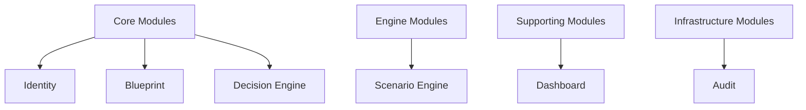
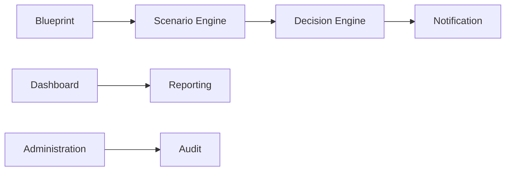
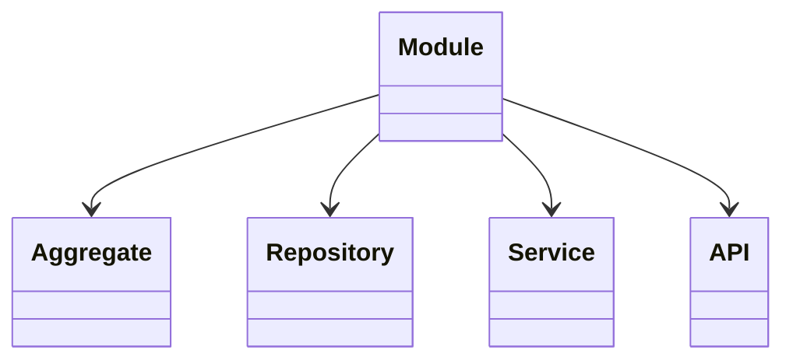
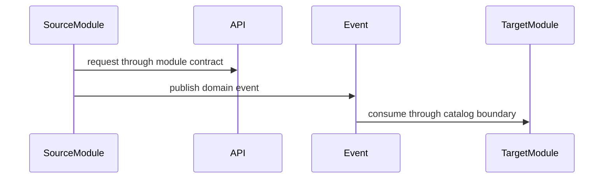
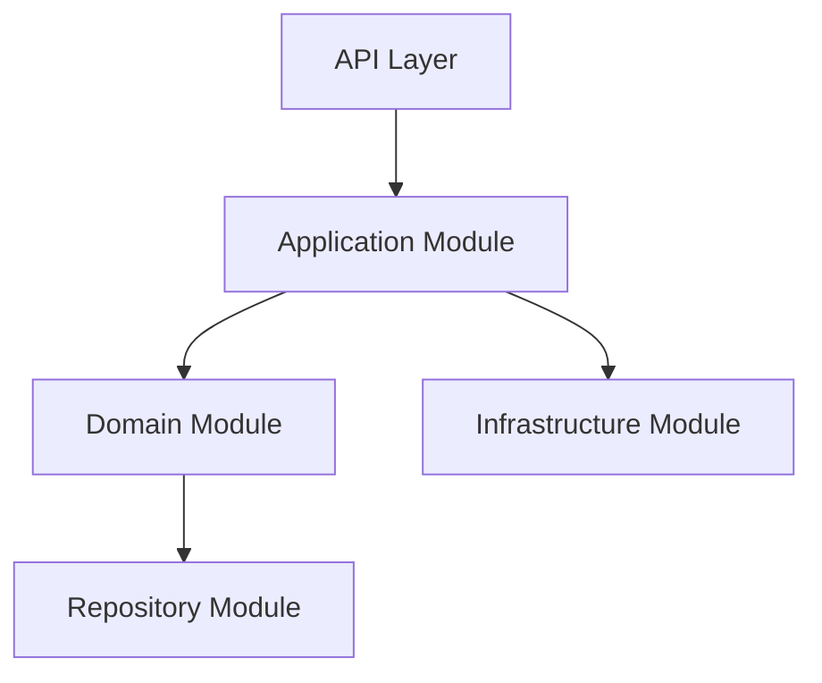
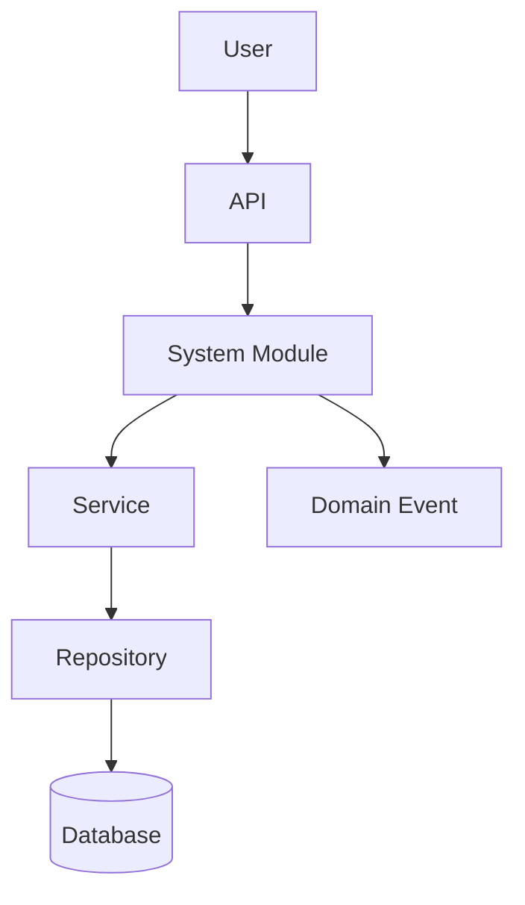

# System Module Catalog

# Document Control

Document Name: System Module Catalog
Document Path: knowledge/system-module-catalog.md
Document Type: Atlas Enterprise Canonical Specification
Version: 1.0
Status: Canonical Specification
Domain: Platform
Bounded Context: Platform
Owner: Project Atlas
Source of Truth: Atlas System Module Source of Truth
Last Updated: 2026-07-12

Related Specifications:
- knowledge/domain-model-catalog.md
- knowledge/bounded-context-catalog.md
- knowledge/aggregate-catalog.md
- knowledge/entity-catalog.md
- knowledge/value-object-catalog.md
- knowledge/enumeration-catalog.md
- knowledge/repository-catalog.md
- knowledge/command-catalog.md
- knowledge/domain-event-catalog.md
- knowledge/domain-service-catalog.md
- knowledge/application-service-catalog.md
- knowledge/service-catalog.md
- knowledge/api-governance-framework.md
- knowledge/integration-framework.md
- knowledge/workflow-engine-framework.md
- knowledge/background-job-framework.md
- knowledge/scheduler-framework.md
- knowledge/automation-framework.md
- knowledge/event-driven-architecture.md
- docs/specification/04-DomainModel.md
- docs/specification/04A-DomainInventory.md
- docs/database/05-DatabaseDesign.md
- docs/database/06-ERD.md
- docs/api/07-API.md

# Purpose

System Module Catalog defines Atlas module ownership across Domain, Bounded Context, Aggregate, Entity, Repository, Command, Domain Event, Application Service, Domain Service, Workflow, API, Integration, Database, Scheduler, Automation, Background Job, and Engine concerns. It is the source of truth for module boundaries, module responsibility, module dependency, module contract, module lifecycle, security, audit, performance, availability, and scalability.

# Scope

- System Module
- Business Module
- Core Module
- Supporting Module
- Infrastructure Module
- Shared Module
- Module Boundary
- Module Responsibility
- Module Dependency
- Module Contract
- Module Ownership
- Module Lifecycle

# Module Definition Standard

Every Module entry uses the following complete Enterprise contract.
- Module Name
- Display Name
- Category
- Domain
- Subdomain
- Bounded Context
- Purpose
- Business Meaning
- Description
- Responsibilities
- Non Responsibilities
- Owned Aggregates
- Owned Entities
- Owned Value Objects
- Owned Enumerations
- Owned Repositories
- Owned Commands
- Owned Domain Events
- Owned Application Services
- Owned Domain Services
- Owned APIs
- Owned Workflows
- Owned Schedulers
- Owned Automations
- Owned Background Jobs
- Owned Integrations
- Owned Database Objects
- Owned Engines
- Inbound Dependencies
- Outbound Dependencies
- Published Events
- Consumed Events
- Security Boundary
- Authorization
- Audit
- Performance
- Availability
- Scalability
- Version
- Example

# Complete Module Catalog

## Identity

Module Name: Identity
Display Name: Identity
Category: Core Module
Domain: Identity
Subdomain: Identity
Bounded Context: Identity
Purpose: Authentication and user management.
Business Meaning: Identity owns a coherent Atlas module responsibility without introducing uncataloged business concepts.
Description: Identity aligns bounded context, aggregates, entities, repositories, commands, events, services, APIs, workflows, integrations, database objects, and operational controls.
Responsibilities: Own module boundary, module contract, module dependencies, service operations, data ownership, workflow ownership, security boundary, audit behavior, and performance target.
Non Responsibilities: No hidden cross-module mutation, no uncataloged aggregate ownership, no direct database ownership outside module, no bypass of API or service contracts.
Owned Aggregates: User, Household
Owned Entities: User, Household
Owned Value Objects: Currency
Owned Enumerations: CurrencyCode
Owned Repositories: UserRepository, HouseholdRepository
Owned Commands: Identity commands and access queries
Owned Domain Events: Identity and access events
Owned Application Services: UserApplicationService
Owned Domain Services: DecisionService
Owned APIs: /api/v1/users, /api/v1/households
Owned Workflows: Identity workflow
Owned Schedulers: Scheduler integration when module work is scheduled.
Owned Automations: Automation integration when module work is automated.
Owned Background Jobs: Background job integration when module work is asynchronous.
Owned Integrations: Identity integration
Owned Database Objects: users, households
Owned Engines: Engine ownership when category is Engine Module or when module invokes cataloged engines.
Inbound Dependencies: None
Outbound Dependencies: Platform, Blueprint
Published Events: Identity and access events
Consumed Events: Catalog-aligned consumed events from inbound and outbound modules.
Security Boundary: Authorization, permission, tenant isolation, Household isolation, and module boundary protection.
Authorization: Required before API, service, repository, workflow, scheduler, automation, background job, and integration access.
Audit: Ownership, History, Version, CorrelationId, CausationId, actor, and result are recorded for module operations.
Performance: Module SLA, dependency latency, cache discipline, and observable metrics apply.
Availability: Module must fail with catalog error or degraded read-only behavior when dependencies fail.
Scalability: Module scales through service, repository, read model, background job, and event consumer boundaries.
Version: 1.0
Example: Identity owns User, Household, uses UserRepository, HouseholdRepository, exposes /api/v1/users, /api/v1/households, and publishes Identity and access events.
Module Control 1: Identity preserves owner mapping, aggregate mapping, entity mapping, repository mapping, command mapping, event mapping, application service mapping, domain service mapping, API mapping, workflow mapping, scheduler mapping, automation mapping, background job mapping, integration mapping, database mapping, security boundary, authorization, audit, performance, availability, scalability, versioning, inbound dependency, and outbound dependency consistency.
Module Control 2: Identity preserves owner mapping, aggregate mapping, entity mapping, repository mapping, command mapping, event mapping, application service mapping, domain service mapping, API mapping, workflow mapping, scheduler mapping, automation mapping, background job mapping, integration mapping, database mapping, security boundary, authorization, audit, performance, availability, scalability, versioning, inbound dependency, and outbound dependency consistency.
Module Control 3: Identity preserves owner mapping, aggregate mapping, entity mapping, repository mapping, command mapping, event mapping, application service mapping, domain service mapping, API mapping, workflow mapping, scheduler mapping, automation mapping, background job mapping, integration mapping, database mapping, security boundary, authorization, audit, performance, availability, scalability, versioning, inbound dependency, and outbound dependency consistency.
Module Control 4: Identity preserves owner mapping, aggregate mapping, entity mapping, repository mapping, command mapping, event mapping, application service mapping, domain service mapping, API mapping, workflow mapping, scheduler mapping, automation mapping, background job mapping, integration mapping, database mapping, security boundary, authorization, audit, performance, availability, scalability, versioning, inbound dependency, and outbound dependency consistency.
Module Control 5: Identity preserves owner mapping, aggregate mapping, entity mapping, repository mapping, command mapping, event mapping, application service mapping, domain service mapping, API mapping, workflow mapping, scheduler mapping, automation mapping, background job mapping, integration mapping, database mapping, security boundary, authorization, audit, performance, availability, scalability, versioning, inbound dependency, and outbound dependency consistency.
Module Control 6: Identity preserves owner mapping, aggregate mapping, entity mapping, repository mapping, command mapping, event mapping, application service mapping, domain service mapping, API mapping, workflow mapping, scheduler mapping, automation mapping, background job mapping, integration mapping, database mapping, security boundary, authorization, audit, performance, availability, scalability, versioning, inbound dependency, and outbound dependency consistency.
Module Control 7: Identity preserves owner mapping, aggregate mapping, entity mapping, repository mapping, command mapping, event mapping, application service mapping, domain service mapping, API mapping, workflow mapping, scheduler mapping, automation mapping, background job mapping, integration mapping, database mapping, security boundary, authorization, audit, performance, availability, scalability, versioning, inbound dependency, and outbound dependency consistency.
Module Control 8: Identity preserves owner mapping, aggregate mapping, entity mapping, repository mapping, command mapping, event mapping, application service mapping, domain service mapping, API mapping, workflow mapping, scheduler mapping, automation mapping, background job mapping, integration mapping, database mapping, security boundary, authorization, audit, performance, availability, scalability, versioning, inbound dependency, and outbound dependency consistency.
Module Control 9: Identity preserves owner mapping, aggregate mapping, entity mapping, repository mapping, command mapping, event mapping, application service mapping, domain service mapping, API mapping, workflow mapping, scheduler mapping, automation mapping, background job mapping, integration mapping, database mapping, security boundary, authorization, audit, performance, availability, scalability, versioning, inbound dependency, and outbound dependency consistency.
Module Control 10: Identity preserves owner mapping, aggregate mapping, entity mapping, repository mapping, command mapping, event mapping, application service mapping, domain service mapping, API mapping, workflow mapping, scheduler mapping, automation mapping, background job mapping, integration mapping, database mapping, security boundary, authorization, audit, performance, availability, scalability, versioning, inbound dependency, and outbound dependency consistency.
Module Control 11: Identity preserves owner mapping, aggregate mapping, entity mapping, repository mapping, command mapping, event mapping, application service mapping, domain service mapping, API mapping, workflow mapping, scheduler mapping, automation mapping, background job mapping, integration mapping, database mapping, security boundary, authorization, audit, performance, availability, scalability, versioning, inbound dependency, and outbound dependency consistency.
Module Control 12: Identity preserves owner mapping, aggregate mapping, entity mapping, repository mapping, command mapping, event mapping, application service mapping, domain service mapping, API mapping, workflow mapping, scheduler mapping, automation mapping, background job mapping, integration mapping, database mapping, security boundary, authorization, audit, performance, availability, scalability, versioning, inbound dependency, and outbound dependency consistency.
Module Control 13: Identity preserves owner mapping, aggregate mapping, entity mapping, repository mapping, command mapping, event mapping, application service mapping, domain service mapping, API mapping, workflow mapping, scheduler mapping, automation mapping, background job mapping, integration mapping, database mapping, security boundary, authorization, audit, performance, availability, scalability, versioning, inbound dependency, and outbound dependency consistency.
Module Control 14: Identity preserves owner mapping, aggregate mapping, entity mapping, repository mapping, command mapping, event mapping, application service mapping, domain service mapping, API mapping, workflow mapping, scheduler mapping, automation mapping, background job mapping, integration mapping, database mapping, security boundary, authorization, audit, performance, availability, scalability, versioning, inbound dependency, and outbound dependency consistency.
Module Control 15: Identity preserves owner mapping, aggregate mapping, entity mapping, repository mapping, command mapping, event mapping, application service mapping, domain service mapping, API mapping, workflow mapping, scheduler mapping, automation mapping, background job mapping, integration mapping, database mapping, security boundary, authorization, audit, performance, availability, scalability, versioning, inbound dependency, and outbound dependency consistency.
Module Control 16: Identity preserves owner mapping, aggregate mapping, entity mapping, repository mapping, command mapping, event mapping, application service mapping, domain service mapping, API mapping, workflow mapping, scheduler mapping, automation mapping, background job mapping, integration mapping, database mapping, security boundary, authorization, audit, performance, availability, scalability, versioning, inbound dependency, and outbound dependency consistency.
Module Control 17: Identity preserves owner mapping, aggregate mapping, entity mapping, repository mapping, command mapping, event mapping, application service mapping, domain service mapping, API mapping, workflow mapping, scheduler mapping, automation mapping, background job mapping, integration mapping, database mapping, security boundary, authorization, audit, performance, availability, scalability, versioning, inbound dependency, and outbound dependency consistency.
Module Control 18: Identity preserves owner mapping, aggregate mapping, entity mapping, repository mapping, command mapping, event mapping, application service mapping, domain service mapping, API mapping, workflow mapping, scheduler mapping, automation mapping, background job mapping, integration mapping, database mapping, security boundary, authorization, audit, performance, availability, scalability, versioning, inbound dependency, and outbound dependency consistency.
Module Control 19: Identity preserves owner mapping, aggregate mapping, entity mapping, repository mapping, command mapping, event mapping, application service mapping, domain service mapping, API mapping, workflow mapping, scheduler mapping, automation mapping, background job mapping, integration mapping, database mapping, security boundary, authorization, audit, performance, availability, scalability, versioning, inbound dependency, and outbound dependency consistency.
Module Control 20: Identity preserves owner mapping, aggregate mapping, entity mapping, repository mapping, command mapping, event mapping, application service mapping, domain service mapping, API mapping, workflow mapping, scheduler mapping, automation mapping, background job mapping, integration mapping, database mapping, security boundary, authorization, audit, performance, availability, scalability, versioning, inbound dependency, and outbound dependency consistency.
Module Control 21: Identity preserves owner mapping, aggregate mapping, entity mapping, repository mapping, command mapping, event mapping, application service mapping, domain service mapping, API mapping, workflow mapping, scheduler mapping, automation mapping, background job mapping, integration mapping, database mapping, security boundary, authorization, audit, performance, availability, scalability, versioning, inbound dependency, and outbound dependency consistency.
Module Control 22: Identity preserves owner mapping, aggregate mapping, entity mapping, repository mapping, command mapping, event mapping, application service mapping, domain service mapping, API mapping, workflow mapping, scheduler mapping, automation mapping, background job mapping, integration mapping, database mapping, security boundary, authorization, audit, performance, availability, scalability, versioning, inbound dependency, and outbound dependency consistency.
Module Control 23: Identity preserves owner mapping, aggregate mapping, entity mapping, repository mapping, command mapping, event mapping, application service mapping, domain service mapping, API mapping, workflow mapping, scheduler mapping, automation mapping, background job mapping, integration mapping, database mapping, security boundary, authorization, audit, performance, availability, scalability, versioning, inbound dependency, and outbound dependency consistency.
Module Control 24: Identity preserves owner mapping, aggregate mapping, entity mapping, repository mapping, command mapping, event mapping, application service mapping, domain service mapping, API mapping, workflow mapping, scheduler mapping, automation mapping, background job mapping, integration mapping, database mapping, security boundary, authorization, audit, performance, availability, scalability, versioning, inbound dependency, and outbound dependency consistency.
Module Control 25: Identity preserves owner mapping, aggregate mapping, entity mapping, repository mapping, command mapping, event mapping, application service mapping, domain service mapping, API mapping, workflow mapping, scheduler mapping, automation mapping, background job mapping, integration mapping, database mapping, security boundary, authorization, audit, performance, availability, scalability, versioning, inbound dependency, and outbound dependency consistency.
Module Control 26: Identity preserves owner mapping, aggregate mapping, entity mapping, repository mapping, command mapping, event mapping, application service mapping, domain service mapping, API mapping, workflow mapping, scheduler mapping, automation mapping, background job mapping, integration mapping, database mapping, security boundary, authorization, audit, performance, availability, scalability, versioning, inbound dependency, and outbound dependency consistency.
Module Control 27: Identity preserves owner mapping, aggregate mapping, entity mapping, repository mapping, command mapping, event mapping, application service mapping, domain service mapping, API mapping, workflow mapping, scheduler mapping, automation mapping, background job mapping, integration mapping, database mapping, security boundary, authorization, audit, performance, availability, scalability, versioning, inbound dependency, and outbound dependency consistency.
Module Control 28: Identity preserves owner mapping, aggregate mapping, entity mapping, repository mapping, command mapping, event mapping, application service mapping, domain service mapping, API mapping, workflow mapping, scheduler mapping, automation mapping, background job mapping, integration mapping, database mapping, security boundary, authorization, audit, performance, availability, scalability, versioning, inbound dependency, and outbound dependency consistency.
Module Control 29: Identity preserves owner mapping, aggregate mapping, entity mapping, repository mapping, command mapping, event mapping, application service mapping, domain service mapping, API mapping, workflow mapping, scheduler mapping, automation mapping, background job mapping, integration mapping, database mapping, security boundary, authorization, audit, performance, availability, scalability, versioning, inbound dependency, and outbound dependency consistency.
Module Control 30: Identity preserves owner mapping, aggregate mapping, entity mapping, repository mapping, command mapping, event mapping, application service mapping, domain service mapping, API mapping, workflow mapping, scheduler mapping, automation mapping, background job mapping, integration mapping, database mapping, security boundary, authorization, audit, performance, availability, scalability, versioning, inbound dependency, and outbound dependency consistency.
Module Control 31: Identity preserves owner mapping, aggregate mapping, entity mapping, repository mapping, command mapping, event mapping, application service mapping, domain service mapping, API mapping, workflow mapping, scheduler mapping, automation mapping, background job mapping, integration mapping, database mapping, security boundary, authorization, audit, performance, availability, scalability, versioning, inbound dependency, and outbound dependency consistency.
Module Control 32: Identity preserves owner mapping, aggregate mapping, entity mapping, repository mapping, command mapping, event mapping, application service mapping, domain service mapping, API mapping, workflow mapping, scheduler mapping, automation mapping, background job mapping, integration mapping, database mapping, security boundary, authorization, audit, performance, availability, scalability, versioning, inbound dependency, and outbound dependency consistency.
Module Control 33: Identity preserves owner mapping, aggregate mapping, entity mapping, repository mapping, command mapping, event mapping, application service mapping, domain service mapping, API mapping, workflow mapping, scheduler mapping, automation mapping, background job mapping, integration mapping, database mapping, security boundary, authorization, audit, performance, availability, scalability, versioning, inbound dependency, and outbound dependency consistency.
Module Control 34: Identity preserves owner mapping, aggregate mapping, entity mapping, repository mapping, command mapping, event mapping, application service mapping, domain service mapping, API mapping, workflow mapping, scheduler mapping, automation mapping, background job mapping, integration mapping, database mapping, security boundary, authorization, audit, performance, availability, scalability, versioning, inbound dependency, and outbound dependency consistency.
Module Control 35: Identity preserves owner mapping, aggregate mapping, entity mapping, repository mapping, command mapping, event mapping, application service mapping, domain service mapping, API mapping, workflow mapping, scheduler mapping, automation mapping, background job mapping, integration mapping, database mapping, security boundary, authorization, audit, performance, availability, scalability, versioning, inbound dependency, and outbound dependency consistency.
Module Control 36: Identity preserves owner mapping, aggregate mapping, entity mapping, repository mapping, command mapping, event mapping, application service mapping, domain service mapping, API mapping, workflow mapping, scheduler mapping, automation mapping, background job mapping, integration mapping, database mapping, security boundary, authorization, audit, performance, availability, scalability, versioning, inbound dependency, and outbound dependency consistency.
Module Control 37: Identity preserves owner mapping, aggregate mapping, entity mapping, repository mapping, command mapping, event mapping, application service mapping, domain service mapping, API mapping, workflow mapping, scheduler mapping, automation mapping, background job mapping, integration mapping, database mapping, security boundary, authorization, audit, performance, availability, scalability, versioning, inbound dependency, and outbound dependency consistency.
Module Control 38: Identity preserves owner mapping, aggregate mapping, entity mapping, repository mapping, command mapping, event mapping, application service mapping, domain service mapping, API mapping, workflow mapping, scheduler mapping, automation mapping, background job mapping, integration mapping, database mapping, security boundary, authorization, audit, performance, availability, scalability, versioning, inbound dependency, and outbound dependency consistency.
Module Control 39: Identity preserves owner mapping, aggregate mapping, entity mapping, repository mapping, command mapping, event mapping, application service mapping, domain service mapping, API mapping, workflow mapping, scheduler mapping, automation mapping, background job mapping, integration mapping, database mapping, security boundary, authorization, audit, performance, availability, scalability, versioning, inbound dependency, and outbound dependency consistency.
Module Control 40: Identity preserves owner mapping, aggregate mapping, entity mapping, repository mapping, command mapping, event mapping, application service mapping, domain service mapping, API mapping, workflow mapping, scheduler mapping, automation mapping, background job mapping, integration mapping, database mapping, security boundary, authorization, audit, performance, availability, scalability, versioning, inbound dependency, and outbound dependency consistency.
Module Control 41: Identity preserves owner mapping, aggregate mapping, entity mapping, repository mapping, command mapping, event mapping, application service mapping, domain service mapping, API mapping, workflow mapping, scheduler mapping, automation mapping, background job mapping, integration mapping, database mapping, security boundary, authorization, audit, performance, availability, scalability, versioning, inbound dependency, and outbound dependency consistency.
Module Control 42: Identity preserves owner mapping, aggregate mapping, entity mapping, repository mapping, command mapping, event mapping, application service mapping, domain service mapping, API mapping, workflow mapping, scheduler mapping, automation mapping, background job mapping, integration mapping, database mapping, security boundary, authorization, audit, performance, availability, scalability, versioning, inbound dependency, and outbound dependency consistency.
Module Control 43: Identity preserves owner mapping, aggregate mapping, entity mapping, repository mapping, command mapping, event mapping, application service mapping, domain service mapping, API mapping, workflow mapping, scheduler mapping, automation mapping, background job mapping, integration mapping, database mapping, security boundary, authorization, audit, performance, availability, scalability, versioning, inbound dependency, and outbound dependency consistency.
Module Control 44: Identity preserves owner mapping, aggregate mapping, entity mapping, repository mapping, command mapping, event mapping, application service mapping, domain service mapping, API mapping, workflow mapping, scheduler mapping, automation mapping, background job mapping, integration mapping, database mapping, security boundary, authorization, audit, performance, availability, scalability, versioning, inbound dependency, and outbound dependency consistency.
Module Control 45: Identity preserves owner mapping, aggregate mapping, entity mapping, repository mapping, command mapping, event mapping, application service mapping, domain service mapping, API mapping, workflow mapping, scheduler mapping, automation mapping, background job mapping, integration mapping, database mapping, security boundary, authorization, audit, performance, availability, scalability, versioning, inbound dependency, and outbound dependency consistency.
Module Control 46: Identity preserves owner mapping, aggregate mapping, entity mapping, repository mapping, command mapping, event mapping, application service mapping, domain service mapping, API mapping, workflow mapping, scheduler mapping, automation mapping, background job mapping, integration mapping, database mapping, security boundary, authorization, audit, performance, availability, scalability, versioning, inbound dependency, and outbound dependency consistency.
Module Control 47: Identity preserves owner mapping, aggregate mapping, entity mapping, repository mapping, command mapping, event mapping, application service mapping, domain service mapping, API mapping, workflow mapping, scheduler mapping, automation mapping, background job mapping, integration mapping, database mapping, security boundary, authorization, audit, performance, availability, scalability, versioning, inbound dependency, and outbound dependency consistency.
Module Control 48: Identity preserves owner mapping, aggregate mapping, entity mapping, repository mapping, command mapping, event mapping, application service mapping, domain service mapping, API mapping, workflow mapping, scheduler mapping, automation mapping, background job mapping, integration mapping, database mapping, security boundary, authorization, audit, performance, availability, scalability, versioning, inbound dependency, and outbound dependency consistency.
Module Control 49: Identity preserves owner mapping, aggregate mapping, entity mapping, repository mapping, command mapping, event mapping, application service mapping, domain service mapping, API mapping, workflow mapping, scheduler mapping, automation mapping, background job mapping, integration mapping, database mapping, security boundary, authorization, audit, performance, availability, scalability, versioning, inbound dependency, and outbound dependency consistency.
Module Control 50: Identity preserves owner mapping, aggregate mapping, entity mapping, repository mapping, command mapping, event mapping, application service mapping, domain service mapping, API mapping, workflow mapping, scheduler mapping, automation mapping, background job mapping, integration mapping, database mapping, security boundary, authorization, audit, performance, availability, scalability, versioning, inbound dependency, and outbound dependency consistency.
Module Control 51: Identity preserves owner mapping, aggregate mapping, entity mapping, repository mapping, command mapping, event mapping, application service mapping, domain service mapping, API mapping, workflow mapping, scheduler mapping, automation mapping, background job mapping, integration mapping, database mapping, security boundary, authorization, audit, performance, availability, scalability, versioning, inbound dependency, and outbound dependency consistency.
Module Control 52: Identity preserves owner mapping, aggregate mapping, entity mapping, repository mapping, command mapping, event mapping, application service mapping, domain service mapping, API mapping, workflow mapping, scheduler mapping, automation mapping, background job mapping, integration mapping, database mapping, security boundary, authorization, audit, performance, availability, scalability, versioning, inbound dependency, and outbound dependency consistency.
Module Control 53: Identity preserves owner mapping, aggregate mapping, entity mapping, repository mapping, command mapping, event mapping, application service mapping, domain service mapping, API mapping, workflow mapping, scheduler mapping, automation mapping, background job mapping, integration mapping, database mapping, security boundary, authorization, audit, performance, availability, scalability, versioning, inbound dependency, and outbound dependency consistency.
Module Control 54: Identity preserves owner mapping, aggregate mapping, entity mapping, repository mapping, command mapping, event mapping, application service mapping, domain service mapping, API mapping, workflow mapping, scheduler mapping, automation mapping, background job mapping, integration mapping, database mapping, security boundary, authorization, audit, performance, availability, scalability, versioning, inbound dependency, and outbound dependency consistency.
Module Control 55: Identity preserves owner mapping, aggregate mapping, entity mapping, repository mapping, command mapping, event mapping, application service mapping, domain service mapping, API mapping, workflow mapping, scheduler mapping, automation mapping, background job mapping, integration mapping, database mapping, security boundary, authorization, audit, performance, availability, scalability, versioning, inbound dependency, and outbound dependency consistency.
Module Control 56: Identity preserves owner mapping, aggregate mapping, entity mapping, repository mapping, command mapping, event mapping, application service mapping, domain service mapping, API mapping, workflow mapping, scheduler mapping, automation mapping, background job mapping, integration mapping, database mapping, security boundary, authorization, audit, performance, availability, scalability, versioning, inbound dependency, and outbound dependency consistency.
Module Control 57: Identity preserves owner mapping, aggregate mapping, entity mapping, repository mapping, command mapping, event mapping, application service mapping, domain service mapping, API mapping, workflow mapping, scheduler mapping, automation mapping, background job mapping, integration mapping, database mapping, security boundary, authorization, audit, performance, availability, scalability, versioning, inbound dependency, and outbound dependency consistency.
Module Control 58: Identity preserves owner mapping, aggregate mapping, entity mapping, repository mapping, command mapping, event mapping, application service mapping, domain service mapping, API mapping, workflow mapping, scheduler mapping, automation mapping, background job mapping, integration mapping, database mapping, security boundary, authorization, audit, performance, availability, scalability, versioning, inbound dependency, and outbound dependency consistency.
Module Control 59: Identity preserves owner mapping, aggregate mapping, entity mapping, repository mapping, command mapping, event mapping, application service mapping, domain service mapping, API mapping, workflow mapping, scheduler mapping, automation mapping, background job mapping, integration mapping, database mapping, security boundary, authorization, audit, performance, availability, scalability, versioning, inbound dependency, and outbound dependency consistency.
Module Control 60: Identity preserves owner mapping, aggregate mapping, entity mapping, repository mapping, command mapping, event mapping, application service mapping, domain service mapping, API mapping, workflow mapping, scheduler mapping, automation mapping, background job mapping, integration mapping, database mapping, security boundary, authorization, audit, performance, availability, scalability, versioning, inbound dependency, and outbound dependency consistency.
Module Control 61: Identity preserves owner mapping, aggregate mapping, entity mapping, repository mapping, command mapping, event mapping, application service mapping, domain service mapping, API mapping, workflow mapping, scheduler mapping, automation mapping, background job mapping, integration mapping, database mapping, security boundary, authorization, audit, performance, availability, scalability, versioning, inbound dependency, and outbound dependency consistency.
Module Control 62: Identity preserves owner mapping, aggregate mapping, entity mapping, repository mapping, command mapping, event mapping, application service mapping, domain service mapping, API mapping, workflow mapping, scheduler mapping, automation mapping, background job mapping, integration mapping, database mapping, security boundary, authorization, audit, performance, availability, scalability, versioning, inbound dependency, and outbound dependency consistency.
Module Control 63: Identity preserves owner mapping, aggregate mapping, entity mapping, repository mapping, command mapping, event mapping, application service mapping, domain service mapping, API mapping, workflow mapping, scheduler mapping, automation mapping, background job mapping, integration mapping, database mapping, security boundary, authorization, audit, performance, availability, scalability, versioning, inbound dependency, and outbound dependency consistency.
Module Control 64: Identity preserves owner mapping, aggregate mapping, entity mapping, repository mapping, command mapping, event mapping, application service mapping, domain service mapping, API mapping, workflow mapping, scheduler mapping, automation mapping, background job mapping, integration mapping, database mapping, security boundary, authorization, audit, performance, availability, scalability, versioning, inbound dependency, and outbound dependency consistency.
Module Control 65: Identity preserves owner mapping, aggregate mapping, entity mapping, repository mapping, command mapping, event mapping, application service mapping, domain service mapping, API mapping, workflow mapping, scheduler mapping, automation mapping, background job mapping, integration mapping, database mapping, security boundary, authorization, audit, performance, availability, scalability, versioning, inbound dependency, and outbound dependency consistency.
Module Control 66: Identity preserves owner mapping, aggregate mapping, entity mapping, repository mapping, command mapping, event mapping, application service mapping, domain service mapping, API mapping, workflow mapping, scheduler mapping, automation mapping, background job mapping, integration mapping, database mapping, security boundary, authorization, audit, performance, availability, scalability, versioning, inbound dependency, and outbound dependency consistency.
Module Control 67: Identity preserves owner mapping, aggregate mapping, entity mapping, repository mapping, command mapping, event mapping, application service mapping, domain service mapping, API mapping, workflow mapping, scheduler mapping, automation mapping, background job mapping, integration mapping, database mapping, security boundary, authorization, audit, performance, availability, scalability, versioning, inbound dependency, and outbound dependency consistency.
Module Control 68: Identity preserves owner mapping, aggregate mapping, entity mapping, repository mapping, command mapping, event mapping, application service mapping, domain service mapping, API mapping, workflow mapping, scheduler mapping, automation mapping, background job mapping, integration mapping, database mapping, security boundary, authorization, audit, performance, availability, scalability, versioning, inbound dependency, and outbound dependency consistency.
Module Control 69: Identity preserves owner mapping, aggregate mapping, entity mapping, repository mapping, command mapping, event mapping, application service mapping, domain service mapping, API mapping, workflow mapping, scheduler mapping, automation mapping, background job mapping, integration mapping, database mapping, security boundary, authorization, audit, performance, availability, scalability, versioning, inbound dependency, and outbound dependency consistency.
Module Control 70: Identity preserves owner mapping, aggregate mapping, entity mapping, repository mapping, command mapping, event mapping, application service mapping, domain service mapping, API mapping, workflow mapping, scheduler mapping, automation mapping, background job mapping, integration mapping, database mapping, security boundary, authorization, audit, performance, availability, scalability, versioning, inbound dependency, and outbound dependency consistency.
Module Control 71: Identity preserves owner mapping, aggregate mapping, entity mapping, repository mapping, command mapping, event mapping, application service mapping, domain service mapping, API mapping, workflow mapping, scheduler mapping, automation mapping, background job mapping, integration mapping, database mapping, security boundary, authorization, audit, performance, availability, scalability, versioning, inbound dependency, and outbound dependency consistency.
Module Control 72: Identity preserves owner mapping, aggregate mapping, entity mapping, repository mapping, command mapping, event mapping, application service mapping, domain service mapping, API mapping, workflow mapping, scheduler mapping, automation mapping, background job mapping, integration mapping, database mapping, security boundary, authorization, audit, performance, availability, scalability, versioning, inbound dependency, and outbound dependency consistency.
Module Control 73: Identity preserves owner mapping, aggregate mapping, entity mapping, repository mapping, command mapping, event mapping, application service mapping, domain service mapping, API mapping, workflow mapping, scheduler mapping, automation mapping, background job mapping, integration mapping, database mapping, security boundary, authorization, audit, performance, availability, scalability, versioning, inbound dependency, and outbound dependency consistency.
Module Control 74: Identity preserves owner mapping, aggregate mapping, entity mapping, repository mapping, command mapping, event mapping, application service mapping, domain service mapping, API mapping, workflow mapping, scheduler mapping, automation mapping, background job mapping, integration mapping, database mapping, security boundary, authorization, audit, performance, availability, scalability, versioning, inbound dependency, and outbound dependency consistency.
Module Control 75: Identity preserves owner mapping, aggregate mapping, entity mapping, repository mapping, command mapping, event mapping, application service mapping, domain service mapping, API mapping, workflow mapping, scheduler mapping, automation mapping, background job mapping, integration mapping, database mapping, security boundary, authorization, audit, performance, availability, scalability, versioning, inbound dependency, and outbound dependency consistency.

## Blueprint

Module Name: Blueprint
Display Name: Blueprint
Category: Core Module
Domain: Financial Planning
Subdomain: Financial Planning
Bounded Context: Financial Profile
Purpose: Financial blueprint generation.
Business Meaning: Blueprint owns a coherent Atlas module responsibility without introducing uncataloged business concepts.
Description: Blueprint aligns bounded context, aggregates, entities, repositories, commands, events, services, APIs, workflows, integrations, database objects, and operational controls.
Responsibilities: Own module boundary, module contract, module dependencies, service operations, data ownership, workflow ownership, security boundary, audit behavior, and performance target.
Non Responsibilities: No hidden cross-module mutation, no uncataloged aggregate ownership, no direct database ownership outside module, no bypass of API or service contracts.
Owned Aggregates: Household, GoalPlan, RetirementPlan, Property
Owned Entities: Household, Goal, Property
Owned Value Objects: Money, Currency, CashFlowItem, DateRange
Owned Enumerations: CurrencyCode, GoalStatus
Owned Repositories: HouseholdRepository, GoalRepository, PropertyRepository
Owned Commands: RecordIncome, RecordExpense, UpdateRetirementPlan, PurchaseHome, SellHome
Owned Domain Events: SalaryReceived, ExpenseRecorded, RetirementPlanUpdated, HomePurchased, HomeSold
Owned Application Services: BlueprintApplicationService, GoalApplicationService
Owned Domain Services: CashFlowService, RetirementService, PortfolioService
Owned APIs: /api/v1/blueprint, /api/v1/goals, /api/v1/properties
Owned Workflows: Goal workflow
Owned Schedulers: Scheduler integration when module work is scheduled.
Owned Automations: Automation integration when module work is automated.
Owned Background Jobs: Background job integration when module work is asynchronous.
Owned Integrations: Planning integration
Owned Database Objects: households, goals, properties
Owned Engines: Engine ownership when category is Engine Module or when module invokes cataloged engines.
Inbound Dependencies: Identity
Outbound Dependencies: Decision, Scenario, Dashboard
Published Events: SalaryReceived, ExpenseRecorded, RetirementPlanUpdated, HomePurchased, HomeSold
Consumed Events: Catalog-aligned consumed events from inbound and outbound modules.
Security Boundary: Authorization, permission, tenant isolation, Household isolation, and module boundary protection.
Authorization: Required before API, service, repository, workflow, scheduler, automation, background job, and integration access.
Audit: Ownership, History, Version, CorrelationId, CausationId, actor, and result are recorded for module operations.
Performance: Module SLA, dependency latency, cache discipline, and observable metrics apply.
Availability: Module must fail with catalog error or degraded read-only behavior when dependencies fail.
Scalability: Module scales through service, repository, read model, background job, and event consumer boundaries.
Version: 1.0
Example: Blueprint owns Household, GoalPlan, RetirementPlan, Property, uses HouseholdRepository, GoalRepository, PropertyRepository, exposes /api/v1/blueprint, /api/v1/goals, /api/v1/properties, and publishes SalaryReceived, ExpenseRecorded, RetirementPlanUpdated, HomePurchased, HomeSold.
Module Control 1: Blueprint preserves owner mapping, aggregate mapping, entity mapping, repository mapping, command mapping, event mapping, application service mapping, domain service mapping, API mapping, workflow mapping, scheduler mapping, automation mapping, background job mapping, integration mapping, database mapping, security boundary, authorization, audit, performance, availability, scalability, versioning, inbound dependency, and outbound dependency consistency.
Module Control 2: Blueprint preserves owner mapping, aggregate mapping, entity mapping, repository mapping, command mapping, event mapping, application service mapping, domain service mapping, API mapping, workflow mapping, scheduler mapping, automation mapping, background job mapping, integration mapping, database mapping, security boundary, authorization, audit, performance, availability, scalability, versioning, inbound dependency, and outbound dependency consistency.
Module Control 3: Blueprint preserves owner mapping, aggregate mapping, entity mapping, repository mapping, command mapping, event mapping, application service mapping, domain service mapping, API mapping, workflow mapping, scheduler mapping, automation mapping, background job mapping, integration mapping, database mapping, security boundary, authorization, audit, performance, availability, scalability, versioning, inbound dependency, and outbound dependency consistency.
Module Control 4: Blueprint preserves owner mapping, aggregate mapping, entity mapping, repository mapping, command mapping, event mapping, application service mapping, domain service mapping, API mapping, workflow mapping, scheduler mapping, automation mapping, background job mapping, integration mapping, database mapping, security boundary, authorization, audit, performance, availability, scalability, versioning, inbound dependency, and outbound dependency consistency.
Module Control 5: Blueprint preserves owner mapping, aggregate mapping, entity mapping, repository mapping, command mapping, event mapping, application service mapping, domain service mapping, API mapping, workflow mapping, scheduler mapping, automation mapping, background job mapping, integration mapping, database mapping, security boundary, authorization, audit, performance, availability, scalability, versioning, inbound dependency, and outbound dependency consistency.
Module Control 6: Blueprint preserves owner mapping, aggregate mapping, entity mapping, repository mapping, command mapping, event mapping, application service mapping, domain service mapping, API mapping, workflow mapping, scheduler mapping, automation mapping, background job mapping, integration mapping, database mapping, security boundary, authorization, audit, performance, availability, scalability, versioning, inbound dependency, and outbound dependency consistency.
Module Control 7: Blueprint preserves owner mapping, aggregate mapping, entity mapping, repository mapping, command mapping, event mapping, application service mapping, domain service mapping, API mapping, workflow mapping, scheduler mapping, automation mapping, background job mapping, integration mapping, database mapping, security boundary, authorization, audit, performance, availability, scalability, versioning, inbound dependency, and outbound dependency consistency.
Module Control 8: Blueprint preserves owner mapping, aggregate mapping, entity mapping, repository mapping, command mapping, event mapping, application service mapping, domain service mapping, API mapping, workflow mapping, scheduler mapping, automation mapping, background job mapping, integration mapping, database mapping, security boundary, authorization, audit, performance, availability, scalability, versioning, inbound dependency, and outbound dependency consistency.
Module Control 9: Blueprint preserves owner mapping, aggregate mapping, entity mapping, repository mapping, command mapping, event mapping, application service mapping, domain service mapping, API mapping, workflow mapping, scheduler mapping, automation mapping, background job mapping, integration mapping, database mapping, security boundary, authorization, audit, performance, availability, scalability, versioning, inbound dependency, and outbound dependency consistency.
Module Control 10: Blueprint preserves owner mapping, aggregate mapping, entity mapping, repository mapping, command mapping, event mapping, application service mapping, domain service mapping, API mapping, workflow mapping, scheduler mapping, automation mapping, background job mapping, integration mapping, database mapping, security boundary, authorization, audit, performance, availability, scalability, versioning, inbound dependency, and outbound dependency consistency.
Module Control 11: Blueprint preserves owner mapping, aggregate mapping, entity mapping, repository mapping, command mapping, event mapping, application service mapping, domain service mapping, API mapping, workflow mapping, scheduler mapping, automation mapping, background job mapping, integration mapping, database mapping, security boundary, authorization, audit, performance, availability, scalability, versioning, inbound dependency, and outbound dependency consistency.
Module Control 12: Blueprint preserves owner mapping, aggregate mapping, entity mapping, repository mapping, command mapping, event mapping, application service mapping, domain service mapping, API mapping, workflow mapping, scheduler mapping, automation mapping, background job mapping, integration mapping, database mapping, security boundary, authorization, audit, performance, availability, scalability, versioning, inbound dependency, and outbound dependency consistency.
Module Control 13: Blueprint preserves owner mapping, aggregate mapping, entity mapping, repository mapping, command mapping, event mapping, application service mapping, domain service mapping, API mapping, workflow mapping, scheduler mapping, automation mapping, background job mapping, integration mapping, database mapping, security boundary, authorization, audit, performance, availability, scalability, versioning, inbound dependency, and outbound dependency consistency.
Module Control 14: Blueprint preserves owner mapping, aggregate mapping, entity mapping, repository mapping, command mapping, event mapping, application service mapping, domain service mapping, API mapping, workflow mapping, scheduler mapping, automation mapping, background job mapping, integration mapping, database mapping, security boundary, authorization, audit, performance, availability, scalability, versioning, inbound dependency, and outbound dependency consistency.
Module Control 15: Blueprint preserves owner mapping, aggregate mapping, entity mapping, repository mapping, command mapping, event mapping, application service mapping, domain service mapping, API mapping, workflow mapping, scheduler mapping, automation mapping, background job mapping, integration mapping, database mapping, security boundary, authorization, audit, performance, availability, scalability, versioning, inbound dependency, and outbound dependency consistency.
Module Control 16: Blueprint preserves owner mapping, aggregate mapping, entity mapping, repository mapping, command mapping, event mapping, application service mapping, domain service mapping, API mapping, workflow mapping, scheduler mapping, automation mapping, background job mapping, integration mapping, database mapping, security boundary, authorization, audit, performance, availability, scalability, versioning, inbound dependency, and outbound dependency consistency.
Module Control 17: Blueprint preserves owner mapping, aggregate mapping, entity mapping, repository mapping, command mapping, event mapping, application service mapping, domain service mapping, API mapping, workflow mapping, scheduler mapping, automation mapping, background job mapping, integration mapping, database mapping, security boundary, authorization, audit, performance, availability, scalability, versioning, inbound dependency, and outbound dependency consistency.
Module Control 18: Blueprint preserves owner mapping, aggregate mapping, entity mapping, repository mapping, command mapping, event mapping, application service mapping, domain service mapping, API mapping, workflow mapping, scheduler mapping, automation mapping, background job mapping, integration mapping, database mapping, security boundary, authorization, audit, performance, availability, scalability, versioning, inbound dependency, and outbound dependency consistency.
Module Control 19: Blueprint preserves owner mapping, aggregate mapping, entity mapping, repository mapping, command mapping, event mapping, application service mapping, domain service mapping, API mapping, workflow mapping, scheduler mapping, automation mapping, background job mapping, integration mapping, database mapping, security boundary, authorization, audit, performance, availability, scalability, versioning, inbound dependency, and outbound dependency consistency.
Module Control 20: Blueprint preserves owner mapping, aggregate mapping, entity mapping, repository mapping, command mapping, event mapping, application service mapping, domain service mapping, API mapping, workflow mapping, scheduler mapping, automation mapping, background job mapping, integration mapping, database mapping, security boundary, authorization, audit, performance, availability, scalability, versioning, inbound dependency, and outbound dependency consistency.
Module Control 21: Blueprint preserves owner mapping, aggregate mapping, entity mapping, repository mapping, command mapping, event mapping, application service mapping, domain service mapping, API mapping, workflow mapping, scheduler mapping, automation mapping, background job mapping, integration mapping, database mapping, security boundary, authorization, audit, performance, availability, scalability, versioning, inbound dependency, and outbound dependency consistency.
Module Control 22: Blueprint preserves owner mapping, aggregate mapping, entity mapping, repository mapping, command mapping, event mapping, application service mapping, domain service mapping, API mapping, workflow mapping, scheduler mapping, automation mapping, background job mapping, integration mapping, database mapping, security boundary, authorization, audit, performance, availability, scalability, versioning, inbound dependency, and outbound dependency consistency.
Module Control 23: Blueprint preserves owner mapping, aggregate mapping, entity mapping, repository mapping, command mapping, event mapping, application service mapping, domain service mapping, API mapping, workflow mapping, scheduler mapping, automation mapping, background job mapping, integration mapping, database mapping, security boundary, authorization, audit, performance, availability, scalability, versioning, inbound dependency, and outbound dependency consistency.
Module Control 24: Blueprint preserves owner mapping, aggregate mapping, entity mapping, repository mapping, command mapping, event mapping, application service mapping, domain service mapping, API mapping, workflow mapping, scheduler mapping, automation mapping, background job mapping, integration mapping, database mapping, security boundary, authorization, audit, performance, availability, scalability, versioning, inbound dependency, and outbound dependency consistency.
Module Control 25: Blueprint preserves owner mapping, aggregate mapping, entity mapping, repository mapping, command mapping, event mapping, application service mapping, domain service mapping, API mapping, workflow mapping, scheduler mapping, automation mapping, background job mapping, integration mapping, database mapping, security boundary, authorization, audit, performance, availability, scalability, versioning, inbound dependency, and outbound dependency consistency.
Module Control 26: Blueprint preserves owner mapping, aggregate mapping, entity mapping, repository mapping, command mapping, event mapping, application service mapping, domain service mapping, API mapping, workflow mapping, scheduler mapping, automation mapping, background job mapping, integration mapping, database mapping, security boundary, authorization, audit, performance, availability, scalability, versioning, inbound dependency, and outbound dependency consistency.
Module Control 27: Blueprint preserves owner mapping, aggregate mapping, entity mapping, repository mapping, command mapping, event mapping, application service mapping, domain service mapping, API mapping, workflow mapping, scheduler mapping, automation mapping, background job mapping, integration mapping, database mapping, security boundary, authorization, audit, performance, availability, scalability, versioning, inbound dependency, and outbound dependency consistency.
Module Control 28: Blueprint preserves owner mapping, aggregate mapping, entity mapping, repository mapping, command mapping, event mapping, application service mapping, domain service mapping, API mapping, workflow mapping, scheduler mapping, automation mapping, background job mapping, integration mapping, database mapping, security boundary, authorization, audit, performance, availability, scalability, versioning, inbound dependency, and outbound dependency consistency.
Module Control 29: Blueprint preserves owner mapping, aggregate mapping, entity mapping, repository mapping, command mapping, event mapping, application service mapping, domain service mapping, API mapping, workflow mapping, scheduler mapping, automation mapping, background job mapping, integration mapping, database mapping, security boundary, authorization, audit, performance, availability, scalability, versioning, inbound dependency, and outbound dependency consistency.
Module Control 30: Blueprint preserves owner mapping, aggregate mapping, entity mapping, repository mapping, command mapping, event mapping, application service mapping, domain service mapping, API mapping, workflow mapping, scheduler mapping, automation mapping, background job mapping, integration mapping, database mapping, security boundary, authorization, audit, performance, availability, scalability, versioning, inbound dependency, and outbound dependency consistency.
Module Control 31: Blueprint preserves owner mapping, aggregate mapping, entity mapping, repository mapping, command mapping, event mapping, application service mapping, domain service mapping, API mapping, workflow mapping, scheduler mapping, automation mapping, background job mapping, integration mapping, database mapping, security boundary, authorization, audit, performance, availability, scalability, versioning, inbound dependency, and outbound dependency consistency.
Module Control 32: Blueprint preserves owner mapping, aggregate mapping, entity mapping, repository mapping, command mapping, event mapping, application service mapping, domain service mapping, API mapping, workflow mapping, scheduler mapping, automation mapping, background job mapping, integration mapping, database mapping, security boundary, authorization, audit, performance, availability, scalability, versioning, inbound dependency, and outbound dependency consistency.
Module Control 33: Blueprint preserves owner mapping, aggregate mapping, entity mapping, repository mapping, command mapping, event mapping, application service mapping, domain service mapping, API mapping, workflow mapping, scheduler mapping, automation mapping, background job mapping, integration mapping, database mapping, security boundary, authorization, audit, performance, availability, scalability, versioning, inbound dependency, and outbound dependency consistency.
Module Control 34: Blueprint preserves owner mapping, aggregate mapping, entity mapping, repository mapping, command mapping, event mapping, application service mapping, domain service mapping, API mapping, workflow mapping, scheduler mapping, automation mapping, background job mapping, integration mapping, database mapping, security boundary, authorization, audit, performance, availability, scalability, versioning, inbound dependency, and outbound dependency consistency.
Module Control 35: Blueprint preserves owner mapping, aggregate mapping, entity mapping, repository mapping, command mapping, event mapping, application service mapping, domain service mapping, API mapping, workflow mapping, scheduler mapping, automation mapping, background job mapping, integration mapping, database mapping, security boundary, authorization, audit, performance, availability, scalability, versioning, inbound dependency, and outbound dependency consistency.
Module Control 36: Blueprint preserves owner mapping, aggregate mapping, entity mapping, repository mapping, command mapping, event mapping, application service mapping, domain service mapping, API mapping, workflow mapping, scheduler mapping, automation mapping, background job mapping, integration mapping, database mapping, security boundary, authorization, audit, performance, availability, scalability, versioning, inbound dependency, and outbound dependency consistency.
Module Control 37: Blueprint preserves owner mapping, aggregate mapping, entity mapping, repository mapping, command mapping, event mapping, application service mapping, domain service mapping, API mapping, workflow mapping, scheduler mapping, automation mapping, background job mapping, integration mapping, database mapping, security boundary, authorization, audit, performance, availability, scalability, versioning, inbound dependency, and outbound dependency consistency.
Module Control 38: Blueprint preserves owner mapping, aggregate mapping, entity mapping, repository mapping, command mapping, event mapping, application service mapping, domain service mapping, API mapping, workflow mapping, scheduler mapping, automation mapping, background job mapping, integration mapping, database mapping, security boundary, authorization, audit, performance, availability, scalability, versioning, inbound dependency, and outbound dependency consistency.
Module Control 39: Blueprint preserves owner mapping, aggregate mapping, entity mapping, repository mapping, command mapping, event mapping, application service mapping, domain service mapping, API mapping, workflow mapping, scheduler mapping, automation mapping, background job mapping, integration mapping, database mapping, security boundary, authorization, audit, performance, availability, scalability, versioning, inbound dependency, and outbound dependency consistency.
Module Control 40: Blueprint preserves owner mapping, aggregate mapping, entity mapping, repository mapping, command mapping, event mapping, application service mapping, domain service mapping, API mapping, workflow mapping, scheduler mapping, automation mapping, background job mapping, integration mapping, database mapping, security boundary, authorization, audit, performance, availability, scalability, versioning, inbound dependency, and outbound dependency consistency.
Module Control 41: Blueprint preserves owner mapping, aggregate mapping, entity mapping, repository mapping, command mapping, event mapping, application service mapping, domain service mapping, API mapping, workflow mapping, scheduler mapping, automation mapping, background job mapping, integration mapping, database mapping, security boundary, authorization, audit, performance, availability, scalability, versioning, inbound dependency, and outbound dependency consistency.
Module Control 42: Blueprint preserves owner mapping, aggregate mapping, entity mapping, repository mapping, command mapping, event mapping, application service mapping, domain service mapping, API mapping, workflow mapping, scheduler mapping, automation mapping, background job mapping, integration mapping, database mapping, security boundary, authorization, audit, performance, availability, scalability, versioning, inbound dependency, and outbound dependency consistency.
Module Control 43: Blueprint preserves owner mapping, aggregate mapping, entity mapping, repository mapping, command mapping, event mapping, application service mapping, domain service mapping, API mapping, workflow mapping, scheduler mapping, automation mapping, background job mapping, integration mapping, database mapping, security boundary, authorization, audit, performance, availability, scalability, versioning, inbound dependency, and outbound dependency consistency.
Module Control 44: Blueprint preserves owner mapping, aggregate mapping, entity mapping, repository mapping, command mapping, event mapping, application service mapping, domain service mapping, API mapping, workflow mapping, scheduler mapping, automation mapping, background job mapping, integration mapping, database mapping, security boundary, authorization, audit, performance, availability, scalability, versioning, inbound dependency, and outbound dependency consistency.
Module Control 45: Blueprint preserves owner mapping, aggregate mapping, entity mapping, repository mapping, command mapping, event mapping, application service mapping, domain service mapping, API mapping, workflow mapping, scheduler mapping, automation mapping, background job mapping, integration mapping, database mapping, security boundary, authorization, audit, performance, availability, scalability, versioning, inbound dependency, and outbound dependency consistency.
Module Control 46: Blueprint preserves owner mapping, aggregate mapping, entity mapping, repository mapping, command mapping, event mapping, application service mapping, domain service mapping, API mapping, workflow mapping, scheduler mapping, automation mapping, background job mapping, integration mapping, database mapping, security boundary, authorization, audit, performance, availability, scalability, versioning, inbound dependency, and outbound dependency consistency.
Module Control 47: Blueprint preserves owner mapping, aggregate mapping, entity mapping, repository mapping, command mapping, event mapping, application service mapping, domain service mapping, API mapping, workflow mapping, scheduler mapping, automation mapping, background job mapping, integration mapping, database mapping, security boundary, authorization, audit, performance, availability, scalability, versioning, inbound dependency, and outbound dependency consistency.
Module Control 48: Blueprint preserves owner mapping, aggregate mapping, entity mapping, repository mapping, command mapping, event mapping, application service mapping, domain service mapping, API mapping, workflow mapping, scheduler mapping, automation mapping, background job mapping, integration mapping, database mapping, security boundary, authorization, audit, performance, availability, scalability, versioning, inbound dependency, and outbound dependency consistency.
Module Control 49: Blueprint preserves owner mapping, aggregate mapping, entity mapping, repository mapping, command mapping, event mapping, application service mapping, domain service mapping, API mapping, workflow mapping, scheduler mapping, automation mapping, background job mapping, integration mapping, database mapping, security boundary, authorization, audit, performance, availability, scalability, versioning, inbound dependency, and outbound dependency consistency.
Module Control 50: Blueprint preserves owner mapping, aggregate mapping, entity mapping, repository mapping, command mapping, event mapping, application service mapping, domain service mapping, API mapping, workflow mapping, scheduler mapping, automation mapping, background job mapping, integration mapping, database mapping, security boundary, authorization, audit, performance, availability, scalability, versioning, inbound dependency, and outbound dependency consistency.
Module Control 51: Blueprint preserves owner mapping, aggregate mapping, entity mapping, repository mapping, command mapping, event mapping, application service mapping, domain service mapping, API mapping, workflow mapping, scheduler mapping, automation mapping, background job mapping, integration mapping, database mapping, security boundary, authorization, audit, performance, availability, scalability, versioning, inbound dependency, and outbound dependency consistency.
Module Control 52: Blueprint preserves owner mapping, aggregate mapping, entity mapping, repository mapping, command mapping, event mapping, application service mapping, domain service mapping, API mapping, workflow mapping, scheduler mapping, automation mapping, background job mapping, integration mapping, database mapping, security boundary, authorization, audit, performance, availability, scalability, versioning, inbound dependency, and outbound dependency consistency.
Module Control 53: Blueprint preserves owner mapping, aggregate mapping, entity mapping, repository mapping, command mapping, event mapping, application service mapping, domain service mapping, API mapping, workflow mapping, scheduler mapping, automation mapping, background job mapping, integration mapping, database mapping, security boundary, authorization, audit, performance, availability, scalability, versioning, inbound dependency, and outbound dependency consistency.
Module Control 54: Blueprint preserves owner mapping, aggregate mapping, entity mapping, repository mapping, command mapping, event mapping, application service mapping, domain service mapping, API mapping, workflow mapping, scheduler mapping, automation mapping, background job mapping, integration mapping, database mapping, security boundary, authorization, audit, performance, availability, scalability, versioning, inbound dependency, and outbound dependency consistency.
Module Control 55: Blueprint preserves owner mapping, aggregate mapping, entity mapping, repository mapping, command mapping, event mapping, application service mapping, domain service mapping, API mapping, workflow mapping, scheduler mapping, automation mapping, background job mapping, integration mapping, database mapping, security boundary, authorization, audit, performance, availability, scalability, versioning, inbound dependency, and outbound dependency consistency.
Module Control 56: Blueprint preserves owner mapping, aggregate mapping, entity mapping, repository mapping, command mapping, event mapping, application service mapping, domain service mapping, API mapping, workflow mapping, scheduler mapping, automation mapping, background job mapping, integration mapping, database mapping, security boundary, authorization, audit, performance, availability, scalability, versioning, inbound dependency, and outbound dependency consistency.
Module Control 57: Blueprint preserves owner mapping, aggregate mapping, entity mapping, repository mapping, command mapping, event mapping, application service mapping, domain service mapping, API mapping, workflow mapping, scheduler mapping, automation mapping, background job mapping, integration mapping, database mapping, security boundary, authorization, audit, performance, availability, scalability, versioning, inbound dependency, and outbound dependency consistency.
Module Control 58: Blueprint preserves owner mapping, aggregate mapping, entity mapping, repository mapping, command mapping, event mapping, application service mapping, domain service mapping, API mapping, workflow mapping, scheduler mapping, automation mapping, background job mapping, integration mapping, database mapping, security boundary, authorization, audit, performance, availability, scalability, versioning, inbound dependency, and outbound dependency consistency.
Module Control 59: Blueprint preserves owner mapping, aggregate mapping, entity mapping, repository mapping, command mapping, event mapping, application service mapping, domain service mapping, API mapping, workflow mapping, scheduler mapping, automation mapping, background job mapping, integration mapping, database mapping, security boundary, authorization, audit, performance, availability, scalability, versioning, inbound dependency, and outbound dependency consistency.
Module Control 60: Blueprint preserves owner mapping, aggregate mapping, entity mapping, repository mapping, command mapping, event mapping, application service mapping, domain service mapping, API mapping, workflow mapping, scheduler mapping, automation mapping, background job mapping, integration mapping, database mapping, security boundary, authorization, audit, performance, availability, scalability, versioning, inbound dependency, and outbound dependency consistency.
Module Control 61: Blueprint preserves owner mapping, aggregate mapping, entity mapping, repository mapping, command mapping, event mapping, application service mapping, domain service mapping, API mapping, workflow mapping, scheduler mapping, automation mapping, background job mapping, integration mapping, database mapping, security boundary, authorization, audit, performance, availability, scalability, versioning, inbound dependency, and outbound dependency consistency.
Module Control 62: Blueprint preserves owner mapping, aggregate mapping, entity mapping, repository mapping, command mapping, event mapping, application service mapping, domain service mapping, API mapping, workflow mapping, scheduler mapping, automation mapping, background job mapping, integration mapping, database mapping, security boundary, authorization, audit, performance, availability, scalability, versioning, inbound dependency, and outbound dependency consistency.
Module Control 63: Blueprint preserves owner mapping, aggregate mapping, entity mapping, repository mapping, command mapping, event mapping, application service mapping, domain service mapping, API mapping, workflow mapping, scheduler mapping, automation mapping, background job mapping, integration mapping, database mapping, security boundary, authorization, audit, performance, availability, scalability, versioning, inbound dependency, and outbound dependency consistency.
Module Control 64: Blueprint preserves owner mapping, aggregate mapping, entity mapping, repository mapping, command mapping, event mapping, application service mapping, domain service mapping, API mapping, workflow mapping, scheduler mapping, automation mapping, background job mapping, integration mapping, database mapping, security boundary, authorization, audit, performance, availability, scalability, versioning, inbound dependency, and outbound dependency consistency.
Module Control 65: Blueprint preserves owner mapping, aggregate mapping, entity mapping, repository mapping, command mapping, event mapping, application service mapping, domain service mapping, API mapping, workflow mapping, scheduler mapping, automation mapping, background job mapping, integration mapping, database mapping, security boundary, authorization, audit, performance, availability, scalability, versioning, inbound dependency, and outbound dependency consistency.
Module Control 66: Blueprint preserves owner mapping, aggregate mapping, entity mapping, repository mapping, command mapping, event mapping, application service mapping, domain service mapping, API mapping, workflow mapping, scheduler mapping, automation mapping, background job mapping, integration mapping, database mapping, security boundary, authorization, audit, performance, availability, scalability, versioning, inbound dependency, and outbound dependency consistency.
Module Control 67: Blueprint preserves owner mapping, aggregate mapping, entity mapping, repository mapping, command mapping, event mapping, application service mapping, domain service mapping, API mapping, workflow mapping, scheduler mapping, automation mapping, background job mapping, integration mapping, database mapping, security boundary, authorization, audit, performance, availability, scalability, versioning, inbound dependency, and outbound dependency consistency.
Module Control 68: Blueprint preserves owner mapping, aggregate mapping, entity mapping, repository mapping, command mapping, event mapping, application service mapping, domain service mapping, API mapping, workflow mapping, scheduler mapping, automation mapping, background job mapping, integration mapping, database mapping, security boundary, authorization, audit, performance, availability, scalability, versioning, inbound dependency, and outbound dependency consistency.
Module Control 69: Blueprint preserves owner mapping, aggregate mapping, entity mapping, repository mapping, command mapping, event mapping, application service mapping, domain service mapping, API mapping, workflow mapping, scheduler mapping, automation mapping, background job mapping, integration mapping, database mapping, security boundary, authorization, audit, performance, availability, scalability, versioning, inbound dependency, and outbound dependency consistency.
Module Control 70: Blueprint preserves owner mapping, aggregate mapping, entity mapping, repository mapping, command mapping, event mapping, application service mapping, domain service mapping, API mapping, workflow mapping, scheduler mapping, automation mapping, background job mapping, integration mapping, database mapping, security boundary, authorization, audit, performance, availability, scalability, versioning, inbound dependency, and outbound dependency consistency.
Module Control 71: Blueprint preserves owner mapping, aggregate mapping, entity mapping, repository mapping, command mapping, event mapping, application service mapping, domain service mapping, API mapping, workflow mapping, scheduler mapping, automation mapping, background job mapping, integration mapping, database mapping, security boundary, authorization, audit, performance, availability, scalability, versioning, inbound dependency, and outbound dependency consistency.
Module Control 72: Blueprint preserves owner mapping, aggregate mapping, entity mapping, repository mapping, command mapping, event mapping, application service mapping, domain service mapping, API mapping, workflow mapping, scheduler mapping, automation mapping, background job mapping, integration mapping, database mapping, security boundary, authorization, audit, performance, availability, scalability, versioning, inbound dependency, and outbound dependency consistency.
Module Control 73: Blueprint preserves owner mapping, aggregate mapping, entity mapping, repository mapping, command mapping, event mapping, application service mapping, domain service mapping, API mapping, workflow mapping, scheduler mapping, automation mapping, background job mapping, integration mapping, database mapping, security boundary, authorization, audit, performance, availability, scalability, versioning, inbound dependency, and outbound dependency consistency.
Module Control 74: Blueprint preserves owner mapping, aggregate mapping, entity mapping, repository mapping, command mapping, event mapping, application service mapping, domain service mapping, API mapping, workflow mapping, scheduler mapping, automation mapping, background job mapping, integration mapping, database mapping, security boundary, authorization, audit, performance, availability, scalability, versioning, inbound dependency, and outbound dependency consistency.
Module Control 75: Blueprint preserves owner mapping, aggregate mapping, entity mapping, repository mapping, command mapping, event mapping, application service mapping, domain service mapping, API mapping, workflow mapping, scheduler mapping, automation mapping, background job mapping, integration mapping, database mapping, security boundary, authorization, audit, performance, availability, scalability, versioning, inbound dependency, and outbound dependency consistency.

## IPS

Module Name: IPS
Display Name: IPS
Category: Core Module
Domain: Protection
Subdomain: Protection
Bounded Context: Investment
Purpose: Investment policy management.
Business Meaning: IPS owns a coherent Atlas module responsibility without introducing uncataloged business concepts.
Description: IPS aligns bounded context, aggregates, entities, repositories, commands, events, services, APIs, workflows, integrations, database objects, and operational controls.
Responsibilities: Own module boundary, module contract, module dependencies, service operations, data ownership, workflow ownership, security boundary, audit behavior, and performance target.
Non Responsibilities: No hidden cross-module mutation, no uncataloged aggregate ownership, no direct database ownership outside module, no bypass of API or service contracts.
Owned Aggregates: AssetPortfolio, Policy, Scenario
Owned Entities: Portfolio, Holding, Policy, Scenario
Owned Value Objects: Money, Allocation, Percentage, RiskScore
Owned Enumerations: AssetType, RiskLevel, RecommendationPriority
Owned Repositories: PortfolioRepository, ScenarioRepository
Owned Commands: IssuePolicy, PayPremium, RebalancePortfolio
Owned Domain Events: PolicyIssued, PremiumPaid, CoverageUpdated, PortfolioRebalanced
Owned Application Services: IPSApplicationService, PortfolioApplicationService
Owned Domain Services: RiskService, AllocationService, PortfolioService
Owned APIs: /api/v1/ips, /api/v1/policies
Owned Workflows: Protection workflow
Owned Schedulers: Scheduler integration when module work is scheduled.
Owned Automations: Automation integration when module work is automated.
Owned Background Jobs: Background job integration when module work is asynchronous.
Owned Integrations: Protection integration
Owned Database Objects: policies, portfolios
Owned Engines: Engine ownership when category is Engine Module or when module invokes cataloged engines.
Inbound Dependencies: Identity, Blueprint
Outbound Dependencies: Decision, Notification
Published Events: PolicyIssued, PremiumPaid, CoverageUpdated, PortfolioRebalanced
Consumed Events: Catalog-aligned consumed events from inbound and outbound modules.
Security Boundary: Authorization, permission, tenant isolation, Household isolation, and module boundary protection.
Authorization: Required before API, service, repository, workflow, scheduler, automation, background job, and integration access.
Audit: Ownership, History, Version, CorrelationId, CausationId, actor, and result are recorded for module operations.
Performance: Module SLA, dependency latency, cache discipline, and observable metrics apply.
Availability: Module must fail with catalog error or degraded read-only behavior when dependencies fail.
Scalability: Module scales through service, repository, read model, background job, and event consumer boundaries.
Version: 1.0
Example: IPS owns AssetPortfolio, Policy, Scenario, uses PortfolioRepository, ScenarioRepository, exposes /api/v1/ips, /api/v1/policies, and publishes PolicyIssued, PremiumPaid, CoverageUpdated, PortfolioRebalanced.
Module Control 1: IPS preserves owner mapping, aggregate mapping, entity mapping, repository mapping, command mapping, event mapping, application service mapping, domain service mapping, API mapping, workflow mapping, scheduler mapping, automation mapping, background job mapping, integration mapping, database mapping, security boundary, authorization, audit, performance, availability, scalability, versioning, inbound dependency, and outbound dependency consistency.
Module Control 2: IPS preserves owner mapping, aggregate mapping, entity mapping, repository mapping, command mapping, event mapping, application service mapping, domain service mapping, API mapping, workflow mapping, scheduler mapping, automation mapping, background job mapping, integration mapping, database mapping, security boundary, authorization, audit, performance, availability, scalability, versioning, inbound dependency, and outbound dependency consistency.
Module Control 3: IPS preserves owner mapping, aggregate mapping, entity mapping, repository mapping, command mapping, event mapping, application service mapping, domain service mapping, API mapping, workflow mapping, scheduler mapping, automation mapping, background job mapping, integration mapping, database mapping, security boundary, authorization, audit, performance, availability, scalability, versioning, inbound dependency, and outbound dependency consistency.
Module Control 4: IPS preserves owner mapping, aggregate mapping, entity mapping, repository mapping, command mapping, event mapping, application service mapping, domain service mapping, API mapping, workflow mapping, scheduler mapping, automation mapping, background job mapping, integration mapping, database mapping, security boundary, authorization, audit, performance, availability, scalability, versioning, inbound dependency, and outbound dependency consistency.
Module Control 5: IPS preserves owner mapping, aggregate mapping, entity mapping, repository mapping, command mapping, event mapping, application service mapping, domain service mapping, API mapping, workflow mapping, scheduler mapping, automation mapping, background job mapping, integration mapping, database mapping, security boundary, authorization, audit, performance, availability, scalability, versioning, inbound dependency, and outbound dependency consistency.
Module Control 6: IPS preserves owner mapping, aggregate mapping, entity mapping, repository mapping, command mapping, event mapping, application service mapping, domain service mapping, API mapping, workflow mapping, scheduler mapping, automation mapping, background job mapping, integration mapping, database mapping, security boundary, authorization, audit, performance, availability, scalability, versioning, inbound dependency, and outbound dependency consistency.
Module Control 7: IPS preserves owner mapping, aggregate mapping, entity mapping, repository mapping, command mapping, event mapping, application service mapping, domain service mapping, API mapping, workflow mapping, scheduler mapping, automation mapping, background job mapping, integration mapping, database mapping, security boundary, authorization, audit, performance, availability, scalability, versioning, inbound dependency, and outbound dependency consistency.
Module Control 8: IPS preserves owner mapping, aggregate mapping, entity mapping, repository mapping, command mapping, event mapping, application service mapping, domain service mapping, API mapping, workflow mapping, scheduler mapping, automation mapping, background job mapping, integration mapping, database mapping, security boundary, authorization, audit, performance, availability, scalability, versioning, inbound dependency, and outbound dependency consistency.
Module Control 9: IPS preserves owner mapping, aggregate mapping, entity mapping, repository mapping, command mapping, event mapping, application service mapping, domain service mapping, API mapping, workflow mapping, scheduler mapping, automation mapping, background job mapping, integration mapping, database mapping, security boundary, authorization, audit, performance, availability, scalability, versioning, inbound dependency, and outbound dependency consistency.
Module Control 10: IPS preserves owner mapping, aggregate mapping, entity mapping, repository mapping, command mapping, event mapping, application service mapping, domain service mapping, API mapping, workflow mapping, scheduler mapping, automation mapping, background job mapping, integration mapping, database mapping, security boundary, authorization, audit, performance, availability, scalability, versioning, inbound dependency, and outbound dependency consistency.
Module Control 11: IPS preserves owner mapping, aggregate mapping, entity mapping, repository mapping, command mapping, event mapping, application service mapping, domain service mapping, API mapping, workflow mapping, scheduler mapping, automation mapping, background job mapping, integration mapping, database mapping, security boundary, authorization, audit, performance, availability, scalability, versioning, inbound dependency, and outbound dependency consistency.
Module Control 12: IPS preserves owner mapping, aggregate mapping, entity mapping, repository mapping, command mapping, event mapping, application service mapping, domain service mapping, API mapping, workflow mapping, scheduler mapping, automation mapping, background job mapping, integration mapping, database mapping, security boundary, authorization, audit, performance, availability, scalability, versioning, inbound dependency, and outbound dependency consistency.
Module Control 13: IPS preserves owner mapping, aggregate mapping, entity mapping, repository mapping, command mapping, event mapping, application service mapping, domain service mapping, API mapping, workflow mapping, scheduler mapping, automation mapping, background job mapping, integration mapping, database mapping, security boundary, authorization, audit, performance, availability, scalability, versioning, inbound dependency, and outbound dependency consistency.
Module Control 14: IPS preserves owner mapping, aggregate mapping, entity mapping, repository mapping, command mapping, event mapping, application service mapping, domain service mapping, API mapping, workflow mapping, scheduler mapping, automation mapping, background job mapping, integration mapping, database mapping, security boundary, authorization, audit, performance, availability, scalability, versioning, inbound dependency, and outbound dependency consistency.
Module Control 15: IPS preserves owner mapping, aggregate mapping, entity mapping, repository mapping, command mapping, event mapping, application service mapping, domain service mapping, API mapping, workflow mapping, scheduler mapping, automation mapping, background job mapping, integration mapping, database mapping, security boundary, authorization, audit, performance, availability, scalability, versioning, inbound dependency, and outbound dependency consistency.
Module Control 16: IPS preserves owner mapping, aggregate mapping, entity mapping, repository mapping, command mapping, event mapping, application service mapping, domain service mapping, API mapping, workflow mapping, scheduler mapping, automation mapping, background job mapping, integration mapping, database mapping, security boundary, authorization, audit, performance, availability, scalability, versioning, inbound dependency, and outbound dependency consistency.
Module Control 17: IPS preserves owner mapping, aggregate mapping, entity mapping, repository mapping, command mapping, event mapping, application service mapping, domain service mapping, API mapping, workflow mapping, scheduler mapping, automation mapping, background job mapping, integration mapping, database mapping, security boundary, authorization, audit, performance, availability, scalability, versioning, inbound dependency, and outbound dependency consistency.
Module Control 18: IPS preserves owner mapping, aggregate mapping, entity mapping, repository mapping, command mapping, event mapping, application service mapping, domain service mapping, API mapping, workflow mapping, scheduler mapping, automation mapping, background job mapping, integration mapping, database mapping, security boundary, authorization, audit, performance, availability, scalability, versioning, inbound dependency, and outbound dependency consistency.
Module Control 19: IPS preserves owner mapping, aggregate mapping, entity mapping, repository mapping, command mapping, event mapping, application service mapping, domain service mapping, API mapping, workflow mapping, scheduler mapping, automation mapping, background job mapping, integration mapping, database mapping, security boundary, authorization, audit, performance, availability, scalability, versioning, inbound dependency, and outbound dependency consistency.
Module Control 20: IPS preserves owner mapping, aggregate mapping, entity mapping, repository mapping, command mapping, event mapping, application service mapping, domain service mapping, API mapping, workflow mapping, scheduler mapping, automation mapping, background job mapping, integration mapping, database mapping, security boundary, authorization, audit, performance, availability, scalability, versioning, inbound dependency, and outbound dependency consistency.
Module Control 21: IPS preserves owner mapping, aggregate mapping, entity mapping, repository mapping, command mapping, event mapping, application service mapping, domain service mapping, API mapping, workflow mapping, scheduler mapping, automation mapping, background job mapping, integration mapping, database mapping, security boundary, authorization, audit, performance, availability, scalability, versioning, inbound dependency, and outbound dependency consistency.
Module Control 22: IPS preserves owner mapping, aggregate mapping, entity mapping, repository mapping, command mapping, event mapping, application service mapping, domain service mapping, API mapping, workflow mapping, scheduler mapping, automation mapping, background job mapping, integration mapping, database mapping, security boundary, authorization, audit, performance, availability, scalability, versioning, inbound dependency, and outbound dependency consistency.
Module Control 23: IPS preserves owner mapping, aggregate mapping, entity mapping, repository mapping, command mapping, event mapping, application service mapping, domain service mapping, API mapping, workflow mapping, scheduler mapping, automation mapping, background job mapping, integration mapping, database mapping, security boundary, authorization, audit, performance, availability, scalability, versioning, inbound dependency, and outbound dependency consistency.
Module Control 24: IPS preserves owner mapping, aggregate mapping, entity mapping, repository mapping, command mapping, event mapping, application service mapping, domain service mapping, API mapping, workflow mapping, scheduler mapping, automation mapping, background job mapping, integration mapping, database mapping, security boundary, authorization, audit, performance, availability, scalability, versioning, inbound dependency, and outbound dependency consistency.
Module Control 25: IPS preserves owner mapping, aggregate mapping, entity mapping, repository mapping, command mapping, event mapping, application service mapping, domain service mapping, API mapping, workflow mapping, scheduler mapping, automation mapping, background job mapping, integration mapping, database mapping, security boundary, authorization, audit, performance, availability, scalability, versioning, inbound dependency, and outbound dependency consistency.
Module Control 26: IPS preserves owner mapping, aggregate mapping, entity mapping, repository mapping, command mapping, event mapping, application service mapping, domain service mapping, API mapping, workflow mapping, scheduler mapping, automation mapping, background job mapping, integration mapping, database mapping, security boundary, authorization, audit, performance, availability, scalability, versioning, inbound dependency, and outbound dependency consistency.
Module Control 27: IPS preserves owner mapping, aggregate mapping, entity mapping, repository mapping, command mapping, event mapping, application service mapping, domain service mapping, API mapping, workflow mapping, scheduler mapping, automation mapping, background job mapping, integration mapping, database mapping, security boundary, authorization, audit, performance, availability, scalability, versioning, inbound dependency, and outbound dependency consistency.
Module Control 28: IPS preserves owner mapping, aggregate mapping, entity mapping, repository mapping, command mapping, event mapping, application service mapping, domain service mapping, API mapping, workflow mapping, scheduler mapping, automation mapping, background job mapping, integration mapping, database mapping, security boundary, authorization, audit, performance, availability, scalability, versioning, inbound dependency, and outbound dependency consistency.
Module Control 29: IPS preserves owner mapping, aggregate mapping, entity mapping, repository mapping, command mapping, event mapping, application service mapping, domain service mapping, API mapping, workflow mapping, scheduler mapping, automation mapping, background job mapping, integration mapping, database mapping, security boundary, authorization, audit, performance, availability, scalability, versioning, inbound dependency, and outbound dependency consistency.
Module Control 30: IPS preserves owner mapping, aggregate mapping, entity mapping, repository mapping, command mapping, event mapping, application service mapping, domain service mapping, API mapping, workflow mapping, scheduler mapping, automation mapping, background job mapping, integration mapping, database mapping, security boundary, authorization, audit, performance, availability, scalability, versioning, inbound dependency, and outbound dependency consistency.
Module Control 31: IPS preserves owner mapping, aggregate mapping, entity mapping, repository mapping, command mapping, event mapping, application service mapping, domain service mapping, API mapping, workflow mapping, scheduler mapping, automation mapping, background job mapping, integration mapping, database mapping, security boundary, authorization, audit, performance, availability, scalability, versioning, inbound dependency, and outbound dependency consistency.
Module Control 32: IPS preserves owner mapping, aggregate mapping, entity mapping, repository mapping, command mapping, event mapping, application service mapping, domain service mapping, API mapping, workflow mapping, scheduler mapping, automation mapping, background job mapping, integration mapping, database mapping, security boundary, authorization, audit, performance, availability, scalability, versioning, inbound dependency, and outbound dependency consistency.
Module Control 33: IPS preserves owner mapping, aggregate mapping, entity mapping, repository mapping, command mapping, event mapping, application service mapping, domain service mapping, API mapping, workflow mapping, scheduler mapping, automation mapping, background job mapping, integration mapping, database mapping, security boundary, authorization, audit, performance, availability, scalability, versioning, inbound dependency, and outbound dependency consistency.
Module Control 34: IPS preserves owner mapping, aggregate mapping, entity mapping, repository mapping, command mapping, event mapping, application service mapping, domain service mapping, API mapping, workflow mapping, scheduler mapping, automation mapping, background job mapping, integration mapping, database mapping, security boundary, authorization, audit, performance, availability, scalability, versioning, inbound dependency, and outbound dependency consistency.
Module Control 35: IPS preserves owner mapping, aggregate mapping, entity mapping, repository mapping, command mapping, event mapping, application service mapping, domain service mapping, API mapping, workflow mapping, scheduler mapping, automation mapping, background job mapping, integration mapping, database mapping, security boundary, authorization, audit, performance, availability, scalability, versioning, inbound dependency, and outbound dependency consistency.
Module Control 36: IPS preserves owner mapping, aggregate mapping, entity mapping, repository mapping, command mapping, event mapping, application service mapping, domain service mapping, API mapping, workflow mapping, scheduler mapping, automation mapping, background job mapping, integration mapping, database mapping, security boundary, authorization, audit, performance, availability, scalability, versioning, inbound dependency, and outbound dependency consistency.
Module Control 37: IPS preserves owner mapping, aggregate mapping, entity mapping, repository mapping, command mapping, event mapping, application service mapping, domain service mapping, API mapping, workflow mapping, scheduler mapping, automation mapping, background job mapping, integration mapping, database mapping, security boundary, authorization, audit, performance, availability, scalability, versioning, inbound dependency, and outbound dependency consistency.
Module Control 38: IPS preserves owner mapping, aggregate mapping, entity mapping, repository mapping, command mapping, event mapping, application service mapping, domain service mapping, API mapping, workflow mapping, scheduler mapping, automation mapping, background job mapping, integration mapping, database mapping, security boundary, authorization, audit, performance, availability, scalability, versioning, inbound dependency, and outbound dependency consistency.
Module Control 39: IPS preserves owner mapping, aggregate mapping, entity mapping, repository mapping, command mapping, event mapping, application service mapping, domain service mapping, API mapping, workflow mapping, scheduler mapping, automation mapping, background job mapping, integration mapping, database mapping, security boundary, authorization, audit, performance, availability, scalability, versioning, inbound dependency, and outbound dependency consistency.
Module Control 40: IPS preserves owner mapping, aggregate mapping, entity mapping, repository mapping, command mapping, event mapping, application service mapping, domain service mapping, API mapping, workflow mapping, scheduler mapping, automation mapping, background job mapping, integration mapping, database mapping, security boundary, authorization, audit, performance, availability, scalability, versioning, inbound dependency, and outbound dependency consistency.
Module Control 41: IPS preserves owner mapping, aggregate mapping, entity mapping, repository mapping, command mapping, event mapping, application service mapping, domain service mapping, API mapping, workflow mapping, scheduler mapping, automation mapping, background job mapping, integration mapping, database mapping, security boundary, authorization, audit, performance, availability, scalability, versioning, inbound dependency, and outbound dependency consistency.
Module Control 42: IPS preserves owner mapping, aggregate mapping, entity mapping, repository mapping, command mapping, event mapping, application service mapping, domain service mapping, API mapping, workflow mapping, scheduler mapping, automation mapping, background job mapping, integration mapping, database mapping, security boundary, authorization, audit, performance, availability, scalability, versioning, inbound dependency, and outbound dependency consistency.
Module Control 43: IPS preserves owner mapping, aggregate mapping, entity mapping, repository mapping, command mapping, event mapping, application service mapping, domain service mapping, API mapping, workflow mapping, scheduler mapping, automation mapping, background job mapping, integration mapping, database mapping, security boundary, authorization, audit, performance, availability, scalability, versioning, inbound dependency, and outbound dependency consistency.
Module Control 44: IPS preserves owner mapping, aggregate mapping, entity mapping, repository mapping, command mapping, event mapping, application service mapping, domain service mapping, API mapping, workflow mapping, scheduler mapping, automation mapping, background job mapping, integration mapping, database mapping, security boundary, authorization, audit, performance, availability, scalability, versioning, inbound dependency, and outbound dependency consistency.
Module Control 45: IPS preserves owner mapping, aggregate mapping, entity mapping, repository mapping, command mapping, event mapping, application service mapping, domain service mapping, API mapping, workflow mapping, scheduler mapping, automation mapping, background job mapping, integration mapping, database mapping, security boundary, authorization, audit, performance, availability, scalability, versioning, inbound dependency, and outbound dependency consistency.
Module Control 46: IPS preserves owner mapping, aggregate mapping, entity mapping, repository mapping, command mapping, event mapping, application service mapping, domain service mapping, API mapping, workflow mapping, scheduler mapping, automation mapping, background job mapping, integration mapping, database mapping, security boundary, authorization, audit, performance, availability, scalability, versioning, inbound dependency, and outbound dependency consistency.
Module Control 47: IPS preserves owner mapping, aggregate mapping, entity mapping, repository mapping, command mapping, event mapping, application service mapping, domain service mapping, API mapping, workflow mapping, scheduler mapping, automation mapping, background job mapping, integration mapping, database mapping, security boundary, authorization, audit, performance, availability, scalability, versioning, inbound dependency, and outbound dependency consistency.
Module Control 48: IPS preserves owner mapping, aggregate mapping, entity mapping, repository mapping, command mapping, event mapping, application service mapping, domain service mapping, API mapping, workflow mapping, scheduler mapping, automation mapping, background job mapping, integration mapping, database mapping, security boundary, authorization, audit, performance, availability, scalability, versioning, inbound dependency, and outbound dependency consistency.
Module Control 49: IPS preserves owner mapping, aggregate mapping, entity mapping, repository mapping, command mapping, event mapping, application service mapping, domain service mapping, API mapping, workflow mapping, scheduler mapping, automation mapping, background job mapping, integration mapping, database mapping, security boundary, authorization, audit, performance, availability, scalability, versioning, inbound dependency, and outbound dependency consistency.
Module Control 50: IPS preserves owner mapping, aggregate mapping, entity mapping, repository mapping, command mapping, event mapping, application service mapping, domain service mapping, API mapping, workflow mapping, scheduler mapping, automation mapping, background job mapping, integration mapping, database mapping, security boundary, authorization, audit, performance, availability, scalability, versioning, inbound dependency, and outbound dependency consistency.
Module Control 51: IPS preserves owner mapping, aggregate mapping, entity mapping, repository mapping, command mapping, event mapping, application service mapping, domain service mapping, API mapping, workflow mapping, scheduler mapping, automation mapping, background job mapping, integration mapping, database mapping, security boundary, authorization, audit, performance, availability, scalability, versioning, inbound dependency, and outbound dependency consistency.
Module Control 52: IPS preserves owner mapping, aggregate mapping, entity mapping, repository mapping, command mapping, event mapping, application service mapping, domain service mapping, API mapping, workflow mapping, scheduler mapping, automation mapping, background job mapping, integration mapping, database mapping, security boundary, authorization, audit, performance, availability, scalability, versioning, inbound dependency, and outbound dependency consistency.
Module Control 53: IPS preserves owner mapping, aggregate mapping, entity mapping, repository mapping, command mapping, event mapping, application service mapping, domain service mapping, API mapping, workflow mapping, scheduler mapping, automation mapping, background job mapping, integration mapping, database mapping, security boundary, authorization, audit, performance, availability, scalability, versioning, inbound dependency, and outbound dependency consistency.
Module Control 54: IPS preserves owner mapping, aggregate mapping, entity mapping, repository mapping, command mapping, event mapping, application service mapping, domain service mapping, API mapping, workflow mapping, scheduler mapping, automation mapping, background job mapping, integration mapping, database mapping, security boundary, authorization, audit, performance, availability, scalability, versioning, inbound dependency, and outbound dependency consistency.
Module Control 55: IPS preserves owner mapping, aggregate mapping, entity mapping, repository mapping, command mapping, event mapping, application service mapping, domain service mapping, API mapping, workflow mapping, scheduler mapping, automation mapping, background job mapping, integration mapping, database mapping, security boundary, authorization, audit, performance, availability, scalability, versioning, inbound dependency, and outbound dependency consistency.
Module Control 56: IPS preserves owner mapping, aggregate mapping, entity mapping, repository mapping, command mapping, event mapping, application service mapping, domain service mapping, API mapping, workflow mapping, scheduler mapping, automation mapping, background job mapping, integration mapping, database mapping, security boundary, authorization, audit, performance, availability, scalability, versioning, inbound dependency, and outbound dependency consistency.
Module Control 57: IPS preserves owner mapping, aggregate mapping, entity mapping, repository mapping, command mapping, event mapping, application service mapping, domain service mapping, API mapping, workflow mapping, scheduler mapping, automation mapping, background job mapping, integration mapping, database mapping, security boundary, authorization, audit, performance, availability, scalability, versioning, inbound dependency, and outbound dependency consistency.
Module Control 58: IPS preserves owner mapping, aggregate mapping, entity mapping, repository mapping, command mapping, event mapping, application service mapping, domain service mapping, API mapping, workflow mapping, scheduler mapping, automation mapping, background job mapping, integration mapping, database mapping, security boundary, authorization, audit, performance, availability, scalability, versioning, inbound dependency, and outbound dependency consistency.
Module Control 59: IPS preserves owner mapping, aggregate mapping, entity mapping, repository mapping, command mapping, event mapping, application service mapping, domain service mapping, API mapping, workflow mapping, scheduler mapping, automation mapping, background job mapping, integration mapping, database mapping, security boundary, authorization, audit, performance, availability, scalability, versioning, inbound dependency, and outbound dependency consistency.
Module Control 60: IPS preserves owner mapping, aggregate mapping, entity mapping, repository mapping, command mapping, event mapping, application service mapping, domain service mapping, API mapping, workflow mapping, scheduler mapping, automation mapping, background job mapping, integration mapping, database mapping, security boundary, authorization, audit, performance, availability, scalability, versioning, inbound dependency, and outbound dependency consistency.
Module Control 61: IPS preserves owner mapping, aggregate mapping, entity mapping, repository mapping, command mapping, event mapping, application service mapping, domain service mapping, API mapping, workflow mapping, scheduler mapping, automation mapping, background job mapping, integration mapping, database mapping, security boundary, authorization, audit, performance, availability, scalability, versioning, inbound dependency, and outbound dependency consistency.
Module Control 62: IPS preserves owner mapping, aggregate mapping, entity mapping, repository mapping, command mapping, event mapping, application service mapping, domain service mapping, API mapping, workflow mapping, scheduler mapping, automation mapping, background job mapping, integration mapping, database mapping, security boundary, authorization, audit, performance, availability, scalability, versioning, inbound dependency, and outbound dependency consistency.
Module Control 63: IPS preserves owner mapping, aggregate mapping, entity mapping, repository mapping, command mapping, event mapping, application service mapping, domain service mapping, API mapping, workflow mapping, scheduler mapping, automation mapping, background job mapping, integration mapping, database mapping, security boundary, authorization, audit, performance, availability, scalability, versioning, inbound dependency, and outbound dependency consistency.
Module Control 64: IPS preserves owner mapping, aggregate mapping, entity mapping, repository mapping, command mapping, event mapping, application service mapping, domain service mapping, API mapping, workflow mapping, scheduler mapping, automation mapping, background job mapping, integration mapping, database mapping, security boundary, authorization, audit, performance, availability, scalability, versioning, inbound dependency, and outbound dependency consistency.
Module Control 65: IPS preserves owner mapping, aggregate mapping, entity mapping, repository mapping, command mapping, event mapping, application service mapping, domain service mapping, API mapping, workflow mapping, scheduler mapping, automation mapping, background job mapping, integration mapping, database mapping, security boundary, authorization, audit, performance, availability, scalability, versioning, inbound dependency, and outbound dependency consistency.
Module Control 66: IPS preserves owner mapping, aggregate mapping, entity mapping, repository mapping, command mapping, event mapping, application service mapping, domain service mapping, API mapping, workflow mapping, scheduler mapping, automation mapping, background job mapping, integration mapping, database mapping, security boundary, authorization, audit, performance, availability, scalability, versioning, inbound dependency, and outbound dependency consistency.
Module Control 67: IPS preserves owner mapping, aggregate mapping, entity mapping, repository mapping, command mapping, event mapping, application service mapping, domain service mapping, API mapping, workflow mapping, scheduler mapping, automation mapping, background job mapping, integration mapping, database mapping, security boundary, authorization, audit, performance, availability, scalability, versioning, inbound dependency, and outbound dependency consistency.
Module Control 68: IPS preserves owner mapping, aggregate mapping, entity mapping, repository mapping, command mapping, event mapping, application service mapping, domain service mapping, API mapping, workflow mapping, scheduler mapping, automation mapping, background job mapping, integration mapping, database mapping, security boundary, authorization, audit, performance, availability, scalability, versioning, inbound dependency, and outbound dependency consistency.
Module Control 69: IPS preserves owner mapping, aggregate mapping, entity mapping, repository mapping, command mapping, event mapping, application service mapping, domain service mapping, API mapping, workflow mapping, scheduler mapping, automation mapping, background job mapping, integration mapping, database mapping, security boundary, authorization, audit, performance, availability, scalability, versioning, inbound dependency, and outbound dependency consistency.
Module Control 70: IPS preserves owner mapping, aggregate mapping, entity mapping, repository mapping, command mapping, event mapping, application service mapping, domain service mapping, API mapping, workflow mapping, scheduler mapping, automation mapping, background job mapping, integration mapping, database mapping, security boundary, authorization, audit, performance, availability, scalability, versioning, inbound dependency, and outbound dependency consistency.
Module Control 71: IPS preserves owner mapping, aggregate mapping, entity mapping, repository mapping, command mapping, event mapping, application service mapping, domain service mapping, API mapping, workflow mapping, scheduler mapping, automation mapping, background job mapping, integration mapping, database mapping, security boundary, authorization, audit, performance, availability, scalability, versioning, inbound dependency, and outbound dependency consistency.
Module Control 72: IPS preserves owner mapping, aggregate mapping, entity mapping, repository mapping, command mapping, event mapping, application service mapping, domain service mapping, API mapping, workflow mapping, scheduler mapping, automation mapping, background job mapping, integration mapping, database mapping, security boundary, authorization, audit, performance, availability, scalability, versioning, inbound dependency, and outbound dependency consistency.
Module Control 73: IPS preserves owner mapping, aggregate mapping, entity mapping, repository mapping, command mapping, event mapping, application service mapping, domain service mapping, API mapping, workflow mapping, scheduler mapping, automation mapping, background job mapping, integration mapping, database mapping, security boundary, authorization, audit, performance, availability, scalability, versioning, inbound dependency, and outbound dependency consistency.
Module Control 74: IPS preserves owner mapping, aggregate mapping, entity mapping, repository mapping, command mapping, event mapping, application service mapping, domain service mapping, API mapping, workflow mapping, scheduler mapping, automation mapping, background job mapping, integration mapping, database mapping, security boundary, authorization, audit, performance, availability, scalability, versioning, inbound dependency, and outbound dependency consistency.
Module Control 75: IPS preserves owner mapping, aggregate mapping, entity mapping, repository mapping, command mapping, event mapping, application service mapping, domain service mapping, API mapping, workflow mapping, scheduler mapping, automation mapping, background job mapping, integration mapping, database mapping, security boundary, authorization, audit, performance, availability, scalability, versioning, inbound dependency, and outbound dependency consistency.

## Cash Flow Engine

Module Name: Cash Flow Engine
Display Name: Cash Flow Engine
Category: Engine Module
Domain: Cash Flow
Subdomain: Cash Flow
Bounded Context: Cash Flow
Purpose: Cash flow forecasting.
Business Meaning: Cash Flow Engine owns a coherent Atlas module responsibility without introducing uncataloged business concepts.
Description: Cash Flow Engine aligns bounded context, aggregates, entities, repositories, commands, events, services, APIs, workflows, integrations, database objects, and operational controls.
Responsibilities: Own module boundary, module contract, module dependencies, service operations, data ownership, workflow ownership, security boundary, audit behavior, and performance target.
Non Responsibilities: No hidden cross-module mutation, no uncataloged aggregate ownership, no direct database ownership outside module, no bypass of API or service contracts.
Owned Aggregates: Household, Loan, Policy
Owned Entities: Household, Mortgage, Policy
Owned Value Objects: Money, CashFlowItem, DateRange
Owned Enumerations: CurrencyCode
Owned Repositories: HouseholdRepository, LoanRepository
Owned Commands: RecordIncome, RecordExpense, RecordLoanPayment, PayPremium
Owned Domain Events: SalaryReceived, BonusReceived, ExpenseRecorded, PassiveIncomeReceived, LoanPaymentMade, PremiumPaid
Owned Application Services: DashboardApplicationService
Owned Domain Services: CashFlowService
Owned APIs: Internal
Owned Workflows: Cash flow workflow
Owned Schedulers: Scheduler integration when module work is scheduled.
Owned Automations: Automation integration when module work is automated.
Owned Background Jobs: Background job integration when module work is asynchronous.
Owned Integrations: Cash flow integration
Owned Database Objects: cash_flow_items, loan_payments
Owned Engines: Engine ownership when category is Engine Module or when module invokes cataloged engines.
Inbound Dependencies: Blueprint, Loan
Outbound Dependencies: Dashboard, Scenario
Published Events: SalaryReceived, BonusReceived, ExpenseRecorded, PassiveIncomeReceived, LoanPaymentMade, PremiumPaid
Consumed Events: Catalog-aligned consumed events from inbound and outbound modules.
Security Boundary: Authorization, permission, tenant isolation, Household isolation, and module boundary protection.
Authorization: Required before API, service, repository, workflow, scheduler, automation, background job, and integration access.
Audit: Ownership, History, Version, CorrelationId, CausationId, actor, and result are recorded for module operations.
Performance: Module SLA, dependency latency, cache discipline, and observable metrics apply.
Availability: Module must fail with catalog error or degraded read-only behavior when dependencies fail.
Scalability: Module scales through service, repository, read model, background job, and event consumer boundaries.
Version: 1.0
Example: Cash Flow Engine owns Household, Loan, Policy, uses HouseholdRepository, LoanRepository, exposes Internal, and publishes SalaryReceived, BonusReceived, ExpenseRecorded, PassiveIncomeReceived, LoanPaymentMade, PremiumPaid.
Module Control 1: Cash Flow Engine preserves owner mapping, aggregate mapping, entity mapping, repository mapping, command mapping, event mapping, application service mapping, domain service mapping, API mapping, workflow mapping, scheduler mapping, automation mapping, background job mapping, integration mapping, database mapping, security boundary, authorization, audit, performance, availability, scalability, versioning, inbound dependency, and outbound dependency consistency.
Module Control 2: Cash Flow Engine preserves owner mapping, aggregate mapping, entity mapping, repository mapping, command mapping, event mapping, application service mapping, domain service mapping, API mapping, workflow mapping, scheduler mapping, automation mapping, background job mapping, integration mapping, database mapping, security boundary, authorization, audit, performance, availability, scalability, versioning, inbound dependency, and outbound dependency consistency.
Module Control 3: Cash Flow Engine preserves owner mapping, aggregate mapping, entity mapping, repository mapping, command mapping, event mapping, application service mapping, domain service mapping, API mapping, workflow mapping, scheduler mapping, automation mapping, background job mapping, integration mapping, database mapping, security boundary, authorization, audit, performance, availability, scalability, versioning, inbound dependency, and outbound dependency consistency.
Module Control 4: Cash Flow Engine preserves owner mapping, aggregate mapping, entity mapping, repository mapping, command mapping, event mapping, application service mapping, domain service mapping, API mapping, workflow mapping, scheduler mapping, automation mapping, background job mapping, integration mapping, database mapping, security boundary, authorization, audit, performance, availability, scalability, versioning, inbound dependency, and outbound dependency consistency.
Module Control 5: Cash Flow Engine preserves owner mapping, aggregate mapping, entity mapping, repository mapping, command mapping, event mapping, application service mapping, domain service mapping, API mapping, workflow mapping, scheduler mapping, automation mapping, background job mapping, integration mapping, database mapping, security boundary, authorization, audit, performance, availability, scalability, versioning, inbound dependency, and outbound dependency consistency.
Module Control 6: Cash Flow Engine preserves owner mapping, aggregate mapping, entity mapping, repository mapping, command mapping, event mapping, application service mapping, domain service mapping, API mapping, workflow mapping, scheduler mapping, automation mapping, background job mapping, integration mapping, database mapping, security boundary, authorization, audit, performance, availability, scalability, versioning, inbound dependency, and outbound dependency consistency.
Module Control 7: Cash Flow Engine preserves owner mapping, aggregate mapping, entity mapping, repository mapping, command mapping, event mapping, application service mapping, domain service mapping, API mapping, workflow mapping, scheduler mapping, automation mapping, background job mapping, integration mapping, database mapping, security boundary, authorization, audit, performance, availability, scalability, versioning, inbound dependency, and outbound dependency consistency.
Module Control 8: Cash Flow Engine preserves owner mapping, aggregate mapping, entity mapping, repository mapping, command mapping, event mapping, application service mapping, domain service mapping, API mapping, workflow mapping, scheduler mapping, automation mapping, background job mapping, integration mapping, database mapping, security boundary, authorization, audit, performance, availability, scalability, versioning, inbound dependency, and outbound dependency consistency.
Module Control 9: Cash Flow Engine preserves owner mapping, aggregate mapping, entity mapping, repository mapping, command mapping, event mapping, application service mapping, domain service mapping, API mapping, workflow mapping, scheduler mapping, automation mapping, background job mapping, integration mapping, database mapping, security boundary, authorization, audit, performance, availability, scalability, versioning, inbound dependency, and outbound dependency consistency.
Module Control 10: Cash Flow Engine preserves owner mapping, aggregate mapping, entity mapping, repository mapping, command mapping, event mapping, application service mapping, domain service mapping, API mapping, workflow mapping, scheduler mapping, automation mapping, background job mapping, integration mapping, database mapping, security boundary, authorization, audit, performance, availability, scalability, versioning, inbound dependency, and outbound dependency consistency.
Module Control 11: Cash Flow Engine preserves owner mapping, aggregate mapping, entity mapping, repository mapping, command mapping, event mapping, application service mapping, domain service mapping, API mapping, workflow mapping, scheduler mapping, automation mapping, background job mapping, integration mapping, database mapping, security boundary, authorization, audit, performance, availability, scalability, versioning, inbound dependency, and outbound dependency consistency.
Module Control 12: Cash Flow Engine preserves owner mapping, aggregate mapping, entity mapping, repository mapping, command mapping, event mapping, application service mapping, domain service mapping, API mapping, workflow mapping, scheduler mapping, automation mapping, background job mapping, integration mapping, database mapping, security boundary, authorization, audit, performance, availability, scalability, versioning, inbound dependency, and outbound dependency consistency.
Module Control 13: Cash Flow Engine preserves owner mapping, aggregate mapping, entity mapping, repository mapping, command mapping, event mapping, application service mapping, domain service mapping, API mapping, workflow mapping, scheduler mapping, automation mapping, background job mapping, integration mapping, database mapping, security boundary, authorization, audit, performance, availability, scalability, versioning, inbound dependency, and outbound dependency consistency.
Module Control 14: Cash Flow Engine preserves owner mapping, aggregate mapping, entity mapping, repository mapping, command mapping, event mapping, application service mapping, domain service mapping, API mapping, workflow mapping, scheduler mapping, automation mapping, background job mapping, integration mapping, database mapping, security boundary, authorization, audit, performance, availability, scalability, versioning, inbound dependency, and outbound dependency consistency.
Module Control 15: Cash Flow Engine preserves owner mapping, aggregate mapping, entity mapping, repository mapping, command mapping, event mapping, application service mapping, domain service mapping, API mapping, workflow mapping, scheduler mapping, automation mapping, background job mapping, integration mapping, database mapping, security boundary, authorization, audit, performance, availability, scalability, versioning, inbound dependency, and outbound dependency consistency.
Module Control 16: Cash Flow Engine preserves owner mapping, aggregate mapping, entity mapping, repository mapping, command mapping, event mapping, application service mapping, domain service mapping, API mapping, workflow mapping, scheduler mapping, automation mapping, background job mapping, integration mapping, database mapping, security boundary, authorization, audit, performance, availability, scalability, versioning, inbound dependency, and outbound dependency consistency.
Module Control 17: Cash Flow Engine preserves owner mapping, aggregate mapping, entity mapping, repository mapping, command mapping, event mapping, application service mapping, domain service mapping, API mapping, workflow mapping, scheduler mapping, automation mapping, background job mapping, integration mapping, database mapping, security boundary, authorization, audit, performance, availability, scalability, versioning, inbound dependency, and outbound dependency consistency.
Module Control 18: Cash Flow Engine preserves owner mapping, aggregate mapping, entity mapping, repository mapping, command mapping, event mapping, application service mapping, domain service mapping, API mapping, workflow mapping, scheduler mapping, automation mapping, background job mapping, integration mapping, database mapping, security boundary, authorization, audit, performance, availability, scalability, versioning, inbound dependency, and outbound dependency consistency.
Module Control 19: Cash Flow Engine preserves owner mapping, aggregate mapping, entity mapping, repository mapping, command mapping, event mapping, application service mapping, domain service mapping, API mapping, workflow mapping, scheduler mapping, automation mapping, background job mapping, integration mapping, database mapping, security boundary, authorization, audit, performance, availability, scalability, versioning, inbound dependency, and outbound dependency consistency.
Module Control 20: Cash Flow Engine preserves owner mapping, aggregate mapping, entity mapping, repository mapping, command mapping, event mapping, application service mapping, domain service mapping, API mapping, workflow mapping, scheduler mapping, automation mapping, background job mapping, integration mapping, database mapping, security boundary, authorization, audit, performance, availability, scalability, versioning, inbound dependency, and outbound dependency consistency.
Module Control 21: Cash Flow Engine preserves owner mapping, aggregate mapping, entity mapping, repository mapping, command mapping, event mapping, application service mapping, domain service mapping, API mapping, workflow mapping, scheduler mapping, automation mapping, background job mapping, integration mapping, database mapping, security boundary, authorization, audit, performance, availability, scalability, versioning, inbound dependency, and outbound dependency consistency.
Module Control 22: Cash Flow Engine preserves owner mapping, aggregate mapping, entity mapping, repository mapping, command mapping, event mapping, application service mapping, domain service mapping, API mapping, workflow mapping, scheduler mapping, automation mapping, background job mapping, integration mapping, database mapping, security boundary, authorization, audit, performance, availability, scalability, versioning, inbound dependency, and outbound dependency consistency.
Module Control 23: Cash Flow Engine preserves owner mapping, aggregate mapping, entity mapping, repository mapping, command mapping, event mapping, application service mapping, domain service mapping, API mapping, workflow mapping, scheduler mapping, automation mapping, background job mapping, integration mapping, database mapping, security boundary, authorization, audit, performance, availability, scalability, versioning, inbound dependency, and outbound dependency consistency.
Module Control 24: Cash Flow Engine preserves owner mapping, aggregate mapping, entity mapping, repository mapping, command mapping, event mapping, application service mapping, domain service mapping, API mapping, workflow mapping, scheduler mapping, automation mapping, background job mapping, integration mapping, database mapping, security boundary, authorization, audit, performance, availability, scalability, versioning, inbound dependency, and outbound dependency consistency.
Module Control 25: Cash Flow Engine preserves owner mapping, aggregate mapping, entity mapping, repository mapping, command mapping, event mapping, application service mapping, domain service mapping, API mapping, workflow mapping, scheduler mapping, automation mapping, background job mapping, integration mapping, database mapping, security boundary, authorization, audit, performance, availability, scalability, versioning, inbound dependency, and outbound dependency consistency.
Module Control 26: Cash Flow Engine preserves owner mapping, aggregate mapping, entity mapping, repository mapping, command mapping, event mapping, application service mapping, domain service mapping, API mapping, workflow mapping, scheduler mapping, automation mapping, background job mapping, integration mapping, database mapping, security boundary, authorization, audit, performance, availability, scalability, versioning, inbound dependency, and outbound dependency consistency.
Module Control 27: Cash Flow Engine preserves owner mapping, aggregate mapping, entity mapping, repository mapping, command mapping, event mapping, application service mapping, domain service mapping, API mapping, workflow mapping, scheduler mapping, automation mapping, background job mapping, integration mapping, database mapping, security boundary, authorization, audit, performance, availability, scalability, versioning, inbound dependency, and outbound dependency consistency.
Module Control 28: Cash Flow Engine preserves owner mapping, aggregate mapping, entity mapping, repository mapping, command mapping, event mapping, application service mapping, domain service mapping, API mapping, workflow mapping, scheduler mapping, automation mapping, background job mapping, integration mapping, database mapping, security boundary, authorization, audit, performance, availability, scalability, versioning, inbound dependency, and outbound dependency consistency.
Module Control 29: Cash Flow Engine preserves owner mapping, aggregate mapping, entity mapping, repository mapping, command mapping, event mapping, application service mapping, domain service mapping, API mapping, workflow mapping, scheduler mapping, automation mapping, background job mapping, integration mapping, database mapping, security boundary, authorization, audit, performance, availability, scalability, versioning, inbound dependency, and outbound dependency consistency.
Module Control 30: Cash Flow Engine preserves owner mapping, aggregate mapping, entity mapping, repository mapping, command mapping, event mapping, application service mapping, domain service mapping, API mapping, workflow mapping, scheduler mapping, automation mapping, background job mapping, integration mapping, database mapping, security boundary, authorization, audit, performance, availability, scalability, versioning, inbound dependency, and outbound dependency consistency.
Module Control 31: Cash Flow Engine preserves owner mapping, aggregate mapping, entity mapping, repository mapping, command mapping, event mapping, application service mapping, domain service mapping, API mapping, workflow mapping, scheduler mapping, automation mapping, background job mapping, integration mapping, database mapping, security boundary, authorization, audit, performance, availability, scalability, versioning, inbound dependency, and outbound dependency consistency.
Module Control 32: Cash Flow Engine preserves owner mapping, aggregate mapping, entity mapping, repository mapping, command mapping, event mapping, application service mapping, domain service mapping, API mapping, workflow mapping, scheduler mapping, automation mapping, background job mapping, integration mapping, database mapping, security boundary, authorization, audit, performance, availability, scalability, versioning, inbound dependency, and outbound dependency consistency.
Module Control 33: Cash Flow Engine preserves owner mapping, aggregate mapping, entity mapping, repository mapping, command mapping, event mapping, application service mapping, domain service mapping, API mapping, workflow mapping, scheduler mapping, automation mapping, background job mapping, integration mapping, database mapping, security boundary, authorization, audit, performance, availability, scalability, versioning, inbound dependency, and outbound dependency consistency.
Module Control 34: Cash Flow Engine preserves owner mapping, aggregate mapping, entity mapping, repository mapping, command mapping, event mapping, application service mapping, domain service mapping, API mapping, workflow mapping, scheduler mapping, automation mapping, background job mapping, integration mapping, database mapping, security boundary, authorization, audit, performance, availability, scalability, versioning, inbound dependency, and outbound dependency consistency.
Module Control 35: Cash Flow Engine preserves owner mapping, aggregate mapping, entity mapping, repository mapping, command mapping, event mapping, application service mapping, domain service mapping, API mapping, workflow mapping, scheduler mapping, automation mapping, background job mapping, integration mapping, database mapping, security boundary, authorization, audit, performance, availability, scalability, versioning, inbound dependency, and outbound dependency consistency.
Module Control 36: Cash Flow Engine preserves owner mapping, aggregate mapping, entity mapping, repository mapping, command mapping, event mapping, application service mapping, domain service mapping, API mapping, workflow mapping, scheduler mapping, automation mapping, background job mapping, integration mapping, database mapping, security boundary, authorization, audit, performance, availability, scalability, versioning, inbound dependency, and outbound dependency consistency.
Module Control 37: Cash Flow Engine preserves owner mapping, aggregate mapping, entity mapping, repository mapping, command mapping, event mapping, application service mapping, domain service mapping, API mapping, workflow mapping, scheduler mapping, automation mapping, background job mapping, integration mapping, database mapping, security boundary, authorization, audit, performance, availability, scalability, versioning, inbound dependency, and outbound dependency consistency.
Module Control 38: Cash Flow Engine preserves owner mapping, aggregate mapping, entity mapping, repository mapping, command mapping, event mapping, application service mapping, domain service mapping, API mapping, workflow mapping, scheduler mapping, automation mapping, background job mapping, integration mapping, database mapping, security boundary, authorization, audit, performance, availability, scalability, versioning, inbound dependency, and outbound dependency consistency.
Module Control 39: Cash Flow Engine preserves owner mapping, aggregate mapping, entity mapping, repository mapping, command mapping, event mapping, application service mapping, domain service mapping, API mapping, workflow mapping, scheduler mapping, automation mapping, background job mapping, integration mapping, database mapping, security boundary, authorization, audit, performance, availability, scalability, versioning, inbound dependency, and outbound dependency consistency.
Module Control 40: Cash Flow Engine preserves owner mapping, aggregate mapping, entity mapping, repository mapping, command mapping, event mapping, application service mapping, domain service mapping, API mapping, workflow mapping, scheduler mapping, automation mapping, background job mapping, integration mapping, database mapping, security boundary, authorization, audit, performance, availability, scalability, versioning, inbound dependency, and outbound dependency consistency.
Module Control 41: Cash Flow Engine preserves owner mapping, aggregate mapping, entity mapping, repository mapping, command mapping, event mapping, application service mapping, domain service mapping, API mapping, workflow mapping, scheduler mapping, automation mapping, background job mapping, integration mapping, database mapping, security boundary, authorization, audit, performance, availability, scalability, versioning, inbound dependency, and outbound dependency consistency.
Module Control 42: Cash Flow Engine preserves owner mapping, aggregate mapping, entity mapping, repository mapping, command mapping, event mapping, application service mapping, domain service mapping, API mapping, workflow mapping, scheduler mapping, automation mapping, background job mapping, integration mapping, database mapping, security boundary, authorization, audit, performance, availability, scalability, versioning, inbound dependency, and outbound dependency consistency.
Module Control 43: Cash Flow Engine preserves owner mapping, aggregate mapping, entity mapping, repository mapping, command mapping, event mapping, application service mapping, domain service mapping, API mapping, workflow mapping, scheduler mapping, automation mapping, background job mapping, integration mapping, database mapping, security boundary, authorization, audit, performance, availability, scalability, versioning, inbound dependency, and outbound dependency consistency.
Module Control 44: Cash Flow Engine preserves owner mapping, aggregate mapping, entity mapping, repository mapping, command mapping, event mapping, application service mapping, domain service mapping, API mapping, workflow mapping, scheduler mapping, automation mapping, background job mapping, integration mapping, database mapping, security boundary, authorization, audit, performance, availability, scalability, versioning, inbound dependency, and outbound dependency consistency.
Module Control 45: Cash Flow Engine preserves owner mapping, aggregate mapping, entity mapping, repository mapping, command mapping, event mapping, application service mapping, domain service mapping, API mapping, workflow mapping, scheduler mapping, automation mapping, background job mapping, integration mapping, database mapping, security boundary, authorization, audit, performance, availability, scalability, versioning, inbound dependency, and outbound dependency consistency.
Module Control 46: Cash Flow Engine preserves owner mapping, aggregate mapping, entity mapping, repository mapping, command mapping, event mapping, application service mapping, domain service mapping, API mapping, workflow mapping, scheduler mapping, automation mapping, background job mapping, integration mapping, database mapping, security boundary, authorization, audit, performance, availability, scalability, versioning, inbound dependency, and outbound dependency consistency.
Module Control 47: Cash Flow Engine preserves owner mapping, aggregate mapping, entity mapping, repository mapping, command mapping, event mapping, application service mapping, domain service mapping, API mapping, workflow mapping, scheduler mapping, automation mapping, background job mapping, integration mapping, database mapping, security boundary, authorization, audit, performance, availability, scalability, versioning, inbound dependency, and outbound dependency consistency.
Module Control 48: Cash Flow Engine preserves owner mapping, aggregate mapping, entity mapping, repository mapping, command mapping, event mapping, application service mapping, domain service mapping, API mapping, workflow mapping, scheduler mapping, automation mapping, background job mapping, integration mapping, database mapping, security boundary, authorization, audit, performance, availability, scalability, versioning, inbound dependency, and outbound dependency consistency.
Module Control 49: Cash Flow Engine preserves owner mapping, aggregate mapping, entity mapping, repository mapping, command mapping, event mapping, application service mapping, domain service mapping, API mapping, workflow mapping, scheduler mapping, automation mapping, background job mapping, integration mapping, database mapping, security boundary, authorization, audit, performance, availability, scalability, versioning, inbound dependency, and outbound dependency consistency.
Module Control 50: Cash Flow Engine preserves owner mapping, aggregate mapping, entity mapping, repository mapping, command mapping, event mapping, application service mapping, domain service mapping, API mapping, workflow mapping, scheduler mapping, automation mapping, background job mapping, integration mapping, database mapping, security boundary, authorization, audit, performance, availability, scalability, versioning, inbound dependency, and outbound dependency consistency.
Module Control 51: Cash Flow Engine preserves owner mapping, aggregate mapping, entity mapping, repository mapping, command mapping, event mapping, application service mapping, domain service mapping, API mapping, workflow mapping, scheduler mapping, automation mapping, background job mapping, integration mapping, database mapping, security boundary, authorization, audit, performance, availability, scalability, versioning, inbound dependency, and outbound dependency consistency.
Module Control 52: Cash Flow Engine preserves owner mapping, aggregate mapping, entity mapping, repository mapping, command mapping, event mapping, application service mapping, domain service mapping, API mapping, workflow mapping, scheduler mapping, automation mapping, background job mapping, integration mapping, database mapping, security boundary, authorization, audit, performance, availability, scalability, versioning, inbound dependency, and outbound dependency consistency.
Module Control 53: Cash Flow Engine preserves owner mapping, aggregate mapping, entity mapping, repository mapping, command mapping, event mapping, application service mapping, domain service mapping, API mapping, workflow mapping, scheduler mapping, automation mapping, background job mapping, integration mapping, database mapping, security boundary, authorization, audit, performance, availability, scalability, versioning, inbound dependency, and outbound dependency consistency.
Module Control 54: Cash Flow Engine preserves owner mapping, aggregate mapping, entity mapping, repository mapping, command mapping, event mapping, application service mapping, domain service mapping, API mapping, workflow mapping, scheduler mapping, automation mapping, background job mapping, integration mapping, database mapping, security boundary, authorization, audit, performance, availability, scalability, versioning, inbound dependency, and outbound dependency consistency.
Module Control 55: Cash Flow Engine preserves owner mapping, aggregate mapping, entity mapping, repository mapping, command mapping, event mapping, application service mapping, domain service mapping, API mapping, workflow mapping, scheduler mapping, automation mapping, background job mapping, integration mapping, database mapping, security boundary, authorization, audit, performance, availability, scalability, versioning, inbound dependency, and outbound dependency consistency.
Module Control 56: Cash Flow Engine preserves owner mapping, aggregate mapping, entity mapping, repository mapping, command mapping, event mapping, application service mapping, domain service mapping, API mapping, workflow mapping, scheduler mapping, automation mapping, background job mapping, integration mapping, database mapping, security boundary, authorization, audit, performance, availability, scalability, versioning, inbound dependency, and outbound dependency consistency.
Module Control 57: Cash Flow Engine preserves owner mapping, aggregate mapping, entity mapping, repository mapping, command mapping, event mapping, application service mapping, domain service mapping, API mapping, workflow mapping, scheduler mapping, automation mapping, background job mapping, integration mapping, database mapping, security boundary, authorization, audit, performance, availability, scalability, versioning, inbound dependency, and outbound dependency consistency.
Module Control 58: Cash Flow Engine preserves owner mapping, aggregate mapping, entity mapping, repository mapping, command mapping, event mapping, application service mapping, domain service mapping, API mapping, workflow mapping, scheduler mapping, automation mapping, background job mapping, integration mapping, database mapping, security boundary, authorization, audit, performance, availability, scalability, versioning, inbound dependency, and outbound dependency consistency.
Module Control 59: Cash Flow Engine preserves owner mapping, aggregate mapping, entity mapping, repository mapping, command mapping, event mapping, application service mapping, domain service mapping, API mapping, workflow mapping, scheduler mapping, automation mapping, background job mapping, integration mapping, database mapping, security boundary, authorization, audit, performance, availability, scalability, versioning, inbound dependency, and outbound dependency consistency.
Module Control 60: Cash Flow Engine preserves owner mapping, aggregate mapping, entity mapping, repository mapping, command mapping, event mapping, application service mapping, domain service mapping, API mapping, workflow mapping, scheduler mapping, automation mapping, background job mapping, integration mapping, database mapping, security boundary, authorization, audit, performance, availability, scalability, versioning, inbound dependency, and outbound dependency consistency.
Module Control 61: Cash Flow Engine preserves owner mapping, aggregate mapping, entity mapping, repository mapping, command mapping, event mapping, application service mapping, domain service mapping, API mapping, workflow mapping, scheduler mapping, automation mapping, background job mapping, integration mapping, database mapping, security boundary, authorization, audit, performance, availability, scalability, versioning, inbound dependency, and outbound dependency consistency.
Module Control 62: Cash Flow Engine preserves owner mapping, aggregate mapping, entity mapping, repository mapping, command mapping, event mapping, application service mapping, domain service mapping, API mapping, workflow mapping, scheduler mapping, automation mapping, background job mapping, integration mapping, database mapping, security boundary, authorization, audit, performance, availability, scalability, versioning, inbound dependency, and outbound dependency consistency.
Module Control 63: Cash Flow Engine preserves owner mapping, aggregate mapping, entity mapping, repository mapping, command mapping, event mapping, application service mapping, domain service mapping, API mapping, workflow mapping, scheduler mapping, automation mapping, background job mapping, integration mapping, database mapping, security boundary, authorization, audit, performance, availability, scalability, versioning, inbound dependency, and outbound dependency consistency.
Module Control 64: Cash Flow Engine preserves owner mapping, aggregate mapping, entity mapping, repository mapping, command mapping, event mapping, application service mapping, domain service mapping, API mapping, workflow mapping, scheduler mapping, automation mapping, background job mapping, integration mapping, database mapping, security boundary, authorization, audit, performance, availability, scalability, versioning, inbound dependency, and outbound dependency consistency.
Module Control 65: Cash Flow Engine preserves owner mapping, aggregate mapping, entity mapping, repository mapping, command mapping, event mapping, application service mapping, domain service mapping, API mapping, workflow mapping, scheduler mapping, automation mapping, background job mapping, integration mapping, database mapping, security boundary, authorization, audit, performance, availability, scalability, versioning, inbound dependency, and outbound dependency consistency.
Module Control 66: Cash Flow Engine preserves owner mapping, aggregate mapping, entity mapping, repository mapping, command mapping, event mapping, application service mapping, domain service mapping, API mapping, workflow mapping, scheduler mapping, automation mapping, background job mapping, integration mapping, database mapping, security boundary, authorization, audit, performance, availability, scalability, versioning, inbound dependency, and outbound dependency consistency.
Module Control 67: Cash Flow Engine preserves owner mapping, aggregate mapping, entity mapping, repository mapping, command mapping, event mapping, application service mapping, domain service mapping, API mapping, workflow mapping, scheduler mapping, automation mapping, background job mapping, integration mapping, database mapping, security boundary, authorization, audit, performance, availability, scalability, versioning, inbound dependency, and outbound dependency consistency.
Module Control 68: Cash Flow Engine preserves owner mapping, aggregate mapping, entity mapping, repository mapping, command mapping, event mapping, application service mapping, domain service mapping, API mapping, workflow mapping, scheduler mapping, automation mapping, background job mapping, integration mapping, database mapping, security boundary, authorization, audit, performance, availability, scalability, versioning, inbound dependency, and outbound dependency consistency.
Module Control 69: Cash Flow Engine preserves owner mapping, aggregate mapping, entity mapping, repository mapping, command mapping, event mapping, application service mapping, domain service mapping, API mapping, workflow mapping, scheduler mapping, automation mapping, background job mapping, integration mapping, database mapping, security boundary, authorization, audit, performance, availability, scalability, versioning, inbound dependency, and outbound dependency consistency.
Module Control 70: Cash Flow Engine preserves owner mapping, aggregate mapping, entity mapping, repository mapping, command mapping, event mapping, application service mapping, domain service mapping, API mapping, workflow mapping, scheduler mapping, automation mapping, background job mapping, integration mapping, database mapping, security boundary, authorization, audit, performance, availability, scalability, versioning, inbound dependency, and outbound dependency consistency.
Module Control 71: Cash Flow Engine preserves owner mapping, aggregate mapping, entity mapping, repository mapping, command mapping, event mapping, application service mapping, domain service mapping, API mapping, workflow mapping, scheduler mapping, automation mapping, background job mapping, integration mapping, database mapping, security boundary, authorization, audit, performance, availability, scalability, versioning, inbound dependency, and outbound dependency consistency.
Module Control 72: Cash Flow Engine preserves owner mapping, aggregate mapping, entity mapping, repository mapping, command mapping, event mapping, application service mapping, domain service mapping, API mapping, workflow mapping, scheduler mapping, automation mapping, background job mapping, integration mapping, database mapping, security boundary, authorization, audit, performance, availability, scalability, versioning, inbound dependency, and outbound dependency consistency.
Module Control 73: Cash Flow Engine preserves owner mapping, aggregate mapping, entity mapping, repository mapping, command mapping, event mapping, application service mapping, domain service mapping, API mapping, workflow mapping, scheduler mapping, automation mapping, background job mapping, integration mapping, database mapping, security boundary, authorization, audit, performance, availability, scalability, versioning, inbound dependency, and outbound dependency consistency.
Module Control 74: Cash Flow Engine preserves owner mapping, aggregate mapping, entity mapping, repository mapping, command mapping, event mapping, application service mapping, domain service mapping, API mapping, workflow mapping, scheduler mapping, automation mapping, background job mapping, integration mapping, database mapping, security boundary, authorization, audit, performance, availability, scalability, versioning, inbound dependency, and outbound dependency consistency.
Module Control 75: Cash Flow Engine preserves owner mapping, aggregate mapping, entity mapping, repository mapping, command mapping, event mapping, application service mapping, domain service mapping, API mapping, workflow mapping, scheduler mapping, automation mapping, background job mapping, integration mapping, database mapping, security boundary, authorization, audit, performance, availability, scalability, versioning, inbound dependency, and outbound dependency consistency.

## Investment Engine

Module Name: Investment Engine
Display Name: Investment Engine
Category: Engine Module
Domain: Investment
Subdomain: Investment
Bounded Context: Investment
Purpose: Portfolio analysis.
Business Meaning: Investment Engine owns a coherent Atlas module responsibility without introducing uncataloged business concepts.
Description: Investment Engine aligns bounded context, aggregates, entities, repositories, commands, events, services, APIs, workflows, integrations, database objects, and operational controls.
Responsibilities: Own module boundary, module contract, module dependencies, service operations, data ownership, workflow ownership, security boundary, audit behavior, and performance target.
Non Responsibilities: No hidden cross-module mutation, no uncataloged aggregate ownership, no direct database ownership outside module, no bypass of API or service contracts.
Owned Aggregates: AssetPortfolio
Owned Entities: Asset, Portfolio, Holding
Owned Value Objects: Money, Allocation, Percentage, RiskScore
Owned Enumerations: AssetType, CurrencyCode, RiskLevel
Owned Repositories: AssetRepository, PortfolioRepository
Owned Commands: CreatePortfolio, BuySecurity, SellSecurity, RebalancePortfolio
Owned Domain Events: PortfolioCreated, SecurityPurchased, SecuritySold, PortfolioRebalanced
Owned Application Services: PortfolioApplicationService
Owned Domain Services: PortfolioService, AllocationService
Owned APIs: /api/v1/portfolios
Owned Workflows: Portfolio workflow
Owned Schedulers: Scheduler integration when module work is scheduled.
Owned Automations: Automation integration when module work is automated.
Owned Background Jobs: Background job integration when module work is asynchronous.
Owned Integrations: Market integration
Owned Database Objects: assets, portfolios, holdings
Owned Engines: Engine ownership when category is Engine Module or when module invokes cataloged engines.
Inbound Dependencies: Identity
Outbound Dependencies: Scenario, Decision
Published Events: PortfolioCreated, SecurityPurchased, SecuritySold, PortfolioRebalanced
Consumed Events: Catalog-aligned consumed events from inbound and outbound modules.
Security Boundary: Authorization, permission, tenant isolation, Household isolation, and module boundary protection.
Authorization: Required before API, service, repository, workflow, scheduler, automation, background job, and integration access.
Audit: Ownership, History, Version, CorrelationId, CausationId, actor, and result are recorded for module operations.
Performance: Module SLA, dependency latency, cache discipline, and observable metrics apply.
Availability: Module must fail with catalog error or degraded read-only behavior when dependencies fail.
Scalability: Module scales through service, repository, read model, background job, and event consumer boundaries.
Version: 1.0
Example: Investment Engine owns AssetPortfolio, uses AssetRepository, PortfolioRepository, exposes /api/v1/portfolios, and publishes PortfolioCreated, SecurityPurchased, SecuritySold, PortfolioRebalanced.
Module Control 1: Investment Engine preserves owner mapping, aggregate mapping, entity mapping, repository mapping, command mapping, event mapping, application service mapping, domain service mapping, API mapping, workflow mapping, scheduler mapping, automation mapping, background job mapping, integration mapping, database mapping, security boundary, authorization, audit, performance, availability, scalability, versioning, inbound dependency, and outbound dependency consistency.
Module Control 2: Investment Engine preserves owner mapping, aggregate mapping, entity mapping, repository mapping, command mapping, event mapping, application service mapping, domain service mapping, API mapping, workflow mapping, scheduler mapping, automation mapping, background job mapping, integration mapping, database mapping, security boundary, authorization, audit, performance, availability, scalability, versioning, inbound dependency, and outbound dependency consistency.
Module Control 3: Investment Engine preserves owner mapping, aggregate mapping, entity mapping, repository mapping, command mapping, event mapping, application service mapping, domain service mapping, API mapping, workflow mapping, scheduler mapping, automation mapping, background job mapping, integration mapping, database mapping, security boundary, authorization, audit, performance, availability, scalability, versioning, inbound dependency, and outbound dependency consistency.
Module Control 4: Investment Engine preserves owner mapping, aggregate mapping, entity mapping, repository mapping, command mapping, event mapping, application service mapping, domain service mapping, API mapping, workflow mapping, scheduler mapping, automation mapping, background job mapping, integration mapping, database mapping, security boundary, authorization, audit, performance, availability, scalability, versioning, inbound dependency, and outbound dependency consistency.
Module Control 5: Investment Engine preserves owner mapping, aggregate mapping, entity mapping, repository mapping, command mapping, event mapping, application service mapping, domain service mapping, API mapping, workflow mapping, scheduler mapping, automation mapping, background job mapping, integration mapping, database mapping, security boundary, authorization, audit, performance, availability, scalability, versioning, inbound dependency, and outbound dependency consistency.
Module Control 6: Investment Engine preserves owner mapping, aggregate mapping, entity mapping, repository mapping, command mapping, event mapping, application service mapping, domain service mapping, API mapping, workflow mapping, scheduler mapping, automation mapping, background job mapping, integration mapping, database mapping, security boundary, authorization, audit, performance, availability, scalability, versioning, inbound dependency, and outbound dependency consistency.
Module Control 7: Investment Engine preserves owner mapping, aggregate mapping, entity mapping, repository mapping, command mapping, event mapping, application service mapping, domain service mapping, API mapping, workflow mapping, scheduler mapping, automation mapping, background job mapping, integration mapping, database mapping, security boundary, authorization, audit, performance, availability, scalability, versioning, inbound dependency, and outbound dependency consistency.
Module Control 8: Investment Engine preserves owner mapping, aggregate mapping, entity mapping, repository mapping, command mapping, event mapping, application service mapping, domain service mapping, API mapping, workflow mapping, scheduler mapping, automation mapping, background job mapping, integration mapping, database mapping, security boundary, authorization, audit, performance, availability, scalability, versioning, inbound dependency, and outbound dependency consistency.
Module Control 9: Investment Engine preserves owner mapping, aggregate mapping, entity mapping, repository mapping, command mapping, event mapping, application service mapping, domain service mapping, API mapping, workflow mapping, scheduler mapping, automation mapping, background job mapping, integration mapping, database mapping, security boundary, authorization, audit, performance, availability, scalability, versioning, inbound dependency, and outbound dependency consistency.
Module Control 10: Investment Engine preserves owner mapping, aggregate mapping, entity mapping, repository mapping, command mapping, event mapping, application service mapping, domain service mapping, API mapping, workflow mapping, scheduler mapping, automation mapping, background job mapping, integration mapping, database mapping, security boundary, authorization, audit, performance, availability, scalability, versioning, inbound dependency, and outbound dependency consistency.
Module Control 11: Investment Engine preserves owner mapping, aggregate mapping, entity mapping, repository mapping, command mapping, event mapping, application service mapping, domain service mapping, API mapping, workflow mapping, scheduler mapping, automation mapping, background job mapping, integration mapping, database mapping, security boundary, authorization, audit, performance, availability, scalability, versioning, inbound dependency, and outbound dependency consistency.
Module Control 12: Investment Engine preserves owner mapping, aggregate mapping, entity mapping, repository mapping, command mapping, event mapping, application service mapping, domain service mapping, API mapping, workflow mapping, scheduler mapping, automation mapping, background job mapping, integration mapping, database mapping, security boundary, authorization, audit, performance, availability, scalability, versioning, inbound dependency, and outbound dependency consistency.
Module Control 13: Investment Engine preserves owner mapping, aggregate mapping, entity mapping, repository mapping, command mapping, event mapping, application service mapping, domain service mapping, API mapping, workflow mapping, scheduler mapping, automation mapping, background job mapping, integration mapping, database mapping, security boundary, authorization, audit, performance, availability, scalability, versioning, inbound dependency, and outbound dependency consistency.
Module Control 14: Investment Engine preserves owner mapping, aggregate mapping, entity mapping, repository mapping, command mapping, event mapping, application service mapping, domain service mapping, API mapping, workflow mapping, scheduler mapping, automation mapping, background job mapping, integration mapping, database mapping, security boundary, authorization, audit, performance, availability, scalability, versioning, inbound dependency, and outbound dependency consistency.
Module Control 15: Investment Engine preserves owner mapping, aggregate mapping, entity mapping, repository mapping, command mapping, event mapping, application service mapping, domain service mapping, API mapping, workflow mapping, scheduler mapping, automation mapping, background job mapping, integration mapping, database mapping, security boundary, authorization, audit, performance, availability, scalability, versioning, inbound dependency, and outbound dependency consistency.
Module Control 16: Investment Engine preserves owner mapping, aggregate mapping, entity mapping, repository mapping, command mapping, event mapping, application service mapping, domain service mapping, API mapping, workflow mapping, scheduler mapping, automation mapping, background job mapping, integration mapping, database mapping, security boundary, authorization, audit, performance, availability, scalability, versioning, inbound dependency, and outbound dependency consistency.
Module Control 17: Investment Engine preserves owner mapping, aggregate mapping, entity mapping, repository mapping, command mapping, event mapping, application service mapping, domain service mapping, API mapping, workflow mapping, scheduler mapping, automation mapping, background job mapping, integration mapping, database mapping, security boundary, authorization, audit, performance, availability, scalability, versioning, inbound dependency, and outbound dependency consistency.
Module Control 18: Investment Engine preserves owner mapping, aggregate mapping, entity mapping, repository mapping, command mapping, event mapping, application service mapping, domain service mapping, API mapping, workflow mapping, scheduler mapping, automation mapping, background job mapping, integration mapping, database mapping, security boundary, authorization, audit, performance, availability, scalability, versioning, inbound dependency, and outbound dependency consistency.
Module Control 19: Investment Engine preserves owner mapping, aggregate mapping, entity mapping, repository mapping, command mapping, event mapping, application service mapping, domain service mapping, API mapping, workflow mapping, scheduler mapping, automation mapping, background job mapping, integration mapping, database mapping, security boundary, authorization, audit, performance, availability, scalability, versioning, inbound dependency, and outbound dependency consistency.
Module Control 20: Investment Engine preserves owner mapping, aggregate mapping, entity mapping, repository mapping, command mapping, event mapping, application service mapping, domain service mapping, API mapping, workflow mapping, scheduler mapping, automation mapping, background job mapping, integration mapping, database mapping, security boundary, authorization, audit, performance, availability, scalability, versioning, inbound dependency, and outbound dependency consistency.
Module Control 21: Investment Engine preserves owner mapping, aggregate mapping, entity mapping, repository mapping, command mapping, event mapping, application service mapping, domain service mapping, API mapping, workflow mapping, scheduler mapping, automation mapping, background job mapping, integration mapping, database mapping, security boundary, authorization, audit, performance, availability, scalability, versioning, inbound dependency, and outbound dependency consistency.
Module Control 22: Investment Engine preserves owner mapping, aggregate mapping, entity mapping, repository mapping, command mapping, event mapping, application service mapping, domain service mapping, API mapping, workflow mapping, scheduler mapping, automation mapping, background job mapping, integration mapping, database mapping, security boundary, authorization, audit, performance, availability, scalability, versioning, inbound dependency, and outbound dependency consistency.
Module Control 23: Investment Engine preserves owner mapping, aggregate mapping, entity mapping, repository mapping, command mapping, event mapping, application service mapping, domain service mapping, API mapping, workflow mapping, scheduler mapping, automation mapping, background job mapping, integration mapping, database mapping, security boundary, authorization, audit, performance, availability, scalability, versioning, inbound dependency, and outbound dependency consistency.
Module Control 24: Investment Engine preserves owner mapping, aggregate mapping, entity mapping, repository mapping, command mapping, event mapping, application service mapping, domain service mapping, API mapping, workflow mapping, scheduler mapping, automation mapping, background job mapping, integration mapping, database mapping, security boundary, authorization, audit, performance, availability, scalability, versioning, inbound dependency, and outbound dependency consistency.
Module Control 25: Investment Engine preserves owner mapping, aggregate mapping, entity mapping, repository mapping, command mapping, event mapping, application service mapping, domain service mapping, API mapping, workflow mapping, scheduler mapping, automation mapping, background job mapping, integration mapping, database mapping, security boundary, authorization, audit, performance, availability, scalability, versioning, inbound dependency, and outbound dependency consistency.
Module Control 26: Investment Engine preserves owner mapping, aggregate mapping, entity mapping, repository mapping, command mapping, event mapping, application service mapping, domain service mapping, API mapping, workflow mapping, scheduler mapping, automation mapping, background job mapping, integration mapping, database mapping, security boundary, authorization, audit, performance, availability, scalability, versioning, inbound dependency, and outbound dependency consistency.
Module Control 27: Investment Engine preserves owner mapping, aggregate mapping, entity mapping, repository mapping, command mapping, event mapping, application service mapping, domain service mapping, API mapping, workflow mapping, scheduler mapping, automation mapping, background job mapping, integration mapping, database mapping, security boundary, authorization, audit, performance, availability, scalability, versioning, inbound dependency, and outbound dependency consistency.
Module Control 28: Investment Engine preserves owner mapping, aggregate mapping, entity mapping, repository mapping, command mapping, event mapping, application service mapping, domain service mapping, API mapping, workflow mapping, scheduler mapping, automation mapping, background job mapping, integration mapping, database mapping, security boundary, authorization, audit, performance, availability, scalability, versioning, inbound dependency, and outbound dependency consistency.
Module Control 29: Investment Engine preserves owner mapping, aggregate mapping, entity mapping, repository mapping, command mapping, event mapping, application service mapping, domain service mapping, API mapping, workflow mapping, scheduler mapping, automation mapping, background job mapping, integration mapping, database mapping, security boundary, authorization, audit, performance, availability, scalability, versioning, inbound dependency, and outbound dependency consistency.
Module Control 30: Investment Engine preserves owner mapping, aggregate mapping, entity mapping, repository mapping, command mapping, event mapping, application service mapping, domain service mapping, API mapping, workflow mapping, scheduler mapping, automation mapping, background job mapping, integration mapping, database mapping, security boundary, authorization, audit, performance, availability, scalability, versioning, inbound dependency, and outbound dependency consistency.
Module Control 31: Investment Engine preserves owner mapping, aggregate mapping, entity mapping, repository mapping, command mapping, event mapping, application service mapping, domain service mapping, API mapping, workflow mapping, scheduler mapping, automation mapping, background job mapping, integration mapping, database mapping, security boundary, authorization, audit, performance, availability, scalability, versioning, inbound dependency, and outbound dependency consistency.
Module Control 32: Investment Engine preserves owner mapping, aggregate mapping, entity mapping, repository mapping, command mapping, event mapping, application service mapping, domain service mapping, API mapping, workflow mapping, scheduler mapping, automation mapping, background job mapping, integration mapping, database mapping, security boundary, authorization, audit, performance, availability, scalability, versioning, inbound dependency, and outbound dependency consistency.
Module Control 33: Investment Engine preserves owner mapping, aggregate mapping, entity mapping, repository mapping, command mapping, event mapping, application service mapping, domain service mapping, API mapping, workflow mapping, scheduler mapping, automation mapping, background job mapping, integration mapping, database mapping, security boundary, authorization, audit, performance, availability, scalability, versioning, inbound dependency, and outbound dependency consistency.
Module Control 34: Investment Engine preserves owner mapping, aggregate mapping, entity mapping, repository mapping, command mapping, event mapping, application service mapping, domain service mapping, API mapping, workflow mapping, scheduler mapping, automation mapping, background job mapping, integration mapping, database mapping, security boundary, authorization, audit, performance, availability, scalability, versioning, inbound dependency, and outbound dependency consistency.
Module Control 35: Investment Engine preserves owner mapping, aggregate mapping, entity mapping, repository mapping, command mapping, event mapping, application service mapping, domain service mapping, API mapping, workflow mapping, scheduler mapping, automation mapping, background job mapping, integration mapping, database mapping, security boundary, authorization, audit, performance, availability, scalability, versioning, inbound dependency, and outbound dependency consistency.
Module Control 36: Investment Engine preserves owner mapping, aggregate mapping, entity mapping, repository mapping, command mapping, event mapping, application service mapping, domain service mapping, API mapping, workflow mapping, scheduler mapping, automation mapping, background job mapping, integration mapping, database mapping, security boundary, authorization, audit, performance, availability, scalability, versioning, inbound dependency, and outbound dependency consistency.
Module Control 37: Investment Engine preserves owner mapping, aggregate mapping, entity mapping, repository mapping, command mapping, event mapping, application service mapping, domain service mapping, API mapping, workflow mapping, scheduler mapping, automation mapping, background job mapping, integration mapping, database mapping, security boundary, authorization, audit, performance, availability, scalability, versioning, inbound dependency, and outbound dependency consistency.
Module Control 38: Investment Engine preserves owner mapping, aggregate mapping, entity mapping, repository mapping, command mapping, event mapping, application service mapping, domain service mapping, API mapping, workflow mapping, scheduler mapping, automation mapping, background job mapping, integration mapping, database mapping, security boundary, authorization, audit, performance, availability, scalability, versioning, inbound dependency, and outbound dependency consistency.
Module Control 39: Investment Engine preserves owner mapping, aggregate mapping, entity mapping, repository mapping, command mapping, event mapping, application service mapping, domain service mapping, API mapping, workflow mapping, scheduler mapping, automation mapping, background job mapping, integration mapping, database mapping, security boundary, authorization, audit, performance, availability, scalability, versioning, inbound dependency, and outbound dependency consistency.
Module Control 40: Investment Engine preserves owner mapping, aggregate mapping, entity mapping, repository mapping, command mapping, event mapping, application service mapping, domain service mapping, API mapping, workflow mapping, scheduler mapping, automation mapping, background job mapping, integration mapping, database mapping, security boundary, authorization, audit, performance, availability, scalability, versioning, inbound dependency, and outbound dependency consistency.
Module Control 41: Investment Engine preserves owner mapping, aggregate mapping, entity mapping, repository mapping, command mapping, event mapping, application service mapping, domain service mapping, API mapping, workflow mapping, scheduler mapping, automation mapping, background job mapping, integration mapping, database mapping, security boundary, authorization, audit, performance, availability, scalability, versioning, inbound dependency, and outbound dependency consistency.
Module Control 42: Investment Engine preserves owner mapping, aggregate mapping, entity mapping, repository mapping, command mapping, event mapping, application service mapping, domain service mapping, API mapping, workflow mapping, scheduler mapping, automation mapping, background job mapping, integration mapping, database mapping, security boundary, authorization, audit, performance, availability, scalability, versioning, inbound dependency, and outbound dependency consistency.
Module Control 43: Investment Engine preserves owner mapping, aggregate mapping, entity mapping, repository mapping, command mapping, event mapping, application service mapping, domain service mapping, API mapping, workflow mapping, scheduler mapping, automation mapping, background job mapping, integration mapping, database mapping, security boundary, authorization, audit, performance, availability, scalability, versioning, inbound dependency, and outbound dependency consistency.
Module Control 44: Investment Engine preserves owner mapping, aggregate mapping, entity mapping, repository mapping, command mapping, event mapping, application service mapping, domain service mapping, API mapping, workflow mapping, scheduler mapping, automation mapping, background job mapping, integration mapping, database mapping, security boundary, authorization, audit, performance, availability, scalability, versioning, inbound dependency, and outbound dependency consistency.
Module Control 45: Investment Engine preserves owner mapping, aggregate mapping, entity mapping, repository mapping, command mapping, event mapping, application service mapping, domain service mapping, API mapping, workflow mapping, scheduler mapping, automation mapping, background job mapping, integration mapping, database mapping, security boundary, authorization, audit, performance, availability, scalability, versioning, inbound dependency, and outbound dependency consistency.
Module Control 46: Investment Engine preserves owner mapping, aggregate mapping, entity mapping, repository mapping, command mapping, event mapping, application service mapping, domain service mapping, API mapping, workflow mapping, scheduler mapping, automation mapping, background job mapping, integration mapping, database mapping, security boundary, authorization, audit, performance, availability, scalability, versioning, inbound dependency, and outbound dependency consistency.
Module Control 47: Investment Engine preserves owner mapping, aggregate mapping, entity mapping, repository mapping, command mapping, event mapping, application service mapping, domain service mapping, API mapping, workflow mapping, scheduler mapping, automation mapping, background job mapping, integration mapping, database mapping, security boundary, authorization, audit, performance, availability, scalability, versioning, inbound dependency, and outbound dependency consistency.
Module Control 48: Investment Engine preserves owner mapping, aggregate mapping, entity mapping, repository mapping, command mapping, event mapping, application service mapping, domain service mapping, API mapping, workflow mapping, scheduler mapping, automation mapping, background job mapping, integration mapping, database mapping, security boundary, authorization, audit, performance, availability, scalability, versioning, inbound dependency, and outbound dependency consistency.
Module Control 49: Investment Engine preserves owner mapping, aggregate mapping, entity mapping, repository mapping, command mapping, event mapping, application service mapping, domain service mapping, API mapping, workflow mapping, scheduler mapping, automation mapping, background job mapping, integration mapping, database mapping, security boundary, authorization, audit, performance, availability, scalability, versioning, inbound dependency, and outbound dependency consistency.
Module Control 50: Investment Engine preserves owner mapping, aggregate mapping, entity mapping, repository mapping, command mapping, event mapping, application service mapping, domain service mapping, API mapping, workflow mapping, scheduler mapping, automation mapping, background job mapping, integration mapping, database mapping, security boundary, authorization, audit, performance, availability, scalability, versioning, inbound dependency, and outbound dependency consistency.
Module Control 51: Investment Engine preserves owner mapping, aggregate mapping, entity mapping, repository mapping, command mapping, event mapping, application service mapping, domain service mapping, API mapping, workflow mapping, scheduler mapping, automation mapping, background job mapping, integration mapping, database mapping, security boundary, authorization, audit, performance, availability, scalability, versioning, inbound dependency, and outbound dependency consistency.
Module Control 52: Investment Engine preserves owner mapping, aggregate mapping, entity mapping, repository mapping, command mapping, event mapping, application service mapping, domain service mapping, API mapping, workflow mapping, scheduler mapping, automation mapping, background job mapping, integration mapping, database mapping, security boundary, authorization, audit, performance, availability, scalability, versioning, inbound dependency, and outbound dependency consistency.
Module Control 53: Investment Engine preserves owner mapping, aggregate mapping, entity mapping, repository mapping, command mapping, event mapping, application service mapping, domain service mapping, API mapping, workflow mapping, scheduler mapping, automation mapping, background job mapping, integration mapping, database mapping, security boundary, authorization, audit, performance, availability, scalability, versioning, inbound dependency, and outbound dependency consistency.
Module Control 54: Investment Engine preserves owner mapping, aggregate mapping, entity mapping, repository mapping, command mapping, event mapping, application service mapping, domain service mapping, API mapping, workflow mapping, scheduler mapping, automation mapping, background job mapping, integration mapping, database mapping, security boundary, authorization, audit, performance, availability, scalability, versioning, inbound dependency, and outbound dependency consistency.
Module Control 55: Investment Engine preserves owner mapping, aggregate mapping, entity mapping, repository mapping, command mapping, event mapping, application service mapping, domain service mapping, API mapping, workflow mapping, scheduler mapping, automation mapping, background job mapping, integration mapping, database mapping, security boundary, authorization, audit, performance, availability, scalability, versioning, inbound dependency, and outbound dependency consistency.
Module Control 56: Investment Engine preserves owner mapping, aggregate mapping, entity mapping, repository mapping, command mapping, event mapping, application service mapping, domain service mapping, API mapping, workflow mapping, scheduler mapping, automation mapping, background job mapping, integration mapping, database mapping, security boundary, authorization, audit, performance, availability, scalability, versioning, inbound dependency, and outbound dependency consistency.
Module Control 57: Investment Engine preserves owner mapping, aggregate mapping, entity mapping, repository mapping, command mapping, event mapping, application service mapping, domain service mapping, API mapping, workflow mapping, scheduler mapping, automation mapping, background job mapping, integration mapping, database mapping, security boundary, authorization, audit, performance, availability, scalability, versioning, inbound dependency, and outbound dependency consistency.
Module Control 58: Investment Engine preserves owner mapping, aggregate mapping, entity mapping, repository mapping, command mapping, event mapping, application service mapping, domain service mapping, API mapping, workflow mapping, scheduler mapping, automation mapping, background job mapping, integration mapping, database mapping, security boundary, authorization, audit, performance, availability, scalability, versioning, inbound dependency, and outbound dependency consistency.
Module Control 59: Investment Engine preserves owner mapping, aggregate mapping, entity mapping, repository mapping, command mapping, event mapping, application service mapping, domain service mapping, API mapping, workflow mapping, scheduler mapping, automation mapping, background job mapping, integration mapping, database mapping, security boundary, authorization, audit, performance, availability, scalability, versioning, inbound dependency, and outbound dependency consistency.
Module Control 60: Investment Engine preserves owner mapping, aggregate mapping, entity mapping, repository mapping, command mapping, event mapping, application service mapping, domain service mapping, API mapping, workflow mapping, scheduler mapping, automation mapping, background job mapping, integration mapping, database mapping, security boundary, authorization, audit, performance, availability, scalability, versioning, inbound dependency, and outbound dependency consistency.
Module Control 61: Investment Engine preserves owner mapping, aggregate mapping, entity mapping, repository mapping, command mapping, event mapping, application service mapping, domain service mapping, API mapping, workflow mapping, scheduler mapping, automation mapping, background job mapping, integration mapping, database mapping, security boundary, authorization, audit, performance, availability, scalability, versioning, inbound dependency, and outbound dependency consistency.
Module Control 62: Investment Engine preserves owner mapping, aggregate mapping, entity mapping, repository mapping, command mapping, event mapping, application service mapping, domain service mapping, API mapping, workflow mapping, scheduler mapping, automation mapping, background job mapping, integration mapping, database mapping, security boundary, authorization, audit, performance, availability, scalability, versioning, inbound dependency, and outbound dependency consistency.
Module Control 63: Investment Engine preserves owner mapping, aggregate mapping, entity mapping, repository mapping, command mapping, event mapping, application service mapping, domain service mapping, API mapping, workflow mapping, scheduler mapping, automation mapping, background job mapping, integration mapping, database mapping, security boundary, authorization, audit, performance, availability, scalability, versioning, inbound dependency, and outbound dependency consistency.
Module Control 64: Investment Engine preserves owner mapping, aggregate mapping, entity mapping, repository mapping, command mapping, event mapping, application service mapping, domain service mapping, API mapping, workflow mapping, scheduler mapping, automation mapping, background job mapping, integration mapping, database mapping, security boundary, authorization, audit, performance, availability, scalability, versioning, inbound dependency, and outbound dependency consistency.
Module Control 65: Investment Engine preserves owner mapping, aggregate mapping, entity mapping, repository mapping, command mapping, event mapping, application service mapping, domain service mapping, API mapping, workflow mapping, scheduler mapping, automation mapping, background job mapping, integration mapping, database mapping, security boundary, authorization, audit, performance, availability, scalability, versioning, inbound dependency, and outbound dependency consistency.
Module Control 66: Investment Engine preserves owner mapping, aggregate mapping, entity mapping, repository mapping, command mapping, event mapping, application service mapping, domain service mapping, API mapping, workflow mapping, scheduler mapping, automation mapping, background job mapping, integration mapping, database mapping, security boundary, authorization, audit, performance, availability, scalability, versioning, inbound dependency, and outbound dependency consistency.
Module Control 67: Investment Engine preserves owner mapping, aggregate mapping, entity mapping, repository mapping, command mapping, event mapping, application service mapping, domain service mapping, API mapping, workflow mapping, scheduler mapping, automation mapping, background job mapping, integration mapping, database mapping, security boundary, authorization, audit, performance, availability, scalability, versioning, inbound dependency, and outbound dependency consistency.
Module Control 68: Investment Engine preserves owner mapping, aggregate mapping, entity mapping, repository mapping, command mapping, event mapping, application service mapping, domain service mapping, API mapping, workflow mapping, scheduler mapping, automation mapping, background job mapping, integration mapping, database mapping, security boundary, authorization, audit, performance, availability, scalability, versioning, inbound dependency, and outbound dependency consistency.
Module Control 69: Investment Engine preserves owner mapping, aggregate mapping, entity mapping, repository mapping, command mapping, event mapping, application service mapping, domain service mapping, API mapping, workflow mapping, scheduler mapping, automation mapping, background job mapping, integration mapping, database mapping, security boundary, authorization, audit, performance, availability, scalability, versioning, inbound dependency, and outbound dependency consistency.
Module Control 70: Investment Engine preserves owner mapping, aggregate mapping, entity mapping, repository mapping, command mapping, event mapping, application service mapping, domain service mapping, API mapping, workflow mapping, scheduler mapping, automation mapping, background job mapping, integration mapping, database mapping, security boundary, authorization, audit, performance, availability, scalability, versioning, inbound dependency, and outbound dependency consistency.
Module Control 71: Investment Engine preserves owner mapping, aggregate mapping, entity mapping, repository mapping, command mapping, event mapping, application service mapping, domain service mapping, API mapping, workflow mapping, scheduler mapping, automation mapping, background job mapping, integration mapping, database mapping, security boundary, authorization, audit, performance, availability, scalability, versioning, inbound dependency, and outbound dependency consistency.
Module Control 72: Investment Engine preserves owner mapping, aggregate mapping, entity mapping, repository mapping, command mapping, event mapping, application service mapping, domain service mapping, API mapping, workflow mapping, scheduler mapping, automation mapping, background job mapping, integration mapping, database mapping, security boundary, authorization, audit, performance, availability, scalability, versioning, inbound dependency, and outbound dependency consistency.
Module Control 73: Investment Engine preserves owner mapping, aggregate mapping, entity mapping, repository mapping, command mapping, event mapping, application service mapping, domain service mapping, API mapping, workflow mapping, scheduler mapping, automation mapping, background job mapping, integration mapping, database mapping, security boundary, authorization, audit, performance, availability, scalability, versioning, inbound dependency, and outbound dependency consistency.
Module Control 74: Investment Engine preserves owner mapping, aggregate mapping, entity mapping, repository mapping, command mapping, event mapping, application service mapping, domain service mapping, API mapping, workflow mapping, scheduler mapping, automation mapping, background job mapping, integration mapping, database mapping, security boundary, authorization, audit, performance, availability, scalability, versioning, inbound dependency, and outbound dependency consistency.
Module Control 75: Investment Engine preserves owner mapping, aggregate mapping, entity mapping, repository mapping, command mapping, event mapping, application service mapping, domain service mapping, API mapping, workflow mapping, scheduler mapping, automation mapping, background job mapping, integration mapping, database mapping, security boundary, authorization, audit, performance, availability, scalability, versioning, inbound dependency, and outbound dependency consistency.

## Loan Engine

Module Name: Loan Engine
Display Name: Loan Engine
Category: Engine Module
Domain: Loan
Subdomain: Loan
Bounded Context: Loan
Purpose: Mortgage and loan optimization.
Business Meaning: Loan Engine owns a coherent Atlas module responsibility without introducing uncataloged business concepts.
Description: Loan Engine aligns bounded context, aggregates, entities, repositories, commands, events, services, APIs, workflows, integrations, database objects, and operational controls.
Responsibilities: Own module boundary, module contract, module dependencies, service operations, data ownership, workflow ownership, security boundary, audit behavior, and performance target.
Non Responsibilities: No hidden cross-module mutation, no uncataloged aggregate ownership, no direct database ownership outside module, no bypass of API or service contracts.
Owned Aggregates: Loan, LiabilityPortfolio
Owned Entities: Mortgage, Liability
Owned Value Objects: Money, InterestRate, LoanTerm, DateRange
Owned Enumerations: LoanType, CurrencyCode
Owned Repositories: LoanRepository, LiabilityRepository
Owned Commands: CreateLoan, RecordLoanPayment, RefinanceLoan
Owned Domain Events: LoanCreated, LoanPaymentMade, LoanRefinanced, LoanClosed
Owned Application Services: LoanApplicationService
Owned Domain Services: LoanService
Owned APIs: /api/v1/loans
Owned Workflows: Loan workflow
Owned Schedulers: Scheduler integration when module work is scheduled.
Owned Automations: Automation integration when module work is automated.
Owned Background Jobs: Background job integration when module work is asynchronous.
Owned Integrations: Loan integration
Owned Database Objects: loans, loan_payments
Owned Engines: Engine ownership when category is Engine Module or when module invokes cataloged engines.
Inbound Dependencies: Identity, Cash Flow Engine
Outbound Dependencies: Scenario, Dashboard
Published Events: LoanCreated, LoanPaymentMade, LoanRefinanced, LoanClosed
Consumed Events: Catalog-aligned consumed events from inbound and outbound modules.
Security Boundary: Authorization, permission, tenant isolation, Household isolation, and module boundary protection.
Authorization: Required before API, service, repository, workflow, scheduler, automation, background job, and integration access.
Audit: Ownership, History, Version, CorrelationId, CausationId, actor, and result are recorded for module operations.
Performance: Module SLA, dependency latency, cache discipline, and observable metrics apply.
Availability: Module must fail with catalog error or degraded read-only behavior when dependencies fail.
Scalability: Module scales through service, repository, read model, background job, and event consumer boundaries.
Version: 1.0
Example: Loan Engine owns Loan, LiabilityPortfolio, uses LoanRepository, LiabilityRepository, exposes /api/v1/loans, and publishes LoanCreated, LoanPaymentMade, LoanRefinanced, LoanClosed.
Module Control 1: Loan Engine preserves owner mapping, aggregate mapping, entity mapping, repository mapping, command mapping, event mapping, application service mapping, domain service mapping, API mapping, workflow mapping, scheduler mapping, automation mapping, background job mapping, integration mapping, database mapping, security boundary, authorization, audit, performance, availability, scalability, versioning, inbound dependency, and outbound dependency consistency.
Module Control 2: Loan Engine preserves owner mapping, aggregate mapping, entity mapping, repository mapping, command mapping, event mapping, application service mapping, domain service mapping, API mapping, workflow mapping, scheduler mapping, automation mapping, background job mapping, integration mapping, database mapping, security boundary, authorization, audit, performance, availability, scalability, versioning, inbound dependency, and outbound dependency consistency.
Module Control 3: Loan Engine preserves owner mapping, aggregate mapping, entity mapping, repository mapping, command mapping, event mapping, application service mapping, domain service mapping, API mapping, workflow mapping, scheduler mapping, automation mapping, background job mapping, integration mapping, database mapping, security boundary, authorization, audit, performance, availability, scalability, versioning, inbound dependency, and outbound dependency consistency.
Module Control 4: Loan Engine preserves owner mapping, aggregate mapping, entity mapping, repository mapping, command mapping, event mapping, application service mapping, domain service mapping, API mapping, workflow mapping, scheduler mapping, automation mapping, background job mapping, integration mapping, database mapping, security boundary, authorization, audit, performance, availability, scalability, versioning, inbound dependency, and outbound dependency consistency.
Module Control 5: Loan Engine preserves owner mapping, aggregate mapping, entity mapping, repository mapping, command mapping, event mapping, application service mapping, domain service mapping, API mapping, workflow mapping, scheduler mapping, automation mapping, background job mapping, integration mapping, database mapping, security boundary, authorization, audit, performance, availability, scalability, versioning, inbound dependency, and outbound dependency consistency.
Module Control 6: Loan Engine preserves owner mapping, aggregate mapping, entity mapping, repository mapping, command mapping, event mapping, application service mapping, domain service mapping, API mapping, workflow mapping, scheduler mapping, automation mapping, background job mapping, integration mapping, database mapping, security boundary, authorization, audit, performance, availability, scalability, versioning, inbound dependency, and outbound dependency consistency.
Module Control 7: Loan Engine preserves owner mapping, aggregate mapping, entity mapping, repository mapping, command mapping, event mapping, application service mapping, domain service mapping, API mapping, workflow mapping, scheduler mapping, automation mapping, background job mapping, integration mapping, database mapping, security boundary, authorization, audit, performance, availability, scalability, versioning, inbound dependency, and outbound dependency consistency.
Module Control 8: Loan Engine preserves owner mapping, aggregate mapping, entity mapping, repository mapping, command mapping, event mapping, application service mapping, domain service mapping, API mapping, workflow mapping, scheduler mapping, automation mapping, background job mapping, integration mapping, database mapping, security boundary, authorization, audit, performance, availability, scalability, versioning, inbound dependency, and outbound dependency consistency.
Module Control 9: Loan Engine preserves owner mapping, aggregate mapping, entity mapping, repository mapping, command mapping, event mapping, application service mapping, domain service mapping, API mapping, workflow mapping, scheduler mapping, automation mapping, background job mapping, integration mapping, database mapping, security boundary, authorization, audit, performance, availability, scalability, versioning, inbound dependency, and outbound dependency consistency.
Module Control 10: Loan Engine preserves owner mapping, aggregate mapping, entity mapping, repository mapping, command mapping, event mapping, application service mapping, domain service mapping, API mapping, workflow mapping, scheduler mapping, automation mapping, background job mapping, integration mapping, database mapping, security boundary, authorization, audit, performance, availability, scalability, versioning, inbound dependency, and outbound dependency consistency.
Module Control 11: Loan Engine preserves owner mapping, aggregate mapping, entity mapping, repository mapping, command mapping, event mapping, application service mapping, domain service mapping, API mapping, workflow mapping, scheduler mapping, automation mapping, background job mapping, integration mapping, database mapping, security boundary, authorization, audit, performance, availability, scalability, versioning, inbound dependency, and outbound dependency consistency.
Module Control 12: Loan Engine preserves owner mapping, aggregate mapping, entity mapping, repository mapping, command mapping, event mapping, application service mapping, domain service mapping, API mapping, workflow mapping, scheduler mapping, automation mapping, background job mapping, integration mapping, database mapping, security boundary, authorization, audit, performance, availability, scalability, versioning, inbound dependency, and outbound dependency consistency.
Module Control 13: Loan Engine preserves owner mapping, aggregate mapping, entity mapping, repository mapping, command mapping, event mapping, application service mapping, domain service mapping, API mapping, workflow mapping, scheduler mapping, automation mapping, background job mapping, integration mapping, database mapping, security boundary, authorization, audit, performance, availability, scalability, versioning, inbound dependency, and outbound dependency consistency.
Module Control 14: Loan Engine preserves owner mapping, aggregate mapping, entity mapping, repository mapping, command mapping, event mapping, application service mapping, domain service mapping, API mapping, workflow mapping, scheduler mapping, automation mapping, background job mapping, integration mapping, database mapping, security boundary, authorization, audit, performance, availability, scalability, versioning, inbound dependency, and outbound dependency consistency.
Module Control 15: Loan Engine preserves owner mapping, aggregate mapping, entity mapping, repository mapping, command mapping, event mapping, application service mapping, domain service mapping, API mapping, workflow mapping, scheduler mapping, automation mapping, background job mapping, integration mapping, database mapping, security boundary, authorization, audit, performance, availability, scalability, versioning, inbound dependency, and outbound dependency consistency.
Module Control 16: Loan Engine preserves owner mapping, aggregate mapping, entity mapping, repository mapping, command mapping, event mapping, application service mapping, domain service mapping, API mapping, workflow mapping, scheduler mapping, automation mapping, background job mapping, integration mapping, database mapping, security boundary, authorization, audit, performance, availability, scalability, versioning, inbound dependency, and outbound dependency consistency.
Module Control 17: Loan Engine preserves owner mapping, aggregate mapping, entity mapping, repository mapping, command mapping, event mapping, application service mapping, domain service mapping, API mapping, workflow mapping, scheduler mapping, automation mapping, background job mapping, integration mapping, database mapping, security boundary, authorization, audit, performance, availability, scalability, versioning, inbound dependency, and outbound dependency consistency.
Module Control 18: Loan Engine preserves owner mapping, aggregate mapping, entity mapping, repository mapping, command mapping, event mapping, application service mapping, domain service mapping, API mapping, workflow mapping, scheduler mapping, automation mapping, background job mapping, integration mapping, database mapping, security boundary, authorization, audit, performance, availability, scalability, versioning, inbound dependency, and outbound dependency consistency.
Module Control 19: Loan Engine preserves owner mapping, aggregate mapping, entity mapping, repository mapping, command mapping, event mapping, application service mapping, domain service mapping, API mapping, workflow mapping, scheduler mapping, automation mapping, background job mapping, integration mapping, database mapping, security boundary, authorization, audit, performance, availability, scalability, versioning, inbound dependency, and outbound dependency consistency.
Module Control 20: Loan Engine preserves owner mapping, aggregate mapping, entity mapping, repository mapping, command mapping, event mapping, application service mapping, domain service mapping, API mapping, workflow mapping, scheduler mapping, automation mapping, background job mapping, integration mapping, database mapping, security boundary, authorization, audit, performance, availability, scalability, versioning, inbound dependency, and outbound dependency consistency.
Module Control 21: Loan Engine preserves owner mapping, aggregate mapping, entity mapping, repository mapping, command mapping, event mapping, application service mapping, domain service mapping, API mapping, workflow mapping, scheduler mapping, automation mapping, background job mapping, integration mapping, database mapping, security boundary, authorization, audit, performance, availability, scalability, versioning, inbound dependency, and outbound dependency consistency.
Module Control 22: Loan Engine preserves owner mapping, aggregate mapping, entity mapping, repository mapping, command mapping, event mapping, application service mapping, domain service mapping, API mapping, workflow mapping, scheduler mapping, automation mapping, background job mapping, integration mapping, database mapping, security boundary, authorization, audit, performance, availability, scalability, versioning, inbound dependency, and outbound dependency consistency.
Module Control 23: Loan Engine preserves owner mapping, aggregate mapping, entity mapping, repository mapping, command mapping, event mapping, application service mapping, domain service mapping, API mapping, workflow mapping, scheduler mapping, automation mapping, background job mapping, integration mapping, database mapping, security boundary, authorization, audit, performance, availability, scalability, versioning, inbound dependency, and outbound dependency consistency.
Module Control 24: Loan Engine preserves owner mapping, aggregate mapping, entity mapping, repository mapping, command mapping, event mapping, application service mapping, domain service mapping, API mapping, workflow mapping, scheduler mapping, automation mapping, background job mapping, integration mapping, database mapping, security boundary, authorization, audit, performance, availability, scalability, versioning, inbound dependency, and outbound dependency consistency.
Module Control 25: Loan Engine preserves owner mapping, aggregate mapping, entity mapping, repository mapping, command mapping, event mapping, application service mapping, domain service mapping, API mapping, workflow mapping, scheduler mapping, automation mapping, background job mapping, integration mapping, database mapping, security boundary, authorization, audit, performance, availability, scalability, versioning, inbound dependency, and outbound dependency consistency.
Module Control 26: Loan Engine preserves owner mapping, aggregate mapping, entity mapping, repository mapping, command mapping, event mapping, application service mapping, domain service mapping, API mapping, workflow mapping, scheduler mapping, automation mapping, background job mapping, integration mapping, database mapping, security boundary, authorization, audit, performance, availability, scalability, versioning, inbound dependency, and outbound dependency consistency.
Module Control 27: Loan Engine preserves owner mapping, aggregate mapping, entity mapping, repository mapping, command mapping, event mapping, application service mapping, domain service mapping, API mapping, workflow mapping, scheduler mapping, automation mapping, background job mapping, integration mapping, database mapping, security boundary, authorization, audit, performance, availability, scalability, versioning, inbound dependency, and outbound dependency consistency.
Module Control 28: Loan Engine preserves owner mapping, aggregate mapping, entity mapping, repository mapping, command mapping, event mapping, application service mapping, domain service mapping, API mapping, workflow mapping, scheduler mapping, automation mapping, background job mapping, integration mapping, database mapping, security boundary, authorization, audit, performance, availability, scalability, versioning, inbound dependency, and outbound dependency consistency.
Module Control 29: Loan Engine preserves owner mapping, aggregate mapping, entity mapping, repository mapping, command mapping, event mapping, application service mapping, domain service mapping, API mapping, workflow mapping, scheduler mapping, automation mapping, background job mapping, integration mapping, database mapping, security boundary, authorization, audit, performance, availability, scalability, versioning, inbound dependency, and outbound dependency consistency.
Module Control 30: Loan Engine preserves owner mapping, aggregate mapping, entity mapping, repository mapping, command mapping, event mapping, application service mapping, domain service mapping, API mapping, workflow mapping, scheduler mapping, automation mapping, background job mapping, integration mapping, database mapping, security boundary, authorization, audit, performance, availability, scalability, versioning, inbound dependency, and outbound dependency consistency.
Module Control 31: Loan Engine preserves owner mapping, aggregate mapping, entity mapping, repository mapping, command mapping, event mapping, application service mapping, domain service mapping, API mapping, workflow mapping, scheduler mapping, automation mapping, background job mapping, integration mapping, database mapping, security boundary, authorization, audit, performance, availability, scalability, versioning, inbound dependency, and outbound dependency consistency.
Module Control 32: Loan Engine preserves owner mapping, aggregate mapping, entity mapping, repository mapping, command mapping, event mapping, application service mapping, domain service mapping, API mapping, workflow mapping, scheduler mapping, automation mapping, background job mapping, integration mapping, database mapping, security boundary, authorization, audit, performance, availability, scalability, versioning, inbound dependency, and outbound dependency consistency.
Module Control 33: Loan Engine preserves owner mapping, aggregate mapping, entity mapping, repository mapping, command mapping, event mapping, application service mapping, domain service mapping, API mapping, workflow mapping, scheduler mapping, automation mapping, background job mapping, integration mapping, database mapping, security boundary, authorization, audit, performance, availability, scalability, versioning, inbound dependency, and outbound dependency consistency.
Module Control 34: Loan Engine preserves owner mapping, aggregate mapping, entity mapping, repository mapping, command mapping, event mapping, application service mapping, domain service mapping, API mapping, workflow mapping, scheduler mapping, automation mapping, background job mapping, integration mapping, database mapping, security boundary, authorization, audit, performance, availability, scalability, versioning, inbound dependency, and outbound dependency consistency.
Module Control 35: Loan Engine preserves owner mapping, aggregate mapping, entity mapping, repository mapping, command mapping, event mapping, application service mapping, domain service mapping, API mapping, workflow mapping, scheduler mapping, automation mapping, background job mapping, integration mapping, database mapping, security boundary, authorization, audit, performance, availability, scalability, versioning, inbound dependency, and outbound dependency consistency.
Module Control 36: Loan Engine preserves owner mapping, aggregate mapping, entity mapping, repository mapping, command mapping, event mapping, application service mapping, domain service mapping, API mapping, workflow mapping, scheduler mapping, automation mapping, background job mapping, integration mapping, database mapping, security boundary, authorization, audit, performance, availability, scalability, versioning, inbound dependency, and outbound dependency consistency.
Module Control 37: Loan Engine preserves owner mapping, aggregate mapping, entity mapping, repository mapping, command mapping, event mapping, application service mapping, domain service mapping, API mapping, workflow mapping, scheduler mapping, automation mapping, background job mapping, integration mapping, database mapping, security boundary, authorization, audit, performance, availability, scalability, versioning, inbound dependency, and outbound dependency consistency.
Module Control 38: Loan Engine preserves owner mapping, aggregate mapping, entity mapping, repository mapping, command mapping, event mapping, application service mapping, domain service mapping, API mapping, workflow mapping, scheduler mapping, automation mapping, background job mapping, integration mapping, database mapping, security boundary, authorization, audit, performance, availability, scalability, versioning, inbound dependency, and outbound dependency consistency.
Module Control 39: Loan Engine preserves owner mapping, aggregate mapping, entity mapping, repository mapping, command mapping, event mapping, application service mapping, domain service mapping, API mapping, workflow mapping, scheduler mapping, automation mapping, background job mapping, integration mapping, database mapping, security boundary, authorization, audit, performance, availability, scalability, versioning, inbound dependency, and outbound dependency consistency.
Module Control 40: Loan Engine preserves owner mapping, aggregate mapping, entity mapping, repository mapping, command mapping, event mapping, application service mapping, domain service mapping, API mapping, workflow mapping, scheduler mapping, automation mapping, background job mapping, integration mapping, database mapping, security boundary, authorization, audit, performance, availability, scalability, versioning, inbound dependency, and outbound dependency consistency.
Module Control 41: Loan Engine preserves owner mapping, aggregate mapping, entity mapping, repository mapping, command mapping, event mapping, application service mapping, domain service mapping, API mapping, workflow mapping, scheduler mapping, automation mapping, background job mapping, integration mapping, database mapping, security boundary, authorization, audit, performance, availability, scalability, versioning, inbound dependency, and outbound dependency consistency.
Module Control 42: Loan Engine preserves owner mapping, aggregate mapping, entity mapping, repository mapping, command mapping, event mapping, application service mapping, domain service mapping, API mapping, workflow mapping, scheduler mapping, automation mapping, background job mapping, integration mapping, database mapping, security boundary, authorization, audit, performance, availability, scalability, versioning, inbound dependency, and outbound dependency consistency.
Module Control 43: Loan Engine preserves owner mapping, aggregate mapping, entity mapping, repository mapping, command mapping, event mapping, application service mapping, domain service mapping, API mapping, workflow mapping, scheduler mapping, automation mapping, background job mapping, integration mapping, database mapping, security boundary, authorization, audit, performance, availability, scalability, versioning, inbound dependency, and outbound dependency consistency.
Module Control 44: Loan Engine preserves owner mapping, aggregate mapping, entity mapping, repository mapping, command mapping, event mapping, application service mapping, domain service mapping, API mapping, workflow mapping, scheduler mapping, automation mapping, background job mapping, integration mapping, database mapping, security boundary, authorization, audit, performance, availability, scalability, versioning, inbound dependency, and outbound dependency consistency.
Module Control 45: Loan Engine preserves owner mapping, aggregate mapping, entity mapping, repository mapping, command mapping, event mapping, application service mapping, domain service mapping, API mapping, workflow mapping, scheduler mapping, automation mapping, background job mapping, integration mapping, database mapping, security boundary, authorization, audit, performance, availability, scalability, versioning, inbound dependency, and outbound dependency consistency.
Module Control 46: Loan Engine preserves owner mapping, aggregate mapping, entity mapping, repository mapping, command mapping, event mapping, application service mapping, domain service mapping, API mapping, workflow mapping, scheduler mapping, automation mapping, background job mapping, integration mapping, database mapping, security boundary, authorization, audit, performance, availability, scalability, versioning, inbound dependency, and outbound dependency consistency.
Module Control 47: Loan Engine preserves owner mapping, aggregate mapping, entity mapping, repository mapping, command mapping, event mapping, application service mapping, domain service mapping, API mapping, workflow mapping, scheduler mapping, automation mapping, background job mapping, integration mapping, database mapping, security boundary, authorization, audit, performance, availability, scalability, versioning, inbound dependency, and outbound dependency consistency.
Module Control 48: Loan Engine preserves owner mapping, aggregate mapping, entity mapping, repository mapping, command mapping, event mapping, application service mapping, domain service mapping, API mapping, workflow mapping, scheduler mapping, automation mapping, background job mapping, integration mapping, database mapping, security boundary, authorization, audit, performance, availability, scalability, versioning, inbound dependency, and outbound dependency consistency.
Module Control 49: Loan Engine preserves owner mapping, aggregate mapping, entity mapping, repository mapping, command mapping, event mapping, application service mapping, domain service mapping, API mapping, workflow mapping, scheduler mapping, automation mapping, background job mapping, integration mapping, database mapping, security boundary, authorization, audit, performance, availability, scalability, versioning, inbound dependency, and outbound dependency consistency.
Module Control 50: Loan Engine preserves owner mapping, aggregate mapping, entity mapping, repository mapping, command mapping, event mapping, application service mapping, domain service mapping, API mapping, workflow mapping, scheduler mapping, automation mapping, background job mapping, integration mapping, database mapping, security boundary, authorization, audit, performance, availability, scalability, versioning, inbound dependency, and outbound dependency consistency.
Module Control 51: Loan Engine preserves owner mapping, aggregate mapping, entity mapping, repository mapping, command mapping, event mapping, application service mapping, domain service mapping, API mapping, workflow mapping, scheduler mapping, automation mapping, background job mapping, integration mapping, database mapping, security boundary, authorization, audit, performance, availability, scalability, versioning, inbound dependency, and outbound dependency consistency.
Module Control 52: Loan Engine preserves owner mapping, aggregate mapping, entity mapping, repository mapping, command mapping, event mapping, application service mapping, domain service mapping, API mapping, workflow mapping, scheduler mapping, automation mapping, background job mapping, integration mapping, database mapping, security boundary, authorization, audit, performance, availability, scalability, versioning, inbound dependency, and outbound dependency consistency.
Module Control 53: Loan Engine preserves owner mapping, aggregate mapping, entity mapping, repository mapping, command mapping, event mapping, application service mapping, domain service mapping, API mapping, workflow mapping, scheduler mapping, automation mapping, background job mapping, integration mapping, database mapping, security boundary, authorization, audit, performance, availability, scalability, versioning, inbound dependency, and outbound dependency consistency.
Module Control 54: Loan Engine preserves owner mapping, aggregate mapping, entity mapping, repository mapping, command mapping, event mapping, application service mapping, domain service mapping, API mapping, workflow mapping, scheduler mapping, automation mapping, background job mapping, integration mapping, database mapping, security boundary, authorization, audit, performance, availability, scalability, versioning, inbound dependency, and outbound dependency consistency.
Module Control 55: Loan Engine preserves owner mapping, aggregate mapping, entity mapping, repository mapping, command mapping, event mapping, application service mapping, domain service mapping, API mapping, workflow mapping, scheduler mapping, automation mapping, background job mapping, integration mapping, database mapping, security boundary, authorization, audit, performance, availability, scalability, versioning, inbound dependency, and outbound dependency consistency.
Module Control 56: Loan Engine preserves owner mapping, aggregate mapping, entity mapping, repository mapping, command mapping, event mapping, application service mapping, domain service mapping, API mapping, workflow mapping, scheduler mapping, automation mapping, background job mapping, integration mapping, database mapping, security boundary, authorization, audit, performance, availability, scalability, versioning, inbound dependency, and outbound dependency consistency.
Module Control 57: Loan Engine preserves owner mapping, aggregate mapping, entity mapping, repository mapping, command mapping, event mapping, application service mapping, domain service mapping, API mapping, workflow mapping, scheduler mapping, automation mapping, background job mapping, integration mapping, database mapping, security boundary, authorization, audit, performance, availability, scalability, versioning, inbound dependency, and outbound dependency consistency.
Module Control 58: Loan Engine preserves owner mapping, aggregate mapping, entity mapping, repository mapping, command mapping, event mapping, application service mapping, domain service mapping, API mapping, workflow mapping, scheduler mapping, automation mapping, background job mapping, integration mapping, database mapping, security boundary, authorization, audit, performance, availability, scalability, versioning, inbound dependency, and outbound dependency consistency.
Module Control 59: Loan Engine preserves owner mapping, aggregate mapping, entity mapping, repository mapping, command mapping, event mapping, application service mapping, domain service mapping, API mapping, workflow mapping, scheduler mapping, automation mapping, background job mapping, integration mapping, database mapping, security boundary, authorization, audit, performance, availability, scalability, versioning, inbound dependency, and outbound dependency consistency.
Module Control 60: Loan Engine preserves owner mapping, aggregate mapping, entity mapping, repository mapping, command mapping, event mapping, application service mapping, domain service mapping, API mapping, workflow mapping, scheduler mapping, automation mapping, background job mapping, integration mapping, database mapping, security boundary, authorization, audit, performance, availability, scalability, versioning, inbound dependency, and outbound dependency consistency.
Module Control 61: Loan Engine preserves owner mapping, aggregate mapping, entity mapping, repository mapping, command mapping, event mapping, application service mapping, domain service mapping, API mapping, workflow mapping, scheduler mapping, automation mapping, background job mapping, integration mapping, database mapping, security boundary, authorization, audit, performance, availability, scalability, versioning, inbound dependency, and outbound dependency consistency.
Module Control 62: Loan Engine preserves owner mapping, aggregate mapping, entity mapping, repository mapping, command mapping, event mapping, application service mapping, domain service mapping, API mapping, workflow mapping, scheduler mapping, automation mapping, background job mapping, integration mapping, database mapping, security boundary, authorization, audit, performance, availability, scalability, versioning, inbound dependency, and outbound dependency consistency.
Module Control 63: Loan Engine preserves owner mapping, aggregate mapping, entity mapping, repository mapping, command mapping, event mapping, application service mapping, domain service mapping, API mapping, workflow mapping, scheduler mapping, automation mapping, background job mapping, integration mapping, database mapping, security boundary, authorization, audit, performance, availability, scalability, versioning, inbound dependency, and outbound dependency consistency.
Module Control 64: Loan Engine preserves owner mapping, aggregate mapping, entity mapping, repository mapping, command mapping, event mapping, application service mapping, domain service mapping, API mapping, workflow mapping, scheduler mapping, automation mapping, background job mapping, integration mapping, database mapping, security boundary, authorization, audit, performance, availability, scalability, versioning, inbound dependency, and outbound dependency consistency.
Module Control 65: Loan Engine preserves owner mapping, aggregate mapping, entity mapping, repository mapping, command mapping, event mapping, application service mapping, domain service mapping, API mapping, workflow mapping, scheduler mapping, automation mapping, background job mapping, integration mapping, database mapping, security boundary, authorization, audit, performance, availability, scalability, versioning, inbound dependency, and outbound dependency consistency.
Module Control 66: Loan Engine preserves owner mapping, aggregate mapping, entity mapping, repository mapping, command mapping, event mapping, application service mapping, domain service mapping, API mapping, workflow mapping, scheduler mapping, automation mapping, background job mapping, integration mapping, database mapping, security boundary, authorization, audit, performance, availability, scalability, versioning, inbound dependency, and outbound dependency consistency.
Module Control 67: Loan Engine preserves owner mapping, aggregate mapping, entity mapping, repository mapping, command mapping, event mapping, application service mapping, domain service mapping, API mapping, workflow mapping, scheduler mapping, automation mapping, background job mapping, integration mapping, database mapping, security boundary, authorization, audit, performance, availability, scalability, versioning, inbound dependency, and outbound dependency consistency.
Module Control 68: Loan Engine preserves owner mapping, aggregate mapping, entity mapping, repository mapping, command mapping, event mapping, application service mapping, domain service mapping, API mapping, workflow mapping, scheduler mapping, automation mapping, background job mapping, integration mapping, database mapping, security boundary, authorization, audit, performance, availability, scalability, versioning, inbound dependency, and outbound dependency consistency.
Module Control 69: Loan Engine preserves owner mapping, aggregate mapping, entity mapping, repository mapping, command mapping, event mapping, application service mapping, domain service mapping, API mapping, workflow mapping, scheduler mapping, automation mapping, background job mapping, integration mapping, database mapping, security boundary, authorization, audit, performance, availability, scalability, versioning, inbound dependency, and outbound dependency consistency.
Module Control 70: Loan Engine preserves owner mapping, aggregate mapping, entity mapping, repository mapping, command mapping, event mapping, application service mapping, domain service mapping, API mapping, workflow mapping, scheduler mapping, automation mapping, background job mapping, integration mapping, database mapping, security boundary, authorization, audit, performance, availability, scalability, versioning, inbound dependency, and outbound dependency consistency.
Module Control 71: Loan Engine preserves owner mapping, aggregate mapping, entity mapping, repository mapping, command mapping, event mapping, application service mapping, domain service mapping, API mapping, workflow mapping, scheduler mapping, automation mapping, background job mapping, integration mapping, database mapping, security boundary, authorization, audit, performance, availability, scalability, versioning, inbound dependency, and outbound dependency consistency.
Module Control 72: Loan Engine preserves owner mapping, aggregate mapping, entity mapping, repository mapping, command mapping, event mapping, application service mapping, domain service mapping, API mapping, workflow mapping, scheduler mapping, automation mapping, background job mapping, integration mapping, database mapping, security boundary, authorization, audit, performance, availability, scalability, versioning, inbound dependency, and outbound dependency consistency.
Module Control 73: Loan Engine preserves owner mapping, aggregate mapping, entity mapping, repository mapping, command mapping, event mapping, application service mapping, domain service mapping, API mapping, workflow mapping, scheduler mapping, automation mapping, background job mapping, integration mapping, database mapping, security boundary, authorization, audit, performance, availability, scalability, versioning, inbound dependency, and outbound dependency consistency.
Module Control 74: Loan Engine preserves owner mapping, aggregate mapping, entity mapping, repository mapping, command mapping, event mapping, application service mapping, domain service mapping, API mapping, workflow mapping, scheduler mapping, automation mapping, background job mapping, integration mapping, database mapping, security boundary, authorization, audit, performance, availability, scalability, versioning, inbound dependency, and outbound dependency consistency.
Module Control 75: Loan Engine preserves owner mapping, aggregate mapping, entity mapping, repository mapping, command mapping, event mapping, application service mapping, domain service mapping, API mapping, workflow mapping, scheduler mapping, automation mapping, background job mapping, integration mapping, database mapping, security boundary, authorization, audit, performance, availability, scalability, versioning, inbound dependency, and outbound dependency consistency.

## Retirement Engine

Module Name: Retirement Engine
Display Name: Retirement Engine
Category: Engine Module
Domain: Retirement
Subdomain: Retirement
Bounded Context: Retirement
Purpose: Retirement simulation.
Business Meaning: Retirement Engine owns a coherent Atlas module responsibility without introducing uncataloged business concepts.
Description: Retirement Engine aligns bounded context, aggregates, entities, repositories, commands, events, services, APIs, workflows, integrations, database objects, and operational controls.
Responsibilities: Own module boundary, module contract, module dependencies, service operations, data ownership, workflow ownership, security boundary, audit behavior, and performance target.
Non Responsibilities: No hidden cross-module mutation, no uncataloged aggregate ownership, no direct database ownership outside module, no bypass of API or service contracts.
Owned Aggregates: RetirementPlan, GoalPlan, Scenario
Owned Entities: Goal, Scenario
Owned Value Objects: Money, Percentage, InflationRate, DateRange
Owned Enumerations: GoalStatus, RiskLevel
Owned Repositories: GoalRepository, ScenarioRepository
Owned Commands: UpdateRetirementPlan, EvaluateScenario
Owned Domain Events: RetirementPlanUpdated, RetirementGoalReached, RetirementWithdrawalStarted, ScenarioEvaluated
Owned Application Services: BlueprintApplicationService, ScenarioApplicationService
Owned Domain Services: RetirementService, ScenarioService
Owned APIs: /api/v1/goals, /api/v1/scenarios
Owned Workflows: Retirement workflow
Owned Schedulers: Scheduler integration when module work is scheduled.
Owned Automations: Automation integration when module work is automated.
Owned Background Jobs: Background job integration when module work is asynchronous.
Owned Integrations: Retirement integration
Owned Database Objects: goals, scenarios
Owned Engines: Engine ownership when category is Engine Module or when module invokes cataloged engines.
Inbound Dependencies: Blueprint, Scenario Engine
Outbound Dependencies: Decision
Published Events: RetirementPlanUpdated, RetirementGoalReached, RetirementWithdrawalStarted, ScenarioEvaluated
Consumed Events: Catalog-aligned consumed events from inbound and outbound modules.
Security Boundary: Authorization, permission, tenant isolation, Household isolation, and module boundary protection.
Authorization: Required before API, service, repository, workflow, scheduler, automation, background job, and integration access.
Audit: Ownership, History, Version, CorrelationId, CausationId, actor, and result are recorded for module operations.
Performance: Module SLA, dependency latency, cache discipline, and observable metrics apply.
Availability: Module must fail with catalog error or degraded read-only behavior when dependencies fail.
Scalability: Module scales through service, repository, read model, background job, and event consumer boundaries.
Version: 1.0
Example: Retirement Engine owns RetirementPlan, GoalPlan, Scenario, uses GoalRepository, ScenarioRepository, exposes /api/v1/goals, /api/v1/scenarios, and publishes RetirementPlanUpdated, RetirementGoalReached, RetirementWithdrawalStarted, ScenarioEvaluated.
Module Control 1: Retirement Engine preserves owner mapping, aggregate mapping, entity mapping, repository mapping, command mapping, event mapping, application service mapping, domain service mapping, API mapping, workflow mapping, scheduler mapping, automation mapping, background job mapping, integration mapping, database mapping, security boundary, authorization, audit, performance, availability, scalability, versioning, inbound dependency, and outbound dependency consistency.
Module Control 2: Retirement Engine preserves owner mapping, aggregate mapping, entity mapping, repository mapping, command mapping, event mapping, application service mapping, domain service mapping, API mapping, workflow mapping, scheduler mapping, automation mapping, background job mapping, integration mapping, database mapping, security boundary, authorization, audit, performance, availability, scalability, versioning, inbound dependency, and outbound dependency consistency.
Module Control 3: Retirement Engine preserves owner mapping, aggregate mapping, entity mapping, repository mapping, command mapping, event mapping, application service mapping, domain service mapping, API mapping, workflow mapping, scheduler mapping, automation mapping, background job mapping, integration mapping, database mapping, security boundary, authorization, audit, performance, availability, scalability, versioning, inbound dependency, and outbound dependency consistency.
Module Control 4: Retirement Engine preserves owner mapping, aggregate mapping, entity mapping, repository mapping, command mapping, event mapping, application service mapping, domain service mapping, API mapping, workflow mapping, scheduler mapping, automation mapping, background job mapping, integration mapping, database mapping, security boundary, authorization, audit, performance, availability, scalability, versioning, inbound dependency, and outbound dependency consistency.
Module Control 5: Retirement Engine preserves owner mapping, aggregate mapping, entity mapping, repository mapping, command mapping, event mapping, application service mapping, domain service mapping, API mapping, workflow mapping, scheduler mapping, automation mapping, background job mapping, integration mapping, database mapping, security boundary, authorization, audit, performance, availability, scalability, versioning, inbound dependency, and outbound dependency consistency.
Module Control 6: Retirement Engine preserves owner mapping, aggregate mapping, entity mapping, repository mapping, command mapping, event mapping, application service mapping, domain service mapping, API mapping, workflow mapping, scheduler mapping, automation mapping, background job mapping, integration mapping, database mapping, security boundary, authorization, audit, performance, availability, scalability, versioning, inbound dependency, and outbound dependency consistency.
Module Control 7: Retirement Engine preserves owner mapping, aggregate mapping, entity mapping, repository mapping, command mapping, event mapping, application service mapping, domain service mapping, API mapping, workflow mapping, scheduler mapping, automation mapping, background job mapping, integration mapping, database mapping, security boundary, authorization, audit, performance, availability, scalability, versioning, inbound dependency, and outbound dependency consistency.
Module Control 8: Retirement Engine preserves owner mapping, aggregate mapping, entity mapping, repository mapping, command mapping, event mapping, application service mapping, domain service mapping, API mapping, workflow mapping, scheduler mapping, automation mapping, background job mapping, integration mapping, database mapping, security boundary, authorization, audit, performance, availability, scalability, versioning, inbound dependency, and outbound dependency consistency.
Module Control 9: Retirement Engine preserves owner mapping, aggregate mapping, entity mapping, repository mapping, command mapping, event mapping, application service mapping, domain service mapping, API mapping, workflow mapping, scheduler mapping, automation mapping, background job mapping, integration mapping, database mapping, security boundary, authorization, audit, performance, availability, scalability, versioning, inbound dependency, and outbound dependency consistency.
Module Control 10: Retirement Engine preserves owner mapping, aggregate mapping, entity mapping, repository mapping, command mapping, event mapping, application service mapping, domain service mapping, API mapping, workflow mapping, scheduler mapping, automation mapping, background job mapping, integration mapping, database mapping, security boundary, authorization, audit, performance, availability, scalability, versioning, inbound dependency, and outbound dependency consistency.
Module Control 11: Retirement Engine preserves owner mapping, aggregate mapping, entity mapping, repository mapping, command mapping, event mapping, application service mapping, domain service mapping, API mapping, workflow mapping, scheduler mapping, automation mapping, background job mapping, integration mapping, database mapping, security boundary, authorization, audit, performance, availability, scalability, versioning, inbound dependency, and outbound dependency consistency.
Module Control 12: Retirement Engine preserves owner mapping, aggregate mapping, entity mapping, repository mapping, command mapping, event mapping, application service mapping, domain service mapping, API mapping, workflow mapping, scheduler mapping, automation mapping, background job mapping, integration mapping, database mapping, security boundary, authorization, audit, performance, availability, scalability, versioning, inbound dependency, and outbound dependency consistency.
Module Control 13: Retirement Engine preserves owner mapping, aggregate mapping, entity mapping, repository mapping, command mapping, event mapping, application service mapping, domain service mapping, API mapping, workflow mapping, scheduler mapping, automation mapping, background job mapping, integration mapping, database mapping, security boundary, authorization, audit, performance, availability, scalability, versioning, inbound dependency, and outbound dependency consistency.
Module Control 14: Retirement Engine preserves owner mapping, aggregate mapping, entity mapping, repository mapping, command mapping, event mapping, application service mapping, domain service mapping, API mapping, workflow mapping, scheduler mapping, automation mapping, background job mapping, integration mapping, database mapping, security boundary, authorization, audit, performance, availability, scalability, versioning, inbound dependency, and outbound dependency consistency.
Module Control 15: Retirement Engine preserves owner mapping, aggregate mapping, entity mapping, repository mapping, command mapping, event mapping, application service mapping, domain service mapping, API mapping, workflow mapping, scheduler mapping, automation mapping, background job mapping, integration mapping, database mapping, security boundary, authorization, audit, performance, availability, scalability, versioning, inbound dependency, and outbound dependency consistency.
Module Control 16: Retirement Engine preserves owner mapping, aggregate mapping, entity mapping, repository mapping, command mapping, event mapping, application service mapping, domain service mapping, API mapping, workflow mapping, scheduler mapping, automation mapping, background job mapping, integration mapping, database mapping, security boundary, authorization, audit, performance, availability, scalability, versioning, inbound dependency, and outbound dependency consistency.
Module Control 17: Retirement Engine preserves owner mapping, aggregate mapping, entity mapping, repository mapping, command mapping, event mapping, application service mapping, domain service mapping, API mapping, workflow mapping, scheduler mapping, automation mapping, background job mapping, integration mapping, database mapping, security boundary, authorization, audit, performance, availability, scalability, versioning, inbound dependency, and outbound dependency consistency.
Module Control 18: Retirement Engine preserves owner mapping, aggregate mapping, entity mapping, repository mapping, command mapping, event mapping, application service mapping, domain service mapping, API mapping, workflow mapping, scheduler mapping, automation mapping, background job mapping, integration mapping, database mapping, security boundary, authorization, audit, performance, availability, scalability, versioning, inbound dependency, and outbound dependency consistency.
Module Control 19: Retirement Engine preserves owner mapping, aggregate mapping, entity mapping, repository mapping, command mapping, event mapping, application service mapping, domain service mapping, API mapping, workflow mapping, scheduler mapping, automation mapping, background job mapping, integration mapping, database mapping, security boundary, authorization, audit, performance, availability, scalability, versioning, inbound dependency, and outbound dependency consistency.
Module Control 20: Retirement Engine preserves owner mapping, aggregate mapping, entity mapping, repository mapping, command mapping, event mapping, application service mapping, domain service mapping, API mapping, workflow mapping, scheduler mapping, automation mapping, background job mapping, integration mapping, database mapping, security boundary, authorization, audit, performance, availability, scalability, versioning, inbound dependency, and outbound dependency consistency.
Module Control 21: Retirement Engine preserves owner mapping, aggregate mapping, entity mapping, repository mapping, command mapping, event mapping, application service mapping, domain service mapping, API mapping, workflow mapping, scheduler mapping, automation mapping, background job mapping, integration mapping, database mapping, security boundary, authorization, audit, performance, availability, scalability, versioning, inbound dependency, and outbound dependency consistency.
Module Control 22: Retirement Engine preserves owner mapping, aggregate mapping, entity mapping, repository mapping, command mapping, event mapping, application service mapping, domain service mapping, API mapping, workflow mapping, scheduler mapping, automation mapping, background job mapping, integration mapping, database mapping, security boundary, authorization, audit, performance, availability, scalability, versioning, inbound dependency, and outbound dependency consistency.
Module Control 23: Retirement Engine preserves owner mapping, aggregate mapping, entity mapping, repository mapping, command mapping, event mapping, application service mapping, domain service mapping, API mapping, workflow mapping, scheduler mapping, automation mapping, background job mapping, integration mapping, database mapping, security boundary, authorization, audit, performance, availability, scalability, versioning, inbound dependency, and outbound dependency consistency.
Module Control 24: Retirement Engine preserves owner mapping, aggregate mapping, entity mapping, repository mapping, command mapping, event mapping, application service mapping, domain service mapping, API mapping, workflow mapping, scheduler mapping, automation mapping, background job mapping, integration mapping, database mapping, security boundary, authorization, audit, performance, availability, scalability, versioning, inbound dependency, and outbound dependency consistency.
Module Control 25: Retirement Engine preserves owner mapping, aggregate mapping, entity mapping, repository mapping, command mapping, event mapping, application service mapping, domain service mapping, API mapping, workflow mapping, scheduler mapping, automation mapping, background job mapping, integration mapping, database mapping, security boundary, authorization, audit, performance, availability, scalability, versioning, inbound dependency, and outbound dependency consistency.
Module Control 26: Retirement Engine preserves owner mapping, aggregate mapping, entity mapping, repository mapping, command mapping, event mapping, application service mapping, domain service mapping, API mapping, workflow mapping, scheduler mapping, automation mapping, background job mapping, integration mapping, database mapping, security boundary, authorization, audit, performance, availability, scalability, versioning, inbound dependency, and outbound dependency consistency.
Module Control 27: Retirement Engine preserves owner mapping, aggregate mapping, entity mapping, repository mapping, command mapping, event mapping, application service mapping, domain service mapping, API mapping, workflow mapping, scheduler mapping, automation mapping, background job mapping, integration mapping, database mapping, security boundary, authorization, audit, performance, availability, scalability, versioning, inbound dependency, and outbound dependency consistency.
Module Control 28: Retirement Engine preserves owner mapping, aggregate mapping, entity mapping, repository mapping, command mapping, event mapping, application service mapping, domain service mapping, API mapping, workflow mapping, scheduler mapping, automation mapping, background job mapping, integration mapping, database mapping, security boundary, authorization, audit, performance, availability, scalability, versioning, inbound dependency, and outbound dependency consistency.
Module Control 29: Retirement Engine preserves owner mapping, aggregate mapping, entity mapping, repository mapping, command mapping, event mapping, application service mapping, domain service mapping, API mapping, workflow mapping, scheduler mapping, automation mapping, background job mapping, integration mapping, database mapping, security boundary, authorization, audit, performance, availability, scalability, versioning, inbound dependency, and outbound dependency consistency.
Module Control 30: Retirement Engine preserves owner mapping, aggregate mapping, entity mapping, repository mapping, command mapping, event mapping, application service mapping, domain service mapping, API mapping, workflow mapping, scheduler mapping, automation mapping, background job mapping, integration mapping, database mapping, security boundary, authorization, audit, performance, availability, scalability, versioning, inbound dependency, and outbound dependency consistency.
Module Control 31: Retirement Engine preserves owner mapping, aggregate mapping, entity mapping, repository mapping, command mapping, event mapping, application service mapping, domain service mapping, API mapping, workflow mapping, scheduler mapping, automation mapping, background job mapping, integration mapping, database mapping, security boundary, authorization, audit, performance, availability, scalability, versioning, inbound dependency, and outbound dependency consistency.
Module Control 32: Retirement Engine preserves owner mapping, aggregate mapping, entity mapping, repository mapping, command mapping, event mapping, application service mapping, domain service mapping, API mapping, workflow mapping, scheduler mapping, automation mapping, background job mapping, integration mapping, database mapping, security boundary, authorization, audit, performance, availability, scalability, versioning, inbound dependency, and outbound dependency consistency.
Module Control 33: Retirement Engine preserves owner mapping, aggregate mapping, entity mapping, repository mapping, command mapping, event mapping, application service mapping, domain service mapping, API mapping, workflow mapping, scheduler mapping, automation mapping, background job mapping, integration mapping, database mapping, security boundary, authorization, audit, performance, availability, scalability, versioning, inbound dependency, and outbound dependency consistency.
Module Control 34: Retirement Engine preserves owner mapping, aggregate mapping, entity mapping, repository mapping, command mapping, event mapping, application service mapping, domain service mapping, API mapping, workflow mapping, scheduler mapping, automation mapping, background job mapping, integration mapping, database mapping, security boundary, authorization, audit, performance, availability, scalability, versioning, inbound dependency, and outbound dependency consistency.
Module Control 35: Retirement Engine preserves owner mapping, aggregate mapping, entity mapping, repository mapping, command mapping, event mapping, application service mapping, domain service mapping, API mapping, workflow mapping, scheduler mapping, automation mapping, background job mapping, integration mapping, database mapping, security boundary, authorization, audit, performance, availability, scalability, versioning, inbound dependency, and outbound dependency consistency.
Module Control 36: Retirement Engine preserves owner mapping, aggregate mapping, entity mapping, repository mapping, command mapping, event mapping, application service mapping, domain service mapping, API mapping, workflow mapping, scheduler mapping, automation mapping, background job mapping, integration mapping, database mapping, security boundary, authorization, audit, performance, availability, scalability, versioning, inbound dependency, and outbound dependency consistency.
Module Control 37: Retirement Engine preserves owner mapping, aggregate mapping, entity mapping, repository mapping, command mapping, event mapping, application service mapping, domain service mapping, API mapping, workflow mapping, scheduler mapping, automation mapping, background job mapping, integration mapping, database mapping, security boundary, authorization, audit, performance, availability, scalability, versioning, inbound dependency, and outbound dependency consistency.
Module Control 38: Retirement Engine preserves owner mapping, aggregate mapping, entity mapping, repository mapping, command mapping, event mapping, application service mapping, domain service mapping, API mapping, workflow mapping, scheduler mapping, automation mapping, background job mapping, integration mapping, database mapping, security boundary, authorization, audit, performance, availability, scalability, versioning, inbound dependency, and outbound dependency consistency.
Module Control 39: Retirement Engine preserves owner mapping, aggregate mapping, entity mapping, repository mapping, command mapping, event mapping, application service mapping, domain service mapping, API mapping, workflow mapping, scheduler mapping, automation mapping, background job mapping, integration mapping, database mapping, security boundary, authorization, audit, performance, availability, scalability, versioning, inbound dependency, and outbound dependency consistency.
Module Control 40: Retirement Engine preserves owner mapping, aggregate mapping, entity mapping, repository mapping, command mapping, event mapping, application service mapping, domain service mapping, API mapping, workflow mapping, scheduler mapping, automation mapping, background job mapping, integration mapping, database mapping, security boundary, authorization, audit, performance, availability, scalability, versioning, inbound dependency, and outbound dependency consistency.
Module Control 41: Retirement Engine preserves owner mapping, aggregate mapping, entity mapping, repository mapping, command mapping, event mapping, application service mapping, domain service mapping, API mapping, workflow mapping, scheduler mapping, automation mapping, background job mapping, integration mapping, database mapping, security boundary, authorization, audit, performance, availability, scalability, versioning, inbound dependency, and outbound dependency consistency.
Module Control 42: Retirement Engine preserves owner mapping, aggregate mapping, entity mapping, repository mapping, command mapping, event mapping, application service mapping, domain service mapping, API mapping, workflow mapping, scheduler mapping, automation mapping, background job mapping, integration mapping, database mapping, security boundary, authorization, audit, performance, availability, scalability, versioning, inbound dependency, and outbound dependency consistency.
Module Control 43: Retirement Engine preserves owner mapping, aggregate mapping, entity mapping, repository mapping, command mapping, event mapping, application service mapping, domain service mapping, API mapping, workflow mapping, scheduler mapping, automation mapping, background job mapping, integration mapping, database mapping, security boundary, authorization, audit, performance, availability, scalability, versioning, inbound dependency, and outbound dependency consistency.
Module Control 44: Retirement Engine preserves owner mapping, aggregate mapping, entity mapping, repository mapping, command mapping, event mapping, application service mapping, domain service mapping, API mapping, workflow mapping, scheduler mapping, automation mapping, background job mapping, integration mapping, database mapping, security boundary, authorization, audit, performance, availability, scalability, versioning, inbound dependency, and outbound dependency consistency.
Module Control 45: Retirement Engine preserves owner mapping, aggregate mapping, entity mapping, repository mapping, command mapping, event mapping, application service mapping, domain service mapping, API mapping, workflow mapping, scheduler mapping, automation mapping, background job mapping, integration mapping, database mapping, security boundary, authorization, audit, performance, availability, scalability, versioning, inbound dependency, and outbound dependency consistency.
Module Control 46: Retirement Engine preserves owner mapping, aggregate mapping, entity mapping, repository mapping, command mapping, event mapping, application service mapping, domain service mapping, API mapping, workflow mapping, scheduler mapping, automation mapping, background job mapping, integration mapping, database mapping, security boundary, authorization, audit, performance, availability, scalability, versioning, inbound dependency, and outbound dependency consistency.
Module Control 47: Retirement Engine preserves owner mapping, aggregate mapping, entity mapping, repository mapping, command mapping, event mapping, application service mapping, domain service mapping, API mapping, workflow mapping, scheduler mapping, automation mapping, background job mapping, integration mapping, database mapping, security boundary, authorization, audit, performance, availability, scalability, versioning, inbound dependency, and outbound dependency consistency.
Module Control 48: Retirement Engine preserves owner mapping, aggregate mapping, entity mapping, repository mapping, command mapping, event mapping, application service mapping, domain service mapping, API mapping, workflow mapping, scheduler mapping, automation mapping, background job mapping, integration mapping, database mapping, security boundary, authorization, audit, performance, availability, scalability, versioning, inbound dependency, and outbound dependency consistency.
Module Control 49: Retirement Engine preserves owner mapping, aggregate mapping, entity mapping, repository mapping, command mapping, event mapping, application service mapping, domain service mapping, API mapping, workflow mapping, scheduler mapping, automation mapping, background job mapping, integration mapping, database mapping, security boundary, authorization, audit, performance, availability, scalability, versioning, inbound dependency, and outbound dependency consistency.
Module Control 50: Retirement Engine preserves owner mapping, aggregate mapping, entity mapping, repository mapping, command mapping, event mapping, application service mapping, domain service mapping, API mapping, workflow mapping, scheduler mapping, automation mapping, background job mapping, integration mapping, database mapping, security boundary, authorization, audit, performance, availability, scalability, versioning, inbound dependency, and outbound dependency consistency.
Module Control 51: Retirement Engine preserves owner mapping, aggregate mapping, entity mapping, repository mapping, command mapping, event mapping, application service mapping, domain service mapping, API mapping, workflow mapping, scheduler mapping, automation mapping, background job mapping, integration mapping, database mapping, security boundary, authorization, audit, performance, availability, scalability, versioning, inbound dependency, and outbound dependency consistency.
Module Control 52: Retirement Engine preserves owner mapping, aggregate mapping, entity mapping, repository mapping, command mapping, event mapping, application service mapping, domain service mapping, API mapping, workflow mapping, scheduler mapping, automation mapping, background job mapping, integration mapping, database mapping, security boundary, authorization, audit, performance, availability, scalability, versioning, inbound dependency, and outbound dependency consistency.
Module Control 53: Retirement Engine preserves owner mapping, aggregate mapping, entity mapping, repository mapping, command mapping, event mapping, application service mapping, domain service mapping, API mapping, workflow mapping, scheduler mapping, automation mapping, background job mapping, integration mapping, database mapping, security boundary, authorization, audit, performance, availability, scalability, versioning, inbound dependency, and outbound dependency consistency.
Module Control 54: Retirement Engine preserves owner mapping, aggregate mapping, entity mapping, repository mapping, command mapping, event mapping, application service mapping, domain service mapping, API mapping, workflow mapping, scheduler mapping, automation mapping, background job mapping, integration mapping, database mapping, security boundary, authorization, audit, performance, availability, scalability, versioning, inbound dependency, and outbound dependency consistency.
Module Control 55: Retirement Engine preserves owner mapping, aggregate mapping, entity mapping, repository mapping, command mapping, event mapping, application service mapping, domain service mapping, API mapping, workflow mapping, scheduler mapping, automation mapping, background job mapping, integration mapping, database mapping, security boundary, authorization, audit, performance, availability, scalability, versioning, inbound dependency, and outbound dependency consistency.
Module Control 56: Retirement Engine preserves owner mapping, aggregate mapping, entity mapping, repository mapping, command mapping, event mapping, application service mapping, domain service mapping, API mapping, workflow mapping, scheduler mapping, automation mapping, background job mapping, integration mapping, database mapping, security boundary, authorization, audit, performance, availability, scalability, versioning, inbound dependency, and outbound dependency consistency.
Module Control 57: Retirement Engine preserves owner mapping, aggregate mapping, entity mapping, repository mapping, command mapping, event mapping, application service mapping, domain service mapping, API mapping, workflow mapping, scheduler mapping, automation mapping, background job mapping, integration mapping, database mapping, security boundary, authorization, audit, performance, availability, scalability, versioning, inbound dependency, and outbound dependency consistency.
Module Control 58: Retirement Engine preserves owner mapping, aggregate mapping, entity mapping, repository mapping, command mapping, event mapping, application service mapping, domain service mapping, API mapping, workflow mapping, scheduler mapping, automation mapping, background job mapping, integration mapping, database mapping, security boundary, authorization, audit, performance, availability, scalability, versioning, inbound dependency, and outbound dependency consistency.
Module Control 59: Retirement Engine preserves owner mapping, aggregate mapping, entity mapping, repository mapping, command mapping, event mapping, application service mapping, domain service mapping, API mapping, workflow mapping, scheduler mapping, automation mapping, background job mapping, integration mapping, database mapping, security boundary, authorization, audit, performance, availability, scalability, versioning, inbound dependency, and outbound dependency consistency.
Module Control 60: Retirement Engine preserves owner mapping, aggregate mapping, entity mapping, repository mapping, command mapping, event mapping, application service mapping, domain service mapping, API mapping, workflow mapping, scheduler mapping, automation mapping, background job mapping, integration mapping, database mapping, security boundary, authorization, audit, performance, availability, scalability, versioning, inbound dependency, and outbound dependency consistency.
Module Control 61: Retirement Engine preserves owner mapping, aggregate mapping, entity mapping, repository mapping, command mapping, event mapping, application service mapping, domain service mapping, API mapping, workflow mapping, scheduler mapping, automation mapping, background job mapping, integration mapping, database mapping, security boundary, authorization, audit, performance, availability, scalability, versioning, inbound dependency, and outbound dependency consistency.
Module Control 62: Retirement Engine preserves owner mapping, aggregate mapping, entity mapping, repository mapping, command mapping, event mapping, application service mapping, domain service mapping, API mapping, workflow mapping, scheduler mapping, automation mapping, background job mapping, integration mapping, database mapping, security boundary, authorization, audit, performance, availability, scalability, versioning, inbound dependency, and outbound dependency consistency.
Module Control 63: Retirement Engine preserves owner mapping, aggregate mapping, entity mapping, repository mapping, command mapping, event mapping, application service mapping, domain service mapping, API mapping, workflow mapping, scheduler mapping, automation mapping, background job mapping, integration mapping, database mapping, security boundary, authorization, audit, performance, availability, scalability, versioning, inbound dependency, and outbound dependency consistency.
Module Control 64: Retirement Engine preserves owner mapping, aggregate mapping, entity mapping, repository mapping, command mapping, event mapping, application service mapping, domain service mapping, API mapping, workflow mapping, scheduler mapping, automation mapping, background job mapping, integration mapping, database mapping, security boundary, authorization, audit, performance, availability, scalability, versioning, inbound dependency, and outbound dependency consistency.
Module Control 65: Retirement Engine preserves owner mapping, aggregate mapping, entity mapping, repository mapping, command mapping, event mapping, application service mapping, domain service mapping, API mapping, workflow mapping, scheduler mapping, automation mapping, background job mapping, integration mapping, database mapping, security boundary, authorization, audit, performance, availability, scalability, versioning, inbound dependency, and outbound dependency consistency.
Module Control 66: Retirement Engine preserves owner mapping, aggregate mapping, entity mapping, repository mapping, command mapping, event mapping, application service mapping, domain service mapping, API mapping, workflow mapping, scheduler mapping, automation mapping, background job mapping, integration mapping, database mapping, security boundary, authorization, audit, performance, availability, scalability, versioning, inbound dependency, and outbound dependency consistency.
Module Control 67: Retirement Engine preserves owner mapping, aggregate mapping, entity mapping, repository mapping, command mapping, event mapping, application service mapping, domain service mapping, API mapping, workflow mapping, scheduler mapping, automation mapping, background job mapping, integration mapping, database mapping, security boundary, authorization, audit, performance, availability, scalability, versioning, inbound dependency, and outbound dependency consistency.
Module Control 68: Retirement Engine preserves owner mapping, aggregate mapping, entity mapping, repository mapping, command mapping, event mapping, application service mapping, domain service mapping, API mapping, workflow mapping, scheduler mapping, automation mapping, background job mapping, integration mapping, database mapping, security boundary, authorization, audit, performance, availability, scalability, versioning, inbound dependency, and outbound dependency consistency.
Module Control 69: Retirement Engine preserves owner mapping, aggregate mapping, entity mapping, repository mapping, command mapping, event mapping, application service mapping, domain service mapping, API mapping, workflow mapping, scheduler mapping, automation mapping, background job mapping, integration mapping, database mapping, security boundary, authorization, audit, performance, availability, scalability, versioning, inbound dependency, and outbound dependency consistency.
Module Control 70: Retirement Engine preserves owner mapping, aggregate mapping, entity mapping, repository mapping, command mapping, event mapping, application service mapping, domain service mapping, API mapping, workflow mapping, scheduler mapping, automation mapping, background job mapping, integration mapping, database mapping, security boundary, authorization, audit, performance, availability, scalability, versioning, inbound dependency, and outbound dependency consistency.
Module Control 71: Retirement Engine preserves owner mapping, aggregate mapping, entity mapping, repository mapping, command mapping, event mapping, application service mapping, domain service mapping, API mapping, workflow mapping, scheduler mapping, automation mapping, background job mapping, integration mapping, database mapping, security boundary, authorization, audit, performance, availability, scalability, versioning, inbound dependency, and outbound dependency consistency.
Module Control 72: Retirement Engine preserves owner mapping, aggregate mapping, entity mapping, repository mapping, command mapping, event mapping, application service mapping, domain service mapping, API mapping, workflow mapping, scheduler mapping, automation mapping, background job mapping, integration mapping, database mapping, security boundary, authorization, audit, performance, availability, scalability, versioning, inbound dependency, and outbound dependency consistency.
Module Control 73: Retirement Engine preserves owner mapping, aggregate mapping, entity mapping, repository mapping, command mapping, event mapping, application service mapping, domain service mapping, API mapping, workflow mapping, scheduler mapping, automation mapping, background job mapping, integration mapping, database mapping, security boundary, authorization, audit, performance, availability, scalability, versioning, inbound dependency, and outbound dependency consistency.
Module Control 74: Retirement Engine preserves owner mapping, aggregate mapping, entity mapping, repository mapping, command mapping, event mapping, application service mapping, domain service mapping, API mapping, workflow mapping, scheduler mapping, automation mapping, background job mapping, integration mapping, database mapping, security boundary, authorization, audit, performance, availability, scalability, versioning, inbound dependency, and outbound dependency consistency.
Module Control 75: Retirement Engine preserves owner mapping, aggregate mapping, entity mapping, repository mapping, command mapping, event mapping, application service mapping, domain service mapping, API mapping, workflow mapping, scheduler mapping, automation mapping, background job mapping, integration mapping, database mapping, security boundary, authorization, audit, performance, availability, scalability, versioning, inbound dependency, and outbound dependency consistency.

## Home Upgrade Engine

Module Name: Home Upgrade Engine
Display Name: Home Upgrade Engine
Category: Engine Module
Domain: Property
Subdomain: Property
Bounded Context: Property
Purpose: Property decision support.
Business Meaning: Home Upgrade Engine owns a coherent Atlas module responsibility without introducing uncataloged business concepts.
Description: Home Upgrade Engine aligns bounded context, aggregates, entities, repositories, commands, events, services, APIs, workflows, integrations, database objects, and operational controls.
Responsibilities: Own module boundary, module contract, module dependencies, service operations, data ownership, workflow ownership, security boundary, audit behavior, and performance target.
Non Responsibilities: No hidden cross-module mutation, no uncataloged aggregate ownership, no direct database ownership outside module, no bypass of API or service contracts.
Owned Aggregates: Property
Owned Entities: Property
Owned Value Objects: Money, Address, DateRange
Owned Enumerations: PropertyType, CurrencyCode
Owned Repositories: PropertyRepository
Owned Commands: PurchaseHome, SellHome, UpdatePropertyValue
Owned Domain Events: HomePurchased, HomeSold, HomeValueUpdated, HomeUpgradeStarted, HomeUpgradeCompleted
Owned Application Services: BlueprintApplicationService
Owned Domain Services: PortfolioService
Owned APIs: /api/v1/properties
Owned Workflows: Property workflow
Owned Schedulers: Scheduler integration when module work is scheduled.
Owned Automations: Automation integration when module work is automated.
Owned Background Jobs: Background job integration when module work is asynchronous.
Owned Integrations: Property integration
Owned Database Objects: properties, property_valuations
Owned Engines: Engine ownership when category is Engine Module or when module invokes cataloged engines.
Inbound Dependencies: Blueprint
Outbound Dependencies: Scenario, Dashboard
Published Events: HomePurchased, HomeSold, HomeValueUpdated, HomeUpgradeStarted, HomeUpgradeCompleted
Consumed Events: Catalog-aligned consumed events from inbound and outbound modules.
Security Boundary: Authorization, permission, tenant isolation, Household isolation, and module boundary protection.
Authorization: Required before API, service, repository, workflow, scheduler, automation, background job, and integration access.
Audit: Ownership, History, Version, CorrelationId, CausationId, actor, and result are recorded for module operations.
Performance: Module SLA, dependency latency, cache discipline, and observable metrics apply.
Availability: Module must fail with catalog error or degraded read-only behavior when dependencies fail.
Scalability: Module scales through service, repository, read model, background job, and event consumer boundaries.
Version: 1.0
Example: Home Upgrade Engine owns Property, uses PropertyRepository, exposes /api/v1/properties, and publishes HomePurchased, HomeSold, HomeValueUpdated, HomeUpgradeStarted, HomeUpgradeCompleted.
Module Control 1: Home Upgrade Engine preserves owner mapping, aggregate mapping, entity mapping, repository mapping, command mapping, event mapping, application service mapping, domain service mapping, API mapping, workflow mapping, scheduler mapping, automation mapping, background job mapping, integration mapping, database mapping, security boundary, authorization, audit, performance, availability, scalability, versioning, inbound dependency, and outbound dependency consistency.
Module Control 2: Home Upgrade Engine preserves owner mapping, aggregate mapping, entity mapping, repository mapping, command mapping, event mapping, application service mapping, domain service mapping, API mapping, workflow mapping, scheduler mapping, automation mapping, background job mapping, integration mapping, database mapping, security boundary, authorization, audit, performance, availability, scalability, versioning, inbound dependency, and outbound dependency consistency.
Module Control 3: Home Upgrade Engine preserves owner mapping, aggregate mapping, entity mapping, repository mapping, command mapping, event mapping, application service mapping, domain service mapping, API mapping, workflow mapping, scheduler mapping, automation mapping, background job mapping, integration mapping, database mapping, security boundary, authorization, audit, performance, availability, scalability, versioning, inbound dependency, and outbound dependency consistency.
Module Control 4: Home Upgrade Engine preserves owner mapping, aggregate mapping, entity mapping, repository mapping, command mapping, event mapping, application service mapping, domain service mapping, API mapping, workflow mapping, scheduler mapping, automation mapping, background job mapping, integration mapping, database mapping, security boundary, authorization, audit, performance, availability, scalability, versioning, inbound dependency, and outbound dependency consistency.
Module Control 5: Home Upgrade Engine preserves owner mapping, aggregate mapping, entity mapping, repository mapping, command mapping, event mapping, application service mapping, domain service mapping, API mapping, workflow mapping, scheduler mapping, automation mapping, background job mapping, integration mapping, database mapping, security boundary, authorization, audit, performance, availability, scalability, versioning, inbound dependency, and outbound dependency consistency.
Module Control 6: Home Upgrade Engine preserves owner mapping, aggregate mapping, entity mapping, repository mapping, command mapping, event mapping, application service mapping, domain service mapping, API mapping, workflow mapping, scheduler mapping, automation mapping, background job mapping, integration mapping, database mapping, security boundary, authorization, audit, performance, availability, scalability, versioning, inbound dependency, and outbound dependency consistency.
Module Control 7: Home Upgrade Engine preserves owner mapping, aggregate mapping, entity mapping, repository mapping, command mapping, event mapping, application service mapping, domain service mapping, API mapping, workflow mapping, scheduler mapping, automation mapping, background job mapping, integration mapping, database mapping, security boundary, authorization, audit, performance, availability, scalability, versioning, inbound dependency, and outbound dependency consistency.
Module Control 8: Home Upgrade Engine preserves owner mapping, aggregate mapping, entity mapping, repository mapping, command mapping, event mapping, application service mapping, domain service mapping, API mapping, workflow mapping, scheduler mapping, automation mapping, background job mapping, integration mapping, database mapping, security boundary, authorization, audit, performance, availability, scalability, versioning, inbound dependency, and outbound dependency consistency.
Module Control 9: Home Upgrade Engine preserves owner mapping, aggregate mapping, entity mapping, repository mapping, command mapping, event mapping, application service mapping, domain service mapping, API mapping, workflow mapping, scheduler mapping, automation mapping, background job mapping, integration mapping, database mapping, security boundary, authorization, audit, performance, availability, scalability, versioning, inbound dependency, and outbound dependency consistency.
Module Control 10: Home Upgrade Engine preserves owner mapping, aggregate mapping, entity mapping, repository mapping, command mapping, event mapping, application service mapping, domain service mapping, API mapping, workflow mapping, scheduler mapping, automation mapping, background job mapping, integration mapping, database mapping, security boundary, authorization, audit, performance, availability, scalability, versioning, inbound dependency, and outbound dependency consistency.
Module Control 11: Home Upgrade Engine preserves owner mapping, aggregate mapping, entity mapping, repository mapping, command mapping, event mapping, application service mapping, domain service mapping, API mapping, workflow mapping, scheduler mapping, automation mapping, background job mapping, integration mapping, database mapping, security boundary, authorization, audit, performance, availability, scalability, versioning, inbound dependency, and outbound dependency consistency.
Module Control 12: Home Upgrade Engine preserves owner mapping, aggregate mapping, entity mapping, repository mapping, command mapping, event mapping, application service mapping, domain service mapping, API mapping, workflow mapping, scheduler mapping, automation mapping, background job mapping, integration mapping, database mapping, security boundary, authorization, audit, performance, availability, scalability, versioning, inbound dependency, and outbound dependency consistency.
Module Control 13: Home Upgrade Engine preserves owner mapping, aggregate mapping, entity mapping, repository mapping, command mapping, event mapping, application service mapping, domain service mapping, API mapping, workflow mapping, scheduler mapping, automation mapping, background job mapping, integration mapping, database mapping, security boundary, authorization, audit, performance, availability, scalability, versioning, inbound dependency, and outbound dependency consistency.
Module Control 14: Home Upgrade Engine preserves owner mapping, aggregate mapping, entity mapping, repository mapping, command mapping, event mapping, application service mapping, domain service mapping, API mapping, workflow mapping, scheduler mapping, automation mapping, background job mapping, integration mapping, database mapping, security boundary, authorization, audit, performance, availability, scalability, versioning, inbound dependency, and outbound dependency consistency.
Module Control 15: Home Upgrade Engine preserves owner mapping, aggregate mapping, entity mapping, repository mapping, command mapping, event mapping, application service mapping, domain service mapping, API mapping, workflow mapping, scheduler mapping, automation mapping, background job mapping, integration mapping, database mapping, security boundary, authorization, audit, performance, availability, scalability, versioning, inbound dependency, and outbound dependency consistency.
Module Control 16: Home Upgrade Engine preserves owner mapping, aggregate mapping, entity mapping, repository mapping, command mapping, event mapping, application service mapping, domain service mapping, API mapping, workflow mapping, scheduler mapping, automation mapping, background job mapping, integration mapping, database mapping, security boundary, authorization, audit, performance, availability, scalability, versioning, inbound dependency, and outbound dependency consistency.
Module Control 17: Home Upgrade Engine preserves owner mapping, aggregate mapping, entity mapping, repository mapping, command mapping, event mapping, application service mapping, domain service mapping, API mapping, workflow mapping, scheduler mapping, automation mapping, background job mapping, integration mapping, database mapping, security boundary, authorization, audit, performance, availability, scalability, versioning, inbound dependency, and outbound dependency consistency.
Module Control 18: Home Upgrade Engine preserves owner mapping, aggregate mapping, entity mapping, repository mapping, command mapping, event mapping, application service mapping, domain service mapping, API mapping, workflow mapping, scheduler mapping, automation mapping, background job mapping, integration mapping, database mapping, security boundary, authorization, audit, performance, availability, scalability, versioning, inbound dependency, and outbound dependency consistency.
Module Control 19: Home Upgrade Engine preserves owner mapping, aggregate mapping, entity mapping, repository mapping, command mapping, event mapping, application service mapping, domain service mapping, API mapping, workflow mapping, scheduler mapping, automation mapping, background job mapping, integration mapping, database mapping, security boundary, authorization, audit, performance, availability, scalability, versioning, inbound dependency, and outbound dependency consistency.
Module Control 20: Home Upgrade Engine preserves owner mapping, aggregate mapping, entity mapping, repository mapping, command mapping, event mapping, application service mapping, domain service mapping, API mapping, workflow mapping, scheduler mapping, automation mapping, background job mapping, integration mapping, database mapping, security boundary, authorization, audit, performance, availability, scalability, versioning, inbound dependency, and outbound dependency consistency.
Module Control 21: Home Upgrade Engine preserves owner mapping, aggregate mapping, entity mapping, repository mapping, command mapping, event mapping, application service mapping, domain service mapping, API mapping, workflow mapping, scheduler mapping, automation mapping, background job mapping, integration mapping, database mapping, security boundary, authorization, audit, performance, availability, scalability, versioning, inbound dependency, and outbound dependency consistency.
Module Control 22: Home Upgrade Engine preserves owner mapping, aggregate mapping, entity mapping, repository mapping, command mapping, event mapping, application service mapping, domain service mapping, API mapping, workflow mapping, scheduler mapping, automation mapping, background job mapping, integration mapping, database mapping, security boundary, authorization, audit, performance, availability, scalability, versioning, inbound dependency, and outbound dependency consistency.
Module Control 23: Home Upgrade Engine preserves owner mapping, aggregate mapping, entity mapping, repository mapping, command mapping, event mapping, application service mapping, domain service mapping, API mapping, workflow mapping, scheduler mapping, automation mapping, background job mapping, integration mapping, database mapping, security boundary, authorization, audit, performance, availability, scalability, versioning, inbound dependency, and outbound dependency consistency.
Module Control 24: Home Upgrade Engine preserves owner mapping, aggregate mapping, entity mapping, repository mapping, command mapping, event mapping, application service mapping, domain service mapping, API mapping, workflow mapping, scheduler mapping, automation mapping, background job mapping, integration mapping, database mapping, security boundary, authorization, audit, performance, availability, scalability, versioning, inbound dependency, and outbound dependency consistency.
Module Control 25: Home Upgrade Engine preserves owner mapping, aggregate mapping, entity mapping, repository mapping, command mapping, event mapping, application service mapping, domain service mapping, API mapping, workflow mapping, scheduler mapping, automation mapping, background job mapping, integration mapping, database mapping, security boundary, authorization, audit, performance, availability, scalability, versioning, inbound dependency, and outbound dependency consistency.
Module Control 26: Home Upgrade Engine preserves owner mapping, aggregate mapping, entity mapping, repository mapping, command mapping, event mapping, application service mapping, domain service mapping, API mapping, workflow mapping, scheduler mapping, automation mapping, background job mapping, integration mapping, database mapping, security boundary, authorization, audit, performance, availability, scalability, versioning, inbound dependency, and outbound dependency consistency.
Module Control 27: Home Upgrade Engine preserves owner mapping, aggregate mapping, entity mapping, repository mapping, command mapping, event mapping, application service mapping, domain service mapping, API mapping, workflow mapping, scheduler mapping, automation mapping, background job mapping, integration mapping, database mapping, security boundary, authorization, audit, performance, availability, scalability, versioning, inbound dependency, and outbound dependency consistency.
Module Control 28: Home Upgrade Engine preserves owner mapping, aggregate mapping, entity mapping, repository mapping, command mapping, event mapping, application service mapping, domain service mapping, API mapping, workflow mapping, scheduler mapping, automation mapping, background job mapping, integration mapping, database mapping, security boundary, authorization, audit, performance, availability, scalability, versioning, inbound dependency, and outbound dependency consistency.
Module Control 29: Home Upgrade Engine preserves owner mapping, aggregate mapping, entity mapping, repository mapping, command mapping, event mapping, application service mapping, domain service mapping, API mapping, workflow mapping, scheduler mapping, automation mapping, background job mapping, integration mapping, database mapping, security boundary, authorization, audit, performance, availability, scalability, versioning, inbound dependency, and outbound dependency consistency.
Module Control 30: Home Upgrade Engine preserves owner mapping, aggregate mapping, entity mapping, repository mapping, command mapping, event mapping, application service mapping, domain service mapping, API mapping, workflow mapping, scheduler mapping, automation mapping, background job mapping, integration mapping, database mapping, security boundary, authorization, audit, performance, availability, scalability, versioning, inbound dependency, and outbound dependency consistency.
Module Control 31: Home Upgrade Engine preserves owner mapping, aggregate mapping, entity mapping, repository mapping, command mapping, event mapping, application service mapping, domain service mapping, API mapping, workflow mapping, scheduler mapping, automation mapping, background job mapping, integration mapping, database mapping, security boundary, authorization, audit, performance, availability, scalability, versioning, inbound dependency, and outbound dependency consistency.
Module Control 32: Home Upgrade Engine preserves owner mapping, aggregate mapping, entity mapping, repository mapping, command mapping, event mapping, application service mapping, domain service mapping, API mapping, workflow mapping, scheduler mapping, automation mapping, background job mapping, integration mapping, database mapping, security boundary, authorization, audit, performance, availability, scalability, versioning, inbound dependency, and outbound dependency consistency.
Module Control 33: Home Upgrade Engine preserves owner mapping, aggregate mapping, entity mapping, repository mapping, command mapping, event mapping, application service mapping, domain service mapping, API mapping, workflow mapping, scheduler mapping, automation mapping, background job mapping, integration mapping, database mapping, security boundary, authorization, audit, performance, availability, scalability, versioning, inbound dependency, and outbound dependency consistency.
Module Control 34: Home Upgrade Engine preserves owner mapping, aggregate mapping, entity mapping, repository mapping, command mapping, event mapping, application service mapping, domain service mapping, API mapping, workflow mapping, scheduler mapping, automation mapping, background job mapping, integration mapping, database mapping, security boundary, authorization, audit, performance, availability, scalability, versioning, inbound dependency, and outbound dependency consistency.
Module Control 35: Home Upgrade Engine preserves owner mapping, aggregate mapping, entity mapping, repository mapping, command mapping, event mapping, application service mapping, domain service mapping, API mapping, workflow mapping, scheduler mapping, automation mapping, background job mapping, integration mapping, database mapping, security boundary, authorization, audit, performance, availability, scalability, versioning, inbound dependency, and outbound dependency consistency.
Module Control 36: Home Upgrade Engine preserves owner mapping, aggregate mapping, entity mapping, repository mapping, command mapping, event mapping, application service mapping, domain service mapping, API mapping, workflow mapping, scheduler mapping, automation mapping, background job mapping, integration mapping, database mapping, security boundary, authorization, audit, performance, availability, scalability, versioning, inbound dependency, and outbound dependency consistency.
Module Control 37: Home Upgrade Engine preserves owner mapping, aggregate mapping, entity mapping, repository mapping, command mapping, event mapping, application service mapping, domain service mapping, API mapping, workflow mapping, scheduler mapping, automation mapping, background job mapping, integration mapping, database mapping, security boundary, authorization, audit, performance, availability, scalability, versioning, inbound dependency, and outbound dependency consistency.
Module Control 38: Home Upgrade Engine preserves owner mapping, aggregate mapping, entity mapping, repository mapping, command mapping, event mapping, application service mapping, domain service mapping, API mapping, workflow mapping, scheduler mapping, automation mapping, background job mapping, integration mapping, database mapping, security boundary, authorization, audit, performance, availability, scalability, versioning, inbound dependency, and outbound dependency consistency.
Module Control 39: Home Upgrade Engine preserves owner mapping, aggregate mapping, entity mapping, repository mapping, command mapping, event mapping, application service mapping, domain service mapping, API mapping, workflow mapping, scheduler mapping, automation mapping, background job mapping, integration mapping, database mapping, security boundary, authorization, audit, performance, availability, scalability, versioning, inbound dependency, and outbound dependency consistency.
Module Control 40: Home Upgrade Engine preserves owner mapping, aggregate mapping, entity mapping, repository mapping, command mapping, event mapping, application service mapping, domain service mapping, API mapping, workflow mapping, scheduler mapping, automation mapping, background job mapping, integration mapping, database mapping, security boundary, authorization, audit, performance, availability, scalability, versioning, inbound dependency, and outbound dependency consistency.
Module Control 41: Home Upgrade Engine preserves owner mapping, aggregate mapping, entity mapping, repository mapping, command mapping, event mapping, application service mapping, domain service mapping, API mapping, workflow mapping, scheduler mapping, automation mapping, background job mapping, integration mapping, database mapping, security boundary, authorization, audit, performance, availability, scalability, versioning, inbound dependency, and outbound dependency consistency.
Module Control 42: Home Upgrade Engine preserves owner mapping, aggregate mapping, entity mapping, repository mapping, command mapping, event mapping, application service mapping, domain service mapping, API mapping, workflow mapping, scheduler mapping, automation mapping, background job mapping, integration mapping, database mapping, security boundary, authorization, audit, performance, availability, scalability, versioning, inbound dependency, and outbound dependency consistency.
Module Control 43: Home Upgrade Engine preserves owner mapping, aggregate mapping, entity mapping, repository mapping, command mapping, event mapping, application service mapping, domain service mapping, API mapping, workflow mapping, scheduler mapping, automation mapping, background job mapping, integration mapping, database mapping, security boundary, authorization, audit, performance, availability, scalability, versioning, inbound dependency, and outbound dependency consistency.
Module Control 44: Home Upgrade Engine preserves owner mapping, aggregate mapping, entity mapping, repository mapping, command mapping, event mapping, application service mapping, domain service mapping, API mapping, workflow mapping, scheduler mapping, automation mapping, background job mapping, integration mapping, database mapping, security boundary, authorization, audit, performance, availability, scalability, versioning, inbound dependency, and outbound dependency consistency.
Module Control 45: Home Upgrade Engine preserves owner mapping, aggregate mapping, entity mapping, repository mapping, command mapping, event mapping, application service mapping, domain service mapping, API mapping, workflow mapping, scheduler mapping, automation mapping, background job mapping, integration mapping, database mapping, security boundary, authorization, audit, performance, availability, scalability, versioning, inbound dependency, and outbound dependency consistency.
Module Control 46: Home Upgrade Engine preserves owner mapping, aggregate mapping, entity mapping, repository mapping, command mapping, event mapping, application service mapping, domain service mapping, API mapping, workflow mapping, scheduler mapping, automation mapping, background job mapping, integration mapping, database mapping, security boundary, authorization, audit, performance, availability, scalability, versioning, inbound dependency, and outbound dependency consistency.
Module Control 47: Home Upgrade Engine preserves owner mapping, aggregate mapping, entity mapping, repository mapping, command mapping, event mapping, application service mapping, domain service mapping, API mapping, workflow mapping, scheduler mapping, automation mapping, background job mapping, integration mapping, database mapping, security boundary, authorization, audit, performance, availability, scalability, versioning, inbound dependency, and outbound dependency consistency.
Module Control 48: Home Upgrade Engine preserves owner mapping, aggregate mapping, entity mapping, repository mapping, command mapping, event mapping, application service mapping, domain service mapping, API mapping, workflow mapping, scheduler mapping, automation mapping, background job mapping, integration mapping, database mapping, security boundary, authorization, audit, performance, availability, scalability, versioning, inbound dependency, and outbound dependency consistency.
Module Control 49: Home Upgrade Engine preserves owner mapping, aggregate mapping, entity mapping, repository mapping, command mapping, event mapping, application service mapping, domain service mapping, API mapping, workflow mapping, scheduler mapping, automation mapping, background job mapping, integration mapping, database mapping, security boundary, authorization, audit, performance, availability, scalability, versioning, inbound dependency, and outbound dependency consistency.
Module Control 50: Home Upgrade Engine preserves owner mapping, aggregate mapping, entity mapping, repository mapping, command mapping, event mapping, application service mapping, domain service mapping, API mapping, workflow mapping, scheduler mapping, automation mapping, background job mapping, integration mapping, database mapping, security boundary, authorization, audit, performance, availability, scalability, versioning, inbound dependency, and outbound dependency consistency.
Module Control 51: Home Upgrade Engine preserves owner mapping, aggregate mapping, entity mapping, repository mapping, command mapping, event mapping, application service mapping, domain service mapping, API mapping, workflow mapping, scheduler mapping, automation mapping, background job mapping, integration mapping, database mapping, security boundary, authorization, audit, performance, availability, scalability, versioning, inbound dependency, and outbound dependency consistency.
Module Control 52: Home Upgrade Engine preserves owner mapping, aggregate mapping, entity mapping, repository mapping, command mapping, event mapping, application service mapping, domain service mapping, API mapping, workflow mapping, scheduler mapping, automation mapping, background job mapping, integration mapping, database mapping, security boundary, authorization, audit, performance, availability, scalability, versioning, inbound dependency, and outbound dependency consistency.
Module Control 53: Home Upgrade Engine preserves owner mapping, aggregate mapping, entity mapping, repository mapping, command mapping, event mapping, application service mapping, domain service mapping, API mapping, workflow mapping, scheduler mapping, automation mapping, background job mapping, integration mapping, database mapping, security boundary, authorization, audit, performance, availability, scalability, versioning, inbound dependency, and outbound dependency consistency.
Module Control 54: Home Upgrade Engine preserves owner mapping, aggregate mapping, entity mapping, repository mapping, command mapping, event mapping, application service mapping, domain service mapping, API mapping, workflow mapping, scheduler mapping, automation mapping, background job mapping, integration mapping, database mapping, security boundary, authorization, audit, performance, availability, scalability, versioning, inbound dependency, and outbound dependency consistency.
Module Control 55: Home Upgrade Engine preserves owner mapping, aggregate mapping, entity mapping, repository mapping, command mapping, event mapping, application service mapping, domain service mapping, API mapping, workflow mapping, scheduler mapping, automation mapping, background job mapping, integration mapping, database mapping, security boundary, authorization, audit, performance, availability, scalability, versioning, inbound dependency, and outbound dependency consistency.
Module Control 56: Home Upgrade Engine preserves owner mapping, aggregate mapping, entity mapping, repository mapping, command mapping, event mapping, application service mapping, domain service mapping, API mapping, workflow mapping, scheduler mapping, automation mapping, background job mapping, integration mapping, database mapping, security boundary, authorization, audit, performance, availability, scalability, versioning, inbound dependency, and outbound dependency consistency.
Module Control 57: Home Upgrade Engine preserves owner mapping, aggregate mapping, entity mapping, repository mapping, command mapping, event mapping, application service mapping, domain service mapping, API mapping, workflow mapping, scheduler mapping, automation mapping, background job mapping, integration mapping, database mapping, security boundary, authorization, audit, performance, availability, scalability, versioning, inbound dependency, and outbound dependency consistency.
Module Control 58: Home Upgrade Engine preserves owner mapping, aggregate mapping, entity mapping, repository mapping, command mapping, event mapping, application service mapping, domain service mapping, API mapping, workflow mapping, scheduler mapping, automation mapping, background job mapping, integration mapping, database mapping, security boundary, authorization, audit, performance, availability, scalability, versioning, inbound dependency, and outbound dependency consistency.
Module Control 59: Home Upgrade Engine preserves owner mapping, aggregate mapping, entity mapping, repository mapping, command mapping, event mapping, application service mapping, domain service mapping, API mapping, workflow mapping, scheduler mapping, automation mapping, background job mapping, integration mapping, database mapping, security boundary, authorization, audit, performance, availability, scalability, versioning, inbound dependency, and outbound dependency consistency.
Module Control 60: Home Upgrade Engine preserves owner mapping, aggregate mapping, entity mapping, repository mapping, command mapping, event mapping, application service mapping, domain service mapping, API mapping, workflow mapping, scheduler mapping, automation mapping, background job mapping, integration mapping, database mapping, security boundary, authorization, audit, performance, availability, scalability, versioning, inbound dependency, and outbound dependency consistency.
Module Control 61: Home Upgrade Engine preserves owner mapping, aggregate mapping, entity mapping, repository mapping, command mapping, event mapping, application service mapping, domain service mapping, API mapping, workflow mapping, scheduler mapping, automation mapping, background job mapping, integration mapping, database mapping, security boundary, authorization, audit, performance, availability, scalability, versioning, inbound dependency, and outbound dependency consistency.
Module Control 62: Home Upgrade Engine preserves owner mapping, aggregate mapping, entity mapping, repository mapping, command mapping, event mapping, application service mapping, domain service mapping, API mapping, workflow mapping, scheduler mapping, automation mapping, background job mapping, integration mapping, database mapping, security boundary, authorization, audit, performance, availability, scalability, versioning, inbound dependency, and outbound dependency consistency.
Module Control 63: Home Upgrade Engine preserves owner mapping, aggregate mapping, entity mapping, repository mapping, command mapping, event mapping, application service mapping, domain service mapping, API mapping, workflow mapping, scheduler mapping, automation mapping, background job mapping, integration mapping, database mapping, security boundary, authorization, audit, performance, availability, scalability, versioning, inbound dependency, and outbound dependency consistency.
Module Control 64: Home Upgrade Engine preserves owner mapping, aggregate mapping, entity mapping, repository mapping, command mapping, event mapping, application service mapping, domain service mapping, API mapping, workflow mapping, scheduler mapping, automation mapping, background job mapping, integration mapping, database mapping, security boundary, authorization, audit, performance, availability, scalability, versioning, inbound dependency, and outbound dependency consistency.
Module Control 65: Home Upgrade Engine preserves owner mapping, aggregate mapping, entity mapping, repository mapping, command mapping, event mapping, application service mapping, domain service mapping, API mapping, workflow mapping, scheduler mapping, automation mapping, background job mapping, integration mapping, database mapping, security boundary, authorization, audit, performance, availability, scalability, versioning, inbound dependency, and outbound dependency consistency.
Module Control 66: Home Upgrade Engine preserves owner mapping, aggregate mapping, entity mapping, repository mapping, command mapping, event mapping, application service mapping, domain service mapping, API mapping, workflow mapping, scheduler mapping, automation mapping, background job mapping, integration mapping, database mapping, security boundary, authorization, audit, performance, availability, scalability, versioning, inbound dependency, and outbound dependency consistency.
Module Control 67: Home Upgrade Engine preserves owner mapping, aggregate mapping, entity mapping, repository mapping, command mapping, event mapping, application service mapping, domain service mapping, API mapping, workflow mapping, scheduler mapping, automation mapping, background job mapping, integration mapping, database mapping, security boundary, authorization, audit, performance, availability, scalability, versioning, inbound dependency, and outbound dependency consistency.
Module Control 68: Home Upgrade Engine preserves owner mapping, aggregate mapping, entity mapping, repository mapping, command mapping, event mapping, application service mapping, domain service mapping, API mapping, workflow mapping, scheduler mapping, automation mapping, background job mapping, integration mapping, database mapping, security boundary, authorization, audit, performance, availability, scalability, versioning, inbound dependency, and outbound dependency consistency.
Module Control 69: Home Upgrade Engine preserves owner mapping, aggregate mapping, entity mapping, repository mapping, command mapping, event mapping, application service mapping, domain service mapping, API mapping, workflow mapping, scheduler mapping, automation mapping, background job mapping, integration mapping, database mapping, security boundary, authorization, audit, performance, availability, scalability, versioning, inbound dependency, and outbound dependency consistency.
Module Control 70: Home Upgrade Engine preserves owner mapping, aggregate mapping, entity mapping, repository mapping, command mapping, event mapping, application service mapping, domain service mapping, API mapping, workflow mapping, scheduler mapping, automation mapping, background job mapping, integration mapping, database mapping, security boundary, authorization, audit, performance, availability, scalability, versioning, inbound dependency, and outbound dependency consistency.
Module Control 71: Home Upgrade Engine preserves owner mapping, aggregate mapping, entity mapping, repository mapping, command mapping, event mapping, application service mapping, domain service mapping, API mapping, workflow mapping, scheduler mapping, automation mapping, background job mapping, integration mapping, database mapping, security boundary, authorization, audit, performance, availability, scalability, versioning, inbound dependency, and outbound dependency consistency.
Module Control 72: Home Upgrade Engine preserves owner mapping, aggregate mapping, entity mapping, repository mapping, command mapping, event mapping, application service mapping, domain service mapping, API mapping, workflow mapping, scheduler mapping, automation mapping, background job mapping, integration mapping, database mapping, security boundary, authorization, audit, performance, availability, scalability, versioning, inbound dependency, and outbound dependency consistency.
Module Control 73: Home Upgrade Engine preserves owner mapping, aggregate mapping, entity mapping, repository mapping, command mapping, event mapping, application service mapping, domain service mapping, API mapping, workflow mapping, scheduler mapping, automation mapping, background job mapping, integration mapping, database mapping, security boundary, authorization, audit, performance, availability, scalability, versioning, inbound dependency, and outbound dependency consistency.
Module Control 74: Home Upgrade Engine preserves owner mapping, aggregate mapping, entity mapping, repository mapping, command mapping, event mapping, application service mapping, domain service mapping, API mapping, workflow mapping, scheduler mapping, automation mapping, background job mapping, integration mapping, database mapping, security boundary, authorization, audit, performance, availability, scalability, versioning, inbound dependency, and outbound dependency consistency.
Module Control 75: Home Upgrade Engine preserves owner mapping, aggregate mapping, entity mapping, repository mapping, command mapping, event mapping, application service mapping, domain service mapping, API mapping, workflow mapping, scheduler mapping, automation mapping, background job mapping, integration mapping, database mapping, security boundary, authorization, audit, performance, availability, scalability, versioning, inbound dependency, and outbound dependency consistency.

## Decision Engine

Module Name: Decision Engine
Display Name: Decision Engine
Category: Core Module
Domain: Decision
Subdomain: Decision
Bounded Context: Decision
Purpose: Recommendation orchestration.
Business Meaning: Decision Engine owns a coherent Atlas module responsibility without introducing uncataloged business concepts.
Description: Decision Engine aligns bounded context, aggregates, entities, repositories, commands, events, services, APIs, workflows, integrations, database objects, and operational controls.
Responsibilities: Own module boundary, module contract, module dependencies, service operations, data ownership, workflow ownership, security boundary, audit behavior, and performance target.
Non Responsibilities: No hidden cross-module mutation, no uncataloged aggregate ownership, no direct database ownership outside module, no bypass of API or service contracts.
Owned Aggregates: DecisionSession, Recommendation, Scenario
Owned Entities: Decision, Recommendation, Scenario
Owned Value Objects: Money, Percentage, RiskScore
Owned Enumerations: DecisionStatus, RecommendationPriority, RiskLevel
Owned Repositories: DecisionRepository, ScenarioRepository
Owned Commands: AcceptRecommendation, RejectRecommendation, EvaluateScenario
Owned Domain Events: RecommendationGenerated, DecisionAccepted, DecisionRejected, ScenarioEvaluated
Owned Application Services: DecisionApplicationService
Owned Domain Services: DecisionService, ScoringService, ExplainabilityService
Owned APIs: /api/v1/decisions, /api/v1/recommendations
Owned Workflows: Decision workflow
Owned Schedulers: Scheduler integration when module work is scheduled.
Owned Automations: Automation integration when module work is automated.
Owned Background Jobs: Background job integration when module work is asynchronous.
Owned Integrations: Decision integration
Owned Database Objects: decisions, recommendations
Owned Engines: Engine ownership when category is Engine Module or when module invokes cataloged engines.
Inbound Dependencies: Scenario Engine
Outbound Dependencies: Notification, Reporting
Published Events: RecommendationGenerated, DecisionAccepted, DecisionRejected, ScenarioEvaluated
Consumed Events: Catalog-aligned consumed events from inbound and outbound modules.
Security Boundary: Authorization, permission, tenant isolation, Household isolation, and module boundary protection.
Authorization: Required before API, service, repository, workflow, scheduler, automation, background job, and integration access.
Audit: Ownership, History, Version, CorrelationId, CausationId, actor, and result are recorded for module operations.
Performance: Module SLA, dependency latency, cache discipline, and observable metrics apply.
Availability: Module must fail with catalog error or degraded read-only behavior when dependencies fail.
Scalability: Module scales through service, repository, read model, background job, and event consumer boundaries.
Version: 1.0
Example: Decision Engine owns DecisionSession, Recommendation, Scenario, uses DecisionRepository, ScenarioRepository, exposes /api/v1/decisions, /api/v1/recommendations, and publishes RecommendationGenerated, DecisionAccepted, DecisionRejected, ScenarioEvaluated.
Module Control 1: Decision Engine preserves owner mapping, aggregate mapping, entity mapping, repository mapping, command mapping, event mapping, application service mapping, domain service mapping, API mapping, workflow mapping, scheduler mapping, automation mapping, background job mapping, integration mapping, database mapping, security boundary, authorization, audit, performance, availability, scalability, versioning, inbound dependency, and outbound dependency consistency.
Module Control 2: Decision Engine preserves owner mapping, aggregate mapping, entity mapping, repository mapping, command mapping, event mapping, application service mapping, domain service mapping, API mapping, workflow mapping, scheduler mapping, automation mapping, background job mapping, integration mapping, database mapping, security boundary, authorization, audit, performance, availability, scalability, versioning, inbound dependency, and outbound dependency consistency.
Module Control 3: Decision Engine preserves owner mapping, aggregate mapping, entity mapping, repository mapping, command mapping, event mapping, application service mapping, domain service mapping, API mapping, workflow mapping, scheduler mapping, automation mapping, background job mapping, integration mapping, database mapping, security boundary, authorization, audit, performance, availability, scalability, versioning, inbound dependency, and outbound dependency consistency.
Module Control 4: Decision Engine preserves owner mapping, aggregate mapping, entity mapping, repository mapping, command mapping, event mapping, application service mapping, domain service mapping, API mapping, workflow mapping, scheduler mapping, automation mapping, background job mapping, integration mapping, database mapping, security boundary, authorization, audit, performance, availability, scalability, versioning, inbound dependency, and outbound dependency consistency.
Module Control 5: Decision Engine preserves owner mapping, aggregate mapping, entity mapping, repository mapping, command mapping, event mapping, application service mapping, domain service mapping, API mapping, workflow mapping, scheduler mapping, automation mapping, background job mapping, integration mapping, database mapping, security boundary, authorization, audit, performance, availability, scalability, versioning, inbound dependency, and outbound dependency consistency.
Module Control 6: Decision Engine preserves owner mapping, aggregate mapping, entity mapping, repository mapping, command mapping, event mapping, application service mapping, domain service mapping, API mapping, workflow mapping, scheduler mapping, automation mapping, background job mapping, integration mapping, database mapping, security boundary, authorization, audit, performance, availability, scalability, versioning, inbound dependency, and outbound dependency consistency.
Module Control 7: Decision Engine preserves owner mapping, aggregate mapping, entity mapping, repository mapping, command mapping, event mapping, application service mapping, domain service mapping, API mapping, workflow mapping, scheduler mapping, automation mapping, background job mapping, integration mapping, database mapping, security boundary, authorization, audit, performance, availability, scalability, versioning, inbound dependency, and outbound dependency consistency.
Module Control 8: Decision Engine preserves owner mapping, aggregate mapping, entity mapping, repository mapping, command mapping, event mapping, application service mapping, domain service mapping, API mapping, workflow mapping, scheduler mapping, automation mapping, background job mapping, integration mapping, database mapping, security boundary, authorization, audit, performance, availability, scalability, versioning, inbound dependency, and outbound dependency consistency.
Module Control 9: Decision Engine preserves owner mapping, aggregate mapping, entity mapping, repository mapping, command mapping, event mapping, application service mapping, domain service mapping, API mapping, workflow mapping, scheduler mapping, automation mapping, background job mapping, integration mapping, database mapping, security boundary, authorization, audit, performance, availability, scalability, versioning, inbound dependency, and outbound dependency consistency.
Module Control 10: Decision Engine preserves owner mapping, aggregate mapping, entity mapping, repository mapping, command mapping, event mapping, application service mapping, domain service mapping, API mapping, workflow mapping, scheduler mapping, automation mapping, background job mapping, integration mapping, database mapping, security boundary, authorization, audit, performance, availability, scalability, versioning, inbound dependency, and outbound dependency consistency.
Module Control 11: Decision Engine preserves owner mapping, aggregate mapping, entity mapping, repository mapping, command mapping, event mapping, application service mapping, domain service mapping, API mapping, workflow mapping, scheduler mapping, automation mapping, background job mapping, integration mapping, database mapping, security boundary, authorization, audit, performance, availability, scalability, versioning, inbound dependency, and outbound dependency consistency.
Module Control 12: Decision Engine preserves owner mapping, aggregate mapping, entity mapping, repository mapping, command mapping, event mapping, application service mapping, domain service mapping, API mapping, workflow mapping, scheduler mapping, automation mapping, background job mapping, integration mapping, database mapping, security boundary, authorization, audit, performance, availability, scalability, versioning, inbound dependency, and outbound dependency consistency.
Module Control 13: Decision Engine preserves owner mapping, aggregate mapping, entity mapping, repository mapping, command mapping, event mapping, application service mapping, domain service mapping, API mapping, workflow mapping, scheduler mapping, automation mapping, background job mapping, integration mapping, database mapping, security boundary, authorization, audit, performance, availability, scalability, versioning, inbound dependency, and outbound dependency consistency.
Module Control 14: Decision Engine preserves owner mapping, aggregate mapping, entity mapping, repository mapping, command mapping, event mapping, application service mapping, domain service mapping, API mapping, workflow mapping, scheduler mapping, automation mapping, background job mapping, integration mapping, database mapping, security boundary, authorization, audit, performance, availability, scalability, versioning, inbound dependency, and outbound dependency consistency.
Module Control 15: Decision Engine preserves owner mapping, aggregate mapping, entity mapping, repository mapping, command mapping, event mapping, application service mapping, domain service mapping, API mapping, workflow mapping, scheduler mapping, automation mapping, background job mapping, integration mapping, database mapping, security boundary, authorization, audit, performance, availability, scalability, versioning, inbound dependency, and outbound dependency consistency.
Module Control 16: Decision Engine preserves owner mapping, aggregate mapping, entity mapping, repository mapping, command mapping, event mapping, application service mapping, domain service mapping, API mapping, workflow mapping, scheduler mapping, automation mapping, background job mapping, integration mapping, database mapping, security boundary, authorization, audit, performance, availability, scalability, versioning, inbound dependency, and outbound dependency consistency.
Module Control 17: Decision Engine preserves owner mapping, aggregate mapping, entity mapping, repository mapping, command mapping, event mapping, application service mapping, domain service mapping, API mapping, workflow mapping, scheduler mapping, automation mapping, background job mapping, integration mapping, database mapping, security boundary, authorization, audit, performance, availability, scalability, versioning, inbound dependency, and outbound dependency consistency.
Module Control 18: Decision Engine preserves owner mapping, aggregate mapping, entity mapping, repository mapping, command mapping, event mapping, application service mapping, domain service mapping, API mapping, workflow mapping, scheduler mapping, automation mapping, background job mapping, integration mapping, database mapping, security boundary, authorization, audit, performance, availability, scalability, versioning, inbound dependency, and outbound dependency consistency.
Module Control 19: Decision Engine preserves owner mapping, aggregate mapping, entity mapping, repository mapping, command mapping, event mapping, application service mapping, domain service mapping, API mapping, workflow mapping, scheduler mapping, automation mapping, background job mapping, integration mapping, database mapping, security boundary, authorization, audit, performance, availability, scalability, versioning, inbound dependency, and outbound dependency consistency.
Module Control 20: Decision Engine preserves owner mapping, aggregate mapping, entity mapping, repository mapping, command mapping, event mapping, application service mapping, domain service mapping, API mapping, workflow mapping, scheduler mapping, automation mapping, background job mapping, integration mapping, database mapping, security boundary, authorization, audit, performance, availability, scalability, versioning, inbound dependency, and outbound dependency consistency.
Module Control 21: Decision Engine preserves owner mapping, aggregate mapping, entity mapping, repository mapping, command mapping, event mapping, application service mapping, domain service mapping, API mapping, workflow mapping, scheduler mapping, automation mapping, background job mapping, integration mapping, database mapping, security boundary, authorization, audit, performance, availability, scalability, versioning, inbound dependency, and outbound dependency consistency.
Module Control 22: Decision Engine preserves owner mapping, aggregate mapping, entity mapping, repository mapping, command mapping, event mapping, application service mapping, domain service mapping, API mapping, workflow mapping, scheduler mapping, automation mapping, background job mapping, integration mapping, database mapping, security boundary, authorization, audit, performance, availability, scalability, versioning, inbound dependency, and outbound dependency consistency.
Module Control 23: Decision Engine preserves owner mapping, aggregate mapping, entity mapping, repository mapping, command mapping, event mapping, application service mapping, domain service mapping, API mapping, workflow mapping, scheduler mapping, automation mapping, background job mapping, integration mapping, database mapping, security boundary, authorization, audit, performance, availability, scalability, versioning, inbound dependency, and outbound dependency consistency.
Module Control 24: Decision Engine preserves owner mapping, aggregate mapping, entity mapping, repository mapping, command mapping, event mapping, application service mapping, domain service mapping, API mapping, workflow mapping, scheduler mapping, automation mapping, background job mapping, integration mapping, database mapping, security boundary, authorization, audit, performance, availability, scalability, versioning, inbound dependency, and outbound dependency consistency.
Module Control 25: Decision Engine preserves owner mapping, aggregate mapping, entity mapping, repository mapping, command mapping, event mapping, application service mapping, domain service mapping, API mapping, workflow mapping, scheduler mapping, automation mapping, background job mapping, integration mapping, database mapping, security boundary, authorization, audit, performance, availability, scalability, versioning, inbound dependency, and outbound dependency consistency.
Module Control 26: Decision Engine preserves owner mapping, aggregate mapping, entity mapping, repository mapping, command mapping, event mapping, application service mapping, domain service mapping, API mapping, workflow mapping, scheduler mapping, automation mapping, background job mapping, integration mapping, database mapping, security boundary, authorization, audit, performance, availability, scalability, versioning, inbound dependency, and outbound dependency consistency.
Module Control 27: Decision Engine preserves owner mapping, aggregate mapping, entity mapping, repository mapping, command mapping, event mapping, application service mapping, domain service mapping, API mapping, workflow mapping, scheduler mapping, automation mapping, background job mapping, integration mapping, database mapping, security boundary, authorization, audit, performance, availability, scalability, versioning, inbound dependency, and outbound dependency consistency.
Module Control 28: Decision Engine preserves owner mapping, aggregate mapping, entity mapping, repository mapping, command mapping, event mapping, application service mapping, domain service mapping, API mapping, workflow mapping, scheduler mapping, automation mapping, background job mapping, integration mapping, database mapping, security boundary, authorization, audit, performance, availability, scalability, versioning, inbound dependency, and outbound dependency consistency.
Module Control 29: Decision Engine preserves owner mapping, aggregate mapping, entity mapping, repository mapping, command mapping, event mapping, application service mapping, domain service mapping, API mapping, workflow mapping, scheduler mapping, automation mapping, background job mapping, integration mapping, database mapping, security boundary, authorization, audit, performance, availability, scalability, versioning, inbound dependency, and outbound dependency consistency.
Module Control 30: Decision Engine preserves owner mapping, aggregate mapping, entity mapping, repository mapping, command mapping, event mapping, application service mapping, domain service mapping, API mapping, workflow mapping, scheduler mapping, automation mapping, background job mapping, integration mapping, database mapping, security boundary, authorization, audit, performance, availability, scalability, versioning, inbound dependency, and outbound dependency consistency.
Module Control 31: Decision Engine preserves owner mapping, aggregate mapping, entity mapping, repository mapping, command mapping, event mapping, application service mapping, domain service mapping, API mapping, workflow mapping, scheduler mapping, automation mapping, background job mapping, integration mapping, database mapping, security boundary, authorization, audit, performance, availability, scalability, versioning, inbound dependency, and outbound dependency consistency.
Module Control 32: Decision Engine preserves owner mapping, aggregate mapping, entity mapping, repository mapping, command mapping, event mapping, application service mapping, domain service mapping, API mapping, workflow mapping, scheduler mapping, automation mapping, background job mapping, integration mapping, database mapping, security boundary, authorization, audit, performance, availability, scalability, versioning, inbound dependency, and outbound dependency consistency.
Module Control 33: Decision Engine preserves owner mapping, aggregate mapping, entity mapping, repository mapping, command mapping, event mapping, application service mapping, domain service mapping, API mapping, workflow mapping, scheduler mapping, automation mapping, background job mapping, integration mapping, database mapping, security boundary, authorization, audit, performance, availability, scalability, versioning, inbound dependency, and outbound dependency consistency.
Module Control 34: Decision Engine preserves owner mapping, aggregate mapping, entity mapping, repository mapping, command mapping, event mapping, application service mapping, domain service mapping, API mapping, workflow mapping, scheduler mapping, automation mapping, background job mapping, integration mapping, database mapping, security boundary, authorization, audit, performance, availability, scalability, versioning, inbound dependency, and outbound dependency consistency.
Module Control 35: Decision Engine preserves owner mapping, aggregate mapping, entity mapping, repository mapping, command mapping, event mapping, application service mapping, domain service mapping, API mapping, workflow mapping, scheduler mapping, automation mapping, background job mapping, integration mapping, database mapping, security boundary, authorization, audit, performance, availability, scalability, versioning, inbound dependency, and outbound dependency consistency.
Module Control 36: Decision Engine preserves owner mapping, aggregate mapping, entity mapping, repository mapping, command mapping, event mapping, application service mapping, domain service mapping, API mapping, workflow mapping, scheduler mapping, automation mapping, background job mapping, integration mapping, database mapping, security boundary, authorization, audit, performance, availability, scalability, versioning, inbound dependency, and outbound dependency consistency.
Module Control 37: Decision Engine preserves owner mapping, aggregate mapping, entity mapping, repository mapping, command mapping, event mapping, application service mapping, domain service mapping, API mapping, workflow mapping, scheduler mapping, automation mapping, background job mapping, integration mapping, database mapping, security boundary, authorization, audit, performance, availability, scalability, versioning, inbound dependency, and outbound dependency consistency.
Module Control 38: Decision Engine preserves owner mapping, aggregate mapping, entity mapping, repository mapping, command mapping, event mapping, application service mapping, domain service mapping, API mapping, workflow mapping, scheduler mapping, automation mapping, background job mapping, integration mapping, database mapping, security boundary, authorization, audit, performance, availability, scalability, versioning, inbound dependency, and outbound dependency consistency.
Module Control 39: Decision Engine preserves owner mapping, aggregate mapping, entity mapping, repository mapping, command mapping, event mapping, application service mapping, domain service mapping, API mapping, workflow mapping, scheduler mapping, automation mapping, background job mapping, integration mapping, database mapping, security boundary, authorization, audit, performance, availability, scalability, versioning, inbound dependency, and outbound dependency consistency.
Module Control 40: Decision Engine preserves owner mapping, aggregate mapping, entity mapping, repository mapping, command mapping, event mapping, application service mapping, domain service mapping, API mapping, workflow mapping, scheduler mapping, automation mapping, background job mapping, integration mapping, database mapping, security boundary, authorization, audit, performance, availability, scalability, versioning, inbound dependency, and outbound dependency consistency.
Module Control 41: Decision Engine preserves owner mapping, aggregate mapping, entity mapping, repository mapping, command mapping, event mapping, application service mapping, domain service mapping, API mapping, workflow mapping, scheduler mapping, automation mapping, background job mapping, integration mapping, database mapping, security boundary, authorization, audit, performance, availability, scalability, versioning, inbound dependency, and outbound dependency consistency.
Module Control 42: Decision Engine preserves owner mapping, aggregate mapping, entity mapping, repository mapping, command mapping, event mapping, application service mapping, domain service mapping, API mapping, workflow mapping, scheduler mapping, automation mapping, background job mapping, integration mapping, database mapping, security boundary, authorization, audit, performance, availability, scalability, versioning, inbound dependency, and outbound dependency consistency.
Module Control 43: Decision Engine preserves owner mapping, aggregate mapping, entity mapping, repository mapping, command mapping, event mapping, application service mapping, domain service mapping, API mapping, workflow mapping, scheduler mapping, automation mapping, background job mapping, integration mapping, database mapping, security boundary, authorization, audit, performance, availability, scalability, versioning, inbound dependency, and outbound dependency consistency.
Module Control 44: Decision Engine preserves owner mapping, aggregate mapping, entity mapping, repository mapping, command mapping, event mapping, application service mapping, domain service mapping, API mapping, workflow mapping, scheduler mapping, automation mapping, background job mapping, integration mapping, database mapping, security boundary, authorization, audit, performance, availability, scalability, versioning, inbound dependency, and outbound dependency consistency.
Module Control 45: Decision Engine preserves owner mapping, aggregate mapping, entity mapping, repository mapping, command mapping, event mapping, application service mapping, domain service mapping, API mapping, workflow mapping, scheduler mapping, automation mapping, background job mapping, integration mapping, database mapping, security boundary, authorization, audit, performance, availability, scalability, versioning, inbound dependency, and outbound dependency consistency.
Module Control 46: Decision Engine preserves owner mapping, aggregate mapping, entity mapping, repository mapping, command mapping, event mapping, application service mapping, domain service mapping, API mapping, workflow mapping, scheduler mapping, automation mapping, background job mapping, integration mapping, database mapping, security boundary, authorization, audit, performance, availability, scalability, versioning, inbound dependency, and outbound dependency consistency.
Module Control 47: Decision Engine preserves owner mapping, aggregate mapping, entity mapping, repository mapping, command mapping, event mapping, application service mapping, domain service mapping, API mapping, workflow mapping, scheduler mapping, automation mapping, background job mapping, integration mapping, database mapping, security boundary, authorization, audit, performance, availability, scalability, versioning, inbound dependency, and outbound dependency consistency.
Module Control 48: Decision Engine preserves owner mapping, aggregate mapping, entity mapping, repository mapping, command mapping, event mapping, application service mapping, domain service mapping, API mapping, workflow mapping, scheduler mapping, automation mapping, background job mapping, integration mapping, database mapping, security boundary, authorization, audit, performance, availability, scalability, versioning, inbound dependency, and outbound dependency consistency.
Module Control 49: Decision Engine preserves owner mapping, aggregate mapping, entity mapping, repository mapping, command mapping, event mapping, application service mapping, domain service mapping, API mapping, workflow mapping, scheduler mapping, automation mapping, background job mapping, integration mapping, database mapping, security boundary, authorization, audit, performance, availability, scalability, versioning, inbound dependency, and outbound dependency consistency.
Module Control 50: Decision Engine preserves owner mapping, aggregate mapping, entity mapping, repository mapping, command mapping, event mapping, application service mapping, domain service mapping, API mapping, workflow mapping, scheduler mapping, automation mapping, background job mapping, integration mapping, database mapping, security boundary, authorization, audit, performance, availability, scalability, versioning, inbound dependency, and outbound dependency consistency.
Module Control 51: Decision Engine preserves owner mapping, aggregate mapping, entity mapping, repository mapping, command mapping, event mapping, application service mapping, domain service mapping, API mapping, workflow mapping, scheduler mapping, automation mapping, background job mapping, integration mapping, database mapping, security boundary, authorization, audit, performance, availability, scalability, versioning, inbound dependency, and outbound dependency consistency.
Module Control 52: Decision Engine preserves owner mapping, aggregate mapping, entity mapping, repository mapping, command mapping, event mapping, application service mapping, domain service mapping, API mapping, workflow mapping, scheduler mapping, automation mapping, background job mapping, integration mapping, database mapping, security boundary, authorization, audit, performance, availability, scalability, versioning, inbound dependency, and outbound dependency consistency.
Module Control 53: Decision Engine preserves owner mapping, aggregate mapping, entity mapping, repository mapping, command mapping, event mapping, application service mapping, domain service mapping, API mapping, workflow mapping, scheduler mapping, automation mapping, background job mapping, integration mapping, database mapping, security boundary, authorization, audit, performance, availability, scalability, versioning, inbound dependency, and outbound dependency consistency.
Module Control 54: Decision Engine preserves owner mapping, aggregate mapping, entity mapping, repository mapping, command mapping, event mapping, application service mapping, domain service mapping, API mapping, workflow mapping, scheduler mapping, automation mapping, background job mapping, integration mapping, database mapping, security boundary, authorization, audit, performance, availability, scalability, versioning, inbound dependency, and outbound dependency consistency.
Module Control 55: Decision Engine preserves owner mapping, aggregate mapping, entity mapping, repository mapping, command mapping, event mapping, application service mapping, domain service mapping, API mapping, workflow mapping, scheduler mapping, automation mapping, background job mapping, integration mapping, database mapping, security boundary, authorization, audit, performance, availability, scalability, versioning, inbound dependency, and outbound dependency consistency.
Module Control 56: Decision Engine preserves owner mapping, aggregate mapping, entity mapping, repository mapping, command mapping, event mapping, application service mapping, domain service mapping, API mapping, workflow mapping, scheduler mapping, automation mapping, background job mapping, integration mapping, database mapping, security boundary, authorization, audit, performance, availability, scalability, versioning, inbound dependency, and outbound dependency consistency.
Module Control 57: Decision Engine preserves owner mapping, aggregate mapping, entity mapping, repository mapping, command mapping, event mapping, application service mapping, domain service mapping, API mapping, workflow mapping, scheduler mapping, automation mapping, background job mapping, integration mapping, database mapping, security boundary, authorization, audit, performance, availability, scalability, versioning, inbound dependency, and outbound dependency consistency.
Module Control 58: Decision Engine preserves owner mapping, aggregate mapping, entity mapping, repository mapping, command mapping, event mapping, application service mapping, domain service mapping, API mapping, workflow mapping, scheduler mapping, automation mapping, background job mapping, integration mapping, database mapping, security boundary, authorization, audit, performance, availability, scalability, versioning, inbound dependency, and outbound dependency consistency.
Module Control 59: Decision Engine preserves owner mapping, aggregate mapping, entity mapping, repository mapping, command mapping, event mapping, application service mapping, domain service mapping, API mapping, workflow mapping, scheduler mapping, automation mapping, background job mapping, integration mapping, database mapping, security boundary, authorization, audit, performance, availability, scalability, versioning, inbound dependency, and outbound dependency consistency.
Module Control 60: Decision Engine preserves owner mapping, aggregate mapping, entity mapping, repository mapping, command mapping, event mapping, application service mapping, domain service mapping, API mapping, workflow mapping, scheduler mapping, automation mapping, background job mapping, integration mapping, database mapping, security boundary, authorization, audit, performance, availability, scalability, versioning, inbound dependency, and outbound dependency consistency.
Module Control 61: Decision Engine preserves owner mapping, aggregate mapping, entity mapping, repository mapping, command mapping, event mapping, application service mapping, domain service mapping, API mapping, workflow mapping, scheduler mapping, automation mapping, background job mapping, integration mapping, database mapping, security boundary, authorization, audit, performance, availability, scalability, versioning, inbound dependency, and outbound dependency consistency.
Module Control 62: Decision Engine preserves owner mapping, aggregate mapping, entity mapping, repository mapping, command mapping, event mapping, application service mapping, domain service mapping, API mapping, workflow mapping, scheduler mapping, automation mapping, background job mapping, integration mapping, database mapping, security boundary, authorization, audit, performance, availability, scalability, versioning, inbound dependency, and outbound dependency consistency.
Module Control 63: Decision Engine preserves owner mapping, aggregate mapping, entity mapping, repository mapping, command mapping, event mapping, application service mapping, domain service mapping, API mapping, workflow mapping, scheduler mapping, automation mapping, background job mapping, integration mapping, database mapping, security boundary, authorization, audit, performance, availability, scalability, versioning, inbound dependency, and outbound dependency consistency.
Module Control 64: Decision Engine preserves owner mapping, aggregate mapping, entity mapping, repository mapping, command mapping, event mapping, application service mapping, domain service mapping, API mapping, workflow mapping, scheduler mapping, automation mapping, background job mapping, integration mapping, database mapping, security boundary, authorization, audit, performance, availability, scalability, versioning, inbound dependency, and outbound dependency consistency.
Module Control 65: Decision Engine preserves owner mapping, aggregate mapping, entity mapping, repository mapping, command mapping, event mapping, application service mapping, domain service mapping, API mapping, workflow mapping, scheduler mapping, automation mapping, background job mapping, integration mapping, database mapping, security boundary, authorization, audit, performance, availability, scalability, versioning, inbound dependency, and outbound dependency consistency.
Module Control 66: Decision Engine preserves owner mapping, aggregate mapping, entity mapping, repository mapping, command mapping, event mapping, application service mapping, domain service mapping, API mapping, workflow mapping, scheduler mapping, automation mapping, background job mapping, integration mapping, database mapping, security boundary, authorization, audit, performance, availability, scalability, versioning, inbound dependency, and outbound dependency consistency.
Module Control 67: Decision Engine preserves owner mapping, aggregate mapping, entity mapping, repository mapping, command mapping, event mapping, application service mapping, domain service mapping, API mapping, workflow mapping, scheduler mapping, automation mapping, background job mapping, integration mapping, database mapping, security boundary, authorization, audit, performance, availability, scalability, versioning, inbound dependency, and outbound dependency consistency.
Module Control 68: Decision Engine preserves owner mapping, aggregate mapping, entity mapping, repository mapping, command mapping, event mapping, application service mapping, domain service mapping, API mapping, workflow mapping, scheduler mapping, automation mapping, background job mapping, integration mapping, database mapping, security boundary, authorization, audit, performance, availability, scalability, versioning, inbound dependency, and outbound dependency consistency.
Module Control 69: Decision Engine preserves owner mapping, aggregate mapping, entity mapping, repository mapping, command mapping, event mapping, application service mapping, domain service mapping, API mapping, workflow mapping, scheduler mapping, automation mapping, background job mapping, integration mapping, database mapping, security boundary, authorization, audit, performance, availability, scalability, versioning, inbound dependency, and outbound dependency consistency.
Module Control 70: Decision Engine preserves owner mapping, aggregate mapping, entity mapping, repository mapping, command mapping, event mapping, application service mapping, domain service mapping, API mapping, workflow mapping, scheduler mapping, automation mapping, background job mapping, integration mapping, database mapping, security boundary, authorization, audit, performance, availability, scalability, versioning, inbound dependency, and outbound dependency consistency.
Module Control 71: Decision Engine preserves owner mapping, aggregate mapping, entity mapping, repository mapping, command mapping, event mapping, application service mapping, domain service mapping, API mapping, workflow mapping, scheduler mapping, automation mapping, background job mapping, integration mapping, database mapping, security boundary, authorization, audit, performance, availability, scalability, versioning, inbound dependency, and outbound dependency consistency.
Module Control 72: Decision Engine preserves owner mapping, aggregate mapping, entity mapping, repository mapping, command mapping, event mapping, application service mapping, domain service mapping, API mapping, workflow mapping, scheduler mapping, automation mapping, background job mapping, integration mapping, database mapping, security boundary, authorization, audit, performance, availability, scalability, versioning, inbound dependency, and outbound dependency consistency.
Module Control 73: Decision Engine preserves owner mapping, aggregate mapping, entity mapping, repository mapping, command mapping, event mapping, application service mapping, domain service mapping, API mapping, workflow mapping, scheduler mapping, automation mapping, background job mapping, integration mapping, database mapping, security boundary, authorization, audit, performance, availability, scalability, versioning, inbound dependency, and outbound dependency consistency.
Module Control 74: Decision Engine preserves owner mapping, aggregate mapping, entity mapping, repository mapping, command mapping, event mapping, application service mapping, domain service mapping, API mapping, workflow mapping, scheduler mapping, automation mapping, background job mapping, integration mapping, database mapping, security boundary, authorization, audit, performance, availability, scalability, versioning, inbound dependency, and outbound dependency consistency.
Module Control 75: Decision Engine preserves owner mapping, aggregate mapping, entity mapping, repository mapping, command mapping, event mapping, application service mapping, domain service mapping, API mapping, workflow mapping, scheduler mapping, automation mapping, background job mapping, integration mapping, database mapping, security boundary, authorization, audit, performance, availability, scalability, versioning, inbound dependency, and outbound dependency consistency.

## Scenario Engine

Module Name: Scenario Engine
Display Name: Scenario Engine
Category: Engine Module
Domain: Scenario
Subdomain: Scenario
Bounded Context: Scenario
Purpose: Scenario comparison.
Business Meaning: Scenario Engine owns a coherent Atlas module responsibility without introducing uncataloged business concepts.
Description: Scenario Engine aligns bounded context, aggregates, entities, repositories, commands, events, services, APIs, workflows, integrations, database objects, and operational controls.
Responsibilities: Own module boundary, module contract, module dependencies, service operations, data ownership, workflow ownership, security boundary, audit behavior, and performance target.
Non Responsibilities: No hidden cross-module mutation, no uncataloged aggregate ownership, no direct database ownership outside module, no bypass of API or service contracts.
Owned Aggregates: Scenario, DecisionSession
Owned Entities: Scenario, Decision
Owned Value Objects: Money, Percentage, InflationRate, RiskScore
Owned Enumerations: ScenarioStatus, RiskLevel
Owned Repositories: ScenarioRepository, DecisionRepository
Owned Commands: EvaluateScenario, ReplayScenario
Owned Domain Events: ScenarioEvaluated, RuleEvaluated, HardConstraintTriggered, ScoreAdjusted, SnapshotCreated, ReplayCompleted
Owned Application Services: ScenarioApplicationService
Owned Domain Services: ScenarioService, ScoringService, RiskService
Owned APIs: /api/v1/scenarios
Owned Workflows: Scenario workflow
Owned Schedulers: Scheduler integration when module work is scheduled.
Owned Automations: Automation integration when module work is automated.
Owned Background Jobs: Background job integration when module work is asynchronous.
Owned Integrations: Scenario integration
Owned Database Objects: scenarios, scenario_results
Owned Engines: Engine ownership when category is Engine Module or when module invokes cataloged engines.
Inbound Dependencies: Blueprint, Cash Flow Engine, Investment Engine, Loan Engine
Outbound Dependencies: Decision Engine
Published Events: ScenarioEvaluated, RuleEvaluated, HardConstraintTriggered, ScoreAdjusted, SnapshotCreated, ReplayCompleted
Consumed Events: Catalog-aligned consumed events from inbound and outbound modules.
Security Boundary: Authorization, permission, tenant isolation, Household isolation, and module boundary protection.
Authorization: Required before API, service, repository, workflow, scheduler, automation, background job, and integration access.
Audit: Ownership, History, Version, CorrelationId, CausationId, actor, and result are recorded for module operations.
Performance: Module SLA, dependency latency, cache discipline, and observable metrics apply.
Availability: Module must fail with catalog error or degraded read-only behavior when dependencies fail.
Scalability: Module scales through service, repository, read model, background job, and event consumer boundaries.
Version: 1.0
Example: Scenario Engine owns Scenario, DecisionSession, uses ScenarioRepository, DecisionRepository, exposes /api/v1/scenarios, and publishes ScenarioEvaluated, RuleEvaluated, HardConstraintTriggered, ScoreAdjusted, SnapshotCreated, ReplayCompleted.
Module Control 1: Scenario Engine preserves owner mapping, aggregate mapping, entity mapping, repository mapping, command mapping, event mapping, application service mapping, domain service mapping, API mapping, workflow mapping, scheduler mapping, automation mapping, background job mapping, integration mapping, database mapping, security boundary, authorization, audit, performance, availability, scalability, versioning, inbound dependency, and outbound dependency consistency.
Module Control 2: Scenario Engine preserves owner mapping, aggregate mapping, entity mapping, repository mapping, command mapping, event mapping, application service mapping, domain service mapping, API mapping, workflow mapping, scheduler mapping, automation mapping, background job mapping, integration mapping, database mapping, security boundary, authorization, audit, performance, availability, scalability, versioning, inbound dependency, and outbound dependency consistency.
Module Control 3: Scenario Engine preserves owner mapping, aggregate mapping, entity mapping, repository mapping, command mapping, event mapping, application service mapping, domain service mapping, API mapping, workflow mapping, scheduler mapping, automation mapping, background job mapping, integration mapping, database mapping, security boundary, authorization, audit, performance, availability, scalability, versioning, inbound dependency, and outbound dependency consistency.
Module Control 4: Scenario Engine preserves owner mapping, aggregate mapping, entity mapping, repository mapping, command mapping, event mapping, application service mapping, domain service mapping, API mapping, workflow mapping, scheduler mapping, automation mapping, background job mapping, integration mapping, database mapping, security boundary, authorization, audit, performance, availability, scalability, versioning, inbound dependency, and outbound dependency consistency.
Module Control 5: Scenario Engine preserves owner mapping, aggregate mapping, entity mapping, repository mapping, command mapping, event mapping, application service mapping, domain service mapping, API mapping, workflow mapping, scheduler mapping, automation mapping, background job mapping, integration mapping, database mapping, security boundary, authorization, audit, performance, availability, scalability, versioning, inbound dependency, and outbound dependency consistency.
Module Control 6: Scenario Engine preserves owner mapping, aggregate mapping, entity mapping, repository mapping, command mapping, event mapping, application service mapping, domain service mapping, API mapping, workflow mapping, scheduler mapping, automation mapping, background job mapping, integration mapping, database mapping, security boundary, authorization, audit, performance, availability, scalability, versioning, inbound dependency, and outbound dependency consistency.
Module Control 7: Scenario Engine preserves owner mapping, aggregate mapping, entity mapping, repository mapping, command mapping, event mapping, application service mapping, domain service mapping, API mapping, workflow mapping, scheduler mapping, automation mapping, background job mapping, integration mapping, database mapping, security boundary, authorization, audit, performance, availability, scalability, versioning, inbound dependency, and outbound dependency consistency.
Module Control 8: Scenario Engine preserves owner mapping, aggregate mapping, entity mapping, repository mapping, command mapping, event mapping, application service mapping, domain service mapping, API mapping, workflow mapping, scheduler mapping, automation mapping, background job mapping, integration mapping, database mapping, security boundary, authorization, audit, performance, availability, scalability, versioning, inbound dependency, and outbound dependency consistency.
Module Control 9: Scenario Engine preserves owner mapping, aggregate mapping, entity mapping, repository mapping, command mapping, event mapping, application service mapping, domain service mapping, API mapping, workflow mapping, scheduler mapping, automation mapping, background job mapping, integration mapping, database mapping, security boundary, authorization, audit, performance, availability, scalability, versioning, inbound dependency, and outbound dependency consistency.
Module Control 10: Scenario Engine preserves owner mapping, aggregate mapping, entity mapping, repository mapping, command mapping, event mapping, application service mapping, domain service mapping, API mapping, workflow mapping, scheduler mapping, automation mapping, background job mapping, integration mapping, database mapping, security boundary, authorization, audit, performance, availability, scalability, versioning, inbound dependency, and outbound dependency consistency.
Module Control 11: Scenario Engine preserves owner mapping, aggregate mapping, entity mapping, repository mapping, command mapping, event mapping, application service mapping, domain service mapping, API mapping, workflow mapping, scheduler mapping, automation mapping, background job mapping, integration mapping, database mapping, security boundary, authorization, audit, performance, availability, scalability, versioning, inbound dependency, and outbound dependency consistency.
Module Control 12: Scenario Engine preserves owner mapping, aggregate mapping, entity mapping, repository mapping, command mapping, event mapping, application service mapping, domain service mapping, API mapping, workflow mapping, scheduler mapping, automation mapping, background job mapping, integration mapping, database mapping, security boundary, authorization, audit, performance, availability, scalability, versioning, inbound dependency, and outbound dependency consistency.
Module Control 13: Scenario Engine preserves owner mapping, aggregate mapping, entity mapping, repository mapping, command mapping, event mapping, application service mapping, domain service mapping, API mapping, workflow mapping, scheduler mapping, automation mapping, background job mapping, integration mapping, database mapping, security boundary, authorization, audit, performance, availability, scalability, versioning, inbound dependency, and outbound dependency consistency.
Module Control 14: Scenario Engine preserves owner mapping, aggregate mapping, entity mapping, repository mapping, command mapping, event mapping, application service mapping, domain service mapping, API mapping, workflow mapping, scheduler mapping, automation mapping, background job mapping, integration mapping, database mapping, security boundary, authorization, audit, performance, availability, scalability, versioning, inbound dependency, and outbound dependency consistency.
Module Control 15: Scenario Engine preserves owner mapping, aggregate mapping, entity mapping, repository mapping, command mapping, event mapping, application service mapping, domain service mapping, API mapping, workflow mapping, scheduler mapping, automation mapping, background job mapping, integration mapping, database mapping, security boundary, authorization, audit, performance, availability, scalability, versioning, inbound dependency, and outbound dependency consistency.
Module Control 16: Scenario Engine preserves owner mapping, aggregate mapping, entity mapping, repository mapping, command mapping, event mapping, application service mapping, domain service mapping, API mapping, workflow mapping, scheduler mapping, automation mapping, background job mapping, integration mapping, database mapping, security boundary, authorization, audit, performance, availability, scalability, versioning, inbound dependency, and outbound dependency consistency.
Module Control 17: Scenario Engine preserves owner mapping, aggregate mapping, entity mapping, repository mapping, command mapping, event mapping, application service mapping, domain service mapping, API mapping, workflow mapping, scheduler mapping, automation mapping, background job mapping, integration mapping, database mapping, security boundary, authorization, audit, performance, availability, scalability, versioning, inbound dependency, and outbound dependency consistency.
Module Control 18: Scenario Engine preserves owner mapping, aggregate mapping, entity mapping, repository mapping, command mapping, event mapping, application service mapping, domain service mapping, API mapping, workflow mapping, scheduler mapping, automation mapping, background job mapping, integration mapping, database mapping, security boundary, authorization, audit, performance, availability, scalability, versioning, inbound dependency, and outbound dependency consistency.
Module Control 19: Scenario Engine preserves owner mapping, aggregate mapping, entity mapping, repository mapping, command mapping, event mapping, application service mapping, domain service mapping, API mapping, workflow mapping, scheduler mapping, automation mapping, background job mapping, integration mapping, database mapping, security boundary, authorization, audit, performance, availability, scalability, versioning, inbound dependency, and outbound dependency consistency.
Module Control 20: Scenario Engine preserves owner mapping, aggregate mapping, entity mapping, repository mapping, command mapping, event mapping, application service mapping, domain service mapping, API mapping, workflow mapping, scheduler mapping, automation mapping, background job mapping, integration mapping, database mapping, security boundary, authorization, audit, performance, availability, scalability, versioning, inbound dependency, and outbound dependency consistency.
Module Control 21: Scenario Engine preserves owner mapping, aggregate mapping, entity mapping, repository mapping, command mapping, event mapping, application service mapping, domain service mapping, API mapping, workflow mapping, scheduler mapping, automation mapping, background job mapping, integration mapping, database mapping, security boundary, authorization, audit, performance, availability, scalability, versioning, inbound dependency, and outbound dependency consistency.
Module Control 22: Scenario Engine preserves owner mapping, aggregate mapping, entity mapping, repository mapping, command mapping, event mapping, application service mapping, domain service mapping, API mapping, workflow mapping, scheduler mapping, automation mapping, background job mapping, integration mapping, database mapping, security boundary, authorization, audit, performance, availability, scalability, versioning, inbound dependency, and outbound dependency consistency.
Module Control 23: Scenario Engine preserves owner mapping, aggregate mapping, entity mapping, repository mapping, command mapping, event mapping, application service mapping, domain service mapping, API mapping, workflow mapping, scheduler mapping, automation mapping, background job mapping, integration mapping, database mapping, security boundary, authorization, audit, performance, availability, scalability, versioning, inbound dependency, and outbound dependency consistency.
Module Control 24: Scenario Engine preserves owner mapping, aggregate mapping, entity mapping, repository mapping, command mapping, event mapping, application service mapping, domain service mapping, API mapping, workflow mapping, scheduler mapping, automation mapping, background job mapping, integration mapping, database mapping, security boundary, authorization, audit, performance, availability, scalability, versioning, inbound dependency, and outbound dependency consistency.
Module Control 25: Scenario Engine preserves owner mapping, aggregate mapping, entity mapping, repository mapping, command mapping, event mapping, application service mapping, domain service mapping, API mapping, workflow mapping, scheduler mapping, automation mapping, background job mapping, integration mapping, database mapping, security boundary, authorization, audit, performance, availability, scalability, versioning, inbound dependency, and outbound dependency consistency.
Module Control 26: Scenario Engine preserves owner mapping, aggregate mapping, entity mapping, repository mapping, command mapping, event mapping, application service mapping, domain service mapping, API mapping, workflow mapping, scheduler mapping, automation mapping, background job mapping, integration mapping, database mapping, security boundary, authorization, audit, performance, availability, scalability, versioning, inbound dependency, and outbound dependency consistency.
Module Control 27: Scenario Engine preserves owner mapping, aggregate mapping, entity mapping, repository mapping, command mapping, event mapping, application service mapping, domain service mapping, API mapping, workflow mapping, scheduler mapping, automation mapping, background job mapping, integration mapping, database mapping, security boundary, authorization, audit, performance, availability, scalability, versioning, inbound dependency, and outbound dependency consistency.
Module Control 28: Scenario Engine preserves owner mapping, aggregate mapping, entity mapping, repository mapping, command mapping, event mapping, application service mapping, domain service mapping, API mapping, workflow mapping, scheduler mapping, automation mapping, background job mapping, integration mapping, database mapping, security boundary, authorization, audit, performance, availability, scalability, versioning, inbound dependency, and outbound dependency consistency.
Module Control 29: Scenario Engine preserves owner mapping, aggregate mapping, entity mapping, repository mapping, command mapping, event mapping, application service mapping, domain service mapping, API mapping, workflow mapping, scheduler mapping, automation mapping, background job mapping, integration mapping, database mapping, security boundary, authorization, audit, performance, availability, scalability, versioning, inbound dependency, and outbound dependency consistency.
Module Control 30: Scenario Engine preserves owner mapping, aggregate mapping, entity mapping, repository mapping, command mapping, event mapping, application service mapping, domain service mapping, API mapping, workflow mapping, scheduler mapping, automation mapping, background job mapping, integration mapping, database mapping, security boundary, authorization, audit, performance, availability, scalability, versioning, inbound dependency, and outbound dependency consistency.
Module Control 31: Scenario Engine preserves owner mapping, aggregate mapping, entity mapping, repository mapping, command mapping, event mapping, application service mapping, domain service mapping, API mapping, workflow mapping, scheduler mapping, automation mapping, background job mapping, integration mapping, database mapping, security boundary, authorization, audit, performance, availability, scalability, versioning, inbound dependency, and outbound dependency consistency.
Module Control 32: Scenario Engine preserves owner mapping, aggregate mapping, entity mapping, repository mapping, command mapping, event mapping, application service mapping, domain service mapping, API mapping, workflow mapping, scheduler mapping, automation mapping, background job mapping, integration mapping, database mapping, security boundary, authorization, audit, performance, availability, scalability, versioning, inbound dependency, and outbound dependency consistency.
Module Control 33: Scenario Engine preserves owner mapping, aggregate mapping, entity mapping, repository mapping, command mapping, event mapping, application service mapping, domain service mapping, API mapping, workflow mapping, scheduler mapping, automation mapping, background job mapping, integration mapping, database mapping, security boundary, authorization, audit, performance, availability, scalability, versioning, inbound dependency, and outbound dependency consistency.
Module Control 34: Scenario Engine preserves owner mapping, aggregate mapping, entity mapping, repository mapping, command mapping, event mapping, application service mapping, domain service mapping, API mapping, workflow mapping, scheduler mapping, automation mapping, background job mapping, integration mapping, database mapping, security boundary, authorization, audit, performance, availability, scalability, versioning, inbound dependency, and outbound dependency consistency.
Module Control 35: Scenario Engine preserves owner mapping, aggregate mapping, entity mapping, repository mapping, command mapping, event mapping, application service mapping, domain service mapping, API mapping, workflow mapping, scheduler mapping, automation mapping, background job mapping, integration mapping, database mapping, security boundary, authorization, audit, performance, availability, scalability, versioning, inbound dependency, and outbound dependency consistency.
Module Control 36: Scenario Engine preserves owner mapping, aggregate mapping, entity mapping, repository mapping, command mapping, event mapping, application service mapping, domain service mapping, API mapping, workflow mapping, scheduler mapping, automation mapping, background job mapping, integration mapping, database mapping, security boundary, authorization, audit, performance, availability, scalability, versioning, inbound dependency, and outbound dependency consistency.
Module Control 37: Scenario Engine preserves owner mapping, aggregate mapping, entity mapping, repository mapping, command mapping, event mapping, application service mapping, domain service mapping, API mapping, workflow mapping, scheduler mapping, automation mapping, background job mapping, integration mapping, database mapping, security boundary, authorization, audit, performance, availability, scalability, versioning, inbound dependency, and outbound dependency consistency.
Module Control 38: Scenario Engine preserves owner mapping, aggregate mapping, entity mapping, repository mapping, command mapping, event mapping, application service mapping, domain service mapping, API mapping, workflow mapping, scheduler mapping, automation mapping, background job mapping, integration mapping, database mapping, security boundary, authorization, audit, performance, availability, scalability, versioning, inbound dependency, and outbound dependency consistency.
Module Control 39: Scenario Engine preserves owner mapping, aggregate mapping, entity mapping, repository mapping, command mapping, event mapping, application service mapping, domain service mapping, API mapping, workflow mapping, scheduler mapping, automation mapping, background job mapping, integration mapping, database mapping, security boundary, authorization, audit, performance, availability, scalability, versioning, inbound dependency, and outbound dependency consistency.
Module Control 40: Scenario Engine preserves owner mapping, aggregate mapping, entity mapping, repository mapping, command mapping, event mapping, application service mapping, domain service mapping, API mapping, workflow mapping, scheduler mapping, automation mapping, background job mapping, integration mapping, database mapping, security boundary, authorization, audit, performance, availability, scalability, versioning, inbound dependency, and outbound dependency consistency.
Module Control 41: Scenario Engine preserves owner mapping, aggregate mapping, entity mapping, repository mapping, command mapping, event mapping, application service mapping, domain service mapping, API mapping, workflow mapping, scheduler mapping, automation mapping, background job mapping, integration mapping, database mapping, security boundary, authorization, audit, performance, availability, scalability, versioning, inbound dependency, and outbound dependency consistency.
Module Control 42: Scenario Engine preserves owner mapping, aggregate mapping, entity mapping, repository mapping, command mapping, event mapping, application service mapping, domain service mapping, API mapping, workflow mapping, scheduler mapping, automation mapping, background job mapping, integration mapping, database mapping, security boundary, authorization, audit, performance, availability, scalability, versioning, inbound dependency, and outbound dependency consistency.
Module Control 43: Scenario Engine preserves owner mapping, aggregate mapping, entity mapping, repository mapping, command mapping, event mapping, application service mapping, domain service mapping, API mapping, workflow mapping, scheduler mapping, automation mapping, background job mapping, integration mapping, database mapping, security boundary, authorization, audit, performance, availability, scalability, versioning, inbound dependency, and outbound dependency consistency.
Module Control 44: Scenario Engine preserves owner mapping, aggregate mapping, entity mapping, repository mapping, command mapping, event mapping, application service mapping, domain service mapping, API mapping, workflow mapping, scheduler mapping, automation mapping, background job mapping, integration mapping, database mapping, security boundary, authorization, audit, performance, availability, scalability, versioning, inbound dependency, and outbound dependency consistency.
Module Control 45: Scenario Engine preserves owner mapping, aggregate mapping, entity mapping, repository mapping, command mapping, event mapping, application service mapping, domain service mapping, API mapping, workflow mapping, scheduler mapping, automation mapping, background job mapping, integration mapping, database mapping, security boundary, authorization, audit, performance, availability, scalability, versioning, inbound dependency, and outbound dependency consistency.
Module Control 46: Scenario Engine preserves owner mapping, aggregate mapping, entity mapping, repository mapping, command mapping, event mapping, application service mapping, domain service mapping, API mapping, workflow mapping, scheduler mapping, automation mapping, background job mapping, integration mapping, database mapping, security boundary, authorization, audit, performance, availability, scalability, versioning, inbound dependency, and outbound dependency consistency.
Module Control 47: Scenario Engine preserves owner mapping, aggregate mapping, entity mapping, repository mapping, command mapping, event mapping, application service mapping, domain service mapping, API mapping, workflow mapping, scheduler mapping, automation mapping, background job mapping, integration mapping, database mapping, security boundary, authorization, audit, performance, availability, scalability, versioning, inbound dependency, and outbound dependency consistency.
Module Control 48: Scenario Engine preserves owner mapping, aggregate mapping, entity mapping, repository mapping, command mapping, event mapping, application service mapping, domain service mapping, API mapping, workflow mapping, scheduler mapping, automation mapping, background job mapping, integration mapping, database mapping, security boundary, authorization, audit, performance, availability, scalability, versioning, inbound dependency, and outbound dependency consistency.
Module Control 49: Scenario Engine preserves owner mapping, aggregate mapping, entity mapping, repository mapping, command mapping, event mapping, application service mapping, domain service mapping, API mapping, workflow mapping, scheduler mapping, automation mapping, background job mapping, integration mapping, database mapping, security boundary, authorization, audit, performance, availability, scalability, versioning, inbound dependency, and outbound dependency consistency.
Module Control 50: Scenario Engine preserves owner mapping, aggregate mapping, entity mapping, repository mapping, command mapping, event mapping, application service mapping, domain service mapping, API mapping, workflow mapping, scheduler mapping, automation mapping, background job mapping, integration mapping, database mapping, security boundary, authorization, audit, performance, availability, scalability, versioning, inbound dependency, and outbound dependency consistency.
Module Control 51: Scenario Engine preserves owner mapping, aggregate mapping, entity mapping, repository mapping, command mapping, event mapping, application service mapping, domain service mapping, API mapping, workflow mapping, scheduler mapping, automation mapping, background job mapping, integration mapping, database mapping, security boundary, authorization, audit, performance, availability, scalability, versioning, inbound dependency, and outbound dependency consistency.
Module Control 52: Scenario Engine preserves owner mapping, aggregate mapping, entity mapping, repository mapping, command mapping, event mapping, application service mapping, domain service mapping, API mapping, workflow mapping, scheduler mapping, automation mapping, background job mapping, integration mapping, database mapping, security boundary, authorization, audit, performance, availability, scalability, versioning, inbound dependency, and outbound dependency consistency.
Module Control 53: Scenario Engine preserves owner mapping, aggregate mapping, entity mapping, repository mapping, command mapping, event mapping, application service mapping, domain service mapping, API mapping, workflow mapping, scheduler mapping, automation mapping, background job mapping, integration mapping, database mapping, security boundary, authorization, audit, performance, availability, scalability, versioning, inbound dependency, and outbound dependency consistency.
Module Control 54: Scenario Engine preserves owner mapping, aggregate mapping, entity mapping, repository mapping, command mapping, event mapping, application service mapping, domain service mapping, API mapping, workflow mapping, scheduler mapping, automation mapping, background job mapping, integration mapping, database mapping, security boundary, authorization, audit, performance, availability, scalability, versioning, inbound dependency, and outbound dependency consistency.
Module Control 55: Scenario Engine preserves owner mapping, aggregate mapping, entity mapping, repository mapping, command mapping, event mapping, application service mapping, domain service mapping, API mapping, workflow mapping, scheduler mapping, automation mapping, background job mapping, integration mapping, database mapping, security boundary, authorization, audit, performance, availability, scalability, versioning, inbound dependency, and outbound dependency consistency.
Module Control 56: Scenario Engine preserves owner mapping, aggregate mapping, entity mapping, repository mapping, command mapping, event mapping, application service mapping, domain service mapping, API mapping, workflow mapping, scheduler mapping, automation mapping, background job mapping, integration mapping, database mapping, security boundary, authorization, audit, performance, availability, scalability, versioning, inbound dependency, and outbound dependency consistency.
Module Control 57: Scenario Engine preserves owner mapping, aggregate mapping, entity mapping, repository mapping, command mapping, event mapping, application service mapping, domain service mapping, API mapping, workflow mapping, scheduler mapping, automation mapping, background job mapping, integration mapping, database mapping, security boundary, authorization, audit, performance, availability, scalability, versioning, inbound dependency, and outbound dependency consistency.
Module Control 58: Scenario Engine preserves owner mapping, aggregate mapping, entity mapping, repository mapping, command mapping, event mapping, application service mapping, domain service mapping, API mapping, workflow mapping, scheduler mapping, automation mapping, background job mapping, integration mapping, database mapping, security boundary, authorization, audit, performance, availability, scalability, versioning, inbound dependency, and outbound dependency consistency.
Module Control 59: Scenario Engine preserves owner mapping, aggregate mapping, entity mapping, repository mapping, command mapping, event mapping, application service mapping, domain service mapping, API mapping, workflow mapping, scheduler mapping, automation mapping, background job mapping, integration mapping, database mapping, security boundary, authorization, audit, performance, availability, scalability, versioning, inbound dependency, and outbound dependency consistency.
Module Control 60: Scenario Engine preserves owner mapping, aggregate mapping, entity mapping, repository mapping, command mapping, event mapping, application service mapping, domain service mapping, API mapping, workflow mapping, scheduler mapping, automation mapping, background job mapping, integration mapping, database mapping, security boundary, authorization, audit, performance, availability, scalability, versioning, inbound dependency, and outbound dependency consistency.
Module Control 61: Scenario Engine preserves owner mapping, aggregate mapping, entity mapping, repository mapping, command mapping, event mapping, application service mapping, domain service mapping, API mapping, workflow mapping, scheduler mapping, automation mapping, background job mapping, integration mapping, database mapping, security boundary, authorization, audit, performance, availability, scalability, versioning, inbound dependency, and outbound dependency consistency.
Module Control 62: Scenario Engine preserves owner mapping, aggregate mapping, entity mapping, repository mapping, command mapping, event mapping, application service mapping, domain service mapping, API mapping, workflow mapping, scheduler mapping, automation mapping, background job mapping, integration mapping, database mapping, security boundary, authorization, audit, performance, availability, scalability, versioning, inbound dependency, and outbound dependency consistency.
Module Control 63: Scenario Engine preserves owner mapping, aggregate mapping, entity mapping, repository mapping, command mapping, event mapping, application service mapping, domain service mapping, API mapping, workflow mapping, scheduler mapping, automation mapping, background job mapping, integration mapping, database mapping, security boundary, authorization, audit, performance, availability, scalability, versioning, inbound dependency, and outbound dependency consistency.
Module Control 64: Scenario Engine preserves owner mapping, aggregate mapping, entity mapping, repository mapping, command mapping, event mapping, application service mapping, domain service mapping, API mapping, workflow mapping, scheduler mapping, automation mapping, background job mapping, integration mapping, database mapping, security boundary, authorization, audit, performance, availability, scalability, versioning, inbound dependency, and outbound dependency consistency.
Module Control 65: Scenario Engine preserves owner mapping, aggregate mapping, entity mapping, repository mapping, command mapping, event mapping, application service mapping, domain service mapping, API mapping, workflow mapping, scheduler mapping, automation mapping, background job mapping, integration mapping, database mapping, security boundary, authorization, audit, performance, availability, scalability, versioning, inbound dependency, and outbound dependency consistency.
Module Control 66: Scenario Engine preserves owner mapping, aggregate mapping, entity mapping, repository mapping, command mapping, event mapping, application service mapping, domain service mapping, API mapping, workflow mapping, scheduler mapping, automation mapping, background job mapping, integration mapping, database mapping, security boundary, authorization, audit, performance, availability, scalability, versioning, inbound dependency, and outbound dependency consistency.
Module Control 67: Scenario Engine preserves owner mapping, aggregate mapping, entity mapping, repository mapping, command mapping, event mapping, application service mapping, domain service mapping, API mapping, workflow mapping, scheduler mapping, automation mapping, background job mapping, integration mapping, database mapping, security boundary, authorization, audit, performance, availability, scalability, versioning, inbound dependency, and outbound dependency consistency.
Module Control 68: Scenario Engine preserves owner mapping, aggregate mapping, entity mapping, repository mapping, command mapping, event mapping, application service mapping, domain service mapping, API mapping, workflow mapping, scheduler mapping, automation mapping, background job mapping, integration mapping, database mapping, security boundary, authorization, audit, performance, availability, scalability, versioning, inbound dependency, and outbound dependency consistency.
Module Control 69: Scenario Engine preserves owner mapping, aggregate mapping, entity mapping, repository mapping, command mapping, event mapping, application service mapping, domain service mapping, API mapping, workflow mapping, scheduler mapping, automation mapping, background job mapping, integration mapping, database mapping, security boundary, authorization, audit, performance, availability, scalability, versioning, inbound dependency, and outbound dependency consistency.
Module Control 70: Scenario Engine preserves owner mapping, aggregate mapping, entity mapping, repository mapping, command mapping, event mapping, application service mapping, domain service mapping, API mapping, workflow mapping, scheduler mapping, automation mapping, background job mapping, integration mapping, database mapping, security boundary, authorization, audit, performance, availability, scalability, versioning, inbound dependency, and outbound dependency consistency.
Module Control 71: Scenario Engine preserves owner mapping, aggregate mapping, entity mapping, repository mapping, command mapping, event mapping, application service mapping, domain service mapping, API mapping, workflow mapping, scheduler mapping, automation mapping, background job mapping, integration mapping, database mapping, security boundary, authorization, audit, performance, availability, scalability, versioning, inbound dependency, and outbound dependency consistency.
Module Control 72: Scenario Engine preserves owner mapping, aggregate mapping, entity mapping, repository mapping, command mapping, event mapping, application service mapping, domain service mapping, API mapping, workflow mapping, scheduler mapping, automation mapping, background job mapping, integration mapping, database mapping, security boundary, authorization, audit, performance, availability, scalability, versioning, inbound dependency, and outbound dependency consistency.
Module Control 73: Scenario Engine preserves owner mapping, aggregate mapping, entity mapping, repository mapping, command mapping, event mapping, application service mapping, domain service mapping, API mapping, workflow mapping, scheduler mapping, automation mapping, background job mapping, integration mapping, database mapping, security boundary, authorization, audit, performance, availability, scalability, versioning, inbound dependency, and outbound dependency consistency.
Module Control 74: Scenario Engine preserves owner mapping, aggregate mapping, entity mapping, repository mapping, command mapping, event mapping, application service mapping, domain service mapping, API mapping, workflow mapping, scheduler mapping, automation mapping, background job mapping, integration mapping, database mapping, security boundary, authorization, audit, performance, availability, scalability, versioning, inbound dependency, and outbound dependency consistency.
Module Control 75: Scenario Engine preserves owner mapping, aggregate mapping, entity mapping, repository mapping, command mapping, event mapping, application service mapping, domain service mapping, API mapping, workflow mapping, scheduler mapping, automation mapping, background job mapping, integration mapping, database mapping, security boundary, authorization, audit, performance, availability, scalability, versioning, inbound dependency, and outbound dependency consistency.

## Dashboard

Module Name: Dashboard
Display Name: Dashboard
Category: Supporting Module
Domain: Dashboard
Subdomain: Dashboard
Bounded Context: Platform
Purpose: KPI and visualization.
Business Meaning: Dashboard owns a coherent Atlas module responsibility without introducing uncataloged business concepts.
Description: Dashboard aligns bounded context, aggregates, entities, repositories, commands, events, services, APIs, workflows, integrations, database objects, and operational controls.
Responsibilities: Own module boundary, module contract, module dependencies, service operations, data ownership, workflow ownership, security boundary, audit behavior, and performance target.
Non Responsibilities: No hidden cross-module mutation, no uncataloged aggregate ownership, no direct database ownership outside module, no bypass of API or service contracts.
Owned Aggregates: Household, AssetPortfolio, LiabilityPortfolio, GoalPlan, Scenario
Owned Entities: Household, Asset, Liability, Goal, Scenario
Owned Value Objects: Money, Percentage, RiskScore
Owned Enumerations: CurrencyCode, RiskLevel
Owned Repositories: HouseholdRepository, PortfolioRepository, LoanRepository, GoalRepository, ScenarioRepository
Owned Commands: RecordIncome, RecordExpense, UpdatePropertyValue
Owned Domain Events: SalaryReceived, ExpenseRecorded, HomeValueUpdated
Owned Application Services: DashboardApplicationService
Owned Domain Services: CashFlowService, PortfolioService, LoanService, RetirementService
Owned APIs: /api/v1/dashboard
Owned Workflows: Dashboard refresh workflow
Owned Schedulers: Scheduler integration when module work is scheduled.
Owned Automations: Automation integration when module work is automated.
Owned Background Jobs: Background job integration when module work is asynchronous.
Owned Integrations: Dashboard integration
Owned Database Objects: dashboard_views
Owned Engines: Engine ownership when category is Engine Module or when module invokes cataloged engines.
Inbound Dependencies: All business modules
Outbound Dependencies: Notification
Published Events: SalaryReceived, ExpenseRecorded, HomeValueUpdated
Consumed Events: Catalog-aligned consumed events from inbound and outbound modules.
Security Boundary: Authorization, permission, tenant isolation, Household isolation, and module boundary protection.
Authorization: Required before API, service, repository, workflow, scheduler, automation, background job, and integration access.
Audit: Ownership, History, Version, CorrelationId, CausationId, actor, and result are recorded for module operations.
Performance: Module SLA, dependency latency, cache discipline, and observable metrics apply.
Availability: Module must fail with catalog error or degraded read-only behavior when dependencies fail.
Scalability: Module scales through service, repository, read model, background job, and event consumer boundaries.
Version: 1.0
Example: Dashboard owns Household, AssetPortfolio, LiabilityPortfolio, GoalPlan, Scenario, uses HouseholdRepository, PortfolioRepository, LoanRepository, GoalRepository, ScenarioRepository, exposes /api/v1/dashboard, and publishes SalaryReceived, ExpenseRecorded, HomeValueUpdated.
Module Control 1: Dashboard preserves owner mapping, aggregate mapping, entity mapping, repository mapping, command mapping, event mapping, application service mapping, domain service mapping, API mapping, workflow mapping, scheduler mapping, automation mapping, background job mapping, integration mapping, database mapping, security boundary, authorization, audit, performance, availability, scalability, versioning, inbound dependency, and outbound dependency consistency.
Module Control 2: Dashboard preserves owner mapping, aggregate mapping, entity mapping, repository mapping, command mapping, event mapping, application service mapping, domain service mapping, API mapping, workflow mapping, scheduler mapping, automation mapping, background job mapping, integration mapping, database mapping, security boundary, authorization, audit, performance, availability, scalability, versioning, inbound dependency, and outbound dependency consistency.
Module Control 3: Dashboard preserves owner mapping, aggregate mapping, entity mapping, repository mapping, command mapping, event mapping, application service mapping, domain service mapping, API mapping, workflow mapping, scheduler mapping, automation mapping, background job mapping, integration mapping, database mapping, security boundary, authorization, audit, performance, availability, scalability, versioning, inbound dependency, and outbound dependency consistency.
Module Control 4: Dashboard preserves owner mapping, aggregate mapping, entity mapping, repository mapping, command mapping, event mapping, application service mapping, domain service mapping, API mapping, workflow mapping, scheduler mapping, automation mapping, background job mapping, integration mapping, database mapping, security boundary, authorization, audit, performance, availability, scalability, versioning, inbound dependency, and outbound dependency consistency.
Module Control 5: Dashboard preserves owner mapping, aggregate mapping, entity mapping, repository mapping, command mapping, event mapping, application service mapping, domain service mapping, API mapping, workflow mapping, scheduler mapping, automation mapping, background job mapping, integration mapping, database mapping, security boundary, authorization, audit, performance, availability, scalability, versioning, inbound dependency, and outbound dependency consistency.
Module Control 6: Dashboard preserves owner mapping, aggregate mapping, entity mapping, repository mapping, command mapping, event mapping, application service mapping, domain service mapping, API mapping, workflow mapping, scheduler mapping, automation mapping, background job mapping, integration mapping, database mapping, security boundary, authorization, audit, performance, availability, scalability, versioning, inbound dependency, and outbound dependency consistency.
Module Control 7: Dashboard preserves owner mapping, aggregate mapping, entity mapping, repository mapping, command mapping, event mapping, application service mapping, domain service mapping, API mapping, workflow mapping, scheduler mapping, automation mapping, background job mapping, integration mapping, database mapping, security boundary, authorization, audit, performance, availability, scalability, versioning, inbound dependency, and outbound dependency consistency.
Module Control 8: Dashboard preserves owner mapping, aggregate mapping, entity mapping, repository mapping, command mapping, event mapping, application service mapping, domain service mapping, API mapping, workflow mapping, scheduler mapping, automation mapping, background job mapping, integration mapping, database mapping, security boundary, authorization, audit, performance, availability, scalability, versioning, inbound dependency, and outbound dependency consistency.
Module Control 9: Dashboard preserves owner mapping, aggregate mapping, entity mapping, repository mapping, command mapping, event mapping, application service mapping, domain service mapping, API mapping, workflow mapping, scheduler mapping, automation mapping, background job mapping, integration mapping, database mapping, security boundary, authorization, audit, performance, availability, scalability, versioning, inbound dependency, and outbound dependency consistency.
Module Control 10: Dashboard preserves owner mapping, aggregate mapping, entity mapping, repository mapping, command mapping, event mapping, application service mapping, domain service mapping, API mapping, workflow mapping, scheduler mapping, automation mapping, background job mapping, integration mapping, database mapping, security boundary, authorization, audit, performance, availability, scalability, versioning, inbound dependency, and outbound dependency consistency.
Module Control 11: Dashboard preserves owner mapping, aggregate mapping, entity mapping, repository mapping, command mapping, event mapping, application service mapping, domain service mapping, API mapping, workflow mapping, scheduler mapping, automation mapping, background job mapping, integration mapping, database mapping, security boundary, authorization, audit, performance, availability, scalability, versioning, inbound dependency, and outbound dependency consistency.
Module Control 12: Dashboard preserves owner mapping, aggregate mapping, entity mapping, repository mapping, command mapping, event mapping, application service mapping, domain service mapping, API mapping, workflow mapping, scheduler mapping, automation mapping, background job mapping, integration mapping, database mapping, security boundary, authorization, audit, performance, availability, scalability, versioning, inbound dependency, and outbound dependency consistency.
Module Control 13: Dashboard preserves owner mapping, aggregate mapping, entity mapping, repository mapping, command mapping, event mapping, application service mapping, domain service mapping, API mapping, workflow mapping, scheduler mapping, automation mapping, background job mapping, integration mapping, database mapping, security boundary, authorization, audit, performance, availability, scalability, versioning, inbound dependency, and outbound dependency consistency.
Module Control 14: Dashboard preserves owner mapping, aggregate mapping, entity mapping, repository mapping, command mapping, event mapping, application service mapping, domain service mapping, API mapping, workflow mapping, scheduler mapping, automation mapping, background job mapping, integration mapping, database mapping, security boundary, authorization, audit, performance, availability, scalability, versioning, inbound dependency, and outbound dependency consistency.
Module Control 15: Dashboard preserves owner mapping, aggregate mapping, entity mapping, repository mapping, command mapping, event mapping, application service mapping, domain service mapping, API mapping, workflow mapping, scheduler mapping, automation mapping, background job mapping, integration mapping, database mapping, security boundary, authorization, audit, performance, availability, scalability, versioning, inbound dependency, and outbound dependency consistency.
Module Control 16: Dashboard preserves owner mapping, aggregate mapping, entity mapping, repository mapping, command mapping, event mapping, application service mapping, domain service mapping, API mapping, workflow mapping, scheduler mapping, automation mapping, background job mapping, integration mapping, database mapping, security boundary, authorization, audit, performance, availability, scalability, versioning, inbound dependency, and outbound dependency consistency.
Module Control 17: Dashboard preserves owner mapping, aggregate mapping, entity mapping, repository mapping, command mapping, event mapping, application service mapping, domain service mapping, API mapping, workflow mapping, scheduler mapping, automation mapping, background job mapping, integration mapping, database mapping, security boundary, authorization, audit, performance, availability, scalability, versioning, inbound dependency, and outbound dependency consistency.
Module Control 18: Dashboard preserves owner mapping, aggregate mapping, entity mapping, repository mapping, command mapping, event mapping, application service mapping, domain service mapping, API mapping, workflow mapping, scheduler mapping, automation mapping, background job mapping, integration mapping, database mapping, security boundary, authorization, audit, performance, availability, scalability, versioning, inbound dependency, and outbound dependency consistency.
Module Control 19: Dashboard preserves owner mapping, aggregate mapping, entity mapping, repository mapping, command mapping, event mapping, application service mapping, domain service mapping, API mapping, workflow mapping, scheduler mapping, automation mapping, background job mapping, integration mapping, database mapping, security boundary, authorization, audit, performance, availability, scalability, versioning, inbound dependency, and outbound dependency consistency.
Module Control 20: Dashboard preserves owner mapping, aggregate mapping, entity mapping, repository mapping, command mapping, event mapping, application service mapping, domain service mapping, API mapping, workflow mapping, scheduler mapping, automation mapping, background job mapping, integration mapping, database mapping, security boundary, authorization, audit, performance, availability, scalability, versioning, inbound dependency, and outbound dependency consistency.
Module Control 21: Dashboard preserves owner mapping, aggregate mapping, entity mapping, repository mapping, command mapping, event mapping, application service mapping, domain service mapping, API mapping, workflow mapping, scheduler mapping, automation mapping, background job mapping, integration mapping, database mapping, security boundary, authorization, audit, performance, availability, scalability, versioning, inbound dependency, and outbound dependency consistency.
Module Control 22: Dashboard preserves owner mapping, aggregate mapping, entity mapping, repository mapping, command mapping, event mapping, application service mapping, domain service mapping, API mapping, workflow mapping, scheduler mapping, automation mapping, background job mapping, integration mapping, database mapping, security boundary, authorization, audit, performance, availability, scalability, versioning, inbound dependency, and outbound dependency consistency.
Module Control 23: Dashboard preserves owner mapping, aggregate mapping, entity mapping, repository mapping, command mapping, event mapping, application service mapping, domain service mapping, API mapping, workflow mapping, scheduler mapping, automation mapping, background job mapping, integration mapping, database mapping, security boundary, authorization, audit, performance, availability, scalability, versioning, inbound dependency, and outbound dependency consistency.
Module Control 24: Dashboard preserves owner mapping, aggregate mapping, entity mapping, repository mapping, command mapping, event mapping, application service mapping, domain service mapping, API mapping, workflow mapping, scheduler mapping, automation mapping, background job mapping, integration mapping, database mapping, security boundary, authorization, audit, performance, availability, scalability, versioning, inbound dependency, and outbound dependency consistency.
Module Control 25: Dashboard preserves owner mapping, aggregate mapping, entity mapping, repository mapping, command mapping, event mapping, application service mapping, domain service mapping, API mapping, workflow mapping, scheduler mapping, automation mapping, background job mapping, integration mapping, database mapping, security boundary, authorization, audit, performance, availability, scalability, versioning, inbound dependency, and outbound dependency consistency.
Module Control 26: Dashboard preserves owner mapping, aggregate mapping, entity mapping, repository mapping, command mapping, event mapping, application service mapping, domain service mapping, API mapping, workflow mapping, scheduler mapping, automation mapping, background job mapping, integration mapping, database mapping, security boundary, authorization, audit, performance, availability, scalability, versioning, inbound dependency, and outbound dependency consistency.
Module Control 27: Dashboard preserves owner mapping, aggregate mapping, entity mapping, repository mapping, command mapping, event mapping, application service mapping, domain service mapping, API mapping, workflow mapping, scheduler mapping, automation mapping, background job mapping, integration mapping, database mapping, security boundary, authorization, audit, performance, availability, scalability, versioning, inbound dependency, and outbound dependency consistency.
Module Control 28: Dashboard preserves owner mapping, aggregate mapping, entity mapping, repository mapping, command mapping, event mapping, application service mapping, domain service mapping, API mapping, workflow mapping, scheduler mapping, automation mapping, background job mapping, integration mapping, database mapping, security boundary, authorization, audit, performance, availability, scalability, versioning, inbound dependency, and outbound dependency consistency.
Module Control 29: Dashboard preserves owner mapping, aggregate mapping, entity mapping, repository mapping, command mapping, event mapping, application service mapping, domain service mapping, API mapping, workflow mapping, scheduler mapping, automation mapping, background job mapping, integration mapping, database mapping, security boundary, authorization, audit, performance, availability, scalability, versioning, inbound dependency, and outbound dependency consistency.
Module Control 30: Dashboard preserves owner mapping, aggregate mapping, entity mapping, repository mapping, command mapping, event mapping, application service mapping, domain service mapping, API mapping, workflow mapping, scheduler mapping, automation mapping, background job mapping, integration mapping, database mapping, security boundary, authorization, audit, performance, availability, scalability, versioning, inbound dependency, and outbound dependency consistency.
Module Control 31: Dashboard preserves owner mapping, aggregate mapping, entity mapping, repository mapping, command mapping, event mapping, application service mapping, domain service mapping, API mapping, workflow mapping, scheduler mapping, automation mapping, background job mapping, integration mapping, database mapping, security boundary, authorization, audit, performance, availability, scalability, versioning, inbound dependency, and outbound dependency consistency.
Module Control 32: Dashboard preserves owner mapping, aggregate mapping, entity mapping, repository mapping, command mapping, event mapping, application service mapping, domain service mapping, API mapping, workflow mapping, scheduler mapping, automation mapping, background job mapping, integration mapping, database mapping, security boundary, authorization, audit, performance, availability, scalability, versioning, inbound dependency, and outbound dependency consistency.
Module Control 33: Dashboard preserves owner mapping, aggregate mapping, entity mapping, repository mapping, command mapping, event mapping, application service mapping, domain service mapping, API mapping, workflow mapping, scheduler mapping, automation mapping, background job mapping, integration mapping, database mapping, security boundary, authorization, audit, performance, availability, scalability, versioning, inbound dependency, and outbound dependency consistency.
Module Control 34: Dashboard preserves owner mapping, aggregate mapping, entity mapping, repository mapping, command mapping, event mapping, application service mapping, domain service mapping, API mapping, workflow mapping, scheduler mapping, automation mapping, background job mapping, integration mapping, database mapping, security boundary, authorization, audit, performance, availability, scalability, versioning, inbound dependency, and outbound dependency consistency.
Module Control 35: Dashboard preserves owner mapping, aggregate mapping, entity mapping, repository mapping, command mapping, event mapping, application service mapping, domain service mapping, API mapping, workflow mapping, scheduler mapping, automation mapping, background job mapping, integration mapping, database mapping, security boundary, authorization, audit, performance, availability, scalability, versioning, inbound dependency, and outbound dependency consistency.
Module Control 36: Dashboard preserves owner mapping, aggregate mapping, entity mapping, repository mapping, command mapping, event mapping, application service mapping, domain service mapping, API mapping, workflow mapping, scheduler mapping, automation mapping, background job mapping, integration mapping, database mapping, security boundary, authorization, audit, performance, availability, scalability, versioning, inbound dependency, and outbound dependency consistency.
Module Control 37: Dashboard preserves owner mapping, aggregate mapping, entity mapping, repository mapping, command mapping, event mapping, application service mapping, domain service mapping, API mapping, workflow mapping, scheduler mapping, automation mapping, background job mapping, integration mapping, database mapping, security boundary, authorization, audit, performance, availability, scalability, versioning, inbound dependency, and outbound dependency consistency.
Module Control 38: Dashboard preserves owner mapping, aggregate mapping, entity mapping, repository mapping, command mapping, event mapping, application service mapping, domain service mapping, API mapping, workflow mapping, scheduler mapping, automation mapping, background job mapping, integration mapping, database mapping, security boundary, authorization, audit, performance, availability, scalability, versioning, inbound dependency, and outbound dependency consistency.
Module Control 39: Dashboard preserves owner mapping, aggregate mapping, entity mapping, repository mapping, command mapping, event mapping, application service mapping, domain service mapping, API mapping, workflow mapping, scheduler mapping, automation mapping, background job mapping, integration mapping, database mapping, security boundary, authorization, audit, performance, availability, scalability, versioning, inbound dependency, and outbound dependency consistency.
Module Control 40: Dashboard preserves owner mapping, aggregate mapping, entity mapping, repository mapping, command mapping, event mapping, application service mapping, domain service mapping, API mapping, workflow mapping, scheduler mapping, automation mapping, background job mapping, integration mapping, database mapping, security boundary, authorization, audit, performance, availability, scalability, versioning, inbound dependency, and outbound dependency consistency.
Module Control 41: Dashboard preserves owner mapping, aggregate mapping, entity mapping, repository mapping, command mapping, event mapping, application service mapping, domain service mapping, API mapping, workflow mapping, scheduler mapping, automation mapping, background job mapping, integration mapping, database mapping, security boundary, authorization, audit, performance, availability, scalability, versioning, inbound dependency, and outbound dependency consistency.
Module Control 42: Dashboard preserves owner mapping, aggregate mapping, entity mapping, repository mapping, command mapping, event mapping, application service mapping, domain service mapping, API mapping, workflow mapping, scheduler mapping, automation mapping, background job mapping, integration mapping, database mapping, security boundary, authorization, audit, performance, availability, scalability, versioning, inbound dependency, and outbound dependency consistency.
Module Control 43: Dashboard preserves owner mapping, aggregate mapping, entity mapping, repository mapping, command mapping, event mapping, application service mapping, domain service mapping, API mapping, workflow mapping, scheduler mapping, automation mapping, background job mapping, integration mapping, database mapping, security boundary, authorization, audit, performance, availability, scalability, versioning, inbound dependency, and outbound dependency consistency.
Module Control 44: Dashboard preserves owner mapping, aggregate mapping, entity mapping, repository mapping, command mapping, event mapping, application service mapping, domain service mapping, API mapping, workflow mapping, scheduler mapping, automation mapping, background job mapping, integration mapping, database mapping, security boundary, authorization, audit, performance, availability, scalability, versioning, inbound dependency, and outbound dependency consistency.
Module Control 45: Dashboard preserves owner mapping, aggregate mapping, entity mapping, repository mapping, command mapping, event mapping, application service mapping, domain service mapping, API mapping, workflow mapping, scheduler mapping, automation mapping, background job mapping, integration mapping, database mapping, security boundary, authorization, audit, performance, availability, scalability, versioning, inbound dependency, and outbound dependency consistency.
Module Control 46: Dashboard preserves owner mapping, aggregate mapping, entity mapping, repository mapping, command mapping, event mapping, application service mapping, domain service mapping, API mapping, workflow mapping, scheduler mapping, automation mapping, background job mapping, integration mapping, database mapping, security boundary, authorization, audit, performance, availability, scalability, versioning, inbound dependency, and outbound dependency consistency.
Module Control 47: Dashboard preserves owner mapping, aggregate mapping, entity mapping, repository mapping, command mapping, event mapping, application service mapping, domain service mapping, API mapping, workflow mapping, scheduler mapping, automation mapping, background job mapping, integration mapping, database mapping, security boundary, authorization, audit, performance, availability, scalability, versioning, inbound dependency, and outbound dependency consistency.
Module Control 48: Dashboard preserves owner mapping, aggregate mapping, entity mapping, repository mapping, command mapping, event mapping, application service mapping, domain service mapping, API mapping, workflow mapping, scheduler mapping, automation mapping, background job mapping, integration mapping, database mapping, security boundary, authorization, audit, performance, availability, scalability, versioning, inbound dependency, and outbound dependency consistency.
Module Control 49: Dashboard preserves owner mapping, aggregate mapping, entity mapping, repository mapping, command mapping, event mapping, application service mapping, domain service mapping, API mapping, workflow mapping, scheduler mapping, automation mapping, background job mapping, integration mapping, database mapping, security boundary, authorization, audit, performance, availability, scalability, versioning, inbound dependency, and outbound dependency consistency.
Module Control 50: Dashboard preserves owner mapping, aggregate mapping, entity mapping, repository mapping, command mapping, event mapping, application service mapping, domain service mapping, API mapping, workflow mapping, scheduler mapping, automation mapping, background job mapping, integration mapping, database mapping, security boundary, authorization, audit, performance, availability, scalability, versioning, inbound dependency, and outbound dependency consistency.
Module Control 51: Dashboard preserves owner mapping, aggregate mapping, entity mapping, repository mapping, command mapping, event mapping, application service mapping, domain service mapping, API mapping, workflow mapping, scheduler mapping, automation mapping, background job mapping, integration mapping, database mapping, security boundary, authorization, audit, performance, availability, scalability, versioning, inbound dependency, and outbound dependency consistency.
Module Control 52: Dashboard preserves owner mapping, aggregate mapping, entity mapping, repository mapping, command mapping, event mapping, application service mapping, domain service mapping, API mapping, workflow mapping, scheduler mapping, automation mapping, background job mapping, integration mapping, database mapping, security boundary, authorization, audit, performance, availability, scalability, versioning, inbound dependency, and outbound dependency consistency.
Module Control 53: Dashboard preserves owner mapping, aggregate mapping, entity mapping, repository mapping, command mapping, event mapping, application service mapping, domain service mapping, API mapping, workflow mapping, scheduler mapping, automation mapping, background job mapping, integration mapping, database mapping, security boundary, authorization, audit, performance, availability, scalability, versioning, inbound dependency, and outbound dependency consistency.
Module Control 54: Dashboard preserves owner mapping, aggregate mapping, entity mapping, repository mapping, command mapping, event mapping, application service mapping, domain service mapping, API mapping, workflow mapping, scheduler mapping, automation mapping, background job mapping, integration mapping, database mapping, security boundary, authorization, audit, performance, availability, scalability, versioning, inbound dependency, and outbound dependency consistency.
Module Control 55: Dashboard preserves owner mapping, aggregate mapping, entity mapping, repository mapping, command mapping, event mapping, application service mapping, domain service mapping, API mapping, workflow mapping, scheduler mapping, automation mapping, background job mapping, integration mapping, database mapping, security boundary, authorization, audit, performance, availability, scalability, versioning, inbound dependency, and outbound dependency consistency.
Module Control 56: Dashboard preserves owner mapping, aggregate mapping, entity mapping, repository mapping, command mapping, event mapping, application service mapping, domain service mapping, API mapping, workflow mapping, scheduler mapping, automation mapping, background job mapping, integration mapping, database mapping, security boundary, authorization, audit, performance, availability, scalability, versioning, inbound dependency, and outbound dependency consistency.
Module Control 57: Dashboard preserves owner mapping, aggregate mapping, entity mapping, repository mapping, command mapping, event mapping, application service mapping, domain service mapping, API mapping, workflow mapping, scheduler mapping, automation mapping, background job mapping, integration mapping, database mapping, security boundary, authorization, audit, performance, availability, scalability, versioning, inbound dependency, and outbound dependency consistency.
Module Control 58: Dashboard preserves owner mapping, aggregate mapping, entity mapping, repository mapping, command mapping, event mapping, application service mapping, domain service mapping, API mapping, workflow mapping, scheduler mapping, automation mapping, background job mapping, integration mapping, database mapping, security boundary, authorization, audit, performance, availability, scalability, versioning, inbound dependency, and outbound dependency consistency.
Module Control 59: Dashboard preserves owner mapping, aggregate mapping, entity mapping, repository mapping, command mapping, event mapping, application service mapping, domain service mapping, API mapping, workflow mapping, scheduler mapping, automation mapping, background job mapping, integration mapping, database mapping, security boundary, authorization, audit, performance, availability, scalability, versioning, inbound dependency, and outbound dependency consistency.
Module Control 60: Dashboard preserves owner mapping, aggregate mapping, entity mapping, repository mapping, command mapping, event mapping, application service mapping, domain service mapping, API mapping, workflow mapping, scheduler mapping, automation mapping, background job mapping, integration mapping, database mapping, security boundary, authorization, audit, performance, availability, scalability, versioning, inbound dependency, and outbound dependency consistency.
Module Control 61: Dashboard preserves owner mapping, aggregate mapping, entity mapping, repository mapping, command mapping, event mapping, application service mapping, domain service mapping, API mapping, workflow mapping, scheduler mapping, automation mapping, background job mapping, integration mapping, database mapping, security boundary, authorization, audit, performance, availability, scalability, versioning, inbound dependency, and outbound dependency consistency.
Module Control 62: Dashboard preserves owner mapping, aggregate mapping, entity mapping, repository mapping, command mapping, event mapping, application service mapping, domain service mapping, API mapping, workflow mapping, scheduler mapping, automation mapping, background job mapping, integration mapping, database mapping, security boundary, authorization, audit, performance, availability, scalability, versioning, inbound dependency, and outbound dependency consistency.
Module Control 63: Dashboard preserves owner mapping, aggregate mapping, entity mapping, repository mapping, command mapping, event mapping, application service mapping, domain service mapping, API mapping, workflow mapping, scheduler mapping, automation mapping, background job mapping, integration mapping, database mapping, security boundary, authorization, audit, performance, availability, scalability, versioning, inbound dependency, and outbound dependency consistency.
Module Control 64: Dashboard preserves owner mapping, aggregate mapping, entity mapping, repository mapping, command mapping, event mapping, application service mapping, domain service mapping, API mapping, workflow mapping, scheduler mapping, automation mapping, background job mapping, integration mapping, database mapping, security boundary, authorization, audit, performance, availability, scalability, versioning, inbound dependency, and outbound dependency consistency.
Module Control 65: Dashboard preserves owner mapping, aggregate mapping, entity mapping, repository mapping, command mapping, event mapping, application service mapping, domain service mapping, API mapping, workflow mapping, scheduler mapping, automation mapping, background job mapping, integration mapping, database mapping, security boundary, authorization, audit, performance, availability, scalability, versioning, inbound dependency, and outbound dependency consistency.
Module Control 66: Dashboard preserves owner mapping, aggregate mapping, entity mapping, repository mapping, command mapping, event mapping, application service mapping, domain service mapping, API mapping, workflow mapping, scheduler mapping, automation mapping, background job mapping, integration mapping, database mapping, security boundary, authorization, audit, performance, availability, scalability, versioning, inbound dependency, and outbound dependency consistency.
Module Control 67: Dashboard preserves owner mapping, aggregate mapping, entity mapping, repository mapping, command mapping, event mapping, application service mapping, domain service mapping, API mapping, workflow mapping, scheduler mapping, automation mapping, background job mapping, integration mapping, database mapping, security boundary, authorization, audit, performance, availability, scalability, versioning, inbound dependency, and outbound dependency consistency.
Module Control 68: Dashboard preserves owner mapping, aggregate mapping, entity mapping, repository mapping, command mapping, event mapping, application service mapping, domain service mapping, API mapping, workflow mapping, scheduler mapping, automation mapping, background job mapping, integration mapping, database mapping, security boundary, authorization, audit, performance, availability, scalability, versioning, inbound dependency, and outbound dependency consistency.
Module Control 69: Dashboard preserves owner mapping, aggregate mapping, entity mapping, repository mapping, command mapping, event mapping, application service mapping, domain service mapping, API mapping, workflow mapping, scheduler mapping, automation mapping, background job mapping, integration mapping, database mapping, security boundary, authorization, audit, performance, availability, scalability, versioning, inbound dependency, and outbound dependency consistency.
Module Control 70: Dashboard preserves owner mapping, aggregate mapping, entity mapping, repository mapping, command mapping, event mapping, application service mapping, domain service mapping, API mapping, workflow mapping, scheduler mapping, automation mapping, background job mapping, integration mapping, database mapping, security boundary, authorization, audit, performance, availability, scalability, versioning, inbound dependency, and outbound dependency consistency.
Module Control 71: Dashboard preserves owner mapping, aggregate mapping, entity mapping, repository mapping, command mapping, event mapping, application service mapping, domain service mapping, API mapping, workflow mapping, scheduler mapping, automation mapping, background job mapping, integration mapping, database mapping, security boundary, authorization, audit, performance, availability, scalability, versioning, inbound dependency, and outbound dependency consistency.
Module Control 72: Dashboard preserves owner mapping, aggregate mapping, entity mapping, repository mapping, command mapping, event mapping, application service mapping, domain service mapping, API mapping, workflow mapping, scheduler mapping, automation mapping, background job mapping, integration mapping, database mapping, security boundary, authorization, audit, performance, availability, scalability, versioning, inbound dependency, and outbound dependency consistency.
Module Control 73: Dashboard preserves owner mapping, aggregate mapping, entity mapping, repository mapping, command mapping, event mapping, application service mapping, domain service mapping, API mapping, workflow mapping, scheduler mapping, automation mapping, background job mapping, integration mapping, database mapping, security boundary, authorization, audit, performance, availability, scalability, versioning, inbound dependency, and outbound dependency consistency.
Module Control 74: Dashboard preserves owner mapping, aggregate mapping, entity mapping, repository mapping, command mapping, event mapping, application service mapping, domain service mapping, API mapping, workflow mapping, scheduler mapping, automation mapping, background job mapping, integration mapping, database mapping, security boundary, authorization, audit, performance, availability, scalability, versioning, inbound dependency, and outbound dependency consistency.
Module Control 75: Dashboard preserves owner mapping, aggregate mapping, entity mapping, repository mapping, command mapping, event mapping, application service mapping, domain service mapping, API mapping, workflow mapping, scheduler mapping, automation mapping, background job mapping, integration mapping, database mapping, security boundary, authorization, audit, performance, availability, scalability, versioning, inbound dependency, and outbound dependency consistency.

## Notification

Module Name: Notification
Display Name: Notification
Category: Supporting Module
Domain: Notification
Subdomain: Notification
Bounded Context: Platform
Purpose: Alerts and reminders.
Business Meaning: Notification owns a coherent Atlas module responsibility without introducing uncataloged business concepts.
Description: Notification aligns bounded context, aggregates, entities, repositories, commands, events, services, APIs, workflows, integrations, database objects, and operational controls.
Responsibilities: Own module boundary, module contract, module dependencies, service operations, data ownership, workflow ownership, security boundary, audit behavior, and performance target.
Non Responsibilities: No hidden cross-module mutation, no uncataloged aggregate ownership, no direct database ownership outside module, no bypass of API or service contracts.
Owned Aggregates: Notification, DecisionSession, Recommendation
Owned Entities: Notification, Decision, Recommendation
Owned Value Objects: DateRange
Owned Enumerations: NotificationChannel
Owned Repositories: NotificationRepository, DecisionRepository
Owned Commands: Notification delivery commands from catalog-aligned handlers
Owned Domain Events: DecisionAccepted, DecisionRejected, RecommendationGenerated
Owned Application Services: NotificationApplicationService
Owned Domain Services: ExplainabilityService, DecisionService
Owned APIs: /api/v1/notifications
Owned Workflows: Notification workflow
Owned Schedulers: Scheduler integration when module work is scheduled.
Owned Automations: Automation integration when module work is automated.
Owned Background Jobs: Background job integration when module work is asynchronous.
Owned Integrations: Notification integration
Owned Database Objects: notifications
Owned Engines: Engine ownership when category is Engine Module or when module invokes cataloged engines.
Inbound Dependencies: Decision Engine, Dashboard
Outbound Dependencies: EmailService
Published Events: DecisionAccepted, DecisionRejected, RecommendationGenerated
Consumed Events: Catalog-aligned consumed events from inbound and outbound modules.
Security Boundary: Authorization, permission, tenant isolation, Household isolation, and module boundary protection.
Authorization: Required before API, service, repository, workflow, scheduler, automation, background job, and integration access.
Audit: Ownership, History, Version, CorrelationId, CausationId, actor, and result are recorded for module operations.
Performance: Module SLA, dependency latency, cache discipline, and observable metrics apply.
Availability: Module must fail with catalog error or degraded read-only behavior when dependencies fail.
Scalability: Module scales through service, repository, read model, background job, and event consumer boundaries.
Version: 1.0
Example: Notification owns Notification, DecisionSession, Recommendation, uses NotificationRepository, DecisionRepository, exposes /api/v1/notifications, and publishes DecisionAccepted, DecisionRejected, RecommendationGenerated.
Module Control 1: Notification preserves owner mapping, aggregate mapping, entity mapping, repository mapping, command mapping, event mapping, application service mapping, domain service mapping, API mapping, workflow mapping, scheduler mapping, automation mapping, background job mapping, integration mapping, database mapping, security boundary, authorization, audit, performance, availability, scalability, versioning, inbound dependency, and outbound dependency consistency.
Module Control 2: Notification preserves owner mapping, aggregate mapping, entity mapping, repository mapping, command mapping, event mapping, application service mapping, domain service mapping, API mapping, workflow mapping, scheduler mapping, automation mapping, background job mapping, integration mapping, database mapping, security boundary, authorization, audit, performance, availability, scalability, versioning, inbound dependency, and outbound dependency consistency.
Module Control 3: Notification preserves owner mapping, aggregate mapping, entity mapping, repository mapping, command mapping, event mapping, application service mapping, domain service mapping, API mapping, workflow mapping, scheduler mapping, automation mapping, background job mapping, integration mapping, database mapping, security boundary, authorization, audit, performance, availability, scalability, versioning, inbound dependency, and outbound dependency consistency.
Module Control 4: Notification preserves owner mapping, aggregate mapping, entity mapping, repository mapping, command mapping, event mapping, application service mapping, domain service mapping, API mapping, workflow mapping, scheduler mapping, automation mapping, background job mapping, integration mapping, database mapping, security boundary, authorization, audit, performance, availability, scalability, versioning, inbound dependency, and outbound dependency consistency.
Module Control 5: Notification preserves owner mapping, aggregate mapping, entity mapping, repository mapping, command mapping, event mapping, application service mapping, domain service mapping, API mapping, workflow mapping, scheduler mapping, automation mapping, background job mapping, integration mapping, database mapping, security boundary, authorization, audit, performance, availability, scalability, versioning, inbound dependency, and outbound dependency consistency.
Module Control 6: Notification preserves owner mapping, aggregate mapping, entity mapping, repository mapping, command mapping, event mapping, application service mapping, domain service mapping, API mapping, workflow mapping, scheduler mapping, automation mapping, background job mapping, integration mapping, database mapping, security boundary, authorization, audit, performance, availability, scalability, versioning, inbound dependency, and outbound dependency consistency.
Module Control 7: Notification preserves owner mapping, aggregate mapping, entity mapping, repository mapping, command mapping, event mapping, application service mapping, domain service mapping, API mapping, workflow mapping, scheduler mapping, automation mapping, background job mapping, integration mapping, database mapping, security boundary, authorization, audit, performance, availability, scalability, versioning, inbound dependency, and outbound dependency consistency.
Module Control 8: Notification preserves owner mapping, aggregate mapping, entity mapping, repository mapping, command mapping, event mapping, application service mapping, domain service mapping, API mapping, workflow mapping, scheduler mapping, automation mapping, background job mapping, integration mapping, database mapping, security boundary, authorization, audit, performance, availability, scalability, versioning, inbound dependency, and outbound dependency consistency.
Module Control 9: Notification preserves owner mapping, aggregate mapping, entity mapping, repository mapping, command mapping, event mapping, application service mapping, domain service mapping, API mapping, workflow mapping, scheduler mapping, automation mapping, background job mapping, integration mapping, database mapping, security boundary, authorization, audit, performance, availability, scalability, versioning, inbound dependency, and outbound dependency consistency.
Module Control 10: Notification preserves owner mapping, aggregate mapping, entity mapping, repository mapping, command mapping, event mapping, application service mapping, domain service mapping, API mapping, workflow mapping, scheduler mapping, automation mapping, background job mapping, integration mapping, database mapping, security boundary, authorization, audit, performance, availability, scalability, versioning, inbound dependency, and outbound dependency consistency.
Module Control 11: Notification preserves owner mapping, aggregate mapping, entity mapping, repository mapping, command mapping, event mapping, application service mapping, domain service mapping, API mapping, workflow mapping, scheduler mapping, automation mapping, background job mapping, integration mapping, database mapping, security boundary, authorization, audit, performance, availability, scalability, versioning, inbound dependency, and outbound dependency consistency.
Module Control 12: Notification preserves owner mapping, aggregate mapping, entity mapping, repository mapping, command mapping, event mapping, application service mapping, domain service mapping, API mapping, workflow mapping, scheduler mapping, automation mapping, background job mapping, integration mapping, database mapping, security boundary, authorization, audit, performance, availability, scalability, versioning, inbound dependency, and outbound dependency consistency.
Module Control 13: Notification preserves owner mapping, aggregate mapping, entity mapping, repository mapping, command mapping, event mapping, application service mapping, domain service mapping, API mapping, workflow mapping, scheduler mapping, automation mapping, background job mapping, integration mapping, database mapping, security boundary, authorization, audit, performance, availability, scalability, versioning, inbound dependency, and outbound dependency consistency.
Module Control 14: Notification preserves owner mapping, aggregate mapping, entity mapping, repository mapping, command mapping, event mapping, application service mapping, domain service mapping, API mapping, workflow mapping, scheduler mapping, automation mapping, background job mapping, integration mapping, database mapping, security boundary, authorization, audit, performance, availability, scalability, versioning, inbound dependency, and outbound dependency consistency.
Module Control 15: Notification preserves owner mapping, aggregate mapping, entity mapping, repository mapping, command mapping, event mapping, application service mapping, domain service mapping, API mapping, workflow mapping, scheduler mapping, automation mapping, background job mapping, integration mapping, database mapping, security boundary, authorization, audit, performance, availability, scalability, versioning, inbound dependency, and outbound dependency consistency.
Module Control 16: Notification preserves owner mapping, aggregate mapping, entity mapping, repository mapping, command mapping, event mapping, application service mapping, domain service mapping, API mapping, workflow mapping, scheduler mapping, automation mapping, background job mapping, integration mapping, database mapping, security boundary, authorization, audit, performance, availability, scalability, versioning, inbound dependency, and outbound dependency consistency.
Module Control 17: Notification preserves owner mapping, aggregate mapping, entity mapping, repository mapping, command mapping, event mapping, application service mapping, domain service mapping, API mapping, workflow mapping, scheduler mapping, automation mapping, background job mapping, integration mapping, database mapping, security boundary, authorization, audit, performance, availability, scalability, versioning, inbound dependency, and outbound dependency consistency.
Module Control 18: Notification preserves owner mapping, aggregate mapping, entity mapping, repository mapping, command mapping, event mapping, application service mapping, domain service mapping, API mapping, workflow mapping, scheduler mapping, automation mapping, background job mapping, integration mapping, database mapping, security boundary, authorization, audit, performance, availability, scalability, versioning, inbound dependency, and outbound dependency consistency.
Module Control 19: Notification preserves owner mapping, aggregate mapping, entity mapping, repository mapping, command mapping, event mapping, application service mapping, domain service mapping, API mapping, workflow mapping, scheduler mapping, automation mapping, background job mapping, integration mapping, database mapping, security boundary, authorization, audit, performance, availability, scalability, versioning, inbound dependency, and outbound dependency consistency.
Module Control 20: Notification preserves owner mapping, aggregate mapping, entity mapping, repository mapping, command mapping, event mapping, application service mapping, domain service mapping, API mapping, workflow mapping, scheduler mapping, automation mapping, background job mapping, integration mapping, database mapping, security boundary, authorization, audit, performance, availability, scalability, versioning, inbound dependency, and outbound dependency consistency.
Module Control 21: Notification preserves owner mapping, aggregate mapping, entity mapping, repository mapping, command mapping, event mapping, application service mapping, domain service mapping, API mapping, workflow mapping, scheduler mapping, automation mapping, background job mapping, integration mapping, database mapping, security boundary, authorization, audit, performance, availability, scalability, versioning, inbound dependency, and outbound dependency consistency.
Module Control 22: Notification preserves owner mapping, aggregate mapping, entity mapping, repository mapping, command mapping, event mapping, application service mapping, domain service mapping, API mapping, workflow mapping, scheduler mapping, automation mapping, background job mapping, integration mapping, database mapping, security boundary, authorization, audit, performance, availability, scalability, versioning, inbound dependency, and outbound dependency consistency.
Module Control 23: Notification preserves owner mapping, aggregate mapping, entity mapping, repository mapping, command mapping, event mapping, application service mapping, domain service mapping, API mapping, workflow mapping, scheduler mapping, automation mapping, background job mapping, integration mapping, database mapping, security boundary, authorization, audit, performance, availability, scalability, versioning, inbound dependency, and outbound dependency consistency.
Module Control 24: Notification preserves owner mapping, aggregate mapping, entity mapping, repository mapping, command mapping, event mapping, application service mapping, domain service mapping, API mapping, workflow mapping, scheduler mapping, automation mapping, background job mapping, integration mapping, database mapping, security boundary, authorization, audit, performance, availability, scalability, versioning, inbound dependency, and outbound dependency consistency.
Module Control 25: Notification preserves owner mapping, aggregate mapping, entity mapping, repository mapping, command mapping, event mapping, application service mapping, domain service mapping, API mapping, workflow mapping, scheduler mapping, automation mapping, background job mapping, integration mapping, database mapping, security boundary, authorization, audit, performance, availability, scalability, versioning, inbound dependency, and outbound dependency consistency.
Module Control 26: Notification preserves owner mapping, aggregate mapping, entity mapping, repository mapping, command mapping, event mapping, application service mapping, domain service mapping, API mapping, workflow mapping, scheduler mapping, automation mapping, background job mapping, integration mapping, database mapping, security boundary, authorization, audit, performance, availability, scalability, versioning, inbound dependency, and outbound dependency consistency.
Module Control 27: Notification preserves owner mapping, aggregate mapping, entity mapping, repository mapping, command mapping, event mapping, application service mapping, domain service mapping, API mapping, workflow mapping, scheduler mapping, automation mapping, background job mapping, integration mapping, database mapping, security boundary, authorization, audit, performance, availability, scalability, versioning, inbound dependency, and outbound dependency consistency.
Module Control 28: Notification preserves owner mapping, aggregate mapping, entity mapping, repository mapping, command mapping, event mapping, application service mapping, domain service mapping, API mapping, workflow mapping, scheduler mapping, automation mapping, background job mapping, integration mapping, database mapping, security boundary, authorization, audit, performance, availability, scalability, versioning, inbound dependency, and outbound dependency consistency.
Module Control 29: Notification preserves owner mapping, aggregate mapping, entity mapping, repository mapping, command mapping, event mapping, application service mapping, domain service mapping, API mapping, workflow mapping, scheduler mapping, automation mapping, background job mapping, integration mapping, database mapping, security boundary, authorization, audit, performance, availability, scalability, versioning, inbound dependency, and outbound dependency consistency.
Module Control 30: Notification preserves owner mapping, aggregate mapping, entity mapping, repository mapping, command mapping, event mapping, application service mapping, domain service mapping, API mapping, workflow mapping, scheduler mapping, automation mapping, background job mapping, integration mapping, database mapping, security boundary, authorization, audit, performance, availability, scalability, versioning, inbound dependency, and outbound dependency consistency.
Module Control 31: Notification preserves owner mapping, aggregate mapping, entity mapping, repository mapping, command mapping, event mapping, application service mapping, domain service mapping, API mapping, workflow mapping, scheduler mapping, automation mapping, background job mapping, integration mapping, database mapping, security boundary, authorization, audit, performance, availability, scalability, versioning, inbound dependency, and outbound dependency consistency.
Module Control 32: Notification preserves owner mapping, aggregate mapping, entity mapping, repository mapping, command mapping, event mapping, application service mapping, domain service mapping, API mapping, workflow mapping, scheduler mapping, automation mapping, background job mapping, integration mapping, database mapping, security boundary, authorization, audit, performance, availability, scalability, versioning, inbound dependency, and outbound dependency consistency.
Module Control 33: Notification preserves owner mapping, aggregate mapping, entity mapping, repository mapping, command mapping, event mapping, application service mapping, domain service mapping, API mapping, workflow mapping, scheduler mapping, automation mapping, background job mapping, integration mapping, database mapping, security boundary, authorization, audit, performance, availability, scalability, versioning, inbound dependency, and outbound dependency consistency.
Module Control 34: Notification preserves owner mapping, aggregate mapping, entity mapping, repository mapping, command mapping, event mapping, application service mapping, domain service mapping, API mapping, workflow mapping, scheduler mapping, automation mapping, background job mapping, integration mapping, database mapping, security boundary, authorization, audit, performance, availability, scalability, versioning, inbound dependency, and outbound dependency consistency.
Module Control 35: Notification preserves owner mapping, aggregate mapping, entity mapping, repository mapping, command mapping, event mapping, application service mapping, domain service mapping, API mapping, workflow mapping, scheduler mapping, automation mapping, background job mapping, integration mapping, database mapping, security boundary, authorization, audit, performance, availability, scalability, versioning, inbound dependency, and outbound dependency consistency.
Module Control 36: Notification preserves owner mapping, aggregate mapping, entity mapping, repository mapping, command mapping, event mapping, application service mapping, domain service mapping, API mapping, workflow mapping, scheduler mapping, automation mapping, background job mapping, integration mapping, database mapping, security boundary, authorization, audit, performance, availability, scalability, versioning, inbound dependency, and outbound dependency consistency.
Module Control 37: Notification preserves owner mapping, aggregate mapping, entity mapping, repository mapping, command mapping, event mapping, application service mapping, domain service mapping, API mapping, workflow mapping, scheduler mapping, automation mapping, background job mapping, integration mapping, database mapping, security boundary, authorization, audit, performance, availability, scalability, versioning, inbound dependency, and outbound dependency consistency.
Module Control 38: Notification preserves owner mapping, aggregate mapping, entity mapping, repository mapping, command mapping, event mapping, application service mapping, domain service mapping, API mapping, workflow mapping, scheduler mapping, automation mapping, background job mapping, integration mapping, database mapping, security boundary, authorization, audit, performance, availability, scalability, versioning, inbound dependency, and outbound dependency consistency.
Module Control 39: Notification preserves owner mapping, aggregate mapping, entity mapping, repository mapping, command mapping, event mapping, application service mapping, domain service mapping, API mapping, workflow mapping, scheduler mapping, automation mapping, background job mapping, integration mapping, database mapping, security boundary, authorization, audit, performance, availability, scalability, versioning, inbound dependency, and outbound dependency consistency.
Module Control 40: Notification preserves owner mapping, aggregate mapping, entity mapping, repository mapping, command mapping, event mapping, application service mapping, domain service mapping, API mapping, workflow mapping, scheduler mapping, automation mapping, background job mapping, integration mapping, database mapping, security boundary, authorization, audit, performance, availability, scalability, versioning, inbound dependency, and outbound dependency consistency.
Module Control 41: Notification preserves owner mapping, aggregate mapping, entity mapping, repository mapping, command mapping, event mapping, application service mapping, domain service mapping, API mapping, workflow mapping, scheduler mapping, automation mapping, background job mapping, integration mapping, database mapping, security boundary, authorization, audit, performance, availability, scalability, versioning, inbound dependency, and outbound dependency consistency.
Module Control 42: Notification preserves owner mapping, aggregate mapping, entity mapping, repository mapping, command mapping, event mapping, application service mapping, domain service mapping, API mapping, workflow mapping, scheduler mapping, automation mapping, background job mapping, integration mapping, database mapping, security boundary, authorization, audit, performance, availability, scalability, versioning, inbound dependency, and outbound dependency consistency.
Module Control 43: Notification preserves owner mapping, aggregate mapping, entity mapping, repository mapping, command mapping, event mapping, application service mapping, domain service mapping, API mapping, workflow mapping, scheduler mapping, automation mapping, background job mapping, integration mapping, database mapping, security boundary, authorization, audit, performance, availability, scalability, versioning, inbound dependency, and outbound dependency consistency.
Module Control 44: Notification preserves owner mapping, aggregate mapping, entity mapping, repository mapping, command mapping, event mapping, application service mapping, domain service mapping, API mapping, workflow mapping, scheduler mapping, automation mapping, background job mapping, integration mapping, database mapping, security boundary, authorization, audit, performance, availability, scalability, versioning, inbound dependency, and outbound dependency consistency.
Module Control 45: Notification preserves owner mapping, aggregate mapping, entity mapping, repository mapping, command mapping, event mapping, application service mapping, domain service mapping, API mapping, workflow mapping, scheduler mapping, automation mapping, background job mapping, integration mapping, database mapping, security boundary, authorization, audit, performance, availability, scalability, versioning, inbound dependency, and outbound dependency consistency.
Module Control 46: Notification preserves owner mapping, aggregate mapping, entity mapping, repository mapping, command mapping, event mapping, application service mapping, domain service mapping, API mapping, workflow mapping, scheduler mapping, automation mapping, background job mapping, integration mapping, database mapping, security boundary, authorization, audit, performance, availability, scalability, versioning, inbound dependency, and outbound dependency consistency.
Module Control 47: Notification preserves owner mapping, aggregate mapping, entity mapping, repository mapping, command mapping, event mapping, application service mapping, domain service mapping, API mapping, workflow mapping, scheduler mapping, automation mapping, background job mapping, integration mapping, database mapping, security boundary, authorization, audit, performance, availability, scalability, versioning, inbound dependency, and outbound dependency consistency.
Module Control 48: Notification preserves owner mapping, aggregate mapping, entity mapping, repository mapping, command mapping, event mapping, application service mapping, domain service mapping, API mapping, workflow mapping, scheduler mapping, automation mapping, background job mapping, integration mapping, database mapping, security boundary, authorization, audit, performance, availability, scalability, versioning, inbound dependency, and outbound dependency consistency.
Module Control 49: Notification preserves owner mapping, aggregate mapping, entity mapping, repository mapping, command mapping, event mapping, application service mapping, domain service mapping, API mapping, workflow mapping, scheduler mapping, automation mapping, background job mapping, integration mapping, database mapping, security boundary, authorization, audit, performance, availability, scalability, versioning, inbound dependency, and outbound dependency consistency.
Module Control 50: Notification preserves owner mapping, aggregate mapping, entity mapping, repository mapping, command mapping, event mapping, application service mapping, domain service mapping, API mapping, workflow mapping, scheduler mapping, automation mapping, background job mapping, integration mapping, database mapping, security boundary, authorization, audit, performance, availability, scalability, versioning, inbound dependency, and outbound dependency consistency.
Module Control 51: Notification preserves owner mapping, aggregate mapping, entity mapping, repository mapping, command mapping, event mapping, application service mapping, domain service mapping, API mapping, workflow mapping, scheduler mapping, automation mapping, background job mapping, integration mapping, database mapping, security boundary, authorization, audit, performance, availability, scalability, versioning, inbound dependency, and outbound dependency consistency.
Module Control 52: Notification preserves owner mapping, aggregate mapping, entity mapping, repository mapping, command mapping, event mapping, application service mapping, domain service mapping, API mapping, workflow mapping, scheduler mapping, automation mapping, background job mapping, integration mapping, database mapping, security boundary, authorization, audit, performance, availability, scalability, versioning, inbound dependency, and outbound dependency consistency.
Module Control 53: Notification preserves owner mapping, aggregate mapping, entity mapping, repository mapping, command mapping, event mapping, application service mapping, domain service mapping, API mapping, workflow mapping, scheduler mapping, automation mapping, background job mapping, integration mapping, database mapping, security boundary, authorization, audit, performance, availability, scalability, versioning, inbound dependency, and outbound dependency consistency.
Module Control 54: Notification preserves owner mapping, aggregate mapping, entity mapping, repository mapping, command mapping, event mapping, application service mapping, domain service mapping, API mapping, workflow mapping, scheduler mapping, automation mapping, background job mapping, integration mapping, database mapping, security boundary, authorization, audit, performance, availability, scalability, versioning, inbound dependency, and outbound dependency consistency.
Module Control 55: Notification preserves owner mapping, aggregate mapping, entity mapping, repository mapping, command mapping, event mapping, application service mapping, domain service mapping, API mapping, workflow mapping, scheduler mapping, automation mapping, background job mapping, integration mapping, database mapping, security boundary, authorization, audit, performance, availability, scalability, versioning, inbound dependency, and outbound dependency consistency.
Module Control 56: Notification preserves owner mapping, aggregate mapping, entity mapping, repository mapping, command mapping, event mapping, application service mapping, domain service mapping, API mapping, workflow mapping, scheduler mapping, automation mapping, background job mapping, integration mapping, database mapping, security boundary, authorization, audit, performance, availability, scalability, versioning, inbound dependency, and outbound dependency consistency.
Module Control 57: Notification preserves owner mapping, aggregate mapping, entity mapping, repository mapping, command mapping, event mapping, application service mapping, domain service mapping, API mapping, workflow mapping, scheduler mapping, automation mapping, background job mapping, integration mapping, database mapping, security boundary, authorization, audit, performance, availability, scalability, versioning, inbound dependency, and outbound dependency consistency.
Module Control 58: Notification preserves owner mapping, aggregate mapping, entity mapping, repository mapping, command mapping, event mapping, application service mapping, domain service mapping, API mapping, workflow mapping, scheduler mapping, automation mapping, background job mapping, integration mapping, database mapping, security boundary, authorization, audit, performance, availability, scalability, versioning, inbound dependency, and outbound dependency consistency.
Module Control 59: Notification preserves owner mapping, aggregate mapping, entity mapping, repository mapping, command mapping, event mapping, application service mapping, domain service mapping, API mapping, workflow mapping, scheduler mapping, automation mapping, background job mapping, integration mapping, database mapping, security boundary, authorization, audit, performance, availability, scalability, versioning, inbound dependency, and outbound dependency consistency.
Module Control 60: Notification preserves owner mapping, aggregate mapping, entity mapping, repository mapping, command mapping, event mapping, application service mapping, domain service mapping, API mapping, workflow mapping, scheduler mapping, automation mapping, background job mapping, integration mapping, database mapping, security boundary, authorization, audit, performance, availability, scalability, versioning, inbound dependency, and outbound dependency consistency.
Module Control 61: Notification preserves owner mapping, aggregate mapping, entity mapping, repository mapping, command mapping, event mapping, application service mapping, domain service mapping, API mapping, workflow mapping, scheduler mapping, automation mapping, background job mapping, integration mapping, database mapping, security boundary, authorization, audit, performance, availability, scalability, versioning, inbound dependency, and outbound dependency consistency.
Module Control 62: Notification preserves owner mapping, aggregate mapping, entity mapping, repository mapping, command mapping, event mapping, application service mapping, domain service mapping, API mapping, workflow mapping, scheduler mapping, automation mapping, background job mapping, integration mapping, database mapping, security boundary, authorization, audit, performance, availability, scalability, versioning, inbound dependency, and outbound dependency consistency.
Module Control 63: Notification preserves owner mapping, aggregate mapping, entity mapping, repository mapping, command mapping, event mapping, application service mapping, domain service mapping, API mapping, workflow mapping, scheduler mapping, automation mapping, background job mapping, integration mapping, database mapping, security boundary, authorization, audit, performance, availability, scalability, versioning, inbound dependency, and outbound dependency consistency.
Module Control 64: Notification preserves owner mapping, aggregate mapping, entity mapping, repository mapping, command mapping, event mapping, application service mapping, domain service mapping, API mapping, workflow mapping, scheduler mapping, automation mapping, background job mapping, integration mapping, database mapping, security boundary, authorization, audit, performance, availability, scalability, versioning, inbound dependency, and outbound dependency consistency.
Module Control 65: Notification preserves owner mapping, aggregate mapping, entity mapping, repository mapping, command mapping, event mapping, application service mapping, domain service mapping, API mapping, workflow mapping, scheduler mapping, automation mapping, background job mapping, integration mapping, database mapping, security boundary, authorization, audit, performance, availability, scalability, versioning, inbound dependency, and outbound dependency consistency.
Module Control 66: Notification preserves owner mapping, aggregate mapping, entity mapping, repository mapping, command mapping, event mapping, application service mapping, domain service mapping, API mapping, workflow mapping, scheduler mapping, automation mapping, background job mapping, integration mapping, database mapping, security boundary, authorization, audit, performance, availability, scalability, versioning, inbound dependency, and outbound dependency consistency.
Module Control 67: Notification preserves owner mapping, aggregate mapping, entity mapping, repository mapping, command mapping, event mapping, application service mapping, domain service mapping, API mapping, workflow mapping, scheduler mapping, automation mapping, background job mapping, integration mapping, database mapping, security boundary, authorization, audit, performance, availability, scalability, versioning, inbound dependency, and outbound dependency consistency.
Module Control 68: Notification preserves owner mapping, aggregate mapping, entity mapping, repository mapping, command mapping, event mapping, application service mapping, domain service mapping, API mapping, workflow mapping, scheduler mapping, automation mapping, background job mapping, integration mapping, database mapping, security boundary, authorization, audit, performance, availability, scalability, versioning, inbound dependency, and outbound dependency consistency.
Module Control 69: Notification preserves owner mapping, aggregate mapping, entity mapping, repository mapping, command mapping, event mapping, application service mapping, domain service mapping, API mapping, workflow mapping, scheduler mapping, automation mapping, background job mapping, integration mapping, database mapping, security boundary, authorization, audit, performance, availability, scalability, versioning, inbound dependency, and outbound dependency consistency.
Module Control 70: Notification preserves owner mapping, aggregate mapping, entity mapping, repository mapping, command mapping, event mapping, application service mapping, domain service mapping, API mapping, workflow mapping, scheduler mapping, automation mapping, background job mapping, integration mapping, database mapping, security boundary, authorization, audit, performance, availability, scalability, versioning, inbound dependency, and outbound dependency consistency.
Module Control 71: Notification preserves owner mapping, aggregate mapping, entity mapping, repository mapping, command mapping, event mapping, application service mapping, domain service mapping, API mapping, workflow mapping, scheduler mapping, automation mapping, background job mapping, integration mapping, database mapping, security boundary, authorization, audit, performance, availability, scalability, versioning, inbound dependency, and outbound dependency consistency.
Module Control 72: Notification preserves owner mapping, aggregate mapping, entity mapping, repository mapping, command mapping, event mapping, application service mapping, domain service mapping, API mapping, workflow mapping, scheduler mapping, automation mapping, background job mapping, integration mapping, database mapping, security boundary, authorization, audit, performance, availability, scalability, versioning, inbound dependency, and outbound dependency consistency.
Module Control 73: Notification preserves owner mapping, aggregate mapping, entity mapping, repository mapping, command mapping, event mapping, application service mapping, domain service mapping, API mapping, workflow mapping, scheduler mapping, automation mapping, background job mapping, integration mapping, database mapping, security boundary, authorization, audit, performance, availability, scalability, versioning, inbound dependency, and outbound dependency consistency.
Module Control 74: Notification preserves owner mapping, aggregate mapping, entity mapping, repository mapping, command mapping, event mapping, application service mapping, domain service mapping, API mapping, workflow mapping, scheduler mapping, automation mapping, background job mapping, integration mapping, database mapping, security boundary, authorization, audit, performance, availability, scalability, versioning, inbound dependency, and outbound dependency consistency.
Module Control 75: Notification preserves owner mapping, aggregate mapping, entity mapping, repository mapping, command mapping, event mapping, application service mapping, domain service mapping, API mapping, workflow mapping, scheduler mapping, automation mapping, background job mapping, integration mapping, database mapping, security boundary, authorization, audit, performance, availability, scalability, versioning, inbound dependency, and outbound dependency consistency.

## Automation

Module Name: Automation
Display Name: Automation
Category: Supporting Module
Domain: Automation
Subdomain: Automation
Bounded Context: Platform
Purpose: Scheduled workflows.
Business Meaning: Automation owns a coherent Atlas module responsibility without introducing uncataloged business concepts.
Description: Automation aligns bounded context, aggregates, entities, repositories, commands, events, services, APIs, workflows, integrations, database objects, and operational controls.
Responsibilities: Own module boundary, module contract, module dependencies, service operations, data ownership, workflow ownership, security boundary, audit behavior, and performance target.
Non Responsibilities: No hidden cross-module mutation, no uncataloged aggregate ownership, no direct database ownership outside module, no bypass of API or service contracts.
Owned Aggregates: Configuration, Scenario, Notification
Owned Entities: Configuration, Scenario, Notification
Owned Value Objects: DateRange
Owned Enumerations: WorkflowStatus, JobStatus
Owned Repositories: AuditRepository, ScenarioRepository, NotificationRepository
Owned Commands: EvaluateScenario, ReplayScenario
Owned Domain Events: ScenarioEvaluated, ReplayCompleted
Owned Application Services: AdministrationApplicationService
Owned Domain Services: ScenarioService
Owned APIs: Internal
Owned Workflows: Automation workflow
Owned Schedulers: Scheduler integration when module work is scheduled.
Owned Automations: Automation integration when module work is automated.
Owned Background Jobs: Background job integration when module work is asynchronous.
Owned Integrations: Automation integration
Owned Database Objects: audit_log, configuration
Owned Engines: Engine ownership when category is Engine Module or when module invokes cataloged engines.
Inbound Dependencies: Scheduler
Outbound Dependencies: Scenario Engine, Notification
Published Events: ScenarioEvaluated, ReplayCompleted
Consumed Events: Catalog-aligned consumed events from inbound and outbound modules.
Security Boundary: Authorization, permission, tenant isolation, Household isolation, and module boundary protection.
Authorization: Required before API, service, repository, workflow, scheduler, automation, background job, and integration access.
Audit: Ownership, History, Version, CorrelationId, CausationId, actor, and result are recorded for module operations.
Performance: Module SLA, dependency latency, cache discipline, and observable metrics apply.
Availability: Module must fail with catalog error or degraded read-only behavior when dependencies fail.
Scalability: Module scales through service, repository, read model, background job, and event consumer boundaries.
Version: 1.0
Example: Automation owns Configuration, Scenario, Notification, uses AuditRepository, ScenarioRepository, NotificationRepository, exposes Internal, and publishes ScenarioEvaluated, ReplayCompleted.
Module Control 1: Automation preserves owner mapping, aggregate mapping, entity mapping, repository mapping, command mapping, event mapping, application service mapping, domain service mapping, API mapping, workflow mapping, scheduler mapping, automation mapping, background job mapping, integration mapping, database mapping, security boundary, authorization, audit, performance, availability, scalability, versioning, inbound dependency, and outbound dependency consistency.
Module Control 2: Automation preserves owner mapping, aggregate mapping, entity mapping, repository mapping, command mapping, event mapping, application service mapping, domain service mapping, API mapping, workflow mapping, scheduler mapping, automation mapping, background job mapping, integration mapping, database mapping, security boundary, authorization, audit, performance, availability, scalability, versioning, inbound dependency, and outbound dependency consistency.
Module Control 3: Automation preserves owner mapping, aggregate mapping, entity mapping, repository mapping, command mapping, event mapping, application service mapping, domain service mapping, API mapping, workflow mapping, scheduler mapping, automation mapping, background job mapping, integration mapping, database mapping, security boundary, authorization, audit, performance, availability, scalability, versioning, inbound dependency, and outbound dependency consistency.
Module Control 4: Automation preserves owner mapping, aggregate mapping, entity mapping, repository mapping, command mapping, event mapping, application service mapping, domain service mapping, API mapping, workflow mapping, scheduler mapping, automation mapping, background job mapping, integration mapping, database mapping, security boundary, authorization, audit, performance, availability, scalability, versioning, inbound dependency, and outbound dependency consistency.
Module Control 5: Automation preserves owner mapping, aggregate mapping, entity mapping, repository mapping, command mapping, event mapping, application service mapping, domain service mapping, API mapping, workflow mapping, scheduler mapping, automation mapping, background job mapping, integration mapping, database mapping, security boundary, authorization, audit, performance, availability, scalability, versioning, inbound dependency, and outbound dependency consistency.
Module Control 6: Automation preserves owner mapping, aggregate mapping, entity mapping, repository mapping, command mapping, event mapping, application service mapping, domain service mapping, API mapping, workflow mapping, scheduler mapping, automation mapping, background job mapping, integration mapping, database mapping, security boundary, authorization, audit, performance, availability, scalability, versioning, inbound dependency, and outbound dependency consistency.
Module Control 7: Automation preserves owner mapping, aggregate mapping, entity mapping, repository mapping, command mapping, event mapping, application service mapping, domain service mapping, API mapping, workflow mapping, scheduler mapping, automation mapping, background job mapping, integration mapping, database mapping, security boundary, authorization, audit, performance, availability, scalability, versioning, inbound dependency, and outbound dependency consistency.
Module Control 8: Automation preserves owner mapping, aggregate mapping, entity mapping, repository mapping, command mapping, event mapping, application service mapping, domain service mapping, API mapping, workflow mapping, scheduler mapping, automation mapping, background job mapping, integration mapping, database mapping, security boundary, authorization, audit, performance, availability, scalability, versioning, inbound dependency, and outbound dependency consistency.
Module Control 9: Automation preserves owner mapping, aggregate mapping, entity mapping, repository mapping, command mapping, event mapping, application service mapping, domain service mapping, API mapping, workflow mapping, scheduler mapping, automation mapping, background job mapping, integration mapping, database mapping, security boundary, authorization, audit, performance, availability, scalability, versioning, inbound dependency, and outbound dependency consistency.
Module Control 10: Automation preserves owner mapping, aggregate mapping, entity mapping, repository mapping, command mapping, event mapping, application service mapping, domain service mapping, API mapping, workflow mapping, scheduler mapping, automation mapping, background job mapping, integration mapping, database mapping, security boundary, authorization, audit, performance, availability, scalability, versioning, inbound dependency, and outbound dependency consistency.
Module Control 11: Automation preserves owner mapping, aggregate mapping, entity mapping, repository mapping, command mapping, event mapping, application service mapping, domain service mapping, API mapping, workflow mapping, scheduler mapping, automation mapping, background job mapping, integration mapping, database mapping, security boundary, authorization, audit, performance, availability, scalability, versioning, inbound dependency, and outbound dependency consistency.
Module Control 12: Automation preserves owner mapping, aggregate mapping, entity mapping, repository mapping, command mapping, event mapping, application service mapping, domain service mapping, API mapping, workflow mapping, scheduler mapping, automation mapping, background job mapping, integration mapping, database mapping, security boundary, authorization, audit, performance, availability, scalability, versioning, inbound dependency, and outbound dependency consistency.
Module Control 13: Automation preserves owner mapping, aggregate mapping, entity mapping, repository mapping, command mapping, event mapping, application service mapping, domain service mapping, API mapping, workflow mapping, scheduler mapping, automation mapping, background job mapping, integration mapping, database mapping, security boundary, authorization, audit, performance, availability, scalability, versioning, inbound dependency, and outbound dependency consistency.
Module Control 14: Automation preserves owner mapping, aggregate mapping, entity mapping, repository mapping, command mapping, event mapping, application service mapping, domain service mapping, API mapping, workflow mapping, scheduler mapping, automation mapping, background job mapping, integration mapping, database mapping, security boundary, authorization, audit, performance, availability, scalability, versioning, inbound dependency, and outbound dependency consistency.
Module Control 15: Automation preserves owner mapping, aggregate mapping, entity mapping, repository mapping, command mapping, event mapping, application service mapping, domain service mapping, API mapping, workflow mapping, scheduler mapping, automation mapping, background job mapping, integration mapping, database mapping, security boundary, authorization, audit, performance, availability, scalability, versioning, inbound dependency, and outbound dependency consistency.
Module Control 16: Automation preserves owner mapping, aggregate mapping, entity mapping, repository mapping, command mapping, event mapping, application service mapping, domain service mapping, API mapping, workflow mapping, scheduler mapping, automation mapping, background job mapping, integration mapping, database mapping, security boundary, authorization, audit, performance, availability, scalability, versioning, inbound dependency, and outbound dependency consistency.
Module Control 17: Automation preserves owner mapping, aggregate mapping, entity mapping, repository mapping, command mapping, event mapping, application service mapping, domain service mapping, API mapping, workflow mapping, scheduler mapping, automation mapping, background job mapping, integration mapping, database mapping, security boundary, authorization, audit, performance, availability, scalability, versioning, inbound dependency, and outbound dependency consistency.
Module Control 18: Automation preserves owner mapping, aggregate mapping, entity mapping, repository mapping, command mapping, event mapping, application service mapping, domain service mapping, API mapping, workflow mapping, scheduler mapping, automation mapping, background job mapping, integration mapping, database mapping, security boundary, authorization, audit, performance, availability, scalability, versioning, inbound dependency, and outbound dependency consistency.
Module Control 19: Automation preserves owner mapping, aggregate mapping, entity mapping, repository mapping, command mapping, event mapping, application service mapping, domain service mapping, API mapping, workflow mapping, scheduler mapping, automation mapping, background job mapping, integration mapping, database mapping, security boundary, authorization, audit, performance, availability, scalability, versioning, inbound dependency, and outbound dependency consistency.
Module Control 20: Automation preserves owner mapping, aggregate mapping, entity mapping, repository mapping, command mapping, event mapping, application service mapping, domain service mapping, API mapping, workflow mapping, scheduler mapping, automation mapping, background job mapping, integration mapping, database mapping, security boundary, authorization, audit, performance, availability, scalability, versioning, inbound dependency, and outbound dependency consistency.
Module Control 21: Automation preserves owner mapping, aggregate mapping, entity mapping, repository mapping, command mapping, event mapping, application service mapping, domain service mapping, API mapping, workflow mapping, scheduler mapping, automation mapping, background job mapping, integration mapping, database mapping, security boundary, authorization, audit, performance, availability, scalability, versioning, inbound dependency, and outbound dependency consistency.
Module Control 22: Automation preserves owner mapping, aggregate mapping, entity mapping, repository mapping, command mapping, event mapping, application service mapping, domain service mapping, API mapping, workflow mapping, scheduler mapping, automation mapping, background job mapping, integration mapping, database mapping, security boundary, authorization, audit, performance, availability, scalability, versioning, inbound dependency, and outbound dependency consistency.
Module Control 23: Automation preserves owner mapping, aggregate mapping, entity mapping, repository mapping, command mapping, event mapping, application service mapping, domain service mapping, API mapping, workflow mapping, scheduler mapping, automation mapping, background job mapping, integration mapping, database mapping, security boundary, authorization, audit, performance, availability, scalability, versioning, inbound dependency, and outbound dependency consistency.
Module Control 24: Automation preserves owner mapping, aggregate mapping, entity mapping, repository mapping, command mapping, event mapping, application service mapping, domain service mapping, API mapping, workflow mapping, scheduler mapping, automation mapping, background job mapping, integration mapping, database mapping, security boundary, authorization, audit, performance, availability, scalability, versioning, inbound dependency, and outbound dependency consistency.
Module Control 25: Automation preserves owner mapping, aggregate mapping, entity mapping, repository mapping, command mapping, event mapping, application service mapping, domain service mapping, API mapping, workflow mapping, scheduler mapping, automation mapping, background job mapping, integration mapping, database mapping, security boundary, authorization, audit, performance, availability, scalability, versioning, inbound dependency, and outbound dependency consistency.
Module Control 26: Automation preserves owner mapping, aggregate mapping, entity mapping, repository mapping, command mapping, event mapping, application service mapping, domain service mapping, API mapping, workflow mapping, scheduler mapping, automation mapping, background job mapping, integration mapping, database mapping, security boundary, authorization, audit, performance, availability, scalability, versioning, inbound dependency, and outbound dependency consistency.
Module Control 27: Automation preserves owner mapping, aggregate mapping, entity mapping, repository mapping, command mapping, event mapping, application service mapping, domain service mapping, API mapping, workflow mapping, scheduler mapping, automation mapping, background job mapping, integration mapping, database mapping, security boundary, authorization, audit, performance, availability, scalability, versioning, inbound dependency, and outbound dependency consistency.
Module Control 28: Automation preserves owner mapping, aggregate mapping, entity mapping, repository mapping, command mapping, event mapping, application service mapping, domain service mapping, API mapping, workflow mapping, scheduler mapping, automation mapping, background job mapping, integration mapping, database mapping, security boundary, authorization, audit, performance, availability, scalability, versioning, inbound dependency, and outbound dependency consistency.
Module Control 29: Automation preserves owner mapping, aggregate mapping, entity mapping, repository mapping, command mapping, event mapping, application service mapping, domain service mapping, API mapping, workflow mapping, scheduler mapping, automation mapping, background job mapping, integration mapping, database mapping, security boundary, authorization, audit, performance, availability, scalability, versioning, inbound dependency, and outbound dependency consistency.
Module Control 30: Automation preserves owner mapping, aggregate mapping, entity mapping, repository mapping, command mapping, event mapping, application service mapping, domain service mapping, API mapping, workflow mapping, scheduler mapping, automation mapping, background job mapping, integration mapping, database mapping, security boundary, authorization, audit, performance, availability, scalability, versioning, inbound dependency, and outbound dependency consistency.
Module Control 31: Automation preserves owner mapping, aggregate mapping, entity mapping, repository mapping, command mapping, event mapping, application service mapping, domain service mapping, API mapping, workflow mapping, scheduler mapping, automation mapping, background job mapping, integration mapping, database mapping, security boundary, authorization, audit, performance, availability, scalability, versioning, inbound dependency, and outbound dependency consistency.
Module Control 32: Automation preserves owner mapping, aggregate mapping, entity mapping, repository mapping, command mapping, event mapping, application service mapping, domain service mapping, API mapping, workflow mapping, scheduler mapping, automation mapping, background job mapping, integration mapping, database mapping, security boundary, authorization, audit, performance, availability, scalability, versioning, inbound dependency, and outbound dependency consistency.
Module Control 33: Automation preserves owner mapping, aggregate mapping, entity mapping, repository mapping, command mapping, event mapping, application service mapping, domain service mapping, API mapping, workflow mapping, scheduler mapping, automation mapping, background job mapping, integration mapping, database mapping, security boundary, authorization, audit, performance, availability, scalability, versioning, inbound dependency, and outbound dependency consistency.
Module Control 34: Automation preserves owner mapping, aggregate mapping, entity mapping, repository mapping, command mapping, event mapping, application service mapping, domain service mapping, API mapping, workflow mapping, scheduler mapping, automation mapping, background job mapping, integration mapping, database mapping, security boundary, authorization, audit, performance, availability, scalability, versioning, inbound dependency, and outbound dependency consistency.
Module Control 35: Automation preserves owner mapping, aggregate mapping, entity mapping, repository mapping, command mapping, event mapping, application service mapping, domain service mapping, API mapping, workflow mapping, scheduler mapping, automation mapping, background job mapping, integration mapping, database mapping, security boundary, authorization, audit, performance, availability, scalability, versioning, inbound dependency, and outbound dependency consistency.
Module Control 36: Automation preserves owner mapping, aggregate mapping, entity mapping, repository mapping, command mapping, event mapping, application service mapping, domain service mapping, API mapping, workflow mapping, scheduler mapping, automation mapping, background job mapping, integration mapping, database mapping, security boundary, authorization, audit, performance, availability, scalability, versioning, inbound dependency, and outbound dependency consistency.
Module Control 37: Automation preserves owner mapping, aggregate mapping, entity mapping, repository mapping, command mapping, event mapping, application service mapping, domain service mapping, API mapping, workflow mapping, scheduler mapping, automation mapping, background job mapping, integration mapping, database mapping, security boundary, authorization, audit, performance, availability, scalability, versioning, inbound dependency, and outbound dependency consistency.
Module Control 38: Automation preserves owner mapping, aggregate mapping, entity mapping, repository mapping, command mapping, event mapping, application service mapping, domain service mapping, API mapping, workflow mapping, scheduler mapping, automation mapping, background job mapping, integration mapping, database mapping, security boundary, authorization, audit, performance, availability, scalability, versioning, inbound dependency, and outbound dependency consistency.
Module Control 39: Automation preserves owner mapping, aggregate mapping, entity mapping, repository mapping, command mapping, event mapping, application service mapping, domain service mapping, API mapping, workflow mapping, scheduler mapping, automation mapping, background job mapping, integration mapping, database mapping, security boundary, authorization, audit, performance, availability, scalability, versioning, inbound dependency, and outbound dependency consistency.
Module Control 40: Automation preserves owner mapping, aggregate mapping, entity mapping, repository mapping, command mapping, event mapping, application service mapping, domain service mapping, API mapping, workflow mapping, scheduler mapping, automation mapping, background job mapping, integration mapping, database mapping, security boundary, authorization, audit, performance, availability, scalability, versioning, inbound dependency, and outbound dependency consistency.
Module Control 41: Automation preserves owner mapping, aggregate mapping, entity mapping, repository mapping, command mapping, event mapping, application service mapping, domain service mapping, API mapping, workflow mapping, scheduler mapping, automation mapping, background job mapping, integration mapping, database mapping, security boundary, authorization, audit, performance, availability, scalability, versioning, inbound dependency, and outbound dependency consistency.
Module Control 42: Automation preserves owner mapping, aggregate mapping, entity mapping, repository mapping, command mapping, event mapping, application service mapping, domain service mapping, API mapping, workflow mapping, scheduler mapping, automation mapping, background job mapping, integration mapping, database mapping, security boundary, authorization, audit, performance, availability, scalability, versioning, inbound dependency, and outbound dependency consistency.
Module Control 43: Automation preserves owner mapping, aggregate mapping, entity mapping, repository mapping, command mapping, event mapping, application service mapping, domain service mapping, API mapping, workflow mapping, scheduler mapping, automation mapping, background job mapping, integration mapping, database mapping, security boundary, authorization, audit, performance, availability, scalability, versioning, inbound dependency, and outbound dependency consistency.
Module Control 44: Automation preserves owner mapping, aggregate mapping, entity mapping, repository mapping, command mapping, event mapping, application service mapping, domain service mapping, API mapping, workflow mapping, scheduler mapping, automation mapping, background job mapping, integration mapping, database mapping, security boundary, authorization, audit, performance, availability, scalability, versioning, inbound dependency, and outbound dependency consistency.
Module Control 45: Automation preserves owner mapping, aggregate mapping, entity mapping, repository mapping, command mapping, event mapping, application service mapping, domain service mapping, API mapping, workflow mapping, scheduler mapping, automation mapping, background job mapping, integration mapping, database mapping, security boundary, authorization, audit, performance, availability, scalability, versioning, inbound dependency, and outbound dependency consistency.
Module Control 46: Automation preserves owner mapping, aggregate mapping, entity mapping, repository mapping, command mapping, event mapping, application service mapping, domain service mapping, API mapping, workflow mapping, scheduler mapping, automation mapping, background job mapping, integration mapping, database mapping, security boundary, authorization, audit, performance, availability, scalability, versioning, inbound dependency, and outbound dependency consistency.
Module Control 47: Automation preserves owner mapping, aggregate mapping, entity mapping, repository mapping, command mapping, event mapping, application service mapping, domain service mapping, API mapping, workflow mapping, scheduler mapping, automation mapping, background job mapping, integration mapping, database mapping, security boundary, authorization, audit, performance, availability, scalability, versioning, inbound dependency, and outbound dependency consistency.
Module Control 48: Automation preserves owner mapping, aggregate mapping, entity mapping, repository mapping, command mapping, event mapping, application service mapping, domain service mapping, API mapping, workflow mapping, scheduler mapping, automation mapping, background job mapping, integration mapping, database mapping, security boundary, authorization, audit, performance, availability, scalability, versioning, inbound dependency, and outbound dependency consistency.
Module Control 49: Automation preserves owner mapping, aggregate mapping, entity mapping, repository mapping, command mapping, event mapping, application service mapping, domain service mapping, API mapping, workflow mapping, scheduler mapping, automation mapping, background job mapping, integration mapping, database mapping, security boundary, authorization, audit, performance, availability, scalability, versioning, inbound dependency, and outbound dependency consistency.
Module Control 50: Automation preserves owner mapping, aggregate mapping, entity mapping, repository mapping, command mapping, event mapping, application service mapping, domain service mapping, API mapping, workflow mapping, scheduler mapping, automation mapping, background job mapping, integration mapping, database mapping, security boundary, authorization, audit, performance, availability, scalability, versioning, inbound dependency, and outbound dependency consistency.
Module Control 51: Automation preserves owner mapping, aggregate mapping, entity mapping, repository mapping, command mapping, event mapping, application service mapping, domain service mapping, API mapping, workflow mapping, scheduler mapping, automation mapping, background job mapping, integration mapping, database mapping, security boundary, authorization, audit, performance, availability, scalability, versioning, inbound dependency, and outbound dependency consistency.
Module Control 52: Automation preserves owner mapping, aggregate mapping, entity mapping, repository mapping, command mapping, event mapping, application service mapping, domain service mapping, API mapping, workflow mapping, scheduler mapping, automation mapping, background job mapping, integration mapping, database mapping, security boundary, authorization, audit, performance, availability, scalability, versioning, inbound dependency, and outbound dependency consistency.
Module Control 53: Automation preserves owner mapping, aggregate mapping, entity mapping, repository mapping, command mapping, event mapping, application service mapping, domain service mapping, API mapping, workflow mapping, scheduler mapping, automation mapping, background job mapping, integration mapping, database mapping, security boundary, authorization, audit, performance, availability, scalability, versioning, inbound dependency, and outbound dependency consistency.
Module Control 54: Automation preserves owner mapping, aggregate mapping, entity mapping, repository mapping, command mapping, event mapping, application service mapping, domain service mapping, API mapping, workflow mapping, scheduler mapping, automation mapping, background job mapping, integration mapping, database mapping, security boundary, authorization, audit, performance, availability, scalability, versioning, inbound dependency, and outbound dependency consistency.
Module Control 55: Automation preserves owner mapping, aggregate mapping, entity mapping, repository mapping, command mapping, event mapping, application service mapping, domain service mapping, API mapping, workflow mapping, scheduler mapping, automation mapping, background job mapping, integration mapping, database mapping, security boundary, authorization, audit, performance, availability, scalability, versioning, inbound dependency, and outbound dependency consistency.
Module Control 56: Automation preserves owner mapping, aggregate mapping, entity mapping, repository mapping, command mapping, event mapping, application service mapping, domain service mapping, API mapping, workflow mapping, scheduler mapping, automation mapping, background job mapping, integration mapping, database mapping, security boundary, authorization, audit, performance, availability, scalability, versioning, inbound dependency, and outbound dependency consistency.
Module Control 57: Automation preserves owner mapping, aggregate mapping, entity mapping, repository mapping, command mapping, event mapping, application service mapping, domain service mapping, API mapping, workflow mapping, scheduler mapping, automation mapping, background job mapping, integration mapping, database mapping, security boundary, authorization, audit, performance, availability, scalability, versioning, inbound dependency, and outbound dependency consistency.
Module Control 58: Automation preserves owner mapping, aggregate mapping, entity mapping, repository mapping, command mapping, event mapping, application service mapping, domain service mapping, API mapping, workflow mapping, scheduler mapping, automation mapping, background job mapping, integration mapping, database mapping, security boundary, authorization, audit, performance, availability, scalability, versioning, inbound dependency, and outbound dependency consistency.
Module Control 59: Automation preserves owner mapping, aggregate mapping, entity mapping, repository mapping, command mapping, event mapping, application service mapping, domain service mapping, API mapping, workflow mapping, scheduler mapping, automation mapping, background job mapping, integration mapping, database mapping, security boundary, authorization, audit, performance, availability, scalability, versioning, inbound dependency, and outbound dependency consistency.
Module Control 60: Automation preserves owner mapping, aggregate mapping, entity mapping, repository mapping, command mapping, event mapping, application service mapping, domain service mapping, API mapping, workflow mapping, scheduler mapping, automation mapping, background job mapping, integration mapping, database mapping, security boundary, authorization, audit, performance, availability, scalability, versioning, inbound dependency, and outbound dependency consistency.
Module Control 61: Automation preserves owner mapping, aggregate mapping, entity mapping, repository mapping, command mapping, event mapping, application service mapping, domain service mapping, API mapping, workflow mapping, scheduler mapping, automation mapping, background job mapping, integration mapping, database mapping, security boundary, authorization, audit, performance, availability, scalability, versioning, inbound dependency, and outbound dependency consistency.
Module Control 62: Automation preserves owner mapping, aggregate mapping, entity mapping, repository mapping, command mapping, event mapping, application service mapping, domain service mapping, API mapping, workflow mapping, scheduler mapping, automation mapping, background job mapping, integration mapping, database mapping, security boundary, authorization, audit, performance, availability, scalability, versioning, inbound dependency, and outbound dependency consistency.
Module Control 63: Automation preserves owner mapping, aggregate mapping, entity mapping, repository mapping, command mapping, event mapping, application service mapping, domain service mapping, API mapping, workflow mapping, scheduler mapping, automation mapping, background job mapping, integration mapping, database mapping, security boundary, authorization, audit, performance, availability, scalability, versioning, inbound dependency, and outbound dependency consistency.
Module Control 64: Automation preserves owner mapping, aggregate mapping, entity mapping, repository mapping, command mapping, event mapping, application service mapping, domain service mapping, API mapping, workflow mapping, scheduler mapping, automation mapping, background job mapping, integration mapping, database mapping, security boundary, authorization, audit, performance, availability, scalability, versioning, inbound dependency, and outbound dependency consistency.
Module Control 65: Automation preserves owner mapping, aggregate mapping, entity mapping, repository mapping, command mapping, event mapping, application service mapping, domain service mapping, API mapping, workflow mapping, scheduler mapping, automation mapping, background job mapping, integration mapping, database mapping, security boundary, authorization, audit, performance, availability, scalability, versioning, inbound dependency, and outbound dependency consistency.
Module Control 66: Automation preserves owner mapping, aggregate mapping, entity mapping, repository mapping, command mapping, event mapping, application service mapping, domain service mapping, API mapping, workflow mapping, scheduler mapping, automation mapping, background job mapping, integration mapping, database mapping, security boundary, authorization, audit, performance, availability, scalability, versioning, inbound dependency, and outbound dependency consistency.
Module Control 67: Automation preserves owner mapping, aggregate mapping, entity mapping, repository mapping, command mapping, event mapping, application service mapping, domain service mapping, API mapping, workflow mapping, scheduler mapping, automation mapping, background job mapping, integration mapping, database mapping, security boundary, authorization, audit, performance, availability, scalability, versioning, inbound dependency, and outbound dependency consistency.
Module Control 68: Automation preserves owner mapping, aggregate mapping, entity mapping, repository mapping, command mapping, event mapping, application service mapping, domain service mapping, API mapping, workflow mapping, scheduler mapping, automation mapping, background job mapping, integration mapping, database mapping, security boundary, authorization, audit, performance, availability, scalability, versioning, inbound dependency, and outbound dependency consistency.
Module Control 69: Automation preserves owner mapping, aggregate mapping, entity mapping, repository mapping, command mapping, event mapping, application service mapping, domain service mapping, API mapping, workflow mapping, scheduler mapping, automation mapping, background job mapping, integration mapping, database mapping, security boundary, authorization, audit, performance, availability, scalability, versioning, inbound dependency, and outbound dependency consistency.
Module Control 70: Automation preserves owner mapping, aggregate mapping, entity mapping, repository mapping, command mapping, event mapping, application service mapping, domain service mapping, API mapping, workflow mapping, scheduler mapping, automation mapping, background job mapping, integration mapping, database mapping, security boundary, authorization, audit, performance, availability, scalability, versioning, inbound dependency, and outbound dependency consistency.
Module Control 71: Automation preserves owner mapping, aggregate mapping, entity mapping, repository mapping, command mapping, event mapping, application service mapping, domain service mapping, API mapping, workflow mapping, scheduler mapping, automation mapping, background job mapping, integration mapping, database mapping, security boundary, authorization, audit, performance, availability, scalability, versioning, inbound dependency, and outbound dependency consistency.
Module Control 72: Automation preserves owner mapping, aggregate mapping, entity mapping, repository mapping, command mapping, event mapping, application service mapping, domain service mapping, API mapping, workflow mapping, scheduler mapping, automation mapping, background job mapping, integration mapping, database mapping, security boundary, authorization, audit, performance, availability, scalability, versioning, inbound dependency, and outbound dependency consistency.
Module Control 73: Automation preserves owner mapping, aggregate mapping, entity mapping, repository mapping, command mapping, event mapping, application service mapping, domain service mapping, API mapping, workflow mapping, scheduler mapping, automation mapping, background job mapping, integration mapping, database mapping, security boundary, authorization, audit, performance, availability, scalability, versioning, inbound dependency, and outbound dependency consistency.
Module Control 74: Automation preserves owner mapping, aggregate mapping, entity mapping, repository mapping, command mapping, event mapping, application service mapping, domain service mapping, API mapping, workflow mapping, scheduler mapping, automation mapping, background job mapping, integration mapping, database mapping, security boundary, authorization, audit, performance, availability, scalability, versioning, inbound dependency, and outbound dependency consistency.
Module Control 75: Automation preserves owner mapping, aggregate mapping, entity mapping, repository mapping, command mapping, event mapping, application service mapping, domain service mapping, API mapping, workflow mapping, scheduler mapping, automation mapping, background job mapping, integration mapping, database mapping, security boundary, authorization, audit, performance, availability, scalability, versioning, inbound dependency, and outbound dependency consistency.

## Reporting

Module Name: Reporting
Display Name: Reporting
Category: Supporting Module
Domain: Reporting
Subdomain: Reporting
Bounded Context: Platform
Purpose: Financial reports.
Business Meaning: Reporting owns a coherent Atlas module responsibility without introducing uncataloged business concepts.
Description: Reporting aligns bounded context, aggregates, entities, repositories, commands, events, services, APIs, workflows, integrations, database objects, and operational controls.
Responsibilities: Own module boundary, module contract, module dependencies, service operations, data ownership, workflow ownership, security boundary, audit behavior, and performance target.
Non Responsibilities: No hidden cross-module mutation, no uncataloged aggregate ownership, no direct database ownership outside module, no bypass of API or service contracts.
Owned Aggregates: Household, Scenario, DecisionSession, AssetPortfolio, Loan, Policy
Owned Entities: Household, Scenario, Decision, Portfolio, Mortgage, Policy
Owned Value Objects: Money, Percentage, RiskScore, DateRange
Owned Enumerations: CurrencyCode, RiskLevel, DecisionStatus
Owned Repositories: HouseholdRepository, ScenarioRepository, DecisionRepository, PortfolioRepository, LoanRepository, AuditRepository
Owned Commands: Report generation commands from catalog-aligned handlers
Owned Domain Events: Report source events through read models
Owned Application Services: ReportApplicationService
Owned Domain Services: ExplainabilityService, ScenarioService, PortfolioService, LoanService
Owned APIs: /api/v1/reports
Owned Workflows: Report workflow
Owned Schedulers: Scheduler integration when module work is scheduled.
Owned Automations: Automation integration when module work is automated.
Owned Background Jobs: Background job integration when module work is asynchronous.
Owned Integrations: Report integration
Owned Database Objects: report_views, audit_log
Owned Engines: Engine ownership when category is Engine Module or when module invokes cataloged engines.
Inbound Dependencies: Dashboard, Decision Engine
Outbound Dependencies: FileStorageService
Published Events: Report source events through read models
Consumed Events: Catalog-aligned consumed events from inbound and outbound modules.
Security Boundary: Authorization, permission, tenant isolation, Household isolation, and module boundary protection.
Authorization: Required before API, service, repository, workflow, scheduler, automation, background job, and integration access.
Audit: Ownership, History, Version, CorrelationId, CausationId, actor, and result are recorded for module operations.
Performance: Module SLA, dependency latency, cache discipline, and observable metrics apply.
Availability: Module must fail with catalog error or degraded read-only behavior when dependencies fail.
Scalability: Module scales through service, repository, read model, background job, and event consumer boundaries.
Version: 1.0
Example: Reporting owns Household, Scenario, DecisionSession, AssetPortfolio, Loan, Policy, uses HouseholdRepository, ScenarioRepository, DecisionRepository, PortfolioRepository, LoanRepository, AuditRepository, exposes /api/v1/reports, and publishes Report source events through read models.
Module Control 1: Reporting preserves owner mapping, aggregate mapping, entity mapping, repository mapping, command mapping, event mapping, application service mapping, domain service mapping, API mapping, workflow mapping, scheduler mapping, automation mapping, background job mapping, integration mapping, database mapping, security boundary, authorization, audit, performance, availability, scalability, versioning, inbound dependency, and outbound dependency consistency.
Module Control 2: Reporting preserves owner mapping, aggregate mapping, entity mapping, repository mapping, command mapping, event mapping, application service mapping, domain service mapping, API mapping, workflow mapping, scheduler mapping, automation mapping, background job mapping, integration mapping, database mapping, security boundary, authorization, audit, performance, availability, scalability, versioning, inbound dependency, and outbound dependency consistency.
Module Control 3: Reporting preserves owner mapping, aggregate mapping, entity mapping, repository mapping, command mapping, event mapping, application service mapping, domain service mapping, API mapping, workflow mapping, scheduler mapping, automation mapping, background job mapping, integration mapping, database mapping, security boundary, authorization, audit, performance, availability, scalability, versioning, inbound dependency, and outbound dependency consistency.
Module Control 4: Reporting preserves owner mapping, aggregate mapping, entity mapping, repository mapping, command mapping, event mapping, application service mapping, domain service mapping, API mapping, workflow mapping, scheduler mapping, automation mapping, background job mapping, integration mapping, database mapping, security boundary, authorization, audit, performance, availability, scalability, versioning, inbound dependency, and outbound dependency consistency.
Module Control 5: Reporting preserves owner mapping, aggregate mapping, entity mapping, repository mapping, command mapping, event mapping, application service mapping, domain service mapping, API mapping, workflow mapping, scheduler mapping, automation mapping, background job mapping, integration mapping, database mapping, security boundary, authorization, audit, performance, availability, scalability, versioning, inbound dependency, and outbound dependency consistency.
Module Control 6: Reporting preserves owner mapping, aggregate mapping, entity mapping, repository mapping, command mapping, event mapping, application service mapping, domain service mapping, API mapping, workflow mapping, scheduler mapping, automation mapping, background job mapping, integration mapping, database mapping, security boundary, authorization, audit, performance, availability, scalability, versioning, inbound dependency, and outbound dependency consistency.
Module Control 7: Reporting preserves owner mapping, aggregate mapping, entity mapping, repository mapping, command mapping, event mapping, application service mapping, domain service mapping, API mapping, workflow mapping, scheduler mapping, automation mapping, background job mapping, integration mapping, database mapping, security boundary, authorization, audit, performance, availability, scalability, versioning, inbound dependency, and outbound dependency consistency.
Module Control 8: Reporting preserves owner mapping, aggregate mapping, entity mapping, repository mapping, command mapping, event mapping, application service mapping, domain service mapping, API mapping, workflow mapping, scheduler mapping, automation mapping, background job mapping, integration mapping, database mapping, security boundary, authorization, audit, performance, availability, scalability, versioning, inbound dependency, and outbound dependency consistency.
Module Control 9: Reporting preserves owner mapping, aggregate mapping, entity mapping, repository mapping, command mapping, event mapping, application service mapping, domain service mapping, API mapping, workflow mapping, scheduler mapping, automation mapping, background job mapping, integration mapping, database mapping, security boundary, authorization, audit, performance, availability, scalability, versioning, inbound dependency, and outbound dependency consistency.
Module Control 10: Reporting preserves owner mapping, aggregate mapping, entity mapping, repository mapping, command mapping, event mapping, application service mapping, domain service mapping, API mapping, workflow mapping, scheduler mapping, automation mapping, background job mapping, integration mapping, database mapping, security boundary, authorization, audit, performance, availability, scalability, versioning, inbound dependency, and outbound dependency consistency.
Module Control 11: Reporting preserves owner mapping, aggregate mapping, entity mapping, repository mapping, command mapping, event mapping, application service mapping, domain service mapping, API mapping, workflow mapping, scheduler mapping, automation mapping, background job mapping, integration mapping, database mapping, security boundary, authorization, audit, performance, availability, scalability, versioning, inbound dependency, and outbound dependency consistency.
Module Control 12: Reporting preserves owner mapping, aggregate mapping, entity mapping, repository mapping, command mapping, event mapping, application service mapping, domain service mapping, API mapping, workflow mapping, scheduler mapping, automation mapping, background job mapping, integration mapping, database mapping, security boundary, authorization, audit, performance, availability, scalability, versioning, inbound dependency, and outbound dependency consistency.
Module Control 13: Reporting preserves owner mapping, aggregate mapping, entity mapping, repository mapping, command mapping, event mapping, application service mapping, domain service mapping, API mapping, workflow mapping, scheduler mapping, automation mapping, background job mapping, integration mapping, database mapping, security boundary, authorization, audit, performance, availability, scalability, versioning, inbound dependency, and outbound dependency consistency.
Module Control 14: Reporting preserves owner mapping, aggregate mapping, entity mapping, repository mapping, command mapping, event mapping, application service mapping, domain service mapping, API mapping, workflow mapping, scheduler mapping, automation mapping, background job mapping, integration mapping, database mapping, security boundary, authorization, audit, performance, availability, scalability, versioning, inbound dependency, and outbound dependency consistency.
Module Control 15: Reporting preserves owner mapping, aggregate mapping, entity mapping, repository mapping, command mapping, event mapping, application service mapping, domain service mapping, API mapping, workflow mapping, scheduler mapping, automation mapping, background job mapping, integration mapping, database mapping, security boundary, authorization, audit, performance, availability, scalability, versioning, inbound dependency, and outbound dependency consistency.
Module Control 16: Reporting preserves owner mapping, aggregate mapping, entity mapping, repository mapping, command mapping, event mapping, application service mapping, domain service mapping, API mapping, workflow mapping, scheduler mapping, automation mapping, background job mapping, integration mapping, database mapping, security boundary, authorization, audit, performance, availability, scalability, versioning, inbound dependency, and outbound dependency consistency.
Module Control 17: Reporting preserves owner mapping, aggregate mapping, entity mapping, repository mapping, command mapping, event mapping, application service mapping, domain service mapping, API mapping, workflow mapping, scheduler mapping, automation mapping, background job mapping, integration mapping, database mapping, security boundary, authorization, audit, performance, availability, scalability, versioning, inbound dependency, and outbound dependency consistency.
Module Control 18: Reporting preserves owner mapping, aggregate mapping, entity mapping, repository mapping, command mapping, event mapping, application service mapping, domain service mapping, API mapping, workflow mapping, scheduler mapping, automation mapping, background job mapping, integration mapping, database mapping, security boundary, authorization, audit, performance, availability, scalability, versioning, inbound dependency, and outbound dependency consistency.
Module Control 19: Reporting preserves owner mapping, aggregate mapping, entity mapping, repository mapping, command mapping, event mapping, application service mapping, domain service mapping, API mapping, workflow mapping, scheduler mapping, automation mapping, background job mapping, integration mapping, database mapping, security boundary, authorization, audit, performance, availability, scalability, versioning, inbound dependency, and outbound dependency consistency.
Module Control 20: Reporting preserves owner mapping, aggregate mapping, entity mapping, repository mapping, command mapping, event mapping, application service mapping, domain service mapping, API mapping, workflow mapping, scheduler mapping, automation mapping, background job mapping, integration mapping, database mapping, security boundary, authorization, audit, performance, availability, scalability, versioning, inbound dependency, and outbound dependency consistency.
Module Control 21: Reporting preserves owner mapping, aggregate mapping, entity mapping, repository mapping, command mapping, event mapping, application service mapping, domain service mapping, API mapping, workflow mapping, scheduler mapping, automation mapping, background job mapping, integration mapping, database mapping, security boundary, authorization, audit, performance, availability, scalability, versioning, inbound dependency, and outbound dependency consistency.
Module Control 22: Reporting preserves owner mapping, aggregate mapping, entity mapping, repository mapping, command mapping, event mapping, application service mapping, domain service mapping, API mapping, workflow mapping, scheduler mapping, automation mapping, background job mapping, integration mapping, database mapping, security boundary, authorization, audit, performance, availability, scalability, versioning, inbound dependency, and outbound dependency consistency.
Module Control 23: Reporting preserves owner mapping, aggregate mapping, entity mapping, repository mapping, command mapping, event mapping, application service mapping, domain service mapping, API mapping, workflow mapping, scheduler mapping, automation mapping, background job mapping, integration mapping, database mapping, security boundary, authorization, audit, performance, availability, scalability, versioning, inbound dependency, and outbound dependency consistency.
Module Control 24: Reporting preserves owner mapping, aggregate mapping, entity mapping, repository mapping, command mapping, event mapping, application service mapping, domain service mapping, API mapping, workflow mapping, scheduler mapping, automation mapping, background job mapping, integration mapping, database mapping, security boundary, authorization, audit, performance, availability, scalability, versioning, inbound dependency, and outbound dependency consistency.
Module Control 25: Reporting preserves owner mapping, aggregate mapping, entity mapping, repository mapping, command mapping, event mapping, application service mapping, domain service mapping, API mapping, workflow mapping, scheduler mapping, automation mapping, background job mapping, integration mapping, database mapping, security boundary, authorization, audit, performance, availability, scalability, versioning, inbound dependency, and outbound dependency consistency.
Module Control 26: Reporting preserves owner mapping, aggregate mapping, entity mapping, repository mapping, command mapping, event mapping, application service mapping, domain service mapping, API mapping, workflow mapping, scheduler mapping, automation mapping, background job mapping, integration mapping, database mapping, security boundary, authorization, audit, performance, availability, scalability, versioning, inbound dependency, and outbound dependency consistency.
Module Control 27: Reporting preserves owner mapping, aggregate mapping, entity mapping, repository mapping, command mapping, event mapping, application service mapping, domain service mapping, API mapping, workflow mapping, scheduler mapping, automation mapping, background job mapping, integration mapping, database mapping, security boundary, authorization, audit, performance, availability, scalability, versioning, inbound dependency, and outbound dependency consistency.
Module Control 28: Reporting preserves owner mapping, aggregate mapping, entity mapping, repository mapping, command mapping, event mapping, application service mapping, domain service mapping, API mapping, workflow mapping, scheduler mapping, automation mapping, background job mapping, integration mapping, database mapping, security boundary, authorization, audit, performance, availability, scalability, versioning, inbound dependency, and outbound dependency consistency.
Module Control 29: Reporting preserves owner mapping, aggregate mapping, entity mapping, repository mapping, command mapping, event mapping, application service mapping, domain service mapping, API mapping, workflow mapping, scheduler mapping, automation mapping, background job mapping, integration mapping, database mapping, security boundary, authorization, audit, performance, availability, scalability, versioning, inbound dependency, and outbound dependency consistency.
Module Control 30: Reporting preserves owner mapping, aggregate mapping, entity mapping, repository mapping, command mapping, event mapping, application service mapping, domain service mapping, API mapping, workflow mapping, scheduler mapping, automation mapping, background job mapping, integration mapping, database mapping, security boundary, authorization, audit, performance, availability, scalability, versioning, inbound dependency, and outbound dependency consistency.
Module Control 31: Reporting preserves owner mapping, aggregate mapping, entity mapping, repository mapping, command mapping, event mapping, application service mapping, domain service mapping, API mapping, workflow mapping, scheduler mapping, automation mapping, background job mapping, integration mapping, database mapping, security boundary, authorization, audit, performance, availability, scalability, versioning, inbound dependency, and outbound dependency consistency.
Module Control 32: Reporting preserves owner mapping, aggregate mapping, entity mapping, repository mapping, command mapping, event mapping, application service mapping, domain service mapping, API mapping, workflow mapping, scheduler mapping, automation mapping, background job mapping, integration mapping, database mapping, security boundary, authorization, audit, performance, availability, scalability, versioning, inbound dependency, and outbound dependency consistency.
Module Control 33: Reporting preserves owner mapping, aggregate mapping, entity mapping, repository mapping, command mapping, event mapping, application service mapping, domain service mapping, API mapping, workflow mapping, scheduler mapping, automation mapping, background job mapping, integration mapping, database mapping, security boundary, authorization, audit, performance, availability, scalability, versioning, inbound dependency, and outbound dependency consistency.
Module Control 34: Reporting preserves owner mapping, aggregate mapping, entity mapping, repository mapping, command mapping, event mapping, application service mapping, domain service mapping, API mapping, workflow mapping, scheduler mapping, automation mapping, background job mapping, integration mapping, database mapping, security boundary, authorization, audit, performance, availability, scalability, versioning, inbound dependency, and outbound dependency consistency.
Module Control 35: Reporting preserves owner mapping, aggregate mapping, entity mapping, repository mapping, command mapping, event mapping, application service mapping, domain service mapping, API mapping, workflow mapping, scheduler mapping, automation mapping, background job mapping, integration mapping, database mapping, security boundary, authorization, audit, performance, availability, scalability, versioning, inbound dependency, and outbound dependency consistency.
Module Control 36: Reporting preserves owner mapping, aggregate mapping, entity mapping, repository mapping, command mapping, event mapping, application service mapping, domain service mapping, API mapping, workflow mapping, scheduler mapping, automation mapping, background job mapping, integration mapping, database mapping, security boundary, authorization, audit, performance, availability, scalability, versioning, inbound dependency, and outbound dependency consistency.
Module Control 37: Reporting preserves owner mapping, aggregate mapping, entity mapping, repository mapping, command mapping, event mapping, application service mapping, domain service mapping, API mapping, workflow mapping, scheduler mapping, automation mapping, background job mapping, integration mapping, database mapping, security boundary, authorization, audit, performance, availability, scalability, versioning, inbound dependency, and outbound dependency consistency.
Module Control 38: Reporting preserves owner mapping, aggregate mapping, entity mapping, repository mapping, command mapping, event mapping, application service mapping, domain service mapping, API mapping, workflow mapping, scheduler mapping, automation mapping, background job mapping, integration mapping, database mapping, security boundary, authorization, audit, performance, availability, scalability, versioning, inbound dependency, and outbound dependency consistency.
Module Control 39: Reporting preserves owner mapping, aggregate mapping, entity mapping, repository mapping, command mapping, event mapping, application service mapping, domain service mapping, API mapping, workflow mapping, scheduler mapping, automation mapping, background job mapping, integration mapping, database mapping, security boundary, authorization, audit, performance, availability, scalability, versioning, inbound dependency, and outbound dependency consistency.
Module Control 40: Reporting preserves owner mapping, aggregate mapping, entity mapping, repository mapping, command mapping, event mapping, application service mapping, domain service mapping, API mapping, workflow mapping, scheduler mapping, automation mapping, background job mapping, integration mapping, database mapping, security boundary, authorization, audit, performance, availability, scalability, versioning, inbound dependency, and outbound dependency consistency.
Module Control 41: Reporting preserves owner mapping, aggregate mapping, entity mapping, repository mapping, command mapping, event mapping, application service mapping, domain service mapping, API mapping, workflow mapping, scheduler mapping, automation mapping, background job mapping, integration mapping, database mapping, security boundary, authorization, audit, performance, availability, scalability, versioning, inbound dependency, and outbound dependency consistency.
Module Control 42: Reporting preserves owner mapping, aggregate mapping, entity mapping, repository mapping, command mapping, event mapping, application service mapping, domain service mapping, API mapping, workflow mapping, scheduler mapping, automation mapping, background job mapping, integration mapping, database mapping, security boundary, authorization, audit, performance, availability, scalability, versioning, inbound dependency, and outbound dependency consistency.
Module Control 43: Reporting preserves owner mapping, aggregate mapping, entity mapping, repository mapping, command mapping, event mapping, application service mapping, domain service mapping, API mapping, workflow mapping, scheduler mapping, automation mapping, background job mapping, integration mapping, database mapping, security boundary, authorization, audit, performance, availability, scalability, versioning, inbound dependency, and outbound dependency consistency.
Module Control 44: Reporting preserves owner mapping, aggregate mapping, entity mapping, repository mapping, command mapping, event mapping, application service mapping, domain service mapping, API mapping, workflow mapping, scheduler mapping, automation mapping, background job mapping, integration mapping, database mapping, security boundary, authorization, audit, performance, availability, scalability, versioning, inbound dependency, and outbound dependency consistency.
Module Control 45: Reporting preserves owner mapping, aggregate mapping, entity mapping, repository mapping, command mapping, event mapping, application service mapping, domain service mapping, API mapping, workflow mapping, scheduler mapping, automation mapping, background job mapping, integration mapping, database mapping, security boundary, authorization, audit, performance, availability, scalability, versioning, inbound dependency, and outbound dependency consistency.
Module Control 46: Reporting preserves owner mapping, aggregate mapping, entity mapping, repository mapping, command mapping, event mapping, application service mapping, domain service mapping, API mapping, workflow mapping, scheduler mapping, automation mapping, background job mapping, integration mapping, database mapping, security boundary, authorization, audit, performance, availability, scalability, versioning, inbound dependency, and outbound dependency consistency.
Module Control 47: Reporting preserves owner mapping, aggregate mapping, entity mapping, repository mapping, command mapping, event mapping, application service mapping, domain service mapping, API mapping, workflow mapping, scheduler mapping, automation mapping, background job mapping, integration mapping, database mapping, security boundary, authorization, audit, performance, availability, scalability, versioning, inbound dependency, and outbound dependency consistency.
Module Control 48: Reporting preserves owner mapping, aggregate mapping, entity mapping, repository mapping, command mapping, event mapping, application service mapping, domain service mapping, API mapping, workflow mapping, scheduler mapping, automation mapping, background job mapping, integration mapping, database mapping, security boundary, authorization, audit, performance, availability, scalability, versioning, inbound dependency, and outbound dependency consistency.
Module Control 49: Reporting preserves owner mapping, aggregate mapping, entity mapping, repository mapping, command mapping, event mapping, application service mapping, domain service mapping, API mapping, workflow mapping, scheduler mapping, automation mapping, background job mapping, integration mapping, database mapping, security boundary, authorization, audit, performance, availability, scalability, versioning, inbound dependency, and outbound dependency consistency.
Module Control 50: Reporting preserves owner mapping, aggregate mapping, entity mapping, repository mapping, command mapping, event mapping, application service mapping, domain service mapping, API mapping, workflow mapping, scheduler mapping, automation mapping, background job mapping, integration mapping, database mapping, security boundary, authorization, audit, performance, availability, scalability, versioning, inbound dependency, and outbound dependency consistency.
Module Control 51: Reporting preserves owner mapping, aggregate mapping, entity mapping, repository mapping, command mapping, event mapping, application service mapping, domain service mapping, API mapping, workflow mapping, scheduler mapping, automation mapping, background job mapping, integration mapping, database mapping, security boundary, authorization, audit, performance, availability, scalability, versioning, inbound dependency, and outbound dependency consistency.
Module Control 52: Reporting preserves owner mapping, aggregate mapping, entity mapping, repository mapping, command mapping, event mapping, application service mapping, domain service mapping, API mapping, workflow mapping, scheduler mapping, automation mapping, background job mapping, integration mapping, database mapping, security boundary, authorization, audit, performance, availability, scalability, versioning, inbound dependency, and outbound dependency consistency.
Module Control 53: Reporting preserves owner mapping, aggregate mapping, entity mapping, repository mapping, command mapping, event mapping, application service mapping, domain service mapping, API mapping, workflow mapping, scheduler mapping, automation mapping, background job mapping, integration mapping, database mapping, security boundary, authorization, audit, performance, availability, scalability, versioning, inbound dependency, and outbound dependency consistency.
Module Control 54: Reporting preserves owner mapping, aggregate mapping, entity mapping, repository mapping, command mapping, event mapping, application service mapping, domain service mapping, API mapping, workflow mapping, scheduler mapping, automation mapping, background job mapping, integration mapping, database mapping, security boundary, authorization, audit, performance, availability, scalability, versioning, inbound dependency, and outbound dependency consistency.
Module Control 55: Reporting preserves owner mapping, aggregate mapping, entity mapping, repository mapping, command mapping, event mapping, application service mapping, domain service mapping, API mapping, workflow mapping, scheduler mapping, automation mapping, background job mapping, integration mapping, database mapping, security boundary, authorization, audit, performance, availability, scalability, versioning, inbound dependency, and outbound dependency consistency.
Module Control 56: Reporting preserves owner mapping, aggregate mapping, entity mapping, repository mapping, command mapping, event mapping, application service mapping, domain service mapping, API mapping, workflow mapping, scheduler mapping, automation mapping, background job mapping, integration mapping, database mapping, security boundary, authorization, audit, performance, availability, scalability, versioning, inbound dependency, and outbound dependency consistency.
Module Control 57: Reporting preserves owner mapping, aggregate mapping, entity mapping, repository mapping, command mapping, event mapping, application service mapping, domain service mapping, API mapping, workflow mapping, scheduler mapping, automation mapping, background job mapping, integration mapping, database mapping, security boundary, authorization, audit, performance, availability, scalability, versioning, inbound dependency, and outbound dependency consistency.
Module Control 58: Reporting preserves owner mapping, aggregate mapping, entity mapping, repository mapping, command mapping, event mapping, application service mapping, domain service mapping, API mapping, workflow mapping, scheduler mapping, automation mapping, background job mapping, integration mapping, database mapping, security boundary, authorization, audit, performance, availability, scalability, versioning, inbound dependency, and outbound dependency consistency.
Module Control 59: Reporting preserves owner mapping, aggregate mapping, entity mapping, repository mapping, command mapping, event mapping, application service mapping, domain service mapping, API mapping, workflow mapping, scheduler mapping, automation mapping, background job mapping, integration mapping, database mapping, security boundary, authorization, audit, performance, availability, scalability, versioning, inbound dependency, and outbound dependency consistency.
Module Control 60: Reporting preserves owner mapping, aggregate mapping, entity mapping, repository mapping, command mapping, event mapping, application service mapping, domain service mapping, API mapping, workflow mapping, scheduler mapping, automation mapping, background job mapping, integration mapping, database mapping, security boundary, authorization, audit, performance, availability, scalability, versioning, inbound dependency, and outbound dependency consistency.
Module Control 61: Reporting preserves owner mapping, aggregate mapping, entity mapping, repository mapping, command mapping, event mapping, application service mapping, domain service mapping, API mapping, workflow mapping, scheduler mapping, automation mapping, background job mapping, integration mapping, database mapping, security boundary, authorization, audit, performance, availability, scalability, versioning, inbound dependency, and outbound dependency consistency.
Module Control 62: Reporting preserves owner mapping, aggregate mapping, entity mapping, repository mapping, command mapping, event mapping, application service mapping, domain service mapping, API mapping, workflow mapping, scheduler mapping, automation mapping, background job mapping, integration mapping, database mapping, security boundary, authorization, audit, performance, availability, scalability, versioning, inbound dependency, and outbound dependency consistency.
Module Control 63: Reporting preserves owner mapping, aggregate mapping, entity mapping, repository mapping, command mapping, event mapping, application service mapping, domain service mapping, API mapping, workflow mapping, scheduler mapping, automation mapping, background job mapping, integration mapping, database mapping, security boundary, authorization, audit, performance, availability, scalability, versioning, inbound dependency, and outbound dependency consistency.
Module Control 64: Reporting preserves owner mapping, aggregate mapping, entity mapping, repository mapping, command mapping, event mapping, application service mapping, domain service mapping, API mapping, workflow mapping, scheduler mapping, automation mapping, background job mapping, integration mapping, database mapping, security boundary, authorization, audit, performance, availability, scalability, versioning, inbound dependency, and outbound dependency consistency.
Module Control 65: Reporting preserves owner mapping, aggregate mapping, entity mapping, repository mapping, command mapping, event mapping, application service mapping, domain service mapping, API mapping, workflow mapping, scheduler mapping, automation mapping, background job mapping, integration mapping, database mapping, security boundary, authorization, audit, performance, availability, scalability, versioning, inbound dependency, and outbound dependency consistency.
Module Control 66: Reporting preserves owner mapping, aggregate mapping, entity mapping, repository mapping, command mapping, event mapping, application service mapping, domain service mapping, API mapping, workflow mapping, scheduler mapping, automation mapping, background job mapping, integration mapping, database mapping, security boundary, authorization, audit, performance, availability, scalability, versioning, inbound dependency, and outbound dependency consistency.
Module Control 67: Reporting preserves owner mapping, aggregate mapping, entity mapping, repository mapping, command mapping, event mapping, application service mapping, domain service mapping, API mapping, workflow mapping, scheduler mapping, automation mapping, background job mapping, integration mapping, database mapping, security boundary, authorization, audit, performance, availability, scalability, versioning, inbound dependency, and outbound dependency consistency.
Module Control 68: Reporting preserves owner mapping, aggregate mapping, entity mapping, repository mapping, command mapping, event mapping, application service mapping, domain service mapping, API mapping, workflow mapping, scheduler mapping, automation mapping, background job mapping, integration mapping, database mapping, security boundary, authorization, audit, performance, availability, scalability, versioning, inbound dependency, and outbound dependency consistency.
Module Control 69: Reporting preserves owner mapping, aggregate mapping, entity mapping, repository mapping, command mapping, event mapping, application service mapping, domain service mapping, API mapping, workflow mapping, scheduler mapping, automation mapping, background job mapping, integration mapping, database mapping, security boundary, authorization, audit, performance, availability, scalability, versioning, inbound dependency, and outbound dependency consistency.
Module Control 70: Reporting preserves owner mapping, aggregate mapping, entity mapping, repository mapping, command mapping, event mapping, application service mapping, domain service mapping, API mapping, workflow mapping, scheduler mapping, automation mapping, background job mapping, integration mapping, database mapping, security boundary, authorization, audit, performance, availability, scalability, versioning, inbound dependency, and outbound dependency consistency.
Module Control 71: Reporting preserves owner mapping, aggregate mapping, entity mapping, repository mapping, command mapping, event mapping, application service mapping, domain service mapping, API mapping, workflow mapping, scheduler mapping, automation mapping, background job mapping, integration mapping, database mapping, security boundary, authorization, audit, performance, availability, scalability, versioning, inbound dependency, and outbound dependency consistency.
Module Control 72: Reporting preserves owner mapping, aggregate mapping, entity mapping, repository mapping, command mapping, event mapping, application service mapping, domain service mapping, API mapping, workflow mapping, scheduler mapping, automation mapping, background job mapping, integration mapping, database mapping, security boundary, authorization, audit, performance, availability, scalability, versioning, inbound dependency, and outbound dependency consistency.
Module Control 73: Reporting preserves owner mapping, aggregate mapping, entity mapping, repository mapping, command mapping, event mapping, application service mapping, domain service mapping, API mapping, workflow mapping, scheduler mapping, automation mapping, background job mapping, integration mapping, database mapping, security boundary, authorization, audit, performance, availability, scalability, versioning, inbound dependency, and outbound dependency consistency.
Module Control 74: Reporting preserves owner mapping, aggregate mapping, entity mapping, repository mapping, command mapping, event mapping, application service mapping, domain service mapping, API mapping, workflow mapping, scheduler mapping, automation mapping, background job mapping, integration mapping, database mapping, security boundary, authorization, audit, performance, availability, scalability, versioning, inbound dependency, and outbound dependency consistency.
Module Control 75: Reporting preserves owner mapping, aggregate mapping, entity mapping, repository mapping, command mapping, event mapping, application service mapping, domain service mapping, API mapping, workflow mapping, scheduler mapping, automation mapping, background job mapping, integration mapping, database mapping, security boundary, authorization, audit, performance, availability, scalability, versioning, inbound dependency, and outbound dependency consistency.

## Administration

Module Name: Administration
Display Name: Administration
Category: Supporting Module
Domain: Administration
Subdomain: Administration
Bounded Context: Platform
Purpose: Platform governance.
Business Meaning: Administration owns a coherent Atlas module responsibility without introducing uncataloged business concepts.
Description: Administration aligns bounded context, aggregates, entities, repositories, commands, events, services, APIs, workflows, integrations, database objects, and operational controls.
Responsibilities: Own module boundary, module contract, module dependencies, service operations, data ownership, workflow ownership, security boundary, audit behavior, and performance target.
Non Responsibilities: No hidden cross-module mutation, no uncataloged aggregate ownership, no direct database ownership outside module, no bypass of API or service contracts.
Owned Aggregates: Configuration, Scenario, Notification, Household
Owned Entities: Configuration, Scenario, Notification, Household
Owned Value Objects: DateRange, Currency
Owned Enumerations: WorkflowStatus, JobStatus, NotificationChannel
Owned Repositories: AuditRepository, ScenarioRepository, NotificationRepository, HouseholdRepository
Owned Commands: ReplayScenario
Owned Domain Events: SnapshotCreated, ReplayCompleted
Owned Application Services: AdministrationApplicationService
Owned Domain Services: ExplainabilityService, ScenarioService
Owned APIs: /api/v1/administration, /api/v1/audit
Owned Workflows: Administration workflow
Owned Schedulers: Scheduler integration when module work is scheduled.
Owned Automations: Automation integration when module work is automated.
Owned Background Jobs: Background job integration when module work is asynchronous.
Owned Integrations: Administration integration
Owned Database Objects: configuration, audit_log
Owned Engines: Engine ownership when category is Engine Module or when module invokes cataloged engines.
Inbound Dependencies: Platform
Outbound Dependencies: All modules
Published Events: SnapshotCreated, ReplayCompleted
Consumed Events: Catalog-aligned consumed events from inbound and outbound modules.
Security Boundary: Authorization, permission, tenant isolation, Household isolation, and module boundary protection.
Authorization: Required before API, service, repository, workflow, scheduler, automation, background job, and integration access.
Audit: Ownership, History, Version, CorrelationId, CausationId, actor, and result are recorded for module operations.
Performance: Module SLA, dependency latency, cache discipline, and observable metrics apply.
Availability: Module must fail with catalog error or degraded read-only behavior when dependencies fail.
Scalability: Module scales through service, repository, read model, background job, and event consumer boundaries.
Version: 1.0
Example: Administration owns Configuration, Scenario, Notification, Household, uses AuditRepository, ScenarioRepository, NotificationRepository, HouseholdRepository, exposes /api/v1/administration, /api/v1/audit, and publishes SnapshotCreated, ReplayCompleted.
Module Control 1: Administration preserves owner mapping, aggregate mapping, entity mapping, repository mapping, command mapping, event mapping, application service mapping, domain service mapping, API mapping, workflow mapping, scheduler mapping, automation mapping, background job mapping, integration mapping, database mapping, security boundary, authorization, audit, performance, availability, scalability, versioning, inbound dependency, and outbound dependency consistency.
Module Control 2: Administration preserves owner mapping, aggregate mapping, entity mapping, repository mapping, command mapping, event mapping, application service mapping, domain service mapping, API mapping, workflow mapping, scheduler mapping, automation mapping, background job mapping, integration mapping, database mapping, security boundary, authorization, audit, performance, availability, scalability, versioning, inbound dependency, and outbound dependency consistency.
Module Control 3: Administration preserves owner mapping, aggregate mapping, entity mapping, repository mapping, command mapping, event mapping, application service mapping, domain service mapping, API mapping, workflow mapping, scheduler mapping, automation mapping, background job mapping, integration mapping, database mapping, security boundary, authorization, audit, performance, availability, scalability, versioning, inbound dependency, and outbound dependency consistency.
Module Control 4: Administration preserves owner mapping, aggregate mapping, entity mapping, repository mapping, command mapping, event mapping, application service mapping, domain service mapping, API mapping, workflow mapping, scheduler mapping, automation mapping, background job mapping, integration mapping, database mapping, security boundary, authorization, audit, performance, availability, scalability, versioning, inbound dependency, and outbound dependency consistency.
Module Control 5: Administration preserves owner mapping, aggregate mapping, entity mapping, repository mapping, command mapping, event mapping, application service mapping, domain service mapping, API mapping, workflow mapping, scheduler mapping, automation mapping, background job mapping, integration mapping, database mapping, security boundary, authorization, audit, performance, availability, scalability, versioning, inbound dependency, and outbound dependency consistency.
Module Control 6: Administration preserves owner mapping, aggregate mapping, entity mapping, repository mapping, command mapping, event mapping, application service mapping, domain service mapping, API mapping, workflow mapping, scheduler mapping, automation mapping, background job mapping, integration mapping, database mapping, security boundary, authorization, audit, performance, availability, scalability, versioning, inbound dependency, and outbound dependency consistency.
Module Control 7: Administration preserves owner mapping, aggregate mapping, entity mapping, repository mapping, command mapping, event mapping, application service mapping, domain service mapping, API mapping, workflow mapping, scheduler mapping, automation mapping, background job mapping, integration mapping, database mapping, security boundary, authorization, audit, performance, availability, scalability, versioning, inbound dependency, and outbound dependency consistency.
Module Control 8: Administration preserves owner mapping, aggregate mapping, entity mapping, repository mapping, command mapping, event mapping, application service mapping, domain service mapping, API mapping, workflow mapping, scheduler mapping, automation mapping, background job mapping, integration mapping, database mapping, security boundary, authorization, audit, performance, availability, scalability, versioning, inbound dependency, and outbound dependency consistency.
Module Control 9: Administration preserves owner mapping, aggregate mapping, entity mapping, repository mapping, command mapping, event mapping, application service mapping, domain service mapping, API mapping, workflow mapping, scheduler mapping, automation mapping, background job mapping, integration mapping, database mapping, security boundary, authorization, audit, performance, availability, scalability, versioning, inbound dependency, and outbound dependency consistency.
Module Control 10: Administration preserves owner mapping, aggregate mapping, entity mapping, repository mapping, command mapping, event mapping, application service mapping, domain service mapping, API mapping, workflow mapping, scheduler mapping, automation mapping, background job mapping, integration mapping, database mapping, security boundary, authorization, audit, performance, availability, scalability, versioning, inbound dependency, and outbound dependency consistency.
Module Control 11: Administration preserves owner mapping, aggregate mapping, entity mapping, repository mapping, command mapping, event mapping, application service mapping, domain service mapping, API mapping, workflow mapping, scheduler mapping, automation mapping, background job mapping, integration mapping, database mapping, security boundary, authorization, audit, performance, availability, scalability, versioning, inbound dependency, and outbound dependency consistency.
Module Control 12: Administration preserves owner mapping, aggregate mapping, entity mapping, repository mapping, command mapping, event mapping, application service mapping, domain service mapping, API mapping, workflow mapping, scheduler mapping, automation mapping, background job mapping, integration mapping, database mapping, security boundary, authorization, audit, performance, availability, scalability, versioning, inbound dependency, and outbound dependency consistency.
Module Control 13: Administration preserves owner mapping, aggregate mapping, entity mapping, repository mapping, command mapping, event mapping, application service mapping, domain service mapping, API mapping, workflow mapping, scheduler mapping, automation mapping, background job mapping, integration mapping, database mapping, security boundary, authorization, audit, performance, availability, scalability, versioning, inbound dependency, and outbound dependency consistency.
Module Control 14: Administration preserves owner mapping, aggregate mapping, entity mapping, repository mapping, command mapping, event mapping, application service mapping, domain service mapping, API mapping, workflow mapping, scheduler mapping, automation mapping, background job mapping, integration mapping, database mapping, security boundary, authorization, audit, performance, availability, scalability, versioning, inbound dependency, and outbound dependency consistency.
Module Control 15: Administration preserves owner mapping, aggregate mapping, entity mapping, repository mapping, command mapping, event mapping, application service mapping, domain service mapping, API mapping, workflow mapping, scheduler mapping, automation mapping, background job mapping, integration mapping, database mapping, security boundary, authorization, audit, performance, availability, scalability, versioning, inbound dependency, and outbound dependency consistency.
Module Control 16: Administration preserves owner mapping, aggregate mapping, entity mapping, repository mapping, command mapping, event mapping, application service mapping, domain service mapping, API mapping, workflow mapping, scheduler mapping, automation mapping, background job mapping, integration mapping, database mapping, security boundary, authorization, audit, performance, availability, scalability, versioning, inbound dependency, and outbound dependency consistency.
Module Control 17: Administration preserves owner mapping, aggregate mapping, entity mapping, repository mapping, command mapping, event mapping, application service mapping, domain service mapping, API mapping, workflow mapping, scheduler mapping, automation mapping, background job mapping, integration mapping, database mapping, security boundary, authorization, audit, performance, availability, scalability, versioning, inbound dependency, and outbound dependency consistency.
Module Control 18: Administration preserves owner mapping, aggregate mapping, entity mapping, repository mapping, command mapping, event mapping, application service mapping, domain service mapping, API mapping, workflow mapping, scheduler mapping, automation mapping, background job mapping, integration mapping, database mapping, security boundary, authorization, audit, performance, availability, scalability, versioning, inbound dependency, and outbound dependency consistency.
Module Control 19: Administration preserves owner mapping, aggregate mapping, entity mapping, repository mapping, command mapping, event mapping, application service mapping, domain service mapping, API mapping, workflow mapping, scheduler mapping, automation mapping, background job mapping, integration mapping, database mapping, security boundary, authorization, audit, performance, availability, scalability, versioning, inbound dependency, and outbound dependency consistency.
Module Control 20: Administration preserves owner mapping, aggregate mapping, entity mapping, repository mapping, command mapping, event mapping, application service mapping, domain service mapping, API mapping, workflow mapping, scheduler mapping, automation mapping, background job mapping, integration mapping, database mapping, security boundary, authorization, audit, performance, availability, scalability, versioning, inbound dependency, and outbound dependency consistency.
Module Control 21: Administration preserves owner mapping, aggregate mapping, entity mapping, repository mapping, command mapping, event mapping, application service mapping, domain service mapping, API mapping, workflow mapping, scheduler mapping, automation mapping, background job mapping, integration mapping, database mapping, security boundary, authorization, audit, performance, availability, scalability, versioning, inbound dependency, and outbound dependency consistency.
Module Control 22: Administration preserves owner mapping, aggregate mapping, entity mapping, repository mapping, command mapping, event mapping, application service mapping, domain service mapping, API mapping, workflow mapping, scheduler mapping, automation mapping, background job mapping, integration mapping, database mapping, security boundary, authorization, audit, performance, availability, scalability, versioning, inbound dependency, and outbound dependency consistency.
Module Control 23: Administration preserves owner mapping, aggregate mapping, entity mapping, repository mapping, command mapping, event mapping, application service mapping, domain service mapping, API mapping, workflow mapping, scheduler mapping, automation mapping, background job mapping, integration mapping, database mapping, security boundary, authorization, audit, performance, availability, scalability, versioning, inbound dependency, and outbound dependency consistency.
Module Control 24: Administration preserves owner mapping, aggregate mapping, entity mapping, repository mapping, command mapping, event mapping, application service mapping, domain service mapping, API mapping, workflow mapping, scheduler mapping, automation mapping, background job mapping, integration mapping, database mapping, security boundary, authorization, audit, performance, availability, scalability, versioning, inbound dependency, and outbound dependency consistency.
Module Control 25: Administration preserves owner mapping, aggregate mapping, entity mapping, repository mapping, command mapping, event mapping, application service mapping, domain service mapping, API mapping, workflow mapping, scheduler mapping, automation mapping, background job mapping, integration mapping, database mapping, security boundary, authorization, audit, performance, availability, scalability, versioning, inbound dependency, and outbound dependency consistency.
Module Control 26: Administration preserves owner mapping, aggregate mapping, entity mapping, repository mapping, command mapping, event mapping, application service mapping, domain service mapping, API mapping, workflow mapping, scheduler mapping, automation mapping, background job mapping, integration mapping, database mapping, security boundary, authorization, audit, performance, availability, scalability, versioning, inbound dependency, and outbound dependency consistency.
Module Control 27: Administration preserves owner mapping, aggregate mapping, entity mapping, repository mapping, command mapping, event mapping, application service mapping, domain service mapping, API mapping, workflow mapping, scheduler mapping, automation mapping, background job mapping, integration mapping, database mapping, security boundary, authorization, audit, performance, availability, scalability, versioning, inbound dependency, and outbound dependency consistency.
Module Control 28: Administration preserves owner mapping, aggregate mapping, entity mapping, repository mapping, command mapping, event mapping, application service mapping, domain service mapping, API mapping, workflow mapping, scheduler mapping, automation mapping, background job mapping, integration mapping, database mapping, security boundary, authorization, audit, performance, availability, scalability, versioning, inbound dependency, and outbound dependency consistency.
Module Control 29: Administration preserves owner mapping, aggregate mapping, entity mapping, repository mapping, command mapping, event mapping, application service mapping, domain service mapping, API mapping, workflow mapping, scheduler mapping, automation mapping, background job mapping, integration mapping, database mapping, security boundary, authorization, audit, performance, availability, scalability, versioning, inbound dependency, and outbound dependency consistency.
Module Control 30: Administration preserves owner mapping, aggregate mapping, entity mapping, repository mapping, command mapping, event mapping, application service mapping, domain service mapping, API mapping, workflow mapping, scheduler mapping, automation mapping, background job mapping, integration mapping, database mapping, security boundary, authorization, audit, performance, availability, scalability, versioning, inbound dependency, and outbound dependency consistency.
Module Control 31: Administration preserves owner mapping, aggregate mapping, entity mapping, repository mapping, command mapping, event mapping, application service mapping, domain service mapping, API mapping, workflow mapping, scheduler mapping, automation mapping, background job mapping, integration mapping, database mapping, security boundary, authorization, audit, performance, availability, scalability, versioning, inbound dependency, and outbound dependency consistency.
Module Control 32: Administration preserves owner mapping, aggregate mapping, entity mapping, repository mapping, command mapping, event mapping, application service mapping, domain service mapping, API mapping, workflow mapping, scheduler mapping, automation mapping, background job mapping, integration mapping, database mapping, security boundary, authorization, audit, performance, availability, scalability, versioning, inbound dependency, and outbound dependency consistency.
Module Control 33: Administration preserves owner mapping, aggregate mapping, entity mapping, repository mapping, command mapping, event mapping, application service mapping, domain service mapping, API mapping, workflow mapping, scheduler mapping, automation mapping, background job mapping, integration mapping, database mapping, security boundary, authorization, audit, performance, availability, scalability, versioning, inbound dependency, and outbound dependency consistency.
Module Control 34: Administration preserves owner mapping, aggregate mapping, entity mapping, repository mapping, command mapping, event mapping, application service mapping, domain service mapping, API mapping, workflow mapping, scheduler mapping, automation mapping, background job mapping, integration mapping, database mapping, security boundary, authorization, audit, performance, availability, scalability, versioning, inbound dependency, and outbound dependency consistency.
Module Control 35: Administration preserves owner mapping, aggregate mapping, entity mapping, repository mapping, command mapping, event mapping, application service mapping, domain service mapping, API mapping, workflow mapping, scheduler mapping, automation mapping, background job mapping, integration mapping, database mapping, security boundary, authorization, audit, performance, availability, scalability, versioning, inbound dependency, and outbound dependency consistency.
Module Control 36: Administration preserves owner mapping, aggregate mapping, entity mapping, repository mapping, command mapping, event mapping, application service mapping, domain service mapping, API mapping, workflow mapping, scheduler mapping, automation mapping, background job mapping, integration mapping, database mapping, security boundary, authorization, audit, performance, availability, scalability, versioning, inbound dependency, and outbound dependency consistency.
Module Control 37: Administration preserves owner mapping, aggregate mapping, entity mapping, repository mapping, command mapping, event mapping, application service mapping, domain service mapping, API mapping, workflow mapping, scheduler mapping, automation mapping, background job mapping, integration mapping, database mapping, security boundary, authorization, audit, performance, availability, scalability, versioning, inbound dependency, and outbound dependency consistency.
Module Control 38: Administration preserves owner mapping, aggregate mapping, entity mapping, repository mapping, command mapping, event mapping, application service mapping, domain service mapping, API mapping, workflow mapping, scheduler mapping, automation mapping, background job mapping, integration mapping, database mapping, security boundary, authorization, audit, performance, availability, scalability, versioning, inbound dependency, and outbound dependency consistency.
Module Control 39: Administration preserves owner mapping, aggregate mapping, entity mapping, repository mapping, command mapping, event mapping, application service mapping, domain service mapping, API mapping, workflow mapping, scheduler mapping, automation mapping, background job mapping, integration mapping, database mapping, security boundary, authorization, audit, performance, availability, scalability, versioning, inbound dependency, and outbound dependency consistency.
Module Control 40: Administration preserves owner mapping, aggregate mapping, entity mapping, repository mapping, command mapping, event mapping, application service mapping, domain service mapping, API mapping, workflow mapping, scheduler mapping, automation mapping, background job mapping, integration mapping, database mapping, security boundary, authorization, audit, performance, availability, scalability, versioning, inbound dependency, and outbound dependency consistency.
Module Control 41: Administration preserves owner mapping, aggregate mapping, entity mapping, repository mapping, command mapping, event mapping, application service mapping, domain service mapping, API mapping, workflow mapping, scheduler mapping, automation mapping, background job mapping, integration mapping, database mapping, security boundary, authorization, audit, performance, availability, scalability, versioning, inbound dependency, and outbound dependency consistency.
Module Control 42: Administration preserves owner mapping, aggregate mapping, entity mapping, repository mapping, command mapping, event mapping, application service mapping, domain service mapping, API mapping, workflow mapping, scheduler mapping, automation mapping, background job mapping, integration mapping, database mapping, security boundary, authorization, audit, performance, availability, scalability, versioning, inbound dependency, and outbound dependency consistency.
Module Control 43: Administration preserves owner mapping, aggregate mapping, entity mapping, repository mapping, command mapping, event mapping, application service mapping, domain service mapping, API mapping, workflow mapping, scheduler mapping, automation mapping, background job mapping, integration mapping, database mapping, security boundary, authorization, audit, performance, availability, scalability, versioning, inbound dependency, and outbound dependency consistency.
Module Control 44: Administration preserves owner mapping, aggregate mapping, entity mapping, repository mapping, command mapping, event mapping, application service mapping, domain service mapping, API mapping, workflow mapping, scheduler mapping, automation mapping, background job mapping, integration mapping, database mapping, security boundary, authorization, audit, performance, availability, scalability, versioning, inbound dependency, and outbound dependency consistency.
Module Control 45: Administration preserves owner mapping, aggregate mapping, entity mapping, repository mapping, command mapping, event mapping, application service mapping, domain service mapping, API mapping, workflow mapping, scheduler mapping, automation mapping, background job mapping, integration mapping, database mapping, security boundary, authorization, audit, performance, availability, scalability, versioning, inbound dependency, and outbound dependency consistency.
Module Control 46: Administration preserves owner mapping, aggregate mapping, entity mapping, repository mapping, command mapping, event mapping, application service mapping, domain service mapping, API mapping, workflow mapping, scheduler mapping, automation mapping, background job mapping, integration mapping, database mapping, security boundary, authorization, audit, performance, availability, scalability, versioning, inbound dependency, and outbound dependency consistency.
Module Control 47: Administration preserves owner mapping, aggregate mapping, entity mapping, repository mapping, command mapping, event mapping, application service mapping, domain service mapping, API mapping, workflow mapping, scheduler mapping, automation mapping, background job mapping, integration mapping, database mapping, security boundary, authorization, audit, performance, availability, scalability, versioning, inbound dependency, and outbound dependency consistency.
Module Control 48: Administration preserves owner mapping, aggregate mapping, entity mapping, repository mapping, command mapping, event mapping, application service mapping, domain service mapping, API mapping, workflow mapping, scheduler mapping, automation mapping, background job mapping, integration mapping, database mapping, security boundary, authorization, audit, performance, availability, scalability, versioning, inbound dependency, and outbound dependency consistency.
Module Control 49: Administration preserves owner mapping, aggregate mapping, entity mapping, repository mapping, command mapping, event mapping, application service mapping, domain service mapping, API mapping, workflow mapping, scheduler mapping, automation mapping, background job mapping, integration mapping, database mapping, security boundary, authorization, audit, performance, availability, scalability, versioning, inbound dependency, and outbound dependency consistency.
Module Control 50: Administration preserves owner mapping, aggregate mapping, entity mapping, repository mapping, command mapping, event mapping, application service mapping, domain service mapping, API mapping, workflow mapping, scheduler mapping, automation mapping, background job mapping, integration mapping, database mapping, security boundary, authorization, audit, performance, availability, scalability, versioning, inbound dependency, and outbound dependency consistency.
Module Control 51: Administration preserves owner mapping, aggregate mapping, entity mapping, repository mapping, command mapping, event mapping, application service mapping, domain service mapping, API mapping, workflow mapping, scheduler mapping, automation mapping, background job mapping, integration mapping, database mapping, security boundary, authorization, audit, performance, availability, scalability, versioning, inbound dependency, and outbound dependency consistency.
Module Control 52: Administration preserves owner mapping, aggregate mapping, entity mapping, repository mapping, command mapping, event mapping, application service mapping, domain service mapping, API mapping, workflow mapping, scheduler mapping, automation mapping, background job mapping, integration mapping, database mapping, security boundary, authorization, audit, performance, availability, scalability, versioning, inbound dependency, and outbound dependency consistency.
Module Control 53: Administration preserves owner mapping, aggregate mapping, entity mapping, repository mapping, command mapping, event mapping, application service mapping, domain service mapping, API mapping, workflow mapping, scheduler mapping, automation mapping, background job mapping, integration mapping, database mapping, security boundary, authorization, audit, performance, availability, scalability, versioning, inbound dependency, and outbound dependency consistency.
Module Control 54: Administration preserves owner mapping, aggregate mapping, entity mapping, repository mapping, command mapping, event mapping, application service mapping, domain service mapping, API mapping, workflow mapping, scheduler mapping, automation mapping, background job mapping, integration mapping, database mapping, security boundary, authorization, audit, performance, availability, scalability, versioning, inbound dependency, and outbound dependency consistency.
Module Control 55: Administration preserves owner mapping, aggregate mapping, entity mapping, repository mapping, command mapping, event mapping, application service mapping, domain service mapping, API mapping, workflow mapping, scheduler mapping, automation mapping, background job mapping, integration mapping, database mapping, security boundary, authorization, audit, performance, availability, scalability, versioning, inbound dependency, and outbound dependency consistency.
Module Control 56: Administration preserves owner mapping, aggregate mapping, entity mapping, repository mapping, command mapping, event mapping, application service mapping, domain service mapping, API mapping, workflow mapping, scheduler mapping, automation mapping, background job mapping, integration mapping, database mapping, security boundary, authorization, audit, performance, availability, scalability, versioning, inbound dependency, and outbound dependency consistency.
Module Control 57: Administration preserves owner mapping, aggregate mapping, entity mapping, repository mapping, command mapping, event mapping, application service mapping, domain service mapping, API mapping, workflow mapping, scheduler mapping, automation mapping, background job mapping, integration mapping, database mapping, security boundary, authorization, audit, performance, availability, scalability, versioning, inbound dependency, and outbound dependency consistency.
Module Control 58: Administration preserves owner mapping, aggregate mapping, entity mapping, repository mapping, command mapping, event mapping, application service mapping, domain service mapping, API mapping, workflow mapping, scheduler mapping, automation mapping, background job mapping, integration mapping, database mapping, security boundary, authorization, audit, performance, availability, scalability, versioning, inbound dependency, and outbound dependency consistency.
Module Control 59: Administration preserves owner mapping, aggregate mapping, entity mapping, repository mapping, command mapping, event mapping, application service mapping, domain service mapping, API mapping, workflow mapping, scheduler mapping, automation mapping, background job mapping, integration mapping, database mapping, security boundary, authorization, audit, performance, availability, scalability, versioning, inbound dependency, and outbound dependency consistency.
Module Control 60: Administration preserves owner mapping, aggregate mapping, entity mapping, repository mapping, command mapping, event mapping, application service mapping, domain service mapping, API mapping, workflow mapping, scheduler mapping, automation mapping, background job mapping, integration mapping, database mapping, security boundary, authorization, audit, performance, availability, scalability, versioning, inbound dependency, and outbound dependency consistency.
Module Control 61: Administration preserves owner mapping, aggregate mapping, entity mapping, repository mapping, command mapping, event mapping, application service mapping, domain service mapping, API mapping, workflow mapping, scheduler mapping, automation mapping, background job mapping, integration mapping, database mapping, security boundary, authorization, audit, performance, availability, scalability, versioning, inbound dependency, and outbound dependency consistency.
Module Control 62: Administration preserves owner mapping, aggregate mapping, entity mapping, repository mapping, command mapping, event mapping, application service mapping, domain service mapping, API mapping, workflow mapping, scheduler mapping, automation mapping, background job mapping, integration mapping, database mapping, security boundary, authorization, audit, performance, availability, scalability, versioning, inbound dependency, and outbound dependency consistency.
Module Control 63: Administration preserves owner mapping, aggregate mapping, entity mapping, repository mapping, command mapping, event mapping, application service mapping, domain service mapping, API mapping, workflow mapping, scheduler mapping, automation mapping, background job mapping, integration mapping, database mapping, security boundary, authorization, audit, performance, availability, scalability, versioning, inbound dependency, and outbound dependency consistency.
Module Control 64: Administration preserves owner mapping, aggregate mapping, entity mapping, repository mapping, command mapping, event mapping, application service mapping, domain service mapping, API mapping, workflow mapping, scheduler mapping, automation mapping, background job mapping, integration mapping, database mapping, security boundary, authorization, audit, performance, availability, scalability, versioning, inbound dependency, and outbound dependency consistency.
Module Control 65: Administration preserves owner mapping, aggregate mapping, entity mapping, repository mapping, command mapping, event mapping, application service mapping, domain service mapping, API mapping, workflow mapping, scheduler mapping, automation mapping, background job mapping, integration mapping, database mapping, security boundary, authorization, audit, performance, availability, scalability, versioning, inbound dependency, and outbound dependency consistency.
Module Control 66: Administration preserves owner mapping, aggregate mapping, entity mapping, repository mapping, command mapping, event mapping, application service mapping, domain service mapping, API mapping, workflow mapping, scheduler mapping, automation mapping, background job mapping, integration mapping, database mapping, security boundary, authorization, audit, performance, availability, scalability, versioning, inbound dependency, and outbound dependency consistency.
Module Control 67: Administration preserves owner mapping, aggregate mapping, entity mapping, repository mapping, command mapping, event mapping, application service mapping, domain service mapping, API mapping, workflow mapping, scheduler mapping, automation mapping, background job mapping, integration mapping, database mapping, security boundary, authorization, audit, performance, availability, scalability, versioning, inbound dependency, and outbound dependency consistency.
Module Control 68: Administration preserves owner mapping, aggregate mapping, entity mapping, repository mapping, command mapping, event mapping, application service mapping, domain service mapping, API mapping, workflow mapping, scheduler mapping, automation mapping, background job mapping, integration mapping, database mapping, security boundary, authorization, audit, performance, availability, scalability, versioning, inbound dependency, and outbound dependency consistency.
Module Control 69: Administration preserves owner mapping, aggregate mapping, entity mapping, repository mapping, command mapping, event mapping, application service mapping, domain service mapping, API mapping, workflow mapping, scheduler mapping, automation mapping, background job mapping, integration mapping, database mapping, security boundary, authorization, audit, performance, availability, scalability, versioning, inbound dependency, and outbound dependency consistency.
Module Control 70: Administration preserves owner mapping, aggregate mapping, entity mapping, repository mapping, command mapping, event mapping, application service mapping, domain service mapping, API mapping, workflow mapping, scheduler mapping, automation mapping, background job mapping, integration mapping, database mapping, security boundary, authorization, audit, performance, availability, scalability, versioning, inbound dependency, and outbound dependency consistency.
Module Control 71: Administration preserves owner mapping, aggregate mapping, entity mapping, repository mapping, command mapping, event mapping, application service mapping, domain service mapping, API mapping, workflow mapping, scheduler mapping, automation mapping, background job mapping, integration mapping, database mapping, security boundary, authorization, audit, performance, availability, scalability, versioning, inbound dependency, and outbound dependency consistency.
Module Control 72: Administration preserves owner mapping, aggregate mapping, entity mapping, repository mapping, command mapping, event mapping, application service mapping, domain service mapping, API mapping, workflow mapping, scheduler mapping, automation mapping, background job mapping, integration mapping, database mapping, security boundary, authorization, audit, performance, availability, scalability, versioning, inbound dependency, and outbound dependency consistency.
Module Control 73: Administration preserves owner mapping, aggregate mapping, entity mapping, repository mapping, command mapping, event mapping, application service mapping, domain service mapping, API mapping, workflow mapping, scheduler mapping, automation mapping, background job mapping, integration mapping, database mapping, security boundary, authorization, audit, performance, availability, scalability, versioning, inbound dependency, and outbound dependency consistency.
Module Control 74: Administration preserves owner mapping, aggregate mapping, entity mapping, repository mapping, command mapping, event mapping, application service mapping, domain service mapping, API mapping, workflow mapping, scheduler mapping, automation mapping, background job mapping, integration mapping, database mapping, security boundary, authorization, audit, performance, availability, scalability, versioning, inbound dependency, and outbound dependency consistency.
Module Control 75: Administration preserves owner mapping, aggregate mapping, entity mapping, repository mapping, command mapping, event mapping, application service mapping, domain service mapping, API mapping, workflow mapping, scheduler mapping, automation mapping, background job mapping, integration mapping, database mapping, security boundary, authorization, audit, performance, availability, scalability, versioning, inbound dependency, and outbound dependency consistency.

## Audit

Module Name: Audit
Display Name: Audit
Category: Infrastructure Module
Domain: Audit
Subdomain: Audit
Bounded Context: Platform
Purpose: Immutable audit history.
Business Meaning: Audit owns a coherent Atlas module responsibility without introducing uncataloged business concepts.
Description: Audit aligns bounded context, aggregates, entities, repositories, commands, events, services, APIs, workflows, integrations, database objects, and operational controls.
Responsibilities: Own module boundary, module contract, module dependencies, service operations, data ownership, workflow ownership, security boundary, audit behavior, and performance target.
Non Responsibilities: No hidden cross-module mutation, no uncataloged aggregate ownership, no direct database ownership outside module, no bypass of API or service contracts.
Owned Aggregates: Audit, Configuration
Owned Entities: Audit, Configuration
Owned Value Objects: DateRange
Owned Enumerations: JobStatus
Owned Repositories: AuditRepository
Owned Commands: All catalog commands
Owned Domain Events: All catalog domain events
Owned Application Services: AdministrationApplicationService
Owned Domain Services: ExplainabilityService
Owned APIs: /api/v1/audit
Owned Workflows: Audit workflow
Owned Schedulers: Scheduler integration when module work is scheduled.
Owned Automations: Automation integration when module work is automated.
Owned Background Jobs: Background job integration when module work is asynchronous.
Owned Integrations: Audit integration
Owned Database Objects: audit_log, command_history, event_history
Owned Engines: Engine ownership when category is Engine Module or when module invokes cataloged engines.
Inbound Dependencies: All modules
Outbound Dependencies: Administration
Published Events: All catalog domain events
Consumed Events: Catalog-aligned consumed events from inbound and outbound modules.
Security Boundary: Authorization, permission, tenant isolation, Household isolation, and module boundary protection.
Authorization: Required before API, service, repository, workflow, scheduler, automation, background job, and integration access.
Audit: Ownership, History, Version, CorrelationId, CausationId, actor, and result are recorded for module operations.
Performance: Module SLA, dependency latency, cache discipline, and observable metrics apply.
Availability: Module must fail with catalog error or degraded read-only behavior when dependencies fail.
Scalability: Module scales through service, repository, read model, background job, and event consumer boundaries.
Version: 1.0
Example: Audit owns Audit, Configuration, uses AuditRepository, exposes /api/v1/audit, and publishes All catalog domain events.
Module Control 1: Audit preserves owner mapping, aggregate mapping, entity mapping, repository mapping, command mapping, event mapping, application service mapping, domain service mapping, API mapping, workflow mapping, scheduler mapping, automation mapping, background job mapping, integration mapping, database mapping, security boundary, authorization, audit, performance, availability, scalability, versioning, inbound dependency, and outbound dependency consistency.
Module Control 2: Audit preserves owner mapping, aggregate mapping, entity mapping, repository mapping, command mapping, event mapping, application service mapping, domain service mapping, API mapping, workflow mapping, scheduler mapping, automation mapping, background job mapping, integration mapping, database mapping, security boundary, authorization, audit, performance, availability, scalability, versioning, inbound dependency, and outbound dependency consistency.
Module Control 3: Audit preserves owner mapping, aggregate mapping, entity mapping, repository mapping, command mapping, event mapping, application service mapping, domain service mapping, API mapping, workflow mapping, scheduler mapping, automation mapping, background job mapping, integration mapping, database mapping, security boundary, authorization, audit, performance, availability, scalability, versioning, inbound dependency, and outbound dependency consistency.
Module Control 4: Audit preserves owner mapping, aggregate mapping, entity mapping, repository mapping, command mapping, event mapping, application service mapping, domain service mapping, API mapping, workflow mapping, scheduler mapping, automation mapping, background job mapping, integration mapping, database mapping, security boundary, authorization, audit, performance, availability, scalability, versioning, inbound dependency, and outbound dependency consistency.
Module Control 5: Audit preserves owner mapping, aggregate mapping, entity mapping, repository mapping, command mapping, event mapping, application service mapping, domain service mapping, API mapping, workflow mapping, scheduler mapping, automation mapping, background job mapping, integration mapping, database mapping, security boundary, authorization, audit, performance, availability, scalability, versioning, inbound dependency, and outbound dependency consistency.
Module Control 6: Audit preserves owner mapping, aggregate mapping, entity mapping, repository mapping, command mapping, event mapping, application service mapping, domain service mapping, API mapping, workflow mapping, scheduler mapping, automation mapping, background job mapping, integration mapping, database mapping, security boundary, authorization, audit, performance, availability, scalability, versioning, inbound dependency, and outbound dependency consistency.
Module Control 7: Audit preserves owner mapping, aggregate mapping, entity mapping, repository mapping, command mapping, event mapping, application service mapping, domain service mapping, API mapping, workflow mapping, scheduler mapping, automation mapping, background job mapping, integration mapping, database mapping, security boundary, authorization, audit, performance, availability, scalability, versioning, inbound dependency, and outbound dependency consistency.
Module Control 8: Audit preserves owner mapping, aggregate mapping, entity mapping, repository mapping, command mapping, event mapping, application service mapping, domain service mapping, API mapping, workflow mapping, scheduler mapping, automation mapping, background job mapping, integration mapping, database mapping, security boundary, authorization, audit, performance, availability, scalability, versioning, inbound dependency, and outbound dependency consistency.
Module Control 9: Audit preserves owner mapping, aggregate mapping, entity mapping, repository mapping, command mapping, event mapping, application service mapping, domain service mapping, API mapping, workflow mapping, scheduler mapping, automation mapping, background job mapping, integration mapping, database mapping, security boundary, authorization, audit, performance, availability, scalability, versioning, inbound dependency, and outbound dependency consistency.
Module Control 10: Audit preserves owner mapping, aggregate mapping, entity mapping, repository mapping, command mapping, event mapping, application service mapping, domain service mapping, API mapping, workflow mapping, scheduler mapping, automation mapping, background job mapping, integration mapping, database mapping, security boundary, authorization, audit, performance, availability, scalability, versioning, inbound dependency, and outbound dependency consistency.
Module Control 11: Audit preserves owner mapping, aggregate mapping, entity mapping, repository mapping, command mapping, event mapping, application service mapping, domain service mapping, API mapping, workflow mapping, scheduler mapping, automation mapping, background job mapping, integration mapping, database mapping, security boundary, authorization, audit, performance, availability, scalability, versioning, inbound dependency, and outbound dependency consistency.
Module Control 12: Audit preserves owner mapping, aggregate mapping, entity mapping, repository mapping, command mapping, event mapping, application service mapping, domain service mapping, API mapping, workflow mapping, scheduler mapping, automation mapping, background job mapping, integration mapping, database mapping, security boundary, authorization, audit, performance, availability, scalability, versioning, inbound dependency, and outbound dependency consistency.
Module Control 13: Audit preserves owner mapping, aggregate mapping, entity mapping, repository mapping, command mapping, event mapping, application service mapping, domain service mapping, API mapping, workflow mapping, scheduler mapping, automation mapping, background job mapping, integration mapping, database mapping, security boundary, authorization, audit, performance, availability, scalability, versioning, inbound dependency, and outbound dependency consistency.
Module Control 14: Audit preserves owner mapping, aggregate mapping, entity mapping, repository mapping, command mapping, event mapping, application service mapping, domain service mapping, API mapping, workflow mapping, scheduler mapping, automation mapping, background job mapping, integration mapping, database mapping, security boundary, authorization, audit, performance, availability, scalability, versioning, inbound dependency, and outbound dependency consistency.
Module Control 15: Audit preserves owner mapping, aggregate mapping, entity mapping, repository mapping, command mapping, event mapping, application service mapping, domain service mapping, API mapping, workflow mapping, scheduler mapping, automation mapping, background job mapping, integration mapping, database mapping, security boundary, authorization, audit, performance, availability, scalability, versioning, inbound dependency, and outbound dependency consistency.
Module Control 16: Audit preserves owner mapping, aggregate mapping, entity mapping, repository mapping, command mapping, event mapping, application service mapping, domain service mapping, API mapping, workflow mapping, scheduler mapping, automation mapping, background job mapping, integration mapping, database mapping, security boundary, authorization, audit, performance, availability, scalability, versioning, inbound dependency, and outbound dependency consistency.
Module Control 17: Audit preserves owner mapping, aggregate mapping, entity mapping, repository mapping, command mapping, event mapping, application service mapping, domain service mapping, API mapping, workflow mapping, scheduler mapping, automation mapping, background job mapping, integration mapping, database mapping, security boundary, authorization, audit, performance, availability, scalability, versioning, inbound dependency, and outbound dependency consistency.
Module Control 18: Audit preserves owner mapping, aggregate mapping, entity mapping, repository mapping, command mapping, event mapping, application service mapping, domain service mapping, API mapping, workflow mapping, scheduler mapping, automation mapping, background job mapping, integration mapping, database mapping, security boundary, authorization, audit, performance, availability, scalability, versioning, inbound dependency, and outbound dependency consistency.
Module Control 19: Audit preserves owner mapping, aggregate mapping, entity mapping, repository mapping, command mapping, event mapping, application service mapping, domain service mapping, API mapping, workflow mapping, scheduler mapping, automation mapping, background job mapping, integration mapping, database mapping, security boundary, authorization, audit, performance, availability, scalability, versioning, inbound dependency, and outbound dependency consistency.
Module Control 20: Audit preserves owner mapping, aggregate mapping, entity mapping, repository mapping, command mapping, event mapping, application service mapping, domain service mapping, API mapping, workflow mapping, scheduler mapping, automation mapping, background job mapping, integration mapping, database mapping, security boundary, authorization, audit, performance, availability, scalability, versioning, inbound dependency, and outbound dependency consistency.
Module Control 21: Audit preserves owner mapping, aggregate mapping, entity mapping, repository mapping, command mapping, event mapping, application service mapping, domain service mapping, API mapping, workflow mapping, scheduler mapping, automation mapping, background job mapping, integration mapping, database mapping, security boundary, authorization, audit, performance, availability, scalability, versioning, inbound dependency, and outbound dependency consistency.
Module Control 22: Audit preserves owner mapping, aggregate mapping, entity mapping, repository mapping, command mapping, event mapping, application service mapping, domain service mapping, API mapping, workflow mapping, scheduler mapping, automation mapping, background job mapping, integration mapping, database mapping, security boundary, authorization, audit, performance, availability, scalability, versioning, inbound dependency, and outbound dependency consistency.
Module Control 23: Audit preserves owner mapping, aggregate mapping, entity mapping, repository mapping, command mapping, event mapping, application service mapping, domain service mapping, API mapping, workflow mapping, scheduler mapping, automation mapping, background job mapping, integration mapping, database mapping, security boundary, authorization, audit, performance, availability, scalability, versioning, inbound dependency, and outbound dependency consistency.
Module Control 24: Audit preserves owner mapping, aggregate mapping, entity mapping, repository mapping, command mapping, event mapping, application service mapping, domain service mapping, API mapping, workflow mapping, scheduler mapping, automation mapping, background job mapping, integration mapping, database mapping, security boundary, authorization, audit, performance, availability, scalability, versioning, inbound dependency, and outbound dependency consistency.
Module Control 25: Audit preserves owner mapping, aggregate mapping, entity mapping, repository mapping, command mapping, event mapping, application service mapping, domain service mapping, API mapping, workflow mapping, scheduler mapping, automation mapping, background job mapping, integration mapping, database mapping, security boundary, authorization, audit, performance, availability, scalability, versioning, inbound dependency, and outbound dependency consistency.
Module Control 26: Audit preserves owner mapping, aggregate mapping, entity mapping, repository mapping, command mapping, event mapping, application service mapping, domain service mapping, API mapping, workflow mapping, scheduler mapping, automation mapping, background job mapping, integration mapping, database mapping, security boundary, authorization, audit, performance, availability, scalability, versioning, inbound dependency, and outbound dependency consistency.
Module Control 27: Audit preserves owner mapping, aggregate mapping, entity mapping, repository mapping, command mapping, event mapping, application service mapping, domain service mapping, API mapping, workflow mapping, scheduler mapping, automation mapping, background job mapping, integration mapping, database mapping, security boundary, authorization, audit, performance, availability, scalability, versioning, inbound dependency, and outbound dependency consistency.
Module Control 28: Audit preserves owner mapping, aggregate mapping, entity mapping, repository mapping, command mapping, event mapping, application service mapping, domain service mapping, API mapping, workflow mapping, scheduler mapping, automation mapping, background job mapping, integration mapping, database mapping, security boundary, authorization, audit, performance, availability, scalability, versioning, inbound dependency, and outbound dependency consistency.
Module Control 29: Audit preserves owner mapping, aggregate mapping, entity mapping, repository mapping, command mapping, event mapping, application service mapping, domain service mapping, API mapping, workflow mapping, scheduler mapping, automation mapping, background job mapping, integration mapping, database mapping, security boundary, authorization, audit, performance, availability, scalability, versioning, inbound dependency, and outbound dependency consistency.
Module Control 30: Audit preserves owner mapping, aggregate mapping, entity mapping, repository mapping, command mapping, event mapping, application service mapping, domain service mapping, API mapping, workflow mapping, scheduler mapping, automation mapping, background job mapping, integration mapping, database mapping, security boundary, authorization, audit, performance, availability, scalability, versioning, inbound dependency, and outbound dependency consistency.
Module Control 31: Audit preserves owner mapping, aggregate mapping, entity mapping, repository mapping, command mapping, event mapping, application service mapping, domain service mapping, API mapping, workflow mapping, scheduler mapping, automation mapping, background job mapping, integration mapping, database mapping, security boundary, authorization, audit, performance, availability, scalability, versioning, inbound dependency, and outbound dependency consistency.
Module Control 32: Audit preserves owner mapping, aggregate mapping, entity mapping, repository mapping, command mapping, event mapping, application service mapping, domain service mapping, API mapping, workflow mapping, scheduler mapping, automation mapping, background job mapping, integration mapping, database mapping, security boundary, authorization, audit, performance, availability, scalability, versioning, inbound dependency, and outbound dependency consistency.
Module Control 33: Audit preserves owner mapping, aggregate mapping, entity mapping, repository mapping, command mapping, event mapping, application service mapping, domain service mapping, API mapping, workflow mapping, scheduler mapping, automation mapping, background job mapping, integration mapping, database mapping, security boundary, authorization, audit, performance, availability, scalability, versioning, inbound dependency, and outbound dependency consistency.
Module Control 34: Audit preserves owner mapping, aggregate mapping, entity mapping, repository mapping, command mapping, event mapping, application service mapping, domain service mapping, API mapping, workflow mapping, scheduler mapping, automation mapping, background job mapping, integration mapping, database mapping, security boundary, authorization, audit, performance, availability, scalability, versioning, inbound dependency, and outbound dependency consistency.
Module Control 35: Audit preserves owner mapping, aggregate mapping, entity mapping, repository mapping, command mapping, event mapping, application service mapping, domain service mapping, API mapping, workflow mapping, scheduler mapping, automation mapping, background job mapping, integration mapping, database mapping, security boundary, authorization, audit, performance, availability, scalability, versioning, inbound dependency, and outbound dependency consistency.
Module Control 36: Audit preserves owner mapping, aggregate mapping, entity mapping, repository mapping, command mapping, event mapping, application service mapping, domain service mapping, API mapping, workflow mapping, scheduler mapping, automation mapping, background job mapping, integration mapping, database mapping, security boundary, authorization, audit, performance, availability, scalability, versioning, inbound dependency, and outbound dependency consistency.
Module Control 37: Audit preserves owner mapping, aggregate mapping, entity mapping, repository mapping, command mapping, event mapping, application service mapping, domain service mapping, API mapping, workflow mapping, scheduler mapping, automation mapping, background job mapping, integration mapping, database mapping, security boundary, authorization, audit, performance, availability, scalability, versioning, inbound dependency, and outbound dependency consistency.
Module Control 38: Audit preserves owner mapping, aggregate mapping, entity mapping, repository mapping, command mapping, event mapping, application service mapping, domain service mapping, API mapping, workflow mapping, scheduler mapping, automation mapping, background job mapping, integration mapping, database mapping, security boundary, authorization, audit, performance, availability, scalability, versioning, inbound dependency, and outbound dependency consistency.
Module Control 39: Audit preserves owner mapping, aggregate mapping, entity mapping, repository mapping, command mapping, event mapping, application service mapping, domain service mapping, API mapping, workflow mapping, scheduler mapping, automation mapping, background job mapping, integration mapping, database mapping, security boundary, authorization, audit, performance, availability, scalability, versioning, inbound dependency, and outbound dependency consistency.
Module Control 40: Audit preserves owner mapping, aggregate mapping, entity mapping, repository mapping, command mapping, event mapping, application service mapping, domain service mapping, API mapping, workflow mapping, scheduler mapping, automation mapping, background job mapping, integration mapping, database mapping, security boundary, authorization, audit, performance, availability, scalability, versioning, inbound dependency, and outbound dependency consistency.
Module Control 41: Audit preserves owner mapping, aggregate mapping, entity mapping, repository mapping, command mapping, event mapping, application service mapping, domain service mapping, API mapping, workflow mapping, scheduler mapping, automation mapping, background job mapping, integration mapping, database mapping, security boundary, authorization, audit, performance, availability, scalability, versioning, inbound dependency, and outbound dependency consistency.
Module Control 42: Audit preserves owner mapping, aggregate mapping, entity mapping, repository mapping, command mapping, event mapping, application service mapping, domain service mapping, API mapping, workflow mapping, scheduler mapping, automation mapping, background job mapping, integration mapping, database mapping, security boundary, authorization, audit, performance, availability, scalability, versioning, inbound dependency, and outbound dependency consistency.
Module Control 43: Audit preserves owner mapping, aggregate mapping, entity mapping, repository mapping, command mapping, event mapping, application service mapping, domain service mapping, API mapping, workflow mapping, scheduler mapping, automation mapping, background job mapping, integration mapping, database mapping, security boundary, authorization, audit, performance, availability, scalability, versioning, inbound dependency, and outbound dependency consistency.
Module Control 44: Audit preserves owner mapping, aggregate mapping, entity mapping, repository mapping, command mapping, event mapping, application service mapping, domain service mapping, API mapping, workflow mapping, scheduler mapping, automation mapping, background job mapping, integration mapping, database mapping, security boundary, authorization, audit, performance, availability, scalability, versioning, inbound dependency, and outbound dependency consistency.
Module Control 45: Audit preserves owner mapping, aggregate mapping, entity mapping, repository mapping, command mapping, event mapping, application service mapping, domain service mapping, API mapping, workflow mapping, scheduler mapping, automation mapping, background job mapping, integration mapping, database mapping, security boundary, authorization, audit, performance, availability, scalability, versioning, inbound dependency, and outbound dependency consistency.
Module Control 46: Audit preserves owner mapping, aggregate mapping, entity mapping, repository mapping, command mapping, event mapping, application service mapping, domain service mapping, API mapping, workflow mapping, scheduler mapping, automation mapping, background job mapping, integration mapping, database mapping, security boundary, authorization, audit, performance, availability, scalability, versioning, inbound dependency, and outbound dependency consistency.
Module Control 47: Audit preserves owner mapping, aggregate mapping, entity mapping, repository mapping, command mapping, event mapping, application service mapping, domain service mapping, API mapping, workflow mapping, scheduler mapping, automation mapping, background job mapping, integration mapping, database mapping, security boundary, authorization, audit, performance, availability, scalability, versioning, inbound dependency, and outbound dependency consistency.
Module Control 48: Audit preserves owner mapping, aggregate mapping, entity mapping, repository mapping, command mapping, event mapping, application service mapping, domain service mapping, API mapping, workflow mapping, scheduler mapping, automation mapping, background job mapping, integration mapping, database mapping, security boundary, authorization, audit, performance, availability, scalability, versioning, inbound dependency, and outbound dependency consistency.
Module Control 49: Audit preserves owner mapping, aggregate mapping, entity mapping, repository mapping, command mapping, event mapping, application service mapping, domain service mapping, API mapping, workflow mapping, scheduler mapping, automation mapping, background job mapping, integration mapping, database mapping, security boundary, authorization, audit, performance, availability, scalability, versioning, inbound dependency, and outbound dependency consistency.
Module Control 50: Audit preserves owner mapping, aggregate mapping, entity mapping, repository mapping, command mapping, event mapping, application service mapping, domain service mapping, API mapping, workflow mapping, scheduler mapping, automation mapping, background job mapping, integration mapping, database mapping, security boundary, authorization, audit, performance, availability, scalability, versioning, inbound dependency, and outbound dependency consistency.
Module Control 51: Audit preserves owner mapping, aggregate mapping, entity mapping, repository mapping, command mapping, event mapping, application service mapping, domain service mapping, API mapping, workflow mapping, scheduler mapping, automation mapping, background job mapping, integration mapping, database mapping, security boundary, authorization, audit, performance, availability, scalability, versioning, inbound dependency, and outbound dependency consistency.
Module Control 52: Audit preserves owner mapping, aggregate mapping, entity mapping, repository mapping, command mapping, event mapping, application service mapping, domain service mapping, API mapping, workflow mapping, scheduler mapping, automation mapping, background job mapping, integration mapping, database mapping, security boundary, authorization, audit, performance, availability, scalability, versioning, inbound dependency, and outbound dependency consistency.
Module Control 53: Audit preserves owner mapping, aggregate mapping, entity mapping, repository mapping, command mapping, event mapping, application service mapping, domain service mapping, API mapping, workflow mapping, scheduler mapping, automation mapping, background job mapping, integration mapping, database mapping, security boundary, authorization, audit, performance, availability, scalability, versioning, inbound dependency, and outbound dependency consistency.
Module Control 54: Audit preserves owner mapping, aggregate mapping, entity mapping, repository mapping, command mapping, event mapping, application service mapping, domain service mapping, API mapping, workflow mapping, scheduler mapping, automation mapping, background job mapping, integration mapping, database mapping, security boundary, authorization, audit, performance, availability, scalability, versioning, inbound dependency, and outbound dependency consistency.
Module Control 55: Audit preserves owner mapping, aggregate mapping, entity mapping, repository mapping, command mapping, event mapping, application service mapping, domain service mapping, API mapping, workflow mapping, scheduler mapping, automation mapping, background job mapping, integration mapping, database mapping, security boundary, authorization, audit, performance, availability, scalability, versioning, inbound dependency, and outbound dependency consistency.
Module Control 56: Audit preserves owner mapping, aggregate mapping, entity mapping, repository mapping, command mapping, event mapping, application service mapping, domain service mapping, API mapping, workflow mapping, scheduler mapping, automation mapping, background job mapping, integration mapping, database mapping, security boundary, authorization, audit, performance, availability, scalability, versioning, inbound dependency, and outbound dependency consistency.
Module Control 57: Audit preserves owner mapping, aggregate mapping, entity mapping, repository mapping, command mapping, event mapping, application service mapping, domain service mapping, API mapping, workflow mapping, scheduler mapping, automation mapping, background job mapping, integration mapping, database mapping, security boundary, authorization, audit, performance, availability, scalability, versioning, inbound dependency, and outbound dependency consistency.
Module Control 58: Audit preserves owner mapping, aggregate mapping, entity mapping, repository mapping, command mapping, event mapping, application service mapping, domain service mapping, API mapping, workflow mapping, scheduler mapping, automation mapping, background job mapping, integration mapping, database mapping, security boundary, authorization, audit, performance, availability, scalability, versioning, inbound dependency, and outbound dependency consistency.
Module Control 59: Audit preserves owner mapping, aggregate mapping, entity mapping, repository mapping, command mapping, event mapping, application service mapping, domain service mapping, API mapping, workflow mapping, scheduler mapping, automation mapping, background job mapping, integration mapping, database mapping, security boundary, authorization, audit, performance, availability, scalability, versioning, inbound dependency, and outbound dependency consistency.
Module Control 60: Audit preserves owner mapping, aggregate mapping, entity mapping, repository mapping, command mapping, event mapping, application service mapping, domain service mapping, API mapping, workflow mapping, scheduler mapping, automation mapping, background job mapping, integration mapping, database mapping, security boundary, authorization, audit, performance, availability, scalability, versioning, inbound dependency, and outbound dependency consistency.
Module Control 61: Audit preserves owner mapping, aggregate mapping, entity mapping, repository mapping, command mapping, event mapping, application service mapping, domain service mapping, API mapping, workflow mapping, scheduler mapping, automation mapping, background job mapping, integration mapping, database mapping, security boundary, authorization, audit, performance, availability, scalability, versioning, inbound dependency, and outbound dependency consistency.
Module Control 62: Audit preserves owner mapping, aggregate mapping, entity mapping, repository mapping, command mapping, event mapping, application service mapping, domain service mapping, API mapping, workflow mapping, scheduler mapping, automation mapping, background job mapping, integration mapping, database mapping, security boundary, authorization, audit, performance, availability, scalability, versioning, inbound dependency, and outbound dependency consistency.
Module Control 63: Audit preserves owner mapping, aggregate mapping, entity mapping, repository mapping, command mapping, event mapping, application service mapping, domain service mapping, API mapping, workflow mapping, scheduler mapping, automation mapping, background job mapping, integration mapping, database mapping, security boundary, authorization, audit, performance, availability, scalability, versioning, inbound dependency, and outbound dependency consistency.
Module Control 64: Audit preserves owner mapping, aggregate mapping, entity mapping, repository mapping, command mapping, event mapping, application service mapping, domain service mapping, API mapping, workflow mapping, scheduler mapping, automation mapping, background job mapping, integration mapping, database mapping, security boundary, authorization, audit, performance, availability, scalability, versioning, inbound dependency, and outbound dependency consistency.
Module Control 65: Audit preserves owner mapping, aggregate mapping, entity mapping, repository mapping, command mapping, event mapping, application service mapping, domain service mapping, API mapping, workflow mapping, scheduler mapping, automation mapping, background job mapping, integration mapping, database mapping, security boundary, authorization, audit, performance, availability, scalability, versioning, inbound dependency, and outbound dependency consistency.
Module Control 66: Audit preserves owner mapping, aggregate mapping, entity mapping, repository mapping, command mapping, event mapping, application service mapping, domain service mapping, API mapping, workflow mapping, scheduler mapping, automation mapping, background job mapping, integration mapping, database mapping, security boundary, authorization, audit, performance, availability, scalability, versioning, inbound dependency, and outbound dependency consistency.
Module Control 67: Audit preserves owner mapping, aggregate mapping, entity mapping, repository mapping, command mapping, event mapping, application service mapping, domain service mapping, API mapping, workflow mapping, scheduler mapping, automation mapping, background job mapping, integration mapping, database mapping, security boundary, authorization, audit, performance, availability, scalability, versioning, inbound dependency, and outbound dependency consistency.
Module Control 68: Audit preserves owner mapping, aggregate mapping, entity mapping, repository mapping, command mapping, event mapping, application service mapping, domain service mapping, API mapping, workflow mapping, scheduler mapping, automation mapping, background job mapping, integration mapping, database mapping, security boundary, authorization, audit, performance, availability, scalability, versioning, inbound dependency, and outbound dependency consistency.
Module Control 69: Audit preserves owner mapping, aggregate mapping, entity mapping, repository mapping, command mapping, event mapping, application service mapping, domain service mapping, API mapping, workflow mapping, scheduler mapping, automation mapping, background job mapping, integration mapping, database mapping, security boundary, authorization, audit, performance, availability, scalability, versioning, inbound dependency, and outbound dependency consistency.
Module Control 70: Audit preserves owner mapping, aggregate mapping, entity mapping, repository mapping, command mapping, event mapping, application service mapping, domain service mapping, API mapping, workflow mapping, scheduler mapping, automation mapping, background job mapping, integration mapping, database mapping, security boundary, authorization, audit, performance, availability, scalability, versioning, inbound dependency, and outbound dependency consistency.
Module Control 71: Audit preserves owner mapping, aggregate mapping, entity mapping, repository mapping, command mapping, event mapping, application service mapping, domain service mapping, API mapping, workflow mapping, scheduler mapping, automation mapping, background job mapping, integration mapping, database mapping, security boundary, authorization, audit, performance, availability, scalability, versioning, inbound dependency, and outbound dependency consistency.
Module Control 72: Audit preserves owner mapping, aggregate mapping, entity mapping, repository mapping, command mapping, event mapping, application service mapping, domain service mapping, API mapping, workflow mapping, scheduler mapping, automation mapping, background job mapping, integration mapping, database mapping, security boundary, authorization, audit, performance, availability, scalability, versioning, inbound dependency, and outbound dependency consistency.
Module Control 73: Audit preserves owner mapping, aggregate mapping, entity mapping, repository mapping, command mapping, event mapping, application service mapping, domain service mapping, API mapping, workflow mapping, scheduler mapping, automation mapping, background job mapping, integration mapping, database mapping, security boundary, authorization, audit, performance, availability, scalability, versioning, inbound dependency, and outbound dependency consistency.
Module Control 74: Audit preserves owner mapping, aggregate mapping, entity mapping, repository mapping, command mapping, event mapping, application service mapping, domain service mapping, API mapping, workflow mapping, scheduler mapping, automation mapping, background job mapping, integration mapping, database mapping, security boundary, authorization, audit, performance, availability, scalability, versioning, inbound dependency, and outbound dependency consistency.
Module Control 75: Audit preserves owner mapping, aggregate mapping, entity mapping, repository mapping, command mapping, event mapping, application service mapping, domain service mapping, API mapping, workflow mapping, scheduler mapping, automation mapping, background job mapping, integration mapping, database mapping, security boundary, authorization, audit, performance, availability, scalability, versioning, inbound dependency, and outbound dependency consistency.

## Configuration

Module Name: Configuration
Display Name: Configuration
Category: Infrastructure Module
Domain: Configuration
Subdomain: Configuration
Bounded Context: Platform
Purpose: Runtime configuration.
Business Meaning: Configuration owns a coherent Atlas module responsibility without introducing uncataloged business concepts.
Description: Configuration aligns bounded context, aggregates, entities, repositories, commands, events, services, APIs, workflows, integrations, database objects, and operational controls.
Responsibilities: Own module boundary, module contract, module dependencies, service operations, data ownership, workflow ownership, security boundary, audit behavior, and performance target.
Non Responsibilities: No hidden cross-module mutation, no uncataloged aggregate ownership, no direct database ownership outside module, no bypass of API or service contracts.
Owned Aggregates: Configuration
Owned Entities: Configuration
Owned Value Objects: DateRange, Currency
Owned Enumerations: WorkflowStatus, JobStatus, CurrencyCode
Owned Repositories: AuditRepository
Owned Commands: Administration operations
Owned Domain Events: Configuration and replay events
Owned Application Services: AdministrationApplicationService
Owned Domain Services: ScenarioService
Owned APIs: /api/v1/administration
Owned Workflows: Configuration workflow
Owned Schedulers: Scheduler integration when module work is scheduled.
Owned Automations: Automation integration when module work is automated.
Owned Background Jobs: Background job integration when module work is asynchronous.
Owned Integrations: Configuration integration
Owned Database Objects: configuration
Owned Engines: Engine ownership when category is Engine Module or when module invokes cataloged engines.
Inbound Dependencies: Administration
Outbound Dependencies: All modules
Published Events: Configuration and replay events
Consumed Events: Catalog-aligned consumed events from inbound and outbound modules.
Security Boundary: Authorization, permission, tenant isolation, Household isolation, and module boundary protection.
Authorization: Required before API, service, repository, workflow, scheduler, automation, background job, and integration access.
Audit: Ownership, History, Version, CorrelationId, CausationId, actor, and result are recorded for module operations.
Performance: Module SLA, dependency latency, cache discipline, and observable metrics apply.
Availability: Module must fail with catalog error or degraded read-only behavior when dependencies fail.
Scalability: Module scales through service, repository, read model, background job, and event consumer boundaries.
Version: 1.0
Example: Configuration owns Configuration, uses AuditRepository, exposes /api/v1/administration, and publishes Configuration and replay events.
Module Control 1: Configuration preserves owner mapping, aggregate mapping, entity mapping, repository mapping, command mapping, event mapping, application service mapping, domain service mapping, API mapping, workflow mapping, scheduler mapping, automation mapping, background job mapping, integration mapping, database mapping, security boundary, authorization, audit, performance, availability, scalability, versioning, inbound dependency, and outbound dependency consistency.
Module Control 2: Configuration preserves owner mapping, aggregate mapping, entity mapping, repository mapping, command mapping, event mapping, application service mapping, domain service mapping, API mapping, workflow mapping, scheduler mapping, automation mapping, background job mapping, integration mapping, database mapping, security boundary, authorization, audit, performance, availability, scalability, versioning, inbound dependency, and outbound dependency consistency.
Module Control 3: Configuration preserves owner mapping, aggregate mapping, entity mapping, repository mapping, command mapping, event mapping, application service mapping, domain service mapping, API mapping, workflow mapping, scheduler mapping, automation mapping, background job mapping, integration mapping, database mapping, security boundary, authorization, audit, performance, availability, scalability, versioning, inbound dependency, and outbound dependency consistency.
Module Control 4: Configuration preserves owner mapping, aggregate mapping, entity mapping, repository mapping, command mapping, event mapping, application service mapping, domain service mapping, API mapping, workflow mapping, scheduler mapping, automation mapping, background job mapping, integration mapping, database mapping, security boundary, authorization, audit, performance, availability, scalability, versioning, inbound dependency, and outbound dependency consistency.
Module Control 5: Configuration preserves owner mapping, aggregate mapping, entity mapping, repository mapping, command mapping, event mapping, application service mapping, domain service mapping, API mapping, workflow mapping, scheduler mapping, automation mapping, background job mapping, integration mapping, database mapping, security boundary, authorization, audit, performance, availability, scalability, versioning, inbound dependency, and outbound dependency consistency.
Module Control 6: Configuration preserves owner mapping, aggregate mapping, entity mapping, repository mapping, command mapping, event mapping, application service mapping, domain service mapping, API mapping, workflow mapping, scheduler mapping, automation mapping, background job mapping, integration mapping, database mapping, security boundary, authorization, audit, performance, availability, scalability, versioning, inbound dependency, and outbound dependency consistency.
Module Control 7: Configuration preserves owner mapping, aggregate mapping, entity mapping, repository mapping, command mapping, event mapping, application service mapping, domain service mapping, API mapping, workflow mapping, scheduler mapping, automation mapping, background job mapping, integration mapping, database mapping, security boundary, authorization, audit, performance, availability, scalability, versioning, inbound dependency, and outbound dependency consistency.
Module Control 8: Configuration preserves owner mapping, aggregate mapping, entity mapping, repository mapping, command mapping, event mapping, application service mapping, domain service mapping, API mapping, workflow mapping, scheduler mapping, automation mapping, background job mapping, integration mapping, database mapping, security boundary, authorization, audit, performance, availability, scalability, versioning, inbound dependency, and outbound dependency consistency.
Module Control 9: Configuration preserves owner mapping, aggregate mapping, entity mapping, repository mapping, command mapping, event mapping, application service mapping, domain service mapping, API mapping, workflow mapping, scheduler mapping, automation mapping, background job mapping, integration mapping, database mapping, security boundary, authorization, audit, performance, availability, scalability, versioning, inbound dependency, and outbound dependency consistency.
Module Control 10: Configuration preserves owner mapping, aggregate mapping, entity mapping, repository mapping, command mapping, event mapping, application service mapping, domain service mapping, API mapping, workflow mapping, scheduler mapping, automation mapping, background job mapping, integration mapping, database mapping, security boundary, authorization, audit, performance, availability, scalability, versioning, inbound dependency, and outbound dependency consistency.
Module Control 11: Configuration preserves owner mapping, aggregate mapping, entity mapping, repository mapping, command mapping, event mapping, application service mapping, domain service mapping, API mapping, workflow mapping, scheduler mapping, automation mapping, background job mapping, integration mapping, database mapping, security boundary, authorization, audit, performance, availability, scalability, versioning, inbound dependency, and outbound dependency consistency.
Module Control 12: Configuration preserves owner mapping, aggregate mapping, entity mapping, repository mapping, command mapping, event mapping, application service mapping, domain service mapping, API mapping, workflow mapping, scheduler mapping, automation mapping, background job mapping, integration mapping, database mapping, security boundary, authorization, audit, performance, availability, scalability, versioning, inbound dependency, and outbound dependency consistency.
Module Control 13: Configuration preserves owner mapping, aggregate mapping, entity mapping, repository mapping, command mapping, event mapping, application service mapping, domain service mapping, API mapping, workflow mapping, scheduler mapping, automation mapping, background job mapping, integration mapping, database mapping, security boundary, authorization, audit, performance, availability, scalability, versioning, inbound dependency, and outbound dependency consistency.
Module Control 14: Configuration preserves owner mapping, aggregate mapping, entity mapping, repository mapping, command mapping, event mapping, application service mapping, domain service mapping, API mapping, workflow mapping, scheduler mapping, automation mapping, background job mapping, integration mapping, database mapping, security boundary, authorization, audit, performance, availability, scalability, versioning, inbound dependency, and outbound dependency consistency.
Module Control 15: Configuration preserves owner mapping, aggregate mapping, entity mapping, repository mapping, command mapping, event mapping, application service mapping, domain service mapping, API mapping, workflow mapping, scheduler mapping, automation mapping, background job mapping, integration mapping, database mapping, security boundary, authorization, audit, performance, availability, scalability, versioning, inbound dependency, and outbound dependency consistency.
Module Control 16: Configuration preserves owner mapping, aggregate mapping, entity mapping, repository mapping, command mapping, event mapping, application service mapping, domain service mapping, API mapping, workflow mapping, scheduler mapping, automation mapping, background job mapping, integration mapping, database mapping, security boundary, authorization, audit, performance, availability, scalability, versioning, inbound dependency, and outbound dependency consistency.
Module Control 17: Configuration preserves owner mapping, aggregate mapping, entity mapping, repository mapping, command mapping, event mapping, application service mapping, domain service mapping, API mapping, workflow mapping, scheduler mapping, automation mapping, background job mapping, integration mapping, database mapping, security boundary, authorization, audit, performance, availability, scalability, versioning, inbound dependency, and outbound dependency consistency.
Module Control 18: Configuration preserves owner mapping, aggregate mapping, entity mapping, repository mapping, command mapping, event mapping, application service mapping, domain service mapping, API mapping, workflow mapping, scheduler mapping, automation mapping, background job mapping, integration mapping, database mapping, security boundary, authorization, audit, performance, availability, scalability, versioning, inbound dependency, and outbound dependency consistency.
Module Control 19: Configuration preserves owner mapping, aggregate mapping, entity mapping, repository mapping, command mapping, event mapping, application service mapping, domain service mapping, API mapping, workflow mapping, scheduler mapping, automation mapping, background job mapping, integration mapping, database mapping, security boundary, authorization, audit, performance, availability, scalability, versioning, inbound dependency, and outbound dependency consistency.
Module Control 20: Configuration preserves owner mapping, aggregate mapping, entity mapping, repository mapping, command mapping, event mapping, application service mapping, domain service mapping, API mapping, workflow mapping, scheduler mapping, automation mapping, background job mapping, integration mapping, database mapping, security boundary, authorization, audit, performance, availability, scalability, versioning, inbound dependency, and outbound dependency consistency.
Module Control 21: Configuration preserves owner mapping, aggregate mapping, entity mapping, repository mapping, command mapping, event mapping, application service mapping, domain service mapping, API mapping, workflow mapping, scheduler mapping, automation mapping, background job mapping, integration mapping, database mapping, security boundary, authorization, audit, performance, availability, scalability, versioning, inbound dependency, and outbound dependency consistency.
Module Control 22: Configuration preserves owner mapping, aggregate mapping, entity mapping, repository mapping, command mapping, event mapping, application service mapping, domain service mapping, API mapping, workflow mapping, scheduler mapping, automation mapping, background job mapping, integration mapping, database mapping, security boundary, authorization, audit, performance, availability, scalability, versioning, inbound dependency, and outbound dependency consistency.
Module Control 23: Configuration preserves owner mapping, aggregate mapping, entity mapping, repository mapping, command mapping, event mapping, application service mapping, domain service mapping, API mapping, workflow mapping, scheduler mapping, automation mapping, background job mapping, integration mapping, database mapping, security boundary, authorization, audit, performance, availability, scalability, versioning, inbound dependency, and outbound dependency consistency.
Module Control 24: Configuration preserves owner mapping, aggregate mapping, entity mapping, repository mapping, command mapping, event mapping, application service mapping, domain service mapping, API mapping, workflow mapping, scheduler mapping, automation mapping, background job mapping, integration mapping, database mapping, security boundary, authorization, audit, performance, availability, scalability, versioning, inbound dependency, and outbound dependency consistency.
Module Control 25: Configuration preserves owner mapping, aggregate mapping, entity mapping, repository mapping, command mapping, event mapping, application service mapping, domain service mapping, API mapping, workflow mapping, scheduler mapping, automation mapping, background job mapping, integration mapping, database mapping, security boundary, authorization, audit, performance, availability, scalability, versioning, inbound dependency, and outbound dependency consistency.
Module Control 26: Configuration preserves owner mapping, aggregate mapping, entity mapping, repository mapping, command mapping, event mapping, application service mapping, domain service mapping, API mapping, workflow mapping, scheduler mapping, automation mapping, background job mapping, integration mapping, database mapping, security boundary, authorization, audit, performance, availability, scalability, versioning, inbound dependency, and outbound dependency consistency.
Module Control 27: Configuration preserves owner mapping, aggregate mapping, entity mapping, repository mapping, command mapping, event mapping, application service mapping, domain service mapping, API mapping, workflow mapping, scheduler mapping, automation mapping, background job mapping, integration mapping, database mapping, security boundary, authorization, audit, performance, availability, scalability, versioning, inbound dependency, and outbound dependency consistency.
Module Control 28: Configuration preserves owner mapping, aggregate mapping, entity mapping, repository mapping, command mapping, event mapping, application service mapping, domain service mapping, API mapping, workflow mapping, scheduler mapping, automation mapping, background job mapping, integration mapping, database mapping, security boundary, authorization, audit, performance, availability, scalability, versioning, inbound dependency, and outbound dependency consistency.
Module Control 29: Configuration preserves owner mapping, aggregate mapping, entity mapping, repository mapping, command mapping, event mapping, application service mapping, domain service mapping, API mapping, workflow mapping, scheduler mapping, automation mapping, background job mapping, integration mapping, database mapping, security boundary, authorization, audit, performance, availability, scalability, versioning, inbound dependency, and outbound dependency consistency.
Module Control 30: Configuration preserves owner mapping, aggregate mapping, entity mapping, repository mapping, command mapping, event mapping, application service mapping, domain service mapping, API mapping, workflow mapping, scheduler mapping, automation mapping, background job mapping, integration mapping, database mapping, security boundary, authorization, audit, performance, availability, scalability, versioning, inbound dependency, and outbound dependency consistency.
Module Control 31: Configuration preserves owner mapping, aggregate mapping, entity mapping, repository mapping, command mapping, event mapping, application service mapping, domain service mapping, API mapping, workflow mapping, scheduler mapping, automation mapping, background job mapping, integration mapping, database mapping, security boundary, authorization, audit, performance, availability, scalability, versioning, inbound dependency, and outbound dependency consistency.
Module Control 32: Configuration preserves owner mapping, aggregate mapping, entity mapping, repository mapping, command mapping, event mapping, application service mapping, domain service mapping, API mapping, workflow mapping, scheduler mapping, automation mapping, background job mapping, integration mapping, database mapping, security boundary, authorization, audit, performance, availability, scalability, versioning, inbound dependency, and outbound dependency consistency.
Module Control 33: Configuration preserves owner mapping, aggregate mapping, entity mapping, repository mapping, command mapping, event mapping, application service mapping, domain service mapping, API mapping, workflow mapping, scheduler mapping, automation mapping, background job mapping, integration mapping, database mapping, security boundary, authorization, audit, performance, availability, scalability, versioning, inbound dependency, and outbound dependency consistency.
Module Control 34: Configuration preserves owner mapping, aggregate mapping, entity mapping, repository mapping, command mapping, event mapping, application service mapping, domain service mapping, API mapping, workflow mapping, scheduler mapping, automation mapping, background job mapping, integration mapping, database mapping, security boundary, authorization, audit, performance, availability, scalability, versioning, inbound dependency, and outbound dependency consistency.
Module Control 35: Configuration preserves owner mapping, aggregate mapping, entity mapping, repository mapping, command mapping, event mapping, application service mapping, domain service mapping, API mapping, workflow mapping, scheduler mapping, automation mapping, background job mapping, integration mapping, database mapping, security boundary, authorization, audit, performance, availability, scalability, versioning, inbound dependency, and outbound dependency consistency.
Module Control 36: Configuration preserves owner mapping, aggregate mapping, entity mapping, repository mapping, command mapping, event mapping, application service mapping, domain service mapping, API mapping, workflow mapping, scheduler mapping, automation mapping, background job mapping, integration mapping, database mapping, security boundary, authorization, audit, performance, availability, scalability, versioning, inbound dependency, and outbound dependency consistency.
Module Control 37: Configuration preserves owner mapping, aggregate mapping, entity mapping, repository mapping, command mapping, event mapping, application service mapping, domain service mapping, API mapping, workflow mapping, scheduler mapping, automation mapping, background job mapping, integration mapping, database mapping, security boundary, authorization, audit, performance, availability, scalability, versioning, inbound dependency, and outbound dependency consistency.
Module Control 38: Configuration preserves owner mapping, aggregate mapping, entity mapping, repository mapping, command mapping, event mapping, application service mapping, domain service mapping, API mapping, workflow mapping, scheduler mapping, automation mapping, background job mapping, integration mapping, database mapping, security boundary, authorization, audit, performance, availability, scalability, versioning, inbound dependency, and outbound dependency consistency.
Module Control 39: Configuration preserves owner mapping, aggregate mapping, entity mapping, repository mapping, command mapping, event mapping, application service mapping, domain service mapping, API mapping, workflow mapping, scheduler mapping, automation mapping, background job mapping, integration mapping, database mapping, security boundary, authorization, audit, performance, availability, scalability, versioning, inbound dependency, and outbound dependency consistency.
Module Control 40: Configuration preserves owner mapping, aggregate mapping, entity mapping, repository mapping, command mapping, event mapping, application service mapping, domain service mapping, API mapping, workflow mapping, scheduler mapping, automation mapping, background job mapping, integration mapping, database mapping, security boundary, authorization, audit, performance, availability, scalability, versioning, inbound dependency, and outbound dependency consistency.
Module Control 41: Configuration preserves owner mapping, aggregate mapping, entity mapping, repository mapping, command mapping, event mapping, application service mapping, domain service mapping, API mapping, workflow mapping, scheduler mapping, automation mapping, background job mapping, integration mapping, database mapping, security boundary, authorization, audit, performance, availability, scalability, versioning, inbound dependency, and outbound dependency consistency.
Module Control 42: Configuration preserves owner mapping, aggregate mapping, entity mapping, repository mapping, command mapping, event mapping, application service mapping, domain service mapping, API mapping, workflow mapping, scheduler mapping, automation mapping, background job mapping, integration mapping, database mapping, security boundary, authorization, audit, performance, availability, scalability, versioning, inbound dependency, and outbound dependency consistency.
Module Control 43: Configuration preserves owner mapping, aggregate mapping, entity mapping, repository mapping, command mapping, event mapping, application service mapping, domain service mapping, API mapping, workflow mapping, scheduler mapping, automation mapping, background job mapping, integration mapping, database mapping, security boundary, authorization, audit, performance, availability, scalability, versioning, inbound dependency, and outbound dependency consistency.
Module Control 44: Configuration preserves owner mapping, aggregate mapping, entity mapping, repository mapping, command mapping, event mapping, application service mapping, domain service mapping, API mapping, workflow mapping, scheduler mapping, automation mapping, background job mapping, integration mapping, database mapping, security boundary, authorization, audit, performance, availability, scalability, versioning, inbound dependency, and outbound dependency consistency.
Module Control 45: Configuration preserves owner mapping, aggregate mapping, entity mapping, repository mapping, command mapping, event mapping, application service mapping, domain service mapping, API mapping, workflow mapping, scheduler mapping, automation mapping, background job mapping, integration mapping, database mapping, security boundary, authorization, audit, performance, availability, scalability, versioning, inbound dependency, and outbound dependency consistency.
Module Control 46: Configuration preserves owner mapping, aggregate mapping, entity mapping, repository mapping, command mapping, event mapping, application service mapping, domain service mapping, API mapping, workflow mapping, scheduler mapping, automation mapping, background job mapping, integration mapping, database mapping, security boundary, authorization, audit, performance, availability, scalability, versioning, inbound dependency, and outbound dependency consistency.
Module Control 47: Configuration preserves owner mapping, aggregate mapping, entity mapping, repository mapping, command mapping, event mapping, application service mapping, domain service mapping, API mapping, workflow mapping, scheduler mapping, automation mapping, background job mapping, integration mapping, database mapping, security boundary, authorization, audit, performance, availability, scalability, versioning, inbound dependency, and outbound dependency consistency.
Module Control 48: Configuration preserves owner mapping, aggregate mapping, entity mapping, repository mapping, command mapping, event mapping, application service mapping, domain service mapping, API mapping, workflow mapping, scheduler mapping, automation mapping, background job mapping, integration mapping, database mapping, security boundary, authorization, audit, performance, availability, scalability, versioning, inbound dependency, and outbound dependency consistency.
Module Control 49: Configuration preserves owner mapping, aggregate mapping, entity mapping, repository mapping, command mapping, event mapping, application service mapping, domain service mapping, API mapping, workflow mapping, scheduler mapping, automation mapping, background job mapping, integration mapping, database mapping, security boundary, authorization, audit, performance, availability, scalability, versioning, inbound dependency, and outbound dependency consistency.
Module Control 50: Configuration preserves owner mapping, aggregate mapping, entity mapping, repository mapping, command mapping, event mapping, application service mapping, domain service mapping, API mapping, workflow mapping, scheduler mapping, automation mapping, background job mapping, integration mapping, database mapping, security boundary, authorization, audit, performance, availability, scalability, versioning, inbound dependency, and outbound dependency consistency.
Module Control 51: Configuration preserves owner mapping, aggregate mapping, entity mapping, repository mapping, command mapping, event mapping, application service mapping, domain service mapping, API mapping, workflow mapping, scheduler mapping, automation mapping, background job mapping, integration mapping, database mapping, security boundary, authorization, audit, performance, availability, scalability, versioning, inbound dependency, and outbound dependency consistency.
Module Control 52: Configuration preserves owner mapping, aggregate mapping, entity mapping, repository mapping, command mapping, event mapping, application service mapping, domain service mapping, API mapping, workflow mapping, scheduler mapping, automation mapping, background job mapping, integration mapping, database mapping, security boundary, authorization, audit, performance, availability, scalability, versioning, inbound dependency, and outbound dependency consistency.
Module Control 53: Configuration preserves owner mapping, aggregate mapping, entity mapping, repository mapping, command mapping, event mapping, application service mapping, domain service mapping, API mapping, workflow mapping, scheduler mapping, automation mapping, background job mapping, integration mapping, database mapping, security boundary, authorization, audit, performance, availability, scalability, versioning, inbound dependency, and outbound dependency consistency.
Module Control 54: Configuration preserves owner mapping, aggregate mapping, entity mapping, repository mapping, command mapping, event mapping, application service mapping, domain service mapping, API mapping, workflow mapping, scheduler mapping, automation mapping, background job mapping, integration mapping, database mapping, security boundary, authorization, audit, performance, availability, scalability, versioning, inbound dependency, and outbound dependency consistency.
Module Control 55: Configuration preserves owner mapping, aggregate mapping, entity mapping, repository mapping, command mapping, event mapping, application service mapping, domain service mapping, API mapping, workflow mapping, scheduler mapping, automation mapping, background job mapping, integration mapping, database mapping, security boundary, authorization, audit, performance, availability, scalability, versioning, inbound dependency, and outbound dependency consistency.
Module Control 56: Configuration preserves owner mapping, aggregate mapping, entity mapping, repository mapping, command mapping, event mapping, application service mapping, domain service mapping, API mapping, workflow mapping, scheduler mapping, automation mapping, background job mapping, integration mapping, database mapping, security boundary, authorization, audit, performance, availability, scalability, versioning, inbound dependency, and outbound dependency consistency.
Module Control 57: Configuration preserves owner mapping, aggregate mapping, entity mapping, repository mapping, command mapping, event mapping, application service mapping, domain service mapping, API mapping, workflow mapping, scheduler mapping, automation mapping, background job mapping, integration mapping, database mapping, security boundary, authorization, audit, performance, availability, scalability, versioning, inbound dependency, and outbound dependency consistency.
Module Control 58: Configuration preserves owner mapping, aggregate mapping, entity mapping, repository mapping, command mapping, event mapping, application service mapping, domain service mapping, API mapping, workflow mapping, scheduler mapping, automation mapping, background job mapping, integration mapping, database mapping, security boundary, authorization, audit, performance, availability, scalability, versioning, inbound dependency, and outbound dependency consistency.
Module Control 59: Configuration preserves owner mapping, aggregate mapping, entity mapping, repository mapping, command mapping, event mapping, application service mapping, domain service mapping, API mapping, workflow mapping, scheduler mapping, automation mapping, background job mapping, integration mapping, database mapping, security boundary, authorization, audit, performance, availability, scalability, versioning, inbound dependency, and outbound dependency consistency.
Module Control 60: Configuration preserves owner mapping, aggregate mapping, entity mapping, repository mapping, command mapping, event mapping, application service mapping, domain service mapping, API mapping, workflow mapping, scheduler mapping, automation mapping, background job mapping, integration mapping, database mapping, security boundary, authorization, audit, performance, availability, scalability, versioning, inbound dependency, and outbound dependency consistency.
Module Control 61: Configuration preserves owner mapping, aggregate mapping, entity mapping, repository mapping, command mapping, event mapping, application service mapping, domain service mapping, API mapping, workflow mapping, scheduler mapping, automation mapping, background job mapping, integration mapping, database mapping, security boundary, authorization, audit, performance, availability, scalability, versioning, inbound dependency, and outbound dependency consistency.
Module Control 62: Configuration preserves owner mapping, aggregate mapping, entity mapping, repository mapping, command mapping, event mapping, application service mapping, domain service mapping, API mapping, workflow mapping, scheduler mapping, automation mapping, background job mapping, integration mapping, database mapping, security boundary, authorization, audit, performance, availability, scalability, versioning, inbound dependency, and outbound dependency consistency.
Module Control 63: Configuration preserves owner mapping, aggregate mapping, entity mapping, repository mapping, command mapping, event mapping, application service mapping, domain service mapping, API mapping, workflow mapping, scheduler mapping, automation mapping, background job mapping, integration mapping, database mapping, security boundary, authorization, audit, performance, availability, scalability, versioning, inbound dependency, and outbound dependency consistency.
Module Control 64: Configuration preserves owner mapping, aggregate mapping, entity mapping, repository mapping, command mapping, event mapping, application service mapping, domain service mapping, API mapping, workflow mapping, scheduler mapping, automation mapping, background job mapping, integration mapping, database mapping, security boundary, authorization, audit, performance, availability, scalability, versioning, inbound dependency, and outbound dependency consistency.
Module Control 65: Configuration preserves owner mapping, aggregate mapping, entity mapping, repository mapping, command mapping, event mapping, application service mapping, domain service mapping, API mapping, workflow mapping, scheduler mapping, automation mapping, background job mapping, integration mapping, database mapping, security boundary, authorization, audit, performance, availability, scalability, versioning, inbound dependency, and outbound dependency consistency.
Module Control 66: Configuration preserves owner mapping, aggregate mapping, entity mapping, repository mapping, command mapping, event mapping, application service mapping, domain service mapping, API mapping, workflow mapping, scheduler mapping, automation mapping, background job mapping, integration mapping, database mapping, security boundary, authorization, audit, performance, availability, scalability, versioning, inbound dependency, and outbound dependency consistency.
Module Control 67: Configuration preserves owner mapping, aggregate mapping, entity mapping, repository mapping, command mapping, event mapping, application service mapping, domain service mapping, API mapping, workflow mapping, scheduler mapping, automation mapping, background job mapping, integration mapping, database mapping, security boundary, authorization, audit, performance, availability, scalability, versioning, inbound dependency, and outbound dependency consistency.
Module Control 68: Configuration preserves owner mapping, aggregate mapping, entity mapping, repository mapping, command mapping, event mapping, application service mapping, domain service mapping, API mapping, workflow mapping, scheduler mapping, automation mapping, background job mapping, integration mapping, database mapping, security boundary, authorization, audit, performance, availability, scalability, versioning, inbound dependency, and outbound dependency consistency.
Module Control 69: Configuration preserves owner mapping, aggregate mapping, entity mapping, repository mapping, command mapping, event mapping, application service mapping, domain service mapping, API mapping, workflow mapping, scheduler mapping, automation mapping, background job mapping, integration mapping, database mapping, security boundary, authorization, audit, performance, availability, scalability, versioning, inbound dependency, and outbound dependency consistency.
Module Control 70: Configuration preserves owner mapping, aggregate mapping, entity mapping, repository mapping, command mapping, event mapping, application service mapping, domain service mapping, API mapping, workflow mapping, scheduler mapping, automation mapping, background job mapping, integration mapping, database mapping, security boundary, authorization, audit, performance, availability, scalability, versioning, inbound dependency, and outbound dependency consistency.
Module Control 71: Configuration preserves owner mapping, aggregate mapping, entity mapping, repository mapping, command mapping, event mapping, application service mapping, domain service mapping, API mapping, workflow mapping, scheduler mapping, automation mapping, background job mapping, integration mapping, database mapping, security boundary, authorization, audit, performance, availability, scalability, versioning, inbound dependency, and outbound dependency consistency.
Module Control 72: Configuration preserves owner mapping, aggregate mapping, entity mapping, repository mapping, command mapping, event mapping, application service mapping, domain service mapping, API mapping, workflow mapping, scheduler mapping, automation mapping, background job mapping, integration mapping, database mapping, security boundary, authorization, audit, performance, availability, scalability, versioning, inbound dependency, and outbound dependency consistency.
Module Control 73: Configuration preserves owner mapping, aggregate mapping, entity mapping, repository mapping, command mapping, event mapping, application service mapping, domain service mapping, API mapping, workflow mapping, scheduler mapping, automation mapping, background job mapping, integration mapping, database mapping, security boundary, authorization, audit, performance, availability, scalability, versioning, inbound dependency, and outbound dependency consistency.
Module Control 74: Configuration preserves owner mapping, aggregate mapping, entity mapping, repository mapping, command mapping, event mapping, application service mapping, domain service mapping, API mapping, workflow mapping, scheduler mapping, automation mapping, background job mapping, integration mapping, database mapping, security boundary, authorization, audit, performance, availability, scalability, versioning, inbound dependency, and outbound dependency consistency.
Module Control 75: Configuration preserves owner mapping, aggregate mapping, entity mapping, repository mapping, command mapping, event mapping, application service mapping, domain service mapping, API mapping, workflow mapping, scheduler mapping, automation mapping, background job mapping, integration mapping, database mapping, security boundary, authorization, audit, performance, availability, scalability, versioning, inbound dependency, and outbound dependency consistency.

## Feature Flag

Module Name: Feature Flag
Display Name: Feature Flag
Category: Infrastructure Module
Domain: Platform
Subdomain: Platform
Bounded Context: Platform
Purpose: Controlled rollout.
Business Meaning: Feature Flag owns a coherent Atlas module responsibility without introducing uncataloged business concepts.
Description: Feature Flag aligns bounded context, aggregates, entities, repositories, commands, events, services, APIs, workflows, integrations, database objects, and operational controls.
Responsibilities: Own module boundary, module contract, module dependencies, service operations, data ownership, workflow ownership, security boundary, audit behavior, and performance target.
Non Responsibilities: No hidden cross-module mutation, no uncataloged aggregate ownership, no direct database ownership outside module, no bypass of API or service contracts.
Owned Aggregates: Configuration
Owned Entities: Configuration
Owned Value Objects: DateRange
Owned Enumerations: WorkflowStatus
Owned Repositories: AuditRepository
Owned Commands: Administration operations
Owned Domain Events: Configuration events
Owned Application Services: AdministrationApplicationService
Owned Domain Services: ExplainabilityService
Owned APIs: Internal
Owned Workflows: Feature flag workflow
Owned Schedulers: Scheduler integration when module work is scheduled.
Owned Automations: Automation integration when module work is automated.
Owned Background Jobs: Background job integration when module work is asynchronous.
Owned Integrations: Feature flag integration
Owned Database Objects: configuration
Owned Engines: Engine ownership when category is Engine Module or when module invokes cataloged engines.
Inbound Dependencies: Configuration
Outbound Dependencies: All modules
Published Events: Configuration events
Consumed Events: Catalog-aligned consumed events from inbound and outbound modules.
Security Boundary: Authorization, permission, tenant isolation, Household isolation, and module boundary protection.
Authorization: Required before API, service, repository, workflow, scheduler, automation, background job, and integration access.
Audit: Ownership, History, Version, CorrelationId, CausationId, actor, and result are recorded for module operations.
Performance: Module SLA, dependency latency, cache discipline, and observable metrics apply.
Availability: Module must fail with catalog error or degraded read-only behavior when dependencies fail.
Scalability: Module scales through service, repository, read model, background job, and event consumer boundaries.
Version: 1.0
Example: Feature Flag owns Configuration, uses AuditRepository, exposes Internal, and publishes Configuration events.
Module Control 1: Feature Flag preserves owner mapping, aggregate mapping, entity mapping, repository mapping, command mapping, event mapping, application service mapping, domain service mapping, API mapping, workflow mapping, scheduler mapping, automation mapping, background job mapping, integration mapping, database mapping, security boundary, authorization, audit, performance, availability, scalability, versioning, inbound dependency, and outbound dependency consistency.
Module Control 2: Feature Flag preserves owner mapping, aggregate mapping, entity mapping, repository mapping, command mapping, event mapping, application service mapping, domain service mapping, API mapping, workflow mapping, scheduler mapping, automation mapping, background job mapping, integration mapping, database mapping, security boundary, authorization, audit, performance, availability, scalability, versioning, inbound dependency, and outbound dependency consistency.
Module Control 3: Feature Flag preserves owner mapping, aggregate mapping, entity mapping, repository mapping, command mapping, event mapping, application service mapping, domain service mapping, API mapping, workflow mapping, scheduler mapping, automation mapping, background job mapping, integration mapping, database mapping, security boundary, authorization, audit, performance, availability, scalability, versioning, inbound dependency, and outbound dependency consistency.
Module Control 4: Feature Flag preserves owner mapping, aggregate mapping, entity mapping, repository mapping, command mapping, event mapping, application service mapping, domain service mapping, API mapping, workflow mapping, scheduler mapping, automation mapping, background job mapping, integration mapping, database mapping, security boundary, authorization, audit, performance, availability, scalability, versioning, inbound dependency, and outbound dependency consistency.
Module Control 5: Feature Flag preserves owner mapping, aggregate mapping, entity mapping, repository mapping, command mapping, event mapping, application service mapping, domain service mapping, API mapping, workflow mapping, scheduler mapping, automation mapping, background job mapping, integration mapping, database mapping, security boundary, authorization, audit, performance, availability, scalability, versioning, inbound dependency, and outbound dependency consistency.
Module Control 6: Feature Flag preserves owner mapping, aggregate mapping, entity mapping, repository mapping, command mapping, event mapping, application service mapping, domain service mapping, API mapping, workflow mapping, scheduler mapping, automation mapping, background job mapping, integration mapping, database mapping, security boundary, authorization, audit, performance, availability, scalability, versioning, inbound dependency, and outbound dependency consistency.
Module Control 7: Feature Flag preserves owner mapping, aggregate mapping, entity mapping, repository mapping, command mapping, event mapping, application service mapping, domain service mapping, API mapping, workflow mapping, scheduler mapping, automation mapping, background job mapping, integration mapping, database mapping, security boundary, authorization, audit, performance, availability, scalability, versioning, inbound dependency, and outbound dependency consistency.
Module Control 8: Feature Flag preserves owner mapping, aggregate mapping, entity mapping, repository mapping, command mapping, event mapping, application service mapping, domain service mapping, API mapping, workflow mapping, scheduler mapping, automation mapping, background job mapping, integration mapping, database mapping, security boundary, authorization, audit, performance, availability, scalability, versioning, inbound dependency, and outbound dependency consistency.
Module Control 9: Feature Flag preserves owner mapping, aggregate mapping, entity mapping, repository mapping, command mapping, event mapping, application service mapping, domain service mapping, API mapping, workflow mapping, scheduler mapping, automation mapping, background job mapping, integration mapping, database mapping, security boundary, authorization, audit, performance, availability, scalability, versioning, inbound dependency, and outbound dependency consistency.
Module Control 10: Feature Flag preserves owner mapping, aggregate mapping, entity mapping, repository mapping, command mapping, event mapping, application service mapping, domain service mapping, API mapping, workflow mapping, scheduler mapping, automation mapping, background job mapping, integration mapping, database mapping, security boundary, authorization, audit, performance, availability, scalability, versioning, inbound dependency, and outbound dependency consistency.
Module Control 11: Feature Flag preserves owner mapping, aggregate mapping, entity mapping, repository mapping, command mapping, event mapping, application service mapping, domain service mapping, API mapping, workflow mapping, scheduler mapping, automation mapping, background job mapping, integration mapping, database mapping, security boundary, authorization, audit, performance, availability, scalability, versioning, inbound dependency, and outbound dependency consistency.
Module Control 12: Feature Flag preserves owner mapping, aggregate mapping, entity mapping, repository mapping, command mapping, event mapping, application service mapping, domain service mapping, API mapping, workflow mapping, scheduler mapping, automation mapping, background job mapping, integration mapping, database mapping, security boundary, authorization, audit, performance, availability, scalability, versioning, inbound dependency, and outbound dependency consistency.
Module Control 13: Feature Flag preserves owner mapping, aggregate mapping, entity mapping, repository mapping, command mapping, event mapping, application service mapping, domain service mapping, API mapping, workflow mapping, scheduler mapping, automation mapping, background job mapping, integration mapping, database mapping, security boundary, authorization, audit, performance, availability, scalability, versioning, inbound dependency, and outbound dependency consistency.
Module Control 14: Feature Flag preserves owner mapping, aggregate mapping, entity mapping, repository mapping, command mapping, event mapping, application service mapping, domain service mapping, API mapping, workflow mapping, scheduler mapping, automation mapping, background job mapping, integration mapping, database mapping, security boundary, authorization, audit, performance, availability, scalability, versioning, inbound dependency, and outbound dependency consistency.
Module Control 15: Feature Flag preserves owner mapping, aggregate mapping, entity mapping, repository mapping, command mapping, event mapping, application service mapping, domain service mapping, API mapping, workflow mapping, scheduler mapping, automation mapping, background job mapping, integration mapping, database mapping, security boundary, authorization, audit, performance, availability, scalability, versioning, inbound dependency, and outbound dependency consistency.
Module Control 16: Feature Flag preserves owner mapping, aggregate mapping, entity mapping, repository mapping, command mapping, event mapping, application service mapping, domain service mapping, API mapping, workflow mapping, scheduler mapping, automation mapping, background job mapping, integration mapping, database mapping, security boundary, authorization, audit, performance, availability, scalability, versioning, inbound dependency, and outbound dependency consistency.
Module Control 17: Feature Flag preserves owner mapping, aggregate mapping, entity mapping, repository mapping, command mapping, event mapping, application service mapping, domain service mapping, API mapping, workflow mapping, scheduler mapping, automation mapping, background job mapping, integration mapping, database mapping, security boundary, authorization, audit, performance, availability, scalability, versioning, inbound dependency, and outbound dependency consistency.
Module Control 18: Feature Flag preserves owner mapping, aggregate mapping, entity mapping, repository mapping, command mapping, event mapping, application service mapping, domain service mapping, API mapping, workflow mapping, scheduler mapping, automation mapping, background job mapping, integration mapping, database mapping, security boundary, authorization, audit, performance, availability, scalability, versioning, inbound dependency, and outbound dependency consistency.
Module Control 19: Feature Flag preserves owner mapping, aggregate mapping, entity mapping, repository mapping, command mapping, event mapping, application service mapping, domain service mapping, API mapping, workflow mapping, scheduler mapping, automation mapping, background job mapping, integration mapping, database mapping, security boundary, authorization, audit, performance, availability, scalability, versioning, inbound dependency, and outbound dependency consistency.
Module Control 20: Feature Flag preserves owner mapping, aggregate mapping, entity mapping, repository mapping, command mapping, event mapping, application service mapping, domain service mapping, API mapping, workflow mapping, scheduler mapping, automation mapping, background job mapping, integration mapping, database mapping, security boundary, authorization, audit, performance, availability, scalability, versioning, inbound dependency, and outbound dependency consistency.
Module Control 21: Feature Flag preserves owner mapping, aggregate mapping, entity mapping, repository mapping, command mapping, event mapping, application service mapping, domain service mapping, API mapping, workflow mapping, scheduler mapping, automation mapping, background job mapping, integration mapping, database mapping, security boundary, authorization, audit, performance, availability, scalability, versioning, inbound dependency, and outbound dependency consistency.
Module Control 22: Feature Flag preserves owner mapping, aggregate mapping, entity mapping, repository mapping, command mapping, event mapping, application service mapping, domain service mapping, API mapping, workflow mapping, scheduler mapping, automation mapping, background job mapping, integration mapping, database mapping, security boundary, authorization, audit, performance, availability, scalability, versioning, inbound dependency, and outbound dependency consistency.
Module Control 23: Feature Flag preserves owner mapping, aggregate mapping, entity mapping, repository mapping, command mapping, event mapping, application service mapping, domain service mapping, API mapping, workflow mapping, scheduler mapping, automation mapping, background job mapping, integration mapping, database mapping, security boundary, authorization, audit, performance, availability, scalability, versioning, inbound dependency, and outbound dependency consistency.
Module Control 24: Feature Flag preserves owner mapping, aggregate mapping, entity mapping, repository mapping, command mapping, event mapping, application service mapping, domain service mapping, API mapping, workflow mapping, scheduler mapping, automation mapping, background job mapping, integration mapping, database mapping, security boundary, authorization, audit, performance, availability, scalability, versioning, inbound dependency, and outbound dependency consistency.
Module Control 25: Feature Flag preserves owner mapping, aggregate mapping, entity mapping, repository mapping, command mapping, event mapping, application service mapping, domain service mapping, API mapping, workflow mapping, scheduler mapping, automation mapping, background job mapping, integration mapping, database mapping, security boundary, authorization, audit, performance, availability, scalability, versioning, inbound dependency, and outbound dependency consistency.
Module Control 26: Feature Flag preserves owner mapping, aggregate mapping, entity mapping, repository mapping, command mapping, event mapping, application service mapping, domain service mapping, API mapping, workflow mapping, scheduler mapping, automation mapping, background job mapping, integration mapping, database mapping, security boundary, authorization, audit, performance, availability, scalability, versioning, inbound dependency, and outbound dependency consistency.
Module Control 27: Feature Flag preserves owner mapping, aggregate mapping, entity mapping, repository mapping, command mapping, event mapping, application service mapping, domain service mapping, API mapping, workflow mapping, scheduler mapping, automation mapping, background job mapping, integration mapping, database mapping, security boundary, authorization, audit, performance, availability, scalability, versioning, inbound dependency, and outbound dependency consistency.
Module Control 28: Feature Flag preserves owner mapping, aggregate mapping, entity mapping, repository mapping, command mapping, event mapping, application service mapping, domain service mapping, API mapping, workflow mapping, scheduler mapping, automation mapping, background job mapping, integration mapping, database mapping, security boundary, authorization, audit, performance, availability, scalability, versioning, inbound dependency, and outbound dependency consistency.
Module Control 29: Feature Flag preserves owner mapping, aggregate mapping, entity mapping, repository mapping, command mapping, event mapping, application service mapping, domain service mapping, API mapping, workflow mapping, scheduler mapping, automation mapping, background job mapping, integration mapping, database mapping, security boundary, authorization, audit, performance, availability, scalability, versioning, inbound dependency, and outbound dependency consistency.
Module Control 30: Feature Flag preserves owner mapping, aggregate mapping, entity mapping, repository mapping, command mapping, event mapping, application service mapping, domain service mapping, API mapping, workflow mapping, scheduler mapping, automation mapping, background job mapping, integration mapping, database mapping, security boundary, authorization, audit, performance, availability, scalability, versioning, inbound dependency, and outbound dependency consistency.
Module Control 31: Feature Flag preserves owner mapping, aggregate mapping, entity mapping, repository mapping, command mapping, event mapping, application service mapping, domain service mapping, API mapping, workflow mapping, scheduler mapping, automation mapping, background job mapping, integration mapping, database mapping, security boundary, authorization, audit, performance, availability, scalability, versioning, inbound dependency, and outbound dependency consistency.
Module Control 32: Feature Flag preserves owner mapping, aggregate mapping, entity mapping, repository mapping, command mapping, event mapping, application service mapping, domain service mapping, API mapping, workflow mapping, scheduler mapping, automation mapping, background job mapping, integration mapping, database mapping, security boundary, authorization, audit, performance, availability, scalability, versioning, inbound dependency, and outbound dependency consistency.
Module Control 33: Feature Flag preserves owner mapping, aggregate mapping, entity mapping, repository mapping, command mapping, event mapping, application service mapping, domain service mapping, API mapping, workflow mapping, scheduler mapping, automation mapping, background job mapping, integration mapping, database mapping, security boundary, authorization, audit, performance, availability, scalability, versioning, inbound dependency, and outbound dependency consistency.
Module Control 34: Feature Flag preserves owner mapping, aggregate mapping, entity mapping, repository mapping, command mapping, event mapping, application service mapping, domain service mapping, API mapping, workflow mapping, scheduler mapping, automation mapping, background job mapping, integration mapping, database mapping, security boundary, authorization, audit, performance, availability, scalability, versioning, inbound dependency, and outbound dependency consistency.
Module Control 35: Feature Flag preserves owner mapping, aggregate mapping, entity mapping, repository mapping, command mapping, event mapping, application service mapping, domain service mapping, API mapping, workflow mapping, scheduler mapping, automation mapping, background job mapping, integration mapping, database mapping, security boundary, authorization, audit, performance, availability, scalability, versioning, inbound dependency, and outbound dependency consistency.
Module Control 36: Feature Flag preserves owner mapping, aggregate mapping, entity mapping, repository mapping, command mapping, event mapping, application service mapping, domain service mapping, API mapping, workflow mapping, scheduler mapping, automation mapping, background job mapping, integration mapping, database mapping, security boundary, authorization, audit, performance, availability, scalability, versioning, inbound dependency, and outbound dependency consistency.
Module Control 37: Feature Flag preserves owner mapping, aggregate mapping, entity mapping, repository mapping, command mapping, event mapping, application service mapping, domain service mapping, API mapping, workflow mapping, scheduler mapping, automation mapping, background job mapping, integration mapping, database mapping, security boundary, authorization, audit, performance, availability, scalability, versioning, inbound dependency, and outbound dependency consistency.
Module Control 38: Feature Flag preserves owner mapping, aggregate mapping, entity mapping, repository mapping, command mapping, event mapping, application service mapping, domain service mapping, API mapping, workflow mapping, scheduler mapping, automation mapping, background job mapping, integration mapping, database mapping, security boundary, authorization, audit, performance, availability, scalability, versioning, inbound dependency, and outbound dependency consistency.
Module Control 39: Feature Flag preserves owner mapping, aggregate mapping, entity mapping, repository mapping, command mapping, event mapping, application service mapping, domain service mapping, API mapping, workflow mapping, scheduler mapping, automation mapping, background job mapping, integration mapping, database mapping, security boundary, authorization, audit, performance, availability, scalability, versioning, inbound dependency, and outbound dependency consistency.
Module Control 40: Feature Flag preserves owner mapping, aggregate mapping, entity mapping, repository mapping, command mapping, event mapping, application service mapping, domain service mapping, API mapping, workflow mapping, scheduler mapping, automation mapping, background job mapping, integration mapping, database mapping, security boundary, authorization, audit, performance, availability, scalability, versioning, inbound dependency, and outbound dependency consistency.
Module Control 41: Feature Flag preserves owner mapping, aggregate mapping, entity mapping, repository mapping, command mapping, event mapping, application service mapping, domain service mapping, API mapping, workflow mapping, scheduler mapping, automation mapping, background job mapping, integration mapping, database mapping, security boundary, authorization, audit, performance, availability, scalability, versioning, inbound dependency, and outbound dependency consistency.
Module Control 42: Feature Flag preserves owner mapping, aggregate mapping, entity mapping, repository mapping, command mapping, event mapping, application service mapping, domain service mapping, API mapping, workflow mapping, scheduler mapping, automation mapping, background job mapping, integration mapping, database mapping, security boundary, authorization, audit, performance, availability, scalability, versioning, inbound dependency, and outbound dependency consistency.
Module Control 43: Feature Flag preserves owner mapping, aggregate mapping, entity mapping, repository mapping, command mapping, event mapping, application service mapping, domain service mapping, API mapping, workflow mapping, scheduler mapping, automation mapping, background job mapping, integration mapping, database mapping, security boundary, authorization, audit, performance, availability, scalability, versioning, inbound dependency, and outbound dependency consistency.
Module Control 44: Feature Flag preserves owner mapping, aggregate mapping, entity mapping, repository mapping, command mapping, event mapping, application service mapping, domain service mapping, API mapping, workflow mapping, scheduler mapping, automation mapping, background job mapping, integration mapping, database mapping, security boundary, authorization, audit, performance, availability, scalability, versioning, inbound dependency, and outbound dependency consistency.
Module Control 45: Feature Flag preserves owner mapping, aggregate mapping, entity mapping, repository mapping, command mapping, event mapping, application service mapping, domain service mapping, API mapping, workflow mapping, scheduler mapping, automation mapping, background job mapping, integration mapping, database mapping, security boundary, authorization, audit, performance, availability, scalability, versioning, inbound dependency, and outbound dependency consistency.
Module Control 46: Feature Flag preserves owner mapping, aggregate mapping, entity mapping, repository mapping, command mapping, event mapping, application service mapping, domain service mapping, API mapping, workflow mapping, scheduler mapping, automation mapping, background job mapping, integration mapping, database mapping, security boundary, authorization, audit, performance, availability, scalability, versioning, inbound dependency, and outbound dependency consistency.
Module Control 47: Feature Flag preserves owner mapping, aggregate mapping, entity mapping, repository mapping, command mapping, event mapping, application service mapping, domain service mapping, API mapping, workflow mapping, scheduler mapping, automation mapping, background job mapping, integration mapping, database mapping, security boundary, authorization, audit, performance, availability, scalability, versioning, inbound dependency, and outbound dependency consistency.
Module Control 48: Feature Flag preserves owner mapping, aggregate mapping, entity mapping, repository mapping, command mapping, event mapping, application service mapping, domain service mapping, API mapping, workflow mapping, scheduler mapping, automation mapping, background job mapping, integration mapping, database mapping, security boundary, authorization, audit, performance, availability, scalability, versioning, inbound dependency, and outbound dependency consistency.
Module Control 49: Feature Flag preserves owner mapping, aggregate mapping, entity mapping, repository mapping, command mapping, event mapping, application service mapping, domain service mapping, API mapping, workflow mapping, scheduler mapping, automation mapping, background job mapping, integration mapping, database mapping, security boundary, authorization, audit, performance, availability, scalability, versioning, inbound dependency, and outbound dependency consistency.
Module Control 50: Feature Flag preserves owner mapping, aggregate mapping, entity mapping, repository mapping, command mapping, event mapping, application service mapping, domain service mapping, API mapping, workflow mapping, scheduler mapping, automation mapping, background job mapping, integration mapping, database mapping, security boundary, authorization, audit, performance, availability, scalability, versioning, inbound dependency, and outbound dependency consistency.
Module Control 51: Feature Flag preserves owner mapping, aggregate mapping, entity mapping, repository mapping, command mapping, event mapping, application service mapping, domain service mapping, API mapping, workflow mapping, scheduler mapping, automation mapping, background job mapping, integration mapping, database mapping, security boundary, authorization, audit, performance, availability, scalability, versioning, inbound dependency, and outbound dependency consistency.
Module Control 52: Feature Flag preserves owner mapping, aggregate mapping, entity mapping, repository mapping, command mapping, event mapping, application service mapping, domain service mapping, API mapping, workflow mapping, scheduler mapping, automation mapping, background job mapping, integration mapping, database mapping, security boundary, authorization, audit, performance, availability, scalability, versioning, inbound dependency, and outbound dependency consistency.
Module Control 53: Feature Flag preserves owner mapping, aggregate mapping, entity mapping, repository mapping, command mapping, event mapping, application service mapping, domain service mapping, API mapping, workflow mapping, scheduler mapping, automation mapping, background job mapping, integration mapping, database mapping, security boundary, authorization, audit, performance, availability, scalability, versioning, inbound dependency, and outbound dependency consistency.
Module Control 54: Feature Flag preserves owner mapping, aggregate mapping, entity mapping, repository mapping, command mapping, event mapping, application service mapping, domain service mapping, API mapping, workflow mapping, scheduler mapping, automation mapping, background job mapping, integration mapping, database mapping, security boundary, authorization, audit, performance, availability, scalability, versioning, inbound dependency, and outbound dependency consistency.
Module Control 55: Feature Flag preserves owner mapping, aggregate mapping, entity mapping, repository mapping, command mapping, event mapping, application service mapping, domain service mapping, API mapping, workflow mapping, scheduler mapping, automation mapping, background job mapping, integration mapping, database mapping, security boundary, authorization, audit, performance, availability, scalability, versioning, inbound dependency, and outbound dependency consistency.
Module Control 56: Feature Flag preserves owner mapping, aggregate mapping, entity mapping, repository mapping, command mapping, event mapping, application service mapping, domain service mapping, API mapping, workflow mapping, scheduler mapping, automation mapping, background job mapping, integration mapping, database mapping, security boundary, authorization, audit, performance, availability, scalability, versioning, inbound dependency, and outbound dependency consistency.
Module Control 57: Feature Flag preserves owner mapping, aggregate mapping, entity mapping, repository mapping, command mapping, event mapping, application service mapping, domain service mapping, API mapping, workflow mapping, scheduler mapping, automation mapping, background job mapping, integration mapping, database mapping, security boundary, authorization, audit, performance, availability, scalability, versioning, inbound dependency, and outbound dependency consistency.
Module Control 58: Feature Flag preserves owner mapping, aggregate mapping, entity mapping, repository mapping, command mapping, event mapping, application service mapping, domain service mapping, API mapping, workflow mapping, scheduler mapping, automation mapping, background job mapping, integration mapping, database mapping, security boundary, authorization, audit, performance, availability, scalability, versioning, inbound dependency, and outbound dependency consistency.
Module Control 59: Feature Flag preserves owner mapping, aggregate mapping, entity mapping, repository mapping, command mapping, event mapping, application service mapping, domain service mapping, API mapping, workflow mapping, scheduler mapping, automation mapping, background job mapping, integration mapping, database mapping, security boundary, authorization, audit, performance, availability, scalability, versioning, inbound dependency, and outbound dependency consistency.
Module Control 60: Feature Flag preserves owner mapping, aggregate mapping, entity mapping, repository mapping, command mapping, event mapping, application service mapping, domain service mapping, API mapping, workflow mapping, scheduler mapping, automation mapping, background job mapping, integration mapping, database mapping, security boundary, authorization, audit, performance, availability, scalability, versioning, inbound dependency, and outbound dependency consistency.
Module Control 61: Feature Flag preserves owner mapping, aggregate mapping, entity mapping, repository mapping, command mapping, event mapping, application service mapping, domain service mapping, API mapping, workflow mapping, scheduler mapping, automation mapping, background job mapping, integration mapping, database mapping, security boundary, authorization, audit, performance, availability, scalability, versioning, inbound dependency, and outbound dependency consistency.
Module Control 62: Feature Flag preserves owner mapping, aggregate mapping, entity mapping, repository mapping, command mapping, event mapping, application service mapping, domain service mapping, API mapping, workflow mapping, scheduler mapping, automation mapping, background job mapping, integration mapping, database mapping, security boundary, authorization, audit, performance, availability, scalability, versioning, inbound dependency, and outbound dependency consistency.
Module Control 63: Feature Flag preserves owner mapping, aggregate mapping, entity mapping, repository mapping, command mapping, event mapping, application service mapping, domain service mapping, API mapping, workflow mapping, scheduler mapping, automation mapping, background job mapping, integration mapping, database mapping, security boundary, authorization, audit, performance, availability, scalability, versioning, inbound dependency, and outbound dependency consistency.
Module Control 64: Feature Flag preserves owner mapping, aggregate mapping, entity mapping, repository mapping, command mapping, event mapping, application service mapping, domain service mapping, API mapping, workflow mapping, scheduler mapping, automation mapping, background job mapping, integration mapping, database mapping, security boundary, authorization, audit, performance, availability, scalability, versioning, inbound dependency, and outbound dependency consistency.
Module Control 65: Feature Flag preserves owner mapping, aggregate mapping, entity mapping, repository mapping, command mapping, event mapping, application service mapping, domain service mapping, API mapping, workflow mapping, scheduler mapping, automation mapping, background job mapping, integration mapping, database mapping, security boundary, authorization, audit, performance, availability, scalability, versioning, inbound dependency, and outbound dependency consistency.
Module Control 66: Feature Flag preserves owner mapping, aggregate mapping, entity mapping, repository mapping, command mapping, event mapping, application service mapping, domain service mapping, API mapping, workflow mapping, scheduler mapping, automation mapping, background job mapping, integration mapping, database mapping, security boundary, authorization, audit, performance, availability, scalability, versioning, inbound dependency, and outbound dependency consistency.
Module Control 67: Feature Flag preserves owner mapping, aggregate mapping, entity mapping, repository mapping, command mapping, event mapping, application service mapping, domain service mapping, API mapping, workflow mapping, scheduler mapping, automation mapping, background job mapping, integration mapping, database mapping, security boundary, authorization, audit, performance, availability, scalability, versioning, inbound dependency, and outbound dependency consistency.
Module Control 68: Feature Flag preserves owner mapping, aggregate mapping, entity mapping, repository mapping, command mapping, event mapping, application service mapping, domain service mapping, API mapping, workflow mapping, scheduler mapping, automation mapping, background job mapping, integration mapping, database mapping, security boundary, authorization, audit, performance, availability, scalability, versioning, inbound dependency, and outbound dependency consistency.
Module Control 69: Feature Flag preserves owner mapping, aggregate mapping, entity mapping, repository mapping, command mapping, event mapping, application service mapping, domain service mapping, API mapping, workflow mapping, scheduler mapping, automation mapping, background job mapping, integration mapping, database mapping, security boundary, authorization, audit, performance, availability, scalability, versioning, inbound dependency, and outbound dependency consistency.
Module Control 70: Feature Flag preserves owner mapping, aggregate mapping, entity mapping, repository mapping, command mapping, event mapping, application service mapping, domain service mapping, API mapping, workflow mapping, scheduler mapping, automation mapping, background job mapping, integration mapping, database mapping, security boundary, authorization, audit, performance, availability, scalability, versioning, inbound dependency, and outbound dependency consistency.
Module Control 71: Feature Flag preserves owner mapping, aggregate mapping, entity mapping, repository mapping, command mapping, event mapping, application service mapping, domain service mapping, API mapping, workflow mapping, scheduler mapping, automation mapping, background job mapping, integration mapping, database mapping, security boundary, authorization, audit, performance, availability, scalability, versioning, inbound dependency, and outbound dependency consistency.
Module Control 72: Feature Flag preserves owner mapping, aggregate mapping, entity mapping, repository mapping, command mapping, event mapping, application service mapping, domain service mapping, API mapping, workflow mapping, scheduler mapping, automation mapping, background job mapping, integration mapping, database mapping, security boundary, authorization, audit, performance, availability, scalability, versioning, inbound dependency, and outbound dependency consistency.
Module Control 73: Feature Flag preserves owner mapping, aggregate mapping, entity mapping, repository mapping, command mapping, event mapping, application service mapping, domain service mapping, API mapping, workflow mapping, scheduler mapping, automation mapping, background job mapping, integration mapping, database mapping, security boundary, authorization, audit, performance, availability, scalability, versioning, inbound dependency, and outbound dependency consistency.
Module Control 74: Feature Flag preserves owner mapping, aggregate mapping, entity mapping, repository mapping, command mapping, event mapping, application service mapping, domain service mapping, API mapping, workflow mapping, scheduler mapping, automation mapping, background job mapping, integration mapping, database mapping, security boundary, authorization, audit, performance, availability, scalability, versioning, inbound dependency, and outbound dependency consistency.
Module Control 75: Feature Flag preserves owner mapping, aggregate mapping, entity mapping, repository mapping, command mapping, event mapping, application service mapping, domain service mapping, API mapping, workflow mapping, scheduler mapping, automation mapping, background job mapping, integration mapping, database mapping, security boundary, authorization, audit, performance, availability, scalability, versioning, inbound dependency, and outbound dependency consistency.

## Policy

Module Name: Policy
Display Name: Policy
Category: Supporting Module
Domain: Protection
Subdomain: Protection
Bounded Context: Platform
Purpose: Business policy management.
Business Meaning: Policy owns a coherent Atlas module responsibility without introducing uncataloged business concepts.
Description: Policy aligns bounded context, aggregates, entities, repositories, commands, events, services, APIs, workflows, integrations, database objects, and operational controls.
Responsibilities: Own module boundary, module contract, module dependencies, service operations, data ownership, workflow ownership, security boundary, audit behavior, and performance target.
Non Responsibilities: No hidden cross-module mutation, no uncataloged aggregate ownership, no direct database ownership outside module, no bypass of API or service contracts.
Owned Aggregates: Policy, Configuration
Owned Entities: Policy, Configuration
Owned Value Objects: Money, DateRange
Owned Enumerations: CurrencyCode, RiskLevel
Owned Repositories: AuditRepository
Owned Commands: IssuePolicy, PayPremium
Owned Domain Events: PolicyIssued, PremiumPaid, CoverageUpdated
Owned Application Services: IPSApplicationService, AdministrationApplicationService
Owned Domain Services: RiskService
Owned APIs: /api/v1/policies
Owned Workflows: Policy workflow
Owned Schedulers: Scheduler integration when module work is scheduled.
Owned Automations: Automation integration when module work is automated.
Owned Background Jobs: Background job integration when module work is asynchronous.
Owned Integrations: Policy integration
Owned Database Objects: policies, configuration
Owned Engines: Engine ownership when category is Engine Module or when module invokes cataloged engines.
Inbound Dependencies: IPS
Outbound Dependencies: Decision Engine
Published Events: PolicyIssued, PremiumPaid, CoverageUpdated
Consumed Events: Catalog-aligned consumed events from inbound and outbound modules.
Security Boundary: Authorization, permission, tenant isolation, Household isolation, and module boundary protection.
Authorization: Required before API, service, repository, workflow, scheduler, automation, background job, and integration access.
Audit: Ownership, History, Version, CorrelationId, CausationId, actor, and result are recorded for module operations.
Performance: Module SLA, dependency latency, cache discipline, and observable metrics apply.
Availability: Module must fail with catalog error or degraded read-only behavior when dependencies fail.
Scalability: Module scales through service, repository, read model, background job, and event consumer boundaries.
Version: 1.0
Example: Policy owns Policy, Configuration, uses AuditRepository, exposes /api/v1/policies, and publishes PolicyIssued, PremiumPaid, CoverageUpdated.
Module Control 1: Policy preserves owner mapping, aggregate mapping, entity mapping, repository mapping, command mapping, event mapping, application service mapping, domain service mapping, API mapping, workflow mapping, scheduler mapping, automation mapping, background job mapping, integration mapping, database mapping, security boundary, authorization, audit, performance, availability, scalability, versioning, inbound dependency, and outbound dependency consistency.
Module Control 2: Policy preserves owner mapping, aggregate mapping, entity mapping, repository mapping, command mapping, event mapping, application service mapping, domain service mapping, API mapping, workflow mapping, scheduler mapping, automation mapping, background job mapping, integration mapping, database mapping, security boundary, authorization, audit, performance, availability, scalability, versioning, inbound dependency, and outbound dependency consistency.
Module Control 3: Policy preserves owner mapping, aggregate mapping, entity mapping, repository mapping, command mapping, event mapping, application service mapping, domain service mapping, API mapping, workflow mapping, scheduler mapping, automation mapping, background job mapping, integration mapping, database mapping, security boundary, authorization, audit, performance, availability, scalability, versioning, inbound dependency, and outbound dependency consistency.
Module Control 4: Policy preserves owner mapping, aggregate mapping, entity mapping, repository mapping, command mapping, event mapping, application service mapping, domain service mapping, API mapping, workflow mapping, scheduler mapping, automation mapping, background job mapping, integration mapping, database mapping, security boundary, authorization, audit, performance, availability, scalability, versioning, inbound dependency, and outbound dependency consistency.
Module Control 5: Policy preserves owner mapping, aggregate mapping, entity mapping, repository mapping, command mapping, event mapping, application service mapping, domain service mapping, API mapping, workflow mapping, scheduler mapping, automation mapping, background job mapping, integration mapping, database mapping, security boundary, authorization, audit, performance, availability, scalability, versioning, inbound dependency, and outbound dependency consistency.
Module Control 6: Policy preserves owner mapping, aggregate mapping, entity mapping, repository mapping, command mapping, event mapping, application service mapping, domain service mapping, API mapping, workflow mapping, scheduler mapping, automation mapping, background job mapping, integration mapping, database mapping, security boundary, authorization, audit, performance, availability, scalability, versioning, inbound dependency, and outbound dependency consistency.
Module Control 7: Policy preserves owner mapping, aggregate mapping, entity mapping, repository mapping, command mapping, event mapping, application service mapping, domain service mapping, API mapping, workflow mapping, scheduler mapping, automation mapping, background job mapping, integration mapping, database mapping, security boundary, authorization, audit, performance, availability, scalability, versioning, inbound dependency, and outbound dependency consistency.
Module Control 8: Policy preserves owner mapping, aggregate mapping, entity mapping, repository mapping, command mapping, event mapping, application service mapping, domain service mapping, API mapping, workflow mapping, scheduler mapping, automation mapping, background job mapping, integration mapping, database mapping, security boundary, authorization, audit, performance, availability, scalability, versioning, inbound dependency, and outbound dependency consistency.
Module Control 9: Policy preserves owner mapping, aggregate mapping, entity mapping, repository mapping, command mapping, event mapping, application service mapping, domain service mapping, API mapping, workflow mapping, scheduler mapping, automation mapping, background job mapping, integration mapping, database mapping, security boundary, authorization, audit, performance, availability, scalability, versioning, inbound dependency, and outbound dependency consistency.
Module Control 10: Policy preserves owner mapping, aggregate mapping, entity mapping, repository mapping, command mapping, event mapping, application service mapping, domain service mapping, API mapping, workflow mapping, scheduler mapping, automation mapping, background job mapping, integration mapping, database mapping, security boundary, authorization, audit, performance, availability, scalability, versioning, inbound dependency, and outbound dependency consistency.
Module Control 11: Policy preserves owner mapping, aggregate mapping, entity mapping, repository mapping, command mapping, event mapping, application service mapping, domain service mapping, API mapping, workflow mapping, scheduler mapping, automation mapping, background job mapping, integration mapping, database mapping, security boundary, authorization, audit, performance, availability, scalability, versioning, inbound dependency, and outbound dependency consistency.
Module Control 12: Policy preserves owner mapping, aggregate mapping, entity mapping, repository mapping, command mapping, event mapping, application service mapping, domain service mapping, API mapping, workflow mapping, scheduler mapping, automation mapping, background job mapping, integration mapping, database mapping, security boundary, authorization, audit, performance, availability, scalability, versioning, inbound dependency, and outbound dependency consistency.
Module Control 13: Policy preserves owner mapping, aggregate mapping, entity mapping, repository mapping, command mapping, event mapping, application service mapping, domain service mapping, API mapping, workflow mapping, scheduler mapping, automation mapping, background job mapping, integration mapping, database mapping, security boundary, authorization, audit, performance, availability, scalability, versioning, inbound dependency, and outbound dependency consistency.
Module Control 14: Policy preserves owner mapping, aggregate mapping, entity mapping, repository mapping, command mapping, event mapping, application service mapping, domain service mapping, API mapping, workflow mapping, scheduler mapping, automation mapping, background job mapping, integration mapping, database mapping, security boundary, authorization, audit, performance, availability, scalability, versioning, inbound dependency, and outbound dependency consistency.
Module Control 15: Policy preserves owner mapping, aggregate mapping, entity mapping, repository mapping, command mapping, event mapping, application service mapping, domain service mapping, API mapping, workflow mapping, scheduler mapping, automation mapping, background job mapping, integration mapping, database mapping, security boundary, authorization, audit, performance, availability, scalability, versioning, inbound dependency, and outbound dependency consistency.
Module Control 16: Policy preserves owner mapping, aggregate mapping, entity mapping, repository mapping, command mapping, event mapping, application service mapping, domain service mapping, API mapping, workflow mapping, scheduler mapping, automation mapping, background job mapping, integration mapping, database mapping, security boundary, authorization, audit, performance, availability, scalability, versioning, inbound dependency, and outbound dependency consistency.
Module Control 17: Policy preserves owner mapping, aggregate mapping, entity mapping, repository mapping, command mapping, event mapping, application service mapping, domain service mapping, API mapping, workflow mapping, scheduler mapping, automation mapping, background job mapping, integration mapping, database mapping, security boundary, authorization, audit, performance, availability, scalability, versioning, inbound dependency, and outbound dependency consistency.
Module Control 18: Policy preserves owner mapping, aggregate mapping, entity mapping, repository mapping, command mapping, event mapping, application service mapping, domain service mapping, API mapping, workflow mapping, scheduler mapping, automation mapping, background job mapping, integration mapping, database mapping, security boundary, authorization, audit, performance, availability, scalability, versioning, inbound dependency, and outbound dependency consistency.
Module Control 19: Policy preserves owner mapping, aggregate mapping, entity mapping, repository mapping, command mapping, event mapping, application service mapping, domain service mapping, API mapping, workflow mapping, scheduler mapping, automation mapping, background job mapping, integration mapping, database mapping, security boundary, authorization, audit, performance, availability, scalability, versioning, inbound dependency, and outbound dependency consistency.
Module Control 20: Policy preserves owner mapping, aggregate mapping, entity mapping, repository mapping, command mapping, event mapping, application service mapping, domain service mapping, API mapping, workflow mapping, scheduler mapping, automation mapping, background job mapping, integration mapping, database mapping, security boundary, authorization, audit, performance, availability, scalability, versioning, inbound dependency, and outbound dependency consistency.
Module Control 21: Policy preserves owner mapping, aggregate mapping, entity mapping, repository mapping, command mapping, event mapping, application service mapping, domain service mapping, API mapping, workflow mapping, scheduler mapping, automation mapping, background job mapping, integration mapping, database mapping, security boundary, authorization, audit, performance, availability, scalability, versioning, inbound dependency, and outbound dependency consistency.
Module Control 22: Policy preserves owner mapping, aggregate mapping, entity mapping, repository mapping, command mapping, event mapping, application service mapping, domain service mapping, API mapping, workflow mapping, scheduler mapping, automation mapping, background job mapping, integration mapping, database mapping, security boundary, authorization, audit, performance, availability, scalability, versioning, inbound dependency, and outbound dependency consistency.
Module Control 23: Policy preserves owner mapping, aggregate mapping, entity mapping, repository mapping, command mapping, event mapping, application service mapping, domain service mapping, API mapping, workflow mapping, scheduler mapping, automation mapping, background job mapping, integration mapping, database mapping, security boundary, authorization, audit, performance, availability, scalability, versioning, inbound dependency, and outbound dependency consistency.
Module Control 24: Policy preserves owner mapping, aggregate mapping, entity mapping, repository mapping, command mapping, event mapping, application service mapping, domain service mapping, API mapping, workflow mapping, scheduler mapping, automation mapping, background job mapping, integration mapping, database mapping, security boundary, authorization, audit, performance, availability, scalability, versioning, inbound dependency, and outbound dependency consistency.
Module Control 25: Policy preserves owner mapping, aggregate mapping, entity mapping, repository mapping, command mapping, event mapping, application service mapping, domain service mapping, API mapping, workflow mapping, scheduler mapping, automation mapping, background job mapping, integration mapping, database mapping, security boundary, authorization, audit, performance, availability, scalability, versioning, inbound dependency, and outbound dependency consistency.
Module Control 26: Policy preserves owner mapping, aggregate mapping, entity mapping, repository mapping, command mapping, event mapping, application service mapping, domain service mapping, API mapping, workflow mapping, scheduler mapping, automation mapping, background job mapping, integration mapping, database mapping, security boundary, authorization, audit, performance, availability, scalability, versioning, inbound dependency, and outbound dependency consistency.
Module Control 27: Policy preserves owner mapping, aggregate mapping, entity mapping, repository mapping, command mapping, event mapping, application service mapping, domain service mapping, API mapping, workflow mapping, scheduler mapping, automation mapping, background job mapping, integration mapping, database mapping, security boundary, authorization, audit, performance, availability, scalability, versioning, inbound dependency, and outbound dependency consistency.
Module Control 28: Policy preserves owner mapping, aggregate mapping, entity mapping, repository mapping, command mapping, event mapping, application service mapping, domain service mapping, API mapping, workflow mapping, scheduler mapping, automation mapping, background job mapping, integration mapping, database mapping, security boundary, authorization, audit, performance, availability, scalability, versioning, inbound dependency, and outbound dependency consistency.
Module Control 29: Policy preserves owner mapping, aggregate mapping, entity mapping, repository mapping, command mapping, event mapping, application service mapping, domain service mapping, API mapping, workflow mapping, scheduler mapping, automation mapping, background job mapping, integration mapping, database mapping, security boundary, authorization, audit, performance, availability, scalability, versioning, inbound dependency, and outbound dependency consistency.
Module Control 30: Policy preserves owner mapping, aggregate mapping, entity mapping, repository mapping, command mapping, event mapping, application service mapping, domain service mapping, API mapping, workflow mapping, scheduler mapping, automation mapping, background job mapping, integration mapping, database mapping, security boundary, authorization, audit, performance, availability, scalability, versioning, inbound dependency, and outbound dependency consistency.
Module Control 31: Policy preserves owner mapping, aggregate mapping, entity mapping, repository mapping, command mapping, event mapping, application service mapping, domain service mapping, API mapping, workflow mapping, scheduler mapping, automation mapping, background job mapping, integration mapping, database mapping, security boundary, authorization, audit, performance, availability, scalability, versioning, inbound dependency, and outbound dependency consistency.
Module Control 32: Policy preserves owner mapping, aggregate mapping, entity mapping, repository mapping, command mapping, event mapping, application service mapping, domain service mapping, API mapping, workflow mapping, scheduler mapping, automation mapping, background job mapping, integration mapping, database mapping, security boundary, authorization, audit, performance, availability, scalability, versioning, inbound dependency, and outbound dependency consistency.
Module Control 33: Policy preserves owner mapping, aggregate mapping, entity mapping, repository mapping, command mapping, event mapping, application service mapping, domain service mapping, API mapping, workflow mapping, scheduler mapping, automation mapping, background job mapping, integration mapping, database mapping, security boundary, authorization, audit, performance, availability, scalability, versioning, inbound dependency, and outbound dependency consistency.
Module Control 34: Policy preserves owner mapping, aggregate mapping, entity mapping, repository mapping, command mapping, event mapping, application service mapping, domain service mapping, API mapping, workflow mapping, scheduler mapping, automation mapping, background job mapping, integration mapping, database mapping, security boundary, authorization, audit, performance, availability, scalability, versioning, inbound dependency, and outbound dependency consistency.
Module Control 35: Policy preserves owner mapping, aggregate mapping, entity mapping, repository mapping, command mapping, event mapping, application service mapping, domain service mapping, API mapping, workflow mapping, scheduler mapping, automation mapping, background job mapping, integration mapping, database mapping, security boundary, authorization, audit, performance, availability, scalability, versioning, inbound dependency, and outbound dependency consistency.
Module Control 36: Policy preserves owner mapping, aggregate mapping, entity mapping, repository mapping, command mapping, event mapping, application service mapping, domain service mapping, API mapping, workflow mapping, scheduler mapping, automation mapping, background job mapping, integration mapping, database mapping, security boundary, authorization, audit, performance, availability, scalability, versioning, inbound dependency, and outbound dependency consistency.
Module Control 37: Policy preserves owner mapping, aggregate mapping, entity mapping, repository mapping, command mapping, event mapping, application service mapping, domain service mapping, API mapping, workflow mapping, scheduler mapping, automation mapping, background job mapping, integration mapping, database mapping, security boundary, authorization, audit, performance, availability, scalability, versioning, inbound dependency, and outbound dependency consistency.
Module Control 38: Policy preserves owner mapping, aggregate mapping, entity mapping, repository mapping, command mapping, event mapping, application service mapping, domain service mapping, API mapping, workflow mapping, scheduler mapping, automation mapping, background job mapping, integration mapping, database mapping, security boundary, authorization, audit, performance, availability, scalability, versioning, inbound dependency, and outbound dependency consistency.
Module Control 39: Policy preserves owner mapping, aggregate mapping, entity mapping, repository mapping, command mapping, event mapping, application service mapping, domain service mapping, API mapping, workflow mapping, scheduler mapping, automation mapping, background job mapping, integration mapping, database mapping, security boundary, authorization, audit, performance, availability, scalability, versioning, inbound dependency, and outbound dependency consistency.
Module Control 40: Policy preserves owner mapping, aggregate mapping, entity mapping, repository mapping, command mapping, event mapping, application service mapping, domain service mapping, API mapping, workflow mapping, scheduler mapping, automation mapping, background job mapping, integration mapping, database mapping, security boundary, authorization, audit, performance, availability, scalability, versioning, inbound dependency, and outbound dependency consistency.
Module Control 41: Policy preserves owner mapping, aggregate mapping, entity mapping, repository mapping, command mapping, event mapping, application service mapping, domain service mapping, API mapping, workflow mapping, scheduler mapping, automation mapping, background job mapping, integration mapping, database mapping, security boundary, authorization, audit, performance, availability, scalability, versioning, inbound dependency, and outbound dependency consistency.
Module Control 42: Policy preserves owner mapping, aggregate mapping, entity mapping, repository mapping, command mapping, event mapping, application service mapping, domain service mapping, API mapping, workflow mapping, scheduler mapping, automation mapping, background job mapping, integration mapping, database mapping, security boundary, authorization, audit, performance, availability, scalability, versioning, inbound dependency, and outbound dependency consistency.
Module Control 43: Policy preserves owner mapping, aggregate mapping, entity mapping, repository mapping, command mapping, event mapping, application service mapping, domain service mapping, API mapping, workflow mapping, scheduler mapping, automation mapping, background job mapping, integration mapping, database mapping, security boundary, authorization, audit, performance, availability, scalability, versioning, inbound dependency, and outbound dependency consistency.
Module Control 44: Policy preserves owner mapping, aggregate mapping, entity mapping, repository mapping, command mapping, event mapping, application service mapping, domain service mapping, API mapping, workflow mapping, scheduler mapping, automation mapping, background job mapping, integration mapping, database mapping, security boundary, authorization, audit, performance, availability, scalability, versioning, inbound dependency, and outbound dependency consistency.
Module Control 45: Policy preserves owner mapping, aggregate mapping, entity mapping, repository mapping, command mapping, event mapping, application service mapping, domain service mapping, API mapping, workflow mapping, scheduler mapping, automation mapping, background job mapping, integration mapping, database mapping, security boundary, authorization, audit, performance, availability, scalability, versioning, inbound dependency, and outbound dependency consistency.
Module Control 46: Policy preserves owner mapping, aggregate mapping, entity mapping, repository mapping, command mapping, event mapping, application service mapping, domain service mapping, API mapping, workflow mapping, scheduler mapping, automation mapping, background job mapping, integration mapping, database mapping, security boundary, authorization, audit, performance, availability, scalability, versioning, inbound dependency, and outbound dependency consistency.
Module Control 47: Policy preserves owner mapping, aggregate mapping, entity mapping, repository mapping, command mapping, event mapping, application service mapping, domain service mapping, API mapping, workflow mapping, scheduler mapping, automation mapping, background job mapping, integration mapping, database mapping, security boundary, authorization, audit, performance, availability, scalability, versioning, inbound dependency, and outbound dependency consistency.
Module Control 48: Policy preserves owner mapping, aggregate mapping, entity mapping, repository mapping, command mapping, event mapping, application service mapping, domain service mapping, API mapping, workflow mapping, scheduler mapping, automation mapping, background job mapping, integration mapping, database mapping, security boundary, authorization, audit, performance, availability, scalability, versioning, inbound dependency, and outbound dependency consistency.
Module Control 49: Policy preserves owner mapping, aggregate mapping, entity mapping, repository mapping, command mapping, event mapping, application service mapping, domain service mapping, API mapping, workflow mapping, scheduler mapping, automation mapping, background job mapping, integration mapping, database mapping, security boundary, authorization, audit, performance, availability, scalability, versioning, inbound dependency, and outbound dependency consistency.
Module Control 50: Policy preserves owner mapping, aggregate mapping, entity mapping, repository mapping, command mapping, event mapping, application service mapping, domain service mapping, API mapping, workflow mapping, scheduler mapping, automation mapping, background job mapping, integration mapping, database mapping, security boundary, authorization, audit, performance, availability, scalability, versioning, inbound dependency, and outbound dependency consistency.
Module Control 51: Policy preserves owner mapping, aggregate mapping, entity mapping, repository mapping, command mapping, event mapping, application service mapping, domain service mapping, API mapping, workflow mapping, scheduler mapping, automation mapping, background job mapping, integration mapping, database mapping, security boundary, authorization, audit, performance, availability, scalability, versioning, inbound dependency, and outbound dependency consistency.
Module Control 52: Policy preserves owner mapping, aggregate mapping, entity mapping, repository mapping, command mapping, event mapping, application service mapping, domain service mapping, API mapping, workflow mapping, scheduler mapping, automation mapping, background job mapping, integration mapping, database mapping, security boundary, authorization, audit, performance, availability, scalability, versioning, inbound dependency, and outbound dependency consistency.
Module Control 53: Policy preserves owner mapping, aggregate mapping, entity mapping, repository mapping, command mapping, event mapping, application service mapping, domain service mapping, API mapping, workflow mapping, scheduler mapping, automation mapping, background job mapping, integration mapping, database mapping, security boundary, authorization, audit, performance, availability, scalability, versioning, inbound dependency, and outbound dependency consistency.
Module Control 54: Policy preserves owner mapping, aggregate mapping, entity mapping, repository mapping, command mapping, event mapping, application service mapping, domain service mapping, API mapping, workflow mapping, scheduler mapping, automation mapping, background job mapping, integration mapping, database mapping, security boundary, authorization, audit, performance, availability, scalability, versioning, inbound dependency, and outbound dependency consistency.
Module Control 55: Policy preserves owner mapping, aggregate mapping, entity mapping, repository mapping, command mapping, event mapping, application service mapping, domain service mapping, API mapping, workflow mapping, scheduler mapping, automation mapping, background job mapping, integration mapping, database mapping, security boundary, authorization, audit, performance, availability, scalability, versioning, inbound dependency, and outbound dependency consistency.
Module Control 56: Policy preserves owner mapping, aggregate mapping, entity mapping, repository mapping, command mapping, event mapping, application service mapping, domain service mapping, API mapping, workflow mapping, scheduler mapping, automation mapping, background job mapping, integration mapping, database mapping, security boundary, authorization, audit, performance, availability, scalability, versioning, inbound dependency, and outbound dependency consistency.
Module Control 57: Policy preserves owner mapping, aggregate mapping, entity mapping, repository mapping, command mapping, event mapping, application service mapping, domain service mapping, API mapping, workflow mapping, scheduler mapping, automation mapping, background job mapping, integration mapping, database mapping, security boundary, authorization, audit, performance, availability, scalability, versioning, inbound dependency, and outbound dependency consistency.
Module Control 58: Policy preserves owner mapping, aggregate mapping, entity mapping, repository mapping, command mapping, event mapping, application service mapping, domain service mapping, API mapping, workflow mapping, scheduler mapping, automation mapping, background job mapping, integration mapping, database mapping, security boundary, authorization, audit, performance, availability, scalability, versioning, inbound dependency, and outbound dependency consistency.
Module Control 59: Policy preserves owner mapping, aggregate mapping, entity mapping, repository mapping, command mapping, event mapping, application service mapping, domain service mapping, API mapping, workflow mapping, scheduler mapping, automation mapping, background job mapping, integration mapping, database mapping, security boundary, authorization, audit, performance, availability, scalability, versioning, inbound dependency, and outbound dependency consistency.
Module Control 60: Policy preserves owner mapping, aggregate mapping, entity mapping, repository mapping, command mapping, event mapping, application service mapping, domain service mapping, API mapping, workflow mapping, scheduler mapping, automation mapping, background job mapping, integration mapping, database mapping, security boundary, authorization, audit, performance, availability, scalability, versioning, inbound dependency, and outbound dependency consistency.
Module Control 61: Policy preserves owner mapping, aggregate mapping, entity mapping, repository mapping, command mapping, event mapping, application service mapping, domain service mapping, API mapping, workflow mapping, scheduler mapping, automation mapping, background job mapping, integration mapping, database mapping, security boundary, authorization, audit, performance, availability, scalability, versioning, inbound dependency, and outbound dependency consistency.
Module Control 62: Policy preserves owner mapping, aggregate mapping, entity mapping, repository mapping, command mapping, event mapping, application service mapping, domain service mapping, API mapping, workflow mapping, scheduler mapping, automation mapping, background job mapping, integration mapping, database mapping, security boundary, authorization, audit, performance, availability, scalability, versioning, inbound dependency, and outbound dependency consistency.
Module Control 63: Policy preserves owner mapping, aggregate mapping, entity mapping, repository mapping, command mapping, event mapping, application service mapping, domain service mapping, API mapping, workflow mapping, scheduler mapping, automation mapping, background job mapping, integration mapping, database mapping, security boundary, authorization, audit, performance, availability, scalability, versioning, inbound dependency, and outbound dependency consistency.
Module Control 64: Policy preserves owner mapping, aggregate mapping, entity mapping, repository mapping, command mapping, event mapping, application service mapping, domain service mapping, API mapping, workflow mapping, scheduler mapping, automation mapping, background job mapping, integration mapping, database mapping, security boundary, authorization, audit, performance, availability, scalability, versioning, inbound dependency, and outbound dependency consistency.
Module Control 65: Policy preserves owner mapping, aggregate mapping, entity mapping, repository mapping, command mapping, event mapping, application service mapping, domain service mapping, API mapping, workflow mapping, scheduler mapping, automation mapping, background job mapping, integration mapping, database mapping, security boundary, authorization, audit, performance, availability, scalability, versioning, inbound dependency, and outbound dependency consistency.
Module Control 66: Policy preserves owner mapping, aggregate mapping, entity mapping, repository mapping, command mapping, event mapping, application service mapping, domain service mapping, API mapping, workflow mapping, scheduler mapping, automation mapping, background job mapping, integration mapping, database mapping, security boundary, authorization, audit, performance, availability, scalability, versioning, inbound dependency, and outbound dependency consistency.
Module Control 67: Policy preserves owner mapping, aggregate mapping, entity mapping, repository mapping, command mapping, event mapping, application service mapping, domain service mapping, API mapping, workflow mapping, scheduler mapping, automation mapping, background job mapping, integration mapping, database mapping, security boundary, authorization, audit, performance, availability, scalability, versioning, inbound dependency, and outbound dependency consistency.
Module Control 68: Policy preserves owner mapping, aggregate mapping, entity mapping, repository mapping, command mapping, event mapping, application service mapping, domain service mapping, API mapping, workflow mapping, scheduler mapping, automation mapping, background job mapping, integration mapping, database mapping, security boundary, authorization, audit, performance, availability, scalability, versioning, inbound dependency, and outbound dependency consistency.
Module Control 69: Policy preserves owner mapping, aggregate mapping, entity mapping, repository mapping, command mapping, event mapping, application service mapping, domain service mapping, API mapping, workflow mapping, scheduler mapping, automation mapping, background job mapping, integration mapping, database mapping, security boundary, authorization, audit, performance, availability, scalability, versioning, inbound dependency, and outbound dependency consistency.
Module Control 70: Policy preserves owner mapping, aggregate mapping, entity mapping, repository mapping, command mapping, event mapping, application service mapping, domain service mapping, API mapping, workflow mapping, scheduler mapping, automation mapping, background job mapping, integration mapping, database mapping, security boundary, authorization, audit, performance, availability, scalability, versioning, inbound dependency, and outbound dependency consistency.
Module Control 71: Policy preserves owner mapping, aggregate mapping, entity mapping, repository mapping, command mapping, event mapping, application service mapping, domain service mapping, API mapping, workflow mapping, scheduler mapping, automation mapping, background job mapping, integration mapping, database mapping, security boundary, authorization, audit, performance, availability, scalability, versioning, inbound dependency, and outbound dependency consistency.
Module Control 72: Policy preserves owner mapping, aggregate mapping, entity mapping, repository mapping, command mapping, event mapping, application service mapping, domain service mapping, API mapping, workflow mapping, scheduler mapping, automation mapping, background job mapping, integration mapping, database mapping, security boundary, authorization, audit, performance, availability, scalability, versioning, inbound dependency, and outbound dependency consistency.
Module Control 73: Policy preserves owner mapping, aggregate mapping, entity mapping, repository mapping, command mapping, event mapping, application service mapping, domain service mapping, API mapping, workflow mapping, scheduler mapping, automation mapping, background job mapping, integration mapping, database mapping, security boundary, authorization, audit, performance, availability, scalability, versioning, inbound dependency, and outbound dependency consistency.
Module Control 74: Policy preserves owner mapping, aggregate mapping, entity mapping, repository mapping, command mapping, event mapping, application service mapping, domain service mapping, API mapping, workflow mapping, scheduler mapping, automation mapping, background job mapping, integration mapping, database mapping, security boundary, authorization, audit, performance, availability, scalability, versioning, inbound dependency, and outbound dependency consistency.
Module Control 75: Policy preserves owner mapping, aggregate mapping, entity mapping, repository mapping, command mapping, event mapping, application service mapping, domain service mapping, API mapping, workflow mapping, scheduler mapping, automation mapping, background job mapping, integration mapping, database mapping, security boundary, authorization, audit, performance, availability, scalability, versioning, inbound dependency, and outbound dependency consistency.

## Integration

Module Name: Integration
Display Name: Integration
Category: Infrastructure Module
Domain: Integration
Subdomain: Integration
Bounded Context: Platform
Purpose: External services.
Business Meaning: Integration owns a coherent Atlas module responsibility without introducing uncataloged business concepts.
Description: Integration aligns bounded context, aggregates, entities, repositories, commands, events, services, APIs, workflows, integrations, database objects, and operational controls.
Responsibilities: Own module boundary, module contract, module dependencies, service operations, data ownership, workflow ownership, security boundary, audit behavior, and performance target.
Non Responsibilities: No hidden cross-module mutation, no uncataloged aggregate ownership, no direct database ownership outside module, no bypass of API or service contracts.
Owned Aggregates: Configuration, Notification
Owned Entities: Configuration, Notification
Owned Value Objects: DateRange
Owned Enumerations: JobStatus
Owned Repositories: AuditRepository
Owned Commands: Integration operations
Owned Domain Events: Integration and audit events
Owned Application Services: AdministrationApplicationService
Owned Domain Services: ExplainabilityService
Owned APIs: Internal
Owned Workflows: Integration workflow
Owned Schedulers: Scheduler integration when module work is scheduled.
Owned Automations: Automation integration when module work is automated.
Owned Background Jobs: Background job integration when module work is asynchronous.
Owned Integrations: External integration
Owned Database Objects: integration_log
Owned Engines: Engine ownership when category is Engine Module or when module invokes cataloged engines.
Inbound Dependencies: All modules
Outbound Dependencies: External systems
Published Events: Integration and audit events
Consumed Events: Catalog-aligned consumed events from inbound and outbound modules.
Security Boundary: Authorization, permission, tenant isolation, Household isolation, and module boundary protection.
Authorization: Required before API, service, repository, workflow, scheduler, automation, background job, and integration access.
Audit: Ownership, History, Version, CorrelationId, CausationId, actor, and result are recorded for module operations.
Performance: Module SLA, dependency latency, cache discipline, and observable metrics apply.
Availability: Module must fail with catalog error or degraded read-only behavior when dependencies fail.
Scalability: Module scales through service, repository, read model, background job, and event consumer boundaries.
Version: 1.0
Example: Integration owns Configuration, Notification, uses AuditRepository, exposes Internal, and publishes Integration and audit events.
Module Control 1: Integration preserves owner mapping, aggregate mapping, entity mapping, repository mapping, command mapping, event mapping, application service mapping, domain service mapping, API mapping, workflow mapping, scheduler mapping, automation mapping, background job mapping, integration mapping, database mapping, security boundary, authorization, audit, performance, availability, scalability, versioning, inbound dependency, and outbound dependency consistency.
Module Control 2: Integration preserves owner mapping, aggregate mapping, entity mapping, repository mapping, command mapping, event mapping, application service mapping, domain service mapping, API mapping, workflow mapping, scheduler mapping, automation mapping, background job mapping, integration mapping, database mapping, security boundary, authorization, audit, performance, availability, scalability, versioning, inbound dependency, and outbound dependency consistency.
Module Control 3: Integration preserves owner mapping, aggregate mapping, entity mapping, repository mapping, command mapping, event mapping, application service mapping, domain service mapping, API mapping, workflow mapping, scheduler mapping, automation mapping, background job mapping, integration mapping, database mapping, security boundary, authorization, audit, performance, availability, scalability, versioning, inbound dependency, and outbound dependency consistency.
Module Control 4: Integration preserves owner mapping, aggregate mapping, entity mapping, repository mapping, command mapping, event mapping, application service mapping, domain service mapping, API mapping, workflow mapping, scheduler mapping, automation mapping, background job mapping, integration mapping, database mapping, security boundary, authorization, audit, performance, availability, scalability, versioning, inbound dependency, and outbound dependency consistency.
Module Control 5: Integration preserves owner mapping, aggregate mapping, entity mapping, repository mapping, command mapping, event mapping, application service mapping, domain service mapping, API mapping, workflow mapping, scheduler mapping, automation mapping, background job mapping, integration mapping, database mapping, security boundary, authorization, audit, performance, availability, scalability, versioning, inbound dependency, and outbound dependency consistency.
Module Control 6: Integration preserves owner mapping, aggregate mapping, entity mapping, repository mapping, command mapping, event mapping, application service mapping, domain service mapping, API mapping, workflow mapping, scheduler mapping, automation mapping, background job mapping, integration mapping, database mapping, security boundary, authorization, audit, performance, availability, scalability, versioning, inbound dependency, and outbound dependency consistency.
Module Control 7: Integration preserves owner mapping, aggregate mapping, entity mapping, repository mapping, command mapping, event mapping, application service mapping, domain service mapping, API mapping, workflow mapping, scheduler mapping, automation mapping, background job mapping, integration mapping, database mapping, security boundary, authorization, audit, performance, availability, scalability, versioning, inbound dependency, and outbound dependency consistency.
Module Control 8: Integration preserves owner mapping, aggregate mapping, entity mapping, repository mapping, command mapping, event mapping, application service mapping, domain service mapping, API mapping, workflow mapping, scheduler mapping, automation mapping, background job mapping, integration mapping, database mapping, security boundary, authorization, audit, performance, availability, scalability, versioning, inbound dependency, and outbound dependency consistency.
Module Control 9: Integration preserves owner mapping, aggregate mapping, entity mapping, repository mapping, command mapping, event mapping, application service mapping, domain service mapping, API mapping, workflow mapping, scheduler mapping, automation mapping, background job mapping, integration mapping, database mapping, security boundary, authorization, audit, performance, availability, scalability, versioning, inbound dependency, and outbound dependency consistency.
Module Control 10: Integration preserves owner mapping, aggregate mapping, entity mapping, repository mapping, command mapping, event mapping, application service mapping, domain service mapping, API mapping, workflow mapping, scheduler mapping, automation mapping, background job mapping, integration mapping, database mapping, security boundary, authorization, audit, performance, availability, scalability, versioning, inbound dependency, and outbound dependency consistency.
Module Control 11: Integration preserves owner mapping, aggregate mapping, entity mapping, repository mapping, command mapping, event mapping, application service mapping, domain service mapping, API mapping, workflow mapping, scheduler mapping, automation mapping, background job mapping, integration mapping, database mapping, security boundary, authorization, audit, performance, availability, scalability, versioning, inbound dependency, and outbound dependency consistency.
Module Control 12: Integration preserves owner mapping, aggregate mapping, entity mapping, repository mapping, command mapping, event mapping, application service mapping, domain service mapping, API mapping, workflow mapping, scheduler mapping, automation mapping, background job mapping, integration mapping, database mapping, security boundary, authorization, audit, performance, availability, scalability, versioning, inbound dependency, and outbound dependency consistency.
Module Control 13: Integration preserves owner mapping, aggregate mapping, entity mapping, repository mapping, command mapping, event mapping, application service mapping, domain service mapping, API mapping, workflow mapping, scheduler mapping, automation mapping, background job mapping, integration mapping, database mapping, security boundary, authorization, audit, performance, availability, scalability, versioning, inbound dependency, and outbound dependency consistency.
Module Control 14: Integration preserves owner mapping, aggregate mapping, entity mapping, repository mapping, command mapping, event mapping, application service mapping, domain service mapping, API mapping, workflow mapping, scheduler mapping, automation mapping, background job mapping, integration mapping, database mapping, security boundary, authorization, audit, performance, availability, scalability, versioning, inbound dependency, and outbound dependency consistency.
Module Control 15: Integration preserves owner mapping, aggregate mapping, entity mapping, repository mapping, command mapping, event mapping, application service mapping, domain service mapping, API mapping, workflow mapping, scheduler mapping, automation mapping, background job mapping, integration mapping, database mapping, security boundary, authorization, audit, performance, availability, scalability, versioning, inbound dependency, and outbound dependency consistency.
Module Control 16: Integration preserves owner mapping, aggregate mapping, entity mapping, repository mapping, command mapping, event mapping, application service mapping, domain service mapping, API mapping, workflow mapping, scheduler mapping, automation mapping, background job mapping, integration mapping, database mapping, security boundary, authorization, audit, performance, availability, scalability, versioning, inbound dependency, and outbound dependency consistency.
Module Control 17: Integration preserves owner mapping, aggregate mapping, entity mapping, repository mapping, command mapping, event mapping, application service mapping, domain service mapping, API mapping, workflow mapping, scheduler mapping, automation mapping, background job mapping, integration mapping, database mapping, security boundary, authorization, audit, performance, availability, scalability, versioning, inbound dependency, and outbound dependency consistency.
Module Control 18: Integration preserves owner mapping, aggregate mapping, entity mapping, repository mapping, command mapping, event mapping, application service mapping, domain service mapping, API mapping, workflow mapping, scheduler mapping, automation mapping, background job mapping, integration mapping, database mapping, security boundary, authorization, audit, performance, availability, scalability, versioning, inbound dependency, and outbound dependency consistency.
Module Control 19: Integration preserves owner mapping, aggregate mapping, entity mapping, repository mapping, command mapping, event mapping, application service mapping, domain service mapping, API mapping, workflow mapping, scheduler mapping, automation mapping, background job mapping, integration mapping, database mapping, security boundary, authorization, audit, performance, availability, scalability, versioning, inbound dependency, and outbound dependency consistency.
Module Control 20: Integration preserves owner mapping, aggregate mapping, entity mapping, repository mapping, command mapping, event mapping, application service mapping, domain service mapping, API mapping, workflow mapping, scheduler mapping, automation mapping, background job mapping, integration mapping, database mapping, security boundary, authorization, audit, performance, availability, scalability, versioning, inbound dependency, and outbound dependency consistency.
Module Control 21: Integration preserves owner mapping, aggregate mapping, entity mapping, repository mapping, command mapping, event mapping, application service mapping, domain service mapping, API mapping, workflow mapping, scheduler mapping, automation mapping, background job mapping, integration mapping, database mapping, security boundary, authorization, audit, performance, availability, scalability, versioning, inbound dependency, and outbound dependency consistency.
Module Control 22: Integration preserves owner mapping, aggregate mapping, entity mapping, repository mapping, command mapping, event mapping, application service mapping, domain service mapping, API mapping, workflow mapping, scheduler mapping, automation mapping, background job mapping, integration mapping, database mapping, security boundary, authorization, audit, performance, availability, scalability, versioning, inbound dependency, and outbound dependency consistency.
Module Control 23: Integration preserves owner mapping, aggregate mapping, entity mapping, repository mapping, command mapping, event mapping, application service mapping, domain service mapping, API mapping, workflow mapping, scheduler mapping, automation mapping, background job mapping, integration mapping, database mapping, security boundary, authorization, audit, performance, availability, scalability, versioning, inbound dependency, and outbound dependency consistency.
Module Control 24: Integration preserves owner mapping, aggregate mapping, entity mapping, repository mapping, command mapping, event mapping, application service mapping, domain service mapping, API mapping, workflow mapping, scheduler mapping, automation mapping, background job mapping, integration mapping, database mapping, security boundary, authorization, audit, performance, availability, scalability, versioning, inbound dependency, and outbound dependency consistency.
Module Control 25: Integration preserves owner mapping, aggregate mapping, entity mapping, repository mapping, command mapping, event mapping, application service mapping, domain service mapping, API mapping, workflow mapping, scheduler mapping, automation mapping, background job mapping, integration mapping, database mapping, security boundary, authorization, audit, performance, availability, scalability, versioning, inbound dependency, and outbound dependency consistency.
Module Control 26: Integration preserves owner mapping, aggregate mapping, entity mapping, repository mapping, command mapping, event mapping, application service mapping, domain service mapping, API mapping, workflow mapping, scheduler mapping, automation mapping, background job mapping, integration mapping, database mapping, security boundary, authorization, audit, performance, availability, scalability, versioning, inbound dependency, and outbound dependency consistency.
Module Control 27: Integration preserves owner mapping, aggregate mapping, entity mapping, repository mapping, command mapping, event mapping, application service mapping, domain service mapping, API mapping, workflow mapping, scheduler mapping, automation mapping, background job mapping, integration mapping, database mapping, security boundary, authorization, audit, performance, availability, scalability, versioning, inbound dependency, and outbound dependency consistency.
Module Control 28: Integration preserves owner mapping, aggregate mapping, entity mapping, repository mapping, command mapping, event mapping, application service mapping, domain service mapping, API mapping, workflow mapping, scheduler mapping, automation mapping, background job mapping, integration mapping, database mapping, security boundary, authorization, audit, performance, availability, scalability, versioning, inbound dependency, and outbound dependency consistency.
Module Control 29: Integration preserves owner mapping, aggregate mapping, entity mapping, repository mapping, command mapping, event mapping, application service mapping, domain service mapping, API mapping, workflow mapping, scheduler mapping, automation mapping, background job mapping, integration mapping, database mapping, security boundary, authorization, audit, performance, availability, scalability, versioning, inbound dependency, and outbound dependency consistency.
Module Control 30: Integration preserves owner mapping, aggregate mapping, entity mapping, repository mapping, command mapping, event mapping, application service mapping, domain service mapping, API mapping, workflow mapping, scheduler mapping, automation mapping, background job mapping, integration mapping, database mapping, security boundary, authorization, audit, performance, availability, scalability, versioning, inbound dependency, and outbound dependency consistency.
Module Control 31: Integration preserves owner mapping, aggregate mapping, entity mapping, repository mapping, command mapping, event mapping, application service mapping, domain service mapping, API mapping, workflow mapping, scheduler mapping, automation mapping, background job mapping, integration mapping, database mapping, security boundary, authorization, audit, performance, availability, scalability, versioning, inbound dependency, and outbound dependency consistency.
Module Control 32: Integration preserves owner mapping, aggregate mapping, entity mapping, repository mapping, command mapping, event mapping, application service mapping, domain service mapping, API mapping, workflow mapping, scheduler mapping, automation mapping, background job mapping, integration mapping, database mapping, security boundary, authorization, audit, performance, availability, scalability, versioning, inbound dependency, and outbound dependency consistency.
Module Control 33: Integration preserves owner mapping, aggregate mapping, entity mapping, repository mapping, command mapping, event mapping, application service mapping, domain service mapping, API mapping, workflow mapping, scheduler mapping, automation mapping, background job mapping, integration mapping, database mapping, security boundary, authorization, audit, performance, availability, scalability, versioning, inbound dependency, and outbound dependency consistency.
Module Control 34: Integration preserves owner mapping, aggregate mapping, entity mapping, repository mapping, command mapping, event mapping, application service mapping, domain service mapping, API mapping, workflow mapping, scheduler mapping, automation mapping, background job mapping, integration mapping, database mapping, security boundary, authorization, audit, performance, availability, scalability, versioning, inbound dependency, and outbound dependency consistency.
Module Control 35: Integration preserves owner mapping, aggregate mapping, entity mapping, repository mapping, command mapping, event mapping, application service mapping, domain service mapping, API mapping, workflow mapping, scheduler mapping, automation mapping, background job mapping, integration mapping, database mapping, security boundary, authorization, audit, performance, availability, scalability, versioning, inbound dependency, and outbound dependency consistency.
Module Control 36: Integration preserves owner mapping, aggregate mapping, entity mapping, repository mapping, command mapping, event mapping, application service mapping, domain service mapping, API mapping, workflow mapping, scheduler mapping, automation mapping, background job mapping, integration mapping, database mapping, security boundary, authorization, audit, performance, availability, scalability, versioning, inbound dependency, and outbound dependency consistency.
Module Control 37: Integration preserves owner mapping, aggregate mapping, entity mapping, repository mapping, command mapping, event mapping, application service mapping, domain service mapping, API mapping, workflow mapping, scheduler mapping, automation mapping, background job mapping, integration mapping, database mapping, security boundary, authorization, audit, performance, availability, scalability, versioning, inbound dependency, and outbound dependency consistency.
Module Control 38: Integration preserves owner mapping, aggregate mapping, entity mapping, repository mapping, command mapping, event mapping, application service mapping, domain service mapping, API mapping, workflow mapping, scheduler mapping, automation mapping, background job mapping, integration mapping, database mapping, security boundary, authorization, audit, performance, availability, scalability, versioning, inbound dependency, and outbound dependency consistency.
Module Control 39: Integration preserves owner mapping, aggregate mapping, entity mapping, repository mapping, command mapping, event mapping, application service mapping, domain service mapping, API mapping, workflow mapping, scheduler mapping, automation mapping, background job mapping, integration mapping, database mapping, security boundary, authorization, audit, performance, availability, scalability, versioning, inbound dependency, and outbound dependency consistency.
Module Control 40: Integration preserves owner mapping, aggregate mapping, entity mapping, repository mapping, command mapping, event mapping, application service mapping, domain service mapping, API mapping, workflow mapping, scheduler mapping, automation mapping, background job mapping, integration mapping, database mapping, security boundary, authorization, audit, performance, availability, scalability, versioning, inbound dependency, and outbound dependency consistency.
Module Control 41: Integration preserves owner mapping, aggregate mapping, entity mapping, repository mapping, command mapping, event mapping, application service mapping, domain service mapping, API mapping, workflow mapping, scheduler mapping, automation mapping, background job mapping, integration mapping, database mapping, security boundary, authorization, audit, performance, availability, scalability, versioning, inbound dependency, and outbound dependency consistency.
Module Control 42: Integration preserves owner mapping, aggregate mapping, entity mapping, repository mapping, command mapping, event mapping, application service mapping, domain service mapping, API mapping, workflow mapping, scheduler mapping, automation mapping, background job mapping, integration mapping, database mapping, security boundary, authorization, audit, performance, availability, scalability, versioning, inbound dependency, and outbound dependency consistency.
Module Control 43: Integration preserves owner mapping, aggregate mapping, entity mapping, repository mapping, command mapping, event mapping, application service mapping, domain service mapping, API mapping, workflow mapping, scheduler mapping, automation mapping, background job mapping, integration mapping, database mapping, security boundary, authorization, audit, performance, availability, scalability, versioning, inbound dependency, and outbound dependency consistency.
Module Control 44: Integration preserves owner mapping, aggregate mapping, entity mapping, repository mapping, command mapping, event mapping, application service mapping, domain service mapping, API mapping, workflow mapping, scheduler mapping, automation mapping, background job mapping, integration mapping, database mapping, security boundary, authorization, audit, performance, availability, scalability, versioning, inbound dependency, and outbound dependency consistency.
Module Control 45: Integration preserves owner mapping, aggregate mapping, entity mapping, repository mapping, command mapping, event mapping, application service mapping, domain service mapping, API mapping, workflow mapping, scheduler mapping, automation mapping, background job mapping, integration mapping, database mapping, security boundary, authorization, audit, performance, availability, scalability, versioning, inbound dependency, and outbound dependency consistency.
Module Control 46: Integration preserves owner mapping, aggregate mapping, entity mapping, repository mapping, command mapping, event mapping, application service mapping, domain service mapping, API mapping, workflow mapping, scheduler mapping, automation mapping, background job mapping, integration mapping, database mapping, security boundary, authorization, audit, performance, availability, scalability, versioning, inbound dependency, and outbound dependency consistency.
Module Control 47: Integration preserves owner mapping, aggregate mapping, entity mapping, repository mapping, command mapping, event mapping, application service mapping, domain service mapping, API mapping, workflow mapping, scheduler mapping, automation mapping, background job mapping, integration mapping, database mapping, security boundary, authorization, audit, performance, availability, scalability, versioning, inbound dependency, and outbound dependency consistency.
Module Control 48: Integration preserves owner mapping, aggregate mapping, entity mapping, repository mapping, command mapping, event mapping, application service mapping, domain service mapping, API mapping, workflow mapping, scheduler mapping, automation mapping, background job mapping, integration mapping, database mapping, security boundary, authorization, audit, performance, availability, scalability, versioning, inbound dependency, and outbound dependency consistency.
Module Control 49: Integration preserves owner mapping, aggregate mapping, entity mapping, repository mapping, command mapping, event mapping, application service mapping, domain service mapping, API mapping, workflow mapping, scheduler mapping, automation mapping, background job mapping, integration mapping, database mapping, security boundary, authorization, audit, performance, availability, scalability, versioning, inbound dependency, and outbound dependency consistency.
Module Control 50: Integration preserves owner mapping, aggregate mapping, entity mapping, repository mapping, command mapping, event mapping, application service mapping, domain service mapping, API mapping, workflow mapping, scheduler mapping, automation mapping, background job mapping, integration mapping, database mapping, security boundary, authorization, audit, performance, availability, scalability, versioning, inbound dependency, and outbound dependency consistency.
Module Control 51: Integration preserves owner mapping, aggregate mapping, entity mapping, repository mapping, command mapping, event mapping, application service mapping, domain service mapping, API mapping, workflow mapping, scheduler mapping, automation mapping, background job mapping, integration mapping, database mapping, security boundary, authorization, audit, performance, availability, scalability, versioning, inbound dependency, and outbound dependency consistency.
Module Control 52: Integration preserves owner mapping, aggregate mapping, entity mapping, repository mapping, command mapping, event mapping, application service mapping, domain service mapping, API mapping, workflow mapping, scheduler mapping, automation mapping, background job mapping, integration mapping, database mapping, security boundary, authorization, audit, performance, availability, scalability, versioning, inbound dependency, and outbound dependency consistency.
Module Control 53: Integration preserves owner mapping, aggregate mapping, entity mapping, repository mapping, command mapping, event mapping, application service mapping, domain service mapping, API mapping, workflow mapping, scheduler mapping, automation mapping, background job mapping, integration mapping, database mapping, security boundary, authorization, audit, performance, availability, scalability, versioning, inbound dependency, and outbound dependency consistency.
Module Control 54: Integration preserves owner mapping, aggregate mapping, entity mapping, repository mapping, command mapping, event mapping, application service mapping, domain service mapping, API mapping, workflow mapping, scheduler mapping, automation mapping, background job mapping, integration mapping, database mapping, security boundary, authorization, audit, performance, availability, scalability, versioning, inbound dependency, and outbound dependency consistency.
Module Control 55: Integration preserves owner mapping, aggregate mapping, entity mapping, repository mapping, command mapping, event mapping, application service mapping, domain service mapping, API mapping, workflow mapping, scheduler mapping, automation mapping, background job mapping, integration mapping, database mapping, security boundary, authorization, audit, performance, availability, scalability, versioning, inbound dependency, and outbound dependency consistency.
Module Control 56: Integration preserves owner mapping, aggregate mapping, entity mapping, repository mapping, command mapping, event mapping, application service mapping, domain service mapping, API mapping, workflow mapping, scheduler mapping, automation mapping, background job mapping, integration mapping, database mapping, security boundary, authorization, audit, performance, availability, scalability, versioning, inbound dependency, and outbound dependency consistency.
Module Control 57: Integration preserves owner mapping, aggregate mapping, entity mapping, repository mapping, command mapping, event mapping, application service mapping, domain service mapping, API mapping, workflow mapping, scheduler mapping, automation mapping, background job mapping, integration mapping, database mapping, security boundary, authorization, audit, performance, availability, scalability, versioning, inbound dependency, and outbound dependency consistency.
Module Control 58: Integration preserves owner mapping, aggregate mapping, entity mapping, repository mapping, command mapping, event mapping, application service mapping, domain service mapping, API mapping, workflow mapping, scheduler mapping, automation mapping, background job mapping, integration mapping, database mapping, security boundary, authorization, audit, performance, availability, scalability, versioning, inbound dependency, and outbound dependency consistency.
Module Control 59: Integration preserves owner mapping, aggregate mapping, entity mapping, repository mapping, command mapping, event mapping, application service mapping, domain service mapping, API mapping, workflow mapping, scheduler mapping, automation mapping, background job mapping, integration mapping, database mapping, security boundary, authorization, audit, performance, availability, scalability, versioning, inbound dependency, and outbound dependency consistency.
Module Control 60: Integration preserves owner mapping, aggregate mapping, entity mapping, repository mapping, command mapping, event mapping, application service mapping, domain service mapping, API mapping, workflow mapping, scheduler mapping, automation mapping, background job mapping, integration mapping, database mapping, security boundary, authorization, audit, performance, availability, scalability, versioning, inbound dependency, and outbound dependency consistency.
Module Control 61: Integration preserves owner mapping, aggregate mapping, entity mapping, repository mapping, command mapping, event mapping, application service mapping, domain service mapping, API mapping, workflow mapping, scheduler mapping, automation mapping, background job mapping, integration mapping, database mapping, security boundary, authorization, audit, performance, availability, scalability, versioning, inbound dependency, and outbound dependency consistency.
Module Control 62: Integration preserves owner mapping, aggregate mapping, entity mapping, repository mapping, command mapping, event mapping, application service mapping, domain service mapping, API mapping, workflow mapping, scheduler mapping, automation mapping, background job mapping, integration mapping, database mapping, security boundary, authorization, audit, performance, availability, scalability, versioning, inbound dependency, and outbound dependency consistency.
Module Control 63: Integration preserves owner mapping, aggregate mapping, entity mapping, repository mapping, command mapping, event mapping, application service mapping, domain service mapping, API mapping, workflow mapping, scheduler mapping, automation mapping, background job mapping, integration mapping, database mapping, security boundary, authorization, audit, performance, availability, scalability, versioning, inbound dependency, and outbound dependency consistency.
Module Control 64: Integration preserves owner mapping, aggregate mapping, entity mapping, repository mapping, command mapping, event mapping, application service mapping, domain service mapping, API mapping, workflow mapping, scheduler mapping, automation mapping, background job mapping, integration mapping, database mapping, security boundary, authorization, audit, performance, availability, scalability, versioning, inbound dependency, and outbound dependency consistency.
Module Control 65: Integration preserves owner mapping, aggregate mapping, entity mapping, repository mapping, command mapping, event mapping, application service mapping, domain service mapping, API mapping, workflow mapping, scheduler mapping, automation mapping, background job mapping, integration mapping, database mapping, security boundary, authorization, audit, performance, availability, scalability, versioning, inbound dependency, and outbound dependency consistency.
Module Control 66: Integration preserves owner mapping, aggregate mapping, entity mapping, repository mapping, command mapping, event mapping, application service mapping, domain service mapping, API mapping, workflow mapping, scheduler mapping, automation mapping, background job mapping, integration mapping, database mapping, security boundary, authorization, audit, performance, availability, scalability, versioning, inbound dependency, and outbound dependency consistency.
Module Control 67: Integration preserves owner mapping, aggregate mapping, entity mapping, repository mapping, command mapping, event mapping, application service mapping, domain service mapping, API mapping, workflow mapping, scheduler mapping, automation mapping, background job mapping, integration mapping, database mapping, security boundary, authorization, audit, performance, availability, scalability, versioning, inbound dependency, and outbound dependency consistency.
Module Control 68: Integration preserves owner mapping, aggregate mapping, entity mapping, repository mapping, command mapping, event mapping, application service mapping, domain service mapping, API mapping, workflow mapping, scheduler mapping, automation mapping, background job mapping, integration mapping, database mapping, security boundary, authorization, audit, performance, availability, scalability, versioning, inbound dependency, and outbound dependency consistency.
Module Control 69: Integration preserves owner mapping, aggregate mapping, entity mapping, repository mapping, command mapping, event mapping, application service mapping, domain service mapping, API mapping, workflow mapping, scheduler mapping, automation mapping, background job mapping, integration mapping, database mapping, security boundary, authorization, audit, performance, availability, scalability, versioning, inbound dependency, and outbound dependency consistency.
Module Control 70: Integration preserves owner mapping, aggregate mapping, entity mapping, repository mapping, command mapping, event mapping, application service mapping, domain service mapping, API mapping, workflow mapping, scheduler mapping, automation mapping, background job mapping, integration mapping, database mapping, security boundary, authorization, audit, performance, availability, scalability, versioning, inbound dependency, and outbound dependency consistency.
Module Control 71: Integration preserves owner mapping, aggregate mapping, entity mapping, repository mapping, command mapping, event mapping, application service mapping, domain service mapping, API mapping, workflow mapping, scheduler mapping, automation mapping, background job mapping, integration mapping, database mapping, security boundary, authorization, audit, performance, availability, scalability, versioning, inbound dependency, and outbound dependency consistency.
Module Control 72: Integration preserves owner mapping, aggregate mapping, entity mapping, repository mapping, command mapping, event mapping, application service mapping, domain service mapping, API mapping, workflow mapping, scheduler mapping, automation mapping, background job mapping, integration mapping, database mapping, security boundary, authorization, audit, performance, availability, scalability, versioning, inbound dependency, and outbound dependency consistency.
Module Control 73: Integration preserves owner mapping, aggregate mapping, entity mapping, repository mapping, command mapping, event mapping, application service mapping, domain service mapping, API mapping, workflow mapping, scheduler mapping, automation mapping, background job mapping, integration mapping, database mapping, security boundary, authorization, audit, performance, availability, scalability, versioning, inbound dependency, and outbound dependency consistency.
Module Control 74: Integration preserves owner mapping, aggregate mapping, entity mapping, repository mapping, command mapping, event mapping, application service mapping, domain service mapping, API mapping, workflow mapping, scheduler mapping, automation mapping, background job mapping, integration mapping, database mapping, security boundary, authorization, audit, performance, availability, scalability, versioning, inbound dependency, and outbound dependency consistency.
Module Control 75: Integration preserves owner mapping, aggregate mapping, entity mapping, repository mapping, command mapping, event mapping, application service mapping, domain service mapping, API mapping, workflow mapping, scheduler mapping, automation mapping, background job mapping, integration mapping, database mapping, security boundary, authorization, audit, performance, availability, scalability, versioning, inbound dependency, and outbound dependency consistency.

# Module Ownership Matrix

| Module | Domain | Bounded Context | Aggregate | Entity | Repository | Command | Domain Event | Application Service | Domain Service | API | Workflow | Integration | Database |
|---|---|---|---|---|---|---|---|---|---|---|---|---|---|
| Identity | Identity | Identity | User, Household | User, Household | UserRepository, HouseholdRepository | Identity commands and access queries | Identity and access events | UserApplicationService | DecisionService | /api/v1/users, /api/v1/households | Identity workflow | Identity integration | users, households |
| Blueprint | Financial Planning | Financial Profile | Household, GoalPlan, RetirementPlan, Property | Household, Goal, Property | HouseholdRepository, GoalRepository, PropertyRepository | RecordIncome, RecordExpense, UpdateRetirementPlan, PurchaseHome, SellHome | SalaryReceived, ExpenseRecorded, RetirementPlanUpdated, HomePurchased, HomeSold | BlueprintApplicationService, GoalApplicationService | CashFlowService, RetirementService, PortfolioService | /api/v1/blueprint, /api/v1/goals, /api/v1/properties | Goal workflow | Planning integration | households, goals, properties |
| IPS | Protection | Investment | AssetPortfolio, Policy, Scenario | Portfolio, Holding, Policy, Scenario | PortfolioRepository, ScenarioRepository | IssuePolicy, PayPremium, RebalancePortfolio | PolicyIssued, PremiumPaid, CoverageUpdated, PortfolioRebalanced | IPSApplicationService, PortfolioApplicationService | RiskService, AllocationService, PortfolioService | /api/v1/ips, /api/v1/policies | Protection workflow | Protection integration | policies, portfolios |
| Cash Flow Engine | Cash Flow | Cash Flow | Household, Loan, Policy | Household, Mortgage, Policy | HouseholdRepository, LoanRepository | RecordIncome, RecordExpense, RecordLoanPayment, PayPremium | SalaryReceived, BonusReceived, ExpenseRecorded, PassiveIncomeReceived, LoanPaymentMade, PremiumPaid | DashboardApplicationService | CashFlowService | Internal | Cash flow workflow | Cash flow integration | cash_flow_items, loan_payments |
| Investment Engine | Investment | Investment | AssetPortfolio | Asset, Portfolio, Holding | AssetRepository, PortfolioRepository | CreatePortfolio, BuySecurity, SellSecurity, RebalancePortfolio | PortfolioCreated, SecurityPurchased, SecuritySold, PortfolioRebalanced | PortfolioApplicationService | PortfolioService, AllocationService | /api/v1/portfolios | Portfolio workflow | Market integration | assets, portfolios, holdings |
| Loan Engine | Loan | Loan | Loan, LiabilityPortfolio | Mortgage, Liability | LoanRepository, LiabilityRepository | CreateLoan, RecordLoanPayment, RefinanceLoan | LoanCreated, LoanPaymentMade, LoanRefinanced, LoanClosed | LoanApplicationService | LoanService | /api/v1/loans | Loan workflow | Loan integration | loans, loan_payments |
| Retirement Engine | Retirement | Retirement | RetirementPlan, GoalPlan, Scenario | Goal, Scenario | GoalRepository, ScenarioRepository | UpdateRetirementPlan, EvaluateScenario | RetirementPlanUpdated, RetirementGoalReached, RetirementWithdrawalStarted, ScenarioEvaluated | BlueprintApplicationService, ScenarioApplicationService | RetirementService, ScenarioService | /api/v1/goals, /api/v1/scenarios | Retirement workflow | Retirement integration | goals, scenarios |
| Home Upgrade Engine | Property | Property | Property | Property | PropertyRepository | PurchaseHome, SellHome, UpdatePropertyValue | HomePurchased, HomeSold, HomeValueUpdated, HomeUpgradeStarted, HomeUpgradeCompleted | BlueprintApplicationService | PortfolioService | /api/v1/properties | Property workflow | Property integration | properties, property_valuations |
| Decision Engine | Decision | Decision | DecisionSession, Recommendation, Scenario | Decision, Recommendation, Scenario | DecisionRepository, ScenarioRepository | AcceptRecommendation, RejectRecommendation, EvaluateScenario | RecommendationGenerated, DecisionAccepted, DecisionRejected, ScenarioEvaluated | DecisionApplicationService | DecisionService, ScoringService, ExplainabilityService | /api/v1/decisions, /api/v1/recommendations | Decision workflow | Decision integration | decisions, recommendations |
| Scenario Engine | Scenario | Scenario | Scenario, DecisionSession | Scenario, Decision | ScenarioRepository, DecisionRepository | EvaluateScenario, ReplayScenario | ScenarioEvaluated, RuleEvaluated, HardConstraintTriggered, ScoreAdjusted, SnapshotCreated, ReplayCompleted | ScenarioApplicationService | ScenarioService, ScoringService, RiskService | /api/v1/scenarios | Scenario workflow | Scenario integration | scenarios, scenario_results |
| Dashboard | Dashboard | Platform | Household, AssetPortfolio, LiabilityPortfolio, GoalPlan, Scenario | Household, Asset, Liability, Goal, Scenario | HouseholdRepository, PortfolioRepository, LoanRepository, GoalRepository, ScenarioRepository | RecordIncome, RecordExpense, UpdatePropertyValue | SalaryReceived, ExpenseRecorded, HomeValueUpdated | DashboardApplicationService | CashFlowService, PortfolioService, LoanService, RetirementService | /api/v1/dashboard | Dashboard refresh workflow | Dashboard integration | dashboard_views |
| Notification | Notification | Platform | Notification, DecisionSession, Recommendation | Notification, Decision, Recommendation | NotificationRepository, DecisionRepository | Notification delivery commands from catalog-aligned handlers | DecisionAccepted, DecisionRejected, RecommendationGenerated | NotificationApplicationService | ExplainabilityService, DecisionService | /api/v1/notifications | Notification workflow | Notification integration | notifications |
| Automation | Automation | Platform | Configuration, Scenario, Notification | Configuration, Scenario, Notification | AuditRepository, ScenarioRepository, NotificationRepository | EvaluateScenario, ReplayScenario | ScenarioEvaluated, ReplayCompleted | AdministrationApplicationService | ScenarioService | Internal | Automation workflow | Automation integration | audit_log, configuration |
| Reporting | Reporting | Platform | Household, Scenario, DecisionSession, AssetPortfolio, Loan, Policy | Household, Scenario, Decision, Portfolio, Mortgage, Policy | HouseholdRepository, ScenarioRepository, DecisionRepository, PortfolioRepository, LoanRepository, AuditRepository | Report generation commands from catalog-aligned handlers | Report source events through read models | ReportApplicationService | ExplainabilityService, ScenarioService, PortfolioService, LoanService | /api/v1/reports | Report workflow | Report integration | report_views, audit_log |
| Administration | Administration | Platform | Configuration, Scenario, Notification, Household | Configuration, Scenario, Notification, Household | AuditRepository, ScenarioRepository, NotificationRepository, HouseholdRepository | ReplayScenario | SnapshotCreated, ReplayCompleted | AdministrationApplicationService | ExplainabilityService, ScenarioService | /api/v1/administration, /api/v1/audit | Administration workflow | Administration integration | configuration, audit_log |
| Audit | Audit | Platform | Audit, Configuration | Audit, Configuration | AuditRepository | All catalog commands | All catalog domain events | AdministrationApplicationService | ExplainabilityService | /api/v1/audit | Audit workflow | Audit integration | audit_log, command_history, event_history |
| Configuration | Configuration | Platform | Configuration | Configuration | AuditRepository | Administration operations | Configuration and replay events | AdministrationApplicationService | ScenarioService | /api/v1/administration | Configuration workflow | Configuration integration | configuration |
| Feature Flag | Platform | Platform | Configuration | Configuration | AuditRepository | Administration operations | Configuration events | AdministrationApplicationService | ExplainabilityService | Internal | Feature flag workflow | Feature flag integration | configuration |
| Policy | Protection | Platform | Policy, Configuration | Policy, Configuration | AuditRepository | IssuePolicy, PayPremium | PolicyIssued, PremiumPaid, CoverageUpdated | IPSApplicationService, AdministrationApplicationService | RiskService | /api/v1/policies | Policy workflow | Policy integration | policies, configuration |
| Integration | Integration | Platform | Configuration, Notification | Configuration, Notification | AuditRepository | Integration operations | Integration and audit events | AdministrationApplicationService | ExplainabilityService | Internal | Integration workflow | External integration | integration_log |

# Module Dependency Matrix

| Module | Mapping | Owner | Dependency Control |
|---|---|---|---|
| Identity | User, Household; User, Household; UserRepository, HouseholdRepository; Identity commands and access queries; Identity and access events | Identity | Inbound: None; Outbound: Platform, Blueprint |
| Blueprint | Household, GoalPlan, RetirementPlan, Property; Household, Goal, Property; HouseholdRepository, GoalRepository, PropertyRepository; RecordIncome, RecordExpense, UpdateRetirementPlan, PurchaseHome, SellHome; SalaryReceived, ExpenseRecorded, RetirementPlanUpdated, HomePurchased, HomeSold | Blueprint | Inbound: Identity; Outbound: Decision, Scenario, Dashboard |
| IPS | AssetPortfolio, Policy, Scenario; Portfolio, Holding, Policy, Scenario; PortfolioRepository, ScenarioRepository; IssuePolicy, PayPremium, RebalancePortfolio; PolicyIssued, PremiumPaid, CoverageUpdated, PortfolioRebalanced | IPS | Inbound: Identity, Blueprint; Outbound: Decision, Notification |
| Cash Flow Engine | Household, Loan, Policy; Household, Mortgage, Policy; HouseholdRepository, LoanRepository; RecordIncome, RecordExpense, RecordLoanPayment, PayPremium; SalaryReceived, BonusReceived, ExpenseRecorded, PassiveIncomeReceived, LoanPaymentMade, PremiumPaid | Cash Flow Engine | Inbound: Blueprint, Loan; Outbound: Dashboard, Scenario |
| Investment Engine | AssetPortfolio; Asset, Portfolio, Holding; AssetRepository, PortfolioRepository; CreatePortfolio, BuySecurity, SellSecurity, RebalancePortfolio; PortfolioCreated, SecurityPurchased, SecuritySold, PortfolioRebalanced | Investment Engine | Inbound: Identity; Outbound: Scenario, Decision |
| Loan Engine | Loan, LiabilityPortfolio; Mortgage, Liability; LoanRepository, LiabilityRepository; CreateLoan, RecordLoanPayment, RefinanceLoan; LoanCreated, LoanPaymentMade, LoanRefinanced, LoanClosed | Loan Engine | Inbound: Identity, Cash Flow Engine; Outbound: Scenario, Dashboard |
| Retirement Engine | RetirementPlan, GoalPlan, Scenario; Goal, Scenario; GoalRepository, ScenarioRepository; UpdateRetirementPlan, EvaluateScenario; RetirementPlanUpdated, RetirementGoalReached, RetirementWithdrawalStarted, ScenarioEvaluated | Retirement Engine | Inbound: Blueprint, Scenario Engine; Outbound: Decision |
| Home Upgrade Engine | Property; Property; PropertyRepository; PurchaseHome, SellHome, UpdatePropertyValue; HomePurchased, HomeSold, HomeValueUpdated, HomeUpgradeStarted, HomeUpgradeCompleted | Home Upgrade Engine | Inbound: Blueprint; Outbound: Scenario, Dashboard |
| Decision Engine | DecisionSession, Recommendation, Scenario; Decision, Recommendation, Scenario; DecisionRepository, ScenarioRepository; AcceptRecommendation, RejectRecommendation, EvaluateScenario; RecommendationGenerated, DecisionAccepted, DecisionRejected, ScenarioEvaluated | Decision Engine | Inbound: Scenario Engine; Outbound: Notification, Reporting |
| Scenario Engine | Scenario, DecisionSession; Scenario, Decision; ScenarioRepository, DecisionRepository; EvaluateScenario, ReplayScenario; ScenarioEvaluated, RuleEvaluated, HardConstraintTriggered, ScoreAdjusted, SnapshotCreated, ReplayCompleted | Scenario Engine | Inbound: Blueprint, Cash Flow Engine, Investment Engine, Loan Engine; Outbound: Decision Engine |
| Dashboard | Household, AssetPortfolio, LiabilityPortfolio, GoalPlan, Scenario; Household, Asset, Liability, Goal, Scenario; HouseholdRepository, PortfolioRepository, LoanRepository, GoalRepository, ScenarioRepository; RecordIncome, RecordExpense, UpdatePropertyValue; SalaryReceived, ExpenseRecorded, HomeValueUpdated | Dashboard | Inbound: All business modules; Outbound: Notification |
| Notification | Notification, DecisionSession, Recommendation; Notification, Decision, Recommendation; NotificationRepository, DecisionRepository; Notification delivery commands from catalog-aligned handlers; DecisionAccepted, DecisionRejected, RecommendationGenerated | Notification | Inbound: Decision Engine, Dashboard; Outbound: EmailService |
| Automation | Configuration, Scenario, Notification; Configuration, Scenario, Notification; AuditRepository, ScenarioRepository, NotificationRepository; EvaluateScenario, ReplayScenario; ScenarioEvaluated, ReplayCompleted | Automation | Inbound: Scheduler; Outbound: Scenario Engine, Notification |
| Reporting | Household, Scenario, DecisionSession, AssetPortfolio, Loan, Policy; Household, Scenario, Decision, Portfolio, Mortgage, Policy; HouseholdRepository, ScenarioRepository, DecisionRepository, PortfolioRepository, LoanRepository, AuditRepository; Report generation commands from catalog-aligned handlers; Report source events through read models | Reporting | Inbound: Dashboard, Decision Engine; Outbound: FileStorageService |
| Administration | Configuration, Scenario, Notification, Household; Configuration, Scenario, Notification, Household; AuditRepository, ScenarioRepository, NotificationRepository, HouseholdRepository; ReplayScenario; SnapshotCreated, ReplayCompleted | Administration | Inbound: Platform; Outbound: All modules |
| Audit | Audit, Configuration; Audit, Configuration; AuditRepository; All catalog commands; All catalog domain events | Audit | Inbound: All modules; Outbound: Administration |
| Configuration | Configuration; Configuration; AuditRepository; Administration operations; Configuration and replay events | Configuration | Inbound: Administration; Outbound: All modules |
| Feature Flag | Configuration; Configuration; AuditRepository; Administration operations; Configuration events | Feature Flag | Inbound: Configuration; Outbound: All modules |
| Policy | Policy, Configuration; Policy, Configuration; AuditRepository; IssuePolicy, PayPremium; PolicyIssued, PremiumPaid, CoverageUpdated | Policy | Inbound: IPS; Outbound: Decision Engine |
| Integration | Configuration, Notification; Configuration, Notification; AuditRepository; Integration operations; Integration and audit events | Integration | Inbound: All modules; Outbound: External systems |

# Domain Module Matrix

| Module | Mapping | Owner | Dependency Control |
|---|---|---|---|
| Identity | User, Household; User, Household; UserRepository, HouseholdRepository; Identity commands and access queries; Identity and access events | Identity | Inbound: None; Outbound: Platform, Blueprint |
| Blueprint | Household, GoalPlan, RetirementPlan, Property; Household, Goal, Property; HouseholdRepository, GoalRepository, PropertyRepository; RecordIncome, RecordExpense, UpdateRetirementPlan, PurchaseHome, SellHome; SalaryReceived, ExpenseRecorded, RetirementPlanUpdated, HomePurchased, HomeSold | Blueprint | Inbound: Identity; Outbound: Decision, Scenario, Dashboard |
| IPS | AssetPortfolio, Policy, Scenario; Portfolio, Holding, Policy, Scenario; PortfolioRepository, ScenarioRepository; IssuePolicy, PayPremium, RebalancePortfolio; PolicyIssued, PremiumPaid, CoverageUpdated, PortfolioRebalanced | IPS | Inbound: Identity, Blueprint; Outbound: Decision, Notification |
| Cash Flow Engine | Household, Loan, Policy; Household, Mortgage, Policy; HouseholdRepository, LoanRepository; RecordIncome, RecordExpense, RecordLoanPayment, PayPremium; SalaryReceived, BonusReceived, ExpenseRecorded, PassiveIncomeReceived, LoanPaymentMade, PremiumPaid | Cash Flow Engine | Inbound: Blueprint, Loan; Outbound: Dashboard, Scenario |
| Investment Engine | AssetPortfolio; Asset, Portfolio, Holding; AssetRepository, PortfolioRepository; CreatePortfolio, BuySecurity, SellSecurity, RebalancePortfolio; PortfolioCreated, SecurityPurchased, SecuritySold, PortfolioRebalanced | Investment Engine | Inbound: Identity; Outbound: Scenario, Decision |
| Loan Engine | Loan, LiabilityPortfolio; Mortgage, Liability; LoanRepository, LiabilityRepository; CreateLoan, RecordLoanPayment, RefinanceLoan; LoanCreated, LoanPaymentMade, LoanRefinanced, LoanClosed | Loan Engine | Inbound: Identity, Cash Flow Engine; Outbound: Scenario, Dashboard |
| Retirement Engine | RetirementPlan, GoalPlan, Scenario; Goal, Scenario; GoalRepository, ScenarioRepository; UpdateRetirementPlan, EvaluateScenario; RetirementPlanUpdated, RetirementGoalReached, RetirementWithdrawalStarted, ScenarioEvaluated | Retirement Engine | Inbound: Blueprint, Scenario Engine; Outbound: Decision |
| Home Upgrade Engine | Property; Property; PropertyRepository; PurchaseHome, SellHome, UpdatePropertyValue; HomePurchased, HomeSold, HomeValueUpdated, HomeUpgradeStarted, HomeUpgradeCompleted | Home Upgrade Engine | Inbound: Blueprint; Outbound: Scenario, Dashboard |
| Decision Engine | DecisionSession, Recommendation, Scenario; Decision, Recommendation, Scenario; DecisionRepository, ScenarioRepository; AcceptRecommendation, RejectRecommendation, EvaluateScenario; RecommendationGenerated, DecisionAccepted, DecisionRejected, ScenarioEvaluated | Decision Engine | Inbound: Scenario Engine; Outbound: Notification, Reporting |
| Scenario Engine | Scenario, DecisionSession; Scenario, Decision; ScenarioRepository, DecisionRepository; EvaluateScenario, ReplayScenario; ScenarioEvaluated, RuleEvaluated, HardConstraintTriggered, ScoreAdjusted, SnapshotCreated, ReplayCompleted | Scenario Engine | Inbound: Blueprint, Cash Flow Engine, Investment Engine, Loan Engine; Outbound: Decision Engine |
| Dashboard | Household, AssetPortfolio, LiabilityPortfolio, GoalPlan, Scenario; Household, Asset, Liability, Goal, Scenario; HouseholdRepository, PortfolioRepository, LoanRepository, GoalRepository, ScenarioRepository; RecordIncome, RecordExpense, UpdatePropertyValue; SalaryReceived, ExpenseRecorded, HomeValueUpdated | Dashboard | Inbound: All business modules; Outbound: Notification |
| Notification | Notification, DecisionSession, Recommendation; Notification, Decision, Recommendation; NotificationRepository, DecisionRepository; Notification delivery commands from catalog-aligned handlers; DecisionAccepted, DecisionRejected, RecommendationGenerated | Notification | Inbound: Decision Engine, Dashboard; Outbound: EmailService |
| Automation | Configuration, Scenario, Notification; Configuration, Scenario, Notification; AuditRepository, ScenarioRepository, NotificationRepository; EvaluateScenario, ReplayScenario; ScenarioEvaluated, ReplayCompleted | Automation | Inbound: Scheduler; Outbound: Scenario Engine, Notification |
| Reporting | Household, Scenario, DecisionSession, AssetPortfolio, Loan, Policy; Household, Scenario, Decision, Portfolio, Mortgage, Policy; HouseholdRepository, ScenarioRepository, DecisionRepository, PortfolioRepository, LoanRepository, AuditRepository; Report generation commands from catalog-aligned handlers; Report source events through read models | Reporting | Inbound: Dashboard, Decision Engine; Outbound: FileStorageService |
| Administration | Configuration, Scenario, Notification, Household; Configuration, Scenario, Notification, Household; AuditRepository, ScenarioRepository, NotificationRepository, HouseholdRepository; ReplayScenario; SnapshotCreated, ReplayCompleted | Administration | Inbound: Platform; Outbound: All modules |
| Audit | Audit, Configuration; Audit, Configuration; AuditRepository; All catalog commands; All catalog domain events | Audit | Inbound: All modules; Outbound: Administration |
| Configuration | Configuration; Configuration; AuditRepository; Administration operations; Configuration and replay events | Configuration | Inbound: Administration; Outbound: All modules |
| Feature Flag | Configuration; Configuration; AuditRepository; Administration operations; Configuration events | Feature Flag | Inbound: Configuration; Outbound: All modules |
| Policy | Policy, Configuration; Policy, Configuration; AuditRepository; IssuePolicy, PayPremium; PolicyIssued, PremiumPaid, CoverageUpdated | Policy | Inbound: IPS; Outbound: Decision Engine |
| Integration | Configuration, Notification; Configuration, Notification; AuditRepository; Integration operations; Integration and audit events | Integration | Inbound: All modules; Outbound: External systems |

# Bounded Context Module Matrix

| Module | Mapping | Owner | Dependency Control |
|---|---|---|---|
| Identity | User, Household; User, Household; UserRepository, HouseholdRepository; Identity commands and access queries; Identity and access events | Identity | Inbound: None; Outbound: Platform, Blueprint |
| Blueprint | Household, GoalPlan, RetirementPlan, Property; Household, Goal, Property; HouseholdRepository, GoalRepository, PropertyRepository; RecordIncome, RecordExpense, UpdateRetirementPlan, PurchaseHome, SellHome; SalaryReceived, ExpenseRecorded, RetirementPlanUpdated, HomePurchased, HomeSold | Blueprint | Inbound: Identity; Outbound: Decision, Scenario, Dashboard |
| IPS | AssetPortfolio, Policy, Scenario; Portfolio, Holding, Policy, Scenario; PortfolioRepository, ScenarioRepository; IssuePolicy, PayPremium, RebalancePortfolio; PolicyIssued, PremiumPaid, CoverageUpdated, PortfolioRebalanced | IPS | Inbound: Identity, Blueprint; Outbound: Decision, Notification |
| Cash Flow Engine | Household, Loan, Policy; Household, Mortgage, Policy; HouseholdRepository, LoanRepository; RecordIncome, RecordExpense, RecordLoanPayment, PayPremium; SalaryReceived, BonusReceived, ExpenseRecorded, PassiveIncomeReceived, LoanPaymentMade, PremiumPaid | Cash Flow Engine | Inbound: Blueprint, Loan; Outbound: Dashboard, Scenario |
| Investment Engine | AssetPortfolio; Asset, Portfolio, Holding; AssetRepository, PortfolioRepository; CreatePortfolio, BuySecurity, SellSecurity, RebalancePortfolio; PortfolioCreated, SecurityPurchased, SecuritySold, PortfolioRebalanced | Investment Engine | Inbound: Identity; Outbound: Scenario, Decision |
| Loan Engine | Loan, LiabilityPortfolio; Mortgage, Liability; LoanRepository, LiabilityRepository; CreateLoan, RecordLoanPayment, RefinanceLoan; LoanCreated, LoanPaymentMade, LoanRefinanced, LoanClosed | Loan Engine | Inbound: Identity, Cash Flow Engine; Outbound: Scenario, Dashboard |
| Retirement Engine | RetirementPlan, GoalPlan, Scenario; Goal, Scenario; GoalRepository, ScenarioRepository; UpdateRetirementPlan, EvaluateScenario; RetirementPlanUpdated, RetirementGoalReached, RetirementWithdrawalStarted, ScenarioEvaluated | Retirement Engine | Inbound: Blueprint, Scenario Engine; Outbound: Decision |
| Home Upgrade Engine | Property; Property; PropertyRepository; PurchaseHome, SellHome, UpdatePropertyValue; HomePurchased, HomeSold, HomeValueUpdated, HomeUpgradeStarted, HomeUpgradeCompleted | Home Upgrade Engine | Inbound: Blueprint; Outbound: Scenario, Dashboard |
| Decision Engine | DecisionSession, Recommendation, Scenario; Decision, Recommendation, Scenario; DecisionRepository, ScenarioRepository; AcceptRecommendation, RejectRecommendation, EvaluateScenario; RecommendationGenerated, DecisionAccepted, DecisionRejected, ScenarioEvaluated | Decision Engine | Inbound: Scenario Engine; Outbound: Notification, Reporting |
| Scenario Engine | Scenario, DecisionSession; Scenario, Decision; ScenarioRepository, DecisionRepository; EvaluateScenario, ReplayScenario; ScenarioEvaluated, RuleEvaluated, HardConstraintTriggered, ScoreAdjusted, SnapshotCreated, ReplayCompleted | Scenario Engine | Inbound: Blueprint, Cash Flow Engine, Investment Engine, Loan Engine; Outbound: Decision Engine |
| Dashboard | Household, AssetPortfolio, LiabilityPortfolio, GoalPlan, Scenario; Household, Asset, Liability, Goal, Scenario; HouseholdRepository, PortfolioRepository, LoanRepository, GoalRepository, ScenarioRepository; RecordIncome, RecordExpense, UpdatePropertyValue; SalaryReceived, ExpenseRecorded, HomeValueUpdated | Dashboard | Inbound: All business modules; Outbound: Notification |
| Notification | Notification, DecisionSession, Recommendation; Notification, Decision, Recommendation; NotificationRepository, DecisionRepository; Notification delivery commands from catalog-aligned handlers; DecisionAccepted, DecisionRejected, RecommendationGenerated | Notification | Inbound: Decision Engine, Dashboard; Outbound: EmailService |
| Automation | Configuration, Scenario, Notification; Configuration, Scenario, Notification; AuditRepository, ScenarioRepository, NotificationRepository; EvaluateScenario, ReplayScenario; ScenarioEvaluated, ReplayCompleted | Automation | Inbound: Scheduler; Outbound: Scenario Engine, Notification |
| Reporting | Household, Scenario, DecisionSession, AssetPortfolio, Loan, Policy; Household, Scenario, Decision, Portfolio, Mortgage, Policy; HouseholdRepository, ScenarioRepository, DecisionRepository, PortfolioRepository, LoanRepository, AuditRepository; Report generation commands from catalog-aligned handlers; Report source events through read models | Reporting | Inbound: Dashboard, Decision Engine; Outbound: FileStorageService |
| Administration | Configuration, Scenario, Notification, Household; Configuration, Scenario, Notification, Household; AuditRepository, ScenarioRepository, NotificationRepository, HouseholdRepository; ReplayScenario; SnapshotCreated, ReplayCompleted | Administration | Inbound: Platform; Outbound: All modules |
| Audit | Audit, Configuration; Audit, Configuration; AuditRepository; All catalog commands; All catalog domain events | Audit | Inbound: All modules; Outbound: Administration |
| Configuration | Configuration; Configuration; AuditRepository; Administration operations; Configuration and replay events | Configuration | Inbound: Administration; Outbound: All modules |
| Feature Flag | Configuration; Configuration; AuditRepository; Administration operations; Configuration events | Feature Flag | Inbound: Configuration; Outbound: All modules |
| Policy | Policy, Configuration; Policy, Configuration; AuditRepository; IssuePolicy, PayPremium; PolicyIssued, PremiumPaid, CoverageUpdated | Policy | Inbound: IPS; Outbound: Decision Engine |
| Integration | Configuration, Notification; Configuration, Notification; AuditRepository; Integration operations; Integration and audit events | Integration | Inbound: All modules; Outbound: External systems |

# Aggregate Module Matrix

| Module | Mapping | Owner | Dependency Control |
|---|---|---|---|
| Identity | User, Household; User, Household; UserRepository, HouseholdRepository; Identity commands and access queries; Identity and access events | Identity | Inbound: None; Outbound: Platform, Blueprint |
| Blueprint | Household, GoalPlan, RetirementPlan, Property; Household, Goal, Property; HouseholdRepository, GoalRepository, PropertyRepository; RecordIncome, RecordExpense, UpdateRetirementPlan, PurchaseHome, SellHome; SalaryReceived, ExpenseRecorded, RetirementPlanUpdated, HomePurchased, HomeSold | Blueprint | Inbound: Identity; Outbound: Decision, Scenario, Dashboard |
| IPS | AssetPortfolio, Policy, Scenario; Portfolio, Holding, Policy, Scenario; PortfolioRepository, ScenarioRepository; IssuePolicy, PayPremium, RebalancePortfolio; PolicyIssued, PremiumPaid, CoverageUpdated, PortfolioRebalanced | IPS | Inbound: Identity, Blueprint; Outbound: Decision, Notification |
| Cash Flow Engine | Household, Loan, Policy; Household, Mortgage, Policy; HouseholdRepository, LoanRepository; RecordIncome, RecordExpense, RecordLoanPayment, PayPremium; SalaryReceived, BonusReceived, ExpenseRecorded, PassiveIncomeReceived, LoanPaymentMade, PremiumPaid | Cash Flow Engine | Inbound: Blueprint, Loan; Outbound: Dashboard, Scenario |
| Investment Engine | AssetPortfolio; Asset, Portfolio, Holding; AssetRepository, PortfolioRepository; CreatePortfolio, BuySecurity, SellSecurity, RebalancePortfolio; PortfolioCreated, SecurityPurchased, SecuritySold, PortfolioRebalanced | Investment Engine | Inbound: Identity; Outbound: Scenario, Decision |
| Loan Engine | Loan, LiabilityPortfolio; Mortgage, Liability; LoanRepository, LiabilityRepository; CreateLoan, RecordLoanPayment, RefinanceLoan; LoanCreated, LoanPaymentMade, LoanRefinanced, LoanClosed | Loan Engine | Inbound: Identity, Cash Flow Engine; Outbound: Scenario, Dashboard |
| Retirement Engine | RetirementPlan, GoalPlan, Scenario; Goal, Scenario; GoalRepository, ScenarioRepository; UpdateRetirementPlan, EvaluateScenario; RetirementPlanUpdated, RetirementGoalReached, RetirementWithdrawalStarted, ScenarioEvaluated | Retirement Engine | Inbound: Blueprint, Scenario Engine; Outbound: Decision |
| Home Upgrade Engine | Property; Property; PropertyRepository; PurchaseHome, SellHome, UpdatePropertyValue; HomePurchased, HomeSold, HomeValueUpdated, HomeUpgradeStarted, HomeUpgradeCompleted | Home Upgrade Engine | Inbound: Blueprint; Outbound: Scenario, Dashboard |
| Decision Engine | DecisionSession, Recommendation, Scenario; Decision, Recommendation, Scenario; DecisionRepository, ScenarioRepository; AcceptRecommendation, RejectRecommendation, EvaluateScenario; RecommendationGenerated, DecisionAccepted, DecisionRejected, ScenarioEvaluated | Decision Engine | Inbound: Scenario Engine; Outbound: Notification, Reporting |
| Scenario Engine | Scenario, DecisionSession; Scenario, Decision; ScenarioRepository, DecisionRepository; EvaluateScenario, ReplayScenario; ScenarioEvaluated, RuleEvaluated, HardConstraintTriggered, ScoreAdjusted, SnapshotCreated, ReplayCompleted | Scenario Engine | Inbound: Blueprint, Cash Flow Engine, Investment Engine, Loan Engine; Outbound: Decision Engine |
| Dashboard | Household, AssetPortfolio, LiabilityPortfolio, GoalPlan, Scenario; Household, Asset, Liability, Goal, Scenario; HouseholdRepository, PortfolioRepository, LoanRepository, GoalRepository, ScenarioRepository; RecordIncome, RecordExpense, UpdatePropertyValue; SalaryReceived, ExpenseRecorded, HomeValueUpdated | Dashboard | Inbound: All business modules; Outbound: Notification |
| Notification | Notification, DecisionSession, Recommendation; Notification, Decision, Recommendation; NotificationRepository, DecisionRepository; Notification delivery commands from catalog-aligned handlers; DecisionAccepted, DecisionRejected, RecommendationGenerated | Notification | Inbound: Decision Engine, Dashboard; Outbound: EmailService |
| Automation | Configuration, Scenario, Notification; Configuration, Scenario, Notification; AuditRepository, ScenarioRepository, NotificationRepository; EvaluateScenario, ReplayScenario; ScenarioEvaluated, ReplayCompleted | Automation | Inbound: Scheduler; Outbound: Scenario Engine, Notification |
| Reporting | Household, Scenario, DecisionSession, AssetPortfolio, Loan, Policy; Household, Scenario, Decision, Portfolio, Mortgage, Policy; HouseholdRepository, ScenarioRepository, DecisionRepository, PortfolioRepository, LoanRepository, AuditRepository; Report generation commands from catalog-aligned handlers; Report source events through read models | Reporting | Inbound: Dashboard, Decision Engine; Outbound: FileStorageService |
| Administration | Configuration, Scenario, Notification, Household; Configuration, Scenario, Notification, Household; AuditRepository, ScenarioRepository, NotificationRepository, HouseholdRepository; ReplayScenario; SnapshotCreated, ReplayCompleted | Administration | Inbound: Platform; Outbound: All modules |
| Audit | Audit, Configuration; Audit, Configuration; AuditRepository; All catalog commands; All catalog domain events | Audit | Inbound: All modules; Outbound: Administration |
| Configuration | Configuration; Configuration; AuditRepository; Administration operations; Configuration and replay events | Configuration | Inbound: Administration; Outbound: All modules |
| Feature Flag | Configuration; Configuration; AuditRepository; Administration operations; Configuration events | Feature Flag | Inbound: Configuration; Outbound: All modules |
| Policy | Policy, Configuration; Policy, Configuration; AuditRepository; IssuePolicy, PayPremium; PolicyIssued, PremiumPaid, CoverageUpdated | Policy | Inbound: IPS; Outbound: Decision Engine |
| Integration | Configuration, Notification; Configuration, Notification; AuditRepository; Integration operations; Integration and audit events | Integration | Inbound: All modules; Outbound: External systems |

# Entity Module Matrix

| Module | Mapping | Owner | Dependency Control |
|---|---|---|---|
| Identity | User, Household; User, Household; UserRepository, HouseholdRepository; Identity commands and access queries; Identity and access events | Identity | Inbound: None; Outbound: Platform, Blueprint |
| Blueprint | Household, GoalPlan, RetirementPlan, Property; Household, Goal, Property; HouseholdRepository, GoalRepository, PropertyRepository; RecordIncome, RecordExpense, UpdateRetirementPlan, PurchaseHome, SellHome; SalaryReceived, ExpenseRecorded, RetirementPlanUpdated, HomePurchased, HomeSold | Blueprint | Inbound: Identity; Outbound: Decision, Scenario, Dashboard |
| IPS | AssetPortfolio, Policy, Scenario; Portfolio, Holding, Policy, Scenario; PortfolioRepository, ScenarioRepository; IssuePolicy, PayPremium, RebalancePortfolio; PolicyIssued, PremiumPaid, CoverageUpdated, PortfolioRebalanced | IPS | Inbound: Identity, Blueprint; Outbound: Decision, Notification |
| Cash Flow Engine | Household, Loan, Policy; Household, Mortgage, Policy; HouseholdRepository, LoanRepository; RecordIncome, RecordExpense, RecordLoanPayment, PayPremium; SalaryReceived, BonusReceived, ExpenseRecorded, PassiveIncomeReceived, LoanPaymentMade, PremiumPaid | Cash Flow Engine | Inbound: Blueprint, Loan; Outbound: Dashboard, Scenario |
| Investment Engine | AssetPortfolio; Asset, Portfolio, Holding; AssetRepository, PortfolioRepository; CreatePortfolio, BuySecurity, SellSecurity, RebalancePortfolio; PortfolioCreated, SecurityPurchased, SecuritySold, PortfolioRebalanced | Investment Engine | Inbound: Identity; Outbound: Scenario, Decision |
| Loan Engine | Loan, LiabilityPortfolio; Mortgage, Liability; LoanRepository, LiabilityRepository; CreateLoan, RecordLoanPayment, RefinanceLoan; LoanCreated, LoanPaymentMade, LoanRefinanced, LoanClosed | Loan Engine | Inbound: Identity, Cash Flow Engine; Outbound: Scenario, Dashboard |
| Retirement Engine | RetirementPlan, GoalPlan, Scenario; Goal, Scenario; GoalRepository, ScenarioRepository; UpdateRetirementPlan, EvaluateScenario; RetirementPlanUpdated, RetirementGoalReached, RetirementWithdrawalStarted, ScenarioEvaluated | Retirement Engine | Inbound: Blueprint, Scenario Engine; Outbound: Decision |
| Home Upgrade Engine | Property; Property; PropertyRepository; PurchaseHome, SellHome, UpdatePropertyValue; HomePurchased, HomeSold, HomeValueUpdated, HomeUpgradeStarted, HomeUpgradeCompleted | Home Upgrade Engine | Inbound: Blueprint; Outbound: Scenario, Dashboard |
| Decision Engine | DecisionSession, Recommendation, Scenario; Decision, Recommendation, Scenario; DecisionRepository, ScenarioRepository; AcceptRecommendation, RejectRecommendation, EvaluateScenario; RecommendationGenerated, DecisionAccepted, DecisionRejected, ScenarioEvaluated | Decision Engine | Inbound: Scenario Engine; Outbound: Notification, Reporting |
| Scenario Engine | Scenario, DecisionSession; Scenario, Decision; ScenarioRepository, DecisionRepository; EvaluateScenario, ReplayScenario; ScenarioEvaluated, RuleEvaluated, HardConstraintTriggered, ScoreAdjusted, SnapshotCreated, ReplayCompleted | Scenario Engine | Inbound: Blueprint, Cash Flow Engine, Investment Engine, Loan Engine; Outbound: Decision Engine |
| Dashboard | Household, AssetPortfolio, LiabilityPortfolio, GoalPlan, Scenario; Household, Asset, Liability, Goal, Scenario; HouseholdRepository, PortfolioRepository, LoanRepository, GoalRepository, ScenarioRepository; RecordIncome, RecordExpense, UpdatePropertyValue; SalaryReceived, ExpenseRecorded, HomeValueUpdated | Dashboard | Inbound: All business modules; Outbound: Notification |
| Notification | Notification, DecisionSession, Recommendation; Notification, Decision, Recommendation; NotificationRepository, DecisionRepository; Notification delivery commands from catalog-aligned handlers; DecisionAccepted, DecisionRejected, RecommendationGenerated | Notification | Inbound: Decision Engine, Dashboard; Outbound: EmailService |
| Automation | Configuration, Scenario, Notification; Configuration, Scenario, Notification; AuditRepository, ScenarioRepository, NotificationRepository; EvaluateScenario, ReplayScenario; ScenarioEvaluated, ReplayCompleted | Automation | Inbound: Scheduler; Outbound: Scenario Engine, Notification |
| Reporting | Household, Scenario, DecisionSession, AssetPortfolio, Loan, Policy; Household, Scenario, Decision, Portfolio, Mortgage, Policy; HouseholdRepository, ScenarioRepository, DecisionRepository, PortfolioRepository, LoanRepository, AuditRepository; Report generation commands from catalog-aligned handlers; Report source events through read models | Reporting | Inbound: Dashboard, Decision Engine; Outbound: FileStorageService |
| Administration | Configuration, Scenario, Notification, Household; Configuration, Scenario, Notification, Household; AuditRepository, ScenarioRepository, NotificationRepository, HouseholdRepository; ReplayScenario; SnapshotCreated, ReplayCompleted | Administration | Inbound: Platform; Outbound: All modules |
| Audit | Audit, Configuration; Audit, Configuration; AuditRepository; All catalog commands; All catalog domain events | Audit | Inbound: All modules; Outbound: Administration |
| Configuration | Configuration; Configuration; AuditRepository; Administration operations; Configuration and replay events | Configuration | Inbound: Administration; Outbound: All modules |
| Feature Flag | Configuration; Configuration; AuditRepository; Administration operations; Configuration events | Feature Flag | Inbound: Configuration; Outbound: All modules |
| Policy | Policy, Configuration; Policy, Configuration; AuditRepository; IssuePolicy, PayPremium; PolicyIssued, PremiumPaid, CoverageUpdated | Policy | Inbound: IPS; Outbound: Decision Engine |
| Integration | Configuration, Notification; Configuration, Notification; AuditRepository; Integration operations; Integration and audit events | Integration | Inbound: All modules; Outbound: External systems |

# Repository Module Matrix

| Module | Mapping | Owner | Dependency Control |
|---|---|---|---|
| Identity | User, Household; User, Household; UserRepository, HouseholdRepository; Identity commands and access queries; Identity and access events | Identity | Inbound: None; Outbound: Platform, Blueprint |
| Blueprint | Household, GoalPlan, RetirementPlan, Property; Household, Goal, Property; HouseholdRepository, GoalRepository, PropertyRepository; RecordIncome, RecordExpense, UpdateRetirementPlan, PurchaseHome, SellHome; SalaryReceived, ExpenseRecorded, RetirementPlanUpdated, HomePurchased, HomeSold | Blueprint | Inbound: Identity; Outbound: Decision, Scenario, Dashboard |
| IPS | AssetPortfolio, Policy, Scenario; Portfolio, Holding, Policy, Scenario; PortfolioRepository, ScenarioRepository; IssuePolicy, PayPremium, RebalancePortfolio; PolicyIssued, PremiumPaid, CoverageUpdated, PortfolioRebalanced | IPS | Inbound: Identity, Blueprint; Outbound: Decision, Notification |
| Cash Flow Engine | Household, Loan, Policy; Household, Mortgage, Policy; HouseholdRepository, LoanRepository; RecordIncome, RecordExpense, RecordLoanPayment, PayPremium; SalaryReceived, BonusReceived, ExpenseRecorded, PassiveIncomeReceived, LoanPaymentMade, PremiumPaid | Cash Flow Engine | Inbound: Blueprint, Loan; Outbound: Dashboard, Scenario |
| Investment Engine | AssetPortfolio; Asset, Portfolio, Holding; AssetRepository, PortfolioRepository; CreatePortfolio, BuySecurity, SellSecurity, RebalancePortfolio; PortfolioCreated, SecurityPurchased, SecuritySold, PortfolioRebalanced | Investment Engine | Inbound: Identity; Outbound: Scenario, Decision |
| Loan Engine | Loan, LiabilityPortfolio; Mortgage, Liability; LoanRepository, LiabilityRepository; CreateLoan, RecordLoanPayment, RefinanceLoan; LoanCreated, LoanPaymentMade, LoanRefinanced, LoanClosed | Loan Engine | Inbound: Identity, Cash Flow Engine; Outbound: Scenario, Dashboard |
| Retirement Engine | RetirementPlan, GoalPlan, Scenario; Goal, Scenario; GoalRepository, ScenarioRepository; UpdateRetirementPlan, EvaluateScenario; RetirementPlanUpdated, RetirementGoalReached, RetirementWithdrawalStarted, ScenarioEvaluated | Retirement Engine | Inbound: Blueprint, Scenario Engine; Outbound: Decision |
| Home Upgrade Engine | Property; Property; PropertyRepository; PurchaseHome, SellHome, UpdatePropertyValue; HomePurchased, HomeSold, HomeValueUpdated, HomeUpgradeStarted, HomeUpgradeCompleted | Home Upgrade Engine | Inbound: Blueprint; Outbound: Scenario, Dashboard |
| Decision Engine | DecisionSession, Recommendation, Scenario; Decision, Recommendation, Scenario; DecisionRepository, ScenarioRepository; AcceptRecommendation, RejectRecommendation, EvaluateScenario; RecommendationGenerated, DecisionAccepted, DecisionRejected, ScenarioEvaluated | Decision Engine | Inbound: Scenario Engine; Outbound: Notification, Reporting |
| Scenario Engine | Scenario, DecisionSession; Scenario, Decision; ScenarioRepository, DecisionRepository; EvaluateScenario, ReplayScenario; ScenarioEvaluated, RuleEvaluated, HardConstraintTriggered, ScoreAdjusted, SnapshotCreated, ReplayCompleted | Scenario Engine | Inbound: Blueprint, Cash Flow Engine, Investment Engine, Loan Engine; Outbound: Decision Engine |
| Dashboard | Household, AssetPortfolio, LiabilityPortfolio, GoalPlan, Scenario; Household, Asset, Liability, Goal, Scenario; HouseholdRepository, PortfolioRepository, LoanRepository, GoalRepository, ScenarioRepository; RecordIncome, RecordExpense, UpdatePropertyValue; SalaryReceived, ExpenseRecorded, HomeValueUpdated | Dashboard | Inbound: All business modules; Outbound: Notification |
| Notification | Notification, DecisionSession, Recommendation; Notification, Decision, Recommendation; NotificationRepository, DecisionRepository; Notification delivery commands from catalog-aligned handlers; DecisionAccepted, DecisionRejected, RecommendationGenerated | Notification | Inbound: Decision Engine, Dashboard; Outbound: EmailService |
| Automation | Configuration, Scenario, Notification; Configuration, Scenario, Notification; AuditRepository, ScenarioRepository, NotificationRepository; EvaluateScenario, ReplayScenario; ScenarioEvaluated, ReplayCompleted | Automation | Inbound: Scheduler; Outbound: Scenario Engine, Notification |
| Reporting | Household, Scenario, DecisionSession, AssetPortfolio, Loan, Policy; Household, Scenario, Decision, Portfolio, Mortgage, Policy; HouseholdRepository, ScenarioRepository, DecisionRepository, PortfolioRepository, LoanRepository, AuditRepository; Report generation commands from catalog-aligned handlers; Report source events through read models | Reporting | Inbound: Dashboard, Decision Engine; Outbound: FileStorageService |
| Administration | Configuration, Scenario, Notification, Household; Configuration, Scenario, Notification, Household; AuditRepository, ScenarioRepository, NotificationRepository, HouseholdRepository; ReplayScenario; SnapshotCreated, ReplayCompleted | Administration | Inbound: Platform; Outbound: All modules |
| Audit | Audit, Configuration; Audit, Configuration; AuditRepository; All catalog commands; All catalog domain events | Audit | Inbound: All modules; Outbound: Administration |
| Configuration | Configuration; Configuration; AuditRepository; Administration operations; Configuration and replay events | Configuration | Inbound: Administration; Outbound: All modules |
| Feature Flag | Configuration; Configuration; AuditRepository; Administration operations; Configuration events | Feature Flag | Inbound: Configuration; Outbound: All modules |
| Policy | Policy, Configuration; Policy, Configuration; AuditRepository; IssuePolicy, PayPremium; PolicyIssued, PremiumPaid, CoverageUpdated | Policy | Inbound: IPS; Outbound: Decision Engine |
| Integration | Configuration, Notification; Configuration, Notification; AuditRepository; Integration operations; Integration and audit events | Integration | Inbound: All modules; Outbound: External systems |

# Command Module Matrix

| Module | Mapping | Owner | Dependency Control |
|---|---|---|---|
| Identity | User, Household; User, Household; UserRepository, HouseholdRepository; Identity commands and access queries; Identity and access events | Identity | Inbound: None; Outbound: Platform, Blueprint |
| Blueprint | Household, GoalPlan, RetirementPlan, Property; Household, Goal, Property; HouseholdRepository, GoalRepository, PropertyRepository; RecordIncome, RecordExpense, UpdateRetirementPlan, PurchaseHome, SellHome; SalaryReceived, ExpenseRecorded, RetirementPlanUpdated, HomePurchased, HomeSold | Blueprint | Inbound: Identity; Outbound: Decision, Scenario, Dashboard |
| IPS | AssetPortfolio, Policy, Scenario; Portfolio, Holding, Policy, Scenario; PortfolioRepository, ScenarioRepository; IssuePolicy, PayPremium, RebalancePortfolio; PolicyIssued, PremiumPaid, CoverageUpdated, PortfolioRebalanced | IPS | Inbound: Identity, Blueprint; Outbound: Decision, Notification |
| Cash Flow Engine | Household, Loan, Policy; Household, Mortgage, Policy; HouseholdRepository, LoanRepository; RecordIncome, RecordExpense, RecordLoanPayment, PayPremium; SalaryReceived, BonusReceived, ExpenseRecorded, PassiveIncomeReceived, LoanPaymentMade, PremiumPaid | Cash Flow Engine | Inbound: Blueprint, Loan; Outbound: Dashboard, Scenario |
| Investment Engine | AssetPortfolio; Asset, Portfolio, Holding; AssetRepository, PortfolioRepository; CreatePortfolio, BuySecurity, SellSecurity, RebalancePortfolio; PortfolioCreated, SecurityPurchased, SecuritySold, PortfolioRebalanced | Investment Engine | Inbound: Identity; Outbound: Scenario, Decision |
| Loan Engine | Loan, LiabilityPortfolio; Mortgage, Liability; LoanRepository, LiabilityRepository; CreateLoan, RecordLoanPayment, RefinanceLoan; LoanCreated, LoanPaymentMade, LoanRefinanced, LoanClosed | Loan Engine | Inbound: Identity, Cash Flow Engine; Outbound: Scenario, Dashboard |
| Retirement Engine | RetirementPlan, GoalPlan, Scenario; Goal, Scenario; GoalRepository, ScenarioRepository; UpdateRetirementPlan, EvaluateScenario; RetirementPlanUpdated, RetirementGoalReached, RetirementWithdrawalStarted, ScenarioEvaluated | Retirement Engine | Inbound: Blueprint, Scenario Engine; Outbound: Decision |
| Home Upgrade Engine | Property; Property; PropertyRepository; PurchaseHome, SellHome, UpdatePropertyValue; HomePurchased, HomeSold, HomeValueUpdated, HomeUpgradeStarted, HomeUpgradeCompleted | Home Upgrade Engine | Inbound: Blueprint; Outbound: Scenario, Dashboard |
| Decision Engine | DecisionSession, Recommendation, Scenario; Decision, Recommendation, Scenario; DecisionRepository, ScenarioRepository; AcceptRecommendation, RejectRecommendation, EvaluateScenario; RecommendationGenerated, DecisionAccepted, DecisionRejected, ScenarioEvaluated | Decision Engine | Inbound: Scenario Engine; Outbound: Notification, Reporting |
| Scenario Engine | Scenario, DecisionSession; Scenario, Decision; ScenarioRepository, DecisionRepository; EvaluateScenario, ReplayScenario; ScenarioEvaluated, RuleEvaluated, HardConstraintTriggered, ScoreAdjusted, SnapshotCreated, ReplayCompleted | Scenario Engine | Inbound: Blueprint, Cash Flow Engine, Investment Engine, Loan Engine; Outbound: Decision Engine |
| Dashboard | Household, AssetPortfolio, LiabilityPortfolio, GoalPlan, Scenario; Household, Asset, Liability, Goal, Scenario; HouseholdRepository, PortfolioRepository, LoanRepository, GoalRepository, ScenarioRepository; RecordIncome, RecordExpense, UpdatePropertyValue; SalaryReceived, ExpenseRecorded, HomeValueUpdated | Dashboard | Inbound: All business modules; Outbound: Notification |
| Notification | Notification, DecisionSession, Recommendation; Notification, Decision, Recommendation; NotificationRepository, DecisionRepository; Notification delivery commands from catalog-aligned handlers; DecisionAccepted, DecisionRejected, RecommendationGenerated | Notification | Inbound: Decision Engine, Dashboard; Outbound: EmailService |
| Automation | Configuration, Scenario, Notification; Configuration, Scenario, Notification; AuditRepository, ScenarioRepository, NotificationRepository; EvaluateScenario, ReplayScenario; ScenarioEvaluated, ReplayCompleted | Automation | Inbound: Scheduler; Outbound: Scenario Engine, Notification |
| Reporting | Household, Scenario, DecisionSession, AssetPortfolio, Loan, Policy; Household, Scenario, Decision, Portfolio, Mortgage, Policy; HouseholdRepository, ScenarioRepository, DecisionRepository, PortfolioRepository, LoanRepository, AuditRepository; Report generation commands from catalog-aligned handlers; Report source events through read models | Reporting | Inbound: Dashboard, Decision Engine; Outbound: FileStorageService |
| Administration | Configuration, Scenario, Notification, Household; Configuration, Scenario, Notification, Household; AuditRepository, ScenarioRepository, NotificationRepository, HouseholdRepository; ReplayScenario; SnapshotCreated, ReplayCompleted | Administration | Inbound: Platform; Outbound: All modules |
| Audit | Audit, Configuration; Audit, Configuration; AuditRepository; All catalog commands; All catalog domain events | Audit | Inbound: All modules; Outbound: Administration |
| Configuration | Configuration; Configuration; AuditRepository; Administration operations; Configuration and replay events | Configuration | Inbound: Administration; Outbound: All modules |
| Feature Flag | Configuration; Configuration; AuditRepository; Administration operations; Configuration events | Feature Flag | Inbound: Configuration; Outbound: All modules |
| Policy | Policy, Configuration; Policy, Configuration; AuditRepository; IssuePolicy, PayPremium; PolicyIssued, PremiumPaid, CoverageUpdated | Policy | Inbound: IPS; Outbound: Decision Engine |
| Integration | Configuration, Notification; Configuration, Notification; AuditRepository; Integration operations; Integration and audit events | Integration | Inbound: All modules; Outbound: External systems |

# Domain Event Module Matrix

| Module | Mapping | Owner | Dependency Control |
|---|---|---|---|
| Identity | User, Household; User, Household; UserRepository, HouseholdRepository; Identity commands and access queries; Identity and access events | Identity | Inbound: None; Outbound: Platform, Blueprint |
| Blueprint | Household, GoalPlan, RetirementPlan, Property; Household, Goal, Property; HouseholdRepository, GoalRepository, PropertyRepository; RecordIncome, RecordExpense, UpdateRetirementPlan, PurchaseHome, SellHome; SalaryReceived, ExpenseRecorded, RetirementPlanUpdated, HomePurchased, HomeSold | Blueprint | Inbound: Identity; Outbound: Decision, Scenario, Dashboard |
| IPS | AssetPortfolio, Policy, Scenario; Portfolio, Holding, Policy, Scenario; PortfolioRepository, ScenarioRepository; IssuePolicy, PayPremium, RebalancePortfolio; PolicyIssued, PremiumPaid, CoverageUpdated, PortfolioRebalanced | IPS | Inbound: Identity, Blueprint; Outbound: Decision, Notification |
| Cash Flow Engine | Household, Loan, Policy; Household, Mortgage, Policy; HouseholdRepository, LoanRepository; RecordIncome, RecordExpense, RecordLoanPayment, PayPremium; SalaryReceived, BonusReceived, ExpenseRecorded, PassiveIncomeReceived, LoanPaymentMade, PremiumPaid | Cash Flow Engine | Inbound: Blueprint, Loan; Outbound: Dashboard, Scenario |
| Investment Engine | AssetPortfolio; Asset, Portfolio, Holding; AssetRepository, PortfolioRepository; CreatePortfolio, BuySecurity, SellSecurity, RebalancePortfolio; PortfolioCreated, SecurityPurchased, SecuritySold, PortfolioRebalanced | Investment Engine | Inbound: Identity; Outbound: Scenario, Decision |
| Loan Engine | Loan, LiabilityPortfolio; Mortgage, Liability; LoanRepository, LiabilityRepository; CreateLoan, RecordLoanPayment, RefinanceLoan; LoanCreated, LoanPaymentMade, LoanRefinanced, LoanClosed | Loan Engine | Inbound: Identity, Cash Flow Engine; Outbound: Scenario, Dashboard |
| Retirement Engine | RetirementPlan, GoalPlan, Scenario; Goal, Scenario; GoalRepository, ScenarioRepository; UpdateRetirementPlan, EvaluateScenario; RetirementPlanUpdated, RetirementGoalReached, RetirementWithdrawalStarted, ScenarioEvaluated | Retirement Engine | Inbound: Blueprint, Scenario Engine; Outbound: Decision |
| Home Upgrade Engine | Property; Property; PropertyRepository; PurchaseHome, SellHome, UpdatePropertyValue; HomePurchased, HomeSold, HomeValueUpdated, HomeUpgradeStarted, HomeUpgradeCompleted | Home Upgrade Engine | Inbound: Blueprint; Outbound: Scenario, Dashboard |
| Decision Engine | DecisionSession, Recommendation, Scenario; Decision, Recommendation, Scenario; DecisionRepository, ScenarioRepository; AcceptRecommendation, RejectRecommendation, EvaluateScenario; RecommendationGenerated, DecisionAccepted, DecisionRejected, ScenarioEvaluated | Decision Engine | Inbound: Scenario Engine; Outbound: Notification, Reporting |
| Scenario Engine | Scenario, DecisionSession; Scenario, Decision; ScenarioRepository, DecisionRepository; EvaluateScenario, ReplayScenario; ScenarioEvaluated, RuleEvaluated, HardConstraintTriggered, ScoreAdjusted, SnapshotCreated, ReplayCompleted | Scenario Engine | Inbound: Blueprint, Cash Flow Engine, Investment Engine, Loan Engine; Outbound: Decision Engine |
| Dashboard | Household, AssetPortfolio, LiabilityPortfolio, GoalPlan, Scenario; Household, Asset, Liability, Goal, Scenario; HouseholdRepository, PortfolioRepository, LoanRepository, GoalRepository, ScenarioRepository; RecordIncome, RecordExpense, UpdatePropertyValue; SalaryReceived, ExpenseRecorded, HomeValueUpdated | Dashboard | Inbound: All business modules; Outbound: Notification |
| Notification | Notification, DecisionSession, Recommendation; Notification, Decision, Recommendation; NotificationRepository, DecisionRepository; Notification delivery commands from catalog-aligned handlers; DecisionAccepted, DecisionRejected, RecommendationGenerated | Notification | Inbound: Decision Engine, Dashboard; Outbound: EmailService |
| Automation | Configuration, Scenario, Notification; Configuration, Scenario, Notification; AuditRepository, ScenarioRepository, NotificationRepository; EvaluateScenario, ReplayScenario; ScenarioEvaluated, ReplayCompleted | Automation | Inbound: Scheduler; Outbound: Scenario Engine, Notification |
| Reporting | Household, Scenario, DecisionSession, AssetPortfolio, Loan, Policy; Household, Scenario, Decision, Portfolio, Mortgage, Policy; HouseholdRepository, ScenarioRepository, DecisionRepository, PortfolioRepository, LoanRepository, AuditRepository; Report generation commands from catalog-aligned handlers; Report source events through read models | Reporting | Inbound: Dashboard, Decision Engine; Outbound: FileStorageService |
| Administration | Configuration, Scenario, Notification, Household; Configuration, Scenario, Notification, Household; AuditRepository, ScenarioRepository, NotificationRepository, HouseholdRepository; ReplayScenario; SnapshotCreated, ReplayCompleted | Administration | Inbound: Platform; Outbound: All modules |
| Audit | Audit, Configuration; Audit, Configuration; AuditRepository; All catalog commands; All catalog domain events | Audit | Inbound: All modules; Outbound: Administration |
| Configuration | Configuration; Configuration; AuditRepository; Administration operations; Configuration and replay events | Configuration | Inbound: Administration; Outbound: All modules |
| Feature Flag | Configuration; Configuration; AuditRepository; Administration operations; Configuration events | Feature Flag | Inbound: Configuration; Outbound: All modules |
| Policy | Policy, Configuration; Policy, Configuration; AuditRepository; IssuePolicy, PayPremium; PolicyIssued, PremiumPaid, CoverageUpdated | Policy | Inbound: IPS; Outbound: Decision Engine |
| Integration | Configuration, Notification; Configuration, Notification; AuditRepository; Integration operations; Integration and audit events | Integration | Inbound: All modules; Outbound: External systems |

# Application Service Module Matrix

| Module | Mapping | Owner | Dependency Control |
|---|---|---|---|
| Identity | User, Household; User, Household; UserRepository, HouseholdRepository; Identity commands and access queries; Identity and access events | Identity | Inbound: None; Outbound: Platform, Blueprint |
| Blueprint | Household, GoalPlan, RetirementPlan, Property; Household, Goal, Property; HouseholdRepository, GoalRepository, PropertyRepository; RecordIncome, RecordExpense, UpdateRetirementPlan, PurchaseHome, SellHome; SalaryReceived, ExpenseRecorded, RetirementPlanUpdated, HomePurchased, HomeSold | Blueprint | Inbound: Identity; Outbound: Decision, Scenario, Dashboard |
| IPS | AssetPortfolio, Policy, Scenario; Portfolio, Holding, Policy, Scenario; PortfolioRepository, ScenarioRepository; IssuePolicy, PayPremium, RebalancePortfolio; PolicyIssued, PremiumPaid, CoverageUpdated, PortfolioRebalanced | IPS | Inbound: Identity, Blueprint; Outbound: Decision, Notification |
| Cash Flow Engine | Household, Loan, Policy; Household, Mortgage, Policy; HouseholdRepository, LoanRepository; RecordIncome, RecordExpense, RecordLoanPayment, PayPremium; SalaryReceived, BonusReceived, ExpenseRecorded, PassiveIncomeReceived, LoanPaymentMade, PremiumPaid | Cash Flow Engine | Inbound: Blueprint, Loan; Outbound: Dashboard, Scenario |
| Investment Engine | AssetPortfolio; Asset, Portfolio, Holding; AssetRepository, PortfolioRepository; CreatePortfolio, BuySecurity, SellSecurity, RebalancePortfolio; PortfolioCreated, SecurityPurchased, SecuritySold, PortfolioRebalanced | Investment Engine | Inbound: Identity; Outbound: Scenario, Decision |
| Loan Engine | Loan, LiabilityPortfolio; Mortgage, Liability; LoanRepository, LiabilityRepository; CreateLoan, RecordLoanPayment, RefinanceLoan; LoanCreated, LoanPaymentMade, LoanRefinanced, LoanClosed | Loan Engine | Inbound: Identity, Cash Flow Engine; Outbound: Scenario, Dashboard |
| Retirement Engine | RetirementPlan, GoalPlan, Scenario; Goal, Scenario; GoalRepository, ScenarioRepository; UpdateRetirementPlan, EvaluateScenario; RetirementPlanUpdated, RetirementGoalReached, RetirementWithdrawalStarted, ScenarioEvaluated | Retirement Engine | Inbound: Blueprint, Scenario Engine; Outbound: Decision |
| Home Upgrade Engine | Property; Property; PropertyRepository; PurchaseHome, SellHome, UpdatePropertyValue; HomePurchased, HomeSold, HomeValueUpdated, HomeUpgradeStarted, HomeUpgradeCompleted | Home Upgrade Engine | Inbound: Blueprint; Outbound: Scenario, Dashboard |
| Decision Engine | DecisionSession, Recommendation, Scenario; Decision, Recommendation, Scenario; DecisionRepository, ScenarioRepository; AcceptRecommendation, RejectRecommendation, EvaluateScenario; RecommendationGenerated, DecisionAccepted, DecisionRejected, ScenarioEvaluated | Decision Engine | Inbound: Scenario Engine; Outbound: Notification, Reporting |
| Scenario Engine | Scenario, DecisionSession; Scenario, Decision; ScenarioRepository, DecisionRepository; EvaluateScenario, ReplayScenario; ScenarioEvaluated, RuleEvaluated, HardConstraintTriggered, ScoreAdjusted, SnapshotCreated, ReplayCompleted | Scenario Engine | Inbound: Blueprint, Cash Flow Engine, Investment Engine, Loan Engine; Outbound: Decision Engine |
| Dashboard | Household, AssetPortfolio, LiabilityPortfolio, GoalPlan, Scenario; Household, Asset, Liability, Goal, Scenario; HouseholdRepository, PortfolioRepository, LoanRepository, GoalRepository, ScenarioRepository; RecordIncome, RecordExpense, UpdatePropertyValue; SalaryReceived, ExpenseRecorded, HomeValueUpdated | Dashboard | Inbound: All business modules; Outbound: Notification |
| Notification | Notification, DecisionSession, Recommendation; Notification, Decision, Recommendation; NotificationRepository, DecisionRepository; Notification delivery commands from catalog-aligned handlers; DecisionAccepted, DecisionRejected, RecommendationGenerated | Notification | Inbound: Decision Engine, Dashboard; Outbound: EmailService |
| Automation | Configuration, Scenario, Notification; Configuration, Scenario, Notification; AuditRepository, ScenarioRepository, NotificationRepository; EvaluateScenario, ReplayScenario; ScenarioEvaluated, ReplayCompleted | Automation | Inbound: Scheduler; Outbound: Scenario Engine, Notification |
| Reporting | Household, Scenario, DecisionSession, AssetPortfolio, Loan, Policy; Household, Scenario, Decision, Portfolio, Mortgage, Policy; HouseholdRepository, ScenarioRepository, DecisionRepository, PortfolioRepository, LoanRepository, AuditRepository; Report generation commands from catalog-aligned handlers; Report source events through read models | Reporting | Inbound: Dashboard, Decision Engine; Outbound: FileStorageService |
| Administration | Configuration, Scenario, Notification, Household; Configuration, Scenario, Notification, Household; AuditRepository, ScenarioRepository, NotificationRepository, HouseholdRepository; ReplayScenario; SnapshotCreated, ReplayCompleted | Administration | Inbound: Platform; Outbound: All modules |
| Audit | Audit, Configuration; Audit, Configuration; AuditRepository; All catalog commands; All catalog domain events | Audit | Inbound: All modules; Outbound: Administration |
| Configuration | Configuration; Configuration; AuditRepository; Administration operations; Configuration and replay events | Configuration | Inbound: Administration; Outbound: All modules |
| Feature Flag | Configuration; Configuration; AuditRepository; Administration operations; Configuration events | Feature Flag | Inbound: Configuration; Outbound: All modules |
| Policy | Policy, Configuration; Policy, Configuration; AuditRepository; IssuePolicy, PayPremium; PolicyIssued, PremiumPaid, CoverageUpdated | Policy | Inbound: IPS; Outbound: Decision Engine |
| Integration | Configuration, Notification; Configuration, Notification; AuditRepository; Integration operations; Integration and audit events | Integration | Inbound: All modules; Outbound: External systems |

# Domain Service Module Matrix

| Module | Mapping | Owner | Dependency Control |
|---|---|---|---|
| Identity | User, Household; User, Household; UserRepository, HouseholdRepository; Identity commands and access queries; Identity and access events | Identity | Inbound: None; Outbound: Platform, Blueprint |
| Blueprint | Household, GoalPlan, RetirementPlan, Property; Household, Goal, Property; HouseholdRepository, GoalRepository, PropertyRepository; RecordIncome, RecordExpense, UpdateRetirementPlan, PurchaseHome, SellHome; SalaryReceived, ExpenseRecorded, RetirementPlanUpdated, HomePurchased, HomeSold | Blueprint | Inbound: Identity; Outbound: Decision, Scenario, Dashboard |
| IPS | AssetPortfolio, Policy, Scenario; Portfolio, Holding, Policy, Scenario; PortfolioRepository, ScenarioRepository; IssuePolicy, PayPremium, RebalancePortfolio; PolicyIssued, PremiumPaid, CoverageUpdated, PortfolioRebalanced | IPS | Inbound: Identity, Blueprint; Outbound: Decision, Notification |
| Cash Flow Engine | Household, Loan, Policy; Household, Mortgage, Policy; HouseholdRepository, LoanRepository; RecordIncome, RecordExpense, RecordLoanPayment, PayPremium; SalaryReceived, BonusReceived, ExpenseRecorded, PassiveIncomeReceived, LoanPaymentMade, PremiumPaid | Cash Flow Engine | Inbound: Blueprint, Loan; Outbound: Dashboard, Scenario |
| Investment Engine | AssetPortfolio; Asset, Portfolio, Holding; AssetRepository, PortfolioRepository; CreatePortfolio, BuySecurity, SellSecurity, RebalancePortfolio; PortfolioCreated, SecurityPurchased, SecuritySold, PortfolioRebalanced | Investment Engine | Inbound: Identity; Outbound: Scenario, Decision |
| Loan Engine | Loan, LiabilityPortfolio; Mortgage, Liability; LoanRepository, LiabilityRepository; CreateLoan, RecordLoanPayment, RefinanceLoan; LoanCreated, LoanPaymentMade, LoanRefinanced, LoanClosed | Loan Engine | Inbound: Identity, Cash Flow Engine; Outbound: Scenario, Dashboard |
| Retirement Engine | RetirementPlan, GoalPlan, Scenario; Goal, Scenario; GoalRepository, ScenarioRepository; UpdateRetirementPlan, EvaluateScenario; RetirementPlanUpdated, RetirementGoalReached, RetirementWithdrawalStarted, ScenarioEvaluated | Retirement Engine | Inbound: Blueprint, Scenario Engine; Outbound: Decision |
| Home Upgrade Engine | Property; Property; PropertyRepository; PurchaseHome, SellHome, UpdatePropertyValue; HomePurchased, HomeSold, HomeValueUpdated, HomeUpgradeStarted, HomeUpgradeCompleted | Home Upgrade Engine | Inbound: Blueprint; Outbound: Scenario, Dashboard |
| Decision Engine | DecisionSession, Recommendation, Scenario; Decision, Recommendation, Scenario; DecisionRepository, ScenarioRepository; AcceptRecommendation, RejectRecommendation, EvaluateScenario; RecommendationGenerated, DecisionAccepted, DecisionRejected, ScenarioEvaluated | Decision Engine | Inbound: Scenario Engine; Outbound: Notification, Reporting |
| Scenario Engine | Scenario, DecisionSession; Scenario, Decision; ScenarioRepository, DecisionRepository; EvaluateScenario, ReplayScenario; ScenarioEvaluated, RuleEvaluated, HardConstraintTriggered, ScoreAdjusted, SnapshotCreated, ReplayCompleted | Scenario Engine | Inbound: Blueprint, Cash Flow Engine, Investment Engine, Loan Engine; Outbound: Decision Engine |
| Dashboard | Household, AssetPortfolio, LiabilityPortfolio, GoalPlan, Scenario; Household, Asset, Liability, Goal, Scenario; HouseholdRepository, PortfolioRepository, LoanRepository, GoalRepository, ScenarioRepository; RecordIncome, RecordExpense, UpdatePropertyValue; SalaryReceived, ExpenseRecorded, HomeValueUpdated | Dashboard | Inbound: All business modules; Outbound: Notification |
| Notification | Notification, DecisionSession, Recommendation; Notification, Decision, Recommendation; NotificationRepository, DecisionRepository; Notification delivery commands from catalog-aligned handlers; DecisionAccepted, DecisionRejected, RecommendationGenerated | Notification | Inbound: Decision Engine, Dashboard; Outbound: EmailService |
| Automation | Configuration, Scenario, Notification; Configuration, Scenario, Notification; AuditRepository, ScenarioRepository, NotificationRepository; EvaluateScenario, ReplayScenario; ScenarioEvaluated, ReplayCompleted | Automation | Inbound: Scheduler; Outbound: Scenario Engine, Notification |
| Reporting | Household, Scenario, DecisionSession, AssetPortfolio, Loan, Policy; Household, Scenario, Decision, Portfolio, Mortgage, Policy; HouseholdRepository, ScenarioRepository, DecisionRepository, PortfolioRepository, LoanRepository, AuditRepository; Report generation commands from catalog-aligned handlers; Report source events through read models | Reporting | Inbound: Dashboard, Decision Engine; Outbound: FileStorageService |
| Administration | Configuration, Scenario, Notification, Household; Configuration, Scenario, Notification, Household; AuditRepository, ScenarioRepository, NotificationRepository, HouseholdRepository; ReplayScenario; SnapshotCreated, ReplayCompleted | Administration | Inbound: Platform; Outbound: All modules |
| Audit | Audit, Configuration; Audit, Configuration; AuditRepository; All catalog commands; All catalog domain events | Audit | Inbound: All modules; Outbound: Administration |
| Configuration | Configuration; Configuration; AuditRepository; Administration operations; Configuration and replay events | Configuration | Inbound: Administration; Outbound: All modules |
| Feature Flag | Configuration; Configuration; AuditRepository; Administration operations; Configuration events | Feature Flag | Inbound: Configuration; Outbound: All modules |
| Policy | Policy, Configuration; Policy, Configuration; AuditRepository; IssuePolicy, PayPremium; PolicyIssued, PremiumPaid, CoverageUpdated | Policy | Inbound: IPS; Outbound: Decision Engine |
| Integration | Configuration, Notification; Configuration, Notification; AuditRepository; Integration operations; Integration and audit events | Integration | Inbound: All modules; Outbound: External systems |

# API Module Matrix

| Module | Mapping | Owner | Dependency Control |
|---|---|---|---|
| Identity | User, Household; User, Household; UserRepository, HouseholdRepository; Identity commands and access queries; Identity and access events | Identity | Inbound: None; Outbound: Platform, Blueprint |
| Blueprint | Household, GoalPlan, RetirementPlan, Property; Household, Goal, Property; HouseholdRepository, GoalRepository, PropertyRepository; RecordIncome, RecordExpense, UpdateRetirementPlan, PurchaseHome, SellHome; SalaryReceived, ExpenseRecorded, RetirementPlanUpdated, HomePurchased, HomeSold | Blueprint | Inbound: Identity; Outbound: Decision, Scenario, Dashboard |
| IPS | AssetPortfolio, Policy, Scenario; Portfolio, Holding, Policy, Scenario; PortfolioRepository, ScenarioRepository; IssuePolicy, PayPremium, RebalancePortfolio; PolicyIssued, PremiumPaid, CoverageUpdated, PortfolioRebalanced | IPS | Inbound: Identity, Blueprint; Outbound: Decision, Notification |
| Cash Flow Engine | Household, Loan, Policy; Household, Mortgage, Policy; HouseholdRepository, LoanRepository; RecordIncome, RecordExpense, RecordLoanPayment, PayPremium; SalaryReceived, BonusReceived, ExpenseRecorded, PassiveIncomeReceived, LoanPaymentMade, PremiumPaid | Cash Flow Engine | Inbound: Blueprint, Loan; Outbound: Dashboard, Scenario |
| Investment Engine | AssetPortfolio; Asset, Portfolio, Holding; AssetRepository, PortfolioRepository; CreatePortfolio, BuySecurity, SellSecurity, RebalancePortfolio; PortfolioCreated, SecurityPurchased, SecuritySold, PortfolioRebalanced | Investment Engine | Inbound: Identity; Outbound: Scenario, Decision |
| Loan Engine | Loan, LiabilityPortfolio; Mortgage, Liability; LoanRepository, LiabilityRepository; CreateLoan, RecordLoanPayment, RefinanceLoan; LoanCreated, LoanPaymentMade, LoanRefinanced, LoanClosed | Loan Engine | Inbound: Identity, Cash Flow Engine; Outbound: Scenario, Dashboard |
| Retirement Engine | RetirementPlan, GoalPlan, Scenario; Goal, Scenario; GoalRepository, ScenarioRepository; UpdateRetirementPlan, EvaluateScenario; RetirementPlanUpdated, RetirementGoalReached, RetirementWithdrawalStarted, ScenarioEvaluated | Retirement Engine | Inbound: Blueprint, Scenario Engine; Outbound: Decision |
| Home Upgrade Engine | Property; Property; PropertyRepository; PurchaseHome, SellHome, UpdatePropertyValue; HomePurchased, HomeSold, HomeValueUpdated, HomeUpgradeStarted, HomeUpgradeCompleted | Home Upgrade Engine | Inbound: Blueprint; Outbound: Scenario, Dashboard |
| Decision Engine | DecisionSession, Recommendation, Scenario; Decision, Recommendation, Scenario; DecisionRepository, ScenarioRepository; AcceptRecommendation, RejectRecommendation, EvaluateScenario; RecommendationGenerated, DecisionAccepted, DecisionRejected, ScenarioEvaluated | Decision Engine | Inbound: Scenario Engine; Outbound: Notification, Reporting |
| Scenario Engine | Scenario, DecisionSession; Scenario, Decision; ScenarioRepository, DecisionRepository; EvaluateScenario, ReplayScenario; ScenarioEvaluated, RuleEvaluated, HardConstraintTriggered, ScoreAdjusted, SnapshotCreated, ReplayCompleted | Scenario Engine | Inbound: Blueprint, Cash Flow Engine, Investment Engine, Loan Engine; Outbound: Decision Engine |
| Dashboard | Household, AssetPortfolio, LiabilityPortfolio, GoalPlan, Scenario; Household, Asset, Liability, Goal, Scenario; HouseholdRepository, PortfolioRepository, LoanRepository, GoalRepository, ScenarioRepository; RecordIncome, RecordExpense, UpdatePropertyValue; SalaryReceived, ExpenseRecorded, HomeValueUpdated | Dashboard | Inbound: All business modules; Outbound: Notification |
| Notification | Notification, DecisionSession, Recommendation; Notification, Decision, Recommendation; NotificationRepository, DecisionRepository; Notification delivery commands from catalog-aligned handlers; DecisionAccepted, DecisionRejected, RecommendationGenerated | Notification | Inbound: Decision Engine, Dashboard; Outbound: EmailService |
| Automation | Configuration, Scenario, Notification; Configuration, Scenario, Notification; AuditRepository, ScenarioRepository, NotificationRepository; EvaluateScenario, ReplayScenario; ScenarioEvaluated, ReplayCompleted | Automation | Inbound: Scheduler; Outbound: Scenario Engine, Notification |
| Reporting | Household, Scenario, DecisionSession, AssetPortfolio, Loan, Policy; Household, Scenario, Decision, Portfolio, Mortgage, Policy; HouseholdRepository, ScenarioRepository, DecisionRepository, PortfolioRepository, LoanRepository, AuditRepository; Report generation commands from catalog-aligned handlers; Report source events through read models | Reporting | Inbound: Dashboard, Decision Engine; Outbound: FileStorageService |
| Administration | Configuration, Scenario, Notification, Household; Configuration, Scenario, Notification, Household; AuditRepository, ScenarioRepository, NotificationRepository, HouseholdRepository; ReplayScenario; SnapshotCreated, ReplayCompleted | Administration | Inbound: Platform; Outbound: All modules |
| Audit | Audit, Configuration; Audit, Configuration; AuditRepository; All catalog commands; All catalog domain events | Audit | Inbound: All modules; Outbound: Administration |
| Configuration | Configuration; Configuration; AuditRepository; Administration operations; Configuration and replay events | Configuration | Inbound: Administration; Outbound: All modules |
| Feature Flag | Configuration; Configuration; AuditRepository; Administration operations; Configuration events | Feature Flag | Inbound: Configuration; Outbound: All modules |
| Policy | Policy, Configuration; Policy, Configuration; AuditRepository; IssuePolicy, PayPremium; PolicyIssued, PremiumPaid, CoverageUpdated | Policy | Inbound: IPS; Outbound: Decision Engine |
| Integration | Configuration, Notification; Configuration, Notification; AuditRepository; Integration operations; Integration and audit events | Integration | Inbound: All modules; Outbound: External systems |

# Workflow Module Matrix

| Module | Mapping | Owner | Dependency Control |
|---|---|---|---|
| Identity | User, Household; User, Household; UserRepository, HouseholdRepository; Identity commands and access queries; Identity and access events | Identity | Inbound: None; Outbound: Platform, Blueprint |
| Blueprint | Household, GoalPlan, RetirementPlan, Property; Household, Goal, Property; HouseholdRepository, GoalRepository, PropertyRepository; RecordIncome, RecordExpense, UpdateRetirementPlan, PurchaseHome, SellHome; SalaryReceived, ExpenseRecorded, RetirementPlanUpdated, HomePurchased, HomeSold | Blueprint | Inbound: Identity; Outbound: Decision, Scenario, Dashboard |
| IPS | AssetPortfolio, Policy, Scenario; Portfolio, Holding, Policy, Scenario; PortfolioRepository, ScenarioRepository; IssuePolicy, PayPremium, RebalancePortfolio; PolicyIssued, PremiumPaid, CoverageUpdated, PortfolioRebalanced | IPS | Inbound: Identity, Blueprint; Outbound: Decision, Notification |
| Cash Flow Engine | Household, Loan, Policy; Household, Mortgage, Policy; HouseholdRepository, LoanRepository; RecordIncome, RecordExpense, RecordLoanPayment, PayPremium; SalaryReceived, BonusReceived, ExpenseRecorded, PassiveIncomeReceived, LoanPaymentMade, PremiumPaid | Cash Flow Engine | Inbound: Blueprint, Loan; Outbound: Dashboard, Scenario |
| Investment Engine | AssetPortfolio; Asset, Portfolio, Holding; AssetRepository, PortfolioRepository; CreatePortfolio, BuySecurity, SellSecurity, RebalancePortfolio; PortfolioCreated, SecurityPurchased, SecuritySold, PortfolioRebalanced | Investment Engine | Inbound: Identity; Outbound: Scenario, Decision |
| Loan Engine | Loan, LiabilityPortfolio; Mortgage, Liability; LoanRepository, LiabilityRepository; CreateLoan, RecordLoanPayment, RefinanceLoan; LoanCreated, LoanPaymentMade, LoanRefinanced, LoanClosed | Loan Engine | Inbound: Identity, Cash Flow Engine; Outbound: Scenario, Dashboard |
| Retirement Engine | RetirementPlan, GoalPlan, Scenario; Goal, Scenario; GoalRepository, ScenarioRepository; UpdateRetirementPlan, EvaluateScenario; RetirementPlanUpdated, RetirementGoalReached, RetirementWithdrawalStarted, ScenarioEvaluated | Retirement Engine | Inbound: Blueprint, Scenario Engine; Outbound: Decision |
| Home Upgrade Engine | Property; Property; PropertyRepository; PurchaseHome, SellHome, UpdatePropertyValue; HomePurchased, HomeSold, HomeValueUpdated, HomeUpgradeStarted, HomeUpgradeCompleted | Home Upgrade Engine | Inbound: Blueprint; Outbound: Scenario, Dashboard |
| Decision Engine | DecisionSession, Recommendation, Scenario; Decision, Recommendation, Scenario; DecisionRepository, ScenarioRepository; AcceptRecommendation, RejectRecommendation, EvaluateScenario; RecommendationGenerated, DecisionAccepted, DecisionRejected, ScenarioEvaluated | Decision Engine | Inbound: Scenario Engine; Outbound: Notification, Reporting |
| Scenario Engine | Scenario, DecisionSession; Scenario, Decision; ScenarioRepository, DecisionRepository; EvaluateScenario, ReplayScenario; ScenarioEvaluated, RuleEvaluated, HardConstraintTriggered, ScoreAdjusted, SnapshotCreated, ReplayCompleted | Scenario Engine | Inbound: Blueprint, Cash Flow Engine, Investment Engine, Loan Engine; Outbound: Decision Engine |
| Dashboard | Household, AssetPortfolio, LiabilityPortfolio, GoalPlan, Scenario; Household, Asset, Liability, Goal, Scenario; HouseholdRepository, PortfolioRepository, LoanRepository, GoalRepository, ScenarioRepository; RecordIncome, RecordExpense, UpdatePropertyValue; SalaryReceived, ExpenseRecorded, HomeValueUpdated | Dashboard | Inbound: All business modules; Outbound: Notification |
| Notification | Notification, DecisionSession, Recommendation; Notification, Decision, Recommendation; NotificationRepository, DecisionRepository; Notification delivery commands from catalog-aligned handlers; DecisionAccepted, DecisionRejected, RecommendationGenerated | Notification | Inbound: Decision Engine, Dashboard; Outbound: EmailService |
| Automation | Configuration, Scenario, Notification; Configuration, Scenario, Notification; AuditRepository, ScenarioRepository, NotificationRepository; EvaluateScenario, ReplayScenario; ScenarioEvaluated, ReplayCompleted | Automation | Inbound: Scheduler; Outbound: Scenario Engine, Notification |
| Reporting | Household, Scenario, DecisionSession, AssetPortfolio, Loan, Policy; Household, Scenario, Decision, Portfolio, Mortgage, Policy; HouseholdRepository, ScenarioRepository, DecisionRepository, PortfolioRepository, LoanRepository, AuditRepository; Report generation commands from catalog-aligned handlers; Report source events through read models | Reporting | Inbound: Dashboard, Decision Engine; Outbound: FileStorageService |
| Administration | Configuration, Scenario, Notification, Household; Configuration, Scenario, Notification, Household; AuditRepository, ScenarioRepository, NotificationRepository, HouseholdRepository; ReplayScenario; SnapshotCreated, ReplayCompleted | Administration | Inbound: Platform; Outbound: All modules |
| Audit | Audit, Configuration; Audit, Configuration; AuditRepository; All catalog commands; All catalog domain events | Audit | Inbound: All modules; Outbound: Administration |
| Configuration | Configuration; Configuration; AuditRepository; Administration operations; Configuration and replay events | Configuration | Inbound: Administration; Outbound: All modules |
| Feature Flag | Configuration; Configuration; AuditRepository; Administration operations; Configuration events | Feature Flag | Inbound: Configuration; Outbound: All modules |
| Policy | Policy, Configuration; Policy, Configuration; AuditRepository; IssuePolicy, PayPremium; PolicyIssued, PremiumPaid, CoverageUpdated | Policy | Inbound: IPS; Outbound: Decision Engine |
| Integration | Configuration, Notification; Configuration, Notification; AuditRepository; Integration operations; Integration and audit events | Integration | Inbound: All modules; Outbound: External systems |

# Integration Module Matrix

| Module | Mapping | Owner | Dependency Control |
|---|---|---|---|
| Identity | User, Household; User, Household; UserRepository, HouseholdRepository; Identity commands and access queries; Identity and access events | Identity | Inbound: None; Outbound: Platform, Blueprint |
| Blueprint | Household, GoalPlan, RetirementPlan, Property; Household, Goal, Property; HouseholdRepository, GoalRepository, PropertyRepository; RecordIncome, RecordExpense, UpdateRetirementPlan, PurchaseHome, SellHome; SalaryReceived, ExpenseRecorded, RetirementPlanUpdated, HomePurchased, HomeSold | Blueprint | Inbound: Identity; Outbound: Decision, Scenario, Dashboard |
| IPS | AssetPortfolio, Policy, Scenario; Portfolio, Holding, Policy, Scenario; PortfolioRepository, ScenarioRepository; IssuePolicy, PayPremium, RebalancePortfolio; PolicyIssued, PremiumPaid, CoverageUpdated, PortfolioRebalanced | IPS | Inbound: Identity, Blueprint; Outbound: Decision, Notification |
| Cash Flow Engine | Household, Loan, Policy; Household, Mortgage, Policy; HouseholdRepository, LoanRepository; RecordIncome, RecordExpense, RecordLoanPayment, PayPremium; SalaryReceived, BonusReceived, ExpenseRecorded, PassiveIncomeReceived, LoanPaymentMade, PremiumPaid | Cash Flow Engine | Inbound: Blueprint, Loan; Outbound: Dashboard, Scenario |
| Investment Engine | AssetPortfolio; Asset, Portfolio, Holding; AssetRepository, PortfolioRepository; CreatePortfolio, BuySecurity, SellSecurity, RebalancePortfolio; PortfolioCreated, SecurityPurchased, SecuritySold, PortfolioRebalanced | Investment Engine | Inbound: Identity; Outbound: Scenario, Decision |
| Loan Engine | Loan, LiabilityPortfolio; Mortgage, Liability; LoanRepository, LiabilityRepository; CreateLoan, RecordLoanPayment, RefinanceLoan; LoanCreated, LoanPaymentMade, LoanRefinanced, LoanClosed | Loan Engine | Inbound: Identity, Cash Flow Engine; Outbound: Scenario, Dashboard |
| Retirement Engine | RetirementPlan, GoalPlan, Scenario; Goal, Scenario; GoalRepository, ScenarioRepository; UpdateRetirementPlan, EvaluateScenario; RetirementPlanUpdated, RetirementGoalReached, RetirementWithdrawalStarted, ScenarioEvaluated | Retirement Engine | Inbound: Blueprint, Scenario Engine; Outbound: Decision |
| Home Upgrade Engine | Property; Property; PropertyRepository; PurchaseHome, SellHome, UpdatePropertyValue; HomePurchased, HomeSold, HomeValueUpdated, HomeUpgradeStarted, HomeUpgradeCompleted | Home Upgrade Engine | Inbound: Blueprint; Outbound: Scenario, Dashboard |
| Decision Engine | DecisionSession, Recommendation, Scenario; Decision, Recommendation, Scenario; DecisionRepository, ScenarioRepository; AcceptRecommendation, RejectRecommendation, EvaluateScenario; RecommendationGenerated, DecisionAccepted, DecisionRejected, ScenarioEvaluated | Decision Engine | Inbound: Scenario Engine; Outbound: Notification, Reporting |
| Scenario Engine | Scenario, DecisionSession; Scenario, Decision; ScenarioRepository, DecisionRepository; EvaluateScenario, ReplayScenario; ScenarioEvaluated, RuleEvaluated, HardConstraintTriggered, ScoreAdjusted, SnapshotCreated, ReplayCompleted | Scenario Engine | Inbound: Blueprint, Cash Flow Engine, Investment Engine, Loan Engine; Outbound: Decision Engine |
| Dashboard | Household, AssetPortfolio, LiabilityPortfolio, GoalPlan, Scenario; Household, Asset, Liability, Goal, Scenario; HouseholdRepository, PortfolioRepository, LoanRepository, GoalRepository, ScenarioRepository; RecordIncome, RecordExpense, UpdatePropertyValue; SalaryReceived, ExpenseRecorded, HomeValueUpdated | Dashboard | Inbound: All business modules; Outbound: Notification |
| Notification | Notification, DecisionSession, Recommendation; Notification, Decision, Recommendation; NotificationRepository, DecisionRepository; Notification delivery commands from catalog-aligned handlers; DecisionAccepted, DecisionRejected, RecommendationGenerated | Notification | Inbound: Decision Engine, Dashboard; Outbound: EmailService |
| Automation | Configuration, Scenario, Notification; Configuration, Scenario, Notification; AuditRepository, ScenarioRepository, NotificationRepository; EvaluateScenario, ReplayScenario; ScenarioEvaluated, ReplayCompleted | Automation | Inbound: Scheduler; Outbound: Scenario Engine, Notification |
| Reporting | Household, Scenario, DecisionSession, AssetPortfolio, Loan, Policy; Household, Scenario, Decision, Portfolio, Mortgage, Policy; HouseholdRepository, ScenarioRepository, DecisionRepository, PortfolioRepository, LoanRepository, AuditRepository; Report generation commands from catalog-aligned handlers; Report source events through read models | Reporting | Inbound: Dashboard, Decision Engine; Outbound: FileStorageService |
| Administration | Configuration, Scenario, Notification, Household; Configuration, Scenario, Notification, Household; AuditRepository, ScenarioRepository, NotificationRepository, HouseholdRepository; ReplayScenario; SnapshotCreated, ReplayCompleted | Administration | Inbound: Platform; Outbound: All modules |
| Audit | Audit, Configuration; Audit, Configuration; AuditRepository; All catalog commands; All catalog domain events | Audit | Inbound: All modules; Outbound: Administration |
| Configuration | Configuration; Configuration; AuditRepository; Administration operations; Configuration and replay events | Configuration | Inbound: Administration; Outbound: All modules |
| Feature Flag | Configuration; Configuration; AuditRepository; Administration operations; Configuration events | Feature Flag | Inbound: Configuration; Outbound: All modules |
| Policy | Policy, Configuration; Policy, Configuration; AuditRepository; IssuePolicy, PayPremium; PolicyIssued, PremiumPaid, CoverageUpdated | Policy | Inbound: IPS; Outbound: Decision Engine |
| Integration | Configuration, Notification; Configuration, Notification; AuditRepository; Integration operations; Integration and audit events | Integration | Inbound: All modules; Outbound: External systems |

# Database Module Matrix

| Module | Mapping | Owner | Dependency Control |
|---|---|---|---|
| Identity | User, Household; User, Household; UserRepository, HouseholdRepository; Identity commands and access queries; Identity and access events | Identity | Inbound: None; Outbound: Platform, Blueprint |
| Blueprint | Household, GoalPlan, RetirementPlan, Property; Household, Goal, Property; HouseholdRepository, GoalRepository, PropertyRepository; RecordIncome, RecordExpense, UpdateRetirementPlan, PurchaseHome, SellHome; SalaryReceived, ExpenseRecorded, RetirementPlanUpdated, HomePurchased, HomeSold | Blueprint | Inbound: Identity; Outbound: Decision, Scenario, Dashboard |
| IPS | AssetPortfolio, Policy, Scenario; Portfolio, Holding, Policy, Scenario; PortfolioRepository, ScenarioRepository; IssuePolicy, PayPremium, RebalancePortfolio; PolicyIssued, PremiumPaid, CoverageUpdated, PortfolioRebalanced | IPS | Inbound: Identity, Blueprint; Outbound: Decision, Notification |
| Cash Flow Engine | Household, Loan, Policy; Household, Mortgage, Policy; HouseholdRepository, LoanRepository; RecordIncome, RecordExpense, RecordLoanPayment, PayPremium; SalaryReceived, BonusReceived, ExpenseRecorded, PassiveIncomeReceived, LoanPaymentMade, PremiumPaid | Cash Flow Engine | Inbound: Blueprint, Loan; Outbound: Dashboard, Scenario |
| Investment Engine | AssetPortfolio; Asset, Portfolio, Holding; AssetRepository, PortfolioRepository; CreatePortfolio, BuySecurity, SellSecurity, RebalancePortfolio; PortfolioCreated, SecurityPurchased, SecuritySold, PortfolioRebalanced | Investment Engine | Inbound: Identity; Outbound: Scenario, Decision |
| Loan Engine | Loan, LiabilityPortfolio; Mortgage, Liability; LoanRepository, LiabilityRepository; CreateLoan, RecordLoanPayment, RefinanceLoan; LoanCreated, LoanPaymentMade, LoanRefinanced, LoanClosed | Loan Engine | Inbound: Identity, Cash Flow Engine; Outbound: Scenario, Dashboard |
| Retirement Engine | RetirementPlan, GoalPlan, Scenario; Goal, Scenario; GoalRepository, ScenarioRepository; UpdateRetirementPlan, EvaluateScenario; RetirementPlanUpdated, RetirementGoalReached, RetirementWithdrawalStarted, ScenarioEvaluated | Retirement Engine | Inbound: Blueprint, Scenario Engine; Outbound: Decision |
| Home Upgrade Engine | Property; Property; PropertyRepository; PurchaseHome, SellHome, UpdatePropertyValue; HomePurchased, HomeSold, HomeValueUpdated, HomeUpgradeStarted, HomeUpgradeCompleted | Home Upgrade Engine | Inbound: Blueprint; Outbound: Scenario, Dashboard |
| Decision Engine | DecisionSession, Recommendation, Scenario; Decision, Recommendation, Scenario; DecisionRepository, ScenarioRepository; AcceptRecommendation, RejectRecommendation, EvaluateScenario; RecommendationGenerated, DecisionAccepted, DecisionRejected, ScenarioEvaluated | Decision Engine | Inbound: Scenario Engine; Outbound: Notification, Reporting |
| Scenario Engine | Scenario, DecisionSession; Scenario, Decision; ScenarioRepository, DecisionRepository; EvaluateScenario, ReplayScenario; ScenarioEvaluated, RuleEvaluated, HardConstraintTriggered, ScoreAdjusted, SnapshotCreated, ReplayCompleted | Scenario Engine | Inbound: Blueprint, Cash Flow Engine, Investment Engine, Loan Engine; Outbound: Decision Engine |
| Dashboard | Household, AssetPortfolio, LiabilityPortfolio, GoalPlan, Scenario; Household, Asset, Liability, Goal, Scenario; HouseholdRepository, PortfolioRepository, LoanRepository, GoalRepository, ScenarioRepository; RecordIncome, RecordExpense, UpdatePropertyValue; SalaryReceived, ExpenseRecorded, HomeValueUpdated | Dashboard | Inbound: All business modules; Outbound: Notification |
| Notification | Notification, DecisionSession, Recommendation; Notification, Decision, Recommendation; NotificationRepository, DecisionRepository; Notification delivery commands from catalog-aligned handlers; DecisionAccepted, DecisionRejected, RecommendationGenerated | Notification | Inbound: Decision Engine, Dashboard; Outbound: EmailService |
| Automation | Configuration, Scenario, Notification; Configuration, Scenario, Notification; AuditRepository, ScenarioRepository, NotificationRepository; EvaluateScenario, ReplayScenario; ScenarioEvaluated, ReplayCompleted | Automation | Inbound: Scheduler; Outbound: Scenario Engine, Notification |
| Reporting | Household, Scenario, DecisionSession, AssetPortfolio, Loan, Policy; Household, Scenario, Decision, Portfolio, Mortgage, Policy; HouseholdRepository, ScenarioRepository, DecisionRepository, PortfolioRepository, LoanRepository, AuditRepository; Report generation commands from catalog-aligned handlers; Report source events through read models | Reporting | Inbound: Dashboard, Decision Engine; Outbound: FileStorageService |
| Administration | Configuration, Scenario, Notification, Household; Configuration, Scenario, Notification, Household; AuditRepository, ScenarioRepository, NotificationRepository, HouseholdRepository; ReplayScenario; SnapshotCreated, ReplayCompleted | Administration | Inbound: Platform; Outbound: All modules |
| Audit | Audit, Configuration; Audit, Configuration; AuditRepository; All catalog commands; All catalog domain events | Audit | Inbound: All modules; Outbound: Administration |
| Configuration | Configuration; Configuration; AuditRepository; Administration operations; Configuration and replay events | Configuration | Inbound: Administration; Outbound: All modules |
| Feature Flag | Configuration; Configuration; AuditRepository; Administration operations; Configuration events | Feature Flag | Inbound: Configuration; Outbound: All modules |
| Policy | Policy, Configuration; Policy, Configuration; AuditRepository; IssuePolicy, PayPremium; PolicyIssued, PremiumPaid, CoverageUpdated | Policy | Inbound: IPS; Outbound: Decision Engine |
| Integration | Configuration, Notification; Configuration, Notification; AuditRepository; Integration operations; Integration and audit events | Integration | Inbound: All modules; Outbound: External systems |

# Validation Rules

| Rule ID | Description | Condition | Validation | Blocking | Error |
|---|---|---|---|---|---|
| MOD-VR-001 | Validate System Module Catalog requirement 1. | Module is defined, referenced, integrated, deployed, scheduled, automated, or consumed. | Module name, owner, category, domain, bounded context, aggregate, entity, repository, command, event, service, API, workflow, integration, database, security, audit, performance, availability, and dependency mappings are checked. | Yes | MOD-ERR-001 |
| MOD-VR-002 | Validate System Module Catalog requirement 2. | Module is defined, referenced, integrated, deployed, scheduled, automated, or consumed. | Module name, owner, category, domain, bounded context, aggregate, entity, repository, command, event, service, API, workflow, integration, database, security, audit, performance, availability, and dependency mappings are checked. | Yes | MOD-ERR-002 |
| MOD-VR-003 | Validate System Module Catalog requirement 3. | Module is defined, referenced, integrated, deployed, scheduled, automated, or consumed. | Module name, owner, category, domain, bounded context, aggregate, entity, repository, command, event, service, API, workflow, integration, database, security, audit, performance, availability, and dependency mappings are checked. | Yes | MOD-ERR-003 |
| MOD-VR-004 | Validate System Module Catalog requirement 4. | Module is defined, referenced, integrated, deployed, scheduled, automated, or consumed. | Module name, owner, category, domain, bounded context, aggregate, entity, repository, command, event, service, API, workflow, integration, database, security, audit, performance, availability, and dependency mappings are checked. | Yes | MOD-ERR-004 |
| MOD-VR-005 | Validate System Module Catalog requirement 5. | Module is defined, referenced, integrated, deployed, scheduled, automated, or consumed. | Module name, owner, category, domain, bounded context, aggregate, entity, repository, command, event, service, API, workflow, integration, database, security, audit, performance, availability, and dependency mappings are checked. | Yes | MOD-ERR-005 |
| MOD-VR-006 | Validate System Module Catalog requirement 6. | Module is defined, referenced, integrated, deployed, scheduled, automated, or consumed. | Module name, owner, category, domain, bounded context, aggregate, entity, repository, command, event, service, API, workflow, integration, database, security, audit, performance, availability, and dependency mappings are checked. | Yes | MOD-ERR-006 |
| MOD-VR-007 | Validate System Module Catalog requirement 7. | Module is defined, referenced, integrated, deployed, scheduled, automated, or consumed. | Module name, owner, category, domain, bounded context, aggregate, entity, repository, command, event, service, API, workflow, integration, database, security, audit, performance, availability, and dependency mappings are checked. | Yes | MOD-ERR-007 |
| MOD-VR-008 | Validate System Module Catalog requirement 8. | Module is defined, referenced, integrated, deployed, scheduled, automated, or consumed. | Module name, owner, category, domain, bounded context, aggregate, entity, repository, command, event, service, API, workflow, integration, database, security, audit, performance, availability, and dependency mappings are checked. | Yes | MOD-ERR-008 |
| MOD-VR-009 | Validate System Module Catalog requirement 9. | Module is defined, referenced, integrated, deployed, scheduled, automated, or consumed. | Module name, owner, category, domain, bounded context, aggregate, entity, repository, command, event, service, API, workflow, integration, database, security, audit, performance, availability, and dependency mappings are checked. | Yes | MOD-ERR-009 |
| MOD-VR-010 | Validate System Module Catalog requirement 10. | Module is defined, referenced, integrated, deployed, scheduled, automated, or consumed. | Module name, owner, category, domain, bounded context, aggregate, entity, repository, command, event, service, API, workflow, integration, database, security, audit, performance, availability, and dependency mappings are checked. | Yes | MOD-ERR-010 |
| MOD-VR-011 | Validate System Module Catalog requirement 11. | Module is defined, referenced, integrated, deployed, scheduled, automated, or consumed. | Module name, owner, category, domain, bounded context, aggregate, entity, repository, command, event, service, API, workflow, integration, database, security, audit, performance, availability, and dependency mappings are checked. | Yes | MOD-ERR-011 |
| MOD-VR-012 | Validate System Module Catalog requirement 12. | Module is defined, referenced, integrated, deployed, scheduled, automated, or consumed. | Module name, owner, category, domain, bounded context, aggregate, entity, repository, command, event, service, API, workflow, integration, database, security, audit, performance, availability, and dependency mappings are checked. | Yes | MOD-ERR-012 |
| MOD-VR-013 | Validate System Module Catalog requirement 13. | Module is defined, referenced, integrated, deployed, scheduled, automated, or consumed. | Module name, owner, category, domain, bounded context, aggregate, entity, repository, command, event, service, API, workflow, integration, database, security, audit, performance, availability, and dependency mappings are checked. | Yes | MOD-ERR-013 |
| MOD-VR-014 | Validate System Module Catalog requirement 14. | Module is defined, referenced, integrated, deployed, scheduled, automated, or consumed. | Module name, owner, category, domain, bounded context, aggregate, entity, repository, command, event, service, API, workflow, integration, database, security, audit, performance, availability, and dependency mappings are checked. | Yes | MOD-ERR-014 |
| MOD-VR-015 | Validate System Module Catalog requirement 15. | Module is defined, referenced, integrated, deployed, scheduled, automated, or consumed. | Module name, owner, category, domain, bounded context, aggregate, entity, repository, command, event, service, API, workflow, integration, database, security, audit, performance, availability, and dependency mappings are checked. | Yes | MOD-ERR-015 |
| MOD-VR-016 | Validate System Module Catalog requirement 16. | Module is defined, referenced, integrated, deployed, scheduled, automated, or consumed. | Module name, owner, category, domain, bounded context, aggregate, entity, repository, command, event, service, API, workflow, integration, database, security, audit, performance, availability, and dependency mappings are checked. | Yes | MOD-ERR-016 |
| MOD-VR-017 | Validate System Module Catalog requirement 17. | Module is defined, referenced, integrated, deployed, scheduled, automated, or consumed. | Module name, owner, category, domain, bounded context, aggregate, entity, repository, command, event, service, API, workflow, integration, database, security, audit, performance, availability, and dependency mappings are checked. | Yes | MOD-ERR-017 |
| MOD-VR-018 | Validate System Module Catalog requirement 18. | Module is defined, referenced, integrated, deployed, scheduled, automated, or consumed. | Module name, owner, category, domain, bounded context, aggregate, entity, repository, command, event, service, API, workflow, integration, database, security, audit, performance, availability, and dependency mappings are checked. | Yes | MOD-ERR-018 |
| MOD-VR-019 | Validate System Module Catalog requirement 19. | Module is defined, referenced, integrated, deployed, scheduled, automated, or consumed. | Module name, owner, category, domain, bounded context, aggregate, entity, repository, command, event, service, API, workflow, integration, database, security, audit, performance, availability, and dependency mappings are checked. | Yes | MOD-ERR-019 |
| MOD-VR-020 | Validate System Module Catalog requirement 20. | Module is defined, referenced, integrated, deployed, scheduled, automated, or consumed. | Module name, owner, category, domain, bounded context, aggregate, entity, repository, command, event, service, API, workflow, integration, database, security, audit, performance, availability, and dependency mappings are checked. | Yes | MOD-ERR-020 |
| MOD-VR-021 | Validate System Module Catalog requirement 21. | Module is defined, referenced, integrated, deployed, scheduled, automated, or consumed. | Module name, owner, category, domain, bounded context, aggregate, entity, repository, command, event, service, API, workflow, integration, database, security, audit, performance, availability, and dependency mappings are checked. | Yes | MOD-ERR-021 |
| MOD-VR-022 | Validate System Module Catalog requirement 22. | Module is defined, referenced, integrated, deployed, scheduled, automated, or consumed. | Module name, owner, category, domain, bounded context, aggregate, entity, repository, command, event, service, API, workflow, integration, database, security, audit, performance, availability, and dependency mappings are checked. | Yes | MOD-ERR-022 |
| MOD-VR-023 | Validate System Module Catalog requirement 23. | Module is defined, referenced, integrated, deployed, scheduled, automated, or consumed. | Module name, owner, category, domain, bounded context, aggregate, entity, repository, command, event, service, API, workflow, integration, database, security, audit, performance, availability, and dependency mappings are checked. | Yes | MOD-ERR-023 |
| MOD-VR-024 | Validate System Module Catalog requirement 24. | Module is defined, referenced, integrated, deployed, scheduled, automated, or consumed. | Module name, owner, category, domain, bounded context, aggregate, entity, repository, command, event, service, API, workflow, integration, database, security, audit, performance, availability, and dependency mappings are checked. | Yes | MOD-ERR-024 |
| MOD-VR-025 | Validate System Module Catalog requirement 25. | Module is defined, referenced, integrated, deployed, scheduled, automated, or consumed. | Module name, owner, category, domain, bounded context, aggregate, entity, repository, command, event, service, API, workflow, integration, database, security, audit, performance, availability, and dependency mappings are checked. | Yes | MOD-ERR-025 |
| MOD-VR-026 | Validate System Module Catalog requirement 26. | Module is defined, referenced, integrated, deployed, scheduled, automated, or consumed. | Module name, owner, category, domain, bounded context, aggregate, entity, repository, command, event, service, API, workflow, integration, database, security, audit, performance, availability, and dependency mappings are checked. | Yes | MOD-ERR-026 |
| MOD-VR-027 | Validate System Module Catalog requirement 27. | Module is defined, referenced, integrated, deployed, scheduled, automated, or consumed. | Module name, owner, category, domain, bounded context, aggregate, entity, repository, command, event, service, API, workflow, integration, database, security, audit, performance, availability, and dependency mappings are checked. | Yes | MOD-ERR-027 |
| MOD-VR-028 | Validate System Module Catalog requirement 28. | Module is defined, referenced, integrated, deployed, scheduled, automated, or consumed. | Module name, owner, category, domain, bounded context, aggregate, entity, repository, command, event, service, API, workflow, integration, database, security, audit, performance, availability, and dependency mappings are checked. | Yes | MOD-ERR-028 |
| MOD-VR-029 | Validate System Module Catalog requirement 29. | Module is defined, referenced, integrated, deployed, scheduled, automated, or consumed. | Module name, owner, category, domain, bounded context, aggregate, entity, repository, command, event, service, API, workflow, integration, database, security, audit, performance, availability, and dependency mappings are checked. | Yes | MOD-ERR-029 |
| MOD-VR-030 | Validate System Module Catalog requirement 30. | Module is defined, referenced, integrated, deployed, scheduled, automated, or consumed. | Module name, owner, category, domain, bounded context, aggregate, entity, repository, command, event, service, API, workflow, integration, database, security, audit, performance, availability, and dependency mappings are checked. | Yes | MOD-ERR-030 |
| MOD-VR-031 | Validate System Module Catalog requirement 31. | Module is defined, referenced, integrated, deployed, scheduled, automated, or consumed. | Module name, owner, category, domain, bounded context, aggregate, entity, repository, command, event, service, API, workflow, integration, database, security, audit, performance, availability, and dependency mappings are checked. | Yes | MOD-ERR-031 |
| MOD-VR-032 | Validate System Module Catalog requirement 32. | Module is defined, referenced, integrated, deployed, scheduled, automated, or consumed. | Module name, owner, category, domain, bounded context, aggregate, entity, repository, command, event, service, API, workflow, integration, database, security, audit, performance, availability, and dependency mappings are checked. | Yes | MOD-ERR-032 |
| MOD-VR-033 | Validate System Module Catalog requirement 33. | Module is defined, referenced, integrated, deployed, scheduled, automated, or consumed. | Module name, owner, category, domain, bounded context, aggregate, entity, repository, command, event, service, API, workflow, integration, database, security, audit, performance, availability, and dependency mappings are checked. | Yes | MOD-ERR-033 |
| MOD-VR-034 | Validate System Module Catalog requirement 34. | Module is defined, referenced, integrated, deployed, scheduled, automated, or consumed. | Module name, owner, category, domain, bounded context, aggregate, entity, repository, command, event, service, API, workflow, integration, database, security, audit, performance, availability, and dependency mappings are checked. | Yes | MOD-ERR-034 |
| MOD-VR-035 | Validate System Module Catalog requirement 35. | Module is defined, referenced, integrated, deployed, scheduled, automated, or consumed. | Module name, owner, category, domain, bounded context, aggregate, entity, repository, command, event, service, API, workflow, integration, database, security, audit, performance, availability, and dependency mappings are checked. | Yes | MOD-ERR-035 |
| MOD-VR-036 | Validate System Module Catalog requirement 36. | Module is defined, referenced, integrated, deployed, scheduled, automated, or consumed. | Module name, owner, category, domain, bounded context, aggregate, entity, repository, command, event, service, API, workflow, integration, database, security, audit, performance, availability, and dependency mappings are checked. | Yes | MOD-ERR-036 |
| MOD-VR-037 | Validate System Module Catalog requirement 37. | Module is defined, referenced, integrated, deployed, scheduled, automated, or consumed. | Module name, owner, category, domain, bounded context, aggregate, entity, repository, command, event, service, API, workflow, integration, database, security, audit, performance, availability, and dependency mappings are checked. | Yes | MOD-ERR-037 |
| MOD-VR-038 | Validate System Module Catalog requirement 38. | Module is defined, referenced, integrated, deployed, scheduled, automated, or consumed. | Module name, owner, category, domain, bounded context, aggregate, entity, repository, command, event, service, API, workflow, integration, database, security, audit, performance, availability, and dependency mappings are checked. | Yes | MOD-ERR-038 |
| MOD-VR-039 | Validate System Module Catalog requirement 39. | Module is defined, referenced, integrated, deployed, scheduled, automated, or consumed. | Module name, owner, category, domain, bounded context, aggregate, entity, repository, command, event, service, API, workflow, integration, database, security, audit, performance, availability, and dependency mappings are checked. | Yes | MOD-ERR-039 |
| MOD-VR-040 | Validate System Module Catalog requirement 40. | Module is defined, referenced, integrated, deployed, scheduled, automated, or consumed. | Module name, owner, category, domain, bounded context, aggregate, entity, repository, command, event, service, API, workflow, integration, database, security, audit, performance, availability, and dependency mappings are checked. | Yes | MOD-ERR-040 |

# Business Rules

1. MOD-BR-001 Trigger: module definition, ownership assignment, dependency change, command execution, event publication, API exposure, workflow transition, scheduler run, automation run, background job, integration call, or database mapping. Input: module name, category, owner, domain, bounded context, aggregate, entity, repository, command, event, service, API, workflow, integration, database, security context, audit context, and dependency graph. Logic: enforce module ownership, no uncataloged module creation, aggregate mapping, entity mapping, repository mapping, command mapping, event mapping, service mapping, API owner, database owner, integration owner, boundary protection, tenant isolation, Household isolation, audit, SLA, availability, scalability, inbound dependency, outbound dependency, and version consistency. Result: module interaction is accepted or rejected with catalog error. Exception: duplicate owner, hidden dependency, cross-module mutation, or missing boundary is blocked. Audit: module-impacting operation is recorded.
2. MOD-BR-002 Trigger: module definition, ownership assignment, dependency change, command execution, event publication, API exposure, workflow transition, scheduler run, automation run, background job, integration call, or database mapping. Input: module name, category, owner, domain, bounded context, aggregate, entity, repository, command, event, service, API, workflow, integration, database, security context, audit context, and dependency graph. Logic: enforce module ownership, no uncataloged module creation, aggregate mapping, entity mapping, repository mapping, command mapping, event mapping, service mapping, API owner, database owner, integration owner, boundary protection, tenant isolation, Household isolation, audit, SLA, availability, scalability, inbound dependency, outbound dependency, and version consistency. Result: module interaction is accepted or rejected with catalog error. Exception: duplicate owner, hidden dependency, cross-module mutation, or missing boundary is blocked. Audit: module-impacting operation is recorded.
3. MOD-BR-003 Trigger: module definition, ownership assignment, dependency change, command execution, event publication, API exposure, workflow transition, scheduler run, automation run, background job, integration call, or database mapping. Input: module name, category, owner, domain, bounded context, aggregate, entity, repository, command, event, service, API, workflow, integration, database, security context, audit context, and dependency graph. Logic: enforce module ownership, no uncataloged module creation, aggregate mapping, entity mapping, repository mapping, command mapping, event mapping, service mapping, API owner, database owner, integration owner, boundary protection, tenant isolation, Household isolation, audit, SLA, availability, scalability, inbound dependency, outbound dependency, and version consistency. Result: module interaction is accepted or rejected with catalog error. Exception: duplicate owner, hidden dependency, cross-module mutation, or missing boundary is blocked. Audit: module-impacting operation is recorded.
4. MOD-BR-004 Trigger: module definition, ownership assignment, dependency change, command execution, event publication, API exposure, workflow transition, scheduler run, automation run, background job, integration call, or database mapping. Input: module name, category, owner, domain, bounded context, aggregate, entity, repository, command, event, service, API, workflow, integration, database, security context, audit context, and dependency graph. Logic: enforce module ownership, no uncataloged module creation, aggregate mapping, entity mapping, repository mapping, command mapping, event mapping, service mapping, API owner, database owner, integration owner, boundary protection, tenant isolation, Household isolation, audit, SLA, availability, scalability, inbound dependency, outbound dependency, and version consistency. Result: module interaction is accepted or rejected with catalog error. Exception: duplicate owner, hidden dependency, cross-module mutation, or missing boundary is blocked. Audit: module-impacting operation is recorded.
5. MOD-BR-005 Trigger: module definition, ownership assignment, dependency change, command execution, event publication, API exposure, workflow transition, scheduler run, automation run, background job, integration call, or database mapping. Input: module name, category, owner, domain, bounded context, aggregate, entity, repository, command, event, service, API, workflow, integration, database, security context, audit context, and dependency graph. Logic: enforce module ownership, no uncataloged module creation, aggregate mapping, entity mapping, repository mapping, command mapping, event mapping, service mapping, API owner, database owner, integration owner, boundary protection, tenant isolation, Household isolation, audit, SLA, availability, scalability, inbound dependency, outbound dependency, and version consistency. Result: module interaction is accepted or rejected with catalog error. Exception: duplicate owner, hidden dependency, cross-module mutation, or missing boundary is blocked. Audit: module-impacting operation is recorded.
6. MOD-BR-006 Trigger: module definition, ownership assignment, dependency change, command execution, event publication, API exposure, workflow transition, scheduler run, automation run, background job, integration call, or database mapping. Input: module name, category, owner, domain, bounded context, aggregate, entity, repository, command, event, service, API, workflow, integration, database, security context, audit context, and dependency graph. Logic: enforce module ownership, no uncataloged module creation, aggregate mapping, entity mapping, repository mapping, command mapping, event mapping, service mapping, API owner, database owner, integration owner, boundary protection, tenant isolation, Household isolation, audit, SLA, availability, scalability, inbound dependency, outbound dependency, and version consistency. Result: module interaction is accepted or rejected with catalog error. Exception: duplicate owner, hidden dependency, cross-module mutation, or missing boundary is blocked. Audit: module-impacting operation is recorded.
7. MOD-BR-007 Trigger: module definition, ownership assignment, dependency change, command execution, event publication, API exposure, workflow transition, scheduler run, automation run, background job, integration call, or database mapping. Input: module name, category, owner, domain, bounded context, aggregate, entity, repository, command, event, service, API, workflow, integration, database, security context, audit context, and dependency graph. Logic: enforce module ownership, no uncataloged module creation, aggregate mapping, entity mapping, repository mapping, command mapping, event mapping, service mapping, API owner, database owner, integration owner, boundary protection, tenant isolation, Household isolation, audit, SLA, availability, scalability, inbound dependency, outbound dependency, and version consistency. Result: module interaction is accepted or rejected with catalog error. Exception: duplicate owner, hidden dependency, cross-module mutation, or missing boundary is blocked. Audit: module-impacting operation is recorded.
8. MOD-BR-008 Trigger: module definition, ownership assignment, dependency change, command execution, event publication, API exposure, workflow transition, scheduler run, automation run, background job, integration call, or database mapping. Input: module name, category, owner, domain, bounded context, aggregate, entity, repository, command, event, service, API, workflow, integration, database, security context, audit context, and dependency graph. Logic: enforce module ownership, no uncataloged module creation, aggregate mapping, entity mapping, repository mapping, command mapping, event mapping, service mapping, API owner, database owner, integration owner, boundary protection, tenant isolation, Household isolation, audit, SLA, availability, scalability, inbound dependency, outbound dependency, and version consistency. Result: module interaction is accepted or rejected with catalog error. Exception: duplicate owner, hidden dependency, cross-module mutation, or missing boundary is blocked. Audit: module-impacting operation is recorded.
9. MOD-BR-009 Trigger: module definition, ownership assignment, dependency change, command execution, event publication, API exposure, workflow transition, scheduler run, automation run, background job, integration call, or database mapping. Input: module name, category, owner, domain, bounded context, aggregate, entity, repository, command, event, service, API, workflow, integration, database, security context, audit context, and dependency graph. Logic: enforce module ownership, no uncataloged module creation, aggregate mapping, entity mapping, repository mapping, command mapping, event mapping, service mapping, API owner, database owner, integration owner, boundary protection, tenant isolation, Household isolation, audit, SLA, availability, scalability, inbound dependency, outbound dependency, and version consistency. Result: module interaction is accepted or rejected with catalog error. Exception: duplicate owner, hidden dependency, cross-module mutation, or missing boundary is blocked. Audit: module-impacting operation is recorded.
10. MOD-BR-010 Trigger: module definition, ownership assignment, dependency change, command execution, event publication, API exposure, workflow transition, scheduler run, automation run, background job, integration call, or database mapping. Input: module name, category, owner, domain, bounded context, aggregate, entity, repository, command, event, service, API, workflow, integration, database, security context, audit context, and dependency graph. Logic: enforce module ownership, no uncataloged module creation, aggregate mapping, entity mapping, repository mapping, command mapping, event mapping, service mapping, API owner, database owner, integration owner, boundary protection, tenant isolation, Household isolation, audit, SLA, availability, scalability, inbound dependency, outbound dependency, and version consistency. Result: module interaction is accepted or rejected with catalog error. Exception: duplicate owner, hidden dependency, cross-module mutation, or missing boundary is blocked. Audit: module-impacting operation is recorded.
11. MOD-BR-011 Trigger: module definition, ownership assignment, dependency change, command execution, event publication, API exposure, workflow transition, scheduler run, automation run, background job, integration call, or database mapping. Input: module name, category, owner, domain, bounded context, aggregate, entity, repository, command, event, service, API, workflow, integration, database, security context, audit context, and dependency graph. Logic: enforce module ownership, no uncataloged module creation, aggregate mapping, entity mapping, repository mapping, command mapping, event mapping, service mapping, API owner, database owner, integration owner, boundary protection, tenant isolation, Household isolation, audit, SLA, availability, scalability, inbound dependency, outbound dependency, and version consistency. Result: module interaction is accepted or rejected with catalog error. Exception: duplicate owner, hidden dependency, cross-module mutation, or missing boundary is blocked. Audit: module-impacting operation is recorded.
12. MOD-BR-012 Trigger: module definition, ownership assignment, dependency change, command execution, event publication, API exposure, workflow transition, scheduler run, automation run, background job, integration call, or database mapping. Input: module name, category, owner, domain, bounded context, aggregate, entity, repository, command, event, service, API, workflow, integration, database, security context, audit context, and dependency graph. Logic: enforce module ownership, no uncataloged module creation, aggregate mapping, entity mapping, repository mapping, command mapping, event mapping, service mapping, API owner, database owner, integration owner, boundary protection, tenant isolation, Household isolation, audit, SLA, availability, scalability, inbound dependency, outbound dependency, and version consistency. Result: module interaction is accepted or rejected with catalog error. Exception: duplicate owner, hidden dependency, cross-module mutation, or missing boundary is blocked. Audit: module-impacting operation is recorded.
13. MOD-BR-013 Trigger: module definition, ownership assignment, dependency change, command execution, event publication, API exposure, workflow transition, scheduler run, automation run, background job, integration call, or database mapping. Input: module name, category, owner, domain, bounded context, aggregate, entity, repository, command, event, service, API, workflow, integration, database, security context, audit context, and dependency graph. Logic: enforce module ownership, no uncataloged module creation, aggregate mapping, entity mapping, repository mapping, command mapping, event mapping, service mapping, API owner, database owner, integration owner, boundary protection, tenant isolation, Household isolation, audit, SLA, availability, scalability, inbound dependency, outbound dependency, and version consistency. Result: module interaction is accepted or rejected with catalog error. Exception: duplicate owner, hidden dependency, cross-module mutation, or missing boundary is blocked. Audit: module-impacting operation is recorded.
14. MOD-BR-014 Trigger: module definition, ownership assignment, dependency change, command execution, event publication, API exposure, workflow transition, scheduler run, automation run, background job, integration call, or database mapping. Input: module name, category, owner, domain, bounded context, aggregate, entity, repository, command, event, service, API, workflow, integration, database, security context, audit context, and dependency graph. Logic: enforce module ownership, no uncataloged module creation, aggregate mapping, entity mapping, repository mapping, command mapping, event mapping, service mapping, API owner, database owner, integration owner, boundary protection, tenant isolation, Household isolation, audit, SLA, availability, scalability, inbound dependency, outbound dependency, and version consistency. Result: module interaction is accepted or rejected with catalog error. Exception: duplicate owner, hidden dependency, cross-module mutation, or missing boundary is blocked. Audit: module-impacting operation is recorded.
15. MOD-BR-015 Trigger: module definition, ownership assignment, dependency change, command execution, event publication, API exposure, workflow transition, scheduler run, automation run, background job, integration call, or database mapping. Input: module name, category, owner, domain, bounded context, aggregate, entity, repository, command, event, service, API, workflow, integration, database, security context, audit context, and dependency graph. Logic: enforce module ownership, no uncataloged module creation, aggregate mapping, entity mapping, repository mapping, command mapping, event mapping, service mapping, API owner, database owner, integration owner, boundary protection, tenant isolation, Household isolation, audit, SLA, availability, scalability, inbound dependency, outbound dependency, and version consistency. Result: module interaction is accepted or rejected with catalog error. Exception: duplicate owner, hidden dependency, cross-module mutation, or missing boundary is blocked. Audit: module-impacting operation is recorded.
16. MOD-BR-016 Trigger: module definition, ownership assignment, dependency change, command execution, event publication, API exposure, workflow transition, scheduler run, automation run, background job, integration call, or database mapping. Input: module name, category, owner, domain, bounded context, aggregate, entity, repository, command, event, service, API, workflow, integration, database, security context, audit context, and dependency graph. Logic: enforce module ownership, no uncataloged module creation, aggregate mapping, entity mapping, repository mapping, command mapping, event mapping, service mapping, API owner, database owner, integration owner, boundary protection, tenant isolation, Household isolation, audit, SLA, availability, scalability, inbound dependency, outbound dependency, and version consistency. Result: module interaction is accepted or rejected with catalog error. Exception: duplicate owner, hidden dependency, cross-module mutation, or missing boundary is blocked. Audit: module-impacting operation is recorded.
17. MOD-BR-017 Trigger: module definition, ownership assignment, dependency change, command execution, event publication, API exposure, workflow transition, scheduler run, automation run, background job, integration call, or database mapping. Input: module name, category, owner, domain, bounded context, aggregate, entity, repository, command, event, service, API, workflow, integration, database, security context, audit context, and dependency graph. Logic: enforce module ownership, no uncataloged module creation, aggregate mapping, entity mapping, repository mapping, command mapping, event mapping, service mapping, API owner, database owner, integration owner, boundary protection, tenant isolation, Household isolation, audit, SLA, availability, scalability, inbound dependency, outbound dependency, and version consistency. Result: module interaction is accepted or rejected with catalog error. Exception: duplicate owner, hidden dependency, cross-module mutation, or missing boundary is blocked. Audit: module-impacting operation is recorded.
18. MOD-BR-018 Trigger: module definition, ownership assignment, dependency change, command execution, event publication, API exposure, workflow transition, scheduler run, automation run, background job, integration call, or database mapping. Input: module name, category, owner, domain, bounded context, aggregate, entity, repository, command, event, service, API, workflow, integration, database, security context, audit context, and dependency graph. Logic: enforce module ownership, no uncataloged module creation, aggregate mapping, entity mapping, repository mapping, command mapping, event mapping, service mapping, API owner, database owner, integration owner, boundary protection, tenant isolation, Household isolation, audit, SLA, availability, scalability, inbound dependency, outbound dependency, and version consistency. Result: module interaction is accepted or rejected with catalog error. Exception: duplicate owner, hidden dependency, cross-module mutation, or missing boundary is blocked. Audit: module-impacting operation is recorded.
19. MOD-BR-019 Trigger: module definition, ownership assignment, dependency change, command execution, event publication, API exposure, workflow transition, scheduler run, automation run, background job, integration call, or database mapping. Input: module name, category, owner, domain, bounded context, aggregate, entity, repository, command, event, service, API, workflow, integration, database, security context, audit context, and dependency graph. Logic: enforce module ownership, no uncataloged module creation, aggregate mapping, entity mapping, repository mapping, command mapping, event mapping, service mapping, API owner, database owner, integration owner, boundary protection, tenant isolation, Household isolation, audit, SLA, availability, scalability, inbound dependency, outbound dependency, and version consistency. Result: module interaction is accepted or rejected with catalog error. Exception: duplicate owner, hidden dependency, cross-module mutation, or missing boundary is blocked. Audit: module-impacting operation is recorded.
20. MOD-BR-020 Trigger: module definition, ownership assignment, dependency change, command execution, event publication, API exposure, workflow transition, scheduler run, automation run, background job, integration call, or database mapping. Input: module name, category, owner, domain, bounded context, aggregate, entity, repository, command, event, service, API, workflow, integration, database, security context, audit context, and dependency graph. Logic: enforce module ownership, no uncataloged module creation, aggregate mapping, entity mapping, repository mapping, command mapping, event mapping, service mapping, API owner, database owner, integration owner, boundary protection, tenant isolation, Household isolation, audit, SLA, availability, scalability, inbound dependency, outbound dependency, and version consistency. Result: module interaction is accepted or rejected with catalog error. Exception: duplicate owner, hidden dependency, cross-module mutation, or missing boundary is blocked. Audit: module-impacting operation is recorded.
21. MOD-BR-021 Trigger: module definition, ownership assignment, dependency change, command execution, event publication, API exposure, workflow transition, scheduler run, automation run, background job, integration call, or database mapping. Input: module name, category, owner, domain, bounded context, aggregate, entity, repository, command, event, service, API, workflow, integration, database, security context, audit context, and dependency graph. Logic: enforce module ownership, no uncataloged module creation, aggregate mapping, entity mapping, repository mapping, command mapping, event mapping, service mapping, API owner, database owner, integration owner, boundary protection, tenant isolation, Household isolation, audit, SLA, availability, scalability, inbound dependency, outbound dependency, and version consistency. Result: module interaction is accepted or rejected with catalog error. Exception: duplicate owner, hidden dependency, cross-module mutation, or missing boundary is blocked. Audit: module-impacting operation is recorded.
22. MOD-BR-022 Trigger: module definition, ownership assignment, dependency change, command execution, event publication, API exposure, workflow transition, scheduler run, automation run, background job, integration call, or database mapping. Input: module name, category, owner, domain, bounded context, aggregate, entity, repository, command, event, service, API, workflow, integration, database, security context, audit context, and dependency graph. Logic: enforce module ownership, no uncataloged module creation, aggregate mapping, entity mapping, repository mapping, command mapping, event mapping, service mapping, API owner, database owner, integration owner, boundary protection, tenant isolation, Household isolation, audit, SLA, availability, scalability, inbound dependency, outbound dependency, and version consistency. Result: module interaction is accepted or rejected with catalog error. Exception: duplicate owner, hidden dependency, cross-module mutation, or missing boundary is blocked. Audit: module-impacting operation is recorded.
23. MOD-BR-023 Trigger: module definition, ownership assignment, dependency change, command execution, event publication, API exposure, workflow transition, scheduler run, automation run, background job, integration call, or database mapping. Input: module name, category, owner, domain, bounded context, aggregate, entity, repository, command, event, service, API, workflow, integration, database, security context, audit context, and dependency graph. Logic: enforce module ownership, no uncataloged module creation, aggregate mapping, entity mapping, repository mapping, command mapping, event mapping, service mapping, API owner, database owner, integration owner, boundary protection, tenant isolation, Household isolation, audit, SLA, availability, scalability, inbound dependency, outbound dependency, and version consistency. Result: module interaction is accepted or rejected with catalog error. Exception: duplicate owner, hidden dependency, cross-module mutation, or missing boundary is blocked. Audit: module-impacting operation is recorded.
24. MOD-BR-024 Trigger: module definition, ownership assignment, dependency change, command execution, event publication, API exposure, workflow transition, scheduler run, automation run, background job, integration call, or database mapping. Input: module name, category, owner, domain, bounded context, aggregate, entity, repository, command, event, service, API, workflow, integration, database, security context, audit context, and dependency graph. Logic: enforce module ownership, no uncataloged module creation, aggregate mapping, entity mapping, repository mapping, command mapping, event mapping, service mapping, API owner, database owner, integration owner, boundary protection, tenant isolation, Household isolation, audit, SLA, availability, scalability, inbound dependency, outbound dependency, and version consistency. Result: module interaction is accepted or rejected with catalog error. Exception: duplicate owner, hidden dependency, cross-module mutation, or missing boundary is blocked. Audit: module-impacting operation is recorded.
25. MOD-BR-025 Trigger: module definition, ownership assignment, dependency change, command execution, event publication, API exposure, workflow transition, scheduler run, automation run, background job, integration call, or database mapping. Input: module name, category, owner, domain, bounded context, aggregate, entity, repository, command, event, service, API, workflow, integration, database, security context, audit context, and dependency graph. Logic: enforce module ownership, no uncataloged module creation, aggregate mapping, entity mapping, repository mapping, command mapping, event mapping, service mapping, API owner, database owner, integration owner, boundary protection, tenant isolation, Household isolation, audit, SLA, availability, scalability, inbound dependency, outbound dependency, and version consistency. Result: module interaction is accepted or rejected with catalog error. Exception: duplicate owner, hidden dependency, cross-module mutation, or missing boundary is blocked. Audit: module-impacting operation is recorded.
26. MOD-BR-026 Trigger: module definition, ownership assignment, dependency change, command execution, event publication, API exposure, workflow transition, scheduler run, automation run, background job, integration call, or database mapping. Input: module name, category, owner, domain, bounded context, aggregate, entity, repository, command, event, service, API, workflow, integration, database, security context, audit context, and dependency graph. Logic: enforce module ownership, no uncataloged module creation, aggregate mapping, entity mapping, repository mapping, command mapping, event mapping, service mapping, API owner, database owner, integration owner, boundary protection, tenant isolation, Household isolation, audit, SLA, availability, scalability, inbound dependency, outbound dependency, and version consistency. Result: module interaction is accepted or rejected with catalog error. Exception: duplicate owner, hidden dependency, cross-module mutation, or missing boundary is blocked. Audit: module-impacting operation is recorded.
27. MOD-BR-027 Trigger: module definition, ownership assignment, dependency change, command execution, event publication, API exposure, workflow transition, scheduler run, automation run, background job, integration call, or database mapping. Input: module name, category, owner, domain, bounded context, aggregate, entity, repository, command, event, service, API, workflow, integration, database, security context, audit context, and dependency graph. Logic: enforce module ownership, no uncataloged module creation, aggregate mapping, entity mapping, repository mapping, command mapping, event mapping, service mapping, API owner, database owner, integration owner, boundary protection, tenant isolation, Household isolation, audit, SLA, availability, scalability, inbound dependency, outbound dependency, and version consistency. Result: module interaction is accepted or rejected with catalog error. Exception: duplicate owner, hidden dependency, cross-module mutation, or missing boundary is blocked. Audit: module-impacting operation is recorded.
28. MOD-BR-028 Trigger: module definition, ownership assignment, dependency change, command execution, event publication, API exposure, workflow transition, scheduler run, automation run, background job, integration call, or database mapping. Input: module name, category, owner, domain, bounded context, aggregate, entity, repository, command, event, service, API, workflow, integration, database, security context, audit context, and dependency graph. Logic: enforce module ownership, no uncataloged module creation, aggregate mapping, entity mapping, repository mapping, command mapping, event mapping, service mapping, API owner, database owner, integration owner, boundary protection, tenant isolation, Household isolation, audit, SLA, availability, scalability, inbound dependency, outbound dependency, and version consistency. Result: module interaction is accepted or rejected with catalog error. Exception: duplicate owner, hidden dependency, cross-module mutation, or missing boundary is blocked. Audit: module-impacting operation is recorded.
29. MOD-BR-029 Trigger: module definition, ownership assignment, dependency change, command execution, event publication, API exposure, workflow transition, scheduler run, automation run, background job, integration call, or database mapping. Input: module name, category, owner, domain, bounded context, aggregate, entity, repository, command, event, service, API, workflow, integration, database, security context, audit context, and dependency graph. Logic: enforce module ownership, no uncataloged module creation, aggregate mapping, entity mapping, repository mapping, command mapping, event mapping, service mapping, API owner, database owner, integration owner, boundary protection, tenant isolation, Household isolation, audit, SLA, availability, scalability, inbound dependency, outbound dependency, and version consistency. Result: module interaction is accepted or rejected with catalog error. Exception: duplicate owner, hidden dependency, cross-module mutation, or missing boundary is blocked. Audit: module-impacting operation is recorded.
30. MOD-BR-030 Trigger: module definition, ownership assignment, dependency change, command execution, event publication, API exposure, workflow transition, scheduler run, automation run, background job, integration call, or database mapping. Input: module name, category, owner, domain, bounded context, aggregate, entity, repository, command, event, service, API, workflow, integration, database, security context, audit context, and dependency graph. Logic: enforce module ownership, no uncataloged module creation, aggregate mapping, entity mapping, repository mapping, command mapping, event mapping, service mapping, API owner, database owner, integration owner, boundary protection, tenant isolation, Household isolation, audit, SLA, availability, scalability, inbound dependency, outbound dependency, and version consistency. Result: module interaction is accepted or rejected with catalog error. Exception: duplicate owner, hidden dependency, cross-module mutation, or missing boundary is blocked. Audit: module-impacting operation is recorded.
31. MOD-BR-031 Trigger: module definition, ownership assignment, dependency change, command execution, event publication, API exposure, workflow transition, scheduler run, automation run, background job, integration call, or database mapping. Input: module name, category, owner, domain, bounded context, aggregate, entity, repository, command, event, service, API, workflow, integration, database, security context, audit context, and dependency graph. Logic: enforce module ownership, no uncataloged module creation, aggregate mapping, entity mapping, repository mapping, command mapping, event mapping, service mapping, API owner, database owner, integration owner, boundary protection, tenant isolation, Household isolation, audit, SLA, availability, scalability, inbound dependency, outbound dependency, and version consistency. Result: module interaction is accepted or rejected with catalog error. Exception: duplicate owner, hidden dependency, cross-module mutation, or missing boundary is blocked. Audit: module-impacting operation is recorded.
32. MOD-BR-032 Trigger: module definition, ownership assignment, dependency change, command execution, event publication, API exposure, workflow transition, scheduler run, automation run, background job, integration call, or database mapping. Input: module name, category, owner, domain, bounded context, aggregate, entity, repository, command, event, service, API, workflow, integration, database, security context, audit context, and dependency graph. Logic: enforce module ownership, no uncataloged module creation, aggregate mapping, entity mapping, repository mapping, command mapping, event mapping, service mapping, API owner, database owner, integration owner, boundary protection, tenant isolation, Household isolation, audit, SLA, availability, scalability, inbound dependency, outbound dependency, and version consistency. Result: module interaction is accepted or rejected with catalog error. Exception: duplicate owner, hidden dependency, cross-module mutation, or missing boundary is blocked. Audit: module-impacting operation is recorded.
33. MOD-BR-033 Trigger: module definition, ownership assignment, dependency change, command execution, event publication, API exposure, workflow transition, scheduler run, automation run, background job, integration call, or database mapping. Input: module name, category, owner, domain, bounded context, aggregate, entity, repository, command, event, service, API, workflow, integration, database, security context, audit context, and dependency graph. Logic: enforce module ownership, no uncataloged module creation, aggregate mapping, entity mapping, repository mapping, command mapping, event mapping, service mapping, API owner, database owner, integration owner, boundary protection, tenant isolation, Household isolation, audit, SLA, availability, scalability, inbound dependency, outbound dependency, and version consistency. Result: module interaction is accepted or rejected with catalog error. Exception: duplicate owner, hidden dependency, cross-module mutation, or missing boundary is blocked. Audit: module-impacting operation is recorded.
34. MOD-BR-034 Trigger: module definition, ownership assignment, dependency change, command execution, event publication, API exposure, workflow transition, scheduler run, automation run, background job, integration call, or database mapping. Input: module name, category, owner, domain, bounded context, aggregate, entity, repository, command, event, service, API, workflow, integration, database, security context, audit context, and dependency graph. Logic: enforce module ownership, no uncataloged module creation, aggregate mapping, entity mapping, repository mapping, command mapping, event mapping, service mapping, API owner, database owner, integration owner, boundary protection, tenant isolation, Household isolation, audit, SLA, availability, scalability, inbound dependency, outbound dependency, and version consistency. Result: module interaction is accepted or rejected with catalog error. Exception: duplicate owner, hidden dependency, cross-module mutation, or missing boundary is blocked. Audit: module-impacting operation is recorded.
35. MOD-BR-035 Trigger: module definition, ownership assignment, dependency change, command execution, event publication, API exposure, workflow transition, scheduler run, automation run, background job, integration call, or database mapping. Input: module name, category, owner, domain, bounded context, aggregate, entity, repository, command, event, service, API, workflow, integration, database, security context, audit context, and dependency graph. Logic: enforce module ownership, no uncataloged module creation, aggregate mapping, entity mapping, repository mapping, command mapping, event mapping, service mapping, API owner, database owner, integration owner, boundary protection, tenant isolation, Household isolation, audit, SLA, availability, scalability, inbound dependency, outbound dependency, and version consistency. Result: module interaction is accepted or rejected with catalog error. Exception: duplicate owner, hidden dependency, cross-module mutation, or missing boundary is blocked. Audit: module-impacting operation is recorded.
36. MOD-BR-036 Trigger: module definition, ownership assignment, dependency change, command execution, event publication, API exposure, workflow transition, scheduler run, automation run, background job, integration call, or database mapping. Input: module name, category, owner, domain, bounded context, aggregate, entity, repository, command, event, service, API, workflow, integration, database, security context, audit context, and dependency graph. Logic: enforce module ownership, no uncataloged module creation, aggregate mapping, entity mapping, repository mapping, command mapping, event mapping, service mapping, API owner, database owner, integration owner, boundary protection, tenant isolation, Household isolation, audit, SLA, availability, scalability, inbound dependency, outbound dependency, and version consistency. Result: module interaction is accepted or rejected with catalog error. Exception: duplicate owner, hidden dependency, cross-module mutation, or missing boundary is blocked. Audit: module-impacting operation is recorded.
37. MOD-BR-037 Trigger: module definition, ownership assignment, dependency change, command execution, event publication, API exposure, workflow transition, scheduler run, automation run, background job, integration call, or database mapping. Input: module name, category, owner, domain, bounded context, aggregate, entity, repository, command, event, service, API, workflow, integration, database, security context, audit context, and dependency graph. Logic: enforce module ownership, no uncataloged module creation, aggregate mapping, entity mapping, repository mapping, command mapping, event mapping, service mapping, API owner, database owner, integration owner, boundary protection, tenant isolation, Household isolation, audit, SLA, availability, scalability, inbound dependency, outbound dependency, and version consistency. Result: module interaction is accepted or rejected with catalog error. Exception: duplicate owner, hidden dependency, cross-module mutation, or missing boundary is blocked. Audit: module-impacting operation is recorded.
38. MOD-BR-038 Trigger: module definition, ownership assignment, dependency change, command execution, event publication, API exposure, workflow transition, scheduler run, automation run, background job, integration call, or database mapping. Input: module name, category, owner, domain, bounded context, aggregate, entity, repository, command, event, service, API, workflow, integration, database, security context, audit context, and dependency graph. Logic: enforce module ownership, no uncataloged module creation, aggregate mapping, entity mapping, repository mapping, command mapping, event mapping, service mapping, API owner, database owner, integration owner, boundary protection, tenant isolation, Household isolation, audit, SLA, availability, scalability, inbound dependency, outbound dependency, and version consistency. Result: module interaction is accepted or rejected with catalog error. Exception: duplicate owner, hidden dependency, cross-module mutation, or missing boundary is blocked. Audit: module-impacting operation is recorded.
39. MOD-BR-039 Trigger: module definition, ownership assignment, dependency change, command execution, event publication, API exposure, workflow transition, scheduler run, automation run, background job, integration call, or database mapping. Input: module name, category, owner, domain, bounded context, aggregate, entity, repository, command, event, service, API, workflow, integration, database, security context, audit context, and dependency graph. Logic: enforce module ownership, no uncataloged module creation, aggregate mapping, entity mapping, repository mapping, command mapping, event mapping, service mapping, API owner, database owner, integration owner, boundary protection, tenant isolation, Household isolation, audit, SLA, availability, scalability, inbound dependency, outbound dependency, and version consistency. Result: module interaction is accepted or rejected with catalog error. Exception: duplicate owner, hidden dependency, cross-module mutation, or missing boundary is blocked. Audit: module-impacting operation is recorded.
40. MOD-BR-040 Trigger: module definition, ownership assignment, dependency change, command execution, event publication, API exposure, workflow transition, scheduler run, automation run, background job, integration call, or database mapping. Input: module name, category, owner, domain, bounded context, aggregate, entity, repository, command, event, service, API, workflow, integration, database, security context, audit context, and dependency graph. Logic: enforce module ownership, no uncataloged module creation, aggregate mapping, entity mapping, repository mapping, command mapping, event mapping, service mapping, API owner, database owner, integration owner, boundary protection, tenant isolation, Household isolation, audit, SLA, availability, scalability, inbound dependency, outbound dependency, and version consistency. Result: module interaction is accepted or rejected with catalog error. Exception: duplicate owner, hidden dependency, cross-module mutation, or missing boundary is blocked. Audit: module-impacting operation is recorded.
41. MOD-BR-041 Trigger: module definition, ownership assignment, dependency change, command execution, event publication, API exposure, workflow transition, scheduler run, automation run, background job, integration call, or database mapping. Input: module name, category, owner, domain, bounded context, aggregate, entity, repository, command, event, service, API, workflow, integration, database, security context, audit context, and dependency graph. Logic: enforce module ownership, no uncataloged module creation, aggregate mapping, entity mapping, repository mapping, command mapping, event mapping, service mapping, API owner, database owner, integration owner, boundary protection, tenant isolation, Household isolation, audit, SLA, availability, scalability, inbound dependency, outbound dependency, and version consistency. Result: module interaction is accepted or rejected with catalog error. Exception: duplicate owner, hidden dependency, cross-module mutation, or missing boundary is blocked. Audit: module-impacting operation is recorded.
42. MOD-BR-042 Trigger: module definition, ownership assignment, dependency change, command execution, event publication, API exposure, workflow transition, scheduler run, automation run, background job, integration call, or database mapping. Input: module name, category, owner, domain, bounded context, aggregate, entity, repository, command, event, service, API, workflow, integration, database, security context, audit context, and dependency graph. Logic: enforce module ownership, no uncataloged module creation, aggregate mapping, entity mapping, repository mapping, command mapping, event mapping, service mapping, API owner, database owner, integration owner, boundary protection, tenant isolation, Household isolation, audit, SLA, availability, scalability, inbound dependency, outbound dependency, and version consistency. Result: module interaction is accepted or rejected with catalog error. Exception: duplicate owner, hidden dependency, cross-module mutation, or missing boundary is blocked. Audit: module-impacting operation is recorded.
43. MOD-BR-043 Trigger: module definition, ownership assignment, dependency change, command execution, event publication, API exposure, workflow transition, scheduler run, automation run, background job, integration call, or database mapping. Input: module name, category, owner, domain, bounded context, aggregate, entity, repository, command, event, service, API, workflow, integration, database, security context, audit context, and dependency graph. Logic: enforce module ownership, no uncataloged module creation, aggregate mapping, entity mapping, repository mapping, command mapping, event mapping, service mapping, API owner, database owner, integration owner, boundary protection, tenant isolation, Household isolation, audit, SLA, availability, scalability, inbound dependency, outbound dependency, and version consistency. Result: module interaction is accepted or rejected with catalog error. Exception: duplicate owner, hidden dependency, cross-module mutation, or missing boundary is blocked. Audit: module-impacting operation is recorded.
44. MOD-BR-044 Trigger: module definition, ownership assignment, dependency change, command execution, event publication, API exposure, workflow transition, scheduler run, automation run, background job, integration call, or database mapping. Input: module name, category, owner, domain, bounded context, aggregate, entity, repository, command, event, service, API, workflow, integration, database, security context, audit context, and dependency graph. Logic: enforce module ownership, no uncataloged module creation, aggregate mapping, entity mapping, repository mapping, command mapping, event mapping, service mapping, API owner, database owner, integration owner, boundary protection, tenant isolation, Household isolation, audit, SLA, availability, scalability, inbound dependency, outbound dependency, and version consistency. Result: module interaction is accepted or rejected with catalog error. Exception: duplicate owner, hidden dependency, cross-module mutation, or missing boundary is blocked. Audit: module-impacting operation is recorded.
45. MOD-BR-045 Trigger: module definition, ownership assignment, dependency change, command execution, event publication, API exposure, workflow transition, scheduler run, automation run, background job, integration call, or database mapping. Input: module name, category, owner, domain, bounded context, aggregate, entity, repository, command, event, service, API, workflow, integration, database, security context, audit context, and dependency graph. Logic: enforce module ownership, no uncataloged module creation, aggregate mapping, entity mapping, repository mapping, command mapping, event mapping, service mapping, API owner, database owner, integration owner, boundary protection, tenant isolation, Household isolation, audit, SLA, availability, scalability, inbound dependency, outbound dependency, and version consistency. Result: module interaction is accepted or rejected with catalog error. Exception: duplicate owner, hidden dependency, cross-module mutation, or missing boundary is blocked. Audit: module-impacting operation is recorded.
46. MOD-BR-046 Trigger: module definition, ownership assignment, dependency change, command execution, event publication, API exposure, workflow transition, scheduler run, automation run, background job, integration call, or database mapping. Input: module name, category, owner, domain, bounded context, aggregate, entity, repository, command, event, service, API, workflow, integration, database, security context, audit context, and dependency graph. Logic: enforce module ownership, no uncataloged module creation, aggregate mapping, entity mapping, repository mapping, command mapping, event mapping, service mapping, API owner, database owner, integration owner, boundary protection, tenant isolation, Household isolation, audit, SLA, availability, scalability, inbound dependency, outbound dependency, and version consistency. Result: module interaction is accepted or rejected with catalog error. Exception: duplicate owner, hidden dependency, cross-module mutation, or missing boundary is blocked. Audit: module-impacting operation is recorded.
47. MOD-BR-047 Trigger: module definition, ownership assignment, dependency change, command execution, event publication, API exposure, workflow transition, scheduler run, automation run, background job, integration call, or database mapping. Input: module name, category, owner, domain, bounded context, aggregate, entity, repository, command, event, service, API, workflow, integration, database, security context, audit context, and dependency graph. Logic: enforce module ownership, no uncataloged module creation, aggregate mapping, entity mapping, repository mapping, command mapping, event mapping, service mapping, API owner, database owner, integration owner, boundary protection, tenant isolation, Household isolation, audit, SLA, availability, scalability, inbound dependency, outbound dependency, and version consistency. Result: module interaction is accepted or rejected with catalog error. Exception: duplicate owner, hidden dependency, cross-module mutation, or missing boundary is blocked. Audit: module-impacting operation is recorded.
48. MOD-BR-048 Trigger: module definition, ownership assignment, dependency change, command execution, event publication, API exposure, workflow transition, scheduler run, automation run, background job, integration call, or database mapping. Input: module name, category, owner, domain, bounded context, aggregate, entity, repository, command, event, service, API, workflow, integration, database, security context, audit context, and dependency graph. Logic: enforce module ownership, no uncataloged module creation, aggregate mapping, entity mapping, repository mapping, command mapping, event mapping, service mapping, API owner, database owner, integration owner, boundary protection, tenant isolation, Household isolation, audit, SLA, availability, scalability, inbound dependency, outbound dependency, and version consistency. Result: module interaction is accepted or rejected with catalog error. Exception: duplicate owner, hidden dependency, cross-module mutation, or missing boundary is blocked. Audit: module-impacting operation is recorded.
49. MOD-BR-049 Trigger: module definition, ownership assignment, dependency change, command execution, event publication, API exposure, workflow transition, scheduler run, automation run, background job, integration call, or database mapping. Input: module name, category, owner, domain, bounded context, aggregate, entity, repository, command, event, service, API, workflow, integration, database, security context, audit context, and dependency graph. Logic: enforce module ownership, no uncataloged module creation, aggregate mapping, entity mapping, repository mapping, command mapping, event mapping, service mapping, API owner, database owner, integration owner, boundary protection, tenant isolation, Household isolation, audit, SLA, availability, scalability, inbound dependency, outbound dependency, and version consistency. Result: module interaction is accepted or rejected with catalog error. Exception: duplicate owner, hidden dependency, cross-module mutation, or missing boundary is blocked. Audit: module-impacting operation is recorded.
50. MOD-BR-050 Trigger: module definition, ownership assignment, dependency change, command execution, event publication, API exposure, workflow transition, scheduler run, automation run, background job, integration call, or database mapping. Input: module name, category, owner, domain, bounded context, aggregate, entity, repository, command, event, service, API, workflow, integration, database, security context, audit context, and dependency graph. Logic: enforce module ownership, no uncataloged module creation, aggregate mapping, entity mapping, repository mapping, command mapping, event mapping, service mapping, API owner, database owner, integration owner, boundary protection, tenant isolation, Household isolation, audit, SLA, availability, scalability, inbound dependency, outbound dependency, and version consistency. Result: module interaction is accepted or rejected with catalog error. Exception: duplicate owner, hidden dependency, cross-module mutation, or missing boundary is blocked. Audit: module-impacting operation is recorded.
51. MOD-BR-051 Trigger: module definition, ownership assignment, dependency change, command execution, event publication, API exposure, workflow transition, scheduler run, automation run, background job, integration call, or database mapping. Input: module name, category, owner, domain, bounded context, aggregate, entity, repository, command, event, service, API, workflow, integration, database, security context, audit context, and dependency graph. Logic: enforce module ownership, no uncataloged module creation, aggregate mapping, entity mapping, repository mapping, command mapping, event mapping, service mapping, API owner, database owner, integration owner, boundary protection, tenant isolation, Household isolation, audit, SLA, availability, scalability, inbound dependency, outbound dependency, and version consistency. Result: module interaction is accepted or rejected with catalog error. Exception: duplicate owner, hidden dependency, cross-module mutation, or missing boundary is blocked. Audit: module-impacting operation is recorded.
52. MOD-BR-052 Trigger: module definition, ownership assignment, dependency change, command execution, event publication, API exposure, workflow transition, scheduler run, automation run, background job, integration call, or database mapping. Input: module name, category, owner, domain, bounded context, aggregate, entity, repository, command, event, service, API, workflow, integration, database, security context, audit context, and dependency graph. Logic: enforce module ownership, no uncataloged module creation, aggregate mapping, entity mapping, repository mapping, command mapping, event mapping, service mapping, API owner, database owner, integration owner, boundary protection, tenant isolation, Household isolation, audit, SLA, availability, scalability, inbound dependency, outbound dependency, and version consistency. Result: module interaction is accepted or rejected with catalog error. Exception: duplicate owner, hidden dependency, cross-module mutation, or missing boundary is blocked. Audit: module-impacting operation is recorded.
53. MOD-BR-053 Trigger: module definition, ownership assignment, dependency change, command execution, event publication, API exposure, workflow transition, scheduler run, automation run, background job, integration call, or database mapping. Input: module name, category, owner, domain, bounded context, aggregate, entity, repository, command, event, service, API, workflow, integration, database, security context, audit context, and dependency graph. Logic: enforce module ownership, no uncataloged module creation, aggregate mapping, entity mapping, repository mapping, command mapping, event mapping, service mapping, API owner, database owner, integration owner, boundary protection, tenant isolation, Household isolation, audit, SLA, availability, scalability, inbound dependency, outbound dependency, and version consistency. Result: module interaction is accepted or rejected with catalog error. Exception: duplicate owner, hidden dependency, cross-module mutation, or missing boundary is blocked. Audit: module-impacting operation is recorded.
54. MOD-BR-054 Trigger: module definition, ownership assignment, dependency change, command execution, event publication, API exposure, workflow transition, scheduler run, automation run, background job, integration call, or database mapping. Input: module name, category, owner, domain, bounded context, aggregate, entity, repository, command, event, service, API, workflow, integration, database, security context, audit context, and dependency graph. Logic: enforce module ownership, no uncataloged module creation, aggregate mapping, entity mapping, repository mapping, command mapping, event mapping, service mapping, API owner, database owner, integration owner, boundary protection, tenant isolation, Household isolation, audit, SLA, availability, scalability, inbound dependency, outbound dependency, and version consistency. Result: module interaction is accepted or rejected with catalog error. Exception: duplicate owner, hidden dependency, cross-module mutation, or missing boundary is blocked. Audit: module-impacting operation is recorded.
55. MOD-BR-055 Trigger: module definition, ownership assignment, dependency change, command execution, event publication, API exposure, workflow transition, scheduler run, automation run, background job, integration call, or database mapping. Input: module name, category, owner, domain, bounded context, aggregate, entity, repository, command, event, service, API, workflow, integration, database, security context, audit context, and dependency graph. Logic: enforce module ownership, no uncataloged module creation, aggregate mapping, entity mapping, repository mapping, command mapping, event mapping, service mapping, API owner, database owner, integration owner, boundary protection, tenant isolation, Household isolation, audit, SLA, availability, scalability, inbound dependency, outbound dependency, and version consistency. Result: module interaction is accepted or rejected with catalog error. Exception: duplicate owner, hidden dependency, cross-module mutation, or missing boundary is blocked. Audit: module-impacting operation is recorded.
56. MOD-BR-056 Trigger: module definition, ownership assignment, dependency change, command execution, event publication, API exposure, workflow transition, scheduler run, automation run, background job, integration call, or database mapping. Input: module name, category, owner, domain, bounded context, aggregate, entity, repository, command, event, service, API, workflow, integration, database, security context, audit context, and dependency graph. Logic: enforce module ownership, no uncataloged module creation, aggregate mapping, entity mapping, repository mapping, command mapping, event mapping, service mapping, API owner, database owner, integration owner, boundary protection, tenant isolation, Household isolation, audit, SLA, availability, scalability, inbound dependency, outbound dependency, and version consistency. Result: module interaction is accepted or rejected with catalog error. Exception: duplicate owner, hidden dependency, cross-module mutation, or missing boundary is blocked. Audit: module-impacting operation is recorded.
57. MOD-BR-057 Trigger: module definition, ownership assignment, dependency change, command execution, event publication, API exposure, workflow transition, scheduler run, automation run, background job, integration call, or database mapping. Input: module name, category, owner, domain, bounded context, aggregate, entity, repository, command, event, service, API, workflow, integration, database, security context, audit context, and dependency graph. Logic: enforce module ownership, no uncataloged module creation, aggregate mapping, entity mapping, repository mapping, command mapping, event mapping, service mapping, API owner, database owner, integration owner, boundary protection, tenant isolation, Household isolation, audit, SLA, availability, scalability, inbound dependency, outbound dependency, and version consistency. Result: module interaction is accepted or rejected with catalog error. Exception: duplicate owner, hidden dependency, cross-module mutation, or missing boundary is blocked. Audit: module-impacting operation is recorded.
58. MOD-BR-058 Trigger: module definition, ownership assignment, dependency change, command execution, event publication, API exposure, workflow transition, scheduler run, automation run, background job, integration call, or database mapping. Input: module name, category, owner, domain, bounded context, aggregate, entity, repository, command, event, service, API, workflow, integration, database, security context, audit context, and dependency graph. Logic: enforce module ownership, no uncataloged module creation, aggregate mapping, entity mapping, repository mapping, command mapping, event mapping, service mapping, API owner, database owner, integration owner, boundary protection, tenant isolation, Household isolation, audit, SLA, availability, scalability, inbound dependency, outbound dependency, and version consistency. Result: module interaction is accepted or rejected with catalog error. Exception: duplicate owner, hidden dependency, cross-module mutation, or missing boundary is blocked. Audit: module-impacting operation is recorded.
59. MOD-BR-059 Trigger: module definition, ownership assignment, dependency change, command execution, event publication, API exposure, workflow transition, scheduler run, automation run, background job, integration call, or database mapping. Input: module name, category, owner, domain, bounded context, aggregate, entity, repository, command, event, service, API, workflow, integration, database, security context, audit context, and dependency graph. Logic: enforce module ownership, no uncataloged module creation, aggregate mapping, entity mapping, repository mapping, command mapping, event mapping, service mapping, API owner, database owner, integration owner, boundary protection, tenant isolation, Household isolation, audit, SLA, availability, scalability, inbound dependency, outbound dependency, and version consistency. Result: module interaction is accepted or rejected with catalog error. Exception: duplicate owner, hidden dependency, cross-module mutation, or missing boundary is blocked. Audit: module-impacting operation is recorded.
60. MOD-BR-060 Trigger: module definition, ownership assignment, dependency change, command execution, event publication, API exposure, workflow transition, scheduler run, automation run, background job, integration call, or database mapping. Input: module name, category, owner, domain, bounded context, aggregate, entity, repository, command, event, service, API, workflow, integration, database, security context, audit context, and dependency graph. Logic: enforce module ownership, no uncataloged module creation, aggregate mapping, entity mapping, repository mapping, command mapping, event mapping, service mapping, API owner, database owner, integration owner, boundary protection, tenant isolation, Household isolation, audit, SLA, availability, scalability, inbound dependency, outbound dependency, and version consistency. Result: module interaction is accepted or rejected with catalog error. Exception: duplicate owner, hidden dependency, cross-module mutation, or missing boundary is blocked. Audit: module-impacting operation is recorded.
61. MOD-BR-061 Trigger: module definition, ownership assignment, dependency change, command execution, event publication, API exposure, workflow transition, scheduler run, automation run, background job, integration call, or database mapping. Input: module name, category, owner, domain, bounded context, aggregate, entity, repository, command, event, service, API, workflow, integration, database, security context, audit context, and dependency graph. Logic: enforce module ownership, no uncataloged module creation, aggregate mapping, entity mapping, repository mapping, command mapping, event mapping, service mapping, API owner, database owner, integration owner, boundary protection, tenant isolation, Household isolation, audit, SLA, availability, scalability, inbound dependency, outbound dependency, and version consistency. Result: module interaction is accepted or rejected with catalog error. Exception: duplicate owner, hidden dependency, cross-module mutation, or missing boundary is blocked. Audit: module-impacting operation is recorded.
62. MOD-BR-062 Trigger: module definition, ownership assignment, dependency change, command execution, event publication, API exposure, workflow transition, scheduler run, automation run, background job, integration call, or database mapping. Input: module name, category, owner, domain, bounded context, aggregate, entity, repository, command, event, service, API, workflow, integration, database, security context, audit context, and dependency graph. Logic: enforce module ownership, no uncataloged module creation, aggregate mapping, entity mapping, repository mapping, command mapping, event mapping, service mapping, API owner, database owner, integration owner, boundary protection, tenant isolation, Household isolation, audit, SLA, availability, scalability, inbound dependency, outbound dependency, and version consistency. Result: module interaction is accepted or rejected with catalog error. Exception: duplicate owner, hidden dependency, cross-module mutation, or missing boundary is blocked. Audit: module-impacting operation is recorded.
63. MOD-BR-063 Trigger: module definition, ownership assignment, dependency change, command execution, event publication, API exposure, workflow transition, scheduler run, automation run, background job, integration call, or database mapping. Input: module name, category, owner, domain, bounded context, aggregate, entity, repository, command, event, service, API, workflow, integration, database, security context, audit context, and dependency graph. Logic: enforce module ownership, no uncataloged module creation, aggregate mapping, entity mapping, repository mapping, command mapping, event mapping, service mapping, API owner, database owner, integration owner, boundary protection, tenant isolation, Household isolation, audit, SLA, availability, scalability, inbound dependency, outbound dependency, and version consistency. Result: module interaction is accepted or rejected with catalog error. Exception: duplicate owner, hidden dependency, cross-module mutation, or missing boundary is blocked. Audit: module-impacting operation is recorded.
64. MOD-BR-064 Trigger: module definition, ownership assignment, dependency change, command execution, event publication, API exposure, workflow transition, scheduler run, automation run, background job, integration call, or database mapping. Input: module name, category, owner, domain, bounded context, aggregate, entity, repository, command, event, service, API, workflow, integration, database, security context, audit context, and dependency graph. Logic: enforce module ownership, no uncataloged module creation, aggregate mapping, entity mapping, repository mapping, command mapping, event mapping, service mapping, API owner, database owner, integration owner, boundary protection, tenant isolation, Household isolation, audit, SLA, availability, scalability, inbound dependency, outbound dependency, and version consistency. Result: module interaction is accepted or rejected with catalog error. Exception: duplicate owner, hidden dependency, cross-module mutation, or missing boundary is blocked. Audit: module-impacting operation is recorded.
65. MOD-BR-065 Trigger: module definition, ownership assignment, dependency change, command execution, event publication, API exposure, workflow transition, scheduler run, automation run, background job, integration call, or database mapping. Input: module name, category, owner, domain, bounded context, aggregate, entity, repository, command, event, service, API, workflow, integration, database, security context, audit context, and dependency graph. Logic: enforce module ownership, no uncataloged module creation, aggregate mapping, entity mapping, repository mapping, command mapping, event mapping, service mapping, API owner, database owner, integration owner, boundary protection, tenant isolation, Household isolation, audit, SLA, availability, scalability, inbound dependency, outbound dependency, and version consistency. Result: module interaction is accepted or rejected with catalog error. Exception: duplicate owner, hidden dependency, cross-module mutation, or missing boundary is blocked. Audit: module-impacting operation is recorded.
66. MOD-BR-066 Trigger: module definition, ownership assignment, dependency change, command execution, event publication, API exposure, workflow transition, scheduler run, automation run, background job, integration call, or database mapping. Input: module name, category, owner, domain, bounded context, aggregate, entity, repository, command, event, service, API, workflow, integration, database, security context, audit context, and dependency graph. Logic: enforce module ownership, no uncataloged module creation, aggregate mapping, entity mapping, repository mapping, command mapping, event mapping, service mapping, API owner, database owner, integration owner, boundary protection, tenant isolation, Household isolation, audit, SLA, availability, scalability, inbound dependency, outbound dependency, and version consistency. Result: module interaction is accepted or rejected with catalog error. Exception: duplicate owner, hidden dependency, cross-module mutation, or missing boundary is blocked. Audit: module-impacting operation is recorded.
67. MOD-BR-067 Trigger: module definition, ownership assignment, dependency change, command execution, event publication, API exposure, workflow transition, scheduler run, automation run, background job, integration call, or database mapping. Input: module name, category, owner, domain, bounded context, aggregate, entity, repository, command, event, service, API, workflow, integration, database, security context, audit context, and dependency graph. Logic: enforce module ownership, no uncataloged module creation, aggregate mapping, entity mapping, repository mapping, command mapping, event mapping, service mapping, API owner, database owner, integration owner, boundary protection, tenant isolation, Household isolation, audit, SLA, availability, scalability, inbound dependency, outbound dependency, and version consistency. Result: module interaction is accepted or rejected with catalog error. Exception: duplicate owner, hidden dependency, cross-module mutation, or missing boundary is blocked. Audit: module-impacting operation is recorded.
68. MOD-BR-068 Trigger: module definition, ownership assignment, dependency change, command execution, event publication, API exposure, workflow transition, scheduler run, automation run, background job, integration call, or database mapping. Input: module name, category, owner, domain, bounded context, aggregate, entity, repository, command, event, service, API, workflow, integration, database, security context, audit context, and dependency graph. Logic: enforce module ownership, no uncataloged module creation, aggregate mapping, entity mapping, repository mapping, command mapping, event mapping, service mapping, API owner, database owner, integration owner, boundary protection, tenant isolation, Household isolation, audit, SLA, availability, scalability, inbound dependency, outbound dependency, and version consistency. Result: module interaction is accepted or rejected with catalog error. Exception: duplicate owner, hidden dependency, cross-module mutation, or missing boundary is blocked. Audit: module-impacting operation is recorded.
69. MOD-BR-069 Trigger: module definition, ownership assignment, dependency change, command execution, event publication, API exposure, workflow transition, scheduler run, automation run, background job, integration call, or database mapping. Input: module name, category, owner, domain, bounded context, aggregate, entity, repository, command, event, service, API, workflow, integration, database, security context, audit context, and dependency graph. Logic: enforce module ownership, no uncataloged module creation, aggregate mapping, entity mapping, repository mapping, command mapping, event mapping, service mapping, API owner, database owner, integration owner, boundary protection, tenant isolation, Household isolation, audit, SLA, availability, scalability, inbound dependency, outbound dependency, and version consistency. Result: module interaction is accepted or rejected with catalog error. Exception: duplicate owner, hidden dependency, cross-module mutation, or missing boundary is blocked. Audit: module-impacting operation is recorded.
70. MOD-BR-070 Trigger: module definition, ownership assignment, dependency change, command execution, event publication, API exposure, workflow transition, scheduler run, automation run, background job, integration call, or database mapping. Input: module name, category, owner, domain, bounded context, aggregate, entity, repository, command, event, service, API, workflow, integration, database, security context, audit context, and dependency graph. Logic: enforce module ownership, no uncataloged module creation, aggregate mapping, entity mapping, repository mapping, command mapping, event mapping, service mapping, API owner, database owner, integration owner, boundary protection, tenant isolation, Household isolation, audit, SLA, availability, scalability, inbound dependency, outbound dependency, and version consistency. Result: module interaction is accepted or rejected with catalog error. Exception: duplicate owner, hidden dependency, cross-module mutation, or missing boundary is blocked. Audit: module-impacting operation is recorded.
71. MOD-BR-071 Trigger: module definition, ownership assignment, dependency change, command execution, event publication, API exposure, workflow transition, scheduler run, automation run, background job, integration call, or database mapping. Input: module name, category, owner, domain, bounded context, aggregate, entity, repository, command, event, service, API, workflow, integration, database, security context, audit context, and dependency graph. Logic: enforce module ownership, no uncataloged module creation, aggregate mapping, entity mapping, repository mapping, command mapping, event mapping, service mapping, API owner, database owner, integration owner, boundary protection, tenant isolation, Household isolation, audit, SLA, availability, scalability, inbound dependency, outbound dependency, and version consistency. Result: module interaction is accepted or rejected with catalog error. Exception: duplicate owner, hidden dependency, cross-module mutation, or missing boundary is blocked. Audit: module-impacting operation is recorded.
72. MOD-BR-072 Trigger: module definition, ownership assignment, dependency change, command execution, event publication, API exposure, workflow transition, scheduler run, automation run, background job, integration call, or database mapping. Input: module name, category, owner, domain, bounded context, aggregate, entity, repository, command, event, service, API, workflow, integration, database, security context, audit context, and dependency graph. Logic: enforce module ownership, no uncataloged module creation, aggregate mapping, entity mapping, repository mapping, command mapping, event mapping, service mapping, API owner, database owner, integration owner, boundary protection, tenant isolation, Household isolation, audit, SLA, availability, scalability, inbound dependency, outbound dependency, and version consistency. Result: module interaction is accepted or rejected with catalog error. Exception: duplicate owner, hidden dependency, cross-module mutation, or missing boundary is blocked. Audit: module-impacting operation is recorded.
73. MOD-BR-073 Trigger: module definition, ownership assignment, dependency change, command execution, event publication, API exposure, workflow transition, scheduler run, automation run, background job, integration call, or database mapping. Input: module name, category, owner, domain, bounded context, aggregate, entity, repository, command, event, service, API, workflow, integration, database, security context, audit context, and dependency graph. Logic: enforce module ownership, no uncataloged module creation, aggregate mapping, entity mapping, repository mapping, command mapping, event mapping, service mapping, API owner, database owner, integration owner, boundary protection, tenant isolation, Household isolation, audit, SLA, availability, scalability, inbound dependency, outbound dependency, and version consistency. Result: module interaction is accepted or rejected with catalog error. Exception: duplicate owner, hidden dependency, cross-module mutation, or missing boundary is blocked. Audit: module-impacting operation is recorded.
74. MOD-BR-074 Trigger: module definition, ownership assignment, dependency change, command execution, event publication, API exposure, workflow transition, scheduler run, automation run, background job, integration call, or database mapping. Input: module name, category, owner, domain, bounded context, aggregate, entity, repository, command, event, service, API, workflow, integration, database, security context, audit context, and dependency graph. Logic: enforce module ownership, no uncataloged module creation, aggregate mapping, entity mapping, repository mapping, command mapping, event mapping, service mapping, API owner, database owner, integration owner, boundary protection, tenant isolation, Household isolation, audit, SLA, availability, scalability, inbound dependency, outbound dependency, and version consistency. Result: module interaction is accepted or rejected with catalog error. Exception: duplicate owner, hidden dependency, cross-module mutation, or missing boundary is blocked. Audit: module-impacting operation is recorded.
75. MOD-BR-075 Trigger: module definition, ownership assignment, dependency change, command execution, event publication, API exposure, workflow transition, scheduler run, automation run, background job, integration call, or database mapping. Input: module name, category, owner, domain, bounded context, aggregate, entity, repository, command, event, service, API, workflow, integration, database, security context, audit context, and dependency graph. Logic: enforce module ownership, no uncataloged module creation, aggregate mapping, entity mapping, repository mapping, command mapping, event mapping, service mapping, API owner, database owner, integration owner, boundary protection, tenant isolation, Household isolation, audit, SLA, availability, scalability, inbound dependency, outbound dependency, and version consistency. Result: module interaction is accepted or rejected with catalog error. Exception: duplicate owner, hidden dependency, cross-module mutation, or missing boundary is blocked. Audit: module-impacting operation is recorded.
76. MOD-BR-076 Trigger: module definition, ownership assignment, dependency change, command execution, event publication, API exposure, workflow transition, scheduler run, automation run, background job, integration call, or database mapping. Input: module name, category, owner, domain, bounded context, aggregate, entity, repository, command, event, service, API, workflow, integration, database, security context, audit context, and dependency graph. Logic: enforce module ownership, no uncataloged module creation, aggregate mapping, entity mapping, repository mapping, command mapping, event mapping, service mapping, API owner, database owner, integration owner, boundary protection, tenant isolation, Household isolation, audit, SLA, availability, scalability, inbound dependency, outbound dependency, and version consistency. Result: module interaction is accepted or rejected with catalog error. Exception: duplicate owner, hidden dependency, cross-module mutation, or missing boundary is blocked. Audit: module-impacting operation is recorded.
77. MOD-BR-077 Trigger: module definition, ownership assignment, dependency change, command execution, event publication, API exposure, workflow transition, scheduler run, automation run, background job, integration call, or database mapping. Input: module name, category, owner, domain, bounded context, aggregate, entity, repository, command, event, service, API, workflow, integration, database, security context, audit context, and dependency graph. Logic: enforce module ownership, no uncataloged module creation, aggregate mapping, entity mapping, repository mapping, command mapping, event mapping, service mapping, API owner, database owner, integration owner, boundary protection, tenant isolation, Household isolation, audit, SLA, availability, scalability, inbound dependency, outbound dependency, and version consistency. Result: module interaction is accepted or rejected with catalog error. Exception: duplicate owner, hidden dependency, cross-module mutation, or missing boundary is blocked. Audit: module-impacting operation is recorded.
78. MOD-BR-078 Trigger: module definition, ownership assignment, dependency change, command execution, event publication, API exposure, workflow transition, scheduler run, automation run, background job, integration call, or database mapping. Input: module name, category, owner, domain, bounded context, aggregate, entity, repository, command, event, service, API, workflow, integration, database, security context, audit context, and dependency graph. Logic: enforce module ownership, no uncataloged module creation, aggregate mapping, entity mapping, repository mapping, command mapping, event mapping, service mapping, API owner, database owner, integration owner, boundary protection, tenant isolation, Household isolation, audit, SLA, availability, scalability, inbound dependency, outbound dependency, and version consistency. Result: module interaction is accepted or rejected with catalog error. Exception: duplicate owner, hidden dependency, cross-module mutation, or missing boundary is blocked. Audit: module-impacting operation is recorded.
79. MOD-BR-079 Trigger: module definition, ownership assignment, dependency change, command execution, event publication, API exposure, workflow transition, scheduler run, automation run, background job, integration call, or database mapping. Input: module name, category, owner, domain, bounded context, aggregate, entity, repository, command, event, service, API, workflow, integration, database, security context, audit context, and dependency graph. Logic: enforce module ownership, no uncataloged module creation, aggregate mapping, entity mapping, repository mapping, command mapping, event mapping, service mapping, API owner, database owner, integration owner, boundary protection, tenant isolation, Household isolation, audit, SLA, availability, scalability, inbound dependency, outbound dependency, and version consistency. Result: module interaction is accepted or rejected with catalog error. Exception: duplicate owner, hidden dependency, cross-module mutation, or missing boundary is blocked. Audit: module-impacting operation is recorded.
80. MOD-BR-080 Trigger: module definition, ownership assignment, dependency change, command execution, event publication, API exposure, workflow transition, scheduler run, automation run, background job, integration call, or database mapping. Input: module name, category, owner, domain, bounded context, aggregate, entity, repository, command, event, service, API, workflow, integration, database, security context, audit context, and dependency graph. Logic: enforce module ownership, no uncataloged module creation, aggregate mapping, entity mapping, repository mapping, command mapping, event mapping, service mapping, API owner, database owner, integration owner, boundary protection, tenant isolation, Household isolation, audit, SLA, availability, scalability, inbound dependency, outbound dependency, and version consistency. Result: module interaction is accepted or rejected with catalog error. Exception: duplicate owner, hidden dependency, cross-module mutation, or missing boundary is blocked. Audit: module-impacting operation is recorded.
81. MOD-BR-081 Trigger: module definition, ownership assignment, dependency change, command execution, event publication, API exposure, workflow transition, scheduler run, automation run, background job, integration call, or database mapping. Input: module name, category, owner, domain, bounded context, aggregate, entity, repository, command, event, service, API, workflow, integration, database, security context, audit context, and dependency graph. Logic: enforce module ownership, no uncataloged module creation, aggregate mapping, entity mapping, repository mapping, command mapping, event mapping, service mapping, API owner, database owner, integration owner, boundary protection, tenant isolation, Household isolation, audit, SLA, availability, scalability, inbound dependency, outbound dependency, and version consistency. Result: module interaction is accepted or rejected with catalog error. Exception: duplicate owner, hidden dependency, cross-module mutation, or missing boundary is blocked. Audit: module-impacting operation is recorded.
82. MOD-BR-082 Trigger: module definition, ownership assignment, dependency change, command execution, event publication, API exposure, workflow transition, scheduler run, automation run, background job, integration call, or database mapping. Input: module name, category, owner, domain, bounded context, aggregate, entity, repository, command, event, service, API, workflow, integration, database, security context, audit context, and dependency graph. Logic: enforce module ownership, no uncataloged module creation, aggregate mapping, entity mapping, repository mapping, command mapping, event mapping, service mapping, API owner, database owner, integration owner, boundary protection, tenant isolation, Household isolation, audit, SLA, availability, scalability, inbound dependency, outbound dependency, and version consistency. Result: module interaction is accepted or rejected with catalog error. Exception: duplicate owner, hidden dependency, cross-module mutation, or missing boundary is blocked. Audit: module-impacting operation is recorded.
83. MOD-BR-083 Trigger: module definition, ownership assignment, dependency change, command execution, event publication, API exposure, workflow transition, scheduler run, automation run, background job, integration call, or database mapping. Input: module name, category, owner, domain, bounded context, aggregate, entity, repository, command, event, service, API, workflow, integration, database, security context, audit context, and dependency graph. Logic: enforce module ownership, no uncataloged module creation, aggregate mapping, entity mapping, repository mapping, command mapping, event mapping, service mapping, API owner, database owner, integration owner, boundary protection, tenant isolation, Household isolation, audit, SLA, availability, scalability, inbound dependency, outbound dependency, and version consistency. Result: module interaction is accepted or rejected with catalog error. Exception: duplicate owner, hidden dependency, cross-module mutation, or missing boundary is blocked. Audit: module-impacting operation is recorded.
84. MOD-BR-084 Trigger: module definition, ownership assignment, dependency change, command execution, event publication, API exposure, workflow transition, scheduler run, automation run, background job, integration call, or database mapping. Input: module name, category, owner, domain, bounded context, aggregate, entity, repository, command, event, service, API, workflow, integration, database, security context, audit context, and dependency graph. Logic: enforce module ownership, no uncataloged module creation, aggregate mapping, entity mapping, repository mapping, command mapping, event mapping, service mapping, API owner, database owner, integration owner, boundary protection, tenant isolation, Household isolation, audit, SLA, availability, scalability, inbound dependency, outbound dependency, and version consistency. Result: module interaction is accepted or rejected with catalog error. Exception: duplicate owner, hidden dependency, cross-module mutation, or missing boundary is blocked. Audit: module-impacting operation is recorded.
85. MOD-BR-085 Trigger: module definition, ownership assignment, dependency change, command execution, event publication, API exposure, workflow transition, scheduler run, automation run, background job, integration call, or database mapping. Input: module name, category, owner, domain, bounded context, aggregate, entity, repository, command, event, service, API, workflow, integration, database, security context, audit context, and dependency graph. Logic: enforce module ownership, no uncataloged module creation, aggregate mapping, entity mapping, repository mapping, command mapping, event mapping, service mapping, API owner, database owner, integration owner, boundary protection, tenant isolation, Household isolation, audit, SLA, availability, scalability, inbound dependency, outbound dependency, and version consistency. Result: module interaction is accepted or rejected with catalog error. Exception: duplicate owner, hidden dependency, cross-module mutation, or missing boundary is blocked. Audit: module-impacting operation is recorded.
86. MOD-BR-086 Trigger: module definition, ownership assignment, dependency change, command execution, event publication, API exposure, workflow transition, scheduler run, automation run, background job, integration call, or database mapping. Input: module name, category, owner, domain, bounded context, aggregate, entity, repository, command, event, service, API, workflow, integration, database, security context, audit context, and dependency graph. Logic: enforce module ownership, no uncataloged module creation, aggregate mapping, entity mapping, repository mapping, command mapping, event mapping, service mapping, API owner, database owner, integration owner, boundary protection, tenant isolation, Household isolation, audit, SLA, availability, scalability, inbound dependency, outbound dependency, and version consistency. Result: module interaction is accepted or rejected with catalog error. Exception: duplicate owner, hidden dependency, cross-module mutation, or missing boundary is blocked. Audit: module-impacting operation is recorded.
87. MOD-BR-087 Trigger: module definition, ownership assignment, dependency change, command execution, event publication, API exposure, workflow transition, scheduler run, automation run, background job, integration call, or database mapping. Input: module name, category, owner, domain, bounded context, aggregate, entity, repository, command, event, service, API, workflow, integration, database, security context, audit context, and dependency graph. Logic: enforce module ownership, no uncataloged module creation, aggregate mapping, entity mapping, repository mapping, command mapping, event mapping, service mapping, API owner, database owner, integration owner, boundary protection, tenant isolation, Household isolation, audit, SLA, availability, scalability, inbound dependency, outbound dependency, and version consistency. Result: module interaction is accepted or rejected with catalog error. Exception: duplicate owner, hidden dependency, cross-module mutation, or missing boundary is blocked. Audit: module-impacting operation is recorded.
88. MOD-BR-088 Trigger: module definition, ownership assignment, dependency change, command execution, event publication, API exposure, workflow transition, scheduler run, automation run, background job, integration call, or database mapping. Input: module name, category, owner, domain, bounded context, aggregate, entity, repository, command, event, service, API, workflow, integration, database, security context, audit context, and dependency graph. Logic: enforce module ownership, no uncataloged module creation, aggregate mapping, entity mapping, repository mapping, command mapping, event mapping, service mapping, API owner, database owner, integration owner, boundary protection, tenant isolation, Household isolation, audit, SLA, availability, scalability, inbound dependency, outbound dependency, and version consistency. Result: module interaction is accepted or rejected with catalog error. Exception: duplicate owner, hidden dependency, cross-module mutation, or missing boundary is blocked. Audit: module-impacting operation is recorded.
89. MOD-BR-089 Trigger: module definition, ownership assignment, dependency change, command execution, event publication, API exposure, workflow transition, scheduler run, automation run, background job, integration call, or database mapping. Input: module name, category, owner, domain, bounded context, aggregate, entity, repository, command, event, service, API, workflow, integration, database, security context, audit context, and dependency graph. Logic: enforce module ownership, no uncataloged module creation, aggregate mapping, entity mapping, repository mapping, command mapping, event mapping, service mapping, API owner, database owner, integration owner, boundary protection, tenant isolation, Household isolation, audit, SLA, availability, scalability, inbound dependency, outbound dependency, and version consistency. Result: module interaction is accepted or rejected with catalog error. Exception: duplicate owner, hidden dependency, cross-module mutation, or missing boundary is blocked. Audit: module-impacting operation is recorded.
90. MOD-BR-090 Trigger: module definition, ownership assignment, dependency change, command execution, event publication, API exposure, workflow transition, scheduler run, automation run, background job, integration call, or database mapping. Input: module name, category, owner, domain, bounded context, aggregate, entity, repository, command, event, service, API, workflow, integration, database, security context, audit context, and dependency graph. Logic: enforce module ownership, no uncataloged module creation, aggregate mapping, entity mapping, repository mapping, command mapping, event mapping, service mapping, API owner, database owner, integration owner, boundary protection, tenant isolation, Household isolation, audit, SLA, availability, scalability, inbound dependency, outbound dependency, and version consistency. Result: module interaction is accepted or rejected with catalog error. Exception: duplicate owner, hidden dependency, cross-module mutation, or missing boundary is blocked. Audit: module-impacting operation is recorded.
91. MOD-BR-091 Trigger: module definition, ownership assignment, dependency change, command execution, event publication, API exposure, workflow transition, scheduler run, automation run, background job, integration call, or database mapping. Input: module name, category, owner, domain, bounded context, aggregate, entity, repository, command, event, service, API, workflow, integration, database, security context, audit context, and dependency graph. Logic: enforce module ownership, no uncataloged module creation, aggregate mapping, entity mapping, repository mapping, command mapping, event mapping, service mapping, API owner, database owner, integration owner, boundary protection, tenant isolation, Household isolation, audit, SLA, availability, scalability, inbound dependency, outbound dependency, and version consistency. Result: module interaction is accepted or rejected with catalog error. Exception: duplicate owner, hidden dependency, cross-module mutation, or missing boundary is blocked. Audit: module-impacting operation is recorded.
92. MOD-BR-092 Trigger: module definition, ownership assignment, dependency change, command execution, event publication, API exposure, workflow transition, scheduler run, automation run, background job, integration call, or database mapping. Input: module name, category, owner, domain, bounded context, aggregate, entity, repository, command, event, service, API, workflow, integration, database, security context, audit context, and dependency graph. Logic: enforce module ownership, no uncataloged module creation, aggregate mapping, entity mapping, repository mapping, command mapping, event mapping, service mapping, API owner, database owner, integration owner, boundary protection, tenant isolation, Household isolation, audit, SLA, availability, scalability, inbound dependency, outbound dependency, and version consistency. Result: module interaction is accepted or rejected with catalog error. Exception: duplicate owner, hidden dependency, cross-module mutation, or missing boundary is blocked. Audit: module-impacting operation is recorded.
93. MOD-BR-093 Trigger: module definition, ownership assignment, dependency change, command execution, event publication, API exposure, workflow transition, scheduler run, automation run, background job, integration call, or database mapping. Input: module name, category, owner, domain, bounded context, aggregate, entity, repository, command, event, service, API, workflow, integration, database, security context, audit context, and dependency graph. Logic: enforce module ownership, no uncataloged module creation, aggregate mapping, entity mapping, repository mapping, command mapping, event mapping, service mapping, API owner, database owner, integration owner, boundary protection, tenant isolation, Household isolation, audit, SLA, availability, scalability, inbound dependency, outbound dependency, and version consistency. Result: module interaction is accepted or rejected with catalog error. Exception: duplicate owner, hidden dependency, cross-module mutation, or missing boundary is blocked. Audit: module-impacting operation is recorded.
94. MOD-BR-094 Trigger: module definition, ownership assignment, dependency change, command execution, event publication, API exposure, workflow transition, scheduler run, automation run, background job, integration call, or database mapping. Input: module name, category, owner, domain, bounded context, aggregate, entity, repository, command, event, service, API, workflow, integration, database, security context, audit context, and dependency graph. Logic: enforce module ownership, no uncataloged module creation, aggregate mapping, entity mapping, repository mapping, command mapping, event mapping, service mapping, API owner, database owner, integration owner, boundary protection, tenant isolation, Household isolation, audit, SLA, availability, scalability, inbound dependency, outbound dependency, and version consistency. Result: module interaction is accepted or rejected with catalog error. Exception: duplicate owner, hidden dependency, cross-module mutation, or missing boundary is blocked. Audit: module-impacting operation is recorded.
95. MOD-BR-095 Trigger: module definition, ownership assignment, dependency change, command execution, event publication, API exposure, workflow transition, scheduler run, automation run, background job, integration call, or database mapping. Input: module name, category, owner, domain, bounded context, aggregate, entity, repository, command, event, service, API, workflow, integration, database, security context, audit context, and dependency graph. Logic: enforce module ownership, no uncataloged module creation, aggregate mapping, entity mapping, repository mapping, command mapping, event mapping, service mapping, API owner, database owner, integration owner, boundary protection, tenant isolation, Household isolation, audit, SLA, availability, scalability, inbound dependency, outbound dependency, and version consistency. Result: module interaction is accepted or rejected with catalog error. Exception: duplicate owner, hidden dependency, cross-module mutation, or missing boundary is blocked. Audit: module-impacting operation is recorded.
96. MOD-BR-096 Trigger: module definition, ownership assignment, dependency change, command execution, event publication, API exposure, workflow transition, scheduler run, automation run, background job, integration call, or database mapping. Input: module name, category, owner, domain, bounded context, aggregate, entity, repository, command, event, service, API, workflow, integration, database, security context, audit context, and dependency graph. Logic: enforce module ownership, no uncataloged module creation, aggregate mapping, entity mapping, repository mapping, command mapping, event mapping, service mapping, API owner, database owner, integration owner, boundary protection, tenant isolation, Household isolation, audit, SLA, availability, scalability, inbound dependency, outbound dependency, and version consistency. Result: module interaction is accepted or rejected with catalog error. Exception: duplicate owner, hidden dependency, cross-module mutation, or missing boundary is blocked. Audit: module-impacting operation is recorded.
97. MOD-BR-097 Trigger: module definition, ownership assignment, dependency change, command execution, event publication, API exposure, workflow transition, scheduler run, automation run, background job, integration call, or database mapping. Input: module name, category, owner, domain, bounded context, aggregate, entity, repository, command, event, service, API, workflow, integration, database, security context, audit context, and dependency graph. Logic: enforce module ownership, no uncataloged module creation, aggregate mapping, entity mapping, repository mapping, command mapping, event mapping, service mapping, API owner, database owner, integration owner, boundary protection, tenant isolation, Household isolation, audit, SLA, availability, scalability, inbound dependency, outbound dependency, and version consistency. Result: module interaction is accepted or rejected with catalog error. Exception: duplicate owner, hidden dependency, cross-module mutation, or missing boundary is blocked. Audit: module-impacting operation is recorded.
98. MOD-BR-098 Trigger: module definition, ownership assignment, dependency change, command execution, event publication, API exposure, workflow transition, scheduler run, automation run, background job, integration call, or database mapping. Input: module name, category, owner, domain, bounded context, aggregate, entity, repository, command, event, service, API, workflow, integration, database, security context, audit context, and dependency graph. Logic: enforce module ownership, no uncataloged module creation, aggregate mapping, entity mapping, repository mapping, command mapping, event mapping, service mapping, API owner, database owner, integration owner, boundary protection, tenant isolation, Household isolation, audit, SLA, availability, scalability, inbound dependency, outbound dependency, and version consistency. Result: module interaction is accepted or rejected with catalog error. Exception: duplicate owner, hidden dependency, cross-module mutation, or missing boundary is blocked. Audit: module-impacting operation is recorded.
99. MOD-BR-099 Trigger: module definition, ownership assignment, dependency change, command execution, event publication, API exposure, workflow transition, scheduler run, automation run, background job, integration call, or database mapping. Input: module name, category, owner, domain, bounded context, aggregate, entity, repository, command, event, service, API, workflow, integration, database, security context, audit context, and dependency graph. Logic: enforce module ownership, no uncataloged module creation, aggregate mapping, entity mapping, repository mapping, command mapping, event mapping, service mapping, API owner, database owner, integration owner, boundary protection, tenant isolation, Household isolation, audit, SLA, availability, scalability, inbound dependency, outbound dependency, and version consistency. Result: module interaction is accepted or rejected with catalog error. Exception: duplicate owner, hidden dependency, cross-module mutation, or missing boundary is blocked. Audit: module-impacting operation is recorded.
100. MOD-BR-100 Trigger: module definition, ownership assignment, dependency change, command execution, event publication, API exposure, workflow transition, scheduler run, automation run, background job, integration call, or database mapping. Input: module name, category, owner, domain, bounded context, aggregate, entity, repository, command, event, service, API, workflow, integration, database, security context, audit context, and dependency graph. Logic: enforce module ownership, no uncataloged module creation, aggregate mapping, entity mapping, repository mapping, command mapping, event mapping, service mapping, API owner, database owner, integration owner, boundary protection, tenant isolation, Household isolation, audit, SLA, availability, scalability, inbound dependency, outbound dependency, and version consistency. Result: module interaction is accepted or rejected with catalog error. Exception: duplicate owner, hidden dependency, cross-module mutation, or missing boundary is blocked. Audit: module-impacting operation is recorded.

# Security

- Authorization is enforced at every module API, service, repository, workflow, scheduler, automation, background job, integration, and database boundary.
- Permission is enforced at every module API, service, repository, workflow, scheduler, automation, background job, integration, and database boundary.
- Tenant Isolation is enforced at every module API, service, repository, workflow, scheduler, automation, background job, integration, and database boundary.
- Household Isolation is enforced at every module API, service, repository, workflow, scheduler, automation, background job, integration, and database boundary.
- Module Boundary Protection is enforced at every module API, service, repository, workflow, scheduler, automation, background job, integration, and database boundary.

# Audit

- Ownership is recorded for module ownership, dependency changes, boundary changes, service invocation, command execution, event publication, integration calls, and database ownership.
- History is recorded for module ownership, dependency changes, boundary changes, service invocation, command execution, event publication, integration calls, and database ownership.
- Version is recorded for module ownership, dependency changes, boundary changes, service invocation, command execution, event publication, integration calls, and database ownership.

# Performance

- Module SLA is measured per module with dependency timing, error rates, retries, timeouts, cache behavior, and event processing lag.
- Scalability is measured per module with dependency timing, error rates, retries, timeouts, cache behavior, and event processing lag.
- Availability is measured per module with dependency timing, error rates, retries, timeouts, cache behavior, and event processing lag.
- Dependency Latency is measured per module with dependency timing, error rates, retries, timeouts, cache behavior, and event processing lag.

# Mermaid

## Module Landscape

## Module Dependency Diagram

## Module Ownership Diagram

## Module Communication Diagram

## Module Layer Diagram

## System Architecture Diagram

# Testing

## Module Test
- Verify Module Test System Module Catalog behavior case 1 with owner mapping, aggregate mapping, entity mapping, repository mapping, command mapping, event mapping, service mapping, API mapping, workflow mapping, integration mapping, database mapping, security boundary, audit, performance, availability, scalability, inbound dependency, and outbound dependency.
- Verify Module Test System Module Catalog behavior case 2 with owner mapping, aggregate mapping, entity mapping, repository mapping, command mapping, event mapping, service mapping, API mapping, workflow mapping, integration mapping, database mapping, security boundary, audit, performance, availability, scalability, inbound dependency, and outbound dependency.
- Verify Module Test System Module Catalog behavior case 3 with owner mapping, aggregate mapping, entity mapping, repository mapping, command mapping, event mapping, service mapping, API mapping, workflow mapping, integration mapping, database mapping, security boundary, audit, performance, availability, scalability, inbound dependency, and outbound dependency.
- Verify Module Test System Module Catalog behavior case 4 with owner mapping, aggregate mapping, entity mapping, repository mapping, command mapping, event mapping, service mapping, API mapping, workflow mapping, integration mapping, database mapping, security boundary, audit, performance, availability, scalability, inbound dependency, and outbound dependency.
- Verify Module Test System Module Catalog behavior case 5 with owner mapping, aggregate mapping, entity mapping, repository mapping, command mapping, event mapping, service mapping, API mapping, workflow mapping, integration mapping, database mapping, security boundary, audit, performance, availability, scalability, inbound dependency, and outbound dependency.
- Verify Module Test System Module Catalog behavior case 6 with owner mapping, aggregate mapping, entity mapping, repository mapping, command mapping, event mapping, service mapping, API mapping, workflow mapping, integration mapping, database mapping, security boundary, audit, performance, availability, scalability, inbound dependency, and outbound dependency.
- Verify Module Test System Module Catalog behavior case 7 with owner mapping, aggregate mapping, entity mapping, repository mapping, command mapping, event mapping, service mapping, API mapping, workflow mapping, integration mapping, database mapping, security boundary, audit, performance, availability, scalability, inbound dependency, and outbound dependency.
- Verify Module Test System Module Catalog behavior case 8 with owner mapping, aggregate mapping, entity mapping, repository mapping, command mapping, event mapping, service mapping, API mapping, workflow mapping, integration mapping, database mapping, security boundary, audit, performance, availability, scalability, inbound dependency, and outbound dependency.
- Verify Module Test System Module Catalog behavior case 9 with owner mapping, aggregate mapping, entity mapping, repository mapping, command mapping, event mapping, service mapping, API mapping, workflow mapping, integration mapping, database mapping, security boundary, audit, performance, availability, scalability, inbound dependency, and outbound dependency.
- Verify Module Test System Module Catalog behavior case 10 with owner mapping, aggregate mapping, entity mapping, repository mapping, command mapping, event mapping, service mapping, API mapping, workflow mapping, integration mapping, database mapping, security boundary, audit, performance, availability, scalability, inbound dependency, and outbound dependency.
- Verify Module Test System Module Catalog behavior case 11 with owner mapping, aggregate mapping, entity mapping, repository mapping, command mapping, event mapping, service mapping, API mapping, workflow mapping, integration mapping, database mapping, security boundary, audit, performance, availability, scalability, inbound dependency, and outbound dependency.
- Verify Module Test System Module Catalog behavior case 12 with owner mapping, aggregate mapping, entity mapping, repository mapping, command mapping, event mapping, service mapping, API mapping, workflow mapping, integration mapping, database mapping, security boundary, audit, performance, availability, scalability, inbound dependency, and outbound dependency.
- Verify Module Test System Module Catalog behavior case 13 with owner mapping, aggregate mapping, entity mapping, repository mapping, command mapping, event mapping, service mapping, API mapping, workflow mapping, integration mapping, database mapping, security boundary, audit, performance, availability, scalability, inbound dependency, and outbound dependency.
- Verify Module Test System Module Catalog behavior case 14 with owner mapping, aggregate mapping, entity mapping, repository mapping, command mapping, event mapping, service mapping, API mapping, workflow mapping, integration mapping, database mapping, security boundary, audit, performance, availability, scalability, inbound dependency, and outbound dependency.
- Verify Module Test System Module Catalog behavior case 15 with owner mapping, aggregate mapping, entity mapping, repository mapping, command mapping, event mapping, service mapping, API mapping, workflow mapping, integration mapping, database mapping, security boundary, audit, performance, availability, scalability, inbound dependency, and outbound dependency.
- Verify Module Test System Module Catalog behavior case 16 with owner mapping, aggregate mapping, entity mapping, repository mapping, command mapping, event mapping, service mapping, API mapping, workflow mapping, integration mapping, database mapping, security boundary, audit, performance, availability, scalability, inbound dependency, and outbound dependency.
- Verify Module Test System Module Catalog behavior case 17 with owner mapping, aggregate mapping, entity mapping, repository mapping, command mapping, event mapping, service mapping, API mapping, workflow mapping, integration mapping, database mapping, security boundary, audit, performance, availability, scalability, inbound dependency, and outbound dependency.
- Verify Module Test System Module Catalog behavior case 18 with owner mapping, aggregate mapping, entity mapping, repository mapping, command mapping, event mapping, service mapping, API mapping, workflow mapping, integration mapping, database mapping, security boundary, audit, performance, availability, scalability, inbound dependency, and outbound dependency.
- Verify Module Test System Module Catalog behavior case 19 with owner mapping, aggregate mapping, entity mapping, repository mapping, command mapping, event mapping, service mapping, API mapping, workflow mapping, integration mapping, database mapping, security boundary, audit, performance, availability, scalability, inbound dependency, and outbound dependency.
- Verify Module Test System Module Catalog behavior case 20 with owner mapping, aggregate mapping, entity mapping, repository mapping, command mapping, event mapping, service mapping, API mapping, workflow mapping, integration mapping, database mapping, security boundary, audit, performance, availability, scalability, inbound dependency, and outbound dependency.

## Dependency Test
- Verify Dependency Test System Module Catalog behavior case 1 with owner mapping, aggregate mapping, entity mapping, repository mapping, command mapping, event mapping, service mapping, API mapping, workflow mapping, integration mapping, database mapping, security boundary, audit, performance, availability, scalability, inbound dependency, and outbound dependency.
- Verify Dependency Test System Module Catalog behavior case 2 with owner mapping, aggregate mapping, entity mapping, repository mapping, command mapping, event mapping, service mapping, API mapping, workflow mapping, integration mapping, database mapping, security boundary, audit, performance, availability, scalability, inbound dependency, and outbound dependency.
- Verify Dependency Test System Module Catalog behavior case 3 with owner mapping, aggregate mapping, entity mapping, repository mapping, command mapping, event mapping, service mapping, API mapping, workflow mapping, integration mapping, database mapping, security boundary, audit, performance, availability, scalability, inbound dependency, and outbound dependency.
- Verify Dependency Test System Module Catalog behavior case 4 with owner mapping, aggregate mapping, entity mapping, repository mapping, command mapping, event mapping, service mapping, API mapping, workflow mapping, integration mapping, database mapping, security boundary, audit, performance, availability, scalability, inbound dependency, and outbound dependency.
- Verify Dependency Test System Module Catalog behavior case 5 with owner mapping, aggregate mapping, entity mapping, repository mapping, command mapping, event mapping, service mapping, API mapping, workflow mapping, integration mapping, database mapping, security boundary, audit, performance, availability, scalability, inbound dependency, and outbound dependency.
- Verify Dependency Test System Module Catalog behavior case 6 with owner mapping, aggregate mapping, entity mapping, repository mapping, command mapping, event mapping, service mapping, API mapping, workflow mapping, integration mapping, database mapping, security boundary, audit, performance, availability, scalability, inbound dependency, and outbound dependency.
- Verify Dependency Test System Module Catalog behavior case 7 with owner mapping, aggregate mapping, entity mapping, repository mapping, command mapping, event mapping, service mapping, API mapping, workflow mapping, integration mapping, database mapping, security boundary, audit, performance, availability, scalability, inbound dependency, and outbound dependency.
- Verify Dependency Test System Module Catalog behavior case 8 with owner mapping, aggregate mapping, entity mapping, repository mapping, command mapping, event mapping, service mapping, API mapping, workflow mapping, integration mapping, database mapping, security boundary, audit, performance, availability, scalability, inbound dependency, and outbound dependency.
- Verify Dependency Test System Module Catalog behavior case 9 with owner mapping, aggregate mapping, entity mapping, repository mapping, command mapping, event mapping, service mapping, API mapping, workflow mapping, integration mapping, database mapping, security boundary, audit, performance, availability, scalability, inbound dependency, and outbound dependency.
- Verify Dependency Test System Module Catalog behavior case 10 with owner mapping, aggregate mapping, entity mapping, repository mapping, command mapping, event mapping, service mapping, API mapping, workflow mapping, integration mapping, database mapping, security boundary, audit, performance, availability, scalability, inbound dependency, and outbound dependency.
- Verify Dependency Test System Module Catalog behavior case 11 with owner mapping, aggregate mapping, entity mapping, repository mapping, command mapping, event mapping, service mapping, API mapping, workflow mapping, integration mapping, database mapping, security boundary, audit, performance, availability, scalability, inbound dependency, and outbound dependency.
- Verify Dependency Test System Module Catalog behavior case 12 with owner mapping, aggregate mapping, entity mapping, repository mapping, command mapping, event mapping, service mapping, API mapping, workflow mapping, integration mapping, database mapping, security boundary, audit, performance, availability, scalability, inbound dependency, and outbound dependency.
- Verify Dependency Test System Module Catalog behavior case 13 with owner mapping, aggregate mapping, entity mapping, repository mapping, command mapping, event mapping, service mapping, API mapping, workflow mapping, integration mapping, database mapping, security boundary, audit, performance, availability, scalability, inbound dependency, and outbound dependency.
- Verify Dependency Test System Module Catalog behavior case 14 with owner mapping, aggregate mapping, entity mapping, repository mapping, command mapping, event mapping, service mapping, API mapping, workflow mapping, integration mapping, database mapping, security boundary, audit, performance, availability, scalability, inbound dependency, and outbound dependency.
- Verify Dependency Test System Module Catalog behavior case 15 with owner mapping, aggregate mapping, entity mapping, repository mapping, command mapping, event mapping, service mapping, API mapping, workflow mapping, integration mapping, database mapping, security boundary, audit, performance, availability, scalability, inbound dependency, and outbound dependency.
- Verify Dependency Test System Module Catalog behavior case 16 with owner mapping, aggregate mapping, entity mapping, repository mapping, command mapping, event mapping, service mapping, API mapping, workflow mapping, integration mapping, database mapping, security boundary, audit, performance, availability, scalability, inbound dependency, and outbound dependency.
- Verify Dependency Test System Module Catalog behavior case 17 with owner mapping, aggregate mapping, entity mapping, repository mapping, command mapping, event mapping, service mapping, API mapping, workflow mapping, integration mapping, database mapping, security boundary, audit, performance, availability, scalability, inbound dependency, and outbound dependency.
- Verify Dependency Test System Module Catalog behavior case 18 with owner mapping, aggregate mapping, entity mapping, repository mapping, command mapping, event mapping, service mapping, API mapping, workflow mapping, integration mapping, database mapping, security boundary, audit, performance, availability, scalability, inbound dependency, and outbound dependency.
- Verify Dependency Test System Module Catalog behavior case 19 with owner mapping, aggregate mapping, entity mapping, repository mapping, command mapping, event mapping, service mapping, API mapping, workflow mapping, integration mapping, database mapping, security boundary, audit, performance, availability, scalability, inbound dependency, and outbound dependency.
- Verify Dependency Test System Module Catalog behavior case 20 with owner mapping, aggregate mapping, entity mapping, repository mapping, command mapping, event mapping, service mapping, API mapping, workflow mapping, integration mapping, database mapping, security boundary, audit, performance, availability, scalability, inbound dependency, and outbound dependency.

## Boundary Test
- Verify Boundary Test System Module Catalog behavior case 1 with owner mapping, aggregate mapping, entity mapping, repository mapping, command mapping, event mapping, service mapping, API mapping, workflow mapping, integration mapping, database mapping, security boundary, audit, performance, availability, scalability, inbound dependency, and outbound dependency.
- Verify Boundary Test System Module Catalog behavior case 2 with owner mapping, aggregate mapping, entity mapping, repository mapping, command mapping, event mapping, service mapping, API mapping, workflow mapping, integration mapping, database mapping, security boundary, audit, performance, availability, scalability, inbound dependency, and outbound dependency.
- Verify Boundary Test System Module Catalog behavior case 3 with owner mapping, aggregate mapping, entity mapping, repository mapping, command mapping, event mapping, service mapping, API mapping, workflow mapping, integration mapping, database mapping, security boundary, audit, performance, availability, scalability, inbound dependency, and outbound dependency.
- Verify Boundary Test System Module Catalog behavior case 4 with owner mapping, aggregate mapping, entity mapping, repository mapping, command mapping, event mapping, service mapping, API mapping, workflow mapping, integration mapping, database mapping, security boundary, audit, performance, availability, scalability, inbound dependency, and outbound dependency.
- Verify Boundary Test System Module Catalog behavior case 5 with owner mapping, aggregate mapping, entity mapping, repository mapping, command mapping, event mapping, service mapping, API mapping, workflow mapping, integration mapping, database mapping, security boundary, audit, performance, availability, scalability, inbound dependency, and outbound dependency.
- Verify Boundary Test System Module Catalog behavior case 6 with owner mapping, aggregate mapping, entity mapping, repository mapping, command mapping, event mapping, service mapping, API mapping, workflow mapping, integration mapping, database mapping, security boundary, audit, performance, availability, scalability, inbound dependency, and outbound dependency.
- Verify Boundary Test System Module Catalog behavior case 7 with owner mapping, aggregate mapping, entity mapping, repository mapping, command mapping, event mapping, service mapping, API mapping, workflow mapping, integration mapping, database mapping, security boundary, audit, performance, availability, scalability, inbound dependency, and outbound dependency.
- Verify Boundary Test System Module Catalog behavior case 8 with owner mapping, aggregate mapping, entity mapping, repository mapping, command mapping, event mapping, service mapping, API mapping, workflow mapping, integration mapping, database mapping, security boundary, audit, performance, availability, scalability, inbound dependency, and outbound dependency.
- Verify Boundary Test System Module Catalog behavior case 9 with owner mapping, aggregate mapping, entity mapping, repository mapping, command mapping, event mapping, service mapping, API mapping, workflow mapping, integration mapping, database mapping, security boundary, audit, performance, availability, scalability, inbound dependency, and outbound dependency.
- Verify Boundary Test System Module Catalog behavior case 10 with owner mapping, aggregate mapping, entity mapping, repository mapping, command mapping, event mapping, service mapping, API mapping, workflow mapping, integration mapping, database mapping, security boundary, audit, performance, availability, scalability, inbound dependency, and outbound dependency.
- Verify Boundary Test System Module Catalog behavior case 11 with owner mapping, aggregate mapping, entity mapping, repository mapping, command mapping, event mapping, service mapping, API mapping, workflow mapping, integration mapping, database mapping, security boundary, audit, performance, availability, scalability, inbound dependency, and outbound dependency.
- Verify Boundary Test System Module Catalog behavior case 12 with owner mapping, aggregate mapping, entity mapping, repository mapping, command mapping, event mapping, service mapping, API mapping, workflow mapping, integration mapping, database mapping, security boundary, audit, performance, availability, scalability, inbound dependency, and outbound dependency.
- Verify Boundary Test System Module Catalog behavior case 13 with owner mapping, aggregate mapping, entity mapping, repository mapping, command mapping, event mapping, service mapping, API mapping, workflow mapping, integration mapping, database mapping, security boundary, audit, performance, availability, scalability, inbound dependency, and outbound dependency.
- Verify Boundary Test System Module Catalog behavior case 14 with owner mapping, aggregate mapping, entity mapping, repository mapping, command mapping, event mapping, service mapping, API mapping, workflow mapping, integration mapping, database mapping, security boundary, audit, performance, availability, scalability, inbound dependency, and outbound dependency.
- Verify Boundary Test System Module Catalog behavior case 15 with owner mapping, aggregate mapping, entity mapping, repository mapping, command mapping, event mapping, service mapping, API mapping, workflow mapping, integration mapping, database mapping, security boundary, audit, performance, availability, scalability, inbound dependency, and outbound dependency.
- Verify Boundary Test System Module Catalog behavior case 16 with owner mapping, aggregate mapping, entity mapping, repository mapping, command mapping, event mapping, service mapping, API mapping, workflow mapping, integration mapping, database mapping, security boundary, audit, performance, availability, scalability, inbound dependency, and outbound dependency.
- Verify Boundary Test System Module Catalog behavior case 17 with owner mapping, aggregate mapping, entity mapping, repository mapping, command mapping, event mapping, service mapping, API mapping, workflow mapping, integration mapping, database mapping, security boundary, audit, performance, availability, scalability, inbound dependency, and outbound dependency.
- Verify Boundary Test System Module Catalog behavior case 18 with owner mapping, aggregate mapping, entity mapping, repository mapping, command mapping, event mapping, service mapping, API mapping, workflow mapping, integration mapping, database mapping, security boundary, audit, performance, availability, scalability, inbound dependency, and outbound dependency.
- Verify Boundary Test System Module Catalog behavior case 19 with owner mapping, aggregate mapping, entity mapping, repository mapping, command mapping, event mapping, service mapping, API mapping, workflow mapping, integration mapping, database mapping, security boundary, audit, performance, availability, scalability, inbound dependency, and outbound dependency.
- Verify Boundary Test System Module Catalog behavior case 20 with owner mapping, aggregate mapping, entity mapping, repository mapping, command mapping, event mapping, service mapping, API mapping, workflow mapping, integration mapping, database mapping, security boundary, audit, performance, availability, scalability, inbound dependency, and outbound dependency.

## Integration Test
- Verify Integration Test System Module Catalog behavior case 1 with owner mapping, aggregate mapping, entity mapping, repository mapping, command mapping, event mapping, service mapping, API mapping, workflow mapping, integration mapping, database mapping, security boundary, audit, performance, availability, scalability, inbound dependency, and outbound dependency.
- Verify Integration Test System Module Catalog behavior case 2 with owner mapping, aggregate mapping, entity mapping, repository mapping, command mapping, event mapping, service mapping, API mapping, workflow mapping, integration mapping, database mapping, security boundary, audit, performance, availability, scalability, inbound dependency, and outbound dependency.
- Verify Integration Test System Module Catalog behavior case 3 with owner mapping, aggregate mapping, entity mapping, repository mapping, command mapping, event mapping, service mapping, API mapping, workflow mapping, integration mapping, database mapping, security boundary, audit, performance, availability, scalability, inbound dependency, and outbound dependency.
- Verify Integration Test System Module Catalog behavior case 4 with owner mapping, aggregate mapping, entity mapping, repository mapping, command mapping, event mapping, service mapping, API mapping, workflow mapping, integration mapping, database mapping, security boundary, audit, performance, availability, scalability, inbound dependency, and outbound dependency.
- Verify Integration Test System Module Catalog behavior case 5 with owner mapping, aggregate mapping, entity mapping, repository mapping, command mapping, event mapping, service mapping, API mapping, workflow mapping, integration mapping, database mapping, security boundary, audit, performance, availability, scalability, inbound dependency, and outbound dependency.
- Verify Integration Test System Module Catalog behavior case 6 with owner mapping, aggregate mapping, entity mapping, repository mapping, command mapping, event mapping, service mapping, API mapping, workflow mapping, integration mapping, database mapping, security boundary, audit, performance, availability, scalability, inbound dependency, and outbound dependency.
- Verify Integration Test System Module Catalog behavior case 7 with owner mapping, aggregate mapping, entity mapping, repository mapping, command mapping, event mapping, service mapping, API mapping, workflow mapping, integration mapping, database mapping, security boundary, audit, performance, availability, scalability, inbound dependency, and outbound dependency.
- Verify Integration Test System Module Catalog behavior case 8 with owner mapping, aggregate mapping, entity mapping, repository mapping, command mapping, event mapping, service mapping, API mapping, workflow mapping, integration mapping, database mapping, security boundary, audit, performance, availability, scalability, inbound dependency, and outbound dependency.
- Verify Integration Test System Module Catalog behavior case 9 with owner mapping, aggregate mapping, entity mapping, repository mapping, command mapping, event mapping, service mapping, API mapping, workflow mapping, integration mapping, database mapping, security boundary, audit, performance, availability, scalability, inbound dependency, and outbound dependency.
- Verify Integration Test System Module Catalog behavior case 10 with owner mapping, aggregate mapping, entity mapping, repository mapping, command mapping, event mapping, service mapping, API mapping, workflow mapping, integration mapping, database mapping, security boundary, audit, performance, availability, scalability, inbound dependency, and outbound dependency.
- Verify Integration Test System Module Catalog behavior case 11 with owner mapping, aggregate mapping, entity mapping, repository mapping, command mapping, event mapping, service mapping, API mapping, workflow mapping, integration mapping, database mapping, security boundary, audit, performance, availability, scalability, inbound dependency, and outbound dependency.
- Verify Integration Test System Module Catalog behavior case 12 with owner mapping, aggregate mapping, entity mapping, repository mapping, command mapping, event mapping, service mapping, API mapping, workflow mapping, integration mapping, database mapping, security boundary, audit, performance, availability, scalability, inbound dependency, and outbound dependency.
- Verify Integration Test System Module Catalog behavior case 13 with owner mapping, aggregate mapping, entity mapping, repository mapping, command mapping, event mapping, service mapping, API mapping, workflow mapping, integration mapping, database mapping, security boundary, audit, performance, availability, scalability, inbound dependency, and outbound dependency.
- Verify Integration Test System Module Catalog behavior case 14 with owner mapping, aggregate mapping, entity mapping, repository mapping, command mapping, event mapping, service mapping, API mapping, workflow mapping, integration mapping, database mapping, security boundary, audit, performance, availability, scalability, inbound dependency, and outbound dependency.
- Verify Integration Test System Module Catalog behavior case 15 with owner mapping, aggregate mapping, entity mapping, repository mapping, command mapping, event mapping, service mapping, API mapping, workflow mapping, integration mapping, database mapping, security boundary, audit, performance, availability, scalability, inbound dependency, and outbound dependency.
- Verify Integration Test System Module Catalog behavior case 16 with owner mapping, aggregate mapping, entity mapping, repository mapping, command mapping, event mapping, service mapping, API mapping, workflow mapping, integration mapping, database mapping, security boundary, audit, performance, availability, scalability, inbound dependency, and outbound dependency.
- Verify Integration Test System Module Catalog behavior case 17 with owner mapping, aggregate mapping, entity mapping, repository mapping, command mapping, event mapping, service mapping, API mapping, workflow mapping, integration mapping, database mapping, security boundary, audit, performance, availability, scalability, inbound dependency, and outbound dependency.
- Verify Integration Test System Module Catalog behavior case 18 with owner mapping, aggregate mapping, entity mapping, repository mapping, command mapping, event mapping, service mapping, API mapping, workflow mapping, integration mapping, database mapping, security boundary, audit, performance, availability, scalability, inbound dependency, and outbound dependency.
- Verify Integration Test System Module Catalog behavior case 19 with owner mapping, aggregate mapping, entity mapping, repository mapping, command mapping, event mapping, service mapping, API mapping, workflow mapping, integration mapping, database mapping, security boundary, audit, performance, availability, scalability, inbound dependency, and outbound dependency.
- Verify Integration Test System Module Catalog behavior case 20 with owner mapping, aggregate mapping, entity mapping, repository mapping, command mapping, event mapping, service mapping, API mapping, workflow mapping, integration mapping, database mapping, security boundary, audit, performance, availability, scalability, inbound dependency, and outbound dependency.

## Performance Test
- Verify Performance Test System Module Catalog behavior case 1 with owner mapping, aggregate mapping, entity mapping, repository mapping, command mapping, event mapping, service mapping, API mapping, workflow mapping, integration mapping, database mapping, security boundary, audit, performance, availability, scalability, inbound dependency, and outbound dependency.
- Verify Performance Test System Module Catalog behavior case 2 with owner mapping, aggregate mapping, entity mapping, repository mapping, command mapping, event mapping, service mapping, API mapping, workflow mapping, integration mapping, database mapping, security boundary, audit, performance, availability, scalability, inbound dependency, and outbound dependency.
- Verify Performance Test System Module Catalog behavior case 3 with owner mapping, aggregate mapping, entity mapping, repository mapping, command mapping, event mapping, service mapping, API mapping, workflow mapping, integration mapping, database mapping, security boundary, audit, performance, availability, scalability, inbound dependency, and outbound dependency.
- Verify Performance Test System Module Catalog behavior case 4 with owner mapping, aggregate mapping, entity mapping, repository mapping, command mapping, event mapping, service mapping, API mapping, workflow mapping, integration mapping, database mapping, security boundary, audit, performance, availability, scalability, inbound dependency, and outbound dependency.
- Verify Performance Test System Module Catalog behavior case 5 with owner mapping, aggregate mapping, entity mapping, repository mapping, command mapping, event mapping, service mapping, API mapping, workflow mapping, integration mapping, database mapping, security boundary, audit, performance, availability, scalability, inbound dependency, and outbound dependency.
- Verify Performance Test System Module Catalog behavior case 6 with owner mapping, aggregate mapping, entity mapping, repository mapping, command mapping, event mapping, service mapping, API mapping, workflow mapping, integration mapping, database mapping, security boundary, audit, performance, availability, scalability, inbound dependency, and outbound dependency.
- Verify Performance Test System Module Catalog behavior case 7 with owner mapping, aggregate mapping, entity mapping, repository mapping, command mapping, event mapping, service mapping, API mapping, workflow mapping, integration mapping, database mapping, security boundary, audit, performance, availability, scalability, inbound dependency, and outbound dependency.
- Verify Performance Test System Module Catalog behavior case 8 with owner mapping, aggregate mapping, entity mapping, repository mapping, command mapping, event mapping, service mapping, API mapping, workflow mapping, integration mapping, database mapping, security boundary, audit, performance, availability, scalability, inbound dependency, and outbound dependency.
- Verify Performance Test System Module Catalog behavior case 9 with owner mapping, aggregate mapping, entity mapping, repository mapping, command mapping, event mapping, service mapping, API mapping, workflow mapping, integration mapping, database mapping, security boundary, audit, performance, availability, scalability, inbound dependency, and outbound dependency.
- Verify Performance Test System Module Catalog behavior case 10 with owner mapping, aggregate mapping, entity mapping, repository mapping, command mapping, event mapping, service mapping, API mapping, workflow mapping, integration mapping, database mapping, security boundary, audit, performance, availability, scalability, inbound dependency, and outbound dependency.
- Verify Performance Test System Module Catalog behavior case 11 with owner mapping, aggregate mapping, entity mapping, repository mapping, command mapping, event mapping, service mapping, API mapping, workflow mapping, integration mapping, database mapping, security boundary, audit, performance, availability, scalability, inbound dependency, and outbound dependency.
- Verify Performance Test System Module Catalog behavior case 12 with owner mapping, aggregate mapping, entity mapping, repository mapping, command mapping, event mapping, service mapping, API mapping, workflow mapping, integration mapping, database mapping, security boundary, audit, performance, availability, scalability, inbound dependency, and outbound dependency.
- Verify Performance Test System Module Catalog behavior case 13 with owner mapping, aggregate mapping, entity mapping, repository mapping, command mapping, event mapping, service mapping, API mapping, workflow mapping, integration mapping, database mapping, security boundary, audit, performance, availability, scalability, inbound dependency, and outbound dependency.
- Verify Performance Test System Module Catalog behavior case 14 with owner mapping, aggregate mapping, entity mapping, repository mapping, command mapping, event mapping, service mapping, API mapping, workflow mapping, integration mapping, database mapping, security boundary, audit, performance, availability, scalability, inbound dependency, and outbound dependency.
- Verify Performance Test System Module Catalog behavior case 15 with owner mapping, aggregate mapping, entity mapping, repository mapping, command mapping, event mapping, service mapping, API mapping, workflow mapping, integration mapping, database mapping, security boundary, audit, performance, availability, scalability, inbound dependency, and outbound dependency.
- Verify Performance Test System Module Catalog behavior case 16 with owner mapping, aggregate mapping, entity mapping, repository mapping, command mapping, event mapping, service mapping, API mapping, workflow mapping, integration mapping, database mapping, security boundary, audit, performance, availability, scalability, inbound dependency, and outbound dependency.
- Verify Performance Test System Module Catalog behavior case 17 with owner mapping, aggregate mapping, entity mapping, repository mapping, command mapping, event mapping, service mapping, API mapping, workflow mapping, integration mapping, database mapping, security boundary, audit, performance, availability, scalability, inbound dependency, and outbound dependency.
- Verify Performance Test System Module Catalog behavior case 18 with owner mapping, aggregate mapping, entity mapping, repository mapping, command mapping, event mapping, service mapping, API mapping, workflow mapping, integration mapping, database mapping, security boundary, audit, performance, availability, scalability, inbound dependency, and outbound dependency.
- Verify Performance Test System Module Catalog behavior case 19 with owner mapping, aggregate mapping, entity mapping, repository mapping, command mapping, event mapping, service mapping, API mapping, workflow mapping, integration mapping, database mapping, security boundary, audit, performance, availability, scalability, inbound dependency, and outbound dependency.
- Verify Performance Test System Module Catalog behavior case 20 with owner mapping, aggregate mapping, entity mapping, repository mapping, command mapping, event mapping, service mapping, API mapping, workflow mapping, integration mapping, database mapping, security boundary, audit, performance, availability, scalability, inbound dependency, and outbound dependency.

# Edge Cases

1. Module edge case 1: module name, owner, category, domain, bounded context, aggregate, entity, repository, command, domain event, application service, domain service, workflow, scheduler, automation, background job, integration, API, database, security boundary, audit, performance, availability, scalability, inbound dependency, or outbound dependency mapping is incomplete or conflicting.
2. Module edge case 2: module name, owner, category, domain, bounded context, aggregate, entity, repository, command, domain event, application service, domain service, workflow, scheduler, automation, background job, integration, API, database, security boundary, audit, performance, availability, scalability, inbound dependency, or outbound dependency mapping is incomplete or conflicting.
3. Module edge case 3: module name, owner, category, domain, bounded context, aggregate, entity, repository, command, domain event, application service, domain service, workflow, scheduler, automation, background job, integration, API, database, security boundary, audit, performance, availability, scalability, inbound dependency, or outbound dependency mapping is incomplete or conflicting.
4. Module edge case 4: module name, owner, category, domain, bounded context, aggregate, entity, repository, command, domain event, application service, domain service, workflow, scheduler, automation, background job, integration, API, database, security boundary, audit, performance, availability, scalability, inbound dependency, or outbound dependency mapping is incomplete or conflicting.
5. Module edge case 5: module name, owner, category, domain, bounded context, aggregate, entity, repository, command, domain event, application service, domain service, workflow, scheduler, automation, background job, integration, API, database, security boundary, audit, performance, availability, scalability, inbound dependency, or outbound dependency mapping is incomplete or conflicting.
6. Module edge case 6: module name, owner, category, domain, bounded context, aggregate, entity, repository, command, domain event, application service, domain service, workflow, scheduler, automation, background job, integration, API, database, security boundary, audit, performance, availability, scalability, inbound dependency, or outbound dependency mapping is incomplete or conflicting.
7. Module edge case 7: module name, owner, category, domain, bounded context, aggregate, entity, repository, command, domain event, application service, domain service, workflow, scheduler, automation, background job, integration, API, database, security boundary, audit, performance, availability, scalability, inbound dependency, or outbound dependency mapping is incomplete or conflicting.
8. Module edge case 8: module name, owner, category, domain, bounded context, aggregate, entity, repository, command, domain event, application service, domain service, workflow, scheduler, automation, background job, integration, API, database, security boundary, audit, performance, availability, scalability, inbound dependency, or outbound dependency mapping is incomplete or conflicting.
9. Module edge case 9: module name, owner, category, domain, bounded context, aggregate, entity, repository, command, domain event, application service, domain service, workflow, scheduler, automation, background job, integration, API, database, security boundary, audit, performance, availability, scalability, inbound dependency, or outbound dependency mapping is incomplete or conflicting.
10. Module edge case 10: module name, owner, category, domain, bounded context, aggregate, entity, repository, command, domain event, application service, domain service, workflow, scheduler, automation, background job, integration, API, database, security boundary, audit, performance, availability, scalability, inbound dependency, or outbound dependency mapping is incomplete or conflicting.
11. Module edge case 11: module name, owner, category, domain, bounded context, aggregate, entity, repository, command, domain event, application service, domain service, workflow, scheduler, automation, background job, integration, API, database, security boundary, audit, performance, availability, scalability, inbound dependency, or outbound dependency mapping is incomplete or conflicting.
12. Module edge case 12: module name, owner, category, domain, bounded context, aggregate, entity, repository, command, domain event, application service, domain service, workflow, scheduler, automation, background job, integration, API, database, security boundary, audit, performance, availability, scalability, inbound dependency, or outbound dependency mapping is incomplete or conflicting.
13. Module edge case 13: module name, owner, category, domain, bounded context, aggregate, entity, repository, command, domain event, application service, domain service, workflow, scheduler, automation, background job, integration, API, database, security boundary, audit, performance, availability, scalability, inbound dependency, or outbound dependency mapping is incomplete or conflicting.
14. Module edge case 14: module name, owner, category, domain, bounded context, aggregate, entity, repository, command, domain event, application service, domain service, workflow, scheduler, automation, background job, integration, API, database, security boundary, audit, performance, availability, scalability, inbound dependency, or outbound dependency mapping is incomplete or conflicting.
15. Module edge case 15: module name, owner, category, domain, bounded context, aggregate, entity, repository, command, domain event, application service, domain service, workflow, scheduler, automation, background job, integration, API, database, security boundary, audit, performance, availability, scalability, inbound dependency, or outbound dependency mapping is incomplete or conflicting.
16. Module edge case 16: module name, owner, category, domain, bounded context, aggregate, entity, repository, command, domain event, application service, domain service, workflow, scheduler, automation, background job, integration, API, database, security boundary, audit, performance, availability, scalability, inbound dependency, or outbound dependency mapping is incomplete or conflicting.
17. Module edge case 17: module name, owner, category, domain, bounded context, aggregate, entity, repository, command, domain event, application service, domain service, workflow, scheduler, automation, background job, integration, API, database, security boundary, audit, performance, availability, scalability, inbound dependency, or outbound dependency mapping is incomplete or conflicting.
18. Module edge case 18: module name, owner, category, domain, bounded context, aggregate, entity, repository, command, domain event, application service, domain service, workflow, scheduler, automation, background job, integration, API, database, security boundary, audit, performance, availability, scalability, inbound dependency, or outbound dependency mapping is incomplete or conflicting.
19. Module edge case 19: module name, owner, category, domain, bounded context, aggregate, entity, repository, command, domain event, application service, domain service, workflow, scheduler, automation, background job, integration, API, database, security boundary, audit, performance, availability, scalability, inbound dependency, or outbound dependency mapping is incomplete or conflicting.
20. Module edge case 20: module name, owner, category, domain, bounded context, aggregate, entity, repository, command, domain event, application service, domain service, workflow, scheduler, automation, background job, integration, API, database, security boundary, audit, performance, availability, scalability, inbound dependency, or outbound dependency mapping is incomplete or conflicting.
21. Module edge case 21: module name, owner, category, domain, bounded context, aggregate, entity, repository, command, domain event, application service, domain service, workflow, scheduler, automation, background job, integration, API, database, security boundary, audit, performance, availability, scalability, inbound dependency, or outbound dependency mapping is incomplete or conflicting.
22. Module edge case 22: module name, owner, category, domain, bounded context, aggregate, entity, repository, command, domain event, application service, domain service, workflow, scheduler, automation, background job, integration, API, database, security boundary, audit, performance, availability, scalability, inbound dependency, or outbound dependency mapping is incomplete or conflicting.
23. Module edge case 23: module name, owner, category, domain, bounded context, aggregate, entity, repository, command, domain event, application service, domain service, workflow, scheduler, automation, background job, integration, API, database, security boundary, audit, performance, availability, scalability, inbound dependency, or outbound dependency mapping is incomplete or conflicting.
24. Module edge case 24: module name, owner, category, domain, bounded context, aggregate, entity, repository, command, domain event, application service, domain service, workflow, scheduler, automation, background job, integration, API, database, security boundary, audit, performance, availability, scalability, inbound dependency, or outbound dependency mapping is incomplete or conflicting.
25. Module edge case 25: module name, owner, category, domain, bounded context, aggregate, entity, repository, command, domain event, application service, domain service, workflow, scheduler, automation, background job, integration, API, database, security boundary, audit, performance, availability, scalability, inbound dependency, or outbound dependency mapping is incomplete or conflicting.
26. Module edge case 26: module name, owner, category, domain, bounded context, aggregate, entity, repository, command, domain event, application service, domain service, workflow, scheduler, automation, background job, integration, API, database, security boundary, audit, performance, availability, scalability, inbound dependency, or outbound dependency mapping is incomplete or conflicting.
27. Module edge case 27: module name, owner, category, domain, bounded context, aggregate, entity, repository, command, domain event, application service, domain service, workflow, scheduler, automation, background job, integration, API, database, security boundary, audit, performance, availability, scalability, inbound dependency, or outbound dependency mapping is incomplete or conflicting.
28. Module edge case 28: module name, owner, category, domain, bounded context, aggregate, entity, repository, command, domain event, application service, domain service, workflow, scheduler, automation, background job, integration, API, database, security boundary, audit, performance, availability, scalability, inbound dependency, or outbound dependency mapping is incomplete or conflicting.
29. Module edge case 29: module name, owner, category, domain, bounded context, aggregate, entity, repository, command, domain event, application service, domain service, workflow, scheduler, automation, background job, integration, API, database, security boundary, audit, performance, availability, scalability, inbound dependency, or outbound dependency mapping is incomplete or conflicting.
30. Module edge case 30: module name, owner, category, domain, bounded context, aggregate, entity, repository, command, domain event, application service, domain service, workflow, scheduler, automation, background job, integration, API, database, security boundary, audit, performance, availability, scalability, inbound dependency, or outbound dependency mapping is incomplete or conflicting.
31. Module edge case 31: module name, owner, category, domain, bounded context, aggregate, entity, repository, command, domain event, application service, domain service, workflow, scheduler, automation, background job, integration, API, database, security boundary, audit, performance, availability, scalability, inbound dependency, or outbound dependency mapping is incomplete or conflicting.
32. Module edge case 32: module name, owner, category, domain, bounded context, aggregate, entity, repository, command, domain event, application service, domain service, workflow, scheduler, automation, background job, integration, API, database, security boundary, audit, performance, availability, scalability, inbound dependency, or outbound dependency mapping is incomplete or conflicting.
33. Module edge case 33: module name, owner, category, domain, bounded context, aggregate, entity, repository, command, domain event, application service, domain service, workflow, scheduler, automation, background job, integration, API, database, security boundary, audit, performance, availability, scalability, inbound dependency, or outbound dependency mapping is incomplete or conflicting.
34. Module edge case 34: module name, owner, category, domain, bounded context, aggregate, entity, repository, command, domain event, application service, domain service, workflow, scheduler, automation, background job, integration, API, database, security boundary, audit, performance, availability, scalability, inbound dependency, or outbound dependency mapping is incomplete or conflicting.
35. Module edge case 35: module name, owner, category, domain, bounded context, aggregate, entity, repository, command, domain event, application service, domain service, workflow, scheduler, automation, background job, integration, API, database, security boundary, audit, performance, availability, scalability, inbound dependency, or outbound dependency mapping is incomplete or conflicting.
36. Module edge case 36: module name, owner, category, domain, bounded context, aggregate, entity, repository, command, domain event, application service, domain service, workflow, scheduler, automation, background job, integration, API, database, security boundary, audit, performance, availability, scalability, inbound dependency, or outbound dependency mapping is incomplete or conflicting.
37. Module edge case 37: module name, owner, category, domain, bounded context, aggregate, entity, repository, command, domain event, application service, domain service, workflow, scheduler, automation, background job, integration, API, database, security boundary, audit, performance, availability, scalability, inbound dependency, or outbound dependency mapping is incomplete or conflicting.
38. Module edge case 38: module name, owner, category, domain, bounded context, aggregate, entity, repository, command, domain event, application service, domain service, workflow, scheduler, automation, background job, integration, API, database, security boundary, audit, performance, availability, scalability, inbound dependency, or outbound dependency mapping is incomplete or conflicting.
39. Module edge case 39: module name, owner, category, domain, bounded context, aggregate, entity, repository, command, domain event, application service, domain service, workflow, scheduler, automation, background job, integration, API, database, security boundary, audit, performance, availability, scalability, inbound dependency, or outbound dependency mapping is incomplete or conflicting.
40. Module edge case 40: module name, owner, category, domain, bounded context, aggregate, entity, repository, command, domain event, application service, domain service, workflow, scheduler, automation, background job, integration, API, database, security boundary, audit, performance, availability, scalability, inbound dependency, or outbound dependency mapping is incomplete or conflicting.
41. Module edge case 41: module name, owner, category, domain, bounded context, aggregate, entity, repository, command, domain event, application service, domain service, workflow, scheduler, automation, background job, integration, API, database, security boundary, audit, performance, availability, scalability, inbound dependency, or outbound dependency mapping is incomplete or conflicting.
42. Module edge case 42: module name, owner, category, domain, bounded context, aggregate, entity, repository, command, domain event, application service, domain service, workflow, scheduler, automation, background job, integration, API, database, security boundary, audit, performance, availability, scalability, inbound dependency, or outbound dependency mapping is incomplete or conflicting.
43. Module edge case 43: module name, owner, category, domain, bounded context, aggregate, entity, repository, command, domain event, application service, domain service, workflow, scheduler, automation, background job, integration, API, database, security boundary, audit, performance, availability, scalability, inbound dependency, or outbound dependency mapping is incomplete or conflicting.
44. Module edge case 44: module name, owner, category, domain, bounded context, aggregate, entity, repository, command, domain event, application service, domain service, workflow, scheduler, automation, background job, integration, API, database, security boundary, audit, performance, availability, scalability, inbound dependency, or outbound dependency mapping is incomplete or conflicting.
45. Module edge case 45: module name, owner, category, domain, bounded context, aggregate, entity, repository, command, domain event, application service, domain service, workflow, scheduler, automation, background job, integration, API, database, security boundary, audit, performance, availability, scalability, inbound dependency, or outbound dependency mapping is incomplete or conflicting.
46. Module edge case 46: module name, owner, category, domain, bounded context, aggregate, entity, repository, command, domain event, application service, domain service, workflow, scheduler, automation, background job, integration, API, database, security boundary, audit, performance, availability, scalability, inbound dependency, or outbound dependency mapping is incomplete or conflicting.
47. Module edge case 47: module name, owner, category, domain, bounded context, aggregate, entity, repository, command, domain event, application service, domain service, workflow, scheduler, automation, background job, integration, API, database, security boundary, audit, performance, availability, scalability, inbound dependency, or outbound dependency mapping is incomplete or conflicting.
48. Module edge case 48: module name, owner, category, domain, bounded context, aggregate, entity, repository, command, domain event, application service, domain service, workflow, scheduler, automation, background job, integration, API, database, security boundary, audit, performance, availability, scalability, inbound dependency, or outbound dependency mapping is incomplete or conflicting.
49. Module edge case 49: module name, owner, category, domain, bounded context, aggregate, entity, repository, command, domain event, application service, domain service, workflow, scheduler, automation, background job, integration, API, database, security boundary, audit, performance, availability, scalability, inbound dependency, or outbound dependency mapping is incomplete or conflicting.
50. Module edge case 50: module name, owner, category, domain, bounded context, aggregate, entity, repository, command, domain event, application service, domain service, workflow, scheduler, automation, background job, integration, API, database, security boundary, audit, performance, availability, scalability, inbound dependency, or outbound dependency mapping is incomplete or conflicting.

# Final Consistency Matrix

| Module | Domain | Bounded Context | Aggregate | Entity | Repository | Command | Domain Event | Application Service | Domain Service | Workflow | Integration | API | Database |
|---|---|---|---|---|---|---|---|---|---|---|---|---|---|
| Identity | Identity | Identity | User, Household | User, Household | UserRepository, HouseholdRepository | Identity commands and access queries | Identity and access events | UserApplicationService | DecisionService | Identity workflow | Identity integration | /api/v1/users, /api/v1/households | users, households |
| Blueprint | Financial Planning | Financial Profile | Household, GoalPlan, RetirementPlan, Property | Household, Goal, Property | HouseholdRepository, GoalRepository, PropertyRepository | RecordIncome, RecordExpense, UpdateRetirementPlan, PurchaseHome, SellHome | SalaryReceived, ExpenseRecorded, RetirementPlanUpdated, HomePurchased, HomeSold | BlueprintApplicationService, GoalApplicationService | CashFlowService, RetirementService, PortfolioService | Goal workflow | Planning integration | /api/v1/blueprint, /api/v1/goals, /api/v1/properties | households, goals, properties |
| IPS | Protection | Investment | AssetPortfolio, Policy, Scenario | Portfolio, Holding, Policy, Scenario | PortfolioRepository, ScenarioRepository | IssuePolicy, PayPremium, RebalancePortfolio | PolicyIssued, PremiumPaid, CoverageUpdated, PortfolioRebalanced | IPSApplicationService, PortfolioApplicationService | RiskService, AllocationService, PortfolioService | Protection workflow | Protection integration | /api/v1/ips, /api/v1/policies | policies, portfolios |
| Cash Flow Engine | Cash Flow | Cash Flow | Household, Loan, Policy | Household, Mortgage, Policy | HouseholdRepository, LoanRepository | RecordIncome, RecordExpense, RecordLoanPayment, PayPremium | SalaryReceived, BonusReceived, ExpenseRecorded, PassiveIncomeReceived, LoanPaymentMade, PremiumPaid | DashboardApplicationService | CashFlowService | Cash flow workflow | Cash flow integration | Internal | cash_flow_items, loan_payments |
| Investment Engine | Investment | Investment | AssetPortfolio | Asset, Portfolio, Holding | AssetRepository, PortfolioRepository | CreatePortfolio, BuySecurity, SellSecurity, RebalancePortfolio | PortfolioCreated, SecurityPurchased, SecuritySold, PortfolioRebalanced | PortfolioApplicationService | PortfolioService, AllocationService | Portfolio workflow | Market integration | /api/v1/portfolios | assets, portfolios, holdings |
| Loan Engine | Loan | Loan | Loan, LiabilityPortfolio | Mortgage, Liability | LoanRepository, LiabilityRepository | CreateLoan, RecordLoanPayment, RefinanceLoan | LoanCreated, LoanPaymentMade, LoanRefinanced, LoanClosed | LoanApplicationService | LoanService | Loan workflow | Loan integration | /api/v1/loans | loans, loan_payments |
| Retirement Engine | Retirement | Retirement | RetirementPlan, GoalPlan, Scenario | Goal, Scenario | GoalRepository, ScenarioRepository | UpdateRetirementPlan, EvaluateScenario | RetirementPlanUpdated, RetirementGoalReached, RetirementWithdrawalStarted, ScenarioEvaluated | BlueprintApplicationService, ScenarioApplicationService | RetirementService, ScenarioService | Retirement workflow | Retirement integration | /api/v1/goals, /api/v1/scenarios | goals, scenarios |
| Home Upgrade Engine | Property | Property | Property | Property | PropertyRepository | PurchaseHome, SellHome, UpdatePropertyValue | HomePurchased, HomeSold, HomeValueUpdated, HomeUpgradeStarted, HomeUpgradeCompleted | BlueprintApplicationService | PortfolioService | Property workflow | Property integration | /api/v1/properties | properties, property_valuations |
| Decision Engine | Decision | Decision | DecisionSession, Recommendation, Scenario | Decision, Recommendation, Scenario | DecisionRepository, ScenarioRepository | AcceptRecommendation, RejectRecommendation, EvaluateScenario | RecommendationGenerated, DecisionAccepted, DecisionRejected, ScenarioEvaluated | DecisionApplicationService | DecisionService, ScoringService, ExplainabilityService | Decision workflow | Decision integration | /api/v1/decisions, /api/v1/recommendations | decisions, recommendations |
| Scenario Engine | Scenario | Scenario | Scenario, DecisionSession | Scenario, Decision | ScenarioRepository, DecisionRepository | EvaluateScenario, ReplayScenario | ScenarioEvaluated, RuleEvaluated, HardConstraintTriggered, ScoreAdjusted, SnapshotCreated, ReplayCompleted | ScenarioApplicationService | ScenarioService, ScoringService, RiskService | Scenario workflow | Scenario integration | /api/v1/scenarios | scenarios, scenario_results |
| Dashboard | Dashboard | Platform | Household, AssetPortfolio, LiabilityPortfolio, GoalPlan, Scenario | Household, Asset, Liability, Goal, Scenario | HouseholdRepository, PortfolioRepository, LoanRepository, GoalRepository, ScenarioRepository | RecordIncome, RecordExpense, UpdatePropertyValue | SalaryReceived, ExpenseRecorded, HomeValueUpdated | DashboardApplicationService | CashFlowService, PortfolioService, LoanService, RetirementService | Dashboard refresh workflow | Dashboard integration | /api/v1/dashboard | dashboard_views |
| Notification | Notification | Platform | Notification, DecisionSession, Recommendation | Notification, Decision, Recommendation | NotificationRepository, DecisionRepository | Notification delivery commands from catalog-aligned handlers | DecisionAccepted, DecisionRejected, RecommendationGenerated | NotificationApplicationService | ExplainabilityService, DecisionService | Notification workflow | Notification integration | /api/v1/notifications | notifications |
| Automation | Automation | Platform | Configuration, Scenario, Notification | Configuration, Scenario, Notification | AuditRepository, ScenarioRepository, NotificationRepository | EvaluateScenario, ReplayScenario | ScenarioEvaluated, ReplayCompleted | AdministrationApplicationService | ScenarioService | Automation workflow | Automation integration | Internal | audit_log, configuration |
| Reporting | Reporting | Platform | Household, Scenario, DecisionSession, AssetPortfolio, Loan, Policy | Household, Scenario, Decision, Portfolio, Mortgage, Policy | HouseholdRepository, ScenarioRepository, DecisionRepository, PortfolioRepository, LoanRepository, AuditRepository | Report generation commands from catalog-aligned handlers | Report source events through read models | ReportApplicationService | ExplainabilityService, ScenarioService, PortfolioService, LoanService | Report workflow | Report integration | /api/v1/reports | report_views, audit_log |
| Administration | Administration | Platform | Configuration, Scenario, Notification, Household | Configuration, Scenario, Notification, Household | AuditRepository, ScenarioRepository, NotificationRepository, HouseholdRepository | ReplayScenario | SnapshotCreated, ReplayCompleted | AdministrationApplicationService | ExplainabilityService, ScenarioService | Administration workflow | Administration integration | /api/v1/administration, /api/v1/audit | configuration, audit_log |
| Audit | Audit | Platform | Audit, Configuration | Audit, Configuration | AuditRepository | All catalog commands | All catalog domain events | AdministrationApplicationService | ExplainabilityService | Audit workflow | Audit integration | /api/v1/audit | audit_log, command_history, event_history |
| Configuration | Configuration | Platform | Configuration | Configuration | AuditRepository | Administration operations | Configuration and replay events | AdministrationApplicationService | ScenarioService | Configuration workflow | Configuration integration | /api/v1/administration | configuration |
| Feature Flag | Platform | Platform | Configuration | Configuration | AuditRepository | Administration operations | Configuration events | AdministrationApplicationService | ExplainabilityService | Feature flag workflow | Feature flag integration | Internal | configuration |
| Policy | Protection | Platform | Policy, Configuration | Policy, Configuration | AuditRepository | IssuePolicy, PayPremium | PolicyIssued, PremiumPaid, CoverageUpdated | IPSApplicationService, AdministrationApplicationService | RiskService | Policy workflow | Policy integration | /api/v1/policies | policies, configuration |
| Integration | Integration | Platform | Configuration, Notification | Configuration, Notification | AuditRepository | Integration operations | Integration and audit events | AdministrationApplicationService | ExplainabilityService | Integration workflow | External integration | Internal | integration_log |

# Completion Checklist

- Every Module maps to Owner.
- Every Aggregate maps to Module.
- Every Entity maps to Module.
- Every Repository maps to Module.
- Every Command maps to Module.
- Every Event maps to Module.
- Every API maps to Module.
- Every Database maps to Module.
- Only catalog-approved Modules are present.
- No incomplete work marker is present.
- No unresolved preparation marker is present.
- Mermaid diagrams are present.
- Markdown structure is complete.
- System Module Catalog is the system module source of truth.

# Version History

| Version | Date | Description |
|---|---|---|
| 1.0 | 2026-07-12 | Upgraded to Atlas Enterprise Canonical Specification and System Module Source of Truth. |
