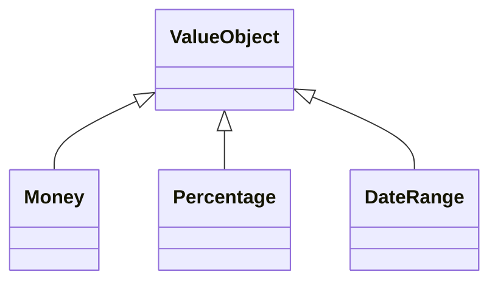
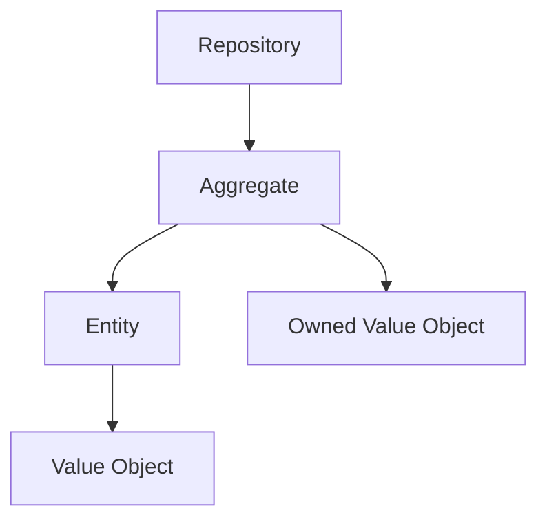
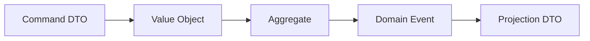
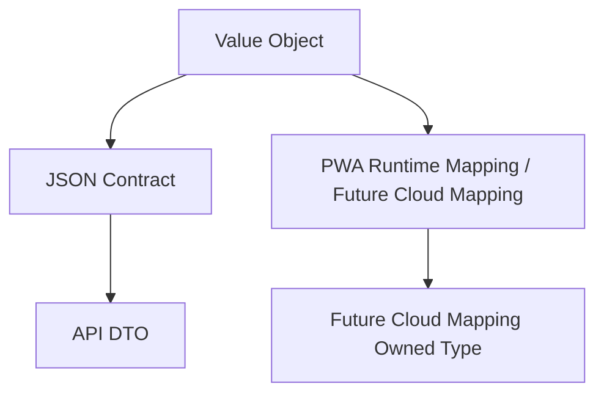

> **ADR-001 PWA Runtime Alignment:** Atlas v1 uses PWA v1 Runtime, Browser Runtime, and IndexedDB Runtime. Future Cloud Architecture is optional future mapping and must not be required for v1.\r\n\r\n# Value Object Catalog
## Split Navigation
- [Value object catalog entries](value-object/catalog-entries.md)
- [Value object validation and mapping](value-object/validation-and-mapping.md)
- [Value object lifecycle and mapping rules](value-object/lifecycle-and-mapping-rules.md)
- [Value object governance and testing](value-object/governance-and-testing.md)
- [Value object property and ownership](value-object/property-and-ownership.md)
- [Value object identity, construction, and serialization](value-object/identity-construction-and-serialization.md)
- [Value object security, audit, and performance](value-object/security-audit-and-performance.md)

# Document Control

Document Name: Value Object Catalog
Document Path: knowledge/catalog/value-object-catalog.md
Document Type: Atlas Enterprise Canonical Specification
Version: 1.0
Status: Canonical Specification
Domain: Platform
Bounded Context: Platform
Owner: Project Atlas
Source of Truth: Atlas Value Object Source of Truth
Last Updated: 2026-07-12

Related Specifications:
- knowledge/aggregate-catalog.md
- knowledge/entity-catalog.md
- knowledge/command-catalog.md
- knowledge/domain-event-catalog.md
- knowledge/repository-catalog.md
- knowledge/enumeration-catalog.md
- knowledge/domain-model-catalog.md
- knowledge/domain-service-catalog.md
- knowledge/application-service-catalog.md
- knowledge/api-governance-framework.md
- knowledge/property.md
- docs/specification/04-DomainModel.md
- docs/database/05-DatabaseDesign.md
- docs/database/06-ERD.md

# Purpose

Value Object Catalog defines every approved Atlas Value Object as immutable, identity-less, value-equality-based domain data. It is the source of truth for Value Object use across Entity, Aggregate, Repository, Command, Domain Event, DTO, API, Future Cloud Mapping, Future Cloud Mapping, validation, business rules, and calculation engines.

# Scope

- Value Object
- Identity-less Object
- Immutable Object
- Owned Type
- Embedded Object
- Composition
- Equality
- Serialization
- Validation
- Persistence
- Business Meaning

# Value Object Definition Standard

Every Value Object entry uses the following complete Enterprise contract.
- Name
- Display Name
- Domain
- Bounded Context
- Aggregate Owner
- Entity Owner
- Purpose
- Business Meaning
- Description
- Properties
- Property Types
- Nullable
- Default
- Validation
- Business Rules
- Equality Rules
- Hash Rules
- Construction Rules
- Factory Method
- Serialization
- JSON Mapping
- PWA Runtime Mapping / Future Cloud Mapping
- Future Cloud Mapping
- Owned Type
- Persistence
- Audit
- Security
- Example

# Complete Value Object Catalog

## Money

Name: Money
Display Name: Money
Domain: Finance
Bounded Context: Financial Planning
Aggregate Owner: Household, AssetPortfolio, LiabilityPortfolio, Loan, Property, GoalPlan
Entity Owner: Asset, Liability, Goal, Portfolio, Holding, Property, Mortgage, Scenario, Decision, Recommendation, Policy
Purpose: Money value with currency.
Business Meaning: Money carries business meaning through its values and never through identity.
Description: Money is immutable after construction, validates all values at creation, supports value equality, and is persisted as an owned or embedded value.
Properties: Amount, Currency
Property Types: amount decimal; currency CurrencyCode
Nullable: Value Object instance is not nullable when required by business rule; individual properties follow catalog validation.
Default: No implicit business default unless specified by command or aggregate invariant.
Validation: Constructor and factory validate required values, range, enum membership, format, and cross-property consistency.
Business Rules: Value Object contains only local value invariants and no aggregate lifecycle decisions.
Equality Rules: Equality uses all significant properties in normalized order.
Hash Rules: Hash code uses the same significant properties as equality.
Construction Rules: Public construction must produce valid immutable instance.
Factory Method: Create or From methods may normalize input before validation.
Serialization: Stable JSON names and deterministic primitive representation.
JSON Mapping: amount, currency
PWA Runtime Mapping / Future Cloud Mapping: Embedded columns or JSON owned type under the owning entity table.
Future Cloud Mapping: Owned type or value conversion according to owner persistence model.
Owned Type: Yes, always owned by Aggregate or Entity and never persisted independently.
Persistence: Persisted only through owner Repository.
Audit: Owner audit records usage and changed value snapshots where needed.
Security: Sensitive properties use masking or encryption when the security catalog requires it.
Example: Money is created, validated, compared by value, serialized to JSON, and persisted through owner repository.
Value Object Control 1: Money preserves immutability, equality, validation, construction, serialization, JSON mapping, PWA Runtime Mapping / Future Cloud Mapping, Future Cloud Mapping owned type behavior, owner persistence, security, audit, and calculation consistency.
Value Object Control 2: Money preserves immutability, equality, validation, construction, serialization, JSON mapping, PWA Runtime Mapping / Future Cloud Mapping, Future Cloud Mapping owned type behavior, owner persistence, security, audit, and calculation consistency.
Value Object Control 3: Money preserves immutability, equality, validation, construction, serialization, JSON mapping, PWA Runtime Mapping / Future Cloud Mapping, Future Cloud Mapping owned type behavior, owner persistence, security, audit, and calculation consistency.
Value Object Control 4: Money preserves immutability, equality, validation, construction, serialization, JSON mapping, PWA Runtime Mapping / Future Cloud Mapping, Future Cloud Mapping owned type behavior, owner persistence, security, audit, and calculation consistency.
Value Object Control 5: Money preserves immutability, equality, validation, construction, serialization, JSON mapping, PWA Runtime Mapping / Future Cloud Mapping, Future Cloud Mapping owned type behavior, owner persistence, security, audit, and calculation consistency.
Value Object Control 6: Money preserves immutability, equality, validation, construction, serialization, JSON mapping, PWA Runtime Mapping / Future Cloud Mapping, Future Cloud Mapping owned type behavior, owner persistence, security, audit, and calculation consistency.
Value Object Control 7: Money preserves immutability, equality, validation, construction, serialization, JSON mapping, PWA Runtime Mapping / Future Cloud Mapping, Future Cloud Mapping owned type behavior, owner persistence, security, audit, and calculation consistency.
Value Object Control 8: Money preserves immutability, equality, validation, construction, serialization, JSON mapping, PWA Runtime Mapping / Future Cloud Mapping, Future Cloud Mapping owned type behavior, owner persistence, security, audit, and calculation consistency.
Value Object Control 9: Money preserves immutability, equality, validation, construction, serialization, JSON mapping, PWA Runtime Mapping / Future Cloud Mapping, Future Cloud Mapping owned type behavior, owner persistence, security, audit, and calculation consistency.
Value Object Control 10: Money preserves immutability, equality, validation, construction, serialization, JSON mapping, PWA Runtime Mapping / Future Cloud Mapping, Future Cloud Mapping owned type behavior, owner persistence, security, audit, and calculation consistency.
Value Object Control 11: Money preserves immutability, equality, validation, construction, serialization, JSON mapping, PWA Runtime Mapping / Future Cloud Mapping, Future Cloud Mapping owned type behavior, owner persistence, security, audit, and calculation consistency.
Value Object Control 12: Money preserves immutability, equality, validation, construction, serialization, JSON mapping, PWA Runtime Mapping / Future Cloud Mapping, Future Cloud Mapping owned type behavior, owner persistence, security, audit, and calculation consistency.
Value Object Control 13: Money preserves immutability, equality, validation, construction, serialization, JSON mapping, PWA Runtime Mapping / Future Cloud Mapping, Future Cloud Mapping owned type behavior, owner persistence, security, audit, and calculation consistency.
Value Object Control 14: Money preserves immutability, equality, validation, construction, serialization, JSON mapping, PWA Runtime Mapping / Future Cloud Mapping, Future Cloud Mapping owned type behavior, owner persistence, security, audit, and calculation consistency.
Value Object Control 15: Money preserves immutability, equality, validation, construction, serialization, JSON mapping, PWA Runtime Mapping / Future Cloud Mapping, Future Cloud Mapping owned type behavior, owner persistence, security, audit, and calculation consistency.
Value Object Control 16: Money preserves immutability, equality, validation, construction, serialization, JSON mapping, PWA Runtime Mapping / Future Cloud Mapping, Future Cloud Mapping owned type behavior, owner persistence, security, audit, and calculation consistency.
Value Object Control 17: Money preserves immutability, equality, validation, construction, serialization, JSON mapping, PWA Runtime Mapping / Future Cloud Mapping, Future Cloud Mapping owned type behavior, owner persistence, security, audit, and calculation consistency.
Value Object Control 18: Money preserves immutability, equality, validation, construction, serialization, JSON mapping, PWA Runtime Mapping / Future Cloud Mapping, Future Cloud Mapping owned type behavior, owner persistence, security, audit, and calculation consistency.
Value Object Control 19: Money preserves immutability, equality, validation, construction, serialization, JSON mapping, PWA Runtime Mapping / Future Cloud Mapping, Future Cloud Mapping owned type behavior, owner persistence, security, audit, and calculation consistency.
Value Object Control 20: Money preserves immutability, equality, validation, construction, serialization, JSON mapping, PWA Runtime Mapping / Future Cloud Mapping, Future Cloud Mapping owned type behavior, owner persistence, security, audit, and calculation consistency.
Value Object Control 21: Money preserves immutability, equality, validation, construction, serialization, JSON mapping, PWA Runtime Mapping / Future Cloud Mapping, Future Cloud Mapping owned type behavior, owner persistence, security, audit, and calculation consistency.
Value Object Control 22: Money preserves immutability, equality, validation, construction, serialization, JSON mapping, PWA Runtime Mapping / Future Cloud Mapping, Future Cloud Mapping owned type behavior, owner persistence, security, audit, and calculation consistency.
Value Object Control 23: Money preserves immutability, equality, validation, construction, serialization, JSON mapping, PWA Runtime Mapping / Future Cloud Mapping, Future Cloud Mapping owned type behavior, owner persistence, security, audit, and calculation consistency.
Value Object Control 24: Money preserves immutability, equality, validation, construction, serialization, JSON mapping, PWA Runtime Mapping / Future Cloud Mapping, Future Cloud Mapping owned type behavior, owner persistence, security, audit, and calculation consistency.
Value Object Control 25: Money preserves immutability, equality, validation, construction, serialization, JSON mapping, PWA Runtime Mapping / Future Cloud Mapping, Future Cloud Mapping owned type behavior, owner persistence, security, audit, and calculation consistency.
Value Object Control 26: Money preserves immutability, equality, validation, construction, serialization, JSON mapping, PWA Runtime Mapping / Future Cloud Mapping, Future Cloud Mapping owned type behavior, owner persistence, security, audit, and calculation consistency.
Value Object Control 27: Money preserves immutability, equality, validation, construction, serialization, JSON mapping, PWA Runtime Mapping / Future Cloud Mapping, Future Cloud Mapping owned type behavior, owner persistence, security, audit, and calculation consistency.
Value Object Control 28: Money preserves immutability, equality, validation, construction, serialization, JSON mapping, PWA Runtime Mapping / Future Cloud Mapping, Future Cloud Mapping owned type behavior, owner persistence, security, audit, and calculation consistency.
Value Object Control 29: Money preserves immutability, equality, validation, construction, serialization, JSON mapping, PWA Runtime Mapping / Future Cloud Mapping, Future Cloud Mapping owned type behavior, owner persistence, security, audit, and calculation consistency.
Value Object Control 30: Money preserves immutability, equality, validation, construction, serialization, JSON mapping, PWA Runtime Mapping / Future Cloud Mapping, Future Cloud Mapping owned type behavior, owner persistence, security, audit, and calculation consistency.
Value Object Control 31: Money preserves immutability, equality, validation, construction, serialization, JSON mapping, PWA Runtime Mapping / Future Cloud Mapping, Future Cloud Mapping owned type behavior, owner persistence, security, audit, and calculation consistency.
Value Object Control 32: Money preserves immutability, equality, validation, construction, serialization, JSON mapping, PWA Runtime Mapping / Future Cloud Mapping, Future Cloud Mapping owned type behavior, owner persistence, security, audit, and calculation consistency.
Value Object Control 33: Money preserves immutability, equality, validation, construction, serialization, JSON mapping, PWA Runtime Mapping / Future Cloud Mapping, Future Cloud Mapping owned type behavior, owner persistence, security, audit, and calculation consistency.
Value Object Control 34: Money preserves immutability, equality, validation, construction, serialization, JSON mapping, PWA Runtime Mapping / Future Cloud Mapping, Future Cloud Mapping owned type behavior, owner persistence, security, audit, and calculation consistency.
Value Object Control 35: Money preserves immutability, equality, validation, construction, serialization, JSON mapping, PWA Runtime Mapping / Future Cloud Mapping, Future Cloud Mapping owned type behavior, owner persistence, security, audit, and calculation consistency.
Value Object Control 36: Money preserves immutability, equality, validation, construction, serialization, JSON mapping, PWA Runtime Mapping / Future Cloud Mapping, Future Cloud Mapping owned type behavior, owner persistence, security, audit, and calculation consistency.
Value Object Control 37: Money preserves immutability, equality, validation, construction, serialization, JSON mapping, PWA Runtime Mapping / Future Cloud Mapping, Future Cloud Mapping owned type behavior, owner persistence, security, audit, and calculation consistency.
Value Object Control 38: Money preserves immutability, equality, validation, construction, serialization, JSON mapping, PWA Runtime Mapping / Future Cloud Mapping, Future Cloud Mapping owned type behavior, owner persistence, security, audit, and calculation consistency.
Value Object Control 39: Money preserves immutability, equality, validation, construction, serialization, JSON mapping, PWA Runtime Mapping / Future Cloud Mapping, Future Cloud Mapping owned type behavior, owner persistence, security, audit, and calculation consistency.
Value Object Control 40: Money preserves immutability, equality, validation, construction, serialization, JSON mapping, PWA Runtime Mapping / Future Cloud Mapping, Future Cloud Mapping owned type behavior, owner persistence, security, audit, and calculation consistency.
Value Object Control 41: Money preserves immutability, equality, validation, construction, serialization, JSON mapping, PWA Runtime Mapping / Future Cloud Mapping, Future Cloud Mapping owned type behavior, owner persistence, security, audit, and calculation consistency.
Value Object Control 42: Money preserves immutability, equality, validation, construction, serialization, JSON mapping, PWA Runtime Mapping / Future Cloud Mapping, Future Cloud Mapping owned type behavior, owner persistence, security, audit, and calculation consistency.
Value Object Control 43: Money preserves immutability, equality, validation, construction, serialization, JSON mapping, PWA Runtime Mapping / Future Cloud Mapping, Future Cloud Mapping owned type behavior, owner persistence, security, audit, and calculation consistency.
Value Object Control 44: Money preserves immutability, equality, validation, construction, serialization, JSON mapping, PWA Runtime Mapping / Future Cloud Mapping, Future Cloud Mapping owned type behavior, owner persistence, security, audit, and calculation consistency.
Value Object Control 45: Money preserves immutability, equality, validation, construction, serialization, JSON mapping, PWA Runtime Mapping / Future Cloud Mapping, Future Cloud Mapping owned type behavior, owner persistence, security, audit, and calculation consistency.
Value Object Control 46: Money preserves immutability, equality, validation, construction, serialization, JSON mapping, PWA Runtime Mapping / Future Cloud Mapping, Future Cloud Mapping owned type behavior, owner persistence, security, audit, and calculation consistency.
Value Object Control 47: Money preserves immutability, equality, validation, construction, serialization, JSON mapping, PWA Runtime Mapping / Future Cloud Mapping, Future Cloud Mapping owned type behavior, owner persistence, security, audit, and calculation consistency.
Value Object Control 48: Money preserves immutability, equality, validation, construction, serialization, JSON mapping, PWA Runtime Mapping / Future Cloud Mapping, Future Cloud Mapping owned type behavior, owner persistence, security, audit, and calculation consistency.
Value Object Control 49: Money preserves immutability, equality, validation, construction, serialization, JSON mapping, PWA Runtime Mapping / Future Cloud Mapping, Future Cloud Mapping owned type behavior, owner persistence, security, audit, and calculation consistency.
Value Object Control 50: Money preserves immutability, equality, validation, construction, serialization, JSON mapping, PWA Runtime Mapping / Future Cloud Mapping, Future Cloud Mapping owned type behavior, owner persistence, security, audit, and calculation consistency.
Value Object Control 51: Money preserves immutability, equality, validation, construction, serialization, JSON mapping, PWA Runtime Mapping / Future Cloud Mapping, Future Cloud Mapping owned type behavior, owner persistence, security, audit, and calculation consistency.
Value Object Control 52: Money preserves immutability, equality, validation, construction, serialization, JSON mapping, PWA Runtime Mapping / Future Cloud Mapping, Future Cloud Mapping owned type behavior, owner persistence, security, audit, and calculation consistency.
Value Object Control 53: Money preserves immutability, equality, validation, construction, serialization, JSON mapping, PWA Runtime Mapping / Future Cloud Mapping, Future Cloud Mapping owned type behavior, owner persistence, security, audit, and calculation consistency.
Value Object Control 54: Money preserves immutability, equality, validation, construction, serialization, JSON mapping, PWA Runtime Mapping / Future Cloud Mapping, Future Cloud Mapping owned type behavior, owner persistence, security, audit, and calculation consistency.
Value Object Control 55: Money preserves immutability, equality, validation, construction, serialization, JSON mapping, PWA Runtime Mapping / Future Cloud Mapping, Future Cloud Mapping owned type behavior, owner persistence, security, audit, and calculation consistency.
Value Object Control 56: Money preserves immutability, equality, validation, construction, serialization, JSON mapping, PWA Runtime Mapping / Future Cloud Mapping, Future Cloud Mapping owned type behavior, owner persistence, security, audit, and calculation consistency.
Value Object Control 57: Money preserves immutability, equality, validation, construction, serialization, JSON mapping, PWA Runtime Mapping / Future Cloud Mapping, Future Cloud Mapping owned type behavior, owner persistence, security, audit, and calculation consistency.
Value Object Control 58: Money preserves immutability, equality, validation, construction, serialization, JSON mapping, PWA Runtime Mapping / Future Cloud Mapping, Future Cloud Mapping owned type behavior, owner persistence, security, audit, and calculation consistency.
Value Object Control 59: Money preserves immutability, equality, validation, construction, serialization, JSON mapping, PWA Runtime Mapping / Future Cloud Mapping, Future Cloud Mapping owned type behavior, owner persistence, security, audit, and calculation consistency.
Value Object Control 60: Money preserves immutability, equality, validation, construction, serialization, JSON mapping, PWA Runtime Mapping / Future Cloud Mapping, Future Cloud Mapping owned type behavior, owner persistence, security, audit, and calculation consistency.
Value Object Control 61: Money preserves immutability, equality, validation, construction, serialization, JSON mapping, PWA Runtime Mapping / Future Cloud Mapping, Future Cloud Mapping owned type behavior, owner persistence, security, audit, and calculation consistency.
Value Object Control 62: Money preserves immutability, equality, validation, construction, serialization, JSON mapping, PWA Runtime Mapping / Future Cloud Mapping, Future Cloud Mapping owned type behavior, owner persistence, security, audit, and calculation consistency.
Value Object Control 63: Money preserves immutability, equality, validation, construction, serialization, JSON mapping, PWA Runtime Mapping / Future Cloud Mapping, Future Cloud Mapping owned type behavior, owner persistence, security, audit, and calculation consistency.
Value Object Control 64: Money preserves immutability, equality, validation, construction, serialization, JSON mapping, PWA Runtime Mapping / Future Cloud Mapping, Future Cloud Mapping owned type behavior, owner persistence, security, audit, and calculation consistency.
Value Object Control 65: Money preserves immutability, equality, validation, construction, serialization, JSON mapping, PWA Runtime Mapping / Future Cloud Mapping, Future Cloud Mapping owned type behavior, owner persistence, security, audit, and calculation consistency.
Value Object Control 66: Money preserves immutability, equality, validation, construction, serialization, JSON mapping, PWA Runtime Mapping / Future Cloud Mapping, Future Cloud Mapping owned type behavior, owner persistence, security, audit, and calculation consistency.
Value Object Control 67: Money preserves immutability, equality, validation, construction, serialization, JSON mapping, PWA Runtime Mapping / Future Cloud Mapping, Future Cloud Mapping owned type behavior, owner persistence, security, audit, and calculation consistency.
Value Object Control 68: Money preserves immutability, equality, validation, construction, serialization, JSON mapping, PWA Runtime Mapping / Future Cloud Mapping, Future Cloud Mapping owned type behavior, owner persistence, security, audit, and calculation consistency.
Value Object Control 69: Money preserves immutability, equality, validation, construction, serialization, JSON mapping, PWA Runtime Mapping / Future Cloud Mapping, Future Cloud Mapping owned type behavior, owner persistence, security, audit, and calculation consistency.
Value Object Control 70: Money preserves immutability, equality, validation, construction, serialization, JSON mapping, PWA Runtime Mapping / Future Cloud Mapping, Future Cloud Mapping owned type behavior, owner persistence, security, audit, and calculation consistency.
Value Object Control 71: Money preserves immutability, equality, validation, construction, serialization, JSON mapping, PWA Runtime Mapping / Future Cloud Mapping, Future Cloud Mapping owned type behavior, owner persistence, security, audit, and calculation consistency.
Value Object Control 72: Money preserves immutability, equality, validation, construction, serialization, JSON mapping, PWA Runtime Mapping / Future Cloud Mapping, Future Cloud Mapping owned type behavior, owner persistence, security, audit, and calculation consistency.
Value Object Control 73: Money preserves immutability, equality, validation, construction, serialization, JSON mapping, PWA Runtime Mapping / Future Cloud Mapping, Future Cloud Mapping owned type behavior, owner persistence, security, audit, and calculation consistency.
Value Object Control 74: Money preserves immutability, equality, validation, construction, serialization, JSON mapping, PWA Runtime Mapping / Future Cloud Mapping, Future Cloud Mapping owned type behavior, owner persistence, security, audit, and calculation consistency.
Value Object Control 75: Money preserves immutability, equality, validation, construction, serialization, JSON mapping, PWA Runtime Mapping / Future Cloud Mapping, Future Cloud Mapping owned type behavior, owner persistence, security, audit, and calculation consistency.

## Currency

Name: Currency
Display Name: Currency
Domain: Finance
Bounded Context: Platform
Aggregate Owner: Household, AssetPortfolio, LiabilityPortfolio, Loan, Property, GoalPlan
Entity Owner: Asset, Liability, Portfolio, Holding, Property, Mortgage, Scenario, Policy
Purpose: Currency unit used by Money.
Business Meaning: Currency carries business meaning through its values and never through identity.
Description: Currency is immutable after construction, validates all values at creation, supports value equality, and is persisted as an owned or embedded value.
Properties: CurrencyCode
Property Types: code CurrencyCode
Nullable: Value Object instance is not nullable when required by business rule; individual properties follow catalog validation.
Default: No implicit business default unless specified by command or aggregate invariant.
Validation: Constructor and factory validate required values, range, enum membership, format, and cross-property consistency.
Business Rules: Value Object contains only local value invariants and no aggregate lifecycle decisions.
Equality Rules: Equality uses all significant properties in normalized order.
Hash Rules: Hash code uses the same significant properties as equality.
Construction Rules: Public construction must produce valid immutable instance.
Factory Method: Create or From methods may normalize input before validation.
Serialization: Stable JSON names and deterministic primitive representation.
JSON Mapping: code
PWA Runtime Mapping / Future Cloud Mapping: Embedded columns or JSON owned type under the owning entity table.
Future Cloud Mapping: Owned type or value conversion according to owner persistence model.
Owned Type: Yes, always owned by Aggregate or Entity and never persisted independently.
Persistence: Persisted only through owner Repository.
Audit: Owner audit records usage and changed value snapshots where needed.
Security: Sensitive properties use masking or encryption when the security catalog requires it.
Example: Currency is created, validated, compared by value, serialized to JSON, and persisted through owner repository.
Value Object Control 1: Currency preserves immutability, equality, validation, construction, serialization, JSON mapping, PWA Runtime Mapping / Future Cloud Mapping, Future Cloud Mapping owned type behavior, owner persistence, security, audit, and calculation consistency.
Value Object Control 2: Currency preserves immutability, equality, validation, construction, serialization, JSON mapping, PWA Runtime Mapping / Future Cloud Mapping, Future Cloud Mapping owned type behavior, owner persistence, security, audit, and calculation consistency.
Value Object Control 3: Currency preserves immutability, equality, validation, construction, serialization, JSON mapping, PWA Runtime Mapping / Future Cloud Mapping, Future Cloud Mapping owned type behavior, owner persistence, security, audit, and calculation consistency.
Value Object Control 4: Currency preserves immutability, equality, validation, construction, serialization, JSON mapping, PWA Runtime Mapping / Future Cloud Mapping, Future Cloud Mapping owned type behavior, owner persistence, security, audit, and calculation consistency.
Value Object Control 5: Currency preserves immutability, equality, validation, construction, serialization, JSON mapping, PWA Runtime Mapping / Future Cloud Mapping, Future Cloud Mapping owned type behavior, owner persistence, security, audit, and calculation consistency.
Value Object Control 6: Currency preserves immutability, equality, validation, construction, serialization, JSON mapping, PWA Runtime Mapping / Future Cloud Mapping, Future Cloud Mapping owned type behavior, owner persistence, security, audit, and calculation consistency.
Value Object Control 7: Currency preserves immutability, equality, validation, construction, serialization, JSON mapping, PWA Runtime Mapping / Future Cloud Mapping, Future Cloud Mapping owned type behavior, owner persistence, security, audit, and calculation consistency.
Value Object Control 8: Currency preserves immutability, equality, validation, construction, serialization, JSON mapping, PWA Runtime Mapping / Future Cloud Mapping, Future Cloud Mapping owned type behavior, owner persistence, security, audit, and calculation consistency.
Value Object Control 9: Currency preserves immutability, equality, validation, construction, serialization, JSON mapping, PWA Runtime Mapping / Future Cloud Mapping, Future Cloud Mapping owned type behavior, owner persistence, security, audit, and calculation consistency.
Value Object Control 10: Currency preserves immutability, equality, validation, construction, serialization, JSON mapping, PWA Runtime Mapping / Future Cloud Mapping, Future Cloud Mapping owned type behavior, owner persistence, security, audit, and calculation consistency.
Value Object Control 11: Currency preserves immutability, equality, validation, construction, serialization, JSON mapping, PWA Runtime Mapping / Future Cloud Mapping, Future Cloud Mapping owned type behavior, owner persistence, security, audit, and calculation consistency.
Value Object Control 12: Currency preserves immutability, equality, validation, construction, serialization, JSON mapping, PWA Runtime Mapping / Future Cloud Mapping, Future Cloud Mapping owned type behavior, owner persistence, security, audit, and calculation consistency.
Value Object Control 13: Currency preserves immutability, equality, validation, construction, serialization, JSON mapping, PWA Runtime Mapping / Future Cloud Mapping, Future Cloud Mapping owned type behavior, owner persistence, security, audit, and calculation consistency.
Value Object Control 14: Currency preserves immutability, equality, validation, construction, serialization, JSON mapping, PWA Runtime Mapping / Future Cloud Mapping, Future Cloud Mapping owned type behavior, owner persistence, security, audit, and calculation consistency.
Value Object Control 15: Currency preserves immutability, equality, validation, construction, serialization, JSON mapping, PWA Runtime Mapping / Future Cloud Mapping, Future Cloud Mapping owned type behavior, owner persistence, security, audit, and calculation consistency.
Value Object Control 16: Currency preserves immutability, equality, validation, construction, serialization, JSON mapping, PWA Runtime Mapping / Future Cloud Mapping, Future Cloud Mapping owned type behavior, owner persistence, security, audit, and calculation consistency.
Value Object Control 17: Currency preserves immutability, equality, validation, construction, serialization, JSON mapping, PWA Runtime Mapping / Future Cloud Mapping, Future Cloud Mapping owned type behavior, owner persistence, security, audit, and calculation consistency.
Value Object Control 18: Currency preserves immutability, equality, validation, construction, serialization, JSON mapping, PWA Runtime Mapping / Future Cloud Mapping, Future Cloud Mapping owned type behavior, owner persistence, security, audit, and calculation consistency.
Value Object Control 19: Currency preserves immutability, equality, validation, construction, serialization, JSON mapping, PWA Runtime Mapping / Future Cloud Mapping, Future Cloud Mapping owned type behavior, owner persistence, security, audit, and calculation consistency.
Value Object Control 20: Currency preserves immutability, equality, validation, construction, serialization, JSON mapping, PWA Runtime Mapping / Future Cloud Mapping, Future Cloud Mapping owned type behavior, owner persistence, security, audit, and calculation consistency.
Value Object Control 21: Currency preserves immutability, equality, validation, construction, serialization, JSON mapping, PWA Runtime Mapping / Future Cloud Mapping, Future Cloud Mapping owned type behavior, owner persistence, security, audit, and calculation consistency.
Value Object Control 22: Currency preserves immutability, equality, validation, construction, serialization, JSON mapping, PWA Runtime Mapping / Future Cloud Mapping, Future Cloud Mapping owned type behavior, owner persistence, security, audit, and calculation consistency.
Value Object Control 23: Currency preserves immutability, equality, validation, construction, serialization, JSON mapping, PWA Runtime Mapping / Future Cloud Mapping, Future Cloud Mapping owned type behavior, owner persistence, security, audit, and calculation consistency.
Value Object Control 24: Currency preserves immutability, equality, validation, construction, serialization, JSON mapping, PWA Runtime Mapping / Future Cloud Mapping, Future Cloud Mapping owned type behavior, owner persistence, security, audit, and calculation consistency.
Value Object Control 25: Currency preserves immutability, equality, validation, construction, serialization, JSON mapping, PWA Runtime Mapping / Future Cloud Mapping, Future Cloud Mapping owned type behavior, owner persistence, security, audit, and calculation consistency.
Value Object Control 26: Currency preserves immutability, equality, validation, construction, serialization, JSON mapping, PWA Runtime Mapping / Future Cloud Mapping, Future Cloud Mapping owned type behavior, owner persistence, security, audit, and calculation consistency.
Value Object Control 27: Currency preserves immutability, equality, validation, construction, serialization, JSON mapping, PWA Runtime Mapping / Future Cloud Mapping, Future Cloud Mapping owned type behavior, owner persistence, security, audit, and calculation consistency.
Value Object Control 28: Currency preserves immutability, equality, validation, construction, serialization, JSON mapping, PWA Runtime Mapping / Future Cloud Mapping, Future Cloud Mapping owned type behavior, owner persistence, security, audit, and calculation consistency.
Value Object Control 29: Currency preserves immutability, equality, validation, construction, serialization, JSON mapping, PWA Runtime Mapping / Future Cloud Mapping, Future Cloud Mapping owned type behavior, owner persistence, security, audit, and calculation consistency.
Value Object Control 30: Currency preserves immutability, equality, validation, construction, serialization, JSON mapping, PWA Runtime Mapping / Future Cloud Mapping, Future Cloud Mapping owned type behavior, owner persistence, security, audit, and calculation consistency.
Value Object Control 31: Currency preserves immutability, equality, validation, construction, serialization, JSON mapping, PWA Runtime Mapping / Future Cloud Mapping, Future Cloud Mapping owned type behavior, owner persistence, security, audit, and calculation consistency.
Value Object Control 32: Currency preserves immutability, equality, validation, construction, serialization, JSON mapping, PWA Runtime Mapping / Future Cloud Mapping, Future Cloud Mapping owned type behavior, owner persistence, security, audit, and calculation consistency.
Value Object Control 33: Currency preserves immutability, equality, validation, construction, serialization, JSON mapping, PWA Runtime Mapping / Future Cloud Mapping, Future Cloud Mapping owned type behavior, owner persistence, security, audit, and calculation consistency.
Value Object Control 34: Currency preserves immutability, equality, validation, construction, serialization, JSON mapping, PWA Runtime Mapping / Future Cloud Mapping, Future Cloud Mapping owned type behavior, owner persistence, security, audit, and calculation consistency.
Value Object Control 35: Currency preserves immutability, equality, validation, construction, serialization, JSON mapping, PWA Runtime Mapping / Future Cloud Mapping, Future Cloud Mapping owned type behavior, owner persistence, security, audit, and calculation consistency.
Value Object Control 36: Currency preserves immutability, equality, validation, construction, serialization, JSON mapping, PWA Runtime Mapping / Future Cloud Mapping, Future Cloud Mapping owned type behavior, owner persistence, security, audit, and calculation consistency.
Value Object Control 37: Currency preserves immutability, equality, validation, construction, serialization, JSON mapping, PWA Runtime Mapping / Future Cloud Mapping, Future Cloud Mapping owned type behavior, owner persistence, security, audit, and calculation consistency.
Value Object Control 38: Currency preserves immutability, equality, validation, construction, serialization, JSON mapping, PWA Runtime Mapping / Future Cloud Mapping, Future Cloud Mapping owned type behavior, owner persistence, security, audit, and calculation consistency.
Value Object Control 39: Currency preserves immutability, equality, validation, construction, serialization, JSON mapping, PWA Runtime Mapping / Future Cloud Mapping, Future Cloud Mapping owned type behavior, owner persistence, security, audit, and calculation consistency.
Value Object Control 40: Currency preserves immutability, equality, validation, construction, serialization, JSON mapping, PWA Runtime Mapping / Future Cloud Mapping, Future Cloud Mapping owned type behavior, owner persistence, security, audit, and calculation consistency.
Value Object Control 41: Currency preserves immutability, equality, validation, construction, serialization, JSON mapping, PWA Runtime Mapping / Future Cloud Mapping, Future Cloud Mapping owned type behavior, owner persistence, security, audit, and calculation consistency.
Value Object Control 42: Currency preserves immutability, equality, validation, construction, serialization, JSON mapping, PWA Runtime Mapping / Future Cloud Mapping, Future Cloud Mapping owned type behavior, owner persistence, security, audit, and calculation consistency.
Value Object Control 43: Currency preserves immutability, equality, validation, construction, serialization, JSON mapping, PWA Runtime Mapping / Future Cloud Mapping, Future Cloud Mapping owned type behavior, owner persistence, security, audit, and calculation consistency.
Value Object Control 44: Currency preserves immutability, equality, validation, construction, serialization, JSON mapping, PWA Runtime Mapping / Future Cloud Mapping, Future Cloud Mapping owned type behavior, owner persistence, security, audit, and calculation consistency.
Value Object Control 45: Currency preserves immutability, equality, validation, construction, serialization, JSON mapping, PWA Runtime Mapping / Future Cloud Mapping, Future Cloud Mapping owned type behavior, owner persistence, security, audit, and calculation consistency.
Value Object Control 46: Currency preserves immutability, equality, validation, construction, serialization, JSON mapping, PWA Runtime Mapping / Future Cloud Mapping, Future Cloud Mapping owned type behavior, owner persistence, security, audit, and calculation consistency.
Value Object Control 47: Currency preserves immutability, equality, validation, construction, serialization, JSON mapping, PWA Runtime Mapping / Future Cloud Mapping, Future Cloud Mapping owned type behavior, owner persistence, security, audit, and calculation consistency.
Value Object Control 48: Currency preserves immutability, equality, validation, construction, serialization, JSON mapping, PWA Runtime Mapping / Future Cloud Mapping, Future Cloud Mapping owned type behavior, owner persistence, security, audit, and calculation consistency.
Value Object Control 49: Currency preserves immutability, equality, validation, construction, serialization, JSON mapping, PWA Runtime Mapping / Future Cloud Mapping, Future Cloud Mapping owned type behavior, owner persistence, security, audit, and calculation consistency.
Value Object Control 50: Currency preserves immutability, equality, validation, construction, serialization, JSON mapping, PWA Runtime Mapping / Future Cloud Mapping, Future Cloud Mapping owned type behavior, owner persistence, security, audit, and calculation consistency.
Value Object Control 51: Currency preserves immutability, equality, validation, construction, serialization, JSON mapping, PWA Runtime Mapping / Future Cloud Mapping, Future Cloud Mapping owned type behavior, owner persistence, security, audit, and calculation consistency.
Value Object Control 52: Currency preserves immutability, equality, validation, construction, serialization, JSON mapping, PWA Runtime Mapping / Future Cloud Mapping, Future Cloud Mapping owned type behavior, owner persistence, security, audit, and calculation consistency.
Value Object Control 53: Currency preserves immutability, equality, validation, construction, serialization, JSON mapping, PWA Runtime Mapping / Future Cloud Mapping, Future Cloud Mapping owned type behavior, owner persistence, security, audit, and calculation consistency.
Value Object Control 54: Currency preserves immutability, equality, validation, construction, serialization, JSON mapping, PWA Runtime Mapping / Future Cloud Mapping, Future Cloud Mapping owned type behavior, owner persistence, security, audit, and calculation consistency.
Value Object Control 55: Currency preserves immutability, equality, validation, construction, serialization, JSON mapping, PWA Runtime Mapping / Future Cloud Mapping, Future Cloud Mapping owned type behavior, owner persistence, security, audit, and calculation consistency.
Value Object Control 56: Currency preserves immutability, equality, validation, construction, serialization, JSON mapping, PWA Runtime Mapping / Future Cloud Mapping, Future Cloud Mapping owned type behavior, owner persistence, security, audit, and calculation consistency.
Value Object Control 57: Currency preserves immutability, equality, validation, construction, serialization, JSON mapping, PWA Runtime Mapping / Future Cloud Mapping, Future Cloud Mapping owned type behavior, owner persistence, security, audit, and calculation consistency.
Value Object Control 58: Currency preserves immutability, equality, validation, construction, serialization, JSON mapping, PWA Runtime Mapping / Future Cloud Mapping, Future Cloud Mapping owned type behavior, owner persistence, security, audit, and calculation consistency.
Value Object Control 59: Currency preserves immutability, equality, validation, construction, serialization, JSON mapping, PWA Runtime Mapping / Future Cloud Mapping, Future Cloud Mapping owned type behavior, owner persistence, security, audit, and calculation consistency.
Value Object Control 60: Currency preserves immutability, equality, validation, construction, serialization, JSON mapping, PWA Runtime Mapping / Future Cloud Mapping, Future Cloud Mapping owned type behavior, owner persistence, security, audit, and calculation consistency.
Value Object Control 61: Currency preserves immutability, equality, validation, construction, serialization, JSON mapping, PWA Runtime Mapping / Future Cloud Mapping, Future Cloud Mapping owned type behavior, owner persistence, security, audit, and calculation consistency.
Value Object Control 62: Currency preserves immutability, equality, validation, construction, serialization, JSON mapping, PWA Runtime Mapping / Future Cloud Mapping, Future Cloud Mapping owned type behavior, owner persistence, security, audit, and calculation consistency.
Value Object Control 63: Currency preserves immutability, equality, validation, construction, serialization, JSON mapping, PWA Runtime Mapping / Future Cloud Mapping, Future Cloud Mapping owned type behavior, owner persistence, security, audit, and calculation consistency.
Value Object Control 64: Currency preserves immutability, equality, validation, construction, serialization, JSON mapping, PWA Runtime Mapping / Future Cloud Mapping, Future Cloud Mapping owned type behavior, owner persistence, security, audit, and calculation consistency.
Value Object Control 65: Currency preserves immutability, equality, validation, construction, serialization, JSON mapping, PWA Runtime Mapping / Future Cloud Mapping, Future Cloud Mapping owned type behavior, owner persistence, security, audit, and calculation consistency.
Value Object Control 66: Currency preserves immutability, equality, validation, construction, serialization, JSON mapping, PWA Runtime Mapping / Future Cloud Mapping, Future Cloud Mapping owned type behavior, owner persistence, security, audit, and calculation consistency.
Value Object Control 67: Currency preserves immutability, equality, validation, construction, serialization, JSON mapping, PWA Runtime Mapping / Future Cloud Mapping, Future Cloud Mapping owned type behavior, owner persistence, security, audit, and calculation consistency.
Value Object Control 68: Currency preserves immutability, equality, validation, construction, serialization, JSON mapping, PWA Runtime Mapping / Future Cloud Mapping, Future Cloud Mapping owned type behavior, owner persistence, security, audit, and calculation consistency.
Value Object Control 69: Currency preserves immutability, equality, validation, construction, serialization, JSON mapping, PWA Runtime Mapping / Future Cloud Mapping, Future Cloud Mapping owned type behavior, owner persistence, security, audit, and calculation consistency.
Value Object Control 70: Currency preserves immutability, equality, validation, construction, serialization, JSON mapping, PWA Runtime Mapping / Future Cloud Mapping, Future Cloud Mapping owned type behavior, owner persistence, security, audit, and calculation consistency.
Value Object Control 71: Currency preserves immutability, equality, validation, construction, serialization, JSON mapping, PWA Runtime Mapping / Future Cloud Mapping, Future Cloud Mapping owned type behavior, owner persistence, security, audit, and calculation consistency.
Value Object Control 72: Currency preserves immutability, equality, validation, construction, serialization, JSON mapping, PWA Runtime Mapping / Future Cloud Mapping, Future Cloud Mapping owned type behavior, owner persistence, security, audit, and calculation consistency.
Value Object Control 73: Currency preserves immutability, equality, validation, construction, serialization, JSON mapping, PWA Runtime Mapping / Future Cloud Mapping, Future Cloud Mapping owned type behavior, owner persistence, security, audit, and calculation consistency.
Value Object Control 74: Currency preserves immutability, equality, validation, construction, serialization, JSON mapping, PWA Runtime Mapping / Future Cloud Mapping, Future Cloud Mapping owned type behavior, owner persistence, security, audit, and calculation consistency.
Value Object Control 75: Currency preserves immutability, equality, validation, construction, serialization, JSON mapping, PWA Runtime Mapping / Future Cloud Mapping, Future Cloud Mapping owned type behavior, owner persistence, security, audit, and calculation consistency.

## Percentage

Name: Percentage
Display Name: Percentage
Domain: Calculation
Bounded Context: Platform
Aggregate Owner: AssetPortfolio, LiabilityPortfolio, GoalPlan, Scenario, DecisionSession, Policy
Entity Owner: Portfolio, Holding, Goal, Scenario, Decision, Recommendation, Policy
Purpose: Percent value in decimal-safe form.
Business Meaning: Percentage carries business meaning through its values and never through identity.
Description: Percentage is immutable after construction, validates all values at creation, supports value equality, and is persisted as an owned or embedded value.
Properties: Value
Property Types: value decimal
Nullable: Value Object instance is not nullable when required by business rule; individual properties follow catalog validation.
Default: No implicit business default unless specified by command or aggregate invariant.
Validation: Constructor and factory validate required values, range, enum membership, format, and cross-property consistency.
Business Rules: Value Object contains only local value invariants and no aggregate lifecycle decisions.
Equality Rules: Equality uses all significant properties in normalized order.
Hash Rules: Hash code uses the same significant properties as equality.
Construction Rules: Public construction must produce valid immutable instance.
Factory Method: Create or From methods may normalize input before validation.
Serialization: Stable JSON names and deterministic primitive representation.
JSON Mapping: value
PWA Runtime Mapping / Future Cloud Mapping: Embedded columns or JSON owned type under the owning entity table.
Future Cloud Mapping: Owned type or value conversion according to owner persistence model.
Owned Type: Yes, always owned by Aggregate or Entity and never persisted independently.
Persistence: Persisted only through owner Repository.
Audit: Owner audit records usage and changed value snapshots where needed.
Security: Sensitive properties use masking or encryption when the security catalog requires it.
Example: Percentage is created, validated, compared by value, serialized to JSON, and persisted through owner repository.
Value Object Control 1: Percentage preserves immutability, equality, validation, construction, serialization, JSON mapping, PWA Runtime Mapping / Future Cloud Mapping, Future Cloud Mapping owned type behavior, owner persistence, security, audit, and calculation consistency.
Value Object Control 2: Percentage preserves immutability, equality, validation, construction, serialization, JSON mapping, PWA Runtime Mapping / Future Cloud Mapping, Future Cloud Mapping owned type behavior, owner persistence, security, audit, and calculation consistency.
Value Object Control 3: Percentage preserves immutability, equality, validation, construction, serialization, JSON mapping, PWA Runtime Mapping / Future Cloud Mapping, Future Cloud Mapping owned type behavior, owner persistence, security, audit, and calculation consistency.
Value Object Control 4: Percentage preserves immutability, equality, validation, construction, serialization, JSON mapping, PWA Runtime Mapping / Future Cloud Mapping, Future Cloud Mapping owned type behavior, owner persistence, security, audit, and calculation consistency.
Value Object Control 5: Percentage preserves immutability, equality, validation, construction, serialization, JSON mapping, PWA Runtime Mapping / Future Cloud Mapping, Future Cloud Mapping owned type behavior, owner persistence, security, audit, and calculation consistency.
Value Object Control 6: Percentage preserves immutability, equality, validation, construction, serialization, JSON mapping, PWA Runtime Mapping / Future Cloud Mapping, Future Cloud Mapping owned type behavior, owner persistence, security, audit, and calculation consistency.
Value Object Control 7: Percentage preserves immutability, equality, validation, construction, serialization, JSON mapping, PWA Runtime Mapping / Future Cloud Mapping, Future Cloud Mapping owned type behavior, owner persistence, security, audit, and calculation consistency.
Value Object Control 8: Percentage preserves immutability, equality, validation, construction, serialization, JSON mapping, PWA Runtime Mapping / Future Cloud Mapping, Future Cloud Mapping owned type behavior, owner persistence, security, audit, and calculation consistency.
Value Object Control 9: Percentage preserves immutability, equality, validation, construction, serialization, JSON mapping, PWA Runtime Mapping / Future Cloud Mapping, Future Cloud Mapping owned type behavior, owner persistence, security, audit, and calculation consistency.
Value Object Control 10: Percentage preserves immutability, equality, validation, construction, serialization, JSON mapping, PWA Runtime Mapping / Future Cloud Mapping, Future Cloud Mapping owned type behavior, owner persistence, security, audit, and calculation consistency.
Value Object Control 11: Percentage preserves immutability, equality, validation, construction, serialization, JSON mapping, PWA Runtime Mapping / Future Cloud Mapping, Future Cloud Mapping owned type behavior, owner persistence, security, audit, and calculation consistency.
Value Object Control 12: Percentage preserves immutability, equality, validation, construction, serialization, JSON mapping, PWA Runtime Mapping / Future Cloud Mapping, Future Cloud Mapping owned type behavior, owner persistence, security, audit, and calculation consistency.
Value Object Control 13: Percentage preserves immutability, equality, validation, construction, serialization, JSON mapping, PWA Runtime Mapping / Future Cloud Mapping, Future Cloud Mapping owned type behavior, owner persistence, security, audit, and calculation consistency.
Value Object Control 14: Percentage preserves immutability, equality, validation, construction, serialization, JSON mapping, PWA Runtime Mapping / Future Cloud Mapping, Future Cloud Mapping owned type behavior, owner persistence, security, audit, and calculation consistency.
Value Object Control 15: Percentage preserves immutability, equality, validation, construction, serialization, JSON mapping, PWA Runtime Mapping / Future Cloud Mapping, Future Cloud Mapping owned type behavior, owner persistence, security, audit, and calculation consistency.
Value Object Control 16: Percentage preserves immutability, equality, validation, construction, serialization, JSON mapping, PWA Runtime Mapping / Future Cloud Mapping, Future Cloud Mapping owned type behavior, owner persistence, security, audit, and calculation consistency.
Value Object Control 17: Percentage preserves immutability, equality, validation, construction, serialization, JSON mapping, PWA Runtime Mapping / Future Cloud Mapping, Future Cloud Mapping owned type behavior, owner persistence, security, audit, and calculation consistency.
Value Object Control 18: Percentage preserves immutability, equality, validation, construction, serialization, JSON mapping, PWA Runtime Mapping / Future Cloud Mapping, Future Cloud Mapping owned type behavior, owner persistence, security, audit, and calculation consistency.
Value Object Control 19: Percentage preserves immutability, equality, validation, construction, serialization, JSON mapping, PWA Runtime Mapping / Future Cloud Mapping, Future Cloud Mapping owned type behavior, owner persistence, security, audit, and calculation consistency.
Value Object Control 20: Percentage preserves immutability, equality, validation, construction, serialization, JSON mapping, PWA Runtime Mapping / Future Cloud Mapping, Future Cloud Mapping owned type behavior, owner persistence, security, audit, and calculation consistency.
Value Object Control 21: Percentage preserves immutability, equality, validation, construction, serialization, JSON mapping, PWA Runtime Mapping / Future Cloud Mapping, Future Cloud Mapping owned type behavior, owner persistence, security, audit, and calculation consistency.
Value Object Control 22: Percentage preserves immutability, equality, validation, construction, serialization, JSON mapping, PWA Runtime Mapping / Future Cloud Mapping, Future Cloud Mapping owned type behavior, owner persistence, security, audit, and calculation consistency.
Value Object Control 23: Percentage preserves immutability, equality, validation, construction, serialization, JSON mapping, PWA Runtime Mapping / Future Cloud Mapping, Future Cloud Mapping owned type behavior, owner persistence, security, audit, and calculation consistency.
Value Object Control 24: Percentage preserves immutability, equality, validation, construction, serialization, JSON mapping, PWA Runtime Mapping / Future Cloud Mapping, Future Cloud Mapping owned type behavior, owner persistence, security, audit, and calculation consistency.
Value Object Control 25: Percentage preserves immutability, equality, validation, construction, serialization, JSON mapping, PWA Runtime Mapping / Future Cloud Mapping, Future Cloud Mapping owned type behavior, owner persistence, security, audit, and calculation consistency.
Value Object Control 26: Percentage preserves immutability, equality, validation, construction, serialization, JSON mapping, PWA Runtime Mapping / Future Cloud Mapping, Future Cloud Mapping owned type behavior, owner persistence, security, audit, and calculation consistency.
Value Object Control 27: Percentage preserves immutability, equality, validation, construction, serialization, JSON mapping, PWA Runtime Mapping / Future Cloud Mapping, Future Cloud Mapping owned type behavior, owner persistence, security, audit, and calculation consistency.
Value Object Control 28: Percentage preserves immutability, equality, validation, construction, serialization, JSON mapping, PWA Runtime Mapping / Future Cloud Mapping, Future Cloud Mapping owned type behavior, owner persistence, security, audit, and calculation consistency.
Value Object Control 29: Percentage preserves immutability, equality, validation, construction, serialization, JSON mapping, PWA Runtime Mapping / Future Cloud Mapping, Future Cloud Mapping owned type behavior, owner persistence, security, audit, and calculation consistency.
Value Object Control 30: Percentage preserves immutability, equality, validation, construction, serialization, JSON mapping, PWA Runtime Mapping / Future Cloud Mapping, Future Cloud Mapping owned type behavior, owner persistence, security, audit, and calculation consistency.
Value Object Control 31: Percentage preserves immutability, equality, validation, construction, serialization, JSON mapping, PWA Runtime Mapping / Future Cloud Mapping, Future Cloud Mapping owned type behavior, owner persistence, security, audit, and calculation consistency.
Value Object Control 32: Percentage preserves immutability, equality, validation, construction, serialization, JSON mapping, PWA Runtime Mapping / Future Cloud Mapping, Future Cloud Mapping owned type behavior, owner persistence, security, audit, and calculation consistency.
Value Object Control 33: Percentage preserves immutability, equality, validation, construction, serialization, JSON mapping, PWA Runtime Mapping / Future Cloud Mapping, Future Cloud Mapping owned type behavior, owner persistence, security, audit, and calculation consistency.
Value Object Control 34: Percentage preserves immutability, equality, validation, construction, serialization, JSON mapping, PWA Runtime Mapping / Future Cloud Mapping, Future Cloud Mapping owned type behavior, owner persistence, security, audit, and calculation consistency.
Value Object Control 35: Percentage preserves immutability, equality, validation, construction, serialization, JSON mapping, PWA Runtime Mapping / Future Cloud Mapping, Future Cloud Mapping owned type behavior, owner persistence, security, audit, and calculation consistency.
Value Object Control 36: Percentage preserves immutability, equality, validation, construction, serialization, JSON mapping, PWA Runtime Mapping / Future Cloud Mapping, Future Cloud Mapping owned type behavior, owner persistence, security, audit, and calculation consistency.
Value Object Control 37: Percentage preserves immutability, equality, validation, construction, serialization, JSON mapping, PWA Runtime Mapping / Future Cloud Mapping, Future Cloud Mapping owned type behavior, owner persistence, security, audit, and calculation consistency.
Value Object Control 38: Percentage preserves immutability, equality, validation, construction, serialization, JSON mapping, PWA Runtime Mapping / Future Cloud Mapping, Future Cloud Mapping owned type behavior, owner persistence, security, audit, and calculation consistency.
Value Object Control 39: Percentage preserves immutability, equality, validation, construction, serialization, JSON mapping, PWA Runtime Mapping / Future Cloud Mapping, Future Cloud Mapping owned type behavior, owner persistence, security, audit, and calculation consistency.
Value Object Control 40: Percentage preserves immutability, equality, validation, construction, serialization, JSON mapping, PWA Runtime Mapping / Future Cloud Mapping, Future Cloud Mapping owned type behavior, owner persistence, security, audit, and calculation consistency.
Value Object Control 41: Percentage preserves immutability, equality, validation, construction, serialization, JSON mapping, PWA Runtime Mapping / Future Cloud Mapping, Future Cloud Mapping owned type behavior, owner persistence, security, audit, and calculation consistency.
Value Object Control 42: Percentage preserves immutability, equality, validation, construction, serialization, JSON mapping, PWA Runtime Mapping / Future Cloud Mapping, Future Cloud Mapping owned type behavior, owner persistence, security, audit, and calculation consistency.
Value Object Control 43: Percentage preserves immutability, equality, validation, construction, serialization, JSON mapping, PWA Runtime Mapping / Future Cloud Mapping, Future Cloud Mapping owned type behavior, owner persistence, security, audit, and calculation consistency.
Value Object Control 44: Percentage preserves immutability, equality, validation, construction, serialization, JSON mapping, PWA Runtime Mapping / Future Cloud Mapping, Future Cloud Mapping owned type behavior, owner persistence, security, audit, and calculation consistency.
Value Object Control 45: Percentage preserves immutability, equality, validation, construction, serialization, JSON mapping, PWA Runtime Mapping / Future Cloud Mapping, Future Cloud Mapping owned type behavior, owner persistence, security, audit, and calculation consistency.
Value Object Control 46: Percentage preserves immutability, equality, validation, construction, serialization, JSON mapping, PWA Runtime Mapping / Future Cloud Mapping, Future Cloud Mapping owned type behavior, owner persistence, security, audit, and calculation consistency.
Value Object Control 47: Percentage preserves immutability, equality, validation, construction, serialization, JSON mapping, PWA Runtime Mapping / Future Cloud Mapping, Future Cloud Mapping owned type behavior, owner persistence, security, audit, and calculation consistency.
Value Object Control 48: Percentage preserves immutability, equality, validation, construction, serialization, JSON mapping, PWA Runtime Mapping / Future Cloud Mapping, Future Cloud Mapping owned type behavior, owner persistence, security, audit, and calculation consistency.
Value Object Control 49: Percentage preserves immutability, equality, validation, construction, serialization, JSON mapping, PWA Runtime Mapping / Future Cloud Mapping, Future Cloud Mapping owned type behavior, owner persistence, security, audit, and calculation consistency.
Value Object Control 50: Percentage preserves immutability, equality, validation, construction, serialization, JSON mapping, PWA Runtime Mapping / Future Cloud Mapping, Future Cloud Mapping owned type behavior, owner persistence, security, audit, and calculation consistency.
Value Object Control 51: Percentage preserves immutability, equality, validation, construction, serialization, JSON mapping, PWA Runtime Mapping / Future Cloud Mapping, Future Cloud Mapping owned type behavior, owner persistence, security, audit, and calculation consistency.
Value Object Control 52: Percentage preserves immutability, equality, validation, construction, serialization, JSON mapping, PWA Runtime Mapping / Future Cloud Mapping, Future Cloud Mapping owned type behavior, owner persistence, security, audit, and calculation consistency.
Value Object Control 53: Percentage preserves immutability, equality, validation, construction, serialization, JSON mapping, PWA Runtime Mapping / Future Cloud Mapping, Future Cloud Mapping owned type behavior, owner persistence, security, audit, and calculation consistency.
Value Object Control 54: Percentage preserves immutability, equality, validation, construction, serialization, JSON mapping, PWA Runtime Mapping / Future Cloud Mapping, Future Cloud Mapping owned type behavior, owner persistence, security, audit, and calculation consistency.
Value Object Control 55: Percentage preserves immutability, equality, validation, construction, serialization, JSON mapping, PWA Runtime Mapping / Future Cloud Mapping, Future Cloud Mapping owned type behavior, owner persistence, security, audit, and calculation consistency.
Value Object Control 56: Percentage preserves immutability, equality, validation, construction, serialization, JSON mapping, PWA Runtime Mapping / Future Cloud Mapping, Future Cloud Mapping owned type behavior, owner persistence, security, audit, and calculation consistency.
Value Object Control 57: Percentage preserves immutability, equality, validation, construction, serialization, JSON mapping, PWA Runtime Mapping / Future Cloud Mapping, Future Cloud Mapping owned type behavior, owner persistence, security, audit, and calculation consistency.
Value Object Control 58: Percentage preserves immutability, equality, validation, construction, serialization, JSON mapping, PWA Runtime Mapping / Future Cloud Mapping, Future Cloud Mapping owned type behavior, owner persistence, security, audit, and calculation consistency.
Value Object Control 59: Percentage preserves immutability, equality, validation, construction, serialization, JSON mapping, PWA Runtime Mapping / Future Cloud Mapping, Future Cloud Mapping owned type behavior, owner persistence, security, audit, and calculation consistency.
Value Object Control 60: Percentage preserves immutability, equality, validation, construction, serialization, JSON mapping, PWA Runtime Mapping / Future Cloud Mapping, Future Cloud Mapping owned type behavior, owner persistence, security, audit, and calculation consistency.
Value Object Control 61: Percentage preserves immutability, equality, validation, construction, serialization, JSON mapping, PWA Runtime Mapping / Future Cloud Mapping, Future Cloud Mapping owned type behavior, owner persistence, security, audit, and calculation consistency.
Value Object Control 62: Percentage preserves immutability, equality, validation, construction, serialization, JSON mapping, PWA Runtime Mapping / Future Cloud Mapping, Future Cloud Mapping owned type behavior, owner persistence, security, audit, and calculation consistency.
Value Object Control 63: Percentage preserves immutability, equality, validation, construction, serialization, JSON mapping, PWA Runtime Mapping / Future Cloud Mapping, Future Cloud Mapping owned type behavior, owner persistence, security, audit, and calculation consistency.
Value Object Control 64: Percentage preserves immutability, equality, validation, construction, serialization, JSON mapping, PWA Runtime Mapping / Future Cloud Mapping, Future Cloud Mapping owned type behavior, owner persistence, security, audit, and calculation consistency.
Value Object Control 65: Percentage preserves immutability, equality, validation, construction, serialization, JSON mapping, PWA Runtime Mapping / Future Cloud Mapping, Future Cloud Mapping owned type behavior, owner persistence, security, audit, and calculation consistency.
Value Object Control 66: Percentage preserves immutability, equality, validation, construction, serialization, JSON mapping, PWA Runtime Mapping / Future Cloud Mapping, Future Cloud Mapping owned type behavior, owner persistence, security, audit, and calculation consistency.
Value Object Control 67: Percentage preserves immutability, equality, validation, construction, serialization, JSON mapping, PWA Runtime Mapping / Future Cloud Mapping, Future Cloud Mapping owned type behavior, owner persistence, security, audit, and calculation consistency.
Value Object Control 68: Percentage preserves immutability, equality, validation, construction, serialization, JSON mapping, PWA Runtime Mapping / Future Cloud Mapping, Future Cloud Mapping owned type behavior, owner persistence, security, audit, and calculation consistency.
Value Object Control 69: Percentage preserves immutability, equality, validation, construction, serialization, JSON mapping, PWA Runtime Mapping / Future Cloud Mapping, Future Cloud Mapping owned type behavior, owner persistence, security, audit, and calculation consistency.
Value Object Control 70: Percentage preserves immutability, equality, validation, construction, serialization, JSON mapping, PWA Runtime Mapping / Future Cloud Mapping, Future Cloud Mapping owned type behavior, owner persistence, security, audit, and calculation consistency.
Value Object Control 71: Percentage preserves immutability, equality, validation, construction, serialization, JSON mapping, PWA Runtime Mapping / Future Cloud Mapping, Future Cloud Mapping owned type behavior, owner persistence, security, audit, and calculation consistency.
Value Object Control 72: Percentage preserves immutability, equality, validation, construction, serialization, JSON mapping, PWA Runtime Mapping / Future Cloud Mapping, Future Cloud Mapping owned type behavior, owner persistence, security, audit, and calculation consistency.
Value Object Control 73: Percentage preserves immutability, equality, validation, construction, serialization, JSON mapping, PWA Runtime Mapping / Future Cloud Mapping, Future Cloud Mapping owned type behavior, owner persistence, security, audit, and calculation consistency.
Value Object Control 74: Percentage preserves immutability, equality, validation, construction, serialization, JSON mapping, PWA Runtime Mapping / Future Cloud Mapping, Future Cloud Mapping owned type behavior, owner persistence, security, audit, and calculation consistency.
Value Object Control 75: Percentage preserves immutability, equality, validation, construction, serialization, JSON mapping, PWA Runtime Mapping / Future Cloud Mapping, Future Cloud Mapping owned type behavior, owner persistence, security, audit, and calculation consistency.

## InterestRate

Name: InterestRate
Display Name: InterestRate
Domain: Loan
Bounded Context: Liability
Aggregate Owner: Loan, LiabilityPortfolio, Scenario
Entity Owner: Mortgage, Liability, Scenario
Purpose: Interest rate used by loans and projections.
Business Meaning: InterestRate carries business meaning through its values and never through identity.
Description: InterestRate is immutable after construction, validates all values at creation, supports value equality, and is persisted as an owned or embedded value.
Properties: Rate, Compounding
Property Types: rate Percentage; compounding string
Nullable: Value Object instance is not nullable when required by business rule; individual properties follow catalog validation.
Default: No implicit business default unless specified by command or aggregate invariant.
Validation: Constructor and factory validate required values, range, enum membership, format, and cross-property consistency.
Business Rules: Value Object contains only local value invariants and no aggregate lifecycle decisions.
Equality Rules: Equality uses all significant properties in normalized order.
Hash Rules: Hash code uses the same significant properties as equality.
Construction Rules: Public construction must produce valid immutable instance.
Factory Method: Create or From methods may normalize input before validation.
Serialization: Stable JSON names and deterministic primitive representation.
JSON Mapping: rate, compounding
PWA Runtime Mapping / Future Cloud Mapping: Embedded columns or JSON owned type under the owning entity table.
Future Cloud Mapping: Owned type or value conversion according to owner persistence model.
Owned Type: Yes, always owned by Aggregate or Entity and never persisted independently.
Persistence: Persisted only through owner Repository.
Audit: Owner audit records usage and changed value snapshots where needed.
Security: Sensitive properties use masking or encryption when the security catalog requires it.
Example: InterestRate is created, validated, compared by value, serialized to JSON, and persisted through owner repository.
Value Object Control 1: InterestRate preserves immutability, equality, validation, construction, serialization, JSON mapping, PWA Runtime Mapping / Future Cloud Mapping, Future Cloud Mapping owned type behavior, owner persistence, security, audit, and calculation consistency.
Value Object Control 2: InterestRate preserves immutability, equality, validation, construction, serialization, JSON mapping, PWA Runtime Mapping / Future Cloud Mapping, Future Cloud Mapping owned type behavior, owner persistence, security, audit, and calculation consistency.
Value Object Control 3: InterestRate preserves immutability, equality, validation, construction, serialization, JSON mapping, PWA Runtime Mapping / Future Cloud Mapping, Future Cloud Mapping owned type behavior, owner persistence, security, audit, and calculation consistency.
Value Object Control 4: InterestRate preserves immutability, equality, validation, construction, serialization, JSON mapping, PWA Runtime Mapping / Future Cloud Mapping, Future Cloud Mapping owned type behavior, owner persistence, security, audit, and calculation consistency.
Value Object Control 5: InterestRate preserves immutability, equality, validation, construction, serialization, JSON mapping, PWA Runtime Mapping / Future Cloud Mapping, Future Cloud Mapping owned type behavior, owner persistence, security, audit, and calculation consistency.
Value Object Control 6: InterestRate preserves immutability, equality, validation, construction, serialization, JSON mapping, PWA Runtime Mapping / Future Cloud Mapping, Future Cloud Mapping owned type behavior, owner persistence, security, audit, and calculation consistency.
Value Object Control 7: InterestRate preserves immutability, equality, validation, construction, serialization, JSON mapping, PWA Runtime Mapping / Future Cloud Mapping, Future Cloud Mapping owned type behavior, owner persistence, security, audit, and calculation consistency.
Value Object Control 8: InterestRate preserves immutability, equality, validation, construction, serialization, JSON mapping, PWA Runtime Mapping / Future Cloud Mapping, Future Cloud Mapping owned type behavior, owner persistence, security, audit, and calculation consistency.
Value Object Control 9: InterestRate preserves immutability, equality, validation, construction, serialization, JSON mapping, PWA Runtime Mapping / Future Cloud Mapping, Future Cloud Mapping owned type behavior, owner persistence, security, audit, and calculation consistency.
Value Object Control 10: InterestRate preserves immutability, equality, validation, construction, serialization, JSON mapping, PWA Runtime Mapping / Future Cloud Mapping, Future Cloud Mapping owned type behavior, owner persistence, security, audit, and calculation consistency.
Value Object Control 11: InterestRate preserves immutability, equality, validation, construction, serialization, JSON mapping, PWA Runtime Mapping / Future Cloud Mapping, Future Cloud Mapping owned type behavior, owner persistence, security, audit, and calculation consistency.
Value Object Control 12: InterestRate preserves immutability, equality, validation, construction, serialization, JSON mapping, PWA Runtime Mapping / Future Cloud Mapping, Future Cloud Mapping owned type behavior, owner persistence, security, audit, and calculation consistency.
Value Object Control 13: InterestRate preserves immutability, equality, validation, construction, serialization, JSON mapping, PWA Runtime Mapping / Future Cloud Mapping, Future Cloud Mapping owned type behavior, owner persistence, security, audit, and calculation consistency.
Value Object Control 14: InterestRate preserves immutability, equality, validation, construction, serialization, JSON mapping, PWA Runtime Mapping / Future Cloud Mapping, Future Cloud Mapping owned type behavior, owner persistence, security, audit, and calculation consistency.
Value Object Control 15: InterestRate preserves immutability, equality, validation, construction, serialization, JSON mapping, PWA Runtime Mapping / Future Cloud Mapping, Future Cloud Mapping owned type behavior, owner persistence, security, audit, and calculation consistency.
Value Object Control 16: InterestRate preserves immutability, equality, validation, construction, serialization, JSON mapping, PWA Runtime Mapping / Future Cloud Mapping, Future Cloud Mapping owned type behavior, owner persistence, security, audit, and calculation consistency.
Value Object Control 17: InterestRate preserves immutability, equality, validation, construction, serialization, JSON mapping, PWA Runtime Mapping / Future Cloud Mapping, Future Cloud Mapping owned type behavior, owner persistence, security, audit, and calculation consistency.
Value Object Control 18: InterestRate preserves immutability, equality, validation, construction, serialization, JSON mapping, PWA Runtime Mapping / Future Cloud Mapping, Future Cloud Mapping owned type behavior, owner persistence, security, audit, and calculation consistency.
Value Object Control 19: InterestRate preserves immutability, equality, validation, construction, serialization, JSON mapping, PWA Runtime Mapping / Future Cloud Mapping, Future Cloud Mapping owned type behavior, owner persistence, security, audit, and calculation consistency.
Value Object Control 20: InterestRate preserves immutability, equality, validation, construction, serialization, JSON mapping, PWA Runtime Mapping / Future Cloud Mapping, Future Cloud Mapping owned type behavior, owner persistence, security, audit, and calculation consistency.
Value Object Control 21: InterestRate preserves immutability, equality, validation, construction, serialization, JSON mapping, PWA Runtime Mapping / Future Cloud Mapping, Future Cloud Mapping owned type behavior, owner persistence, security, audit, and calculation consistency.
Value Object Control 22: InterestRate preserves immutability, equality, validation, construction, serialization, JSON mapping, PWA Runtime Mapping / Future Cloud Mapping, Future Cloud Mapping owned type behavior, owner persistence, security, audit, and calculation consistency.
Value Object Control 23: InterestRate preserves immutability, equality, validation, construction, serialization, JSON mapping, PWA Runtime Mapping / Future Cloud Mapping, Future Cloud Mapping owned type behavior, owner persistence, security, audit, and calculation consistency.
Value Object Control 24: InterestRate preserves immutability, equality, validation, construction, serialization, JSON mapping, PWA Runtime Mapping / Future Cloud Mapping, Future Cloud Mapping owned type behavior, owner persistence, security, audit, and calculation consistency.
Value Object Control 25: InterestRate preserves immutability, equality, validation, construction, serialization, JSON mapping, PWA Runtime Mapping / Future Cloud Mapping, Future Cloud Mapping owned type behavior, owner persistence, security, audit, and calculation consistency.
Value Object Control 26: InterestRate preserves immutability, equality, validation, construction, serialization, JSON mapping, PWA Runtime Mapping / Future Cloud Mapping, Future Cloud Mapping owned type behavior, owner persistence, security, audit, and calculation consistency.
Value Object Control 27: InterestRate preserves immutability, equality, validation, construction, serialization, JSON mapping, PWA Runtime Mapping / Future Cloud Mapping, Future Cloud Mapping owned type behavior, owner persistence, security, audit, and calculation consistency.
Value Object Control 28: InterestRate preserves immutability, equality, validation, construction, serialization, JSON mapping, PWA Runtime Mapping / Future Cloud Mapping, Future Cloud Mapping owned type behavior, owner persistence, security, audit, and calculation consistency.
Value Object Control 29: InterestRate preserves immutability, equality, validation, construction, serialization, JSON mapping, PWA Runtime Mapping / Future Cloud Mapping, Future Cloud Mapping owned type behavior, owner persistence, security, audit, and calculation consistency.
Value Object Control 30: InterestRate preserves immutability, equality, validation, construction, serialization, JSON mapping, PWA Runtime Mapping / Future Cloud Mapping, Future Cloud Mapping owned type behavior, owner persistence, security, audit, and calculation consistency.
Value Object Control 31: InterestRate preserves immutability, equality, validation, construction, serialization, JSON mapping, PWA Runtime Mapping / Future Cloud Mapping, Future Cloud Mapping owned type behavior, owner persistence, security, audit, and calculation consistency.
Value Object Control 32: InterestRate preserves immutability, equality, validation, construction, serialization, JSON mapping, PWA Runtime Mapping / Future Cloud Mapping, Future Cloud Mapping owned type behavior, owner persistence, security, audit, and calculation consistency.
Value Object Control 33: InterestRate preserves immutability, equality, validation, construction, serialization, JSON mapping, PWA Runtime Mapping / Future Cloud Mapping, Future Cloud Mapping owned type behavior, owner persistence, security, audit, and calculation consistency.
Value Object Control 34: InterestRate preserves immutability, equality, validation, construction, serialization, JSON mapping, PWA Runtime Mapping / Future Cloud Mapping, Future Cloud Mapping owned type behavior, owner persistence, security, audit, and calculation consistency.
Value Object Control 35: InterestRate preserves immutability, equality, validation, construction, serialization, JSON mapping, PWA Runtime Mapping / Future Cloud Mapping, Future Cloud Mapping owned type behavior, owner persistence, security, audit, and calculation consistency.
Value Object Control 36: InterestRate preserves immutability, equality, validation, construction, serialization, JSON mapping, PWA Runtime Mapping / Future Cloud Mapping, Future Cloud Mapping owned type behavior, owner persistence, security, audit, and calculation consistency.
Value Object Control 37: InterestRate preserves immutability, equality, validation, construction, serialization, JSON mapping, PWA Runtime Mapping / Future Cloud Mapping, Future Cloud Mapping owned type behavior, owner persistence, security, audit, and calculation consistency.
Value Object Control 38: InterestRate preserves immutability, equality, validation, construction, serialization, JSON mapping, PWA Runtime Mapping / Future Cloud Mapping, Future Cloud Mapping owned type behavior, owner persistence, security, audit, and calculation consistency.
Value Object Control 39: InterestRate preserves immutability, equality, validation, construction, serialization, JSON mapping, PWA Runtime Mapping / Future Cloud Mapping, Future Cloud Mapping owned type behavior, owner persistence, security, audit, and calculation consistency.
Value Object Control 40: InterestRate preserves immutability, equality, validation, construction, serialization, JSON mapping, PWA Runtime Mapping / Future Cloud Mapping, Future Cloud Mapping owned type behavior, owner persistence, security, audit, and calculation consistency.
Value Object Control 41: InterestRate preserves immutability, equality, validation, construction, serialization, JSON mapping, PWA Runtime Mapping / Future Cloud Mapping, Future Cloud Mapping owned type behavior, owner persistence, security, audit, and calculation consistency.
Value Object Control 42: InterestRate preserves immutability, equality, validation, construction, serialization, JSON mapping, PWA Runtime Mapping / Future Cloud Mapping, Future Cloud Mapping owned type behavior, owner persistence, security, audit, and calculation consistency.
Value Object Control 43: InterestRate preserves immutability, equality, validation, construction, serialization, JSON mapping, PWA Runtime Mapping / Future Cloud Mapping, Future Cloud Mapping owned type behavior, owner persistence, security, audit, and calculation consistency.
Value Object Control 44: InterestRate preserves immutability, equality, validation, construction, serialization, JSON mapping, PWA Runtime Mapping / Future Cloud Mapping, Future Cloud Mapping owned type behavior, owner persistence, security, audit, and calculation consistency.
Value Object Control 45: InterestRate preserves immutability, equality, validation, construction, serialization, JSON mapping, PWA Runtime Mapping / Future Cloud Mapping, Future Cloud Mapping owned type behavior, owner persistence, security, audit, and calculation consistency.
Value Object Control 46: InterestRate preserves immutability, equality, validation, construction, serialization, JSON mapping, PWA Runtime Mapping / Future Cloud Mapping, Future Cloud Mapping owned type behavior, owner persistence, security, audit, and calculation consistency.
Value Object Control 47: InterestRate preserves immutability, equality, validation, construction, serialization, JSON mapping, PWA Runtime Mapping / Future Cloud Mapping, Future Cloud Mapping owned type behavior, owner persistence, security, audit, and calculation consistency.
Value Object Control 48: InterestRate preserves immutability, equality, validation, construction, serialization, JSON mapping, PWA Runtime Mapping / Future Cloud Mapping, Future Cloud Mapping owned type behavior, owner persistence, security, audit, and calculation consistency.
Value Object Control 49: InterestRate preserves immutability, equality, validation, construction, serialization, JSON mapping, PWA Runtime Mapping / Future Cloud Mapping, Future Cloud Mapping owned type behavior, owner persistence, security, audit, and calculation consistency.
Value Object Control 50: InterestRate preserves immutability, equality, validation, construction, serialization, JSON mapping, PWA Runtime Mapping / Future Cloud Mapping, Future Cloud Mapping owned type behavior, owner persistence, security, audit, and calculation consistency.
Value Object Control 51: InterestRate preserves immutability, equality, validation, construction, serialization, JSON mapping, PWA Runtime Mapping / Future Cloud Mapping, Future Cloud Mapping owned type behavior, owner persistence, security, audit, and calculation consistency.
Value Object Control 52: InterestRate preserves immutability, equality, validation, construction, serialization, JSON mapping, PWA Runtime Mapping / Future Cloud Mapping, Future Cloud Mapping owned type behavior, owner persistence, security, audit, and calculation consistency.
Value Object Control 53: InterestRate preserves immutability, equality, validation, construction, serialization, JSON mapping, PWA Runtime Mapping / Future Cloud Mapping, Future Cloud Mapping owned type behavior, owner persistence, security, audit, and calculation consistency.
Value Object Control 54: InterestRate preserves immutability, equality, validation, construction, serialization, JSON mapping, PWA Runtime Mapping / Future Cloud Mapping, Future Cloud Mapping owned type behavior, owner persistence, security, audit, and calculation consistency.
Value Object Control 55: InterestRate preserves immutability, equality, validation, construction, serialization, JSON mapping, PWA Runtime Mapping / Future Cloud Mapping, Future Cloud Mapping owned type behavior, owner persistence, security, audit, and calculation consistency.
Value Object Control 56: InterestRate preserves immutability, equality, validation, construction, serialization, JSON mapping, PWA Runtime Mapping / Future Cloud Mapping, Future Cloud Mapping owned type behavior, owner persistence, security, audit, and calculation consistency.
Value Object Control 57: InterestRate preserves immutability, equality, validation, construction, serialization, JSON mapping, PWA Runtime Mapping / Future Cloud Mapping, Future Cloud Mapping owned type behavior, owner persistence, security, audit, and calculation consistency.
Value Object Control 58: InterestRate preserves immutability, equality, validation, construction, serialization, JSON mapping, PWA Runtime Mapping / Future Cloud Mapping, Future Cloud Mapping owned type behavior, owner persistence, security, audit, and calculation consistency.
Value Object Control 59: InterestRate preserves immutability, equality, validation, construction, serialization, JSON mapping, PWA Runtime Mapping / Future Cloud Mapping, Future Cloud Mapping owned type behavior, owner persistence, security, audit, and calculation consistency.
Value Object Control 60: InterestRate preserves immutability, equality, validation, construction, serialization, JSON mapping, PWA Runtime Mapping / Future Cloud Mapping, Future Cloud Mapping owned type behavior, owner persistence, security, audit, and calculation consistency.
Value Object Control 61: InterestRate preserves immutability, equality, validation, construction, serialization, JSON mapping, PWA Runtime Mapping / Future Cloud Mapping, Future Cloud Mapping owned type behavior, owner persistence, security, audit, and calculation consistency.
Value Object Control 62: InterestRate preserves immutability, equality, validation, construction, serialization, JSON mapping, PWA Runtime Mapping / Future Cloud Mapping, Future Cloud Mapping owned type behavior, owner persistence, security, audit, and calculation consistency.
Value Object Control 63: InterestRate preserves immutability, equality, validation, construction, serialization, JSON mapping, PWA Runtime Mapping / Future Cloud Mapping, Future Cloud Mapping owned type behavior, owner persistence, security, audit, and calculation consistency.
Value Object Control 64: InterestRate preserves immutability, equality, validation, construction, serialization, JSON mapping, PWA Runtime Mapping / Future Cloud Mapping, Future Cloud Mapping owned type behavior, owner persistence, security, audit, and calculation consistency.
Value Object Control 65: InterestRate preserves immutability, equality, validation, construction, serialization, JSON mapping, PWA Runtime Mapping / Future Cloud Mapping, Future Cloud Mapping owned type behavior, owner persistence, security, audit, and calculation consistency.
Value Object Control 66: InterestRate preserves immutability, equality, validation, construction, serialization, JSON mapping, PWA Runtime Mapping / Future Cloud Mapping, Future Cloud Mapping owned type behavior, owner persistence, security, audit, and calculation consistency.
Value Object Control 67: InterestRate preserves immutability, equality, validation, construction, serialization, JSON mapping, PWA Runtime Mapping / Future Cloud Mapping, Future Cloud Mapping owned type behavior, owner persistence, security, audit, and calculation consistency.
Value Object Control 68: InterestRate preserves immutability, equality, validation, construction, serialization, JSON mapping, PWA Runtime Mapping / Future Cloud Mapping, Future Cloud Mapping owned type behavior, owner persistence, security, audit, and calculation consistency.
Value Object Control 69: InterestRate preserves immutability, equality, validation, construction, serialization, JSON mapping, PWA Runtime Mapping / Future Cloud Mapping, Future Cloud Mapping owned type behavior, owner persistence, security, audit, and calculation consistency.
Value Object Control 70: InterestRate preserves immutability, equality, validation, construction, serialization, JSON mapping, PWA Runtime Mapping / Future Cloud Mapping, Future Cloud Mapping owned type behavior, owner persistence, security, audit, and calculation consistency.
Value Object Control 71: InterestRate preserves immutability, equality, validation, construction, serialization, JSON mapping, PWA Runtime Mapping / Future Cloud Mapping, Future Cloud Mapping owned type behavior, owner persistence, security, audit, and calculation consistency.
Value Object Control 72: InterestRate preserves immutability, equality, validation, construction, serialization, JSON mapping, PWA Runtime Mapping / Future Cloud Mapping, Future Cloud Mapping owned type behavior, owner persistence, security, audit, and calculation consistency.
Value Object Control 73: InterestRate preserves immutability, equality, validation, construction, serialization, JSON mapping, PWA Runtime Mapping / Future Cloud Mapping, Future Cloud Mapping owned type behavior, owner persistence, security, audit, and calculation consistency.
Value Object Control 74: InterestRate preserves immutability, equality, validation, construction, serialization, JSON mapping, PWA Runtime Mapping / Future Cloud Mapping, Future Cloud Mapping owned type behavior, owner persistence, security, audit, and calculation consistency.
Value Object Control 75: InterestRate preserves immutability, equality, validation, construction, serialization, JSON mapping, PWA Runtime Mapping / Future Cloud Mapping, Future Cloud Mapping owned type behavior, owner persistence, security, audit, and calculation consistency.

## Address

Name: Address
Display Name: Address
Domain: Housing
Bounded Context: Property
Aggregate Owner: Property, Household
Entity Owner: Property, Household
Purpose: Physical address for property or household contact context.
Business Meaning: Address carries business meaning through its values and never through identity.
Description: Address is immutable after construction, validates all values at creation, supports value equality, and is persisted as an owned or embedded value.
Properties: Line1, Line2, City, Region, PostalCode, Country
Property Types: line1 string; city string; region string; postalCode string; country string
Nullable: Value Object instance is not nullable when required by business rule; individual properties follow catalog validation.
Default: No implicit business default unless specified by command or aggregate invariant.
Validation: Constructor and factory validate required values, range, enum membership, format, and cross-property consistency.
Business Rules: Value Object contains only local value invariants and no aggregate lifecycle decisions.
Equality Rules: Equality uses all significant properties in normalized order.
Hash Rules: Hash code uses the same significant properties as equality.
Construction Rules: Public construction must produce valid immutable instance.
Factory Method: Create or From methods may normalize input before validation.
Serialization: Stable JSON names and deterministic primitive representation.
JSON Mapping: line1, city, region, postalCode, country
PWA Runtime Mapping / Future Cloud Mapping: Embedded columns or JSON owned type under the owning entity table.
Future Cloud Mapping: Owned type or value conversion according to owner persistence model.
Owned Type: Yes, always owned by Aggregate or Entity and never persisted independently.
Persistence: Persisted only through owner Repository.
Audit: Owner audit records usage and changed value snapshots where needed.
Security: Sensitive properties use masking or encryption when the security catalog requires it.
Example: Address is created, validated, compared by value, serialized to JSON, and persisted through owner repository.
Value Object Control 1: Address preserves immutability, equality, validation, construction, serialization, JSON mapping, PWA Runtime Mapping / Future Cloud Mapping, Future Cloud Mapping owned type behavior, owner persistence, security, audit, and calculation consistency.
Value Object Control 2: Address preserves immutability, equality, validation, construction, serialization, JSON mapping, PWA Runtime Mapping / Future Cloud Mapping, Future Cloud Mapping owned type behavior, owner persistence, security, audit, and calculation consistency.
Value Object Control 3: Address preserves immutability, equality, validation, construction, serialization, JSON mapping, PWA Runtime Mapping / Future Cloud Mapping, Future Cloud Mapping owned type behavior, owner persistence, security, audit, and calculation consistency.
Value Object Control 4: Address preserves immutability, equality, validation, construction, serialization, JSON mapping, PWA Runtime Mapping / Future Cloud Mapping, Future Cloud Mapping owned type behavior, owner persistence, security, audit, and calculation consistency.
Value Object Control 5: Address preserves immutability, equality, validation, construction, serialization, JSON mapping, PWA Runtime Mapping / Future Cloud Mapping, Future Cloud Mapping owned type behavior, owner persistence, security, audit, and calculation consistency.
Value Object Control 6: Address preserves immutability, equality, validation, construction, serialization, JSON mapping, PWA Runtime Mapping / Future Cloud Mapping, Future Cloud Mapping owned type behavior, owner persistence, security, audit, and calculation consistency.
Value Object Control 7: Address preserves immutability, equality, validation, construction, serialization, JSON mapping, PWA Runtime Mapping / Future Cloud Mapping, Future Cloud Mapping owned type behavior, owner persistence, security, audit, and calculation consistency.
Value Object Control 8: Address preserves immutability, equality, validation, construction, serialization, JSON mapping, PWA Runtime Mapping / Future Cloud Mapping, Future Cloud Mapping owned type behavior, owner persistence, security, audit, and calculation consistency.
Value Object Control 9: Address preserves immutability, equality, validation, construction, serialization, JSON mapping, PWA Runtime Mapping / Future Cloud Mapping, Future Cloud Mapping owned type behavior, owner persistence, security, audit, and calculation consistency.
Value Object Control 10: Address preserves immutability, equality, validation, construction, serialization, JSON mapping, PWA Runtime Mapping / Future Cloud Mapping, Future Cloud Mapping owned type behavior, owner persistence, security, audit, and calculation consistency.
Value Object Control 11: Address preserves immutability, equality, validation, construction, serialization, JSON mapping, PWA Runtime Mapping / Future Cloud Mapping, Future Cloud Mapping owned type behavior, owner persistence, security, audit, and calculation consistency.
Value Object Control 12: Address preserves immutability, equality, validation, construction, serialization, JSON mapping, PWA Runtime Mapping / Future Cloud Mapping, Future Cloud Mapping owned type behavior, owner persistence, security, audit, and calculation consistency.
Value Object Control 13: Address preserves immutability, equality, validation, construction, serialization, JSON mapping, PWA Runtime Mapping / Future Cloud Mapping, Future Cloud Mapping owned type behavior, owner persistence, security, audit, and calculation consistency.
Value Object Control 14: Address preserves immutability, equality, validation, construction, serialization, JSON mapping, PWA Runtime Mapping / Future Cloud Mapping, Future Cloud Mapping owned type behavior, owner persistence, security, audit, and calculation consistency.
Value Object Control 15: Address preserves immutability, equality, validation, construction, serialization, JSON mapping, PWA Runtime Mapping / Future Cloud Mapping, Future Cloud Mapping owned type behavior, owner persistence, security, audit, and calculation consistency.
Value Object Control 16: Address preserves immutability, equality, validation, construction, serialization, JSON mapping, PWA Runtime Mapping / Future Cloud Mapping, Future Cloud Mapping owned type behavior, owner persistence, security, audit, and calculation consistency.
Value Object Control 17: Address preserves immutability, equality, validation, construction, serialization, JSON mapping, PWA Runtime Mapping / Future Cloud Mapping, Future Cloud Mapping owned type behavior, owner persistence, security, audit, and calculation consistency.
Value Object Control 18: Address preserves immutability, equality, validation, construction, serialization, JSON mapping, PWA Runtime Mapping / Future Cloud Mapping, Future Cloud Mapping owned type behavior, owner persistence, security, audit, and calculation consistency.
Value Object Control 19: Address preserves immutability, equality, validation, construction, serialization, JSON mapping, PWA Runtime Mapping / Future Cloud Mapping, Future Cloud Mapping owned type behavior, owner persistence, security, audit, and calculation consistency.
Value Object Control 20: Address preserves immutability, equality, validation, construction, serialization, JSON mapping, PWA Runtime Mapping / Future Cloud Mapping, Future Cloud Mapping owned type behavior, owner persistence, security, audit, and calculation consistency.
Value Object Control 21: Address preserves immutability, equality, validation, construction, serialization, JSON mapping, PWA Runtime Mapping / Future Cloud Mapping, Future Cloud Mapping owned type behavior, owner persistence, security, audit, and calculation consistency.
Value Object Control 22: Address preserves immutability, equality, validation, construction, serialization, JSON mapping, PWA Runtime Mapping / Future Cloud Mapping, Future Cloud Mapping owned type behavior, owner persistence, security, audit, and calculation consistency.
Value Object Control 23: Address preserves immutability, equality, validation, construction, serialization, JSON mapping, PWA Runtime Mapping / Future Cloud Mapping, Future Cloud Mapping owned type behavior, owner persistence, security, audit, and calculation consistency.
Value Object Control 24: Address preserves immutability, equality, validation, construction, serialization, JSON mapping, PWA Runtime Mapping / Future Cloud Mapping, Future Cloud Mapping owned type behavior, owner persistence, security, audit, and calculation consistency.
Value Object Control 25: Address preserves immutability, equality, validation, construction, serialization, JSON mapping, PWA Runtime Mapping / Future Cloud Mapping, Future Cloud Mapping owned type behavior, owner persistence, security, audit, and calculation consistency.
Value Object Control 26: Address preserves immutability, equality, validation, construction, serialization, JSON mapping, PWA Runtime Mapping / Future Cloud Mapping, Future Cloud Mapping owned type behavior, owner persistence, security, audit, and calculation consistency.
Value Object Control 27: Address preserves immutability, equality, validation, construction, serialization, JSON mapping, PWA Runtime Mapping / Future Cloud Mapping, Future Cloud Mapping owned type behavior, owner persistence, security, audit, and calculation consistency.
Value Object Control 28: Address preserves immutability, equality, validation, construction, serialization, JSON mapping, PWA Runtime Mapping / Future Cloud Mapping, Future Cloud Mapping owned type behavior, owner persistence, security, audit, and calculation consistency.
Value Object Control 29: Address preserves immutability, equality, validation, construction, serialization, JSON mapping, PWA Runtime Mapping / Future Cloud Mapping, Future Cloud Mapping owned type behavior, owner persistence, security, audit, and calculation consistency.
Value Object Control 30: Address preserves immutability, equality, validation, construction, serialization, JSON mapping, PWA Runtime Mapping / Future Cloud Mapping, Future Cloud Mapping owned type behavior, owner persistence, security, audit, and calculation consistency.
Value Object Control 31: Address preserves immutability, equality, validation, construction, serialization, JSON mapping, PWA Runtime Mapping / Future Cloud Mapping, Future Cloud Mapping owned type behavior, owner persistence, security, audit, and calculation consistency.
Value Object Control 32: Address preserves immutability, equality, validation, construction, serialization, JSON mapping, PWA Runtime Mapping / Future Cloud Mapping, Future Cloud Mapping owned type behavior, owner persistence, security, audit, and calculation consistency.
Value Object Control 33: Address preserves immutability, equality, validation, construction, serialization, JSON mapping, PWA Runtime Mapping / Future Cloud Mapping, Future Cloud Mapping owned type behavior, owner persistence, security, audit, and calculation consistency.
Value Object Control 34: Address preserves immutability, equality, validation, construction, serialization, JSON mapping, PWA Runtime Mapping / Future Cloud Mapping, Future Cloud Mapping owned type behavior, owner persistence, security, audit, and calculation consistency.
Value Object Control 35: Address preserves immutability, equality, validation, construction, serialization, JSON mapping, PWA Runtime Mapping / Future Cloud Mapping, Future Cloud Mapping owned type behavior, owner persistence, security, audit, and calculation consistency.
Value Object Control 36: Address preserves immutability, equality, validation, construction, serialization, JSON mapping, PWA Runtime Mapping / Future Cloud Mapping, Future Cloud Mapping owned type behavior, owner persistence, security, audit, and calculation consistency.
Value Object Control 37: Address preserves immutability, equality, validation, construction, serialization, JSON mapping, PWA Runtime Mapping / Future Cloud Mapping, Future Cloud Mapping owned type behavior, owner persistence, security, audit, and calculation consistency.
Value Object Control 38: Address preserves immutability, equality, validation, construction, serialization, JSON mapping, PWA Runtime Mapping / Future Cloud Mapping, Future Cloud Mapping owned type behavior, owner persistence, security, audit, and calculation consistency.
Value Object Control 39: Address preserves immutability, equality, validation, construction, serialization, JSON mapping, PWA Runtime Mapping / Future Cloud Mapping, Future Cloud Mapping owned type behavior, owner persistence, security, audit, and calculation consistency.
Value Object Control 40: Address preserves immutability, equality, validation, construction, serialization, JSON mapping, PWA Runtime Mapping / Future Cloud Mapping, Future Cloud Mapping owned type behavior, owner persistence, security, audit, and calculation consistency.
Value Object Control 41: Address preserves immutability, equality, validation, construction, serialization, JSON mapping, PWA Runtime Mapping / Future Cloud Mapping, Future Cloud Mapping owned type behavior, owner persistence, security, audit, and calculation consistency.
Value Object Control 42: Address preserves immutability, equality, validation, construction, serialization, JSON mapping, PWA Runtime Mapping / Future Cloud Mapping, Future Cloud Mapping owned type behavior, owner persistence, security, audit, and calculation consistency.
Value Object Control 43: Address preserves immutability, equality, validation, construction, serialization, JSON mapping, PWA Runtime Mapping / Future Cloud Mapping, Future Cloud Mapping owned type behavior, owner persistence, security, audit, and calculation consistency.
Value Object Control 44: Address preserves immutability, equality, validation, construction, serialization, JSON mapping, PWA Runtime Mapping / Future Cloud Mapping, Future Cloud Mapping owned type behavior, owner persistence, security, audit, and calculation consistency.
Value Object Control 45: Address preserves immutability, equality, validation, construction, serialization, JSON mapping, PWA Runtime Mapping / Future Cloud Mapping, Future Cloud Mapping owned type behavior, owner persistence, security, audit, and calculation consistency.
Value Object Control 46: Address preserves immutability, equality, validation, construction, serialization, JSON mapping, PWA Runtime Mapping / Future Cloud Mapping, Future Cloud Mapping owned type behavior, owner persistence, security, audit, and calculation consistency.
Value Object Control 47: Address preserves immutability, equality, validation, construction, serialization, JSON mapping, PWA Runtime Mapping / Future Cloud Mapping, Future Cloud Mapping owned type behavior, owner persistence, security, audit, and calculation consistency.
Value Object Control 48: Address preserves immutability, equality, validation, construction, serialization, JSON mapping, PWA Runtime Mapping / Future Cloud Mapping, Future Cloud Mapping owned type behavior, owner persistence, security, audit, and calculation consistency.
Value Object Control 49: Address preserves immutability, equality, validation, construction, serialization, JSON mapping, PWA Runtime Mapping / Future Cloud Mapping, Future Cloud Mapping owned type behavior, owner persistence, security, audit, and calculation consistency.
Value Object Control 50: Address preserves immutability, equality, validation, construction, serialization, JSON mapping, PWA Runtime Mapping / Future Cloud Mapping, Future Cloud Mapping owned type behavior, owner persistence, security, audit, and calculation consistency.
Value Object Control 51: Address preserves immutability, equality, validation, construction, serialization, JSON mapping, PWA Runtime Mapping / Future Cloud Mapping, Future Cloud Mapping owned type behavior, owner persistence, security, audit, and calculation consistency.
Value Object Control 52: Address preserves immutability, equality, validation, construction, serialization, JSON mapping, PWA Runtime Mapping / Future Cloud Mapping, Future Cloud Mapping owned type behavior, owner persistence, security, audit, and calculation consistency.
Value Object Control 53: Address preserves immutability, equality, validation, construction, serialization, JSON mapping, PWA Runtime Mapping / Future Cloud Mapping, Future Cloud Mapping owned type behavior, owner persistence, security, audit, and calculation consistency.
Value Object Control 54: Address preserves immutability, equality, validation, construction, serialization, JSON mapping, PWA Runtime Mapping / Future Cloud Mapping, Future Cloud Mapping owned type behavior, owner persistence, security, audit, and calculation consistency.
Value Object Control 55: Address preserves immutability, equality, validation, construction, serialization, JSON mapping, PWA Runtime Mapping / Future Cloud Mapping, Future Cloud Mapping owned type behavior, owner persistence, security, audit, and calculation consistency.
Value Object Control 56: Address preserves immutability, equality, validation, construction, serialization, JSON mapping, PWA Runtime Mapping / Future Cloud Mapping, Future Cloud Mapping owned type behavior, owner persistence, security, audit, and calculation consistency.
Value Object Control 57: Address preserves immutability, equality, validation, construction, serialization, JSON mapping, PWA Runtime Mapping / Future Cloud Mapping, Future Cloud Mapping owned type behavior, owner persistence, security, audit, and calculation consistency.
Value Object Control 58: Address preserves immutability, equality, validation, construction, serialization, JSON mapping, PWA Runtime Mapping / Future Cloud Mapping, Future Cloud Mapping owned type behavior, owner persistence, security, audit, and calculation consistency.
Value Object Control 59: Address preserves immutability, equality, validation, construction, serialization, JSON mapping, PWA Runtime Mapping / Future Cloud Mapping, Future Cloud Mapping owned type behavior, owner persistence, security, audit, and calculation consistency.
Value Object Control 60: Address preserves immutability, equality, validation, construction, serialization, JSON mapping, PWA Runtime Mapping / Future Cloud Mapping, Future Cloud Mapping owned type behavior, owner persistence, security, audit, and calculation consistency.
Value Object Control 61: Address preserves immutability, equality, validation, construction, serialization, JSON mapping, PWA Runtime Mapping / Future Cloud Mapping, Future Cloud Mapping owned type behavior, owner persistence, security, audit, and calculation consistency.
Value Object Control 62: Address preserves immutability, equality, validation, construction, serialization, JSON mapping, PWA Runtime Mapping / Future Cloud Mapping, Future Cloud Mapping owned type behavior, owner persistence, security, audit, and calculation consistency.
Value Object Control 63: Address preserves immutability, equality, validation, construction, serialization, JSON mapping, PWA Runtime Mapping / Future Cloud Mapping, Future Cloud Mapping owned type behavior, owner persistence, security, audit, and calculation consistency.
Value Object Control 64: Address preserves immutability, equality, validation, construction, serialization, JSON mapping, PWA Runtime Mapping / Future Cloud Mapping, Future Cloud Mapping owned type behavior, owner persistence, security, audit, and calculation consistency.
Value Object Control 65: Address preserves immutability, equality, validation, construction, serialization, JSON mapping, PWA Runtime Mapping / Future Cloud Mapping, Future Cloud Mapping owned type behavior, owner persistence, security, audit, and calculation consistency.
Value Object Control 66: Address preserves immutability, equality, validation, construction, serialization, JSON mapping, PWA Runtime Mapping / Future Cloud Mapping, Future Cloud Mapping owned type behavior, owner persistence, security, audit, and calculation consistency.
Value Object Control 67: Address preserves immutability, equality, validation, construction, serialization, JSON mapping, PWA Runtime Mapping / Future Cloud Mapping, Future Cloud Mapping owned type behavior, owner persistence, security, audit, and calculation consistency.
Value Object Control 68: Address preserves immutability, equality, validation, construction, serialization, JSON mapping, PWA Runtime Mapping / Future Cloud Mapping, Future Cloud Mapping owned type behavior, owner persistence, security, audit, and calculation consistency.
Value Object Control 69: Address preserves immutability, equality, validation, construction, serialization, JSON mapping, PWA Runtime Mapping / Future Cloud Mapping, Future Cloud Mapping owned type behavior, owner persistence, security, audit, and calculation consistency.
Value Object Control 70: Address preserves immutability, equality, validation, construction, serialization, JSON mapping, PWA Runtime Mapping / Future Cloud Mapping, Future Cloud Mapping owned type behavior, owner persistence, security, audit, and calculation consistency.
Value Object Control 71: Address preserves immutability, equality, validation, construction, serialization, JSON mapping, PWA Runtime Mapping / Future Cloud Mapping, Future Cloud Mapping owned type behavior, owner persistence, security, audit, and calculation consistency.
Value Object Control 72: Address preserves immutability, equality, validation, construction, serialization, JSON mapping, PWA Runtime Mapping / Future Cloud Mapping, Future Cloud Mapping owned type behavior, owner persistence, security, audit, and calculation consistency.
Value Object Control 73: Address preserves immutability, equality, validation, construction, serialization, JSON mapping, PWA Runtime Mapping / Future Cloud Mapping, Future Cloud Mapping owned type behavior, owner persistence, security, audit, and calculation consistency.
Value Object Control 74: Address preserves immutability, equality, validation, construction, serialization, JSON mapping, PWA Runtime Mapping / Future Cloud Mapping, Future Cloud Mapping owned type behavior, owner persistence, security, audit, and calculation consistency.
Value Object Control 75: Address preserves immutability, equality, validation, construction, serialization, JSON mapping, PWA Runtime Mapping / Future Cloud Mapping, Future Cloud Mapping owned type behavior, owner persistence, security, audit, and calculation consistency.

## DateRange

Name: DateRange
Display Name: DateRange
Domain: Time
Bounded Context: Platform
Aggregate Owner: Policy, Scenario, GoalPlan, Loan, Property
Entity Owner: Policy, Scenario, Goal, Mortgage, Property
Purpose: Inclusive business period.
Business Meaning: DateRange carries business meaning through its values and never through identity.
Description: DateRange is immutable after construction, validates all values at creation, supports value equality, and is persisted as an owned or embedded value.
Properties: StartDate, EndDate
Property Types: startDate date; endDate date
Nullable: Value Object instance is not nullable when required by business rule; individual properties follow catalog validation.
Default: No implicit business default unless specified by command or aggregate invariant.
Validation: Constructor and factory validate required values, range, enum membership, format, and cross-property consistency.
Business Rules: Value Object contains only local value invariants and no aggregate lifecycle decisions.
Equality Rules: Equality uses all significant properties in normalized order.
Hash Rules: Hash code uses the same significant properties as equality.
Construction Rules: Public construction must produce valid immutable instance.
Factory Method: Create or From methods may normalize input before validation.
Serialization: Stable JSON names and deterministic primitive representation.
JSON Mapping: startDate, endDate
PWA Runtime Mapping / Future Cloud Mapping: Embedded columns or JSON owned type under the owning entity table.
Future Cloud Mapping: Owned type or value conversion according to owner persistence model.
Owned Type: Yes, always owned by Aggregate or Entity and never persisted independently.
Persistence: Persisted only through owner Repository.
Audit: Owner audit records usage and changed value snapshots where needed.
Security: Sensitive properties use masking or encryption when the security catalog requires it.
Example: DateRange is created, validated, compared by value, serialized to JSON, and persisted through owner repository.
Value Object Control 1: DateRange preserves immutability, equality, validation, construction, serialization, JSON mapping, PWA Runtime Mapping / Future Cloud Mapping, Future Cloud Mapping owned type behavior, owner persistence, security, audit, and calculation consistency.
Value Object Control 2: DateRange preserves immutability, equality, validation, construction, serialization, JSON mapping, PWA Runtime Mapping / Future Cloud Mapping, Future Cloud Mapping owned type behavior, owner persistence, security, audit, and calculation consistency.
Value Object Control 3: DateRange preserves immutability, equality, validation, construction, serialization, JSON mapping, PWA Runtime Mapping / Future Cloud Mapping, Future Cloud Mapping owned type behavior, owner persistence, security, audit, and calculation consistency.
Value Object Control 4: DateRange preserves immutability, equality, validation, construction, serialization, JSON mapping, PWA Runtime Mapping / Future Cloud Mapping, Future Cloud Mapping owned type behavior, owner persistence, security, audit, and calculation consistency.
Value Object Control 5: DateRange preserves immutability, equality, validation, construction, serialization, JSON mapping, PWA Runtime Mapping / Future Cloud Mapping, Future Cloud Mapping owned type behavior, owner persistence, security, audit, and calculation consistency.
Value Object Control 6: DateRange preserves immutability, equality, validation, construction, serialization, JSON mapping, PWA Runtime Mapping / Future Cloud Mapping, Future Cloud Mapping owned type behavior, owner persistence, security, audit, and calculation consistency.
Value Object Control 7: DateRange preserves immutability, equality, validation, construction, serialization, JSON mapping, PWA Runtime Mapping / Future Cloud Mapping, Future Cloud Mapping owned type behavior, owner persistence, security, audit, and calculation consistency.
Value Object Control 8: DateRange preserves immutability, equality, validation, construction, serialization, JSON mapping, PWA Runtime Mapping / Future Cloud Mapping, Future Cloud Mapping owned type behavior, owner persistence, security, audit, and calculation consistency.
Value Object Control 9: DateRange preserves immutability, equality, validation, construction, serialization, JSON mapping, PWA Runtime Mapping / Future Cloud Mapping, Future Cloud Mapping owned type behavior, owner persistence, security, audit, and calculation consistency.
Value Object Control 10: DateRange preserves immutability, equality, validation, construction, serialization, JSON mapping, PWA Runtime Mapping / Future Cloud Mapping, Future Cloud Mapping owned type behavior, owner persistence, security, audit, and calculation consistency.
Value Object Control 11: DateRange preserves immutability, equality, validation, construction, serialization, JSON mapping, PWA Runtime Mapping / Future Cloud Mapping, Future Cloud Mapping owned type behavior, owner persistence, security, audit, and calculation consistency.
Value Object Control 12: DateRange preserves immutability, equality, validation, construction, serialization, JSON mapping, PWA Runtime Mapping / Future Cloud Mapping, Future Cloud Mapping owned type behavior, owner persistence, security, audit, and calculation consistency.
Value Object Control 13: DateRange preserves immutability, equality, validation, construction, serialization, JSON mapping, PWA Runtime Mapping / Future Cloud Mapping, Future Cloud Mapping owned type behavior, owner persistence, security, audit, and calculation consistency.
Value Object Control 14: DateRange preserves immutability, equality, validation, construction, serialization, JSON mapping, PWA Runtime Mapping / Future Cloud Mapping, Future Cloud Mapping owned type behavior, owner persistence, security, audit, and calculation consistency.
Value Object Control 15: DateRange preserves immutability, equality, validation, construction, serialization, JSON mapping, PWA Runtime Mapping / Future Cloud Mapping, Future Cloud Mapping owned type behavior, owner persistence, security, audit, and calculation consistency.
Value Object Control 16: DateRange preserves immutability, equality, validation, construction, serialization, JSON mapping, PWA Runtime Mapping / Future Cloud Mapping, Future Cloud Mapping owned type behavior, owner persistence, security, audit, and calculation consistency.
Value Object Control 17: DateRange preserves immutability, equality, validation, construction, serialization, JSON mapping, PWA Runtime Mapping / Future Cloud Mapping, Future Cloud Mapping owned type behavior, owner persistence, security, audit, and calculation consistency.
Value Object Control 18: DateRange preserves immutability, equality, validation, construction, serialization, JSON mapping, PWA Runtime Mapping / Future Cloud Mapping, Future Cloud Mapping owned type behavior, owner persistence, security, audit, and calculation consistency.
Value Object Control 19: DateRange preserves immutability, equality, validation, construction, serialization, JSON mapping, PWA Runtime Mapping / Future Cloud Mapping, Future Cloud Mapping owned type behavior, owner persistence, security, audit, and calculation consistency.
Value Object Control 20: DateRange preserves immutability, equality, validation, construction, serialization, JSON mapping, PWA Runtime Mapping / Future Cloud Mapping, Future Cloud Mapping owned type behavior, owner persistence, security, audit, and calculation consistency.
Value Object Control 21: DateRange preserves immutability, equality, validation, construction, serialization, JSON mapping, PWA Runtime Mapping / Future Cloud Mapping, Future Cloud Mapping owned type behavior, owner persistence, security, audit, and calculation consistency.
Value Object Control 22: DateRange preserves immutability, equality, validation, construction, serialization, JSON mapping, PWA Runtime Mapping / Future Cloud Mapping, Future Cloud Mapping owned type behavior, owner persistence, security, audit, and calculation consistency.
Value Object Control 23: DateRange preserves immutability, equality, validation, construction, serialization, JSON mapping, PWA Runtime Mapping / Future Cloud Mapping, Future Cloud Mapping owned type behavior, owner persistence, security, audit, and calculation consistency.
Value Object Control 24: DateRange preserves immutability, equality, validation, construction, serialization, JSON mapping, PWA Runtime Mapping / Future Cloud Mapping, Future Cloud Mapping owned type behavior, owner persistence, security, audit, and calculation consistency.
Value Object Control 25: DateRange preserves immutability, equality, validation, construction, serialization, JSON mapping, PWA Runtime Mapping / Future Cloud Mapping, Future Cloud Mapping owned type behavior, owner persistence, security, audit, and calculation consistency.
Value Object Control 26: DateRange preserves immutability, equality, validation, construction, serialization, JSON mapping, PWA Runtime Mapping / Future Cloud Mapping, Future Cloud Mapping owned type behavior, owner persistence, security, audit, and calculation consistency.
Value Object Control 27: DateRange preserves immutability, equality, validation, construction, serialization, JSON mapping, PWA Runtime Mapping / Future Cloud Mapping, Future Cloud Mapping owned type behavior, owner persistence, security, audit, and calculation consistency.
Value Object Control 28: DateRange preserves immutability, equality, validation, construction, serialization, JSON mapping, PWA Runtime Mapping / Future Cloud Mapping, Future Cloud Mapping owned type behavior, owner persistence, security, audit, and calculation consistency.
Value Object Control 29: DateRange preserves immutability, equality, validation, construction, serialization, JSON mapping, PWA Runtime Mapping / Future Cloud Mapping, Future Cloud Mapping owned type behavior, owner persistence, security, audit, and calculation consistency.
Value Object Control 30: DateRange preserves immutability, equality, validation, construction, serialization, JSON mapping, PWA Runtime Mapping / Future Cloud Mapping, Future Cloud Mapping owned type behavior, owner persistence, security, audit, and calculation consistency.
Value Object Control 31: DateRange preserves immutability, equality, validation, construction, serialization, JSON mapping, PWA Runtime Mapping / Future Cloud Mapping, Future Cloud Mapping owned type behavior, owner persistence, security, audit, and calculation consistency.
Value Object Control 32: DateRange preserves immutability, equality, validation, construction, serialization, JSON mapping, PWA Runtime Mapping / Future Cloud Mapping, Future Cloud Mapping owned type behavior, owner persistence, security, audit, and calculation consistency.
Value Object Control 33: DateRange preserves immutability, equality, validation, construction, serialization, JSON mapping, PWA Runtime Mapping / Future Cloud Mapping, Future Cloud Mapping owned type behavior, owner persistence, security, audit, and calculation consistency.
Value Object Control 34: DateRange preserves immutability, equality, validation, construction, serialization, JSON mapping, PWA Runtime Mapping / Future Cloud Mapping, Future Cloud Mapping owned type behavior, owner persistence, security, audit, and calculation consistency.
Value Object Control 35: DateRange preserves immutability, equality, validation, construction, serialization, JSON mapping, PWA Runtime Mapping / Future Cloud Mapping, Future Cloud Mapping owned type behavior, owner persistence, security, audit, and calculation consistency.
Value Object Control 36: DateRange preserves immutability, equality, validation, construction, serialization, JSON mapping, PWA Runtime Mapping / Future Cloud Mapping, Future Cloud Mapping owned type behavior, owner persistence, security, audit, and calculation consistency.
Value Object Control 37: DateRange preserves immutability, equality, validation, construction, serialization, JSON mapping, PWA Runtime Mapping / Future Cloud Mapping, Future Cloud Mapping owned type behavior, owner persistence, security, audit, and calculation consistency.
Value Object Control 38: DateRange preserves immutability, equality, validation, construction, serialization, JSON mapping, PWA Runtime Mapping / Future Cloud Mapping, Future Cloud Mapping owned type behavior, owner persistence, security, audit, and calculation consistency.
Value Object Control 39: DateRange preserves immutability, equality, validation, construction, serialization, JSON mapping, PWA Runtime Mapping / Future Cloud Mapping, Future Cloud Mapping owned type behavior, owner persistence, security, audit, and calculation consistency.
Value Object Control 40: DateRange preserves immutability, equality, validation, construction, serialization, JSON mapping, PWA Runtime Mapping / Future Cloud Mapping, Future Cloud Mapping owned type behavior, owner persistence, security, audit, and calculation consistency.
Value Object Control 41: DateRange preserves immutability, equality, validation, construction, serialization, JSON mapping, PWA Runtime Mapping / Future Cloud Mapping, Future Cloud Mapping owned type behavior, owner persistence, security, audit, and calculation consistency.
Value Object Control 42: DateRange preserves immutability, equality, validation, construction, serialization, JSON mapping, PWA Runtime Mapping / Future Cloud Mapping, Future Cloud Mapping owned type behavior, owner persistence, security, audit, and calculation consistency.
Value Object Control 43: DateRange preserves immutability, equality, validation, construction, serialization, JSON mapping, PWA Runtime Mapping / Future Cloud Mapping, Future Cloud Mapping owned type behavior, owner persistence, security, audit, and calculation consistency.
Value Object Control 44: DateRange preserves immutability, equality, validation, construction, serialization, JSON mapping, PWA Runtime Mapping / Future Cloud Mapping, Future Cloud Mapping owned type behavior, owner persistence, security, audit, and calculation consistency.
Value Object Control 45: DateRange preserves immutability, equality, validation, construction, serialization, JSON mapping, PWA Runtime Mapping / Future Cloud Mapping, Future Cloud Mapping owned type behavior, owner persistence, security, audit, and calculation consistency.
Value Object Control 46: DateRange preserves immutability, equality, validation, construction, serialization, JSON mapping, PWA Runtime Mapping / Future Cloud Mapping, Future Cloud Mapping owned type behavior, owner persistence, security, audit, and calculation consistency.
Value Object Control 47: DateRange preserves immutability, equality, validation, construction, serialization, JSON mapping, PWA Runtime Mapping / Future Cloud Mapping, Future Cloud Mapping owned type behavior, owner persistence, security, audit, and calculation consistency.
Value Object Control 48: DateRange preserves immutability, equality, validation, construction, serialization, JSON mapping, PWA Runtime Mapping / Future Cloud Mapping, Future Cloud Mapping owned type behavior, owner persistence, security, audit, and calculation consistency.
Value Object Control 49: DateRange preserves immutability, equality, validation, construction, serialization, JSON mapping, PWA Runtime Mapping / Future Cloud Mapping, Future Cloud Mapping owned type behavior, owner persistence, security, audit, and calculation consistency.
Value Object Control 50: DateRange preserves immutability, equality, validation, construction, serialization, JSON mapping, PWA Runtime Mapping / Future Cloud Mapping, Future Cloud Mapping owned type behavior, owner persistence, security, audit, and calculation consistency.
Value Object Control 51: DateRange preserves immutability, equality, validation, construction, serialization, JSON mapping, PWA Runtime Mapping / Future Cloud Mapping, Future Cloud Mapping owned type behavior, owner persistence, security, audit, and calculation consistency.
Value Object Control 52: DateRange preserves immutability, equality, validation, construction, serialization, JSON mapping, PWA Runtime Mapping / Future Cloud Mapping, Future Cloud Mapping owned type behavior, owner persistence, security, audit, and calculation consistency.
Value Object Control 53: DateRange preserves immutability, equality, validation, construction, serialization, JSON mapping, PWA Runtime Mapping / Future Cloud Mapping, Future Cloud Mapping owned type behavior, owner persistence, security, audit, and calculation consistency.
Value Object Control 54: DateRange preserves immutability, equality, validation, construction, serialization, JSON mapping, PWA Runtime Mapping / Future Cloud Mapping, Future Cloud Mapping owned type behavior, owner persistence, security, audit, and calculation consistency.
Value Object Control 55: DateRange preserves immutability, equality, validation, construction, serialization, JSON mapping, PWA Runtime Mapping / Future Cloud Mapping, Future Cloud Mapping owned type behavior, owner persistence, security, audit, and calculation consistency.
Value Object Control 56: DateRange preserves immutability, equality, validation, construction, serialization, JSON mapping, PWA Runtime Mapping / Future Cloud Mapping, Future Cloud Mapping owned type behavior, owner persistence, security, audit, and calculation consistency.
Value Object Control 57: DateRange preserves immutability, equality, validation, construction, serialization, JSON mapping, PWA Runtime Mapping / Future Cloud Mapping, Future Cloud Mapping owned type behavior, owner persistence, security, audit, and calculation consistency.
Value Object Control 58: DateRange preserves immutability, equality, validation, construction, serialization, JSON mapping, PWA Runtime Mapping / Future Cloud Mapping, Future Cloud Mapping owned type behavior, owner persistence, security, audit, and calculation consistency.
Value Object Control 59: DateRange preserves immutability, equality, validation, construction, serialization, JSON mapping, PWA Runtime Mapping / Future Cloud Mapping, Future Cloud Mapping owned type behavior, owner persistence, security, audit, and calculation consistency.
Value Object Control 60: DateRange preserves immutability, equality, validation, construction, serialization, JSON mapping, PWA Runtime Mapping / Future Cloud Mapping, Future Cloud Mapping owned type behavior, owner persistence, security, audit, and calculation consistency.
Value Object Control 61: DateRange preserves immutability, equality, validation, construction, serialization, JSON mapping, PWA Runtime Mapping / Future Cloud Mapping, Future Cloud Mapping owned type behavior, owner persistence, security, audit, and calculation consistency.
Value Object Control 62: DateRange preserves immutability, equality, validation, construction, serialization, JSON mapping, PWA Runtime Mapping / Future Cloud Mapping, Future Cloud Mapping owned type behavior, owner persistence, security, audit, and calculation consistency.
Value Object Control 63: DateRange preserves immutability, equality, validation, construction, serialization, JSON mapping, PWA Runtime Mapping / Future Cloud Mapping, Future Cloud Mapping owned type behavior, owner persistence, security, audit, and calculation consistency.
Value Object Control 64: DateRange preserves immutability, equality, validation, construction, serialization, JSON mapping, PWA Runtime Mapping / Future Cloud Mapping, Future Cloud Mapping owned type behavior, owner persistence, security, audit, and calculation consistency.
Value Object Control 65: DateRange preserves immutability, equality, validation, construction, serialization, JSON mapping, PWA Runtime Mapping / Future Cloud Mapping, Future Cloud Mapping owned type behavior, owner persistence, security, audit, and calculation consistency.
Value Object Control 66: DateRange preserves immutability, equality, validation, construction, serialization, JSON mapping, PWA Runtime Mapping / Future Cloud Mapping, Future Cloud Mapping owned type behavior, owner persistence, security, audit, and calculation consistency.
Value Object Control 67: DateRange preserves immutability, equality, validation, construction, serialization, JSON mapping, PWA Runtime Mapping / Future Cloud Mapping, Future Cloud Mapping owned type behavior, owner persistence, security, audit, and calculation consistency.
Value Object Control 68: DateRange preserves immutability, equality, validation, construction, serialization, JSON mapping, PWA Runtime Mapping / Future Cloud Mapping, Future Cloud Mapping owned type behavior, owner persistence, security, audit, and calculation consistency.
Value Object Control 69: DateRange preserves immutability, equality, validation, construction, serialization, JSON mapping, PWA Runtime Mapping / Future Cloud Mapping, Future Cloud Mapping owned type behavior, owner persistence, security, audit, and calculation consistency.
Value Object Control 70: DateRange preserves immutability, equality, validation, construction, serialization, JSON mapping, PWA Runtime Mapping / Future Cloud Mapping, Future Cloud Mapping owned type behavior, owner persistence, security, audit, and calculation consistency.
Value Object Control 71: DateRange preserves immutability, equality, validation, construction, serialization, JSON mapping, PWA Runtime Mapping / Future Cloud Mapping, Future Cloud Mapping owned type behavior, owner persistence, security, audit, and calculation consistency.
Value Object Control 72: DateRange preserves immutability, equality, validation, construction, serialization, JSON mapping, PWA Runtime Mapping / Future Cloud Mapping, Future Cloud Mapping owned type behavior, owner persistence, security, audit, and calculation consistency.
Value Object Control 73: DateRange preserves immutability, equality, validation, construction, serialization, JSON mapping, PWA Runtime Mapping / Future Cloud Mapping, Future Cloud Mapping owned type behavior, owner persistence, security, audit, and calculation consistency.
Value Object Control 74: DateRange preserves immutability, equality, validation, construction, serialization, JSON mapping, PWA Runtime Mapping / Future Cloud Mapping, Future Cloud Mapping owned type behavior, owner persistence, security, audit, and calculation consistency.
Value Object Control 75: DateRange preserves immutability, equality, validation, construction, serialization, JSON mapping, PWA Runtime Mapping / Future Cloud Mapping, Future Cloud Mapping owned type behavior, owner persistence, security, audit, and calculation consistency.

## Allocation

Name: Allocation
Display Name: Allocation
Domain: Investment
Bounded Context: Portfolio
Aggregate Owner: AssetPortfolio, GoalPlan, Scenario
Entity Owner: Portfolio, Holding, Goal, Scenario
Purpose: Portfolio or goal allocation composition.
Business Meaning: Allocation carries business meaning through its values and never through identity.
Description: Allocation is immutable after construction, validates all values at creation, supports value equality, and is persisted as an owned or embedded value.
Properties: Items, TotalPercentage
Property Types: items AllocationItem; total Percentage
Nullable: Value Object instance is not nullable when required by business rule; individual properties follow catalog validation.
Default: No implicit business default unless specified by command or aggregate invariant.
Validation: Constructor and factory validate required values, range, enum membership, format, and cross-property consistency.
Business Rules: Value Object contains only local value invariants and no aggregate lifecycle decisions.
Equality Rules: Equality uses all significant properties in normalized order.
Hash Rules: Hash code uses the same significant properties as equality.
Construction Rules: Public construction must produce valid immutable instance.
Factory Method: Create or From methods may normalize input before validation.
Serialization: Stable JSON names and deterministic primitive representation.
JSON Mapping: items, totalPercentage
PWA Runtime Mapping / Future Cloud Mapping: Embedded columns or JSON owned type under the owning entity table.
Future Cloud Mapping: Owned type or value conversion according to owner persistence model.
Owned Type: Yes, always owned by Aggregate or Entity and never persisted independently.
Persistence: Persisted only through owner Repository.
Audit: Owner audit records usage and changed value snapshots where needed.
Security: Sensitive properties use masking or encryption when the security catalog requires it.
Example: Allocation is created, validated, compared by value, serialized to JSON, and persisted through owner repository.
Value Object Control 1: Allocation preserves immutability, equality, validation, construction, serialization, JSON mapping, PWA Runtime Mapping / Future Cloud Mapping, Future Cloud Mapping owned type behavior, owner persistence, security, audit, and calculation consistency.
Value Object Control 2: Allocation preserves immutability, equality, validation, construction, serialization, JSON mapping, PWA Runtime Mapping / Future Cloud Mapping, Future Cloud Mapping owned type behavior, owner persistence, security, audit, and calculation consistency.
Value Object Control 3: Allocation preserves immutability, equality, validation, construction, serialization, JSON mapping, PWA Runtime Mapping / Future Cloud Mapping, Future Cloud Mapping owned type behavior, owner persistence, security, audit, and calculation consistency.
Value Object Control 4: Allocation preserves immutability, equality, validation, construction, serialization, JSON mapping, PWA Runtime Mapping / Future Cloud Mapping, Future Cloud Mapping owned type behavior, owner persistence, security, audit, and calculation consistency.
Value Object Control 5: Allocation preserves immutability, equality, validation, construction, serialization, JSON mapping, PWA Runtime Mapping / Future Cloud Mapping, Future Cloud Mapping owned type behavior, owner persistence, security, audit, and calculation consistency.
Value Object Control 6: Allocation preserves immutability, equality, validation, construction, serialization, JSON mapping, PWA Runtime Mapping / Future Cloud Mapping, Future Cloud Mapping owned type behavior, owner persistence, security, audit, and calculation consistency.
Value Object Control 7: Allocation preserves immutability, equality, validation, construction, serialization, JSON mapping, PWA Runtime Mapping / Future Cloud Mapping, Future Cloud Mapping owned type behavior, owner persistence, security, audit, and calculation consistency.
Value Object Control 8: Allocation preserves immutability, equality, validation, construction, serialization, JSON mapping, PWA Runtime Mapping / Future Cloud Mapping, Future Cloud Mapping owned type behavior, owner persistence, security, audit, and calculation consistency.
Value Object Control 9: Allocation preserves immutability, equality, validation, construction, serialization, JSON mapping, PWA Runtime Mapping / Future Cloud Mapping, Future Cloud Mapping owned type behavior, owner persistence, security, audit, and calculation consistency.
Value Object Control 10: Allocation preserves immutability, equality, validation, construction, serialization, JSON mapping, PWA Runtime Mapping / Future Cloud Mapping, Future Cloud Mapping owned type behavior, owner persistence, security, audit, and calculation consistency.
Value Object Control 11: Allocation preserves immutability, equality, validation, construction, serialization, JSON mapping, PWA Runtime Mapping / Future Cloud Mapping, Future Cloud Mapping owned type behavior, owner persistence, security, audit, and calculation consistency.
Value Object Control 12: Allocation preserves immutability, equality, validation, construction, serialization, JSON mapping, PWA Runtime Mapping / Future Cloud Mapping, Future Cloud Mapping owned type behavior, owner persistence, security, audit, and calculation consistency.
Value Object Control 13: Allocation preserves immutability, equality, validation, construction, serialization, JSON mapping, PWA Runtime Mapping / Future Cloud Mapping, Future Cloud Mapping owned type behavior, owner persistence, security, audit, and calculation consistency.
Value Object Control 14: Allocation preserves immutability, equality, validation, construction, serialization, JSON mapping, PWA Runtime Mapping / Future Cloud Mapping, Future Cloud Mapping owned type behavior, owner persistence, security, audit, and calculation consistency.
Value Object Control 15: Allocation preserves immutability, equality, validation, construction, serialization, JSON mapping, PWA Runtime Mapping / Future Cloud Mapping, Future Cloud Mapping owned type behavior, owner persistence, security, audit, and calculation consistency.
Value Object Control 16: Allocation preserves immutability, equality, validation, construction, serialization, JSON mapping, PWA Runtime Mapping / Future Cloud Mapping, Future Cloud Mapping owned type behavior, owner persistence, security, audit, and calculation consistency.
Value Object Control 17: Allocation preserves immutability, equality, validation, construction, serialization, JSON mapping, PWA Runtime Mapping / Future Cloud Mapping, Future Cloud Mapping owned type behavior, owner persistence, security, audit, and calculation consistency.
Value Object Control 18: Allocation preserves immutability, equality, validation, construction, serialization, JSON mapping, PWA Runtime Mapping / Future Cloud Mapping, Future Cloud Mapping owned type behavior, owner persistence, security, audit, and calculation consistency.
Value Object Control 19: Allocation preserves immutability, equality, validation, construction, serialization, JSON mapping, PWA Runtime Mapping / Future Cloud Mapping, Future Cloud Mapping owned type behavior, owner persistence, security, audit, and calculation consistency.
Value Object Control 20: Allocation preserves immutability, equality, validation, construction, serialization, JSON mapping, PWA Runtime Mapping / Future Cloud Mapping, Future Cloud Mapping owned type behavior, owner persistence, security, audit, and calculation consistency.
Value Object Control 21: Allocation preserves immutability, equality, validation, construction, serialization, JSON mapping, PWA Runtime Mapping / Future Cloud Mapping, Future Cloud Mapping owned type behavior, owner persistence, security, audit, and calculation consistency.
Value Object Control 22: Allocation preserves immutability, equality, validation, construction, serialization, JSON mapping, PWA Runtime Mapping / Future Cloud Mapping, Future Cloud Mapping owned type behavior, owner persistence, security, audit, and calculation consistency.
Value Object Control 23: Allocation preserves immutability, equality, validation, construction, serialization, JSON mapping, PWA Runtime Mapping / Future Cloud Mapping, Future Cloud Mapping owned type behavior, owner persistence, security, audit, and calculation consistency.
Value Object Control 24: Allocation preserves immutability, equality, validation, construction, serialization, JSON mapping, PWA Runtime Mapping / Future Cloud Mapping, Future Cloud Mapping owned type behavior, owner persistence, security, audit, and calculation consistency.
Value Object Control 25: Allocation preserves immutability, equality, validation, construction, serialization, JSON mapping, PWA Runtime Mapping / Future Cloud Mapping, Future Cloud Mapping owned type behavior, owner persistence, security, audit, and calculation consistency.
Value Object Control 26: Allocation preserves immutability, equality, validation, construction, serialization, JSON mapping, PWA Runtime Mapping / Future Cloud Mapping, Future Cloud Mapping owned type behavior, owner persistence, security, audit, and calculation consistency.
Value Object Control 27: Allocation preserves immutability, equality, validation, construction, serialization, JSON mapping, PWA Runtime Mapping / Future Cloud Mapping, Future Cloud Mapping owned type behavior, owner persistence, security, audit, and calculation consistency.
Value Object Control 28: Allocation preserves immutability, equality, validation, construction, serialization, JSON mapping, PWA Runtime Mapping / Future Cloud Mapping, Future Cloud Mapping owned type behavior, owner persistence, security, audit, and calculation consistency.
Value Object Control 29: Allocation preserves immutability, equality, validation, construction, serialization, JSON mapping, PWA Runtime Mapping / Future Cloud Mapping, Future Cloud Mapping owned type behavior, owner persistence, security, audit, and calculation consistency.
Value Object Control 30: Allocation preserves immutability, equality, validation, construction, serialization, JSON mapping, PWA Runtime Mapping / Future Cloud Mapping, Future Cloud Mapping owned type behavior, owner persistence, security, audit, and calculation consistency.
Value Object Control 31: Allocation preserves immutability, equality, validation, construction, serialization, JSON mapping, PWA Runtime Mapping / Future Cloud Mapping, Future Cloud Mapping owned type behavior, owner persistence, security, audit, and calculation consistency.
Value Object Control 32: Allocation preserves immutability, equality, validation, construction, serialization, JSON mapping, PWA Runtime Mapping / Future Cloud Mapping, Future Cloud Mapping owned type behavior, owner persistence, security, audit, and calculation consistency.
Value Object Control 33: Allocation preserves immutability, equality, validation, construction, serialization, JSON mapping, PWA Runtime Mapping / Future Cloud Mapping, Future Cloud Mapping owned type behavior, owner persistence, security, audit, and calculation consistency.
Value Object Control 34: Allocation preserves immutability, equality, validation, construction, serialization, JSON mapping, PWA Runtime Mapping / Future Cloud Mapping, Future Cloud Mapping owned type behavior, owner persistence, security, audit, and calculation consistency.
Value Object Control 35: Allocation preserves immutability, equality, validation, construction, serialization, JSON mapping, PWA Runtime Mapping / Future Cloud Mapping, Future Cloud Mapping owned type behavior, owner persistence, security, audit, and calculation consistency.
Value Object Control 36: Allocation preserves immutability, equality, validation, construction, serialization, JSON mapping, PWA Runtime Mapping / Future Cloud Mapping, Future Cloud Mapping owned type behavior, owner persistence, security, audit, and calculation consistency.
Value Object Control 37: Allocation preserves immutability, equality, validation, construction, serialization, JSON mapping, PWA Runtime Mapping / Future Cloud Mapping, Future Cloud Mapping owned type behavior, owner persistence, security, audit, and calculation consistency.
Value Object Control 38: Allocation preserves immutability, equality, validation, construction, serialization, JSON mapping, PWA Runtime Mapping / Future Cloud Mapping, Future Cloud Mapping owned type behavior, owner persistence, security, audit, and calculation consistency.
Value Object Control 39: Allocation preserves immutability, equality, validation, construction, serialization, JSON mapping, PWA Runtime Mapping / Future Cloud Mapping, Future Cloud Mapping owned type behavior, owner persistence, security, audit, and calculation consistency.
Value Object Control 40: Allocation preserves immutability, equality, validation, construction, serialization, JSON mapping, PWA Runtime Mapping / Future Cloud Mapping, Future Cloud Mapping owned type behavior, owner persistence, security, audit, and calculation consistency.
Value Object Control 41: Allocation preserves immutability, equality, validation, construction, serialization, JSON mapping, PWA Runtime Mapping / Future Cloud Mapping, Future Cloud Mapping owned type behavior, owner persistence, security, audit, and calculation consistency.
Value Object Control 42: Allocation preserves immutability, equality, validation, construction, serialization, JSON mapping, PWA Runtime Mapping / Future Cloud Mapping, Future Cloud Mapping owned type behavior, owner persistence, security, audit, and calculation consistency.
Value Object Control 43: Allocation preserves immutability, equality, validation, construction, serialization, JSON mapping, PWA Runtime Mapping / Future Cloud Mapping, Future Cloud Mapping owned type behavior, owner persistence, security, audit, and calculation consistency.
Value Object Control 44: Allocation preserves immutability, equality, validation, construction, serialization, JSON mapping, PWA Runtime Mapping / Future Cloud Mapping, Future Cloud Mapping owned type behavior, owner persistence, security, audit, and calculation consistency.
Value Object Control 45: Allocation preserves immutability, equality, validation, construction, serialization, JSON mapping, PWA Runtime Mapping / Future Cloud Mapping, Future Cloud Mapping owned type behavior, owner persistence, security, audit, and calculation consistency.
Value Object Control 46: Allocation preserves immutability, equality, validation, construction, serialization, JSON mapping, PWA Runtime Mapping / Future Cloud Mapping, Future Cloud Mapping owned type behavior, owner persistence, security, audit, and calculation consistency.
Value Object Control 47: Allocation preserves immutability, equality, validation, construction, serialization, JSON mapping, PWA Runtime Mapping / Future Cloud Mapping, Future Cloud Mapping owned type behavior, owner persistence, security, audit, and calculation consistency.
Value Object Control 48: Allocation preserves immutability, equality, validation, construction, serialization, JSON mapping, PWA Runtime Mapping / Future Cloud Mapping, Future Cloud Mapping owned type behavior, owner persistence, security, audit, and calculation consistency.
Value Object Control 49: Allocation preserves immutability, equality, validation, construction, serialization, JSON mapping, PWA Runtime Mapping / Future Cloud Mapping, Future Cloud Mapping owned type behavior, owner persistence, security, audit, and calculation consistency.
Value Object Control 50: Allocation preserves immutability, equality, validation, construction, serialization, JSON mapping, PWA Runtime Mapping / Future Cloud Mapping, Future Cloud Mapping owned type behavior, owner persistence, security, audit, and calculation consistency.
Value Object Control 51: Allocation preserves immutability, equality, validation, construction, serialization, JSON mapping, PWA Runtime Mapping / Future Cloud Mapping, Future Cloud Mapping owned type behavior, owner persistence, security, audit, and calculation consistency.
Value Object Control 52: Allocation preserves immutability, equality, validation, construction, serialization, JSON mapping, PWA Runtime Mapping / Future Cloud Mapping, Future Cloud Mapping owned type behavior, owner persistence, security, audit, and calculation consistency.
Value Object Control 53: Allocation preserves immutability, equality, validation, construction, serialization, JSON mapping, PWA Runtime Mapping / Future Cloud Mapping, Future Cloud Mapping owned type behavior, owner persistence, security, audit, and calculation consistency.
Value Object Control 54: Allocation preserves immutability, equality, validation, construction, serialization, JSON mapping, PWA Runtime Mapping / Future Cloud Mapping, Future Cloud Mapping owned type behavior, owner persistence, security, audit, and calculation consistency.
Value Object Control 55: Allocation preserves immutability, equality, validation, construction, serialization, JSON mapping, PWA Runtime Mapping / Future Cloud Mapping, Future Cloud Mapping owned type behavior, owner persistence, security, audit, and calculation consistency.
Value Object Control 56: Allocation preserves immutability, equality, validation, construction, serialization, JSON mapping, PWA Runtime Mapping / Future Cloud Mapping, Future Cloud Mapping owned type behavior, owner persistence, security, audit, and calculation consistency.
Value Object Control 57: Allocation preserves immutability, equality, validation, construction, serialization, JSON mapping, PWA Runtime Mapping / Future Cloud Mapping, Future Cloud Mapping owned type behavior, owner persistence, security, audit, and calculation consistency.
Value Object Control 58: Allocation preserves immutability, equality, validation, construction, serialization, JSON mapping, PWA Runtime Mapping / Future Cloud Mapping, Future Cloud Mapping owned type behavior, owner persistence, security, audit, and calculation consistency.
Value Object Control 59: Allocation preserves immutability, equality, validation, construction, serialization, JSON mapping, PWA Runtime Mapping / Future Cloud Mapping, Future Cloud Mapping owned type behavior, owner persistence, security, audit, and calculation consistency.
Value Object Control 60: Allocation preserves immutability, equality, validation, construction, serialization, JSON mapping, PWA Runtime Mapping / Future Cloud Mapping, Future Cloud Mapping owned type behavior, owner persistence, security, audit, and calculation consistency.
Value Object Control 61: Allocation preserves immutability, equality, validation, construction, serialization, JSON mapping, PWA Runtime Mapping / Future Cloud Mapping, Future Cloud Mapping owned type behavior, owner persistence, security, audit, and calculation consistency.
Value Object Control 62: Allocation preserves immutability, equality, validation, construction, serialization, JSON mapping, PWA Runtime Mapping / Future Cloud Mapping, Future Cloud Mapping owned type behavior, owner persistence, security, audit, and calculation consistency.
Value Object Control 63: Allocation preserves immutability, equality, validation, construction, serialization, JSON mapping, PWA Runtime Mapping / Future Cloud Mapping, Future Cloud Mapping owned type behavior, owner persistence, security, audit, and calculation consistency.
Value Object Control 64: Allocation preserves immutability, equality, validation, construction, serialization, JSON mapping, PWA Runtime Mapping / Future Cloud Mapping, Future Cloud Mapping owned type behavior, owner persistence, security, audit, and calculation consistency.
Value Object Control 65: Allocation preserves immutability, equality, validation, construction, serialization, JSON mapping, PWA Runtime Mapping / Future Cloud Mapping, Future Cloud Mapping owned type behavior, owner persistence, security, audit, and calculation consistency.
Value Object Control 66: Allocation preserves immutability, equality, validation, construction, serialization, JSON mapping, PWA Runtime Mapping / Future Cloud Mapping, Future Cloud Mapping owned type behavior, owner persistence, security, audit, and calculation consistency.
Value Object Control 67: Allocation preserves immutability, equality, validation, construction, serialization, JSON mapping, PWA Runtime Mapping / Future Cloud Mapping, Future Cloud Mapping owned type behavior, owner persistence, security, audit, and calculation consistency.
Value Object Control 68: Allocation preserves immutability, equality, validation, construction, serialization, JSON mapping, PWA Runtime Mapping / Future Cloud Mapping, Future Cloud Mapping owned type behavior, owner persistence, security, audit, and calculation consistency.
Value Object Control 69: Allocation preserves immutability, equality, validation, construction, serialization, JSON mapping, PWA Runtime Mapping / Future Cloud Mapping, Future Cloud Mapping owned type behavior, owner persistence, security, audit, and calculation consistency.
Value Object Control 70: Allocation preserves immutability, equality, validation, construction, serialization, JSON mapping, PWA Runtime Mapping / Future Cloud Mapping, Future Cloud Mapping owned type behavior, owner persistence, security, audit, and calculation consistency.
Value Object Control 71: Allocation preserves immutability, equality, validation, construction, serialization, JSON mapping, PWA Runtime Mapping / Future Cloud Mapping, Future Cloud Mapping owned type behavior, owner persistence, security, audit, and calculation consistency.
Value Object Control 72: Allocation preserves immutability, equality, validation, construction, serialization, JSON mapping, PWA Runtime Mapping / Future Cloud Mapping, Future Cloud Mapping owned type behavior, owner persistence, security, audit, and calculation consistency.
Value Object Control 73: Allocation preserves immutability, equality, validation, construction, serialization, JSON mapping, PWA Runtime Mapping / Future Cloud Mapping, Future Cloud Mapping owned type behavior, owner persistence, security, audit, and calculation consistency.
Value Object Control 74: Allocation preserves immutability, equality, validation, construction, serialization, JSON mapping, PWA Runtime Mapping / Future Cloud Mapping, Future Cloud Mapping owned type behavior, owner persistence, security, audit, and calculation consistency.
Value Object Control 75: Allocation preserves immutability, equality, validation, construction, serialization, JSON mapping, PWA Runtime Mapping / Future Cloud Mapping, Future Cloud Mapping owned type behavior, owner persistence, security, audit, and calculation consistency.

## RiskScore

Name: RiskScore
Display Name: RiskScore
Domain: Risk
Bounded Context: Decision Intelligence
Aggregate Owner: Scenario, DecisionSession, AssetPortfolio, Policy
Entity Owner: Scenario, Decision, Recommendation, Portfolio, Policy
Purpose: Risk value used by scoring and recommendation logic.
Business Meaning: RiskScore carries business meaning through its values and never through identity.
Description: RiskScore is immutable after construction, validates all values at creation, supports value equality, and is persisted as an owned or embedded value.
Properties: Score, Level
Property Types: score decimal; level RiskLevel
Nullable: Value Object instance is not nullable when required by business rule; individual properties follow catalog validation.
Default: No implicit business default unless specified by command or aggregate invariant.
Validation: Constructor and factory validate required values, range, enum membership, format, and cross-property consistency.
Business Rules: Value Object contains only local value invariants and no aggregate lifecycle decisions.
Equality Rules: Equality uses all significant properties in normalized order.
Hash Rules: Hash code uses the same significant properties as equality.
Construction Rules: Public construction must produce valid immutable instance.
Factory Method: Create or From methods may normalize input before validation.
Serialization: Stable JSON names and deterministic primitive representation.
JSON Mapping: score, level
PWA Runtime Mapping / Future Cloud Mapping: Embedded columns or JSON owned type under the owning entity table.
Future Cloud Mapping: Owned type or value conversion according to owner persistence model.
Owned Type: Yes, always owned by Aggregate or Entity and never persisted independently.
Persistence: Persisted only through owner Repository.
Audit: Owner audit records usage and changed value snapshots where needed.
Security: Sensitive properties use masking or encryption when the security catalog requires it.
Example: RiskScore is created, validated, compared by value, serialized to JSON, and persisted through owner repository.
Value Object Control 1: RiskScore preserves immutability, equality, validation, construction, serialization, JSON mapping, PWA Runtime Mapping / Future Cloud Mapping, Future Cloud Mapping owned type behavior, owner persistence, security, audit, and calculation consistency.
Value Object Control 2: RiskScore preserves immutability, equality, validation, construction, serialization, JSON mapping, PWA Runtime Mapping / Future Cloud Mapping, Future Cloud Mapping owned type behavior, owner persistence, security, audit, and calculation consistency.
Value Object Control 3: RiskScore preserves immutability, equality, validation, construction, serialization, JSON mapping, PWA Runtime Mapping / Future Cloud Mapping, Future Cloud Mapping owned type behavior, owner persistence, security, audit, and calculation consistency.
Value Object Control 4: RiskScore preserves immutability, equality, validation, construction, serialization, JSON mapping, PWA Runtime Mapping / Future Cloud Mapping, Future Cloud Mapping owned type behavior, owner persistence, security, audit, and calculation consistency.
Value Object Control 5: RiskScore preserves immutability, equality, validation, construction, serialization, JSON mapping, PWA Runtime Mapping / Future Cloud Mapping, Future Cloud Mapping owned type behavior, owner persistence, security, audit, and calculation consistency.
Value Object Control 6: RiskScore preserves immutability, equality, validation, construction, serialization, JSON mapping, PWA Runtime Mapping / Future Cloud Mapping, Future Cloud Mapping owned type behavior, owner persistence, security, audit, and calculation consistency.
Value Object Control 7: RiskScore preserves immutability, equality, validation, construction, serialization, JSON mapping, PWA Runtime Mapping / Future Cloud Mapping, Future Cloud Mapping owned type behavior, owner persistence, security, audit, and calculation consistency.
Value Object Control 8: RiskScore preserves immutability, equality, validation, construction, serialization, JSON mapping, PWA Runtime Mapping / Future Cloud Mapping, Future Cloud Mapping owned type behavior, owner persistence, security, audit, and calculation consistency.
Value Object Control 9: RiskScore preserves immutability, equality, validation, construction, serialization, JSON mapping, PWA Runtime Mapping / Future Cloud Mapping, Future Cloud Mapping owned type behavior, owner persistence, security, audit, and calculation consistency.
Value Object Control 10: RiskScore preserves immutability, equality, validation, construction, serialization, JSON mapping, PWA Runtime Mapping / Future Cloud Mapping, Future Cloud Mapping owned type behavior, owner persistence, security, audit, and calculation consistency.
Value Object Control 11: RiskScore preserves immutability, equality, validation, construction, serialization, JSON mapping, PWA Runtime Mapping / Future Cloud Mapping, Future Cloud Mapping owned type behavior, owner persistence, security, audit, and calculation consistency.
Value Object Control 12: RiskScore preserves immutability, equality, validation, construction, serialization, JSON mapping, PWA Runtime Mapping / Future Cloud Mapping, Future Cloud Mapping owned type behavior, owner persistence, security, audit, and calculation consistency.
Value Object Control 13: RiskScore preserves immutability, equality, validation, construction, serialization, JSON mapping, PWA Runtime Mapping / Future Cloud Mapping, Future Cloud Mapping owned type behavior, owner persistence, security, audit, and calculation consistency.
Value Object Control 14: RiskScore preserves immutability, equality, validation, construction, serialization, JSON mapping, PWA Runtime Mapping / Future Cloud Mapping, Future Cloud Mapping owned type behavior, owner persistence, security, audit, and calculation consistency.
Value Object Control 15: RiskScore preserves immutability, equality, validation, construction, serialization, JSON mapping, PWA Runtime Mapping / Future Cloud Mapping, Future Cloud Mapping owned type behavior, owner persistence, security, audit, and calculation consistency.
Value Object Control 16: RiskScore preserves immutability, equality, validation, construction, serialization, JSON mapping, PWA Runtime Mapping / Future Cloud Mapping, Future Cloud Mapping owned type behavior, owner persistence, security, audit, and calculation consistency.
Value Object Control 17: RiskScore preserves immutability, equality, validation, construction, serialization, JSON mapping, PWA Runtime Mapping / Future Cloud Mapping, Future Cloud Mapping owned type behavior, owner persistence, security, audit, and calculation consistency.
Value Object Control 18: RiskScore preserves immutability, equality, validation, construction, serialization, JSON mapping, PWA Runtime Mapping / Future Cloud Mapping, Future Cloud Mapping owned type behavior, owner persistence, security, audit, and calculation consistency.
Value Object Control 19: RiskScore preserves immutability, equality, validation, construction, serialization, JSON mapping, PWA Runtime Mapping / Future Cloud Mapping, Future Cloud Mapping owned type behavior, owner persistence, security, audit, and calculation consistency.
Value Object Control 20: RiskScore preserves immutability, equality, validation, construction, serialization, JSON mapping, PWA Runtime Mapping / Future Cloud Mapping, Future Cloud Mapping owned type behavior, owner persistence, security, audit, and calculation consistency.
Value Object Control 21: RiskScore preserves immutability, equality, validation, construction, serialization, JSON mapping, PWA Runtime Mapping / Future Cloud Mapping, Future Cloud Mapping owned type behavior, owner persistence, security, audit, and calculation consistency.
Value Object Control 22: RiskScore preserves immutability, equality, validation, construction, serialization, JSON mapping, PWA Runtime Mapping / Future Cloud Mapping, Future Cloud Mapping owned type behavior, owner persistence, security, audit, and calculation consistency.
Value Object Control 23: RiskScore preserves immutability, equality, validation, construction, serialization, JSON mapping, PWA Runtime Mapping / Future Cloud Mapping, Future Cloud Mapping owned type behavior, owner persistence, security, audit, and calculation consistency.
Value Object Control 24: RiskScore preserves immutability, equality, validation, construction, serialization, JSON mapping, PWA Runtime Mapping / Future Cloud Mapping, Future Cloud Mapping owned type behavior, owner persistence, security, audit, and calculation consistency.
Value Object Control 25: RiskScore preserves immutability, equality, validation, construction, serialization, JSON mapping, PWA Runtime Mapping / Future Cloud Mapping, Future Cloud Mapping owned type behavior, owner persistence, security, audit, and calculation consistency.
Value Object Control 26: RiskScore preserves immutability, equality, validation, construction, serialization, JSON mapping, PWA Runtime Mapping / Future Cloud Mapping, Future Cloud Mapping owned type behavior, owner persistence, security, audit, and calculation consistency.
Value Object Control 27: RiskScore preserves immutability, equality, validation, construction, serialization, JSON mapping, PWA Runtime Mapping / Future Cloud Mapping, Future Cloud Mapping owned type behavior, owner persistence, security, audit, and calculation consistency.
Value Object Control 28: RiskScore preserves immutability, equality, validation, construction, serialization, JSON mapping, PWA Runtime Mapping / Future Cloud Mapping, Future Cloud Mapping owned type behavior, owner persistence, security, audit, and calculation consistency.
Value Object Control 29: RiskScore preserves immutability, equality, validation, construction, serialization, JSON mapping, PWA Runtime Mapping / Future Cloud Mapping, Future Cloud Mapping owned type behavior, owner persistence, security, audit, and calculation consistency.
Value Object Control 30: RiskScore preserves immutability, equality, validation, construction, serialization, JSON mapping, PWA Runtime Mapping / Future Cloud Mapping, Future Cloud Mapping owned type behavior, owner persistence, security, audit, and calculation consistency.
Value Object Control 31: RiskScore preserves immutability, equality, validation, construction, serialization, JSON mapping, PWA Runtime Mapping / Future Cloud Mapping, Future Cloud Mapping owned type behavior, owner persistence, security, audit, and calculation consistency.
Value Object Control 32: RiskScore preserves immutability, equality, validation, construction, serialization, JSON mapping, PWA Runtime Mapping / Future Cloud Mapping, Future Cloud Mapping owned type behavior, owner persistence, security, audit, and calculation consistency.
Value Object Control 33: RiskScore preserves immutability, equality, validation, construction, serialization, JSON mapping, PWA Runtime Mapping / Future Cloud Mapping, Future Cloud Mapping owned type behavior, owner persistence, security, audit, and calculation consistency.
Value Object Control 34: RiskScore preserves immutability, equality, validation, construction, serialization, JSON mapping, PWA Runtime Mapping / Future Cloud Mapping, Future Cloud Mapping owned type behavior, owner persistence, security, audit, and calculation consistency.
Value Object Control 35: RiskScore preserves immutability, equality, validation, construction, serialization, JSON mapping, PWA Runtime Mapping / Future Cloud Mapping, Future Cloud Mapping owned type behavior, owner persistence, security, audit, and calculation consistency.
Value Object Control 36: RiskScore preserves immutability, equality, validation, construction, serialization, JSON mapping, PWA Runtime Mapping / Future Cloud Mapping, Future Cloud Mapping owned type behavior, owner persistence, security, audit, and calculation consistency.
Value Object Control 37: RiskScore preserves immutability, equality, validation, construction, serialization, JSON mapping, PWA Runtime Mapping / Future Cloud Mapping, Future Cloud Mapping owned type behavior, owner persistence, security, audit, and calculation consistency.
Value Object Control 38: RiskScore preserves immutability, equality, validation, construction, serialization, JSON mapping, PWA Runtime Mapping / Future Cloud Mapping, Future Cloud Mapping owned type behavior, owner persistence, security, audit, and calculation consistency.
Value Object Control 39: RiskScore preserves immutability, equality, validation, construction, serialization, JSON mapping, PWA Runtime Mapping / Future Cloud Mapping, Future Cloud Mapping owned type behavior, owner persistence, security, audit, and calculation consistency.
Value Object Control 40: RiskScore preserves immutability, equality, validation, construction, serialization, JSON mapping, PWA Runtime Mapping / Future Cloud Mapping, Future Cloud Mapping owned type behavior, owner persistence, security, audit, and calculation consistency.
Value Object Control 41: RiskScore preserves immutability, equality, validation, construction, serialization, JSON mapping, PWA Runtime Mapping / Future Cloud Mapping, Future Cloud Mapping owned type behavior, owner persistence, security, audit, and calculation consistency.
Value Object Control 42: RiskScore preserves immutability, equality, validation, construction, serialization, JSON mapping, PWA Runtime Mapping / Future Cloud Mapping, Future Cloud Mapping owned type behavior, owner persistence, security, audit, and calculation consistency.
Value Object Control 43: RiskScore preserves immutability, equality, validation, construction, serialization, JSON mapping, PWA Runtime Mapping / Future Cloud Mapping, Future Cloud Mapping owned type behavior, owner persistence, security, audit, and calculation consistency.
Value Object Control 44: RiskScore preserves immutability, equality, validation, construction, serialization, JSON mapping, PWA Runtime Mapping / Future Cloud Mapping, Future Cloud Mapping owned type behavior, owner persistence, security, audit, and calculation consistency.
Value Object Control 45: RiskScore preserves immutability, equality, validation, construction, serialization, JSON mapping, PWA Runtime Mapping / Future Cloud Mapping, Future Cloud Mapping owned type behavior, owner persistence, security, audit, and calculation consistency.
Value Object Control 46: RiskScore preserves immutability, equality, validation, construction, serialization, JSON mapping, PWA Runtime Mapping / Future Cloud Mapping, Future Cloud Mapping owned type behavior, owner persistence, security, audit, and calculation consistency.
Value Object Control 47: RiskScore preserves immutability, equality, validation, construction, serialization, JSON mapping, PWA Runtime Mapping / Future Cloud Mapping, Future Cloud Mapping owned type behavior, owner persistence, security, audit, and calculation consistency.
Value Object Control 48: RiskScore preserves immutability, equality, validation, construction, serialization, JSON mapping, PWA Runtime Mapping / Future Cloud Mapping, Future Cloud Mapping owned type behavior, owner persistence, security, audit, and calculation consistency.
Value Object Control 49: RiskScore preserves immutability, equality, validation, construction, serialization, JSON mapping, PWA Runtime Mapping / Future Cloud Mapping, Future Cloud Mapping owned type behavior, owner persistence, security, audit, and calculation consistency.
Value Object Control 50: RiskScore preserves immutability, equality, validation, construction, serialization, JSON mapping, PWA Runtime Mapping / Future Cloud Mapping, Future Cloud Mapping owned type behavior, owner persistence, security, audit, and calculation consistency.
Value Object Control 51: RiskScore preserves immutability, equality, validation, construction, serialization, JSON mapping, PWA Runtime Mapping / Future Cloud Mapping, Future Cloud Mapping owned type behavior, owner persistence, security, audit, and calculation consistency.
Value Object Control 52: RiskScore preserves immutability, equality, validation, construction, serialization, JSON mapping, PWA Runtime Mapping / Future Cloud Mapping, Future Cloud Mapping owned type behavior, owner persistence, security, audit, and calculation consistency.
Value Object Control 53: RiskScore preserves immutability, equality, validation, construction, serialization, JSON mapping, PWA Runtime Mapping / Future Cloud Mapping, Future Cloud Mapping owned type behavior, owner persistence, security, audit, and calculation consistency.
Value Object Control 54: RiskScore preserves immutability, equality, validation, construction, serialization, JSON mapping, PWA Runtime Mapping / Future Cloud Mapping, Future Cloud Mapping owned type behavior, owner persistence, security, audit, and calculation consistency.
Value Object Control 55: RiskScore preserves immutability, equality, validation, construction, serialization, JSON mapping, PWA Runtime Mapping / Future Cloud Mapping, Future Cloud Mapping owned type behavior, owner persistence, security, audit, and calculation consistency.
Value Object Control 56: RiskScore preserves immutability, equality, validation, construction, serialization, JSON mapping, PWA Runtime Mapping / Future Cloud Mapping, Future Cloud Mapping owned type behavior, owner persistence, security, audit, and calculation consistency.
Value Object Control 57: RiskScore preserves immutability, equality, validation, construction, serialization, JSON mapping, PWA Runtime Mapping / Future Cloud Mapping, Future Cloud Mapping owned type behavior, owner persistence, security, audit, and calculation consistency.
Value Object Control 58: RiskScore preserves immutability, equality, validation, construction, serialization, JSON mapping, PWA Runtime Mapping / Future Cloud Mapping, Future Cloud Mapping owned type behavior, owner persistence, security, audit, and calculation consistency.
Value Object Control 59: RiskScore preserves immutability, equality, validation, construction, serialization, JSON mapping, PWA Runtime Mapping / Future Cloud Mapping, Future Cloud Mapping owned type behavior, owner persistence, security, audit, and calculation consistency.
Value Object Control 60: RiskScore preserves immutability, equality, validation, construction, serialization, JSON mapping, PWA Runtime Mapping / Future Cloud Mapping, Future Cloud Mapping owned type behavior, owner persistence, security, audit, and calculation consistency.
Value Object Control 61: RiskScore preserves immutability, equality, validation, construction, serialization, JSON mapping, PWA Runtime Mapping / Future Cloud Mapping, Future Cloud Mapping owned type behavior, owner persistence, security, audit, and calculation consistency.
Value Object Control 62: RiskScore preserves immutability, equality, validation, construction, serialization, JSON mapping, PWA Runtime Mapping / Future Cloud Mapping, Future Cloud Mapping owned type behavior, owner persistence, security, audit, and calculation consistency.
Value Object Control 63: RiskScore preserves immutability, equality, validation, construction, serialization, JSON mapping, PWA Runtime Mapping / Future Cloud Mapping, Future Cloud Mapping owned type behavior, owner persistence, security, audit, and calculation consistency.
Value Object Control 64: RiskScore preserves immutability, equality, validation, construction, serialization, JSON mapping, PWA Runtime Mapping / Future Cloud Mapping, Future Cloud Mapping owned type behavior, owner persistence, security, audit, and calculation consistency.
Value Object Control 65: RiskScore preserves immutability, equality, validation, construction, serialization, JSON mapping, PWA Runtime Mapping / Future Cloud Mapping, Future Cloud Mapping owned type behavior, owner persistence, security, audit, and calculation consistency.
Value Object Control 66: RiskScore preserves immutability, equality, validation, construction, serialization, JSON mapping, PWA Runtime Mapping / Future Cloud Mapping, Future Cloud Mapping owned type behavior, owner persistence, security, audit, and calculation consistency.
Value Object Control 67: RiskScore preserves immutability, equality, validation, construction, serialization, JSON mapping, PWA Runtime Mapping / Future Cloud Mapping, Future Cloud Mapping owned type behavior, owner persistence, security, audit, and calculation consistency.
Value Object Control 68: RiskScore preserves immutability, equality, validation, construction, serialization, JSON mapping, PWA Runtime Mapping / Future Cloud Mapping, Future Cloud Mapping owned type behavior, owner persistence, security, audit, and calculation consistency.
Value Object Control 69: RiskScore preserves immutability, equality, validation, construction, serialization, JSON mapping, PWA Runtime Mapping / Future Cloud Mapping, Future Cloud Mapping owned type behavior, owner persistence, security, audit, and calculation consistency.
Value Object Control 70: RiskScore preserves immutability, equality, validation, construction, serialization, JSON mapping, PWA Runtime Mapping / Future Cloud Mapping, Future Cloud Mapping owned type behavior, owner persistence, security, audit, and calculation consistency.
Value Object Control 71: RiskScore preserves immutability, equality, validation, construction, serialization, JSON mapping, PWA Runtime Mapping / Future Cloud Mapping, Future Cloud Mapping owned type behavior, owner persistence, security, audit, and calculation consistency.
Value Object Control 72: RiskScore preserves immutability, equality, validation, construction, serialization, JSON mapping, PWA Runtime Mapping / Future Cloud Mapping, Future Cloud Mapping owned type behavior, owner persistence, security, audit, and calculation consistency.
Value Object Control 73: RiskScore preserves immutability, equality, validation, construction, serialization, JSON mapping, PWA Runtime Mapping / Future Cloud Mapping, Future Cloud Mapping owned type behavior, owner persistence, security, audit, and calculation consistency.
Value Object Control 74: RiskScore preserves immutability, equality, validation, construction, serialization, JSON mapping, PWA Runtime Mapping / Future Cloud Mapping, Future Cloud Mapping owned type behavior, owner persistence, security, audit, and calculation consistency.
Value Object Control 75: RiskScore preserves immutability, equality, validation, construction, serialization, JSON mapping, PWA Runtime Mapping / Future Cloud Mapping, Future Cloud Mapping owned type behavior, owner persistence, security, audit, and calculation consistency.

## CashFlowItem

Name: CashFlowItem
Display Name: CashFlowItem
Domain: Cash Flow
Bounded Context: Financial Planning
Aggregate Owner: Household, Scenario, Loan, Policy
Entity Owner: Household, Scenario, Mortgage, Policy
Purpose: Cash flow input or projected item.
Business Meaning: CashFlowItem carries business meaning through its values and never through identity.
Description: CashFlowItem is immutable after construction, validates all values at creation, supports value equality, and is persisted as an owned or embedded value.
Properties: Amount, Category, Date, Direction
Property Types: amount Money; category string; date date; direction string
Nullable: Value Object instance is not nullable when required by business rule; individual properties follow catalog validation.
Default: No implicit business default unless specified by command or aggregate invariant.
Validation: Constructor and factory validate required values, range, enum membership, format, and cross-property consistency.
Business Rules: Value Object contains only local value invariants and no aggregate lifecycle decisions.
Equality Rules: Equality uses all significant properties in normalized order.
Hash Rules: Hash code uses the same significant properties as equality.
Construction Rules: Public construction must produce valid immutable instance.
Factory Method: Create or From methods may normalize input before validation.
Serialization: Stable JSON names and deterministic primitive representation.
JSON Mapping: amount, category, date, direction
PWA Runtime Mapping / Future Cloud Mapping: Embedded columns or JSON owned type under the owning entity table.
Future Cloud Mapping: Owned type or value conversion according to owner persistence model.
Owned Type: Yes, always owned by Aggregate or Entity and never persisted independently.
Persistence: Persisted only through owner Repository.
Audit: Owner audit records usage and changed value snapshots where needed.
Security: Sensitive properties use masking or encryption when the security catalog requires it.
Example: CashFlowItem is created, validated, compared by value, serialized to JSON, and persisted through owner repository.
Value Object Control 1: CashFlowItem preserves immutability, equality, validation, construction, serialization, JSON mapping, PWA Runtime Mapping / Future Cloud Mapping, Future Cloud Mapping owned type behavior, owner persistence, security, audit, and calculation consistency.
Value Object Control 2: CashFlowItem preserves immutability, equality, validation, construction, serialization, JSON mapping, PWA Runtime Mapping / Future Cloud Mapping, Future Cloud Mapping owned type behavior, owner persistence, security, audit, and calculation consistency.
Value Object Control 3: CashFlowItem preserves immutability, equality, validation, construction, serialization, JSON mapping, PWA Runtime Mapping / Future Cloud Mapping, Future Cloud Mapping owned type behavior, owner persistence, security, audit, and calculation consistency.
Value Object Control 4: CashFlowItem preserves immutability, equality, validation, construction, serialization, JSON mapping, PWA Runtime Mapping / Future Cloud Mapping, Future Cloud Mapping owned type behavior, owner persistence, security, audit, and calculation consistency.
Value Object Control 5: CashFlowItem preserves immutability, equality, validation, construction, serialization, JSON mapping, PWA Runtime Mapping / Future Cloud Mapping, Future Cloud Mapping owned type behavior, owner persistence, security, audit, and calculation consistency.
Value Object Control 6: CashFlowItem preserves immutability, equality, validation, construction, serialization, JSON mapping, PWA Runtime Mapping / Future Cloud Mapping, Future Cloud Mapping owned type behavior, owner persistence, security, audit, and calculation consistency.
Value Object Control 7: CashFlowItem preserves immutability, equality, validation, construction, serialization, JSON mapping, PWA Runtime Mapping / Future Cloud Mapping, Future Cloud Mapping owned type behavior, owner persistence, security, audit, and calculation consistency.
Value Object Control 8: CashFlowItem preserves immutability, equality, validation, construction, serialization, JSON mapping, PWA Runtime Mapping / Future Cloud Mapping, Future Cloud Mapping owned type behavior, owner persistence, security, audit, and calculation consistency.
Value Object Control 9: CashFlowItem preserves immutability, equality, validation, construction, serialization, JSON mapping, PWA Runtime Mapping / Future Cloud Mapping, Future Cloud Mapping owned type behavior, owner persistence, security, audit, and calculation consistency.
Value Object Control 10: CashFlowItem preserves immutability, equality, validation, construction, serialization, JSON mapping, PWA Runtime Mapping / Future Cloud Mapping, Future Cloud Mapping owned type behavior, owner persistence, security, audit, and calculation consistency.
Value Object Control 11: CashFlowItem preserves immutability, equality, validation, construction, serialization, JSON mapping, PWA Runtime Mapping / Future Cloud Mapping, Future Cloud Mapping owned type behavior, owner persistence, security, audit, and calculation consistency.
Value Object Control 12: CashFlowItem preserves immutability, equality, validation, construction, serialization, JSON mapping, PWA Runtime Mapping / Future Cloud Mapping, Future Cloud Mapping owned type behavior, owner persistence, security, audit, and calculation consistency.
Value Object Control 13: CashFlowItem preserves immutability, equality, validation, construction, serialization, JSON mapping, PWA Runtime Mapping / Future Cloud Mapping, Future Cloud Mapping owned type behavior, owner persistence, security, audit, and calculation consistency.
Value Object Control 14: CashFlowItem preserves immutability, equality, validation, construction, serialization, JSON mapping, PWA Runtime Mapping / Future Cloud Mapping, Future Cloud Mapping owned type behavior, owner persistence, security, audit, and calculation consistency.
Value Object Control 15: CashFlowItem preserves immutability, equality, validation, construction, serialization, JSON mapping, PWA Runtime Mapping / Future Cloud Mapping, Future Cloud Mapping owned type behavior, owner persistence, security, audit, and calculation consistency.
Value Object Control 16: CashFlowItem preserves immutability, equality, validation, construction, serialization, JSON mapping, PWA Runtime Mapping / Future Cloud Mapping, Future Cloud Mapping owned type behavior, owner persistence, security, audit, and calculation consistency.
Value Object Control 17: CashFlowItem preserves immutability, equality, validation, construction, serialization, JSON mapping, PWA Runtime Mapping / Future Cloud Mapping, Future Cloud Mapping owned type behavior, owner persistence, security, audit, and calculation consistency.
Value Object Control 18: CashFlowItem preserves immutability, equality, validation, construction, serialization, JSON mapping, PWA Runtime Mapping / Future Cloud Mapping, Future Cloud Mapping owned type behavior, owner persistence, security, audit, and calculation consistency.
Value Object Control 19: CashFlowItem preserves immutability, equality, validation, construction, serialization, JSON mapping, PWA Runtime Mapping / Future Cloud Mapping, Future Cloud Mapping owned type behavior, owner persistence, security, audit, and calculation consistency.
Value Object Control 20: CashFlowItem preserves immutability, equality, validation, construction, serialization, JSON mapping, PWA Runtime Mapping / Future Cloud Mapping, Future Cloud Mapping owned type behavior, owner persistence, security, audit, and calculation consistency.
Value Object Control 21: CashFlowItem preserves immutability, equality, validation, construction, serialization, JSON mapping, PWA Runtime Mapping / Future Cloud Mapping, Future Cloud Mapping owned type behavior, owner persistence, security, audit, and calculation consistency.
Value Object Control 22: CashFlowItem preserves immutability, equality, validation, construction, serialization, JSON mapping, PWA Runtime Mapping / Future Cloud Mapping, Future Cloud Mapping owned type behavior, owner persistence, security, audit, and calculation consistency.
Value Object Control 23: CashFlowItem preserves immutability, equality, validation, construction, serialization, JSON mapping, PWA Runtime Mapping / Future Cloud Mapping, Future Cloud Mapping owned type behavior, owner persistence, security, audit, and calculation consistency.
Value Object Control 24: CashFlowItem preserves immutability, equality, validation, construction, serialization, JSON mapping, PWA Runtime Mapping / Future Cloud Mapping, Future Cloud Mapping owned type behavior, owner persistence, security, audit, and calculation consistency.
Value Object Control 25: CashFlowItem preserves immutability, equality, validation, construction, serialization, JSON mapping, PWA Runtime Mapping / Future Cloud Mapping, Future Cloud Mapping owned type behavior, owner persistence, security, audit, and calculation consistency.
Value Object Control 26: CashFlowItem preserves immutability, equality, validation, construction, serialization, JSON mapping, PWA Runtime Mapping / Future Cloud Mapping, Future Cloud Mapping owned type behavior, owner persistence, security, audit, and calculation consistency.
Value Object Control 27: CashFlowItem preserves immutability, equality, validation, construction, serialization, JSON mapping, PWA Runtime Mapping / Future Cloud Mapping, Future Cloud Mapping owned type behavior, owner persistence, security, audit, and calculation consistency.
Value Object Control 28: CashFlowItem preserves immutability, equality, validation, construction, serialization, JSON mapping, PWA Runtime Mapping / Future Cloud Mapping, Future Cloud Mapping owned type behavior, owner persistence, security, audit, and calculation consistency.
Value Object Control 29: CashFlowItem preserves immutability, equality, validation, construction, serialization, JSON mapping, PWA Runtime Mapping / Future Cloud Mapping, Future Cloud Mapping owned type behavior, owner persistence, security, audit, and calculation consistency.
Value Object Control 30: CashFlowItem preserves immutability, equality, validation, construction, serialization, JSON mapping, PWA Runtime Mapping / Future Cloud Mapping, Future Cloud Mapping owned type behavior, owner persistence, security, audit, and calculation consistency.
Value Object Control 31: CashFlowItem preserves immutability, equality, validation, construction, serialization, JSON mapping, PWA Runtime Mapping / Future Cloud Mapping, Future Cloud Mapping owned type behavior, owner persistence, security, audit, and calculation consistency.
Value Object Control 32: CashFlowItem preserves immutability, equality, validation, construction, serialization, JSON mapping, PWA Runtime Mapping / Future Cloud Mapping, Future Cloud Mapping owned type behavior, owner persistence, security, audit, and calculation consistency.
Value Object Control 33: CashFlowItem preserves immutability, equality, validation, construction, serialization, JSON mapping, PWA Runtime Mapping / Future Cloud Mapping, Future Cloud Mapping owned type behavior, owner persistence, security, audit, and calculation consistency.
Value Object Control 34: CashFlowItem preserves immutability, equality, validation, construction, serialization, JSON mapping, PWA Runtime Mapping / Future Cloud Mapping, Future Cloud Mapping owned type behavior, owner persistence, security, audit, and calculation consistency.
Value Object Control 35: CashFlowItem preserves immutability, equality, validation, construction, serialization, JSON mapping, PWA Runtime Mapping / Future Cloud Mapping, Future Cloud Mapping owned type behavior, owner persistence, security, audit, and calculation consistency.
Value Object Control 36: CashFlowItem preserves immutability, equality, validation, construction, serialization, JSON mapping, PWA Runtime Mapping / Future Cloud Mapping, Future Cloud Mapping owned type behavior, owner persistence, security, audit, and calculation consistency.
Value Object Control 37: CashFlowItem preserves immutability, equality, validation, construction, serialization, JSON mapping, PWA Runtime Mapping / Future Cloud Mapping, Future Cloud Mapping owned type behavior, owner persistence, security, audit, and calculation consistency.
Value Object Control 38: CashFlowItem preserves immutability, equality, validation, construction, serialization, JSON mapping, PWA Runtime Mapping / Future Cloud Mapping, Future Cloud Mapping owned type behavior, owner persistence, security, audit, and calculation consistency.
Value Object Control 39: CashFlowItem preserves immutability, equality, validation, construction, serialization, JSON mapping, PWA Runtime Mapping / Future Cloud Mapping, Future Cloud Mapping owned type behavior, owner persistence, security, audit, and calculation consistency.
Value Object Control 40: CashFlowItem preserves immutability, equality, validation, construction, serialization, JSON mapping, PWA Runtime Mapping / Future Cloud Mapping, Future Cloud Mapping owned type behavior, owner persistence, security, audit, and calculation consistency.
Value Object Control 41: CashFlowItem preserves immutability, equality, validation, construction, serialization, JSON mapping, PWA Runtime Mapping / Future Cloud Mapping, Future Cloud Mapping owned type behavior, owner persistence, security, audit, and calculation consistency.
Value Object Control 42: CashFlowItem preserves immutability, equality, validation, construction, serialization, JSON mapping, PWA Runtime Mapping / Future Cloud Mapping, Future Cloud Mapping owned type behavior, owner persistence, security, audit, and calculation consistency.
Value Object Control 43: CashFlowItem preserves immutability, equality, validation, construction, serialization, JSON mapping, PWA Runtime Mapping / Future Cloud Mapping, Future Cloud Mapping owned type behavior, owner persistence, security, audit, and calculation consistency.
Value Object Control 44: CashFlowItem preserves immutability, equality, validation, construction, serialization, JSON mapping, PWA Runtime Mapping / Future Cloud Mapping, Future Cloud Mapping owned type behavior, owner persistence, security, audit, and calculation consistency.
Value Object Control 45: CashFlowItem preserves immutability, equality, validation, construction, serialization, JSON mapping, PWA Runtime Mapping / Future Cloud Mapping, Future Cloud Mapping owned type behavior, owner persistence, security, audit, and calculation consistency.
Value Object Control 46: CashFlowItem preserves immutability, equality, validation, construction, serialization, JSON mapping, PWA Runtime Mapping / Future Cloud Mapping, Future Cloud Mapping owned type behavior, owner persistence, security, audit, and calculation consistency.
Value Object Control 47: CashFlowItem preserves immutability, equality, validation, construction, serialization, JSON mapping, PWA Runtime Mapping / Future Cloud Mapping, Future Cloud Mapping owned type behavior, owner persistence, security, audit, and calculation consistency.
Value Object Control 48: CashFlowItem preserves immutability, equality, validation, construction, serialization, JSON mapping, PWA Runtime Mapping / Future Cloud Mapping, Future Cloud Mapping owned type behavior, owner persistence, security, audit, and calculation consistency.
Value Object Control 49: CashFlowItem preserves immutability, equality, validation, construction, serialization, JSON mapping, PWA Runtime Mapping / Future Cloud Mapping, Future Cloud Mapping owned type behavior, owner persistence, security, audit, and calculation consistency.
Value Object Control 50: CashFlowItem preserves immutability, equality, validation, construction, serialization, JSON mapping, PWA Runtime Mapping / Future Cloud Mapping, Future Cloud Mapping owned type behavior, owner persistence, security, audit, and calculation consistency.
Value Object Control 51: CashFlowItem preserves immutability, equality, validation, construction, serialization, JSON mapping, PWA Runtime Mapping / Future Cloud Mapping, Future Cloud Mapping owned type behavior, owner persistence, security, audit, and calculation consistency.
Value Object Control 52: CashFlowItem preserves immutability, equality, validation, construction, serialization, JSON mapping, PWA Runtime Mapping / Future Cloud Mapping, Future Cloud Mapping owned type behavior, owner persistence, security, audit, and calculation consistency.
Value Object Control 53: CashFlowItem preserves immutability, equality, validation, construction, serialization, JSON mapping, PWA Runtime Mapping / Future Cloud Mapping, Future Cloud Mapping owned type behavior, owner persistence, security, audit, and calculation consistency.
Value Object Control 54: CashFlowItem preserves immutability, equality, validation, construction, serialization, JSON mapping, PWA Runtime Mapping / Future Cloud Mapping, Future Cloud Mapping owned type behavior, owner persistence, security, audit, and calculation consistency.
Value Object Control 55: CashFlowItem preserves immutability, equality, validation, construction, serialization, JSON mapping, PWA Runtime Mapping / Future Cloud Mapping, Future Cloud Mapping owned type behavior, owner persistence, security, audit, and calculation consistency.
Value Object Control 56: CashFlowItem preserves immutability, equality, validation, construction, serialization, JSON mapping, PWA Runtime Mapping / Future Cloud Mapping, Future Cloud Mapping owned type behavior, owner persistence, security, audit, and calculation consistency.
Value Object Control 57: CashFlowItem preserves immutability, equality, validation, construction, serialization, JSON mapping, PWA Runtime Mapping / Future Cloud Mapping, Future Cloud Mapping owned type behavior, owner persistence, security, audit, and calculation consistency.
Value Object Control 58: CashFlowItem preserves immutability, equality, validation, construction, serialization, JSON mapping, PWA Runtime Mapping / Future Cloud Mapping, Future Cloud Mapping owned type behavior, owner persistence, security, audit, and calculation consistency.
Value Object Control 59: CashFlowItem preserves immutability, equality, validation, construction, serialization, JSON mapping, PWA Runtime Mapping / Future Cloud Mapping, Future Cloud Mapping owned type behavior, owner persistence, security, audit, and calculation consistency.
Value Object Control 60: CashFlowItem preserves immutability, equality, validation, construction, serialization, JSON mapping, PWA Runtime Mapping / Future Cloud Mapping, Future Cloud Mapping owned type behavior, owner persistence, security, audit, and calculation consistency.
Value Object Control 61: CashFlowItem preserves immutability, equality, validation, construction, serialization, JSON mapping, PWA Runtime Mapping / Future Cloud Mapping, Future Cloud Mapping owned type behavior, owner persistence, security, audit, and calculation consistency.
Value Object Control 62: CashFlowItem preserves immutability, equality, validation, construction, serialization, JSON mapping, PWA Runtime Mapping / Future Cloud Mapping, Future Cloud Mapping owned type behavior, owner persistence, security, audit, and calculation consistency.
Value Object Control 63: CashFlowItem preserves immutability, equality, validation, construction, serialization, JSON mapping, PWA Runtime Mapping / Future Cloud Mapping, Future Cloud Mapping owned type behavior, owner persistence, security, audit, and calculation consistency.
Value Object Control 64: CashFlowItem preserves immutability, equality, validation, construction, serialization, JSON mapping, PWA Runtime Mapping / Future Cloud Mapping, Future Cloud Mapping owned type behavior, owner persistence, security, audit, and calculation consistency.
Value Object Control 65: CashFlowItem preserves immutability, equality, validation, construction, serialization, JSON mapping, PWA Runtime Mapping / Future Cloud Mapping, Future Cloud Mapping owned type behavior, owner persistence, security, audit, and calculation consistency.
Value Object Control 66: CashFlowItem preserves immutability, equality, validation, construction, serialization, JSON mapping, PWA Runtime Mapping / Future Cloud Mapping, Future Cloud Mapping owned type behavior, owner persistence, security, audit, and calculation consistency.
Value Object Control 67: CashFlowItem preserves immutability, equality, validation, construction, serialization, JSON mapping, PWA Runtime Mapping / Future Cloud Mapping, Future Cloud Mapping owned type behavior, owner persistence, security, audit, and calculation consistency.
Value Object Control 68: CashFlowItem preserves immutability, equality, validation, construction, serialization, JSON mapping, PWA Runtime Mapping / Future Cloud Mapping, Future Cloud Mapping owned type behavior, owner persistence, security, audit, and calculation consistency.
Value Object Control 69: CashFlowItem preserves immutability, equality, validation, construction, serialization, JSON mapping, PWA Runtime Mapping / Future Cloud Mapping, Future Cloud Mapping owned type behavior, owner persistence, security, audit, and calculation consistency.
Value Object Control 70: CashFlowItem preserves immutability, equality, validation, construction, serialization, JSON mapping, PWA Runtime Mapping / Future Cloud Mapping, Future Cloud Mapping owned type behavior, owner persistence, security, audit, and calculation consistency.
Value Object Control 71: CashFlowItem preserves immutability, equality, validation, construction, serialization, JSON mapping, PWA Runtime Mapping / Future Cloud Mapping, Future Cloud Mapping owned type behavior, owner persistence, security, audit, and calculation consistency.
Value Object Control 72: CashFlowItem preserves immutability, equality, validation, construction, serialization, JSON mapping, PWA Runtime Mapping / Future Cloud Mapping, Future Cloud Mapping owned type behavior, owner persistence, security, audit, and calculation consistency.
Value Object Control 73: CashFlowItem preserves immutability, equality, validation, construction, serialization, JSON mapping, PWA Runtime Mapping / Future Cloud Mapping, Future Cloud Mapping owned type behavior, owner persistence, security, audit, and calculation consistency.
Value Object Control 74: CashFlowItem preserves immutability, equality, validation, construction, serialization, JSON mapping, PWA Runtime Mapping / Future Cloud Mapping, Future Cloud Mapping owned type behavior, owner persistence, security, audit, and calculation consistency.
Value Object Control 75: CashFlowItem preserves immutability, equality, validation, construction, serialization, JSON mapping, PWA Runtime Mapping / Future Cloud Mapping, Future Cloud Mapping owned type behavior, owner persistence, security, audit, and calculation consistency.

## TaxRate

Name: TaxRate
Display Name: TaxRate
Domain: Tax
Bounded Context: Financial Planning
Aggregate Owner: Scenario, DecisionSession, GoalPlan
Entity Owner: Scenario, Decision, Goal
Purpose: Tax percentage for calculations.
Business Meaning: TaxRate carries business meaning through its values and never through identity.
Description: TaxRate is immutable after construction, validates all values at creation, supports value equality, and is persisted as an owned or embedded value.
Properties: Rate, Jurisdiction
Property Types: rate Percentage; jurisdiction string
Nullable: Value Object instance is not nullable when required by business rule; individual properties follow catalog validation.
Default: No implicit business default unless specified by command or aggregate invariant.
Validation: Constructor and factory validate required values, range, enum membership, format, and cross-property consistency.
Business Rules: Value Object contains only local value invariants and no aggregate lifecycle decisions.
Equality Rules: Equality uses all significant properties in normalized order.
Hash Rules: Hash code uses the same significant properties as equality.
Construction Rules: Public construction must produce valid immutable instance.
Factory Method: Create or From methods may normalize input before validation.
Serialization: Stable JSON names and deterministic primitive representation.
JSON Mapping: rate, jurisdiction
PWA Runtime Mapping / Future Cloud Mapping: Embedded columns or JSON owned type under the owning entity table.
Future Cloud Mapping: Owned type or value conversion according to owner persistence model.
Owned Type: Yes, always owned by Aggregate or Entity and never persisted independently.
Persistence: Persisted only through owner Repository.
Audit: Owner audit records usage and changed value snapshots where needed.
Security: Sensitive properties use masking or encryption when the security catalog requires it.
Example: TaxRate is created, validated, compared by value, serialized to JSON, and persisted through owner repository.
Value Object Control 1: TaxRate preserves immutability, equality, validation, construction, serialization, JSON mapping, PWA Runtime Mapping / Future Cloud Mapping, Future Cloud Mapping owned type behavior, owner persistence, security, audit, and calculation consistency.
Value Object Control 2: TaxRate preserves immutability, equality, validation, construction, serialization, JSON mapping, PWA Runtime Mapping / Future Cloud Mapping, Future Cloud Mapping owned type behavior, owner persistence, security, audit, and calculation consistency.
Value Object Control 3: TaxRate preserves immutability, equality, validation, construction, serialization, JSON mapping, PWA Runtime Mapping / Future Cloud Mapping, Future Cloud Mapping owned type behavior, owner persistence, security, audit, and calculation consistency.
Value Object Control 4: TaxRate preserves immutability, equality, validation, construction, serialization, JSON mapping, PWA Runtime Mapping / Future Cloud Mapping, Future Cloud Mapping owned type behavior, owner persistence, security, audit, and calculation consistency.
Value Object Control 5: TaxRate preserves immutability, equality, validation, construction, serialization, JSON mapping, PWA Runtime Mapping / Future Cloud Mapping, Future Cloud Mapping owned type behavior, owner persistence, security, audit, and calculation consistency.
Value Object Control 6: TaxRate preserves immutability, equality, validation, construction, serialization, JSON mapping, PWA Runtime Mapping / Future Cloud Mapping, Future Cloud Mapping owned type behavior, owner persistence, security, audit, and calculation consistency.
Value Object Control 7: TaxRate preserves immutability, equality, validation, construction, serialization, JSON mapping, PWA Runtime Mapping / Future Cloud Mapping, Future Cloud Mapping owned type behavior, owner persistence, security, audit, and calculation consistency.
Value Object Control 8: TaxRate preserves immutability, equality, validation, construction, serialization, JSON mapping, PWA Runtime Mapping / Future Cloud Mapping, Future Cloud Mapping owned type behavior, owner persistence, security, audit, and calculation consistency.
Value Object Control 9: TaxRate preserves immutability, equality, validation, construction, serialization, JSON mapping, PWA Runtime Mapping / Future Cloud Mapping, Future Cloud Mapping owned type behavior, owner persistence, security, audit, and calculation consistency.
Value Object Control 10: TaxRate preserves immutability, equality, validation, construction, serialization, JSON mapping, PWA Runtime Mapping / Future Cloud Mapping, Future Cloud Mapping owned type behavior, owner persistence, security, audit, and calculation consistency.
Value Object Control 11: TaxRate preserves immutability, equality, validation, construction, serialization, JSON mapping, PWA Runtime Mapping / Future Cloud Mapping, Future Cloud Mapping owned type behavior, owner persistence, security, audit, and calculation consistency.
Value Object Control 12: TaxRate preserves immutability, equality, validation, construction, serialization, JSON mapping, PWA Runtime Mapping / Future Cloud Mapping, Future Cloud Mapping owned type behavior, owner persistence, security, audit, and calculation consistency.
Value Object Control 13: TaxRate preserves immutability, equality, validation, construction, serialization, JSON mapping, PWA Runtime Mapping / Future Cloud Mapping, Future Cloud Mapping owned type behavior, owner persistence, security, audit, and calculation consistency.
Value Object Control 14: TaxRate preserves immutability, equality, validation, construction, serialization, JSON mapping, PWA Runtime Mapping / Future Cloud Mapping, Future Cloud Mapping owned type behavior, owner persistence, security, audit, and calculation consistency.
Value Object Control 15: TaxRate preserves immutability, equality, validation, construction, serialization, JSON mapping, PWA Runtime Mapping / Future Cloud Mapping, Future Cloud Mapping owned type behavior, owner persistence, security, audit, and calculation consistency.
Value Object Control 16: TaxRate preserves immutability, equality, validation, construction, serialization, JSON mapping, PWA Runtime Mapping / Future Cloud Mapping, Future Cloud Mapping owned type behavior, owner persistence, security, audit, and calculation consistency.
Value Object Control 17: TaxRate preserves immutability, equality, validation, construction, serialization, JSON mapping, PWA Runtime Mapping / Future Cloud Mapping, Future Cloud Mapping owned type behavior, owner persistence, security, audit, and calculation consistency.
Value Object Control 18: TaxRate preserves immutability, equality, validation, construction, serialization, JSON mapping, PWA Runtime Mapping / Future Cloud Mapping, Future Cloud Mapping owned type behavior, owner persistence, security, audit, and calculation consistency.
Value Object Control 19: TaxRate preserves immutability, equality, validation, construction, serialization, JSON mapping, PWA Runtime Mapping / Future Cloud Mapping, Future Cloud Mapping owned type behavior, owner persistence, security, audit, and calculation consistency.
Value Object Control 20: TaxRate preserves immutability, equality, validation, construction, serialization, JSON mapping, PWA Runtime Mapping / Future Cloud Mapping, Future Cloud Mapping owned type behavior, owner persistence, security, audit, and calculation consistency.
Value Object Control 21: TaxRate preserves immutability, equality, validation, construction, serialization, JSON mapping, PWA Runtime Mapping / Future Cloud Mapping, Future Cloud Mapping owned type behavior, owner persistence, security, audit, and calculation consistency.
Value Object Control 22: TaxRate preserves immutability, equality, validation, construction, serialization, JSON mapping, PWA Runtime Mapping / Future Cloud Mapping, Future Cloud Mapping owned type behavior, owner persistence, security, audit, and calculation consistency.
Value Object Control 23: TaxRate preserves immutability, equality, validation, construction, serialization, JSON mapping, PWA Runtime Mapping / Future Cloud Mapping, Future Cloud Mapping owned type behavior, owner persistence, security, audit, and calculation consistency.
Value Object Control 24: TaxRate preserves immutability, equality, validation, construction, serialization, JSON mapping, PWA Runtime Mapping / Future Cloud Mapping, Future Cloud Mapping owned type behavior, owner persistence, security, audit, and calculation consistency.
Value Object Control 25: TaxRate preserves immutability, equality, validation, construction, serialization, JSON mapping, PWA Runtime Mapping / Future Cloud Mapping, Future Cloud Mapping owned type behavior, owner persistence, security, audit, and calculation consistency.
Value Object Control 26: TaxRate preserves immutability, equality, validation, construction, serialization, JSON mapping, PWA Runtime Mapping / Future Cloud Mapping, Future Cloud Mapping owned type behavior, owner persistence, security, audit, and calculation consistency.
Value Object Control 27: TaxRate preserves immutability, equality, validation, construction, serialization, JSON mapping, PWA Runtime Mapping / Future Cloud Mapping, Future Cloud Mapping owned type behavior, owner persistence, security, audit, and calculation consistency.
Value Object Control 28: TaxRate preserves immutability, equality, validation, construction, serialization, JSON mapping, PWA Runtime Mapping / Future Cloud Mapping, Future Cloud Mapping owned type behavior, owner persistence, security, audit, and calculation consistency.
Value Object Control 29: TaxRate preserves immutability, equality, validation, construction, serialization, JSON mapping, PWA Runtime Mapping / Future Cloud Mapping, Future Cloud Mapping owned type behavior, owner persistence, security, audit, and calculation consistency.
Value Object Control 30: TaxRate preserves immutability, equality, validation, construction, serialization, JSON mapping, PWA Runtime Mapping / Future Cloud Mapping, Future Cloud Mapping owned type behavior, owner persistence, security, audit, and calculation consistency.
Value Object Control 31: TaxRate preserves immutability, equality, validation, construction, serialization, JSON mapping, PWA Runtime Mapping / Future Cloud Mapping, Future Cloud Mapping owned type behavior, owner persistence, security, audit, and calculation consistency.
Value Object Control 32: TaxRate preserves immutability, equality, validation, construction, serialization, JSON mapping, PWA Runtime Mapping / Future Cloud Mapping, Future Cloud Mapping owned type behavior, owner persistence, security, audit, and calculation consistency.
Value Object Control 33: TaxRate preserves immutability, equality, validation, construction, serialization, JSON mapping, PWA Runtime Mapping / Future Cloud Mapping, Future Cloud Mapping owned type behavior, owner persistence, security, audit, and calculation consistency.
Value Object Control 34: TaxRate preserves immutability, equality, validation, construction, serialization, JSON mapping, PWA Runtime Mapping / Future Cloud Mapping, Future Cloud Mapping owned type behavior, owner persistence, security, audit, and calculation consistency.
Value Object Control 35: TaxRate preserves immutability, equality, validation, construction, serialization, JSON mapping, PWA Runtime Mapping / Future Cloud Mapping, Future Cloud Mapping owned type behavior, owner persistence, security, audit, and calculation consistency.
Value Object Control 36: TaxRate preserves immutability, equality, validation, construction, serialization, JSON mapping, PWA Runtime Mapping / Future Cloud Mapping, Future Cloud Mapping owned type behavior, owner persistence, security, audit, and calculation consistency.
Value Object Control 37: TaxRate preserves immutability, equality, validation, construction, serialization, JSON mapping, PWA Runtime Mapping / Future Cloud Mapping, Future Cloud Mapping owned type behavior, owner persistence, security, audit, and calculation consistency.
Value Object Control 38: TaxRate preserves immutability, equality, validation, construction, serialization, JSON mapping, PWA Runtime Mapping / Future Cloud Mapping, Future Cloud Mapping owned type behavior, owner persistence, security, audit, and calculation consistency.
Value Object Control 39: TaxRate preserves immutability, equality, validation, construction, serialization, JSON mapping, PWA Runtime Mapping / Future Cloud Mapping, Future Cloud Mapping owned type behavior, owner persistence, security, audit, and calculation consistency.
Value Object Control 40: TaxRate preserves immutability, equality, validation, construction, serialization, JSON mapping, PWA Runtime Mapping / Future Cloud Mapping, Future Cloud Mapping owned type behavior, owner persistence, security, audit, and calculation consistency.
Value Object Control 41: TaxRate preserves immutability, equality, validation, construction, serialization, JSON mapping, PWA Runtime Mapping / Future Cloud Mapping, Future Cloud Mapping owned type behavior, owner persistence, security, audit, and calculation consistency.
Value Object Control 42: TaxRate preserves immutability, equality, validation, construction, serialization, JSON mapping, PWA Runtime Mapping / Future Cloud Mapping, Future Cloud Mapping owned type behavior, owner persistence, security, audit, and calculation consistency.
Value Object Control 43: TaxRate preserves immutability, equality, validation, construction, serialization, JSON mapping, PWA Runtime Mapping / Future Cloud Mapping, Future Cloud Mapping owned type behavior, owner persistence, security, audit, and calculation consistency.
Value Object Control 44: TaxRate preserves immutability, equality, validation, construction, serialization, JSON mapping, PWA Runtime Mapping / Future Cloud Mapping, Future Cloud Mapping owned type behavior, owner persistence, security, audit, and calculation consistency.
Value Object Control 45: TaxRate preserves immutability, equality, validation, construction, serialization, JSON mapping, PWA Runtime Mapping / Future Cloud Mapping, Future Cloud Mapping owned type behavior, owner persistence, security, audit, and calculation consistency.
Value Object Control 46: TaxRate preserves immutability, equality, validation, construction, serialization, JSON mapping, PWA Runtime Mapping / Future Cloud Mapping, Future Cloud Mapping owned type behavior, owner persistence, security, audit, and calculation consistency.
Value Object Control 47: TaxRate preserves immutability, equality, validation, construction, serialization, JSON mapping, PWA Runtime Mapping / Future Cloud Mapping, Future Cloud Mapping owned type behavior, owner persistence, security, audit, and calculation consistency.
Value Object Control 48: TaxRate preserves immutability, equality, validation, construction, serialization, JSON mapping, PWA Runtime Mapping / Future Cloud Mapping, Future Cloud Mapping owned type behavior, owner persistence, security, audit, and calculation consistency.
Value Object Control 49: TaxRate preserves immutability, equality, validation, construction, serialization, JSON mapping, PWA Runtime Mapping / Future Cloud Mapping, Future Cloud Mapping owned type behavior, owner persistence, security, audit, and calculation consistency.
Value Object Control 50: TaxRate preserves immutability, equality, validation, construction, serialization, JSON mapping, PWA Runtime Mapping / Future Cloud Mapping, Future Cloud Mapping owned type behavior, owner persistence, security, audit, and calculation consistency.
Value Object Control 51: TaxRate preserves immutability, equality, validation, construction, serialization, JSON mapping, PWA Runtime Mapping / Future Cloud Mapping, Future Cloud Mapping owned type behavior, owner persistence, security, audit, and calculation consistency.
Value Object Control 52: TaxRate preserves immutability, equality, validation, construction, serialization, JSON mapping, PWA Runtime Mapping / Future Cloud Mapping, Future Cloud Mapping owned type behavior, owner persistence, security, audit, and calculation consistency.
Value Object Control 53: TaxRate preserves immutability, equality, validation, construction, serialization, JSON mapping, PWA Runtime Mapping / Future Cloud Mapping, Future Cloud Mapping owned type behavior, owner persistence, security, audit, and calculation consistency.
Value Object Control 54: TaxRate preserves immutability, equality, validation, construction, serialization, JSON mapping, PWA Runtime Mapping / Future Cloud Mapping, Future Cloud Mapping owned type behavior, owner persistence, security, audit, and calculation consistency.
Value Object Control 55: TaxRate preserves immutability, equality, validation, construction, serialization, JSON mapping, PWA Runtime Mapping / Future Cloud Mapping, Future Cloud Mapping owned type behavior, owner persistence, security, audit, and calculation consistency.
Value Object Control 56: TaxRate preserves immutability, equality, validation, construction, serialization, JSON mapping, PWA Runtime Mapping / Future Cloud Mapping, Future Cloud Mapping owned type behavior, owner persistence, security, audit, and calculation consistency.
Value Object Control 57: TaxRate preserves immutability, equality, validation, construction, serialization, JSON mapping, PWA Runtime Mapping / Future Cloud Mapping, Future Cloud Mapping owned type behavior, owner persistence, security, audit, and calculation consistency.
Value Object Control 58: TaxRate preserves immutability, equality, validation, construction, serialization, JSON mapping, PWA Runtime Mapping / Future Cloud Mapping, Future Cloud Mapping owned type behavior, owner persistence, security, audit, and calculation consistency.
Value Object Control 59: TaxRate preserves immutability, equality, validation, construction, serialization, JSON mapping, PWA Runtime Mapping / Future Cloud Mapping, Future Cloud Mapping owned type behavior, owner persistence, security, audit, and calculation consistency.
Value Object Control 60: TaxRate preserves immutability, equality, validation, construction, serialization, JSON mapping, PWA Runtime Mapping / Future Cloud Mapping, Future Cloud Mapping owned type behavior, owner persistence, security, audit, and calculation consistency.
Value Object Control 61: TaxRate preserves immutability, equality, validation, construction, serialization, JSON mapping, PWA Runtime Mapping / Future Cloud Mapping, Future Cloud Mapping owned type behavior, owner persistence, security, audit, and calculation consistency.
Value Object Control 62: TaxRate preserves immutability, equality, validation, construction, serialization, JSON mapping, PWA Runtime Mapping / Future Cloud Mapping, Future Cloud Mapping owned type behavior, owner persistence, security, audit, and calculation consistency.
Value Object Control 63: TaxRate preserves immutability, equality, validation, construction, serialization, JSON mapping, PWA Runtime Mapping / Future Cloud Mapping, Future Cloud Mapping owned type behavior, owner persistence, security, audit, and calculation consistency.
Value Object Control 64: TaxRate preserves immutability, equality, validation, construction, serialization, JSON mapping, PWA Runtime Mapping / Future Cloud Mapping, Future Cloud Mapping owned type behavior, owner persistence, security, audit, and calculation consistency.
Value Object Control 65: TaxRate preserves immutability, equality, validation, construction, serialization, JSON mapping, PWA Runtime Mapping / Future Cloud Mapping, Future Cloud Mapping owned type behavior, owner persistence, security, audit, and calculation consistency.
Value Object Control 66: TaxRate preserves immutability, equality, validation, construction, serialization, JSON mapping, PWA Runtime Mapping / Future Cloud Mapping, Future Cloud Mapping owned type behavior, owner persistence, security, audit, and calculation consistency.
Value Object Control 67: TaxRate preserves immutability, equality, validation, construction, serialization, JSON mapping, PWA Runtime Mapping / Future Cloud Mapping, Future Cloud Mapping owned type behavior, owner persistence, security, audit, and calculation consistency.
Value Object Control 68: TaxRate preserves immutability, equality, validation, construction, serialization, JSON mapping, PWA Runtime Mapping / Future Cloud Mapping, Future Cloud Mapping owned type behavior, owner persistence, security, audit, and calculation consistency.
Value Object Control 69: TaxRate preserves immutability, equality, validation, construction, serialization, JSON mapping, PWA Runtime Mapping / Future Cloud Mapping, Future Cloud Mapping owned type behavior, owner persistence, security, audit, and calculation consistency.
Value Object Control 70: TaxRate preserves immutability, equality, validation, construction, serialization, JSON mapping, PWA Runtime Mapping / Future Cloud Mapping, Future Cloud Mapping owned type behavior, owner persistence, security, audit, and calculation consistency.
Value Object Control 71: TaxRate preserves immutability, equality, validation, construction, serialization, JSON mapping, PWA Runtime Mapping / Future Cloud Mapping, Future Cloud Mapping owned type behavior, owner persistence, security, audit, and calculation consistency.
Value Object Control 72: TaxRate preserves immutability, equality, validation, construction, serialization, JSON mapping, PWA Runtime Mapping / Future Cloud Mapping, Future Cloud Mapping owned type behavior, owner persistence, security, audit, and calculation consistency.
Value Object Control 73: TaxRate preserves immutability, equality, validation, construction, serialization, JSON mapping, PWA Runtime Mapping / Future Cloud Mapping, Future Cloud Mapping owned type behavior, owner persistence, security, audit, and calculation consistency.
Value Object Control 74: TaxRate preserves immutability, equality, validation, construction, serialization, JSON mapping, PWA Runtime Mapping / Future Cloud Mapping, Future Cloud Mapping owned type behavior, owner persistence, security, audit, and calculation consistency.
Value Object Control 75: TaxRate preserves immutability, equality, validation, construction, serialization, JSON mapping, PWA Runtime Mapping / Future Cloud Mapping, Future Cloud Mapping owned type behavior, owner persistence, security, audit, and calculation consistency.

## InflationRate

Name: InflationRate
Display Name: InflationRate
Domain: Projection
Bounded Context: Decision Intelligence
Aggregate Owner: Scenario, GoalPlan, RetirementPlan
Entity Owner: Scenario, Goal
Purpose: Inflation assumption for projections.
Business Meaning: InflationRate carries business meaning through its values and never through identity.
Description: InflationRate is immutable after construction, validates all values at creation, supports value equality, and is persisted as an owned or embedded value.
Properties: Rate, AssumptionVersion
Property Types: rate Percentage; assumptionVersion string
Nullable: Value Object instance is not nullable when required by business rule; individual properties follow catalog validation.
Default: No implicit business default unless specified by command or aggregate invariant.
Validation: Constructor and factory validate required values, range, enum membership, format, and cross-property consistency.
Business Rules: Value Object contains only local value invariants and no aggregate lifecycle decisions.
Equality Rules: Equality uses all significant properties in normalized order.
Hash Rules: Hash code uses the same significant properties as equality.
Construction Rules: Public construction must produce valid immutable instance.
Factory Method: Create or From methods may normalize input before validation.
Serialization: Stable JSON names and deterministic primitive representation.
JSON Mapping: rate, assumptionVersion
PWA Runtime Mapping / Future Cloud Mapping: Embedded columns or JSON owned type under the owning entity table.
Future Cloud Mapping: Owned type or value conversion according to owner persistence model.
Owned Type: Yes, always owned by Aggregate or Entity and never persisted independently.
Persistence: Persisted only through owner Repository.
Audit: Owner audit records usage and changed value snapshots where needed.
Security: Sensitive properties use masking or encryption when the security catalog requires it.
Example: InflationRate is created, validated, compared by value, serialized to JSON, and persisted through owner repository.
Value Object Control 1: InflationRate preserves immutability, equality, validation, construction, serialization, JSON mapping, PWA Runtime Mapping / Future Cloud Mapping, Future Cloud Mapping owned type behavior, owner persistence, security, audit, and calculation consistency.
Value Object Control 2: InflationRate preserves immutability, equality, validation, construction, serialization, JSON mapping, PWA Runtime Mapping / Future Cloud Mapping, Future Cloud Mapping owned type behavior, owner persistence, security, audit, and calculation consistency.
Value Object Control 3: InflationRate preserves immutability, equality, validation, construction, serialization, JSON mapping, PWA Runtime Mapping / Future Cloud Mapping, Future Cloud Mapping owned type behavior, owner persistence, security, audit, and calculation consistency.
Value Object Control 4: InflationRate preserves immutability, equality, validation, construction, serialization, JSON mapping, PWA Runtime Mapping / Future Cloud Mapping, Future Cloud Mapping owned type behavior, owner persistence, security, audit, and calculation consistency.
Value Object Control 5: InflationRate preserves immutability, equality, validation, construction, serialization, JSON mapping, PWA Runtime Mapping / Future Cloud Mapping, Future Cloud Mapping owned type behavior, owner persistence, security, audit, and calculation consistency.
Value Object Control 6: InflationRate preserves immutability, equality, validation, construction, serialization, JSON mapping, PWA Runtime Mapping / Future Cloud Mapping, Future Cloud Mapping owned type behavior, owner persistence, security, audit, and calculation consistency.
Value Object Control 7: InflationRate preserves immutability, equality, validation, construction, serialization, JSON mapping, PWA Runtime Mapping / Future Cloud Mapping, Future Cloud Mapping owned type behavior, owner persistence, security, audit, and calculation consistency.
Value Object Control 8: InflationRate preserves immutability, equality, validation, construction, serialization, JSON mapping, PWA Runtime Mapping / Future Cloud Mapping, Future Cloud Mapping owned type behavior, owner persistence, security, audit, and calculation consistency.
Value Object Control 9: InflationRate preserves immutability, equality, validation, construction, serialization, JSON mapping, PWA Runtime Mapping / Future Cloud Mapping, Future Cloud Mapping owned type behavior, owner persistence, security, audit, and calculation consistency.
Value Object Control 10: InflationRate preserves immutability, equality, validation, construction, serialization, JSON mapping, PWA Runtime Mapping / Future Cloud Mapping, Future Cloud Mapping owned type behavior, owner persistence, security, audit, and calculation consistency.
Value Object Control 11: InflationRate preserves immutability, equality, validation, construction, serialization, JSON mapping, PWA Runtime Mapping / Future Cloud Mapping, Future Cloud Mapping owned type behavior, owner persistence, security, audit, and calculation consistency.
Value Object Control 12: InflationRate preserves immutability, equality, validation, construction, serialization, JSON mapping, PWA Runtime Mapping / Future Cloud Mapping, Future Cloud Mapping owned type behavior, owner persistence, security, audit, and calculation consistency.
Value Object Control 13: InflationRate preserves immutability, equality, validation, construction, serialization, JSON mapping, PWA Runtime Mapping / Future Cloud Mapping, Future Cloud Mapping owned type behavior, owner persistence, security, audit, and calculation consistency.
Value Object Control 14: InflationRate preserves immutability, equality, validation, construction, serialization, JSON mapping, PWA Runtime Mapping / Future Cloud Mapping, Future Cloud Mapping owned type behavior, owner persistence, security, audit, and calculation consistency.
Value Object Control 15: InflationRate preserves immutability, equality, validation, construction, serialization, JSON mapping, PWA Runtime Mapping / Future Cloud Mapping, Future Cloud Mapping owned type behavior, owner persistence, security, audit, and calculation consistency.
Value Object Control 16: InflationRate preserves immutability, equality, validation, construction, serialization, JSON mapping, PWA Runtime Mapping / Future Cloud Mapping, Future Cloud Mapping owned type behavior, owner persistence, security, audit, and calculation consistency.
Value Object Control 17: InflationRate preserves immutability, equality, validation, construction, serialization, JSON mapping, PWA Runtime Mapping / Future Cloud Mapping, Future Cloud Mapping owned type behavior, owner persistence, security, audit, and calculation consistency.
Value Object Control 18: InflationRate preserves immutability, equality, validation, construction, serialization, JSON mapping, PWA Runtime Mapping / Future Cloud Mapping, Future Cloud Mapping owned type behavior, owner persistence, security, audit, and calculation consistency.
Value Object Control 19: InflationRate preserves immutability, equality, validation, construction, serialization, JSON mapping, PWA Runtime Mapping / Future Cloud Mapping, Future Cloud Mapping owned type behavior, owner persistence, security, audit, and calculation consistency.
Value Object Control 20: InflationRate preserves immutability, equality, validation, construction, serialization, JSON mapping, PWA Runtime Mapping / Future Cloud Mapping, Future Cloud Mapping owned type behavior, owner persistence, security, audit, and calculation consistency.
Value Object Control 21: InflationRate preserves immutability, equality, validation, construction, serialization, JSON mapping, PWA Runtime Mapping / Future Cloud Mapping, Future Cloud Mapping owned type behavior, owner persistence, security, audit, and calculation consistency.
Value Object Control 22: InflationRate preserves immutability, equality, validation, construction, serialization, JSON mapping, PWA Runtime Mapping / Future Cloud Mapping, Future Cloud Mapping owned type behavior, owner persistence, security, audit, and calculation consistency.
Value Object Control 23: InflationRate preserves immutability, equality, validation, construction, serialization, JSON mapping, PWA Runtime Mapping / Future Cloud Mapping, Future Cloud Mapping owned type behavior, owner persistence, security, audit, and calculation consistency.
Value Object Control 24: InflationRate preserves immutability, equality, validation, construction, serialization, JSON mapping, PWA Runtime Mapping / Future Cloud Mapping, Future Cloud Mapping owned type behavior, owner persistence, security, audit, and calculation consistency.
Value Object Control 25: InflationRate preserves immutability, equality, validation, construction, serialization, JSON mapping, PWA Runtime Mapping / Future Cloud Mapping, Future Cloud Mapping owned type behavior, owner persistence, security, audit, and calculation consistency.
Value Object Control 26: InflationRate preserves immutability, equality, validation, construction, serialization, JSON mapping, PWA Runtime Mapping / Future Cloud Mapping, Future Cloud Mapping owned type behavior, owner persistence, security, audit, and calculation consistency.
Value Object Control 27: InflationRate preserves immutability, equality, validation, construction, serialization, JSON mapping, PWA Runtime Mapping / Future Cloud Mapping, Future Cloud Mapping owned type behavior, owner persistence, security, audit, and calculation consistency.
Value Object Control 28: InflationRate preserves immutability, equality, validation, construction, serialization, JSON mapping, PWA Runtime Mapping / Future Cloud Mapping, Future Cloud Mapping owned type behavior, owner persistence, security, audit, and calculation consistency.
Value Object Control 29: InflationRate preserves immutability, equality, validation, construction, serialization, JSON mapping, PWA Runtime Mapping / Future Cloud Mapping, Future Cloud Mapping owned type behavior, owner persistence, security, audit, and calculation consistency.
Value Object Control 30: InflationRate preserves immutability, equality, validation, construction, serialization, JSON mapping, PWA Runtime Mapping / Future Cloud Mapping, Future Cloud Mapping owned type behavior, owner persistence, security, audit, and calculation consistency.
Value Object Control 31: InflationRate preserves immutability, equality, validation, construction, serialization, JSON mapping, PWA Runtime Mapping / Future Cloud Mapping, Future Cloud Mapping owned type behavior, owner persistence, security, audit, and calculation consistency.
Value Object Control 32: InflationRate preserves immutability, equality, validation, construction, serialization, JSON mapping, PWA Runtime Mapping / Future Cloud Mapping, Future Cloud Mapping owned type behavior, owner persistence, security, audit, and calculation consistency.
Value Object Control 33: InflationRate preserves immutability, equality, validation, construction, serialization, JSON mapping, PWA Runtime Mapping / Future Cloud Mapping, Future Cloud Mapping owned type behavior, owner persistence, security, audit, and calculation consistency.
Value Object Control 34: InflationRate preserves immutability, equality, validation, construction, serialization, JSON mapping, PWA Runtime Mapping / Future Cloud Mapping, Future Cloud Mapping owned type behavior, owner persistence, security, audit, and calculation consistency.
Value Object Control 35: InflationRate preserves immutability, equality, validation, construction, serialization, JSON mapping, PWA Runtime Mapping / Future Cloud Mapping, Future Cloud Mapping owned type behavior, owner persistence, security, audit, and calculation consistency.
Value Object Control 36: InflationRate preserves immutability, equality, validation, construction, serialization, JSON mapping, PWA Runtime Mapping / Future Cloud Mapping, Future Cloud Mapping owned type behavior, owner persistence, security, audit, and calculation consistency.
Value Object Control 37: InflationRate preserves immutability, equality, validation, construction, serialization, JSON mapping, PWA Runtime Mapping / Future Cloud Mapping, Future Cloud Mapping owned type behavior, owner persistence, security, audit, and calculation consistency.
Value Object Control 38: InflationRate preserves immutability, equality, validation, construction, serialization, JSON mapping, PWA Runtime Mapping / Future Cloud Mapping, Future Cloud Mapping owned type behavior, owner persistence, security, audit, and calculation consistency.
Value Object Control 39: InflationRate preserves immutability, equality, validation, construction, serialization, JSON mapping, PWA Runtime Mapping / Future Cloud Mapping, Future Cloud Mapping owned type behavior, owner persistence, security, audit, and calculation consistency.
Value Object Control 40: InflationRate preserves immutability, equality, validation, construction, serialization, JSON mapping, PWA Runtime Mapping / Future Cloud Mapping, Future Cloud Mapping owned type behavior, owner persistence, security, audit, and calculation consistency.
Value Object Control 41: InflationRate preserves immutability, equality, validation, construction, serialization, JSON mapping, PWA Runtime Mapping / Future Cloud Mapping, Future Cloud Mapping owned type behavior, owner persistence, security, audit, and calculation consistency.
Value Object Control 42: InflationRate preserves immutability, equality, validation, construction, serialization, JSON mapping, PWA Runtime Mapping / Future Cloud Mapping, Future Cloud Mapping owned type behavior, owner persistence, security, audit, and calculation consistency.
Value Object Control 43: InflationRate preserves immutability, equality, validation, construction, serialization, JSON mapping, PWA Runtime Mapping / Future Cloud Mapping, Future Cloud Mapping owned type behavior, owner persistence, security, audit, and calculation consistency.
Value Object Control 44: InflationRate preserves immutability, equality, validation, construction, serialization, JSON mapping, PWA Runtime Mapping / Future Cloud Mapping, Future Cloud Mapping owned type behavior, owner persistence, security, audit, and calculation consistency.
Value Object Control 45: InflationRate preserves immutability, equality, validation, construction, serialization, JSON mapping, PWA Runtime Mapping / Future Cloud Mapping, Future Cloud Mapping owned type behavior, owner persistence, security, audit, and calculation consistency.
Value Object Control 46: InflationRate preserves immutability, equality, validation, construction, serialization, JSON mapping, PWA Runtime Mapping / Future Cloud Mapping, Future Cloud Mapping owned type behavior, owner persistence, security, audit, and calculation consistency.
Value Object Control 47: InflationRate preserves immutability, equality, validation, construction, serialization, JSON mapping, PWA Runtime Mapping / Future Cloud Mapping, Future Cloud Mapping owned type behavior, owner persistence, security, audit, and calculation consistency.
Value Object Control 48: InflationRate preserves immutability, equality, validation, construction, serialization, JSON mapping, PWA Runtime Mapping / Future Cloud Mapping, Future Cloud Mapping owned type behavior, owner persistence, security, audit, and calculation consistency.
Value Object Control 49: InflationRate preserves immutability, equality, validation, construction, serialization, JSON mapping, PWA Runtime Mapping / Future Cloud Mapping, Future Cloud Mapping owned type behavior, owner persistence, security, audit, and calculation consistency.
Value Object Control 50: InflationRate preserves immutability, equality, validation, construction, serialization, JSON mapping, PWA Runtime Mapping / Future Cloud Mapping, Future Cloud Mapping owned type behavior, owner persistence, security, audit, and calculation consistency.
Value Object Control 51: InflationRate preserves immutability, equality, validation, construction, serialization, JSON mapping, PWA Runtime Mapping / Future Cloud Mapping, Future Cloud Mapping owned type behavior, owner persistence, security, audit, and calculation consistency.
Value Object Control 52: InflationRate preserves immutability, equality, validation, construction, serialization, JSON mapping, PWA Runtime Mapping / Future Cloud Mapping, Future Cloud Mapping owned type behavior, owner persistence, security, audit, and calculation consistency.
Value Object Control 53: InflationRate preserves immutability, equality, validation, construction, serialization, JSON mapping, PWA Runtime Mapping / Future Cloud Mapping, Future Cloud Mapping owned type behavior, owner persistence, security, audit, and calculation consistency.
Value Object Control 54: InflationRate preserves immutability, equality, validation, construction, serialization, JSON mapping, PWA Runtime Mapping / Future Cloud Mapping, Future Cloud Mapping owned type behavior, owner persistence, security, audit, and calculation consistency.
Value Object Control 55: InflationRate preserves immutability, equality, validation, construction, serialization, JSON mapping, PWA Runtime Mapping / Future Cloud Mapping, Future Cloud Mapping owned type behavior, owner persistence, security, audit, and calculation consistency.
Value Object Control 56: InflationRate preserves immutability, equality, validation, construction, serialization, JSON mapping, PWA Runtime Mapping / Future Cloud Mapping, Future Cloud Mapping owned type behavior, owner persistence, security, audit, and calculation consistency.
Value Object Control 57: InflationRate preserves immutability, equality, validation, construction, serialization, JSON mapping, PWA Runtime Mapping / Future Cloud Mapping, Future Cloud Mapping owned type behavior, owner persistence, security, audit, and calculation consistency.
Value Object Control 58: InflationRate preserves immutability, equality, validation, construction, serialization, JSON mapping, PWA Runtime Mapping / Future Cloud Mapping, Future Cloud Mapping owned type behavior, owner persistence, security, audit, and calculation consistency.
Value Object Control 59: InflationRate preserves immutability, equality, validation, construction, serialization, JSON mapping, PWA Runtime Mapping / Future Cloud Mapping, Future Cloud Mapping owned type behavior, owner persistence, security, audit, and calculation consistency.
Value Object Control 60: InflationRate preserves immutability, equality, validation, construction, serialization, JSON mapping, PWA Runtime Mapping / Future Cloud Mapping, Future Cloud Mapping owned type behavior, owner persistence, security, audit, and calculation consistency.
Value Object Control 61: InflationRate preserves immutability, equality, validation, construction, serialization, JSON mapping, PWA Runtime Mapping / Future Cloud Mapping, Future Cloud Mapping owned type behavior, owner persistence, security, audit, and calculation consistency.
Value Object Control 62: InflationRate preserves immutability, equality, validation, construction, serialization, JSON mapping, PWA Runtime Mapping / Future Cloud Mapping, Future Cloud Mapping owned type behavior, owner persistence, security, audit, and calculation consistency.
Value Object Control 63: InflationRate preserves immutability, equality, validation, construction, serialization, JSON mapping, PWA Runtime Mapping / Future Cloud Mapping, Future Cloud Mapping owned type behavior, owner persistence, security, audit, and calculation consistency.
Value Object Control 64: InflationRate preserves immutability, equality, validation, construction, serialization, JSON mapping, PWA Runtime Mapping / Future Cloud Mapping, Future Cloud Mapping owned type behavior, owner persistence, security, audit, and calculation consistency.
Value Object Control 65: InflationRate preserves immutability, equality, validation, construction, serialization, JSON mapping, PWA Runtime Mapping / Future Cloud Mapping, Future Cloud Mapping owned type behavior, owner persistence, security, audit, and calculation consistency.
Value Object Control 66: InflationRate preserves immutability, equality, validation, construction, serialization, JSON mapping, PWA Runtime Mapping / Future Cloud Mapping, Future Cloud Mapping owned type behavior, owner persistence, security, audit, and calculation consistency.
Value Object Control 67: InflationRate preserves immutability, equality, validation, construction, serialization, JSON mapping, PWA Runtime Mapping / Future Cloud Mapping, Future Cloud Mapping owned type behavior, owner persistence, security, audit, and calculation consistency.
Value Object Control 68: InflationRate preserves immutability, equality, validation, construction, serialization, JSON mapping, PWA Runtime Mapping / Future Cloud Mapping, Future Cloud Mapping owned type behavior, owner persistence, security, audit, and calculation consistency.
Value Object Control 69: InflationRate preserves immutability, equality, validation, construction, serialization, JSON mapping, PWA Runtime Mapping / Future Cloud Mapping, Future Cloud Mapping owned type behavior, owner persistence, security, audit, and calculation consistency.
Value Object Control 70: InflationRate preserves immutability, equality, validation, construction, serialization, JSON mapping, PWA Runtime Mapping / Future Cloud Mapping, Future Cloud Mapping owned type behavior, owner persistence, security, audit, and calculation consistency.
Value Object Control 71: InflationRate preserves immutability, equality, validation, construction, serialization, JSON mapping, PWA Runtime Mapping / Future Cloud Mapping, Future Cloud Mapping owned type behavior, owner persistence, security, audit, and calculation consistency.
Value Object Control 72: InflationRate preserves immutability, equality, validation, construction, serialization, JSON mapping, PWA Runtime Mapping / Future Cloud Mapping, Future Cloud Mapping owned type behavior, owner persistence, security, audit, and calculation consistency.
Value Object Control 73: InflationRate preserves immutability, equality, validation, construction, serialization, JSON mapping, PWA Runtime Mapping / Future Cloud Mapping, Future Cloud Mapping owned type behavior, owner persistence, security, audit, and calculation consistency.
Value Object Control 74: InflationRate preserves immutability, equality, validation, construction, serialization, JSON mapping, PWA Runtime Mapping / Future Cloud Mapping, Future Cloud Mapping owned type behavior, owner persistence, security, audit, and calculation consistency.
Value Object Control 75: InflationRate preserves immutability, equality, validation, construction, serialization, JSON mapping, PWA Runtime Mapping / Future Cloud Mapping, Future Cloud Mapping owned type behavior, owner persistence, security, audit, and calculation consistency.

## LoanTerm

Name: LoanTerm
Display Name: LoanTerm
Domain: Loan
Bounded Context: Liability
Aggregate Owner: Loan, LiabilityPortfolio, Scenario
Entity Owner: Mortgage, Liability, Scenario
Purpose: Loan duration and maturity rules.
Business Meaning: LoanTerm carries business meaning through its values and never through identity.
Description: LoanTerm is immutable after construction, validates all values at creation, supports value equality, and is persisted as an owned or embedded value.
Properties: Months, StartDate, MaturityDate
Property Types: months integer; startDate date; maturityDate date
Nullable: Value Object instance is not nullable when required by business rule; individual properties follow catalog validation.
Default: No implicit business default unless specified by command or aggregate invariant.
Validation: Constructor and factory validate required values, range, enum membership, format, and cross-property consistency.
Business Rules: Value Object contains only local value invariants and no aggregate lifecycle decisions.
Equality Rules: Equality uses all significant properties in normalized order.
Hash Rules: Hash code uses the same significant properties as equality.
Construction Rules: Public construction must produce valid immutable instance.
Factory Method: Create or From methods may normalize input before validation.
Serialization: Stable JSON names and deterministic primitive representation.
JSON Mapping: months, startDate, maturityDate
PWA Runtime Mapping / Future Cloud Mapping: Embedded columns or JSON owned type under the owning entity table.
Future Cloud Mapping: Owned type or value conversion according to owner persistence model.
Owned Type: Yes, always owned by Aggregate or Entity and never persisted independently.
Persistence: Persisted only through owner Repository.
Audit: Owner audit records usage and changed value snapshots where needed.
Security: Sensitive properties use masking or encryption when the security catalog requires it.
Example: LoanTerm is created, validated, compared by value, serialized to JSON, and persisted through owner repository.
Value Object Control 1: LoanTerm preserves immutability, equality, validation, construction, serialization, JSON mapping, PWA Runtime Mapping / Future Cloud Mapping, Future Cloud Mapping owned type behavior, owner persistence, security, audit, and calculation consistency.
Value Object Control 2: LoanTerm preserves immutability, equality, validation, construction, serialization, JSON mapping, PWA Runtime Mapping / Future Cloud Mapping, Future Cloud Mapping owned type behavior, owner persistence, security, audit, and calculation consistency.
Value Object Control 3: LoanTerm preserves immutability, equality, validation, construction, serialization, JSON mapping, PWA Runtime Mapping / Future Cloud Mapping, Future Cloud Mapping owned type behavior, owner persistence, security, audit, and calculation consistency.
Value Object Control 4: LoanTerm preserves immutability, equality, validation, construction, serialization, JSON mapping, PWA Runtime Mapping / Future Cloud Mapping, Future Cloud Mapping owned type behavior, owner persistence, security, audit, and calculation consistency.
Value Object Control 5: LoanTerm preserves immutability, equality, validation, construction, serialization, JSON mapping, PWA Runtime Mapping / Future Cloud Mapping, Future Cloud Mapping owned type behavior, owner persistence, security, audit, and calculation consistency.
Value Object Control 6: LoanTerm preserves immutability, equality, validation, construction, serialization, JSON mapping, PWA Runtime Mapping / Future Cloud Mapping, Future Cloud Mapping owned type behavior, owner persistence, security, audit, and calculation consistency.
Value Object Control 7: LoanTerm preserves immutability, equality, validation, construction, serialization, JSON mapping, PWA Runtime Mapping / Future Cloud Mapping, Future Cloud Mapping owned type behavior, owner persistence, security, audit, and calculation consistency.
Value Object Control 8: LoanTerm preserves immutability, equality, validation, construction, serialization, JSON mapping, PWA Runtime Mapping / Future Cloud Mapping, Future Cloud Mapping owned type behavior, owner persistence, security, audit, and calculation consistency.
Value Object Control 9: LoanTerm preserves immutability, equality, validation, construction, serialization, JSON mapping, PWA Runtime Mapping / Future Cloud Mapping, Future Cloud Mapping owned type behavior, owner persistence, security, audit, and calculation consistency.
Value Object Control 10: LoanTerm preserves immutability, equality, validation, construction, serialization, JSON mapping, PWA Runtime Mapping / Future Cloud Mapping, Future Cloud Mapping owned type behavior, owner persistence, security, audit, and calculation consistency.
Value Object Control 11: LoanTerm preserves immutability, equality, validation, construction, serialization, JSON mapping, PWA Runtime Mapping / Future Cloud Mapping, Future Cloud Mapping owned type behavior, owner persistence, security, audit, and calculation consistency.
Value Object Control 12: LoanTerm preserves immutability, equality, validation, construction, serialization, JSON mapping, PWA Runtime Mapping / Future Cloud Mapping, Future Cloud Mapping owned type behavior, owner persistence, security, audit, and calculation consistency.
Value Object Control 13: LoanTerm preserves immutability, equality, validation, construction, serialization, JSON mapping, PWA Runtime Mapping / Future Cloud Mapping, Future Cloud Mapping owned type behavior, owner persistence, security, audit, and calculation consistency.
Value Object Control 14: LoanTerm preserves immutability, equality, validation, construction, serialization, JSON mapping, PWA Runtime Mapping / Future Cloud Mapping, Future Cloud Mapping owned type behavior, owner persistence, security, audit, and calculation consistency.
Value Object Control 15: LoanTerm preserves immutability, equality, validation, construction, serialization, JSON mapping, PWA Runtime Mapping / Future Cloud Mapping, Future Cloud Mapping owned type behavior, owner persistence, security, audit, and calculation consistency.
Value Object Control 16: LoanTerm preserves immutability, equality, validation, construction, serialization, JSON mapping, PWA Runtime Mapping / Future Cloud Mapping, Future Cloud Mapping owned type behavior, owner persistence, security, audit, and calculation consistency.
Value Object Control 17: LoanTerm preserves immutability, equality, validation, construction, serialization, JSON mapping, PWA Runtime Mapping / Future Cloud Mapping, Future Cloud Mapping owned type behavior, owner persistence, security, audit, and calculation consistency.
Value Object Control 18: LoanTerm preserves immutability, equality, validation, construction, serialization, JSON mapping, PWA Runtime Mapping / Future Cloud Mapping, Future Cloud Mapping owned type behavior, owner persistence, security, audit, and calculation consistency.
Value Object Control 19: LoanTerm preserves immutability, equality, validation, construction, serialization, JSON mapping, PWA Runtime Mapping / Future Cloud Mapping, Future Cloud Mapping owned type behavior, owner persistence, security, audit, and calculation consistency.
Value Object Control 20: LoanTerm preserves immutability, equality, validation, construction, serialization, JSON mapping, PWA Runtime Mapping / Future Cloud Mapping, Future Cloud Mapping owned type behavior, owner persistence, security, audit, and calculation consistency.
Value Object Control 21: LoanTerm preserves immutability, equality, validation, construction, serialization, JSON mapping, PWA Runtime Mapping / Future Cloud Mapping, Future Cloud Mapping owned type behavior, owner persistence, security, audit, and calculation consistency.
Value Object Control 22: LoanTerm preserves immutability, equality, validation, construction, serialization, JSON mapping, PWA Runtime Mapping / Future Cloud Mapping, Future Cloud Mapping owned type behavior, owner persistence, security, audit, and calculation consistency.
Value Object Control 23: LoanTerm preserves immutability, equality, validation, construction, serialization, JSON mapping, PWA Runtime Mapping / Future Cloud Mapping, Future Cloud Mapping owned type behavior, owner persistence, security, audit, and calculation consistency.
Value Object Control 24: LoanTerm preserves immutability, equality, validation, construction, serialization, JSON mapping, PWA Runtime Mapping / Future Cloud Mapping, Future Cloud Mapping owned type behavior, owner persistence, security, audit, and calculation consistency.
Value Object Control 25: LoanTerm preserves immutability, equality, validation, construction, serialization, JSON mapping, PWA Runtime Mapping / Future Cloud Mapping, Future Cloud Mapping owned type behavior, owner persistence, security, audit, and calculation consistency.
Value Object Control 26: LoanTerm preserves immutability, equality, validation, construction, serialization, JSON mapping, PWA Runtime Mapping / Future Cloud Mapping, Future Cloud Mapping owned type behavior, owner persistence, security, audit, and calculation consistency.
Value Object Control 27: LoanTerm preserves immutability, equality, validation, construction, serialization, JSON mapping, PWA Runtime Mapping / Future Cloud Mapping, Future Cloud Mapping owned type behavior, owner persistence, security, audit, and calculation consistency.
Value Object Control 28: LoanTerm preserves immutability, equality, validation, construction, serialization, JSON mapping, PWA Runtime Mapping / Future Cloud Mapping, Future Cloud Mapping owned type behavior, owner persistence, security, audit, and calculation consistency.
Value Object Control 29: LoanTerm preserves immutability, equality, validation, construction, serialization, JSON mapping, PWA Runtime Mapping / Future Cloud Mapping, Future Cloud Mapping owned type behavior, owner persistence, security, audit, and calculation consistency.
Value Object Control 30: LoanTerm preserves immutability, equality, validation, construction, serialization, JSON mapping, PWA Runtime Mapping / Future Cloud Mapping, Future Cloud Mapping owned type behavior, owner persistence, security, audit, and calculation consistency.
Value Object Control 31: LoanTerm preserves immutability, equality, validation, construction, serialization, JSON mapping, PWA Runtime Mapping / Future Cloud Mapping, Future Cloud Mapping owned type behavior, owner persistence, security, audit, and calculation consistency.
Value Object Control 32: LoanTerm preserves immutability, equality, validation, construction, serialization, JSON mapping, PWA Runtime Mapping / Future Cloud Mapping, Future Cloud Mapping owned type behavior, owner persistence, security, audit, and calculation consistency.
Value Object Control 33: LoanTerm preserves immutability, equality, validation, construction, serialization, JSON mapping, PWA Runtime Mapping / Future Cloud Mapping, Future Cloud Mapping owned type behavior, owner persistence, security, audit, and calculation consistency.
Value Object Control 34: LoanTerm preserves immutability, equality, validation, construction, serialization, JSON mapping, PWA Runtime Mapping / Future Cloud Mapping, Future Cloud Mapping owned type behavior, owner persistence, security, audit, and calculation consistency.
Value Object Control 35: LoanTerm preserves immutability, equality, validation, construction, serialization, JSON mapping, PWA Runtime Mapping / Future Cloud Mapping, Future Cloud Mapping owned type behavior, owner persistence, security, audit, and calculation consistency.
Value Object Control 36: LoanTerm preserves immutability, equality, validation, construction, serialization, JSON mapping, PWA Runtime Mapping / Future Cloud Mapping, Future Cloud Mapping owned type behavior, owner persistence, security, audit, and calculation consistency.
Value Object Control 37: LoanTerm preserves immutability, equality, validation, construction, serialization, JSON mapping, PWA Runtime Mapping / Future Cloud Mapping, Future Cloud Mapping owned type behavior, owner persistence, security, audit, and calculation consistency.
Value Object Control 38: LoanTerm preserves immutability, equality, validation, construction, serialization, JSON mapping, PWA Runtime Mapping / Future Cloud Mapping, Future Cloud Mapping owned type behavior, owner persistence, security, audit, and calculation consistency.
Value Object Control 39: LoanTerm preserves immutability, equality, validation, construction, serialization, JSON mapping, PWA Runtime Mapping / Future Cloud Mapping, Future Cloud Mapping owned type behavior, owner persistence, security, audit, and calculation consistency.
Value Object Control 40: LoanTerm preserves immutability, equality, validation, construction, serialization, JSON mapping, PWA Runtime Mapping / Future Cloud Mapping, Future Cloud Mapping owned type behavior, owner persistence, security, audit, and calculation consistency.
Value Object Control 41: LoanTerm preserves immutability, equality, validation, construction, serialization, JSON mapping, PWA Runtime Mapping / Future Cloud Mapping, Future Cloud Mapping owned type behavior, owner persistence, security, audit, and calculation consistency.
Value Object Control 42: LoanTerm preserves immutability, equality, validation, construction, serialization, JSON mapping, PWA Runtime Mapping / Future Cloud Mapping, Future Cloud Mapping owned type behavior, owner persistence, security, audit, and calculation consistency.
Value Object Control 43: LoanTerm preserves immutability, equality, validation, construction, serialization, JSON mapping, PWA Runtime Mapping / Future Cloud Mapping, Future Cloud Mapping owned type behavior, owner persistence, security, audit, and calculation consistency.
Value Object Control 44: LoanTerm preserves immutability, equality, validation, construction, serialization, JSON mapping, PWA Runtime Mapping / Future Cloud Mapping, Future Cloud Mapping owned type behavior, owner persistence, security, audit, and calculation consistency.
Value Object Control 45: LoanTerm preserves immutability, equality, validation, construction, serialization, JSON mapping, PWA Runtime Mapping / Future Cloud Mapping, Future Cloud Mapping owned type behavior, owner persistence, security, audit, and calculation consistency.
Value Object Control 46: LoanTerm preserves immutability, equality, validation, construction, serialization, JSON mapping, PWA Runtime Mapping / Future Cloud Mapping, Future Cloud Mapping owned type behavior, owner persistence, security, audit, and calculation consistency.
Value Object Control 47: LoanTerm preserves immutability, equality, validation, construction, serialization, JSON mapping, PWA Runtime Mapping / Future Cloud Mapping, Future Cloud Mapping owned type behavior, owner persistence, security, audit, and calculation consistency.
Value Object Control 48: LoanTerm preserves immutability, equality, validation, construction, serialization, JSON mapping, PWA Runtime Mapping / Future Cloud Mapping, Future Cloud Mapping owned type behavior, owner persistence, security, audit, and calculation consistency.
Value Object Control 49: LoanTerm preserves immutability, equality, validation, construction, serialization, JSON mapping, PWA Runtime Mapping / Future Cloud Mapping, Future Cloud Mapping owned type behavior, owner persistence, security, audit, and calculation consistency.
Value Object Control 50: LoanTerm preserves immutability, equality, validation, construction, serialization, JSON mapping, PWA Runtime Mapping / Future Cloud Mapping, Future Cloud Mapping owned type behavior, owner persistence, security, audit, and calculation consistency.
Value Object Control 51: LoanTerm preserves immutability, equality, validation, construction, serialization, JSON mapping, PWA Runtime Mapping / Future Cloud Mapping, Future Cloud Mapping owned type behavior, owner persistence, security, audit, and calculation consistency.
Value Object Control 52: LoanTerm preserves immutability, equality, validation, construction, serialization, JSON mapping, PWA Runtime Mapping / Future Cloud Mapping, Future Cloud Mapping owned type behavior, owner persistence, security, audit, and calculation consistency.
Value Object Control 53: LoanTerm preserves immutability, equality, validation, construction, serialization, JSON mapping, PWA Runtime Mapping / Future Cloud Mapping, Future Cloud Mapping owned type behavior, owner persistence, security, audit, and calculation consistency.
Value Object Control 54: LoanTerm preserves immutability, equality, validation, construction, serialization, JSON mapping, PWA Runtime Mapping / Future Cloud Mapping, Future Cloud Mapping owned type behavior, owner persistence, security, audit, and calculation consistency.
Value Object Control 55: LoanTerm preserves immutability, equality, validation, construction, serialization, JSON mapping, PWA Runtime Mapping / Future Cloud Mapping, Future Cloud Mapping owned type behavior, owner persistence, security, audit, and calculation consistency.
Value Object Control 56: LoanTerm preserves immutability, equality, validation, construction, serialization, JSON mapping, PWA Runtime Mapping / Future Cloud Mapping, Future Cloud Mapping owned type behavior, owner persistence, security, audit, and calculation consistency.
Value Object Control 57: LoanTerm preserves immutability, equality, validation, construction, serialization, JSON mapping, PWA Runtime Mapping / Future Cloud Mapping, Future Cloud Mapping owned type behavior, owner persistence, security, audit, and calculation consistency.
Value Object Control 58: LoanTerm preserves immutability, equality, validation, construction, serialization, JSON mapping, PWA Runtime Mapping / Future Cloud Mapping, Future Cloud Mapping owned type behavior, owner persistence, security, audit, and calculation consistency.
Value Object Control 59: LoanTerm preserves immutability, equality, validation, construction, serialization, JSON mapping, PWA Runtime Mapping / Future Cloud Mapping, Future Cloud Mapping owned type behavior, owner persistence, security, audit, and calculation consistency.
Value Object Control 60: LoanTerm preserves immutability, equality, validation, construction, serialization, JSON mapping, PWA Runtime Mapping / Future Cloud Mapping, Future Cloud Mapping owned type behavior, owner persistence, security, audit, and calculation consistency.
Value Object Control 61: LoanTerm preserves immutability, equality, validation, construction, serialization, JSON mapping, PWA Runtime Mapping / Future Cloud Mapping, Future Cloud Mapping owned type behavior, owner persistence, security, audit, and calculation consistency.
Value Object Control 62: LoanTerm preserves immutability, equality, validation, construction, serialization, JSON mapping, PWA Runtime Mapping / Future Cloud Mapping, Future Cloud Mapping owned type behavior, owner persistence, security, audit, and calculation consistency.
Value Object Control 63: LoanTerm preserves immutability, equality, validation, construction, serialization, JSON mapping, PWA Runtime Mapping / Future Cloud Mapping, Future Cloud Mapping owned type behavior, owner persistence, security, audit, and calculation consistency.
Value Object Control 64: LoanTerm preserves immutability, equality, validation, construction, serialization, JSON mapping, PWA Runtime Mapping / Future Cloud Mapping, Future Cloud Mapping owned type behavior, owner persistence, security, audit, and calculation consistency.
Value Object Control 65: LoanTerm preserves immutability, equality, validation, construction, serialization, JSON mapping, PWA Runtime Mapping / Future Cloud Mapping, Future Cloud Mapping owned type behavior, owner persistence, security, audit, and calculation consistency.
Value Object Control 66: LoanTerm preserves immutability, equality, validation, construction, serialization, JSON mapping, PWA Runtime Mapping / Future Cloud Mapping, Future Cloud Mapping owned type behavior, owner persistence, security, audit, and calculation consistency.
Value Object Control 67: LoanTerm preserves immutability, equality, validation, construction, serialization, JSON mapping, PWA Runtime Mapping / Future Cloud Mapping, Future Cloud Mapping owned type behavior, owner persistence, security, audit, and calculation consistency.
Value Object Control 68: LoanTerm preserves immutability, equality, validation, construction, serialization, JSON mapping, PWA Runtime Mapping / Future Cloud Mapping, Future Cloud Mapping owned type behavior, owner persistence, security, audit, and calculation consistency.
Value Object Control 69: LoanTerm preserves immutability, equality, validation, construction, serialization, JSON mapping, PWA Runtime Mapping / Future Cloud Mapping, Future Cloud Mapping owned type behavior, owner persistence, security, audit, and calculation consistency.
Value Object Control 70: LoanTerm preserves immutability, equality, validation, construction, serialization, JSON mapping, PWA Runtime Mapping / Future Cloud Mapping, Future Cloud Mapping owned type behavior, owner persistence, security, audit, and calculation consistency.
Value Object Control 71: LoanTerm preserves immutability, equality, validation, construction, serialization, JSON mapping, PWA Runtime Mapping / Future Cloud Mapping, Future Cloud Mapping owned type behavior, owner persistence, security, audit, and calculation consistency.
Value Object Control 72: LoanTerm preserves immutability, equality, validation, construction, serialization, JSON mapping, PWA Runtime Mapping / Future Cloud Mapping, Future Cloud Mapping owned type behavior, owner persistence, security, audit, and calculation consistency.
Value Object Control 73: LoanTerm preserves immutability, equality, validation, construction, serialization, JSON mapping, PWA Runtime Mapping / Future Cloud Mapping, Future Cloud Mapping owned type behavior, owner persistence, security, audit, and calculation consistency.
Value Object Control 74: LoanTerm preserves immutability, equality, validation, construction, serialization, JSON mapping, PWA Runtime Mapping / Future Cloud Mapping, Future Cloud Mapping owned type behavior, owner persistence, security, audit, and calculation consistency.
Value Object Control 75: LoanTerm preserves immutability, equality, validation, construction, serialization, JSON mapping, PWA Runtime Mapping / Future Cloud Mapping, Future Cloud Mapping owned type behavior, owner persistence, security, audit, and calculation consistency.

# Property Catalog

| Value Object | Name | Type | Nullable | Default | Description | Validation | Business Meaning | JSON Name | PWA Runtime Mapping / Future Cloud Mapping | API Usage | Searchable | Sortable | Indexed | Encrypted | Auditable |
|---|---|---|---|---|---|---|---|---|---|---|---|---|---|---|---|
| Money | Amount | Catalog type | No unless owner permits | None | Amount property for Money. | Required and type-safe. | Part of Money value equality. | amount | Owned column or JSON field | Request, response, event payload, projection | Conditional | Conditional | Conditional | Conditional | Through owner |
| Money | Currency | Catalog type | No unless owner permits | None | Currency property for Money. | Required and type-safe. | Part of Money value equality. | currency | Owned column or JSON field | Request, response, event payload, projection | Conditional | Conditional | Conditional | Conditional | Through owner |
| Currency | CurrencyCode | Catalog type | No unless owner permits | None | CurrencyCode property for Currency. | Required and type-safe. | Part of Currency value equality. | currencyCode | Owned column or JSON field | Request, response, event payload, projection | Conditional | Conditional | Conditional | Conditional | Through owner |
| Percentage | Value | Catalog type | No unless owner permits | None | Value property for Percentage. | Required and type-safe. | Part of Percentage value equality. | value | Owned column or JSON field | Request, response, event payload, projection | Conditional | Conditional | Conditional | Conditional | Through owner |
| InterestRate | Rate | Catalog type | No unless owner permits | None | Rate property for InterestRate. | Required and type-safe. | Part of InterestRate value equality. | rate | Owned column or JSON field | Request, response, event payload, projection | Conditional | Conditional | Conditional | Conditional | Through owner |
| InterestRate | Compounding | Catalog type | No unless owner permits | None | Compounding property for InterestRate. | Required and type-safe. | Part of InterestRate value equality. | compounding | Owned column or JSON field | Request, response, event payload, projection | Conditional | Conditional | Conditional | Conditional | Through owner |
| Address | Line1 | Catalog type | No unless owner permits | None | Line1 property for Address. | Required and type-safe. | Part of Address value equality. | line1 | Owned column or JSON field | Request, response, event payload, projection | Conditional | Conditional | Conditional | Conditional | Through owner |
| Address | Line2 | Catalog type | No unless owner permits | None | Line2 property for Address. | Required and type-safe. | Part of Address value equality. | line2 | Owned column or JSON field | Request, response, event payload, projection | Conditional | Conditional | Conditional | Conditional | Through owner |
| Address | City | Catalog type | No unless owner permits | None | City property for Address. | Required and type-safe. | Part of Address value equality. | city | Owned column or JSON field | Request, response, event payload, projection | Conditional | Conditional | Conditional | Conditional | Through owner |
| Address | Region | Catalog type | No unless owner permits | None | Region property for Address. | Required and type-safe. | Part of Address value equality. | region | Owned column or JSON field | Request, response, event payload, projection | Conditional | Conditional | Conditional | Conditional | Through owner |
| Address | PostalCode | Catalog type | No unless owner permits | None | PostalCode property for Address. | Required and type-safe. | Part of Address value equality. | postalCode | Owned column or JSON field | Request, response, event payload, projection | Conditional | Conditional | Conditional | Conditional | Through owner |
| Address | Country | Catalog type | No unless owner permits | None | Country property for Address. | Required and type-safe. | Part of Address value equality. | country | Owned column or JSON field | Request, response, event payload, projection | Conditional | Conditional | Conditional | Conditional | Through owner |
| DateRange | StartDate | Catalog type | No unless owner permits | None | StartDate property for DateRange. | Required and type-safe. | Part of DateRange value equality. | startDate | Owned column or JSON field | Request, response, event payload, projection | Conditional | Conditional | Conditional | Conditional | Through owner |
| DateRange | EndDate | Catalog type | No unless owner permits | None | EndDate property for DateRange. | Required and type-safe. | Part of DateRange value equality. | endDate | Owned column or JSON field | Request, response, event payload, projection | Conditional | Conditional | Conditional | Conditional | Through owner |
| Allocation | Items | Catalog type | No unless owner permits | None | Items property for Allocation. | Required and type-safe. | Part of Allocation value equality. | items | Owned column or JSON field | Request, response, event payload, projection | Conditional | Conditional | Conditional | Conditional | Through owner |
| Allocation | TotalPercentage | Catalog type | No unless owner permits | None | TotalPercentage property for Allocation. | Required and type-safe. | Part of Allocation value equality. | totalPercentage | Owned column or JSON field | Request, response, event payload, projection | Conditional | Conditional | Conditional | Conditional | Through owner |
| RiskScore | Score | Catalog type | No unless owner permits | None | Score property for RiskScore. | Required and type-safe. | Part of RiskScore value equality. | score | Owned column or JSON field | Request, response, event payload, projection | Conditional | Conditional | Conditional | Conditional | Through owner |
| RiskScore | Level | Catalog type | No unless owner permits | None | Level property for RiskScore. | Required and type-safe. | Part of RiskScore value equality. | level | Owned column or JSON field | Request, response, event payload, projection | Conditional | Conditional | Conditional | Conditional | Through owner |
| CashFlowItem | Amount | Catalog type | No unless owner permits | None | Amount property for CashFlowItem. | Required and type-safe. | Part of CashFlowItem value equality. | amount | Owned column or JSON field | Request, response, event payload, projection | Conditional | Conditional | Conditional | Conditional | Through owner |
| CashFlowItem | Category | Catalog type | No unless owner permits | None | Category property for CashFlowItem. | Required and type-safe. | Part of CashFlowItem value equality. | category | Owned column or JSON field | Request, response, event payload, projection | Conditional | Conditional | Conditional | Conditional | Through owner |
| CashFlowItem | Date | Catalog type | No unless owner permits | None | Date property for CashFlowItem. | Required and type-safe. | Part of CashFlowItem value equality. | date | Owned column or JSON field | Request, response, event payload, projection | Conditional | Conditional | Conditional | Conditional | Through owner |
| CashFlowItem | Direction | Catalog type | No unless owner permits | None | Direction property for CashFlowItem. | Required and type-safe. | Part of CashFlowItem value equality. | direction | Owned column or JSON field | Request, response, event payload, projection | Conditional | Conditional | Conditional | Conditional | Through owner |
| TaxRate | Rate | Catalog type | No unless owner permits | None | Rate property for TaxRate. | Required and type-safe. | Part of TaxRate value equality. | rate | Owned column or JSON field | Request, response, event payload, projection | Conditional | Conditional | Conditional | Conditional | Through owner |
| TaxRate | Jurisdiction | Catalog type | No unless owner permits | None | Jurisdiction property for TaxRate. | Required and type-safe. | Part of TaxRate value equality. | jurisdiction | Owned column or JSON field | Request, response, event payload, projection | Conditional | Conditional | Conditional | Conditional | Through owner |
| InflationRate | Rate | Catalog type | No unless owner permits | None | Rate property for InflationRate. | Required and type-safe. | Part of InflationRate value equality. | rate | Owned column or JSON field | Request, response, event payload, projection | Conditional | Conditional | Conditional | Conditional | Through owner |
| InflationRate | AssumptionVersion | Catalog type | No unless owner permits | None | AssumptionVersion property for InflationRate. | Required and type-safe. | Part of InflationRate value equality. | assumptionVersion | Owned column or JSON field | Request, response, event payload, projection | Conditional | Conditional | Conditional | Conditional | Through owner |
| LoanTerm | Months | Catalog type | No unless owner permits | None | Months property for LoanTerm. | Required and type-safe. | Part of LoanTerm value equality. | months | Owned column or JSON field | Request, response, event payload, projection | Conditional | Conditional | Conditional | Conditional | Through owner |
| LoanTerm | StartDate | Catalog type | No unless owner permits | None | StartDate property for LoanTerm. | Required and type-safe. | Part of LoanTerm value equality. | startDate | Owned column or JSON field | Request, response, event payload, projection | Conditional | Conditional | Conditional | Conditional | Through owner |
| LoanTerm | MaturityDate | Catalog type | No unless owner permits | None | MaturityDate property for LoanTerm. | Required and type-safe. | Part of LoanTerm value equality. | maturityDate | Owned column or JSON field | Request, response, event payload, projection | Conditional | Conditional | Conditional | Conditional | Through owner |

# Ownership Matrix

| Value Object | Aggregate | Entity | Repository | DTO |
|---|---|---|---|---|
| Money | Household, AssetPortfolio, LiabilityPortfolio, Loan, Property, GoalPlan | Asset, Liability, Goal, Portfolio, Holding, Property, Mortgage, Scenario, Decision, Recommendation, Policy | Owner Repository | Command, Event, API, Projection DTO |
| Currency | Household, AssetPortfolio, LiabilityPortfolio, Loan, Property, GoalPlan | Asset, Liability, Portfolio, Holding, Property, Mortgage, Scenario, Policy | Owner Repository | Command, Event, API, Projection DTO |
| Percentage | AssetPortfolio, LiabilityPortfolio, GoalPlan, Scenario, DecisionSession, Policy | Portfolio, Holding, Goal, Scenario, Decision, Recommendation, Policy | Owner Repository | Command, Event, API, Projection DTO |
| InterestRate | Loan, LiabilityPortfolio, Scenario | Mortgage, Liability, Scenario | Owner Repository | Command, Event, API, Projection DTO |
| Address | Property, Household | Property, Household | Owner Repository | Command, Event, API, Projection DTO |
| DateRange | Policy, Scenario, GoalPlan, Loan, Property | Policy, Scenario, Goal, Mortgage, Property | Owner Repository | Command, Event, API, Projection DTO |
| Allocation | AssetPortfolio, GoalPlan, Scenario | Portfolio, Holding, Goal, Scenario | Owner Repository | Command, Event, API, Projection DTO |
| RiskScore | Scenario, DecisionSession, AssetPortfolio, Policy | Scenario, Decision, Recommendation, Portfolio, Policy | Owner Repository | Command, Event, API, Projection DTO |
| CashFlowItem | Household, Scenario, Loan, Policy | Household, Scenario, Mortgage, Policy | Owner Repository | Command, Event, API, Projection DTO |
| TaxRate | Scenario, DecisionSession, GoalPlan | Scenario, Decision, Goal | Owner Repository | Command, Event, API, Projection DTO |
| InflationRate | Scenario, GoalPlan, RetirementPlan | Scenario, Goal | Owner Repository | Command, Event, API, Projection DTO |
| LoanTerm | Loan, LiabilityPortfolio, Scenario | Mortgage, Liability, Scenario | Owner Repository | Command, Event, API, Projection DTO |

# Value Object Aggregate Matrix

| Value Object | Aggregate | Entity | Repository | DTO |
|---|---|---|---|---|
| Money | Household, AssetPortfolio, LiabilityPortfolio, Loan, Property, GoalPlan | Asset, Liability, Goal, Portfolio, Holding, Property, Mortgage, Scenario, Decision, Recommendation, Policy | Owner Repository | Command, Event, API, Projection DTO |
| Currency | Household, AssetPortfolio, LiabilityPortfolio, Loan, Property, GoalPlan | Asset, Liability, Portfolio, Holding, Property, Mortgage, Scenario, Policy | Owner Repository | Command, Event, API, Projection DTO |
| Percentage | AssetPortfolio, LiabilityPortfolio, GoalPlan, Scenario, DecisionSession, Policy | Portfolio, Holding, Goal, Scenario, Decision, Recommendation, Policy | Owner Repository | Command, Event, API, Projection DTO |
| InterestRate | Loan, LiabilityPortfolio, Scenario | Mortgage, Liability, Scenario | Owner Repository | Command, Event, API, Projection DTO |
| Address | Property, Household | Property, Household | Owner Repository | Command, Event, API, Projection DTO |
| DateRange | Policy, Scenario, GoalPlan, Loan, Property | Policy, Scenario, Goal, Mortgage, Property | Owner Repository | Command, Event, API, Projection DTO |
| Allocation | AssetPortfolio, GoalPlan, Scenario | Portfolio, Holding, Goal, Scenario | Owner Repository | Command, Event, API, Projection DTO |
| RiskScore | Scenario, DecisionSession, AssetPortfolio, Policy | Scenario, Decision, Recommendation, Portfolio, Policy | Owner Repository | Command, Event, API, Projection DTO |
| CashFlowItem | Household, Scenario, Loan, Policy | Household, Scenario, Mortgage, Policy | Owner Repository | Command, Event, API, Projection DTO |
| TaxRate | Scenario, DecisionSession, GoalPlan | Scenario, Decision, Goal | Owner Repository | Command, Event, API, Projection DTO |
| InflationRate | Scenario, GoalPlan, RetirementPlan | Scenario, Goal | Owner Repository | Command, Event, API, Projection DTO |
| LoanTerm | Loan, LiabilityPortfolio, Scenario | Mortgage, Liability, Scenario | Owner Repository | Command, Event, API, Projection DTO |

# Value Object Entity Matrix

| Value Object | Aggregate | Entity | Repository | DTO |
|---|---|---|---|---|
| Money | Household, AssetPortfolio, LiabilityPortfolio, Loan, Property, GoalPlan | Asset, Liability, Goal, Portfolio, Holding, Property, Mortgage, Scenario, Decision, Recommendation, Policy | Owner Repository | Command, Event, API, Projection DTO |
| Currency | Household, AssetPortfolio, LiabilityPortfolio, Loan, Property, GoalPlan | Asset, Liability, Portfolio, Holding, Property, Mortgage, Scenario, Policy | Owner Repository | Command, Event, API, Projection DTO |
| Percentage | AssetPortfolio, LiabilityPortfolio, GoalPlan, Scenario, DecisionSession, Policy | Portfolio, Holding, Goal, Scenario, Decision, Recommendation, Policy | Owner Repository | Command, Event, API, Projection DTO |
| InterestRate | Loan, LiabilityPortfolio, Scenario | Mortgage, Liability, Scenario | Owner Repository | Command, Event, API, Projection DTO |
| Address | Property, Household | Property, Household | Owner Repository | Command, Event, API, Projection DTO |
| DateRange | Policy, Scenario, GoalPlan, Loan, Property | Policy, Scenario, Goal, Mortgage, Property | Owner Repository | Command, Event, API, Projection DTO |
| Allocation | AssetPortfolio, GoalPlan, Scenario | Portfolio, Holding, Goal, Scenario | Owner Repository | Command, Event, API, Projection DTO |
| RiskScore | Scenario, DecisionSession, AssetPortfolio, Policy | Scenario, Decision, Recommendation, Portfolio, Policy | Owner Repository | Command, Event, API, Projection DTO |
| CashFlowItem | Household, Scenario, Loan, Policy | Household, Scenario, Mortgage, Policy | Owner Repository | Command, Event, API, Projection DTO |
| TaxRate | Scenario, DecisionSession, GoalPlan | Scenario, Decision, Goal | Owner Repository | Command, Event, API, Projection DTO |
| InflationRate | Scenario, GoalPlan, RetirementPlan | Scenario, Goal | Owner Repository | Command, Event, API, Projection DTO |
| LoanTerm | Loan, LiabilityPortfolio, Scenario | Mortgage, Liability, Scenario | Owner Repository | Command, Event, API, Projection DTO |

# Value Object Repository Matrix

| Value Object | Aggregate | Entity | Repository | DTO |
|---|---|---|---|---|
| Money | Household, AssetPortfolio, LiabilityPortfolio, Loan, Property, GoalPlan | Asset, Liability, Goal, Portfolio, Holding, Property, Mortgage, Scenario, Decision, Recommendation, Policy | Owner Repository | Command, Event, API, Projection DTO |
| Currency | Household, AssetPortfolio, LiabilityPortfolio, Loan, Property, GoalPlan | Asset, Liability, Portfolio, Holding, Property, Mortgage, Scenario, Policy | Owner Repository | Command, Event, API, Projection DTO |
| Percentage | AssetPortfolio, LiabilityPortfolio, GoalPlan, Scenario, DecisionSession, Policy | Portfolio, Holding, Goal, Scenario, Decision, Recommendation, Policy | Owner Repository | Command, Event, API, Projection DTO |
| InterestRate | Loan, LiabilityPortfolio, Scenario | Mortgage, Liability, Scenario | Owner Repository | Command, Event, API, Projection DTO |
| Address | Property, Household | Property, Household | Owner Repository | Command, Event, API, Projection DTO |
| DateRange | Policy, Scenario, GoalPlan, Loan, Property | Policy, Scenario, Goal, Mortgage, Property | Owner Repository | Command, Event, API, Projection DTO |
| Allocation | AssetPortfolio, GoalPlan, Scenario | Portfolio, Holding, Goal, Scenario | Owner Repository | Command, Event, API, Projection DTO |
| RiskScore | Scenario, DecisionSession, AssetPortfolio, Policy | Scenario, Decision, Recommendation, Portfolio, Policy | Owner Repository | Command, Event, API, Projection DTO |
| CashFlowItem | Household, Scenario, Loan, Policy | Household, Scenario, Mortgage, Policy | Owner Repository | Command, Event, API, Projection DTO |
| TaxRate | Scenario, DecisionSession, GoalPlan | Scenario, Decision, Goal | Owner Repository | Command, Event, API, Projection DTO |
| InflationRate | Scenario, GoalPlan, RetirementPlan | Scenario, Goal | Owner Repository | Command, Event, API, Projection DTO |
| LoanTerm | Loan, LiabilityPortfolio, Scenario | Mortgage, Liability, Scenario | Owner Repository | Command, Event, API, Projection DTO |

# Value Object DTO Matrix

| Value Object | Aggregate | Entity | Repository | DTO |
|---|---|---|---|---|
| Money | Household, AssetPortfolio, LiabilityPortfolio, Loan, Property, GoalPlan | Asset, Liability, Goal, Portfolio, Holding, Property, Mortgage, Scenario, Decision, Recommendation, Policy | Owner Repository | Command, Event, API, Projection DTO |
| Currency | Household, AssetPortfolio, LiabilityPortfolio, Loan, Property, GoalPlan | Asset, Liability, Portfolio, Holding, Property, Mortgage, Scenario, Policy | Owner Repository | Command, Event, API, Projection DTO |
| Percentage | AssetPortfolio, LiabilityPortfolio, GoalPlan, Scenario, DecisionSession, Policy | Portfolio, Holding, Goal, Scenario, Decision, Recommendation, Policy | Owner Repository | Command, Event, API, Projection DTO |
| InterestRate | Loan, LiabilityPortfolio, Scenario | Mortgage, Liability, Scenario | Owner Repository | Command, Event, API, Projection DTO |
| Address | Property, Household | Property, Household | Owner Repository | Command, Event, API, Projection DTO |
| DateRange | Policy, Scenario, GoalPlan, Loan, Property | Policy, Scenario, Goal, Mortgage, Property | Owner Repository | Command, Event, API, Projection DTO |
| Allocation | AssetPortfolio, GoalPlan, Scenario | Portfolio, Holding, Goal, Scenario | Owner Repository | Command, Event, API, Projection DTO |
| RiskScore | Scenario, DecisionSession, AssetPortfolio, Policy | Scenario, Decision, Recommendation, Portfolio, Policy | Owner Repository | Command, Event, API, Projection DTO |
| CashFlowItem | Household, Scenario, Loan, Policy | Household, Scenario, Mortgage, Policy | Owner Repository | Command, Event, API, Projection DTO |
| TaxRate | Scenario, DecisionSession, GoalPlan | Scenario, Decision, Goal | Owner Repository | Command, Event, API, Projection DTO |
| InflationRate | Scenario, GoalPlan, RetirementPlan | Scenario, Goal | Owner Repository | Command, Event, API, Projection DTO |
| LoanTerm | Loan, LiabilityPortfolio, Scenario | Mortgage, Liability, Scenario | Owner Repository | Command, Event, API, Projection DTO |

# Equality Rules

- Equality Rules rule 1 enforces immutable construction, value equality, owner persistence, deterministic serialization, API compatibility, and catalog-aligned validation.
- Equality Rules rule 2 enforces immutable construction, value equality, owner persistence, deterministic serialization, API compatibility, and catalog-aligned validation.
- Equality Rules rule 3 enforces immutable construction, value equality, owner persistence, deterministic serialization, API compatibility, and catalog-aligned validation.
- Equality Rules rule 4 enforces immutable construction, value equality, owner persistence, deterministic serialization, API compatibility, and catalog-aligned validation.
- Equality Rules rule 5 enforces immutable construction, value equality, owner persistence, deterministic serialization, API compatibility, and catalog-aligned validation.
- Equality Rules rule 6 enforces immutable construction, value equality, owner persistence, deterministic serialization, API compatibility, and catalog-aligned validation.
- Equality Rules rule 7 enforces immutable construction, value equality, owner persistence, deterministic serialization, API compatibility, and catalog-aligned validation.
- Equality Rules rule 8 enforces immutable construction, value equality, owner persistence, deterministic serialization, API compatibility, and catalog-aligned validation.
- Equality Rules rule 9 enforces immutable construction, value equality, owner persistence, deterministic serialization, API compatibility, and catalog-aligned validation.
- Equality Rules rule 10 enforces immutable construction, value equality, owner persistence, deterministic serialization, API compatibility, and catalog-aligned validation.
- Equality Rules rule 11 enforces immutable construction, value equality, owner persistence, deterministic serialization, API compatibility, and catalog-aligned validation.
- Equality Rules rule 12 enforces immutable construction, value equality, owner persistence, deterministic serialization, API compatibility, and catalog-aligned validation.

# Immutability Rules

- Immutability Rules rule 1 enforces immutable construction, value equality, owner persistence, deterministic serialization, API compatibility, and catalog-aligned validation.
- Immutability Rules rule 2 enforces immutable construction, value equality, owner persistence, deterministic serialization, API compatibility, and catalog-aligned validation.
- Immutability Rules rule 3 enforces immutable construction, value equality, owner persistence, deterministic serialization, API compatibility, and catalog-aligned validation.
- Immutability Rules rule 4 enforces immutable construction, value equality, owner persistence, deterministic serialization, API compatibility, and catalog-aligned validation.
- Immutability Rules rule 5 enforces immutable construction, value equality, owner persistence, deterministic serialization, API compatibility, and catalog-aligned validation.
- Immutability Rules rule 6 enforces immutable construction, value equality, owner persistence, deterministic serialization, API compatibility, and catalog-aligned validation.
- Immutability Rules rule 7 enforces immutable construction, value equality, owner persistence, deterministic serialization, API compatibility, and catalog-aligned validation.
- Immutability Rules rule 8 enforces immutable construction, value equality, owner persistence, deterministic serialization, API compatibility, and catalog-aligned validation.
- Immutability Rules rule 9 enforces immutable construction, value equality, owner persistence, deterministic serialization, API compatibility, and catalog-aligned validation.
- Immutability Rules rule 10 enforces immutable construction, value equality, owner persistence, deterministic serialization, API compatibility, and catalog-aligned validation.
- Immutability Rules rule 11 enforces immutable construction, value equality, owner persistence, deterministic serialization, API compatibility, and catalog-aligned validation.
- Immutability Rules rule 12 enforces immutable construction, value equality, owner persistence, deterministic serialization, API compatibility, and catalog-aligned validation.

# Construction Rules

- Construction Rules rule 1 enforces immutable construction, value equality, owner persistence, deterministic serialization, API compatibility, and catalog-aligned validation.
- Construction Rules rule 2 enforces immutable construction, value equality, owner persistence, deterministic serialization, API compatibility, and catalog-aligned validation.
- Construction Rules rule 3 enforces immutable construction, value equality, owner persistence, deterministic serialization, API compatibility, and catalog-aligned validation.
- Construction Rules rule 4 enforces immutable construction, value equality, owner persistence, deterministic serialization, API compatibility, and catalog-aligned validation.
- Construction Rules rule 5 enforces immutable construction, value equality, owner persistence, deterministic serialization, API compatibility, and catalog-aligned validation.
- Construction Rules rule 6 enforces immutable construction, value equality, owner persistence, deterministic serialization, API compatibility, and catalog-aligned validation.
- Construction Rules rule 7 enforces immutable construction, value equality, owner persistence, deterministic serialization, API compatibility, and catalog-aligned validation.
- Construction Rules rule 8 enforces immutable construction, value equality, owner persistence, deterministic serialization, API compatibility, and catalog-aligned validation.
- Construction Rules rule 9 enforces immutable construction, value equality, owner persistence, deterministic serialization, API compatibility, and catalog-aligned validation.
- Construction Rules rule 10 enforces immutable construction, value equality, owner persistence, deterministic serialization, API compatibility, and catalog-aligned validation.
- Construction Rules rule 11 enforces immutable construction, value equality, owner persistence, deterministic serialization, API compatibility, and catalog-aligned validation.
- Construction Rules rule 12 enforces immutable construction, value equality, owner persistence, deterministic serialization, API compatibility, and catalog-aligned validation.

# Validation Rules

- Validation Rules rule 1 enforces immutable construction, value equality, owner persistence, deterministic serialization, API compatibility, and catalog-aligned validation.
- Validation Rules rule 2 enforces immutable construction, value equality, owner persistence, deterministic serialization, API compatibility, and catalog-aligned validation.
- Validation Rules rule 3 enforces immutable construction, value equality, owner persistence, deterministic serialization, API compatibility, and catalog-aligned validation.
- Validation Rules rule 4 enforces immutable construction, value equality, owner persistence, deterministic serialization, API compatibility, and catalog-aligned validation.
- Validation Rules rule 5 enforces immutable construction, value equality, owner persistence, deterministic serialization, API compatibility, and catalog-aligned validation.
- Validation Rules rule 6 enforces immutable construction, value equality, owner persistence, deterministic serialization, API compatibility, and catalog-aligned validation.
- Validation Rules rule 7 enforces immutable construction, value equality, owner persistence, deterministic serialization, API compatibility, and catalog-aligned validation.
- Validation Rules rule 8 enforces immutable construction, value equality, owner persistence, deterministic serialization, API compatibility, and catalog-aligned validation.
- Validation Rules rule 9 enforces immutable construction, value equality, owner persistence, deterministic serialization, API compatibility, and catalog-aligned validation.
- Validation Rules rule 10 enforces immutable construction, value equality, owner persistence, deterministic serialization, API compatibility, and catalog-aligned validation.
- Validation Rules rule 11 enforces immutable construction, value equality, owner persistence, deterministic serialization, API compatibility, and catalog-aligned validation.
- Validation Rules rule 12 enforces immutable construction, value equality, owner persistence, deterministic serialization, API compatibility, and catalog-aligned validation.

# Serialization Rules

- Serialization Rules rule 1 enforces immutable construction, value equality, owner persistence, deterministic serialization, API compatibility, and catalog-aligned validation.
- Serialization Rules rule 2 enforces immutable construction, value equality, owner persistence, deterministic serialization, API compatibility, and catalog-aligned validation.
- Serialization Rules rule 3 enforces immutable construction, value equality, owner persistence, deterministic serialization, API compatibility, and catalog-aligned validation.
- Serialization Rules rule 4 enforces immutable construction, value equality, owner persistence, deterministic serialization, API compatibility, and catalog-aligned validation.
- Serialization Rules rule 5 enforces immutable construction, value equality, owner persistence, deterministic serialization, API compatibility, and catalog-aligned validation.
- Serialization Rules rule 6 enforces immutable construction, value equality, owner persistence, deterministic serialization, API compatibility, and catalog-aligned validation.
- Serialization Rules rule 7 enforces immutable construction, value equality, owner persistence, deterministic serialization, API compatibility, and catalog-aligned validation.
- Serialization Rules rule 8 enforces immutable construction, value equality, owner persistence, deterministic serialization, API compatibility, and catalog-aligned validation.
- Serialization Rules rule 9 enforces immutable construction, value equality, owner persistence, deterministic serialization, API compatibility, and catalog-aligned validation.
- Serialization Rules rule 10 enforces immutable construction, value equality, owner persistence, deterministic serialization, API compatibility, and catalog-aligned validation.
- Serialization Rules rule 11 enforces immutable construction, value equality, owner persistence, deterministic serialization, API compatibility, and catalog-aligned validation.
- Serialization Rules rule 12 enforces immutable construction, value equality, owner persistence, deterministic serialization, API compatibility, and catalog-aligned validation.

# PWA Runtime Mapping

- PWA Runtime Mapping / Future Cloud Mapping rule 1 enforces immutable construction, value equality, owner persistence, deterministic serialization, API compatibility, and catalog-aligned validation.
- PWA Runtime Mapping / Future Cloud Mapping rule 2 enforces immutable construction, value equality, owner persistence, deterministic serialization, API compatibility, and catalog-aligned validation.
- PWA Runtime Mapping / Future Cloud Mapping rule 3 enforces immutable construction, value equality, owner persistence, deterministic serialization, API compatibility, and catalog-aligned validation.
- PWA Runtime Mapping / Future Cloud Mapping rule 4 enforces immutable construction, value equality, owner persistence, deterministic serialization, API compatibility, and catalog-aligned validation.
- PWA Runtime Mapping / Future Cloud Mapping rule 5 enforces immutable construction, value equality, owner persistence, deterministic serialization, API compatibility, and catalog-aligned validation.
- PWA Runtime Mapping / Future Cloud Mapping rule 6 enforces immutable construction, value equality, owner persistence, deterministic serialization, API compatibility, and catalog-aligned validation.
- PWA Runtime Mapping / Future Cloud Mapping rule 7 enforces immutable construction, value equality, owner persistence, deterministic serialization, API compatibility, and catalog-aligned validation.
- PWA Runtime Mapping / Future Cloud Mapping rule 8 enforces immutable construction, value equality, owner persistence, deterministic serialization, API compatibility, and catalog-aligned validation.
- PWA Runtime Mapping / Future Cloud Mapping rule 9 enforces immutable construction, value equality, owner persistence, deterministic serialization, API compatibility, and catalog-aligned validation.
- PWA Runtime Mapping / Future Cloud Mapping rule 10 enforces immutable construction, value equality, owner persistence, deterministic serialization, API compatibility, and catalog-aligned validation.
- PWA Runtime Mapping / Future Cloud Mapping rule 11 enforces immutable construction, value equality, owner persistence, deterministic serialization, API compatibility, and catalog-aligned validation.
- PWA Runtime Mapping / Future Cloud Mapping rule 12 enforces immutable construction, value equality, owner persistence, deterministic serialization, API compatibility, and catalog-aligned validation.

# Future Cloud Mapping

- Future Cloud Mapping rule 1 enforces immutable construction, value equality, owner persistence, deterministic serialization, API compatibility, and catalog-aligned validation.
- Future Cloud Mapping rule 2 enforces immutable construction, value equality, owner persistence, deterministic serialization, API compatibility, and catalog-aligned validation.
- Future Cloud Mapping rule 3 enforces immutable construction, value equality, owner persistence, deterministic serialization, API compatibility, and catalog-aligned validation.
- Future Cloud Mapping rule 4 enforces immutable construction, value equality, owner persistence, deterministic serialization, API compatibility, and catalog-aligned validation.
- Future Cloud Mapping rule 5 enforces immutable construction, value equality, owner persistence, deterministic serialization, API compatibility, and catalog-aligned validation.
- Future Cloud Mapping rule 6 enforces immutable construction, value equality, owner persistence, deterministic serialization, API compatibility, and catalog-aligned validation.
- Future Cloud Mapping rule 7 enforces immutable construction, value equality, owner persistence, deterministic serialization, API compatibility, and catalog-aligned validation.
- Future Cloud Mapping rule 8 enforces immutable construction, value equality, owner persistence, deterministic serialization, API compatibility, and catalog-aligned validation.
- Future Cloud Mapping rule 9 enforces immutable construction, value equality, owner persistence, deterministic serialization, API compatibility, and catalog-aligned validation.
- Future Cloud Mapping rule 10 enforces immutable construction, value equality, owner persistence, deterministic serialization, API compatibility, and catalog-aligned validation.
- Future Cloud Mapping rule 11 enforces immutable construction, value equality, owner persistence, deterministic serialization, API compatibility, and catalog-aligned validation.
- Future Cloud Mapping rule 12 enforces immutable construction, value equality, owner persistence, deterministic serialization, API compatibility, and catalog-aligned validation.

# API Mapping

- API Mapping rule 1 enforces immutable construction, value equality, owner persistence, deterministic serialization, API compatibility, and catalog-aligned validation.
- API Mapping rule 2 enforces immutable construction, value equality, owner persistence, deterministic serialization, API compatibility, and catalog-aligned validation.
- API Mapping rule 3 enforces immutable construction, value equality, owner persistence, deterministic serialization, API compatibility, and catalog-aligned validation.
- API Mapping rule 4 enforces immutable construction, value equality, owner persistence, deterministic serialization, API compatibility, and catalog-aligned validation.
- API Mapping rule 5 enforces immutable construction, value equality, owner persistence, deterministic serialization, API compatibility, and catalog-aligned validation.
- API Mapping rule 6 enforces immutable construction, value equality, owner persistence, deterministic serialization, API compatibility, and catalog-aligned validation.
- API Mapping rule 7 enforces immutable construction, value equality, owner persistence, deterministic serialization, API compatibility, and catalog-aligned validation.
- API Mapping rule 8 enforces immutable construction, value equality, owner persistence, deterministic serialization, API compatibility, and catalog-aligned validation.
- API Mapping rule 9 enforces immutable construction, value equality, owner persistence, deterministic serialization, API compatibility, and catalog-aligned validation.
- API Mapping rule 10 enforces immutable construction, value equality, owner persistence, deterministic serialization, API compatibility, and catalog-aligned validation.
- API Mapping rule 11 enforces immutable construction, value equality, owner persistence, deterministic serialization, API compatibility, and catalog-aligned validation.
- API Mapping rule 12 enforces immutable construction, value equality, owner persistence, deterministic serialization, API compatibility, and catalog-aligned validation.

# Validation Rules

| Rule ID | Description | Condition | Validation | Blocking | Error |
|---|---|---|---|---|---|
| VO-VR-001 | Validate Value Object catalog requirement 1. | Value Object is constructed, serialized, persisted, mapped, or compared. | Name, owner, property type, nullability, range, enum value, equality, hash, serialization, PWA Runtime Mapping / Future Cloud Mapping, Future Cloud Mapping, API mapping, security, and audit usage are checked. | Yes | VO-ERR-001 |
| VO-VR-002 | Validate Value Object catalog requirement 2. | Value Object is constructed, serialized, persisted, mapped, or compared. | Name, owner, property type, nullability, range, enum value, equality, hash, serialization, PWA Runtime Mapping / Future Cloud Mapping, Future Cloud Mapping, API mapping, security, and audit usage are checked. | Yes | VO-ERR-002 |
| VO-VR-003 | Validate Value Object catalog requirement 3. | Value Object is constructed, serialized, persisted, mapped, or compared. | Name, owner, property type, nullability, range, enum value, equality, hash, serialization, PWA Runtime Mapping / Future Cloud Mapping, Future Cloud Mapping, API mapping, security, and audit usage are checked. | Yes | VO-ERR-003 |
| VO-VR-004 | Validate Value Object catalog requirement 4. | Value Object is constructed, serialized, persisted, mapped, or compared. | Name, owner, property type, nullability, range, enum value, equality, hash, serialization, PWA Runtime Mapping / Future Cloud Mapping, Future Cloud Mapping, API mapping, security, and audit usage are checked. | Yes | VO-ERR-004 |
| VO-VR-005 | Validate Value Object catalog requirement 5. | Value Object is constructed, serialized, persisted, mapped, or compared. | Name, owner, property type, nullability, range, enum value, equality, hash, serialization, PWA Runtime Mapping / Future Cloud Mapping, Future Cloud Mapping, API mapping, security, and audit usage are checked. | Yes | VO-ERR-005 |
| VO-VR-006 | Validate Value Object catalog requirement 6. | Value Object is constructed, serialized, persisted, mapped, or compared. | Name, owner, property type, nullability, range, enum value, equality, hash, serialization, PWA Runtime Mapping / Future Cloud Mapping, Future Cloud Mapping, API mapping, security, and audit usage are checked. | Yes | VO-ERR-006 |
| VO-VR-007 | Validate Value Object catalog requirement 7. | Value Object is constructed, serialized, persisted, mapped, or compared. | Name, owner, property type, nullability, range, enum value, equality, hash, serialization, PWA Runtime Mapping / Future Cloud Mapping, Future Cloud Mapping, API mapping, security, and audit usage are checked. | Yes | VO-ERR-007 |
| VO-VR-008 | Validate Value Object catalog requirement 8. | Value Object is constructed, serialized, persisted, mapped, or compared. | Name, owner, property type, nullability, range, enum value, equality, hash, serialization, PWA Runtime Mapping / Future Cloud Mapping, Future Cloud Mapping, API mapping, security, and audit usage are checked. | Yes | VO-ERR-008 |
| VO-VR-009 | Validate Value Object catalog requirement 9. | Value Object is constructed, serialized, persisted, mapped, or compared. | Name, owner, property type, nullability, range, enum value, equality, hash, serialization, PWA Runtime Mapping / Future Cloud Mapping, Future Cloud Mapping, API mapping, security, and audit usage are checked. | Yes | VO-ERR-009 |
| VO-VR-010 | Validate Value Object catalog requirement 10. | Value Object is constructed, serialized, persisted, mapped, or compared. | Name, owner, property type, nullability, range, enum value, equality, hash, serialization, PWA Runtime Mapping / Future Cloud Mapping, Future Cloud Mapping, API mapping, security, and audit usage are checked. | Yes | VO-ERR-010 |
| VO-VR-011 | Validate Value Object catalog requirement 11. | Value Object is constructed, serialized, persisted, mapped, or compared. | Name, owner, property type, nullability, range, enum value, equality, hash, serialization, PWA Runtime Mapping / Future Cloud Mapping, Future Cloud Mapping, API mapping, security, and audit usage are checked. | Yes | VO-ERR-011 |
| VO-VR-012 | Validate Value Object catalog requirement 12. | Value Object is constructed, serialized, persisted, mapped, or compared. | Name, owner, property type, nullability, range, enum value, equality, hash, serialization, PWA Runtime Mapping / Future Cloud Mapping, Future Cloud Mapping, API mapping, security, and audit usage are checked. | Yes | VO-ERR-012 |
| VO-VR-013 | Validate Value Object catalog requirement 13. | Value Object is constructed, serialized, persisted, mapped, or compared. | Name, owner, property type, nullability, range, enum value, equality, hash, serialization, PWA Runtime Mapping / Future Cloud Mapping, Future Cloud Mapping, API mapping, security, and audit usage are checked. | Yes | VO-ERR-013 |
| VO-VR-014 | Validate Value Object catalog requirement 14. | Value Object is constructed, serialized, persisted, mapped, or compared. | Name, owner, property type, nullability, range, enum value, equality, hash, serialization, PWA Runtime Mapping / Future Cloud Mapping, Future Cloud Mapping, API mapping, security, and audit usage are checked. | Yes | VO-ERR-014 |
| VO-VR-015 | Validate Value Object catalog requirement 15. | Value Object is constructed, serialized, persisted, mapped, or compared. | Name, owner, property type, nullability, range, enum value, equality, hash, serialization, PWA Runtime Mapping / Future Cloud Mapping, Future Cloud Mapping, API mapping, security, and audit usage are checked. | Yes | VO-ERR-015 |
| VO-VR-016 | Validate Value Object catalog requirement 16. | Value Object is constructed, serialized, persisted, mapped, or compared. | Name, owner, property type, nullability, range, enum value, equality, hash, serialization, PWA Runtime Mapping / Future Cloud Mapping, Future Cloud Mapping, API mapping, security, and audit usage are checked. | Yes | VO-ERR-016 |
| VO-VR-017 | Validate Value Object catalog requirement 17. | Value Object is constructed, serialized, persisted, mapped, or compared. | Name, owner, property type, nullability, range, enum value, equality, hash, serialization, PWA Runtime Mapping / Future Cloud Mapping, Future Cloud Mapping, API mapping, security, and audit usage are checked. | Yes | VO-ERR-017 |
| VO-VR-018 | Validate Value Object catalog requirement 18. | Value Object is constructed, serialized, persisted, mapped, or compared. | Name, owner, property type, nullability, range, enum value, equality, hash, serialization, PWA Runtime Mapping / Future Cloud Mapping, Future Cloud Mapping, API mapping, security, and audit usage are checked. | Yes | VO-ERR-018 |
| VO-VR-019 | Validate Value Object catalog requirement 19. | Value Object is constructed, serialized, persisted, mapped, or compared. | Name, owner, property type, nullability, range, enum value, equality, hash, serialization, PWA Runtime Mapping / Future Cloud Mapping, Future Cloud Mapping, API mapping, security, and audit usage are checked. | Yes | VO-ERR-019 |
| VO-VR-020 | Validate Value Object catalog requirement 20. | Value Object is constructed, serialized, persisted, mapped, or compared. | Name, owner, property type, nullability, range, enum value, equality, hash, serialization, PWA Runtime Mapping / Future Cloud Mapping, Future Cloud Mapping, API mapping, security, and audit usage are checked. | Yes | VO-ERR-020 |
| VO-VR-021 | Validate Value Object catalog requirement 21. | Value Object is constructed, serialized, persisted, mapped, or compared. | Name, owner, property type, nullability, range, enum value, equality, hash, serialization, PWA Runtime Mapping / Future Cloud Mapping, Future Cloud Mapping, API mapping, security, and audit usage are checked. | Yes | VO-ERR-021 |
| VO-VR-022 | Validate Value Object catalog requirement 22. | Value Object is constructed, serialized, persisted, mapped, or compared. | Name, owner, property type, nullability, range, enum value, equality, hash, serialization, PWA Runtime Mapping / Future Cloud Mapping, Future Cloud Mapping, API mapping, security, and audit usage are checked. | Yes | VO-ERR-022 |
| VO-VR-023 | Validate Value Object catalog requirement 23. | Value Object is constructed, serialized, persisted, mapped, or compared. | Name, owner, property type, nullability, range, enum value, equality, hash, serialization, PWA Runtime Mapping / Future Cloud Mapping, Future Cloud Mapping, API mapping, security, and audit usage are checked. | Yes | VO-ERR-023 |
| VO-VR-024 | Validate Value Object catalog requirement 24. | Value Object is constructed, serialized, persisted, mapped, or compared. | Name, owner, property type, nullability, range, enum value, equality, hash, serialization, PWA Runtime Mapping / Future Cloud Mapping, Future Cloud Mapping, API mapping, security, and audit usage are checked. | Yes | VO-ERR-024 |
| VO-VR-025 | Validate Value Object catalog requirement 25. | Value Object is constructed, serialized, persisted, mapped, or compared. | Name, owner, property type, nullability, range, enum value, equality, hash, serialization, PWA Runtime Mapping / Future Cloud Mapping, Future Cloud Mapping, API mapping, security, and audit usage are checked. | Yes | VO-ERR-025 |
| VO-VR-026 | Validate Value Object catalog requirement 26. | Value Object is constructed, serialized, persisted, mapped, or compared. | Name, owner, property type, nullability, range, enum value, equality, hash, serialization, PWA Runtime Mapping / Future Cloud Mapping, Future Cloud Mapping, API mapping, security, and audit usage are checked. | Yes | VO-ERR-026 |
| VO-VR-027 | Validate Value Object catalog requirement 27. | Value Object is constructed, serialized, persisted, mapped, or compared. | Name, owner, property type, nullability, range, enum value, equality, hash, serialization, PWA Runtime Mapping / Future Cloud Mapping, Future Cloud Mapping, API mapping, security, and audit usage are checked. | Yes | VO-ERR-027 |
| VO-VR-028 | Validate Value Object catalog requirement 28. | Value Object is constructed, serialized, persisted, mapped, or compared. | Name, owner, property type, nullability, range, enum value, equality, hash, serialization, PWA Runtime Mapping / Future Cloud Mapping, Future Cloud Mapping, API mapping, security, and audit usage are checked. | Yes | VO-ERR-028 |
| VO-VR-029 | Validate Value Object catalog requirement 29. | Value Object is constructed, serialized, persisted, mapped, or compared. | Name, owner, property type, nullability, range, enum value, equality, hash, serialization, PWA Runtime Mapping / Future Cloud Mapping, Future Cloud Mapping, API mapping, security, and audit usage are checked. | Yes | VO-ERR-029 |
| VO-VR-030 | Validate Value Object catalog requirement 30. | Value Object is constructed, serialized, persisted, mapped, or compared. | Name, owner, property type, nullability, range, enum value, equality, hash, serialization, PWA Runtime Mapping / Future Cloud Mapping, Future Cloud Mapping, API mapping, security, and audit usage are checked. | Yes | VO-ERR-030 |
| VO-VR-031 | Validate Value Object catalog requirement 31. | Value Object is constructed, serialized, persisted, mapped, or compared. | Name, owner, property type, nullability, range, enum value, equality, hash, serialization, PWA Runtime Mapping / Future Cloud Mapping, Future Cloud Mapping, API mapping, security, and audit usage are checked. | Yes | VO-ERR-031 |
| VO-VR-032 | Validate Value Object catalog requirement 32. | Value Object is constructed, serialized, persisted, mapped, or compared. | Name, owner, property type, nullability, range, enum value, equality, hash, serialization, PWA Runtime Mapping / Future Cloud Mapping, Future Cloud Mapping, API mapping, security, and audit usage are checked. | Yes | VO-ERR-032 |
| VO-VR-033 | Validate Value Object catalog requirement 33. | Value Object is constructed, serialized, persisted, mapped, or compared. | Name, owner, property type, nullability, range, enum value, equality, hash, serialization, PWA Runtime Mapping / Future Cloud Mapping, Future Cloud Mapping, API mapping, security, and audit usage are checked. | Yes | VO-ERR-033 |
| VO-VR-034 | Validate Value Object catalog requirement 34. | Value Object is constructed, serialized, persisted, mapped, or compared. | Name, owner, property type, nullability, range, enum value, equality, hash, serialization, PWA Runtime Mapping / Future Cloud Mapping, Future Cloud Mapping, API mapping, security, and audit usage are checked. | Yes | VO-ERR-034 |
| VO-VR-035 | Validate Value Object catalog requirement 35. | Value Object is constructed, serialized, persisted, mapped, or compared. | Name, owner, property type, nullability, range, enum value, equality, hash, serialization, PWA Runtime Mapping / Future Cloud Mapping, Future Cloud Mapping, API mapping, security, and audit usage are checked. | Yes | VO-ERR-035 |
| VO-VR-036 | Validate Value Object catalog requirement 36. | Value Object is constructed, serialized, persisted, mapped, or compared. | Name, owner, property type, nullability, range, enum value, equality, hash, serialization, PWA Runtime Mapping / Future Cloud Mapping, Future Cloud Mapping, API mapping, security, and audit usage are checked. | Yes | VO-ERR-036 |
| VO-VR-037 | Validate Value Object catalog requirement 37. | Value Object is constructed, serialized, persisted, mapped, or compared. | Name, owner, property type, nullability, range, enum value, equality, hash, serialization, PWA Runtime Mapping / Future Cloud Mapping, Future Cloud Mapping, API mapping, security, and audit usage are checked. | Yes | VO-ERR-037 |
| VO-VR-038 | Validate Value Object catalog requirement 38. | Value Object is constructed, serialized, persisted, mapped, or compared. | Name, owner, property type, nullability, range, enum value, equality, hash, serialization, PWA Runtime Mapping / Future Cloud Mapping, Future Cloud Mapping, API mapping, security, and audit usage are checked. | Yes | VO-ERR-038 |
| VO-VR-039 | Validate Value Object catalog requirement 39. | Value Object is constructed, serialized, persisted, mapped, or compared. | Name, owner, property type, nullability, range, enum value, equality, hash, serialization, PWA Runtime Mapping / Future Cloud Mapping, Future Cloud Mapping, API mapping, security, and audit usage are checked. | Yes | VO-ERR-039 |
| VO-VR-040 | Validate Value Object catalog requirement 40. | Value Object is constructed, serialized, persisted, mapped, or compared. | Name, owner, property type, nullability, range, enum value, equality, hash, serialization, PWA Runtime Mapping / Future Cloud Mapping, Future Cloud Mapping, API mapping, security, and audit usage are checked. | Yes | VO-ERR-040 |

# Business Rules

1. VO-BR-001 Trigger: Value Object construction, comparison, serialization, persistence, or calculation. Input: owner context, property values, command DTO, event payload, repository mapping, and API contract. Logic: enforce identity-less design, immutability, value equality, valid construction, no lifecycle behavior, owner persistence, deterministic serialization, value conversion, security classification, and audit through owner. Result: valid Value Object is accepted or rejected before owner mutation. Exception: invalid values return catalog error. Audit: owner captures value snapshot when required.
2. VO-BR-002 Trigger: Value Object construction, comparison, serialization, persistence, or calculation. Input: owner context, property values, command DTO, event payload, repository mapping, and API contract. Logic: enforce identity-less design, immutability, value equality, valid construction, no lifecycle behavior, owner persistence, deterministic serialization, value conversion, security classification, and audit through owner. Result: valid Value Object is accepted or rejected before owner mutation. Exception: invalid values return catalog error. Audit: owner captures value snapshot when required.
3. VO-BR-003 Trigger: Value Object construction, comparison, serialization, persistence, or calculation. Input: owner context, property values, command DTO, event payload, repository mapping, and API contract. Logic: enforce identity-less design, immutability, value equality, valid construction, no lifecycle behavior, owner persistence, deterministic serialization, value conversion, security classification, and audit through owner. Result: valid Value Object is accepted or rejected before owner mutation. Exception: invalid values return catalog error. Audit: owner captures value snapshot when required.
4. VO-BR-004 Trigger: Value Object construction, comparison, serialization, persistence, or calculation. Input: owner context, property values, command DTO, event payload, repository mapping, and API contract. Logic: enforce identity-less design, immutability, value equality, valid construction, no lifecycle behavior, owner persistence, deterministic serialization, value conversion, security classification, and audit through owner. Result: valid Value Object is accepted or rejected before owner mutation. Exception: invalid values return catalog error. Audit: owner captures value snapshot when required.
5. VO-BR-005 Trigger: Value Object construction, comparison, serialization, persistence, or calculation. Input: owner context, property values, command DTO, event payload, repository mapping, and API contract. Logic: enforce identity-less design, immutability, value equality, valid construction, no lifecycle behavior, owner persistence, deterministic serialization, value conversion, security classification, and audit through owner. Result: valid Value Object is accepted or rejected before owner mutation. Exception: invalid values return catalog error. Audit: owner captures value snapshot when required.
6. VO-BR-006 Trigger: Value Object construction, comparison, serialization, persistence, or calculation. Input: owner context, property values, command DTO, event payload, repository mapping, and API contract. Logic: enforce identity-less design, immutability, value equality, valid construction, no lifecycle behavior, owner persistence, deterministic serialization, value conversion, security classification, and audit through owner. Result: valid Value Object is accepted or rejected before owner mutation. Exception: invalid values return catalog error. Audit: owner captures value snapshot when required.
7. VO-BR-007 Trigger: Value Object construction, comparison, serialization, persistence, or calculation. Input: owner context, property values, command DTO, event payload, repository mapping, and API contract. Logic: enforce identity-less design, immutability, value equality, valid construction, no lifecycle behavior, owner persistence, deterministic serialization, value conversion, security classification, and audit through owner. Result: valid Value Object is accepted or rejected before owner mutation. Exception: invalid values return catalog error. Audit: owner captures value snapshot when required.
8. VO-BR-008 Trigger: Value Object construction, comparison, serialization, persistence, or calculation. Input: owner context, property values, command DTO, event payload, repository mapping, and API contract. Logic: enforce identity-less design, immutability, value equality, valid construction, no lifecycle behavior, owner persistence, deterministic serialization, value conversion, security classification, and audit through owner. Result: valid Value Object is accepted or rejected before owner mutation. Exception: invalid values return catalog error. Audit: owner captures value snapshot when required.
9. VO-BR-009 Trigger: Value Object construction, comparison, serialization, persistence, or calculation. Input: owner context, property values, command DTO, event payload, repository mapping, and API contract. Logic: enforce identity-less design, immutability, value equality, valid construction, no lifecycle behavior, owner persistence, deterministic serialization, value conversion, security classification, and audit through owner. Result: valid Value Object is accepted or rejected before owner mutation. Exception: invalid values return catalog error. Audit: owner captures value snapshot when required.
10. VO-BR-010 Trigger: Value Object construction, comparison, serialization, persistence, or calculation. Input: owner context, property values, command DTO, event payload, repository mapping, and API contract. Logic: enforce identity-less design, immutability, value equality, valid construction, no lifecycle behavior, owner persistence, deterministic serialization, value conversion, security classification, and audit through owner. Result: valid Value Object is accepted or rejected before owner mutation. Exception: invalid values return catalog error. Audit: owner captures value snapshot when required.
11. VO-BR-011 Trigger: Value Object construction, comparison, serialization, persistence, or calculation. Input: owner context, property values, command DTO, event payload, repository mapping, and API contract. Logic: enforce identity-less design, immutability, value equality, valid construction, no lifecycle behavior, owner persistence, deterministic serialization, value conversion, security classification, and audit through owner. Result: valid Value Object is accepted or rejected before owner mutation. Exception: invalid values return catalog error. Audit: owner captures value snapshot when required.
12. VO-BR-012 Trigger: Value Object construction, comparison, serialization, persistence, or calculation. Input: owner context, property values, command DTO, event payload, repository mapping, and API contract. Logic: enforce identity-less design, immutability, value equality, valid construction, no lifecycle behavior, owner persistence, deterministic serialization, value conversion, security classification, and audit through owner. Result: valid Value Object is accepted or rejected before owner mutation. Exception: invalid values return catalog error. Audit: owner captures value snapshot when required.
13. VO-BR-013 Trigger: Value Object construction, comparison, serialization, persistence, or calculation. Input: owner context, property values, command DTO, event payload, repository mapping, and API contract. Logic: enforce identity-less design, immutability, value equality, valid construction, no lifecycle behavior, owner persistence, deterministic serialization, value conversion, security classification, and audit through owner. Result: valid Value Object is accepted or rejected before owner mutation. Exception: invalid values return catalog error. Audit: owner captures value snapshot when required.
14. VO-BR-014 Trigger: Value Object construction, comparison, serialization, persistence, or calculation. Input: owner context, property values, command DTO, event payload, repository mapping, and API contract. Logic: enforce identity-less design, immutability, value equality, valid construction, no lifecycle behavior, owner persistence, deterministic serialization, value conversion, security classification, and audit through owner. Result: valid Value Object is accepted or rejected before owner mutation. Exception: invalid values return catalog error. Audit: owner captures value snapshot when required.
15. VO-BR-015 Trigger: Value Object construction, comparison, serialization, persistence, or calculation. Input: owner context, property values, command DTO, event payload, repository mapping, and API contract. Logic: enforce identity-less design, immutability, value equality, valid construction, no lifecycle behavior, owner persistence, deterministic serialization, value conversion, security classification, and audit through owner. Result: valid Value Object is accepted or rejected before owner mutation. Exception: invalid values return catalog error. Audit: owner captures value snapshot when required.
16. VO-BR-016 Trigger: Value Object construction, comparison, serialization, persistence, or calculation. Input: owner context, property values, command DTO, event payload, repository mapping, and API contract. Logic: enforce identity-less design, immutability, value equality, valid construction, no lifecycle behavior, owner persistence, deterministic serialization, value conversion, security classification, and audit through owner. Result: valid Value Object is accepted or rejected before owner mutation. Exception: invalid values return catalog error. Audit: owner captures value snapshot when required.
17. VO-BR-017 Trigger: Value Object construction, comparison, serialization, persistence, or calculation. Input: owner context, property values, command DTO, event payload, repository mapping, and API contract. Logic: enforce identity-less design, immutability, value equality, valid construction, no lifecycle behavior, owner persistence, deterministic serialization, value conversion, security classification, and audit through owner. Result: valid Value Object is accepted or rejected before owner mutation. Exception: invalid values return catalog error. Audit: owner captures value snapshot when required.
18. VO-BR-018 Trigger: Value Object construction, comparison, serialization, persistence, or calculation. Input: owner context, property values, command DTO, event payload, repository mapping, and API contract. Logic: enforce identity-less design, immutability, value equality, valid construction, no lifecycle behavior, owner persistence, deterministic serialization, value conversion, security classification, and audit through owner. Result: valid Value Object is accepted or rejected before owner mutation. Exception: invalid values return catalog error. Audit: owner captures value snapshot when required.
19. VO-BR-019 Trigger: Value Object construction, comparison, serialization, persistence, or calculation. Input: owner context, property values, command DTO, event payload, repository mapping, and API contract. Logic: enforce identity-less design, immutability, value equality, valid construction, no lifecycle behavior, owner persistence, deterministic serialization, value conversion, security classification, and audit through owner. Result: valid Value Object is accepted or rejected before owner mutation. Exception: invalid values return catalog error. Audit: owner captures value snapshot when required.
20. VO-BR-020 Trigger: Value Object construction, comparison, serialization, persistence, or calculation. Input: owner context, property values, command DTO, event payload, repository mapping, and API contract. Logic: enforce identity-less design, immutability, value equality, valid construction, no lifecycle behavior, owner persistence, deterministic serialization, value conversion, security classification, and audit through owner. Result: valid Value Object is accepted or rejected before owner mutation. Exception: invalid values return catalog error. Audit: owner captures value snapshot when required.
21. VO-BR-021 Trigger: Value Object construction, comparison, serialization, persistence, or calculation. Input: owner context, property values, command DTO, event payload, repository mapping, and API contract. Logic: enforce identity-less design, immutability, value equality, valid construction, no lifecycle behavior, owner persistence, deterministic serialization, value conversion, security classification, and audit through owner. Result: valid Value Object is accepted or rejected before owner mutation. Exception: invalid values return catalog error. Audit: owner captures value snapshot when required.
22. VO-BR-022 Trigger: Value Object construction, comparison, serialization, persistence, or calculation. Input: owner context, property values, command DTO, event payload, repository mapping, and API contract. Logic: enforce identity-less design, immutability, value equality, valid construction, no lifecycle behavior, owner persistence, deterministic serialization, value conversion, security classification, and audit through owner. Result: valid Value Object is accepted or rejected before owner mutation. Exception: invalid values return catalog error. Audit: owner captures value snapshot when required.
23. VO-BR-023 Trigger: Value Object construction, comparison, serialization, persistence, or calculation. Input: owner context, property values, command DTO, event payload, repository mapping, and API contract. Logic: enforce identity-less design, immutability, value equality, valid construction, no lifecycle behavior, owner persistence, deterministic serialization, value conversion, security classification, and audit through owner. Result: valid Value Object is accepted or rejected before owner mutation. Exception: invalid values return catalog error. Audit: owner captures value snapshot when required.
24. VO-BR-024 Trigger: Value Object construction, comparison, serialization, persistence, or calculation. Input: owner context, property values, command DTO, event payload, repository mapping, and API contract. Logic: enforce identity-less design, immutability, value equality, valid construction, no lifecycle behavior, owner persistence, deterministic serialization, value conversion, security classification, and audit through owner. Result: valid Value Object is accepted or rejected before owner mutation. Exception: invalid values return catalog error. Audit: owner captures value snapshot when required.
25. VO-BR-025 Trigger: Value Object construction, comparison, serialization, persistence, or calculation. Input: owner context, property values, command DTO, event payload, repository mapping, and API contract. Logic: enforce identity-less design, immutability, value equality, valid construction, no lifecycle behavior, owner persistence, deterministic serialization, value conversion, security classification, and audit through owner. Result: valid Value Object is accepted or rejected before owner mutation. Exception: invalid values return catalog error. Audit: owner captures value snapshot when required.
26. VO-BR-026 Trigger: Value Object construction, comparison, serialization, persistence, or calculation. Input: owner context, property values, command DTO, event payload, repository mapping, and API contract. Logic: enforce identity-less design, immutability, value equality, valid construction, no lifecycle behavior, owner persistence, deterministic serialization, value conversion, security classification, and audit through owner. Result: valid Value Object is accepted or rejected before owner mutation. Exception: invalid values return catalog error. Audit: owner captures value snapshot when required.
27. VO-BR-027 Trigger: Value Object construction, comparison, serialization, persistence, or calculation. Input: owner context, property values, command DTO, event payload, repository mapping, and API contract. Logic: enforce identity-less design, immutability, value equality, valid construction, no lifecycle behavior, owner persistence, deterministic serialization, value conversion, security classification, and audit through owner. Result: valid Value Object is accepted or rejected before owner mutation. Exception: invalid values return catalog error. Audit: owner captures value snapshot when required.
28. VO-BR-028 Trigger: Value Object construction, comparison, serialization, persistence, or calculation. Input: owner context, property values, command DTO, event payload, repository mapping, and API contract. Logic: enforce identity-less design, immutability, value equality, valid construction, no lifecycle behavior, owner persistence, deterministic serialization, value conversion, security classification, and audit through owner. Result: valid Value Object is accepted or rejected before owner mutation. Exception: invalid values return catalog error. Audit: owner captures value snapshot when required.
29. VO-BR-029 Trigger: Value Object construction, comparison, serialization, persistence, or calculation. Input: owner context, property values, command DTO, event payload, repository mapping, and API contract. Logic: enforce identity-less design, immutability, value equality, valid construction, no lifecycle behavior, owner persistence, deterministic serialization, value conversion, security classification, and audit through owner. Result: valid Value Object is accepted or rejected before owner mutation. Exception: invalid values return catalog error. Audit: owner captures value snapshot when required.
30. VO-BR-030 Trigger: Value Object construction, comparison, serialization, persistence, or calculation. Input: owner context, property values, command DTO, event payload, repository mapping, and API contract. Logic: enforce identity-less design, immutability, value equality, valid construction, no lifecycle behavior, owner persistence, deterministic serialization, value conversion, security classification, and audit through owner. Result: valid Value Object is accepted or rejected before owner mutation. Exception: invalid values return catalog error. Audit: owner captures value snapshot when required.
31. VO-BR-031 Trigger: Value Object construction, comparison, serialization, persistence, or calculation. Input: owner context, property values, command DTO, event payload, repository mapping, and API contract. Logic: enforce identity-less design, immutability, value equality, valid construction, no lifecycle behavior, owner persistence, deterministic serialization, value conversion, security classification, and audit through owner. Result: valid Value Object is accepted or rejected before owner mutation. Exception: invalid values return catalog error. Audit: owner captures value snapshot when required.
32. VO-BR-032 Trigger: Value Object construction, comparison, serialization, persistence, or calculation. Input: owner context, property values, command DTO, event payload, repository mapping, and API contract. Logic: enforce identity-less design, immutability, value equality, valid construction, no lifecycle behavior, owner persistence, deterministic serialization, value conversion, security classification, and audit through owner. Result: valid Value Object is accepted or rejected before owner mutation. Exception: invalid values return catalog error. Audit: owner captures value snapshot when required.
33. VO-BR-033 Trigger: Value Object construction, comparison, serialization, persistence, or calculation. Input: owner context, property values, command DTO, event payload, repository mapping, and API contract. Logic: enforce identity-less design, immutability, value equality, valid construction, no lifecycle behavior, owner persistence, deterministic serialization, value conversion, security classification, and audit through owner. Result: valid Value Object is accepted or rejected before owner mutation. Exception: invalid values return catalog error. Audit: owner captures value snapshot when required.
34. VO-BR-034 Trigger: Value Object construction, comparison, serialization, persistence, or calculation. Input: owner context, property values, command DTO, event payload, repository mapping, and API contract. Logic: enforce identity-less design, immutability, value equality, valid construction, no lifecycle behavior, owner persistence, deterministic serialization, value conversion, security classification, and audit through owner. Result: valid Value Object is accepted or rejected before owner mutation. Exception: invalid values return catalog error. Audit: owner captures value snapshot when required.
35. VO-BR-035 Trigger: Value Object construction, comparison, serialization, persistence, or calculation. Input: owner context, property values, command DTO, event payload, repository mapping, and API contract. Logic: enforce identity-less design, immutability, value equality, valid construction, no lifecycle behavior, owner persistence, deterministic serialization, value conversion, security classification, and audit through owner. Result: valid Value Object is accepted or rejected before owner mutation. Exception: invalid values return catalog error. Audit: owner captures value snapshot when required.
36. VO-BR-036 Trigger: Value Object construction, comparison, serialization, persistence, or calculation. Input: owner context, property values, command DTO, event payload, repository mapping, and API contract. Logic: enforce identity-less design, immutability, value equality, valid construction, no lifecycle behavior, owner persistence, deterministic serialization, value conversion, security classification, and audit through owner. Result: valid Value Object is accepted or rejected before owner mutation. Exception: invalid values return catalog error. Audit: owner captures value snapshot when required.
37. VO-BR-037 Trigger: Value Object construction, comparison, serialization, persistence, or calculation. Input: owner context, property values, command DTO, event payload, repository mapping, and API contract. Logic: enforce identity-less design, immutability, value equality, valid construction, no lifecycle behavior, owner persistence, deterministic serialization, value conversion, security classification, and audit through owner. Result: valid Value Object is accepted or rejected before owner mutation. Exception: invalid values return catalog error. Audit: owner captures value snapshot when required.
38. VO-BR-038 Trigger: Value Object construction, comparison, serialization, persistence, or calculation. Input: owner context, property values, command DTO, event payload, repository mapping, and API contract. Logic: enforce identity-less design, immutability, value equality, valid construction, no lifecycle behavior, owner persistence, deterministic serialization, value conversion, security classification, and audit through owner. Result: valid Value Object is accepted or rejected before owner mutation. Exception: invalid values return catalog error. Audit: owner captures value snapshot when required.
39. VO-BR-039 Trigger: Value Object construction, comparison, serialization, persistence, or calculation. Input: owner context, property values, command DTO, event payload, repository mapping, and API contract. Logic: enforce identity-less design, immutability, value equality, valid construction, no lifecycle behavior, owner persistence, deterministic serialization, value conversion, security classification, and audit through owner. Result: valid Value Object is accepted or rejected before owner mutation. Exception: invalid values return catalog error. Audit: owner captures value snapshot when required.
40. VO-BR-040 Trigger: Value Object construction, comparison, serialization, persistence, or calculation. Input: owner context, property values, command DTO, event payload, repository mapping, and API contract. Logic: enforce identity-less design, immutability, value equality, valid construction, no lifecycle behavior, owner persistence, deterministic serialization, value conversion, security classification, and audit through owner. Result: valid Value Object is accepted or rejected before owner mutation. Exception: invalid values return catalog error. Audit: owner captures value snapshot when required.
41. VO-BR-041 Trigger: Value Object construction, comparison, serialization, persistence, or calculation. Input: owner context, property values, command DTO, event payload, repository mapping, and API contract. Logic: enforce identity-less design, immutability, value equality, valid construction, no lifecycle behavior, owner persistence, deterministic serialization, value conversion, security classification, and audit through owner. Result: valid Value Object is accepted or rejected before owner mutation. Exception: invalid values return catalog error. Audit: owner captures value snapshot when required.
42. VO-BR-042 Trigger: Value Object construction, comparison, serialization, persistence, or calculation. Input: owner context, property values, command DTO, event payload, repository mapping, and API contract. Logic: enforce identity-less design, immutability, value equality, valid construction, no lifecycle behavior, owner persistence, deterministic serialization, value conversion, security classification, and audit through owner. Result: valid Value Object is accepted or rejected before owner mutation. Exception: invalid values return catalog error. Audit: owner captures value snapshot when required.
43. VO-BR-043 Trigger: Value Object construction, comparison, serialization, persistence, or calculation. Input: owner context, property values, command DTO, event payload, repository mapping, and API contract. Logic: enforce identity-less design, immutability, value equality, valid construction, no lifecycle behavior, owner persistence, deterministic serialization, value conversion, security classification, and audit through owner. Result: valid Value Object is accepted or rejected before owner mutation. Exception: invalid values return catalog error. Audit: owner captures value snapshot when required.
44. VO-BR-044 Trigger: Value Object construction, comparison, serialization, persistence, or calculation. Input: owner context, property values, command DTO, event payload, repository mapping, and API contract. Logic: enforce identity-less design, immutability, value equality, valid construction, no lifecycle behavior, owner persistence, deterministic serialization, value conversion, security classification, and audit through owner. Result: valid Value Object is accepted or rejected before owner mutation. Exception: invalid values return catalog error. Audit: owner captures value snapshot when required.
45. VO-BR-045 Trigger: Value Object construction, comparison, serialization, persistence, or calculation. Input: owner context, property values, command DTO, event payload, repository mapping, and API contract. Logic: enforce identity-less design, immutability, value equality, valid construction, no lifecycle behavior, owner persistence, deterministic serialization, value conversion, security classification, and audit through owner. Result: valid Value Object is accepted or rejected before owner mutation. Exception: invalid values return catalog error. Audit: owner captures value snapshot when required.
46. VO-BR-046 Trigger: Value Object construction, comparison, serialization, persistence, or calculation. Input: owner context, property values, command DTO, event payload, repository mapping, and API contract. Logic: enforce identity-less design, immutability, value equality, valid construction, no lifecycle behavior, owner persistence, deterministic serialization, value conversion, security classification, and audit through owner. Result: valid Value Object is accepted or rejected before owner mutation. Exception: invalid values return catalog error. Audit: owner captures value snapshot when required.
47. VO-BR-047 Trigger: Value Object construction, comparison, serialization, persistence, or calculation. Input: owner context, property values, command DTO, event payload, repository mapping, and API contract. Logic: enforce identity-less design, immutability, value equality, valid construction, no lifecycle behavior, owner persistence, deterministic serialization, value conversion, security classification, and audit through owner. Result: valid Value Object is accepted or rejected before owner mutation. Exception: invalid values return catalog error. Audit: owner captures value snapshot when required.
48. VO-BR-048 Trigger: Value Object construction, comparison, serialization, persistence, or calculation. Input: owner context, property values, command DTO, event payload, repository mapping, and API contract. Logic: enforce identity-less design, immutability, value equality, valid construction, no lifecycle behavior, owner persistence, deterministic serialization, value conversion, security classification, and audit through owner. Result: valid Value Object is accepted or rejected before owner mutation. Exception: invalid values return catalog error. Audit: owner captures value snapshot when required.
49. VO-BR-049 Trigger: Value Object construction, comparison, serialization, persistence, or calculation. Input: owner context, property values, command DTO, event payload, repository mapping, and API contract. Logic: enforce identity-less design, immutability, value equality, valid construction, no lifecycle behavior, owner persistence, deterministic serialization, value conversion, security classification, and audit through owner. Result: valid Value Object is accepted or rejected before owner mutation. Exception: invalid values return catalog error. Audit: owner captures value snapshot when required.
50. VO-BR-050 Trigger: Value Object construction, comparison, serialization, persistence, or calculation. Input: owner context, property values, command DTO, event payload, repository mapping, and API contract. Logic: enforce identity-less design, immutability, value equality, valid construction, no lifecycle behavior, owner persistence, deterministic serialization, value conversion, security classification, and audit through owner. Result: valid Value Object is accepted or rejected before owner mutation. Exception: invalid values return catalog error. Audit: owner captures value snapshot when required.
51. VO-BR-051 Trigger: Value Object construction, comparison, serialization, persistence, or calculation. Input: owner context, property values, command DTO, event payload, repository mapping, and API contract. Logic: enforce identity-less design, immutability, value equality, valid construction, no lifecycle behavior, owner persistence, deterministic serialization, value conversion, security classification, and audit through owner. Result: valid Value Object is accepted or rejected before owner mutation. Exception: invalid values return catalog error. Audit: owner captures value snapshot when required.
52. VO-BR-052 Trigger: Value Object construction, comparison, serialization, persistence, or calculation. Input: owner context, property values, command DTO, event payload, repository mapping, and API contract. Logic: enforce identity-less design, immutability, value equality, valid construction, no lifecycle behavior, owner persistence, deterministic serialization, value conversion, security classification, and audit through owner. Result: valid Value Object is accepted or rejected before owner mutation. Exception: invalid values return catalog error. Audit: owner captures value snapshot when required.
53. VO-BR-053 Trigger: Value Object construction, comparison, serialization, persistence, or calculation. Input: owner context, property values, command DTO, event payload, repository mapping, and API contract. Logic: enforce identity-less design, immutability, value equality, valid construction, no lifecycle behavior, owner persistence, deterministic serialization, value conversion, security classification, and audit through owner. Result: valid Value Object is accepted or rejected before owner mutation. Exception: invalid values return catalog error. Audit: owner captures value snapshot when required.
54. VO-BR-054 Trigger: Value Object construction, comparison, serialization, persistence, or calculation. Input: owner context, property values, command DTO, event payload, repository mapping, and API contract. Logic: enforce identity-less design, immutability, value equality, valid construction, no lifecycle behavior, owner persistence, deterministic serialization, value conversion, security classification, and audit through owner. Result: valid Value Object is accepted or rejected before owner mutation. Exception: invalid values return catalog error. Audit: owner captures value snapshot when required.
55. VO-BR-055 Trigger: Value Object construction, comparison, serialization, persistence, or calculation. Input: owner context, property values, command DTO, event payload, repository mapping, and API contract. Logic: enforce identity-less design, immutability, value equality, valid construction, no lifecycle behavior, owner persistence, deterministic serialization, value conversion, security classification, and audit through owner. Result: valid Value Object is accepted or rejected before owner mutation. Exception: invalid values return catalog error. Audit: owner captures value snapshot when required.
56. VO-BR-056 Trigger: Value Object construction, comparison, serialization, persistence, or calculation. Input: owner context, property values, command DTO, event payload, repository mapping, and API contract. Logic: enforce identity-less design, immutability, value equality, valid construction, no lifecycle behavior, owner persistence, deterministic serialization, value conversion, security classification, and audit through owner. Result: valid Value Object is accepted or rejected before owner mutation. Exception: invalid values return catalog error. Audit: owner captures value snapshot when required.
57. VO-BR-057 Trigger: Value Object construction, comparison, serialization, persistence, or calculation. Input: owner context, property values, command DTO, event payload, repository mapping, and API contract. Logic: enforce identity-less design, immutability, value equality, valid construction, no lifecycle behavior, owner persistence, deterministic serialization, value conversion, security classification, and audit through owner. Result: valid Value Object is accepted or rejected before owner mutation. Exception: invalid values return catalog error. Audit: owner captures value snapshot when required.
58. VO-BR-058 Trigger: Value Object construction, comparison, serialization, persistence, or calculation. Input: owner context, property values, command DTO, event payload, repository mapping, and API contract. Logic: enforce identity-less design, immutability, value equality, valid construction, no lifecycle behavior, owner persistence, deterministic serialization, value conversion, security classification, and audit through owner. Result: valid Value Object is accepted or rejected before owner mutation. Exception: invalid values return catalog error. Audit: owner captures value snapshot when required.
59. VO-BR-059 Trigger: Value Object construction, comparison, serialization, persistence, or calculation. Input: owner context, property values, command DTO, event payload, repository mapping, and API contract. Logic: enforce identity-less design, immutability, value equality, valid construction, no lifecycle behavior, owner persistence, deterministic serialization, value conversion, security classification, and audit through owner. Result: valid Value Object is accepted or rejected before owner mutation. Exception: invalid values return catalog error. Audit: owner captures value snapshot when required.
60. VO-BR-060 Trigger: Value Object construction, comparison, serialization, persistence, or calculation. Input: owner context, property values, command DTO, event payload, repository mapping, and API contract. Logic: enforce identity-less design, immutability, value equality, valid construction, no lifecycle behavior, owner persistence, deterministic serialization, value conversion, security classification, and audit through owner. Result: valid Value Object is accepted or rejected before owner mutation. Exception: invalid values return catalog error. Audit: owner captures value snapshot when required.
61. VO-BR-061 Trigger: Value Object construction, comparison, serialization, persistence, or calculation. Input: owner context, property values, command DTO, event payload, repository mapping, and API contract. Logic: enforce identity-less design, immutability, value equality, valid construction, no lifecycle behavior, owner persistence, deterministic serialization, value conversion, security classification, and audit through owner. Result: valid Value Object is accepted or rejected before owner mutation. Exception: invalid values return catalog error. Audit: owner captures value snapshot when required.
62. VO-BR-062 Trigger: Value Object construction, comparison, serialization, persistence, or calculation. Input: owner context, property values, command DTO, event payload, repository mapping, and API contract. Logic: enforce identity-less design, immutability, value equality, valid construction, no lifecycle behavior, owner persistence, deterministic serialization, value conversion, security classification, and audit through owner. Result: valid Value Object is accepted or rejected before owner mutation. Exception: invalid values return catalog error. Audit: owner captures value snapshot when required.
63. VO-BR-063 Trigger: Value Object construction, comparison, serialization, persistence, or calculation. Input: owner context, property values, command DTO, event payload, repository mapping, and API contract. Logic: enforce identity-less design, immutability, value equality, valid construction, no lifecycle behavior, owner persistence, deterministic serialization, value conversion, security classification, and audit through owner. Result: valid Value Object is accepted or rejected before owner mutation. Exception: invalid values return catalog error. Audit: owner captures value snapshot when required.
64. VO-BR-064 Trigger: Value Object construction, comparison, serialization, persistence, or calculation. Input: owner context, property values, command DTO, event payload, repository mapping, and API contract. Logic: enforce identity-less design, immutability, value equality, valid construction, no lifecycle behavior, owner persistence, deterministic serialization, value conversion, security classification, and audit through owner. Result: valid Value Object is accepted or rejected before owner mutation. Exception: invalid values return catalog error. Audit: owner captures value snapshot when required.
65. VO-BR-065 Trigger: Value Object construction, comparison, serialization, persistence, or calculation. Input: owner context, property values, command DTO, event payload, repository mapping, and API contract. Logic: enforce identity-less design, immutability, value equality, valid construction, no lifecycle behavior, owner persistence, deterministic serialization, value conversion, security classification, and audit through owner. Result: valid Value Object is accepted or rejected before owner mutation. Exception: invalid values return catalog error. Audit: owner captures value snapshot when required.
66. VO-BR-066 Trigger: Value Object construction, comparison, serialization, persistence, or calculation. Input: owner context, property values, command DTO, event payload, repository mapping, and API contract. Logic: enforce identity-less design, immutability, value equality, valid construction, no lifecycle behavior, owner persistence, deterministic serialization, value conversion, security classification, and audit through owner. Result: valid Value Object is accepted or rejected before owner mutation. Exception: invalid values return catalog error. Audit: owner captures value snapshot when required.
67. VO-BR-067 Trigger: Value Object construction, comparison, serialization, persistence, or calculation. Input: owner context, property values, command DTO, event payload, repository mapping, and API contract. Logic: enforce identity-less design, immutability, value equality, valid construction, no lifecycle behavior, owner persistence, deterministic serialization, value conversion, security classification, and audit through owner. Result: valid Value Object is accepted or rejected before owner mutation. Exception: invalid values return catalog error. Audit: owner captures value snapshot when required.
68. VO-BR-068 Trigger: Value Object construction, comparison, serialization, persistence, or calculation. Input: owner context, property values, command DTO, event payload, repository mapping, and API contract. Logic: enforce identity-less design, immutability, value equality, valid construction, no lifecycle behavior, owner persistence, deterministic serialization, value conversion, security classification, and audit through owner. Result: valid Value Object is accepted or rejected before owner mutation. Exception: invalid values return catalog error. Audit: owner captures value snapshot when required.
69. VO-BR-069 Trigger: Value Object construction, comparison, serialization, persistence, or calculation. Input: owner context, property values, command DTO, event payload, repository mapping, and API contract. Logic: enforce identity-less design, immutability, value equality, valid construction, no lifecycle behavior, owner persistence, deterministic serialization, value conversion, security classification, and audit through owner. Result: valid Value Object is accepted or rejected before owner mutation. Exception: invalid values return catalog error. Audit: owner captures value snapshot when required.
70. VO-BR-070 Trigger: Value Object construction, comparison, serialization, persistence, or calculation. Input: owner context, property values, command DTO, event payload, repository mapping, and API contract. Logic: enforce identity-less design, immutability, value equality, valid construction, no lifecycle behavior, owner persistence, deterministic serialization, value conversion, security classification, and audit through owner. Result: valid Value Object is accepted or rejected before owner mutation. Exception: invalid values return catalog error. Audit: owner captures value snapshot when required.
71. VO-BR-071 Trigger: Value Object construction, comparison, serialization, persistence, or calculation. Input: owner context, property values, command DTO, event payload, repository mapping, and API contract. Logic: enforce identity-less design, immutability, value equality, valid construction, no lifecycle behavior, owner persistence, deterministic serialization, value conversion, security classification, and audit through owner. Result: valid Value Object is accepted or rejected before owner mutation. Exception: invalid values return catalog error. Audit: owner captures value snapshot when required.
72. VO-BR-072 Trigger: Value Object construction, comparison, serialization, persistence, or calculation. Input: owner context, property values, command DTO, event payload, repository mapping, and API contract. Logic: enforce identity-less design, immutability, value equality, valid construction, no lifecycle behavior, owner persistence, deterministic serialization, value conversion, security classification, and audit through owner. Result: valid Value Object is accepted or rejected before owner mutation. Exception: invalid values return catalog error. Audit: owner captures value snapshot when required.
73. VO-BR-073 Trigger: Value Object construction, comparison, serialization, persistence, or calculation. Input: owner context, property values, command DTO, event payload, repository mapping, and API contract. Logic: enforce identity-less design, immutability, value equality, valid construction, no lifecycle behavior, owner persistence, deterministic serialization, value conversion, security classification, and audit through owner. Result: valid Value Object is accepted or rejected before owner mutation. Exception: invalid values return catalog error. Audit: owner captures value snapshot when required.
74. VO-BR-074 Trigger: Value Object construction, comparison, serialization, persistence, or calculation. Input: owner context, property values, command DTO, event payload, repository mapping, and API contract. Logic: enforce identity-less design, immutability, value equality, valid construction, no lifecycle behavior, owner persistence, deterministic serialization, value conversion, security classification, and audit through owner. Result: valid Value Object is accepted or rejected before owner mutation. Exception: invalid values return catalog error. Audit: owner captures value snapshot when required.
75. VO-BR-075 Trigger: Value Object construction, comparison, serialization, persistence, or calculation. Input: owner context, property values, command DTO, event payload, repository mapping, and API contract. Logic: enforce identity-less design, immutability, value equality, valid construction, no lifecycle behavior, owner persistence, deterministic serialization, value conversion, security classification, and audit through owner. Result: valid Value Object is accepted or rejected before owner mutation. Exception: invalid values return catalog error. Audit: owner captures value snapshot when required.
76. VO-BR-076 Trigger: Value Object construction, comparison, serialization, persistence, or calculation. Input: owner context, property values, command DTO, event payload, repository mapping, and API contract. Logic: enforce identity-less design, immutability, value equality, valid construction, no lifecycle behavior, owner persistence, deterministic serialization, value conversion, security classification, and audit through owner. Result: valid Value Object is accepted or rejected before owner mutation. Exception: invalid values return catalog error. Audit: owner captures value snapshot when required.
77. VO-BR-077 Trigger: Value Object construction, comparison, serialization, persistence, or calculation. Input: owner context, property values, command DTO, event payload, repository mapping, and API contract. Logic: enforce identity-less design, immutability, value equality, valid construction, no lifecycle behavior, owner persistence, deterministic serialization, value conversion, security classification, and audit through owner. Result: valid Value Object is accepted or rejected before owner mutation. Exception: invalid values return catalog error. Audit: owner captures value snapshot when required.
78. VO-BR-078 Trigger: Value Object construction, comparison, serialization, persistence, or calculation. Input: owner context, property values, command DTO, event payload, repository mapping, and API contract. Logic: enforce identity-less design, immutability, value equality, valid construction, no lifecycle behavior, owner persistence, deterministic serialization, value conversion, security classification, and audit through owner. Result: valid Value Object is accepted or rejected before owner mutation. Exception: invalid values return catalog error. Audit: owner captures value snapshot when required.
79. VO-BR-079 Trigger: Value Object construction, comparison, serialization, persistence, or calculation. Input: owner context, property values, command DTO, event payload, repository mapping, and API contract. Logic: enforce identity-less design, immutability, value equality, valid construction, no lifecycle behavior, owner persistence, deterministic serialization, value conversion, security classification, and audit through owner. Result: valid Value Object is accepted or rejected before owner mutation. Exception: invalid values return catalog error. Audit: owner captures value snapshot when required.
80. VO-BR-080 Trigger: Value Object construction, comparison, serialization, persistence, or calculation. Input: owner context, property values, command DTO, event payload, repository mapping, and API contract. Logic: enforce identity-less design, immutability, value equality, valid construction, no lifecycle behavior, owner persistence, deterministic serialization, value conversion, security classification, and audit through owner. Result: valid Value Object is accepted or rejected before owner mutation. Exception: invalid values return catalog error. Audit: owner captures value snapshot when required.

# Security

- Encryption is applied through owner Entity, DTO, API, repository, and PWA Runtime Mapping / Future Cloud Mapping when the Value Object contains sensitive data.
- Masking is applied through owner Entity, DTO, API, repository, and PWA Runtime Mapping / Future Cloud Mapping when the Value Object contains sensitive data.
- PII is applied through owner Entity, DTO, API, repository, and PWA Runtime Mapping / Future Cloud Mapping when the Value Object contains sensitive data.

# Audit

- Creation is tracked through the owning Aggregate or Entity; Value Objects do not own independent audit lifecycle.
- Usage is tracked through the owning Aggregate or Entity; Value Objects do not own independent audit lifecycle.
- History is tracked through the owning Aggregate or Entity; Value Objects do not own independent audit lifecycle.

# Performance

- Memory uses immutable compact representation, deterministic JSON, bounded payload size, cache-safe equality, and no independent repository lookup.
- Allocation uses immutable compact representation, deterministic JSON, bounded payload size, cache-safe equality, and no independent repository lookup.
- Serialization uses immutable compact representation, deterministic JSON, bounded payload size, cache-safe equality, and no independent repository lookup.
- Caching uses immutable compact representation, deterministic JSON, bounded payload size, cache-safe equality, and no independent repository lookup.

# Mermaid

## Class Diagram

## Ownership Diagram

## Relationship Diagram

## Serialization Diagram

# Testing

## Unit Test
- Verify Unit Test Value Object catalog behavior case 1 with immutability, equality, hash, construction, validation, serialization, EF mapping, PWA Runtime Mapping / Future Cloud Mapping, API mapping, owner persistence, security, and audit.
- Verify Unit Test Value Object catalog behavior case 2 with immutability, equality, hash, construction, validation, serialization, EF mapping, PWA Runtime Mapping / Future Cloud Mapping, API mapping, owner persistence, security, and audit.
- Verify Unit Test Value Object catalog behavior case 3 with immutability, equality, hash, construction, validation, serialization, EF mapping, PWA Runtime Mapping / Future Cloud Mapping, API mapping, owner persistence, security, and audit.
- Verify Unit Test Value Object catalog behavior case 4 with immutability, equality, hash, construction, validation, serialization, EF mapping, PWA Runtime Mapping / Future Cloud Mapping, API mapping, owner persistence, security, and audit.
- Verify Unit Test Value Object catalog behavior case 5 with immutability, equality, hash, construction, validation, serialization, EF mapping, PWA Runtime Mapping / Future Cloud Mapping, API mapping, owner persistence, security, and audit.
- Verify Unit Test Value Object catalog behavior case 6 with immutability, equality, hash, construction, validation, serialization, EF mapping, PWA Runtime Mapping / Future Cloud Mapping, API mapping, owner persistence, security, and audit.
- Verify Unit Test Value Object catalog behavior case 7 with immutability, equality, hash, construction, validation, serialization, EF mapping, PWA Runtime Mapping / Future Cloud Mapping, API mapping, owner persistence, security, and audit.
- Verify Unit Test Value Object catalog behavior case 8 with immutability, equality, hash, construction, validation, serialization, EF mapping, PWA Runtime Mapping / Future Cloud Mapping, API mapping, owner persistence, security, and audit.
- Verify Unit Test Value Object catalog behavior case 9 with immutability, equality, hash, construction, validation, serialization, EF mapping, PWA Runtime Mapping / Future Cloud Mapping, API mapping, owner persistence, security, and audit.
- Verify Unit Test Value Object catalog behavior case 10 with immutability, equality, hash, construction, validation, serialization, EF mapping, PWA Runtime Mapping / Future Cloud Mapping, API mapping, owner persistence, security, and audit.
- Verify Unit Test Value Object catalog behavior case 11 with immutability, equality, hash, construction, validation, serialization, EF mapping, PWA Runtime Mapping / Future Cloud Mapping, API mapping, owner persistence, security, and audit.
- Verify Unit Test Value Object catalog behavior case 12 with immutability, equality, hash, construction, validation, serialization, EF mapping, PWA Runtime Mapping / Future Cloud Mapping, API mapping, owner persistence, security, and audit.
- Verify Unit Test Value Object catalog behavior case 13 with immutability, equality, hash, construction, validation, serialization, EF mapping, PWA Runtime Mapping / Future Cloud Mapping, API mapping, owner persistence, security, and audit.
- Verify Unit Test Value Object catalog behavior case 14 with immutability, equality, hash, construction, validation, serialization, EF mapping, PWA Runtime Mapping / Future Cloud Mapping, API mapping, owner persistence, security, and audit.
- Verify Unit Test Value Object catalog behavior case 15 with immutability, equality, hash, construction, validation, serialization, EF mapping, PWA Runtime Mapping / Future Cloud Mapping, API mapping, owner persistence, security, and audit.
- Verify Unit Test Value Object catalog behavior case 16 with immutability, equality, hash, construction, validation, serialization, EF mapping, PWA Runtime Mapping / Future Cloud Mapping, API mapping, owner persistence, security, and audit.
- Verify Unit Test Value Object catalog behavior case 17 with immutability, equality, hash, construction, validation, serialization, EF mapping, PWA Runtime Mapping / Future Cloud Mapping, API mapping, owner persistence, security, and audit.
- Verify Unit Test Value Object catalog behavior case 18 with immutability, equality, hash, construction, validation, serialization, EF mapping, PWA Runtime Mapping / Future Cloud Mapping, API mapping, owner persistence, security, and audit.
- Verify Unit Test Value Object catalog behavior case 19 with immutability, equality, hash, construction, validation, serialization, EF mapping, PWA Runtime Mapping / Future Cloud Mapping, API mapping, owner persistence, security, and audit.
- Verify Unit Test Value Object catalog behavior case 20 with immutability, equality, hash, construction, validation, serialization, EF mapping, PWA Runtime Mapping / Future Cloud Mapping, API mapping, owner persistence, security, and audit.

## Serialization Test
- Verify Serialization Test Value Object catalog behavior case 1 with immutability, equality, hash, construction, validation, serialization, EF mapping, PWA Runtime Mapping / Future Cloud Mapping, API mapping, owner persistence, security, and audit.
- Verify Serialization Test Value Object catalog behavior case 2 with immutability, equality, hash, construction, validation, serialization, EF mapping, PWA Runtime Mapping / Future Cloud Mapping, API mapping, owner persistence, security, and audit.
- Verify Serialization Test Value Object catalog behavior case 3 with immutability, equality, hash, construction, validation, serialization, EF mapping, PWA Runtime Mapping / Future Cloud Mapping, API mapping, owner persistence, security, and audit.
- Verify Serialization Test Value Object catalog behavior case 4 with immutability, equality, hash, construction, validation, serialization, EF mapping, PWA Runtime Mapping / Future Cloud Mapping, API mapping, owner persistence, security, and audit.
- Verify Serialization Test Value Object catalog behavior case 5 with immutability, equality, hash, construction, validation, serialization, EF mapping, PWA Runtime Mapping / Future Cloud Mapping, API mapping, owner persistence, security, and audit.
- Verify Serialization Test Value Object catalog behavior case 6 with immutability, equality, hash, construction, validation, serialization, EF mapping, PWA Runtime Mapping / Future Cloud Mapping, API mapping, owner persistence, security, and audit.
- Verify Serialization Test Value Object catalog behavior case 7 with immutability, equality, hash, construction, validation, serialization, EF mapping, PWA Runtime Mapping / Future Cloud Mapping, API mapping, owner persistence, security, and audit.
- Verify Serialization Test Value Object catalog behavior case 8 with immutability, equality, hash, construction, validation, serialization, EF mapping, PWA Runtime Mapping / Future Cloud Mapping, API mapping, owner persistence, security, and audit.
- Verify Serialization Test Value Object catalog behavior case 9 with immutability, equality, hash, construction, validation, serialization, EF mapping, PWA Runtime Mapping / Future Cloud Mapping, API mapping, owner persistence, security, and audit.
- Verify Serialization Test Value Object catalog behavior case 10 with immutability, equality, hash, construction, validation, serialization, EF mapping, PWA Runtime Mapping / Future Cloud Mapping, API mapping, owner persistence, security, and audit.
- Verify Serialization Test Value Object catalog behavior case 11 with immutability, equality, hash, construction, validation, serialization, EF mapping, PWA Runtime Mapping / Future Cloud Mapping, API mapping, owner persistence, security, and audit.
- Verify Serialization Test Value Object catalog behavior case 12 with immutability, equality, hash, construction, validation, serialization, EF mapping, PWA Runtime Mapping / Future Cloud Mapping, API mapping, owner persistence, security, and audit.
- Verify Serialization Test Value Object catalog behavior case 13 with immutability, equality, hash, construction, validation, serialization, EF mapping, PWA Runtime Mapping / Future Cloud Mapping, API mapping, owner persistence, security, and audit.
- Verify Serialization Test Value Object catalog behavior case 14 with immutability, equality, hash, construction, validation, serialization, EF mapping, PWA Runtime Mapping / Future Cloud Mapping, API mapping, owner persistence, security, and audit.
- Verify Serialization Test Value Object catalog behavior case 15 with immutability, equality, hash, construction, validation, serialization, EF mapping, PWA Runtime Mapping / Future Cloud Mapping, API mapping, owner persistence, security, and audit.
- Verify Serialization Test Value Object catalog behavior case 16 with immutability, equality, hash, construction, validation, serialization, EF mapping, PWA Runtime Mapping / Future Cloud Mapping, API mapping, owner persistence, security, and audit.
- Verify Serialization Test Value Object catalog behavior case 17 with immutability, equality, hash, construction, validation, serialization, EF mapping, PWA Runtime Mapping / Future Cloud Mapping, API mapping, owner persistence, security, and audit.
- Verify Serialization Test Value Object catalog behavior case 18 with immutability, equality, hash, construction, validation, serialization, EF mapping, PWA Runtime Mapping / Future Cloud Mapping, API mapping, owner persistence, security, and audit.
- Verify Serialization Test Value Object catalog behavior case 19 with immutability, equality, hash, construction, validation, serialization, EF mapping, PWA Runtime Mapping / Future Cloud Mapping, API mapping, owner persistence, security, and audit.
- Verify Serialization Test Value Object catalog behavior case 20 with immutability, equality, hash, construction, validation, serialization, EF mapping, PWA Runtime Mapping / Future Cloud Mapping, API mapping, owner persistence, security, and audit.

## Equality Test
- Verify Equality Test Value Object catalog behavior case 1 with immutability, equality, hash, construction, validation, serialization, EF mapping, PWA Runtime Mapping / Future Cloud Mapping, API mapping, owner persistence, security, and audit.
- Verify Equality Test Value Object catalog behavior case 2 with immutability, equality, hash, construction, validation, serialization, EF mapping, PWA Runtime Mapping / Future Cloud Mapping, API mapping, owner persistence, security, and audit.
- Verify Equality Test Value Object catalog behavior case 3 with immutability, equality, hash, construction, validation, serialization, EF mapping, PWA Runtime Mapping / Future Cloud Mapping, API mapping, owner persistence, security, and audit.
- Verify Equality Test Value Object catalog behavior case 4 with immutability, equality, hash, construction, validation, serialization, EF mapping, PWA Runtime Mapping / Future Cloud Mapping, API mapping, owner persistence, security, and audit.
- Verify Equality Test Value Object catalog behavior case 5 with immutability, equality, hash, construction, validation, serialization, EF mapping, PWA Runtime Mapping / Future Cloud Mapping, API mapping, owner persistence, security, and audit.
- Verify Equality Test Value Object catalog behavior case 6 with immutability, equality, hash, construction, validation, serialization, EF mapping, PWA Runtime Mapping / Future Cloud Mapping, API mapping, owner persistence, security, and audit.
- Verify Equality Test Value Object catalog behavior case 7 with immutability, equality, hash, construction, validation, serialization, EF mapping, PWA Runtime Mapping / Future Cloud Mapping, API mapping, owner persistence, security, and audit.
- Verify Equality Test Value Object catalog behavior case 8 with immutability, equality, hash, construction, validation, serialization, EF mapping, PWA Runtime Mapping / Future Cloud Mapping, API mapping, owner persistence, security, and audit.
- Verify Equality Test Value Object catalog behavior case 9 with immutability, equality, hash, construction, validation, serialization, EF mapping, PWA Runtime Mapping / Future Cloud Mapping, API mapping, owner persistence, security, and audit.
- Verify Equality Test Value Object catalog behavior case 10 with immutability, equality, hash, construction, validation, serialization, EF mapping, PWA Runtime Mapping / Future Cloud Mapping, API mapping, owner persistence, security, and audit.
- Verify Equality Test Value Object catalog behavior case 11 with immutability, equality, hash, construction, validation, serialization, EF mapping, PWA Runtime Mapping / Future Cloud Mapping, API mapping, owner persistence, security, and audit.
- Verify Equality Test Value Object catalog behavior case 12 with immutability, equality, hash, construction, validation, serialization, EF mapping, PWA Runtime Mapping / Future Cloud Mapping, API mapping, owner persistence, security, and audit.
- Verify Equality Test Value Object catalog behavior case 13 with immutability, equality, hash, construction, validation, serialization, EF mapping, PWA Runtime Mapping / Future Cloud Mapping, API mapping, owner persistence, security, and audit.
- Verify Equality Test Value Object catalog behavior case 14 with immutability, equality, hash, construction, validation, serialization, EF mapping, PWA Runtime Mapping / Future Cloud Mapping, API mapping, owner persistence, security, and audit.
- Verify Equality Test Value Object catalog behavior case 15 with immutability, equality, hash, construction, validation, serialization, EF mapping, PWA Runtime Mapping / Future Cloud Mapping, API mapping, owner persistence, security, and audit.
- Verify Equality Test Value Object catalog behavior case 16 with immutability, equality, hash, construction, validation, serialization, EF mapping, PWA Runtime Mapping / Future Cloud Mapping, API mapping, owner persistence, security, and audit.
- Verify Equality Test Value Object catalog behavior case 17 with immutability, equality, hash, construction, validation, serialization, EF mapping, PWA Runtime Mapping / Future Cloud Mapping, API mapping, owner persistence, security, and audit.
- Verify Equality Test Value Object catalog behavior case 18 with immutability, equality, hash, construction, validation, serialization, EF mapping, PWA Runtime Mapping / Future Cloud Mapping, API mapping, owner persistence, security, and audit.
- Verify Equality Test Value Object catalog behavior case 19 with immutability, equality, hash, construction, validation, serialization, EF mapping, PWA Runtime Mapping / Future Cloud Mapping, API mapping, owner persistence, security, and audit.
- Verify Equality Test Value Object catalog behavior case 20 with immutability, equality, hash, construction, validation, serialization, EF mapping, PWA Runtime Mapping / Future Cloud Mapping, API mapping, owner persistence, security, and audit.

## Validation Test
- Verify Validation Test Value Object catalog behavior case 1 with immutability, equality, hash, construction, validation, serialization, EF mapping, PWA Runtime Mapping / Future Cloud Mapping, API mapping, owner persistence, security, and audit.
- Verify Validation Test Value Object catalog behavior case 2 with immutability, equality, hash, construction, validation, serialization, EF mapping, PWA Runtime Mapping / Future Cloud Mapping, API mapping, owner persistence, security, and audit.
- Verify Validation Test Value Object catalog behavior case 3 with immutability, equality, hash, construction, validation, serialization, EF mapping, PWA Runtime Mapping / Future Cloud Mapping, API mapping, owner persistence, security, and audit.
- Verify Validation Test Value Object catalog behavior case 4 with immutability, equality, hash, construction, validation, serialization, EF mapping, PWA Runtime Mapping / Future Cloud Mapping, API mapping, owner persistence, security, and audit.
- Verify Validation Test Value Object catalog behavior case 5 with immutability, equality, hash, construction, validation, serialization, EF mapping, PWA Runtime Mapping / Future Cloud Mapping, API mapping, owner persistence, security, and audit.
- Verify Validation Test Value Object catalog behavior case 6 with immutability, equality, hash, construction, validation, serialization, EF mapping, PWA Runtime Mapping / Future Cloud Mapping, API mapping, owner persistence, security, and audit.
- Verify Validation Test Value Object catalog behavior case 7 with immutability, equality, hash, construction, validation, serialization, EF mapping, PWA Runtime Mapping / Future Cloud Mapping, API mapping, owner persistence, security, and audit.
- Verify Validation Test Value Object catalog behavior case 8 with immutability, equality, hash, construction, validation, serialization, EF mapping, PWA Runtime Mapping / Future Cloud Mapping, API mapping, owner persistence, security, and audit.
- Verify Validation Test Value Object catalog behavior case 9 with immutability, equality, hash, construction, validation, serialization, EF mapping, PWA Runtime Mapping / Future Cloud Mapping, API mapping, owner persistence, security, and audit.
- Verify Validation Test Value Object catalog behavior case 10 with immutability, equality, hash, construction, validation, serialization, EF mapping, PWA Runtime Mapping / Future Cloud Mapping, API mapping, owner persistence, security, and audit.
- Verify Validation Test Value Object catalog behavior case 11 with immutability, equality, hash, construction, validation, serialization, EF mapping, PWA Runtime Mapping / Future Cloud Mapping, API mapping, owner persistence, security, and audit.
- Verify Validation Test Value Object catalog behavior case 12 with immutability, equality, hash, construction, validation, serialization, EF mapping, PWA Runtime Mapping / Future Cloud Mapping, API mapping, owner persistence, security, and audit.
- Verify Validation Test Value Object catalog behavior case 13 with immutability, equality, hash, construction, validation, serialization, EF mapping, PWA Runtime Mapping / Future Cloud Mapping, API mapping, owner persistence, security, and audit.
- Verify Validation Test Value Object catalog behavior case 14 with immutability, equality, hash, construction, validation, serialization, EF mapping, PWA Runtime Mapping / Future Cloud Mapping, API mapping, owner persistence, security, and audit.
- Verify Validation Test Value Object catalog behavior case 15 with immutability, equality, hash, construction, validation, serialization, EF mapping, PWA Runtime Mapping / Future Cloud Mapping, API mapping, owner persistence, security, and audit.
- Verify Validation Test Value Object catalog behavior case 16 with immutability, equality, hash, construction, validation, serialization, EF mapping, PWA Runtime Mapping / Future Cloud Mapping, API mapping, owner persistence, security, and audit.
- Verify Validation Test Value Object catalog behavior case 17 with immutability, equality, hash, construction, validation, serialization, EF mapping, PWA Runtime Mapping / Future Cloud Mapping, API mapping, owner persistence, security, and audit.
- Verify Validation Test Value Object catalog behavior case 18 with immutability, equality, hash, construction, validation, serialization, EF mapping, PWA Runtime Mapping / Future Cloud Mapping, API mapping, owner persistence, security, and audit.
- Verify Validation Test Value Object catalog behavior case 19 with immutability, equality, hash, construction, validation, serialization, EF mapping, PWA Runtime Mapping / Future Cloud Mapping, API mapping, owner persistence, security, and audit.
- Verify Validation Test Value Object catalog behavior case 20 with immutability, equality, hash, construction, validation, serialization, EF mapping, PWA Runtime Mapping / Future Cloud Mapping, API mapping, owner persistence, security, and audit.

## EF Mapping Test
- Verify EF Mapping Test Value Object catalog behavior case 1 with immutability, equality, hash, construction, validation, serialization, EF mapping, PWA Runtime Mapping / Future Cloud Mapping, API mapping, owner persistence, security, and audit.
- Verify EF Mapping Test Value Object catalog behavior case 2 with immutability, equality, hash, construction, validation, serialization, EF mapping, PWA Runtime Mapping / Future Cloud Mapping, API mapping, owner persistence, security, and audit.
- Verify EF Mapping Test Value Object catalog behavior case 3 with immutability, equality, hash, construction, validation, serialization, EF mapping, PWA Runtime Mapping / Future Cloud Mapping, API mapping, owner persistence, security, and audit.
- Verify EF Mapping Test Value Object catalog behavior case 4 with immutability, equality, hash, construction, validation, serialization, EF mapping, PWA Runtime Mapping / Future Cloud Mapping, API mapping, owner persistence, security, and audit.
- Verify EF Mapping Test Value Object catalog behavior case 5 with immutability, equality, hash, construction, validation, serialization, EF mapping, PWA Runtime Mapping / Future Cloud Mapping, API mapping, owner persistence, security, and audit.
- Verify EF Mapping Test Value Object catalog behavior case 6 with immutability, equality, hash, construction, validation, serialization, EF mapping, PWA Runtime Mapping / Future Cloud Mapping, API mapping, owner persistence, security, and audit.
- Verify EF Mapping Test Value Object catalog behavior case 7 with immutability, equality, hash, construction, validation, serialization, EF mapping, PWA Runtime Mapping / Future Cloud Mapping, API mapping, owner persistence, security, and audit.
- Verify EF Mapping Test Value Object catalog behavior case 8 with immutability, equality, hash, construction, validation, serialization, EF mapping, PWA Runtime Mapping / Future Cloud Mapping, API mapping, owner persistence, security, and audit.
- Verify EF Mapping Test Value Object catalog behavior case 9 with immutability, equality, hash, construction, validation, serialization, EF mapping, PWA Runtime Mapping / Future Cloud Mapping, API mapping, owner persistence, security, and audit.
- Verify EF Mapping Test Value Object catalog behavior case 10 with immutability, equality, hash, construction, validation, serialization, EF mapping, PWA Runtime Mapping / Future Cloud Mapping, API mapping, owner persistence, security, and audit.
- Verify EF Mapping Test Value Object catalog behavior case 11 with immutability, equality, hash, construction, validation, serialization, EF mapping, PWA Runtime Mapping / Future Cloud Mapping, API mapping, owner persistence, security, and audit.
- Verify EF Mapping Test Value Object catalog behavior case 12 with immutability, equality, hash, construction, validation, serialization, EF mapping, PWA Runtime Mapping / Future Cloud Mapping, API mapping, owner persistence, security, and audit.
- Verify EF Mapping Test Value Object catalog behavior case 13 with immutability, equality, hash, construction, validation, serialization, EF mapping, PWA Runtime Mapping / Future Cloud Mapping, API mapping, owner persistence, security, and audit.
- Verify EF Mapping Test Value Object catalog behavior case 14 with immutability, equality, hash, construction, validation, serialization, EF mapping, PWA Runtime Mapping / Future Cloud Mapping, API mapping, owner persistence, security, and audit.
- Verify EF Mapping Test Value Object catalog behavior case 15 with immutability, equality, hash, construction, validation, serialization, EF mapping, PWA Runtime Mapping / Future Cloud Mapping, API mapping, owner persistence, security, and audit.
- Verify EF Mapping Test Value Object catalog behavior case 16 with immutability, equality, hash, construction, validation, serialization, EF mapping, PWA Runtime Mapping / Future Cloud Mapping, API mapping, owner persistence, security, and audit.
- Verify EF Mapping Test Value Object catalog behavior case 17 with immutability, equality, hash, construction, validation, serialization, EF mapping, PWA Runtime Mapping / Future Cloud Mapping, API mapping, owner persistence, security, and audit.
- Verify EF Mapping Test Value Object catalog behavior case 18 with immutability, equality, hash, construction, validation, serialization, EF mapping, PWA Runtime Mapping / Future Cloud Mapping, API mapping, owner persistence, security, and audit.
- Verify EF Mapping Test Value Object catalog behavior case 19 with immutability, equality, hash, construction, validation, serialization, EF mapping, PWA Runtime Mapping / Future Cloud Mapping, API mapping, owner persistence, security, and audit.
- Verify EF Mapping Test Value Object catalog behavior case 20 with immutability, equality, hash, construction, validation, serialization, EF mapping, PWA Runtime Mapping / Future Cloud Mapping, API mapping, owner persistence, security, and audit.

# Edge Cases

1. Value Object edge case 1: property value, nullability, default, equality, hash, construction, serialization, JSON mapping, Future Cloud Mapping, PWA Runtime Mapping / Future Cloud Mapping, owner aggregate, owner entity, repository, DTO, validation, security, or audit information is incomplete or conflicting.
2. Value Object edge case 2: property value, nullability, default, equality, hash, construction, serialization, JSON mapping, Future Cloud Mapping, PWA Runtime Mapping / Future Cloud Mapping, owner aggregate, owner entity, repository, DTO, validation, security, or audit information is incomplete or conflicting.
3. Value Object edge case 3: property value, nullability, default, equality, hash, construction, serialization, JSON mapping, Future Cloud Mapping, PWA Runtime Mapping / Future Cloud Mapping, owner aggregate, owner entity, repository, DTO, validation, security, or audit information is incomplete or conflicting.
4. Value Object edge case 4: property value, nullability, default, equality, hash, construction, serialization, JSON mapping, Future Cloud Mapping, PWA Runtime Mapping / Future Cloud Mapping, owner aggregate, owner entity, repository, DTO, validation, security, or audit information is incomplete or conflicting.
5. Value Object edge case 5: property value, nullability, default, equality, hash, construction, serialization, JSON mapping, Future Cloud Mapping, PWA Runtime Mapping / Future Cloud Mapping, owner aggregate, owner entity, repository, DTO, validation, security, or audit information is incomplete or conflicting.
6. Value Object edge case 6: property value, nullability, default, equality, hash, construction, serialization, JSON mapping, Future Cloud Mapping, PWA Runtime Mapping / Future Cloud Mapping, owner aggregate, owner entity, repository, DTO, validation, security, or audit information is incomplete or conflicting.
7. Value Object edge case 7: property value, nullability, default, equality, hash, construction, serialization, JSON mapping, Future Cloud Mapping, PWA Runtime Mapping / Future Cloud Mapping, owner aggregate, owner entity, repository, DTO, validation, security, or audit information is incomplete or conflicting.
8. Value Object edge case 8: property value, nullability, default, equality, hash, construction, serialization, JSON mapping, Future Cloud Mapping, PWA Runtime Mapping / Future Cloud Mapping, owner aggregate, owner entity, repository, DTO, validation, security, or audit information is incomplete or conflicting.
9. Value Object edge case 9: property value, nullability, default, equality, hash, construction, serialization, JSON mapping, Future Cloud Mapping, PWA Runtime Mapping / Future Cloud Mapping, owner aggregate, owner entity, repository, DTO, validation, security, or audit information is incomplete or conflicting.
10. Value Object edge case 10: property value, nullability, default, equality, hash, construction, serialization, JSON mapping, Future Cloud Mapping, PWA Runtime Mapping / Future Cloud Mapping, owner aggregate, owner entity, repository, DTO, validation, security, or audit information is incomplete or conflicting.
11. Value Object edge case 11: property value, nullability, default, equality, hash, construction, serialization, JSON mapping, Future Cloud Mapping, PWA Runtime Mapping / Future Cloud Mapping, owner aggregate, owner entity, repository, DTO, validation, security, or audit information is incomplete or conflicting.
12. Value Object edge case 12: property value, nullability, default, equality, hash, construction, serialization, JSON mapping, Future Cloud Mapping, PWA Runtime Mapping / Future Cloud Mapping, owner aggregate, owner entity, repository, DTO, validation, security, or audit information is incomplete or conflicting.
13. Value Object edge case 13: property value, nullability, default, equality, hash, construction, serialization, JSON mapping, Future Cloud Mapping, PWA Runtime Mapping / Future Cloud Mapping, owner aggregate, owner entity, repository, DTO, validation, security, or audit information is incomplete or conflicting.
14. Value Object edge case 14: property value, nullability, default, equality, hash, construction, serialization, JSON mapping, Future Cloud Mapping, PWA Runtime Mapping / Future Cloud Mapping, owner aggregate, owner entity, repository, DTO, validation, security, or audit information is incomplete or conflicting.
15. Value Object edge case 15: property value, nullability, default, equality, hash, construction, serialization, JSON mapping, Future Cloud Mapping, PWA Runtime Mapping / Future Cloud Mapping, owner aggregate, owner entity, repository, DTO, validation, security, or audit information is incomplete or conflicting.
16. Value Object edge case 16: property value, nullability, default, equality, hash, construction, serialization, JSON mapping, Future Cloud Mapping, PWA Runtime Mapping / Future Cloud Mapping, owner aggregate, owner entity, repository, DTO, validation, security, or audit information is incomplete or conflicting.
17. Value Object edge case 17: property value, nullability, default, equality, hash, construction, serialization, JSON mapping, Future Cloud Mapping, PWA Runtime Mapping / Future Cloud Mapping, owner aggregate, owner entity, repository, DTO, validation, security, or audit information is incomplete or conflicting.
18. Value Object edge case 18: property value, nullability, default, equality, hash, construction, serialization, JSON mapping, Future Cloud Mapping, PWA Runtime Mapping / Future Cloud Mapping, owner aggregate, owner entity, repository, DTO, validation, security, or audit information is incomplete or conflicting.
19. Value Object edge case 19: property value, nullability, default, equality, hash, construction, serialization, JSON mapping, Future Cloud Mapping, PWA Runtime Mapping / Future Cloud Mapping, owner aggregate, owner entity, repository, DTO, validation, security, or audit information is incomplete or conflicting.
20. Value Object edge case 20: property value, nullability, default, equality, hash, construction, serialization, JSON mapping, Future Cloud Mapping, PWA Runtime Mapping / Future Cloud Mapping, owner aggregate, owner entity, repository, DTO, validation, security, or audit information is incomplete or conflicting.
21. Value Object edge case 21: property value, nullability, default, equality, hash, construction, serialization, JSON mapping, Future Cloud Mapping, PWA Runtime Mapping / Future Cloud Mapping, owner aggregate, owner entity, repository, DTO, validation, security, or audit information is incomplete or conflicting.
22. Value Object edge case 22: property value, nullability, default, equality, hash, construction, serialization, JSON mapping, Future Cloud Mapping, PWA Runtime Mapping / Future Cloud Mapping, owner aggregate, owner entity, repository, DTO, validation, security, or audit information is incomplete or conflicting.
23. Value Object edge case 23: property value, nullability, default, equality, hash, construction, serialization, JSON mapping, Future Cloud Mapping, PWA Runtime Mapping / Future Cloud Mapping, owner aggregate, owner entity, repository, DTO, validation, security, or audit information is incomplete or conflicting.
24. Value Object edge case 24: property value, nullability, default, equality, hash, construction, serialization, JSON mapping, Future Cloud Mapping, PWA Runtime Mapping / Future Cloud Mapping, owner aggregate, owner entity, repository, DTO, validation, security, or audit information is incomplete or conflicting.
25. Value Object edge case 25: property value, nullability, default, equality, hash, construction, serialization, JSON mapping, Future Cloud Mapping, PWA Runtime Mapping / Future Cloud Mapping, owner aggregate, owner entity, repository, DTO, validation, security, or audit information is incomplete or conflicting.
26. Value Object edge case 26: property value, nullability, default, equality, hash, construction, serialization, JSON mapping, Future Cloud Mapping, PWA Runtime Mapping / Future Cloud Mapping, owner aggregate, owner entity, repository, DTO, validation, security, or audit information is incomplete or conflicting.
27. Value Object edge case 27: property value, nullability, default, equality, hash, construction, serialization, JSON mapping, Future Cloud Mapping, PWA Runtime Mapping / Future Cloud Mapping, owner aggregate, owner entity, repository, DTO, validation, security, or audit information is incomplete or conflicting.
28. Value Object edge case 28: property value, nullability, default, equality, hash, construction, serialization, JSON mapping, Future Cloud Mapping, PWA Runtime Mapping / Future Cloud Mapping, owner aggregate, owner entity, repository, DTO, validation, security, or audit information is incomplete or conflicting.
29. Value Object edge case 29: property value, nullability, default, equality, hash, construction, serialization, JSON mapping, Future Cloud Mapping, PWA Runtime Mapping / Future Cloud Mapping, owner aggregate, owner entity, repository, DTO, validation, security, or audit information is incomplete or conflicting.
30. Value Object edge case 30: property value, nullability, default, equality, hash, construction, serialization, JSON mapping, Future Cloud Mapping, PWA Runtime Mapping / Future Cloud Mapping, owner aggregate, owner entity, repository, DTO, validation, security, or audit information is incomplete or conflicting.
31. Value Object edge case 31: property value, nullability, default, equality, hash, construction, serialization, JSON mapping, Future Cloud Mapping, PWA Runtime Mapping / Future Cloud Mapping, owner aggregate, owner entity, repository, DTO, validation, security, or audit information is incomplete or conflicting.
32. Value Object edge case 32: property value, nullability, default, equality, hash, construction, serialization, JSON mapping, Future Cloud Mapping, PWA Runtime Mapping / Future Cloud Mapping, owner aggregate, owner entity, repository, DTO, validation, security, or audit information is incomplete or conflicting.
33. Value Object edge case 33: property value, nullability, default, equality, hash, construction, serialization, JSON mapping, Future Cloud Mapping, PWA Runtime Mapping / Future Cloud Mapping, owner aggregate, owner entity, repository, DTO, validation, security, or audit information is incomplete or conflicting.
34. Value Object edge case 34: property value, nullability, default, equality, hash, construction, serialization, JSON mapping, Future Cloud Mapping, PWA Runtime Mapping / Future Cloud Mapping, owner aggregate, owner entity, repository, DTO, validation, security, or audit information is incomplete or conflicting.
35. Value Object edge case 35: property value, nullability, default, equality, hash, construction, serialization, JSON mapping, Future Cloud Mapping, PWA Runtime Mapping / Future Cloud Mapping, owner aggregate, owner entity, repository, DTO, validation, security, or audit information is incomplete or conflicting.
36. Value Object edge case 36: property value, nullability, default, equality, hash, construction, serialization, JSON mapping, Future Cloud Mapping, PWA Runtime Mapping / Future Cloud Mapping, owner aggregate, owner entity, repository, DTO, validation, security, or audit information is incomplete or conflicting.
37. Value Object edge case 37: property value, nullability, default, equality, hash, construction, serialization, JSON mapping, Future Cloud Mapping, PWA Runtime Mapping / Future Cloud Mapping, owner aggregate, owner entity, repository, DTO, validation, security, or audit information is incomplete or conflicting.
38. Value Object edge case 38: property value, nullability, default, equality, hash, construction, serialization, JSON mapping, Future Cloud Mapping, PWA Runtime Mapping / Future Cloud Mapping, owner aggregate, owner entity, repository, DTO, validation, security, or audit information is incomplete or conflicting.
39. Value Object edge case 39: property value, nullability, default, equality, hash, construction, serialization, JSON mapping, Future Cloud Mapping, PWA Runtime Mapping / Future Cloud Mapping, owner aggregate, owner entity, repository, DTO, validation, security, or audit information is incomplete or conflicting.
40. Value Object edge case 40: property value, nullability, default, equality, hash, construction, serialization, JSON mapping, Future Cloud Mapping, PWA Runtime Mapping / Future Cloud Mapping, owner aggregate, owner entity, repository, DTO, validation, security, or audit information is incomplete or conflicting.

# Final Consistency Matrix

| Value Object | Aggregate | Entity | Repository | DTO | Database | JSON | Future Cloud Mapping |
|---|---|---|---|---|---|---|---|
| Money | Household, AssetPortfolio, LiabilityPortfolio, Loan, Property, GoalPlan | Asset, Liability, Goal, Portfolio, Holding, Property, Mortgage, Scenario, Decision, Recommendation, Policy | Owner Repository | Command, Event, API, Projection DTO | Owned columns or JSON | amount, currency | Owned Type or Value Conversion |
| Currency | Household, AssetPortfolio, LiabilityPortfolio, Loan, Property, GoalPlan | Asset, Liability, Portfolio, Holding, Property, Mortgage, Scenario, Policy | Owner Repository | Command, Event, API, Projection DTO | Owned columns or JSON | code | Owned Type or Value Conversion |
| Percentage | AssetPortfolio, LiabilityPortfolio, GoalPlan, Scenario, DecisionSession, Policy | Portfolio, Holding, Goal, Scenario, Decision, Recommendation, Policy | Owner Repository | Command, Event, API, Projection DTO | Owned columns or JSON | value | Owned Type or Value Conversion |
| InterestRate | Loan, LiabilityPortfolio, Scenario | Mortgage, Liability, Scenario | Owner Repository | Command, Event, API, Projection DTO | Owned columns or JSON | rate, compounding | Owned Type or Value Conversion |
| Address | Property, Household | Property, Household | Owner Repository | Command, Event, API, Projection DTO | Owned columns or JSON | line1, city, region, postalCode, country | Owned Type or Value Conversion |
| DateRange | Policy, Scenario, GoalPlan, Loan, Property | Policy, Scenario, Goal, Mortgage, Property | Owner Repository | Command, Event, API, Projection DTO | Owned columns or JSON | startDate, endDate | Owned Type or Value Conversion |
| Allocation | AssetPortfolio, GoalPlan, Scenario | Portfolio, Holding, Goal, Scenario | Owner Repository | Command, Event, API, Projection DTO | Owned columns or JSON | items, totalPercentage | Owned Type or Value Conversion |
| RiskScore | Scenario, DecisionSession, AssetPortfolio, Policy | Scenario, Decision, Recommendation, Portfolio, Policy | Owner Repository | Command, Event, API, Projection DTO | Owned columns or JSON | score, level | Owned Type or Value Conversion |
| CashFlowItem | Household, Scenario, Loan, Policy | Household, Scenario, Mortgage, Policy | Owner Repository | Command, Event, API, Projection DTO | Owned columns or JSON | amount, category, date, direction | Owned Type or Value Conversion |
| TaxRate | Scenario, DecisionSession, GoalPlan | Scenario, Decision, Goal | Owner Repository | Command, Event, API, Projection DTO | Owned columns or JSON | rate, jurisdiction | Owned Type or Value Conversion |
| InflationRate | Scenario, GoalPlan, RetirementPlan | Scenario, Goal | Owner Repository | Command, Event, API, Projection DTO | Owned columns or JSON | rate, assumptionVersion | Owned Type or Value Conversion |
| LoanTerm | Loan, LiabilityPortfolio, Scenario | Mortgage, Liability, Scenario | Owner Repository | Command, Event, API, Projection DTO | Owned columns or JSON | months, startDate, maturityDate | Owned Type or Value Conversion |

# Completion Checklist

- Every Value Object maps to Aggregate Owner.
- Every Value Object maps to Entity Owner.
- Every Value Object is immutable.
- Every Value Object defines Equality Rules.
- Every Value Object defines Validation.
- Every Value Object defines Future Cloud Mapping.
- Only catalog-approved Value Objects are present.
- No incomplete work marker is present.
- No unresolved preparation marker is present.
- Mermaid diagrams are present.
- Markdown structure is complete.
- Value Object Catalog is the value object source of truth.

# Version History

| Version | Date | Description |
|---|---|---|
| 1.0 | 2026-07-12 | Upgraded to Atlas Enterprise Canonical Specification and Value Object Source of Truth. |
