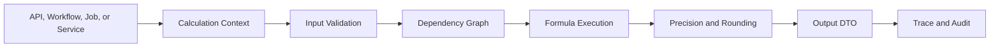
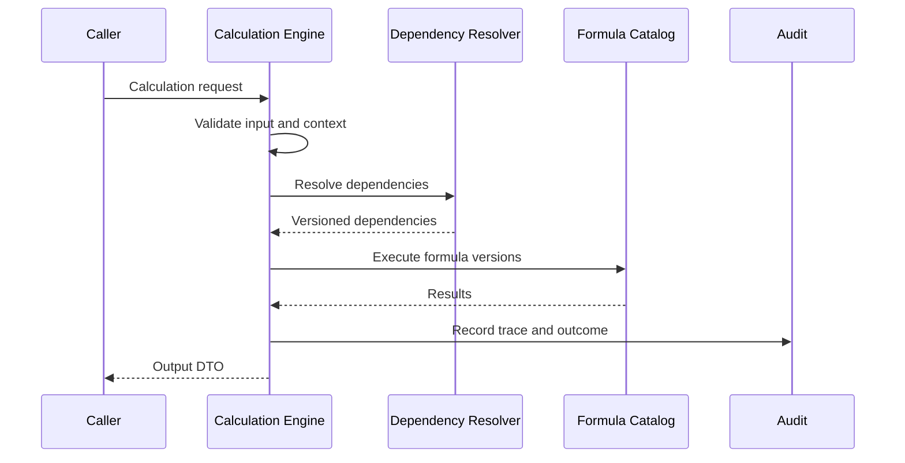
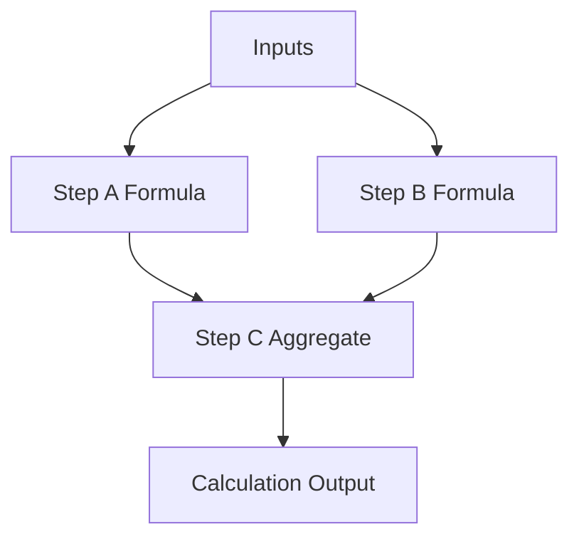
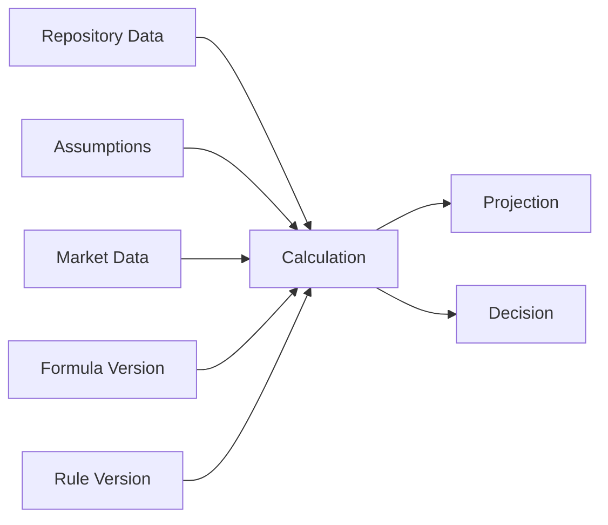
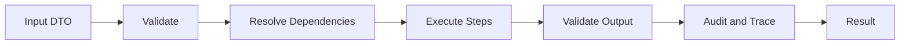
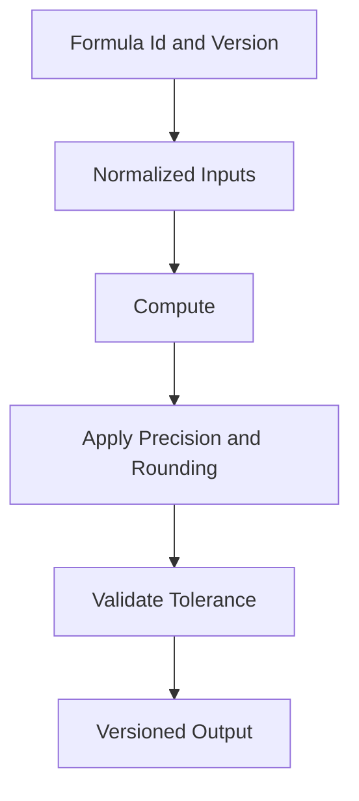

# Calculation Engine Framework

# Document Control

Document Name: Calculation Engine Framework
Document Path: knowledge/calculation-engine-framework.md
Document Type: Atlas Enterprise Canonical Specification
Version: 1.0
Status: Canonical Specification
Domain: Platform
Bounded Context: Platform
Owner: Project Atlas
Source of Truth: Atlas Calculation Engine Source of Truth
Last Updated: 2026-07-13

Related Specifications:
- knowledge/financial-formula-catalog.md
- knowledge/domain-service-catalog.md
- knowledge/application-service-catalog.md
- knowledge/service-catalog.md
- knowledge/command-catalog.md
- knowledge/domain-event-catalog.md
- knowledge/projection-engine-framework.md
- knowledge/simulation-engine-framework.md
- knowledge/optimization-engine-framework.md
- knowledge/rule-engine-architecture.md
- knowledge/scoring-model.md
- knowledge/explainability-framework.md
- knowledge/recommendation-priority-framework.md
- knowledge/scenario-framework.md
- knowledge/market-assumptions.md
- knowledge/assumptions.md
- knowledge/system-module-catalog.md
- knowledge/api-governance-framework.md
- docs/specification/04-DomainModel.md
- docs/api/07-API.md

# Purpose

Calculation Engine Framework defines the canonical Atlas calculation model. It is the source of truth for calculation context, sessions, pipelines, graphs, steps, formulas, dependencies, snapshots, versions, precision, accuracy, determinism, replay, traceability, auditability, performance, and integration with projection, simulation, optimization, decision, rule, recommendation, workflow, automation, scheduler, background job, API, dashboard, reporting, and analytics behavior.

This document does not create new Atlas business domains. It consolidates calculation behavior required by Financial Formula Catalog, Projection Engine, Simulation Engine, Optimization Engine, Rule Engine, Decision Engine, Recommendation, Application Services, Domain Services, Workflows, Automations, Schedulers, Background Jobs, APIs, Dashboards, Reporting, and Analytics.

# Scope

- Calculation Engine
- Calculation Context
- Calculation Session
- Calculation Pipeline
- Calculation Graph
- Calculation Step
- Calculation Formula
- Calculation Dependency
- Calculation Snapshot
- Calculation Version
- Calculation Precision
- Calculation Accuracy
- Calculation Determinism
- Calculation Replay
- Calculation Trace
- Financial Formula
- Projection
- Simulation
- Optimization
- Decision Engine
- Rule Engine
- Recommendation
- Application Service
- Domain Service
- Workflow
- Automation
- Scheduler
- Background Job
- API
- Dashboard
- Reporting
- Analytics

# Calculation Engine Principles

- Calculations must be deterministic for the same inputs, assumptions, market data, formula versions, rounding rules, precision rules, and execution version.
- Calculations must not mutate business state unless wrapped by an approved command, application service, workflow, automation, scheduler, or background job.
- Every calculation must declare inputs, outputs, formulas, assumptions, market data, dependencies, precision, rounding, tolerance, validation, replay, traceability, audit, and performance expectations.
- Every calculation that affects a decision, recommendation, projection, simulation, optimization, report, or dashboard must be traceable.
- Every calculation result must include version metadata sufficient to reproduce or explain the result.
- Every calculation must preserve tenant isolation and household isolation when using scoped data.
- Every calculation must enforce authorization before protected data is read or computed.
- Every calculation must define whether it is synchronous, asynchronous, batch, streaming, scheduled, or interactive.
- Every calculation pipeline must surface validation failures, dependency failures, precision issues, and tolerance breaches as controlled outcomes.
- Calculation audit must align with Audit Framework and Explainability Framework.

# Calculation Concept Definitions

| Concept | Canonical Meaning | Required Usage |
| --- | --- | --- |
| Calculation Engine | Component that validates inputs, resolves dependencies, executes formulas, applies precision, and returns traceable results. | Required for approved financial, projection, simulation, optimization, decision, and reporting calculations. |
| Calculation Context | Trusted execution context containing TenantId, HouseholdId, Principal, correlation, assumptions, market data, versions, and execution policy. | Required for every governed calculation. |
| Calculation Session | Bounded execution instance for one calculation request, batch, workflow step, scheduler run, automation action, or job. | Required for trace and replay. |
| Calculation Pipeline | Ordered processing path from input validation through dependency resolution, formula execution, result validation, audit, and output. | Required for predictable execution. |
| Calculation Graph | Directed dependency graph of formulas, intermediate values, projections, simulations, optimizations, and rules. | Required for complex or multi-step calculations. |
| Calculation Step | Atomic executable step in a calculation pipeline or graph. | Must define inputs, outputs, formula, precision, and failure behavior. |
| Calculation Formula | Versioned formula from Financial Formula Catalog or approved calculation module. | Required for numeric results. |
| Calculation Dependency | Required upstream data, assumption, formula, rule, projection, simulation, optimization, or decision output. | Must be declared and versioned. |
| Calculation Snapshot | Point-in-time capture of inputs, assumptions, market data, formula versions, rules, and outputs. | Required for replay and explainability. |
| Calculation Version | Version of formula, engine, graph, precision policy, and output schema. | Required for deterministic replay. |
| Calculation Precision | Numeric representation and significant precision policy. | Required for financial calculations. |
| Calculation Accuracy | Acceptable correctness target and tolerance against formula expectations. | Required for validation and tests. |
| Calculation Determinism | Guarantee that identical versioned inputs produce identical outputs. | Required for audit and replay. |
| Calculation Replay | Re-execution from captured snapshot and versions. | Required for decision, recommendation, projection, and compliance-sensitive results. |
| Calculation Trace | Ordered evidence of inputs, dependencies, formulas, intermediate values, and outputs. | Required for explainability and audit. |

# Calculation Engine Architecture

Atlas calculation architecture is versioned, dependency-aware, and traceable.

1. API, workflow, automation, scheduler, background job, application service, or domain service requests a calculation.
2. Security and Permission controls authorize the Principal for inputs, assumptions, and output scope.
3. Calculation Context is built with TenantId, HouseholdId, CorrelationId, CausationId, RequestId when available, assumption set, market data set, formula version, and engine version.
4. Input DTO is validated for schema, units, range, classification, currency, time horizon, and completeness.
5. Calculation Graph resolves formula dependencies, projection dependencies, simulation dependencies, optimization dependencies, rule engine dependencies, and repository data dependencies.
6. Calculation Pipeline executes steps in deterministic order or approved parallel groups.
7. Precision, rounding, tolerance, and validation rules are applied at defined boundaries.
8. Output DTO is produced with result values, units, versions, trace reference, confidence or tolerance where applicable, and explainability metadata.
9. Audit and trace records capture calculation session, dependencies, intermediate values when required, result, replay metadata, and performance.
10. Projections, simulations, optimizations, decisions, dashboards, reports, analytics, recommendations, and notifications consume approved results.

# Complete Calculation Catalog

Every calculation capability must use this Enterprise contract.

| Field | Requirement |
| --- | --- |
| Calculation Name | Stable PascalCase name ending with Calculation. |
| Display Name | Human-readable label. |
| Category | FinancialFormula, Projection, Simulation, Optimization, Decision, RuleEvaluation, Recommendation, DashboardMetric, ReportingMetric, AnalyticsMetric, Operational. |
| Purpose | Why the calculation exists. |
| Business Meaning | Business, financial, decision, recommendation, reporting, or operational meaning. |
| Description | Exact computed behavior. |
| Inputs | Required source values, types, units, scope, and classification. |
| Outputs | Result values, units, schema, classification, and consumers. |
| Input DTO | API or service input contract when applicable. |
| Output DTO | API or service output contract when applicable. |
| Required Assumptions | Assumption set and version. |
| Required Market Data | Market data set, source, time, and version. |
| Required Formula | Formula id and version from Financial Formula Catalog. |
| Calculation Graph | Step graph and dependencies. |
| Dependencies | Formula, repository, projection, simulation, optimization, rule, decision, scenario, and market dependencies. |
| Projection Dependency | Projection inputs or outputs used. |
| Simulation Dependency | Simulation inputs or outputs used. |
| Optimization Dependency | Optimization inputs or outputs used. |
| Rule Engine Dependency | Rule expressions, rule versions, and rule outcomes used. |
| Decision Engine Dependency | Decision state or decision result used. |
| Repository | Repository reads needed to obtain source data. |
| Application Service | Service orchestrating calculation. |
| Domain Service | Domain service responsible for domain calculation behavior. |
| API | API route or DTO exposing calculation. |
| Workflow | Workflow dependency or calculation step. |
| Automation | Automation trigger or action using calculation. |
| Scheduler | Scheduled calculation or refresh. |
| Background Job | Async or batch calculation worker. |
| Execution Strategy | Synchronous, asynchronous, batch, streaming, scheduled, interactive, or parallel. |
| Precision | Numeric type, scale, unit, and significant precision. |
| Rounding | Rounding mode and boundary. |
| Tolerance | Acceptable deviation or comparison tolerance. |
| Validation | Input, dependency, formula, output, and tolerance validation. |
| Business Rules | Behavioral rules and invariants. |
| Version | Engine, formula, graph, input schema, output schema, and precision policy version. |
| Replay | Snapshot, replay scope, and deterministic requirements. |
| Traceability | Required trace fields and intermediate values. |
| Audit | Audit record requirements. |
| Performance | SLA, parallelism, memory, cache, and timeout. |
| Security | Authorization, tenant, household, masking, and classification controls. |
| Example | Minimal valid calculation scenario. |

# Calculation Matrix

| Calculation Category | Primary Input | Primary Output | Required Governance |
| --- | --- | --- | --- |
| FinancialFormula | Financial values and assumptions | Numeric financial result | Formula version, precision, rounding, trace. |
| Projection | Current state, assumptions, time horizon | Forecast time series | Projection version, scenario, assumptions, replay. |
| Simulation | Scenario variables and random or deterministic inputs | Distribution or scenario outcomes | Seed, model version, confidence, trace. |
| Optimization | Objective, constraints, candidate options | Optimal allocation or recommendation input | Objective version, constraint trace, solver metadata. |
| Decision | Rules, calculations, projections, scores | Decision result | Rule version, rationale, audit, explainability. |
| Recommendation | Decision result, priority model, user context | Ranked recommendation | Priority score, confidence, explanation, audit. |
| DashboardMetric | Repository or projection data | Metric value | Source version, generated time, staleness. |
| ReportingMetric | Governed data set | Reported value | Lineage, filter scope, aggregation rule. |
| AnalyticsMetric | Historical or aggregated data | Analytical metric | Aggregation, anonymization, refresh cadence. |

# Formula Matrix

| Formula Area | Calculation Requirement |
| --- | --- |
| Cash Flow | Income, expense, cadence, inflation, time horizon, currency, and rounding. |
| Net Worth | Assets, liabilities, valuation date, currency, and aggregation policy. |
| Portfolio | Holdings, prices, allocation, returns, risk, fees, and market data version. |
| Loan | Principal, rate, amortization, payment schedule, fees, and precision. |
| Retirement | Contributions, withdrawal, inflation, return assumptions, horizon, and scenario. |
| Goal Funding | Target, time horizon, contribution, expected return, inflation, and constraints. |
| Risk Score | Inputs, weights, thresholds, score version, and explainability. |
| Financial Health | Ratio definitions, weights, thresholds, and scoring model version. |

# Assumption Matrix

| Assumption Type | Required Control |
| --- | --- |
| Inflation | Source, effective date, version, region, and scenario mapping. |
| Return Rate | Asset class, market data source, horizon, version, and confidence. |
| Tax | Jurisdiction, effective date, rule version, and calculation scope. |
| Salary Growth | Household or scenario scope, version, and sensitivity range. |
| Expense Growth | Category, scenario, inflation mapping, and version. |
| Risk Tolerance | User or household profile, effective date, and permission. |
| Life Stage | Model version, household profile, and decision context. |

# Projection Matrix

| Projection Dependency | Calculation Requirement |
| --- | --- |
| Cash Flow Projection | Requires cashflow formulas, assumptions, schedule, and traceable time series. |
| Net Worth Projection | Requires asset, liability, cashflow, market assumptions, and valuation rules. |
| Portfolio Projection | Requires return assumptions, allocation, rebalancing rules, and market data. |
| Loan Projection | Requires amortization formula, rate assumptions, payment schedule, and fees. |
| Retirement Projection | Requires contribution, withdrawal, inflation, return, and scenario assumptions. |

# Simulation Matrix

| Simulation Dependency | Calculation Requirement |
| --- | --- |
| Scenario Simulation | Requires scenario inputs, assumption version, and deterministic seed when replayable. |
| Monte Carlo Simulation | Requires random seed, distribution model, iteration count, and confidence output. |
| Sensitivity Analysis | Requires variable ranges, base case, and comparison strategy. |
| Stress Test | Requires stress assumptions, constraints, and failure thresholds. |

# Optimization Matrix

| Optimization Dependency | Calculation Requirement |
| --- | --- |
| Portfolio Optimization | Objective, constraints, risk model, return assumptions, and solver version. |
| Goal Funding Optimization | Objective, constraints, contribution capacity, and priority model. |
| Debt Paydown Optimization | Objective, interest rates, cashflow constraints, and payoff rules. |
| Cash Reserve Optimization | Target liquidity, risk policy, opportunity cost, and household context. |

# Decision Matrix

| Decision Dependency | Calculation Requirement |
| --- | --- |
| Eligibility Decision | Rule outcomes, input values, thresholds, and trace. |
| Recommendation Decision | Calculation outputs, priority score, confidence, and explanation. |
| Risk Decision | Score, thresholds, rule version, and override policy. |
| Scenario Decision | Projection comparison, ranking rule, and decision audit. |

# Calculation Dependency Matrix

| Dependency Type | Required Metadata |
| --- | --- |
| Repository Data | Repository name, query, resource ids, TenantId, HouseholdId, snapshot time. |
| Formula | Formula id, version, precision, rounding, and unit. |
| Assumption | Assumption id, version, source, effective date, and scenario. |
| Market Data | Source, instrument, time, version, and freshness. |
| Projection | Projection name, version, generated time, and staleness. |
| Simulation | Simulation id, seed, model version, and confidence. |
| Optimization | Objective, constraint set, solver version, and solution status. |
| Rule | Rule id, version, inputs, result, and priority. |

# Precision Strategy

- Financial calculations must use decimal precision unless a formula explicitly requires another numeric model.
- Currency calculations must preserve currency code, scale, and rounding boundary.
- Intermediate precision must be higher than output precision when rounding could affect outcome.
- Percentage and rate values must define scale and interpretation.
- Tolerance must be explicit for comparisons, thresholds, and tests.
- Precision policy changes must increment calculation version when output can change.

# Rounding Strategy

- Rounding mode must be explicit.
- Rounding boundary must be explicit: per step, per period, per aggregate, per output, or display only.
- Display rounding must not replace stored calculation precision unless cataloged.
- Tax, payment, amortization, and currency formulas must define domain-specific rounding.
- Rounding differences beyond tolerance must fail validation or produce warning according to policy.

# Validation Rules

- Calculation Name is required.
- Calculation Category is required.
- Calculation Owner is required.
- Inputs are required.
- Outputs are required.
- Input DTO is required when exposed through API.
- Output DTO is required when exposed through API.
- Required Formula is required for formula calculations.
- Formula version is required.
- Assumption version is required when assumptions are used.
- Market data version is required when market data is used.
- Calculation Graph is required for multi-step calculations.
- Dependency list is required.
- Execution Strategy is required.
- Precision policy is required.
- Rounding policy is required.
- Tolerance policy is required.
- Validation policy is required.
- Business Rules are required.
- Calculation Version is required.
- Replay policy is required for decision-impacting calculations.
- Traceability policy is required.
- Audit policy is required.
- Performance target is required.
- Security policy is required.
- TenantId is required for tenant-scoped inputs.
- HouseholdId is required for household-scoped inputs.
- Authorization must be evaluated before protected data access.
- Input units must be validated.
- Output units must be declared.
- Currency must be declared for monetary values.
- Time horizon must be declared for projections.
- Scenario id must be declared for scenario calculations.
- Random seed must be recorded for replayable simulations.
- Optimization solver status must be recorded.
- Rule version must be recorded when rules affect calculation.
- Calculation trace must include intermediate values when needed for explainability.
- Calculation failures must produce controlled error classes.
- Calculation timeout must be defined for long-running calculations.
- Calculation cache use must include versioned cache key.
- Replay must validate all referenced versions are available.

# Business Rules

- Calculation Engine is the canonical execution model for governed Atlas calculations.
- Financial Formula Catalog owns formula definitions.
- Calculation Engine owns execution, dependency resolution, precision, trace, and replay behavior.
- Domain Services may own domain-specific calculation rules.
- Application Services orchestrate user-facing and workflow-facing calculations.
- APIs expose calculation outputs through approved DTOs.
- Dashboards must not recalculate critical metrics with unmanaged logic.
- Reports must use governed calculation outputs or cataloged report formulas.
- Analytics must preserve source lineage and calculation version.
- Calculation results must not be accepted without input validation.
- Calculation results must not be accepted without dependency validation.
- Calculation results must not be accepted without formula version.
- Calculation results must not be accepted without precision policy.
- Calculation results must not be accepted without rounding policy.
- Calculation results must not be accepted without output validation.
- Decision-impacting calculations must be replayable.
- Recommendation-impacting calculations must be traceable.
- Projection-impacting calculations must preserve assumptions and formula versions.
- Simulation calculations must record seed when deterministic replay is required.
- Optimization calculations must record objective, constraints, solver version, and status.
- Rule-dependent calculations must record rule id and rule version.
- Market-dependent calculations must record market data source and freshness.
- Assumption-dependent calculations must record assumption source and version.
- Cached calculation results must include calculation version and input hash.
- Cached calculation results must include tenant and household scope when applicable.
- Calculation cache must not bypass authorization.
- Calculation cache must not return results across tenants.
- Calculation cache must not return results across households.
- Calculation graph must not contain unresolved cycles.
- Calculation graph must detect missing dependencies.
- Calculation graph must execute deterministic steps in deterministic order.
- Parallel calculation is allowed only when dependency graph permits it.
- Parallel calculation must not change deterministic result.
- Intermediate values must use approved precision.
- Intermediate values must not be rounded prematurely unless formula requires it.
- Output rounding must follow cataloged policy.
- Tolerance must be applied consistently.
- Division by zero must be handled explicitly.
- Negative values must be validated against domain rules.
- Null inputs must be rejected or defaulted only by cataloged rule.
- Missing market data must produce controlled failure or fallback rule.
- Stale market data must produce warning or failure according to policy.
- Missing assumptions must produce controlled failure.
- Conflicting assumptions must produce controlled failure.
- Unit mismatch must produce controlled failure.
- Currency mismatch must produce conversion or failure according to policy.
- Currency conversion must record rate source, time, and version.
- Time zone must not affect UTC calculation inputs unless formula explicitly uses local date.
- Date boundaries must be explicit.
- Period aggregation must define inclusive and exclusive boundaries.
- Result explainability must reference formula and inputs.
- Calculation trace must avoid raw secrets and unnecessary PII.
- Calculation audit must include CorrelationId.
- Calculation audit must include CausationId when caused by command, event, workflow, job, scheduler, or automation.
- Calculation replay must not mutate production state unless wrapped in approved recovery process.
- Calculation replay must not emit user notifications unless explicitly approved.
- Calculation outputs used by projections must include projection dependency metadata.
- Calculation outputs used by simulations must include simulation dependency metadata.
- Calculation outputs used by optimizations must include optimization dependency metadata.
- Calculation outputs used by decisions must include decision dependency metadata.
- Calculation outputs used by recommendations must include recommendation dependency metadata.
- Calculation SLA must match API, workflow, scheduler, or background job requirements.
- Long-running calculations must run asynchronously or through background jobs.
- Batch calculations must use bounded batches.
- Calculation failures must be observable.
- Calculation performance metrics must be recorded for governed calculations.
- Calculation Engine Framework conflicts are resolved by this document unless Financial Formula Catalog, Security, Audit, Compliance, Data Governance, Tenant, or legal rules impose stricter controls.

# Performance

| Area | Requirement |
| --- | --- |
| Calculation SLA | Each calculation must define latency, timeout, throughput, and fallback expectation. |
| Parallel Calculation | Parallel execution must follow graph dependency order and preserve determinism. |
| Caching | Cached results require versioned input hash, formula version, assumption version, TenantId, HouseholdId, and authorization scope. |
| Precision | Precision policy must not create unbounded memory or CPU cost without explicit approval. |
| Memory Usage | Batch, simulation, optimization, and projection calculations must declare memory bounds. |

# Audit

## Calculation History

- Calculation execution records must include calculation name, version, actor, TenantId, HouseholdId when applicable, input snapshot reference, output reference, duration, and outcome.

## Calculation Trace

- Trace must include formula ids, formula versions, assumptions, market data, dependency graph, intermediate values when required, rounding, tolerance, and validation outcomes.

## CorrelationId

- CorrelationId is required for every governed calculation.
- Child calculations must inherit parent CorrelationId.

## Replay History

- Replay records must include actor, reason, source snapshot, version availability, result comparison, differences, and outcome.

# Security

## Authorization

- Protected calculation inputs require authorization before read.
- Protected calculation outputs require authorization before display, export, cache, or notification.

## Calculation Isolation

- Calculation sessions must isolate input sets, snapshots, intermediate values, and outputs from unrelated sessions.
- Shared caches or batch workers must not mix scoped data.

## Tenant Isolation

- Tenant-scoped calculations must include TenantId in context, input snapshot, trace, cache, audit, and output.
- Cross-tenant calculations require explicit administrative permission and approved aggregation or anonymization.

# Mermaid

## Calculation Architecture

## Calculation Flow

## Calculation Graph

## Dependency Graph

## Pipeline Diagram

## Formula Flow

# Testing

| Test Type | Required Coverage |
| --- | --- |
| Formula Test | Formula correctness, input ranges, units, currency, assumptions, market data, and expected outputs. |
| Precision Test | Decimal precision, rounding boundaries, tolerance comparison, and accumulated error. |
| Performance Test | SLA, timeout, throughput, parallel execution, memory usage, cache behavior, and batch size. |
| Replay Test | Snapshot replay, version availability, deterministic result, difference detection, and replay audit. |
| Consistency Test | Same input produces same output, graph order is deterministic, cache result matches source execution, and dependency versions are stable. |

# Edge Cases

- Required input is missing.
- Input unit is invalid.
- Input currency is missing.
- Currency conversion rate is unavailable.
- Market data is stale.
- Market data source conflicts with assumption set.
- Assumption version is missing.
- Assumption is expired.
- Formula version is missing.
- Formula version is retired.
- Formula input range is exceeded.
- Formula returns undefined value.
- Division by zero occurs.
- Negative value violates domain rule.
- Null value appears in required dependency.
- Calculation graph has a cycle.
- Calculation graph has missing dependency.
- Parallel execution changes result order.
- Rounding occurs too early.
- Tolerance threshold is exceeded.
- Output validation fails.
- Trace storage fails after calculation succeeds.
- Audit write fails after calculation succeeds.
- Replay cannot find historical formula version.
- Replay cannot find historical assumption version.
- Replay result differs from original.
- Random simulation lacks seed.
- Optimization solver does not converge.
- Optimization returns infeasible solution.
- Projection dependency is stale.
- Rule dependency changes during execution.
- TenantId is missing from scoped calculation.
- HouseholdId is missing from household calculation.
- Authorization changes during long-running calculation.
- Cache key omits calculation version.
- Cache key omits assumption version.
- Cache returns another household result.
- API timeout occurs while calculation continues.
- Background job retries calculation with same idempotency key.
- Scheduler starts overlapping calculation run.
- Workflow compensation needs prior calculation snapshot.
- Automation triggers calculation on stale data.
- Dashboard displays result without generated time.
- Report uses calculation without lineage.
- Analytics aggregation mixes incompatible formula versions.
- Sensitive input appears in trace.
- Raw PII appears in audit details.
- Precision change alters recommendation ranking.
- Market assumption update invalidates cached calculation.
- Formula catalog update occurs during batch.
- Calculation session is interrupted mid-graph.
- Memory limit is exceeded during simulation.
- Batch calculation partially completes.
- Dependency repository is unavailable.
- Result is valid numerically but violates business rule.
- Output DTO version is incompatible with API consumer.
- Explainability references missing intermediate value.
- CorrelationId is missing.
- CausationId references missing parent.
- Calculation warning is suppressed incorrectly.
- Display rounding differs from stored precision.
- Time horizon boundary excludes final period incorrectly.
- Leap day affects periodic calculation.
- Local date boundary conflicts with UTC timestamp.

# Final Consistency Matrix

| Area | Required Calculation Alignment |
| --- | --- |
| Calculation | Uses this framework as canonical source of truth. |
| Formula | Formula id, version, precision, rounding, units, and expected behavior are mapped. |
| Projection | Projection dependencies, versions, staleness, and outputs are mapped. |
| Simulation | Model version, seed, assumptions, confidence, and replay are mapped. |
| Optimization | Objective, constraints, solver version, status, and trace are mapped. |
| Decision | Rule version, calculation output, rationale, and audit are mapped. |
| Rule Engine | Rule ids, versions, inputs, outcomes, and priority are mapped. |
| Repository | Source data, query, snapshot time, tenant, household, and lineage are mapped. |
| Application Service | Orchestration, authorization, DTO, audit, and workflow behavior are mapped. |
| Domain Service | Domain-specific formulas, invariants, and business rules are mapped. |
| API | Input DTO, output DTO, validation, timeout, authorization, and trace exposure are mapped. |

# Completion Checklist

- Calculation formula requirement is defined.
- Calculation input requirement is defined.
- Calculation output requirement is defined.
- Calculation precision requirement is defined.
- Calculation rounding requirement is defined.
- Calculation tolerance requirement is defined.
- Calculation validation requirement is defined.
- Calculation replay requirement is defined.
- Calculation traceability requirement is defined.
- Calculation audit requirement is defined.
- Formula mapping is defined.
- Assumption mapping is defined.
- Projection mapping is defined.
- Simulation mapping is defined.
- Optimization mapping is defined.
- Decision mapping is defined.
- Dependency matrix is defined.
- Validation rules are complete.
- Business rules are complete.
- Mermaid diagrams are syntactically valid.
- Markdown structure is valid.
- No placeholder terms are present.
- No draft-only status is present.
- No temporary catalog entries are present.
