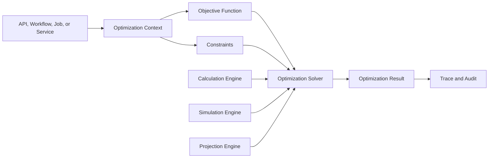
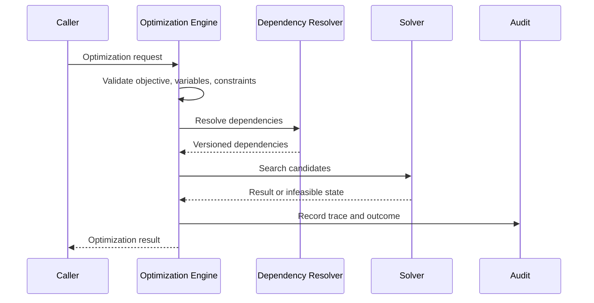
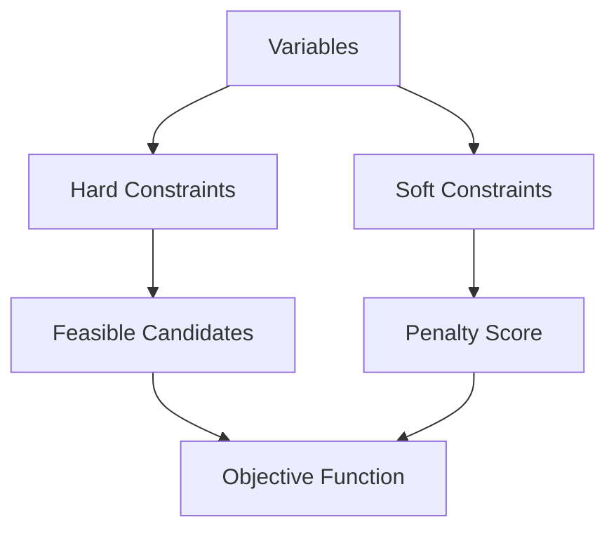
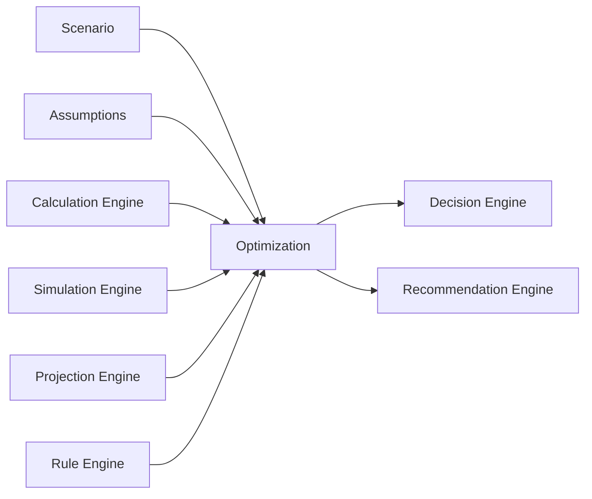
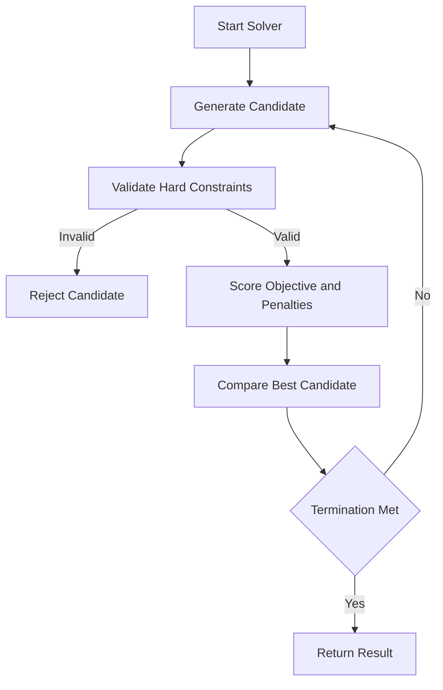
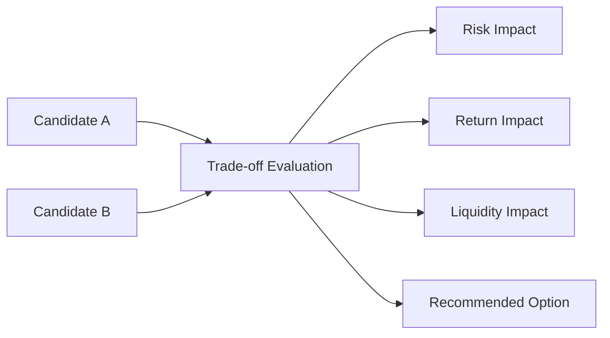

# Optimization Engine Framework

# Document Control

Document Name: Optimization Engine Framework
Document Path: knowledge/optimization-engine-framework.md
Document Type: Atlas Enterprise Canonical Specification
Version: 1.0
Status: Canonical Specification
Domain: Platform
Bounded Context: Platform
Owner: Project Atlas
Source of Truth: Atlas Optimization Engine Source of Truth
Last Updated: 2026-07-13

Related Specifications:
- knowledge/calculation-engine-framework.md
- knowledge/simulation-engine-framework.md
- knowledge/projection-engine-framework.md
- knowledge/rule-engine-architecture.md
- knowledge/decision-rule-catalog.md
- knowledge/scenario-framework.md
- knowledge/scoring-model.md
- knowledge/explainability-framework.md
- knowledge/recommendation-priority-framework.md
- knowledge/application-service-catalog.md
- knowledge/domain-service-catalog.md
- knowledge/service-catalog.md
- knowledge/command-catalog.md
- knowledge/domain-event-catalog.md
- knowledge/system-module-catalog.md
- knowledge/api-governance-framework.md
- knowledge/market-assumptions.md
- knowledge/assumptions.md
- knowledge/financial-formula-catalog.md
- docs/specification/04-DomainModel.md
- docs/api/07-API.md

# Purpose

Optimization Engine Framework defines the canonical Atlas optimization model. It is the source of truth for optimization context, sessions, models, objectives, objective functions, constraints, variables, solvers, strategies, results, scores, trade-offs, replay, traceability, versions, audit, performance, security, and integration with simulation, projection, calculation, decision, rule, recommendation, portfolio, scenario, workflow, automation, scheduler, background job, API, dashboard, and analytics behavior.

This document does not create new Atlas business domains. It consolidates optimization behavior required by Calculation Engine, Simulation Engine, Projection Engine, Rule Engine, Decision Engine, Scenario Framework, Recommendation Priority Framework, Application Services, Domain Services, Workflows, Automations, Schedulers, Background Jobs, APIs, Dashboards, and Analytics.

# Scope

- Optimization Engine
- Optimization Context
- Optimization Session
- Optimization Model
- Optimization Objective
- Objective Function
- Optimization Constraint
- Hard Constraint
- Soft Constraint
- Penalty Rule
- Priority Rule
- Optimization Variable
- Optimization Solver
- Optimization Strategy
- Search Strategy
- Termination Criteria
- Convergence Criteria
- Optimization Result
- Optimization Score
- Optimization Trade-off
- Optimization Replay
- Optimization Trace
- Optimization Version
- Simulation
- Projection
- Calculation
- Decision Engine
- Rule Engine
- Recommendation Engine
- Portfolio
- Scenario
- Application Service
- Domain Service
- Workflow
- Automation
- Scheduler
- Background Job
- API
- Dashboard
- Analytics

# Optimization Engine Principles

- Optimization must be deterministic when inputs, assumptions, objective function, constraints, solver strategy, random seed when applicable, and engine version are identical.
- Optimization must declare objective, variables, constraints, penalties, priorities, inputs, outputs, dependencies, solver strategy, search strategy, termination criteria, convergence criteria, replay, traceability, audit, performance, and security expectations.
- Optimization results are decision-support outputs and must not mutate business state unless applied through an approved command, workflow, automation, scheduler, or background job.
- Every recommendation-impacting optimization must be traceable and explainable.
- Every decision-impacting optimization must be replayable.
- Every optimization must preserve tenant isolation and household isolation.
- Every optimization must enforce authorization before protected inputs are read or protected outputs are displayed, exported, cached, or reported.
- Every optimization must distinguish hard constraints from soft constraints.
- Every infeasible optimization must return controlled infeasibility evidence rather than an unmanaged failure.
- Optimization audit must align with Audit Framework, Calculation Engine Framework, Simulation Engine Framework, Explainability Framework, and Recommendation Priority Framework.

# Optimization Concept Definitions

| Concept | Canonical Meaning | Required Usage |
| --- | --- | --- |
| Optimization Engine | Component that searches for preferred outcomes under objectives, constraints, variables, and priorities. | Required for governed Atlas optimization capabilities. |
| Optimization Context | Trusted execution context containing TenantId, HouseholdId, Principal, objective, constraints, assumptions, versions, correlation, and execution policy. | Required for every governed optimization. |
| Optimization Session | Bounded execution instance for one optimization request, workflow step, scheduled run, automation action, or background job. | Required for progress, replay, trace, and audit. |
| Optimization Model | Versioned model defining objective function, variables, constraints, penalties, priorities, and solver behavior. | Required for repeatable execution. |
| Optimization Objective | Target to maximize, minimize, balance, satisfy, or rank. | Required for every optimization. |
| Objective Function | Versioned formula or scoring expression that evaluates candidate solutions. | Required for solver evaluation. |
| Optimization Constraint | Rule limiting allowed candidate solutions. | Must define hard or soft behavior. |
| Optimization Variable | Decision variable that solver may change within allowed bounds. | Must define range, unit, granularity, and validation. |
| Optimization Solver | Algorithm or strategy used to search candidate solutions. | Must define version and termination behavior. |
| Optimization Strategy | Overall method such as constraint optimization, rule-based optimization, heuristic search, exhaustive search, or multi-objective scoring. | Required for execution governance. |
| Optimization Result | Selected solution, ranked candidates, infeasibility result, or trade-off set. | Must include score, constraints, version, and trace reference. |
| Optimization Score | Numeric or ranked evaluation of candidate quality. | Must be traceable to objective and scoring model. |
| Optimization Trade-off | Explicit comparison between competing objectives or constraints. | Required for multi-objective outcomes. |
| Optimization Replay | Re-execution from captured snapshot and versions. | Required for decision-impacting results. |
| Optimization Trace | Ordered evidence of objective, variables, constraints, candidates, scores, penalties, and selected result. | Required for explainability and audit. |
| Optimization Version | Version of model, solver, objective, constraints, input schema, output schema, and scoring policy. | Required for deterministic replay. |

# Optimization Engine Architecture

Atlas optimization architecture is objective-driven, constraint-aware, and traceable.

1. API, workflow, automation, scheduler, background job, application service, or domain service requests optimization.
2. Security and Permission controls authorize access to scenario, assumptions, source data, objective, and output scope.
3. Optimization Context is built with TenantId, HouseholdId, Principal, CorrelationId, CausationId, RequestId when available, objective version, model version, solver version, assumption versions, calculation versions, simulation versions, projection versions, and execution policy.
4. Inputs, variables, constraints, objective function, dependency versions, and scenario compatibility are validated.
5. Calculation Engine computes required financial values and objective inputs.
6. Simulation Engine supplies scenario outcomes, distributions, or stress results where required.
7. Projection Engine supplies forecast and read-side dependencies where required.
8. Rule Engine and Decision Engine supply rule outcomes, eligibility, constraints, and decision dependencies.
9. Optimization Engine evaluates candidate solutions, applies hard constraints, scores soft constraints, computes penalties, ranks trade-offs, and terminates according to convergence or search limits.
10. Results, infeasibility explanations, traces, snapshots, progress, performance metrics, and audit records are persisted or returned according to policy.

# Complete Optimization Catalog

Every optimization capability must use this Enterprise contract.

| Field | Requirement |
| --- | --- |
| Optimization Name | Stable PascalCase name ending with Optimization. |
| Display Name | Human-readable label. |
| Category | Portfolio, GoalFunding, DebtPaydown, CashReserve, TaxAware, RiskReduction, CashFlow, ScenarioRanking, RecommendationRanking, MultiObjective, Operational. |
| Purpose | Why the optimization exists. |
| Business Meaning | Business, financial, decision, recommendation, reporting, or operational meaning. |
| Description | Exact optimized behavior. |
| Objective | Target outcome and objective direction. |
| Objective Function | Formula, scoring model, or ranking expression and version. |
| Optimization Variables | Variables, bounds, units, granularity, and ownership. |
| Constraints | Full constraint set. |
| Hard Constraints | Mandatory constraints that candidate solutions must satisfy. |
| Soft Constraints | Preferred constraints scored through penalties or trade-offs. |
| Penalty Rules | Penalty formulas, weights, and thresholds. |
| Priority Rules | Priority model, ranking rule, and tie-breakers. |
| Inputs | Required source values, units, scope, and classification. |
| Outputs | Selected solution, ranked candidates, scores, classification, and consumers. |
| Scenario Dependency | Scenario id, version, lifecycle, and compatibility. |
| Simulation Dependency | Simulation id, version, generated time, and confidence when used. |
| Calculation Dependency | Calculation names, versions, inputs, and outputs used. |
| Projection Dependency | Projection names, versions, generated time, and staleness. |
| Decision Dependency | Decision state, rule result, or recommendation dependency when used. |
| Rule Engine Dependency | Rule ids, versions, inputs, and outcomes. |
| Repository | Repository reads needed for source data. |
| Application Service | Service orchestrating optimization. |
| Domain Service | Domain service owning domain optimization behavior. |
| Workflow | Workflow dependency or optimization step. |
| Automation | Automation trigger or action using optimization. |
| Scheduler | Scheduled optimization or refresh. |
| Background Job | Async, batch, replay, or long-running worker. |
| API | API route or DTO exposing optimization. |
| Execution Strategy | Synchronous, asynchronous, batch, scheduled, parallel, deterministic, heuristic, or interactive. |
| Solver Strategy | Exact solver algorithm, version, and deterministic policy. |
| Search Strategy | Exhaustive, greedy, branch-and-bound, dynamic programming, heuristic, stochastic, rule-guided, or multi-pass. |
| Termination Criteria | Iteration limit, time limit, convergence, candidate exhaustion, feasibility, or threshold. |
| Convergence Criteria | Score tolerance, stability window, improvement threshold, or not applicable. |
| Validation | Input, objective, variable, constraint, dependency, output, feasibility, and tolerance validation. |
| Business Rules | Behavioral rules and invariants. |
| Version | Engine, model, objective, solver, constraint, input schema, output schema, and scoring versions. |
| Replay | Snapshot, seed if applicable, dependency versions, and result comparison behavior. |
| Traceability | Trace fields, candidates, scores, penalties, constraint outcomes, and explanation references. |
| Audit | Audit record requirements. |
| Performance | SLA, parallelism, memory, CPU, timeout, progress, and cancellation. |
| Security | Authorization, tenant, household, masking, classification, and result access. |
| Example | Minimal valid optimization scenario. |

# Optimization Matrix

| Optimization Category | Primary Objective | Required Governance |
| --- | --- | --- |
| Portfolio | Balance return, risk, allocation, and constraints. | Objective version, allocation bounds, risk model, solver trace. |
| GoalFunding | Achieve goals within capacity and priority. | Goal priority, contribution capacity, constraints, recommendation trace. |
| DebtPaydown | Minimize interest or payoff time. | Loan terms, cashflow constraints, strategy, calculation trace. |
| CashReserve | Balance liquidity and opportunity cost. | Reserve policy, risk boundary, household context, trade-off trace. |
| TaxAware | Reduce tax impact under policy constraints. | Jurisdiction, tax rule version, assumption version, trace. |
| RiskReduction | Reduce risk while preserving goal feasibility. | Risk model, thresholds, constraints, explanation. |
| CashFlow | Improve surplus, stability, or runway. | Cashflow projection, constraints, assumptions, scenario. |
| ScenarioRanking | Rank scenarios by objective and policy. | Comparable scenarios, scoring method, tie-breakers. |
| RecommendationRanking | Rank recommendations by impact and priority. | Priority model, confidence, explanation, audit. |
| MultiObjective | Balance competing objectives. | Weighting, trade-off matrix, penalty rules, explainability. |

# Objective Matrix

| Objective | Direction | Required Metadata |
| --- | --- | --- |
| Maximize Net Worth | Maximize | Time horizon, valuation method, assumptions, currency. |
| Improve Cash Flow | Maximize | Period, income, expense, recurring obligations, volatility. |
| Minimize Interest | Minimize | Loan terms, payoff strategy, cashflow capacity, fees. |
| Reduce Risk | Minimize | Risk model, thresholds, score version, constraints. |
| Achieve Goals Sooner | Minimize time | Goal targets, priority, contribution capacity, dependencies. |
| Maximize Recommendation Utility | Maximize | Priority score, confidence, impact, effort, risk. |
| Balance Liquidity | Multi-objective | Reserve target, opportunity cost, risk tolerance. |

# Constraint Matrix

| Constraint Type | Behavior | Required Control |
| --- | --- | --- |
| Hard Constraint | Candidate must satisfy. | Violation makes candidate infeasible. |
| Soft Constraint | Candidate may violate with penalty. | Penalty rule and weight required. |
| Budget Constraint | Limits contribution, payment, allocation, or spending. | Currency, period, and source required. |
| Risk Constraint | Limits volatility, drawdown, concentration, or score. | Risk model and threshold required. |
| Time Constraint | Limits horizon, deadline, or execution time. | Date boundary and timezone policy required. |
| Policy Constraint | Enforces business or governance rule. | Rule id and version required. |
| Tenant Constraint | Enforces tenant scope. | TenantId required. |
| Household Constraint | Enforces household scope. | HouseholdId required. |

# Variable Matrix

| Variable Type | Required Control |
| --- | --- |
| Allocation Variable | Asset class, min, max, step, current value, and constraint set. |
| Contribution Variable | Goal, amount range, cadence, capacity, and priority. |
| Payment Variable | Liability, amount range, cadence, interest, and payoff rule. |
| Reserve Variable | Target level, min, max, liquidity class, and risk boundary. |
| Scenario Variable | Scenario delta, unit, range, and compatibility. |
| Recommendation Variable | Action candidate, impact, effort, confidence, and suppression rule. |

# Scenario Matrix

| Scenario Dependency | Optimization Requirement |
| --- | --- |
| Baseline Scenario | Uses current approved assumptions and current household state. |
| Alternative Scenario | Records delta, objective effect, and comparison target. |
| Stress Scenario | Applies hard safety constraints and risk thresholds. |
| Goal Scenario | Uses target, deadline, priority, and contribution capacity. |
| Portfolio Scenario | Uses allocation, risk, return, constraints, and market assumptions. |

# Simulation Matrix

| Simulation Dependency | Optimization Requirement |
| --- | --- |
| Monte Carlo Result | Confidence, percentile, seed, model version, and outcome distribution. |
| Stress Test Result | Failure threshold, downside metric, and risk classification. |
| Sensitivity Result | Variable sensitivity, output range, and robustness signal. |
| Scenario Comparison | Comparable results, ranking method, and confidence. |

# Calculation Matrix

| Calculation Dependency | Optimization Requirement |
| --- | --- |
| Financial Formula | Formula id, version, precision, rounding, and trace. |
| Score Calculation | Score model version, weights, thresholds, and explanation. |
| Cash Flow Calculation | Period, currency, surplus, obligations, and tolerance. |
| Risk Calculation | Risk model, thresholds, inputs, and score version. |
| Goal Funding Calculation | Target, contribution, horizon, and assumptions. |

# Projection Matrix

| Projection Dependency | Optimization Requirement |
| --- | --- |
| Cash Flow Projection | Time series, generated time, assumptions, and staleness. |
| Net Worth Projection | Asset and liability trajectory, valuation method, and scenario. |
| Portfolio Projection | Return path, allocation, risk, and market data version. |
| Goal Projection | Goal progress, funding gap, deadline, and contribution path. |

# Decision Matrix

| Decision Dependency | Optimization Requirement |
| --- | --- |
| Eligibility Decision | Hard constraint source and rule trace. |
| Recommendation Decision | Ranking objective, priority score, confidence, and explanation. |
| Risk Decision | Risk threshold, score, and override policy. |
| Scenario Decision | Scenario ranking and tie-breaker. |

# Trade-off Matrix

| Trade-off | Required Explanation |
| --- | --- |
| Return vs Risk | Expected return change, risk score change, constraint effect. |
| Liquidity vs Investment | Reserve change, opportunity cost, risk effect. |
| Debt Paydown vs Goal Funding | Interest saved, goal delay or acceleration, cashflow effect. |
| Short Term Cash Flow vs Long Term Net Worth | Period surplus, long-term value, confidence. |
| Optimal Score vs Constraint Violation | Penalty, violated soft constraint, alternative candidate. |

# Solver Strategy

- Solver selection must match objective shape, constraint type, variable count, and performance target.
- Deterministic solvers are preferred for replayable financial decisions.
- Stochastic solvers require seed strategy and replay policy.
- Heuristic solvers must expose limitations and confidence.
- Solver failure must return controlled failure with reason.
- Solver infeasibility must return constraint evidence and remediation hints.

# Convergence Strategy

- Convergence criteria must be explicit when solver is iterative.
- Termination criteria must prevent unbounded execution.
- Improvement threshold must be defined when score stabilizes.
- Time limit must be defined for API-facing or workflow-facing optimizations.
- Candidate exhaustion must be recorded when exhaustive search is used.
- Non-convergence must be a controlled outcome.

# Replay Strategy

- Replay must use captured Optimization Snapshot.
- Replay must use the same objective version, constraint version, solver version, assumptions, dependency versions, and seed when applicable.
- Replay must record differences between original and replay result.
- Replay must not mutate production state unless wrapped in an approved recovery process.
- Replay must be audited.

# Validation Rules

- Optimization Name is required.
- Optimization Category is required.
- Optimization Owner is required.
- Objective is required.
- Objective Function is required.
- Optimization Variables are required.
- Constraints are required.
- Hard Constraints must be identified.
- Soft Constraints must define penalty rules.
- Priority Rules are required when ranking is used.
- Inputs are required.
- Outputs are required.
- Scenario dependency version is required when scenario is used.
- Simulation dependency version is required when simulation is used.
- Calculation dependency version is required when calculation is used.
- Projection dependency version is required when projection is used.
- Rule Engine dependency version is required when rules are used.
- Execution Strategy is required.
- Solver Strategy is required.
- Search Strategy is required.
- Termination Criteria is required.
- Convergence Criteria is required for iterative solvers.
- Validation policy is required.
- Business Rules are required.
- Optimization Version is required.
- Replay policy is required for decision-impacting optimization.
- Traceability policy is required.
- Audit policy is required.
- Performance target is required.
- Security policy is required.
- TenantId is required for tenant-scoped optimization.
- HouseholdId is required for household-scoped optimization.
- Authorization must be evaluated before protected inputs are read.
- Variable bounds must be validated.
- Constraint compatibility must be validated.
- Objective direction must be validated.
- Candidate solutions must be validated against hard constraints.
- Infeasible output must include violated constraints.
- Result output must include score.
- Result output must include selected candidate or infeasibility state.
- Result output must include trace reference.
- Replay must validate all referenced versions are available.
- Optimization cache use must include versioned cache key when applicable.

# Business Rules

- Optimization Engine is the canonical execution model for governed Atlas optimizations.
- Calculation Engine owns formula execution used by optimization.
- Simulation Engine owns simulation dependencies used by optimization.
- Projection Engine owns projection dependencies used by optimization.
- Rule Engine owns rule evaluation used by optimization.
- Decision Engine owns decision outcomes that consume optimization results.
- Recommendation Engine consumes optimization outputs only through approved priority and explanation rules.
- Optimization must not silently change objective function.
- Optimization must not silently change constraints.
- Optimization must not silently change assumptions.
- Optimization must not silently change solver strategy.
- Optimization must not silently change variable bounds.
- Optimization results must include objective identity.
- Optimization results must include selected candidate or infeasibility state.
- Optimization results must include score when scored.
- Optimization results must include constraint outcomes.
- Optimization results must include version metadata.
- Optimization results must include trace reference.
- Hard constraint violations must make candidate infeasible.
- Soft constraint violations must apply penalty or trade-off explanation.
- Penalty weights must be versioned.
- Priority rules must be versioned.
- Tie-breakers must be explicit.
- Infeasible optimization must return violated constraints and reason.
- Non-converged optimization must return controlled outcome.
- Best candidate must not be presented as guaranteed outcome.
- Optimization output must not be displayed without authorization.
- Optimization output must not be exported without authorization.
- Optimization output must not cross tenant boundaries.
- Optimization output must not cross household boundaries without permission.
- Optimization cache must include TenantId and HouseholdId when scoped.
- Optimization cache must include optimization version and input hash.
- Long-running optimization must support progress tracking.
- Long-running optimization must support cancellation policy.
- Batch optimization must use bounded batches.
- Parallel optimization must preserve deterministic behavior when deterministic mode is active.
- Parallel optimization must not exceed resource policy.
- Solver warnings must be surfaced to consumers.
- Validation failures must be controlled outcomes.
- Replay must not emit user notifications unless explicitly approved.
- Replay must not create false business mutation audit.
- Audit must include CorrelationId.
- Audit must include CausationId when triggered by command, event, workflow, job, scheduler, or automation.
- Trace must avoid raw secrets.
- Trace must minimize PII.
- Results used by dashboards must expose generated time.
- Results used by reports must preserve lineage.
- Results used by analytics must preserve objective and scenario metadata.
- Results used by recommendations must include explanation and confidence where applicable.
- Results used by decisions must preserve decision dependency metadata.
- Optimization SLA must match API, workflow, scheduler, or background job requirements.
- Optimization failures must be observable.
- Optimization performance metrics must be recorded for governed optimizations.
- Optimization Engine Framework conflicts are resolved by this document unless Calculation Engine, Simulation Engine, Projection Engine, Rule Engine, Scenario Framework, Security, Audit, Compliance, Data Governance, Tenant, or legal rules impose stricter controls.

# Performance

| Area | Requirement |
| --- | --- |
| Optimization SLA | Each optimization must define latency, timeout, throughput, progress, and fallback expectation. |
| Parallel Optimization | Parallel search must preserve deterministic behavior when required and must honor constraint boundaries. |
| Solver Performance | Solver runtime, candidate count, convergence, infeasibility, and score improvement must be measured. |
| Memory Usage | Large candidate search, multi-objective ranking, and batch optimization must declare memory bounds. |

# Audit

## Optimization History

- Optimization records must include optimization name, version, objective, actor, TenantId, HouseholdId when applicable, input snapshot reference, output reference, duration, warnings, infeasibility state, and outcome.

## Replay History

- Replay records must include actor, reason, source snapshot, version availability, seed when applicable, result comparison, differences, and outcome.

## CorrelationId

- CorrelationId is required for every governed optimization.
- Child calculations, simulations, and projections must inherit parent CorrelationId.

## Optimization Trace

- Trace must include objective, variables, constraints, candidates, scores, penalties, solver status, dependencies, selected result, rejected candidates when required, warnings, and validation outcomes.

# Security

## Authorization

- Protected optimization inputs require authorization before read.
- Protected optimization outputs require authorization before display, export, cache, report, dashboard, analytics, recommendation, or notification use.

## Tenant Isolation

- Tenant-scoped optimizations must include TenantId in context, snapshot, trace, cache, audit, and output.
- Cross-tenant optimizations require explicit administrative permission and approved aggregation or anonymization.

## Optimization Isolation

- Optimization sessions must isolate inputs, snapshots, intermediate candidates, solver state, and outputs from unrelated sessions.
- Shared workers must not mix scoped data.

# Mermaid

## Optimization Architecture

## Optimization Flow

## Constraint Graph

## Optimization Dependency Graph

## Solver Flow

## Trade-off Diagram

# Testing

| Test Type | Required Coverage |
| --- | --- |
| Optimization Test | Objective, variables, constraints, dependencies, solver execution, result, score, and trace. |
| Constraint Test | Hard constraints, soft constraints, penalties, priority rules, infeasibility, and compatibility. |
| Solver Test | Determinism, convergence, termination, candidate generation, tie-breaker, and failure behavior. |
| Replay Test | Snapshot replay, version availability, deterministic result, difference detection, and replay audit. |
| Performance Test | SLA, timeout, throughput, parallel execution, solver runtime, memory, CPU, progress, and cancellation. |
| Consistency Test | Same deterministic input produces same output, constraint handling is stable, and dependency versions remain stable. |

# Edge Cases

- Objective is missing.
- Objective function version is missing.
- Objective direction is invalid.
- Variable bounds are invalid.
- Variable step size is zero.
- Hard constraints conflict.
- Soft constraints have no penalty rule.
- Penalty weight is negative.
- Priority rule is missing tie-breaker.
- Candidate set is empty.
- Solver finds no feasible solution.
- Solver does not converge.
- Solver exceeds time limit.
- Solver exceeds memory limit.
- Solver returns result that violates hard constraint.
- Solver score is not reproducible.
- Parallel search changes deterministic result.
- Calculation dependency is unavailable.
- Simulation dependency is stale.
- Projection dependency is stale.
- Rule dependency changes during run.
- Scenario is incompatible with objective.
- Market assumption is stale.
- Assumption version is missing.
- Optimization model version is retired.
- Output schema is incompatible with API.
- Replay cannot find historical solver version.
- Replay cannot find historical constraint version.
- Replay result differs from original.
- TenantId is missing from scoped optimization.
- HouseholdId is missing from household optimization.
- Authorization changes during long-running run.
- Cache key omits optimization version.
- Cache returns another household result.
- Dashboard displays result without generated time.
- Report uses result without lineage.
- Analytics mixes incompatible objective versions.
- Recommendation uses stale optimization result.
- Decision consumes optimization without trace.
- Sensitive input appears in trace.
- Raw PII appears in audit detail.
- CorrelationId is missing.
- CausationId references missing parent.
- Scheduler starts overlapping optimization run.
- Background job retries with same idempotency key.
- Workflow compensation needs prior optimization snapshot.
- Automation triggers optimization on stale data.
- Explainability references missing candidate comparison.
- Trade-off explanation omits rejected constraint.
- Infeasibility explanation exposes protected data.
- Local date boundary conflicts with UTC timestamp.

# Final Consistency Matrix

| Area | Required Optimization Alignment |
| --- | --- |
| Optimization | Uses this framework as canonical source of truth. |
| Objective | Objective function, direction, score, and version are mapped. |
| Constraint | Hard constraints, soft constraints, penalties, and priority rules are mapped. |
| Scenario | Scenario id, version, lifecycle, variables, and compatibility are mapped. |
| Simulation | Simulation outputs, versions, confidence, and trace are mapped. |
| Calculation | Formula outputs, versions, precision, and trace are mapped. |
| Projection | Projection dependencies, versions, generated time, and staleness are mapped. |
| Decision | Rule version, optimization output, rationale, and audit are mapped. |
| Rule Engine | Rule ids, versions, inputs, outcomes, and priority are mapped. |
| Repository | Source data, query, snapshot time, tenant, household, and lineage are mapped. |
| Application Service | Orchestration, authorization, DTO, audit, and workflow behavior are mapped. |
| Domain Service | Domain-specific optimization rules, invariants, and business rules are mapped. |
| API | Input DTO, output DTO, validation, timeout, authorization, and trace exposure are mapped. |

# Completion Checklist

- Optimization objective requirement is defined.
- Optimization constraint requirement is defined.
- Optimization variable requirement is defined.
- Optimization solver strategy is defined.
- Optimization search strategy is defined.
- Optimization convergence strategy is defined.
- Optimization replay requirement is defined.
- Optimization traceability requirement is defined.
- Optimization validation requirement is defined.
- Optimization audit requirement is defined.
- Objective mapping is defined.
- Constraint mapping is defined.
- Variable mapping is defined.
- Scenario mapping is defined.
- Simulation mapping is defined.
- Calculation mapping is defined.
- Projection mapping is defined.
- Decision mapping is defined.
- Trade-off matrix is defined.
- Validation rules are complete.
- Business rules are complete.
- Mermaid diagrams are syntactically valid.
- Markdown structure is valid.
- No placeholder terms are present.
- No draft-only status is present.
- No temporary catalog entries are present.

# Version History

| Version | Date | Description |
| --- | --- | --- |
| 1.0 | 2026-07-13 | Atlas Enterprise Canonical Optimization Engine Specification. |

## Phase 2 Executable Specification Addendum

### Optimization Execution Contract

| Field | Requirement |
|---|---|
| Aggregate | OptimizationSession |
| Identity | optimizationSessionId |
| Scope | tenantId, householdId, scenarioId optional |
| Required State | objectiveVersion, modelVersion, solverVersion, inputSnapshot, constraints, variables, executionPolicy |
| Outputs | selectedCandidate, infeasibilityState, rankedCandidates, score, traceReference, auditReference |
| Determinism | Identical inputs, versions, solver policy, and seed must produce reproducible results. |

### Required Commands

| Command | Purpose |
|---|---|
| StartOptimizationSession | Create and validate an optimization execution context. |
| ExecuteOptimization | Run solver and produce result or infeasibility evidence. |
| CancelOptimizationSession | Stop a long-running optimization safely. |
| PublishOptimizationResult | Freeze selected result for downstream consumers. |
| ReplayOptimizationSession | Re-execute from captured snapshot and versions. |

### Addendum Validation Rules

1. Objective, variables, constraints, solver strategy, and termination criteria are required before execution.
2. Hard-constraint violations must make a candidate infeasible.
3. Soft-constraint violations must produce penalty and trade-off evidence.
4. Published results must include traceReference and version metadata.
5. Replay must fail when required historical versions are unavailable.

### Addendum Testing Matrix

| Scenario | Expected Result |
|---|---|
| Conflicting hard constraints | Controlled infeasibility result is returned. |
| Solver timeout | Session ends with controlled non-converged state. |
| Deterministic replay | Result and score match original execution. |
| Missing objective version | Validation fails. |
| Candidate violates hard constraint | Candidate is rejected. |

### Addendum Version History

| Version | Date | Description |
|---|---|---|
| 1.0-p2 | 2026-07-15 | Phase 2 executable addendum added. |
