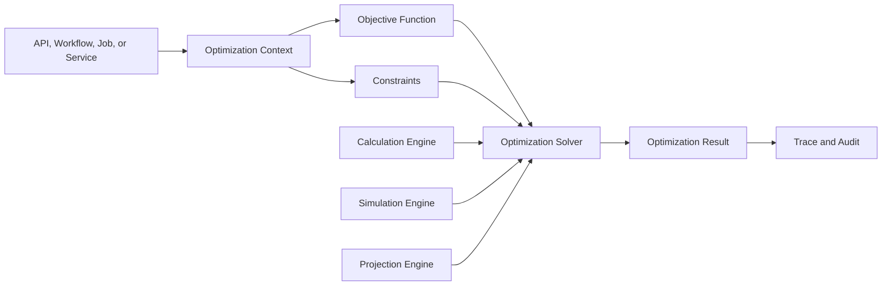
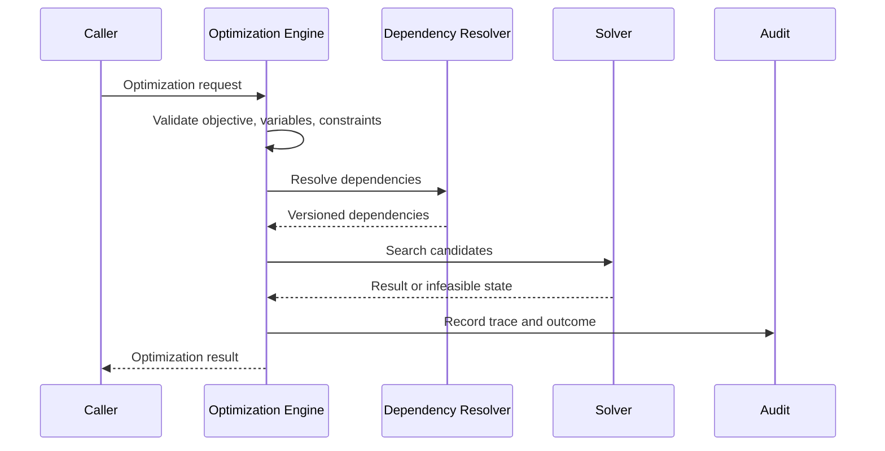
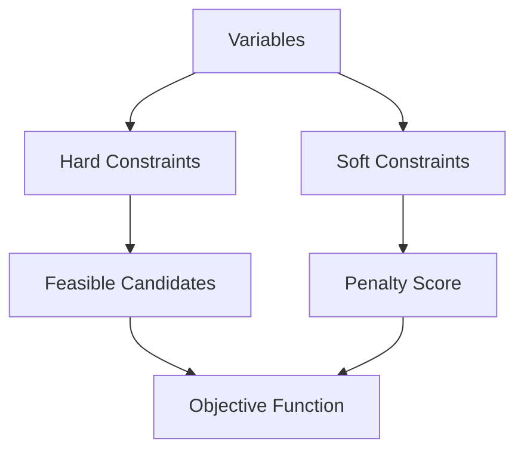
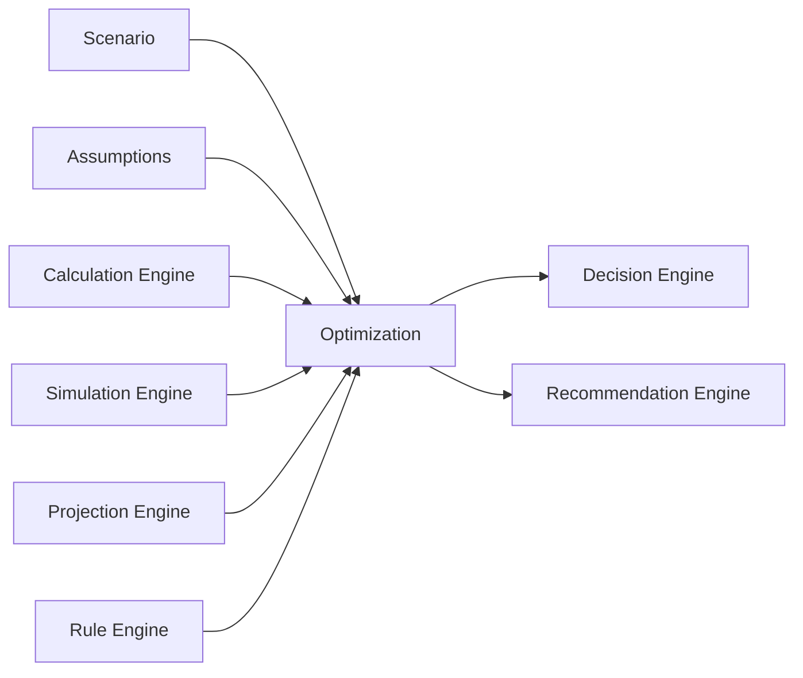
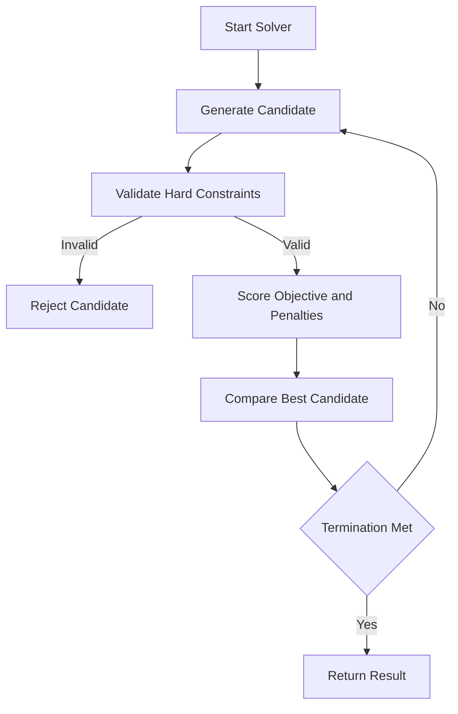
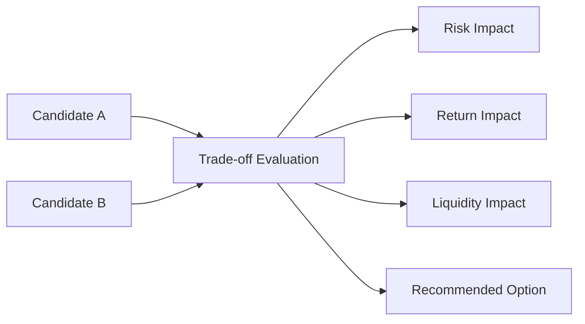

# Optimization Engine Operations and Verification

Source: ../optimization-engine-framework.md

# Performance

| Area | Requirement |
| --- | --- |
| Optimization SLA | Each optimization must define latency, timeout, throughput, progress, and fallback expectation. |
| Parallel Optimization | Parallel search must preserve deterministic behavior when required and must honor constraint boundaries. |
| Solver Performance | Solver runtime, candidate count, convergence, infeasibility, and score improvement must be measured. |
| Memory Usage | Large candidate search, multi-objective ranking, and batch optimization must declare memory bounds. |

# Audit

## Optimization History

- Optimization records must include optimization name, version, objective, actor, TenantId, HouseholdId when applicable, input snapshot reference, output reference, duration, warnings, infeasibility state, and outcome.

## Replay History

- Replay records must include actor, reason, source snapshot, version availability, seed when applicable, result comparison, differences, and outcome.

## CorrelationId

- CorrelationId is required for every governed optimization.
- Child calculations, simulations, and projections must inherit parent CorrelationId.

## Optimization Trace

- Trace must include objective, variables, constraints, candidates, scores, penalties, solver status, dependencies, selected result, rejected candidates when required, warnings, and validation outcomes.

# Security

## Authorization

- Protected optimization inputs require authorization before read.
- Protected optimization outputs require authorization before display, export, cache, report, dashboard, analytics, recommendation, or notification use.

## Tenant Isolation

- Tenant-scoped optimizations must include TenantId in context, snapshot, trace, cache, audit, and output.
- Cross-tenant optimizations require explicit administrative permission and approved aggregation or anonymization.

## Optimization Isolation

- Optimization sessions must isolate inputs, snapshots, intermediate candidates, solver state, and outputs from unrelated sessions.
- Shared workers must not mix scoped data.

# Mermaid

## Optimization Architecture

## Optimization Flow

## Constraint Graph

## Optimization Dependency Graph

## Solver Flow

## Trade-off Diagram

# Testing

| Test Type | Required Coverage |
| --- | --- |
| Optimization Test | Objective, variables, constraints, dependencies, solver execution, result, score, and trace. |
| Constraint Test | Hard constraints, soft constraints, penalties, priority rules, infeasibility, and compatibility. |
| Solver Test | Determinism, convergence, termination, candidate generation, tie-breaker, and failure behavior. |
| Replay Test | Snapshot replay, version availability, deterministic result, difference detection, and replay audit. |
| Performance Test | SLA, timeout, throughput, parallel execution, solver runtime, memory, CPU, progress, and cancellation. |
| Consistency Test | Same deterministic input produces same output, constraint handling is stable, and dependency versions remain stable. |

# Edge Cases

- Objective is missing.
- Objective function version is missing.
- Objective direction is invalid.
- Variable bounds are invalid.
- Variable step size is zero.
- Hard constraints conflict.
- Soft constraints have no penalty rule.
- Penalty weight is negative.
- Priority rule is missing tie-breaker.
- Candidate set is empty.
- Solver finds no feasible solution.
- Solver does not converge.
- Solver exceeds time limit.
- Solver exceeds memory limit.
- Solver returns result that violates hard constraint.
- Solver score is not reproducible.
- Parallel search changes deterministic result.
- Calculation dependency is unavailable.
- Simulation dependency is stale.
- Projection dependency is stale.
- Rule dependency changes during run.
- Scenario is incompatible with objective.
- Market assumption is stale.
- Assumption version is missing.
- Optimization model version is retired.
- Output schema is incompatible with API.
- Replay cannot find historical solver version.
- Replay cannot find historical constraint version.
- Replay result differs from original.
- TenantId is missing from scoped optimization.
- HouseholdId is missing from household optimization.
- Authorization changes during long-running run.
- Cache key omits optimization version.
- Cache returns another household result.
- Dashboard displays result without generated time.
- Report uses result without lineage.
- Analytics mixes incompatible objective versions.
- Recommendation uses stale optimization result.
- Decision consumes optimization without trace.
- Sensitive input appears in trace.
- Raw PII appears in audit detail.
- CorrelationId is missing.
- CausationId references missing parent.
- Scheduler starts overlapping optimization run.
- Background job retries with same idempotency key.
- Workflow compensation needs prior optimization snapshot.
- Automation triggers optimization on stale data.
- Explainability references missing candidate comparison.
- Trade-off explanation omits rejected constraint.
- Infeasibility explanation exposes protected data.
- Local date boundary conflicts with UTC timestamp.

# Final Consistency Matrix

| Area | Required Optimization Alignment |
| --- | --- |
| Optimization | Uses this framework as canonical source of truth. |
| Objective | Objective function, direction, score, and version are mapped. |
| Constraint | Hard constraints, soft constraints, penalties, and priority rules are mapped. |
| Scenario | Scenario id, version, lifecycle, variables, and compatibility are mapped. |
| Simulation | Simulation outputs, versions, confidence, and trace are mapped. |
| Calculation | Formula outputs, versions, precision, and trace are mapped. |
| Projection | Projection dependencies, versions, generated time, and staleness are mapped. |
| Decision | Rule version, optimization output, rationale, and audit are mapped. |
| Rule Engine | Rule ids, versions, inputs, outcomes, and priority are mapped. |
| Repository | Source data, query, snapshot time, tenant, household, and lineage are mapped. |
| Application Service | Orchestration, authorization, DTO, audit, and workflow behavior are mapped. |
| Domain Service | Domain-specific optimization rules, invariants, and business rules are mapped. |
| API | Input DTO, output DTO, validation, timeout, authorization, and trace exposure are mapped. |

# Completion Checklist

- Optimization objective requirement is defined.
- Optimization constraint requirement is defined.
- Optimization variable requirement is defined.
- Optimization solver strategy is defined.
- Optimization search strategy is defined.
- Optimization convergence strategy is defined.
- Optimization replay requirement is defined.
- Optimization traceability requirement is defined.
- Optimization validation requirement is defined.
- Optimization audit requirement is defined.
- Objective mapping is defined.
- Constraint mapping is defined.
- Variable mapping is defined.
- Scenario mapping is defined.
- Simulation mapping is defined.
- Calculation mapping is defined.
- Projection mapping is defined.
- Decision mapping is defined.
- Trade-off matrix is defined.
- Validation rules are complete.
- Business rules are complete.
- Mermaid diagrams are syntactically valid.
- Markdown structure is valid.
- No placeholder terms are present.
- No draft-only status is present.
- No temporary catalog entries are present.

# Version History

| Version | Date | Description |
| --- | --- | --- |
| 1.0 | 2026-07-13 | Atlas Enterprise Canonical Optimization Engine Specification. |

## Phase 2 Executable Specification Addendum

### Optimization Execution Contract

| Field | Requirement |
|---|---|
| Aggregate | OptimizationSession |
| Identity | optimizationSessionId |
| Scope | tenantId, householdId, scenarioId optional |
| Required State | objectiveVersion, modelVersion, solverVersion, inputSnapshot, constraints, variables, executionPolicy |
| Outputs | selectedCandidate, infeasibilityState, rankedCandidates, score, traceReference, auditReference |
| Determinism | Identical inputs, versions, solver policy, and seed must produce reproducible results. |

### Required Commands

| Command | Purpose |
|---|---|
| StartOptimizationSession | Create and validate an optimization execution context. |
| ExecuteOptimization | Run solver and produce result or infeasibility evidence. |
| CancelOptimizationSession | Stop a long-running optimization safely. |
| PublishOptimizationResult | Freeze selected result for downstream consumers. |
| ReplayOptimizationSession | Re-execute from captured snapshot and versions. |

### Addendum Validation Rules

1. Objective, variables, constraints, solver strategy, and termination criteria are required before execution.
2. Hard-constraint violations must make a candidate infeasible.
3. Soft-constraint violations must produce penalty and trade-off evidence.
4. Published results must include traceReference and version metadata.
5. Replay must fail when required historical versions are unavailable.

### Addendum Testing Matrix

| Scenario | Expected Result |
|---|---|
| Conflicting hard constraints | Controlled infeasibility result is returned. |
| Solver timeout | Session ends with controlled non-converged state. |
| Deterministic replay | Result and score match original execution. |
| Missing objective version | Validation fails. |
| Candidate violates hard constraint | Candidate is rejected. |

### Addendum Version History

| Version | Date | Description |
|---|---|---|
| 1.0-p2 | 2026-07-15 | Phase 2 executable addendum added. |
