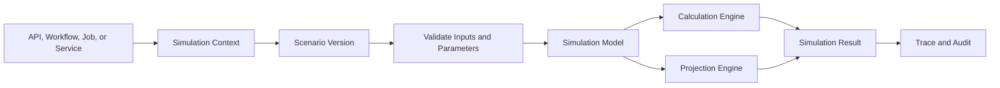
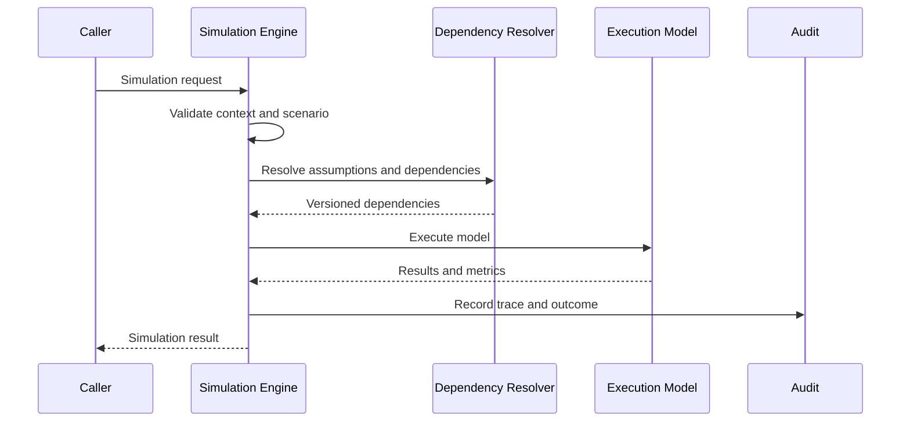
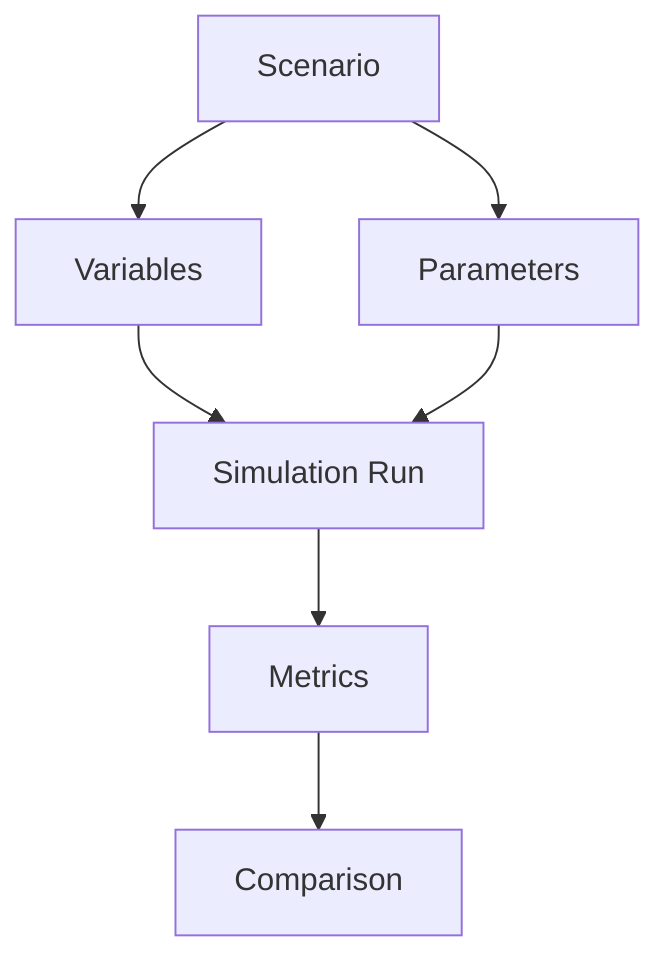
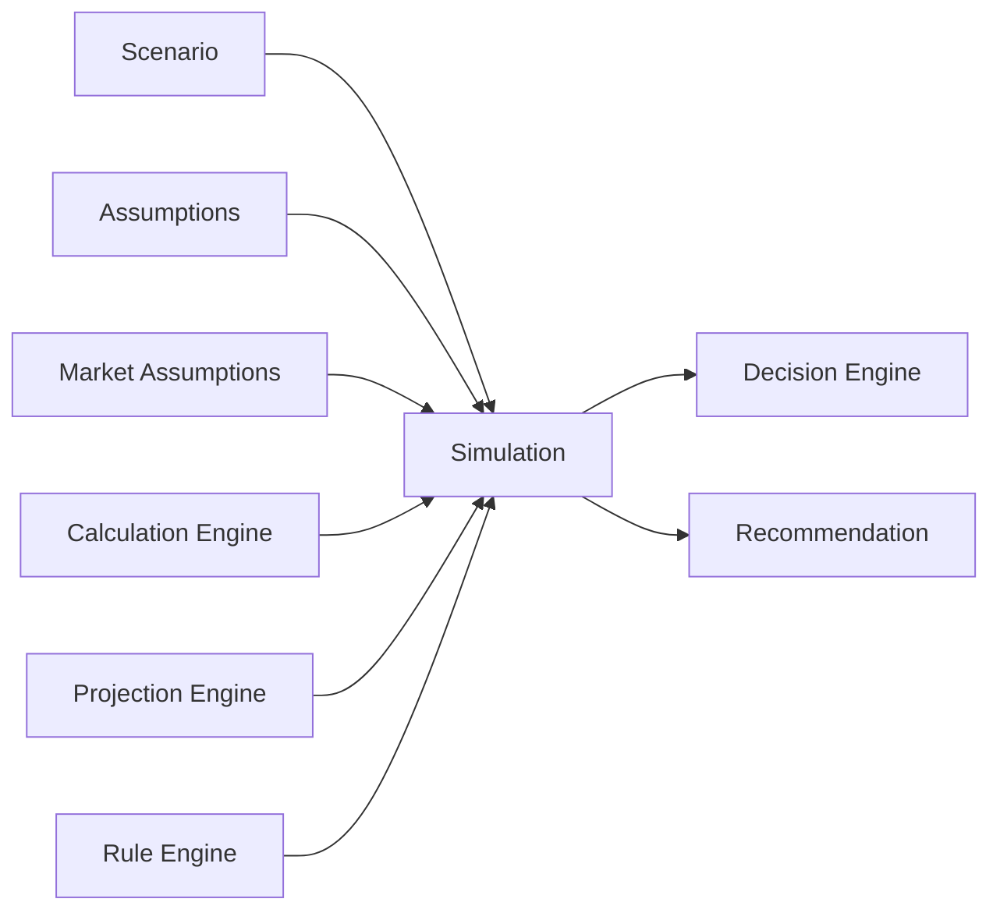
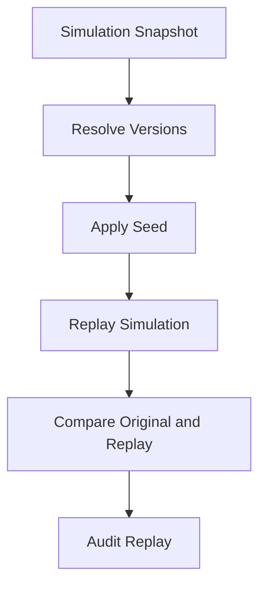
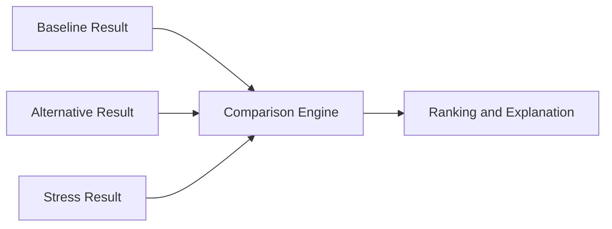

# Simulation Engine Framework
## Split Navigation

- [Simulation engine catalog and matrices](simulation-engine/catalog-and-matrices.md)
- [Simulation engine replay and validation](simulation-engine/replay-and-validation.md)
- [Simulation engine operations and verification](simulation-engine/operations-and-verification.md)

# Document Control

Document Name: Simulation Engine Framework
Document Path: knowledge/simulation-engine-framework.md
Document Type: Atlas Enterprise Canonical Specification
Version: 1.0
Status: Canonical Specification
Domain: Platform
Bounded Context: Platform
Owner: Project Atlas
Source of Truth: Atlas Simulation Engine Source of Truth
Last Updated: 2026-07-13

Related Specifications:
- knowledge/calculation-engine-framework.md
- knowledge/projection-engine-framework.md
- knowledge/optimization-engine-framework.md
- knowledge/rule-engine-architecture.md
- knowledge/scenario-framework.md
- knowledge/scoring-model.md
- knowledge/decision-rule-catalog.md
- knowledge/explainability-framework.md
- knowledge/recommendation-priority-framework.md
- knowledge/application-service-catalog.md
- knowledge/domain-service-catalog.md
- knowledge/service-catalog.md
- knowledge/command-catalog.md
- knowledge/domain-event-catalog.md
- knowledge/system-module-catalog.md
- knowledge/api-governance-framework.md
- knowledge/market-assumptions.md
- knowledge/assumptions.md
- docs/specification/04-DomainModel.md
- docs/api/07-API.md

# Purpose

Simulation Engine Framework defines the canonical Atlas simulation model. It is the source of truth for simulation context, sessions, scenarios, models, runs, snapshots, versions, results, variables, parameters, dependencies, replay, traceability, comparison, accuracy, determinism, validation, audit, performance, security, and integration with projection, calculation, optimization, decision, rule, recommendation, workflow, automation, scheduler, background job, API, dashboard, reporting, and analytics behavior.

This document does not create new Atlas business domains. It consolidates simulation behavior required by Scenario Framework, Calculation Engine, Projection Engine, Optimization Engine, Rule Engine, Decision Engine, Recommendation, Application Services, Domain Services, Workflows, Automations, Schedulers, Background Jobs, APIs, Dashboards, Reporting, and Analytics.

# Scope

- Simulation Engine
- Simulation Context
- Simulation Session
- Simulation Scenario
- Simulation Model
- Simulation Run
- Simulation Snapshot
- Simulation Version
- Simulation Result
- Simulation Variable
- Simulation Parameter
- Simulation Dependency
- Simulation Replay
- Simulation Trace
- Simulation Comparison
- Simulation Accuracy
- Simulation Determinism
- Scenario
- Projection
- Calculation
- Optimization
- Decision Engine
- Rule Engine
- Recommendation
- Application Service
- Domain Service
- Workflow
- Automation
- Scheduler
- Background Job
- API
- Dashboard
- Reporting
- Analytics

# Simulation Engine Principles

- Simulations must be deterministic when deterministic mode, random seed, assumptions, parameters, formulas, projections, and engine version are identical.
- Simulations must declare scenario, inputs, outputs, variables, parameters, assumptions, market assumptions, dependencies, execution strategy, replay strategy, traceability, validation, audit, performance, and security expectations.
- Simulations must not mutate business state unless wrapped by an approved command, workflow, automation, scheduler, or background job.
- Simulation results are analytical or decision-support outputs and must not replace source financial truth.
- Every decision-impacting simulation must be replayable and explainable.
- Every simulation must preserve tenant isolation and household isolation.
- Every simulation must enforce authorization before protected inputs are read or protected outputs are displayed, exported, cached, or reported.
- Every simulation comparison must use compatible scenario versions, assumption versions, model versions, and time horizons.
- Every long-running simulation must expose progress, cancellation policy, resource limits, and failure state.
- Simulation audit must align with Audit Framework, Calculation Engine Framework, Explainability Framework, and Recommendation Priority Framework.

# Simulation Concept Definitions

| Concept | Canonical Meaning | Required Usage |
| --- | --- | --- |
| Simulation Engine | Component that executes versioned scenario models across assumptions, parameters, variables, calculations, and projections. | Required for governed scenario analysis and decision support. |
| Simulation Context | Trusted execution context containing TenantId, HouseholdId, Principal, scenario, versions, seed, assumptions, correlation, and execution policy. | Required for every governed simulation. |
| Simulation Session | Bounded execution instance for one simulation request, workflow step, scheduled run, automation action, or background job. | Required for progress, replay, trace, and audit. |
| Simulation Scenario | Scenario definition used as the simulation input frame. | Required for scenario-driven simulation. |
| Simulation Model | Versioned model describing variables, parameters, formulas, probability distributions, constraints, and result metrics. | Required for repeatable execution. |
| Simulation Run | Concrete execution of a simulation model with scenario and context. | Required for result ownership and audit. |
| Simulation Snapshot | Point-in-time capture of scenario, assumptions, parameters, inputs, seed, model version, and outputs. | Required for replay and explainability. |
| Simulation Version | Version of model, engine, input schema, output schema, calculation dependency, and result interpretation. | Required for deterministic replay. |
| Simulation Result | Output metrics, distributions, rankings, comparisons, or recommendation inputs produced by a run. | Must include version, scope, and trace reference. |
| Simulation Variable | Input dimension that may change across scenarios, iterations, or sensitivity ranges. | Must define range, unit, source, and validation. |
| Simulation Parameter | Model configuration controlling execution behavior. | Must define version, default, allowed range, and owner. |
| Simulation Dependency | Upstream calculation, projection, optimization, rule, decision, repository, assumption, or market data dependency. | Must be declared and versioned. |
| Simulation Replay | Re-execution from captured snapshot and versions. | Required for decision-impacting results. |
| Simulation Trace | Ordered evidence of inputs, variables, parameters, iterations, calculations, outputs, and comparisons. | Required for audit and explainability. |
| Simulation Comparison | Comparison across two or more compatible simulation results. | Required for scenario ranking and recommendation. |
| Simulation Accuracy | Required quality target for model, calculation, convergence, and output tolerance. | Required for tests and validation. |
| Simulation Determinism | Guarantee that identical versioned inputs and seed produce identical outputs. | Required when replay is mandatory. |

# Simulation Engine Architecture

Atlas simulation architecture is scenario-driven, versioned, and traceable.

1. API, workflow, automation, scheduler, background job, application service, or domain service requests a simulation.
2. Security and Permission controls authorize access to scenario, assumptions, source data, and output scope.
3. Simulation Context is built with TenantId, HouseholdId, Principal, CorrelationId, CausationId, RequestId when available, scenario version, model version, assumption versions, calculation versions, projection versions, random seed, and execution policy.
4. Inputs, variables, parameters, scenario state, and dependencies are validated.
5. Calculation Engine executes required formulas and metric steps.
6. Projection Engine supplies versioned projection dependencies where required.
7. Optimization Engine supplies objective or constraint dependencies where required.
8. Rule Engine and Decision Engine supply rule outcomes and decision dependencies where required.
9. Simulation Engine executes iterations, deterministic model runs, sensitivity ranges, stress tests, or what-if variants according to execution strategy.
10. Results, comparisons, traces, snapshots, progress, performance metrics, and audit records are persisted or returned according to policy.

# Complete Simulation Catalog

Every simulation capability must use this Enterprise contract.

| Field | Requirement |
| --- | --- |
| Simulation Name | Stable PascalCase name ending with Simulation. |
| Display Name | Human-readable label. |
| Category | Baseline, BestCase, WorstCase, WhatIf, StressTest, MonteCarlo, Sensitivity, ScenarioComparison, Forecast, OptimizationInput, DecisionSupport. |
| Purpose | Why the simulation exists. |
| Business Meaning | Business, financial, decision, recommendation, reporting, or operational meaning. |
| Description | Exact modeled behavior. |
| Inputs | Required source values, units, scope, and classification. |
| Outputs | Result metrics, distributions, comparisons, classification, and consumers. |
| Scenario | Scenario id, version, type, owner, and lifecycle state. |
| Variables | Variable names, ranges, units, distributions, and validation. |
| Parameters | Model parameters, defaults, limits, and version. |
| Assumptions | Assumption set and version. |
| Market Assumptions | Market data, source, time, and version. |
| Calculation Dependency | Calculation names, versions, inputs, and outputs used. |
| Projection Dependency | Projection names, versions, generated time, and staleness. |
| Optimization Dependency | Optimization objective, constraints, solver version, and result status when used. |
| Decision Dependency | Decision state, rule result, or recommendation dependency when used. |
| Rule Engine Dependency | Rule ids, versions, inputs, and outcomes. |
| Repository | Repository reads needed for source data. |
| Application Service | Service orchestrating simulation. |
| Domain Service | Domain service owning domain model behavior. |
| Workflow | Workflow dependency or simulation step. |
| Automation | Automation trigger or action using simulation. |
| Scheduler | Scheduled simulation or refresh. |
| Background Job | Async, batch, replay, or long-running worker. |
| API | API route or DTO exposing simulation. |
| Execution Strategy | Synchronous, asynchronous, batch, scheduled, parallel, deterministic, stochastic, or streaming. |
| Iterations | Iteration count, convergence rule, and sampling method when applicable. |
| Random Seed Strategy | Fixed seed, generated seed, user-supplied seed, or not applicable. |
| Deterministic Mode | Required behavior for replayable runs. |
| Replay Strategy | Snapshot, seed, dependency versions, and comparison behavior. |
| Traceability | Trace fields, intermediate values, iteration summaries, and explanation references. |
| Validation | Input, scenario, parameter, dependency, output, convergence, and tolerance validation. |
| Business Rules | Behavioral rules and invariants. |
| Version | Engine, model, scenario, input schema, output schema, and dependency versions. |
| Audit | Audit record requirements. |
| Performance | SLA, parallelism, memory, CPU, timeout, progress, and cancellation. |
| Security | Authorization, tenant, household, masking, classification, and result access. |
| Example | Minimal valid simulation scenario. |

# Simulation Matrix

| Simulation Category | Primary Purpose | Required Governance |
| --- | --- | --- |
| Baseline | Establish expected outcome from current assumptions. | Scenario version, assumption version, calculation trace. |
| BestCase | Evaluate optimistic assumptions. | Variable bounds, assumption rationale, comparison trace. |
| WorstCase | Evaluate downside assumptions. | Stress parameters, risk thresholds, decision impact. |
| WhatIf | Evaluate user-selected changes. | Input validation, scenario delta, replay snapshot. |
| StressTest | Test adverse financial or market conditions. | Stress definition, threshold, failure classification. |
| MonteCarlo | Evaluate probabilistic outcome distribution. | Seed, distribution model, iteration count, confidence. |
| Sensitivity | Evaluate output response to variable ranges. | Variable ranges, baseline, comparison metrics. |
| ScenarioComparison | Rank multiple scenarios. | Compatibility rules, scoring method, explanation. |
| Forecast | Produce time-based modeled outcomes. | Projection dependency, assumptions, horizon, generated time. |

# Scenario Matrix

| Scenario Type | Simulation Requirement |
| --- | --- |
| Baseline Scenario | Uses current approved assumptions, current household state, and default model version. |
| Alternative Scenario | Records delta from baseline, owner, version, and comparison target. |
| Stress Scenario | Defines adverse variables, thresholds, and failure classification. |
| Goal Scenario | Defines goal target, time horizon, contribution path, and dependency calculations. |
| Retirement Scenario | Defines retirement age, withdrawal policy, return assumptions, and inflation. |
| Housing Scenario | Defines property cost, loan terms, cash reserve, taxes, and risk assumptions. |
| Portfolio Scenario | Defines allocation, return assumptions, volatility, rebalancing, and constraints. |

# Parameter Matrix

| Parameter Type | Required Control |
| --- | --- |
| Time Horizon | Start date, end date, period granularity, and boundary policy. |
| Iteration Count | Minimum, maximum, convergence requirement, and performance limit. |
| Random Seed | Seed source, storage, replay policy, and visibility. |
| Distribution | Distribution type, parameters, source, and version. |
| Confidence Level | Confidence metric, percentile, and interpretation. |
| Stress Level | Severity, variable mapping, and threshold. |
| Sensitivity Range | Min, max, step, and unit. |
| Scenario Weight | Ranking weight, source, and validation. |

# Assumption Matrix

| Assumption Type | Simulation Requirement |
| --- | --- |
| Inflation | Source, effective date, version, scenario mapping, and stress override. |
| Return Rate | Asset class, horizon, market source, version, distribution, and confidence. |
| Volatility | Asset class, source, model version, and distribution. |
| Salary Growth | Household context, scenario, version, and sensitivity range. |
| Expense Growth | Category, inflation mapping, scenario, and version. |
| Tax | Jurisdiction, effective date, rule version, and scenario impact. |
| Life Stage | Model version, household profile, and decision context. |

# Projection Matrix

| Projection Dependency | Simulation Requirement |
| --- | --- |
| Cash Flow Projection | Scenario cashflow path, time series, assumption version, and generated time. |
| Net Worth Projection | Asset and liability path, valuation rules, and scenario version. |
| Portfolio Projection | Allocation, return assumptions, volatility, and market data version. |
| Loan Projection | Amortization, rate path, payment schedule, and scenario inputs. |
| Retirement Projection | Contribution, withdrawal, inflation, and success probability. |

# Calculation Matrix

| Calculation Dependency | Simulation Requirement |
| --- | --- |
| Financial Formula | Formula id, version, precision, rounding, and trace. |
| Score Calculation | Score model version, weights, thresholds, and explanation. |
| Ratio Calculation | Ratio definition, inputs, units, and tolerance. |
| Cash Reserve Calculation | Liquidity target, household context, and risk policy. |
| Goal Funding Calculation | Target amount, contribution path, time horizon, and assumptions. |

# Optimization Matrix

| Optimization Dependency | Simulation Requirement |
| --- | --- |
| Portfolio Optimization | Objective, constraints, solver version, and output allocation. |
| Goal Funding Optimization | Objective, constraints, contribution capacity, and goal priority. |
| Debt Paydown Optimization | Payoff strategy, interest rates, cashflow constraint, and ranking. |
| Cash Reserve Optimization | Liquidity target, opportunity cost, and risk boundary. |

# Decision Matrix

| Decision Dependency | Simulation Requirement |
| --- | --- |
| Scenario Decision | Uses compatible scenario results, comparison metrics, and ranking logic. |
| Recommendation Decision | Uses simulation outcomes, confidence, priority score, and explanation. |
| Risk Decision | Uses stress outcomes, thresholds, score model, and rule version. |
| Eligibility Decision | Uses rule outcomes and simulation-dependent thresholds. |

# Comparison Matrix

| Comparison Type | Required Control |
| --- | --- |
| Baseline vs Alternative | Same time horizon, model version, metric definitions, and assumption compatibility. |
| Best vs Worst | Explicit variable bounds, stress rationale, and output deltas. |
| Multi-Scenario Ranking | Ranking method, weights, tie-breaker, and explainability. |
| Before vs After Recommendation | Source decision, recommendation id, expected impact, and confidence. |
| Simulation vs Actual | Actual source, period alignment, variance, and accuracy review. |

# Replay Strategy

- Replay must use captured Simulation Snapshot.
- Replay must use the same simulation model version.
- Replay must use the same scenario version.
- Replay must use the same assumptions, market assumptions, formula versions, projection versions, and rule versions.
- Replay must use the same random seed when stochastic output must be reproduced.
- Replay must record differences between original and replay results.
- Replay must not mutate production state unless wrapped in an approved recovery process.
- Replay must be audited.

# Traceability Strategy

- Trace must include simulation name, version, session, scenario, actor, TenantId, HouseholdId, inputs, variables, parameters, assumptions, market assumptions, dependencies, seed, iterations, calculation outputs, projection outputs, result metrics, comparison metrics, warnings, and validation outcomes.
- Trace may store iteration summaries instead of every iteration when full trace would exceed policy.
- Full iteration trace must be available for high-risk decision-impacting simulations when required by policy.
- Trace must avoid raw secrets and unnecessary PII.

# Validation Rules

- Simulation Name is required.
- Simulation Category is required.
- Simulation Owner is required.
- Scenario is required.
- Scenario version is required.
- Inputs are required.
- Outputs are required.
- Variables are required when scenario varies values.
- Parameters are required.
- Assumptions are required when model uses assumptions.
- Market assumptions are required when model uses market data.
- Calculation dependency versions are required.
- Projection dependency versions are required when projections are used.
- Optimization dependency versions are required when optimization is used.
- Rule Engine dependency versions are required when rules are used.
- Execution Strategy is required.
- Iteration count is required for iterative simulations.
- Random seed strategy is required for stochastic simulations.
- Deterministic mode must be declared.
- Replay strategy is required for decision-impacting simulations.
- Traceability policy is required.
- Validation policy is required.
- Business Rules are required.
- Simulation Version is required.
- Audit policy is required.
- Performance target is required.
- Security policy is required.
- TenantId is required for tenant-scoped simulation.
- HouseholdId is required for household-scoped simulation.
- Authorization must be evaluated before protected inputs are read.
- Input units must be validated.
- Output units must be declared.
- Time horizon must be declared.
- Scenario compatibility must be validated before comparison.
- Parameter ranges must be validated.
- Variable ranges must be validated.
- Distribution parameters must be validated.
- Iteration count must be bounded.
- CPU and memory limits must be declared for long-running simulations.
- Simulation failure must produce controlled error class.
- Simulation output must include generated time.
- Simulation output must include model version.
- Simulation output must include scenario version.
- Simulation output must include trace reference.
- Replay must validate all referenced versions are available.
- Comparison must validate compatible assumptions and model versions.
- Simulation cache use must include versioned cache key when applicable.

# Business Rules

- Simulation Engine is the canonical execution model for governed Atlas simulations.
- Scenario Framework owns scenario definition and lifecycle.
- Simulation Engine owns model execution, variable expansion, parameter handling, iteration, trace, replay, and comparison behavior.
- Calculation Engine owns formula execution used by simulations.
- Projection Engine owns projection dependencies used by simulations.
- Optimization Engine owns optimization dependencies used by simulations.
- Rule Engine owns rule evaluation used by simulations.
- Decision Engine owns decision outcomes that consume simulation results.
- Simulations must not silently change scenario inputs.
- Simulations must not silently change assumptions.
- Simulations must not silently change market assumptions.
- Simulations must not silently change model version.
- Simulations must not silently change formula version.
- Simulations must not silently change random seed when deterministic replay is required.
- Simulation results must include scenario identity.
- Simulation results must include generated time.
- Simulation results must include version metadata.
- Simulation results must include trace reference.
- Simulation results used by recommendations must include confidence or reliability metadata.
- Simulation comparisons must use compatible time horizons.
- Simulation comparisons must use compatible metric definitions.
- Simulation comparisons must use compatible model versions or declare version difference.
- Monte Carlo simulations must record seed strategy.
- Monte Carlo simulations must record iteration count.
- Monte Carlo simulations must record distribution model.
- Sensitivity simulations must record variable ranges.
- Stress tests must record stress definition.
- What-if simulations must record delta from baseline.
- Baseline simulations must reference approved current assumptions.
- Worst-case simulations must not be presented as prediction without context.
- Best-case simulations must not be presented as guarantee.
- Simulation output must not be displayed without authorization.
- Simulation output must not be exported without authorization.
- Simulation output must not cross tenant boundaries.
- Simulation output must not cross household boundaries without permission.
- Simulation cache must include TenantId and HouseholdId when scoped.
- Simulation cache must include simulation version and input hash.
- Long-running simulations must support progress tracking.
- Long-running simulations must support cancellation policy.
- Batch simulations must use bounded batches.
- Parallel simulations must preserve determinism when deterministic mode is active.
- Parallel simulations must not exceed resource policy.
- Simulation warnings must be surfaced to consumers.
- Simulation validation failures must be controlled outcomes.
- Simulation replay must not emit user notifications unless explicitly approved.
- Simulation replay must not create false business mutation audit.
- Simulation audit must include CorrelationId.
- Simulation audit must include CausationId when triggered by command, event, workflow, job, scheduler, or automation.
- Simulation trace must avoid raw secrets.
- Simulation trace must minimize PII.
- Simulation results used by dashboards must expose staleness or generated time.
- Simulation results used by reports must preserve lineage.
- Simulation results used by analytics must preserve aggregation and scenario metadata.
- Simulation results used by optimization must preserve objective input metadata.
- Simulation results used by decisions must preserve decision dependency metadata.
- Simulation SLA must match API, workflow, scheduler, or background job requirements.
- Simulation failures must be observable.
- Simulation performance metrics must be recorded for governed simulations.
- Simulation Engine Framework conflicts are resolved by this document unless Scenario Framework, Calculation Engine, Projection Engine, Optimization Engine, Rule Engine, Security, Audit, Compliance, Data Governance, Tenant, or legal rules impose stricter controls.

# Performance

| Area | Requirement |
| --- | --- |
| Simulation SLA | Each simulation must define latency, timeout, throughput, progress, and fallback expectation. |
| Parallel Simulation | Parallel execution must preserve deterministic behavior when required and must honor dependency order. |
| Memory Usage | Iterative, stochastic, and comparison simulations must declare memory bounds. |
| CPU Strategy | Long-running simulations must declare CPU limits, worker pool behavior, and backpressure rules. |

# Audit

## Simulation History

- Simulation records must include simulation name, version, scenario, actor, TenantId, HouseholdId when applicable, input snapshot reference, output reference, duration, warnings, and outcome.

## Replay History

- Replay records must include actor, reason, source snapshot, version availability, seed, result comparison, differences, and outcome.

## CorrelationId

- CorrelationId is required for every governed simulation.
- Child calculations and projections must inherit parent CorrelationId.

## Trace

- Trace must include scenario, variables, parameters, assumptions, market assumptions, dependencies, iterations, calculation outputs, projection outputs, comparison outputs, warnings, and validation outcomes.

# Security

## Authorization

- Protected simulation inputs require authorization before read.
- Protected simulation outputs require authorization before display, export, cache, report, dashboard, analytics, or notification use.

## Tenant Isolation

- Tenant-scoped simulations must include TenantId in context, snapshot, trace, cache, audit, and output.
- Cross-tenant simulations require explicit administrative permission and approved aggregation or anonymization.

## Simulation Isolation

- Simulation sessions must isolate inputs, snapshots, intermediate values, iteration state, and outputs from unrelated sessions.
- Shared workers must not mix scoped data.

# Mermaid

## Simulation Architecture

## Simulation Flow

## Scenario Flow

## Simulation Dependency Graph

## Replay Flow

## Comparison Flow

# Testing

| Test Type | Required Coverage |
| --- | --- |
| Simulation Test | Scenario input, variables, parameters, assumptions, dependencies, model execution, output, and trace. |
| Scenario Test | Baseline, alternative, stress, what-if, compatibility, versioning, and lifecycle state. |
| Replay Test | Snapshot replay, seed replay, version availability, deterministic result, difference detection, and replay audit. |
| Performance Test | SLA, timeout, throughput, parallel execution, iteration count, memory, CPU, progress, and cancellation. |
| Consistency Test | Same deterministic input produces same output, comparison compatibility is enforced, and dependency versions remain stable. |

# Edge Cases

- Scenario is missing.
- Scenario version is missing.
- Scenario is archived.
- Scenario is incompatible with simulation model.
- Required input is missing.
- Input unit is invalid.
- Variable range is invalid.
- Parameter is outside allowed range.
- Time horizon is missing.
- Time horizon differs across compared scenarios.
- Assumption version is missing.
- Assumption is expired.
- Market assumption is stale.
- Market assumption conflicts with scenario.
- Calculation dependency is unavailable.
- Projection dependency is stale.
- Optimization dependency is infeasible.
- Rule dependency changes during run.
- Random seed is missing for replayable stochastic simulation.
- Random seed differs during replay.
- Iteration count is too high.
- Iteration count is too low for confidence target.
- Simulation model version is retired.
- Simulation output schema is incompatible with API.
- Parallel execution changes deterministic result.
- Simulation graph contains cycle.
- Simulation run exceeds CPU limit.
- Simulation run exceeds memory limit.
- Simulation timeout occurs after partial results.
- Cancellation occurs mid-run.
- Batch simulation partially completes.
- Replay cannot find historical model version.
- Replay cannot find historical assumptions.
- Replay result differs from original.
- Monte Carlo distribution parameters are invalid.
- Stress test threshold is missing.
- Sensitivity step size is zero.
- What-if delta conflicts with baseline.
- Best-case result is misinterpreted as guarantee.
- Worst-case result is misinterpreted as prediction.
- TenantId is missing from scoped simulation.
- HouseholdId is missing from household simulation.
- Authorization changes during long-running run.
- Cache key omits simulation version.
- Cache returns another household result.
- Dashboard displays result without generated time.
- Report uses result without lineage.
- Analytics mixes incompatible model versions.
- Recommendation uses stale simulation result.
- Decision consumes simulation without trace.
- Sensitive input appears in trace.
- Raw PII appears in audit detail.
- CorrelationId is missing.
- CausationId references missing parent.
- Scheduler starts overlapping simulation run.
- Background job retries with same idempotency key.
- Workflow compensation needs prior simulation snapshot.
- Automation triggers simulation on stale data.
- Explainability references missing iteration summary.
- Comparison includes different confidence definitions.
- Simulation warning is suppressed incorrectly.
- Local date boundary conflicts with UTC timestamp.

# Final Consistency Matrix

| Area | Required Simulation Alignment |
| --- | --- |
| Simulation | Uses this framework as canonical source of truth. |
| Scenario | Scenario id, version, lifecycle, variables, and compatibility are mapped. |
| Calculation | Formula outputs, versions, precision, and trace are mapped. |
| Projection | Projection dependencies, versions, generated time, and staleness are mapped. |
| Optimization | Objective, constraints, solver version, and status are mapped. |
| Decision | Rule version, simulation output, rationale, and audit are mapped. |
| Rule Engine | Rule ids, versions, inputs, outcomes, and priority are mapped. |
| Repository | Source data, query, snapshot time, tenant, household, and lineage are mapped. |
| Application Service | Orchestration, authorization, DTO, audit, and workflow behavior are mapped. |
| Domain Service | Domain-specific simulation rules, invariants, and business rules are mapped. |
| API | Input DTO, output DTO, validation, timeout, authorization, and trace exposure are mapped. |

# Completion Checklist

- Simulation scenario requirement is defined.
- Simulation input requirement is defined.
- Simulation output requirement is defined.
- Simulation replay requirement is defined.
- Simulation traceability requirement is defined.
- Simulation validation requirement is defined.
- Simulation audit requirement is defined.
- Scenario mapping is defined.
- Parameter mapping is defined.
- Assumption mapping is defined.
- Projection mapping is defined.
- Calculation mapping is defined.
- Optimization mapping is defined.
- Decision mapping is defined.
- Comparison matrix is defined.
- Validation rules are complete.
- Business rules are complete.
- Mermaid diagrams are syntactically valid.
- Markdown structure is valid.
- No placeholder terms are present.
- No draft-only status is present.
- No temporary catalog entries are present.
