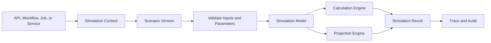
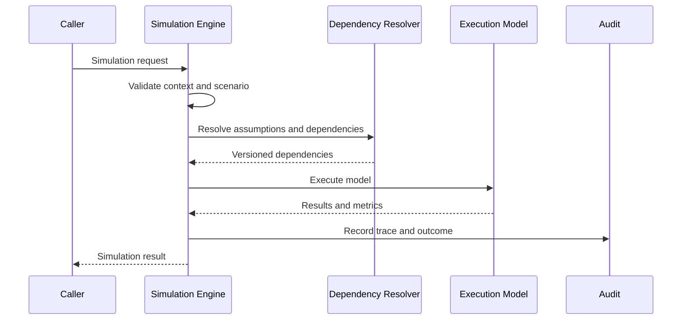
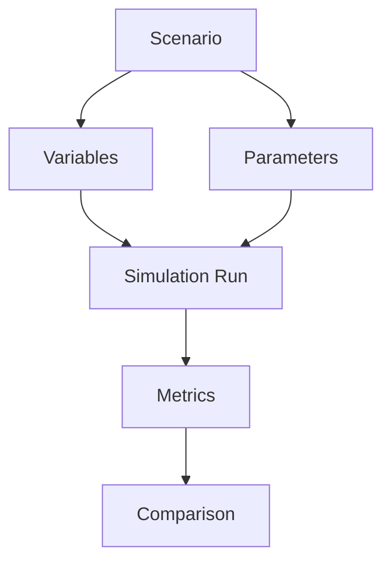
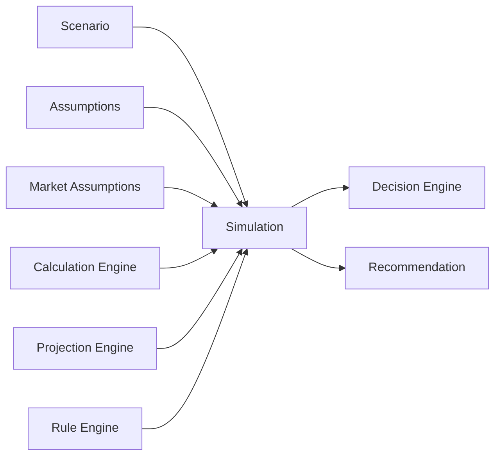
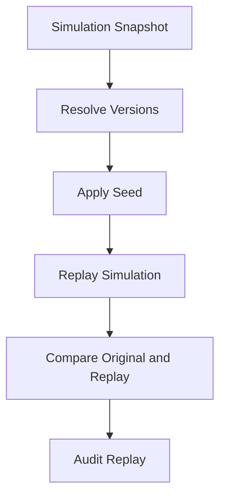
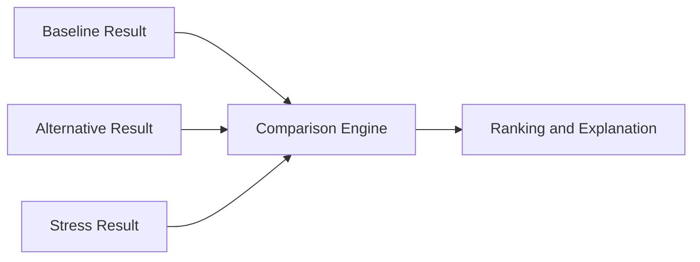

# Simulation Engine Operations and Verification

Source: ../simulation-engine-framework.md

# Performance

| Area | Requirement |
| --- | --- |
| Simulation SLA | Each simulation must define latency, timeout, throughput, progress, and fallback expectation. |
| Parallel Simulation | Parallel execution must preserve deterministic behavior when required and must honor dependency order. |
| Memory Usage | Iterative, stochastic, and comparison simulations must declare memory bounds. |
| CPU Strategy | Long-running simulations must declare CPU limits, worker pool behavior, and backpressure rules. |

# Audit

## Simulation History

- Simulation records must include simulation name, version, scenario, actor, TenantId, HouseholdId when applicable, input snapshot reference, output reference, duration, warnings, and outcome.

## Replay History

- Replay records must include actor, reason, source snapshot, version availability, seed, result comparison, differences, and outcome.

## CorrelationId

- CorrelationId is required for every governed simulation.
- Child calculations and projections must inherit parent CorrelationId.

## Trace

- Trace must include scenario, variables, parameters, assumptions, market assumptions, dependencies, iterations, calculation outputs, projection outputs, comparison outputs, warnings, and validation outcomes.

# Security

## Authorization

- Protected simulation inputs require authorization before read.
- Protected simulation outputs require authorization before display, export, cache, report, dashboard, analytics, or notification use.

## Tenant Isolation

- Tenant-scoped simulations must include TenantId in context, snapshot, trace, cache, audit, and output.
- Cross-tenant simulations require explicit administrative permission and approved aggregation or anonymization.

## Simulation Isolation

- Simulation sessions must isolate inputs, snapshots, intermediate values, iteration state, and outputs from unrelated sessions.
- Shared workers must not mix scoped data.

# Mermaid

## Simulation Architecture

## Simulation Flow

## Scenario Flow

## Simulation Dependency Graph

## Replay Flow

## Comparison Flow

# Testing

| Test Type | Required Coverage |
| --- | --- |
| Simulation Test | Scenario input, variables, parameters, assumptions, dependencies, model execution, output, and trace. |
| Scenario Test | Baseline, alternative, stress, what-if, compatibility, versioning, and lifecycle state. |
| Replay Test | Snapshot replay, seed replay, version availability, deterministic result, difference detection, and replay audit. |
| Performance Test | SLA, timeout, throughput, parallel execution, iteration count, memory, CPU, progress, and cancellation. |
| Consistency Test | Same deterministic input produces same output, comparison compatibility is enforced, and dependency versions remain stable. |

# Edge Cases

- Scenario is missing.
- Scenario version is missing.
- Scenario is archived.
- Scenario is incompatible with simulation model.
- Required input is missing.
- Input unit is invalid.
- Variable range is invalid.
- Parameter is outside allowed range.
- Time horizon is missing.
- Time horizon differs across compared scenarios.
- Assumption version is missing.
- Assumption is expired.
- Market assumption is stale.
- Market assumption conflicts with scenario.
- Calculation dependency is unavailable.
- Projection dependency is stale.
- Optimization dependency is infeasible.
- Rule dependency changes during run.
- Random seed is missing for replayable stochastic simulation.
- Random seed differs during replay.
- Iteration count is too high.
- Iteration count is too low for confidence target.
- Simulation model version is retired.
- Simulation output schema is incompatible with API.
- Parallel execution changes deterministic result.
- Simulation graph contains cycle.
- Simulation run exceeds CPU limit.
- Simulation run exceeds memory limit.
- Simulation timeout occurs after partial results.
- Cancellation occurs mid-run.
- Batch simulation partially completes.
- Replay cannot find historical model version.
- Replay cannot find historical assumptions.
- Replay result differs from original.
- Monte Carlo distribution parameters are invalid.
- Stress test threshold is missing.
- Sensitivity step size is zero.
- What-if delta conflicts with baseline.
- Best-case result is misinterpreted as guarantee.
- Worst-case result is misinterpreted as prediction.
- TenantId is missing from scoped simulation.
- HouseholdId is missing from household simulation.
- Authorization changes during long-running run.
- Cache key omits simulation version.
- Cache returns another household result.
- Dashboard displays result without generated time.
- Report uses result without lineage.
- Analytics mixes incompatible model versions.
- Recommendation uses stale simulation result.
- Decision consumes simulation without trace.
- Sensitive input appears in trace.
- Raw PII appears in audit detail.
- CorrelationId is missing.
- CausationId references missing parent.
- Scheduler starts overlapping simulation run.
- Background job retries with same idempotency key.
- Workflow compensation needs prior simulation snapshot.
- Automation triggers simulation on stale data.
- Explainability references missing iteration summary.
- Comparison includes different confidence definitions.
- Simulation warning is suppressed incorrectly.
- Local date boundary conflicts with UTC timestamp.

# Final Consistency Matrix

| Area | Required Simulation Alignment |
| --- | --- |
| Simulation | Uses this framework as canonical source of truth. |
| Scenario | Scenario id, version, lifecycle, variables, and compatibility are mapped. |
| Calculation | Formula outputs, versions, precision, and trace are mapped. |
| Projection | Projection dependencies, versions, generated time, and staleness are mapped. |
| Optimization | Objective, constraints, solver version, and status are mapped. |
| Decision | Rule version, simulation output, rationale, and audit are mapped. |
| Rule Engine | Rule ids, versions, inputs, outcomes, and priority are mapped. |
| Repository | Source data, query, snapshot time, tenant, household, and lineage are mapped. |
| Application Service | Orchestration, authorization, DTO, audit, and workflow behavior are mapped. |
| Domain Service | Domain-specific simulation rules, invariants, and business rules are mapped. |
| API | Input DTO, output DTO, validation, timeout, authorization, and trace exposure are mapped. |

# Completion Checklist

- Simulation scenario requirement is defined.
- Simulation input requirement is defined.
- Simulation output requirement is defined.
- Simulation replay requirement is defined.
- Simulation traceability requirement is defined.
- Simulation validation requirement is defined.
- Simulation audit requirement is defined.
- Scenario mapping is defined.
- Parameter mapping is defined.
- Assumption mapping is defined.
- Projection mapping is defined.
- Calculation mapping is defined.
- Optimization mapping is defined.
- Decision mapping is defined.
- Comparison matrix is defined.
- Validation rules are complete.
- Business rules are complete.
- Mermaid diagrams are syntactically valid.
- Markdown structure is valid.
- No placeholder terms are present.
- No draft-only status is present.
- No temporary catalog entries are present.
