# Asset Entity Specification

# Document Control

- Document Name: Asset Entity Specification
- Document Path: knowledge/entity/Asset.md
- Document Type: Atlas Enterprise Specification
- Version: 1.0
- Status: Canonical Specification
- Domain: Assets
- Bounded Context: Investment
- Aggregate: AssetPortfolio
- Aggregate Root: AssetPortfolio
- Owner: Project Atlas
- Source of Truth: Atlas Knowledge Base
- Last Updated: 2026-07-14
- Related Specifications: knowledge/entity-catalog.md, knowledge/aggregate-catalog.md, knowledge/domain-model-catalog.md, knowledge/bounded-context-catalog.md, knowledge/value-object-catalog.md, knowledge/enumeration-catalog.md, knowledge/domain-rule-catalog.md, knowledge/command-catalog.md, knowledge/domain-event-catalog.md, knowledge/repository-catalog.md, knowledge/domain-service-catalog.md, knowledge/application-service-catalog.md, knowledge/service-catalog.md, knowledge/financial-formula-catalog.md, knowledge/calculation-engine-framework.md, knowledge/projection-engine-framework.md, knowledge/market-assumptions.md, knowledge/assumptions.md, knowledge/financial-philosophy.md, knowledge/permission-framework.md, knowledge/tenant-framework.md, knowledge/audit-framework.md, knowledge/api-governance-framework.md, knowledge/message-contract-catalog.md, knowledge/entity/User.md, knowledge/entity/Household.md, knowledge/entity/Portfolio.md, knowledge/entity/Position.md, knowledge/entity/Liability.md, knowledge/entity/Loan.md, knowledge/entity/Goal.md, knowledge/entity/Scenario.md, knowledge/entity/Decision.md, knowledge/entity/Recommendation.md, knowledge/entity/Notification.md, docs/04-DomainModel.md, docs/04A-DomainInventory.md, docs/05-DatabaseDesign.md, docs/06-ERD.md, docs/07-API.md
- Change Policy: Changes must preserve Catalog names, Aggregate ownership, command/event mappings, repository ownership, security boundaries, and existing financial formula ownership. Catalog conflicts are resolved by keeping Catalog definitions.

# Catalog Alignment Summary

| Concern | Source Catalog | Catalog Result | Final Atlas Name | Defined Here or Referenced | Implementation Artifact | Status | Notes |
|---|---|---|---|---|---|---|---|
| Domain | Entity Catalog | Assets | Assets | Referenced | Domain namespace | Canonical | No new Domain |
| Bounded Context | Entity Catalog | Investment | Investment | Referenced | Module boundary | Canonical | No redesign |
| Aggregate | Aggregate Catalog | AssetPortfolio | AssetPortfolio | Referenced | Aggregate class | Canonical | Asset owned inside AssetPortfolio |
| Aggregate Root | Aggregate Catalog | AssetPortfolio | AssetPortfolio | Referenced | Aggregate root | Canonical | Asset is not root |
| Entity | Entity Catalog | Asset | Asset | Defined | Entity class | Canonical | Stable identity |
| Child Entity | Entity Catalog | none for Asset | none | Referenced | n/a | Canonical | Position/Holding is separate child under Portfolio |
| Value Object | Entity Catalog | Money, Currency, Percentage, Allocation, RiskScore | Money, Currency, Percentage, Allocation, RiskScore | Referenced | Value object mapping | Canonical | No new value object |
| Enumeration | Entity Catalog | AssetType, CurrencyCode, RiskLevel | AssetType, CurrencyCode, RiskLevel | Referenced | string conversion | Canonical | Unknown values rejected |
| Asset Type | Enumeration Catalog | AssetType | AssetType | Referenced | `asset_type` | Canonical | Values not redefined here |
| Asset Class | Entity Catalog | not separate canonical enum | Implementation Detail | Described | `asset_class` optional implementation column | Catalog Gap | Stored only if existing implementation has it |
| Ownership Type | Aggregate Catalog | Household isolation through AssetPortfolio | Household scope | Referenced | `household_id` | Canonical | Household is scope, not Tenant |
| Valuation Method | Catalog | not formal enum | Implementation Detail | Described | valuation projection | Catalog Gap | Not a Domain enum |
| Liquidity Classification | Catalog | not formal enum except risk concepts | Implementation Detail | Described | `liquidity_level` optional string | Catalog Gap | Must not create enum |
| Currency | Value Object Catalog | Currency | CurrencyCode | Referenced | `currency char(3)` | Canonical | ISO code strategy |
| Money | Value Object Catalog | Money | Money | Referenced | numeric + currency | Canonical | PostgreSQL money type prohibited |
| Quantity | Value Object Catalog | quantity concept in Holding | Quantity | Referenced | numeric(28,8) when used | Canonical | Asset quantity optional |
| Percentage | Value Object Catalog | Percentage | Percentage | Referenced | numeric(9,6) | Canonical | Ratio 0..1 unless rule states otherwise |
| Command | Command Catalog | CreatePortfolio, BuySecurity, SellSecurity, RebalancePortfolio | Catalog commands | Referenced | command handlers | Canonical | Asset-specific commands are Catalog Gap |
| Domain Event | Domain Event Catalog | PortfolioCreated, SecurityPurchased, SecuritySold, PortfolioRebalanced, DividendDistributed | Catalog events | Referenced | outbox | Canonical | Asset-specific events are Catalog Gap |
| Repository | Repository Catalog | PortfolioRepository | PortfolioRepository | Referenced | repository | Canonical | AssetRepository legacy references map to AssetPortfolio ownership |
| Domain Service | Domain Service Catalog | PortfolioService, AllocationService, RiskService | PortfolioService, AllocationService, RiskService | Referenced | service calls | Canonical | No AssetService or ValuationService declared |
| Application Service | Application Service Catalog | PortfolioApplicationService | PortfolioApplicationService | Referenced | application service | Canonical | User-facing Asset use cases route through it |
| Calculation Service | Domain Service Catalog | Calculation capabilities via services | PortfolioService and RiskService | Referenced | calculation integration | Canonical | No new service |
| Projection Service | Catalog | Projection Engine capability | Projection Engine | Referenced | read projection | Canonical | Read-only |
| API Resource | Entity Catalog | /api/v1/assets, /api/v1/portfolios | /api/v1/assets | Defined | REST resource | Canonical | Governance-aligned |
| DTO | API Governance | Asset DTO contract | AssetDto | Defined | request/response models | Implementation Detail | DTO is not Entity |
| Permission | Permission Framework | Asset:Read, Asset:Create, Asset:Update | Asset permissions | Referenced | authorization checks | Canonical | Colon naming follows catalog examples |
| Database Table | Entity Catalog | assets | assets | Defined | PostgreSQL table | Canonical | Source table |
| Read Model | Catalog | projection is not source of truth | Asset projection | Referenced | read model | Canonical | Never write model |
| Cache | Entity Catalog | Portfolio valuation cache | asset and portfolio scoped cache | Defined | cache keys | Implementation Detail | Scope required |
| Audit | Audit Catalog | aggregate audit required | Asset audit through AssetPortfolio | Defined | audit records | Canonical | Append-only |
| Tenant Boundary | Tenant Catalog | TenantId when tenancy exists | TenantId | Referenced | optional column/filter | Canonical | Household is not Tenant |
| Household Boundary | Aggregate Catalog | Household isolation | HouseholdId | Defined | scope FK/filter | Canonical | Required |

# Entity Overview

## Purpose

- Asset represents an identifiable, owned, tracked economic resource that can participate in Atlas financial analysis.
- Asset identity identifies the resource independently from a Portfolio holding or Position.
- Asset ownership identifies the Household and optional User context authorized to view and manage the Asset.
- Asset classification identifies the Catalog-approved AssetType and risk-related categorization used by Portfolio, Scenario, Decision, and Recommendation flows.
- Asset accounting value records cost-oriented values when they are part of the Asset source state.
- Asset market value is a valuation input or current snapshot, not a real-time price discovery responsibility.
- Asset valuation result is produced by calculation or valuation flow and may be persisted as a snapshot or projection.
- Asset liquidity is metadata or projection output and does not create a new Liquidity enumeration here.
- Asset-generated CashFlow is consumed by CashFlow behavior through catalog events and read models; Asset does not own CashFlow.
- Asset allocation is calculated by Portfolio or AllocationService.
- Asset holding or Position is represented by Holding/Position inside Portfolio; Asset is not the same concept.
- Asset projection and reporting are read models and are not Asset source of truth.

## Responsibilities

- Maintain AssetId and optional AssetNumber identity.
- Maintain HouseholdId scope and optional OwnerUserId reference.
- Maintain AssetType and Catalog-approved classification fields.
- Maintain Currency denomination.
- Maintain acquisition information when provided by the user or source system.
- Maintain cost basis information only where Catalog or implementation source table owns it.
- Maintain Quantity or unit information only when Asset itself stores a quantity; Position remains the holding quantity authority.
- Maintain lifecycle Status using Catalog-aligned record states.
- Maintain liquidity metadata when existing implementation has the field.
- Maintain valuation input ownership for values accepted by Asset write model.
- Maintain ExternalReference, InstitutionName, and AccountReference for integration identity.
- Enforce AssetPortfolio aggregate invariants.
- Preserve audit fields, Version, and ConcurrencyToken.
- Publish only Catalog-approved Domain Events through AssetPortfolio command flows.

## Non-Responsibilities

- Asset does not acquire market data.
- Asset does not discover real-time prices.
- Asset does not calculate Portfolio allocation.
- Asset does not calculate Portfolio performance.
- Asset does not own Position accounting unless Catalog maps the field to Asset source state.
- Asset does not forecast CashFlow.
- Asset does not calculate tax.
- Asset does not underwrite Loan collateral.
- Asset does not simulate Scenario.
- Asset does not calculate Goal feasibility.
- Asset does not score Decision.
- Asset does not generate Recommendation.
- Asset does not deliver Notification.
- Asset does not execute Workflow.
- Asset does not directly mutate another Aggregate.

## Business Meaning

- Asset is the resource being owned or tracked.
- Position is the exposure or holding of an Asset inside a Portfolio.
- Portfolio groups Positions and Holdings and calculates allocation and performance.
- CashFlow records financial movement; Asset may provide context for income generation.
- Income is a cash-flow fact or projection; Asset does not own Income.
- Property is a separate Catalog entity when real estate behavior is involved.
- Security is represented through Asset or Holding references where investment instruments exist.
- Cash Account is an AssetType usage when catalog-approved, not a new Entity here.
- Investment Product is an external or descriptive classification, not a new Asset aggregate.
- Valuation is a calculation result or snapshot and must not be confused with Asset identity.
- Projection is read-only output.
- Read Model is not a write model and not source of truth.

## Aggregate Root

- Asset is not an Aggregate Root.
- Owning Aggregate Root: AssetPortfolio.
- Catalog source: Aggregate Catalog and Entity Catalog.
- Mutation boundary: AssetPortfolio.
- Repository boundary: PortfolioRepository.
- Concurrency boundary: AssetPortfolio concurrency plus Asset row token when implementation stores one.
- Audit boundary: Asset changes are audited as AssetPortfolio-owned mutations.

## Aggregate Boundary

- Consistency boundary: AssetPortfolio owns Asset consistency with Portfolio and Holding references inside the aggregate.
- Transaction boundary: one AssetPortfolio mutation per command.
- Child entity ownership: Asset has no child Entity declared here.
- Value object ownership: Money, Currency, Percentage, Allocation, and RiskScore values are embedded or referenced according to Catalog.
- External aggregate references: HouseholdId, OwnerUserId, PortfolioId, GoalId, ScenarioId, DecisionId, and RecommendationId are identity references only.
- Allowed in-transaction mutations: Asset fields owned by AssetPortfolio.
- Prohibited cross-aggregate mutations: Household, User, Portfolio outside aggregate, Position outside aggregate, CashFlow, Goal, Scenario, Decision, Recommendation, Notification, Loan, Liability.
- Repository ownership: PortfolioRepository.
- Event ownership: AssetPortfolio command handlers publish Catalog events.
- Valuation boundary: valuation calculations are service/projection responsibilities.
- Calculation boundary: financial formulas remain in financial formula catalog.
- Audit boundary: every mutation records actor, scope, correlation, causation, before/after values, and version.

## Lifecycle

- Active is the primary record state for planning participation.
- Archived is retained for history and normally read-only.
- Deleted is soft-deleted and excluded from normal reads.
- Draft, Inactive, Matured, Sold, Disposed, Liquidated, Closed, and WrittenOff are not declared here as formal Asset states unless existing Enumeration Catalog explicitly defines them for Asset.
- Domain lifecycle meaning may be represented by dates, source events, or read model status.
- Record lifecycle state is the `Status` field.
- Read model status may show derived maturity or stale valuation indicators.
- Derived status must not be persisted as a new Enumeration.

## Ownership

- Tenant ownership applies only when TenantId exists.
- HouseholdId is required for Household isolation.
- OwnerUserId is an optional User reference and does not transfer User identity ownership.
- Joint ownership percentage is an Implementation Detail unless existing Catalog data model stores it.
- Portfolio reference is optional and must not imply Asset is always inside Portfolio.
- Beneficial ownership and legal ownership are descriptive metadata when implementation stores them, not new Entities.
- Ownership transfer is unsupported as a formal command unless Catalog defines it.
- Orphan Asset without HouseholdId is invalid.
- Archived Asset retains owner references.
- Deleted Asset retains owner references for audit and history.

## Relationships

| Related Concept | Cardinality | Ownership Type | Aggregate Boundary | Navigation Direction | Required or Optional | Source of Truth | Cascade Behavior | Delete Behavior | Authorization Impact | Audit Impact |
|---|---|---|---|---|---|---|---|---|---|---|
| User | many Assets to one User reference | Reference | User aggregate external | Asset -> UserId | Optional | User | No cascade | Restrict | user must be in scope | owner changes audited |
| Household | many Assets to one Household | Scope reference | Household external | Asset -> HouseholdId | Required | Household | No cascade | Restrict | Household isolation | scope audited |
| Portfolio | many Assets may be referenced in Portfolio context | Reference | AssetPortfolio internal or related | Portfolio -> AssetId | Optional | AssetPortfolio/Portfolio | No cross cascade | Restrict | Asset:Read/Update | changes audited |
| Position | many Positions may reference Asset | Reference within portfolio scope | AssetPortfolio | Position -> AssetId | Optional | Holding/Position | No cascade | Restrict | Portfolio scope | trade audit |
| Liability | may use Asset context | Reference | LiabilityPortfolio external | Liability -> AssetId when existing | Optional | LiabilityPortfolio | No cascade | Restrict | scope check | reference audit |
| Loan | may reference collateral context | Reference | Loan external | Loan -> AssetId when existing | Optional | Loan | No cascade | Restrict | loan permission | collateral audit |
| Mortgage | through Loan and Property behavior | Reference | Loan/Property external | read model | Optional | Loan/Property | No cascade | Restrict | scoped | audit |
| CashFlow | Asset may generate context | Reference | Household/FinancialProfile | CashFlow -> Asset context | Optional | CashFlow | No cascade | Retain | financial permission | income audit |
| Income | income context | Reference | CashFlow behavior | Income -> Asset context | Optional | CashFlow | No cascade | Retain | financial permission | income audit |
| Expense | usually none | Read-only context | CashFlow behavior | Expense read model | Optional | CashFlow | No cascade | Retain | financial permission | audit |
| Goal | Goal may reference Asset value | Reference | GoalPlan external | Goal -> AssetId | Optional | GoalPlan | No cascade | Restrict | goal scope | evidence audit |
| Scenario | snapshot input | Read-only projection | Scenario external | Scenario snapshot -> Asset | Optional | Scenario snapshot | No cascade | Retain | scenario permission | snapshot audit |
| Decision | evidence input | Read-only projection | DecisionSession external | Decision evidence -> Asset | Optional | DecisionSession | No cascade | Retain | decision permission | evidence audit |
| Recommendation | context input | Read-only projection | Recommendation external | Recommendation -> Asset context | Optional | Recommendation | No cascade | Retain | recommendation permission | recommendation audit |
| Notification | no direct ownership | Reference | Notification external | notification source ref | Optional | Notification | No cascade | Retain | notification permission | delivery audit |
| Policy | protection context | Reference | Policy external | Policy -> Asset context | Optional | Policy | No cascade | Restrict | policy permission | policy audit |
| Configuration | none | None | Configuration external | none | Optional | Configuration | No cascade | none | admin only | configuration audit |
| Market Data | valuation input | External data | external/projection | Market data -> Asset symbol/reference | Optional | market source | No cascade | Retain snapshots | financial permission | source audit |
| Valuation | snapshot/projection | Implementation Detail | projection | Valuation -> AssetId | Optional | valuation record/projection | No cascade | Retain | financial permission | valuation audit |
| Projection | read model | Read-only | projection | Projection -> AssetId | Optional | projection | No cascade | Retain | permission scoped | trace audit |
| Audit | audit record | Append-only | Audit external | Audit -> AssetId | Required for mutation | Audit | No cascade | Retain | audit permission | source |

## Navigation

- Domain navigation uses identity references across aggregates.
- EF Core navigation to Household and User is optional and configured with Restrict delete.
- API navigation supports expansion only for safe read projections.
- Owned navigation is limited to value objects embedded in Asset.
- Aggregate identity reference is preferred for Portfolio, Position, Goal, Scenario, Decision, Recommendation, Loan, Liability, Policy, and Notification.
- Read-only projection may join Asset summary with Portfolio, Goal, Scenario, or Decision context.
- Collection navigation from Asset to Position is prohibited in the write model unless loaded inside AssetPortfolio aggregate boundaries.
- API expansion must enforce authorization and masking.
- Lazy loading is prohibited for cross-aggregate navigation.
- Explicit loading is allowed in application query handlers and projections.

# Complete Properties

| Name | Type | Nullable | Default | Description | Validation | Business Meaning | Example | Database Mapping | JSON Name | API Usage | Create Allowed | Update Allowed | Searchable | Sortable | Indexed | Unique | Encrypted | Masked | Auditable | Immutable | Derived | Source of Truth | Concurrency Impact | Security Classification | Financial Precision | Rounding Rule | Currency Dependency |
|---|---|---:|---|---|---|---|---|---|---|---|---:|---:|---:|---:|---:|---:|---:|---:|---:|---:|---:|---|---|---|---|---|---|
| AssetId | Guid | No | generated | Technical identity | UUID immutable | Identifies Asset | `b802d0d3-7f81-4d21-a6e0-55a6e9fa2101` | `asset_id uuid pk` | `assetId` | route/response | No | No | Yes | No | Yes | Yes | No | No | Yes | Yes | No | assets | none | Internal | n/a | n/a | none |
| TenantId | Guid | Yes | context | Tenant scope when tenancy exists | match actor tenant | Tenant isolation | `aaaaaaaa-aaaa-aaaa-aaaa-aaaaaaaaaaaa` | `tenant_id uuid` | `tenantId` | internal/response privileged | No | No | Yes | No | Yes | No | No | Mask if needed | Yes | Yes | No | tenant context | query filter | Restricted | n/a | n/a | none |
| HouseholdId | Guid | No | none | Household scope | required existing Household | Planning and authorization boundary | `6a8b7b40-6b60-420a-88df-942b940d89a1` | `household_id uuid` | `householdId` | create/search/response | Yes | No | Yes | Yes | Yes | No | No | No | Yes | Yes | No | Household | aggregate load | Restricted | n/a | n/a | none |
| OwnerUserId | Guid | Yes | actor | Responsible user reference | user in Household | Ownership attribution | `0f40f9f1-7c98-4c8b-a5aa-6e7b12d70411` | `owner_user_id uuid` | `ownerUserId` | create/update/response | Yes | Yes | Yes | Yes | Yes | No | No | Mask if needed | Yes | No | No | User | may change version | Restricted | n/a | n/a | none |
| PortfolioId | Guid | Yes | null | Optional Portfolio reference | valid Portfolio in Household | Portfolio context | `22222222-2222-2222-2222-222222222222` | `portfolio_id uuid` | `portfolioId` | create/update/search | Yes | Yes | Yes | Yes | Yes | No | No | No | Yes | No | No | Portfolio | version on change | Restricted | n/a | n/a | none |
| AssetName | String(160) | No | none | User-facing name | required 1..160 normalized | Identifies resource to user | `Global Equity ETF` | `asset_name varchar(160)` | `assetName` | create/update/response | Yes | Yes | Yes | Yes | Yes | No | No | Mask if sensitive | Yes | No | No | Asset | version | Sensitive if account data | n/a | n/a | none |
| DisplayName | String(160) | Yes | AssetName | Display label | max 160 | UI label | `Core ETF` | `display_name varchar(160)` | `displayName` | create/update/response | Yes | Yes | Yes | Yes | Yes | No | No | Mask if sensitive | Yes | No | No | Asset | version | Sensitive if account data | n/a | n/a | none |
| Description | String(2000) | Yes | null | Description | max 2000 sanitized | Context | `Long-term ETF holding` | `description text` | `description` | create/update/response | Yes | Yes | Yes | No | No | No | No | Mask if sensitive | Yes | No | No | Asset | version | Sensitive | n/a | n/a | none |
| AssetType | String(40) | No | none | Catalog AssetType | required valid AssetType | Behavior classification | `Investment` | `asset_type varchar(40)` | `assetType` | create/update/search | Yes | Restricted | Yes | Yes | Yes | No | No | No | Yes | No | No | AssetType catalog | version | Internal | n/a | n/a | none |
| AssetClass | String(60) | Yes | null | Implementation classification | existing implementation value only | Reporting group | `Equity` | `asset_class varchar(60)` | `assetClass` | create/update/search | Yes | Restricted | Yes | Yes | Yes | No | No | No | Yes | No | No | Implementation Detail | version | Internal | n/a | n/a | none |
| Currency | String(3) | No | Household currency | CurrencyCode | valid uppercase code | Denomination | `TWD` | `currency char(3)` | `currency` | create/update/search | Yes | Restricted | Yes | Yes | Yes | No | No | No | Yes | No | No | Currency | version | Financial | n/a | n/a | root |
| AcquisitionDate | Date | Yes | null | Acquisition date | not invalid future | Start of ownership | `2024-01-15` | `acquisition_date date` | `acquisitionDate` | create/update/response | Yes | Yes | Yes | Yes | Yes | No | No | No | Yes | No | No | Asset | version | Financial | n/a | n/a | none |
| AcquisitionCost | Decimal(19,4) | Yes | null | Historical acquisition cost | >=0 | Initial cost | `1000000.0000` | `acquisition_cost numeric(19,4)` | `acquisitionCost` | create/update/response | Yes | Restricted | No | Yes | Yes | No | Conditional | Mask if no financial access | Yes | No | No | Asset/source docs | version | Financial | 19,4 | half-up unless formula says otherwise | Currency |
| Quantity | Decimal(28,8) | Yes | null | Asset unit count when Asset owns it | >=0 | Unit measure | `100.00000000` | `quantity numeric(28,8)` | `quantity` | create/update/response | Yes | Restricted | Yes | Yes | Yes | No | No | No | Yes | No | No | Asset or Position if holding-specific | version | Financial | 28,8 | preserve scale | Unit/Currency |
| Unit | String(30) | Yes | null | Unit label | max 30 | Quantity unit | `share` | `unit varchar(30)` | `unit` | create/update/response | Yes | Yes | Yes | Yes | No | No | No | No | Yes | No | No | Asset | version | Internal | n/a | n/a | Quantity |
| CostBasis | Decimal(19,4) | Yes | null | Adjusted cost basis | >=0 | Tax/accounting basis | `1010000.0000` | `cost_basis numeric(19,4)` | `costBasis` | create/update/response | Yes | Restricted | No | Yes | Yes | No | Conditional | Mask | Yes | No | No | Asset/source docs | version | Financial | 19,4 | formula catalog | Currency |
| BookValue | Decimal(19,4) | Yes | null | Accounting carrying value | >=0 | Accounting value | `1050000.0000` | `book_value numeric(19,4)` | `bookValue` | response/update restricted | No | Restricted | No | Yes | Yes | No | Conditional | Mask | Yes | No | No | accounting source | version if persisted | Financial | 19,4 | formula catalog | Currency |
| CurrentValue | Decimal(19,4) | Yes | null | Latest accepted current value snapshot | >=0 with as-of | Current planning value | `1250000.0000` | `current_value numeric(19,4)` | `currentValue` | response/valuation | No | Valuation flow only | No | Yes | Yes | No | Conditional | Mask | Yes | No | No | valuation snapshot | version if stored | Financial | 19,4 | formula catalog | Currency |
| EstimatedValue | Decimal(19,4) | Yes | null | Estimate when market price unavailable | >=0 with method | Planning estimate | `1240000.0000` | `estimated_value numeric(19,4)` | `estimatedValue` | response/valuation | No | Valuation flow only | No | Yes | Yes | No | Conditional | Mask | Yes | No | Yes | projection/valuation | no if projection only | Financial | 19,4 | formula catalog | Currency |
| ValuationDate | Date | Yes | null | Value effective date | >= AcquisitionDate | as-of date | `2026-07-14` | `valuation_date date` | `valuationDate` | response/valuation | No | Valuation flow only | Yes | Yes | Yes | No | No | No | Yes | No | No | valuation snapshot | ordering | Financial | n/a | n/a | values |
| ValuationMethod | String(60) | Yes | null | Implementation Detail method | existing method value | explains source | `MarketPrice` | `valuation_method varchar(60)` | `valuationMethod` | response | No | valuation flow only | Yes | Yes | Yes | No | No | No | Yes | No | No | Implementation Detail | version if stored | Internal | n/a | n/a | values |
| LiquidityLevel | String(40) | Yes | null | Liquidity metadata | existing value only | Liquidity view | `High` | `liquidity_level varchar(40)` | `liquidityLevel` | create/update/search | Yes | Yes | Yes | Yes | Yes | No | No | No | Yes | No | No | Asset/RiskService | version | Internal | n/a | n/a | none |
| OwnershipPercentage | Decimal(9,6) | Yes | 1 | Ownership ratio | 0..1 | Beneficial share | `1.000000` | `ownership_percentage numeric(9,6)` | `ownershipPercentage` | create/update/response | Yes | Yes | Yes | Yes | No | No | No | No | Yes | No | No | Asset | version | Financial | 9,6 | preserve scale | none |
| ExternalReference | String(120) | Yes | null | External identity | max 120 unique with source if configured | import linkage | `EXT-9988` | `external_reference varchar(120)` | `externalReference` | create/update/response | Yes | Yes | Yes | No | Yes | Conditional | Conditional | Mask | Yes | No | No | source system | idempotency | Sensitive | n/a | n/a | none |
| InstitutionName | String(160) | Yes | null | Institution | max 160 | custodian/provider | `Atlas Bank` | `institution_name varchar(160)` | `institutionName` | create/update/search | Yes | Yes | Yes | Yes | Yes | No | Conditional | Mask | Yes | No | No | Asset | version | Sensitive | n/a | n/a | none |
| AccountReference | String(120) | Yes | null | Account reference | max 120 protected | account link | `****1234` | `account_reference varchar(120)` | `accountReference` | create/update/response | Yes | Yes | Yes | No | Yes | No | Yes | Yes | Yes | No | No | Asset/source | version | Restricted | n/a | n/a | none |
| MaturityDate | Date | Yes | null | maturity date | >= AcquisitionDate | instrument term | `2034-01-15` | `maturity_date date` | `maturityDate` | create/update/search | Yes | Yes | Yes | Yes | Yes | No | No | No | Yes | No | No | Asset | version | Financial | n/a | n/a | none |
| Status | String(32) | No | `Active` | record lifecycle | Active, Archived, Deleted unless implementation maps additional catalog value | mutability | `Active` | `status varchar(32)` | `status` | response/search | No | command only | Yes | Yes | Yes | No | No | No | Yes | No | No | Asset | version | Internal | n/a | n/a | none |
| IsActive | Boolean | No | true | active projection flag | derived from Status | active filtering | `true` | `is_active boolean` | `isActive` | response/search | No | No | Yes | Yes | Yes | No | No | No | Yes | No | Yes | Status | no direct | Internal | n/a | n/a | none |
| IsDeleted | Boolean | No | false | soft delete marker | aligns with Status | deletion filtering | `false` | `is_deleted boolean` | `isDeleted` | privileged response | No | command only | Yes | Yes | Yes | No | No | Mask normally | Yes | No | No | Asset | version | Internal | n/a | n/a | none |
| ArchivedAt | DateTimeOffset | Yes | null | archive time | required when archived | archive audit | `2026-07-14T08:00:00Z` | `archived_at timestamptz` | `archivedAt` | response | No | command only | Yes | Yes | Yes | No | No | No | Yes | No | No | audit | version | Internal | n/a | n/a | none |
| ArchivedBy | Guid | Yes | null | archive actor | required when archived | actor | user id | `archived_by uuid` | `archivedBy` | response | No | command only | Yes | No | Yes | No | No | Mask | Yes | No | No | audit | version | Restricted | n/a | n/a | none |
| DeletedAt | DateTimeOffset | Yes | null | delete time | required when deleted | soft delete audit | timestamp | `deleted_at timestamptz` | `deletedAt` | privileged response | No | command only | Yes | Yes | Yes | No | No | Mask | Yes | No | No | audit | version | Internal | n/a | n/a | none |
| DeletedBy | Guid | Yes | null | delete actor | required when deleted | actor | user id | `deleted_by uuid` | `deletedBy` | privileged response | No | command only | Yes | No | Yes | No | No | Mask | Yes | No | No | audit | version | Restricted | n/a | n/a | none |
| CreatedAt | DateTimeOffset | No | now | created time | immutable | audit | timestamp | `created_at timestamptz` | `createdAt` | response | No | No | Yes | Yes | Yes | No | No | No | Yes | Yes | No | audit | none | Internal | n/a | n/a | none |
| CreatedBy | Guid | No | actor | creator | valid actor | audit | user id | `created_by uuid` | `createdBy` | response | No | No | Yes | No | Yes | No | No | Mask | Yes | Yes | No | audit | none | Restricted | n/a | n/a | none |
| UpdatedAt | DateTimeOffset | No | now | update time | >= CreatedAt | audit/cache | timestamp | `updated_at timestamptz` | `updatedAt` | response | No | No | Yes | Yes | Yes | No | No | No | Yes | No | No | audit | ordering | Internal | n/a | n/a | none |
| UpdatedBy | Guid | No | actor | updater | valid actor | audit | user id | `updated_by uuid` | `updatedBy` | response | No | No | Yes | No | Yes | No | No | Mask | Yes | No | No | audit | none | Restricted | n/a | n/a | none |
| Version | Integer | No | 1 | version | >=1 | ordering | `7` | `version integer` | `version` | request/response | No | command only | Yes | Yes | Yes | No | No | No | Yes | No | No | AssetPortfolio | required | Internal | n/a | n/a | none |
| ConcurrencyToken | String | No | generated | optimistic token | required on mutation | lost update protection | `AAAAAAAAB9E=` | `concurrency_token bytea` | `concurrencyToken` | request/response | No | command only | No | No | Yes | No | No | No | Yes | No | No | AssetPortfolio | required | Internal | n/a | n/a | none |

# Property Details

## AssetId

- Source of Truth: `assets.asset_id`.
- API direct write: not allowed.
- Encryption: no.
- Masking: no.
- Audit representation: id value.
- Search restrictions: exact match only.
- Index restrictions: primary key.

## TenantId

- Source of Truth: tenant context when tenancy exists.
- API direct write: not allowed.
- Encryption: no.
- Masking: privileged views only.
- Audit representation: tenant id or tenant hash.
- Search restrictions: system queries only.
- Index restrictions: composite scope indexes.

## HouseholdId

- Source of Truth: Household reference in AssetPortfolio scope.
- API direct write: create only.
- Encryption: no.
- Masking: no for authorized users.
- Audit representation: id value.
- Search restrictions: always scoped.
- Index restrictions: required index.

## OwnerUserId

- Source of Truth: User reference.
- API direct write: create/update with authorization.
- Encryption: no.
- Masking: masked in administration views without identity permission.
- Audit representation: previous and new UserId.
- Search restrictions: scope required.
- Index restrictions: standard lookup index.

## PortfolioId

- Source of Truth: Portfolio relationship when implementation stores the reference.
- API direct write: allowed only through catalog-approved AssetPortfolio use case.
- Encryption: no.
- Masking: no.
- Audit representation: previous and new PortfolioId.
- Search restrictions: Household scope.
- Index restrictions: standard lookup index.

## AssetName

- Source of Truth: Asset.
- API direct write: create/update.
- Encryption: no by default.
- Masking: required if name contains sensitive account reference.
- Audit representation: normalized before and after.
- Search restrictions: sanitized search.
- Index restrictions: text index must not expose masked account reference.

## DisplayName

- Source of Truth: Asset override or AssetName fallback.
- API direct write: create/update.
- Encryption: no by default.
- Masking: same as AssetName.
- Audit representation: before and after.
- Search restrictions: sanitized.
- Index restrictions: normal text index.

## Description

- Source of Truth: Asset.
- API direct write: create/update.
- Encryption: conditional.
- Masking: sensitive values redacted.
- Audit representation: hash plus redacted value.
- Search restrictions: full text only when approved.
- Index restrictions: no broad index by default.

## AssetType

- Source of Truth: AssetType enumeration catalog.
- API direct write: create and restricted update.
- Encryption: no.
- Masking: no.
- Audit representation: old and new value.
- Search restrictions: allowlist.
- Index restrictions: standard categorical index.

## AssetClass

- Source of Truth: Implementation Detail when present.
- API direct write: create/update if implementation has it.
- Encryption: no.
- Masking: no.
- Audit representation: old and new value.
- Search restrictions: allowlist.
- Index restrictions: categorical index only if used.

## Currency

- Source of Truth: CurrencyCode.
- API direct write: create and restricted correction.
- Encryption: no.
- Masking: no.
- Audit representation: old and new code.
- Search restrictions: allowlist.
- Index restrictions: categorical index.

## AcquisitionDate

- Source of Truth: Asset source document or user input.
- API direct write: create/update.
- Encryption: no.
- Masking: no.
- Audit representation: date.
- Search restrictions: date range.
- Index restrictions: date index if used for reporting.

## AcquisitionCost

- Source of Truth: user/source document or transaction import.
- API direct write: create and restricted correction.
- Encryption at rest: conditional financial data policy.
- Encryption in transit: required TLS.
- API masking: required without financial permission.
- Logging masking: amount redacted or bucketed.
- Audit representation: masked before/after plus exact protected payload when policy allows.
- Search restrictions: range search only for privileged users.
- Index restrictions: avoid broad public indexes.

## Quantity

- Source of Truth: Asset when asset-level quantity exists; Position when holding-specific.
- API direct write: create and restricted correction.
- Encryption: no by default.
- Masking: financial permission may be required.
- Audit representation: old and new decimal.
- Search restrictions: range query privileged.
- Index restrictions: optional.

## CostBasis

- Source of Truth: transaction import or accounting input.
- API direct write: restricted.
- Encryption: conditional.
- Masking: financial permission required.
- Audit representation: masked amount.
- Search restrictions: privileged only.
- Index restrictions: reporting index only if needed.

## BookValue

- Source of Truth: accounting source or valuation snapshot.
- API direct write: not allowed except controlled correction.
- Encryption: conditional.
- Masking: financial permission required.
- Audit representation: valuation audit.
- Search restrictions: privileged only.
- Index restrictions: reporting/projection preferred.

## CurrentValue

- Source of Truth: latest accepted valuation snapshot or projection.
- API direct write: not general update.
- Encryption: conditional.
- Masking: financial permission required.
- Audit representation: valuation before/after.
- Search restrictions: privileged range filters.
- Index restrictions: active summary index.
- Staleness: requires ValuationDate.
- Optimistic concurrency: required if persisted on Asset row.

## EstimatedValue

- Source of Truth: valuation estimate/projection.
- API direct write: valuation flow only.
- Encryption: conditional.
- Masking: financial permission required.
- Audit representation: method, input hash, value.
- Search restrictions: privileged.
- Index restrictions: projection preferred.

## ValuationDate

- Source of Truth: valuation flow.
- API direct write: valuation flow only.
- Encryption: no.
- Masking: no.
- Audit representation: date.
- Search restrictions: date range.
- Index restrictions: valuation recency index.

## ValuationMethod

- Source of Truth: Implementation Detail.
- API direct write: valuation flow only.
- Encryption: no.
- Masking: no.
- Audit representation: method value.
- Search restrictions: allowlist.
- Index restrictions: categorical.

## LiquidityLevel

- Source of Truth: Asset metadata or RiskService projection.
- API direct write: if persisted metadata exists.
- Encryption: no.
- Masking: no.
- Audit representation: old/new.
- Search restrictions: allowlist.
- Index restrictions: categorical.

## OwnershipPercentage

- Source of Truth: Asset metadata.
- API direct write: create/update when implementation stores it.
- Encryption: no.
- Masking: no.
- Audit representation: old/new ratio.
- Search restrictions: range privileged.
- Index restrictions: optional.

## ExternalReference

- Source of Truth: source system.
- API direct write: create/update through import or integration.
- Encryption: conditional.
- Masking: yes if account/security reference sensitive.
- Audit representation: hash plus masked value.
- Search restrictions: exact match privileged.
- Index restrictions: unique with source system if configured.

## InstitutionName

- Source of Truth: user input or source system.
- API direct write: create/update.
- Encryption: conditional.
- Masking: privacy-restricted views.
- Audit representation: old/new.
- Search restrictions: allowlist/text.
- Index restrictions: text/categorical index.

## AccountReference

- Source of Truth: user input or source system.
- API direct write: create/update.
- Encryption: required or tokenized by policy.
- Masking: required in API and logs.
- Audit representation: masked value and protected hash.
- Search restrictions: exact match privileged.
- Index restrictions: avoid raw value index; index hash if needed.

## MaturityDate

- Source of Truth: asset terms.
- API direct write: create/update.
- Encryption: no.
- Masking: no.
- Audit representation: date.
- Search restrictions: date range.
- Index restrictions: maturity index.

## Status

- Source of Truth: Asset record.
- API direct write: command only.
- Encryption: no.
- Masking: no.
- Audit representation: state transition.
- Search restrictions: allowlist.
- Index restrictions: active/archived/deleted partial indexes.

## IsActive

- Source of Truth: derived from Status.
- API direct write: no.
- Encryption: no.
- Masking: no.
- Audit representation: derived status.
- Search restrictions: boolean filter.
- Index restrictions: partial active index.

## IsDeleted

- Source of Truth: soft delete command.
- API direct write: no.
- Encryption: no.
- Masking: normal users do not see deleted flags.
- Audit representation: delete transition.
- Search restrictions: privileged only.
- Index restrictions: query filter index.

## Audit Properties

- CreatedAt, CreatedBy, UpdatedAt, UpdatedBy, ArchivedAt, ArchivedBy, DeletedAt, DeletedBy, Version, and ConcurrencyToken are audit and concurrency properties.
- API direct write is prohibited.
- Audit representation is exact for internal audit and masked for user-facing audit views.
- Search is restricted to administrative or scoped audit use cases.

# Financial Value Semantics

| Value Concept | Definition | Source | Source of Truth | Calculation Owner | Write Authority | Effective Date | Currency | Precision | Rounding | Staleness Rule | Audit Requirement | API Exposure | Persistence Strategy |
|---|---|---|---|---|---|---|---|---|---|---|---|---|---|
| Acquisition cost | initial cost paid | user/source | Asset/source document | none | create/correction use case | AcquisitionDate | Asset Currency | 19,4 | formula catalog | not stale | required | detail privileged | asset table |
| Historical cost | original cost retained | source documents | audit/history | none | append-only correction | acquisition date | Asset Currency | 19,4 | formula catalog | never overwritten | required | history privileged | audit/history |
| Adjusted cost basis | cost adjusted by actions | source/accounting | Asset or Position depending owner | financial formula catalog | controlled correction | effective date | Asset Currency | 19,4 | formula catalog | recomputable | required | detail privileged | asset or projection |
| Book value | accounting carrying value | accounting input | Asset if persisted | accounting calculation | controlled correction | as-of date | Asset Currency | 19,4 | formula catalog | may stale | required | detail privileged | asset/projection |
| Face value | contractual value | source terms | Asset metadata | none | create/update | term date | Asset Currency | 19,4 | contract rule | not market stale | required | detail | optional column/metadata |
| Principal value | outstanding principal | source system | Loan or Asset depending type | owning aggregate | owning aggregate | as-of date | Currency | 19,4 | formula catalog | may stale | required | detail | external aggregate/projection |
| Market value | market-derived value | market data/valuation | valuation snapshot | valuation flow | valuation command | ValuationDate | Asset Currency | 19,4 | formula catalog | stale after policy window | required | detail masked | snapshot/projection |
| Estimated value | estimate when market absent | user/appraisal | valuation snapshot | valuation flow | valuation command | ValuationDate | Asset Currency | 19,4 | formula catalog | stale after policy window | required | detail masked | snapshot/projection |
| Appraised value | formal appraisal | external document | valuation snapshot | valuation flow | valuation command | appraisal date | Asset Currency | 19,4 | formula catalog | stale after policy window | required | detail masked | snapshot/projection |
| Liquidation value | expected sale value | valuation flow | projection | calculation owner | not direct write | as-of date | Asset Currency | 19,4 | formula catalog | stale after policy window | required | projection | read model |
| Net realizable value | expected value after costs | calculation | projection | formula catalog | not direct write | as-of date | Asset Currency | 19,4 | formula catalog | stale after policy window | required | projection | read model |
| Current balance | balance for account-like asset | source system | Asset/source | source import | integration/correction | as-of date | Asset Currency | 19,4 | formula catalog | stale by source | required | detail masked | asset/snapshot |
| Accrued income | earned not received income | CashFlow/Income | CashFlow behavior | CashFlowService | income command | income date | Currency | 19,4 | formula catalog | per income source | required | projection | CashFlow/read model |
| Unrealized gain or loss | open value less basis | valuation + cost | projection | financial formula catalog | not direct write | ValuationDate | Currency | 19,4 | formula catalog | stale if value stale | required | projection | read model |
| Realized gain or loss | closed gain/loss | transaction | Position/CashFlow depending context | financial formula catalog | transaction command | trade date | Currency | 19,4 | formula catalog | historical | required | history/projection | event/history |

# Validation Rules

| Rule ID | Rule Name | Property or Scope | Preconditions | Validation Logic | Error Code | Error Message | Severity | Blocking | HTTP Status | Audit Required | Example Valid Input | Example Invalid Input |
|---|---|---|---|---|---|---|---|---:|---:|---:|---|---|
| AST-VR-001 | Required AssetId | AssetId | update/read | UUID present and immutable | AST_ERR_INVALID_ID | AssetId is invalid. | Critical | Yes | 400 | Yes | valid UUID | blank |
| AST-VR-002 | Tenant Isolation | TenantId | tenancy exists | TenantId matches actor context | AST_ERR_TENANT_VIOLATION | Tenant scope mismatch. | Critical | Yes | 403 | Yes | same tenant | other tenant |
| AST-VR-003 | Household Ownership | HouseholdId | create/update/read | Household exists and actor can access | AST_ERR_INVALID_HOUSEHOLD | Household is invalid. | Critical | Yes | 403 | Yes | accessible id | inaccessible id |
| AST-VR-004 | User Ownership | OwnerUserId | present | User exists in Household | AST_ERR_INVALID_OWNER | Owner user is invalid. | High | Yes | 422 | Yes | member user | external user |
| AST-VR-005 | Cross-Tenant Prohibition | scope | reference supplied | all references in same tenant | AST_ERR_TENANT_VIOLATION | Cross-tenant asset reference is not allowed. | Critical | Yes | 403 | Yes | same tenant refs | mixed tenant |
| AST-VR-006 | Name Length | AssetName | create/update | normalized length 1..160 | AST_ERR_INVALID_NAME | Asset name is invalid. | High | Yes | 422 | Yes | `Global ETF` | empty |
| AST-VR-007 | Name Normalization | AssetName | create/update | Unicode normalized and no control chars | AST_ERR_INVALID_NAME | Asset name normalization failed. | Medium | Yes | 422 | Yes | NFC text | control char |
| AST-VR-008 | Duplicate Detection | AssetName/ExternalReference | create/import | duplicate policy checked in scope | AST_ERR_DUPLICATE | Asset already exists. | Medium | Yes | 409 | Yes | unique ref | duplicate ref |
| AST-VR-009 | AssetType Valid | AssetType | create/update | value from AssetType catalog | AST_ERR_INVALID_TYPE | Asset type is invalid. | High | Yes | 422 | Yes | `Investment` | `CoinJar` |
| AST-VR-010 | AssetClass Valid | AssetClass | present | implementation allowlist if used | AST_ERR_INVALID_CLASS | Asset class is invalid. | Medium | Yes | 422 | Yes | `Equity` | invalid |
| AST-VR-011 | Currency Valid | Currency | create/update | valid CurrencyCode uppercase | AST_ERR_INVALID_CURRENCY | Currency is invalid. | High | Yes | 422 | Yes | `TWD` | `twd` |
| AST-VR-012 | Monetary Precision | Money fields | present | numeric(19,4), finite, no overflow | AST_ERR_INVALID_AMOUNT | Monetary amount precision is invalid. | High | Yes | 422 | Yes | 100.1234 | 100.12345 |
| AST-VR-013 | Quantity Precision | Quantity | present | numeric(28,8), finite | AST_ERR_INVALID_QUANTITY | Quantity precision is invalid. | Medium | Yes | 422 | Yes | 1.12345678 | 1.123456789 |
| AST-VR-014 | Negative Amount | Money fields | present | nonnegative where required | AST_ERR_INVALID_AMOUNT | Amount cannot be negative. | High | Yes | 422 | Yes | 0 | -1 |
| AST-VR-015 | Zero Quantity | Quantity | present | zero allowed only for asset types where no unit exposure required | AST_ERR_INVALID_QUANTITY | Quantity is invalid for this Asset. | Medium | Yes | 422 | Yes | null for account | zero for unit asset when prohibited |
| AST-VR-016 | Ownership Percentage | OwnershipPercentage | present | 0..1, numeric(9,6) | AST_ERR_INVALID_OWNERSHIP | Ownership percentage is invalid. | High | Yes | 422 | Yes | 1.000000 | 1.5 |
| AST-VR-017 | Acquisition Date | AcquisitionDate | present | valid date not beyond clock policy | AST_ERR_INVALID_DATE | Acquisition date is invalid. | Medium | Yes | 422 | Yes | 2024-01-15 | 2099-01-01 |
| AST-VR-018 | Maturity Ordering | MaturityDate | both dates present | MaturityDate >= AcquisitionDate | AST_ERR_INVALID_DATE | Maturity date cannot precede acquisition date. | Medium | Yes | 422 | Yes | 2030 after 2024 | 2020 before 2024 |
| AST-VR-019 | Valuation Ordering | ValuationDate | present | ValuationDate >= AcquisitionDate when both present | AST_ERR_INVALID_VALUATION | Valuation date is invalid. | Medium | Yes | 422 | Yes | 2026 after 2024 | 2023 before 2024 |
| AST-VR-020 | Valuation Staleness | ValuationDate | valuation displayed | stale indicator required when outside freshness window | AST_ERR_STALE_VALUATION | Asset valuation is stale. | Medium | No | 409 | Yes | current as-of | old as-of unmarked |
| AST-VR-021 | Cost Basis Consistency | CostBasis | present | cost basis nonnegative and documented | AST_ERR_COST_INCONSISTENT | Cost basis is inconsistent. | High | Yes | 422 | Yes | documented basis | unexplained mismatch |
| AST-VR-022 | Book Value Consistency | BookValue | present | book value has effective date/source | AST_ERR_VALUATION_INCONSISTENT | Book value is inconsistent. | Medium | Yes | 422 | Yes | sourced value | value without source |
| AST-VR-023 | Currency Consistency | Money fields | present | all values include or inherit Currency | AST_ERR_INVALID_CURRENCY | Currency consistency failed. | High | Yes | 422 | Yes | value in TWD | mixed missing currency |
| AST-VR-024 | Portfolio Reference | PortfolioId | present | Portfolio exists in Household | AST_ERR_INVALID_PORTFOLIO | Portfolio reference is invalid. | High | Yes | 422 | Yes | same Household Portfolio | other Household Portfolio |
| AST-VR-025 | Position Reference | Position read | Position links Asset | Position belongs to scoped Portfolio | AST_ERR_INVALID_POSITION | Position reference is invalid. | High | Yes | 422 | Yes | matching Position | cross Household Position |
| AST-VR-026 | External Reference | ExternalReference | present | max length and uniqueness per source policy | AST_ERR_DUPLICATE | External reference is invalid or duplicate. | Medium | Yes | 409 | Yes | unique ref | duplicate ref |
| AST-VR-027 | Institution Name | InstitutionName | present | max length and no unsafe payload | AST_ERR_VALIDATION | Institution name is invalid. | Medium | Yes | 422 | Yes | `Atlas Bank` | script payload |
| AST-VR-028 | Status Valid | Status | command | Catalog-aligned status | AST_ERR_INVALID_STATE | Asset status is invalid. | High | Yes | 409 | Yes | Active | Sold |
| AST-VR-029 | Archived Mutation | Status | archived | only restore/delete/audit allowed | AST_ERR_ARCHIVED | Archived Asset cannot be modified. | High | Yes | 409 | Yes | restore | update |
| AST-VR-030 | Deleted Mutation | Status | deleted | normal mutation prohibited | AST_ERR_DELETED | Deleted Asset cannot be modified. | Critical | Yes | 409 | Yes | history read | update |
| AST-VR-031 | Referential Integrity | references | delete/archive | protected references preserved | AST_ERR_REFERENCED | Asset is referenced by historical data. | High | Yes | 409 | Yes | soft delete | physical delete |
| AST-VR-032 | Optimistic Concurrency | Version/Token | mutation | token matches current | AST_ERR_CONCURRENCY | Concurrency conflict. | Critical | Yes | 409 | Yes | current token | stale token |
| AST-VR-033 | Idempotency | command | retry | same key same payload | AST_ERR_IDEMPOTENCY | Idempotency key conflict. | High | Yes | 409 | Yes | same payload | different payload |
| AST-VR-034 | CreatedAt Immutable | CreatedAt | update | unchanged | AST_ERR_AUDIT | CreatedAt cannot change. | High | Yes | 422 | Yes | unchanged | changed |
| AST-VR-035 | UpdatedAt Ordering | UpdatedAt | mutation | UpdatedAt >= CreatedAt | AST_ERR_AUDIT | UpdatedAt is invalid. | High | Yes | 422 | Yes | later | earlier |
| AST-VR-036 | Audit Actor | CreatedBy/UpdatedBy | mutation | actor exists or system actor | AST_ERR_AUDIT | Audit actor is invalid. | High | Yes | 422 | Yes | valid actor | unknown actor |
| AST-VR-037 | XSS Handling | text fields | input | reject or sanitize unsafe HTML/script | AST_ERR_VALIDATION | Text contains unsafe payload. | Medium | Yes | 422 | Yes | plain text | script |
| AST-VR-038 | SQL Injection Handling | query fields | search | parameterized and allowlisted | AST_ERR_VALIDATION | Query input is invalid. | Medium | Yes | 400 | Yes | allowed sort | `1;drop` |
| AST-VR-039 | Pagination | list/search | query | pageSize within max | AST_ERR_VALIDATION | Pagination is invalid. | Medium | Yes | 400 | No | 20 | 100000 |
| AST-VR-040 | Sort Allowlist | list/search | query | sort field allowlisted | AST_ERR_VALIDATION | Sort field is invalid. | Medium | Yes | 400 | No | updatedAt | password |
| AST-VR-041 | Filter Allowlist | list/search | query | filter field allowlisted | AST_ERR_VALIDATION | Filter field is invalid. | Medium | Yes | 400 | No | assetType | raw sql |
| AST-VR-042 | Payload Size | API | request | below API size limit | AST_ERR_PAYLOAD_TOO_LARGE | Request is too large. | Medium | Yes | 413 | Yes | normal body | huge body |
| AST-VR-043 | Bulk Limit | bulk use case | request | count <= configured limit | AST_ERR_VALIDATION | Bulk operation limit exceeded. | Medium | Yes | 422 | Yes | 100 | 100000 |

# Business Rules

| Rule ID | Name | Business Statement | Preconditions | Enforcement Point | Aggregate Invariant | Failure Result | Error Code | Domain Event Impact | Audit Impact | Calculation Impact | Example |
|---|---|---|---|---|---|---|---|---|---|---|---|
| AST-BR-001 | Asset identity uniqueness | AssetId is stable and AssetNumber unique when used. | create | Aggregate/repository | identity invariant | reject | AST_ERR_DUPLICATE | none | create failure audit | none | duplicate number rejected |
| AST-BR-002 | Tenant ownership | Tenant scope cannot be crossed. | tenancy exists | application/repository | tenant invariant | reject | AST_ERR_TENANT_VIOLATION | none | security audit | none | other tenant denied |
| AST-BR-003 | Household ownership | Every Asset belongs to one Household scope. | create | domain | ownership invariant | reject | AST_ERR_INVALID_HOUSEHOLD | none | validation audit | scope for calculations | missing Household rejected |
| AST-BR-004 | User ownership | OwnerUserId is a reference, not aggregate owner. | owner supplied | application | ownership invariant | reject if invalid | AST_ERR_INVALID_OWNER | none | owner audit | none | external user rejected |
| AST-BR-005 | Joint ownership restriction | OwnershipPercentage is metadata unless Catalog defines owners. | ownership supplied | domain | ownership invariant | reject invalid percent | AST_ERR_INVALID_OWNERSHIP | none | ownership audit | proportional reporting if implemented | 0.5 accepted |
| AST-BR-006 | Classification change | AssetType changes require audit and may be restricted after financial history. | update | domain | classification invariant | reject or require correction reason | AST_ERR_INVALID_TYPE | update event only if catalog event exists | classification audit | projections invalidated | changing type after history restricted |
| AST-BR-007 | Currency change | Currency changes are restricted after valuation or transaction history. | update | domain | currency invariant | reject | AST_ERR_INVALID_CURRENCY | none | currency audit | recalculation required | TWD to USD after valuation rejected |
| AST-BR-008 | Acquisition consistency | AcquisitionCost and AcquisitionDate must be coherent. | create/update | domain | cost invariant | reject | AST_ERR_COST_INCONSISTENT | none | cost audit | cost basis input | cost without date may require reason |
| AST-BR-009 | Cost basis consistency | CostBasis cannot contradict documented cost history. | correction | domain | cost basis invariant | reject | AST_ERR_COST_INCONSISTENT | none | cost audit | gain calculations blocked | unexplained basis change rejected |
| AST-BR-010 | Quantity consistency | Asset quantity cannot conflict with Position quantity authority. | quantity update | domain | quantity invariant | reject | AST_ERR_INVALID_QUANTITY | none | quantity audit | position calculations protected | holding quantity not overwritten |
| AST-BR-011 | Monetary consistency | Monetary values must use Asset Currency unless explicit conversion context exists. | valuation | domain | monetary invariant | reject | AST_ERR_INVALID_CURRENCY | none | value audit | calculations blocked | USD value for TWD asset rejected |
| AST-BR-012 | Ownership percentage consistency | OwnershipPercentage must be 0..1. | update | domain | ownership invariant | reject | AST_ERR_INVALID_OWNERSHIP | none | ownership audit | reporting share | 1.2 rejected |
| AST-BR-013 | Portfolio relationship | PortfolioId cannot cross Household. | link | application | referential invariant | reject | AST_ERR_INVALID_PORTFOLIO | none | relationship audit | allocation protected | other Household portfolio rejected |
| AST-BR-014 | Position relationship | Position references Asset but does not become Asset. | position read | domain/query | boundary invariant | reject cross link | AST_ERR_INVALID_POSITION | trade events unchanged | reference audit | position accounting preserved | Position quantity not copied blindly |
| AST-BR-015 | Valuation authority | Market values are accepted only through valuation or controlled correction path. | value change | application/domain | valuation invariant | reject | AST_ERR_INVALID_VALUATION | PortfolioRebalanced if rebalance changed projection | valuation audit | recalculation | direct market value update rejected |
| AST-BR-016 | External market data separation | Market data source does not overwrite Asset identity. | market input | application | boundary invariant | ignore/reject | AST_ERR_INVALID_VALUATION | none | source audit | valuation input only | price does not rename Asset |
| AST-BR-017 | Disposition restriction | Disposition is not a formal Asset state unless Catalog defines it. | dispose request | application | lifecycle invariant | reject unsupported command | AST_ERR_UNSUPPORTED | none | attempted audit | projection may show derived disposal | MarkAssetDisposed rejected |
| AST-BR-018 | Archived read-only | Archived Asset is read-only except restore/delete/audit. | archived | domain | lifecycle invariant | reject | AST_ERR_ARCHIVED | none | security audit | excluded by active calculations | update archived rejected |
| AST-BR-019 | Restore eligibility | Restore requires references valid and retention not expired. | restore | application/domain | restore invariant | reject | AST_ERR_INVALID_STATE | none | restore audit | projections invalidated | restore after owner deleted rejected |
| AST-BR-020 | Soft deletion | Delete is soft delete. | delete | repository/domain | deletion invariant | mark deleted | none | none unless catalog event exists | delete audit | active projections exclude | physical delete not used |
| AST-BR-021 | Hard deletion restriction | Hard delete is prohibited for referenced history. | delete | repository | deletion invariant | reject | AST_ERR_REFERENCED | none | deletion failure audit | historical reports preserved | scenario snapshot reference blocks hard delete |
| AST-BR-022 | Active reference protection | Active Portfolio, Goal, Scenario, Decision references are protected. | delete/archive | application | referential invariant | restrict or soft delete | AST_ERR_REFERENCED | none | reference audit | projections preserved | active goal reference checked |
| AST-BR-023 | Scenario snapshot preservation | Scenario snapshots keep historical Asset values. | scenario exists | query/projection | history invariant | no overwrite | AST_ERR_REFERENCED | none | snapshot audit | reproducibility | valuation update does not rewrite snapshot |
| AST-BR-024 | Decision evidence preservation | Decision evidence remains readable after Asset soft delete. | decision exists | query/projection | audit invariant | retain | none | none | evidence audit | decision replay | deleted asset appears in historical evidence |
| AST-BR-025 | Cross-aggregate mutation restriction | Asset cannot mutate external aggregates. | any command | domain/application | boundary invariant | reject | AST_ERR_FORBIDDEN | none | violation audit | none | Asset update cannot change Goal |
| AST-BR-026 | Concurrency | All mutations validate token. | mutation | repository | concurrency invariant | reject stale | AST_ERR_CONCURRENCY | none | conflict audit | no lost update | stale update returns 409 |
| AST-BR-027 | Idempotency | Retried command with same payload returns same result. | retry | application | idempotency invariant | return previous or reject conflict | AST_ERR_IDEMPOTENCY | no duplicate event | idempotency audit | no duplicate calc | duplicate import safe |
| AST-BR-028 | Event publication | Only catalog-approved events publish. | commit | application/outbox | event invariant | block if required event cannot persist | AST_ERR_EVENT | catalog event | event audit | projection update | non-catalog AssetCreated not published |
| AST-BR-029 | Read model consistency | Read models must lag safely and never write source. | projection | projection handler | source invariant | mark stale | AST_ERR_STALE_VALUATION | none | projection audit | stale indicator | lag visible |
| AST-BR-030 | Cache invalidation | Asset changes invalidate detail/search/valuation caches. | commit | application | cache invariant | stale cache purged | none | none | cache audit optional | recalculation reads fresh | update invalidates |
| AST-BR-031 | Historical valuation preservation | New valuation does not overwrite historical valuation. | valuation | valuation flow | history invariant | append/snapshot | AST_ERR_INVALID_VALUATION | PortfolioRebalanced if relevant | valuation audit | reproducible history | 2025 value retained |
| AST-BR-032 | Currency precision | Monetary values use numeric precision and formula rounding. | calculation | calculation integration | monetary invariant | reject overflow | AST_ERR_INVALID_AMOUNT | none | amount audit | precise formulas | 19,4 enforced |
| AST-BR-033 | Stale valuation handling | Stale values are labeled or recalculated before use. | planning read | query/service | valuation invariant | mark stale or reject decision input | AST_ERR_STALE_VALUATION | none | stale audit | decision blocked if required | old price flagged |
| AST-BR-034 | Maturity behavior | Maturity is represented by date or derived status unless Catalog has state. | MaturityDate reached | projection | lifecycle invariant | show derived mature indicator | none | none | projection audit | projection changes | no Matured enum added |
| AST-BR-035 | Closed account behavior | Closed account is not a formal Asset state unless Catalog has state. | account closed | projection/domain | lifecycle invariant | use Archived or derived read status | AST_ERR_UNSUPPORTED | none | status audit | active calculations exclude if archived | closed indicator read-only |

# Aggregate Invariants

| Invariant | Condition | Enforcement Location | Mutation Impact | Failure Behavior | Domain Event Impact | Test Requirement |
|---|---|---|---|---|---|---|
| Identity invariant | AssetId cannot change | domain/repository | blocks id mutation | reject | none | update id rejected |
| Tenant invariant | Tenant matches actor when present | application/repository | blocks cross-tenant | 403 | none | tenant isolation test |
| Ownership invariant | HouseholdId required and valid | application/domain | blocks orphan | reject | none | missing household test |
| Classification invariant | AssetType catalog value | domain | blocks invalid type | reject | none | invalid type test |
| Currency invariant | CurrencyCode valid | domain | blocks invalid money | reject | none | invalid currency test |
| Monetary precision invariant | money uses numeric(19,4) | API/domain/DB | blocks overflow | reject | none | precision test |
| Quantity invariant | quantity finite numeric(28,8) | domain/DB | blocks invalid quantity | reject | none | precision test |
| Cost basis invariant | cost basis nonnegative and sourced | domain | blocks inconsistent basis | reject | none | cost basis test |
| Valuation invariant | valuation has date/source and staleness handling | service/projection | blocks unsafe planning use | reject or stale | PortfolioRebalanced when applicable | stale valuation test |
| Lifecycle invariant | Archived/Deleted mutation restricted | domain | blocks write | reject | none | archived update test |
| Referential integrity invariant | external references retained | DB/domain | restrict delete | reject/soft delete | none | FK test |
| Authorization invariant | caller has Asset permission and scope | application | blocks disclosure | 403/404 | none | IDOR test |
| Audit invariant | mutation emits audit record | application/unit of work | blocks commit if mandatory | rollback | none | audit test |
| Event invariant | only catalog events emitted | command/outbox | prevents invented events | reject unsupported event | catalog only | event schema test |
| Concurrency invariant | token matches | repository | blocks stale write | 409 | none | concurrency test |
| Deletion invariant | delete is soft delete | domain/repository | sets deleted fields | no physical delete | none | soft delete test |
| Restore invariant | restore validates references and retention | application/domain | blocks invalid restore | reject | none | restore test |

# State Machine

| State | Description | Entry Condition | Allowed Commands | Allowed Mutations | Exit Condition | Terminal | Read Allowed | Write Allowed | Valuation Allowed | Restore Allowed | Audit Requirement |
|---|---|---|---|---|---|---:|---:|---:|---:|---:|---|
| Active | participates in current planning | created or restored active by implementation | catalog AssetPortfolio commands | normal mutable fields | archive or delete | No | Yes | Yes | Yes | No | mutation audit |
| Archived | retained read-only | archive command/use case | restore, delete, read | audit fields only | restore or delete | No | Yes | No | No | Yes | archive audit |
| Deleted | soft-deleted | delete use case | privileged history read | none | none | Yes | privileged | No | No | governed only | delete audit |

## Non-Catalog Lifecycle Terms

- Draft is a Catalog Gap for Asset unless Enumeration Catalog defines AssetStatus.Draft.
- Inactive is a Catalog Gap for Asset unless Enumeration Catalog defines AssetStatus.Inactive.
- Matured is not created as a formal Asset state; use MaturityDate and derived read model status.
- Sold, Disposed, Liquidated, Closed, and WrittenOff are Unsupported Operations as formal states.

## Transition Matrix

| Current State | Command | Trigger | Preconditions | Next State | Domain Event | Audit Event | Idempotent Result | Illegal Result |
|---|---|---|---|---|---|---|---|---|
| none | CreateAsset | API create use case | valid Household, AssetType, Currency | Active | Catalog Gap; no AssetCreated event in current catalog | create audit | same idempotency key returns same result | invalid scope rejected |
| Active | UpdateAsset | API update use case | token match | Active | Catalog Gap; no AssetUpdated event in current catalog | update audit | same payload returns same result | stale token 409 |
| Active | ArchiveAsset | archive use case | references preserved | Archived | Catalog Gap; no AssetArchived event in current catalog | archive audit | already archived returns current state | deleted rejected |
| Archived | RestoreAsset | restore use case | references valid | Active | Catalog Gap; no AssetRestored event in current catalog | restore audit | already active rejected or no-op by API policy | retention expired rejected |
| Active | DeleteAsset | delete use case | soft delete allowed | Deleted | Catalog Gap; no AssetDeleted event in current catalog | delete audit | already deleted returns current state for privileged caller | physical delete rejected |
| Archived | DeleteAsset | delete use case | soft delete allowed | Deleted | Catalog Gap | delete audit | same result | physical delete rejected |
| Active | RebalancePortfolio | portfolio rebalance | active Portfolio | Active | PortfolioRebalanced | valuation/allocation audit | same key returns same result | invalid valuation rejected |
| Active | BuySecurity | purchase holding | valid Asset | Active | SecurityPurchased | trade audit | same key returns same result | invalid Asset rejected |
| Active | SellSecurity | sell holding | valid Holding | Active | SecuritySold | trade audit | same key returns same result | invalid Holding rejected |

## Illegal Transitions

- Active to Sold: Unsupported Operation, use Position/SellSecurity history and read model indicators.
- Active to Disposed: Unsupported Operation, use soft delete/archive or Catalog-approved transaction.
- Active to Matured as Status: Catalog Gap, use MaturityDate-derived read model.
- Deleted to Active by update: illegal, returns AST_ERR_DELETED.
- Archived to Active by update: illegal, use RestoreAsset use case.
- Concurrent transition with stale token: illegal, returns AST_ERR_CONCURRENCY.
- Event ordering: aggregate Version orders source changes; projection events use outbox order.

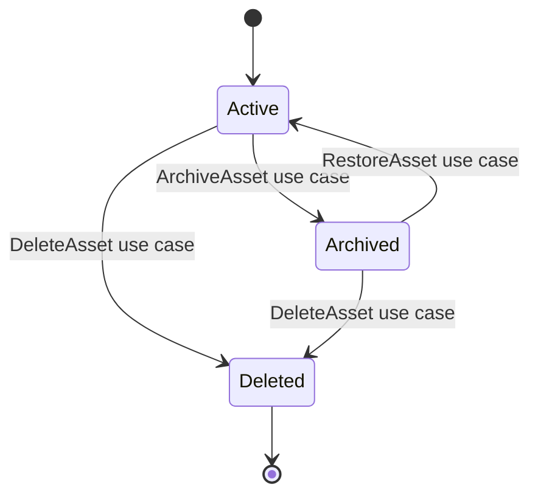

# Commands

| Command Name | Catalog Status | Purpose | Owning Aggregate | Trigger | Actor | Authorization | Permission | Request Fields | Preconditions | Validation | Business Rules | State Transition | Repository Interaction | Domain Service Interaction | Calculation Interaction | Domain Events | Idempotency | Concurrency | Audit | Cache Invalidation | Response | Errors | Example JSON |
|---|---|---|---|---|---|---|---|---|---|---|---|---|---|---|---|---|---|---|---|---|---|---|---|
| CreateAsset | Catalog Gap | create Asset source record | AssetPortfolio | POST /api/v1/assets | user/system | Household scope | Asset:Create | householdId, ownerUserId, assetType, assetName, currency | Household exists | AST-VR rules | identity, scope | none to Active | PortfolioRepository Add/Update | PortfolioService for invariant checks | none | none catalog-defined | request key | token generated | required | detail/search | AssetDetailDto | AST_ERR_* | `{"householdId":"...","assetType":"Investment","assetName":"Global Equity ETF","currency":"TWD"}` |
| UpdateAsset | Catalog Gap | update mutable Asset metadata | AssetPortfolio | PATCH /api/v1/assets/{assetId} | user/system | Household scope | Asset:Update | mutable fields, token | active state | AST-VR rules | no cross aggregate | Active stays Active | PortfolioRepository Update | PortfolioService | none | none catalog-defined | request key | token match | required | detail/search | AssetDetailDto | AST_ERR_* | `{"assetName":"Core ETF","concurrencyToken":"..."}` |
| DeleteAsset | Catalog Gap | soft delete Asset | AssetPortfolio | DELETE /api/v1/assets/{assetId} | user/system | Household scope | Asset:Update | reason, token | no hard delete | reference check | soft delete | Active/Archived to Deleted | PortfolioRepository Update | PortfolioService | projections exclude | none catalog-defined | request key | token match | required | all Asset caches | AssetDetailDto | AST_ERR_REFERENCED | `{"reason":"duplicate","concurrencyToken":"..."}` |
| ArchiveAsset | Catalog Gap | archive Asset | AssetPortfolio | POST /api/v1/assets/{assetId}/archive | user/system | Household scope | Asset:Update | reason, token | active | state check | read-only | Active to Archived | PortfolioRepository Update | PortfolioService | projections exclude active | none catalog-defined | request key | token match | required | active/search | AssetDetailDto | AST_ERR_ARCHIVED | `{"reason":"no longer used","concurrencyToken":"..."}` |
| RestoreAsset | Catalog Gap | restore archived Asset | AssetPortfolio | POST /api/v1/assets/{assetId}/restore | user/system | Household scope | Asset:Update | reason, token | archived refs valid | state check | restore eligibility | Archived to Active | PortfolioRepository Update | PortfolioService | projections refresh | none catalog-defined | request key | token match | required | active/search | AssetDetailDto | AST_ERR_INVALID_STATE | `{"reason":"restore","concurrencyToken":"..."}` |
| ActivateAsset | Catalog Gap | activate Asset if implementation supports state | AssetPortfolio | action endpoint | user/system | Household scope | Asset:Update | token | not deleted | state check | active only | implementation detail | PortfolioRepository | PortfolioService | projections include | none | request key | token | required | active/search | AssetDetailDto | AST_ERR_UNSUPPORTED | `{}` |
| DeactivateAsset | Catalog Gap | deactivate Asset if implementation supports state | AssetPortfolio | action endpoint | user/system | Household scope | Asset:Update | token | active | state check | implementation detail | implementation detail | PortfolioRepository | PortfolioService | projections exclude | none | request key | token | required | active/search | AssetDetailDto | AST_ERR_UNSUPPORTED | `{}` |
| BuySecurity | Existing | create/increase Holding referencing Asset | AssetPortfolio | command endpoint | user/system | Household scope | Asset:Update | PortfolioId, AssetId, Quantity, Money | valid Asset | command rules | Position owns exposure | Holding changes | PortfolioRepository | PortfolioService | allocation impact | SecurityPurchased | command key | aggregate token | required | portfolio/asset summary | CommandResult | command errors | `{"assetId":"...","quantity":100}` |
| SellSecurity | Existing | reduce Holding referencing Asset | AssetPortfolio | command endpoint | user/system | Household scope | Asset:Update | Holding/Asset, Quantity, Money | sufficient quantity | command rules | Position accounting | Holding changes | PortfolioRepository | PortfolioService | gain impact | SecuritySold | command key | aggregate token | required | portfolio/asset summary | CommandResult | command errors | `{"assetId":"...","quantity":10}` |
| RebalancePortfolio | Existing | rebalance Portfolio containing Asset exposure | AssetPortfolio | command endpoint | user/system | Household scope | Asset:Update | PortfolioId, target allocation | active Portfolio | allocation rules | Asset contributes facts | Portfolio state | PortfolioRepository | AllocationService | valuation/allocation | PortfolioRebalanced | command key | aggregate token | required | valuation/summary | CommandResult | command errors | `{"portfolioId":"..."}` |
| ChangeAssetOwner | Unsupported Operation | not formal command | n/a | n/a | n/a | n/a | n/a | n/a | n/a | n/a | use UpdateAsset use case if metadata only | none | none | none | none | none | none | none | attempted audit | none | error | AST_ERR_UNSUPPORTED | `{}` |
| RecordAssetValuation | Unsupported Operation | not catalog command | n/a | n/a | n/a | n/a | n/a | n/a | n/a | n/a | valuation is Implementation Detail or RebalancePortfolio input | none | none | none | valuation flow | none | none | none | attempted audit | none | error | AST_ERR_UNSUPPORTED | `{}` |

# Domain Events

| Event Name | Catalog Status | Event Version | Event Type | Producer | Aggregate | Trigger | Payload | Metadata | CorrelationId | CausationId | Deduplication Key | Consumers | Publication Timing | Transactional Outbox | Ordering Requirement | Replay Behavior | PII Classification | Financial Data Classification | Retention | Audit Requirement | Example JSON |
|---|---|---|---|---|---|---|---|---|---|---|---|---|---|---|---|---|---|---|---|---|---|
| SecurityPurchased | Existing | 1.0 | Domain Event | PortfolioApplicationService | AssetPortfolio | BuySecurity | SecurityId, Quantity, Money, TradeDate, HouseholdId | event id, schema, actor | required | required | EventId | Projection, Decision, Dashboard | after commit | required | per aggregate | idempotent replay | internal business | financial | retained | required | `{"eventName":"SecurityPurchased","schemaVersion":"1.0"}` |
| SecuritySold | Existing | 1.0 | Domain Event | PortfolioApplicationService | AssetPortfolio | SellSecurity | SecurityId, Quantity, Money, TradeDate, HouseholdId | event id, schema, actor | required | required | EventId | Projection, Decision, Dashboard | after commit | required | per aggregate | idempotent replay | internal business | financial | retained | required | `{"eventName":"SecuritySold","schemaVersion":"1.0"}` |
| PortfolioRebalanced | Existing | 1.0 | Domain Event | PortfolioApplicationService | AssetPortfolio | RebalancePortfolio | PortfolioId, allocations, HouseholdId | event id, schema, actor | required | required | EventId | Projection, Decision, Dashboard | after commit | required | per aggregate | idempotent replay | internal business | financial | retained | required | `{"eventName":"PortfolioRebalanced","schemaVersion":"1.0"}` |
| DividendDistributed | Existing | 1.0 | Domain Event | PortfolioApplicationService | AssetPortfolio | RecordIncome catalog flow | PortfolioId, AssetId, Money, IncomeDate | event id, schema, actor | required | required | EventId | Cash Flow, Dashboard | after commit | required | per aggregate | idempotent replay | internal business | financial | retained | required | `{"eventName":"DividendDistributed","schemaVersion":"1.0"}` |
| AssetCreated | Catalog Gap | n/a | Not a Domain Event | n/a | n/a | CreateAsset use case | n/a | n/a | n/a | n/a | n/a | n/a | not published | n/a | n/a | n/a | n/a | n/a | n/a | attempted use audited | `{"error":"Catalog Gap"}` |
| AssetUpdated | Catalog Gap | n/a | Not a Domain Event | n/a | n/a | UpdateAsset use case | n/a | n/a | n/a | n/a | n/a | n/a | not published | n/a | n/a | n/a | n/a | n/a | n/a | attempted use audited | `{"error":"Catalog Gap"}` |
| AssetDeleted | Catalog Gap | n/a | Not a Domain Event | n/a | n/a | DeleteAsset use case | n/a | n/a | n/a | n/a | n/a | n/a | not published | n/a | n/a | n/a | n/a | n/a | n/a | delete audited | `{"error":"Catalog Gap"}` |
| AssetArchived | Catalog Gap | n/a | Not a Domain Event | n/a | n/a | ArchiveAsset use case | n/a | n/a | n/a | n/a | n/a | n/a | not published | n/a | n/a | n/a | n/a | n/a | n/a | archive audited | `{"error":"Catalog Gap"}` |
| AssetStatusChanged | Catalog Gap | n/a | Not a Domain Event | n/a | n/a | status use case | n/a | n/a | n/a | n/a | n/a | n/a | not published | n/a | n/a | n/a | n/a | n/a | n/a | status audited | `{"error":"Catalog Gap"}` |

- Domain Events are not Application Events.
- Integration Events require message contract mapping.
- Market Data Events are external inputs and do not mutate Asset directly.
- Valuation Events are Implementation Detail unless cataloged.
- Projection Update Events update read models only.

# Repository

## Responsibility

- Repository name: PortfolioRepository.
- PortfolioRepository persists AssetPortfolio and its Asset-related state.
- Repository does not price assets.
- Repository does not value assets.
- Repository does not convert currency.
- Repository does not calculate performance.
- Repository does not calculate allocation.
- Repository does not calculate tax.
- Repository does not project future values.
- Repository does not authorize callers.
- Repository does not generate recommendations.

## Methods

| Method Name | Purpose | Parameters | Return Type | Not Found Behavior | Concurrency Behavior | Transaction Behavior | Tracking Behavior | Cancellation Token | Authorization Assumption | Tenant Filter | Audit Impact |
|---|---|---|---|---|---|---|---|---|---|---|---|
| GetByIdAsync | load AssetPortfolio or projection by id | aggregateId or assetId specification | AssetPortfolio/projection | null | no mutation | read transaction | tracked for command | required | caller pre-authorized | applied | none |
| ExistsAsync | check scoped existence | specification | bool | false | none | read | no tracking | required | caller pre-authorized | applied | none |
| AddAsync | add aggregate | AssetPortfolio | void | n/a | initial token | write transaction | tracked | required | app authorized | applied | audit via unit of work |
| UpdateAsync | save mutation | AssetPortfolio | void | conflict if stale | token match | write transaction | tracked | required | app authorized | applied | audit required |
| DeleteAsync | soft delete behavior | AssetPortfolio/Asset id | void | not found error | token match | write transaction | tracked | required | app authorized | applied | delete audit |
| ArchiveAsync | archive behavior | AssetPortfolio/Asset id | void | not found error | token match | write transaction | tracked | required | app authorized | applied | archive audit |
| RestoreAsync | restore behavior | AssetPortfolio/Asset id | void | not found error | token match | write transaction | tracked | required | app authorized | applied | restore audit |
| SaveChangesAsync | commit unit of work | cancellation token | int | n/a | DB concurrency exception | atomic commit | tracked | required | app authorized | applied | outbox/audit atomic |

## Query Methods

| Method | Catalog Status | Criteria | Sorting | Pagination | Projection | Index Usage | Notes |
|---|---|---|---|---|---|---|---|
| GetByHouseholdIdAsync | supported by repository pattern | HouseholdId | updatedAt desc | yes | summary/detail | household index | scoped |
| GetByUserIdAsync | specification | OwnerUserId | updatedAt desc | yes | summary | owner index | User reference only |
| GetByPortfolioIdAsync | specification | PortfolioId | assetName | yes | summary | portfolio index | optional relation |
| GetByAssetTypeAsync | specification | AssetType | assetName | yes | summary | type index | allowlist |
| GetByCurrencyAsync | specification | Currency | currentValue desc | yes | summary | currency index | financial permission |
| GetByStatusAsync | specification | Status | updatedAt desc | yes | summary | status index | active/archived |
| GetByExternalReferenceAsync | specification | source/ref | none | no | detail | source unique index | privileged |
| SearchAsync | repository projection | multiple filters | allowlist only | required | search result | composite indexes | no business logic |
| GetValuationSnapshotAsync | Implementation Detail | AssetId, date | date desc | yes | valuation projection | valuation index | read model |
| GetMaturingAssetsAsync | implementation query | maturity date range | maturityDate | yes | summary | maturity index | derived scheduling |

## Specifications

| Name | Criteria | Includes | Sorting | Pagination | Tenant Filter | Tracking | Use Case |
|---|---|---|---|---|---|---|---|
| AssetByIdSpecification | AssetId and scope | none by default | none | no | yes | tracked for command | detail/mutation |
| AssetsByHouseholdSpecification | HouseholdId and status | none | updatedAt desc | yes | yes | no tracking | list |
| AssetsByPortfolioSpecification | PortfolioId and HouseholdId | Portfolio projection only | assetName | yes | yes | no tracking | portfolio asset list |
| ActiveAssetsSpecification | Status Active and not deleted | none | updatedAt desc | yes | yes | no tracking | planning |
| ArchivedAssetsSpecification | Status Archived | none | archivedAt desc | yes | yes | no tracking | archive |
| AssetsByExternalReferenceSpecification | SourceSystem and ExternalReference | none | none | no | yes | no tracking | import idempotency |
| AssetsRequiringValuationSpecification | stale ValuationDate | none | valuationDate asc | yes | yes | no tracking | valuation batch |
| AssetSearchSpecification | allowlisted filters | none | allowlisted | yes | yes | no tracking | search |

## Persistence Rules

- Unit of Work: one AssetPortfolio aggregate mutation.
- Optimistic concurrency: Version and ConcurrencyToken.
- Transaction isolation: database default read committed unless command requires stricter isolation.
- Retry policy: retry transient errors only when idempotency key exists.
- Soft delete query filter: exclude `is_deleted = true`.
- Tenant query filter: apply TenantId when present.
- Read/write separation: command loads aggregate; query loads projection.
- Projection separation: read models never write aggregate source table.
- Outbox atomicity: event/outbox record commits with aggregate mutation when event exists.
- Audit atomicity: mandatory audit commits with mutation or command rolls back.

# Domain Service Interaction

| Service Name | Catalog Status | Direction | Purpose | Input | Output | Called By | Transaction Boundary | Failure Handling | Domain Event Impact | Authorization Responsibility | Idempotency | Timeout | Retry | Circuit Breaker | Fallback |
|---|---|---|---|---|---|---|---|---|---|---|---|---|---|---|---|
| PortfolioService | Existing | called | validate AssetPortfolio and Asset-related rules | aggregate, Asset facts | domain result | PortfolioApplicationService | inside command | rollback | catalog event if command emits | caller | command key | bounded | transient only | service policy | reject |
| AllocationService | Existing | called | allocation contribution and rebalance | Portfolio, Asset/Position values | allocation result | RebalancePortfolio handler | inside or calculation step | reject invalid allocation | PortfolioRebalanced | caller | command key | bounded | transient only | policy | stale projection |
| RiskService | Existing | called/read | risk scoring | Asset facts, risk context | RiskScore/RiskLevel | analysis/query flow | read-only or command calculation | mark unavailable | none unless command emits | caller | input hash | bounded | transient only | policy | unknown risk |
| CashFlowService | Existing | consumes context | income/cash flow linkage | DividendDistributed or source facts | cash flow projection | Dashboard/CashFlow flow | separate aggregate | inbox retry | Salary/Dividend events | caller | EventId | bounded | yes | policy | delayed projection |
| ScenarioService | Existing | reads | scenario input | Asset snapshot | scenario output | ScenarioApplicationService | read-only | scenario error | ScenarioEvaluated | caller | command key | bounded | yes | policy | no scenario result |
| DecisionService | Existing | reads | decision evidence | Asset/Portfolio facts | decision result | DecisionApplicationService | read-only | decision error | DecisionAccepted/Rejected when applicable | caller | input hash | bounded | yes | policy | explanation unavailable |
| RecommendationService | Existing | reads | recommendation evidence | Asset facts | recommendation | recommendation flow | read-only | recommendation error | recommendation events | caller | input hash | bounded | yes | policy | no recommendation |
| Audit Service | Existing | called | audit persistence | before/after, actor | audit record | all mutation use cases | atomic or outbox | rollback if mandatory | none | app | correlation id | bounded | yes | policy | fail closed |

# Application Service Interaction

| Use Case | Application Service | Method | Request DTO | Response DTO | Authorization | Validation | Transaction | Aggregate Loading | Domain Services | Repository Calls | Event Publication | Audit | Cache | Error Mapping | Idempotency | Concurrency | Observability |
|---|---|---|---|---|---|---|---|---|---|---|---|---|---|---|---|---|---|
| Create Asset | PortfolioApplicationService | CreateAssetAsync | CreateAssetDto | AssetDetailDto | Asset:Create | DTO + domain | write | AssetPortfolio | PortfolioService | Add/Update | none catalog-defined | required | invalidate search | AST_ERR_* | required | generated | logs/traces |
| Update Asset | PortfolioApplicationService | UpdateAssetAsync | UpdateAssetDto | AssetDetailDto | Asset:Update | DTO + token | write | AssetPortfolio | PortfolioService | Update | none catalog-defined | required | invalidate detail/search | AST_ERR_* | optional|required | required | logs/traces |
| Detail Asset | PortfolioApplicationService | DetailAsync | AssetId | AssetDetailDto | Asset:Read | scope | read | projection | none | query | none | read trace | detail cache | 404/403 | n/a | n/a | metrics |
| Search Assets | PortfolioApplicationService | SearchAsync | AssetSearchDto | AssetSearchResultDto | Asset:Read | filters | read | projection | none | query | none | query trace | search cache | 400/403 | n/a | n/a | metrics |
| Archive Asset | PortfolioApplicationService | ArchiveAssetAsync | ArchiveAssetDto | AssetDetailDto | Asset:Update | state/token | write | AssetPortfolio | PortfolioService | Update | none catalog-defined | required | invalidate active | AST_ERR_ARCHIVED | required | required | metrics |
| Restore Asset | PortfolioApplicationService | RestoreAssetAsync | RestoreAssetDto | AssetDetailDto | Asset:Update | state/token | write | AssetPortfolio | PortfolioService | Update | none catalog-defined | required | invalidate active | AST_ERR_INVALID_STATE | required | required | metrics |
| Delete Asset | PortfolioApplicationService | DeleteAssetAsync | DeleteAssetDto | AssetDetailDto | Asset:Update | state/ref/token | write | AssetPortfolio | PortfolioService | Update | none catalog-defined | required | invalidate all | AST_ERR_REFERENCED | required | required | metrics |
| Buy Security | PortfolioApplicationService | BuySecurityAsync | BuySecurityRequest | CommandResult | Asset:Update | command | write | AssetPortfolio | PortfolioService | Update | SecurityPurchased | required | portfolio/asset | command error | required | required | metrics |
| Sell Security | PortfolioApplicationService | SellSecurityAsync | SellSecurityRequest | CommandResult | Asset:Update | command | write | AssetPortfolio | PortfolioService | Update | SecuritySold | required | portfolio/asset | command error | required | required | metrics |
| Rebalance | PortfolioApplicationService | RebalancePortfolioAsync | RebalancePortfolioRequest | CommandResult | Asset:Update | command | write | AssetPortfolio | AllocationService | Update | PortfolioRebalanced | required | valuation/portfolio | command error | required | required | metrics |

# API

| Endpoint | HTTP Method | Purpose | Permission | Authentication | Authorization | Path Parameters | Query Parameters | Headers | Request Body | Validation | Idempotency | ETag or Concurrency | Response Body | Success Status | Error Status | Error Code | Pagination | Sorting | Filtering | Expansion | Cache-Control | Rate Limit | Audit | Example Request | Example Response |
|---|---|---|---|---|---|---|---|---|---|---|---|---|---|---:|---|---|---|---|---|---|---|---|---|---|---|
| `/api/v1/assets` | GET | search Assets | Asset:Read | required | Household scope | none | AssetSearchDto | correlation id | none | filters | n/a | n/a | AssetSearchResultDto | 200 | 400/401/403/429/500 | AST_ERR_* | yes | allowlist | allowlist | safe only | private scoped | standard | query trace | `/api/v1/assets?householdId=...` | search JSON |
| `/api/v1/assets/{assetId}` | GET | detail | Asset:Read | required | Household scope | assetId | expand | correlation id | none | id/scope | n/a | n/a | AssetDetailDto | 200 | 401/403/404/500 | AST_ERR_NOT_FOUND | n/a | n/a | n/a | safe only | private scoped | standard | read trace | n/a | detail JSON |
| `/api/v1/assets` | POST | create Asset | Asset:Create | required | Household scope | none | none | Idempotency-Key | CreateAssetDto | AST-VR | required | n/a | AssetDetailDto | 201 | 400/401/403/409/422/500/503 | AST_ERR_* | n/a | n/a | n/a | n/a | no-store | standard | create audit | create JSON | detail JSON |
| `/api/v1/assets/{assetId}` | PATCH | update Asset | Asset:Update | required | Household scope | assetId | none | If-Match, Idempotency-Key | UpdateAssetDto | AST-VR | required | required | AssetDetailDto | 200 | 400/401/403/404/409/412/422/500 | AST_ERR_* | n/a | n/a | n/a | n/a | no-store | standard | update audit | update JSON | detail JSON |
| `/api/v1/assets/{assetId}` | DELETE | soft delete | Asset:Update | required | Household scope | assetId | none | If-Match, Idempotency-Key | DeleteAssetDto | state/ref/token | required | required | AssetDetailDto | 200 | 401/403/404/409/412/422/500 | AST_ERR_* | n/a | n/a | n/a | n/a | no-store | standard | delete audit | delete JSON | deleted detail |
| `/api/v1/assets/{assetId}/archive` | POST | archive | Asset:Update | required | Household scope | assetId | none | If-Match, Idempotency-Key | ArchiveAssetDto | state/token | required | required | AssetDetailDto | 200 | 401/403/404/409/412/422 | AST_ERR_ARCHIVED | n/a | n/a | n/a | n/a | no-store | standard | archive audit | archive JSON | detail |
| `/api/v1/assets/{assetId}/restore` | POST | restore | Asset:Update | required | Household scope | assetId | none | If-Match, Idempotency-Key | RestoreAssetDto | state/token | required | required | AssetDetailDto | 200 | 401/403/404/409/412/422 | AST_ERR_INVALID_STATE | n/a | n/a | n/a | n/a | no-store | standard | restore audit | restore JSON | detail |
| `/api/v1/assets/{assetId}/valuations` | GET | read valuation snapshots | Asset:Read | required | Household scope | assetId | date range/page | correlation id | none | date/page | n/a | n/a | AssetValuationDto page | 200 | 400/401/403/404/429 | AST_ERR_* | yes | valuationDate | date | n/a | private scoped | standard | read trace | n/a | valuations |
| `/api/v1/assets/{assetId}/valuations` | POST | valuation input use case | Asset:Update | required | Household scope | assetId | none | If-Match, Idempotency-Key | CreateAssetValuationDto | valuation rules | required | required | AssetValuationDto | 202/200 | 400/401/403/409/412/422/503 | AST_ERR_* | n/a | n/a | n/a | n/a | no-store | standard | valuation audit | valuation JSON | valuation response |
| `/api/v1/households/{householdId}/assets` | GET | household asset list | Asset:Read | required | Household scope | householdId | filters/page | correlation id | none | filters | n/a | n/a | AssetSearchResultDto | 200 | 400/401/403/429/500 | AST_ERR_* | yes | allowlist | allowlist | safe | private scoped | standard | query trace | n/a | search |
| `/api/v1/portfolios/{portfolioId}/assets` | GET | portfolio related assets | Asset:Read | required | Portfolio scope | portfolioId | filters/page | correlation id | none | filters | n/a | n/a | AssetSearchResultDto | 200 | 400/401/403/404/429/500 | AST_ERR_* | yes | allowlist | allowlist | safe | private scoped | standard | query trace | n/a | search |

## API Error Status

- 400: malformed request, invalid pagination, invalid sort, invalid filter.
- 401: authentication missing.
- 403: permission, tenant, or Household violation.
- 404: Asset not found or hidden by authorization.
- 409: duplicate, invalid state, stale valuation, idempotency conflict.
- 412: missing or mismatched concurrency precondition.
- 422: semantic validation failure.
- 429: rate limit exceeded.
- 500: unexpected server error.
- 503: dependency unavailable, database unavailable, or outbox unavailable.

# DTO

| DTO | Name | Type | Nullable | Required | Default | Validation | JSON Name | Source | Sensitive | Masked | Create Allowed | Update Allowed | Output Only | Derived | Precision | Rounding | Example |
|---|---|---|---:|---:|---|---|---|---|---:|---:|---:|---:|---:|---:|---|---|---|
| CreateAssetDto | householdId | Guid | No | Yes | none | accessible Household | householdId | request | No | No | Yes | No | No | No | n/a | n/a | UUID |
| CreateAssetDto | ownerUserId | Guid | Yes | No | actor | User in Household | ownerUserId | request | Yes | Yes | Yes | No | No | No | n/a | n/a | UUID |
| CreateAssetDto | assetType | String | No | Yes | none | AssetType | assetType | request | No | No | Yes | Restricted | No | No | n/a | n/a | Investment |
| CreateAssetDto | assetName | String | No | Yes | none | 1..160 | assetName | request | Conditional | Conditional | Yes | Yes | No | No | n/a | n/a | Global ETF |
| CreateAssetDto | currency | String | No | Yes | Household currency | CurrencyCode | currency | request | No | No | Yes | Restricted | No | No | n/a | n/a | TWD |
| CreateAssetDto | acquisitionCost | Decimal | Yes | No | null | >=0 | acquisitionCost | request | Yes | Yes | Yes | Restricted | No | No | 19,4 | formula catalog | 1000000.0000 |
| UpdateAssetDto | displayName | String | Yes | No | existing | max 160 | displayName | request | Conditional | Conditional | No | Yes | No | No | n/a | n/a | Core ETF |
| UpdateAssetDto | description | String | Yes | No | existing | max 2000 | description | request | Conditional | Yes | No | Yes | No | No | n/a | n/a | text |
| UpdateAssetDto | liquidityLevel | String | Yes | No | existing | implementation allowlist | liquidityLevel | request | No | No | No | Yes | No | No | n/a | n/a | High |
| UpdateAssetDto | concurrencyToken | String | No | Yes | none | token match | concurrencyToken | request | No | No | No | Yes | No | No | n/a | n/a | token |
| AssetDetailDto | assetId | Guid | No | Yes | none | UUID | assetId | Asset | No | No | No | No | Yes | No | n/a | n/a | UUID |
| AssetDetailDto | householdId | Guid | No | Yes | none | UUID | householdId | Asset | No | No | No | No | Yes | No | n/a | n/a | UUID |
| AssetDetailDto | assetName | String | No | Yes | none | normalized | assetName | Asset | Conditional | Conditional | No | No | Yes | No | n/a | n/a | Global ETF |
| AssetDetailDto | currentValue | Decimal | Yes | No | null | financial permission | currentValue | valuation | Yes | Yes | No | No | Yes | No | 19,4 | formula catalog | 1250000.0000 |
| AssetDetailDto | valuationDate | Date | Yes | No | null | date | valuationDate | valuation | No | No | No | No | Yes | No | n/a | n/a | 2026-07-14 |
| AssetSummaryDto | assetId | Guid | No | Yes | none | UUID | assetId | projection | No | No | No | No | Yes | No | n/a | n/a | UUID |
| AssetSummaryDto | assetName | String | No | Yes | none | masked if needed | assetName | projection | Conditional | Conditional | No | No | Yes | No | n/a | n/a | Core ETF |
| AssetSearchDto | householdId | Guid | Yes | No | caller scope | scope | householdId | query | No | No | No | No | No | No | n/a | n/a | UUID |
| AssetSearchDto | assetType | String | Yes | No | none | allowlist | assetType | query | No | No | No | No | No | No | n/a | n/a | Investment |
| AssetValuationDto | valuationDate | Date | No | Yes | none | valid date | valuationDate | valuation projection | No | No | No | No | Yes | No | n/a | n/a | 2026-07-14 |
| AssetValuationDto | currentValue | Decimal | Yes | No | null | financial permission | currentValue | valuation projection | Yes | Yes | No | No | Yes | No | 19,4 | formula catalog | 1250000 |
| CreateAssetValuationDto | valuationDate | Date | No | Yes | none | valid date | valuationDate | request | No | No | No | No | No | No | n/a | n/a | 2026-07-14 |
| CreateAssetValuationDto | currentValue | Decimal | Yes | No | null | >=0 | currentValue | request | Yes | Yes | No | No | No | No | 19,4 | formula catalog | 1250000 |
| AssetOwnershipDto | ownerUserId | Guid | Yes | No | null | scoped User | ownerUserId | Asset | Yes | Yes | Yes | Yes | No | No | n/a | n/a | UUID |
| AssetClassificationDto | assetType | String | No | Yes | none | AssetType | assetType | Asset | No | No | Yes | Restricted | No | No | n/a | n/a | Investment |
| ArchiveAssetDto | reason | String | No | Yes | none | 1..500 | reason | request | Conditional | Yes | No | No | No | No | n/a | n/a | duplicate |
| RestoreAssetDto | reason | String | No | Yes | none | 1..500 | reason | request | Conditional | Yes | No | No | No | No | n/a | n/a | restore |
| AssetStatusDto | status | String | No | Yes | Active | status allowlist | status | Asset | No | No | No | command only | Yes | No | n/a | n/a | Active |

- Mapping source: Asset write table, valuation projection, audit projection, and Catalog command result.
- Mapping target: DTO only, never aggregate ownership.
- Validation location: API DTO validation, application authorization, domain invariants, database constraints.
- Versioning: additive fields only for backward compatibility.
- Unknown field behavior: reject mutation unknown fields; ignore unknown read query fields only when governance permits.
- Over-posting protection: output-only, derived, audit, and financial restricted fields ignored or rejected.
- Null handling: nullable properties preserve current value unless explicit clear is allowed.
- Money serialization: decimal string or JSON number preserving scale according to API governance.
- Currency serialization: uppercase string.
- Date/time serialization: ISO 8601; timestamps in UTC.
- UUID serialization: lowercase canonical string.
- Enumeration serialization: stable Catalog string.

# Database Mapping

## Table

- Table Name: `assets`.
- Schema: `atlas`.
- Aggregate Owner: AssetPortfolio.
- Source of Truth: current Asset source state, not valuation history, market data, position data, Portfolio projection, or reporting read model.

## Columns

| Column Name | PostgreSQL Type | Nullable | Default | PK | FK | Unique | Check Constraint | Index | Encryption | Collation | Precision | Scale | Description | Entity Property | Migration Impact |
|---|---|---:|---|---:|---:|---:|---|---|---|---|---:|---:|---|---|---|
| asset_id | uuid | No | gen_random_uuid() | Yes | No | Yes | not null | pk | No | n/a | n/a | n/a | identity | AssetId | backfill ids |
| tenant_id | uuid | Yes | null | No | No | No | scope policy | ix tenant | No | n/a | n/a | n/a | tenant scope | TenantId | backfill if tenancy |
| household_id | uuid | No | none | No | Yes | No | not null | ix household | No | n/a | n/a | n/a | household scope | HouseholdId | required |
| owner_user_id | uuid | Yes | null | No | Yes | No | scoped user | ix owner | No | n/a | n/a | n/a | user ref | OwnerUserId | optional |
| portfolio_id | uuid | Yes | null | No | Yes | No | scoped portfolio | ix portfolio | No | n/a | n/a | n/a | portfolio ref | PortfolioId | optional |
| asset_name | varchar(160) | No | none | No | No | No | length > 0 | ix name | No | default | n/a | n/a | name | AssetName | normalize |
| display_name | varchar(160) | Yes | null | No | No | No | max length | ix display | No | default | n/a | n/a | display | DisplayName | optional |
| description | text | Yes | null | No | No | No | size governed | none | Conditional | default | n/a | n/a | description | Description | optional |
| asset_type | varchar(40) | No | none | No | No | No | not blank | ix type | No | default | n/a | n/a | type | AssetType | map values |
| asset_class | varchar(60) | Yes | null | No | No | No | max length | ix class | No | default | n/a | n/a | implementation class | AssetClass | optional |
| currency | char(3) | No | none | No | No | No | upper length 3 | ix currency | No | n/a | n/a | n/a | currency | Currency | normalize |
| acquisition_date | date | Yes | null | No | No | No | date rules | ix acquisition | No | n/a | n/a | n/a | acquisition date | AcquisitionDate | optional |
| acquisition_cost | numeric(19,4) | Yes | null | No | No | No | >=0 | financial ix optional | Conditional | n/a | 19 | 4 | cost | AcquisitionCost | precision migration |
| quantity | numeric(28,8) | Yes | null | No | No | No | >=0 | optional | No | n/a | 28 | 8 | quantity | Quantity | precision migration |
| unit | varchar(30) | Yes | null | No | No | No | max length | none | No | default | n/a | n/a | unit | Unit | optional |
| cost_basis | numeric(19,4) | Yes | null | No | No | No | >=0 | optional | Conditional | n/a | 19 | 4 | cost basis | CostBasis | backfill |
| book_value | numeric(19,4) | Yes | null | No | No | No | >=0 | optional | Conditional | n/a | 19 | 4 | book value | BookValue | separate from projection |
| current_value | numeric(19,4) | Yes | null | No | No | No | >=0 | ix current | Conditional | n/a | 19 | 4 | snapshot value | CurrentValue | backfill if existing |
| estimated_value | numeric(19,4) | Yes | null | No | No | No | >=0 | optional | Conditional | n/a | 19 | 4 | estimate | EstimatedValue | optional |
| valuation_date | date | Yes | null | No | No | No | date rules | ix valuation | No | n/a | n/a | n/a | as-of date | ValuationDate | optional |
| valuation_method | varchar(60) | Yes | null | No | No | No | max length | optional | No | default | n/a | n/a | method | ValuationMethod | optional |
| liquidity_level | varchar(40) | Yes | null | No | No | No | max length | ix liquidity | No | default | n/a | n/a | liquidity | LiquidityLevel | optional |
| ownership_percentage | numeric(9,6) | Yes | 1 | No | No | No | 0..1 | optional | No | n/a | 9 | 6 | ownership | OwnershipPercentage | default |
| external_reference | varchar(120) | Yes | null | No | No | Conditional | max length | ix external | Conditional | default | n/a | n/a | external id | ExternalReference | normalize |
| institution_name | varchar(160) | Yes | null | No | No | No | max length | ix institution | Conditional | default | n/a | n/a | institution | InstitutionName | optional |
| account_reference | varchar(120) | Yes | null | No | No | No | max length | hash index only | Yes | default | n/a | n/a | account ref | AccountReference | tokenize |
| maturity_date | date | Yes | null | No | No | No | >= acquisition | ix maturity | No | n/a | n/a | n/a | maturity | MaturityDate | optional |
| status | varchar(32) | No | Active | No | No | No | Active/Archived/Deleted | ix status | No | default | n/a | n/a | status | Status | map |
| is_active | boolean | No | true | No | No | No | status alignment | ix active | No | n/a | n/a | n/a | active flag | IsActive | derived |
| is_deleted | boolean | No | false | No | No | No | status alignment | ix deleted | No | n/a | n/a | n/a | soft delete | IsDeleted | backfill |
| archived_at | timestamptz | Yes | null | No | No | No | status rule | ix archived | No | n/a | n/a | n/a | archive time | ArchivedAt | optional |
| archived_by | uuid | Yes | null | No | Yes | No | actor | none | No | n/a | n/a | n/a | archive actor | ArchivedBy | optional |
| deleted_at | timestamptz | Yes | null | No | No | No | status rule | ix deleted_at | No | n/a | n/a | n/a | delete time | DeletedAt | optional |
| deleted_by | uuid | Yes | null | No | Yes | No | actor | none | No | n/a | n/a | n/a | delete actor | DeletedBy | optional |
| created_at | timestamptz | No | now() | No | No | No | immutable | ix created | No | n/a | n/a | n/a | created | CreatedAt | required |
| created_by | uuid | No | none | No | Yes | No | actor | ix created_by | No | n/a | n/a | n/a | creator | CreatedBy | required |
| updated_at | timestamptz | No | now() | No | No | No | >= created | ix updated | No | n/a | n/a | n/a | updated | UpdatedAt | required |
| updated_by | uuid | No | none | No | Yes | No | actor | ix updated_by | No | n/a | n/a | n/a | updater | UpdatedBy | required |
| version | integer | No | 1 | No | No | No | >=1 | ix version | No | n/a | n/a | n/a | version | Version | initialize |
| concurrency_token | bytea | No | generated | No | No | No | not null | ix token | No | n/a | n/a | n/a | token | ConcurrencyToken | initialize |

## Foreign Keys

| FK Name | Source Column | Target Table | Target Column | On Delete | On Update | Deferrable | Business Meaning | Aggregate Boundary |
|---|---|---|---|---|---|---|---|---|
| fk_assets_household | household_id | households | household_id | RESTRICT | NO ACTION | No | Household scope | Cross aggregate reference |
| fk_assets_owner_user | owner_user_id | users | user_id | SET NULL | NO ACTION | No | optional owner actor | Cross aggregate reference |
| fk_assets_portfolio | portfolio_id | portfolios | portfolio_id | SET NULL | NO ACTION | No | optional Portfolio context | AssetPortfolio related state |
| fk_assets_created_by | created_by | users | user_id | RESTRICT | NO ACTION | No | audit actor | Audit reference |
| fk_assets_updated_by | updated_by | users | user_id | RESTRICT | NO ACTION | No | audit actor | Audit reference |

## Unique Constraints

- `ux_assets_asset_id`: primary key.
- `ux_assets_external_reference_scope`: TenantId or HouseholdId plus ExternalReference when implementation source identity requires uniqueness.

## Check Constraints

- Currency uppercase length 3.
- Monetary fields are nonnegative.
- Quantity is nonnegative.
- OwnershipPercentage between 0 and 1.
- MaturityDate is null or AcquisitionDate is null or MaturityDate >= AcquisitionDate.
- Status in `Active`, `Archived`, `Deleted`.
- IsActive aligns with Status.
- IsDeleted aligns with Status.
- Version >= 1.

## Mapping Boundaries

- Asset write table stores current source state.
- Asset valuation history is Implementation Detail or projection storage and not a new Entity here.
- Market data is external and not stored as Asset source unless accepted as valuation snapshot.
- Position data remains in Holding/Position table.
- Portfolio projection remains read model.
- Reporting read model remains read-only.

# PostgreSQL Schema

```sql
CREATE SCHEMA IF NOT EXISTS atlas;

CREATE TABLE atlas.assets (
    asset_id uuid PRIMARY KEY DEFAULT gen_random_uuid(),
    tenant_id uuid NULL,
    household_id uuid NOT NULL,
    owner_user_id uuid NULL,
    portfolio_id uuid NULL,
    asset_name varchar(160) NOT NULL,
    display_name varchar(160) NULL,
    description text NULL,
    asset_type varchar(40) NOT NULL,
    asset_class varchar(60) NULL,
    currency char(3) NOT NULL,
    acquisition_date date NULL,
    acquisition_cost numeric(19,4) NULL,
    quantity numeric(28,8) NULL,
    unit varchar(30) NULL,
    cost_basis numeric(19,4) NULL,
    book_value numeric(19,4) NULL,
    current_value numeric(19,4) NULL,
    estimated_value numeric(19,4) NULL,
    valuation_date date NULL,
    valuation_method varchar(60) NULL,
    liquidity_level varchar(40) NULL,
    ownership_percentage numeric(9,6) NULL DEFAULT 1,
    external_reference varchar(120) NULL,
    institution_name varchar(160) NULL,
    account_reference varchar(120) NULL,
    maturity_date date NULL,
    status varchar(32) NOT NULL DEFAULT 'Active',
    is_active boolean NOT NULL DEFAULT true,
    is_deleted boolean NOT NULL DEFAULT false,
    archived_at timestamptz NULL,
    archived_by uuid NULL,
    deleted_at timestamptz NULL,
    deleted_by uuid NULL,
    created_at timestamptz NOT NULL DEFAULT now(),
    created_by uuid NOT NULL,
    updated_at timestamptz NOT NULL DEFAULT now(),
    updated_by uuid NOT NULL,
    version integer NOT NULL DEFAULT 1,
    concurrency_token bytea NOT NULL DEFAULT gen_random_bytes(16),
    CONSTRAINT fk_assets_household FOREIGN KEY (household_id) REFERENCES atlas.households(household_id) ON DELETE RESTRICT ON UPDATE NO ACTION,
    CONSTRAINT fk_assets_owner_user FOREIGN KEY (owner_user_id) REFERENCES atlas.users(user_id) ON DELETE SET NULL ON UPDATE NO ACTION,
    CONSTRAINT fk_assets_portfolio FOREIGN KEY (portfolio_id) REFERENCES atlas.portfolios(portfolio_id) ON DELETE SET NULL ON UPDATE NO ACTION,
    CONSTRAINT fk_assets_created_by FOREIGN KEY (created_by) REFERENCES atlas.users(user_id) ON DELETE RESTRICT ON UPDATE NO ACTION,
    CONSTRAINT fk_assets_updated_by FOREIGN KEY (updated_by) REFERENCES atlas.users(user_id) ON DELETE RESTRICT ON UPDATE NO ACTION,
    CONSTRAINT ck_assets_name_not_blank CHECK (length(btrim(asset_name)) > 0),
    CONSTRAINT ck_assets_currency CHECK (currency = upper(currency) AND char_length(currency) = 3),
    CONSTRAINT ck_assets_acquisition_cost CHECK (acquisition_cost IS NULL OR acquisition_cost >= 0),
    CONSTRAINT ck_assets_quantity CHECK (quantity IS NULL OR quantity >= 0),
    CONSTRAINT ck_assets_cost_basis CHECK (cost_basis IS NULL OR cost_basis >= 0),
    CONSTRAINT ck_assets_book_value CHECK (book_value IS NULL OR book_value >= 0),
    CONSTRAINT ck_assets_current_value CHECK (current_value IS NULL OR current_value >= 0),
    CONSTRAINT ck_assets_estimated_value CHECK (estimated_value IS NULL OR estimated_value >= 0),
    CONSTRAINT ck_assets_ownership_percentage CHECK (ownership_percentage IS NULL OR (ownership_percentage >= 0 AND ownership_percentage <= 1)),
    CONSTRAINT ck_assets_maturity_date CHECK (maturity_date IS NULL OR acquisition_date IS NULL OR maturity_date >= acquisition_date),
    CONSTRAINT ck_assets_status CHECK (status IN ('Active','Archived','Deleted')),
    CONSTRAINT ck_assets_active_flag CHECK ((status = 'Active' AND is_active = true AND is_deleted = false) OR (status <> 'Active' AND is_active = false)),
    CONSTRAINT ck_assets_deleted_flag CHECK ((status = 'Deleted' AND is_deleted = true AND deleted_at IS NOT NULL) OR status <> 'Deleted'),
    CONSTRAINT ck_assets_archive_fields CHECK ((status = 'Archived' AND archived_at IS NOT NULL) OR status <> 'Archived'),
    CONSTRAINT ck_assets_version CHECK (version >= 1),
    CONSTRAINT ck_assets_updated_at CHECK (updated_at >= created_at)
);

CREATE UNIQUE INDEX ux_assets_household_external_reference ON atlas.assets(household_id, external_reference) WHERE external_reference IS NOT NULL;
CREATE INDEX ix_assets_tenant_household ON atlas.assets(tenant_id, household_id) WHERE tenant_id IS NOT NULL;
CREATE INDEX ix_assets_household_active ON atlas.assets(household_id, is_active) WHERE is_deleted = false;
CREATE INDEX ix_assets_household_status ON atlas.assets(household_id, status);
CREATE INDEX ix_assets_owner_user ON atlas.assets(owner_user_id) WHERE owner_user_id IS NOT NULL;
CREATE INDEX ix_assets_portfolio ON atlas.assets(portfolio_id) WHERE portfolio_id IS NOT NULL;
CREATE INDEX ix_assets_type_class ON atlas.assets(asset_type, asset_class);
CREATE INDEX ix_assets_currency ON atlas.assets(currency);
CREATE INDEX ix_assets_maturity_date ON atlas.assets(maturity_date) WHERE maturity_date IS NOT NULL AND is_deleted = false;
CREATE INDEX ix_assets_valuation_date ON atlas.assets(valuation_date) WHERE valuation_date IS NOT NULL AND is_deleted = false;
CREATE INDEX ix_assets_updated_at ON atlas.assets(updated_at DESC);
CREATE INDEX ix_assets_archived ON atlas.assets(archived_at DESC) WHERE status = 'Archived';
CREATE INDEX ix_assets_deleted ON atlas.assets(deleted_at DESC) WHERE is_deleted = true;
CREATE INDEX ix_assets_name_search ON atlas.assets USING gin (to_tsvector('simple', asset_name));

COMMENT ON TABLE atlas.assets IS 'Asset source table owned by AssetPortfolio through PortfolioRepository.';
COMMENT ON COLUMN atlas.assets.current_value IS 'Latest accepted current value snapshot; valuation projection remains separate when implemented.';
COMMENT ON COLUMN atlas.assets.account_reference IS 'Sensitive account reference; store tokenized or encrypted according to security policy.';
COMMENT ON COLUMN atlas.assets.concurrency_token IS 'Optimistic concurrency token for AssetPortfolio-owned Asset mutation.';
```

# EF Core Mapping

```csharp
public sealed class AssetConfiguration : IEntityTypeConfiguration<Asset>
{
    public void Configure(EntityTypeBuilder<Asset> builder)
    {
        builder.ToTable("assets", "atlas");
        builder.HasKey(x => x.AssetId);
        builder.Property(x => x.AssetId).HasColumnName("asset_id").ValueGeneratedOnAdd();
        builder.Property<Guid?>("TenantId").HasColumnName("tenant_id");
        builder.Property(x => x.HouseholdId).HasColumnName("household_id").IsRequired();
        builder.Property(x => x.OwnerUserId).HasColumnName("owner_user_id");
        builder.Property(x => x.PortfolioId).HasColumnName("portfolio_id");
        builder.Property(x => x.AssetName).HasColumnName("asset_name").HasMaxLength(160).IsUnicode().IsRequired();
        builder.Property(x => x.DisplayName).HasColumnName("display_name").HasMaxLength(160).IsUnicode();
        builder.Property(x => x.Description).HasColumnName("description").IsUnicode();
        builder.Property(x => x.AssetType).HasColumnName("asset_type").HasMaxLength(40).HasConversion<string>().IsRequired();
        builder.Property(x => x.AssetClass).HasColumnName("asset_class").HasMaxLength(60);
        builder.Property(x => x.Currency).HasColumnName("currency").HasMaxLength(3).HasConversion<string>().IsRequired();
        builder.Property(x => x.AcquisitionDate).HasColumnName("acquisition_date");
        builder.Property(x => x.AcquisitionCost).HasColumnName("acquisition_cost").HasPrecision(19, 4);
        builder.Property(x => x.Quantity).HasColumnName("quantity").HasPrecision(28, 8);
        builder.Property(x => x.Unit).HasColumnName("unit").HasMaxLength(30);
        builder.Property(x => x.CostBasis).HasColumnName("cost_basis").HasPrecision(19, 4);
        builder.Property(x => x.BookValue).HasColumnName("book_value").HasPrecision(19, 4);
        builder.Property(x => x.CurrentValue).HasColumnName("current_value").HasPrecision(19, 4);
        builder.Property(x => x.EstimatedValue).HasColumnName("estimated_value").HasPrecision(19, 4);
        builder.Property(x => x.ValuationDate).HasColumnName("valuation_date");
        builder.Property(x => x.ValuationMethod).HasColumnName("valuation_method").HasMaxLength(60);
        builder.Property(x => x.LiquidityLevel).HasColumnName("liquidity_level").HasMaxLength(40);
        builder.Property(x => x.OwnershipPercentage).HasColumnName("ownership_percentage").HasPrecision(9, 6).HasDefaultValue(1m);
        builder.Property(x => x.ExternalReference).HasColumnName("external_reference").HasMaxLength(120);
        builder.Property(x => x.InstitutionName).HasColumnName("institution_name").HasMaxLength(160);
        builder.Property(x => x.AccountReference).HasColumnName("account_reference").HasMaxLength(120);
        builder.Property(x => x.MaturityDate).HasColumnName("maturity_date");
        builder.Property(x => x.Status).HasColumnName("status").HasMaxLength(32).HasConversion<string>().HasDefaultValue("Active").IsRequired();
        builder.Property(x => x.IsActive).HasColumnName("is_active").HasDefaultValue(true).IsRequired();
        builder.Property(x => x.IsDeleted).HasColumnName("is_deleted").HasDefaultValue(false).IsRequired();
        builder.Property(x => x.ArchivedAt).HasColumnName("archived_at");
        builder.Property(x => x.ArchivedBy).HasColumnName("archived_by");
        builder.Property(x => x.DeletedAt).HasColumnName("deleted_at");
        builder.Property(x => x.DeletedBy).HasColumnName("deleted_by");
        builder.Property(x => x.CreatedAt).HasColumnName("created_at").IsRequired();
        builder.Property(x => x.CreatedBy).HasColumnName("created_by").IsRequired();
        builder.Property(x => x.UpdatedAt).HasColumnName("updated_at").IsRequired();
        builder.Property(x => x.UpdatedBy).HasColumnName("updated_by").IsRequired();
        builder.Property(x => x.Version).HasColumnName("version").HasDefaultValue(1).IsRequired();
        builder.Property(x => x.ConcurrencyToken).HasColumnName("concurrency_token").IsConcurrencyToken().IsRequired();
        builder.HasIndex(x => new { x.HouseholdId, x.ExternalReference }).IsUnique().HasFilter("external_reference IS NOT NULL").HasDatabaseName("ux_assets_household_external_reference");
        builder.HasIndex("TenantId", nameof(Asset.HouseholdId)).HasDatabaseName("ix_assets_tenant_household");
        builder.HasIndex(x => new { x.HouseholdId, x.IsActive }).HasFilter("is_deleted = false").HasDatabaseName("ix_assets_household_active");
        builder.HasIndex(x => new { x.HouseholdId, x.Status }).HasDatabaseName("ix_assets_household_status");
        builder.HasIndex(x => x.OwnerUserId).HasFilter("owner_user_id IS NOT NULL");
        builder.HasIndex(x => x.PortfolioId).HasFilter("portfolio_id IS NOT NULL");
        builder.HasIndex(x => new { x.AssetType, x.AssetClass }).HasDatabaseName("ix_assets_type_class");
        builder.HasIndex(x => x.Currency);
        builder.HasIndex(x => x.MaturityDate).HasFilter("maturity_date IS NOT NULL AND is_deleted = false");
        builder.HasIndex(x => x.ValuationDate).HasFilter("valuation_date IS NOT NULL AND is_deleted = false");
        builder.HasIndex(x => x.UpdatedAt);
        builder.HasQueryFilter(x => !x.IsDeleted);
        builder.HasOne<Household>().WithMany().HasForeignKey(x => x.HouseholdId).OnDelete(DeleteBehavior.Restrict);
        builder.HasOne<User>().WithMany().HasForeignKey(x => x.OwnerUserId).OnDelete(DeleteBehavior.SetNull);
        builder.HasOne<Portfolio>().WithMany().HasForeignKey(x => x.PortfolioId).OnDelete(DeleteBehavior.SetNull);
        builder.Navigation(x => x.DomainEvents).UsePropertyAccessMode(PropertyAccessMode.Field);
        builder.Ignore(x => x.DomainEvents);
    }
}
```

## Value Conversion

- AssetType uses string conversion.
- Currency uses CurrencyCode string conversion.
- Status uses string conversion without creating a PostgreSQL enum type.
- RiskScore and Percentage values use decimal conversion with fixed precision.

## Money Mapping

- Money is stored as numeric amount plus Currency.
- PostgreSQL `money` type is prohibited.
- Rounding follows financial formula catalog.

## Currency Mapping

- Currency persists as `char(3)`.
- Database check enforces uppercase length.
- Application validates supported CurrencyCode.

## Owned Type

- Owned types are allowed only for Catalog value objects such as Money, Currency, Percentage, Allocation, and RiskScore.
- Owned type mapping must preserve DDL column names.

## Relationship Mapping

- Household, User, and Portfolio are identity references.
- Delete behavior is Restrict or SetNull only as defined in DDL.
- Cross-aggregate cascade delete is prohibited.

## Concurrency Mapping

- ConcurrencyToken maps to bytea and is marked as concurrency token.
- Version increments in application command handling.
- Stale token maps to HTTP 409 or 412.

## Query Filter

- Soft delete filter excludes IsDeleted records.
- Tenant filter is added when tenancy exists.
- Household filter is applied in repository specifications and application authorization.

## Migration Considerations

- Normalize currencies before constraint validation.
- Backfill concurrency tokens before enforcing not null.
- Create indexes concurrently in production.
- Validate constraints after data cleanup.

# Calculation and Valuation Interaction

- Calculation ownership stays with financial formula catalog, PortfolioService, AllocationService, RiskService, and projection capabilities.
- Valuation ownership is a controlled use case or projection, not a repository responsibility.
- Market data input is external and must include source, as-of time, and currency when used.
- Currency conversion uses CurrencyCode and exchange-rate input owned by calculation flow.
- Cost basis calculation follows existing formula catalog and source records.
- Unrealized gain calculation is projection: current/market value minus cost basis.
- Realized gain calculation belongs to transaction or Position context.
- Liquidity calculation is RiskService or projection output when not stored as metadata.
- Asset allocation contribution is calculated by AllocationService through Portfolio context.
- Net worth contribution is a Household/FinancialProfile projection and not direct Household mutation by Asset.
- Scenario projection consumes Asset snapshots and does not mutate Asset.
- Goal calculation input is read-only.
- Decision evidence uses Asset snapshot and audit trace.
- Recommendation evidence uses read-only Asset facts.
- Staleness policy flags old valuation before decision or recommendation use.
- Precision uses numeric(19,4), numeric(28,8), and numeric(9,6) as specified.
- Rounding follows financial formula catalog.
- Effective date is AcquisitionDate or ValuationDate depending calculation.
- Recalculation trigger is command/event/projection driven.
- Missing market data returns stale or unavailable valuation status.
- Historical reproducibility requires input hash, source id, formula version, and as-of date in audit or projection.
- Audit reproducibility stores before/after values, source, correlation, causation, and version.

# Cache Strategy

- Cache eligibility: detail, summary, search, and valuation projections.
- Cache key pattern: `asset:{tenantId}:{householdId}:{assetId}:{version}:{permissionHash}`.
- Cache value: DTO projection only.
- TTL: detail 5 minutes, summary 2 minutes, valuation 1 minute when market data is active.
- Absolute expiration: valuation and financial values.
- Sliding expiration: stable summary cache.
- Negative caching: 30 seconds for scoped not found.
- Cache-aside flow: read cache, read repository on miss, populate scoped cache.
- Detail cache: includes masked data according to permission hash.
- Summary cache: excludes sensitive account references.
- Search cache: includes filters, sorting, pagination, permission hash.
- Valuation cache: keyed by valuation date and source version.
- Market-data-dependent cache: invalidated by valuation update and market-data refresh.
- Household isolation: HouseholdId always in key.
- Tenant isolation: TenantId in key when tenancy exists.
- PII restrictions: no unmasked account reference in shared cache.
- Financial data restrictions: values cached only with permission scope.
- Invalidation commands: CreateAsset, UpdateAsset, ArchiveAsset, RestoreAsset, DeleteAsset, valuation use case.
- Invalidation events: SecurityPurchased, SecuritySold, PortfolioRebalanced, DividendDistributed.
- Stampede protection: single-flight per key.
- Distributed lock: used for hot valuation refresh.
- Versioned cache key: Version and ConcurrencyToken prevent stale overwrite.
- Stale data tolerance: read views may show stale indicator.
- Failure behavior: bypass cache and read source/projection.
- Metrics: hit rate, miss rate, stale rate, invalidation count.

# Security

## Authentication

- Every API requires authenticated actor or approved system actor.

## Authorization

- Actor must have Household access.
- Actor must have Asset permission for operation.
- Cross-Tenant and cross-Household access is denied before state disclosure.

## Permission Matrix

| Operation | Permission | Allowed Actor | Household Membership Required | Asset Ownership Required | Tenant Match Required | Archived Access | Financial Data Access | Audit Required |
|---|---|---|---:|---:|---:|---|---|---:|
| Read detail | Asset:Read | member/system/admin | Yes | No | Yes | Yes | masked unless authorized | Optional trace |
| Search | Asset:Read | member/system/admin | Yes | No | Yes | Archived only with filter | masked unless authorized | Query trace |
| Create | Asset:Create | member/system/admin | Yes | No | Yes | n/a | write allowed by permission | Yes |
| Update | Asset:Update | owner/member/system/admin | Yes | No | Yes | No | controlled | Yes |
| Archive | Asset:Update | owner/member/system/admin | Yes | No | Yes | n/a | n/a | Yes |
| Restore | Asset:Update | owner/member/system/admin | Yes | No | Yes | Yes | n/a | Yes |
| Delete | Asset:Update | owner/member/system/admin | Yes | No | Yes | Yes | n/a | Yes |
| Valuation read | Asset:Read | member/system/admin | Yes | No | Yes | Yes | required for unmasked | Trace |
| Valuation write | Asset:Update | member/system/admin | Yes | No | Yes | No | required | Yes |

## Tenant Isolation

- TenantId is enforced when tenancy exists.
- Household is not Tenant.
- TenantId cannot be client-selected for ordinary users.

## Household Isolation

- HouseholdId is required.
- Every query includes Household scope.
- Cross-Household references are rejected.

## Asset Ownership Isolation

- OwnerUserId grants attribution, not absolute access.
- Household authorization controls access.

## Data Classification

- Asset identity: internal.
- AccountReference: restricted.
- Monetary values: financial sensitive.
- ExternalReference: sensitive when it identifies external accounts.

## Financial Data Classification

- AcquisitionCost, CostBasis, BookValue, CurrentValue, EstimatedValue, and valuation history require financial data permission for unmasked access.

## Encryption

- TLS required in transit.
- AccountReference encrypted or tokenized at rest.
- Financial fields protected according to deployment policy.

## Data Masking

- AccountReference masked by default.
- InstitutionName masked in restricted privacy views.
- Monetary values masked without financial permission.

## Logging Restrictions

- Do not log full AccountReference.
- Do not log full ExternalReference when sensitive.
- Do not log unmasked monetary payloads in application logs.

## Over-posting Protection

- Output-only and derived fields rejected in mutation DTOs.

## Injection Protection

- Parameterized queries only.
- Sort and filter allowlists.

## CSRF

- Browser clients use CSRF protection for state-changing requests.

## Replay Protection

- Idempotency keys and concurrency tokens required for mutation.

## Rate Limiting

- Search and valuation endpoints use standard API rate limits.

## Privilege Escalation Prevention

- Client cannot set TenantId, audit actor, Version, or ConcurrencyToken value directly.

## Asset Enumeration Protection

- 404 may be returned instead of 403 for inaccessible AssetId.

## Secure Deletion

- Soft delete is default.
- Physical delete requires retention policy and audit approval outside normal API.

## Retention

- Asset audit and referenced snapshots are retained after soft delete.

# Audit

| Audited Operation | Actor | Subject | AssetId | TenantId | HouseholdId | Before State | After State | Changed Fields | Monetary Changes | Currency | Valuation Effective Date | Reason | CorrelationId | CausationId | CommandId | EventId | Client Metadata | Timestamp | Retention | Immutability | Redaction | Failure Behavior | Searchability | Export | Legal Hold | Replay Support |
|---|---|---|---|---|---|---|---|---|---|---|---|---|---|---|---|---|---|---|---|---|---|---|---|---|---|---|
| CreateAsset | required | Asset | required | when exists | required | none | created | all set fields | masked | required | n/a | optional | required | required | required | none | captured | now | policy | append-only | sensitive masked | rollback if mandatory | scoped | allowed | supported | yes |
| UpdateAsset | required | Asset | required | when exists | required | previous | updated | changed only | masked | required | optional | optional | required | required | required | none | captured | now | policy | append-only | sensitive masked | rollback | scoped | allowed | supported | yes |
| ArchiveAsset | required | Asset | required | when exists | required | active | archived | status | none | n/a | n/a | required | required | required | required | none | captured | now | policy | append-only | redacted reason | rollback | scoped | allowed | supported | yes |
| RestoreAsset | required | Asset | required | when exists | required | archived | active | status | none | n/a | n/a | required | required | required | required | none | captured | now | policy | append-only | redacted reason | rollback | scoped | allowed | supported | yes |
| DeleteAsset | required | Asset | required | when exists | required | current | deleted | status/delete fields | none | n/a | n/a | required | required | required | required | none | captured | now | policy | append-only | redacted reason | rollback | scoped | allowed | supported | yes |
| Valuation | required | Asset | required | when exists | required | prior value | new value | valuation fields | masked before/after | required | required | required | required | required | required | event if catalog flow | captured | now | policy | append-only | masked values | rollback or stale | scoped | allowed | supported | yes |
| Authorization failure | actor if known | Asset/access | optional | when exists | optional | none | denied | none | none | n/a | n/a | system | required | required | optional | none | captured | now | policy | append-only | no sensitive payload | no business commit | security only | restricted | supported | n/a |

# Observability

- Logs include operation, AssetId hash, HouseholdId, TenantId when present, status, result, and correlation id.
- Metrics include API request count, error count, latency, repository duration, cache hit ratio, concurrency conflict count, and authorization failure count.
- Traces propagate CorrelationId through API, application service, repository, audit, and outbox.
- Health indicators include database connectivity, cache connectivity, outbox lag, and audit sink status.
- Alerts fire on high error rate, high authorization failures, cross-tenant attempts, valuation failures, missing market data spikes, stale valuation count spikes, currency conversion failures, event publication failures, outbox lag, and audit failures.
- Dashboards show p50, p95, p99 latency; cache hit ratio; mutation throughput; conflict rate; stale valuation count.
- SLO is Implementation Target when no formal Atlas SLO exists.
- Full account numbers, raw external identifiers, and unmasked financial amounts are not logged.

# Performance

- Expected cardinality: Implementation Target 100 to 10,000 Assets per Household depending import use case.
- Assets per User: Implementation Target 0 to 5,000.
- Assets per Portfolio: Implementation Target 0 to 2,000 references.
- Valuation history cardinality: Implementation Target daily snapshots for active assets when valuation history exists.
- Query patterns: detail by AssetId, list by HouseholdId, filter by AssetType, active list, stale valuation list, maturity list.
- Index strategy: Household/status, Tenant/Household, type/class, currency, maturity, valuation date, updated date.
- Pagination: required for all list/search endpoints.
- Sorting restrictions: allowlist only.
- Search restrictions: no unrestricted text search over sensitive fields.
- Avoiding N+1: projections join only required fields.
- Projection usage: read-heavy views use projections.
- Compiled queries: recommended for hot queries.
- Change tracking: enabled only for command handling.
- Split query considerations: avoid cross-aggregate eager graphs.
- Batch operation limits: Implementation Target max 500 records per page.
- Cache strategy: cache-aside with scoped keys.
- Concurrency: optimistic token; no broad locks.
- Locking: short transactions only.
- Transaction duration: Implementation Target p95 under 250 ms for simple mutation.
- Monetary serialization: preserve decimal scale; no floating-point conversion.
- JSON payload limit: governed by API payload limits.
- Database connection usage: bounded per request.
- Performance budgets: Implementation Target p95 detail under 100 ms, p95 search under 300 ms, p95 mutation under 500 ms excluding external dependencies.
- Capacity assumptions: scale read models separately from write table.

# Example JSON

## Create Request

```json
{"householdId":"6a8b7b40-6b60-420a-88df-942b940d89a1","ownerUserId":"0f40f9f1-7c98-4c8b-a5aa-6e7b12d70411","assetType":"Investment","assetName":"Global Equity ETF","currency":"TWD","acquisitionDate":"2024-01-15","acquisitionCost":1000000.0000,"quantity":100.00000000,"unit":"share","ownershipPercentage":1.000000,"institutionName":"Atlas Bank","accountReference":"ACC-123456"}
```

## Create Response

```json
{"assetId":"b802d0d3-7f81-4d21-a6e0-55a6e9fa2101","householdId":"6a8b7b40-6b60-420a-88df-942b940d89a1","assetName":"Global Equity ETF","assetType":"Investment","currency":"TWD","status":"Active","version":1,"concurrencyToken":"AAAAAAAAB9E="}
```

## Update Request

```json
{"displayName":"Core Global Equity ETF","description":"Core long-term holding","liquidityLevel":"High","concurrencyToken":"AAAAAAAAB9E="}
```

## Update Response

```json
{"assetId":"b802d0d3-7f81-4d21-a6e0-55a6e9fa2101","displayName":"Core Global Equity ETF","liquidityLevel":"High","version":2,"concurrencyToken":"AAAAAAAAB9F="}
```

## Detail Response

```json
{"assetId":"b802d0d3-7f81-4d21-a6e0-55a6e9fa2101","tenantId":"aaaaaaaa-aaaa-aaaa-aaaa-aaaaaaaaaaaa","householdId":"6a8b7b40-6b60-420a-88df-942b940d89a1","ownerUserId":"0f40f9f1-7c98-4c8b-a5aa-6e7b12d70411","assetName":"Global Equity ETF","displayName":"Core Global Equity ETF","assetType":"Investment","assetClass":"Equity","currency":"TWD","acquisitionDate":"2024-01-15","acquisitionCost":1000000.0000,"quantity":100.00000000,"unit":"share","costBasis":1010000.0000,"currentValue":1250000.0000,"valuationDate":"2026-07-14","valuationMethod":"MarketPrice","liquidityLevel":"High","ownershipPercentage":1.000000,"institutionName":"Atlas Bank","accountReference":"****3456","status":"Active","isActive":true,"version":2,"concurrencyToken":"AAAAAAAAB9F="}
```

## Summary Response

```json
{"assetId":"b802d0d3-7f81-4d21-a6e0-55a6e9fa2101","assetName":"Global Equity ETF","assetType":"Investment","currency":"TWD","currentValue":1250000.0000,"valuationDate":"2026-07-14","status":"Active"}
```

## Search Request

```json
{"householdId":"6a8b7b40-6b60-420a-88df-942b940d89a1","assetType":["Investment"],"status":["Active"],"currency":["TWD"],"page":1,"pageSize":20,"sort":"updatedAt:desc"}
```

## Search Response

```json
{"items":[{"assetId":"b802d0d3-7f81-4d21-a6e0-55a6e9fa2101","assetName":"Global Equity ETF","assetType":"Investment","currency":"TWD","currentValue":1250000.0000,"status":"Active"}],"page":1,"pageSize":20,"totalCount":1,"sort":"updatedAt:desc"}
```

## Archive Request

```json
{"reason":"No longer used in active planning","concurrencyToken":"AAAAAAAAB9F="}
```

## Restore Request

```json
{"reason":"Restored for planning","concurrencyToken":"AAAAAAAAB9G="}
```

## Valuation Request

```json
{"valuationDate":"2026-07-14","currentValue":1250000.0000,"estimatedValue":1240000.0000,"valuationMethod":"MarketPrice","concurrencyToken":"AAAAAAAAB9F="}
```

## Valuation Response

```json
{"assetId":"b802d0d3-7f81-4d21-a6e0-55a6e9fa2101","valuationDate":"2026-07-14","currentValue":1250000.0000,"estimatedValue":1240000.0000,"stale":false,"version":3,"concurrencyToken":"AAAAAAAAB9G="}
```

## Ownership Response

```json
{"assetId":"b802d0d3-7f81-4d21-a6e0-55a6e9fa2101","ownerUserId":"0f40f9f1-7c98-4c8b-a5aa-6e7b12d70411","ownershipPercentage":1.000000}
```

## Domain Event

```json
{"eventName":"SecurityPurchased","aggregateType":"AssetPortfolio","aggregateId":"22222222-2222-2222-2222-222222222222","payload":{"assetId":"b802d0d3-7f81-4d21-a6e0-55a6e9fa2101","quantity":100.00000000,"money":{"amount":1000000.0000,"currency":"TWD"}},"schemaVersion":"1.0","correlationId":"c-001","causationId":"cmd-001"}
```

## API Error

```json
{"errorCode":"AST_ERR_INVALID_CURRENCY","message":"Currency is invalid.","correlationId":"c-001","retryable":false}
```

## Concurrency Conflict

```json
{"errorCode":"AST_ERR_CONCURRENCY","message":"Concurrency conflict.","correlationId":"c-002","retryable":true}
```

## Validation Error

```json
{"errorCode":"AST_ERR_INVALID_AMOUNT","message":"Amount cannot be negative.","field":"acquisitionCost","correlationId":"c-003","retryable":false}
```

## Stale Valuation Response

```json
{"assetId":"b802d0d3-7f81-4d21-a6e0-55a6e9fa2101","valuationDate":"2025-12-31","currentValue":1200000.0000,"stale":true,"staleReason":"ValuationDate is outside freshness policy."}
```

# Mermaid Diagrams

## Class Diagram

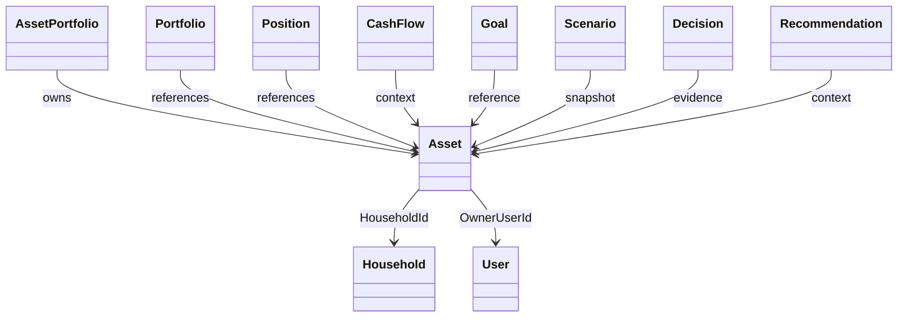

## Aggregate Boundary Diagram

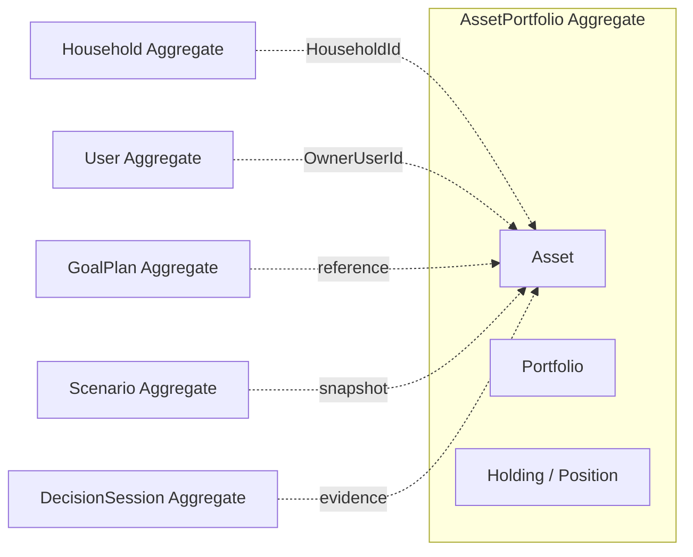

## Asset and Portfolio Relationship Diagram

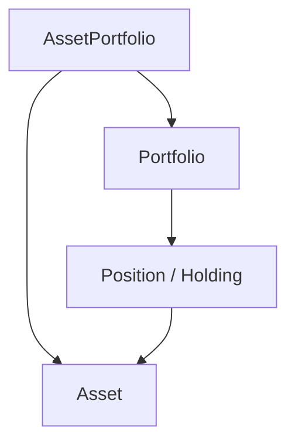

## Asset and Position Relationship Diagram

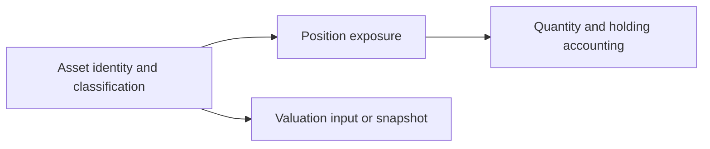

## Create Sequence Diagram

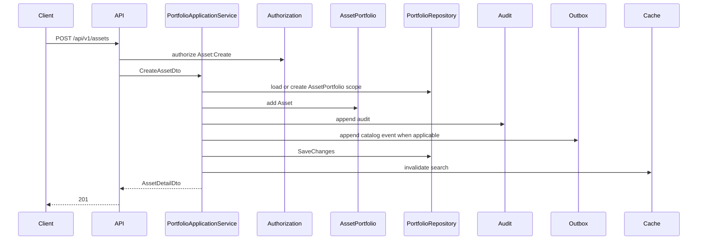

## Record Valuation Sequence Diagram

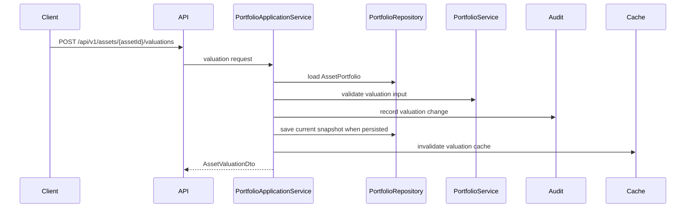

## Archive Sequence Diagram

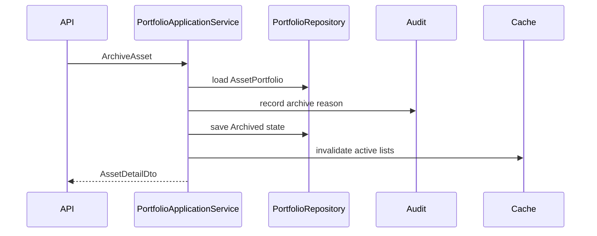

## Entity Relationship Diagram

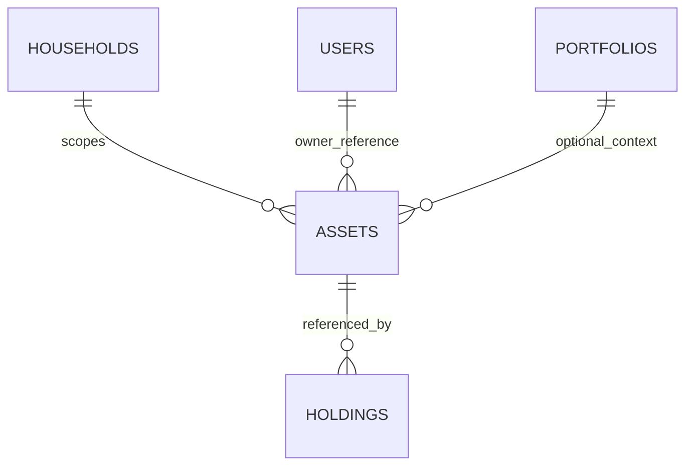

## State Diagram

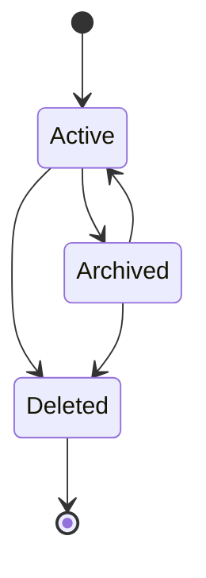

## Event Publication Diagram

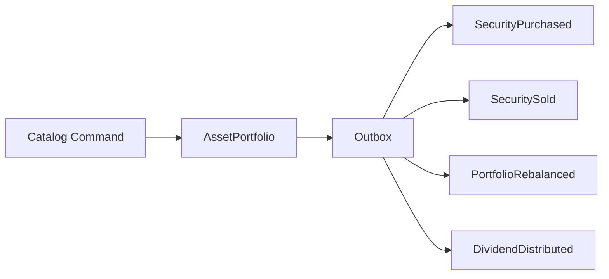

## Valuation Data Flow Diagram

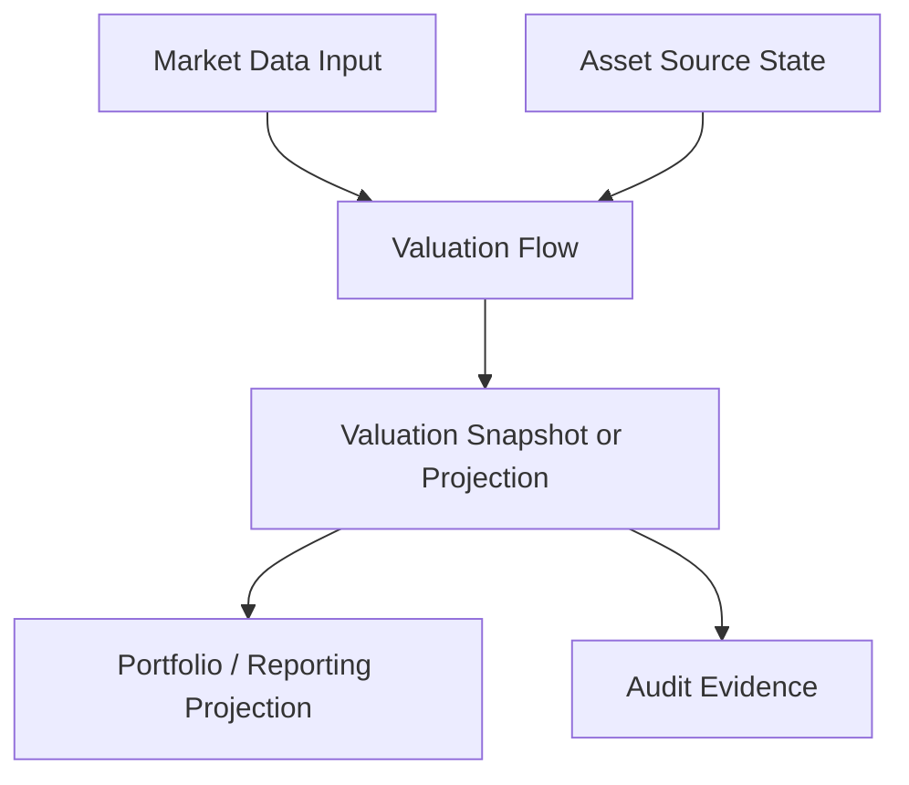

# Testing

| Test ID | Scenario | Preconditions | Action | Expected Result | Assertions | Test Type |
|---|---|---|---|---|---|---|
| AST-UT-001 | Create Asset | valid Household | create | Asset active | id, audit | Unit |
| AST-UT-002 | Update Asset | active Asset | update name | version increments | token changed | Unit |
| AST-UT-003 | Archive | active Asset | archive | Archived | write blocked | Unit |
| AST-UT-004 | Restore | archived Asset | restore | Active | audit exists | Unit |
| AST-UT-005 | Activate unsupported state | active model only | activate endpoint | unsupported or no-op per API | no invalid enum | Unit |
| AST-UT-006 | Deactivate unsupported state | active model only | deactivate | unsupported | no invalid enum | Unit |
| AST-UT-007 | Delete | active Asset | delete | soft deleted | query filter | Unit |
| AST-UT-008 | Invalid classification | active request | bad type | validation error | AST_ERR_INVALID_TYPE | Unit |
| AST-UT-009 | Invalid currency | request | bad code | validation error | AST_ERR_INVALID_CURRENCY | Unit |
| AST-UT-010 | Invalid precision | request | 1.12345 money | validation error | AST_ERR_INVALID_AMOUNT | Unit |
| AST-UT-011 | Negative acquisition cost | request | -1 | validation error | AST_ERR_INVALID_AMOUNT | Unit |
| AST-UT-012 | Invalid quantity | request | negative | validation error | AST_ERR_INVALID_QUANTITY | Unit |
| AST-UT-013 | Invalid ownership percentage | request | 1.2 | validation error | AST_ERR_INVALID_OWNERSHIP | Unit |
| AST-UT-014 | Invalid acquisition date | future | create | validation error | AST_ERR_INVALID_DATE | Unit |
| AST-UT-015 | Invalid maturity date | before acquisition | create | validation error | AST_ERR_INVALID_DATE | Unit |
| AST-UT-016 | Cost basis consistency | bad mismatch | update | validation error | AST_ERR_COST_INCONSISTENT | Unit |
| AST-UT-017 | Valuation consistency | missing date | valuation | validation error | AST_ERR_INVALID_VALUATION | Unit |
| AST-UT-018 | Ownership invariant | user outside household | create | reject | AST_ERR_INVALID_OWNER | Unit |
| AST-UT-019 | Invalid transition | deleted update | update | reject | AST_ERR_DELETED | Unit |
| AST-UT-020 | Domain Events | BuySecurity | command | SecurityPurchased | outbox schema | Unit |
| AST-UT-021 | Idempotency | same key | retry | same result | no duplicate | Unit |
| AST-UT-022 | Concurrency | stale token | update | conflict | 409 | Unit |
| AST-IT-001 | PostgreSQL persistence | database | save/reload | all columns match | DDL constraints | Integration |
| AST-IT-002 | EF Core mapping | DbContext | save Asset | mapping works | query filter | Integration |
| AST-IT-003 | Repository | seeded data | search | scoped result | no business logic | Integration |
| AST-IT-004 | API auth | no token | read | 401 | error schema | Integration |
| AST-IT-005 | Authorization | other household | read | 403/404 | no leak | Security |
| AST-IT-006 | Tenant isolation | other tenant | search | denied | tenant filter | Security |
| AST-IT-007 | Soft delete | deleted Asset | list | absent | filter | Integration |
| AST-IT-008 | Unique constraint | duplicate ref | insert | violation | constraint | Integration |
| AST-IT-009 | Numeric precision | high precision | insert | reject | constraint/API | Integration |
| AST-IT-010 | Outbox | BuySecurity | command | event saved | ordering | Integration |
| AST-IT-011 | Audit | update | commit | audit row | before/after | Integration |
| AST-IT-012 | Cache invalidation | cached detail | update | cache invalidated | miss next | Integration |
| AST-CT-001 | Money precision | decimal input | serialize | scale preserved | no float loss | Calculation |
| AST-CT-002 | Currency consistency | mixed currency | valuation | reject | error | Calculation |
| AST-CT-003 | Missing market data | no price | valuation | stale/unavailable | indicator | Calculation |
| AST-CT-004 | Historical reproducibility | prior valuation | replay | same output | input hash | Calculation |
| AST-ST-001 | Unauthorized access | no auth | read | 401 | no data | Security |
| AST-ST-002 | Privilege escalation | set TenantId | create | reject | over-posting | Security |
| AST-ST-003 | IDOR | other AssetId | read | 403/404 | no leak | Security |
| AST-ST-004 | Injection | query payload | search | reject | parameterized | Security |
| AST-ST-005 | Sensitive logging | account ref | request | redacted | logs | Security |
| AST-CON-001 | API schema | OpenAPI | validate | compatible | schema | Contract |
| AST-CON-002 | Event schema | catalog event | validate | compatible | schemaVersion | Contract |
| AST-CON-003 | JSON casing | DTO | serialize | camelCase | casing | Contract |
| AST-PT-001 | Concurrent reads | 100 users | detail | p95 target | latency | Performance |
| AST-PT-002 | Concurrent updates | same Asset | update | conflicts | one success | Performance |
| AST-PT-003 | Search pagination | large list | page | bounded | index | Performance |
| AST-PT-004 | Large valuation history | history | query | bounded | index | Performance |
| AST-PT-005 | Outbox throughput | many commands | process | no lag breach | metrics | Performance |

# Edge Cases

| # | Scenario | Expected Behavior | Validation or Rule | Error | Audit | Test Coverage |
|---:|---|---|---|---|---|---|
| 1 | Empty Asset name | reject | AST-VR-006 | AST_ERR_INVALID_NAME | yes | AST-UT-001 |
| 2 | Whitespace-only name | reject after trim | AST-VR-006 | AST_ERR_INVALID_NAME | yes | validation |
| 3 | Duplicate normalized name | apply duplicate policy | AST-VR-008 | AST_ERR_DUPLICATE | yes | validation |
| 4 | Unicode normalization collision | normalize and detect | AST-VR-007 | AST_ERR_INVALID_NAME | yes | validation |
| 5 | Maximum name length | 160 accepted, 161 rejected | AST-VR-006 | AST_ERR_INVALID_NAME | yes | boundary |
| 6 | Invalid AssetType | reject | AST-VR-009 | AST_ERR_INVALID_TYPE | yes | AST-UT-008 |
| 7 | Invalid AssetClass | reject if allowlist exists | AST-VR-010 | AST_ERR_INVALID_CLASS | yes | validation |
| 8 | AssetType and AssetClass mismatch | reject when rule exists | AST-BR-006 | AST_ERR_INVALID_CLASS | yes | domain |
| 9 | Missing currency | reject | AST-VR-011 | AST_ERR_INVALID_CURRENCY | yes | AST-UT-009 |
| 10 | Unsupported currency | reject | AST-VR-011 | AST_ERR_INVALID_CURRENCY | yes | currency |
| 11 | Currency case mismatch | normalize or reject | AST-VR-011 | AST_ERR_INVALID_CURRENCY | yes | currency |
| 12 | Excess monetary precision | reject | AST-VR-012 | AST_ERR_INVALID_AMOUNT | yes | AST-UT-010 |
| 13 | Negative acquisition cost | reject | AST-VR-014 | AST_ERR_INVALID_AMOUNT | yes | AST-UT-011 |
| 14 | Zero acquisition cost | allow with source or reason | AST-BR-008 | none or AST_ERR_COST_INCONSISTENT | yes | cost |
| 15 | Negative quantity | reject | AST-VR-013 | AST_ERR_INVALID_QUANTITY | yes | AST-UT-012 |
| 16 | Zero quantity | allow only for type that permits | AST-VR-015 | AST_ERR_INVALID_QUANTITY | yes | quantity |
| 17 | Excess quantity precision | reject | AST-VR-013 | AST_ERR_INVALID_QUANTITY | yes | precision |
| 18 | Missing acquisition date | allow unless cost policy requires | AST-BR-008 | AST_ERR_INVALID_DATE if required | yes | date |
| 19 | Future acquisition date | reject beyond tolerance | AST-VR-017 | AST_ERR_INVALID_DATE | yes | AST-UT-014 |
| 20 | Acquisition date before owner exists | reject or require correction reason | AST-VR-004 | AST_ERR_INVALID_OWNER | yes | owner |
| 21 | Maturity before acquisition | reject | AST-VR-018 | AST_ERR_INVALID_DATE | yes | AST-UT-015 |
| 22 | Maturity equal acquisition | allow if product terms allow | AST-VR-018 | none | yes | date |
| 23 | Ownership below zero | reject | AST-VR-016 | AST_ERR_INVALID_OWNERSHIP | yes | AST-UT-013 |
| 24 | Ownership above 100 | reject | AST-VR-016 | AST_ERR_INVALID_OWNERSHIP | yes | AST-UT-013 |
| 25 | Ownership totals not 100 | reject only if implementation stores multiple shares | AST-BR-005 | AST_ERR_INVALID_OWNERSHIP | yes | ownership |
| 26 | Missing HouseholdId | reject | AST-VR-003 | AST_ERR_INVALID_HOUSEHOLD | yes | create |
| 27 | Missing UserId when required | reject for owner-required use case | AST-VR-004 | AST_ERR_INVALID_OWNER | yes | owner |
| 28 | Cross-Tenant owner | reject | AST-VR-005 | AST_ERR_TENANT_VIOLATION | yes | security |
| 29 | Cross-Household Portfolio reference | reject | AST-VR-024 | AST_ERR_INVALID_PORTFOLIO | yes | relationship |
| 30 | Invalid Portfolio reference | reject | AST-VR-024 | AST_ERR_INVALID_PORTFOLIO | yes | relationship |
| 31 | Invalid Position reference | reject | AST-VR-025 | AST_ERR_INVALID_POSITION | yes | relationship |
| 32 | Asset linked to multiple incompatible Portfolios | reject unless Catalog relationship permits | AST-BR-013 | AST_ERR_INVALID_PORTFOLIO | yes | relationship |
| 33 | Duplicate external reference | reject or idempotent import | AST-VR-026 | AST_ERR_DUPLICATE | yes | import |
| 34 | Oversized external reference | reject | AST-VR-026 | AST_ERR_VALIDATION | yes | validation |
| 35 | Sensitive account number in name | mask or reject by policy | AST-VR-037 | AST_ERR_VALIDATION | yes | security |
| 36 | Invalid institution name | reject unsafe text | AST-VR-027 | AST_ERR_VALIDATION | yes | validation |
| 37 | Invalid valuation date | reject | AST-VR-019 | AST_ERR_INVALID_VALUATION | yes | valuation |
| 38 | Valuation before acquisition | reject | AST-VR-019 | AST_ERR_INVALID_VALUATION | yes | valuation |
| 39 | Valuation in future | reject unless policy permits | AST-VR-019 | AST_ERR_INVALID_VALUATION | yes | valuation |
| 40 | Duplicate valuation timestamp | idempotent or conflict | AST-VR-033 | AST_ERR_IDEMPOTENCY | yes | valuation |
| 41 | Stale valuation | flag or reject for decision | AST-VR-020 | AST_ERR_STALE_VALUATION | yes | valuation |
| 42 | Valuation currency mismatch | reject | AST-VR-023 | AST_ERR_INVALID_CURRENCY | yes | valuation |
| 43 | Valuation without market data | accept estimate only with method | AST-BR-015 | AST_ERR_INVALID_VALUATION | yes | valuation |
| 44 | Negative market value | reject | AST-VR-014 | AST_ERR_INVALID_AMOUNT | yes | valuation |
| 45 | Zero market value | allow with source | AST-BR-015 | none | yes | valuation |
| 46 | Valuation precision overflow | reject | AST-VR-012 | AST_ERR_INVALID_AMOUNT | yes | precision |
| 47 | Cost basis numeric overflow | reject | AST-VR-012 | AST_ERR_INVALID_AMOUNT | yes | precision |
| 48 | Quantity times price overflow | reject calculation output | AST-BR-032 | AST_ERR_INVALID_AMOUNT | yes | calculation |
| 49 | Currency conversion unavailable | mark unavailable | calculation interaction | AST_ERR_STALE_VALUATION | yes | calculation |
| 50 | Currency conversion stale | flag stale | AST-BR-033 | AST_ERR_STALE_VALUATION | yes | calculation |
| 51 | Concurrent Asset update | one wins | AST-VR-032 | AST_ERR_CONCURRENCY | yes | AST-PT-002 |
| 52 | Stale concurrency token | reject | AST-VR-032 | AST_ERR_CONCURRENCY | yes | AST-UT-022 |
| 53 | Duplicate idempotency key | return prior result | AST-VR-033 | none | yes | idempotency |
| 54 | Idempotency key with different payload | reject | AST-VR-033 | AST_ERR_IDEMPOTENCY | yes | idempotency |
| 55 | Archive already archived Asset | idempotent or conflict by API policy | AST-BR-018 | AST_ERR_ARCHIVED | yes | state |
| 56 | Restore active Asset | reject | state machine | AST_ERR_INVALID_STATE | yes | state |
| 57 | Update archived Asset | reject | AST-VR-029 | AST_ERR_ARCHIVED | yes | state |
| 58 | Delete Asset with active Portfolio reference | soft delete only or reject if active ref protected | AST-BR-022 | AST_ERR_REFERENCED | yes | delete |
| 59 | Delete Asset referenced by Goal | preserve reference; soft delete | AST-BR-022 | AST_ERR_REFERENCED for hard delete | yes | delete |
| 60 | Delete Asset referenced by Scenario snapshot | preserve snapshot | AST-BR-023 | AST_ERR_REFERENCED for hard delete | yes | delete |
| 61 | Delete Asset referenced by Decision evidence | preserve evidence | AST-BR-024 | AST_ERR_REFERENCED for hard delete | yes | delete |
| 62 | Restore after retention expiration | reject | AST-BR-019 | AST_ERR_INVALID_STATE | yes | restore |
| 63 | Owner archived | allow read, restrict mutation if policy | AST-VR-004 | AST_ERR_INVALID_OWNER | yes | owner |
| 64 | Owner deleted | reject new ownership, retain history | AST-VR-004 | AST_ERR_INVALID_OWNER | yes | owner |
| 65 | Household archived | reject normal mutation | AST-BR-003 | AST_ERR_INVALID_HOUSEHOLD | yes | scope |
| 66 | Portfolio archived | reject link/rebalance | AST-VR-024 | AST_ERR_INVALID_PORTFOLIO | yes | relationship |
| 67 | Partial transaction failure | rollback | audit invariant | AST_ERR_INTERNAL | yes | integration |
| 68 | Audit persistence failure | fail closed | audit invariant | AST_ERR_AUDIT | yes | audit |
| 69 | Outbox persistence failure | rollback if event required | event invariant | AST_ERR_EVENT | yes | outbox |
| 70 | Event publication retry | consumer idempotent | event rules | none | yes | event |
| 71 | Duplicate Event delivery | dedupe by EventId | event rules | none | yes | event |
| 72 | Event ordering mismatch | order by aggregate version | event rules | AST_ERR_EVENT | yes | event |
| 73 | Cache stale after valuation update | invalidate | cache strategy | none | optional | cache |
| 74 | Cache key Tenant collision | impossible with TenantId key | cache strategy | AST_ERR_TENANT_VIOLATION | yes | cache |
| 75 | Read Model lag | show stale indicator | AST-BR-029 | none | trace | projection |
| 76 | Search unauthorized Asset | return 403/404 | authorization | AST_ERR_FORBIDDEN | yes | security |
| 77 | Pagination beyond maximum | reject | AST-VR-039 | AST_ERR_VALIDATION | no | API |
| 78 | Invalid sort field | reject | AST-VR-040 | AST_ERR_VALIDATION | no | API |
| 79 | Invalid filter field | reject | AST-VR-041 | AST_ERR_VALIDATION | no | API |
| 80 | SQL injection payload | reject/parameterize | AST-VR-038 | AST_ERR_VALIDATION | yes | security |
| 81 | XSS payload | reject/sanitize | AST-VR-037 | AST_ERR_VALIDATION | yes | security |
| 82 | Oversized request | reject | AST-VR-042 | AST_ERR_PAYLOAD_TOO_LARGE | yes | API |
| 83 | Rate limit exceeded | 429 | API governance | AST_ERR_RATE_LIMIT | yes | API |
| 84 | Database timeout | retry if safe | repository policy | AST_ERR_DEPENDENCY | yes | integration |
| 85 | Repository retry duplicates mutation | idempotency prevents duplicate | AST-VR-033 | AST_ERR_IDEMPOTENCY | yes | repository |
| 86 | Soft-deleted Asset returned | exclude normal query | AST-VR-030 | AST_ERR_DELETED | yes | query |
| 87 | Archived Asset shown active | reject projection inconsistency | AST-BR-018 | AST_ERR_ARCHIVED | yes | projection |
| 88 | AssetType changed after history | restrict | AST-BR-006 | AST_ERR_INVALID_TYPE | yes | classification |
| 89 | Currency changed after valuation history | restrict | AST-BR-007 | AST_ERR_INVALID_CURRENCY | yes | currency |
| 90 | Acquisition cost changed after realized transaction | reject or correction audit | AST-BR-008 | AST_ERR_COST_INCONSISTENT | yes | cost |
| 91 | Quantity update conflicts with Position | reject | AST-BR-010 | AST_ERR_INVALID_QUANTITY | yes | position |
| 92 | Market data source unavailable | stale/unavailable | calculation interaction | AST_ERR_DEPENDENCY | yes | valuation |
| 93 | Valuation source changes | audit source | AST-BR-016 | none | yes | valuation |
| 94 | API version mismatch | compatibility error | API governance | AST_ERR_VERSION | yes | contract |
| 95 | Event schema version mismatch | reject consumer or route | message contract | AST_ERR_EVENT | yes | contract |
| 96 | Decimal serialization floating loss | reject contract | DTO rules | AST_ERR_INVALID_AMOUNT | yes | contract |
| 97 | Time zone changes valuation date | use date and UTC timestamp separately | valuation rules | AST_ERR_INVALID_VALUATION | yes | timezone |
| 98 | Duplicate Asset from import | idempotent or duplicate | AST-VR-026 | AST_ERR_DUPLICATE | yes | import |
| 99 | Bulk import partially succeeds | unit results and idempotency | AST-VR-043 | AST_ERR_VALIDATION | yes | bulk |
| 100 | Asset disposal while pending valuation exists | reject unsupported disposal | AST-BR-017 | AST_ERR_UNSUPPORTED | yes | state |

# Error Catalog

| Error Code | Name | Condition | HTTP Status | Retryable | User Safe Message | Internal Detail | Audit | Metric |
|---|---|---|---:|---:|---|---|---:|---|
| AST_ERR_INVALID_ID | Invalid Id | malformed UUID | 400 | No | Asset identifier is invalid. | UUID parse failed | Yes | validation_error |
| AST_ERR_TENANT_VIOLATION | Tenant Violation | tenant mismatch | 403 | No | Access is not permitted. | cross tenant reference | Yes | security_violation |
| AST_ERR_INVALID_HOUSEHOLD | Invalid Household | missing/inaccessible Household | 403 | No | Household is invalid. | scope check failed | Yes | authorization_failure |
| AST_ERR_INVALID_OWNER | Invalid Owner | User outside scope | 422 | No | Asset owner is invalid. | User scope mismatch | Yes | validation_error |
| AST_ERR_INVALID_NAME | Invalid Name | name invalid | 422 | No | Asset name is invalid. | normalization/length failed | Yes | validation_error |
| AST_ERR_DUPLICATE | Duplicate Asset | duplicate reference/name policy | 409 | No | Asset already exists. | unique constraint | Yes | conflict |
| AST_ERR_INVALID_TYPE | Invalid Type | bad AssetType | 422 | No | Asset type is invalid. | enum validation | Yes | validation_error |
| AST_ERR_INVALID_CLASS | Invalid Class | bad implementation class | 422 | No | Asset class is invalid. | allowlist failed | Yes | validation_error |
| AST_ERR_INVALID_CURRENCY | Invalid Currency | bad currency or mismatch | 422 | No | Currency is invalid. | CurrencyCode validation | Yes | validation_error |
| AST_ERR_INVALID_AMOUNT | Invalid Amount | negative/overflow/precision | 422 | No | Amount is invalid. | numeric validation | Yes | validation_error |
| AST_ERR_INVALID_QUANTITY | Invalid Quantity | quantity invalid | 422 | No | Quantity is invalid. | precision/range | Yes | validation_error |
| AST_ERR_INVALID_OWNERSHIP | Invalid Ownership | percent invalid | 422 | No | Ownership is invalid. | range check | Yes | validation_error |
| AST_ERR_INVALID_DATE | Invalid Date | date ordering | 422 | No | Date is invalid. | date rule | Yes | validation_error |
| AST_ERR_INVALID_VALUATION | Invalid Valuation | valuation input invalid | 422 | No | Valuation is invalid. | missing source/as-of | Yes | valuation_error |
| AST_ERR_STALE_VALUATION | Stale Valuation | stale value used | 409 | Yes | Valuation is stale. | freshness policy | Yes | stale_valuation |
| AST_ERR_COST_INCONSISTENT | Cost Inconsistent | basis mismatch | 422 | No | Cost data is inconsistent. | cost rule | Yes | validation_error |
| AST_ERR_INVALID_PORTFOLIO | Invalid Portfolio | bad Portfolio reference | 422 | No | Portfolio reference is invalid. | scope mismatch | Yes | validation_error |
| AST_ERR_INVALID_POSITION | Invalid Position | bad Position reference | 422 | No | Position reference is invalid. | scope mismatch | Yes | validation_error |
| AST_ERR_INVALID_STATE | Invalid State | illegal state transition | 409 | No | Asset state does not allow this operation. | state machine | Yes | conflict |
| AST_ERR_ARCHIVED | Archived Asset | mutation on archived | 409 | No | Asset is archived. | state guard | Yes | conflict |
| AST_ERR_DELETED | Deleted Asset | mutation on deleted | 409 | No | Asset is deleted. | state guard | Yes | conflict |
| AST_ERR_REFERENCED | Referenced Asset | hard delete/reference conflict | 409 | No | Asset is referenced by existing records. | FK/history reference | Yes | conflict |
| AST_ERR_CONCURRENCY | Concurrency Conflict | stale token | 409/412 | Yes | Asset was modified by another operation. | token mismatch | Yes | concurrency_conflict |
| AST_ERR_IDEMPOTENCY | Idempotency Conflict | same key different payload | 409 | No | Request conflicts with prior request. | idempotency hash mismatch | Yes | idempotency_conflict |
| AST_ERR_UNSUPPORTED | Unsupported Operation | non-catalog operation | 405/422 | No | Operation is not supported. | Catalog Gap | Yes | unsupported_operation |
| AST_ERR_PAYLOAD_TOO_LARGE | Payload Too Large | request too large | 413 | No | Request is too large. | size limit | Yes | payload_rejected |
| AST_ERR_RATE_LIMIT | Rate Limited | too many requests | 429 | Yes | Too many requests. | rate limit | Yes | rate_limited |
| AST_ERR_DEPENDENCY | Dependency Failure | database/cache/source unavailable | 503 | Yes | Service is temporarily unavailable. | dependency timeout | Yes | dependency_error |
| AST_ERR_EVENT | Event Failure | outbox/event error | 500/503 | Yes | Event processing failed. | outbox failure | Yes | event_error |
| AST_ERR_AUDIT | Audit Failure | audit write failed | 500 | Yes | Audit processing failed. | audit sink failure | Yes | audit_error |

# Data Migration and Compatibility

- Existing data migration maps current Asset records to `atlas.assets`.
- Asset type mapping preserves Catalog AssetType values; unknown values are quarantined for data correction.
- Asset class mapping is optional Implementation Detail.
- Currency normalization uppercases existing codes before check constraint.
- Numeric precision migration rounds only through approved financial rounding rule and records audit evidence.
- Cost basis backfill uses existing cost fields or leaves null when no source exists.
- Quantity backfill uses Asset quantity only when source table owns it; Position quantity remains in Position.
- Ownership backfill maps owner user references when known.
- HouseholdId backfill is mandatory before not-null enforcement.
- TenantId backfill occurs only when tenancy exists.
- Status migration maps supported source states to Active, Archived, or Deleted.
- Concurrency token initialization uses generated bytes for every row.
- Soft delete migration maps deleted flags to Status Deleted, IsDeleted true, DeletedAt.
- External reference migration normalizes and de-duplicates by Household scope.
- Valuation separation moves historical valuation rows to projection/history storage if implementation has such table.
- Index creation should be concurrent in production.
- Constraint validation should run after cleanup.
- Zero-downtime strategy adds nullable columns, backfills, validates, then enforces.
- Rollback preserves old columns until verification passes.
- API compatibility uses additive DTO changes.
- Event compatibility does not introduce non-catalog events.
- Cache compatibility invalidates old Asset keys after migration.
- Historical audit compatibility preserves old identifiers and correlation ids.
- Historical valuation compatibility preserves old as-of dates and values.

# Consistency Verification

| Specification | Verification Result | Conflict | Adopted Result |
|---|---|---|---|
| entity-catalog.md | Asset maps to AssetPortfolio, PortfolioRepository, PortfolioApplicationService | some prior docs used Asset-specific events | Entity Catalog retained |
| aggregate-catalog.md | AssetPortfolio owns investment asset portfolio state | Asset as root in older docs would conflict | Asset is not root |
| repository-catalog.md | PortfolioRepository owns Portfolio and Holding/AssetPortfolio persistence | AssetRepository mention is legacy/cross reference | PortfolioRepository retained |
| command-catalog.md | Asset-related commands are CreatePortfolio, BuySecurity, SellSecurity, RebalancePortfolio | Asset-specific commands absent | Asset-specific commands marked Catalog Gap |
| domain-event-catalog.md | PortfolioCreated, SecurityPurchased, SecuritySold, PortfolioRebalanced, DividendDistributed | AssetCreated absent | no AssetCreated event declared |
| value-object-catalog.md | Money, Currency, Percentage available | none | referenced only |
| enumeration-catalog.md | AssetType, CurrencyCode, RiskLevel referenced by Entity Catalog | AssetClass/LiquidityLevel not confirmed | marked Implementation Detail |
| domain-rule-catalog.md | deterministic, versioned, auditable rules | none | validation/business rules versionable |
| financial-formula-catalog.md | formulas own calculations | no direct formulas created | formula ownership preserved |
| calculation-engine-framework.md | calculation capabilities are external to repository | repository calculation prohibited | calculation interaction described |
| projection-engine-framework.md | projections read source and produce read models | read model write concern | read models not source |
| domain-service-catalog.md | PortfolioService, AllocationService, RiskService exist | AssetService absent | not referenced as formal service |
| application-service-catalog.md | PortfolioApplicationService owns use cases | AssetApplicationService absent | PortfolioApplicationService retained |
| permission-framework.md | Asset permissions appear in command catalog examples | dotted permissions in old docs conflict | Asset:Read/Create/Update retained |
| tenant-framework.md | Tenant separate from Household | Household equals Tenant would conflict | TenantId optional separate scope |
| api-governance-framework.md | REST, pagination, idempotency, concurrency required | none | applied |
| message-contract-catalog.md | event metadata required | none | catalog event metadata used |
| Household.md | Household scopes access | none | HouseholdId required |
| User.md | User identity separate | none | OwnerUserId reference only |
| Portfolio.md | Portfolio groups holdings | none | Portfolio reference optional |
| Position.md | Position maps to Holding | Asset not Position | separate concepts retained |
| Liability.md | Liability owned by LiabilityPortfolio | none | reference only |
| CashFlow.md | CashFlow facts external | none | reference only |
| Goal.md | Goal owned by GoalPlan | none | reference only |
| Scenario.md | Scenario reads snapshots | none | read-only |
| Decision.md | Decision evidence read-only | none | read-only |
| Recommendation.md | Recommendation context read-only | none | read-only |
| Database Design | PostgreSQL table owns source | valuation projection confusion | source/projection separated |
| ERD | Household/User references | no cascade across aggregates | Restrict/SetNull |
| API specification | REST resource governance | none | endpoint matrix defined |

# Completion Checklist

- Catalog alignment complete: yes.
- Entity overview complete: yes.
- Property definitions complete: yes.
- Financial value semantics complete: yes.
- Validation complete: yes.
- Business rules complete: yes.
- Aggregate invariants complete: yes.
- State machine complete: yes.
- Commands complete: yes.
- Domain events complete: yes.
- Repository complete: yes.
- Domain services complete: yes.
- Application services complete: yes.
- API complete: yes.
- DTO complete: yes.
- Database mapping complete: yes.
- PostgreSQL DDL complete: yes.
- EF Core mapping complete: yes.
- Calculation interaction complete: yes.
- Valuation interaction complete: yes.
- Cache complete: yes.
- Security complete: yes.
- Audit complete: yes.
- Observability complete: yes.
- Performance complete: yes.
- JSON examples complete: yes.
- Mermaid complete: yes.
- Testing complete: yes.
- Edge cases complete: yes.
- Error catalog complete: yes.
- Migration complete: yes.
- Consistency verification complete: yes.

# Final Consistency Matrix

| Concern | Source Catalog | Final Atlas Name | Defined Here or Referenced | Implementation Artifact | Status | Conflict | Resolution | Follow-up Catalog Change Required |
|---|---|---|---|---|---|---|---|---|
| Aggregate Root | Aggregate Catalog | AssetPortfolio | Referenced | aggregate root | Canonical | Asset root wording in old docs | Asset not root | No |
| Entity | Entity Catalog | Asset | Defined | Asset entity | Canonical | none | retain | No |
| Repository | Repository Catalog | PortfolioRepository | Referenced | repository | Canonical | AssetRepository legacy use | map to AssetPortfolio ownership | No |
| Command | Command Catalog | BuySecurity, SellSecurity, RebalancePortfolio | Referenced | command handlers | Canonical | Asset-specific commands absent | mark Catalog Gap | Optional catalog decision |
| Event | Domain Event Catalog | SecurityPurchased, SecuritySold, PortfolioRebalanced, DividendDistributed | Referenced | outbox | Canonical | Asset-specific events absent | no invented events | Optional catalog decision |
| AssetClass | Enumeration Catalog | Not a Catalog Concept | Defined as Implementation Detail | optional column | Catalog Gap | requested field not catalog enum | implementation allowlist only | Optional |
| ValuationMethod | Enumeration Catalog | Not a Catalog Concept | Defined as Implementation Detail | optional column/projection | Catalog Gap | requested field not catalog enum | no formal enum | Optional |
| LiquidityLevel | Enumeration Catalog | Not a Catalog Concept | Defined as Implementation Detail | optional column/projection | Catalog Gap | requested field not catalog enum | no formal enum | Optional |
| Market Data | Catalog | External input | Referenced | valuation input | Implementation Detail | could be confused with Asset source | separated | No |
| Valuation | Projection/Calculation | Valuation snapshot/projection | Defined | projection/history | Implementation Detail | could become source of truth | source boundary stated | No |
| Portfolio | Entity Catalog | Portfolio | Referenced | PortfolioId | Canonical | Asset always in Portfolio assumption | optional reference | No |
| Position | Entity Catalog | Holding/Position | Referenced | Holding table | Canonical | Asset equals Position assumption | separated | No |
| Permission | Permission Framework/Command examples | Asset:Read, Asset:Create, Asset:Update | Referenced | policy checks | Canonical | dotted old permissions | colon names retained | No |
| Tenant | Tenant Catalog | TenantId | Referenced | optional scope | Canonical | Household equals Tenant assumption | separated | No |
| Read Model | Entity Catalog | Projection | Referenced | DTO/projection | Canonical | projection as write model | prohibited | No |
| Cache | Entity Catalog | Scoped cache | Defined | cache keys | Implementation Detail | sensitive shared cache risk | permission hash required | No |
| Audit | Audit Catalog | Audit record | Defined | audit store | Canonical | none | append-only | No |

# Version History

| Version | Date | Author or Owner | Change | Reason | Compatibility Impact | Migration Requirement |
|---|---|---|---|---|---|---|
| 1.0 | 2026-07-14 | Project Atlas | Created Asset Enterprise Specification | Align Asset with AssetPortfolio ownership, PortfolioRepository persistence, Catalog commands/events, financial value semantics, valuation boundaries, security, audit, persistence, API, testing, and migration requirements. | Compatible with existing Catalog; Asset-specific commands and events remain Catalog Gap, not formal additions. | Create or update `knowledge/entity/Asset.md`; database migration only if implementation adopts the listed source table columns. |
