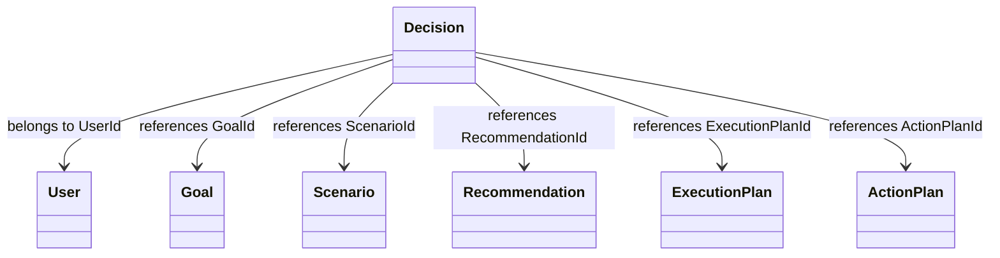
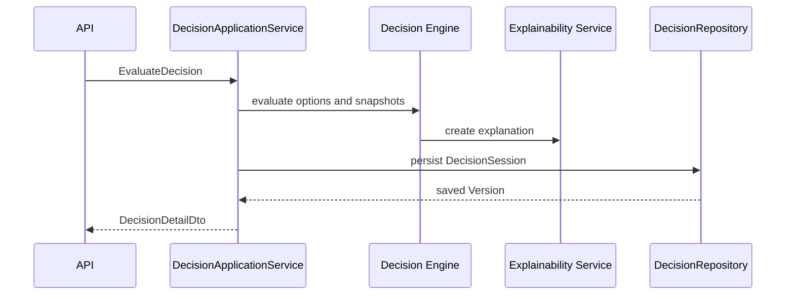
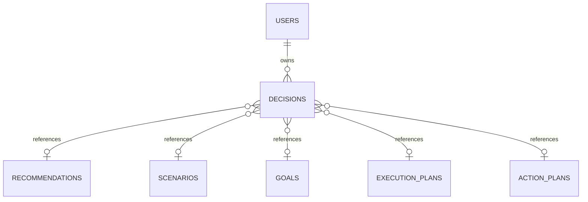
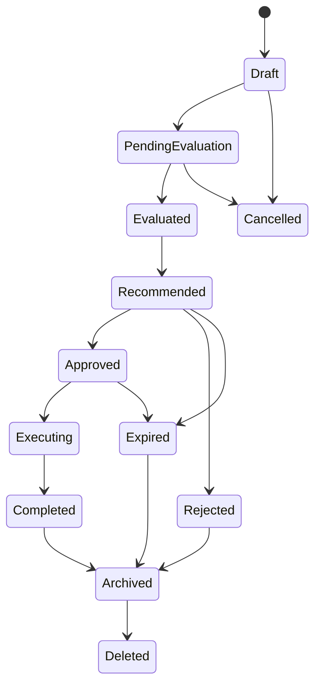

# Decision Entity Specification
## Split Navigation
- [Decision identity and scoring](decision/identity-and-scoring.md)
- [Decision API and persistence](decision/api-and-persistence.md)
- [Decision governance and testing](decision/governance-and-testing.md)

# Document Control

Document Name: Decision Entity Specification

Document Path: knowledge/entity/Decision.md

Document Type: Enterprise Specification

Version: 1.0

Status: Canonical Specification

Domain: Decision

Bounded Context: Decision

Module: Decision Engine

Owner: Project Atlas

Source of Truth: Atlas Knowledge Base

Last Updated: 2026-07-14

Related Specifications:

- knowledge/entity-catalog.md
- knowledge/aggregate-catalog.md
- knowledge/enumeration-catalog.md
- knowledge/repository-catalog.md
- knowledge/command-catalog.md
- knowledge/domain-event-catalog.md
- knowledge/domain-service-catalog.md
- knowledge/application-service-catalog.md
- knowledge/value-object-catalog.md
- knowledge/decision-lifecycle.md
- knowledge/decision-evaluation.md
- knowledge/decision-execution.md

# Entity Overview

Purpose: Decision represents an evaluated decision, decision outcome, selected option, scoring result, acceptance or rejection result, evidence snapshot, and audit trail inside Atlas Decision.

Responsibilities:

- Maintain stable Decision identity.
- Preserve DecisionNumber for support and traceability.
- Belong to one User through UserId.
- Store DecisionType, DecisionCategory, DecisionStatus, reason, summary, description, priority, urgency, and scoring values.
- Preserve complete ExplainabilityReference and DecisionExplanation.
- Preserve InputSnapshot and OutputSnapshot used at evaluation time.
- Reference Recommendation, Scenario, Goal, ExecutionPlan, and ActionPlan by identity.
- Preserve selected option, alternative options, assumptions, and constraints.
- Support evaluation, approval, rejection, cancellation, expiration, archive, restore, deletion, re-evaluation, and execution plan generation.
- Preserve complete Version history through Version and ConcurrencyToken.
- Publish decision events through DecisionSession and DecisionRepository.

Business Meaning: Decision captures the business result of evaluating options against goals, scenarios, risks, costs, benefits, cash flow, portfolio state, assets, liabilities, loans, mortgages, recommendations, and explanations.

Aggregate Root: Yes for the Decision entity specification surface. Atlas Entity Catalog maps Decision to the DecisionSession aggregate and DecisionSession aggregate root; therefore Decision mutations are loaded and committed through DecisionRepository and DecisionSession ownership.

Lifecycle: Draft, PendingEvaluation, Evaluated, Recommended, Approved, Rejected, Executing, Completed, Cancelled, Expired, Archived, Deleted.

Ownership: DecisionSession owns the Decision lifecycle, persistence, authorization boundary, concurrency boundary, and audit boundary.

Persistence Owner: DecisionRepository.

Repository: DecisionRepository.

Application Service: DecisionApplicationService.

Domain Service: DecisionService, ScoringService, ExplainabilityService.

Relationships:

- User: Decision must belong to one User by UserId. User is not owned by Decision.
- Goal: Decision may reference one primary Goal by GoalId and may be associated with multiple Goal identities through decision-goal projection or snapshot. Goal is not owned by Decision.
- Scenario: Decision may reference one primary Scenario by ScenarioId and may preserve multiple Scenario references inside InputSnapshot. Scenario output is not mutated by Decision.
- Recommendation: Decision may reference source Recommendation by RecommendationId. Recommendation is not owned by Decision.
- ExecutionPlan: Decision may generate or reference ExecutionPlanId after approval. ExecutionPlan is not owned by Decision.
- ActionPlan: Decision may generate or reference ActionPlanId for follow-up execution. ActionPlan is not owned by Decision.
- Portfolio: Decision may evaluate Portfolio state through InputSnapshot and OutputSnapshot. Portfolio is not owned by Decision.
- CashFlow: Decision may evaluate CashFlow evidence through InputSnapshot and OutputSnapshot. CashFlow is not owned by Decision.
- Asset: Decision may evaluate Asset evidence through InputSnapshot. Asset is not owned by Decision.
- Liability: Decision may evaluate Liability evidence through InputSnapshot. Liability is not owned by Decision.
- Loan: Decision may evaluate Loan evidence through InputSnapshot. Loan is not owned by Decision.
- Mortgage: Decision may evaluate Mortgage evidence through InputSnapshot. Mortgage is not owned by Decision.
- DomainEvent: Decision emits and consumes catalog-approved DomainEvent records with CorrelationId, CausationId, AggregateId, and Version. DomainEvent history is immutable.

Navigation:

- Decision navigation to Recommendation, Scenario, Goal, ExecutionPlan, ActionPlan, Portfolio, CashFlow, Asset, Liability, Loan, and Mortgage is identity reference or immutable snapshot only.
- Cross Aggregate navigation cannot cascade mutation.
- DecisionRepository loads DecisionSession aggregate and Decision children only.
- Read models may join related projections for display but cannot write through projections.

# Complete Properties

## DecisionId

- Name: DecisionId; Type: Guid; Nullable: No; Default: Generated by application.
- Description: Stable technical identity of Decision.
- Validation: Required, unique, valid Guid, immutable.
- Business Meaning: Identifies one evaluated decision across API, audit, events, and history.
- Example: 111d49c8-0957-42a2-a812-b736615fa2bb.
- Database Mapping: decisions.decision_id uuid primary key; JSON Name: decisionId; API Usage: all detail, mutation, history, and search APIs.
- Searchable: Yes; Sortable: No; Indexed: Yes; Encrypted: No; Auditable: Yes.

## DecisionNumber

- Name: DecisionNumber; Type: String; Nullable: No; Default: Generated sequence.
- Description: Human-readable decision reference number.
- Validation: Required, unique, max length 64, immutable.
- Business Meaning: Enables support, audit, and user-facing traceability.
- Example: DEC-20260714-000001.
- Database Mapping: decisions.decision_number varchar(64) unique not null; JSON Name: decisionNumber; API Usage: detail, summary, search, history.
- Searchable: Yes; Sortable: Yes; Indexed: Yes; Encrypted: No; Auditable: Yes.

## UserId

- Name: UserId; Type: Guid; Nullable: No; Default: None.
- Description: User that owns or requested the Decision.
- Validation: Required, valid Guid, authorized User scope.
- Business Meaning: Decision must belong to one User.
- Example: b6a6d087-b8f8-4062-92ec-08b7fc5d64f4.
- Database Mapping: decisions.user_id uuid not null; JSON Name: userId; API Usage: create, detail, summary, search.
- Searchable: Yes; Sortable: No; Indexed: Yes; Encrypted: No; Auditable: Yes.

## DecisionType

- Name: DecisionType; Type: String; Nullable: No; Default: None.
- Description: Catalog-aligned decision purpose.
- Validation: Required, non-blank, max length 64.
- Business Meaning: Classifies the decision without creating a new Domain.
- Example: RecommendationDecision.
- Database Mapping: decisions.decision_type varchar(64) not null; JSON Name: decisionType; API Usage: create, update before approval, detail, summary, search.
- Searchable: Yes; Sortable: Yes; Indexed: Yes; Encrypted: No; Auditable: Yes.

## DecisionCategory

- Name: DecisionCategory; Type: String; Nullable: No; Default: General.
- Description: Decision grouping for search and reporting.
- Validation: Required, max length 64.
- Business Meaning: Groups decisions such as Goal, Scenario, Recommendation, Portfolio, Loan, and Risk.
- Example: Recommendation.
- Database Mapping: decisions.decision_category varchar(64) not null; JSON Name: decisionCategory; API Usage: create, update before approval, detail, summary, search.
- Searchable: Yes; Sortable: Yes; Indexed: Yes; Encrypted: No; Auditable: Yes.

## DecisionStatus

- Name: DecisionStatus; Type: DecisionStatus; Nullable: No; Default: Pending.
- Description: Catalog decision state.
- Validation: Required; catalog values Pending, Evaluating, Recommended, Accepted, Rejected, Expired; lifecycle states map to Decision lifecycle policy.
- Business Meaning: Controls evaluation, approval, rejection, execution, expiration, archive, and delete behavior.
- Example: Recommended.
- Database Mapping: decisions.decision_status varchar(32) not null; JSON Name: decisionStatus; API Usage: detail, summary, search, all state commands.
- Searchable: Yes; Sortable: Yes; Indexed: Yes; Encrypted: No; Auditable: Yes.

## DecisionReason

- Name: DecisionReason; Type: String; Nullable: Yes; Default: null.
- Description: Reason for approval, rejection, cancellation, or evaluation outcome.
- Validation: Max length 2000, required for RejectDecision and CancelDecision.
- Business Meaning: Explains why a Decision reached a state.
- Example: Risk exceeds current capacity.
- Database Mapping: decisions.decision_reason text null; JSON Name: decisionReason; API Usage: update, approve, reject, cancel, detail.
- Searchable: Yes; Sortable: No; Indexed: Optional full text; Encrypted: Conditional; Auditable: Yes.

## DecisionSummary

- Name: DecisionSummary; Type: String; Nullable: No; Default: None.
- Description: Short summary of the Decision result.
- Validation: Required, max length 512.
- Business Meaning: Provides concise decision context in lists and dashboards.
- Example: Approve cash reserve increase before portfolio risk increase.
- Database Mapping: decisions.decision_summary varchar(512) not null; JSON Name: decisionSummary; API Usage: create, update before approval, detail, summary, search.
- Searchable: Yes; Sortable: No; Indexed: Optional full text; Encrypted: Conditional; Auditable: Yes.

## Description

- Name: Description; Type: String; Nullable: Yes; Default: null.
- Description: Detailed decision description.
- Validation: Max length 4000.
- Business Meaning: Captures extended decision context.
- Example: Evaluate whether to accept the generated recommendation.
- Database Mapping: decisions.description text null; JSON Name: description; API Usage: create, update before approval, detail.
- Searchable: Yes; Sortable: No; Indexed: Optional full text; Encrypted: Conditional; Auditable: Yes.

## Priority

- Name: Priority; Type: String; Nullable: No; Default: Medium.
- Description: Decision priority.
- Validation: Required; Low, Medium, High, Critical.
- Business Meaning: Drives ordering and review urgency.
- Example: High.
- Database Mapping: decisions.priority varchar(32) not null; JSON Name: priority; API Usage: create, update before approval, detail, summary, search.
- Searchable: Yes; Sortable: Yes; Indexed: Yes; Encrypted: No; Auditable: Yes.

## DecisionScore

- Name: DecisionScore; Type: Decimal; Nullable: No; Default: 0.
- Description: Overall Decision score.
- Validation: Range 0.0000 to 100.0000.
- Business Meaning: Summarizes evaluation quality or suitability.
- Example: 84.2500.
- Database Mapping: decisions.decision_score numeric(9,4) not null; JSON Name: decisionScore; API Usage: evaluate, detail, summary, search.
- Searchable: Yes; Sortable: Yes; Indexed: Yes; Encrypted: No; Auditable: Yes.

## ConfidenceScore

- Name: ConfidenceScore; Type: Decimal; Nullable: Yes; Default: null.
- Description: Confidence of evaluation result.
- Validation: Range 0.0000 to 1.0000 when present.
- Business Meaning: Indicates certainty of the Decision result.
- Example: 0.8400.
- Database Mapping: decisions.confidence_score numeric(5,4) null; JSON Name: confidenceScore; API Usage: evaluate, detail, summary, search.
- Searchable: Yes; Sortable: Yes; Indexed: Yes; Encrypted: No; Auditable: Yes.

## RiskScore

- Name: RiskScore; Type: Decimal; Nullable: Yes; Default: null.
- Description: Risk score from Risk Analysis Service.
- Validation: Range 0.0000 to 100.0000 when present.
- Business Meaning: Quantifies downside or risk capacity pressure.
- Example: 42.5000.
- Database Mapping: decisions.risk_score numeric(9,4) null; JSON Name: riskScore; API Usage: evaluate, detail, summary, search.
- Searchable: Yes; Sortable: Yes; Indexed: Yes; Encrypted: No; Auditable: Yes.

## BenefitScore

- Name: BenefitScore; Type: Decimal; Nullable: Yes; Default: null.
- Description: Expected benefit score.
- Validation: Range 0.0000 to 100.0000 when present.
- Business Meaning: Quantifies expected positive effect.
- Example: 88.0000.
- Database Mapping: decisions.benefit_score numeric(9,4) null; JSON Name: benefitScore; API Usage: evaluate, detail, summary, search.
- Searchable: Yes; Sortable: Yes; Indexed: Yes; Encrypted: No; Auditable: Yes.

## CostScore

- Name: CostScore; Type: Decimal; Nullable: Yes; Default: null.
- Description: Cost suitability score.
- Validation: Range 0.0000 to 100.0000 when present.
- Business Meaning: Quantifies cost efficiency or affordability.
- Example: 71.2500.
- Database Mapping: decisions.cost_score numeric(9,4) null; JSON Name: costScore; API Usage: evaluate, detail, summary, search.
- Searchable: Yes; Sortable: Yes; Indexed: Yes; Encrypted: No; Auditable: Yes.

## ImpactScore

- Name: ImpactScore; Type: Decimal; Nullable: Yes; Default: null.
- Description: Impact score across affected goals and projections.
- Validation: Range 0.0000 to 100.0000 when present.
- Business Meaning: Quantifies breadth and strength of financial impact.
- Example: 79.0000.
- Database Mapping: decisions.impact_score numeric(9,4) null; JSON Name: impactScore; API Usage: evaluate, detail, summary, search.
- Searchable: Yes; Sortable: Yes; Indexed: Yes; Encrypted: No; Auditable: Yes.

## Urgency

- Name: Urgency; Type: String; Nullable: No; Default: Normal.
- Description: Time sensitivity of Decision.
- Validation: Required; Low, Normal, High, Immediate.
- Business Meaning: Determines review, notification, and execution urgency.
- Example: High.
- Database Mapping: decisions.urgency varchar(32) not null; JSON Name: urgency; API Usage: create, update before approval, detail, summary, search.
- Searchable: Yes; Sortable: Yes; Indexed: Yes; Encrypted: No; Auditable: Yes.

## RecommendationId

- Name: RecommendationId; Type: Guid; Nullable: Yes; Default: null.
- Description: Source Recommendation identity.
- Validation: Valid Guid when present; must be traceable when Decision came from Recommendation.
- Business Meaning: Tracks source Recommendation.
- Example: 7f3d29c6-6d0e-4f2c-bb46-bd3555d6d351.
- Database Mapping: decisions.recommendation_id uuid null; JSON Name: recommendationId; API Usage: create, evaluate, approve, reject, detail, search.
- Searchable: Yes; Sortable: No; Indexed: Yes; Encrypted: No; Auditable: Yes.

## ScenarioId

- Name: ScenarioId; Type: Guid; Nullable: Yes; Default: null.
- Description: Primary Scenario identity.
- Validation: Valid Guid when present; same authorization scope.
- Business Meaning: Connects Decision to evaluated Scenario evidence.
- Example: 7b8f2309-4b51-4724-9fb7-927db4ee5d5d.
- Database Mapping: decisions.scenario_id uuid null; JSON Name: scenarioId; API Usage: create, evaluate, detail, search.
- Searchable: Yes; Sortable: No; Indexed: Yes; Encrypted: No; Auditable: Yes.

## GoalId

- Name: GoalId; Type: Guid; Nullable: Yes; Default: null.
- Description: Primary Goal identity.
- Validation: Valid Guid when present; same authorization scope.
- Business Meaning: Links Decision to the most relevant Goal.
- Example: 3e1f27f4-4201-431d-bb4a-01d2e4aa94d8.
- Database Mapping: decisions.goal_id uuid null; JSON Name: goalId; API Usage: create, evaluate, detail, search.
- Searchable: Yes; Sortable: No; Indexed: Yes; Encrypted: No; Auditable: Yes.

## ExecutionPlanId

- Name: ExecutionPlanId; Type: Guid; Nullable: Yes; Default: null.
- Description: Generated or linked ExecutionPlan.
- Validation: Valid Guid when present; allowed only after approval or execution planning.
- Business Meaning: Connects approved Decision to execution.
- Example: 49b48b7e-2f44-40d7-bd31-2eb6fe7f206d.
- Database Mapping: decisions.execution_plan_id uuid null; JSON Name: executionPlanId; API Usage: generate execution plan, detail, search.
- Searchable: Yes; Sortable: No; Indexed: Yes; Encrypted: No; Auditable: Yes.

## ActionPlanId

- Name: ActionPlanId; Type: Guid; Nullable: Yes; Default: null.
- Description: Generated or linked ActionPlan.
- Validation: Valid Guid when present; allowed only after approval or execution planning.
- Business Meaning: Connects Decision to action planning.
- Example: a0a0fe06-0352-45fb-bf56-15e2e4b29f10.
- Database Mapping: decisions.action_plan_id uuid null; JSON Name: actionPlanId; API Usage: generate execution plan, detail, search.
- Searchable: Yes; Sortable: No; Indexed: Yes; Encrypted: No; Auditable: Yes.

## SelectedOption

- Name: SelectedOption; Type: Json; Nullable: Yes; Default: null.
- Description: Chosen option from evaluated alternatives.
- Validation: Valid JSON object; required before approval when alternatives exist.
- Business Meaning: Records the selected decision path.
- Example: {"optionId":"opt-a","label":"Increase reserve"}.
- Database Mapping: decisions.selected_option jsonb null; JSON Name: selectedOption; API Usage: evaluate, approve, detail.
- Searchable: No; Sortable: No; Indexed: Optional jsonb path; Encrypted: Conditional; Auditable: Yes.

## AlternativeOptions

- Name: AlternativeOptions; Type: Json; Nullable: Yes; Default: null.
- Description: Evaluated alternatives.
- Validation: Valid JSON array or object when present.
- Business Meaning: Preserves rejected or non-selected options for explainability.
- Example: [{"optionId":"opt-b","label":"Maintain allocation"}].
- Database Mapping: decisions.alternative_options jsonb null; JSON Name: alternativeOptions; API Usage: evaluate, detail.
- Searchable: No; Sortable: No; Indexed: Optional jsonb path; Encrypted: Conditional; Auditable: Yes.

## Assumptions

- Name: Assumptions; Type: Json; Nullable: Yes; Default: null.
- Description: Assumptions used by evaluation.
- Validation: Valid JSON object; must include version references when supplied by assumption source.
- Business Meaning: Preserves evaluation basis.
- Example: {"inflationRate":0.02,"currency":"TWD"}.
- Database Mapping: decisions.assumptions jsonb null; JSON Name: assumptions; API Usage: create, evaluate, detail, history.
- Searchable: No; Sortable: No; Indexed: Optional jsonb path; Encrypted: Conditional; Auditable: Yes.

## Constraints

- Name: Constraints; Type: Json; Nullable: Yes; Default: null.
- Description: Constraint set used during evaluation.
- Validation: Valid JSON object or array.
- Business Meaning: Records hard and soft limits that shaped the Decision.
- Example: {"minimumEmergencyFundMonths":6}.
- Database Mapping: decisions.constraints jsonb null; JSON Name: constraints; API Usage: create, evaluate, detail, history.
- Searchable: No; Sortable: No; Indexed: Optional jsonb path; Encrypted: Conditional; Auditable: Yes.

## InputSnapshot

- Name: InputSnapshot; Type: Json; Nullable: No; Default: None.
- Description: Immutable input evidence snapshot.
- Validation: Required for evaluation; valid JSON; cannot be modified after approval.
- Business Meaning: Preserves source data used by Decision.
- Example: {"portfolioId":"...","cashFlowVersion":"v1"}.
- Database Mapping: decisions.input_snapshot jsonb not null; JSON Name: inputSnapshot; API Usage: evaluate, detail, history.
- Searchable: No; Sortable: No; Indexed: Optional jsonb path; Encrypted: Conditional; Auditable: Yes.

## OutputSnapshot

- Name: OutputSnapshot; Type: Json; Nullable: Yes; Default: null.
- Description: Immutable result snapshot.
- Validation: Required after EvaluateDecision; valid JSON.
- Business Meaning: Preserves computed Decision result.
- Example: {"decisionScore":84.25,"recommendation":"Approve"}.
- Database Mapping: decisions.output_snapshot jsonb null; JSON Name: outputSnapshot; API Usage: evaluate, detail, history.
- Searchable: No; Sortable: No; Indexed: Optional jsonb path; Encrypted: Conditional; Auditable: Yes.

## DecisionExplanation

- Name: DecisionExplanation; Type: String; Nullable: No; Default: None.
- Description: Human-readable explanation.
- Validation: Required after evaluation; max length 4000.
- Business Meaning: Makes the Decision understandable to users and auditors.
- Example: Portfolio risk is acceptable after cash reserve improvement.
- Database Mapping: decisions.decision_explanation text not null; JSON Name: decisionExplanation; API Usage: evaluate, approve, reject, detail.
- Searchable: Yes; Sortable: No; Indexed: Optional full text; Encrypted: Conditional; Auditable: Yes.

## ExplainabilityReference

- Name: ExplainabilityReference; Type: String; Nullable: No; Default: None.
- Description: Explainability trace identifier.
- Validation: Required; max length 256; must resolve to explainability evidence.
- Business Meaning: Preserves complete explainability trace.
- Example: exp-20260714-0001.
- Database Mapping: decisions.explainability_reference varchar(256) not null; JSON Name: explainabilityReference; API Usage: evaluate, detail, history.
- Searchable: Yes; Sortable: No; Indexed: Yes; Encrypted: No; Auditable: Yes.

## ApprovedBy

- Name: ApprovedBy; Type: Guid; Nullable: Yes; Default: null.
- Description: Actor who approved the Decision.
- Validation: Required when DecisionStatus is Approved or Executing.
- Business Meaning: Records approval authority.
- Example: b6a6d087-b8f8-4062-92ec-08b7fc5d64f4.
- Database Mapping: decisions.approved_by uuid null; JSON Name: approvedBy; API Usage: approve, detail, history.
- Searchable: Yes; Sortable: No; Indexed: Yes; Encrypted: No; Auditable: Yes.

## ApprovedAt

- Name: ApprovedAt; Type: DateTimeOffset; Nullable: Yes; Default: null.
- Description: Approval timestamp.
- Validation: Required when approved; must be after CreatedAt.
- Business Meaning: Establishes approval time.
- Example: 2026-07-14T11:00:00+08:00.
- Database Mapping: decisions.approved_at timestamptz null; JSON Name: approvedAt; API Usage: approve, detail, history.
- Searchable: Yes; Sortable: Yes; Indexed: Yes; Encrypted: No; Auditable: Yes.

## RejectedBy

- Name: RejectedBy; Type: Guid; Nullable: Yes; Default: null.
- Description: Actor who rejected the Decision.
- Validation: Required when DecisionStatus is Rejected.
- Business Meaning: Records rejection authority.
- Example: b6a6d087-b8f8-4062-92ec-08b7fc5d64f4.
- Database Mapping: decisions.rejected_by uuid null; JSON Name: rejectedBy; API Usage: reject, detail, history.
- Searchable: Yes; Sortable: No; Indexed: Yes; Encrypted: No; Auditable: Yes.

## RejectedAt

- Name: RejectedAt; Type: DateTimeOffset; Nullable: Yes; Default: null.
- Description: Rejection timestamp.
- Validation: Required when rejected; must be after CreatedAt.
- Business Meaning: Establishes rejection time.
- Example: 2026-07-14T11:05:00+08:00.
- Database Mapping: decisions.rejected_at timestamptz null; JSON Name: rejectedAt; API Usage: reject, detail, history.
- Searchable: Yes; Sortable: Yes; Indexed: Yes; Encrypted: No; Auditable: Yes.

## EffectiveDate

- Name: EffectiveDate; Type: Date; Nullable: Yes; Default: null.
- Description: Date the approved Decision becomes effective.
- Validation: Must not be after ExpirationDate when both are present.
- Business Meaning: Controls when execution can start.
- Example: 2026-08-01.
- Database Mapping: decisions.effective_date date null; JSON Name: effectiveDate; API Usage: create, update before approval, approve, detail, search.
- Searchable: Yes; Sortable: Yes; Indexed: Yes; Encrypted: No; Auditable: Yes.

## ExpirationDate

- Name: ExpirationDate; Type: Date; Nullable: Yes; Default: null.
- Description: Date after which Decision is expired.
- Validation: Must be on or after EffectiveDate when both are present.
- Business Meaning: Prevents stale Decision execution.
- Example: 2026-12-31.
- Database Mapping: decisions.expiration_date date null; JSON Name: expirationDate; API Usage: create, update before approval, expire, detail, search.
- Searchable: Yes; Sortable: Yes; Indexed: Yes; Encrypted: No; Auditable: Yes.

## CreatedAt

- Name: CreatedAt; Type: DateTimeOffset; Nullable: No; Default: Current timestamp.
- Description: Creation timestamp.
- Validation: Required, immutable.
- Business Meaning: Establishes Decision creation time.
- Example: 2026-07-14T10:00:00+08:00.
- Database Mapping: decisions.created_at timestamptz not null; JSON Name: createdAt; API Usage: detail, summary, search, history.
- Searchable: Yes; Sortable: Yes; Indexed: Yes; Encrypted: No; Auditable: Yes.

## CreatedBy

- Name: CreatedBy; Type: Guid; Nullable: No; Default: ActorId.
- Description: Creator actor.
- Validation: Required, valid actor reference.
- Business Meaning: Supports audit attribution.
- Example: b6a6d087-b8f8-4062-92ec-08b7fc5d64f4.
- Database Mapping: decisions.created_by uuid not null; JSON Name: createdBy; API Usage: detail and audit.
- Searchable: Yes; Sortable: No; Indexed: Yes; Encrypted: No; Auditable: Yes.

## UpdatedAt

- Name: UpdatedAt; Type: DateTimeOffset; Nullable: No; Default: Current timestamp.
- Description: Last mutation timestamp.
- Validation: Required; greater than or equal to CreatedAt.
- Business Meaning: Supports ordering, cache invalidation, and audit.
- Example: 2026-07-14T10:30:00+08:00.
- Database Mapping: decisions.updated_at timestamptz not null; JSON Name: updatedAt; API Usage: detail, summary, search.
- Searchable: Yes; Sortable: Yes; Indexed: Yes; Encrypted: No; Auditable: Yes.

## UpdatedBy

- Name: UpdatedBy; Type: Guid; Nullable: Yes; Default: null.
- Description: Last mutation actor.
- Validation: Valid actor reference when present.
- Business Meaning: Supports mutation audit attribution.
- Example: b6a6d087-b8f8-4062-92ec-08b7fc5d64f4.
- Database Mapping: decisions.updated_by uuid null; JSON Name: updatedBy; API Usage: detail and audit.
- Searchable: Yes; Sortable: No; Indexed: Yes; Encrypted: No; Auditable: Yes.

## Version

- Name: Version; Type: Int64; Nullable: No; Default: 1.
- Description: Aggregate version.
- Validation: Required; increments on every mutation; stale version rejected.
- Business Meaning: Preserves version history and event ordering.
- Example: 8.
- Database Mapping: decisions.version bigint not null; JSON Name: version; API Usage: update and all mutation commands.
- Searchable: No; Sortable: Yes; Indexed: No; Encrypted: No; Auditable: Yes.

## ConcurrencyToken

- Name: ConcurrencyToken; Type: String; Nullable: No; Default: Generated token.
- Description: Optimistic concurrency token.
- Validation: Required; must match on mutation; regenerated after mutation.
- Business Meaning: Prevents lost updates across DecisionSession mutation.
- Example: 01J2Y8Z7ABCD.
- Database Mapping: decisions.concurrency_token varchar(128) not null; JSON Name: concurrencyToken; API Usage: update and all mutation commands.
- Searchable: No; Sortable: No; Indexed: Yes; Encrypted: No; Auditable: Yes.

# Validation Rules

| Rule ID | Validation |
|---|---|
| DEC-VR-001 | DecisionId is required, unique, valid, and immutable. |
| DEC-VR-002 | DecisionNumber is required, unique, max length 64, and immutable. |
| DEC-VR-003 | UserId is required and must reference an authorized User. |
| DEC-VR-004 | DecisionType is required, non-blank, and max length 64. |
| DEC-VR-005 | DecisionCategory is required and max length 64. |
| DEC-VR-006 | DecisionStatus is required and must be catalog-approved or mapped lifecycle state. |
| DEC-VR-007 | DecisionReason is required for RejectDecision and CancelDecision. |
| DEC-VR-008 | DecisionSummary is required and max length 512. |
| DEC-VR-009 | Description max length is 4000. |
| DEC-VR-010 | Priority is required and must be Low, Medium, High, or Critical. |
| DEC-VR-011 | DecisionScore must be between 0.0000 and 100.0000. |
| DEC-VR-012 | ConfidenceScore must be between 0.0000 and 1.0000 when present. |
| DEC-VR-013 | RiskScore, BenefitScore, CostScore, and ImpactScore must be between 0.0000 and 100.0000 when present. |
| DEC-VR-014 | Urgency is required and must be Low, Normal, High, or Immediate. |
| DEC-VR-015 | RecommendationId must be present when Decision originates from Recommendation. |
| DEC-VR-016 | ScenarioId, GoalId, ExecutionPlanId, ActionPlanId, and RecommendationId must be valid Guid values when present. |
| DEC-VR-017 | SelectedOption, AlternativeOptions, Assumptions, Constraints, InputSnapshot, and OutputSnapshot must be valid JSON when present. |
| DEC-VR-018 | InputSnapshot is required for evaluated Decisions. |
| DEC-VR-019 | OutputSnapshot is required after EvaluateDecision. |
| DEC-VR-020 | DecisionExplanation is required after evaluation and max length 4000. |
| DEC-VR-021 | ExplainabilityReference is required and must resolve to evidence. |
| DEC-VR-022 | ApprovedBy and ApprovedAt are required when Decision is Approved, Executing, or Completed. |
| DEC-VR-023 | RejectedBy and RejectedAt are required when Decision is Rejected. |
| DEC-VR-024 | EffectiveDate must be on or before ExpirationDate when both are present. |
| DEC-VR-025 | Approved Decision content and snapshots cannot be directly modified. |
| DEC-VR-026 | Rejected Decision cannot be approved. |
| DEC-VR-027 | Expired Decision cannot execute or generate execution plan. |
| DEC-VR-028 | Archived Decision is read-only until restored. |
| DEC-VR-029 | Deleted Decision cannot be restored except by approved retention process. |
| DEC-VR-030 | Version and ConcurrencyToken must match on mutation. |
| DEC-VR-031 | Cross Aggregate references must be identity references or immutable snapshots. |
| DEC-VR-032 | Re-evaluation must create a new version and preserve previous snapshot. |
| DEC-VR-033 | Search must enforce User and Household isolation through DecisionSession. |
| DEC-VR-034 | Sensitive snapshot content must follow encryption and masking policy. |
| DEC-VR-035 | Every state transition must publish audit and status event. |

# Business Rules

1. Decision must belong to User.
2. Decision must specify DecisionType.
3. Decision must specify DecisionStatus.
4. Decision must preserve complete ExplainabilityReference and DecisionExplanation.
5. Decision must save Decision Snapshot through InputSnapshot and OutputSnapshot.
6. Approved Decision cannot be directly modified.
7. Rejected Decision cannot be approved.
8. Expired Decision cannot be executed.
9. Decision must preserve complete Version History.
10. Decision must be traceable to source Recommendation when RecommendationId exists.
11. Decision may correspond to multiple Goals through GoalId and snapshot references.
12. Decision may reference multiple Scenarios through ScenarioId and InputSnapshot.
13. Decision must support Re-evaluation.
14. Decision must be able to generate ExecutionPlan after approval.
15. Decision must preserve complete Audit.
16. Decision must not mutate User.
17. Decision must not mutate Goal.
18. Decision must not mutate Scenario output.
19. Decision must not mutate Recommendation.
20. Decision must not mutate Portfolio, CashFlow, Asset, Liability, Loan, or Mortgage.
21. Decision must evaluate Portfolio, CashFlow, Asset, Liability, Loan, and Mortgage evidence through snapshots.
22. Decision approval must set ApprovedBy and ApprovedAt.
23. Decision rejection must set RejectedBy, RejectedAt, and DecisionReason.
24. DecisionScoreChanged must be emitted when score changes.
25. DecisionStatusChanged must be emitted when status changes.
26. ExecutionPlanGenerated must be emitted when ExecutionPlanId is created.
27. Decision archive hides Decision from active decision views.
28. Decision delete is soft delete unless retention policy permits physical delete.
29. Re-evaluation must not overwrite historical snapshots.
30. Decision history must be queryable by DecisionId and Version.
31. Decision cache must include UserId, permission scope, DecisionId, and Version.
32. Decision list APIs must be paginated.
33. Decision sorting must be deterministic.
34. DomainEvent replay must not change current state without replay policy.
35. Decision commands must be idempotent when called by API, workflow, or background processing.

# State Machine

| State | Transition | Trigger | Invariant | Illegal Transition |
|---|---|---|---|---|
| Draft | Draft to PendingEvaluation | CreateDecision | Required fields exist | Draft to Completed |
| PendingEvaluation | PendingEvaluation to Evaluated | EvaluateDecision | InputSnapshot and OutputSnapshot exist | PendingEvaluation to Approved |
| Evaluated | Evaluated to Recommended | RecommendationGenerated | RecommendationId may be present | Evaluated to Executing |
| Recommended | Recommended to Approved | ApproveDecision | ExplainabilityReference exists | Recommended to Draft |
| Recommended | Recommended to Rejected | RejectDecision | DecisionReason required | Recommended to Executing |
| Approved | Approved to Executing | GenerateExecutionPlan | ApprovedBy and ApprovedAt exist | Approved to Rejected |
| Executing | Executing to Completed | Execution completion | ExecutionPlanId or ActionPlanId exists | Executing to Draft |
| Draft | Draft to Cancelled | CancelDecision | DecisionReason required | Draft to Completed |
| PendingEvaluation | PendingEvaluation to Cancelled | CancelDecision | DecisionReason required | PendingEvaluation to Approved |
| Evaluated | Evaluated to Cancelled | CancelDecision | DecisionReason required | Evaluated to Completed |
| Recommended | Recommended to Expired | ExpireDecision | ExpirationDate reached or command authorized | Recommended to Completed |
| Approved | Approved to Expired | ExpireDecision | Not executing | Approved to Rejected |
| Any non-deleted | Any to Archived | ArchiveDecision | Archive audit exists | Deleted to Archived |
| Archived | Archived to prior active state | RestoreDecision | Not deleted | Archived to Completed |
| Any non-deleted | Any to Deleted | DeleteDecision | Deletion audit exists | Deleted to Approved |

# Commands

| Command | Handler | Repository | Result | Event |
|---|---|---|---|---|
| CreateDecision | CreateDecisionCommandHandler | DecisionRepository | DecisionDetailDto | DecisionCreated |
| UpdateDecision | UpdateDecisionCommandHandler | DecisionRepository | DecisionDetailDto | DecisionUpdated |
| EvaluateDecision | EvaluateDecisionCommandHandler | DecisionRepository | DecisionDetailDto | DecisionEvaluated, DecisionScoreChanged |
| ApproveDecision | ApproveDecisionCommandHandler | DecisionRepository | CommandResult | DecisionApproved, DecisionStatusChanged |
| RejectDecision | RejectDecisionCommandHandler | DecisionRepository | CommandResult | DecisionRejected, DecisionStatusChanged |
| CancelDecision | CancelDecisionCommandHandler | DecisionRepository | CommandResult | DecisionCancelled, DecisionStatusChanged |
| ExpireDecision | ExpireDecisionCommandHandler | DecisionRepository | CommandResult | DecisionExpired, DecisionStatusChanged |
| ArchiveDecision | ArchiveDecisionCommandHandler | DecisionRepository | CommandResult | DecisionArchived, DecisionStatusChanged |
| RestoreDecision | RestoreDecisionCommandHandler | DecisionRepository | CommandResult | DecisionRestored, DecisionStatusChanged |
| DeleteDecision | DeleteDecisionCommandHandler | DecisionRepository | CommandResult | DecisionDeleted, DecisionStatusChanged |
| GenerateExecutionPlan | GenerateExecutionPlanCommandHandler | DecisionRepository | ExecutionPlanSummaryDto | ExecutionPlanGenerated |
| ReevaluateDecision | ReevaluateDecisionCommandHandler | DecisionRepository | DecisionDetailDto | DecisionEvaluated, DecisionScoreChanged |
| EvaluateScenario | EvaluateScenarioCommandHandler | ScenarioRepository | CommandResult | ScenarioEvaluated, RecommendationGenerated |
| AcceptRecommendation | AcceptRecommendationCommandHandler | DecisionRepository | CommandResult | DecisionAccepted |
| RejectRecommendation | RejectRecommendationCommandHandler | DecisionRepository | CommandResult | DecisionRejected |

# Domain Events

| Event | Publisher | Payload |
|---|---|---|
| DecisionCreated | DecisionSession | DecisionId, UserId, DecisionType, DecisionStatus |
| DecisionUpdated | DecisionSession | DecisionId, ChangedFields, Version |
| DecisionEvaluated | DecisionSession | DecisionId, DecisionScore, ScenarioId, GoalId, Version |
| DecisionApproved | DecisionSession | DecisionId, ApprovedBy, ApprovedAt |
| DecisionRejected | DecisionSession | DecisionId, RejectedBy, RejectedAt, DecisionReason |
| DecisionCancelled | DecisionSession | DecisionId, DecisionReason, CancelledAt |
| DecisionExpired | DecisionSession | DecisionId, ExpiredAt |
| DecisionArchived | DecisionSession | DecisionId, ArchivedAt |
| DecisionRestored | DecisionSession | DecisionId, RestoredAt |
| DecisionDeleted | DecisionSession | DecisionId, DeletedAt |
| DecisionCompleted | DecisionSession | DecisionId, CompletedAt, ExecutionPlanId |
| DecisionScoreChanged | DecisionSession | DecisionId, PreviousScore, NewScore, Version |
| DecisionStatusChanged | DecisionSession | DecisionId, PreviousStatus, NewStatus, Version |
| ExecutionPlanGenerated | DecisionSession | DecisionId, ExecutionPlanId, ActionPlanId |
| ScenarioEvaluated | Scenario | ScenarioId, Score, EvaluationVersion |
| RecommendationGenerated | Recommendation | RecommendationId, ScenarioId, Priority |
| DecisionAccepted | DecisionSession | DecisionId, RecommendationId, AcceptedAt |
| RuleEvaluated | Scenario | RuleId, DecisionId, Result |
| HardConstraintTriggered | Scenario | ConstraintId, DecisionId, Result |
| ScoreAdjusted | Scenario | DecisionId, PreviousScore, NewScore |

# Repository

Interface: IDecisionRepository

Methods:

- GetByIdAsync(DecisionId, UserId)
- GetByNumberAsync(DecisionNumber)
- AddAsync(DecisionSession)
- UpdateAsync(DecisionSession, ConcurrencyToken)
- ArchiveAsync(DecisionId, ConcurrencyToken)
- RestoreAsync(DecisionId, ConcurrencyToken)
- SoftDeleteAsync(DecisionId, ConcurrencyToken)
- SaveChangesAsync()

Query Methods:

- SearchAsync(DecisionSearchSpecification)
- FindByUserAsync(UserId)
- FindByStatusAsync(DecisionStatus)
- FindByRecommendationAsync(RecommendationId)
- FindByScenarioAsync(ScenarioId)
- FindByGoalAsync(GoalId)
- FindByExecutionPlanAsync(ExecutionPlanId)
- FindExpiredAsync(today, limit)
- FindHistoryAsync(DecisionId)
- FindApprovedPendingExecutionAsync(UserId)

Specification Pattern:

- DecisionByUserSpecification
- DecisionByStatusSpecification
- DecisionByTypeSpecification
- DecisionByCategorySpecification
- DecisionByRecommendationSpecification
- DecisionByScenarioSpecification
- DecisionByGoalSpecification
- DecisionByScoreRangeSpecification
- DecisionByExpirationSpecification
- DecisionActiveOnlySpecification
- DecisionArchivedSpecification
- DecisionHistorySpecification
- DecisionSearchSpecification

# Domain Service Interaction

| Service | Interaction |
|---|---|
| Decision Engine | Evaluates options and produces DecisionScore, DecisionStatus, and selected option. |
| Recommendation Engine | Supplies source Recommendation and may create recommended Decision state. |
| Scenario Engine | Supplies Scenario evaluation evidence and ScenarioId. |
| Optimization Engine | Ranks AlternativeOptions and supports SelectedOption. |
| Rule Engine | Evaluates constraints and produces rule results. |
| Explainability Service | Produces ExplainabilityReference and DecisionExplanation. |
| Execution Planning Service | Generates ExecutionPlanId and ActionPlanId after approval. |
| Risk Analysis Service | Calculates RiskScore and risk evidence. |
| CashFlow Engine | Supplies cash flow evidence for snapshots and scoring. |
| Projection Engine | Produces projections used in InputSnapshot and OutputSnapshot. |
| Notification Service | Sends Decision evaluated, approved, rejected, expired, and execution notifications. |
| Audit Service | Records command, event, snapshot, score, status, and version history audit. |

# Application Service Interaction

- DecisionApplicationService coordinates create, update, evaluate, approve, reject, cancel, archive, restore, delete, history, and search APIs.
- ScenarioApplicationService supplies evaluated Scenario references and Scenario snapshots.
- GoalApplicationService supplies Goal references and goal impact data.
- PortfolioApplicationService supplies Portfolio, Asset, and allocation evidence.
- LoanApplicationService supplies Loan, Mortgage, and Liability evidence.
- RecommendationApplicationService supplies Recommendation reference data.
- ExecutionPlanningApplicationService creates ExecutionPlan and ActionPlan records.
- NotificationApplicationService sends user-facing Decision notifications.
- AuditApplicationService persists audit records and history.
- SearchApplicationService indexes searchable Decision fields.
- CacheApplicationService invalidates Decision detail, search, and history caches.

# API

| Endpoint | Method | Request | Response | Error |
|---|---|---|---|---|
| /api/v1/decisions | POST | CreateDecisionDto | DecisionDetailDto | 400, 401, 403, 409, 422 |
| /api/v1/decisions/{decisionId} | GET | Route id | DecisionDetailDto | 401, 403, 404 |
| /api/v1/decisions/{decisionId} | PUT | UpdateDecisionDto | DecisionDetailDto | 400, 401, 403, 404, 409, 422 |
| /api/v1/decisions/{decisionId} | DELETE | DeleteDecisionDto | CommandResult | 401, 403, 404, 409 |
| /api/v1/decisions/search | POST | DecisionSearchDto | DecisionSearchResultDto | 400, 401, 403 |
| /api/v1/decisions/{decisionId}/evaluate | POST | EvaluateDecisionDto | DecisionDetailDto | 400, 401, 403, 404, 409, 422 |
| /api/v1/decisions/{decisionId}/approve | POST | ApproveDecisionDto | CommandResult | 400, 401, 403, 404, 409, 422 |
| /api/v1/decisions/{decisionId}/reject | POST | RejectDecisionDto | CommandResult | 400, 401, 403, 404, 409, 422 |
| /api/v1/decisions/{decisionId}/cancel | POST | CancelDecisionDto | CommandResult | 400, 401, 403, 404, 409 |
| /api/v1/decisions/{decisionId}/archive | POST | ArchiveDecisionDto | CommandResult | 400, 401, 403, 404, 409 |
| /api/v1/decisions/{decisionId}/restore | POST | RestoreDecisionDto | CommandResult | 400, 401, 403, 404, 409 |
| /api/v1/decisions/{decisionId}/expire | POST | ExpireDecisionDto | CommandResult | 400, 401, 403, 404, 409 |
| /api/v1/decisions/{decisionId}/execution-plan | POST | GenerateExecutionPlanDto | ExecutionPlanSummaryDto | 400, 401, 403, 404, 409, 422 |
| /api/v1/decisions/{decisionId}/reevaluate | POST | ReevaluateDecisionDto | DecisionDetailDto | 400, 401, 403, 404, 409, 422 |
| /api/v1/decisions/{decisionId}/history | GET | Route id | DecisionHistoryDto | 401, 403, 404 |

# DTO

Create DTO: CreateDecisionDto includes userId, decisionType, decisionCategory, decisionSummary, description, priority, urgency, recommendationId, scenarioId, goalId, assumptions, constraints, inputSnapshot, effectiveDate, expirationDate, idempotencyKey.

Update DTO: UpdateDecisionDto includes decisionType, decisionCategory, decisionReason, decisionSummary, description, priority, urgency, recommendationId, scenarioId, goalId, assumptions, constraints, effectiveDate, expirationDate, version, concurrencyToken.

Detail DTO: DecisionDetailDto includes all properties, permission flags, related summary references, and version fields.

Summary DTO: DecisionSummaryDto includes decisionId, decisionNumber, userId, decisionType, decisionCategory, decisionStatus, decisionSummary, priority, decisionScore, confidenceScore, riskScore, recommendationId, scenarioId, goalId, approvedAt, rejectedAt, updatedAt, version.

Search DTO: DecisionSearchDto includes userId, decisionType, decisionCategory, decisionStatus, priority, urgency, recommendationId, scenarioId, goalId, minDecisionScore, maxDecisionScore, effectiveFrom, expiresBefore, includeArchived, page, pageSize, sortBy, sortDirection.

Evaluate DTO: EvaluateDecisionDto includes decisionId, scenarioId, goalId, assumptions, constraints, inputSnapshot, selectedOption, alternativeOptions, version, concurrencyToken, idempotencyKey.

Approve DTO: ApproveDecisionDto includes decisionId, approvedAt, decisionReason, selectedOption, effectiveDate, version, concurrencyToken, idempotencyKey.

Reject DTO: RejectDecisionDto includes decisionId, rejectedAt, decisionReason, version, concurrencyToken, idempotencyKey.

# Database Mapping

Table: decisions

Columns: decision_id, decision_number, user_id, decision_type, decision_category, decision_status, decision_reason, decision_summary, description, priority, decision_score, confidence_score, risk_score, benefit_score, cost_score, impact_score, urgency, recommendation_id, scenario_id, goal_id, execution_plan_id, action_plan_id, selected_option, alternative_options, assumptions, constraints, input_snapshot, output_snapshot, decision_explanation, explainability_reference, approved_by, approved_at, rejected_by, rejected_at, effective_date, expiration_date, created_at, created_by, updated_at, updated_by, version, concurrency_token.

FK: DecisionSessionId when implemented by aggregate table; user_id references users when enforced; recommendation_id, scenario_id, goal_id, execution_plan_id, and action_plan_id are catalog identity references.

Unique: decision_id primary key; decision_number unique.

Check Constraint: score ranges, status values, priority values, urgency values, approval fields, rejection fields, effective and expiration date order.

Index: user, decision number, status, type, category, priority, urgency, score, recommendation, scenario, goal, execution plan, expiration, updated time, active filter.

# PostgreSQL Schema

```sql
CREATE TABLE decisions (
  decision_id uuid PRIMARY KEY,
  decision_number varchar(64) NOT NULL UNIQUE,
  user_id uuid NOT NULL,
  decision_type varchar(64) NOT NULL,
  decision_category varchar(64) NOT NULL DEFAULT 'General',
  decision_status varchar(32) NOT NULL DEFAULT 'Pending',
  decision_reason text NULL,
  decision_summary varchar(512) NOT NULL,
  description text NULL,
  priority varchar(32) NOT NULL DEFAULT 'Medium',
  decision_score numeric(9,4) NOT NULL DEFAULT 0,
  confidence_score numeric(5,4) NULL,
  risk_score numeric(9,4) NULL,
  benefit_score numeric(9,4) NULL,
  cost_score numeric(9,4) NULL,
  impact_score numeric(9,4) NULL,
  urgency varchar(32) NOT NULL DEFAULT 'Normal',
  recommendation_id uuid NULL,
  scenario_id uuid NULL,
  goal_id uuid NULL,
  execution_plan_id uuid NULL,
  action_plan_id uuid NULL,
  selected_option jsonb NULL,
  alternative_options jsonb NULL,
  assumptions jsonb NULL,
  constraints jsonb NULL,
  input_snapshot jsonb NOT NULL,
  output_snapshot jsonb NULL,
  decision_explanation text NOT NULL,
  explainability_reference varchar(256) NOT NULL,
  approved_by uuid NULL,
  approved_at timestamptz NULL,
  rejected_by uuid NULL,
  rejected_at timestamptz NULL,
  effective_date date NULL,
  expiration_date date NULL,
  created_at timestamptz NOT NULL DEFAULT now(),
  created_by uuid NOT NULL,
  updated_at timestamptz NOT NULL DEFAULT now(),
  updated_by uuid NULL,
  version bigint NOT NULL DEFAULT 1,
  concurrency_token varchar(128) NOT NULL,
  CONSTRAINT ck_decisions_status CHECK (decision_status IN ('Draft','PendingEvaluation','Evaluated','Recommended','Approved','Rejected','Executing','Completed','Cancelled','Expired','Archived','Deleted','Pending','Evaluating','Accepted')),
  CONSTRAINT ck_decisions_priority CHECK (priority IN ('Low','Medium','High','Critical')),
  CONSTRAINT ck_decisions_urgency CHECK (urgency IN ('Low','Normal','High','Immediate')),
  CONSTRAINT ck_decisions_score CHECK (decision_score >= 0 AND decision_score <= 100),
  CONSTRAINT ck_decisions_confidence CHECK (confidence_score IS NULL OR (confidence_score >= 0 AND confidence_score <= 1)),
  CONSTRAINT ck_decisions_component_scores CHECK (
    (risk_score IS NULL OR (risk_score >= 0 AND risk_score <= 100)) AND
    (benefit_score IS NULL OR (benefit_score >= 0 AND benefit_score <= 100)) AND
    (cost_score IS NULL OR (cost_score >= 0 AND cost_score <= 100)) AND
    (impact_score IS NULL OR (impact_score >= 0 AND impact_score <= 100))
  ),
  CONSTRAINT ck_decisions_approval CHECK (decision_status NOT IN ('Approved','Executing','Completed','Accepted') OR (approved_by IS NOT NULL AND approved_at IS NOT NULL)),
  CONSTRAINT ck_decisions_rejection CHECK (decision_status <> 'Rejected' OR (rejected_by IS NOT NULL AND rejected_at IS NOT NULL AND decision_reason IS NOT NULL)),
  CONSTRAINT ck_decisions_effective_expiration CHECK (effective_date IS NULL OR expiration_date IS NULL OR effective_date <= expiration_date)
);

CREATE INDEX ix_decisions_user ON decisions (user_id);
CREATE INDEX ix_decisions_status ON decisions (decision_status);
CREATE INDEX ix_decisions_type ON decisions (decision_type);
CREATE INDEX ix_decisions_category ON decisions (decision_category);
CREATE INDEX ix_decisions_priority ON decisions (priority);
CREATE INDEX ix_decisions_urgency ON decisions (urgency);
CREATE INDEX ix_decisions_score ON decisions (decision_score DESC);
CREATE INDEX ix_decisions_recommendation ON decisions (recommendation_id);
CREATE INDEX ix_decisions_scenario ON decisions (scenario_id);
CREATE INDEX ix_decisions_goal ON decisions (goal_id);
CREATE INDEX ix_decisions_execution_plan ON decisions (execution_plan_id);
CREATE INDEX ix_decisions_expiration ON decisions (expiration_date);
CREATE INDEX ix_decisions_updated ON decisions (updated_at DESC, decision_id);
CREATE INDEX ix_decisions_active ON decisions (user_id, decision_status, priority, updated_at DESC) WHERE decision_status NOT IN ('Archived','Deleted');
```

# EF Core Mapping

Fluent API:

```csharp
builder.ToTable("decisions");
builder.HasKey(x => x.DecisionId);
builder.Property(x => x.DecisionId).HasColumnName("decision_id").ValueGeneratedNever();
builder.Property(x => x.DecisionNumber).HasColumnName("decision_number").HasMaxLength(64).IsRequired();
builder.Property(x => x.UserId).HasColumnName("user_id").IsRequired();
builder.Property(x => x.DecisionType).HasColumnName("decision_type").HasMaxLength(64).IsRequired();
builder.Property(x => x.DecisionCategory).HasColumnName("decision_category").HasMaxLength(64).IsRequired();
builder.Property(x => x.DecisionStatus).HasColumnName("decision_status").HasMaxLength(32).HasConversion<string>().IsRequired();
builder.Property(x => x.DecisionSummary).HasColumnName("decision_summary").HasMaxLength(512).IsRequired();
builder.Property(x => x.Priority).HasColumnName("priority").HasMaxLength(32).IsRequired();
builder.Property(x => x.DecisionScore).HasColumnName("decision_score").HasPrecision(9, 4).IsRequired();
builder.Property(x => x.ConfidenceScore).HasColumnName("confidence_score").HasPrecision(5, 4);
builder.Property(x => x.RiskScore).HasColumnName("risk_score").HasPrecision(9, 4);
builder.Property(x => x.BenefitScore).HasColumnName("benefit_score").HasPrecision(9, 4);
builder.Property(x => x.CostScore).HasColumnName("cost_score").HasPrecision(9, 4);
builder.Property(x => x.ImpactScore).HasColumnName("impact_score").HasPrecision(9, 4);
builder.Property(x => x.Urgency).HasColumnName("urgency").HasMaxLength(32).IsRequired();
builder.Property(x => x.SelectedOption).HasColumnName("selected_option").HasColumnType("jsonb");
builder.Property(x => x.AlternativeOptions).HasColumnName("alternative_options").HasColumnType("jsonb");
builder.Property(x => x.Assumptions).HasColumnName("assumptions").HasColumnType("jsonb");
builder.Property(x => x.Constraints).HasColumnName("constraints").HasColumnType("jsonb");
builder.Property(x => x.InputSnapshot).HasColumnName("input_snapshot").HasColumnType("jsonb").IsRequired();
builder.Property(x => x.OutputSnapshot).HasColumnName("output_snapshot").HasColumnType("jsonb");
builder.Property(x => x.ExplainabilityReference).HasColumnName("explainability_reference").HasMaxLength(256).IsRequired();
builder.Property(x => x.Version).HasColumnName("version").IsConcurrencyToken();
builder.Property(x => x.ConcurrencyToken).HasColumnName("concurrency_token").HasMaxLength(128).IsConcurrencyToken();
builder.HasIndex(x => x.DecisionNumber).IsUnique();
builder.HasIndex(x => new { x.UserId, x.DecisionStatus, x.Priority, x.UpdatedAt });
```

Owned Type: SelectedOption, AlternativeOptions, Assumptions, Constraints, InputSnapshot, and OutputSnapshot are JSON-owned value snapshots.

Value Conversion: DecisionStatus uses stable string conversion.

Concurrency Token: Version and ConcurrencyToken are required for mutation.

# Cache Strategy

- Cache detail by UserId, DecisionId, permission scope, and Version.
- Cache search by UserId, filter hash, page, and permission scope.
- Cache history by DecisionId and latest Version.
- Invalidate cache on DecisionCreated, DecisionUpdated, DecisionEvaluated, DecisionApproved, DecisionRejected, DecisionCancelled, DecisionExpired, DecisionArchived, DecisionDeleted, DecisionScoreChanged, DecisionStatusChanged, and ExecutionPlanGenerated.
- Do not cache deleted Decision detail except authorized audit projection.

# Security

Authorization:

- Decision:Read for detail, search, and history.
- Decision:Create for CreateDecision.
- Decision:Update for UpdateDecision, EvaluateDecision, ReevaluateDecision.
- Decision:Approve for ApproveDecision.
- Decision:Reject for RejectDecision.
- Decision:Execute for GenerateExecutionPlan.
- Decision:Archive for ArchiveDecision and RestoreDecision.
- Decision:Delete for DeleteDecision.

Permission:

- User scope is mandatory.
- Household isolation is enforced through DecisionSession when Household scope exists.
- Referenced Goal, Scenario, Recommendation, Portfolio, CashFlow, Asset, Liability, Loan, and Mortgage data requires matching access scope.

Data Masking:

- Summary DTO may mask DecisionReason, Description, InputSnapshot, OutputSnapshot, DecisionExplanation, and option details when permission is insufficient.
- History view may expose sensitive values only to authorized audit roles.

Encryption:

- DecisionReason, Description, SelectedOption, AlternativeOptions, Assumptions, Constraints, InputSnapshot, OutputSnapshot, and DecisionExplanation may be encrypted when sensitive.

# Audit

- Audit create, update, evaluate, approve, reject, cancel, expire, archive, restore, delete, generate execution plan, and re-evaluate commands.
- Audit actor, UserId, DecisionId, DecisionNumber, command name, status transition, score changes, snapshot hash, ExplainabilityReference, referenced entity ids, Version, ConcurrencyToken, CorrelationId, CausationId, and idempotency key.
- Preserve immutable Decision history entries per Version.
- Audit failed authorization and validation without exposing sensitive snapshots.
- Audit DomainEvent publication, projection update, cache invalidation, and notification request results.

# Performance

Index Strategy:

- Use user, status, priority, updated time active index for decision lists.
- Use score index for ranked decision views.
- Use recommendation, scenario, goal, execution plan, and expiration indexes for targeted queries.

Partition Strategy:

- Partition large decision history tables by CreatedAt or UserId hash when volume requires it.
- Keep current Decision table optimized for active query paths.

Caching:

- Use detail, search, and history cache with event invalidation.
- Cache keys include UserId and permission scope.

Optimistic Concurrency:

- Every mutation requires Version and ConcurrencyToken.
- Stale mutation returns conflict without partial commit.

Batch Query:

- Batch load referenced summaries by identity for read models.
- Avoid unbounded JSON scanning without promoted indexed columns.

# Example JSON

Create:

```json
{"userId":"b6a6d087-b8f8-4062-92ec-08b7fc5d64f4","decisionType":"RecommendationDecision","decisionCategory":"Recommendation","decisionSummary":"Evaluate recommendation","description":"Evaluate whether to accept generated recommendation.","priority":"High","urgency":"High","recommendationId":"7f3d29c6-6d0e-4f2c-bb46-bd3555d6d351","scenarioId":"7b8f2309-4b51-4724-9fb7-927db4ee5d5d","goalId":"3e1f27f4-4201-431d-bb4a-01d2e4aa94d8","inputSnapshot":{"portfolioId":"p1"},"assumptions":{"currency":"TWD"},"idempotencyKey":"idem-create-decision-001"}
```

Update:

```json
{"decisionSummary":"Evaluate updated recommendation","priority":"Critical","urgency":"Immediate","effectiveDate":"2026-08-01","expirationDate":"2026-12-31","version":2,"concurrencyToken":"01J2Y8Z7ABCD"}
```

Evaluate:

```json
{"decisionId":"111d49c8-0957-42a2-a812-b736615fa2bb","scenarioId":"7b8f2309-4b51-4724-9fb7-927db4ee5d5d","selectedOption":{"optionId":"opt-a"},"alternativeOptions":[{"optionId":"opt-b"}],"inputSnapshot":{"cashFlowVersion":"v1"},"version":2,"concurrencyToken":"01J2Y8Z7ABCD","idempotencyKey":"idem-evaluate-001"}
```

Approve:

```json
{"decisionId":"111d49c8-0957-42a2-a812-b736615fa2bb","approvedAt":"2026-07-14T11:00:00+08:00","decisionReason":"Approved for execution.","effectiveDate":"2026-08-01","version":3,"concurrencyToken":"01J2Y8Z7EFGH","idempotencyKey":"idem-approve-001"}
```

Reject:

```json
{"decisionId":"111d49c8-0957-42a2-a812-b736615fa2bb","rejectedAt":"2026-07-14T11:05:00+08:00","decisionReason":"Risk exceeds current capacity.","version":3,"concurrencyToken":"01J2Y8Z7EFGH","idempotencyKey":"idem-reject-001"}
```

Detail:

```json
{"decisionId":"111d49c8-0957-42a2-a812-b736615fa2bb","decisionNumber":"DEC-20260714-000001","userId":"b6a6d087-b8f8-4062-92ec-08b7fc5d64f4","decisionType":"RecommendationDecision","decisionCategory":"Recommendation","decisionStatus":"Recommended","decisionSummary":"Evaluate recommendation","priority":"High","decisionScore":84.25,"confidenceScore":0.84,"recommendationId":"7f3d29c6-6d0e-4f2c-bb46-bd3555d6d351","explainabilityReference":"exp-20260714-0001","version":3,"concurrencyToken":"01J2Y8Z7EFGH"}
```

Search:

```json
{"userId":"b6a6d087-b8f8-4062-92ec-08b7fc5d64f4","decisionStatus":["Recommended","Approved"],"priority":["High","Critical"],"minDecisionScore":70,"page":1,"pageSize":20,"sortBy":"decisionScore","sortDirection":"desc"}
```

# Mermaid

Class Diagram:



Sequence Diagram:



ER Diagram:



State Diagram:



# Testing

Unit Test:

- CreateDecision requires UserId.
- CreateDecision requires DecisionType and DecisionStatus default.
- EvaluateDecision requires InputSnapshot and creates OutputSnapshot.
- ApproveDecision requires ExplainabilityReference.
- RejectDecision requires DecisionReason.
- Approved Decision rejects content update.
- Rejected Decision rejects approval.
- Expired Decision rejects GenerateExecutionPlan.
- ReevaluateDecision creates a new Version.
- DecisionScoreChanged is emitted when score changes.

Integration Test:

- DecisionRepository loads and persists DecisionSession with Decision.
- Search enforces User and Household isolation.
- ApproveDecision emits DecisionApproved and DecisionStatusChanged.
- RejectDecision emits DecisionRejected and DecisionStatusChanged.
- GenerateExecutionPlan emits ExecutionPlanGenerated.
- History API returns ordered versions.
- Cache invalidates after evaluation and approval.

Validation Test:

- Reject invalid DecisionStatus.
- Reject score outside range.
- Reject ConfidenceScore outside range.
- Reject invalid JSON snapshots.
- Reject missing ExplainabilityReference after evaluation.
- Reject EffectiveDate after ExpirationDate.
- Reject stale ConcurrencyToken.
- Reject cross-scope Goal, Scenario, or Recommendation reference.

Performance Test:

- Search uses active index.
- Score ranking uses decision score index.
- History query remains bounded by DecisionId.
- Batch reference summary loading avoids N plus one queries.
- JSON queries use promoted indexed columns or approved jsonb path indexes.
- Concurrent updates return conflict without lost update.

# Edge Cases

1. Decision created without UserId.
2. Decision created without DecisionType.
3. Decision created without DecisionSummary.
4. Decision evaluated without InputSnapshot.
5. Decision evaluated without ExplainabilityReference.
6. Decision approved before evaluation.
7. Decision approved after rejection.
8. Decision rejected after approval.
9. Decision executed after expiration.
10. Decision updated after approval.
11. Decision re-evaluated without preserving previous Version.
12. Decision score changes without DecisionScoreChanged event.
13. Decision status changes without DecisionStatusChanged event.
14. RecommendationId references inaccessible Recommendation.
15. ScenarioId references inaccessible Scenario.
16. GoalId references inaccessible Goal.
17. InputSnapshot contains stale Portfolio evidence.
18. OutputSnapshot is overwritten during update.
19. EffectiveDate is after ExpirationDate.
20. Deleted Decision appears in active search.
21. Archived Decision is updated without restore.
22. Stale ConcurrencyToken is accepted.
23. DomainEvent replay mutates current Decision without replay policy.
24. ExecutionPlan generated for Rejected Decision.
25. ExecutionPlan generated twice without idempotency.
26. Sensitive snapshot data appears in summary DTO.
27. Search omits User isolation.
28. DecisionHistory returns versions out of order.
29. Batch query loads unbounded related projections.
30. DecisionNumber duplicate is generated under concurrency.

# Version History

| Version | Date | Owner | Change | Reason |
|---|---|---|---|---|
| 1.0 | 2026-07-14 | Project Atlas | Upgraded Decision entity to Enterprise Specification | Preserve Atlas Catalog ownership, Decision Domain, DecisionSession aggregate mapping, repository, API, validation, security, audit, snapshot, explainability, and lifecycle consistency |
