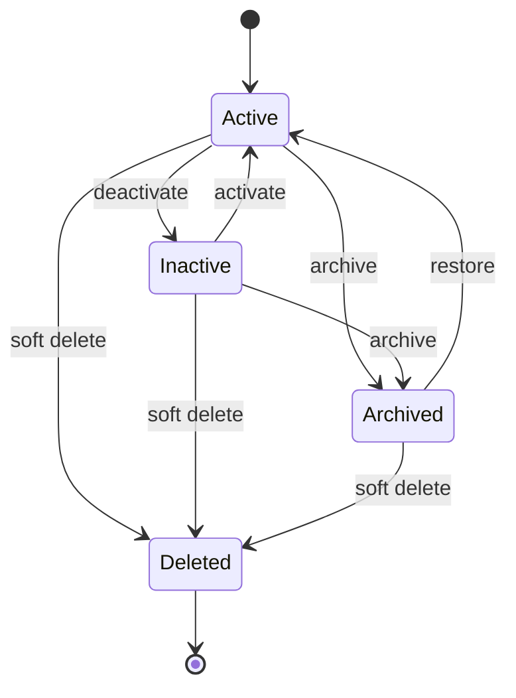
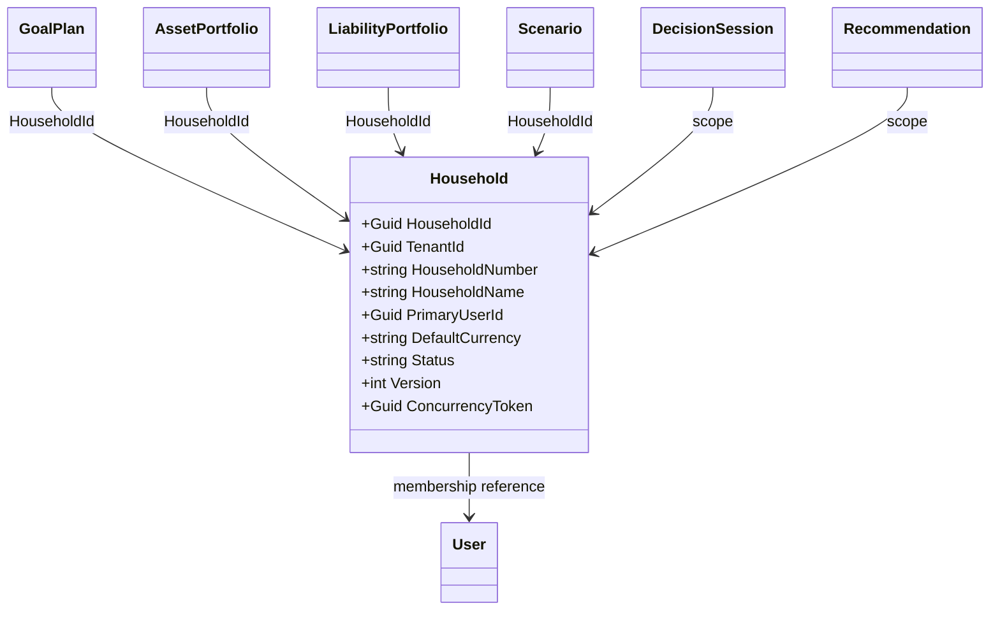
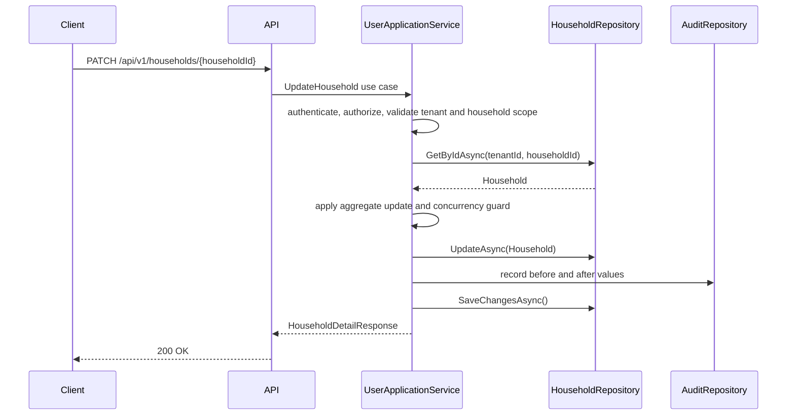
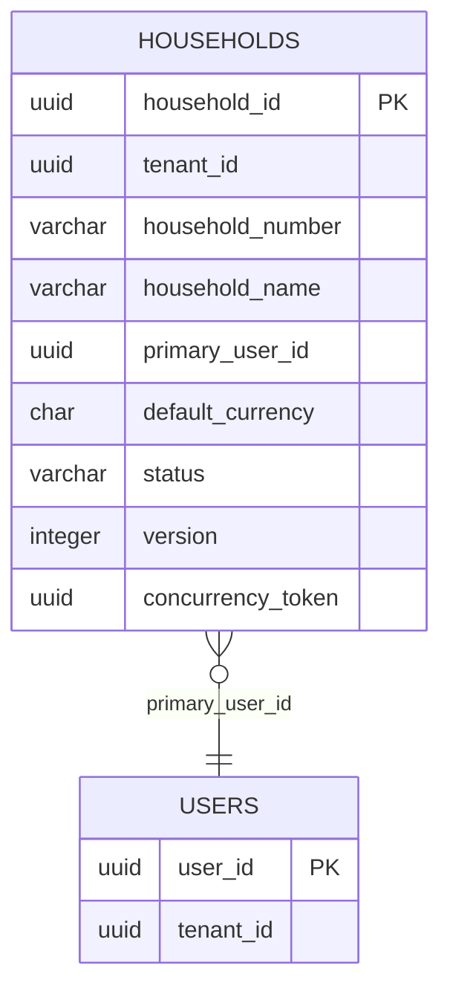
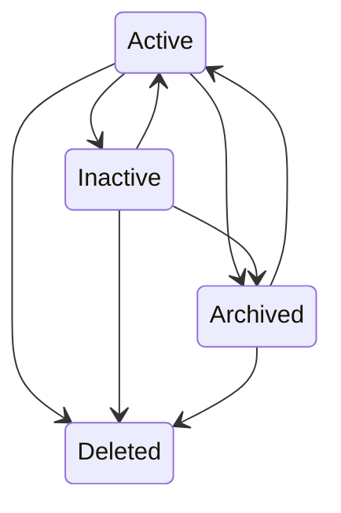

# Household Entity Specification
## Split Navigation
- [Household identity and ownership](household/identity-and-ownership.md)
- [Household API and persistence](household/api-and-persistence.md)
- [Household governance and testing](household/governance-and-testing.md)
# Document Control
| Field | Value |
|---|---|
| Document Name | Household Entity Specification |
| Document Path | knowledge/entity/Household.md |
| Document Type | Enterprise Entity Specification |
| Version | 1.0.0 |
| Status | Approved for Implementation |
| Domain | Financial Profile |
| Bounded Context | Financial Profile |
| Aggregate | Household |
| Aggregate Root | Household |
| Owner | Household aggregate owner through UserApplicationService |
| Source of Truth | Entity Catalog, Aggregate Catalog, Repository Catalog |
| Last Updated | 2026-07-14 |
| Related Specifications | knowledge/entity-catalog.md; knowledge/aggregate-catalog.md; knowledge/domain-model-catalog.md; knowledge/bounded-context-catalog.md; knowledge/value-object-catalog.md; knowledge/enumeration-catalog.md; knowledge/command-catalog.md; knowledge/domain-event-catalog.md; knowledge/repository-catalog.md; knowledge/domain-service-catalog.md; knowledge/application-service-catalog.md; knowledge/service-catalog.md; knowledge/permission-framework.md; knowledge/tenant-framework.md; knowledge/audit-framework.md; knowledge/api-governance-framework.md; knowledge/message-contract-catalog.md; knowledge/entity/User.md; knowledge/entity/Goal.md; knowledge/entity/Asset.md; knowledge/entity/Liability.md; knowledge/entity/Loan.md; knowledge/entity/Portfolio.md; knowledge/entity/CashFlow.md; knowledge/entity/Decision.md; knowledge/entity/Recommendation.md; knowledge/entity/Notification.md; docs/specification/04-DomainModel.md; docs/specification/04A-DomainInventory.md; docs/database/05-DatabaseDesign.md; docs/database/06-ERD.md; docs/api/07-API.md |
| Change Policy | Changes must preserve Catalog names and aggregate boundaries; Catalog gaps are marked without creating new Domain Concepts. |
# Catalog Alignment Summary
| Concern | Source Catalog | Catalog Result | Final Atlas Name | Defined Here or Referenced | Implementation Artifact | Status | Notes |
|---|---|---|---|---|---|---|---|
| Domain | entity-catalog.md; aggregate-catalog.md | Household belongs to Financial Profile | Financial Profile | Referenced | Namespace/module boundary | Catalog-aligned | No new domain introduced |
| Bounded Context | entity-catalog.md; aggregate-catalog.md | Household belongs to Financial Profile | Financial Profile | Referenced | API and persistence scope | Catalog-aligned | Same as catalog |
| Aggregate | aggregate-catalog.md | Aggregate Name is Household | Household | Referenced | Aggregate class | Catalog-aligned | Transaction boundary is one Household mutation |
| Aggregate Root | aggregate-catalog.md | Root is Household | Household | Referenced | Household aggregate root | Catalog-aligned | Aggregate Root is yes |
| Entity | entity-catalog.md | Entity Name is Household | Household | Referenced | HouseholdEntity | Catalog-aligned | Primary key is HouseholdId |
| Child Entity | aggregate-catalog.md | No child entities listed | None | Referenced | No owned child table declared | Catalog-aligned | Membership is reference scope, not new entity here |
| Value Object | aggregate-catalog.md | Address when household address is stored | Address | Referenced | Owned Address columns when present | Catalog-aligned | Optional value object |
| Enumeration | enumeration-catalog.md | HouseholdStatus not confirmed as formal enumeration | Household lifecycle status | Implementation Detail | status text with check constraint | Catalog Gap | Status is implementation detail, not new Enumeration |
| Command | command-catalog.md | RecordIncome and RecordExpense are catalog commands in household/cash flow use cases | RecordIncome; RecordExpense | Referenced | Command handlers | Catalog-aligned | Create/update/archive are API use cases, not formal Domain Commands |
| Domain Event | domain-event-catalog.md | SalaryReceived, BonusReceived, PassiveIncomeReceived, ExpenseRecorded | SalaryReceived; BonusReceived; PassiveIncomeReceived; ExpenseRecorded | Referenced | Event messages | Catalog-aligned | Household lifecycle events are Catalog Gap |
| Repository | repository-catalog.md | HouseholdRepository | HouseholdRepository | Referenced | Repository interface | Catalog-aligned | Repository contains no business logic |
| Domain Service | domain-service-catalog.md | CashFlowService consumes Household; other services reference Household scope | CashFlowService; DecisionService; ScenarioService; RecommendationService; PortfolioService; RiskService | Referenced | Service dependencies | Catalog-aligned | Services do not bypass Application Service authorization |
| Application Service | application-service-catalog.md | UserApplicationService owns household access; DashboardApplicationService records cash flow | UserApplicationService; DashboardApplicationService | Referenced | Application use cases | Catalog-aligned | Cross-aggregate orchestration occurs here |
| API Resource | entity-catalog.md | /api/v1/households | /api/v1/households | Referenced | REST controller | Catalog-aligned | Resource is household-scoped |
| DTO | api governance | DTOs are implementation contract | HouseholdCreateRequest; HouseholdUpdateRequest; HouseholdDetailResponse | Implementation Detail | API schema | Implementation Detail | DTO names do not create Domain Concepts |
| Permission | entity-catalog.md; permission-framework.md | Household:Read appears in entity API mapping | Household:Read; Household:Create; Household:Update; Household:Archive; Household:Restore; Household:Delete | Referenced and implementation mapped | Policy attributes | Catalog-aligned where present | Mutating permission names follow resource-action mapping |
| Database Table | entity-catalog.md | households | households | Referenced | PostgreSQL table | Catalog-aligned | Table owned by Household aggregate |
| Read Model | api governance | Read Model is not source of truth | Household projection | Implementation Detail | materialized view/cache | Implementation Detail | Cannot write aggregate through projection |
| Cache | entity-catalog.md; aggregate-catalog.md | Household membership cache | Household membership cache | Referenced | Cache keys | Catalog-aligned | TenantId and HouseholdId scoped |
| Audit | audit guidance | Household preserves audit context | Audit trail | Referenced | AuditRepository entries | Catalog-aligned | Complete audit trail required |
| Tenant Boundary | tenant guidance; aggregate-catalog.md | Household is not Tenant | TenantId scope | Referenced | tenant_id column | Catalog-aligned | Household cannot replace tenant isolation |
# Entity Overview
## Purpose
Household represents the shared financial and decision scope for Atlas users.
It is the aggregate root that gives Atlas a stable boundary for household-level access, shared planning, shared financial ownership scope, membership references, and authorization scope.
Household does not replace Tenant. Tenant separates customers or deployment ownership. Household separates financial planning and access within a tenant.
## Responsibilities
| Responsibility | Description | Boundary |
|---|---|---|
| Household identity | Maintains a stable HouseholdId and household display name. | Household aggregate |
| Household membership boundary | Owns membership references that connect User to Household access. | Household aggregate |
| Household-level financial ownership | Defines the scope used by financial aggregates and read models. | Household reference scope |
| Member authorization boundary | Enforces whether an actor may access household-scoped data. | Application Service plus Household aggregate |
| Shared financial profile coordination | Provides the common scope for income, expense, portfolio, liability, goal, scenario, decision, and recommendation data. | Cross-aggregate reference |
| Shared Goal ownership | GoalPlan and Goal reference Household scope through catalog-aligned ownership. | GoalPlan aggregate |
| Shared Asset and Liability reference coordination | AssetPortfolio and LiabilityPortfolio reference household scope. | External aggregates |
| Household preference ownership | Stores implementation-level preferences that belong to household access and display. | Household aggregate |
| Household lifecycle governance | Controls archive, restore, and soft delete behavior for the household root. | Household aggregate |
| Aggregate invariant enforcement | Enforces household identity, membership, authorization, lifecycle, version, and audit invariants. | Household aggregate |
| Audit ownership | Preserves household context and actor context on household mutations. | Audit boundary |
| Domain Event publication responsibility | Publishes catalog events only when catalog commands execute through approved handlers. | Command handlers |
## Non-Responsibilities
| Non-Responsibility | Owning Concept |
|---|---|
| User identity authentication | User aggregate and identity boundary |
| Asset valuation calculation | AssetPortfolio and Portfolio services |
| Portfolio performance calculation | PortfolioService and related performance implementation |
| Loan amortization | Loan aggregate and loan services |
| Scenario simulation | Scenario aggregate and ScenarioService |
| Decision scoring | DecisionSession and DecisionService |
| Recommendation generation | Recommendation aggregate and RecommendationService |
| Notification delivery | Notification aggregate and delivery implementation |
| Workflow execution | Application Service orchestration |
| Cross-Aggregate direct mutation | Application Service transaction orchestration |
| Tenant infrastructure management | Tenant boundary |
## Business Meaning
Household is the shared financial planning unit used when one or more users plan together.
User represents identity and actor context. Household represents financial collaboration and authorization scope.
Tenant represents platform isolation and must not be inferred from Household.
GoalPlan, AssetPortfolio, LiabilityPortfolio, Scenario, DecisionSession, Recommendation, Notification, Policy, and Configuration remain their own catalog concepts when present. Household is referenced by those concepts only where the Catalog allows household scope.
## Aggregate Root
Household is an Aggregate Root.
Aggregate Catalog defines Aggregate Name as Household and Aggregate Root as Household. The root owns household identity, membership references, authorization scope, and lifecycle.
## Aggregate Boundary
| Boundary Concern | Rule |
|---|---|
| Consistency boundary | Household membership and authorization scope are consistent inside the aggregate. |
| Transaction boundary | One Household mutation per aggregate transaction. |
| Child entity ownership | No child entities are declared by the Catalog for Household. |
| External aggregate references | User, GoalPlan, AssetPortfolio, LiabilityPortfolio, Scenario, DecisionSession, Recommendation, Notification, Policy, and Configuration are identity references or read projections only. |
| Allowed in-transaction mutations | Household identity, name, status implementation detail, preferences, membership references, audit metadata, version. |
| Prohibited cross-aggregate mutations | Household cannot mutate User credentials, Goal, Asset, Liability, Loan, Portfolio, CashFlow, Scenario, Decision, Recommendation, Notification, Policy, or Configuration state. |
| Repository ownership | HouseholdRepository persists Household only. |
| Event ownership | Catalog events are emitted by approved command handlers; lifecycle events are Catalog Gap unless cataloged elsewhere. |
| Concurrency boundary | Version and ConcurrencyToken protect Household mutations. |
| Audit boundary | Every household write records actor, tenant, household, command or use case, before and after metadata, correlation, and causation. |
## Lifecycle
| Lifecycle Stage | Meaning | Status Handling | Catalog Position |
|---|---|---|---|
| Created | Household identity exists and has at least one authorized user reference. | Active by default in implementation. | Implementation Detail |
| Active | Household can be used for authorized planning and financial scope. | status = Active | Implementation Detail because HouseholdStatus is not confirmed as formal Enumeration |
| Inactive | Household exists but is not available for ordinary write workflows. | status = Inactive | Implementation Detail |
| Archived | Household remains readable for authorized audit and history, but is not mutable. | status = Archived and archived_at set | Implementation Detail with catalog archive strategy |
| Restored | Archived Household returns to Active after authorization and invariants pass. | status = Active and archived_at cleared | Implementation Detail |
| Deleted | Soft-deleted Household is excluded from normal reads and cannot be restored without administrative recovery policy. | status = Deleted and deleted_at set | Implementation Detail |
## Ownership
| Ownership Concern | Rule |
|---|---|
| User ownership | Household references User by identity; User is not owned by Household. |
| Household membership | Membership is an authorization reference boundary owned by Household scope. |
| Household administrator or owner semantics | Stored as membership role or primary owner reference when implemented; not a new Entity. |
| Tenant isolation | TenantId scopes every Household and every household API request. |
| Data ownership | Household owns household identity and access scope, not every financial aggregate. |
| Shared financial record ownership | Financial records reference Household through their owning aggregate. |
| Transfer restrictions | Household transfer must preserve tenant, membership, audit, and aggregate reference invariants. |
| Orphan prevention | A Household must not exist without an authorized owner or membership reference. |
| Archived ownership behavior | Archived Household retains owner and membership references for authorization and audit. |
## Relationships
| Related Concept | Cardinality | Ownership Type | Aggregate Boundary | Navigation Direction | Required | Cascade Behavior | Delete Behavior | Authorization Impact | Audit Impact |
|---|---:|---|---|---|---|---|---|---|---|
| User | Many-to-many by membership reference | Reference | Separate User aggregate | Household to UserId; User to HouseholdId access | Required for usable household | No cascade | Block hard delete when referenced | Determines actor access | Membership changes audited |
| GoalPlan | One household to many plans by reference | Reference | Separate GoalPlan aggregate | GoalPlan references HouseholdId | Optional | No cascade | Archive blocks new plan writes | Household scope required | Plan access includes HouseholdId |
| Goal | One household to many goals through GoalPlan | Reference | GoalPlan owns Goal | Read projection only | Optional | No cascade | Goal deletion handled by Goal aggregate | Household scope through GoalPlan | Goal audit includes HouseholdId |
| AssetPortfolio | One household to many portfolios by reference | Reference | AssetPortfolio aggregate | AssetPortfolio references HouseholdId | Optional | No cascade | No direct household cascade | Asset access requires household authorization | Portfolio audit includes HouseholdId |
| Asset | One household to many assets through AssetPortfolio | Reference | AssetPortfolio owns asset-related state | Read projection only | Optional | No cascade | Asset lifecycle handled by owning aggregate | Household isolation through AssetPortfolio | Asset audit includes Household scope |
| LiabilityPortfolio | One household to many portfolios by reference | Reference | LiabilityPortfolio aggregate | LiabilityPortfolio references HouseholdId | Optional | No cascade | No direct household cascade | Liability access requires household authorization | Liability audit includes HouseholdId |
| Liability | One household to many liabilities through LiabilityPortfolio | Reference | LiabilityPortfolio owns liabilities | Read projection only | Optional | No cascade | Liability lifecycle handled by owning aggregate | Household isolation through LiabilityPortfolio | Liability audit includes Household scope |
| Loan | One household to many loans by scope | Reference | Loan aggregate | Loan references household scope where cataloged | Optional | No cascade | Loan lifecycle separate | Household authorization required | Loan audit includes HouseholdId |
| Mortgage | One household to many mortgages through Loan | Reference | Loan aggregate | Loan/Mortgage reference scope | Optional | No cascade | Mortgage lifecycle separate | Household authorization required | Mortgage audit includes HouseholdId |
| Portfolio | One household to many portfolios through AssetPortfolio | Reference | AssetPortfolio aggregate | Portfolio references HouseholdId or AssetPortfolio | Optional | No cascade | Portfolio lifecycle separate | Household authorization required | Portfolio audit includes HouseholdId |
| CashFlow | One household to many cash flow records through cash flow use case | Reference | FinancialProfile or cash flow model | Cash flow records reference HouseholdId | Optional | No cascade | Cash flow lifecycle separate | Household authorization required | Cash flow events carry Household scope |
| Income | One household to many income records | Reference | Cash flow use case | Income references HouseholdId | Optional | No cascade | Separate lifecycle | RecordIncome requires household access | SalaryReceived, BonusReceived, PassiveIncomeReceived audited |
| Expense | One household to many expense records | Reference | Cash flow use case | Expense references HouseholdId | Optional | No cascade | Separate lifecycle | RecordExpense requires household access | ExpenseRecorded audited |
| Scenario | One household to many scenarios | Reference | Scenario aggregate | Scenario references HouseholdId | Optional | No cascade | Scenario lifecycle separate | Household authorization required | Scenario audit includes HouseholdId |
| DecisionSession | One household to many sessions | Reference | DecisionSession aggregate | DecisionSession references Household scope | Optional | No cascade | Separate lifecycle | Household authorization required | Decision session audit includes HouseholdId |
| Decision | One household to many decisions through DecisionSession | Reference | Decision aggregate/session | Read projection only | Optional | No cascade | Separate lifecycle | Household authorization required | Decision audit includes HouseholdId |
| Recommendation | One household to many recommendations | Reference | Recommendation aggregate | Recommendation references HouseholdId | Optional | No cascade | Separate lifecycle | Household authorization required | Recommendation audit includes HouseholdId |
| Notification | User or household scoped | Reference | Notification aggregate | Notification references UserId and optionally HouseholdId | Optional | No cascade | Notification lifecycle separate | Scope limits recipients | Delivery audit includes HouseholdId when present |
| Policy | Household scope when policy scope requires it | Reference | Policy aggregate | Policy references HouseholdId when cataloged | Optional | No cascade | Policy lifecycle separate | Household authorization required | Policy audit includes HouseholdId |
| Configuration | Household-specific only when scoped | Reference | Configuration aggregate | Configuration references HouseholdId when scoped | Optional | No cascade | Configuration lifecycle separate | Household authorization required | Configuration audit includes HouseholdId |
| Audit | Many audit records per household | Reference | Audit storage | Audit references HouseholdId | Required for writes | No cascade | Audit never hard-deleted by household deletion | Supports security review | Full write trace |
## Navigation
| Navigation Type | Allowed Navigation | Rule |
|---|---|---|
| Owned navigation | Address when stored | Owned value object only |
| Aggregate reference | UserId, GoalPlanId, AssetPortfolioId, LiabilityPortfolioId, ScenarioId | Identity reference only |
| Read-only projection | Household financial summary, dashboard, search result | Projection cannot mutate aggregate |
| Collection navigation | Member user ids and referenced aggregate ids | Implementation collections only |
| Identity reference | TenantId, HouseholdId, OwnerUserId, CreatedBy, UpdatedBy | Stored as identifiers |
| API expansion | include=members, include=summary, include=audit | Read-only expansion |
| Prohibited navigation | Direct mutable object graph into User, Goal, Asset, Liability, Loan, Portfolio, CashFlow, Scenario, Decision, Recommendation, Notification, Policy, Configuration | Not allowed |
# Complete Properties
## Property Matrix
| Name | Type | Nullable | Default | Database Mapping | JSON Name | API Usage | Searchable | Sortable | Indexed | Encrypted | Auditable |
|---|---|---:|---|---|---|---|---:|---:|---:|---:|---:|
| HouseholdId | UUID | No | generated | household_id uuid pk | householdId | response, route | Yes | Yes | Yes | No | Yes |
| TenantId | UUID | No | request context | tenant_id uuid | tenantId | internal, response | Yes | Yes | Yes | No | Yes |
| HouseholdNumber | string(40) | No | generated | household_number varchar(40) | householdNumber | response | Yes | Yes | Yes | No | Yes |
| HouseholdName | string(160) | No | none | household_name varchar(160) | householdName | create, update, response | Yes | Yes | Yes | No | Yes |
| Description | string(1000) | Yes | null | description varchar(1000) | description | create, update, response | Yes | No | No | No | Yes |
| PrimaryUserId | UUID | No | actor user id | primary_user_id uuid | primaryUserId | create, update, response | Yes | Yes | Yes | No | Yes |
| DefaultCurrency | string(3) | No | tenant default | default_currency char(3) | defaultCurrency | create, update, response | Yes | Yes | Yes | No | Yes |
| Locale | string(20) | No | en-US | locale varchar(20) | locale | create, update, response | Yes | No | No | No | Yes |
| TimeZone | string(80) | No | UTC | time_zone varchar(80) | timeZone | create, update, response | Yes | No | No | No | Yes |
| Status | string(20) | No | Active | status varchar(20) | status | response, lifecycle actions | Yes | Yes | Yes | No | Yes |
| MemberCount | integer | No | 1 | member_count integer | memberCount | response | Yes | Yes | Yes | No | Yes |
| IsArchived | boolean | No | false | is_archived boolean | isArchived | response | Yes | Yes | Yes | No | Yes |
| ArchivedAt | timestamptz | Yes | null | archived_at timestamptz | archivedAt | response | Yes | Yes | Yes | No | Yes |
| ArchivedBy | UUID | Yes | null | archived_by uuid | archivedBy | response | Yes | No | No | No | Yes |
| DeletedAt | timestamptz | Yes | null | deleted_at timestamptz | deletedAt | response | Yes | Yes | Yes | No | Yes |
| DeletedBy | UUID | Yes | null | deleted_by uuid | deletedBy | response | Yes | No | No | No | Yes |
| CreatedAt | timestamptz | No | now | created_at timestamptz | createdAt | response | Yes | Yes | Yes | No | Yes |
| CreatedBy | UUID | No | actor user id | created_by uuid | createdBy | response | Yes | No | No | No | Yes |
| UpdatedAt | timestamptz | No | now | updated_at timestamptz | updatedAt | response | Yes | Yes | Yes | No | Yes |
| UpdatedBy | UUID | No | actor user id | updated_by uuid | updatedBy | response | Yes | No | No | No | Yes |
| Version | integer | No | 1 | version integer | version | response, concurrency | Yes | Yes | Yes | No | Yes |
| ConcurrencyToken | UUID | No | generated | concurrency_token uuid | concurrencyToken | response, If-Match | No | No | Yes | No | Yes |
## Property Details
| Name | Description | Validation | Business Meaning | Example | Security Notes |
|---|---|---|---|---|---|
| HouseholdId | Stable technical identity for Household. | Required; UUID; immutable after create. | Identifies one household planning and authorization scope. | 9f85c1c0-2af0-4c4c-9c5c-110000000001 | Not encrypted; audited on every write. |
| TenantId | Tenant isolation boundary. | Required; must match authenticated tenant context. | Prevents cross-tenant household access. | 0f85c1c0-2af0-4c4c-9c5c-220000000001 | Not encrypted; always used in authorization. |
| HouseholdNumber | Human-safe unique household reference. | Required; unique per tenant; uppercase normalized. | Supports support and operations lookup. | HH-2026-000001 | Not encrypted; audit visible. |
| HouseholdName | Household display name. | Required; 1-160 chars; trimmed; no control characters. | User-facing shared household name. | Chen Family | May contain personal data; masked in low-trust logs. |
| Description | Optional note. | Max 1000 chars; sanitized. | Adds household context without becoming decision logic. | Shared planning household for retirement and education planning. | May contain personal data; never logged raw. |
| PrimaryUserId | Primary member reference. | Required; User must be in same tenant and authorized. | Establishes owner semantics without creating new entity. | 6f85c1c0-2af0-4c4c-9c5c-330000000001 | Not encrypted; protected by household authorization. |
| DefaultCurrency | Household default currency. | Required; ISO 4217 uppercase; catalog CurrencyCode when available. | Default for display and household-level summaries. | USD | Not encrypted. |
| Locale | Display locale. | Required; BCP 47-like format. | Controls formatting for household views. | en-US | Not encrypted. |
| TimeZone | Household time zone. | Required; IANA identifier. | Controls date boundaries for household history. | America/New_York | Not encrypted. |
| Status | Lifecycle status implementation detail. | Required; Active, Inactive, Archived, Deleted. | Controls write eligibility. | Active | Not formal Enumeration. |
| MemberCount | Denormalized count of authorized members. | Required; >= 1 while active. | Prevents orphaned household state. | 2 | Recomputed after membership changes. |
| IsArchived | Archive shortcut. | Must match Status = Archived when true. | Speeds archive filtering. | false | Audited. |
| ArchivedAt | Archive timestamp. | Required when archived; null otherwise. | Preserves lifecycle history. | 2026-07-14T08:00:00Z | Audited. |
| ArchivedBy | Archive actor. | Required when archived. | Identifies responsible actor. | 6f85c1c0-2af0-4c4c-9c5c-330000000001 | Audited. |
| DeletedAt | Soft delete timestamp. | Required when deleted; null otherwise. | Excludes from normal reads without losing audit. | null | Audited. |
| DeletedBy | Soft delete actor. | Required when deleted. | Identifies responsible actor. | null | Audited. |
| CreatedAt | Creation time. | Required; server generated. | Establishes origin. | 2026-07-14T08:00:00Z | Audited. |
| CreatedBy | Creator user id. | Required; same tenant; authorized. | Establishes accountability. | 6f85c1c0-2af0-4c4c-9c5c-330000000001 | Audited. |
| UpdatedAt | Last update time. | Required; server generated. | Supports synchronization. | 2026-07-14T08:30:00Z | Audited. |
| UpdatedBy | Last updater user id. | Required for writes. | Supports accountability. | 6f85c1c0-2af0-4c4c-9c5c-330000000001 | Audited. |
| Version | Aggregate version. | Required; positive integer; increments on write. | Supports optimistic concurrency and history. | 7 | Audited. |
| ConcurrencyToken | Opaque concurrency token. | Required; changes on write. | Prevents lost updates. | 1f85c1c0-2af0-4c4c-9c5c-440000000001 | Not encrypted; not business data. |
# Validation Rules
| Rule Id | Field | Validation | Error Code | Severity |
|---|---|---|---|---|
| HHH-VR-001 | HouseholdId | Required UUID and immutable after create. | HOUSEHOLD_ID_INVALID | Critical |
| HHH-VR-002 | TenantId | Required and equals request tenant. | TENANT_SCOPE_INVALID | Critical |
| HHH-VR-003 | HouseholdNumber | Required, unique per tenant, max 40 chars. | HOUSEHOLD_NUMBER_DUPLICATE | High |
| HHH-VR-004 | HouseholdName | Required, trimmed length 1-160. | HOUSEHOLD_NAME_INVALID | High |
| HHH-VR-005 | Description | Nullable, max 1000, sanitized. | HOUSEHOLD_DESCRIPTION_INVALID | Medium |
| HHH-VR-006 | PrimaryUserId | Required and references authorized User in same tenant. | PRIMARY_USER_INVALID | Critical |
| HHH-VR-007 | DefaultCurrency | Required ISO 4217 uppercase value. | DEFAULT_CURRENCY_INVALID | High |
| HHH-VR-008 | Locale | Required non-empty locale code. | LOCALE_INVALID | Medium |
| HHH-VR-009 | TimeZone | Required IANA time zone. | TIME_ZONE_INVALID | Medium |
| HHH-VR-010 | Status | Must be Active, Inactive, Archived, or Deleted implementation value. | STATUS_INVALID | High |
| HHH-VR-011 | MemberCount | Must be at least one for Active. | MEMBER_COUNT_INVALID | Critical |
| HHH-VR-012 | IsArchived | Must equal true only when Status is Archived. | ARCHIVE_STATE_INVALID | High |
| HHH-VR-013 | ArchivedAt | Required when Status is Archived; null otherwise. | ARCHIVE_TIMESTAMP_INVALID | High |
| HHH-VR-014 | ArchivedBy | Required when Status is Archived. | ARCHIVE_ACTOR_INVALID | High |
| HHH-VR-015 | DeletedAt | Required when Status is Deleted; null for non-deleted states. | DELETE_TIMESTAMP_INVALID | High |
| HHH-VR-016 | DeletedBy | Required when Status is Deleted. | DELETE_ACTOR_INVALID | High |
| HHH-VR-017 | CreatedAt | Required and cannot be later than UpdatedAt. | CREATED_AT_INVALID | Medium |
| HHH-VR-018 | CreatedBy | Required authorized actor. | CREATED_BY_INVALID | High |
| HHH-VR-019 | UpdatedAt | Required and server generated. | UPDATED_AT_INVALID | Medium |
| HHH-VR-020 | UpdatedBy | Required for every write. | UPDATED_BY_INVALID | High |
| HHH-VR-021 | Version | Required positive integer. | VERSION_INVALID | Critical |
| HHH-VR-022 | ConcurrencyToken | Required and must match If-Match on updates. | CONCURRENCY_TOKEN_INVALID | Critical |
| HHH-VR-023 | Authorization | Actor must have household access before reads or writes. | HOUSEHOLD_ACCESS_DENIED | Critical |
| HHH-VR-024 | Tenant Isolation | Cross-tenant references are rejected. | CROSS_TENANT_ACCESS_DENIED | Critical |
| HHH-VR-025 | Archive Immutability | Archived Household cannot be updated except restore. | ARCHIVED_HOUSEHOLD_READ_ONLY | Critical |
| HHH-VR-026 | Delete Immutability | Deleted Household cannot be updated through normal APIs. | DELETED_HOUSEHOLD_READ_ONLY | Critical |
| HHH-VR-027 | Soft Delete | Delete must set DeletedAt and DeletedBy; hard delete is prohibited by domain API. | SOFT_DELETE_REQUIRED | Critical |
| HHH-VR-028 | Audit | Every write requires correlation id, causation id, and actor id. | AUDIT_CONTEXT_REQUIRED | Critical |
| HHH-VR-029 | Read Model | Read projection cannot be submitted as write model. | READ_MODEL_WRITE_REJECTED | High |
| HHH-VR-030 | Repository | Repository cannot validate business policy beyond persistence constraints. | REPOSITORY_POLICY_VIOLATION | High |
# Business Rules
| Rule Id | Rule | Enforcement |
|---|---|---|
| HHH-BR-001 | Household must be associated with exactly one TenantId. | API, Application Service, DB constraint |
| HHH-BR-002 | Household must have stable HouseholdId. | Aggregate constructor |
| HHH-BR-003 | HouseholdNumber must be unique per tenant. | DB unique index and service pre-check |
| HHH-BR-004 | Household must have a display name. | Aggregate validation |
| HHH-BR-005 | Household must have at least one authorized user reference while Active. | Aggregate validation |
| HHH-BR-006 | Household must not be treated as Tenant. | Application authorization |
| HHH-BR-007 | Household cannot directly mutate User. | Application orchestration |
| HHH-BR-008 | Household cannot directly mutate Goal, Asset, Liability, Loan, Portfolio, CashFlow, Scenario, Decision, Recommendation, Notification, Policy, or Configuration. | Aggregate boundary |
| HHH-BR-009 | Archived Household is read-only except restore. | State guard |
| HHH-BR-010 | Deleted Household is excluded from normal reads. | Repository query filter |
| HHH-BR-011 | Complete audit trail is retained for all writes. | AuditRepository |
| HHH-BR-012 | Complete version history is retained. | Version table or audit trail |
| HHH-BR-013 | Soft delete is required. | API and persistence |
| HHH-BR-014 | Membership cache must be invalidated on membership or lifecycle change. | Application Service |
| HHH-BR-015 | Read Model never becomes aggregate source of truth. | API mapping |
| HHH-BR-016 | Cross-aggregate workflows use Application Service orchestration. | Application layer |
| HHH-BR-017 | Cash flow commands use RecordIncome and RecordExpense catalog commands. | Command handlers |
| HHH-BR-018 | Lifecycle operations not in command catalog are API use cases and marked as Implementation Detail. | Documentation and code review |
| HHH-BR-019 | Household isolation is enforced before repository access. | Application Service |
| HHH-BR-020 | Household deletion must not cascade-delete audit records. | DB and audit policy |
# Aggregate Invariants
| Invariant | Description |
|---|---|
| Identity stability | HouseholdId never changes after creation. |
| Tenant stability | TenantId never changes after creation. |
| Membership availability | Active Household must have at least one authorized member reference. |
| Primary user validity | PrimaryUserId must be an authorized user reference in the same tenant. |
| Lifecycle consistency | Status, IsArchived, ArchivedAt, ArchivedBy, DeletedAt, and DeletedBy must agree. |
| Archive read-only | Archived Household rejects ordinary updates. |
| Delete read-only | Deleted Household rejects ordinary updates. |
| Concurrency | Version increments and ConcurrencyToken changes on every successful write. |
| Audit completeness | Every write carries actor, tenant, household, correlation, causation, timestamp, and operation. |
| Boundary integrity | Household never commits cross-aggregate state changes in the same aggregate transaction. |
# State Machine
| State | Transition | Trigger | Invariant | Illegal Transition |
|---|---|---|---|---|
| Active | Active to Inactive | Deactivate household use case | MemberCount >= 1; not deleted | Active to Deleted without soft-delete audit |
| Active | Active to Archived | Archive household use case | ArchivedAt and ArchivedBy set | Active to Archived without audit actor |
| Active | Active to Deleted | Delete household use case | DeletedAt and DeletedBy set | Active hard delete |
| Inactive | Inactive to Active | Activate household use case | PrimaryUserId authorized | Inactive to Deleted without soft-delete audit |
| Inactive | Inactive to Archived | Archive household use case | ArchivedAt and ArchivedBy set | Inactive to Archived without version check |
| Archived | Archived to Active | Restore household use case | ArchivedAt cleared; status Active | Archived to Inactive directly |
| Archived | Archived to Deleted | Delete household use case | DeletedAt and DeletedBy set | Archived ordinary update |
| Deleted | None | Administrative recovery outside normal API | DeletedAt and DeletedBy retained | Deleted to Active through public restore |

# Commands
| Command or Use Case | Catalog Status | Handler Boundary | Repository | Events | Notes |
|---|---|---|---|---|---|
| RecordIncome | Catalog Command | DashboardApplicationService or catalog cash flow use case | HouseholdRepository where required | SalaryReceived; BonusReceived; PassiveIncomeReceived | Formal command |
| RecordExpense | Catalog Command | DashboardApplicationService or catalog cash flow use case | HouseholdRepository where required | ExpenseRecorded | Formal command |
| CreateHousehold | Catalog Gap | UserApplicationService | HouseholdRepository | No formal lifecycle event | API use case, not new Domain Command |
| UpdateHousehold | Catalog Gap | UserApplicationService | HouseholdRepository | No formal lifecycle event | API use case |
| ArchiveHousehold | Catalog Gap | UserApplicationService | HouseholdRepository | No formal lifecycle event | API use case |
| RestoreHousehold | Catalog Gap | UserApplicationService | HouseholdRepository | No formal lifecycle event | API use case |
| DeleteHousehold | Catalog Gap | UserApplicationService | HouseholdRepository | No formal lifecycle event | Soft delete API use case |
| AddHouseholdMember | Catalog Gap | UserApplicationService | HouseholdRepository | No formal lifecycle event | Membership reference update |
| RemoveHouseholdMember | Catalog Gap | UserApplicationService | HouseholdRepository | No formal lifecycle event | Must preserve MemberCount invariant |
| ChangePrimaryUser | Catalog Gap | UserApplicationService | HouseholdRepository | No formal lifecycle event | Owner semantics only, no new Entity |
# Domain Events
| Event | Catalog Status | Producer | Consumer | Household Impact |
|---|---|---|---|---|
| SalaryReceived | Catalog Event | RecordIncome | Timeline, Decision, Dashboard | Household cash flow scope updated |
| BonusReceived | Catalog Event | RecordIncome | Timeline, Decision, Dashboard | Household cash flow scope updated |
| PassiveIncomeReceived | Catalog Event | RecordIncome | Timeline, Decision, Dashboard | Household cash flow scope updated |
| ExpenseRecorded | Catalog Event | RecordExpense | Timeline, Decision, Dashboard | Household cash flow scope updated |
| HouseholdCreated | Catalog Gap | None | None | Do not publish as Domain Event unless cataloged |
| HouseholdUpdated | Catalog Gap | None | None | Use audit log, not Domain Event |
| HouseholdArchived | Catalog Gap | None | None | Use audit log, not Domain Event |
| HouseholdRestored | Catalog Gap | None | None | Use audit log, not Domain Event |
| HouseholdDeleted | Catalog Gap | None | None | Use audit log, not Domain Event |
| HouseholdMemberChanged | Catalog Gap | None | None | Use audit log and cache invalidation |
# Repository
## Interface
```csharp
public interface IHouseholdRepository
{
    Task<Household?> GetByIdAsync(Guid tenantId, Guid householdId, CancellationToken cancellationToken);
    Task<Household?> GetByNumberAsync(Guid tenantId, string householdNumber, CancellationToken cancellationToken);
    Task<bool> ExistsAsync(Guid tenantId, Guid householdId, CancellationToken cancellationToken);
    Task<bool> ExistsNumberAsync(Guid tenantId, string householdNumber, CancellationToken cancellationToken);
    Task<IReadOnlyList<Household>> ListByUserAsync(Guid tenantId, Guid userId, CancellationToken cancellationToken);
    Task<PagedResult<Household>> ListPagedAsync(HouseholdSearchSpecification specification, CancellationToken cancellationToken);
    Task AddAsync(Household household, CancellationToken cancellationToken);
    Task UpdateAsync(Household household, CancellationToken cancellationToken);
    Task SaveChangesAsync(CancellationToken cancellationToken);
}
```
## Methods
| Method | Purpose | Business Logic Allowed |
|---|---|---|
| GetByIdAsync | Load one household by tenant and id. | No |
| GetByNumberAsync | Load one household by tenant and number. | No |
| ExistsAsync | Check existence. | No |
| ExistsNumberAsync | Support uniqueness checks. | No |
| ListByUserAsync | Return households accessible by user reference. | No |
| ListPagedAsync | Execute specification-based search. | No |
| AddAsync | Add new aggregate. | No |
| UpdateAsync | Persist aggregate changes. | No |
| SaveChangesAsync | Commit unit of work. | No |
## Query Methods
| Query | Filters | Sorts | Index Used |
|---|---|---|---|
| Search households | tenantId, householdId, primaryUserId, status, isArchived, deletedAt | householdName, createdAt, updatedAt, status | tenant, household, status indexes |
| User households | tenantId, userId | householdName | membership or primary user index |
| Archived households | tenantId, isArchived | archivedAt | archived index |
| Deleted households | tenantId, deletedAt | deletedAt | deleted index |
## Specification Pattern
Specifications express query criteria only. They must not mutate Household or apply domain policy. Business policy stays in aggregate methods and Application Service authorization.
# Domain Service Interaction
| Service | Catalog Status | Household Interaction |
|---|---|---|
| CashFlowService | Catalog-aligned | Consumes Household, Money, CashFlowItem, DateRange, and supports RecordIncome and RecordExpense results. |
| DecisionService | Catalog-aligned | Uses authorized household context for decision analysis; does not mutate Household. |
| ScenarioService | Catalog-aligned | Uses HouseholdId for scenario scope; does not mutate Household. |
| RecommendationService | Catalog-aligned | Uses HouseholdId to scope recommendations; does not mutate Household. |
| PortfolioService | Catalog-aligned | Uses Household scope through AssetPortfolio and Portfolio; does not mutate Household. |
| AllocationService | Catalog-aligned | Uses portfolio context; Household is authorization scope only. |
| RiskService | Catalog-aligned | Uses HouseholdId in input context and cache keys; does not mutate Household. |
| Projection Engine | Catalog-aligned service capability | Builds read models from events and repository reads; not source of truth. |
| Audit Service | Referenced capability | Records audit trace; does not become Household aggregate. |
| HouseholdService | Not a Catalog Concept | Do not add as Domain Service without catalog update. |
# Application Service Interaction
| Application Service | Catalog Status | Household Responsibility |
|---|---|---|
| UserApplicationService | Catalog-aligned | Household access, membership reference workflows, household CRUD API use cases. |
| DashboardApplicationService | Catalog-aligned | RecordIncome, RecordExpense, and dashboard queries in household scope. |
| BlueprintApplicationService | Catalog-aligned | Goal and planning queries that reference household scope. |
| PortfolioApplicationService | Catalog-aligned | AssetPortfolio and Portfolio workflows using household authorization. |
| ScenarioApplicationService | Catalog-aligned where present | Scenario workflows using HouseholdId. |
| DecisionApplicationService | Catalog-aligned where present | Decision workflows using HouseholdId. |
| RecommendationApplicationService | Catalog-aligned where present | Recommendation queries using HouseholdId. |
| ReportApplicationService | Catalog-aligned | Household-scoped reporting and explainability. |
| AdministrationApplicationService | Catalog-aligned | Audit and configuration queries with household scope. |
# API
## REST Endpoints
| Method | Path | Use Case | Permission | Status Codes |
|---|---|---|---|---|
| POST | /api/v1/households | Create household | Household:Create | 201, 400, 401, 403, 409, 422 |
| GET | /api/v1/households/{householdId} | Get detail | Household:Read | 200, 401, 403, 404 |
| PATCH | /api/v1/households/{householdId} | Update household | Household:Update | 200, 400, 401, 403, 404, 409, 422 |
| POST | /api/v1/households/{householdId}/archive | Archive household | Household:Archive | 200, 401, 403, 404, 409, 422 |
| POST | /api/v1/households/{householdId}/restore | Restore household | Household:Restore | 200, 401, 403, 404, 409, 422 |
| DELETE | /api/v1/households/{householdId} | Soft delete household | Household:Delete | 204, 401, 403, 404, 409, 422 |
| GET | /api/v1/households | Search households | Household:Read | 200, 400, 401, 403 |
| GET | /api/v1/households/{householdId}/summary | Detail summary projection | Household:Read | 200, 401, 403, 404 |
| GET | /api/v1/households/{householdId}/audit | Audit query | Household:Read | 200, 401, 403, 404 |
## Response
All responses include correlationId, requestId, tenantId, and householdId where applicable. Write responses include version and concurrencyToken.
## Error
| HTTP | Error Code | Meaning |
|---:|---|---|
| 400 | HOUSEHOLD_REQUEST_INVALID | Request shape or type is invalid. |
| 401 | AUTHENTICATION_REQUIRED | Actor is not authenticated. |
| 403 | HOUSEHOLD_ACCESS_DENIED | Actor lacks household access. |
| 404 | HOUSEHOLD_NOT_FOUND | Household not found in tenant scope. |
| 409 | HOUSEHOLD_CONCURRENCY_CONFLICT | Version or token mismatch. |
| 409 | HOUSEHOLD_NUMBER_DUPLICATE | HouseholdNumber already exists in tenant. |
| 422 | HOUSEHOLD_RULE_VIOLATION | Domain invariant failed. |
# DTO
## Create DTO
```json
{
  "householdName": "Chen Family",
  "description": "Shared planning household",
  "primaryUserId": "6f85c1c0-2af0-4c4c-9c5c-330000000001",
  "defaultCurrency": "USD",
  "locale": "en-US",
  "timeZone": "America/New_York"
}
```
## Update DTO
```json
{
  "householdName": "Chen Family Trust",
  "description": "Updated shared planning household",
  "primaryUserId": "6f85c1c0-2af0-4c4c-9c5c-330000000001",
  "defaultCurrency": "USD",
  "locale": "en-US",
  "timeZone": "America/New_York",
  "concurrencyToken": "1f85c1c0-2af0-4c4c-9c5c-440000000001"
}
```
## Detail DTO
```json
{
  "householdId": "9f85c1c0-2af0-4c4c-9c5c-110000000001",
  "tenantId": "0f85c1c0-2af0-4c4c-9c5c-220000000001",
  "householdNumber": "HH-2026-000001",
  "householdName": "Chen Family Trust",
  "description": "Updated shared planning household",
  "primaryUserId": "6f85c1c0-2af0-4c4c-9c5c-330000000001",
  "defaultCurrency": "USD",
  "locale": "en-US",
  "timeZone": "America/New_York",
  "status": "Active",
  "memberCount": 2,
  "isArchived": false,
  "createdAt": "2026-07-14T08:00:00Z",
  "createdBy": "6f85c1c0-2af0-4c4c-9c5c-330000000001",
  "updatedAt": "2026-07-14T08:30:00Z",
  "updatedBy": "6f85c1c0-2af0-4c4c-9c5c-330000000001",
  "version": 7,
  "concurrencyToken": "2f85c1c0-2af0-4c4c-9c5c-440000000002"
}
```
## Summary DTO
```json
{
  "householdId": "9f85c1c0-2af0-4c4c-9c5c-110000000001",
  "householdNumber": "HH-2026-000001",
  "householdName": "Chen Family Trust",
  "status": "Active",
  "memberCount": 2
}
```
## Search DTO
```json
{
  "tenantId": "0f85c1c0-2af0-4c4c-9c5c-220000000001",
  "query": "Chen",
  "status": "Active",
  "primaryUserId": "6f85c1c0-2af0-4c4c-9c5c-330000000001",
  "page": 1,
  "pageSize": 25,
  "sort": "householdName"
}
```
# Database Mapping
| Column | Type | Nullable | Constraint |
|---|---|---:|---|
| household_id | uuid | No | Primary key |
| tenant_id | uuid | No | Tenant scoped |
| household_number | varchar(40) | No | Unique with tenant_id |
| household_name | varchar(160) | No | Non-empty |
| description | varchar(1000) | Yes | Sanitized by API |
| primary_user_id | uuid | No | References users when table exists |
| default_currency | char(3) | No | Uppercase |
| locale | varchar(20) | No | Non-empty |
| time_zone | varchar(80) | No | Non-empty |
| status | varchar(20) | No | Active, Inactive, Archived, Deleted |
| member_count | integer | No | >= 0 |
| is_archived | boolean | No | default false |
| archived_at | timestamptz | Yes | Required when archived |
| archived_by | uuid | Yes | Actor reference |
| deleted_at | timestamptz | Yes | Soft delete marker |
| deleted_by | uuid | Yes | Actor reference |
| created_at | timestamptz | No | default now |
| created_by | uuid | No | Actor reference |
| updated_at | timestamptz | No | default now |
| updated_by | uuid | No | Actor reference |
| version | integer | No | >= 1 |
| concurrency_token | uuid | No | Optimistic concurrency |
# PostgreSQL Schema
```sql
CREATE SCHEMA IF NOT EXISTS atlas;
CREATE TABLE IF NOT EXISTS atlas.households (
    household_id uuid PRIMARY KEY,
    tenant_id uuid NOT NULL,
    household_number varchar(40) NOT NULL,
    household_name varchar(160) NOT NULL,
    description varchar(1000) NULL,
    primary_user_id uuid NOT NULL,
    default_currency char(3) NOT NULL,
    locale varchar(20) NOT NULL DEFAULT 'en-US',
    time_zone varchar(80) NOT NULL DEFAULT 'UTC',
    status varchar(20) NOT NULL DEFAULT 'Active',
    member_count integer NOT NULL DEFAULT 1,
    is_archived boolean NOT NULL DEFAULT false,
    archived_at timestamptz NULL,
    archived_by uuid NULL,
    deleted_at timestamptz NULL,
    deleted_by uuid NULL,
    created_at timestamptz NOT NULL DEFAULT now(),
    created_by uuid NOT NULL,
    updated_at timestamptz NOT NULL DEFAULT now(),
    updated_by uuid NOT NULL,
    version integer NOT NULL DEFAULT 1,
    concurrency_token uuid NOT NULL,
    CONSTRAINT uq_households_tenant_number UNIQUE (tenant_id, household_number),
    CONSTRAINT ck_households_name_not_blank CHECK (length(btrim(household_name)) > 0),
    CONSTRAINT ck_households_currency CHECK (default_currency = upper(default_currency) AND length(default_currency) = 3),
    CONSTRAINT ck_households_status CHECK (status IN ('Active', 'Inactive', 'Archived', 'Deleted')),
    CONSTRAINT ck_households_member_count CHECK (member_count >= 0),
    CONSTRAINT ck_households_version CHECK (version >= 1),
    CONSTRAINT ck_households_archive_state CHECK (
        (status = 'Archived' AND is_archived = true AND archived_at IS NOT NULL AND archived_by IS NOT NULL)
        OR (status <> 'Archived' AND is_archived = false)
    ),
    CONSTRAINT ck_households_delete_state CHECK (
        (status = 'Deleted' AND deleted_at IS NOT NULL AND deleted_by IS NOT NULL)
        OR (status <> 'Deleted')
    )
);
CREATE INDEX IF NOT EXISTS ix_households_tenant_id ON atlas.households (tenant_id);
CREATE UNIQUE INDEX IF NOT EXISTS ux_households_tenant_household_id ON atlas.households (tenant_id, household_id);
CREATE INDEX IF NOT EXISTS ix_households_tenant_primary_user ON atlas.households (tenant_id, primary_user_id);
CREATE INDEX IF NOT EXISTS ix_households_tenant_status ON atlas.households (tenant_id, status);
CREATE INDEX IF NOT EXISTS ix_households_tenant_name ON atlas.households (tenant_id, household_name);
CREATE INDEX IF NOT EXISTS ix_households_tenant_archived ON atlas.households (tenant_id, is_archived, archived_at);
CREATE INDEX IF NOT EXISTS ix_households_tenant_deleted ON atlas.households (tenant_id, deleted_at);
CREATE INDEX IF NOT EXISTS ix_households_concurrency_token ON atlas.households (concurrency_token);
```
# EF Core Mapping
```csharp
public sealed class HouseholdEntityConfiguration : IEntityTypeConfiguration<HouseholdEntity>
{
    public void Configure(EntityTypeBuilder<HouseholdEntity> builder)
    {
        builder.ToTable("households", "atlas");
        builder.HasKey(x => x.HouseholdId);
        builder.Property(x => x.HouseholdId).HasColumnName("household_id").ValueGeneratedNever();
        builder.Property(x => x.TenantId).HasColumnName("tenant_id").IsRequired();
        builder.Property(x => x.HouseholdNumber).HasColumnName("household_number").HasMaxLength(40).IsRequired();
        builder.Property(x => x.HouseholdName).HasColumnName("household_name").HasMaxLength(160).IsRequired();
        builder.Property(x => x.Description).HasColumnName("description").HasMaxLength(1000);
        builder.Property(x => x.PrimaryUserId).HasColumnName("primary_user_id").IsRequired();
        builder.Property(x => x.DefaultCurrency).HasColumnName("default_currency").HasMaxLength(3).IsFixedLength().IsRequired();
        builder.Property(x => x.Locale).HasColumnName("locale").HasMaxLength(20).HasDefaultValue("en-US").IsRequired();
        builder.Property(x => x.TimeZone).HasColumnName("time_zone").HasMaxLength(80).HasDefaultValue("UTC").IsRequired();
        builder.Property(x => x.Status).HasColumnName("status").HasMaxLength(20).HasConversion<string>().HasDefaultValue("Active").IsRequired();
        builder.Property(x => x.MemberCount).HasColumnName("member_count").HasDefaultValue(1).IsRequired();
        builder.Property(x => x.IsArchived).HasColumnName("is_archived").HasDefaultValue(false).IsRequired();
        builder.Property(x => x.ArchivedAt).HasColumnName("archived_at");
        builder.Property(x => x.ArchivedBy).HasColumnName("archived_by");
        builder.Property(x => x.DeletedAt).HasColumnName("deleted_at");
        builder.Property(x => x.DeletedBy).HasColumnName("deleted_by");
        builder.Property(x => x.CreatedAt).HasColumnName("created_at").HasDefaultValueSql("now()").IsRequired();
        builder.Property(x => x.CreatedBy).HasColumnName("created_by").IsRequired();
        builder.Property(x => x.UpdatedAt).HasColumnName("updated_at").HasDefaultValueSql("now()").IsRequired();
        builder.Property(x => x.UpdatedBy).HasColumnName("updated_by").IsRequired();
        builder.Property(x => x.Version).HasColumnName("version").HasDefaultValue(1).IsConcurrencyToken().IsRequired();
        builder.Property(x => x.ConcurrencyToken).HasColumnName("concurrency_token").IsConcurrencyToken().IsRequired();
        builder.HasIndex(x => new { x.TenantId, x.HouseholdNumber }).IsUnique().HasDatabaseName("uq_households_tenant_number");
        builder.HasIndex(x => new { x.TenantId, x.HouseholdId }).IsUnique().HasDatabaseName("ux_households_tenant_household_id");
        builder.HasIndex(x => new { x.TenantId, x.PrimaryUserId }).HasDatabaseName("ix_households_tenant_primary_user");
        builder.HasIndex(x => new { x.TenantId, x.Status }).HasDatabaseName("ix_households_tenant_status");
        builder.HasIndex(x => new { x.TenantId, x.HouseholdName }).HasDatabaseName("ix_households_tenant_name");
        builder.HasIndex(x => new { x.TenantId, x.IsArchived, x.ArchivedAt }).HasDatabaseName("ix_households_tenant_archived");
        builder.HasIndex(x => new { x.TenantId, x.DeletedAt }).HasDatabaseName("ix_households_tenant_deleted");
        builder.HasIndex(x => x.ConcurrencyToken).HasDatabaseName("ix_households_concurrency_token");
        builder.HasQueryFilter(x => x.DeletedAt == null);
    }
}
```
# Cache Strategy
| Cache | Key | Invalidation | Source of Truth |
|---|---|---|---|
| Household membership cache | tenant:{tenantId}:household:{householdId}:members | Membership, archive, restore, delete | HouseholdRepository |
| Household detail cache | tenant:{tenantId}:household:{householdId}:detail:v{version} | Any Household write | HouseholdRepository |
| Household search cache | tenant:{tenantId}:households:search:{hash} | Any Household write in tenant | HouseholdRepository |
| Dashboard household summary | tenant:{tenantId}:household:{householdId}:summary:{hash} | Related events and Household lifecycle | Projection, not write model |
# Security
| Area | Rule |
|---|---|
| Authorization | Every API checks actor authentication, TenantId, HouseholdId, and permission before repository access. |
| Permission | Household:Read, Household:Create, Household:Update, Household:Archive, Household:Restore, and Household:Delete map to REST use cases. |
| Data Masking | HouseholdName and Description are masked in low-trust logs and support exports. |
| Encryption | No property requires field encryption by default; sensitive descriptions may be encrypted if platform policy requires it. |
| Tenant Isolation | TenantId must come from trusted context, not request body. |
| Household Isolation | Actor must be a household member or have catalog-approved administrative access. |
| Injection Protection | All queries use parameterized repository methods and specification allowlists. |
| PII Handling | HouseholdName, Description, and membership references are treated as sensitive relationship data. |
# Audit
| Audit Requirement | Implementation |
|---|---|
| Write trace | Capture before and after field values for every Household write. |
| Actor trace | Capture CreatedBy, UpdatedBy, ArchivedBy, DeletedBy, authenticated subject, and delegated actor when present. |
| Scope trace | Capture TenantId and HouseholdId. |
| Request trace | Capture requestId, correlationId, causationId, idempotency key, client application, and source IP metadata. |
| Version trace | Capture old and new Version plus ConcurrencyToken. |
| Policy trace | Capture permission evaluated and authorization decision. |
| Retention | Audit is retained independently from Household soft delete. |
| Read audit | Audit privileged reads, exports, and admin access. |
| Domain events | Catalog events are linked to originating command and household scope. |
# Observability
| Signal | Metric or Log |
|---|---|
| API latency | household.api.duration |
| Repository latency | household.repository.duration |
| Authorization failures | household.authorization.denied.count |
| Concurrency conflicts | household.concurrency.conflict.count |
| Cache hit ratio | household.cache.hit_ratio |
| Archive operations | household.archive.count |
| Restore operations | household.restore.count |
| Soft delete operations | household.delete.count |
| Audit failures | household.audit.failure.count |
# Performance
| Concern | Strategy |
|---|---|
| Index Strategy | Use tenant-first indexes for all household access paths. |
| Caching | Cache membership and detail by TenantId and HouseholdId. |
| Optimistic Concurrency | Use Version and ConcurrencyToken on every write. |
| Batch Calculation | Household summary calculations execute in projections and Application Services, not in repository. |
| Partition Strategy | Partition by tenant_id for very large deployments when operational thresholds require it. |
| Search | Search on tenant_id plus normalized household_name and household_number. |
| Soft Delete | Query filter excludes deleted rows; admin queries use explicit deleted filter. |
# Example JSON
## Create
```json
{
  "householdName": "Chen Family",
  "description": "Shared planning household",
  "primaryUserId": "6f85c1c0-2af0-4c4c-9c5c-330000000001",
  "defaultCurrency": "USD",
  "locale": "en-US",
  "timeZone": "America/New_York"
}
```
## Update
```json
{
  "householdName": "Chen Family Trust",
  "description": "Updated household name for estate planning",
  "defaultCurrency": "USD",
  "locale": "en-US",
  "timeZone": "America/New_York",
  "concurrencyToken": "2f85c1c0-2af0-4c4c-9c5c-440000000002"
}
```
## Archive
```json
{
  "reason": "Household planning moved to historical record",
  "concurrencyToken": "2f85c1c0-2af0-4c4c-9c5c-440000000002"
}
```
## Restore
```json
{
  "reason": "Household planning reactivated",
  "concurrencyToken": "3f85c1c0-2af0-4c4c-9c5c-440000000003"
}
```
## Detail
```json
{
  "householdId": "9f85c1c0-2af0-4c4c-9c5c-110000000001",
  "householdNumber": "HH-2026-000001",
  "householdName": "Chen Family Trust",
  "defaultCurrency": "USD",
  "status": "Active",
  "version": 8
}
```
## Search
```json
{
  "items": [
    {
      "householdId": "9f85c1c0-2af0-4c4c-9c5c-110000000001",
      "householdNumber": "HH-2026-000001",
      "householdName": "Chen Family Trust",
      "status": "Active"
    }
  ],
  "page": 1,
  "pageSize": 25,
  "totalCount": 1
}
```
# Mermaid
## Class Diagram

## Sequence Diagram

## ER Diagram

## State Diagram

# Testing
| Test Type | Coverage |
|---|---|
| Unit Test | Constructor requires TenantId, HouseholdName, PrimaryUserId, DefaultCurrency, Version, and ConcurrencyToken. |
| Unit Test | Archive sets Status, IsArchived, ArchivedAt, ArchivedBy, Version, and ConcurrencyToken. |
| Unit Test | Archived Household rejects ordinary update. |
| Unit Test | Soft delete sets DeletedAt and DeletedBy and blocks ordinary update. |
| Unit Test | Cross-tenant user reference is rejected by Application Service. |
| Integration Test | POST creates row with unique tenant and household number. |
| Integration Test | PATCH checks If-Match token and returns 409 on conflict. |
| Integration Test | GET excludes deleted rows from normal search. |
| Integration Test | Archive and restore invalidate membership cache. |
| Validation Test | Invalid currency, blank name, invalid status, and missing actor are rejected. |
| Security Test | Unauthorized actor cannot read another household. |
| Audit Test | Every write creates audit record with before and after values. |
| Performance Test | Search by tenant and householdName uses ix_households_tenant_name. |
| Performance Test | Membership lookup uses tenant and primary user index or membership cache. |
# Edge Cases
| Edge Case | Expected Handling |
|---|---|
| Duplicate HouseholdNumber in same tenant | Reject with HOUSEHOLD_NUMBER_DUPLICATE. |
| Same HouseholdNumber in different tenant | Allow. |
| Blank HouseholdName | Reject. |
| HouseholdName only whitespace | Reject. |
| Description exceeds max length | Reject. |
| Invalid DefaultCurrency | Reject. |
| Lowercase currency | Normalize or reject according to API validation; persisted uppercase only. |
| Invalid TimeZone | Reject. |
| Invalid Locale | Reject. |
| PrimaryUserId not in tenant | Reject. |
| PrimaryUserId lacks household access | Reject. |
| Active household with MemberCount zero | Reject. |
| Removing final member | Reject. |
| Archive without actor | Reject. |
| Archive stale concurrency token | Reject with 409. |
| Update archived household | Reject. |
| Restore deleted household through public API | Reject. |
| Delete already deleted household | Return idempotent 204 only when idempotency key matches; otherwise reject. |
| Read deleted household through normal API | Return 404. |
| Cross-tenant HouseholdId lookup | Return 404 or 403 according to security policy without leaking existence. |
# Error Catalog
| Code | HTTP | Message |
|---|---:|---|
| HOUSEHOLD_ID_INVALID | 400 | HouseholdId is invalid. |
| HOUSEHOLD_NOT_FOUND | 404 | Household was not found. |
| HOUSEHOLD_ACCESS_DENIED | 403 | Actor cannot access household. |
| HOUSEHOLD_NAME_INVALID | 422 | HouseholdName is invalid. |
| HOUSEHOLD_NUMBER_DUPLICATE | 409 | HouseholdNumber already exists. |
| PRIMARY_USER_INVALID | 422 | PrimaryUserId is invalid for household scope. |
| DEFAULT_CURRENCY_INVALID | 422 | DefaultCurrency is invalid. |
| ARCHIVED_HOUSEHOLD_READ_ONLY | 422 | Archived Household cannot be modified. |
| DELETED_HOUSEHOLD_READ_ONLY | 422 | Deleted Household cannot be modified. |
| HOUSEHOLD_CONCURRENCY_CONFLICT | 409 | Household version conflict. |
| AUDIT_CONTEXT_REQUIRED | 422 | Audit context is required. |
| CROSS_TENANT_ACCESS_DENIED | 403 | Cross-tenant access is denied. |
# Data Migration
| Migration Step | Rule |
|---|---|
| Create table | Deploy atlas.households with constraints and indexes. |
| Backfill tenant | Every row must have trusted TenantId. |
| Backfill number | Generate HouseholdNumber per tenant. |
| Backfill currency | Use existing household or tenant default and persist uppercase code. |
| Backfill status | Set non-deleted records to Active unless archived metadata exists. |
| Backfill version | Set Version to 1 for imported records. |
| Backfill token | Generate ConcurrencyToken for every record. |
| Validate audit | Imported records receive migration audit entries. |
| Validate references | User and household references must match tenant. |
| Cutover | Enable repository query filter for deleted rows after validation. |
# Consistency Verification
| Verification | Expected Result |
|---|---|
| Catalog names | Household, HouseholdRepository, UserApplicationService, DashboardApplicationService retained. |
| Aggregate boundary | Household owns identity, membership references, authorization scope, lifecycle. |
| Cross-aggregate writes | Not allowed inside Household aggregate. |
| Read model | Projection only; no writes. |
| Commands | Only RecordIncome and RecordExpense are formal catalog commands in this document. |
| Events | Only SalaryReceived, BonusReceived, PassiveIncomeReceived, and ExpenseRecorded are formal catalog events here. |
| Permissions | Household resource-action names align with entity API mapping and authorization policy. |
| Persistence | households table and HouseholdEntity mapping are consistent. |
| Security | Tenant and Household isolation required before repository access. |
| Audit | Complete audit trail and version history required. |
# Final Consistency Matrix
| Concern | Source Catalog | Final Atlas Name | Defined Here or Referenced | Implementation Artifact | Status | Conflict | Resolution | Follow-up Catalog Change Required |
|---|---|---|---|---|---|---|---|---|
| Domain | entity-catalog.md | Financial Profile | Referenced | Module namespace | Catalog-aligned | None | Use catalog name | No |
| Bounded Context | entity-catalog.md | Financial Profile | Referenced | API and service boundary | Catalog-aligned | None | Use catalog name | No |
| Aggregate | aggregate-catalog.md | Household | Referenced | Aggregate class | Catalog-aligned | None | Use catalog name | No |
| Aggregate Root | aggregate-catalog.md | Household | Referenced | Root entity | Catalog-aligned | None | Use catalog name | No |
| Entity | entity-catalog.md | Household | Referenced | HouseholdEntity | Catalog-aligned | None | Use catalog name | No |
| Child Entity | aggregate-catalog.md | None | Referenced | None | Catalog-aligned | Membership could look like child entity | Treat membership as reference scope | No |
| Value Object | aggregate-catalog.md | Address | Referenced | Owned value object when stored | Catalog-aligned | None | Optional only | No |
| Enumeration | enumeration-catalog.md | Household lifecycle status | Implementation Detail | status column | Catalog Gap | HouseholdStatus not confirmed | Do not declare formal Enumeration | Optional catalog update |
| Command | command-catalog.md | RecordIncome; RecordExpense | Referenced | Command handlers | Catalog-aligned | Lifecycle commands absent | Treat lifecycle actions as API use cases | Optional catalog update |
| Domain Event | domain-event-catalog.md | SalaryReceived; BonusReceived; PassiveIncomeReceived; ExpenseRecorded | Referenced | Message contracts | Catalog-aligned | Lifecycle events absent | Use audit for lifecycle changes | Optional catalog update |
| Repository | repository-catalog.md | HouseholdRepository | Referenced | Repository interface | Catalog-aligned | None | Use catalog name | No |
| Domain Service | domain-service-catalog.md | CashFlowService and catalog services | Referenced | Service calls | Catalog-aligned | HouseholdService absent | Do not add HouseholdService | No |
| Application Service | application-service-catalog.md | UserApplicationService; DashboardApplicationService | Referenced | Use case handlers | Catalog-aligned | None | Use catalog services | No |
| API | entity-catalog.md | /api/v1/households | Referenced | Controller | Catalog-aligned | None | Use catalog resource | No |
| Permission | entity-catalog.md | Household:Read and resource-action mappings | Referenced | Authorization policy | Catalog-aligned where present | Some mutations not explicitly listed | Treat as API permission mapping, not Domain Concept | Optional catalog update |
| Database | entity-catalog.md | households | Referenced | PostgreSQL table | Catalog-aligned | None | Use table name | No |
| Tenant | tenant guidance | TenantId | Referenced | tenant_id | Catalog-aligned | Household could be mistaken for Tenant | Explicitly separate Tenant and Household | No |
| Read Model | API governance | Household projection | Implementation Detail | Cache/materialized view | Implementation Detail | None | Projection is read-only | No |
| Audit | audit guidance | Audit trail | Referenced | AuditRepository | Catalog-aligned | None | Mandatory for writes | No |
# Version History
| Version | Date | Author or Owner | Change | Reason | Compatibility Impact | Migration Requirement |
|---|---|---|---|---|---|---|
| 1.0.0 | 2026-07-14 | Atlas Knowledge Base | Initial Enterprise Specification for Household. | Align Household documentation with Catalog and implementation requirements. | Adds precise implementation contract without changing Domain model. | Create or align households table, indexes, constraints, API DTOs, EF mapping, cache, audit, and tests. |
