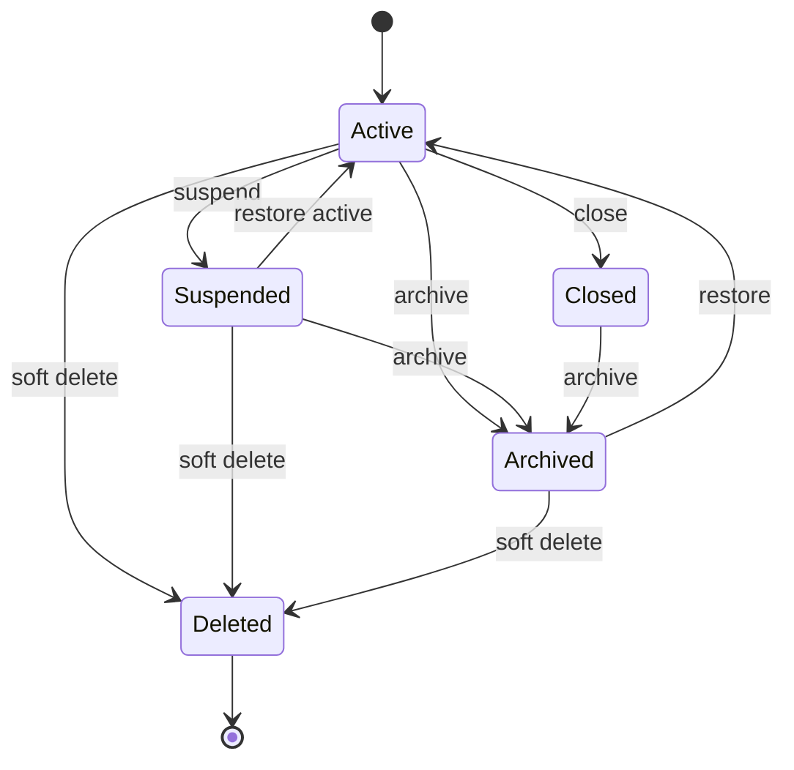
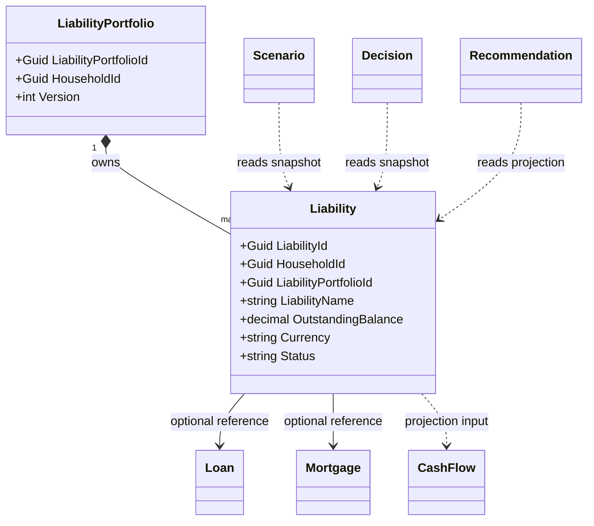
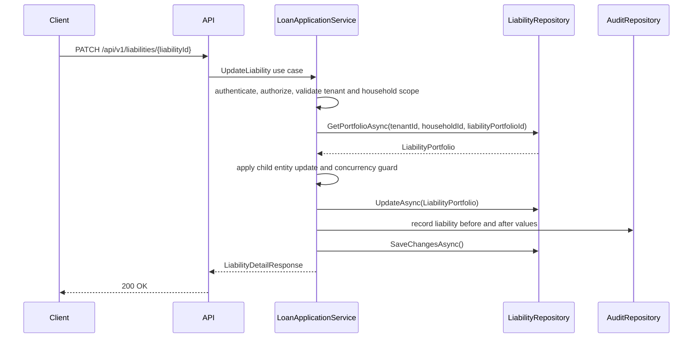
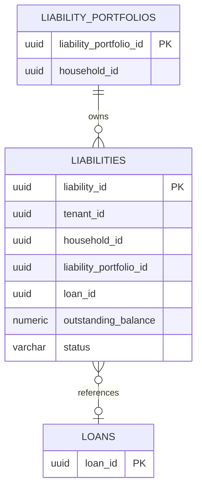
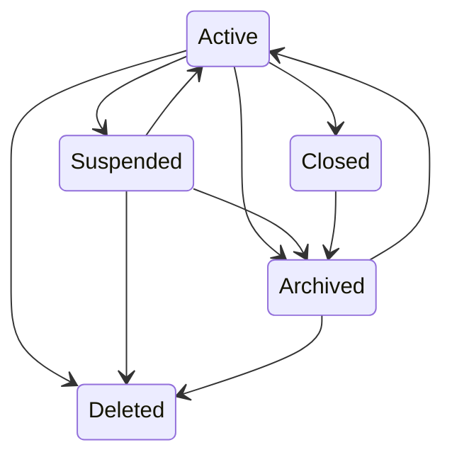

# Liability Entity Specification
## Split Navigation
- [Liability identity and lifecycle](liability/identity-and-lifecycle.md)
- [Liability API and persistence](liability/api-and-persistence.md)
- [Liability governance and testing](liability/governance-and-testing.md)
# Document Control
| Field | Value |
|---|---|
| Document Name | Liability Entity Specification |
| Document Path | knowledge/entity/Liability.md |
| Document Type | Enterprise Entity Specification |
| Version | 1.0.0 |
| Status | Approved for Implementation |
| Domain | Loan |
| Bounded Context | Loan |
| Aggregate | LiabilityPortfolio |
| Aggregate Root | LiabilityPortfolio |
| Owner | LiabilityPortfolio aggregate owner through LoanApplicationService |
| Source of Truth | Entity Catalog, Aggregate Catalog, Repository Catalog, Command Catalog, Domain Event Catalog |
| Last Updated | 2026-07-14 |
| Related Specifications | knowledge/entity-catalog.md; knowledge/aggregate-catalog.md; knowledge/domain-model-catalog.md; knowledge/bounded-context-catalog.md; knowledge/value-object-catalog.md; knowledge/enumeration-catalog.md; knowledge/command-catalog.md; knowledge/domain-event-catalog.md; knowledge/repository-catalog.md; knowledge/domain-service-catalog.md; knowledge/application-service-catalog.md; knowledge/service-catalog.md; knowledge/financial-formula-catalog.md; knowledge/calculation-engine-framework.md; knowledge/projection-engine-framework.md; knowledge/financial-ratio-framework.md; knowledge/cashflow.md; knowledge/loan.md; knowledge/mortgage.md; knowledge/assumptions.md; knowledge/permission-framework.md; knowledge/tenant-framework.md; knowledge/audit-framework.md; knowledge/api-governance-framework.md; knowledge/message-contract-catalog.md; knowledge/entity/User.md; knowledge/entity/Household.md; knowledge/entity/Asset.md; knowledge/entity/Loan.md; knowledge/entity/Mortgage.md; knowledge/entity/CashFlow.md; knowledge/entity/Income.md; knowledge/entity/Expense.md; knowledge/entity/Goal.md; knowledge/entity/Scenario.md; knowledge/entity/Decision.md; knowledge/entity/Recommendation.md; knowledge/entity/Notification.md; docs/specification/04-DomainModel.md; docs/specification/04A-DomainInventory.md; docs/database/05-DatabaseDesign.md; docs/database/06-ERD.md; docs/api/07-API.md; docs/08-CashFlowEngine.md; docs/specification/08A-CashFlowEngine-Architecture.md; docs/specification/08B-CashFlowEngine-Formula.md; docs/specification/08C-CashFlowEngine-DecisionRules.md; docs/api/08D-CashFlowEngine-API.md; docs/specification/08E-CashFlowEngine-Testing.md |
| Change Policy | Preserve Catalog names, LiabilityPortfolio ownership, Loan boundaries, and source-of-truth rules; mark Catalog gaps without creating Domain Concepts. |
# Catalog Alignment Summary
| Concern | Source Catalog | Catalog Result | Final Atlas Name | Defined Here or Referenced | Implementation Artifact | Status | Notes |
|---|---|---|---|---|---|---|---|
| Domain | entity-catalog.md | Liability belongs to Loan domain. | Loan | Referenced | Namespace/module | Catalog-aligned | No new domain |
| Bounded Context | entity-catalog.md | Bounded Context is Loan. | Loan | Referenced | API/service boundary | Catalog-aligned | Same as Catalog |
| Aggregate | entity-catalog.md; aggregate-catalog.md | Liability is in LiabilityPortfolio. | LiabilityPortfolio | Referenced | Aggregate class | Catalog-aligned | Liability is not root |
| Aggregate Root | aggregate-catalog.md | Root is LiabilityPortfolio. | LiabilityPortfolio | Referenced | Root entity | Catalog-aligned | Liability is child entity |
| Entity | entity-catalog.md | Entity Name is Liability. | Liability | Referenced | LiabilityEntity | Catalog-aligned | Primary key LiabilityId |
| Child Entity | aggregate-catalog.md | Liability is owned by LiabilityPortfolio. | Liability | Referenced | liabilities table | Catalog-aligned | Composition inside aggregate |
| Value Object | entity-catalog.md | Money, InterestRate; CurrencyCode where cataloged. | Money; InterestRate; CurrencyCode | Referenced | Amount and rate columns | Catalog-aligned | Amounts are not interchangeable |
| Enumeration | enumeration-catalog.md | Liability-specific enumerations not confirmed. | None | Referenced | text columns with checks | Catalog Gap | Text values are implementation details |
| Liability Type | enumeration-catalog.md | LiabilityType not confirmed. | LiabilityType value | Implementation Detail | liability_type | Catalog Gap | Not formal Enumeration |
| Repayment Type | enumeration-catalog.md | RepaymentType not confirmed. | RepaymentType value | Implementation Detail | repayment_type | Catalog Gap | Not formal Enumeration |
| Interest Rate Type | enumeration-catalog.md | InterestRateType not confirmed for Liability. | InterestRateType value | Implementation Detail | interest_rate_type | Catalog Gap | Not formal Enumeration |
| Secured Status | enumeration-catalog.md | SecuredStatus not confirmed. | SecuredStatus value | Implementation Detail | secured_status | Catalog Gap | Not formal Enumeration |
| Delinquency Status | enumeration-catalog.md | DelinquencyStatus not confirmed. | DelinquencyStatus value | Implementation Detail | delinquency_status | Catalog Gap | Not formal Enumeration |
| Command | command-catalog.md | None listed for LiabilityPortfolio. Loan commands exist for Loan. | None for LiabilityPortfolio | Referenced | API use cases only | Catalog-aligned | Do not create liability commands |
| Domain Event | domain-event-catalog.md | None listed for LiabilityPortfolio. Loan events exist for Loan. | None for LiabilityPortfolio | Referenced | Audit only | Catalog-aligned | Do not publish liability events |
| Repository | entity-catalog.md | LiabilityRepository. | LiabilityRepository | Referenced | Repository interface | Catalog-aligned | No business logic |
| Domain Service | entity-catalog.md | LoanService, RiskService. | LoanService; RiskService | Referenced | Service calls | Catalog-aligned | Services compute outside entity |
| Application Service | entity-catalog.md | LoanApplicationService. | LoanApplicationService | Referenced | Use case layer | Catalog-aligned | Orchestrates cross-aggregate work |
| API Resource | entity-catalog.md | /api/v1/liabilities. | /api/v1/liabilities | Referenced | REST controller | Catalog-aligned | Household scoped |
| DTO | API governance | DTO is contract, not Domain Concept. | Liability DTOs | Implementation Detail | Request/response schemas | Implementation Detail | Names map to properties |
| Permission | entity-catalog.md | Liability:Read appears in API mapping. | Liability:Read and resource-action mappings | Referenced | Policy attributes | Catalog-aligned where present | Mutating permissions are API mapping |
| Database Table | entity-catalog.md | liabilities. | liabilities | Referenced | PostgreSQL table | Catalog-aligned | Owned by LiabilityPortfolio |
| Read Model | API governance | Summary projections are not source of truth. | Liability summary projection | Implementation Detail | Cache/materialized view | Implementation Detail | Read-only |
| Cache | entity-catalog.md | liability summary cache. | liability summary cache | Referenced | Cache keys | Catalog-aligned | Scoped by TenantId and HouseholdId |
| Audit | entity-catalog.md | Liability changes audited through LiabilityPortfolio. | Liability audit | Referenced | AuditRepository entries | Catalog-aligned | Complete audit required |
| Tenant Boundary | tenant guidance | TenantId is distinct from HouseholdId. | TenantId | Referenced | tenant_id | Catalog-aligned | Household is not Tenant |
# Entity Overview
## Purpose
Liability represents a financial obligation or debt borne by a User or Household that requires future payment performance.
In Atlas, Liability contributes to debt burden, cash flow pressure, risk capacity, scenario inputs, decision inputs, and household financial profile understanding.
Liability is not the Aggregate Root. Liability is owned by LiabilityPortfolio, and LiabilityPortfolio owns the transaction boundary for grouped liability summary state.
## Responsibilities
| Responsibility | Description | Boundary |
|---|---|---|
| Liability identity | Maintains LiabilityId and business display fields. | Liability child entity |
| LiabilityPortfolio membership | Belongs to exactly one LiabilityPortfolio. | LiabilityPortfolio aggregate |
| Household scope | Carries HouseholdId for authorization and search. | Household isolation |
| Liability classification | Stores implementation detail type and category values. | Liability data only |
| Balance snapshot | Stores current outstanding balance as source data. | LiabilityPortfolio consistency |
| Principal reference | Stores original principal when applicable. | Liability data |
| Interest reference | Stores nominal interest metadata, not calculation history. | Liability data |
| Payment reference | Stores scheduled and minimum payment inputs, not amortization schedule. | Liability data |
| Secured reference | Stores collateral reference id when applicable. | Reference only |
| Summary support | Provides liability data to Scenario and Decision. | Projection input |
| Audit support | Captures mutation history through LiabilityPortfolio. | Audit boundary |
| Concurrency support | Uses LiabilityPortfolio concurrency strategy. | Aggregate root |
## Non-Responsibilities
| Non-Responsibility | Owning Concept |
|---|---|
| Loan lifecycle | Loan aggregate |
| Mortgage lifecycle | Loan aggregate owns Mortgage where represented |
| PaymentSchedule ownership | Loan aggregate or implementation outside LiabilityPortfolio |
| Installment generation | LoanService or calculation implementation |
| Interest amortization | LoanService and calculation engine |
| Cash flow forecasting | CashFlowService and Projection Engine |
| Scenario simulation | Scenario aggregate and ScenarioService |
| Decision scoring | DecisionSession and DecisionService |
| Recommendation generation | RecommendationService |
| External loan servicing truth | External integration plus verified import process |
| Market rate sourcing | Market data integration |
| Authorization decisions | Application Service |
## Business Meaning
Liability is the household-scoped representation of debt or financial obligation used for planning.
Loan is the aggregate that owns loan and mortgage lifecycle, loan payment behavior, refinance, closure, amortization, and payment events.
Mortgage is owned by Loan when mortgage is represented as a loan subtype.
CashFlow records payment effects and projected liquidity pressure; Liability does not own CashFlow.
Asset may be collateral by reference only. Liability does not mutate Asset value or lifecycle.
Goal, Scenario, Decision, and Recommendation consume liability data through references, projections, services, or Application Service orchestration.
## Aggregate Root
Liability is not an Aggregate Root.
Aggregate Catalog defines LiabilityPortfolio as Aggregate and Aggregate Root. Liability is a child entity owned by LiabilityPortfolio.
## Aggregate Boundary
| Boundary Concern | Rule |
|---|---|
| Consistency boundary | Liability summary and grouped liability references inside LiabilityPortfolio. |
| Transaction boundary | One LiabilityPortfolio mutation. |
| Child entity ownership | Liability is composed inside LiabilityPortfolio. |
| External aggregate references | Household, Loan, Mortgage, Asset, Goal, Scenario, Decision, Recommendation, CashFlow are identity references only. |
| Allowed in-transaction mutations | Liability identity, type value, balance snapshot, payment input fields, lifecycle metadata, audit metadata. |
| Prohibited cross-aggregate mutations | Loan payments, Mortgage lifecycle, Asset valuation, Goal state, Scenario outputs, Decision scores, Recommendation state, CashFlow records. |
| Repository ownership | LiabilityRepository persists LiabilityPortfolio and Liability records without business logic. |
| Event ownership | No LiabilityPortfolio events are cataloged; Loan events remain owned by Loan. |
| Concurrency boundary | LiabilityPortfolio version and token protect Liability changes. |
| Audit boundary | Liability changes are audited through LiabilityPortfolio. |
## Lifecycle
| Stage | Meaning | Status Handling | Catalog Position |
|---|---|---|---|
| Active | Liability is open and included in debt burden. | status = Active | Implementation Detail |
| Suspended | Liability is temporarily excluded from ordinary updates but retained. | status = Suspended | Implementation Detail |
| Closed | Liability balance is zero or obligation is ended. | status = Closed | Implementation Detail |
| Archived | Liability is retained read-only for history. | status = Archived | Implementation Detail |
| Deleted | Liability is soft-deleted from normal reads. | status = Deleted | Implementation Detail |
## Ownership
| Ownership Concern | Rule |
|---|---|
| Aggregate owner | LiabilityPortfolio owns Liability. |
| Household owner | Household scope is referenced for authorization. |
| User owner | User is actor or member reference, not Liability owner. |
| Tenant owner | TenantId scopes storage and access. |
| Loan reference | Loan may be referenced but is not mutated. |
| Mortgage reference | Mortgage may be referenced through Loan when cataloged. |
| CashFlow reference | Payment cash flow is external. |
| Orphan prevention | Liability must have LiabilityPortfolioId and HouseholdId. |
| Archive behavior | Archived Liability remains available for audit and historical projections. |
## Relationships
| Related Concept | Cardinality | Ownership Type | Aggregate Boundary | Navigation Direction | Required | Cascade Behavior | Delete Behavior | Authorization Impact | Audit Impact |
|---|---:|---|---|---|---|---|---|---|---|
| LiabilityPortfolio | Many liabilities to one portfolio | Composition | Same aggregate | Liability to LiabilityPortfolio | Required | Aggregate-internal | Parent controls lifecycle | Portfolio household scope | Changes audited through portfolio |
| Household | Many liabilities to one household scope | Reference | Separate aggregate | Liability stores HouseholdId | Required | No cascade | Block cross-boundary cascade | Household authorization required | HouseholdId in audit |
| User | Actor reference | Reference | Separate aggregate | CreatedBy and UpdatedBy | Required for writes | No cascade | User deletion does not delete liability | Actor permissions checked | Actor captured |
| Loan | Optional liability to loan | Reference | Separate aggregate | LoanId reference | Optional | No cascade | Loan lifecycle separate | Loan access requires household scope | Loan reference change audited |
| Mortgage | Optional through Loan | Reference | Loan aggregate | MortgageId reference when mapped | Optional | No cascade | Mortgage lifecycle separate | Household scope through Loan | Reference audited |
| CashFlow | Payment effects external | Reference | Separate use case | Projection only | Optional | No cascade | CashFlow lifecycle separate | Household scope required | Payment effects audited elsewhere |
| Expense | Payments may appear as expenses | Reference | Cash flow boundary | Read projection only | Optional | No cascade | Expense lifecycle separate | Household scope required | Expense audit separate |
| Asset | Optional collateral | Reference | AssetPortfolio aggregate | CollateralAssetId reference | Optional | No cascade | Asset lifecycle separate | Household scope through AssetPortfolio | Reference audited |
| Goal | Planning use | Reference | GoalPlan aggregate | Projection only | Optional | No cascade | Goal lifecycle separate | Household scope required | Goal audit separate |
| Scenario | Simulation input | Reference | Scenario aggregate | Scenario reads liability snapshot | Optional | No cascade | Scenario lifecycle separate | Household scope required | Scenario input trace |
| Decision | Decision input | Reference | DecisionSession aggregate | Decision reads liability projection | Optional | No cascade | Decision lifecycle separate | Household scope required | Decision trace |
| Recommendation | Recommendation input | Reference | Recommendation aggregate | Recommendation reads projection | Optional | No cascade | Recommendation lifecycle separate | Household scope required | Recommendation trace |
| Notification | Reminder output | Reference | Notification aggregate | Notification references LiabilityId when needed | Optional | No cascade | Notification lifecycle separate | Household scope required | Delivery audit separate |
| Audit | Many audit rows per liability | Reference | Audit storage | Audit stores LiabilityId | Required for writes | No cascade | Retained after delete | Security review | Complete trace |
## Navigation
| Navigation Type | Allowed Navigation | Rule |
|---|---|---|
| Owned navigation | Liability inside LiabilityPortfolio | Aggregate-internal only |
| Aggregate reference | HouseholdId, LoanId, MortgageId, CollateralAssetId | Identifier only |
| Read-only projection | Liability summary, dashboard debt metrics, scenario input | Cannot write aggregate |
| Collection navigation | LiabilityPortfolio to liabilities | Same aggregate |
| Identity reference | TenantId, CreatedBy, UpdatedBy, ArchivedBy, DeletedBy | Stored as IDs |
| API expansion | include=loan, include=summary, include=audit | Read-only expansion |
| Prohibited navigation | Mutable object graph to Loan, Mortgage, CashFlow, Asset, Goal, Scenario, Decision, Recommendation | Not allowed |
# Complete Properties
## Property Matrix
| Name | Type | Nullable | Default | Database Mapping | JSON Name | API Usage | Searchable | Sortable | Indexed | Encrypted | Auditable |
|---|---|---:|---|---|---|---|---:|---:|---:|---:|---:|
| LiabilityId | UUID | No | generated | liability_id uuid pk | liabilityId | route, response | Yes | Yes | Yes | No | Yes |
| TenantId | UUID | No | context | tenant_id uuid | tenantId | internal, response | Yes | Yes | Yes | No | Yes |
| HouseholdId | UUID | No | none | household_id uuid | householdId | create, response | Yes | Yes | Yes | No | Yes |
| LiabilityPortfolioId | UUID | No | none | liability_portfolio_id uuid | liabilityPortfolioId | create, response | Yes | Yes | Yes | No | Yes |
| LoanId | UUID | Yes | null | loan_id uuid | loanId | create, update, response | Yes | Yes | Yes | No | Yes |
| MortgageId | UUID | Yes | null | mortgage_id uuid | mortgageId | create, update, response | Yes | Yes | Yes | No | Yes |
| CollateralAssetId | UUID | Yes | null | collateral_asset_id uuid | collateralAssetId | create, update, response | Yes | No | Yes | No | Yes |
| LiabilityNumber | string(40) | No | generated | liability_number varchar(40) | liabilityNumber | response | Yes | Yes | Yes | No | Yes |
| LiabilityName | string(160) | No | none | liability_name varchar(160) | liabilityName | create, update, response | Yes | Yes | Yes | No | Yes |
| Description | string(1000) | Yes | null | description varchar(1000) | description | create, update, response | Yes | No | No | No | Yes |
| LiabilityType | string(40) | No | Unspecified | liability_type varchar(40) | liabilityType | create, update, response | Yes | Yes | Yes | No | Yes |
| RepaymentType | string(40) | Yes | null | repayment_type varchar(40) | repaymentType | create, update, response | Yes | No | No | No | Yes |
| InterestRateType | string(40) | Yes | null | interest_rate_type varchar(40) | interestRateType | create, update, response | Yes | No | No | No | Yes |
| SecuredStatus | string(40) | No | Unsecured | secured_status varchar(40) | securedStatus | create, update, response | Yes | Yes | Yes | No | Yes |
| DelinquencyStatus | string(40) | No | Current | delinquency_status varchar(40) | delinquencyStatus | create, update, response | Yes | Yes | Yes | No | Yes |
| Currency | string(3) | No | portfolio currency | currency char(3) | currency | create, update, response | Yes | Yes | Yes | No | Yes |
| OriginalPrincipal | decimal(19,4) | Yes | null | original_principal numeric(19,4) | originalPrincipal | create, update, response | Yes | Yes | No | No | Yes |
| OutstandingBalance | decimal(19,4) | No | 0 | outstanding_balance numeric(19,4) | outstandingBalance | create, update, response | Yes | Yes | Yes | No | Yes |
| AccruedInterest | decimal(19,4) | No | 0 | accrued_interest numeric(19,4) | accruedInterest | create, update, response | Yes | Yes | No | No | Yes |
| PayoffAmount | decimal(19,4) | Yes | null | payoff_amount numeric(19,4) | payoffAmount | response, import | Yes | Yes | No | No | Yes |
| ScheduledPayment | decimal(19,4) | Yes | null | scheduled_payment numeric(19,4) | scheduledPayment | create, update, response | Yes | Yes | No | No | Yes |
| MinimumPayment | decimal(19,4) | Yes | null | minimum_payment numeric(19,4) | minimumPayment | create, update, response | Yes | Yes | No | No | Yes |
| TotalCost | decimal(19,4) | Yes | null | total_cost numeric(19,4) | totalCost | response, import | Yes | Yes | No | No | Yes |
| InterestRate | decimal(9,6) | Yes | null | interest_rate numeric(9,6) | interestRate | create, update, response | Yes | Yes | No | No | Yes |
| PaymentFrequency | string(40) | Yes | null | payment_frequency varchar(40) | paymentFrequency | create, update, response | Yes | No | No | No | Yes |
| NextPaymentDate | date | Yes | null | next_payment_date date | nextPaymentDate | create, update, response | Yes | Yes | Yes | No | Yes |
| MaturityDate | date | Yes | null | maturity_date date | maturityDate | create, update, response | Yes | Yes | Yes | No | Yes |
| Status | string(20) | No | Active | status varchar(20) | status | response, lifecycle | Yes | Yes | Yes | No | Yes |
| IsArchived | boolean | No | false | is_archived boolean | isArchived | response | Yes | Yes | Yes | No | Yes |
| ArchivedAt | timestamptz | Yes | null | archived_at timestamptz | archivedAt | response | Yes | Yes | Yes | No | Yes |
| ArchivedBy | UUID | Yes | null | archived_by uuid | archivedBy | response | Yes | No | No | No | Yes |
| DeletedAt | timestamptz | Yes | null | deleted_at timestamptz | deletedAt | response | Yes | Yes | Yes | No | Yes |
| DeletedBy | UUID | Yes | null | deleted_by uuid | deletedBy | response | Yes | No | No | No | Yes |
| CreatedAt | timestamptz | No | now | created_at timestamptz | createdAt | response | Yes | Yes | Yes | No | Yes |
| CreatedBy | UUID | No | actor | created_by uuid | createdBy | response | Yes | No | No | No | Yes |
| UpdatedAt | timestamptz | No | now | updated_at timestamptz | updatedAt | response | Yes | Yes | Yes | No | Yes |
| UpdatedBy | UUID | No | actor | updated_by uuid | updatedBy | response | Yes | No | No | No | Yes |
| Version | integer | No | 1 | version integer | version | response, concurrency | Yes | Yes | Yes | No | Yes |
| ConcurrencyToken | UUID | No | generated | concurrency_token uuid | concurrencyToken | response, If-Match | No | No | Yes | No | Yes |
## Property Details
| Name | Description | Validation | Business Meaning | Example | Security Notes |
|---|---|---|---|---|---|
| LiabilityId | Stable technical identity. | Required UUID; immutable. | Identifies one liability inside portfolio. | 55f9c0d1-87fb-45e9-a100-000000000001 | Audited, not encrypted. |
| TenantId | Tenant isolation key. | Required; trusted context only. | Prevents cross-tenant access. | 55f9c0d1-87fb-45e9-a100-000000000002 | Always authorization input. |
| HouseholdId | Household authorization scope. | Required; same tenant. | Connects liability to household planning. | 55f9c0d1-87fb-45e9-a100-000000000003 | Audited. |
| LiabilityPortfolioId | Aggregate root id. | Required; same tenant and household. | Places Liability inside LiabilityPortfolio. | 55f9c0d1-87fb-45e9-a100-000000000004 | Audited. |
| LoanId | Optional Loan reference. | Nullable; must not cross tenant or household. | Connects summary liability to Loan lifecycle. | 55f9c0d1-87fb-45e9-a100-000000000005 | Reference only. |
| MortgageId | Optional Mortgage reference. | Nullable; valid only when backed by Loan mapping. | Connects liability to property-backed debt. | 55f9c0d1-87fb-45e9-a100-000000000006 | Reference only. |
| CollateralAssetId | Optional collateral reference. | Nullable; Asset must be authorized. | Marks secured debt collateral. | 55f9c0d1-87fb-45e9-a100-000000000007 | Does not mutate Asset. |
| LiabilityNumber | Human-safe unique number. | Required; unique per tenant. | Operational lookup. | LB-2026-000001 | Audited. |
| LiabilityName | Display name. | Required; 1-160 chars. | Business identity. | Home Equity Line | May be sensitive. |
| Description | Optional note. | Max 1000; sanitized. | Context without calculation authority. | HELOC for renovation. | Mask in logs. |
| LiabilityType | Type value. | Required; max 40. | Classification for search and reports. | CreditLine | Implementation Detail. |
| RepaymentType | Repayment style value. | Nullable; max 40. | Payment behavior hint. | InterestOnly | Not calculation source. |
| InterestRateType | Rate type value. | Nullable; max 40. | Fixed or variable hint. | Variable | Not formal enum. |
| SecuredStatus | Secured value. | Required; max 40. | Indicates collateral status. | Secured | Not formal enum. |
| DelinquencyStatus | Delinquency value. | Required; max 40. | Currentness indicator. | Current | Not formal enum. |
| Currency | ISO currency code. | Required; uppercase length 3. | Currency of liability amounts. | USD | Not encrypted. |
| OriginalPrincipal | Original debt principal. | Nullable; >= 0. | Starting principal, not current balance. | 250000.0000 | Audited. |
| OutstandingBalance | Current outstanding obligation. | Required; >= 0 unless closed exception is catalog-approved. | Current debt burden. | 175000.0000 | Audited. |
| AccruedInterest | Interest accrued but unpaid. | Required; >= 0. | Separate from principal and payoff. | 300.0000 | Audited. |
| PayoffAmount | Amount required to settle. | Nullable; >= outstanding balance when present. | External or calculated payoff snapshot. | 175450.0000 | Not source for amortization. |
| ScheduledPayment | Scheduled payment amount. | Nullable; >= 0. | Expected recurring payment input. | 1850.0000 | Audited. |
| MinimumPayment | Minimum required payment. | Nullable; >= 0. | Minimum payment pressure. | 250.0000 | Audited. |
| TotalCost | Total cost snapshot. | Nullable; >= 0. | Derived or imported total cost, not balance. | 310000.0000 | Source flagged by audit. |
| InterestRate | Nominal rate. | Nullable; >= 0 and <= 1. | Rate metadata for service inputs. | 0.067500 | Not full rate history. |
| PaymentFrequency | Frequency value. | Nullable; max 40. | Payment cadence. | Monthly | Implementation Detail. |
| NextPaymentDate | Next due date. | Nullable; valid date. | Payment timing input. | 2026-08-01 | Audited. |
| MaturityDate | Final expected date. | Nullable; >= next payment date when both present. | Maturity planning input. | 2046-07-01 | Audited. |
| Status | Lifecycle status value. | Required; Active, Suspended, Closed, Archived, Deleted. | Write eligibility. | Active | Implementation Detail. |
| IsArchived | Archive shortcut. | Must match Archived status. | Fast filtering. | false | Audited. |
| ArchivedAt | Archive timestamp. | Required when Archived. | Historical lifecycle. | 2026-07-14T08:00:00Z | Audited. |
| ArchivedBy | Archive actor. | Required when Archived. | Accountability. | 55f9c0d1-87fb-45e9-a100-000000000008 | Audited. |
| DeletedAt | Soft delete timestamp. | Required when Deleted. | Normal read exclusion. | null | Audited. |
| DeletedBy | Delete actor. | Required when Deleted. | Accountability. | null | Audited. |
| CreatedAt | Creation timestamp. | Required; server generated. | Origin. | 2026-07-14T08:00:00Z | Audited. |
| CreatedBy | Creator id. | Required authorized actor. | Accountability. | 55f9c0d1-87fb-45e9-a100-000000000008 | Audited. |
| UpdatedAt | Last update timestamp. | Required; server generated. | Sync and audit. | 2026-07-14T08:30:00Z | Audited. |
| UpdatedBy | Last updater id. | Required authorized actor. | Accountability. | 55f9c0d1-87fb-45e9-a100-000000000008 | Audited. |
| Version | Aggregate version. | Required; >= 1. | Optimistic concurrency. | 4 | Audited. |
| ConcurrencyToken | Opaque token. | Required; changes on write. | Lost update protection. | 55f9c0d1-87fb-45e9-a100-000000000009 | Not business data. |
# Validation Rules
| Rule Id | Field | Validation | Error Code | Severity |
|---|---|---|---|---|
| LIA-VR-001 | LiabilityId | Required UUID and immutable. | LIABILITY_ID_INVALID | Critical |
| LIA-VR-002 | TenantId | Required and equals trusted tenant context. | TENANT_SCOPE_INVALID | Critical |
| LIA-VR-003 | HouseholdId | Required and authorized. | HOUSEHOLD_SCOPE_INVALID | Critical |
| LIA-VR-004 | LiabilityPortfolioId | Required and same household. | LIABILITY_PORTFOLIO_INVALID | Critical |
| LIA-VR-005 | LiabilityNumber | Required and unique per tenant. | LIABILITY_NUMBER_DUPLICATE | High |
| LIA-VR-006 | LiabilityName | Required, trimmed, max 160. | LIABILITY_NAME_INVALID | High |
| LIA-VR-007 | Description | Nullable, max 1000, sanitized. | LIABILITY_DESCRIPTION_INVALID | Medium |
| LIA-VR-008 | Currency | Required uppercase ISO 4217 code. | CURRENCY_INVALID | High |
| LIA-VR-009 | OriginalPrincipal | Null or >= 0. | ORIGINAL_PRINCIPAL_INVALID | High |
| LIA-VR-010 | OutstandingBalance | Required and >= 0. | OUTSTANDING_BALANCE_INVALID | Critical |
| LIA-VR-011 | AccruedInterest | Required and >= 0. | ACCRUED_INTEREST_INVALID | High |
| LIA-VR-012 | PayoffAmount | Null or >= 0 and not less than OutstandingBalance when asserted as payoff. | PAYOFF_AMOUNT_INVALID | High |
| LIA-VR-013 | ScheduledPayment | Null or >= 0. | SCHEDULED_PAYMENT_INVALID | High |
| LIA-VR-014 | MinimumPayment | Null or >= 0 and <= ScheduledPayment when both present. | MINIMUM_PAYMENT_INVALID | High |
| LIA-VR-015 | TotalCost | Null or >= 0. | TOTAL_COST_INVALID | Medium |
| LIA-VR-016 | InterestRate | Null or between 0 and 1. | INTEREST_RATE_INVALID | High |
| LIA-VR-017 | NextPaymentDate | Null or valid date. | NEXT_PAYMENT_DATE_INVALID | Medium |
| LIA-VR-018 | MaturityDate | Null or not before NextPaymentDate when both present. | MATURITY_DATE_INVALID | Medium |
| LIA-VR-019 | LoanId | Null or same tenant and household through Loan. | LOAN_REFERENCE_INVALID | Critical |
| LIA-VR-020 | MortgageId | Null or valid through referenced Loan. | MORTGAGE_REFERENCE_INVALID | High |
| LIA-VR-021 | CollateralAssetId | Null or authorized Asset reference. | COLLATERAL_ASSET_INVALID | High |
| LIA-VR-022 | Status | Active, Suspended, Closed, Archived, Deleted only. | LIABILITY_STATUS_INVALID | High |
| LIA-VR-023 | Closed state | Closed requires OutstandingBalance = 0 unless catalog-approved exception exists. | LIABILITY_CLOSE_INVALID | High |
| LIA-VR-024 | Archived state | Archived requires IsArchived true, ArchivedAt, ArchivedBy. | ARCHIVE_STATE_INVALID | High |
| LIA-VR-025 | Deleted state | Deleted requires DeletedAt and DeletedBy. | DELETE_STATE_INVALID | High |
| LIA-VR-026 | Concurrency | Version and ConcurrencyToken must match write request. | LIABILITY_CONCURRENCY_CONFLICT | Critical |
| LIA-VR-027 | Audit | Every write requires actor and correlation context. | AUDIT_CONTEXT_REQUIRED | Critical |
| LIA-VR-028 | Read Model | Projection payload cannot be used as write source. | READ_MODEL_WRITE_REJECTED | High |
| LIA-VR-029 | Repository | Repository cannot calculate amortization or interest. | REPOSITORY_LOGIC_FORBIDDEN | High |
| LIA-VR-030 | Cross Aggregate | Liability cannot mutate Loan, Mortgage, CashFlow, Asset, Goal, Scenario, Decision, or Recommendation. | CROSS_AGGREGATE_MUTATION_FORBIDDEN | Critical |
# Business Rules
| Rule Id | Rule | Enforcement |
|---|---|---|
| LIA-BR-001 | Liability must belong to one LiabilityPortfolio. | Aggregate and DB constraint |
| LIA-BR-002 | Liability must belong to one Household scope. | Application Service and DB constraint |
| LIA-BR-003 | Liability must belong to one TenantId. | Application Service and DB constraint |
| LIA-BR-004 | Liability is not an Aggregate Root. | Catalog alignment |
| LIA-BR-005 | LiabilityPortfolio owns Liability lifecycle. | Aggregate boundary |
| LIA-BR-006 | LiabilityRepository contains no business logic. | Code review and tests |
| LIA-BR-007 | OutstandingBalance is current debt burden. | Validation |
| LIA-BR-008 | OriginalPrincipal is starting principal and must not replace balance. | DTO mapping |
| LIA-BR-009 | AccruedInterest is separate from principal. | Validation |
| LIA-BR-010 | PayoffAmount is settlement amount and must not replace balance. | Service mapping |
| LIA-BR-011 | ScheduledPayment and MinimumPayment are separate payment inputs. | DTO validation |
| LIA-BR-012 | TotalCost is total cost snapshot and must not replace payoff. | Mapping tests |
| LIA-BR-013 | Liability does not calculate amortization. | Service boundary |
| LIA-BR-014 | Liability does not calculate interest accrual. | Service boundary |
| LIA-BR-015 | Liability does not forecast CashFlow. | Service boundary |
| LIA-BR-016 | External statement data must be imported through validated Application Service. | Integration boundary |
| LIA-BR-017 | Archived Liability is read-only except restore. | State guard |
| LIA-BR-018 | Deleted Liability is soft-deleted and excluded from normal reads. | Repository filter |
| LIA-BR-019 | Audit trail is complete for every write. | Audit policy |
| LIA-BR-020 | Version history is retained. | Audit and versioning |
# Aggregate Invariants
| Invariant | Description |
|---|---|
| Portfolio ownership | LiabilityPortfolioId is required and immutable after creation except approved migration. |
| Household isolation | HouseholdId and TenantId must match LiabilityPortfolio scope. |
| Non-negative balance | OutstandingBalance cannot be negative. |
| Currency consistency | Currency is required and uppercase. |
| Amount separation | Principal, balance, interest, payoff, payment, and total cost fields remain distinct. |
| Closed consistency | Closed Liability has no positive outstanding balance. |
| Archive consistency | Archived state has archive actor and timestamp. |
| Delete consistency | Deleted state has delete actor and timestamp. |
| Concurrency | Version increments and ConcurrencyToken changes on every write. |
| Cross-boundary safety | Liability never mutates Loan, Mortgage, CashFlow, Asset, Goal, Scenario, Decision, or Recommendation. |
# State Machine
| State | Transition | Trigger | Invariant | Illegal Transition |
|---|---|---|---|---|
| Active | Active to Suspended | Suspend liability API use case | Not deleted; authorized actor | Active to Deleted without soft-delete audit |
| Active | Active to Closed | Close liability API use case | OutstandingBalance = 0 | Active to Closed with balance > 0 |
| Active | Active to Archived | Archive liability API use case | ArchivedAt and ArchivedBy set | Active to Archived without version check |
| Active | Active to Deleted | Delete liability API use case | DeletedAt and DeletedBy set | Hard delete |
| Suspended | Suspended to Active | Restore active use case | Not archived or deleted | Suspended to Closed with positive balance |
| Suspended | Suspended to Archived | Archive liability API use case | ArchivedAt and ArchivedBy set | Suspended ordinary update after archive |
| Closed | Closed to Archived | Archive liability API use case | Balance remains zero | Closed to Active without approved correction |
| Archived | Archived to Active | Restore liability API use case | Archived fields cleared | Archived ordinary update |
| Archived | Archived to Deleted | Delete liability API use case | DeletedAt and DeletedBy set | Archived to Suspended |
| Deleted | None | Normal API has no restore | DeletedAt and DeletedBy retained | Deleted to Active |

# Commands
| Command or Use Case | Catalog Status | Handler Boundary | Repository | Events | Notes |
|---|---|---|---|---|---|
| CreateLiability | Catalog Gap | LoanApplicationService | LiabilityRepository | No formal Liability event | API use case only |
| UpdateLiability | Catalog Gap | LoanApplicationService | LiabilityRepository | No formal Liability event | API use case only |
| ArchiveLiability | Catalog Gap | LoanApplicationService | LiabilityRepository | No formal Liability event | API use case only |
| RestoreLiability | Catalog Gap | LoanApplicationService | LiabilityRepository | No formal Liability event | API use case only |
| DeleteLiability | Catalog Gap | LoanApplicationService | LiabilityRepository | No formal Liability event | Soft delete use case |
| CloseLiability | Catalog Gap | LoanApplicationService | LiabilityRepository | No formal Liability event | Must not close Loan |
| CreateLoan | Catalog Command for Loan | LoanApplicationService | LoanRepository | LoanCreated | Not LiabilityPortfolio command |
| RecordLoanPayment | Catalog Command for Loan | LoanApplicationService | LoanRepository | LoanPaymentMade | Payment state belongs to Loan |
| RefinanceLoan | Catalog Command for Loan | LoanApplicationService | LoanRepository | LoanRefinanced | Refinance belongs to Loan |
# Domain Events
| Event | Catalog Status | Producer | Consumer | Liability Impact |
|---|---|---|---|---|
| LoanCreated | Catalog Event for Loan | LoanApplicationService | Scenario, Decision | Liability may reference Loan summary after orchestration |
| LoanPaymentMade | Catalog Event for Loan | LoanApplicationService | CashFlow, Decision | Liability summary may be refreshed by projection |
| LoanRefinanced | Catalog Event for Loan | LoanApplicationService | Scenario, Decision | Liability references may be updated by application workflow |
| LoanClosed | Catalog Event for Loan | LoanApplicationService | Scenario, Decision | Liability may close only through approved LiabilityPortfolio update |
| LiabilityCreated | Catalog Gap | None | None | Do not publish as Domain Event |
| LiabilityUpdated | Catalog Gap | None | None | Use audit log |
| LiabilityArchived | Catalog Gap | None | None | Use audit log |
| LiabilityDeleted | Catalog Gap | None | None | Use audit log |
# Repository
## Interface
```csharp
public interface ILiabilityRepository
{
    Task<LiabilityPortfolio?> GetPortfolioAsync(Guid tenantId, Guid householdId, Guid liabilityPortfolioId, CancellationToken cancellationToken);
    Task<Liability?> GetByIdAsync(Guid tenantId, Guid householdId, Guid liabilityId, CancellationToken cancellationToken);
    Task<Liability?> GetByNumberAsync(Guid tenantId, string liabilityNumber, CancellationToken cancellationToken);
    Task<bool> ExistsAsync(Guid tenantId, Guid householdId, Guid liabilityId, CancellationToken cancellationToken);
    Task<bool> ExistsNumberAsync(Guid tenantId, string liabilityNumber, CancellationToken cancellationToken);
    Task<PagedResult<Liability>> ListPagedAsync(LiabilitySearchSpecification specification, CancellationToken cancellationToken);
    Task AddAsync(LiabilityPortfolio portfolio, CancellationToken cancellationToken);
    Task UpdateAsync(LiabilityPortfolio portfolio, CancellationToken cancellationToken);
    Task SaveChangesAsync(CancellationToken cancellationToken);
}
```
## Methods
| Method | Purpose | Business Logic Allowed |
|---|---|---|
| GetPortfolioAsync | Load root aggregate. | No |
| GetByIdAsync | Load one liability projection within tenant and household. | No |
| GetByNumberAsync | Operational lookup. | No |
| ExistsAsync | Existence check. | No |
| ExistsNumberAsync | Uniqueness pre-check. | No |
| ListPagedAsync | Specification search. | No |
| AddAsync | Add aggregate root. | No |
| UpdateAsync | Persist aggregate root. | No |
| SaveChangesAsync | Commit unit of work. | No |
## Query Methods
| Query | Filters | Sorts | Index Used |
|---|---|---|---|
| Search liabilities | tenantId, householdId, portfolioId, status, liabilityType, delinquencyStatus | liabilityName, outstandingBalance, nextPaymentDate, updatedAt | tenant-household-status indexes |
| Loan-linked liabilities | tenantId, loanId | updatedAt | loan index |
| Secured liabilities | tenantId, householdId, securedStatus | outstandingBalance | secured index |
| Archived liabilities | tenantId, isArchived | archivedAt | archive index |
## Specification Pattern
Specifications describe persistence filters only. They must not calculate interest, amortization, payoff, risk, delinquency, authorization, or recommendations.
# Domain Service Interaction
| Service | Catalog Status | Liability Interaction |
|---|---|---|
| LoanService | Catalog-aligned | Calculates loan balance, payment, refinance, payoff, and validation outputs using LoanRepository and LiabilityRepository as allowed. |
| RiskService | Catalog-aligned | Consumes liability summary for risk capacity and debt burden. |
| CashFlowService | Catalog-aligned | Consumes payment-related outputs through Loan and CashFlow use cases; does not mutate Liability directly. |
| ScenarioService | Catalog-aligned | Reads liability projection for scenario inputs. |
| DecisionService | Catalog-aligned | Reads liability data through authorized context. |
| RecommendationService | Catalog-aligned | Uses liability projection to generate recommendations outside Liability. |
| Projection Engine | Catalog-aligned capability | Builds read models; not write model. |
| Calculation Engine | Catalog-aligned capability | Computes formulas outside entity and repository. |
| Audit Service | Referenced capability | Records audit trail. |
# Application Service Interaction
| Application Service | Catalog Status | Liability Responsibility |
|---|---|---|
| LoanApplicationService | Catalog-aligned | Main handler for Liability API use cases and Loan command orchestration. |
| DashboardApplicationService | Catalog-aligned | Reads household debt summary projections. |
| ScenarioApplicationService | Catalog-aligned where present | Uses liability snapshots as scenario inputs. |
| DecisionApplicationService | Catalog-aligned where present | Uses liability snapshots for decision workflows. |
| RecommendationApplicationService | Catalog-aligned where present | Reads projections to prepare recommendations. |
| ReportApplicationService | Catalog-aligned | Debt reports and explainability. |
| AdministrationApplicationService | Catalog-aligned | Audit, import review, and operational queries. |
# API
## REST Endpoints
| Method | Path | Use Case | Permission | Status Codes |
|---|---|---|---|---|
| POST | /api/v1/liabilities | Create liability | Liability:Create | 201, 400, 401, 403, 409, 422 |
| GET | /api/v1/liabilities/{liabilityId} | Get detail | Liability:Read | 200, 401, 403, 404 |
| PATCH | /api/v1/liabilities/{liabilityId} | Update liability | Liability:Update | 200, 400, 401, 403, 404, 409, 422 |
| POST | /api/v1/liabilities/{liabilityId}/archive | Archive liability | Liability:Archive | 200, 401, 403, 404, 409, 422 |
| POST | /api/v1/liabilities/{liabilityId}/restore | Restore liability | Liability:Restore | 200, 401, 403, 404, 409, 422 |
| POST | /api/v1/liabilities/{liabilityId}/close | Close liability | Liability:Update | 200, 401, 403, 404, 409, 422 |
| DELETE | /api/v1/liabilities/{liabilityId} | Soft delete liability | Liability:Delete | 204, 401, 403, 404, 409, 422 |
| GET | /api/v1/liabilities | Search liabilities | Liability:Read | 200, 400, 401, 403 |
| GET | /api/v1/liabilities/{liabilityId}/audit | Audit query | Liability:Read | 200, 401, 403, 404 |
## Response
Responses include requestId, correlationId, tenantId, householdId, liabilityId, version, and concurrencyToken where applicable.
## Error
| HTTP | Error Code | Meaning |
|---:|---|---|
| 400 | LIABILITY_REQUEST_INVALID | Request shape invalid. |
| 401 | AUTHENTICATION_REQUIRED | Actor is not authenticated. |
| 403 | LIABILITY_ACCESS_DENIED | Actor lacks household access. |
| 404 | LIABILITY_NOT_FOUND | Liability not found in tenant and household scope. |
| 409 | LIABILITY_CONCURRENCY_CONFLICT | Version or token mismatch. |
| 409 | LIABILITY_NUMBER_DUPLICATE | LiabilityNumber already exists. |
| 422 | LIABILITY_RULE_VIOLATION | Aggregate invariant failed. |
# DTO
## Create DTO
```json
{
  "householdId": "55f9c0d1-87fb-45e9-a100-000000000003",
  "liabilityPortfolioId": "55f9c0d1-87fb-45e9-a100-000000000004",
  "liabilityName": "Home Equity Line",
  "description": "HELOC for renovation",
  "liabilityType": "CreditLine",
  "repaymentType": "InterestOnly",
  "interestRateType": "Variable",
  "securedStatus": "Secured",
  "delinquencyStatus": "Current",
  "currency": "USD",
  "originalPrincipal": 100000.0000,
  "outstandingBalance": 42500.0000,
  "accruedInterest": 120.0000,
  "scheduledPayment": 650.0000,
  "minimumPayment": 250.0000,
  "interestRate": 0.067500,
  "paymentFrequency": "Monthly",
  "nextPaymentDate": "2026-08-01",
  "maturityDate": "2036-07-01"
}
```
## Update DTO
```json
{
  "liabilityName": "Home Equity Line",
  "description": "Updated servicing statement",
  "outstandingBalance": 42100.0000,
  "accruedInterest": 85.0000,
  "payoffAmount": 42210.0000,
  "scheduledPayment": 650.0000,
  "minimumPayment": 250.0000,
  "nextPaymentDate": "2026-09-01",
  "concurrencyToken": "55f9c0d1-87fb-45e9-a100-000000000009"
}
```
## Detail DTO
```json
{
  "liabilityId": "55f9c0d1-87fb-45e9-a100-000000000001",
  "tenantId": "55f9c0d1-87fb-45e9-a100-000000000002",
  "householdId": "55f9c0d1-87fb-45e9-a100-000000000003",
  "liabilityPortfolioId": "55f9c0d1-87fb-45e9-a100-000000000004",
  "liabilityNumber": "LB-2026-000001",
  "liabilityName": "Home Equity Line",
  "liabilityType": "CreditLine",
  "currency": "USD",
  "outstandingBalance": 42100.0000,
  "accruedInterest": 85.0000,
  "payoffAmount": 42210.0000,
  "status": "Active",
  "version": 4,
  "concurrencyToken": "65f9c0d1-87fb-45e9-a100-000000000010"
}
```
## Summary DTO
```json
{
  "liabilityId": "55f9c0d1-87fb-45e9-a100-000000000001",
  "liabilityNumber": "LB-2026-000001",
  "liabilityName": "Home Equity Line",
  "liabilityType": "CreditLine",
  "currency": "USD",
  "outstandingBalance": 42100.0000,
  "minimumPayment": 250.0000,
  "delinquencyStatus": "Current"
}
```
## Search DTO
```json
{
  "householdId": "55f9c0d1-87fb-45e9-a100-000000000003",
  "liabilityType": "CreditLine",
  "status": "Active",
  "page": 1,
  "pageSize": 25,
  "sort": "outstandingBalance"
}
```
## Close DTO
```json
{
  "reason": "Liability paid off",
  "outstandingBalance": 0.0000,
  "concurrencyToken": "65f9c0d1-87fb-45e9-a100-000000000010"
}
```
# Database Mapping
| Column | Type | Nullable | Constraint |
|---|---|---:|---|
| liability_id | uuid | No | Primary key |
| tenant_id | uuid | No | Tenant scoped |
| household_id | uuid | No | Household scoped |
| liability_portfolio_id | uuid | No | Aggregate root reference |
| loan_id | uuid | Yes | Loan reference |
| mortgage_id | uuid | Yes | Mortgage reference |
| collateral_asset_id | uuid | Yes | Asset reference |
| liability_number | varchar(40) | No | Unique with tenant_id |
| liability_name | varchar(160) | No | Non-empty |
| description | varchar(1000) | Yes | Sanitized |
| liability_type | varchar(40) | No | Implementation value |
| repayment_type | varchar(40) | Yes | Implementation value |
| interest_rate_type | varchar(40) | Yes | Implementation value |
| secured_status | varchar(40) | No | Implementation value |
| delinquency_status | varchar(40) | No | Implementation value |
| currency | char(3) | No | Uppercase |
| original_principal | numeric(19,4) | Yes | >= 0 |
| outstanding_balance | numeric(19,4) | No | >= 0 |
| accrued_interest | numeric(19,4) | No | >= 0 |
| payoff_amount | numeric(19,4) | Yes | >= 0 |
| scheduled_payment | numeric(19,4) | Yes | >= 0 |
| minimum_payment | numeric(19,4) | Yes | >= 0 |
| total_cost | numeric(19,4) | Yes | >= 0 |
| interest_rate | numeric(9,6) | Yes | 0 to 1 |
| payment_frequency | varchar(40) | Yes | Implementation value |
| next_payment_date | date | Yes | Valid date |
| maturity_date | date | Yes | Valid date |
| status | varchar(20) | No | Lifecycle check |
| is_archived | boolean | No | Archive shortcut |
| archived_at | timestamptz | Yes | Archive timestamp |
| archived_by | uuid | Yes | Archive actor |
| deleted_at | timestamptz | Yes | Soft delete timestamp |
| deleted_by | uuid | Yes | Delete actor |
| created_at | timestamptz | No | Created timestamp |
| created_by | uuid | No | Creator |
| updated_at | timestamptz | No | Updated timestamp |
| updated_by | uuid | No | Updater |
| version | integer | No | Concurrency |
| concurrency_token | uuid | No | Concurrency |
# PostgreSQL Schema
```sql
CREATE SCHEMA IF NOT EXISTS atlas;
CREATE TABLE IF NOT EXISTS atlas.liabilities (
    liability_id uuid PRIMARY KEY,
    tenant_id uuid NOT NULL,
    household_id uuid NOT NULL,
    liability_portfolio_id uuid NOT NULL,
    loan_id uuid NULL,
    mortgage_id uuid NULL,
    collateral_asset_id uuid NULL,
    liability_number varchar(40) NOT NULL,
    liability_name varchar(160) NOT NULL,
    description varchar(1000) NULL,
    liability_type varchar(40) NOT NULL DEFAULT 'Unspecified',
    repayment_type varchar(40) NULL,
    interest_rate_type varchar(40) NULL,
    secured_status varchar(40) NOT NULL DEFAULT 'Unsecured',
    delinquency_status varchar(40) NOT NULL DEFAULT 'Current',
    currency char(3) NOT NULL,
    original_principal numeric(19,4) NULL,
    outstanding_balance numeric(19,4) NOT NULL DEFAULT 0,
    accrued_interest numeric(19,4) NOT NULL DEFAULT 0,
    payoff_amount numeric(19,4) NULL,
    scheduled_payment numeric(19,4) NULL,
    minimum_payment numeric(19,4) NULL,
    total_cost numeric(19,4) NULL,
    interest_rate numeric(9,6) NULL,
    payment_frequency varchar(40) NULL,
    next_payment_date date NULL,
    maturity_date date NULL,
    status varchar(20) NOT NULL DEFAULT 'Active',
    is_archived boolean NOT NULL DEFAULT false,
    archived_at timestamptz NULL,
    archived_by uuid NULL,
    deleted_at timestamptz NULL,
    deleted_by uuid NULL,
    created_at timestamptz NOT NULL DEFAULT now(),
    created_by uuid NOT NULL,
    updated_at timestamptz NOT NULL DEFAULT now(),
    updated_by uuid NOT NULL,
    version integer NOT NULL DEFAULT 1,
    concurrency_token uuid NOT NULL,
    CONSTRAINT uq_liabilities_tenant_number UNIQUE (tenant_id, liability_number),
    CONSTRAINT ck_liabilities_name_not_blank CHECK (length(btrim(liability_name)) > 0),
    CONSTRAINT ck_liabilities_currency CHECK (currency = upper(currency) AND length(currency) = 3),
    CONSTRAINT ck_liabilities_status CHECK (status IN ('Active', 'Suspended', 'Closed', 'Archived', 'Deleted')),
    CONSTRAINT ck_liabilities_amounts_non_negative CHECK (
        coalesce(original_principal, 0) >= 0
        AND outstanding_balance >= 0
        AND accrued_interest >= 0
        AND coalesce(payoff_amount, 0) >= 0
        AND coalesce(scheduled_payment, 0) >= 0
        AND coalesce(minimum_payment, 0) >= 0
        AND coalesce(total_cost, 0) >= 0
    ),
    CONSTRAINT ck_liabilities_interest_rate CHECK (interest_rate IS NULL OR (interest_rate >= 0 AND interest_rate <= 1)),
    CONSTRAINT ck_liabilities_payment_order CHECK (minimum_payment IS NULL OR scheduled_payment IS NULL OR minimum_payment <= scheduled_payment),
    CONSTRAINT ck_liabilities_close_state CHECK (status <> 'Closed' OR outstanding_balance = 0),
    CONSTRAINT ck_liabilities_archive_state CHECK (
        (status = 'Archived' AND is_archived = true AND archived_at IS NOT NULL AND archived_by IS NOT NULL)
        OR (status <> 'Archived' AND is_archived = false)
    ),
    CONSTRAINT ck_liabilities_delete_state CHECK (
        (status = 'Deleted' AND deleted_at IS NOT NULL AND deleted_by IS NOT NULL)
        OR (status <> 'Deleted')
    ),
    CONSTRAINT ck_liabilities_version CHECK (version >= 1)
);
CREATE INDEX IF NOT EXISTS ix_liabilities_tenant_household ON atlas.liabilities (tenant_id, household_id);
CREATE INDEX IF NOT EXISTS ix_liabilities_portfolio ON atlas.liabilities (tenant_id, liability_portfolio_id);
CREATE INDEX IF NOT EXISTS ix_liabilities_loan ON atlas.liabilities (tenant_id, loan_id);
CREATE INDEX IF NOT EXISTS ix_liabilities_mortgage ON atlas.liabilities (tenant_id, mortgage_id);
CREATE INDEX IF NOT EXISTS ix_liabilities_status ON atlas.liabilities (tenant_id, household_id, status);
CREATE INDEX IF NOT EXISTS ix_liabilities_type ON atlas.liabilities (tenant_id, household_id, liability_type);
CREATE INDEX IF NOT EXISTS ix_liabilities_balance ON atlas.liabilities (tenant_id, household_id, outstanding_balance);
CREATE INDEX IF NOT EXISTS ix_liabilities_next_payment ON atlas.liabilities (tenant_id, household_id, next_payment_date);
CREATE INDEX IF NOT EXISTS ix_liabilities_archived ON atlas.liabilities (tenant_id, is_archived, archived_at);
CREATE INDEX IF NOT EXISTS ix_liabilities_deleted ON atlas.liabilities (tenant_id, deleted_at);
CREATE INDEX IF NOT EXISTS ix_liabilities_concurrency_token ON atlas.liabilities (concurrency_token);
```
# EF Core Mapping
```csharp
public sealed class LiabilityEntityConfiguration : IEntityTypeConfiguration<LiabilityEntity>
{
    public void Configure(EntityTypeBuilder<LiabilityEntity> builder)
    {
        builder.ToTable("liabilities", "atlas");
        builder.HasKey(x => x.LiabilityId);
        builder.Property(x => x.LiabilityId).HasColumnName("liability_id").ValueGeneratedNever();
        builder.Property(x => x.TenantId).HasColumnName("tenant_id").IsRequired();
        builder.Property(x => x.HouseholdId).HasColumnName("household_id").IsRequired();
        builder.Property(x => x.LiabilityPortfolioId).HasColumnName("liability_portfolio_id").IsRequired();
        builder.Property(x => x.LoanId).HasColumnName("loan_id");
        builder.Property(x => x.MortgageId).HasColumnName("mortgage_id");
        builder.Property(x => x.CollateralAssetId).HasColumnName("collateral_asset_id");
        builder.Property(x => x.LiabilityNumber).HasColumnName("liability_number").HasMaxLength(40).IsRequired();
        builder.Property(x => x.LiabilityName).HasColumnName("liability_name").HasMaxLength(160).IsRequired();
        builder.Property(x => x.Description).HasColumnName("description").HasMaxLength(1000);
        builder.Property(x => x.LiabilityType).HasColumnName("liability_type").HasMaxLength(40).HasDefaultValue("Unspecified").IsRequired();
        builder.Property(x => x.RepaymentType).HasColumnName("repayment_type").HasMaxLength(40);
        builder.Property(x => x.InterestRateType).HasColumnName("interest_rate_type").HasMaxLength(40);
        builder.Property(x => x.SecuredStatus).HasColumnName("secured_status").HasMaxLength(40).HasDefaultValue("Unsecured").IsRequired();
        builder.Property(x => x.DelinquencyStatus).HasColumnName("delinquency_status").HasMaxLength(40).HasDefaultValue("Current").IsRequired();
        builder.Property(x => x.Currency).HasColumnName("currency").HasMaxLength(3).IsFixedLength().IsRequired();
        builder.Property(x => x.OriginalPrincipal).HasColumnName("original_principal").HasPrecision(19, 4);
        builder.Property(x => x.OutstandingBalance).HasColumnName("outstanding_balance").HasPrecision(19, 4).HasDefaultValue(0).IsRequired();
        builder.Property(x => x.AccruedInterest).HasColumnName("accrued_interest").HasPrecision(19, 4).HasDefaultValue(0).IsRequired();
        builder.Property(x => x.PayoffAmount).HasColumnName("payoff_amount").HasPrecision(19, 4);
        builder.Property(x => x.ScheduledPayment).HasColumnName("scheduled_payment").HasPrecision(19, 4);
        builder.Property(x => x.MinimumPayment).HasColumnName("minimum_payment").HasPrecision(19, 4);
        builder.Property(x => x.TotalCost).HasColumnName("total_cost").HasPrecision(19, 4);
        builder.Property(x => x.InterestRate).HasColumnName("interest_rate").HasPrecision(9, 6);
        builder.Property(x => x.PaymentFrequency).HasColumnName("payment_frequency").HasMaxLength(40);
        builder.Property(x => x.NextPaymentDate).HasColumnName("next_payment_date");
        builder.Property(x => x.MaturityDate).HasColumnName("maturity_date");
        builder.Property(x => x.Status).HasColumnName("status").HasMaxLength(20).HasDefaultValue("Active").IsRequired();
        builder.Property(x => x.IsArchived).HasColumnName("is_archived").HasDefaultValue(false).IsRequired();
        builder.Property(x => x.ArchivedAt).HasColumnName("archived_at");
        builder.Property(x => x.ArchivedBy).HasColumnName("archived_by");
        builder.Property(x => x.DeletedAt).HasColumnName("deleted_at");
        builder.Property(x => x.DeletedBy).HasColumnName("deleted_by");
        builder.Property(x => x.CreatedAt).HasColumnName("created_at").HasDefaultValueSql("now()").IsRequired();
        builder.Property(x => x.CreatedBy).HasColumnName("created_by").IsRequired();
        builder.Property(x => x.UpdatedAt).HasColumnName("updated_at").HasDefaultValueSql("now()").IsRequired();
        builder.Property(x => x.UpdatedBy).HasColumnName("updated_by").IsRequired();
        builder.Property(x => x.Version).HasColumnName("version").HasDefaultValue(1).IsConcurrencyToken().IsRequired();
        builder.Property(x => x.ConcurrencyToken).HasColumnName("concurrency_token").IsConcurrencyToken().IsRequired();
        builder.HasIndex(x => new { x.TenantId, x.LiabilityNumber }).IsUnique().HasDatabaseName("uq_liabilities_tenant_number");
        builder.HasIndex(x => new { x.TenantId, x.HouseholdId }).HasDatabaseName("ix_liabilities_tenant_household");
        builder.HasIndex(x => new { x.TenantId, x.LiabilityPortfolioId }).HasDatabaseName("ix_liabilities_portfolio");
        builder.HasIndex(x => new { x.TenantId, x.LoanId }).HasDatabaseName("ix_liabilities_loan");
        builder.HasIndex(x => new { x.TenantId, x.MortgageId }).HasDatabaseName("ix_liabilities_mortgage");
        builder.HasIndex(x => new { x.TenantId, x.HouseholdId, x.Status }).HasDatabaseName("ix_liabilities_status");
        builder.HasIndex(x => new { x.TenantId, x.HouseholdId, x.LiabilityType }).HasDatabaseName("ix_liabilities_type");
        builder.HasIndex(x => new { x.TenantId, x.HouseholdId, x.OutstandingBalance }).HasDatabaseName("ix_liabilities_balance");
        builder.HasIndex(x => new { x.TenantId, x.HouseholdId, x.NextPaymentDate }).HasDatabaseName("ix_liabilities_next_payment");
        builder.HasIndex(x => new { x.TenantId, x.IsArchived, x.ArchivedAt }).HasDatabaseName("ix_liabilities_archived");
        builder.HasIndex(x => new { x.TenantId, x.DeletedAt }).HasDatabaseName("ix_liabilities_deleted");
        builder.HasIndex(x => x.ConcurrencyToken).HasDatabaseName("ix_liabilities_concurrency_token");
        builder.HasQueryFilter(x => x.DeletedAt == null);
    }
}
```
# Cache Strategy
| Cache | Key | Invalidation | Source of Truth |
|---|---|---|---|
| Liability detail | tenant:{tenantId}:household:{householdId}:liability:{liabilityId}:v{version} | Any LiabilityPortfolio write | LiabilityRepository |
| Liability summary | tenant:{tenantId}:household:{householdId}:liabilities:summary:{hash} | Liability write, Loan event, CashFlow event | Projection |
| Debt burden projection | tenant:{tenantId}:household:{householdId}:debt:{hash} | Liability, Loan, Scenario input change | Projection |
| Search cache | tenant:{tenantId}:liabilities:search:{hash} | Any Liability write in tenant | LiabilityRepository |
# Security
| Area | Rule |
|---|---|
| Authorization | Actor must have TenantId and HouseholdId access before repository access. |
| Permission | Liability:Read, Liability:Create, Liability:Update, Liability:Archive, Liability:Restore, Liability:Delete map to API use cases. |
| Data Masking | LiabilityName, Description, account-like references, amounts, and payment dates are masked in low-trust logs. |
| Encryption | Field encryption follows platform policy for sensitive imported debt data. |
| Tenant Isolation | TenantId from trusted context overrides body values. |
| Household Isolation | HouseholdId is mandatory on all reads and writes. |
| External Data | Imported statements require source trace and cannot overwrite aggregate facts without validation. |
# Audit
| Audit Requirement | Implementation |
|---|---|
| Write trace | Before and after values for every Liability field mutation. |
| Actor trace | CreatedBy, UpdatedBy, ArchivedBy, DeletedBy, subject, delegated actor. |
| Scope trace | TenantId, HouseholdId, LiabilityPortfolioId, LiabilityId. |
| Request trace | requestId, correlationId, causationId, idempotency key, client, source metadata. |
| Amount trace | All amount changes record old value, new value, currency, source, and reason. |
| External source trace | Imported statement data records provider, import id, and statement timestamp. |
| Version trace | Old and new Version and ConcurrencyToken. |
| Retention | Audit retained after archive and soft delete. |
# Observability
| Signal | Metric or Log |
|---|---|
| API latency | liability.api.duration |
| Repository latency | liability.repository.duration |
| Authorization failures | liability.authorization.denied.count |
| Concurrency conflicts | liability.concurrency.conflict.count |
| Cache hit ratio | liability.cache.hit_ratio |
| Balance updates | liability.balance.update.count |
| Archive operations | liability.archive.count |
| Soft deletes | liability.delete.count |
| Import rejections | liability.import.rejected.count |
# Performance
| Concern | Strategy |
|---|---|
| Index Strategy | Tenant-first and household-first indexes for every query path. |
| Caching | Cache detail by version and summaries by input hash. |
| Optimistic Concurrency | Version and ConcurrencyToken on every write. |
| Batch Calculation | Debt summaries and ratios computed in projection or service batches. |
| Partition Strategy | Partition by tenant_id for high-volume deployments. |
| Search | Use allowlisted filters and sorts only. |
| Soft Delete | Normal query filter excludes deleted records. |
# Example JSON
## Create
```json
{
  "householdId": "55f9c0d1-87fb-45e9-a100-000000000003",
  "liabilityPortfolioId": "55f9c0d1-87fb-45e9-a100-000000000004",
  "liabilityName": "Auto Loan",
  "liabilityType": "InstallmentLoan",
  "securedStatus": "Secured",
  "delinquencyStatus": "Current",
  "currency": "USD",
  "originalPrincipal": 32000.0000,
  "outstandingBalance": 24500.0000,
  "accruedInterest": 0.0000,
  "scheduledPayment": 575.0000,
  "minimumPayment": 575.0000,
  "interestRate": 0.052500,
  "paymentFrequency": "Monthly",
  "nextPaymentDate": "2026-08-15"
}
```
## Update
```json
{
  "outstandingBalance": 23925.0000,
  "accruedInterest": 0.0000,
  "nextPaymentDate": "2026-09-15",
  "concurrencyToken": "65f9c0d1-87fb-45e9-a100-000000000010"
}
```
## Close
```json
{
  "outstandingBalance": 0.0000,
  "reason": "Final payment posted",
  "concurrencyToken": "65f9c0d1-87fb-45e9-a100-000000000010"
}
```
## Detail
```json
{
  "liabilityId": "55f9c0d1-87fb-45e9-a100-000000000001",
  "liabilityNumber": "LB-2026-000001",
  "liabilityName": "Auto Loan",
  "currency": "USD",
  "outstandingBalance": 23925.0000,
  "minimumPayment": 575.0000,
  "status": "Active",
  "version": 5
}
```
## Search
```json
{
  "items": [
    {
      "liabilityId": "55f9c0d1-87fb-45e9-a100-000000000001",
      "liabilityName": "Auto Loan",
      "outstandingBalance": 23925.0000,
      "delinquencyStatus": "Current"
    }
  ],
  "page": 1,
  "pageSize": 25,
  "totalCount": 1
}
```
# Mermaid
## Class Diagram

## Sequence Diagram

## ER Diagram

## State Diagram

# Testing
| Test Type | Coverage |
|---|---|
| Unit Test | Liability creation requires TenantId, HouseholdId, LiabilityPortfolioId, LiabilityName, Currency, and OutstandingBalance. |
| Unit Test | OutstandingBalance cannot be negative. |
| Unit Test | OriginalPrincipal, AccruedInterest, PayoffAmount, ScheduledPayment, MinimumPayment, and TotalCost are distinct. |
| Unit Test | Closed Liability requires zero OutstandingBalance. |
| Unit Test | Archived Liability rejects ordinary update. |
| Unit Test | Deleted Liability rejects ordinary update. |
| Integration Test | POST creates row with unique tenant and liability number. |
| Integration Test | PATCH returns 409 on stale ConcurrencyToken. |
| Integration Test | GET excludes deleted liabilities. |
| Integration Test | Search filters by tenant, household, status, type, and balance. |
| Validation Test | Invalid currency, invalid rate, and invalid payment ordering are rejected. |
| Security Test | Cross-household access returns denied result. |
| Audit Test | Amount changes capture old and new values. |
| Performance Test | Balance search uses ix_liabilities_balance. |
| Performance Test | Next payment search uses ix_liabilities_next_payment. |
# Edge Cases
| Edge Case | Expected Handling |
|---|---|
| Duplicate LiabilityNumber in same tenant | Reject with LIABILITY_NUMBER_DUPLICATE. |
| Same LiabilityNumber in different tenant | Allow. |
| Missing LiabilityPortfolioId | Reject. |
| LiabilityPortfolio belongs to another household | Reject. |
| LoanId belongs to another household | Reject. |
| MortgageId not tied to LoanId | Reject. |
| CollateralAssetId belongs to another household | Reject. |
| Blank LiabilityName | Reject. |
| Invalid Currency | Reject. |
| OutstandingBalance negative | Reject. |
| AccruedInterest negative | Reject. |
| PayoffAmount lower than asserted balance | Reject when payoff source is authoritative. |
| MinimumPayment exceeds ScheduledPayment | Reject. |
| InterestRate greater than 1 | Reject. |
| MaturityDate before NextPaymentDate | Reject. |
| Close with positive balance | Reject. |
| Update archived liability | Reject. |
| Update deleted liability | Reject. |
| External import without source trace | Reject. |
| Read projection submitted as update | Reject. |
| Concurrent update and archive | One succeeds; other receives 409. |
| Search sort not allowlisted | Reject. |
| TenantId in body conflicts with token | Reject. |
| Dashboard metric differs from liability table | Treat table as source of truth and rebuild projection. |
| LoanPaymentMade event arrives twice | Projection must be idempotent. |
# Error Catalog
| Code | HTTP | Message |
|---|---:|---|
| LIABILITY_ID_INVALID | 400 | LiabilityId is invalid. |
| LIABILITY_NOT_FOUND | 404 | Liability was not found. |
| LIABILITY_ACCESS_DENIED | 403 | Actor cannot access Liability. |
| LIABILITY_NAME_INVALID | 422 | LiabilityName is invalid. |
| LIABILITY_NUMBER_DUPLICATE | 409 | LiabilityNumber already exists. |
| OUTSTANDING_BALANCE_INVALID | 422 | OutstandingBalance is invalid. |
| PAYOFF_AMOUNT_INVALID | 422 | PayoffAmount is invalid. |
| INTEREST_RATE_INVALID | 422 | InterestRate is invalid. |
| LIABILITY_CONCURRENCY_CONFLICT | 409 | Liability version conflict. |
| CROSS_AGGREGATE_MUTATION_FORBIDDEN | 422 | Cross-aggregate mutation is not allowed. |
# Data Migration
| Migration Step | Rule |
|---|---|
| Create table | Deploy atlas.liabilities with constraints and indexes. |
| Backfill tenant | Each row receives trusted TenantId. |
| Backfill household | Each row receives authorized HouseholdId. |
| Backfill portfolio | Each row maps to LiabilityPortfolioId. |
| Backfill number | Generate LiabilityNumber per tenant. |
| Backfill currency | Use verified currency source and persist uppercase code. |
| Backfill balance | OutstandingBalance must be non-negative. |
| Backfill status | Set open debts to Active and historical debts to Closed or Archived. |
| Backfill version | Set Version to 1. |
| Backfill token | Generate ConcurrencyToken for each row. |
| Validate references | Loan, Mortgage, and Asset references must match tenant and household. |
| Validate audit | Migration audit records source and transformation. |
# Consistency Verification
| Verification | Expected Result |
|---|---|
| Catalog names | Liability, LiabilityPortfolio, LiabilityRepository, LoanApplicationService retained. |
| Aggregate boundary | Liability is child entity; LiabilityPortfolio is root. |
| Loan boundary | Loan commands and events remain owned by Loan. |
| Mortgage boundary | Mortgage lifecycle remains owned by Loan. |
| CashFlow boundary | CashFlow is external and not owned by Liability. |
| Amount semantics | Balance, principal, interest, payoff, payment, and total cost are distinct. |
| Read model | Projections are read-only. |
| Repository | No calculations, authorization, or business policy. |
| Security | Tenant and Household isolation enforced before repository access. |
| Audit | Complete audit and version history required. |
# Final Consistency Matrix
| Concern | Source Catalog | Final Atlas Name | Defined Here or Referenced | Implementation Artifact | Status | Conflict | Resolution | Follow-up Catalog Change Required |
|---|---|---|---|---|---|---|---|---|
| Domain | entity-catalog.md | Loan | Referenced | Module namespace | Catalog-aligned | None | Use catalog name | No |
| Bounded Context | entity-catalog.md | Loan | Referenced | API/service boundary | Catalog-aligned | None | Use catalog name | No |
| Aggregate | aggregate-catalog.md | LiabilityPortfolio | Referenced | Aggregate root | Catalog-aligned | None | Use catalog name | No |
| Aggregate Root | aggregate-catalog.md | LiabilityPortfolio | Referenced | Root entity | Catalog-aligned | User may assume Liability root | Explicitly state Liability is not root | No |
| Entity | entity-catalog.md | Liability | Referenced | LiabilityEntity | Catalog-aligned | None | Use catalog name | No |
| Value Object | entity-catalog.md | Money; InterestRate | Referenced | Amount/rate columns | Catalog-aligned | None | Use catalog concepts | No |
| Liability Type | enumeration-catalog.md | LiabilityType value | Implementation Detail | liability_type | Catalog Gap | Not formal Enumeration | Store text value only | Optional catalog update |
| Repayment Type | enumeration-catalog.md | RepaymentType value | Implementation Detail | repayment_type | Catalog Gap | Not formal Enumeration | Store text value only | Optional catalog update |
| Interest Rate Type | enumeration-catalog.md | InterestRateType value | Implementation Detail | interest_rate_type | Catalog Gap | Not formal Enumeration | Store text value only | Optional catalog update |
| Secured Status | enumeration-catalog.md | SecuredStatus value | Implementation Detail | secured_status | Catalog Gap | Not formal Enumeration | Store text value only | Optional catalog update |
| Delinquency Status | enumeration-catalog.md | DelinquencyStatus value | Implementation Detail | delinquency_status | Catalog Gap | Not formal Enumeration | Store text value only | Optional catalog update |
| Command | command-catalog.md | None for LiabilityPortfolio | Referenced | API use cases | Catalog-aligned | CRUD commands absent | Do not declare Domain Commands | Optional catalog update |
| Domain Event | domain-event-catalog.md | None for LiabilityPortfolio | Referenced | Audit only | Catalog-aligned | Lifecycle events absent | Do not publish Domain Events | Optional catalog update |
| Repository | repository-catalog.md | LiabilityRepository | Referenced | Repository interface | Catalog-aligned | None | Use catalog name | No |
| Domain Service | domain-service-catalog.md | LoanService; RiskService | Referenced | Service calls | Catalog-aligned | None | Use catalog services | No |
| Application Service | application-service-catalog.md | LoanApplicationService | Referenced | Use case handlers | Catalog-aligned | None | Use catalog service | No |
| API | entity-catalog.md | /api/v1/liabilities | Referenced | Controller | Catalog-aligned | None | Use catalog resource | No |
| Permission | entity-catalog.md | Liability:Read and resource-action mappings | Referenced | Authorization policy | Catalog-aligned where present | Mutating permissions partially implicit | Treat as API permission mapping | Optional catalog update |
| Database | entity-catalog.md | liabilities | Referenced | PostgreSQL table | Catalog-aligned | None | Use table name | No |
| Read Model | API governance | Liability projection | Implementation Detail | Cache/materialized view | Implementation Detail | Dashboard metric could be mistaken for source | Projection read-only | No |
| Audit | audit guidance | Liability audit through LiabilityPortfolio | Referenced | AuditRepository | Catalog-aligned | None | Mandatory audit | No |
| Tenant | tenant guidance | TenantId | Referenced | tenant_id | Catalog-aligned | Household could be mistaken for Tenant | Keep distinct | No |
# Version History
| Version | Date | Author or Owner | Change | Reason | Compatibility Impact | Migration Requirement |
|---|---|---|---|---|---|---|
| 1.0.0 | 2026-07-14 | Atlas Knowledge Base | Initial Enterprise Specification for Liability. | Align Liability documentation with Catalog and implementation requirements. | Adds precise implementation contract without changing Domain model. | Create or align liabilities table, indexes, constraints, DTOs, API, EF mapping, cache, audit, and tests. |
