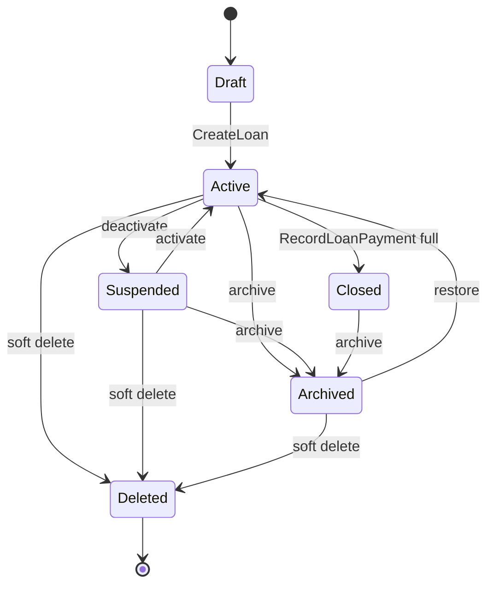
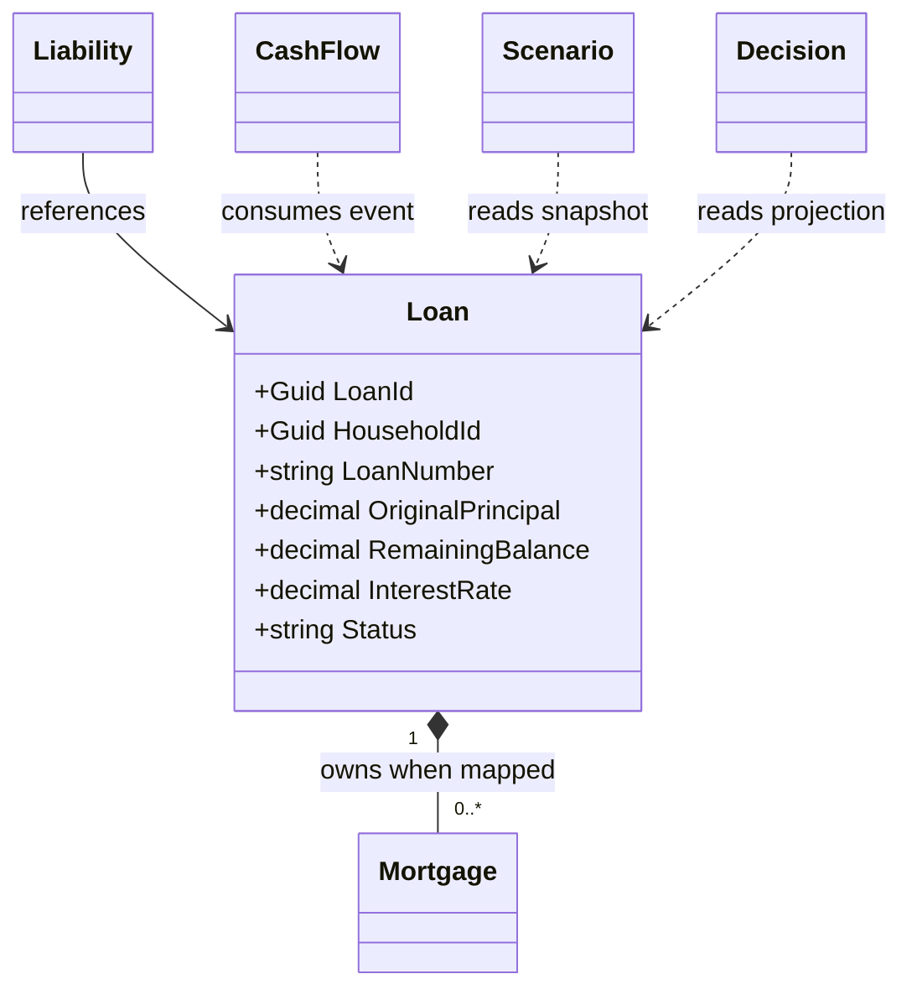
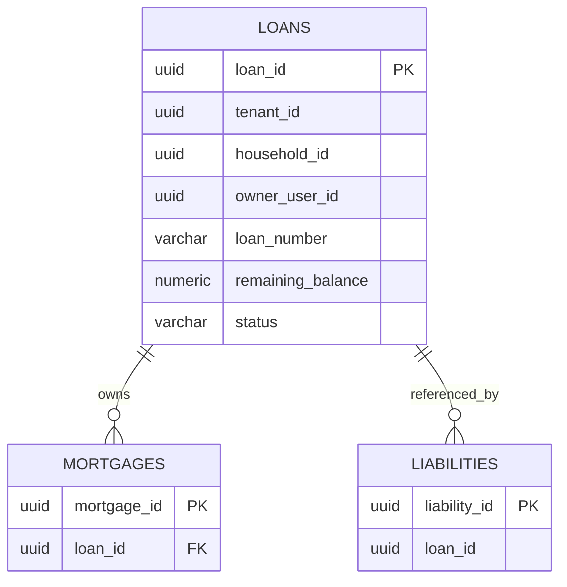
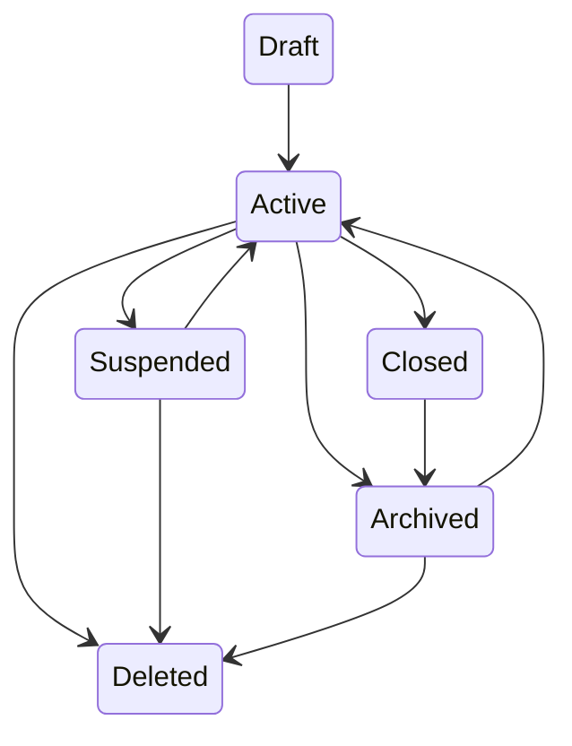
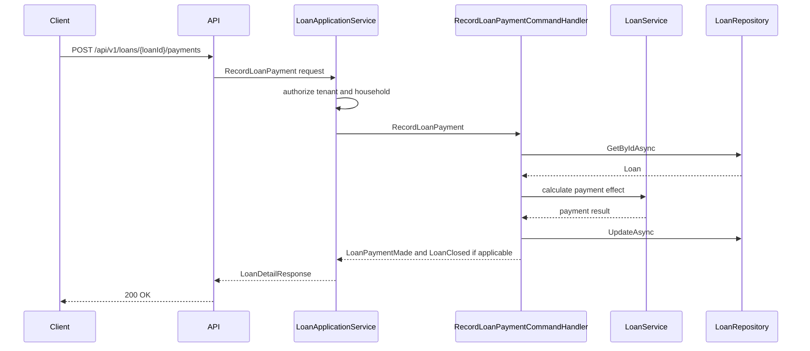
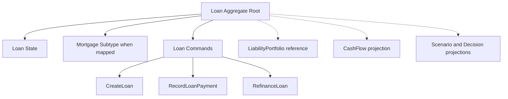

# Loan Entity Specification

## Split Navigation

- [Loan identity and repayment](loan/identity-and-repayment.md)
- [Loan risk and refinancing](loan/risk-and-refinancing.md)
- [Loan API and audit](loan/api-and-audit.md)
- [Loan scenario integration](loan/scenario-integration.md)

# Document Control
| Field | Value |
|---|---|
| Document Name | Loan Entity Specification |
| Document Path | knowledge/entity/Loan.md |
| Document Type | Enterprise Entity Specification |
| Version | 1.0.0 |
| Status | Approved for Implementation |
| Domain | Loan |
| Bounded Context | Loan |
| Aggregate | Loan |
| Aggregate Root | Loan |
| Owner | Loan aggregate owner through LoanApplicationService |
| Source of Truth | Entity Catalog, Aggregate Catalog, Command Catalog, Domain Event Catalog, Repository Catalog |
| Last Updated | 2026-07-14 |
| Related Specifications | knowledge/entity-catalog.md; knowledge/aggregate-catalog.md; knowledge/domain-model-catalog.md; knowledge/bounded-context-catalog.md; knowledge/value-object-catalog.md; knowledge/enumeration-catalog.md; knowledge/command-catalog.md; knowledge/domain-event-catalog.md; knowledge/repository-catalog.md; knowledge/domain-service-catalog.md; knowledge/application-service-catalog.md; knowledge/service-catalog.md; knowledge/loan.md; knowledge/mortgage.md; knowledge/taiwan-mortgage.md; knowledge/cashflow.md; knowledge/calculation-engine-framework.md; knowledge/financial-formula-catalog.md; knowledge/projection-engine-framework.md; knowledge/scenario-framework.md; knowledge/permission-framework.md; knowledge/tenant-framework.md; knowledge/audit-framework.md; knowledge/api-governance-framework.md; knowledge/message-contract-catalog.md; knowledge/entity/User.md; knowledge/entity/Household.md; knowledge/entity/Asset.md; knowledge/entity/Liability.md; knowledge/entity/Mortgage.md; knowledge/entity/CashFlow.md; knowledge/entity/Expense.md; knowledge/entity/Goal.md; knowledge/entity/Scenario.md; knowledge/entity/Decision.md; knowledge/entity/Recommendation.md; docs/specification/04-DomainModel.md; docs/specification/04A-DomainInventory.md; docs/database/05-DatabaseDesign.md; docs/database/06-ERD.md; docs/api/07-API.md; docs/08-CashFlowEngine.md; docs/specification/08A-CashFlowEngine-Architecture.md; docs/specification/08B-CashFlowEngine-Formula.md; docs/specification/08C-CashFlowEngine-DecisionRules.md; docs/api/08D-CashFlowEngine-API.md; docs/specification/08E-CashFlowEngine-Testing.md |
| Change Policy | Preserve Catalog names, Loan aggregate ownership, command/event mapping, and calculation boundaries; mark unsupported items as Implementation Detail or Catalog Gap. |
# Catalog Alignment Summary
| Concern | Source Catalog | Catalog Result | Final Atlas Name | Defined Here or Referenced | Implementation Artifact | Status | Notes |
|---|---|---|---|---|---|---|---|
| Domain | entity-catalog.md; aggregate-catalog.md | Loan belongs to Loan domain. | Loan | Referenced | Module namespace | Catalog-aligned | No new domain |
| Bounded Context | entity-catalog.md | Loan bounded context. | Loan | Referenced | API/service boundary | Catalog-aligned | Same as Catalog |
| Aggregate | aggregate-catalog.md | Aggregate Name is Loan. | Loan | Referenced | Aggregate class | Catalog-aligned | One Loan mutation per transaction |
| Aggregate Root | aggregate-catalog.md | Aggregate Root is Loan. | Loan | Referenced | Loan root | Catalog-aligned | Loan owns lifecycle |
| Entity | entity-catalog.md | Loan entity and Mortgage child/subtype. | Loan | Referenced | LoanEntity | Catalog-aligned | Mortgage owned by Loan where represented |
| Child Entity | aggregate-catalog.md | Mortgage may be owned by Loan. | Mortgage | Referenced | Mortgage table or subtype | Catalog-aligned | No Installment aggregate created |
| Value Object | entity-catalog.md | Money, Currency, InterestRate, LoanTerm, Percentage. | Money; Currency; InterestRate; LoanTerm; Percentage | Referenced | Amount, currency, rate, term columns | Catalog-aligned | Prefer Catalog VOs |
| Enumeration | entity-catalog.md | LoanType and CurrencyCode listed. | LoanType; CurrencyCode | Referenced | type and currency fields | Catalog-aligned | Other statuses are implementation values |
| Command | command-catalog.md | CreateLoan, RecordLoanPayment, RefinanceLoan. | CreateLoan; RecordLoanPayment; RefinanceLoan | Referenced | Command handlers | Catalog-aligned | Archive/restore are API use cases |
| Domain Event | domain-event-catalog.md | LoanCreated, LoanPaymentMade, LoanRefinanced, LoanClosed. | LoanCreated; LoanPaymentMade; LoanRefinanced; LoanClosed | Referenced | Event messages | Catalog-aligned | No extra loan events |
| Repository | repository-catalog.md | LoanRepository. | LoanRepository | Referenced | Repository interface | Catalog-aligned | No business logic |
| Domain Service | domain-service-catalog.md | LoanService. | LoanService | Referenced | Service calls | Catalog-aligned | Calculation outside repository |
| Application Service | application-service-catalog.md | LoanApplicationService. | LoanApplicationService | Referenced | Use case layer | Catalog-aligned | Orchestrates cross-aggregate workflows |
| API Resource | entity-catalog.md | /api/v1/loans. | /api/v1/loans | Referenced | REST controller | Catalog-aligned | Mortgage may map through loans |
| DTO | API governance | DTO is implementation contract. | Loan DTOs | Implementation Detail | Request/response schemas | Implementation Detail | Does not create Domain Concept |
| Permission | entity-catalog.md | Liability:Read shown for loan/mortgage API. | Liability:Read and resource-action mappings | Referenced | Authorization policies | Catalog-aligned where present | Mutating permissions are API mapping |
| Database Table | aggregate-catalog.md | loan tables and mortgage tables when mapped separately. | loans; mortgages | Referenced | PostgreSQL tables | Catalog-aligned | DDL uses loans with optional mortgage reference fields |
| Read Model | API governance | Projection is not source of truth. | Loan projection | Implementation Detail | Cache/materialized view | Implementation Detail | Read-only |
| Cache | aggregate-catalog.md | Loan amortization cache. | Loan amortization cache | Referenced | Cache keys | Catalog-aligned | Computed output cache only |
| Audit | aggregate-catalog.md | Loan creation, payment, refinance, close audited. | Loan audit | Referenced | AuditRepository entries | Catalog-aligned | Complete audit required |
| Tenant Boundary | tenant guidance | TenantId distinct from HouseholdId. | TenantId | Referenced | tenant_id | Catalog-aligned | Household is scope, not tenant |
# Entity Overview
## Purpose
Loan represents an obligation with rate, term, balance, payment behavior, and lifecycle.
Loan is the aggregate root for loan creation, payment, refinance, and closure.
Loan supplies authoritative loan state to LiabilityPortfolio summaries, CashFlow payment records, Scenario inputs, Decision inputs, and Mortgage-specific behavior when Mortgage is represented as a loan subtype.
## Responsibilities
| Responsibility | Description | Boundary |
|---|---|---|
| Loan identity | Maintains LoanId and LoanNumber. | Loan aggregate |
| Loan lifecycle | Owns active, suspended, closed, archived, and deleted implementation states. | Loan aggregate |
| Principal state | Stores original principal and outstanding principal. | Loan aggregate |
| Balance state | Stores remaining balance distinct from outstanding principal. | Loan aggregate |
| Interest metadata | Stores InterestRate, rate type values, margin, reference rate, reset metadata. | Loan aggregate |
| Term metadata | Stores LoanTerm, origination date, maturity date, remaining term. | Loan aggregate |
| Payment application | RecordLoanPayment reduces balance and emits catalog events. | Loan command |
| Refinance application | RefinanceLoan changes terms and emits LoanRefinanced. | Loan command |
| Mortgage ownership | Owns Mortgage where represented as subtype/entity inside Loan. | Loan aggregate |
| Household authorization scope | Carries HouseholdId for access and isolation. | Application Service and aggregate |
| Audit and versioning | Captures command history, audit trace, and concurrency. | Loan aggregate |
## Non-Responsibilities
| Non-Responsibility | Owning Concept |
|---|---|
| LiabilityPortfolio summary ownership | LiabilityPortfolio |
| General debt dashboard metrics | Projection and DashboardApplicationService |
| CashFlow forecasting | CashFlowService and Projection Engine |
| Scenario simulation | Scenario aggregate and ScenarioService |
| Recommendation generation | RecommendationService |
| Decision score generation | DecisionService |
| Optimization | LoanService plus optimization engine output, not aggregate state by itself |
| Asset valuation | AssetPortfolio or Property owner |
| External market rate truth | Market data integration |
| Repository calculations | Forbidden in LoanRepository |
## Business Meaning
Loan is the contractual debt obligation that Atlas can create, update through catalog commands, receive payments against, refinance, and close.
Liability may reference Loan when a broader liability summary is maintained by LiabilityPortfolio.
Mortgage is owned by Loan where mortgage is represented as a loan subtype.
CashFlow and Expense may reflect payments, but Loan does not own CashFlow or Expense.
Scenario, Decision, and Recommendation consume loan state through projections, services, or events.
## Aggregate Root
Loan is an Aggregate Root.
Aggregate Catalog defines Loan as Aggregate Name and Aggregate Root. Loan owns loan and mortgage lifecycle, balance, payment, refinance, and closure state.
# Aggregate Boundary
| Boundary Concern | Rule |
|---|---|
| Consistency boundary | Loan balance, payment, refinance, term, rate metadata, mortgage subtype state, and closure state. |
| Transaction boundary | One Loan mutation per transaction. |
| Child entity ownership | Mortgage is owned by Loan where mortgage is represented as loan subtype. |
| External aggregate references | Household, LiabilityPortfolio, Liability, Asset, CashFlow, Expense, Scenario, Decision, Recommendation are identity references or projections. |
| Allowed in-transaction mutations | Loan fields, mortgage subtype fields, payment application fields, refinance fields, closure fields, audit metadata. |
| Prohibited cross-aggregate mutations | Liability summary, Asset valuation, CashFlow records, Expense records, Scenario outputs, Decision scores, Recommendation state. |
| Repository ownership | LoanRepository persists Loan only. |
| Event ownership | Loan publishes only LoanCreated, LoanPaymentMade, LoanRefinanced, LoanClosed. |
| Concurrency boundary | Loan Version and ConcurrencyToken protect every mutation. |
| Audit boundary | Every command and API write records actor, tenant, household, loan, before/after, correlation, and causation. |
# Lifecycle
| Stage | Meaning | Status Handling | Catalog Position |
|---|---|---|---|
| Draft | Input prepared before catalog CreateLoan succeeds. | Not persisted as authoritative Loan unless implementation stores draft. | Implementation Detail |
| Active | Loan can receive payment and refinance commands. | status = Active | Implementation Detail |
| Suspended | Loan is blocked from ordinary payment until reactivated. | status = Suspended | Implementation Detail |
| Closed | Loan has no remaining balance and cannot receive payment. | status = Closed | Catalog invariant |
| Archived | Loan is retained read-only. | status = Archived | Implementation Detail |
| Deleted | Loan is soft-deleted from normal reads. | status = Deleted | Implementation Detail |
# Ownership
| Ownership Concern | Rule |
|---|---|
| Aggregate ownership | Loan owns Loan state and Mortgage subtype state. |
| Household ownership | HouseholdId scopes authorization; Household does not own Loan internals. |
| Tenant ownership | TenantId scopes persistence and API access. |
| Liability ownership | LiabilityPortfolio may consume loan summary; it does not own Loan. |
| Asset ownership | Asset is collateral by reference only. |
| CashFlow ownership | CashFlow records are external and generated through approved workflows. |
| User ownership | User is actor or borrower reference; User identity is external. |
| Orphan prevention | Loan requires TenantId, HouseholdId, and OwnerUserId or authorized actor reference. |
| Archived behavior | Archived Loan remains audit-readable and command-disabled. |
# Relationships
| Related Concept | Cardinality | Ownership Type | Aggregate Boundary | Navigation Direction | Required | Cascade Behavior | Delete Behavior | Authorization Impact | Audit Impact |
|---|---:|---|---|---|---|---|---|---|---|
| Household | Many loans to one scope | Reference | Separate aggregate | Loan stores HouseholdId | Required | No cascade | Delete blocked or soft reference retained | Household access required | HouseholdId in audit |
| User | Actor or borrower reference | Reference | Separate aggregate | OwnerUserId, CreatedBy, UpdatedBy | Required for writes | No cascade | User deletion does not delete loan | Actor checked | Actor captured |
| LiabilityPortfolio | Optional summary target | Reference | Separate aggregate | LiabilityPortfolio consumes Loan summary | Optional | No cascade | Portfolio lifecycle separate | Household scope required | Projection trace |
| Liability | Optional summary entity | Reference | Separate aggregate | Liability references LoanId | Optional | No cascade | Liability lifecycle separate | Household scope required | Reference audit |
| Mortgage | One to one or one to many where mapped | Composition | Same Loan aggregate | Loan owns Mortgage | Optional | Aggregate-internal | Loan lifecycle controls subtype | Household scope through Loan | Mortgage audit through Loan |
| Asset | Optional collateral reference | Reference | AssetPortfolio aggregate | CollateralAssetId | Optional | No cascade | Asset lifecycle separate | Asset access through household | Reference audited |
| CashFlow | Payment effect | Reference | Cash flow boundary | Payment events consumed | Optional | No cascade | CashFlow lifecycle separate | Household scope required | Event trace |
| Expense | Loan payment expense | Reference | Expense/CashFlow boundary | Projection only | Optional | No cascade | Expense lifecycle separate | Household scope required | Expense audit separate |
| Scenario | Simulation input | Reference | Scenario aggregate | Reads loan snapshot | Optional | No cascade | Scenario lifecycle separate | Household scope required | Snapshot trace |
| Decision | Decision input | Reference | DecisionSession aggregate | Reads loan projection | Optional | No cascade | Decision lifecycle separate | Household scope required | Decision trace |
| Recommendation | Recommendation input | Reference | Recommendation aggregate | Reads loan projection | Optional | No cascade | Recommendation lifecycle separate | Household scope required | Recommendation trace |
| Audit | Many records per loan | Reference | Audit storage | Audit stores LoanId | Required for writes | No cascade | Retained after soft delete | Security review | Complete trace |
# Navigation
| Navigation Type | Allowed Navigation | Rule |
|---|---|---|
| Owned navigation | Mortgage inside Loan when mapped. | Aggregate-internal only |
| Aggregate reference | HouseholdId, LiabilityPortfolioId, LiabilityId, CollateralAssetId. | Identifier only |
| Read-only projection | Loan amortization view, payoff projection, scenario loan snapshot. | Cannot write Loan |
| Collection navigation | Loan to mortgage subtype records when mapped. | Same aggregate |
| Identity reference | TenantId, OwnerUserId, CreatedBy, UpdatedBy, ArchivedBy, DeletedBy. | IDs only |
| API expansion | include=mortgage, include=summary, include=audit. | Read-only expansion |
| Prohibited navigation | Mutable object graph to LiabilityPortfolio, CashFlow, Expense, Asset, Scenario, Decision, Recommendation. | Not allowed |
# Complete Properties
## Property Matrix
| Name | Type | Nullable | Default | Database Mapping | JSON Name | API Usage | Searchable | Sortable | Indexed | Encrypted | Auditable |
|---|---|---:|---|---|---|---|---:|---:|---:|---:|---:|
| LoanId | UUID | No | generated | loan_id uuid pk | loanId | route, response | Yes | Yes | Yes | No | Yes |
| TenantId | UUID | No | context | tenant_id uuid | tenantId | internal, response | Yes | Yes | Yes | No | Yes |
| HouseholdId | UUID | No | none | household_id uuid | householdId | create, response | Yes | Yes | Yes | No | Yes |
| OwnerUserId | UUID | No | actor | owner_user_id uuid | ownerUserId | create, update, response | Yes | Yes | Yes | No | Yes |
| LiabilityId | UUID | Yes | null | liability_id uuid | liabilityId | create, update, response | Yes | Yes | Yes | No | Yes |
| CollateralAssetId | UUID | Yes | null | collateral_asset_id uuid | collateralAssetId | create, update, response | Yes | No | Yes | No | Yes |
| LoanNumber | string(40) | No | generated | loan_number varchar(40) | loanNumber | response | Yes | Yes | Yes | No | Yes |
| LoanName | string(160) | No | none | loan_name varchar(160) | loanName | create, update, response | Yes | Yes | Yes | No | Yes |
| Description | string(1000) | Yes | null | description varchar(1000) | description | create, update, response | Yes | No | No | No | Yes |
| LoanType | string(40) | No | Unspecified | loan_type varchar(40) | loanType | create, update, response | Yes | Yes | Yes | No | Yes |
| Currency | string(3) | No | household currency | currency char(3) | currency | create, response | Yes | Yes | Yes | No | Yes |
| OriginalPrincipal | decimal(19,4) | No | none | original_principal numeric(19,4) | originalPrincipal | create, response | Yes | Yes | No | No | Yes |
| OutstandingPrincipal | decimal(19,4) | No | OriginalPrincipal | outstanding_principal numeric(19,4) | outstandingPrincipal | response, payment | Yes | Yes | Yes | No | Yes |
| RemainingBalance | decimal(19,4) | No | OriginalPrincipal | remaining_balance numeric(19,4) | remainingBalance | response, payment | Yes | Yes | Yes | No | Yes |
| AccruedInterest | decimal(19,4) | No | 0 | accrued_interest numeric(19,4) | accruedInterest | response, payment | Yes | Yes | No | No | Yes |
| ScheduledPayment | decimal(19,4) | Yes | null | scheduled_payment numeric(19,4) | scheduledPayment | create, update, response | Yes | Yes | No | No | Yes |
| RemainingPayment | decimal(19,4) | Yes | null | remaining_payment numeric(19,4) | remainingPayment | response | Yes | Yes | No | No | Yes |
| EarlyPayoffAmount | decimal(19,4) | Yes | null | early_payoff_amount numeric(19,4) | earlyPayoffAmount | payoff response | Yes | Yes | No | No | Yes |
| TotalInterest | decimal(19,4) | No | 0 | total_interest numeric(19,4) | totalInterest | response | Yes | Yes | No | No | Yes |
| TotalRepayment | decimal(19,4) | No | 0 | total_repayment numeric(19,4) | totalRepayment | response | Yes | Yes | No | No | Yes |
| BaseCurrencyAmount | decimal(19,4) | Yes | null | base_currency_amount numeric(19,4) | baseCurrencyAmount | response | Yes | Yes | No | No | Yes |
| InterestRate | decimal(9,6) | No | none | interest_rate numeric(9,6) | interestRate | create, update, response | Yes | Yes | No | No | Yes |
| InterestRateType | string(40) | No | Fixed | interest_rate_type varchar(40) | interestRateType | create, update, response | Yes | Yes | Yes | No | Yes |
| MarginRate | decimal(9,6) | Yes | null | margin_rate numeric(9,6) | marginRate | create, update, response | Yes | Yes | No | No | Yes |
| ReferenceRate | decimal(9,6) | Yes | null | reference_rate numeric(9,6) | referenceRate | create, update, response | Yes | Yes | No | No | Yes |
| ResetFrequency | string(40) | Yes | null | reset_frequency varchar(40) | resetFrequency | create, update, response | Yes | No | No | No | Yes |
| GraceInterestRate | decimal(9,6) | Yes | null | grace_interest_rate numeric(9,6) | graceInterestRate | create, update, response | Yes | Yes | No | No | Yes |
| PenaltyInterestRate | decimal(9,6) | Yes | null | penalty_interest_rate numeric(9,6) | penaltyInterestRate | create, update, response | Yes | Yes | No | No | Yes |
| RateEffectiveDate | date | No | origination date | rate_effective_date date | rateEffectiveDate | create, update, response | Yes | Yes | Yes | No | Yes |
| LoanTermMonths | integer | No | none | loan_term_months integer | loanTermMonths | create, update, response | Yes | Yes | No | No | Yes |
| RemainingTermMonths | integer | No | LoanTermMonths | remaining_term_months integer | remainingTermMonths | response | Yes | Yes | No | No | Yes |
| RepaymentModel | string(40) | No | EqualPayment | repayment_model varchar(40) | repaymentModel | create, update, response | Yes | Yes | Yes | No | Yes |
| PaymentFrequency | string(40) | No | Monthly | payment_frequency varchar(40) | paymentFrequency | create, update, response | Yes | No | No | No | Yes |
| OriginationDate | date | No | none | origination_date date | originationDate | create, response | Yes | Yes | Yes | No | Yes |
| FirstPaymentDate | date | Yes | null | first_payment_date date | firstPaymentDate | create, update, response | Yes | Yes | No | No | Yes |
| NextPaymentDate | date | Yes | null | next_payment_date date | nextPaymentDate | response, payment | Yes | Yes | Yes | No | Yes |
| MaturityDate | date | No | calculated by service | maturity_date date | maturityDate | create, update, response | Yes | Yes | Yes | No | Yes |
| GracePeriodMonths | integer | No | 0 | grace_period_months integer | gracePeriodMonths | create, update, response | Yes | Yes | No | No | Yes |
| GracePeriodEndDate | date | Yes | null | grace_period_end_date date | gracePeriodEndDate | response | Yes | Yes | No | No | Yes |
| LastPaymentDate | date | Yes | null | last_payment_date date | lastPaymentDate | response | Yes | Yes | No | No | Yes |
| ClosedAt | timestamptz | Yes | null | closed_at timestamptz | closedAt | response | Yes | Yes | Yes | No | Yes |
| ClosedBy | UUID | Yes | null | closed_by uuid | closedBy | response | Yes | No | No | No | Yes |
| Status | string(20) | No | Active | status varchar(20) | status | response, lifecycle | Yes | Yes | Yes | No | Yes |
| IsArchived | boolean | No | false | is_archived boolean | isArchived | response | Yes | Yes | Yes | No | Yes |
| ArchivedAt | timestamptz | Yes | null | archived_at timestamptz | archivedAt | response | Yes | Yes | Yes | No | Yes |
| ArchivedBy | UUID | Yes | null | archived_by uuid | archivedBy | response | Yes | No | No | No | Yes |
| DeletedAt | timestamptz | Yes | null | deleted_at timestamptz | deletedAt | response | Yes | Yes | Yes | No | Yes |
| DeletedBy | UUID | Yes | null | deleted_by uuid | deletedBy | response | Yes | No | No | No | Yes |
| CreatedAt | timestamptz | No | now | created_at timestamptz | createdAt | response | Yes | Yes | Yes | No | Yes |
| CreatedBy | UUID | No | actor | created_by uuid | createdBy | response | Yes | No | No | No | Yes |
| UpdatedAt | timestamptz | No | now | updated_at timestamptz | updatedAt | response | Yes | Yes | Yes | No | Yes |
| UpdatedBy | UUID | No | actor | updated_by uuid | updatedBy | response | Yes | No | No | No | Yes |
| Version | integer | No | 1 | version integer | version | response, concurrency | Yes | Yes | Yes | No | Yes |
| ConcurrencyToken | UUID | No | generated | concurrency_token uuid | concurrencyToken | response, If-Match | No | No | Yes | No | Yes |
## Property Details
| Name | Description | Validation | Business Meaning | Example | Security Notes |
|---|---|---|---|---|---|
| LoanId | Stable technical identity. | Required UUID; immutable. | Identifies one Loan aggregate. | 0c9c36e1-5901-44c6-9000-000000000001 | Audited. |
| TenantId | Tenant isolation key. | Required; trusted context only. | Prevents cross-tenant loan access. | 0c9c36e1-5901-44c6-9000-000000000002 | Authorization input. |
| HouseholdId | Household scope. | Required; authorized. | Planning and access scope. | 0c9c36e1-5901-44c6-9000-000000000003 | Audited. |
| OwnerUserId | Owner or borrower reference. | Required same tenant and household access. | User-facing loan ownership semantics. | 0c9c36e1-5901-44c6-9000-000000000004 | Sensitive relationship data. |
| LiabilityId | Optional liability summary reference. | Nullable; same tenant and household. | Links to LiabilityPortfolio summary. | 0c9c36e1-5901-44c6-9000-000000000005 | Reference only. |
| CollateralAssetId | Optional collateral asset reference. | Nullable; authorized Asset reference. | Secured loan collateral link. | 0c9c36e1-5901-44c6-9000-000000000006 | Does not mutate Asset. |
| LoanNumber | Unique business number. | Required; unique per tenant. | Operational lookup. | LN-2026-000001 | Audited. |
| LoanName | Display name. | Required; max 160. | Business identity. | Primary Mortgage | Mask in logs. |
| Description | Optional note. | Max 1000; sanitized. | Context without calculation authority. | 30-year fixed mortgage. | Mask in logs. |
| LoanType | Catalog enumeration where supported. | Required max 40. | Loan classification. | Mortgage | Catalog-aligned with LoanType. |
| Currency | Currency code. | Required uppercase ISO value. | Currency for Money fields. | USD | Audited. |
| OriginalPrincipal | Initial loan principal. | Required; > 0. | Original debt amount. | 500000.0000 | Audited. |
| OutstandingPrincipal | Principal still unpaid. | Required; >= 0 and <= OriginalPrincipal unless refinance changes principal. | Principal debt burden. | 485000.0000 | Audited. |
| RemainingBalance | Total remaining balance including principal and applicable accrued amounts. | Required; >= 0. | Settlement-adjacent balance. | 485320.0000 | Audited. |
| AccruedInterest | Interest accrued but unpaid. | Required; >= 0. | Interest component. | 320.0000 | Audited. |
| ScheduledPayment | Expected scheduled payment. | Nullable; >= 0. | Normal payment obligation. | 2800.0000 | Audited. |
| RemainingPayment | Remaining scheduled payment total. | Nullable; >= 0. | Remaining payment obligation. | 604800.0000 | Derived snapshot. |
| EarlyPayoffAmount | Amount to pay off early. | Nullable; >= RemainingBalance when present. | Early settlement amount. | 486000.0000 | Derived or imported source tracked. |
| TotalInterest | Interest paid or projected by approved workflow. | Required; >= 0. | Interest cost tracking. | 104800.0000 | Source tracked. |
| TotalRepayment | Principal plus interest and approved charges. | Required; >= 0. | Total repayment burden. | 604800.0000 | Source tracked. |
| BaseCurrencyAmount | Converted amount in base currency. | Nullable; >= 0. | Cross-currency reporting. | 604800.0000 | FX source audited. |
| InterestRate | Effective nominal rate for current period. | Required; >= 0 and <= 1 unless catalog permits negative rate. | Interest input. | 0.062500 | Audited. |
| InterestRateType | Fixed or floating value; Hybrid only if cataloged. | Required; max 40. | Rate behavior. | Fixed | Not new Enumeration if uncataloged. |
| MarginRate | Floating rate margin. | Nullable; >= 0. | Spread over reference rate. | 0.015000 | Audited. |
| ReferenceRate | External reference rate snapshot. | Nullable; source required when present. | Floating rate input. | 0.047500 | External source trace required. |
| ResetFrequency | Rate reset cadence. | Nullable max 40. | Floating reset behavior. | Quarterly | Implementation Detail. |
| GraceInterestRate | Rate during grace period. | Nullable; >= 0. | Grace interest handling. | 0.030000 | Source tracked. |
| PenaltyInterestRate | Penalty rate. | Nullable; >= 0. | Delinquency charge input. | 0.090000 | Source tracked. |
| RateEffectiveDate | Date current rate becomes effective. | Required. | Rate source-of-truth date. | 2026-07-14 | Audited. |
| LoanTermMonths | Contract term. | Required; > 0. | Loan duration. | 360 | LoanTerm value. |
| RemainingTermMonths | Remaining term. | Required; >= 0. | Remaining duration. | 348 | Recomputed by service. |
| RepaymentModel | Repayment behavior value. | Required max 40. | Payment structure. | EqualPayment | Implementation Detail unless cataloged. |
| PaymentFrequency | Payment cadence. | Required max 40. | Payment interval. | Monthly | Implementation Detail. |
| OriginationDate | Start date. | Required. | Contract origination. | 2026-07-01 | Audited. |
| FirstPaymentDate | First due date. | Nullable; >= OriginationDate. | Payment start. | 2026-08-01 | Audited. |
| NextPaymentDate | Next due date. | Nullable; after LastPaymentDate when both present. | Payment workflow date. | 2026-08-01 | Audited. |
| MaturityDate | End date. | Required; after OriginationDate. | Contract end. | 2056-07-01 | Audited. |
| GracePeriodMonths | Grace period length. | Required; >= 0. | Principal or payment grace handling. | 6 | Audited. |
| GracePeriodEndDate | End of grace period. | Nullable; consistent with months. | Grace transition point. | 2027-01-01 | Audited. |
| LastPaymentDate | Last recorded payment date. | Nullable. | Payment history summary. | 2026-07-10 | Audited. |
| ClosedAt | Closure timestamp. | Required when Closed. | Terminal lifecycle. | null | Audited. |
| ClosedBy | Closing actor. | Required when Closed. | Accountability. | null | Audited. |
| Status | Lifecycle value. | Active, Suspended, Closed, Archived, Deleted. | Write eligibility. | Active | Implementation Detail. |
| IsArchived | Archive shortcut. | Must match Archived status. | Fast filtering. | false | Audited. |
| ArchivedAt | Archive timestamp. | Required when Archived. | Historical retention. | null | Audited. |
| ArchivedBy | Archive actor. | Required when Archived. | Accountability. | null | Audited. |
| DeletedAt | Soft delete timestamp. | Required when Deleted. | Normal read exclusion. | null | Audited. |
| DeletedBy | Delete actor. | Required when Deleted. | Accountability. | null | Audited. |
| CreatedAt | Creation time. | Required server generated. | Origin trace. | 2026-07-14T08:00:00Z | Audited. |
| CreatedBy | Creator. | Required authorized actor. | Accountability. | 0c9c36e1-5901-44c6-9000-000000000004 | Audited. |
| UpdatedAt | Last update time. | Required server generated. | Synchronization. | 2026-07-14T08:30:00Z | Audited. |
| UpdatedBy | Last updater. | Required authorized actor. | Accountability. | 0c9c36e1-5901-44c6-9000-000000000004 | Audited. |
| Version | Aggregate version. | Required >= 1. | Optimistic concurrency. | 5 | Audited. |
| ConcurrencyToken | Opaque token. | Required and changes on write. | Lost update protection. | 0c9c36e1-5901-44c6-9000-000000000009 | Not business data. |
# Loan Monetary Semantics
| Amount | Meaning | Source of Truth | Must Not Be Used As |
|---|---|---|---|
| Original Principal | Initial principal at creation or refinance. | Loan aggregate. | Current debt balance |
| Outstanding Principal | Principal not yet repaid. | Loan aggregate after RecordLoanPayment. | Accrued interest |
| Remaining Balance | Remaining principal plus applicable accrued amounts. | Loan aggregate or LoanService output persisted by command. | Original principal |
| Accrued Interest | Interest accrued but unpaid. | Loan aggregate or approved import. | Principal |
| Scheduled Payment | Expected periodic payment. | Loan aggregate after calculation or import validation. | Minimum payment without rule check |
| Remaining Payment | Remaining scheduled total. | Projection or LoanService output. | Principal |
| Early Payoff Amount | Settlement amount for early payoff. | LoanService output or verified servicer import. | Remaining balance unless same source confirms |
| Total Interest | Interest paid or projected. | LoanService or event-derived projection. | Accrued interest |
| Total Repayment | Principal plus interest and approved charges. | LoanService or projection. | Original principal |
| Base Currency Amount | Reporting conversion. | FX service output with source trace. | Native currency amount |
# Interest Model
| Concept | Definition | Catalog Status | Rule |
|---|---|---|---|
| Fixed | Rate remains stable until refinance or approved update. | Implementation value using InterestRate | InterestRate is source until changed by command/use case. |
| Floating | Rate depends on ReferenceRate plus MarginRate. | Implementation value | ReferenceRate source and effective date required. |
| Hybrid | Mixed fixed/floating periods. | Catalog Gap unless listed elsewhere | Do not declare formal model; store as implementation value only if imported. |
| Margin | Spread over reference rate. | Implementation Detail | Non-negative unless catalog formula allows otherwise. |
| Reference Rate | External benchmark snapshot. | Implementation Detail | Must carry source trace and effective date. |
| Reset Frequency | Cadence for rate reset. | Implementation Detail | Must not trigger repository calculation. |
| Grace Interest | Interest during grace period. | Implementation Detail | Applied by LoanService. |
| Penalty Interest | Penalty rate for delinquency. | Implementation Detail | Applied only by approved service or workflow. |
| Effective Date | Date interest metadata is effective. | Loan property | Required on current rate. |
| Source of Truth | Loan aggregate for persisted current rate; external source for imported rate value. | Catalog-aligned | External rate cannot overwrite without validation. |
# Repayment Model
| Model | Definition | Catalog Position | Handling |
|---|---|---|---|
| Equal Principal | Principal component equal each period. | Implementation Detail | LoanService calculates schedule output. |
| Equal Payment | Payment amount stable per period. | Implementation Detail | LoanService calculates amortization output. |
| Interest Only | Interest paid during defined period. | Implementation Detail | Grace and maturity constraints required. |
| Balloon Payment | Large final payment. | Implementation Detail | Requires maturity and payoff validation. |
| Grace Period | Payment or principal grace period. | Implementation Detail | GracePeriodMonths and GracePeriodEndDate drive validation. |
| Early Repayment | Payment before maturity. | RecordLoanPayment command or API payoff use case | Must preserve event and audit rules. |
| Partial Repayment | Payment lower than payoff. | RecordLoanPayment | Reduces balance per LoanService calculation. |
| Full Repayment | Payment closes loan. | RecordLoanPayment | Emits LoanPaymentMade and LoanClosed when balance reaches zero. |
# Grace Period Model
| Concern | Rule |
|---|---|
| GracePeriodMonths | Non-negative integer. |
| GracePeriodEndDate | Derived or imported date consistent with OriginationDate and GracePeriodMonths. |
| Principal handling | Principal reduction may pause only by implementation value and service calculation. |
| Interest handling | GraceInterestRate applies only through LoanService. |
| Transition | When grace ends, ordinary repayment model resumes. |
| Audit | Grace change records old and new grace fields and actor. |
# Validation Rules
| Rule Id | Field | Validation | Error Code | Severity |
|---|---|---|---|---|
| LOAN-VR-001 | LoanId | Required UUID and immutable. | LOAN_ID_INVALID | Critical |
| LOAN-VR-002 | TenantId | Required trusted tenant. | TENANT_SCOPE_INVALID | Critical |
| LOAN-VR-003 | HouseholdId | Required authorized household. | HOUSEHOLD_SCOPE_INVALID | Critical |
| LOAN-VR-004 | OwnerUserId | Required same tenant and household access. | OWNER_USER_INVALID | Critical |
| LOAN-VR-005 | LoanNumber | Required unique per tenant. | LOAN_NUMBER_DUPLICATE | High |
| LOAN-VR-006 | LoanName | Required max 160. | LOAN_NAME_INVALID | High |
| LOAN-VR-007 | Currency | Required uppercase length 3. | CURRENCY_INVALID | High |
| LOAN-VR-008 | OriginalPrincipal | Required > 0. | ORIGINAL_PRINCIPAL_INVALID | Critical |
| LOAN-VR-009 | OutstandingPrincipal | Required >= 0. | OUTSTANDING_PRINCIPAL_INVALID | Critical |
| LOAN-VR-010 | RemainingBalance | Required >= 0. | REMAINING_BALANCE_INVALID | Critical |
| LOAN-VR-011 | AccruedInterest | Required >= 0. | ACCRUED_INTEREST_INVALID | High |
| LOAN-VR-012 | ScheduledPayment | Null or >= 0. | SCHEDULED_PAYMENT_INVALID | High |
| LOAN-VR-013 | RemainingPayment | Null or >= 0. | REMAINING_PAYMENT_INVALID | Medium |
| LOAN-VR-014 | EarlyPayoffAmount | Null or >= RemainingBalance when present. | EARLY_PAYOFF_INVALID | High |
| LOAN-VR-015 | TotalInterest | Required >= 0. | TOTAL_INTEREST_INVALID | Medium |
| LOAN-VR-016 | TotalRepayment | Required >= 0. | TOTAL_REPAYMENT_INVALID | Medium |
| LOAN-VR-017 | InterestRate | Required between 0 and 1 unless catalog-approved exception. | INTEREST_RATE_INVALID | High |
| LOAN-VR-018 | MarginRate | Null or >= 0. | MARGIN_RATE_INVALID | Medium |
| LOAN-VR-019 | ReferenceRate | Required for Floating when current source is external. | REFERENCE_RATE_INVALID | High |
| LOAN-VR-020 | LoanTermMonths | Required > 0. | LOAN_TERM_INVALID | High |
| LOAN-VR-021 | RemainingTermMonths | Required >= 0 and <= LoanTermMonths unless refinanced. | REMAINING_TERM_INVALID | High |
| LOAN-VR-022 | OriginationDate | Required. | ORIGINATION_DATE_INVALID | High |
| LOAN-VR-023 | MaturityDate | Required after OriginationDate. | MATURITY_DATE_INVALID | High |
| LOAN-VR-024 | GracePeriodMonths | Required >= 0. | GRACE_PERIOD_INVALID | Medium |
| LOAN-VR-025 | Closed state | Closed requires RemainingBalance = 0 and ClosedAt/ClosedBy. | LOAN_CLOSE_INVALID | Critical |
| LOAN-VR-026 | Archived state | Archived requires IsArchived, ArchivedAt, ArchivedBy. | ARCHIVE_STATE_INVALID | High |
| LOAN-VR-027 | Deleted state | Deleted requires DeletedAt and DeletedBy. | DELETE_STATE_INVALID | High |
| LOAN-VR-028 | Concurrency | Version and token must match. | LOAN_CONCURRENCY_CONFLICT | Critical |
| LOAN-VR-029 | Read Model | Projection cannot write aggregate. | READ_MODEL_WRITE_REJECTED | High |
| LOAN-VR-030 | Repository | Repository cannot calculate amortization or rates. | REPOSITORY_LOGIC_FORBIDDEN | High |
# Business Rules
| Rule Id | Rule | Enforcement |
|---|---|---|
| LOAN-BR-001 | Loan belongs to one TenantId. | API and DB |
| LOAN-BR-002 | Loan belongs to one HouseholdId. | API and DB |
| LOAN-BR-003 | Loan is an Aggregate Root. | Catalog alignment |
| LOAN-BR-004 | Loan owns Mortgage subtype lifecycle when represented. | Aggregate |
| LOAN-BR-005 | Closed Loan cannot receive payment. | Command handler |
| LOAN-BR-006 | RecordLoanPayment reduces balance and emits LoanPaymentMade. | Command handler |
| LOAN-BR-007 | RecordLoanPayment emits LoanClosed when closing. | Command handler |
| LOAN-BR-008 | RefinanceLoan mutates only Loan and emits LoanRefinanced. | Command handler |
| LOAN-BR-009 | CreateLoan emits LoanCreated. | Command handler |
| LOAN-BR-010 | Loan does not mutate LiabilityPortfolio. | Aggregate boundary |
| LOAN-BR-011 | Loan does not mutate Asset value. | Aggregate boundary |
| LOAN-BR-012 | Loan does not own CashFlow. | Aggregate boundary |
| LOAN-BR-013 | Repository contains no calculations. | Code review |
| LOAN-BR-014 | External rates require source trace. | Application Service |
| LOAN-BR-015 | Read projections are not source of truth. | API mapping |
| LOAN-BR-016 | Audit trail retained for all writes. | Audit policy |
| LOAN-BR-017 | Version history retained. | Persistence policy |
| LOAN-BR-018 | Soft delete required for delete API. | API |
| LOAN-BR-019 | Household isolation enforced before repository access. | Application Service |
| LOAN-BR-020 | Cross-aggregate workflows use Application Service. | Application layer |
# Aggregate Invariants
| Invariant | Description |
|---|---|
| Identity stability | LoanId never changes. |
| Tenant stability | TenantId never changes. |
| Household stability | HouseholdId changes only through approved migration. |
| Positive principal | OriginalPrincipal must be positive. |
| Non-negative balance | OutstandingPrincipal and RemainingBalance cannot be negative. |
| Closed protection | Closed Loan cannot receive RecordLoanPayment. |
| Mortgage ownership | Mortgage subtype state is changed only through Loan aggregate. |
| Rate validity | Interest rates must be valid and effective-dated. |
| Term validity | MaturityDate and LoanTermMonths must agree by service validation. |
| Concurrency | Version and token change on every write. |
| Event ownership | Only catalog events are emitted. |
# State Machine
| State | Transition | Trigger | Invariant | Illegal Transition |
|---|---|---|---|---|
| Draft | Draft to Active | CreateLoan | Principal > 0 | Draft to Closed |
| Active | Active to Suspended | Deactivate API use case | Not closed or deleted | Active hard delete |
| Active | Active to Closed | RecordLoanPayment full repayment | RemainingBalance = 0 | Active to Closed with balance > 0 |
| Active | Active to Archived | Archive API use case | ArchivedAt and ArchivedBy set | Active to Archived without version |
| Active | Active to Deleted | Delete API use case | DeletedAt and DeletedBy set | Active hard delete |
| Suspended | Suspended to Active | Activate API use case | Not deleted | Suspended payment command |
| Suspended | Suspended to Archived | Archive API use case | ArchivedAt and ArchivedBy set | Suspended to Closed by ordinary update |
| Closed | Closed to Archived | Archive API use case | RemainingBalance = 0 | Closed to Active without correction workflow |
| Archived | Archived to Active | Restore API use case | Archive fields cleared | Archived ordinary update |
| Archived | Archived to Deleted | Delete API use case | DeletedAt and DeletedBy set | Archived to Suspended |
| Deleted | None | Normal API has no restore | DeletedAt and DeletedBy retained | Deleted to Active |

# Commands
| Command or Use Case | Catalog Status | Handler Boundary | Repository | Events | Notes |
|---|---|---|---|---|---|
| CreateLoan | Catalog Command | CreateLoanCommandHandler; LoanApplicationService | LoanRepository | LoanCreated | Mutates only Loan |
| RecordLoanPayment | Catalog Command | RecordLoanPaymentCommandHandler; LoanApplicationService | LoanRepository | LoanPaymentMade; LoanClosed | Payment and close command |
| RefinanceLoan | Catalog Command | RefinanceLoanCommandHandler; LoanApplicationService | LoanRepository | LoanRefinanced | Changes terms and rate metadata |
| UpdateLoan | Catalog Gap | LoanApplicationService | LoanRepository | None | API use case only |
| ArchiveLoan | Catalog Gap | LoanApplicationService | LoanRepository | None | Audit, no Domain Event |
| RestoreLoan | Catalog Gap | LoanApplicationService | LoanRepository | None | API use case |
| ActivateLoan | Catalog Gap | LoanApplicationService | LoanRepository | None | API use case |
| DeactivateLoan | Catalog Gap | LoanApplicationService | LoanRepository | None | API use case |
| RecordBalance | Catalog Gap | LoanApplicationService | LoanRepository | None | API use case, not payment command |
| EarlyRepayment | Catalog Gap mapped to RecordLoanPayment | LoanApplicationService | LoanRepository | LoanPaymentMade; LoanClosed when full | Prefer RecordLoanPayment command |
| Payoff | Catalog Gap mapped to RecordLoanPayment | LoanApplicationService | LoanRepository | LoanPaymentMade; LoanClosed | Full repayment |
| InterestUpdate | Catalog Gap unless handled by RefinanceLoan | LoanApplicationService | LoanRepository | LoanRefinanced when refinance | Do not create event |
# Domain Events
| Event | Catalog Status | Producer | Consumer | Loan Impact |
|---|---|---|---|---|
| LoanCreated | Catalog Event | CreateLoan | Scenario, Decision | Loan exists and can be projected. |
| LoanPaymentMade | Catalog Event | RecordLoanPayment | CashFlow, Decision | Balance changed and payment effect can be projected. |
| LoanRefinanced | Catalog Event | RefinanceLoan | Scenario, Decision | Terms and rates changed. |
| LoanClosed | Catalog Event | RecordLoanPayment | Scenario, Decision | Loan is terminal for payment commands. |
| LoanArchived | Catalog Gap | None | None | Use audit only. |
| LoanRestored | Catalog Gap | None | None | Use audit only. |
| LoanBalanceRecorded | Catalog Gap | None | None | Use audit only unless cataloged. |
# Repository
## Interface
```csharp
public interface ILoanRepository
{
    Task<Loan?> GetByIdAsync(Guid tenantId, Guid householdId, Guid loanId, CancellationToken cancellationToken);
    Task<Loan?> GetByNumberAsync(Guid tenantId, string loanNumber, CancellationToken cancellationToken);
    Task<bool> ExistsAsync(Guid tenantId, Guid householdId, Guid loanId, CancellationToken cancellationToken);
    Task<bool> ExistsNumberAsync(Guid tenantId, string loanNumber, CancellationToken cancellationToken);
    Task<PagedResult<Loan>> ListPagedAsync(LoanSearchSpecification specification, CancellationToken cancellationToken);
    Task AddAsync(Loan loan, CancellationToken cancellationToken);
    Task UpdateAsync(Loan loan, CancellationToken cancellationToken);
    Task SaveChangesAsync(CancellationToken cancellationToken);
}
```
## Methods
| Method | Purpose | Business Logic Allowed |
|---|---|---|
| GetByIdAsync | Load one loan by tenant, household, and id. | No |
| GetByNumberAsync | Operational lookup. | No |
| ExistsAsync | Existence check. | No |
| ExistsNumberAsync | Uniqueness pre-check. | No |
| ListPagedAsync | Specification query. | No |
| AddAsync | Add aggregate. | No |
| UpdateAsync | Persist aggregate. | No |
| SaveChangesAsync | Commit unit of work. | No |
## Query Methods
| Query | Filters | Sorts | Index Used |
|---|---|---|---|
| Search loans | tenantId, householdId, ownerUserId, status, loanType | loanName, remainingBalance, nextPaymentDate, maturityDate | tenant-household-status indexes |
| Active loans | tenantId, householdId, status Active | nextPaymentDate | status index |
| Collateral loans | tenantId, collateralAssetId | updatedAt | collateral index |
| Closed loans | tenantId, householdId, status Closed | closedAt | closed index |
## Specification Pattern
Specifications describe persistence filters only. They do not calculate amortization, payoff, rate reset, decision impact, scenario output, or authorization.
# Domain Service Interaction
| Service | Catalog Status | Loan Interaction |
|---|---|---|
| LoanService | Catalog-aligned | Validates loan terms, calculates loan balance, payment, refinance, payoff, and projection inputs outside repository. |
| CashFlowService | Catalog-aligned | Consumes LoanPaymentMade through approved workflows; does not mutate Loan. |
| RiskService | Catalog-aligned | Consumes loan summaries for risk and debt capacity. |
| ScenarioService | Catalog-aligned | Uses authorized loan snapshot as scenario input. |
| DecisionService | Catalog-aligned | Uses loan projections for decision analysis. |
| RecommendationService | Catalog-aligned | Uses projections to generate recommendations outside Loan. |
| Calculation Engine | Catalog-aligned capability | Performs formula calculations for LoanService. |
| Projection Engine | Catalog-aligned capability | Builds read models and projections, never writes aggregate. |
# Application Service Interaction
| Application Service | Catalog Status | Loan Responsibility |
|---|---|---|
| LoanApplicationService | Catalog-aligned | Handles CreateLoan, RecordLoanPayment, RefinanceLoan, and Loan API use cases. |
| DashboardApplicationService | Catalog-aligned | Reads loan summary projections. |
| ScenarioApplicationService | Catalog-aligned where present | Uses loan snapshots for scenario workflows. |
| DecisionApplicationService | Catalog-aligned where present | Uses loan projections for decisions. |
| RecommendationApplicationService | Catalog-aligned where present | Reads projections for recommendations. |
| ReportApplicationService | Catalog-aligned | Produces loan reports and audit explanations. |
| AdministrationApplicationService | Catalog-aligned | Audits imports, operational review, and replay-safe queries. |
# REST API
| Method | Path | Use Case | Permission | Status Codes |
|---|---|---|---|---|
| POST | /api/v1/loans | CreateLoan | Liability:Create | 201, 400, 401, 403, 409, 422 |
| GET | /api/v1/loans/{loanId} | Get detail | Liability:Read | 200, 401, 403, 404 |
| PATCH | /api/v1/loans/{loanId} | Update API use case | Liability:Update | 200, 400, 401, 403, 404, 409, 422 |
| POST | /api/v1/loans/{loanId}/payments | RecordLoanPayment | Liability:Update | 200, 401, 403, 404, 409, 422 |
| POST | /api/v1/loans/{loanId}/refinance | RefinanceLoan | Liability:Update | 200, 401, 403, 404, 409, 422 |
| POST | /api/v1/loans/{loanId}/archive | Archive API use case | Liability:Archive | 200, 401, 403, 404, 409, 422 |
| POST | /api/v1/loans/{loanId}/restore | Restore API use case | Liability:Restore | 200, 401, 403, 404, 409, 422 |
| POST | /api/v1/loans/{loanId}/activate | Activate API use case | Liability:Update | 200, 401, 403, 404, 409, 422 |
| POST | /api/v1/loans/{loanId}/deactivate | Deactivate API use case | Liability:Update | 200, 401, 403, 404, 409, 422 |
| POST | /api/v1/loans/{loanId}/balance | Record Balance API use case | Liability:Update | 200, 401, 403, 404, 409, 422 |
| POST | /api/v1/loans/{loanId}/early-repayment | Early repayment mapped to payment | Liability:Update | 200, 401, 403, 404, 409, 422 |
| POST | /api/v1/loans/{loanId}/payoff | Full repayment mapped to payment | Liability:Update | 200, 401, 403, 404, 409, 422 |
| POST | /api/v1/loans/{loanId}/interest | Interest update if implemented | Liability:Update | 200, 401, 403, 404, 409, 422 |
| DELETE | /api/v1/loans/{loanId} | Soft delete | Liability:Delete | 204, 401, 403, 404, 409, 422 |
| GET | /api/v1/loans | Search loans | Liability:Read | 200, 400, 401, 403 |
# DTO
## Create DTO
Fields: householdId, ownerUserId, liabilityId, collateralAssetId, loanName, description, loanType, currency, originalPrincipal, interestRate, interestRateType, marginRate, referenceRate, resetFrequency, loanTermMonths, repaymentModel, paymentFrequency, originationDate, firstPaymentDate, maturityDate, gracePeriodMonths.
## Update DTO
Fields: loanName, description, scheduledPayment, nextPaymentDate, interestRate metadata when supported by API use case, concurrencyToken.
## Payment DTO
Fields: paymentDate, paymentAmount, principalAmount, interestAmount, currency, idempotencyKey, concurrencyToken.
## Refinance DTO
Fields: newOriginalPrincipal, newInterestRate, newLoanTermMonths, newMaturityDate, effectiveDate, concurrencyToken.
## Detail DTO
Fields: every response-safe property in the Property Matrix, plus createdAt, createdBy, updatedAt, updatedBy, version, concurrencyToken.
## Search DTO
Fields: householdId, ownerUserId, loanType, status, nextPaymentDateFrom, nextPaymentDateTo, maturityDateFrom, maturityDateTo, page, pageSize, sort.
# Database Mapping
| Column | Type | Nullable | Constraint |
|---|---|---:|---|
| loan_id | uuid | No | Primary key |
| tenant_id | uuid | No | Tenant scoped |
| household_id | uuid | No | Household scoped |
| owner_user_id | uuid | No | User reference |
| liability_id | uuid | Yes | Liability reference |
| collateral_asset_id | uuid | Yes | Asset reference |
| loan_number | varchar(40) | No | Unique with tenant_id |
| loan_name | varchar(160) | No | Non-empty |
| description | varchar(1000) | Yes | Sanitized |
| loan_type | varchar(40) | No | LoanType |
| currency | char(3) | No | Uppercase |
| original_principal | numeric(19,4) | No | > 0 |
| outstanding_principal | numeric(19,4) | No | >= 0 |
| remaining_balance | numeric(19,4) | No | >= 0 |
| accrued_interest | numeric(19,4) | No | >= 0 |
| scheduled_payment | numeric(19,4) | Yes | >= 0 |
| remaining_payment | numeric(19,4) | Yes | >= 0 |
| early_payoff_amount | numeric(19,4) | Yes | >= 0 |
| total_interest | numeric(19,4) | No | >= 0 |
| total_repayment | numeric(19,4) | No | >= 0 |
| base_currency_amount | numeric(19,4) | Yes | >= 0 |
| interest_rate | numeric(9,6) | No | 0 to 1 |
| interest_rate_type | varchar(40) | No | Implementation value |
| margin_rate | numeric(9,6) | Yes | >= 0 |
| reference_rate | numeric(9,6) | Yes | >= 0 |
| reset_frequency | varchar(40) | Yes | Implementation value |
| grace_interest_rate | numeric(9,6) | Yes | >= 0 |
| penalty_interest_rate | numeric(9,6) | Yes | >= 0 |
| rate_effective_date | date | No | Required |
| loan_term_months | integer | No | > 0 |
| remaining_term_months | integer | No | >= 0 |
| repayment_model | varchar(40) | No | Implementation value |
| payment_frequency | varchar(40) | No | Implementation value |
| origination_date | date | No | Required |
| first_payment_date | date | Yes | Valid date |
| next_payment_date | date | Yes | Valid date |
| maturity_date | date | No | Valid date |
| grace_period_months | integer | No | >= 0 |
| grace_period_end_date | date | Yes | Valid date |
| last_payment_date | date | Yes | Valid date |
| closed_at | timestamptz | Yes | Closed state |
| closed_by | uuid | Yes | Actor |
| status | varchar(20) | No | Lifecycle |
| is_archived | boolean | No | Archive shortcut |
| archived_at | timestamptz | Yes | Archive timestamp |
| archived_by | uuid | Yes | Actor |
| deleted_at | timestamptz | Yes | Soft delete |
| deleted_by | uuid | Yes | Actor |
| created_at | timestamptz | No | Created timestamp |
| created_by | uuid | No | Creator |
| updated_at | timestamptz | No | Updated timestamp |
| updated_by | uuid | No | Updater |
| version | integer | No | Concurrency |
| concurrency_token | uuid | No | Concurrency |
# PostgreSQL DDL
```sql
CREATE SCHEMA IF NOT EXISTS atlas;
CREATE TABLE IF NOT EXISTS atlas.loans (
    loan_id uuid PRIMARY KEY,
    tenant_id uuid NOT NULL,
    household_id uuid NOT NULL,
    owner_user_id uuid NOT NULL,
    liability_id uuid NULL,
    collateral_asset_id uuid NULL,
    loan_number varchar(40) NOT NULL,
    loan_name varchar(160) NOT NULL,
    description varchar(1000) NULL,
    loan_type varchar(40) NOT NULL DEFAULT 'Unspecified',
    currency char(3) NOT NULL,
    original_principal numeric(19,4) NOT NULL,
    outstanding_principal numeric(19,4) NOT NULL,
    remaining_balance numeric(19,4) NOT NULL,
    accrued_interest numeric(19,4) NOT NULL DEFAULT 0,
    scheduled_payment numeric(19,4) NULL,
    remaining_payment numeric(19,4) NULL,
    early_payoff_amount numeric(19,4) NULL,
    total_interest numeric(19,4) NOT NULL DEFAULT 0,
    total_repayment numeric(19,4) NOT NULL DEFAULT 0,
    base_currency_amount numeric(19,4) NULL,
    interest_rate numeric(9,6) NOT NULL,
    interest_rate_type varchar(40) NOT NULL DEFAULT 'Fixed',
    margin_rate numeric(9,6) NULL,
    reference_rate numeric(9,6) NULL,
    reset_frequency varchar(40) NULL,
    grace_interest_rate numeric(9,6) NULL,
    penalty_interest_rate numeric(9,6) NULL,
    rate_effective_date date NOT NULL,
    loan_term_months integer NOT NULL,
    remaining_term_months integer NOT NULL,
    repayment_model varchar(40) NOT NULL DEFAULT 'EqualPayment',
    payment_frequency varchar(40) NOT NULL DEFAULT 'Monthly',
    origination_date date NOT NULL,
    first_payment_date date NULL,
    next_payment_date date NULL,
    maturity_date date NOT NULL,
    grace_period_months integer NOT NULL DEFAULT 0,
    grace_period_end_date date NULL,
    last_payment_date date NULL,
    closed_at timestamptz NULL,
    closed_by uuid NULL,
    status varchar(20) NOT NULL DEFAULT 'Active',
    is_archived boolean NOT NULL DEFAULT false,
    archived_at timestamptz NULL,
    archived_by uuid NULL,
    deleted_at timestamptz NULL,
    deleted_by uuid NULL,
    created_at timestamptz NOT NULL DEFAULT now(),
    created_by uuid NOT NULL,
    updated_at timestamptz NOT NULL DEFAULT now(),
    updated_by uuid NOT NULL,
    version integer NOT NULL DEFAULT 1,
    concurrency_token uuid NOT NULL,
    CONSTRAINT uq_loans_tenant_number UNIQUE (tenant_id, loan_number),
    CONSTRAINT ck_loans_name_not_blank CHECK (length(btrim(loan_name)) > 0),
    CONSTRAINT ck_loans_currency CHECK (currency = upper(currency) AND length(currency) = 3),
    CONSTRAINT ck_loans_status CHECK (status IN ('Active', 'Suspended', 'Closed', 'Archived', 'Deleted')),
    CONSTRAINT ck_loans_amounts CHECK (
        original_principal > 0 AND outstanding_principal >= 0 AND remaining_balance >= 0
        AND accrued_interest >= 0 AND coalesce(scheduled_payment, 0) >= 0
        AND coalesce(remaining_payment, 0) >= 0 AND coalesce(early_payoff_amount, 0) >= 0
        AND total_interest >= 0 AND total_repayment >= 0 AND coalesce(base_currency_amount, 0) >= 0
    ),
    CONSTRAINT ck_loans_rates CHECK (
        interest_rate >= 0 AND interest_rate <= 1
        AND (margin_rate IS NULL OR margin_rate >= 0)
        AND (reference_rate IS NULL OR reference_rate >= 0)
        AND (grace_interest_rate IS NULL OR grace_interest_rate >= 0)
        AND (penalty_interest_rate IS NULL OR penalty_interest_rate >= 0)
    ),
    CONSTRAINT ck_loans_terms CHECK (loan_term_months > 0 AND remaining_term_months >= 0 AND grace_period_months >= 0),
    CONSTRAINT ck_loans_dates CHECK (maturity_date > origination_date),
    CONSTRAINT ck_loans_closed CHECK (
        (status = 'Closed' AND remaining_balance = 0 AND closed_at IS NOT NULL AND closed_by IS NOT NULL)
        OR (status <> 'Closed')
    ),
    CONSTRAINT ck_loans_archive CHECK (
        (status = 'Archived' AND is_archived = true AND archived_at IS NOT NULL AND archived_by IS NOT NULL)
        OR (status <> 'Archived' AND is_archived = false)
    ),
    CONSTRAINT ck_loans_delete CHECK (
        (status = 'Deleted' AND deleted_at IS NOT NULL AND deleted_by IS NOT NULL)
        OR (status <> 'Deleted')
    ),
    CONSTRAINT ck_loans_version CHECK (version >= 1)
);
CREATE INDEX IF NOT EXISTS ix_loans_tenant_household ON atlas.loans (tenant_id, household_id);
CREATE INDEX IF NOT EXISTS ix_loans_owner ON atlas.loans (tenant_id, owner_user_id);
CREATE INDEX IF NOT EXISTS ix_loans_liability ON atlas.loans (tenant_id, liability_id);
CREATE INDEX IF NOT EXISTS ix_loans_collateral ON atlas.loans (tenant_id, collateral_asset_id);
CREATE INDEX IF NOT EXISTS ix_loans_status ON atlas.loans (tenant_id, household_id, status);
CREATE INDEX IF NOT EXISTS ix_loans_type ON atlas.loans (tenant_id, household_id, loan_type);
CREATE INDEX IF NOT EXISTS ix_loans_balance ON atlas.loans (tenant_id, household_id, remaining_balance);
CREATE INDEX IF NOT EXISTS ix_loans_next_payment ON atlas.loans (tenant_id, household_id, next_payment_date);
CREATE INDEX IF NOT EXISTS ix_loans_maturity ON atlas.loans (tenant_id, household_id, maturity_date);
CREATE INDEX IF NOT EXISTS ix_loans_archived ON atlas.loans (tenant_id, is_archived, archived_at);
CREATE INDEX IF NOT EXISTS ix_loans_deleted ON atlas.loans (tenant_id, deleted_at);
CREATE INDEX IF NOT EXISTS ix_loans_concurrency_token ON atlas.loans (concurrency_token);
```
# EF Core Fluent API
```csharp
public sealed class LoanEntityConfiguration : IEntityTypeConfiguration<LoanEntity>
{
    public void Configure(EntityTypeBuilder<LoanEntity> builder)
    {
        builder.ToTable("loans", "atlas");
        builder.HasKey(x => x.LoanId);
        builder.Property(x => x.LoanId).HasColumnName("loan_id").ValueGeneratedNever();
        builder.Property(x => x.TenantId).HasColumnName("tenant_id").IsRequired();
        builder.Property(x => x.HouseholdId).HasColumnName("household_id").IsRequired();
        builder.Property(x => x.OwnerUserId).HasColumnName("owner_user_id").IsRequired();
        builder.Property(x => x.LiabilityId).HasColumnName("liability_id");
        builder.Property(x => x.CollateralAssetId).HasColumnName("collateral_asset_id");
        builder.Property(x => x.LoanNumber).HasColumnName("loan_number").HasMaxLength(40).IsRequired();
        builder.Property(x => x.LoanName).HasColumnName("loan_name").HasMaxLength(160).IsRequired();
        builder.Property(x => x.Description).HasColumnName("description").HasMaxLength(1000);
        builder.Property(x => x.LoanType).HasColumnName("loan_type").HasMaxLength(40).HasDefaultValue("Unspecified").IsRequired();
        builder.Property(x => x.Currency).HasColumnName("currency").HasMaxLength(3).IsFixedLength().IsRequired();
        builder.Property(x => x.OriginalPrincipal).HasColumnName("original_principal").HasPrecision(19, 4).IsRequired();
        builder.Property(x => x.OutstandingPrincipal).HasColumnName("outstanding_principal").HasPrecision(19, 4).IsRequired();
        builder.Property(x => x.RemainingBalance).HasColumnName("remaining_balance").HasPrecision(19, 4).IsRequired();
        builder.Property(x => x.AccruedInterest).HasColumnName("accrued_interest").HasPrecision(19, 4).HasDefaultValue(0).IsRequired();
        builder.Property(x => x.ScheduledPayment).HasColumnName("scheduled_payment").HasPrecision(19, 4);
        builder.Property(x => x.RemainingPayment).HasColumnName("remaining_payment").HasPrecision(19, 4);
        builder.Property(x => x.EarlyPayoffAmount).HasColumnName("early_payoff_amount").HasPrecision(19, 4);
        builder.Property(x => x.TotalInterest).HasColumnName("total_interest").HasPrecision(19, 4).HasDefaultValue(0).IsRequired();
        builder.Property(x => x.TotalRepayment).HasColumnName("total_repayment").HasPrecision(19, 4).HasDefaultValue(0).IsRequired();
        builder.Property(x => x.BaseCurrencyAmount).HasColumnName("base_currency_amount").HasPrecision(19, 4);
        builder.Property(x => x.InterestRate).HasColumnName("interest_rate").HasPrecision(9, 6).IsRequired();
        builder.Property(x => x.InterestRateType).HasColumnName("interest_rate_type").HasMaxLength(40).HasDefaultValue("Fixed").IsRequired();
        builder.Property(x => x.MarginRate).HasColumnName("margin_rate").HasPrecision(9, 6);
        builder.Property(x => x.ReferenceRate).HasColumnName("reference_rate").HasPrecision(9, 6);
        builder.Property(x => x.ResetFrequency).HasColumnName("reset_frequency").HasMaxLength(40);
        builder.Property(x => x.GraceInterestRate).HasColumnName("grace_interest_rate").HasPrecision(9, 6);
        builder.Property(x => x.PenaltyInterestRate).HasColumnName("penalty_interest_rate").HasPrecision(9, 6);
        builder.Property(x => x.RateEffectiveDate).HasColumnName("rate_effective_date").IsRequired();
        builder.Property(x => x.LoanTermMonths).HasColumnName("loan_term_months").IsRequired();
        builder.Property(x => x.RemainingTermMonths).HasColumnName("remaining_term_months").IsRequired();
        builder.Property(x => x.RepaymentModel).HasColumnName("repayment_model").HasMaxLength(40).HasDefaultValue("EqualPayment").IsRequired();
        builder.Property(x => x.PaymentFrequency).HasColumnName("payment_frequency").HasMaxLength(40).HasDefaultValue("Monthly").IsRequired();
        builder.Property(x => x.OriginationDate).HasColumnName("origination_date").IsRequired();
        builder.Property(x => x.FirstPaymentDate).HasColumnName("first_payment_date");
        builder.Property(x => x.NextPaymentDate).HasColumnName("next_payment_date");
        builder.Property(x => x.MaturityDate).HasColumnName("maturity_date").IsRequired();
        builder.Property(x => x.GracePeriodMonths).HasColumnName("grace_period_months").HasDefaultValue(0).IsRequired();
        builder.Property(x => x.GracePeriodEndDate).HasColumnName("grace_period_end_date");
        builder.Property(x => x.LastPaymentDate).HasColumnName("last_payment_date");
        builder.Property(x => x.ClosedAt).HasColumnName("closed_at");
        builder.Property(x => x.ClosedBy).HasColumnName("closed_by");
        builder.Property(x => x.Status).HasColumnName("status").HasMaxLength(20).HasDefaultValue("Active").IsRequired();
        builder.Property(x => x.IsArchived).HasColumnName("is_archived").HasDefaultValue(false).IsRequired();
        builder.Property(x => x.ArchivedAt).HasColumnName("archived_at");
        builder.Property(x => x.ArchivedBy).HasColumnName("archived_by");
        builder.Property(x => x.DeletedAt).HasColumnName("deleted_at");
        builder.Property(x => x.DeletedBy).HasColumnName("deleted_by");
        builder.Property(x => x.CreatedAt).HasColumnName("created_at").HasDefaultValueSql("now()").IsRequired();
        builder.Property(x => x.CreatedBy).HasColumnName("created_by").IsRequired();
        builder.Property(x => x.UpdatedAt).HasColumnName("updated_at").HasDefaultValueSql("now()").IsRequired();
        builder.Property(x => x.UpdatedBy).HasColumnName("updated_by").IsRequired();
        builder.Property(x => x.Version).HasColumnName("version").HasDefaultValue(1).IsConcurrencyToken().IsRequired();
        builder.Property(x => x.ConcurrencyToken).HasColumnName("concurrency_token").IsConcurrencyToken().IsRequired();
        builder.HasIndex(x => new { x.TenantId, x.LoanNumber }).IsUnique().HasDatabaseName("uq_loans_tenant_number");
        builder.HasIndex(x => new { x.TenantId, x.HouseholdId }).HasDatabaseName("ix_loans_tenant_household");
        builder.HasIndex(x => new { x.TenantId, x.OwnerUserId }).HasDatabaseName("ix_loans_owner");
        builder.HasIndex(x => new { x.TenantId, x.LiabilityId }).HasDatabaseName("ix_loans_liability");
        builder.HasIndex(x => new { x.TenantId, x.CollateralAssetId }).HasDatabaseName("ix_loans_collateral");
        builder.HasIndex(x => new { x.TenantId, x.HouseholdId, x.Status }).HasDatabaseName("ix_loans_status");
        builder.HasIndex(x => new { x.TenantId, x.HouseholdId, x.LoanType }).HasDatabaseName("ix_loans_type");
        builder.HasIndex(x => new { x.TenantId, x.HouseholdId, x.RemainingBalance }).HasDatabaseName("ix_loans_balance");
        builder.HasIndex(x => new { x.TenantId, x.HouseholdId, x.NextPaymentDate }).HasDatabaseName("ix_loans_next_payment");
        builder.HasIndex(x => new { x.TenantId, x.HouseholdId, x.MaturityDate }).HasDatabaseName("ix_loans_maturity");
        builder.HasIndex(x => new { x.TenantId, x.IsArchived, x.ArchivedAt }).HasDatabaseName("ix_loans_archived");
        builder.HasIndex(x => new { x.TenantId, x.DeletedAt }).HasDatabaseName("ix_loans_deleted");
        builder.HasIndex(x => x.ConcurrencyToken).HasDatabaseName("ix_loans_concurrency_token");
        builder.HasQueryFilter(x => x.DeletedAt == null);
    }
}
```
# Cache Strategy
| Cache | Key | Invalidation | Source of Truth |
|---|---|---|---|
| Loan detail | tenant:{tenantId}:household:{householdId}:loan:{loanId}:v{version} | Any Loan write | LoanRepository |
| Loan amortization | tenant:{tenantId}:loan:{loanId}:amortization:{hash} | Payment, refinance, rate update | LoanService output |
| Payoff quote | tenant:{tenantId}:loan:{loanId}:payoff:{date}:{hash} | Payment, refinance, rate update | LoanService output or verified import |
| Loan search | tenant:{tenantId}:loans:search:{hash} | Any Loan write in tenant | LoanRepository |
| Scenario input | tenant:{tenantId}:household:{householdId}:loan-snapshot:{hash} | Loan event or projection rebuild | Projection |
# Security
| Area | Rule |
|---|---|
| Authorization | Actor must have TenantId, HouseholdId, and permission before repository access. |
| Permission | Liability:Read, Liability:Create, Liability:Update, Liability:Archive, Liability:Restore, Liability:Delete map to Loan resource operations. |
| Data Masking | LoanName, Description, amount, dates, and borrower references are masked in low-trust logs. |
| Encryption | Field encryption follows platform policy for sensitive servicing data. |
| Tenant Isolation | TenantId comes from trusted context only. |
| Household Isolation | HouseholdId required on every command and query. |
| External Rate Source | Rate import requires source, effective date, and audit trace. |
# Audit
| Audit Requirement | Implementation |
|---|---|
| Command trace | Capture CreateLoan, RecordLoanPayment, RefinanceLoan command name, handler, and idempotency key. |
| Write trace | Capture before and after values for every write. |
| Actor trace | Capture CreatedBy, UpdatedBy, ClosedBy, ArchivedBy, DeletedBy. |
| Scope trace | Capture TenantId, HouseholdId, LoanId, and related LiabilityId. |
| Amount trace | Capture old and new principal, balance, interest, payment, payoff, and currency. |
| Rate trace | Capture old and new rate, source, effective date, reference rate, margin. |
| Event trace | Link LoanCreated, LoanPaymentMade, LoanRefinanced, LoanClosed to command and transaction. |
| Retention | Audit retained after archive and soft delete. |
# Observability
| Signal | Metric or Log |
|---|---|
| API latency | loan.api.duration |
| Command latency | loan.command.duration |
| Repository latency | loan.repository.duration |
| LoanService latency | loan.service.duration |
| Concurrency conflicts | loan.concurrency.conflict.count |
| Idempotency replay | loan.idempotency.replay.count |
| Payment events | loan.payment.event.count |
| Refinance events | loan.refinance.event.count |
| Projection lag | loan.projection.lag.seconds |
| Audit failure | loan.audit.failure.count |
# Performance
| Concern | Strategy |
|---|---|
| Index Strategy | Tenant-first indexes for all access paths. |
| Caching | Versioned detail cache and hash-based amortization cache. |
| Optimistic Concurrency | Version and ConcurrencyToken on all writes. |
| Batch Calculation | Amortization and projections calculated in service batches. |
| Partition Strategy | Partition by tenant_id for high-volume loan portfolios. |
| Event Processing | Idempotent consumers keyed by event id and version. |
| Read Model Lag | API exposes projection timestamp where projections are returned. |
# Example JSON
Create, payment, refinance, detail, and search examples are provided in the DTO section with JSON names matching API and database mappings.
# Mermaid
## Class Diagram

## ER Diagram

## State Diagram

## Sequence Diagram

## Aggregate Diagram

# Testing
| Test Type | Coverage |
|---|---|
| Unit Test | CreateLoan requires principal, currency, term, rate, household, and owner. |
| Unit Test | RecordLoanPayment reduces outstanding principal and remaining balance. |
| Unit Test | RecordLoanPayment emits LoanClosed when balance reaches zero. |
| Unit Test | Closed Loan rejects another payment. |
| Unit Test | RefinanceLoan updates principal, rate, term, and maturity. |
| Unit Test | Floating rate requires reference rate source. |
| Unit Test | Grace period dates are consistent. |
| Integration Test | POST persists loan and unique LoanNumber. |
| Integration Test | Payment command persists event and audit. |
| Integration Test | Stale token returns 409. |
| Validation Test | Negative rate is rejected unless catalog allows it. |
| Validation Test | Maturity before origination is rejected. |
| Security Test | Cross-tenant access is denied. |
| Security Test | Cross-household access is denied. |
| Contract Test | DTO JSON names match API schema and database mapping. |
| Performance Test | Search by nextPaymentDate uses index. |
| Performance Test | Batch projection completes within target. |
# Edge Cases
| # | Edge Case | Expected Handling |
|---:|---|---|
| 1 | Duplicate LoanNumber in same tenant | Reject with LOAN_NUMBER_DUPLICATE. |
| 2 | Same LoanNumber in different tenant | Allow. |
| 3 | Missing HouseholdId | Reject. |
| 4 | HouseholdId cross tenant | Reject. |
| 5 | OwnerUserId cross tenant | Reject. |
| 6 | OwnerUserId lacks household access | Reject. |
| 7 | OriginalPrincipal zero | Reject. |
| 8 | OriginalPrincipal negative | Reject. |
| 9 | OutstandingPrincipal negative | Reject. |
| 10 | RemainingBalance negative | Reject. |
| 11 | AccruedInterest negative | Reject. |
| 12 | ScheduledPayment negative | Reject. |
| 13 | RemainingPayment negative | Reject. |
| 14 | EarlyPayoffAmount below remaining balance | Reject payoff request. |
| 15 | TotalInterest negative | Reject. |
| 16 | TotalRepayment below principal | Reject when authoritative. |
| 17 | BaseCurrencyAmount conversion missing | Return FX conversion error. |
| 18 | FX conversion failure | Reject reporting conversion and keep native state. |
| 19 | Invalid currency | Reject. |
| 20 | Lowercase currency | Normalize before persist or reject by validation. |
| 21 | Negative interest rate | Reject unless catalog-approved. |
| 22 | Interest rate greater than 100 percent | Reject. |
| 23 | Floating rate without reference rate | Reject. |
| 24 | Floating rate source failure | Reject update and retain previous rate. |
| 25 | Reference rate stale | Reject or mark import invalid. |
| 26 | Margin missing for floating rate | Reject when required by product mapping. |
| 27 | Reset frequency missing for floating rate | Reject when required by product mapping. |
| 28 | Hybrid rate requested without catalog support | Mark unsupported operation. |
| 29 | Rate effective date before origination | Reject. |
| 30 | Penalty rate below normal rate | Accept only if policy allows. |
| 31 | Grace interest missing during grace period | Reject when grace requires interest. |
| 32 | GracePeriodMonths negative | Reject. |
| 33 | GracePeriodEndDate before origination | Reject. |
| 34 | Grace period switch mid-cycle | Require service calculation and audit. |
| 35 | Grace period ends before first payment | Reject inconsistent dates. |
| 36 | Equal principal selected | LoanService computes schedule; repository does not. |
| 37 | Equal payment selected | LoanService computes schedule; repository does not. |
| 38 | Interest only selected | Validate maturity and grace fields. |
| 39 | Balloon payment selected | Validate payoff and maturity constraints. |
| 40 | Early repayment partial | Use RecordLoanPayment and emit LoanPaymentMade. |
| 41 | Early repayment full | Use RecordLoanPayment and emit LoanClosed. |
| 42 | Partial repayment below minimum | Reject unless policy allows. |
| 43 | Full payoff with stale payoff quote | Recalculate through service. |
| 44 | Payment date before origination | Reject. |
| 45 | Payment date after closed date | Reject. |
| 46 | Payment currency mismatch | Reject or require approved FX workflow. |
| 47 | Principal amount exceeds payment | Reject. |
| 48 | Interest amount exceeds payment | Reject unless fees are separately modeled. |
| 49 | Payment overpays remaining balance | Treat as payoff or reject by command policy. |
| 50 | Payment idempotency key replay same hash | Return prior result. |
| 51 | Payment idempotency key replay different hash | Reject conflict. |
| 52 | Refinance on closed loan | Reject. |
| 53 | Refinance on archived loan | Reject. |
| 54 | Refinance changes household | Reject. |
| 55 | Refinance lowers term below remaining elapsed | Reject. |
| 56 | Refinance with invalid maturity | Reject. |
| 57 | RecordBalance on closed loan | Reject unless correction policy. |
| 58 | Balance import without source | Reject. |
| 59 | External bank statement conflicts with payment event | Keep event source and require reconciliation. |
| 60 | Loan and Mortgage relationship conflict | Reject if MortgageId points outside Loan. |
| 61 | Mortgage deleted while Loan active | Reject cross-aggregate mutation. |
| 62 | Collateral asset missing | Allow unsecured only if SecuredStatus not required. |
| 63 | Collateral asset cross household | Reject. |
| 64 | LiabilityId cross household | Reject. |
| 65 | LiabilityPortfolio projection lag | Return projection timestamp. |
| 66 | CashFlow event delayed | Keep Loan state; projection catches up. |
| 67 | Event ordering payment before create | Reject or park event. |
| 68 | Duplicate LoanPaymentMade event | Consumer idempotency handles duplicate. |
| 69 | Event schema mismatch | Reject event and alert. |
| 70 | API version mismatch | Return version error. |
| 71 | Concurrency stale token | Return 409. |
| 72 | Concurrent payment and refinance | One succeeds; other receives 409. |
| 73 | Concurrent archive and payment | One succeeds; other receives 409. |
| 74 | Cache stale detail | Invalidate by version. |
| 75 | Cache stale amortization | Invalidate on payment/refinance/rate. |
| 76 | Read Model lag | Expose projection age. |
| 77 | Projection lag beyond threshold | Alert and serve source detail where needed. |
| 78 | Audit failure | Fail write according to audit policy. |
| 79 | Repository retry after timeout | Use idempotency and transaction boundary. |
| 80 | Database unique conflict | Return 409. |
| 81 | Soft delete active loan with balance | Reject unless policy allows archival deletion. |
| 82 | Delete already deleted loan | Idempotent only with same key. |
| 83 | Restore deleted loan | Unsupported normal API operation. |
| 84 | Archive active loan with pending command | Require concurrency success. |
| 85 | Restore archived closed loan | Restore read state; payment remains forbidden if Closed. |
| 86 | Activate closed loan | Reject unless correction workflow. |
| 87 | Deactivate closed loan | Reject. |
| 88 | LoanTermMonths zero | Reject. |
| 89 | RemainingTermMonths greater than LoanTermMonths | Reject unless refinance same transaction. |
| 90 | MaturityDate before origination | Reject. |
| 91 | FirstPaymentDate before origination | Reject. |
| 92 | NextPaymentDate before LastPaymentDate | Reject. |
| 93 | Non-ASCII loan name | Allow valid Unicode; sanitize controls. |
| 94 | Script in description | Sanitize and encode. |
| 95 | Search sort not allowlisted | Reject. |
| 96 | Page size above limit | Reject or clamp by API governance. |
| 97 | Unknown LoanType | Reject if formal enum enforced; otherwise store implementation value only where allowed. |
| 98 | Unknown RepaymentModel | Reject by API allowlist. |
| 99 | Reference rate negative | Reject unless catalog approves negative rates. |
| 100 | Base currency missing | Return conversion unavailable and keep native state. |
| 101 | Command publishes non-catalog event | Reject publish. |
# Error Catalog
| Code | HTTP | Message |
|---|---:|---|
| LOAN_ID_INVALID | 400 | LoanId is invalid. |
| LOAN_NOT_FOUND | 404 | Loan was not found. |
| LOAN_ACCESS_DENIED | 403 | Actor cannot access Loan. |
| LOAN_NUMBER_DUPLICATE | 409 | LoanNumber already exists. |
| ORIGINAL_PRINCIPAL_INVALID | 422 | OriginalPrincipal is invalid. |
| REMAINING_BALANCE_INVALID | 422 | RemainingBalance is invalid. |
| INTEREST_RATE_INVALID | 422 | InterestRate is invalid. |
| LOAN_TERM_INVALID | 422 | LoanTerm is invalid. |
| LOAN_CLOSE_INVALID | 422 | Loan cannot be closed. |
| LOAN_CONCURRENCY_CONFLICT | 409 | Loan version conflict. |
| EVENT_SCHEMA_MISMATCH | 422 | Event schema is incompatible. |
| CROSS_AGGREGATE_MUTATION_FORBIDDEN | 422 | Cross-aggregate mutation is forbidden. |
# Data Migration
| Migration Step | Rule |
|---|---|
| Create table | Deploy atlas.loans with constraints and indexes. |
| Backfill tenant | Every row receives trusted TenantId. |
| Backfill household | Every row receives HouseholdId with authorization scope. |
| Backfill number | Generate LoanNumber per tenant. |
| Backfill currency | Persist uppercase CurrencyCode. |
| Backfill principal | OriginalPrincipal and OutstandingPrincipal must be non-negative and reconciled. |
| Backfill rates | InterestRate and RateEffectiveDate require source trace. |
| Backfill terms | LoanTermMonths and MaturityDate must be validated by LoanService. |
| Backfill status | Open loans Active; zero-balance loans Closed; historical rows Archived. |
| Backfill version | Set Version to 1. |
| Backfill token | Generate ConcurrencyToken. |
| Validate audit | Migration audit records source and transformation. |
# Consistency Verification
| Verification | Expected Result |
|---|---|
| Catalog names | Loan, LoanRepository, LoanApplicationService, LoanService retained. |
| Aggregate boundary | Loan is root and owns Mortgage subtype where mapped. |
| Command mapping | CreateLoan, RecordLoanPayment, RefinanceLoan only formal commands. |
| Event mapping | LoanCreated, LoanPaymentMade, LoanRefinanced, LoanClosed only formal events. |
| Liability boundary | LiabilityPortfolio consumes summary and does not own Loan. |
| CashFlow boundary | CashFlow is external. |
| Repository | No calculations or authorization logic. |
| Read model | Projection only. |
| Security | Tenant and Household isolation enforced. |
| Audit | Complete audit and version history required. |
# Completion Checklist
Document Control, Catalog Alignment Summary, Entity Overview, Aggregate Boundary, Lifecycle, Ownership, Relationships, Navigation, Complete Properties, Loan Monetary Semantics, Interest Model, Repayment Model, Grace Period Model, Validation Rules, Business Rules, Aggregate Invariants, State Machine, Commands, Domain Events, Repository, Domain Service Interaction, Application Service Interaction, REST API, DTO, Database Mapping, PostgreSQL DDL, EF Core Fluent API, Cache Strategy, Security, Audit, Observability, Performance, Example JSON, Mermaid, Testing, Edge Cases, Error Catalog, Data Migration, Consistency Verification, Final Consistency Matrix, and Version History are complete.
# Final Consistency Matrix
| Concern | Source Catalog | Final Atlas Name | Defined Here or Referenced | Implementation Artifact | Status | Conflict | Resolution | Follow-up Catalog Change Required |
|---|---|---|---|---|---|---|---|---|
| Domain | entity-catalog.md | Loan | Referenced | Module namespace | Catalog-aligned | None | Use catalog name | No |
| Aggregate | aggregate-catalog.md | Loan | Referenced | Aggregate root | Catalog-aligned | None | Use catalog name | No |
| Aggregate Root | aggregate-catalog.md | Loan | Referenced | Root entity | Catalog-aligned | None | Use catalog name | No |
| Child Entity | aggregate-catalog.md | Mortgage | Referenced | Mortgage subtype/table | Catalog-aligned | Installment requested by users sometimes | Mark as Implementation Detail or Catalog Gap | Optional catalog update |
| Command | command-catalog.md | CreateLoan; RecordLoanPayment; RefinanceLoan | Referenced | Command handlers | Catalog-aligned | Archive/restore absent | Treat as API use cases | Optional catalog update |
| Domain Event | domain-event-catalog.md | LoanCreated; LoanPaymentMade; LoanRefinanced; LoanClosed | Referenced | Event contracts | Catalog-aligned | Lifecycle events absent | Use audit only | Optional catalog update |
| Repository | repository-catalog.md | LoanRepository | Referenced | Repository interface | Catalog-aligned | None | No calculation logic | No |
| Domain Service | domain-service-catalog.md | LoanService | Referenced | Service calls | Catalog-aligned | None | Use service for calculations | No |
| Application Service | application-service-catalog.md | LoanApplicationService | Referenced | Use case handlers | Catalog-aligned | None | Use catalog service | No |
| API | entity-catalog.md | /api/v1/loans | Referenced | Controller | Catalog-aligned | None | Use catalog resource | No |
| Permission | entity-catalog.md | Liability:Read and resource-action mappings | Referenced | Authorization policy | Catalog-aligned where present | Mutating permissions implicit | Treat as API mapping | Optional catalog update |
| Database | aggregate-catalog.md | loans | Referenced | PostgreSQL table | Catalog-aligned | Mortgage may map separately | Keep Loan table primary and references optional mortgage mapping | No |
| Read Model | API governance | Loan projection | Implementation Detail | Projection/cache | Implementation Detail | Projection might appear authoritative | Projection is read-only | No |
| Audit | aggregate-catalog.md | Loan audit | Referenced | AuditRepository | Catalog-aligned | None | Mandatory audit | No |
| Tenant | tenant guidance | TenantId | Referenced | tenant_id | Catalog-aligned | Household confused with Tenant | Keep distinct | No |
# Version History
| Version | Date | Author or Owner | Change | Reason | Compatibility Impact | Migration Requirement |
|---|---|---|---|---|---|---|
| 1.0.0 | 2026-07-14 | Atlas Knowledge Base | Initial Enterprise Specification for Loan. | Align Loan documentation with Catalog, command/event ownership, and implementation requirements. | Adds implementation contract without changing Domain model. | Create or align loans table, indexes, constraints, DTOs, API, EF mapping, cache, audit, and tests. |
