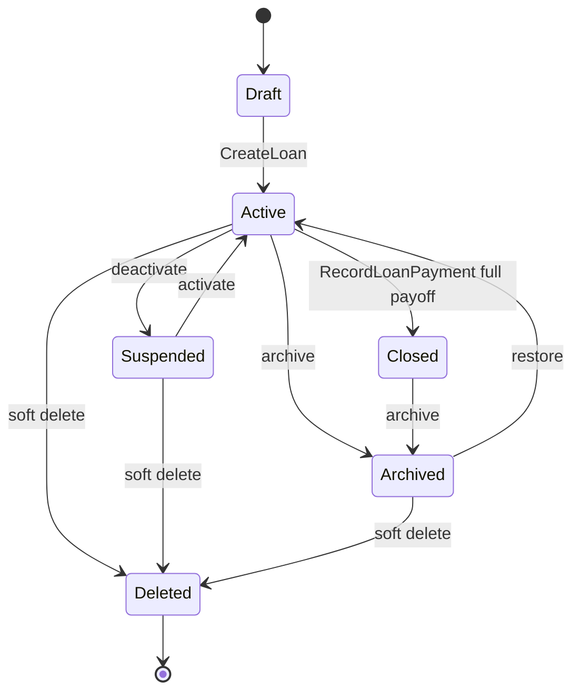
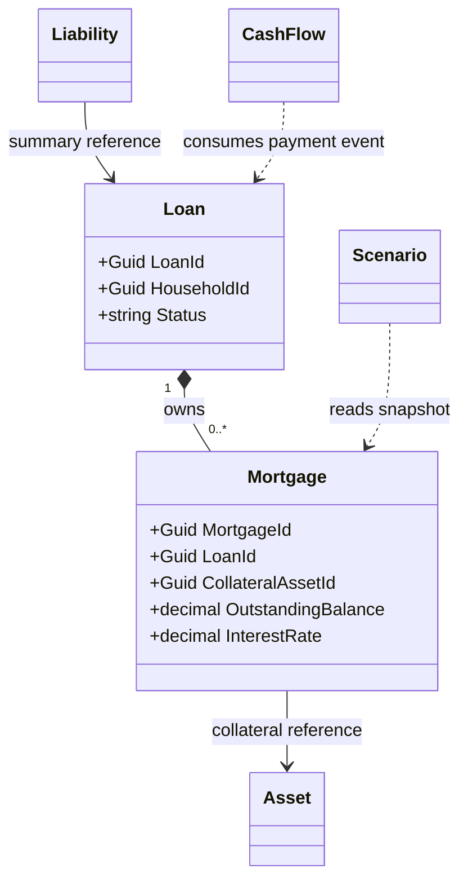
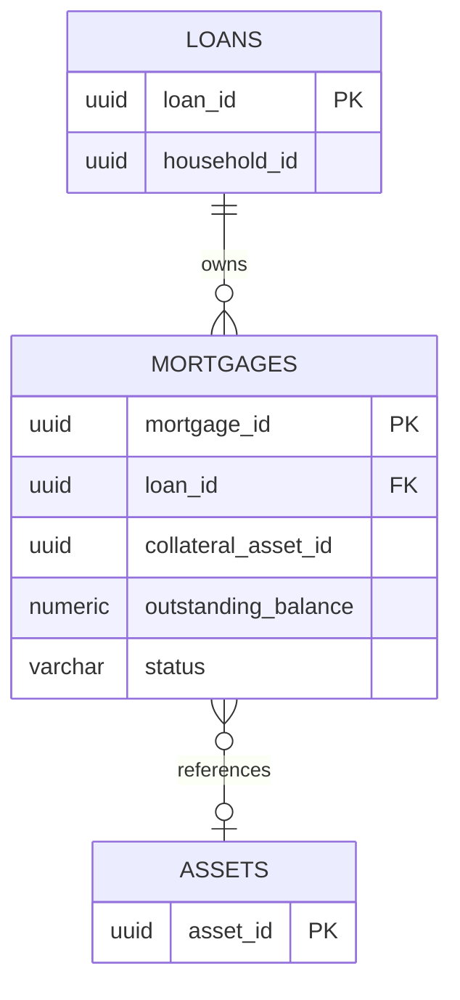
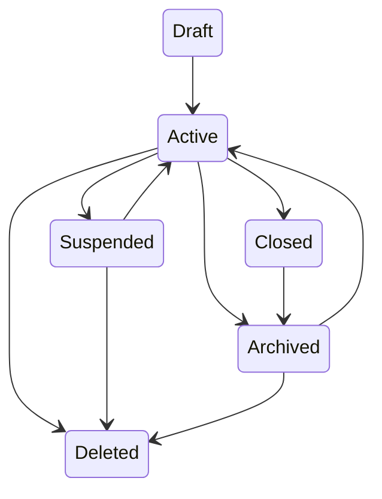
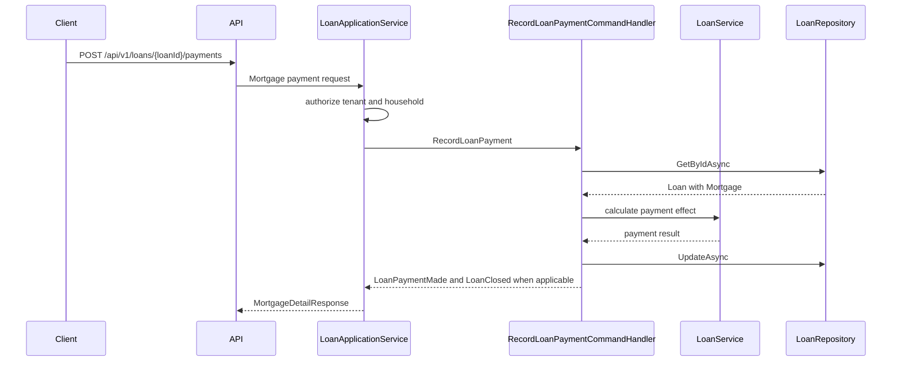
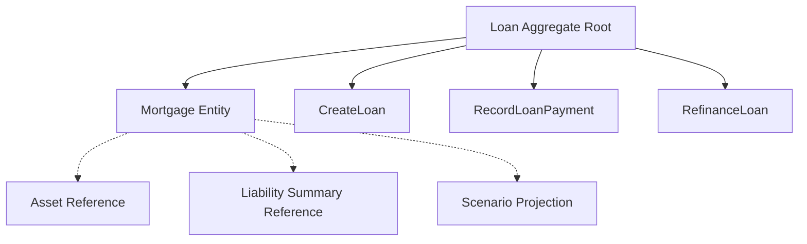

# Mortgage Entity Specification
## Split Navigation
- [Mortgage identity and repayment](mortgage/identity-and-repayment.md)
- [Mortgage persistence and API](mortgage/persistence-and-api.md)
- [Mortgage governance and testing](mortgage/governance-and-testing.md)
- [Mortgage property and collateral rules](mortgage/property-and-collateral-rules.md)
- [Mortgage scenario and refinance behavior](mortgage/scenario-and-refinance-behavior.md)
# Document Control
| Field | Value |
|---|---|
| Document Name | Mortgage Entity Specification |
| Document Path | knowledge/entity/Mortgage.md |
| Document Type | Enterprise Entity Specification |
| Version | 1.0.0 |
| Status | Approved for Implementation |
| Domain | Loan |
| Bounded Context | Loan |
| Aggregate | Loan |
| Aggregate Root | Loan |
| Owner | Loan aggregate owner through LoanApplicationService |
| Source of Truth | Entity Catalog, Aggregate Catalog, Command Catalog, Domain Event Catalog, Repository Catalog |
| Last Updated | 2026-07-14 |
| Related Specifications | knowledge/entity-catalog.md; knowledge/aggregate-catalog.md; knowledge/domain-model-catalog.md; knowledge/bounded-context-catalog.md; knowledge/value-object-catalog.md; knowledge/enumeration-catalog.md; knowledge/command-catalog.md; knowledge/domain-event-catalog.md; knowledge/repository-catalog.md; knowledge/domain-service-catalog.md; knowledge/application-service-catalog.md; knowledge/service-catalog.md; knowledge/mortgage.md; knowledge/taiwan-mortgage.md; knowledge/loan.md; knowledge/taiwan-tax.md; knowledge/financial-formula-catalog.md; knowledge/calculation-engine-framework.md; knowledge/projection-engine-framework.md; knowledge/scenario-framework.md; knowledge/market-assumptions.md; knowledge/permission-framework.md; knowledge/tenant-framework.md; knowledge/audit-framework.md; knowledge/api-governance-framework.md; knowledge/message-contract-catalog.md; knowledge/entity/User.md; knowledge/entity/Household.md; knowledge/entity/Asset.md; knowledge/entity/Liability.md; knowledge/entity/Loan.md; knowledge/entity/CashFlow.md; knowledge/entity/Expense.md; knowledge/entity/Goal.md; knowledge/entity/Scenario.md; knowledge/entity/Decision.md; knowledge/entity/Recommendation.md; docs/specification/04-DomainModel.md; docs/specification/04A-DomainInventory.md; docs/database/05-DatabaseDesign.md; docs/database/06-ERD.md; docs/api/07-API.md; docs/08-CashFlowEngine.md; docs/specification/08A-CashFlowEngine-Architecture.md; docs/specification/08B-CashFlowEngine-Formula.md; docs/specification/08C-CashFlowEngine-DecisionRules.md; docs/api/08D-CashFlowEngine-API.md; docs/specification/08E-CashFlowEngine-Testing.md |
| Change Policy | Preserve Loan aggregate ownership, Mortgage subtype boundaries, Catalog command/event mapping, and calculation responsibilities. |
# Catalog Alignment Summary
| Concern | Source Catalog | Catalog Result | Final Atlas Name | Defined Here or Referenced | Implementation Artifact | Status | Notes |
|---|---|---|---|---|---|---|---|
| Domain | entity-catalog.md | Mortgage belongs to Loan domain. | Loan | Referenced | Namespace/module | Catalog-aligned | No new domain |
| Bounded Context | entity-catalog.md | Bounded Context is Loan. | Loan | Referenced | API/service boundary | Catalog-aligned | Same as Catalog |
| Aggregate | entity-catalog.md; aggregate-catalog.md | Mortgage is owned by Loan. | Loan | Referenced | Loan aggregate | Catalog-aligned | Mortgage is not root |
| Aggregate Root | aggregate-catalog.md | Root is Loan. | Loan | Referenced | Loan root | Catalog-aligned | Mortgage lifecycle through Loan |
| Entity | entity-catalog.md | Entity Name is Mortgage. | Mortgage | Referenced | MortgageEntity or LoanEntity subtype | Catalog-aligned | Primary key MortgageId or LoanId |
| Child Entity | aggregate-catalog.md | Mortgage is owned by Loan when represented as subtype. | Mortgage | Referenced | mortgages table or loan subtype | Catalog-aligned | Composition |
| Value Object | entity-catalog.md | Money, Currency, InterestRate, LoanTerm, Percentage. | Money; Currency; InterestRate; LoanTerm; Percentage | Referenced | Amount/rate/term fields | Catalog-aligned | Prefer Catalog VOs |
| Enumeration | entity-catalog.md | LoanType and CurrencyCode listed. | LoanType; CurrencyCode | Referenced | type/currency fields | Catalog-aligned | Mortgage-specific status values are implementation values |
| Command | command-catalog.md | CreateLoan, RecordLoanPayment, RefinanceLoan. | CreateLoan; RecordLoanPayment; RefinanceLoan | Referenced | Command handlers | Catalog-aligned | Mortgage CRUD actions are API use cases |
| Domain Event | domain-event-catalog.md | LoanCreated, LoanPaymentMade, LoanRefinanced, LoanClosed. | LoanCreated; LoanPaymentMade; LoanRefinanced; LoanClosed | Referenced | Event contracts | Catalog-aligned | No Mortgage events added |
| Repository | entity-catalog.md | LoanRepository. | LoanRepository | Referenced | Repository interface | Catalog-aligned | Load Mortgage through LoanRepository |
| Domain Service | entity-catalog.md | LoanService. | LoanService | Referenced | Service calls | Catalog-aligned | Calculations outside repository |
| Application Service | entity-catalog.md | LoanApplicationService. | LoanApplicationService | Referenced | Use case layer | Catalog-aligned | Cross-aggregate orchestration |
| API Resource | entity-catalog.md | /api/v1/loans. | /api/v1/loans | Referenced | REST controller | Catalog-aligned | Mortgage maps through Loan resource |
| DTO | API governance | DTO is implementation contract. | Mortgage DTOs | Implementation Detail | Request/response schemas | Implementation Detail | Does not create Domain Concept |
| Permission | entity-catalog.md | Liability:Read for loan resource mapping. | Liability:Read and resource-action mappings | Referenced | Authorization policy | Catalog-aligned where present | Mutating permissions are API mapping |
| Database Table | entity-catalog.md | mortgages or loans depending on persistence mapping. | mortgages | Referenced | PostgreSQL table | Catalog-aligned | Separate table used as implementation mapping |
| Read Model | API governance | Projection is not source of truth. | Mortgage projection | Implementation Detail | Cache/materialized view | Implementation Detail | Read-only |
| Cache | entity-catalog.md | Loan amortization cache. | Mortgage amortization cache | Referenced | Cache keys | Catalog-aligned | Output cache only |
| Audit | entity-catalog.md | Mortgage changes audited through Loan. | Loan audit | Referenced | AuditRepository | Catalog-aligned | Complete audit |
| Tenant Boundary | tenant guidance | TenantId distinct from HouseholdId. | TenantId | Referenced | tenant_id | Catalog-aligned | Household is scope |
# Entity Overview
## Purpose
Mortgage represents a property-backed loan subtype inside the Loan aggregate.
Mortgage connects a Loan obligation to property-backed debt analysis, household affordability, cash flow pressure, scenario inputs, and decision inputs.
Mortgage is not an Aggregate Root. Loan is the Aggregate Root and owns mortgage lifecycle, payment behavior, refinance behavior, and closure behavior.
## Responsibilities
| Responsibility | Description | Boundary |
|---|---|---|
| Mortgage identity | Maintains MortgageId or LoanId subtype identity. | Loan aggregate |
| Loan linkage | Requires LoanId and follows Loan lifecycle. | Loan aggregate |
| Property reference | Stores PropertyId or CollateralAssetId by identity. | Reference only |
| Principal state | Stores original principal and remaining principal where mapped separately. | Loan aggregate |
| Balance state | Stores outstanding balance and accrued interest snapshots. | Loan aggregate |
| Interest metadata | Stores fixed/floating rate inputs and effective dates. | Loan aggregate |
| Repayment metadata | Stores mortgage-specific repayment model and payment cadence. | Loan aggregate |
| Grace period metadata | Stores grace period inputs for LoanService. | Loan aggregate |
| Taiwan mortgage detail | Stores Taiwan mortgage program indicators as implementation values only. | Implementation Detail |
| Audit and versioning | Audits mortgage changes through Loan. | Loan aggregate |
## Non-Responsibilities
| Non-Responsibility | Owning Concept |
|---|---|
| Loan aggregate lifecycle outside Loan | Loan |
| Liability summary ownership | LiabilityPortfolio |
| Asset or property valuation | Asset or Property owner |
| Appraisal ownership | Not a Catalog Concept here |
| Lien ownership | Not a Catalog Concept here |
| RepaymentSchedule ownership | Implementation Detail or Catalog Gap |
| Mortgage amortization calculation | LoanService and calculation engine |
| CashFlow forecasting | CashFlowService and Projection Engine |
| Scenario simulation | Scenario aggregate and ScenarioService |
| Recommendation generation | RecommendationService |
| Decision scoring | DecisionService |
| Repository calculation | Forbidden in LoanRepository |
## Business Meaning
Mortgage is a property-backed debt view of Loan. It supports household debt analysis, home affordability, refinance analysis, payoff analysis, and scenario inputs.
Loan owns the actual command and event lifecycle. Liability consumes loan or mortgage summaries where liability portfolio reporting is needed.
Asset is collateral by reference only. Mortgage does not modify property value, asset status, sale state, or appraisal value.
CashFlow and Expense may reflect payment outcomes through event consumers and application workflows; Mortgage does not own them.
# Aggregate Boundary
| Boundary Concern | Rule |
|---|---|
| Consistency boundary | Loan balance, mortgage subtype fields, rate metadata, term, payment, refinance, and closure state. |
| Transaction boundary | One Loan mutation. |
| Child entity ownership | Mortgage is composition inside Loan when mapped as separate entity. |
| External aggregate references | Household, Asset, Liability, CashFlow, Expense, Scenario, Decision, Recommendation are references or projections. |
| Allowed in-transaction mutations | Mortgage fields, Loan fields related to mortgage terms, rate metadata, payment application, refinance fields, audit metadata. |
| Prohibited cross-aggregate mutations | Asset valuation, property sale state, Liability summary, CashFlow record, Expense record, Scenario result, Decision score, Recommendation state. |
| Repository ownership | LoanRepository persists Loan and Mortgage mapping. |
| Event ownership | Only Loan events are emitted. |
| Concurrency boundary | Loan Version and ConcurrencyToken protect Mortgage changes. |
| Audit boundary | Mortgage changes are audited through Loan audit context. |
# Lifecycle
| Stage | Meaning | Status Handling | Catalog Position |
|---|---|---|---|
| Draft | Mortgage input exists before CreateLoan succeeds. | Not authoritative unless implementation stores draft. | Implementation Detail |
| Active | Mortgage-backed Loan can receive payment and refinance. | status = Active | Implementation Detail |
| Suspended | Mortgage-backed Loan is blocked from ordinary updates. | status = Suspended | Implementation Detail |
| Closed | Mortgage-backed Loan has no outstanding balance. | status = Closed | Catalog-aligned Loan invariant |
| Archived | Mortgage is retained read-only. | status = Archived | Implementation Detail |
| Deleted | Mortgage mapping is soft-deleted from normal reads. | status = Deleted | Implementation Detail |
# Ownership
| Ownership Concern | Rule |
|---|---|
| Aggregate owner | Loan owns Mortgage. |
| Persistence owner | LoanRepository persists Mortgage through Loan. |
| Household owner | HouseholdId scopes access; Household does not own Mortgage state. |
| Tenant owner | TenantId scopes all persistence. |
| Collateral owner | Asset or Property remains separate; Mortgage stores identity reference. |
| Liability owner | LiabilityPortfolio may summarize mortgage debt, not own Mortgage. |
| CashFlow owner | CashFlow effects are external. |
| User owner | User is actor or borrower reference only. |
| Archive owner | Loan lifecycle controls archive behavior. |
# Relationships
| Related Concept | Cardinality | Ownership Type | Aggregate Boundary | Navigation Direction | Required | Cascade Behavior | Delete Behavior | Authorization Impact | Audit Impact |
|---|---:|---|---|---|---|---|---|---|---|
| Loan | One Mortgage to one Loan or subtype mapping | Composition | Same aggregate | Mortgage belongs to Loan | Required | Aggregate-internal | Loan controls lifecycle | Household scope through Loan | Mortgage audit through Loan |
| Household | Many mortgages to one household | Reference | Separate aggregate | Loan stores HouseholdId | Required | No cascade | Retain reference on archive | Household access required | HouseholdId audited |
| User | Actor or borrower reference | Reference | Separate aggregate | OwnerUserId and audit users | Required for writes | No cascade | User deletion does not delete Mortgage | Actor permission required | Actor audited |
| Asset | Optional property collateral | Reference | Asset aggregate | CollateralAssetId or PropertyId | Optional | No cascade | Asset lifecycle separate | Asset must be household-authorized | Reference audited |
| Liability | Optional liability summary | Reference | LiabilityPortfolio aggregate | Liability may reference Loan | Optional | No cascade | Liability lifecycle separate | Household access required | Projection trace |
| CashFlow | Payment effect | Reference | Cash flow boundary | Event consumer | Optional | No cascade | CashFlow lifecycle separate | Household access required | Event trace |
| Expense | Payment expense | Reference | Expense boundary | Projection only | Optional | No cascade | Expense lifecycle separate | Household access required | Expense audit separate |
| Scenario | Simulation input | Reference | Scenario aggregate | Reads projection | Optional | No cascade | Scenario lifecycle separate | Household access required | Snapshot trace |
| Decision | Decision input | Reference | DecisionSession aggregate | Reads projection | Optional | No cascade | Decision lifecycle separate | Household access required | Decision trace |
| Recommendation | Recommendation input | Reference | Recommendation aggregate | Reads projection | Optional | No cascade | Recommendation lifecycle separate | Household access required | Recommendation trace |
| Audit | Many audit records per mortgage | Reference | Audit storage | Audit stores LoanId/MortgageId | Required for writes | No cascade | Retained after delete | Review evidence | Complete trace |
# Navigation
| Navigation Type | Allowed Navigation | Rule |
|---|---|---|
| Owned navigation | Loan to Mortgage subtype fields. | Same aggregate only |
| Aggregate reference | HouseholdId, CollateralAssetId, LiabilityId. | Identifier only |
| Read-only projection | Mortgage amortization view, payoff view, scenario snapshot. | Not write model |
| Collection navigation | Loan to mortgage records when one-to-many mapping exists. | Same aggregate only |
| Identity reference | TenantId, OwnerUserId, CreatedBy, UpdatedBy, ClosedBy. | IDs only |
| API expansion | include=mortgage, include=loan, include=collateral, include=audit. | Read-only |
| Prohibited navigation | Mutable object graph to Asset, Liability, CashFlow, Expense, Scenario, Decision, Recommendation. | Not allowed |
# Complete Properties
## Property Matrix
| Name | Type | Nullable | Default | Database Mapping | JSON Name | API Usage | Searchable | Sortable | Indexed | Encrypted | Auditable |
|---|---|---:|---|---|---|---|---:|---:|---:|---:|---:|
| MortgageId | UUID | No | generated | mortgage_id uuid pk | mortgageId | route, response | Yes | Yes | Yes | No | Yes |
| LoanId | UUID | No | none | loan_id uuid | loanId | create, response | Yes | Yes | Yes | No | Yes |
| TenantId | UUID | No | context | tenant_id uuid | tenantId | internal, response | Yes | Yes | Yes | No | Yes |
| HouseholdId | UUID | No | none | household_id uuid | householdId | create, response | Yes | Yes | Yes | No | Yes |
| OwnerUserId | UUID | No | actor | owner_user_id uuid | ownerUserId | create, response | Yes | Yes | Yes | No | Yes |
| CollateralAssetId | UUID | Yes | null | collateral_asset_id uuid | collateralAssetId | create, update, response | Yes | No | Yes | No | Yes |
| LiabilityId | UUID | Yes | null | liability_id uuid | liabilityId | create, update, response | Yes | No | Yes | No | Yes |
| MortgageNumber | string(40) | No | generated | mortgage_number varchar(40) | mortgageNumber | response | Yes | Yes | Yes | No | Yes |
| MortgageName | string(160) | No | none | mortgage_name varchar(160) | mortgageName | create, update, response | Yes | Yes | Yes | No | Yes |
| MortgageProgram | string(80) | Yes | null | mortgage_program varchar(80) | mortgageProgram | create, update, response | Yes | No | No | No | Yes |
| Currency | string(3) | No | loan currency | currency char(3) | currency | create, response | Yes | Yes | Yes | No | Yes |
| OriginalPrincipal | decimal(19,4) | No | none | original_principal numeric(19,4) | originalPrincipal | create, response | Yes | Yes | No | No | Yes |
| RemainingPrincipal | decimal(19,4) | No | original principal | remaining_principal numeric(19,4) | remainingPrincipal | response, payment | Yes | Yes | Yes | No | Yes |
| OutstandingBalance | decimal(19,4) | No | original principal | outstanding_balance numeric(19,4) | outstandingBalance | response, payment | Yes | Yes | Yes | No | Yes |
| AccruedInterest | decimal(19,4) | No | 0 | accrued_interest numeric(19,4) | accruedInterest | response | Yes | Yes | No | No | Yes |
| MonthlyPayment | decimal(19,4) | Yes | null | monthly_payment numeric(19,4) | monthlyPayment | create, update, response | Yes | Yes | No | No | Yes |
| RemainingPayment | decimal(19,4) | Yes | null | remaining_payment numeric(19,4) | remainingPayment | response | Yes | Yes | No | No | Yes |
| EarlyPayoffAmount | decimal(19,4) | Yes | null | early_payoff_amount numeric(19,4) | earlyPayoffAmount | payoff response | Yes | Yes | No | No | Yes |
| TotalInterest | decimal(19,4) | No | 0 | total_interest numeric(19,4) | totalInterest | response | Yes | Yes | No | No | Yes |
| TotalRepayment | decimal(19,4) | No | 0 | total_repayment numeric(19,4) | totalRepayment | response | Yes | Yes | No | No | Yes |
| LoanToValue | decimal(9,6) | Yes | null | loan_to_value numeric(9,6) | loanToValue | response | Yes | Yes | No | No | Yes |
| BaseCurrencyAmount | decimal(19,4) | Yes | null | base_currency_amount numeric(19,4) | baseCurrencyAmount | response | Yes | Yes | No | No | Yes |
| InterestRate | decimal(9,6) | No | none | interest_rate numeric(9,6) | interestRate | create, update, response | Yes | Yes | No | No | Yes |
| InterestRateType | string(40) | No | Fixed | interest_rate_type varchar(40) | interestRateType | create, update, response | Yes | Yes | Yes | No | Yes |
| ReferenceRate | decimal(9,6) | Yes | null | reference_rate numeric(9,6) | referenceRate | create, update, response | Yes | Yes | No | No | Yes |
| SpreadRate | decimal(9,6) | Yes | null | spread_rate numeric(9,6) | spreadRate | create, update, response | Yes | Yes | No | No | Yes |
| ResetRule | string(80) | Yes | null | reset_rule varchar(80) | resetRule | create, update, response | Yes | No | No | No | Yes |
| GraceInterestRate | decimal(9,6) | Yes | null | grace_interest_rate numeric(9,6) | graceInterestRate | create, update, response | Yes | Yes | No | No | Yes |
| PenaltyInterestRate | decimal(9,6) | Yes | null | penalty_interest_rate numeric(9,6) | penaltyInterestRate | create, update, response | Yes | Yes | No | No | Yes |
| RateEffectiveDate | date | No | origination date | rate_effective_date date | rateEffectiveDate | create, update, response | Yes | Yes | Yes | No | Yes |
| LoanTermMonths | integer | No | none | loan_term_months integer | loanTermMonths | create, update, response | Yes | Yes | No | No | Yes |
| RemainingTermMonths | integer | No | loan term | remaining_term_months integer | remainingTermMonths | response | Yes | Yes | No | No | Yes |
| RepaymentModel | string(40) | No | EqualPayment | repayment_model varchar(40) | repaymentModel | create, update, response | Yes | Yes | Yes | No | Yes |
| GracePeriodMonths | integer | No | 0 | grace_period_months integer | gracePeriodMonths | create, update, response | Yes | Yes | No | No | Yes |
| GracePeriodEndDate | date | Yes | null | grace_period_end_date date | gracePeriodEndDate | response | Yes | Yes | No | No | Yes |
| OriginationDate | date | No | none | origination_date date | originationDate | create, response | Yes | Yes | Yes | No | Yes |
| FirstPaymentDate | date | Yes | null | first_payment_date date | firstPaymentDate | create, update, response | Yes | Yes | No | No | Yes |
| NextPaymentDate | date | Yes | null | next_payment_date date | nextPaymentDate | response | Yes | Yes | Yes | No | Yes |
| MaturityDate | date | No | none | maturity_date date | maturityDate | create, update, response | Yes | Yes | Yes | No | Yes |
| LastPaymentDate | date | Yes | null | last_payment_date date | lastPaymentDate | response | Yes | Yes | No | No | Yes |
| Status | string(20) | No | Active | status varchar(20) | status | response, lifecycle | Yes | Yes | Yes | No | Yes |
| IsArchived | boolean | No | false | is_archived boolean | isArchived | response | Yes | Yes | Yes | No | Yes |
| ClosedAt | timestamptz | Yes | null | closed_at timestamptz | closedAt | response | Yes | Yes | Yes | No | Yes |
| ClosedBy | UUID | Yes | null | closed_by uuid | closedBy | response | Yes | No | No | No | Yes |
| ArchivedAt | timestamptz | Yes | null | archived_at timestamptz | archivedAt | response | Yes | Yes | Yes | No | Yes |
| ArchivedBy | UUID | Yes | null | archived_by uuid | archivedBy | response | Yes | No | No | No | Yes |
| DeletedAt | timestamptz | Yes | null | deleted_at timestamptz | deletedAt | response | Yes | Yes | Yes | No | Yes |
| DeletedBy | UUID | Yes | null | deleted_by uuid | deletedBy | response | Yes | No | No | No | Yes |
| CreatedAt | timestamptz | No | now | created_at timestamptz | createdAt | response | Yes | Yes | Yes | No | Yes |
| CreatedBy | UUID | No | actor | created_by uuid | createdBy | response | Yes | No | No | No | Yes |
| UpdatedAt | timestamptz | No | now | updated_at timestamptz | updatedAt | response | Yes | Yes | Yes | No | Yes |
| UpdatedBy | UUID | No | actor | updated_by uuid | updatedBy | response | Yes | No | No | No | Yes |
| Version | integer | No | 1 | version integer | version | response, concurrency | Yes | Yes | Yes | No | Yes |
| ConcurrencyToken | UUID | No | generated | concurrency_token uuid | concurrencyToken | response, If-Match | No | No | Yes | No | Yes |
## Property Details
| Name | Description | Validation | Business Meaning | Example | Security Notes |
|---|---|---|---|---|---|
| MortgageId | Stable mortgage identity when table is separate. | Required UUID; immutable. | Identifies mortgage subtype row. | b7a3e1d2-1111-4000-9000-000000000001 | Audited. |
| LoanId | Parent Loan aggregate id. | Required; same tenant and household. | Establishes aggregate ownership. | b7a3e1d2-1111-4000-9000-000000000002 | Audited. |
| TenantId | Tenant isolation key. | Required from trusted context. | Prevents cross-tenant access. | b7a3e1d2-1111-4000-9000-000000000003 | Authorization input. |
| HouseholdId | Household scope. | Required and authorized. | Planning and access scope. | b7a3e1d2-1111-4000-9000-000000000004 | Audited. |
| OwnerUserId | Borrower or owner reference. | Required authorized User. | User-facing loan ownership. | b7a3e1d2-1111-4000-9000-000000000005 | Sensitive relationship data. |
| CollateralAssetId | Property or asset reference. | Nullable; same household when provided. | Collateral identity reference. | b7a3e1d2-1111-4000-9000-000000000006 | Does not mutate Asset. |
| LiabilityId | Optional liability summary reference. | Nullable; same household. | Links debt summary. | b7a3e1d2-1111-4000-9000-000000000007 | Reference only. |
| MortgageNumber | Business number. | Required unique per tenant. | Operational lookup. | MTG-2026-000001 | Audited. |
| MortgageName | Display name. | Required max 160. | User-facing identity. | Primary Residence Mortgage | Mask in logs. |
| MortgageProgram | Program marker such as Taiwan mortgage product. | Nullable max 80. | Business rule input. | TaiwanNewQingAn | Implementation Detail. |
| Currency | Mortgage currency. | Required uppercase ISO code. | Money value currency. | TWD | Audited. |
| OriginalPrincipal | Original mortgage principal. | Required > 0. | Initial debt amount. | 12000000.0000 | Audited. |
| RemainingPrincipal | Principal not yet repaid. | Required >= 0. | Principal burden. | 11000000.0000 | Audited. |
| OutstandingBalance | Remaining obligation including applicable accrued amounts. | Required >= 0. | Debt balance. | 11035000.0000 | Audited. |
| AccruedInterest | Interest accrued but unpaid. | Required >= 0. | Interest component. | 35000.0000 | Audited. |
| MonthlyPayment | Monthly payment amount. | Nullable >= 0. | Recurring cash pressure. | 52000.0000 | Audited. |
| RemainingPayment | Remaining scheduled payment total. | Nullable >= 0. | Future payment burden. | 18000000.0000 | Derived snapshot. |
| EarlyPayoffAmount | Full early settlement amount. | Nullable >= outstanding balance. | Payoff quote. | 11050000.0000 | Source audited. |
| TotalInterest | Total interest paid or projected. | Required >= 0. | Cost of borrowing. | 6000000.0000 | Source audited. |
| TotalRepayment | Principal plus interest and approved charges. | Required >= 0. | Total repayment burden. | 18000000.0000 | Source audited. |
| LoanToValue | Loan-to-value ratio when valuation exists. | Nullable; >= 0. | Collateral risk metric. | 0.700000 | Projection or verified valuation input. |
| BaseCurrencyAmount | Base currency conversion. | Nullable >= 0. | Reporting amount. | 350000.0000 | FX source audited. |
| InterestRate | Current nominal rate. | Required 0 to 1 unless catalog permits negative. | Rate input. | 0.021850 | Audited. |
| InterestRateType | Fixed, Floating, or implementation value. | Required max 40. | Rate behavior. | Floating | Not new Enumeration. |
| ReferenceRate | Benchmark rate snapshot. | Nullable with source. | Floating rate input. | 0.015000 | Source trace required. |
| SpreadRate | Spread over reference rate. | Nullable >= 0. | Floating rate spread. | 0.006850 | Audited. |
| ResetRule | Reset cadence or rule. | Nullable max 80. | Rate adjustment rule. | Quarterly | Implementation Detail. |
| GraceInterestRate | Grace period interest. | Nullable >= 0. | Grace calculation input. | 0.018000 | Applied by LoanService. |
| PenaltyInterestRate | Penalty rate. | Nullable >= 0. | Delinquency cost input. | 0.035000 | Source audited. |
| RateEffectiveDate | Rate effective date. | Required. | Rate truth date. | 2026-07-14 | Audited. |
| LoanTermMonths | Total term. | Required > 0. | Mortgage duration. | 360 | LoanTerm value. |
| RemainingTermMonths | Remaining term. | Required >= 0. | Remaining duration. | 348 | Service-maintained. |
| RepaymentModel | Repayment behavior. | Required max 40. | Payment structure. | EqualPayment | Implementation value. |
| GracePeriodMonths | Grace months. | Required >= 0. | Taiwan and mortgage grace behavior. | 60 | Audited. |
| GracePeriodEndDate | Grace end date. | Nullable and consistent. | Transition date. | 2031-07-01 | Audited. |
| OriginationDate | Start date. | Required. | Contract start. | 2026-07-01 | Audited. |
| FirstPaymentDate | First payment date. | Nullable >= origination. | First cash flow date. | 2026-08-01 | Audited. |
| NextPaymentDate | Next due date. | Nullable. | Payment workflow date. | 2026-08-01 | Audited. |
| MaturityDate | Contract end date. | Required after origination. | Mortgage maturity. | 2056-07-01 | Audited. |
| LastPaymentDate | Last payment date. | Nullable. | Payment history summary. | 2026-07-10 | Audited. |
| Status | Lifecycle status. | Active, Suspended, Closed, Archived, Deleted. | Write eligibility. | Active | Implementation Detail. |
| IsArchived | Archive shortcut. | Must match Archived. | Search optimization. | false | Audited. |
| ClosedAt | Closure timestamp. | Required when Closed. | Terminal state. | null | Audited. |
| ClosedBy | Closing actor. | Required when Closed. | Accountability. | null | Audited. |
| ArchivedAt | Archive timestamp. | Required when Archived. | Historical retention. | null | Audited. |
| ArchivedBy | Archive actor. | Required when Archived. | Accountability. | null | Audited. |
| DeletedAt | Soft delete timestamp. | Required when Deleted. | Normal read exclusion. | null | Audited. |
| DeletedBy | Delete actor. | Required when Deleted. | Accountability. | null | Audited. |
| CreatedAt | Created time. | Required server value. | Origin trace. | 2026-07-14T08:00:00Z | Audited. |
| CreatedBy | Creator. | Required actor. | Accountability. | b7a3e1d2-1111-4000-9000-000000000005 | Audited. |
| UpdatedAt | Last update time. | Required server value. | Synchronization. | 2026-07-14T08:30:00Z | Audited. |
| UpdatedBy | Last updater. | Required actor. | Accountability. | b7a3e1d2-1111-4000-9000-000000000005 | Audited. |
| Version | Aggregate version. | Required >= 1. | Optimistic concurrency. | 5 | Audited. |
| ConcurrencyToken | Opaque token. | Required and changed on write. | Lost update protection. | b7a3e1d2-1111-4000-9000-000000000009 | Not business data. |
# Mortgage Monetary Semantics
| Amount | Meaning | Source of Truth | Must Not Be Used As |
|---|---|---|---|
| Original Principal | Initial mortgage principal. | Loan aggregate. | Current balance |
| Remaining Principal | Principal unpaid. | Loan aggregate after payment. | Accrued interest |
| Outstanding Balance | Remaining principal plus applicable accrued amounts. | Loan aggregate. | Original principal |
| Accrued Interest | Interest accrued and unpaid. | Loan aggregate or verified import. | Principal |
| Monthly Payment | Expected monthly payment. | LoanService output or verified contract. | Payoff |
| Remaining Payment | Total remaining scheduled payments. | Projection or LoanService output. | Balance |
| Early Payoff Amount | Full early settlement amount. | LoanService output or verified servicer import. | Outstanding balance without source confirmation |
| Total Interest | Interest paid or projected. | LoanService or projection. | Accrued interest |
| Total Repayment | Principal plus interest and approved charges. | LoanService or projection. | Original principal |
| Loan-to-Value | Debt divided by collateral valuation when valuation exists. | Projection using Asset valuation reference. | Asset value source |
| Base Currency Amount | Converted reporting amount. | FX source with audit. | Native amount |
# Mortgage Interest Model
| Concept | Definition | Catalog Status | Rule |
|---|---|---|---|
| Fixed Rate | Rate stays stable until refinance or approved update. | Implementation value using InterestRate | Source is Loan aggregate. |
| Floating Rate | Rate follows ReferenceRate plus SpreadRate. | Implementation value | Source and effective date required. |
| Hybrid Rate | Mixed fixed/floating periods. | Catalog Gap unless found in Catalog | Store only as implementation value when imported. |
| Reference Rate | Benchmark rate snapshot. | Implementation Detail | Requires source trace. |
| Spread | Add-on to reference rate. | Implementation Detail | Non-negative unless Catalog permits exception. |
| Reset Rule | Rate reset cadence or contract rule. | Implementation Detail | Applied by LoanService. |
| Grace Interest | Rate applied during grace period. | Implementation Detail | Applied by LoanService. |
| Penalty Interest | Rate applied on delinquency or penalty condition. | Implementation Detail | Requires business source. |
| Effective Date | Date rate becomes active. | Mortgage property | Required. |
| Source of Truth | Persisted current rate in Loan aggregate; external source for imported benchmark. | Catalog-aligned | External source cannot overwrite without validation. |
# Mortgage Repayment Model
| Model | Definition | Catalog Position | Handling |
|---|---|---|---|
| Equal Principal | Principal component equal each period. | Implementation Detail | LoanService calculates. |
| Equal Payment | Total payment stable each period. | Implementation Detail | LoanService calculates. |
| Interest Only | Interest paid during defined period. | Implementation Detail | Often aligned with grace period. |
| Balloon Payment | Large final payment. | Catalog Gap unless cataloged | Store as implementation value only if imported. |
| Grace Period | Principal or payment grace period. | Implementation Detail | Validated by LoanService. |
| Early Repayment | Payment before schedule. | RecordLoanPayment | Emits LoanPaymentMade and possibly LoanClosed. |
| Partial Repayment | Payment below payoff. | RecordLoanPayment | Reduces balance. |
| Full Payoff | Payment closes mortgage-backed Loan. | RecordLoanPayment | Emits LoanClosed when balance reaches zero. |
# Grace Period Model
| Concern | Rule |
|---|---|
| New Qing An grace period | Taiwan mortgage program marker is Implementation Detail. |
| GracePeriodMonths | Required non-negative integer. |
| GracePeriodEndDate | Must align with origination date and months when present. |
| Interest handling | GraceInterestRate and LoanService determine interest treatment. |
| Transition | Payment model changes after grace period end through approved workflow. |
| Audit | Every grace period change captures actor and before/after values. |
# Collateral Reference Model
| Concern | Rule |
|---|---|
| Asset reference | Mortgage stores CollateralAssetId or PropertyId as identity reference only. |
| Ownership boundary | Asset owns property value and lifecycle; Loan owns Mortgage. |
| Aggregate boundary | Mortgage cannot mutate Asset, Property, valuation, sale, or appraisal state. |
| Collateral identity | Identifier must match same tenant and household. |
| Collateral valuation reference | Loan-to-value uses projection or verified valuation reference; Mortgage does not own valuation. |
# Validation Rules
| Rule Id | Field | Validation | Error Code | Severity |
|---|---|---|---|---|
| MTG-VR-001 | MortgageId | Required UUID and immutable. | MORTGAGE_ID_INVALID | Critical |
| MTG-VR-002 | LoanId | Required and same tenant/household. | LOAN_REFERENCE_INVALID | Critical |
| MTG-VR-003 | TenantId | Required trusted tenant. | TENANT_SCOPE_INVALID | Critical |
| MTG-VR-004 | HouseholdId | Required authorized household. | HOUSEHOLD_SCOPE_INVALID | Critical |
| MTG-VR-005 | OwnerUserId | Required authorized user. | OWNER_USER_INVALID | Critical |
| MTG-VR-006 | MortgageNumber | Required unique per tenant. | MORTGAGE_NUMBER_DUPLICATE | High |
| MTG-VR-007 | MortgageName | Required max 160. | MORTGAGE_NAME_INVALID | High |
| MTG-VR-008 | Currency | Required uppercase length 3. | CURRENCY_INVALID | High |
| MTG-VR-009 | OriginalPrincipal | Required > 0. | ORIGINAL_PRINCIPAL_INVALID | Critical |
| MTG-VR-010 | RemainingPrincipal | Required >= 0. | REMAINING_PRINCIPAL_INVALID | Critical |
| MTG-VR-011 | OutstandingBalance | Required >= 0. | OUTSTANDING_BALANCE_INVALID | Critical |
| MTG-VR-012 | AccruedInterest | Required >= 0. | ACCRUED_INTEREST_INVALID | High |
| MTG-VR-013 | MonthlyPayment | Null or >= 0. | MONTHLY_PAYMENT_INVALID | High |
| MTG-VR-014 | EarlyPayoffAmount | Null or >= OutstandingBalance. | EARLY_PAYOFF_INVALID | High |
| MTG-VR-015 | LoanToValue | Null or >= 0. | LOAN_TO_VALUE_INVALID | Medium |
| MTG-VR-016 | InterestRate | Required 0 to 1 unless catalog permits exception. | INTEREST_RATE_INVALID | High |
| MTG-VR-017 | ReferenceRate | Required for Floating when source is external. | REFERENCE_RATE_INVALID | High |
| MTG-VR-018 | SpreadRate | Null or >= 0. | SPREAD_RATE_INVALID | Medium |
| MTG-VR-019 | LoanTermMonths | Required > 0. | LOAN_TERM_INVALID | High |
| MTG-VR-020 | RemainingTermMonths | Required >= 0. | REMAINING_TERM_INVALID | High |
| MTG-VR-021 | GracePeriodMonths | Required >= 0. | GRACE_PERIOD_INVALID | Medium |
| MTG-VR-022 | OriginationDate | Required. | ORIGINATION_DATE_INVALID | High |
| MTG-VR-023 | MaturityDate | Required after origination. | MATURITY_DATE_INVALID | High |
| MTG-VR-024 | CollateralAssetId | Null or same tenant/household. | COLLATERAL_REFERENCE_INVALID | High |
| MTG-VR-025 | Closed state | Closed requires OutstandingBalance = 0 and ClosedAt/ClosedBy. | MORTGAGE_CLOSE_INVALID | Critical |
| MTG-VR-026 | Archive state | Archived requires IsArchived, ArchivedAt, ArchivedBy. | ARCHIVE_STATE_INVALID | High |
| MTG-VR-027 | Delete state | Deleted requires DeletedAt and DeletedBy. | DELETE_STATE_INVALID | High |
| MTG-VR-028 | Concurrency | Version and token must match. | MORTGAGE_CONCURRENCY_CONFLICT | Critical |
| MTG-VR-029 | Read model | Projection cannot write aggregate. | READ_MODEL_WRITE_REJECTED | High |
| MTG-VR-030 | Repository | Repository cannot calculate mortgage payment. | REPOSITORY_LOGIC_FORBIDDEN | High |
# Business Rules
| Rule Id | Rule | Enforcement |
|---|---|---|
| MTG-BR-001 | Mortgage is owned by Loan. | Catalog alignment |
| MTG-BR-002 | Mortgage is not Aggregate Root. | Aggregate boundary |
| MTG-BR-003 | Mortgage loads through LoanRepository and Loan. | Repository |
| MTG-BR-004 | CreateLoan creates mortgage-backed Loan when applicable. | Command handler |
| MTG-BR-005 | RecordLoanPayment changes payment state and emits LoanPaymentMade. | Command handler |
| MTG-BR-006 | RecordLoanPayment emits LoanClosed when balance reaches zero. | Command handler |
| MTG-BR-007 | RefinanceLoan changes mortgage terms and emits LoanRefinanced. | Command handler |
| MTG-BR-008 | Mortgage cannot mutate Asset or Property. | Aggregate boundary |
| MTG-BR-009 | Mortgage cannot own appraisal or lien. | Catalog alignment |
| MTG-BR-010 | Repository contains no rate or amortization logic. | Code review |
| MTG-BR-011 | Read projections cannot update Mortgage. | API mapping |
| MTG-BR-012 | Taiwan mortgage programs are implementation values unless cataloged. | Documentation and validation |
| MTG-BR-013 | Archived Mortgage is read-only except restore. | State guard |
| MTG-BR-014 | Deleted Mortgage is soft-deleted. | Repository filter |
| MTG-BR-015 | Complete audit and version history retained. | Audit policy |
# Aggregate Invariants
| Invariant | Description |
|---|---|
| Loan ownership | Mortgage must have LoanId and be persisted through Loan aggregate. |
| Household isolation | TenantId and HouseholdId must match parent Loan. |
| Principal validity | OriginalPrincipal > 0 and RemainingPrincipal >= 0. |
| Balance validity | OutstandingBalance cannot be negative. |
| Closed protection | Closed mortgage-backed Loan cannot receive payment. |
| Collateral reference safety | CollateralAssetId is reference only. |
| Rate validity | Current rate is effective-dated and source-traced. |
| Term validity | MaturityDate follows OriginationDate. |
| Event ownership | Only Loan events are emitted. |
| Concurrency | Version and ConcurrencyToken change on every write. |
# State Machine
| State | Transition | Trigger | Invariant | Illegal Transition |
|---|---|---|---|---|
| Draft | Draft to Active | CreateLoan | Principal > 0 | Draft to Closed |
| Active | Active to Suspended | Deactivate API use case | Not closed or deleted | Active hard delete |
| Active | Active to Closed | RecordLoanPayment full payoff | OutstandingBalance = 0 | Active to Closed with balance > 0 |
| Active | Active to Archived | Archive API use case | ArchivedAt and ArchivedBy set | Active to Archived without token |
| Active | Active to Deleted | Delete API use case | DeletedAt and DeletedBy set | Hard delete |
| Suspended | Suspended to Active | Activate API use case | Not deleted | Suspended payment command |
| Closed | Closed to Archived | Archive API use case | Balance remains zero | Closed to Active without correction |
| Archived | Archived to Active | Restore API use case | Archive fields cleared | Archived ordinary update |
| Archived | Archived to Deleted | Delete API use case | DeletedAt and DeletedBy set | Archived to Suspended |
| Deleted | None | Normal API has no restore | DeletedAt and DeletedBy retained | Deleted to Active |

# Commands
| Command or Use Case | Catalog Status | Handler Boundary | Repository | Events | Notes |
|---|---|---|---|---|---|
| CreateLoan | Catalog Command | CreateLoanCommandHandler; LoanApplicationService | LoanRepository | LoanCreated | Creates Loan and mortgage subtype when applicable |
| RecordLoanPayment | Catalog Command | RecordLoanPaymentCommandHandler; LoanApplicationService | LoanRepository | LoanPaymentMade; LoanClosed | Payment and full payoff |
| RefinanceLoan | Catalog Command | RefinanceLoanCommandHandler; LoanApplicationService | LoanRepository | LoanRefinanced | Changes terms/rate |
| UpdateMortgage | Catalog Gap | LoanApplicationService | LoanRepository | None | API use case only |
| ArchiveMortgage | Catalog Gap | LoanApplicationService | LoanRepository | None | Audit only |
| RestoreMortgage | Catalog Gap | LoanApplicationService | LoanRepository | None | API use case |
| ActivateMortgage | Catalog Gap | LoanApplicationService | LoanRepository | None | API use case |
| DeactivateMortgage | Catalog Gap | LoanApplicationService | LoanRepository | None | API use case |
| RecordOutstandingBalance | Catalog Gap | LoanApplicationService | LoanRepository | None | Balance import use case |
| EarlyRepayment | Catalog Gap mapped to RecordLoanPayment | LoanApplicationService | LoanRepository | LoanPaymentMade; LoanClosed when full | Prefer catalog payment command |
| Payoff | Catalog Gap mapped to RecordLoanPayment | LoanApplicationService | LoanRepository | LoanPaymentMade; LoanClosed | Full repayment |
| UpdateInterest | Catalog Gap unless handled by RefinanceLoan | LoanApplicationService | LoanRepository | LoanRefinanced when refinance | No new event |
# Domain Events
| Event | Catalog Status | Producer | Consumer | Mortgage Impact |
|---|---|---|---|---|
| LoanCreated | Catalog Event | CreateLoan | Scenario, Decision | Mortgage-backed Loan becomes authoritative. |
| LoanPaymentMade | Catalog Event | RecordLoanPayment | CashFlow, Decision | Mortgage balance projection updates. |
| LoanRefinanced | Catalog Event | RefinanceLoan | Scenario, Decision | Mortgage rate or term changes. |
| LoanClosed | Catalog Event | RecordLoanPayment | Scenario, Decision | Mortgage-backed Loan closes. |
| MortgageCreated | Catalog Gap | None | None | Use LoanCreated and audit. |
| MortgageUpdated | Catalog Gap | None | None | Use audit. |
| MortgageArchived | Catalog Gap | None | None | Use audit. |
| MortgageDeleted | Catalog Gap | None | None | Use audit. |
# Repository
## Interface
```csharp
public interface ILoanRepository
{
    Task<Loan?> GetByIdAsync(Guid tenantId, Guid householdId, Guid loanId, CancellationToken cancellationToken);
    Task<Mortgage?> GetMortgageAsync(Guid tenantId, Guid householdId, Guid mortgageId, CancellationToken cancellationToken);
    Task<bool> ExistsMortgageAsync(Guid tenantId, Guid householdId, Guid mortgageId, CancellationToken cancellationToken);
    Task<PagedResult<Mortgage>> ListMortgagesAsync(MortgageSearchSpecification specification, CancellationToken cancellationToken);
    Task AddAsync(Loan loan, CancellationToken cancellationToken);
    Task UpdateAsync(Loan loan, CancellationToken cancellationToken);
    Task SaveChangesAsync(CancellationToken cancellationToken);
}
```
## Query Methods
| Query | Filters | Sorts | Index Used |
|---|---|---|---|
| Search mortgages | tenantId, householdId, status, program, collateralAssetId | mortgageName, outstandingBalance, nextPaymentDate, maturityDate | tenant-household indexes |
| Active mortgages | tenantId, householdId, status Active | nextPaymentDate | status index |
| Collateral mortgages | tenantId, collateralAssetId | updatedAt | collateral index |
| Closed mortgages | tenantId, householdId, status Closed | closedAt | closed index |
## Specification Pattern
Specifications describe persistence filters only. They do not calculate amortization, payoff, interest, valuation, scenario, decision, or authorization.
# Domain Service Interaction
| Service | Catalog Status | Mortgage Interaction |
|---|---|---|
| LoanService | Catalog-aligned | Calculates mortgage payment, balance, refinance, payoff, term validation, and projection inputs. |
| CashFlowService | Catalog-aligned | Consumes LoanPaymentMade through workflows; does not mutate Mortgage. |
| RiskService | Catalog-aligned | Consumes mortgage summary for debt burden and collateral risk. |
| ScenarioService | Catalog-aligned | Uses mortgage snapshot as scenario input. |
| DecisionService | Catalog-aligned | Uses mortgage projections for decision analysis. |
| RecommendationService | Catalog-aligned | Uses projections outside Mortgage. |
| Calculation Engine | Catalog-aligned capability | Performs formulas for LoanService. |
| Projection Engine | Catalog-aligned capability | Builds read models, never writes aggregate. |
# Application Service Interaction
| Application Service | Catalog Status | Mortgage Responsibility |
|---|---|---|
| LoanApplicationService | Catalog-aligned | Handles CreateLoan, RecordLoanPayment, RefinanceLoan, and mortgage API use cases. |
| DashboardApplicationService | Catalog-aligned | Reads mortgage summary projections. |
| ScenarioApplicationService | Catalog-aligned where present | Uses mortgage snapshots. |
| DecisionApplicationService | Catalog-aligned where present | Uses mortgage projections. |
| RecommendationApplicationService | Catalog-aligned where present | Reads projections. |
| ReportApplicationService | Catalog-aligned | Mortgage reports and explanations. |
| AdministrationApplicationService | Catalog-aligned | Audit and operational queries. |
# REST API
| Method | Path | Use Case | Permission | Status Codes |
|---|---|---|---|---|
| POST | /api/v1/loans | Create mortgage-backed Loan | Liability:Create | 201, 400, 401, 403, 409, 422 |
| GET | /api/v1/loans/{loanId} | Get mortgage detail through Loan | Liability:Read | 200, 401, 403, 404 |
| PATCH | /api/v1/loans/{loanId}/mortgage | Update mortgage API use case | Liability:Update | 200, 400, 401, 403, 404, 409, 422 |
| POST | /api/v1/loans/{loanId}/archive | Archive | Liability:Archive | 200, 401, 403, 404, 409, 422 |
| POST | /api/v1/loans/{loanId}/restore | Restore | Liability:Restore | 200, 401, 403, 404, 409, 422 |
| POST | /api/v1/loans/{loanId}/activate | Activate | Liability:Update | 200, 401, 403, 404, 409, 422 |
| POST | /api/v1/loans/{loanId}/deactivate | Deactivate | Liability:Update | 200, 401, 403, 404, 409, 422 |
| POST | /api/v1/loans/{loanId}/balance | Record Outstanding Balance | Liability:Update | 200, 401, 403, 404, 409, 422 |
| POST | /api/v1/loans/{loanId}/early-repayment | Early Repayment | Liability:Update | 200, 401, 403, 404, 409, 422 |
| POST | /api/v1/loans/{loanId}/payoff | Payoff | Liability:Update | 200, 401, 403, 404, 409, 422 |
| POST | /api/v1/loans/{loanId}/interest | Update Interest when supported | Liability:Update | 200, 401, 403, 404, 409, 422 |
| DELETE | /api/v1/loans/{loanId} | Soft delete | Liability:Delete | 204, 401, 403, 404, 409, 422 |
| GET | /api/v1/loans | Search mortgage-backed loans | Liability:Read | 200, 400, 401, 403 |
# DTO
| DTO | Fields |
|---|---|
| CreateMortgageLoanRequest | householdId, ownerUserId, collateralAssetId, mortgageName, mortgageProgram, currency, originalPrincipal, interestRate, interestRateType, referenceRate, spreadRate, resetRule, loanTermMonths, repaymentModel, gracePeriodMonths, originationDate, firstPaymentDate, maturityDate |
| UpdateMortgageRequest | mortgageName, mortgageProgram, collateralAssetId, monthlyPayment, nextPaymentDate, rate metadata when supported, concurrencyToken |
| RecordMortgageBalanceRequest | outstandingBalance, remainingPrincipal, accruedInterest, source, effectiveDate, idempotencyKey, concurrencyToken |
| MortgagePaymentRequest | paymentDate, paymentAmount, principalAmount, interestAmount, currency, idempotencyKey, concurrencyToken |
| MortgagePayoffRequest | payoffDate, payoffAmount, currency, idempotencyKey, concurrencyToken |
| MortgageDetailResponse | all response-safe properties from Property Matrix plus version and concurrencyToken |
| MortgageSummaryResponse | mortgageId, loanId, mortgageNumber, mortgageName, currency, outstandingBalance, monthlyPayment, nextPaymentDate, status |
| MortgageSearchRequest | householdId, ownerUserId, status, mortgageProgram, collateralAssetId, page, pageSize, sort |
# Database Mapping
| Column | Type | Nullable | Constraint |
|---|---|---:|---|
| mortgage_id | uuid | No | Primary key |
| loan_id | uuid | No | Loan aggregate reference |
| tenant_id | uuid | No | Tenant scoped |
| household_id | uuid | No | Household scoped |
| owner_user_id | uuid | No | User reference |
| collateral_asset_id | uuid | Yes | Asset reference |
| liability_id | uuid | Yes | Liability reference |
| mortgage_number | varchar(40) | No | Unique with tenant_id |
| mortgage_name | varchar(160) | No | Non-empty |
| mortgage_program | varchar(80) | Yes | Implementation value |
| currency | char(3) | No | Uppercase |
| original_principal | numeric(19,4) | No | > 0 |
| remaining_principal | numeric(19,4) | No | >= 0 |
| outstanding_balance | numeric(19,4) | No | >= 0 |
| accrued_interest | numeric(19,4) | No | >= 0 |
| monthly_payment | numeric(19,4) | Yes | >= 0 |
| remaining_payment | numeric(19,4) | Yes | >= 0 |
| early_payoff_amount | numeric(19,4) | Yes | >= 0 |
| total_interest | numeric(19,4) | No | >= 0 |
| total_repayment | numeric(19,4) | No | >= 0 |
| loan_to_value | numeric(9,6) | Yes | >= 0 |
| base_currency_amount | numeric(19,4) | Yes | >= 0 |
| interest_rate | numeric(9,6) | No | 0 to 1 |
| interest_rate_type | varchar(40) | No | Implementation value |
| reference_rate | numeric(9,6) | Yes | >= 0 |
| spread_rate | numeric(9,6) | Yes | >= 0 |
| reset_rule | varchar(80) | Yes | Implementation value |
| grace_interest_rate | numeric(9,6) | Yes | >= 0 |
| penalty_interest_rate | numeric(9,6) | Yes | >= 0 |
| rate_effective_date | date | No | Required |
| loan_term_months | integer | No | > 0 |
| remaining_term_months | integer | No | >= 0 |
| repayment_model | varchar(40) | No | Implementation value |
| grace_period_months | integer | No | >= 0 |
| grace_period_end_date | date | Yes | Valid date |
| origination_date | date | No | Required |
| first_payment_date | date | Yes | Valid date |
| next_payment_date | date | Yes | Valid date |
| maturity_date | date | No | Valid date |
| last_payment_date | date | Yes | Valid date |
| status | varchar(20) | No | Lifecycle |
| is_archived | boolean | No | Archive shortcut |
| closed_at | timestamptz | Yes | Closed state |
| closed_by | uuid | Yes | Actor |
| archived_at | timestamptz | Yes | Archive timestamp |
| archived_by | uuid | Yes | Actor |
| deleted_at | timestamptz | Yes | Soft delete |
| deleted_by | uuid | Yes | Actor |
| created_at | timestamptz | No | Created timestamp |
| created_by | uuid | No | Creator |
| updated_at | timestamptz | No | Updated timestamp |
| updated_by | uuid | No | Updater |
| version | integer | No | Concurrency |
| concurrency_token | uuid | No | Concurrency |
# PostgreSQL DDL
```sql
CREATE SCHEMA IF NOT EXISTS atlas;
CREATE TABLE IF NOT EXISTS atlas.mortgages (
    mortgage_id uuid PRIMARY KEY,
    loan_id uuid NOT NULL,
    tenant_id uuid NOT NULL,
    household_id uuid NOT NULL,
    owner_user_id uuid NOT NULL,
    collateral_asset_id uuid NULL,
    liability_id uuid NULL,
    mortgage_number varchar(40) NOT NULL,
    mortgage_name varchar(160) NOT NULL,
    mortgage_program varchar(80) NULL,
    currency char(3) NOT NULL,
    original_principal numeric(19,4) NOT NULL,
    remaining_principal numeric(19,4) NOT NULL,
    outstanding_balance numeric(19,4) NOT NULL,
    accrued_interest numeric(19,4) NOT NULL DEFAULT 0,
    monthly_payment numeric(19,4) NULL,
    remaining_payment numeric(19,4) NULL,
    early_payoff_amount numeric(19,4) NULL,
    total_interest numeric(19,4) NOT NULL DEFAULT 0,
    total_repayment numeric(19,4) NOT NULL DEFAULT 0,
    loan_to_value numeric(9,6) NULL,
    base_currency_amount numeric(19,4) NULL,
    interest_rate numeric(9,6) NOT NULL,
    interest_rate_type varchar(40) NOT NULL DEFAULT 'Fixed',
    reference_rate numeric(9,6) NULL,
    spread_rate numeric(9,6) NULL,
    reset_rule varchar(80) NULL,
    grace_interest_rate numeric(9,6) NULL,
    penalty_interest_rate numeric(9,6) NULL,
    rate_effective_date date NOT NULL,
    loan_term_months integer NOT NULL,
    remaining_term_months integer NOT NULL,
    repayment_model varchar(40) NOT NULL DEFAULT 'EqualPayment',
    grace_period_months integer NOT NULL DEFAULT 0,
    grace_period_end_date date NULL,
    origination_date date NOT NULL,
    first_payment_date date NULL,
    next_payment_date date NULL,
    maturity_date date NOT NULL,
    last_payment_date date NULL,
    status varchar(20) NOT NULL DEFAULT 'Active',
    is_archived boolean NOT NULL DEFAULT false,
    closed_at timestamptz NULL,
    closed_by uuid NULL,
    archived_at timestamptz NULL,
    archived_by uuid NULL,
    deleted_at timestamptz NULL,
    deleted_by uuid NULL,
    created_at timestamptz NOT NULL DEFAULT now(),
    created_by uuid NOT NULL,
    updated_at timestamptz NOT NULL DEFAULT now(),
    updated_by uuid NOT NULL,
    version integer NOT NULL DEFAULT 1,
    concurrency_token uuid NOT NULL,
    CONSTRAINT uq_mortgages_tenant_number UNIQUE (tenant_id, mortgage_number),
    CONSTRAINT ck_mortgages_name CHECK (length(btrim(mortgage_name)) > 0),
    CONSTRAINT ck_mortgages_currency CHECK (currency = upper(currency) AND length(currency) = 3),
    CONSTRAINT ck_mortgages_status CHECK (status IN ('Active', 'Suspended', 'Closed', 'Archived', 'Deleted')),
    CONSTRAINT ck_mortgages_amounts CHECK (
        original_principal > 0 AND remaining_principal >= 0 AND outstanding_balance >= 0
        AND accrued_interest >= 0 AND coalesce(monthly_payment,0) >= 0
        AND coalesce(remaining_payment,0) >= 0 AND coalesce(early_payoff_amount,0) >= 0
        AND total_interest >= 0 AND total_repayment >= 0 AND coalesce(base_currency_amount,0) >= 0
    ),
    CONSTRAINT ck_mortgages_ratios CHECK (loan_to_value IS NULL OR loan_to_value >= 0),
    CONSTRAINT ck_mortgages_rates CHECK (
        interest_rate >= 0 AND interest_rate <= 1
        AND (reference_rate IS NULL OR reference_rate >= 0)
        AND (spread_rate IS NULL OR spread_rate >= 0)
        AND (grace_interest_rate IS NULL OR grace_interest_rate >= 0)
        AND (penalty_interest_rate IS NULL OR penalty_interest_rate >= 0)
    ),
    CONSTRAINT ck_mortgages_terms CHECK (loan_term_months > 0 AND remaining_term_months >= 0 AND grace_period_months >= 0),
    CONSTRAINT ck_mortgages_dates CHECK (maturity_date > origination_date),
    CONSTRAINT ck_mortgages_closed CHECK ((status = 'Closed' AND outstanding_balance = 0 AND closed_at IS NOT NULL AND closed_by IS NOT NULL) OR status <> 'Closed'),
    CONSTRAINT ck_mortgages_archive CHECK ((status = 'Archived' AND is_archived = true AND archived_at IS NOT NULL AND archived_by IS NOT NULL) OR (status <> 'Archived' AND is_archived = false)),
    CONSTRAINT ck_mortgages_delete CHECK ((status = 'Deleted' AND deleted_at IS NOT NULL AND deleted_by IS NOT NULL) OR status <> 'Deleted'),
    CONSTRAINT ck_mortgages_version CHECK (version >= 1)
);
CREATE INDEX IF NOT EXISTS ix_mortgages_tenant_household ON atlas.mortgages (tenant_id, household_id);
CREATE INDEX IF NOT EXISTS ix_mortgages_loan ON atlas.mortgages (tenant_id, loan_id);
CREATE INDEX IF NOT EXISTS ix_mortgages_owner ON atlas.mortgages (tenant_id, owner_user_id);
CREATE INDEX IF NOT EXISTS ix_mortgages_collateral ON atlas.mortgages (tenant_id, collateral_asset_id);
CREATE INDEX IF NOT EXISTS ix_mortgages_liability ON atlas.mortgages (tenant_id, liability_id);
CREATE INDEX IF NOT EXISTS ix_mortgages_status ON atlas.mortgages (tenant_id, household_id, status);
CREATE INDEX IF NOT EXISTS ix_mortgages_balance ON atlas.mortgages (tenant_id, household_id, outstanding_balance);
CREATE INDEX IF NOT EXISTS ix_mortgages_next_payment ON atlas.mortgages (tenant_id, household_id, next_payment_date);
CREATE INDEX IF NOT EXISTS ix_mortgages_maturity ON atlas.mortgages (tenant_id, household_id, maturity_date);
CREATE INDEX IF NOT EXISTS ix_mortgages_archived ON atlas.mortgages (tenant_id, is_archived, archived_at);
CREATE INDEX IF NOT EXISTS ix_mortgages_deleted ON atlas.mortgages (tenant_id, deleted_at);
CREATE INDEX IF NOT EXISTS ix_mortgages_concurrency_token ON atlas.mortgages (concurrency_token);
```
# EF Core Fluent API
```csharp
public sealed class MortgageEntityConfiguration : IEntityTypeConfiguration<MortgageEntity>
{
    public void Configure(EntityTypeBuilder<MortgageEntity> builder)
    {
        builder.ToTable("mortgages", "atlas");
        builder.HasKey(x => x.MortgageId);
        builder.Property(x => x.MortgageId).HasColumnName("mortgage_id").ValueGeneratedNever();
        builder.Property(x => x.LoanId).HasColumnName("loan_id").IsRequired();
        builder.Property(x => x.TenantId).HasColumnName("tenant_id").IsRequired();
        builder.Property(x => x.HouseholdId).HasColumnName("household_id").IsRequired();
        builder.Property(x => x.OwnerUserId).HasColumnName("owner_user_id").IsRequired();
        builder.Property(x => x.CollateralAssetId).HasColumnName("collateral_asset_id");
        builder.Property(x => x.LiabilityId).HasColumnName("liability_id");
        builder.Property(x => x.MortgageNumber).HasColumnName("mortgage_number").HasMaxLength(40).IsRequired();
        builder.Property(x => x.MortgageName).HasColumnName("mortgage_name").HasMaxLength(160).IsRequired();
        builder.Property(x => x.MortgageProgram).HasColumnName("mortgage_program").HasMaxLength(80);
        builder.Property(x => x.Currency).HasColumnName("currency").HasMaxLength(3).IsFixedLength().IsRequired();
        builder.Property(x => x.OriginalPrincipal).HasColumnName("original_principal").HasPrecision(19, 4).IsRequired();
        builder.Property(x => x.RemainingPrincipal).HasColumnName("remaining_principal").HasPrecision(19, 4).IsRequired();
        builder.Property(x => x.OutstandingBalance).HasColumnName("outstanding_balance").HasPrecision(19, 4).IsRequired();
        builder.Property(x => x.AccruedInterest).HasColumnName("accrued_interest").HasPrecision(19, 4).HasDefaultValue(0).IsRequired();
        builder.Property(x => x.MonthlyPayment).HasColumnName("monthly_payment").HasPrecision(19, 4);
        builder.Property(x => x.RemainingPayment).HasColumnName("remaining_payment").HasPrecision(19, 4);
        builder.Property(x => x.EarlyPayoffAmount).HasColumnName("early_payoff_amount").HasPrecision(19, 4);
        builder.Property(x => x.TotalInterest).HasColumnName("total_interest").HasPrecision(19, 4).HasDefaultValue(0).IsRequired();
        builder.Property(x => x.TotalRepayment).HasColumnName("total_repayment").HasPrecision(19, 4).HasDefaultValue(0).IsRequired();
        builder.Property(x => x.LoanToValue).HasColumnName("loan_to_value").HasPrecision(9, 6);
        builder.Property(x => x.BaseCurrencyAmount).HasColumnName("base_currency_amount").HasPrecision(19, 4);
        builder.Property(x => x.InterestRate).HasColumnName("interest_rate").HasPrecision(9, 6).IsRequired();
        builder.Property(x => x.InterestRateType).HasColumnName("interest_rate_type").HasMaxLength(40).HasDefaultValue("Fixed").IsRequired();
        builder.Property(x => x.ReferenceRate).HasColumnName("reference_rate").HasPrecision(9, 6);
        builder.Property(x => x.SpreadRate).HasColumnName("spread_rate").HasPrecision(9, 6);
        builder.Property(x => x.ResetRule).HasColumnName("reset_rule").HasMaxLength(80);
        builder.Property(x => x.GraceInterestRate).HasColumnName("grace_interest_rate").HasPrecision(9, 6);
        builder.Property(x => x.PenaltyInterestRate).HasColumnName("penalty_interest_rate").HasPrecision(9, 6);
        builder.Property(x => x.RateEffectiveDate).HasColumnName("rate_effective_date").IsRequired();
        builder.Property(x => x.LoanTermMonths).HasColumnName("loan_term_months").IsRequired();
        builder.Property(x => x.RemainingTermMonths).HasColumnName("remaining_term_months").IsRequired();
        builder.Property(x => x.RepaymentModel).HasColumnName("repayment_model").HasMaxLength(40).HasDefaultValue("EqualPayment").IsRequired();
        builder.Property(x => x.GracePeriodMonths).HasColumnName("grace_period_months").HasDefaultValue(0).IsRequired();
        builder.Property(x => x.GracePeriodEndDate).HasColumnName("grace_period_end_date");
        builder.Property(x => x.OriginationDate).HasColumnName("origination_date").IsRequired();
        builder.Property(x => x.FirstPaymentDate).HasColumnName("first_payment_date");
        builder.Property(x => x.NextPaymentDate).HasColumnName("next_payment_date");
        builder.Property(x => x.MaturityDate).HasColumnName("maturity_date").IsRequired();
        builder.Property(x => x.LastPaymentDate).HasColumnName("last_payment_date");
        builder.Property(x => x.Status).HasColumnName("status").HasMaxLength(20).HasDefaultValue("Active").IsRequired();
        builder.Property(x => x.IsArchived).HasColumnName("is_archived").HasDefaultValue(false).IsRequired();
        builder.Property(x => x.ClosedAt).HasColumnName("closed_at");
        builder.Property(x => x.ClosedBy).HasColumnName("closed_by");
        builder.Property(x => x.ArchivedAt).HasColumnName("archived_at");
        builder.Property(x => x.ArchivedBy).HasColumnName("archived_by");
        builder.Property(x => x.DeletedAt).HasColumnName("deleted_at");
        builder.Property(x => x.DeletedBy).HasColumnName("deleted_by");
        builder.Property(x => x.CreatedAt).HasColumnName("created_at").HasDefaultValueSql("now()").IsRequired();
        builder.Property(x => x.CreatedBy).HasColumnName("created_by").IsRequired();
        builder.Property(x => x.UpdatedAt).HasColumnName("updated_at").HasDefaultValueSql("now()").IsRequired();
        builder.Property(x => x.UpdatedBy).HasColumnName("updated_by").IsRequired();
        builder.Property(x => x.Version).HasColumnName("version").HasDefaultValue(1).IsConcurrencyToken().IsRequired();
        builder.Property(x => x.ConcurrencyToken).HasColumnName("concurrency_token").IsConcurrencyToken().IsRequired();
        builder.HasIndex(x => new { x.TenantId, x.MortgageNumber }).IsUnique().HasDatabaseName("uq_mortgages_tenant_number");
        builder.HasIndex(x => new { x.TenantId, x.HouseholdId }).HasDatabaseName("ix_mortgages_tenant_household");
        builder.HasIndex(x => new { x.TenantId, x.LoanId }).HasDatabaseName("ix_mortgages_loan");
        builder.HasIndex(x => new { x.TenantId, x.OwnerUserId }).HasDatabaseName("ix_mortgages_owner");
        builder.HasIndex(x => new { x.TenantId, x.CollateralAssetId }).HasDatabaseName("ix_mortgages_collateral");
        builder.HasIndex(x => new { x.TenantId, x.LiabilityId }).HasDatabaseName("ix_mortgages_liability");
        builder.HasIndex(x => new { x.TenantId, x.HouseholdId, x.Status }).HasDatabaseName("ix_mortgages_status");
        builder.HasIndex(x => new { x.TenantId, x.HouseholdId, x.OutstandingBalance }).HasDatabaseName("ix_mortgages_balance");
        builder.HasIndex(x => new { x.TenantId, x.HouseholdId, x.NextPaymentDate }).HasDatabaseName("ix_mortgages_next_payment");
        builder.HasIndex(x => new { x.TenantId, x.HouseholdId, x.MaturityDate }).HasDatabaseName("ix_mortgages_maturity");
        builder.HasIndex(x => new { x.TenantId, x.IsArchived, x.ArchivedAt }).HasDatabaseName("ix_mortgages_archived");
        builder.HasIndex(x => new { x.TenantId, x.DeletedAt }).HasDatabaseName("ix_mortgages_deleted");
        builder.HasIndex(x => x.ConcurrencyToken).HasDatabaseName("ix_mortgages_concurrency_token");
        builder.HasQueryFilter(x => x.DeletedAt == null);
    }
}
```
# Cache Strategy
| Cache | Key | Invalidation | Source of Truth |
|---|---|---|---|
| Mortgage detail | tenant:{tenantId}:household:{householdId}:mortgage:{mortgageId}:v{version} | Any Loan/Mortgage write | LoanRepository |
| Mortgage amortization | tenant:{tenantId}:mortgage:{mortgageId}:amortization:{hash} | Payment, refinance, rate change | LoanService output |
| Payoff quote | tenant:{tenantId}:mortgage:{mortgageId}:payoff:{date}:{hash} | Payment, refinance, rate change | LoanService or verified servicer import |
| Mortgage search | tenant:{tenantId}:mortgages:search:{hash} | Any mortgage write | LoanRepository |
| Scenario input | tenant:{tenantId}:household:{householdId}:mortgage-snapshot:{hash} | Loan event or projection rebuild | Projection |
# Security
| Area | Rule |
|---|---|
| Authorization | Actor must have TenantId, HouseholdId, and permission before repository access. |
| Permission | Liability:Read, Liability:Create, Liability:Update, Liability:Archive, Liability:Restore, Liability:Delete map to mortgage-backed Loan operations. |
| Data Masking | MortgageName, program, amounts, dates, and borrower references are masked in low-trust logs. |
| Encryption | Field encryption follows platform policy for sensitive debt and property-linked data. |
| Tenant Isolation | TenantId comes from trusted context only. |
| Household Isolation | HouseholdId required on every command and query. |
| Collateral Protection | Collateral reference cannot leak Asset details without Asset authorization. |
# Audit
| Audit Requirement | Implementation |
|---|---|
| Command trace | Capture CreateLoan, RecordLoanPayment, RefinanceLoan, idempotency key, and handler. |
| Write trace | Capture before and after values for mortgage fields. |
| Actor trace | Capture CreatedBy, UpdatedBy, ClosedBy, ArchivedBy, DeletedBy. |
| Scope trace | Capture TenantId, HouseholdId, LoanId, MortgageId, CollateralAssetId. |
| Amount trace | Capture principal, balance, interest, payment, payoff, currency changes. |
| Rate trace | Capture rate, reference rate, spread, reset rule, source, effective date. |
| Collateral trace | Capture collateral reference changes without storing valuation as Mortgage truth. |
| Retention | Audit retained after archive and soft delete. |
# Observability
| Signal | Metric or Log |
|---|---|
| API latency | mortgage.api.duration |
| Command latency | mortgage.command.duration |
| Repository latency | mortgage.repository.duration |
| LoanService latency | mortgage.loanservice.duration |
| Payment events | mortgage.payment.event.count |
| Refinance events | mortgage.refinance.event.count |
| Concurrency conflicts | mortgage.concurrency.conflict.count |
| Projection lag | mortgage.projection.lag.seconds |
| Audit failure | mortgage.audit.failure.count |
# Performance
| Concern | Strategy |
|---|---|
| Index Strategy | Tenant and household first indexes for access paths. |
| Caching | Versioned detail cache and hash-based amortization cache. |
| Optimistic Concurrency | Version and ConcurrencyToken on all writes. |
| Batch Calculation | Amortization, payoff, and scenario snapshots calculated in service batches. |
| Partition Strategy | Partition by tenant_id for high-volume deployments. |
| Event Processing | Consumers idempotent by event id and aggregate version. |
# Example JSON
Create, update, balance, payment, payoff, detail, summary, and search examples use the DTO fields listed above and the JSON names in the Property Matrix.
# Mermaid
## Class Diagram

## ER Diagram

## State Diagram

## Sequence Diagram

## Aggregate Diagram

# Testing
| Test Type | Coverage |
|---|---|
| Unit Test | Mortgage creation requires LoanId, HouseholdId, MortgageName, principal, currency, term, and rate. |
| Unit Test | Mortgage cannot mutate Asset valuation. |
| Unit Test | RecordLoanPayment changes balance through Loan aggregate. |
| Unit Test | Full payoff emits LoanClosed through RecordLoanPayment. |
| Unit Test | RefinanceLoan changes rate and term fields. |
| Unit Test | New Qing An grace period is implementation value and validates months. |
| Integration Test | POST creates mortgage-backed Loan and mortgage row. |
| Integration Test | Stale token returns 409. |
| Integration Test | Search filters tenant, household, status, collateral. |
| Validation Test | Negative amount, invalid rate, and invalid dates are rejected. |
| Security Test | Cross-tenant and cross-household access denied. |
| Contract Test | DTO JSON names match API and database mapping. |
| Performance Test | nextPaymentDate search uses index. |
| Performance Test | Projection lag is observable. |
# Edge Cases
| # | Edge Case | Expected Handling |
|---:|---|---|
| 1 | Duplicate MortgageNumber same tenant | Reject. |
| 2 | Same MortgageNumber different tenant | Allow. |
| 3 | Missing LoanId | Reject. |
| 4 | LoanId cross tenant | Reject. |
| 5 | LoanId cross household | Reject. |
| 6 | Mortgage not loaded through Loan | Reject implementation. |
| 7 | Missing HouseholdId | Reject. |
| 8 | OwnerUserId lacks access | Reject. |
| 9 | OriginalPrincipal zero | Reject. |
| 10 | OriginalPrincipal negative | Reject. |
| 11 | RemainingPrincipal negative | Reject. |
| 12 | OutstandingBalance negative | Reject. |
| 13 | AccruedInterest negative | Reject. |
| 14 | MonthlyPayment negative | Reject. |
| 15 | RemainingPayment negative | Reject. |
| 16 | EarlyPayoffAmount below balance | Reject payoff. |
| 17 | TotalInterest negative | Reject. |
| 18 | TotalRepayment below principal | Reject when authoritative. |
| 19 | LoanToValue negative | Reject. |
| 20 | BaseCurrencyAmount conversion missing | Return FX error. |
| 21 | FX Conversion Failure | Keep native value and reject converted projection. |
| 22 | Invalid currency | Reject. |
| 23 | Lowercase currency | Normalize or reject by API validation. |
| 24 | Negative interest rate | Reject unless Catalog permits exception. |
| 25 | Rate above 100 percent | Reject. |
| 26 | Floating Rate without ReferenceRate | Reject. |
| 27 | Floating Rate source abnormal | Reject update and retain prior rate. |
| 28 | ReferenceRate stale | Reject import. |
| 29 | SpreadRate missing for floating mapping | Reject when required. |
| 30 | ResetRule missing for floating mapping | Reject when required. |
| 31 | Hybrid Rate absent from Catalog | Mark unsupported. |
| 32 | RateEffectiveDate before origination | Reject. |
| 33 | PenaltyInterestRate negative | Reject. |
| 34 | GraceInterestRate negative | Reject. |
| 35 | New Qing An grace period too long | Reject by implementation policy. |
| 36 | New Qing An grace period missing program source | Reject program-specific treatment. |
| 37 | Grace period end before origination | Reject. |
| 38 | Grace period switch mid-cycle | Require service calculation and audit. |
| 39 | Grace period ended | Switch repayment behavior through approved workflow. |
| 40 | Equal Principal | LoanService calculates. |
| 41 | Equal Payment | LoanService calculates. |
| 42 | Interest Only | Validate grace and maturity. |
| 43 | Balloon Payment absent from Catalog | Treat as implementation value only. |
| 44 | Early Repayment partial | Use RecordLoanPayment. |
| 45 | Early Repayment full | Use RecordLoanPayment and LoanClosed. |
| 46 | Partial early repayment below minimum | Reject unless policy allows. |
| 47 | Payoff quote stale | Recalculate through LoanService. |
| 48 | Payment date before origination | Reject. |
| 49 | Payment after closed | Reject. |
| 50 | Payment currency mismatch | Reject or approved FX workflow. |
| 51 | Principal amount exceeds payment | Reject. |
| 52 | Interest amount exceeds payment | Reject unless fees modeled separately. |
| 53 | Overpayment | Treat as payoff or reject by command policy. |
| 54 | Idempotency replay same hash | Return prior result. |
| 55 | Idempotency replay different hash | Reject conflict. |
| 56 | Concurrency stale token | Return 409. |
| 57 | Concurrent payment and refinance | One succeeds; one receives 409. |
| 58 | Concurrent archive and payment | One succeeds; one receives 409. |
| 59 | Cache Stale detail | Invalidate by version. |
| 60 | Cache Stale amortization | Invalidate on rate/payment/refinance. |
| 61 | Event Ordering payment before creation | Park or reject event. |
| 62 | Duplicate LoanPaymentMade event | Consumer idempotency handles duplicate. |
| 63 | Event Schema Mismatch | Reject event and alert. |
| 64 | API Version Mismatch | Return version error. |
| 65 | Audit Failure | Fail write by audit policy. |
| 66 | Repository Retry after timeout | Use idempotency and transaction boundary. |
| 67 | Read Model Lag | Expose projection timestamp. |
| 68 | Projection Lag | Alert when threshold exceeded. |
| 69 | 房產已出售 | Do not mutate Mortgage automatically; require workflow. |
| 70 | 擔保品不存在 | Reject collateral reference or mark unsecured only by policy. |
| 71 | CollateralAssetId cross tenant | Reject. |
| 72 | CollateralAssetId cross household | Reject. |
| 73 | Asset valuation missing | Omit LoanToValue or return unavailable. |
| 74 | Asset valuation stale | Mark LTV projection stale. |
| 75 | Mortgage tries to update Asset value | Reject cross-aggregate mutation. |
| 76 | Asset sale event delayed | Projection catches up. |
| 77 | LiabilityId cross household | Reject. |
| 78 | Liability summary conflict | Keep Loan as source for mortgage state. |
| 79 | Loan Reference conflict | Reject if Mortgage LoanId does not match parent. |
| 80 | MortgageId duplicate | Reject. |
| 81 | Missing MortgageName | Reject. |
| 82 | MortgageName script content | Sanitize and encode. |
| 83 | MortgageProgram unknown | Store only as implementation value where allowlisted. |
| 84 | Taiwan mortgage subsidy changes | Update implementation rule, not Domain model. |
| 85 | Taiwan tax assumption changes | Projection updates, Mortgage unchanged. |
| 86 | OriginationDate missing | Reject. |
| 87 | MaturityDate before origination | Reject. |
| 88 | LoanTermMonths zero | Reject. |
| 89 | RemainingTermMonths greater than term | Reject unless refinance same transaction. |
| 90 | FirstPaymentDate before origination | Reject. |
| 91 | NextPaymentDate before LastPaymentDate | Reject. |
| 92 | Closed mortgage receives payment | Reject. |
| 93 | Closed mortgage restored from archive | Restore read state; payment still forbidden. |
| 94 | Activate closed mortgage | Reject unless correction workflow. |
| 95 | Deactivate closed mortgage | Reject. |
| 96 | Archive active mortgage with pending command | Require concurrency success. |
| 97 | Delete active mortgage with balance | Reject unless policy allows archival deletion. |
| 98 | Delete already deleted | Idempotent only with same key. |
| 99 | Restore deleted mortgage | Unsupported normal API operation. |
| 100 | Repository performs amortization | Fail tests and code review. |
| 101 | Projection writes Mortgage | Reject. |
| 102 | Scenario mutates Mortgage | Reject. |
| 103 | Decision changes interest | Reject. |
| 104 | Recommendation refinances directly | Require LoanApplicationService. |
| 105 | Command publishes MortgageCreated | Reject non-catalog event. |
| 106 | LoanCreated event missing household | Reject event. |
| 107 | LoanPaymentMade missing causation id | Reject event. |
| 108 | LoanRefinanced arrives twice | Consumer idempotency. |
| 109 | LoanClosed before LoanPaymentMade | Reject or park event. |
| 110 | External servicer balance has no timestamp | Reject import. |
| 111 | External servicer payoff has expired | Recalculate or reject. |
| 112 | Market assumption unavailable | Keep aggregate unchanged. |
| 113 | Reference rate provider outage | Retain prior rate and raise alert. |
| 114 | LTV division by zero valuation | Return unavailable. |
| 115 | Currency mismatch with collateral valuation | Require FX conversion. |
| 116 | Household archived | Reject write. |
| 117 | Tenant disabled | Reject access. |
| 118 | Search sort not allowlisted | Reject. |
| 119 | Page size above limit | Reject or clamp by governance. |
| 120 | Non-ASCII MortgageName | Allow valid Unicode and reject control characters. |
# Error Catalog
| Code | HTTP | Message |
|---|---:|---|
| MORTGAGE_ID_INVALID | 400 | MortgageId is invalid. |
| MORTGAGE_NOT_FOUND | 404 | Mortgage was not found. |
| MORTGAGE_ACCESS_DENIED | 403 | Actor cannot access Mortgage. |
| MORTGAGE_NUMBER_DUPLICATE | 409 | MortgageNumber already exists. |
| LOAN_REFERENCE_INVALID | 422 | Loan reference is invalid. |
| COLLATERAL_REFERENCE_INVALID | 422 | Collateral reference is invalid. |
| ORIGINAL_PRINCIPAL_INVALID | 422 | OriginalPrincipal is invalid. |
| OUTSTANDING_BALANCE_INVALID | 422 | OutstandingBalance is invalid. |
| INTEREST_RATE_INVALID | 422 | InterestRate is invalid. |
| MORTGAGE_CLOSE_INVALID | 422 | Mortgage cannot be closed. |
| MORTGAGE_CONCURRENCY_CONFLICT | 409 | Mortgage version conflict. |
| CROSS_AGGREGATE_MUTATION_FORBIDDEN | 422 | Cross-aggregate mutation is forbidden. |
# Data Migration
| Migration Step | Rule |
|---|---|
| Create table | Deploy atlas.mortgages with constraints and indexes. |
| Backfill loan | Every row maps to valid LoanId. |
| Backfill tenant | Every row receives trusted TenantId. |
| Backfill household | Every row receives HouseholdId from Loan. |
| Backfill number | Generate MortgageNumber per tenant. |
| Backfill collateral | Validate CollateralAssetId by tenant and household. |
| Backfill currency | Persist uppercase CurrencyCode. |
| Backfill principal | Original and remaining principal must be reconciled. |
| Backfill rates | Rate and effective date require source trace. |
| Backfill status | Open mortgages Active; zero-balance mortgages Closed; history Archived. |
| Backfill version | Set Version to 1. |
| Backfill token | Generate ConcurrencyToken. |
| Validate audit | Migration audit records source and transformation. |
# Consistency Verification
| Verification | Expected Result |
|---|---|
| Catalog names | Mortgage, Loan, LoanRepository, LoanApplicationService, LoanService retained. |
| Aggregate boundary | Mortgage is owned by Loan. |
| Command mapping | CreateLoan, RecordLoanPayment, RefinanceLoan only formal commands. |
| Event mapping | LoanCreated, LoanPaymentMade, LoanRefinanced, LoanClosed only formal events. |
| Asset boundary | Mortgage references Asset only. |
| Liability boundary | LiabilityPortfolio summary is external. |
| Repository | No calculations or authorization logic. |
| Read model | Projection only. |
| Security | Tenant and Household isolation enforced. |
| Audit | Complete audit and version history required. |
# Completion Checklist
Document Control, Catalog Alignment Summary, Entity Overview, Aggregate Boundary, Lifecycle, Ownership, Relationships, Navigation, Complete Properties, Mortgage Monetary Semantics, Mortgage Interest Model, Mortgage Repayment Model, Grace Period Model, Collateral Reference Model, Validation Rules, Business Rules, Aggregate Invariants, State Machine, Commands, Domain Events, Repository, Domain Service Interaction, Application Service Interaction, REST API, DTO, Database Mapping, PostgreSQL DDL, EF Core Fluent API, Cache Strategy, Security, Audit, Observability, Performance, Example JSON, Mermaid, Testing, Edge Cases, Error Catalog, Data Migration, Consistency Verification, Final Consistency Matrix, and Version History are complete.
# Final Consistency Matrix
| Concern | Source Catalog | Final Atlas Name | Defined Here or Referenced | Implementation Artifact | Status | Conflict | Resolution | Follow-up Catalog Change Required |
|---|---|---|---|---|---|---|---|---|
| Domain | entity-catalog.md | Loan | Referenced | Module namespace | Catalog-aligned | None | Use Catalog name | No |
| Aggregate | aggregate-catalog.md | Loan | Referenced | Aggregate root | Catalog-aligned | Mortgage may appear separate | Mortgage is owned by Loan | No |
| Aggregate Root | aggregate-catalog.md | Loan | Referenced | Root entity | Catalog-aligned | Mortgage root assumption | Explicitly rejected | No |
| Entity | entity-catalog.md | Mortgage | Referenced | MortgageEntity or Loan subtype | Catalog-aligned | Persistence may vary | Table mapping is implementation mapping | No |
| Command | command-catalog.md | CreateLoan; RecordLoanPayment; RefinanceLoan | Referenced | Command handlers | Catalog-aligned | Mortgage CRUD absent | API use cases only | Optional catalog update |
| Domain Event | domain-event-catalog.md | LoanCreated; LoanPaymentMade; LoanRefinanced; LoanClosed | Referenced | Event contracts | Catalog-aligned | Mortgage lifecycle events absent | Use audit only | Optional catalog update |
| Repository | repository-catalog.md | LoanRepository | Referenced | Repository interface | Catalog-aligned | MortgageRepository absent | Load Mortgage through LoanRepository | No |
| Domain Service | domain-service-catalog.md | LoanService | Referenced | Service calls | Catalog-aligned | None | Use service for calculations | No |
| Application Service | application-service-catalog.md | LoanApplicationService | Referenced | Use case handlers | Catalog-aligned | None | Use Catalog service | No |
| API | entity-catalog.md | /api/v1/loans | Referenced | Controller | Catalog-aligned | Separate mortgage URL absent | Map through Loan resource | No |
| Permission | entity-catalog.md | Liability:Read and resource-action mappings | Referenced | Authorization policy | Catalog-aligned where present | Mutating permissions implicit | Treat as API mapping | Optional catalog update |
| Database | entity-catalog.md | mortgages or loans | Referenced | PostgreSQL table | Catalog-aligned | Mapping alternatives exist | Use mortgages table as implementation artifact | No |
| Read Model | API governance | Mortgage projection | Implementation Detail | Projection/cache | Implementation Detail | Projection may appear authoritative | Projection read-only | No |
| Collateral | entity-catalog.md | Asset reference | Referenced | collateral_asset_id | Catalog-aligned | Collateral concept could be created | Keep identity reference only | No |
| Taiwan mortgage | taiwan-mortgage.md | Program-specific rules | Implementation Detail | mortgage_program and validation | Implementation Detail | Product could be treated as domain | Keep rule/detail only | Optional catalog update |
| Audit | audit guidance | Loan audit | Referenced | AuditRepository | Catalog-aligned | None | Mandatory audit | No |
| Tenant | tenant guidance | TenantId | Referenced | tenant_id | Catalog-aligned | Household confused with Tenant | Keep distinct | No |
# Version History
| Version | Date | Author or Owner | Change | Reason | Compatibility Impact | Migration Requirement |
|---|---|---|---|---|---|---|
| 1.0.0 | 2026-07-14 | Atlas Knowledge Base | Initial Enterprise Specification for Mortgage. | Align Mortgage documentation with Catalog, Loan ownership, command/event rules, and implementation requirements. | Adds implementation contract without changing Domain model. | Create or align mortgages table, indexes, constraints, DTOs, API mapping, EF mapping, cache, audit, and tests. |
