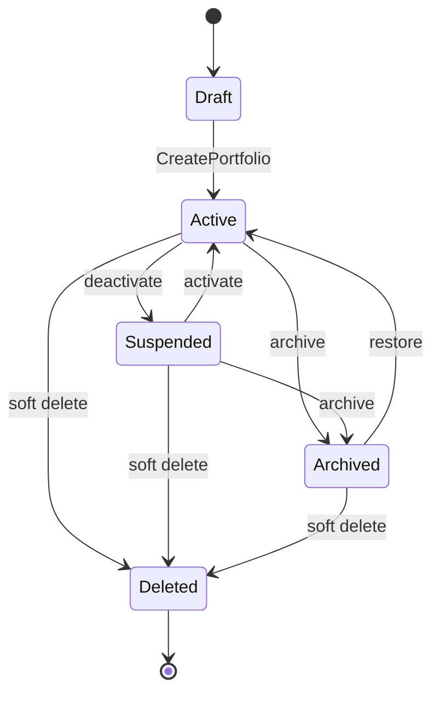
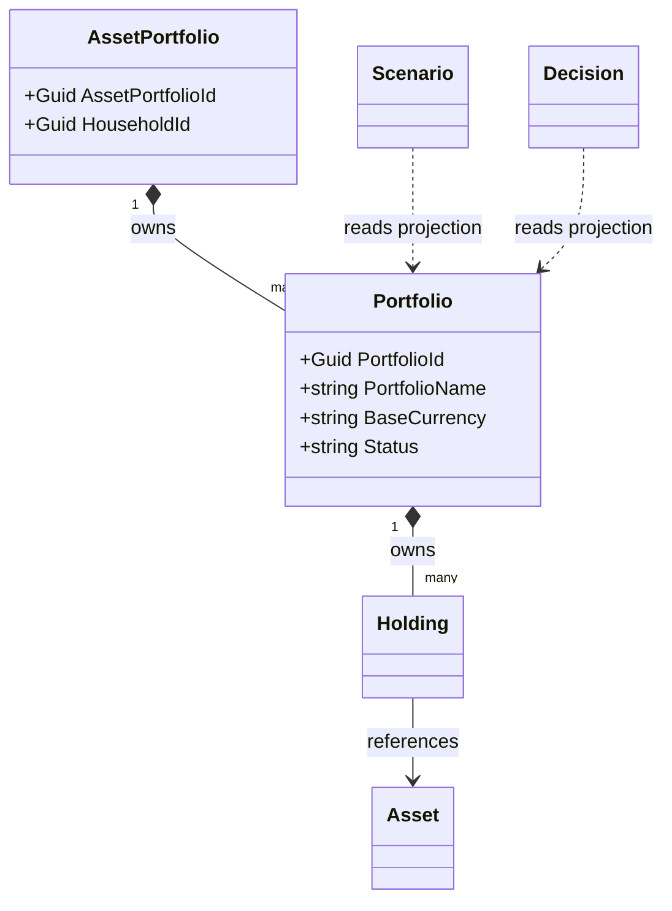
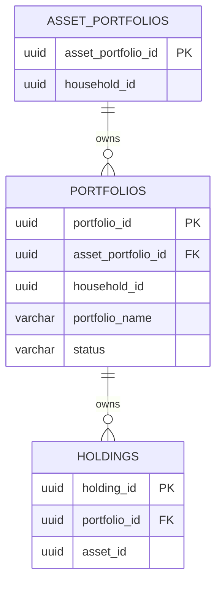
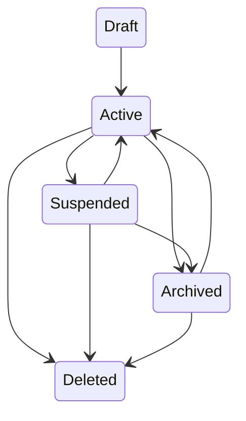
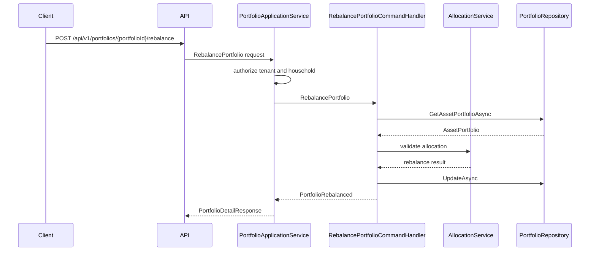
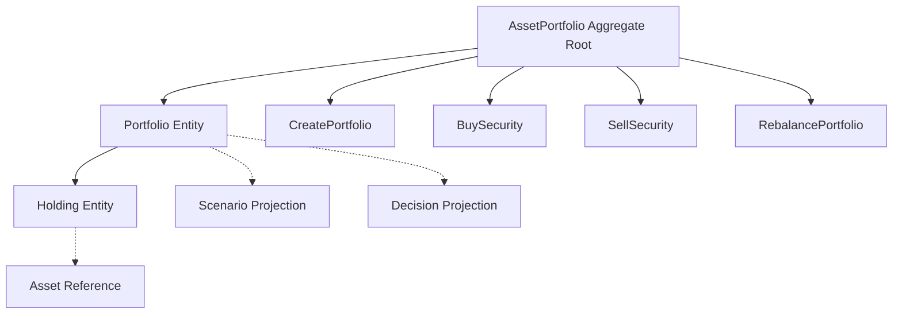

# Portfolio Entity Specification
## Split Navigation
- [Portfolio identity and semantics](portfolio-entity/identity-and-semantics.md)
- [Portfolio API and persistence](portfolio-entity/api-and-persistence.md)
- [Portfolio governance and testing](portfolio-entity/governance-and-testing.md)
- [Portfolio rules and state](portfolio-entity/rules-and-state.md)
- [Portfolio commands and events](portfolio-entity/commands-and-events.md)
- [Portfolio service projections and operations](portfolio-entity/service-projections-and-operations.md)
# Document Control
| Field | Value |
|---|---|
| Document Name | Portfolio Entity Specification |
| Document Path | knowledge/entity/Portfolio.md |
| Document Type | Enterprise Entity Specification |
| Version | 1.0.0 |
| Status | Approved for Implementation |
| Domain | Portfolio |
| Bounded Context | Portfolio |
| Aggregate | AssetPortfolio |
| Aggregate Root | AssetPortfolio |
| Owner | AssetPortfolio aggregate owner through PortfolioApplicationService |
| Source of Truth | Entity Catalog, Aggregate Catalog, Command Catalog, Domain Event Catalog, Repository Catalog |
| Last Updated | 2026-07-14 |
| Related Specifications | knowledge/entity-catalog.md; knowledge/aggregate-catalog.md; knowledge/domain-model-catalog.md; knowledge/bounded-context-catalog.md; knowledge/value-object-catalog.md; knowledge/enumeration-catalog.md; knowledge/command-catalog.md; knowledge/domain-event-catalog.md; knowledge/repository-catalog.md; knowledge/domain-service-catalog.md; knowledge/application-service-catalog.md; knowledge/service-catalog.md; knowledge/portfolio-performance-framework.md; knowledge/financial-dashboard-metrics.md; knowledge/financial-ratio-framework.md; knowledge/projection-engine-framework.md; knowledge/calculation-engine-framework.md; knowledge/market-assumptions.md; knowledge/investment-policy.md; knowledge/permission-framework.md; knowledge/tenant-framework.md; knowledge/audit-framework.md; knowledge/api-governance-framework.md; knowledge/message-contract-catalog.md; knowledge/entity/User.md; knowledge/entity/Household.md; knowledge/entity/Asset.md; knowledge/entity/Position.md; knowledge/entity/Liability.md; knowledge/entity/Loan.md; knowledge/entity/CashFlow.md; knowledge/entity/Goal.md; knowledge/entity/Scenario.md; knowledge/entity/Decision.md; knowledge/entity/Recommendation.md; docs/specification/04-DomainModel.md; docs/specification/04A-DomainInventory.md; docs/database/05-DatabaseDesign.md; docs/database/06-ERD.md; docs/api/07-API.md |
| Change Policy | Preserve AssetPortfolio ownership, Catalog command/event names, service boundaries, and source-of-truth rules. |
# Catalog Alignment Summary
| Concern | Source Catalog | Catalog Result | Final Atlas Name | Defined Here or Referenced | Implementation Artifact | Status | Notes |
|---|---|---|---|---|---|---|---|
| Domain | entity-catalog.md | Portfolio belongs to Portfolio domain. | Portfolio | Referenced | Module namespace | Catalog-aligned | No new domain |
| Bounded Context | entity-catalog.md | Portfolio bounded context. | Portfolio | Referenced | API/service boundary | Catalog-aligned | Same as Catalog |
| Aggregate | entity-catalog.md; aggregate-catalog.md | Portfolio is owned by AssetPortfolio. | AssetPortfolio | Referenced | Aggregate root | Catalog-aligned | Portfolio is not root |
| Aggregate Root | aggregate-catalog.md | Root is AssetPortfolio. | AssetPortfolio | Referenced | AssetPortfolio root | Catalog-aligned | One AssetPortfolio mutation |
| Entity | entity-catalog.md | Entity Name is Portfolio. | Portfolio | Referenced | PortfolioEntity | Catalog-aligned | Primary key PortfolioId |
| Child Entity | entity-catalog.md | Holding owned in portfolio scope. | Holding | Referenced | holdings table | Catalog-aligned | Position maps to Holding where applicable |
| Value Object | entity-catalog.md; domain-service-catalog.md | Money, Allocation, Percentage, RiskScore, CurrencyCode. | Money; Allocation; Percentage; RiskScore; CurrencyCode | Referenced | Amount, allocation, ratio fields | Catalog-aligned | Prefer Catalog VOs |
| Enumeration | enumeration-catalog.md | Portfolio-specific statuses not confirmed as formal enum. | Portfolio status value | Implementation Detail | status column | Catalog Gap | Not new Enumeration |
| Position | entity-catalog.md | Catalog term is Holding for position held inside Portfolio. | Holding | Referenced | holdings table | Catalog-aligned | Position document must not create new entity |
| Asset | entity-catalog.md | Asset is owned by AssetPortfolio and referenced by Holding. | Asset | Referenced | asset_id reference | Catalog-aligned | Portfolio cannot mutate external master data outside scope |
| Performance | domain-service-catalog.md | PortfolioService provides value and allocation analysis. | Portfolio performance projection | Implementation Detail | Read model/cache | Implementation Detail | Not aggregate state authority |
| Benchmark | investment-policy.md | Benchmark is policy/reference data when implemented. | Benchmark reference | Implementation Detail | benchmark_code | Implementation Detail | Not internal entity |
| Allocation | domain-service-catalog.md | AllocationService validates and calculates allocation. | Allocation | Referenced | allocation metadata | Catalog-aligned | Calculation outside repository |
| MarketData | market-assumptions.md | Market assumptions are external input. | Market data reference | Implementation Detail | valuation source metadata | Implementation Detail | Not aggregate entity |
| Command | command-catalog.md | CreatePortfolio, BuySecurity, SellSecurity, RebalancePortfolio. | CreatePortfolio; BuySecurity; SellSecurity; RebalancePortfolio | Referenced | Command handlers | Catalog-aligned | Assign/remove asset are API use cases only if mapped |
| Domain Event | domain-event-catalog.md | PortfolioCreated, SecurityPurchased, SecuritySold, PortfolioRebalanced, DividendDistributed. | Same | Referenced | Event contracts | Catalog-aligned | No PortfolioUpdated event added |
| Repository | entity-catalog.md | PortfolioRepository. | PortfolioRepository | Referenced | Repository interface | Catalog-aligned | No business logic |
| Domain Service | entity-catalog.md | PortfolioService, AllocationService, RiskService. | PortfolioService; AllocationService; RiskService | Referenced | Service calls | Catalog-aligned | Calculations outside aggregate |
| Application Service | entity-catalog.md | PortfolioApplicationService. | PortfolioApplicationService | Referenced | Use case layer | Catalog-aligned | Cross-aggregate orchestration |
| API Resource | entity-catalog.md | /api/v1/portfolios. | /api/v1/portfolios | Referenced | REST controller | Catalog-aligned | Household scoped |
| DTO | API governance | DTO is implementation contract. | Portfolio DTOs | Implementation Detail | Request/response schemas | Implementation Detail | Not Domain Concept |
| Permission | entity-catalog.md | Asset:Read for Portfolio API mapping. | Asset:Read and resource-action mappings | Referenced | Authorization policy | Catalog-aligned where present | Mutating permissions are API mapping |
| Database Table | entity-catalog.md | portfolios. | portfolios | Referenced | PostgreSQL table | Catalog-aligned | Owned by AssetPortfolio |
| Read Model | API governance | Projection is not source of truth. | Portfolio projection | Implementation Detail | Cache/materialized view | Implementation Detail | Read-only |
| Cache | entity-catalog.md | Portfolio valuation and allocation cache. | Portfolio valuation and allocation cache | Referenced | Cache keys | Catalog-aligned | Versioned and scoped |
| Audit | entity-catalog.md | Portfolio changes audited through AssetPortfolio. | Portfolio audit | Referenced | AuditRepository | Catalog-aligned | Complete audit |
| Tenant Boundary | tenant guidance | TenantId distinct from HouseholdId. | TenantId | Referenced | tenant_id | Catalog-aligned | Household is access scope |
# Entity Overview
## Purpose
Portfolio represents a container for investment holdings within AssetPortfolio.
Portfolio groups assets and holdings for allocation, risk, return analysis, household financial planning, dashboards, scenario input, and decision support.
Portfolio is not an Aggregate Root. AssetPortfolio is the Aggregate Root and owns Portfolio, Holding, and Asset references within portfolio scope.
## Responsibilities
| Responsibility | Description | Boundary |
|---|---|---|
| Portfolio identity | Maintains PortfolioId, PortfolioNumber, and PortfolioName. | Portfolio entity |
| Portfolio container | Groups holdings inside AssetPortfolio. | AssetPortfolio aggregate |
| Household scope | Carries HouseholdId for authorization. | Household isolation |
| Owner reference | Stores OwnerUserId or household ownership fields as references. | Identity reference |
| Base currency | Stores currency for portfolio-level display and reporting. | Portfolio state |
| Investment purpose | Stores objective/purpose text or code. | Portfolio metadata |
| Holding membership | Owns holding collection through AssetPortfolio composition. | Aggregate-internal |
| Allocation metadata | Stores target and policy metadata where implemented. | Portfolio metadata |
| Lifecycle | Participates in active, suspended, archived, deleted status. | AssetPortfolio aggregate |
| Audit and versioning | Changes audited through AssetPortfolio. | Audit boundary |
## Non-Responsibilities
| Non-Responsibility | Owning Concept |
|---|---|
| Performance calculation | PortfolioService and Projection Engine |
| Risk analysis | RiskService |
| Allocation optimization | AllocationService |
| Scenario projection | Scenario aggregate and ScenarioService |
| Decision scoring | DecisionService or DecisionSession |
| Recommendation generation | RecommendationService |
| Market data ownership | Market data integration |
| Benchmark entity ownership | Policy/reference data |
| Asset master mutation outside portfolio scope | Asset owner through AssetPortfolio rules |
| Repository business logic | Forbidden in PortfolioRepository |
## Business Meaning
Portfolio is the household-scoped investment container used to organize holdings and evaluate allocation, risk, and return.
AssetPortfolio owns Portfolio lifecycle and transaction consistency.
Holding is the Catalog entity representing a security or position held inside Portfolio. Position may be used in API/user language only when mapped to Holding and not declared as a new Domain Entity.
Asset can be referenced by Holding; Portfolio does not directly mutate external Asset master data outside the AssetPortfolio aggregate boundary.
Goal, Scenario, Decision, and Recommendation consume Portfolio state through projections, services, or events.
# Aggregate Boundary
| Boundary Concern | Rule |
|---|---|
| Consistency boundary | Portfolio identity, holdings membership, asset references in portfolio scope, allocation metadata, lifecycle state. |
| Transaction boundary | One AssetPortfolio mutation. |
| Child entity ownership | Portfolio and Holding are composed inside AssetPortfolio. |
| External aggregate references | Household, User, GoalPlan, Scenario, DecisionSession, Recommendation are identity references or projections. |
| Allowed in-transaction mutations | Portfolio metadata, holdings membership, allocation metadata, lifecycle and audit metadata. |
| Prohibited cross-aggregate mutations | Goal priority, Scenario output, Decision score, Recommendation state, external market data, external read models. |
| Repository ownership | PortfolioRepository persists AssetPortfolio and owned portfolio rows. |
| Event ownership | Catalog events only: PortfolioCreated, SecurityPurchased, SecuritySold, PortfolioRebalanced, DividendDistributed. |
| Concurrency boundary | AssetPortfolio Version and ConcurrencyToken protect Portfolio writes. |
| Audit boundary | Portfolio changes audited through AssetPortfolio. |
# Lifecycle
| Stage | Meaning | Status Handling | Catalog Position |
|---|---|---|---|
| Draft | Input before CreatePortfolio succeeds. | Not authoritative unless implementation stores draft. | Implementation Detail |
| Active | Portfolio participates in active allocation and commands. | status = Active | Implementation Detail |
| Suspended | Portfolio retained but write-restricted. | status = Suspended | Implementation Detail |
| Archived | Excluded from active allocation and read-only except restore. | status = Archived | Catalog archive strategy |
| Deleted | Soft-deleted and hidden from normal reads. | status = Deleted | Implementation Detail |
# Ownership
| Ownership Concern | Rule |
|---|---|
| Aggregate owner | AssetPortfolio owns Portfolio. |
| Persistence owner | PortfolioRepository. |
| Household owner | HouseholdId scopes access. |
| User owner | OwnerUserId references User; User is not owned. |
| Shared Ownership | Only supported as household-scoped or membership reference when cataloged; not a new entity. |
| Tenant owner | TenantId scopes persistence and authorization. |
| Holding owner | AssetPortfolio owns Holding through Portfolio. |
| Asset association | Holding references Asset by identity. |
| Archive owner | AssetPortfolio controls lifecycle. |
# Relationships
| Related Concept | Cardinality | Ownership Type | Aggregate Boundary | Navigation Direction | Required | Cascade Behavior | Delete Behavior | Authorization Impact | Audit Impact |
|---|---:|---|---|---|---|---|---|---|---|
| AssetPortfolio | Many portfolios to one root | Composition | Same aggregate | Portfolio belongs to AssetPortfolio | Required | Aggregate-internal | Root controls lifecycle | Household scope through root | Portfolio audit through root |
| Holding | One Portfolio to many holdings | Composition | Same aggregate | Portfolio owns Holding collection | Optional | Aggregate-internal | Holdings retained or closed by root | Same household scope | Holding audit through root |
| Position | User/API synonym for Holding | Referenced mapping | Same aggregate when mapped to Holding | Position maps to Holding | Optional | No separate cascade | No separate lifecycle | Same as Holding | Same as Holding |
| Asset | Many holdings to one asset reference | Reference within aggregate | AssetPortfolio scope | Holding stores AssetId | Optional until holding created | No external cascade | Asset lifecycle separate | Household authorization required | Reference audited |
| User | Owner or actor reference | Reference | Separate aggregate | OwnerUserId, CreatedBy, UpdatedBy | Required for writes | No cascade | User deletion does not delete portfolio | Actor checked | Actor captured |
| Household | Many portfolios to one scope | Reference | Separate aggregate | HouseholdId | Required | No cascade | Household archive blocks writes | Household access required | HouseholdId captured |
| Goal | Optional planning reference | Reference | GoalPlan aggregate | Projection or policy reference | Optional | No cascade | Goal lifecycle separate | Household scope required | Goal trace separate |
| Scenario | Simulation input | Reference | Scenario aggregate | Reads projection | Optional | No cascade | Scenario lifecycle separate | Household scope required | Snapshot trace |
| Decision | Decision input | Reference | DecisionSession aggregate | Reads projection | Optional | No cascade | Decision lifecycle separate | Household scope required | Decision trace |
| Recommendation | Recommendation input | Reference | Recommendation aggregate | Reads projection | Optional | No cascade | Recommendation lifecycle separate | Household scope required | Recommendation trace |
| Audit | Many records per portfolio | Reference | Audit storage | Audit stores PortfolioId | Required for writes | No cascade | Retained after delete | Review evidence | Complete trace |
# Navigation
| Navigation Type | Allowed Navigation | Rule |
|---|---|---|
| Owned navigation | AssetPortfolio to Portfolio; Portfolio to Holding. | Same aggregate only |
| Aggregate reference | HouseholdId, OwnerUserId, GoalId. | Identifier only |
| Read-only projection | Performance, allocation, risk, dashboard metric, scenario snapshot. | Not write model |
| Collection navigation | Portfolio to holdings. | Same aggregate only |
| Identity reference | TenantId, CreatedBy, UpdatedBy, ArchivedBy, DeletedBy. | IDs only |
| API expansion | include=holdings, include=allocation, include=performance, include=audit. | Read-only except command endpoints |
| Prohibited navigation | Mutable graph to Goal, Scenario, Decision, Recommendation, external MarketData. | Not allowed |
# Complete Properties
## Property Matrix
| Name | Type | Nullable | Default | Database Mapping | JSON Name | API Usage | Searchable | Sortable | Indexed | Encrypted | Auditable |
|---|---|---:|---|---|---|---|---:|---:|---:|---:|---:|
| PortfolioId | UUID | No | generated | portfolio_id uuid pk | portfolioId | route, response | Yes | Yes | Yes | No | Yes |
| AssetPortfolioId | UUID | No | none | asset_portfolio_id uuid | assetPortfolioId | create, response | Yes | Yes | Yes | No | Yes |
| TenantId | UUID | No | context | tenant_id uuid | tenantId | internal, response | Yes | Yes | Yes | No | Yes |
| HouseholdId | UUID | No | none | household_id uuid | householdId | create, response | Yes | Yes | Yes | No | Yes |
| OwnerUserId | UUID | No | actor | owner_user_id uuid | ownerUserId | create, update, response | Yes | Yes | Yes | No | Yes |
| PortfolioNumber | string(40) | No | generated | portfolio_number varchar(40) | portfolioNumber | response | Yes | Yes | Yes | No | Yes |
| PortfolioName | string(160) | No | none | portfolio_name varchar(160) | portfolioName | create, update, response | Yes | Yes | Yes | No | Yes |
| AccountReference | string(120) | Yes | null | account_reference varchar(120) | accountReference | create, update, response | Yes | No | Yes | Yes | Yes |
| Description | string(1000) | Yes | null | description varchar(1000) | description | create, update, response | Yes | No | No | No | Yes |
| PortfolioType | string(40) | No | Investment | portfolio_type varchar(40) | portfolioType | create, update, response | Yes | Yes | Yes | No | Yes |
| InvestmentPurpose | string(160) | Yes | null | investment_purpose varchar(160) | investmentPurpose | create, update, response | Yes | No | No | No | Yes |
| BaseCurrency | string(3) | No | household currency | base_currency char(3) | baseCurrency | create, update, response | Yes | Yes | Yes | No | Yes |
| BenchmarkReference | string(80) | Yes | null | benchmark_reference varchar(80) | benchmarkReference | create, update, response | Yes | No | No | No | Yes |
| TargetAllocation | jsonb | Yes | null | target_allocation jsonb | targetAllocation | create, update, response | No | No | No | No | Yes |
| RebalancePolicy | jsonb | Yes | null | rebalance_policy jsonb | rebalancePolicy | create, update, response | No | No | No | No | Yes |
| NetAssetValue | decimal(19,4) | Yes | null | net_asset_value numeric(19,4) | netAssetValue | response projection | Yes | Yes | No | No | Yes |
| TotalMarketValue | decimal(19,4) | Yes | null | total_market_value numeric(19,4) | totalMarketValue | response projection | Yes | Yes | No | No | Yes |
| Status | string(20) | No | Active | status varchar(20) | status | response, lifecycle | Yes | Yes | Yes | No | Yes |
| IsArchived | boolean | No | false | is_archived boolean | isArchived | response | Yes | Yes | Yes | No | Yes |
| ArchivedAt | timestamptz | Yes | null | archived_at timestamptz | archivedAt | response | Yes | Yes | Yes | No | Yes |
| ArchivedBy | UUID | Yes | null | archived_by uuid | archivedBy | response | Yes | No | No | No | Yes |
| DeletedAt | timestamptz | Yes | null | deleted_at timestamptz | deletedAt | response | Yes | Yes | Yes | No | Yes |
| DeletedBy | UUID | Yes | null | deleted_by uuid | deletedBy | response | Yes | No | No | No | Yes |
| CreatedAt | timestamptz | No | now | created_at timestamptz | createdAt | response | Yes | Yes | Yes | No | Yes |
| CreatedBy | UUID | No | actor | created_by uuid | createdBy | response | Yes | No | No | No | Yes |
| UpdatedAt | timestamptz | No | now | updated_at timestamptz | updatedAt | response | Yes | Yes | Yes | No | Yes |
| UpdatedBy | UUID | No | actor | updated_by uuid | updatedBy | response | Yes | No | No | No | Yes |
| Version | integer | No | 1 | version integer | version | response, concurrency | Yes | Yes | Yes | No | Yes |
| ConcurrencyToken | UUID | No | generated | concurrency_token uuid | concurrencyToken | response, If-Match | No | No | Yes | No | Yes |
## Property Details
| Name | Description | Validation | Business Meaning | Example | Security Notes |
|---|---|---|---|---|---|
| PortfolioId | Stable portfolio identity. | Required UUID; immutable. | Identifies Portfolio inside AssetPortfolio. | 3f2082a4-2000-4000-9000-000000000001 | Audited. |
| AssetPortfolioId | Aggregate root id. | Required and same household. | Establishes ownership. | 3f2082a4-2000-4000-9000-000000000002 | Audited. |
| TenantId | Tenant isolation key. | Required from trusted context. | Prevents cross-tenant access. | 3f2082a4-2000-4000-9000-000000000003 | Authorization input. |
| HouseholdId | Household access scope. | Required and authorized. | Planning and security scope. | 3f2082a4-2000-4000-9000-000000000004 | Audited. |
| OwnerUserId | Portfolio owner reference. | Required authorized User. | User portfolio ownership. | 3f2082a4-2000-4000-9000-000000000005 | Sensitive relationship data. |
| PortfolioNumber | Human-safe unique number. | Required unique per tenant. | Operational lookup. | PF-2026-000001 | Audited. |
| PortfolioName | Display name. | Required max 160; unique per household when policy applies. | Business identity. | Retirement Brokerage | Mask in logs. |
| AccountReference | External account reference. | Nullable max 120; encrypted. | Broker/account reference. | BRK-1234 | Encrypted at rest. |
| Description | Optional description. | Max 1000; sanitized. | Context without calculation authority. | Long-term retirement portfolio. | Mask in logs. |
| PortfolioType | Portfolio classification. | Required max 40. | Search and policy grouping. | Investment | Implementation value unless cataloged. |
| InvestmentPurpose | Purpose statement. | Nullable max 160. | Investment intent. | Retirement | Audited. |
| BaseCurrency | Portfolio currency. | Required uppercase length 3. | Reporting currency. | USD | Audited. |
| BenchmarkReference | Benchmark code/reference. | Nullable max 80. | Performance comparison reference. | SP500 | Not internal entity. |
| TargetAllocation | Target allocation metadata. | Nullable; percentages must total 100 when present. | Rebalancing policy input. | {"Equity":0.7,"Cash":0.3} | Audited. |
| RebalancePolicy | Rebalance tolerance/frequency metadata. | Nullable valid JSON. | RebalancePortfolio input. | {"tolerance":0.05} | Audited. |
| NetAssetValue | Derived NAV projection. | Nullable >= 0. | Reporting output. | 125000.0000 | Projection, not source. |
| TotalMarketValue | Derived total market value. | Nullable >= 0. | Reporting output. | 125500.0000 | Projection, not source. |
| Status | Lifecycle status. | Active, Suspended, Archived, Deleted. | Write eligibility. | Active | Implementation Detail. |
| IsArchived | Archive shortcut. | Must match Archived. | Search optimization. | false | Audited. |
| ArchivedAt | Archive timestamp. | Required when Archived. | Historical retention. | null | Audited. |
| ArchivedBy | Archive actor. | Required when Archived. | Accountability. | null | Audited. |
| DeletedAt | Soft delete timestamp. | Required when Deleted. | Normal read exclusion. | null | Audited. |
| DeletedBy | Delete actor. | Required when Deleted. | Accountability. | null | Audited. |
| CreatedAt | Creation timestamp. | Required server value. | Origin trace. | 2026-07-14T08:00:00Z | Audited. |
| CreatedBy | Creator. | Required actor. | Accountability. | 3f2082a4-2000-4000-9000-000000000005 | Audited. |
| UpdatedAt | Last update timestamp. | Required server value. | Synchronization. | 2026-07-14T08:30:00Z | Audited. |
| UpdatedBy | Last updater. | Required actor. | Accountability. | 3f2082a4-2000-4000-9000-000000000005 | Audited. |
| Version | Aggregate version. | Required >= 1. | Optimistic concurrency. | 7 | Audited. |
| ConcurrencyToken | Opaque concurrency token. | Required and changed on write. | Lost update protection. | 3f2082a4-2000-4000-9000-000000000009 | Not business data. |
# Portfolio Semantics
| Concept | Meaning | Source of Truth | Rule |
|---|---|---|---|
| Portfolio Identity | PortfolioId and PortfolioNumber. | AssetPortfolio aggregate. | Immutable id, unique number per tenant. |
| Portfolio Owner | OwnerUserId or household access scope. | Portfolio metadata and Household membership. | User is reference only. |
| Base Currency | Currency for portfolio reporting. | Portfolio property. | Required ISO uppercase. |
| Investment Purpose | User-facing investment objective. | Portfolio metadata. | Does not drive calculations by itself. |
| Reference Asset Collection | Assets referenced through holdings. | Holding/AssetPortfolio composition. | Portfolio cannot mutate external Asset master data. |
| Position Reference | Position maps to Holding. | Holding. | No new Position entity created here. |
| Performance Reference | Return and performance outputs. | Projection/PortfolioService. | Read-only, not source of truth. |
| Benchmark Reference | Benchmark code/policy reference. | Portfolio metadata or policy. | Not internal entity. |
| Net Asset Value | Derived NAV when implemented. | Projection. | Not command input source. |
| Total Market Value | Derived market value when implemented. | Projection. | Not aggregate source of truth. |
# Ownership Model
| Model | Definition | Catalog Status | Handling |
|---|---|---|---|
| User Portfolio | OwnerUserId references User and household access. | Catalog-aligned by reference | User not owned by Portfolio. |
| Household Portfolio | HouseholdId scopes portfolio access. | Catalog-aligned | Household not Tenant. |
| Shared Ownership | Household membership access to same portfolio. | Catalog-dependent | Do not create new SharedOwnership entity. |
| Tenant Boundary | TenantId scopes data and access. | Referenced | Required on all queries and writes. |
| Aggregate Boundary | AssetPortfolio owns Portfolio and Holding. | Catalog-aligned | One root mutation per transaction. |
# Asset Association Model
| Association | Rule |
|---|---|
| Portfolio and Asset Reference | Asset is associated through Holding or portfolio-scope Asset reference. |
| Portfolio and Position Reference | Position maps to Holding, the Catalog entity. |
| Aggregate Boundary | Portfolio, Holding, and Asset references are inside AssetPortfolio where cataloged. |
| Asset Mutation | Portfolio cannot directly modify external Asset master data outside aggregate rules. |
| Position Mutation | Position is not separate aggregate; mutate Holding through Portfolio commands only. |
| MarketData | Market data is external input for services and projections. |
# Validation Rules
| Rule Id | Field | Validation | Error Code | Severity |
|---|---|---|---|---|
| PF-VR-001 | PortfolioId | Required UUID and immutable. | PORTFOLIO_ID_INVALID | Critical |
| PF-VR-002 | AssetPortfolioId | Required and same tenant/household. | ASSET_PORTFOLIO_INVALID | Critical |
| PF-VR-003 | TenantId | Required trusted tenant. | TENANT_SCOPE_INVALID | Critical |
| PF-VR-004 | HouseholdId | Required authorized household. | HOUSEHOLD_SCOPE_INVALID | Critical |
| PF-VR-005 | OwnerUserId | Required authorized user. | OWNER_USER_INVALID | Critical |
| PF-VR-006 | PortfolioNumber | Required unique per tenant. | PORTFOLIO_NUMBER_DUPLICATE | High |
| PF-VR-007 | PortfolioName | Required max 160. | PORTFOLIO_NAME_INVALID | High |
| PF-VR-008 | AccountReference | Nullable max 120; encrypted when present. | ACCOUNT_REFERENCE_INVALID | Medium |
| PF-VR-009 | BaseCurrency | Required uppercase ISO 4217 value. | BASE_CURRENCY_INVALID | High |
| PF-VR-010 | TargetAllocation | Percentages total 1.0 when present. | TARGET_ALLOCATION_INVALID | High |
| PF-VR-011 | RebalancePolicy | Valid JSON and supported tolerance values. | REBALANCE_POLICY_INVALID | Medium |
| PF-VR-012 | NetAssetValue | Null or >= 0 projection value. | NET_ASSET_VALUE_INVALID | Medium |
| PF-VR-013 | TotalMarketValue | Null or >= 0 projection value. | TOTAL_MARKET_VALUE_INVALID | Medium |
| PF-VR-014 | Status | Active, Suspended, Archived, Deleted. | PORTFOLIO_STATUS_INVALID | High |
| PF-VR-015 | Archived | Archived requires IsArchived, ArchivedAt, ArchivedBy. | ARCHIVE_STATE_INVALID | High |
| PF-VR-016 | Deleted | Deleted requires DeletedAt and DeletedBy. | DELETE_STATE_INVALID | High |
| PF-VR-017 | Concurrency | Version and token must match. | PORTFOLIO_CONCURRENCY_CONFLICT | Critical |
| PF-VR-018 | Read Model | Projection cannot update aggregate. | READ_MODEL_WRITE_REJECTED | High |
| PF-VR-019 | Repository | Repository cannot calculate performance or authorization. | REPOSITORY_LOGIC_FORBIDDEN | High |
| PF-VR-020 | Cross Aggregate | Portfolio cannot mutate Goal, Scenario, Decision, Recommendation. | CROSS_AGGREGATE_MUTATION_FORBIDDEN | Critical |
# Business Rules
| Rule Id | Rule | Enforcement |
|---|---|---|
| PF-BR-001 | Portfolio belongs to one AssetPortfolio. | Aggregate and DB |
| PF-BR-002 | Portfolio belongs to one HouseholdId. | Application Service |
| PF-BR-003 | Portfolio belongs to one TenantId. | API and DB |
| PF-BR-004 | Portfolio is not Aggregate Root. | Catalog alignment |
| PF-BR-005 | AssetPortfolio owns Portfolio lifecycle. | Aggregate boundary |
| PF-BR-006 | Holding is Catalog entity for position held inside Portfolio. | Catalog alignment |
| PF-BR-007 | CreatePortfolio emits PortfolioCreated. | Command handler |
| PF-BR-008 | RebalancePortfolio emits PortfolioRebalanced. | Command handler |
| PF-BR-009 | BuySecurity and SellSecurity mutate Holding and emit catalog events. | Command handler |
| PF-BR-010 | PortfolioService calculates value and allocation analysis. | Service boundary |
| PF-BR-011 | RiskService performs risk analysis. | Service boundary |
| PF-BR-012 | AllocationService performs allocation optimization and validation. | Service boundary |
| PF-BR-013 | PortfolioRepository contains no calculations. | Code review |
| PF-BR-014 | Archived Portfolio is read-only except restore. | State guard |
| PF-BR-015 | Deleted Portfolio is hidden from normal reads. | Query filter |
| PF-BR-016 | Complete audit and version history retained. | Audit policy |
# Aggregate Invariants
| Invariant | Description |
|---|---|
| Root ownership | AssetPortfolioId is required and points to root. |
| Household isolation | TenantId and HouseholdId match root scope. |
| Name validity | PortfolioName is non-empty. |
| Currency validity | BaseCurrency is supported and uppercase. |
| Allocation total | Target allocation totals 100 percent when present. |
| Archive protection | Archived Portfolio rejects ordinary mutations. |
| Delete protection | Deleted Portfolio rejects ordinary mutations. |
| Holding ownership | Holdings remain inside AssetPortfolio. |
| Event ownership | Only catalog events are emitted. |
| Concurrency | Version and token change on write. |
# State Machine
| State | Transition | Trigger | Invariant | Illegal Transition |
|---|---|---|---|---|
| Draft | Draft to Active | CreatePortfolio | Name, household, base currency valid | Draft to Archived |
| Active | Active to Suspended | Deactivate API use case | Not deleted | Active hard delete |
| Active | Active to Archived | Archive API use case | ArchivedAt and ArchivedBy set | Active to Archived without token |
| Active | Active to Deleted | Delete API use case | DeletedAt and DeletedBy set | Hard delete |
| Suspended | Suspended to Active | Activate API use case | Not deleted | Suspended command mutation when disabled |
| Suspended | Suspended to Archived | Archive API use case | Archived fields set | Suspended to Deleted without audit |
| Archived | Archived to Active | Restore API use case | Archive fields cleared | Archived ordinary update |
| Archived | Archived to Deleted | Delete API use case | Deleted fields set | Archived to Suspended |
| Deleted | None | Normal API has no restore | DeletedAt and DeletedBy retained | Deleted to Active |

# Commands
| Command or Use Case | Catalog Status | Handler Boundary | Repository | Events | Notes |
|---|---|---|---|---|---|
| CreatePortfolio | Catalog Command | CreatePortfolioCommandHandler; PortfolioApplicationService | PortfolioRepository | PortfolioCreated | Mutates AssetPortfolio only |
| BuySecurity | Catalog Command | PortfolioApplicationService | PortfolioRepository | SecurityPurchased | Mutates Holding |
| SellSecurity | Catalog Command | PortfolioApplicationService | PortfolioRepository | SecuritySold | Mutates Holding |
| RebalancePortfolio | Catalog Command | PortfolioApplicationService; AllocationService | PortfolioRepository | PortfolioRebalanced | Updates allocation and holdings |
| ArchivePortfolio | Catalog Gap | PortfolioApplicationService | PortfolioRepository | None | API use case only |
| RestorePortfolio | Catalog Gap | PortfolioApplicationService | PortfolioRepository | None | Audit only |
| ActivatePortfolio | Catalog Gap | PortfolioApplicationService | PortfolioRepository | None | API use case |
| DeactivatePortfolio | Catalog Gap | PortfolioApplicationService | PortfolioRepository | None | API use case |
| AssignAsset | Catalog Gap unless mapped to BuySecurity or Holding command | PortfolioApplicationService | PortfolioRepository | SecurityPurchased when buy | Do not create new Domain Command |
| RemoveAsset | Catalog Gap unless mapped to SellSecurity | PortfolioApplicationService | PortfolioRepository | SecuritySold when sell | Do not create new Domain Command |
# Domain Events
| Event | Catalog Status | Producer | Consumer | Portfolio Impact |
|---|---|---|---|---|
| PortfolioCreated | Catalog Event | CreatePortfolio | Decision, Dashboard | Portfolio exists. |
| SecurityPurchased | Catalog Event | BuySecurity | Decision, Dashboard | Holding quantity increases. |
| SecuritySold | Catalog Event | SellSecurity | Decision, Dashboard | Holding quantity decreases. |
| PortfolioRebalanced | Catalog Event | RebalancePortfolio | Decision, Dashboard | Allocation changed. |
| DividendDistributed | Catalog Event | PortfolioApplicationService | Cash Flow, Dashboard | Income projection updates. |
| PortfolioUpdated | Catalog Gap | None | None | Use audit. |
| PortfolioArchived | Catalog Gap | None | None | Use audit. |
| PortfolioDeleted | Catalog Gap | None | None | Use audit. |
# Repository
## Interface
```csharp
public interface IPortfolioRepository
{
    Task<AssetPortfolio?> GetAssetPortfolioAsync(Guid tenantId, Guid householdId, Guid assetPortfolioId, CancellationToken cancellationToken);
    Task<Portfolio?> GetPortfolioAsync(Guid tenantId, Guid householdId, Guid portfolioId, CancellationToken cancellationToken);
    Task<bool> ExistsPortfolioAsync(Guid tenantId, Guid householdId, Guid portfolioId, CancellationToken cancellationToken);
    Task<bool> ExistsNumberAsync(Guid tenantId, string portfolioNumber, CancellationToken cancellationToken);
    Task<PagedResult<Portfolio>> ListPortfoliosAsync(PortfolioSearchSpecification specification, CancellationToken cancellationToken);
    Task AddAsync(AssetPortfolio assetPortfolio, CancellationToken cancellationToken);
    Task UpdateAsync(AssetPortfolio assetPortfolio, CancellationToken cancellationToken);
    Task SaveChangesAsync(CancellationToken cancellationToken);
}
```
## Query Methods
| Query | Filters | Sorts | Index Used |
|---|---|---|---|
| Search portfolios | tenantId, householdId, ownerUserId, status, portfolioType | portfolioName, updatedAt, totalMarketValue | tenant-household indexes |
| Active portfolios | tenantId, householdId, status Active | portfolioName | status index |
| Archived portfolios | tenantId, householdId, isArchived | archivedAt | archive index |
| Owner portfolios | tenantId, ownerUserId | portfolioName | owner index |
## Specification Pattern
Specifications describe persistence filters only. They do not calculate performance, market value, risk, allocation optimization, authorization, or recommendations.
# Domain Service Interaction
| Service | Catalog Status | Portfolio Interaction |
|---|---|---|
| PortfolioService | Catalog-aligned | Calculates portfolio value, allocation analysis, and projection input outside repository. |
| AllocationService | Catalog-aligned | Validates target allocation and supports RebalancePortfolio. |
| RiskService | Catalog-aligned | Consumes portfolio data for risk analysis. |
| ScenarioService | Catalog-aligned | Uses portfolio snapshot as scenario input. |
| DecisionService | Catalog-aligned | Uses portfolio projections for decision analysis. |
| RecommendationService | Catalog-aligned | Uses projections outside Portfolio. |
| Calculation Engine | Catalog-aligned capability | Performs formulas for services. |
| Projection Engine | Catalog-aligned capability | Builds read models, never writes aggregate. |
# Application Service Interaction
| Application Service | Catalog Status | Portfolio Responsibility |
|---|---|---|
| PortfolioApplicationService | Catalog-aligned | Handles CreatePortfolio, BuySecurity, SellSecurity, RebalancePortfolio, and API use cases. |
| DashboardApplicationService | Catalog-aligned | Reads valuation and allocation projections. |
| ScenarioApplicationService | Catalog-aligned where present | Uses portfolio snapshots. |
| DecisionApplicationService | Catalog-aligned where present | Uses portfolio projections. |
| RecommendationApplicationService | Catalog-aligned where present | Reads projections. |
| ReportApplicationService | Catalog-aligned | Investment reports and audit explanations. |
| AdministrationApplicationService | Catalog-aligned | Audit and operational queries. |
# REST API
| Method | Path | Use Case | Permission | Status Codes |
|---|---|---|---|---|
| POST | /api/v1/portfolios | CreatePortfolio | Asset:Create | 201, 400, 401, 403, 409, 422 |
| GET | /api/v1/portfolios/{portfolioId} | Get detail | Asset:Read | 200, 401, 403, 404 |
| PATCH | /api/v1/portfolios/{portfolioId} | Update Portfolio API use case | Asset:Update | 200, 400, 401, 403, 404, 409, 422 |
| POST | /api/v1/portfolios/{portfolioId}/rebalance | RebalancePortfolio | Asset:Update | 200, 401, 403, 404, 409, 422 |
| POST | /api/v1/portfolios/{portfolioId}/archive | Archive | Asset:Archive | 200, 401, 403, 404, 409, 422 |
| POST | /api/v1/portfolios/{portfolioId}/restore | Restore | Asset:Restore | 200, 401, 403, 404, 409, 422 |
| POST | /api/v1/portfolios/{portfolioId}/activate | Activate | Asset:Update | 200, 401, 403, 404, 409, 422 |
| POST | /api/v1/portfolios/{portfolioId}/deactivate | Deactivate | Asset:Update | 200, 401, 403, 404, 409, 422 |
| POST | /api/v1/portfolios/{portfolioId}/holdings | Assign Asset when mapped to BuySecurity | Asset:Update | 200, 401, 403, 404, 409, 422 |
| DELETE | /api/v1/portfolios/{portfolioId}/holdings/{holdingId} | Remove Asset when mapped to SellSecurity | Asset:Update | 204, 401, 403, 404, 409, 422 |
| DELETE | /api/v1/portfolios/{portfolioId} | Soft delete | Asset:Delete | 204, 401, 403, 404, 409, 422 |
| GET | /api/v1/portfolios | Search portfolios | Asset:Read | 200, 400, 401, 403 |
# DTO
| DTO | Fields |
|---|---|
| CreatePortfolioRequest | householdId, assetPortfolioId, ownerUserId, portfolioName, accountReference, description, portfolioType, investmentPurpose, baseCurrency, benchmarkReference, targetAllocation, rebalancePolicy |
| UpdatePortfolioRequest | portfolioName, accountReference, description, portfolioType, investmentPurpose, baseCurrency, benchmarkReference, targetAllocation, rebalancePolicy, concurrencyToken |
| RebalancePortfolioRequest | targetAllocation, rebalancePolicy, effectiveDate, idempotencyKey, concurrencyToken |
| AssignAssetRequest | assetId, securityIdentifier, quantity, price, currency, transactionDate, idempotencyKey, concurrencyToken |
| RemoveAssetRequest | holdingId, quantity, price, currency, transactionDate, idempotencyKey, concurrencyToken |
| PortfolioDetailResponse | all response-safe properties from Property Matrix plus holdings, allocation projection, performance projection, version, concurrencyToken |
| PortfolioSummaryResponse | portfolioId, portfolioNumber, portfolioName, baseCurrency, netAssetValue, totalMarketValue, status |
| PortfolioSearchRequest | householdId, ownerUserId, portfolioType, status, page, pageSize, sort |
# Database Mapping
| Column | Type | Nullable | Constraint |
|---|---|---:|---|
| portfolio_id | uuid | No | Primary key |
| asset_portfolio_id | uuid | No | Aggregate root reference |
| tenant_id | uuid | No | Tenant scoped |
| household_id | uuid | No | Household scoped |
| owner_user_id | uuid | No | User reference |
| portfolio_number | varchar(40) | No | Unique with tenant_id |
| portfolio_name | varchar(160) | No | Non-empty |
| account_reference | varchar(120) | Yes | Encrypted |
| description | varchar(1000) | Yes | Sanitized |
| portfolio_type | varchar(40) | No | Implementation value |
| investment_purpose | varchar(160) | Yes | Metadata |
| base_currency | char(3) | No | Uppercase |
| benchmark_reference | varchar(80) | Yes | Reference |
| target_allocation | jsonb | Yes | Metadata |
| rebalance_policy | jsonb | Yes | Metadata |
| net_asset_value | numeric(19,4) | Yes | Projection |
| total_market_value | numeric(19,4) | Yes | Projection |
| status | varchar(20) | No | Lifecycle |
| is_archived | boolean | No | Archive shortcut |
| archived_at | timestamptz | Yes | Archive timestamp |
| archived_by | uuid | Yes | Actor |
| deleted_at | timestamptz | Yes | Soft delete |
| deleted_by | uuid | Yes | Actor |
| created_at | timestamptz | No | Created timestamp |
| created_by | uuid | No | Creator |
| updated_at | timestamptz | No | Updated timestamp |
| updated_by | uuid | No | Updater |
| version | integer | No | Concurrency |
| concurrency_token | uuid | No | Concurrency |
# PostgreSQL DDL
```sql
CREATE SCHEMA IF NOT EXISTS atlas;
CREATE TABLE IF NOT EXISTS atlas.portfolios (
    portfolio_id uuid PRIMARY KEY,
    asset_portfolio_id uuid NOT NULL,
    tenant_id uuid NOT NULL,
    household_id uuid NOT NULL,
    owner_user_id uuid NOT NULL,
    portfolio_number varchar(40) NOT NULL,
    portfolio_name varchar(160) NOT NULL,
    account_reference varchar(120) NULL,
    description varchar(1000) NULL,
    portfolio_type varchar(40) NOT NULL DEFAULT 'Investment',
    investment_purpose varchar(160) NULL,
    base_currency char(3) NOT NULL,
    benchmark_reference varchar(80) NULL,
    target_allocation jsonb NULL,
    rebalance_policy jsonb NULL,
    net_asset_value numeric(19,4) NULL,
    total_market_value numeric(19,4) NULL,
    status varchar(20) NOT NULL DEFAULT 'Active',
    is_archived boolean NOT NULL DEFAULT false,
    archived_at timestamptz NULL,
    archived_by uuid NULL,
    deleted_at timestamptz NULL,
    deleted_by uuid NULL,
    created_at timestamptz NOT NULL DEFAULT now(),
    created_by uuid NOT NULL,
    updated_at timestamptz NOT NULL DEFAULT now(),
    updated_by uuid NOT NULL,
    version integer NOT NULL DEFAULT 1,
    concurrency_token uuid NOT NULL,
    CONSTRAINT uq_portfolios_tenant_number UNIQUE (tenant_id, portfolio_number),
    CONSTRAINT uq_portfolios_household_name UNIQUE (tenant_id, household_id, portfolio_name),
    CONSTRAINT ck_portfolios_name CHECK (length(btrim(portfolio_name)) > 0),
    CONSTRAINT ck_portfolios_currency CHECK (base_currency = upper(base_currency) AND length(base_currency) = 3),
    CONSTRAINT ck_portfolios_status CHECK (status IN ('Active', 'Suspended', 'Archived', 'Deleted')),
    CONSTRAINT ck_portfolios_values CHECK ((net_asset_value IS NULL OR net_asset_value >= 0) AND (total_market_value IS NULL OR total_market_value >= 0)),
    CONSTRAINT ck_portfolios_archive CHECK ((status = 'Archived' AND is_archived = true AND archived_at IS NOT NULL AND archived_by IS NOT NULL) OR (status <> 'Archived' AND is_archived = false)),
    CONSTRAINT ck_portfolios_delete CHECK ((status = 'Deleted' AND deleted_at IS NOT NULL AND deleted_by IS NOT NULL) OR status <> 'Deleted'),
    CONSTRAINT ck_portfolios_version CHECK (version >= 1)
);
CREATE INDEX IF NOT EXISTS ix_portfolios_tenant_household ON atlas.portfolios (tenant_id, household_id);
CREATE INDEX IF NOT EXISTS ix_portfolios_asset_portfolio ON atlas.portfolios (tenant_id, asset_portfolio_id);
CREATE INDEX IF NOT EXISTS ix_portfolios_owner ON atlas.portfolios (tenant_id, owner_user_id);
CREATE INDEX IF NOT EXISTS ix_portfolios_status ON atlas.portfolios (tenant_id, household_id, status);
CREATE INDEX IF NOT EXISTS ix_portfolios_type ON atlas.portfolios (tenant_id, household_id, portfolio_type);
CREATE INDEX IF NOT EXISTS ix_portfolios_name ON atlas.portfolios (tenant_id, household_id, portfolio_name);
CREATE INDEX IF NOT EXISTS ix_portfolios_market_value ON atlas.portfolios (tenant_id, household_id, total_market_value);
CREATE INDEX IF NOT EXISTS ix_portfolios_archived ON atlas.portfolios (tenant_id, is_archived, archived_at);
CREATE INDEX IF NOT EXISTS ix_portfolios_deleted ON atlas.portfolios (tenant_id, deleted_at);
CREATE INDEX IF NOT EXISTS ix_portfolios_concurrency_token ON atlas.portfolios (concurrency_token);
```
# EF Core Fluent API
```csharp
public sealed class PortfolioEntityConfiguration : IEntityTypeConfiguration<PortfolioEntity>
{
    public void Configure(EntityTypeBuilder<PortfolioEntity> builder)
    {
        builder.ToTable("portfolios", "atlas");
        builder.HasKey(x => x.PortfolioId);
        builder.Property(x => x.PortfolioId).HasColumnName("portfolio_id").ValueGeneratedNever();
        builder.Property(x => x.AssetPortfolioId).HasColumnName("asset_portfolio_id").IsRequired();
        builder.Property(x => x.TenantId).HasColumnName("tenant_id").IsRequired();
        builder.Property(x => x.HouseholdId).HasColumnName("household_id").IsRequired();
        builder.Property(x => x.OwnerUserId).HasColumnName("owner_user_id").IsRequired();
        builder.Property(x => x.PortfolioNumber).HasColumnName("portfolio_number").HasMaxLength(40).IsRequired();
        builder.Property(x => x.PortfolioName).HasColumnName("portfolio_name").HasMaxLength(160).IsRequired();
        builder.Property(x => x.AccountReference).HasColumnName("account_reference").HasMaxLength(120);
        builder.Property(x => x.Description).HasColumnName("description").HasMaxLength(1000);
        builder.Property(x => x.PortfolioType).HasColumnName("portfolio_type").HasMaxLength(40).HasDefaultValue("Investment").IsRequired();
        builder.Property(x => x.InvestmentPurpose).HasColumnName("investment_purpose").HasMaxLength(160);
        builder.Property(x => x.BaseCurrency).HasColumnName("base_currency").HasMaxLength(3).IsFixedLength().IsRequired();
        builder.Property(x => x.BenchmarkReference).HasColumnName("benchmark_reference").HasMaxLength(80);
        builder.Property(x => x.TargetAllocation).HasColumnName("target_allocation").HasColumnType("jsonb");
        builder.Property(x => x.RebalancePolicy).HasColumnName("rebalance_policy").HasColumnType("jsonb");
        builder.Property(x => x.NetAssetValue).HasColumnName("net_asset_value").HasPrecision(19, 4);
        builder.Property(x => x.TotalMarketValue).HasColumnName("total_market_value").HasPrecision(19, 4);
        builder.Property(x => x.Status).HasColumnName("status").HasMaxLength(20).HasDefaultValue("Active").IsRequired();
        builder.Property(x => x.IsArchived).HasColumnName("is_archived").HasDefaultValue(false).IsRequired();
        builder.Property(x => x.ArchivedAt).HasColumnName("archived_at");
        builder.Property(x => x.ArchivedBy).HasColumnName("archived_by");
        builder.Property(x => x.DeletedAt).HasColumnName("deleted_at");
        builder.Property(x => x.DeletedBy).HasColumnName("deleted_by");
        builder.Property(x => x.CreatedAt).HasColumnName("created_at").HasDefaultValueSql("now()").IsRequired();
        builder.Property(x => x.CreatedBy).HasColumnName("created_by").IsRequired();
        builder.Property(x => x.UpdatedAt).HasColumnName("updated_at").HasDefaultValueSql("now()").IsRequired();
        builder.Property(x => x.UpdatedBy).HasColumnName("updated_by").IsRequired();
        builder.Property(x => x.Version).HasColumnName("version").HasDefaultValue(1).IsConcurrencyToken().IsRequired();
        builder.Property(x => x.ConcurrencyToken).HasColumnName("concurrency_token").IsConcurrencyToken().IsRequired();
        builder.HasIndex(x => new { x.TenantId, x.PortfolioNumber }).IsUnique().HasDatabaseName("uq_portfolios_tenant_number");
        builder.HasIndex(x => new { x.TenantId, x.HouseholdId, x.PortfolioName }).IsUnique().HasDatabaseName("uq_portfolios_household_name");
        builder.HasIndex(x => new { x.TenantId, x.HouseholdId }).HasDatabaseName("ix_portfolios_tenant_household");
        builder.HasIndex(x => new { x.TenantId, x.AssetPortfolioId }).HasDatabaseName("ix_portfolios_asset_portfolio");
        builder.HasIndex(x => new { x.TenantId, x.OwnerUserId }).HasDatabaseName("ix_portfolios_owner");
        builder.HasIndex(x => new { x.TenantId, x.HouseholdId, x.Status }).HasDatabaseName("ix_portfolios_status");
        builder.HasIndex(x => new { x.TenantId, x.HouseholdId, x.PortfolioType }).HasDatabaseName("ix_portfolios_type");
        builder.HasIndex(x => new { x.TenantId, x.HouseholdId, x.PortfolioName }).HasDatabaseName("ix_portfolios_name");
        builder.HasIndex(x => new { x.TenantId, x.HouseholdId, x.TotalMarketValue }).HasDatabaseName("ix_portfolios_market_value");
        builder.HasIndex(x => new { x.TenantId, x.IsArchived, x.ArchivedAt }).HasDatabaseName("ix_portfolios_archived");
        builder.HasIndex(x => new { x.TenantId, x.DeletedAt }).HasDatabaseName("ix_portfolios_deleted");
        builder.HasIndex(x => x.ConcurrencyToken).HasDatabaseName("ix_portfolios_concurrency_token");
        builder.HasQueryFilter(x => x.DeletedAt == null);
    }
}
```
# Cache Strategy
| Cache | Key | Invalidation | Source of Truth |
|---|---|---|---|
| Portfolio detail | tenant:{tenantId}:household:{householdId}:portfolio:{portfolioId}:v{version} | Any AssetPortfolio write | PortfolioRepository |
| Portfolio valuation | tenant:{tenantId}:portfolio:{portfolioId}:valuation:{hash} | Holding, market data, valuation source change | Projection |
| Allocation summary | tenant:{tenantId}:portfolio:{portfolioId}:allocation:{hash} | Holding or target allocation change | AllocationService output |
| Performance summary | tenant:{tenantId}:portfolio:{portfolioId}:performance:{hash} | Holding, transaction, market source change | Projection |
| Search cache | tenant:{tenantId}:portfolios:search:{hash} | Any portfolio write in tenant | PortfolioRepository |
# Security
| Area | Rule |
|---|---|
| Authorization | Actor must have TenantId, HouseholdId, and permission before repository access. |
| Permission | Asset:Read, Asset:Create, Asset:Update, Asset:Archive, Asset:Restore, Asset:Delete map to portfolio operations. |
| Data Masking | PortfolioName, AccountReference, value fields, and owner references are masked in low-trust logs. |
| Encryption | AccountReference is encrypted at rest. |
| Tenant Isolation | TenantId comes from trusted context. |
| Household Isolation | HouseholdId required on every command and query. |
| Market Data | External market data cannot be persisted as aggregate fact without approved import. |
# Audit
| Audit Requirement | Implementation |
|---|---|
| Command trace | Capture CreatePortfolio, BuySecurity, SellSecurity, RebalancePortfolio and idempotency. |
| Write trace | Capture before and after values for portfolio metadata and lifecycle fields. |
| Actor trace | Capture CreatedBy, UpdatedBy, ArchivedBy, DeletedBy. |
| Scope trace | Capture TenantId, HouseholdId, AssetPortfolioId, PortfolioId. |
| Allocation trace | Capture target allocation and rebalance policy changes. |
| Event trace | Link catalog events to command and transaction. |
| Retention | Audit retained after archive and soft delete. |
# Observability
| Signal | Metric or Log |
|---|---|
| API latency | portfolio.api.duration |
| Command latency | portfolio.command.duration |
| Repository latency | portfolio.repository.duration |
| PortfolioService latency | portfolio.service.duration |
| AllocationService latency | portfolio.allocation.duration |
| RiskService latency | portfolio.risk.duration |
| Concurrency conflicts | portfolio.concurrency.conflict.count |
| Projection lag | portfolio.projection.lag.seconds |
| Audit failure | portfolio.audit.failure.count |
# Performance
| Concern | Strategy |
|---|---|
| Index Strategy | Tenant, household, status, type, owner, and market value indexes. |
| Caching | Versioned detail cache and hash-based valuation/allocation/performance caches. |
| Optimistic Concurrency | Version and ConcurrencyToken on all writes. |
| Batch Calculation | Performance, NAV, market value, risk, and allocation projections calculated in service batches. |
| Partition Strategy | Partition by tenant_id for high-volume tenants. |
| Event Processing | Idempotent consumers by event id and aggregate version. |
# Example JSON
Create, update, rebalance, assign asset, remove asset, detail, summary, and search examples use the DTO fields listed above and JSON names in the Property Matrix.
# Mermaid
## Class Diagram

## ER Diagram

## State Diagram

## Sequence Diagram

## Aggregate Diagram

# Testing
| Test Type | Coverage |
|---|---|
| Unit Test | CreatePortfolio requires AssetPortfolioId, HouseholdId, OwnerUserId, PortfolioName, BaseCurrency. |
| Unit Test | Target allocation must total 100 percent when present. |
| Unit Test | Archived Portfolio rejects ordinary update. |
| Unit Test | RebalancePortfolio emits PortfolioRebalanced. |
| Unit Test | Assign asset maps to Holding command when supported. |
| Integration Test | POST persists Portfolio with unique tenant number. |
| Integration Test | Duplicate household portfolio name returns 409. |
| Integration Test | Stale token returns 409. |
| Validation Test | Invalid base currency and allocation rejected. |
| Security Test | Cross-tenant and cross-household access denied. |
| Contract Test | DTO JSON names match API and database mapping. |
| Performance Test | Search by household and status uses index. |
| Performance Test | Projection lag is observable. |
# Edge Cases
| # | Edge Case | Expected Handling |
|---:|---|---|
| 1 | Duplicate Portfolio Name | Reject within tenant and household. |
| 2 | Duplicate PortfolioNumber same tenant | Reject. |
| 3 | Same PortfolioNumber different tenant | Allow. |
| 4 | Cross Tenant read | Deny. |
| 5 | Cross Tenant write | Deny. |
| 6 | Cross Household read | Deny. |
| 7 | Cross Household write | Deny. |
| 8 | Invalid Base Currency | Reject. |
| 9 | Lowercase BaseCurrency | Normalize or reject by API validation. |
| 10 | Empty Portfolio | Allow if no holdings are required. |
| 11 | Empty Portfolio rebalance | Reject or no-op by service policy. |
| 12 | Archived Portfolio Mutation | Reject. |
| 13 | Deleted Portfolio Mutation | Reject. |
| 14 | Concurrent Update | One succeeds; one returns 409. |
| 15 | Concurrent Rebalance | One succeeds; one returns 409. |
| 16 | Cache Stale detail | Invalidate by version. |
| 17 | Cache Stale valuation | Invalidate by holding or market change. |
| 18 | Event Ordering PortfolioRebalanced before PortfolioCreated | Park or reject event. |
| 19 | Event Schema Mismatch | Reject event and alert. |
| 20 | Repository Retry after timeout | Use idempotency and transaction boundary. |
| 21 | Read Model Lag | Expose projection timestamp. |
| 22 | Projection Lag | Alert when threshold exceeded. |
| 23 | API Version Mismatch | Return version error. |
| 24 | Missing AssetPortfolioId | Reject. |
| 25 | AssetPortfolio cross household | Reject. |
| 26 | OwnerUserId lacks access | Reject. |
| 27 | PortfolioName blank | Reject. |
| 28 | PortfolioName script | Sanitize and encode. |
| 29 | AccountReference too long | Reject. |
| 30 | AccountReference logged raw | Security failure. |
| 31 | TargetAllocation null | Allow. |
| 32 | TargetAllocation total below 100 percent | Reject. |
| 33 | TargetAllocation total above 100 percent | Reject. |
| 34 | TargetAllocation negative weight | Reject. |
| 35 | TargetAllocation unknown class | Reject by policy. |
| 36 | RebalancePolicy invalid JSON | Reject. |
| 37 | Rebalance tolerance negative | Reject. |
| 38 | BenchmarkReference unknown | Store as reference only or reject by policy. |
| 39 | Performance missing | Return unavailable projection. |
| 40 | NAV missing | Return null projection. |
| 41 | TotalMarketValue negative projection | Reject projection write. |
| 42 | MarketData missing | Keep aggregate unchanged. |
| 43 | MarketData stale | Mark projection stale. |
| 44 | Holding asset missing | Reject BuySecurity. |
| 45 | Holding asset cross tenant | Reject. |
| 46 | Holding asset cross household | Reject. |
| 47 | Assign Asset unsupported | Return unsupported operation. |
| 48 | Remove Asset unsupported | Return unsupported operation. |
| 49 | BuySecurity idempotency replay same hash | Return prior result. |
| 50 | BuySecurity idempotency replay different hash | Reject conflict. |
| 51 | SellSecurity more than quantity | Reject. |
| 52 | SellSecurity zero quantity | Reject. |
| 53 | BuySecurity zero quantity | Reject. |
| 54 | Price missing | Reject when command requires price. |
| 55 | Currency mismatch | Reject or use approved FX workflow. |
| 56 | DividendDistributed duplicate | Consumer idempotency. |
| 57 | PortfolioCreated duplicate | Consumer idempotency. |
| 58 | PortfolioRebalanced duplicate | Consumer idempotency. |
| 59 | Rebalance with archived holding | Reject or exclude by policy. |
| 60 | Rebalance with stale holdings | Require fresh aggregate version. |
| 61 | Goal tries to mutate Portfolio | Reject. |
| 62 | Decision tries to mutate Portfolio | Reject. |
| 63 | Recommendation tries to trade directly | Require PortfolioApplicationService. |
| 64 | Scenario writes allocation | Reject. |
| 65 | Repository calculates performance | Fail tests and review. |
| 66 | Repository performs authorization | Fail tests and review. |
| 67 | Projection writes aggregate | Reject. |
| 68 | Audit Failure | Fail write by audit policy. |
| 69 | Missing correlation id | Reject write. |
| 70 | Missing idempotency key on command | Reject command when required. |
| 71 | Tenant disabled | Deny access. |
| 72 | Household archived | Reject write. |
| 73 | Portfolio archived then restore | Restore only with version token. |
| 74 | Restore deleted portfolio | Unsupported normal API operation. |
| 75 | Delete active portfolio with holdings | Soft delete by policy or reject if holdings active. |
| 76 | Delete already deleted | Idempotent only with same key. |
| 77 | Activate deleted portfolio | Reject. |
| 78 | Deactivate archived portfolio | Reject. |
| 79 | Unknown PortfolioType | Reject by API allowlist. |
| 80 | Shared Ownership requested | Use Household membership; do not create entity. |
| 81 | User removed from household | Access revoked; portfolio retained. |
| 82 | OwnerUser deleted | Retain reference and require admin remediation. |
| 83 | Account provider changed | Update metadata with audit. |
| 84 | Base currency change with holdings | Require service validation. |
| 85 | FX conversion failure | Keep native values and mark projection unavailable. |
| 86 | Benchmark deleted externally | Keep reference and mark projection unavailable. |
| 87 | Invalid sort field | Reject. |
| 88 | Page size above limit | Reject or clamp by governance. |
| 89 | Search with deleted records | Admin-only explicit filter. |
| 90 | Holding closed | Retain for history. |
| 91 | Holding reopened | Requires supported command. |
| 92 | Asset master data update delayed | Projection catches up. |
| 93 | Cash dividend without holding | Reject or route to CashFlow by policy. |
| 94 | Negative NAV projection | Reject projection. |
| 95 | Negative market value projection | Reject projection. |
| 96 | Allocation drift above tolerance | Surface projection; do not mutate automatically. |
| 97 | Rebalance optimization unavailable | Return service unavailable without mutation. |
| 98 | Risk service unavailable | Portfolio write remains independent unless command requires risk. |
| 99 | Outbox write failure | Fail transaction. |
| 100 | Event consumer lag | Alert and expose projection age. |
| 101 | Event replay | Idempotent consumers. |
| 102 | Event missing householdId | Reject event. |
| 103 | Event missing aggregate version | Reject event. |
| 104 | PortfolioNumber collision under retry | Return 409 or regenerate before commit. |
| 105 | AccountReference encryption failure | Fail write. |
| 106 | Sensitive data export | Requires privileged audit. |
| 107 | API body TenantId conflict | Reject and use trusted context. |
| 108 | PortfolioName Unicode controls | Reject control characters. |
| 109 | PortfolioName valid Unicode | Allow. |
| 110 | Suspended portfolio BuySecurity | Reject unless policy allows. |
| 111 | Suspended portfolio SellSecurity | Reject unless policy allows. |
| 112 | Suspended portfolio read | Allow authorized read. |
| 113 | Rebalance with no target allocation | Reject. |
| 114 | TargetAllocation precision rounding | Validate tolerance. |
| 115 | Holding price stale | Reject command or mark price source stale. |
| 116 | Market close holiday | Service handles pricing availability. |
| 117 | Weekend valuation | Projection marks valuation date. |
| 118 | Multiple owners requested | Treat as household access unless cataloged. |
| 119 | Position document mismatch | Use Holding as final Catalog name. |
| 120 | Asset document uses AssetPortfolio | Keep same aggregate boundary. |
# Error Catalog
| Code | HTTP | Message |
|---|---:|---|
| PORTFOLIO_ID_INVALID | 400 | PortfolioId is invalid. |
| PORTFOLIO_NOT_FOUND | 404 | Portfolio was not found. |
| PORTFOLIO_ACCESS_DENIED | 403 | Actor cannot access Portfolio. |
| PORTFOLIO_NUMBER_DUPLICATE | 409 | PortfolioNumber already exists. |
| PORTFOLIO_NAME_DUPLICATE | 409 | PortfolioName already exists in household. |
| BASE_CURRENCY_INVALID | 422 | BaseCurrency is invalid. |
| TARGET_ALLOCATION_INVALID | 422 | TargetAllocation is invalid. |
| PORTFOLIO_CONCURRENCY_CONFLICT | 409 | Portfolio version conflict. |
| REPOSITORY_LOGIC_FORBIDDEN | 500 | Repository attempted forbidden logic. |
| CROSS_AGGREGATE_MUTATION_FORBIDDEN | 422 | Cross-aggregate mutation is forbidden. |
# Data Migration
| Migration Step | Rule |
|---|---|
| Create table | Deploy atlas.portfolios with constraints and indexes. |
| Backfill AssetPortfolioId | Every row maps to AssetPortfolio root. |
| Backfill TenantId | Every row receives trusted TenantId. |
| Backfill HouseholdId | Every row receives household scope from root. |
| Backfill OwnerUserId | Use authorized owner or migration actor. |
| Backfill PortfolioNumber | Generate per tenant. |
| Backfill BaseCurrency | Persist uppercase CurrencyCode. |
| Backfill Status | Active for open portfolios; Archived for historical. |
| Backfill Version | Set Version to 1. |
| Backfill Token | Generate ConcurrencyToken. |
| Validate Holdings | Holdings reference valid Portfolio and Asset. |
| Validate Audit | Migration audit records source and transformation. |
# Consistency Verification
| Verification | Expected Result |
|---|---|
| Catalog names | Portfolio, AssetPortfolio, Holding, PortfolioRepository retained. |
| Aggregate boundary | AssetPortfolio owns Portfolio and Holding. |
| Position boundary | Position maps to Holding; no new entity. |
| Asset boundary | Asset referenced through Holding and not directly mutated. |
| Command mapping | CreatePortfolio, BuySecurity, SellSecurity, RebalancePortfolio only formal commands. |
| Event mapping | PortfolioCreated, SecurityPurchased, SecuritySold, PortfolioRebalanced, DividendDistributed only formal events. |
| Repository | No performance, risk, allocation, or authorization logic. |
| Read model | Projection only. |
| Security | Tenant and Household isolation enforced. |
| Audit | Complete audit and version history required. |
# Completion Checklist
Document Control, Catalog Alignment Summary, Entity Overview, Aggregate Boundary, Lifecycle, Ownership, Relationships, Navigation, Complete Properties, Portfolio Semantics, Ownership Model, Asset Association Model, Validation Rules, Business Rules, Aggregate Invariants, State Machine, Commands, Domain Events, Repository, Domain Service Interaction, Application Service Interaction, REST API, DTO, Database Mapping, PostgreSQL DDL, EF Core Fluent API, Cache Strategy, Security, Audit, Observability, Performance, Example JSON, Mermaid, Testing, Edge Cases, Error Catalog, Data Migration, Consistency Verification, Final Consistency Matrix, and Version History are complete.
# Final Consistency Matrix
| Concern | Source Catalog | Final Atlas Name | Defined Here or Referenced | Implementation Artifact | Status | Conflict | Resolution | Follow-up Catalog Change Required |
|---|---|---|---|---|---|---|---|---|
| Domain | entity-catalog.md | Portfolio | Referenced | Module namespace | Catalog-aligned | None | Use Catalog name | No |
| Aggregate | aggregate-catalog.md | AssetPortfolio | Referenced | Aggregate root | Catalog-aligned | Portfolio may appear root | Explicitly owned by AssetPortfolio | No |
| Aggregate Root | aggregate-catalog.md | AssetPortfolio | Referenced | Root entity | Catalog-aligned | Portfolio root assumption | Rejected | No |
| Entity | entity-catalog.md | Portfolio | Referenced | PortfolioEntity | Catalog-aligned | None | Use Catalog name | No |
| Position | entity-catalog.md | Holding | Referenced | HoldingEntity | Catalog-aligned | Position requested | Map to Holding | No |
| Asset | entity-catalog.md | Asset | Referenced | Asset reference | Catalog-aligned | Direct asset mutation risk | Mutate only through approved aggregate rules | No |
| Command | command-catalog.md | CreatePortfolio; BuySecurity; SellSecurity; RebalancePortfolio | Referenced | Command handlers | Catalog-aligned | CRUD/lifecycle absent | API use cases only | Optional catalog update |
| Domain Event | domain-event-catalog.md | PortfolioCreated; SecurityPurchased; SecuritySold; PortfolioRebalanced; DividendDistributed | Referenced | Event contracts | Catalog-aligned | Lifecycle events absent | Use audit only | Optional catalog update |
| Repository | repository-catalog.md | PortfolioRepository | Referenced | Repository interface | Catalog-aligned | None | No business logic | No |
| Domain Service | domain-service-catalog.md | PortfolioService; AllocationService; RiskService | Referenced | Service calls | Catalog-aligned | None | Services calculate | No |
| Application Service | application-service-catalog.md | PortfolioApplicationService | Referenced | Use case handlers | Catalog-aligned | None | Use Catalog service | No |
| API | entity-catalog.md | /api/v1/portfolios | Referenced | Controller | Catalog-aligned | None | Use Catalog resource | No |
| Permission | entity-catalog.md | Asset:Read and resource-action mappings | Referenced | Authorization policy | Catalog-aligned where present | Mutating permissions implicit | Treat as API mapping | Optional catalog update |
| Database | entity-catalog.md | portfolios | Referenced | PostgreSQL table | Catalog-aligned | None | Use table name | No |
| Read Model | API governance | Portfolio projection | Implementation Detail | Projection/cache | Implementation Detail | Projection may appear authoritative | Projection read-only | No |
| Audit | audit guidance | Portfolio audit through AssetPortfolio | Referenced | AuditRepository | Catalog-aligned | None | Mandatory audit | No |
| Tenant | tenant guidance | TenantId | Referenced | tenant_id | Catalog-aligned | Household confused with Tenant | Keep distinct | No |
# Version History
| Version | Date | Author or Owner | Change | Reason | Compatibility Impact | Migration Requirement |
|---|---|---|---|---|---|---|
| 1.0.0 | 2026-07-14 | Atlas Knowledge Base | Replaced Portfolio specification with Catalog-aligned Enterprise Specification. | Align Portfolio with AssetPortfolio ownership, Holding mapping, command/event rules, and implementation requirements. | Adds implementation contract without changing Domain model. | Create or align portfolios table, indexes, constraints, DTOs, API mapping, EF mapping, cache, audit, and tests. |
