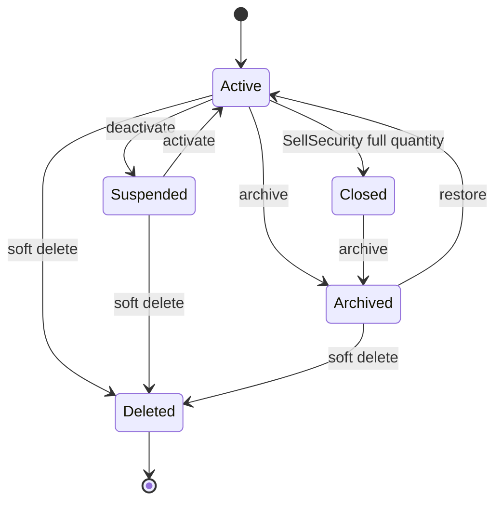
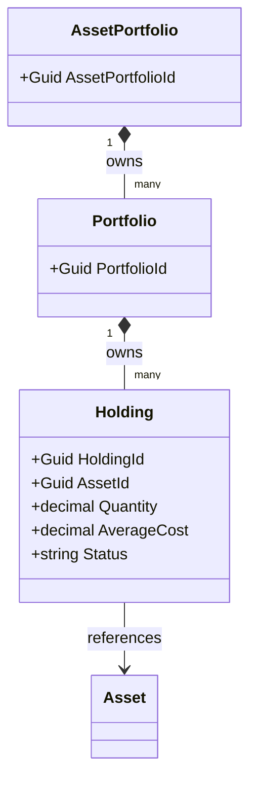
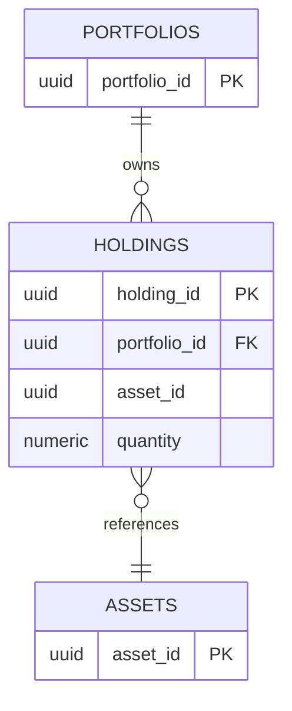
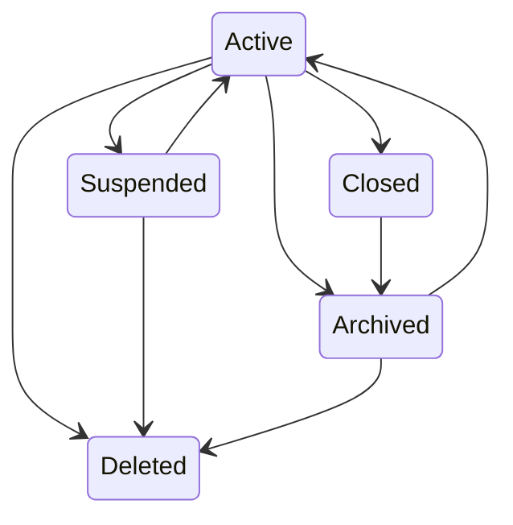
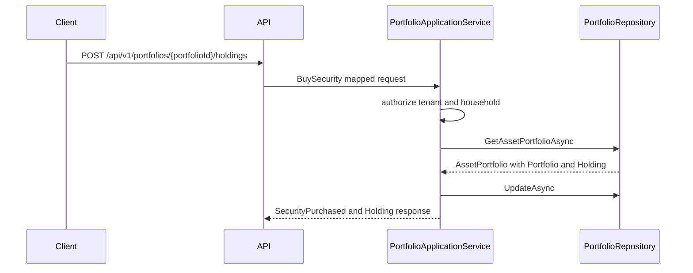
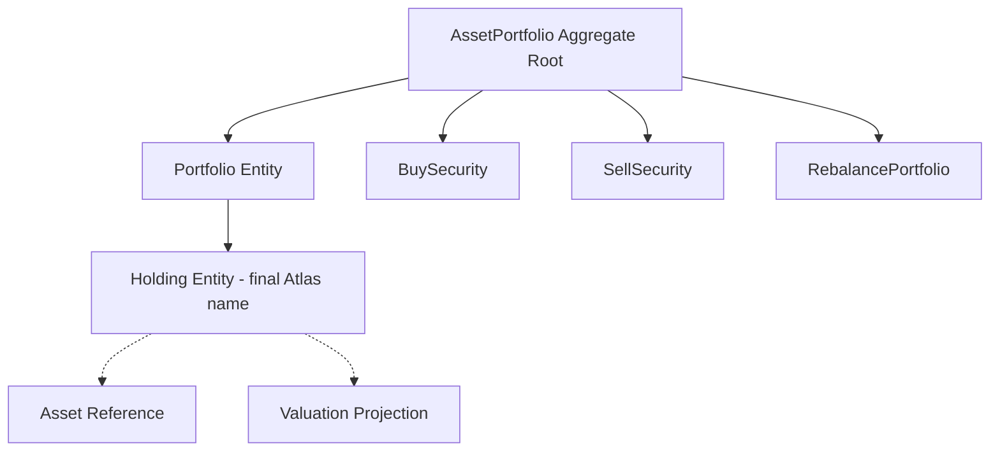

# Position Entity Specification
# Document Control
| Field | Value |
|---|---|
| Document Name | Position Entity Specification |
| Document Path | knowledge/entity/Position.md |
| Document Type | Enterprise Entity Specification |
| Version | 1.0.0 |
| Status | Approved for Implementation |
| Domain | Portfolio |
| Bounded Context | Portfolio |
| Aggregate | AssetPortfolio |
| Aggregate Root | AssetPortfolio |
| Owner | AssetPortfolio aggregate owner through PortfolioApplicationService |
| Source of Truth | Entity Catalog, Aggregate Catalog, Command Catalog, Domain Event Catalog, Repository Catalog |
| Last Updated | 2026-07-14 |
| Related Specifications | knowledge/entity-catalog.md; knowledge/aggregate-catalog.md; knowledge/domain-model-catalog.md; knowledge/bounded-context-catalog.md; knowledge/value-object-catalog.md; knowledge/enumeration-catalog.md; knowledge/command-catalog.md; knowledge/domain-event-catalog.md; knowledge/repository-catalog.md; knowledge/domain-service-catalog.md; knowledge/application-service-catalog.md; knowledge/service-catalog.md; knowledge/portfolio-performance-framework.md; knowledge/financial-dashboard-metrics.md; knowledge/financial-ratio-framework.md; knowledge/projection-engine-framework.md; knowledge/calculation-engine-framework.md; knowledge/market-assumptions.md; knowledge/investment-policy.md; knowledge/permission-framework.md; knowledge/tenant-framework.md; knowledge/audit-framework.md; knowledge/api-governance-framework.md; knowledge/message-contract-catalog.md; knowledge/entity/User.md; knowledge/entity/Household.md; knowledge/entity/Portfolio.md; knowledge/entity/Asset.md; knowledge/entity/Liability.md; knowledge/entity/CashFlow.md; knowledge/entity/Goal.md; knowledge/entity/Scenario.md; knowledge/entity/Decision.md; knowledge/entity/Recommendation.md; docs/04-DomainModel.md; docs/04A-DomainInventory.md; docs/05-DatabaseDesign.md; docs/06-ERD.md; docs/07-API.md |
| Change Policy | Preserve Catalog naming by treating Position as the business/API synonym for Holding; do not create a separate Position aggregate or entity. |
# Catalog Alignment Summary
| Concern | Source Catalog | Catalog Result | Final Atlas Name | Defined Here or Referenced | Implementation Artifact | Status | Notes |
|---|---|---|---|---|---|---|---|
| Domain | entity-catalog.md | Holding belongs to Portfolio domain. | Portfolio | Referenced | Module namespace | Catalog-aligned | Position maps to Holding |
| Bounded Context | entity-catalog.md | Portfolio bounded context. | Portfolio | Referenced | API/service boundary | Catalog-aligned | Same as Catalog |
| Aggregate | aggregate-catalog.md | Holding is owned by AssetPortfolio. | AssetPortfolio | Referenced | Aggregate root | Catalog-aligned | Position is not root |
| Aggregate Root | aggregate-catalog.md | Root is AssetPortfolio. | AssetPortfolio | Referenced | AssetPortfolio root | Catalog-aligned | One AssetPortfolio mutation |
| Entity | entity-catalog.md | Entity Name is Holding. | Holding | Referenced | HoldingEntity | Catalog-aligned | Position is alias only |
| Position Naming | entity-catalog.md | Holding represents a security or position held inside Portfolio. | Holding | Referenced | holdings table | Catalog-aligned | Final Atlas name is Holding |
| Child Entity | entity-catalog.md | Holding owned in portfolio scope. | Holding | Referenced | holdings table | Catalog-aligned | Composition |
| Value Object | entity-catalog.md; domain-service-catalog.md | Money, Currency, Allocation, Percentage. | Money; CurrencyCode; Percentage | Referenced | amount/currency fields | Catalog-aligned | Prefer Catalog VOs |
| Enumeration | enumeration-catalog.md | Holding/Position status not confirmed as formal enum. | Holding status value | Implementation Detail | status column | Catalog Gap | Not new Enumeration |
| Transaction | command-catalog.md | BuySecurity and SellSecurity are commands, not Transaction entity. | BuySecurity; SellSecurity | Referenced | command handlers | Catalog-aligned | No Transaction entity |
| Trade | command-catalog.md | Trade not cataloged as internal Position entity. | Not a Catalog Concept | Referenced | none | Not a Catalog Concept | Do not add |
| Order | command-catalog.md | Order not cataloged as internal Position entity. | Not a Catalog Concept | Referenced | none | Not a Catalog Concept | Do not add |
| MarketData | market-assumptions.md | External input. | Market data reference | Implementation Detail | valuation metadata | Implementation Detail | Not aggregate state |
| Performance | domain-service-catalog.md | Calculated by services/projections. | Performance projection | Implementation Detail | read model/cache | Implementation Detail | Not source of truth |
| Dividend | domain-event-catalog.md | DividendDistributed event exists. | DividendDistributed | Referenced | event contract | Catalog-aligned | No Dividend entity |
| Benchmark | investment-policy.md | Benchmark is reference/policy data. | Benchmark reference | Implementation Detail | projection input | Implementation Detail | Not internal entity |
| Command | command-catalog.md | BuySecurity, SellSecurity, RebalancePortfolio. | BuySecurity; SellSecurity; RebalancePortfolio | Referenced | Command handlers | Catalog-aligned | Quantity/cost adjustment are API use cases only unless mapped |
| Domain Event | domain-event-catalog.md | SecurityPurchased, SecuritySold, PortfolioRebalanced, DividendDistributed. | Same | Referenced | Event contracts | Catalog-aligned | No PositionUpdated event |
| Repository | entity-catalog.md | PortfolioRepository. | PortfolioRepository | Referenced | Repository interface | Catalog-aligned | No business logic |
| Domain Service | entity-catalog.md | PortfolioService, AllocationService. | PortfolioService; AllocationService; RiskService | Referenced | Service calls | Catalog-aligned | Derived calculations outside aggregate |
| Application Service | entity-catalog.md | PortfolioApplicationService. | PortfolioApplicationService | Referenced | Use case layer | Catalog-aligned | Commands orchestrated here |
| API Resource | entity-catalog.md | /api/v1/portfolios/{portfolioId}/holdings. | /api/v1/portfolios/{portfolioId}/holdings | Referenced | REST controller | Catalog-aligned | Position URL may alias only |
| DTO | API governance | DTO is implementation contract. | Holding DTOs | Implementation Detail | Request/response schemas | Implementation Detail | Position DTO naming may map to Holding |
| Permission | entity-catalog.md | Asset:Read for Holding API mapping. | Asset:Read and resource-action mappings | Referenced | Authorization policy | Catalog-aligned where present | Mutating permissions are API mapping |
| Database Table | entity-catalog.md | holdings. | holdings | Referenced | PostgreSQL table | Catalog-aligned | Not positions |
| Read Model | API governance | Projection is not source of truth. | Holding valuation projection | Implementation Detail | Cache/materialized view | Implementation Detail | Read-only |
| Cache | entity-catalog.md | holding valuation cache. | Holding valuation cache | Referenced | Cache keys | Catalog-aligned | Versioned and scoped |
| Audit | entity-catalog.md | Holding changes audited through AssetPortfolio. | Holding audit | Referenced | AuditRepository | Catalog-aligned | Complete audit |
| Tenant Boundary | tenant guidance | TenantId distinct from HouseholdId. | TenantId | Referenced | tenant_id | Catalog-aligned | Household is access scope |
# Entity Overview
## Purpose
Position is the business-language representation of Holding, the Catalog entity that represents a security or position held inside a Portfolio.
The final Atlas Domain name is Holding. This specification uses Position only to satisfy external terminology and maps every write, persistence row, command, event, and aggregate rule to Holding.
Holding contributes to portfolio allocation, valuation, income, and risk, but does not calculate performance, risk, recommendation, scenario projection, or decision score.
## Responsibilities
| Responsibility | Description | Boundary |
|---|---|---|
| Position identity | Maintains HoldingId as technical identity and optional PositionNumber as implementation field. | Holding entity |
| Portfolio reference | Belongs to exactly one Portfolio inside AssetPortfolio. | AssetPortfolio aggregate |
| Asset reference | References Asset by AssetId. | Reference within aggregate |
| Quantity state | Stores quantity, available quantity, and implementation lock/reserve metadata. | Holding state |
| Cost basis state | Stores average cost, total cost, acquisition cost, and book cost. | Holding state |
| Currency state | Stores position currency and base currency cost where implemented. | Holding state |
| Lifecycle state | Active, Closed, Archived, Deleted implementation status. | AssetPortfolio aggregate |
| Audit and versioning | Changes audited through AssetPortfolio. | Audit boundary |
| Event participation | Uses catalog events from BuySecurity, SellSecurity, RebalancePortfolio, DividendDistributed. | AssetPortfolio event boundary |
## Non-Responsibilities
| Non-Responsibility | Owning Concept |
|---|---|
| Portfolio performance calculation | PortfolioService and Projection Engine |
| Risk analysis | RiskService |
| Investment recommendation | RecommendationService |
| Allocation optimization | AllocationService |
| Scenario projection | Scenario aggregate and ScenarioService |
| Decision score | DecisionService or DecisionSession |
| Market data ownership | Market data integration |
| Benchmark ownership | Policy/reference data |
| Transaction, Trade, Order entity ownership | Not a Catalog Concept here |
| Cash flow category ownership | CashFlow boundary |
| Repository calculation | Forbidden in PortfolioRepository |
## Business Meaning
Position/Holding is the quantity and cost basis of an Asset inside a Portfolio.
Portfolio owns the holding collection, while AssetPortfolio owns the aggregate transaction and consistency boundary.
Asset provides identity and reference data. Holding does not mutate Asset master data outside portfolio scope.
User and Household provide actor and authorization context. They do not own Holding lifecycle.
# Aggregate Boundary
| Boundary Concern | Rule |
|---|---|
| Consistency boundary | Portfolio holdings, holding quantity, cost basis, allocation effects, and aggregate version. |
| Transaction boundary | One AssetPortfolio mutation. |
| Child entity ownership | Holding is composed inside AssetPortfolio through Portfolio. |
| External aggregate references | Household, User, Scenario, Decision, Recommendation are identity references or projections. |
| Allowed in-transaction mutations | Holding quantity, cost fields, status, asset reference, audit metadata, aggregate version. |
| Prohibited cross-aggregate mutations | Asset master data outside portfolio scope, Goal priority, Scenario output, Decision score, Recommendation state, MarketData source. |
| Repository ownership | PortfolioRepository persists AssetPortfolio, Portfolio, and Holding rows. |
| Event ownership | Catalog events only: SecurityPurchased, SecuritySold, PortfolioRebalanced, DividendDistributed. |
| Concurrency boundary | AssetPortfolio Version and ConcurrencyToken protect Holding writes. |
| Audit boundary | Holding changes audited through AssetPortfolio. |
# Lifecycle
| Stage | Meaning | Status Handling | Catalog Position |
|---|---|---|---|
| Active | Holding has positive quantity or participates in allocation. | status = Active | Implementation Detail |
| Closed | Holding has zero quantity and is retained for history. | status = Closed | Catalog archive strategy mentions closed holdings retained |
| Suspended | Holding is retained but command-restricted. | status = Suspended | Implementation Detail |
| Archived | Holding is read-only and excluded from active allocation. | status = Archived | Implementation Detail |
| Deleted | Holding is soft-deleted from normal reads. | status = Deleted | Implementation Detail |
# Ownership
| Ownership Concern | Rule |
|---|---|
| Aggregate owner | AssetPortfolio owns Holding. |
| Portfolio owner | Portfolio owns holding collection inside AssetPortfolio. |
| Asset owner | Asset is referenced by Holding; Asset master mutation is prohibited outside rules. |
| Household owner | HouseholdId scopes access. |
| User owner | User is actor or owner reference only. |
| Tenant owner | TenantId scopes persistence and authorization. |
| Shared Ownership | Not a Position concept; household membership controls access. |
| Archive owner | AssetPortfolio controls lifecycle. |
# Relationships
| Related Concept | Cardinality | Ownership Type | Aggregate Boundary | Navigation Direction | Required | Cascade Behavior | Delete Behavior | Authorization Impact | Audit Impact |
|---|---:|---|---|---|---|---|---|---|---|
| AssetPortfolio | Many holdings to one root | Composition | Same aggregate | Holding belongs to AssetPortfolio | Required | Aggregate-internal | Root controls lifecycle | Household scope through root | Audit through root |
| Portfolio | Many holdings to one portfolio | Composition | Same aggregate | Holding stores PortfolioId | Required | Aggregate-internal | Portfolio archive blocks writes | Same household scope | PortfolioId audited |
| Asset | Many holdings to one asset reference | Reference within aggregate | AssetPortfolio scope | Holding stores AssetId | Required | No external cascade | Asset lifecycle separate | Asset authorization required | AssetId audited |
| User | Actor reference | Reference | Separate aggregate | CreatedBy, UpdatedBy | Required for writes | No cascade | User deletion does not delete holding | Actor checked | Actor captured |
| Household | Many holdings to one household scope | Reference | Separate aggregate | HouseholdId | Required | No cascade | Household archive blocks writes | Household access required | HouseholdId captured |
| CashFlow | Dividend or income effect | Reference | CashFlow boundary | Event consumers | Optional | No cascade | CashFlow lifecycle separate | Household scope required | Event trace |
| Scenario | Simulation input | Reference | Scenario aggregate | Reads projection | Optional | No cascade | Scenario lifecycle separate | Household scope required | Snapshot trace |
| Decision | Decision input | Reference | DecisionSession aggregate | Reads projection | Optional | No cascade | Decision lifecycle separate | Household scope required | Decision trace |
| Recommendation | Recommendation input | Reference | Recommendation aggregate | Reads projection | Optional | No cascade | Recommendation lifecycle separate | Household scope required | Recommendation trace |
| Audit | Many records per holding | Reference | Audit storage | Audit stores HoldingId | Required for writes | No cascade | Retained after delete | Review evidence | Complete trace |
# Navigation
| Navigation Type | Allowed Navigation | Rule |
|---|---|---|
| Owned navigation | AssetPortfolio to Portfolio to Holding. | Same aggregate only |
| Aggregate reference | HouseholdId, PortfolioId, AssetId. | Identifier only |
| Read-only projection | Current price, market value, unrealized gain, realized gain, performance. | Not write model |
| Collection navigation | Portfolio to holdings. | Same aggregate only |
| Identity reference | TenantId, CreatedBy, UpdatedBy, ArchivedBy, DeletedBy. | IDs only |
| API expansion | include=asset, include=valuation, include=audit. | Read-only except command endpoints |
| Prohibited navigation | Mutable graph to Asset master, MarketData, Scenario, Decision, Recommendation. | Not allowed |
# Complete Properties
## Property Matrix
| Name | Type | Nullable | Default | Database Mapping | JSON Name | API Usage | Searchable | Sortable | Indexed | Encrypted | Auditable |
|---|---|---:|---|---|---|---|---:|---:|---:|---:|---:|
| HoldingId | UUID | No | generated | holding_id uuid pk | holdingId | route, response | Yes | Yes | Yes | No | Yes |
| PositionNumber | string(40) | No | generated | position_number varchar(40) | positionNumber | response | Yes | Yes | Yes | No | Yes |
| AssetPortfolioId | UUID | No | none | asset_portfolio_id uuid | assetPortfolioId | create, response | Yes | Yes | Yes | No | Yes |
| PortfolioId | UUID | No | none | portfolio_id uuid | portfolioId | route, create, response | Yes | Yes | Yes | No | Yes |
| AssetId | UUID | No | none | asset_id uuid | assetId | create, response | Yes | Yes | Yes | No | Yes |
| TenantId | UUID | No | context | tenant_id uuid | tenantId | internal, response | Yes | Yes | Yes | No | Yes |
| HouseholdId | UUID | No | none | household_id uuid | householdId | create, response | Yes | Yes | Yes | No | Yes |
| SecurityIdentifier | string(80) | No | none | security_identifier varchar(80) | securityIdentifier | create, response | Yes | Yes | Yes | No | Yes |
| PositionName | string(160) | Yes | null | position_name varchar(160) | positionName | create, update, response | Yes | Yes | No | No | Yes |
| Quantity | decimal(28,10) | No | 0 | quantity numeric(28,10) | quantity | command, response | Yes | Yes | Yes | No | Yes |
| AvailableQuantity | decimal(28,10) | No | quantity | available_quantity numeric(28,10) | availableQuantity | response | Yes | Yes | No | No | Yes |
| LockedQuantity | decimal(28,10) | Yes | null | locked_quantity numeric(28,10) | lockedQuantity | response | Yes | Yes | No | No | Yes |
| ReservedQuantity | decimal(28,10) | Yes | null | reserved_quantity numeric(28,10) | reservedQuantity | response | Yes | Yes | No | No | Yes |
| Unit | string(20) | No | Share | unit varchar(20) | unit | create, response | Yes | No | No | No | Yes |
| QuantityPrecision | integer | No | 6 | quantity_precision integer | quantityPrecision | response | No | No | No | No | Yes |
| AverageCost | decimal(19,6) | No | 0 | average_cost numeric(19,6) | averageCost | response | Yes | Yes | No | No | Yes |
| TotalCost | decimal(19,4) | No | 0 | total_cost numeric(19,4) | totalCost | response | Yes | Yes | No | No | Yes |
| AcquisitionCost | decimal(19,4) | Yes | null | acquisition_cost numeric(19,4) | acquisitionCost | response | Yes | Yes | No | No | Yes |
| BookCost | decimal(19,4) | Yes | null | book_cost numeric(19,4) | bookCost | response | Yes | Yes | No | No | Yes |
| BaseCurrencyCost | decimal(19,4) | Yes | null | base_currency_cost numeric(19,4) | baseCurrencyCost | response | Yes | Yes | No | No | Yes |
| Currency | string(3) | No | portfolio currency | currency char(3) | currency | create, response | Yes | Yes | Yes | No | Yes |
| CurrentPrice | decimal(19,6) | Yes | null | current_price numeric(19,6) | currentPrice | projection response | Yes | Yes | No | No | Yes |
| CurrentMarketValue | decimal(19,4) | Yes | null | current_market_value numeric(19,4) | currentMarketValue | projection response | Yes | Yes | No | No | Yes |
| UnrealizedGain | decimal(19,4) | Yes | null | unrealized_gain numeric(19,4) | unrealizedGain | projection response | Yes | Yes | No | No | Yes |
| RealizedGain | decimal(19,4) | Yes | null | realized_gain numeric(19,4) | realizedGain | projection response | Yes | Yes | No | No | Yes |
| ValuationAsOf | timestamptz | Yes | null | valuation_as_of timestamptz | valuationAsOf | projection response | Yes | Yes | No | No | Yes |
| Status | string(20) | No | Active | status varchar(20) | status | response, lifecycle | Yes | Yes | Yes | No | Yes |
| IsArchived | boolean | No | false | is_archived boolean | isArchived | response | Yes | Yes | Yes | No | Yes |
| ClosedAt | timestamptz | Yes | null | closed_at timestamptz | closedAt | response | Yes | Yes | No | No | Yes |
| ArchivedAt | timestamptz | Yes | null | archived_at timestamptz | archivedAt | response | Yes | Yes | Yes | No | Yes |
| ArchivedBy | UUID | Yes | null | archived_by uuid | archivedBy | response | Yes | No | No | No | Yes |
| DeletedAt | timestamptz | Yes | null | deleted_at timestamptz | deletedAt | response | Yes | Yes | Yes | No | Yes |
| DeletedBy | UUID | Yes | null | deleted_by uuid | deletedBy | response | Yes | No | No | No | Yes |
| CreatedAt | timestamptz | No | now | created_at timestamptz | createdAt | response | Yes | Yes | Yes | No | Yes |
| CreatedBy | UUID | No | actor | created_by uuid | createdBy | response | Yes | No | No | No | Yes |
| UpdatedAt | timestamptz | No | now | updated_at timestamptz | updatedAt | response | Yes | Yes | Yes | No | Yes |
| UpdatedBy | UUID | No | actor | updated_by uuid | updatedBy | response | Yes | No | No | No | Yes |
| Version | integer | No | 1 | version integer | version | response, concurrency | Yes | Yes | Yes | No | Yes |
| ConcurrencyToken | UUID | No | generated | concurrency_token uuid | concurrencyToken | response, If-Match | No | No | Yes | No | Yes |
## Property Details
| Name | Description | Validation | Business Meaning | Example | Security Notes |
|---|---|---|---|---|---|
| HoldingId | Stable Holding identity used for Position. | Required UUID; immutable. | Technical identity. | 9b35a340-1000-4000-9000-000000000001 | Audited. |
| PositionNumber | Human-safe reference. | Required unique per tenant. | Operational lookup. | POS-2026-000001 | Audited. |
| AssetPortfolioId | Aggregate root id. | Required same scope. | Root ownership. | 9b35a340-1000-4000-9000-000000000002 | Audited. |
| PortfolioId | Parent Portfolio id. | Required same AssetPortfolio. | Container reference. | 9b35a340-1000-4000-9000-000000000003 | Audited. |
| AssetId | Referenced Asset id. | Required and authorized. | Security/instrument identity. | 9b35a340-1000-4000-9000-000000000004 | Audited. |
| TenantId | Tenant isolation key. | Required trusted context. | Tenant boundary. | 9b35a340-1000-4000-9000-000000000005 | Authorization input. |
| HouseholdId | Household scope. | Required and authorized. | Access scope. | 9b35a340-1000-4000-9000-000000000006 | Audited. |
| SecurityIdentifier | Security symbol or identifier. | Required max 80. | Business identity in portfolio. | AAPL | Audited. |
| PositionName | Display name. | Nullable max 160. | User-facing label. | Apple Inc. | Mask in logs when sensitive. |
| Quantity | Total units held. | Required >= 0. | Source quantity. | 25.5000000000 | Audited. |
| AvailableQuantity | Quantity available for sale. | Required >= 0 and <= Quantity. | Tradable portion. | 25.5000000000 | Audited. |
| LockedQuantity | Locked units when implemented. | Nullable >= 0. | Restricted portion. | 0.0000000000 | Implementation Detail. |
| ReservedQuantity | Reserved units when implemented. | Nullable >= 0. | Pending or reserved portion. | 0.0000000000 | Catalog Gap unless defined. |
| Unit | Quantity unit. | Required max 20. | Share/unit semantics. | Share | Audited. |
| QuantityPrecision | Allowed fractional precision. | Required 0 to 10. | Fractional holding support. | 6 | Audited. |
| AverageCost | Average cost per unit. | Required >= 0. | Cost basis per unit. | 145.250000 | Audited. |
| TotalCost | Total cost basis. | Required >= 0. | Cost basis total. | 3703.8750 | Audited. |
| AcquisitionCost | Initial acquisition cost. | Nullable >= 0. | Initial cost input. | 3600.0000 | Audited. |
| BookCost | Accounting book cost. | Nullable >= 0. | Book basis. | 3703.8750 | Audited. |
| BaseCurrencyCost | Cost converted to base currency. | Nullable >= 0. | Reporting basis. | 3703.8750 | FX source audited. |
| Currency | Native currency. | Required uppercase length 3. | Money currency. | USD | Audited. |
| CurrentPrice | Current price reference. | Nullable >= 0. | Market data projection. | 195.120000 | Not source of truth. |
| CurrentMarketValue | Derived quantity times price. | Nullable >= 0. | Valuation projection. | 4975.5600 | Not source of truth. |
| UnrealizedGain | Derived unrealized gain. | Nullable. | Gain projection. | 1271.6850 | Not source of truth. |
| RealizedGain | Derived realized gain. | Nullable. | Historical gain projection. | 350.0000 | Projection. |
| ValuationAsOf | Projection timestamp. | Nullable. | Staleness indicator. | 2026-07-14T08:00:00Z | Audited. |
| Status | Lifecycle status. | Active, Suspended, Closed, Archived, Deleted. | Write eligibility. | Active | Implementation Detail. |
| IsArchived | Archive shortcut. | Must match Archived. | Search optimization. | false | Audited. |
| ClosedAt | Closure timestamp. | Required when Closed. | Zero quantity history. | null | Audited. |
| ArchivedAt | Archive timestamp. | Required when Archived. | Historical retention. | null | Audited. |
| ArchivedBy | Archive actor. | Required when Archived. | Accountability. | null | Audited. |
| DeletedAt | Soft delete timestamp. | Required when Deleted. | Normal read exclusion. | null | Audited. |
| DeletedBy | Delete actor. | Required when Deleted. | Accountability. | null | Audited. |
| CreatedAt | Creation timestamp. | Required server value. | Origin trace. | 2026-07-14T08:00:00Z | Audited. |
| CreatedBy | Creator. | Required actor. | Accountability. | 9b35a340-1000-4000-9000-000000000007 | Audited. |
| UpdatedAt | Last update timestamp. | Required server value. | Synchronization. | 2026-07-14T08:30:00Z | Audited. |
| UpdatedBy | Last updater. | Required actor. | Accountability. | 9b35a340-1000-4000-9000-000000000007 | Audited. |
| Version | Aggregate version. | Required >= 1. | Optimistic concurrency. | 4 | Audited. |
| ConcurrencyToken | Opaque concurrency token. | Required and changed on write. | Lost update protection. | 9b35a340-1000-4000-9000-000000000009 | Not business data. |
# Position Semantics
| Concept | Meaning | Source of Truth | Rule |
|---|---|---|---|
| Position Identity | HoldingId and PositionNumber. | AssetPortfolio aggregate. | Position maps to Holding. |
| Portfolio Reference | PortfolioId. | Holding state. | Required same aggregate. |
| Asset Reference | AssetId and SecurityIdentifier. | Holding state and Asset reference. | Asset master data is external. |
| Quantity | Total held units. | Holding state. | Non-negative. |
| Available Quantity | Quantity available for sale. | Holding state. | Cannot exceed Quantity. |
| Locked Quantity | Restricted quantity. | Implementation Detail | Nullable; not formal domain concept. |
| Average Cost | Per-unit cost basis. | Holding state. | Non-negative. |
| Total Cost | Total cost basis. | Holding state. | Non-negative. |
| Current Market Value | Valuation projection. | Projection. | Not write source. |
| Unrealized Gain | Derived projection. | Projection. | Not write source. |
| Realized Gain | Derived projection. | Projection. | Not write source. |
# Quantity Model
| Concept | Definition | Rule |
|---|---|---|
| Quantity | Total units held. | Source of truth in Holding. |
| Unit | Share, unit, or instrument unit. | Implementation value. |
| Fractional Quantity | Decimal holdings allowed by precision. | Precision 0 to 10. |
| Precision | Maximum decimal places. | Enforced by validation. |
| Negative Quantity Policy | Negative quantity prohibited. | Short positions are Catalog Gap unless defined. |
| Zero Quantity Policy | Zero quantity closes Holding and retains history. | Closed status allowed. |
| Available Quantity | Quantity available for sell. | Quantity minus locked/reserved when implemented. |
| Reserved Quantity | Reserved quantity. | Catalog Gap unless defined; implementation field only. |
| Source of Truth | Holding row inside AssetPortfolio. | Projections cannot override. |
# Cost Basis Model
| Concept | Definition | Rule |
|---|---|---|
| Average Cost | TotalCost divided by Quantity when Quantity positive. | Stored or service-updated, non-negative. |
| Total Cost | Aggregate cost basis. | Source cost field. |
| Acquisition Cost | Original acquisition cost. | Nullable source input. |
| Book Cost | Accounting book cost. | Nullable source input. |
| Base Currency Cost | Cost converted to portfolio/base currency. | FX conversion output with source trace. |
| Cost Precision | Money precision follows numeric scale and CurrencyCode. | Enforced by validation. |
| Source of Truth | Holding cost fields updated by catalog commands or approved API use case. | Repository does not compute. |
| Historical Cost | Retained through audit and version history. | Not overwritten without audit. |
| Derived Value Restriction | Market value and gains cannot update cost basis. | Projection only. |
# Valuation Reference Model
| Concern | Rule |
|---|---|
| Market Data Source | Position/Holding does not store market data source of truth. |
| Current Price | CurrentPrice is reference or projection. |
| Market Value | CurrentMarketValue is derived projection. |
| Unrealized Gain | Derived from market value and cost. |
| Realized Gain | Derived from sell events or projection. |
| FX Conversion Responsibility | Calculation/Projection service handles FX, with source trace. |
| Aggregate Boundary | Valuation cannot mutate Holding source quantity or cost. |
# Validation Rules
| Rule Id | Field | Validation | Error Code | Severity |
|---|---|---|---|---|
| POS-VR-001 | HoldingId | Required UUID immutable. | POSITION_ID_INVALID | Critical |
| POS-VR-002 | AssetPortfolioId | Required same scope. | ASSET_PORTFOLIO_INVALID | Critical |
| POS-VR-003 | PortfolioId | Required same AssetPortfolio. | PORTFOLIO_REFERENCE_INVALID | Critical |
| POS-VR-004 | AssetId | Required valid Asset reference. | ASSET_REFERENCE_INVALID | Critical |
| POS-VR-005 | TenantId | Required trusted tenant. | TENANT_SCOPE_INVALID | Critical |
| POS-VR-006 | HouseholdId | Required authorized household. | HOUSEHOLD_SCOPE_INVALID | Critical |
| POS-VR-007 | SecurityIdentifier | Required max 80. | SECURITY_IDENTIFIER_INVALID | High |
| POS-VR-008 | Quantity | Required >= 0 and precision valid. | QUANTITY_INVALID | Critical |
| POS-VR-009 | AvailableQuantity | Required >= 0 and <= Quantity. | AVAILABLE_QUANTITY_INVALID | High |
| POS-VR-010 | LockedQuantity | Null or >= 0 and <= Quantity. | LOCKED_QUANTITY_INVALID | Medium |
| POS-VR-011 | ReservedQuantity | Null or >= 0 and <= Quantity. | RESERVED_QUANTITY_INVALID | Medium |
| POS-VR-012 | AverageCost | Required >= 0. | AVERAGE_COST_INVALID | High |
| POS-VR-013 | TotalCost | Required >= 0. | TOTAL_COST_INVALID | High |
| POS-VR-014 | Currency | Required uppercase length 3. | CURRENCY_INVALID | High |
| POS-VR-015 | CurrentPrice | Projection only; null or >= 0. | CURRENT_PRICE_INVALID | Medium |
| POS-VR-016 | CurrentMarketValue | Projection only; null or >= 0. | MARKET_VALUE_INVALID | Medium |
| POS-VR-017 | Status | Active, Suspended, Closed, Archived, Deleted. | POSITION_STATUS_INVALID | High |
| POS-VR-018 | Closed state | Closed requires Quantity = 0 and ClosedAt. | POSITION_CLOSE_INVALID | High |
| POS-VR-019 | Archived state | Archived requires IsArchived, ArchivedAt, ArchivedBy. | ARCHIVE_STATE_INVALID | High |
| POS-VR-020 | Deleted state | Deleted requires DeletedAt and DeletedBy. | DELETE_STATE_INVALID | High |
| POS-VR-021 | Concurrency | Version and token must match. | POSITION_CONCURRENCY_CONFLICT | Critical |
| POS-VR-022 | Read Model | Projection cannot write aggregate. | READ_MODEL_WRITE_REJECTED | High |
| POS-VR-023 | Repository | Repository cannot calculate returns or authorize. | REPOSITORY_LOGIC_FORBIDDEN | High |
| POS-VR-024 | Cross Aggregate | Holding cannot mutate external Asset master data. | CROSS_AGGREGATE_MUTATION_FORBIDDEN | Critical |
# Business Rules
| Rule Id | Rule | Enforcement |
|---|---|---|
| POS-BR-001 | Position maps to Holding. | Catalog alignment |
| POS-BR-002 | Holding belongs to AssetPortfolio. | Aggregate boundary |
| POS-BR-003 | Holding belongs to Portfolio. | Aggregate boundary |
| POS-BR-004 | Holding references one Asset. | Validation |
| POS-BR-005 | Quantity cannot be negative. | Aggregate invariant |
| POS-BR-006 | Zero quantity is closed and retained. | State guard |
| POS-BR-007 | BuySecurity increases quantity and emits SecurityPurchased. | Command handler |
| POS-BR-008 | SellSecurity decreases quantity and emits SecuritySold. | Command handler |
| POS-BR-009 | RebalancePortfolio may change holdings and emits PortfolioRebalanced. | Command handler |
| POS-BR-010 | DividendDistributed is event, not Dividend entity. | Catalog alignment |
| POS-BR-011 | Holding does not own cash flow category. | Catalog alignment |
| POS-BR-012 | Holding does not calculate return. | Service boundary |
| POS-BR-013 | Holding does not own MarketData. | Boundary |
| POS-BR-014 | PortfolioRepository contains no calculations. | Code review |
| POS-BR-015 | Complete audit and version history retained. | Audit policy |
# Aggregate Invariants
| Invariant | Description |
|---|---|
| Root ownership | AssetPortfolioId required. |
| Portfolio ownership | PortfolioId required and inside root. |
| Asset reference | AssetId required. |
| Non-negative quantity | Quantity cannot be negative. |
| Available quantity | AvailableQuantity cannot exceed Quantity. |
| Cost validity | AverageCost and TotalCost non-negative. |
| Closed consistency | Closed Holding has zero Quantity. |
| Projection separation | Current price, market value, and gains are not source fields. |
| Event ownership | Only catalog events are emitted. |
| Concurrency | Version and token change on write. |
# State Machine
| State | Transition | Trigger | Invariant | Illegal Transition |
|---|---|---|---|---|
| Active | Active to Closed | SellSecurity full quantity | Quantity = 0 | Active to Closed with quantity > 0 |
| Active | Active to Suspended | Deactivate API use case | Not deleted | Active hard delete |
| Active | Active to Archived | Archive API use case | Archived fields set | Active archive without token |
| Active | Active to Deleted | Delete API use case | Deleted fields set | Hard delete |
| Suspended | Suspended to Active | Activate API use case | Not deleted | Suspended SellSecurity unless policy allows |
| Closed | Closed to Archived | Archive API use case | Quantity remains zero | Closed BuySecurity without supported command |
| Archived | Archived to Active | Restore API use case | Archive fields cleared | Archived ordinary update |
| Archived | Archived to Deleted | Delete API use case | Deleted fields set | Archived to Suspended |
| Deleted | None | Normal API has no restore | Deleted fields retained | Deleted to Active |

# Commands
| Command or Use Case | Catalog Status | Handler Boundary | Repository | Events | Notes |
|---|---|---|---|---|---|
| BuySecurity | Catalog Command | PortfolioApplicationService | PortfolioRepository | SecurityPurchased | Increases Holding quantity |
| SellSecurity | Catalog Command | PortfolioApplicationService | PortfolioRepository | SecuritySold | Decreases Holding quantity |
| RebalancePortfolio | Catalog Command | PortfolioApplicationService; AllocationService | PortfolioRepository | PortfolioRebalanced | May change holdings |
| RecordIncome | Catalog Command in cash flow context | PortfolioApplicationService where dividend event applies | PortfolioRepository | DividendDistributed | Event maps to Holding |
| CreatePosition | Catalog Gap | PortfolioApplicationService | PortfolioRepository | SecurityPurchased when mapped to BuySecurity | API use case only |
| UpdatePosition | Catalog Gap | PortfolioApplicationService | PortfolioRepository | None | API use case only |
| ArchivePosition | Catalog Gap | PortfolioApplicationService | PortfolioRepository | None | Audit only |
| RestorePosition | Catalog Gap | PortfolioApplicationService | PortfolioRepository | None | API use case |
| ActivatePosition | Catalog Gap | PortfolioApplicationService | PortfolioRepository | None | API use case |
| DeactivatePosition | Catalog Gap | PortfolioApplicationService | PortfolioRepository | None | API use case |
| QuantityAdjustment | Catalog Gap unless mapped to BuySecurity/SellSecurity | PortfolioApplicationService | PortfolioRepository | Catalog event only when mapped | Do not add command |
| CostAdjustment | Catalog Gap | PortfolioApplicationService | PortfolioRepository | None | API use case with audit only |
# Domain Events
| Event | Catalog Status | Producer | Consumer | Position Impact |
|---|---|---|---|---|
| SecurityPurchased | Catalog Event | BuySecurity | Dashboard, Allocation Projection, Scenario | Quantity increases. |
| SecuritySold | Catalog Event | SellSecurity | Dashboard, Allocation Projection, Scenario | Quantity decreases. |
| PortfolioRebalanced | Catalog Event | RebalancePortfolio | Dashboard, Risk Projection, Scenario | Holdings may change. |
| DividendDistributed | Catalog Event | PortfolioApplicationService or catalog income workflow | Cash Flow Projection, Dashboard | Income projection updates. |
| PositionCreated | Catalog Gap | None | None | Use SecurityPurchased and audit. |
| PositionUpdated | Catalog Gap | None | None | Use audit. |
| PositionArchived | Catalog Gap | None | None | Use audit. |
| PositionDeleted | Catalog Gap | None | None | Use audit. |
# Repository
## Interface
```csharp
public interface IPortfolioRepository
{
    Task<AssetPortfolio?> GetAssetPortfolioAsync(Guid tenantId, Guid householdId, Guid assetPortfolioId, CancellationToken cancellationToken);
    Task<Holding?> GetHoldingAsync(Guid tenantId, Guid householdId, Guid portfolioId, Guid holdingId, CancellationToken cancellationToken);
    Task<bool> ExistsHoldingAsync(Guid tenantId, Guid householdId, Guid holdingId, CancellationToken cancellationToken);
    Task<PagedResult<Holding>> ListHoldingsAsync(HoldingSearchSpecification specification, CancellationToken cancellationToken);
    Task AddAsync(AssetPortfolio assetPortfolio, CancellationToken cancellationToken);
    Task UpdateAsync(AssetPortfolio assetPortfolio, CancellationToken cancellationToken);
    Task SaveChangesAsync(CancellationToken cancellationToken);
}
```
## Query Methods
| Query | Filters | Sorts | Index Used |
|---|---|---|---|
| Search holdings | tenantId, householdId, portfolioId, assetId, status | securityIdentifier, quantity, updatedAt | tenant-portfolio indexes |
| Active holdings | tenantId, portfolioId, status Active | securityIdentifier | status index |
| Closed holdings | tenantId, portfolioId, status Closed | closedAt | closed index |
| Asset holdings | tenantId, assetId | updatedAt | asset index |
## Specification Pattern
Specifications describe filters only. They do not calculate price, return, gain, FX, risk, authorization, or recommendations.
# Domain Service Interaction
| Service | Catalog Status | Position Interaction |
|---|---|---|
| PortfolioService | Catalog-aligned | Calculates valuation and projection input from holdings. |
| AllocationService | Catalog-aligned | Validates allocation and supports RebalancePortfolio. |
| RiskService | Catalog-aligned | Consumes holding projections for risk analysis. |
| ScenarioService | Catalog-aligned | Uses holding snapshots as scenario input. |
| DecisionService | Catalog-aligned | Uses holding projections for decisions. |
| RecommendationService | Catalog-aligned | Uses projections outside Holding. |
| Calculation Engine | Catalog-aligned capability | Performs formulas for services. |
| Projection Engine | Catalog-aligned capability | Builds read models, never writes aggregate. |
# Application Service Interaction
| Application Service | Catalog Status | Position Responsibility |
|---|---|---|
| PortfolioApplicationService | Catalog-aligned | Handles BuySecurity, SellSecurity, RebalancePortfolio, and holding API use cases. |
| DashboardApplicationService | Catalog-aligned | Reads holding valuation projections. |
| ScenarioApplicationService | Catalog-aligned where present | Uses holding snapshots. |
| DecisionApplicationService | Catalog-aligned where present | Uses holding projections. |
| RecommendationApplicationService | Catalog-aligned where present | Reads projections. |
| ReportApplicationService | Catalog-aligned | Position reports and audit explanations. |
| AdministrationApplicationService | Catalog-aligned | Audit and operational queries. |
# REST API
| Method | Path | Use Case | Permission | Status Codes |
|---|---|---|---|---|
| POST | /api/v1/portfolios/{portfolioId}/holdings | BuySecurity or create holding use case | Asset:Update | 201, 400, 401, 403, 409, 422 |
| GET | /api/v1/portfolios/{portfolioId}/holdings/{holdingId} | Get detail | Asset:Read | 200, 401, 403, 404 |
| PATCH | /api/v1/portfolios/{portfolioId}/holdings/{holdingId} | Update holding API use case | Asset:Update | 200, 400, 401, 403, 404, 409, 422 |
| POST | /api/v1/portfolios/{portfolioId}/holdings/{holdingId}/archive | Archive | Asset:Archive | 200, 401, 403, 404, 409, 422 |
| POST | /api/v1/portfolios/{portfolioId}/holdings/{holdingId}/restore | Restore | Asset:Restore | 200, 401, 403, 404, 409, 422 |
| POST | /api/v1/portfolios/{portfolioId}/holdings/{holdingId}/activate | Activate | Asset:Update | 200, 401, 403, 404, 409, 422 |
| POST | /api/v1/portfolios/{portfolioId}/holdings/{holdingId}/deactivate | Deactivate | Asset:Update | 200, 401, 403, 404, 409, 422 |
| POST | /api/v1/portfolios/{portfolioId}/holdings/{holdingId}/quantity-adjustment | Quantity adjustment if mapped | Asset:Update | 200, 401, 403, 404, 409, 422 |
| POST | /api/v1/portfolios/{portfolioId}/holdings/{holdingId}/cost-adjustment | Cost adjustment if supported | Asset:Update | 200, 401, 403, 404, 409, 422 |
| DELETE | /api/v1/portfolios/{portfolioId}/holdings/{holdingId} | SellSecurity or soft delete use case | Asset:Update | 204, 401, 403, 404, 409, 422 |
| GET | /api/v1/portfolios/{portfolioId}/holdings | Search holdings | Asset:Read | 200, 400, 401, 403 |
# DTO
| DTO | Fields |
|---|---|
| CreatePositionRequest | assetPortfolioId, portfolioId, assetId, householdId, securityIdentifier, positionName, quantity, unit, quantityPrecision, averageCost, totalCost, acquisitionCost, bookCost, currency, idempotencyKey, concurrencyToken |
| UpdatePositionRequest | positionName, availableQuantity, lockedQuantity, reservedQuantity, averageCost, totalCost, acquisitionCost, bookCost, baseCurrencyCost, concurrencyToken |
| QuantityAdjustmentRequest | quantityDelta, reason, effectiveDate, idempotencyKey, concurrencyToken |
| CostAdjustmentRequest | averageCost, totalCost, acquisitionCost, bookCost, baseCurrencyCost, reason, effectiveDate, idempotencyKey, concurrencyToken |
| PositionDetailResponse | all response-safe properties from Property Matrix plus asset summary, valuation projection, version, concurrencyToken |
| PositionSummaryResponse | holdingId, positionNumber, portfolioId, assetId, securityIdentifier, quantity, currentMarketValue, status |
| PositionSearchRequest | householdId, portfolioId, assetId, status, securityIdentifier, page, pageSize, sort |
# Database Mapping
| Column | Type | Nullable | Constraint |
|---|---|---:|---|
| holding_id | uuid | No | Primary key |
| position_number | varchar(40) | No | Unique with tenant_id |
| asset_portfolio_id | uuid | No | Root reference |
| portfolio_id | uuid | No | Portfolio reference |
| asset_id | uuid | No | Asset reference |
| tenant_id | uuid | No | Tenant scoped |
| household_id | uuid | No | Household scoped |
| security_identifier | varchar(80) | No | Non-empty |
| position_name | varchar(160) | Yes | Display |
| quantity | numeric(28,10) | No | >= 0 |
| available_quantity | numeric(28,10) | No | >= 0 |
| locked_quantity | numeric(28,10) | Yes | >= 0 |
| reserved_quantity | numeric(28,10) | Yes | >= 0 |
| unit | varchar(20) | No | Unit |
| quantity_precision | integer | No | 0 to 10 |
| average_cost | numeric(19,6) | No | >= 0 |
| total_cost | numeric(19,4) | No | >= 0 |
| acquisition_cost | numeric(19,4) | Yes | >= 0 |
| book_cost | numeric(19,4) | Yes | >= 0 |
| base_currency_cost | numeric(19,4) | Yes | >= 0 |
| currency | char(3) | No | Uppercase |
| current_price | numeric(19,6) | Yes | Projection |
| current_market_value | numeric(19,4) | Yes | Projection |
| unrealized_gain | numeric(19,4) | Yes | Projection |
| realized_gain | numeric(19,4) | Yes | Projection |
| valuation_as_of | timestamptz | Yes | Projection timestamp |
| status | varchar(20) | No | Lifecycle |
| is_archived | boolean | No | Archive shortcut |
| closed_at | timestamptz | Yes | Closed timestamp |
| archived_at | timestamptz | Yes | Archive timestamp |
| archived_by | uuid | Yes | Actor |
| deleted_at | timestamptz | Yes | Soft delete |
| deleted_by | uuid | Yes | Actor |
| created_at | timestamptz | No | Created timestamp |
| created_by | uuid | No | Creator |
| updated_at | timestamptz | No | Updated timestamp |
| updated_by | uuid | No | Updater |
| version | integer | No | Concurrency |
| concurrency_token | uuid | No | Concurrency |
# PostgreSQL DDL
```sql
CREATE SCHEMA IF NOT EXISTS atlas;
CREATE TABLE IF NOT EXISTS atlas.holdings (
    holding_id uuid PRIMARY KEY,
    position_number varchar(40) NOT NULL,
    asset_portfolio_id uuid NOT NULL,
    portfolio_id uuid NOT NULL,
    asset_id uuid NOT NULL,
    tenant_id uuid NOT NULL,
    household_id uuid NOT NULL,
    security_identifier varchar(80) NOT NULL,
    position_name varchar(160) NULL,
    quantity numeric(28,10) NOT NULL DEFAULT 0,
    available_quantity numeric(28,10) NOT NULL DEFAULT 0,
    locked_quantity numeric(28,10) NULL,
    reserved_quantity numeric(28,10) NULL,
    unit varchar(20) NOT NULL DEFAULT 'Share',
    quantity_precision integer NOT NULL DEFAULT 6,
    average_cost numeric(19,6) NOT NULL DEFAULT 0,
    total_cost numeric(19,4) NOT NULL DEFAULT 0,
    acquisition_cost numeric(19,4) NULL,
    book_cost numeric(19,4) NULL,
    base_currency_cost numeric(19,4) NULL,
    currency char(3) NOT NULL,
    current_price numeric(19,6) NULL,
    current_market_value numeric(19,4) NULL,
    unrealized_gain numeric(19,4) NULL,
    realized_gain numeric(19,4) NULL,
    valuation_as_of timestamptz NULL,
    status varchar(20) NOT NULL DEFAULT 'Active',
    is_archived boolean NOT NULL DEFAULT false,
    closed_at timestamptz NULL,
    archived_at timestamptz NULL,
    archived_by uuid NULL,
    deleted_at timestamptz NULL,
    deleted_by uuid NULL,
    created_at timestamptz NOT NULL DEFAULT now(),
    created_by uuid NOT NULL,
    updated_at timestamptz NOT NULL DEFAULT now(),
    updated_by uuid NOT NULL,
    version integer NOT NULL DEFAULT 1,
    concurrency_token uuid NOT NULL,
    CONSTRAINT uq_holdings_tenant_number UNIQUE (tenant_id, position_number),
    CONSTRAINT uq_holdings_portfolio_asset UNIQUE (tenant_id, portfolio_id, asset_id, security_identifier),
    CONSTRAINT ck_holdings_security CHECK (length(btrim(security_identifier)) > 0),
    CONSTRAINT ck_holdings_currency CHECK (currency = upper(currency) AND length(currency) = 3),
    CONSTRAINT ck_holdings_status CHECK (status IN ('Active', 'Suspended', 'Closed', 'Archived', 'Deleted')),
    CONSTRAINT ck_holdings_quantities CHECK (
        quantity >= 0 AND available_quantity >= 0 AND available_quantity <= quantity
        AND (locked_quantity IS NULL OR (locked_quantity >= 0 AND locked_quantity <= quantity))
        AND (reserved_quantity IS NULL OR (reserved_quantity >= 0 AND reserved_quantity <= quantity))
    ),
    CONSTRAINT ck_holdings_precision CHECK (quantity_precision >= 0 AND quantity_precision <= 10),
    CONSTRAINT ck_holdings_costs CHECK (
        average_cost >= 0 AND total_cost >= 0
        AND (acquisition_cost IS NULL OR acquisition_cost >= 0)
        AND (book_cost IS NULL OR book_cost >= 0)
        AND (base_currency_cost IS NULL OR base_currency_cost >= 0)
    ),
    CONSTRAINT ck_holdings_projection_values CHECK (
        (current_price IS NULL OR current_price >= 0)
        AND (current_market_value IS NULL OR current_market_value >= 0)
    ),
    CONSTRAINT ck_holdings_closed CHECK ((status = 'Closed' AND quantity = 0 AND closed_at IS NOT NULL) OR status <> 'Closed'),
    CONSTRAINT ck_holdings_archive CHECK ((status = 'Archived' AND is_archived = true AND archived_at IS NOT NULL AND archived_by IS NOT NULL) OR (status <> 'Archived' AND is_archived = false)),
    CONSTRAINT ck_holdings_delete CHECK ((status = 'Deleted' AND deleted_at IS NOT NULL AND deleted_by IS NOT NULL) OR status <> 'Deleted'),
    CONSTRAINT ck_holdings_version CHECK (version >= 1)
);
CREATE INDEX IF NOT EXISTS ix_holdings_tenant_household ON atlas.holdings (tenant_id, household_id);
CREATE INDEX IF NOT EXISTS ix_holdings_asset_portfolio ON atlas.holdings (tenant_id, asset_portfolio_id);
CREATE INDEX IF NOT EXISTS ix_holdings_portfolio ON atlas.holdings (tenant_id, portfolio_id);
CREATE INDEX IF NOT EXISTS ix_holdings_asset ON atlas.holdings (tenant_id, asset_id);
CREATE INDEX IF NOT EXISTS ix_holdings_status ON atlas.holdings (tenant_id, portfolio_id, status);
CREATE INDEX IF NOT EXISTS ix_holdings_security ON atlas.holdings (tenant_id, security_identifier);
CREATE INDEX IF NOT EXISTS ix_holdings_quantity ON atlas.holdings (tenant_id, portfolio_id, quantity);
CREATE INDEX IF NOT EXISTS ix_holdings_archived ON atlas.holdings (tenant_id, is_archived, archived_at);
CREATE INDEX IF NOT EXISTS ix_holdings_deleted ON atlas.holdings (tenant_id, deleted_at);
CREATE INDEX IF NOT EXISTS ix_holdings_concurrency_token ON atlas.holdings (concurrency_token);
```
# EF Core Fluent API
```csharp
public sealed class HoldingEntityConfiguration : IEntityTypeConfiguration<HoldingEntity>
{
    public void Configure(EntityTypeBuilder<HoldingEntity> builder)
    {
        builder.ToTable("holdings", "atlas");
        builder.HasKey(x => x.HoldingId);
        builder.Property(x => x.HoldingId).HasColumnName("holding_id").ValueGeneratedNever();
        builder.Property(x => x.PositionNumber).HasColumnName("position_number").HasMaxLength(40).IsRequired();
        builder.Property(x => x.AssetPortfolioId).HasColumnName("asset_portfolio_id").IsRequired();
        builder.Property(x => x.PortfolioId).HasColumnName("portfolio_id").IsRequired();
        builder.Property(x => x.AssetId).HasColumnName("asset_id").IsRequired();
        builder.Property(x => x.TenantId).HasColumnName("tenant_id").IsRequired();
        builder.Property(x => x.HouseholdId).HasColumnName("household_id").IsRequired();
        builder.Property(x => x.SecurityIdentifier).HasColumnName("security_identifier").HasMaxLength(80).IsRequired();
        builder.Property(x => x.PositionName).HasColumnName("position_name").HasMaxLength(160);
        builder.Property(x => x.Quantity).HasColumnName("quantity").HasPrecision(28, 10).HasDefaultValue(0).IsRequired();
        builder.Property(x => x.AvailableQuantity).HasColumnName("available_quantity").HasPrecision(28, 10).HasDefaultValue(0).IsRequired();
        builder.Property(x => x.LockedQuantity).HasColumnName("locked_quantity").HasPrecision(28, 10);
        builder.Property(x => x.ReservedQuantity).HasColumnName("reserved_quantity").HasPrecision(28, 10);
        builder.Property(x => x.Unit).HasColumnName("unit").HasMaxLength(20).HasDefaultValue("Share").IsRequired();
        builder.Property(x => x.QuantityPrecision).HasColumnName("quantity_precision").HasDefaultValue(6).IsRequired();
        builder.Property(x => x.AverageCost).HasColumnName("average_cost").HasPrecision(19, 6).HasDefaultValue(0).IsRequired();
        builder.Property(x => x.TotalCost).HasColumnName("total_cost").HasPrecision(19, 4).HasDefaultValue(0).IsRequired();
        builder.Property(x => x.AcquisitionCost).HasColumnName("acquisition_cost").HasPrecision(19, 4);
        builder.Property(x => x.BookCost).HasColumnName("book_cost").HasPrecision(19, 4);
        builder.Property(x => x.BaseCurrencyCost).HasColumnName("base_currency_cost").HasPrecision(19, 4);
        builder.Property(x => x.Currency).HasColumnName("currency").HasMaxLength(3).IsFixedLength().IsRequired();
        builder.Property(x => x.CurrentPrice).HasColumnName("current_price").HasPrecision(19, 6);
        builder.Property(x => x.CurrentMarketValue).HasColumnName("current_market_value").HasPrecision(19, 4);
        builder.Property(x => x.UnrealizedGain).HasColumnName("unrealized_gain").HasPrecision(19, 4);
        builder.Property(x => x.RealizedGain).HasColumnName("realized_gain").HasPrecision(19, 4);
        builder.Property(x => x.ValuationAsOf).HasColumnName("valuation_as_of");
        builder.Property(x => x.Status).HasColumnName("status").HasMaxLength(20).HasDefaultValue("Active").IsRequired();
        builder.Property(x => x.IsArchived).HasColumnName("is_archived").HasDefaultValue(false).IsRequired();
        builder.Property(x => x.ClosedAt).HasColumnName("closed_at");
        builder.Property(x => x.ArchivedAt).HasColumnName("archived_at");
        builder.Property(x => x.ArchivedBy).HasColumnName("archived_by");
        builder.Property(x => x.DeletedAt).HasColumnName("deleted_at");
        builder.Property(x => x.DeletedBy).HasColumnName("deleted_by");
        builder.Property(x => x.CreatedAt).HasColumnName("created_at").HasDefaultValueSql("now()").IsRequired();
        builder.Property(x => x.CreatedBy).HasColumnName("created_by").IsRequired();
        builder.Property(x => x.UpdatedAt).HasColumnName("updated_at").HasDefaultValueSql("now()").IsRequired();
        builder.Property(x => x.UpdatedBy).HasColumnName("updated_by").IsRequired();
        builder.Property(x => x.Version).HasColumnName("version").HasDefaultValue(1).IsConcurrencyToken().IsRequired();
        builder.Property(x => x.ConcurrencyToken).HasColumnName("concurrency_token").IsConcurrencyToken().IsRequired();
        builder.HasIndex(x => new { x.TenantId, x.PositionNumber }).IsUnique().HasDatabaseName("uq_holdings_tenant_number");
        builder.HasIndex(x => new { x.TenantId, x.PortfolioId, x.AssetId, x.SecurityIdentifier }).IsUnique().HasDatabaseName("uq_holdings_portfolio_asset");
        builder.HasIndex(x => new { x.TenantId, x.HouseholdId }).HasDatabaseName("ix_holdings_tenant_household");
        builder.HasIndex(x => new { x.TenantId, x.AssetPortfolioId }).HasDatabaseName("ix_holdings_asset_portfolio");
        builder.HasIndex(x => new { x.TenantId, x.PortfolioId }).HasDatabaseName("ix_holdings_portfolio");
        builder.HasIndex(x => new { x.TenantId, x.AssetId }).HasDatabaseName("ix_holdings_asset");
        builder.HasIndex(x => new { x.TenantId, x.PortfolioId, x.Status }).HasDatabaseName("ix_holdings_status");
        builder.HasIndex(x => new { x.TenantId, x.SecurityIdentifier }).HasDatabaseName("ix_holdings_security");
        builder.HasIndex(x => new { x.TenantId, x.PortfolioId, x.Quantity }).HasDatabaseName("ix_holdings_quantity");
        builder.HasIndex(x => new { x.TenantId, x.IsArchived, x.ArchivedAt }).HasDatabaseName("ix_holdings_archived");
        builder.HasIndex(x => new { x.TenantId, x.DeletedAt }).HasDatabaseName("ix_holdings_deleted");
        builder.HasIndex(x => x.ConcurrencyToken).HasDatabaseName("ix_holdings_concurrency_token");
        builder.HasQueryFilter(x => x.DeletedAt == null);
    }
}
```
# Cache Strategy
| Cache | Key | Invalidation | Source of Truth |
|---|---|---|---|
| Position detail | tenant:{tenantId}:portfolio:{portfolioId}:holding:{holdingId}:v{version} | Any Holding write | PortfolioRepository |
| Holding valuation | tenant:{tenantId}:holding:{holdingId}:valuation:{hash} | Market source, quantity, cost change | Projection |
| Portfolio allocation | tenant:{tenantId}:portfolio:{portfolioId}:allocation:{hash} | Holding quantity/cost change | AllocationService output |
| Search cache | tenant:{tenantId}:holdings:search:{hash} | Any holding write in tenant | PortfolioRepository |
# Security
| Area | Rule |
|---|---|
| Authorization | Actor must have TenantId, HouseholdId, PortfolioId, and permission before repository access. |
| Permission | Asset:Read, Asset:Update, Asset:Archive, Asset:Restore, Asset:Delete map to Holding operations. |
| Data Masking | SecurityIdentifier, PositionName, quantity, cost, and valuation data are masked in low-trust logs. |
| Encryption | No field encrypted by default; policy may encrypt account-linked fields outside Holding. |
| Tenant Isolation | TenantId comes from trusted context. |
| Household Isolation | HouseholdId required on every command and query. |
| Market Data | Market data cannot overwrite quantity or cost source fields. |
# Audit
| Audit Requirement | Implementation |
|---|---|
| Command trace | Capture BuySecurity, SellSecurity, RebalancePortfolio, idempotency key, handler. |
| Write trace | Capture before and after values for quantity, cost, asset reference, status. |
| Actor trace | Capture CreatedBy, UpdatedBy, ArchivedBy, DeletedBy. |
| Scope trace | Capture TenantId, HouseholdId, AssetPortfolioId, PortfolioId, HoldingId. |
| Quantity trace | Capture quantity, available, locked, reserved changes. |
| Cost trace | Capture average, total, acquisition, book, base currency cost changes. |
| Projection trace | Capture valuation source and timestamp when returned, not as source. |
| Retention | Audit retained after close, archive, and soft delete. |
# Observability
| Signal | Metric or Log |
|---|---|
| API latency | position.api.duration |
| Command latency | position.command.duration |
| Repository latency | position.repository.duration |
| Projection latency | position.projection.duration |
| Concurrency conflicts | position.concurrency.conflict.count |
| Quantity updates | position.quantity.update.count |
| Cost updates | position.cost.update.count |
| Projection lag | position.projection.lag.seconds |
| Audit failure | position.audit.failure.count |
# Performance
| Concern | Strategy |
|---|---|
| Index Strategy | Tenant, household, portfolio, asset, status, and security identifier indexes. |
| Caching | Versioned detail cache and hash-based valuation cache. |
| Optimistic Concurrency | Version and ConcurrencyToken on all writes. |
| Batch Calculation | Market value and gain projections calculated in service batches. |
| Partition Strategy | Partition by tenant_id for large installations. |
| Event Processing | Consumers idempotent by event id and aggregate version. |
# Example JSON
Create, update, quantity adjustment, cost adjustment, detail, summary, and search examples use DTO fields listed above and JSON names in the Property Matrix.
# Mermaid
## Class Diagram

## ER Diagram

## State Diagram

## Sequence Diagram

## Aggregate Diagram

# Testing
| Test Type | Coverage |
|---|---|
| Unit Test | Holding creation requires AssetPortfolioId, PortfolioId, AssetId, SecurityIdentifier, Quantity, Currency. |
| Unit Test | Quantity cannot be negative. |
| Unit Test | AvailableQuantity cannot exceed Quantity. |
| Unit Test | Zero Quantity closes Holding. |
| Unit Test | Cost fields cannot be negative. |
| Integration Test | POST maps to BuySecurity and emits SecurityPurchased. |
| Integration Test | SellSecurity emits SecuritySold and reduces quantity. |
| Integration Test | Stale token returns 409. |
| Validation Test | Invalid asset, portfolio, currency, precision rejected. |
| Security Test | Cross-tenant and cross-household access denied. |
| Contract Test | DTO JSON names match API and database mapping. |
| Performance Test | Search by portfolio and asset uses indexes. |
| Performance Test | Projection lag is observable. |
# Edge Cases
| # | Edge Case | Expected Handling |
|---:|---|---|
| 1 | Zero Quantity | Close holding and retain history. |
| 2 | Negative Quantity | Reject. |
| 3 | Fractional Shares | Allow within precision. |
| 4 | Precision above supported | Reject. |
| 5 | Cross Portfolio | Reject. |
| 6 | Cross Tenant | Reject. |
| 7 | Cross Household | Reject. |
| 8 | Invalid Asset Reference | Reject. |
| 9 | Invalid Portfolio Reference | Reject. |
| 10 | Missing AssetPortfolioId | Reject. |
| 11 | Missing SecurityIdentifier | Reject. |
| 12 | Duplicate holding for same asset and identifier | Reject or merge by command policy. |
| 13 | Archived Position Mutation | Reject. |
| 14 | Deleted Position Mutation | Reject. |
| 15 | Concurrent Update | One succeeds; one returns 409. |
| 16 | Concurrent SellSecurity | One succeeds; one returns 409. |
| 17 | Cache Stale detail | Invalidate by version. |
| 18 | Cache Stale valuation | Invalidate by valuation hash. |
| 19 | Event Ordering sell before buy | Park or reject event. |
| 20 | Event Schema Mismatch | Reject event and alert. |
| 21 | Repository Retry after timeout | Use idempotency and transaction boundary. |
| 22 | Read Model Lag | Expose projection timestamp. |
| 23 | Projection Lag | Alert when threshold exceeded. |
| 24 | API Version Mismatch | Return version error. |
| 25 | Quantity Adjustment unsupported | Return unsupported unless mapped. |
| 26 | Cost Adjustment unsupported | Return unsupported unless approved API use case. |
| 27 | LockedQuantity exceeds Quantity | Reject. |
| 28 | ReservedQuantity exceeds Quantity | Reject. |
| 29 | AvailableQuantity plus LockedQuantity exceeds Quantity | Reject by policy when both present. |
| 30 | AverageCost negative | Reject. |
| 31 | TotalCost negative | Reject. |
| 32 | AcquisitionCost negative | Reject. |
| 33 | BookCost negative | Reject. |
| 34 | BaseCurrencyCost negative | Reject. |
| 35 | CurrentPrice negative projection | Reject projection. |
| 36 | CurrentMarketValue negative projection | Reject projection. |
| 37 | UnrealizedGain negative | Allow as loss projection. |
| 38 | RealizedGain negative | Allow as loss projection. |
| 39 | Market data missing | Return unavailable projection. |
| 40 | Market data stale | Mark valuation stale. |
| 41 | FX conversion failure | Keep native cost and mark base value unavailable. |
| 42 | Currency mismatch | Require approved FX workflow. |
| 43 | Asset master update delayed | Projection catches up. |
| 44 | Holding tries to mutate Asset master | Reject. |
| 45 | Scenario tries to mutate Holding | Reject. |
| 46 | Decision tries to sell | Require PortfolioApplicationService. |
| 47 | Recommendation creates trade | Unsupported operation. |
| 48 | Dividend event without holding | Reject or route by policy. |
| 49 | DividendDistributed duplicate | Consumer idempotency. |
| 50 | SecurityPurchased duplicate | Consumer idempotency. |
| 51 | SecuritySold duplicate | Consumer idempotency. |
| 52 | Rebalance event duplicate | Consumer idempotency. |
| 53 | BuySecurity idempotency same hash | Return prior result. |
| 54 | BuySecurity idempotency different hash | Reject conflict. |
| 55 | SellSecurity quantity exceeds available | Reject. |
| 56 | SellSecurity zero quantity | Reject. |
| 57 | BuySecurity zero quantity | Reject. |
| 58 | PositionName script | Sanitize and encode. |
| 59 | SecurityIdentifier too long | Reject. |
| 60 | Unit missing | Default or reject by API validation. |
| 61 | Unknown Unit | Reject by allowlist. |
| 62 | Short position requested | Catalog Gap; reject. |
| 63 | Zero quantity with positive cost | Allow only as historical cost with Closed status by policy. |
| 64 | Positive quantity with Closed status | Reject. |
| 65 | Archived with no archivedBy | Reject. |
| 66 | Deleted with no deletedBy | Reject. |
| 67 | Restore deleted | Unsupported normal API operation. |
| 68 | Activate deleted | Reject. |
| 69 | Deactivate closed | Reject unless policy allows. |
| 70 | Household archived | Reject write. |
| 71 | Tenant disabled | Deny access. |
| 72 | Owner removed from household | Access revoked; row retained. |
| 73 | Audit failure | Fail write. |
| 74 | Outbox failure | Fail transaction. |
| 75 | Event missing householdId | Reject event. |
| 76 | Event missing aggregate version | Reject event. |
| 77 | API body TenantId conflict | Reject. |
| 78 | API sort not allowlisted | Reject. |
| 79 | Page size too large | Reject or clamp by governance. |
| 80 | Search deleted holdings | Admin-only explicit filter. |
| 81 | Market holiday | Projection marks price unavailable. |
| 82 | Weekend valuation | Projection marks valuation date. |
| 83 | Corporate action changes quantity | Requires catalog-approved command or API use case. |
| 84 | Split event absent from Catalog | Catalog Gap; do not add event. |
| 85 | Merger event absent from Catalog | Catalog Gap; do not add event. |
| 86 | Benchmark missing | Not relevant to source state. |
| 87 | Performance calculation requested | Use projection/service. |
| 88 | Risk calculation requested | Use RiskService. |
| 89 | Transaction requested as entity | Not a Catalog Concept. |
| 90 | Trade requested as entity | Not a Catalog Concept. |
| 91 | Order requested as entity | Not a Catalog Concept. |
| 92 | Portfolio archived | Reject holding mutation. |
| 93 | AssetPortfolio version stale | Return 409. |
| 94 | Holding row manually edited | Detect audit/version mismatch. |
| 95 | Cost basis import without source | Reject. |
| 96 | Quantity import without source | Reject. |
| 97 | Base currency unavailable | Keep native currency only. |
| 98 | CurrentPrice from projection submitted in update | Reject. |
| 99 | UnrealizedGain submitted in update | Reject. |
| 100 | RealizedGain submitted in update | Reject. |
| 101 | AvailableQuantity submitted above Quantity | Reject. |
| 102 | ReservedQuantity unsupported by Catalog | Mark implementation only. |
| 103 | LockedQuantity unsupported by Catalog | Mark implementation only. |
| 104 | Account transfer into portfolio | Map to BuySecurity or supported API. |
| 105 | Account transfer out | Map to SellSecurity or supported API. |
| 106 | Holding archived then dividend | Reject or route by policy. |
| 107 | Cash flow category mutation | Reject. |
| 108 | Projection writes cost | Reject. |
| 109 | Repository computes gain | Fail tests. |
| 110 | Repository authorizes | Fail tests. |
| 111 | Multi-currency cost update | Require FX source. |
| 112 | Quantity rounding causes negative residue | Reject or close by tolerance policy. |
| 113 | Fractional precision mismatch with asset | Reject. |
| 114 | AssetId changes on existing holding | Reject unless migration. |
| 115 | SecurityIdentifier changes | Audit and validate or reject by policy. |
| 116 | Holding duplicate under retry | Idempotency prevents duplicate. |
| 117 | Projection consumer down | Source write unaffected after outbox commit. |
| 118 | Replay old event | Consumer idempotency and version check. |
| 119 | Rebalance closes holding | Set Closed when Quantity zero. |
| 120 | SellSecurity creates negative quantity | Reject. |
# Error Catalog
| Code | HTTP | Message |
|---|---:|---|
| POSITION_ID_INVALID | 400 | Position/Holding id is invalid. |
| POSITION_NOT_FOUND | 404 | Position/Holding was not found. |
| POSITION_ACCESS_DENIED | 403 | Actor cannot access Position/Holding. |
| PORTFOLIO_REFERENCE_INVALID | 422 | Portfolio reference is invalid. |
| ASSET_REFERENCE_INVALID | 422 | Asset reference is invalid. |
| QUANTITY_INVALID | 422 | Quantity is invalid. |
| AVAILABLE_QUANTITY_INVALID | 422 | AvailableQuantity is invalid. |
| TOTAL_COST_INVALID | 422 | TotalCost is invalid. |
| CURRENCY_INVALID | 422 | Currency is invalid. |
| POSITION_CONCURRENCY_CONFLICT | 409 | Position version conflict. |
| READ_MODEL_WRITE_REJECTED | 422 | Read model values cannot write source. |
| CROSS_AGGREGATE_MUTATION_FORBIDDEN | 422 | Cross-aggregate mutation is forbidden. |
# Data Migration
| Migration Step | Rule |
|---|---|
| Create table | Deploy atlas.holdings with constraints and indexes. |
| Backfill root | Every row maps to AssetPortfolioId. |
| Backfill portfolio | Every row maps to PortfolioId. |
| Backfill asset | Every row maps to AssetId. |
| Backfill tenant | Every row receives trusted TenantId. |
| Backfill household | Every row receives HouseholdId from portfolio scope. |
| Backfill number | Generate PositionNumber per tenant. |
| Backfill quantity | Quantity and available quantity non-negative. |
| Backfill costs | Cost fields non-negative and currency-coded. |
| Backfill status | Quantity zero rows Closed; open rows Active; history Archived. |
| Backfill version | Set Version to 1. |
| Backfill token | Generate ConcurrencyToken. |
| Validate audit | Migration audit records source and transformation. |
# Consistency Verification
| Verification | Expected Result |
|---|---|
| Catalog name | Holding is final Atlas entity name. |
| Position handling | Position is business/API synonym only. |
| Aggregate boundary | AssetPortfolio owns Holding through Portfolio. |
| Asset boundary | Holding references Asset and cannot mutate external master data. |
| Command mapping | BuySecurity, SellSecurity, RebalancePortfolio are formal commands. |
| Event mapping | SecurityPurchased, SecuritySold, PortfolioRebalanced, DividendDistributed are formal events. |
| Repository | No return calculation or authorization logic. |
| Read model | Valuation and gains are projection only. |
| Security | Tenant and Household isolation enforced. |
| Audit | Complete audit and version history required. |
# Completion Checklist
Document Control, Catalog Alignment Summary, Entity Overview, Aggregate Boundary, Lifecycle, Ownership, Relationships, Navigation, Complete Properties, Position Semantics, Quantity Model, Cost Basis Model, Valuation Reference Model, Validation Rules, Business Rules, Aggregate Invariants, State Machine, Commands, Domain Events, Repository, Domain Service Interaction, Application Service Interaction, REST API, DTO, Database Mapping, PostgreSQL DDL, EF Core Fluent API, Cache Strategy, Security, Audit, Observability, Performance, Example JSON, Mermaid, Testing, Edge Cases, Error Catalog, Data Migration, Consistency Verification, Final Consistency Matrix, and Version History are complete.
# Final Consistency Matrix
| Concern | Source Catalog | Final Atlas Name | Defined Here or Referenced | Implementation Artifact | Status | Conflict | Resolution | Follow-up Catalog Change Required |
|---|---|---|---|---|---|---|---|---|
| Domain | entity-catalog.md | Portfolio | Referenced | Module namespace | Catalog-aligned | None | Use Catalog name | No |
| Aggregate | aggregate-catalog.md | AssetPortfolio | Referenced | Aggregate root | Catalog-aligned | Position may appear root | Use AssetPortfolio | No |
| Aggregate Root | aggregate-catalog.md | AssetPortfolio | Referenced | Root entity | Catalog-aligned | Position root assumption | Rejected | No |
| Entity | entity-catalog.md | Holding | Referenced | HoldingEntity | Catalog-aligned | User requests Position | Map Position to Holding | No |
| Portfolio | entity-catalog.md | Portfolio | Referenced | portfolio_id | Catalog-aligned | None | Same aggregate | No |
| Asset | entity-catalog.md | Asset | Referenced | asset_id | Catalog-aligned | Direct asset mutation risk | Reference only outside aggregate rules | No |
| Command | command-catalog.md | BuySecurity; SellSecurity; RebalancePortfolio | Referenced | Command handlers | Catalog-aligned | Quantity/cost API absent | API use cases only unless mapped | Optional catalog update |
| Domain Event | domain-event-catalog.md | SecurityPurchased; SecuritySold; PortfolioRebalanced; DividendDistributed | Referenced | Event contracts | Catalog-aligned | Position lifecycle events absent | Use audit only | Optional catalog update |
| Repository | repository-catalog.md | PortfolioRepository | Referenced | Repository interface | Catalog-aligned | None | No business logic | No |
| Domain Service | domain-service-catalog.md | PortfolioService; AllocationService; RiskService | Referenced | Service calls | Catalog-aligned | None | Services calculate | No |
| Application Service | application-service-catalog.md | PortfolioApplicationService | Referenced | Use case handlers | Catalog-aligned | None | Use Catalog service | No |
| API | entity-catalog.md | /api/v1/portfolios/{portfolioId}/holdings | Referenced | Controller | Catalog-aligned | Position URL absent | Holding URL is canonical | No |
| Permission | entity-catalog.md | Asset:Read and resource-action mappings | Referenced | Authorization policy | Catalog-aligned where present | Mutating permissions implicit | Treat as API mapping | Optional catalog update |
| Database | entity-catalog.md | holdings | Referenced | PostgreSQL table | Catalog-aligned | positions table requested implicitly | Use holdings table | No |
| Read Model | API governance | Holding valuation projection | Implementation Detail | Projection/cache | Implementation Detail | Projection may appear authoritative | Projection read-only | No |
| Audit | audit guidance | Holding audit through AssetPortfolio | Referenced | AuditRepository | Catalog-aligned | None | Mandatory audit | No |
| Tenant | tenant guidance | TenantId | Referenced | tenant_id | Catalog-aligned | Household confused with Tenant | Keep distinct | No |
# Version History
| Version | Date | Author or Owner | Change | Reason | Compatibility Impact | Migration Requirement |
|---|---|---|---|---|---|---|
| 1.0.0 | 2026-07-14 | Atlas Knowledge Base | Replaced Position specification with Catalog-aligned Holding Enterprise Specification. | Align Position terminology with Holding, AssetPortfolio ownership, command/event rules, and implementation requirements. | Adds implementation contract without changing Domain model. | Create or align holdings table, indexes, constraints, DTOs, API mapping, EF mapping, cache, audit, and tests. |
