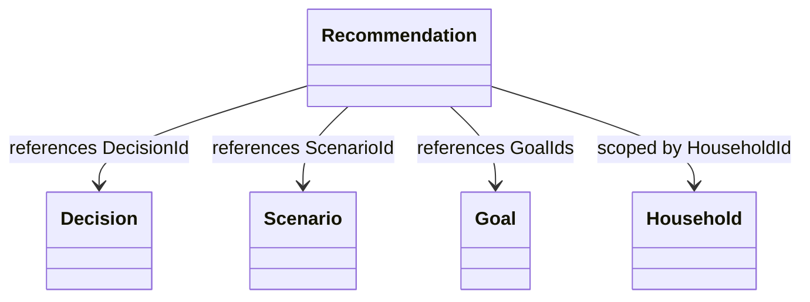
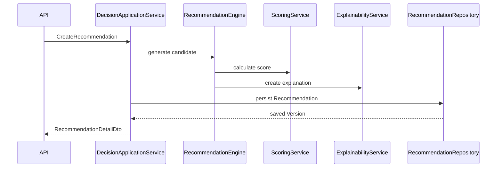
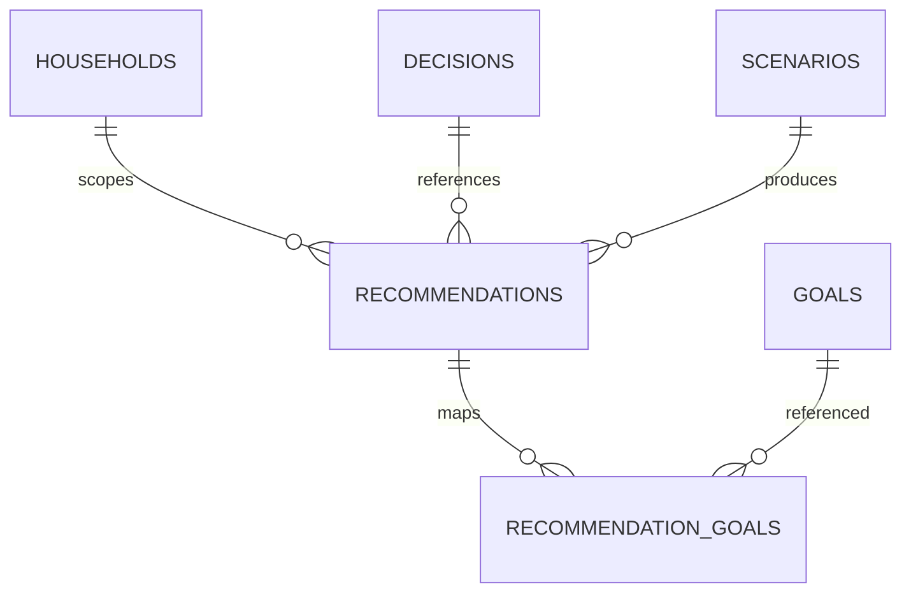
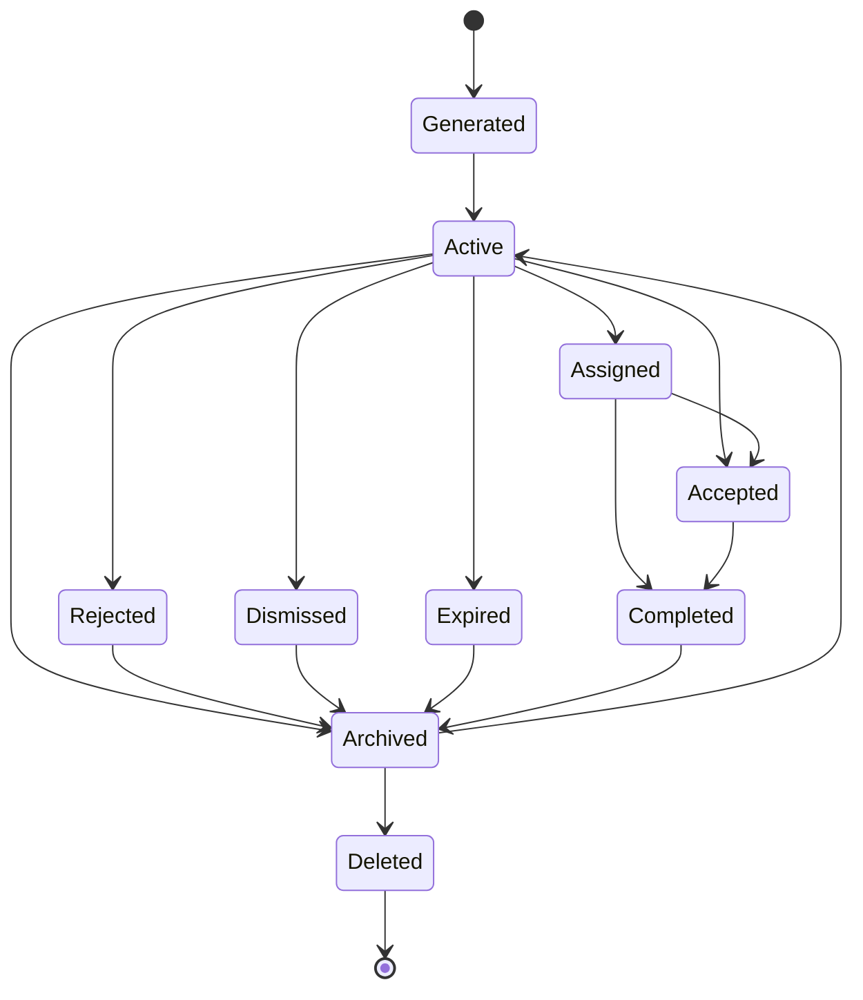

> **ADR-001 PWA Runtime Alignment:** Atlas v1 uses PWA v1 Runtime, Browser Runtime, and IndexedDB Runtime. Future Cloud Architecture is optional future mapping and must not be required for v1.\r\n\r\n# Recommendation Entity Specification

# Document Control

Document Name: Recommendation Entity Specification

Document Path: knowledge/entity/Recommendation.md

Document Type: Enterprise Specification

Version: 1.0

Status: Canonical Specification

Domain: Decision

Bounded Context: Decision Intelligence

Module: Decision

Owner: Project Atlas

Source of Truth: Atlas Knowledge Base

Last Updated: 2026-07-14

Related Specifications:

- knowledge/entity-catalog.md
- knowledge/aggregate-catalog.md
- knowledge/command-catalog.md
- knowledge/domain-event-catalog.md
- knowledge/domain-service-catalog.md
- knowledge/application-service-catalog.md
- knowledge/repository-catalog.md
- knowledge/enumeration-catalog.md
- knowledge/value-object-catalog.md
- knowledge/recommendation-lifecycle.md
- knowledge/recommendation-execution.md
- knowledge/recommendation-evaluation.md
- knowledge/decision-lifecycle.md

# Split Navigation

- [Identity and Scoring](recommendation/identity-and-scoring.md)
- [Lifecycle and Execution](recommendation/lifecycle-and-execution.md)
- [Governance and Testing](recommendation/governance-and-testing.md)

# Entity Overview

Entity Name: Recommendation

Display Name: Recommendation

Purpose: Recommendation represents a generated advisory option tied to Decision evaluation, Scenario output, Goal alignment, priority, score, rationale, explainability, and user disposition.

Responsibilities:

- Maintain stable Recommendation identity.
- Preserve the generated advisory result.
- Reference at least one Decision by identity.
- Reference related Scenario output by identity.
- Reference related Goal identities when Goal alignment exists.
- Store RecommendationType.
- Store RecommendationPriority.
- Store RecommendationScore.
- Store RecommendationStatus.
- Preserve rationale and Explainability reference.
- Preserve Version for historical traceability.
- Preserve Expiration when a recommendation is time-bound.
- Preserve RiskAssessment, ExpectedBenefit, Cost, and Confidence when generated.
- Support Accepted, Rejected, Dismissed, Expired, Archived, Restored, Assigned, and Completed lifecycle changes.
- Provide read models for dashboard, notification, workflow, and execution planning.

Business Meaning: Recommendation is Atlas advisory output that translates Scenario evaluation and Decision analysis into an auditable action candidate.

Aggregate Root: Yes. Entity Catalog states Recommendation is owned by Recommendation aggregate for RecommendationGenerated and advisory state. Command Catalog also maps AcceptRecommendation and RejectRecommendation to DecisionSession; this specification preserves that catalog mapping by treating acceptance and rejection as DecisionSession commands that reference Recommendation by identity.

Lifecycle: Generated, Active, Accepted, Rejected, Dismissed, Assigned, Completed, Expired, Archived, Deleted.

Ownership: Recommendation aggregate owns Recommendation generated state, scoring state, priority state, explanation state, expiration state, archive state, deletion marker, and version history.

Persistence Owner: Catalog-approved persistence for Recommendation aggregate.

Repository: RecommendationRepository for Recommendation aggregate read and write operations where catalog-approved persistence is required; DecisionRepository remains command owner for AcceptRecommendation and RejectRecommendation per Command Catalog.

Application Service: DecisionApplicationService.

Domain Service: DecisionService, Recommendation Engine, ScoringService, ExplainabilityService, RiskService.

Relationships:

- Recommendation references Decision by DecisionId.
- Recommendation references Scenario by ScenarioId.
- Recommendation references Goal by GoalId collection.
- Recommendation references Household by HouseholdId.
- Recommendation references assigned User by AssignedUserId when assigned.
- Recommendation references Follow-up Action by FollowUpActionId when created.
- Recommendation does not own Decision, Scenario, Goal, Household, User, or Follow-up Action.

Navigation:

- Recommendation to Decision is identity reference only.
- Recommendation to Scenario is identity reference only.
- Recommendation to Goal is identity reference collection only.
- Recommendation to Household is scope reference only.
- Recommendation to User is assignment reference only.
- Cross Aggregate navigation cannot cascade mutation.

# Complete Properties

## RecommendationId

- Name: RecommendationId
- Type: Guid
- Nullable: No
- Default: Generated by application
- Description: Stable technical identity of Recommendation.
- Validation: Required; immutable; unique; valid Guid.
- Business Meaning: Identifies one advisory output across history, API, audit, and events.
- Example: 7f3d29c6-6d0e-4f2c-bb46-bd3555d6d351
- PWA Runtime Mapping / Future Cloud Mapping: recommendations.recommendation_id uuid primary key
- JSON Name: recommendationId
- API Usage: Detail, Summary, Search, Update, Accept, Reject, Dismiss, Archive, Restore, Delete, Expire, Assign, Complete
- Searchable: Yes
- Sortable: No
- Indexed: Yes
- Encrypted: No
- Auditable: Yes

## HouseholdId

- Name: HouseholdId
- Type: Guid
- Nullable: No
- Default: None
- Description: Household scope for authorization and isolation.
- Validation: Required; valid Guid; actor must have Household access.
- Business Meaning: Limits Recommendation visibility and mutation to the financial planning scope.
- Example: 18a6d4bb-8532-4d0d-8ad1-2ef6a0215f74
- PWA Runtime Mapping / Future Cloud Mapping: recommendations.household_id uuid not null
- JSON Name: householdId
- API Usage: Create, Detail, Summary, Search
- Searchable: Yes
- Sortable: No
- Indexed: Yes
- Encrypted: No
- Auditable: Yes

## DecisionId

- Name: DecisionId
- Type: Guid
- Nullable: No
- Default: None
- Description: Decision identity associated with the Recommendation.
- Validation: Required; valid Guid; Decision must be within same Household scope.
- Business Meaning: Every Recommendation must support at least one Decision.
- Example: 111d49c8-0957-42a2-a812-b736615fa2bb
- PWA Runtime Mapping / Future Cloud Mapping: recommendations.decision_id uuid not null
- JSON Name: decisionId
- API Usage: Create, Detail, Summary, Search, Accept, Reject
- Searchable: Yes
- Sortable: No
- Indexed: Yes
- Encrypted: No
- Auditable: Yes

## ScenarioId

- Name: ScenarioId
- Type: Guid
- Nullable: Yes
- Default: null
- Description: Scenario that produced or influenced the Recommendation.
- Validation: Valid Guid when present; Scenario must be within same Household scope.
- Business Meaning: Connects advisory output to evaluated Scenario evidence.
- Example: 7b8f2309-4b51-4724-9fb7-927db4ee5d5d
- PWA Runtime Mapping / Future Cloud Mapping: recommendations.scenario_id uuid null
- JSON Name: scenarioId
- API Usage: Create, Detail, Summary, Search
- Searchable: Yes
- Sortable: No
- Indexed: Yes
- Encrypted: No
- Auditable: Yes

## GoalIds

- Name: GoalIds
- Type: Guid[]
- Nullable: No
- Default: []
- Description: Goal identities related to the Recommendation.
- Validation: Each Guid must be valid; each Goal must be within same Household scope; duplicates rejected.
- Business Meaning: Recommendation may align with multiple Goals.
- Example: ["3e1f27f4-4201-431d-bb4a-01d2e4aa94d8"]
- PWA Runtime Mapping / Future Cloud Mapping: recommendation_goals.goal_id uuid not null
- JSON Name: goalIds
- API Usage: Create, Update, Detail, Search
- Searchable: Yes
- Sortable: No
- Indexed: Yes
- Encrypted: No
- Auditable: Yes

## RecommendationType

- Name: RecommendationType
- Type: String
- Nullable: No
- Default: None
- Description: Catalog-aligned type of advisory output.
- Validation: Required; non-blank; max length 64; stable catalog value.
- Business Meaning: Classifies what kind of advisory action Atlas produced without creating a new Domain.
- Example: Rebalance
- PWA Runtime Mapping / Future Cloud Mapping: recommendations.recommendation_type varchar(64) not null
- JSON Name: recommendationType
- API Usage: Create, Update, Detail, Summary, Search
- Searchable: Yes
- Sortable: Yes
- Indexed: Yes
- Encrypted: No
- Auditable: Yes

## Priority

- Name: Priority
- Type: RecommendationPriority
- Nullable: No
- Default: Medium
- Description: Catalog enumeration for Recommendation priority.
- Validation: Required; one of Low, Medium, High, Critical when those values are active in Enumeration Catalog.
- Business Meaning: Defines ordering urgency for review and action.
- Example: High
- PWA Runtime Mapping / Future Cloud Mapping: recommendations.priority varchar(32) not null
- JSON Name: priority
- API Usage: Create, Update, Detail, Summary, Search
- Searchable: Yes
- Sortable: Yes
- Indexed: Yes
- Encrypted: No
- Auditable: Yes

## RecommendationScore

- Name: RecommendationScore
- Type: Decimal
- Nullable: No
- Default: 0
- Description: Score assigned by ScoringService or Recommendation Engine.
- Validation: Required; range 0.0000 to 100.0000; scale 4.
- Business Meaning: Quantifies relative usefulness of the Recommendation.
- Example: 82.7500
- PWA Runtime Mapping / Future Cloud Mapping: recommendations.recommendation_score numeric(9,4) not null
- JSON Name: recommendationScore
- API Usage: Create, Update, Detail, Summary, Search
- Searchable: Yes
- Sortable: Yes
- Indexed: Yes
- Encrypted: No
- Auditable: Yes

## Status

- Name: Status
- Type: DecisionStatus
- Nullable: No
- Default: Recommended
- Description: Current disposition state of Recommendation.
- Validation: Required; allowed values Pending, Evaluating, Recommended, Accepted, Rejected, Expired plus lifecycle states Dismissed, Archived, Deleted when represented by Recommendation lifecycle policy.
- Business Meaning: Records whether advisory output is active, accepted, rejected, dismissed, expired, archived, or deleted.
- Example: Recommended
- PWA Runtime Mapping / Future Cloud Mapping: recommendations.status varchar(32) not null
- JSON Name: status
- API Usage: Detail, Summary, Search, Accept, Reject, Dismiss, Archive, Restore, Delete, Expire, Complete
- Searchable: Yes
- Sortable: Yes
- Indexed: Yes
- Encrypted: No
- Auditable: Yes

## Rationale

- Name: Rationale
- Type: String
- Nullable: No
- Default: None
- Description: Human-readable reason for the Recommendation.
- Validation: Required; trim; max length 4000; no script content.
- Business Meaning: Makes the advisory output understandable to users and auditors.
- Example: Increase emergency reserve before adding investment risk.
- PWA Runtime Mapping / Future Cloud Mapping: recommendations.rationale text not null
- JSON Name: rationale
- API Usage: Create, Update, Detail, Summary
- Searchable: Yes
- Sortable: No
- Indexed: Optional full text
- Encrypted: No
- Auditable: Yes

## ExplainabilityRef

- Name: ExplainabilityRef
- Type: String
- Nullable: No
- Default: None
- Description: Reference to Explainability trace, rule evaluation, or explanation artifact.
- Validation: Required; max length 256; must resolve to explainability data.
- Business Meaning: Allows Recommendation to be traced to calculation, rule, assumption, and scoring evidence.
- Example: exp-20260714-0001
- PWA Runtime Mapping / Future Cloud Mapping: recommendations.explainability_ref varchar(256) not null
- JSON Name: explainabilityRef
- API Usage: Create, Update, Detail
- Searchable: Yes
- Sortable: No
- Indexed: Yes
- Encrypted: No
- Auditable: Yes

## RiskAssessment

- Name: RiskAssessment
- Type: Json
- Nullable: Yes
- Default: null
- Description: Risk evaluation snapshot associated with Recommendation.
- Validation: Valid JSON object when present; must not contain executable content.
- Business Meaning: Records downside, risk level, and risk drivers.
- Example: {"riskLevel":"Medium","drivers":["cashFlowVolatility"]}
- PWA Runtime Mapping / Future Cloud Mapping: recommendations.risk_assessment jsonb null
- JSON Name: riskAssessment
- API Usage: Create, Update, Detail
- Searchable: No
- Sortable: No
- Indexed: Optional jsonb path index
- Encrypted: No
- Auditable: Yes

## ExpectedBenefit

- Name: ExpectedBenefit
- Type: Json
- Nullable: Yes
- Default: null
- Description: Expected benefit snapshot for the advisory option.
- Validation: Valid JSON object when present; monetary values must include CurrencyCode.
- Business Meaning: Captures the expected positive effect of accepting the Recommendation.
- Example: {"amount":150000,"currency":"TWD","description":"Projected cash reserve improvement"}
- PWA Runtime Mapping / Future Cloud Mapping: recommendations.expected_benefit jsonb null
- JSON Name: expectedBenefit
- API Usage: Create, Update, Detail, Summary
- Searchable: No
- Sortable: No
- Indexed: Optional jsonb path index
- Encrypted: No
- Auditable: Yes

## Cost

- Name: Cost
- Type: Json
- Nullable: Yes
- Default: null
- Description: Cost snapshot associated with execution.
- Validation: Valid JSON object when present; monetary values must include CurrencyCode and nonnegative amount.
- Business Meaning: Represents estimated financial or operational cost.
- Example: {"amount":5000,"currency":"TWD","description":"Transaction cost estimate"}
- PWA Runtime Mapping / Future Cloud Mapping: recommendations.cost jsonb null
- JSON Name: cost
- API Usage: Create, Update, Detail
- Searchable: No
- Sortable: No
- Indexed: Optional jsonb path index
- Encrypted: No
- Auditable: Yes

## Confidence

- Name: Confidence
- Type: Decimal
- Nullable: Yes
- Default: null
- Description: Confidence level of the Recommendation.
- Validation: Range 0.0000 to 1.0000 when present; scale 4.
- Business Meaning: Indicates model or rule certainty.
- Example: 0.8400
- PWA Runtime Mapping / Future Cloud Mapping: recommendations.confidence numeric(5,4) null
- JSON Name: confidence
- API Usage: Create, Update, Detail, Summary, Search
- Searchable: Yes
- Sortable: Yes
- Indexed: Yes
- Encrypted: No
- Auditable: Yes

## ExpirationAt

- Name: ExpirationAt
- Type: DateTimeOffset
- Nullable: Yes
- Default: null
- Description: Time after which Recommendation is no longer actionable.
- Validation: Must be later than CreatedAt when present.
- Business Meaning: Supports time-bound advisory output.
- Example: 2026-12-31T23:59:59+08:00
- PWA Runtime Mapping / Future Cloud Mapping: recommendations.expiration_at timestamptz null
- JSON Name: expirationAt
- API Usage: Create, Update, Detail, Summary, Search, Expire
- Searchable: Yes
- Sortable: Yes
- Indexed: Yes
- Encrypted: No
- Auditable: Yes

## AssignedUserId

- Name: AssignedUserId
- Type: Guid
- Nullable: Yes
- Default: null
- Description: User assigned to follow up on the Recommendation.
- Validation: Valid Guid when present; user must be authorized for Household scope.
- Business Meaning: Supports ownership of review or execution.
- Example: b6a6d087-b8f8-4062-92ec-08b7fc5d64f4
- PWA Runtime Mapping / Future Cloud Mapping: recommendations.assigned_user_id uuid null
- JSON Name: assignedUserId
- API Usage: Assign, Detail, Summary, Search
- Searchable: Yes
- Sortable: No
- Indexed: Yes
- Encrypted: No
- Auditable: Yes

## FollowUpActionId

- Name: FollowUpActionId
- Type: Guid
- Nullable: Yes
- Default: null
- Description: Follow-up action created from Recommendation.
- Validation: Valid Guid when present; must be traceable to Recommendation.
- Business Meaning: Links advisory acceptance to execution planning.
- Example: 49b48b7e-2f44-40d7-bd31-2eb6fe7f206d
- PWA Runtime Mapping / Future Cloud Mapping: recommendations.follow_up_action_id uuid null
- JSON Name: followUpActionId
- API Usage: Detail, Summary, Complete
- Searchable: Yes
- Sortable: No
- Indexed: Yes
- Encrypted: No
- Auditable: Yes

## Version

- Name: Version
- Type: Int64
- Nullable: No
- Default: 1
- Description: Optimistic concurrency and history version.
- Validation: Required; increments on mutation; stale version rejected.
- Business Meaning: Prevents lost update and protects historical traceability.
- Example: 7
- PWA Runtime Mapping / Future Cloud Mapping: recommendations.version bigint not null
- JSON Name: version
- API Usage: Update, Accept, Reject, Dismiss, Archive, Restore, Delete, Expire, Assign, Complete
- Searchable: No
- Sortable: Yes
- Indexed: No
- Encrypted: No
- Auditable: Yes

## CreatedAt

- Name: CreatedAt
- Type: DateTimeOffset
- Nullable: No
- Default: Current timestamp
- Description: Creation timestamp.
- Validation: Required; immutable after creation.
- Business Meaning: Establishes generation time.
- Example: 2026-07-14T10:30:00+08:00
- PWA Runtime Mapping / Future Cloud Mapping: recommendations.created_at timestamptz not null
- JSON Name: createdAt
- API Usage: Detail, Summary, Search
- Searchable: Yes
- Sortable: Yes
- Indexed: Yes
- Encrypted: No
- Auditable: Yes

## CreatedBy

- Name: CreatedBy
- Type: Guid
- Nullable: No
- Default: ActorId or system actor
- Description: Actor that created the Recommendation.
- Validation: Required; valid actor reference.
- Business Meaning: Supports audit attribution.
- Example: 00000000-0000-0000-0000-000000000001
- PWA Runtime Mapping / Future Cloud Mapping: recommendations.created_by uuid not null
- JSON Name: createdBy
- API Usage: Detail
- Searchable: Yes
- Sortable: No
- Indexed: Yes
- Encrypted: No
- Auditable: Yes

## UpdatedAt

- Name: UpdatedAt
- Type: DateTimeOffset
- Nullable: No
- Default: Current timestamp
- Description: Last mutation timestamp.
- Validation: Required; must be greater than or equal to CreatedAt.
- Business Meaning: Supports ordering, cache invalidation, and audit.
- Example: 2026-07-14T11:10:00+08:00
- PWA Runtime Mapping / Future Cloud Mapping: recommendations.updated_at timestamptz not null
- JSON Name: updatedAt
- API Usage: Detail, Summary, Search
- Searchable: Yes
- Sortable: Yes
- Indexed: Yes
- Encrypted: No
- Auditable: Yes

## UpdatedBy

- Name: UpdatedBy
- Type: Guid
- Nullable: Yes
- Default: null
- Description: Actor that last changed the Recommendation.
- Validation: Valid actor reference when present.
- Business Meaning: Supports audit attribution for mutation.
- Example: b6a6d087-b8f8-4062-92ec-08b7fc5d64f4
- PWA Runtime Mapping / Future Cloud Mapping: recommendations.updated_by uuid null
- JSON Name: updatedBy
- API Usage: Detail
- Searchable: Yes
- Sortable: No
- Indexed: Yes
- Encrypted: No
- Auditable: Yes

## ArchivedAt

- Name: ArchivedAt
- Type: DateTimeOffset
- Nullable: Yes
- Default: null
- Description: Archive timestamp.
- Validation: Required when Status is Archived; null when active.
- Business Meaning: Removes Recommendation from active default views while preserving history.
- Example: 2026-08-01T09:00:00+08:00
- PWA Runtime Mapping / Future Cloud Mapping: recommendations.archived_at timestamptz null
- JSON Name: archivedAt
- API Usage: Archive, Restore, Detail, Search
- Searchable: Yes
- Sortable: Yes
- Indexed: Yes
- Encrypted: No
- Auditable: Yes

## DeletedAt

- Name: DeletedAt
- Type: DateTimeOffset
- Nullable: Yes
- Default: null
- Description: Soft delete timestamp.
- Validation: Required when Status is Deleted; physical delete requires retention approval.
- Business Meaning: Marks Recommendation as removed without rewriting history.
- Example: 2026-08-15T09:00:00+08:00
- PWA Runtime Mapping / Future Cloud Mapping: recommendations.deleted_at timestamptz null
- JSON Name: deletedAt
- API Usage: Delete, Detail when permitted
- Searchable: Yes
- Sortable: Yes
- Indexed: Yes
- Encrypted: No
- Auditable: Yes

## CorrelationId

- Name: CorrelationId
- Type: String
- Nullable: No
- Default: Request correlation id
- Description: End-to-end trace identifier.
- Validation: Required; max length 128.
- Business Meaning: Links command, event, audit, and projection records.
- Example: corr-20260714-0001
- PWA Runtime Mapping / Future Cloud Mapping: recommendations.correlation_id varchar(128) not null
- JSON Name: correlationId
- API Usage: Command metadata, Detail
- Searchable: Yes
- Sortable: No
- Indexed: Yes
- Encrypted: No
- Auditable: Yes

## CausationId

- Name: CausationId
- Type: String
- Nullable: Yes
- Default: null
- Description: Identifier of command or event that caused the current state.
- Validation: Max length 128 when present.
- Business Meaning: Preserves event causality.
- Example: cmd-evaluate-scenario-0001
- PWA Runtime Mapping / Future Cloud Mapping: recommendations.causation_id varchar(128) null
- JSON Name: causationId
- API Usage: Command metadata, Detail
- Searchable: Yes
- Sortable: No
- Indexed: Yes
- Encrypted: No
- Auditable: Yes

# Validation Rules

| Rule ID | Validation |
|---|---|
| REC-VR-001 | RecommendationId is required, unique, valid, and immutable. |
| REC-VR-002 | HouseholdId is required and must match actor authorization scope. |
| REC-VR-003 | DecisionId is required; Recommendation must reference at least one Decision. |
| REC-VR-004 | ScenarioId is optional, but when present must belong to same Household. |
| REC-VR-005 | GoalIds may be empty, but each supplied GoalId must be unique and in same Household. |
| REC-VR-006 | RecommendationType is required, non-blank, and max length 64. |
| REC-VR-007 | Priority is required and must use RecommendationPriority. |
| REC-VR-008 | RecommendationScore is required and must be between 0.0000 and 100.0000. |
| REC-VR-009 | Status is required and must follow the State Machine. |
| REC-VR-010 | Rationale is required and max length 4000. |
| REC-VR-011 | ExplainabilityRef is required and must resolve to explainability evidence. |
| REC-VR-012 | RiskAssessment must be valid JSON when present. |
| REC-VR-013 | ExpectedBenefit must be valid JSON when present. |
| REC-VR-014 | Cost must be valid JSON when present and monetary amounts must be nonnegative. |
| REC-VR-015 | Confidence must be between 0.0000 and 1.0000 when present. |
| REC-VR-016 | ExpirationAt must be later than CreatedAt when present. |
| REC-VR-017 | AssignedUserId must reference an authorized User when present. |
| REC-VR-018 | FollowUpActionId must be traceable to Recommendation when present. |
| REC-VR-019 | Version is required and stale Version is rejected. |
| REC-VR-020 | CreatedAt and CreatedBy are required and immutable. |
| REC-VR-021 | UpdatedAt must be greater than or equal to CreatedAt. |
| REC-VR-022 | ArchivedAt is required when Status is Archived. |
| REC-VR-023 | DeletedAt is required when Status is Deleted. |
| REC-VR-024 | Accepted, Rejected, Dismissed, Completed, Expired, Archived, and Deleted states block normal UpdateRecommendation. |
| REC-VR-025 | Cross Aggregate references must be by identity only. |
| REC-VR-026 | Recommendation history version cannot be directly modified. |
| REC-VR-027 | CorrelationId is required for command and event traceability. |
| REC-VR-028 | Command idempotency key is required for mutating API commands. |
| REC-VR-029 | Search requests must enforce Household isolation. |
| REC-VR-030 | Sensitive advisory text must not be logged outside audit policy. |

# Business Rules

1. REC-BR-001 Recommendation must correspond to at least one Decision.
2. REC-BR-002 Recommendation must have RecommendationType.
3. REC-BR-003 Recommendation must have Priority.
4. REC-BR-004 Recommendation must have RecommendationScore.
5. REC-BR-005 Recommendation may correspond to multiple Goal identities.
6. REC-BR-006 Recommendation may be generated from Scenario evaluation.
7. REC-BR-007 Recommendation may be generated by multiple Scenario results through catalog-approved correlation.
8. REC-BR-008 Recommendation may be marked Accepted.
9. REC-BR-009 Recommendation may be marked Rejected.
10. REC-BR-010 Recommendation may be marked Dismissed.
11. REC-BR-011 Recommendation must be traceable through ExplainabilityRef.
12. REC-BR-012 Recommendation historical versions cannot be directly modified.
13. REC-BR-013 Recommendation must preserve Version.
14. REC-BR-014 Recommendation may have ExpirationAt.
15. REC-BR-015 Recommendation may contain RiskAssessment.
16. REC-BR-016 Recommendation may contain ExpectedBenefit.
17. REC-BR-017 Recommendation may contain Cost.
18. REC-BR-018 Recommendation may contain Confidence.
19. REC-BR-019 Recommendation may create Follow-up Action through execution planning.
20. REC-BR-020 Recommendation does not own Decision.
21. REC-BR-021 Recommendation does not own Scenario.
22. REC-BR-022 Recommendation does not own Goal.
23. REC-BR-023 AcceptRecommendation and RejectRecommendation follow Command Catalog ownership through DecisionSession and DecisionRepository.
24. REC-BR-024 RecommendationGenerated is emitted by Recommendation aggregate catalog-approved persistence.
25. REC-BR-025 Recommendation status change must emit a status event.
26. REC-BR-026 Recommendation score change must emit RecommendationScoreChanged.
27. REC-BR-027 Recommendation priority change must emit RecommendationPriorityChanged.
28. REC-BR-028 Recommendation assignment must emit RecommendationAssigned.
29. REC-BR-029 Archived Recommendation is excluded from active search by default.
30. REC-BR-030 Deleted Recommendation is hidden except for authorized audit access.
31. REC-BR-031 Expired Recommendation cannot be accepted.
32. REC-BR-032 Rejected Recommendation cannot be accepted without RestoreRecommendation.
33. REC-BR-033 Dismissed Recommendation cannot be completed.
34. REC-BR-034 Accepted Recommendation may create execution plan follow-up.
35. REC-BR-035 Completed Recommendation must have accepted or assigned lineage.
36. REC-BR-036 Recommendation cache key must include HouseholdId and permission scope.
37. REC-BR-037 Recommendation list APIs must be paginated.
38. REC-BR-038 Recommendation sorting must be deterministic.
39. REC-BR-039 Recommendation mutation must be audited.
40. REC-BR-040 Recommendation events must include CorrelationId and CausationId.

# State Machine

| State | Transition | Trigger | Invariant | Illegal Transition |
|---|---|---|---|---|
| Generated | Generated to Active | CreateRecommendation or RecommendationGenerated | Required properties exist | Generated to Completed |
| Active | Active to Accepted | AcceptRecommendation | DecisionId exists; not expired | Active to Deleted without audit |
| Active | Active to Rejected | RejectRecommendation | rejection reason required | Active to Completed |
| Active | Active to Dismissed | DismissRecommendation | dismissal reason required | Active to Deleted without audit |
| Active | Active to Expired | ExpireRecommendation or ExpirationAt elapsed | ExpirationAt reached or command authorized | Active to Generated |
| Active | Active to Archived | ArchiveRecommendation | archive reason required | Active to Deleted without audit |
| Active | Active to Assigned | AssignRecommendation | AssignedUserId present | Active to Completed without assignment or acceptance |
| Assigned | Assigned to Accepted | AcceptRecommendation | assigned user remains authorized | Assigned to Generated |
| Assigned | Assigned to Completed | CompleteRecommendation | FollowUpActionId or completion evidence present | Assigned to Deleted without audit |
| Accepted | Accepted to Completed | CompleteRecommendation | acceptance recorded | Accepted to Rejected |
| Rejected | Rejected to Archived | ArchiveRecommendation | rejection preserved | Rejected to Accepted |
| Dismissed | Dismissed to Archived | ArchiveRecommendation | dismissal preserved | Dismissed to Accepted |
| Expired | Expired to Archived | ArchiveRecommendation | expiration preserved | Expired to Accepted |
| Archived | Archived to Active | RestoreRecommendation | not deleted; actor authorized | Archived to Accepted |
| Archived | Archived to Deleted | DeleteRecommendation | retention policy permits soft delete | Archived to Completed |
| Completed | Completed to Archived | ArchiveRecommendation | completion preserved | Completed to Rejected |
| Deleted | No normal transition | None | DeletedAt present | Deleted to Active |

# Commands

| Command | Owner | Handler | Repository | Result | Event |
|---|---|---|---|---|---|
| CreateRecommendation | Recommendation | CreateRecommendationCommandHandler | RecommendationRepository | RecommendationDetailDto | RecommendationCreated, RecommendationGenerated |
| UpdateRecommendation | Recommendation | UpdateRecommendationCommandHandler | RecommendationRepository | RecommendationDetailDto | RecommendationUpdated |
| AcceptRecommendation | DecisionSession | AcceptRecommendationCommandHandler | DecisionRepository | CommandResult | DecisionAccepted, RecommendationAccepted, RecommendationStatusChanged |
| RejectRecommendation | DecisionSession | RejectRecommendationCommandHandler | DecisionRepository | CommandResult | DecisionRejected, RecommendationRejected, RecommendationStatusChanged |
| DismissRecommendation | Recommendation | DismissRecommendationCommandHandler | RecommendationRepository | CommandResult | RecommendationDismissed, RecommendationStatusChanged |
| ArchiveRecommendation | Recommendation | ArchiveRecommendationCommandHandler | RecommendationRepository | CommandResult | RecommendationArchived, RecommendationStatusChanged |
| RestoreRecommendation | Recommendation | RestoreRecommendationCommandHandler | RecommendationRepository | CommandResult | RecommendationRestored, RecommendationStatusChanged |
| DeleteRecommendation | Recommendation | DeleteRecommendationCommandHandler | RecommendationRepository | CommandResult | RecommendationDeleted, RecommendationStatusChanged |
| ExpireRecommendation | Recommendation | ExpireRecommendationCommandHandler | RecommendationRepository | CommandResult | RecommendationExpired, RecommendationStatusChanged |
| AssignRecommendation | Recommendation | AssignRecommendationCommandHandler | RecommendationRepository | CommandResult | RecommendationAssigned |
| CompleteRecommendation | Recommendation | CompleteRecommendationCommandHandler | RecommendationRepository | CommandResult | RecommendationCompleted, RecommendationStatusChanged |
| EvaluateScenario | Scenario | EvaluateScenarioCommandHandler | ScenarioRepository | CommandResult | RecommendationGenerated |
| ReplayScenario | Scenario | ReplayScenarioCommandHandler | ScenarioRepository | CommandResult | ReplayCompleted |

# Domain Events

| Event | Publisher | Payload |
|---|---|---|
| RecommendationCreated | Recommendation | RecommendationId, HouseholdId, DecisionId, ScenarioId, Priority, RecommendationScore |
| RecommendationGenerated | Recommendation | RecommendationId, ScenarioId, Priority, Rationale, AggregateId, HouseholdId, CorrelationId, CausationId, OccurredAt |
| RecommendationUpdated | Recommendation | RecommendationId, changed fields, Version |
| RecommendationAccepted | DecisionSession | DecisionId, RecommendationId, AcceptedAt, HouseholdId |
| RecommendationRejected | DecisionSession | DecisionId, RecommendationId, RejectedAt, Reason, HouseholdId |
| RecommendationDismissed | Recommendation | RecommendationId, DismissedAt, Reason, HouseholdId |
| RecommendationExpired | Recommendation | RecommendationId, ExpiredAt, HouseholdId |
| RecommendationArchived | Recommendation | RecommendationId, ArchivedAt, Reason, HouseholdId |
| RecommendationRestored | Recommendation | RecommendationId, RestoredAt, HouseholdId |
| RecommendationDeleted | Recommendation | RecommendationId, DeletedAt, HouseholdId |
| RecommendationStatusChanged | Recommendation | RecommendationId, PreviousStatus, NewStatus, Version |
| RecommendationScoreChanged | Recommendation | RecommendationId, PreviousScore, NewScore, Version |
| RecommendationPriorityChanged | Recommendation | RecommendationId, PreviousPriority, NewPriority, Version |
| RecommendationAssigned | Recommendation | RecommendationId, AssignedUserId, AssignedAt |
| RecommendationCompleted | Recommendation | RecommendationId, CompletedAt, FollowUpActionId |
| DecisionAccepted | DecisionSession | DecisionId, RecommendationId, AcceptedAt |
| DecisionRejected | DecisionSession | DecisionId, RecommendationId, RejectedAt, Reason |

# Repository

Interface: IRecommendationRepository

Methods:

- GetByIdAsync(RecommendationId, HouseholdId)
- AddAsync(Recommendation)
- UpdateAsync(Recommendation, expectedVersion)
- ArchiveAsync(RecommendationId, expectedVersion)
- RestoreAsync(RecommendationId, expectedVersion)
- SoftDeleteAsync(RecommendationId, expectedVersion)
- ExistsAsync(RecommendationId, HouseholdId)
- SaveChangesAsync()

Query Methods:

- SearchAsync(RecommendationSearchSpecification)
- FindActiveByDecisionAsync(DecisionId, HouseholdId)
- FindByScenarioAsync(ScenarioId, HouseholdId)
- FindByGoalAsync(GoalId, HouseholdId)
- FindExpiredAsync(now, limit)
- FindAssignedAsync(AssignedUserId, HouseholdId)
- FindByStatusAsync(Status, HouseholdId)
- FindByPriorityAsync(Priority, HouseholdId)
- FindByScoreRangeAsync(minScore, maxScore, HouseholdId)

Specification Pattern:

- RecommendationByHouseholdSpecification
- RecommendationByDecisionSpecification
- RecommendationByScenarioSpecification
- RecommendationByGoalSpecification
- RecommendationByStatusSpecification
- RecommendationByPrioritySpecification
- RecommendationByScoreSpecification
- RecommendationByExpirationSpecification
- RecommendationActiveOnlySpecification
- RecommendationArchivedSpecification
- RecommendationAssignedSpecification
- RecommendationSearchSpecification

# Domain Service Interaction

| Service | Interaction |
|---|---|
| Decision Engine | Consumes Scenario evaluation and produces Decision context for Recommendation. |
| Recommendation Engine | Generates RecommendationType, Rationale, Priority, and candidate actions. |
| Scoring Engine | Calculates RecommendationScore and Confidence. |
| Optimization Engine | Compares recommendation options and ranks trade-offs. |
| Explainability Service | Produces ExplainabilityRef and traceable rationale evidence. |
| Notification Service | Notifies authorized users when Recommendation is generated, assigned, accepted, rejected, dismissed, or expired. |
| Execution Planning Service | Creates Follow-up Action when Recommendation is accepted or assigned for execution. |
| Goal Evaluation Service | Evaluates Recommendation impact against GoalIds. |
| Scenario Service | Supplies ScenarioId and evaluated projection evidence. |
| Risk Analysis Service | Produces RiskAssessment and RiskLevel evidence. |
| DecisionService | Handles DecisionSession acceptance and rejection commands. |
| RiskService | Supplies risk classification and risk capacity checks. |
| ScoringService | Supplies score and score change validation. |
| ExplainabilityService | Validates explainability trace existence. |

# Application Service Interaction

- DecisionApplicationService creates generated Recommendation projections and handles Decision acceptance and rejection.
- ScenarioApplicationService evaluates Scenario and may cause RecommendationGenerated.
- GoalApplicationService supplies Goal access checks and Goal summary data.
- PortfolioApplicationService supplies portfolio evidence for recommendations.
- LoanApplicationService supplies loan and liability evidence for recommendations.
- NotificationApplicationService sends catalog-approved notification messages.
- DashboardApplicationService reads Recommendation summaries.
- AuditApplicationService records command, event, and field-level audit.
- WorkflowApplicationService advances workflow after Recommendation status changes.
- ExecutionPlanningApplicationService creates and completes follow-up action records.
- SearchApplicationService indexes searchable Recommendation fields.
- CacheApplicationService invalidates Household-scoped Recommendation cache.

# API

| Endpoint | HTTP Method | Request | Response | Error |
|---|---|---|---|---|
| /api/v1/recommendations | POST | CreateRecommendationDto | RecommendationDetailDto | 400, 401, 403, 409, 422 |
| /api/v1/recommendations/{recommendationId} | GET | Route id | RecommendationDetailDto | 401, 403, 404 |
| /api/v1/recommendations/{recommendationId} | PUT | UpdateRecommendationDto | RecommendationDetailDto | 400, 401, 403, 404, 409, 422 |
| /api/v1/recommendations/{recommendationId} | DELETE | version, reason | CommandResult | 401, 403, 404, 409 |
| /api/v1/recommendations/search | POST | RecommendationSearchDto | RecommendationSearchResultDto | 400, 401, 403 |
| /api/v1/recommendations/{recommendationId}/accept | POST | AcceptRecommendationDto | CommandResult | 400, 401, 403, 404, 409, 422 |
| /api/v1/recommendations/{recommendationId}/reject | POST | RejectRecommendationDto | CommandResult | 400, 401, 403, 404, 409, 422 |
| /api/v1/recommendations/{recommendationId}/dismiss | POST | DismissRecommendationDto | CommandResult | 400, 401, 403, 404, 409, 422 |
| /api/v1/recommendations/{recommendationId}/archive | POST | ArchiveRecommendationDto | CommandResult | 400, 401, 403, 404, 409 |
| /api/v1/recommendations/{recommendationId}/restore | POST | RestoreRecommendationDto | CommandResult | 400, 401, 403, 404, 409 |
| /api/v1/recommendations/{recommendationId}/expire | POST | ExpireRecommendationDto | CommandResult | 400, 401, 403, 404, 409 |
| /api/v1/recommendations/{recommendationId}/assign | POST | AssignRecommendationDto | CommandResult | 400, 401, 403, 404, 409 |
| /api/v1/recommendations/{recommendationId}/complete | POST | CompleteRecommendationDto | CommandResult | 400, 401, 403, 404, 409, 422 |

# DTO

Create DTO: CreateRecommendationDto includes householdId, decisionId, scenarioId, goalIds, recommendationType, priority, recommendationScore, rationale, explainabilityRef, riskAssessment, expectedBenefit, cost, confidence, expirationAt, correlationId, causationId.

Update DTO: UpdateRecommendationDto includes recommendationType, goalIds, priority, recommendationScore, rationale, explainabilityRef, riskAssessment, expectedBenefit, cost, confidence, expirationAt, version.

Detail DTO: RecommendationDetailDto includes all properties, audit fields, Version, and permission flags.

Summary DTO: RecommendationSummaryDto includes recommendationId, householdId, decisionId, scenarioId, goalIds, recommendationType, priority, recommendationScore, status, rationale, confidence, expirationAt, assignedUserId, updatedAt, version.

Search DTO: RecommendationSearchDto includes householdId, decisionId, scenarioId, goalId, recommendationType, priority, status, minScore, maxScore, minConfidence, expiresBefore, assignedUserId, includeArchived, page, pageSize, sortBy, sortDirection.

Accept DTO: AcceptRecommendationDto includes recommendationId, decisionId, version, acceptedAt, comment, idempotencyKey, correlationId, causationId.

Reject DTO: RejectRecommendationDto includes recommendationId, decisionId, version, reason, rejectedAt, idempotencyKey, correlationId, causationId.

Dismiss DTO: DismissRecommendationDto includes recommendationId, version, reason, dismissedAt, idempotencyKey, correlationId, causationId.

# PWA Runtime Mapping

Table: recommendations

Columns: recommendation_id, household_id, decision_id, scenario_id, recommendation_type, priority, recommendation_score, status, rationale, explainability_ref, risk_assessment, expected_benefit, cost, confidence, expiration_at, assigned_user_id, follow_up_action_id, version, created_at, created_by, updated_at, updated_by, archived_at, deleted_at, correlation_id, causation_id

FK: household_id references households where implemented; decision_id references decision identity by catalog-approved constraint where implemented; scenario_id references scenarios where implemented; assigned_user_id references users where implemented.

Unique: recommendation_id primary key; optional unique recommendation_id plus household_id.

Check Constraint: score range, confidence range, status values, priority values, expiration after creation, archive timestamp requirement, delete timestamp requirement.

Index: household, decision, scenario, status, priority, score, confidence, expiration, assigned user, updated time, active filter.

# Future Cloud Mapping Schema

```sql
CREATE TABLE recommendations (
  recommendation_id uuid PRIMARY KEY,
  household_id uuid NOT NULL,
  decision_id uuid NOT NULL,
  scenario_id uuid NULL,
  recommendation_type varchar(64) NOT NULL,
  priority varchar(32) NOT NULL DEFAULT 'Medium',
  recommendation_score numeric(9,4) NOT NULL DEFAULT 0,
  status varchar(32) NOT NULL DEFAULT 'Recommended',
  rationale text NOT NULL,
  explainability_ref varchar(256) NOT NULL,
  risk_assessment jsonb NULL,
  expected_benefit jsonb NULL,
  cost jsonb NULL,
  confidence numeric(5,4) NULL,
  expiration_at timestamptz NULL,
  assigned_user_id uuid NULL,
  follow_up_action_id uuid NULL,
  version bigint NOT NULL DEFAULT 1,
  created_at timestamptz NOT NULL DEFAULT now(),
  created_by uuid NOT NULL,
  updated_at timestamptz NOT NULL DEFAULT now(),
  updated_by uuid NULL,
  archived_at timestamptz NULL,
  deleted_at timestamptz NULL,
  correlation_id varchar(128) NOT NULL,
  causation_id varchar(128) NULL,
  CONSTRAINT ck_recommendations_score CHECK (recommendation_score >= 0 AND recommendation_score <= 100),
  CONSTRAINT ck_recommendations_confidence CHECK (confidence IS NULL OR (confidence >= 0 AND confidence <= 1)),
  CONSTRAINT ck_recommendations_priority CHECK (priority IN ('Low','Medium','High','Critical')),
  CONSTRAINT ck_recommendations_status CHECK (status IN ('Pending','Evaluating','Recommended','Accepted','Rejected','Dismissed','Assigned','Completed','Expired','Archived','Deleted')),
  CONSTRAINT ck_recommendations_expiration CHECK (expiration_at IS NULL OR expiration_at > created_at),
  CONSTRAINT ck_recommendations_archived CHECK ((status <> 'Archived') OR archived_at IS NOT NULL),
  CONSTRAINT ck_recommendations_deleted CHECK ((status <> 'Deleted') OR deleted_at IS NOT NULL)
);

CREATE TABLE recommendation_goals (
  recommendation_id uuid NOT NULL,
  goal_id uuid NOT NULL,
  household_id uuid NOT NULL,
  created_at timestamptz NOT NULL DEFAULT now(),
  PRIMARY KEY (recommendation_id, goal_id)
);

CREATE INDEX ix_recommendations_household ON recommendations (household_id);
CREATE INDEX ix_recommendations_decision ON recommendations (decision_id);
CREATE INDEX ix_recommendations_scenario ON recommendations (scenario_id);
CREATE INDEX ix_recommendations_status ON recommendations (status);
CREATE INDEX ix_recommendations_priority ON recommendations (priority);
CREATE INDEX ix_recommendations_score ON recommendations (recommendation_score DESC);
CREATE INDEX ix_recommendations_confidence ON recommendations (confidence DESC);
CREATE INDEX ix_recommendations_expiration ON recommendations (expiration_at);
CREATE INDEX ix_recommendations_assigned_user ON recommendations (assigned_user_id);
CREATE INDEX ix_recommendations_updated ON recommendations (updated_at DESC, recommendation_id);
CREATE INDEX ix_recommendations_active ON recommendations (household_id, status, priority, updated_at DESC) WHERE archived_at IS NULL AND deleted_at IS NULL;
CREATE INDEX ix_recommendation_goals_goal ON recommendation_goals (goal_id, household_id);
```

# Future Cloud Mapping

Fluent API:

```csharp
builder.ToTable("recommendations");
builder.HasKey(x => x.RecommendationId);
builder.Property(x => x.RecommendationId).HasColumnName("recommendation_id").ValueGeneratedNever();
builder.Property(x => x.HouseholdId).HasColumnName("household_id").IsRequired();
builder.Property(x => x.DecisionId).HasColumnName("decision_id").IsRequired();
builder.Property(x => x.ScenarioId).HasColumnName("scenario_id");
builder.Property(x => x.RecommendationType).HasColumnName("recommendation_type").HasMaxLength(64).IsRequired();
builder.Property(x => x.Priority).HasColumnName("priority").HasMaxLength(32).HasConversion<string>().IsRequired();
builder.Property(x => x.RecommendationScore).HasColumnName("recommendation_score").HasPrecision(9, 4).IsRequired();
builder.Property(x => x.Status).HasColumnName("status").HasMaxLength(32).HasConversion<string>().IsRequired();
builder.Property(x => x.Rationale).HasColumnName("rationale").IsRequired();
builder.Property(x => x.ExplainabilityRef).HasColumnName("explainability_ref").HasMaxLength(256).IsRequired();
builder.Property(x => x.RiskAssessment).HasColumnName("risk_assessment").HasColumnType("jsonb");
builder.Property(x => x.ExpectedBenefit).HasColumnName("expected_benefit").HasColumnType("jsonb");
builder.Property(x => x.Cost).HasColumnName("cost").HasColumnType("jsonb");
builder.Property(x => x.Confidence).HasColumnName("confidence").HasPrecision(5, 4);
builder.Property(x => x.ExpirationAt).HasColumnName("expiration_at");
builder.Property(x => x.AssignedUserId).HasColumnName("assigned_user_id");
builder.Property(x => x.FollowUpActionId).HasColumnName("follow_up_action_id");
builder.Property(x => x.Version).HasColumnName("version").IsConcurrencyToken();
builder.Property(x => x.CreatedAt).HasColumnName("created_at").IsRequired();
builder.Property(x => x.CreatedBy).HasColumnName("created_by").IsRequired();
builder.Property(x => x.UpdatedAt).HasColumnName("updated_at").IsRequired();
builder.Property(x => x.UpdatedBy).HasColumnName("updated_by");
builder.Property(x => x.ArchivedAt).HasColumnName("archived_at");
builder.Property(x => x.DeletedAt).HasColumnName("deleted_at");
builder.Property(x => x.CorrelationId).HasColumnName("correlation_id").HasMaxLength(128).IsRequired();
builder.Property(x => x.CausationId).HasColumnName("causation_id").HasMaxLength(128);
builder.HasIndex(x => new { x.HouseholdId, x.Status, x.Priority, x.UpdatedAt });
```

Owned Type: RiskAssessment, ExpectedBenefit, and Cost are persisted as JSON-owned value snapshots.

Value Conversion: RecommendationPriority and Status use stable string conversion.

Concurrency Token: Version is required and checked on every mutation.

# Cache Strategy

- Cache key includes HouseholdId, RecommendationId, permission scope, includeArchived flag, and search filter hash.
- Detail cache invalidates on RecommendationUpdated, RecommendationStatusChanged, RecommendationScoreChanged, RecommendationPriorityChanged, RecommendationAssigned, RecommendationArchived, RecommendationDeleted, and RecommendationExpired.
- Search cache uses short TTL and event invalidation.
- Archived and deleted records are never returned from active cache keys.

# Security

Authorization:

- Recommendation:Read for detail and search.
- Recommendation:Create for CreateRecommendation.
- Recommendation:Update for UpdateRecommendation, AssignRecommendation, ExpireRecommendation, CompleteRecommendation.
- Recommendation:Approve or Decision:Approve for AcceptRecommendation.
- Recommendation:Reject or Decision:Reject for RejectRecommendation.
- Recommendation:Archive for ArchiveRecommendation and RestoreRecommendation.
- Recommendation:Delete for DeleteRecommendation.

Permission:

- Household isolation is mandatory.
- Tenant isolation applies when TenantId exists.
- System actor must be explicitly authorized for scheduler, workflow, automation, and AI action.

Data Masking:

- Summary DTO may mask rationale, expectedBenefit, cost, and riskAssessment when permission is insufficient.
- Audit view may expose full data only to authorized audit roles.

# Audit

- Audit every create, update, accept, reject, dismiss, expire, assign, complete, archive, restore, and delete command.
- Audit changed field names, previous values when policy allows, new values when policy allows, actor, HouseholdId, RecommendationId, Version, CorrelationId, CausationId, and idempotency key.
- Audit event publication result and projection update result.
- Audit failed authorization and validation without exposing sensitive payload.

# Performance

- Search APIs require pagination.
- Search sort must include RecommendationId as deterministic tie-breaker.
- Active search uses filtered index.
- Score and priority ranking use indexed fields.
- Full text search over rationale is optional and must remain Household scoped.
- JSON path queries require dedicated jsonb indexes before production use.
- Bulk expiration processes use batched FindExpiredAsync.
- Projections may serve dashboards but cannot mutate Recommendation.

# Example JSON

Create:

```json
{"householdId":"18a6d4bb-8532-4d0d-8ad1-2ef6a0215f74","decisionId":"111d49c8-0957-42a2-a812-b736615fa2bb","scenarioId":"7b8f2309-4b51-4724-9fb7-927db4ee5d5d","goalIds":["3e1f27f4-4201-431d-bb4a-01d2e4aa94d8"],"recommendationType":"Rebalance","priority":"High","recommendationScore":82.75,"rationale":"Increase emergency reserve before adding investment risk.","explainabilityRef":"exp-20260714-0001","riskAssessment":{"riskLevel":"Medium"},"expectedBenefit":{"amount":150000,"currency":"TWD"},"cost":{"amount":5000,"currency":"TWD"},"confidence":0.84,"expirationAt":"2026-12-31T23:59:59+08:00","correlationId":"corr-20260714-0001"}
```

Update:

```json
{"priority":"Critical","recommendationScore":91.25,"rationale":"Liquidity risk increased after scenario evaluation.","confidence":0.88,"version":7}
```

Accept:

```json
{"recommendationId":"7f3d29c6-6d0e-4f2c-bb46-bd3555d6d351","decisionId":"111d49c8-0957-42a2-a812-b736615fa2bb","version":7,"acceptedAt":"2026-07-14T11:20:00+08:00","comment":"Accepted for execution planning.","idempotencyKey":"idem-accept-0001","correlationId":"corr-20260714-0002"}
```

Reject:

```json
{"recommendationId":"7f3d29c6-6d0e-4f2c-bb46-bd3555d6d351","decisionId":"111d49c8-0957-42a2-a812-b736615fa2bb","version":7,"reason":"Cost exceeds current budget.","rejectedAt":"2026-07-14T11:25:00+08:00","idempotencyKey":"idem-reject-0001","correlationId":"corr-20260714-0003"}
```

Dismiss:

```json
{"recommendationId":"7f3d29c6-6d0e-4f2c-bb46-bd3555d6d351","version":7,"reason":"Not relevant this quarter.","dismissedAt":"2026-07-14T11:30:00+08:00","idempotencyKey":"idem-dismiss-0001","correlationId":"corr-20260714-0004"}
```

Detail:

```json
{"recommendationId":"7f3d29c6-6d0e-4f2c-bb46-bd3555d6d351","householdId":"18a6d4bb-8532-4d0d-8ad1-2ef6a0215f74","decisionId":"111d49c8-0957-42a2-a812-b736615fa2bb","scenarioId":"7b8f2309-4b51-4724-9fb7-927db4ee5d5d","goalIds":["3e1f27f4-4201-431d-bb4a-01d2e4aa94d8"],"recommendationType":"Rebalance","priority":"High","recommendationScore":82.75,"status":"Recommended","rationale":"Increase emergency reserve before adding investment risk.","explainabilityRef":"exp-20260714-0001","confidence":0.84,"version":7}
```

Search:

```json
{"householdId":"18a6d4bb-8532-4d0d-8ad1-2ef6a0215f74","status":["Recommended","Assigned"],"priority":["High","Critical"],"minScore":70,"includeArchived":false,"page":1,"pageSize":20,"sortBy":"recommendationScore","sortDirection":"desc"}
```

# Mermaid

Class Diagram:



Sequence Diagram:



ER Diagram:



State Diagram:



# Testing

Unit Test:

- CreateRecommendation requires DecisionId.
- CreateRecommendation requires RecommendationType.
- CreateRecommendation requires Priority.
- CreateRecommendation requires RecommendationScore range.
- Recommendation cannot accept stale Version.
- Recommendation cannot mutate history version directly.
- Recommendation cannot accept expired state.
- RecommendationPriorityChanged is emitted when priority changes.
- RecommendationScoreChanged is emitted when score changes.

Integration Test:

- RecommendationRepository persists Recommendation and goal mappings.
- Search enforces Household isolation.
- AcceptRecommendation routes through DecisionRepository per Command Catalog.
- RejectRecommendation routes through DecisionRepository per Command Catalog.
- RecommendationGenerated updates projection.
- Cache invalidates after status change.

Validation Test:

- Reject blank Rationale.
- Reject missing ExplainabilityRef.
- Reject invalid Confidence.
- Reject invalid ExpirationAt.
- Reject duplicate GoalIds.
- Reject unauthorized AssignedUserId.
- Reject illegal transition from Rejected to Accepted.
- Reject Deleted to Active restore.

Performance Test:

- Search with HouseholdId and active filter uses ix_recommendations_active.
- Score ranking uses ix_recommendations_score.
- Expiration job processes batches without table scan.
- Pagination remains deterministic under concurrent updates.
- Dashboard summary uses projection or indexed query.

# Edge Cases

1. Recommendation created without DecisionId.
2. Recommendation created with DecisionId from another Household.
3. Recommendation created with ScenarioId from another Household.
4. Recommendation created with duplicate GoalIds.
5. Recommendation created with RecommendationScore below zero.
6. Recommendation created with RecommendationScore above one hundred.
7. Recommendation created without ExplainabilityRef.
8. Recommendation created with blank Rationale.
9. Recommendation created with ExpirationAt earlier than CreatedAt.
10. Recommendation accepted after ExpirationAt.
11. Recommendation rejected after already accepted.
12. Recommendation accepted after already rejected.
13. Recommendation dismissed after completed.
14. Recommendation completed without Accepted or Assigned lineage.
15. Recommendation archived without archive reason.
16. Recommendation restored after deletion.
17. Recommendation deleted without audit permission.
18. Recommendation update uses stale Version.
19. Recommendation priority changes without RecommendationPriorityChanged.
20. Recommendation score changes without RecommendationScoreChanged.
21. Recommendation assigned to unauthorized User.
22. Recommendation search returns archived records by default.
23. Recommendation search omits Household isolation.
24. Recommendation cache key omits permission scope.
25. Recommendation rationale contains script content.
26. Recommendation RiskAssessment is invalid JSON.
27. Recommendation Cost contains negative amount.
28. Recommendation ExpectedBenefit omits CurrencyCode.
29. RecommendationGenerated projection is replayed twice.
30. AcceptRecommendation idempotency key is reused with different payload.

# Version History

| Version | Date | Owner | Change | Reason |
|---|---|---|---|---|
| 1.0 | 2026-07-14 | Project Atlas | Upgraded Recommendation entity to Enterprise Specification | Preserve Atlas Catalog ownership, command, event, API, persistence, validation, security, audit, and lifecycle consistency |
