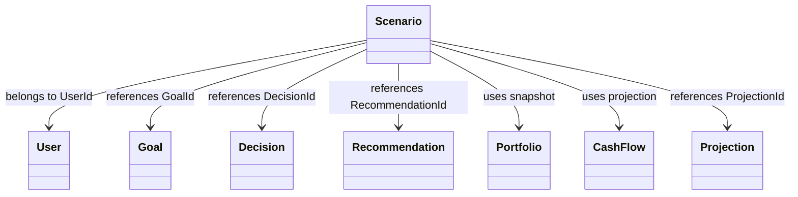
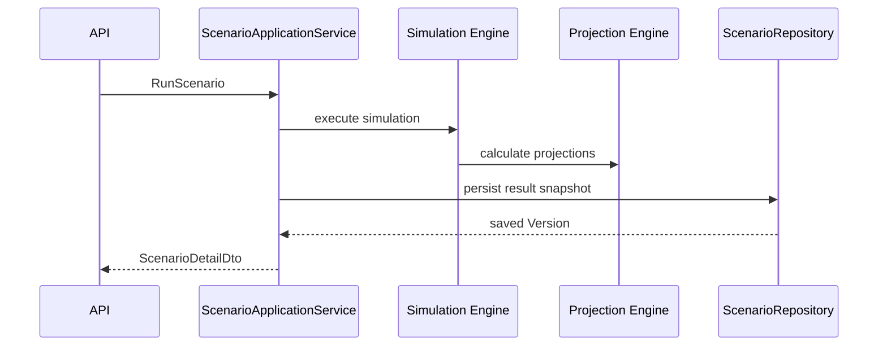
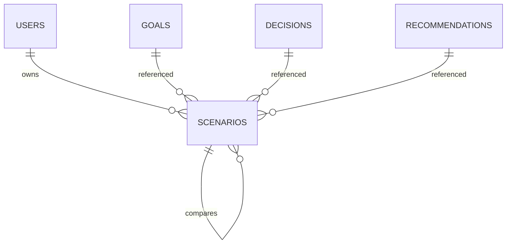
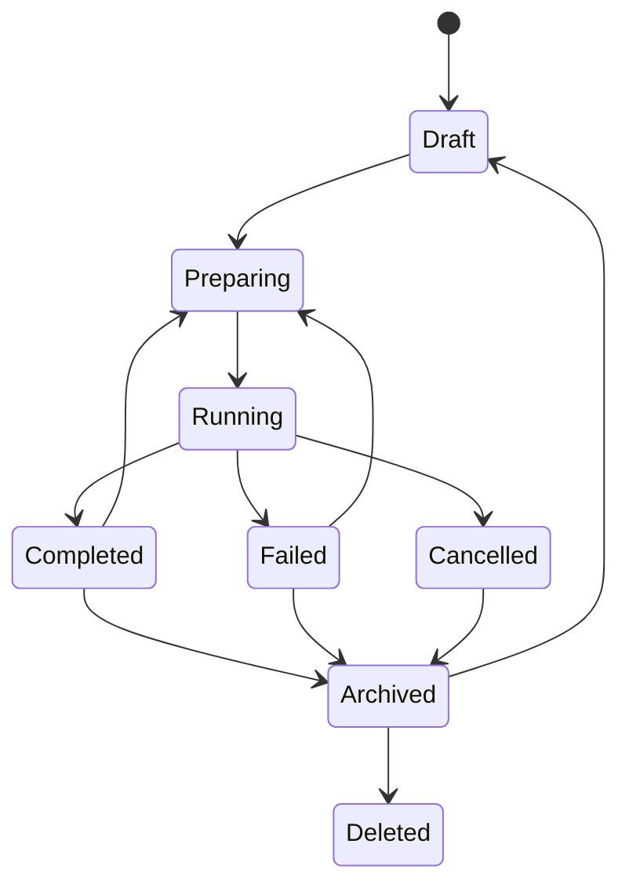

# Scenario Entity Specification
## Split Navigation
- [Scenario identity and assumptions](scenario/identity-and-assumptions.md)
- [Scenario API and persistence](scenario/api-and-persistence.md)
- [Scenario governance and testing](scenario/governance-and-testing.md)

# Document Control

Document Name: Scenario Entity Specification

Document Path: knowledge/entity/Scenario.md

Document Type: Enterprise Specification

Version: 1.0

Status: Canonical Specification

Domain: Scenario

Bounded Context: Scenario

Module: Scenario Engine

Owner: Project Atlas

Source of Truth: Atlas Knowledge Base

Last Updated: 2026-07-14

Related Specifications:

- knowledge/entity-catalog.md
- knowledge/aggregate-catalog.md
- knowledge/enumeration-catalog.md
- knowledge/repository-catalog.md
- knowledge/command-catalog.md
- knowledge/domain-event-catalog.md
- knowledge/domain-service-catalog.md
- knowledge/application-service-catalog.md
- knowledge/value-object-catalog.md

# Entity Overview

Purpose: Scenario represents one coherent financial projection path under explicit assumptions, constraints, simulation method, projection output, comparison basis, and result snapshot.

Responsibilities:

- Maintain stable Scenario identity and ScenarioNumber.
- Belong to one User access scope.
- Store ScenarioType, ScenarioCategory, ScenarioStatus, ScenarioName, Description, Priority, baseline flags, comparison metadata, simulation metadata, assumptions, constraints, projections, ranking, and result snapshot.
- Preserve complete assumptions, market assumptions, economic assumptions, cash flow assumptions, investment assumptions, risk assumptions, result snapshot, and explainability trace.
- Support scenario run, cancellation, clone, comparison, archive, restore, deletion, history, and simulation replay.
- Provide input to Decision, Recommendation, ExecutionPlan, and ActionPlan without mutating those entities.
- Reference Portfolio, CashFlow, Asset, Liability, Loan, Mortgage, Projection, Simulation, and DomainEvent by identity or immutable snapshot.

Business Meaning: Scenario is Atlas projection evidence that evaluates how a financial path behaves under selected assumptions and supports decision, recommendation, execution, and comparison workflows.

Aggregate Root: Yes. Entity Catalog defines Scenario as the Scenario aggregate and Scenario aggregate root.

Lifecycle: Draft, Preparing, Running, Completed, Failed, Cancelled, Archived, Deleted.

Ownership: Scenario aggregate owns scenario identity, assumptions, constraints, simulation state, output snapshot, comparison metadata, ranking, baseline/default flags, Version, ConcurrencyToken, audit, and replay history.

Persistence Owner: ScenarioRepository.

Repository: ScenarioRepository.

Application Service: ScenarioApplicationService.

Domain Service: ScenarioService, ScoringService, RiskService.

Relationships:

- User: Scenario must belong to one User scope through UserId. User is not owned by Scenario.
- Goal: Scenario may reference one primary GoalId and multiple Goal identities inside Assumptions or ResultSnapshot. Goal is not owned by Scenario.
- Decision: Scenario may be referenced by Decision through ScenarioId. Scenario does not mutate Decision.
- Recommendation: Scenario may produce or influence Recommendation through RecommendationGenerated. Scenario does not own Recommendation.
- ExecutionPlan: Scenario may be referenced by ExecutionPlan. Scenario does not execute plans.
- ActionPlan: Scenario may be referenced by ActionPlan. Scenario does not execute actions.
- Portfolio: Scenario uses Portfolio snapshot evidence and does not mutate Portfolio.
- CashFlow: Scenario uses CashFlow projection input and output snapshots.
- Asset: Scenario uses Asset snapshot evidence and does not mutate Asset.
- Liability: Scenario uses Liability snapshot evidence and does not mutate Liability.
- Loan: Scenario uses Loan evidence and does not mutate Loan.
- Mortgage: Scenario uses Mortgage evidence and does not mutate Mortgage.
- Projection: Scenario may reference ProjectionId and stores NetWorthProjection and CashFlowProjection output snapshots.
- Simulation: Scenario stores SimulationMethod and SimulationIterations and supports Simulation Replay.
- DomainEvent: Scenario emits and consumes immutable DomainEvent records including ScenarioEvaluated, RuleEvaluated, HardConstraintTriggered, ScoreAdjusted, SnapshotCreated, and ReplayCompleted.

Navigation:

- Scenario navigation to related entities is identity reference or immutable snapshot only.
- Cross Aggregate navigation cannot cascade mutation.
- ScenarioRepository loads Scenario aggregate only.
- Read projections may join related summaries for display.
- Simulation replay reads historical inputs and writes new replay output according to version policy.

# Complete Properties

## ScenarioId

- Name: ScenarioId
- Type: Guid
- Nullable: No
- Default: Generated by application
- Description: Stable technical identity of Scenario.
- Validation: Required; unique; valid Guid; immutable.
- Business Meaning: Identifies one projection path across API, repository, event, audit, and replay.
- Example: 7b8f2309-4b51-4724-9fb7-927db4ee5d5d.
- Database Mapping: scenarios.scenario_id uuid primary key
- JSON Name: scenarioId
- API Usage: Detail, Update, Run, Cancel, Clone, Compare, Archive, Restore, Delete, History
- Searchable: Yes
- Sortable: No
- Indexed: Yes
- Encrypted: No
- Auditable: Yes

## ScenarioNumber

- Name: ScenarioNumber
- Type: String
- Nullable: No
- Default: Generated sequence
- Description: Human-readable scenario reference number.
- Validation: Required; unique; max length 64; immutable.
- Business Meaning: Enables support, audit, and user-facing traceability.
- Example: SCN-20260714-000001.
- Database Mapping: scenarios.scenario_number varchar(64) unique not null
- JSON Name: scenarioNumber
- API Usage: Detail, Summary, Search, History
- Searchable: Yes
- Sortable: Yes
- Indexed: Yes
- Encrypted: No
- Auditable: Yes

## UserId

- Name: UserId
- Type: Guid
- Nullable: No
- Default: None
- Description: User scope that owns or created the Scenario.
- Validation: Required; valid Guid; actor must be authorized for User scope.
- Business Meaning: Scenario must belong to a User.
- Example: b6a6d087-b8f8-4062-92ec-08b7fc5d64f4.
- Database Mapping: scenarios.user_id uuid not null
- JSON Name: userId
- API Usage: Create, Detail, Summary, Search
- Searchable: Yes
- Sortable: No
- Indexed: Yes
- Encrypted: No
- Auditable: Yes

## ScenarioType

- Name: ScenarioType
- Type: String
- Nullable: No
- Default: None
- Description: Catalog-aligned scenario purpose.
- Validation: Required; non-blank; max length 64.
- Business Meaning: Classifies scenario without creating a new Domain.
- Example: RetirementProjection.
- Database Mapping: scenarios.scenario_type varchar(64) not null
- JSON Name: scenarioType
- API Usage: Create, Update, Detail, Summary, Search
- Searchable: Yes
- Sortable: Yes
- Indexed: Yes
- Encrypted: No
- Auditable: Yes

## ScenarioCategory

- Name: ScenarioCategory
- Type: String
- Nullable: No
- Default: General
- Description: Scenario grouping for search and reporting.
- Validation: Required; max length 64.
- Business Meaning: Groups scenario by financial context such as Goal, Portfolio, CashFlow, Loan, Housing, or Risk.
- Example: Goal.
- Database Mapping: scenarios.scenario_category varchar(64) not null
- JSON Name: scenarioCategory
- API Usage: Create, Update, Detail, Summary, Search
- Searchable: Yes
- Sortable: Yes
- Indexed: Yes
- Encrypted: No
- Auditable: Yes

## ScenarioStatus

- Name: ScenarioStatus
- Type: ScenarioStatus
- Nullable: No
- Default: Draft
- Description: Scenario lifecycle status.
- Validation: Required; catalog values Draft, Ready, Evaluating, Evaluated, Failed, Archived; lifecycle states map Preparing, Running, Completed, Cancelled, Deleted to Scenario lifecycle policy.
- Business Meaning: Controls run, replay, archive, and mutation behavior.
- Example: Draft.
- Database Mapping: scenarios.scenario_status varchar(32) not null
- JSON Name: scenarioStatus
- API Usage: Detail, Summary, Search, Run, Cancel, Archive, Restore, Delete
- Searchable: Yes
- Sortable: Yes
- Indexed: Yes
- Encrypted: No
- Auditable: Yes

## ScenarioName

- Name: ScenarioName
- Type: String
- Nullable: No
- Default: None
- Description: Business name of Scenario.
- Validation: Required; max length 256; unique within User scope when required by policy.
- Business Meaning: User-facing name of projection path.
- Example: Baseline retirement scenario.
- Database Mapping: scenarios.scenario_name varchar(256) not null
- JSON Name: scenarioName
- API Usage: Create, Update, Detail, Summary, Search
- Searchable: Yes
- Sortable: Yes
- Indexed: Yes
- Encrypted: No
- Auditable: Yes

## Description

- Name: Description
- Type: String
- Nullable: Yes
- Default: null
- Description: Detailed scenario description.
- Validation: Max length 4000; no executable content.
- Business Meaning: Explains intent, scope, and assumptions context.
- Example: Baseline projection using current household cash flow and portfolio allocation.
- Database Mapping: scenarios.description text null
- JSON Name: description
- API Usage: Create, Update, Detail
- Searchable: Yes
- Sortable: No
- Indexed: Optional full text
- Encrypted: Conditional
- Auditable: Yes

## Priority

- Name: Priority
- Type: String
- Nullable: No
- Default: Medium
- Description: Scenario priority for ordering.
- Validation: Required; Low, Medium, High, Critical.
- Business Meaning: Supports scenario evaluation and comparison ordering.
- Example: High.
- Database Mapping: scenarios.priority varchar(32) not null
- JSON Name: priority
- API Usage: Create, Update, Detail, Summary, Search
- Searchable: Yes
- Sortable: Yes
- Indexed: Yes
- Encrypted: No
- Auditable: Yes

## BaseScenarioId

- Name: BaseScenarioId
- Type: Guid
- Nullable: Yes
- Default: null
- Description: Source scenario used for clone or comparison.
- Validation: Valid Guid when present; cannot equal ScenarioId; same user scope.
- Business Meaning: Preserves lineage from base scenario.
- Example: 9f22d3e5-54bb-4d6f-a8de-fc8bb60ab001.
- Database Mapping: scenarios.base_scenario_id uuid null
- JSON Name: baseScenarioId
- API Usage: Clone, Compare, Detail, Search
- Searchable: Yes
- Sortable: No
- Indexed: Yes
- Encrypted: No
- Auditable: Yes

## GoalId

- Name: GoalId
- Type: Guid
- Nullable: Yes
- Default: null
- Description: Primary Goal reference.
- Validation: Valid Guid when present; same user or household scope.
- Business Meaning: Links scenario to goal evaluation.
- Example: 3e1f27f4-4201-431d-bb4a-01d2e4aa94d8.
- Database Mapping: scenarios.goal_id uuid null
- JSON Name: goalId
- API Usage: Create, Update, Detail, Summary, Search, Compare
- Searchable: Yes
- Sortable: No
- Indexed: Yes
- Encrypted: No
- Auditable: Yes

## DecisionId

- Name: DecisionId
- Type: Guid
- Nullable: Yes
- Default: null
- Description: Decision associated with Scenario evaluation.
- Validation: Valid Guid when present; same access scope.
- Business Meaning: Connects scenario output to decision flow.
- Example: 111d49c8-0957-42a2-a812-b736615fa2bb.
- Database Mapping: scenarios.decision_id uuid null
- JSON Name: decisionId
- API Usage: Detail, Search, Compare
- Searchable: Yes
- Sortable: No
- Indexed: Yes
- Encrypted: No
- Auditable: Yes

## RecommendationId

- Name: RecommendationId
- Type: Guid
- Nullable: Yes
- Default: null
- Description: Recommendation associated with scenario output.
- Validation: Valid Guid when present; same access scope.
- Business Meaning: Links scenario evidence to recommendation output.
- Example: 7f3d29c6-6d0e-4f2c-bb46-bd3555d6d351.
- Database Mapping: scenarios.recommendation_id uuid null
- JSON Name: recommendationId
- API Usage: Detail, Search, Compare
- Searchable: Yes
- Sortable: No
- Indexed: Yes
- Encrypted: No
- Auditable: Yes

## ProjectionId

- Name: ProjectionId
- Type: Guid
- Nullable: Yes
- Default: null
- Description: Projection output identity or projection run reference.
- Validation: Valid Guid when present.
- Business Meaning: Connects Scenario to Projection output.
- Example: 95fc1fde-1207-4fc9-8e99-8e7d6a400001.
- Database Mapping: scenarios.projection_id uuid null
- JSON Name: projectionId
- API Usage: Run, Detail, Search, History
- Searchable: Yes
- Sortable: No
- Indexed: Yes
- Encrypted: No
- Auditable: Yes

## SimulationMethod

- Name: SimulationMethod
- Type: String
- Nullable: No
- Default: Deterministic
- Description: Simulation method used to evaluate Scenario.
- Validation: Required; max length 64.
- Business Meaning: Defines evaluation method for replay and interpretation.
- Example: MonteCarlo.
- Database Mapping: scenarios.simulation_method varchar(64) not null
- JSON Name: simulationMethod
- API Usage: Create, Update, Run, Detail, Summary, Search
- Searchable: Yes
- Sortable: Yes
- Indexed: Yes
- Encrypted: No
- Auditable: Yes

## SimulationIterations

- Name: SimulationIterations
- Type: Int32
- Nullable: No
- Default: 1
- Description: Number of simulation iterations.
- Validation: Required; greater than 0; bounded by execution policy.
- Business Meaning: Controls simulation depth and replay cost.
- Example: 10000.
- Database Mapping: scenarios.simulation_iterations integer not null
- JSON Name: simulationIterations
- API Usage: Create, Update, Run, Detail
- Searchable: Yes
- Sortable: Yes
- Indexed: Yes
- Encrypted: No
- Auditable: Yes

## Assumptions

- Name: Assumptions
- Type: Json
- Nullable: No
- Default: {}
- Description: Complete assumption set for Scenario.
- Validation: Required; valid JSON object; must include version references when applicable.
- Business Meaning: Preserves full scenario input basis.
- Example: {"currency":"TWD","horizonYears":30}.
- Database Mapping: scenarios.assumptions jsonb not null
- JSON Name: assumptions
- API Usage: Create, Update, Run, Detail, History
- Searchable: No
- Sortable: No
- Indexed: Optional jsonb path
- Encrypted: Conditional
- Auditable: Yes

## Constraints

- Name: Constraints
- Type: Json
- Nullable: Yes
- Default: null
- Description: Scenario constraints and hard limits.
- Validation: Valid JSON object or array when present.
- Business Meaning: Preserves rules that constrain projections.
- Example: {"minimumEmergencyFundMonths":6}.
- Database Mapping: scenarios.constraints jsonb null
- JSON Name: constraints
- API Usage: Create, Update, Run, Detail, History
- Searchable: No
- Sortable: No
- Indexed: Optional jsonb path
- Encrypted: Conditional
- Auditable: Yes

## MarketAssumptions

- Name: MarketAssumptions
- Type: Json
- Nullable: Yes
- Default: null
- Description: Market assumption snapshot.
- Validation: Valid JSON object when present.
- Business Meaning: Captures market return, volatility, and market condition inputs.
- Example: {"equityReturn":0.06,"bondReturn":0.025}.
- Database Mapping: scenarios.market_assumptions jsonb null
- JSON Name: marketAssumptions
- API Usage: Create, Update, Run, Detail, History
- Searchable: No
- Sortable: No
- Indexed: Optional jsonb path
- Encrypted: Conditional
- Auditable: Yes

## EconomicAssumptions

- Name: EconomicAssumptions
- Type: Json
- Nullable: Yes
- Default: null
- Description: Economic assumption snapshot.
- Validation: Valid JSON object when present.
- Business Meaning: Captures inflation, rate, and economic condition inputs.
- Example: {"inflationRate":0.02,"interestRate":0.03}.
- Database Mapping: scenarios.economic_assumptions jsonb null
- JSON Name: economicAssumptions
- API Usage: Create, Update, Run, Detail, History
- Searchable: No
- Sortable: No
- Indexed: Optional jsonb path
- Encrypted: Conditional
- Auditable: Yes

## CashFlowAssumptions

- Name: CashFlowAssumptions
- Type: Json
- Nullable: Yes
- Default: null
- Description: Cash flow assumption snapshot.
- Validation: Valid JSON object when present.
- Business Meaning: Captures income, expense, reserve, and liquidity assumptions.
- Example: {"monthlySurplus":30000,"currency":"TWD"}.
- Database Mapping: scenarios.cash_flow_assumptions jsonb null
- JSON Name: cashFlowAssumptions
- API Usage: Create, Update, Run, Detail, History
- Searchable: No
- Sortable: No
- Indexed: Optional jsonb path
- Encrypted: Conditional
- Auditable: Yes

## InvestmentAssumptions

- Name: InvestmentAssumptions
- Type: Json
- Nullable: Yes
- Default: null
- Description: Investment assumption snapshot.
- Validation: Valid JSON object when present.
- Business Meaning: Captures allocation, return, contribution, and rebalancing inputs.
- Example: {"targetEquityAllocation":0.6}.
- Database Mapping: scenarios.investment_assumptions jsonb null
- JSON Name: investmentAssumptions
- API Usage: Create, Update, Run, Detail, History
- Searchable: No
- Sortable: No
- Indexed: Optional jsonb path
- Encrypted: Conditional
- Auditable: Yes

## RiskAssumptions

- Name: RiskAssumptions
- Type: Json
- Nullable: Yes
- Default: null
- Description: Risk assumption snapshot.
- Validation: Valid JSON object when present.
- Business Meaning: Captures risk capacity, risk tolerance, stress, and downside inputs.
- Example: {"riskLevel":"Medium","maxDrawdown":0.2}.
- Database Mapping: scenarios.risk_assumptions jsonb null
- JSON Name: riskAssumptions
- API Usage: Create, Update, Run, Detail, History
- Searchable: No
- Sortable: No
- Indexed: Optional jsonb path
- Encrypted: Conditional
- Auditable: Yes

## ExpectedReturn

- Name: ExpectedReturn
- Type: Decimal
- Nullable: Yes
- Default: null
- Description: Expected return result or assumption.
- Validation: Decimal within policy bounds when present.
- Business Meaning: Quantifies projected return.
- Example: 0.0525.
- Database Mapping: scenarios.expected_return numeric(9,6) null
- JSON Name: expectedReturn
- API Usage: Run, Detail, Summary, Search, Compare
- Searchable: Yes
- Sortable: Yes
- Indexed: Yes
- Encrypted: No
- Auditable: Yes

## ExpectedRisk

- Name: ExpectedRisk
- Type: Decimal
- Nullable: Yes
- Default: null
- Description: Expected risk result or assumption.
- Validation: Decimal within policy bounds when present.
- Business Meaning: Quantifies expected risk.
- Example: 0.1350.
- Database Mapping: scenarios.expected_risk numeric(9,6) null
- JSON Name: expectedRisk
- API Usage: Run, Detail, Summary, Search, Compare
- Searchable: Yes
- Sortable: Yes
- Indexed: Yes
- Encrypted: No
- Auditable: Yes

## Probability

- Name: Probability
- Type: Decimal
- Nullable: Yes
- Default: null
- Description: Probability of scenario path or event.
- Validation: Between 0.0000 and 1.0000 when present.
- Business Meaning: Represents likelihood of scenario outcome.
- Example: 0.7200.
- Database Mapping: scenarios.probability numeric(5,4) null
- JSON Name: probability
- API Usage: Run, Detail, Summary, Search, Compare
- Searchable: Yes
- Sortable: Yes
- Indexed: Yes
- Encrypted: No
- Auditable: Yes

## SuccessRate

- Name: SuccessRate
- Type: Decimal
- Nullable: Yes
- Default: null
- Description: Simulated success rate.
- Validation: Between 0.0000 and 1.0000 when present.
- Business Meaning: Indicates likelihood that goals or constraints are satisfied.
- Example: 0.8100.
- Database Mapping: scenarios.success_rate numeric(5,4) null
- JSON Name: successRate
- API Usage: Run, Detail, Summary, Search, Compare
- Searchable: Yes
- Sortable: Yes
- Indexed: Yes
- Encrypted: No
- Auditable: Yes

## FailureRate

- Name: FailureRate
- Type: Decimal
- Nullable: Yes
- Default: null
- Description: Simulated failure rate.
- Validation: Between 0.0000 and 1.0000 when present; SuccessRate plus FailureRate should not exceed 1 unless policy supports residual states.
- Business Meaning: Indicates likelihood that goals or constraints fail.
- Example: 0.1900.
- Database Mapping: scenarios.failure_rate numeric(5,4) null
- JSON Name: failureRate
- API Usage: Run, Detail, Summary, Search, Compare
- Searchable: Yes
- Sortable: Yes
- Indexed: Yes
- Encrypted: No
- Auditable: Yes

## NetWorthProjection

- Name: NetWorthProjection
- Type: Json
- Nullable: Yes
- Default: null
- Description: Net worth projection output.
- Validation: Valid JSON object when present.
- Business Meaning: Preserves projected net worth path.
- Example: {"year30":25000000,"currency":"TWD"}.
- Database Mapping: scenarios.net_worth_projection jsonb null
- JSON Name: netWorthProjection
- API Usage: Run, Detail, Compare, History
- Searchable: No
- Sortable: No
- Indexed: Optional jsonb path
- Encrypted: Conditional
- Auditable: Yes

## CashFlowProjection

- Name: CashFlowProjection
- Type: Json
- Nullable: Yes
- Default: null
- Description: Cash flow projection output.
- Validation: Valid JSON object when present.
- Business Meaning: Preserves projected cash flow path.
- Example: {"monthlySurplusYear1":30000,"currency":"TWD"}.
- Database Mapping: scenarios.cash_flow_projection jsonb null
- JSON Name: cashFlowProjection
- API Usage: Run, Detail, Compare, History
- Searchable: No
- Sortable: No
- Indexed: Optional jsonb path
- Encrypted: Conditional
- Auditable: Yes

## ResultSummary

- Name: ResultSummary
- Type: String
- Nullable: Yes
- Default: null
- Description: Human-readable scenario result summary.
- Validation: Max length 2000.
- Business Meaning: Summarizes simulation outcome.
- Example: Scenario has high goal success rate with moderate risk.
- Database Mapping: scenarios.result_summary text null
- JSON Name: resultSummary
- API Usage: Run, Detail, Summary, Search, Compare
- Searchable: Yes
- Sortable: No
- Indexed: Optional full text
- Encrypted: Conditional
- Auditable: Yes

## ResultSnapshot

- Name: ResultSnapshot
- Type: Json
- Nullable: Yes
- Default: null
- Description: Complete immutable scenario result snapshot.
- Validation: Required when ScenarioStatus is Completed or Evaluated; valid JSON object.
- Business Meaning: Preserves complete simulation output for history and replay.
- Example: {"score":82.5,"successRate":0.81,"projectionId":"95fc1fde"}.
- Database Mapping: scenarios.result_snapshot jsonb null
- JSON Name: resultSnapshot
- API Usage: Run, Detail, Compare, History
- Searchable: No
- Sortable: No
- Indexed: Optional jsonb path
- Encrypted: Conditional
- Auditable: Yes

## ComparisonTarget

- Name: ComparisonTarget
- Type: Guid
- Nullable: Yes
- Default: null
- Description: ScenarioId used as comparison target.
- Validation: Valid Guid when present; cannot equal ScenarioId.
- Business Meaning: Allows Scenario to be compared against another Scenario.
- Example: 9f22d3e5-54bb-4d6f-a8de-fc8bb60ab001.
- Database Mapping: scenarios.comparison_target uuid null
- JSON Name: comparisonTarget
- API Usage: Compare, Detail, Search
- Searchable: Yes
- Sortable: No
- Indexed: Yes
- Encrypted: No
- Auditable: Yes

## Ranking

- Name: Ranking
- Type: Int32
- Nullable: Yes
- Default: null
- Description: Rank among compared scenarios.
- Validation: Greater than 0 when present.
- Business Meaning: Orders scenarios in comparison results.
- Example: 1.
- Database Mapping: scenarios.ranking integer null
- JSON Name: ranking
- API Usage: Compare, Detail, Summary, Search
- Searchable: Yes
- Sortable: Yes
- Indexed: Yes
- Encrypted: No
- Auditable: Yes

## IsBaseline

- Name: IsBaseline
- Type: Boolean
- Nullable: No
- Default: false
- Description: Whether Scenario is the baseline comparison scenario.
- Validation: Only one baseline scenario per User scope unless policy changes scope.
- Business Meaning: Establishes default comparison basis.
- Example: true.
- Database Mapping: scenarios.is_baseline boolean not null
- JSON Name: isBaseline
- API Usage: Create, Update, Detail, Summary, Search, Compare
- Searchable: Yes
- Sortable: Yes
- Indexed: Yes
- Encrypted: No
- Auditable: Yes

## IsDefault

- Name: IsDefault
- Type: Boolean
- Nullable: No
- Default: false
- Description: Whether Scenario is default for user experience.
- Validation: At most one default scenario per User scope.
- Business Meaning: Defines the default scenario shown in views.
- Example: false.
- Database Mapping: scenarios.is_default boolean not null
- JSON Name: isDefault
- API Usage: Create, Update, Detail, Summary, Search
- Searchable: Yes
- Sortable: Yes
- Indexed: Yes
- Encrypted: No
- Auditable: Yes

## CreatedAt

- Name: CreatedAt
- Type: DateTimeOffset
- Nullable: No
- Default: Current timestamp
- Description: Creation timestamp.
- Validation: Required; immutable.
- Business Meaning: Establishes scenario creation time.
- Example: 2026-07-14T10:00:00+08:00.
- Database Mapping: scenarios.created_at timestamptz not null
- JSON Name: createdAt
- API Usage: Detail, Summary, Search, History
- Searchable: Yes
- Sortable: Yes
- Indexed: Yes
- Encrypted: No
- Auditable: Yes

## CreatedBy

- Name: CreatedBy
- Type: Guid
- Nullable: No
- Default: ActorId
- Description: Actor that created Scenario.
- Validation: Required; valid actor identity.
- Business Meaning: Supports audit attribution.
- Example: b6a6d087-b8f8-4062-92ec-08b7fc5d64f4.
- Database Mapping: scenarios.created_by uuid not null
- JSON Name: createdBy
- API Usage: Detail, History
- Searchable: Yes
- Sortable: No
- Indexed: Yes
- Encrypted: No
- Auditable: Yes

## UpdatedAt

- Name: UpdatedAt
- Type: DateTimeOffset
- Nullable: No
- Default: Current timestamp
- Description: Last mutation timestamp.
- Validation: Required; greater than or equal to CreatedAt.
- Business Meaning: Supports ordering, cache invalidation, and audit.
- Example: 2026-07-14T11:00:00+08:00.
- Database Mapping: scenarios.updated_at timestamptz not null
- JSON Name: updatedAt
- API Usage: Detail, Summary, Search, History
- Searchable: Yes
- Sortable: Yes
- Indexed: Yes
- Encrypted: No
- Auditable: Yes

## UpdatedBy

- Name: UpdatedBy
- Type: Guid
- Nullable: Yes
- Default: null
- Description: Actor that last changed Scenario.
- Validation: Valid actor identity when present.
- Business Meaning: Supports mutation audit attribution.
- Example: b6a6d087-b8f8-4062-92ec-08b7fc5d64f4.
- Database Mapping: scenarios.updated_by uuid null
- JSON Name: updatedBy
- API Usage: Detail, History
- Searchable: Yes
- Sortable: No
- Indexed: Yes
- Encrypted: No
- Auditable: Yes

## Version

- Name: Version
- Type: Int64
- Nullable: No
- Default: 1
- Description: Scenario version.
- Validation: Required; increments on mutation; stale version rejected.
- Business Meaning: Preserves complete Version History.
- Example: 6.
- Database Mapping: scenarios.version bigint not null
- JSON Name: version
- API Usage: Update, Run, Cancel, Clone, Compare, Archive, Restore, Delete
- Searchable: No
- Sortable: Yes
- Indexed: No
- Encrypted: No
- Auditable: Yes

## ConcurrencyToken

- Name: ConcurrencyToken
- Type: String
- Nullable: No
- Default: Generated token
- Description: Optimistic concurrency token.
- Validation: Required; must match for mutation; regenerated after mutation.
- Business Meaning: Prevents lost update.
- Example: 01J2Y8Z7ABCD.
- Database Mapping: scenarios.concurrency_token varchar(128) not null
- JSON Name: concurrencyToken
- API Usage: Update, Run, Cancel, Clone, Compare, Archive, Restore, Delete
- Searchable: No
- Sortable: No
- Indexed: Yes
- Encrypted: No
- Auditable: Yes

# Validation Rules

| Rule ID | Validation |
|---|---|
| SCN-VR-001 | ScenarioId is required, unique, valid, and immutable. |
| SCN-VR-002 | ScenarioNumber is required, unique, max length 64, and immutable. |
| SCN-VR-003 | UserId is required and must match authorization scope. |
| SCN-VR-004 | ScenarioType is required, non-blank, and max length 64. |
| SCN-VR-005 | ScenarioCategory is required and max length 64. |
| SCN-VR-006 | ScenarioStatus is required and must follow the state machine. |
| SCN-VR-007 | ScenarioName is required and max length 256. |
| SCN-VR-008 | Description max length is 4000. |
| SCN-VR-009 | Priority is required and must be Low, Medium, High, or Critical. |
| SCN-VR-010 | BaseScenarioId and ComparisonTarget cannot equal ScenarioId. |
| SCN-VR-011 | GoalId, DecisionId, RecommendationId, ProjectionId, BaseScenarioId, and ComparisonTarget must be valid when present. |
| SCN-VR-012 | SimulationMethod is required and max length 64. |
| SCN-VR-013 | SimulationIterations must be greater than 0 and within execution policy. |
| SCN-VR-014 | Assumptions is required and must be valid JSON. |
| SCN-VR-015 | Constraints and all assumption detail fields must be valid JSON when present. |
| SCN-VR-016 | Probability, SuccessRate, and FailureRate must be between 0 and 1 when present. |
| SCN-VR-017 | SuccessRate plus FailureRate must not exceed 1 unless policy supports residual outcome states. |
| SCN-VR-018 | ResultSnapshot is required when ScenarioStatus is Completed or Evaluated. |
| SCN-VR-019 | NetWorthProjection and CashFlowProjection must be valid JSON when present. |
| SCN-VR-020 | Ranking must be greater than 0 when present. |
| SCN-VR-021 | Only one baseline Scenario is allowed per User scope. |
| SCN-VR-022 | Only one default Scenario is allowed per User scope. |
| SCN-VR-023 | Archived Scenario cannot be modified unless restored. |
| SCN-VR-024 | Deleted Scenario cannot be restored by normal workflow. |
| SCN-VR-025 | Completed Scenario result snapshot cannot be overwritten by UpdateScenario. |
| SCN-VR-026 | Simulation Replay must preserve prior Version and ResultSnapshot. |
| SCN-VR-027 | Version and ConcurrencyToken must match on mutation. |
| SCN-VR-028 | Cross Aggregate references must use identities or immutable snapshots only. |
| SCN-VR-029 | Search must enforce User and Household isolation. |
| SCN-VR-030 | Every state transition must be audited. |

# Business Rules

1. Scenario must belong to User.
2. Scenario must specify ScenarioType.
3. Scenario must preserve complete Assumptions.
4. Scenario must preserve complete Snapshot through ResultSnapshot.
5. Baseline Scenario is unique per User scope.
6. Scenario may be used as Comparison basis.
7. Scenario may reference multiple Goals through GoalId and Assumptions or ResultSnapshot.
8. Scenario may reference multiple Decisions through DecisionId and ResultSnapshot.
9. Archived Scenario cannot be modified.
10. Scenario must preserve complete Version History.
11. Scenario must preserve complete Explainability through ResultSnapshot and DomainEvent trace.
12. Scenario supports Simulation Replay.
13. Scenario does not mutate User.
14. Scenario does not mutate Goal.
15. Scenario does not mutate Decision or Recommendation.
16. Scenario does not mutate ExecutionPlan or ActionPlan.
17. Scenario does not mutate Portfolio, CashFlow, Asset, Liability, Loan, or Mortgage.
18. Scenario uses source data by identity reference or immutable snapshot.
19. Completed Scenario can be cloned, compared, archived, or replayed but not directly overwritten.
20. Failed Scenario can be re-run or archived.
21. Cancelled Scenario cannot produce Recommendation.
22. Deleted Scenario is excluded from active search.
23. ScenarioStarted must be emitted when run starts.
24. ScenarioCompleted must be emitted when run completes.
25. ScenarioFailed must be emitted when run fails.
26. ScenarioCompared must be emitted when comparison completes.
27. SnapshotCreated must be emitted when a result snapshot is produced.
28. ReplayCompleted must be emitted when simulation replay completes.
29. Notification may be requested when Scenario completes, fails, or comparison finishes.
30. Scenario cache keys must include UserId, ScenarioId, Version, and permission scope.

# State Machine

| State | Transition | Trigger | Invariant | Illegal Transition |
|---|---|---|---|---|
| Draft | Draft to Preparing | CreateScenario or UpdateScenario | Required fields exist | Draft to Completed |
| Preparing | Preparing to Running | RunScenario | Assumptions valid | Preparing to Archived |
| Running | Running to Completed | Scenario run completes | ResultSnapshot present | Running to Deleted |
| Running | Running to Failed | Scenario run fails | Failure audit present | Running to Archived |
| Running | Running to Cancelled | CancelScenario | Cancellation audit present | Running to Completed without result |
| Completed | Completed to Archived | ArchiveScenario | ResultSnapshot preserved | Completed to Running by UpdateScenario |
| Completed | Completed to Preparing | RunScenario replay | New version created | Completed to Draft |
| Failed | Failed to Preparing | RunScenario retry | Prior failure preserved | Failed to Completed without run |
| Failed | Failed to Archived | ArchiveScenario | Failure audit preserved | Failed to Deleted without archive |
| Cancelled | Cancelled to Archived | ArchiveScenario | Cancellation audit preserved | Cancelled to Completed |
| Archived | Archived to Draft | RestoreScenario | Not deleted | Archived to Running |
| Archived | Archived to Deleted | DeleteScenario | Delete audit exists | Archived to Completed |
| Deleted | No normal transition | None | Deleted marker exists | Deleted to Running |

# Commands

| Command | Handler | Repository | Result | Event |
|---|---|---|---|---|
| CreateScenario | CreateScenarioCommandHandler | ScenarioRepository | ScenarioDetailDto | ScenarioCreated |
| UpdateScenario | UpdateScenarioCommandHandler | ScenarioRepository | ScenarioDetailDto | ScenarioUpdated |
| RunScenario | RunScenarioCommandHandler | ScenarioRepository | ScenarioDetailDto | ScenarioStarted, ScenarioCompleted, ScenarioFailed |
| CancelScenario | CancelScenarioCommandHandler | ScenarioRepository | CommandResult | ScenarioCancelled, ScenarioStatusChanged |
| CloneScenario | CloneScenarioCommandHandler | ScenarioRepository | ScenarioDetailDto | ScenarioCreated |
| CompareScenario | CompareScenarioCommandHandler | ScenarioRepository | ScenarioComparisonDto | ScenarioCompared |
| ArchiveScenario | ArchiveScenarioCommandHandler | ScenarioRepository | CommandResult | ScenarioArchived, ScenarioStatusChanged |
| RestoreScenario | RestoreScenarioCommandHandler | ScenarioRepository | CommandResult | ScenarioRestored, ScenarioStatusChanged |
| DeleteScenario | DeleteScenarioCommandHandler | ScenarioRepository | CommandResult | ScenarioDeleted, ScenarioStatusChanged |
| EvaluateScenario | EvaluateScenarioCommandHandler | ScenarioRepository | CommandResult | ScenarioEvaluated, RuleEvaluated, HardConstraintTriggered, ScoreAdjusted |
| ReplayScenario | ReplayScenarioCommandHandler | ScenarioRepository | CommandResult | SnapshotCreated, ReplayCompleted |

# Domain Events

| Event | Publisher | Payload |
|---|---|---|
| ScenarioCreated | Scenario | ScenarioId, UserId, ScenarioType, ScenarioStatus |
| ScenarioUpdated | Scenario | ScenarioId, ChangedFields, Version |
| ScenarioStarted | Scenario | ScenarioId, StartedAt, SimulationMethod, SimulationIterations |
| ScenarioCompleted | Scenario | ScenarioId, CompletedAt, SuccessRate, ProjectionId |
| ScenarioFailed | Scenario | ScenarioId, FailedAt, FailureReason |
| ScenarioCancelled | Scenario | ScenarioId, CancelledAt, Reason |
| ScenarioCompared | Scenario | ScenarioId, ComparisonTarget, Ranking |
| ScenarioArchived | Scenario | ScenarioId, ArchivedAt |
| ScenarioRestored | Scenario | ScenarioId, RestoredAt |
| ScenarioDeleted | Scenario | ScenarioId, DeletedAt |
| ScenarioStatusChanged | Scenario | ScenarioId, PreviousStatus, NewStatus, Version |
| ScenarioEvaluated | Scenario | ScenarioId, Score, EvaluationVersion, HouseholdId, CorrelationId |
| SnapshotCreated | Scenario | ScenarioId, SnapshotId, Version |
| ReplayCompleted | Scenario | ScenarioId, ReplayVersion, CompletedAt |
| RuleEvaluated | Scenario | ScenarioId, RuleId, Result |
| HardConstraintTriggered | Scenario | ScenarioId, ConstraintId, Result |
| ScoreAdjusted | Scenario | ScenarioId, PreviousScore, NewScore |
| RecommendationGenerated | Recommendation | RecommendationId, ScenarioId, Priority |

# Repository

Interface: IScenarioRepository

Methods:

- GetByIdAsync(ScenarioId, UserId)
- GetByNumberAsync(ScenarioNumber)
- AddAsync(Scenario)
- UpdateAsync(Scenario, ConcurrencyToken)
- ArchiveAsync(ScenarioId, ConcurrencyToken)
- RestoreAsync(ScenarioId, ConcurrencyToken)
- SoftDeleteAsync(ScenarioId, ConcurrencyToken)
- SaveChangesAsync()

Query Methods:

- SearchAsync(ScenarioSearchSpecification)
- FindByUserAsync(UserId)
- FindByStatusAsync(ScenarioStatus)
- FindByTypeAsync(ScenarioType)
- FindByGoalAsync(GoalId)
- FindByDecisionAsync(DecisionId)
- FindByRecommendationAsync(RecommendationId)
- FindBaselineAsync(UserId)
- FindDefaultAsync(UserId)
- FindByComparisonTargetAsync(ComparisonTarget)
- FindHistoryAsync(ScenarioId)

Specification Pattern:

- ScenarioByUserSpecification
- ScenarioByStatusSpecification
- ScenarioByTypeSpecification
- ScenarioByCategorySpecification
- ScenarioByGoalSpecification
- ScenarioByDecisionSpecification
- ScenarioByRecommendationSpecification
- ScenarioByBaselineSpecification
- ScenarioByDefaultSpecification
- ScenarioByResultRangeSpecification
- ScenarioActiveOnlySpecification
- ScenarioArchivedSpecification
- ScenarioSearchSpecification

# Domain Service Interaction

| Service | Interaction |
|---|---|
| Scenario Engine | Creates, validates, runs, cancels, clones, compares, archives, restores, deletes, and versions Scenario. |
| Simulation Engine | Executes SimulationMethod and SimulationIterations and supports Simulation Replay. |
| Projection Engine | Produces NetWorthProjection, CashFlowProjection, ProjectionId, and ResultSnapshot. |
| Decision Engine | Consumes completed Scenario output and may create Decision context. |
| Optimization Engine | Ranks compared scenarios and updates Ranking. |
| CashFlow Engine | Supplies cash flow inputs and calculates CashFlowProjection. |
| Risk Analysis Service | Calculates ExpectedRisk, RiskAssumptions, and risk outcomes. |
| Recommendation Engine | Consumes completed Scenario output and may generate Recommendation. |
| Explainability Service | Records rule, assumption, snapshot, score, and replay explainability evidence. |
| Notification Service | Sends completion, failure, cancellation, and comparison notifications. |
| Audit Service | Records commands, events, snapshots, version history, replay history, and state transitions. |

# Application Service Interaction

- ScenarioApplicationService handles all Scenario commands and query orchestration.
- DecisionApplicationService consumes completed Scenario output.
- RecommendationApplicationService consumes Scenario output for recommendation generation.
- GoalApplicationService supplies Goal references and impact checks.
- PortfolioApplicationService supplies Portfolio and Asset snapshot evidence.
- LoanApplicationService supplies Loan, Mortgage, and Liability snapshot evidence.
- ProjectionApplicationService coordinates projection output references.
- SimulationApplicationService coordinates simulation execution where separated by application layer.
- NotificationApplicationService sends scenario notifications.
- AuditApplicationService persists audit and history.
- SearchApplicationService updates scenario search projections.
- CacheApplicationService invalidates scenario detail, result, comparison, and history caches.

# API

| Endpoint | Method | Request | Response | Error |
|---|---|---|---|---|
| /api/v1/scenarios | POST | CreateScenarioDto | ScenarioDetailDto | 400, 401, 403, 409, 422 |
| /api/v1/scenarios/{scenarioId} | GET | Route id | ScenarioDetailDto | 401, 403, 404 |
| /api/v1/scenarios/{scenarioId} | PUT | UpdateScenarioDto | ScenarioDetailDto | 400, 401, 403, 404, 409, 422 |
| /api/v1/scenarios/{scenarioId} | DELETE | DeleteScenarioDto | CommandResult | 401, 403, 404, 409 |
| /api/v1/scenarios/search | POST | ScenarioSearchDto | ScenarioSearchResultDto | 400, 401, 403 |
| /api/v1/scenarios/{scenarioId}/run | POST | RunScenarioDto | ScenarioDetailDto | 400, 401, 403, 404, 409, 422 |
| /api/v1/scenarios/{scenarioId}/cancel | POST | CancelScenarioDto | CommandResult | 400, 401, 403, 404, 409 |
| /api/v1/scenarios/{scenarioId}/clone | POST | CloneScenarioDto | ScenarioDetailDto | 400, 401, 403, 404, 409 |
| /api/v1/scenarios/{scenarioId}/compare | POST | CompareScenarioDto | ScenarioComparisonDto | 400, 401, 403, 404, 409, 422 |
| /api/v1/scenarios/{scenarioId}/archive | POST | ArchiveScenarioDto | CommandResult | 400, 401, 403, 404, 409 |
| /api/v1/scenarios/{scenarioId}/restore | POST | RestoreScenarioDto | CommandResult | 400, 401, 403, 404, 409 |
| /api/v1/scenarios/{scenarioId}/history | GET | Route id | ScenarioHistoryDto | 401, 403, 404 |

# DTO

Create DTO: CreateScenarioDto includes userId, scenarioType, scenarioCategory, scenarioName, description, priority, baseScenarioId, goalId, simulationMethod, simulationIterations, assumptions, constraints, marketAssumptions, economicAssumptions, cashFlowAssumptions, investmentAssumptions, riskAssumptions, isBaseline, isDefault, idempotencyKey.

Update DTO: UpdateScenarioDto includes scenarioType, scenarioCategory, scenarioName, description, priority, goalId, simulationMethod, simulationIterations, assumptions, constraints, marketAssumptions, economicAssumptions, cashFlowAssumptions, investmentAssumptions, riskAssumptions, isBaseline, isDefault, version, concurrencyToken.

Detail DTO: ScenarioDetailDto includes all properties, related summaries, permission flags, Version, and ConcurrencyToken.

Summary DTO: ScenarioSummaryDto includes scenarioId, scenarioNumber, userId, scenarioType, scenarioCategory, scenarioStatus, scenarioName, priority, goalId, expectedReturn, expectedRisk, successRate, failureRate, ranking, isBaseline, isDefault, updatedAt, version.

Search DTO: ScenarioSearchDto includes userId, scenarioType, scenarioCategory, scenarioStatus, priority, goalId, decisionId, recommendationId, isBaseline, isDefault, minSuccessRate, maxExpectedRisk, includeArchived, page, pageSize, sortBy, sortDirection.

Run DTO: RunScenarioDto includes scenarioId, simulationMethod, simulationIterations, assumptionsOverride, replayMode, version, concurrencyToken, idempotencyKey.

Compare DTO: CompareScenarioDto includes scenarioId, comparisonTarget, comparisonMetrics, version, concurrencyToken, idempotencyKey.

# Database Mapping

Table: scenarios

Columns: scenario_id, scenario_number, user_id, scenario_type, scenario_category, scenario_status, scenario_name, description, priority, base_scenario_id, goal_id, decision_id, recommendation_id, projection_id, simulation_method, simulation_iterations, assumptions, constraints, market_assumptions, economic_assumptions, cash_flow_assumptions, investment_assumptions, risk_assumptions, expected_return, expected_risk, probability, success_rate, failure_rate, net_worth_projection, cash_flow_projection, result_summary, result_snapshot, comparison_target, ranking, is_baseline, is_default, created_at, created_by, updated_at, updated_by, version, concurrency_token.

FK: user_id references users where enforced; goal_id, decision_id, recommendation_id, projection_id, base_scenario_id, and comparison_target are catalog identity references.

Unique: scenario_id primary key; scenario_number unique; optional user_id plus scenario_name unique; partial unique baseline per user; partial unique default per user.

Check Constraint: status values, priority values, probability ranges, success/failure ranges, iterations positive, ranking positive, baseline/default uniqueness.

Index: user, number, status, type, category, goal, decision, recommendation, projection, baseline, default, comparison, success rate, expected risk, updated time, active filter.

# PostgreSQL Schema

```sql
CREATE TABLE scenarios (
  scenario_id uuid PRIMARY KEY,
  scenario_number varchar(64) NOT NULL UNIQUE,
  user_id uuid NOT NULL,
  scenario_type varchar(64) NOT NULL,
  scenario_category varchar(64) NOT NULL DEFAULT 'General',
  scenario_status varchar(32) NOT NULL DEFAULT 'Draft',
  scenario_name varchar(256) NOT NULL,
  description text NULL,
  priority varchar(32) NOT NULL DEFAULT 'Medium',
  base_scenario_id uuid NULL,
  goal_id uuid NULL,
  decision_id uuid NULL,
  recommendation_id uuid NULL,
  projection_id uuid NULL,
  simulation_method varchar(64) NOT NULL DEFAULT 'Deterministic',
  simulation_iterations integer NOT NULL DEFAULT 1,
  assumptions jsonb NOT NULL DEFAULT '{}'::jsonb,
  constraints jsonb NULL,
  market_assumptions jsonb NULL,
  economic_assumptions jsonb NULL,
  cash_flow_assumptions jsonb NULL,
  investment_assumptions jsonb NULL,
  risk_assumptions jsonb NULL,
  expected_return numeric(9,6) NULL,
  expected_risk numeric(9,6) NULL,
  probability numeric(5,4) NULL,
  success_rate numeric(5,4) NULL,
  failure_rate numeric(5,4) NULL,
  net_worth_projection jsonb NULL,
  cash_flow_projection jsonb NULL,
  result_summary text NULL,
  result_snapshot jsonb NULL,
  comparison_target uuid NULL,
  ranking integer NULL,
  is_baseline boolean NOT NULL DEFAULT false,
  is_default boolean NOT NULL DEFAULT false,
  created_at timestamptz NOT NULL DEFAULT now(),
  created_by uuid NOT NULL,
  updated_at timestamptz NOT NULL DEFAULT now(),
  updated_by uuid NULL,
  version bigint NOT NULL DEFAULT 1,
  concurrency_token varchar(128) NOT NULL,
  CONSTRAINT ck_scenarios_status CHECK (scenario_status IN ('Draft','Preparing','Running','Completed','Failed','Cancelled','Archived','Deleted','Ready','Evaluating','Evaluated')),
  CONSTRAINT ck_scenarios_priority CHECK (priority IN ('Low','Medium','High','Critical')),
  CONSTRAINT ck_scenarios_iterations CHECK (simulation_iterations > 0),
  CONSTRAINT ck_scenarios_probability CHECK (probability IS NULL OR (probability >= 0 AND probability <= 1)),
  CONSTRAINT ck_scenarios_success CHECK (success_rate IS NULL OR (success_rate >= 0 AND success_rate <= 1)),
  CONSTRAINT ck_scenarios_failure CHECK (failure_rate IS NULL OR (failure_rate >= 0 AND failure_rate <= 1)),
  CONSTRAINT ck_scenarios_success_failure CHECK (success_rate IS NULL OR failure_rate IS NULL OR success_rate + failure_rate <= 1),
  CONSTRAINT ck_scenarios_ranking CHECK (ranking IS NULL OR ranking > 0),
  CONSTRAINT ck_scenarios_base CHECK (base_scenario_id IS NULL OR base_scenario_id <> scenario_id),
  CONSTRAINT ck_scenarios_comparison CHECK (comparison_target IS NULL OR comparison_target <> scenario_id),
  CONSTRAINT ck_scenarios_completed_snapshot CHECK (scenario_status NOT IN ('Completed','Evaluated') OR result_snapshot IS NOT NULL)
);

CREATE UNIQUE INDEX ux_scenarios_user_name ON scenarios (user_id, scenario_name) WHERE scenario_status <> 'Deleted';
CREATE UNIQUE INDEX ux_scenarios_user_baseline ON scenarios (user_id) WHERE is_baseline = true AND scenario_status <> 'Deleted';
CREATE UNIQUE INDEX ux_scenarios_user_default ON scenarios (user_id) WHERE is_default = true AND scenario_status <> 'Deleted';
CREATE INDEX ix_scenarios_user ON scenarios (user_id);
CREATE INDEX ix_scenarios_status ON scenarios (scenario_status);
CREATE INDEX ix_scenarios_type ON scenarios (scenario_type);
CREATE INDEX ix_scenarios_category ON scenarios (scenario_category);
CREATE INDEX ix_scenarios_goal ON scenarios (goal_id);
CREATE INDEX ix_scenarios_decision ON scenarios (decision_id);
CREATE INDEX ix_scenarios_recommendation ON scenarios (recommendation_id);
CREATE INDEX ix_scenarios_projection ON scenarios (projection_id);
CREATE INDEX ix_scenarios_comparison ON scenarios (comparison_target);
CREATE INDEX ix_scenarios_success_rate ON scenarios (success_rate DESC);
CREATE INDEX ix_scenarios_expected_risk ON scenarios (expected_risk);
CREATE INDEX ix_scenarios_updated ON scenarios (updated_at DESC, scenario_id);
CREATE INDEX ix_scenarios_active ON scenarios (user_id, scenario_status, priority, updated_at DESC) WHERE scenario_status NOT IN ('Archived','Deleted');
```

# EF Core Mapping

Fluent API:

```csharp
builder.ToTable("scenarios");
builder.HasKey(x => x.ScenarioId);
builder.Property(x => x.ScenarioId).HasColumnName("scenario_id").ValueGeneratedNever();
builder.Property(x => x.ScenarioNumber).HasColumnName("scenario_number").HasMaxLength(64).IsRequired();
builder.Property(x => x.UserId).HasColumnName("user_id").IsRequired();
builder.Property(x => x.ScenarioType).HasColumnName("scenario_type").HasMaxLength(64).IsRequired();
builder.Property(x => x.ScenarioCategory).HasColumnName("scenario_category").HasMaxLength(64).IsRequired();
builder.Property(x => x.ScenarioStatus).HasColumnName("scenario_status").HasMaxLength(32).HasConversion<string>().IsRequired();
builder.Property(x => x.ScenarioName).HasColumnName("scenario_name").HasMaxLength(256).IsRequired();
builder.Property(x => x.Priority).HasColumnName("priority").HasMaxLength(32).IsRequired();
builder.Property(x => x.SimulationMethod).HasColumnName("simulation_method").HasMaxLength(64).IsRequired();
builder.Property(x => x.SimulationIterations).HasColumnName("simulation_iterations").IsRequired();
builder.Property(x => x.Assumptions).HasColumnName("assumptions").HasColumnType("jsonb").IsRequired();
builder.Property(x => x.Constraints).HasColumnName("constraints").HasColumnType("jsonb");
builder.Property(x => x.MarketAssumptions).HasColumnName("market_assumptions").HasColumnType("jsonb");
builder.Property(x => x.EconomicAssumptions).HasColumnName("economic_assumptions").HasColumnType("jsonb");
builder.Property(x => x.CashFlowAssumptions).HasColumnName("cash_flow_assumptions").HasColumnType("jsonb");
builder.Property(x => x.InvestmentAssumptions).HasColumnName("investment_assumptions").HasColumnType("jsonb");
builder.Property(x => x.RiskAssumptions).HasColumnName("risk_assumptions").HasColumnType("jsonb");
builder.Property(x => x.ExpectedReturn).HasColumnName("expected_return").HasPrecision(9, 6);
builder.Property(x => x.ExpectedRisk).HasColumnName("expected_risk").HasPrecision(9, 6);
builder.Property(x => x.Probability).HasColumnName("probability").HasPrecision(5, 4);
builder.Property(x => x.SuccessRate).HasColumnName("success_rate").HasPrecision(5, 4);
builder.Property(x => x.FailureRate).HasColumnName("failure_rate").HasPrecision(5, 4);
builder.Property(x => x.ResultSnapshot).HasColumnName("result_snapshot").HasColumnType("jsonb");
builder.Property(x => x.Version).HasColumnName("version").IsConcurrencyToken();
builder.Property(x => x.ConcurrencyToken).HasColumnName("concurrency_token").HasMaxLength(128).IsConcurrencyToken();
builder.HasIndex(x => x.ScenarioNumber).IsUnique();
builder.HasIndex(x => new { x.UserId, x.ScenarioStatus, x.Priority, x.UpdatedAt });
```

Owned Type: Assumptions, Constraints, MarketAssumptions, EconomicAssumptions, CashFlowAssumptions, InvestmentAssumptions, RiskAssumptions, NetWorthProjection, CashFlowProjection, and ResultSnapshot are JSON-owned value snapshots.

Value Conversion: ScenarioStatus uses stable string conversion.

Concurrency Token: Version and ConcurrencyToken are required for mutation.

# Cache Strategy

- Cache detail by UserId, ScenarioId, permission scope, and Version.
- Cache result by ScenarioId, Version, SimulationMethod, and ProjectionId.
- Cache comparison by ScenarioId, ComparisonTarget, Version, and metric hash.
- Cache search by UserId, filter hash, page, and permission scope.
- Invalidate cache on ScenarioCreated, ScenarioUpdated, ScenarioStarted, ScenarioCompleted, ScenarioFailed, ScenarioCancelled, ScenarioCompared, ScenarioArchived, ScenarioDeleted, ScenarioStatusChanged, SnapshotCreated, and ReplayCompleted.

# Security

Authorization:

- Scenario:Read for detail, search, comparison, and history.
- Scenario:Create for CreateScenario and CloneScenario.
- Scenario:Update for UpdateScenario.
- Scenario:Execute for RunScenario, ReplayScenario, CancelScenario, and CompareScenario.
- Scenario:Archive for ArchiveScenario and RestoreScenario.
- Scenario:Delete for DeleteScenario.

Permission:

- User scope is mandatory.
- Household isolation applies when Scenario references Household-scoped data.
- Referenced Goal, Decision, Recommendation, Portfolio, CashFlow, Asset, Liability, Loan, Mortgage, Projection, and Simulation data requires matching access.

Data Masking:

- Summary DTO may mask assumptions, constraints, projections, result snapshots, and detailed descriptions when permission is insufficient.
- History and replay details require audit-level permission when sensitive snapshots are included.

Encryption:

- Assumptions, Constraints, detailed assumption fields, projections, ResultSnapshot, and ResultSummary may be encrypted when they contain sensitive financial data.

# Audit

- Audit create, update, run, cancel, clone, compare, archive, restore, delete, evaluate, replay, snapshot creation, and status transitions.
- Audit actor, UserId, ScenarioId, ScenarioNumber, command name, status transition, assumption hash, snapshot hash, ProjectionId, SimulationMethod, SimulationIterations, Version, ConcurrencyToken, CorrelationId, CausationId, and idempotency key.
- Preserve immutable scenario version history.
- Preserve replay history separately from current scenario state.
- Audit failed authorization and validation without exposing sensitive snapshot data.
- Audit DomainEvent publication, projection update, recommendation request, notification request, and cache invalidation outcomes.

# Performance

Index Strategy:

- Use user, status, priority, and updated time active index for scenario lists.
- Use baseline and default partial unique indexes for fast lookup and uniqueness.
- Use success rate and expected risk indexes for ranking and comparison.
- Use reference indexes for Goal, Decision, Recommendation, Projection, and ComparisonTarget queries.

Caching:

- Cache detail, result, comparison, search, and history projections.
- Cache keys include UserId, ScenarioId, Version, permission scope, and filter hash.

Partition Strategy:

- Partition large scenario result and history tables by CreatedAt, UserId hash, or ScenarioId hash when volume requires it.
- Keep active scenarios optimized for user feed and comparison queries.

Optimistic Concurrency:

- Every mutation requires Version and ConcurrencyToken.
- Stale updates return conflict without partial mutation.

Batch Simulation:

- Batch simulation must be queued, idempotent, and bounded by SimulationIterations policy.
- Batch simulation writes per-scenario audit and per-scenario result events.

# Example JSON

Create:

```json
{"userId":"b6a6d087-b8f8-4062-92ec-08b7fc5d64f4","scenarioType":"RetirementProjection","scenarioCategory":"Goal","scenarioName":"Baseline retirement scenario","description":"Baseline projection using current cash flow and allocation.","priority":"High","goalId":"3e1f27f4-4201-431d-bb4a-01d2e4aa94d8","simulationMethod":"MonteCarlo","simulationIterations":10000,"assumptions":{"currency":"TWD","horizonYears":30},"marketAssumptions":{"equityReturn":0.06},"cashFlowAssumptions":{"monthlySurplus":30000},"isBaseline":true,"isDefault":true,"idempotencyKey":"idem-scn-create-001"}
```

Update:

```json
{"scenarioName":"Updated baseline retirement scenario","priority":"Critical","simulationIterations":12000,"assumptions":{"currency":"TWD","horizonYears":30},"version":2,"concurrencyToken":"01J2Y8Z7ABCD"}
```

Run:

```json
{"scenarioId":"7b8f2309-4b51-4724-9fb7-927db4ee5d5d","simulationMethod":"MonteCarlo","simulationIterations":10000,"replayMode":false,"version":2,"concurrencyToken":"01J2Y8Z7ABCD","idempotencyKey":"idem-scn-run-001"}
```

Compare:

```json
{"scenarioId":"7b8f2309-4b51-4724-9fb7-927db4ee5d5d","comparisonTarget":"9f22d3e5-54bb-4d6f-a8de-fc8bb60ab001","comparisonMetrics":["successRate","expectedRisk","netWorthProjection"],"version":3,"concurrencyToken":"01J2Y8Z7EFGH","idempotencyKey":"idem-scn-compare-001"}
```

Detail:

```json
{"scenarioId":"7b8f2309-4b51-4724-9fb7-927db4ee5d5d","scenarioNumber":"SCN-20260714-000001","userId":"b6a6d087-b8f8-4062-92ec-08b7fc5d64f4","scenarioType":"RetirementProjection","scenarioStatus":"Completed","scenarioName":"Baseline retirement scenario","successRate":0.81,"failureRate":0.19,"isBaseline":true,"isDefault":true,"version":3,"concurrencyToken":"01J2Y8Z7EFGH"}
```

Search:

```json
{"userId":"b6a6d087-b8f8-4062-92ec-08b7fc5d64f4","scenarioStatus":["Completed","Draft"],"scenarioType":["RetirementProjection"],"isBaseline":true,"includeArchived":false,"page":1,"pageSize":20,"sortBy":"updatedAt","sortDirection":"desc"}
```

# Mermaid

Class Diagram:



Sequence Diagram:



ER Diagram:



State Diagram:



# Testing

Unit Test:

- CreateScenario requires UserId.
- CreateScenario requires ScenarioType.
- CreateScenario requires Assumptions.
- RunScenario requires valid assumptions and simulation method.
- Completed Scenario requires ResultSnapshot.
- Baseline uniqueness rejects second active baseline for same User.
- Default uniqueness rejects second active default for same User.
- Archived Scenario rejects UpdateScenario.
- ReplayScenario preserves previous Version and ResultSnapshot.

Integration Test:

- ScenarioRepository persists assumptions, projections, snapshots, and status.
- RunScenario emits ScenarioStarted and ScenarioCompleted.
- Failed simulation emits ScenarioFailed.
- CompareScenario emits ScenarioCompared and ranking.
- Search enforces User and Household isolation.
- Cache invalidates after ScenarioCompleted and ScenarioArchived.
- History API returns ordered versions.

Validation Test:

- Reject invalid ScenarioStatus.
- Reject invalid probability range.
- Reject invalid SuccessRate and FailureRate sum.
- Reject BaseScenarioId equal to ScenarioId.
- Reject ComparisonTarget equal to ScenarioId.
- Reject invalid JSON assumptions.
- Reject stale ConcurrencyToken.
- Reject inaccessible Goal, Decision, or Recommendation reference.

Performance Test:

- Active search uses ix_scenarios_active.
- Baseline lookup uses ux_scenarios_user_baseline.
- Default lookup uses ux_scenarios_user_default.
- Comparison ranking uses success rate and expected risk indexes.
- Batch simulation is bounded and idempotent.
- History query remains bounded by ScenarioId.

# Edge Cases

1. Scenario created without UserId.
2. Scenario created without ScenarioType.
3. Scenario created without Assumptions.
4. ScenarioName duplicates active scenario in same User scope.
5. Second active baseline Scenario is created for same User.
6. Second active default Scenario is created for same User.
7. BaseScenarioId equals ScenarioId.
8. ComparisonTarget equals ScenarioId.
9. SimulationIterations is zero.
10. SimulationIterations exceeds policy limit.
11. Probability is below 0.
12. Probability is above 1.
13. SuccessRate plus FailureRate exceeds 1.
14. Completed Scenario lacks ResultSnapshot.
15. Archived Scenario is updated.
16. Deleted Scenario is restored through normal command.
17. Running Scenario is deleted.
18. Cancelled Scenario generates Recommendation.
19. Failed Scenario is compared as completed.
20. Replay overwrites previous ResultSnapshot.
21. Scenario references inaccessible Goal.
22. Scenario references inaccessible Decision.
23. Scenario references inaccessible Recommendation.
24. Portfolio snapshot is stale during run.
25. CashFlowProjection is invalid JSON.
26. NetWorthProjection omits CurrencyCode where required.
27. Search returns archived Scenario by default.
28. Stale ConcurrencyToken is accepted.
29. ScenarioCompleted event is not emitted after successful run.
30. DomainEvent replay mutates current scenario without replay policy.

# Version History

| Version | Date | Owner | Change | Reason |
|---|---|---|---|---|
| 1.0 | 2026-07-14 | Project Atlas | Upgraded Scenario entity to Enterprise Specification | Preserve Atlas Catalog ownership, Scenario aggregate root, assumptions, snapshots, simulation, projection, API, validation, security, audit, and lifecycle consistency |
