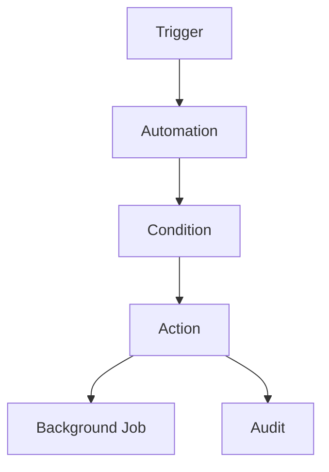
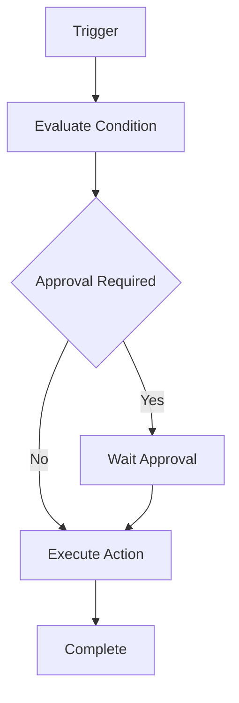
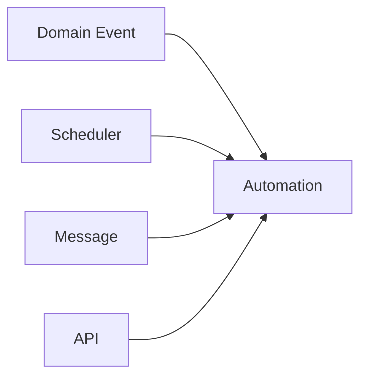
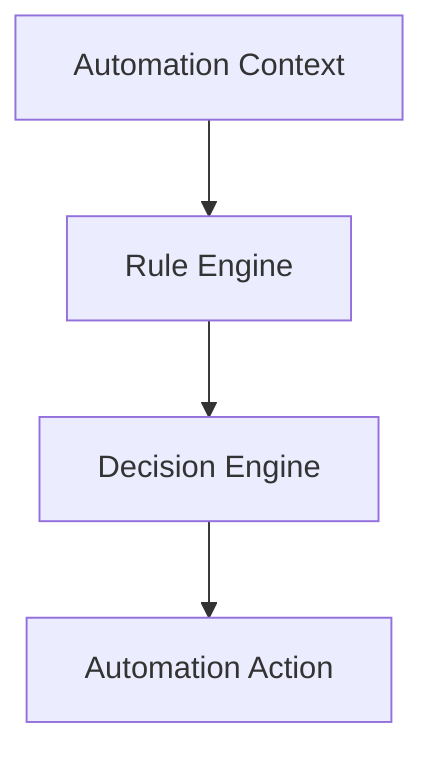
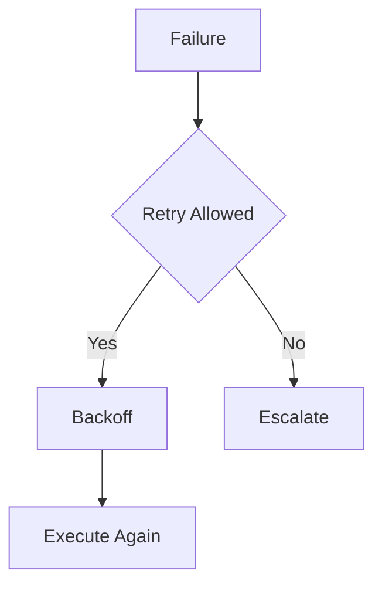
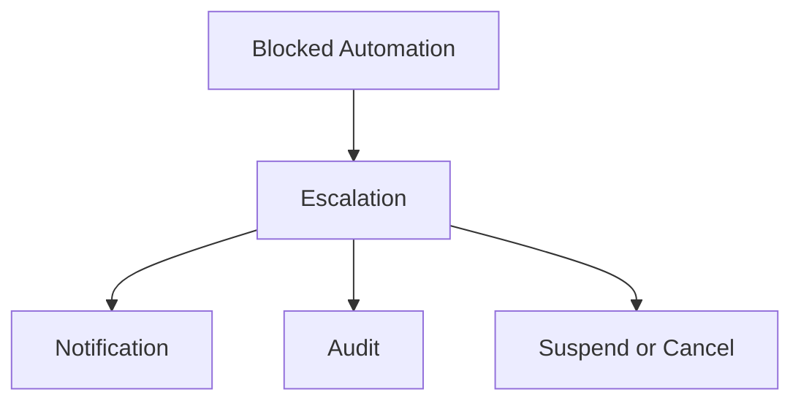
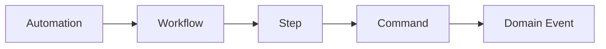

# Automation Framework

# Document Control

Document Name: Automation Framework
Document Path: knowledge/automation-framework.md
Document Type: Atlas Enterprise Canonical Specification
Version: 1.0
Status: Canonical Specification
Domain: Platform
Bounded Context: Platform
Owner: Project Atlas
Source of Truth: Atlas Automation Source of Truth
Last Updated: 2026-07-12

Related Specifications:
- knowledge/workflow-engine-framework.md
- knowledge/background-job-framework.md
- knowledge/scheduler-framework.md
- knowledge/application-service-catalog.md
- knowledge/domain-service-catalog.md
- knowledge/command-catalog.md
- knowledge/domain-event-catalog.md
- knowledge/message-contract-catalog.md
- knowledge/event-driven-architecture.md
- knowledge/integration-framework.md
- knowledge/service-catalog.md
- knowledge/system-module-catalog.md
- knowledge/api-governance-framework.md
- knowledge/projection-engine-framework.md
- knowledge/recommendation-priority-framework.md
- knowledge/rule-engine-architecture.md
- knowledge/calculation-engine-framework.md
- knowledge/simulation-engine-framework.md
- knowledge/optimization-engine-framework.md
- docs/specification/04-DomainModel.md
- docs/database/05-DatabaseDesign.md
- docs/database/06-ERD.md
- docs/api/07-API.md

# Purpose

Automation Framework defines approved Atlas automation across Workflow, Scheduler, Background Job, Application Service, Domain Service, Command, Domain Event, Message Contract, Notification, Decision Engine, Rule Engine, Projection Engine, Recommendation Engine, Integration, API, and Event Driven Architecture. It is the automation source of truth for triggers, conditions, actions, retry, timeout, escalation, audit, and performance.

# Scope

- Automation
- Automation Rule
- Automation Policy
- Automation Trigger
- Automation Condition
- Automation Action
- Automation Execution
- Automation Context
- Automation Pipeline
- Automation State
- Automation Retry
- Automation Timeout
- Automation Compensation
- Automation Approval
- Automation Escalation
- Automation Cancellation
- Automation Suspension
- Automation Resume
- Automation Completion
- Automation Failure

# Automation Principles

- Automation never bypasses Aggregate, Command, Repository, Service, Security, Workflow, Scheduler, or Background Job boundaries.
- Automation requires trigger, condition, action, retry, timeout, escalation, audit, and performance targets.
- High-impact automation requires approval strategy.
- Automation is deterministic for the same trigger, input, rule version, and configuration.
- Failed automation is visible, auditable, and recoverable.
- Automation can be suspended, resumed, cancelled, or escalated through catalog rules.

# Automation Architecture

Automation evaluates triggers and conditions, invokes rule and decision engines when required, runs catalog-approved actions through workflows, schedulers, background jobs, application services, domain services, commands, events, message contracts, projections, notifications, or integrations, and records full audit history.

# Complete Automation Catalog

## ScenarioRefreshAutomation

Automation Name: ScenarioRefreshAutomation
Display Name: ScenarioRefreshAutomation
Category: Decision Automation
Purpose: Refresh scenario evaluation when inputs change.
Business Meaning: ScenarioRefreshAutomation automates a catalog-approved Atlas operation without introducing a new business concept.
Description: Automation coordinates trigger, condition, rule evaluation, decision evaluation, action execution, workflow, scheduler, background job, command, event, message, notification, projection, integration, retry, timeout, compensation, escalation, approval, and audit.
Trigger: Domain event
Trigger Source: ScenarioEvaluated or input changed
Condition: Scenario inputs valid
Rule Engine Dependency: Rule Engine
Decision Engine Dependency: Decision Engine
Input: ScenarioRefreshInput
Output: ScenarioRefreshResult
Execution Context: System actor or authorized actor context with CorrelationId and CausationId.
Application Service: ScenarioApplicationService
Domain Service: ScenarioService, ScoringService
Workflow: Scenario workflow
Scheduler: ScenarioEvaluationScheduler
Background Job: ScenarioEvaluationJob
Commands: EvaluateScenario
Domain Events: ScenarioEvaluated
Repositories: ScenarioRepository
Message Contract: ScenarioEvaluatedMessage
Notification: Dashboard notification
Projection: Scenario projection
Integration: None
Dependencies: Scenario workflow; ScenarioEvaluationScheduler; ScenarioEvaluationJob; ScenarioApplicationService; ScenarioService, ScoringService; ScenarioEvaluatedMessage
Transaction Boundary: Action execution follows owning command, job, workflow, or service boundary.
Consistency Boundary: Eventual consistency applies to projections, notifications, messages, integrations, and read models.
Retry Strategy: Bounded retry for transient failures only.
Timeout Strategy: Bounded automation execution timeout with cancellation and audit.
Compensation Strategy: Workflow or saga compensation only when cataloged.
Escalation Strategy: Escalate failed, timed-out, approval-blocked, or high-impact actions to configured channel.
Approval Strategy: Required for high-impact or policy-controlled automation.
Concurrency Strategy: Automation key and scope prevent duplicate active execution.
Idempotency: AutomationName plus trigger id plus input hash plus execution scope.
Failure Handling: Retry, compensate, escalate, suspend, cancel, or fail with catalog error.
Checkpoint: Persist progress after each deterministic action.
Resume Strategy: Resume from last checkpoint and skip duplicate completed actions.
Audit: Execution history, CorrelationId, CausationId, Automation History, trigger, condition, action, result, retry count, and approval state.
Logging: Structured logs with automation name, trigger, condition, action, result, dependency, and error code.
Metrics: Execution SLA, latency, throughput, queue depth, retry count, escalation count, approval wait, and failure rate.
Security: Authorization, permission, tenant isolation, Household isolation, and automation boundary protection.
Performance: Execution SLA, latency, throughput, parallel execution, and queue depth are measured.
Example: ScenarioRefreshAutomation is triggered by ScenarioEvaluated or input changed, validates Scenario inputs valid, invokes ScenarioEvaluationJob, and records audit.
Automation Control 1: ScenarioRefreshAutomation preserves trigger mapping, trigger source, condition mapping, rule engine dependency, decision engine dependency, input, output, execution context, application service, domain service, workflow, scheduler, background job, command, domain event, repository, message contract, notification, projection, integration, transaction boundary, consistency boundary, retry, timeout, compensation, escalation, approval, concurrency, idempotency, failure handling, checkpoint, resume, audit, logging, metrics, security, and performance.
Automation Control 2: ScenarioRefreshAutomation preserves trigger mapping, trigger source, condition mapping, rule engine dependency, decision engine dependency, input, output, execution context, application service, domain service, workflow, scheduler, background job, command, domain event, repository, message contract, notification, projection, integration, transaction boundary, consistency boundary, retry, timeout, compensation, escalation, approval, concurrency, idempotency, failure handling, checkpoint, resume, audit, logging, metrics, security, and performance.
Automation Control 3: ScenarioRefreshAutomation preserves trigger mapping, trigger source, condition mapping, rule engine dependency, decision engine dependency, input, output, execution context, application service, domain service, workflow, scheduler, background job, command, domain event, repository, message contract, notification, projection, integration, transaction boundary, consistency boundary, retry, timeout, compensation, escalation, approval, concurrency, idempotency, failure handling, checkpoint, resume, audit, logging, metrics, security, and performance.
Automation Control 4: ScenarioRefreshAutomation preserves trigger mapping, trigger source, condition mapping, rule engine dependency, decision engine dependency, input, output, execution context, application service, domain service, workflow, scheduler, background job, command, domain event, repository, message contract, notification, projection, integration, transaction boundary, consistency boundary, retry, timeout, compensation, escalation, approval, concurrency, idempotency, failure handling, checkpoint, resume, audit, logging, metrics, security, and performance.
Automation Control 5: ScenarioRefreshAutomation preserves trigger mapping, trigger source, condition mapping, rule engine dependency, decision engine dependency, input, output, execution context, application service, domain service, workflow, scheduler, background job, command, domain event, repository, message contract, notification, projection, integration, transaction boundary, consistency boundary, retry, timeout, compensation, escalation, approval, concurrency, idempotency, failure handling, checkpoint, resume, audit, logging, metrics, security, and performance.
Automation Control 6: ScenarioRefreshAutomation preserves trigger mapping, trigger source, condition mapping, rule engine dependency, decision engine dependency, input, output, execution context, application service, domain service, workflow, scheduler, background job, command, domain event, repository, message contract, notification, projection, integration, transaction boundary, consistency boundary, retry, timeout, compensation, escalation, approval, concurrency, idempotency, failure handling, checkpoint, resume, audit, logging, metrics, security, and performance.
Automation Control 7: ScenarioRefreshAutomation preserves trigger mapping, trigger source, condition mapping, rule engine dependency, decision engine dependency, input, output, execution context, application service, domain service, workflow, scheduler, background job, command, domain event, repository, message contract, notification, projection, integration, transaction boundary, consistency boundary, retry, timeout, compensation, escalation, approval, concurrency, idempotency, failure handling, checkpoint, resume, audit, logging, metrics, security, and performance.
Automation Control 8: ScenarioRefreshAutomation preserves trigger mapping, trigger source, condition mapping, rule engine dependency, decision engine dependency, input, output, execution context, application service, domain service, workflow, scheduler, background job, command, domain event, repository, message contract, notification, projection, integration, transaction boundary, consistency boundary, retry, timeout, compensation, escalation, approval, concurrency, idempotency, failure handling, checkpoint, resume, audit, logging, metrics, security, and performance.
Automation Control 9: ScenarioRefreshAutomation preserves trigger mapping, trigger source, condition mapping, rule engine dependency, decision engine dependency, input, output, execution context, application service, domain service, workflow, scheduler, background job, command, domain event, repository, message contract, notification, projection, integration, transaction boundary, consistency boundary, retry, timeout, compensation, escalation, approval, concurrency, idempotency, failure handling, checkpoint, resume, audit, logging, metrics, security, and performance.
Automation Control 10: ScenarioRefreshAutomation preserves trigger mapping, trigger source, condition mapping, rule engine dependency, decision engine dependency, input, output, execution context, application service, domain service, workflow, scheduler, background job, command, domain event, repository, message contract, notification, projection, integration, transaction boundary, consistency boundary, retry, timeout, compensation, escalation, approval, concurrency, idempotency, failure handling, checkpoint, resume, audit, logging, metrics, security, and performance.
Automation Control 11: ScenarioRefreshAutomation preserves trigger mapping, trigger source, condition mapping, rule engine dependency, decision engine dependency, input, output, execution context, application service, domain service, workflow, scheduler, background job, command, domain event, repository, message contract, notification, projection, integration, transaction boundary, consistency boundary, retry, timeout, compensation, escalation, approval, concurrency, idempotency, failure handling, checkpoint, resume, audit, logging, metrics, security, and performance.
Automation Control 12: ScenarioRefreshAutomation preserves trigger mapping, trigger source, condition mapping, rule engine dependency, decision engine dependency, input, output, execution context, application service, domain service, workflow, scheduler, background job, command, domain event, repository, message contract, notification, projection, integration, transaction boundary, consistency boundary, retry, timeout, compensation, escalation, approval, concurrency, idempotency, failure handling, checkpoint, resume, audit, logging, metrics, security, and performance.
Automation Control 13: ScenarioRefreshAutomation preserves trigger mapping, trigger source, condition mapping, rule engine dependency, decision engine dependency, input, output, execution context, application service, domain service, workflow, scheduler, background job, command, domain event, repository, message contract, notification, projection, integration, transaction boundary, consistency boundary, retry, timeout, compensation, escalation, approval, concurrency, idempotency, failure handling, checkpoint, resume, audit, logging, metrics, security, and performance.
Automation Control 14: ScenarioRefreshAutomation preserves trigger mapping, trigger source, condition mapping, rule engine dependency, decision engine dependency, input, output, execution context, application service, domain service, workflow, scheduler, background job, command, domain event, repository, message contract, notification, projection, integration, transaction boundary, consistency boundary, retry, timeout, compensation, escalation, approval, concurrency, idempotency, failure handling, checkpoint, resume, audit, logging, metrics, security, and performance.
Automation Control 15: ScenarioRefreshAutomation preserves trigger mapping, trigger source, condition mapping, rule engine dependency, decision engine dependency, input, output, execution context, application service, domain service, workflow, scheduler, background job, command, domain event, repository, message contract, notification, projection, integration, transaction boundary, consistency boundary, retry, timeout, compensation, escalation, approval, concurrency, idempotency, failure handling, checkpoint, resume, audit, logging, metrics, security, and performance.
Automation Control 16: ScenarioRefreshAutomation preserves trigger mapping, trigger source, condition mapping, rule engine dependency, decision engine dependency, input, output, execution context, application service, domain service, workflow, scheduler, background job, command, domain event, repository, message contract, notification, projection, integration, transaction boundary, consistency boundary, retry, timeout, compensation, escalation, approval, concurrency, idempotency, failure handling, checkpoint, resume, audit, logging, metrics, security, and performance.
Automation Control 17: ScenarioRefreshAutomation preserves trigger mapping, trigger source, condition mapping, rule engine dependency, decision engine dependency, input, output, execution context, application service, domain service, workflow, scheduler, background job, command, domain event, repository, message contract, notification, projection, integration, transaction boundary, consistency boundary, retry, timeout, compensation, escalation, approval, concurrency, idempotency, failure handling, checkpoint, resume, audit, logging, metrics, security, and performance.
Automation Control 18: ScenarioRefreshAutomation preserves trigger mapping, trigger source, condition mapping, rule engine dependency, decision engine dependency, input, output, execution context, application service, domain service, workflow, scheduler, background job, command, domain event, repository, message contract, notification, projection, integration, transaction boundary, consistency boundary, retry, timeout, compensation, escalation, approval, concurrency, idempotency, failure handling, checkpoint, resume, audit, logging, metrics, security, and performance.
Automation Control 19: ScenarioRefreshAutomation preserves trigger mapping, trigger source, condition mapping, rule engine dependency, decision engine dependency, input, output, execution context, application service, domain service, workflow, scheduler, background job, command, domain event, repository, message contract, notification, projection, integration, transaction boundary, consistency boundary, retry, timeout, compensation, escalation, approval, concurrency, idempotency, failure handling, checkpoint, resume, audit, logging, metrics, security, and performance.
Automation Control 20: ScenarioRefreshAutomation preserves trigger mapping, trigger source, condition mapping, rule engine dependency, decision engine dependency, input, output, execution context, application service, domain service, workflow, scheduler, background job, command, domain event, repository, message contract, notification, projection, integration, transaction boundary, consistency boundary, retry, timeout, compensation, escalation, approval, concurrency, idempotency, failure handling, checkpoint, resume, audit, logging, metrics, security, and performance.
Automation Control 21: ScenarioRefreshAutomation preserves trigger mapping, trigger source, condition mapping, rule engine dependency, decision engine dependency, input, output, execution context, application service, domain service, workflow, scheduler, background job, command, domain event, repository, message contract, notification, projection, integration, transaction boundary, consistency boundary, retry, timeout, compensation, escalation, approval, concurrency, idempotency, failure handling, checkpoint, resume, audit, logging, metrics, security, and performance.
Automation Control 22: ScenarioRefreshAutomation preserves trigger mapping, trigger source, condition mapping, rule engine dependency, decision engine dependency, input, output, execution context, application service, domain service, workflow, scheduler, background job, command, domain event, repository, message contract, notification, projection, integration, transaction boundary, consistency boundary, retry, timeout, compensation, escalation, approval, concurrency, idempotency, failure handling, checkpoint, resume, audit, logging, metrics, security, and performance.
Automation Control 23: ScenarioRefreshAutomation preserves trigger mapping, trigger source, condition mapping, rule engine dependency, decision engine dependency, input, output, execution context, application service, domain service, workflow, scheduler, background job, command, domain event, repository, message contract, notification, projection, integration, transaction boundary, consistency boundary, retry, timeout, compensation, escalation, approval, concurrency, idempotency, failure handling, checkpoint, resume, audit, logging, metrics, security, and performance.
Automation Control 24: ScenarioRefreshAutomation preserves trigger mapping, trigger source, condition mapping, rule engine dependency, decision engine dependency, input, output, execution context, application service, domain service, workflow, scheduler, background job, command, domain event, repository, message contract, notification, projection, integration, transaction boundary, consistency boundary, retry, timeout, compensation, escalation, approval, concurrency, idempotency, failure handling, checkpoint, resume, audit, logging, metrics, security, and performance.
Automation Control 25: ScenarioRefreshAutomation preserves trigger mapping, trigger source, condition mapping, rule engine dependency, decision engine dependency, input, output, execution context, application service, domain service, workflow, scheduler, background job, command, domain event, repository, message contract, notification, projection, integration, transaction boundary, consistency boundary, retry, timeout, compensation, escalation, approval, concurrency, idempotency, failure handling, checkpoint, resume, audit, logging, metrics, security, and performance.
Automation Control 26: ScenarioRefreshAutomation preserves trigger mapping, trigger source, condition mapping, rule engine dependency, decision engine dependency, input, output, execution context, application service, domain service, workflow, scheduler, background job, command, domain event, repository, message contract, notification, projection, integration, transaction boundary, consistency boundary, retry, timeout, compensation, escalation, approval, concurrency, idempotency, failure handling, checkpoint, resume, audit, logging, metrics, security, and performance.
Automation Control 27: ScenarioRefreshAutomation preserves trigger mapping, trigger source, condition mapping, rule engine dependency, decision engine dependency, input, output, execution context, application service, domain service, workflow, scheduler, background job, command, domain event, repository, message contract, notification, projection, integration, transaction boundary, consistency boundary, retry, timeout, compensation, escalation, approval, concurrency, idempotency, failure handling, checkpoint, resume, audit, logging, metrics, security, and performance.
Automation Control 28: ScenarioRefreshAutomation preserves trigger mapping, trigger source, condition mapping, rule engine dependency, decision engine dependency, input, output, execution context, application service, domain service, workflow, scheduler, background job, command, domain event, repository, message contract, notification, projection, integration, transaction boundary, consistency boundary, retry, timeout, compensation, escalation, approval, concurrency, idempotency, failure handling, checkpoint, resume, audit, logging, metrics, security, and performance.
Automation Control 29: ScenarioRefreshAutomation preserves trigger mapping, trigger source, condition mapping, rule engine dependency, decision engine dependency, input, output, execution context, application service, domain service, workflow, scheduler, background job, command, domain event, repository, message contract, notification, projection, integration, transaction boundary, consistency boundary, retry, timeout, compensation, escalation, approval, concurrency, idempotency, failure handling, checkpoint, resume, audit, logging, metrics, security, and performance.
Automation Control 30: ScenarioRefreshAutomation preserves trigger mapping, trigger source, condition mapping, rule engine dependency, decision engine dependency, input, output, execution context, application service, domain service, workflow, scheduler, background job, command, domain event, repository, message contract, notification, projection, integration, transaction boundary, consistency boundary, retry, timeout, compensation, escalation, approval, concurrency, idempotency, failure handling, checkpoint, resume, audit, logging, metrics, security, and performance.
Automation Control 31: ScenarioRefreshAutomation preserves trigger mapping, trigger source, condition mapping, rule engine dependency, decision engine dependency, input, output, execution context, application service, domain service, workflow, scheduler, background job, command, domain event, repository, message contract, notification, projection, integration, transaction boundary, consistency boundary, retry, timeout, compensation, escalation, approval, concurrency, idempotency, failure handling, checkpoint, resume, audit, logging, metrics, security, and performance.
Automation Control 32: ScenarioRefreshAutomation preserves trigger mapping, trigger source, condition mapping, rule engine dependency, decision engine dependency, input, output, execution context, application service, domain service, workflow, scheduler, background job, command, domain event, repository, message contract, notification, projection, integration, transaction boundary, consistency boundary, retry, timeout, compensation, escalation, approval, concurrency, idempotency, failure handling, checkpoint, resume, audit, logging, metrics, security, and performance.
Automation Control 33: ScenarioRefreshAutomation preserves trigger mapping, trigger source, condition mapping, rule engine dependency, decision engine dependency, input, output, execution context, application service, domain service, workflow, scheduler, background job, command, domain event, repository, message contract, notification, projection, integration, transaction boundary, consistency boundary, retry, timeout, compensation, escalation, approval, concurrency, idempotency, failure handling, checkpoint, resume, audit, logging, metrics, security, and performance.
Automation Control 34: ScenarioRefreshAutomation preserves trigger mapping, trigger source, condition mapping, rule engine dependency, decision engine dependency, input, output, execution context, application service, domain service, workflow, scheduler, background job, command, domain event, repository, message contract, notification, projection, integration, transaction boundary, consistency boundary, retry, timeout, compensation, escalation, approval, concurrency, idempotency, failure handling, checkpoint, resume, audit, logging, metrics, security, and performance.
Automation Control 35: ScenarioRefreshAutomation preserves trigger mapping, trigger source, condition mapping, rule engine dependency, decision engine dependency, input, output, execution context, application service, domain service, workflow, scheduler, background job, command, domain event, repository, message contract, notification, projection, integration, transaction boundary, consistency boundary, retry, timeout, compensation, escalation, approval, concurrency, idempotency, failure handling, checkpoint, resume, audit, logging, metrics, security, and performance.
Automation Control 36: ScenarioRefreshAutomation preserves trigger mapping, trigger source, condition mapping, rule engine dependency, decision engine dependency, input, output, execution context, application service, domain service, workflow, scheduler, background job, command, domain event, repository, message contract, notification, projection, integration, transaction boundary, consistency boundary, retry, timeout, compensation, escalation, approval, concurrency, idempotency, failure handling, checkpoint, resume, audit, logging, metrics, security, and performance.
Automation Control 37: ScenarioRefreshAutomation preserves trigger mapping, trigger source, condition mapping, rule engine dependency, decision engine dependency, input, output, execution context, application service, domain service, workflow, scheduler, background job, command, domain event, repository, message contract, notification, projection, integration, transaction boundary, consistency boundary, retry, timeout, compensation, escalation, approval, concurrency, idempotency, failure handling, checkpoint, resume, audit, logging, metrics, security, and performance.
Automation Control 38: ScenarioRefreshAutomation preserves trigger mapping, trigger source, condition mapping, rule engine dependency, decision engine dependency, input, output, execution context, application service, domain service, workflow, scheduler, background job, command, domain event, repository, message contract, notification, projection, integration, transaction boundary, consistency boundary, retry, timeout, compensation, escalation, approval, concurrency, idempotency, failure handling, checkpoint, resume, audit, logging, metrics, security, and performance.
Automation Control 39: ScenarioRefreshAutomation preserves trigger mapping, trigger source, condition mapping, rule engine dependency, decision engine dependency, input, output, execution context, application service, domain service, workflow, scheduler, background job, command, domain event, repository, message contract, notification, projection, integration, transaction boundary, consistency boundary, retry, timeout, compensation, escalation, approval, concurrency, idempotency, failure handling, checkpoint, resume, audit, logging, metrics, security, and performance.
Automation Control 40: ScenarioRefreshAutomation preserves trigger mapping, trigger source, condition mapping, rule engine dependency, decision engine dependency, input, output, execution context, application service, domain service, workflow, scheduler, background job, command, domain event, repository, message contract, notification, projection, integration, transaction boundary, consistency boundary, retry, timeout, compensation, escalation, approval, concurrency, idempotency, failure handling, checkpoint, resume, audit, logging, metrics, security, and performance.
Automation Control 41: ScenarioRefreshAutomation preserves trigger mapping, trigger source, condition mapping, rule engine dependency, decision engine dependency, input, output, execution context, application service, domain service, workflow, scheduler, background job, command, domain event, repository, message contract, notification, projection, integration, transaction boundary, consistency boundary, retry, timeout, compensation, escalation, approval, concurrency, idempotency, failure handling, checkpoint, resume, audit, logging, metrics, security, and performance.
Automation Control 42: ScenarioRefreshAutomation preserves trigger mapping, trigger source, condition mapping, rule engine dependency, decision engine dependency, input, output, execution context, application service, domain service, workflow, scheduler, background job, command, domain event, repository, message contract, notification, projection, integration, transaction boundary, consistency boundary, retry, timeout, compensation, escalation, approval, concurrency, idempotency, failure handling, checkpoint, resume, audit, logging, metrics, security, and performance.
Automation Control 43: ScenarioRefreshAutomation preserves trigger mapping, trigger source, condition mapping, rule engine dependency, decision engine dependency, input, output, execution context, application service, domain service, workflow, scheduler, background job, command, domain event, repository, message contract, notification, projection, integration, transaction boundary, consistency boundary, retry, timeout, compensation, escalation, approval, concurrency, idempotency, failure handling, checkpoint, resume, audit, logging, metrics, security, and performance.
Automation Control 44: ScenarioRefreshAutomation preserves trigger mapping, trigger source, condition mapping, rule engine dependency, decision engine dependency, input, output, execution context, application service, domain service, workflow, scheduler, background job, command, domain event, repository, message contract, notification, projection, integration, transaction boundary, consistency boundary, retry, timeout, compensation, escalation, approval, concurrency, idempotency, failure handling, checkpoint, resume, audit, logging, metrics, security, and performance.
Automation Control 45: ScenarioRefreshAutomation preserves trigger mapping, trigger source, condition mapping, rule engine dependency, decision engine dependency, input, output, execution context, application service, domain service, workflow, scheduler, background job, command, domain event, repository, message contract, notification, projection, integration, transaction boundary, consistency boundary, retry, timeout, compensation, escalation, approval, concurrency, idempotency, failure handling, checkpoint, resume, audit, logging, metrics, security, and performance.
Automation Control 46: ScenarioRefreshAutomation preserves trigger mapping, trigger source, condition mapping, rule engine dependency, decision engine dependency, input, output, execution context, application service, domain service, workflow, scheduler, background job, command, domain event, repository, message contract, notification, projection, integration, transaction boundary, consistency boundary, retry, timeout, compensation, escalation, approval, concurrency, idempotency, failure handling, checkpoint, resume, audit, logging, metrics, security, and performance.
Automation Control 47: ScenarioRefreshAutomation preserves trigger mapping, trigger source, condition mapping, rule engine dependency, decision engine dependency, input, output, execution context, application service, domain service, workflow, scheduler, background job, command, domain event, repository, message contract, notification, projection, integration, transaction boundary, consistency boundary, retry, timeout, compensation, escalation, approval, concurrency, idempotency, failure handling, checkpoint, resume, audit, logging, metrics, security, and performance.
Automation Control 48: ScenarioRefreshAutomation preserves trigger mapping, trigger source, condition mapping, rule engine dependency, decision engine dependency, input, output, execution context, application service, domain service, workflow, scheduler, background job, command, domain event, repository, message contract, notification, projection, integration, transaction boundary, consistency boundary, retry, timeout, compensation, escalation, approval, concurrency, idempotency, failure handling, checkpoint, resume, audit, logging, metrics, security, and performance.
Automation Control 49: ScenarioRefreshAutomation preserves trigger mapping, trigger source, condition mapping, rule engine dependency, decision engine dependency, input, output, execution context, application service, domain service, workflow, scheduler, background job, command, domain event, repository, message contract, notification, projection, integration, transaction boundary, consistency boundary, retry, timeout, compensation, escalation, approval, concurrency, idempotency, failure handling, checkpoint, resume, audit, logging, metrics, security, and performance.
Automation Control 50: ScenarioRefreshAutomation preserves trigger mapping, trigger source, condition mapping, rule engine dependency, decision engine dependency, input, output, execution context, application service, domain service, workflow, scheduler, background job, command, domain event, repository, message contract, notification, projection, integration, transaction boundary, consistency boundary, retry, timeout, compensation, escalation, approval, concurrency, idempotency, failure handling, checkpoint, resume, audit, logging, metrics, security, and performance.
Automation Control 51: ScenarioRefreshAutomation preserves trigger mapping, trigger source, condition mapping, rule engine dependency, decision engine dependency, input, output, execution context, application service, domain service, workflow, scheduler, background job, command, domain event, repository, message contract, notification, projection, integration, transaction boundary, consistency boundary, retry, timeout, compensation, escalation, approval, concurrency, idempotency, failure handling, checkpoint, resume, audit, logging, metrics, security, and performance.
Automation Control 52: ScenarioRefreshAutomation preserves trigger mapping, trigger source, condition mapping, rule engine dependency, decision engine dependency, input, output, execution context, application service, domain service, workflow, scheduler, background job, command, domain event, repository, message contract, notification, projection, integration, transaction boundary, consistency boundary, retry, timeout, compensation, escalation, approval, concurrency, idempotency, failure handling, checkpoint, resume, audit, logging, metrics, security, and performance.
Automation Control 53: ScenarioRefreshAutomation preserves trigger mapping, trigger source, condition mapping, rule engine dependency, decision engine dependency, input, output, execution context, application service, domain service, workflow, scheduler, background job, command, domain event, repository, message contract, notification, projection, integration, transaction boundary, consistency boundary, retry, timeout, compensation, escalation, approval, concurrency, idempotency, failure handling, checkpoint, resume, audit, logging, metrics, security, and performance.
Automation Control 54: ScenarioRefreshAutomation preserves trigger mapping, trigger source, condition mapping, rule engine dependency, decision engine dependency, input, output, execution context, application service, domain service, workflow, scheduler, background job, command, domain event, repository, message contract, notification, projection, integration, transaction boundary, consistency boundary, retry, timeout, compensation, escalation, approval, concurrency, idempotency, failure handling, checkpoint, resume, audit, logging, metrics, security, and performance.
Automation Control 55: ScenarioRefreshAutomation preserves trigger mapping, trigger source, condition mapping, rule engine dependency, decision engine dependency, input, output, execution context, application service, domain service, workflow, scheduler, background job, command, domain event, repository, message contract, notification, projection, integration, transaction boundary, consistency boundary, retry, timeout, compensation, escalation, approval, concurrency, idempotency, failure handling, checkpoint, resume, audit, logging, metrics, security, and performance.
Automation Control 56: ScenarioRefreshAutomation preserves trigger mapping, trigger source, condition mapping, rule engine dependency, decision engine dependency, input, output, execution context, application service, domain service, workflow, scheduler, background job, command, domain event, repository, message contract, notification, projection, integration, transaction boundary, consistency boundary, retry, timeout, compensation, escalation, approval, concurrency, idempotency, failure handling, checkpoint, resume, audit, logging, metrics, security, and performance.
Automation Control 57: ScenarioRefreshAutomation preserves trigger mapping, trigger source, condition mapping, rule engine dependency, decision engine dependency, input, output, execution context, application service, domain service, workflow, scheduler, background job, command, domain event, repository, message contract, notification, projection, integration, transaction boundary, consistency boundary, retry, timeout, compensation, escalation, approval, concurrency, idempotency, failure handling, checkpoint, resume, audit, logging, metrics, security, and performance.
Automation Control 58: ScenarioRefreshAutomation preserves trigger mapping, trigger source, condition mapping, rule engine dependency, decision engine dependency, input, output, execution context, application service, domain service, workflow, scheduler, background job, command, domain event, repository, message contract, notification, projection, integration, transaction boundary, consistency boundary, retry, timeout, compensation, escalation, approval, concurrency, idempotency, failure handling, checkpoint, resume, audit, logging, metrics, security, and performance.
Automation Control 59: ScenarioRefreshAutomation preserves trigger mapping, trigger source, condition mapping, rule engine dependency, decision engine dependency, input, output, execution context, application service, domain service, workflow, scheduler, background job, command, domain event, repository, message contract, notification, projection, integration, transaction boundary, consistency boundary, retry, timeout, compensation, escalation, approval, concurrency, idempotency, failure handling, checkpoint, resume, audit, logging, metrics, security, and performance.
Automation Control 60: ScenarioRefreshAutomation preserves trigger mapping, trigger source, condition mapping, rule engine dependency, decision engine dependency, input, output, execution context, application service, domain service, workflow, scheduler, background job, command, domain event, repository, message contract, notification, projection, integration, transaction boundary, consistency boundary, retry, timeout, compensation, escalation, approval, concurrency, idempotency, failure handling, checkpoint, resume, audit, logging, metrics, security, and performance.
Automation Control 61: ScenarioRefreshAutomation preserves trigger mapping, trigger source, condition mapping, rule engine dependency, decision engine dependency, input, output, execution context, application service, domain service, workflow, scheduler, background job, command, domain event, repository, message contract, notification, projection, integration, transaction boundary, consistency boundary, retry, timeout, compensation, escalation, approval, concurrency, idempotency, failure handling, checkpoint, resume, audit, logging, metrics, security, and performance.
Automation Control 62: ScenarioRefreshAutomation preserves trigger mapping, trigger source, condition mapping, rule engine dependency, decision engine dependency, input, output, execution context, application service, domain service, workflow, scheduler, background job, command, domain event, repository, message contract, notification, projection, integration, transaction boundary, consistency boundary, retry, timeout, compensation, escalation, approval, concurrency, idempotency, failure handling, checkpoint, resume, audit, logging, metrics, security, and performance.
Automation Control 63: ScenarioRefreshAutomation preserves trigger mapping, trigger source, condition mapping, rule engine dependency, decision engine dependency, input, output, execution context, application service, domain service, workflow, scheduler, background job, command, domain event, repository, message contract, notification, projection, integration, transaction boundary, consistency boundary, retry, timeout, compensation, escalation, approval, concurrency, idempotency, failure handling, checkpoint, resume, audit, logging, metrics, security, and performance.
Automation Control 64: ScenarioRefreshAutomation preserves trigger mapping, trigger source, condition mapping, rule engine dependency, decision engine dependency, input, output, execution context, application service, domain service, workflow, scheduler, background job, command, domain event, repository, message contract, notification, projection, integration, transaction boundary, consistency boundary, retry, timeout, compensation, escalation, approval, concurrency, idempotency, failure handling, checkpoint, resume, audit, logging, metrics, security, and performance.
Automation Control 65: ScenarioRefreshAutomation preserves trigger mapping, trigger source, condition mapping, rule engine dependency, decision engine dependency, input, output, execution context, application service, domain service, workflow, scheduler, background job, command, domain event, repository, message contract, notification, projection, integration, transaction boundary, consistency boundary, retry, timeout, compensation, escalation, approval, concurrency, idempotency, failure handling, checkpoint, resume, audit, logging, metrics, security, and performance.
Automation Control 66: ScenarioRefreshAutomation preserves trigger mapping, trigger source, condition mapping, rule engine dependency, decision engine dependency, input, output, execution context, application service, domain service, workflow, scheduler, background job, command, domain event, repository, message contract, notification, projection, integration, transaction boundary, consistency boundary, retry, timeout, compensation, escalation, approval, concurrency, idempotency, failure handling, checkpoint, resume, audit, logging, metrics, security, and performance.
Automation Control 67: ScenarioRefreshAutomation preserves trigger mapping, trigger source, condition mapping, rule engine dependency, decision engine dependency, input, output, execution context, application service, domain service, workflow, scheduler, background job, command, domain event, repository, message contract, notification, projection, integration, transaction boundary, consistency boundary, retry, timeout, compensation, escalation, approval, concurrency, idempotency, failure handling, checkpoint, resume, audit, logging, metrics, security, and performance.
Automation Control 68: ScenarioRefreshAutomation preserves trigger mapping, trigger source, condition mapping, rule engine dependency, decision engine dependency, input, output, execution context, application service, domain service, workflow, scheduler, background job, command, domain event, repository, message contract, notification, projection, integration, transaction boundary, consistency boundary, retry, timeout, compensation, escalation, approval, concurrency, idempotency, failure handling, checkpoint, resume, audit, logging, metrics, security, and performance.
Automation Control 69: ScenarioRefreshAutomation preserves trigger mapping, trigger source, condition mapping, rule engine dependency, decision engine dependency, input, output, execution context, application service, domain service, workflow, scheduler, background job, command, domain event, repository, message contract, notification, projection, integration, transaction boundary, consistency boundary, retry, timeout, compensation, escalation, approval, concurrency, idempotency, failure handling, checkpoint, resume, audit, logging, metrics, security, and performance.
Automation Control 70: ScenarioRefreshAutomation preserves trigger mapping, trigger source, condition mapping, rule engine dependency, decision engine dependency, input, output, execution context, application service, domain service, workflow, scheduler, background job, command, domain event, repository, message contract, notification, projection, integration, transaction boundary, consistency boundary, retry, timeout, compensation, escalation, approval, concurrency, idempotency, failure handling, checkpoint, resume, audit, logging, metrics, security, and performance.
Automation Control 71: ScenarioRefreshAutomation preserves trigger mapping, trigger source, condition mapping, rule engine dependency, decision engine dependency, input, output, execution context, application service, domain service, workflow, scheduler, background job, command, domain event, repository, message contract, notification, projection, integration, transaction boundary, consistency boundary, retry, timeout, compensation, escalation, approval, concurrency, idempotency, failure handling, checkpoint, resume, audit, logging, metrics, security, and performance.
Automation Control 72: ScenarioRefreshAutomation preserves trigger mapping, trigger source, condition mapping, rule engine dependency, decision engine dependency, input, output, execution context, application service, domain service, workflow, scheduler, background job, command, domain event, repository, message contract, notification, projection, integration, transaction boundary, consistency boundary, retry, timeout, compensation, escalation, approval, concurrency, idempotency, failure handling, checkpoint, resume, audit, logging, metrics, security, and performance.
Automation Control 73: ScenarioRefreshAutomation preserves trigger mapping, trigger source, condition mapping, rule engine dependency, decision engine dependency, input, output, execution context, application service, domain service, workflow, scheduler, background job, command, domain event, repository, message contract, notification, projection, integration, transaction boundary, consistency boundary, retry, timeout, compensation, escalation, approval, concurrency, idempotency, failure handling, checkpoint, resume, audit, logging, metrics, security, and performance.
Automation Control 74: ScenarioRefreshAutomation preserves trigger mapping, trigger source, condition mapping, rule engine dependency, decision engine dependency, input, output, execution context, application service, domain service, workflow, scheduler, background job, command, domain event, repository, message contract, notification, projection, integration, transaction boundary, consistency boundary, retry, timeout, compensation, escalation, approval, concurrency, idempotency, failure handling, checkpoint, resume, audit, logging, metrics, security, and performance.
Automation Control 75: ScenarioRefreshAutomation preserves trigger mapping, trigger source, condition mapping, rule engine dependency, decision engine dependency, input, output, execution context, application service, domain service, workflow, scheduler, background job, command, domain event, repository, message contract, notification, projection, integration, transaction boundary, consistency boundary, retry, timeout, compensation, escalation, approval, concurrency, idempotency, failure handling, checkpoint, resume, audit, logging, metrics, security, and performance.
Automation Control 76: ScenarioRefreshAutomation preserves trigger mapping, trigger source, condition mapping, rule engine dependency, decision engine dependency, input, output, execution context, application service, domain service, workflow, scheduler, background job, command, domain event, repository, message contract, notification, projection, integration, transaction boundary, consistency boundary, retry, timeout, compensation, escalation, approval, concurrency, idempotency, failure handling, checkpoint, resume, audit, logging, metrics, security, and performance.
Automation Control 77: ScenarioRefreshAutomation preserves trigger mapping, trigger source, condition mapping, rule engine dependency, decision engine dependency, input, output, execution context, application service, domain service, workflow, scheduler, background job, command, domain event, repository, message contract, notification, projection, integration, transaction boundary, consistency boundary, retry, timeout, compensation, escalation, approval, concurrency, idempotency, failure handling, checkpoint, resume, audit, logging, metrics, security, and performance.
Automation Control 78: ScenarioRefreshAutomation preserves trigger mapping, trigger source, condition mapping, rule engine dependency, decision engine dependency, input, output, execution context, application service, domain service, workflow, scheduler, background job, command, domain event, repository, message contract, notification, projection, integration, transaction boundary, consistency boundary, retry, timeout, compensation, escalation, approval, concurrency, idempotency, failure handling, checkpoint, resume, audit, logging, metrics, security, and performance.
Automation Control 79: ScenarioRefreshAutomation preserves trigger mapping, trigger source, condition mapping, rule engine dependency, decision engine dependency, input, output, execution context, application service, domain service, workflow, scheduler, background job, command, domain event, repository, message contract, notification, projection, integration, transaction boundary, consistency boundary, retry, timeout, compensation, escalation, approval, concurrency, idempotency, failure handling, checkpoint, resume, audit, logging, metrics, security, and performance.
Automation Control 80: ScenarioRefreshAutomation preserves trigger mapping, trigger source, condition mapping, rule engine dependency, decision engine dependency, input, output, execution context, application service, domain service, workflow, scheduler, background job, command, domain event, repository, message contract, notification, projection, integration, transaction boundary, consistency boundary, retry, timeout, compensation, escalation, approval, concurrency, idempotency, failure handling, checkpoint, resume, audit, logging, metrics, security, and performance.
Automation Control 81: ScenarioRefreshAutomation preserves trigger mapping, trigger source, condition mapping, rule engine dependency, decision engine dependency, input, output, execution context, application service, domain service, workflow, scheduler, background job, command, domain event, repository, message contract, notification, projection, integration, transaction boundary, consistency boundary, retry, timeout, compensation, escalation, approval, concurrency, idempotency, failure handling, checkpoint, resume, audit, logging, metrics, security, and performance.
Automation Control 82: ScenarioRefreshAutomation preserves trigger mapping, trigger source, condition mapping, rule engine dependency, decision engine dependency, input, output, execution context, application service, domain service, workflow, scheduler, background job, command, domain event, repository, message contract, notification, projection, integration, transaction boundary, consistency boundary, retry, timeout, compensation, escalation, approval, concurrency, idempotency, failure handling, checkpoint, resume, audit, logging, metrics, security, and performance.
Automation Control 83: ScenarioRefreshAutomation preserves trigger mapping, trigger source, condition mapping, rule engine dependency, decision engine dependency, input, output, execution context, application service, domain service, workflow, scheduler, background job, command, domain event, repository, message contract, notification, projection, integration, transaction boundary, consistency boundary, retry, timeout, compensation, escalation, approval, concurrency, idempotency, failure handling, checkpoint, resume, audit, logging, metrics, security, and performance.
Automation Control 84: ScenarioRefreshAutomation preserves trigger mapping, trigger source, condition mapping, rule engine dependency, decision engine dependency, input, output, execution context, application service, domain service, workflow, scheduler, background job, command, domain event, repository, message contract, notification, projection, integration, transaction boundary, consistency boundary, retry, timeout, compensation, escalation, approval, concurrency, idempotency, failure handling, checkpoint, resume, audit, logging, metrics, security, and performance.
Automation Control 85: ScenarioRefreshAutomation preserves trigger mapping, trigger source, condition mapping, rule engine dependency, decision engine dependency, input, output, execution context, application service, domain service, workflow, scheduler, background job, command, domain event, repository, message contract, notification, projection, integration, transaction boundary, consistency boundary, retry, timeout, compensation, escalation, approval, concurrency, idempotency, failure handling, checkpoint, resume, audit, logging, metrics, security, and performance.
Automation Control 86: ScenarioRefreshAutomation preserves trigger mapping, trigger source, condition mapping, rule engine dependency, decision engine dependency, input, output, execution context, application service, domain service, workflow, scheduler, background job, command, domain event, repository, message contract, notification, projection, integration, transaction boundary, consistency boundary, retry, timeout, compensation, escalation, approval, concurrency, idempotency, failure handling, checkpoint, resume, audit, logging, metrics, security, and performance.
Automation Control 87: ScenarioRefreshAutomation preserves trigger mapping, trigger source, condition mapping, rule engine dependency, decision engine dependency, input, output, execution context, application service, domain service, workflow, scheduler, background job, command, domain event, repository, message contract, notification, projection, integration, transaction boundary, consistency boundary, retry, timeout, compensation, escalation, approval, concurrency, idempotency, failure handling, checkpoint, resume, audit, logging, metrics, security, and performance.
Automation Control 88: ScenarioRefreshAutomation preserves trigger mapping, trigger source, condition mapping, rule engine dependency, decision engine dependency, input, output, execution context, application service, domain service, workflow, scheduler, background job, command, domain event, repository, message contract, notification, projection, integration, transaction boundary, consistency boundary, retry, timeout, compensation, escalation, approval, concurrency, idempotency, failure handling, checkpoint, resume, audit, logging, metrics, security, and performance.
Automation Control 89: ScenarioRefreshAutomation preserves trigger mapping, trigger source, condition mapping, rule engine dependency, decision engine dependency, input, output, execution context, application service, domain service, workflow, scheduler, background job, command, domain event, repository, message contract, notification, projection, integration, transaction boundary, consistency boundary, retry, timeout, compensation, escalation, approval, concurrency, idempotency, failure handling, checkpoint, resume, audit, logging, metrics, security, and performance.
Automation Control 90: ScenarioRefreshAutomation preserves trigger mapping, trigger source, condition mapping, rule engine dependency, decision engine dependency, input, output, execution context, application service, domain service, workflow, scheduler, background job, command, domain event, repository, message contract, notification, projection, integration, transaction boundary, consistency boundary, retry, timeout, compensation, escalation, approval, concurrency, idempotency, failure handling, checkpoint, resume, audit, logging, metrics, security, and performance.
Automation Control 91: ScenarioRefreshAutomation preserves trigger mapping, trigger source, condition mapping, rule engine dependency, decision engine dependency, input, output, execution context, application service, domain service, workflow, scheduler, background job, command, domain event, repository, message contract, notification, projection, integration, transaction boundary, consistency boundary, retry, timeout, compensation, escalation, approval, concurrency, idempotency, failure handling, checkpoint, resume, audit, logging, metrics, security, and performance.
Automation Control 92: ScenarioRefreshAutomation preserves trigger mapping, trigger source, condition mapping, rule engine dependency, decision engine dependency, input, output, execution context, application service, domain service, workflow, scheduler, background job, command, domain event, repository, message contract, notification, projection, integration, transaction boundary, consistency boundary, retry, timeout, compensation, escalation, approval, concurrency, idempotency, failure handling, checkpoint, resume, audit, logging, metrics, security, and performance.
Automation Control 93: ScenarioRefreshAutomation preserves trigger mapping, trigger source, condition mapping, rule engine dependency, decision engine dependency, input, output, execution context, application service, domain service, workflow, scheduler, background job, command, domain event, repository, message contract, notification, projection, integration, transaction boundary, consistency boundary, retry, timeout, compensation, escalation, approval, concurrency, idempotency, failure handling, checkpoint, resume, audit, logging, metrics, security, and performance.
Automation Control 94: ScenarioRefreshAutomation preserves trigger mapping, trigger source, condition mapping, rule engine dependency, decision engine dependency, input, output, execution context, application service, domain service, workflow, scheduler, background job, command, domain event, repository, message contract, notification, projection, integration, transaction boundary, consistency boundary, retry, timeout, compensation, escalation, approval, concurrency, idempotency, failure handling, checkpoint, resume, audit, logging, metrics, security, and performance.
Automation Control 95: ScenarioRefreshAutomation preserves trigger mapping, trigger source, condition mapping, rule engine dependency, decision engine dependency, input, output, execution context, application service, domain service, workflow, scheduler, background job, command, domain event, repository, message contract, notification, projection, integration, transaction boundary, consistency boundary, retry, timeout, compensation, escalation, approval, concurrency, idempotency, failure handling, checkpoint, resume, audit, logging, metrics, security, and performance.
Automation Control 96: ScenarioRefreshAutomation preserves trigger mapping, trigger source, condition mapping, rule engine dependency, decision engine dependency, input, output, execution context, application service, domain service, workflow, scheduler, background job, command, domain event, repository, message contract, notification, projection, integration, transaction boundary, consistency boundary, retry, timeout, compensation, escalation, approval, concurrency, idempotency, failure handling, checkpoint, resume, audit, logging, metrics, security, and performance.
Automation Control 97: ScenarioRefreshAutomation preserves trigger mapping, trigger source, condition mapping, rule engine dependency, decision engine dependency, input, output, execution context, application service, domain service, workflow, scheduler, background job, command, domain event, repository, message contract, notification, projection, integration, transaction boundary, consistency boundary, retry, timeout, compensation, escalation, approval, concurrency, idempotency, failure handling, checkpoint, resume, audit, logging, metrics, security, and performance.
Automation Control 98: ScenarioRefreshAutomation preserves trigger mapping, trigger source, condition mapping, rule engine dependency, decision engine dependency, input, output, execution context, application service, domain service, workflow, scheduler, background job, command, domain event, repository, message contract, notification, projection, integration, transaction boundary, consistency boundary, retry, timeout, compensation, escalation, approval, concurrency, idempotency, failure handling, checkpoint, resume, audit, logging, metrics, security, and performance.
Automation Control 99: ScenarioRefreshAutomation preserves trigger mapping, trigger source, condition mapping, rule engine dependency, decision engine dependency, input, output, execution context, application service, domain service, workflow, scheduler, background job, command, domain event, repository, message contract, notification, projection, integration, transaction boundary, consistency boundary, retry, timeout, compensation, escalation, approval, concurrency, idempotency, failure handling, checkpoint, resume, audit, logging, metrics, security, and performance.
Automation Control 100: ScenarioRefreshAutomation preserves trigger mapping, trigger source, condition mapping, rule engine dependency, decision engine dependency, input, output, execution context, application service, domain service, workflow, scheduler, background job, command, domain event, repository, message contract, notification, projection, integration, transaction boundary, consistency boundary, retry, timeout, compensation, escalation, approval, concurrency, idempotency, failure handling, checkpoint, resume, audit, logging, metrics, security, and performance.
Automation Control 101: ScenarioRefreshAutomation preserves trigger mapping, trigger source, condition mapping, rule engine dependency, decision engine dependency, input, output, execution context, application service, domain service, workflow, scheduler, background job, command, domain event, repository, message contract, notification, projection, integration, transaction boundary, consistency boundary, retry, timeout, compensation, escalation, approval, concurrency, idempotency, failure handling, checkpoint, resume, audit, logging, metrics, security, and performance.
Automation Control 102: ScenarioRefreshAutomation preserves trigger mapping, trigger source, condition mapping, rule engine dependency, decision engine dependency, input, output, execution context, application service, domain service, workflow, scheduler, background job, command, domain event, repository, message contract, notification, projection, integration, transaction boundary, consistency boundary, retry, timeout, compensation, escalation, approval, concurrency, idempotency, failure handling, checkpoint, resume, audit, logging, metrics, security, and performance.
Automation Control 103: ScenarioRefreshAutomation preserves trigger mapping, trigger source, condition mapping, rule engine dependency, decision engine dependency, input, output, execution context, application service, domain service, workflow, scheduler, background job, command, domain event, repository, message contract, notification, projection, integration, transaction boundary, consistency boundary, retry, timeout, compensation, escalation, approval, concurrency, idempotency, failure handling, checkpoint, resume, audit, logging, metrics, security, and performance.
Automation Control 104: ScenarioRefreshAutomation preserves trigger mapping, trigger source, condition mapping, rule engine dependency, decision engine dependency, input, output, execution context, application service, domain service, workflow, scheduler, background job, command, domain event, repository, message contract, notification, projection, integration, transaction boundary, consistency boundary, retry, timeout, compensation, escalation, approval, concurrency, idempotency, failure handling, checkpoint, resume, audit, logging, metrics, security, and performance.
Automation Control 105: ScenarioRefreshAutomation preserves trigger mapping, trigger source, condition mapping, rule engine dependency, decision engine dependency, input, output, execution context, application service, domain service, workflow, scheduler, background job, command, domain event, repository, message contract, notification, projection, integration, transaction boundary, consistency boundary, retry, timeout, compensation, escalation, approval, concurrency, idempotency, failure handling, checkpoint, resume, audit, logging, metrics, security, and performance.

## RecommendationRefreshAutomation

Automation Name: RecommendationRefreshAutomation
Display Name: RecommendationRefreshAutomation
Category: Decision Automation
Purpose: Refresh recommendations after scenario or score changes.
Business Meaning: RecommendationRefreshAutomation automates a catalog-approved Atlas operation without introducing a new business concept.
Description: Automation coordinates trigger, condition, rule evaluation, decision evaluation, action execution, workflow, scheduler, background job, command, event, message, notification, projection, integration, retry, timeout, compensation, escalation, approval, and audit.
Trigger: Domain event
Trigger Source: ScenarioEvaluated, ScoreAdjusted
Condition: Recommendation rules allow refresh
Rule Engine Dependency: Rule Engine
Decision Engine Dependency: Decision Engine
Input: RecommendationRefreshInput
Output: RecommendationRefreshResult
Execution Context: System actor or authorized actor context with CorrelationId and CausationId.
Application Service: DecisionApplicationService
Domain Service: DecisionService, ScoringService
Workflow: Decision workflow
Scheduler: ScenarioEvaluationScheduler
Background Job: ScenarioEvaluationJob
Commands: EvaluateScenario
Domain Events: RecommendationGenerated
Repositories: DecisionRepository
Message Contract: RecommendationGeneratedMessage
Notification: Recommendation notification
Projection: Recommendation projection
Integration: None
Dependencies: Decision workflow; ScenarioEvaluationScheduler; ScenarioEvaluationJob; DecisionApplicationService; DecisionService, ScoringService; RecommendationGeneratedMessage
Transaction Boundary: Action execution follows owning command, job, workflow, or service boundary.
Consistency Boundary: Eventual consistency applies to projections, notifications, messages, integrations, and read models.
Retry Strategy: Bounded retry for transient failures only.
Timeout Strategy: Bounded automation execution timeout with cancellation and audit.
Compensation Strategy: Workflow or saga compensation only when cataloged.
Escalation Strategy: Escalate failed, timed-out, approval-blocked, or high-impact actions to configured channel.
Approval Strategy: Required for high-impact or policy-controlled automation.
Concurrency Strategy: Automation key and scope prevent duplicate active execution.
Idempotency: AutomationName plus trigger id plus input hash plus execution scope.
Failure Handling: Retry, compensate, escalate, suspend, cancel, or fail with catalog error.
Checkpoint: Persist progress after each deterministic action.
Resume Strategy: Resume from last checkpoint and skip duplicate completed actions.
Audit: Execution history, CorrelationId, CausationId, Automation History, trigger, condition, action, result, retry count, and approval state.
Logging: Structured logs with automation name, trigger, condition, action, result, dependency, and error code.
Metrics: Execution SLA, latency, throughput, queue depth, retry count, escalation count, approval wait, and failure rate.
Security: Authorization, permission, tenant isolation, Household isolation, and automation boundary protection.
Performance: Execution SLA, latency, throughput, parallel execution, and queue depth are measured.
Example: RecommendationRefreshAutomation is triggered by ScenarioEvaluated, ScoreAdjusted, validates Recommendation rules allow refresh, invokes ScenarioEvaluationJob, and records audit.
Automation Control 1: RecommendationRefreshAutomation preserves trigger mapping, trigger source, condition mapping, rule engine dependency, decision engine dependency, input, output, execution context, application service, domain service, workflow, scheduler, background job, command, domain event, repository, message contract, notification, projection, integration, transaction boundary, consistency boundary, retry, timeout, compensation, escalation, approval, concurrency, idempotency, failure handling, checkpoint, resume, audit, logging, metrics, security, and performance.
Automation Control 2: RecommendationRefreshAutomation preserves trigger mapping, trigger source, condition mapping, rule engine dependency, decision engine dependency, input, output, execution context, application service, domain service, workflow, scheduler, background job, command, domain event, repository, message contract, notification, projection, integration, transaction boundary, consistency boundary, retry, timeout, compensation, escalation, approval, concurrency, idempotency, failure handling, checkpoint, resume, audit, logging, metrics, security, and performance.
Automation Control 3: RecommendationRefreshAutomation preserves trigger mapping, trigger source, condition mapping, rule engine dependency, decision engine dependency, input, output, execution context, application service, domain service, workflow, scheduler, background job, command, domain event, repository, message contract, notification, projection, integration, transaction boundary, consistency boundary, retry, timeout, compensation, escalation, approval, concurrency, idempotency, failure handling, checkpoint, resume, audit, logging, metrics, security, and performance.
Automation Control 4: RecommendationRefreshAutomation preserves trigger mapping, trigger source, condition mapping, rule engine dependency, decision engine dependency, input, output, execution context, application service, domain service, workflow, scheduler, background job, command, domain event, repository, message contract, notification, projection, integration, transaction boundary, consistency boundary, retry, timeout, compensation, escalation, approval, concurrency, idempotency, failure handling, checkpoint, resume, audit, logging, metrics, security, and performance.
Automation Control 5: RecommendationRefreshAutomation preserves trigger mapping, trigger source, condition mapping, rule engine dependency, decision engine dependency, input, output, execution context, application service, domain service, workflow, scheduler, background job, command, domain event, repository, message contract, notification, projection, integration, transaction boundary, consistency boundary, retry, timeout, compensation, escalation, approval, concurrency, idempotency, failure handling, checkpoint, resume, audit, logging, metrics, security, and performance.
Automation Control 6: RecommendationRefreshAutomation preserves trigger mapping, trigger source, condition mapping, rule engine dependency, decision engine dependency, input, output, execution context, application service, domain service, workflow, scheduler, background job, command, domain event, repository, message contract, notification, projection, integration, transaction boundary, consistency boundary, retry, timeout, compensation, escalation, approval, concurrency, idempotency, failure handling, checkpoint, resume, audit, logging, metrics, security, and performance.
Automation Control 7: RecommendationRefreshAutomation preserves trigger mapping, trigger source, condition mapping, rule engine dependency, decision engine dependency, input, output, execution context, application service, domain service, workflow, scheduler, background job, command, domain event, repository, message contract, notification, projection, integration, transaction boundary, consistency boundary, retry, timeout, compensation, escalation, approval, concurrency, idempotency, failure handling, checkpoint, resume, audit, logging, metrics, security, and performance.
Automation Control 8: RecommendationRefreshAutomation preserves trigger mapping, trigger source, condition mapping, rule engine dependency, decision engine dependency, input, output, execution context, application service, domain service, workflow, scheduler, background job, command, domain event, repository, message contract, notification, projection, integration, transaction boundary, consistency boundary, retry, timeout, compensation, escalation, approval, concurrency, idempotency, failure handling, checkpoint, resume, audit, logging, metrics, security, and performance.
Automation Control 9: RecommendationRefreshAutomation preserves trigger mapping, trigger source, condition mapping, rule engine dependency, decision engine dependency, input, output, execution context, application service, domain service, workflow, scheduler, background job, command, domain event, repository, message contract, notification, projection, integration, transaction boundary, consistency boundary, retry, timeout, compensation, escalation, approval, concurrency, idempotency, failure handling, checkpoint, resume, audit, logging, metrics, security, and performance.
Automation Control 10: RecommendationRefreshAutomation preserves trigger mapping, trigger source, condition mapping, rule engine dependency, decision engine dependency, input, output, execution context, application service, domain service, workflow, scheduler, background job, command, domain event, repository, message contract, notification, projection, integration, transaction boundary, consistency boundary, retry, timeout, compensation, escalation, approval, concurrency, idempotency, failure handling, checkpoint, resume, audit, logging, metrics, security, and performance.
Automation Control 11: RecommendationRefreshAutomation preserves trigger mapping, trigger source, condition mapping, rule engine dependency, decision engine dependency, input, output, execution context, application service, domain service, workflow, scheduler, background job, command, domain event, repository, message contract, notification, projection, integration, transaction boundary, consistency boundary, retry, timeout, compensation, escalation, approval, concurrency, idempotency, failure handling, checkpoint, resume, audit, logging, metrics, security, and performance.
Automation Control 12: RecommendationRefreshAutomation preserves trigger mapping, trigger source, condition mapping, rule engine dependency, decision engine dependency, input, output, execution context, application service, domain service, workflow, scheduler, background job, command, domain event, repository, message contract, notification, projection, integration, transaction boundary, consistency boundary, retry, timeout, compensation, escalation, approval, concurrency, idempotency, failure handling, checkpoint, resume, audit, logging, metrics, security, and performance.
Automation Control 13: RecommendationRefreshAutomation preserves trigger mapping, trigger source, condition mapping, rule engine dependency, decision engine dependency, input, output, execution context, application service, domain service, workflow, scheduler, background job, command, domain event, repository, message contract, notification, projection, integration, transaction boundary, consistency boundary, retry, timeout, compensation, escalation, approval, concurrency, idempotency, failure handling, checkpoint, resume, audit, logging, metrics, security, and performance.
Automation Control 14: RecommendationRefreshAutomation preserves trigger mapping, trigger source, condition mapping, rule engine dependency, decision engine dependency, input, output, execution context, application service, domain service, workflow, scheduler, background job, command, domain event, repository, message contract, notification, projection, integration, transaction boundary, consistency boundary, retry, timeout, compensation, escalation, approval, concurrency, idempotency, failure handling, checkpoint, resume, audit, logging, metrics, security, and performance.
Automation Control 15: RecommendationRefreshAutomation preserves trigger mapping, trigger source, condition mapping, rule engine dependency, decision engine dependency, input, output, execution context, application service, domain service, workflow, scheduler, background job, command, domain event, repository, message contract, notification, projection, integration, transaction boundary, consistency boundary, retry, timeout, compensation, escalation, approval, concurrency, idempotency, failure handling, checkpoint, resume, audit, logging, metrics, security, and performance.
Automation Control 16: RecommendationRefreshAutomation preserves trigger mapping, trigger source, condition mapping, rule engine dependency, decision engine dependency, input, output, execution context, application service, domain service, workflow, scheduler, background job, command, domain event, repository, message contract, notification, projection, integration, transaction boundary, consistency boundary, retry, timeout, compensation, escalation, approval, concurrency, idempotency, failure handling, checkpoint, resume, audit, logging, metrics, security, and performance.
Automation Control 17: RecommendationRefreshAutomation preserves trigger mapping, trigger source, condition mapping, rule engine dependency, decision engine dependency, input, output, execution context, application service, domain service, workflow, scheduler, background job, command, domain event, repository, message contract, notification, projection, integration, transaction boundary, consistency boundary, retry, timeout, compensation, escalation, approval, concurrency, idempotency, failure handling, checkpoint, resume, audit, logging, metrics, security, and performance.
Automation Control 18: RecommendationRefreshAutomation preserves trigger mapping, trigger source, condition mapping, rule engine dependency, decision engine dependency, input, output, execution context, application service, domain service, workflow, scheduler, background job, command, domain event, repository, message contract, notification, projection, integration, transaction boundary, consistency boundary, retry, timeout, compensation, escalation, approval, concurrency, idempotency, failure handling, checkpoint, resume, audit, logging, metrics, security, and performance.
Automation Control 19: RecommendationRefreshAutomation preserves trigger mapping, trigger source, condition mapping, rule engine dependency, decision engine dependency, input, output, execution context, application service, domain service, workflow, scheduler, background job, command, domain event, repository, message contract, notification, projection, integration, transaction boundary, consistency boundary, retry, timeout, compensation, escalation, approval, concurrency, idempotency, failure handling, checkpoint, resume, audit, logging, metrics, security, and performance.
Automation Control 20: RecommendationRefreshAutomation preserves trigger mapping, trigger source, condition mapping, rule engine dependency, decision engine dependency, input, output, execution context, application service, domain service, workflow, scheduler, background job, command, domain event, repository, message contract, notification, projection, integration, transaction boundary, consistency boundary, retry, timeout, compensation, escalation, approval, concurrency, idempotency, failure handling, checkpoint, resume, audit, logging, metrics, security, and performance.
Automation Control 21: RecommendationRefreshAutomation preserves trigger mapping, trigger source, condition mapping, rule engine dependency, decision engine dependency, input, output, execution context, application service, domain service, workflow, scheduler, background job, command, domain event, repository, message contract, notification, projection, integration, transaction boundary, consistency boundary, retry, timeout, compensation, escalation, approval, concurrency, idempotency, failure handling, checkpoint, resume, audit, logging, metrics, security, and performance.
Automation Control 22: RecommendationRefreshAutomation preserves trigger mapping, trigger source, condition mapping, rule engine dependency, decision engine dependency, input, output, execution context, application service, domain service, workflow, scheduler, background job, command, domain event, repository, message contract, notification, projection, integration, transaction boundary, consistency boundary, retry, timeout, compensation, escalation, approval, concurrency, idempotency, failure handling, checkpoint, resume, audit, logging, metrics, security, and performance.
Automation Control 23: RecommendationRefreshAutomation preserves trigger mapping, trigger source, condition mapping, rule engine dependency, decision engine dependency, input, output, execution context, application service, domain service, workflow, scheduler, background job, command, domain event, repository, message contract, notification, projection, integration, transaction boundary, consistency boundary, retry, timeout, compensation, escalation, approval, concurrency, idempotency, failure handling, checkpoint, resume, audit, logging, metrics, security, and performance.
Automation Control 24: RecommendationRefreshAutomation preserves trigger mapping, trigger source, condition mapping, rule engine dependency, decision engine dependency, input, output, execution context, application service, domain service, workflow, scheduler, background job, command, domain event, repository, message contract, notification, projection, integration, transaction boundary, consistency boundary, retry, timeout, compensation, escalation, approval, concurrency, idempotency, failure handling, checkpoint, resume, audit, logging, metrics, security, and performance.
Automation Control 25: RecommendationRefreshAutomation preserves trigger mapping, trigger source, condition mapping, rule engine dependency, decision engine dependency, input, output, execution context, application service, domain service, workflow, scheduler, background job, command, domain event, repository, message contract, notification, projection, integration, transaction boundary, consistency boundary, retry, timeout, compensation, escalation, approval, concurrency, idempotency, failure handling, checkpoint, resume, audit, logging, metrics, security, and performance.
Automation Control 26: RecommendationRefreshAutomation preserves trigger mapping, trigger source, condition mapping, rule engine dependency, decision engine dependency, input, output, execution context, application service, domain service, workflow, scheduler, background job, command, domain event, repository, message contract, notification, projection, integration, transaction boundary, consistency boundary, retry, timeout, compensation, escalation, approval, concurrency, idempotency, failure handling, checkpoint, resume, audit, logging, metrics, security, and performance.
Automation Control 27: RecommendationRefreshAutomation preserves trigger mapping, trigger source, condition mapping, rule engine dependency, decision engine dependency, input, output, execution context, application service, domain service, workflow, scheduler, background job, command, domain event, repository, message contract, notification, projection, integration, transaction boundary, consistency boundary, retry, timeout, compensation, escalation, approval, concurrency, idempotency, failure handling, checkpoint, resume, audit, logging, metrics, security, and performance.
Automation Control 28: RecommendationRefreshAutomation preserves trigger mapping, trigger source, condition mapping, rule engine dependency, decision engine dependency, input, output, execution context, application service, domain service, workflow, scheduler, background job, command, domain event, repository, message contract, notification, projection, integration, transaction boundary, consistency boundary, retry, timeout, compensation, escalation, approval, concurrency, idempotency, failure handling, checkpoint, resume, audit, logging, metrics, security, and performance.
Automation Control 29: RecommendationRefreshAutomation preserves trigger mapping, trigger source, condition mapping, rule engine dependency, decision engine dependency, input, output, execution context, application service, domain service, workflow, scheduler, background job, command, domain event, repository, message contract, notification, projection, integration, transaction boundary, consistency boundary, retry, timeout, compensation, escalation, approval, concurrency, idempotency, failure handling, checkpoint, resume, audit, logging, metrics, security, and performance.
Automation Control 30: RecommendationRefreshAutomation preserves trigger mapping, trigger source, condition mapping, rule engine dependency, decision engine dependency, input, output, execution context, application service, domain service, workflow, scheduler, background job, command, domain event, repository, message contract, notification, projection, integration, transaction boundary, consistency boundary, retry, timeout, compensation, escalation, approval, concurrency, idempotency, failure handling, checkpoint, resume, audit, logging, metrics, security, and performance.
Automation Control 31: RecommendationRefreshAutomation preserves trigger mapping, trigger source, condition mapping, rule engine dependency, decision engine dependency, input, output, execution context, application service, domain service, workflow, scheduler, background job, command, domain event, repository, message contract, notification, projection, integration, transaction boundary, consistency boundary, retry, timeout, compensation, escalation, approval, concurrency, idempotency, failure handling, checkpoint, resume, audit, logging, metrics, security, and performance.
Automation Control 32: RecommendationRefreshAutomation preserves trigger mapping, trigger source, condition mapping, rule engine dependency, decision engine dependency, input, output, execution context, application service, domain service, workflow, scheduler, background job, command, domain event, repository, message contract, notification, projection, integration, transaction boundary, consistency boundary, retry, timeout, compensation, escalation, approval, concurrency, idempotency, failure handling, checkpoint, resume, audit, logging, metrics, security, and performance.
Automation Control 33: RecommendationRefreshAutomation preserves trigger mapping, trigger source, condition mapping, rule engine dependency, decision engine dependency, input, output, execution context, application service, domain service, workflow, scheduler, background job, command, domain event, repository, message contract, notification, projection, integration, transaction boundary, consistency boundary, retry, timeout, compensation, escalation, approval, concurrency, idempotency, failure handling, checkpoint, resume, audit, logging, metrics, security, and performance.
Automation Control 34: RecommendationRefreshAutomation preserves trigger mapping, trigger source, condition mapping, rule engine dependency, decision engine dependency, input, output, execution context, application service, domain service, workflow, scheduler, background job, command, domain event, repository, message contract, notification, projection, integration, transaction boundary, consistency boundary, retry, timeout, compensation, escalation, approval, concurrency, idempotency, failure handling, checkpoint, resume, audit, logging, metrics, security, and performance.
Automation Control 35: RecommendationRefreshAutomation preserves trigger mapping, trigger source, condition mapping, rule engine dependency, decision engine dependency, input, output, execution context, application service, domain service, workflow, scheduler, background job, command, domain event, repository, message contract, notification, projection, integration, transaction boundary, consistency boundary, retry, timeout, compensation, escalation, approval, concurrency, idempotency, failure handling, checkpoint, resume, audit, logging, metrics, security, and performance.
Automation Control 36: RecommendationRefreshAutomation preserves trigger mapping, trigger source, condition mapping, rule engine dependency, decision engine dependency, input, output, execution context, application service, domain service, workflow, scheduler, background job, command, domain event, repository, message contract, notification, projection, integration, transaction boundary, consistency boundary, retry, timeout, compensation, escalation, approval, concurrency, idempotency, failure handling, checkpoint, resume, audit, logging, metrics, security, and performance.
Automation Control 37: RecommendationRefreshAutomation preserves trigger mapping, trigger source, condition mapping, rule engine dependency, decision engine dependency, input, output, execution context, application service, domain service, workflow, scheduler, background job, command, domain event, repository, message contract, notification, projection, integration, transaction boundary, consistency boundary, retry, timeout, compensation, escalation, approval, concurrency, idempotency, failure handling, checkpoint, resume, audit, logging, metrics, security, and performance.
Automation Control 38: RecommendationRefreshAutomation preserves trigger mapping, trigger source, condition mapping, rule engine dependency, decision engine dependency, input, output, execution context, application service, domain service, workflow, scheduler, background job, command, domain event, repository, message contract, notification, projection, integration, transaction boundary, consistency boundary, retry, timeout, compensation, escalation, approval, concurrency, idempotency, failure handling, checkpoint, resume, audit, logging, metrics, security, and performance.
Automation Control 39: RecommendationRefreshAutomation preserves trigger mapping, trigger source, condition mapping, rule engine dependency, decision engine dependency, input, output, execution context, application service, domain service, workflow, scheduler, background job, command, domain event, repository, message contract, notification, projection, integration, transaction boundary, consistency boundary, retry, timeout, compensation, escalation, approval, concurrency, idempotency, failure handling, checkpoint, resume, audit, logging, metrics, security, and performance.
Automation Control 40: RecommendationRefreshAutomation preserves trigger mapping, trigger source, condition mapping, rule engine dependency, decision engine dependency, input, output, execution context, application service, domain service, workflow, scheduler, background job, command, domain event, repository, message contract, notification, projection, integration, transaction boundary, consistency boundary, retry, timeout, compensation, escalation, approval, concurrency, idempotency, failure handling, checkpoint, resume, audit, logging, metrics, security, and performance.
Automation Control 41: RecommendationRefreshAutomation preserves trigger mapping, trigger source, condition mapping, rule engine dependency, decision engine dependency, input, output, execution context, application service, domain service, workflow, scheduler, background job, command, domain event, repository, message contract, notification, projection, integration, transaction boundary, consistency boundary, retry, timeout, compensation, escalation, approval, concurrency, idempotency, failure handling, checkpoint, resume, audit, logging, metrics, security, and performance.
Automation Control 42: RecommendationRefreshAutomation preserves trigger mapping, trigger source, condition mapping, rule engine dependency, decision engine dependency, input, output, execution context, application service, domain service, workflow, scheduler, background job, command, domain event, repository, message contract, notification, projection, integration, transaction boundary, consistency boundary, retry, timeout, compensation, escalation, approval, concurrency, idempotency, failure handling, checkpoint, resume, audit, logging, metrics, security, and performance.
Automation Control 43: RecommendationRefreshAutomation preserves trigger mapping, trigger source, condition mapping, rule engine dependency, decision engine dependency, input, output, execution context, application service, domain service, workflow, scheduler, background job, command, domain event, repository, message contract, notification, projection, integration, transaction boundary, consistency boundary, retry, timeout, compensation, escalation, approval, concurrency, idempotency, failure handling, checkpoint, resume, audit, logging, metrics, security, and performance.
Automation Control 44: RecommendationRefreshAutomation preserves trigger mapping, trigger source, condition mapping, rule engine dependency, decision engine dependency, input, output, execution context, application service, domain service, workflow, scheduler, background job, command, domain event, repository, message contract, notification, projection, integration, transaction boundary, consistency boundary, retry, timeout, compensation, escalation, approval, concurrency, idempotency, failure handling, checkpoint, resume, audit, logging, metrics, security, and performance.
Automation Control 45: RecommendationRefreshAutomation preserves trigger mapping, trigger source, condition mapping, rule engine dependency, decision engine dependency, input, output, execution context, application service, domain service, workflow, scheduler, background job, command, domain event, repository, message contract, notification, projection, integration, transaction boundary, consistency boundary, retry, timeout, compensation, escalation, approval, concurrency, idempotency, failure handling, checkpoint, resume, audit, logging, metrics, security, and performance.
Automation Control 46: RecommendationRefreshAutomation preserves trigger mapping, trigger source, condition mapping, rule engine dependency, decision engine dependency, input, output, execution context, application service, domain service, workflow, scheduler, background job, command, domain event, repository, message contract, notification, projection, integration, transaction boundary, consistency boundary, retry, timeout, compensation, escalation, approval, concurrency, idempotency, failure handling, checkpoint, resume, audit, logging, metrics, security, and performance.
Automation Control 47: RecommendationRefreshAutomation preserves trigger mapping, trigger source, condition mapping, rule engine dependency, decision engine dependency, input, output, execution context, application service, domain service, workflow, scheduler, background job, command, domain event, repository, message contract, notification, projection, integration, transaction boundary, consistency boundary, retry, timeout, compensation, escalation, approval, concurrency, idempotency, failure handling, checkpoint, resume, audit, logging, metrics, security, and performance.
Automation Control 48: RecommendationRefreshAutomation preserves trigger mapping, trigger source, condition mapping, rule engine dependency, decision engine dependency, input, output, execution context, application service, domain service, workflow, scheduler, background job, command, domain event, repository, message contract, notification, projection, integration, transaction boundary, consistency boundary, retry, timeout, compensation, escalation, approval, concurrency, idempotency, failure handling, checkpoint, resume, audit, logging, metrics, security, and performance.
Automation Control 49: RecommendationRefreshAutomation preserves trigger mapping, trigger source, condition mapping, rule engine dependency, decision engine dependency, input, output, execution context, application service, domain service, workflow, scheduler, background job, command, domain event, repository, message contract, notification, projection, integration, transaction boundary, consistency boundary, retry, timeout, compensation, escalation, approval, concurrency, idempotency, failure handling, checkpoint, resume, audit, logging, metrics, security, and performance.
Automation Control 50: RecommendationRefreshAutomation preserves trigger mapping, trigger source, condition mapping, rule engine dependency, decision engine dependency, input, output, execution context, application service, domain service, workflow, scheduler, background job, command, domain event, repository, message contract, notification, projection, integration, transaction boundary, consistency boundary, retry, timeout, compensation, escalation, approval, concurrency, idempotency, failure handling, checkpoint, resume, audit, logging, metrics, security, and performance.
Automation Control 51: RecommendationRefreshAutomation preserves trigger mapping, trigger source, condition mapping, rule engine dependency, decision engine dependency, input, output, execution context, application service, domain service, workflow, scheduler, background job, command, domain event, repository, message contract, notification, projection, integration, transaction boundary, consistency boundary, retry, timeout, compensation, escalation, approval, concurrency, idempotency, failure handling, checkpoint, resume, audit, logging, metrics, security, and performance.
Automation Control 52: RecommendationRefreshAutomation preserves trigger mapping, trigger source, condition mapping, rule engine dependency, decision engine dependency, input, output, execution context, application service, domain service, workflow, scheduler, background job, command, domain event, repository, message contract, notification, projection, integration, transaction boundary, consistency boundary, retry, timeout, compensation, escalation, approval, concurrency, idempotency, failure handling, checkpoint, resume, audit, logging, metrics, security, and performance.
Automation Control 53: RecommendationRefreshAutomation preserves trigger mapping, trigger source, condition mapping, rule engine dependency, decision engine dependency, input, output, execution context, application service, domain service, workflow, scheduler, background job, command, domain event, repository, message contract, notification, projection, integration, transaction boundary, consistency boundary, retry, timeout, compensation, escalation, approval, concurrency, idempotency, failure handling, checkpoint, resume, audit, logging, metrics, security, and performance.
Automation Control 54: RecommendationRefreshAutomation preserves trigger mapping, trigger source, condition mapping, rule engine dependency, decision engine dependency, input, output, execution context, application service, domain service, workflow, scheduler, background job, command, domain event, repository, message contract, notification, projection, integration, transaction boundary, consistency boundary, retry, timeout, compensation, escalation, approval, concurrency, idempotency, failure handling, checkpoint, resume, audit, logging, metrics, security, and performance.
Automation Control 55: RecommendationRefreshAutomation preserves trigger mapping, trigger source, condition mapping, rule engine dependency, decision engine dependency, input, output, execution context, application service, domain service, workflow, scheduler, background job, command, domain event, repository, message contract, notification, projection, integration, transaction boundary, consistency boundary, retry, timeout, compensation, escalation, approval, concurrency, idempotency, failure handling, checkpoint, resume, audit, logging, metrics, security, and performance.
Automation Control 56: RecommendationRefreshAutomation preserves trigger mapping, trigger source, condition mapping, rule engine dependency, decision engine dependency, input, output, execution context, application service, domain service, workflow, scheduler, background job, command, domain event, repository, message contract, notification, projection, integration, transaction boundary, consistency boundary, retry, timeout, compensation, escalation, approval, concurrency, idempotency, failure handling, checkpoint, resume, audit, logging, metrics, security, and performance.
Automation Control 57: RecommendationRefreshAutomation preserves trigger mapping, trigger source, condition mapping, rule engine dependency, decision engine dependency, input, output, execution context, application service, domain service, workflow, scheduler, background job, command, domain event, repository, message contract, notification, projection, integration, transaction boundary, consistency boundary, retry, timeout, compensation, escalation, approval, concurrency, idempotency, failure handling, checkpoint, resume, audit, logging, metrics, security, and performance.
Automation Control 58: RecommendationRefreshAutomation preserves trigger mapping, trigger source, condition mapping, rule engine dependency, decision engine dependency, input, output, execution context, application service, domain service, workflow, scheduler, background job, command, domain event, repository, message contract, notification, projection, integration, transaction boundary, consistency boundary, retry, timeout, compensation, escalation, approval, concurrency, idempotency, failure handling, checkpoint, resume, audit, logging, metrics, security, and performance.
Automation Control 59: RecommendationRefreshAutomation preserves trigger mapping, trigger source, condition mapping, rule engine dependency, decision engine dependency, input, output, execution context, application service, domain service, workflow, scheduler, background job, command, domain event, repository, message contract, notification, projection, integration, transaction boundary, consistency boundary, retry, timeout, compensation, escalation, approval, concurrency, idempotency, failure handling, checkpoint, resume, audit, logging, metrics, security, and performance.
Automation Control 60: RecommendationRefreshAutomation preserves trigger mapping, trigger source, condition mapping, rule engine dependency, decision engine dependency, input, output, execution context, application service, domain service, workflow, scheduler, background job, command, domain event, repository, message contract, notification, projection, integration, transaction boundary, consistency boundary, retry, timeout, compensation, escalation, approval, concurrency, idempotency, failure handling, checkpoint, resume, audit, logging, metrics, security, and performance.
Automation Control 61: RecommendationRefreshAutomation preserves trigger mapping, trigger source, condition mapping, rule engine dependency, decision engine dependency, input, output, execution context, application service, domain service, workflow, scheduler, background job, command, domain event, repository, message contract, notification, projection, integration, transaction boundary, consistency boundary, retry, timeout, compensation, escalation, approval, concurrency, idempotency, failure handling, checkpoint, resume, audit, logging, metrics, security, and performance.
Automation Control 62: RecommendationRefreshAutomation preserves trigger mapping, trigger source, condition mapping, rule engine dependency, decision engine dependency, input, output, execution context, application service, domain service, workflow, scheduler, background job, command, domain event, repository, message contract, notification, projection, integration, transaction boundary, consistency boundary, retry, timeout, compensation, escalation, approval, concurrency, idempotency, failure handling, checkpoint, resume, audit, logging, metrics, security, and performance.
Automation Control 63: RecommendationRefreshAutomation preserves trigger mapping, trigger source, condition mapping, rule engine dependency, decision engine dependency, input, output, execution context, application service, domain service, workflow, scheduler, background job, command, domain event, repository, message contract, notification, projection, integration, transaction boundary, consistency boundary, retry, timeout, compensation, escalation, approval, concurrency, idempotency, failure handling, checkpoint, resume, audit, logging, metrics, security, and performance.
Automation Control 64: RecommendationRefreshAutomation preserves trigger mapping, trigger source, condition mapping, rule engine dependency, decision engine dependency, input, output, execution context, application service, domain service, workflow, scheduler, background job, command, domain event, repository, message contract, notification, projection, integration, transaction boundary, consistency boundary, retry, timeout, compensation, escalation, approval, concurrency, idempotency, failure handling, checkpoint, resume, audit, logging, metrics, security, and performance.
Automation Control 65: RecommendationRefreshAutomation preserves trigger mapping, trigger source, condition mapping, rule engine dependency, decision engine dependency, input, output, execution context, application service, domain service, workflow, scheduler, background job, command, domain event, repository, message contract, notification, projection, integration, transaction boundary, consistency boundary, retry, timeout, compensation, escalation, approval, concurrency, idempotency, failure handling, checkpoint, resume, audit, logging, metrics, security, and performance.
Automation Control 66: RecommendationRefreshAutomation preserves trigger mapping, trigger source, condition mapping, rule engine dependency, decision engine dependency, input, output, execution context, application service, domain service, workflow, scheduler, background job, command, domain event, repository, message contract, notification, projection, integration, transaction boundary, consistency boundary, retry, timeout, compensation, escalation, approval, concurrency, idempotency, failure handling, checkpoint, resume, audit, logging, metrics, security, and performance.
Automation Control 67: RecommendationRefreshAutomation preserves trigger mapping, trigger source, condition mapping, rule engine dependency, decision engine dependency, input, output, execution context, application service, domain service, workflow, scheduler, background job, command, domain event, repository, message contract, notification, projection, integration, transaction boundary, consistency boundary, retry, timeout, compensation, escalation, approval, concurrency, idempotency, failure handling, checkpoint, resume, audit, logging, metrics, security, and performance.
Automation Control 68: RecommendationRefreshAutomation preserves trigger mapping, trigger source, condition mapping, rule engine dependency, decision engine dependency, input, output, execution context, application service, domain service, workflow, scheduler, background job, command, domain event, repository, message contract, notification, projection, integration, transaction boundary, consistency boundary, retry, timeout, compensation, escalation, approval, concurrency, idempotency, failure handling, checkpoint, resume, audit, logging, metrics, security, and performance.
Automation Control 69: RecommendationRefreshAutomation preserves trigger mapping, trigger source, condition mapping, rule engine dependency, decision engine dependency, input, output, execution context, application service, domain service, workflow, scheduler, background job, command, domain event, repository, message contract, notification, projection, integration, transaction boundary, consistency boundary, retry, timeout, compensation, escalation, approval, concurrency, idempotency, failure handling, checkpoint, resume, audit, logging, metrics, security, and performance.
Automation Control 70: RecommendationRefreshAutomation preserves trigger mapping, trigger source, condition mapping, rule engine dependency, decision engine dependency, input, output, execution context, application service, domain service, workflow, scheduler, background job, command, domain event, repository, message contract, notification, projection, integration, transaction boundary, consistency boundary, retry, timeout, compensation, escalation, approval, concurrency, idempotency, failure handling, checkpoint, resume, audit, logging, metrics, security, and performance.
Automation Control 71: RecommendationRefreshAutomation preserves trigger mapping, trigger source, condition mapping, rule engine dependency, decision engine dependency, input, output, execution context, application service, domain service, workflow, scheduler, background job, command, domain event, repository, message contract, notification, projection, integration, transaction boundary, consistency boundary, retry, timeout, compensation, escalation, approval, concurrency, idempotency, failure handling, checkpoint, resume, audit, logging, metrics, security, and performance.
Automation Control 72: RecommendationRefreshAutomation preserves trigger mapping, trigger source, condition mapping, rule engine dependency, decision engine dependency, input, output, execution context, application service, domain service, workflow, scheduler, background job, command, domain event, repository, message contract, notification, projection, integration, transaction boundary, consistency boundary, retry, timeout, compensation, escalation, approval, concurrency, idempotency, failure handling, checkpoint, resume, audit, logging, metrics, security, and performance.
Automation Control 73: RecommendationRefreshAutomation preserves trigger mapping, trigger source, condition mapping, rule engine dependency, decision engine dependency, input, output, execution context, application service, domain service, workflow, scheduler, background job, command, domain event, repository, message contract, notification, projection, integration, transaction boundary, consistency boundary, retry, timeout, compensation, escalation, approval, concurrency, idempotency, failure handling, checkpoint, resume, audit, logging, metrics, security, and performance.
Automation Control 74: RecommendationRefreshAutomation preserves trigger mapping, trigger source, condition mapping, rule engine dependency, decision engine dependency, input, output, execution context, application service, domain service, workflow, scheduler, background job, command, domain event, repository, message contract, notification, projection, integration, transaction boundary, consistency boundary, retry, timeout, compensation, escalation, approval, concurrency, idempotency, failure handling, checkpoint, resume, audit, logging, metrics, security, and performance.
Automation Control 75: RecommendationRefreshAutomation preserves trigger mapping, trigger source, condition mapping, rule engine dependency, decision engine dependency, input, output, execution context, application service, domain service, workflow, scheduler, background job, command, domain event, repository, message contract, notification, projection, integration, transaction boundary, consistency boundary, retry, timeout, compensation, escalation, approval, concurrency, idempotency, failure handling, checkpoint, resume, audit, logging, metrics, security, and performance.
Automation Control 76: RecommendationRefreshAutomation preserves trigger mapping, trigger source, condition mapping, rule engine dependency, decision engine dependency, input, output, execution context, application service, domain service, workflow, scheduler, background job, command, domain event, repository, message contract, notification, projection, integration, transaction boundary, consistency boundary, retry, timeout, compensation, escalation, approval, concurrency, idempotency, failure handling, checkpoint, resume, audit, logging, metrics, security, and performance.
Automation Control 77: RecommendationRefreshAutomation preserves trigger mapping, trigger source, condition mapping, rule engine dependency, decision engine dependency, input, output, execution context, application service, domain service, workflow, scheduler, background job, command, domain event, repository, message contract, notification, projection, integration, transaction boundary, consistency boundary, retry, timeout, compensation, escalation, approval, concurrency, idempotency, failure handling, checkpoint, resume, audit, logging, metrics, security, and performance.
Automation Control 78: RecommendationRefreshAutomation preserves trigger mapping, trigger source, condition mapping, rule engine dependency, decision engine dependency, input, output, execution context, application service, domain service, workflow, scheduler, background job, command, domain event, repository, message contract, notification, projection, integration, transaction boundary, consistency boundary, retry, timeout, compensation, escalation, approval, concurrency, idempotency, failure handling, checkpoint, resume, audit, logging, metrics, security, and performance.
Automation Control 79: RecommendationRefreshAutomation preserves trigger mapping, trigger source, condition mapping, rule engine dependency, decision engine dependency, input, output, execution context, application service, domain service, workflow, scheduler, background job, command, domain event, repository, message contract, notification, projection, integration, transaction boundary, consistency boundary, retry, timeout, compensation, escalation, approval, concurrency, idempotency, failure handling, checkpoint, resume, audit, logging, metrics, security, and performance.
Automation Control 80: RecommendationRefreshAutomation preserves trigger mapping, trigger source, condition mapping, rule engine dependency, decision engine dependency, input, output, execution context, application service, domain service, workflow, scheduler, background job, command, domain event, repository, message contract, notification, projection, integration, transaction boundary, consistency boundary, retry, timeout, compensation, escalation, approval, concurrency, idempotency, failure handling, checkpoint, resume, audit, logging, metrics, security, and performance.
Automation Control 81: RecommendationRefreshAutomation preserves trigger mapping, trigger source, condition mapping, rule engine dependency, decision engine dependency, input, output, execution context, application service, domain service, workflow, scheduler, background job, command, domain event, repository, message contract, notification, projection, integration, transaction boundary, consistency boundary, retry, timeout, compensation, escalation, approval, concurrency, idempotency, failure handling, checkpoint, resume, audit, logging, metrics, security, and performance.
Automation Control 82: RecommendationRefreshAutomation preserves trigger mapping, trigger source, condition mapping, rule engine dependency, decision engine dependency, input, output, execution context, application service, domain service, workflow, scheduler, background job, command, domain event, repository, message contract, notification, projection, integration, transaction boundary, consistency boundary, retry, timeout, compensation, escalation, approval, concurrency, idempotency, failure handling, checkpoint, resume, audit, logging, metrics, security, and performance.
Automation Control 83: RecommendationRefreshAutomation preserves trigger mapping, trigger source, condition mapping, rule engine dependency, decision engine dependency, input, output, execution context, application service, domain service, workflow, scheduler, background job, command, domain event, repository, message contract, notification, projection, integration, transaction boundary, consistency boundary, retry, timeout, compensation, escalation, approval, concurrency, idempotency, failure handling, checkpoint, resume, audit, logging, metrics, security, and performance.
Automation Control 84: RecommendationRefreshAutomation preserves trigger mapping, trigger source, condition mapping, rule engine dependency, decision engine dependency, input, output, execution context, application service, domain service, workflow, scheduler, background job, command, domain event, repository, message contract, notification, projection, integration, transaction boundary, consistency boundary, retry, timeout, compensation, escalation, approval, concurrency, idempotency, failure handling, checkpoint, resume, audit, logging, metrics, security, and performance.
Automation Control 85: RecommendationRefreshAutomation preserves trigger mapping, trigger source, condition mapping, rule engine dependency, decision engine dependency, input, output, execution context, application service, domain service, workflow, scheduler, background job, command, domain event, repository, message contract, notification, projection, integration, transaction boundary, consistency boundary, retry, timeout, compensation, escalation, approval, concurrency, idempotency, failure handling, checkpoint, resume, audit, logging, metrics, security, and performance.
Automation Control 86: RecommendationRefreshAutomation preserves trigger mapping, trigger source, condition mapping, rule engine dependency, decision engine dependency, input, output, execution context, application service, domain service, workflow, scheduler, background job, command, domain event, repository, message contract, notification, projection, integration, transaction boundary, consistency boundary, retry, timeout, compensation, escalation, approval, concurrency, idempotency, failure handling, checkpoint, resume, audit, logging, metrics, security, and performance.
Automation Control 87: RecommendationRefreshAutomation preserves trigger mapping, trigger source, condition mapping, rule engine dependency, decision engine dependency, input, output, execution context, application service, domain service, workflow, scheduler, background job, command, domain event, repository, message contract, notification, projection, integration, transaction boundary, consistency boundary, retry, timeout, compensation, escalation, approval, concurrency, idempotency, failure handling, checkpoint, resume, audit, logging, metrics, security, and performance.
Automation Control 88: RecommendationRefreshAutomation preserves trigger mapping, trigger source, condition mapping, rule engine dependency, decision engine dependency, input, output, execution context, application service, domain service, workflow, scheduler, background job, command, domain event, repository, message contract, notification, projection, integration, transaction boundary, consistency boundary, retry, timeout, compensation, escalation, approval, concurrency, idempotency, failure handling, checkpoint, resume, audit, logging, metrics, security, and performance.
Automation Control 89: RecommendationRefreshAutomation preserves trigger mapping, trigger source, condition mapping, rule engine dependency, decision engine dependency, input, output, execution context, application service, domain service, workflow, scheduler, background job, command, domain event, repository, message contract, notification, projection, integration, transaction boundary, consistency boundary, retry, timeout, compensation, escalation, approval, concurrency, idempotency, failure handling, checkpoint, resume, audit, logging, metrics, security, and performance.
Automation Control 90: RecommendationRefreshAutomation preserves trigger mapping, trigger source, condition mapping, rule engine dependency, decision engine dependency, input, output, execution context, application service, domain service, workflow, scheduler, background job, command, domain event, repository, message contract, notification, projection, integration, transaction boundary, consistency boundary, retry, timeout, compensation, escalation, approval, concurrency, idempotency, failure handling, checkpoint, resume, audit, logging, metrics, security, and performance.
Automation Control 91: RecommendationRefreshAutomation preserves trigger mapping, trigger source, condition mapping, rule engine dependency, decision engine dependency, input, output, execution context, application service, domain service, workflow, scheduler, background job, command, domain event, repository, message contract, notification, projection, integration, transaction boundary, consistency boundary, retry, timeout, compensation, escalation, approval, concurrency, idempotency, failure handling, checkpoint, resume, audit, logging, metrics, security, and performance.
Automation Control 92: RecommendationRefreshAutomation preserves trigger mapping, trigger source, condition mapping, rule engine dependency, decision engine dependency, input, output, execution context, application service, domain service, workflow, scheduler, background job, command, domain event, repository, message contract, notification, projection, integration, transaction boundary, consistency boundary, retry, timeout, compensation, escalation, approval, concurrency, idempotency, failure handling, checkpoint, resume, audit, logging, metrics, security, and performance.
Automation Control 93: RecommendationRefreshAutomation preserves trigger mapping, trigger source, condition mapping, rule engine dependency, decision engine dependency, input, output, execution context, application service, domain service, workflow, scheduler, background job, command, domain event, repository, message contract, notification, projection, integration, transaction boundary, consistency boundary, retry, timeout, compensation, escalation, approval, concurrency, idempotency, failure handling, checkpoint, resume, audit, logging, metrics, security, and performance.
Automation Control 94: RecommendationRefreshAutomation preserves trigger mapping, trigger source, condition mapping, rule engine dependency, decision engine dependency, input, output, execution context, application service, domain service, workflow, scheduler, background job, command, domain event, repository, message contract, notification, projection, integration, transaction boundary, consistency boundary, retry, timeout, compensation, escalation, approval, concurrency, idempotency, failure handling, checkpoint, resume, audit, logging, metrics, security, and performance.
Automation Control 95: RecommendationRefreshAutomation preserves trigger mapping, trigger source, condition mapping, rule engine dependency, decision engine dependency, input, output, execution context, application service, domain service, workflow, scheduler, background job, command, domain event, repository, message contract, notification, projection, integration, transaction boundary, consistency boundary, retry, timeout, compensation, escalation, approval, concurrency, idempotency, failure handling, checkpoint, resume, audit, logging, metrics, security, and performance.
Automation Control 96: RecommendationRefreshAutomation preserves trigger mapping, trigger source, condition mapping, rule engine dependency, decision engine dependency, input, output, execution context, application service, domain service, workflow, scheduler, background job, command, domain event, repository, message contract, notification, projection, integration, transaction boundary, consistency boundary, retry, timeout, compensation, escalation, approval, concurrency, idempotency, failure handling, checkpoint, resume, audit, logging, metrics, security, and performance.
Automation Control 97: RecommendationRefreshAutomation preserves trigger mapping, trigger source, condition mapping, rule engine dependency, decision engine dependency, input, output, execution context, application service, domain service, workflow, scheduler, background job, command, domain event, repository, message contract, notification, projection, integration, transaction boundary, consistency boundary, retry, timeout, compensation, escalation, approval, concurrency, idempotency, failure handling, checkpoint, resume, audit, logging, metrics, security, and performance.
Automation Control 98: RecommendationRefreshAutomation preserves trigger mapping, trigger source, condition mapping, rule engine dependency, decision engine dependency, input, output, execution context, application service, domain service, workflow, scheduler, background job, command, domain event, repository, message contract, notification, projection, integration, transaction boundary, consistency boundary, retry, timeout, compensation, escalation, approval, concurrency, idempotency, failure handling, checkpoint, resume, audit, logging, metrics, security, and performance.
Automation Control 99: RecommendationRefreshAutomation preserves trigger mapping, trigger source, condition mapping, rule engine dependency, decision engine dependency, input, output, execution context, application service, domain service, workflow, scheduler, background job, command, domain event, repository, message contract, notification, projection, integration, transaction boundary, consistency boundary, retry, timeout, compensation, escalation, approval, concurrency, idempotency, failure handling, checkpoint, resume, audit, logging, metrics, security, and performance.
Automation Control 100: RecommendationRefreshAutomation preserves trigger mapping, trigger source, condition mapping, rule engine dependency, decision engine dependency, input, output, execution context, application service, domain service, workflow, scheduler, background job, command, domain event, repository, message contract, notification, projection, integration, transaction boundary, consistency boundary, retry, timeout, compensation, escalation, approval, concurrency, idempotency, failure handling, checkpoint, resume, audit, logging, metrics, security, and performance.
Automation Control 101: RecommendationRefreshAutomation preserves trigger mapping, trigger source, condition mapping, rule engine dependency, decision engine dependency, input, output, execution context, application service, domain service, workflow, scheduler, background job, command, domain event, repository, message contract, notification, projection, integration, transaction boundary, consistency boundary, retry, timeout, compensation, escalation, approval, concurrency, idempotency, failure handling, checkpoint, resume, audit, logging, metrics, security, and performance.
Automation Control 102: RecommendationRefreshAutomation preserves trigger mapping, trigger source, condition mapping, rule engine dependency, decision engine dependency, input, output, execution context, application service, domain service, workflow, scheduler, background job, command, domain event, repository, message contract, notification, projection, integration, transaction boundary, consistency boundary, retry, timeout, compensation, escalation, approval, concurrency, idempotency, failure handling, checkpoint, resume, audit, logging, metrics, security, and performance.
Automation Control 103: RecommendationRefreshAutomation preserves trigger mapping, trigger source, condition mapping, rule engine dependency, decision engine dependency, input, output, execution context, application service, domain service, workflow, scheduler, background job, command, domain event, repository, message contract, notification, projection, integration, transaction boundary, consistency boundary, retry, timeout, compensation, escalation, approval, concurrency, idempotency, failure handling, checkpoint, resume, audit, logging, metrics, security, and performance.
Automation Control 104: RecommendationRefreshAutomation preserves trigger mapping, trigger source, condition mapping, rule engine dependency, decision engine dependency, input, output, execution context, application service, domain service, workflow, scheduler, background job, command, domain event, repository, message contract, notification, projection, integration, transaction boundary, consistency boundary, retry, timeout, compensation, escalation, approval, concurrency, idempotency, failure handling, checkpoint, resume, audit, logging, metrics, security, and performance.
Automation Control 105: RecommendationRefreshAutomation preserves trigger mapping, trigger source, condition mapping, rule engine dependency, decision engine dependency, input, output, execution context, application service, domain service, workflow, scheduler, background job, command, domain event, repository, message contract, notification, projection, integration, transaction boundary, consistency boundary, retry, timeout, compensation, escalation, approval, concurrency, idempotency, failure handling, checkpoint, resume, audit, logging, metrics, security, and performance.

## NotificationDispatchAutomation

Automation Name: NotificationDispatchAutomation
Display Name: NotificationDispatchAutomation
Category: Notification Automation
Purpose: Dispatch notifications from approved triggers.
Business Meaning: NotificationDispatchAutomation automates a catalog-approved Atlas operation without introducing a new business concept.
Description: Automation coordinates trigger, condition, rule evaluation, decision evaluation, action execution, workflow, scheduler, background job, command, event, message, notification, projection, integration, retry, timeout, compensation, escalation, approval, and audit.
Trigger: Message
Trigger Source: NotificationRequestedMessage
Condition: NotificationChannel allowed
Rule Engine Dependency: Rule Engine
Decision Engine Dependency: Decision Engine
Input: NotificationInput
Output: NotificationResult
Execution Context: System actor or authorized actor context with CorrelationId and CausationId.
Application Service: NotificationApplicationService
Domain Service: ExplainabilityService
Workflow: Notification workflow
Scheduler: NotificationDispatchScheduler
Background Job: NotificationDispatchJob
Commands: Notification delivery commands from catalog-aligned handlers
Domain Events: DecisionAccepted, RecommendationGenerated
Repositories: NotificationRepository
Message Contract: NotificationRequestedMessage
Notification: Required
Projection: Notification projection
Integration: NotificationProviderIntegration
Dependencies: Notification workflow; NotificationDispatchScheduler; NotificationDispatchJob; NotificationApplicationService; ExplainabilityService; NotificationRequestedMessage
Transaction Boundary: Action execution follows owning command, job, workflow, or service boundary.
Consistency Boundary: Eventual consistency applies to projections, notifications, messages, integrations, and read models.
Retry Strategy: Bounded retry for transient failures only.
Timeout Strategy: Bounded automation execution timeout with cancellation and audit.
Compensation Strategy: Workflow or saga compensation only when cataloged.
Escalation Strategy: Escalate failed, timed-out, approval-blocked, or high-impact actions to configured channel.
Approval Strategy: Required for high-impact or policy-controlled automation.
Concurrency Strategy: Automation key and scope prevent duplicate active execution.
Idempotency: AutomationName plus trigger id plus input hash plus execution scope.
Failure Handling: Retry, compensate, escalate, suspend, cancel, or fail with catalog error.
Checkpoint: Persist progress after each deterministic action.
Resume Strategy: Resume from last checkpoint and skip duplicate completed actions.
Audit: Execution history, CorrelationId, CausationId, Automation History, trigger, condition, action, result, retry count, and approval state.
Logging: Structured logs with automation name, trigger, condition, action, result, dependency, and error code.
Metrics: Execution SLA, latency, throughput, queue depth, retry count, escalation count, approval wait, and failure rate.
Security: Authorization, permission, tenant isolation, Household isolation, and automation boundary protection.
Performance: Execution SLA, latency, throughput, parallel execution, and queue depth are measured.
Example: NotificationDispatchAutomation is triggered by NotificationRequestedMessage, validates NotificationChannel allowed, invokes NotificationDispatchJob, and records audit.
Automation Control 1: NotificationDispatchAutomation preserves trigger mapping, trigger source, condition mapping, rule engine dependency, decision engine dependency, input, output, execution context, application service, domain service, workflow, scheduler, background job, command, domain event, repository, message contract, notification, projection, integration, transaction boundary, consistency boundary, retry, timeout, compensation, escalation, approval, concurrency, idempotency, failure handling, checkpoint, resume, audit, logging, metrics, security, and performance.
Automation Control 2: NotificationDispatchAutomation preserves trigger mapping, trigger source, condition mapping, rule engine dependency, decision engine dependency, input, output, execution context, application service, domain service, workflow, scheduler, background job, command, domain event, repository, message contract, notification, projection, integration, transaction boundary, consistency boundary, retry, timeout, compensation, escalation, approval, concurrency, idempotency, failure handling, checkpoint, resume, audit, logging, metrics, security, and performance.
Automation Control 3: NotificationDispatchAutomation preserves trigger mapping, trigger source, condition mapping, rule engine dependency, decision engine dependency, input, output, execution context, application service, domain service, workflow, scheduler, background job, command, domain event, repository, message contract, notification, projection, integration, transaction boundary, consistency boundary, retry, timeout, compensation, escalation, approval, concurrency, idempotency, failure handling, checkpoint, resume, audit, logging, metrics, security, and performance.
Automation Control 4: NotificationDispatchAutomation preserves trigger mapping, trigger source, condition mapping, rule engine dependency, decision engine dependency, input, output, execution context, application service, domain service, workflow, scheduler, background job, command, domain event, repository, message contract, notification, projection, integration, transaction boundary, consistency boundary, retry, timeout, compensation, escalation, approval, concurrency, idempotency, failure handling, checkpoint, resume, audit, logging, metrics, security, and performance.
Automation Control 5: NotificationDispatchAutomation preserves trigger mapping, trigger source, condition mapping, rule engine dependency, decision engine dependency, input, output, execution context, application service, domain service, workflow, scheduler, background job, command, domain event, repository, message contract, notification, projection, integration, transaction boundary, consistency boundary, retry, timeout, compensation, escalation, approval, concurrency, idempotency, failure handling, checkpoint, resume, audit, logging, metrics, security, and performance.
Automation Control 6: NotificationDispatchAutomation preserves trigger mapping, trigger source, condition mapping, rule engine dependency, decision engine dependency, input, output, execution context, application service, domain service, workflow, scheduler, background job, command, domain event, repository, message contract, notification, projection, integration, transaction boundary, consistency boundary, retry, timeout, compensation, escalation, approval, concurrency, idempotency, failure handling, checkpoint, resume, audit, logging, metrics, security, and performance.
Automation Control 7: NotificationDispatchAutomation preserves trigger mapping, trigger source, condition mapping, rule engine dependency, decision engine dependency, input, output, execution context, application service, domain service, workflow, scheduler, background job, command, domain event, repository, message contract, notification, projection, integration, transaction boundary, consistency boundary, retry, timeout, compensation, escalation, approval, concurrency, idempotency, failure handling, checkpoint, resume, audit, logging, metrics, security, and performance.
Automation Control 8: NotificationDispatchAutomation preserves trigger mapping, trigger source, condition mapping, rule engine dependency, decision engine dependency, input, output, execution context, application service, domain service, workflow, scheduler, background job, command, domain event, repository, message contract, notification, projection, integration, transaction boundary, consistency boundary, retry, timeout, compensation, escalation, approval, concurrency, idempotency, failure handling, checkpoint, resume, audit, logging, metrics, security, and performance.
Automation Control 9: NotificationDispatchAutomation preserves trigger mapping, trigger source, condition mapping, rule engine dependency, decision engine dependency, input, output, execution context, application service, domain service, workflow, scheduler, background job, command, domain event, repository, message contract, notification, projection, integration, transaction boundary, consistency boundary, retry, timeout, compensation, escalation, approval, concurrency, idempotency, failure handling, checkpoint, resume, audit, logging, metrics, security, and performance.
Automation Control 10: NotificationDispatchAutomation preserves trigger mapping, trigger source, condition mapping, rule engine dependency, decision engine dependency, input, output, execution context, application service, domain service, workflow, scheduler, background job, command, domain event, repository, message contract, notification, projection, integration, transaction boundary, consistency boundary, retry, timeout, compensation, escalation, approval, concurrency, idempotency, failure handling, checkpoint, resume, audit, logging, metrics, security, and performance.
Automation Control 11: NotificationDispatchAutomation preserves trigger mapping, trigger source, condition mapping, rule engine dependency, decision engine dependency, input, output, execution context, application service, domain service, workflow, scheduler, background job, command, domain event, repository, message contract, notification, projection, integration, transaction boundary, consistency boundary, retry, timeout, compensation, escalation, approval, concurrency, idempotency, failure handling, checkpoint, resume, audit, logging, metrics, security, and performance.
Automation Control 12: NotificationDispatchAutomation preserves trigger mapping, trigger source, condition mapping, rule engine dependency, decision engine dependency, input, output, execution context, application service, domain service, workflow, scheduler, background job, command, domain event, repository, message contract, notification, projection, integration, transaction boundary, consistency boundary, retry, timeout, compensation, escalation, approval, concurrency, idempotency, failure handling, checkpoint, resume, audit, logging, metrics, security, and performance.
Automation Control 13: NotificationDispatchAutomation preserves trigger mapping, trigger source, condition mapping, rule engine dependency, decision engine dependency, input, output, execution context, application service, domain service, workflow, scheduler, background job, command, domain event, repository, message contract, notification, projection, integration, transaction boundary, consistency boundary, retry, timeout, compensation, escalation, approval, concurrency, idempotency, failure handling, checkpoint, resume, audit, logging, metrics, security, and performance.
Automation Control 14: NotificationDispatchAutomation preserves trigger mapping, trigger source, condition mapping, rule engine dependency, decision engine dependency, input, output, execution context, application service, domain service, workflow, scheduler, background job, command, domain event, repository, message contract, notification, projection, integration, transaction boundary, consistency boundary, retry, timeout, compensation, escalation, approval, concurrency, idempotency, failure handling, checkpoint, resume, audit, logging, metrics, security, and performance.
Automation Control 15: NotificationDispatchAutomation preserves trigger mapping, trigger source, condition mapping, rule engine dependency, decision engine dependency, input, output, execution context, application service, domain service, workflow, scheduler, background job, command, domain event, repository, message contract, notification, projection, integration, transaction boundary, consistency boundary, retry, timeout, compensation, escalation, approval, concurrency, idempotency, failure handling, checkpoint, resume, audit, logging, metrics, security, and performance.
Automation Control 16: NotificationDispatchAutomation preserves trigger mapping, trigger source, condition mapping, rule engine dependency, decision engine dependency, input, output, execution context, application service, domain service, workflow, scheduler, background job, command, domain event, repository, message contract, notification, projection, integration, transaction boundary, consistency boundary, retry, timeout, compensation, escalation, approval, concurrency, idempotency, failure handling, checkpoint, resume, audit, logging, metrics, security, and performance.
Automation Control 17: NotificationDispatchAutomation preserves trigger mapping, trigger source, condition mapping, rule engine dependency, decision engine dependency, input, output, execution context, application service, domain service, workflow, scheduler, background job, command, domain event, repository, message contract, notification, projection, integration, transaction boundary, consistency boundary, retry, timeout, compensation, escalation, approval, concurrency, idempotency, failure handling, checkpoint, resume, audit, logging, metrics, security, and performance.
Automation Control 18: NotificationDispatchAutomation preserves trigger mapping, trigger source, condition mapping, rule engine dependency, decision engine dependency, input, output, execution context, application service, domain service, workflow, scheduler, background job, command, domain event, repository, message contract, notification, projection, integration, transaction boundary, consistency boundary, retry, timeout, compensation, escalation, approval, concurrency, idempotency, failure handling, checkpoint, resume, audit, logging, metrics, security, and performance.
Automation Control 19: NotificationDispatchAutomation preserves trigger mapping, trigger source, condition mapping, rule engine dependency, decision engine dependency, input, output, execution context, application service, domain service, workflow, scheduler, background job, command, domain event, repository, message contract, notification, projection, integration, transaction boundary, consistency boundary, retry, timeout, compensation, escalation, approval, concurrency, idempotency, failure handling, checkpoint, resume, audit, logging, metrics, security, and performance.
Automation Control 20: NotificationDispatchAutomation preserves trigger mapping, trigger source, condition mapping, rule engine dependency, decision engine dependency, input, output, execution context, application service, domain service, workflow, scheduler, background job, command, domain event, repository, message contract, notification, projection, integration, transaction boundary, consistency boundary, retry, timeout, compensation, escalation, approval, concurrency, idempotency, failure handling, checkpoint, resume, audit, logging, metrics, security, and performance.
Automation Control 21: NotificationDispatchAutomation preserves trigger mapping, trigger source, condition mapping, rule engine dependency, decision engine dependency, input, output, execution context, application service, domain service, workflow, scheduler, background job, command, domain event, repository, message contract, notification, projection, integration, transaction boundary, consistency boundary, retry, timeout, compensation, escalation, approval, concurrency, idempotency, failure handling, checkpoint, resume, audit, logging, metrics, security, and performance.
Automation Control 22: NotificationDispatchAutomation preserves trigger mapping, trigger source, condition mapping, rule engine dependency, decision engine dependency, input, output, execution context, application service, domain service, workflow, scheduler, background job, command, domain event, repository, message contract, notification, projection, integration, transaction boundary, consistency boundary, retry, timeout, compensation, escalation, approval, concurrency, idempotency, failure handling, checkpoint, resume, audit, logging, metrics, security, and performance.
Automation Control 23: NotificationDispatchAutomation preserves trigger mapping, trigger source, condition mapping, rule engine dependency, decision engine dependency, input, output, execution context, application service, domain service, workflow, scheduler, background job, command, domain event, repository, message contract, notification, projection, integration, transaction boundary, consistency boundary, retry, timeout, compensation, escalation, approval, concurrency, idempotency, failure handling, checkpoint, resume, audit, logging, metrics, security, and performance.
Automation Control 24: NotificationDispatchAutomation preserves trigger mapping, trigger source, condition mapping, rule engine dependency, decision engine dependency, input, output, execution context, application service, domain service, workflow, scheduler, background job, command, domain event, repository, message contract, notification, projection, integration, transaction boundary, consistency boundary, retry, timeout, compensation, escalation, approval, concurrency, idempotency, failure handling, checkpoint, resume, audit, logging, metrics, security, and performance.
Automation Control 25: NotificationDispatchAutomation preserves trigger mapping, trigger source, condition mapping, rule engine dependency, decision engine dependency, input, output, execution context, application service, domain service, workflow, scheduler, background job, command, domain event, repository, message contract, notification, projection, integration, transaction boundary, consistency boundary, retry, timeout, compensation, escalation, approval, concurrency, idempotency, failure handling, checkpoint, resume, audit, logging, metrics, security, and performance.
Automation Control 26: NotificationDispatchAutomation preserves trigger mapping, trigger source, condition mapping, rule engine dependency, decision engine dependency, input, output, execution context, application service, domain service, workflow, scheduler, background job, command, domain event, repository, message contract, notification, projection, integration, transaction boundary, consistency boundary, retry, timeout, compensation, escalation, approval, concurrency, idempotency, failure handling, checkpoint, resume, audit, logging, metrics, security, and performance.
Automation Control 27: NotificationDispatchAutomation preserves trigger mapping, trigger source, condition mapping, rule engine dependency, decision engine dependency, input, output, execution context, application service, domain service, workflow, scheduler, background job, command, domain event, repository, message contract, notification, projection, integration, transaction boundary, consistency boundary, retry, timeout, compensation, escalation, approval, concurrency, idempotency, failure handling, checkpoint, resume, audit, logging, metrics, security, and performance.
Automation Control 28: NotificationDispatchAutomation preserves trigger mapping, trigger source, condition mapping, rule engine dependency, decision engine dependency, input, output, execution context, application service, domain service, workflow, scheduler, background job, command, domain event, repository, message contract, notification, projection, integration, transaction boundary, consistency boundary, retry, timeout, compensation, escalation, approval, concurrency, idempotency, failure handling, checkpoint, resume, audit, logging, metrics, security, and performance.
Automation Control 29: NotificationDispatchAutomation preserves trigger mapping, trigger source, condition mapping, rule engine dependency, decision engine dependency, input, output, execution context, application service, domain service, workflow, scheduler, background job, command, domain event, repository, message contract, notification, projection, integration, transaction boundary, consistency boundary, retry, timeout, compensation, escalation, approval, concurrency, idempotency, failure handling, checkpoint, resume, audit, logging, metrics, security, and performance.
Automation Control 30: NotificationDispatchAutomation preserves trigger mapping, trigger source, condition mapping, rule engine dependency, decision engine dependency, input, output, execution context, application service, domain service, workflow, scheduler, background job, command, domain event, repository, message contract, notification, projection, integration, transaction boundary, consistency boundary, retry, timeout, compensation, escalation, approval, concurrency, idempotency, failure handling, checkpoint, resume, audit, logging, metrics, security, and performance.
Automation Control 31: NotificationDispatchAutomation preserves trigger mapping, trigger source, condition mapping, rule engine dependency, decision engine dependency, input, output, execution context, application service, domain service, workflow, scheduler, background job, command, domain event, repository, message contract, notification, projection, integration, transaction boundary, consistency boundary, retry, timeout, compensation, escalation, approval, concurrency, idempotency, failure handling, checkpoint, resume, audit, logging, metrics, security, and performance.
Automation Control 32: NotificationDispatchAutomation preserves trigger mapping, trigger source, condition mapping, rule engine dependency, decision engine dependency, input, output, execution context, application service, domain service, workflow, scheduler, background job, command, domain event, repository, message contract, notification, projection, integration, transaction boundary, consistency boundary, retry, timeout, compensation, escalation, approval, concurrency, idempotency, failure handling, checkpoint, resume, audit, logging, metrics, security, and performance.
Automation Control 33: NotificationDispatchAutomation preserves trigger mapping, trigger source, condition mapping, rule engine dependency, decision engine dependency, input, output, execution context, application service, domain service, workflow, scheduler, background job, command, domain event, repository, message contract, notification, projection, integration, transaction boundary, consistency boundary, retry, timeout, compensation, escalation, approval, concurrency, idempotency, failure handling, checkpoint, resume, audit, logging, metrics, security, and performance.
Automation Control 34: NotificationDispatchAutomation preserves trigger mapping, trigger source, condition mapping, rule engine dependency, decision engine dependency, input, output, execution context, application service, domain service, workflow, scheduler, background job, command, domain event, repository, message contract, notification, projection, integration, transaction boundary, consistency boundary, retry, timeout, compensation, escalation, approval, concurrency, idempotency, failure handling, checkpoint, resume, audit, logging, metrics, security, and performance.
Automation Control 35: NotificationDispatchAutomation preserves trigger mapping, trigger source, condition mapping, rule engine dependency, decision engine dependency, input, output, execution context, application service, domain service, workflow, scheduler, background job, command, domain event, repository, message contract, notification, projection, integration, transaction boundary, consistency boundary, retry, timeout, compensation, escalation, approval, concurrency, idempotency, failure handling, checkpoint, resume, audit, logging, metrics, security, and performance.
Automation Control 36: NotificationDispatchAutomation preserves trigger mapping, trigger source, condition mapping, rule engine dependency, decision engine dependency, input, output, execution context, application service, domain service, workflow, scheduler, background job, command, domain event, repository, message contract, notification, projection, integration, transaction boundary, consistency boundary, retry, timeout, compensation, escalation, approval, concurrency, idempotency, failure handling, checkpoint, resume, audit, logging, metrics, security, and performance.
Automation Control 37: NotificationDispatchAutomation preserves trigger mapping, trigger source, condition mapping, rule engine dependency, decision engine dependency, input, output, execution context, application service, domain service, workflow, scheduler, background job, command, domain event, repository, message contract, notification, projection, integration, transaction boundary, consistency boundary, retry, timeout, compensation, escalation, approval, concurrency, idempotency, failure handling, checkpoint, resume, audit, logging, metrics, security, and performance.
Automation Control 38: NotificationDispatchAutomation preserves trigger mapping, trigger source, condition mapping, rule engine dependency, decision engine dependency, input, output, execution context, application service, domain service, workflow, scheduler, background job, command, domain event, repository, message contract, notification, projection, integration, transaction boundary, consistency boundary, retry, timeout, compensation, escalation, approval, concurrency, idempotency, failure handling, checkpoint, resume, audit, logging, metrics, security, and performance.
Automation Control 39: NotificationDispatchAutomation preserves trigger mapping, trigger source, condition mapping, rule engine dependency, decision engine dependency, input, output, execution context, application service, domain service, workflow, scheduler, background job, command, domain event, repository, message contract, notification, projection, integration, transaction boundary, consistency boundary, retry, timeout, compensation, escalation, approval, concurrency, idempotency, failure handling, checkpoint, resume, audit, logging, metrics, security, and performance.
Automation Control 40: NotificationDispatchAutomation preserves trigger mapping, trigger source, condition mapping, rule engine dependency, decision engine dependency, input, output, execution context, application service, domain service, workflow, scheduler, background job, command, domain event, repository, message contract, notification, projection, integration, transaction boundary, consistency boundary, retry, timeout, compensation, escalation, approval, concurrency, idempotency, failure handling, checkpoint, resume, audit, logging, metrics, security, and performance.
Automation Control 41: NotificationDispatchAutomation preserves trigger mapping, trigger source, condition mapping, rule engine dependency, decision engine dependency, input, output, execution context, application service, domain service, workflow, scheduler, background job, command, domain event, repository, message contract, notification, projection, integration, transaction boundary, consistency boundary, retry, timeout, compensation, escalation, approval, concurrency, idempotency, failure handling, checkpoint, resume, audit, logging, metrics, security, and performance.
Automation Control 42: NotificationDispatchAutomation preserves trigger mapping, trigger source, condition mapping, rule engine dependency, decision engine dependency, input, output, execution context, application service, domain service, workflow, scheduler, background job, command, domain event, repository, message contract, notification, projection, integration, transaction boundary, consistency boundary, retry, timeout, compensation, escalation, approval, concurrency, idempotency, failure handling, checkpoint, resume, audit, logging, metrics, security, and performance.
Automation Control 43: NotificationDispatchAutomation preserves trigger mapping, trigger source, condition mapping, rule engine dependency, decision engine dependency, input, output, execution context, application service, domain service, workflow, scheduler, background job, command, domain event, repository, message contract, notification, projection, integration, transaction boundary, consistency boundary, retry, timeout, compensation, escalation, approval, concurrency, idempotency, failure handling, checkpoint, resume, audit, logging, metrics, security, and performance.
Automation Control 44: NotificationDispatchAutomation preserves trigger mapping, trigger source, condition mapping, rule engine dependency, decision engine dependency, input, output, execution context, application service, domain service, workflow, scheduler, background job, command, domain event, repository, message contract, notification, projection, integration, transaction boundary, consistency boundary, retry, timeout, compensation, escalation, approval, concurrency, idempotency, failure handling, checkpoint, resume, audit, logging, metrics, security, and performance.
Automation Control 45: NotificationDispatchAutomation preserves trigger mapping, trigger source, condition mapping, rule engine dependency, decision engine dependency, input, output, execution context, application service, domain service, workflow, scheduler, background job, command, domain event, repository, message contract, notification, projection, integration, transaction boundary, consistency boundary, retry, timeout, compensation, escalation, approval, concurrency, idempotency, failure handling, checkpoint, resume, audit, logging, metrics, security, and performance.
Automation Control 46: NotificationDispatchAutomation preserves trigger mapping, trigger source, condition mapping, rule engine dependency, decision engine dependency, input, output, execution context, application service, domain service, workflow, scheduler, background job, command, domain event, repository, message contract, notification, projection, integration, transaction boundary, consistency boundary, retry, timeout, compensation, escalation, approval, concurrency, idempotency, failure handling, checkpoint, resume, audit, logging, metrics, security, and performance.
Automation Control 47: NotificationDispatchAutomation preserves trigger mapping, trigger source, condition mapping, rule engine dependency, decision engine dependency, input, output, execution context, application service, domain service, workflow, scheduler, background job, command, domain event, repository, message contract, notification, projection, integration, transaction boundary, consistency boundary, retry, timeout, compensation, escalation, approval, concurrency, idempotency, failure handling, checkpoint, resume, audit, logging, metrics, security, and performance.
Automation Control 48: NotificationDispatchAutomation preserves trigger mapping, trigger source, condition mapping, rule engine dependency, decision engine dependency, input, output, execution context, application service, domain service, workflow, scheduler, background job, command, domain event, repository, message contract, notification, projection, integration, transaction boundary, consistency boundary, retry, timeout, compensation, escalation, approval, concurrency, idempotency, failure handling, checkpoint, resume, audit, logging, metrics, security, and performance.
Automation Control 49: NotificationDispatchAutomation preserves trigger mapping, trigger source, condition mapping, rule engine dependency, decision engine dependency, input, output, execution context, application service, domain service, workflow, scheduler, background job, command, domain event, repository, message contract, notification, projection, integration, transaction boundary, consistency boundary, retry, timeout, compensation, escalation, approval, concurrency, idempotency, failure handling, checkpoint, resume, audit, logging, metrics, security, and performance.
Automation Control 50: NotificationDispatchAutomation preserves trigger mapping, trigger source, condition mapping, rule engine dependency, decision engine dependency, input, output, execution context, application service, domain service, workflow, scheduler, background job, command, domain event, repository, message contract, notification, projection, integration, transaction boundary, consistency boundary, retry, timeout, compensation, escalation, approval, concurrency, idempotency, failure handling, checkpoint, resume, audit, logging, metrics, security, and performance.
Automation Control 51: NotificationDispatchAutomation preserves trigger mapping, trigger source, condition mapping, rule engine dependency, decision engine dependency, input, output, execution context, application service, domain service, workflow, scheduler, background job, command, domain event, repository, message contract, notification, projection, integration, transaction boundary, consistency boundary, retry, timeout, compensation, escalation, approval, concurrency, idempotency, failure handling, checkpoint, resume, audit, logging, metrics, security, and performance.
Automation Control 52: NotificationDispatchAutomation preserves trigger mapping, trigger source, condition mapping, rule engine dependency, decision engine dependency, input, output, execution context, application service, domain service, workflow, scheduler, background job, command, domain event, repository, message contract, notification, projection, integration, transaction boundary, consistency boundary, retry, timeout, compensation, escalation, approval, concurrency, idempotency, failure handling, checkpoint, resume, audit, logging, metrics, security, and performance.
Automation Control 53: NotificationDispatchAutomation preserves trigger mapping, trigger source, condition mapping, rule engine dependency, decision engine dependency, input, output, execution context, application service, domain service, workflow, scheduler, background job, command, domain event, repository, message contract, notification, projection, integration, transaction boundary, consistency boundary, retry, timeout, compensation, escalation, approval, concurrency, idempotency, failure handling, checkpoint, resume, audit, logging, metrics, security, and performance.
Automation Control 54: NotificationDispatchAutomation preserves trigger mapping, trigger source, condition mapping, rule engine dependency, decision engine dependency, input, output, execution context, application service, domain service, workflow, scheduler, background job, command, domain event, repository, message contract, notification, projection, integration, transaction boundary, consistency boundary, retry, timeout, compensation, escalation, approval, concurrency, idempotency, failure handling, checkpoint, resume, audit, logging, metrics, security, and performance.
Automation Control 55: NotificationDispatchAutomation preserves trigger mapping, trigger source, condition mapping, rule engine dependency, decision engine dependency, input, output, execution context, application service, domain service, workflow, scheduler, background job, command, domain event, repository, message contract, notification, projection, integration, transaction boundary, consistency boundary, retry, timeout, compensation, escalation, approval, concurrency, idempotency, failure handling, checkpoint, resume, audit, logging, metrics, security, and performance.
Automation Control 56: NotificationDispatchAutomation preserves trigger mapping, trigger source, condition mapping, rule engine dependency, decision engine dependency, input, output, execution context, application service, domain service, workflow, scheduler, background job, command, domain event, repository, message contract, notification, projection, integration, transaction boundary, consistency boundary, retry, timeout, compensation, escalation, approval, concurrency, idempotency, failure handling, checkpoint, resume, audit, logging, metrics, security, and performance.
Automation Control 57: NotificationDispatchAutomation preserves trigger mapping, trigger source, condition mapping, rule engine dependency, decision engine dependency, input, output, execution context, application service, domain service, workflow, scheduler, background job, command, domain event, repository, message contract, notification, projection, integration, transaction boundary, consistency boundary, retry, timeout, compensation, escalation, approval, concurrency, idempotency, failure handling, checkpoint, resume, audit, logging, metrics, security, and performance.
Automation Control 58: NotificationDispatchAutomation preserves trigger mapping, trigger source, condition mapping, rule engine dependency, decision engine dependency, input, output, execution context, application service, domain service, workflow, scheduler, background job, command, domain event, repository, message contract, notification, projection, integration, transaction boundary, consistency boundary, retry, timeout, compensation, escalation, approval, concurrency, idempotency, failure handling, checkpoint, resume, audit, logging, metrics, security, and performance.
Automation Control 59: NotificationDispatchAutomation preserves trigger mapping, trigger source, condition mapping, rule engine dependency, decision engine dependency, input, output, execution context, application service, domain service, workflow, scheduler, background job, command, domain event, repository, message contract, notification, projection, integration, transaction boundary, consistency boundary, retry, timeout, compensation, escalation, approval, concurrency, idempotency, failure handling, checkpoint, resume, audit, logging, metrics, security, and performance.
Automation Control 60: NotificationDispatchAutomation preserves trigger mapping, trigger source, condition mapping, rule engine dependency, decision engine dependency, input, output, execution context, application service, domain service, workflow, scheduler, background job, command, domain event, repository, message contract, notification, projection, integration, transaction boundary, consistency boundary, retry, timeout, compensation, escalation, approval, concurrency, idempotency, failure handling, checkpoint, resume, audit, logging, metrics, security, and performance.
Automation Control 61: NotificationDispatchAutomation preserves trigger mapping, trigger source, condition mapping, rule engine dependency, decision engine dependency, input, output, execution context, application service, domain service, workflow, scheduler, background job, command, domain event, repository, message contract, notification, projection, integration, transaction boundary, consistency boundary, retry, timeout, compensation, escalation, approval, concurrency, idempotency, failure handling, checkpoint, resume, audit, logging, metrics, security, and performance.
Automation Control 62: NotificationDispatchAutomation preserves trigger mapping, trigger source, condition mapping, rule engine dependency, decision engine dependency, input, output, execution context, application service, domain service, workflow, scheduler, background job, command, domain event, repository, message contract, notification, projection, integration, transaction boundary, consistency boundary, retry, timeout, compensation, escalation, approval, concurrency, idempotency, failure handling, checkpoint, resume, audit, logging, metrics, security, and performance.
Automation Control 63: NotificationDispatchAutomation preserves trigger mapping, trigger source, condition mapping, rule engine dependency, decision engine dependency, input, output, execution context, application service, domain service, workflow, scheduler, background job, command, domain event, repository, message contract, notification, projection, integration, transaction boundary, consistency boundary, retry, timeout, compensation, escalation, approval, concurrency, idempotency, failure handling, checkpoint, resume, audit, logging, metrics, security, and performance.
Automation Control 64: NotificationDispatchAutomation preserves trigger mapping, trigger source, condition mapping, rule engine dependency, decision engine dependency, input, output, execution context, application service, domain service, workflow, scheduler, background job, command, domain event, repository, message contract, notification, projection, integration, transaction boundary, consistency boundary, retry, timeout, compensation, escalation, approval, concurrency, idempotency, failure handling, checkpoint, resume, audit, logging, metrics, security, and performance.
Automation Control 65: NotificationDispatchAutomation preserves trigger mapping, trigger source, condition mapping, rule engine dependency, decision engine dependency, input, output, execution context, application service, domain service, workflow, scheduler, background job, command, domain event, repository, message contract, notification, projection, integration, transaction boundary, consistency boundary, retry, timeout, compensation, escalation, approval, concurrency, idempotency, failure handling, checkpoint, resume, audit, logging, metrics, security, and performance.
Automation Control 66: NotificationDispatchAutomation preserves trigger mapping, trigger source, condition mapping, rule engine dependency, decision engine dependency, input, output, execution context, application service, domain service, workflow, scheduler, background job, command, domain event, repository, message contract, notification, projection, integration, transaction boundary, consistency boundary, retry, timeout, compensation, escalation, approval, concurrency, idempotency, failure handling, checkpoint, resume, audit, logging, metrics, security, and performance.
Automation Control 67: NotificationDispatchAutomation preserves trigger mapping, trigger source, condition mapping, rule engine dependency, decision engine dependency, input, output, execution context, application service, domain service, workflow, scheduler, background job, command, domain event, repository, message contract, notification, projection, integration, transaction boundary, consistency boundary, retry, timeout, compensation, escalation, approval, concurrency, idempotency, failure handling, checkpoint, resume, audit, logging, metrics, security, and performance.
Automation Control 68: NotificationDispatchAutomation preserves trigger mapping, trigger source, condition mapping, rule engine dependency, decision engine dependency, input, output, execution context, application service, domain service, workflow, scheduler, background job, command, domain event, repository, message contract, notification, projection, integration, transaction boundary, consistency boundary, retry, timeout, compensation, escalation, approval, concurrency, idempotency, failure handling, checkpoint, resume, audit, logging, metrics, security, and performance.
Automation Control 69: NotificationDispatchAutomation preserves trigger mapping, trigger source, condition mapping, rule engine dependency, decision engine dependency, input, output, execution context, application service, domain service, workflow, scheduler, background job, command, domain event, repository, message contract, notification, projection, integration, transaction boundary, consistency boundary, retry, timeout, compensation, escalation, approval, concurrency, idempotency, failure handling, checkpoint, resume, audit, logging, metrics, security, and performance.
Automation Control 70: NotificationDispatchAutomation preserves trigger mapping, trigger source, condition mapping, rule engine dependency, decision engine dependency, input, output, execution context, application service, domain service, workflow, scheduler, background job, command, domain event, repository, message contract, notification, projection, integration, transaction boundary, consistency boundary, retry, timeout, compensation, escalation, approval, concurrency, idempotency, failure handling, checkpoint, resume, audit, logging, metrics, security, and performance.
Automation Control 71: NotificationDispatchAutomation preserves trigger mapping, trigger source, condition mapping, rule engine dependency, decision engine dependency, input, output, execution context, application service, domain service, workflow, scheduler, background job, command, domain event, repository, message contract, notification, projection, integration, transaction boundary, consistency boundary, retry, timeout, compensation, escalation, approval, concurrency, idempotency, failure handling, checkpoint, resume, audit, logging, metrics, security, and performance.
Automation Control 72: NotificationDispatchAutomation preserves trigger mapping, trigger source, condition mapping, rule engine dependency, decision engine dependency, input, output, execution context, application service, domain service, workflow, scheduler, background job, command, domain event, repository, message contract, notification, projection, integration, transaction boundary, consistency boundary, retry, timeout, compensation, escalation, approval, concurrency, idempotency, failure handling, checkpoint, resume, audit, logging, metrics, security, and performance.
Automation Control 73: NotificationDispatchAutomation preserves trigger mapping, trigger source, condition mapping, rule engine dependency, decision engine dependency, input, output, execution context, application service, domain service, workflow, scheduler, background job, command, domain event, repository, message contract, notification, projection, integration, transaction boundary, consistency boundary, retry, timeout, compensation, escalation, approval, concurrency, idempotency, failure handling, checkpoint, resume, audit, logging, metrics, security, and performance.
Automation Control 74: NotificationDispatchAutomation preserves trigger mapping, trigger source, condition mapping, rule engine dependency, decision engine dependency, input, output, execution context, application service, domain service, workflow, scheduler, background job, command, domain event, repository, message contract, notification, projection, integration, transaction boundary, consistency boundary, retry, timeout, compensation, escalation, approval, concurrency, idempotency, failure handling, checkpoint, resume, audit, logging, metrics, security, and performance.
Automation Control 75: NotificationDispatchAutomation preserves trigger mapping, trigger source, condition mapping, rule engine dependency, decision engine dependency, input, output, execution context, application service, domain service, workflow, scheduler, background job, command, domain event, repository, message contract, notification, projection, integration, transaction boundary, consistency boundary, retry, timeout, compensation, escalation, approval, concurrency, idempotency, failure handling, checkpoint, resume, audit, logging, metrics, security, and performance.
Automation Control 76: NotificationDispatchAutomation preserves trigger mapping, trigger source, condition mapping, rule engine dependency, decision engine dependency, input, output, execution context, application service, domain service, workflow, scheduler, background job, command, domain event, repository, message contract, notification, projection, integration, transaction boundary, consistency boundary, retry, timeout, compensation, escalation, approval, concurrency, idempotency, failure handling, checkpoint, resume, audit, logging, metrics, security, and performance.
Automation Control 77: NotificationDispatchAutomation preserves trigger mapping, trigger source, condition mapping, rule engine dependency, decision engine dependency, input, output, execution context, application service, domain service, workflow, scheduler, background job, command, domain event, repository, message contract, notification, projection, integration, transaction boundary, consistency boundary, retry, timeout, compensation, escalation, approval, concurrency, idempotency, failure handling, checkpoint, resume, audit, logging, metrics, security, and performance.
Automation Control 78: NotificationDispatchAutomation preserves trigger mapping, trigger source, condition mapping, rule engine dependency, decision engine dependency, input, output, execution context, application service, domain service, workflow, scheduler, background job, command, domain event, repository, message contract, notification, projection, integration, transaction boundary, consistency boundary, retry, timeout, compensation, escalation, approval, concurrency, idempotency, failure handling, checkpoint, resume, audit, logging, metrics, security, and performance.
Automation Control 79: NotificationDispatchAutomation preserves trigger mapping, trigger source, condition mapping, rule engine dependency, decision engine dependency, input, output, execution context, application service, domain service, workflow, scheduler, background job, command, domain event, repository, message contract, notification, projection, integration, transaction boundary, consistency boundary, retry, timeout, compensation, escalation, approval, concurrency, idempotency, failure handling, checkpoint, resume, audit, logging, metrics, security, and performance.
Automation Control 80: NotificationDispatchAutomation preserves trigger mapping, trigger source, condition mapping, rule engine dependency, decision engine dependency, input, output, execution context, application service, domain service, workflow, scheduler, background job, command, domain event, repository, message contract, notification, projection, integration, transaction boundary, consistency boundary, retry, timeout, compensation, escalation, approval, concurrency, idempotency, failure handling, checkpoint, resume, audit, logging, metrics, security, and performance.
Automation Control 81: NotificationDispatchAutomation preserves trigger mapping, trigger source, condition mapping, rule engine dependency, decision engine dependency, input, output, execution context, application service, domain service, workflow, scheduler, background job, command, domain event, repository, message contract, notification, projection, integration, transaction boundary, consistency boundary, retry, timeout, compensation, escalation, approval, concurrency, idempotency, failure handling, checkpoint, resume, audit, logging, metrics, security, and performance.
Automation Control 82: NotificationDispatchAutomation preserves trigger mapping, trigger source, condition mapping, rule engine dependency, decision engine dependency, input, output, execution context, application service, domain service, workflow, scheduler, background job, command, domain event, repository, message contract, notification, projection, integration, transaction boundary, consistency boundary, retry, timeout, compensation, escalation, approval, concurrency, idempotency, failure handling, checkpoint, resume, audit, logging, metrics, security, and performance.
Automation Control 83: NotificationDispatchAutomation preserves trigger mapping, trigger source, condition mapping, rule engine dependency, decision engine dependency, input, output, execution context, application service, domain service, workflow, scheduler, background job, command, domain event, repository, message contract, notification, projection, integration, transaction boundary, consistency boundary, retry, timeout, compensation, escalation, approval, concurrency, idempotency, failure handling, checkpoint, resume, audit, logging, metrics, security, and performance.
Automation Control 84: NotificationDispatchAutomation preserves trigger mapping, trigger source, condition mapping, rule engine dependency, decision engine dependency, input, output, execution context, application service, domain service, workflow, scheduler, background job, command, domain event, repository, message contract, notification, projection, integration, transaction boundary, consistency boundary, retry, timeout, compensation, escalation, approval, concurrency, idempotency, failure handling, checkpoint, resume, audit, logging, metrics, security, and performance.
Automation Control 85: NotificationDispatchAutomation preserves trigger mapping, trigger source, condition mapping, rule engine dependency, decision engine dependency, input, output, execution context, application service, domain service, workflow, scheduler, background job, command, domain event, repository, message contract, notification, projection, integration, transaction boundary, consistency boundary, retry, timeout, compensation, escalation, approval, concurrency, idempotency, failure handling, checkpoint, resume, audit, logging, metrics, security, and performance.
Automation Control 86: NotificationDispatchAutomation preserves trigger mapping, trigger source, condition mapping, rule engine dependency, decision engine dependency, input, output, execution context, application service, domain service, workflow, scheduler, background job, command, domain event, repository, message contract, notification, projection, integration, transaction boundary, consistency boundary, retry, timeout, compensation, escalation, approval, concurrency, idempotency, failure handling, checkpoint, resume, audit, logging, metrics, security, and performance.
Automation Control 87: NotificationDispatchAutomation preserves trigger mapping, trigger source, condition mapping, rule engine dependency, decision engine dependency, input, output, execution context, application service, domain service, workflow, scheduler, background job, command, domain event, repository, message contract, notification, projection, integration, transaction boundary, consistency boundary, retry, timeout, compensation, escalation, approval, concurrency, idempotency, failure handling, checkpoint, resume, audit, logging, metrics, security, and performance.
Automation Control 88: NotificationDispatchAutomation preserves trigger mapping, trigger source, condition mapping, rule engine dependency, decision engine dependency, input, output, execution context, application service, domain service, workflow, scheduler, background job, command, domain event, repository, message contract, notification, projection, integration, transaction boundary, consistency boundary, retry, timeout, compensation, escalation, approval, concurrency, idempotency, failure handling, checkpoint, resume, audit, logging, metrics, security, and performance.
Automation Control 89: NotificationDispatchAutomation preserves trigger mapping, trigger source, condition mapping, rule engine dependency, decision engine dependency, input, output, execution context, application service, domain service, workflow, scheduler, background job, command, domain event, repository, message contract, notification, projection, integration, transaction boundary, consistency boundary, retry, timeout, compensation, escalation, approval, concurrency, idempotency, failure handling, checkpoint, resume, audit, logging, metrics, security, and performance.
Automation Control 90: NotificationDispatchAutomation preserves trigger mapping, trigger source, condition mapping, rule engine dependency, decision engine dependency, input, output, execution context, application service, domain service, workflow, scheduler, background job, command, domain event, repository, message contract, notification, projection, integration, transaction boundary, consistency boundary, retry, timeout, compensation, escalation, approval, concurrency, idempotency, failure handling, checkpoint, resume, audit, logging, metrics, security, and performance.
Automation Control 91: NotificationDispatchAutomation preserves trigger mapping, trigger source, condition mapping, rule engine dependency, decision engine dependency, input, output, execution context, application service, domain service, workflow, scheduler, background job, command, domain event, repository, message contract, notification, projection, integration, transaction boundary, consistency boundary, retry, timeout, compensation, escalation, approval, concurrency, idempotency, failure handling, checkpoint, resume, audit, logging, metrics, security, and performance.
Automation Control 92: NotificationDispatchAutomation preserves trigger mapping, trigger source, condition mapping, rule engine dependency, decision engine dependency, input, output, execution context, application service, domain service, workflow, scheduler, background job, command, domain event, repository, message contract, notification, projection, integration, transaction boundary, consistency boundary, retry, timeout, compensation, escalation, approval, concurrency, idempotency, failure handling, checkpoint, resume, audit, logging, metrics, security, and performance.
Automation Control 93: NotificationDispatchAutomation preserves trigger mapping, trigger source, condition mapping, rule engine dependency, decision engine dependency, input, output, execution context, application service, domain service, workflow, scheduler, background job, command, domain event, repository, message contract, notification, projection, integration, transaction boundary, consistency boundary, retry, timeout, compensation, escalation, approval, concurrency, idempotency, failure handling, checkpoint, resume, audit, logging, metrics, security, and performance.
Automation Control 94: NotificationDispatchAutomation preserves trigger mapping, trigger source, condition mapping, rule engine dependency, decision engine dependency, input, output, execution context, application service, domain service, workflow, scheduler, background job, command, domain event, repository, message contract, notification, projection, integration, transaction boundary, consistency boundary, retry, timeout, compensation, escalation, approval, concurrency, idempotency, failure handling, checkpoint, resume, audit, logging, metrics, security, and performance.
Automation Control 95: NotificationDispatchAutomation preserves trigger mapping, trigger source, condition mapping, rule engine dependency, decision engine dependency, input, output, execution context, application service, domain service, workflow, scheduler, background job, command, domain event, repository, message contract, notification, projection, integration, transaction boundary, consistency boundary, retry, timeout, compensation, escalation, approval, concurrency, idempotency, failure handling, checkpoint, resume, audit, logging, metrics, security, and performance.
Automation Control 96: NotificationDispatchAutomation preserves trigger mapping, trigger source, condition mapping, rule engine dependency, decision engine dependency, input, output, execution context, application service, domain service, workflow, scheduler, background job, command, domain event, repository, message contract, notification, projection, integration, transaction boundary, consistency boundary, retry, timeout, compensation, escalation, approval, concurrency, idempotency, failure handling, checkpoint, resume, audit, logging, metrics, security, and performance.
Automation Control 97: NotificationDispatchAutomation preserves trigger mapping, trigger source, condition mapping, rule engine dependency, decision engine dependency, input, output, execution context, application service, domain service, workflow, scheduler, background job, command, domain event, repository, message contract, notification, projection, integration, transaction boundary, consistency boundary, retry, timeout, compensation, escalation, approval, concurrency, idempotency, failure handling, checkpoint, resume, audit, logging, metrics, security, and performance.
Automation Control 98: NotificationDispatchAutomation preserves trigger mapping, trigger source, condition mapping, rule engine dependency, decision engine dependency, input, output, execution context, application service, domain service, workflow, scheduler, background job, command, domain event, repository, message contract, notification, projection, integration, transaction boundary, consistency boundary, retry, timeout, compensation, escalation, approval, concurrency, idempotency, failure handling, checkpoint, resume, audit, logging, metrics, security, and performance.
Automation Control 99: NotificationDispatchAutomation preserves trigger mapping, trigger source, condition mapping, rule engine dependency, decision engine dependency, input, output, execution context, application service, domain service, workflow, scheduler, background job, command, domain event, repository, message contract, notification, projection, integration, transaction boundary, consistency boundary, retry, timeout, compensation, escalation, approval, concurrency, idempotency, failure handling, checkpoint, resume, audit, logging, metrics, security, and performance.
Automation Control 100: NotificationDispatchAutomation preserves trigger mapping, trigger source, condition mapping, rule engine dependency, decision engine dependency, input, output, execution context, application service, domain service, workflow, scheduler, background job, command, domain event, repository, message contract, notification, projection, integration, transaction boundary, consistency boundary, retry, timeout, compensation, escalation, approval, concurrency, idempotency, failure handling, checkpoint, resume, audit, logging, metrics, security, and performance.
Automation Control 101: NotificationDispatchAutomation preserves trigger mapping, trigger source, condition mapping, rule engine dependency, decision engine dependency, input, output, execution context, application service, domain service, workflow, scheduler, background job, command, domain event, repository, message contract, notification, projection, integration, transaction boundary, consistency boundary, retry, timeout, compensation, escalation, approval, concurrency, idempotency, failure handling, checkpoint, resume, audit, logging, metrics, security, and performance.
Automation Control 102: NotificationDispatchAutomation preserves trigger mapping, trigger source, condition mapping, rule engine dependency, decision engine dependency, input, output, execution context, application service, domain service, workflow, scheduler, background job, command, domain event, repository, message contract, notification, projection, integration, transaction boundary, consistency boundary, retry, timeout, compensation, escalation, approval, concurrency, idempotency, failure handling, checkpoint, resume, audit, logging, metrics, security, and performance.
Automation Control 103: NotificationDispatchAutomation preserves trigger mapping, trigger source, condition mapping, rule engine dependency, decision engine dependency, input, output, execution context, application service, domain service, workflow, scheduler, background job, command, domain event, repository, message contract, notification, projection, integration, transaction boundary, consistency boundary, retry, timeout, compensation, escalation, approval, concurrency, idempotency, failure handling, checkpoint, resume, audit, logging, metrics, security, and performance.
Automation Control 104: NotificationDispatchAutomation preserves trigger mapping, trigger source, condition mapping, rule engine dependency, decision engine dependency, input, output, execution context, application service, domain service, workflow, scheduler, background job, command, domain event, repository, message contract, notification, projection, integration, transaction boundary, consistency boundary, retry, timeout, compensation, escalation, approval, concurrency, idempotency, failure handling, checkpoint, resume, audit, logging, metrics, security, and performance.
Automation Control 105: NotificationDispatchAutomation preserves trigger mapping, trigger source, condition mapping, rule engine dependency, decision engine dependency, input, output, execution context, application service, domain service, workflow, scheduler, background job, command, domain event, repository, message contract, notification, projection, integration, transaction boundary, consistency boundary, retry, timeout, compensation, escalation, approval, concurrency, idempotency, failure handling, checkpoint, resume, audit, logging, metrics, security, and performance.

## BankingImportAutomation

Automation Name: BankingImportAutomation
Display Name: BankingImportAutomation
Category: Import Automation
Purpose: Import banking transactions on schedule.
Business Meaning: BankingImportAutomation automates a catalog-approved Atlas operation without introducing a new business concept.
Description: Automation coordinates trigger, condition, rule evaluation, decision evaluation, action execution, workflow, scheduler, background job, command, event, message, notification, projection, integration, retry, timeout, compensation, escalation, approval, and audit.
Trigger: Scheduled
Trigger Source: BankingImportScheduler
Condition: Credential and Household scope valid
Rule Engine Dependency: Rule Engine
Decision Engine Dependency: None
Input: BankingImportInput
Output: BankingImportResult
Execution Context: System actor or authorized actor context with CorrelationId and CausationId.
Application Service: BlueprintApplicationService, DashboardApplicationService
Domain Service: CashFlowService
Workflow: Cash flow workflow
Scheduler: BankingImportScheduler
Background Job: BankingImportJob
Commands: RecordIncome, RecordExpense
Domain Events: SalaryReceived, ExpenseRecorded
Repositories: HouseholdRepository
Message Contract: BankingTransactionImportedMessage
Notification: Optional
Projection: Cash flow projection
Integration: BankingApiIntegration
Dependencies: Cash flow workflow; BankingImportScheduler; BankingImportJob; BlueprintApplicationService, DashboardApplicationService; CashFlowService; BankingTransactionImportedMessage
Transaction Boundary: Action execution follows owning command, job, workflow, or service boundary.
Consistency Boundary: Eventual consistency applies to projections, notifications, messages, integrations, and read models.
Retry Strategy: Bounded retry for transient failures only.
Timeout Strategy: Bounded automation execution timeout with cancellation and audit.
Compensation Strategy: Workflow or saga compensation only when cataloged.
Escalation Strategy: Escalate failed, timed-out, approval-blocked, or high-impact actions to configured channel.
Approval Strategy: Required for high-impact or policy-controlled automation.
Concurrency Strategy: Automation key and scope prevent duplicate active execution.
Idempotency: AutomationName plus trigger id plus input hash plus execution scope.
Failure Handling: Retry, compensate, escalate, suspend, cancel, or fail with catalog error.
Checkpoint: Persist progress after each deterministic action.
Resume Strategy: Resume from last checkpoint and skip duplicate completed actions.
Audit: Execution history, CorrelationId, CausationId, Automation History, trigger, condition, action, result, retry count, and approval state.
Logging: Structured logs with automation name, trigger, condition, action, result, dependency, and error code.
Metrics: Execution SLA, latency, throughput, queue depth, retry count, escalation count, approval wait, and failure rate.
Security: Authorization, permission, tenant isolation, Household isolation, and automation boundary protection.
Performance: Execution SLA, latency, throughput, parallel execution, and queue depth are measured.
Example: BankingImportAutomation is triggered by BankingImportScheduler, validates Credential and Household scope valid, invokes BankingImportJob, and records audit.
Automation Control 1: BankingImportAutomation preserves trigger mapping, trigger source, condition mapping, rule engine dependency, decision engine dependency, input, output, execution context, application service, domain service, workflow, scheduler, background job, command, domain event, repository, message contract, notification, projection, integration, transaction boundary, consistency boundary, retry, timeout, compensation, escalation, approval, concurrency, idempotency, failure handling, checkpoint, resume, audit, logging, metrics, security, and performance.
Automation Control 2: BankingImportAutomation preserves trigger mapping, trigger source, condition mapping, rule engine dependency, decision engine dependency, input, output, execution context, application service, domain service, workflow, scheduler, background job, command, domain event, repository, message contract, notification, projection, integration, transaction boundary, consistency boundary, retry, timeout, compensation, escalation, approval, concurrency, idempotency, failure handling, checkpoint, resume, audit, logging, metrics, security, and performance.
Automation Control 3: BankingImportAutomation preserves trigger mapping, trigger source, condition mapping, rule engine dependency, decision engine dependency, input, output, execution context, application service, domain service, workflow, scheduler, background job, command, domain event, repository, message contract, notification, projection, integration, transaction boundary, consistency boundary, retry, timeout, compensation, escalation, approval, concurrency, idempotency, failure handling, checkpoint, resume, audit, logging, metrics, security, and performance.
Automation Control 4: BankingImportAutomation preserves trigger mapping, trigger source, condition mapping, rule engine dependency, decision engine dependency, input, output, execution context, application service, domain service, workflow, scheduler, background job, command, domain event, repository, message contract, notification, projection, integration, transaction boundary, consistency boundary, retry, timeout, compensation, escalation, approval, concurrency, idempotency, failure handling, checkpoint, resume, audit, logging, metrics, security, and performance.
Automation Control 5: BankingImportAutomation preserves trigger mapping, trigger source, condition mapping, rule engine dependency, decision engine dependency, input, output, execution context, application service, domain service, workflow, scheduler, background job, command, domain event, repository, message contract, notification, projection, integration, transaction boundary, consistency boundary, retry, timeout, compensation, escalation, approval, concurrency, idempotency, failure handling, checkpoint, resume, audit, logging, metrics, security, and performance.
Automation Control 6: BankingImportAutomation preserves trigger mapping, trigger source, condition mapping, rule engine dependency, decision engine dependency, input, output, execution context, application service, domain service, workflow, scheduler, background job, command, domain event, repository, message contract, notification, projection, integration, transaction boundary, consistency boundary, retry, timeout, compensation, escalation, approval, concurrency, idempotency, failure handling, checkpoint, resume, audit, logging, metrics, security, and performance.
Automation Control 7: BankingImportAutomation preserves trigger mapping, trigger source, condition mapping, rule engine dependency, decision engine dependency, input, output, execution context, application service, domain service, workflow, scheduler, background job, command, domain event, repository, message contract, notification, projection, integration, transaction boundary, consistency boundary, retry, timeout, compensation, escalation, approval, concurrency, idempotency, failure handling, checkpoint, resume, audit, logging, metrics, security, and performance.
Automation Control 8: BankingImportAutomation preserves trigger mapping, trigger source, condition mapping, rule engine dependency, decision engine dependency, input, output, execution context, application service, domain service, workflow, scheduler, background job, command, domain event, repository, message contract, notification, projection, integration, transaction boundary, consistency boundary, retry, timeout, compensation, escalation, approval, concurrency, idempotency, failure handling, checkpoint, resume, audit, logging, metrics, security, and performance.
Automation Control 9: BankingImportAutomation preserves trigger mapping, trigger source, condition mapping, rule engine dependency, decision engine dependency, input, output, execution context, application service, domain service, workflow, scheduler, background job, command, domain event, repository, message contract, notification, projection, integration, transaction boundary, consistency boundary, retry, timeout, compensation, escalation, approval, concurrency, idempotency, failure handling, checkpoint, resume, audit, logging, metrics, security, and performance.
Automation Control 10: BankingImportAutomation preserves trigger mapping, trigger source, condition mapping, rule engine dependency, decision engine dependency, input, output, execution context, application service, domain service, workflow, scheduler, background job, command, domain event, repository, message contract, notification, projection, integration, transaction boundary, consistency boundary, retry, timeout, compensation, escalation, approval, concurrency, idempotency, failure handling, checkpoint, resume, audit, logging, metrics, security, and performance.
Automation Control 11: BankingImportAutomation preserves trigger mapping, trigger source, condition mapping, rule engine dependency, decision engine dependency, input, output, execution context, application service, domain service, workflow, scheduler, background job, command, domain event, repository, message contract, notification, projection, integration, transaction boundary, consistency boundary, retry, timeout, compensation, escalation, approval, concurrency, idempotency, failure handling, checkpoint, resume, audit, logging, metrics, security, and performance.
Automation Control 12: BankingImportAutomation preserves trigger mapping, trigger source, condition mapping, rule engine dependency, decision engine dependency, input, output, execution context, application service, domain service, workflow, scheduler, background job, command, domain event, repository, message contract, notification, projection, integration, transaction boundary, consistency boundary, retry, timeout, compensation, escalation, approval, concurrency, idempotency, failure handling, checkpoint, resume, audit, logging, metrics, security, and performance.
Automation Control 13: BankingImportAutomation preserves trigger mapping, trigger source, condition mapping, rule engine dependency, decision engine dependency, input, output, execution context, application service, domain service, workflow, scheduler, background job, command, domain event, repository, message contract, notification, projection, integration, transaction boundary, consistency boundary, retry, timeout, compensation, escalation, approval, concurrency, idempotency, failure handling, checkpoint, resume, audit, logging, metrics, security, and performance.
Automation Control 14: BankingImportAutomation preserves trigger mapping, trigger source, condition mapping, rule engine dependency, decision engine dependency, input, output, execution context, application service, domain service, workflow, scheduler, background job, command, domain event, repository, message contract, notification, projection, integration, transaction boundary, consistency boundary, retry, timeout, compensation, escalation, approval, concurrency, idempotency, failure handling, checkpoint, resume, audit, logging, metrics, security, and performance.
Automation Control 15: BankingImportAutomation preserves trigger mapping, trigger source, condition mapping, rule engine dependency, decision engine dependency, input, output, execution context, application service, domain service, workflow, scheduler, background job, command, domain event, repository, message contract, notification, projection, integration, transaction boundary, consistency boundary, retry, timeout, compensation, escalation, approval, concurrency, idempotency, failure handling, checkpoint, resume, audit, logging, metrics, security, and performance.
Automation Control 16: BankingImportAutomation preserves trigger mapping, trigger source, condition mapping, rule engine dependency, decision engine dependency, input, output, execution context, application service, domain service, workflow, scheduler, background job, command, domain event, repository, message contract, notification, projection, integration, transaction boundary, consistency boundary, retry, timeout, compensation, escalation, approval, concurrency, idempotency, failure handling, checkpoint, resume, audit, logging, metrics, security, and performance.
Automation Control 17: BankingImportAutomation preserves trigger mapping, trigger source, condition mapping, rule engine dependency, decision engine dependency, input, output, execution context, application service, domain service, workflow, scheduler, background job, command, domain event, repository, message contract, notification, projection, integration, transaction boundary, consistency boundary, retry, timeout, compensation, escalation, approval, concurrency, idempotency, failure handling, checkpoint, resume, audit, logging, metrics, security, and performance.
Automation Control 18: BankingImportAutomation preserves trigger mapping, trigger source, condition mapping, rule engine dependency, decision engine dependency, input, output, execution context, application service, domain service, workflow, scheduler, background job, command, domain event, repository, message contract, notification, projection, integration, transaction boundary, consistency boundary, retry, timeout, compensation, escalation, approval, concurrency, idempotency, failure handling, checkpoint, resume, audit, logging, metrics, security, and performance.
Automation Control 19: BankingImportAutomation preserves trigger mapping, trigger source, condition mapping, rule engine dependency, decision engine dependency, input, output, execution context, application service, domain service, workflow, scheduler, background job, command, domain event, repository, message contract, notification, projection, integration, transaction boundary, consistency boundary, retry, timeout, compensation, escalation, approval, concurrency, idempotency, failure handling, checkpoint, resume, audit, logging, metrics, security, and performance.
Automation Control 20: BankingImportAutomation preserves trigger mapping, trigger source, condition mapping, rule engine dependency, decision engine dependency, input, output, execution context, application service, domain service, workflow, scheduler, background job, command, domain event, repository, message contract, notification, projection, integration, transaction boundary, consistency boundary, retry, timeout, compensation, escalation, approval, concurrency, idempotency, failure handling, checkpoint, resume, audit, logging, metrics, security, and performance.
Automation Control 21: BankingImportAutomation preserves trigger mapping, trigger source, condition mapping, rule engine dependency, decision engine dependency, input, output, execution context, application service, domain service, workflow, scheduler, background job, command, domain event, repository, message contract, notification, projection, integration, transaction boundary, consistency boundary, retry, timeout, compensation, escalation, approval, concurrency, idempotency, failure handling, checkpoint, resume, audit, logging, metrics, security, and performance.
Automation Control 22: BankingImportAutomation preserves trigger mapping, trigger source, condition mapping, rule engine dependency, decision engine dependency, input, output, execution context, application service, domain service, workflow, scheduler, background job, command, domain event, repository, message contract, notification, projection, integration, transaction boundary, consistency boundary, retry, timeout, compensation, escalation, approval, concurrency, idempotency, failure handling, checkpoint, resume, audit, logging, metrics, security, and performance.
Automation Control 23: BankingImportAutomation preserves trigger mapping, trigger source, condition mapping, rule engine dependency, decision engine dependency, input, output, execution context, application service, domain service, workflow, scheduler, background job, command, domain event, repository, message contract, notification, projection, integration, transaction boundary, consistency boundary, retry, timeout, compensation, escalation, approval, concurrency, idempotency, failure handling, checkpoint, resume, audit, logging, metrics, security, and performance.
Automation Control 24: BankingImportAutomation preserves trigger mapping, trigger source, condition mapping, rule engine dependency, decision engine dependency, input, output, execution context, application service, domain service, workflow, scheduler, background job, command, domain event, repository, message contract, notification, projection, integration, transaction boundary, consistency boundary, retry, timeout, compensation, escalation, approval, concurrency, idempotency, failure handling, checkpoint, resume, audit, logging, metrics, security, and performance.
Automation Control 25: BankingImportAutomation preserves trigger mapping, trigger source, condition mapping, rule engine dependency, decision engine dependency, input, output, execution context, application service, domain service, workflow, scheduler, background job, command, domain event, repository, message contract, notification, projection, integration, transaction boundary, consistency boundary, retry, timeout, compensation, escalation, approval, concurrency, idempotency, failure handling, checkpoint, resume, audit, logging, metrics, security, and performance.
Automation Control 26: BankingImportAutomation preserves trigger mapping, trigger source, condition mapping, rule engine dependency, decision engine dependency, input, output, execution context, application service, domain service, workflow, scheduler, background job, command, domain event, repository, message contract, notification, projection, integration, transaction boundary, consistency boundary, retry, timeout, compensation, escalation, approval, concurrency, idempotency, failure handling, checkpoint, resume, audit, logging, metrics, security, and performance.
Automation Control 27: BankingImportAutomation preserves trigger mapping, trigger source, condition mapping, rule engine dependency, decision engine dependency, input, output, execution context, application service, domain service, workflow, scheduler, background job, command, domain event, repository, message contract, notification, projection, integration, transaction boundary, consistency boundary, retry, timeout, compensation, escalation, approval, concurrency, idempotency, failure handling, checkpoint, resume, audit, logging, metrics, security, and performance.
Automation Control 28: BankingImportAutomation preserves trigger mapping, trigger source, condition mapping, rule engine dependency, decision engine dependency, input, output, execution context, application service, domain service, workflow, scheduler, background job, command, domain event, repository, message contract, notification, projection, integration, transaction boundary, consistency boundary, retry, timeout, compensation, escalation, approval, concurrency, idempotency, failure handling, checkpoint, resume, audit, logging, metrics, security, and performance.
Automation Control 29: BankingImportAutomation preserves trigger mapping, trigger source, condition mapping, rule engine dependency, decision engine dependency, input, output, execution context, application service, domain service, workflow, scheduler, background job, command, domain event, repository, message contract, notification, projection, integration, transaction boundary, consistency boundary, retry, timeout, compensation, escalation, approval, concurrency, idempotency, failure handling, checkpoint, resume, audit, logging, metrics, security, and performance.
Automation Control 30: BankingImportAutomation preserves trigger mapping, trigger source, condition mapping, rule engine dependency, decision engine dependency, input, output, execution context, application service, domain service, workflow, scheduler, background job, command, domain event, repository, message contract, notification, projection, integration, transaction boundary, consistency boundary, retry, timeout, compensation, escalation, approval, concurrency, idempotency, failure handling, checkpoint, resume, audit, logging, metrics, security, and performance.
Automation Control 31: BankingImportAutomation preserves trigger mapping, trigger source, condition mapping, rule engine dependency, decision engine dependency, input, output, execution context, application service, domain service, workflow, scheduler, background job, command, domain event, repository, message contract, notification, projection, integration, transaction boundary, consistency boundary, retry, timeout, compensation, escalation, approval, concurrency, idempotency, failure handling, checkpoint, resume, audit, logging, metrics, security, and performance.
Automation Control 32: BankingImportAutomation preserves trigger mapping, trigger source, condition mapping, rule engine dependency, decision engine dependency, input, output, execution context, application service, domain service, workflow, scheduler, background job, command, domain event, repository, message contract, notification, projection, integration, transaction boundary, consistency boundary, retry, timeout, compensation, escalation, approval, concurrency, idempotency, failure handling, checkpoint, resume, audit, logging, metrics, security, and performance.
Automation Control 33: BankingImportAutomation preserves trigger mapping, trigger source, condition mapping, rule engine dependency, decision engine dependency, input, output, execution context, application service, domain service, workflow, scheduler, background job, command, domain event, repository, message contract, notification, projection, integration, transaction boundary, consistency boundary, retry, timeout, compensation, escalation, approval, concurrency, idempotency, failure handling, checkpoint, resume, audit, logging, metrics, security, and performance.
Automation Control 34: BankingImportAutomation preserves trigger mapping, trigger source, condition mapping, rule engine dependency, decision engine dependency, input, output, execution context, application service, domain service, workflow, scheduler, background job, command, domain event, repository, message contract, notification, projection, integration, transaction boundary, consistency boundary, retry, timeout, compensation, escalation, approval, concurrency, idempotency, failure handling, checkpoint, resume, audit, logging, metrics, security, and performance.
Automation Control 35: BankingImportAutomation preserves trigger mapping, trigger source, condition mapping, rule engine dependency, decision engine dependency, input, output, execution context, application service, domain service, workflow, scheduler, background job, command, domain event, repository, message contract, notification, projection, integration, transaction boundary, consistency boundary, retry, timeout, compensation, escalation, approval, concurrency, idempotency, failure handling, checkpoint, resume, audit, logging, metrics, security, and performance.
Automation Control 36: BankingImportAutomation preserves trigger mapping, trigger source, condition mapping, rule engine dependency, decision engine dependency, input, output, execution context, application service, domain service, workflow, scheduler, background job, command, domain event, repository, message contract, notification, projection, integration, transaction boundary, consistency boundary, retry, timeout, compensation, escalation, approval, concurrency, idempotency, failure handling, checkpoint, resume, audit, logging, metrics, security, and performance.
Automation Control 37: BankingImportAutomation preserves trigger mapping, trigger source, condition mapping, rule engine dependency, decision engine dependency, input, output, execution context, application service, domain service, workflow, scheduler, background job, command, domain event, repository, message contract, notification, projection, integration, transaction boundary, consistency boundary, retry, timeout, compensation, escalation, approval, concurrency, idempotency, failure handling, checkpoint, resume, audit, logging, metrics, security, and performance.
Automation Control 38: BankingImportAutomation preserves trigger mapping, trigger source, condition mapping, rule engine dependency, decision engine dependency, input, output, execution context, application service, domain service, workflow, scheduler, background job, command, domain event, repository, message contract, notification, projection, integration, transaction boundary, consistency boundary, retry, timeout, compensation, escalation, approval, concurrency, idempotency, failure handling, checkpoint, resume, audit, logging, metrics, security, and performance.
Automation Control 39: BankingImportAutomation preserves trigger mapping, trigger source, condition mapping, rule engine dependency, decision engine dependency, input, output, execution context, application service, domain service, workflow, scheduler, background job, command, domain event, repository, message contract, notification, projection, integration, transaction boundary, consistency boundary, retry, timeout, compensation, escalation, approval, concurrency, idempotency, failure handling, checkpoint, resume, audit, logging, metrics, security, and performance.
Automation Control 40: BankingImportAutomation preserves trigger mapping, trigger source, condition mapping, rule engine dependency, decision engine dependency, input, output, execution context, application service, domain service, workflow, scheduler, background job, command, domain event, repository, message contract, notification, projection, integration, transaction boundary, consistency boundary, retry, timeout, compensation, escalation, approval, concurrency, idempotency, failure handling, checkpoint, resume, audit, logging, metrics, security, and performance.
Automation Control 41: BankingImportAutomation preserves trigger mapping, trigger source, condition mapping, rule engine dependency, decision engine dependency, input, output, execution context, application service, domain service, workflow, scheduler, background job, command, domain event, repository, message contract, notification, projection, integration, transaction boundary, consistency boundary, retry, timeout, compensation, escalation, approval, concurrency, idempotency, failure handling, checkpoint, resume, audit, logging, metrics, security, and performance.
Automation Control 42: BankingImportAutomation preserves trigger mapping, trigger source, condition mapping, rule engine dependency, decision engine dependency, input, output, execution context, application service, domain service, workflow, scheduler, background job, command, domain event, repository, message contract, notification, projection, integration, transaction boundary, consistency boundary, retry, timeout, compensation, escalation, approval, concurrency, idempotency, failure handling, checkpoint, resume, audit, logging, metrics, security, and performance.
Automation Control 43: BankingImportAutomation preserves trigger mapping, trigger source, condition mapping, rule engine dependency, decision engine dependency, input, output, execution context, application service, domain service, workflow, scheduler, background job, command, domain event, repository, message contract, notification, projection, integration, transaction boundary, consistency boundary, retry, timeout, compensation, escalation, approval, concurrency, idempotency, failure handling, checkpoint, resume, audit, logging, metrics, security, and performance.
Automation Control 44: BankingImportAutomation preserves trigger mapping, trigger source, condition mapping, rule engine dependency, decision engine dependency, input, output, execution context, application service, domain service, workflow, scheduler, background job, command, domain event, repository, message contract, notification, projection, integration, transaction boundary, consistency boundary, retry, timeout, compensation, escalation, approval, concurrency, idempotency, failure handling, checkpoint, resume, audit, logging, metrics, security, and performance.
Automation Control 45: BankingImportAutomation preserves trigger mapping, trigger source, condition mapping, rule engine dependency, decision engine dependency, input, output, execution context, application service, domain service, workflow, scheduler, background job, command, domain event, repository, message contract, notification, projection, integration, transaction boundary, consistency boundary, retry, timeout, compensation, escalation, approval, concurrency, idempotency, failure handling, checkpoint, resume, audit, logging, metrics, security, and performance.
Automation Control 46: BankingImportAutomation preserves trigger mapping, trigger source, condition mapping, rule engine dependency, decision engine dependency, input, output, execution context, application service, domain service, workflow, scheduler, background job, command, domain event, repository, message contract, notification, projection, integration, transaction boundary, consistency boundary, retry, timeout, compensation, escalation, approval, concurrency, idempotency, failure handling, checkpoint, resume, audit, logging, metrics, security, and performance.
Automation Control 47: BankingImportAutomation preserves trigger mapping, trigger source, condition mapping, rule engine dependency, decision engine dependency, input, output, execution context, application service, domain service, workflow, scheduler, background job, command, domain event, repository, message contract, notification, projection, integration, transaction boundary, consistency boundary, retry, timeout, compensation, escalation, approval, concurrency, idempotency, failure handling, checkpoint, resume, audit, logging, metrics, security, and performance.
Automation Control 48: BankingImportAutomation preserves trigger mapping, trigger source, condition mapping, rule engine dependency, decision engine dependency, input, output, execution context, application service, domain service, workflow, scheduler, background job, command, domain event, repository, message contract, notification, projection, integration, transaction boundary, consistency boundary, retry, timeout, compensation, escalation, approval, concurrency, idempotency, failure handling, checkpoint, resume, audit, logging, metrics, security, and performance.
Automation Control 49: BankingImportAutomation preserves trigger mapping, trigger source, condition mapping, rule engine dependency, decision engine dependency, input, output, execution context, application service, domain service, workflow, scheduler, background job, command, domain event, repository, message contract, notification, projection, integration, transaction boundary, consistency boundary, retry, timeout, compensation, escalation, approval, concurrency, idempotency, failure handling, checkpoint, resume, audit, logging, metrics, security, and performance.
Automation Control 50: BankingImportAutomation preserves trigger mapping, trigger source, condition mapping, rule engine dependency, decision engine dependency, input, output, execution context, application service, domain service, workflow, scheduler, background job, command, domain event, repository, message contract, notification, projection, integration, transaction boundary, consistency boundary, retry, timeout, compensation, escalation, approval, concurrency, idempotency, failure handling, checkpoint, resume, audit, logging, metrics, security, and performance.
Automation Control 51: BankingImportAutomation preserves trigger mapping, trigger source, condition mapping, rule engine dependency, decision engine dependency, input, output, execution context, application service, domain service, workflow, scheduler, background job, command, domain event, repository, message contract, notification, projection, integration, transaction boundary, consistency boundary, retry, timeout, compensation, escalation, approval, concurrency, idempotency, failure handling, checkpoint, resume, audit, logging, metrics, security, and performance.
Automation Control 52: BankingImportAutomation preserves trigger mapping, trigger source, condition mapping, rule engine dependency, decision engine dependency, input, output, execution context, application service, domain service, workflow, scheduler, background job, command, domain event, repository, message contract, notification, projection, integration, transaction boundary, consistency boundary, retry, timeout, compensation, escalation, approval, concurrency, idempotency, failure handling, checkpoint, resume, audit, logging, metrics, security, and performance.
Automation Control 53: BankingImportAutomation preserves trigger mapping, trigger source, condition mapping, rule engine dependency, decision engine dependency, input, output, execution context, application service, domain service, workflow, scheduler, background job, command, domain event, repository, message contract, notification, projection, integration, transaction boundary, consistency boundary, retry, timeout, compensation, escalation, approval, concurrency, idempotency, failure handling, checkpoint, resume, audit, logging, metrics, security, and performance.
Automation Control 54: BankingImportAutomation preserves trigger mapping, trigger source, condition mapping, rule engine dependency, decision engine dependency, input, output, execution context, application service, domain service, workflow, scheduler, background job, command, domain event, repository, message contract, notification, projection, integration, transaction boundary, consistency boundary, retry, timeout, compensation, escalation, approval, concurrency, idempotency, failure handling, checkpoint, resume, audit, logging, metrics, security, and performance.
Automation Control 55: BankingImportAutomation preserves trigger mapping, trigger source, condition mapping, rule engine dependency, decision engine dependency, input, output, execution context, application service, domain service, workflow, scheduler, background job, command, domain event, repository, message contract, notification, projection, integration, transaction boundary, consistency boundary, retry, timeout, compensation, escalation, approval, concurrency, idempotency, failure handling, checkpoint, resume, audit, logging, metrics, security, and performance.
Automation Control 56: BankingImportAutomation preserves trigger mapping, trigger source, condition mapping, rule engine dependency, decision engine dependency, input, output, execution context, application service, domain service, workflow, scheduler, background job, command, domain event, repository, message contract, notification, projection, integration, transaction boundary, consistency boundary, retry, timeout, compensation, escalation, approval, concurrency, idempotency, failure handling, checkpoint, resume, audit, logging, metrics, security, and performance.
Automation Control 57: BankingImportAutomation preserves trigger mapping, trigger source, condition mapping, rule engine dependency, decision engine dependency, input, output, execution context, application service, domain service, workflow, scheduler, background job, command, domain event, repository, message contract, notification, projection, integration, transaction boundary, consistency boundary, retry, timeout, compensation, escalation, approval, concurrency, idempotency, failure handling, checkpoint, resume, audit, logging, metrics, security, and performance.
Automation Control 58: BankingImportAutomation preserves trigger mapping, trigger source, condition mapping, rule engine dependency, decision engine dependency, input, output, execution context, application service, domain service, workflow, scheduler, background job, command, domain event, repository, message contract, notification, projection, integration, transaction boundary, consistency boundary, retry, timeout, compensation, escalation, approval, concurrency, idempotency, failure handling, checkpoint, resume, audit, logging, metrics, security, and performance.
Automation Control 59: BankingImportAutomation preserves trigger mapping, trigger source, condition mapping, rule engine dependency, decision engine dependency, input, output, execution context, application service, domain service, workflow, scheduler, background job, command, domain event, repository, message contract, notification, projection, integration, transaction boundary, consistency boundary, retry, timeout, compensation, escalation, approval, concurrency, idempotency, failure handling, checkpoint, resume, audit, logging, metrics, security, and performance.
Automation Control 60: BankingImportAutomation preserves trigger mapping, trigger source, condition mapping, rule engine dependency, decision engine dependency, input, output, execution context, application service, domain service, workflow, scheduler, background job, command, domain event, repository, message contract, notification, projection, integration, transaction boundary, consistency boundary, retry, timeout, compensation, escalation, approval, concurrency, idempotency, failure handling, checkpoint, resume, audit, logging, metrics, security, and performance.
Automation Control 61: BankingImportAutomation preserves trigger mapping, trigger source, condition mapping, rule engine dependency, decision engine dependency, input, output, execution context, application service, domain service, workflow, scheduler, background job, command, domain event, repository, message contract, notification, projection, integration, transaction boundary, consistency boundary, retry, timeout, compensation, escalation, approval, concurrency, idempotency, failure handling, checkpoint, resume, audit, logging, metrics, security, and performance.
Automation Control 62: BankingImportAutomation preserves trigger mapping, trigger source, condition mapping, rule engine dependency, decision engine dependency, input, output, execution context, application service, domain service, workflow, scheduler, background job, command, domain event, repository, message contract, notification, projection, integration, transaction boundary, consistency boundary, retry, timeout, compensation, escalation, approval, concurrency, idempotency, failure handling, checkpoint, resume, audit, logging, metrics, security, and performance.
Automation Control 63: BankingImportAutomation preserves trigger mapping, trigger source, condition mapping, rule engine dependency, decision engine dependency, input, output, execution context, application service, domain service, workflow, scheduler, background job, command, domain event, repository, message contract, notification, projection, integration, transaction boundary, consistency boundary, retry, timeout, compensation, escalation, approval, concurrency, idempotency, failure handling, checkpoint, resume, audit, logging, metrics, security, and performance.
Automation Control 64: BankingImportAutomation preserves trigger mapping, trigger source, condition mapping, rule engine dependency, decision engine dependency, input, output, execution context, application service, domain service, workflow, scheduler, background job, command, domain event, repository, message contract, notification, projection, integration, transaction boundary, consistency boundary, retry, timeout, compensation, escalation, approval, concurrency, idempotency, failure handling, checkpoint, resume, audit, logging, metrics, security, and performance.
Automation Control 65: BankingImportAutomation preserves trigger mapping, trigger source, condition mapping, rule engine dependency, decision engine dependency, input, output, execution context, application service, domain service, workflow, scheduler, background job, command, domain event, repository, message contract, notification, projection, integration, transaction boundary, consistency boundary, retry, timeout, compensation, escalation, approval, concurrency, idempotency, failure handling, checkpoint, resume, audit, logging, metrics, security, and performance.
Automation Control 66: BankingImportAutomation preserves trigger mapping, trigger source, condition mapping, rule engine dependency, decision engine dependency, input, output, execution context, application service, domain service, workflow, scheduler, background job, command, domain event, repository, message contract, notification, projection, integration, transaction boundary, consistency boundary, retry, timeout, compensation, escalation, approval, concurrency, idempotency, failure handling, checkpoint, resume, audit, logging, metrics, security, and performance.
Automation Control 67: BankingImportAutomation preserves trigger mapping, trigger source, condition mapping, rule engine dependency, decision engine dependency, input, output, execution context, application service, domain service, workflow, scheduler, background job, command, domain event, repository, message contract, notification, projection, integration, transaction boundary, consistency boundary, retry, timeout, compensation, escalation, approval, concurrency, idempotency, failure handling, checkpoint, resume, audit, logging, metrics, security, and performance.
Automation Control 68: BankingImportAutomation preserves trigger mapping, trigger source, condition mapping, rule engine dependency, decision engine dependency, input, output, execution context, application service, domain service, workflow, scheduler, background job, command, domain event, repository, message contract, notification, projection, integration, transaction boundary, consistency boundary, retry, timeout, compensation, escalation, approval, concurrency, idempotency, failure handling, checkpoint, resume, audit, logging, metrics, security, and performance.
Automation Control 69: BankingImportAutomation preserves trigger mapping, trigger source, condition mapping, rule engine dependency, decision engine dependency, input, output, execution context, application service, domain service, workflow, scheduler, background job, command, domain event, repository, message contract, notification, projection, integration, transaction boundary, consistency boundary, retry, timeout, compensation, escalation, approval, concurrency, idempotency, failure handling, checkpoint, resume, audit, logging, metrics, security, and performance.
Automation Control 70: BankingImportAutomation preserves trigger mapping, trigger source, condition mapping, rule engine dependency, decision engine dependency, input, output, execution context, application service, domain service, workflow, scheduler, background job, command, domain event, repository, message contract, notification, projection, integration, transaction boundary, consistency boundary, retry, timeout, compensation, escalation, approval, concurrency, idempotency, failure handling, checkpoint, resume, audit, logging, metrics, security, and performance.
Automation Control 71: BankingImportAutomation preserves trigger mapping, trigger source, condition mapping, rule engine dependency, decision engine dependency, input, output, execution context, application service, domain service, workflow, scheduler, background job, command, domain event, repository, message contract, notification, projection, integration, transaction boundary, consistency boundary, retry, timeout, compensation, escalation, approval, concurrency, idempotency, failure handling, checkpoint, resume, audit, logging, metrics, security, and performance.
Automation Control 72: BankingImportAutomation preserves trigger mapping, trigger source, condition mapping, rule engine dependency, decision engine dependency, input, output, execution context, application service, domain service, workflow, scheduler, background job, command, domain event, repository, message contract, notification, projection, integration, transaction boundary, consistency boundary, retry, timeout, compensation, escalation, approval, concurrency, idempotency, failure handling, checkpoint, resume, audit, logging, metrics, security, and performance.
Automation Control 73: BankingImportAutomation preserves trigger mapping, trigger source, condition mapping, rule engine dependency, decision engine dependency, input, output, execution context, application service, domain service, workflow, scheduler, background job, command, domain event, repository, message contract, notification, projection, integration, transaction boundary, consistency boundary, retry, timeout, compensation, escalation, approval, concurrency, idempotency, failure handling, checkpoint, resume, audit, logging, metrics, security, and performance.
Automation Control 74: BankingImportAutomation preserves trigger mapping, trigger source, condition mapping, rule engine dependency, decision engine dependency, input, output, execution context, application service, domain service, workflow, scheduler, background job, command, domain event, repository, message contract, notification, projection, integration, transaction boundary, consistency boundary, retry, timeout, compensation, escalation, approval, concurrency, idempotency, failure handling, checkpoint, resume, audit, logging, metrics, security, and performance.
Automation Control 75: BankingImportAutomation preserves trigger mapping, trigger source, condition mapping, rule engine dependency, decision engine dependency, input, output, execution context, application service, domain service, workflow, scheduler, background job, command, domain event, repository, message contract, notification, projection, integration, transaction boundary, consistency boundary, retry, timeout, compensation, escalation, approval, concurrency, idempotency, failure handling, checkpoint, resume, audit, logging, metrics, security, and performance.
Automation Control 76: BankingImportAutomation preserves trigger mapping, trigger source, condition mapping, rule engine dependency, decision engine dependency, input, output, execution context, application service, domain service, workflow, scheduler, background job, command, domain event, repository, message contract, notification, projection, integration, transaction boundary, consistency boundary, retry, timeout, compensation, escalation, approval, concurrency, idempotency, failure handling, checkpoint, resume, audit, logging, metrics, security, and performance.
Automation Control 77: BankingImportAutomation preserves trigger mapping, trigger source, condition mapping, rule engine dependency, decision engine dependency, input, output, execution context, application service, domain service, workflow, scheduler, background job, command, domain event, repository, message contract, notification, projection, integration, transaction boundary, consistency boundary, retry, timeout, compensation, escalation, approval, concurrency, idempotency, failure handling, checkpoint, resume, audit, logging, metrics, security, and performance.
Automation Control 78: BankingImportAutomation preserves trigger mapping, trigger source, condition mapping, rule engine dependency, decision engine dependency, input, output, execution context, application service, domain service, workflow, scheduler, background job, command, domain event, repository, message contract, notification, projection, integration, transaction boundary, consistency boundary, retry, timeout, compensation, escalation, approval, concurrency, idempotency, failure handling, checkpoint, resume, audit, logging, metrics, security, and performance.
Automation Control 79: BankingImportAutomation preserves trigger mapping, trigger source, condition mapping, rule engine dependency, decision engine dependency, input, output, execution context, application service, domain service, workflow, scheduler, background job, command, domain event, repository, message contract, notification, projection, integration, transaction boundary, consistency boundary, retry, timeout, compensation, escalation, approval, concurrency, idempotency, failure handling, checkpoint, resume, audit, logging, metrics, security, and performance.
Automation Control 80: BankingImportAutomation preserves trigger mapping, trigger source, condition mapping, rule engine dependency, decision engine dependency, input, output, execution context, application service, domain service, workflow, scheduler, background job, command, domain event, repository, message contract, notification, projection, integration, transaction boundary, consistency boundary, retry, timeout, compensation, escalation, approval, concurrency, idempotency, failure handling, checkpoint, resume, audit, logging, metrics, security, and performance.
Automation Control 81: BankingImportAutomation preserves trigger mapping, trigger source, condition mapping, rule engine dependency, decision engine dependency, input, output, execution context, application service, domain service, workflow, scheduler, background job, command, domain event, repository, message contract, notification, projection, integration, transaction boundary, consistency boundary, retry, timeout, compensation, escalation, approval, concurrency, idempotency, failure handling, checkpoint, resume, audit, logging, metrics, security, and performance.
Automation Control 82: BankingImportAutomation preserves trigger mapping, trigger source, condition mapping, rule engine dependency, decision engine dependency, input, output, execution context, application service, domain service, workflow, scheduler, background job, command, domain event, repository, message contract, notification, projection, integration, transaction boundary, consistency boundary, retry, timeout, compensation, escalation, approval, concurrency, idempotency, failure handling, checkpoint, resume, audit, logging, metrics, security, and performance.
Automation Control 83: BankingImportAutomation preserves trigger mapping, trigger source, condition mapping, rule engine dependency, decision engine dependency, input, output, execution context, application service, domain service, workflow, scheduler, background job, command, domain event, repository, message contract, notification, projection, integration, transaction boundary, consistency boundary, retry, timeout, compensation, escalation, approval, concurrency, idempotency, failure handling, checkpoint, resume, audit, logging, metrics, security, and performance.
Automation Control 84: BankingImportAutomation preserves trigger mapping, trigger source, condition mapping, rule engine dependency, decision engine dependency, input, output, execution context, application service, domain service, workflow, scheduler, background job, command, domain event, repository, message contract, notification, projection, integration, transaction boundary, consistency boundary, retry, timeout, compensation, escalation, approval, concurrency, idempotency, failure handling, checkpoint, resume, audit, logging, metrics, security, and performance.
Automation Control 85: BankingImportAutomation preserves trigger mapping, trigger source, condition mapping, rule engine dependency, decision engine dependency, input, output, execution context, application service, domain service, workflow, scheduler, background job, command, domain event, repository, message contract, notification, projection, integration, transaction boundary, consistency boundary, retry, timeout, compensation, escalation, approval, concurrency, idempotency, failure handling, checkpoint, resume, audit, logging, metrics, security, and performance.
Automation Control 86: BankingImportAutomation preserves trigger mapping, trigger source, condition mapping, rule engine dependency, decision engine dependency, input, output, execution context, application service, domain service, workflow, scheduler, background job, command, domain event, repository, message contract, notification, projection, integration, transaction boundary, consistency boundary, retry, timeout, compensation, escalation, approval, concurrency, idempotency, failure handling, checkpoint, resume, audit, logging, metrics, security, and performance.
Automation Control 87: BankingImportAutomation preserves trigger mapping, trigger source, condition mapping, rule engine dependency, decision engine dependency, input, output, execution context, application service, domain service, workflow, scheduler, background job, command, domain event, repository, message contract, notification, projection, integration, transaction boundary, consistency boundary, retry, timeout, compensation, escalation, approval, concurrency, idempotency, failure handling, checkpoint, resume, audit, logging, metrics, security, and performance.
Automation Control 88: BankingImportAutomation preserves trigger mapping, trigger source, condition mapping, rule engine dependency, decision engine dependency, input, output, execution context, application service, domain service, workflow, scheduler, background job, command, domain event, repository, message contract, notification, projection, integration, transaction boundary, consistency boundary, retry, timeout, compensation, escalation, approval, concurrency, idempotency, failure handling, checkpoint, resume, audit, logging, metrics, security, and performance.
Automation Control 89: BankingImportAutomation preserves trigger mapping, trigger source, condition mapping, rule engine dependency, decision engine dependency, input, output, execution context, application service, domain service, workflow, scheduler, background job, command, domain event, repository, message contract, notification, projection, integration, transaction boundary, consistency boundary, retry, timeout, compensation, escalation, approval, concurrency, idempotency, failure handling, checkpoint, resume, audit, logging, metrics, security, and performance.
Automation Control 90: BankingImportAutomation preserves trigger mapping, trigger source, condition mapping, rule engine dependency, decision engine dependency, input, output, execution context, application service, domain service, workflow, scheduler, background job, command, domain event, repository, message contract, notification, projection, integration, transaction boundary, consistency boundary, retry, timeout, compensation, escalation, approval, concurrency, idempotency, failure handling, checkpoint, resume, audit, logging, metrics, security, and performance.
Automation Control 91: BankingImportAutomation preserves trigger mapping, trigger source, condition mapping, rule engine dependency, decision engine dependency, input, output, execution context, application service, domain service, workflow, scheduler, background job, command, domain event, repository, message contract, notification, projection, integration, transaction boundary, consistency boundary, retry, timeout, compensation, escalation, approval, concurrency, idempotency, failure handling, checkpoint, resume, audit, logging, metrics, security, and performance.
Automation Control 92: BankingImportAutomation preserves trigger mapping, trigger source, condition mapping, rule engine dependency, decision engine dependency, input, output, execution context, application service, domain service, workflow, scheduler, background job, command, domain event, repository, message contract, notification, projection, integration, transaction boundary, consistency boundary, retry, timeout, compensation, escalation, approval, concurrency, idempotency, failure handling, checkpoint, resume, audit, logging, metrics, security, and performance.
Automation Control 93: BankingImportAutomation preserves trigger mapping, trigger source, condition mapping, rule engine dependency, decision engine dependency, input, output, execution context, application service, domain service, workflow, scheduler, background job, command, domain event, repository, message contract, notification, projection, integration, transaction boundary, consistency boundary, retry, timeout, compensation, escalation, approval, concurrency, idempotency, failure handling, checkpoint, resume, audit, logging, metrics, security, and performance.
Automation Control 94: BankingImportAutomation preserves trigger mapping, trigger source, condition mapping, rule engine dependency, decision engine dependency, input, output, execution context, application service, domain service, workflow, scheduler, background job, command, domain event, repository, message contract, notification, projection, integration, transaction boundary, consistency boundary, retry, timeout, compensation, escalation, approval, concurrency, idempotency, failure handling, checkpoint, resume, audit, logging, metrics, security, and performance.
Automation Control 95: BankingImportAutomation preserves trigger mapping, trigger source, condition mapping, rule engine dependency, decision engine dependency, input, output, execution context, application service, domain service, workflow, scheduler, background job, command, domain event, repository, message contract, notification, projection, integration, transaction boundary, consistency boundary, retry, timeout, compensation, escalation, approval, concurrency, idempotency, failure handling, checkpoint, resume, audit, logging, metrics, security, and performance.
Automation Control 96: BankingImportAutomation preserves trigger mapping, trigger source, condition mapping, rule engine dependency, decision engine dependency, input, output, execution context, application service, domain service, workflow, scheduler, background job, command, domain event, repository, message contract, notification, projection, integration, transaction boundary, consistency boundary, retry, timeout, compensation, escalation, approval, concurrency, idempotency, failure handling, checkpoint, resume, audit, logging, metrics, security, and performance.
Automation Control 97: BankingImportAutomation preserves trigger mapping, trigger source, condition mapping, rule engine dependency, decision engine dependency, input, output, execution context, application service, domain service, workflow, scheduler, background job, command, domain event, repository, message contract, notification, projection, integration, transaction boundary, consistency boundary, retry, timeout, compensation, escalation, approval, concurrency, idempotency, failure handling, checkpoint, resume, audit, logging, metrics, security, and performance.
Automation Control 98: BankingImportAutomation preserves trigger mapping, trigger source, condition mapping, rule engine dependency, decision engine dependency, input, output, execution context, application service, domain service, workflow, scheduler, background job, command, domain event, repository, message contract, notification, projection, integration, transaction boundary, consistency boundary, retry, timeout, compensation, escalation, approval, concurrency, idempotency, failure handling, checkpoint, resume, audit, logging, metrics, security, and performance.
Automation Control 99: BankingImportAutomation preserves trigger mapping, trigger source, condition mapping, rule engine dependency, decision engine dependency, input, output, execution context, application service, domain service, workflow, scheduler, background job, command, domain event, repository, message contract, notification, projection, integration, transaction boundary, consistency boundary, retry, timeout, compensation, escalation, approval, concurrency, idempotency, failure handling, checkpoint, resume, audit, logging, metrics, security, and performance.
Automation Control 100: BankingImportAutomation preserves trigger mapping, trigger source, condition mapping, rule engine dependency, decision engine dependency, input, output, execution context, application service, domain service, workflow, scheduler, background job, command, domain event, repository, message contract, notification, projection, integration, transaction boundary, consistency boundary, retry, timeout, compensation, escalation, approval, concurrency, idempotency, failure handling, checkpoint, resume, audit, logging, metrics, security, and performance.
Automation Control 101: BankingImportAutomation preserves trigger mapping, trigger source, condition mapping, rule engine dependency, decision engine dependency, input, output, execution context, application service, domain service, workflow, scheduler, background job, command, domain event, repository, message contract, notification, projection, integration, transaction boundary, consistency boundary, retry, timeout, compensation, escalation, approval, concurrency, idempotency, failure handling, checkpoint, resume, audit, logging, metrics, security, and performance.
Automation Control 102: BankingImportAutomation preserves trigger mapping, trigger source, condition mapping, rule engine dependency, decision engine dependency, input, output, execution context, application service, domain service, workflow, scheduler, background job, command, domain event, repository, message contract, notification, projection, integration, transaction boundary, consistency boundary, retry, timeout, compensation, escalation, approval, concurrency, idempotency, failure handling, checkpoint, resume, audit, logging, metrics, security, and performance.
Automation Control 103: BankingImportAutomation preserves trigger mapping, trigger source, condition mapping, rule engine dependency, decision engine dependency, input, output, execution context, application service, domain service, workflow, scheduler, background job, command, domain event, repository, message contract, notification, projection, integration, transaction boundary, consistency boundary, retry, timeout, compensation, escalation, approval, concurrency, idempotency, failure handling, checkpoint, resume, audit, logging, metrics, security, and performance.
Automation Control 104: BankingImportAutomation preserves trigger mapping, trigger source, condition mapping, rule engine dependency, decision engine dependency, input, output, execution context, application service, domain service, workflow, scheduler, background job, command, domain event, repository, message contract, notification, projection, integration, transaction boundary, consistency boundary, retry, timeout, compensation, escalation, approval, concurrency, idempotency, failure handling, checkpoint, resume, audit, logging, metrics, security, and performance.
Automation Control 105: BankingImportAutomation preserves trigger mapping, trigger source, condition mapping, rule engine dependency, decision engine dependency, input, output, execution context, application service, domain service, workflow, scheduler, background job, command, domain event, repository, message contract, notification, projection, integration, transaction boundary, consistency boundary, retry, timeout, compensation, escalation, approval, concurrency, idempotency, failure handling, checkpoint, resume, audit, logging, metrics, security, and performance.

## BrokerageImportAutomation

Automation Name: BrokerageImportAutomation
Display Name: BrokerageImportAutomation
Category: Import Automation
Purpose: Import brokerage holdings on schedule.
Business Meaning: BrokerageImportAutomation automates a catalog-approved Atlas operation without introducing a new business concept.
Description: Automation coordinates trigger, condition, rule evaluation, decision evaluation, action execution, workflow, scheduler, background job, command, event, message, notification, projection, integration, retry, timeout, compensation, escalation, approval, and audit.
Trigger: Scheduled
Trigger Source: BrokerageImportScheduler
Condition: Credential and portfolio scope valid
Rule Engine Dependency: Rule Engine
Decision Engine Dependency: None
Input: BrokerageImportInput
Output: BrokerageImportResult
Execution Context: System actor or authorized actor context with CorrelationId and CausationId.
Application Service: PortfolioApplicationService
Domain Service: PortfolioService, AllocationService
Workflow: Portfolio workflow
Scheduler: BrokerageImportScheduler
Background Job: BrokerageImportJob
Commands: CreatePortfolio, BuySecurity, SellSecurity
Domain Events: PortfolioCreated, SecurityPurchased, SecuritySold
Repositories: PortfolioRepository, AssetRepository
Message Contract: PortfolioImportedMessage
Notification: Optional
Projection: Portfolio projection
Integration: BrokerageApiIntegration
Dependencies: Portfolio workflow; BrokerageImportScheduler; BrokerageImportJob; PortfolioApplicationService; PortfolioService, AllocationService; PortfolioImportedMessage
Transaction Boundary: Action execution follows owning command, job, workflow, or service boundary.
Consistency Boundary: Eventual consistency applies to projections, notifications, messages, integrations, and read models.
Retry Strategy: Bounded retry for transient failures only.
Timeout Strategy: Bounded automation execution timeout with cancellation and audit.
Compensation Strategy: Workflow or saga compensation only when cataloged.
Escalation Strategy: Escalate failed, timed-out, approval-blocked, or high-impact actions to configured channel.
Approval Strategy: Required for high-impact or policy-controlled automation.
Concurrency Strategy: Automation key and scope prevent duplicate active execution.
Idempotency: AutomationName plus trigger id plus input hash plus execution scope.
Failure Handling: Retry, compensate, escalate, suspend, cancel, or fail with catalog error.
Checkpoint: Persist progress after each deterministic action.
Resume Strategy: Resume from last checkpoint and skip duplicate completed actions.
Audit: Execution history, CorrelationId, CausationId, Automation History, trigger, condition, action, result, retry count, and approval state.
Logging: Structured logs with automation name, trigger, condition, action, result, dependency, and error code.
Metrics: Execution SLA, latency, throughput, queue depth, retry count, escalation count, approval wait, and failure rate.
Security: Authorization, permission, tenant isolation, Household isolation, and automation boundary protection.
Performance: Execution SLA, latency, throughput, parallel execution, and queue depth are measured.
Example: BrokerageImportAutomation is triggered by BrokerageImportScheduler, validates Credential and portfolio scope valid, invokes BrokerageImportJob, and records audit.
Automation Control 1: BrokerageImportAutomation preserves trigger mapping, trigger source, condition mapping, rule engine dependency, decision engine dependency, input, output, execution context, application service, domain service, workflow, scheduler, background job, command, domain event, repository, message contract, notification, projection, integration, transaction boundary, consistency boundary, retry, timeout, compensation, escalation, approval, concurrency, idempotency, failure handling, checkpoint, resume, audit, logging, metrics, security, and performance.
Automation Control 2: BrokerageImportAutomation preserves trigger mapping, trigger source, condition mapping, rule engine dependency, decision engine dependency, input, output, execution context, application service, domain service, workflow, scheduler, background job, command, domain event, repository, message contract, notification, projection, integration, transaction boundary, consistency boundary, retry, timeout, compensation, escalation, approval, concurrency, idempotency, failure handling, checkpoint, resume, audit, logging, metrics, security, and performance.
Automation Control 3: BrokerageImportAutomation preserves trigger mapping, trigger source, condition mapping, rule engine dependency, decision engine dependency, input, output, execution context, application service, domain service, workflow, scheduler, background job, command, domain event, repository, message contract, notification, projection, integration, transaction boundary, consistency boundary, retry, timeout, compensation, escalation, approval, concurrency, idempotency, failure handling, checkpoint, resume, audit, logging, metrics, security, and performance.
Automation Control 4: BrokerageImportAutomation preserves trigger mapping, trigger source, condition mapping, rule engine dependency, decision engine dependency, input, output, execution context, application service, domain service, workflow, scheduler, background job, command, domain event, repository, message contract, notification, projection, integration, transaction boundary, consistency boundary, retry, timeout, compensation, escalation, approval, concurrency, idempotency, failure handling, checkpoint, resume, audit, logging, metrics, security, and performance.
Automation Control 5: BrokerageImportAutomation preserves trigger mapping, trigger source, condition mapping, rule engine dependency, decision engine dependency, input, output, execution context, application service, domain service, workflow, scheduler, background job, command, domain event, repository, message contract, notification, projection, integration, transaction boundary, consistency boundary, retry, timeout, compensation, escalation, approval, concurrency, idempotency, failure handling, checkpoint, resume, audit, logging, metrics, security, and performance.
Automation Control 6: BrokerageImportAutomation preserves trigger mapping, trigger source, condition mapping, rule engine dependency, decision engine dependency, input, output, execution context, application service, domain service, workflow, scheduler, background job, command, domain event, repository, message contract, notification, projection, integration, transaction boundary, consistency boundary, retry, timeout, compensation, escalation, approval, concurrency, idempotency, failure handling, checkpoint, resume, audit, logging, metrics, security, and performance.
Automation Control 7: BrokerageImportAutomation preserves trigger mapping, trigger source, condition mapping, rule engine dependency, decision engine dependency, input, output, execution context, application service, domain service, workflow, scheduler, background job, command, domain event, repository, message contract, notification, projection, integration, transaction boundary, consistency boundary, retry, timeout, compensation, escalation, approval, concurrency, idempotency, failure handling, checkpoint, resume, audit, logging, metrics, security, and performance.
Automation Control 8: BrokerageImportAutomation preserves trigger mapping, trigger source, condition mapping, rule engine dependency, decision engine dependency, input, output, execution context, application service, domain service, workflow, scheduler, background job, command, domain event, repository, message contract, notification, projection, integration, transaction boundary, consistency boundary, retry, timeout, compensation, escalation, approval, concurrency, idempotency, failure handling, checkpoint, resume, audit, logging, metrics, security, and performance.
Automation Control 9: BrokerageImportAutomation preserves trigger mapping, trigger source, condition mapping, rule engine dependency, decision engine dependency, input, output, execution context, application service, domain service, workflow, scheduler, background job, command, domain event, repository, message contract, notification, projection, integration, transaction boundary, consistency boundary, retry, timeout, compensation, escalation, approval, concurrency, idempotency, failure handling, checkpoint, resume, audit, logging, metrics, security, and performance.
Automation Control 10: BrokerageImportAutomation preserves trigger mapping, trigger source, condition mapping, rule engine dependency, decision engine dependency, input, output, execution context, application service, domain service, workflow, scheduler, background job, command, domain event, repository, message contract, notification, projection, integration, transaction boundary, consistency boundary, retry, timeout, compensation, escalation, approval, concurrency, idempotency, failure handling, checkpoint, resume, audit, logging, metrics, security, and performance.
Automation Control 11: BrokerageImportAutomation preserves trigger mapping, trigger source, condition mapping, rule engine dependency, decision engine dependency, input, output, execution context, application service, domain service, workflow, scheduler, background job, command, domain event, repository, message contract, notification, projection, integration, transaction boundary, consistency boundary, retry, timeout, compensation, escalation, approval, concurrency, idempotency, failure handling, checkpoint, resume, audit, logging, metrics, security, and performance.
Automation Control 12: BrokerageImportAutomation preserves trigger mapping, trigger source, condition mapping, rule engine dependency, decision engine dependency, input, output, execution context, application service, domain service, workflow, scheduler, background job, command, domain event, repository, message contract, notification, projection, integration, transaction boundary, consistency boundary, retry, timeout, compensation, escalation, approval, concurrency, idempotency, failure handling, checkpoint, resume, audit, logging, metrics, security, and performance.
Automation Control 13: BrokerageImportAutomation preserves trigger mapping, trigger source, condition mapping, rule engine dependency, decision engine dependency, input, output, execution context, application service, domain service, workflow, scheduler, background job, command, domain event, repository, message contract, notification, projection, integration, transaction boundary, consistency boundary, retry, timeout, compensation, escalation, approval, concurrency, idempotency, failure handling, checkpoint, resume, audit, logging, metrics, security, and performance.
Automation Control 14: BrokerageImportAutomation preserves trigger mapping, trigger source, condition mapping, rule engine dependency, decision engine dependency, input, output, execution context, application service, domain service, workflow, scheduler, background job, command, domain event, repository, message contract, notification, projection, integration, transaction boundary, consistency boundary, retry, timeout, compensation, escalation, approval, concurrency, idempotency, failure handling, checkpoint, resume, audit, logging, metrics, security, and performance.
Automation Control 15: BrokerageImportAutomation preserves trigger mapping, trigger source, condition mapping, rule engine dependency, decision engine dependency, input, output, execution context, application service, domain service, workflow, scheduler, background job, command, domain event, repository, message contract, notification, projection, integration, transaction boundary, consistency boundary, retry, timeout, compensation, escalation, approval, concurrency, idempotency, failure handling, checkpoint, resume, audit, logging, metrics, security, and performance.
Automation Control 16: BrokerageImportAutomation preserves trigger mapping, trigger source, condition mapping, rule engine dependency, decision engine dependency, input, output, execution context, application service, domain service, workflow, scheduler, background job, command, domain event, repository, message contract, notification, projection, integration, transaction boundary, consistency boundary, retry, timeout, compensation, escalation, approval, concurrency, idempotency, failure handling, checkpoint, resume, audit, logging, metrics, security, and performance.
Automation Control 17: BrokerageImportAutomation preserves trigger mapping, trigger source, condition mapping, rule engine dependency, decision engine dependency, input, output, execution context, application service, domain service, workflow, scheduler, background job, command, domain event, repository, message contract, notification, projection, integration, transaction boundary, consistency boundary, retry, timeout, compensation, escalation, approval, concurrency, idempotency, failure handling, checkpoint, resume, audit, logging, metrics, security, and performance.
Automation Control 18: BrokerageImportAutomation preserves trigger mapping, trigger source, condition mapping, rule engine dependency, decision engine dependency, input, output, execution context, application service, domain service, workflow, scheduler, background job, command, domain event, repository, message contract, notification, projection, integration, transaction boundary, consistency boundary, retry, timeout, compensation, escalation, approval, concurrency, idempotency, failure handling, checkpoint, resume, audit, logging, metrics, security, and performance.
Automation Control 19: BrokerageImportAutomation preserves trigger mapping, trigger source, condition mapping, rule engine dependency, decision engine dependency, input, output, execution context, application service, domain service, workflow, scheduler, background job, command, domain event, repository, message contract, notification, projection, integration, transaction boundary, consistency boundary, retry, timeout, compensation, escalation, approval, concurrency, idempotency, failure handling, checkpoint, resume, audit, logging, metrics, security, and performance.
Automation Control 20: BrokerageImportAutomation preserves trigger mapping, trigger source, condition mapping, rule engine dependency, decision engine dependency, input, output, execution context, application service, domain service, workflow, scheduler, background job, command, domain event, repository, message contract, notification, projection, integration, transaction boundary, consistency boundary, retry, timeout, compensation, escalation, approval, concurrency, idempotency, failure handling, checkpoint, resume, audit, logging, metrics, security, and performance.
Automation Control 21: BrokerageImportAutomation preserves trigger mapping, trigger source, condition mapping, rule engine dependency, decision engine dependency, input, output, execution context, application service, domain service, workflow, scheduler, background job, command, domain event, repository, message contract, notification, projection, integration, transaction boundary, consistency boundary, retry, timeout, compensation, escalation, approval, concurrency, idempotency, failure handling, checkpoint, resume, audit, logging, metrics, security, and performance.
Automation Control 22: BrokerageImportAutomation preserves trigger mapping, trigger source, condition mapping, rule engine dependency, decision engine dependency, input, output, execution context, application service, domain service, workflow, scheduler, background job, command, domain event, repository, message contract, notification, projection, integration, transaction boundary, consistency boundary, retry, timeout, compensation, escalation, approval, concurrency, idempotency, failure handling, checkpoint, resume, audit, logging, metrics, security, and performance.
Automation Control 23: BrokerageImportAutomation preserves trigger mapping, trigger source, condition mapping, rule engine dependency, decision engine dependency, input, output, execution context, application service, domain service, workflow, scheduler, background job, command, domain event, repository, message contract, notification, projection, integration, transaction boundary, consistency boundary, retry, timeout, compensation, escalation, approval, concurrency, idempotency, failure handling, checkpoint, resume, audit, logging, metrics, security, and performance.
Automation Control 24: BrokerageImportAutomation preserves trigger mapping, trigger source, condition mapping, rule engine dependency, decision engine dependency, input, output, execution context, application service, domain service, workflow, scheduler, background job, command, domain event, repository, message contract, notification, projection, integration, transaction boundary, consistency boundary, retry, timeout, compensation, escalation, approval, concurrency, idempotency, failure handling, checkpoint, resume, audit, logging, metrics, security, and performance.
Automation Control 25: BrokerageImportAutomation preserves trigger mapping, trigger source, condition mapping, rule engine dependency, decision engine dependency, input, output, execution context, application service, domain service, workflow, scheduler, background job, command, domain event, repository, message contract, notification, projection, integration, transaction boundary, consistency boundary, retry, timeout, compensation, escalation, approval, concurrency, idempotency, failure handling, checkpoint, resume, audit, logging, metrics, security, and performance.
Automation Control 26: BrokerageImportAutomation preserves trigger mapping, trigger source, condition mapping, rule engine dependency, decision engine dependency, input, output, execution context, application service, domain service, workflow, scheduler, background job, command, domain event, repository, message contract, notification, projection, integration, transaction boundary, consistency boundary, retry, timeout, compensation, escalation, approval, concurrency, idempotency, failure handling, checkpoint, resume, audit, logging, metrics, security, and performance.
Automation Control 27: BrokerageImportAutomation preserves trigger mapping, trigger source, condition mapping, rule engine dependency, decision engine dependency, input, output, execution context, application service, domain service, workflow, scheduler, background job, command, domain event, repository, message contract, notification, projection, integration, transaction boundary, consistency boundary, retry, timeout, compensation, escalation, approval, concurrency, idempotency, failure handling, checkpoint, resume, audit, logging, metrics, security, and performance.
Automation Control 28: BrokerageImportAutomation preserves trigger mapping, trigger source, condition mapping, rule engine dependency, decision engine dependency, input, output, execution context, application service, domain service, workflow, scheduler, background job, command, domain event, repository, message contract, notification, projection, integration, transaction boundary, consistency boundary, retry, timeout, compensation, escalation, approval, concurrency, idempotency, failure handling, checkpoint, resume, audit, logging, metrics, security, and performance.
Automation Control 29: BrokerageImportAutomation preserves trigger mapping, trigger source, condition mapping, rule engine dependency, decision engine dependency, input, output, execution context, application service, domain service, workflow, scheduler, background job, command, domain event, repository, message contract, notification, projection, integration, transaction boundary, consistency boundary, retry, timeout, compensation, escalation, approval, concurrency, idempotency, failure handling, checkpoint, resume, audit, logging, metrics, security, and performance.
Automation Control 30: BrokerageImportAutomation preserves trigger mapping, trigger source, condition mapping, rule engine dependency, decision engine dependency, input, output, execution context, application service, domain service, workflow, scheduler, background job, command, domain event, repository, message contract, notification, projection, integration, transaction boundary, consistency boundary, retry, timeout, compensation, escalation, approval, concurrency, idempotency, failure handling, checkpoint, resume, audit, logging, metrics, security, and performance.
Automation Control 31: BrokerageImportAutomation preserves trigger mapping, trigger source, condition mapping, rule engine dependency, decision engine dependency, input, output, execution context, application service, domain service, workflow, scheduler, background job, command, domain event, repository, message contract, notification, projection, integration, transaction boundary, consistency boundary, retry, timeout, compensation, escalation, approval, concurrency, idempotency, failure handling, checkpoint, resume, audit, logging, metrics, security, and performance.
Automation Control 32: BrokerageImportAutomation preserves trigger mapping, trigger source, condition mapping, rule engine dependency, decision engine dependency, input, output, execution context, application service, domain service, workflow, scheduler, background job, command, domain event, repository, message contract, notification, projection, integration, transaction boundary, consistency boundary, retry, timeout, compensation, escalation, approval, concurrency, idempotency, failure handling, checkpoint, resume, audit, logging, metrics, security, and performance.
Automation Control 33: BrokerageImportAutomation preserves trigger mapping, trigger source, condition mapping, rule engine dependency, decision engine dependency, input, output, execution context, application service, domain service, workflow, scheduler, background job, command, domain event, repository, message contract, notification, projection, integration, transaction boundary, consistency boundary, retry, timeout, compensation, escalation, approval, concurrency, idempotency, failure handling, checkpoint, resume, audit, logging, metrics, security, and performance.
Automation Control 34: BrokerageImportAutomation preserves trigger mapping, trigger source, condition mapping, rule engine dependency, decision engine dependency, input, output, execution context, application service, domain service, workflow, scheduler, background job, command, domain event, repository, message contract, notification, projection, integration, transaction boundary, consistency boundary, retry, timeout, compensation, escalation, approval, concurrency, idempotency, failure handling, checkpoint, resume, audit, logging, metrics, security, and performance.
Automation Control 35: BrokerageImportAutomation preserves trigger mapping, trigger source, condition mapping, rule engine dependency, decision engine dependency, input, output, execution context, application service, domain service, workflow, scheduler, background job, command, domain event, repository, message contract, notification, projection, integration, transaction boundary, consistency boundary, retry, timeout, compensation, escalation, approval, concurrency, idempotency, failure handling, checkpoint, resume, audit, logging, metrics, security, and performance.
Automation Control 36: BrokerageImportAutomation preserves trigger mapping, trigger source, condition mapping, rule engine dependency, decision engine dependency, input, output, execution context, application service, domain service, workflow, scheduler, background job, command, domain event, repository, message contract, notification, projection, integration, transaction boundary, consistency boundary, retry, timeout, compensation, escalation, approval, concurrency, idempotency, failure handling, checkpoint, resume, audit, logging, metrics, security, and performance.
Automation Control 37: BrokerageImportAutomation preserves trigger mapping, trigger source, condition mapping, rule engine dependency, decision engine dependency, input, output, execution context, application service, domain service, workflow, scheduler, background job, command, domain event, repository, message contract, notification, projection, integration, transaction boundary, consistency boundary, retry, timeout, compensation, escalation, approval, concurrency, idempotency, failure handling, checkpoint, resume, audit, logging, metrics, security, and performance.
Automation Control 38: BrokerageImportAutomation preserves trigger mapping, trigger source, condition mapping, rule engine dependency, decision engine dependency, input, output, execution context, application service, domain service, workflow, scheduler, background job, command, domain event, repository, message contract, notification, projection, integration, transaction boundary, consistency boundary, retry, timeout, compensation, escalation, approval, concurrency, idempotency, failure handling, checkpoint, resume, audit, logging, metrics, security, and performance.
Automation Control 39: BrokerageImportAutomation preserves trigger mapping, trigger source, condition mapping, rule engine dependency, decision engine dependency, input, output, execution context, application service, domain service, workflow, scheduler, background job, command, domain event, repository, message contract, notification, projection, integration, transaction boundary, consistency boundary, retry, timeout, compensation, escalation, approval, concurrency, idempotency, failure handling, checkpoint, resume, audit, logging, metrics, security, and performance.
Automation Control 40: BrokerageImportAutomation preserves trigger mapping, trigger source, condition mapping, rule engine dependency, decision engine dependency, input, output, execution context, application service, domain service, workflow, scheduler, background job, command, domain event, repository, message contract, notification, projection, integration, transaction boundary, consistency boundary, retry, timeout, compensation, escalation, approval, concurrency, idempotency, failure handling, checkpoint, resume, audit, logging, metrics, security, and performance.
Automation Control 41: BrokerageImportAutomation preserves trigger mapping, trigger source, condition mapping, rule engine dependency, decision engine dependency, input, output, execution context, application service, domain service, workflow, scheduler, background job, command, domain event, repository, message contract, notification, projection, integration, transaction boundary, consistency boundary, retry, timeout, compensation, escalation, approval, concurrency, idempotency, failure handling, checkpoint, resume, audit, logging, metrics, security, and performance.
Automation Control 42: BrokerageImportAutomation preserves trigger mapping, trigger source, condition mapping, rule engine dependency, decision engine dependency, input, output, execution context, application service, domain service, workflow, scheduler, background job, command, domain event, repository, message contract, notification, projection, integration, transaction boundary, consistency boundary, retry, timeout, compensation, escalation, approval, concurrency, idempotency, failure handling, checkpoint, resume, audit, logging, metrics, security, and performance.
Automation Control 43: BrokerageImportAutomation preserves trigger mapping, trigger source, condition mapping, rule engine dependency, decision engine dependency, input, output, execution context, application service, domain service, workflow, scheduler, background job, command, domain event, repository, message contract, notification, projection, integration, transaction boundary, consistency boundary, retry, timeout, compensation, escalation, approval, concurrency, idempotency, failure handling, checkpoint, resume, audit, logging, metrics, security, and performance.
Automation Control 44: BrokerageImportAutomation preserves trigger mapping, trigger source, condition mapping, rule engine dependency, decision engine dependency, input, output, execution context, application service, domain service, workflow, scheduler, background job, command, domain event, repository, message contract, notification, projection, integration, transaction boundary, consistency boundary, retry, timeout, compensation, escalation, approval, concurrency, idempotency, failure handling, checkpoint, resume, audit, logging, metrics, security, and performance.
Automation Control 45: BrokerageImportAutomation preserves trigger mapping, trigger source, condition mapping, rule engine dependency, decision engine dependency, input, output, execution context, application service, domain service, workflow, scheduler, background job, command, domain event, repository, message contract, notification, projection, integration, transaction boundary, consistency boundary, retry, timeout, compensation, escalation, approval, concurrency, idempotency, failure handling, checkpoint, resume, audit, logging, metrics, security, and performance.
Automation Control 46: BrokerageImportAutomation preserves trigger mapping, trigger source, condition mapping, rule engine dependency, decision engine dependency, input, output, execution context, application service, domain service, workflow, scheduler, background job, command, domain event, repository, message contract, notification, projection, integration, transaction boundary, consistency boundary, retry, timeout, compensation, escalation, approval, concurrency, idempotency, failure handling, checkpoint, resume, audit, logging, metrics, security, and performance.
Automation Control 47: BrokerageImportAutomation preserves trigger mapping, trigger source, condition mapping, rule engine dependency, decision engine dependency, input, output, execution context, application service, domain service, workflow, scheduler, background job, command, domain event, repository, message contract, notification, projection, integration, transaction boundary, consistency boundary, retry, timeout, compensation, escalation, approval, concurrency, idempotency, failure handling, checkpoint, resume, audit, logging, metrics, security, and performance.
Automation Control 48: BrokerageImportAutomation preserves trigger mapping, trigger source, condition mapping, rule engine dependency, decision engine dependency, input, output, execution context, application service, domain service, workflow, scheduler, background job, command, domain event, repository, message contract, notification, projection, integration, transaction boundary, consistency boundary, retry, timeout, compensation, escalation, approval, concurrency, idempotency, failure handling, checkpoint, resume, audit, logging, metrics, security, and performance.
Automation Control 49: BrokerageImportAutomation preserves trigger mapping, trigger source, condition mapping, rule engine dependency, decision engine dependency, input, output, execution context, application service, domain service, workflow, scheduler, background job, command, domain event, repository, message contract, notification, projection, integration, transaction boundary, consistency boundary, retry, timeout, compensation, escalation, approval, concurrency, idempotency, failure handling, checkpoint, resume, audit, logging, metrics, security, and performance.
Automation Control 50: BrokerageImportAutomation preserves trigger mapping, trigger source, condition mapping, rule engine dependency, decision engine dependency, input, output, execution context, application service, domain service, workflow, scheduler, background job, command, domain event, repository, message contract, notification, projection, integration, transaction boundary, consistency boundary, retry, timeout, compensation, escalation, approval, concurrency, idempotency, failure handling, checkpoint, resume, audit, logging, metrics, security, and performance.
Automation Control 51: BrokerageImportAutomation preserves trigger mapping, trigger source, condition mapping, rule engine dependency, decision engine dependency, input, output, execution context, application service, domain service, workflow, scheduler, background job, command, domain event, repository, message contract, notification, projection, integration, transaction boundary, consistency boundary, retry, timeout, compensation, escalation, approval, concurrency, idempotency, failure handling, checkpoint, resume, audit, logging, metrics, security, and performance.
Automation Control 52: BrokerageImportAutomation preserves trigger mapping, trigger source, condition mapping, rule engine dependency, decision engine dependency, input, output, execution context, application service, domain service, workflow, scheduler, background job, command, domain event, repository, message contract, notification, projection, integration, transaction boundary, consistency boundary, retry, timeout, compensation, escalation, approval, concurrency, idempotency, failure handling, checkpoint, resume, audit, logging, metrics, security, and performance.
Automation Control 53: BrokerageImportAutomation preserves trigger mapping, trigger source, condition mapping, rule engine dependency, decision engine dependency, input, output, execution context, application service, domain service, workflow, scheduler, background job, command, domain event, repository, message contract, notification, projection, integration, transaction boundary, consistency boundary, retry, timeout, compensation, escalation, approval, concurrency, idempotency, failure handling, checkpoint, resume, audit, logging, metrics, security, and performance.
Automation Control 54: BrokerageImportAutomation preserves trigger mapping, trigger source, condition mapping, rule engine dependency, decision engine dependency, input, output, execution context, application service, domain service, workflow, scheduler, background job, command, domain event, repository, message contract, notification, projection, integration, transaction boundary, consistency boundary, retry, timeout, compensation, escalation, approval, concurrency, idempotency, failure handling, checkpoint, resume, audit, logging, metrics, security, and performance.
Automation Control 55: BrokerageImportAutomation preserves trigger mapping, trigger source, condition mapping, rule engine dependency, decision engine dependency, input, output, execution context, application service, domain service, workflow, scheduler, background job, command, domain event, repository, message contract, notification, projection, integration, transaction boundary, consistency boundary, retry, timeout, compensation, escalation, approval, concurrency, idempotency, failure handling, checkpoint, resume, audit, logging, metrics, security, and performance.
Automation Control 56: BrokerageImportAutomation preserves trigger mapping, trigger source, condition mapping, rule engine dependency, decision engine dependency, input, output, execution context, application service, domain service, workflow, scheduler, background job, command, domain event, repository, message contract, notification, projection, integration, transaction boundary, consistency boundary, retry, timeout, compensation, escalation, approval, concurrency, idempotency, failure handling, checkpoint, resume, audit, logging, metrics, security, and performance.
Automation Control 57: BrokerageImportAutomation preserves trigger mapping, trigger source, condition mapping, rule engine dependency, decision engine dependency, input, output, execution context, application service, domain service, workflow, scheduler, background job, command, domain event, repository, message contract, notification, projection, integration, transaction boundary, consistency boundary, retry, timeout, compensation, escalation, approval, concurrency, idempotency, failure handling, checkpoint, resume, audit, logging, metrics, security, and performance.
Automation Control 58: BrokerageImportAutomation preserves trigger mapping, trigger source, condition mapping, rule engine dependency, decision engine dependency, input, output, execution context, application service, domain service, workflow, scheduler, background job, command, domain event, repository, message contract, notification, projection, integration, transaction boundary, consistency boundary, retry, timeout, compensation, escalation, approval, concurrency, idempotency, failure handling, checkpoint, resume, audit, logging, metrics, security, and performance.
Automation Control 59: BrokerageImportAutomation preserves trigger mapping, trigger source, condition mapping, rule engine dependency, decision engine dependency, input, output, execution context, application service, domain service, workflow, scheduler, background job, command, domain event, repository, message contract, notification, projection, integration, transaction boundary, consistency boundary, retry, timeout, compensation, escalation, approval, concurrency, idempotency, failure handling, checkpoint, resume, audit, logging, metrics, security, and performance.
Automation Control 60: BrokerageImportAutomation preserves trigger mapping, trigger source, condition mapping, rule engine dependency, decision engine dependency, input, output, execution context, application service, domain service, workflow, scheduler, background job, command, domain event, repository, message contract, notification, projection, integration, transaction boundary, consistency boundary, retry, timeout, compensation, escalation, approval, concurrency, idempotency, failure handling, checkpoint, resume, audit, logging, metrics, security, and performance.
Automation Control 61: BrokerageImportAutomation preserves trigger mapping, trigger source, condition mapping, rule engine dependency, decision engine dependency, input, output, execution context, application service, domain service, workflow, scheduler, background job, command, domain event, repository, message contract, notification, projection, integration, transaction boundary, consistency boundary, retry, timeout, compensation, escalation, approval, concurrency, idempotency, failure handling, checkpoint, resume, audit, logging, metrics, security, and performance.
Automation Control 62: BrokerageImportAutomation preserves trigger mapping, trigger source, condition mapping, rule engine dependency, decision engine dependency, input, output, execution context, application service, domain service, workflow, scheduler, background job, command, domain event, repository, message contract, notification, projection, integration, transaction boundary, consistency boundary, retry, timeout, compensation, escalation, approval, concurrency, idempotency, failure handling, checkpoint, resume, audit, logging, metrics, security, and performance.
Automation Control 63: BrokerageImportAutomation preserves trigger mapping, trigger source, condition mapping, rule engine dependency, decision engine dependency, input, output, execution context, application service, domain service, workflow, scheduler, background job, command, domain event, repository, message contract, notification, projection, integration, transaction boundary, consistency boundary, retry, timeout, compensation, escalation, approval, concurrency, idempotency, failure handling, checkpoint, resume, audit, logging, metrics, security, and performance.
Automation Control 64: BrokerageImportAutomation preserves trigger mapping, trigger source, condition mapping, rule engine dependency, decision engine dependency, input, output, execution context, application service, domain service, workflow, scheduler, background job, command, domain event, repository, message contract, notification, projection, integration, transaction boundary, consistency boundary, retry, timeout, compensation, escalation, approval, concurrency, idempotency, failure handling, checkpoint, resume, audit, logging, metrics, security, and performance.
Automation Control 65: BrokerageImportAutomation preserves trigger mapping, trigger source, condition mapping, rule engine dependency, decision engine dependency, input, output, execution context, application service, domain service, workflow, scheduler, background job, command, domain event, repository, message contract, notification, projection, integration, transaction boundary, consistency boundary, retry, timeout, compensation, escalation, approval, concurrency, idempotency, failure handling, checkpoint, resume, audit, logging, metrics, security, and performance.
Automation Control 66: BrokerageImportAutomation preserves trigger mapping, trigger source, condition mapping, rule engine dependency, decision engine dependency, input, output, execution context, application service, domain service, workflow, scheduler, background job, command, domain event, repository, message contract, notification, projection, integration, transaction boundary, consistency boundary, retry, timeout, compensation, escalation, approval, concurrency, idempotency, failure handling, checkpoint, resume, audit, logging, metrics, security, and performance.
Automation Control 67: BrokerageImportAutomation preserves trigger mapping, trigger source, condition mapping, rule engine dependency, decision engine dependency, input, output, execution context, application service, domain service, workflow, scheduler, background job, command, domain event, repository, message contract, notification, projection, integration, transaction boundary, consistency boundary, retry, timeout, compensation, escalation, approval, concurrency, idempotency, failure handling, checkpoint, resume, audit, logging, metrics, security, and performance.
Automation Control 68: BrokerageImportAutomation preserves trigger mapping, trigger source, condition mapping, rule engine dependency, decision engine dependency, input, output, execution context, application service, domain service, workflow, scheduler, background job, command, domain event, repository, message contract, notification, projection, integration, transaction boundary, consistency boundary, retry, timeout, compensation, escalation, approval, concurrency, idempotency, failure handling, checkpoint, resume, audit, logging, metrics, security, and performance.
Automation Control 69: BrokerageImportAutomation preserves trigger mapping, trigger source, condition mapping, rule engine dependency, decision engine dependency, input, output, execution context, application service, domain service, workflow, scheduler, background job, command, domain event, repository, message contract, notification, projection, integration, transaction boundary, consistency boundary, retry, timeout, compensation, escalation, approval, concurrency, idempotency, failure handling, checkpoint, resume, audit, logging, metrics, security, and performance.
Automation Control 70: BrokerageImportAutomation preserves trigger mapping, trigger source, condition mapping, rule engine dependency, decision engine dependency, input, output, execution context, application service, domain service, workflow, scheduler, background job, command, domain event, repository, message contract, notification, projection, integration, transaction boundary, consistency boundary, retry, timeout, compensation, escalation, approval, concurrency, idempotency, failure handling, checkpoint, resume, audit, logging, metrics, security, and performance.
Automation Control 71: BrokerageImportAutomation preserves trigger mapping, trigger source, condition mapping, rule engine dependency, decision engine dependency, input, output, execution context, application service, domain service, workflow, scheduler, background job, command, domain event, repository, message contract, notification, projection, integration, transaction boundary, consistency boundary, retry, timeout, compensation, escalation, approval, concurrency, idempotency, failure handling, checkpoint, resume, audit, logging, metrics, security, and performance.
Automation Control 72: BrokerageImportAutomation preserves trigger mapping, trigger source, condition mapping, rule engine dependency, decision engine dependency, input, output, execution context, application service, domain service, workflow, scheduler, background job, command, domain event, repository, message contract, notification, projection, integration, transaction boundary, consistency boundary, retry, timeout, compensation, escalation, approval, concurrency, idempotency, failure handling, checkpoint, resume, audit, logging, metrics, security, and performance.
Automation Control 73: BrokerageImportAutomation preserves trigger mapping, trigger source, condition mapping, rule engine dependency, decision engine dependency, input, output, execution context, application service, domain service, workflow, scheduler, background job, command, domain event, repository, message contract, notification, projection, integration, transaction boundary, consistency boundary, retry, timeout, compensation, escalation, approval, concurrency, idempotency, failure handling, checkpoint, resume, audit, logging, metrics, security, and performance.
Automation Control 74: BrokerageImportAutomation preserves trigger mapping, trigger source, condition mapping, rule engine dependency, decision engine dependency, input, output, execution context, application service, domain service, workflow, scheduler, background job, command, domain event, repository, message contract, notification, projection, integration, transaction boundary, consistency boundary, retry, timeout, compensation, escalation, approval, concurrency, idempotency, failure handling, checkpoint, resume, audit, logging, metrics, security, and performance.
Automation Control 75: BrokerageImportAutomation preserves trigger mapping, trigger source, condition mapping, rule engine dependency, decision engine dependency, input, output, execution context, application service, domain service, workflow, scheduler, background job, command, domain event, repository, message contract, notification, projection, integration, transaction boundary, consistency boundary, retry, timeout, compensation, escalation, approval, concurrency, idempotency, failure handling, checkpoint, resume, audit, logging, metrics, security, and performance.
Automation Control 76: BrokerageImportAutomation preserves trigger mapping, trigger source, condition mapping, rule engine dependency, decision engine dependency, input, output, execution context, application service, domain service, workflow, scheduler, background job, command, domain event, repository, message contract, notification, projection, integration, transaction boundary, consistency boundary, retry, timeout, compensation, escalation, approval, concurrency, idempotency, failure handling, checkpoint, resume, audit, logging, metrics, security, and performance.
Automation Control 77: BrokerageImportAutomation preserves trigger mapping, trigger source, condition mapping, rule engine dependency, decision engine dependency, input, output, execution context, application service, domain service, workflow, scheduler, background job, command, domain event, repository, message contract, notification, projection, integration, transaction boundary, consistency boundary, retry, timeout, compensation, escalation, approval, concurrency, idempotency, failure handling, checkpoint, resume, audit, logging, metrics, security, and performance.
Automation Control 78: BrokerageImportAutomation preserves trigger mapping, trigger source, condition mapping, rule engine dependency, decision engine dependency, input, output, execution context, application service, domain service, workflow, scheduler, background job, command, domain event, repository, message contract, notification, projection, integration, transaction boundary, consistency boundary, retry, timeout, compensation, escalation, approval, concurrency, idempotency, failure handling, checkpoint, resume, audit, logging, metrics, security, and performance.
Automation Control 79: BrokerageImportAutomation preserves trigger mapping, trigger source, condition mapping, rule engine dependency, decision engine dependency, input, output, execution context, application service, domain service, workflow, scheduler, background job, command, domain event, repository, message contract, notification, projection, integration, transaction boundary, consistency boundary, retry, timeout, compensation, escalation, approval, concurrency, idempotency, failure handling, checkpoint, resume, audit, logging, metrics, security, and performance.
Automation Control 80: BrokerageImportAutomation preserves trigger mapping, trigger source, condition mapping, rule engine dependency, decision engine dependency, input, output, execution context, application service, domain service, workflow, scheduler, background job, command, domain event, repository, message contract, notification, projection, integration, transaction boundary, consistency boundary, retry, timeout, compensation, escalation, approval, concurrency, idempotency, failure handling, checkpoint, resume, audit, logging, metrics, security, and performance.
Automation Control 81: BrokerageImportAutomation preserves trigger mapping, trigger source, condition mapping, rule engine dependency, decision engine dependency, input, output, execution context, application service, domain service, workflow, scheduler, background job, command, domain event, repository, message contract, notification, projection, integration, transaction boundary, consistency boundary, retry, timeout, compensation, escalation, approval, concurrency, idempotency, failure handling, checkpoint, resume, audit, logging, metrics, security, and performance.
Automation Control 82: BrokerageImportAutomation preserves trigger mapping, trigger source, condition mapping, rule engine dependency, decision engine dependency, input, output, execution context, application service, domain service, workflow, scheduler, background job, command, domain event, repository, message contract, notification, projection, integration, transaction boundary, consistency boundary, retry, timeout, compensation, escalation, approval, concurrency, idempotency, failure handling, checkpoint, resume, audit, logging, metrics, security, and performance.
Automation Control 83: BrokerageImportAutomation preserves trigger mapping, trigger source, condition mapping, rule engine dependency, decision engine dependency, input, output, execution context, application service, domain service, workflow, scheduler, background job, command, domain event, repository, message contract, notification, projection, integration, transaction boundary, consistency boundary, retry, timeout, compensation, escalation, approval, concurrency, idempotency, failure handling, checkpoint, resume, audit, logging, metrics, security, and performance.
Automation Control 84: BrokerageImportAutomation preserves trigger mapping, trigger source, condition mapping, rule engine dependency, decision engine dependency, input, output, execution context, application service, domain service, workflow, scheduler, background job, command, domain event, repository, message contract, notification, projection, integration, transaction boundary, consistency boundary, retry, timeout, compensation, escalation, approval, concurrency, idempotency, failure handling, checkpoint, resume, audit, logging, metrics, security, and performance.
Automation Control 85: BrokerageImportAutomation preserves trigger mapping, trigger source, condition mapping, rule engine dependency, decision engine dependency, input, output, execution context, application service, domain service, workflow, scheduler, background job, command, domain event, repository, message contract, notification, projection, integration, transaction boundary, consistency boundary, retry, timeout, compensation, escalation, approval, concurrency, idempotency, failure handling, checkpoint, resume, audit, logging, metrics, security, and performance.
Automation Control 86: BrokerageImportAutomation preserves trigger mapping, trigger source, condition mapping, rule engine dependency, decision engine dependency, input, output, execution context, application service, domain service, workflow, scheduler, background job, command, domain event, repository, message contract, notification, projection, integration, transaction boundary, consistency boundary, retry, timeout, compensation, escalation, approval, concurrency, idempotency, failure handling, checkpoint, resume, audit, logging, metrics, security, and performance.
Automation Control 87: BrokerageImportAutomation preserves trigger mapping, trigger source, condition mapping, rule engine dependency, decision engine dependency, input, output, execution context, application service, domain service, workflow, scheduler, background job, command, domain event, repository, message contract, notification, projection, integration, transaction boundary, consistency boundary, retry, timeout, compensation, escalation, approval, concurrency, idempotency, failure handling, checkpoint, resume, audit, logging, metrics, security, and performance.
Automation Control 88: BrokerageImportAutomation preserves trigger mapping, trigger source, condition mapping, rule engine dependency, decision engine dependency, input, output, execution context, application service, domain service, workflow, scheduler, background job, command, domain event, repository, message contract, notification, projection, integration, transaction boundary, consistency boundary, retry, timeout, compensation, escalation, approval, concurrency, idempotency, failure handling, checkpoint, resume, audit, logging, metrics, security, and performance.
Automation Control 89: BrokerageImportAutomation preserves trigger mapping, trigger source, condition mapping, rule engine dependency, decision engine dependency, input, output, execution context, application service, domain service, workflow, scheduler, background job, command, domain event, repository, message contract, notification, projection, integration, transaction boundary, consistency boundary, retry, timeout, compensation, escalation, approval, concurrency, idempotency, failure handling, checkpoint, resume, audit, logging, metrics, security, and performance.
Automation Control 90: BrokerageImportAutomation preserves trigger mapping, trigger source, condition mapping, rule engine dependency, decision engine dependency, input, output, execution context, application service, domain service, workflow, scheduler, background job, command, domain event, repository, message contract, notification, projection, integration, transaction boundary, consistency boundary, retry, timeout, compensation, escalation, approval, concurrency, idempotency, failure handling, checkpoint, resume, audit, logging, metrics, security, and performance.
Automation Control 91: BrokerageImportAutomation preserves trigger mapping, trigger source, condition mapping, rule engine dependency, decision engine dependency, input, output, execution context, application service, domain service, workflow, scheduler, background job, command, domain event, repository, message contract, notification, projection, integration, transaction boundary, consistency boundary, retry, timeout, compensation, escalation, approval, concurrency, idempotency, failure handling, checkpoint, resume, audit, logging, metrics, security, and performance.
Automation Control 92: BrokerageImportAutomation preserves trigger mapping, trigger source, condition mapping, rule engine dependency, decision engine dependency, input, output, execution context, application service, domain service, workflow, scheduler, background job, command, domain event, repository, message contract, notification, projection, integration, transaction boundary, consistency boundary, retry, timeout, compensation, escalation, approval, concurrency, idempotency, failure handling, checkpoint, resume, audit, logging, metrics, security, and performance.
Automation Control 93: BrokerageImportAutomation preserves trigger mapping, trigger source, condition mapping, rule engine dependency, decision engine dependency, input, output, execution context, application service, domain service, workflow, scheduler, background job, command, domain event, repository, message contract, notification, projection, integration, transaction boundary, consistency boundary, retry, timeout, compensation, escalation, approval, concurrency, idempotency, failure handling, checkpoint, resume, audit, logging, metrics, security, and performance.
Automation Control 94: BrokerageImportAutomation preserves trigger mapping, trigger source, condition mapping, rule engine dependency, decision engine dependency, input, output, execution context, application service, domain service, workflow, scheduler, background job, command, domain event, repository, message contract, notification, projection, integration, transaction boundary, consistency boundary, retry, timeout, compensation, escalation, approval, concurrency, idempotency, failure handling, checkpoint, resume, audit, logging, metrics, security, and performance.
Automation Control 95: BrokerageImportAutomation preserves trigger mapping, trigger source, condition mapping, rule engine dependency, decision engine dependency, input, output, execution context, application service, domain service, workflow, scheduler, background job, command, domain event, repository, message contract, notification, projection, integration, transaction boundary, consistency boundary, retry, timeout, compensation, escalation, approval, concurrency, idempotency, failure handling, checkpoint, resume, audit, logging, metrics, security, and performance.
Automation Control 96: BrokerageImportAutomation preserves trigger mapping, trigger source, condition mapping, rule engine dependency, decision engine dependency, input, output, execution context, application service, domain service, workflow, scheduler, background job, command, domain event, repository, message contract, notification, projection, integration, transaction boundary, consistency boundary, retry, timeout, compensation, escalation, approval, concurrency, idempotency, failure handling, checkpoint, resume, audit, logging, metrics, security, and performance.
Automation Control 97: BrokerageImportAutomation preserves trigger mapping, trigger source, condition mapping, rule engine dependency, decision engine dependency, input, output, execution context, application service, domain service, workflow, scheduler, background job, command, domain event, repository, message contract, notification, projection, integration, transaction boundary, consistency boundary, retry, timeout, compensation, escalation, approval, concurrency, idempotency, failure handling, checkpoint, resume, audit, logging, metrics, security, and performance.
Automation Control 98: BrokerageImportAutomation preserves trigger mapping, trigger source, condition mapping, rule engine dependency, decision engine dependency, input, output, execution context, application service, domain service, workflow, scheduler, background job, command, domain event, repository, message contract, notification, projection, integration, transaction boundary, consistency boundary, retry, timeout, compensation, escalation, approval, concurrency, idempotency, failure handling, checkpoint, resume, audit, logging, metrics, security, and performance.
Automation Control 99: BrokerageImportAutomation preserves trigger mapping, trigger source, condition mapping, rule engine dependency, decision engine dependency, input, output, execution context, application service, domain service, workflow, scheduler, background job, command, domain event, repository, message contract, notification, projection, integration, transaction boundary, consistency boundary, retry, timeout, compensation, escalation, approval, concurrency, idempotency, failure handling, checkpoint, resume, audit, logging, metrics, security, and performance.
Automation Control 100: BrokerageImportAutomation preserves trigger mapping, trigger source, condition mapping, rule engine dependency, decision engine dependency, input, output, execution context, application service, domain service, workflow, scheduler, background job, command, domain event, repository, message contract, notification, projection, integration, transaction boundary, consistency boundary, retry, timeout, compensation, escalation, approval, concurrency, idempotency, failure handling, checkpoint, resume, audit, logging, metrics, security, and performance.
Automation Control 101: BrokerageImportAutomation preserves trigger mapping, trigger source, condition mapping, rule engine dependency, decision engine dependency, input, output, execution context, application service, domain service, workflow, scheduler, background job, command, domain event, repository, message contract, notification, projection, integration, transaction boundary, consistency boundary, retry, timeout, compensation, escalation, approval, concurrency, idempotency, failure handling, checkpoint, resume, audit, logging, metrics, security, and performance.
Automation Control 102: BrokerageImportAutomation preserves trigger mapping, trigger source, condition mapping, rule engine dependency, decision engine dependency, input, output, execution context, application service, domain service, workflow, scheduler, background job, command, domain event, repository, message contract, notification, projection, integration, transaction boundary, consistency boundary, retry, timeout, compensation, escalation, approval, concurrency, idempotency, failure handling, checkpoint, resume, audit, logging, metrics, security, and performance.
Automation Control 103: BrokerageImportAutomation preserves trigger mapping, trigger source, condition mapping, rule engine dependency, decision engine dependency, input, output, execution context, application service, domain service, workflow, scheduler, background job, command, domain event, repository, message contract, notification, projection, integration, transaction boundary, consistency boundary, retry, timeout, compensation, escalation, approval, concurrency, idempotency, failure handling, checkpoint, resume, audit, logging, metrics, security, and performance.
Automation Control 104: BrokerageImportAutomation preserves trigger mapping, trigger source, condition mapping, rule engine dependency, decision engine dependency, input, output, execution context, application service, domain service, workflow, scheduler, background job, command, domain event, repository, message contract, notification, projection, integration, transaction boundary, consistency boundary, retry, timeout, compensation, escalation, approval, concurrency, idempotency, failure handling, checkpoint, resume, audit, logging, metrics, security, and performance.
Automation Control 105: BrokerageImportAutomation preserves trigger mapping, trigger source, condition mapping, rule engine dependency, decision engine dependency, input, output, execution context, application service, domain service, workflow, scheduler, background job, command, domain event, repository, message contract, notification, projection, integration, transaction boundary, consistency boundary, retry, timeout, compensation, escalation, approval, concurrency, idempotency, failure handling, checkpoint, resume, audit, logging, metrics, security, and performance.

## CacheRefreshAutomation

Automation Name: CacheRefreshAutomation
Display Name: CacheRefreshAutomation
Category: Projection Automation
Purpose: Refresh cache after model changes.
Business Meaning: CacheRefreshAutomation automates a catalog-approved Atlas operation without introducing a new business concept.
Description: Automation coordinates trigger, condition, rule evaluation, decision evaluation, action execution, workflow, scheduler, background job, command, event, message, notification, projection, integration, retry, timeout, compensation, escalation, approval, and audit.
Trigger: Domain event
Trigger Source: Cache invalidation event
Condition: Cache scope exists
Rule Engine Dependency: Rule Engine
Decision Engine Dependency: None
Input: CacheRefreshInput
Output: CacheRefreshResult
Execution Context: System actor or authorized actor context with CorrelationId and CausationId.
Application Service: DashboardApplicationService
Domain Service: CashFlowService, PortfolioService, LoanService
Workflow: Dashboard refresh workflow
Scheduler: CacheRefreshScheduler
Background Job: CacheRefreshJob
Commands: Read cache refresh operation
Domain Events: SalaryReceived, ExpenseRecorded, PortfolioRebalanced
Repositories: HouseholdRepository, PortfolioRepository
Message Contract: CacheRefreshMessage
Notification: None
Projection: Dashboard projection
Integration: None
Dependencies: Dashboard refresh workflow; CacheRefreshScheduler; CacheRefreshJob; DashboardApplicationService; CashFlowService, PortfolioService, LoanService; CacheRefreshMessage
Transaction Boundary: Action execution follows owning command, job, workflow, or service boundary.
Consistency Boundary: Eventual consistency applies to projections, notifications, messages, integrations, and read models.
Retry Strategy: Bounded retry for transient failures only.
Timeout Strategy: Bounded automation execution timeout with cancellation and audit.
Compensation Strategy: Workflow or saga compensation only when cataloged.
Escalation Strategy: Escalate failed, timed-out, approval-blocked, or high-impact actions to configured channel.
Approval Strategy: Required for high-impact or policy-controlled automation.
Concurrency Strategy: Automation key and scope prevent duplicate active execution.
Idempotency: AutomationName plus trigger id plus input hash plus execution scope.
Failure Handling: Retry, compensate, escalate, suspend, cancel, or fail with catalog error.
Checkpoint: Persist progress after each deterministic action.
Resume Strategy: Resume from last checkpoint and skip duplicate completed actions.
Audit: Execution history, CorrelationId, CausationId, Automation History, trigger, condition, action, result, retry count, and approval state.
Logging: Structured logs with automation name, trigger, condition, action, result, dependency, and error code.
Metrics: Execution SLA, latency, throughput, queue depth, retry count, escalation count, approval wait, and failure rate.
Security: Authorization, permission, tenant isolation, Household isolation, and automation boundary protection.
Performance: Execution SLA, latency, throughput, parallel execution, and queue depth are measured.
Example: CacheRefreshAutomation is triggered by Cache invalidation event, validates Cache scope exists, invokes CacheRefreshJob, and records audit.
Automation Control 1: CacheRefreshAutomation preserves trigger mapping, trigger source, condition mapping, rule engine dependency, decision engine dependency, input, output, execution context, application service, domain service, workflow, scheduler, background job, command, domain event, repository, message contract, notification, projection, integration, transaction boundary, consistency boundary, retry, timeout, compensation, escalation, approval, concurrency, idempotency, failure handling, checkpoint, resume, audit, logging, metrics, security, and performance.
Automation Control 2: CacheRefreshAutomation preserves trigger mapping, trigger source, condition mapping, rule engine dependency, decision engine dependency, input, output, execution context, application service, domain service, workflow, scheduler, background job, command, domain event, repository, message contract, notification, projection, integration, transaction boundary, consistency boundary, retry, timeout, compensation, escalation, approval, concurrency, idempotency, failure handling, checkpoint, resume, audit, logging, metrics, security, and performance.
Automation Control 3: CacheRefreshAutomation preserves trigger mapping, trigger source, condition mapping, rule engine dependency, decision engine dependency, input, output, execution context, application service, domain service, workflow, scheduler, background job, command, domain event, repository, message contract, notification, projection, integration, transaction boundary, consistency boundary, retry, timeout, compensation, escalation, approval, concurrency, idempotency, failure handling, checkpoint, resume, audit, logging, metrics, security, and performance.
Automation Control 4: CacheRefreshAutomation preserves trigger mapping, trigger source, condition mapping, rule engine dependency, decision engine dependency, input, output, execution context, application service, domain service, workflow, scheduler, background job, command, domain event, repository, message contract, notification, projection, integration, transaction boundary, consistency boundary, retry, timeout, compensation, escalation, approval, concurrency, idempotency, failure handling, checkpoint, resume, audit, logging, metrics, security, and performance.
Automation Control 5: CacheRefreshAutomation preserves trigger mapping, trigger source, condition mapping, rule engine dependency, decision engine dependency, input, output, execution context, application service, domain service, workflow, scheduler, background job, command, domain event, repository, message contract, notification, projection, integration, transaction boundary, consistency boundary, retry, timeout, compensation, escalation, approval, concurrency, idempotency, failure handling, checkpoint, resume, audit, logging, metrics, security, and performance.
Automation Control 6: CacheRefreshAutomation preserves trigger mapping, trigger source, condition mapping, rule engine dependency, decision engine dependency, input, output, execution context, application service, domain service, workflow, scheduler, background job, command, domain event, repository, message contract, notification, projection, integration, transaction boundary, consistency boundary, retry, timeout, compensation, escalation, approval, concurrency, idempotency, failure handling, checkpoint, resume, audit, logging, metrics, security, and performance.
Automation Control 7: CacheRefreshAutomation preserves trigger mapping, trigger source, condition mapping, rule engine dependency, decision engine dependency, input, output, execution context, application service, domain service, workflow, scheduler, background job, command, domain event, repository, message contract, notification, projection, integration, transaction boundary, consistency boundary, retry, timeout, compensation, escalation, approval, concurrency, idempotency, failure handling, checkpoint, resume, audit, logging, metrics, security, and performance.
Automation Control 8: CacheRefreshAutomation preserves trigger mapping, trigger source, condition mapping, rule engine dependency, decision engine dependency, input, output, execution context, application service, domain service, workflow, scheduler, background job, command, domain event, repository, message contract, notification, projection, integration, transaction boundary, consistency boundary, retry, timeout, compensation, escalation, approval, concurrency, idempotency, failure handling, checkpoint, resume, audit, logging, metrics, security, and performance.
Automation Control 9: CacheRefreshAutomation preserves trigger mapping, trigger source, condition mapping, rule engine dependency, decision engine dependency, input, output, execution context, application service, domain service, workflow, scheduler, background job, command, domain event, repository, message contract, notification, projection, integration, transaction boundary, consistency boundary, retry, timeout, compensation, escalation, approval, concurrency, idempotency, failure handling, checkpoint, resume, audit, logging, metrics, security, and performance.
Automation Control 10: CacheRefreshAutomation preserves trigger mapping, trigger source, condition mapping, rule engine dependency, decision engine dependency, input, output, execution context, application service, domain service, workflow, scheduler, background job, command, domain event, repository, message contract, notification, projection, integration, transaction boundary, consistency boundary, retry, timeout, compensation, escalation, approval, concurrency, idempotency, failure handling, checkpoint, resume, audit, logging, metrics, security, and performance.
Automation Control 11: CacheRefreshAutomation preserves trigger mapping, trigger source, condition mapping, rule engine dependency, decision engine dependency, input, output, execution context, application service, domain service, workflow, scheduler, background job, command, domain event, repository, message contract, notification, projection, integration, transaction boundary, consistency boundary, retry, timeout, compensation, escalation, approval, concurrency, idempotency, failure handling, checkpoint, resume, audit, logging, metrics, security, and performance.
Automation Control 12: CacheRefreshAutomation preserves trigger mapping, trigger source, condition mapping, rule engine dependency, decision engine dependency, input, output, execution context, application service, domain service, workflow, scheduler, background job, command, domain event, repository, message contract, notification, projection, integration, transaction boundary, consistency boundary, retry, timeout, compensation, escalation, approval, concurrency, idempotency, failure handling, checkpoint, resume, audit, logging, metrics, security, and performance.
Automation Control 13: CacheRefreshAutomation preserves trigger mapping, trigger source, condition mapping, rule engine dependency, decision engine dependency, input, output, execution context, application service, domain service, workflow, scheduler, background job, command, domain event, repository, message contract, notification, projection, integration, transaction boundary, consistency boundary, retry, timeout, compensation, escalation, approval, concurrency, idempotency, failure handling, checkpoint, resume, audit, logging, metrics, security, and performance.
Automation Control 14: CacheRefreshAutomation preserves trigger mapping, trigger source, condition mapping, rule engine dependency, decision engine dependency, input, output, execution context, application service, domain service, workflow, scheduler, background job, command, domain event, repository, message contract, notification, projection, integration, transaction boundary, consistency boundary, retry, timeout, compensation, escalation, approval, concurrency, idempotency, failure handling, checkpoint, resume, audit, logging, metrics, security, and performance.
Automation Control 15: CacheRefreshAutomation preserves trigger mapping, trigger source, condition mapping, rule engine dependency, decision engine dependency, input, output, execution context, application service, domain service, workflow, scheduler, background job, command, domain event, repository, message contract, notification, projection, integration, transaction boundary, consistency boundary, retry, timeout, compensation, escalation, approval, concurrency, idempotency, failure handling, checkpoint, resume, audit, logging, metrics, security, and performance.
Automation Control 16: CacheRefreshAutomation preserves trigger mapping, trigger source, condition mapping, rule engine dependency, decision engine dependency, input, output, execution context, application service, domain service, workflow, scheduler, background job, command, domain event, repository, message contract, notification, projection, integration, transaction boundary, consistency boundary, retry, timeout, compensation, escalation, approval, concurrency, idempotency, failure handling, checkpoint, resume, audit, logging, metrics, security, and performance.
Automation Control 17: CacheRefreshAutomation preserves trigger mapping, trigger source, condition mapping, rule engine dependency, decision engine dependency, input, output, execution context, application service, domain service, workflow, scheduler, background job, command, domain event, repository, message contract, notification, projection, integration, transaction boundary, consistency boundary, retry, timeout, compensation, escalation, approval, concurrency, idempotency, failure handling, checkpoint, resume, audit, logging, metrics, security, and performance.
Automation Control 18: CacheRefreshAutomation preserves trigger mapping, trigger source, condition mapping, rule engine dependency, decision engine dependency, input, output, execution context, application service, domain service, workflow, scheduler, background job, command, domain event, repository, message contract, notification, projection, integration, transaction boundary, consistency boundary, retry, timeout, compensation, escalation, approval, concurrency, idempotency, failure handling, checkpoint, resume, audit, logging, metrics, security, and performance.
Automation Control 19: CacheRefreshAutomation preserves trigger mapping, trigger source, condition mapping, rule engine dependency, decision engine dependency, input, output, execution context, application service, domain service, workflow, scheduler, background job, command, domain event, repository, message contract, notification, projection, integration, transaction boundary, consistency boundary, retry, timeout, compensation, escalation, approval, concurrency, idempotency, failure handling, checkpoint, resume, audit, logging, metrics, security, and performance.
Automation Control 20: CacheRefreshAutomation preserves trigger mapping, trigger source, condition mapping, rule engine dependency, decision engine dependency, input, output, execution context, application service, domain service, workflow, scheduler, background job, command, domain event, repository, message contract, notification, projection, integration, transaction boundary, consistency boundary, retry, timeout, compensation, escalation, approval, concurrency, idempotency, failure handling, checkpoint, resume, audit, logging, metrics, security, and performance.
Automation Control 21: CacheRefreshAutomation preserves trigger mapping, trigger source, condition mapping, rule engine dependency, decision engine dependency, input, output, execution context, application service, domain service, workflow, scheduler, background job, command, domain event, repository, message contract, notification, projection, integration, transaction boundary, consistency boundary, retry, timeout, compensation, escalation, approval, concurrency, idempotency, failure handling, checkpoint, resume, audit, logging, metrics, security, and performance.
Automation Control 22: CacheRefreshAutomation preserves trigger mapping, trigger source, condition mapping, rule engine dependency, decision engine dependency, input, output, execution context, application service, domain service, workflow, scheduler, background job, command, domain event, repository, message contract, notification, projection, integration, transaction boundary, consistency boundary, retry, timeout, compensation, escalation, approval, concurrency, idempotency, failure handling, checkpoint, resume, audit, logging, metrics, security, and performance.
Automation Control 23: CacheRefreshAutomation preserves trigger mapping, trigger source, condition mapping, rule engine dependency, decision engine dependency, input, output, execution context, application service, domain service, workflow, scheduler, background job, command, domain event, repository, message contract, notification, projection, integration, transaction boundary, consistency boundary, retry, timeout, compensation, escalation, approval, concurrency, idempotency, failure handling, checkpoint, resume, audit, logging, metrics, security, and performance.
Automation Control 24: CacheRefreshAutomation preserves trigger mapping, trigger source, condition mapping, rule engine dependency, decision engine dependency, input, output, execution context, application service, domain service, workflow, scheduler, background job, command, domain event, repository, message contract, notification, projection, integration, transaction boundary, consistency boundary, retry, timeout, compensation, escalation, approval, concurrency, idempotency, failure handling, checkpoint, resume, audit, logging, metrics, security, and performance.
Automation Control 25: CacheRefreshAutomation preserves trigger mapping, trigger source, condition mapping, rule engine dependency, decision engine dependency, input, output, execution context, application service, domain service, workflow, scheduler, background job, command, domain event, repository, message contract, notification, projection, integration, transaction boundary, consistency boundary, retry, timeout, compensation, escalation, approval, concurrency, idempotency, failure handling, checkpoint, resume, audit, logging, metrics, security, and performance.
Automation Control 26: CacheRefreshAutomation preserves trigger mapping, trigger source, condition mapping, rule engine dependency, decision engine dependency, input, output, execution context, application service, domain service, workflow, scheduler, background job, command, domain event, repository, message contract, notification, projection, integration, transaction boundary, consistency boundary, retry, timeout, compensation, escalation, approval, concurrency, idempotency, failure handling, checkpoint, resume, audit, logging, metrics, security, and performance.
Automation Control 27: CacheRefreshAutomation preserves trigger mapping, trigger source, condition mapping, rule engine dependency, decision engine dependency, input, output, execution context, application service, domain service, workflow, scheduler, background job, command, domain event, repository, message contract, notification, projection, integration, transaction boundary, consistency boundary, retry, timeout, compensation, escalation, approval, concurrency, idempotency, failure handling, checkpoint, resume, audit, logging, metrics, security, and performance.
Automation Control 28: CacheRefreshAutomation preserves trigger mapping, trigger source, condition mapping, rule engine dependency, decision engine dependency, input, output, execution context, application service, domain service, workflow, scheduler, background job, command, domain event, repository, message contract, notification, projection, integration, transaction boundary, consistency boundary, retry, timeout, compensation, escalation, approval, concurrency, idempotency, failure handling, checkpoint, resume, audit, logging, metrics, security, and performance.
Automation Control 29: CacheRefreshAutomation preserves trigger mapping, trigger source, condition mapping, rule engine dependency, decision engine dependency, input, output, execution context, application service, domain service, workflow, scheduler, background job, command, domain event, repository, message contract, notification, projection, integration, transaction boundary, consistency boundary, retry, timeout, compensation, escalation, approval, concurrency, idempotency, failure handling, checkpoint, resume, audit, logging, metrics, security, and performance.
Automation Control 30: CacheRefreshAutomation preserves trigger mapping, trigger source, condition mapping, rule engine dependency, decision engine dependency, input, output, execution context, application service, domain service, workflow, scheduler, background job, command, domain event, repository, message contract, notification, projection, integration, transaction boundary, consistency boundary, retry, timeout, compensation, escalation, approval, concurrency, idempotency, failure handling, checkpoint, resume, audit, logging, metrics, security, and performance.
Automation Control 31: CacheRefreshAutomation preserves trigger mapping, trigger source, condition mapping, rule engine dependency, decision engine dependency, input, output, execution context, application service, domain service, workflow, scheduler, background job, command, domain event, repository, message contract, notification, projection, integration, transaction boundary, consistency boundary, retry, timeout, compensation, escalation, approval, concurrency, idempotency, failure handling, checkpoint, resume, audit, logging, metrics, security, and performance.
Automation Control 32: CacheRefreshAutomation preserves trigger mapping, trigger source, condition mapping, rule engine dependency, decision engine dependency, input, output, execution context, application service, domain service, workflow, scheduler, background job, command, domain event, repository, message contract, notification, projection, integration, transaction boundary, consistency boundary, retry, timeout, compensation, escalation, approval, concurrency, idempotency, failure handling, checkpoint, resume, audit, logging, metrics, security, and performance.
Automation Control 33: CacheRefreshAutomation preserves trigger mapping, trigger source, condition mapping, rule engine dependency, decision engine dependency, input, output, execution context, application service, domain service, workflow, scheduler, background job, command, domain event, repository, message contract, notification, projection, integration, transaction boundary, consistency boundary, retry, timeout, compensation, escalation, approval, concurrency, idempotency, failure handling, checkpoint, resume, audit, logging, metrics, security, and performance.
Automation Control 34: CacheRefreshAutomation preserves trigger mapping, trigger source, condition mapping, rule engine dependency, decision engine dependency, input, output, execution context, application service, domain service, workflow, scheduler, background job, command, domain event, repository, message contract, notification, projection, integration, transaction boundary, consistency boundary, retry, timeout, compensation, escalation, approval, concurrency, idempotency, failure handling, checkpoint, resume, audit, logging, metrics, security, and performance.
Automation Control 35: CacheRefreshAutomation preserves trigger mapping, trigger source, condition mapping, rule engine dependency, decision engine dependency, input, output, execution context, application service, domain service, workflow, scheduler, background job, command, domain event, repository, message contract, notification, projection, integration, transaction boundary, consistency boundary, retry, timeout, compensation, escalation, approval, concurrency, idempotency, failure handling, checkpoint, resume, audit, logging, metrics, security, and performance.
Automation Control 36: CacheRefreshAutomation preserves trigger mapping, trigger source, condition mapping, rule engine dependency, decision engine dependency, input, output, execution context, application service, domain service, workflow, scheduler, background job, command, domain event, repository, message contract, notification, projection, integration, transaction boundary, consistency boundary, retry, timeout, compensation, escalation, approval, concurrency, idempotency, failure handling, checkpoint, resume, audit, logging, metrics, security, and performance.
Automation Control 37: CacheRefreshAutomation preserves trigger mapping, trigger source, condition mapping, rule engine dependency, decision engine dependency, input, output, execution context, application service, domain service, workflow, scheduler, background job, command, domain event, repository, message contract, notification, projection, integration, transaction boundary, consistency boundary, retry, timeout, compensation, escalation, approval, concurrency, idempotency, failure handling, checkpoint, resume, audit, logging, metrics, security, and performance.
Automation Control 38: CacheRefreshAutomation preserves trigger mapping, trigger source, condition mapping, rule engine dependency, decision engine dependency, input, output, execution context, application service, domain service, workflow, scheduler, background job, command, domain event, repository, message contract, notification, projection, integration, transaction boundary, consistency boundary, retry, timeout, compensation, escalation, approval, concurrency, idempotency, failure handling, checkpoint, resume, audit, logging, metrics, security, and performance.
Automation Control 39: CacheRefreshAutomation preserves trigger mapping, trigger source, condition mapping, rule engine dependency, decision engine dependency, input, output, execution context, application service, domain service, workflow, scheduler, background job, command, domain event, repository, message contract, notification, projection, integration, transaction boundary, consistency boundary, retry, timeout, compensation, escalation, approval, concurrency, idempotency, failure handling, checkpoint, resume, audit, logging, metrics, security, and performance.
Automation Control 40: CacheRefreshAutomation preserves trigger mapping, trigger source, condition mapping, rule engine dependency, decision engine dependency, input, output, execution context, application service, domain service, workflow, scheduler, background job, command, domain event, repository, message contract, notification, projection, integration, transaction boundary, consistency boundary, retry, timeout, compensation, escalation, approval, concurrency, idempotency, failure handling, checkpoint, resume, audit, logging, metrics, security, and performance.
Automation Control 41: CacheRefreshAutomation preserves trigger mapping, trigger source, condition mapping, rule engine dependency, decision engine dependency, input, output, execution context, application service, domain service, workflow, scheduler, background job, command, domain event, repository, message contract, notification, projection, integration, transaction boundary, consistency boundary, retry, timeout, compensation, escalation, approval, concurrency, idempotency, failure handling, checkpoint, resume, audit, logging, metrics, security, and performance.
Automation Control 42: CacheRefreshAutomation preserves trigger mapping, trigger source, condition mapping, rule engine dependency, decision engine dependency, input, output, execution context, application service, domain service, workflow, scheduler, background job, command, domain event, repository, message contract, notification, projection, integration, transaction boundary, consistency boundary, retry, timeout, compensation, escalation, approval, concurrency, idempotency, failure handling, checkpoint, resume, audit, logging, metrics, security, and performance.
Automation Control 43: CacheRefreshAutomation preserves trigger mapping, trigger source, condition mapping, rule engine dependency, decision engine dependency, input, output, execution context, application service, domain service, workflow, scheduler, background job, command, domain event, repository, message contract, notification, projection, integration, transaction boundary, consistency boundary, retry, timeout, compensation, escalation, approval, concurrency, idempotency, failure handling, checkpoint, resume, audit, logging, metrics, security, and performance.
Automation Control 44: CacheRefreshAutomation preserves trigger mapping, trigger source, condition mapping, rule engine dependency, decision engine dependency, input, output, execution context, application service, domain service, workflow, scheduler, background job, command, domain event, repository, message contract, notification, projection, integration, transaction boundary, consistency boundary, retry, timeout, compensation, escalation, approval, concurrency, idempotency, failure handling, checkpoint, resume, audit, logging, metrics, security, and performance.
Automation Control 45: CacheRefreshAutomation preserves trigger mapping, trigger source, condition mapping, rule engine dependency, decision engine dependency, input, output, execution context, application service, domain service, workflow, scheduler, background job, command, domain event, repository, message contract, notification, projection, integration, transaction boundary, consistency boundary, retry, timeout, compensation, escalation, approval, concurrency, idempotency, failure handling, checkpoint, resume, audit, logging, metrics, security, and performance.
Automation Control 46: CacheRefreshAutomation preserves trigger mapping, trigger source, condition mapping, rule engine dependency, decision engine dependency, input, output, execution context, application service, domain service, workflow, scheduler, background job, command, domain event, repository, message contract, notification, projection, integration, transaction boundary, consistency boundary, retry, timeout, compensation, escalation, approval, concurrency, idempotency, failure handling, checkpoint, resume, audit, logging, metrics, security, and performance.
Automation Control 47: CacheRefreshAutomation preserves trigger mapping, trigger source, condition mapping, rule engine dependency, decision engine dependency, input, output, execution context, application service, domain service, workflow, scheduler, background job, command, domain event, repository, message contract, notification, projection, integration, transaction boundary, consistency boundary, retry, timeout, compensation, escalation, approval, concurrency, idempotency, failure handling, checkpoint, resume, audit, logging, metrics, security, and performance.
Automation Control 48: CacheRefreshAutomation preserves trigger mapping, trigger source, condition mapping, rule engine dependency, decision engine dependency, input, output, execution context, application service, domain service, workflow, scheduler, background job, command, domain event, repository, message contract, notification, projection, integration, transaction boundary, consistency boundary, retry, timeout, compensation, escalation, approval, concurrency, idempotency, failure handling, checkpoint, resume, audit, logging, metrics, security, and performance.
Automation Control 49: CacheRefreshAutomation preserves trigger mapping, trigger source, condition mapping, rule engine dependency, decision engine dependency, input, output, execution context, application service, domain service, workflow, scheduler, background job, command, domain event, repository, message contract, notification, projection, integration, transaction boundary, consistency boundary, retry, timeout, compensation, escalation, approval, concurrency, idempotency, failure handling, checkpoint, resume, audit, logging, metrics, security, and performance.
Automation Control 50: CacheRefreshAutomation preserves trigger mapping, trigger source, condition mapping, rule engine dependency, decision engine dependency, input, output, execution context, application service, domain service, workflow, scheduler, background job, command, domain event, repository, message contract, notification, projection, integration, transaction boundary, consistency boundary, retry, timeout, compensation, escalation, approval, concurrency, idempotency, failure handling, checkpoint, resume, audit, logging, metrics, security, and performance.
Automation Control 51: CacheRefreshAutomation preserves trigger mapping, trigger source, condition mapping, rule engine dependency, decision engine dependency, input, output, execution context, application service, domain service, workflow, scheduler, background job, command, domain event, repository, message contract, notification, projection, integration, transaction boundary, consistency boundary, retry, timeout, compensation, escalation, approval, concurrency, idempotency, failure handling, checkpoint, resume, audit, logging, metrics, security, and performance.
Automation Control 52: CacheRefreshAutomation preserves trigger mapping, trigger source, condition mapping, rule engine dependency, decision engine dependency, input, output, execution context, application service, domain service, workflow, scheduler, background job, command, domain event, repository, message contract, notification, projection, integration, transaction boundary, consistency boundary, retry, timeout, compensation, escalation, approval, concurrency, idempotency, failure handling, checkpoint, resume, audit, logging, metrics, security, and performance.
Automation Control 53: CacheRefreshAutomation preserves trigger mapping, trigger source, condition mapping, rule engine dependency, decision engine dependency, input, output, execution context, application service, domain service, workflow, scheduler, background job, command, domain event, repository, message contract, notification, projection, integration, transaction boundary, consistency boundary, retry, timeout, compensation, escalation, approval, concurrency, idempotency, failure handling, checkpoint, resume, audit, logging, metrics, security, and performance.
Automation Control 54: CacheRefreshAutomation preserves trigger mapping, trigger source, condition mapping, rule engine dependency, decision engine dependency, input, output, execution context, application service, domain service, workflow, scheduler, background job, command, domain event, repository, message contract, notification, projection, integration, transaction boundary, consistency boundary, retry, timeout, compensation, escalation, approval, concurrency, idempotency, failure handling, checkpoint, resume, audit, logging, metrics, security, and performance.
Automation Control 55: CacheRefreshAutomation preserves trigger mapping, trigger source, condition mapping, rule engine dependency, decision engine dependency, input, output, execution context, application service, domain service, workflow, scheduler, background job, command, domain event, repository, message contract, notification, projection, integration, transaction boundary, consistency boundary, retry, timeout, compensation, escalation, approval, concurrency, idempotency, failure handling, checkpoint, resume, audit, logging, metrics, security, and performance.
Automation Control 56: CacheRefreshAutomation preserves trigger mapping, trigger source, condition mapping, rule engine dependency, decision engine dependency, input, output, execution context, application service, domain service, workflow, scheduler, background job, command, domain event, repository, message contract, notification, projection, integration, transaction boundary, consistency boundary, retry, timeout, compensation, escalation, approval, concurrency, idempotency, failure handling, checkpoint, resume, audit, logging, metrics, security, and performance.
Automation Control 57: CacheRefreshAutomation preserves trigger mapping, trigger source, condition mapping, rule engine dependency, decision engine dependency, input, output, execution context, application service, domain service, workflow, scheduler, background job, command, domain event, repository, message contract, notification, projection, integration, transaction boundary, consistency boundary, retry, timeout, compensation, escalation, approval, concurrency, idempotency, failure handling, checkpoint, resume, audit, logging, metrics, security, and performance.
Automation Control 58: CacheRefreshAutomation preserves trigger mapping, trigger source, condition mapping, rule engine dependency, decision engine dependency, input, output, execution context, application service, domain service, workflow, scheduler, background job, command, domain event, repository, message contract, notification, projection, integration, transaction boundary, consistency boundary, retry, timeout, compensation, escalation, approval, concurrency, idempotency, failure handling, checkpoint, resume, audit, logging, metrics, security, and performance.
Automation Control 59: CacheRefreshAutomation preserves trigger mapping, trigger source, condition mapping, rule engine dependency, decision engine dependency, input, output, execution context, application service, domain service, workflow, scheduler, background job, command, domain event, repository, message contract, notification, projection, integration, transaction boundary, consistency boundary, retry, timeout, compensation, escalation, approval, concurrency, idempotency, failure handling, checkpoint, resume, audit, logging, metrics, security, and performance.
Automation Control 60: CacheRefreshAutomation preserves trigger mapping, trigger source, condition mapping, rule engine dependency, decision engine dependency, input, output, execution context, application service, domain service, workflow, scheduler, background job, command, domain event, repository, message contract, notification, projection, integration, transaction boundary, consistency boundary, retry, timeout, compensation, escalation, approval, concurrency, idempotency, failure handling, checkpoint, resume, audit, logging, metrics, security, and performance.
Automation Control 61: CacheRefreshAutomation preserves trigger mapping, trigger source, condition mapping, rule engine dependency, decision engine dependency, input, output, execution context, application service, domain service, workflow, scheduler, background job, command, domain event, repository, message contract, notification, projection, integration, transaction boundary, consistency boundary, retry, timeout, compensation, escalation, approval, concurrency, idempotency, failure handling, checkpoint, resume, audit, logging, metrics, security, and performance.
Automation Control 62: CacheRefreshAutomation preserves trigger mapping, trigger source, condition mapping, rule engine dependency, decision engine dependency, input, output, execution context, application service, domain service, workflow, scheduler, background job, command, domain event, repository, message contract, notification, projection, integration, transaction boundary, consistency boundary, retry, timeout, compensation, escalation, approval, concurrency, idempotency, failure handling, checkpoint, resume, audit, logging, metrics, security, and performance.
Automation Control 63: CacheRefreshAutomation preserves trigger mapping, trigger source, condition mapping, rule engine dependency, decision engine dependency, input, output, execution context, application service, domain service, workflow, scheduler, background job, command, domain event, repository, message contract, notification, projection, integration, transaction boundary, consistency boundary, retry, timeout, compensation, escalation, approval, concurrency, idempotency, failure handling, checkpoint, resume, audit, logging, metrics, security, and performance.
Automation Control 64: CacheRefreshAutomation preserves trigger mapping, trigger source, condition mapping, rule engine dependency, decision engine dependency, input, output, execution context, application service, domain service, workflow, scheduler, background job, command, domain event, repository, message contract, notification, projection, integration, transaction boundary, consistency boundary, retry, timeout, compensation, escalation, approval, concurrency, idempotency, failure handling, checkpoint, resume, audit, logging, metrics, security, and performance.
Automation Control 65: CacheRefreshAutomation preserves trigger mapping, trigger source, condition mapping, rule engine dependency, decision engine dependency, input, output, execution context, application service, domain service, workflow, scheduler, background job, command, domain event, repository, message contract, notification, projection, integration, transaction boundary, consistency boundary, retry, timeout, compensation, escalation, approval, concurrency, idempotency, failure handling, checkpoint, resume, audit, logging, metrics, security, and performance.
Automation Control 66: CacheRefreshAutomation preserves trigger mapping, trigger source, condition mapping, rule engine dependency, decision engine dependency, input, output, execution context, application service, domain service, workflow, scheduler, background job, command, domain event, repository, message contract, notification, projection, integration, transaction boundary, consistency boundary, retry, timeout, compensation, escalation, approval, concurrency, idempotency, failure handling, checkpoint, resume, audit, logging, metrics, security, and performance.
Automation Control 67: CacheRefreshAutomation preserves trigger mapping, trigger source, condition mapping, rule engine dependency, decision engine dependency, input, output, execution context, application service, domain service, workflow, scheduler, background job, command, domain event, repository, message contract, notification, projection, integration, transaction boundary, consistency boundary, retry, timeout, compensation, escalation, approval, concurrency, idempotency, failure handling, checkpoint, resume, audit, logging, metrics, security, and performance.
Automation Control 68: CacheRefreshAutomation preserves trigger mapping, trigger source, condition mapping, rule engine dependency, decision engine dependency, input, output, execution context, application service, domain service, workflow, scheduler, background job, command, domain event, repository, message contract, notification, projection, integration, transaction boundary, consistency boundary, retry, timeout, compensation, escalation, approval, concurrency, idempotency, failure handling, checkpoint, resume, audit, logging, metrics, security, and performance.
Automation Control 69: CacheRefreshAutomation preserves trigger mapping, trigger source, condition mapping, rule engine dependency, decision engine dependency, input, output, execution context, application service, domain service, workflow, scheduler, background job, command, domain event, repository, message contract, notification, projection, integration, transaction boundary, consistency boundary, retry, timeout, compensation, escalation, approval, concurrency, idempotency, failure handling, checkpoint, resume, audit, logging, metrics, security, and performance.
Automation Control 70: CacheRefreshAutomation preserves trigger mapping, trigger source, condition mapping, rule engine dependency, decision engine dependency, input, output, execution context, application service, domain service, workflow, scheduler, background job, command, domain event, repository, message contract, notification, projection, integration, transaction boundary, consistency boundary, retry, timeout, compensation, escalation, approval, concurrency, idempotency, failure handling, checkpoint, resume, audit, logging, metrics, security, and performance.
Automation Control 71: CacheRefreshAutomation preserves trigger mapping, trigger source, condition mapping, rule engine dependency, decision engine dependency, input, output, execution context, application service, domain service, workflow, scheduler, background job, command, domain event, repository, message contract, notification, projection, integration, transaction boundary, consistency boundary, retry, timeout, compensation, escalation, approval, concurrency, idempotency, failure handling, checkpoint, resume, audit, logging, metrics, security, and performance.
Automation Control 72: CacheRefreshAutomation preserves trigger mapping, trigger source, condition mapping, rule engine dependency, decision engine dependency, input, output, execution context, application service, domain service, workflow, scheduler, background job, command, domain event, repository, message contract, notification, projection, integration, transaction boundary, consistency boundary, retry, timeout, compensation, escalation, approval, concurrency, idempotency, failure handling, checkpoint, resume, audit, logging, metrics, security, and performance.
Automation Control 73: CacheRefreshAutomation preserves trigger mapping, trigger source, condition mapping, rule engine dependency, decision engine dependency, input, output, execution context, application service, domain service, workflow, scheduler, background job, command, domain event, repository, message contract, notification, projection, integration, transaction boundary, consistency boundary, retry, timeout, compensation, escalation, approval, concurrency, idempotency, failure handling, checkpoint, resume, audit, logging, metrics, security, and performance.
Automation Control 74: CacheRefreshAutomation preserves trigger mapping, trigger source, condition mapping, rule engine dependency, decision engine dependency, input, output, execution context, application service, domain service, workflow, scheduler, background job, command, domain event, repository, message contract, notification, projection, integration, transaction boundary, consistency boundary, retry, timeout, compensation, escalation, approval, concurrency, idempotency, failure handling, checkpoint, resume, audit, logging, metrics, security, and performance.
Automation Control 75: CacheRefreshAutomation preserves trigger mapping, trigger source, condition mapping, rule engine dependency, decision engine dependency, input, output, execution context, application service, domain service, workflow, scheduler, background job, command, domain event, repository, message contract, notification, projection, integration, transaction boundary, consistency boundary, retry, timeout, compensation, escalation, approval, concurrency, idempotency, failure handling, checkpoint, resume, audit, logging, metrics, security, and performance.
Automation Control 76: CacheRefreshAutomation preserves trigger mapping, trigger source, condition mapping, rule engine dependency, decision engine dependency, input, output, execution context, application service, domain service, workflow, scheduler, background job, command, domain event, repository, message contract, notification, projection, integration, transaction boundary, consistency boundary, retry, timeout, compensation, escalation, approval, concurrency, idempotency, failure handling, checkpoint, resume, audit, logging, metrics, security, and performance.
Automation Control 77: CacheRefreshAutomation preserves trigger mapping, trigger source, condition mapping, rule engine dependency, decision engine dependency, input, output, execution context, application service, domain service, workflow, scheduler, background job, command, domain event, repository, message contract, notification, projection, integration, transaction boundary, consistency boundary, retry, timeout, compensation, escalation, approval, concurrency, idempotency, failure handling, checkpoint, resume, audit, logging, metrics, security, and performance.
Automation Control 78: CacheRefreshAutomation preserves trigger mapping, trigger source, condition mapping, rule engine dependency, decision engine dependency, input, output, execution context, application service, domain service, workflow, scheduler, background job, command, domain event, repository, message contract, notification, projection, integration, transaction boundary, consistency boundary, retry, timeout, compensation, escalation, approval, concurrency, idempotency, failure handling, checkpoint, resume, audit, logging, metrics, security, and performance.
Automation Control 79: CacheRefreshAutomation preserves trigger mapping, trigger source, condition mapping, rule engine dependency, decision engine dependency, input, output, execution context, application service, domain service, workflow, scheduler, background job, command, domain event, repository, message contract, notification, projection, integration, transaction boundary, consistency boundary, retry, timeout, compensation, escalation, approval, concurrency, idempotency, failure handling, checkpoint, resume, audit, logging, metrics, security, and performance.
Automation Control 80: CacheRefreshAutomation preserves trigger mapping, trigger source, condition mapping, rule engine dependency, decision engine dependency, input, output, execution context, application service, domain service, workflow, scheduler, background job, command, domain event, repository, message contract, notification, projection, integration, transaction boundary, consistency boundary, retry, timeout, compensation, escalation, approval, concurrency, idempotency, failure handling, checkpoint, resume, audit, logging, metrics, security, and performance.
Automation Control 81: CacheRefreshAutomation preserves trigger mapping, trigger source, condition mapping, rule engine dependency, decision engine dependency, input, output, execution context, application service, domain service, workflow, scheduler, background job, command, domain event, repository, message contract, notification, projection, integration, transaction boundary, consistency boundary, retry, timeout, compensation, escalation, approval, concurrency, idempotency, failure handling, checkpoint, resume, audit, logging, metrics, security, and performance.
Automation Control 82: CacheRefreshAutomation preserves trigger mapping, trigger source, condition mapping, rule engine dependency, decision engine dependency, input, output, execution context, application service, domain service, workflow, scheduler, background job, command, domain event, repository, message contract, notification, projection, integration, transaction boundary, consistency boundary, retry, timeout, compensation, escalation, approval, concurrency, idempotency, failure handling, checkpoint, resume, audit, logging, metrics, security, and performance.
Automation Control 83: CacheRefreshAutomation preserves trigger mapping, trigger source, condition mapping, rule engine dependency, decision engine dependency, input, output, execution context, application service, domain service, workflow, scheduler, background job, command, domain event, repository, message contract, notification, projection, integration, transaction boundary, consistency boundary, retry, timeout, compensation, escalation, approval, concurrency, idempotency, failure handling, checkpoint, resume, audit, logging, metrics, security, and performance.
Automation Control 84: CacheRefreshAutomation preserves trigger mapping, trigger source, condition mapping, rule engine dependency, decision engine dependency, input, output, execution context, application service, domain service, workflow, scheduler, background job, command, domain event, repository, message contract, notification, projection, integration, transaction boundary, consistency boundary, retry, timeout, compensation, escalation, approval, concurrency, idempotency, failure handling, checkpoint, resume, audit, logging, metrics, security, and performance.
Automation Control 85: CacheRefreshAutomation preserves trigger mapping, trigger source, condition mapping, rule engine dependency, decision engine dependency, input, output, execution context, application service, domain service, workflow, scheduler, background job, command, domain event, repository, message contract, notification, projection, integration, transaction boundary, consistency boundary, retry, timeout, compensation, escalation, approval, concurrency, idempotency, failure handling, checkpoint, resume, audit, logging, metrics, security, and performance.
Automation Control 86: CacheRefreshAutomation preserves trigger mapping, trigger source, condition mapping, rule engine dependency, decision engine dependency, input, output, execution context, application service, domain service, workflow, scheduler, background job, command, domain event, repository, message contract, notification, projection, integration, transaction boundary, consistency boundary, retry, timeout, compensation, escalation, approval, concurrency, idempotency, failure handling, checkpoint, resume, audit, logging, metrics, security, and performance.
Automation Control 87: CacheRefreshAutomation preserves trigger mapping, trigger source, condition mapping, rule engine dependency, decision engine dependency, input, output, execution context, application service, domain service, workflow, scheduler, background job, command, domain event, repository, message contract, notification, projection, integration, transaction boundary, consistency boundary, retry, timeout, compensation, escalation, approval, concurrency, idempotency, failure handling, checkpoint, resume, audit, logging, metrics, security, and performance.
Automation Control 88: CacheRefreshAutomation preserves trigger mapping, trigger source, condition mapping, rule engine dependency, decision engine dependency, input, output, execution context, application service, domain service, workflow, scheduler, background job, command, domain event, repository, message contract, notification, projection, integration, transaction boundary, consistency boundary, retry, timeout, compensation, escalation, approval, concurrency, idempotency, failure handling, checkpoint, resume, audit, logging, metrics, security, and performance.
Automation Control 89: CacheRefreshAutomation preserves trigger mapping, trigger source, condition mapping, rule engine dependency, decision engine dependency, input, output, execution context, application service, domain service, workflow, scheduler, background job, command, domain event, repository, message contract, notification, projection, integration, transaction boundary, consistency boundary, retry, timeout, compensation, escalation, approval, concurrency, idempotency, failure handling, checkpoint, resume, audit, logging, metrics, security, and performance.
Automation Control 90: CacheRefreshAutomation preserves trigger mapping, trigger source, condition mapping, rule engine dependency, decision engine dependency, input, output, execution context, application service, domain service, workflow, scheduler, background job, command, domain event, repository, message contract, notification, projection, integration, transaction boundary, consistency boundary, retry, timeout, compensation, escalation, approval, concurrency, idempotency, failure handling, checkpoint, resume, audit, logging, metrics, security, and performance.
Automation Control 91: CacheRefreshAutomation preserves trigger mapping, trigger source, condition mapping, rule engine dependency, decision engine dependency, input, output, execution context, application service, domain service, workflow, scheduler, background job, command, domain event, repository, message contract, notification, projection, integration, transaction boundary, consistency boundary, retry, timeout, compensation, escalation, approval, concurrency, idempotency, failure handling, checkpoint, resume, audit, logging, metrics, security, and performance.
Automation Control 92: CacheRefreshAutomation preserves trigger mapping, trigger source, condition mapping, rule engine dependency, decision engine dependency, input, output, execution context, application service, domain service, workflow, scheduler, background job, command, domain event, repository, message contract, notification, projection, integration, transaction boundary, consistency boundary, retry, timeout, compensation, escalation, approval, concurrency, idempotency, failure handling, checkpoint, resume, audit, logging, metrics, security, and performance.
Automation Control 93: CacheRefreshAutomation preserves trigger mapping, trigger source, condition mapping, rule engine dependency, decision engine dependency, input, output, execution context, application service, domain service, workflow, scheduler, background job, command, domain event, repository, message contract, notification, projection, integration, transaction boundary, consistency boundary, retry, timeout, compensation, escalation, approval, concurrency, idempotency, failure handling, checkpoint, resume, audit, logging, metrics, security, and performance.
Automation Control 94: CacheRefreshAutomation preserves trigger mapping, trigger source, condition mapping, rule engine dependency, decision engine dependency, input, output, execution context, application service, domain service, workflow, scheduler, background job, command, domain event, repository, message contract, notification, projection, integration, transaction boundary, consistency boundary, retry, timeout, compensation, escalation, approval, concurrency, idempotency, failure handling, checkpoint, resume, audit, logging, metrics, security, and performance.
Automation Control 95: CacheRefreshAutomation preserves trigger mapping, trigger source, condition mapping, rule engine dependency, decision engine dependency, input, output, execution context, application service, domain service, workflow, scheduler, background job, command, domain event, repository, message contract, notification, projection, integration, transaction boundary, consistency boundary, retry, timeout, compensation, escalation, approval, concurrency, idempotency, failure handling, checkpoint, resume, audit, logging, metrics, security, and performance.
Automation Control 96: CacheRefreshAutomation preserves trigger mapping, trigger source, condition mapping, rule engine dependency, decision engine dependency, input, output, execution context, application service, domain service, workflow, scheduler, background job, command, domain event, repository, message contract, notification, projection, integration, transaction boundary, consistency boundary, retry, timeout, compensation, escalation, approval, concurrency, idempotency, failure handling, checkpoint, resume, audit, logging, metrics, security, and performance.
Automation Control 97: CacheRefreshAutomation preserves trigger mapping, trigger source, condition mapping, rule engine dependency, decision engine dependency, input, output, execution context, application service, domain service, workflow, scheduler, background job, command, domain event, repository, message contract, notification, projection, integration, transaction boundary, consistency boundary, retry, timeout, compensation, escalation, approval, concurrency, idempotency, failure handling, checkpoint, resume, audit, logging, metrics, security, and performance.
Automation Control 98: CacheRefreshAutomation preserves trigger mapping, trigger source, condition mapping, rule engine dependency, decision engine dependency, input, output, execution context, application service, domain service, workflow, scheduler, background job, command, domain event, repository, message contract, notification, projection, integration, transaction boundary, consistency boundary, retry, timeout, compensation, escalation, approval, concurrency, idempotency, failure handling, checkpoint, resume, audit, logging, metrics, security, and performance.
Automation Control 99: CacheRefreshAutomation preserves trigger mapping, trigger source, condition mapping, rule engine dependency, decision engine dependency, input, output, execution context, application service, domain service, workflow, scheduler, background job, command, domain event, repository, message contract, notification, projection, integration, transaction boundary, consistency boundary, retry, timeout, compensation, escalation, approval, concurrency, idempotency, failure handling, checkpoint, resume, audit, logging, metrics, security, and performance.
Automation Control 100: CacheRefreshAutomation preserves trigger mapping, trigger source, condition mapping, rule engine dependency, decision engine dependency, input, output, execution context, application service, domain service, workflow, scheduler, background job, command, domain event, repository, message contract, notification, projection, integration, transaction boundary, consistency boundary, retry, timeout, compensation, escalation, approval, concurrency, idempotency, failure handling, checkpoint, resume, audit, logging, metrics, security, and performance.
Automation Control 101: CacheRefreshAutomation preserves trigger mapping, trigger source, condition mapping, rule engine dependency, decision engine dependency, input, output, execution context, application service, domain service, workflow, scheduler, background job, command, domain event, repository, message contract, notification, projection, integration, transaction boundary, consistency boundary, retry, timeout, compensation, escalation, approval, concurrency, idempotency, failure handling, checkpoint, resume, audit, logging, metrics, security, and performance.
Automation Control 102: CacheRefreshAutomation preserves trigger mapping, trigger source, condition mapping, rule engine dependency, decision engine dependency, input, output, execution context, application service, domain service, workflow, scheduler, background job, command, domain event, repository, message contract, notification, projection, integration, transaction boundary, consistency boundary, retry, timeout, compensation, escalation, approval, concurrency, idempotency, failure handling, checkpoint, resume, audit, logging, metrics, security, and performance.
Automation Control 103: CacheRefreshAutomation preserves trigger mapping, trigger source, condition mapping, rule engine dependency, decision engine dependency, input, output, execution context, application service, domain service, workflow, scheduler, background job, command, domain event, repository, message contract, notification, projection, integration, transaction boundary, consistency boundary, retry, timeout, compensation, escalation, approval, concurrency, idempotency, failure handling, checkpoint, resume, audit, logging, metrics, security, and performance.
Automation Control 104: CacheRefreshAutomation preserves trigger mapping, trigger source, condition mapping, rule engine dependency, decision engine dependency, input, output, execution context, application service, domain service, workflow, scheduler, background job, command, domain event, repository, message contract, notification, projection, integration, transaction boundary, consistency boundary, retry, timeout, compensation, escalation, approval, concurrency, idempotency, failure handling, checkpoint, resume, audit, logging, metrics, security, and performance.
Automation Control 105: CacheRefreshAutomation preserves trigger mapping, trigger source, condition mapping, rule engine dependency, decision engine dependency, input, output, execution context, application service, domain service, workflow, scheduler, background job, command, domain event, repository, message contract, notification, projection, integration, transaction boundary, consistency boundary, retry, timeout, compensation, escalation, approval, concurrency, idempotency, failure handling, checkpoint, resume, audit, logging, metrics, security, and performance.

## OutboxPublishAutomation

Automation Name: OutboxPublishAutomation
Display Name: OutboxPublishAutomation
Category: Message Automation
Purpose: Publish committed outbox messages.
Business Meaning: OutboxPublishAutomation automates a catalog-approved Atlas operation without introducing a new business concept.
Description: Automation coordinates trigger, condition, rule evaluation, decision evaluation, action execution, workflow, scheduler, background job, command, event, message, notification, projection, integration, retry, timeout, compensation, escalation, approval, and audit.
Trigger: Outbox pending row
Trigger Source: OutboxPublishScheduler
Condition: Outbox row valid
Rule Engine Dependency: Rule Engine
Decision Engine Dependency: None
Input: OutboxPublishInput
Output: OutboxPublishResult
Execution Context: System actor or authorized actor context with CorrelationId and CausationId.
Application Service: AdministrationApplicationService
Domain Service: ExplainabilityService
Workflow: Event publishing workflow
Scheduler: OutboxPublishScheduler
Background Job: OutboxPublishJob
Commands: Outbox publish operation
Domain Events: All catalog domain events
Repositories: AuditRepository
Message Contract: All catalog messages
Notification: None
Projection: Event projection
Integration: None
Dependencies: Event publishing workflow; OutboxPublishScheduler; OutboxPublishJob; AdministrationApplicationService; ExplainabilityService; All catalog messages
Transaction Boundary: Action execution follows owning command, job, workflow, or service boundary.
Consistency Boundary: Eventual consistency applies to projections, notifications, messages, integrations, and read models.
Retry Strategy: Bounded retry for transient failures only.
Timeout Strategy: Bounded automation execution timeout with cancellation and audit.
Compensation Strategy: Workflow or saga compensation only when cataloged.
Escalation Strategy: Escalate failed, timed-out, approval-blocked, or high-impact actions to configured channel.
Approval Strategy: Required for high-impact or policy-controlled automation.
Concurrency Strategy: Automation key and scope prevent duplicate active execution.
Idempotency: AutomationName plus trigger id plus input hash plus execution scope.
Failure Handling: Retry, compensate, escalate, suspend, cancel, or fail with catalog error.
Checkpoint: Persist progress after each deterministic action.
Resume Strategy: Resume from last checkpoint and skip duplicate completed actions.
Audit: Execution history, CorrelationId, CausationId, Automation History, trigger, condition, action, result, retry count, and approval state.
Logging: Structured logs with automation name, trigger, condition, action, result, dependency, and error code.
Metrics: Execution SLA, latency, throughput, queue depth, retry count, escalation count, approval wait, and failure rate.
Security: Authorization, permission, tenant isolation, Household isolation, and automation boundary protection.
Performance: Execution SLA, latency, throughput, parallel execution, and queue depth are measured.
Example: OutboxPublishAutomation is triggered by OutboxPublishScheduler, validates Outbox row valid, invokes OutboxPublishJob, and records audit.
Automation Control 1: OutboxPublishAutomation preserves trigger mapping, trigger source, condition mapping, rule engine dependency, decision engine dependency, input, output, execution context, application service, domain service, workflow, scheduler, background job, command, domain event, repository, message contract, notification, projection, integration, transaction boundary, consistency boundary, retry, timeout, compensation, escalation, approval, concurrency, idempotency, failure handling, checkpoint, resume, audit, logging, metrics, security, and performance.
Automation Control 2: OutboxPublishAutomation preserves trigger mapping, trigger source, condition mapping, rule engine dependency, decision engine dependency, input, output, execution context, application service, domain service, workflow, scheduler, background job, command, domain event, repository, message contract, notification, projection, integration, transaction boundary, consistency boundary, retry, timeout, compensation, escalation, approval, concurrency, idempotency, failure handling, checkpoint, resume, audit, logging, metrics, security, and performance.
Automation Control 3: OutboxPublishAutomation preserves trigger mapping, trigger source, condition mapping, rule engine dependency, decision engine dependency, input, output, execution context, application service, domain service, workflow, scheduler, background job, command, domain event, repository, message contract, notification, projection, integration, transaction boundary, consistency boundary, retry, timeout, compensation, escalation, approval, concurrency, idempotency, failure handling, checkpoint, resume, audit, logging, metrics, security, and performance.
Automation Control 4: OutboxPublishAutomation preserves trigger mapping, trigger source, condition mapping, rule engine dependency, decision engine dependency, input, output, execution context, application service, domain service, workflow, scheduler, background job, command, domain event, repository, message contract, notification, projection, integration, transaction boundary, consistency boundary, retry, timeout, compensation, escalation, approval, concurrency, idempotency, failure handling, checkpoint, resume, audit, logging, metrics, security, and performance.
Automation Control 5: OutboxPublishAutomation preserves trigger mapping, trigger source, condition mapping, rule engine dependency, decision engine dependency, input, output, execution context, application service, domain service, workflow, scheduler, background job, command, domain event, repository, message contract, notification, projection, integration, transaction boundary, consistency boundary, retry, timeout, compensation, escalation, approval, concurrency, idempotency, failure handling, checkpoint, resume, audit, logging, metrics, security, and performance.
Automation Control 6: OutboxPublishAutomation preserves trigger mapping, trigger source, condition mapping, rule engine dependency, decision engine dependency, input, output, execution context, application service, domain service, workflow, scheduler, background job, command, domain event, repository, message contract, notification, projection, integration, transaction boundary, consistency boundary, retry, timeout, compensation, escalation, approval, concurrency, idempotency, failure handling, checkpoint, resume, audit, logging, metrics, security, and performance.
Automation Control 7: OutboxPublishAutomation preserves trigger mapping, trigger source, condition mapping, rule engine dependency, decision engine dependency, input, output, execution context, application service, domain service, workflow, scheduler, background job, command, domain event, repository, message contract, notification, projection, integration, transaction boundary, consistency boundary, retry, timeout, compensation, escalation, approval, concurrency, idempotency, failure handling, checkpoint, resume, audit, logging, metrics, security, and performance.
Automation Control 8: OutboxPublishAutomation preserves trigger mapping, trigger source, condition mapping, rule engine dependency, decision engine dependency, input, output, execution context, application service, domain service, workflow, scheduler, background job, command, domain event, repository, message contract, notification, projection, integration, transaction boundary, consistency boundary, retry, timeout, compensation, escalation, approval, concurrency, idempotency, failure handling, checkpoint, resume, audit, logging, metrics, security, and performance.
Automation Control 9: OutboxPublishAutomation preserves trigger mapping, trigger source, condition mapping, rule engine dependency, decision engine dependency, input, output, execution context, application service, domain service, workflow, scheduler, background job, command, domain event, repository, message contract, notification, projection, integration, transaction boundary, consistency boundary, retry, timeout, compensation, escalation, approval, concurrency, idempotency, failure handling, checkpoint, resume, audit, logging, metrics, security, and performance.
Automation Control 10: OutboxPublishAutomation preserves trigger mapping, trigger source, condition mapping, rule engine dependency, decision engine dependency, input, output, execution context, application service, domain service, workflow, scheduler, background job, command, domain event, repository, message contract, notification, projection, integration, transaction boundary, consistency boundary, retry, timeout, compensation, escalation, approval, concurrency, idempotency, failure handling, checkpoint, resume, audit, logging, metrics, security, and performance.
Automation Control 11: OutboxPublishAutomation preserves trigger mapping, trigger source, condition mapping, rule engine dependency, decision engine dependency, input, output, execution context, application service, domain service, workflow, scheduler, background job, command, domain event, repository, message contract, notification, projection, integration, transaction boundary, consistency boundary, retry, timeout, compensation, escalation, approval, concurrency, idempotency, failure handling, checkpoint, resume, audit, logging, metrics, security, and performance.
Automation Control 12: OutboxPublishAutomation preserves trigger mapping, trigger source, condition mapping, rule engine dependency, decision engine dependency, input, output, execution context, application service, domain service, workflow, scheduler, background job, command, domain event, repository, message contract, notification, projection, integration, transaction boundary, consistency boundary, retry, timeout, compensation, escalation, approval, concurrency, idempotency, failure handling, checkpoint, resume, audit, logging, metrics, security, and performance.
Automation Control 13: OutboxPublishAutomation preserves trigger mapping, trigger source, condition mapping, rule engine dependency, decision engine dependency, input, output, execution context, application service, domain service, workflow, scheduler, background job, command, domain event, repository, message contract, notification, projection, integration, transaction boundary, consistency boundary, retry, timeout, compensation, escalation, approval, concurrency, idempotency, failure handling, checkpoint, resume, audit, logging, metrics, security, and performance.
Automation Control 14: OutboxPublishAutomation preserves trigger mapping, trigger source, condition mapping, rule engine dependency, decision engine dependency, input, output, execution context, application service, domain service, workflow, scheduler, background job, command, domain event, repository, message contract, notification, projection, integration, transaction boundary, consistency boundary, retry, timeout, compensation, escalation, approval, concurrency, idempotency, failure handling, checkpoint, resume, audit, logging, metrics, security, and performance.
Automation Control 15: OutboxPublishAutomation preserves trigger mapping, trigger source, condition mapping, rule engine dependency, decision engine dependency, input, output, execution context, application service, domain service, workflow, scheduler, background job, command, domain event, repository, message contract, notification, projection, integration, transaction boundary, consistency boundary, retry, timeout, compensation, escalation, approval, concurrency, idempotency, failure handling, checkpoint, resume, audit, logging, metrics, security, and performance.
Automation Control 16: OutboxPublishAutomation preserves trigger mapping, trigger source, condition mapping, rule engine dependency, decision engine dependency, input, output, execution context, application service, domain service, workflow, scheduler, background job, command, domain event, repository, message contract, notification, projection, integration, transaction boundary, consistency boundary, retry, timeout, compensation, escalation, approval, concurrency, idempotency, failure handling, checkpoint, resume, audit, logging, metrics, security, and performance.
Automation Control 17: OutboxPublishAutomation preserves trigger mapping, trigger source, condition mapping, rule engine dependency, decision engine dependency, input, output, execution context, application service, domain service, workflow, scheduler, background job, command, domain event, repository, message contract, notification, projection, integration, transaction boundary, consistency boundary, retry, timeout, compensation, escalation, approval, concurrency, idempotency, failure handling, checkpoint, resume, audit, logging, metrics, security, and performance.
Automation Control 18: OutboxPublishAutomation preserves trigger mapping, trigger source, condition mapping, rule engine dependency, decision engine dependency, input, output, execution context, application service, domain service, workflow, scheduler, background job, command, domain event, repository, message contract, notification, projection, integration, transaction boundary, consistency boundary, retry, timeout, compensation, escalation, approval, concurrency, idempotency, failure handling, checkpoint, resume, audit, logging, metrics, security, and performance.
Automation Control 19: OutboxPublishAutomation preserves trigger mapping, trigger source, condition mapping, rule engine dependency, decision engine dependency, input, output, execution context, application service, domain service, workflow, scheduler, background job, command, domain event, repository, message contract, notification, projection, integration, transaction boundary, consistency boundary, retry, timeout, compensation, escalation, approval, concurrency, idempotency, failure handling, checkpoint, resume, audit, logging, metrics, security, and performance.
Automation Control 20: OutboxPublishAutomation preserves trigger mapping, trigger source, condition mapping, rule engine dependency, decision engine dependency, input, output, execution context, application service, domain service, workflow, scheduler, background job, command, domain event, repository, message contract, notification, projection, integration, transaction boundary, consistency boundary, retry, timeout, compensation, escalation, approval, concurrency, idempotency, failure handling, checkpoint, resume, audit, logging, metrics, security, and performance.
Automation Control 21: OutboxPublishAutomation preserves trigger mapping, trigger source, condition mapping, rule engine dependency, decision engine dependency, input, output, execution context, application service, domain service, workflow, scheduler, background job, command, domain event, repository, message contract, notification, projection, integration, transaction boundary, consistency boundary, retry, timeout, compensation, escalation, approval, concurrency, idempotency, failure handling, checkpoint, resume, audit, logging, metrics, security, and performance.
Automation Control 22: OutboxPublishAutomation preserves trigger mapping, trigger source, condition mapping, rule engine dependency, decision engine dependency, input, output, execution context, application service, domain service, workflow, scheduler, background job, command, domain event, repository, message contract, notification, projection, integration, transaction boundary, consistency boundary, retry, timeout, compensation, escalation, approval, concurrency, idempotency, failure handling, checkpoint, resume, audit, logging, metrics, security, and performance.
Automation Control 23: OutboxPublishAutomation preserves trigger mapping, trigger source, condition mapping, rule engine dependency, decision engine dependency, input, output, execution context, application service, domain service, workflow, scheduler, background job, command, domain event, repository, message contract, notification, projection, integration, transaction boundary, consistency boundary, retry, timeout, compensation, escalation, approval, concurrency, idempotency, failure handling, checkpoint, resume, audit, logging, metrics, security, and performance.
Automation Control 24: OutboxPublishAutomation preserves trigger mapping, trigger source, condition mapping, rule engine dependency, decision engine dependency, input, output, execution context, application service, domain service, workflow, scheduler, background job, command, domain event, repository, message contract, notification, projection, integration, transaction boundary, consistency boundary, retry, timeout, compensation, escalation, approval, concurrency, idempotency, failure handling, checkpoint, resume, audit, logging, metrics, security, and performance.
Automation Control 25: OutboxPublishAutomation preserves trigger mapping, trigger source, condition mapping, rule engine dependency, decision engine dependency, input, output, execution context, application service, domain service, workflow, scheduler, background job, command, domain event, repository, message contract, notification, projection, integration, transaction boundary, consistency boundary, retry, timeout, compensation, escalation, approval, concurrency, idempotency, failure handling, checkpoint, resume, audit, logging, metrics, security, and performance.
Automation Control 26: OutboxPublishAutomation preserves trigger mapping, trigger source, condition mapping, rule engine dependency, decision engine dependency, input, output, execution context, application service, domain service, workflow, scheduler, background job, command, domain event, repository, message contract, notification, projection, integration, transaction boundary, consistency boundary, retry, timeout, compensation, escalation, approval, concurrency, idempotency, failure handling, checkpoint, resume, audit, logging, metrics, security, and performance.
Automation Control 27: OutboxPublishAutomation preserves trigger mapping, trigger source, condition mapping, rule engine dependency, decision engine dependency, input, output, execution context, application service, domain service, workflow, scheduler, background job, command, domain event, repository, message contract, notification, projection, integration, transaction boundary, consistency boundary, retry, timeout, compensation, escalation, approval, concurrency, idempotency, failure handling, checkpoint, resume, audit, logging, metrics, security, and performance.
Automation Control 28: OutboxPublishAutomation preserves trigger mapping, trigger source, condition mapping, rule engine dependency, decision engine dependency, input, output, execution context, application service, domain service, workflow, scheduler, background job, command, domain event, repository, message contract, notification, projection, integration, transaction boundary, consistency boundary, retry, timeout, compensation, escalation, approval, concurrency, idempotency, failure handling, checkpoint, resume, audit, logging, metrics, security, and performance.
Automation Control 29: OutboxPublishAutomation preserves trigger mapping, trigger source, condition mapping, rule engine dependency, decision engine dependency, input, output, execution context, application service, domain service, workflow, scheduler, background job, command, domain event, repository, message contract, notification, projection, integration, transaction boundary, consistency boundary, retry, timeout, compensation, escalation, approval, concurrency, idempotency, failure handling, checkpoint, resume, audit, logging, metrics, security, and performance.
Automation Control 30: OutboxPublishAutomation preserves trigger mapping, trigger source, condition mapping, rule engine dependency, decision engine dependency, input, output, execution context, application service, domain service, workflow, scheduler, background job, command, domain event, repository, message contract, notification, projection, integration, transaction boundary, consistency boundary, retry, timeout, compensation, escalation, approval, concurrency, idempotency, failure handling, checkpoint, resume, audit, logging, metrics, security, and performance.
Automation Control 31: OutboxPublishAutomation preserves trigger mapping, trigger source, condition mapping, rule engine dependency, decision engine dependency, input, output, execution context, application service, domain service, workflow, scheduler, background job, command, domain event, repository, message contract, notification, projection, integration, transaction boundary, consistency boundary, retry, timeout, compensation, escalation, approval, concurrency, idempotency, failure handling, checkpoint, resume, audit, logging, metrics, security, and performance.
Automation Control 32: OutboxPublishAutomation preserves trigger mapping, trigger source, condition mapping, rule engine dependency, decision engine dependency, input, output, execution context, application service, domain service, workflow, scheduler, background job, command, domain event, repository, message contract, notification, projection, integration, transaction boundary, consistency boundary, retry, timeout, compensation, escalation, approval, concurrency, idempotency, failure handling, checkpoint, resume, audit, logging, metrics, security, and performance.
Automation Control 33: OutboxPublishAutomation preserves trigger mapping, trigger source, condition mapping, rule engine dependency, decision engine dependency, input, output, execution context, application service, domain service, workflow, scheduler, background job, command, domain event, repository, message contract, notification, projection, integration, transaction boundary, consistency boundary, retry, timeout, compensation, escalation, approval, concurrency, idempotency, failure handling, checkpoint, resume, audit, logging, metrics, security, and performance.
Automation Control 34: OutboxPublishAutomation preserves trigger mapping, trigger source, condition mapping, rule engine dependency, decision engine dependency, input, output, execution context, application service, domain service, workflow, scheduler, background job, command, domain event, repository, message contract, notification, projection, integration, transaction boundary, consistency boundary, retry, timeout, compensation, escalation, approval, concurrency, idempotency, failure handling, checkpoint, resume, audit, logging, metrics, security, and performance.
Automation Control 35: OutboxPublishAutomation preserves trigger mapping, trigger source, condition mapping, rule engine dependency, decision engine dependency, input, output, execution context, application service, domain service, workflow, scheduler, background job, command, domain event, repository, message contract, notification, projection, integration, transaction boundary, consistency boundary, retry, timeout, compensation, escalation, approval, concurrency, idempotency, failure handling, checkpoint, resume, audit, logging, metrics, security, and performance.
Automation Control 36: OutboxPublishAutomation preserves trigger mapping, trigger source, condition mapping, rule engine dependency, decision engine dependency, input, output, execution context, application service, domain service, workflow, scheduler, background job, command, domain event, repository, message contract, notification, projection, integration, transaction boundary, consistency boundary, retry, timeout, compensation, escalation, approval, concurrency, idempotency, failure handling, checkpoint, resume, audit, logging, metrics, security, and performance.
Automation Control 37: OutboxPublishAutomation preserves trigger mapping, trigger source, condition mapping, rule engine dependency, decision engine dependency, input, output, execution context, application service, domain service, workflow, scheduler, background job, command, domain event, repository, message contract, notification, projection, integration, transaction boundary, consistency boundary, retry, timeout, compensation, escalation, approval, concurrency, idempotency, failure handling, checkpoint, resume, audit, logging, metrics, security, and performance.
Automation Control 38: OutboxPublishAutomation preserves trigger mapping, trigger source, condition mapping, rule engine dependency, decision engine dependency, input, output, execution context, application service, domain service, workflow, scheduler, background job, command, domain event, repository, message contract, notification, projection, integration, transaction boundary, consistency boundary, retry, timeout, compensation, escalation, approval, concurrency, idempotency, failure handling, checkpoint, resume, audit, logging, metrics, security, and performance.
Automation Control 39: OutboxPublishAutomation preserves trigger mapping, trigger source, condition mapping, rule engine dependency, decision engine dependency, input, output, execution context, application service, domain service, workflow, scheduler, background job, command, domain event, repository, message contract, notification, projection, integration, transaction boundary, consistency boundary, retry, timeout, compensation, escalation, approval, concurrency, idempotency, failure handling, checkpoint, resume, audit, logging, metrics, security, and performance.
Automation Control 40: OutboxPublishAutomation preserves trigger mapping, trigger source, condition mapping, rule engine dependency, decision engine dependency, input, output, execution context, application service, domain service, workflow, scheduler, background job, command, domain event, repository, message contract, notification, projection, integration, transaction boundary, consistency boundary, retry, timeout, compensation, escalation, approval, concurrency, idempotency, failure handling, checkpoint, resume, audit, logging, metrics, security, and performance.
Automation Control 41: OutboxPublishAutomation preserves trigger mapping, trigger source, condition mapping, rule engine dependency, decision engine dependency, input, output, execution context, application service, domain service, workflow, scheduler, background job, command, domain event, repository, message contract, notification, projection, integration, transaction boundary, consistency boundary, retry, timeout, compensation, escalation, approval, concurrency, idempotency, failure handling, checkpoint, resume, audit, logging, metrics, security, and performance.
Automation Control 42: OutboxPublishAutomation preserves trigger mapping, trigger source, condition mapping, rule engine dependency, decision engine dependency, input, output, execution context, application service, domain service, workflow, scheduler, background job, command, domain event, repository, message contract, notification, projection, integration, transaction boundary, consistency boundary, retry, timeout, compensation, escalation, approval, concurrency, idempotency, failure handling, checkpoint, resume, audit, logging, metrics, security, and performance.
Automation Control 43: OutboxPublishAutomation preserves trigger mapping, trigger source, condition mapping, rule engine dependency, decision engine dependency, input, output, execution context, application service, domain service, workflow, scheduler, background job, command, domain event, repository, message contract, notification, projection, integration, transaction boundary, consistency boundary, retry, timeout, compensation, escalation, approval, concurrency, idempotency, failure handling, checkpoint, resume, audit, logging, metrics, security, and performance.
Automation Control 44: OutboxPublishAutomation preserves trigger mapping, trigger source, condition mapping, rule engine dependency, decision engine dependency, input, output, execution context, application service, domain service, workflow, scheduler, background job, command, domain event, repository, message contract, notification, projection, integration, transaction boundary, consistency boundary, retry, timeout, compensation, escalation, approval, concurrency, idempotency, failure handling, checkpoint, resume, audit, logging, metrics, security, and performance.
Automation Control 45: OutboxPublishAutomation preserves trigger mapping, trigger source, condition mapping, rule engine dependency, decision engine dependency, input, output, execution context, application service, domain service, workflow, scheduler, background job, command, domain event, repository, message contract, notification, projection, integration, transaction boundary, consistency boundary, retry, timeout, compensation, escalation, approval, concurrency, idempotency, failure handling, checkpoint, resume, audit, logging, metrics, security, and performance.
Automation Control 46: OutboxPublishAutomation preserves trigger mapping, trigger source, condition mapping, rule engine dependency, decision engine dependency, input, output, execution context, application service, domain service, workflow, scheduler, background job, command, domain event, repository, message contract, notification, projection, integration, transaction boundary, consistency boundary, retry, timeout, compensation, escalation, approval, concurrency, idempotency, failure handling, checkpoint, resume, audit, logging, metrics, security, and performance.
Automation Control 47: OutboxPublishAutomation preserves trigger mapping, trigger source, condition mapping, rule engine dependency, decision engine dependency, input, output, execution context, application service, domain service, workflow, scheduler, background job, command, domain event, repository, message contract, notification, projection, integration, transaction boundary, consistency boundary, retry, timeout, compensation, escalation, approval, concurrency, idempotency, failure handling, checkpoint, resume, audit, logging, metrics, security, and performance.
Automation Control 48: OutboxPublishAutomation preserves trigger mapping, trigger source, condition mapping, rule engine dependency, decision engine dependency, input, output, execution context, application service, domain service, workflow, scheduler, background job, command, domain event, repository, message contract, notification, projection, integration, transaction boundary, consistency boundary, retry, timeout, compensation, escalation, approval, concurrency, idempotency, failure handling, checkpoint, resume, audit, logging, metrics, security, and performance.
Automation Control 49: OutboxPublishAutomation preserves trigger mapping, trigger source, condition mapping, rule engine dependency, decision engine dependency, input, output, execution context, application service, domain service, workflow, scheduler, background job, command, domain event, repository, message contract, notification, projection, integration, transaction boundary, consistency boundary, retry, timeout, compensation, escalation, approval, concurrency, idempotency, failure handling, checkpoint, resume, audit, logging, metrics, security, and performance.
Automation Control 50: OutboxPublishAutomation preserves trigger mapping, trigger source, condition mapping, rule engine dependency, decision engine dependency, input, output, execution context, application service, domain service, workflow, scheduler, background job, command, domain event, repository, message contract, notification, projection, integration, transaction boundary, consistency boundary, retry, timeout, compensation, escalation, approval, concurrency, idempotency, failure handling, checkpoint, resume, audit, logging, metrics, security, and performance.
Automation Control 51: OutboxPublishAutomation preserves trigger mapping, trigger source, condition mapping, rule engine dependency, decision engine dependency, input, output, execution context, application service, domain service, workflow, scheduler, background job, command, domain event, repository, message contract, notification, projection, integration, transaction boundary, consistency boundary, retry, timeout, compensation, escalation, approval, concurrency, idempotency, failure handling, checkpoint, resume, audit, logging, metrics, security, and performance.
Automation Control 52: OutboxPublishAutomation preserves trigger mapping, trigger source, condition mapping, rule engine dependency, decision engine dependency, input, output, execution context, application service, domain service, workflow, scheduler, background job, command, domain event, repository, message contract, notification, projection, integration, transaction boundary, consistency boundary, retry, timeout, compensation, escalation, approval, concurrency, idempotency, failure handling, checkpoint, resume, audit, logging, metrics, security, and performance.
Automation Control 53: OutboxPublishAutomation preserves trigger mapping, trigger source, condition mapping, rule engine dependency, decision engine dependency, input, output, execution context, application service, domain service, workflow, scheduler, background job, command, domain event, repository, message contract, notification, projection, integration, transaction boundary, consistency boundary, retry, timeout, compensation, escalation, approval, concurrency, idempotency, failure handling, checkpoint, resume, audit, logging, metrics, security, and performance.
Automation Control 54: OutboxPublishAutomation preserves trigger mapping, trigger source, condition mapping, rule engine dependency, decision engine dependency, input, output, execution context, application service, domain service, workflow, scheduler, background job, command, domain event, repository, message contract, notification, projection, integration, transaction boundary, consistency boundary, retry, timeout, compensation, escalation, approval, concurrency, idempotency, failure handling, checkpoint, resume, audit, logging, metrics, security, and performance.
Automation Control 55: OutboxPublishAutomation preserves trigger mapping, trigger source, condition mapping, rule engine dependency, decision engine dependency, input, output, execution context, application service, domain service, workflow, scheduler, background job, command, domain event, repository, message contract, notification, projection, integration, transaction boundary, consistency boundary, retry, timeout, compensation, escalation, approval, concurrency, idempotency, failure handling, checkpoint, resume, audit, logging, metrics, security, and performance.
Automation Control 56: OutboxPublishAutomation preserves trigger mapping, trigger source, condition mapping, rule engine dependency, decision engine dependency, input, output, execution context, application service, domain service, workflow, scheduler, background job, command, domain event, repository, message contract, notification, projection, integration, transaction boundary, consistency boundary, retry, timeout, compensation, escalation, approval, concurrency, idempotency, failure handling, checkpoint, resume, audit, logging, metrics, security, and performance.
Automation Control 57: OutboxPublishAutomation preserves trigger mapping, trigger source, condition mapping, rule engine dependency, decision engine dependency, input, output, execution context, application service, domain service, workflow, scheduler, background job, command, domain event, repository, message contract, notification, projection, integration, transaction boundary, consistency boundary, retry, timeout, compensation, escalation, approval, concurrency, idempotency, failure handling, checkpoint, resume, audit, logging, metrics, security, and performance.
Automation Control 58: OutboxPublishAutomation preserves trigger mapping, trigger source, condition mapping, rule engine dependency, decision engine dependency, input, output, execution context, application service, domain service, workflow, scheduler, background job, command, domain event, repository, message contract, notification, projection, integration, transaction boundary, consistency boundary, retry, timeout, compensation, escalation, approval, concurrency, idempotency, failure handling, checkpoint, resume, audit, logging, metrics, security, and performance.
Automation Control 59: OutboxPublishAutomation preserves trigger mapping, trigger source, condition mapping, rule engine dependency, decision engine dependency, input, output, execution context, application service, domain service, workflow, scheduler, background job, command, domain event, repository, message contract, notification, projection, integration, transaction boundary, consistency boundary, retry, timeout, compensation, escalation, approval, concurrency, idempotency, failure handling, checkpoint, resume, audit, logging, metrics, security, and performance.
Automation Control 60: OutboxPublishAutomation preserves trigger mapping, trigger source, condition mapping, rule engine dependency, decision engine dependency, input, output, execution context, application service, domain service, workflow, scheduler, background job, command, domain event, repository, message contract, notification, projection, integration, transaction boundary, consistency boundary, retry, timeout, compensation, escalation, approval, concurrency, idempotency, failure handling, checkpoint, resume, audit, logging, metrics, security, and performance.
Automation Control 61: OutboxPublishAutomation preserves trigger mapping, trigger source, condition mapping, rule engine dependency, decision engine dependency, input, output, execution context, application service, domain service, workflow, scheduler, background job, command, domain event, repository, message contract, notification, projection, integration, transaction boundary, consistency boundary, retry, timeout, compensation, escalation, approval, concurrency, idempotency, failure handling, checkpoint, resume, audit, logging, metrics, security, and performance.
Automation Control 62: OutboxPublishAutomation preserves trigger mapping, trigger source, condition mapping, rule engine dependency, decision engine dependency, input, output, execution context, application service, domain service, workflow, scheduler, background job, command, domain event, repository, message contract, notification, projection, integration, transaction boundary, consistency boundary, retry, timeout, compensation, escalation, approval, concurrency, idempotency, failure handling, checkpoint, resume, audit, logging, metrics, security, and performance.
Automation Control 63: OutboxPublishAutomation preserves trigger mapping, trigger source, condition mapping, rule engine dependency, decision engine dependency, input, output, execution context, application service, domain service, workflow, scheduler, background job, command, domain event, repository, message contract, notification, projection, integration, transaction boundary, consistency boundary, retry, timeout, compensation, escalation, approval, concurrency, idempotency, failure handling, checkpoint, resume, audit, logging, metrics, security, and performance.
Automation Control 64: OutboxPublishAutomation preserves trigger mapping, trigger source, condition mapping, rule engine dependency, decision engine dependency, input, output, execution context, application service, domain service, workflow, scheduler, background job, command, domain event, repository, message contract, notification, projection, integration, transaction boundary, consistency boundary, retry, timeout, compensation, escalation, approval, concurrency, idempotency, failure handling, checkpoint, resume, audit, logging, metrics, security, and performance.
Automation Control 65: OutboxPublishAutomation preserves trigger mapping, trigger source, condition mapping, rule engine dependency, decision engine dependency, input, output, execution context, application service, domain service, workflow, scheduler, background job, command, domain event, repository, message contract, notification, projection, integration, transaction boundary, consistency boundary, retry, timeout, compensation, escalation, approval, concurrency, idempotency, failure handling, checkpoint, resume, audit, logging, metrics, security, and performance.
Automation Control 66: OutboxPublishAutomation preserves trigger mapping, trigger source, condition mapping, rule engine dependency, decision engine dependency, input, output, execution context, application service, domain service, workflow, scheduler, background job, command, domain event, repository, message contract, notification, projection, integration, transaction boundary, consistency boundary, retry, timeout, compensation, escalation, approval, concurrency, idempotency, failure handling, checkpoint, resume, audit, logging, metrics, security, and performance.
Automation Control 67: OutboxPublishAutomation preserves trigger mapping, trigger source, condition mapping, rule engine dependency, decision engine dependency, input, output, execution context, application service, domain service, workflow, scheduler, background job, command, domain event, repository, message contract, notification, projection, integration, transaction boundary, consistency boundary, retry, timeout, compensation, escalation, approval, concurrency, idempotency, failure handling, checkpoint, resume, audit, logging, metrics, security, and performance.
Automation Control 68: OutboxPublishAutomation preserves trigger mapping, trigger source, condition mapping, rule engine dependency, decision engine dependency, input, output, execution context, application service, domain service, workflow, scheduler, background job, command, domain event, repository, message contract, notification, projection, integration, transaction boundary, consistency boundary, retry, timeout, compensation, escalation, approval, concurrency, idempotency, failure handling, checkpoint, resume, audit, logging, metrics, security, and performance.
Automation Control 69: OutboxPublishAutomation preserves trigger mapping, trigger source, condition mapping, rule engine dependency, decision engine dependency, input, output, execution context, application service, domain service, workflow, scheduler, background job, command, domain event, repository, message contract, notification, projection, integration, transaction boundary, consistency boundary, retry, timeout, compensation, escalation, approval, concurrency, idempotency, failure handling, checkpoint, resume, audit, logging, metrics, security, and performance.
Automation Control 70: OutboxPublishAutomation preserves trigger mapping, trigger source, condition mapping, rule engine dependency, decision engine dependency, input, output, execution context, application service, domain service, workflow, scheduler, background job, command, domain event, repository, message contract, notification, projection, integration, transaction boundary, consistency boundary, retry, timeout, compensation, escalation, approval, concurrency, idempotency, failure handling, checkpoint, resume, audit, logging, metrics, security, and performance.
Automation Control 71: OutboxPublishAutomation preserves trigger mapping, trigger source, condition mapping, rule engine dependency, decision engine dependency, input, output, execution context, application service, domain service, workflow, scheduler, background job, command, domain event, repository, message contract, notification, projection, integration, transaction boundary, consistency boundary, retry, timeout, compensation, escalation, approval, concurrency, idempotency, failure handling, checkpoint, resume, audit, logging, metrics, security, and performance.
Automation Control 72: OutboxPublishAutomation preserves trigger mapping, trigger source, condition mapping, rule engine dependency, decision engine dependency, input, output, execution context, application service, domain service, workflow, scheduler, background job, command, domain event, repository, message contract, notification, projection, integration, transaction boundary, consistency boundary, retry, timeout, compensation, escalation, approval, concurrency, idempotency, failure handling, checkpoint, resume, audit, logging, metrics, security, and performance.
Automation Control 73: OutboxPublishAutomation preserves trigger mapping, trigger source, condition mapping, rule engine dependency, decision engine dependency, input, output, execution context, application service, domain service, workflow, scheduler, background job, command, domain event, repository, message contract, notification, projection, integration, transaction boundary, consistency boundary, retry, timeout, compensation, escalation, approval, concurrency, idempotency, failure handling, checkpoint, resume, audit, logging, metrics, security, and performance.
Automation Control 74: OutboxPublishAutomation preserves trigger mapping, trigger source, condition mapping, rule engine dependency, decision engine dependency, input, output, execution context, application service, domain service, workflow, scheduler, background job, command, domain event, repository, message contract, notification, projection, integration, transaction boundary, consistency boundary, retry, timeout, compensation, escalation, approval, concurrency, idempotency, failure handling, checkpoint, resume, audit, logging, metrics, security, and performance.
Automation Control 75: OutboxPublishAutomation preserves trigger mapping, trigger source, condition mapping, rule engine dependency, decision engine dependency, input, output, execution context, application service, domain service, workflow, scheduler, background job, command, domain event, repository, message contract, notification, projection, integration, transaction boundary, consistency boundary, retry, timeout, compensation, escalation, approval, concurrency, idempotency, failure handling, checkpoint, resume, audit, logging, metrics, security, and performance.
Automation Control 76: OutboxPublishAutomation preserves trigger mapping, trigger source, condition mapping, rule engine dependency, decision engine dependency, input, output, execution context, application service, domain service, workflow, scheduler, background job, command, domain event, repository, message contract, notification, projection, integration, transaction boundary, consistency boundary, retry, timeout, compensation, escalation, approval, concurrency, idempotency, failure handling, checkpoint, resume, audit, logging, metrics, security, and performance.
Automation Control 77: OutboxPublishAutomation preserves trigger mapping, trigger source, condition mapping, rule engine dependency, decision engine dependency, input, output, execution context, application service, domain service, workflow, scheduler, background job, command, domain event, repository, message contract, notification, projection, integration, transaction boundary, consistency boundary, retry, timeout, compensation, escalation, approval, concurrency, idempotency, failure handling, checkpoint, resume, audit, logging, metrics, security, and performance.
Automation Control 78: OutboxPublishAutomation preserves trigger mapping, trigger source, condition mapping, rule engine dependency, decision engine dependency, input, output, execution context, application service, domain service, workflow, scheduler, background job, command, domain event, repository, message contract, notification, projection, integration, transaction boundary, consistency boundary, retry, timeout, compensation, escalation, approval, concurrency, idempotency, failure handling, checkpoint, resume, audit, logging, metrics, security, and performance.
Automation Control 79: OutboxPublishAutomation preserves trigger mapping, trigger source, condition mapping, rule engine dependency, decision engine dependency, input, output, execution context, application service, domain service, workflow, scheduler, background job, command, domain event, repository, message contract, notification, projection, integration, transaction boundary, consistency boundary, retry, timeout, compensation, escalation, approval, concurrency, idempotency, failure handling, checkpoint, resume, audit, logging, metrics, security, and performance.
Automation Control 80: OutboxPublishAutomation preserves trigger mapping, trigger source, condition mapping, rule engine dependency, decision engine dependency, input, output, execution context, application service, domain service, workflow, scheduler, background job, command, domain event, repository, message contract, notification, projection, integration, transaction boundary, consistency boundary, retry, timeout, compensation, escalation, approval, concurrency, idempotency, failure handling, checkpoint, resume, audit, logging, metrics, security, and performance.
Automation Control 81: OutboxPublishAutomation preserves trigger mapping, trigger source, condition mapping, rule engine dependency, decision engine dependency, input, output, execution context, application service, domain service, workflow, scheduler, background job, command, domain event, repository, message contract, notification, projection, integration, transaction boundary, consistency boundary, retry, timeout, compensation, escalation, approval, concurrency, idempotency, failure handling, checkpoint, resume, audit, logging, metrics, security, and performance.
Automation Control 82: OutboxPublishAutomation preserves trigger mapping, trigger source, condition mapping, rule engine dependency, decision engine dependency, input, output, execution context, application service, domain service, workflow, scheduler, background job, command, domain event, repository, message contract, notification, projection, integration, transaction boundary, consistency boundary, retry, timeout, compensation, escalation, approval, concurrency, idempotency, failure handling, checkpoint, resume, audit, logging, metrics, security, and performance.
Automation Control 83: OutboxPublishAutomation preserves trigger mapping, trigger source, condition mapping, rule engine dependency, decision engine dependency, input, output, execution context, application service, domain service, workflow, scheduler, background job, command, domain event, repository, message contract, notification, projection, integration, transaction boundary, consistency boundary, retry, timeout, compensation, escalation, approval, concurrency, idempotency, failure handling, checkpoint, resume, audit, logging, metrics, security, and performance.
Automation Control 84: OutboxPublishAutomation preserves trigger mapping, trigger source, condition mapping, rule engine dependency, decision engine dependency, input, output, execution context, application service, domain service, workflow, scheduler, background job, command, domain event, repository, message contract, notification, projection, integration, transaction boundary, consistency boundary, retry, timeout, compensation, escalation, approval, concurrency, idempotency, failure handling, checkpoint, resume, audit, logging, metrics, security, and performance.
Automation Control 85: OutboxPublishAutomation preserves trigger mapping, trigger source, condition mapping, rule engine dependency, decision engine dependency, input, output, execution context, application service, domain service, workflow, scheduler, background job, command, domain event, repository, message contract, notification, projection, integration, transaction boundary, consistency boundary, retry, timeout, compensation, escalation, approval, concurrency, idempotency, failure handling, checkpoint, resume, audit, logging, metrics, security, and performance.
Automation Control 86: OutboxPublishAutomation preserves trigger mapping, trigger source, condition mapping, rule engine dependency, decision engine dependency, input, output, execution context, application service, domain service, workflow, scheduler, background job, command, domain event, repository, message contract, notification, projection, integration, transaction boundary, consistency boundary, retry, timeout, compensation, escalation, approval, concurrency, idempotency, failure handling, checkpoint, resume, audit, logging, metrics, security, and performance.
Automation Control 87: OutboxPublishAutomation preserves trigger mapping, trigger source, condition mapping, rule engine dependency, decision engine dependency, input, output, execution context, application service, domain service, workflow, scheduler, background job, command, domain event, repository, message contract, notification, projection, integration, transaction boundary, consistency boundary, retry, timeout, compensation, escalation, approval, concurrency, idempotency, failure handling, checkpoint, resume, audit, logging, metrics, security, and performance.
Automation Control 88: OutboxPublishAutomation preserves trigger mapping, trigger source, condition mapping, rule engine dependency, decision engine dependency, input, output, execution context, application service, domain service, workflow, scheduler, background job, command, domain event, repository, message contract, notification, projection, integration, transaction boundary, consistency boundary, retry, timeout, compensation, escalation, approval, concurrency, idempotency, failure handling, checkpoint, resume, audit, logging, metrics, security, and performance.
Automation Control 89: OutboxPublishAutomation preserves trigger mapping, trigger source, condition mapping, rule engine dependency, decision engine dependency, input, output, execution context, application service, domain service, workflow, scheduler, background job, command, domain event, repository, message contract, notification, projection, integration, transaction boundary, consistency boundary, retry, timeout, compensation, escalation, approval, concurrency, idempotency, failure handling, checkpoint, resume, audit, logging, metrics, security, and performance.
Automation Control 90: OutboxPublishAutomation preserves trigger mapping, trigger source, condition mapping, rule engine dependency, decision engine dependency, input, output, execution context, application service, domain service, workflow, scheduler, background job, command, domain event, repository, message contract, notification, projection, integration, transaction boundary, consistency boundary, retry, timeout, compensation, escalation, approval, concurrency, idempotency, failure handling, checkpoint, resume, audit, logging, metrics, security, and performance.
Automation Control 91: OutboxPublishAutomation preserves trigger mapping, trigger source, condition mapping, rule engine dependency, decision engine dependency, input, output, execution context, application service, domain service, workflow, scheduler, background job, command, domain event, repository, message contract, notification, projection, integration, transaction boundary, consistency boundary, retry, timeout, compensation, escalation, approval, concurrency, idempotency, failure handling, checkpoint, resume, audit, logging, metrics, security, and performance.
Automation Control 92: OutboxPublishAutomation preserves trigger mapping, trigger source, condition mapping, rule engine dependency, decision engine dependency, input, output, execution context, application service, domain service, workflow, scheduler, background job, command, domain event, repository, message contract, notification, projection, integration, transaction boundary, consistency boundary, retry, timeout, compensation, escalation, approval, concurrency, idempotency, failure handling, checkpoint, resume, audit, logging, metrics, security, and performance.
Automation Control 93: OutboxPublishAutomation preserves trigger mapping, trigger source, condition mapping, rule engine dependency, decision engine dependency, input, output, execution context, application service, domain service, workflow, scheduler, background job, command, domain event, repository, message contract, notification, projection, integration, transaction boundary, consistency boundary, retry, timeout, compensation, escalation, approval, concurrency, idempotency, failure handling, checkpoint, resume, audit, logging, metrics, security, and performance.
Automation Control 94: OutboxPublishAutomation preserves trigger mapping, trigger source, condition mapping, rule engine dependency, decision engine dependency, input, output, execution context, application service, domain service, workflow, scheduler, background job, command, domain event, repository, message contract, notification, projection, integration, transaction boundary, consistency boundary, retry, timeout, compensation, escalation, approval, concurrency, idempotency, failure handling, checkpoint, resume, audit, logging, metrics, security, and performance.
Automation Control 95: OutboxPublishAutomation preserves trigger mapping, trigger source, condition mapping, rule engine dependency, decision engine dependency, input, output, execution context, application service, domain service, workflow, scheduler, background job, command, domain event, repository, message contract, notification, projection, integration, transaction boundary, consistency boundary, retry, timeout, compensation, escalation, approval, concurrency, idempotency, failure handling, checkpoint, resume, audit, logging, metrics, security, and performance.
Automation Control 96: OutboxPublishAutomation preserves trigger mapping, trigger source, condition mapping, rule engine dependency, decision engine dependency, input, output, execution context, application service, domain service, workflow, scheduler, background job, command, domain event, repository, message contract, notification, projection, integration, transaction boundary, consistency boundary, retry, timeout, compensation, escalation, approval, concurrency, idempotency, failure handling, checkpoint, resume, audit, logging, metrics, security, and performance.
Automation Control 97: OutboxPublishAutomation preserves trigger mapping, trigger source, condition mapping, rule engine dependency, decision engine dependency, input, output, execution context, application service, domain service, workflow, scheduler, background job, command, domain event, repository, message contract, notification, projection, integration, transaction boundary, consistency boundary, retry, timeout, compensation, escalation, approval, concurrency, idempotency, failure handling, checkpoint, resume, audit, logging, metrics, security, and performance.
Automation Control 98: OutboxPublishAutomation preserves trigger mapping, trigger source, condition mapping, rule engine dependency, decision engine dependency, input, output, execution context, application service, domain service, workflow, scheduler, background job, command, domain event, repository, message contract, notification, projection, integration, transaction boundary, consistency boundary, retry, timeout, compensation, escalation, approval, concurrency, idempotency, failure handling, checkpoint, resume, audit, logging, metrics, security, and performance.
Automation Control 99: OutboxPublishAutomation preserves trigger mapping, trigger source, condition mapping, rule engine dependency, decision engine dependency, input, output, execution context, application service, domain service, workflow, scheduler, background job, command, domain event, repository, message contract, notification, projection, integration, transaction boundary, consistency boundary, retry, timeout, compensation, escalation, approval, concurrency, idempotency, failure handling, checkpoint, resume, audit, logging, metrics, security, and performance.
Automation Control 100: OutboxPublishAutomation preserves trigger mapping, trigger source, condition mapping, rule engine dependency, decision engine dependency, input, output, execution context, application service, domain service, workflow, scheduler, background job, command, domain event, repository, message contract, notification, projection, integration, transaction boundary, consistency boundary, retry, timeout, compensation, escalation, approval, concurrency, idempotency, failure handling, checkpoint, resume, audit, logging, metrics, security, and performance.
Automation Control 101: OutboxPublishAutomation preserves trigger mapping, trigger source, condition mapping, rule engine dependency, decision engine dependency, input, output, execution context, application service, domain service, workflow, scheduler, background job, command, domain event, repository, message contract, notification, projection, integration, transaction boundary, consistency boundary, retry, timeout, compensation, escalation, approval, concurrency, idempotency, failure handling, checkpoint, resume, audit, logging, metrics, security, and performance.
Automation Control 102: OutboxPublishAutomation preserves trigger mapping, trigger source, condition mapping, rule engine dependency, decision engine dependency, input, output, execution context, application service, domain service, workflow, scheduler, background job, command, domain event, repository, message contract, notification, projection, integration, transaction boundary, consistency boundary, retry, timeout, compensation, escalation, approval, concurrency, idempotency, failure handling, checkpoint, resume, audit, logging, metrics, security, and performance.
Automation Control 103: OutboxPublishAutomation preserves trigger mapping, trigger source, condition mapping, rule engine dependency, decision engine dependency, input, output, execution context, application service, domain service, workflow, scheduler, background job, command, domain event, repository, message contract, notification, projection, integration, transaction boundary, consistency boundary, retry, timeout, compensation, escalation, approval, concurrency, idempotency, failure handling, checkpoint, resume, audit, logging, metrics, security, and performance.
Automation Control 104: OutboxPublishAutomation preserves trigger mapping, trigger source, condition mapping, rule engine dependency, decision engine dependency, input, output, execution context, application service, domain service, workflow, scheduler, background job, command, domain event, repository, message contract, notification, projection, integration, transaction boundary, consistency boundary, retry, timeout, compensation, escalation, approval, concurrency, idempotency, failure handling, checkpoint, resume, audit, logging, metrics, security, and performance.
Automation Control 105: OutboxPublishAutomation preserves trigger mapping, trigger source, condition mapping, rule engine dependency, decision engine dependency, input, output, execution context, application service, domain service, workflow, scheduler, background job, command, domain event, repository, message contract, notification, projection, integration, transaction boundary, consistency boundary, retry, timeout, compensation, escalation, approval, concurrency, idempotency, failure handling, checkpoint, resume, audit, logging, metrics, security, and performance.

## InboxProcessAutomation

Automation Name: InboxProcessAutomation
Display Name: InboxProcessAutomation
Category: Message Automation
Purpose: Process inbox messages idempotently.
Business Meaning: InboxProcessAutomation automates a catalog-approved Atlas operation without introducing a new business concept.
Description: Automation coordinates trigger, condition, rule evaluation, decision evaluation, action execution, workflow, scheduler, background job, command, event, message, notification, projection, integration, retry, timeout, compensation, escalation, approval, and audit.
Trigger: Inbox pending row
Trigger Source: InboxProcessScheduler
Condition: Inbox row valid
Rule Engine Dependency: Rule Engine
Decision Engine Dependency: None
Input: InboxProcessInput
Output: InboxProcessResult
Execution Context: System actor or authorized actor context with CorrelationId and CausationId.
Application Service: AdministrationApplicationService
Domain Service: ScenarioService
Workflow: Inbox processing workflow
Scheduler: InboxProcessScheduler
Background Job: InboxProcessJob
Commands: Inbox process operation
Domain Events: All consumed domain events
Repositories: AuditRepository
Message Contract: All consumed messages
Notification: None
Projection: Projection updates
Integration: None
Dependencies: Inbox processing workflow; InboxProcessScheduler; InboxProcessJob; AdministrationApplicationService; ScenarioService; All consumed messages
Transaction Boundary: Action execution follows owning command, job, workflow, or service boundary.
Consistency Boundary: Eventual consistency applies to projections, notifications, messages, integrations, and read models.
Retry Strategy: Bounded retry for transient failures only.
Timeout Strategy: Bounded automation execution timeout with cancellation and audit.
Compensation Strategy: Workflow or saga compensation only when cataloged.
Escalation Strategy: Escalate failed, timed-out, approval-blocked, or high-impact actions to configured channel.
Approval Strategy: Required for high-impact or policy-controlled automation.
Concurrency Strategy: Automation key and scope prevent duplicate active execution.
Idempotency: AutomationName plus trigger id plus input hash plus execution scope.
Failure Handling: Retry, compensate, escalate, suspend, cancel, or fail with catalog error.
Checkpoint: Persist progress after each deterministic action.
Resume Strategy: Resume from last checkpoint and skip duplicate completed actions.
Audit: Execution history, CorrelationId, CausationId, Automation History, trigger, condition, action, result, retry count, and approval state.
Logging: Structured logs with automation name, trigger, condition, action, result, dependency, and error code.
Metrics: Execution SLA, latency, throughput, queue depth, retry count, escalation count, approval wait, and failure rate.
Security: Authorization, permission, tenant isolation, Household isolation, and automation boundary protection.
Performance: Execution SLA, latency, throughput, parallel execution, and queue depth are measured.
Example: InboxProcessAutomation is triggered by InboxProcessScheduler, validates Inbox row valid, invokes InboxProcessJob, and records audit.
Automation Control 1: InboxProcessAutomation preserves trigger mapping, trigger source, condition mapping, rule engine dependency, decision engine dependency, input, output, execution context, application service, domain service, workflow, scheduler, background job, command, domain event, repository, message contract, notification, projection, integration, transaction boundary, consistency boundary, retry, timeout, compensation, escalation, approval, concurrency, idempotency, failure handling, checkpoint, resume, audit, logging, metrics, security, and performance.
Automation Control 2: InboxProcessAutomation preserves trigger mapping, trigger source, condition mapping, rule engine dependency, decision engine dependency, input, output, execution context, application service, domain service, workflow, scheduler, background job, command, domain event, repository, message contract, notification, projection, integration, transaction boundary, consistency boundary, retry, timeout, compensation, escalation, approval, concurrency, idempotency, failure handling, checkpoint, resume, audit, logging, metrics, security, and performance.
Automation Control 3: InboxProcessAutomation preserves trigger mapping, trigger source, condition mapping, rule engine dependency, decision engine dependency, input, output, execution context, application service, domain service, workflow, scheduler, background job, command, domain event, repository, message contract, notification, projection, integration, transaction boundary, consistency boundary, retry, timeout, compensation, escalation, approval, concurrency, idempotency, failure handling, checkpoint, resume, audit, logging, metrics, security, and performance.
Automation Control 4: InboxProcessAutomation preserves trigger mapping, trigger source, condition mapping, rule engine dependency, decision engine dependency, input, output, execution context, application service, domain service, workflow, scheduler, background job, command, domain event, repository, message contract, notification, projection, integration, transaction boundary, consistency boundary, retry, timeout, compensation, escalation, approval, concurrency, idempotency, failure handling, checkpoint, resume, audit, logging, metrics, security, and performance.
Automation Control 5: InboxProcessAutomation preserves trigger mapping, trigger source, condition mapping, rule engine dependency, decision engine dependency, input, output, execution context, application service, domain service, workflow, scheduler, background job, command, domain event, repository, message contract, notification, projection, integration, transaction boundary, consistency boundary, retry, timeout, compensation, escalation, approval, concurrency, idempotency, failure handling, checkpoint, resume, audit, logging, metrics, security, and performance.
Automation Control 6: InboxProcessAutomation preserves trigger mapping, trigger source, condition mapping, rule engine dependency, decision engine dependency, input, output, execution context, application service, domain service, workflow, scheduler, background job, command, domain event, repository, message contract, notification, projection, integration, transaction boundary, consistency boundary, retry, timeout, compensation, escalation, approval, concurrency, idempotency, failure handling, checkpoint, resume, audit, logging, metrics, security, and performance.
Automation Control 7: InboxProcessAutomation preserves trigger mapping, trigger source, condition mapping, rule engine dependency, decision engine dependency, input, output, execution context, application service, domain service, workflow, scheduler, background job, command, domain event, repository, message contract, notification, projection, integration, transaction boundary, consistency boundary, retry, timeout, compensation, escalation, approval, concurrency, idempotency, failure handling, checkpoint, resume, audit, logging, metrics, security, and performance.
Automation Control 8: InboxProcessAutomation preserves trigger mapping, trigger source, condition mapping, rule engine dependency, decision engine dependency, input, output, execution context, application service, domain service, workflow, scheduler, background job, command, domain event, repository, message contract, notification, projection, integration, transaction boundary, consistency boundary, retry, timeout, compensation, escalation, approval, concurrency, idempotency, failure handling, checkpoint, resume, audit, logging, metrics, security, and performance.
Automation Control 9: InboxProcessAutomation preserves trigger mapping, trigger source, condition mapping, rule engine dependency, decision engine dependency, input, output, execution context, application service, domain service, workflow, scheduler, background job, command, domain event, repository, message contract, notification, projection, integration, transaction boundary, consistency boundary, retry, timeout, compensation, escalation, approval, concurrency, idempotency, failure handling, checkpoint, resume, audit, logging, metrics, security, and performance.
Automation Control 10: InboxProcessAutomation preserves trigger mapping, trigger source, condition mapping, rule engine dependency, decision engine dependency, input, output, execution context, application service, domain service, workflow, scheduler, background job, command, domain event, repository, message contract, notification, projection, integration, transaction boundary, consistency boundary, retry, timeout, compensation, escalation, approval, concurrency, idempotency, failure handling, checkpoint, resume, audit, logging, metrics, security, and performance.
Automation Control 11: InboxProcessAutomation preserves trigger mapping, trigger source, condition mapping, rule engine dependency, decision engine dependency, input, output, execution context, application service, domain service, workflow, scheduler, background job, command, domain event, repository, message contract, notification, projection, integration, transaction boundary, consistency boundary, retry, timeout, compensation, escalation, approval, concurrency, idempotency, failure handling, checkpoint, resume, audit, logging, metrics, security, and performance.
Automation Control 12: InboxProcessAutomation preserves trigger mapping, trigger source, condition mapping, rule engine dependency, decision engine dependency, input, output, execution context, application service, domain service, workflow, scheduler, background job, command, domain event, repository, message contract, notification, projection, integration, transaction boundary, consistency boundary, retry, timeout, compensation, escalation, approval, concurrency, idempotency, failure handling, checkpoint, resume, audit, logging, metrics, security, and performance.
Automation Control 13: InboxProcessAutomation preserves trigger mapping, trigger source, condition mapping, rule engine dependency, decision engine dependency, input, output, execution context, application service, domain service, workflow, scheduler, background job, command, domain event, repository, message contract, notification, projection, integration, transaction boundary, consistency boundary, retry, timeout, compensation, escalation, approval, concurrency, idempotency, failure handling, checkpoint, resume, audit, logging, metrics, security, and performance.
Automation Control 14: InboxProcessAutomation preserves trigger mapping, trigger source, condition mapping, rule engine dependency, decision engine dependency, input, output, execution context, application service, domain service, workflow, scheduler, background job, command, domain event, repository, message contract, notification, projection, integration, transaction boundary, consistency boundary, retry, timeout, compensation, escalation, approval, concurrency, idempotency, failure handling, checkpoint, resume, audit, logging, metrics, security, and performance.
Automation Control 15: InboxProcessAutomation preserves trigger mapping, trigger source, condition mapping, rule engine dependency, decision engine dependency, input, output, execution context, application service, domain service, workflow, scheduler, background job, command, domain event, repository, message contract, notification, projection, integration, transaction boundary, consistency boundary, retry, timeout, compensation, escalation, approval, concurrency, idempotency, failure handling, checkpoint, resume, audit, logging, metrics, security, and performance.
Automation Control 16: InboxProcessAutomation preserves trigger mapping, trigger source, condition mapping, rule engine dependency, decision engine dependency, input, output, execution context, application service, domain service, workflow, scheduler, background job, command, domain event, repository, message contract, notification, projection, integration, transaction boundary, consistency boundary, retry, timeout, compensation, escalation, approval, concurrency, idempotency, failure handling, checkpoint, resume, audit, logging, metrics, security, and performance.
Automation Control 17: InboxProcessAutomation preserves trigger mapping, trigger source, condition mapping, rule engine dependency, decision engine dependency, input, output, execution context, application service, domain service, workflow, scheduler, background job, command, domain event, repository, message contract, notification, projection, integration, transaction boundary, consistency boundary, retry, timeout, compensation, escalation, approval, concurrency, idempotency, failure handling, checkpoint, resume, audit, logging, metrics, security, and performance.
Automation Control 18: InboxProcessAutomation preserves trigger mapping, trigger source, condition mapping, rule engine dependency, decision engine dependency, input, output, execution context, application service, domain service, workflow, scheduler, background job, command, domain event, repository, message contract, notification, projection, integration, transaction boundary, consistency boundary, retry, timeout, compensation, escalation, approval, concurrency, idempotency, failure handling, checkpoint, resume, audit, logging, metrics, security, and performance.
Automation Control 19: InboxProcessAutomation preserves trigger mapping, trigger source, condition mapping, rule engine dependency, decision engine dependency, input, output, execution context, application service, domain service, workflow, scheduler, background job, command, domain event, repository, message contract, notification, projection, integration, transaction boundary, consistency boundary, retry, timeout, compensation, escalation, approval, concurrency, idempotency, failure handling, checkpoint, resume, audit, logging, metrics, security, and performance.
Automation Control 20: InboxProcessAutomation preserves trigger mapping, trigger source, condition mapping, rule engine dependency, decision engine dependency, input, output, execution context, application service, domain service, workflow, scheduler, background job, command, domain event, repository, message contract, notification, projection, integration, transaction boundary, consistency boundary, retry, timeout, compensation, escalation, approval, concurrency, idempotency, failure handling, checkpoint, resume, audit, logging, metrics, security, and performance.
Automation Control 21: InboxProcessAutomation preserves trigger mapping, trigger source, condition mapping, rule engine dependency, decision engine dependency, input, output, execution context, application service, domain service, workflow, scheduler, background job, command, domain event, repository, message contract, notification, projection, integration, transaction boundary, consistency boundary, retry, timeout, compensation, escalation, approval, concurrency, idempotency, failure handling, checkpoint, resume, audit, logging, metrics, security, and performance.
Automation Control 22: InboxProcessAutomation preserves trigger mapping, trigger source, condition mapping, rule engine dependency, decision engine dependency, input, output, execution context, application service, domain service, workflow, scheduler, background job, command, domain event, repository, message contract, notification, projection, integration, transaction boundary, consistency boundary, retry, timeout, compensation, escalation, approval, concurrency, idempotency, failure handling, checkpoint, resume, audit, logging, metrics, security, and performance.
Automation Control 23: InboxProcessAutomation preserves trigger mapping, trigger source, condition mapping, rule engine dependency, decision engine dependency, input, output, execution context, application service, domain service, workflow, scheduler, background job, command, domain event, repository, message contract, notification, projection, integration, transaction boundary, consistency boundary, retry, timeout, compensation, escalation, approval, concurrency, idempotency, failure handling, checkpoint, resume, audit, logging, metrics, security, and performance.
Automation Control 24: InboxProcessAutomation preserves trigger mapping, trigger source, condition mapping, rule engine dependency, decision engine dependency, input, output, execution context, application service, domain service, workflow, scheduler, background job, command, domain event, repository, message contract, notification, projection, integration, transaction boundary, consistency boundary, retry, timeout, compensation, escalation, approval, concurrency, idempotency, failure handling, checkpoint, resume, audit, logging, metrics, security, and performance.
Automation Control 25: InboxProcessAutomation preserves trigger mapping, trigger source, condition mapping, rule engine dependency, decision engine dependency, input, output, execution context, application service, domain service, workflow, scheduler, background job, command, domain event, repository, message contract, notification, projection, integration, transaction boundary, consistency boundary, retry, timeout, compensation, escalation, approval, concurrency, idempotency, failure handling, checkpoint, resume, audit, logging, metrics, security, and performance.
Automation Control 26: InboxProcessAutomation preserves trigger mapping, trigger source, condition mapping, rule engine dependency, decision engine dependency, input, output, execution context, application service, domain service, workflow, scheduler, background job, command, domain event, repository, message contract, notification, projection, integration, transaction boundary, consistency boundary, retry, timeout, compensation, escalation, approval, concurrency, idempotency, failure handling, checkpoint, resume, audit, logging, metrics, security, and performance.
Automation Control 27: InboxProcessAutomation preserves trigger mapping, trigger source, condition mapping, rule engine dependency, decision engine dependency, input, output, execution context, application service, domain service, workflow, scheduler, background job, command, domain event, repository, message contract, notification, projection, integration, transaction boundary, consistency boundary, retry, timeout, compensation, escalation, approval, concurrency, idempotency, failure handling, checkpoint, resume, audit, logging, metrics, security, and performance.
Automation Control 28: InboxProcessAutomation preserves trigger mapping, trigger source, condition mapping, rule engine dependency, decision engine dependency, input, output, execution context, application service, domain service, workflow, scheduler, background job, command, domain event, repository, message contract, notification, projection, integration, transaction boundary, consistency boundary, retry, timeout, compensation, escalation, approval, concurrency, idempotency, failure handling, checkpoint, resume, audit, logging, metrics, security, and performance.
Automation Control 29: InboxProcessAutomation preserves trigger mapping, trigger source, condition mapping, rule engine dependency, decision engine dependency, input, output, execution context, application service, domain service, workflow, scheduler, background job, command, domain event, repository, message contract, notification, projection, integration, transaction boundary, consistency boundary, retry, timeout, compensation, escalation, approval, concurrency, idempotency, failure handling, checkpoint, resume, audit, logging, metrics, security, and performance.
Automation Control 30: InboxProcessAutomation preserves trigger mapping, trigger source, condition mapping, rule engine dependency, decision engine dependency, input, output, execution context, application service, domain service, workflow, scheduler, background job, command, domain event, repository, message contract, notification, projection, integration, transaction boundary, consistency boundary, retry, timeout, compensation, escalation, approval, concurrency, idempotency, failure handling, checkpoint, resume, audit, logging, metrics, security, and performance.
Automation Control 31: InboxProcessAutomation preserves trigger mapping, trigger source, condition mapping, rule engine dependency, decision engine dependency, input, output, execution context, application service, domain service, workflow, scheduler, background job, command, domain event, repository, message contract, notification, projection, integration, transaction boundary, consistency boundary, retry, timeout, compensation, escalation, approval, concurrency, idempotency, failure handling, checkpoint, resume, audit, logging, metrics, security, and performance.
Automation Control 32: InboxProcessAutomation preserves trigger mapping, trigger source, condition mapping, rule engine dependency, decision engine dependency, input, output, execution context, application service, domain service, workflow, scheduler, background job, command, domain event, repository, message contract, notification, projection, integration, transaction boundary, consistency boundary, retry, timeout, compensation, escalation, approval, concurrency, idempotency, failure handling, checkpoint, resume, audit, logging, metrics, security, and performance.
Automation Control 33: InboxProcessAutomation preserves trigger mapping, trigger source, condition mapping, rule engine dependency, decision engine dependency, input, output, execution context, application service, domain service, workflow, scheduler, background job, command, domain event, repository, message contract, notification, projection, integration, transaction boundary, consistency boundary, retry, timeout, compensation, escalation, approval, concurrency, idempotency, failure handling, checkpoint, resume, audit, logging, metrics, security, and performance.
Automation Control 34: InboxProcessAutomation preserves trigger mapping, trigger source, condition mapping, rule engine dependency, decision engine dependency, input, output, execution context, application service, domain service, workflow, scheduler, background job, command, domain event, repository, message contract, notification, projection, integration, transaction boundary, consistency boundary, retry, timeout, compensation, escalation, approval, concurrency, idempotency, failure handling, checkpoint, resume, audit, logging, metrics, security, and performance.
Automation Control 35: InboxProcessAutomation preserves trigger mapping, trigger source, condition mapping, rule engine dependency, decision engine dependency, input, output, execution context, application service, domain service, workflow, scheduler, background job, command, domain event, repository, message contract, notification, projection, integration, transaction boundary, consistency boundary, retry, timeout, compensation, escalation, approval, concurrency, idempotency, failure handling, checkpoint, resume, audit, logging, metrics, security, and performance.
Automation Control 36: InboxProcessAutomation preserves trigger mapping, trigger source, condition mapping, rule engine dependency, decision engine dependency, input, output, execution context, application service, domain service, workflow, scheduler, background job, command, domain event, repository, message contract, notification, projection, integration, transaction boundary, consistency boundary, retry, timeout, compensation, escalation, approval, concurrency, idempotency, failure handling, checkpoint, resume, audit, logging, metrics, security, and performance.
Automation Control 37: InboxProcessAutomation preserves trigger mapping, trigger source, condition mapping, rule engine dependency, decision engine dependency, input, output, execution context, application service, domain service, workflow, scheduler, background job, command, domain event, repository, message contract, notification, projection, integration, transaction boundary, consistency boundary, retry, timeout, compensation, escalation, approval, concurrency, idempotency, failure handling, checkpoint, resume, audit, logging, metrics, security, and performance.
Automation Control 38: InboxProcessAutomation preserves trigger mapping, trigger source, condition mapping, rule engine dependency, decision engine dependency, input, output, execution context, application service, domain service, workflow, scheduler, background job, command, domain event, repository, message contract, notification, projection, integration, transaction boundary, consistency boundary, retry, timeout, compensation, escalation, approval, concurrency, idempotency, failure handling, checkpoint, resume, audit, logging, metrics, security, and performance.
Automation Control 39: InboxProcessAutomation preserves trigger mapping, trigger source, condition mapping, rule engine dependency, decision engine dependency, input, output, execution context, application service, domain service, workflow, scheduler, background job, command, domain event, repository, message contract, notification, projection, integration, transaction boundary, consistency boundary, retry, timeout, compensation, escalation, approval, concurrency, idempotency, failure handling, checkpoint, resume, audit, logging, metrics, security, and performance.
Automation Control 40: InboxProcessAutomation preserves trigger mapping, trigger source, condition mapping, rule engine dependency, decision engine dependency, input, output, execution context, application service, domain service, workflow, scheduler, background job, command, domain event, repository, message contract, notification, projection, integration, transaction boundary, consistency boundary, retry, timeout, compensation, escalation, approval, concurrency, idempotency, failure handling, checkpoint, resume, audit, logging, metrics, security, and performance.
Automation Control 41: InboxProcessAutomation preserves trigger mapping, trigger source, condition mapping, rule engine dependency, decision engine dependency, input, output, execution context, application service, domain service, workflow, scheduler, background job, command, domain event, repository, message contract, notification, projection, integration, transaction boundary, consistency boundary, retry, timeout, compensation, escalation, approval, concurrency, idempotency, failure handling, checkpoint, resume, audit, logging, metrics, security, and performance.
Automation Control 42: InboxProcessAutomation preserves trigger mapping, trigger source, condition mapping, rule engine dependency, decision engine dependency, input, output, execution context, application service, domain service, workflow, scheduler, background job, command, domain event, repository, message contract, notification, projection, integration, transaction boundary, consistency boundary, retry, timeout, compensation, escalation, approval, concurrency, idempotency, failure handling, checkpoint, resume, audit, logging, metrics, security, and performance.
Automation Control 43: InboxProcessAutomation preserves trigger mapping, trigger source, condition mapping, rule engine dependency, decision engine dependency, input, output, execution context, application service, domain service, workflow, scheduler, background job, command, domain event, repository, message contract, notification, projection, integration, transaction boundary, consistency boundary, retry, timeout, compensation, escalation, approval, concurrency, idempotency, failure handling, checkpoint, resume, audit, logging, metrics, security, and performance.
Automation Control 44: InboxProcessAutomation preserves trigger mapping, trigger source, condition mapping, rule engine dependency, decision engine dependency, input, output, execution context, application service, domain service, workflow, scheduler, background job, command, domain event, repository, message contract, notification, projection, integration, transaction boundary, consistency boundary, retry, timeout, compensation, escalation, approval, concurrency, idempotency, failure handling, checkpoint, resume, audit, logging, metrics, security, and performance.
Automation Control 45: InboxProcessAutomation preserves trigger mapping, trigger source, condition mapping, rule engine dependency, decision engine dependency, input, output, execution context, application service, domain service, workflow, scheduler, background job, command, domain event, repository, message contract, notification, projection, integration, transaction boundary, consistency boundary, retry, timeout, compensation, escalation, approval, concurrency, idempotency, failure handling, checkpoint, resume, audit, logging, metrics, security, and performance.
Automation Control 46: InboxProcessAutomation preserves trigger mapping, trigger source, condition mapping, rule engine dependency, decision engine dependency, input, output, execution context, application service, domain service, workflow, scheduler, background job, command, domain event, repository, message contract, notification, projection, integration, transaction boundary, consistency boundary, retry, timeout, compensation, escalation, approval, concurrency, idempotency, failure handling, checkpoint, resume, audit, logging, metrics, security, and performance.
Automation Control 47: InboxProcessAutomation preserves trigger mapping, trigger source, condition mapping, rule engine dependency, decision engine dependency, input, output, execution context, application service, domain service, workflow, scheduler, background job, command, domain event, repository, message contract, notification, projection, integration, transaction boundary, consistency boundary, retry, timeout, compensation, escalation, approval, concurrency, idempotency, failure handling, checkpoint, resume, audit, logging, metrics, security, and performance.
Automation Control 48: InboxProcessAutomation preserves trigger mapping, trigger source, condition mapping, rule engine dependency, decision engine dependency, input, output, execution context, application service, domain service, workflow, scheduler, background job, command, domain event, repository, message contract, notification, projection, integration, transaction boundary, consistency boundary, retry, timeout, compensation, escalation, approval, concurrency, idempotency, failure handling, checkpoint, resume, audit, logging, metrics, security, and performance.
Automation Control 49: InboxProcessAutomation preserves trigger mapping, trigger source, condition mapping, rule engine dependency, decision engine dependency, input, output, execution context, application service, domain service, workflow, scheduler, background job, command, domain event, repository, message contract, notification, projection, integration, transaction boundary, consistency boundary, retry, timeout, compensation, escalation, approval, concurrency, idempotency, failure handling, checkpoint, resume, audit, logging, metrics, security, and performance.
Automation Control 50: InboxProcessAutomation preserves trigger mapping, trigger source, condition mapping, rule engine dependency, decision engine dependency, input, output, execution context, application service, domain service, workflow, scheduler, background job, command, domain event, repository, message contract, notification, projection, integration, transaction boundary, consistency boundary, retry, timeout, compensation, escalation, approval, concurrency, idempotency, failure handling, checkpoint, resume, audit, logging, metrics, security, and performance.
Automation Control 51: InboxProcessAutomation preserves trigger mapping, trigger source, condition mapping, rule engine dependency, decision engine dependency, input, output, execution context, application service, domain service, workflow, scheduler, background job, command, domain event, repository, message contract, notification, projection, integration, transaction boundary, consistency boundary, retry, timeout, compensation, escalation, approval, concurrency, idempotency, failure handling, checkpoint, resume, audit, logging, metrics, security, and performance.
Automation Control 52: InboxProcessAutomation preserves trigger mapping, trigger source, condition mapping, rule engine dependency, decision engine dependency, input, output, execution context, application service, domain service, workflow, scheduler, background job, command, domain event, repository, message contract, notification, projection, integration, transaction boundary, consistency boundary, retry, timeout, compensation, escalation, approval, concurrency, idempotency, failure handling, checkpoint, resume, audit, logging, metrics, security, and performance.
Automation Control 53: InboxProcessAutomation preserves trigger mapping, trigger source, condition mapping, rule engine dependency, decision engine dependency, input, output, execution context, application service, domain service, workflow, scheduler, background job, command, domain event, repository, message contract, notification, projection, integration, transaction boundary, consistency boundary, retry, timeout, compensation, escalation, approval, concurrency, idempotency, failure handling, checkpoint, resume, audit, logging, metrics, security, and performance.
Automation Control 54: InboxProcessAutomation preserves trigger mapping, trigger source, condition mapping, rule engine dependency, decision engine dependency, input, output, execution context, application service, domain service, workflow, scheduler, background job, command, domain event, repository, message contract, notification, projection, integration, transaction boundary, consistency boundary, retry, timeout, compensation, escalation, approval, concurrency, idempotency, failure handling, checkpoint, resume, audit, logging, metrics, security, and performance.
Automation Control 55: InboxProcessAutomation preserves trigger mapping, trigger source, condition mapping, rule engine dependency, decision engine dependency, input, output, execution context, application service, domain service, workflow, scheduler, background job, command, domain event, repository, message contract, notification, projection, integration, transaction boundary, consistency boundary, retry, timeout, compensation, escalation, approval, concurrency, idempotency, failure handling, checkpoint, resume, audit, logging, metrics, security, and performance.
Automation Control 56: InboxProcessAutomation preserves trigger mapping, trigger source, condition mapping, rule engine dependency, decision engine dependency, input, output, execution context, application service, domain service, workflow, scheduler, background job, command, domain event, repository, message contract, notification, projection, integration, transaction boundary, consistency boundary, retry, timeout, compensation, escalation, approval, concurrency, idempotency, failure handling, checkpoint, resume, audit, logging, metrics, security, and performance.
Automation Control 57: InboxProcessAutomation preserves trigger mapping, trigger source, condition mapping, rule engine dependency, decision engine dependency, input, output, execution context, application service, domain service, workflow, scheduler, background job, command, domain event, repository, message contract, notification, projection, integration, transaction boundary, consistency boundary, retry, timeout, compensation, escalation, approval, concurrency, idempotency, failure handling, checkpoint, resume, audit, logging, metrics, security, and performance.
Automation Control 58: InboxProcessAutomation preserves trigger mapping, trigger source, condition mapping, rule engine dependency, decision engine dependency, input, output, execution context, application service, domain service, workflow, scheduler, background job, command, domain event, repository, message contract, notification, projection, integration, transaction boundary, consistency boundary, retry, timeout, compensation, escalation, approval, concurrency, idempotency, failure handling, checkpoint, resume, audit, logging, metrics, security, and performance.
Automation Control 59: InboxProcessAutomation preserves trigger mapping, trigger source, condition mapping, rule engine dependency, decision engine dependency, input, output, execution context, application service, domain service, workflow, scheduler, background job, command, domain event, repository, message contract, notification, projection, integration, transaction boundary, consistency boundary, retry, timeout, compensation, escalation, approval, concurrency, idempotency, failure handling, checkpoint, resume, audit, logging, metrics, security, and performance.
Automation Control 60: InboxProcessAutomation preserves trigger mapping, trigger source, condition mapping, rule engine dependency, decision engine dependency, input, output, execution context, application service, domain service, workflow, scheduler, background job, command, domain event, repository, message contract, notification, projection, integration, transaction boundary, consistency boundary, retry, timeout, compensation, escalation, approval, concurrency, idempotency, failure handling, checkpoint, resume, audit, logging, metrics, security, and performance.
Automation Control 61: InboxProcessAutomation preserves trigger mapping, trigger source, condition mapping, rule engine dependency, decision engine dependency, input, output, execution context, application service, domain service, workflow, scheduler, background job, command, domain event, repository, message contract, notification, projection, integration, transaction boundary, consistency boundary, retry, timeout, compensation, escalation, approval, concurrency, idempotency, failure handling, checkpoint, resume, audit, logging, metrics, security, and performance.
Automation Control 62: InboxProcessAutomation preserves trigger mapping, trigger source, condition mapping, rule engine dependency, decision engine dependency, input, output, execution context, application service, domain service, workflow, scheduler, background job, command, domain event, repository, message contract, notification, projection, integration, transaction boundary, consistency boundary, retry, timeout, compensation, escalation, approval, concurrency, idempotency, failure handling, checkpoint, resume, audit, logging, metrics, security, and performance.
Automation Control 63: InboxProcessAutomation preserves trigger mapping, trigger source, condition mapping, rule engine dependency, decision engine dependency, input, output, execution context, application service, domain service, workflow, scheduler, background job, command, domain event, repository, message contract, notification, projection, integration, transaction boundary, consistency boundary, retry, timeout, compensation, escalation, approval, concurrency, idempotency, failure handling, checkpoint, resume, audit, logging, metrics, security, and performance.
Automation Control 64: InboxProcessAutomation preserves trigger mapping, trigger source, condition mapping, rule engine dependency, decision engine dependency, input, output, execution context, application service, domain service, workflow, scheduler, background job, command, domain event, repository, message contract, notification, projection, integration, transaction boundary, consistency boundary, retry, timeout, compensation, escalation, approval, concurrency, idempotency, failure handling, checkpoint, resume, audit, logging, metrics, security, and performance.
Automation Control 65: InboxProcessAutomation preserves trigger mapping, trigger source, condition mapping, rule engine dependency, decision engine dependency, input, output, execution context, application service, domain service, workflow, scheduler, background job, command, domain event, repository, message contract, notification, projection, integration, transaction boundary, consistency boundary, retry, timeout, compensation, escalation, approval, concurrency, idempotency, failure handling, checkpoint, resume, audit, logging, metrics, security, and performance.
Automation Control 66: InboxProcessAutomation preserves trigger mapping, trigger source, condition mapping, rule engine dependency, decision engine dependency, input, output, execution context, application service, domain service, workflow, scheduler, background job, command, domain event, repository, message contract, notification, projection, integration, transaction boundary, consistency boundary, retry, timeout, compensation, escalation, approval, concurrency, idempotency, failure handling, checkpoint, resume, audit, logging, metrics, security, and performance.
Automation Control 67: InboxProcessAutomation preserves trigger mapping, trigger source, condition mapping, rule engine dependency, decision engine dependency, input, output, execution context, application service, domain service, workflow, scheduler, background job, command, domain event, repository, message contract, notification, projection, integration, transaction boundary, consistency boundary, retry, timeout, compensation, escalation, approval, concurrency, idempotency, failure handling, checkpoint, resume, audit, logging, metrics, security, and performance.
Automation Control 68: InboxProcessAutomation preserves trigger mapping, trigger source, condition mapping, rule engine dependency, decision engine dependency, input, output, execution context, application service, domain service, workflow, scheduler, background job, command, domain event, repository, message contract, notification, projection, integration, transaction boundary, consistency boundary, retry, timeout, compensation, escalation, approval, concurrency, idempotency, failure handling, checkpoint, resume, audit, logging, metrics, security, and performance.
Automation Control 69: InboxProcessAutomation preserves trigger mapping, trigger source, condition mapping, rule engine dependency, decision engine dependency, input, output, execution context, application service, domain service, workflow, scheduler, background job, command, domain event, repository, message contract, notification, projection, integration, transaction boundary, consistency boundary, retry, timeout, compensation, escalation, approval, concurrency, idempotency, failure handling, checkpoint, resume, audit, logging, metrics, security, and performance.
Automation Control 70: InboxProcessAutomation preserves trigger mapping, trigger source, condition mapping, rule engine dependency, decision engine dependency, input, output, execution context, application service, domain service, workflow, scheduler, background job, command, domain event, repository, message contract, notification, projection, integration, transaction boundary, consistency boundary, retry, timeout, compensation, escalation, approval, concurrency, idempotency, failure handling, checkpoint, resume, audit, logging, metrics, security, and performance.
Automation Control 71: InboxProcessAutomation preserves trigger mapping, trigger source, condition mapping, rule engine dependency, decision engine dependency, input, output, execution context, application service, domain service, workflow, scheduler, background job, command, domain event, repository, message contract, notification, projection, integration, transaction boundary, consistency boundary, retry, timeout, compensation, escalation, approval, concurrency, idempotency, failure handling, checkpoint, resume, audit, logging, metrics, security, and performance.
Automation Control 72: InboxProcessAutomation preserves trigger mapping, trigger source, condition mapping, rule engine dependency, decision engine dependency, input, output, execution context, application service, domain service, workflow, scheduler, background job, command, domain event, repository, message contract, notification, projection, integration, transaction boundary, consistency boundary, retry, timeout, compensation, escalation, approval, concurrency, idempotency, failure handling, checkpoint, resume, audit, logging, metrics, security, and performance.
Automation Control 73: InboxProcessAutomation preserves trigger mapping, trigger source, condition mapping, rule engine dependency, decision engine dependency, input, output, execution context, application service, domain service, workflow, scheduler, background job, command, domain event, repository, message contract, notification, projection, integration, transaction boundary, consistency boundary, retry, timeout, compensation, escalation, approval, concurrency, idempotency, failure handling, checkpoint, resume, audit, logging, metrics, security, and performance.
Automation Control 74: InboxProcessAutomation preserves trigger mapping, trigger source, condition mapping, rule engine dependency, decision engine dependency, input, output, execution context, application service, domain service, workflow, scheduler, background job, command, domain event, repository, message contract, notification, projection, integration, transaction boundary, consistency boundary, retry, timeout, compensation, escalation, approval, concurrency, idempotency, failure handling, checkpoint, resume, audit, logging, metrics, security, and performance.
Automation Control 75: InboxProcessAutomation preserves trigger mapping, trigger source, condition mapping, rule engine dependency, decision engine dependency, input, output, execution context, application service, domain service, workflow, scheduler, background job, command, domain event, repository, message contract, notification, projection, integration, transaction boundary, consistency boundary, retry, timeout, compensation, escalation, approval, concurrency, idempotency, failure handling, checkpoint, resume, audit, logging, metrics, security, and performance.
Automation Control 76: InboxProcessAutomation preserves trigger mapping, trigger source, condition mapping, rule engine dependency, decision engine dependency, input, output, execution context, application service, domain service, workflow, scheduler, background job, command, domain event, repository, message contract, notification, projection, integration, transaction boundary, consistency boundary, retry, timeout, compensation, escalation, approval, concurrency, idempotency, failure handling, checkpoint, resume, audit, logging, metrics, security, and performance.
Automation Control 77: InboxProcessAutomation preserves trigger mapping, trigger source, condition mapping, rule engine dependency, decision engine dependency, input, output, execution context, application service, domain service, workflow, scheduler, background job, command, domain event, repository, message contract, notification, projection, integration, transaction boundary, consistency boundary, retry, timeout, compensation, escalation, approval, concurrency, idempotency, failure handling, checkpoint, resume, audit, logging, metrics, security, and performance.
Automation Control 78: InboxProcessAutomation preserves trigger mapping, trigger source, condition mapping, rule engine dependency, decision engine dependency, input, output, execution context, application service, domain service, workflow, scheduler, background job, command, domain event, repository, message contract, notification, projection, integration, transaction boundary, consistency boundary, retry, timeout, compensation, escalation, approval, concurrency, idempotency, failure handling, checkpoint, resume, audit, logging, metrics, security, and performance.
Automation Control 79: InboxProcessAutomation preserves trigger mapping, trigger source, condition mapping, rule engine dependency, decision engine dependency, input, output, execution context, application service, domain service, workflow, scheduler, background job, command, domain event, repository, message contract, notification, projection, integration, transaction boundary, consistency boundary, retry, timeout, compensation, escalation, approval, concurrency, idempotency, failure handling, checkpoint, resume, audit, logging, metrics, security, and performance.
Automation Control 80: InboxProcessAutomation preserves trigger mapping, trigger source, condition mapping, rule engine dependency, decision engine dependency, input, output, execution context, application service, domain service, workflow, scheduler, background job, command, domain event, repository, message contract, notification, projection, integration, transaction boundary, consistency boundary, retry, timeout, compensation, escalation, approval, concurrency, idempotency, failure handling, checkpoint, resume, audit, logging, metrics, security, and performance.
Automation Control 81: InboxProcessAutomation preserves trigger mapping, trigger source, condition mapping, rule engine dependency, decision engine dependency, input, output, execution context, application service, domain service, workflow, scheduler, background job, command, domain event, repository, message contract, notification, projection, integration, transaction boundary, consistency boundary, retry, timeout, compensation, escalation, approval, concurrency, idempotency, failure handling, checkpoint, resume, audit, logging, metrics, security, and performance.
Automation Control 82: InboxProcessAutomation preserves trigger mapping, trigger source, condition mapping, rule engine dependency, decision engine dependency, input, output, execution context, application service, domain service, workflow, scheduler, background job, command, domain event, repository, message contract, notification, projection, integration, transaction boundary, consistency boundary, retry, timeout, compensation, escalation, approval, concurrency, idempotency, failure handling, checkpoint, resume, audit, logging, metrics, security, and performance.
Automation Control 83: InboxProcessAutomation preserves trigger mapping, trigger source, condition mapping, rule engine dependency, decision engine dependency, input, output, execution context, application service, domain service, workflow, scheduler, background job, command, domain event, repository, message contract, notification, projection, integration, transaction boundary, consistency boundary, retry, timeout, compensation, escalation, approval, concurrency, idempotency, failure handling, checkpoint, resume, audit, logging, metrics, security, and performance.
Automation Control 84: InboxProcessAutomation preserves trigger mapping, trigger source, condition mapping, rule engine dependency, decision engine dependency, input, output, execution context, application service, domain service, workflow, scheduler, background job, command, domain event, repository, message contract, notification, projection, integration, transaction boundary, consistency boundary, retry, timeout, compensation, escalation, approval, concurrency, idempotency, failure handling, checkpoint, resume, audit, logging, metrics, security, and performance.
Automation Control 85: InboxProcessAutomation preserves trigger mapping, trigger source, condition mapping, rule engine dependency, decision engine dependency, input, output, execution context, application service, domain service, workflow, scheduler, background job, command, domain event, repository, message contract, notification, projection, integration, transaction boundary, consistency boundary, retry, timeout, compensation, escalation, approval, concurrency, idempotency, failure handling, checkpoint, resume, audit, logging, metrics, security, and performance.
Automation Control 86: InboxProcessAutomation preserves trigger mapping, trigger source, condition mapping, rule engine dependency, decision engine dependency, input, output, execution context, application service, domain service, workflow, scheduler, background job, command, domain event, repository, message contract, notification, projection, integration, transaction boundary, consistency boundary, retry, timeout, compensation, escalation, approval, concurrency, idempotency, failure handling, checkpoint, resume, audit, logging, metrics, security, and performance.
Automation Control 87: InboxProcessAutomation preserves trigger mapping, trigger source, condition mapping, rule engine dependency, decision engine dependency, input, output, execution context, application service, domain service, workflow, scheduler, background job, command, domain event, repository, message contract, notification, projection, integration, transaction boundary, consistency boundary, retry, timeout, compensation, escalation, approval, concurrency, idempotency, failure handling, checkpoint, resume, audit, logging, metrics, security, and performance.
Automation Control 88: InboxProcessAutomation preserves trigger mapping, trigger source, condition mapping, rule engine dependency, decision engine dependency, input, output, execution context, application service, domain service, workflow, scheduler, background job, command, domain event, repository, message contract, notification, projection, integration, transaction boundary, consistency boundary, retry, timeout, compensation, escalation, approval, concurrency, idempotency, failure handling, checkpoint, resume, audit, logging, metrics, security, and performance.
Automation Control 89: InboxProcessAutomation preserves trigger mapping, trigger source, condition mapping, rule engine dependency, decision engine dependency, input, output, execution context, application service, domain service, workflow, scheduler, background job, command, domain event, repository, message contract, notification, projection, integration, transaction boundary, consistency boundary, retry, timeout, compensation, escalation, approval, concurrency, idempotency, failure handling, checkpoint, resume, audit, logging, metrics, security, and performance.
Automation Control 90: InboxProcessAutomation preserves trigger mapping, trigger source, condition mapping, rule engine dependency, decision engine dependency, input, output, execution context, application service, domain service, workflow, scheduler, background job, command, domain event, repository, message contract, notification, projection, integration, transaction boundary, consistency boundary, retry, timeout, compensation, escalation, approval, concurrency, idempotency, failure handling, checkpoint, resume, audit, logging, metrics, security, and performance.
Automation Control 91: InboxProcessAutomation preserves trigger mapping, trigger source, condition mapping, rule engine dependency, decision engine dependency, input, output, execution context, application service, domain service, workflow, scheduler, background job, command, domain event, repository, message contract, notification, projection, integration, transaction boundary, consistency boundary, retry, timeout, compensation, escalation, approval, concurrency, idempotency, failure handling, checkpoint, resume, audit, logging, metrics, security, and performance.
Automation Control 92: InboxProcessAutomation preserves trigger mapping, trigger source, condition mapping, rule engine dependency, decision engine dependency, input, output, execution context, application service, domain service, workflow, scheduler, background job, command, domain event, repository, message contract, notification, projection, integration, transaction boundary, consistency boundary, retry, timeout, compensation, escalation, approval, concurrency, idempotency, failure handling, checkpoint, resume, audit, logging, metrics, security, and performance.
Automation Control 93: InboxProcessAutomation preserves trigger mapping, trigger source, condition mapping, rule engine dependency, decision engine dependency, input, output, execution context, application service, domain service, workflow, scheduler, background job, command, domain event, repository, message contract, notification, projection, integration, transaction boundary, consistency boundary, retry, timeout, compensation, escalation, approval, concurrency, idempotency, failure handling, checkpoint, resume, audit, logging, metrics, security, and performance.
Automation Control 94: InboxProcessAutomation preserves trigger mapping, trigger source, condition mapping, rule engine dependency, decision engine dependency, input, output, execution context, application service, domain service, workflow, scheduler, background job, command, domain event, repository, message contract, notification, projection, integration, transaction boundary, consistency boundary, retry, timeout, compensation, escalation, approval, concurrency, idempotency, failure handling, checkpoint, resume, audit, logging, metrics, security, and performance.
Automation Control 95: InboxProcessAutomation preserves trigger mapping, trigger source, condition mapping, rule engine dependency, decision engine dependency, input, output, execution context, application service, domain service, workflow, scheduler, background job, command, domain event, repository, message contract, notification, projection, integration, transaction boundary, consistency boundary, retry, timeout, compensation, escalation, approval, concurrency, idempotency, failure handling, checkpoint, resume, audit, logging, metrics, security, and performance.
Automation Control 96: InboxProcessAutomation preserves trigger mapping, trigger source, condition mapping, rule engine dependency, decision engine dependency, input, output, execution context, application service, domain service, workflow, scheduler, background job, command, domain event, repository, message contract, notification, projection, integration, transaction boundary, consistency boundary, retry, timeout, compensation, escalation, approval, concurrency, idempotency, failure handling, checkpoint, resume, audit, logging, metrics, security, and performance.
Automation Control 97: InboxProcessAutomation preserves trigger mapping, trigger source, condition mapping, rule engine dependency, decision engine dependency, input, output, execution context, application service, domain service, workflow, scheduler, background job, command, domain event, repository, message contract, notification, projection, integration, transaction boundary, consistency boundary, retry, timeout, compensation, escalation, approval, concurrency, idempotency, failure handling, checkpoint, resume, audit, logging, metrics, security, and performance.
Automation Control 98: InboxProcessAutomation preserves trigger mapping, trigger source, condition mapping, rule engine dependency, decision engine dependency, input, output, execution context, application service, domain service, workflow, scheduler, background job, command, domain event, repository, message contract, notification, projection, integration, transaction boundary, consistency boundary, retry, timeout, compensation, escalation, approval, concurrency, idempotency, failure handling, checkpoint, resume, audit, logging, metrics, security, and performance.
Automation Control 99: InboxProcessAutomation preserves trigger mapping, trigger source, condition mapping, rule engine dependency, decision engine dependency, input, output, execution context, application service, domain service, workflow, scheduler, background job, command, domain event, repository, message contract, notification, projection, integration, transaction boundary, consistency boundary, retry, timeout, compensation, escalation, approval, concurrency, idempotency, failure handling, checkpoint, resume, audit, logging, metrics, security, and performance.
Automation Control 100: InboxProcessAutomation preserves trigger mapping, trigger source, condition mapping, rule engine dependency, decision engine dependency, input, output, execution context, application service, domain service, workflow, scheduler, background job, command, domain event, repository, message contract, notification, projection, integration, transaction boundary, consistency boundary, retry, timeout, compensation, escalation, approval, concurrency, idempotency, failure handling, checkpoint, resume, audit, logging, metrics, security, and performance.
Automation Control 101: InboxProcessAutomation preserves trigger mapping, trigger source, condition mapping, rule engine dependency, decision engine dependency, input, output, execution context, application service, domain service, workflow, scheduler, background job, command, domain event, repository, message contract, notification, projection, integration, transaction boundary, consistency boundary, retry, timeout, compensation, escalation, approval, concurrency, idempotency, failure handling, checkpoint, resume, audit, logging, metrics, security, and performance.
Automation Control 102: InboxProcessAutomation preserves trigger mapping, trigger source, condition mapping, rule engine dependency, decision engine dependency, input, output, execution context, application service, domain service, workflow, scheduler, background job, command, domain event, repository, message contract, notification, projection, integration, transaction boundary, consistency boundary, retry, timeout, compensation, escalation, approval, concurrency, idempotency, failure handling, checkpoint, resume, audit, logging, metrics, security, and performance.
Automation Control 103: InboxProcessAutomation preserves trigger mapping, trigger source, condition mapping, rule engine dependency, decision engine dependency, input, output, execution context, application service, domain service, workflow, scheduler, background job, command, domain event, repository, message contract, notification, projection, integration, transaction boundary, consistency boundary, retry, timeout, compensation, escalation, approval, concurrency, idempotency, failure handling, checkpoint, resume, audit, logging, metrics, security, and performance.
Automation Control 104: InboxProcessAutomation preserves trigger mapping, trigger source, condition mapping, rule engine dependency, decision engine dependency, input, output, execution context, application service, domain service, workflow, scheduler, background job, command, domain event, repository, message contract, notification, projection, integration, transaction boundary, consistency boundary, retry, timeout, compensation, escalation, approval, concurrency, idempotency, failure handling, checkpoint, resume, audit, logging, metrics, security, and performance.
Automation Control 105: InboxProcessAutomation preserves trigger mapping, trigger source, condition mapping, rule engine dependency, decision engine dependency, input, output, execution context, application service, domain service, workflow, scheduler, background job, command, domain event, repository, message contract, notification, projection, integration, transaction boundary, consistency boundary, retry, timeout, compensation, escalation, approval, concurrency, idempotency, failure handling, checkpoint, resume, audit, logging, metrics, security, and performance.

## ReportGenerationAutomation

Automation Name: ReportGenerationAutomation
Display Name: ReportGenerationAutomation
Category: Reporting Automation
Purpose: Generate reports on demand or schedule.
Business Meaning: ReportGenerationAutomation automates a catalog-approved Atlas operation without introducing a new business concept.
Description: Automation coordinates trigger, condition, rule evaluation, decision evaluation, action execution, workflow, scheduler, background job, command, event, message, notification, projection, integration, retry, timeout, compensation, escalation, approval, and audit.
Trigger: Manual or scheduled
Trigger Source: ReportGenerationScheduler
Condition: Report scope authorized
Rule Engine Dependency: Rule Engine
Decision Engine Dependency: Decision Engine
Input: ReportGenerationInput
Output: ReportGenerationResult
Execution Context: System actor or authorized actor context with CorrelationId and CausationId.
Application Service: ReportApplicationService
Domain Service: ExplainabilityService, ScenarioService
Workflow: Report workflow
Scheduler: ReportGenerationScheduler
Background Job: ReportGenerationJob
Commands: Report generation commands from catalog-aligned handlers
Domain Events: Report source events through read models
Repositories: AuditRepository
Message Contract: ReportGenerationRequestedMessage
Notification: Optional
Projection: Report projection
Integration: ReportExportIntegration
Dependencies: Report workflow; ReportGenerationScheduler; ReportGenerationJob; ReportApplicationService; ExplainabilityService, ScenarioService; ReportGenerationRequestedMessage
Transaction Boundary: Action execution follows owning command, job, workflow, or service boundary.
Consistency Boundary: Eventual consistency applies to projections, notifications, messages, integrations, and read models.
Retry Strategy: Bounded retry for transient failures only.
Timeout Strategy: Bounded automation execution timeout with cancellation and audit.
Compensation Strategy: Workflow or saga compensation only when cataloged.
Escalation Strategy: Escalate failed, timed-out, approval-blocked, or high-impact actions to configured channel.
Approval Strategy: Required for high-impact or policy-controlled automation.
Concurrency Strategy: Automation key and scope prevent duplicate active execution.
Idempotency: AutomationName plus trigger id plus input hash plus execution scope.
Failure Handling: Retry, compensate, escalate, suspend, cancel, or fail with catalog error.
Checkpoint: Persist progress after each deterministic action.
Resume Strategy: Resume from last checkpoint and skip duplicate completed actions.
Audit: Execution history, CorrelationId, CausationId, Automation History, trigger, condition, action, result, retry count, and approval state.
Logging: Structured logs with automation name, trigger, condition, action, result, dependency, and error code.
Metrics: Execution SLA, latency, throughput, queue depth, retry count, escalation count, approval wait, and failure rate.
Security: Authorization, permission, tenant isolation, Household isolation, and automation boundary protection.
Performance: Execution SLA, latency, throughput, parallel execution, and queue depth are measured.
Example: ReportGenerationAutomation is triggered by ReportGenerationScheduler, validates Report scope authorized, invokes ReportGenerationJob, and records audit.
Automation Control 1: ReportGenerationAutomation preserves trigger mapping, trigger source, condition mapping, rule engine dependency, decision engine dependency, input, output, execution context, application service, domain service, workflow, scheduler, background job, command, domain event, repository, message contract, notification, projection, integration, transaction boundary, consistency boundary, retry, timeout, compensation, escalation, approval, concurrency, idempotency, failure handling, checkpoint, resume, audit, logging, metrics, security, and performance.
Automation Control 2: ReportGenerationAutomation preserves trigger mapping, trigger source, condition mapping, rule engine dependency, decision engine dependency, input, output, execution context, application service, domain service, workflow, scheduler, background job, command, domain event, repository, message contract, notification, projection, integration, transaction boundary, consistency boundary, retry, timeout, compensation, escalation, approval, concurrency, idempotency, failure handling, checkpoint, resume, audit, logging, metrics, security, and performance.
Automation Control 3: ReportGenerationAutomation preserves trigger mapping, trigger source, condition mapping, rule engine dependency, decision engine dependency, input, output, execution context, application service, domain service, workflow, scheduler, background job, command, domain event, repository, message contract, notification, projection, integration, transaction boundary, consistency boundary, retry, timeout, compensation, escalation, approval, concurrency, idempotency, failure handling, checkpoint, resume, audit, logging, metrics, security, and performance.
Automation Control 4: ReportGenerationAutomation preserves trigger mapping, trigger source, condition mapping, rule engine dependency, decision engine dependency, input, output, execution context, application service, domain service, workflow, scheduler, background job, command, domain event, repository, message contract, notification, projection, integration, transaction boundary, consistency boundary, retry, timeout, compensation, escalation, approval, concurrency, idempotency, failure handling, checkpoint, resume, audit, logging, metrics, security, and performance.
Automation Control 5: ReportGenerationAutomation preserves trigger mapping, trigger source, condition mapping, rule engine dependency, decision engine dependency, input, output, execution context, application service, domain service, workflow, scheduler, background job, command, domain event, repository, message contract, notification, projection, integration, transaction boundary, consistency boundary, retry, timeout, compensation, escalation, approval, concurrency, idempotency, failure handling, checkpoint, resume, audit, logging, metrics, security, and performance.
Automation Control 6: ReportGenerationAutomation preserves trigger mapping, trigger source, condition mapping, rule engine dependency, decision engine dependency, input, output, execution context, application service, domain service, workflow, scheduler, background job, command, domain event, repository, message contract, notification, projection, integration, transaction boundary, consistency boundary, retry, timeout, compensation, escalation, approval, concurrency, idempotency, failure handling, checkpoint, resume, audit, logging, metrics, security, and performance.
Automation Control 7: ReportGenerationAutomation preserves trigger mapping, trigger source, condition mapping, rule engine dependency, decision engine dependency, input, output, execution context, application service, domain service, workflow, scheduler, background job, command, domain event, repository, message contract, notification, projection, integration, transaction boundary, consistency boundary, retry, timeout, compensation, escalation, approval, concurrency, idempotency, failure handling, checkpoint, resume, audit, logging, metrics, security, and performance.
Automation Control 8: ReportGenerationAutomation preserves trigger mapping, trigger source, condition mapping, rule engine dependency, decision engine dependency, input, output, execution context, application service, domain service, workflow, scheduler, background job, command, domain event, repository, message contract, notification, projection, integration, transaction boundary, consistency boundary, retry, timeout, compensation, escalation, approval, concurrency, idempotency, failure handling, checkpoint, resume, audit, logging, metrics, security, and performance.
Automation Control 9: ReportGenerationAutomation preserves trigger mapping, trigger source, condition mapping, rule engine dependency, decision engine dependency, input, output, execution context, application service, domain service, workflow, scheduler, background job, command, domain event, repository, message contract, notification, projection, integration, transaction boundary, consistency boundary, retry, timeout, compensation, escalation, approval, concurrency, idempotency, failure handling, checkpoint, resume, audit, logging, metrics, security, and performance.
Automation Control 10: ReportGenerationAutomation preserves trigger mapping, trigger source, condition mapping, rule engine dependency, decision engine dependency, input, output, execution context, application service, domain service, workflow, scheduler, background job, command, domain event, repository, message contract, notification, projection, integration, transaction boundary, consistency boundary, retry, timeout, compensation, escalation, approval, concurrency, idempotency, failure handling, checkpoint, resume, audit, logging, metrics, security, and performance.
Automation Control 11: ReportGenerationAutomation preserves trigger mapping, trigger source, condition mapping, rule engine dependency, decision engine dependency, input, output, execution context, application service, domain service, workflow, scheduler, background job, command, domain event, repository, message contract, notification, projection, integration, transaction boundary, consistency boundary, retry, timeout, compensation, escalation, approval, concurrency, idempotency, failure handling, checkpoint, resume, audit, logging, metrics, security, and performance.
Automation Control 12: ReportGenerationAutomation preserves trigger mapping, trigger source, condition mapping, rule engine dependency, decision engine dependency, input, output, execution context, application service, domain service, workflow, scheduler, background job, command, domain event, repository, message contract, notification, projection, integration, transaction boundary, consistency boundary, retry, timeout, compensation, escalation, approval, concurrency, idempotency, failure handling, checkpoint, resume, audit, logging, metrics, security, and performance.
Automation Control 13: ReportGenerationAutomation preserves trigger mapping, trigger source, condition mapping, rule engine dependency, decision engine dependency, input, output, execution context, application service, domain service, workflow, scheduler, background job, command, domain event, repository, message contract, notification, projection, integration, transaction boundary, consistency boundary, retry, timeout, compensation, escalation, approval, concurrency, idempotency, failure handling, checkpoint, resume, audit, logging, metrics, security, and performance.
Automation Control 14: ReportGenerationAutomation preserves trigger mapping, trigger source, condition mapping, rule engine dependency, decision engine dependency, input, output, execution context, application service, domain service, workflow, scheduler, background job, command, domain event, repository, message contract, notification, projection, integration, transaction boundary, consistency boundary, retry, timeout, compensation, escalation, approval, concurrency, idempotency, failure handling, checkpoint, resume, audit, logging, metrics, security, and performance.
Automation Control 15: ReportGenerationAutomation preserves trigger mapping, trigger source, condition mapping, rule engine dependency, decision engine dependency, input, output, execution context, application service, domain service, workflow, scheduler, background job, command, domain event, repository, message contract, notification, projection, integration, transaction boundary, consistency boundary, retry, timeout, compensation, escalation, approval, concurrency, idempotency, failure handling, checkpoint, resume, audit, logging, metrics, security, and performance.
Automation Control 16: ReportGenerationAutomation preserves trigger mapping, trigger source, condition mapping, rule engine dependency, decision engine dependency, input, output, execution context, application service, domain service, workflow, scheduler, background job, command, domain event, repository, message contract, notification, projection, integration, transaction boundary, consistency boundary, retry, timeout, compensation, escalation, approval, concurrency, idempotency, failure handling, checkpoint, resume, audit, logging, metrics, security, and performance.
Automation Control 17: ReportGenerationAutomation preserves trigger mapping, trigger source, condition mapping, rule engine dependency, decision engine dependency, input, output, execution context, application service, domain service, workflow, scheduler, background job, command, domain event, repository, message contract, notification, projection, integration, transaction boundary, consistency boundary, retry, timeout, compensation, escalation, approval, concurrency, idempotency, failure handling, checkpoint, resume, audit, logging, metrics, security, and performance.
Automation Control 18: ReportGenerationAutomation preserves trigger mapping, trigger source, condition mapping, rule engine dependency, decision engine dependency, input, output, execution context, application service, domain service, workflow, scheduler, background job, command, domain event, repository, message contract, notification, projection, integration, transaction boundary, consistency boundary, retry, timeout, compensation, escalation, approval, concurrency, idempotency, failure handling, checkpoint, resume, audit, logging, metrics, security, and performance.
Automation Control 19: ReportGenerationAutomation preserves trigger mapping, trigger source, condition mapping, rule engine dependency, decision engine dependency, input, output, execution context, application service, domain service, workflow, scheduler, background job, command, domain event, repository, message contract, notification, projection, integration, transaction boundary, consistency boundary, retry, timeout, compensation, escalation, approval, concurrency, idempotency, failure handling, checkpoint, resume, audit, logging, metrics, security, and performance.
Automation Control 20: ReportGenerationAutomation preserves trigger mapping, trigger source, condition mapping, rule engine dependency, decision engine dependency, input, output, execution context, application service, domain service, workflow, scheduler, background job, command, domain event, repository, message contract, notification, projection, integration, transaction boundary, consistency boundary, retry, timeout, compensation, escalation, approval, concurrency, idempotency, failure handling, checkpoint, resume, audit, logging, metrics, security, and performance.
Automation Control 21: ReportGenerationAutomation preserves trigger mapping, trigger source, condition mapping, rule engine dependency, decision engine dependency, input, output, execution context, application service, domain service, workflow, scheduler, background job, command, domain event, repository, message contract, notification, projection, integration, transaction boundary, consistency boundary, retry, timeout, compensation, escalation, approval, concurrency, idempotency, failure handling, checkpoint, resume, audit, logging, metrics, security, and performance.
Automation Control 22: ReportGenerationAutomation preserves trigger mapping, trigger source, condition mapping, rule engine dependency, decision engine dependency, input, output, execution context, application service, domain service, workflow, scheduler, background job, command, domain event, repository, message contract, notification, projection, integration, transaction boundary, consistency boundary, retry, timeout, compensation, escalation, approval, concurrency, idempotency, failure handling, checkpoint, resume, audit, logging, metrics, security, and performance.
Automation Control 23: ReportGenerationAutomation preserves trigger mapping, trigger source, condition mapping, rule engine dependency, decision engine dependency, input, output, execution context, application service, domain service, workflow, scheduler, background job, command, domain event, repository, message contract, notification, projection, integration, transaction boundary, consistency boundary, retry, timeout, compensation, escalation, approval, concurrency, idempotency, failure handling, checkpoint, resume, audit, logging, metrics, security, and performance.
Automation Control 24: ReportGenerationAutomation preserves trigger mapping, trigger source, condition mapping, rule engine dependency, decision engine dependency, input, output, execution context, application service, domain service, workflow, scheduler, background job, command, domain event, repository, message contract, notification, projection, integration, transaction boundary, consistency boundary, retry, timeout, compensation, escalation, approval, concurrency, idempotency, failure handling, checkpoint, resume, audit, logging, metrics, security, and performance.
Automation Control 25: ReportGenerationAutomation preserves trigger mapping, trigger source, condition mapping, rule engine dependency, decision engine dependency, input, output, execution context, application service, domain service, workflow, scheduler, background job, command, domain event, repository, message contract, notification, projection, integration, transaction boundary, consistency boundary, retry, timeout, compensation, escalation, approval, concurrency, idempotency, failure handling, checkpoint, resume, audit, logging, metrics, security, and performance.
Automation Control 26: ReportGenerationAutomation preserves trigger mapping, trigger source, condition mapping, rule engine dependency, decision engine dependency, input, output, execution context, application service, domain service, workflow, scheduler, background job, command, domain event, repository, message contract, notification, projection, integration, transaction boundary, consistency boundary, retry, timeout, compensation, escalation, approval, concurrency, idempotency, failure handling, checkpoint, resume, audit, logging, metrics, security, and performance.
Automation Control 27: ReportGenerationAutomation preserves trigger mapping, trigger source, condition mapping, rule engine dependency, decision engine dependency, input, output, execution context, application service, domain service, workflow, scheduler, background job, command, domain event, repository, message contract, notification, projection, integration, transaction boundary, consistency boundary, retry, timeout, compensation, escalation, approval, concurrency, idempotency, failure handling, checkpoint, resume, audit, logging, metrics, security, and performance.
Automation Control 28: ReportGenerationAutomation preserves trigger mapping, trigger source, condition mapping, rule engine dependency, decision engine dependency, input, output, execution context, application service, domain service, workflow, scheduler, background job, command, domain event, repository, message contract, notification, projection, integration, transaction boundary, consistency boundary, retry, timeout, compensation, escalation, approval, concurrency, idempotency, failure handling, checkpoint, resume, audit, logging, metrics, security, and performance.
Automation Control 29: ReportGenerationAutomation preserves trigger mapping, trigger source, condition mapping, rule engine dependency, decision engine dependency, input, output, execution context, application service, domain service, workflow, scheduler, background job, command, domain event, repository, message contract, notification, projection, integration, transaction boundary, consistency boundary, retry, timeout, compensation, escalation, approval, concurrency, idempotency, failure handling, checkpoint, resume, audit, logging, metrics, security, and performance.
Automation Control 30: ReportGenerationAutomation preserves trigger mapping, trigger source, condition mapping, rule engine dependency, decision engine dependency, input, output, execution context, application service, domain service, workflow, scheduler, background job, command, domain event, repository, message contract, notification, projection, integration, transaction boundary, consistency boundary, retry, timeout, compensation, escalation, approval, concurrency, idempotency, failure handling, checkpoint, resume, audit, logging, metrics, security, and performance.
Automation Control 31: ReportGenerationAutomation preserves trigger mapping, trigger source, condition mapping, rule engine dependency, decision engine dependency, input, output, execution context, application service, domain service, workflow, scheduler, background job, command, domain event, repository, message contract, notification, projection, integration, transaction boundary, consistency boundary, retry, timeout, compensation, escalation, approval, concurrency, idempotency, failure handling, checkpoint, resume, audit, logging, metrics, security, and performance.
Automation Control 32: ReportGenerationAutomation preserves trigger mapping, trigger source, condition mapping, rule engine dependency, decision engine dependency, input, output, execution context, application service, domain service, workflow, scheduler, background job, command, domain event, repository, message contract, notification, projection, integration, transaction boundary, consistency boundary, retry, timeout, compensation, escalation, approval, concurrency, idempotency, failure handling, checkpoint, resume, audit, logging, metrics, security, and performance.
Automation Control 33: ReportGenerationAutomation preserves trigger mapping, trigger source, condition mapping, rule engine dependency, decision engine dependency, input, output, execution context, application service, domain service, workflow, scheduler, background job, command, domain event, repository, message contract, notification, projection, integration, transaction boundary, consistency boundary, retry, timeout, compensation, escalation, approval, concurrency, idempotency, failure handling, checkpoint, resume, audit, logging, metrics, security, and performance.
Automation Control 34: ReportGenerationAutomation preserves trigger mapping, trigger source, condition mapping, rule engine dependency, decision engine dependency, input, output, execution context, application service, domain service, workflow, scheduler, background job, command, domain event, repository, message contract, notification, projection, integration, transaction boundary, consistency boundary, retry, timeout, compensation, escalation, approval, concurrency, idempotency, failure handling, checkpoint, resume, audit, logging, metrics, security, and performance.
Automation Control 35: ReportGenerationAutomation preserves trigger mapping, trigger source, condition mapping, rule engine dependency, decision engine dependency, input, output, execution context, application service, domain service, workflow, scheduler, background job, command, domain event, repository, message contract, notification, projection, integration, transaction boundary, consistency boundary, retry, timeout, compensation, escalation, approval, concurrency, idempotency, failure handling, checkpoint, resume, audit, logging, metrics, security, and performance.
Automation Control 36: ReportGenerationAutomation preserves trigger mapping, trigger source, condition mapping, rule engine dependency, decision engine dependency, input, output, execution context, application service, domain service, workflow, scheduler, background job, command, domain event, repository, message contract, notification, projection, integration, transaction boundary, consistency boundary, retry, timeout, compensation, escalation, approval, concurrency, idempotency, failure handling, checkpoint, resume, audit, logging, metrics, security, and performance.
Automation Control 37: ReportGenerationAutomation preserves trigger mapping, trigger source, condition mapping, rule engine dependency, decision engine dependency, input, output, execution context, application service, domain service, workflow, scheduler, background job, command, domain event, repository, message contract, notification, projection, integration, transaction boundary, consistency boundary, retry, timeout, compensation, escalation, approval, concurrency, idempotency, failure handling, checkpoint, resume, audit, logging, metrics, security, and performance.
Automation Control 38: ReportGenerationAutomation preserves trigger mapping, trigger source, condition mapping, rule engine dependency, decision engine dependency, input, output, execution context, application service, domain service, workflow, scheduler, background job, command, domain event, repository, message contract, notification, projection, integration, transaction boundary, consistency boundary, retry, timeout, compensation, escalation, approval, concurrency, idempotency, failure handling, checkpoint, resume, audit, logging, metrics, security, and performance.
Automation Control 39: ReportGenerationAutomation preserves trigger mapping, trigger source, condition mapping, rule engine dependency, decision engine dependency, input, output, execution context, application service, domain service, workflow, scheduler, background job, command, domain event, repository, message contract, notification, projection, integration, transaction boundary, consistency boundary, retry, timeout, compensation, escalation, approval, concurrency, idempotency, failure handling, checkpoint, resume, audit, logging, metrics, security, and performance.
Automation Control 40: ReportGenerationAutomation preserves trigger mapping, trigger source, condition mapping, rule engine dependency, decision engine dependency, input, output, execution context, application service, domain service, workflow, scheduler, background job, command, domain event, repository, message contract, notification, projection, integration, transaction boundary, consistency boundary, retry, timeout, compensation, escalation, approval, concurrency, idempotency, failure handling, checkpoint, resume, audit, logging, metrics, security, and performance.
Automation Control 41: ReportGenerationAutomation preserves trigger mapping, trigger source, condition mapping, rule engine dependency, decision engine dependency, input, output, execution context, application service, domain service, workflow, scheduler, background job, command, domain event, repository, message contract, notification, projection, integration, transaction boundary, consistency boundary, retry, timeout, compensation, escalation, approval, concurrency, idempotency, failure handling, checkpoint, resume, audit, logging, metrics, security, and performance.
Automation Control 42: ReportGenerationAutomation preserves trigger mapping, trigger source, condition mapping, rule engine dependency, decision engine dependency, input, output, execution context, application service, domain service, workflow, scheduler, background job, command, domain event, repository, message contract, notification, projection, integration, transaction boundary, consistency boundary, retry, timeout, compensation, escalation, approval, concurrency, idempotency, failure handling, checkpoint, resume, audit, logging, metrics, security, and performance.
Automation Control 43: ReportGenerationAutomation preserves trigger mapping, trigger source, condition mapping, rule engine dependency, decision engine dependency, input, output, execution context, application service, domain service, workflow, scheduler, background job, command, domain event, repository, message contract, notification, projection, integration, transaction boundary, consistency boundary, retry, timeout, compensation, escalation, approval, concurrency, idempotency, failure handling, checkpoint, resume, audit, logging, metrics, security, and performance.
Automation Control 44: ReportGenerationAutomation preserves trigger mapping, trigger source, condition mapping, rule engine dependency, decision engine dependency, input, output, execution context, application service, domain service, workflow, scheduler, background job, command, domain event, repository, message contract, notification, projection, integration, transaction boundary, consistency boundary, retry, timeout, compensation, escalation, approval, concurrency, idempotency, failure handling, checkpoint, resume, audit, logging, metrics, security, and performance.
Automation Control 45: ReportGenerationAutomation preserves trigger mapping, trigger source, condition mapping, rule engine dependency, decision engine dependency, input, output, execution context, application service, domain service, workflow, scheduler, background job, command, domain event, repository, message contract, notification, projection, integration, transaction boundary, consistency boundary, retry, timeout, compensation, escalation, approval, concurrency, idempotency, failure handling, checkpoint, resume, audit, logging, metrics, security, and performance.
Automation Control 46: ReportGenerationAutomation preserves trigger mapping, trigger source, condition mapping, rule engine dependency, decision engine dependency, input, output, execution context, application service, domain service, workflow, scheduler, background job, command, domain event, repository, message contract, notification, projection, integration, transaction boundary, consistency boundary, retry, timeout, compensation, escalation, approval, concurrency, idempotency, failure handling, checkpoint, resume, audit, logging, metrics, security, and performance.
Automation Control 47: ReportGenerationAutomation preserves trigger mapping, trigger source, condition mapping, rule engine dependency, decision engine dependency, input, output, execution context, application service, domain service, workflow, scheduler, background job, command, domain event, repository, message contract, notification, projection, integration, transaction boundary, consistency boundary, retry, timeout, compensation, escalation, approval, concurrency, idempotency, failure handling, checkpoint, resume, audit, logging, metrics, security, and performance.
Automation Control 48: ReportGenerationAutomation preserves trigger mapping, trigger source, condition mapping, rule engine dependency, decision engine dependency, input, output, execution context, application service, domain service, workflow, scheduler, background job, command, domain event, repository, message contract, notification, projection, integration, transaction boundary, consistency boundary, retry, timeout, compensation, escalation, approval, concurrency, idempotency, failure handling, checkpoint, resume, audit, logging, metrics, security, and performance.
Automation Control 49: ReportGenerationAutomation preserves trigger mapping, trigger source, condition mapping, rule engine dependency, decision engine dependency, input, output, execution context, application service, domain service, workflow, scheduler, background job, command, domain event, repository, message contract, notification, projection, integration, transaction boundary, consistency boundary, retry, timeout, compensation, escalation, approval, concurrency, idempotency, failure handling, checkpoint, resume, audit, logging, metrics, security, and performance.
Automation Control 50: ReportGenerationAutomation preserves trigger mapping, trigger source, condition mapping, rule engine dependency, decision engine dependency, input, output, execution context, application service, domain service, workflow, scheduler, background job, command, domain event, repository, message contract, notification, projection, integration, transaction boundary, consistency boundary, retry, timeout, compensation, escalation, approval, concurrency, idempotency, failure handling, checkpoint, resume, audit, logging, metrics, security, and performance.
Automation Control 51: ReportGenerationAutomation preserves trigger mapping, trigger source, condition mapping, rule engine dependency, decision engine dependency, input, output, execution context, application service, domain service, workflow, scheduler, background job, command, domain event, repository, message contract, notification, projection, integration, transaction boundary, consistency boundary, retry, timeout, compensation, escalation, approval, concurrency, idempotency, failure handling, checkpoint, resume, audit, logging, metrics, security, and performance.
Automation Control 52: ReportGenerationAutomation preserves trigger mapping, trigger source, condition mapping, rule engine dependency, decision engine dependency, input, output, execution context, application service, domain service, workflow, scheduler, background job, command, domain event, repository, message contract, notification, projection, integration, transaction boundary, consistency boundary, retry, timeout, compensation, escalation, approval, concurrency, idempotency, failure handling, checkpoint, resume, audit, logging, metrics, security, and performance.
Automation Control 53: ReportGenerationAutomation preserves trigger mapping, trigger source, condition mapping, rule engine dependency, decision engine dependency, input, output, execution context, application service, domain service, workflow, scheduler, background job, command, domain event, repository, message contract, notification, projection, integration, transaction boundary, consistency boundary, retry, timeout, compensation, escalation, approval, concurrency, idempotency, failure handling, checkpoint, resume, audit, logging, metrics, security, and performance.
Automation Control 54: ReportGenerationAutomation preserves trigger mapping, trigger source, condition mapping, rule engine dependency, decision engine dependency, input, output, execution context, application service, domain service, workflow, scheduler, background job, command, domain event, repository, message contract, notification, projection, integration, transaction boundary, consistency boundary, retry, timeout, compensation, escalation, approval, concurrency, idempotency, failure handling, checkpoint, resume, audit, logging, metrics, security, and performance.
Automation Control 55: ReportGenerationAutomation preserves trigger mapping, trigger source, condition mapping, rule engine dependency, decision engine dependency, input, output, execution context, application service, domain service, workflow, scheduler, background job, command, domain event, repository, message contract, notification, projection, integration, transaction boundary, consistency boundary, retry, timeout, compensation, escalation, approval, concurrency, idempotency, failure handling, checkpoint, resume, audit, logging, metrics, security, and performance.
Automation Control 56: ReportGenerationAutomation preserves trigger mapping, trigger source, condition mapping, rule engine dependency, decision engine dependency, input, output, execution context, application service, domain service, workflow, scheduler, background job, command, domain event, repository, message contract, notification, projection, integration, transaction boundary, consistency boundary, retry, timeout, compensation, escalation, approval, concurrency, idempotency, failure handling, checkpoint, resume, audit, logging, metrics, security, and performance.
Automation Control 57: ReportGenerationAutomation preserves trigger mapping, trigger source, condition mapping, rule engine dependency, decision engine dependency, input, output, execution context, application service, domain service, workflow, scheduler, background job, command, domain event, repository, message contract, notification, projection, integration, transaction boundary, consistency boundary, retry, timeout, compensation, escalation, approval, concurrency, idempotency, failure handling, checkpoint, resume, audit, logging, metrics, security, and performance.
Automation Control 58: ReportGenerationAutomation preserves trigger mapping, trigger source, condition mapping, rule engine dependency, decision engine dependency, input, output, execution context, application service, domain service, workflow, scheduler, background job, command, domain event, repository, message contract, notification, projection, integration, transaction boundary, consistency boundary, retry, timeout, compensation, escalation, approval, concurrency, idempotency, failure handling, checkpoint, resume, audit, logging, metrics, security, and performance.
Automation Control 59: ReportGenerationAutomation preserves trigger mapping, trigger source, condition mapping, rule engine dependency, decision engine dependency, input, output, execution context, application service, domain service, workflow, scheduler, background job, command, domain event, repository, message contract, notification, projection, integration, transaction boundary, consistency boundary, retry, timeout, compensation, escalation, approval, concurrency, idempotency, failure handling, checkpoint, resume, audit, logging, metrics, security, and performance.
Automation Control 60: ReportGenerationAutomation preserves trigger mapping, trigger source, condition mapping, rule engine dependency, decision engine dependency, input, output, execution context, application service, domain service, workflow, scheduler, background job, command, domain event, repository, message contract, notification, projection, integration, transaction boundary, consistency boundary, retry, timeout, compensation, escalation, approval, concurrency, idempotency, failure handling, checkpoint, resume, audit, logging, metrics, security, and performance.
Automation Control 61: ReportGenerationAutomation preserves trigger mapping, trigger source, condition mapping, rule engine dependency, decision engine dependency, input, output, execution context, application service, domain service, workflow, scheduler, background job, command, domain event, repository, message contract, notification, projection, integration, transaction boundary, consistency boundary, retry, timeout, compensation, escalation, approval, concurrency, idempotency, failure handling, checkpoint, resume, audit, logging, metrics, security, and performance.
Automation Control 62: ReportGenerationAutomation preserves trigger mapping, trigger source, condition mapping, rule engine dependency, decision engine dependency, input, output, execution context, application service, domain service, workflow, scheduler, background job, command, domain event, repository, message contract, notification, projection, integration, transaction boundary, consistency boundary, retry, timeout, compensation, escalation, approval, concurrency, idempotency, failure handling, checkpoint, resume, audit, logging, metrics, security, and performance.
Automation Control 63: ReportGenerationAutomation preserves trigger mapping, trigger source, condition mapping, rule engine dependency, decision engine dependency, input, output, execution context, application service, domain service, workflow, scheduler, background job, command, domain event, repository, message contract, notification, projection, integration, transaction boundary, consistency boundary, retry, timeout, compensation, escalation, approval, concurrency, idempotency, failure handling, checkpoint, resume, audit, logging, metrics, security, and performance.
Automation Control 64: ReportGenerationAutomation preserves trigger mapping, trigger source, condition mapping, rule engine dependency, decision engine dependency, input, output, execution context, application service, domain service, workflow, scheduler, background job, command, domain event, repository, message contract, notification, projection, integration, transaction boundary, consistency boundary, retry, timeout, compensation, escalation, approval, concurrency, idempotency, failure handling, checkpoint, resume, audit, logging, metrics, security, and performance.
Automation Control 65: ReportGenerationAutomation preserves trigger mapping, trigger source, condition mapping, rule engine dependency, decision engine dependency, input, output, execution context, application service, domain service, workflow, scheduler, background job, command, domain event, repository, message contract, notification, projection, integration, transaction boundary, consistency boundary, retry, timeout, compensation, escalation, approval, concurrency, idempotency, failure handling, checkpoint, resume, audit, logging, metrics, security, and performance.
Automation Control 66: ReportGenerationAutomation preserves trigger mapping, trigger source, condition mapping, rule engine dependency, decision engine dependency, input, output, execution context, application service, domain service, workflow, scheduler, background job, command, domain event, repository, message contract, notification, projection, integration, transaction boundary, consistency boundary, retry, timeout, compensation, escalation, approval, concurrency, idempotency, failure handling, checkpoint, resume, audit, logging, metrics, security, and performance.
Automation Control 67: ReportGenerationAutomation preserves trigger mapping, trigger source, condition mapping, rule engine dependency, decision engine dependency, input, output, execution context, application service, domain service, workflow, scheduler, background job, command, domain event, repository, message contract, notification, projection, integration, transaction boundary, consistency boundary, retry, timeout, compensation, escalation, approval, concurrency, idempotency, failure handling, checkpoint, resume, audit, logging, metrics, security, and performance.
Automation Control 68: ReportGenerationAutomation preserves trigger mapping, trigger source, condition mapping, rule engine dependency, decision engine dependency, input, output, execution context, application service, domain service, workflow, scheduler, background job, command, domain event, repository, message contract, notification, projection, integration, transaction boundary, consistency boundary, retry, timeout, compensation, escalation, approval, concurrency, idempotency, failure handling, checkpoint, resume, audit, logging, metrics, security, and performance.
Automation Control 69: ReportGenerationAutomation preserves trigger mapping, trigger source, condition mapping, rule engine dependency, decision engine dependency, input, output, execution context, application service, domain service, workflow, scheduler, background job, command, domain event, repository, message contract, notification, projection, integration, transaction boundary, consistency boundary, retry, timeout, compensation, escalation, approval, concurrency, idempotency, failure handling, checkpoint, resume, audit, logging, metrics, security, and performance.
Automation Control 70: ReportGenerationAutomation preserves trigger mapping, trigger source, condition mapping, rule engine dependency, decision engine dependency, input, output, execution context, application service, domain service, workflow, scheduler, background job, command, domain event, repository, message contract, notification, projection, integration, transaction boundary, consistency boundary, retry, timeout, compensation, escalation, approval, concurrency, idempotency, failure handling, checkpoint, resume, audit, logging, metrics, security, and performance.
Automation Control 71: ReportGenerationAutomation preserves trigger mapping, trigger source, condition mapping, rule engine dependency, decision engine dependency, input, output, execution context, application service, domain service, workflow, scheduler, background job, command, domain event, repository, message contract, notification, projection, integration, transaction boundary, consistency boundary, retry, timeout, compensation, escalation, approval, concurrency, idempotency, failure handling, checkpoint, resume, audit, logging, metrics, security, and performance.
Automation Control 72: ReportGenerationAutomation preserves trigger mapping, trigger source, condition mapping, rule engine dependency, decision engine dependency, input, output, execution context, application service, domain service, workflow, scheduler, background job, command, domain event, repository, message contract, notification, projection, integration, transaction boundary, consistency boundary, retry, timeout, compensation, escalation, approval, concurrency, idempotency, failure handling, checkpoint, resume, audit, logging, metrics, security, and performance.
Automation Control 73: ReportGenerationAutomation preserves trigger mapping, trigger source, condition mapping, rule engine dependency, decision engine dependency, input, output, execution context, application service, domain service, workflow, scheduler, background job, command, domain event, repository, message contract, notification, projection, integration, transaction boundary, consistency boundary, retry, timeout, compensation, escalation, approval, concurrency, idempotency, failure handling, checkpoint, resume, audit, logging, metrics, security, and performance.
Automation Control 74: ReportGenerationAutomation preserves trigger mapping, trigger source, condition mapping, rule engine dependency, decision engine dependency, input, output, execution context, application service, domain service, workflow, scheduler, background job, command, domain event, repository, message contract, notification, projection, integration, transaction boundary, consistency boundary, retry, timeout, compensation, escalation, approval, concurrency, idempotency, failure handling, checkpoint, resume, audit, logging, metrics, security, and performance.
Automation Control 75: ReportGenerationAutomation preserves trigger mapping, trigger source, condition mapping, rule engine dependency, decision engine dependency, input, output, execution context, application service, domain service, workflow, scheduler, background job, command, domain event, repository, message contract, notification, projection, integration, transaction boundary, consistency boundary, retry, timeout, compensation, escalation, approval, concurrency, idempotency, failure handling, checkpoint, resume, audit, logging, metrics, security, and performance.
Automation Control 76: ReportGenerationAutomation preserves trigger mapping, trigger source, condition mapping, rule engine dependency, decision engine dependency, input, output, execution context, application service, domain service, workflow, scheduler, background job, command, domain event, repository, message contract, notification, projection, integration, transaction boundary, consistency boundary, retry, timeout, compensation, escalation, approval, concurrency, idempotency, failure handling, checkpoint, resume, audit, logging, metrics, security, and performance.
Automation Control 77: ReportGenerationAutomation preserves trigger mapping, trigger source, condition mapping, rule engine dependency, decision engine dependency, input, output, execution context, application service, domain service, workflow, scheduler, background job, command, domain event, repository, message contract, notification, projection, integration, transaction boundary, consistency boundary, retry, timeout, compensation, escalation, approval, concurrency, idempotency, failure handling, checkpoint, resume, audit, logging, metrics, security, and performance.
Automation Control 78: ReportGenerationAutomation preserves trigger mapping, trigger source, condition mapping, rule engine dependency, decision engine dependency, input, output, execution context, application service, domain service, workflow, scheduler, background job, command, domain event, repository, message contract, notification, projection, integration, transaction boundary, consistency boundary, retry, timeout, compensation, escalation, approval, concurrency, idempotency, failure handling, checkpoint, resume, audit, logging, metrics, security, and performance.
Automation Control 79: ReportGenerationAutomation preserves trigger mapping, trigger source, condition mapping, rule engine dependency, decision engine dependency, input, output, execution context, application service, domain service, workflow, scheduler, background job, command, domain event, repository, message contract, notification, projection, integration, transaction boundary, consistency boundary, retry, timeout, compensation, escalation, approval, concurrency, idempotency, failure handling, checkpoint, resume, audit, logging, metrics, security, and performance.
Automation Control 80: ReportGenerationAutomation preserves trigger mapping, trigger source, condition mapping, rule engine dependency, decision engine dependency, input, output, execution context, application service, domain service, workflow, scheduler, background job, command, domain event, repository, message contract, notification, projection, integration, transaction boundary, consistency boundary, retry, timeout, compensation, escalation, approval, concurrency, idempotency, failure handling, checkpoint, resume, audit, logging, metrics, security, and performance.
Automation Control 81: ReportGenerationAutomation preserves trigger mapping, trigger source, condition mapping, rule engine dependency, decision engine dependency, input, output, execution context, application service, domain service, workflow, scheduler, background job, command, domain event, repository, message contract, notification, projection, integration, transaction boundary, consistency boundary, retry, timeout, compensation, escalation, approval, concurrency, idempotency, failure handling, checkpoint, resume, audit, logging, metrics, security, and performance.
Automation Control 82: ReportGenerationAutomation preserves trigger mapping, trigger source, condition mapping, rule engine dependency, decision engine dependency, input, output, execution context, application service, domain service, workflow, scheduler, background job, command, domain event, repository, message contract, notification, projection, integration, transaction boundary, consistency boundary, retry, timeout, compensation, escalation, approval, concurrency, idempotency, failure handling, checkpoint, resume, audit, logging, metrics, security, and performance.
Automation Control 83: ReportGenerationAutomation preserves trigger mapping, trigger source, condition mapping, rule engine dependency, decision engine dependency, input, output, execution context, application service, domain service, workflow, scheduler, background job, command, domain event, repository, message contract, notification, projection, integration, transaction boundary, consistency boundary, retry, timeout, compensation, escalation, approval, concurrency, idempotency, failure handling, checkpoint, resume, audit, logging, metrics, security, and performance.
Automation Control 84: ReportGenerationAutomation preserves trigger mapping, trigger source, condition mapping, rule engine dependency, decision engine dependency, input, output, execution context, application service, domain service, workflow, scheduler, background job, command, domain event, repository, message contract, notification, projection, integration, transaction boundary, consistency boundary, retry, timeout, compensation, escalation, approval, concurrency, idempotency, failure handling, checkpoint, resume, audit, logging, metrics, security, and performance.
Automation Control 85: ReportGenerationAutomation preserves trigger mapping, trigger source, condition mapping, rule engine dependency, decision engine dependency, input, output, execution context, application service, domain service, workflow, scheduler, background job, command, domain event, repository, message contract, notification, projection, integration, transaction boundary, consistency boundary, retry, timeout, compensation, escalation, approval, concurrency, idempotency, failure handling, checkpoint, resume, audit, logging, metrics, security, and performance.
Automation Control 86: ReportGenerationAutomation preserves trigger mapping, trigger source, condition mapping, rule engine dependency, decision engine dependency, input, output, execution context, application service, domain service, workflow, scheduler, background job, command, domain event, repository, message contract, notification, projection, integration, transaction boundary, consistency boundary, retry, timeout, compensation, escalation, approval, concurrency, idempotency, failure handling, checkpoint, resume, audit, logging, metrics, security, and performance.
Automation Control 87: ReportGenerationAutomation preserves trigger mapping, trigger source, condition mapping, rule engine dependency, decision engine dependency, input, output, execution context, application service, domain service, workflow, scheduler, background job, command, domain event, repository, message contract, notification, projection, integration, transaction boundary, consistency boundary, retry, timeout, compensation, escalation, approval, concurrency, idempotency, failure handling, checkpoint, resume, audit, logging, metrics, security, and performance.
Automation Control 88: ReportGenerationAutomation preserves trigger mapping, trigger source, condition mapping, rule engine dependency, decision engine dependency, input, output, execution context, application service, domain service, workflow, scheduler, background job, command, domain event, repository, message contract, notification, projection, integration, transaction boundary, consistency boundary, retry, timeout, compensation, escalation, approval, concurrency, idempotency, failure handling, checkpoint, resume, audit, logging, metrics, security, and performance.
Automation Control 89: ReportGenerationAutomation preserves trigger mapping, trigger source, condition mapping, rule engine dependency, decision engine dependency, input, output, execution context, application service, domain service, workflow, scheduler, background job, command, domain event, repository, message contract, notification, projection, integration, transaction boundary, consistency boundary, retry, timeout, compensation, escalation, approval, concurrency, idempotency, failure handling, checkpoint, resume, audit, logging, metrics, security, and performance.
Automation Control 90: ReportGenerationAutomation preserves trigger mapping, trigger source, condition mapping, rule engine dependency, decision engine dependency, input, output, execution context, application service, domain service, workflow, scheduler, background job, command, domain event, repository, message contract, notification, projection, integration, transaction boundary, consistency boundary, retry, timeout, compensation, escalation, approval, concurrency, idempotency, failure handling, checkpoint, resume, audit, logging, metrics, security, and performance.
Automation Control 91: ReportGenerationAutomation preserves trigger mapping, trigger source, condition mapping, rule engine dependency, decision engine dependency, input, output, execution context, application service, domain service, workflow, scheduler, background job, command, domain event, repository, message contract, notification, projection, integration, transaction boundary, consistency boundary, retry, timeout, compensation, escalation, approval, concurrency, idempotency, failure handling, checkpoint, resume, audit, logging, metrics, security, and performance.
Automation Control 92: ReportGenerationAutomation preserves trigger mapping, trigger source, condition mapping, rule engine dependency, decision engine dependency, input, output, execution context, application service, domain service, workflow, scheduler, background job, command, domain event, repository, message contract, notification, projection, integration, transaction boundary, consistency boundary, retry, timeout, compensation, escalation, approval, concurrency, idempotency, failure handling, checkpoint, resume, audit, logging, metrics, security, and performance.
Automation Control 93: ReportGenerationAutomation preserves trigger mapping, trigger source, condition mapping, rule engine dependency, decision engine dependency, input, output, execution context, application service, domain service, workflow, scheduler, background job, command, domain event, repository, message contract, notification, projection, integration, transaction boundary, consistency boundary, retry, timeout, compensation, escalation, approval, concurrency, idempotency, failure handling, checkpoint, resume, audit, logging, metrics, security, and performance.
Automation Control 94: ReportGenerationAutomation preserves trigger mapping, trigger source, condition mapping, rule engine dependency, decision engine dependency, input, output, execution context, application service, domain service, workflow, scheduler, background job, command, domain event, repository, message contract, notification, projection, integration, transaction boundary, consistency boundary, retry, timeout, compensation, escalation, approval, concurrency, idempotency, failure handling, checkpoint, resume, audit, logging, metrics, security, and performance.
Automation Control 95: ReportGenerationAutomation preserves trigger mapping, trigger source, condition mapping, rule engine dependency, decision engine dependency, input, output, execution context, application service, domain service, workflow, scheduler, background job, command, domain event, repository, message contract, notification, projection, integration, transaction boundary, consistency boundary, retry, timeout, compensation, escalation, approval, concurrency, idempotency, failure handling, checkpoint, resume, audit, logging, metrics, security, and performance.
Automation Control 96: ReportGenerationAutomation preserves trigger mapping, trigger source, condition mapping, rule engine dependency, decision engine dependency, input, output, execution context, application service, domain service, workflow, scheduler, background job, command, domain event, repository, message contract, notification, projection, integration, transaction boundary, consistency boundary, retry, timeout, compensation, escalation, approval, concurrency, idempotency, failure handling, checkpoint, resume, audit, logging, metrics, security, and performance.
Automation Control 97: ReportGenerationAutomation preserves trigger mapping, trigger source, condition mapping, rule engine dependency, decision engine dependency, input, output, execution context, application service, domain service, workflow, scheduler, background job, command, domain event, repository, message contract, notification, projection, integration, transaction boundary, consistency boundary, retry, timeout, compensation, escalation, approval, concurrency, idempotency, failure handling, checkpoint, resume, audit, logging, metrics, security, and performance.
Automation Control 98: ReportGenerationAutomation preserves trigger mapping, trigger source, condition mapping, rule engine dependency, decision engine dependency, input, output, execution context, application service, domain service, workflow, scheduler, background job, command, domain event, repository, message contract, notification, projection, integration, transaction boundary, consistency boundary, retry, timeout, compensation, escalation, approval, concurrency, idempotency, failure handling, checkpoint, resume, audit, logging, metrics, security, and performance.
Automation Control 99: ReportGenerationAutomation preserves trigger mapping, trigger source, condition mapping, rule engine dependency, decision engine dependency, input, output, execution context, application service, domain service, workflow, scheduler, background job, command, domain event, repository, message contract, notification, projection, integration, transaction boundary, consistency boundary, retry, timeout, compensation, escalation, approval, concurrency, idempotency, failure handling, checkpoint, resume, audit, logging, metrics, security, and performance.
Automation Control 100: ReportGenerationAutomation preserves trigger mapping, trigger source, condition mapping, rule engine dependency, decision engine dependency, input, output, execution context, application service, domain service, workflow, scheduler, background job, command, domain event, repository, message contract, notification, projection, integration, transaction boundary, consistency boundary, retry, timeout, compensation, escalation, approval, concurrency, idempotency, failure handling, checkpoint, resume, audit, logging, metrics, security, and performance.
Automation Control 101: ReportGenerationAutomation preserves trigger mapping, trigger source, condition mapping, rule engine dependency, decision engine dependency, input, output, execution context, application service, domain service, workflow, scheduler, background job, command, domain event, repository, message contract, notification, projection, integration, transaction boundary, consistency boundary, retry, timeout, compensation, escalation, approval, concurrency, idempotency, failure handling, checkpoint, resume, audit, logging, metrics, security, and performance.
Automation Control 102: ReportGenerationAutomation preserves trigger mapping, trigger source, condition mapping, rule engine dependency, decision engine dependency, input, output, execution context, application service, domain service, workflow, scheduler, background job, command, domain event, repository, message contract, notification, projection, integration, transaction boundary, consistency boundary, retry, timeout, compensation, escalation, approval, concurrency, idempotency, failure handling, checkpoint, resume, audit, logging, metrics, security, and performance.
Automation Control 103: ReportGenerationAutomation preserves trigger mapping, trigger source, condition mapping, rule engine dependency, decision engine dependency, input, output, execution context, application service, domain service, workflow, scheduler, background job, command, domain event, repository, message contract, notification, projection, integration, transaction boundary, consistency boundary, retry, timeout, compensation, escalation, approval, concurrency, idempotency, failure handling, checkpoint, resume, audit, logging, metrics, security, and performance.
Automation Control 104: ReportGenerationAutomation preserves trigger mapping, trigger source, condition mapping, rule engine dependency, decision engine dependency, input, output, execution context, application service, domain service, workflow, scheduler, background job, command, domain event, repository, message contract, notification, projection, integration, transaction boundary, consistency boundary, retry, timeout, compensation, escalation, approval, concurrency, idempotency, failure handling, checkpoint, resume, audit, logging, metrics, security, and performance.
Automation Control 105: ReportGenerationAutomation preserves trigger mapping, trigger source, condition mapping, rule engine dependency, decision engine dependency, input, output, execution context, application service, domain service, workflow, scheduler, background job, command, domain event, repository, message contract, notification, projection, integration, transaction boundary, consistency boundary, retry, timeout, compensation, escalation, approval, concurrency, idempotency, failure handling, checkpoint, resume, audit, logging, metrics, security, and performance.

## CleanupAutomation

Automation Name: CleanupAutomation
Display Name: CleanupAutomation
Category: Maintenance Automation
Purpose: Clean expired operational records.
Business Meaning: CleanupAutomation automates a catalog-approved Atlas operation without introducing a new business concept.
Description: Automation coordinates trigger, condition, rule evaluation, decision evaluation, action execution, workflow, scheduler, background job, command, event, message, notification, projection, integration, retry, timeout, compensation, escalation, approval, and audit.
Trigger: Scheduled
Trigger Source: CleanupScheduler
Condition: Retention rules satisfied
Rule Engine Dependency: Rule Engine
Decision Engine Dependency: None
Input: CleanupInput
Output: CleanupResult
Execution Context: System actor or authorized actor context with CorrelationId and CausationId.
Application Service: AdministrationApplicationService
Domain Service: ExplainabilityService
Workflow: Administration workflow
Scheduler: CleanupScheduler
Background Job: CleanupJob
Commands: Cleanup operation
Domain Events: Audit and operational events
Repositories: AuditRepository
Message Contract: CleanupMessage
Notification: None
Projection: Audit projection
Integration: None
Dependencies: Administration workflow; CleanupScheduler; CleanupJob; AdministrationApplicationService; ExplainabilityService; CleanupMessage
Transaction Boundary: Action execution follows owning command, job, workflow, or service boundary.
Consistency Boundary: Eventual consistency applies to projections, notifications, messages, integrations, and read models.
Retry Strategy: Bounded retry for transient failures only.
Timeout Strategy: Bounded automation execution timeout with cancellation and audit.
Compensation Strategy: Workflow or saga compensation only when cataloged.
Escalation Strategy: Escalate failed, timed-out, approval-blocked, or high-impact actions to configured channel.
Approval Strategy: Required for high-impact or policy-controlled automation.
Concurrency Strategy: Automation key and scope prevent duplicate active execution.
Idempotency: AutomationName plus trigger id plus input hash plus execution scope.
Failure Handling: Retry, compensate, escalate, suspend, cancel, or fail with catalog error.
Checkpoint: Persist progress after each deterministic action.
Resume Strategy: Resume from last checkpoint and skip duplicate completed actions.
Audit: Execution history, CorrelationId, CausationId, Automation History, trigger, condition, action, result, retry count, and approval state.
Logging: Structured logs with automation name, trigger, condition, action, result, dependency, and error code.
Metrics: Execution SLA, latency, throughput, queue depth, retry count, escalation count, approval wait, and failure rate.
Security: Authorization, permission, tenant isolation, Household isolation, and automation boundary protection.
Performance: Execution SLA, latency, throughput, parallel execution, and queue depth are measured.
Example: CleanupAutomation is triggered by CleanupScheduler, validates Retention rules satisfied, invokes CleanupJob, and records audit.
Automation Control 1: CleanupAutomation preserves trigger mapping, trigger source, condition mapping, rule engine dependency, decision engine dependency, input, output, execution context, application service, domain service, workflow, scheduler, background job, command, domain event, repository, message contract, notification, projection, integration, transaction boundary, consistency boundary, retry, timeout, compensation, escalation, approval, concurrency, idempotency, failure handling, checkpoint, resume, audit, logging, metrics, security, and performance.
Automation Control 2: CleanupAutomation preserves trigger mapping, trigger source, condition mapping, rule engine dependency, decision engine dependency, input, output, execution context, application service, domain service, workflow, scheduler, background job, command, domain event, repository, message contract, notification, projection, integration, transaction boundary, consistency boundary, retry, timeout, compensation, escalation, approval, concurrency, idempotency, failure handling, checkpoint, resume, audit, logging, metrics, security, and performance.
Automation Control 3: CleanupAutomation preserves trigger mapping, trigger source, condition mapping, rule engine dependency, decision engine dependency, input, output, execution context, application service, domain service, workflow, scheduler, background job, command, domain event, repository, message contract, notification, projection, integration, transaction boundary, consistency boundary, retry, timeout, compensation, escalation, approval, concurrency, idempotency, failure handling, checkpoint, resume, audit, logging, metrics, security, and performance.
Automation Control 4: CleanupAutomation preserves trigger mapping, trigger source, condition mapping, rule engine dependency, decision engine dependency, input, output, execution context, application service, domain service, workflow, scheduler, background job, command, domain event, repository, message contract, notification, projection, integration, transaction boundary, consistency boundary, retry, timeout, compensation, escalation, approval, concurrency, idempotency, failure handling, checkpoint, resume, audit, logging, metrics, security, and performance.
Automation Control 5: CleanupAutomation preserves trigger mapping, trigger source, condition mapping, rule engine dependency, decision engine dependency, input, output, execution context, application service, domain service, workflow, scheduler, background job, command, domain event, repository, message contract, notification, projection, integration, transaction boundary, consistency boundary, retry, timeout, compensation, escalation, approval, concurrency, idempotency, failure handling, checkpoint, resume, audit, logging, metrics, security, and performance.
Automation Control 6: CleanupAutomation preserves trigger mapping, trigger source, condition mapping, rule engine dependency, decision engine dependency, input, output, execution context, application service, domain service, workflow, scheduler, background job, command, domain event, repository, message contract, notification, projection, integration, transaction boundary, consistency boundary, retry, timeout, compensation, escalation, approval, concurrency, idempotency, failure handling, checkpoint, resume, audit, logging, metrics, security, and performance.
Automation Control 7: CleanupAutomation preserves trigger mapping, trigger source, condition mapping, rule engine dependency, decision engine dependency, input, output, execution context, application service, domain service, workflow, scheduler, background job, command, domain event, repository, message contract, notification, projection, integration, transaction boundary, consistency boundary, retry, timeout, compensation, escalation, approval, concurrency, idempotency, failure handling, checkpoint, resume, audit, logging, metrics, security, and performance.
Automation Control 8: CleanupAutomation preserves trigger mapping, trigger source, condition mapping, rule engine dependency, decision engine dependency, input, output, execution context, application service, domain service, workflow, scheduler, background job, command, domain event, repository, message contract, notification, projection, integration, transaction boundary, consistency boundary, retry, timeout, compensation, escalation, approval, concurrency, idempotency, failure handling, checkpoint, resume, audit, logging, metrics, security, and performance.
Automation Control 9: CleanupAutomation preserves trigger mapping, trigger source, condition mapping, rule engine dependency, decision engine dependency, input, output, execution context, application service, domain service, workflow, scheduler, background job, command, domain event, repository, message contract, notification, projection, integration, transaction boundary, consistency boundary, retry, timeout, compensation, escalation, approval, concurrency, idempotency, failure handling, checkpoint, resume, audit, logging, metrics, security, and performance.
Automation Control 10: CleanupAutomation preserves trigger mapping, trigger source, condition mapping, rule engine dependency, decision engine dependency, input, output, execution context, application service, domain service, workflow, scheduler, background job, command, domain event, repository, message contract, notification, projection, integration, transaction boundary, consistency boundary, retry, timeout, compensation, escalation, approval, concurrency, idempotency, failure handling, checkpoint, resume, audit, logging, metrics, security, and performance.
Automation Control 11: CleanupAutomation preserves trigger mapping, trigger source, condition mapping, rule engine dependency, decision engine dependency, input, output, execution context, application service, domain service, workflow, scheduler, background job, command, domain event, repository, message contract, notification, projection, integration, transaction boundary, consistency boundary, retry, timeout, compensation, escalation, approval, concurrency, idempotency, failure handling, checkpoint, resume, audit, logging, metrics, security, and performance.
Automation Control 12: CleanupAutomation preserves trigger mapping, trigger source, condition mapping, rule engine dependency, decision engine dependency, input, output, execution context, application service, domain service, workflow, scheduler, background job, command, domain event, repository, message contract, notification, projection, integration, transaction boundary, consistency boundary, retry, timeout, compensation, escalation, approval, concurrency, idempotency, failure handling, checkpoint, resume, audit, logging, metrics, security, and performance.
Automation Control 13: CleanupAutomation preserves trigger mapping, trigger source, condition mapping, rule engine dependency, decision engine dependency, input, output, execution context, application service, domain service, workflow, scheduler, background job, command, domain event, repository, message contract, notification, projection, integration, transaction boundary, consistency boundary, retry, timeout, compensation, escalation, approval, concurrency, idempotency, failure handling, checkpoint, resume, audit, logging, metrics, security, and performance.
Automation Control 14: CleanupAutomation preserves trigger mapping, trigger source, condition mapping, rule engine dependency, decision engine dependency, input, output, execution context, application service, domain service, workflow, scheduler, background job, command, domain event, repository, message contract, notification, projection, integration, transaction boundary, consistency boundary, retry, timeout, compensation, escalation, approval, concurrency, idempotency, failure handling, checkpoint, resume, audit, logging, metrics, security, and performance.
Automation Control 15: CleanupAutomation preserves trigger mapping, trigger source, condition mapping, rule engine dependency, decision engine dependency, input, output, execution context, application service, domain service, workflow, scheduler, background job, command, domain event, repository, message contract, notification, projection, integration, transaction boundary, consistency boundary, retry, timeout, compensation, escalation, approval, concurrency, idempotency, failure handling, checkpoint, resume, audit, logging, metrics, security, and performance.
Automation Control 16: CleanupAutomation preserves trigger mapping, trigger source, condition mapping, rule engine dependency, decision engine dependency, input, output, execution context, application service, domain service, workflow, scheduler, background job, command, domain event, repository, message contract, notification, projection, integration, transaction boundary, consistency boundary, retry, timeout, compensation, escalation, approval, concurrency, idempotency, failure handling, checkpoint, resume, audit, logging, metrics, security, and performance.
Automation Control 17: CleanupAutomation preserves trigger mapping, trigger source, condition mapping, rule engine dependency, decision engine dependency, input, output, execution context, application service, domain service, workflow, scheduler, background job, command, domain event, repository, message contract, notification, projection, integration, transaction boundary, consistency boundary, retry, timeout, compensation, escalation, approval, concurrency, idempotency, failure handling, checkpoint, resume, audit, logging, metrics, security, and performance.
Automation Control 18: CleanupAutomation preserves trigger mapping, trigger source, condition mapping, rule engine dependency, decision engine dependency, input, output, execution context, application service, domain service, workflow, scheduler, background job, command, domain event, repository, message contract, notification, projection, integration, transaction boundary, consistency boundary, retry, timeout, compensation, escalation, approval, concurrency, idempotency, failure handling, checkpoint, resume, audit, logging, metrics, security, and performance.
Automation Control 19: CleanupAutomation preserves trigger mapping, trigger source, condition mapping, rule engine dependency, decision engine dependency, input, output, execution context, application service, domain service, workflow, scheduler, background job, command, domain event, repository, message contract, notification, projection, integration, transaction boundary, consistency boundary, retry, timeout, compensation, escalation, approval, concurrency, idempotency, failure handling, checkpoint, resume, audit, logging, metrics, security, and performance.
Automation Control 20: CleanupAutomation preserves trigger mapping, trigger source, condition mapping, rule engine dependency, decision engine dependency, input, output, execution context, application service, domain service, workflow, scheduler, background job, command, domain event, repository, message contract, notification, projection, integration, transaction boundary, consistency boundary, retry, timeout, compensation, escalation, approval, concurrency, idempotency, failure handling, checkpoint, resume, audit, logging, metrics, security, and performance.
Automation Control 21: CleanupAutomation preserves trigger mapping, trigger source, condition mapping, rule engine dependency, decision engine dependency, input, output, execution context, application service, domain service, workflow, scheduler, background job, command, domain event, repository, message contract, notification, projection, integration, transaction boundary, consistency boundary, retry, timeout, compensation, escalation, approval, concurrency, idempotency, failure handling, checkpoint, resume, audit, logging, metrics, security, and performance.
Automation Control 22: CleanupAutomation preserves trigger mapping, trigger source, condition mapping, rule engine dependency, decision engine dependency, input, output, execution context, application service, domain service, workflow, scheduler, background job, command, domain event, repository, message contract, notification, projection, integration, transaction boundary, consistency boundary, retry, timeout, compensation, escalation, approval, concurrency, idempotency, failure handling, checkpoint, resume, audit, logging, metrics, security, and performance.
Automation Control 23: CleanupAutomation preserves trigger mapping, trigger source, condition mapping, rule engine dependency, decision engine dependency, input, output, execution context, application service, domain service, workflow, scheduler, background job, command, domain event, repository, message contract, notification, projection, integration, transaction boundary, consistency boundary, retry, timeout, compensation, escalation, approval, concurrency, idempotency, failure handling, checkpoint, resume, audit, logging, metrics, security, and performance.
Automation Control 24: CleanupAutomation preserves trigger mapping, trigger source, condition mapping, rule engine dependency, decision engine dependency, input, output, execution context, application service, domain service, workflow, scheduler, background job, command, domain event, repository, message contract, notification, projection, integration, transaction boundary, consistency boundary, retry, timeout, compensation, escalation, approval, concurrency, idempotency, failure handling, checkpoint, resume, audit, logging, metrics, security, and performance.
Automation Control 25: CleanupAutomation preserves trigger mapping, trigger source, condition mapping, rule engine dependency, decision engine dependency, input, output, execution context, application service, domain service, workflow, scheduler, background job, command, domain event, repository, message contract, notification, projection, integration, transaction boundary, consistency boundary, retry, timeout, compensation, escalation, approval, concurrency, idempotency, failure handling, checkpoint, resume, audit, logging, metrics, security, and performance.
Automation Control 26: CleanupAutomation preserves trigger mapping, trigger source, condition mapping, rule engine dependency, decision engine dependency, input, output, execution context, application service, domain service, workflow, scheduler, background job, command, domain event, repository, message contract, notification, projection, integration, transaction boundary, consistency boundary, retry, timeout, compensation, escalation, approval, concurrency, idempotency, failure handling, checkpoint, resume, audit, logging, metrics, security, and performance.
Automation Control 27: CleanupAutomation preserves trigger mapping, trigger source, condition mapping, rule engine dependency, decision engine dependency, input, output, execution context, application service, domain service, workflow, scheduler, background job, command, domain event, repository, message contract, notification, projection, integration, transaction boundary, consistency boundary, retry, timeout, compensation, escalation, approval, concurrency, idempotency, failure handling, checkpoint, resume, audit, logging, metrics, security, and performance.
Automation Control 28: CleanupAutomation preserves trigger mapping, trigger source, condition mapping, rule engine dependency, decision engine dependency, input, output, execution context, application service, domain service, workflow, scheduler, background job, command, domain event, repository, message contract, notification, projection, integration, transaction boundary, consistency boundary, retry, timeout, compensation, escalation, approval, concurrency, idempotency, failure handling, checkpoint, resume, audit, logging, metrics, security, and performance.
Automation Control 29: CleanupAutomation preserves trigger mapping, trigger source, condition mapping, rule engine dependency, decision engine dependency, input, output, execution context, application service, domain service, workflow, scheduler, background job, command, domain event, repository, message contract, notification, projection, integration, transaction boundary, consistency boundary, retry, timeout, compensation, escalation, approval, concurrency, idempotency, failure handling, checkpoint, resume, audit, logging, metrics, security, and performance.
Automation Control 30: CleanupAutomation preserves trigger mapping, trigger source, condition mapping, rule engine dependency, decision engine dependency, input, output, execution context, application service, domain service, workflow, scheduler, background job, command, domain event, repository, message contract, notification, projection, integration, transaction boundary, consistency boundary, retry, timeout, compensation, escalation, approval, concurrency, idempotency, failure handling, checkpoint, resume, audit, logging, metrics, security, and performance.
Automation Control 31: CleanupAutomation preserves trigger mapping, trigger source, condition mapping, rule engine dependency, decision engine dependency, input, output, execution context, application service, domain service, workflow, scheduler, background job, command, domain event, repository, message contract, notification, projection, integration, transaction boundary, consistency boundary, retry, timeout, compensation, escalation, approval, concurrency, idempotency, failure handling, checkpoint, resume, audit, logging, metrics, security, and performance.
Automation Control 32: CleanupAutomation preserves trigger mapping, trigger source, condition mapping, rule engine dependency, decision engine dependency, input, output, execution context, application service, domain service, workflow, scheduler, background job, command, domain event, repository, message contract, notification, projection, integration, transaction boundary, consistency boundary, retry, timeout, compensation, escalation, approval, concurrency, idempotency, failure handling, checkpoint, resume, audit, logging, metrics, security, and performance.
Automation Control 33: CleanupAutomation preserves trigger mapping, trigger source, condition mapping, rule engine dependency, decision engine dependency, input, output, execution context, application service, domain service, workflow, scheduler, background job, command, domain event, repository, message contract, notification, projection, integration, transaction boundary, consistency boundary, retry, timeout, compensation, escalation, approval, concurrency, idempotency, failure handling, checkpoint, resume, audit, logging, metrics, security, and performance.
Automation Control 34: CleanupAutomation preserves trigger mapping, trigger source, condition mapping, rule engine dependency, decision engine dependency, input, output, execution context, application service, domain service, workflow, scheduler, background job, command, domain event, repository, message contract, notification, projection, integration, transaction boundary, consistency boundary, retry, timeout, compensation, escalation, approval, concurrency, idempotency, failure handling, checkpoint, resume, audit, logging, metrics, security, and performance.
Automation Control 35: CleanupAutomation preserves trigger mapping, trigger source, condition mapping, rule engine dependency, decision engine dependency, input, output, execution context, application service, domain service, workflow, scheduler, background job, command, domain event, repository, message contract, notification, projection, integration, transaction boundary, consistency boundary, retry, timeout, compensation, escalation, approval, concurrency, idempotency, failure handling, checkpoint, resume, audit, logging, metrics, security, and performance.
Automation Control 36: CleanupAutomation preserves trigger mapping, trigger source, condition mapping, rule engine dependency, decision engine dependency, input, output, execution context, application service, domain service, workflow, scheduler, background job, command, domain event, repository, message contract, notification, projection, integration, transaction boundary, consistency boundary, retry, timeout, compensation, escalation, approval, concurrency, idempotency, failure handling, checkpoint, resume, audit, logging, metrics, security, and performance.
Automation Control 37: CleanupAutomation preserves trigger mapping, trigger source, condition mapping, rule engine dependency, decision engine dependency, input, output, execution context, application service, domain service, workflow, scheduler, background job, command, domain event, repository, message contract, notification, projection, integration, transaction boundary, consistency boundary, retry, timeout, compensation, escalation, approval, concurrency, idempotency, failure handling, checkpoint, resume, audit, logging, metrics, security, and performance.
Automation Control 38: CleanupAutomation preserves trigger mapping, trigger source, condition mapping, rule engine dependency, decision engine dependency, input, output, execution context, application service, domain service, workflow, scheduler, background job, command, domain event, repository, message contract, notification, projection, integration, transaction boundary, consistency boundary, retry, timeout, compensation, escalation, approval, concurrency, idempotency, failure handling, checkpoint, resume, audit, logging, metrics, security, and performance.
Automation Control 39: CleanupAutomation preserves trigger mapping, trigger source, condition mapping, rule engine dependency, decision engine dependency, input, output, execution context, application service, domain service, workflow, scheduler, background job, command, domain event, repository, message contract, notification, projection, integration, transaction boundary, consistency boundary, retry, timeout, compensation, escalation, approval, concurrency, idempotency, failure handling, checkpoint, resume, audit, logging, metrics, security, and performance.
Automation Control 40: CleanupAutomation preserves trigger mapping, trigger source, condition mapping, rule engine dependency, decision engine dependency, input, output, execution context, application service, domain service, workflow, scheduler, background job, command, domain event, repository, message contract, notification, projection, integration, transaction boundary, consistency boundary, retry, timeout, compensation, escalation, approval, concurrency, idempotency, failure handling, checkpoint, resume, audit, logging, metrics, security, and performance.
Automation Control 41: CleanupAutomation preserves trigger mapping, trigger source, condition mapping, rule engine dependency, decision engine dependency, input, output, execution context, application service, domain service, workflow, scheduler, background job, command, domain event, repository, message contract, notification, projection, integration, transaction boundary, consistency boundary, retry, timeout, compensation, escalation, approval, concurrency, idempotency, failure handling, checkpoint, resume, audit, logging, metrics, security, and performance.
Automation Control 42: CleanupAutomation preserves trigger mapping, trigger source, condition mapping, rule engine dependency, decision engine dependency, input, output, execution context, application service, domain service, workflow, scheduler, background job, command, domain event, repository, message contract, notification, projection, integration, transaction boundary, consistency boundary, retry, timeout, compensation, escalation, approval, concurrency, idempotency, failure handling, checkpoint, resume, audit, logging, metrics, security, and performance.
Automation Control 43: CleanupAutomation preserves trigger mapping, trigger source, condition mapping, rule engine dependency, decision engine dependency, input, output, execution context, application service, domain service, workflow, scheduler, background job, command, domain event, repository, message contract, notification, projection, integration, transaction boundary, consistency boundary, retry, timeout, compensation, escalation, approval, concurrency, idempotency, failure handling, checkpoint, resume, audit, logging, metrics, security, and performance.
Automation Control 44: CleanupAutomation preserves trigger mapping, trigger source, condition mapping, rule engine dependency, decision engine dependency, input, output, execution context, application service, domain service, workflow, scheduler, background job, command, domain event, repository, message contract, notification, projection, integration, transaction boundary, consistency boundary, retry, timeout, compensation, escalation, approval, concurrency, idempotency, failure handling, checkpoint, resume, audit, logging, metrics, security, and performance.
Automation Control 45: CleanupAutomation preserves trigger mapping, trigger source, condition mapping, rule engine dependency, decision engine dependency, input, output, execution context, application service, domain service, workflow, scheduler, background job, command, domain event, repository, message contract, notification, projection, integration, transaction boundary, consistency boundary, retry, timeout, compensation, escalation, approval, concurrency, idempotency, failure handling, checkpoint, resume, audit, logging, metrics, security, and performance.
Automation Control 46: CleanupAutomation preserves trigger mapping, trigger source, condition mapping, rule engine dependency, decision engine dependency, input, output, execution context, application service, domain service, workflow, scheduler, background job, command, domain event, repository, message contract, notification, projection, integration, transaction boundary, consistency boundary, retry, timeout, compensation, escalation, approval, concurrency, idempotency, failure handling, checkpoint, resume, audit, logging, metrics, security, and performance.
Automation Control 47: CleanupAutomation preserves trigger mapping, trigger source, condition mapping, rule engine dependency, decision engine dependency, input, output, execution context, application service, domain service, workflow, scheduler, background job, command, domain event, repository, message contract, notification, projection, integration, transaction boundary, consistency boundary, retry, timeout, compensation, escalation, approval, concurrency, idempotency, failure handling, checkpoint, resume, audit, logging, metrics, security, and performance.
Automation Control 48: CleanupAutomation preserves trigger mapping, trigger source, condition mapping, rule engine dependency, decision engine dependency, input, output, execution context, application service, domain service, workflow, scheduler, background job, command, domain event, repository, message contract, notification, projection, integration, transaction boundary, consistency boundary, retry, timeout, compensation, escalation, approval, concurrency, idempotency, failure handling, checkpoint, resume, audit, logging, metrics, security, and performance.
Automation Control 49: CleanupAutomation preserves trigger mapping, trigger source, condition mapping, rule engine dependency, decision engine dependency, input, output, execution context, application service, domain service, workflow, scheduler, background job, command, domain event, repository, message contract, notification, projection, integration, transaction boundary, consistency boundary, retry, timeout, compensation, escalation, approval, concurrency, idempotency, failure handling, checkpoint, resume, audit, logging, metrics, security, and performance.
Automation Control 50: CleanupAutomation preserves trigger mapping, trigger source, condition mapping, rule engine dependency, decision engine dependency, input, output, execution context, application service, domain service, workflow, scheduler, background job, command, domain event, repository, message contract, notification, projection, integration, transaction boundary, consistency boundary, retry, timeout, compensation, escalation, approval, concurrency, idempotency, failure handling, checkpoint, resume, audit, logging, metrics, security, and performance.
Automation Control 51: CleanupAutomation preserves trigger mapping, trigger source, condition mapping, rule engine dependency, decision engine dependency, input, output, execution context, application service, domain service, workflow, scheduler, background job, command, domain event, repository, message contract, notification, projection, integration, transaction boundary, consistency boundary, retry, timeout, compensation, escalation, approval, concurrency, idempotency, failure handling, checkpoint, resume, audit, logging, metrics, security, and performance.
Automation Control 52: CleanupAutomation preserves trigger mapping, trigger source, condition mapping, rule engine dependency, decision engine dependency, input, output, execution context, application service, domain service, workflow, scheduler, background job, command, domain event, repository, message contract, notification, projection, integration, transaction boundary, consistency boundary, retry, timeout, compensation, escalation, approval, concurrency, idempotency, failure handling, checkpoint, resume, audit, logging, metrics, security, and performance.
Automation Control 53: CleanupAutomation preserves trigger mapping, trigger source, condition mapping, rule engine dependency, decision engine dependency, input, output, execution context, application service, domain service, workflow, scheduler, background job, command, domain event, repository, message contract, notification, projection, integration, transaction boundary, consistency boundary, retry, timeout, compensation, escalation, approval, concurrency, idempotency, failure handling, checkpoint, resume, audit, logging, metrics, security, and performance.
Automation Control 54: CleanupAutomation preserves trigger mapping, trigger source, condition mapping, rule engine dependency, decision engine dependency, input, output, execution context, application service, domain service, workflow, scheduler, background job, command, domain event, repository, message contract, notification, projection, integration, transaction boundary, consistency boundary, retry, timeout, compensation, escalation, approval, concurrency, idempotency, failure handling, checkpoint, resume, audit, logging, metrics, security, and performance.
Automation Control 55: CleanupAutomation preserves trigger mapping, trigger source, condition mapping, rule engine dependency, decision engine dependency, input, output, execution context, application service, domain service, workflow, scheduler, background job, command, domain event, repository, message contract, notification, projection, integration, transaction boundary, consistency boundary, retry, timeout, compensation, escalation, approval, concurrency, idempotency, failure handling, checkpoint, resume, audit, logging, metrics, security, and performance.
Automation Control 56: CleanupAutomation preserves trigger mapping, trigger source, condition mapping, rule engine dependency, decision engine dependency, input, output, execution context, application service, domain service, workflow, scheduler, background job, command, domain event, repository, message contract, notification, projection, integration, transaction boundary, consistency boundary, retry, timeout, compensation, escalation, approval, concurrency, idempotency, failure handling, checkpoint, resume, audit, logging, metrics, security, and performance.
Automation Control 57: CleanupAutomation preserves trigger mapping, trigger source, condition mapping, rule engine dependency, decision engine dependency, input, output, execution context, application service, domain service, workflow, scheduler, background job, command, domain event, repository, message contract, notification, projection, integration, transaction boundary, consistency boundary, retry, timeout, compensation, escalation, approval, concurrency, idempotency, failure handling, checkpoint, resume, audit, logging, metrics, security, and performance.
Automation Control 58: CleanupAutomation preserves trigger mapping, trigger source, condition mapping, rule engine dependency, decision engine dependency, input, output, execution context, application service, domain service, workflow, scheduler, background job, command, domain event, repository, message contract, notification, projection, integration, transaction boundary, consistency boundary, retry, timeout, compensation, escalation, approval, concurrency, idempotency, failure handling, checkpoint, resume, audit, logging, metrics, security, and performance.
Automation Control 59: CleanupAutomation preserves trigger mapping, trigger source, condition mapping, rule engine dependency, decision engine dependency, input, output, execution context, application service, domain service, workflow, scheduler, background job, command, domain event, repository, message contract, notification, projection, integration, transaction boundary, consistency boundary, retry, timeout, compensation, escalation, approval, concurrency, idempotency, failure handling, checkpoint, resume, audit, logging, metrics, security, and performance.
Automation Control 60: CleanupAutomation preserves trigger mapping, trigger source, condition mapping, rule engine dependency, decision engine dependency, input, output, execution context, application service, domain service, workflow, scheduler, background job, command, domain event, repository, message contract, notification, projection, integration, transaction boundary, consistency boundary, retry, timeout, compensation, escalation, approval, concurrency, idempotency, failure handling, checkpoint, resume, audit, logging, metrics, security, and performance.
Automation Control 61: CleanupAutomation preserves trigger mapping, trigger source, condition mapping, rule engine dependency, decision engine dependency, input, output, execution context, application service, domain service, workflow, scheduler, background job, command, domain event, repository, message contract, notification, projection, integration, transaction boundary, consistency boundary, retry, timeout, compensation, escalation, approval, concurrency, idempotency, failure handling, checkpoint, resume, audit, logging, metrics, security, and performance.
Automation Control 62: CleanupAutomation preserves trigger mapping, trigger source, condition mapping, rule engine dependency, decision engine dependency, input, output, execution context, application service, domain service, workflow, scheduler, background job, command, domain event, repository, message contract, notification, projection, integration, transaction boundary, consistency boundary, retry, timeout, compensation, escalation, approval, concurrency, idempotency, failure handling, checkpoint, resume, audit, logging, metrics, security, and performance.
Automation Control 63: CleanupAutomation preserves trigger mapping, trigger source, condition mapping, rule engine dependency, decision engine dependency, input, output, execution context, application service, domain service, workflow, scheduler, background job, command, domain event, repository, message contract, notification, projection, integration, transaction boundary, consistency boundary, retry, timeout, compensation, escalation, approval, concurrency, idempotency, failure handling, checkpoint, resume, audit, logging, metrics, security, and performance.
Automation Control 64: CleanupAutomation preserves trigger mapping, trigger source, condition mapping, rule engine dependency, decision engine dependency, input, output, execution context, application service, domain service, workflow, scheduler, background job, command, domain event, repository, message contract, notification, projection, integration, transaction boundary, consistency boundary, retry, timeout, compensation, escalation, approval, concurrency, idempotency, failure handling, checkpoint, resume, audit, logging, metrics, security, and performance.
Automation Control 65: CleanupAutomation preserves trigger mapping, trigger source, condition mapping, rule engine dependency, decision engine dependency, input, output, execution context, application service, domain service, workflow, scheduler, background job, command, domain event, repository, message contract, notification, projection, integration, transaction boundary, consistency boundary, retry, timeout, compensation, escalation, approval, concurrency, idempotency, failure handling, checkpoint, resume, audit, logging, metrics, security, and performance.
Automation Control 66: CleanupAutomation preserves trigger mapping, trigger source, condition mapping, rule engine dependency, decision engine dependency, input, output, execution context, application service, domain service, workflow, scheduler, background job, command, domain event, repository, message contract, notification, projection, integration, transaction boundary, consistency boundary, retry, timeout, compensation, escalation, approval, concurrency, idempotency, failure handling, checkpoint, resume, audit, logging, metrics, security, and performance.
Automation Control 67: CleanupAutomation preserves trigger mapping, trigger source, condition mapping, rule engine dependency, decision engine dependency, input, output, execution context, application service, domain service, workflow, scheduler, background job, command, domain event, repository, message contract, notification, projection, integration, transaction boundary, consistency boundary, retry, timeout, compensation, escalation, approval, concurrency, idempotency, failure handling, checkpoint, resume, audit, logging, metrics, security, and performance.
Automation Control 68: CleanupAutomation preserves trigger mapping, trigger source, condition mapping, rule engine dependency, decision engine dependency, input, output, execution context, application service, domain service, workflow, scheduler, background job, command, domain event, repository, message contract, notification, projection, integration, transaction boundary, consistency boundary, retry, timeout, compensation, escalation, approval, concurrency, idempotency, failure handling, checkpoint, resume, audit, logging, metrics, security, and performance.
Automation Control 69: CleanupAutomation preserves trigger mapping, trigger source, condition mapping, rule engine dependency, decision engine dependency, input, output, execution context, application service, domain service, workflow, scheduler, background job, command, domain event, repository, message contract, notification, projection, integration, transaction boundary, consistency boundary, retry, timeout, compensation, escalation, approval, concurrency, idempotency, failure handling, checkpoint, resume, audit, logging, metrics, security, and performance.
Automation Control 70: CleanupAutomation preserves trigger mapping, trigger source, condition mapping, rule engine dependency, decision engine dependency, input, output, execution context, application service, domain service, workflow, scheduler, background job, command, domain event, repository, message contract, notification, projection, integration, transaction boundary, consistency boundary, retry, timeout, compensation, escalation, approval, concurrency, idempotency, failure handling, checkpoint, resume, audit, logging, metrics, security, and performance.
Automation Control 71: CleanupAutomation preserves trigger mapping, trigger source, condition mapping, rule engine dependency, decision engine dependency, input, output, execution context, application service, domain service, workflow, scheduler, background job, command, domain event, repository, message contract, notification, projection, integration, transaction boundary, consistency boundary, retry, timeout, compensation, escalation, approval, concurrency, idempotency, failure handling, checkpoint, resume, audit, logging, metrics, security, and performance.
Automation Control 72: CleanupAutomation preserves trigger mapping, trigger source, condition mapping, rule engine dependency, decision engine dependency, input, output, execution context, application service, domain service, workflow, scheduler, background job, command, domain event, repository, message contract, notification, projection, integration, transaction boundary, consistency boundary, retry, timeout, compensation, escalation, approval, concurrency, idempotency, failure handling, checkpoint, resume, audit, logging, metrics, security, and performance.
Automation Control 73: CleanupAutomation preserves trigger mapping, trigger source, condition mapping, rule engine dependency, decision engine dependency, input, output, execution context, application service, domain service, workflow, scheduler, background job, command, domain event, repository, message contract, notification, projection, integration, transaction boundary, consistency boundary, retry, timeout, compensation, escalation, approval, concurrency, idempotency, failure handling, checkpoint, resume, audit, logging, metrics, security, and performance.
Automation Control 74: CleanupAutomation preserves trigger mapping, trigger source, condition mapping, rule engine dependency, decision engine dependency, input, output, execution context, application service, domain service, workflow, scheduler, background job, command, domain event, repository, message contract, notification, projection, integration, transaction boundary, consistency boundary, retry, timeout, compensation, escalation, approval, concurrency, idempotency, failure handling, checkpoint, resume, audit, logging, metrics, security, and performance.
Automation Control 75: CleanupAutomation preserves trigger mapping, trigger source, condition mapping, rule engine dependency, decision engine dependency, input, output, execution context, application service, domain service, workflow, scheduler, background job, command, domain event, repository, message contract, notification, projection, integration, transaction boundary, consistency boundary, retry, timeout, compensation, escalation, approval, concurrency, idempotency, failure handling, checkpoint, resume, audit, logging, metrics, security, and performance.
Automation Control 76: CleanupAutomation preserves trigger mapping, trigger source, condition mapping, rule engine dependency, decision engine dependency, input, output, execution context, application service, domain service, workflow, scheduler, background job, command, domain event, repository, message contract, notification, projection, integration, transaction boundary, consistency boundary, retry, timeout, compensation, escalation, approval, concurrency, idempotency, failure handling, checkpoint, resume, audit, logging, metrics, security, and performance.
Automation Control 77: CleanupAutomation preserves trigger mapping, trigger source, condition mapping, rule engine dependency, decision engine dependency, input, output, execution context, application service, domain service, workflow, scheduler, background job, command, domain event, repository, message contract, notification, projection, integration, transaction boundary, consistency boundary, retry, timeout, compensation, escalation, approval, concurrency, idempotency, failure handling, checkpoint, resume, audit, logging, metrics, security, and performance.
Automation Control 78: CleanupAutomation preserves trigger mapping, trigger source, condition mapping, rule engine dependency, decision engine dependency, input, output, execution context, application service, domain service, workflow, scheduler, background job, command, domain event, repository, message contract, notification, projection, integration, transaction boundary, consistency boundary, retry, timeout, compensation, escalation, approval, concurrency, idempotency, failure handling, checkpoint, resume, audit, logging, metrics, security, and performance.
Automation Control 79: CleanupAutomation preserves trigger mapping, trigger source, condition mapping, rule engine dependency, decision engine dependency, input, output, execution context, application service, domain service, workflow, scheduler, background job, command, domain event, repository, message contract, notification, projection, integration, transaction boundary, consistency boundary, retry, timeout, compensation, escalation, approval, concurrency, idempotency, failure handling, checkpoint, resume, audit, logging, metrics, security, and performance.
Automation Control 80: CleanupAutomation preserves trigger mapping, trigger source, condition mapping, rule engine dependency, decision engine dependency, input, output, execution context, application service, domain service, workflow, scheduler, background job, command, domain event, repository, message contract, notification, projection, integration, transaction boundary, consistency boundary, retry, timeout, compensation, escalation, approval, concurrency, idempotency, failure handling, checkpoint, resume, audit, logging, metrics, security, and performance.
Automation Control 81: CleanupAutomation preserves trigger mapping, trigger source, condition mapping, rule engine dependency, decision engine dependency, input, output, execution context, application service, domain service, workflow, scheduler, background job, command, domain event, repository, message contract, notification, projection, integration, transaction boundary, consistency boundary, retry, timeout, compensation, escalation, approval, concurrency, idempotency, failure handling, checkpoint, resume, audit, logging, metrics, security, and performance.
Automation Control 82: CleanupAutomation preserves trigger mapping, trigger source, condition mapping, rule engine dependency, decision engine dependency, input, output, execution context, application service, domain service, workflow, scheduler, background job, command, domain event, repository, message contract, notification, projection, integration, transaction boundary, consistency boundary, retry, timeout, compensation, escalation, approval, concurrency, idempotency, failure handling, checkpoint, resume, audit, logging, metrics, security, and performance.
Automation Control 83: CleanupAutomation preserves trigger mapping, trigger source, condition mapping, rule engine dependency, decision engine dependency, input, output, execution context, application service, domain service, workflow, scheduler, background job, command, domain event, repository, message contract, notification, projection, integration, transaction boundary, consistency boundary, retry, timeout, compensation, escalation, approval, concurrency, idempotency, failure handling, checkpoint, resume, audit, logging, metrics, security, and performance.
Automation Control 84: CleanupAutomation preserves trigger mapping, trigger source, condition mapping, rule engine dependency, decision engine dependency, input, output, execution context, application service, domain service, workflow, scheduler, background job, command, domain event, repository, message contract, notification, projection, integration, transaction boundary, consistency boundary, retry, timeout, compensation, escalation, approval, concurrency, idempotency, failure handling, checkpoint, resume, audit, logging, metrics, security, and performance.
Automation Control 85: CleanupAutomation preserves trigger mapping, trigger source, condition mapping, rule engine dependency, decision engine dependency, input, output, execution context, application service, domain service, workflow, scheduler, background job, command, domain event, repository, message contract, notification, projection, integration, transaction boundary, consistency boundary, retry, timeout, compensation, escalation, approval, concurrency, idempotency, failure handling, checkpoint, resume, audit, logging, metrics, security, and performance.
Automation Control 86: CleanupAutomation preserves trigger mapping, trigger source, condition mapping, rule engine dependency, decision engine dependency, input, output, execution context, application service, domain service, workflow, scheduler, background job, command, domain event, repository, message contract, notification, projection, integration, transaction boundary, consistency boundary, retry, timeout, compensation, escalation, approval, concurrency, idempotency, failure handling, checkpoint, resume, audit, logging, metrics, security, and performance.
Automation Control 87: CleanupAutomation preserves trigger mapping, trigger source, condition mapping, rule engine dependency, decision engine dependency, input, output, execution context, application service, domain service, workflow, scheduler, background job, command, domain event, repository, message contract, notification, projection, integration, transaction boundary, consistency boundary, retry, timeout, compensation, escalation, approval, concurrency, idempotency, failure handling, checkpoint, resume, audit, logging, metrics, security, and performance.
Automation Control 88: CleanupAutomation preserves trigger mapping, trigger source, condition mapping, rule engine dependency, decision engine dependency, input, output, execution context, application service, domain service, workflow, scheduler, background job, command, domain event, repository, message contract, notification, projection, integration, transaction boundary, consistency boundary, retry, timeout, compensation, escalation, approval, concurrency, idempotency, failure handling, checkpoint, resume, audit, logging, metrics, security, and performance.
Automation Control 89: CleanupAutomation preserves trigger mapping, trigger source, condition mapping, rule engine dependency, decision engine dependency, input, output, execution context, application service, domain service, workflow, scheduler, background job, command, domain event, repository, message contract, notification, projection, integration, transaction boundary, consistency boundary, retry, timeout, compensation, escalation, approval, concurrency, idempotency, failure handling, checkpoint, resume, audit, logging, metrics, security, and performance.
Automation Control 90: CleanupAutomation preserves trigger mapping, trigger source, condition mapping, rule engine dependency, decision engine dependency, input, output, execution context, application service, domain service, workflow, scheduler, background job, command, domain event, repository, message contract, notification, projection, integration, transaction boundary, consistency boundary, retry, timeout, compensation, escalation, approval, concurrency, idempotency, failure handling, checkpoint, resume, audit, logging, metrics, security, and performance.
Automation Control 91: CleanupAutomation preserves trigger mapping, trigger source, condition mapping, rule engine dependency, decision engine dependency, input, output, execution context, application service, domain service, workflow, scheduler, background job, command, domain event, repository, message contract, notification, projection, integration, transaction boundary, consistency boundary, retry, timeout, compensation, escalation, approval, concurrency, idempotency, failure handling, checkpoint, resume, audit, logging, metrics, security, and performance.
Automation Control 92: CleanupAutomation preserves trigger mapping, trigger source, condition mapping, rule engine dependency, decision engine dependency, input, output, execution context, application service, domain service, workflow, scheduler, background job, command, domain event, repository, message contract, notification, projection, integration, transaction boundary, consistency boundary, retry, timeout, compensation, escalation, approval, concurrency, idempotency, failure handling, checkpoint, resume, audit, logging, metrics, security, and performance.
Automation Control 93: CleanupAutomation preserves trigger mapping, trigger source, condition mapping, rule engine dependency, decision engine dependency, input, output, execution context, application service, domain service, workflow, scheduler, background job, command, domain event, repository, message contract, notification, projection, integration, transaction boundary, consistency boundary, retry, timeout, compensation, escalation, approval, concurrency, idempotency, failure handling, checkpoint, resume, audit, logging, metrics, security, and performance.
Automation Control 94: CleanupAutomation preserves trigger mapping, trigger source, condition mapping, rule engine dependency, decision engine dependency, input, output, execution context, application service, domain service, workflow, scheduler, background job, command, domain event, repository, message contract, notification, projection, integration, transaction boundary, consistency boundary, retry, timeout, compensation, escalation, approval, concurrency, idempotency, failure handling, checkpoint, resume, audit, logging, metrics, security, and performance.
Automation Control 95: CleanupAutomation preserves trigger mapping, trigger source, condition mapping, rule engine dependency, decision engine dependency, input, output, execution context, application service, domain service, workflow, scheduler, background job, command, domain event, repository, message contract, notification, projection, integration, transaction boundary, consistency boundary, retry, timeout, compensation, escalation, approval, concurrency, idempotency, failure handling, checkpoint, resume, audit, logging, metrics, security, and performance.
Automation Control 96: CleanupAutomation preserves trigger mapping, trigger source, condition mapping, rule engine dependency, decision engine dependency, input, output, execution context, application service, domain service, workflow, scheduler, background job, command, domain event, repository, message contract, notification, projection, integration, transaction boundary, consistency boundary, retry, timeout, compensation, escalation, approval, concurrency, idempotency, failure handling, checkpoint, resume, audit, logging, metrics, security, and performance.
Automation Control 97: CleanupAutomation preserves trigger mapping, trigger source, condition mapping, rule engine dependency, decision engine dependency, input, output, execution context, application service, domain service, workflow, scheduler, background job, command, domain event, repository, message contract, notification, projection, integration, transaction boundary, consistency boundary, retry, timeout, compensation, escalation, approval, concurrency, idempotency, failure handling, checkpoint, resume, audit, logging, metrics, security, and performance.
Automation Control 98: CleanupAutomation preserves trigger mapping, trigger source, condition mapping, rule engine dependency, decision engine dependency, input, output, execution context, application service, domain service, workflow, scheduler, background job, command, domain event, repository, message contract, notification, projection, integration, transaction boundary, consistency boundary, retry, timeout, compensation, escalation, approval, concurrency, idempotency, failure handling, checkpoint, resume, audit, logging, metrics, security, and performance.
Automation Control 99: CleanupAutomation preserves trigger mapping, trigger source, condition mapping, rule engine dependency, decision engine dependency, input, output, execution context, application service, domain service, workflow, scheduler, background job, command, domain event, repository, message contract, notification, projection, integration, transaction boundary, consistency boundary, retry, timeout, compensation, escalation, approval, concurrency, idempotency, failure handling, checkpoint, resume, audit, logging, metrics, security, and performance.
Automation Control 100: CleanupAutomation preserves trigger mapping, trigger source, condition mapping, rule engine dependency, decision engine dependency, input, output, execution context, application service, domain service, workflow, scheduler, background job, command, domain event, repository, message contract, notification, projection, integration, transaction boundary, consistency boundary, retry, timeout, compensation, escalation, approval, concurrency, idempotency, failure handling, checkpoint, resume, audit, logging, metrics, security, and performance.
Automation Control 101: CleanupAutomation preserves trigger mapping, trigger source, condition mapping, rule engine dependency, decision engine dependency, input, output, execution context, application service, domain service, workflow, scheduler, background job, command, domain event, repository, message contract, notification, projection, integration, transaction boundary, consistency boundary, retry, timeout, compensation, escalation, approval, concurrency, idempotency, failure handling, checkpoint, resume, audit, logging, metrics, security, and performance.
Automation Control 102: CleanupAutomation preserves trigger mapping, trigger source, condition mapping, rule engine dependency, decision engine dependency, input, output, execution context, application service, domain service, workflow, scheduler, background job, command, domain event, repository, message contract, notification, projection, integration, transaction boundary, consistency boundary, retry, timeout, compensation, escalation, approval, concurrency, idempotency, failure handling, checkpoint, resume, audit, logging, metrics, security, and performance.
Automation Control 103: CleanupAutomation preserves trigger mapping, trigger source, condition mapping, rule engine dependency, decision engine dependency, input, output, execution context, application service, domain service, workflow, scheduler, background job, command, domain event, repository, message contract, notification, projection, integration, transaction boundary, consistency boundary, retry, timeout, compensation, escalation, approval, concurrency, idempotency, failure handling, checkpoint, resume, audit, logging, metrics, security, and performance.
Automation Control 104: CleanupAutomation preserves trigger mapping, trigger source, condition mapping, rule engine dependency, decision engine dependency, input, output, execution context, application service, domain service, workflow, scheduler, background job, command, domain event, repository, message contract, notification, projection, integration, transaction boundary, consistency boundary, retry, timeout, compensation, escalation, approval, concurrency, idempotency, failure handling, checkpoint, resume, audit, logging, metrics, security, and performance.
Automation Control 105: CleanupAutomation preserves trigger mapping, trigger source, condition mapping, rule engine dependency, decision engine dependency, input, output, execution context, application service, domain service, workflow, scheduler, background job, command, domain event, repository, message contract, notification, projection, integration, transaction boundary, consistency boundary, retry, timeout, compensation, escalation, approval, concurrency, idempotency, failure handling, checkpoint, resume, audit, logging, metrics, security, and performance.

## BackupAutomation

Automation Name: BackupAutomation
Display Name: BackupAutomation
Category: Maintenance Automation
Purpose: Run backup and verification.
Business Meaning: BackupAutomation automates a catalog-approved Atlas operation without introducing a new business concept.
Description: Automation coordinates trigger, condition, rule evaluation, decision evaluation, action execution, workflow, scheduler, background job, command, event, message, notification, projection, integration, retry, timeout, compensation, escalation, approval, and audit.
Trigger: Scheduled
Trigger Source: BackupScheduler
Condition: Backup window open
Rule Engine Dependency: Rule Engine
Decision Engine Dependency: None
Input: BackupInput
Output: BackupResult
Execution Context: System actor or authorized actor context with CorrelationId and CausationId.
Application Service: AdministrationApplicationService
Domain Service: ExplainabilityService
Workflow: Administration workflow
Scheduler: BackupScheduler
Background Job: BackupJob
Commands: Backup operation
Domain Events: Audit and backup events
Repositories: AuditRepository
Message Contract: BackupCompletedMessage
Notification: Escalation on failure
Projection: Audit projection
Integration: None
Dependencies: Administration workflow; BackupScheduler; BackupJob; AdministrationApplicationService; ExplainabilityService; BackupCompletedMessage
Transaction Boundary: Action execution follows owning command, job, workflow, or service boundary.
Consistency Boundary: Eventual consistency applies to projections, notifications, messages, integrations, and read models.
Retry Strategy: Bounded retry for transient failures only.
Timeout Strategy: Bounded automation execution timeout with cancellation and audit.
Compensation Strategy: Workflow or saga compensation only when cataloged.
Escalation Strategy: Escalate failed, timed-out, approval-blocked, or high-impact actions to configured channel.
Approval Strategy: Required for high-impact or policy-controlled automation.
Concurrency Strategy: Automation key and scope prevent duplicate active execution.
Idempotency: AutomationName plus trigger id plus input hash plus execution scope.
Failure Handling: Retry, compensate, escalate, suspend, cancel, or fail with catalog error.
Checkpoint: Persist progress after each deterministic action.
Resume Strategy: Resume from last checkpoint and skip duplicate completed actions.
Audit: Execution history, CorrelationId, CausationId, Automation History, trigger, condition, action, result, retry count, and approval state.
Logging: Structured logs with automation name, trigger, condition, action, result, dependency, and error code.
Metrics: Execution SLA, latency, throughput, queue depth, retry count, escalation count, approval wait, and failure rate.
Security: Authorization, permission, tenant isolation, Household isolation, and automation boundary protection.
Performance: Execution SLA, latency, throughput, parallel execution, and queue depth are measured.
Example: BackupAutomation is triggered by BackupScheduler, validates Backup window open, invokes BackupJob, and records audit.
Automation Control 1: BackupAutomation preserves trigger mapping, trigger source, condition mapping, rule engine dependency, decision engine dependency, input, output, execution context, application service, domain service, workflow, scheduler, background job, command, domain event, repository, message contract, notification, projection, integration, transaction boundary, consistency boundary, retry, timeout, compensation, escalation, approval, concurrency, idempotency, failure handling, checkpoint, resume, audit, logging, metrics, security, and performance.
Automation Control 2: BackupAutomation preserves trigger mapping, trigger source, condition mapping, rule engine dependency, decision engine dependency, input, output, execution context, application service, domain service, workflow, scheduler, background job, command, domain event, repository, message contract, notification, projection, integration, transaction boundary, consistency boundary, retry, timeout, compensation, escalation, approval, concurrency, idempotency, failure handling, checkpoint, resume, audit, logging, metrics, security, and performance.
Automation Control 3: BackupAutomation preserves trigger mapping, trigger source, condition mapping, rule engine dependency, decision engine dependency, input, output, execution context, application service, domain service, workflow, scheduler, background job, command, domain event, repository, message contract, notification, projection, integration, transaction boundary, consistency boundary, retry, timeout, compensation, escalation, approval, concurrency, idempotency, failure handling, checkpoint, resume, audit, logging, metrics, security, and performance.
Automation Control 4: BackupAutomation preserves trigger mapping, trigger source, condition mapping, rule engine dependency, decision engine dependency, input, output, execution context, application service, domain service, workflow, scheduler, background job, command, domain event, repository, message contract, notification, projection, integration, transaction boundary, consistency boundary, retry, timeout, compensation, escalation, approval, concurrency, idempotency, failure handling, checkpoint, resume, audit, logging, metrics, security, and performance.
Automation Control 5: BackupAutomation preserves trigger mapping, trigger source, condition mapping, rule engine dependency, decision engine dependency, input, output, execution context, application service, domain service, workflow, scheduler, background job, command, domain event, repository, message contract, notification, projection, integration, transaction boundary, consistency boundary, retry, timeout, compensation, escalation, approval, concurrency, idempotency, failure handling, checkpoint, resume, audit, logging, metrics, security, and performance.
Automation Control 6: BackupAutomation preserves trigger mapping, trigger source, condition mapping, rule engine dependency, decision engine dependency, input, output, execution context, application service, domain service, workflow, scheduler, background job, command, domain event, repository, message contract, notification, projection, integration, transaction boundary, consistency boundary, retry, timeout, compensation, escalation, approval, concurrency, idempotency, failure handling, checkpoint, resume, audit, logging, metrics, security, and performance.
Automation Control 7: BackupAutomation preserves trigger mapping, trigger source, condition mapping, rule engine dependency, decision engine dependency, input, output, execution context, application service, domain service, workflow, scheduler, background job, command, domain event, repository, message contract, notification, projection, integration, transaction boundary, consistency boundary, retry, timeout, compensation, escalation, approval, concurrency, idempotency, failure handling, checkpoint, resume, audit, logging, metrics, security, and performance.
Automation Control 8: BackupAutomation preserves trigger mapping, trigger source, condition mapping, rule engine dependency, decision engine dependency, input, output, execution context, application service, domain service, workflow, scheduler, background job, command, domain event, repository, message contract, notification, projection, integration, transaction boundary, consistency boundary, retry, timeout, compensation, escalation, approval, concurrency, idempotency, failure handling, checkpoint, resume, audit, logging, metrics, security, and performance.
Automation Control 9: BackupAutomation preserves trigger mapping, trigger source, condition mapping, rule engine dependency, decision engine dependency, input, output, execution context, application service, domain service, workflow, scheduler, background job, command, domain event, repository, message contract, notification, projection, integration, transaction boundary, consistency boundary, retry, timeout, compensation, escalation, approval, concurrency, idempotency, failure handling, checkpoint, resume, audit, logging, metrics, security, and performance.
Automation Control 10: BackupAutomation preserves trigger mapping, trigger source, condition mapping, rule engine dependency, decision engine dependency, input, output, execution context, application service, domain service, workflow, scheduler, background job, command, domain event, repository, message contract, notification, projection, integration, transaction boundary, consistency boundary, retry, timeout, compensation, escalation, approval, concurrency, idempotency, failure handling, checkpoint, resume, audit, logging, metrics, security, and performance.
Automation Control 11: BackupAutomation preserves trigger mapping, trigger source, condition mapping, rule engine dependency, decision engine dependency, input, output, execution context, application service, domain service, workflow, scheduler, background job, command, domain event, repository, message contract, notification, projection, integration, transaction boundary, consistency boundary, retry, timeout, compensation, escalation, approval, concurrency, idempotency, failure handling, checkpoint, resume, audit, logging, metrics, security, and performance.
Automation Control 12: BackupAutomation preserves trigger mapping, trigger source, condition mapping, rule engine dependency, decision engine dependency, input, output, execution context, application service, domain service, workflow, scheduler, background job, command, domain event, repository, message contract, notification, projection, integration, transaction boundary, consistency boundary, retry, timeout, compensation, escalation, approval, concurrency, idempotency, failure handling, checkpoint, resume, audit, logging, metrics, security, and performance.
Automation Control 13: BackupAutomation preserves trigger mapping, trigger source, condition mapping, rule engine dependency, decision engine dependency, input, output, execution context, application service, domain service, workflow, scheduler, background job, command, domain event, repository, message contract, notification, projection, integration, transaction boundary, consistency boundary, retry, timeout, compensation, escalation, approval, concurrency, idempotency, failure handling, checkpoint, resume, audit, logging, metrics, security, and performance.
Automation Control 14: BackupAutomation preserves trigger mapping, trigger source, condition mapping, rule engine dependency, decision engine dependency, input, output, execution context, application service, domain service, workflow, scheduler, background job, command, domain event, repository, message contract, notification, projection, integration, transaction boundary, consistency boundary, retry, timeout, compensation, escalation, approval, concurrency, idempotency, failure handling, checkpoint, resume, audit, logging, metrics, security, and performance.
Automation Control 15: BackupAutomation preserves trigger mapping, trigger source, condition mapping, rule engine dependency, decision engine dependency, input, output, execution context, application service, domain service, workflow, scheduler, background job, command, domain event, repository, message contract, notification, projection, integration, transaction boundary, consistency boundary, retry, timeout, compensation, escalation, approval, concurrency, idempotency, failure handling, checkpoint, resume, audit, logging, metrics, security, and performance.
Automation Control 16: BackupAutomation preserves trigger mapping, trigger source, condition mapping, rule engine dependency, decision engine dependency, input, output, execution context, application service, domain service, workflow, scheduler, background job, command, domain event, repository, message contract, notification, projection, integration, transaction boundary, consistency boundary, retry, timeout, compensation, escalation, approval, concurrency, idempotency, failure handling, checkpoint, resume, audit, logging, metrics, security, and performance.
Automation Control 17: BackupAutomation preserves trigger mapping, trigger source, condition mapping, rule engine dependency, decision engine dependency, input, output, execution context, application service, domain service, workflow, scheduler, background job, command, domain event, repository, message contract, notification, projection, integration, transaction boundary, consistency boundary, retry, timeout, compensation, escalation, approval, concurrency, idempotency, failure handling, checkpoint, resume, audit, logging, metrics, security, and performance.
Automation Control 18: BackupAutomation preserves trigger mapping, trigger source, condition mapping, rule engine dependency, decision engine dependency, input, output, execution context, application service, domain service, workflow, scheduler, background job, command, domain event, repository, message contract, notification, projection, integration, transaction boundary, consistency boundary, retry, timeout, compensation, escalation, approval, concurrency, idempotency, failure handling, checkpoint, resume, audit, logging, metrics, security, and performance.
Automation Control 19: BackupAutomation preserves trigger mapping, trigger source, condition mapping, rule engine dependency, decision engine dependency, input, output, execution context, application service, domain service, workflow, scheduler, background job, command, domain event, repository, message contract, notification, projection, integration, transaction boundary, consistency boundary, retry, timeout, compensation, escalation, approval, concurrency, idempotency, failure handling, checkpoint, resume, audit, logging, metrics, security, and performance.
Automation Control 20: BackupAutomation preserves trigger mapping, trigger source, condition mapping, rule engine dependency, decision engine dependency, input, output, execution context, application service, domain service, workflow, scheduler, background job, command, domain event, repository, message contract, notification, projection, integration, transaction boundary, consistency boundary, retry, timeout, compensation, escalation, approval, concurrency, idempotency, failure handling, checkpoint, resume, audit, logging, metrics, security, and performance.
Automation Control 21: BackupAutomation preserves trigger mapping, trigger source, condition mapping, rule engine dependency, decision engine dependency, input, output, execution context, application service, domain service, workflow, scheduler, background job, command, domain event, repository, message contract, notification, projection, integration, transaction boundary, consistency boundary, retry, timeout, compensation, escalation, approval, concurrency, idempotency, failure handling, checkpoint, resume, audit, logging, metrics, security, and performance.
Automation Control 22: BackupAutomation preserves trigger mapping, trigger source, condition mapping, rule engine dependency, decision engine dependency, input, output, execution context, application service, domain service, workflow, scheduler, background job, command, domain event, repository, message contract, notification, projection, integration, transaction boundary, consistency boundary, retry, timeout, compensation, escalation, approval, concurrency, idempotency, failure handling, checkpoint, resume, audit, logging, metrics, security, and performance.
Automation Control 23: BackupAutomation preserves trigger mapping, trigger source, condition mapping, rule engine dependency, decision engine dependency, input, output, execution context, application service, domain service, workflow, scheduler, background job, command, domain event, repository, message contract, notification, projection, integration, transaction boundary, consistency boundary, retry, timeout, compensation, escalation, approval, concurrency, idempotency, failure handling, checkpoint, resume, audit, logging, metrics, security, and performance.
Automation Control 24: BackupAutomation preserves trigger mapping, trigger source, condition mapping, rule engine dependency, decision engine dependency, input, output, execution context, application service, domain service, workflow, scheduler, background job, command, domain event, repository, message contract, notification, projection, integration, transaction boundary, consistency boundary, retry, timeout, compensation, escalation, approval, concurrency, idempotency, failure handling, checkpoint, resume, audit, logging, metrics, security, and performance.
Automation Control 25: BackupAutomation preserves trigger mapping, trigger source, condition mapping, rule engine dependency, decision engine dependency, input, output, execution context, application service, domain service, workflow, scheduler, background job, command, domain event, repository, message contract, notification, projection, integration, transaction boundary, consistency boundary, retry, timeout, compensation, escalation, approval, concurrency, idempotency, failure handling, checkpoint, resume, audit, logging, metrics, security, and performance.
Automation Control 26: BackupAutomation preserves trigger mapping, trigger source, condition mapping, rule engine dependency, decision engine dependency, input, output, execution context, application service, domain service, workflow, scheduler, background job, command, domain event, repository, message contract, notification, projection, integration, transaction boundary, consistency boundary, retry, timeout, compensation, escalation, approval, concurrency, idempotency, failure handling, checkpoint, resume, audit, logging, metrics, security, and performance.
Automation Control 27: BackupAutomation preserves trigger mapping, trigger source, condition mapping, rule engine dependency, decision engine dependency, input, output, execution context, application service, domain service, workflow, scheduler, background job, command, domain event, repository, message contract, notification, projection, integration, transaction boundary, consistency boundary, retry, timeout, compensation, escalation, approval, concurrency, idempotency, failure handling, checkpoint, resume, audit, logging, metrics, security, and performance.
Automation Control 28: BackupAutomation preserves trigger mapping, trigger source, condition mapping, rule engine dependency, decision engine dependency, input, output, execution context, application service, domain service, workflow, scheduler, background job, command, domain event, repository, message contract, notification, projection, integration, transaction boundary, consistency boundary, retry, timeout, compensation, escalation, approval, concurrency, idempotency, failure handling, checkpoint, resume, audit, logging, metrics, security, and performance.
Automation Control 29: BackupAutomation preserves trigger mapping, trigger source, condition mapping, rule engine dependency, decision engine dependency, input, output, execution context, application service, domain service, workflow, scheduler, background job, command, domain event, repository, message contract, notification, projection, integration, transaction boundary, consistency boundary, retry, timeout, compensation, escalation, approval, concurrency, idempotency, failure handling, checkpoint, resume, audit, logging, metrics, security, and performance.
Automation Control 30: BackupAutomation preserves trigger mapping, trigger source, condition mapping, rule engine dependency, decision engine dependency, input, output, execution context, application service, domain service, workflow, scheduler, background job, command, domain event, repository, message contract, notification, projection, integration, transaction boundary, consistency boundary, retry, timeout, compensation, escalation, approval, concurrency, idempotency, failure handling, checkpoint, resume, audit, logging, metrics, security, and performance.
Automation Control 31: BackupAutomation preserves trigger mapping, trigger source, condition mapping, rule engine dependency, decision engine dependency, input, output, execution context, application service, domain service, workflow, scheduler, background job, command, domain event, repository, message contract, notification, projection, integration, transaction boundary, consistency boundary, retry, timeout, compensation, escalation, approval, concurrency, idempotency, failure handling, checkpoint, resume, audit, logging, metrics, security, and performance.
Automation Control 32: BackupAutomation preserves trigger mapping, trigger source, condition mapping, rule engine dependency, decision engine dependency, input, output, execution context, application service, domain service, workflow, scheduler, background job, command, domain event, repository, message contract, notification, projection, integration, transaction boundary, consistency boundary, retry, timeout, compensation, escalation, approval, concurrency, idempotency, failure handling, checkpoint, resume, audit, logging, metrics, security, and performance.
Automation Control 33: BackupAutomation preserves trigger mapping, trigger source, condition mapping, rule engine dependency, decision engine dependency, input, output, execution context, application service, domain service, workflow, scheduler, background job, command, domain event, repository, message contract, notification, projection, integration, transaction boundary, consistency boundary, retry, timeout, compensation, escalation, approval, concurrency, idempotency, failure handling, checkpoint, resume, audit, logging, metrics, security, and performance.
Automation Control 34: BackupAutomation preserves trigger mapping, trigger source, condition mapping, rule engine dependency, decision engine dependency, input, output, execution context, application service, domain service, workflow, scheduler, background job, command, domain event, repository, message contract, notification, projection, integration, transaction boundary, consistency boundary, retry, timeout, compensation, escalation, approval, concurrency, idempotency, failure handling, checkpoint, resume, audit, logging, metrics, security, and performance.
Automation Control 35: BackupAutomation preserves trigger mapping, trigger source, condition mapping, rule engine dependency, decision engine dependency, input, output, execution context, application service, domain service, workflow, scheduler, background job, command, domain event, repository, message contract, notification, projection, integration, transaction boundary, consistency boundary, retry, timeout, compensation, escalation, approval, concurrency, idempotency, failure handling, checkpoint, resume, audit, logging, metrics, security, and performance.
Automation Control 36: BackupAutomation preserves trigger mapping, trigger source, condition mapping, rule engine dependency, decision engine dependency, input, output, execution context, application service, domain service, workflow, scheduler, background job, command, domain event, repository, message contract, notification, projection, integration, transaction boundary, consistency boundary, retry, timeout, compensation, escalation, approval, concurrency, idempotency, failure handling, checkpoint, resume, audit, logging, metrics, security, and performance.
Automation Control 37: BackupAutomation preserves trigger mapping, trigger source, condition mapping, rule engine dependency, decision engine dependency, input, output, execution context, application service, domain service, workflow, scheduler, background job, command, domain event, repository, message contract, notification, projection, integration, transaction boundary, consistency boundary, retry, timeout, compensation, escalation, approval, concurrency, idempotency, failure handling, checkpoint, resume, audit, logging, metrics, security, and performance.
Automation Control 38: BackupAutomation preserves trigger mapping, trigger source, condition mapping, rule engine dependency, decision engine dependency, input, output, execution context, application service, domain service, workflow, scheduler, background job, command, domain event, repository, message contract, notification, projection, integration, transaction boundary, consistency boundary, retry, timeout, compensation, escalation, approval, concurrency, idempotency, failure handling, checkpoint, resume, audit, logging, metrics, security, and performance.
Automation Control 39: BackupAutomation preserves trigger mapping, trigger source, condition mapping, rule engine dependency, decision engine dependency, input, output, execution context, application service, domain service, workflow, scheduler, background job, command, domain event, repository, message contract, notification, projection, integration, transaction boundary, consistency boundary, retry, timeout, compensation, escalation, approval, concurrency, idempotency, failure handling, checkpoint, resume, audit, logging, metrics, security, and performance.
Automation Control 40: BackupAutomation preserves trigger mapping, trigger source, condition mapping, rule engine dependency, decision engine dependency, input, output, execution context, application service, domain service, workflow, scheduler, background job, command, domain event, repository, message contract, notification, projection, integration, transaction boundary, consistency boundary, retry, timeout, compensation, escalation, approval, concurrency, idempotency, failure handling, checkpoint, resume, audit, logging, metrics, security, and performance.
Automation Control 41: BackupAutomation preserves trigger mapping, trigger source, condition mapping, rule engine dependency, decision engine dependency, input, output, execution context, application service, domain service, workflow, scheduler, background job, command, domain event, repository, message contract, notification, projection, integration, transaction boundary, consistency boundary, retry, timeout, compensation, escalation, approval, concurrency, idempotency, failure handling, checkpoint, resume, audit, logging, metrics, security, and performance.
Automation Control 42: BackupAutomation preserves trigger mapping, trigger source, condition mapping, rule engine dependency, decision engine dependency, input, output, execution context, application service, domain service, workflow, scheduler, background job, command, domain event, repository, message contract, notification, projection, integration, transaction boundary, consistency boundary, retry, timeout, compensation, escalation, approval, concurrency, idempotency, failure handling, checkpoint, resume, audit, logging, metrics, security, and performance.
Automation Control 43: BackupAutomation preserves trigger mapping, trigger source, condition mapping, rule engine dependency, decision engine dependency, input, output, execution context, application service, domain service, workflow, scheduler, background job, command, domain event, repository, message contract, notification, projection, integration, transaction boundary, consistency boundary, retry, timeout, compensation, escalation, approval, concurrency, idempotency, failure handling, checkpoint, resume, audit, logging, metrics, security, and performance.
Automation Control 44: BackupAutomation preserves trigger mapping, trigger source, condition mapping, rule engine dependency, decision engine dependency, input, output, execution context, application service, domain service, workflow, scheduler, background job, command, domain event, repository, message contract, notification, projection, integration, transaction boundary, consistency boundary, retry, timeout, compensation, escalation, approval, concurrency, idempotency, failure handling, checkpoint, resume, audit, logging, metrics, security, and performance.
Automation Control 45: BackupAutomation preserves trigger mapping, trigger source, condition mapping, rule engine dependency, decision engine dependency, input, output, execution context, application service, domain service, workflow, scheduler, background job, command, domain event, repository, message contract, notification, projection, integration, transaction boundary, consistency boundary, retry, timeout, compensation, escalation, approval, concurrency, idempotency, failure handling, checkpoint, resume, audit, logging, metrics, security, and performance.
Automation Control 46: BackupAutomation preserves trigger mapping, trigger source, condition mapping, rule engine dependency, decision engine dependency, input, output, execution context, application service, domain service, workflow, scheduler, background job, command, domain event, repository, message contract, notification, projection, integration, transaction boundary, consistency boundary, retry, timeout, compensation, escalation, approval, concurrency, idempotency, failure handling, checkpoint, resume, audit, logging, metrics, security, and performance.
Automation Control 47: BackupAutomation preserves trigger mapping, trigger source, condition mapping, rule engine dependency, decision engine dependency, input, output, execution context, application service, domain service, workflow, scheduler, background job, command, domain event, repository, message contract, notification, projection, integration, transaction boundary, consistency boundary, retry, timeout, compensation, escalation, approval, concurrency, idempotency, failure handling, checkpoint, resume, audit, logging, metrics, security, and performance.
Automation Control 48: BackupAutomation preserves trigger mapping, trigger source, condition mapping, rule engine dependency, decision engine dependency, input, output, execution context, application service, domain service, workflow, scheduler, background job, command, domain event, repository, message contract, notification, projection, integration, transaction boundary, consistency boundary, retry, timeout, compensation, escalation, approval, concurrency, idempotency, failure handling, checkpoint, resume, audit, logging, metrics, security, and performance.
Automation Control 49: BackupAutomation preserves trigger mapping, trigger source, condition mapping, rule engine dependency, decision engine dependency, input, output, execution context, application service, domain service, workflow, scheduler, background job, command, domain event, repository, message contract, notification, projection, integration, transaction boundary, consistency boundary, retry, timeout, compensation, escalation, approval, concurrency, idempotency, failure handling, checkpoint, resume, audit, logging, metrics, security, and performance.
Automation Control 50: BackupAutomation preserves trigger mapping, trigger source, condition mapping, rule engine dependency, decision engine dependency, input, output, execution context, application service, domain service, workflow, scheduler, background job, command, domain event, repository, message contract, notification, projection, integration, transaction boundary, consistency boundary, retry, timeout, compensation, escalation, approval, concurrency, idempotency, failure handling, checkpoint, resume, audit, logging, metrics, security, and performance.
Automation Control 51: BackupAutomation preserves trigger mapping, trigger source, condition mapping, rule engine dependency, decision engine dependency, input, output, execution context, application service, domain service, workflow, scheduler, background job, command, domain event, repository, message contract, notification, projection, integration, transaction boundary, consistency boundary, retry, timeout, compensation, escalation, approval, concurrency, idempotency, failure handling, checkpoint, resume, audit, logging, metrics, security, and performance.
Automation Control 52: BackupAutomation preserves trigger mapping, trigger source, condition mapping, rule engine dependency, decision engine dependency, input, output, execution context, application service, domain service, workflow, scheduler, background job, command, domain event, repository, message contract, notification, projection, integration, transaction boundary, consistency boundary, retry, timeout, compensation, escalation, approval, concurrency, idempotency, failure handling, checkpoint, resume, audit, logging, metrics, security, and performance.
Automation Control 53: BackupAutomation preserves trigger mapping, trigger source, condition mapping, rule engine dependency, decision engine dependency, input, output, execution context, application service, domain service, workflow, scheduler, background job, command, domain event, repository, message contract, notification, projection, integration, transaction boundary, consistency boundary, retry, timeout, compensation, escalation, approval, concurrency, idempotency, failure handling, checkpoint, resume, audit, logging, metrics, security, and performance.
Automation Control 54: BackupAutomation preserves trigger mapping, trigger source, condition mapping, rule engine dependency, decision engine dependency, input, output, execution context, application service, domain service, workflow, scheduler, background job, command, domain event, repository, message contract, notification, projection, integration, transaction boundary, consistency boundary, retry, timeout, compensation, escalation, approval, concurrency, idempotency, failure handling, checkpoint, resume, audit, logging, metrics, security, and performance.
Automation Control 55: BackupAutomation preserves trigger mapping, trigger source, condition mapping, rule engine dependency, decision engine dependency, input, output, execution context, application service, domain service, workflow, scheduler, background job, command, domain event, repository, message contract, notification, projection, integration, transaction boundary, consistency boundary, retry, timeout, compensation, escalation, approval, concurrency, idempotency, failure handling, checkpoint, resume, audit, logging, metrics, security, and performance.
Automation Control 56: BackupAutomation preserves trigger mapping, trigger source, condition mapping, rule engine dependency, decision engine dependency, input, output, execution context, application service, domain service, workflow, scheduler, background job, command, domain event, repository, message contract, notification, projection, integration, transaction boundary, consistency boundary, retry, timeout, compensation, escalation, approval, concurrency, idempotency, failure handling, checkpoint, resume, audit, logging, metrics, security, and performance.
Automation Control 57: BackupAutomation preserves trigger mapping, trigger source, condition mapping, rule engine dependency, decision engine dependency, input, output, execution context, application service, domain service, workflow, scheduler, background job, command, domain event, repository, message contract, notification, projection, integration, transaction boundary, consistency boundary, retry, timeout, compensation, escalation, approval, concurrency, idempotency, failure handling, checkpoint, resume, audit, logging, metrics, security, and performance.
Automation Control 58: BackupAutomation preserves trigger mapping, trigger source, condition mapping, rule engine dependency, decision engine dependency, input, output, execution context, application service, domain service, workflow, scheduler, background job, command, domain event, repository, message contract, notification, projection, integration, transaction boundary, consistency boundary, retry, timeout, compensation, escalation, approval, concurrency, idempotency, failure handling, checkpoint, resume, audit, logging, metrics, security, and performance.
Automation Control 59: BackupAutomation preserves trigger mapping, trigger source, condition mapping, rule engine dependency, decision engine dependency, input, output, execution context, application service, domain service, workflow, scheduler, background job, command, domain event, repository, message contract, notification, projection, integration, transaction boundary, consistency boundary, retry, timeout, compensation, escalation, approval, concurrency, idempotency, failure handling, checkpoint, resume, audit, logging, metrics, security, and performance.
Automation Control 60: BackupAutomation preserves trigger mapping, trigger source, condition mapping, rule engine dependency, decision engine dependency, input, output, execution context, application service, domain service, workflow, scheduler, background job, command, domain event, repository, message contract, notification, projection, integration, transaction boundary, consistency boundary, retry, timeout, compensation, escalation, approval, concurrency, idempotency, failure handling, checkpoint, resume, audit, logging, metrics, security, and performance.
Automation Control 61: BackupAutomation preserves trigger mapping, trigger source, condition mapping, rule engine dependency, decision engine dependency, input, output, execution context, application service, domain service, workflow, scheduler, background job, command, domain event, repository, message contract, notification, projection, integration, transaction boundary, consistency boundary, retry, timeout, compensation, escalation, approval, concurrency, idempotency, failure handling, checkpoint, resume, audit, logging, metrics, security, and performance.
Automation Control 62: BackupAutomation preserves trigger mapping, trigger source, condition mapping, rule engine dependency, decision engine dependency, input, output, execution context, application service, domain service, workflow, scheduler, background job, command, domain event, repository, message contract, notification, projection, integration, transaction boundary, consistency boundary, retry, timeout, compensation, escalation, approval, concurrency, idempotency, failure handling, checkpoint, resume, audit, logging, metrics, security, and performance.
Automation Control 63: BackupAutomation preserves trigger mapping, trigger source, condition mapping, rule engine dependency, decision engine dependency, input, output, execution context, application service, domain service, workflow, scheduler, background job, command, domain event, repository, message contract, notification, projection, integration, transaction boundary, consistency boundary, retry, timeout, compensation, escalation, approval, concurrency, idempotency, failure handling, checkpoint, resume, audit, logging, metrics, security, and performance.
Automation Control 64: BackupAutomation preserves trigger mapping, trigger source, condition mapping, rule engine dependency, decision engine dependency, input, output, execution context, application service, domain service, workflow, scheduler, background job, command, domain event, repository, message contract, notification, projection, integration, transaction boundary, consistency boundary, retry, timeout, compensation, escalation, approval, concurrency, idempotency, failure handling, checkpoint, resume, audit, logging, metrics, security, and performance.
Automation Control 65: BackupAutomation preserves trigger mapping, trigger source, condition mapping, rule engine dependency, decision engine dependency, input, output, execution context, application service, domain service, workflow, scheduler, background job, command, domain event, repository, message contract, notification, projection, integration, transaction boundary, consistency boundary, retry, timeout, compensation, escalation, approval, concurrency, idempotency, failure handling, checkpoint, resume, audit, logging, metrics, security, and performance.
Automation Control 66: BackupAutomation preserves trigger mapping, trigger source, condition mapping, rule engine dependency, decision engine dependency, input, output, execution context, application service, domain service, workflow, scheduler, background job, command, domain event, repository, message contract, notification, projection, integration, transaction boundary, consistency boundary, retry, timeout, compensation, escalation, approval, concurrency, idempotency, failure handling, checkpoint, resume, audit, logging, metrics, security, and performance.
Automation Control 67: BackupAutomation preserves trigger mapping, trigger source, condition mapping, rule engine dependency, decision engine dependency, input, output, execution context, application service, domain service, workflow, scheduler, background job, command, domain event, repository, message contract, notification, projection, integration, transaction boundary, consistency boundary, retry, timeout, compensation, escalation, approval, concurrency, idempotency, failure handling, checkpoint, resume, audit, logging, metrics, security, and performance.
Automation Control 68: BackupAutomation preserves trigger mapping, trigger source, condition mapping, rule engine dependency, decision engine dependency, input, output, execution context, application service, domain service, workflow, scheduler, background job, command, domain event, repository, message contract, notification, projection, integration, transaction boundary, consistency boundary, retry, timeout, compensation, escalation, approval, concurrency, idempotency, failure handling, checkpoint, resume, audit, logging, metrics, security, and performance.
Automation Control 69: BackupAutomation preserves trigger mapping, trigger source, condition mapping, rule engine dependency, decision engine dependency, input, output, execution context, application service, domain service, workflow, scheduler, background job, command, domain event, repository, message contract, notification, projection, integration, transaction boundary, consistency boundary, retry, timeout, compensation, escalation, approval, concurrency, idempotency, failure handling, checkpoint, resume, audit, logging, metrics, security, and performance.
Automation Control 70: BackupAutomation preserves trigger mapping, trigger source, condition mapping, rule engine dependency, decision engine dependency, input, output, execution context, application service, domain service, workflow, scheduler, background job, command, domain event, repository, message contract, notification, projection, integration, transaction boundary, consistency boundary, retry, timeout, compensation, escalation, approval, concurrency, idempotency, failure handling, checkpoint, resume, audit, logging, metrics, security, and performance.
Automation Control 71: BackupAutomation preserves trigger mapping, trigger source, condition mapping, rule engine dependency, decision engine dependency, input, output, execution context, application service, domain service, workflow, scheduler, background job, command, domain event, repository, message contract, notification, projection, integration, transaction boundary, consistency boundary, retry, timeout, compensation, escalation, approval, concurrency, idempotency, failure handling, checkpoint, resume, audit, logging, metrics, security, and performance.
Automation Control 72: BackupAutomation preserves trigger mapping, trigger source, condition mapping, rule engine dependency, decision engine dependency, input, output, execution context, application service, domain service, workflow, scheduler, background job, command, domain event, repository, message contract, notification, projection, integration, transaction boundary, consistency boundary, retry, timeout, compensation, escalation, approval, concurrency, idempotency, failure handling, checkpoint, resume, audit, logging, metrics, security, and performance.
Automation Control 73: BackupAutomation preserves trigger mapping, trigger source, condition mapping, rule engine dependency, decision engine dependency, input, output, execution context, application service, domain service, workflow, scheduler, background job, command, domain event, repository, message contract, notification, projection, integration, transaction boundary, consistency boundary, retry, timeout, compensation, escalation, approval, concurrency, idempotency, failure handling, checkpoint, resume, audit, logging, metrics, security, and performance.
Automation Control 74: BackupAutomation preserves trigger mapping, trigger source, condition mapping, rule engine dependency, decision engine dependency, input, output, execution context, application service, domain service, workflow, scheduler, background job, command, domain event, repository, message contract, notification, projection, integration, transaction boundary, consistency boundary, retry, timeout, compensation, escalation, approval, concurrency, idempotency, failure handling, checkpoint, resume, audit, logging, metrics, security, and performance.
Automation Control 75: BackupAutomation preserves trigger mapping, trigger source, condition mapping, rule engine dependency, decision engine dependency, input, output, execution context, application service, domain service, workflow, scheduler, background job, command, domain event, repository, message contract, notification, projection, integration, transaction boundary, consistency boundary, retry, timeout, compensation, escalation, approval, concurrency, idempotency, failure handling, checkpoint, resume, audit, logging, metrics, security, and performance.
Automation Control 76: BackupAutomation preserves trigger mapping, trigger source, condition mapping, rule engine dependency, decision engine dependency, input, output, execution context, application service, domain service, workflow, scheduler, background job, command, domain event, repository, message contract, notification, projection, integration, transaction boundary, consistency boundary, retry, timeout, compensation, escalation, approval, concurrency, idempotency, failure handling, checkpoint, resume, audit, logging, metrics, security, and performance.
Automation Control 77: BackupAutomation preserves trigger mapping, trigger source, condition mapping, rule engine dependency, decision engine dependency, input, output, execution context, application service, domain service, workflow, scheduler, background job, command, domain event, repository, message contract, notification, projection, integration, transaction boundary, consistency boundary, retry, timeout, compensation, escalation, approval, concurrency, idempotency, failure handling, checkpoint, resume, audit, logging, metrics, security, and performance.
Automation Control 78: BackupAutomation preserves trigger mapping, trigger source, condition mapping, rule engine dependency, decision engine dependency, input, output, execution context, application service, domain service, workflow, scheduler, background job, command, domain event, repository, message contract, notification, projection, integration, transaction boundary, consistency boundary, retry, timeout, compensation, escalation, approval, concurrency, idempotency, failure handling, checkpoint, resume, audit, logging, metrics, security, and performance.
Automation Control 79: BackupAutomation preserves trigger mapping, trigger source, condition mapping, rule engine dependency, decision engine dependency, input, output, execution context, application service, domain service, workflow, scheduler, background job, command, domain event, repository, message contract, notification, projection, integration, transaction boundary, consistency boundary, retry, timeout, compensation, escalation, approval, concurrency, idempotency, failure handling, checkpoint, resume, audit, logging, metrics, security, and performance.
Automation Control 80: BackupAutomation preserves trigger mapping, trigger source, condition mapping, rule engine dependency, decision engine dependency, input, output, execution context, application service, domain service, workflow, scheduler, background job, command, domain event, repository, message contract, notification, projection, integration, transaction boundary, consistency boundary, retry, timeout, compensation, escalation, approval, concurrency, idempotency, failure handling, checkpoint, resume, audit, logging, metrics, security, and performance.
Automation Control 81: BackupAutomation preserves trigger mapping, trigger source, condition mapping, rule engine dependency, decision engine dependency, input, output, execution context, application service, domain service, workflow, scheduler, background job, command, domain event, repository, message contract, notification, projection, integration, transaction boundary, consistency boundary, retry, timeout, compensation, escalation, approval, concurrency, idempotency, failure handling, checkpoint, resume, audit, logging, metrics, security, and performance.
Automation Control 82: BackupAutomation preserves trigger mapping, trigger source, condition mapping, rule engine dependency, decision engine dependency, input, output, execution context, application service, domain service, workflow, scheduler, background job, command, domain event, repository, message contract, notification, projection, integration, transaction boundary, consistency boundary, retry, timeout, compensation, escalation, approval, concurrency, idempotency, failure handling, checkpoint, resume, audit, logging, metrics, security, and performance.
Automation Control 83: BackupAutomation preserves trigger mapping, trigger source, condition mapping, rule engine dependency, decision engine dependency, input, output, execution context, application service, domain service, workflow, scheduler, background job, command, domain event, repository, message contract, notification, projection, integration, transaction boundary, consistency boundary, retry, timeout, compensation, escalation, approval, concurrency, idempotency, failure handling, checkpoint, resume, audit, logging, metrics, security, and performance.
Automation Control 84: BackupAutomation preserves trigger mapping, trigger source, condition mapping, rule engine dependency, decision engine dependency, input, output, execution context, application service, domain service, workflow, scheduler, background job, command, domain event, repository, message contract, notification, projection, integration, transaction boundary, consistency boundary, retry, timeout, compensation, escalation, approval, concurrency, idempotency, failure handling, checkpoint, resume, audit, logging, metrics, security, and performance.
Automation Control 85: BackupAutomation preserves trigger mapping, trigger source, condition mapping, rule engine dependency, decision engine dependency, input, output, execution context, application service, domain service, workflow, scheduler, background job, command, domain event, repository, message contract, notification, projection, integration, transaction boundary, consistency boundary, retry, timeout, compensation, escalation, approval, concurrency, idempotency, failure handling, checkpoint, resume, audit, logging, metrics, security, and performance.
Automation Control 86: BackupAutomation preserves trigger mapping, trigger source, condition mapping, rule engine dependency, decision engine dependency, input, output, execution context, application service, domain service, workflow, scheduler, background job, command, domain event, repository, message contract, notification, projection, integration, transaction boundary, consistency boundary, retry, timeout, compensation, escalation, approval, concurrency, idempotency, failure handling, checkpoint, resume, audit, logging, metrics, security, and performance.
Automation Control 87: BackupAutomation preserves trigger mapping, trigger source, condition mapping, rule engine dependency, decision engine dependency, input, output, execution context, application service, domain service, workflow, scheduler, background job, command, domain event, repository, message contract, notification, projection, integration, transaction boundary, consistency boundary, retry, timeout, compensation, escalation, approval, concurrency, idempotency, failure handling, checkpoint, resume, audit, logging, metrics, security, and performance.
Automation Control 88: BackupAutomation preserves trigger mapping, trigger source, condition mapping, rule engine dependency, decision engine dependency, input, output, execution context, application service, domain service, workflow, scheduler, background job, command, domain event, repository, message contract, notification, projection, integration, transaction boundary, consistency boundary, retry, timeout, compensation, escalation, approval, concurrency, idempotency, failure handling, checkpoint, resume, audit, logging, metrics, security, and performance.
Automation Control 89: BackupAutomation preserves trigger mapping, trigger source, condition mapping, rule engine dependency, decision engine dependency, input, output, execution context, application service, domain service, workflow, scheduler, background job, command, domain event, repository, message contract, notification, projection, integration, transaction boundary, consistency boundary, retry, timeout, compensation, escalation, approval, concurrency, idempotency, failure handling, checkpoint, resume, audit, logging, metrics, security, and performance.
Automation Control 90: BackupAutomation preserves trigger mapping, trigger source, condition mapping, rule engine dependency, decision engine dependency, input, output, execution context, application service, domain service, workflow, scheduler, background job, command, domain event, repository, message contract, notification, projection, integration, transaction boundary, consistency boundary, retry, timeout, compensation, escalation, approval, concurrency, idempotency, failure handling, checkpoint, resume, audit, logging, metrics, security, and performance.
Automation Control 91: BackupAutomation preserves trigger mapping, trigger source, condition mapping, rule engine dependency, decision engine dependency, input, output, execution context, application service, domain service, workflow, scheduler, background job, command, domain event, repository, message contract, notification, projection, integration, transaction boundary, consistency boundary, retry, timeout, compensation, escalation, approval, concurrency, idempotency, failure handling, checkpoint, resume, audit, logging, metrics, security, and performance.
Automation Control 92: BackupAutomation preserves trigger mapping, trigger source, condition mapping, rule engine dependency, decision engine dependency, input, output, execution context, application service, domain service, workflow, scheduler, background job, command, domain event, repository, message contract, notification, projection, integration, transaction boundary, consistency boundary, retry, timeout, compensation, escalation, approval, concurrency, idempotency, failure handling, checkpoint, resume, audit, logging, metrics, security, and performance.
Automation Control 93: BackupAutomation preserves trigger mapping, trigger source, condition mapping, rule engine dependency, decision engine dependency, input, output, execution context, application service, domain service, workflow, scheduler, background job, command, domain event, repository, message contract, notification, projection, integration, transaction boundary, consistency boundary, retry, timeout, compensation, escalation, approval, concurrency, idempotency, failure handling, checkpoint, resume, audit, logging, metrics, security, and performance.
Automation Control 94: BackupAutomation preserves trigger mapping, trigger source, condition mapping, rule engine dependency, decision engine dependency, input, output, execution context, application service, domain service, workflow, scheduler, background job, command, domain event, repository, message contract, notification, projection, integration, transaction boundary, consistency boundary, retry, timeout, compensation, escalation, approval, concurrency, idempotency, failure handling, checkpoint, resume, audit, logging, metrics, security, and performance.
Automation Control 95: BackupAutomation preserves trigger mapping, trigger source, condition mapping, rule engine dependency, decision engine dependency, input, output, execution context, application service, domain service, workflow, scheduler, background job, command, domain event, repository, message contract, notification, projection, integration, transaction boundary, consistency boundary, retry, timeout, compensation, escalation, approval, concurrency, idempotency, failure handling, checkpoint, resume, audit, logging, metrics, security, and performance.
Automation Control 96: BackupAutomation preserves trigger mapping, trigger source, condition mapping, rule engine dependency, decision engine dependency, input, output, execution context, application service, domain service, workflow, scheduler, background job, command, domain event, repository, message contract, notification, projection, integration, transaction boundary, consistency boundary, retry, timeout, compensation, escalation, approval, concurrency, idempotency, failure handling, checkpoint, resume, audit, logging, metrics, security, and performance.
Automation Control 97: BackupAutomation preserves trigger mapping, trigger source, condition mapping, rule engine dependency, decision engine dependency, input, output, execution context, application service, domain service, workflow, scheduler, background job, command, domain event, repository, message contract, notification, projection, integration, transaction boundary, consistency boundary, retry, timeout, compensation, escalation, approval, concurrency, idempotency, failure handling, checkpoint, resume, audit, logging, metrics, security, and performance.
Automation Control 98: BackupAutomation preserves trigger mapping, trigger source, condition mapping, rule engine dependency, decision engine dependency, input, output, execution context, application service, domain service, workflow, scheduler, background job, command, domain event, repository, message contract, notification, projection, integration, transaction boundary, consistency boundary, retry, timeout, compensation, escalation, approval, concurrency, idempotency, failure handling, checkpoint, resume, audit, logging, metrics, security, and performance.
Automation Control 99: BackupAutomation preserves trigger mapping, trigger source, condition mapping, rule engine dependency, decision engine dependency, input, output, execution context, application service, domain service, workflow, scheduler, background job, command, domain event, repository, message contract, notification, projection, integration, transaction boundary, consistency boundary, retry, timeout, compensation, escalation, approval, concurrency, idempotency, failure handling, checkpoint, resume, audit, logging, metrics, security, and performance.
Automation Control 100: BackupAutomation preserves trigger mapping, trigger source, condition mapping, rule engine dependency, decision engine dependency, input, output, execution context, application service, domain service, workflow, scheduler, background job, command, domain event, repository, message contract, notification, projection, integration, transaction boundary, consistency boundary, retry, timeout, compensation, escalation, approval, concurrency, idempotency, failure handling, checkpoint, resume, audit, logging, metrics, security, and performance.
Automation Control 101: BackupAutomation preserves trigger mapping, trigger source, condition mapping, rule engine dependency, decision engine dependency, input, output, execution context, application service, domain service, workflow, scheduler, background job, command, domain event, repository, message contract, notification, projection, integration, transaction boundary, consistency boundary, retry, timeout, compensation, escalation, approval, concurrency, idempotency, failure handling, checkpoint, resume, audit, logging, metrics, security, and performance.
Automation Control 102: BackupAutomation preserves trigger mapping, trigger source, condition mapping, rule engine dependency, decision engine dependency, input, output, execution context, application service, domain service, workflow, scheduler, background job, command, domain event, repository, message contract, notification, projection, integration, transaction boundary, consistency boundary, retry, timeout, compensation, escalation, approval, concurrency, idempotency, failure handling, checkpoint, resume, audit, logging, metrics, security, and performance.
Automation Control 103: BackupAutomation preserves trigger mapping, trigger source, condition mapping, rule engine dependency, decision engine dependency, input, output, execution context, application service, domain service, workflow, scheduler, background job, command, domain event, repository, message contract, notification, projection, integration, transaction boundary, consistency boundary, retry, timeout, compensation, escalation, approval, concurrency, idempotency, failure handling, checkpoint, resume, audit, logging, metrics, security, and performance.
Automation Control 104: BackupAutomation preserves trigger mapping, trigger source, condition mapping, rule engine dependency, decision engine dependency, input, output, execution context, application service, domain service, workflow, scheduler, background job, command, domain event, repository, message contract, notification, projection, integration, transaction boundary, consistency boundary, retry, timeout, compensation, escalation, approval, concurrency, idempotency, failure handling, checkpoint, resume, audit, logging, metrics, security, and performance.
Automation Control 105: BackupAutomation preserves trigger mapping, trigger source, condition mapping, rule engine dependency, decision engine dependency, input, output, execution context, application service, domain service, workflow, scheduler, background job, command, domain event, repository, message contract, notification, projection, integration, transaction boundary, consistency boundary, retry, timeout, compensation, escalation, approval, concurrency, idempotency, failure handling, checkpoint, resume, audit, logging, metrics, security, and performance.

## DecisionReviewAutomation

Automation Name: DecisionReviewAutomation
Display Name: DecisionReviewAutomation
Category: Decision Automation
Purpose: Schedule decision review after accepted or rejected decision.
Business Meaning: DecisionReviewAutomation automates a catalog-approved Atlas operation without introducing a new business concept.
Description: Automation coordinates trigger, condition, rule evaluation, decision evaluation, action execution, workflow, scheduler, background job, command, event, message, notification, projection, integration, retry, timeout, compensation, escalation, approval, and audit.
Trigger: Domain event
Trigger Source: DecisionAccepted, DecisionRejected
Condition: Review policy active
Rule Engine Dependency: Rule Engine
Decision Engine Dependency: Decision Engine
Input: DecisionReviewInput
Output: DecisionReviewResult
Execution Context: System actor or authorized actor context with CorrelationId and CausationId.
Application Service: DecisionApplicationService
Domain Service: DecisionService, ExplainabilityService
Workflow: Decision workflow
Scheduler: ScenarioEvaluationScheduler
Background Job: ScenarioEvaluationJob
Commands: AcceptRecommendation, RejectRecommendation
Domain Events: DecisionAccepted, DecisionRejected
Repositories: DecisionRepository
Message Contract: DecisionAcceptedMessage
Notification: Review notification
Projection: Decision projection
Integration: CalendarIntegration
Dependencies: Decision workflow; ScenarioEvaluationScheduler; ScenarioEvaluationJob; DecisionApplicationService; DecisionService, ExplainabilityService; DecisionAcceptedMessage
Transaction Boundary: Action execution follows owning command, job, workflow, or service boundary.
Consistency Boundary: Eventual consistency applies to projections, notifications, messages, integrations, and read models.
Retry Strategy: Bounded retry for transient failures only.
Timeout Strategy: Bounded automation execution timeout with cancellation and audit.
Compensation Strategy: Workflow or saga compensation only when cataloged.
Escalation Strategy: Escalate failed, timed-out, approval-blocked, or high-impact actions to configured channel.
Approval Strategy: Required for high-impact or policy-controlled automation.
Concurrency Strategy: Automation key and scope prevent duplicate active execution.
Idempotency: AutomationName plus trigger id plus input hash plus execution scope.
Failure Handling: Retry, compensate, escalate, suspend, cancel, or fail with catalog error.
Checkpoint: Persist progress after each deterministic action.
Resume Strategy: Resume from last checkpoint and skip duplicate completed actions.
Audit: Execution history, CorrelationId, CausationId, Automation History, trigger, condition, action, result, retry count, and approval state.
Logging: Structured logs with automation name, trigger, condition, action, result, dependency, and error code.
Metrics: Execution SLA, latency, throughput, queue depth, retry count, escalation count, approval wait, and failure rate.
Security: Authorization, permission, tenant isolation, Household isolation, and automation boundary protection.
Performance: Execution SLA, latency, throughput, parallel execution, and queue depth are measured.
Example: DecisionReviewAutomation is triggered by DecisionAccepted, DecisionRejected, validates Review policy active, invokes ScenarioEvaluationJob, and records audit.
Automation Control 1: DecisionReviewAutomation preserves trigger mapping, trigger source, condition mapping, rule engine dependency, decision engine dependency, input, output, execution context, application service, domain service, workflow, scheduler, background job, command, domain event, repository, message contract, notification, projection, integration, transaction boundary, consistency boundary, retry, timeout, compensation, escalation, approval, concurrency, idempotency, failure handling, checkpoint, resume, audit, logging, metrics, security, and performance.
Automation Control 2: DecisionReviewAutomation preserves trigger mapping, trigger source, condition mapping, rule engine dependency, decision engine dependency, input, output, execution context, application service, domain service, workflow, scheduler, background job, command, domain event, repository, message contract, notification, projection, integration, transaction boundary, consistency boundary, retry, timeout, compensation, escalation, approval, concurrency, idempotency, failure handling, checkpoint, resume, audit, logging, metrics, security, and performance.
Automation Control 3: DecisionReviewAutomation preserves trigger mapping, trigger source, condition mapping, rule engine dependency, decision engine dependency, input, output, execution context, application service, domain service, workflow, scheduler, background job, command, domain event, repository, message contract, notification, projection, integration, transaction boundary, consistency boundary, retry, timeout, compensation, escalation, approval, concurrency, idempotency, failure handling, checkpoint, resume, audit, logging, metrics, security, and performance.
Automation Control 4: DecisionReviewAutomation preserves trigger mapping, trigger source, condition mapping, rule engine dependency, decision engine dependency, input, output, execution context, application service, domain service, workflow, scheduler, background job, command, domain event, repository, message contract, notification, projection, integration, transaction boundary, consistency boundary, retry, timeout, compensation, escalation, approval, concurrency, idempotency, failure handling, checkpoint, resume, audit, logging, metrics, security, and performance.
Automation Control 5: DecisionReviewAutomation preserves trigger mapping, trigger source, condition mapping, rule engine dependency, decision engine dependency, input, output, execution context, application service, domain service, workflow, scheduler, background job, command, domain event, repository, message contract, notification, projection, integration, transaction boundary, consistency boundary, retry, timeout, compensation, escalation, approval, concurrency, idempotency, failure handling, checkpoint, resume, audit, logging, metrics, security, and performance.
Automation Control 6: DecisionReviewAutomation preserves trigger mapping, trigger source, condition mapping, rule engine dependency, decision engine dependency, input, output, execution context, application service, domain service, workflow, scheduler, background job, command, domain event, repository, message contract, notification, projection, integration, transaction boundary, consistency boundary, retry, timeout, compensation, escalation, approval, concurrency, idempotency, failure handling, checkpoint, resume, audit, logging, metrics, security, and performance.
Automation Control 7: DecisionReviewAutomation preserves trigger mapping, trigger source, condition mapping, rule engine dependency, decision engine dependency, input, output, execution context, application service, domain service, workflow, scheduler, background job, command, domain event, repository, message contract, notification, projection, integration, transaction boundary, consistency boundary, retry, timeout, compensation, escalation, approval, concurrency, idempotency, failure handling, checkpoint, resume, audit, logging, metrics, security, and performance.
Automation Control 8: DecisionReviewAutomation preserves trigger mapping, trigger source, condition mapping, rule engine dependency, decision engine dependency, input, output, execution context, application service, domain service, workflow, scheduler, background job, command, domain event, repository, message contract, notification, projection, integration, transaction boundary, consistency boundary, retry, timeout, compensation, escalation, approval, concurrency, idempotency, failure handling, checkpoint, resume, audit, logging, metrics, security, and performance.
Automation Control 9: DecisionReviewAutomation preserves trigger mapping, trigger source, condition mapping, rule engine dependency, decision engine dependency, input, output, execution context, application service, domain service, workflow, scheduler, background job, command, domain event, repository, message contract, notification, projection, integration, transaction boundary, consistency boundary, retry, timeout, compensation, escalation, approval, concurrency, idempotency, failure handling, checkpoint, resume, audit, logging, metrics, security, and performance.
Automation Control 10: DecisionReviewAutomation preserves trigger mapping, trigger source, condition mapping, rule engine dependency, decision engine dependency, input, output, execution context, application service, domain service, workflow, scheduler, background job, command, domain event, repository, message contract, notification, projection, integration, transaction boundary, consistency boundary, retry, timeout, compensation, escalation, approval, concurrency, idempotency, failure handling, checkpoint, resume, audit, logging, metrics, security, and performance.
Automation Control 11: DecisionReviewAutomation preserves trigger mapping, trigger source, condition mapping, rule engine dependency, decision engine dependency, input, output, execution context, application service, domain service, workflow, scheduler, background job, command, domain event, repository, message contract, notification, projection, integration, transaction boundary, consistency boundary, retry, timeout, compensation, escalation, approval, concurrency, idempotency, failure handling, checkpoint, resume, audit, logging, metrics, security, and performance.
Automation Control 12: DecisionReviewAutomation preserves trigger mapping, trigger source, condition mapping, rule engine dependency, decision engine dependency, input, output, execution context, application service, domain service, workflow, scheduler, background job, command, domain event, repository, message contract, notification, projection, integration, transaction boundary, consistency boundary, retry, timeout, compensation, escalation, approval, concurrency, idempotency, failure handling, checkpoint, resume, audit, logging, metrics, security, and performance.
Automation Control 13: DecisionReviewAutomation preserves trigger mapping, trigger source, condition mapping, rule engine dependency, decision engine dependency, input, output, execution context, application service, domain service, workflow, scheduler, background job, command, domain event, repository, message contract, notification, projection, integration, transaction boundary, consistency boundary, retry, timeout, compensation, escalation, approval, concurrency, idempotency, failure handling, checkpoint, resume, audit, logging, metrics, security, and performance.
Automation Control 14: DecisionReviewAutomation preserves trigger mapping, trigger source, condition mapping, rule engine dependency, decision engine dependency, input, output, execution context, application service, domain service, workflow, scheduler, background job, command, domain event, repository, message contract, notification, projection, integration, transaction boundary, consistency boundary, retry, timeout, compensation, escalation, approval, concurrency, idempotency, failure handling, checkpoint, resume, audit, logging, metrics, security, and performance.
Automation Control 15: DecisionReviewAutomation preserves trigger mapping, trigger source, condition mapping, rule engine dependency, decision engine dependency, input, output, execution context, application service, domain service, workflow, scheduler, background job, command, domain event, repository, message contract, notification, projection, integration, transaction boundary, consistency boundary, retry, timeout, compensation, escalation, approval, concurrency, idempotency, failure handling, checkpoint, resume, audit, logging, metrics, security, and performance.
Automation Control 16: DecisionReviewAutomation preserves trigger mapping, trigger source, condition mapping, rule engine dependency, decision engine dependency, input, output, execution context, application service, domain service, workflow, scheduler, background job, command, domain event, repository, message contract, notification, projection, integration, transaction boundary, consistency boundary, retry, timeout, compensation, escalation, approval, concurrency, idempotency, failure handling, checkpoint, resume, audit, logging, metrics, security, and performance.
Automation Control 17: DecisionReviewAutomation preserves trigger mapping, trigger source, condition mapping, rule engine dependency, decision engine dependency, input, output, execution context, application service, domain service, workflow, scheduler, background job, command, domain event, repository, message contract, notification, projection, integration, transaction boundary, consistency boundary, retry, timeout, compensation, escalation, approval, concurrency, idempotency, failure handling, checkpoint, resume, audit, logging, metrics, security, and performance.
Automation Control 18: DecisionReviewAutomation preserves trigger mapping, trigger source, condition mapping, rule engine dependency, decision engine dependency, input, output, execution context, application service, domain service, workflow, scheduler, background job, command, domain event, repository, message contract, notification, projection, integration, transaction boundary, consistency boundary, retry, timeout, compensation, escalation, approval, concurrency, idempotency, failure handling, checkpoint, resume, audit, logging, metrics, security, and performance.
Automation Control 19: DecisionReviewAutomation preserves trigger mapping, trigger source, condition mapping, rule engine dependency, decision engine dependency, input, output, execution context, application service, domain service, workflow, scheduler, background job, command, domain event, repository, message contract, notification, projection, integration, transaction boundary, consistency boundary, retry, timeout, compensation, escalation, approval, concurrency, idempotency, failure handling, checkpoint, resume, audit, logging, metrics, security, and performance.
Automation Control 20: DecisionReviewAutomation preserves trigger mapping, trigger source, condition mapping, rule engine dependency, decision engine dependency, input, output, execution context, application service, domain service, workflow, scheduler, background job, command, domain event, repository, message contract, notification, projection, integration, transaction boundary, consistency boundary, retry, timeout, compensation, escalation, approval, concurrency, idempotency, failure handling, checkpoint, resume, audit, logging, metrics, security, and performance.
Automation Control 21: DecisionReviewAutomation preserves trigger mapping, trigger source, condition mapping, rule engine dependency, decision engine dependency, input, output, execution context, application service, domain service, workflow, scheduler, background job, command, domain event, repository, message contract, notification, projection, integration, transaction boundary, consistency boundary, retry, timeout, compensation, escalation, approval, concurrency, idempotency, failure handling, checkpoint, resume, audit, logging, metrics, security, and performance.
Automation Control 22: DecisionReviewAutomation preserves trigger mapping, trigger source, condition mapping, rule engine dependency, decision engine dependency, input, output, execution context, application service, domain service, workflow, scheduler, background job, command, domain event, repository, message contract, notification, projection, integration, transaction boundary, consistency boundary, retry, timeout, compensation, escalation, approval, concurrency, idempotency, failure handling, checkpoint, resume, audit, logging, metrics, security, and performance.
Automation Control 23: DecisionReviewAutomation preserves trigger mapping, trigger source, condition mapping, rule engine dependency, decision engine dependency, input, output, execution context, application service, domain service, workflow, scheduler, background job, command, domain event, repository, message contract, notification, projection, integration, transaction boundary, consistency boundary, retry, timeout, compensation, escalation, approval, concurrency, idempotency, failure handling, checkpoint, resume, audit, logging, metrics, security, and performance.
Automation Control 24: DecisionReviewAutomation preserves trigger mapping, trigger source, condition mapping, rule engine dependency, decision engine dependency, input, output, execution context, application service, domain service, workflow, scheduler, background job, command, domain event, repository, message contract, notification, projection, integration, transaction boundary, consistency boundary, retry, timeout, compensation, escalation, approval, concurrency, idempotency, failure handling, checkpoint, resume, audit, logging, metrics, security, and performance.
Automation Control 25: DecisionReviewAutomation preserves trigger mapping, trigger source, condition mapping, rule engine dependency, decision engine dependency, input, output, execution context, application service, domain service, workflow, scheduler, background job, command, domain event, repository, message contract, notification, projection, integration, transaction boundary, consistency boundary, retry, timeout, compensation, escalation, approval, concurrency, idempotency, failure handling, checkpoint, resume, audit, logging, metrics, security, and performance.
Automation Control 26: DecisionReviewAutomation preserves trigger mapping, trigger source, condition mapping, rule engine dependency, decision engine dependency, input, output, execution context, application service, domain service, workflow, scheduler, background job, command, domain event, repository, message contract, notification, projection, integration, transaction boundary, consistency boundary, retry, timeout, compensation, escalation, approval, concurrency, idempotency, failure handling, checkpoint, resume, audit, logging, metrics, security, and performance.
Automation Control 27: DecisionReviewAutomation preserves trigger mapping, trigger source, condition mapping, rule engine dependency, decision engine dependency, input, output, execution context, application service, domain service, workflow, scheduler, background job, command, domain event, repository, message contract, notification, projection, integration, transaction boundary, consistency boundary, retry, timeout, compensation, escalation, approval, concurrency, idempotency, failure handling, checkpoint, resume, audit, logging, metrics, security, and performance.
Automation Control 28: DecisionReviewAutomation preserves trigger mapping, trigger source, condition mapping, rule engine dependency, decision engine dependency, input, output, execution context, application service, domain service, workflow, scheduler, background job, command, domain event, repository, message contract, notification, projection, integration, transaction boundary, consistency boundary, retry, timeout, compensation, escalation, approval, concurrency, idempotency, failure handling, checkpoint, resume, audit, logging, metrics, security, and performance.
Automation Control 29: DecisionReviewAutomation preserves trigger mapping, trigger source, condition mapping, rule engine dependency, decision engine dependency, input, output, execution context, application service, domain service, workflow, scheduler, background job, command, domain event, repository, message contract, notification, projection, integration, transaction boundary, consistency boundary, retry, timeout, compensation, escalation, approval, concurrency, idempotency, failure handling, checkpoint, resume, audit, logging, metrics, security, and performance.
Automation Control 30: DecisionReviewAutomation preserves trigger mapping, trigger source, condition mapping, rule engine dependency, decision engine dependency, input, output, execution context, application service, domain service, workflow, scheduler, background job, command, domain event, repository, message contract, notification, projection, integration, transaction boundary, consistency boundary, retry, timeout, compensation, escalation, approval, concurrency, idempotency, failure handling, checkpoint, resume, audit, logging, metrics, security, and performance.
Automation Control 31: DecisionReviewAutomation preserves trigger mapping, trigger source, condition mapping, rule engine dependency, decision engine dependency, input, output, execution context, application service, domain service, workflow, scheduler, background job, command, domain event, repository, message contract, notification, projection, integration, transaction boundary, consistency boundary, retry, timeout, compensation, escalation, approval, concurrency, idempotency, failure handling, checkpoint, resume, audit, logging, metrics, security, and performance.
Automation Control 32: DecisionReviewAutomation preserves trigger mapping, trigger source, condition mapping, rule engine dependency, decision engine dependency, input, output, execution context, application service, domain service, workflow, scheduler, background job, command, domain event, repository, message contract, notification, projection, integration, transaction boundary, consistency boundary, retry, timeout, compensation, escalation, approval, concurrency, idempotency, failure handling, checkpoint, resume, audit, logging, metrics, security, and performance.
Automation Control 33: DecisionReviewAutomation preserves trigger mapping, trigger source, condition mapping, rule engine dependency, decision engine dependency, input, output, execution context, application service, domain service, workflow, scheduler, background job, command, domain event, repository, message contract, notification, projection, integration, transaction boundary, consistency boundary, retry, timeout, compensation, escalation, approval, concurrency, idempotency, failure handling, checkpoint, resume, audit, logging, metrics, security, and performance.
Automation Control 34: DecisionReviewAutomation preserves trigger mapping, trigger source, condition mapping, rule engine dependency, decision engine dependency, input, output, execution context, application service, domain service, workflow, scheduler, background job, command, domain event, repository, message contract, notification, projection, integration, transaction boundary, consistency boundary, retry, timeout, compensation, escalation, approval, concurrency, idempotency, failure handling, checkpoint, resume, audit, logging, metrics, security, and performance.
Automation Control 35: DecisionReviewAutomation preserves trigger mapping, trigger source, condition mapping, rule engine dependency, decision engine dependency, input, output, execution context, application service, domain service, workflow, scheduler, background job, command, domain event, repository, message contract, notification, projection, integration, transaction boundary, consistency boundary, retry, timeout, compensation, escalation, approval, concurrency, idempotency, failure handling, checkpoint, resume, audit, logging, metrics, security, and performance.
Automation Control 36: DecisionReviewAutomation preserves trigger mapping, trigger source, condition mapping, rule engine dependency, decision engine dependency, input, output, execution context, application service, domain service, workflow, scheduler, background job, command, domain event, repository, message contract, notification, projection, integration, transaction boundary, consistency boundary, retry, timeout, compensation, escalation, approval, concurrency, idempotency, failure handling, checkpoint, resume, audit, logging, metrics, security, and performance.
Automation Control 37: DecisionReviewAutomation preserves trigger mapping, trigger source, condition mapping, rule engine dependency, decision engine dependency, input, output, execution context, application service, domain service, workflow, scheduler, background job, command, domain event, repository, message contract, notification, projection, integration, transaction boundary, consistency boundary, retry, timeout, compensation, escalation, approval, concurrency, idempotency, failure handling, checkpoint, resume, audit, logging, metrics, security, and performance.
Automation Control 38: DecisionReviewAutomation preserves trigger mapping, trigger source, condition mapping, rule engine dependency, decision engine dependency, input, output, execution context, application service, domain service, workflow, scheduler, background job, command, domain event, repository, message contract, notification, projection, integration, transaction boundary, consistency boundary, retry, timeout, compensation, escalation, approval, concurrency, idempotency, failure handling, checkpoint, resume, audit, logging, metrics, security, and performance.
Automation Control 39: DecisionReviewAutomation preserves trigger mapping, trigger source, condition mapping, rule engine dependency, decision engine dependency, input, output, execution context, application service, domain service, workflow, scheduler, background job, command, domain event, repository, message contract, notification, projection, integration, transaction boundary, consistency boundary, retry, timeout, compensation, escalation, approval, concurrency, idempotency, failure handling, checkpoint, resume, audit, logging, metrics, security, and performance.
Automation Control 40: DecisionReviewAutomation preserves trigger mapping, trigger source, condition mapping, rule engine dependency, decision engine dependency, input, output, execution context, application service, domain service, workflow, scheduler, background job, command, domain event, repository, message contract, notification, projection, integration, transaction boundary, consistency boundary, retry, timeout, compensation, escalation, approval, concurrency, idempotency, failure handling, checkpoint, resume, audit, logging, metrics, security, and performance.
Automation Control 41: DecisionReviewAutomation preserves trigger mapping, trigger source, condition mapping, rule engine dependency, decision engine dependency, input, output, execution context, application service, domain service, workflow, scheduler, background job, command, domain event, repository, message contract, notification, projection, integration, transaction boundary, consistency boundary, retry, timeout, compensation, escalation, approval, concurrency, idempotency, failure handling, checkpoint, resume, audit, logging, metrics, security, and performance.
Automation Control 42: DecisionReviewAutomation preserves trigger mapping, trigger source, condition mapping, rule engine dependency, decision engine dependency, input, output, execution context, application service, domain service, workflow, scheduler, background job, command, domain event, repository, message contract, notification, projection, integration, transaction boundary, consistency boundary, retry, timeout, compensation, escalation, approval, concurrency, idempotency, failure handling, checkpoint, resume, audit, logging, metrics, security, and performance.
Automation Control 43: DecisionReviewAutomation preserves trigger mapping, trigger source, condition mapping, rule engine dependency, decision engine dependency, input, output, execution context, application service, domain service, workflow, scheduler, background job, command, domain event, repository, message contract, notification, projection, integration, transaction boundary, consistency boundary, retry, timeout, compensation, escalation, approval, concurrency, idempotency, failure handling, checkpoint, resume, audit, logging, metrics, security, and performance.
Automation Control 44: DecisionReviewAutomation preserves trigger mapping, trigger source, condition mapping, rule engine dependency, decision engine dependency, input, output, execution context, application service, domain service, workflow, scheduler, background job, command, domain event, repository, message contract, notification, projection, integration, transaction boundary, consistency boundary, retry, timeout, compensation, escalation, approval, concurrency, idempotency, failure handling, checkpoint, resume, audit, logging, metrics, security, and performance.
Automation Control 45: DecisionReviewAutomation preserves trigger mapping, trigger source, condition mapping, rule engine dependency, decision engine dependency, input, output, execution context, application service, domain service, workflow, scheduler, background job, command, domain event, repository, message contract, notification, projection, integration, transaction boundary, consistency boundary, retry, timeout, compensation, escalation, approval, concurrency, idempotency, failure handling, checkpoint, resume, audit, logging, metrics, security, and performance.
Automation Control 46: DecisionReviewAutomation preserves trigger mapping, trigger source, condition mapping, rule engine dependency, decision engine dependency, input, output, execution context, application service, domain service, workflow, scheduler, background job, command, domain event, repository, message contract, notification, projection, integration, transaction boundary, consistency boundary, retry, timeout, compensation, escalation, approval, concurrency, idempotency, failure handling, checkpoint, resume, audit, logging, metrics, security, and performance.
Automation Control 47: DecisionReviewAutomation preserves trigger mapping, trigger source, condition mapping, rule engine dependency, decision engine dependency, input, output, execution context, application service, domain service, workflow, scheduler, background job, command, domain event, repository, message contract, notification, projection, integration, transaction boundary, consistency boundary, retry, timeout, compensation, escalation, approval, concurrency, idempotency, failure handling, checkpoint, resume, audit, logging, metrics, security, and performance.
Automation Control 48: DecisionReviewAutomation preserves trigger mapping, trigger source, condition mapping, rule engine dependency, decision engine dependency, input, output, execution context, application service, domain service, workflow, scheduler, background job, command, domain event, repository, message contract, notification, projection, integration, transaction boundary, consistency boundary, retry, timeout, compensation, escalation, approval, concurrency, idempotency, failure handling, checkpoint, resume, audit, logging, metrics, security, and performance.
Automation Control 49: DecisionReviewAutomation preserves trigger mapping, trigger source, condition mapping, rule engine dependency, decision engine dependency, input, output, execution context, application service, domain service, workflow, scheduler, background job, command, domain event, repository, message contract, notification, projection, integration, transaction boundary, consistency boundary, retry, timeout, compensation, escalation, approval, concurrency, idempotency, failure handling, checkpoint, resume, audit, logging, metrics, security, and performance.
Automation Control 50: DecisionReviewAutomation preserves trigger mapping, trigger source, condition mapping, rule engine dependency, decision engine dependency, input, output, execution context, application service, domain service, workflow, scheduler, background job, command, domain event, repository, message contract, notification, projection, integration, transaction boundary, consistency boundary, retry, timeout, compensation, escalation, approval, concurrency, idempotency, failure handling, checkpoint, resume, audit, logging, metrics, security, and performance.
Automation Control 51: DecisionReviewAutomation preserves trigger mapping, trigger source, condition mapping, rule engine dependency, decision engine dependency, input, output, execution context, application service, domain service, workflow, scheduler, background job, command, domain event, repository, message contract, notification, projection, integration, transaction boundary, consistency boundary, retry, timeout, compensation, escalation, approval, concurrency, idempotency, failure handling, checkpoint, resume, audit, logging, metrics, security, and performance.
Automation Control 52: DecisionReviewAutomation preserves trigger mapping, trigger source, condition mapping, rule engine dependency, decision engine dependency, input, output, execution context, application service, domain service, workflow, scheduler, background job, command, domain event, repository, message contract, notification, projection, integration, transaction boundary, consistency boundary, retry, timeout, compensation, escalation, approval, concurrency, idempotency, failure handling, checkpoint, resume, audit, logging, metrics, security, and performance.
Automation Control 53: DecisionReviewAutomation preserves trigger mapping, trigger source, condition mapping, rule engine dependency, decision engine dependency, input, output, execution context, application service, domain service, workflow, scheduler, background job, command, domain event, repository, message contract, notification, projection, integration, transaction boundary, consistency boundary, retry, timeout, compensation, escalation, approval, concurrency, idempotency, failure handling, checkpoint, resume, audit, logging, metrics, security, and performance.
Automation Control 54: DecisionReviewAutomation preserves trigger mapping, trigger source, condition mapping, rule engine dependency, decision engine dependency, input, output, execution context, application service, domain service, workflow, scheduler, background job, command, domain event, repository, message contract, notification, projection, integration, transaction boundary, consistency boundary, retry, timeout, compensation, escalation, approval, concurrency, idempotency, failure handling, checkpoint, resume, audit, logging, metrics, security, and performance.
Automation Control 55: DecisionReviewAutomation preserves trigger mapping, trigger source, condition mapping, rule engine dependency, decision engine dependency, input, output, execution context, application service, domain service, workflow, scheduler, background job, command, domain event, repository, message contract, notification, projection, integration, transaction boundary, consistency boundary, retry, timeout, compensation, escalation, approval, concurrency, idempotency, failure handling, checkpoint, resume, audit, logging, metrics, security, and performance.
Automation Control 56: DecisionReviewAutomation preserves trigger mapping, trigger source, condition mapping, rule engine dependency, decision engine dependency, input, output, execution context, application service, domain service, workflow, scheduler, background job, command, domain event, repository, message contract, notification, projection, integration, transaction boundary, consistency boundary, retry, timeout, compensation, escalation, approval, concurrency, idempotency, failure handling, checkpoint, resume, audit, logging, metrics, security, and performance.
Automation Control 57: DecisionReviewAutomation preserves trigger mapping, trigger source, condition mapping, rule engine dependency, decision engine dependency, input, output, execution context, application service, domain service, workflow, scheduler, background job, command, domain event, repository, message contract, notification, projection, integration, transaction boundary, consistency boundary, retry, timeout, compensation, escalation, approval, concurrency, idempotency, failure handling, checkpoint, resume, audit, logging, metrics, security, and performance.
Automation Control 58: DecisionReviewAutomation preserves trigger mapping, trigger source, condition mapping, rule engine dependency, decision engine dependency, input, output, execution context, application service, domain service, workflow, scheduler, background job, command, domain event, repository, message contract, notification, projection, integration, transaction boundary, consistency boundary, retry, timeout, compensation, escalation, approval, concurrency, idempotency, failure handling, checkpoint, resume, audit, logging, metrics, security, and performance.
Automation Control 59: DecisionReviewAutomation preserves trigger mapping, trigger source, condition mapping, rule engine dependency, decision engine dependency, input, output, execution context, application service, domain service, workflow, scheduler, background job, command, domain event, repository, message contract, notification, projection, integration, transaction boundary, consistency boundary, retry, timeout, compensation, escalation, approval, concurrency, idempotency, failure handling, checkpoint, resume, audit, logging, metrics, security, and performance.
Automation Control 60: DecisionReviewAutomation preserves trigger mapping, trigger source, condition mapping, rule engine dependency, decision engine dependency, input, output, execution context, application service, domain service, workflow, scheduler, background job, command, domain event, repository, message contract, notification, projection, integration, transaction boundary, consistency boundary, retry, timeout, compensation, escalation, approval, concurrency, idempotency, failure handling, checkpoint, resume, audit, logging, metrics, security, and performance.
Automation Control 61: DecisionReviewAutomation preserves trigger mapping, trigger source, condition mapping, rule engine dependency, decision engine dependency, input, output, execution context, application service, domain service, workflow, scheduler, background job, command, domain event, repository, message contract, notification, projection, integration, transaction boundary, consistency boundary, retry, timeout, compensation, escalation, approval, concurrency, idempotency, failure handling, checkpoint, resume, audit, logging, metrics, security, and performance.
Automation Control 62: DecisionReviewAutomation preserves trigger mapping, trigger source, condition mapping, rule engine dependency, decision engine dependency, input, output, execution context, application service, domain service, workflow, scheduler, background job, command, domain event, repository, message contract, notification, projection, integration, transaction boundary, consistency boundary, retry, timeout, compensation, escalation, approval, concurrency, idempotency, failure handling, checkpoint, resume, audit, logging, metrics, security, and performance.
Automation Control 63: DecisionReviewAutomation preserves trigger mapping, trigger source, condition mapping, rule engine dependency, decision engine dependency, input, output, execution context, application service, domain service, workflow, scheduler, background job, command, domain event, repository, message contract, notification, projection, integration, transaction boundary, consistency boundary, retry, timeout, compensation, escalation, approval, concurrency, idempotency, failure handling, checkpoint, resume, audit, logging, metrics, security, and performance.
Automation Control 64: DecisionReviewAutomation preserves trigger mapping, trigger source, condition mapping, rule engine dependency, decision engine dependency, input, output, execution context, application service, domain service, workflow, scheduler, background job, command, domain event, repository, message contract, notification, projection, integration, transaction boundary, consistency boundary, retry, timeout, compensation, escalation, approval, concurrency, idempotency, failure handling, checkpoint, resume, audit, logging, metrics, security, and performance.
Automation Control 65: DecisionReviewAutomation preserves trigger mapping, trigger source, condition mapping, rule engine dependency, decision engine dependency, input, output, execution context, application service, domain service, workflow, scheduler, background job, command, domain event, repository, message contract, notification, projection, integration, transaction boundary, consistency boundary, retry, timeout, compensation, escalation, approval, concurrency, idempotency, failure handling, checkpoint, resume, audit, logging, metrics, security, and performance.
Automation Control 66: DecisionReviewAutomation preserves trigger mapping, trigger source, condition mapping, rule engine dependency, decision engine dependency, input, output, execution context, application service, domain service, workflow, scheduler, background job, command, domain event, repository, message contract, notification, projection, integration, transaction boundary, consistency boundary, retry, timeout, compensation, escalation, approval, concurrency, idempotency, failure handling, checkpoint, resume, audit, logging, metrics, security, and performance.
Automation Control 67: DecisionReviewAutomation preserves trigger mapping, trigger source, condition mapping, rule engine dependency, decision engine dependency, input, output, execution context, application service, domain service, workflow, scheduler, background job, command, domain event, repository, message contract, notification, projection, integration, transaction boundary, consistency boundary, retry, timeout, compensation, escalation, approval, concurrency, idempotency, failure handling, checkpoint, resume, audit, logging, metrics, security, and performance.
Automation Control 68: DecisionReviewAutomation preserves trigger mapping, trigger source, condition mapping, rule engine dependency, decision engine dependency, input, output, execution context, application service, domain service, workflow, scheduler, background job, command, domain event, repository, message contract, notification, projection, integration, transaction boundary, consistency boundary, retry, timeout, compensation, escalation, approval, concurrency, idempotency, failure handling, checkpoint, resume, audit, logging, metrics, security, and performance.
Automation Control 69: DecisionReviewAutomation preserves trigger mapping, trigger source, condition mapping, rule engine dependency, decision engine dependency, input, output, execution context, application service, domain service, workflow, scheduler, background job, command, domain event, repository, message contract, notification, projection, integration, transaction boundary, consistency boundary, retry, timeout, compensation, escalation, approval, concurrency, idempotency, failure handling, checkpoint, resume, audit, logging, metrics, security, and performance.
Automation Control 70: DecisionReviewAutomation preserves trigger mapping, trigger source, condition mapping, rule engine dependency, decision engine dependency, input, output, execution context, application service, domain service, workflow, scheduler, background job, command, domain event, repository, message contract, notification, projection, integration, transaction boundary, consistency boundary, retry, timeout, compensation, escalation, approval, concurrency, idempotency, failure handling, checkpoint, resume, audit, logging, metrics, security, and performance.
Automation Control 71: DecisionReviewAutomation preserves trigger mapping, trigger source, condition mapping, rule engine dependency, decision engine dependency, input, output, execution context, application service, domain service, workflow, scheduler, background job, command, domain event, repository, message contract, notification, projection, integration, transaction boundary, consistency boundary, retry, timeout, compensation, escalation, approval, concurrency, idempotency, failure handling, checkpoint, resume, audit, logging, metrics, security, and performance.
Automation Control 72: DecisionReviewAutomation preserves trigger mapping, trigger source, condition mapping, rule engine dependency, decision engine dependency, input, output, execution context, application service, domain service, workflow, scheduler, background job, command, domain event, repository, message contract, notification, projection, integration, transaction boundary, consistency boundary, retry, timeout, compensation, escalation, approval, concurrency, idempotency, failure handling, checkpoint, resume, audit, logging, metrics, security, and performance.
Automation Control 73: DecisionReviewAutomation preserves trigger mapping, trigger source, condition mapping, rule engine dependency, decision engine dependency, input, output, execution context, application service, domain service, workflow, scheduler, background job, command, domain event, repository, message contract, notification, projection, integration, transaction boundary, consistency boundary, retry, timeout, compensation, escalation, approval, concurrency, idempotency, failure handling, checkpoint, resume, audit, logging, metrics, security, and performance.
Automation Control 74: DecisionReviewAutomation preserves trigger mapping, trigger source, condition mapping, rule engine dependency, decision engine dependency, input, output, execution context, application service, domain service, workflow, scheduler, background job, command, domain event, repository, message contract, notification, projection, integration, transaction boundary, consistency boundary, retry, timeout, compensation, escalation, approval, concurrency, idempotency, failure handling, checkpoint, resume, audit, logging, metrics, security, and performance.
Automation Control 75: DecisionReviewAutomation preserves trigger mapping, trigger source, condition mapping, rule engine dependency, decision engine dependency, input, output, execution context, application service, domain service, workflow, scheduler, background job, command, domain event, repository, message contract, notification, projection, integration, transaction boundary, consistency boundary, retry, timeout, compensation, escalation, approval, concurrency, idempotency, failure handling, checkpoint, resume, audit, logging, metrics, security, and performance.
Automation Control 76: DecisionReviewAutomation preserves trigger mapping, trigger source, condition mapping, rule engine dependency, decision engine dependency, input, output, execution context, application service, domain service, workflow, scheduler, background job, command, domain event, repository, message contract, notification, projection, integration, transaction boundary, consistency boundary, retry, timeout, compensation, escalation, approval, concurrency, idempotency, failure handling, checkpoint, resume, audit, logging, metrics, security, and performance.
Automation Control 77: DecisionReviewAutomation preserves trigger mapping, trigger source, condition mapping, rule engine dependency, decision engine dependency, input, output, execution context, application service, domain service, workflow, scheduler, background job, command, domain event, repository, message contract, notification, projection, integration, transaction boundary, consistency boundary, retry, timeout, compensation, escalation, approval, concurrency, idempotency, failure handling, checkpoint, resume, audit, logging, metrics, security, and performance.
Automation Control 78: DecisionReviewAutomation preserves trigger mapping, trigger source, condition mapping, rule engine dependency, decision engine dependency, input, output, execution context, application service, domain service, workflow, scheduler, background job, command, domain event, repository, message contract, notification, projection, integration, transaction boundary, consistency boundary, retry, timeout, compensation, escalation, approval, concurrency, idempotency, failure handling, checkpoint, resume, audit, logging, metrics, security, and performance.
Automation Control 79: DecisionReviewAutomation preserves trigger mapping, trigger source, condition mapping, rule engine dependency, decision engine dependency, input, output, execution context, application service, domain service, workflow, scheduler, background job, command, domain event, repository, message contract, notification, projection, integration, transaction boundary, consistency boundary, retry, timeout, compensation, escalation, approval, concurrency, idempotency, failure handling, checkpoint, resume, audit, logging, metrics, security, and performance.
Automation Control 80: DecisionReviewAutomation preserves trigger mapping, trigger source, condition mapping, rule engine dependency, decision engine dependency, input, output, execution context, application service, domain service, workflow, scheduler, background job, command, domain event, repository, message contract, notification, projection, integration, transaction boundary, consistency boundary, retry, timeout, compensation, escalation, approval, concurrency, idempotency, failure handling, checkpoint, resume, audit, logging, metrics, security, and performance.
Automation Control 81: DecisionReviewAutomation preserves trigger mapping, trigger source, condition mapping, rule engine dependency, decision engine dependency, input, output, execution context, application service, domain service, workflow, scheduler, background job, command, domain event, repository, message contract, notification, projection, integration, transaction boundary, consistency boundary, retry, timeout, compensation, escalation, approval, concurrency, idempotency, failure handling, checkpoint, resume, audit, logging, metrics, security, and performance.
Automation Control 82: DecisionReviewAutomation preserves trigger mapping, trigger source, condition mapping, rule engine dependency, decision engine dependency, input, output, execution context, application service, domain service, workflow, scheduler, background job, command, domain event, repository, message contract, notification, projection, integration, transaction boundary, consistency boundary, retry, timeout, compensation, escalation, approval, concurrency, idempotency, failure handling, checkpoint, resume, audit, logging, metrics, security, and performance.
Automation Control 83: DecisionReviewAutomation preserves trigger mapping, trigger source, condition mapping, rule engine dependency, decision engine dependency, input, output, execution context, application service, domain service, workflow, scheduler, background job, command, domain event, repository, message contract, notification, projection, integration, transaction boundary, consistency boundary, retry, timeout, compensation, escalation, approval, concurrency, idempotency, failure handling, checkpoint, resume, audit, logging, metrics, security, and performance.
Automation Control 84: DecisionReviewAutomation preserves trigger mapping, trigger source, condition mapping, rule engine dependency, decision engine dependency, input, output, execution context, application service, domain service, workflow, scheduler, background job, command, domain event, repository, message contract, notification, projection, integration, transaction boundary, consistency boundary, retry, timeout, compensation, escalation, approval, concurrency, idempotency, failure handling, checkpoint, resume, audit, logging, metrics, security, and performance.
Automation Control 85: DecisionReviewAutomation preserves trigger mapping, trigger source, condition mapping, rule engine dependency, decision engine dependency, input, output, execution context, application service, domain service, workflow, scheduler, background job, command, domain event, repository, message contract, notification, projection, integration, transaction boundary, consistency boundary, retry, timeout, compensation, escalation, approval, concurrency, idempotency, failure handling, checkpoint, resume, audit, logging, metrics, security, and performance.
Automation Control 86: DecisionReviewAutomation preserves trigger mapping, trigger source, condition mapping, rule engine dependency, decision engine dependency, input, output, execution context, application service, domain service, workflow, scheduler, background job, command, domain event, repository, message contract, notification, projection, integration, transaction boundary, consistency boundary, retry, timeout, compensation, escalation, approval, concurrency, idempotency, failure handling, checkpoint, resume, audit, logging, metrics, security, and performance.
Automation Control 87: DecisionReviewAutomation preserves trigger mapping, trigger source, condition mapping, rule engine dependency, decision engine dependency, input, output, execution context, application service, domain service, workflow, scheduler, background job, command, domain event, repository, message contract, notification, projection, integration, transaction boundary, consistency boundary, retry, timeout, compensation, escalation, approval, concurrency, idempotency, failure handling, checkpoint, resume, audit, logging, metrics, security, and performance.
Automation Control 88: DecisionReviewAutomation preserves trigger mapping, trigger source, condition mapping, rule engine dependency, decision engine dependency, input, output, execution context, application service, domain service, workflow, scheduler, background job, command, domain event, repository, message contract, notification, projection, integration, transaction boundary, consistency boundary, retry, timeout, compensation, escalation, approval, concurrency, idempotency, failure handling, checkpoint, resume, audit, logging, metrics, security, and performance.
Automation Control 89: DecisionReviewAutomation preserves trigger mapping, trigger source, condition mapping, rule engine dependency, decision engine dependency, input, output, execution context, application service, domain service, workflow, scheduler, background job, command, domain event, repository, message contract, notification, projection, integration, transaction boundary, consistency boundary, retry, timeout, compensation, escalation, approval, concurrency, idempotency, failure handling, checkpoint, resume, audit, logging, metrics, security, and performance.
Automation Control 90: DecisionReviewAutomation preserves trigger mapping, trigger source, condition mapping, rule engine dependency, decision engine dependency, input, output, execution context, application service, domain service, workflow, scheduler, background job, command, domain event, repository, message contract, notification, projection, integration, transaction boundary, consistency boundary, retry, timeout, compensation, escalation, approval, concurrency, idempotency, failure handling, checkpoint, resume, audit, logging, metrics, security, and performance.
Automation Control 91: DecisionReviewAutomation preserves trigger mapping, trigger source, condition mapping, rule engine dependency, decision engine dependency, input, output, execution context, application service, domain service, workflow, scheduler, background job, command, domain event, repository, message contract, notification, projection, integration, transaction boundary, consistency boundary, retry, timeout, compensation, escalation, approval, concurrency, idempotency, failure handling, checkpoint, resume, audit, logging, metrics, security, and performance.
Automation Control 92: DecisionReviewAutomation preserves trigger mapping, trigger source, condition mapping, rule engine dependency, decision engine dependency, input, output, execution context, application service, domain service, workflow, scheduler, background job, command, domain event, repository, message contract, notification, projection, integration, transaction boundary, consistency boundary, retry, timeout, compensation, escalation, approval, concurrency, idempotency, failure handling, checkpoint, resume, audit, logging, metrics, security, and performance.
Automation Control 93: DecisionReviewAutomation preserves trigger mapping, trigger source, condition mapping, rule engine dependency, decision engine dependency, input, output, execution context, application service, domain service, workflow, scheduler, background job, command, domain event, repository, message contract, notification, projection, integration, transaction boundary, consistency boundary, retry, timeout, compensation, escalation, approval, concurrency, idempotency, failure handling, checkpoint, resume, audit, logging, metrics, security, and performance.
Automation Control 94: DecisionReviewAutomation preserves trigger mapping, trigger source, condition mapping, rule engine dependency, decision engine dependency, input, output, execution context, application service, domain service, workflow, scheduler, background job, command, domain event, repository, message contract, notification, projection, integration, transaction boundary, consistency boundary, retry, timeout, compensation, escalation, approval, concurrency, idempotency, failure handling, checkpoint, resume, audit, logging, metrics, security, and performance.
Automation Control 95: DecisionReviewAutomation preserves trigger mapping, trigger source, condition mapping, rule engine dependency, decision engine dependency, input, output, execution context, application service, domain service, workflow, scheduler, background job, command, domain event, repository, message contract, notification, projection, integration, transaction boundary, consistency boundary, retry, timeout, compensation, escalation, approval, concurrency, idempotency, failure handling, checkpoint, resume, audit, logging, metrics, security, and performance.
Automation Control 96: DecisionReviewAutomation preserves trigger mapping, trigger source, condition mapping, rule engine dependency, decision engine dependency, input, output, execution context, application service, domain service, workflow, scheduler, background job, command, domain event, repository, message contract, notification, projection, integration, transaction boundary, consistency boundary, retry, timeout, compensation, escalation, approval, concurrency, idempotency, failure handling, checkpoint, resume, audit, logging, metrics, security, and performance.
Automation Control 97: DecisionReviewAutomation preserves trigger mapping, trigger source, condition mapping, rule engine dependency, decision engine dependency, input, output, execution context, application service, domain service, workflow, scheduler, background job, command, domain event, repository, message contract, notification, projection, integration, transaction boundary, consistency boundary, retry, timeout, compensation, escalation, approval, concurrency, idempotency, failure handling, checkpoint, resume, audit, logging, metrics, security, and performance.
Automation Control 98: DecisionReviewAutomation preserves trigger mapping, trigger source, condition mapping, rule engine dependency, decision engine dependency, input, output, execution context, application service, domain service, workflow, scheduler, background job, command, domain event, repository, message contract, notification, projection, integration, transaction boundary, consistency boundary, retry, timeout, compensation, escalation, approval, concurrency, idempotency, failure handling, checkpoint, resume, audit, logging, metrics, security, and performance.
Automation Control 99: DecisionReviewAutomation preserves trigger mapping, trigger source, condition mapping, rule engine dependency, decision engine dependency, input, output, execution context, application service, domain service, workflow, scheduler, background job, command, domain event, repository, message contract, notification, projection, integration, transaction boundary, consistency boundary, retry, timeout, compensation, escalation, approval, concurrency, idempotency, failure handling, checkpoint, resume, audit, logging, metrics, security, and performance.
Automation Control 100: DecisionReviewAutomation preserves trigger mapping, trigger source, condition mapping, rule engine dependency, decision engine dependency, input, output, execution context, application service, domain service, workflow, scheduler, background job, command, domain event, repository, message contract, notification, projection, integration, transaction boundary, consistency boundary, retry, timeout, compensation, escalation, approval, concurrency, idempotency, failure handling, checkpoint, resume, audit, logging, metrics, security, and performance.
Automation Control 101: DecisionReviewAutomation preserves trigger mapping, trigger source, condition mapping, rule engine dependency, decision engine dependency, input, output, execution context, application service, domain service, workflow, scheduler, background job, command, domain event, repository, message contract, notification, projection, integration, transaction boundary, consistency boundary, retry, timeout, compensation, escalation, approval, concurrency, idempotency, failure handling, checkpoint, resume, audit, logging, metrics, security, and performance.
Automation Control 102: DecisionReviewAutomation preserves trigger mapping, trigger source, condition mapping, rule engine dependency, decision engine dependency, input, output, execution context, application service, domain service, workflow, scheduler, background job, command, domain event, repository, message contract, notification, projection, integration, transaction boundary, consistency boundary, retry, timeout, compensation, escalation, approval, concurrency, idempotency, failure handling, checkpoint, resume, audit, logging, metrics, security, and performance.
Automation Control 103: DecisionReviewAutomation preserves trigger mapping, trigger source, condition mapping, rule engine dependency, decision engine dependency, input, output, execution context, application service, domain service, workflow, scheduler, background job, command, domain event, repository, message contract, notification, projection, integration, transaction boundary, consistency boundary, retry, timeout, compensation, escalation, approval, concurrency, idempotency, failure handling, checkpoint, resume, audit, logging, metrics, security, and performance.
Automation Control 104: DecisionReviewAutomation preserves trigger mapping, trigger source, condition mapping, rule engine dependency, decision engine dependency, input, output, execution context, application service, domain service, workflow, scheduler, background job, command, domain event, repository, message contract, notification, projection, integration, transaction boundary, consistency boundary, retry, timeout, compensation, escalation, approval, concurrency, idempotency, failure handling, checkpoint, resume, audit, logging, metrics, security, and performance.
Automation Control 105: DecisionReviewAutomation preserves trigger mapping, trigger source, condition mapping, rule engine dependency, decision engine dependency, input, output, execution context, application service, domain service, workflow, scheduler, background job, command, domain event, repository, message contract, notification, projection, integration, transaction boundary, consistency boundary, retry, timeout, compensation, escalation, approval, concurrency, idempotency, failure handling, checkpoint, resume, audit, logging, metrics, security, and performance.

# Automation Matrix

| Automation | Workflow | Scheduler | Background Job | Application Service | Domain Service | Rule Engine | Decision Engine | Command | Domain Event | Notification | Projection | Repository | Message Contract |
|---|---|---|---|---|---|---|---|---|---|---|---|---|---|
| ScenarioRefreshAutomation | Scenario workflow | ScenarioEvaluationScheduler | ScenarioEvaluationJob | ScenarioApplicationService | ScenarioService, ScoringService | Rule Engine | Decision Engine | EvaluateScenario | ScenarioEvaluated | Dashboard notification | Scenario projection | ScenarioRepository | ScenarioEvaluatedMessage |
| RecommendationRefreshAutomation | Decision workflow | ScenarioEvaluationScheduler | ScenarioEvaluationJob | DecisionApplicationService | DecisionService, ScoringService | Rule Engine | Decision Engine | EvaluateScenario | RecommendationGenerated | Recommendation notification | Recommendation projection | DecisionRepository | RecommendationGeneratedMessage |
| NotificationDispatchAutomation | Notification workflow | NotificationDispatchScheduler | NotificationDispatchJob | NotificationApplicationService | ExplainabilityService | Rule Engine | Decision Engine | Notification delivery commands from catalog-aligned handlers | DecisionAccepted, RecommendationGenerated | Required | Notification projection | NotificationRepository | NotificationRequestedMessage |
| BankingImportAutomation | Cash flow workflow | BankingImportScheduler | BankingImportJob | BlueprintApplicationService, DashboardApplicationService | CashFlowService | Rule Engine | None | RecordIncome, RecordExpense | SalaryReceived, ExpenseRecorded | Optional | Cash flow projection | HouseholdRepository | BankingTransactionImportedMessage |
| BrokerageImportAutomation | Portfolio workflow | BrokerageImportScheduler | BrokerageImportJob | PortfolioApplicationService | PortfolioService, AllocationService | Rule Engine | None | CreatePortfolio, BuySecurity, SellSecurity | PortfolioCreated, SecurityPurchased, SecuritySold | Optional | Portfolio projection | PortfolioRepository, AssetRepository | PortfolioImportedMessage |
| CacheRefreshAutomation | Dashboard refresh workflow | CacheRefreshScheduler | CacheRefreshJob | DashboardApplicationService | CashFlowService, PortfolioService, LoanService | Rule Engine | None | Read cache refresh operation | SalaryReceived, ExpenseRecorded, PortfolioRebalanced | None | Dashboard projection | HouseholdRepository, PortfolioRepository | CacheRefreshMessage |
| OutboxPublishAutomation | Event publishing workflow | OutboxPublishScheduler | OutboxPublishJob | AdministrationApplicationService | ExplainabilityService | Rule Engine | None | Outbox publish operation | All catalog domain events | None | Event projection | AuditRepository | All catalog messages |
| InboxProcessAutomation | Inbox processing workflow | InboxProcessScheduler | InboxProcessJob | AdministrationApplicationService | ScenarioService | Rule Engine | None | Inbox process operation | All consumed domain events | None | Projection updates | AuditRepository | All consumed messages |
| ReportGenerationAutomation | Report workflow | ReportGenerationScheduler | ReportGenerationJob | ReportApplicationService | ExplainabilityService, ScenarioService | Rule Engine | Decision Engine | Report generation commands from catalog-aligned handlers | Report source events through read models | Optional | Report projection | AuditRepository | ReportGenerationRequestedMessage |
| CleanupAutomation | Administration workflow | CleanupScheduler | CleanupJob | AdministrationApplicationService | ExplainabilityService | Rule Engine | None | Cleanup operation | Audit and operational events | None | Audit projection | AuditRepository | CleanupMessage |
| BackupAutomation | Administration workflow | BackupScheduler | BackupJob | AdministrationApplicationService | ExplainabilityService | Rule Engine | None | Backup operation | Audit and backup events | Escalation on failure | Audit projection | AuditRepository | BackupCompletedMessage |
| DecisionReviewAutomation | Decision workflow | ScenarioEvaluationScheduler | ScenarioEvaluationJob | DecisionApplicationService | DecisionService, ExplainabilityService | Rule Engine | Decision Engine | AcceptRecommendation, RejectRecommendation | DecisionAccepted, DecisionRejected | Review notification | Decision projection | DecisionRepository | DecisionAcceptedMessage |

# Trigger Matrix

| Automation | Mapping | Owner | Control |
|---|---|---|---|
| ScenarioRefreshAutomation | Domain event; Scenario workflow; ScenarioEvaluationScheduler; ScenarioEvaluationJob; EvaluateScenario; ScenarioEvaluated | ScenarioApplicationService | Deterministic, authorized, audited, retry-safe |
| RecommendationRefreshAutomation | Domain event; Decision workflow; ScenarioEvaluationScheduler; ScenarioEvaluationJob; EvaluateScenario; RecommendationGenerated | DecisionApplicationService | Deterministic, authorized, audited, retry-safe |
| NotificationDispatchAutomation | Message; Notification workflow; NotificationDispatchScheduler; NotificationDispatchJob; Notification delivery commands from catalog-aligned handlers; DecisionAccepted, RecommendationGenerated | NotificationApplicationService | Deterministic, authorized, audited, retry-safe |
| BankingImportAutomation | Scheduled; Cash flow workflow; BankingImportScheduler; BankingImportJob; RecordIncome, RecordExpense; SalaryReceived, ExpenseRecorded | BlueprintApplicationService, DashboardApplicationService | Deterministic, authorized, audited, retry-safe |
| BrokerageImportAutomation | Scheduled; Portfolio workflow; BrokerageImportScheduler; BrokerageImportJob; CreatePortfolio, BuySecurity, SellSecurity; PortfolioCreated, SecurityPurchased, SecuritySold | PortfolioApplicationService | Deterministic, authorized, audited, retry-safe |
| CacheRefreshAutomation | Domain event; Dashboard refresh workflow; CacheRefreshScheduler; CacheRefreshJob; Read cache refresh operation; SalaryReceived, ExpenseRecorded, PortfolioRebalanced | DashboardApplicationService | Deterministic, authorized, audited, retry-safe |
| OutboxPublishAutomation | Outbox pending row; Event publishing workflow; OutboxPublishScheduler; OutboxPublishJob; Outbox publish operation; All catalog domain events | AdministrationApplicationService | Deterministic, authorized, audited, retry-safe |
| InboxProcessAutomation | Inbox pending row; Inbox processing workflow; InboxProcessScheduler; InboxProcessJob; Inbox process operation; All consumed domain events | AdministrationApplicationService | Deterministic, authorized, audited, retry-safe |
| ReportGenerationAutomation | Manual or scheduled; Report workflow; ReportGenerationScheduler; ReportGenerationJob; Report generation commands from catalog-aligned handlers; Report source events through read models | ReportApplicationService | Deterministic, authorized, audited, retry-safe |
| CleanupAutomation | Scheduled; Administration workflow; CleanupScheduler; CleanupJob; Cleanup operation; Audit and operational events | AdministrationApplicationService | Deterministic, authorized, audited, retry-safe |
| BackupAutomation | Scheduled; Administration workflow; BackupScheduler; BackupJob; Backup operation; Audit and backup events | AdministrationApplicationService | Deterministic, authorized, audited, retry-safe |
| DecisionReviewAutomation | Domain event; Decision workflow; ScenarioEvaluationScheduler; ScenarioEvaluationJob; AcceptRecommendation, RejectRecommendation; DecisionAccepted, DecisionRejected | DecisionApplicationService | Deterministic, authorized, audited, retry-safe |

# Condition Matrix

| Automation | Mapping | Owner | Control |
|---|---|---|---|
| ScenarioRefreshAutomation | Domain event; Scenario workflow; ScenarioEvaluationScheduler; ScenarioEvaluationJob; EvaluateScenario; ScenarioEvaluated | ScenarioApplicationService | Deterministic, authorized, audited, retry-safe |
| RecommendationRefreshAutomation | Domain event; Decision workflow; ScenarioEvaluationScheduler; ScenarioEvaluationJob; EvaluateScenario; RecommendationGenerated | DecisionApplicationService | Deterministic, authorized, audited, retry-safe |
| NotificationDispatchAutomation | Message; Notification workflow; NotificationDispatchScheduler; NotificationDispatchJob; Notification delivery commands from catalog-aligned handlers; DecisionAccepted, RecommendationGenerated | NotificationApplicationService | Deterministic, authorized, audited, retry-safe |
| BankingImportAutomation | Scheduled; Cash flow workflow; BankingImportScheduler; BankingImportJob; RecordIncome, RecordExpense; SalaryReceived, ExpenseRecorded | BlueprintApplicationService, DashboardApplicationService | Deterministic, authorized, audited, retry-safe |
| BrokerageImportAutomation | Scheduled; Portfolio workflow; BrokerageImportScheduler; BrokerageImportJob; CreatePortfolio, BuySecurity, SellSecurity; PortfolioCreated, SecurityPurchased, SecuritySold | PortfolioApplicationService | Deterministic, authorized, audited, retry-safe |
| CacheRefreshAutomation | Domain event; Dashboard refresh workflow; CacheRefreshScheduler; CacheRefreshJob; Read cache refresh operation; SalaryReceived, ExpenseRecorded, PortfolioRebalanced | DashboardApplicationService | Deterministic, authorized, audited, retry-safe |
| OutboxPublishAutomation | Outbox pending row; Event publishing workflow; OutboxPublishScheduler; OutboxPublishJob; Outbox publish operation; All catalog domain events | AdministrationApplicationService | Deterministic, authorized, audited, retry-safe |
| InboxProcessAutomation | Inbox pending row; Inbox processing workflow; InboxProcessScheduler; InboxProcessJob; Inbox process operation; All consumed domain events | AdministrationApplicationService | Deterministic, authorized, audited, retry-safe |
| ReportGenerationAutomation | Manual or scheduled; Report workflow; ReportGenerationScheduler; ReportGenerationJob; Report generation commands from catalog-aligned handlers; Report source events through read models | ReportApplicationService | Deterministic, authorized, audited, retry-safe |
| CleanupAutomation | Scheduled; Administration workflow; CleanupScheduler; CleanupJob; Cleanup operation; Audit and operational events | AdministrationApplicationService | Deterministic, authorized, audited, retry-safe |
| BackupAutomation | Scheduled; Administration workflow; BackupScheduler; BackupJob; Backup operation; Audit and backup events | AdministrationApplicationService | Deterministic, authorized, audited, retry-safe |
| DecisionReviewAutomation | Domain event; Decision workflow; ScenarioEvaluationScheduler; ScenarioEvaluationJob; AcceptRecommendation, RejectRecommendation; DecisionAccepted, DecisionRejected | DecisionApplicationService | Deterministic, authorized, audited, retry-safe |

# Action Matrix

| Automation | Mapping | Owner | Control |
|---|---|---|---|
| ScenarioRefreshAutomation | Domain event; Scenario workflow; ScenarioEvaluationScheduler; ScenarioEvaluationJob; EvaluateScenario; ScenarioEvaluated | ScenarioApplicationService | Deterministic, authorized, audited, retry-safe |
| RecommendationRefreshAutomation | Domain event; Decision workflow; ScenarioEvaluationScheduler; ScenarioEvaluationJob; EvaluateScenario; RecommendationGenerated | DecisionApplicationService | Deterministic, authorized, audited, retry-safe |
| NotificationDispatchAutomation | Message; Notification workflow; NotificationDispatchScheduler; NotificationDispatchJob; Notification delivery commands from catalog-aligned handlers; DecisionAccepted, RecommendationGenerated | NotificationApplicationService | Deterministic, authorized, audited, retry-safe |
| BankingImportAutomation | Scheduled; Cash flow workflow; BankingImportScheduler; BankingImportJob; RecordIncome, RecordExpense; SalaryReceived, ExpenseRecorded | BlueprintApplicationService, DashboardApplicationService | Deterministic, authorized, audited, retry-safe |
| BrokerageImportAutomation | Scheduled; Portfolio workflow; BrokerageImportScheduler; BrokerageImportJob; CreatePortfolio, BuySecurity, SellSecurity; PortfolioCreated, SecurityPurchased, SecuritySold | PortfolioApplicationService | Deterministic, authorized, audited, retry-safe |
| CacheRefreshAutomation | Domain event; Dashboard refresh workflow; CacheRefreshScheduler; CacheRefreshJob; Read cache refresh operation; SalaryReceived, ExpenseRecorded, PortfolioRebalanced | DashboardApplicationService | Deterministic, authorized, audited, retry-safe |
| OutboxPublishAutomation | Outbox pending row; Event publishing workflow; OutboxPublishScheduler; OutboxPublishJob; Outbox publish operation; All catalog domain events | AdministrationApplicationService | Deterministic, authorized, audited, retry-safe |
| InboxProcessAutomation | Inbox pending row; Inbox processing workflow; InboxProcessScheduler; InboxProcessJob; Inbox process operation; All consumed domain events | AdministrationApplicationService | Deterministic, authorized, audited, retry-safe |
| ReportGenerationAutomation | Manual or scheduled; Report workflow; ReportGenerationScheduler; ReportGenerationJob; Report generation commands from catalog-aligned handlers; Report source events through read models | ReportApplicationService | Deterministic, authorized, audited, retry-safe |
| CleanupAutomation | Scheduled; Administration workflow; CleanupScheduler; CleanupJob; Cleanup operation; Audit and operational events | AdministrationApplicationService | Deterministic, authorized, audited, retry-safe |
| BackupAutomation | Scheduled; Administration workflow; BackupScheduler; BackupJob; Backup operation; Audit and backup events | AdministrationApplicationService | Deterministic, authorized, audited, retry-safe |
| DecisionReviewAutomation | Domain event; Decision workflow; ScenarioEvaluationScheduler; ScenarioEvaluationJob; AcceptRecommendation, RejectRecommendation; DecisionAccepted, DecisionRejected | DecisionApplicationService | Deterministic, authorized, audited, retry-safe |

# Workflow Matrix

| Automation | Mapping | Owner | Control |
|---|---|---|---|
| ScenarioRefreshAutomation | Domain event; Scenario workflow; ScenarioEvaluationScheduler; ScenarioEvaluationJob; EvaluateScenario; ScenarioEvaluated | ScenarioApplicationService | Deterministic, authorized, audited, retry-safe |
| RecommendationRefreshAutomation | Domain event; Decision workflow; ScenarioEvaluationScheduler; ScenarioEvaluationJob; EvaluateScenario; RecommendationGenerated | DecisionApplicationService | Deterministic, authorized, audited, retry-safe |
| NotificationDispatchAutomation | Message; Notification workflow; NotificationDispatchScheduler; NotificationDispatchJob; Notification delivery commands from catalog-aligned handlers; DecisionAccepted, RecommendationGenerated | NotificationApplicationService | Deterministic, authorized, audited, retry-safe |
| BankingImportAutomation | Scheduled; Cash flow workflow; BankingImportScheduler; BankingImportJob; RecordIncome, RecordExpense; SalaryReceived, ExpenseRecorded | BlueprintApplicationService, DashboardApplicationService | Deterministic, authorized, audited, retry-safe |
| BrokerageImportAutomation | Scheduled; Portfolio workflow; BrokerageImportScheduler; BrokerageImportJob; CreatePortfolio, BuySecurity, SellSecurity; PortfolioCreated, SecurityPurchased, SecuritySold | PortfolioApplicationService | Deterministic, authorized, audited, retry-safe |
| CacheRefreshAutomation | Domain event; Dashboard refresh workflow; CacheRefreshScheduler; CacheRefreshJob; Read cache refresh operation; SalaryReceived, ExpenseRecorded, PortfolioRebalanced | DashboardApplicationService | Deterministic, authorized, audited, retry-safe |
| OutboxPublishAutomation | Outbox pending row; Event publishing workflow; OutboxPublishScheduler; OutboxPublishJob; Outbox publish operation; All catalog domain events | AdministrationApplicationService | Deterministic, authorized, audited, retry-safe |
| InboxProcessAutomation | Inbox pending row; Inbox processing workflow; InboxProcessScheduler; InboxProcessJob; Inbox process operation; All consumed domain events | AdministrationApplicationService | Deterministic, authorized, audited, retry-safe |
| ReportGenerationAutomation | Manual or scheduled; Report workflow; ReportGenerationScheduler; ReportGenerationJob; Report generation commands from catalog-aligned handlers; Report source events through read models | ReportApplicationService | Deterministic, authorized, audited, retry-safe |
| CleanupAutomation | Scheduled; Administration workflow; CleanupScheduler; CleanupJob; Cleanup operation; Audit and operational events | AdministrationApplicationService | Deterministic, authorized, audited, retry-safe |
| BackupAutomation | Scheduled; Administration workflow; BackupScheduler; BackupJob; Backup operation; Audit and backup events | AdministrationApplicationService | Deterministic, authorized, audited, retry-safe |
| DecisionReviewAutomation | Domain event; Decision workflow; ScenarioEvaluationScheduler; ScenarioEvaluationJob; AcceptRecommendation, RejectRecommendation; DecisionAccepted, DecisionRejected | DecisionApplicationService | Deterministic, authorized, audited, retry-safe |

# Scheduler Matrix

| Automation | Mapping | Owner | Control |
|---|---|---|---|
| ScenarioRefreshAutomation | Domain event; Scenario workflow; ScenarioEvaluationScheduler; ScenarioEvaluationJob; EvaluateScenario; ScenarioEvaluated | ScenarioApplicationService | Deterministic, authorized, audited, retry-safe |
| RecommendationRefreshAutomation | Domain event; Decision workflow; ScenarioEvaluationScheduler; ScenarioEvaluationJob; EvaluateScenario; RecommendationGenerated | DecisionApplicationService | Deterministic, authorized, audited, retry-safe |
| NotificationDispatchAutomation | Message; Notification workflow; NotificationDispatchScheduler; NotificationDispatchJob; Notification delivery commands from catalog-aligned handlers; DecisionAccepted, RecommendationGenerated | NotificationApplicationService | Deterministic, authorized, audited, retry-safe |
| BankingImportAutomation | Scheduled; Cash flow workflow; BankingImportScheduler; BankingImportJob; RecordIncome, RecordExpense; SalaryReceived, ExpenseRecorded | BlueprintApplicationService, DashboardApplicationService | Deterministic, authorized, audited, retry-safe |
| BrokerageImportAutomation | Scheduled; Portfolio workflow; BrokerageImportScheduler; BrokerageImportJob; CreatePortfolio, BuySecurity, SellSecurity; PortfolioCreated, SecurityPurchased, SecuritySold | PortfolioApplicationService | Deterministic, authorized, audited, retry-safe |
| CacheRefreshAutomation | Domain event; Dashboard refresh workflow; CacheRefreshScheduler; CacheRefreshJob; Read cache refresh operation; SalaryReceived, ExpenseRecorded, PortfolioRebalanced | DashboardApplicationService | Deterministic, authorized, audited, retry-safe |
| OutboxPublishAutomation | Outbox pending row; Event publishing workflow; OutboxPublishScheduler; OutboxPublishJob; Outbox publish operation; All catalog domain events | AdministrationApplicationService | Deterministic, authorized, audited, retry-safe |
| InboxProcessAutomation | Inbox pending row; Inbox processing workflow; InboxProcessScheduler; InboxProcessJob; Inbox process operation; All consumed domain events | AdministrationApplicationService | Deterministic, authorized, audited, retry-safe |
| ReportGenerationAutomation | Manual or scheduled; Report workflow; ReportGenerationScheduler; ReportGenerationJob; Report generation commands from catalog-aligned handlers; Report source events through read models | ReportApplicationService | Deterministic, authorized, audited, retry-safe |
| CleanupAutomation | Scheduled; Administration workflow; CleanupScheduler; CleanupJob; Cleanup operation; Audit and operational events | AdministrationApplicationService | Deterministic, authorized, audited, retry-safe |
| BackupAutomation | Scheduled; Administration workflow; BackupScheduler; BackupJob; Backup operation; Audit and backup events | AdministrationApplicationService | Deterministic, authorized, audited, retry-safe |
| DecisionReviewAutomation | Domain event; Decision workflow; ScenarioEvaluationScheduler; ScenarioEvaluationJob; AcceptRecommendation, RejectRecommendation; DecisionAccepted, DecisionRejected | DecisionApplicationService | Deterministic, authorized, audited, retry-safe |

# Background Job Matrix

| Automation | Mapping | Owner | Control |
|---|---|---|---|
| ScenarioRefreshAutomation | Domain event; Scenario workflow; ScenarioEvaluationScheduler; ScenarioEvaluationJob; EvaluateScenario; ScenarioEvaluated | ScenarioApplicationService | Deterministic, authorized, audited, retry-safe |
| RecommendationRefreshAutomation | Domain event; Decision workflow; ScenarioEvaluationScheduler; ScenarioEvaluationJob; EvaluateScenario; RecommendationGenerated | DecisionApplicationService | Deterministic, authorized, audited, retry-safe |
| NotificationDispatchAutomation | Message; Notification workflow; NotificationDispatchScheduler; NotificationDispatchJob; Notification delivery commands from catalog-aligned handlers; DecisionAccepted, RecommendationGenerated | NotificationApplicationService | Deterministic, authorized, audited, retry-safe |
| BankingImportAutomation | Scheduled; Cash flow workflow; BankingImportScheduler; BankingImportJob; RecordIncome, RecordExpense; SalaryReceived, ExpenseRecorded | BlueprintApplicationService, DashboardApplicationService | Deterministic, authorized, audited, retry-safe |
| BrokerageImportAutomation | Scheduled; Portfolio workflow; BrokerageImportScheduler; BrokerageImportJob; CreatePortfolio, BuySecurity, SellSecurity; PortfolioCreated, SecurityPurchased, SecuritySold | PortfolioApplicationService | Deterministic, authorized, audited, retry-safe |
| CacheRefreshAutomation | Domain event; Dashboard refresh workflow; CacheRefreshScheduler; CacheRefreshJob; Read cache refresh operation; SalaryReceived, ExpenseRecorded, PortfolioRebalanced | DashboardApplicationService | Deterministic, authorized, audited, retry-safe |
| OutboxPublishAutomation | Outbox pending row; Event publishing workflow; OutboxPublishScheduler; OutboxPublishJob; Outbox publish operation; All catalog domain events | AdministrationApplicationService | Deterministic, authorized, audited, retry-safe |
| InboxProcessAutomation | Inbox pending row; Inbox processing workflow; InboxProcessScheduler; InboxProcessJob; Inbox process operation; All consumed domain events | AdministrationApplicationService | Deterministic, authorized, audited, retry-safe |
| ReportGenerationAutomation | Manual or scheduled; Report workflow; ReportGenerationScheduler; ReportGenerationJob; Report generation commands from catalog-aligned handlers; Report source events through read models | ReportApplicationService | Deterministic, authorized, audited, retry-safe |
| CleanupAutomation | Scheduled; Administration workflow; CleanupScheduler; CleanupJob; Cleanup operation; Audit and operational events | AdministrationApplicationService | Deterministic, authorized, audited, retry-safe |
| BackupAutomation | Scheduled; Administration workflow; BackupScheduler; BackupJob; Backup operation; Audit and backup events | AdministrationApplicationService | Deterministic, authorized, audited, retry-safe |
| DecisionReviewAutomation | Domain event; Decision workflow; ScenarioEvaluationScheduler; ScenarioEvaluationJob; AcceptRecommendation, RejectRecommendation; DecisionAccepted, DecisionRejected | DecisionApplicationService | Deterministic, authorized, audited, retry-safe |

# Command Matrix

| Automation | Mapping | Owner | Control |
|---|---|---|---|
| ScenarioRefreshAutomation | Domain event; Scenario workflow; ScenarioEvaluationScheduler; ScenarioEvaluationJob; EvaluateScenario; ScenarioEvaluated | ScenarioApplicationService | Deterministic, authorized, audited, retry-safe |
| RecommendationRefreshAutomation | Domain event; Decision workflow; ScenarioEvaluationScheduler; ScenarioEvaluationJob; EvaluateScenario; RecommendationGenerated | DecisionApplicationService | Deterministic, authorized, audited, retry-safe |
| NotificationDispatchAutomation | Message; Notification workflow; NotificationDispatchScheduler; NotificationDispatchJob; Notification delivery commands from catalog-aligned handlers; DecisionAccepted, RecommendationGenerated | NotificationApplicationService | Deterministic, authorized, audited, retry-safe |
| BankingImportAutomation | Scheduled; Cash flow workflow; BankingImportScheduler; BankingImportJob; RecordIncome, RecordExpense; SalaryReceived, ExpenseRecorded | BlueprintApplicationService, DashboardApplicationService | Deterministic, authorized, audited, retry-safe |
| BrokerageImportAutomation | Scheduled; Portfolio workflow; BrokerageImportScheduler; BrokerageImportJob; CreatePortfolio, BuySecurity, SellSecurity; PortfolioCreated, SecurityPurchased, SecuritySold | PortfolioApplicationService | Deterministic, authorized, audited, retry-safe |
| CacheRefreshAutomation | Domain event; Dashboard refresh workflow; CacheRefreshScheduler; CacheRefreshJob; Read cache refresh operation; SalaryReceived, ExpenseRecorded, PortfolioRebalanced | DashboardApplicationService | Deterministic, authorized, audited, retry-safe |
| OutboxPublishAutomation | Outbox pending row; Event publishing workflow; OutboxPublishScheduler; OutboxPublishJob; Outbox publish operation; All catalog domain events | AdministrationApplicationService | Deterministic, authorized, audited, retry-safe |
| InboxProcessAutomation | Inbox pending row; Inbox processing workflow; InboxProcessScheduler; InboxProcessJob; Inbox process operation; All consumed domain events | AdministrationApplicationService | Deterministic, authorized, audited, retry-safe |
| ReportGenerationAutomation | Manual or scheduled; Report workflow; ReportGenerationScheduler; ReportGenerationJob; Report generation commands from catalog-aligned handlers; Report source events through read models | ReportApplicationService | Deterministic, authorized, audited, retry-safe |
| CleanupAutomation | Scheduled; Administration workflow; CleanupScheduler; CleanupJob; Cleanup operation; Audit and operational events | AdministrationApplicationService | Deterministic, authorized, audited, retry-safe |
| BackupAutomation | Scheduled; Administration workflow; BackupScheduler; BackupJob; Backup operation; Audit and backup events | AdministrationApplicationService | Deterministic, authorized, audited, retry-safe |
| DecisionReviewAutomation | Domain event; Decision workflow; ScenarioEvaluationScheduler; ScenarioEvaluationJob; AcceptRecommendation, RejectRecommendation; DecisionAccepted, DecisionRejected | DecisionApplicationService | Deterministic, authorized, audited, retry-safe |

# Domain Event Matrix

| Automation | Mapping | Owner | Control |
|---|---|---|---|
| ScenarioRefreshAutomation | Domain event; Scenario workflow; ScenarioEvaluationScheduler; ScenarioEvaluationJob; EvaluateScenario; ScenarioEvaluated | ScenarioApplicationService | Deterministic, authorized, audited, retry-safe |
| RecommendationRefreshAutomation | Domain event; Decision workflow; ScenarioEvaluationScheduler; ScenarioEvaluationJob; EvaluateScenario; RecommendationGenerated | DecisionApplicationService | Deterministic, authorized, audited, retry-safe |
| NotificationDispatchAutomation | Message; Notification workflow; NotificationDispatchScheduler; NotificationDispatchJob; Notification delivery commands from catalog-aligned handlers; DecisionAccepted, RecommendationGenerated | NotificationApplicationService | Deterministic, authorized, audited, retry-safe |
| BankingImportAutomation | Scheduled; Cash flow workflow; BankingImportScheduler; BankingImportJob; RecordIncome, RecordExpense; SalaryReceived, ExpenseRecorded | BlueprintApplicationService, DashboardApplicationService | Deterministic, authorized, audited, retry-safe |
| BrokerageImportAutomation | Scheduled; Portfolio workflow; BrokerageImportScheduler; BrokerageImportJob; CreatePortfolio, BuySecurity, SellSecurity; PortfolioCreated, SecurityPurchased, SecuritySold | PortfolioApplicationService | Deterministic, authorized, audited, retry-safe |
| CacheRefreshAutomation | Domain event; Dashboard refresh workflow; CacheRefreshScheduler; CacheRefreshJob; Read cache refresh operation; SalaryReceived, ExpenseRecorded, PortfolioRebalanced | DashboardApplicationService | Deterministic, authorized, audited, retry-safe |
| OutboxPublishAutomation | Outbox pending row; Event publishing workflow; OutboxPublishScheduler; OutboxPublishJob; Outbox publish operation; All catalog domain events | AdministrationApplicationService | Deterministic, authorized, audited, retry-safe |
| InboxProcessAutomation | Inbox pending row; Inbox processing workflow; InboxProcessScheduler; InboxProcessJob; Inbox process operation; All consumed domain events | AdministrationApplicationService | Deterministic, authorized, audited, retry-safe |
| ReportGenerationAutomation | Manual or scheduled; Report workflow; ReportGenerationScheduler; ReportGenerationJob; Report generation commands from catalog-aligned handlers; Report source events through read models | ReportApplicationService | Deterministic, authorized, audited, retry-safe |
| CleanupAutomation | Scheduled; Administration workflow; CleanupScheduler; CleanupJob; Cleanup operation; Audit and operational events | AdministrationApplicationService | Deterministic, authorized, audited, retry-safe |
| BackupAutomation | Scheduled; Administration workflow; BackupScheduler; BackupJob; Backup operation; Audit and backup events | AdministrationApplicationService | Deterministic, authorized, audited, retry-safe |
| DecisionReviewAutomation | Domain event; Decision workflow; ScenarioEvaluationScheduler; ScenarioEvaluationJob; AcceptRecommendation, RejectRecommendation; DecisionAccepted, DecisionRejected | DecisionApplicationService | Deterministic, authorized, audited, retry-safe |

# Rule Engine Matrix

| Automation | Mapping | Owner | Control |
|---|---|---|---|
| ScenarioRefreshAutomation | Domain event; Scenario workflow; ScenarioEvaluationScheduler; ScenarioEvaluationJob; EvaluateScenario; ScenarioEvaluated | ScenarioApplicationService | Deterministic, authorized, audited, retry-safe |
| RecommendationRefreshAutomation | Domain event; Decision workflow; ScenarioEvaluationScheduler; ScenarioEvaluationJob; EvaluateScenario; RecommendationGenerated | DecisionApplicationService | Deterministic, authorized, audited, retry-safe |
| NotificationDispatchAutomation | Message; Notification workflow; NotificationDispatchScheduler; NotificationDispatchJob; Notification delivery commands from catalog-aligned handlers; DecisionAccepted, RecommendationGenerated | NotificationApplicationService | Deterministic, authorized, audited, retry-safe |
| BankingImportAutomation | Scheduled; Cash flow workflow; BankingImportScheduler; BankingImportJob; RecordIncome, RecordExpense; SalaryReceived, ExpenseRecorded | BlueprintApplicationService, DashboardApplicationService | Deterministic, authorized, audited, retry-safe |
| BrokerageImportAutomation | Scheduled; Portfolio workflow; BrokerageImportScheduler; BrokerageImportJob; CreatePortfolio, BuySecurity, SellSecurity; PortfolioCreated, SecurityPurchased, SecuritySold | PortfolioApplicationService | Deterministic, authorized, audited, retry-safe |
| CacheRefreshAutomation | Domain event; Dashboard refresh workflow; CacheRefreshScheduler; CacheRefreshJob; Read cache refresh operation; SalaryReceived, ExpenseRecorded, PortfolioRebalanced | DashboardApplicationService | Deterministic, authorized, audited, retry-safe |
| OutboxPublishAutomation | Outbox pending row; Event publishing workflow; OutboxPublishScheduler; OutboxPublishJob; Outbox publish operation; All catalog domain events | AdministrationApplicationService | Deterministic, authorized, audited, retry-safe |
| InboxProcessAutomation | Inbox pending row; Inbox processing workflow; InboxProcessScheduler; InboxProcessJob; Inbox process operation; All consumed domain events | AdministrationApplicationService | Deterministic, authorized, audited, retry-safe |
| ReportGenerationAutomation | Manual or scheduled; Report workflow; ReportGenerationScheduler; ReportGenerationJob; Report generation commands from catalog-aligned handlers; Report source events through read models | ReportApplicationService | Deterministic, authorized, audited, retry-safe |
| CleanupAutomation | Scheduled; Administration workflow; CleanupScheduler; CleanupJob; Cleanup operation; Audit and operational events | AdministrationApplicationService | Deterministic, authorized, audited, retry-safe |
| BackupAutomation | Scheduled; Administration workflow; BackupScheduler; BackupJob; Backup operation; Audit and backup events | AdministrationApplicationService | Deterministic, authorized, audited, retry-safe |
| DecisionReviewAutomation | Domain event; Decision workflow; ScenarioEvaluationScheduler; ScenarioEvaluationJob; AcceptRecommendation, RejectRecommendation; DecisionAccepted, DecisionRejected | DecisionApplicationService | Deterministic, authorized, audited, retry-safe |

# Decision Engine Matrix

| Automation | Mapping | Owner | Control |
|---|---|---|---|
| ScenarioRefreshAutomation | Domain event; Scenario workflow; ScenarioEvaluationScheduler; ScenarioEvaluationJob; EvaluateScenario; ScenarioEvaluated | ScenarioApplicationService | Deterministic, authorized, audited, retry-safe |
| RecommendationRefreshAutomation | Domain event; Decision workflow; ScenarioEvaluationScheduler; ScenarioEvaluationJob; EvaluateScenario; RecommendationGenerated | DecisionApplicationService | Deterministic, authorized, audited, retry-safe |
| NotificationDispatchAutomation | Message; Notification workflow; NotificationDispatchScheduler; NotificationDispatchJob; Notification delivery commands from catalog-aligned handlers; DecisionAccepted, RecommendationGenerated | NotificationApplicationService | Deterministic, authorized, audited, retry-safe |
| BankingImportAutomation | Scheduled; Cash flow workflow; BankingImportScheduler; BankingImportJob; RecordIncome, RecordExpense; SalaryReceived, ExpenseRecorded | BlueprintApplicationService, DashboardApplicationService | Deterministic, authorized, audited, retry-safe |
| BrokerageImportAutomation | Scheduled; Portfolio workflow; BrokerageImportScheduler; BrokerageImportJob; CreatePortfolio, BuySecurity, SellSecurity; PortfolioCreated, SecurityPurchased, SecuritySold | PortfolioApplicationService | Deterministic, authorized, audited, retry-safe |
| CacheRefreshAutomation | Domain event; Dashboard refresh workflow; CacheRefreshScheduler; CacheRefreshJob; Read cache refresh operation; SalaryReceived, ExpenseRecorded, PortfolioRebalanced | DashboardApplicationService | Deterministic, authorized, audited, retry-safe |
| OutboxPublishAutomation | Outbox pending row; Event publishing workflow; OutboxPublishScheduler; OutboxPublishJob; Outbox publish operation; All catalog domain events | AdministrationApplicationService | Deterministic, authorized, audited, retry-safe |
| InboxProcessAutomation | Inbox pending row; Inbox processing workflow; InboxProcessScheduler; InboxProcessJob; Inbox process operation; All consumed domain events | AdministrationApplicationService | Deterministic, authorized, audited, retry-safe |
| ReportGenerationAutomation | Manual or scheduled; Report workflow; ReportGenerationScheduler; ReportGenerationJob; Report generation commands from catalog-aligned handlers; Report source events through read models | ReportApplicationService | Deterministic, authorized, audited, retry-safe |
| CleanupAutomation | Scheduled; Administration workflow; CleanupScheduler; CleanupJob; Cleanup operation; Audit and operational events | AdministrationApplicationService | Deterministic, authorized, audited, retry-safe |
| BackupAutomation | Scheduled; Administration workflow; BackupScheduler; BackupJob; Backup operation; Audit and backup events | AdministrationApplicationService | Deterministic, authorized, audited, retry-safe |
| DecisionReviewAutomation | Domain event; Decision workflow; ScenarioEvaluationScheduler; ScenarioEvaluationJob; AcceptRecommendation, RejectRecommendation; DecisionAccepted, DecisionRejected | DecisionApplicationService | Deterministic, authorized, audited, retry-safe |

# Projection Matrix

| Automation | Mapping | Owner | Control |
|---|---|---|---|
| ScenarioRefreshAutomation | Domain event; Scenario workflow; ScenarioEvaluationScheduler; ScenarioEvaluationJob; EvaluateScenario; ScenarioEvaluated | ScenarioApplicationService | Deterministic, authorized, audited, retry-safe |
| RecommendationRefreshAutomation | Domain event; Decision workflow; ScenarioEvaluationScheduler; ScenarioEvaluationJob; EvaluateScenario; RecommendationGenerated | DecisionApplicationService | Deterministic, authorized, audited, retry-safe |
| NotificationDispatchAutomation | Message; Notification workflow; NotificationDispatchScheduler; NotificationDispatchJob; Notification delivery commands from catalog-aligned handlers; DecisionAccepted, RecommendationGenerated | NotificationApplicationService | Deterministic, authorized, audited, retry-safe |
| BankingImportAutomation | Scheduled; Cash flow workflow; BankingImportScheduler; BankingImportJob; RecordIncome, RecordExpense; SalaryReceived, ExpenseRecorded | BlueprintApplicationService, DashboardApplicationService | Deterministic, authorized, audited, retry-safe |
| BrokerageImportAutomation | Scheduled; Portfolio workflow; BrokerageImportScheduler; BrokerageImportJob; CreatePortfolio, BuySecurity, SellSecurity; PortfolioCreated, SecurityPurchased, SecuritySold | PortfolioApplicationService | Deterministic, authorized, audited, retry-safe |
| CacheRefreshAutomation | Domain event; Dashboard refresh workflow; CacheRefreshScheduler; CacheRefreshJob; Read cache refresh operation; SalaryReceived, ExpenseRecorded, PortfolioRebalanced | DashboardApplicationService | Deterministic, authorized, audited, retry-safe |
| OutboxPublishAutomation | Outbox pending row; Event publishing workflow; OutboxPublishScheduler; OutboxPublishJob; Outbox publish operation; All catalog domain events | AdministrationApplicationService | Deterministic, authorized, audited, retry-safe |
| InboxProcessAutomation | Inbox pending row; Inbox processing workflow; InboxProcessScheduler; InboxProcessJob; Inbox process operation; All consumed domain events | AdministrationApplicationService | Deterministic, authorized, audited, retry-safe |
| ReportGenerationAutomation | Manual or scheduled; Report workflow; ReportGenerationScheduler; ReportGenerationJob; Report generation commands from catalog-aligned handlers; Report source events through read models | ReportApplicationService | Deterministic, authorized, audited, retry-safe |
| CleanupAutomation | Scheduled; Administration workflow; CleanupScheduler; CleanupJob; Cleanup operation; Audit and operational events | AdministrationApplicationService | Deterministic, authorized, audited, retry-safe |
| BackupAutomation | Scheduled; Administration workflow; BackupScheduler; BackupJob; Backup operation; Audit and backup events | AdministrationApplicationService | Deterministic, authorized, audited, retry-safe |
| DecisionReviewAutomation | Domain event; Decision workflow; ScenarioEvaluationScheduler; ScenarioEvaluationJob; AcceptRecommendation, RejectRecommendation; DecisionAccepted, DecisionRejected | DecisionApplicationService | Deterministic, authorized, audited, retry-safe |

# Notification Matrix

| Automation | Mapping | Owner | Control |
|---|---|---|---|
| ScenarioRefreshAutomation | Domain event; Scenario workflow; ScenarioEvaluationScheduler; ScenarioEvaluationJob; EvaluateScenario; ScenarioEvaluated | ScenarioApplicationService | Deterministic, authorized, audited, retry-safe |
| RecommendationRefreshAutomation | Domain event; Decision workflow; ScenarioEvaluationScheduler; ScenarioEvaluationJob; EvaluateScenario; RecommendationGenerated | DecisionApplicationService | Deterministic, authorized, audited, retry-safe |
| NotificationDispatchAutomation | Message; Notification workflow; NotificationDispatchScheduler; NotificationDispatchJob; Notification delivery commands from catalog-aligned handlers; DecisionAccepted, RecommendationGenerated | NotificationApplicationService | Deterministic, authorized, audited, retry-safe |
| BankingImportAutomation | Scheduled; Cash flow workflow; BankingImportScheduler; BankingImportJob; RecordIncome, RecordExpense; SalaryReceived, ExpenseRecorded | BlueprintApplicationService, DashboardApplicationService | Deterministic, authorized, audited, retry-safe |
| BrokerageImportAutomation | Scheduled; Portfolio workflow; BrokerageImportScheduler; BrokerageImportJob; CreatePortfolio, BuySecurity, SellSecurity; PortfolioCreated, SecurityPurchased, SecuritySold | PortfolioApplicationService | Deterministic, authorized, audited, retry-safe |
| CacheRefreshAutomation | Domain event; Dashboard refresh workflow; CacheRefreshScheduler; CacheRefreshJob; Read cache refresh operation; SalaryReceived, ExpenseRecorded, PortfolioRebalanced | DashboardApplicationService | Deterministic, authorized, audited, retry-safe |
| OutboxPublishAutomation | Outbox pending row; Event publishing workflow; OutboxPublishScheduler; OutboxPublishJob; Outbox publish operation; All catalog domain events | AdministrationApplicationService | Deterministic, authorized, audited, retry-safe |
| InboxProcessAutomation | Inbox pending row; Inbox processing workflow; InboxProcessScheduler; InboxProcessJob; Inbox process operation; All consumed domain events | AdministrationApplicationService | Deterministic, authorized, audited, retry-safe |
| ReportGenerationAutomation | Manual or scheduled; Report workflow; ReportGenerationScheduler; ReportGenerationJob; Report generation commands from catalog-aligned handlers; Report source events through read models | ReportApplicationService | Deterministic, authorized, audited, retry-safe |
| CleanupAutomation | Scheduled; Administration workflow; CleanupScheduler; CleanupJob; Cleanup operation; Audit and operational events | AdministrationApplicationService | Deterministic, authorized, audited, retry-safe |
| BackupAutomation | Scheduled; Administration workflow; BackupScheduler; BackupJob; Backup operation; Audit and backup events | AdministrationApplicationService | Deterministic, authorized, audited, retry-safe |
| DecisionReviewAutomation | Domain event; Decision workflow; ScenarioEvaluationScheduler; ScenarioEvaluationJob; AcceptRecommendation, RejectRecommendation; DecisionAccepted, DecisionRejected | DecisionApplicationService | Deterministic, authorized, audited, retry-safe |

# Retry Strategy

- Retry Strategy rule 1 preserves bounded execution, deterministic state, idempotency, checkpoint safety, approval safety, escalation visibility, compensation ownership, audit, metrics, and catalog error handling.
- Retry Strategy rule 2 preserves bounded execution, deterministic state, idempotency, checkpoint safety, approval safety, escalation visibility, compensation ownership, audit, metrics, and catalog error handling.
- Retry Strategy rule 3 preserves bounded execution, deterministic state, idempotency, checkpoint safety, approval safety, escalation visibility, compensation ownership, audit, metrics, and catalog error handling.
- Retry Strategy rule 4 preserves bounded execution, deterministic state, idempotency, checkpoint safety, approval safety, escalation visibility, compensation ownership, audit, metrics, and catalog error handling.
- Retry Strategy rule 5 preserves bounded execution, deterministic state, idempotency, checkpoint safety, approval safety, escalation visibility, compensation ownership, audit, metrics, and catalog error handling.
- Retry Strategy rule 6 preserves bounded execution, deterministic state, idempotency, checkpoint safety, approval safety, escalation visibility, compensation ownership, audit, metrics, and catalog error handling.
- Retry Strategy rule 7 preserves bounded execution, deterministic state, idempotency, checkpoint safety, approval safety, escalation visibility, compensation ownership, audit, metrics, and catalog error handling.
- Retry Strategy rule 8 preserves bounded execution, deterministic state, idempotency, checkpoint safety, approval safety, escalation visibility, compensation ownership, audit, metrics, and catalog error handling.
- Retry Strategy rule 9 preserves bounded execution, deterministic state, idempotency, checkpoint safety, approval safety, escalation visibility, compensation ownership, audit, metrics, and catalog error handling.
- Retry Strategy rule 10 preserves bounded execution, deterministic state, idempotency, checkpoint safety, approval safety, escalation visibility, compensation ownership, audit, metrics, and catalog error handling.
- Retry Strategy rule 11 preserves bounded execution, deterministic state, idempotency, checkpoint safety, approval safety, escalation visibility, compensation ownership, audit, metrics, and catalog error handling.
- Retry Strategy rule 12 preserves bounded execution, deterministic state, idempotency, checkpoint safety, approval safety, escalation visibility, compensation ownership, audit, metrics, and catalog error handling.

# Compensation Strategy

- Compensation Strategy rule 1 preserves bounded execution, deterministic state, idempotency, checkpoint safety, approval safety, escalation visibility, compensation ownership, audit, metrics, and catalog error handling.
- Compensation Strategy rule 2 preserves bounded execution, deterministic state, idempotency, checkpoint safety, approval safety, escalation visibility, compensation ownership, audit, metrics, and catalog error handling.
- Compensation Strategy rule 3 preserves bounded execution, deterministic state, idempotency, checkpoint safety, approval safety, escalation visibility, compensation ownership, audit, metrics, and catalog error handling.
- Compensation Strategy rule 4 preserves bounded execution, deterministic state, idempotency, checkpoint safety, approval safety, escalation visibility, compensation ownership, audit, metrics, and catalog error handling.
- Compensation Strategy rule 5 preserves bounded execution, deterministic state, idempotency, checkpoint safety, approval safety, escalation visibility, compensation ownership, audit, metrics, and catalog error handling.
- Compensation Strategy rule 6 preserves bounded execution, deterministic state, idempotency, checkpoint safety, approval safety, escalation visibility, compensation ownership, audit, metrics, and catalog error handling.
- Compensation Strategy rule 7 preserves bounded execution, deterministic state, idempotency, checkpoint safety, approval safety, escalation visibility, compensation ownership, audit, metrics, and catalog error handling.
- Compensation Strategy rule 8 preserves bounded execution, deterministic state, idempotency, checkpoint safety, approval safety, escalation visibility, compensation ownership, audit, metrics, and catalog error handling.
- Compensation Strategy rule 9 preserves bounded execution, deterministic state, idempotency, checkpoint safety, approval safety, escalation visibility, compensation ownership, audit, metrics, and catalog error handling.
- Compensation Strategy rule 10 preserves bounded execution, deterministic state, idempotency, checkpoint safety, approval safety, escalation visibility, compensation ownership, audit, metrics, and catalog error handling.
- Compensation Strategy rule 11 preserves bounded execution, deterministic state, idempotency, checkpoint safety, approval safety, escalation visibility, compensation ownership, audit, metrics, and catalog error handling.
- Compensation Strategy rule 12 preserves bounded execution, deterministic state, idempotency, checkpoint safety, approval safety, escalation visibility, compensation ownership, audit, metrics, and catalog error handling.

# Escalation Strategy

- Escalation Strategy rule 1 preserves bounded execution, deterministic state, idempotency, checkpoint safety, approval safety, escalation visibility, compensation ownership, audit, metrics, and catalog error handling.
- Escalation Strategy rule 2 preserves bounded execution, deterministic state, idempotency, checkpoint safety, approval safety, escalation visibility, compensation ownership, audit, metrics, and catalog error handling.
- Escalation Strategy rule 3 preserves bounded execution, deterministic state, idempotency, checkpoint safety, approval safety, escalation visibility, compensation ownership, audit, metrics, and catalog error handling.
- Escalation Strategy rule 4 preserves bounded execution, deterministic state, idempotency, checkpoint safety, approval safety, escalation visibility, compensation ownership, audit, metrics, and catalog error handling.
- Escalation Strategy rule 5 preserves bounded execution, deterministic state, idempotency, checkpoint safety, approval safety, escalation visibility, compensation ownership, audit, metrics, and catalog error handling.
- Escalation Strategy rule 6 preserves bounded execution, deterministic state, idempotency, checkpoint safety, approval safety, escalation visibility, compensation ownership, audit, metrics, and catalog error handling.
- Escalation Strategy rule 7 preserves bounded execution, deterministic state, idempotency, checkpoint safety, approval safety, escalation visibility, compensation ownership, audit, metrics, and catalog error handling.
- Escalation Strategy rule 8 preserves bounded execution, deterministic state, idempotency, checkpoint safety, approval safety, escalation visibility, compensation ownership, audit, metrics, and catalog error handling.
- Escalation Strategy rule 9 preserves bounded execution, deterministic state, idempotency, checkpoint safety, approval safety, escalation visibility, compensation ownership, audit, metrics, and catalog error handling.
- Escalation Strategy rule 10 preserves bounded execution, deterministic state, idempotency, checkpoint safety, approval safety, escalation visibility, compensation ownership, audit, metrics, and catalog error handling.
- Escalation Strategy rule 11 preserves bounded execution, deterministic state, idempotency, checkpoint safety, approval safety, escalation visibility, compensation ownership, audit, metrics, and catalog error handling.
- Escalation Strategy rule 12 preserves bounded execution, deterministic state, idempotency, checkpoint safety, approval safety, escalation visibility, compensation ownership, audit, metrics, and catalog error handling.

# Approval Strategy

- Approval Strategy rule 1 preserves bounded execution, deterministic state, idempotency, checkpoint safety, approval safety, escalation visibility, compensation ownership, audit, metrics, and catalog error handling.
- Approval Strategy rule 2 preserves bounded execution, deterministic state, idempotency, checkpoint safety, approval safety, escalation visibility, compensation ownership, audit, metrics, and catalog error handling.
- Approval Strategy rule 3 preserves bounded execution, deterministic state, idempotency, checkpoint safety, approval safety, escalation visibility, compensation ownership, audit, metrics, and catalog error handling.
- Approval Strategy rule 4 preserves bounded execution, deterministic state, idempotency, checkpoint safety, approval safety, escalation visibility, compensation ownership, audit, metrics, and catalog error handling.
- Approval Strategy rule 5 preserves bounded execution, deterministic state, idempotency, checkpoint safety, approval safety, escalation visibility, compensation ownership, audit, metrics, and catalog error handling.
- Approval Strategy rule 6 preserves bounded execution, deterministic state, idempotency, checkpoint safety, approval safety, escalation visibility, compensation ownership, audit, metrics, and catalog error handling.
- Approval Strategy rule 7 preserves bounded execution, deterministic state, idempotency, checkpoint safety, approval safety, escalation visibility, compensation ownership, audit, metrics, and catalog error handling.
- Approval Strategy rule 8 preserves bounded execution, deterministic state, idempotency, checkpoint safety, approval safety, escalation visibility, compensation ownership, audit, metrics, and catalog error handling.
- Approval Strategy rule 9 preserves bounded execution, deterministic state, idempotency, checkpoint safety, approval safety, escalation visibility, compensation ownership, audit, metrics, and catalog error handling.
- Approval Strategy rule 10 preserves bounded execution, deterministic state, idempotency, checkpoint safety, approval safety, escalation visibility, compensation ownership, audit, metrics, and catalog error handling.
- Approval Strategy rule 11 preserves bounded execution, deterministic state, idempotency, checkpoint safety, approval safety, escalation visibility, compensation ownership, audit, metrics, and catalog error handling.
- Approval Strategy rule 12 preserves bounded execution, deterministic state, idempotency, checkpoint safety, approval safety, escalation visibility, compensation ownership, audit, metrics, and catalog error handling.

# Failure Recovery Strategy

- Failure Recovery Strategy rule 1 preserves bounded execution, deterministic state, idempotency, checkpoint safety, approval safety, escalation visibility, compensation ownership, audit, metrics, and catalog error handling.
- Failure Recovery Strategy rule 2 preserves bounded execution, deterministic state, idempotency, checkpoint safety, approval safety, escalation visibility, compensation ownership, audit, metrics, and catalog error handling.
- Failure Recovery Strategy rule 3 preserves bounded execution, deterministic state, idempotency, checkpoint safety, approval safety, escalation visibility, compensation ownership, audit, metrics, and catalog error handling.
- Failure Recovery Strategy rule 4 preserves bounded execution, deterministic state, idempotency, checkpoint safety, approval safety, escalation visibility, compensation ownership, audit, metrics, and catalog error handling.
- Failure Recovery Strategy rule 5 preserves bounded execution, deterministic state, idempotency, checkpoint safety, approval safety, escalation visibility, compensation ownership, audit, metrics, and catalog error handling.
- Failure Recovery Strategy rule 6 preserves bounded execution, deterministic state, idempotency, checkpoint safety, approval safety, escalation visibility, compensation ownership, audit, metrics, and catalog error handling.
- Failure Recovery Strategy rule 7 preserves bounded execution, deterministic state, idempotency, checkpoint safety, approval safety, escalation visibility, compensation ownership, audit, metrics, and catalog error handling.
- Failure Recovery Strategy rule 8 preserves bounded execution, deterministic state, idempotency, checkpoint safety, approval safety, escalation visibility, compensation ownership, audit, metrics, and catalog error handling.
- Failure Recovery Strategy rule 9 preserves bounded execution, deterministic state, idempotency, checkpoint safety, approval safety, escalation visibility, compensation ownership, audit, metrics, and catalog error handling.
- Failure Recovery Strategy rule 10 preserves bounded execution, deterministic state, idempotency, checkpoint safety, approval safety, escalation visibility, compensation ownership, audit, metrics, and catalog error handling.
- Failure Recovery Strategy rule 11 preserves bounded execution, deterministic state, idempotency, checkpoint safety, approval safety, escalation visibility, compensation ownership, audit, metrics, and catalog error handling.
- Failure Recovery Strategy rule 12 preserves bounded execution, deterministic state, idempotency, checkpoint safety, approval safety, escalation visibility, compensation ownership, audit, metrics, and catalog error handling.

# Validation Rules

| Rule ID | Description | Condition | Validation | Blocking | Error |
|---|---|---|---|---|---|
| AUTO-VR-001 | Validate Automation requirement 1. | Automation is created, triggered, evaluated, approved, executed, retried, compensated, escalated, suspended, resumed, cancelled, failed, or completed. | Trigger, source, condition, action, rule engine, decision engine, workflow, scheduler, background job, command, event, repository, message, notification, projection, integration, retry, timeout, escalation, approval, idempotency, audit, security, and performance are checked. | Yes | AUTO-ERR-001 |
| AUTO-VR-002 | Validate Automation requirement 2. | Automation is created, triggered, evaluated, approved, executed, retried, compensated, escalated, suspended, resumed, cancelled, failed, or completed. | Trigger, source, condition, action, rule engine, decision engine, workflow, scheduler, background job, command, event, repository, message, notification, projection, integration, retry, timeout, escalation, approval, idempotency, audit, security, and performance are checked. | Yes | AUTO-ERR-002 |
| AUTO-VR-003 | Validate Automation requirement 3. | Automation is created, triggered, evaluated, approved, executed, retried, compensated, escalated, suspended, resumed, cancelled, failed, or completed. | Trigger, source, condition, action, rule engine, decision engine, workflow, scheduler, background job, command, event, repository, message, notification, projection, integration, retry, timeout, escalation, approval, idempotency, audit, security, and performance are checked. | Yes | AUTO-ERR-003 |
| AUTO-VR-004 | Validate Automation requirement 4. | Automation is created, triggered, evaluated, approved, executed, retried, compensated, escalated, suspended, resumed, cancelled, failed, or completed. | Trigger, source, condition, action, rule engine, decision engine, workflow, scheduler, background job, command, event, repository, message, notification, projection, integration, retry, timeout, escalation, approval, idempotency, audit, security, and performance are checked. | Yes | AUTO-ERR-004 |
| AUTO-VR-005 | Validate Automation requirement 5. | Automation is created, triggered, evaluated, approved, executed, retried, compensated, escalated, suspended, resumed, cancelled, failed, or completed. | Trigger, source, condition, action, rule engine, decision engine, workflow, scheduler, background job, command, event, repository, message, notification, projection, integration, retry, timeout, escalation, approval, idempotency, audit, security, and performance are checked. | Yes | AUTO-ERR-005 |
| AUTO-VR-006 | Validate Automation requirement 6. | Automation is created, triggered, evaluated, approved, executed, retried, compensated, escalated, suspended, resumed, cancelled, failed, or completed. | Trigger, source, condition, action, rule engine, decision engine, workflow, scheduler, background job, command, event, repository, message, notification, projection, integration, retry, timeout, escalation, approval, idempotency, audit, security, and performance are checked. | Yes | AUTO-ERR-006 |
| AUTO-VR-007 | Validate Automation requirement 7. | Automation is created, triggered, evaluated, approved, executed, retried, compensated, escalated, suspended, resumed, cancelled, failed, or completed. | Trigger, source, condition, action, rule engine, decision engine, workflow, scheduler, background job, command, event, repository, message, notification, projection, integration, retry, timeout, escalation, approval, idempotency, audit, security, and performance are checked. | Yes | AUTO-ERR-007 |
| AUTO-VR-008 | Validate Automation requirement 8. | Automation is created, triggered, evaluated, approved, executed, retried, compensated, escalated, suspended, resumed, cancelled, failed, or completed. | Trigger, source, condition, action, rule engine, decision engine, workflow, scheduler, background job, command, event, repository, message, notification, projection, integration, retry, timeout, escalation, approval, idempotency, audit, security, and performance are checked. | Yes | AUTO-ERR-008 |
| AUTO-VR-009 | Validate Automation requirement 9. | Automation is created, triggered, evaluated, approved, executed, retried, compensated, escalated, suspended, resumed, cancelled, failed, or completed. | Trigger, source, condition, action, rule engine, decision engine, workflow, scheduler, background job, command, event, repository, message, notification, projection, integration, retry, timeout, escalation, approval, idempotency, audit, security, and performance are checked. | Yes | AUTO-ERR-009 |
| AUTO-VR-010 | Validate Automation requirement 10. | Automation is created, triggered, evaluated, approved, executed, retried, compensated, escalated, suspended, resumed, cancelled, failed, or completed. | Trigger, source, condition, action, rule engine, decision engine, workflow, scheduler, background job, command, event, repository, message, notification, projection, integration, retry, timeout, escalation, approval, idempotency, audit, security, and performance are checked. | Yes | AUTO-ERR-010 |
| AUTO-VR-011 | Validate Automation requirement 11. | Automation is created, triggered, evaluated, approved, executed, retried, compensated, escalated, suspended, resumed, cancelled, failed, or completed. | Trigger, source, condition, action, rule engine, decision engine, workflow, scheduler, background job, command, event, repository, message, notification, projection, integration, retry, timeout, escalation, approval, idempotency, audit, security, and performance are checked. | Yes | AUTO-ERR-011 |
| AUTO-VR-012 | Validate Automation requirement 12. | Automation is created, triggered, evaluated, approved, executed, retried, compensated, escalated, suspended, resumed, cancelled, failed, or completed. | Trigger, source, condition, action, rule engine, decision engine, workflow, scheduler, background job, command, event, repository, message, notification, projection, integration, retry, timeout, escalation, approval, idempotency, audit, security, and performance are checked. | Yes | AUTO-ERR-012 |
| AUTO-VR-013 | Validate Automation requirement 13. | Automation is created, triggered, evaluated, approved, executed, retried, compensated, escalated, suspended, resumed, cancelled, failed, or completed. | Trigger, source, condition, action, rule engine, decision engine, workflow, scheduler, background job, command, event, repository, message, notification, projection, integration, retry, timeout, escalation, approval, idempotency, audit, security, and performance are checked. | Yes | AUTO-ERR-013 |
| AUTO-VR-014 | Validate Automation requirement 14. | Automation is created, triggered, evaluated, approved, executed, retried, compensated, escalated, suspended, resumed, cancelled, failed, or completed. | Trigger, source, condition, action, rule engine, decision engine, workflow, scheduler, background job, command, event, repository, message, notification, projection, integration, retry, timeout, escalation, approval, idempotency, audit, security, and performance are checked. | Yes | AUTO-ERR-014 |
| AUTO-VR-015 | Validate Automation requirement 15. | Automation is created, triggered, evaluated, approved, executed, retried, compensated, escalated, suspended, resumed, cancelled, failed, or completed. | Trigger, source, condition, action, rule engine, decision engine, workflow, scheduler, background job, command, event, repository, message, notification, projection, integration, retry, timeout, escalation, approval, idempotency, audit, security, and performance are checked. | Yes | AUTO-ERR-015 |
| AUTO-VR-016 | Validate Automation requirement 16. | Automation is created, triggered, evaluated, approved, executed, retried, compensated, escalated, suspended, resumed, cancelled, failed, or completed. | Trigger, source, condition, action, rule engine, decision engine, workflow, scheduler, background job, command, event, repository, message, notification, projection, integration, retry, timeout, escalation, approval, idempotency, audit, security, and performance are checked. | Yes | AUTO-ERR-016 |
| AUTO-VR-017 | Validate Automation requirement 17. | Automation is created, triggered, evaluated, approved, executed, retried, compensated, escalated, suspended, resumed, cancelled, failed, or completed. | Trigger, source, condition, action, rule engine, decision engine, workflow, scheduler, background job, command, event, repository, message, notification, projection, integration, retry, timeout, escalation, approval, idempotency, audit, security, and performance are checked. | Yes | AUTO-ERR-017 |
| AUTO-VR-018 | Validate Automation requirement 18. | Automation is created, triggered, evaluated, approved, executed, retried, compensated, escalated, suspended, resumed, cancelled, failed, or completed. | Trigger, source, condition, action, rule engine, decision engine, workflow, scheduler, background job, command, event, repository, message, notification, projection, integration, retry, timeout, escalation, approval, idempotency, audit, security, and performance are checked. | Yes | AUTO-ERR-018 |
| AUTO-VR-019 | Validate Automation requirement 19. | Automation is created, triggered, evaluated, approved, executed, retried, compensated, escalated, suspended, resumed, cancelled, failed, or completed. | Trigger, source, condition, action, rule engine, decision engine, workflow, scheduler, background job, command, event, repository, message, notification, projection, integration, retry, timeout, escalation, approval, idempotency, audit, security, and performance are checked. | Yes | AUTO-ERR-019 |
| AUTO-VR-020 | Validate Automation requirement 20. | Automation is created, triggered, evaluated, approved, executed, retried, compensated, escalated, suspended, resumed, cancelled, failed, or completed. | Trigger, source, condition, action, rule engine, decision engine, workflow, scheduler, background job, command, event, repository, message, notification, projection, integration, retry, timeout, escalation, approval, idempotency, audit, security, and performance are checked. | Yes | AUTO-ERR-020 |
| AUTO-VR-021 | Validate Automation requirement 21. | Automation is created, triggered, evaluated, approved, executed, retried, compensated, escalated, suspended, resumed, cancelled, failed, or completed. | Trigger, source, condition, action, rule engine, decision engine, workflow, scheduler, background job, command, event, repository, message, notification, projection, integration, retry, timeout, escalation, approval, idempotency, audit, security, and performance are checked. | Yes | AUTO-ERR-021 |
| AUTO-VR-022 | Validate Automation requirement 22. | Automation is created, triggered, evaluated, approved, executed, retried, compensated, escalated, suspended, resumed, cancelled, failed, or completed. | Trigger, source, condition, action, rule engine, decision engine, workflow, scheduler, background job, command, event, repository, message, notification, projection, integration, retry, timeout, escalation, approval, idempotency, audit, security, and performance are checked. | Yes | AUTO-ERR-022 |
| AUTO-VR-023 | Validate Automation requirement 23. | Automation is created, triggered, evaluated, approved, executed, retried, compensated, escalated, suspended, resumed, cancelled, failed, or completed. | Trigger, source, condition, action, rule engine, decision engine, workflow, scheduler, background job, command, event, repository, message, notification, projection, integration, retry, timeout, escalation, approval, idempotency, audit, security, and performance are checked. | Yes | AUTO-ERR-023 |
| AUTO-VR-024 | Validate Automation requirement 24. | Automation is created, triggered, evaluated, approved, executed, retried, compensated, escalated, suspended, resumed, cancelled, failed, or completed. | Trigger, source, condition, action, rule engine, decision engine, workflow, scheduler, background job, command, event, repository, message, notification, projection, integration, retry, timeout, escalation, approval, idempotency, audit, security, and performance are checked. | Yes | AUTO-ERR-024 |
| AUTO-VR-025 | Validate Automation requirement 25. | Automation is created, triggered, evaluated, approved, executed, retried, compensated, escalated, suspended, resumed, cancelled, failed, or completed. | Trigger, source, condition, action, rule engine, decision engine, workflow, scheduler, background job, command, event, repository, message, notification, projection, integration, retry, timeout, escalation, approval, idempotency, audit, security, and performance are checked. | Yes | AUTO-ERR-025 |
| AUTO-VR-026 | Validate Automation requirement 26. | Automation is created, triggered, evaluated, approved, executed, retried, compensated, escalated, suspended, resumed, cancelled, failed, or completed. | Trigger, source, condition, action, rule engine, decision engine, workflow, scheduler, background job, command, event, repository, message, notification, projection, integration, retry, timeout, escalation, approval, idempotency, audit, security, and performance are checked. | Yes | AUTO-ERR-026 |
| AUTO-VR-027 | Validate Automation requirement 27. | Automation is created, triggered, evaluated, approved, executed, retried, compensated, escalated, suspended, resumed, cancelled, failed, or completed. | Trigger, source, condition, action, rule engine, decision engine, workflow, scheduler, background job, command, event, repository, message, notification, projection, integration, retry, timeout, escalation, approval, idempotency, audit, security, and performance are checked. | Yes | AUTO-ERR-027 |
| AUTO-VR-028 | Validate Automation requirement 28. | Automation is created, triggered, evaluated, approved, executed, retried, compensated, escalated, suspended, resumed, cancelled, failed, or completed. | Trigger, source, condition, action, rule engine, decision engine, workflow, scheduler, background job, command, event, repository, message, notification, projection, integration, retry, timeout, escalation, approval, idempotency, audit, security, and performance are checked. | Yes | AUTO-ERR-028 |
| AUTO-VR-029 | Validate Automation requirement 29. | Automation is created, triggered, evaluated, approved, executed, retried, compensated, escalated, suspended, resumed, cancelled, failed, or completed. | Trigger, source, condition, action, rule engine, decision engine, workflow, scheduler, background job, command, event, repository, message, notification, projection, integration, retry, timeout, escalation, approval, idempotency, audit, security, and performance are checked. | Yes | AUTO-ERR-029 |
| AUTO-VR-030 | Validate Automation requirement 30. | Automation is created, triggered, evaluated, approved, executed, retried, compensated, escalated, suspended, resumed, cancelled, failed, or completed. | Trigger, source, condition, action, rule engine, decision engine, workflow, scheduler, background job, command, event, repository, message, notification, projection, integration, retry, timeout, escalation, approval, idempotency, audit, security, and performance are checked. | Yes | AUTO-ERR-030 |
| AUTO-VR-031 | Validate Automation requirement 31. | Automation is created, triggered, evaluated, approved, executed, retried, compensated, escalated, suspended, resumed, cancelled, failed, or completed. | Trigger, source, condition, action, rule engine, decision engine, workflow, scheduler, background job, command, event, repository, message, notification, projection, integration, retry, timeout, escalation, approval, idempotency, audit, security, and performance are checked. | Yes | AUTO-ERR-031 |
| AUTO-VR-032 | Validate Automation requirement 32. | Automation is created, triggered, evaluated, approved, executed, retried, compensated, escalated, suspended, resumed, cancelled, failed, or completed. | Trigger, source, condition, action, rule engine, decision engine, workflow, scheduler, background job, command, event, repository, message, notification, projection, integration, retry, timeout, escalation, approval, idempotency, audit, security, and performance are checked. | Yes | AUTO-ERR-032 |
| AUTO-VR-033 | Validate Automation requirement 33. | Automation is created, triggered, evaluated, approved, executed, retried, compensated, escalated, suspended, resumed, cancelled, failed, or completed. | Trigger, source, condition, action, rule engine, decision engine, workflow, scheduler, background job, command, event, repository, message, notification, projection, integration, retry, timeout, escalation, approval, idempotency, audit, security, and performance are checked. | Yes | AUTO-ERR-033 |
| AUTO-VR-034 | Validate Automation requirement 34. | Automation is created, triggered, evaluated, approved, executed, retried, compensated, escalated, suspended, resumed, cancelled, failed, or completed. | Trigger, source, condition, action, rule engine, decision engine, workflow, scheduler, background job, command, event, repository, message, notification, projection, integration, retry, timeout, escalation, approval, idempotency, audit, security, and performance are checked. | Yes | AUTO-ERR-034 |
| AUTO-VR-035 | Validate Automation requirement 35. | Automation is created, triggered, evaluated, approved, executed, retried, compensated, escalated, suspended, resumed, cancelled, failed, or completed. | Trigger, source, condition, action, rule engine, decision engine, workflow, scheduler, background job, command, event, repository, message, notification, projection, integration, retry, timeout, escalation, approval, idempotency, audit, security, and performance are checked. | Yes | AUTO-ERR-035 |
| AUTO-VR-036 | Validate Automation requirement 36. | Automation is created, triggered, evaluated, approved, executed, retried, compensated, escalated, suspended, resumed, cancelled, failed, or completed. | Trigger, source, condition, action, rule engine, decision engine, workflow, scheduler, background job, command, event, repository, message, notification, projection, integration, retry, timeout, escalation, approval, idempotency, audit, security, and performance are checked. | Yes | AUTO-ERR-036 |
| AUTO-VR-037 | Validate Automation requirement 37. | Automation is created, triggered, evaluated, approved, executed, retried, compensated, escalated, suspended, resumed, cancelled, failed, or completed. | Trigger, source, condition, action, rule engine, decision engine, workflow, scheduler, background job, command, event, repository, message, notification, projection, integration, retry, timeout, escalation, approval, idempotency, audit, security, and performance are checked. | Yes | AUTO-ERR-037 |
| AUTO-VR-038 | Validate Automation requirement 38. | Automation is created, triggered, evaluated, approved, executed, retried, compensated, escalated, suspended, resumed, cancelled, failed, or completed. | Trigger, source, condition, action, rule engine, decision engine, workflow, scheduler, background job, command, event, repository, message, notification, projection, integration, retry, timeout, escalation, approval, idempotency, audit, security, and performance are checked. | Yes | AUTO-ERR-038 |
| AUTO-VR-039 | Validate Automation requirement 39. | Automation is created, triggered, evaluated, approved, executed, retried, compensated, escalated, suspended, resumed, cancelled, failed, or completed. | Trigger, source, condition, action, rule engine, decision engine, workflow, scheduler, background job, command, event, repository, message, notification, projection, integration, retry, timeout, escalation, approval, idempotency, audit, security, and performance are checked. | Yes | AUTO-ERR-039 |
| AUTO-VR-040 | Validate Automation requirement 40. | Automation is created, triggered, evaluated, approved, executed, retried, compensated, escalated, suspended, resumed, cancelled, failed, or completed. | Trigger, source, condition, action, rule engine, decision engine, workflow, scheduler, background job, command, event, repository, message, notification, projection, integration, retry, timeout, escalation, approval, idempotency, audit, security, and performance are checked. | Yes | AUTO-ERR-040 |

# Business Rules

1. AUTO-BR-001 Trigger: automation definition, trigger detection, condition evaluation, action execution, approval, retry, timeout, compensation, escalation, cancellation, suspension, resume, completion, failure, workflow step, scheduler fire, background job execution, command dispatch, event consumption, message consumption, notification, projection, or integration. Input: automation name, trigger, source, condition, rule version, decision context, action, execution context, HouseholdId, TenantId, CorrelationId, CausationId, idempotency key, checkpoint, retry count, approval state, and audit context. Logic: enforce catalog-approved automation, no hidden business concept, trigger mapping, condition mapping, action mapping, service boundary, command boundary, event boundary, message boundary, integration boundary, approval policy, retry policy, timeout policy, compensation policy, escalation policy, concurrency policy, idempotency, checkpoint, resume safety, authorization, tenant isolation, Household isolation, logging, metrics, audit, and performance consistency. Result: automation executes, waits for approval, retries, compensates, escalates, suspends, resumes, cancels, completes, or fails with catalog error. Exception: invalid trigger, invalid condition, unauthorized action, missing approval, duplicate execution, stale checkpoint, timeout, or dependency failure is blocked. Audit: automation history is recorded.
2. AUTO-BR-002 Trigger: automation definition, trigger detection, condition evaluation, action execution, approval, retry, timeout, compensation, escalation, cancellation, suspension, resume, completion, failure, workflow step, scheduler fire, background job execution, command dispatch, event consumption, message consumption, notification, projection, or integration. Input: automation name, trigger, source, condition, rule version, decision context, action, execution context, HouseholdId, TenantId, CorrelationId, CausationId, idempotency key, checkpoint, retry count, approval state, and audit context. Logic: enforce catalog-approved automation, no hidden business concept, trigger mapping, condition mapping, action mapping, service boundary, command boundary, event boundary, message boundary, integration boundary, approval policy, retry policy, timeout policy, compensation policy, escalation policy, concurrency policy, idempotency, checkpoint, resume safety, authorization, tenant isolation, Household isolation, logging, metrics, audit, and performance consistency. Result: automation executes, waits for approval, retries, compensates, escalates, suspends, resumes, cancels, completes, or fails with catalog error. Exception: invalid trigger, invalid condition, unauthorized action, missing approval, duplicate execution, stale checkpoint, timeout, or dependency failure is blocked. Audit: automation history is recorded.
3. AUTO-BR-003 Trigger: automation definition, trigger detection, condition evaluation, action execution, approval, retry, timeout, compensation, escalation, cancellation, suspension, resume, completion, failure, workflow step, scheduler fire, background job execution, command dispatch, event consumption, message consumption, notification, projection, or integration. Input: automation name, trigger, source, condition, rule version, decision context, action, execution context, HouseholdId, TenantId, CorrelationId, CausationId, idempotency key, checkpoint, retry count, approval state, and audit context. Logic: enforce catalog-approved automation, no hidden business concept, trigger mapping, condition mapping, action mapping, service boundary, command boundary, event boundary, message boundary, integration boundary, approval policy, retry policy, timeout policy, compensation policy, escalation policy, concurrency policy, idempotency, checkpoint, resume safety, authorization, tenant isolation, Household isolation, logging, metrics, audit, and performance consistency. Result: automation executes, waits for approval, retries, compensates, escalates, suspends, resumes, cancels, completes, or fails with catalog error. Exception: invalid trigger, invalid condition, unauthorized action, missing approval, duplicate execution, stale checkpoint, timeout, or dependency failure is blocked. Audit: automation history is recorded.
4. AUTO-BR-004 Trigger: automation definition, trigger detection, condition evaluation, action execution, approval, retry, timeout, compensation, escalation, cancellation, suspension, resume, completion, failure, workflow step, scheduler fire, background job execution, command dispatch, event consumption, message consumption, notification, projection, or integration. Input: automation name, trigger, source, condition, rule version, decision context, action, execution context, HouseholdId, TenantId, CorrelationId, CausationId, idempotency key, checkpoint, retry count, approval state, and audit context. Logic: enforce catalog-approved automation, no hidden business concept, trigger mapping, condition mapping, action mapping, service boundary, command boundary, event boundary, message boundary, integration boundary, approval policy, retry policy, timeout policy, compensation policy, escalation policy, concurrency policy, idempotency, checkpoint, resume safety, authorization, tenant isolation, Household isolation, logging, metrics, audit, and performance consistency. Result: automation executes, waits for approval, retries, compensates, escalates, suspends, resumes, cancels, completes, or fails with catalog error. Exception: invalid trigger, invalid condition, unauthorized action, missing approval, duplicate execution, stale checkpoint, timeout, or dependency failure is blocked. Audit: automation history is recorded.
5. AUTO-BR-005 Trigger: automation definition, trigger detection, condition evaluation, action execution, approval, retry, timeout, compensation, escalation, cancellation, suspension, resume, completion, failure, workflow step, scheduler fire, background job execution, command dispatch, event consumption, message consumption, notification, projection, or integration. Input: automation name, trigger, source, condition, rule version, decision context, action, execution context, HouseholdId, TenantId, CorrelationId, CausationId, idempotency key, checkpoint, retry count, approval state, and audit context. Logic: enforce catalog-approved automation, no hidden business concept, trigger mapping, condition mapping, action mapping, service boundary, command boundary, event boundary, message boundary, integration boundary, approval policy, retry policy, timeout policy, compensation policy, escalation policy, concurrency policy, idempotency, checkpoint, resume safety, authorization, tenant isolation, Household isolation, logging, metrics, audit, and performance consistency. Result: automation executes, waits for approval, retries, compensates, escalates, suspends, resumes, cancels, completes, or fails with catalog error. Exception: invalid trigger, invalid condition, unauthorized action, missing approval, duplicate execution, stale checkpoint, timeout, or dependency failure is blocked. Audit: automation history is recorded.
6. AUTO-BR-006 Trigger: automation definition, trigger detection, condition evaluation, action execution, approval, retry, timeout, compensation, escalation, cancellation, suspension, resume, completion, failure, workflow step, scheduler fire, background job execution, command dispatch, event consumption, message consumption, notification, projection, or integration. Input: automation name, trigger, source, condition, rule version, decision context, action, execution context, HouseholdId, TenantId, CorrelationId, CausationId, idempotency key, checkpoint, retry count, approval state, and audit context. Logic: enforce catalog-approved automation, no hidden business concept, trigger mapping, condition mapping, action mapping, service boundary, command boundary, event boundary, message boundary, integration boundary, approval policy, retry policy, timeout policy, compensation policy, escalation policy, concurrency policy, idempotency, checkpoint, resume safety, authorization, tenant isolation, Household isolation, logging, metrics, audit, and performance consistency. Result: automation executes, waits for approval, retries, compensates, escalates, suspends, resumes, cancels, completes, or fails with catalog error. Exception: invalid trigger, invalid condition, unauthorized action, missing approval, duplicate execution, stale checkpoint, timeout, or dependency failure is blocked. Audit: automation history is recorded.
7. AUTO-BR-007 Trigger: automation definition, trigger detection, condition evaluation, action execution, approval, retry, timeout, compensation, escalation, cancellation, suspension, resume, completion, failure, workflow step, scheduler fire, background job execution, command dispatch, event consumption, message consumption, notification, projection, or integration. Input: automation name, trigger, source, condition, rule version, decision context, action, execution context, HouseholdId, TenantId, CorrelationId, CausationId, idempotency key, checkpoint, retry count, approval state, and audit context. Logic: enforce catalog-approved automation, no hidden business concept, trigger mapping, condition mapping, action mapping, service boundary, command boundary, event boundary, message boundary, integration boundary, approval policy, retry policy, timeout policy, compensation policy, escalation policy, concurrency policy, idempotency, checkpoint, resume safety, authorization, tenant isolation, Household isolation, logging, metrics, audit, and performance consistency. Result: automation executes, waits for approval, retries, compensates, escalates, suspends, resumes, cancels, completes, or fails with catalog error. Exception: invalid trigger, invalid condition, unauthorized action, missing approval, duplicate execution, stale checkpoint, timeout, or dependency failure is blocked. Audit: automation history is recorded.
8. AUTO-BR-008 Trigger: automation definition, trigger detection, condition evaluation, action execution, approval, retry, timeout, compensation, escalation, cancellation, suspension, resume, completion, failure, workflow step, scheduler fire, background job execution, command dispatch, event consumption, message consumption, notification, projection, or integration. Input: automation name, trigger, source, condition, rule version, decision context, action, execution context, HouseholdId, TenantId, CorrelationId, CausationId, idempotency key, checkpoint, retry count, approval state, and audit context. Logic: enforce catalog-approved automation, no hidden business concept, trigger mapping, condition mapping, action mapping, service boundary, command boundary, event boundary, message boundary, integration boundary, approval policy, retry policy, timeout policy, compensation policy, escalation policy, concurrency policy, idempotency, checkpoint, resume safety, authorization, tenant isolation, Household isolation, logging, metrics, audit, and performance consistency. Result: automation executes, waits for approval, retries, compensates, escalates, suspends, resumes, cancels, completes, or fails with catalog error. Exception: invalid trigger, invalid condition, unauthorized action, missing approval, duplicate execution, stale checkpoint, timeout, or dependency failure is blocked. Audit: automation history is recorded.
9. AUTO-BR-009 Trigger: automation definition, trigger detection, condition evaluation, action execution, approval, retry, timeout, compensation, escalation, cancellation, suspension, resume, completion, failure, workflow step, scheduler fire, background job execution, command dispatch, event consumption, message consumption, notification, projection, or integration. Input: automation name, trigger, source, condition, rule version, decision context, action, execution context, HouseholdId, TenantId, CorrelationId, CausationId, idempotency key, checkpoint, retry count, approval state, and audit context. Logic: enforce catalog-approved automation, no hidden business concept, trigger mapping, condition mapping, action mapping, service boundary, command boundary, event boundary, message boundary, integration boundary, approval policy, retry policy, timeout policy, compensation policy, escalation policy, concurrency policy, idempotency, checkpoint, resume safety, authorization, tenant isolation, Household isolation, logging, metrics, audit, and performance consistency. Result: automation executes, waits for approval, retries, compensates, escalates, suspends, resumes, cancels, completes, or fails with catalog error. Exception: invalid trigger, invalid condition, unauthorized action, missing approval, duplicate execution, stale checkpoint, timeout, or dependency failure is blocked. Audit: automation history is recorded.
10. AUTO-BR-010 Trigger: automation definition, trigger detection, condition evaluation, action execution, approval, retry, timeout, compensation, escalation, cancellation, suspension, resume, completion, failure, workflow step, scheduler fire, background job execution, command dispatch, event consumption, message consumption, notification, projection, or integration. Input: automation name, trigger, source, condition, rule version, decision context, action, execution context, HouseholdId, TenantId, CorrelationId, CausationId, idempotency key, checkpoint, retry count, approval state, and audit context. Logic: enforce catalog-approved automation, no hidden business concept, trigger mapping, condition mapping, action mapping, service boundary, command boundary, event boundary, message boundary, integration boundary, approval policy, retry policy, timeout policy, compensation policy, escalation policy, concurrency policy, idempotency, checkpoint, resume safety, authorization, tenant isolation, Household isolation, logging, metrics, audit, and performance consistency. Result: automation executes, waits for approval, retries, compensates, escalates, suspends, resumes, cancels, completes, or fails with catalog error. Exception: invalid trigger, invalid condition, unauthorized action, missing approval, duplicate execution, stale checkpoint, timeout, or dependency failure is blocked. Audit: automation history is recorded.
11. AUTO-BR-011 Trigger: automation definition, trigger detection, condition evaluation, action execution, approval, retry, timeout, compensation, escalation, cancellation, suspension, resume, completion, failure, workflow step, scheduler fire, background job execution, command dispatch, event consumption, message consumption, notification, projection, or integration. Input: automation name, trigger, source, condition, rule version, decision context, action, execution context, HouseholdId, TenantId, CorrelationId, CausationId, idempotency key, checkpoint, retry count, approval state, and audit context. Logic: enforce catalog-approved automation, no hidden business concept, trigger mapping, condition mapping, action mapping, service boundary, command boundary, event boundary, message boundary, integration boundary, approval policy, retry policy, timeout policy, compensation policy, escalation policy, concurrency policy, idempotency, checkpoint, resume safety, authorization, tenant isolation, Household isolation, logging, metrics, audit, and performance consistency. Result: automation executes, waits for approval, retries, compensates, escalates, suspends, resumes, cancels, completes, or fails with catalog error. Exception: invalid trigger, invalid condition, unauthorized action, missing approval, duplicate execution, stale checkpoint, timeout, or dependency failure is blocked. Audit: automation history is recorded.
12. AUTO-BR-012 Trigger: automation definition, trigger detection, condition evaluation, action execution, approval, retry, timeout, compensation, escalation, cancellation, suspension, resume, completion, failure, workflow step, scheduler fire, background job execution, command dispatch, event consumption, message consumption, notification, projection, or integration. Input: automation name, trigger, source, condition, rule version, decision context, action, execution context, HouseholdId, TenantId, CorrelationId, CausationId, idempotency key, checkpoint, retry count, approval state, and audit context. Logic: enforce catalog-approved automation, no hidden business concept, trigger mapping, condition mapping, action mapping, service boundary, command boundary, event boundary, message boundary, integration boundary, approval policy, retry policy, timeout policy, compensation policy, escalation policy, concurrency policy, idempotency, checkpoint, resume safety, authorization, tenant isolation, Household isolation, logging, metrics, audit, and performance consistency. Result: automation executes, waits for approval, retries, compensates, escalates, suspends, resumes, cancels, completes, or fails with catalog error. Exception: invalid trigger, invalid condition, unauthorized action, missing approval, duplicate execution, stale checkpoint, timeout, or dependency failure is blocked. Audit: automation history is recorded.
13. AUTO-BR-013 Trigger: automation definition, trigger detection, condition evaluation, action execution, approval, retry, timeout, compensation, escalation, cancellation, suspension, resume, completion, failure, workflow step, scheduler fire, background job execution, command dispatch, event consumption, message consumption, notification, projection, or integration. Input: automation name, trigger, source, condition, rule version, decision context, action, execution context, HouseholdId, TenantId, CorrelationId, CausationId, idempotency key, checkpoint, retry count, approval state, and audit context. Logic: enforce catalog-approved automation, no hidden business concept, trigger mapping, condition mapping, action mapping, service boundary, command boundary, event boundary, message boundary, integration boundary, approval policy, retry policy, timeout policy, compensation policy, escalation policy, concurrency policy, idempotency, checkpoint, resume safety, authorization, tenant isolation, Household isolation, logging, metrics, audit, and performance consistency. Result: automation executes, waits for approval, retries, compensates, escalates, suspends, resumes, cancels, completes, or fails with catalog error. Exception: invalid trigger, invalid condition, unauthorized action, missing approval, duplicate execution, stale checkpoint, timeout, or dependency failure is blocked. Audit: automation history is recorded.
14. AUTO-BR-014 Trigger: automation definition, trigger detection, condition evaluation, action execution, approval, retry, timeout, compensation, escalation, cancellation, suspension, resume, completion, failure, workflow step, scheduler fire, background job execution, command dispatch, event consumption, message consumption, notification, projection, or integration. Input: automation name, trigger, source, condition, rule version, decision context, action, execution context, HouseholdId, TenantId, CorrelationId, CausationId, idempotency key, checkpoint, retry count, approval state, and audit context. Logic: enforce catalog-approved automation, no hidden business concept, trigger mapping, condition mapping, action mapping, service boundary, command boundary, event boundary, message boundary, integration boundary, approval policy, retry policy, timeout policy, compensation policy, escalation policy, concurrency policy, idempotency, checkpoint, resume safety, authorization, tenant isolation, Household isolation, logging, metrics, audit, and performance consistency. Result: automation executes, waits for approval, retries, compensates, escalates, suspends, resumes, cancels, completes, or fails with catalog error. Exception: invalid trigger, invalid condition, unauthorized action, missing approval, duplicate execution, stale checkpoint, timeout, or dependency failure is blocked. Audit: automation history is recorded.
15. AUTO-BR-015 Trigger: automation definition, trigger detection, condition evaluation, action execution, approval, retry, timeout, compensation, escalation, cancellation, suspension, resume, completion, failure, workflow step, scheduler fire, background job execution, command dispatch, event consumption, message consumption, notification, projection, or integration. Input: automation name, trigger, source, condition, rule version, decision context, action, execution context, HouseholdId, TenantId, CorrelationId, CausationId, idempotency key, checkpoint, retry count, approval state, and audit context. Logic: enforce catalog-approved automation, no hidden business concept, trigger mapping, condition mapping, action mapping, service boundary, command boundary, event boundary, message boundary, integration boundary, approval policy, retry policy, timeout policy, compensation policy, escalation policy, concurrency policy, idempotency, checkpoint, resume safety, authorization, tenant isolation, Household isolation, logging, metrics, audit, and performance consistency. Result: automation executes, waits for approval, retries, compensates, escalates, suspends, resumes, cancels, completes, or fails with catalog error. Exception: invalid trigger, invalid condition, unauthorized action, missing approval, duplicate execution, stale checkpoint, timeout, or dependency failure is blocked. Audit: automation history is recorded.
16. AUTO-BR-016 Trigger: automation definition, trigger detection, condition evaluation, action execution, approval, retry, timeout, compensation, escalation, cancellation, suspension, resume, completion, failure, workflow step, scheduler fire, background job execution, command dispatch, event consumption, message consumption, notification, projection, or integration. Input: automation name, trigger, source, condition, rule version, decision context, action, execution context, HouseholdId, TenantId, CorrelationId, CausationId, idempotency key, checkpoint, retry count, approval state, and audit context. Logic: enforce catalog-approved automation, no hidden business concept, trigger mapping, condition mapping, action mapping, service boundary, command boundary, event boundary, message boundary, integration boundary, approval policy, retry policy, timeout policy, compensation policy, escalation policy, concurrency policy, idempotency, checkpoint, resume safety, authorization, tenant isolation, Household isolation, logging, metrics, audit, and performance consistency. Result: automation executes, waits for approval, retries, compensates, escalates, suspends, resumes, cancels, completes, or fails with catalog error. Exception: invalid trigger, invalid condition, unauthorized action, missing approval, duplicate execution, stale checkpoint, timeout, or dependency failure is blocked. Audit: automation history is recorded.
17. AUTO-BR-017 Trigger: automation definition, trigger detection, condition evaluation, action execution, approval, retry, timeout, compensation, escalation, cancellation, suspension, resume, completion, failure, workflow step, scheduler fire, background job execution, command dispatch, event consumption, message consumption, notification, projection, or integration. Input: automation name, trigger, source, condition, rule version, decision context, action, execution context, HouseholdId, TenantId, CorrelationId, CausationId, idempotency key, checkpoint, retry count, approval state, and audit context. Logic: enforce catalog-approved automation, no hidden business concept, trigger mapping, condition mapping, action mapping, service boundary, command boundary, event boundary, message boundary, integration boundary, approval policy, retry policy, timeout policy, compensation policy, escalation policy, concurrency policy, idempotency, checkpoint, resume safety, authorization, tenant isolation, Household isolation, logging, metrics, audit, and performance consistency. Result: automation executes, waits for approval, retries, compensates, escalates, suspends, resumes, cancels, completes, or fails with catalog error. Exception: invalid trigger, invalid condition, unauthorized action, missing approval, duplicate execution, stale checkpoint, timeout, or dependency failure is blocked. Audit: automation history is recorded.
18. AUTO-BR-018 Trigger: automation definition, trigger detection, condition evaluation, action execution, approval, retry, timeout, compensation, escalation, cancellation, suspension, resume, completion, failure, workflow step, scheduler fire, background job execution, command dispatch, event consumption, message consumption, notification, projection, or integration. Input: automation name, trigger, source, condition, rule version, decision context, action, execution context, HouseholdId, TenantId, CorrelationId, CausationId, idempotency key, checkpoint, retry count, approval state, and audit context. Logic: enforce catalog-approved automation, no hidden business concept, trigger mapping, condition mapping, action mapping, service boundary, command boundary, event boundary, message boundary, integration boundary, approval policy, retry policy, timeout policy, compensation policy, escalation policy, concurrency policy, idempotency, checkpoint, resume safety, authorization, tenant isolation, Household isolation, logging, metrics, audit, and performance consistency. Result: automation executes, waits for approval, retries, compensates, escalates, suspends, resumes, cancels, completes, or fails with catalog error. Exception: invalid trigger, invalid condition, unauthorized action, missing approval, duplicate execution, stale checkpoint, timeout, or dependency failure is blocked. Audit: automation history is recorded.
19. AUTO-BR-019 Trigger: automation definition, trigger detection, condition evaluation, action execution, approval, retry, timeout, compensation, escalation, cancellation, suspension, resume, completion, failure, workflow step, scheduler fire, background job execution, command dispatch, event consumption, message consumption, notification, projection, or integration. Input: automation name, trigger, source, condition, rule version, decision context, action, execution context, HouseholdId, TenantId, CorrelationId, CausationId, idempotency key, checkpoint, retry count, approval state, and audit context. Logic: enforce catalog-approved automation, no hidden business concept, trigger mapping, condition mapping, action mapping, service boundary, command boundary, event boundary, message boundary, integration boundary, approval policy, retry policy, timeout policy, compensation policy, escalation policy, concurrency policy, idempotency, checkpoint, resume safety, authorization, tenant isolation, Household isolation, logging, metrics, audit, and performance consistency. Result: automation executes, waits for approval, retries, compensates, escalates, suspends, resumes, cancels, completes, or fails with catalog error. Exception: invalid trigger, invalid condition, unauthorized action, missing approval, duplicate execution, stale checkpoint, timeout, or dependency failure is blocked. Audit: automation history is recorded.
20. AUTO-BR-020 Trigger: automation definition, trigger detection, condition evaluation, action execution, approval, retry, timeout, compensation, escalation, cancellation, suspension, resume, completion, failure, workflow step, scheduler fire, background job execution, command dispatch, event consumption, message consumption, notification, projection, or integration. Input: automation name, trigger, source, condition, rule version, decision context, action, execution context, HouseholdId, TenantId, CorrelationId, CausationId, idempotency key, checkpoint, retry count, approval state, and audit context. Logic: enforce catalog-approved automation, no hidden business concept, trigger mapping, condition mapping, action mapping, service boundary, command boundary, event boundary, message boundary, integration boundary, approval policy, retry policy, timeout policy, compensation policy, escalation policy, concurrency policy, idempotency, checkpoint, resume safety, authorization, tenant isolation, Household isolation, logging, metrics, audit, and performance consistency. Result: automation executes, waits for approval, retries, compensates, escalates, suspends, resumes, cancels, completes, or fails with catalog error. Exception: invalid trigger, invalid condition, unauthorized action, missing approval, duplicate execution, stale checkpoint, timeout, or dependency failure is blocked. Audit: automation history is recorded.
21. AUTO-BR-021 Trigger: automation definition, trigger detection, condition evaluation, action execution, approval, retry, timeout, compensation, escalation, cancellation, suspension, resume, completion, failure, workflow step, scheduler fire, background job execution, command dispatch, event consumption, message consumption, notification, projection, or integration. Input: automation name, trigger, source, condition, rule version, decision context, action, execution context, HouseholdId, TenantId, CorrelationId, CausationId, idempotency key, checkpoint, retry count, approval state, and audit context. Logic: enforce catalog-approved automation, no hidden business concept, trigger mapping, condition mapping, action mapping, service boundary, command boundary, event boundary, message boundary, integration boundary, approval policy, retry policy, timeout policy, compensation policy, escalation policy, concurrency policy, idempotency, checkpoint, resume safety, authorization, tenant isolation, Household isolation, logging, metrics, audit, and performance consistency. Result: automation executes, waits for approval, retries, compensates, escalates, suspends, resumes, cancels, completes, or fails with catalog error. Exception: invalid trigger, invalid condition, unauthorized action, missing approval, duplicate execution, stale checkpoint, timeout, or dependency failure is blocked. Audit: automation history is recorded.
22. AUTO-BR-022 Trigger: automation definition, trigger detection, condition evaluation, action execution, approval, retry, timeout, compensation, escalation, cancellation, suspension, resume, completion, failure, workflow step, scheduler fire, background job execution, command dispatch, event consumption, message consumption, notification, projection, or integration. Input: automation name, trigger, source, condition, rule version, decision context, action, execution context, HouseholdId, TenantId, CorrelationId, CausationId, idempotency key, checkpoint, retry count, approval state, and audit context. Logic: enforce catalog-approved automation, no hidden business concept, trigger mapping, condition mapping, action mapping, service boundary, command boundary, event boundary, message boundary, integration boundary, approval policy, retry policy, timeout policy, compensation policy, escalation policy, concurrency policy, idempotency, checkpoint, resume safety, authorization, tenant isolation, Household isolation, logging, metrics, audit, and performance consistency. Result: automation executes, waits for approval, retries, compensates, escalates, suspends, resumes, cancels, completes, or fails with catalog error. Exception: invalid trigger, invalid condition, unauthorized action, missing approval, duplicate execution, stale checkpoint, timeout, or dependency failure is blocked. Audit: automation history is recorded.
23. AUTO-BR-023 Trigger: automation definition, trigger detection, condition evaluation, action execution, approval, retry, timeout, compensation, escalation, cancellation, suspension, resume, completion, failure, workflow step, scheduler fire, background job execution, command dispatch, event consumption, message consumption, notification, projection, or integration. Input: automation name, trigger, source, condition, rule version, decision context, action, execution context, HouseholdId, TenantId, CorrelationId, CausationId, idempotency key, checkpoint, retry count, approval state, and audit context. Logic: enforce catalog-approved automation, no hidden business concept, trigger mapping, condition mapping, action mapping, service boundary, command boundary, event boundary, message boundary, integration boundary, approval policy, retry policy, timeout policy, compensation policy, escalation policy, concurrency policy, idempotency, checkpoint, resume safety, authorization, tenant isolation, Household isolation, logging, metrics, audit, and performance consistency. Result: automation executes, waits for approval, retries, compensates, escalates, suspends, resumes, cancels, completes, or fails with catalog error. Exception: invalid trigger, invalid condition, unauthorized action, missing approval, duplicate execution, stale checkpoint, timeout, or dependency failure is blocked. Audit: automation history is recorded.
24. AUTO-BR-024 Trigger: automation definition, trigger detection, condition evaluation, action execution, approval, retry, timeout, compensation, escalation, cancellation, suspension, resume, completion, failure, workflow step, scheduler fire, background job execution, command dispatch, event consumption, message consumption, notification, projection, or integration. Input: automation name, trigger, source, condition, rule version, decision context, action, execution context, HouseholdId, TenantId, CorrelationId, CausationId, idempotency key, checkpoint, retry count, approval state, and audit context. Logic: enforce catalog-approved automation, no hidden business concept, trigger mapping, condition mapping, action mapping, service boundary, command boundary, event boundary, message boundary, integration boundary, approval policy, retry policy, timeout policy, compensation policy, escalation policy, concurrency policy, idempotency, checkpoint, resume safety, authorization, tenant isolation, Household isolation, logging, metrics, audit, and performance consistency. Result: automation executes, waits for approval, retries, compensates, escalates, suspends, resumes, cancels, completes, or fails with catalog error. Exception: invalid trigger, invalid condition, unauthorized action, missing approval, duplicate execution, stale checkpoint, timeout, or dependency failure is blocked. Audit: automation history is recorded.
25. AUTO-BR-025 Trigger: automation definition, trigger detection, condition evaluation, action execution, approval, retry, timeout, compensation, escalation, cancellation, suspension, resume, completion, failure, workflow step, scheduler fire, background job execution, command dispatch, event consumption, message consumption, notification, projection, or integration. Input: automation name, trigger, source, condition, rule version, decision context, action, execution context, HouseholdId, TenantId, CorrelationId, CausationId, idempotency key, checkpoint, retry count, approval state, and audit context. Logic: enforce catalog-approved automation, no hidden business concept, trigger mapping, condition mapping, action mapping, service boundary, command boundary, event boundary, message boundary, integration boundary, approval policy, retry policy, timeout policy, compensation policy, escalation policy, concurrency policy, idempotency, checkpoint, resume safety, authorization, tenant isolation, Household isolation, logging, metrics, audit, and performance consistency. Result: automation executes, waits for approval, retries, compensates, escalates, suspends, resumes, cancels, completes, or fails with catalog error. Exception: invalid trigger, invalid condition, unauthorized action, missing approval, duplicate execution, stale checkpoint, timeout, or dependency failure is blocked. Audit: automation history is recorded.
26. AUTO-BR-026 Trigger: automation definition, trigger detection, condition evaluation, action execution, approval, retry, timeout, compensation, escalation, cancellation, suspension, resume, completion, failure, workflow step, scheduler fire, background job execution, command dispatch, event consumption, message consumption, notification, projection, or integration. Input: automation name, trigger, source, condition, rule version, decision context, action, execution context, HouseholdId, TenantId, CorrelationId, CausationId, idempotency key, checkpoint, retry count, approval state, and audit context. Logic: enforce catalog-approved automation, no hidden business concept, trigger mapping, condition mapping, action mapping, service boundary, command boundary, event boundary, message boundary, integration boundary, approval policy, retry policy, timeout policy, compensation policy, escalation policy, concurrency policy, idempotency, checkpoint, resume safety, authorization, tenant isolation, Household isolation, logging, metrics, audit, and performance consistency. Result: automation executes, waits for approval, retries, compensates, escalates, suspends, resumes, cancels, completes, or fails with catalog error. Exception: invalid trigger, invalid condition, unauthorized action, missing approval, duplicate execution, stale checkpoint, timeout, or dependency failure is blocked. Audit: automation history is recorded.
27. AUTO-BR-027 Trigger: automation definition, trigger detection, condition evaluation, action execution, approval, retry, timeout, compensation, escalation, cancellation, suspension, resume, completion, failure, workflow step, scheduler fire, background job execution, command dispatch, event consumption, message consumption, notification, projection, or integration. Input: automation name, trigger, source, condition, rule version, decision context, action, execution context, HouseholdId, TenantId, CorrelationId, CausationId, idempotency key, checkpoint, retry count, approval state, and audit context. Logic: enforce catalog-approved automation, no hidden business concept, trigger mapping, condition mapping, action mapping, service boundary, command boundary, event boundary, message boundary, integration boundary, approval policy, retry policy, timeout policy, compensation policy, escalation policy, concurrency policy, idempotency, checkpoint, resume safety, authorization, tenant isolation, Household isolation, logging, metrics, audit, and performance consistency. Result: automation executes, waits for approval, retries, compensates, escalates, suspends, resumes, cancels, completes, or fails with catalog error. Exception: invalid trigger, invalid condition, unauthorized action, missing approval, duplicate execution, stale checkpoint, timeout, or dependency failure is blocked. Audit: automation history is recorded.
28. AUTO-BR-028 Trigger: automation definition, trigger detection, condition evaluation, action execution, approval, retry, timeout, compensation, escalation, cancellation, suspension, resume, completion, failure, workflow step, scheduler fire, background job execution, command dispatch, event consumption, message consumption, notification, projection, or integration. Input: automation name, trigger, source, condition, rule version, decision context, action, execution context, HouseholdId, TenantId, CorrelationId, CausationId, idempotency key, checkpoint, retry count, approval state, and audit context. Logic: enforce catalog-approved automation, no hidden business concept, trigger mapping, condition mapping, action mapping, service boundary, command boundary, event boundary, message boundary, integration boundary, approval policy, retry policy, timeout policy, compensation policy, escalation policy, concurrency policy, idempotency, checkpoint, resume safety, authorization, tenant isolation, Household isolation, logging, metrics, audit, and performance consistency. Result: automation executes, waits for approval, retries, compensates, escalates, suspends, resumes, cancels, completes, or fails with catalog error. Exception: invalid trigger, invalid condition, unauthorized action, missing approval, duplicate execution, stale checkpoint, timeout, or dependency failure is blocked. Audit: automation history is recorded.
29. AUTO-BR-029 Trigger: automation definition, trigger detection, condition evaluation, action execution, approval, retry, timeout, compensation, escalation, cancellation, suspension, resume, completion, failure, workflow step, scheduler fire, background job execution, command dispatch, event consumption, message consumption, notification, projection, or integration. Input: automation name, trigger, source, condition, rule version, decision context, action, execution context, HouseholdId, TenantId, CorrelationId, CausationId, idempotency key, checkpoint, retry count, approval state, and audit context. Logic: enforce catalog-approved automation, no hidden business concept, trigger mapping, condition mapping, action mapping, service boundary, command boundary, event boundary, message boundary, integration boundary, approval policy, retry policy, timeout policy, compensation policy, escalation policy, concurrency policy, idempotency, checkpoint, resume safety, authorization, tenant isolation, Household isolation, logging, metrics, audit, and performance consistency. Result: automation executes, waits for approval, retries, compensates, escalates, suspends, resumes, cancels, completes, or fails with catalog error. Exception: invalid trigger, invalid condition, unauthorized action, missing approval, duplicate execution, stale checkpoint, timeout, or dependency failure is blocked. Audit: automation history is recorded.
30. AUTO-BR-030 Trigger: automation definition, trigger detection, condition evaluation, action execution, approval, retry, timeout, compensation, escalation, cancellation, suspension, resume, completion, failure, workflow step, scheduler fire, background job execution, command dispatch, event consumption, message consumption, notification, projection, or integration. Input: automation name, trigger, source, condition, rule version, decision context, action, execution context, HouseholdId, TenantId, CorrelationId, CausationId, idempotency key, checkpoint, retry count, approval state, and audit context. Logic: enforce catalog-approved automation, no hidden business concept, trigger mapping, condition mapping, action mapping, service boundary, command boundary, event boundary, message boundary, integration boundary, approval policy, retry policy, timeout policy, compensation policy, escalation policy, concurrency policy, idempotency, checkpoint, resume safety, authorization, tenant isolation, Household isolation, logging, metrics, audit, and performance consistency. Result: automation executes, waits for approval, retries, compensates, escalates, suspends, resumes, cancels, completes, or fails with catalog error. Exception: invalid trigger, invalid condition, unauthorized action, missing approval, duplicate execution, stale checkpoint, timeout, or dependency failure is blocked. Audit: automation history is recorded.
31. AUTO-BR-031 Trigger: automation definition, trigger detection, condition evaluation, action execution, approval, retry, timeout, compensation, escalation, cancellation, suspension, resume, completion, failure, workflow step, scheduler fire, background job execution, command dispatch, event consumption, message consumption, notification, projection, or integration. Input: automation name, trigger, source, condition, rule version, decision context, action, execution context, HouseholdId, TenantId, CorrelationId, CausationId, idempotency key, checkpoint, retry count, approval state, and audit context. Logic: enforce catalog-approved automation, no hidden business concept, trigger mapping, condition mapping, action mapping, service boundary, command boundary, event boundary, message boundary, integration boundary, approval policy, retry policy, timeout policy, compensation policy, escalation policy, concurrency policy, idempotency, checkpoint, resume safety, authorization, tenant isolation, Household isolation, logging, metrics, audit, and performance consistency. Result: automation executes, waits for approval, retries, compensates, escalates, suspends, resumes, cancels, completes, or fails with catalog error. Exception: invalid trigger, invalid condition, unauthorized action, missing approval, duplicate execution, stale checkpoint, timeout, or dependency failure is blocked. Audit: automation history is recorded.
32. AUTO-BR-032 Trigger: automation definition, trigger detection, condition evaluation, action execution, approval, retry, timeout, compensation, escalation, cancellation, suspension, resume, completion, failure, workflow step, scheduler fire, background job execution, command dispatch, event consumption, message consumption, notification, projection, or integration. Input: automation name, trigger, source, condition, rule version, decision context, action, execution context, HouseholdId, TenantId, CorrelationId, CausationId, idempotency key, checkpoint, retry count, approval state, and audit context. Logic: enforce catalog-approved automation, no hidden business concept, trigger mapping, condition mapping, action mapping, service boundary, command boundary, event boundary, message boundary, integration boundary, approval policy, retry policy, timeout policy, compensation policy, escalation policy, concurrency policy, idempotency, checkpoint, resume safety, authorization, tenant isolation, Household isolation, logging, metrics, audit, and performance consistency. Result: automation executes, waits for approval, retries, compensates, escalates, suspends, resumes, cancels, completes, or fails with catalog error. Exception: invalid trigger, invalid condition, unauthorized action, missing approval, duplicate execution, stale checkpoint, timeout, or dependency failure is blocked. Audit: automation history is recorded.
33. AUTO-BR-033 Trigger: automation definition, trigger detection, condition evaluation, action execution, approval, retry, timeout, compensation, escalation, cancellation, suspension, resume, completion, failure, workflow step, scheduler fire, background job execution, command dispatch, event consumption, message consumption, notification, projection, or integration. Input: automation name, trigger, source, condition, rule version, decision context, action, execution context, HouseholdId, TenantId, CorrelationId, CausationId, idempotency key, checkpoint, retry count, approval state, and audit context. Logic: enforce catalog-approved automation, no hidden business concept, trigger mapping, condition mapping, action mapping, service boundary, command boundary, event boundary, message boundary, integration boundary, approval policy, retry policy, timeout policy, compensation policy, escalation policy, concurrency policy, idempotency, checkpoint, resume safety, authorization, tenant isolation, Household isolation, logging, metrics, audit, and performance consistency. Result: automation executes, waits for approval, retries, compensates, escalates, suspends, resumes, cancels, completes, or fails with catalog error. Exception: invalid trigger, invalid condition, unauthorized action, missing approval, duplicate execution, stale checkpoint, timeout, or dependency failure is blocked. Audit: automation history is recorded.
34. AUTO-BR-034 Trigger: automation definition, trigger detection, condition evaluation, action execution, approval, retry, timeout, compensation, escalation, cancellation, suspension, resume, completion, failure, workflow step, scheduler fire, background job execution, command dispatch, event consumption, message consumption, notification, projection, or integration. Input: automation name, trigger, source, condition, rule version, decision context, action, execution context, HouseholdId, TenantId, CorrelationId, CausationId, idempotency key, checkpoint, retry count, approval state, and audit context. Logic: enforce catalog-approved automation, no hidden business concept, trigger mapping, condition mapping, action mapping, service boundary, command boundary, event boundary, message boundary, integration boundary, approval policy, retry policy, timeout policy, compensation policy, escalation policy, concurrency policy, idempotency, checkpoint, resume safety, authorization, tenant isolation, Household isolation, logging, metrics, audit, and performance consistency. Result: automation executes, waits for approval, retries, compensates, escalates, suspends, resumes, cancels, completes, or fails with catalog error. Exception: invalid trigger, invalid condition, unauthorized action, missing approval, duplicate execution, stale checkpoint, timeout, or dependency failure is blocked. Audit: automation history is recorded.
35. AUTO-BR-035 Trigger: automation definition, trigger detection, condition evaluation, action execution, approval, retry, timeout, compensation, escalation, cancellation, suspension, resume, completion, failure, workflow step, scheduler fire, background job execution, command dispatch, event consumption, message consumption, notification, projection, or integration. Input: automation name, trigger, source, condition, rule version, decision context, action, execution context, HouseholdId, TenantId, CorrelationId, CausationId, idempotency key, checkpoint, retry count, approval state, and audit context. Logic: enforce catalog-approved automation, no hidden business concept, trigger mapping, condition mapping, action mapping, service boundary, command boundary, event boundary, message boundary, integration boundary, approval policy, retry policy, timeout policy, compensation policy, escalation policy, concurrency policy, idempotency, checkpoint, resume safety, authorization, tenant isolation, Household isolation, logging, metrics, audit, and performance consistency. Result: automation executes, waits for approval, retries, compensates, escalates, suspends, resumes, cancels, completes, or fails with catalog error. Exception: invalid trigger, invalid condition, unauthorized action, missing approval, duplicate execution, stale checkpoint, timeout, or dependency failure is blocked. Audit: automation history is recorded.
36. AUTO-BR-036 Trigger: automation definition, trigger detection, condition evaluation, action execution, approval, retry, timeout, compensation, escalation, cancellation, suspension, resume, completion, failure, workflow step, scheduler fire, background job execution, command dispatch, event consumption, message consumption, notification, projection, or integration. Input: automation name, trigger, source, condition, rule version, decision context, action, execution context, HouseholdId, TenantId, CorrelationId, CausationId, idempotency key, checkpoint, retry count, approval state, and audit context. Logic: enforce catalog-approved automation, no hidden business concept, trigger mapping, condition mapping, action mapping, service boundary, command boundary, event boundary, message boundary, integration boundary, approval policy, retry policy, timeout policy, compensation policy, escalation policy, concurrency policy, idempotency, checkpoint, resume safety, authorization, tenant isolation, Household isolation, logging, metrics, audit, and performance consistency. Result: automation executes, waits for approval, retries, compensates, escalates, suspends, resumes, cancels, completes, or fails with catalog error. Exception: invalid trigger, invalid condition, unauthorized action, missing approval, duplicate execution, stale checkpoint, timeout, or dependency failure is blocked. Audit: automation history is recorded.
37. AUTO-BR-037 Trigger: automation definition, trigger detection, condition evaluation, action execution, approval, retry, timeout, compensation, escalation, cancellation, suspension, resume, completion, failure, workflow step, scheduler fire, background job execution, command dispatch, event consumption, message consumption, notification, projection, or integration. Input: automation name, trigger, source, condition, rule version, decision context, action, execution context, HouseholdId, TenantId, CorrelationId, CausationId, idempotency key, checkpoint, retry count, approval state, and audit context. Logic: enforce catalog-approved automation, no hidden business concept, trigger mapping, condition mapping, action mapping, service boundary, command boundary, event boundary, message boundary, integration boundary, approval policy, retry policy, timeout policy, compensation policy, escalation policy, concurrency policy, idempotency, checkpoint, resume safety, authorization, tenant isolation, Household isolation, logging, metrics, audit, and performance consistency. Result: automation executes, waits for approval, retries, compensates, escalates, suspends, resumes, cancels, completes, or fails with catalog error. Exception: invalid trigger, invalid condition, unauthorized action, missing approval, duplicate execution, stale checkpoint, timeout, or dependency failure is blocked. Audit: automation history is recorded.
38. AUTO-BR-038 Trigger: automation definition, trigger detection, condition evaluation, action execution, approval, retry, timeout, compensation, escalation, cancellation, suspension, resume, completion, failure, workflow step, scheduler fire, background job execution, command dispatch, event consumption, message consumption, notification, projection, or integration. Input: automation name, trigger, source, condition, rule version, decision context, action, execution context, HouseholdId, TenantId, CorrelationId, CausationId, idempotency key, checkpoint, retry count, approval state, and audit context. Logic: enforce catalog-approved automation, no hidden business concept, trigger mapping, condition mapping, action mapping, service boundary, command boundary, event boundary, message boundary, integration boundary, approval policy, retry policy, timeout policy, compensation policy, escalation policy, concurrency policy, idempotency, checkpoint, resume safety, authorization, tenant isolation, Household isolation, logging, metrics, audit, and performance consistency. Result: automation executes, waits for approval, retries, compensates, escalates, suspends, resumes, cancels, completes, or fails with catalog error. Exception: invalid trigger, invalid condition, unauthorized action, missing approval, duplicate execution, stale checkpoint, timeout, or dependency failure is blocked. Audit: automation history is recorded.
39. AUTO-BR-039 Trigger: automation definition, trigger detection, condition evaluation, action execution, approval, retry, timeout, compensation, escalation, cancellation, suspension, resume, completion, failure, workflow step, scheduler fire, background job execution, command dispatch, event consumption, message consumption, notification, projection, or integration. Input: automation name, trigger, source, condition, rule version, decision context, action, execution context, HouseholdId, TenantId, CorrelationId, CausationId, idempotency key, checkpoint, retry count, approval state, and audit context. Logic: enforce catalog-approved automation, no hidden business concept, trigger mapping, condition mapping, action mapping, service boundary, command boundary, event boundary, message boundary, integration boundary, approval policy, retry policy, timeout policy, compensation policy, escalation policy, concurrency policy, idempotency, checkpoint, resume safety, authorization, tenant isolation, Household isolation, logging, metrics, audit, and performance consistency. Result: automation executes, waits for approval, retries, compensates, escalates, suspends, resumes, cancels, completes, or fails with catalog error. Exception: invalid trigger, invalid condition, unauthorized action, missing approval, duplicate execution, stale checkpoint, timeout, or dependency failure is blocked. Audit: automation history is recorded.
40. AUTO-BR-040 Trigger: automation definition, trigger detection, condition evaluation, action execution, approval, retry, timeout, compensation, escalation, cancellation, suspension, resume, completion, failure, workflow step, scheduler fire, background job execution, command dispatch, event consumption, message consumption, notification, projection, or integration. Input: automation name, trigger, source, condition, rule version, decision context, action, execution context, HouseholdId, TenantId, CorrelationId, CausationId, idempotency key, checkpoint, retry count, approval state, and audit context. Logic: enforce catalog-approved automation, no hidden business concept, trigger mapping, condition mapping, action mapping, service boundary, command boundary, event boundary, message boundary, integration boundary, approval policy, retry policy, timeout policy, compensation policy, escalation policy, concurrency policy, idempotency, checkpoint, resume safety, authorization, tenant isolation, Household isolation, logging, metrics, audit, and performance consistency. Result: automation executes, waits for approval, retries, compensates, escalates, suspends, resumes, cancels, completes, or fails with catalog error. Exception: invalid trigger, invalid condition, unauthorized action, missing approval, duplicate execution, stale checkpoint, timeout, or dependency failure is blocked. Audit: automation history is recorded.
41. AUTO-BR-041 Trigger: automation definition, trigger detection, condition evaluation, action execution, approval, retry, timeout, compensation, escalation, cancellation, suspension, resume, completion, failure, workflow step, scheduler fire, background job execution, command dispatch, event consumption, message consumption, notification, projection, or integration. Input: automation name, trigger, source, condition, rule version, decision context, action, execution context, HouseholdId, TenantId, CorrelationId, CausationId, idempotency key, checkpoint, retry count, approval state, and audit context. Logic: enforce catalog-approved automation, no hidden business concept, trigger mapping, condition mapping, action mapping, service boundary, command boundary, event boundary, message boundary, integration boundary, approval policy, retry policy, timeout policy, compensation policy, escalation policy, concurrency policy, idempotency, checkpoint, resume safety, authorization, tenant isolation, Household isolation, logging, metrics, audit, and performance consistency. Result: automation executes, waits for approval, retries, compensates, escalates, suspends, resumes, cancels, completes, or fails with catalog error. Exception: invalid trigger, invalid condition, unauthorized action, missing approval, duplicate execution, stale checkpoint, timeout, or dependency failure is blocked. Audit: automation history is recorded.
42. AUTO-BR-042 Trigger: automation definition, trigger detection, condition evaluation, action execution, approval, retry, timeout, compensation, escalation, cancellation, suspension, resume, completion, failure, workflow step, scheduler fire, background job execution, command dispatch, event consumption, message consumption, notification, projection, or integration. Input: automation name, trigger, source, condition, rule version, decision context, action, execution context, HouseholdId, TenantId, CorrelationId, CausationId, idempotency key, checkpoint, retry count, approval state, and audit context. Logic: enforce catalog-approved automation, no hidden business concept, trigger mapping, condition mapping, action mapping, service boundary, command boundary, event boundary, message boundary, integration boundary, approval policy, retry policy, timeout policy, compensation policy, escalation policy, concurrency policy, idempotency, checkpoint, resume safety, authorization, tenant isolation, Household isolation, logging, metrics, audit, and performance consistency. Result: automation executes, waits for approval, retries, compensates, escalates, suspends, resumes, cancels, completes, or fails with catalog error. Exception: invalid trigger, invalid condition, unauthorized action, missing approval, duplicate execution, stale checkpoint, timeout, or dependency failure is blocked. Audit: automation history is recorded.
43. AUTO-BR-043 Trigger: automation definition, trigger detection, condition evaluation, action execution, approval, retry, timeout, compensation, escalation, cancellation, suspension, resume, completion, failure, workflow step, scheduler fire, background job execution, command dispatch, event consumption, message consumption, notification, projection, or integration. Input: automation name, trigger, source, condition, rule version, decision context, action, execution context, HouseholdId, TenantId, CorrelationId, CausationId, idempotency key, checkpoint, retry count, approval state, and audit context. Logic: enforce catalog-approved automation, no hidden business concept, trigger mapping, condition mapping, action mapping, service boundary, command boundary, event boundary, message boundary, integration boundary, approval policy, retry policy, timeout policy, compensation policy, escalation policy, concurrency policy, idempotency, checkpoint, resume safety, authorization, tenant isolation, Household isolation, logging, metrics, audit, and performance consistency. Result: automation executes, waits for approval, retries, compensates, escalates, suspends, resumes, cancels, completes, or fails with catalog error. Exception: invalid trigger, invalid condition, unauthorized action, missing approval, duplicate execution, stale checkpoint, timeout, or dependency failure is blocked. Audit: automation history is recorded.
44. AUTO-BR-044 Trigger: automation definition, trigger detection, condition evaluation, action execution, approval, retry, timeout, compensation, escalation, cancellation, suspension, resume, completion, failure, workflow step, scheduler fire, background job execution, command dispatch, event consumption, message consumption, notification, projection, or integration. Input: automation name, trigger, source, condition, rule version, decision context, action, execution context, HouseholdId, TenantId, CorrelationId, CausationId, idempotency key, checkpoint, retry count, approval state, and audit context. Logic: enforce catalog-approved automation, no hidden business concept, trigger mapping, condition mapping, action mapping, service boundary, command boundary, event boundary, message boundary, integration boundary, approval policy, retry policy, timeout policy, compensation policy, escalation policy, concurrency policy, idempotency, checkpoint, resume safety, authorization, tenant isolation, Household isolation, logging, metrics, audit, and performance consistency. Result: automation executes, waits for approval, retries, compensates, escalates, suspends, resumes, cancels, completes, or fails with catalog error. Exception: invalid trigger, invalid condition, unauthorized action, missing approval, duplicate execution, stale checkpoint, timeout, or dependency failure is blocked. Audit: automation history is recorded.
45. AUTO-BR-045 Trigger: automation definition, trigger detection, condition evaluation, action execution, approval, retry, timeout, compensation, escalation, cancellation, suspension, resume, completion, failure, workflow step, scheduler fire, background job execution, command dispatch, event consumption, message consumption, notification, projection, or integration. Input: automation name, trigger, source, condition, rule version, decision context, action, execution context, HouseholdId, TenantId, CorrelationId, CausationId, idempotency key, checkpoint, retry count, approval state, and audit context. Logic: enforce catalog-approved automation, no hidden business concept, trigger mapping, condition mapping, action mapping, service boundary, command boundary, event boundary, message boundary, integration boundary, approval policy, retry policy, timeout policy, compensation policy, escalation policy, concurrency policy, idempotency, checkpoint, resume safety, authorization, tenant isolation, Household isolation, logging, metrics, audit, and performance consistency. Result: automation executes, waits for approval, retries, compensates, escalates, suspends, resumes, cancels, completes, or fails with catalog error. Exception: invalid trigger, invalid condition, unauthorized action, missing approval, duplicate execution, stale checkpoint, timeout, or dependency failure is blocked. Audit: automation history is recorded.
46. AUTO-BR-046 Trigger: automation definition, trigger detection, condition evaluation, action execution, approval, retry, timeout, compensation, escalation, cancellation, suspension, resume, completion, failure, workflow step, scheduler fire, background job execution, command dispatch, event consumption, message consumption, notification, projection, or integration. Input: automation name, trigger, source, condition, rule version, decision context, action, execution context, HouseholdId, TenantId, CorrelationId, CausationId, idempotency key, checkpoint, retry count, approval state, and audit context. Logic: enforce catalog-approved automation, no hidden business concept, trigger mapping, condition mapping, action mapping, service boundary, command boundary, event boundary, message boundary, integration boundary, approval policy, retry policy, timeout policy, compensation policy, escalation policy, concurrency policy, idempotency, checkpoint, resume safety, authorization, tenant isolation, Household isolation, logging, metrics, audit, and performance consistency. Result: automation executes, waits for approval, retries, compensates, escalates, suspends, resumes, cancels, completes, or fails with catalog error. Exception: invalid trigger, invalid condition, unauthorized action, missing approval, duplicate execution, stale checkpoint, timeout, or dependency failure is blocked. Audit: automation history is recorded.
47. AUTO-BR-047 Trigger: automation definition, trigger detection, condition evaluation, action execution, approval, retry, timeout, compensation, escalation, cancellation, suspension, resume, completion, failure, workflow step, scheduler fire, background job execution, command dispatch, event consumption, message consumption, notification, projection, or integration. Input: automation name, trigger, source, condition, rule version, decision context, action, execution context, HouseholdId, TenantId, CorrelationId, CausationId, idempotency key, checkpoint, retry count, approval state, and audit context. Logic: enforce catalog-approved automation, no hidden business concept, trigger mapping, condition mapping, action mapping, service boundary, command boundary, event boundary, message boundary, integration boundary, approval policy, retry policy, timeout policy, compensation policy, escalation policy, concurrency policy, idempotency, checkpoint, resume safety, authorization, tenant isolation, Household isolation, logging, metrics, audit, and performance consistency. Result: automation executes, waits for approval, retries, compensates, escalates, suspends, resumes, cancels, completes, or fails with catalog error. Exception: invalid trigger, invalid condition, unauthorized action, missing approval, duplicate execution, stale checkpoint, timeout, or dependency failure is blocked. Audit: automation history is recorded.
48. AUTO-BR-048 Trigger: automation definition, trigger detection, condition evaluation, action execution, approval, retry, timeout, compensation, escalation, cancellation, suspension, resume, completion, failure, workflow step, scheduler fire, background job execution, command dispatch, event consumption, message consumption, notification, projection, or integration. Input: automation name, trigger, source, condition, rule version, decision context, action, execution context, HouseholdId, TenantId, CorrelationId, CausationId, idempotency key, checkpoint, retry count, approval state, and audit context. Logic: enforce catalog-approved automation, no hidden business concept, trigger mapping, condition mapping, action mapping, service boundary, command boundary, event boundary, message boundary, integration boundary, approval policy, retry policy, timeout policy, compensation policy, escalation policy, concurrency policy, idempotency, checkpoint, resume safety, authorization, tenant isolation, Household isolation, logging, metrics, audit, and performance consistency. Result: automation executes, waits for approval, retries, compensates, escalates, suspends, resumes, cancels, completes, or fails with catalog error. Exception: invalid trigger, invalid condition, unauthorized action, missing approval, duplicate execution, stale checkpoint, timeout, or dependency failure is blocked. Audit: automation history is recorded.
49. AUTO-BR-049 Trigger: automation definition, trigger detection, condition evaluation, action execution, approval, retry, timeout, compensation, escalation, cancellation, suspension, resume, completion, failure, workflow step, scheduler fire, background job execution, command dispatch, event consumption, message consumption, notification, projection, or integration. Input: automation name, trigger, source, condition, rule version, decision context, action, execution context, HouseholdId, TenantId, CorrelationId, CausationId, idempotency key, checkpoint, retry count, approval state, and audit context. Logic: enforce catalog-approved automation, no hidden business concept, trigger mapping, condition mapping, action mapping, service boundary, command boundary, event boundary, message boundary, integration boundary, approval policy, retry policy, timeout policy, compensation policy, escalation policy, concurrency policy, idempotency, checkpoint, resume safety, authorization, tenant isolation, Household isolation, logging, metrics, audit, and performance consistency. Result: automation executes, waits for approval, retries, compensates, escalates, suspends, resumes, cancels, completes, or fails with catalog error. Exception: invalid trigger, invalid condition, unauthorized action, missing approval, duplicate execution, stale checkpoint, timeout, or dependency failure is blocked. Audit: automation history is recorded.
50. AUTO-BR-050 Trigger: automation definition, trigger detection, condition evaluation, action execution, approval, retry, timeout, compensation, escalation, cancellation, suspension, resume, completion, failure, workflow step, scheduler fire, background job execution, command dispatch, event consumption, message consumption, notification, projection, or integration. Input: automation name, trigger, source, condition, rule version, decision context, action, execution context, HouseholdId, TenantId, CorrelationId, CausationId, idempotency key, checkpoint, retry count, approval state, and audit context. Logic: enforce catalog-approved automation, no hidden business concept, trigger mapping, condition mapping, action mapping, service boundary, command boundary, event boundary, message boundary, integration boundary, approval policy, retry policy, timeout policy, compensation policy, escalation policy, concurrency policy, idempotency, checkpoint, resume safety, authorization, tenant isolation, Household isolation, logging, metrics, audit, and performance consistency. Result: automation executes, waits for approval, retries, compensates, escalates, suspends, resumes, cancels, completes, or fails with catalog error. Exception: invalid trigger, invalid condition, unauthorized action, missing approval, duplicate execution, stale checkpoint, timeout, or dependency failure is blocked. Audit: automation history is recorded.
51. AUTO-BR-051 Trigger: automation definition, trigger detection, condition evaluation, action execution, approval, retry, timeout, compensation, escalation, cancellation, suspension, resume, completion, failure, workflow step, scheduler fire, background job execution, command dispatch, event consumption, message consumption, notification, projection, or integration. Input: automation name, trigger, source, condition, rule version, decision context, action, execution context, HouseholdId, TenantId, CorrelationId, CausationId, idempotency key, checkpoint, retry count, approval state, and audit context. Logic: enforce catalog-approved automation, no hidden business concept, trigger mapping, condition mapping, action mapping, service boundary, command boundary, event boundary, message boundary, integration boundary, approval policy, retry policy, timeout policy, compensation policy, escalation policy, concurrency policy, idempotency, checkpoint, resume safety, authorization, tenant isolation, Household isolation, logging, metrics, audit, and performance consistency. Result: automation executes, waits for approval, retries, compensates, escalates, suspends, resumes, cancels, completes, or fails with catalog error. Exception: invalid trigger, invalid condition, unauthorized action, missing approval, duplicate execution, stale checkpoint, timeout, or dependency failure is blocked. Audit: automation history is recorded.
52. AUTO-BR-052 Trigger: automation definition, trigger detection, condition evaluation, action execution, approval, retry, timeout, compensation, escalation, cancellation, suspension, resume, completion, failure, workflow step, scheduler fire, background job execution, command dispatch, event consumption, message consumption, notification, projection, or integration. Input: automation name, trigger, source, condition, rule version, decision context, action, execution context, HouseholdId, TenantId, CorrelationId, CausationId, idempotency key, checkpoint, retry count, approval state, and audit context. Logic: enforce catalog-approved automation, no hidden business concept, trigger mapping, condition mapping, action mapping, service boundary, command boundary, event boundary, message boundary, integration boundary, approval policy, retry policy, timeout policy, compensation policy, escalation policy, concurrency policy, idempotency, checkpoint, resume safety, authorization, tenant isolation, Household isolation, logging, metrics, audit, and performance consistency. Result: automation executes, waits for approval, retries, compensates, escalates, suspends, resumes, cancels, completes, or fails with catalog error. Exception: invalid trigger, invalid condition, unauthorized action, missing approval, duplicate execution, stale checkpoint, timeout, or dependency failure is blocked. Audit: automation history is recorded.
53. AUTO-BR-053 Trigger: automation definition, trigger detection, condition evaluation, action execution, approval, retry, timeout, compensation, escalation, cancellation, suspension, resume, completion, failure, workflow step, scheduler fire, background job execution, command dispatch, event consumption, message consumption, notification, projection, or integration. Input: automation name, trigger, source, condition, rule version, decision context, action, execution context, HouseholdId, TenantId, CorrelationId, CausationId, idempotency key, checkpoint, retry count, approval state, and audit context. Logic: enforce catalog-approved automation, no hidden business concept, trigger mapping, condition mapping, action mapping, service boundary, command boundary, event boundary, message boundary, integration boundary, approval policy, retry policy, timeout policy, compensation policy, escalation policy, concurrency policy, idempotency, checkpoint, resume safety, authorization, tenant isolation, Household isolation, logging, metrics, audit, and performance consistency. Result: automation executes, waits for approval, retries, compensates, escalates, suspends, resumes, cancels, completes, or fails with catalog error. Exception: invalid trigger, invalid condition, unauthorized action, missing approval, duplicate execution, stale checkpoint, timeout, or dependency failure is blocked. Audit: automation history is recorded.
54. AUTO-BR-054 Trigger: automation definition, trigger detection, condition evaluation, action execution, approval, retry, timeout, compensation, escalation, cancellation, suspension, resume, completion, failure, workflow step, scheduler fire, background job execution, command dispatch, event consumption, message consumption, notification, projection, or integration. Input: automation name, trigger, source, condition, rule version, decision context, action, execution context, HouseholdId, TenantId, CorrelationId, CausationId, idempotency key, checkpoint, retry count, approval state, and audit context. Logic: enforce catalog-approved automation, no hidden business concept, trigger mapping, condition mapping, action mapping, service boundary, command boundary, event boundary, message boundary, integration boundary, approval policy, retry policy, timeout policy, compensation policy, escalation policy, concurrency policy, idempotency, checkpoint, resume safety, authorization, tenant isolation, Household isolation, logging, metrics, audit, and performance consistency. Result: automation executes, waits for approval, retries, compensates, escalates, suspends, resumes, cancels, completes, or fails with catalog error. Exception: invalid trigger, invalid condition, unauthorized action, missing approval, duplicate execution, stale checkpoint, timeout, or dependency failure is blocked. Audit: automation history is recorded.
55. AUTO-BR-055 Trigger: automation definition, trigger detection, condition evaluation, action execution, approval, retry, timeout, compensation, escalation, cancellation, suspension, resume, completion, failure, workflow step, scheduler fire, background job execution, command dispatch, event consumption, message consumption, notification, projection, or integration. Input: automation name, trigger, source, condition, rule version, decision context, action, execution context, HouseholdId, TenantId, CorrelationId, CausationId, idempotency key, checkpoint, retry count, approval state, and audit context. Logic: enforce catalog-approved automation, no hidden business concept, trigger mapping, condition mapping, action mapping, service boundary, command boundary, event boundary, message boundary, integration boundary, approval policy, retry policy, timeout policy, compensation policy, escalation policy, concurrency policy, idempotency, checkpoint, resume safety, authorization, tenant isolation, Household isolation, logging, metrics, audit, and performance consistency. Result: automation executes, waits for approval, retries, compensates, escalates, suspends, resumes, cancels, completes, or fails with catalog error. Exception: invalid trigger, invalid condition, unauthorized action, missing approval, duplicate execution, stale checkpoint, timeout, or dependency failure is blocked. Audit: automation history is recorded.
56. AUTO-BR-056 Trigger: automation definition, trigger detection, condition evaluation, action execution, approval, retry, timeout, compensation, escalation, cancellation, suspension, resume, completion, failure, workflow step, scheduler fire, background job execution, command dispatch, event consumption, message consumption, notification, projection, or integration. Input: automation name, trigger, source, condition, rule version, decision context, action, execution context, HouseholdId, TenantId, CorrelationId, CausationId, idempotency key, checkpoint, retry count, approval state, and audit context. Logic: enforce catalog-approved automation, no hidden business concept, trigger mapping, condition mapping, action mapping, service boundary, command boundary, event boundary, message boundary, integration boundary, approval policy, retry policy, timeout policy, compensation policy, escalation policy, concurrency policy, idempotency, checkpoint, resume safety, authorization, tenant isolation, Household isolation, logging, metrics, audit, and performance consistency. Result: automation executes, waits for approval, retries, compensates, escalates, suspends, resumes, cancels, completes, or fails with catalog error. Exception: invalid trigger, invalid condition, unauthorized action, missing approval, duplicate execution, stale checkpoint, timeout, or dependency failure is blocked. Audit: automation history is recorded.
57. AUTO-BR-057 Trigger: automation definition, trigger detection, condition evaluation, action execution, approval, retry, timeout, compensation, escalation, cancellation, suspension, resume, completion, failure, workflow step, scheduler fire, background job execution, command dispatch, event consumption, message consumption, notification, projection, or integration. Input: automation name, trigger, source, condition, rule version, decision context, action, execution context, HouseholdId, TenantId, CorrelationId, CausationId, idempotency key, checkpoint, retry count, approval state, and audit context. Logic: enforce catalog-approved automation, no hidden business concept, trigger mapping, condition mapping, action mapping, service boundary, command boundary, event boundary, message boundary, integration boundary, approval policy, retry policy, timeout policy, compensation policy, escalation policy, concurrency policy, idempotency, checkpoint, resume safety, authorization, tenant isolation, Household isolation, logging, metrics, audit, and performance consistency. Result: automation executes, waits for approval, retries, compensates, escalates, suspends, resumes, cancels, completes, or fails with catalog error. Exception: invalid trigger, invalid condition, unauthorized action, missing approval, duplicate execution, stale checkpoint, timeout, or dependency failure is blocked. Audit: automation history is recorded.
58. AUTO-BR-058 Trigger: automation definition, trigger detection, condition evaluation, action execution, approval, retry, timeout, compensation, escalation, cancellation, suspension, resume, completion, failure, workflow step, scheduler fire, background job execution, command dispatch, event consumption, message consumption, notification, projection, or integration. Input: automation name, trigger, source, condition, rule version, decision context, action, execution context, HouseholdId, TenantId, CorrelationId, CausationId, idempotency key, checkpoint, retry count, approval state, and audit context. Logic: enforce catalog-approved automation, no hidden business concept, trigger mapping, condition mapping, action mapping, service boundary, command boundary, event boundary, message boundary, integration boundary, approval policy, retry policy, timeout policy, compensation policy, escalation policy, concurrency policy, idempotency, checkpoint, resume safety, authorization, tenant isolation, Household isolation, logging, metrics, audit, and performance consistency. Result: automation executes, waits for approval, retries, compensates, escalates, suspends, resumes, cancels, completes, or fails with catalog error. Exception: invalid trigger, invalid condition, unauthorized action, missing approval, duplicate execution, stale checkpoint, timeout, or dependency failure is blocked. Audit: automation history is recorded.
59. AUTO-BR-059 Trigger: automation definition, trigger detection, condition evaluation, action execution, approval, retry, timeout, compensation, escalation, cancellation, suspension, resume, completion, failure, workflow step, scheduler fire, background job execution, command dispatch, event consumption, message consumption, notification, projection, or integration. Input: automation name, trigger, source, condition, rule version, decision context, action, execution context, HouseholdId, TenantId, CorrelationId, CausationId, idempotency key, checkpoint, retry count, approval state, and audit context. Logic: enforce catalog-approved automation, no hidden business concept, trigger mapping, condition mapping, action mapping, service boundary, command boundary, event boundary, message boundary, integration boundary, approval policy, retry policy, timeout policy, compensation policy, escalation policy, concurrency policy, idempotency, checkpoint, resume safety, authorization, tenant isolation, Household isolation, logging, metrics, audit, and performance consistency. Result: automation executes, waits for approval, retries, compensates, escalates, suspends, resumes, cancels, completes, or fails with catalog error. Exception: invalid trigger, invalid condition, unauthorized action, missing approval, duplicate execution, stale checkpoint, timeout, or dependency failure is blocked. Audit: automation history is recorded.
60. AUTO-BR-060 Trigger: automation definition, trigger detection, condition evaluation, action execution, approval, retry, timeout, compensation, escalation, cancellation, suspension, resume, completion, failure, workflow step, scheduler fire, background job execution, command dispatch, event consumption, message consumption, notification, projection, or integration. Input: automation name, trigger, source, condition, rule version, decision context, action, execution context, HouseholdId, TenantId, CorrelationId, CausationId, idempotency key, checkpoint, retry count, approval state, and audit context. Logic: enforce catalog-approved automation, no hidden business concept, trigger mapping, condition mapping, action mapping, service boundary, command boundary, event boundary, message boundary, integration boundary, approval policy, retry policy, timeout policy, compensation policy, escalation policy, concurrency policy, idempotency, checkpoint, resume safety, authorization, tenant isolation, Household isolation, logging, metrics, audit, and performance consistency. Result: automation executes, waits for approval, retries, compensates, escalates, suspends, resumes, cancels, completes, or fails with catalog error. Exception: invalid trigger, invalid condition, unauthorized action, missing approval, duplicate execution, stale checkpoint, timeout, or dependency failure is blocked. Audit: automation history is recorded.
61. AUTO-BR-061 Trigger: automation definition, trigger detection, condition evaluation, action execution, approval, retry, timeout, compensation, escalation, cancellation, suspension, resume, completion, failure, workflow step, scheduler fire, background job execution, command dispatch, event consumption, message consumption, notification, projection, or integration. Input: automation name, trigger, source, condition, rule version, decision context, action, execution context, HouseholdId, TenantId, CorrelationId, CausationId, idempotency key, checkpoint, retry count, approval state, and audit context. Logic: enforce catalog-approved automation, no hidden business concept, trigger mapping, condition mapping, action mapping, service boundary, command boundary, event boundary, message boundary, integration boundary, approval policy, retry policy, timeout policy, compensation policy, escalation policy, concurrency policy, idempotency, checkpoint, resume safety, authorization, tenant isolation, Household isolation, logging, metrics, audit, and performance consistency. Result: automation executes, waits for approval, retries, compensates, escalates, suspends, resumes, cancels, completes, or fails with catalog error. Exception: invalid trigger, invalid condition, unauthorized action, missing approval, duplicate execution, stale checkpoint, timeout, or dependency failure is blocked. Audit: automation history is recorded.
62. AUTO-BR-062 Trigger: automation definition, trigger detection, condition evaluation, action execution, approval, retry, timeout, compensation, escalation, cancellation, suspension, resume, completion, failure, workflow step, scheduler fire, background job execution, command dispatch, event consumption, message consumption, notification, projection, or integration. Input: automation name, trigger, source, condition, rule version, decision context, action, execution context, HouseholdId, TenantId, CorrelationId, CausationId, idempotency key, checkpoint, retry count, approval state, and audit context. Logic: enforce catalog-approved automation, no hidden business concept, trigger mapping, condition mapping, action mapping, service boundary, command boundary, event boundary, message boundary, integration boundary, approval policy, retry policy, timeout policy, compensation policy, escalation policy, concurrency policy, idempotency, checkpoint, resume safety, authorization, tenant isolation, Household isolation, logging, metrics, audit, and performance consistency. Result: automation executes, waits for approval, retries, compensates, escalates, suspends, resumes, cancels, completes, or fails with catalog error. Exception: invalid trigger, invalid condition, unauthorized action, missing approval, duplicate execution, stale checkpoint, timeout, or dependency failure is blocked. Audit: automation history is recorded.
63. AUTO-BR-063 Trigger: automation definition, trigger detection, condition evaluation, action execution, approval, retry, timeout, compensation, escalation, cancellation, suspension, resume, completion, failure, workflow step, scheduler fire, background job execution, command dispatch, event consumption, message consumption, notification, projection, or integration. Input: automation name, trigger, source, condition, rule version, decision context, action, execution context, HouseholdId, TenantId, CorrelationId, CausationId, idempotency key, checkpoint, retry count, approval state, and audit context. Logic: enforce catalog-approved automation, no hidden business concept, trigger mapping, condition mapping, action mapping, service boundary, command boundary, event boundary, message boundary, integration boundary, approval policy, retry policy, timeout policy, compensation policy, escalation policy, concurrency policy, idempotency, checkpoint, resume safety, authorization, tenant isolation, Household isolation, logging, metrics, audit, and performance consistency. Result: automation executes, waits for approval, retries, compensates, escalates, suspends, resumes, cancels, completes, or fails with catalog error. Exception: invalid trigger, invalid condition, unauthorized action, missing approval, duplicate execution, stale checkpoint, timeout, or dependency failure is blocked. Audit: automation history is recorded.
64. AUTO-BR-064 Trigger: automation definition, trigger detection, condition evaluation, action execution, approval, retry, timeout, compensation, escalation, cancellation, suspension, resume, completion, failure, workflow step, scheduler fire, background job execution, command dispatch, event consumption, message consumption, notification, projection, or integration. Input: automation name, trigger, source, condition, rule version, decision context, action, execution context, HouseholdId, TenantId, CorrelationId, CausationId, idempotency key, checkpoint, retry count, approval state, and audit context. Logic: enforce catalog-approved automation, no hidden business concept, trigger mapping, condition mapping, action mapping, service boundary, command boundary, event boundary, message boundary, integration boundary, approval policy, retry policy, timeout policy, compensation policy, escalation policy, concurrency policy, idempotency, checkpoint, resume safety, authorization, tenant isolation, Household isolation, logging, metrics, audit, and performance consistency. Result: automation executes, waits for approval, retries, compensates, escalates, suspends, resumes, cancels, completes, or fails with catalog error. Exception: invalid trigger, invalid condition, unauthorized action, missing approval, duplicate execution, stale checkpoint, timeout, or dependency failure is blocked. Audit: automation history is recorded.
65. AUTO-BR-065 Trigger: automation definition, trigger detection, condition evaluation, action execution, approval, retry, timeout, compensation, escalation, cancellation, suspension, resume, completion, failure, workflow step, scheduler fire, background job execution, command dispatch, event consumption, message consumption, notification, projection, or integration. Input: automation name, trigger, source, condition, rule version, decision context, action, execution context, HouseholdId, TenantId, CorrelationId, CausationId, idempotency key, checkpoint, retry count, approval state, and audit context. Logic: enforce catalog-approved automation, no hidden business concept, trigger mapping, condition mapping, action mapping, service boundary, command boundary, event boundary, message boundary, integration boundary, approval policy, retry policy, timeout policy, compensation policy, escalation policy, concurrency policy, idempotency, checkpoint, resume safety, authorization, tenant isolation, Household isolation, logging, metrics, audit, and performance consistency. Result: automation executes, waits for approval, retries, compensates, escalates, suspends, resumes, cancels, completes, or fails with catalog error. Exception: invalid trigger, invalid condition, unauthorized action, missing approval, duplicate execution, stale checkpoint, timeout, or dependency failure is blocked. Audit: automation history is recorded.
66. AUTO-BR-066 Trigger: automation definition, trigger detection, condition evaluation, action execution, approval, retry, timeout, compensation, escalation, cancellation, suspension, resume, completion, failure, workflow step, scheduler fire, background job execution, command dispatch, event consumption, message consumption, notification, projection, or integration. Input: automation name, trigger, source, condition, rule version, decision context, action, execution context, HouseholdId, TenantId, CorrelationId, CausationId, idempotency key, checkpoint, retry count, approval state, and audit context. Logic: enforce catalog-approved automation, no hidden business concept, trigger mapping, condition mapping, action mapping, service boundary, command boundary, event boundary, message boundary, integration boundary, approval policy, retry policy, timeout policy, compensation policy, escalation policy, concurrency policy, idempotency, checkpoint, resume safety, authorization, tenant isolation, Household isolation, logging, metrics, audit, and performance consistency. Result: automation executes, waits for approval, retries, compensates, escalates, suspends, resumes, cancels, completes, or fails with catalog error. Exception: invalid trigger, invalid condition, unauthorized action, missing approval, duplicate execution, stale checkpoint, timeout, or dependency failure is blocked. Audit: automation history is recorded.
67. AUTO-BR-067 Trigger: automation definition, trigger detection, condition evaluation, action execution, approval, retry, timeout, compensation, escalation, cancellation, suspension, resume, completion, failure, workflow step, scheduler fire, background job execution, command dispatch, event consumption, message consumption, notification, projection, or integration. Input: automation name, trigger, source, condition, rule version, decision context, action, execution context, HouseholdId, TenantId, CorrelationId, CausationId, idempotency key, checkpoint, retry count, approval state, and audit context. Logic: enforce catalog-approved automation, no hidden business concept, trigger mapping, condition mapping, action mapping, service boundary, command boundary, event boundary, message boundary, integration boundary, approval policy, retry policy, timeout policy, compensation policy, escalation policy, concurrency policy, idempotency, checkpoint, resume safety, authorization, tenant isolation, Household isolation, logging, metrics, audit, and performance consistency. Result: automation executes, waits for approval, retries, compensates, escalates, suspends, resumes, cancels, completes, or fails with catalog error. Exception: invalid trigger, invalid condition, unauthorized action, missing approval, duplicate execution, stale checkpoint, timeout, or dependency failure is blocked. Audit: automation history is recorded.
68. AUTO-BR-068 Trigger: automation definition, trigger detection, condition evaluation, action execution, approval, retry, timeout, compensation, escalation, cancellation, suspension, resume, completion, failure, workflow step, scheduler fire, background job execution, command dispatch, event consumption, message consumption, notification, projection, or integration. Input: automation name, trigger, source, condition, rule version, decision context, action, execution context, HouseholdId, TenantId, CorrelationId, CausationId, idempotency key, checkpoint, retry count, approval state, and audit context. Logic: enforce catalog-approved automation, no hidden business concept, trigger mapping, condition mapping, action mapping, service boundary, command boundary, event boundary, message boundary, integration boundary, approval policy, retry policy, timeout policy, compensation policy, escalation policy, concurrency policy, idempotency, checkpoint, resume safety, authorization, tenant isolation, Household isolation, logging, metrics, audit, and performance consistency. Result: automation executes, waits for approval, retries, compensates, escalates, suspends, resumes, cancels, completes, or fails with catalog error. Exception: invalid trigger, invalid condition, unauthorized action, missing approval, duplicate execution, stale checkpoint, timeout, or dependency failure is blocked. Audit: automation history is recorded.
69. AUTO-BR-069 Trigger: automation definition, trigger detection, condition evaluation, action execution, approval, retry, timeout, compensation, escalation, cancellation, suspension, resume, completion, failure, workflow step, scheduler fire, background job execution, command dispatch, event consumption, message consumption, notification, projection, or integration. Input: automation name, trigger, source, condition, rule version, decision context, action, execution context, HouseholdId, TenantId, CorrelationId, CausationId, idempotency key, checkpoint, retry count, approval state, and audit context. Logic: enforce catalog-approved automation, no hidden business concept, trigger mapping, condition mapping, action mapping, service boundary, command boundary, event boundary, message boundary, integration boundary, approval policy, retry policy, timeout policy, compensation policy, escalation policy, concurrency policy, idempotency, checkpoint, resume safety, authorization, tenant isolation, Household isolation, logging, metrics, audit, and performance consistency. Result: automation executes, waits for approval, retries, compensates, escalates, suspends, resumes, cancels, completes, or fails with catalog error. Exception: invalid trigger, invalid condition, unauthorized action, missing approval, duplicate execution, stale checkpoint, timeout, or dependency failure is blocked. Audit: automation history is recorded.
70. AUTO-BR-070 Trigger: automation definition, trigger detection, condition evaluation, action execution, approval, retry, timeout, compensation, escalation, cancellation, suspension, resume, completion, failure, workflow step, scheduler fire, background job execution, command dispatch, event consumption, message consumption, notification, projection, or integration. Input: automation name, trigger, source, condition, rule version, decision context, action, execution context, HouseholdId, TenantId, CorrelationId, CausationId, idempotency key, checkpoint, retry count, approval state, and audit context. Logic: enforce catalog-approved automation, no hidden business concept, trigger mapping, condition mapping, action mapping, service boundary, command boundary, event boundary, message boundary, integration boundary, approval policy, retry policy, timeout policy, compensation policy, escalation policy, concurrency policy, idempotency, checkpoint, resume safety, authorization, tenant isolation, Household isolation, logging, metrics, audit, and performance consistency. Result: automation executes, waits for approval, retries, compensates, escalates, suspends, resumes, cancels, completes, or fails with catalog error. Exception: invalid trigger, invalid condition, unauthorized action, missing approval, duplicate execution, stale checkpoint, timeout, or dependency failure is blocked. Audit: automation history is recorded.
71. AUTO-BR-071 Trigger: automation definition, trigger detection, condition evaluation, action execution, approval, retry, timeout, compensation, escalation, cancellation, suspension, resume, completion, failure, workflow step, scheduler fire, background job execution, command dispatch, event consumption, message consumption, notification, projection, or integration. Input: automation name, trigger, source, condition, rule version, decision context, action, execution context, HouseholdId, TenantId, CorrelationId, CausationId, idempotency key, checkpoint, retry count, approval state, and audit context. Logic: enforce catalog-approved automation, no hidden business concept, trigger mapping, condition mapping, action mapping, service boundary, command boundary, event boundary, message boundary, integration boundary, approval policy, retry policy, timeout policy, compensation policy, escalation policy, concurrency policy, idempotency, checkpoint, resume safety, authorization, tenant isolation, Household isolation, logging, metrics, audit, and performance consistency. Result: automation executes, waits for approval, retries, compensates, escalates, suspends, resumes, cancels, completes, or fails with catalog error. Exception: invalid trigger, invalid condition, unauthorized action, missing approval, duplicate execution, stale checkpoint, timeout, or dependency failure is blocked. Audit: automation history is recorded.
72. AUTO-BR-072 Trigger: automation definition, trigger detection, condition evaluation, action execution, approval, retry, timeout, compensation, escalation, cancellation, suspension, resume, completion, failure, workflow step, scheduler fire, background job execution, command dispatch, event consumption, message consumption, notification, projection, or integration. Input: automation name, trigger, source, condition, rule version, decision context, action, execution context, HouseholdId, TenantId, CorrelationId, CausationId, idempotency key, checkpoint, retry count, approval state, and audit context. Logic: enforce catalog-approved automation, no hidden business concept, trigger mapping, condition mapping, action mapping, service boundary, command boundary, event boundary, message boundary, integration boundary, approval policy, retry policy, timeout policy, compensation policy, escalation policy, concurrency policy, idempotency, checkpoint, resume safety, authorization, tenant isolation, Household isolation, logging, metrics, audit, and performance consistency. Result: automation executes, waits for approval, retries, compensates, escalates, suspends, resumes, cancels, completes, or fails with catalog error. Exception: invalid trigger, invalid condition, unauthorized action, missing approval, duplicate execution, stale checkpoint, timeout, or dependency failure is blocked. Audit: automation history is recorded.
73. AUTO-BR-073 Trigger: automation definition, trigger detection, condition evaluation, action execution, approval, retry, timeout, compensation, escalation, cancellation, suspension, resume, completion, failure, workflow step, scheduler fire, background job execution, command dispatch, event consumption, message consumption, notification, projection, or integration. Input: automation name, trigger, source, condition, rule version, decision context, action, execution context, HouseholdId, TenantId, CorrelationId, CausationId, idempotency key, checkpoint, retry count, approval state, and audit context. Logic: enforce catalog-approved automation, no hidden business concept, trigger mapping, condition mapping, action mapping, service boundary, command boundary, event boundary, message boundary, integration boundary, approval policy, retry policy, timeout policy, compensation policy, escalation policy, concurrency policy, idempotency, checkpoint, resume safety, authorization, tenant isolation, Household isolation, logging, metrics, audit, and performance consistency. Result: automation executes, waits for approval, retries, compensates, escalates, suspends, resumes, cancels, completes, or fails with catalog error. Exception: invalid trigger, invalid condition, unauthorized action, missing approval, duplicate execution, stale checkpoint, timeout, or dependency failure is blocked. Audit: automation history is recorded.
74. AUTO-BR-074 Trigger: automation definition, trigger detection, condition evaluation, action execution, approval, retry, timeout, compensation, escalation, cancellation, suspension, resume, completion, failure, workflow step, scheduler fire, background job execution, command dispatch, event consumption, message consumption, notification, projection, or integration. Input: automation name, trigger, source, condition, rule version, decision context, action, execution context, HouseholdId, TenantId, CorrelationId, CausationId, idempotency key, checkpoint, retry count, approval state, and audit context. Logic: enforce catalog-approved automation, no hidden business concept, trigger mapping, condition mapping, action mapping, service boundary, command boundary, event boundary, message boundary, integration boundary, approval policy, retry policy, timeout policy, compensation policy, escalation policy, concurrency policy, idempotency, checkpoint, resume safety, authorization, tenant isolation, Household isolation, logging, metrics, audit, and performance consistency. Result: automation executes, waits for approval, retries, compensates, escalates, suspends, resumes, cancels, completes, or fails with catalog error. Exception: invalid trigger, invalid condition, unauthorized action, missing approval, duplicate execution, stale checkpoint, timeout, or dependency failure is blocked. Audit: automation history is recorded.
75. AUTO-BR-075 Trigger: automation definition, trigger detection, condition evaluation, action execution, approval, retry, timeout, compensation, escalation, cancellation, suspension, resume, completion, failure, workflow step, scheduler fire, background job execution, command dispatch, event consumption, message consumption, notification, projection, or integration. Input: automation name, trigger, source, condition, rule version, decision context, action, execution context, HouseholdId, TenantId, CorrelationId, CausationId, idempotency key, checkpoint, retry count, approval state, and audit context. Logic: enforce catalog-approved automation, no hidden business concept, trigger mapping, condition mapping, action mapping, service boundary, command boundary, event boundary, message boundary, integration boundary, approval policy, retry policy, timeout policy, compensation policy, escalation policy, concurrency policy, idempotency, checkpoint, resume safety, authorization, tenant isolation, Household isolation, logging, metrics, audit, and performance consistency. Result: automation executes, waits for approval, retries, compensates, escalates, suspends, resumes, cancels, completes, or fails with catalog error. Exception: invalid trigger, invalid condition, unauthorized action, missing approval, duplicate execution, stale checkpoint, timeout, or dependency failure is blocked. Audit: automation history is recorded.
76. AUTO-BR-076 Trigger: automation definition, trigger detection, condition evaluation, action execution, approval, retry, timeout, compensation, escalation, cancellation, suspension, resume, completion, failure, workflow step, scheduler fire, background job execution, command dispatch, event consumption, message consumption, notification, projection, or integration. Input: automation name, trigger, source, condition, rule version, decision context, action, execution context, HouseholdId, TenantId, CorrelationId, CausationId, idempotency key, checkpoint, retry count, approval state, and audit context. Logic: enforce catalog-approved automation, no hidden business concept, trigger mapping, condition mapping, action mapping, service boundary, command boundary, event boundary, message boundary, integration boundary, approval policy, retry policy, timeout policy, compensation policy, escalation policy, concurrency policy, idempotency, checkpoint, resume safety, authorization, tenant isolation, Household isolation, logging, metrics, audit, and performance consistency. Result: automation executes, waits for approval, retries, compensates, escalates, suspends, resumes, cancels, completes, or fails with catalog error. Exception: invalid trigger, invalid condition, unauthorized action, missing approval, duplicate execution, stale checkpoint, timeout, or dependency failure is blocked. Audit: automation history is recorded.
77. AUTO-BR-077 Trigger: automation definition, trigger detection, condition evaluation, action execution, approval, retry, timeout, compensation, escalation, cancellation, suspension, resume, completion, failure, workflow step, scheduler fire, background job execution, command dispatch, event consumption, message consumption, notification, projection, or integration. Input: automation name, trigger, source, condition, rule version, decision context, action, execution context, HouseholdId, TenantId, CorrelationId, CausationId, idempotency key, checkpoint, retry count, approval state, and audit context. Logic: enforce catalog-approved automation, no hidden business concept, trigger mapping, condition mapping, action mapping, service boundary, command boundary, event boundary, message boundary, integration boundary, approval policy, retry policy, timeout policy, compensation policy, escalation policy, concurrency policy, idempotency, checkpoint, resume safety, authorization, tenant isolation, Household isolation, logging, metrics, audit, and performance consistency. Result: automation executes, waits for approval, retries, compensates, escalates, suspends, resumes, cancels, completes, or fails with catalog error. Exception: invalid trigger, invalid condition, unauthorized action, missing approval, duplicate execution, stale checkpoint, timeout, or dependency failure is blocked. Audit: automation history is recorded.
78. AUTO-BR-078 Trigger: automation definition, trigger detection, condition evaluation, action execution, approval, retry, timeout, compensation, escalation, cancellation, suspension, resume, completion, failure, workflow step, scheduler fire, background job execution, command dispatch, event consumption, message consumption, notification, projection, or integration. Input: automation name, trigger, source, condition, rule version, decision context, action, execution context, HouseholdId, TenantId, CorrelationId, CausationId, idempotency key, checkpoint, retry count, approval state, and audit context. Logic: enforce catalog-approved automation, no hidden business concept, trigger mapping, condition mapping, action mapping, service boundary, command boundary, event boundary, message boundary, integration boundary, approval policy, retry policy, timeout policy, compensation policy, escalation policy, concurrency policy, idempotency, checkpoint, resume safety, authorization, tenant isolation, Household isolation, logging, metrics, audit, and performance consistency. Result: automation executes, waits for approval, retries, compensates, escalates, suspends, resumes, cancels, completes, or fails with catalog error. Exception: invalid trigger, invalid condition, unauthorized action, missing approval, duplicate execution, stale checkpoint, timeout, or dependency failure is blocked. Audit: automation history is recorded.
79. AUTO-BR-079 Trigger: automation definition, trigger detection, condition evaluation, action execution, approval, retry, timeout, compensation, escalation, cancellation, suspension, resume, completion, failure, workflow step, scheduler fire, background job execution, command dispatch, event consumption, message consumption, notification, projection, or integration. Input: automation name, trigger, source, condition, rule version, decision context, action, execution context, HouseholdId, TenantId, CorrelationId, CausationId, idempotency key, checkpoint, retry count, approval state, and audit context. Logic: enforce catalog-approved automation, no hidden business concept, trigger mapping, condition mapping, action mapping, service boundary, command boundary, event boundary, message boundary, integration boundary, approval policy, retry policy, timeout policy, compensation policy, escalation policy, concurrency policy, idempotency, checkpoint, resume safety, authorization, tenant isolation, Household isolation, logging, metrics, audit, and performance consistency. Result: automation executes, waits for approval, retries, compensates, escalates, suspends, resumes, cancels, completes, or fails with catalog error. Exception: invalid trigger, invalid condition, unauthorized action, missing approval, duplicate execution, stale checkpoint, timeout, or dependency failure is blocked. Audit: automation history is recorded.
80. AUTO-BR-080 Trigger: automation definition, trigger detection, condition evaluation, action execution, approval, retry, timeout, compensation, escalation, cancellation, suspension, resume, completion, failure, workflow step, scheduler fire, background job execution, command dispatch, event consumption, message consumption, notification, projection, or integration. Input: automation name, trigger, source, condition, rule version, decision context, action, execution context, HouseholdId, TenantId, CorrelationId, CausationId, idempotency key, checkpoint, retry count, approval state, and audit context. Logic: enforce catalog-approved automation, no hidden business concept, trigger mapping, condition mapping, action mapping, service boundary, command boundary, event boundary, message boundary, integration boundary, approval policy, retry policy, timeout policy, compensation policy, escalation policy, concurrency policy, idempotency, checkpoint, resume safety, authorization, tenant isolation, Household isolation, logging, metrics, audit, and performance consistency. Result: automation executes, waits for approval, retries, compensates, escalates, suspends, resumes, cancels, completes, or fails with catalog error. Exception: invalid trigger, invalid condition, unauthorized action, missing approval, duplicate execution, stale checkpoint, timeout, or dependency failure is blocked. Audit: automation history is recorded.
81. AUTO-BR-081 Trigger: automation definition, trigger detection, condition evaluation, action execution, approval, retry, timeout, compensation, escalation, cancellation, suspension, resume, completion, failure, workflow step, scheduler fire, background job execution, command dispatch, event consumption, message consumption, notification, projection, or integration. Input: automation name, trigger, source, condition, rule version, decision context, action, execution context, HouseholdId, TenantId, CorrelationId, CausationId, idempotency key, checkpoint, retry count, approval state, and audit context. Logic: enforce catalog-approved automation, no hidden business concept, trigger mapping, condition mapping, action mapping, service boundary, command boundary, event boundary, message boundary, integration boundary, approval policy, retry policy, timeout policy, compensation policy, escalation policy, concurrency policy, idempotency, checkpoint, resume safety, authorization, tenant isolation, Household isolation, logging, metrics, audit, and performance consistency. Result: automation executes, waits for approval, retries, compensates, escalates, suspends, resumes, cancels, completes, or fails with catalog error. Exception: invalid trigger, invalid condition, unauthorized action, missing approval, duplicate execution, stale checkpoint, timeout, or dependency failure is blocked. Audit: automation history is recorded.
82. AUTO-BR-082 Trigger: automation definition, trigger detection, condition evaluation, action execution, approval, retry, timeout, compensation, escalation, cancellation, suspension, resume, completion, failure, workflow step, scheduler fire, background job execution, command dispatch, event consumption, message consumption, notification, projection, or integration. Input: automation name, trigger, source, condition, rule version, decision context, action, execution context, HouseholdId, TenantId, CorrelationId, CausationId, idempotency key, checkpoint, retry count, approval state, and audit context. Logic: enforce catalog-approved automation, no hidden business concept, trigger mapping, condition mapping, action mapping, service boundary, command boundary, event boundary, message boundary, integration boundary, approval policy, retry policy, timeout policy, compensation policy, escalation policy, concurrency policy, idempotency, checkpoint, resume safety, authorization, tenant isolation, Household isolation, logging, metrics, audit, and performance consistency. Result: automation executes, waits for approval, retries, compensates, escalates, suspends, resumes, cancels, completes, or fails with catalog error. Exception: invalid trigger, invalid condition, unauthorized action, missing approval, duplicate execution, stale checkpoint, timeout, or dependency failure is blocked. Audit: automation history is recorded.
83. AUTO-BR-083 Trigger: automation definition, trigger detection, condition evaluation, action execution, approval, retry, timeout, compensation, escalation, cancellation, suspension, resume, completion, failure, workflow step, scheduler fire, background job execution, command dispatch, event consumption, message consumption, notification, projection, or integration. Input: automation name, trigger, source, condition, rule version, decision context, action, execution context, HouseholdId, TenantId, CorrelationId, CausationId, idempotency key, checkpoint, retry count, approval state, and audit context. Logic: enforce catalog-approved automation, no hidden business concept, trigger mapping, condition mapping, action mapping, service boundary, command boundary, event boundary, message boundary, integration boundary, approval policy, retry policy, timeout policy, compensation policy, escalation policy, concurrency policy, idempotency, checkpoint, resume safety, authorization, tenant isolation, Household isolation, logging, metrics, audit, and performance consistency. Result: automation executes, waits for approval, retries, compensates, escalates, suspends, resumes, cancels, completes, or fails with catalog error. Exception: invalid trigger, invalid condition, unauthorized action, missing approval, duplicate execution, stale checkpoint, timeout, or dependency failure is blocked. Audit: automation history is recorded.
84. AUTO-BR-084 Trigger: automation definition, trigger detection, condition evaluation, action execution, approval, retry, timeout, compensation, escalation, cancellation, suspension, resume, completion, failure, workflow step, scheduler fire, background job execution, command dispatch, event consumption, message consumption, notification, projection, or integration. Input: automation name, trigger, source, condition, rule version, decision context, action, execution context, HouseholdId, TenantId, CorrelationId, CausationId, idempotency key, checkpoint, retry count, approval state, and audit context. Logic: enforce catalog-approved automation, no hidden business concept, trigger mapping, condition mapping, action mapping, service boundary, command boundary, event boundary, message boundary, integration boundary, approval policy, retry policy, timeout policy, compensation policy, escalation policy, concurrency policy, idempotency, checkpoint, resume safety, authorization, tenant isolation, Household isolation, logging, metrics, audit, and performance consistency. Result: automation executes, waits for approval, retries, compensates, escalates, suspends, resumes, cancels, completes, or fails with catalog error. Exception: invalid trigger, invalid condition, unauthorized action, missing approval, duplicate execution, stale checkpoint, timeout, or dependency failure is blocked. Audit: automation history is recorded.
85. AUTO-BR-085 Trigger: automation definition, trigger detection, condition evaluation, action execution, approval, retry, timeout, compensation, escalation, cancellation, suspension, resume, completion, failure, workflow step, scheduler fire, background job execution, command dispatch, event consumption, message consumption, notification, projection, or integration. Input: automation name, trigger, source, condition, rule version, decision context, action, execution context, HouseholdId, TenantId, CorrelationId, CausationId, idempotency key, checkpoint, retry count, approval state, and audit context. Logic: enforce catalog-approved automation, no hidden business concept, trigger mapping, condition mapping, action mapping, service boundary, command boundary, event boundary, message boundary, integration boundary, approval policy, retry policy, timeout policy, compensation policy, escalation policy, concurrency policy, idempotency, checkpoint, resume safety, authorization, tenant isolation, Household isolation, logging, metrics, audit, and performance consistency. Result: automation executes, waits for approval, retries, compensates, escalates, suspends, resumes, cancels, completes, or fails with catalog error. Exception: invalid trigger, invalid condition, unauthorized action, missing approval, duplicate execution, stale checkpoint, timeout, or dependency failure is blocked. Audit: automation history is recorded.
86. AUTO-BR-086 Trigger: automation definition, trigger detection, condition evaluation, action execution, approval, retry, timeout, compensation, escalation, cancellation, suspension, resume, completion, failure, workflow step, scheduler fire, background job execution, command dispatch, event consumption, message consumption, notification, projection, or integration. Input: automation name, trigger, source, condition, rule version, decision context, action, execution context, HouseholdId, TenantId, CorrelationId, CausationId, idempotency key, checkpoint, retry count, approval state, and audit context. Logic: enforce catalog-approved automation, no hidden business concept, trigger mapping, condition mapping, action mapping, service boundary, command boundary, event boundary, message boundary, integration boundary, approval policy, retry policy, timeout policy, compensation policy, escalation policy, concurrency policy, idempotency, checkpoint, resume safety, authorization, tenant isolation, Household isolation, logging, metrics, audit, and performance consistency. Result: automation executes, waits for approval, retries, compensates, escalates, suspends, resumes, cancels, completes, or fails with catalog error. Exception: invalid trigger, invalid condition, unauthorized action, missing approval, duplicate execution, stale checkpoint, timeout, or dependency failure is blocked. Audit: automation history is recorded.
87. AUTO-BR-087 Trigger: automation definition, trigger detection, condition evaluation, action execution, approval, retry, timeout, compensation, escalation, cancellation, suspension, resume, completion, failure, workflow step, scheduler fire, background job execution, command dispatch, event consumption, message consumption, notification, projection, or integration. Input: automation name, trigger, source, condition, rule version, decision context, action, execution context, HouseholdId, TenantId, CorrelationId, CausationId, idempotency key, checkpoint, retry count, approval state, and audit context. Logic: enforce catalog-approved automation, no hidden business concept, trigger mapping, condition mapping, action mapping, service boundary, command boundary, event boundary, message boundary, integration boundary, approval policy, retry policy, timeout policy, compensation policy, escalation policy, concurrency policy, idempotency, checkpoint, resume safety, authorization, tenant isolation, Household isolation, logging, metrics, audit, and performance consistency. Result: automation executes, waits for approval, retries, compensates, escalates, suspends, resumes, cancels, completes, or fails with catalog error. Exception: invalid trigger, invalid condition, unauthorized action, missing approval, duplicate execution, stale checkpoint, timeout, or dependency failure is blocked. Audit: automation history is recorded.
88. AUTO-BR-088 Trigger: automation definition, trigger detection, condition evaluation, action execution, approval, retry, timeout, compensation, escalation, cancellation, suspension, resume, completion, failure, workflow step, scheduler fire, background job execution, command dispatch, event consumption, message consumption, notification, projection, or integration. Input: automation name, trigger, source, condition, rule version, decision context, action, execution context, HouseholdId, TenantId, CorrelationId, CausationId, idempotency key, checkpoint, retry count, approval state, and audit context. Logic: enforce catalog-approved automation, no hidden business concept, trigger mapping, condition mapping, action mapping, service boundary, command boundary, event boundary, message boundary, integration boundary, approval policy, retry policy, timeout policy, compensation policy, escalation policy, concurrency policy, idempotency, checkpoint, resume safety, authorization, tenant isolation, Household isolation, logging, metrics, audit, and performance consistency. Result: automation executes, waits for approval, retries, compensates, escalates, suspends, resumes, cancels, completes, or fails with catalog error. Exception: invalid trigger, invalid condition, unauthorized action, missing approval, duplicate execution, stale checkpoint, timeout, or dependency failure is blocked. Audit: automation history is recorded.
89. AUTO-BR-089 Trigger: automation definition, trigger detection, condition evaluation, action execution, approval, retry, timeout, compensation, escalation, cancellation, suspension, resume, completion, failure, workflow step, scheduler fire, background job execution, command dispatch, event consumption, message consumption, notification, projection, or integration. Input: automation name, trigger, source, condition, rule version, decision context, action, execution context, HouseholdId, TenantId, CorrelationId, CausationId, idempotency key, checkpoint, retry count, approval state, and audit context. Logic: enforce catalog-approved automation, no hidden business concept, trigger mapping, condition mapping, action mapping, service boundary, command boundary, event boundary, message boundary, integration boundary, approval policy, retry policy, timeout policy, compensation policy, escalation policy, concurrency policy, idempotency, checkpoint, resume safety, authorization, tenant isolation, Household isolation, logging, metrics, audit, and performance consistency. Result: automation executes, waits for approval, retries, compensates, escalates, suspends, resumes, cancels, completes, or fails with catalog error. Exception: invalid trigger, invalid condition, unauthorized action, missing approval, duplicate execution, stale checkpoint, timeout, or dependency failure is blocked. Audit: automation history is recorded.
90. AUTO-BR-090 Trigger: automation definition, trigger detection, condition evaluation, action execution, approval, retry, timeout, compensation, escalation, cancellation, suspension, resume, completion, failure, workflow step, scheduler fire, background job execution, command dispatch, event consumption, message consumption, notification, projection, or integration. Input: automation name, trigger, source, condition, rule version, decision context, action, execution context, HouseholdId, TenantId, CorrelationId, CausationId, idempotency key, checkpoint, retry count, approval state, and audit context. Logic: enforce catalog-approved automation, no hidden business concept, trigger mapping, condition mapping, action mapping, service boundary, command boundary, event boundary, message boundary, integration boundary, approval policy, retry policy, timeout policy, compensation policy, escalation policy, concurrency policy, idempotency, checkpoint, resume safety, authorization, tenant isolation, Household isolation, logging, metrics, audit, and performance consistency. Result: automation executes, waits for approval, retries, compensates, escalates, suspends, resumes, cancels, completes, or fails with catalog error. Exception: invalid trigger, invalid condition, unauthorized action, missing approval, duplicate execution, stale checkpoint, timeout, or dependency failure is blocked. Audit: automation history is recorded.
91. AUTO-BR-091 Trigger: automation definition, trigger detection, condition evaluation, action execution, approval, retry, timeout, compensation, escalation, cancellation, suspension, resume, completion, failure, workflow step, scheduler fire, background job execution, command dispatch, event consumption, message consumption, notification, projection, or integration. Input: automation name, trigger, source, condition, rule version, decision context, action, execution context, HouseholdId, TenantId, CorrelationId, CausationId, idempotency key, checkpoint, retry count, approval state, and audit context. Logic: enforce catalog-approved automation, no hidden business concept, trigger mapping, condition mapping, action mapping, service boundary, command boundary, event boundary, message boundary, integration boundary, approval policy, retry policy, timeout policy, compensation policy, escalation policy, concurrency policy, idempotency, checkpoint, resume safety, authorization, tenant isolation, Household isolation, logging, metrics, audit, and performance consistency. Result: automation executes, waits for approval, retries, compensates, escalates, suspends, resumes, cancels, completes, or fails with catalog error. Exception: invalid trigger, invalid condition, unauthorized action, missing approval, duplicate execution, stale checkpoint, timeout, or dependency failure is blocked. Audit: automation history is recorded.
92. AUTO-BR-092 Trigger: automation definition, trigger detection, condition evaluation, action execution, approval, retry, timeout, compensation, escalation, cancellation, suspension, resume, completion, failure, workflow step, scheduler fire, background job execution, command dispatch, event consumption, message consumption, notification, projection, or integration. Input: automation name, trigger, source, condition, rule version, decision context, action, execution context, HouseholdId, TenantId, CorrelationId, CausationId, idempotency key, checkpoint, retry count, approval state, and audit context. Logic: enforce catalog-approved automation, no hidden business concept, trigger mapping, condition mapping, action mapping, service boundary, command boundary, event boundary, message boundary, integration boundary, approval policy, retry policy, timeout policy, compensation policy, escalation policy, concurrency policy, idempotency, checkpoint, resume safety, authorization, tenant isolation, Household isolation, logging, metrics, audit, and performance consistency. Result: automation executes, waits for approval, retries, compensates, escalates, suspends, resumes, cancels, completes, or fails with catalog error. Exception: invalid trigger, invalid condition, unauthorized action, missing approval, duplicate execution, stale checkpoint, timeout, or dependency failure is blocked. Audit: automation history is recorded.
93. AUTO-BR-093 Trigger: automation definition, trigger detection, condition evaluation, action execution, approval, retry, timeout, compensation, escalation, cancellation, suspension, resume, completion, failure, workflow step, scheduler fire, background job execution, command dispatch, event consumption, message consumption, notification, projection, or integration. Input: automation name, trigger, source, condition, rule version, decision context, action, execution context, HouseholdId, TenantId, CorrelationId, CausationId, idempotency key, checkpoint, retry count, approval state, and audit context. Logic: enforce catalog-approved automation, no hidden business concept, trigger mapping, condition mapping, action mapping, service boundary, command boundary, event boundary, message boundary, integration boundary, approval policy, retry policy, timeout policy, compensation policy, escalation policy, concurrency policy, idempotency, checkpoint, resume safety, authorization, tenant isolation, Household isolation, logging, metrics, audit, and performance consistency. Result: automation executes, waits for approval, retries, compensates, escalates, suspends, resumes, cancels, completes, or fails with catalog error. Exception: invalid trigger, invalid condition, unauthorized action, missing approval, duplicate execution, stale checkpoint, timeout, or dependency failure is blocked. Audit: automation history is recorded.
94. AUTO-BR-094 Trigger: automation definition, trigger detection, condition evaluation, action execution, approval, retry, timeout, compensation, escalation, cancellation, suspension, resume, completion, failure, workflow step, scheduler fire, background job execution, command dispatch, event consumption, message consumption, notification, projection, or integration. Input: automation name, trigger, source, condition, rule version, decision context, action, execution context, HouseholdId, TenantId, CorrelationId, CausationId, idempotency key, checkpoint, retry count, approval state, and audit context. Logic: enforce catalog-approved automation, no hidden business concept, trigger mapping, condition mapping, action mapping, service boundary, command boundary, event boundary, message boundary, integration boundary, approval policy, retry policy, timeout policy, compensation policy, escalation policy, concurrency policy, idempotency, checkpoint, resume safety, authorization, tenant isolation, Household isolation, logging, metrics, audit, and performance consistency. Result: automation executes, waits for approval, retries, compensates, escalates, suspends, resumes, cancels, completes, or fails with catalog error. Exception: invalid trigger, invalid condition, unauthorized action, missing approval, duplicate execution, stale checkpoint, timeout, or dependency failure is blocked. Audit: automation history is recorded.
95. AUTO-BR-095 Trigger: automation definition, trigger detection, condition evaluation, action execution, approval, retry, timeout, compensation, escalation, cancellation, suspension, resume, completion, failure, workflow step, scheduler fire, background job execution, command dispatch, event consumption, message consumption, notification, projection, or integration. Input: automation name, trigger, source, condition, rule version, decision context, action, execution context, HouseholdId, TenantId, CorrelationId, CausationId, idempotency key, checkpoint, retry count, approval state, and audit context. Logic: enforce catalog-approved automation, no hidden business concept, trigger mapping, condition mapping, action mapping, service boundary, command boundary, event boundary, message boundary, integration boundary, approval policy, retry policy, timeout policy, compensation policy, escalation policy, concurrency policy, idempotency, checkpoint, resume safety, authorization, tenant isolation, Household isolation, logging, metrics, audit, and performance consistency. Result: automation executes, waits for approval, retries, compensates, escalates, suspends, resumes, cancels, completes, or fails with catalog error. Exception: invalid trigger, invalid condition, unauthorized action, missing approval, duplicate execution, stale checkpoint, timeout, or dependency failure is blocked. Audit: automation history is recorded.
96. AUTO-BR-096 Trigger: automation definition, trigger detection, condition evaluation, action execution, approval, retry, timeout, compensation, escalation, cancellation, suspension, resume, completion, failure, workflow step, scheduler fire, background job execution, command dispatch, event consumption, message consumption, notification, projection, or integration. Input: automation name, trigger, source, condition, rule version, decision context, action, execution context, HouseholdId, TenantId, CorrelationId, CausationId, idempotency key, checkpoint, retry count, approval state, and audit context. Logic: enforce catalog-approved automation, no hidden business concept, trigger mapping, condition mapping, action mapping, service boundary, command boundary, event boundary, message boundary, integration boundary, approval policy, retry policy, timeout policy, compensation policy, escalation policy, concurrency policy, idempotency, checkpoint, resume safety, authorization, tenant isolation, Household isolation, logging, metrics, audit, and performance consistency. Result: automation executes, waits for approval, retries, compensates, escalates, suspends, resumes, cancels, completes, or fails with catalog error. Exception: invalid trigger, invalid condition, unauthorized action, missing approval, duplicate execution, stale checkpoint, timeout, or dependency failure is blocked. Audit: automation history is recorded.
97. AUTO-BR-097 Trigger: automation definition, trigger detection, condition evaluation, action execution, approval, retry, timeout, compensation, escalation, cancellation, suspension, resume, completion, failure, workflow step, scheduler fire, background job execution, command dispatch, event consumption, message consumption, notification, projection, or integration. Input: automation name, trigger, source, condition, rule version, decision context, action, execution context, HouseholdId, TenantId, CorrelationId, CausationId, idempotency key, checkpoint, retry count, approval state, and audit context. Logic: enforce catalog-approved automation, no hidden business concept, trigger mapping, condition mapping, action mapping, service boundary, command boundary, event boundary, message boundary, integration boundary, approval policy, retry policy, timeout policy, compensation policy, escalation policy, concurrency policy, idempotency, checkpoint, resume safety, authorization, tenant isolation, Household isolation, logging, metrics, audit, and performance consistency. Result: automation executes, waits for approval, retries, compensates, escalates, suspends, resumes, cancels, completes, or fails with catalog error. Exception: invalid trigger, invalid condition, unauthorized action, missing approval, duplicate execution, stale checkpoint, timeout, or dependency failure is blocked. Audit: automation history is recorded.
98. AUTO-BR-098 Trigger: automation definition, trigger detection, condition evaluation, action execution, approval, retry, timeout, compensation, escalation, cancellation, suspension, resume, completion, failure, workflow step, scheduler fire, background job execution, command dispatch, event consumption, message consumption, notification, projection, or integration. Input: automation name, trigger, source, condition, rule version, decision context, action, execution context, HouseholdId, TenantId, CorrelationId, CausationId, idempotency key, checkpoint, retry count, approval state, and audit context. Logic: enforce catalog-approved automation, no hidden business concept, trigger mapping, condition mapping, action mapping, service boundary, command boundary, event boundary, message boundary, integration boundary, approval policy, retry policy, timeout policy, compensation policy, escalation policy, concurrency policy, idempotency, checkpoint, resume safety, authorization, tenant isolation, Household isolation, logging, metrics, audit, and performance consistency. Result: automation executes, waits for approval, retries, compensates, escalates, suspends, resumes, cancels, completes, or fails with catalog error. Exception: invalid trigger, invalid condition, unauthorized action, missing approval, duplicate execution, stale checkpoint, timeout, or dependency failure is blocked. Audit: automation history is recorded.
99. AUTO-BR-099 Trigger: automation definition, trigger detection, condition evaluation, action execution, approval, retry, timeout, compensation, escalation, cancellation, suspension, resume, completion, failure, workflow step, scheduler fire, background job execution, command dispatch, event consumption, message consumption, notification, projection, or integration. Input: automation name, trigger, source, condition, rule version, decision context, action, execution context, HouseholdId, TenantId, CorrelationId, CausationId, idempotency key, checkpoint, retry count, approval state, and audit context. Logic: enforce catalog-approved automation, no hidden business concept, trigger mapping, condition mapping, action mapping, service boundary, command boundary, event boundary, message boundary, integration boundary, approval policy, retry policy, timeout policy, compensation policy, escalation policy, concurrency policy, idempotency, checkpoint, resume safety, authorization, tenant isolation, Household isolation, logging, metrics, audit, and performance consistency. Result: automation executes, waits for approval, retries, compensates, escalates, suspends, resumes, cancels, completes, or fails with catalog error. Exception: invalid trigger, invalid condition, unauthorized action, missing approval, duplicate execution, stale checkpoint, timeout, or dependency failure is blocked. Audit: automation history is recorded.
100. AUTO-BR-100 Trigger: automation definition, trigger detection, condition evaluation, action execution, approval, retry, timeout, compensation, escalation, cancellation, suspension, resume, completion, failure, workflow step, scheduler fire, background job execution, command dispatch, event consumption, message consumption, notification, projection, or integration. Input: automation name, trigger, source, condition, rule version, decision context, action, execution context, HouseholdId, TenantId, CorrelationId, CausationId, idempotency key, checkpoint, retry count, approval state, and audit context. Logic: enforce catalog-approved automation, no hidden business concept, trigger mapping, condition mapping, action mapping, service boundary, command boundary, event boundary, message boundary, integration boundary, approval policy, retry policy, timeout policy, compensation policy, escalation policy, concurrency policy, idempotency, checkpoint, resume safety, authorization, tenant isolation, Household isolation, logging, metrics, audit, and performance consistency. Result: automation executes, waits for approval, retries, compensates, escalates, suspends, resumes, cancels, completes, or fails with catalog error. Exception: invalid trigger, invalid condition, unauthorized action, missing approval, duplicate execution, stale checkpoint, timeout, or dependency failure is blocked. Audit: automation history is recorded.

# Security

- Authorization is enforced before automation trigger processing, condition evaluation, action execution, approval, notification, projection, integration, scheduler, job, command, event, or message processing.
- Permission is enforced before automation trigger processing, condition evaluation, action execution, approval, notification, projection, integration, scheduler, job, command, event, or message processing.
- Tenant Isolation is enforced before automation trigger processing, condition evaluation, action execution, approval, notification, projection, integration, scheduler, job, command, event, or message processing.
- Household Isolation is enforced before automation trigger processing, condition evaluation, action execution, approval, notification, projection, integration, scheduler, job, command, event, or message processing.
- Automation Boundary is enforced before automation trigger processing, condition evaluation, action execution, approval, notification, projection, integration, scheduler, job, command, event, or message processing.

# Audit

- Execution History is recorded with automation name, trigger, condition, action, approval state, checkpoint, retry count, escalation state, dependency result, and error code.
- CorrelationId is recorded with automation name, trigger, condition, action, approval state, checkpoint, retry count, escalation state, dependency result, and error code.
- CausationId is recorded with automation name, trigger, condition, action, approval state, checkpoint, retry count, escalation state, dependency result, and error code.
- Automation History is recorded with automation name, trigger, condition, action, approval state, checkpoint, retry count, escalation state, dependency result, and error code.

# Performance

- Execution SLA is measured per automation with queue delay, execution duration, approval wait, retry count, escalation count, dependency timing, and failure rate.
- Latency is measured per automation with queue delay, execution duration, approval wait, retry count, escalation count, dependency timing, and failure rate.
- Throughput is measured per automation with queue delay, execution duration, approval wait, retry count, escalation count, dependency timing, and failure rate.
- Parallel Execution is measured per automation with queue delay, execution duration, approval wait, retry count, escalation count, dependency timing, and failure rate.
- Queue Depth is measured per automation with queue delay, execution duration, approval wait, retry count, escalation count, dependency timing, and failure rate.

# Mermaid

## Automation Architecture

## Automation Flow

## Trigger Flow

## Decision Flow

## Retry Flow

## Escalation Flow

## Workflow Integration

## Scheduler Integration

# Testing

## Automation Test
- Verify Automation Test Automation Framework behavior case 1 with trigger, source, condition, action, workflow, scheduler, job, command, event, message, notification, projection, integration, retry, timeout, approval, escalation, audit, security, and performance.
- Verify Automation Test Automation Framework behavior case 2 with trigger, source, condition, action, workflow, scheduler, job, command, event, message, notification, projection, integration, retry, timeout, approval, escalation, audit, security, and performance.
- Verify Automation Test Automation Framework behavior case 3 with trigger, source, condition, action, workflow, scheduler, job, command, event, message, notification, projection, integration, retry, timeout, approval, escalation, audit, security, and performance.
- Verify Automation Test Automation Framework behavior case 4 with trigger, source, condition, action, workflow, scheduler, job, command, event, message, notification, projection, integration, retry, timeout, approval, escalation, audit, security, and performance.
- Verify Automation Test Automation Framework behavior case 5 with trigger, source, condition, action, workflow, scheduler, job, command, event, message, notification, projection, integration, retry, timeout, approval, escalation, audit, security, and performance.
- Verify Automation Test Automation Framework behavior case 6 with trigger, source, condition, action, workflow, scheduler, job, command, event, message, notification, projection, integration, retry, timeout, approval, escalation, audit, security, and performance.
- Verify Automation Test Automation Framework behavior case 7 with trigger, source, condition, action, workflow, scheduler, job, command, event, message, notification, projection, integration, retry, timeout, approval, escalation, audit, security, and performance.
- Verify Automation Test Automation Framework behavior case 8 with trigger, source, condition, action, workflow, scheduler, job, command, event, message, notification, projection, integration, retry, timeout, approval, escalation, audit, security, and performance.
- Verify Automation Test Automation Framework behavior case 9 with trigger, source, condition, action, workflow, scheduler, job, command, event, message, notification, projection, integration, retry, timeout, approval, escalation, audit, security, and performance.
- Verify Automation Test Automation Framework behavior case 10 with trigger, source, condition, action, workflow, scheduler, job, command, event, message, notification, projection, integration, retry, timeout, approval, escalation, audit, security, and performance.
- Verify Automation Test Automation Framework behavior case 11 with trigger, source, condition, action, workflow, scheduler, job, command, event, message, notification, projection, integration, retry, timeout, approval, escalation, audit, security, and performance.
- Verify Automation Test Automation Framework behavior case 12 with trigger, source, condition, action, workflow, scheduler, job, command, event, message, notification, projection, integration, retry, timeout, approval, escalation, audit, security, and performance.
- Verify Automation Test Automation Framework behavior case 13 with trigger, source, condition, action, workflow, scheduler, job, command, event, message, notification, projection, integration, retry, timeout, approval, escalation, audit, security, and performance.
- Verify Automation Test Automation Framework behavior case 14 with trigger, source, condition, action, workflow, scheduler, job, command, event, message, notification, projection, integration, retry, timeout, approval, escalation, audit, security, and performance.
- Verify Automation Test Automation Framework behavior case 15 with trigger, source, condition, action, workflow, scheduler, job, command, event, message, notification, projection, integration, retry, timeout, approval, escalation, audit, security, and performance.

## Trigger Test
- Verify Trigger Test Automation Framework behavior case 1 with trigger, source, condition, action, workflow, scheduler, job, command, event, message, notification, projection, integration, retry, timeout, approval, escalation, audit, security, and performance.
- Verify Trigger Test Automation Framework behavior case 2 with trigger, source, condition, action, workflow, scheduler, job, command, event, message, notification, projection, integration, retry, timeout, approval, escalation, audit, security, and performance.
- Verify Trigger Test Automation Framework behavior case 3 with trigger, source, condition, action, workflow, scheduler, job, command, event, message, notification, projection, integration, retry, timeout, approval, escalation, audit, security, and performance.
- Verify Trigger Test Automation Framework behavior case 4 with trigger, source, condition, action, workflow, scheduler, job, command, event, message, notification, projection, integration, retry, timeout, approval, escalation, audit, security, and performance.
- Verify Trigger Test Automation Framework behavior case 5 with trigger, source, condition, action, workflow, scheduler, job, command, event, message, notification, projection, integration, retry, timeout, approval, escalation, audit, security, and performance.
- Verify Trigger Test Automation Framework behavior case 6 with trigger, source, condition, action, workflow, scheduler, job, command, event, message, notification, projection, integration, retry, timeout, approval, escalation, audit, security, and performance.
- Verify Trigger Test Automation Framework behavior case 7 with trigger, source, condition, action, workflow, scheduler, job, command, event, message, notification, projection, integration, retry, timeout, approval, escalation, audit, security, and performance.
- Verify Trigger Test Automation Framework behavior case 8 with trigger, source, condition, action, workflow, scheduler, job, command, event, message, notification, projection, integration, retry, timeout, approval, escalation, audit, security, and performance.
- Verify Trigger Test Automation Framework behavior case 9 with trigger, source, condition, action, workflow, scheduler, job, command, event, message, notification, projection, integration, retry, timeout, approval, escalation, audit, security, and performance.
- Verify Trigger Test Automation Framework behavior case 10 with trigger, source, condition, action, workflow, scheduler, job, command, event, message, notification, projection, integration, retry, timeout, approval, escalation, audit, security, and performance.
- Verify Trigger Test Automation Framework behavior case 11 with trigger, source, condition, action, workflow, scheduler, job, command, event, message, notification, projection, integration, retry, timeout, approval, escalation, audit, security, and performance.
- Verify Trigger Test Automation Framework behavior case 12 with trigger, source, condition, action, workflow, scheduler, job, command, event, message, notification, projection, integration, retry, timeout, approval, escalation, audit, security, and performance.
- Verify Trigger Test Automation Framework behavior case 13 with trigger, source, condition, action, workflow, scheduler, job, command, event, message, notification, projection, integration, retry, timeout, approval, escalation, audit, security, and performance.
- Verify Trigger Test Automation Framework behavior case 14 with trigger, source, condition, action, workflow, scheduler, job, command, event, message, notification, projection, integration, retry, timeout, approval, escalation, audit, security, and performance.
- Verify Trigger Test Automation Framework behavior case 15 with trigger, source, condition, action, workflow, scheduler, job, command, event, message, notification, projection, integration, retry, timeout, approval, escalation, audit, security, and performance.

## Condition Test
- Verify Condition Test Automation Framework behavior case 1 with trigger, source, condition, action, workflow, scheduler, job, command, event, message, notification, projection, integration, retry, timeout, approval, escalation, audit, security, and performance.
- Verify Condition Test Automation Framework behavior case 2 with trigger, source, condition, action, workflow, scheduler, job, command, event, message, notification, projection, integration, retry, timeout, approval, escalation, audit, security, and performance.
- Verify Condition Test Automation Framework behavior case 3 with trigger, source, condition, action, workflow, scheduler, job, command, event, message, notification, projection, integration, retry, timeout, approval, escalation, audit, security, and performance.
- Verify Condition Test Automation Framework behavior case 4 with trigger, source, condition, action, workflow, scheduler, job, command, event, message, notification, projection, integration, retry, timeout, approval, escalation, audit, security, and performance.
- Verify Condition Test Automation Framework behavior case 5 with trigger, source, condition, action, workflow, scheduler, job, command, event, message, notification, projection, integration, retry, timeout, approval, escalation, audit, security, and performance.
- Verify Condition Test Automation Framework behavior case 6 with trigger, source, condition, action, workflow, scheduler, job, command, event, message, notification, projection, integration, retry, timeout, approval, escalation, audit, security, and performance.
- Verify Condition Test Automation Framework behavior case 7 with trigger, source, condition, action, workflow, scheduler, job, command, event, message, notification, projection, integration, retry, timeout, approval, escalation, audit, security, and performance.
- Verify Condition Test Automation Framework behavior case 8 with trigger, source, condition, action, workflow, scheduler, job, command, event, message, notification, projection, integration, retry, timeout, approval, escalation, audit, security, and performance.
- Verify Condition Test Automation Framework behavior case 9 with trigger, source, condition, action, workflow, scheduler, job, command, event, message, notification, projection, integration, retry, timeout, approval, escalation, audit, security, and performance.
- Verify Condition Test Automation Framework behavior case 10 with trigger, source, condition, action, workflow, scheduler, job, command, event, message, notification, projection, integration, retry, timeout, approval, escalation, audit, security, and performance.
- Verify Condition Test Automation Framework behavior case 11 with trigger, source, condition, action, workflow, scheduler, job, command, event, message, notification, projection, integration, retry, timeout, approval, escalation, audit, security, and performance.
- Verify Condition Test Automation Framework behavior case 12 with trigger, source, condition, action, workflow, scheduler, job, command, event, message, notification, projection, integration, retry, timeout, approval, escalation, audit, security, and performance.
- Verify Condition Test Automation Framework behavior case 13 with trigger, source, condition, action, workflow, scheduler, job, command, event, message, notification, projection, integration, retry, timeout, approval, escalation, audit, security, and performance.
- Verify Condition Test Automation Framework behavior case 14 with trigger, source, condition, action, workflow, scheduler, job, command, event, message, notification, projection, integration, retry, timeout, approval, escalation, audit, security, and performance.
- Verify Condition Test Automation Framework behavior case 15 with trigger, source, condition, action, workflow, scheduler, job, command, event, message, notification, projection, integration, retry, timeout, approval, escalation, audit, security, and performance.

## Retry Test
- Verify Retry Test Automation Framework behavior case 1 with trigger, source, condition, action, workflow, scheduler, job, command, event, message, notification, projection, integration, retry, timeout, approval, escalation, audit, security, and performance.
- Verify Retry Test Automation Framework behavior case 2 with trigger, source, condition, action, workflow, scheduler, job, command, event, message, notification, projection, integration, retry, timeout, approval, escalation, audit, security, and performance.
- Verify Retry Test Automation Framework behavior case 3 with trigger, source, condition, action, workflow, scheduler, job, command, event, message, notification, projection, integration, retry, timeout, approval, escalation, audit, security, and performance.
- Verify Retry Test Automation Framework behavior case 4 with trigger, source, condition, action, workflow, scheduler, job, command, event, message, notification, projection, integration, retry, timeout, approval, escalation, audit, security, and performance.
- Verify Retry Test Automation Framework behavior case 5 with trigger, source, condition, action, workflow, scheduler, job, command, event, message, notification, projection, integration, retry, timeout, approval, escalation, audit, security, and performance.
- Verify Retry Test Automation Framework behavior case 6 with trigger, source, condition, action, workflow, scheduler, job, command, event, message, notification, projection, integration, retry, timeout, approval, escalation, audit, security, and performance.
- Verify Retry Test Automation Framework behavior case 7 with trigger, source, condition, action, workflow, scheduler, job, command, event, message, notification, projection, integration, retry, timeout, approval, escalation, audit, security, and performance.
- Verify Retry Test Automation Framework behavior case 8 with trigger, source, condition, action, workflow, scheduler, job, command, event, message, notification, projection, integration, retry, timeout, approval, escalation, audit, security, and performance.
- Verify Retry Test Automation Framework behavior case 9 with trigger, source, condition, action, workflow, scheduler, job, command, event, message, notification, projection, integration, retry, timeout, approval, escalation, audit, security, and performance.
- Verify Retry Test Automation Framework behavior case 10 with trigger, source, condition, action, workflow, scheduler, job, command, event, message, notification, projection, integration, retry, timeout, approval, escalation, audit, security, and performance.
- Verify Retry Test Automation Framework behavior case 11 with trigger, source, condition, action, workflow, scheduler, job, command, event, message, notification, projection, integration, retry, timeout, approval, escalation, audit, security, and performance.
- Verify Retry Test Automation Framework behavior case 12 with trigger, source, condition, action, workflow, scheduler, job, command, event, message, notification, projection, integration, retry, timeout, approval, escalation, audit, security, and performance.
- Verify Retry Test Automation Framework behavior case 13 with trigger, source, condition, action, workflow, scheduler, job, command, event, message, notification, projection, integration, retry, timeout, approval, escalation, audit, security, and performance.
- Verify Retry Test Automation Framework behavior case 14 with trigger, source, condition, action, workflow, scheduler, job, command, event, message, notification, projection, integration, retry, timeout, approval, escalation, audit, security, and performance.
- Verify Retry Test Automation Framework behavior case 15 with trigger, source, condition, action, workflow, scheduler, job, command, event, message, notification, projection, integration, retry, timeout, approval, escalation, audit, security, and performance.

## Compensation Test
- Verify Compensation Test Automation Framework behavior case 1 with trigger, source, condition, action, workflow, scheduler, job, command, event, message, notification, projection, integration, retry, timeout, approval, escalation, audit, security, and performance.
- Verify Compensation Test Automation Framework behavior case 2 with trigger, source, condition, action, workflow, scheduler, job, command, event, message, notification, projection, integration, retry, timeout, approval, escalation, audit, security, and performance.
- Verify Compensation Test Automation Framework behavior case 3 with trigger, source, condition, action, workflow, scheduler, job, command, event, message, notification, projection, integration, retry, timeout, approval, escalation, audit, security, and performance.
- Verify Compensation Test Automation Framework behavior case 4 with trigger, source, condition, action, workflow, scheduler, job, command, event, message, notification, projection, integration, retry, timeout, approval, escalation, audit, security, and performance.
- Verify Compensation Test Automation Framework behavior case 5 with trigger, source, condition, action, workflow, scheduler, job, command, event, message, notification, projection, integration, retry, timeout, approval, escalation, audit, security, and performance.
- Verify Compensation Test Automation Framework behavior case 6 with trigger, source, condition, action, workflow, scheduler, job, command, event, message, notification, projection, integration, retry, timeout, approval, escalation, audit, security, and performance.
- Verify Compensation Test Automation Framework behavior case 7 with trigger, source, condition, action, workflow, scheduler, job, command, event, message, notification, projection, integration, retry, timeout, approval, escalation, audit, security, and performance.
- Verify Compensation Test Automation Framework behavior case 8 with trigger, source, condition, action, workflow, scheduler, job, command, event, message, notification, projection, integration, retry, timeout, approval, escalation, audit, security, and performance.
- Verify Compensation Test Automation Framework behavior case 9 with trigger, source, condition, action, workflow, scheduler, job, command, event, message, notification, projection, integration, retry, timeout, approval, escalation, audit, security, and performance.
- Verify Compensation Test Automation Framework behavior case 10 with trigger, source, condition, action, workflow, scheduler, job, command, event, message, notification, projection, integration, retry, timeout, approval, escalation, audit, security, and performance.
- Verify Compensation Test Automation Framework behavior case 11 with trigger, source, condition, action, workflow, scheduler, job, command, event, message, notification, projection, integration, retry, timeout, approval, escalation, audit, security, and performance.
- Verify Compensation Test Automation Framework behavior case 12 with trigger, source, condition, action, workflow, scheduler, job, command, event, message, notification, projection, integration, retry, timeout, approval, escalation, audit, security, and performance.
- Verify Compensation Test Automation Framework behavior case 13 with trigger, source, condition, action, workflow, scheduler, job, command, event, message, notification, projection, integration, retry, timeout, approval, escalation, audit, security, and performance.
- Verify Compensation Test Automation Framework behavior case 14 with trigger, source, condition, action, workflow, scheduler, job, command, event, message, notification, projection, integration, retry, timeout, approval, escalation, audit, security, and performance.
- Verify Compensation Test Automation Framework behavior case 15 with trigger, source, condition, action, workflow, scheduler, job, command, event, message, notification, projection, integration, retry, timeout, approval, escalation, audit, security, and performance.

## Escalation Test
- Verify Escalation Test Automation Framework behavior case 1 with trigger, source, condition, action, workflow, scheduler, job, command, event, message, notification, projection, integration, retry, timeout, approval, escalation, audit, security, and performance.
- Verify Escalation Test Automation Framework behavior case 2 with trigger, source, condition, action, workflow, scheduler, job, command, event, message, notification, projection, integration, retry, timeout, approval, escalation, audit, security, and performance.
- Verify Escalation Test Automation Framework behavior case 3 with trigger, source, condition, action, workflow, scheduler, job, command, event, message, notification, projection, integration, retry, timeout, approval, escalation, audit, security, and performance.
- Verify Escalation Test Automation Framework behavior case 4 with trigger, source, condition, action, workflow, scheduler, job, command, event, message, notification, projection, integration, retry, timeout, approval, escalation, audit, security, and performance.
- Verify Escalation Test Automation Framework behavior case 5 with trigger, source, condition, action, workflow, scheduler, job, command, event, message, notification, projection, integration, retry, timeout, approval, escalation, audit, security, and performance.
- Verify Escalation Test Automation Framework behavior case 6 with trigger, source, condition, action, workflow, scheduler, job, command, event, message, notification, projection, integration, retry, timeout, approval, escalation, audit, security, and performance.
- Verify Escalation Test Automation Framework behavior case 7 with trigger, source, condition, action, workflow, scheduler, job, command, event, message, notification, projection, integration, retry, timeout, approval, escalation, audit, security, and performance.
- Verify Escalation Test Automation Framework behavior case 8 with trigger, source, condition, action, workflow, scheduler, job, command, event, message, notification, projection, integration, retry, timeout, approval, escalation, audit, security, and performance.
- Verify Escalation Test Automation Framework behavior case 9 with trigger, source, condition, action, workflow, scheduler, job, command, event, message, notification, projection, integration, retry, timeout, approval, escalation, audit, security, and performance.
- Verify Escalation Test Automation Framework behavior case 10 with trigger, source, condition, action, workflow, scheduler, job, command, event, message, notification, projection, integration, retry, timeout, approval, escalation, audit, security, and performance.
- Verify Escalation Test Automation Framework behavior case 11 with trigger, source, condition, action, workflow, scheduler, job, command, event, message, notification, projection, integration, retry, timeout, approval, escalation, audit, security, and performance.
- Verify Escalation Test Automation Framework behavior case 12 with trigger, source, condition, action, workflow, scheduler, job, command, event, message, notification, projection, integration, retry, timeout, approval, escalation, audit, security, and performance.
- Verify Escalation Test Automation Framework behavior case 13 with trigger, source, condition, action, workflow, scheduler, job, command, event, message, notification, projection, integration, retry, timeout, approval, escalation, audit, security, and performance.
- Verify Escalation Test Automation Framework behavior case 14 with trigger, source, condition, action, workflow, scheduler, job, command, event, message, notification, projection, integration, retry, timeout, approval, escalation, audit, security, and performance.
- Verify Escalation Test Automation Framework behavior case 15 with trigger, source, condition, action, workflow, scheduler, job, command, event, message, notification, projection, integration, retry, timeout, approval, escalation, audit, security, and performance.

## Performance Test
- Verify Performance Test Automation Framework behavior case 1 with trigger, source, condition, action, workflow, scheduler, job, command, event, message, notification, projection, integration, retry, timeout, approval, escalation, audit, security, and performance.
- Verify Performance Test Automation Framework behavior case 2 with trigger, source, condition, action, workflow, scheduler, job, command, event, message, notification, projection, integration, retry, timeout, approval, escalation, audit, security, and performance.
- Verify Performance Test Automation Framework behavior case 3 with trigger, source, condition, action, workflow, scheduler, job, command, event, message, notification, projection, integration, retry, timeout, approval, escalation, audit, security, and performance.
- Verify Performance Test Automation Framework behavior case 4 with trigger, source, condition, action, workflow, scheduler, job, command, event, message, notification, projection, integration, retry, timeout, approval, escalation, audit, security, and performance.
- Verify Performance Test Automation Framework behavior case 5 with trigger, source, condition, action, workflow, scheduler, job, command, event, message, notification, projection, integration, retry, timeout, approval, escalation, audit, security, and performance.
- Verify Performance Test Automation Framework behavior case 6 with trigger, source, condition, action, workflow, scheduler, job, command, event, message, notification, projection, integration, retry, timeout, approval, escalation, audit, security, and performance.
- Verify Performance Test Automation Framework behavior case 7 with trigger, source, condition, action, workflow, scheduler, job, command, event, message, notification, projection, integration, retry, timeout, approval, escalation, audit, security, and performance.
- Verify Performance Test Automation Framework behavior case 8 with trigger, source, condition, action, workflow, scheduler, job, command, event, message, notification, projection, integration, retry, timeout, approval, escalation, audit, security, and performance.
- Verify Performance Test Automation Framework behavior case 9 with trigger, source, condition, action, workflow, scheduler, job, command, event, message, notification, projection, integration, retry, timeout, approval, escalation, audit, security, and performance.
- Verify Performance Test Automation Framework behavior case 10 with trigger, source, condition, action, workflow, scheduler, job, command, event, message, notification, projection, integration, retry, timeout, approval, escalation, audit, security, and performance.
- Verify Performance Test Automation Framework behavior case 11 with trigger, source, condition, action, workflow, scheduler, job, command, event, message, notification, projection, integration, retry, timeout, approval, escalation, audit, security, and performance.
- Verify Performance Test Automation Framework behavior case 12 with trigger, source, condition, action, workflow, scheduler, job, command, event, message, notification, projection, integration, retry, timeout, approval, escalation, audit, security, and performance.
- Verify Performance Test Automation Framework behavior case 13 with trigger, source, condition, action, workflow, scheduler, job, command, event, message, notification, projection, integration, retry, timeout, approval, escalation, audit, security, and performance.
- Verify Performance Test Automation Framework behavior case 14 with trigger, source, condition, action, workflow, scheduler, job, command, event, message, notification, projection, integration, retry, timeout, approval, escalation, audit, security, and performance.
- Verify Performance Test Automation Framework behavior case 15 with trigger, source, condition, action, workflow, scheduler, job, command, event, message, notification, projection, integration, retry, timeout, approval, escalation, audit, security, and performance.

# Edge Cases

1. Automation edge case 1: trigger, source, condition, rule engine, decision engine, input, output, execution context, application service, domain service, workflow, scheduler, background job, command, domain event, repository, message contract, notification, projection, integration, retry, timeout, compensation, escalation, approval, concurrency, idempotency, checkpoint, resume, audit, logging, metrics, security, or performance mapping is incomplete or conflicting.
2. Automation edge case 2: trigger, source, condition, rule engine, decision engine, input, output, execution context, application service, domain service, workflow, scheduler, background job, command, domain event, repository, message contract, notification, projection, integration, retry, timeout, compensation, escalation, approval, concurrency, idempotency, checkpoint, resume, audit, logging, metrics, security, or performance mapping is incomplete or conflicting.
3. Automation edge case 3: trigger, source, condition, rule engine, decision engine, input, output, execution context, application service, domain service, workflow, scheduler, background job, command, domain event, repository, message contract, notification, projection, integration, retry, timeout, compensation, escalation, approval, concurrency, idempotency, checkpoint, resume, audit, logging, metrics, security, or performance mapping is incomplete or conflicting.
4. Automation edge case 4: trigger, source, condition, rule engine, decision engine, input, output, execution context, application service, domain service, workflow, scheduler, background job, command, domain event, repository, message contract, notification, projection, integration, retry, timeout, compensation, escalation, approval, concurrency, idempotency, checkpoint, resume, audit, logging, metrics, security, or performance mapping is incomplete or conflicting.
5. Automation edge case 5: trigger, source, condition, rule engine, decision engine, input, output, execution context, application service, domain service, workflow, scheduler, background job, command, domain event, repository, message contract, notification, projection, integration, retry, timeout, compensation, escalation, approval, concurrency, idempotency, checkpoint, resume, audit, logging, metrics, security, or performance mapping is incomplete or conflicting.
6. Automation edge case 6: trigger, source, condition, rule engine, decision engine, input, output, execution context, application service, domain service, workflow, scheduler, background job, command, domain event, repository, message contract, notification, projection, integration, retry, timeout, compensation, escalation, approval, concurrency, idempotency, checkpoint, resume, audit, logging, metrics, security, or performance mapping is incomplete or conflicting.
7. Automation edge case 7: trigger, source, condition, rule engine, decision engine, input, output, execution context, application service, domain service, workflow, scheduler, background job, command, domain event, repository, message contract, notification, projection, integration, retry, timeout, compensation, escalation, approval, concurrency, idempotency, checkpoint, resume, audit, logging, metrics, security, or performance mapping is incomplete or conflicting.
8. Automation edge case 8: trigger, source, condition, rule engine, decision engine, input, output, execution context, application service, domain service, workflow, scheduler, background job, command, domain event, repository, message contract, notification, projection, integration, retry, timeout, compensation, escalation, approval, concurrency, idempotency, checkpoint, resume, audit, logging, metrics, security, or performance mapping is incomplete or conflicting.
9. Automation edge case 9: trigger, source, condition, rule engine, decision engine, input, output, execution context, application service, domain service, workflow, scheduler, background job, command, domain event, repository, message contract, notification, projection, integration, retry, timeout, compensation, escalation, approval, concurrency, idempotency, checkpoint, resume, audit, logging, metrics, security, or performance mapping is incomplete or conflicting.
10. Automation edge case 10: trigger, source, condition, rule engine, decision engine, input, output, execution context, application service, domain service, workflow, scheduler, background job, command, domain event, repository, message contract, notification, projection, integration, retry, timeout, compensation, escalation, approval, concurrency, idempotency, checkpoint, resume, audit, logging, metrics, security, or performance mapping is incomplete or conflicting.
11. Automation edge case 11: trigger, source, condition, rule engine, decision engine, input, output, execution context, application service, domain service, workflow, scheduler, background job, command, domain event, repository, message contract, notification, projection, integration, retry, timeout, compensation, escalation, approval, concurrency, idempotency, checkpoint, resume, audit, logging, metrics, security, or performance mapping is incomplete or conflicting.
12. Automation edge case 12: trigger, source, condition, rule engine, decision engine, input, output, execution context, application service, domain service, workflow, scheduler, background job, command, domain event, repository, message contract, notification, projection, integration, retry, timeout, compensation, escalation, approval, concurrency, idempotency, checkpoint, resume, audit, logging, metrics, security, or performance mapping is incomplete or conflicting.
13. Automation edge case 13: trigger, source, condition, rule engine, decision engine, input, output, execution context, application service, domain service, workflow, scheduler, background job, command, domain event, repository, message contract, notification, projection, integration, retry, timeout, compensation, escalation, approval, concurrency, idempotency, checkpoint, resume, audit, logging, metrics, security, or performance mapping is incomplete or conflicting.
14. Automation edge case 14: trigger, source, condition, rule engine, decision engine, input, output, execution context, application service, domain service, workflow, scheduler, background job, command, domain event, repository, message contract, notification, projection, integration, retry, timeout, compensation, escalation, approval, concurrency, idempotency, checkpoint, resume, audit, logging, metrics, security, or performance mapping is incomplete or conflicting.
15. Automation edge case 15: trigger, source, condition, rule engine, decision engine, input, output, execution context, application service, domain service, workflow, scheduler, background job, command, domain event, repository, message contract, notification, projection, integration, retry, timeout, compensation, escalation, approval, concurrency, idempotency, checkpoint, resume, audit, logging, metrics, security, or performance mapping is incomplete or conflicting.
16. Automation edge case 16: trigger, source, condition, rule engine, decision engine, input, output, execution context, application service, domain service, workflow, scheduler, background job, command, domain event, repository, message contract, notification, projection, integration, retry, timeout, compensation, escalation, approval, concurrency, idempotency, checkpoint, resume, audit, logging, metrics, security, or performance mapping is incomplete or conflicting.
17. Automation edge case 17: trigger, source, condition, rule engine, decision engine, input, output, execution context, application service, domain service, workflow, scheduler, background job, command, domain event, repository, message contract, notification, projection, integration, retry, timeout, compensation, escalation, approval, concurrency, idempotency, checkpoint, resume, audit, logging, metrics, security, or performance mapping is incomplete or conflicting.
18. Automation edge case 18: trigger, source, condition, rule engine, decision engine, input, output, execution context, application service, domain service, workflow, scheduler, background job, command, domain event, repository, message contract, notification, projection, integration, retry, timeout, compensation, escalation, approval, concurrency, idempotency, checkpoint, resume, audit, logging, metrics, security, or performance mapping is incomplete or conflicting.
19. Automation edge case 19: trigger, source, condition, rule engine, decision engine, input, output, execution context, application service, domain service, workflow, scheduler, background job, command, domain event, repository, message contract, notification, projection, integration, retry, timeout, compensation, escalation, approval, concurrency, idempotency, checkpoint, resume, audit, logging, metrics, security, or performance mapping is incomplete or conflicting.
20. Automation edge case 20: trigger, source, condition, rule engine, decision engine, input, output, execution context, application service, domain service, workflow, scheduler, background job, command, domain event, repository, message contract, notification, projection, integration, retry, timeout, compensation, escalation, approval, concurrency, idempotency, checkpoint, resume, audit, logging, metrics, security, or performance mapping is incomplete or conflicting.
21. Automation edge case 21: trigger, source, condition, rule engine, decision engine, input, output, execution context, application service, domain service, workflow, scheduler, background job, command, domain event, repository, message contract, notification, projection, integration, retry, timeout, compensation, escalation, approval, concurrency, idempotency, checkpoint, resume, audit, logging, metrics, security, or performance mapping is incomplete or conflicting.
22. Automation edge case 22: trigger, source, condition, rule engine, decision engine, input, output, execution context, application service, domain service, workflow, scheduler, background job, command, domain event, repository, message contract, notification, projection, integration, retry, timeout, compensation, escalation, approval, concurrency, idempotency, checkpoint, resume, audit, logging, metrics, security, or performance mapping is incomplete or conflicting.
23. Automation edge case 23: trigger, source, condition, rule engine, decision engine, input, output, execution context, application service, domain service, workflow, scheduler, background job, command, domain event, repository, message contract, notification, projection, integration, retry, timeout, compensation, escalation, approval, concurrency, idempotency, checkpoint, resume, audit, logging, metrics, security, or performance mapping is incomplete or conflicting.
24. Automation edge case 24: trigger, source, condition, rule engine, decision engine, input, output, execution context, application service, domain service, workflow, scheduler, background job, command, domain event, repository, message contract, notification, projection, integration, retry, timeout, compensation, escalation, approval, concurrency, idempotency, checkpoint, resume, audit, logging, metrics, security, or performance mapping is incomplete or conflicting.
25. Automation edge case 25: trigger, source, condition, rule engine, decision engine, input, output, execution context, application service, domain service, workflow, scheduler, background job, command, domain event, repository, message contract, notification, projection, integration, retry, timeout, compensation, escalation, approval, concurrency, idempotency, checkpoint, resume, audit, logging, metrics, security, or performance mapping is incomplete or conflicting.
26. Automation edge case 26: trigger, source, condition, rule engine, decision engine, input, output, execution context, application service, domain service, workflow, scheduler, background job, command, domain event, repository, message contract, notification, projection, integration, retry, timeout, compensation, escalation, approval, concurrency, idempotency, checkpoint, resume, audit, logging, metrics, security, or performance mapping is incomplete or conflicting.
27. Automation edge case 27: trigger, source, condition, rule engine, decision engine, input, output, execution context, application service, domain service, workflow, scheduler, background job, command, domain event, repository, message contract, notification, projection, integration, retry, timeout, compensation, escalation, approval, concurrency, idempotency, checkpoint, resume, audit, logging, metrics, security, or performance mapping is incomplete or conflicting.
28. Automation edge case 28: trigger, source, condition, rule engine, decision engine, input, output, execution context, application service, domain service, workflow, scheduler, background job, command, domain event, repository, message contract, notification, projection, integration, retry, timeout, compensation, escalation, approval, concurrency, idempotency, checkpoint, resume, audit, logging, metrics, security, or performance mapping is incomplete or conflicting.
29. Automation edge case 29: trigger, source, condition, rule engine, decision engine, input, output, execution context, application service, domain service, workflow, scheduler, background job, command, domain event, repository, message contract, notification, projection, integration, retry, timeout, compensation, escalation, approval, concurrency, idempotency, checkpoint, resume, audit, logging, metrics, security, or performance mapping is incomplete or conflicting.
30. Automation edge case 30: trigger, source, condition, rule engine, decision engine, input, output, execution context, application service, domain service, workflow, scheduler, background job, command, domain event, repository, message contract, notification, projection, integration, retry, timeout, compensation, escalation, approval, concurrency, idempotency, checkpoint, resume, audit, logging, metrics, security, or performance mapping is incomplete or conflicting.
31. Automation edge case 31: trigger, source, condition, rule engine, decision engine, input, output, execution context, application service, domain service, workflow, scheduler, background job, command, domain event, repository, message contract, notification, projection, integration, retry, timeout, compensation, escalation, approval, concurrency, idempotency, checkpoint, resume, audit, logging, metrics, security, or performance mapping is incomplete or conflicting.
32. Automation edge case 32: trigger, source, condition, rule engine, decision engine, input, output, execution context, application service, domain service, workflow, scheduler, background job, command, domain event, repository, message contract, notification, projection, integration, retry, timeout, compensation, escalation, approval, concurrency, idempotency, checkpoint, resume, audit, logging, metrics, security, or performance mapping is incomplete or conflicting.
33. Automation edge case 33: trigger, source, condition, rule engine, decision engine, input, output, execution context, application service, domain service, workflow, scheduler, background job, command, domain event, repository, message contract, notification, projection, integration, retry, timeout, compensation, escalation, approval, concurrency, idempotency, checkpoint, resume, audit, logging, metrics, security, or performance mapping is incomplete or conflicting.
34. Automation edge case 34: trigger, source, condition, rule engine, decision engine, input, output, execution context, application service, domain service, workflow, scheduler, background job, command, domain event, repository, message contract, notification, projection, integration, retry, timeout, compensation, escalation, approval, concurrency, idempotency, checkpoint, resume, audit, logging, metrics, security, or performance mapping is incomplete or conflicting.
35. Automation edge case 35: trigger, source, condition, rule engine, decision engine, input, output, execution context, application service, domain service, workflow, scheduler, background job, command, domain event, repository, message contract, notification, projection, integration, retry, timeout, compensation, escalation, approval, concurrency, idempotency, checkpoint, resume, audit, logging, metrics, security, or performance mapping is incomplete or conflicting.
36. Automation edge case 36: trigger, source, condition, rule engine, decision engine, input, output, execution context, application service, domain service, workflow, scheduler, background job, command, domain event, repository, message contract, notification, projection, integration, retry, timeout, compensation, escalation, approval, concurrency, idempotency, checkpoint, resume, audit, logging, metrics, security, or performance mapping is incomplete or conflicting.
37. Automation edge case 37: trigger, source, condition, rule engine, decision engine, input, output, execution context, application service, domain service, workflow, scheduler, background job, command, domain event, repository, message contract, notification, projection, integration, retry, timeout, compensation, escalation, approval, concurrency, idempotency, checkpoint, resume, audit, logging, metrics, security, or performance mapping is incomplete or conflicting.
38. Automation edge case 38: trigger, source, condition, rule engine, decision engine, input, output, execution context, application service, domain service, workflow, scheduler, background job, command, domain event, repository, message contract, notification, projection, integration, retry, timeout, compensation, escalation, approval, concurrency, idempotency, checkpoint, resume, audit, logging, metrics, security, or performance mapping is incomplete or conflicting.
39. Automation edge case 39: trigger, source, condition, rule engine, decision engine, input, output, execution context, application service, domain service, workflow, scheduler, background job, command, domain event, repository, message contract, notification, projection, integration, retry, timeout, compensation, escalation, approval, concurrency, idempotency, checkpoint, resume, audit, logging, metrics, security, or performance mapping is incomplete or conflicting.
40. Automation edge case 40: trigger, source, condition, rule engine, decision engine, input, output, execution context, application service, domain service, workflow, scheduler, background job, command, domain event, repository, message contract, notification, projection, integration, retry, timeout, compensation, escalation, approval, concurrency, idempotency, checkpoint, resume, audit, logging, metrics, security, or performance mapping is incomplete or conflicting.
41. Automation edge case 41: trigger, source, condition, rule engine, decision engine, input, output, execution context, application service, domain service, workflow, scheduler, background job, command, domain event, repository, message contract, notification, projection, integration, retry, timeout, compensation, escalation, approval, concurrency, idempotency, checkpoint, resume, audit, logging, metrics, security, or performance mapping is incomplete or conflicting.
42. Automation edge case 42: trigger, source, condition, rule engine, decision engine, input, output, execution context, application service, domain service, workflow, scheduler, background job, command, domain event, repository, message contract, notification, projection, integration, retry, timeout, compensation, escalation, approval, concurrency, idempotency, checkpoint, resume, audit, logging, metrics, security, or performance mapping is incomplete or conflicting.
43. Automation edge case 43: trigger, source, condition, rule engine, decision engine, input, output, execution context, application service, domain service, workflow, scheduler, background job, command, domain event, repository, message contract, notification, projection, integration, retry, timeout, compensation, escalation, approval, concurrency, idempotency, checkpoint, resume, audit, logging, metrics, security, or performance mapping is incomplete or conflicting.
44. Automation edge case 44: trigger, source, condition, rule engine, decision engine, input, output, execution context, application service, domain service, workflow, scheduler, background job, command, domain event, repository, message contract, notification, projection, integration, retry, timeout, compensation, escalation, approval, concurrency, idempotency, checkpoint, resume, audit, logging, metrics, security, or performance mapping is incomplete or conflicting.
45. Automation edge case 45: trigger, source, condition, rule engine, decision engine, input, output, execution context, application service, domain service, workflow, scheduler, background job, command, domain event, repository, message contract, notification, projection, integration, retry, timeout, compensation, escalation, approval, concurrency, idempotency, checkpoint, resume, audit, logging, metrics, security, or performance mapping is incomplete or conflicting.
46. Automation edge case 46: trigger, source, condition, rule engine, decision engine, input, output, execution context, application service, domain service, workflow, scheduler, background job, command, domain event, repository, message contract, notification, projection, integration, retry, timeout, compensation, escalation, approval, concurrency, idempotency, checkpoint, resume, audit, logging, metrics, security, or performance mapping is incomplete or conflicting.
47. Automation edge case 47: trigger, source, condition, rule engine, decision engine, input, output, execution context, application service, domain service, workflow, scheduler, background job, command, domain event, repository, message contract, notification, projection, integration, retry, timeout, compensation, escalation, approval, concurrency, idempotency, checkpoint, resume, audit, logging, metrics, security, or performance mapping is incomplete or conflicting.
48. Automation edge case 48: trigger, source, condition, rule engine, decision engine, input, output, execution context, application service, domain service, workflow, scheduler, background job, command, domain event, repository, message contract, notification, projection, integration, retry, timeout, compensation, escalation, approval, concurrency, idempotency, checkpoint, resume, audit, logging, metrics, security, or performance mapping is incomplete or conflicting.
49. Automation edge case 49: trigger, source, condition, rule engine, decision engine, input, output, execution context, application service, domain service, workflow, scheduler, background job, command, domain event, repository, message contract, notification, projection, integration, retry, timeout, compensation, escalation, approval, concurrency, idempotency, checkpoint, resume, audit, logging, metrics, security, or performance mapping is incomplete or conflicting.
50. Automation edge case 50: trigger, source, condition, rule engine, decision engine, input, output, execution context, application service, domain service, workflow, scheduler, background job, command, domain event, repository, message contract, notification, projection, integration, retry, timeout, compensation, escalation, approval, concurrency, idempotency, checkpoint, resume, audit, logging, metrics, security, or performance mapping is incomplete or conflicting.

# Final Consistency Matrix

| Automation | Workflow | Scheduler | Background Job | Application Service | Domain Service | Rule Engine | Decision Engine | Command | Domain Event | Notification | Projection | Repository | Message Contract |
|---|---|---|---|---|---|---|---|---|---|---|---|---|---|
| ScenarioRefreshAutomation | Scenario workflow | ScenarioEvaluationScheduler | ScenarioEvaluationJob | ScenarioApplicationService | ScenarioService, ScoringService | Rule Engine | Decision Engine | EvaluateScenario | ScenarioEvaluated | Dashboard notification | Scenario projection | ScenarioRepository | ScenarioEvaluatedMessage |
| RecommendationRefreshAutomation | Decision workflow | ScenarioEvaluationScheduler | ScenarioEvaluationJob | DecisionApplicationService | DecisionService, ScoringService | Rule Engine | Decision Engine | EvaluateScenario | RecommendationGenerated | Recommendation notification | Recommendation projection | DecisionRepository | RecommendationGeneratedMessage |
| NotificationDispatchAutomation | Notification workflow | NotificationDispatchScheduler | NotificationDispatchJob | NotificationApplicationService | ExplainabilityService | Rule Engine | Decision Engine | Notification delivery commands from catalog-aligned handlers | DecisionAccepted, RecommendationGenerated | Required | Notification projection | NotificationRepository | NotificationRequestedMessage |
| BankingImportAutomation | Cash flow workflow | BankingImportScheduler | BankingImportJob | BlueprintApplicationService, DashboardApplicationService | CashFlowService | Rule Engine | None | RecordIncome, RecordExpense | SalaryReceived, ExpenseRecorded | Optional | Cash flow projection | HouseholdRepository | BankingTransactionImportedMessage |
| BrokerageImportAutomation | Portfolio workflow | BrokerageImportScheduler | BrokerageImportJob | PortfolioApplicationService | PortfolioService, AllocationService | Rule Engine | None | CreatePortfolio, BuySecurity, SellSecurity | PortfolioCreated, SecurityPurchased, SecuritySold | Optional | Portfolio projection | PortfolioRepository, AssetRepository | PortfolioImportedMessage |
| CacheRefreshAutomation | Dashboard refresh workflow | CacheRefreshScheduler | CacheRefreshJob | DashboardApplicationService | CashFlowService, PortfolioService, LoanService | Rule Engine | None | Read cache refresh operation | SalaryReceived, ExpenseRecorded, PortfolioRebalanced | None | Dashboard projection | HouseholdRepository, PortfolioRepository | CacheRefreshMessage |
| OutboxPublishAutomation | Event publishing workflow | OutboxPublishScheduler | OutboxPublishJob | AdministrationApplicationService | ExplainabilityService | Rule Engine | None | Outbox publish operation | All catalog domain events | None | Event projection | AuditRepository | All catalog messages |
| InboxProcessAutomation | Inbox processing workflow | InboxProcessScheduler | InboxProcessJob | AdministrationApplicationService | ScenarioService | Rule Engine | None | Inbox process operation | All consumed domain events | None | Projection updates | AuditRepository | All consumed messages |
| ReportGenerationAutomation | Report workflow | ReportGenerationScheduler | ReportGenerationJob | ReportApplicationService | ExplainabilityService, ScenarioService | Rule Engine | Decision Engine | Report generation commands from catalog-aligned handlers | Report source events through read models | Optional | Report projection | AuditRepository | ReportGenerationRequestedMessage |
| CleanupAutomation | Administration workflow | CleanupScheduler | CleanupJob | AdministrationApplicationService | ExplainabilityService | Rule Engine | None | Cleanup operation | Audit and operational events | None | Audit projection | AuditRepository | CleanupMessage |
| BackupAutomation | Administration workflow | BackupScheduler | BackupJob | AdministrationApplicationService | ExplainabilityService | Rule Engine | None | Backup operation | Audit and backup events | Escalation on failure | Audit projection | AuditRepository | BackupCompletedMessage |
| DecisionReviewAutomation | Decision workflow | ScenarioEvaluationScheduler | ScenarioEvaluationJob | DecisionApplicationService | DecisionService, ExplainabilityService | Rule Engine | Decision Engine | AcceptRecommendation, RejectRecommendation | DecisionAccepted, DecisionRejected | Review notification | Decision projection | DecisionRepository | DecisionAcceptedMessage |

# Completion Checklist

- Every Automation defines Trigger.
- Every Automation defines Condition.
- Every Automation defines Action.
- Every Automation defines Retry.
- Every Automation defines Timeout.
- Every Automation defines Escalation.
- Every Automation defines Audit.
- Every Automation defines Performance Target.
- Only catalog-approved Automations are present.
- No incomplete work marker is present.
- No unresolved preparation marker is present.
- Mermaid diagrams are present.
- Markdown structure is complete.
- Automation Framework is the automation source of truth.

# Version History

| Version | Date | Description |
|---|---|---|
| 1.0 | 2026-07-12 | Upgraded to Atlas Enterprise Canonical Specification and Automation Source of Truth. |
