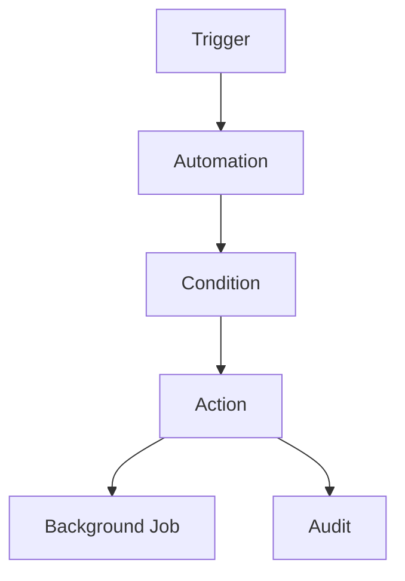
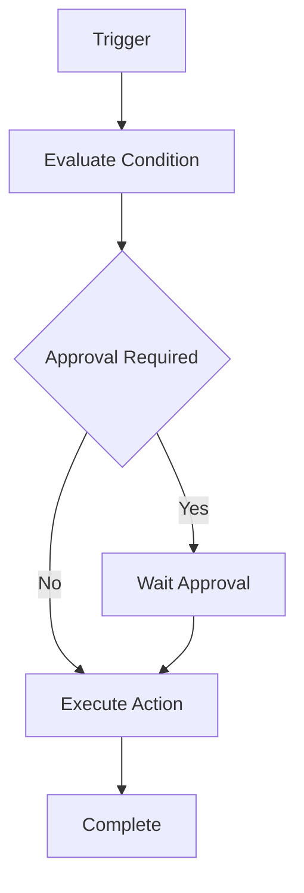
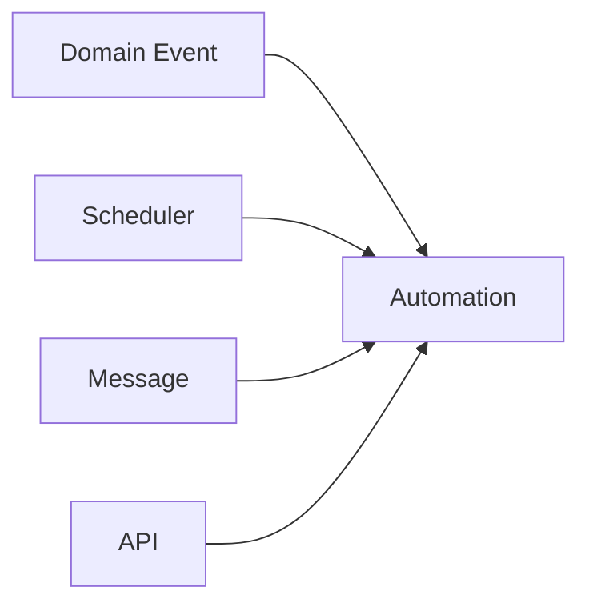
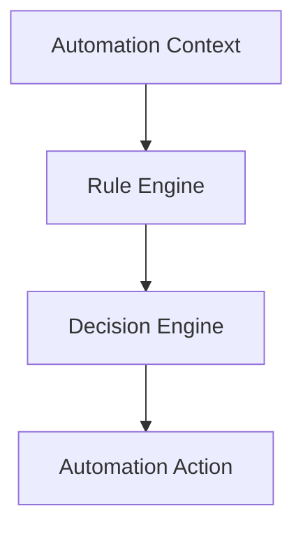
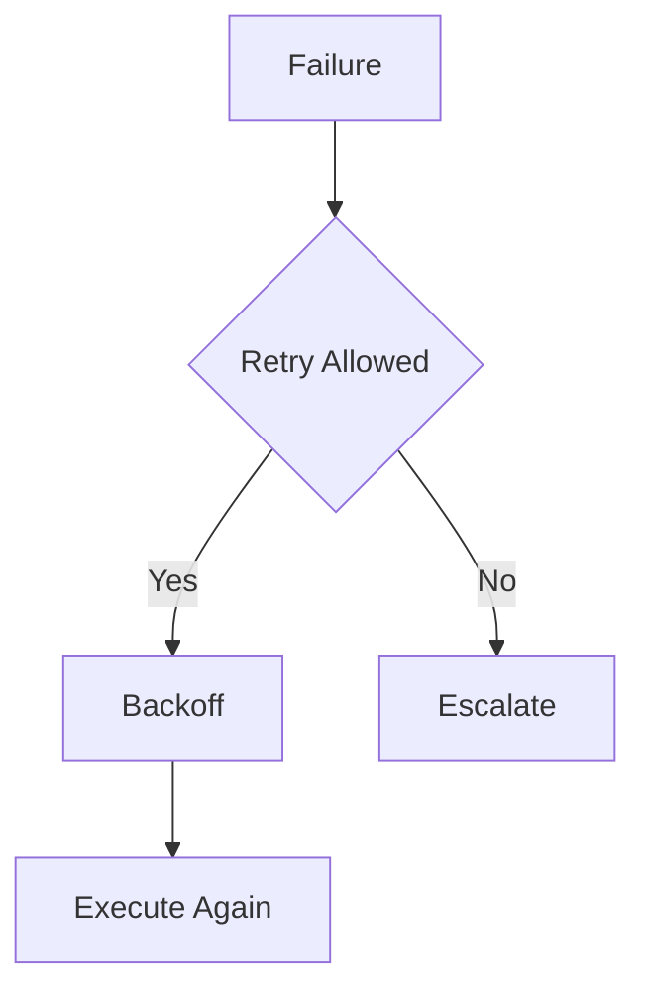
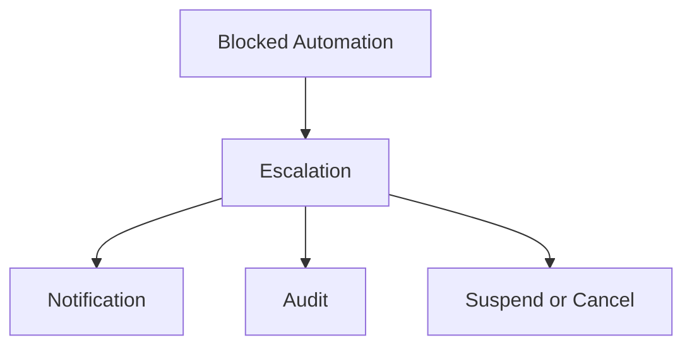
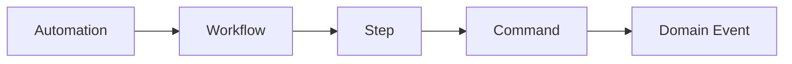
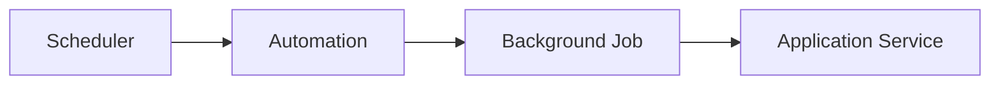

# Automation Framework

# Document Control

Document Name: Automation Framework
Document Path: knowledge/automation-framework.md
Document Type: Atlas Enterprise Canonical Specification
Version: 1.0
Status: Canonical Specification
Domain: Platform
Bounded Context: Platform
Owner: Project Atlas
Source of Truth: Atlas Automation Source of Truth
Last Updated: 2026-07-12

Related Specifications:
- knowledge/workflow-engine-framework.md
- knowledge/background-job-framework.md
- knowledge/scheduler-framework.md
- knowledge/application-service-catalog.md
- knowledge/domain-service-catalog.md
- knowledge/command-catalog.md
- knowledge/domain-event-catalog.md
- knowledge/message-contract-catalog.md
- knowledge/event-driven-architecture.md
- knowledge/integration-framework.md
- knowledge/service-catalog.md
- knowledge/system-module-catalog.md
- knowledge/api-governance-framework.md
- knowledge/projection-engine-framework.md
- knowledge/recommendation-priority-framework.md
- knowledge/rule-engine-architecture.md
- knowledge/calculation-engine-framework.md
- knowledge/simulation-engine-framework.md
- knowledge/optimization-engine-framework.md
- docs/specification/04-DomainModel.md
- docs/database/05-DatabaseDesign.md
- docs/database/06-ERD.md
- docs/api/07-API.md

# Purpose

Automation Framework defines approved Atlas automation across Workflow, Scheduler, Background Job, Application Service, Domain Service, Command, Domain Event, Message Contract, Notification, Decision Engine, Rule Engine, Projection Engine, Recommendation Engine, Integration, API, and Event Driven Architecture. It is the automation source of truth for triggers, conditions, actions, retry, timeout, escalation, audit, and performance.

# Scope

- Automation
- Automation Rule
- Automation Policy
- Automation Trigger
- Automation Condition
- Automation Action
- Automation Execution
- Automation Context
- Automation Pipeline
- Automation State
- Automation Retry
- Automation Timeout
- Automation Compensation
- Automation Approval
- Automation Escalation
- Automation Cancellation
- Automation Suspension
- Automation Resume
- Automation Completion
- Automation Failure

# Automation Principles

- Automation never bypasses Aggregate, Command, Repository, Service, Security, Workflow, Scheduler, or Background Job boundaries.
- Automation requires trigger, condition, action, retry, timeout, escalation, audit, and performance targets.
- High-impact automation requires approval strategy.
- Automation is deterministic for the same trigger, input, rule version, and configuration.
- Failed automation is visible, auditable, and recoverable.
- Automation can be suspended, resumed, cancelled, or escalated through catalog rules.

# Automation Architecture

Automation evaluates triggers and conditions, invokes rule and decision engines when required, runs catalog-approved actions through workflows, schedulers, background jobs, application services, domain services, commands, events, message contracts, projections, notifications, or integrations, and records full audit history.

# Complete Automation Catalog

The complete per-automation specifications have been split into dedicated files to keep this framework navigable while preserving the canonical automation inventory.

| Automation | Specification |
|---|---|
| ScenarioRefreshAutomation | knowledge/framework/automations/scenario-refresh-automation.md |
| RecommendationRefreshAutomation | knowledge/framework/automations/recommendation-refresh-automation.md |
| NotificationDispatchAutomation | knowledge/framework/automations/notification-dispatch-automation.md |
| BankingImportAutomation | knowledge/framework/automations/banking-import-automation.md |
| BrokerageImportAutomation | knowledge/framework/automations/brokerage-import-automation.md |
| CacheRefreshAutomation | knowledge/framework/automations/cache-refresh-automation.md |
| OutboxPublishAutomation | knowledge/framework/automations/outbox-publish-automation.md |
| InboxProcessAutomation | knowledge/framework/automations/inbox-process-automation.md |
| ReportGenerationAutomation | knowledge/framework/automations/report-generation-automation.md |
| CleanupAutomation | knowledge/framework/automations/cleanup-automation.md |
| BackupAutomation | knowledge/framework/automations/backup-automation.md |
| DecisionReviewAutomation | knowledge/framework/automations/decision-review-automation.md |

# Automation Matrix

| Automation | Workflow | Scheduler | Background Job | Application Service | Domain Service | Rule Engine | Decision Engine | Command | Domain Event | Notification | Projection | Repository | Message Contract |
|---|---|---|---|---|---|---|---|---|---|---|---|---|---|
| ScenarioRefreshAutomation | Scenario workflow | ScenarioEvaluationScheduler | ScenarioEvaluationJob | ScenarioApplicationService | ScenarioService, ScoringService | Rule Engine | Decision Engine | EvaluateScenario | ScenarioEvaluated | Dashboard notification | Scenario projection | ScenarioRepository | ScenarioEvaluatedMessage |
| RecommendationRefreshAutomation | Decision workflow | ScenarioEvaluationScheduler | ScenarioEvaluationJob | DecisionApplicationService | DecisionService, ScoringService | Rule Engine | Decision Engine | EvaluateScenario | RecommendationGenerated | Recommendation notification | Recommendation projection | DecisionRepository | RecommendationGeneratedMessage |
| NotificationDispatchAutomation | Notification workflow | NotificationDispatchScheduler | NotificationDispatchJob | NotificationApplicationService | ExplainabilityService | Rule Engine | Decision Engine | Notification delivery commands from catalog-aligned handlers | DecisionAccepted, RecommendationGenerated | Required | Notification projection | NotificationRepository | NotificationRequestedMessage |
| BankingImportAutomation | Cash flow workflow | BankingImportScheduler | BankingImportJob | BlueprintApplicationService, DashboardApplicationService | CashFlowService | Rule Engine | None | RecordIncome, RecordExpense | SalaryReceived, ExpenseRecorded | Optional | Cash flow projection | HouseholdRepository | BankingTransactionImportedMessage |
| BrokerageImportAutomation | Portfolio workflow | BrokerageImportScheduler | BrokerageImportJob | PortfolioApplicationService | PortfolioService, AllocationService | Rule Engine | None | CreatePortfolio, BuySecurity, SellSecurity | PortfolioCreated, SecurityPurchased, SecuritySold | Optional | Portfolio projection | PortfolioRepository, AssetRepository | PortfolioImportedMessage |
| CacheRefreshAutomation | Dashboard refresh workflow | CacheRefreshScheduler | CacheRefreshJob | DashboardApplicationService | CashFlowService, PortfolioService, LoanService | Rule Engine | None | Read cache refresh operation | SalaryReceived, ExpenseRecorded, PortfolioRebalanced | None | Dashboard projection | HouseholdRepository, PortfolioRepository | CacheRefreshMessage |
| OutboxPublishAutomation | Event publishing workflow | OutboxPublishScheduler | OutboxPublishJob | AdministrationApplicationService | ExplainabilityService | Rule Engine | None | Outbox publish operation | All catalog domain events | None | Event projection | AuditRepository | All catalog messages |
| InboxProcessAutomation | Inbox processing workflow | InboxProcessScheduler | InboxProcessJob | AdministrationApplicationService | ScenarioService | Rule Engine | None | Inbox process operation | All consumed domain events | None | Projection updates | AuditRepository | All consumed messages |
| ReportGenerationAutomation | Report workflow | ReportGenerationScheduler | ReportGenerationJob | ReportApplicationService | ExplainabilityService, ScenarioService | Rule Engine | Decision Engine | Report generation commands from catalog-aligned handlers | Report source events through read models | Optional | Report projection | AuditRepository | ReportGenerationRequestedMessage |
| CleanupAutomation | Administration workflow | CleanupScheduler | CleanupJob | AdministrationApplicationService | ExplainabilityService | Rule Engine | None | Cleanup operation | Audit and operational events | None | Audit projection | AuditRepository | CleanupMessage |
| BackupAutomation | Administration workflow | BackupScheduler | BackupJob | AdministrationApplicationService | ExplainabilityService | Rule Engine | None | Backup operation | Audit and backup events | Escalation on failure | Audit projection | AuditRepository | BackupCompletedMessage |
| DecisionReviewAutomation | Decision workflow | ScenarioEvaluationScheduler | ScenarioEvaluationJob | DecisionApplicationService | DecisionService, ExplainabilityService | Rule Engine | Decision Engine | AcceptRecommendation, RejectRecommendation | DecisionAccepted, DecisionRejected | Review notification | Decision projection | DecisionRepository | DecisionAcceptedMessage |

# Trigger Matrix

| Automation | Mapping | Owner | Control |
|---|---|---|---|
| ScenarioRefreshAutomation | Domain event; Scenario workflow; ScenarioEvaluationScheduler; ScenarioEvaluationJob; EvaluateScenario; ScenarioEvaluated | ScenarioApplicationService | Deterministic, authorized, audited, retry-safe |
| RecommendationRefreshAutomation | Domain event; Decision workflow; ScenarioEvaluationScheduler; ScenarioEvaluationJob; EvaluateScenario; RecommendationGenerated | DecisionApplicationService | Deterministic, authorized, audited, retry-safe |
| NotificationDispatchAutomation | Message; Notification workflow; NotificationDispatchScheduler; NotificationDispatchJob; Notification delivery commands from catalog-aligned handlers; DecisionAccepted, RecommendationGenerated | NotificationApplicationService | Deterministic, authorized, audited, retry-safe |
| BankingImportAutomation | Scheduled; Cash flow workflow; BankingImportScheduler; BankingImportJob; RecordIncome, RecordExpense; SalaryReceived, ExpenseRecorded | BlueprintApplicationService, DashboardApplicationService | Deterministic, authorized, audited, retry-safe |
| BrokerageImportAutomation | Scheduled; Portfolio workflow; BrokerageImportScheduler; BrokerageImportJob; CreatePortfolio, BuySecurity, SellSecurity; PortfolioCreated, SecurityPurchased, SecuritySold | PortfolioApplicationService | Deterministic, authorized, audited, retry-safe |
| CacheRefreshAutomation | Domain event; Dashboard refresh workflow; CacheRefreshScheduler; CacheRefreshJob; Read cache refresh operation; SalaryReceived, ExpenseRecorded, PortfolioRebalanced | DashboardApplicationService | Deterministic, authorized, audited, retry-safe |
| OutboxPublishAutomation | Outbox pending row; Event publishing workflow; OutboxPublishScheduler; OutboxPublishJob; Outbox publish operation; All catalog domain events | AdministrationApplicationService | Deterministic, authorized, audited, retry-safe |
| InboxProcessAutomation | Inbox pending row; Inbox processing workflow; InboxProcessScheduler; InboxProcessJob; Inbox process operation; All consumed domain events | AdministrationApplicationService | Deterministic, authorized, audited, retry-safe |
| ReportGenerationAutomation | Manual or scheduled; Report workflow; ReportGenerationScheduler; ReportGenerationJob; Report generation commands from catalog-aligned handlers; Report source events through read models | ReportApplicationService | Deterministic, authorized, audited, retry-safe |
| CleanupAutomation | Scheduled; Administration workflow; CleanupScheduler; CleanupJob; Cleanup operation; Audit and operational events | AdministrationApplicationService | Deterministic, authorized, audited, retry-safe |
| BackupAutomation | Scheduled; Administration workflow; BackupScheduler; BackupJob; Backup operation; Audit and backup events | AdministrationApplicationService | Deterministic, authorized, audited, retry-safe |
| DecisionReviewAutomation | Domain event; Decision workflow; ScenarioEvaluationScheduler; ScenarioEvaluationJob; AcceptRecommendation, RejectRecommendation; DecisionAccepted, DecisionRejected | DecisionApplicationService | Deterministic, authorized, audited, retry-safe |

# Condition Matrix

| Automation | Mapping | Owner | Control |
|---|---|---|---|
| ScenarioRefreshAutomation | Domain event; Scenario workflow; ScenarioEvaluationScheduler; ScenarioEvaluationJob; EvaluateScenario; ScenarioEvaluated | ScenarioApplicationService | Deterministic, authorized, audited, retry-safe |
| RecommendationRefreshAutomation | Domain event; Decision workflow; ScenarioEvaluationScheduler; ScenarioEvaluationJob; EvaluateScenario; RecommendationGenerated | DecisionApplicationService | Deterministic, authorized, audited, retry-safe |
| NotificationDispatchAutomation | Message; Notification workflow; NotificationDispatchScheduler; NotificationDispatchJob; Notification delivery commands from catalog-aligned handlers; DecisionAccepted, RecommendationGenerated | NotificationApplicationService | Deterministic, authorized, audited, retry-safe |
| BankingImportAutomation | Scheduled; Cash flow workflow; BankingImportScheduler; BankingImportJob; RecordIncome, RecordExpense; SalaryReceived, ExpenseRecorded | BlueprintApplicationService, DashboardApplicationService | Deterministic, authorized, audited, retry-safe |
| BrokerageImportAutomation | Scheduled; Portfolio workflow; BrokerageImportScheduler; BrokerageImportJob; CreatePortfolio, BuySecurity, SellSecurity; PortfolioCreated, SecurityPurchased, SecuritySold | PortfolioApplicationService | Deterministic, authorized, audited, retry-safe |
| CacheRefreshAutomation | Domain event; Dashboard refresh workflow; CacheRefreshScheduler; CacheRefreshJob; Read cache refresh operation; SalaryReceived, ExpenseRecorded, PortfolioRebalanced | DashboardApplicationService | Deterministic, authorized, audited, retry-safe |
| OutboxPublishAutomation | Outbox pending row; Event publishing workflow; OutboxPublishScheduler; OutboxPublishJob; Outbox publish operation; All catalog domain events | AdministrationApplicationService | Deterministic, authorized, audited, retry-safe |
| InboxProcessAutomation | Inbox pending row; Inbox processing workflow; InboxProcessScheduler; InboxProcessJob; Inbox process operation; All consumed domain events | AdministrationApplicationService | Deterministic, authorized, audited, retry-safe |
| ReportGenerationAutomation | Manual or scheduled; Report workflow; ReportGenerationScheduler; ReportGenerationJob; Report generation commands from catalog-aligned handlers; Report source events through read models | ReportApplicationService | Deterministic, authorized, audited, retry-safe |
| CleanupAutomation | Scheduled; Administration workflow; CleanupScheduler; CleanupJob; Cleanup operation; Audit and operational events | AdministrationApplicationService | Deterministic, authorized, audited, retry-safe |
| BackupAutomation | Scheduled; Administration workflow; BackupScheduler; BackupJob; Backup operation; Audit and backup events | AdministrationApplicationService | Deterministic, authorized, audited, retry-safe |
| DecisionReviewAutomation | Domain event; Decision workflow; ScenarioEvaluationScheduler; ScenarioEvaluationJob; AcceptRecommendation, RejectRecommendation; DecisionAccepted, DecisionRejected | DecisionApplicationService | Deterministic, authorized, audited, retry-safe |

# Action Matrix

| Automation | Mapping | Owner | Control |
|---|---|---|---|
| ScenarioRefreshAutomation | Domain event; Scenario workflow; ScenarioEvaluationScheduler; ScenarioEvaluationJob; EvaluateScenario; ScenarioEvaluated | ScenarioApplicationService | Deterministic, authorized, audited, retry-safe |
| RecommendationRefreshAutomation | Domain event; Decision workflow; ScenarioEvaluationScheduler; ScenarioEvaluationJob; EvaluateScenario; RecommendationGenerated | DecisionApplicationService | Deterministic, authorized, audited, retry-safe |
| NotificationDispatchAutomation | Message; Notification workflow; NotificationDispatchScheduler; NotificationDispatchJob; Notification delivery commands from catalog-aligned handlers; DecisionAccepted, RecommendationGenerated | NotificationApplicationService | Deterministic, authorized, audited, retry-safe |
| BankingImportAutomation | Scheduled; Cash flow workflow; BankingImportScheduler; BankingImportJob; RecordIncome, RecordExpense; SalaryReceived, ExpenseRecorded | BlueprintApplicationService, DashboardApplicationService | Deterministic, authorized, audited, retry-safe |
| BrokerageImportAutomation | Scheduled; Portfolio workflow; BrokerageImportScheduler; BrokerageImportJob; CreatePortfolio, BuySecurity, SellSecurity; PortfolioCreated, SecurityPurchased, SecuritySold | PortfolioApplicationService | Deterministic, authorized, audited, retry-safe |
| CacheRefreshAutomation | Domain event; Dashboard refresh workflow; CacheRefreshScheduler; CacheRefreshJob; Read cache refresh operation; SalaryReceived, ExpenseRecorded, PortfolioRebalanced | DashboardApplicationService | Deterministic, authorized, audited, retry-safe |
| OutboxPublishAutomation | Outbox pending row; Event publishing workflow; OutboxPublishScheduler; OutboxPublishJob; Outbox publish operation; All catalog domain events | AdministrationApplicationService | Deterministic, authorized, audited, retry-safe |
| InboxProcessAutomation | Inbox pending row; Inbox processing workflow; InboxProcessScheduler; InboxProcessJob; Inbox process operation; All consumed domain events | AdministrationApplicationService | Deterministic, authorized, audited, retry-safe |
| ReportGenerationAutomation | Manual or scheduled; Report workflow; ReportGenerationScheduler; ReportGenerationJob; Report generation commands from catalog-aligned handlers; Report source events through read models | ReportApplicationService | Deterministic, authorized, audited, retry-safe |
| CleanupAutomation | Scheduled; Administration workflow; CleanupScheduler; CleanupJob; Cleanup operation; Audit and operational events | AdministrationApplicationService | Deterministic, authorized, audited, retry-safe |
| BackupAutomation | Scheduled; Administration workflow; BackupScheduler; BackupJob; Backup operation; Audit and backup events | AdministrationApplicationService | Deterministic, authorized, audited, retry-safe |
| DecisionReviewAutomation | Domain event; Decision workflow; ScenarioEvaluationScheduler; ScenarioEvaluationJob; AcceptRecommendation, RejectRecommendation; DecisionAccepted, DecisionRejected | DecisionApplicationService | Deterministic, authorized, audited, retry-safe |

# Workflow Matrix

| Automation | Mapping | Owner | Control |
|---|---|---|---|
| ScenarioRefreshAutomation | Domain event; Scenario workflow; ScenarioEvaluationScheduler; ScenarioEvaluationJob; EvaluateScenario; ScenarioEvaluated | ScenarioApplicationService | Deterministic, authorized, audited, retry-safe |
| RecommendationRefreshAutomation | Domain event; Decision workflow; ScenarioEvaluationScheduler; ScenarioEvaluationJob; EvaluateScenario; RecommendationGenerated | DecisionApplicationService | Deterministic, authorized, audited, retry-safe |
| NotificationDispatchAutomation | Message; Notification workflow; NotificationDispatchScheduler; NotificationDispatchJob; Notification delivery commands from catalog-aligned handlers; DecisionAccepted, RecommendationGenerated | NotificationApplicationService | Deterministic, authorized, audited, retry-safe |
| BankingImportAutomation | Scheduled; Cash flow workflow; BankingImportScheduler; BankingImportJob; RecordIncome, RecordExpense; SalaryReceived, ExpenseRecorded | BlueprintApplicationService, DashboardApplicationService | Deterministic, authorized, audited, retry-safe |
| BrokerageImportAutomation | Scheduled; Portfolio workflow; BrokerageImportScheduler; BrokerageImportJob; CreatePortfolio, BuySecurity, SellSecurity; PortfolioCreated, SecurityPurchased, SecuritySold | PortfolioApplicationService | Deterministic, authorized, audited, retry-safe |
| CacheRefreshAutomation | Domain event; Dashboard refresh workflow; CacheRefreshScheduler; CacheRefreshJob; Read cache refresh operation; SalaryReceived, ExpenseRecorded, PortfolioRebalanced | DashboardApplicationService | Deterministic, authorized, audited, retry-safe |
| OutboxPublishAutomation | Outbox pending row; Event publishing workflow; OutboxPublishScheduler; OutboxPublishJob; Outbox publish operation; All catalog domain events | AdministrationApplicationService | Deterministic, authorized, audited, retry-safe |
| InboxProcessAutomation | Inbox pending row; Inbox processing workflow; InboxProcessScheduler; InboxProcessJob; Inbox process operation; All consumed domain events | AdministrationApplicationService | Deterministic, authorized, audited, retry-safe |
| ReportGenerationAutomation | Manual or scheduled; Report workflow; ReportGenerationScheduler; ReportGenerationJob; Report generation commands from catalog-aligned handlers; Report source events through read models | ReportApplicationService | Deterministic, authorized, audited, retry-safe |
| CleanupAutomation | Scheduled; Administration workflow; CleanupScheduler; CleanupJob; Cleanup operation; Audit and operational events | AdministrationApplicationService | Deterministic, authorized, audited, retry-safe |
| BackupAutomation | Scheduled; Administration workflow; BackupScheduler; BackupJob; Backup operation; Audit and backup events | AdministrationApplicationService | Deterministic, authorized, audited, retry-safe |
| DecisionReviewAutomation | Domain event; Decision workflow; ScenarioEvaluationScheduler; ScenarioEvaluationJob; AcceptRecommendation, RejectRecommendation; DecisionAccepted, DecisionRejected | DecisionApplicationService | Deterministic, authorized, audited, retry-safe |

# Scheduler Matrix

| Automation | Mapping | Owner | Control |
|---|---|---|---|
| ScenarioRefreshAutomation | Domain event; Scenario workflow; ScenarioEvaluationScheduler; ScenarioEvaluationJob; EvaluateScenario; ScenarioEvaluated | ScenarioApplicationService | Deterministic, authorized, audited, retry-safe |
| RecommendationRefreshAutomation | Domain event; Decision workflow; ScenarioEvaluationScheduler; ScenarioEvaluationJob; EvaluateScenario; RecommendationGenerated | DecisionApplicationService | Deterministic, authorized, audited, retry-safe |
| NotificationDispatchAutomation | Message; Notification workflow; NotificationDispatchScheduler; NotificationDispatchJob; Notification delivery commands from catalog-aligned handlers; DecisionAccepted, RecommendationGenerated | NotificationApplicationService | Deterministic, authorized, audited, retry-safe |
| BankingImportAutomation | Scheduled; Cash flow workflow; BankingImportScheduler; BankingImportJob; RecordIncome, RecordExpense; SalaryReceived, ExpenseRecorded | BlueprintApplicationService, DashboardApplicationService | Deterministic, authorized, audited, retry-safe |
| BrokerageImportAutomation | Scheduled; Portfolio workflow; BrokerageImportScheduler; BrokerageImportJob; CreatePortfolio, BuySecurity, SellSecurity; PortfolioCreated, SecurityPurchased, SecuritySold | PortfolioApplicationService | Deterministic, authorized, audited, retry-safe |
| CacheRefreshAutomation | Domain event; Dashboard refresh workflow; CacheRefreshScheduler; CacheRefreshJob; Read cache refresh operation; SalaryReceived, ExpenseRecorded, PortfolioRebalanced | DashboardApplicationService | Deterministic, authorized, audited, retry-safe |
| OutboxPublishAutomation | Outbox pending row; Event publishing workflow; OutboxPublishScheduler; OutboxPublishJob; Outbox publish operation; All catalog domain events | AdministrationApplicationService | Deterministic, authorized, audited, retry-safe |
| InboxProcessAutomation | Inbox pending row; Inbox processing workflow; InboxProcessScheduler; InboxProcessJob; Inbox process operation; All consumed domain events | AdministrationApplicationService | Deterministic, authorized, audited, retry-safe |
| ReportGenerationAutomation | Manual or scheduled; Report workflow; ReportGenerationScheduler; ReportGenerationJob; Report generation commands from catalog-aligned handlers; Report source events through read models | ReportApplicationService | Deterministic, authorized, audited, retry-safe |
| CleanupAutomation | Scheduled; Administration workflow; CleanupScheduler; CleanupJob; Cleanup operation; Audit and operational events | AdministrationApplicationService | Deterministic, authorized, audited, retry-safe |
| BackupAutomation | Scheduled; Administration workflow; BackupScheduler; BackupJob; Backup operation; Audit and backup events | AdministrationApplicationService | Deterministic, authorized, audited, retry-safe |
| DecisionReviewAutomation | Domain event; Decision workflow; ScenarioEvaluationScheduler; ScenarioEvaluationJob; AcceptRecommendation, RejectRecommendation; DecisionAccepted, DecisionRejected | DecisionApplicationService | Deterministic, authorized, audited, retry-safe |

# Background Job Matrix

| Automation | Mapping | Owner | Control |
|---|---|---|---|
| ScenarioRefreshAutomation | Domain event; Scenario workflow; ScenarioEvaluationScheduler; ScenarioEvaluationJob; EvaluateScenario; ScenarioEvaluated | ScenarioApplicationService | Deterministic, authorized, audited, retry-safe |
| RecommendationRefreshAutomation | Domain event; Decision workflow; ScenarioEvaluationScheduler; ScenarioEvaluationJob; EvaluateScenario; RecommendationGenerated | DecisionApplicationService | Deterministic, authorized, audited, retry-safe |
| NotificationDispatchAutomation | Message; Notification workflow; NotificationDispatchScheduler; NotificationDispatchJob; Notification delivery commands from catalog-aligned handlers; DecisionAccepted, RecommendationGenerated | NotificationApplicationService | Deterministic, authorized, audited, retry-safe |
| BankingImportAutomation | Scheduled; Cash flow workflow; BankingImportScheduler; BankingImportJob; RecordIncome, RecordExpense; SalaryReceived, ExpenseRecorded | BlueprintApplicationService, DashboardApplicationService | Deterministic, authorized, audited, retry-safe |
| BrokerageImportAutomation | Scheduled; Portfolio workflow; BrokerageImportScheduler; BrokerageImportJob; CreatePortfolio, BuySecurity, SellSecurity; PortfolioCreated, SecurityPurchased, SecuritySold | PortfolioApplicationService | Deterministic, authorized, audited, retry-safe |
| CacheRefreshAutomation | Domain event; Dashboard refresh workflow; CacheRefreshScheduler; CacheRefreshJob; Read cache refresh operation; SalaryReceived, ExpenseRecorded, PortfolioRebalanced | DashboardApplicationService | Deterministic, authorized, audited, retry-safe |
| OutboxPublishAutomation | Outbox pending row; Event publishing workflow; OutboxPublishScheduler; OutboxPublishJob; Outbox publish operation; All catalog domain events | AdministrationApplicationService | Deterministic, authorized, audited, retry-safe |
| InboxProcessAutomation | Inbox pending row; Inbox processing workflow; InboxProcessScheduler; InboxProcessJob; Inbox process operation; All consumed domain events | AdministrationApplicationService | Deterministic, authorized, audited, retry-safe |
| ReportGenerationAutomation | Manual or scheduled; Report workflow; ReportGenerationScheduler; ReportGenerationJob; Report generation commands from catalog-aligned handlers; Report source events through read models | ReportApplicationService | Deterministic, authorized, audited, retry-safe |
| CleanupAutomation | Scheduled; Administration workflow; CleanupScheduler; CleanupJob; Cleanup operation; Audit and operational events | AdministrationApplicationService | Deterministic, authorized, audited, retry-safe |
| BackupAutomation | Scheduled; Administration workflow; BackupScheduler; BackupJob; Backup operation; Audit and backup events | AdministrationApplicationService | Deterministic, authorized, audited, retry-safe |
| DecisionReviewAutomation | Domain event; Decision workflow; ScenarioEvaluationScheduler; ScenarioEvaluationJob; AcceptRecommendation, RejectRecommendation; DecisionAccepted, DecisionRejected | DecisionApplicationService | Deterministic, authorized, audited, retry-safe |

# Command Matrix

| Automation | Mapping | Owner | Control |
|---|---|---|---|
| ScenarioRefreshAutomation | Domain event; Scenario workflow; ScenarioEvaluationScheduler; ScenarioEvaluationJob; EvaluateScenario; ScenarioEvaluated | ScenarioApplicationService | Deterministic, authorized, audited, retry-safe |
| RecommendationRefreshAutomation | Domain event; Decision workflow; ScenarioEvaluationScheduler; ScenarioEvaluationJob; EvaluateScenario; RecommendationGenerated | DecisionApplicationService | Deterministic, authorized, audited, retry-safe |
| NotificationDispatchAutomation | Message; Notification workflow; NotificationDispatchScheduler; NotificationDispatchJob; Notification delivery commands from catalog-aligned handlers; DecisionAccepted, RecommendationGenerated | NotificationApplicationService | Deterministic, authorized, audited, retry-safe |
| BankingImportAutomation | Scheduled; Cash flow workflow; BankingImportScheduler; BankingImportJob; RecordIncome, RecordExpense; SalaryReceived, ExpenseRecorded | BlueprintApplicationService, DashboardApplicationService | Deterministic, authorized, audited, retry-safe |
| BrokerageImportAutomation | Scheduled; Portfolio workflow; BrokerageImportScheduler; BrokerageImportJob; CreatePortfolio, BuySecurity, SellSecurity; PortfolioCreated, SecurityPurchased, SecuritySold | PortfolioApplicationService | Deterministic, authorized, audited, retry-safe |
| CacheRefreshAutomation | Domain event; Dashboard refresh workflow; CacheRefreshScheduler; CacheRefreshJob; Read cache refresh operation; SalaryReceived, ExpenseRecorded, PortfolioRebalanced | DashboardApplicationService | Deterministic, authorized, audited, retry-safe |
| OutboxPublishAutomation | Outbox pending row; Event publishing workflow; OutboxPublishScheduler; OutboxPublishJob; Outbox publish operation; All catalog domain events | AdministrationApplicationService | Deterministic, authorized, audited, retry-safe |
| InboxProcessAutomation | Inbox pending row; Inbox processing workflow; InboxProcessScheduler; InboxProcessJob; Inbox process operation; All consumed domain events | AdministrationApplicationService | Deterministic, authorized, audited, retry-safe |
| ReportGenerationAutomation | Manual or scheduled; Report workflow; ReportGenerationScheduler; ReportGenerationJob; Report generation commands from catalog-aligned handlers; Report source events through read models | ReportApplicationService | Deterministic, authorized, audited, retry-safe |
| CleanupAutomation | Scheduled; Administration workflow; CleanupScheduler; CleanupJob; Cleanup operation; Audit and operational events | AdministrationApplicationService | Deterministic, authorized, audited, retry-safe |
| BackupAutomation | Scheduled; Administration workflow; BackupScheduler; BackupJob; Backup operation; Audit and backup events | AdministrationApplicationService | Deterministic, authorized, audited, retry-safe |
| DecisionReviewAutomation | Domain event; Decision workflow; ScenarioEvaluationScheduler; ScenarioEvaluationJob; AcceptRecommendation, RejectRecommendation; DecisionAccepted, DecisionRejected | DecisionApplicationService | Deterministic, authorized, audited, retry-safe |

# Domain Event Matrix

| Automation | Mapping | Owner | Control |
|---|---|---|---|
| ScenarioRefreshAutomation | Domain event; Scenario workflow; ScenarioEvaluationScheduler; ScenarioEvaluationJob; EvaluateScenario; ScenarioEvaluated | ScenarioApplicationService | Deterministic, authorized, audited, retry-safe |
| RecommendationRefreshAutomation | Domain event; Decision workflow; ScenarioEvaluationScheduler; ScenarioEvaluationJob; EvaluateScenario; RecommendationGenerated | DecisionApplicationService | Deterministic, authorized, audited, retry-safe |
| NotificationDispatchAutomation | Message; Notification workflow; NotificationDispatchScheduler; NotificationDispatchJob; Notification delivery commands from catalog-aligned handlers; DecisionAccepted, RecommendationGenerated | NotificationApplicationService | Deterministic, authorized, audited, retry-safe |
| BankingImportAutomation | Scheduled; Cash flow workflow; BankingImportScheduler; BankingImportJob; RecordIncome, RecordExpense; SalaryReceived, ExpenseRecorded | BlueprintApplicationService, DashboardApplicationService | Deterministic, authorized, audited, retry-safe |
| BrokerageImportAutomation | Scheduled; Portfolio workflow; BrokerageImportScheduler; BrokerageImportJob; CreatePortfolio, BuySecurity, SellSecurity; PortfolioCreated, SecurityPurchased, SecuritySold | PortfolioApplicationService | Deterministic, authorized, audited, retry-safe |
| CacheRefreshAutomation | Domain event; Dashboard refresh workflow; CacheRefreshScheduler; CacheRefreshJob; Read cache refresh operation; SalaryReceived, ExpenseRecorded, PortfolioRebalanced | DashboardApplicationService | Deterministic, authorized, audited, retry-safe |
| OutboxPublishAutomation | Outbox pending row; Event publishing workflow; OutboxPublishScheduler; OutboxPublishJob; Outbox publish operation; All catalog domain events | AdministrationApplicationService | Deterministic, authorized, audited, retry-safe |
| InboxProcessAutomation | Inbox pending row; Inbox processing workflow; InboxProcessScheduler; InboxProcessJob; Inbox process operation; All consumed domain events | AdministrationApplicationService | Deterministic, authorized, audited, retry-safe |
| ReportGenerationAutomation | Manual or scheduled; Report workflow; ReportGenerationScheduler; ReportGenerationJob; Report generation commands from catalog-aligned handlers; Report source events through read models | ReportApplicationService | Deterministic, authorized, audited, retry-safe |
| CleanupAutomation | Scheduled; Administration workflow; CleanupScheduler; CleanupJob; Cleanup operation; Audit and operational events | AdministrationApplicationService | Deterministic, authorized, audited, retry-safe |
| BackupAutomation | Scheduled; Administration workflow; BackupScheduler; BackupJob; Backup operation; Audit and backup events | AdministrationApplicationService | Deterministic, authorized, audited, retry-safe |
| DecisionReviewAutomation | Domain event; Decision workflow; ScenarioEvaluationScheduler; ScenarioEvaluationJob; AcceptRecommendation, RejectRecommendation; DecisionAccepted, DecisionRejected | DecisionApplicationService | Deterministic, authorized, audited, retry-safe |

# Rule Engine Matrix

| Automation | Mapping | Owner | Control |
|---|---|---|---|
| ScenarioRefreshAutomation | Domain event; Scenario workflow; ScenarioEvaluationScheduler; ScenarioEvaluationJob; EvaluateScenario; ScenarioEvaluated | ScenarioApplicationService | Deterministic, authorized, audited, retry-safe |
| RecommendationRefreshAutomation | Domain event; Decision workflow; ScenarioEvaluationScheduler; ScenarioEvaluationJob; EvaluateScenario; RecommendationGenerated | DecisionApplicationService | Deterministic, authorized, audited, retry-safe |
| NotificationDispatchAutomation | Message; Notification workflow; NotificationDispatchScheduler; NotificationDispatchJob; Notification delivery commands from catalog-aligned handlers; DecisionAccepted, RecommendationGenerated | NotificationApplicationService | Deterministic, authorized, audited, retry-safe |
| BankingImportAutomation | Scheduled; Cash flow workflow; BankingImportScheduler; BankingImportJob; RecordIncome, RecordExpense; SalaryReceived, ExpenseRecorded | BlueprintApplicationService, DashboardApplicationService | Deterministic, authorized, audited, retry-safe |
| BrokerageImportAutomation | Scheduled; Portfolio workflow; BrokerageImportScheduler; BrokerageImportJob; CreatePortfolio, BuySecurity, SellSecurity; PortfolioCreated, SecurityPurchased, SecuritySold | PortfolioApplicationService | Deterministic, authorized, audited, retry-safe |
| CacheRefreshAutomation | Domain event; Dashboard refresh workflow; CacheRefreshScheduler; CacheRefreshJob; Read cache refresh operation; SalaryReceived, ExpenseRecorded, PortfolioRebalanced | DashboardApplicationService | Deterministic, authorized, audited, retry-safe |
| OutboxPublishAutomation | Outbox pending row; Event publishing workflow; OutboxPublishScheduler; OutboxPublishJob; Outbox publish operation; All catalog domain events | AdministrationApplicationService | Deterministic, authorized, audited, retry-safe |
| InboxProcessAutomation | Inbox pending row; Inbox processing workflow; InboxProcessScheduler; InboxProcessJob; Inbox process operation; All consumed domain events | AdministrationApplicationService | Deterministic, authorized, audited, retry-safe |
| ReportGenerationAutomation | Manual or scheduled; Report workflow; ReportGenerationScheduler; ReportGenerationJob; Report generation commands from catalog-aligned handlers; Report source events through read models | ReportApplicationService | Deterministic, authorized, audited, retry-safe |
| CleanupAutomation | Scheduled; Administration workflow; CleanupScheduler; CleanupJob; Cleanup operation; Audit and operational events | AdministrationApplicationService | Deterministic, authorized, audited, retry-safe |
| BackupAutomation | Scheduled; Administration workflow; BackupScheduler; BackupJob; Backup operation; Audit and backup events | AdministrationApplicationService | Deterministic, authorized, audited, retry-safe |
| DecisionReviewAutomation | Domain event; Decision workflow; ScenarioEvaluationScheduler; ScenarioEvaluationJob; AcceptRecommendation, RejectRecommendation; DecisionAccepted, DecisionRejected | DecisionApplicationService | Deterministic, authorized, audited, retry-safe |

# Decision Engine Matrix

| Automation | Mapping | Owner | Control |
|---|---|---|---|
| ScenarioRefreshAutomation | Domain event; Scenario workflow; ScenarioEvaluationScheduler; ScenarioEvaluationJob; EvaluateScenario; ScenarioEvaluated | ScenarioApplicationService | Deterministic, authorized, audited, retry-safe |
| RecommendationRefreshAutomation | Domain event; Decision workflow; ScenarioEvaluationScheduler; ScenarioEvaluationJob; EvaluateScenario; RecommendationGenerated | DecisionApplicationService | Deterministic, authorized, audited, retry-safe |
| NotificationDispatchAutomation | Message; Notification workflow; NotificationDispatchScheduler; NotificationDispatchJob; Notification delivery commands from catalog-aligned handlers; DecisionAccepted, RecommendationGenerated | NotificationApplicationService | Deterministic, authorized, audited, retry-safe |
| BankingImportAutomation | Scheduled; Cash flow workflow; BankingImportScheduler; BankingImportJob; RecordIncome, RecordExpense; SalaryReceived, ExpenseRecorded | BlueprintApplicationService, DashboardApplicationService | Deterministic, authorized, audited, retry-safe |
| BrokerageImportAutomation | Scheduled; Portfolio workflow; BrokerageImportScheduler; BrokerageImportJob; CreatePortfolio, BuySecurity, SellSecurity; PortfolioCreated, SecurityPurchased, SecuritySold | PortfolioApplicationService | Deterministic, authorized, audited, retry-safe |
| CacheRefreshAutomation | Domain event; Dashboard refresh workflow; CacheRefreshScheduler; CacheRefreshJob; Read cache refresh operation; SalaryReceived, ExpenseRecorded, PortfolioRebalanced | DashboardApplicationService | Deterministic, authorized, audited, retry-safe |
| OutboxPublishAutomation | Outbox pending row; Event publishing workflow; OutboxPublishScheduler; OutboxPublishJob; Outbox publish operation; All catalog domain events | AdministrationApplicationService | Deterministic, authorized, audited, retry-safe |
| InboxProcessAutomation | Inbox pending row; Inbox processing workflow; InboxProcessScheduler; InboxProcessJob; Inbox process operation; All consumed domain events | AdministrationApplicationService | Deterministic, authorized, audited, retry-safe |
| ReportGenerationAutomation | Manual or scheduled; Report workflow; ReportGenerationScheduler; ReportGenerationJob; Report generation commands from catalog-aligned handlers; Report source events through read models | ReportApplicationService | Deterministic, authorized, audited, retry-safe |
| CleanupAutomation | Scheduled; Administration workflow; CleanupScheduler; CleanupJob; Cleanup operation; Audit and operational events | AdministrationApplicationService | Deterministic, authorized, audited, retry-safe |
| BackupAutomation | Scheduled; Administration workflow; BackupScheduler; BackupJob; Backup operation; Audit and backup events | AdministrationApplicationService | Deterministic, authorized, audited, retry-safe |
| DecisionReviewAutomation | Domain event; Decision workflow; ScenarioEvaluationScheduler; ScenarioEvaluationJob; AcceptRecommendation, RejectRecommendation; DecisionAccepted, DecisionRejected | DecisionApplicationService | Deterministic, authorized, audited, retry-safe |

# Projection Matrix

| Automation | Mapping | Owner | Control |
|---|---|---|---|
| ScenarioRefreshAutomation | Domain event; Scenario workflow; ScenarioEvaluationScheduler; ScenarioEvaluationJob; EvaluateScenario; ScenarioEvaluated | ScenarioApplicationService | Deterministic, authorized, audited, retry-safe |
| RecommendationRefreshAutomation | Domain event; Decision workflow; ScenarioEvaluationScheduler; ScenarioEvaluationJob; EvaluateScenario; RecommendationGenerated | DecisionApplicationService | Deterministic, authorized, audited, retry-safe |
| NotificationDispatchAutomation | Message; Notification workflow; NotificationDispatchScheduler; NotificationDispatchJob; Notification delivery commands from catalog-aligned handlers; DecisionAccepted, RecommendationGenerated | NotificationApplicationService | Deterministic, authorized, audited, retry-safe |
| BankingImportAutomation | Scheduled; Cash flow workflow; BankingImportScheduler; BankingImportJob; RecordIncome, RecordExpense; SalaryReceived, ExpenseRecorded | BlueprintApplicationService, DashboardApplicationService | Deterministic, authorized, audited, retry-safe |
| BrokerageImportAutomation | Scheduled; Portfolio workflow; BrokerageImportScheduler; BrokerageImportJob; CreatePortfolio, BuySecurity, SellSecurity; PortfolioCreated, SecurityPurchased, SecuritySold | PortfolioApplicationService | Deterministic, authorized, audited, retry-safe |
| CacheRefreshAutomation | Domain event; Dashboard refresh workflow; CacheRefreshScheduler; CacheRefreshJob; Read cache refresh operation; SalaryReceived, ExpenseRecorded, PortfolioRebalanced | DashboardApplicationService | Deterministic, authorized, audited, retry-safe |
| OutboxPublishAutomation | Outbox pending row; Event publishing workflow; OutboxPublishScheduler; OutboxPublishJob; Outbox publish operation; All catalog domain events | AdministrationApplicationService | Deterministic, authorized, audited, retry-safe |
| InboxProcessAutomation | Inbox pending row; Inbox processing workflow; InboxProcessScheduler; InboxProcessJob; Inbox process operation; All consumed domain events | AdministrationApplicationService | Deterministic, authorized, audited, retry-safe |
| ReportGenerationAutomation | Manual or scheduled; Report workflow; ReportGenerationScheduler; ReportGenerationJob; Report generation commands from catalog-aligned handlers; Report source events through read models | ReportApplicationService | Deterministic, authorized, audited, retry-safe |
| CleanupAutomation | Scheduled; Administration workflow; CleanupScheduler; CleanupJob; Cleanup operation; Audit and operational events | AdministrationApplicationService | Deterministic, authorized, audited, retry-safe |
| BackupAutomation | Scheduled; Administration workflow; BackupScheduler; BackupJob; Backup operation; Audit and backup events | AdministrationApplicationService | Deterministic, authorized, audited, retry-safe |
| DecisionReviewAutomation | Domain event; Decision workflow; ScenarioEvaluationScheduler; ScenarioEvaluationJob; AcceptRecommendation, RejectRecommendation; DecisionAccepted, DecisionRejected | DecisionApplicationService | Deterministic, authorized, audited, retry-safe |

# Notification Matrix

| Automation | Mapping | Owner | Control |
|---|---|---|---|
| ScenarioRefreshAutomation | Domain event; Scenario workflow; ScenarioEvaluationScheduler; ScenarioEvaluationJob; EvaluateScenario; ScenarioEvaluated | ScenarioApplicationService | Deterministic, authorized, audited, retry-safe |
| RecommendationRefreshAutomation | Domain event; Decision workflow; ScenarioEvaluationScheduler; ScenarioEvaluationJob; EvaluateScenario; RecommendationGenerated | DecisionApplicationService | Deterministic, authorized, audited, retry-safe |
| NotificationDispatchAutomation | Message; Notification workflow; NotificationDispatchScheduler; NotificationDispatchJob; Notification delivery commands from catalog-aligned handlers; DecisionAccepted, RecommendationGenerated | NotificationApplicationService | Deterministic, authorized, audited, retry-safe |
| BankingImportAutomation | Scheduled; Cash flow workflow; BankingImportScheduler; BankingImportJob; RecordIncome, RecordExpense; SalaryReceived, ExpenseRecorded | BlueprintApplicationService, DashboardApplicationService | Deterministic, authorized, audited, retry-safe |
| BrokerageImportAutomation | Scheduled; Portfolio workflow; BrokerageImportScheduler; BrokerageImportJob; CreatePortfolio, BuySecurity, SellSecurity; PortfolioCreated, SecurityPurchased, SecuritySold | PortfolioApplicationService | Deterministic, authorized, audited, retry-safe |
| CacheRefreshAutomation | Domain event; Dashboard refresh workflow; CacheRefreshScheduler; CacheRefreshJob; Read cache refresh operation; SalaryReceived, ExpenseRecorded, PortfolioRebalanced | DashboardApplicationService | Deterministic, authorized, audited, retry-safe |
| OutboxPublishAutomation | Outbox pending row; Event publishing workflow; OutboxPublishScheduler; OutboxPublishJob; Outbox publish operation; All catalog domain events | AdministrationApplicationService | Deterministic, authorized, audited, retry-safe |
| InboxProcessAutomation | Inbox pending row; Inbox processing workflow; InboxProcessScheduler; InboxProcessJob; Inbox process operation; All consumed domain events | AdministrationApplicationService | Deterministic, authorized, audited, retry-safe |
| ReportGenerationAutomation | Manual or scheduled; Report workflow; ReportGenerationScheduler; ReportGenerationJob; Report generation commands from catalog-aligned handlers; Report source events through read models | ReportApplicationService | Deterministic, authorized, audited, retry-safe |
| CleanupAutomation | Scheduled; Administration workflow; CleanupScheduler; CleanupJob; Cleanup operation; Audit and operational events | AdministrationApplicationService | Deterministic, authorized, audited, retry-safe |
| BackupAutomation | Scheduled; Administration workflow; BackupScheduler; BackupJob; Backup operation; Audit and backup events | AdministrationApplicationService | Deterministic, authorized, audited, retry-safe |
| DecisionReviewAutomation | Domain event; Decision workflow; ScenarioEvaluationScheduler; ScenarioEvaluationJob; AcceptRecommendation, RejectRecommendation; DecisionAccepted, DecisionRejected | DecisionApplicationService | Deterministic, authorized, audited, retry-safe |

# Retry Strategy

- Retry Strategy rule 1 preserves bounded execution, deterministic state, idempotency, checkpoint safety, approval safety, escalation visibility, compensation ownership, audit, metrics, and catalog error handling.
- Retry Strategy rule 2 preserves bounded execution, deterministic state, idempotency, checkpoint safety, approval safety, escalation visibility, compensation ownership, audit, metrics, and catalog error handling.
- Retry Strategy rule 3 preserves bounded execution, deterministic state, idempotency, checkpoint safety, approval safety, escalation visibility, compensation ownership, audit, metrics, and catalog error handling.
- Retry Strategy rule 4 preserves bounded execution, deterministic state, idempotency, checkpoint safety, approval safety, escalation visibility, compensation ownership, audit, metrics, and catalog error handling.
- Retry Strategy rule 5 preserves bounded execution, deterministic state, idempotency, checkpoint safety, approval safety, escalation visibility, compensation ownership, audit, metrics, and catalog error handling.
- Retry Strategy rule 6 preserves bounded execution, deterministic state, idempotency, checkpoint safety, approval safety, escalation visibility, compensation ownership, audit, metrics, and catalog error handling.
- Retry Strategy rule 7 preserves bounded execution, deterministic state, idempotency, checkpoint safety, approval safety, escalation visibility, compensation ownership, audit, metrics, and catalog error handling.
- Retry Strategy rule 8 preserves bounded execution, deterministic state, idempotency, checkpoint safety, approval safety, escalation visibility, compensation ownership, audit, metrics, and catalog error handling.
- Retry Strategy rule 9 preserves bounded execution, deterministic state, idempotency, checkpoint safety, approval safety, escalation visibility, compensation ownership, audit, metrics, and catalog error handling.
- Retry Strategy rule 10 preserves bounded execution, deterministic state, idempotency, checkpoint safety, approval safety, escalation visibility, compensation ownership, audit, metrics, and catalog error handling.
- Retry Strategy rule 11 preserves bounded execution, deterministic state, idempotency, checkpoint safety, approval safety, escalation visibility, compensation ownership, audit, metrics, and catalog error handling.
- Retry Strategy rule 12 preserves bounded execution, deterministic state, idempotency, checkpoint safety, approval safety, escalation visibility, compensation ownership, audit, metrics, and catalog error handling.

# Compensation Strategy

- Compensation Strategy rule 1 preserves bounded execution, deterministic state, idempotency, checkpoint safety, approval safety, escalation visibility, compensation ownership, audit, metrics, and catalog error handling.
- Compensation Strategy rule 2 preserves bounded execution, deterministic state, idempotency, checkpoint safety, approval safety, escalation visibility, compensation ownership, audit, metrics, and catalog error handling.
- Compensation Strategy rule 3 preserves bounded execution, deterministic state, idempotency, checkpoint safety, approval safety, escalation visibility, compensation ownership, audit, metrics, and catalog error handling.
- Compensation Strategy rule 4 preserves bounded execution, deterministic state, idempotency, checkpoint safety, approval safety, escalation visibility, compensation ownership, audit, metrics, and catalog error handling.
- Compensation Strategy rule 5 preserves bounded execution, deterministic state, idempotency, checkpoint safety, approval safety, escalation visibility, compensation ownership, audit, metrics, and catalog error handling.
- Compensation Strategy rule 6 preserves bounded execution, deterministic state, idempotency, checkpoint safety, approval safety, escalation visibility, compensation ownership, audit, metrics, and catalog error handling.
- Compensation Strategy rule 7 preserves bounded execution, deterministic state, idempotency, checkpoint safety, approval safety, escalation visibility, compensation ownership, audit, metrics, and catalog error handling.
- Compensation Strategy rule 8 preserves bounded execution, deterministic state, idempotency, checkpoint safety, approval safety, escalation visibility, compensation ownership, audit, metrics, and catalog error handling.
- Compensation Strategy rule 9 preserves bounded execution, deterministic state, idempotency, checkpoint safety, approval safety, escalation visibility, compensation ownership, audit, metrics, and catalog error handling.
- Compensation Strategy rule 10 preserves bounded execution, deterministic state, idempotency, checkpoint safety, approval safety, escalation visibility, compensation ownership, audit, metrics, and catalog error handling.
- Compensation Strategy rule 11 preserves bounded execution, deterministic state, idempotency, checkpoint safety, approval safety, escalation visibility, compensation ownership, audit, metrics, and catalog error handling.
- Compensation Strategy rule 12 preserves bounded execution, deterministic state, idempotency, checkpoint safety, approval safety, escalation visibility, compensation ownership, audit, metrics, and catalog error handling.

# Escalation Strategy

- Escalation Strategy rule 1 preserves bounded execution, deterministic state, idempotency, checkpoint safety, approval safety, escalation visibility, compensation ownership, audit, metrics, and catalog error handling.
- Escalation Strategy rule 2 preserves bounded execution, deterministic state, idempotency, checkpoint safety, approval safety, escalation visibility, compensation ownership, audit, metrics, and catalog error handling.
- Escalation Strategy rule 3 preserves bounded execution, deterministic state, idempotency, checkpoint safety, approval safety, escalation visibility, compensation ownership, audit, metrics, and catalog error handling.
- Escalation Strategy rule 4 preserves bounded execution, deterministic state, idempotency, checkpoint safety, approval safety, escalation visibility, compensation ownership, audit, metrics, and catalog error handling.
- Escalation Strategy rule 5 preserves bounded execution, deterministic state, idempotency, checkpoint safety, approval safety, escalation visibility, compensation ownership, audit, metrics, and catalog error handling.
- Escalation Strategy rule 6 preserves bounded execution, deterministic state, idempotency, checkpoint safety, approval safety, escalation visibility, compensation ownership, audit, metrics, and catalog error handling.
- Escalation Strategy rule 7 preserves bounded execution, deterministic state, idempotency, checkpoint safety, approval safety, escalation visibility, compensation ownership, audit, metrics, and catalog error handling.
- Escalation Strategy rule 8 preserves bounded execution, deterministic state, idempotency, checkpoint safety, approval safety, escalation visibility, compensation ownership, audit, metrics, and catalog error handling.
- Escalation Strategy rule 9 preserves bounded execution, deterministic state, idempotency, checkpoint safety, approval safety, escalation visibility, compensation ownership, audit, metrics, and catalog error handling.
- Escalation Strategy rule 10 preserves bounded execution, deterministic state, idempotency, checkpoint safety, approval safety, escalation visibility, compensation ownership, audit, metrics, and catalog error handling.
- Escalation Strategy rule 11 preserves bounded execution, deterministic state, idempotency, checkpoint safety, approval safety, escalation visibility, compensation ownership, audit, metrics, and catalog error handling.
- Escalation Strategy rule 12 preserves bounded execution, deterministic state, idempotency, checkpoint safety, approval safety, escalation visibility, compensation ownership, audit, metrics, and catalog error handling.

# Approval Strategy

- Approval Strategy rule 1 preserves bounded execution, deterministic state, idempotency, checkpoint safety, approval safety, escalation visibility, compensation ownership, audit, metrics, and catalog error handling.
- Approval Strategy rule 2 preserves bounded execution, deterministic state, idempotency, checkpoint safety, approval safety, escalation visibility, compensation ownership, audit, metrics, and catalog error handling.
- Approval Strategy rule 3 preserves bounded execution, deterministic state, idempotency, checkpoint safety, approval safety, escalation visibility, compensation ownership, audit, metrics, and catalog error handling.
- Approval Strategy rule 4 preserves bounded execution, deterministic state, idempotency, checkpoint safety, approval safety, escalation visibility, compensation ownership, audit, metrics, and catalog error handling.
- Approval Strategy rule 5 preserves bounded execution, deterministic state, idempotency, checkpoint safety, approval safety, escalation visibility, compensation ownership, audit, metrics, and catalog error handling.
- Approval Strategy rule 6 preserves bounded execution, deterministic state, idempotency, checkpoint safety, approval safety, escalation visibility, compensation ownership, audit, metrics, and catalog error handling.
- Approval Strategy rule 7 preserves bounded execution, deterministic state, idempotency, checkpoint safety, approval safety, escalation visibility, compensation ownership, audit, metrics, and catalog error handling.
- Approval Strategy rule 8 preserves bounded execution, deterministic state, idempotency, checkpoint safety, approval safety, escalation visibility, compensation ownership, audit, metrics, and catalog error handling.
- Approval Strategy rule 9 preserves bounded execution, deterministic state, idempotency, checkpoint safety, approval safety, escalation visibility, compensation ownership, audit, metrics, and catalog error handling.
- Approval Strategy rule 10 preserves bounded execution, deterministic state, idempotency, checkpoint safety, approval safety, escalation visibility, compensation ownership, audit, metrics, and catalog error handling.
- Approval Strategy rule 11 preserves bounded execution, deterministic state, idempotency, checkpoint safety, approval safety, escalation visibility, compensation ownership, audit, metrics, and catalog error handling.
- Approval Strategy rule 12 preserves bounded execution, deterministic state, idempotency, checkpoint safety, approval safety, escalation visibility, compensation ownership, audit, metrics, and catalog error handling.

# Failure Recovery Strategy

- Failure Recovery Strategy rule 1 preserves bounded execution, deterministic state, idempotency, checkpoint safety, approval safety, escalation visibility, compensation ownership, audit, metrics, and catalog error handling.
- Failure Recovery Strategy rule 2 preserves bounded execution, deterministic state, idempotency, checkpoint safety, approval safety, escalation visibility, compensation ownership, audit, metrics, and catalog error handling.
- Failure Recovery Strategy rule 3 preserves bounded execution, deterministic state, idempotency, checkpoint safety, approval safety, escalation visibility, compensation ownership, audit, metrics, and catalog error handling.
- Failure Recovery Strategy rule 4 preserves bounded execution, deterministic state, idempotency, checkpoint safety, approval safety, escalation visibility, compensation ownership, audit, metrics, and catalog error handling.
- Failure Recovery Strategy rule 5 preserves bounded execution, deterministic state, idempotency, checkpoint safety, approval safety, escalation visibility, compensation ownership, audit, metrics, and catalog error handling.
- Failure Recovery Strategy rule 6 preserves bounded execution, deterministic state, idempotency, checkpoint safety, approval safety, escalation visibility, compensation ownership, audit, metrics, and catalog error handling.
- Failure Recovery Strategy rule 7 preserves bounded execution, deterministic state, idempotency, checkpoint safety, approval safety, escalation visibility, compensation ownership, audit, metrics, and catalog error handling.
- Failure Recovery Strategy rule 8 preserves bounded execution, deterministic state, idempotency, checkpoint safety, approval safety, escalation visibility, compensation ownership, audit, metrics, and catalog error handling.
- Failure Recovery Strategy rule 9 preserves bounded execution, deterministic state, idempotency, checkpoint safety, approval safety, escalation visibility, compensation ownership, audit, metrics, and catalog error handling.
- Failure Recovery Strategy rule 10 preserves bounded execution, deterministic state, idempotency, checkpoint safety, approval safety, escalation visibility, compensation ownership, audit, metrics, and catalog error handling.
- Failure Recovery Strategy rule 11 preserves bounded execution, deterministic state, idempotency, checkpoint safety, approval safety, escalation visibility, compensation ownership, audit, metrics, and catalog error handling.
- Failure Recovery Strategy rule 12 preserves bounded execution, deterministic state, idempotency, checkpoint safety, approval safety, escalation visibility, compensation ownership, audit, metrics, and catalog error handling.

# Validation Rules

| Rule ID | Description | Condition | Validation | Blocking | Error |
|---|---|---|---|---|---|
| AUTO-VR-001 | Validate Automation requirement 1. | Automation is created, triggered, evaluated, approved, executed, retried, compensated, escalated, suspended, resumed, cancelled, failed, or completed. | Trigger, source, condition, action, rule engine, decision engine, workflow, scheduler, background job, command, event, repository, message, notification, projection, integration, retry, timeout, escalation, approval, idempotency, audit, security, and performance are checked. | Yes | AUTO-ERR-001 |
| AUTO-VR-002 | Validate Automation requirement 2. | Automation is created, triggered, evaluated, approved, executed, retried, compensated, escalated, suspended, resumed, cancelled, failed, or completed. | Trigger, source, condition, action, rule engine, decision engine, workflow, scheduler, background job, command, event, repository, message, notification, projection, integration, retry, timeout, escalation, approval, idempotency, audit, security, and performance are checked. | Yes | AUTO-ERR-002 |
| AUTO-VR-003 | Validate Automation requirement 3. | Automation is created, triggered, evaluated, approved, executed, retried, compensated, escalated, suspended, resumed, cancelled, failed, or completed. | Trigger, source, condition, action, rule engine, decision engine, workflow, scheduler, background job, command, event, repository, message, notification, projection, integration, retry, timeout, escalation, approval, idempotency, audit, security, and performance are checked. | Yes | AUTO-ERR-003 |
| AUTO-VR-004 | Validate Automation requirement 4. | Automation is created, triggered, evaluated, approved, executed, retried, compensated, escalated, suspended, resumed, cancelled, failed, or completed. | Trigger, source, condition, action, rule engine, decision engine, workflow, scheduler, background job, command, event, repository, message, notification, projection, integration, retry, timeout, escalation, approval, idempotency, audit, security, and performance are checked. | Yes | AUTO-ERR-004 |
| AUTO-VR-005 | Validate Automation requirement 5. | Automation is created, triggered, evaluated, approved, executed, retried, compensated, escalated, suspended, resumed, cancelled, failed, or completed. | Trigger, source, condition, action, rule engine, decision engine, workflow, scheduler, background job, command, event, repository, message, notification, projection, integration, retry, timeout, escalation, approval, idempotency, audit, security, and performance are checked. | Yes | AUTO-ERR-005 |
| AUTO-VR-006 | Validate Automation requirement 6. | Automation is created, triggered, evaluated, approved, executed, retried, compensated, escalated, suspended, resumed, cancelled, failed, or completed. | Trigger, source, condition, action, rule engine, decision engine, workflow, scheduler, background job, command, event, repository, message, notification, projection, integration, retry, timeout, escalation, approval, idempotency, audit, security, and performance are checked. | Yes | AUTO-ERR-006 |
| AUTO-VR-007 | Validate Automation requirement 7. | Automation is created, triggered, evaluated, approved, executed, retried, compensated, escalated, suspended, resumed, cancelled, failed, or completed. | Trigger, source, condition, action, rule engine, decision engine, workflow, scheduler, background job, command, event, repository, message, notification, projection, integration, retry, timeout, escalation, approval, idempotency, audit, security, and performance are checked. | Yes | AUTO-ERR-007 |
| AUTO-VR-008 | Validate Automation requirement 8. | Automation is created, triggered, evaluated, approved, executed, retried, compensated, escalated, suspended, resumed, cancelled, failed, or completed. | Trigger, source, condition, action, rule engine, decision engine, workflow, scheduler, background job, command, event, repository, message, notification, projection, integration, retry, timeout, escalation, approval, idempotency, audit, security, and performance are checked. | Yes | AUTO-ERR-008 |
| AUTO-VR-009 | Validate Automation requirement 9. | Automation is created, triggered, evaluated, approved, executed, retried, compensated, escalated, suspended, resumed, cancelled, failed, or completed. | Trigger, source, condition, action, rule engine, decision engine, workflow, scheduler, background job, command, event, repository, message, notification, projection, integration, retry, timeout, escalation, approval, idempotency, audit, security, and performance are checked. | Yes | AUTO-ERR-009 |
| AUTO-VR-010 | Validate Automation requirement 10. | Automation is created, triggered, evaluated, approved, executed, retried, compensated, escalated, suspended, resumed, cancelled, failed, or completed. | Trigger, source, condition, action, rule engine, decision engine, workflow, scheduler, background job, command, event, repository, message, notification, projection, integration, retry, timeout, escalation, approval, idempotency, audit, security, and performance are checked. | Yes | AUTO-ERR-010 |
| AUTO-VR-011 | Validate Automation requirement 11. | Automation is created, triggered, evaluated, approved, executed, retried, compensated, escalated, suspended, resumed, cancelled, failed, or completed. | Trigger, source, condition, action, rule engine, decision engine, workflow, scheduler, background job, command, event, repository, message, notification, projection, integration, retry, timeout, escalation, approval, idempotency, audit, security, and performance are checked. | Yes | AUTO-ERR-011 |
| AUTO-VR-012 | Validate Automation requirement 12. | Automation is created, triggered, evaluated, approved, executed, retried, compensated, escalated, suspended, resumed, cancelled, failed, or completed. | Trigger, source, condition, action, rule engine, decision engine, workflow, scheduler, background job, command, event, repository, message, notification, projection, integration, retry, timeout, escalation, approval, idempotency, audit, security, and performance are checked. | Yes | AUTO-ERR-012 |
| AUTO-VR-013 | Validate Automation requirement 13. | Automation is created, triggered, evaluated, approved, executed, retried, compensated, escalated, suspended, resumed, cancelled, failed, or completed. | Trigger, source, condition, action, rule engine, decision engine, workflow, scheduler, background job, command, event, repository, message, notification, projection, integration, retry, timeout, escalation, approval, idempotency, audit, security, and performance are checked. | Yes | AUTO-ERR-013 |
| AUTO-VR-014 | Validate Automation requirement 14. | Automation is created, triggered, evaluated, approved, executed, retried, compensated, escalated, suspended, resumed, cancelled, failed, or completed. | Trigger, source, condition, action, rule engine, decision engine, workflow, scheduler, background job, command, event, repository, message, notification, projection, integration, retry, timeout, escalation, approval, idempotency, audit, security, and performance are checked. | Yes | AUTO-ERR-014 |
| AUTO-VR-015 | Validate Automation requirement 15. | Automation is created, triggered, evaluated, approved, executed, retried, compensated, escalated, suspended, resumed, cancelled, failed, or completed. | Trigger, source, condition, action, rule engine, decision engine, workflow, scheduler, background job, command, event, repository, message, notification, projection, integration, retry, timeout, escalation, approval, idempotency, audit, security, and performance are checked. | Yes | AUTO-ERR-015 |
| AUTO-VR-016 | Validate Automation requirement 16. | Automation is created, triggered, evaluated, approved, executed, retried, compensated, escalated, suspended, resumed, cancelled, failed, or completed. | Trigger, source, condition, action, rule engine, decision engine, workflow, scheduler, background job, command, event, repository, message, notification, projection, integration, retry, timeout, escalation, approval, idempotency, audit, security, and performance are checked. | Yes | AUTO-ERR-016 |
| AUTO-VR-017 | Validate Automation requirement 17. | Automation is created, triggered, evaluated, approved, executed, retried, compensated, escalated, suspended, resumed, cancelled, failed, or completed. | Trigger, source, condition, action, rule engine, decision engine, workflow, scheduler, background job, command, event, repository, message, notification, projection, integration, retry, timeout, escalation, approval, idempotency, audit, security, and performance are checked. | Yes | AUTO-ERR-017 |
| AUTO-VR-018 | Validate Automation requirement 18. | Automation is created, triggered, evaluated, approved, executed, retried, compensated, escalated, suspended, resumed, cancelled, failed, or completed. | Trigger, source, condition, action, rule engine, decision engine, workflow, scheduler, background job, command, event, repository, message, notification, projection, integration, retry, timeout, escalation, approval, idempotency, audit, security, and performance are checked. | Yes | AUTO-ERR-018 |
| AUTO-VR-019 | Validate Automation requirement 19. | Automation is created, triggered, evaluated, approved, executed, retried, compensated, escalated, suspended, resumed, cancelled, failed, or completed. | Trigger, source, condition, action, rule engine, decision engine, workflow, scheduler, background job, command, event, repository, message, notification, projection, integration, retry, timeout, escalation, approval, idempotency, audit, security, and performance are checked. | Yes | AUTO-ERR-019 |
| AUTO-VR-020 | Validate Automation requirement 20. | Automation is created, triggered, evaluated, approved, executed, retried, compensated, escalated, suspended, resumed, cancelled, failed, or completed. | Trigger, source, condition, action, rule engine, decision engine, workflow, scheduler, background job, command, event, repository, message, notification, projection, integration, retry, timeout, escalation, approval, idempotency, audit, security, and performance are checked. | Yes | AUTO-ERR-020 |
| AUTO-VR-021 | Validate Automation requirement 21. | Automation is created, triggered, evaluated, approved, executed, retried, compensated, escalated, suspended, resumed, cancelled, failed, or completed. | Trigger, source, condition, action, rule engine, decision engine, workflow, scheduler, background job, command, event, repository, message, notification, projection, integration, retry, timeout, escalation, approval, idempotency, audit, security, and performance are checked. | Yes | AUTO-ERR-021 |
| AUTO-VR-022 | Validate Automation requirement 22. | Automation is created, triggered, evaluated, approved, executed, retried, compensated, escalated, suspended, resumed, cancelled, failed, or completed. | Trigger, source, condition, action, rule engine, decision engine, workflow, scheduler, background job, command, event, repository, message, notification, projection, integration, retry, timeout, escalation, approval, idempotency, audit, security, and performance are checked. | Yes | AUTO-ERR-022 |
| AUTO-VR-023 | Validate Automation requirement 23. | Automation is created, triggered, evaluated, approved, executed, retried, compensated, escalated, suspended, resumed, cancelled, failed, or completed. | Trigger, source, condition, action, rule engine, decision engine, workflow, scheduler, background job, command, event, repository, message, notification, projection, integration, retry, timeout, escalation, approval, idempotency, audit, security, and performance are checked. | Yes | AUTO-ERR-023 |
| AUTO-VR-024 | Validate Automation requirement 24. | Automation is created, triggered, evaluated, approved, executed, retried, compensated, escalated, suspended, resumed, cancelled, failed, or completed. | Trigger, source, condition, action, rule engine, decision engine, workflow, scheduler, background job, command, event, repository, message, notification, projection, integration, retry, timeout, escalation, approval, idempotency, audit, security, and performance are checked. | Yes | AUTO-ERR-024 |
| AUTO-VR-025 | Validate Automation requirement 25. | Automation is created, triggered, evaluated, approved, executed, retried, compensated, escalated, suspended, resumed, cancelled, failed, or completed. | Trigger, source, condition, action, rule engine, decision engine, workflow, scheduler, background job, command, event, repository, message, notification, projection, integration, retry, timeout, escalation, approval, idempotency, audit, security, and performance are checked. | Yes | AUTO-ERR-025 |
| AUTO-VR-026 | Validate Automation requirement 26. | Automation is created, triggered, evaluated, approved, executed, retried, compensated, escalated, suspended, resumed, cancelled, failed, or completed. | Trigger, source, condition, action, rule engine, decision engine, workflow, scheduler, background job, command, event, repository, message, notification, projection, integration, retry, timeout, escalation, approval, idempotency, audit, security, and performance are checked. | Yes | AUTO-ERR-026 |
| AUTO-VR-027 | Validate Automation requirement 27. | Automation is created, triggered, evaluated, approved, executed, retried, compensated, escalated, suspended, resumed, cancelled, failed, or completed. | Trigger, source, condition, action, rule engine, decision engine, workflow, scheduler, background job, command, event, repository, message, notification, projection, integration, retry, timeout, escalation, approval, idempotency, audit, security, and performance are checked. | Yes | AUTO-ERR-027 |
| AUTO-VR-028 | Validate Automation requirement 28. | Automation is created, triggered, evaluated, approved, executed, retried, compensated, escalated, suspended, resumed, cancelled, failed, or completed. | Trigger, source, condition, action, rule engine, decision engine, workflow, scheduler, background job, command, event, repository, message, notification, projection, integration, retry, timeout, escalation, approval, idempotency, audit, security, and performance are checked. | Yes | AUTO-ERR-028 |
| AUTO-VR-029 | Validate Automation requirement 29. | Automation is created, triggered, evaluated, approved, executed, retried, compensated, escalated, suspended, resumed, cancelled, failed, or completed. | Trigger, source, condition, action, rule engine, decision engine, workflow, scheduler, background job, command, event, repository, message, notification, projection, integration, retry, timeout, escalation, approval, idempotency, audit, security, and performance are checked. | Yes | AUTO-ERR-029 |
| AUTO-VR-030 | Validate Automation requirement 30. | Automation is created, triggered, evaluated, approved, executed, retried, compensated, escalated, suspended, resumed, cancelled, failed, or completed. | Trigger, source, condition, action, rule engine, decision engine, workflow, scheduler, background job, command, event, repository, message, notification, projection, integration, retry, timeout, escalation, approval, idempotency, audit, security, and performance are checked. | Yes | AUTO-ERR-030 |
| AUTO-VR-031 | Validate Automation requirement 31. | Automation is created, triggered, evaluated, approved, executed, retried, compensated, escalated, suspended, resumed, cancelled, failed, or completed. | Trigger, source, condition, action, rule engine, decision engine, workflow, scheduler, background job, command, event, repository, message, notification, projection, integration, retry, timeout, escalation, approval, idempotency, audit, security, and performance are checked. | Yes | AUTO-ERR-031 |
| AUTO-VR-032 | Validate Automation requirement 32. | Automation is created, triggered, evaluated, approved, executed, retried, compensated, escalated, suspended, resumed, cancelled, failed, or completed. | Trigger, source, condition, action, rule engine, decision engine, workflow, scheduler, background job, command, event, repository, message, notification, projection, integration, retry, timeout, escalation, approval, idempotency, audit, security, and performance are checked. | Yes | AUTO-ERR-032 |
| AUTO-VR-033 | Validate Automation requirement 33. | Automation is created, triggered, evaluated, approved, executed, retried, compensated, escalated, suspended, resumed, cancelled, failed, or completed. | Trigger, source, condition, action, rule engine, decision engine, workflow, scheduler, background job, command, event, repository, message, notification, projection, integration, retry, timeout, escalation, approval, idempotency, audit, security, and performance are checked. | Yes | AUTO-ERR-033 |
| AUTO-VR-034 | Validate Automation requirement 34. | Automation is created, triggered, evaluated, approved, executed, retried, compensated, escalated, suspended, resumed, cancelled, failed, or completed. | Trigger, source, condition, action, rule engine, decision engine, workflow, scheduler, background job, command, event, repository, message, notification, projection, integration, retry, timeout, escalation, approval, idempotency, audit, security, and performance are checked. | Yes | AUTO-ERR-034 |
| AUTO-VR-035 | Validate Automation requirement 35. | Automation is created, triggered, evaluated, approved, executed, retried, compensated, escalated, suspended, resumed, cancelled, failed, or completed. | Trigger, source, condition, action, rule engine, decision engine, workflow, scheduler, background job, command, event, repository, message, notification, projection, integration, retry, timeout, escalation, approval, idempotency, audit, security, and performance are checked. | Yes | AUTO-ERR-035 |
| AUTO-VR-036 | Validate Automation requirement 36. | Automation is created, triggered, evaluated, approved, executed, retried, compensated, escalated, suspended, resumed, cancelled, failed, or completed. | Trigger, source, condition, action, rule engine, decision engine, workflow, scheduler, background job, command, event, repository, message, notification, projection, integration, retry, timeout, escalation, approval, idempotency, audit, security, and performance are checked. | Yes | AUTO-ERR-036 |
| AUTO-VR-037 | Validate Automation requirement 37. | Automation is created, triggered, evaluated, approved, executed, retried, compensated, escalated, suspended, resumed, cancelled, failed, or completed. | Trigger, source, condition, action, rule engine, decision engine, workflow, scheduler, background job, command, event, repository, message, notification, projection, integration, retry, timeout, escalation, approval, idempotency, audit, security, and performance are checked. | Yes | AUTO-ERR-037 |
| AUTO-VR-038 | Validate Automation requirement 38. | Automation is created, triggered, evaluated, approved, executed, retried, compensated, escalated, suspended, resumed, cancelled, failed, or completed. | Trigger, source, condition, action, rule engine, decision engine, workflow, scheduler, background job, command, event, repository, message, notification, projection, integration, retry, timeout, escalation, approval, idempotency, audit, security, and performance are checked. | Yes | AUTO-ERR-038 |
| AUTO-VR-039 | Validate Automation requirement 39. | Automation is created, triggered, evaluated, approved, executed, retried, compensated, escalated, suspended, resumed, cancelled, failed, or completed. | Trigger, source, condition, action, rule engine, decision engine, workflow, scheduler, background job, command, event, repository, message, notification, projection, integration, retry, timeout, escalation, approval, idempotency, audit, security, and performance are checked. | Yes | AUTO-ERR-039 |
| AUTO-VR-040 | Validate Automation requirement 40. | Automation is created, triggered, evaluated, approved, executed, retried, compensated, escalated, suspended, resumed, cancelled, failed, or completed. | Trigger, source, condition, action, rule engine, decision engine, workflow, scheduler, background job, command, event, repository, message, notification, projection, integration, retry, timeout, escalation, approval, idempotency, audit, security, and performance are checked. | Yes | AUTO-ERR-040 |

# Business Rules

1. AUTO-BR-001 Trigger: automation definition, trigger detection, condition evaluation, action execution, approval, retry, timeout, compensation, escalation, cancellation, suspension, resume, completion, failure, workflow step, scheduler fire, background job execution, command dispatch, event consumption, message consumption, notification, projection, or integration. Input: automation name, trigger, source, condition, rule version, decision context, action, execution context, HouseholdId, TenantId, CorrelationId, CausationId, idempotency key, checkpoint, retry count, approval state, and audit context. Logic: enforce catalog-approved automation, no hidden business concept, trigger mapping, condition mapping, action mapping, service boundary, command boundary, event boundary, message boundary, integration boundary, approval policy, retry policy, timeout policy, compensation policy, escalation policy, concurrency policy, idempotency, checkpoint, resume safety, authorization, tenant isolation, Household isolation, logging, metrics, audit, and performance consistency. Result: automation executes, waits for approval, retries, compensates, escalates, suspends, resumes, cancels, completes, or fails with catalog error. Exception: invalid trigger, invalid condition, unauthorized action, missing approval, duplicate execution, stale checkpoint, timeout, or dependency failure is blocked. Audit: automation history is recorded.
2. AUTO-BR-002 Trigger: automation definition, trigger detection, condition evaluation, action execution, approval, retry, timeout, compensation, escalation, cancellation, suspension, resume, completion, failure, workflow step, scheduler fire, background job execution, command dispatch, event consumption, message consumption, notification, projection, or integration. Input: automation name, trigger, source, condition, rule version, decision context, action, execution context, HouseholdId, TenantId, CorrelationId, CausationId, idempotency key, checkpoint, retry count, approval state, and audit context. Logic: enforce catalog-approved automation, no hidden business concept, trigger mapping, condition mapping, action mapping, service boundary, command boundary, event boundary, message boundary, integration boundary, approval policy, retry policy, timeout policy, compensation policy, escalation policy, concurrency policy, idempotency, checkpoint, resume safety, authorization, tenant isolation, Household isolation, logging, metrics, audit, and performance consistency. Result: automation executes, waits for approval, retries, compensates, escalates, suspends, resumes, cancels, completes, or fails with catalog error. Exception: invalid trigger, invalid condition, unauthorized action, missing approval, duplicate execution, stale checkpoint, timeout, or dependency failure is blocked. Audit: automation history is recorded.
3. AUTO-BR-003 Trigger: automation definition, trigger detection, condition evaluation, action execution, approval, retry, timeout, compensation, escalation, cancellation, suspension, resume, completion, failure, workflow step, scheduler fire, background job execution, command dispatch, event consumption, message consumption, notification, projection, or integration. Input: automation name, trigger, source, condition, rule version, decision context, action, execution context, HouseholdId, TenantId, CorrelationId, CausationId, idempotency key, checkpoint, retry count, approval state, and audit context. Logic: enforce catalog-approved automation, no hidden business concept, trigger mapping, condition mapping, action mapping, service boundary, command boundary, event boundary, message boundary, integration boundary, approval policy, retry policy, timeout policy, compensation policy, escalation policy, concurrency policy, idempotency, checkpoint, resume safety, authorization, tenant isolation, Household isolation, logging, metrics, audit, and performance consistency. Result: automation executes, waits for approval, retries, compensates, escalates, suspends, resumes, cancels, completes, or fails with catalog error. Exception: invalid trigger, invalid condition, unauthorized action, missing approval, duplicate execution, stale checkpoint, timeout, or dependency failure is blocked. Audit: automation history is recorded.
4. AUTO-BR-004 Trigger: automation definition, trigger detection, condition evaluation, action execution, approval, retry, timeout, compensation, escalation, cancellation, suspension, resume, completion, failure, workflow step, scheduler fire, background job execution, command dispatch, event consumption, message consumption, notification, projection, or integration. Input: automation name, trigger, source, condition, rule version, decision context, action, execution context, HouseholdId, TenantId, CorrelationId, CausationId, idempotency key, checkpoint, retry count, approval state, and audit context. Logic: enforce catalog-approved automation, no hidden business concept, trigger mapping, condition mapping, action mapping, service boundary, command boundary, event boundary, message boundary, integration boundary, approval policy, retry policy, timeout policy, compensation policy, escalation policy, concurrency policy, idempotency, checkpoint, resume safety, authorization, tenant isolation, Household isolation, logging, metrics, audit, and performance consistency. Result: automation executes, waits for approval, retries, compensates, escalates, suspends, resumes, cancels, completes, or fails with catalog error. Exception: invalid trigger, invalid condition, unauthorized action, missing approval, duplicate execution, stale checkpoint, timeout, or dependency failure is blocked. Audit: automation history is recorded.
5. AUTO-BR-005 Trigger: automation definition, trigger detection, condition evaluation, action execution, approval, retry, timeout, compensation, escalation, cancellation, suspension, resume, completion, failure, workflow step, scheduler fire, background job execution, command dispatch, event consumption, message consumption, notification, projection, or integration. Input: automation name, trigger, source, condition, rule version, decision context, action, execution context, HouseholdId, TenantId, CorrelationId, CausationId, idempotency key, checkpoint, retry count, approval state, and audit context. Logic: enforce catalog-approved automation, no hidden business concept, trigger mapping, condition mapping, action mapping, service boundary, command boundary, event boundary, message boundary, integration boundary, approval policy, retry policy, timeout policy, compensation policy, escalation policy, concurrency policy, idempotency, checkpoint, resume safety, authorization, tenant isolation, Household isolation, logging, metrics, audit, and performance consistency. Result: automation executes, waits for approval, retries, compensates, escalates, suspends, resumes, cancels, completes, or fails with catalog error. Exception: invalid trigger, invalid condition, unauthorized action, missing approval, duplicate execution, stale checkpoint, timeout, or dependency failure is blocked. Audit: automation history is recorded.
6. AUTO-BR-006 Trigger: automation definition, trigger detection, condition evaluation, action execution, approval, retry, timeout, compensation, escalation, cancellation, suspension, resume, completion, failure, workflow step, scheduler fire, background job execution, command dispatch, event consumption, message consumption, notification, projection, or integration. Input: automation name, trigger, source, condition, rule version, decision context, action, execution context, HouseholdId, TenantId, CorrelationId, CausationId, idempotency key, checkpoint, retry count, approval state, and audit context. Logic: enforce catalog-approved automation, no hidden business concept, trigger mapping, condition mapping, action mapping, service boundary, command boundary, event boundary, message boundary, integration boundary, approval policy, retry policy, timeout policy, compensation policy, escalation policy, concurrency policy, idempotency, checkpoint, resume safety, authorization, tenant isolation, Household isolation, logging, metrics, audit, and performance consistency. Result: automation executes, waits for approval, retries, compensates, escalates, suspends, resumes, cancels, completes, or fails with catalog error. Exception: invalid trigger, invalid condition, unauthorized action, missing approval, duplicate execution, stale checkpoint, timeout, or dependency failure is blocked. Audit: automation history is recorded.
7. AUTO-BR-007 Trigger: automation definition, trigger detection, condition evaluation, action execution, approval, retry, timeout, compensation, escalation, cancellation, suspension, resume, completion, failure, workflow step, scheduler fire, background job execution, command dispatch, event consumption, message consumption, notification, projection, or integration. Input: automation name, trigger, source, condition, rule version, decision context, action, execution context, HouseholdId, TenantId, CorrelationId, CausationId, idempotency key, checkpoint, retry count, approval state, and audit context. Logic: enforce catalog-approved automation, no hidden business concept, trigger mapping, condition mapping, action mapping, service boundary, command boundary, event boundary, message boundary, integration boundary, approval policy, retry policy, timeout policy, compensation policy, escalation policy, concurrency policy, idempotency, checkpoint, resume safety, authorization, tenant isolation, Household isolation, logging, metrics, audit, and performance consistency. Result: automation executes, waits for approval, retries, compensates, escalates, suspends, resumes, cancels, completes, or fails with catalog error. Exception: invalid trigger, invalid condition, unauthorized action, missing approval, duplicate execution, stale checkpoint, timeout, or dependency failure is blocked. Audit: automation history is recorded.
8. AUTO-BR-008 Trigger: automation definition, trigger detection, condition evaluation, action execution, approval, retry, timeout, compensation, escalation, cancellation, suspension, resume, completion, failure, workflow step, scheduler fire, background job execution, command dispatch, event consumption, message consumption, notification, projection, or integration. Input: automation name, trigger, source, condition, rule version, decision context, action, execution context, HouseholdId, TenantId, CorrelationId, CausationId, idempotency key, checkpoint, retry count, approval state, and audit context. Logic: enforce catalog-approved automation, no hidden business concept, trigger mapping, condition mapping, action mapping, service boundary, command boundary, event boundary, message boundary, integration boundary, approval policy, retry policy, timeout policy, compensation policy, escalation policy, concurrency policy, idempotency, checkpoint, resume safety, authorization, tenant isolation, Household isolation, logging, metrics, audit, and performance consistency. Result: automation executes, waits for approval, retries, compensates, escalates, suspends, resumes, cancels, completes, or fails with catalog error. Exception: invalid trigger, invalid condition, unauthorized action, missing approval, duplicate execution, stale checkpoint, timeout, or dependency failure is blocked. Audit: automation history is recorded.
9. AUTO-BR-009 Trigger: automation definition, trigger detection, condition evaluation, action execution, approval, retry, timeout, compensation, escalation, cancellation, suspension, resume, completion, failure, workflow step, scheduler fire, background job execution, command dispatch, event consumption, message consumption, notification, projection, or integration. Input: automation name, trigger, source, condition, rule version, decision context, action, execution context, HouseholdId, TenantId, CorrelationId, CausationId, idempotency key, checkpoint, retry count, approval state, and audit context. Logic: enforce catalog-approved automation, no hidden business concept, trigger mapping, condition mapping, action mapping, service boundary, command boundary, event boundary, message boundary, integration boundary, approval policy, retry policy, timeout policy, compensation policy, escalation policy, concurrency policy, idempotency, checkpoint, resume safety, authorization, tenant isolation, Household isolation, logging, metrics, audit, and performance consistency. Result: automation executes, waits for approval, retries, compensates, escalates, suspends, resumes, cancels, completes, or fails with catalog error. Exception: invalid trigger, invalid condition, unauthorized action, missing approval, duplicate execution, stale checkpoint, timeout, or dependency failure is blocked. Audit: automation history is recorded.
10. AUTO-BR-010 Trigger: automation definition, trigger detection, condition evaluation, action execution, approval, retry, timeout, compensation, escalation, cancellation, suspension, resume, completion, failure, workflow step, scheduler fire, background job execution, command dispatch, event consumption, message consumption, notification, projection, or integration. Input: automation name, trigger, source, condition, rule version, decision context, action, execution context, HouseholdId, TenantId, CorrelationId, CausationId, idempotency key, checkpoint, retry count, approval state, and audit context. Logic: enforce catalog-approved automation, no hidden business concept, trigger mapping, condition mapping, action mapping, service boundary, command boundary, event boundary, message boundary, integration boundary, approval policy, retry policy, timeout policy, compensation policy, escalation policy, concurrency policy, idempotency, checkpoint, resume safety, authorization, tenant isolation, Household isolation, logging, metrics, audit, and performance consistency. Result: automation executes, waits for approval, retries, compensates, escalates, suspends, resumes, cancels, completes, or fails with catalog error. Exception: invalid trigger, invalid condition, unauthorized action, missing approval, duplicate execution, stale checkpoint, timeout, or dependency failure is blocked. Audit: automation history is recorded.
11. AUTO-BR-011 Trigger: automation definition, trigger detection, condition evaluation, action execution, approval, retry, timeout, compensation, escalation, cancellation, suspension, resume, completion, failure, workflow step, scheduler fire, background job execution, command dispatch, event consumption, message consumption, notification, projection, or integration. Input: automation name, trigger, source, condition, rule version, decision context, action, execution context, HouseholdId, TenantId, CorrelationId, CausationId, idempotency key, checkpoint, retry count, approval state, and audit context. Logic: enforce catalog-approved automation, no hidden business concept, trigger mapping, condition mapping, action mapping, service boundary, command boundary, event boundary, message boundary, integration boundary, approval policy, retry policy, timeout policy, compensation policy, escalation policy, concurrency policy, idempotency, checkpoint, resume safety, authorization, tenant isolation, Household isolation, logging, metrics, audit, and performance consistency. Result: automation executes, waits for approval, retries, compensates, escalates, suspends, resumes, cancels, completes, or fails with catalog error. Exception: invalid trigger, invalid condition, unauthorized action, missing approval, duplicate execution, stale checkpoint, timeout, or dependency failure is blocked. Audit: automation history is recorded.
12. AUTO-BR-012 Trigger: automation definition, trigger detection, condition evaluation, action execution, approval, retry, timeout, compensation, escalation, cancellation, suspension, resume, completion, failure, workflow step, scheduler fire, background job execution, command dispatch, event consumption, message consumption, notification, projection, or integration. Input: automation name, trigger, source, condition, rule version, decision context, action, execution context, HouseholdId, TenantId, CorrelationId, CausationId, idempotency key, checkpoint, retry count, approval state, and audit context. Logic: enforce catalog-approved automation, no hidden business concept, trigger mapping, condition mapping, action mapping, service boundary, command boundary, event boundary, message boundary, integration boundary, approval policy, retry policy, timeout policy, compensation policy, escalation policy, concurrency policy, idempotency, checkpoint, resume safety, authorization, tenant isolation, Household isolation, logging, metrics, audit, and performance consistency. Result: automation executes, waits for approval, retries, compensates, escalates, suspends, resumes, cancels, completes, or fails with catalog error. Exception: invalid trigger, invalid condition, unauthorized action, missing approval, duplicate execution, stale checkpoint, timeout, or dependency failure is blocked. Audit: automation history is recorded.
13. AUTO-BR-013 Trigger: automation definition, trigger detection, condition evaluation, action execution, approval, retry, timeout, compensation, escalation, cancellation, suspension, resume, completion, failure, workflow step, scheduler fire, background job execution, command dispatch, event consumption, message consumption, notification, projection, or integration. Input: automation name, trigger, source, condition, rule version, decision context, action, execution context, HouseholdId, TenantId, CorrelationId, CausationId, idempotency key, checkpoint, retry count, approval state, and audit context. Logic: enforce catalog-approved automation, no hidden business concept, trigger mapping, condition mapping, action mapping, service boundary, command boundary, event boundary, message boundary, integration boundary, approval policy, retry policy, timeout policy, compensation policy, escalation policy, concurrency policy, idempotency, checkpoint, resume safety, authorization, tenant isolation, Household isolation, logging, metrics, audit, and performance consistency. Result: automation executes, waits for approval, retries, compensates, escalates, suspends, resumes, cancels, completes, or fails with catalog error. Exception: invalid trigger, invalid condition, unauthorized action, missing approval, duplicate execution, stale checkpoint, timeout, or dependency failure is blocked. Audit: automation history is recorded.
14. AUTO-BR-014 Trigger: automation definition, trigger detection, condition evaluation, action execution, approval, retry, timeout, compensation, escalation, cancellation, suspension, resume, completion, failure, workflow step, scheduler fire, background job execution, command dispatch, event consumption, message consumption, notification, projection, or integration. Input: automation name, trigger, source, condition, rule version, decision context, action, execution context, HouseholdId, TenantId, CorrelationId, CausationId, idempotency key, checkpoint, retry count, approval state, and audit context. Logic: enforce catalog-approved automation, no hidden business concept, trigger mapping, condition mapping, action mapping, service boundary, command boundary, event boundary, message boundary, integration boundary, approval policy, retry policy, timeout policy, compensation policy, escalation policy, concurrency policy, idempotency, checkpoint, resume safety, authorization, tenant isolation, Household isolation, logging, metrics, audit, and performance consistency. Result: automation executes, waits for approval, retries, compensates, escalates, suspends, resumes, cancels, completes, or fails with catalog error. Exception: invalid trigger, invalid condition, unauthorized action, missing approval, duplicate execution, stale checkpoint, timeout, or dependency failure is blocked. Audit: automation history is recorded.
15. AUTO-BR-015 Trigger: automation definition, trigger detection, condition evaluation, action execution, approval, retry, timeout, compensation, escalation, cancellation, suspension, resume, completion, failure, workflow step, scheduler fire, background job execution, command dispatch, event consumption, message consumption, notification, projection, or integration. Input: automation name, trigger, source, condition, rule version, decision context, action, execution context, HouseholdId, TenantId, CorrelationId, CausationId, idempotency key, checkpoint, retry count, approval state, and audit context. Logic: enforce catalog-approved automation, no hidden business concept, trigger mapping, condition mapping, action mapping, service boundary, command boundary, event boundary, message boundary, integration boundary, approval policy, retry policy, timeout policy, compensation policy, escalation policy, concurrency policy, idempotency, checkpoint, resume safety, authorization, tenant isolation, Household isolation, logging, metrics, audit, and performance consistency. Result: automation executes, waits for approval, retries, compensates, escalates, suspends, resumes, cancels, completes, or fails with catalog error. Exception: invalid trigger, invalid condition, unauthorized action, missing approval, duplicate execution, stale checkpoint, timeout, or dependency failure is blocked. Audit: automation history is recorded.
16. AUTO-BR-016 Trigger: automation definition, trigger detection, condition evaluation, action execution, approval, retry, timeout, compensation, escalation, cancellation, suspension, resume, completion, failure, workflow step, scheduler fire, background job execution, command dispatch, event consumption, message consumption, notification, projection, or integration. Input: automation name, trigger, source, condition, rule version, decision context, action, execution context, HouseholdId, TenantId, CorrelationId, CausationId, idempotency key, checkpoint, retry count, approval state, and audit context. Logic: enforce catalog-approved automation, no hidden business concept, trigger mapping, condition mapping, action mapping, service boundary, command boundary, event boundary, message boundary, integration boundary, approval policy, retry policy, timeout policy, compensation policy, escalation policy, concurrency policy, idempotency, checkpoint, resume safety, authorization, tenant isolation, Household isolation, logging, metrics, audit, and performance consistency. Result: automation executes, waits for approval, retries, compensates, escalates, suspends, resumes, cancels, completes, or fails with catalog error. Exception: invalid trigger, invalid condition, unauthorized action, missing approval, duplicate execution, stale checkpoint, timeout, or dependency failure is blocked. Audit: automation history is recorded.
17. AUTO-BR-017 Trigger: automation definition, trigger detection, condition evaluation, action execution, approval, retry, timeout, compensation, escalation, cancellation, suspension, resume, completion, failure, workflow step, scheduler fire, background job execution, command dispatch, event consumption, message consumption, notification, projection, or integration. Input: automation name, trigger, source, condition, rule version, decision context, action, execution context, HouseholdId, TenantId, CorrelationId, CausationId, idempotency key, checkpoint, retry count, approval state, and audit context. Logic: enforce catalog-approved automation, no hidden business concept, trigger mapping, condition mapping, action mapping, service boundary, command boundary, event boundary, message boundary, integration boundary, approval policy, retry policy, timeout policy, compensation policy, escalation policy, concurrency policy, idempotency, checkpoint, resume safety, authorization, tenant isolation, Household isolation, logging, metrics, audit, and performance consistency. Result: automation executes, waits for approval, retries, compensates, escalates, suspends, resumes, cancels, completes, or fails with catalog error. Exception: invalid trigger, invalid condition, unauthorized action, missing approval, duplicate execution, stale checkpoint, timeout, or dependency failure is blocked. Audit: automation history is recorded.
18. AUTO-BR-018 Trigger: automation definition, trigger detection, condition evaluation, action execution, approval, retry, timeout, compensation, escalation, cancellation, suspension, resume, completion, failure, workflow step, scheduler fire, background job execution, command dispatch, event consumption, message consumption, notification, projection, or integration. Input: automation name, trigger, source, condition, rule version, decision context, action, execution context, HouseholdId, TenantId, CorrelationId, CausationId, idempotency key, checkpoint, retry count, approval state, and audit context. Logic: enforce catalog-approved automation, no hidden business concept, trigger mapping, condition mapping, action mapping, service boundary, command boundary, event boundary, message boundary, integration boundary, approval policy, retry policy, timeout policy, compensation policy, escalation policy, concurrency policy, idempotency, checkpoint, resume safety, authorization, tenant isolation, Household isolation, logging, metrics, audit, and performance consistency. Result: automation executes, waits for approval, retries, compensates, escalates, suspends, resumes, cancels, completes, or fails with catalog error. Exception: invalid trigger, invalid condition, unauthorized action, missing approval, duplicate execution, stale checkpoint, timeout, or dependency failure is blocked. Audit: automation history is recorded.
19. AUTO-BR-019 Trigger: automation definition, trigger detection, condition evaluation, action execution, approval, retry, timeout, compensation, escalation, cancellation, suspension, resume, completion, failure, workflow step, scheduler fire, background job execution, command dispatch, event consumption, message consumption, notification, projection, or integration. Input: automation name, trigger, source, condition, rule version, decision context, action, execution context, HouseholdId, TenantId, CorrelationId, CausationId, idempotency key, checkpoint, retry count, approval state, and audit context. Logic: enforce catalog-approved automation, no hidden business concept, trigger mapping, condition mapping, action mapping, service boundary, command boundary, event boundary, message boundary, integration boundary, approval policy, retry policy, timeout policy, compensation policy, escalation policy, concurrency policy, idempotency, checkpoint, resume safety, authorization, tenant isolation, Household isolation, logging, metrics, audit, and performance consistency. Result: automation executes, waits for approval, retries, compensates, escalates, suspends, resumes, cancels, completes, or fails with catalog error. Exception: invalid trigger, invalid condition, unauthorized action, missing approval, duplicate execution, stale checkpoint, timeout, or dependency failure is blocked. Audit: automation history is recorded.
20. AUTO-BR-020 Trigger: automation definition, trigger detection, condition evaluation, action execution, approval, retry, timeout, compensation, escalation, cancellation, suspension, resume, completion, failure, workflow step, scheduler fire, background job execution, command dispatch, event consumption, message consumption, notification, projection, or integration. Input: automation name, trigger, source, condition, rule version, decision context, action, execution context, HouseholdId, TenantId, CorrelationId, CausationId, idempotency key, checkpoint, retry count, approval state, and audit context. Logic: enforce catalog-approved automation, no hidden business concept, trigger mapping, condition mapping, action mapping, service boundary, command boundary, event boundary, message boundary, integration boundary, approval policy, retry policy, timeout policy, compensation policy, escalation policy, concurrency policy, idempotency, checkpoint, resume safety, authorization, tenant isolation, Household isolation, logging, metrics, audit, and performance consistency. Result: automation executes, waits for approval, retries, compensates, escalates, suspends, resumes, cancels, completes, or fails with catalog error. Exception: invalid trigger, invalid condition, unauthorized action, missing approval, duplicate execution, stale checkpoint, timeout, or dependency failure is blocked. Audit: automation history is recorded.
21. AUTO-BR-021 Trigger: automation definition, trigger detection, condition evaluation, action execution, approval, retry, timeout, compensation, escalation, cancellation, suspension, resume, completion, failure, workflow step, scheduler fire, background job execution, command dispatch, event consumption, message consumption, notification, projection, or integration. Input: automation name, trigger, source, condition, rule version, decision context, action, execution context, HouseholdId, TenantId, CorrelationId, CausationId, idempotency key, checkpoint, retry count, approval state, and audit context. Logic: enforce catalog-approved automation, no hidden business concept, trigger mapping, condition mapping, action mapping, service boundary, command boundary, event boundary, message boundary, integration boundary, approval policy, retry policy, timeout policy, compensation policy, escalation policy, concurrency policy, idempotency, checkpoint, resume safety, authorization, tenant isolation, Household isolation, logging, metrics, audit, and performance consistency. Result: automation executes, waits for approval, retries, compensates, escalates, suspends, resumes, cancels, completes, or fails with catalog error. Exception: invalid trigger, invalid condition, unauthorized action, missing approval, duplicate execution, stale checkpoint, timeout, or dependency failure is blocked. Audit: automation history is recorded.
22. AUTO-BR-022 Trigger: automation definition, trigger detection, condition evaluation, action execution, approval, retry, timeout, compensation, escalation, cancellation, suspension, resume, completion, failure, workflow step, scheduler fire, background job execution, command dispatch, event consumption, message consumption, notification, projection, or integration. Input: automation name, trigger, source, condition, rule version, decision context, action, execution context, HouseholdId, TenantId, CorrelationId, CausationId, idempotency key, checkpoint, retry count, approval state, and audit context. Logic: enforce catalog-approved automation, no hidden business concept, trigger mapping, condition mapping, action mapping, service boundary, command boundary, event boundary, message boundary, integration boundary, approval policy, retry policy, timeout policy, compensation policy, escalation policy, concurrency policy, idempotency, checkpoint, resume safety, authorization, tenant isolation, Household isolation, logging, metrics, audit, and performance consistency. Result: automation executes, waits for approval, retries, compensates, escalates, suspends, resumes, cancels, completes, or fails with catalog error. Exception: invalid trigger, invalid condition, unauthorized action, missing approval, duplicate execution, stale checkpoint, timeout, or dependency failure is blocked. Audit: automation history is recorded.
23. AUTO-BR-023 Trigger: automation definition, trigger detection, condition evaluation, action execution, approval, retry, timeout, compensation, escalation, cancellation, suspension, resume, completion, failure, workflow step, scheduler fire, background job execution, command dispatch, event consumption, message consumption, notification, projection, or integration. Input: automation name, trigger, source, condition, rule version, decision context, action, execution context, HouseholdId, TenantId, CorrelationId, CausationId, idempotency key, checkpoint, retry count, approval state, and audit context. Logic: enforce catalog-approved automation, no hidden business concept, trigger mapping, condition mapping, action mapping, service boundary, command boundary, event boundary, message boundary, integration boundary, approval policy, retry policy, timeout policy, compensation policy, escalation policy, concurrency policy, idempotency, checkpoint, resume safety, authorization, tenant isolation, Household isolation, logging, metrics, audit, and performance consistency. Result: automation executes, waits for approval, retries, compensates, escalates, suspends, resumes, cancels, completes, or fails with catalog error. Exception: invalid trigger, invalid condition, unauthorized action, missing approval, duplicate execution, stale checkpoint, timeout, or dependency failure is blocked. Audit: automation history is recorded.
24. AUTO-BR-024 Trigger: automation definition, trigger detection, condition evaluation, action execution, approval, retry, timeout, compensation, escalation, cancellation, suspension, resume, completion, failure, workflow step, scheduler fire, background job execution, command dispatch, event consumption, message consumption, notification, projection, or integration. Input: automation name, trigger, source, condition, rule version, decision context, action, execution context, HouseholdId, TenantId, CorrelationId, CausationId, idempotency key, checkpoint, retry count, approval state, and audit context. Logic: enforce catalog-approved automation, no hidden business concept, trigger mapping, condition mapping, action mapping, service boundary, command boundary, event boundary, message boundary, integration boundary, approval policy, retry policy, timeout policy, compensation policy, escalation policy, concurrency policy, idempotency, checkpoint, resume safety, authorization, tenant isolation, Household isolation, logging, metrics, audit, and performance consistency. Result: automation executes, waits for approval, retries, compensates, escalates, suspends, resumes, cancels, completes, or fails with catalog error. Exception: invalid trigger, invalid condition, unauthorized action, missing approval, duplicate execution, stale checkpoint, timeout, or dependency failure is blocked. Audit: automation history is recorded.
25. AUTO-BR-025 Trigger: automation definition, trigger detection, condition evaluation, action execution, approval, retry, timeout, compensation, escalation, cancellation, suspension, resume, completion, failure, workflow step, scheduler fire, background job execution, command dispatch, event consumption, message consumption, notification, projection, or integration. Input: automation name, trigger, source, condition, rule version, decision context, action, execution context, HouseholdId, TenantId, CorrelationId, CausationId, idempotency key, checkpoint, retry count, approval state, and audit context. Logic: enforce catalog-approved automation, no hidden business concept, trigger mapping, condition mapping, action mapping, service boundary, command boundary, event boundary, message boundary, integration boundary, approval policy, retry policy, timeout policy, compensation policy, escalation policy, concurrency policy, idempotency, checkpoint, resume safety, authorization, tenant isolation, Household isolation, logging, metrics, audit, and performance consistency. Result: automation executes, waits for approval, retries, compensates, escalates, suspends, resumes, cancels, completes, or fails with catalog error. Exception: invalid trigger, invalid condition, unauthorized action, missing approval, duplicate execution, stale checkpoint, timeout, or dependency failure is blocked. Audit: automation history is recorded.
26. AUTO-BR-026 Trigger: automation definition, trigger detection, condition evaluation, action execution, approval, retry, timeout, compensation, escalation, cancellation, suspension, resume, completion, failure, workflow step, scheduler fire, background job execution, command dispatch, event consumption, message consumption, notification, projection, or integration. Input: automation name, trigger, source, condition, rule version, decision context, action, execution context, HouseholdId, TenantId, CorrelationId, CausationId, idempotency key, checkpoint, retry count, approval state, and audit context. Logic: enforce catalog-approved automation, no hidden business concept, trigger mapping, condition mapping, action mapping, service boundary, command boundary, event boundary, message boundary, integration boundary, approval policy, retry policy, timeout policy, compensation policy, escalation policy, concurrency policy, idempotency, checkpoint, resume safety, authorization, tenant isolation, Household isolation, logging, metrics, audit, and performance consistency. Result: automation executes, waits for approval, retries, compensates, escalates, suspends, resumes, cancels, completes, or fails with catalog error. Exception: invalid trigger, invalid condition, unauthorized action, missing approval, duplicate execution, stale checkpoint, timeout, or dependency failure is blocked. Audit: automation history is recorded.
27. AUTO-BR-027 Trigger: automation definition, trigger detection, condition evaluation, action execution, approval, retry, timeout, compensation, escalation, cancellation, suspension, resume, completion, failure, workflow step, scheduler fire, background job execution, command dispatch, event consumption, message consumption, notification, projection, or integration. Input: automation name, trigger, source, condition, rule version, decision context, action, execution context, HouseholdId, TenantId, CorrelationId, CausationId, idempotency key, checkpoint, retry count, approval state, and audit context. Logic: enforce catalog-approved automation, no hidden business concept, trigger mapping, condition mapping, action mapping, service boundary, command boundary, event boundary, message boundary, integration boundary, approval policy, retry policy, timeout policy, compensation policy, escalation policy, concurrency policy, idempotency, checkpoint, resume safety, authorization, tenant isolation, Household isolation, logging, metrics, audit, and performance consistency. Result: automation executes, waits for approval, retries, compensates, escalates, suspends, resumes, cancels, completes, or fails with catalog error. Exception: invalid trigger, invalid condition, unauthorized action, missing approval, duplicate execution, stale checkpoint, timeout, or dependency failure is blocked. Audit: automation history is recorded.
28. AUTO-BR-028 Trigger: automation definition, trigger detection, condition evaluation, action execution, approval, retry, timeout, compensation, escalation, cancellation, suspension, resume, completion, failure, workflow step, scheduler fire, background job execution, command dispatch, event consumption, message consumption, notification, projection, or integration. Input: automation name, trigger, source, condition, rule version, decision context, action, execution context, HouseholdId, TenantId, CorrelationId, CausationId, idempotency key, checkpoint, retry count, approval state, and audit context. Logic: enforce catalog-approved automation, no hidden business concept, trigger mapping, condition mapping, action mapping, service boundary, command boundary, event boundary, message boundary, integration boundary, approval policy, retry policy, timeout policy, compensation policy, escalation policy, concurrency policy, idempotency, checkpoint, resume safety, authorization, tenant isolation, Household isolation, logging, metrics, audit, and performance consistency. Result: automation executes, waits for approval, retries, compensates, escalates, suspends, resumes, cancels, completes, or fails with catalog error. Exception: invalid trigger, invalid condition, unauthorized action, missing approval, duplicate execution, stale checkpoint, timeout, or dependency failure is blocked. Audit: automation history is recorded.
29. AUTO-BR-029 Trigger: automation definition, trigger detection, condition evaluation, action execution, approval, retry, timeout, compensation, escalation, cancellation, suspension, resume, completion, failure, workflow step, scheduler fire, background job execution, command dispatch, event consumption, message consumption, notification, projection, or integration. Input: automation name, trigger, source, condition, rule version, decision context, action, execution context, HouseholdId, TenantId, CorrelationId, CausationId, idempotency key, checkpoint, retry count, approval state, and audit context. Logic: enforce catalog-approved automation, no hidden business concept, trigger mapping, condition mapping, action mapping, service boundary, command boundary, event boundary, message boundary, integration boundary, approval policy, retry policy, timeout policy, compensation policy, escalation policy, concurrency policy, idempotency, checkpoint, resume safety, authorization, tenant isolation, Household isolation, logging, metrics, audit, and performance consistency. Result: automation executes, waits for approval, retries, compensates, escalates, suspends, resumes, cancels, completes, or fails with catalog error. Exception: invalid trigger, invalid condition, unauthorized action, missing approval, duplicate execution, stale checkpoint, timeout, or dependency failure is blocked. Audit: automation history is recorded.
30. AUTO-BR-030 Trigger: automation definition, trigger detection, condition evaluation, action execution, approval, retry, timeout, compensation, escalation, cancellation, suspension, resume, completion, failure, workflow step, scheduler fire, background job execution, command dispatch, event consumption, message consumption, notification, projection, or integration. Input: automation name, trigger, source, condition, rule version, decision context, action, execution context, HouseholdId, TenantId, CorrelationId, CausationId, idempotency key, checkpoint, retry count, approval state, and audit context. Logic: enforce catalog-approved automation, no hidden business concept, trigger mapping, condition mapping, action mapping, service boundary, command boundary, event boundary, message boundary, integration boundary, approval policy, retry policy, timeout policy, compensation policy, escalation policy, concurrency policy, idempotency, checkpoint, resume safety, authorization, tenant isolation, Household isolation, logging, metrics, audit, and performance consistency. Result: automation executes, waits for approval, retries, compensates, escalates, suspends, resumes, cancels, completes, or fails with catalog error. Exception: invalid trigger, invalid condition, unauthorized action, missing approval, duplicate execution, stale checkpoint, timeout, or dependency failure is blocked. Audit: automation history is recorded.
31. AUTO-BR-031 Trigger: automation definition, trigger detection, condition evaluation, action execution, approval, retry, timeout, compensation, escalation, cancellation, suspension, resume, completion, failure, workflow step, scheduler fire, background job execution, command dispatch, event consumption, message consumption, notification, projection, or integration. Input: automation name, trigger, source, condition, rule version, decision context, action, execution context, HouseholdId, TenantId, CorrelationId, CausationId, idempotency key, checkpoint, retry count, approval state, and audit context. Logic: enforce catalog-approved automation, no hidden business concept, trigger mapping, condition mapping, action mapping, service boundary, command boundary, event boundary, message boundary, integration boundary, approval policy, retry policy, timeout policy, compensation policy, escalation policy, concurrency policy, idempotency, checkpoint, resume safety, authorization, tenant isolation, Household isolation, logging, metrics, audit, and performance consistency. Result: automation executes, waits for approval, retries, compensates, escalates, suspends, resumes, cancels, completes, or fails with catalog error. Exception: invalid trigger, invalid condition, unauthorized action, missing approval, duplicate execution, stale checkpoint, timeout, or dependency failure is blocked. Audit: automation history is recorded.
32. AUTO-BR-032 Trigger: automation definition, trigger detection, condition evaluation, action execution, approval, retry, timeout, compensation, escalation, cancellation, suspension, resume, completion, failure, workflow step, scheduler fire, background job execution, command dispatch, event consumption, message consumption, notification, projection, or integration. Input: automation name, trigger, source, condition, rule version, decision context, action, execution context, HouseholdId, TenantId, CorrelationId, CausationId, idempotency key, checkpoint, retry count, approval state, and audit context. Logic: enforce catalog-approved automation, no hidden business concept, trigger mapping, condition mapping, action mapping, service boundary, command boundary, event boundary, message boundary, integration boundary, approval policy, retry policy, timeout policy, compensation policy, escalation policy, concurrency policy, idempotency, checkpoint, resume safety, authorization, tenant isolation, Household isolation, logging, metrics, audit, and performance consistency. Result: automation executes, waits for approval, retries, compensates, escalates, suspends, resumes, cancels, completes, or fails with catalog error. Exception: invalid trigger, invalid condition, unauthorized action, missing approval, duplicate execution, stale checkpoint, timeout, or dependency failure is blocked. Audit: automation history is recorded.
33. AUTO-BR-033 Trigger: automation definition, trigger detection, condition evaluation, action execution, approval, retry, timeout, compensation, escalation, cancellation, suspension, resume, completion, failure, workflow step, scheduler fire, background job execution, command dispatch, event consumption, message consumption, notification, projection, or integration. Input: automation name, trigger, source, condition, rule version, decision context, action, execution context, HouseholdId, TenantId, CorrelationId, CausationId, idempotency key, checkpoint, retry count, approval state, and audit context. Logic: enforce catalog-approved automation, no hidden business concept, trigger mapping, condition mapping, action mapping, service boundary, command boundary, event boundary, message boundary, integration boundary, approval policy, retry policy, timeout policy, compensation policy, escalation policy, concurrency policy, idempotency, checkpoint, resume safety, authorization, tenant isolation, Household isolation, logging, metrics, audit, and performance consistency. Result: automation executes, waits for approval, retries, compensates, escalates, suspends, resumes, cancels, completes, or fails with catalog error. Exception: invalid trigger, invalid condition, unauthorized action, missing approval, duplicate execution, stale checkpoint, timeout, or dependency failure is blocked. Audit: automation history is recorded.
34. AUTO-BR-034 Trigger: automation definition, trigger detection, condition evaluation, action execution, approval, retry, timeout, compensation, escalation, cancellation, suspension, resume, completion, failure, workflow step, scheduler fire, background job execution, command dispatch, event consumption, message consumption, notification, projection, or integration. Input: automation name, trigger, source, condition, rule version, decision context, action, execution context, HouseholdId, TenantId, CorrelationId, CausationId, idempotency key, checkpoint, retry count, approval state, and audit context. Logic: enforce catalog-approved automation, no hidden business concept, trigger mapping, condition mapping, action mapping, service boundary, command boundary, event boundary, message boundary, integration boundary, approval policy, retry policy, timeout policy, compensation policy, escalation policy, concurrency policy, idempotency, checkpoint, resume safety, authorization, tenant isolation, Household isolation, logging, metrics, audit, and performance consistency. Result: automation executes, waits for approval, retries, compensates, escalates, suspends, resumes, cancels, completes, or fails with catalog error. Exception: invalid trigger, invalid condition, unauthorized action, missing approval, duplicate execution, stale checkpoint, timeout, or dependency failure is blocked. Audit: automation history is recorded.
35. AUTO-BR-035 Trigger: automation definition, trigger detection, condition evaluation, action execution, approval, retry, timeout, compensation, escalation, cancellation, suspension, resume, completion, failure, workflow step, scheduler fire, background job execution, command dispatch, event consumption, message consumption, notification, projection, or integration. Input: automation name, trigger, source, condition, rule version, decision context, action, execution context, HouseholdId, TenantId, CorrelationId, CausationId, idempotency key, checkpoint, retry count, approval state, and audit context. Logic: enforce catalog-approved automation, no hidden business concept, trigger mapping, condition mapping, action mapping, service boundary, command boundary, event boundary, message boundary, integration boundary, approval policy, retry policy, timeout policy, compensation policy, escalation policy, concurrency policy, idempotency, checkpoint, resume safety, authorization, tenant isolation, Household isolation, logging, metrics, audit, and performance consistency. Result: automation executes, waits for approval, retries, compensates, escalates, suspends, resumes, cancels, completes, or fails with catalog error. Exception: invalid trigger, invalid condition, unauthorized action, missing approval, duplicate execution, stale checkpoint, timeout, or dependency failure is blocked. Audit: automation history is recorded.
36. AUTO-BR-036 Trigger: automation definition, trigger detection, condition evaluation, action execution, approval, retry, timeout, compensation, escalation, cancellation, suspension, resume, completion, failure, workflow step, scheduler fire, background job execution, command dispatch, event consumption, message consumption, notification, projection, or integration. Input: automation name, trigger, source, condition, rule version, decision context, action, execution context, HouseholdId, TenantId, CorrelationId, CausationId, idempotency key, checkpoint, retry count, approval state, and audit context. Logic: enforce catalog-approved automation, no hidden business concept, trigger mapping, condition mapping, action mapping, service boundary, command boundary, event boundary, message boundary, integration boundary, approval policy, retry policy, timeout policy, compensation policy, escalation policy, concurrency policy, idempotency, checkpoint, resume safety, authorization, tenant isolation, Household isolation, logging, metrics, audit, and performance consistency. Result: automation executes, waits for approval, retries, compensates, escalates, suspends, resumes, cancels, completes, or fails with catalog error. Exception: invalid trigger, invalid condition, unauthorized action, missing approval, duplicate execution, stale checkpoint, timeout, or dependency failure is blocked. Audit: automation history is recorded.
37. AUTO-BR-037 Trigger: automation definition, trigger detection, condition evaluation, action execution, approval, retry, timeout, compensation, escalation, cancellation, suspension, resume, completion, failure, workflow step, scheduler fire, background job execution, command dispatch, event consumption, message consumption, notification, projection, or integration. Input: automation name, trigger, source, condition, rule version, decision context, action, execution context, HouseholdId, TenantId, CorrelationId, CausationId, idempotency key, checkpoint, retry count, approval state, and audit context. Logic: enforce catalog-approved automation, no hidden business concept, trigger mapping, condition mapping, action mapping, service boundary, command boundary, event boundary, message boundary, integration boundary, approval policy, retry policy, timeout policy, compensation policy, escalation policy, concurrency policy, idempotency, checkpoint, resume safety, authorization, tenant isolation, Household isolation, logging, metrics, audit, and performance consistency. Result: automation executes, waits for approval, retries, compensates, escalates, suspends, resumes, cancels, completes, or fails with catalog error. Exception: invalid trigger, invalid condition, unauthorized action, missing approval, duplicate execution, stale checkpoint, timeout, or dependency failure is blocked. Audit: automation history is recorded.
38. AUTO-BR-038 Trigger: automation definition, trigger detection, condition evaluation, action execution, approval, retry, timeout, compensation, escalation, cancellation, suspension, resume, completion, failure, workflow step, scheduler fire, background job execution, command dispatch, event consumption, message consumption, notification, projection, or integration. Input: automation name, trigger, source, condition, rule version, decision context, action, execution context, HouseholdId, TenantId, CorrelationId, CausationId, idempotency key, checkpoint, retry count, approval state, and audit context. Logic: enforce catalog-approved automation, no hidden business concept, trigger mapping, condition mapping, action mapping, service boundary, command boundary, event boundary, message boundary, integration boundary, approval policy, retry policy, timeout policy, compensation policy, escalation policy, concurrency policy, idempotency, checkpoint, resume safety, authorization, tenant isolation, Household isolation, logging, metrics, audit, and performance consistency. Result: automation executes, waits for approval, retries, compensates, escalates, suspends, resumes, cancels, completes, or fails with catalog error. Exception: invalid trigger, invalid condition, unauthorized action, missing approval, duplicate execution, stale checkpoint, timeout, or dependency failure is blocked. Audit: automation history is recorded.
39. AUTO-BR-039 Trigger: automation definition, trigger detection, condition evaluation, action execution, approval, retry, timeout, compensation, escalation, cancellation, suspension, resume, completion, failure, workflow step, scheduler fire, background job execution, command dispatch, event consumption, message consumption, notification, projection, or integration. Input: automation name, trigger, source, condition, rule version, decision context, action, execution context, HouseholdId, TenantId, CorrelationId, CausationId, idempotency key, checkpoint, retry count, approval state, and audit context. Logic: enforce catalog-approved automation, no hidden business concept, trigger mapping, condition mapping, action mapping, service boundary, command boundary, event boundary, message boundary, integration boundary, approval policy, retry policy, timeout policy, compensation policy, escalation policy, concurrency policy, idempotency, checkpoint, resume safety, authorization, tenant isolation, Household isolation, logging, metrics, audit, and performance consistency. Result: automation executes, waits for approval, retries, compensates, escalates, suspends, resumes, cancels, completes, or fails with catalog error. Exception: invalid trigger, invalid condition, unauthorized action, missing approval, duplicate execution, stale checkpoint, timeout, or dependency failure is blocked. Audit: automation history is recorded.
40. AUTO-BR-040 Trigger: automation definition, trigger detection, condition evaluation, action execution, approval, retry, timeout, compensation, escalation, cancellation, suspension, resume, completion, failure, workflow step, scheduler fire, background job execution, command dispatch, event consumption, message consumption, notification, projection, or integration. Input: automation name, trigger, source, condition, rule version, decision context, action, execution context, HouseholdId, TenantId, CorrelationId, CausationId, idempotency key, checkpoint, retry count, approval state, and audit context. Logic: enforce catalog-approved automation, no hidden business concept, trigger mapping, condition mapping, action mapping, service boundary, command boundary, event boundary, message boundary, integration boundary, approval policy, retry policy, timeout policy, compensation policy, escalation policy, concurrency policy, idempotency, checkpoint, resume safety, authorization, tenant isolation, Household isolation, logging, metrics, audit, and performance consistency. Result: automation executes, waits for approval, retries, compensates, escalates, suspends, resumes, cancels, completes, or fails with catalog error. Exception: invalid trigger, invalid condition, unauthorized action, missing approval, duplicate execution, stale checkpoint, timeout, or dependency failure is blocked. Audit: automation history is recorded.
41. AUTO-BR-041 Trigger: automation definition, trigger detection, condition evaluation, action execution, approval, retry, timeout, compensation, escalation, cancellation, suspension, resume, completion, failure, workflow step, scheduler fire, background job execution, command dispatch, event consumption, message consumption, notification, projection, or integration. Input: automation name, trigger, source, condition, rule version, decision context, action, execution context, HouseholdId, TenantId, CorrelationId, CausationId, idempotency key, checkpoint, retry count, approval state, and audit context. Logic: enforce catalog-approved automation, no hidden business concept, trigger mapping, condition mapping, action mapping, service boundary, command boundary, event boundary, message boundary, integration boundary, approval policy, retry policy, timeout policy, compensation policy, escalation policy, concurrency policy, idempotency, checkpoint, resume safety, authorization, tenant isolation, Household isolation, logging, metrics, audit, and performance consistency. Result: automation executes, waits for approval, retries, compensates, escalates, suspends, resumes, cancels, completes, or fails with catalog error. Exception: invalid trigger, invalid condition, unauthorized action, missing approval, duplicate execution, stale checkpoint, timeout, or dependency failure is blocked. Audit: automation history is recorded.
42. AUTO-BR-042 Trigger: automation definition, trigger detection, condition evaluation, action execution, approval, retry, timeout, compensation, escalation, cancellation, suspension, resume, completion, failure, workflow step, scheduler fire, background job execution, command dispatch, event consumption, message consumption, notification, projection, or integration. Input: automation name, trigger, source, condition, rule version, decision context, action, execution context, HouseholdId, TenantId, CorrelationId, CausationId, idempotency key, checkpoint, retry count, approval state, and audit context. Logic: enforce catalog-approved automation, no hidden business concept, trigger mapping, condition mapping, action mapping, service boundary, command boundary, event boundary, message boundary, integration boundary, approval policy, retry policy, timeout policy, compensation policy, escalation policy, concurrency policy, idempotency, checkpoint, resume safety, authorization, tenant isolation, Household isolation, logging, metrics, audit, and performance consistency. Result: automation executes, waits for approval, retries, compensates, escalates, suspends, resumes, cancels, completes, or fails with catalog error. Exception: invalid trigger, invalid condition, unauthorized action, missing approval, duplicate execution, stale checkpoint, timeout, or dependency failure is blocked. Audit: automation history is recorded.
43. AUTO-BR-043 Trigger: automation definition, trigger detection, condition evaluation, action execution, approval, retry, timeout, compensation, escalation, cancellation, suspension, resume, completion, failure, workflow step, scheduler fire, background job execution, command dispatch, event consumption, message consumption, notification, projection, or integration. Input: automation name, trigger, source, condition, rule version, decision context, action, execution context, HouseholdId, TenantId, CorrelationId, CausationId, idempotency key, checkpoint, retry count, approval state, and audit context. Logic: enforce catalog-approved automation, no hidden business concept, trigger mapping, condition mapping, action mapping, service boundary, command boundary, event boundary, message boundary, integration boundary, approval policy, retry policy, timeout policy, compensation policy, escalation policy, concurrency policy, idempotency, checkpoint, resume safety, authorization, tenant isolation, Household isolation, logging, metrics, audit, and performance consistency. Result: automation executes, waits for approval, retries, compensates, escalates, suspends, resumes, cancels, completes, or fails with catalog error. Exception: invalid trigger, invalid condition, unauthorized action, missing approval, duplicate execution, stale checkpoint, timeout, or dependency failure is blocked. Audit: automation history is recorded.
44. AUTO-BR-044 Trigger: automation definition, trigger detection, condition evaluation, action execution, approval, retry, timeout, compensation, escalation, cancellation, suspension, resume, completion, failure, workflow step, scheduler fire, background job execution, command dispatch, event consumption, message consumption, notification, projection, or integration. Input: automation name, trigger, source, condition, rule version, decision context, action, execution context, HouseholdId, TenantId, CorrelationId, CausationId, idempotency key, checkpoint, retry count, approval state, and audit context. Logic: enforce catalog-approved automation, no hidden business concept, trigger mapping, condition mapping, action mapping, service boundary, command boundary, event boundary, message boundary, integration boundary, approval policy, retry policy, timeout policy, compensation policy, escalation policy, concurrency policy, idempotency, checkpoint, resume safety, authorization, tenant isolation, Household isolation, logging, metrics, audit, and performance consistency. Result: automation executes, waits for approval, retries, compensates, escalates, suspends, resumes, cancels, completes, or fails with catalog error. Exception: invalid trigger, invalid condition, unauthorized action, missing approval, duplicate execution, stale checkpoint, timeout, or dependency failure is blocked. Audit: automation history is recorded.
45. AUTO-BR-045 Trigger: automation definition, trigger detection, condition evaluation, action execution, approval, retry, timeout, compensation, escalation, cancellation, suspension, resume, completion, failure, workflow step, scheduler fire, background job execution, command dispatch, event consumption, message consumption, notification, projection, or integration. Input: automation name, trigger, source, condition, rule version, decision context, action, execution context, HouseholdId, TenantId, CorrelationId, CausationId, idempotency key, checkpoint, retry count, approval state, and audit context. Logic: enforce catalog-approved automation, no hidden business concept, trigger mapping, condition mapping, action mapping, service boundary, command boundary, event boundary, message boundary, integration boundary, approval policy, retry policy, timeout policy, compensation policy, escalation policy, concurrency policy, idempotency, checkpoint, resume safety, authorization, tenant isolation, Household isolation, logging, metrics, audit, and performance consistency. Result: automation executes, waits for approval, retries, compensates, escalates, suspends, resumes, cancels, completes, or fails with catalog error. Exception: invalid trigger, invalid condition, unauthorized action, missing approval, duplicate execution, stale checkpoint, timeout, or dependency failure is blocked. Audit: automation history is recorded.
46. AUTO-BR-046 Trigger: automation definition, trigger detection, condition evaluation, action execution, approval, retry, timeout, compensation, escalation, cancellation, suspension, resume, completion, failure, workflow step, scheduler fire, background job execution, command dispatch, event consumption, message consumption, notification, projection, or integration. Input: automation name, trigger, source, condition, rule version, decision context, action, execution context, HouseholdId, TenantId, CorrelationId, CausationId, idempotency key, checkpoint, retry count, approval state, and audit context. Logic: enforce catalog-approved automation, no hidden business concept, trigger mapping, condition mapping, action mapping, service boundary, command boundary, event boundary, message boundary, integration boundary, approval policy, retry policy, timeout policy, compensation policy, escalation policy, concurrency policy, idempotency, checkpoint, resume safety, authorization, tenant isolation, Household isolation, logging, metrics, audit, and performance consistency. Result: automation executes, waits for approval, retries, compensates, escalates, suspends, resumes, cancels, completes, or fails with catalog error. Exception: invalid trigger, invalid condition, unauthorized action, missing approval, duplicate execution, stale checkpoint, timeout, or dependency failure is blocked. Audit: automation history is recorded.
47. AUTO-BR-047 Trigger: automation definition, trigger detection, condition evaluation, action execution, approval, retry, timeout, compensation, escalation, cancellation, suspension, resume, completion, failure, workflow step, scheduler fire, background job execution, command dispatch, event consumption, message consumption, notification, projection, or integration. Input: automation name, trigger, source, condition, rule version, decision context, action, execution context, HouseholdId, TenantId, CorrelationId, CausationId, idempotency key, checkpoint, retry count, approval state, and audit context. Logic: enforce catalog-approved automation, no hidden business concept, trigger mapping, condition mapping, action mapping, service boundary, command boundary, event boundary, message boundary, integration boundary, approval policy, retry policy, timeout policy, compensation policy, escalation policy, concurrency policy, idempotency, checkpoint, resume safety, authorization, tenant isolation, Household isolation, logging, metrics, audit, and performance consistency. Result: automation executes, waits for approval, retries, compensates, escalates, suspends, resumes, cancels, completes, or fails with catalog error. Exception: invalid trigger, invalid condition, unauthorized action, missing approval, duplicate execution, stale checkpoint, timeout, or dependency failure is blocked. Audit: automation history is recorded.
48. AUTO-BR-048 Trigger: automation definition, trigger detection, condition evaluation, action execution, approval, retry, timeout, compensation, escalation, cancellation, suspension, resume, completion, failure, workflow step, scheduler fire, background job execution, command dispatch, event consumption, message consumption, notification, projection, or integration. Input: automation name, trigger, source, condition, rule version, decision context, action, execution context, HouseholdId, TenantId, CorrelationId, CausationId, idempotency key, checkpoint, retry count, approval state, and audit context. Logic: enforce catalog-approved automation, no hidden business concept, trigger mapping, condition mapping, action mapping, service boundary, command boundary, event boundary, message boundary, integration boundary, approval policy, retry policy, timeout policy, compensation policy, escalation policy, concurrency policy, idempotency, checkpoint, resume safety, authorization, tenant isolation, Household isolation, logging, metrics, audit, and performance consistency. Result: automation executes, waits for approval, retries, compensates, escalates, suspends, resumes, cancels, completes, or fails with catalog error. Exception: invalid trigger, invalid condition, unauthorized action, missing approval, duplicate execution, stale checkpoint, timeout, or dependency failure is blocked. Audit: automation history is recorded.
49. AUTO-BR-049 Trigger: automation definition, trigger detection, condition evaluation, action execution, approval, retry, timeout, compensation, escalation, cancellation, suspension, resume, completion, failure, workflow step, scheduler fire, background job execution, command dispatch, event consumption, message consumption, notification, projection, or integration. Input: automation name, trigger, source, condition, rule version, decision context, action, execution context, HouseholdId, TenantId, CorrelationId, CausationId, idempotency key, checkpoint, retry count, approval state, and audit context. Logic: enforce catalog-approved automation, no hidden business concept, trigger mapping, condition mapping, action mapping, service boundary, command boundary, event boundary, message boundary, integration boundary, approval policy, retry policy, timeout policy, compensation policy, escalation policy, concurrency policy, idempotency, checkpoint, resume safety, authorization, tenant isolation, Household isolation, logging, metrics, audit, and performance consistency. Result: automation executes, waits for approval, retries, compensates, escalates, suspends, resumes, cancels, completes, or fails with catalog error. Exception: invalid trigger, invalid condition, unauthorized action, missing approval, duplicate execution, stale checkpoint, timeout, or dependency failure is blocked. Audit: automation history is recorded.
50. AUTO-BR-050 Trigger: automation definition, trigger detection, condition evaluation, action execution, approval, retry, timeout, compensation, escalation, cancellation, suspension, resume, completion, failure, workflow step, scheduler fire, background job execution, command dispatch, event consumption, message consumption, notification, projection, or integration. Input: automation name, trigger, source, condition, rule version, decision context, action, execution context, HouseholdId, TenantId, CorrelationId, CausationId, idempotency key, checkpoint, retry count, approval state, and audit context. Logic: enforce catalog-approved automation, no hidden business concept, trigger mapping, condition mapping, action mapping, service boundary, command boundary, event boundary, message boundary, integration boundary, approval policy, retry policy, timeout policy, compensation policy, escalation policy, concurrency policy, idempotency, checkpoint, resume safety, authorization, tenant isolation, Household isolation, logging, metrics, audit, and performance consistency. Result: automation executes, waits for approval, retries, compensates, escalates, suspends, resumes, cancels, completes, or fails with catalog error. Exception: invalid trigger, invalid condition, unauthorized action, missing approval, duplicate execution, stale checkpoint, timeout, or dependency failure is blocked. Audit: automation history is recorded.
51. AUTO-BR-051 Trigger: automation definition, trigger detection, condition evaluation, action execution, approval, retry, timeout, compensation, escalation, cancellation, suspension, resume, completion, failure, workflow step, scheduler fire, background job execution, command dispatch, event consumption, message consumption, notification, projection, or integration. Input: automation name, trigger, source, condition, rule version, decision context, action, execution context, HouseholdId, TenantId, CorrelationId, CausationId, idempotency key, checkpoint, retry count, approval state, and audit context. Logic: enforce catalog-approved automation, no hidden business concept, trigger mapping, condition mapping, action mapping, service boundary, command boundary, event boundary, message boundary, integration boundary, approval policy, retry policy, timeout policy, compensation policy, escalation policy, concurrency policy, idempotency, checkpoint, resume safety, authorization, tenant isolation, Household isolation, logging, metrics, audit, and performance consistency. Result: automation executes, waits for approval, retries, compensates, escalates, suspends, resumes, cancels, completes, or fails with catalog error. Exception: invalid trigger, invalid condition, unauthorized action, missing approval, duplicate execution, stale checkpoint, timeout, or dependency failure is blocked. Audit: automation history is recorded.
52. AUTO-BR-052 Trigger: automation definition, trigger detection, condition evaluation, action execution, approval, retry, timeout, compensation, escalation, cancellation, suspension, resume, completion, failure, workflow step, scheduler fire, background job execution, command dispatch, event consumption, message consumption, notification, projection, or integration. Input: automation name, trigger, source, condition, rule version, decision context, action, execution context, HouseholdId, TenantId, CorrelationId, CausationId, idempotency key, checkpoint, retry count, approval state, and audit context. Logic: enforce catalog-approved automation, no hidden business concept, trigger mapping, condition mapping, action mapping, service boundary, command boundary, event boundary, message boundary, integration boundary, approval policy, retry policy, timeout policy, compensation policy, escalation policy, concurrency policy, idempotency, checkpoint, resume safety, authorization, tenant isolation, Household isolation, logging, metrics, audit, and performance consistency. Result: automation executes, waits for approval, retries, compensates, escalates, suspends, resumes, cancels, completes, or fails with catalog error. Exception: invalid trigger, invalid condition, unauthorized action, missing approval, duplicate execution, stale checkpoint, timeout, or dependency failure is blocked. Audit: automation history is recorded.
53. AUTO-BR-053 Trigger: automation definition, trigger detection, condition evaluation, action execution, approval, retry, timeout, compensation, escalation, cancellation, suspension, resume, completion, failure, workflow step, scheduler fire, background job execution, command dispatch, event consumption, message consumption, notification, projection, or integration. Input: automation name, trigger, source, condition, rule version, decision context, action, execution context, HouseholdId, TenantId, CorrelationId, CausationId, idempotency key, checkpoint, retry count, approval state, and audit context. Logic: enforce catalog-approved automation, no hidden business concept, trigger mapping, condition mapping, action mapping, service boundary, command boundary, event boundary, message boundary, integration boundary, approval policy, retry policy, timeout policy, compensation policy, escalation policy, concurrency policy, idempotency, checkpoint, resume safety, authorization, tenant isolation, Household isolation, logging, metrics, audit, and performance consistency. Result: automation executes, waits for approval, retries, compensates, escalates, suspends, resumes, cancels, completes, or fails with catalog error. Exception: invalid trigger, invalid condition, unauthorized action, missing approval, duplicate execution, stale checkpoint, timeout, or dependency failure is blocked. Audit: automation history is recorded.
54. AUTO-BR-054 Trigger: automation definition, trigger detection, condition evaluation, action execution, approval, retry, timeout, compensation, escalation, cancellation, suspension, resume, completion, failure, workflow step, scheduler fire, background job execution, command dispatch, event consumption, message consumption, notification, projection, or integration. Input: automation name, trigger, source, condition, rule version, decision context, action, execution context, HouseholdId, TenantId, CorrelationId, CausationId, idempotency key, checkpoint, retry count, approval state, and audit context. Logic: enforce catalog-approved automation, no hidden business concept, trigger mapping, condition mapping, action mapping, service boundary, command boundary, event boundary, message boundary, integration boundary, approval policy, retry policy, timeout policy, compensation policy, escalation policy, concurrency policy, idempotency, checkpoint, resume safety, authorization, tenant isolation, Household isolation, logging, metrics, audit, and performance consistency. Result: automation executes, waits for approval, retries, compensates, escalates, suspends, resumes, cancels, completes, or fails with catalog error. Exception: invalid trigger, invalid condition, unauthorized action, missing approval, duplicate execution, stale checkpoint, timeout, or dependency failure is blocked. Audit: automation history is recorded.
55. AUTO-BR-055 Trigger: automation definition, trigger detection, condition evaluation, action execution, approval, retry, timeout, compensation, escalation, cancellation, suspension, resume, completion, failure, workflow step, scheduler fire, background job execution, command dispatch, event consumption, message consumption, notification, projection, or integration. Input: automation name, trigger, source, condition, rule version, decision context, action, execution context, HouseholdId, TenantId, CorrelationId, CausationId, idempotency key, checkpoint, retry count, approval state, and audit context. Logic: enforce catalog-approved automation, no hidden business concept, trigger mapping, condition mapping, action mapping, service boundary, command boundary, event boundary, message boundary, integration boundary, approval policy, retry policy, timeout policy, compensation policy, escalation policy, concurrency policy, idempotency, checkpoint, resume safety, authorization, tenant isolation, Household isolation, logging, metrics, audit, and performance consistency. Result: automation executes, waits for approval, retries, compensates, escalates, suspends, resumes, cancels, completes, or fails with catalog error. Exception: invalid trigger, invalid condition, unauthorized action, missing approval, duplicate execution, stale checkpoint, timeout, or dependency failure is blocked. Audit: automation history is recorded.
56. AUTO-BR-056 Trigger: automation definition, trigger detection, condition evaluation, action execution, approval, retry, timeout, compensation, escalation, cancellation, suspension, resume, completion, failure, workflow step, scheduler fire, background job execution, command dispatch, event consumption, message consumption, notification, projection, or integration. Input: automation name, trigger, source, condition, rule version, decision context, action, execution context, HouseholdId, TenantId, CorrelationId, CausationId, idempotency key, checkpoint, retry count, approval state, and audit context. Logic: enforce catalog-approved automation, no hidden business concept, trigger mapping, condition mapping, action mapping, service boundary, command boundary, event boundary, message boundary, integration boundary, approval policy, retry policy, timeout policy, compensation policy, escalation policy, concurrency policy, idempotency, checkpoint, resume safety, authorization, tenant isolation, Household isolation, logging, metrics, audit, and performance consistency. Result: automation executes, waits for approval, retries, compensates, escalates, suspends, resumes, cancels, completes, or fails with catalog error. Exception: invalid trigger, invalid condition, unauthorized action, missing approval, duplicate execution, stale checkpoint, timeout, or dependency failure is blocked. Audit: automation history is recorded.
57. AUTO-BR-057 Trigger: automation definition, trigger detection, condition evaluation, action execution, approval, retry, timeout, compensation, escalation, cancellation, suspension, resume, completion, failure, workflow step, scheduler fire, background job execution, command dispatch, event consumption, message consumption, notification, projection, or integration. Input: automation name, trigger, source, condition, rule version, decision context, action, execution context, HouseholdId, TenantId, CorrelationId, CausationId, idempotency key, checkpoint, retry count, approval state, and audit context. Logic: enforce catalog-approved automation, no hidden business concept, trigger mapping, condition mapping, action mapping, service boundary, command boundary, event boundary, message boundary, integration boundary, approval policy, retry policy, timeout policy, compensation policy, escalation policy, concurrency policy, idempotency, checkpoint, resume safety, authorization, tenant isolation, Household isolation, logging, metrics, audit, and performance consistency. Result: automation executes, waits for approval, retries, compensates, escalates, suspends, resumes, cancels, completes, or fails with catalog error. Exception: invalid trigger, invalid condition, unauthorized action, missing approval, duplicate execution, stale checkpoint, timeout, or dependency failure is blocked. Audit: automation history is recorded.
58. AUTO-BR-058 Trigger: automation definition, trigger detection, condition evaluation, action execution, approval, retry, timeout, compensation, escalation, cancellation, suspension, resume, completion, failure, workflow step, scheduler fire, background job execution, command dispatch, event consumption, message consumption, notification, projection, or integration. Input: automation name, trigger, source, condition, rule version, decision context, action, execution context, HouseholdId, TenantId, CorrelationId, CausationId, idempotency key, checkpoint, retry count, approval state, and audit context. Logic: enforce catalog-approved automation, no hidden business concept, trigger mapping, condition mapping, action mapping, service boundary, command boundary, event boundary, message boundary, integration boundary, approval policy, retry policy, timeout policy, compensation policy, escalation policy, concurrency policy, idempotency, checkpoint, resume safety, authorization, tenant isolation, Household isolation, logging, metrics, audit, and performance consistency. Result: automation executes, waits for approval, retries, compensates, escalates, suspends, resumes, cancels, completes, or fails with catalog error. Exception: invalid trigger, invalid condition, unauthorized action, missing approval, duplicate execution, stale checkpoint, timeout, or dependency failure is blocked. Audit: automation history is recorded.
59. AUTO-BR-059 Trigger: automation definition, trigger detection, condition evaluation, action execution, approval, retry, timeout, compensation, escalation, cancellation, suspension, resume, completion, failure, workflow step, scheduler fire, background job execution, command dispatch, event consumption, message consumption, notification, projection, or integration. Input: automation name, trigger, source, condition, rule version, decision context, action, execution context, HouseholdId, TenantId, CorrelationId, CausationId, idempotency key, checkpoint, retry count, approval state, and audit context. Logic: enforce catalog-approved automation, no hidden business concept, trigger mapping, condition mapping, action mapping, service boundary, command boundary, event boundary, message boundary, integration boundary, approval policy, retry policy, timeout policy, compensation policy, escalation policy, concurrency policy, idempotency, checkpoint, resume safety, authorization, tenant isolation, Household isolation, logging, metrics, audit, and performance consistency. Result: automation executes, waits for approval, retries, compensates, escalates, suspends, resumes, cancels, completes, or fails with catalog error. Exception: invalid trigger, invalid condition, unauthorized action, missing approval, duplicate execution, stale checkpoint, timeout, or dependency failure is blocked. Audit: automation history is recorded.
60. AUTO-BR-060 Trigger: automation definition, trigger detection, condition evaluation, action execution, approval, retry, timeout, compensation, escalation, cancellation, suspension, resume, completion, failure, workflow step, scheduler fire, background job execution, command dispatch, event consumption, message consumption, notification, projection, or integration. Input: automation name, trigger, source, condition, rule version, decision context, action, execution context, HouseholdId, TenantId, CorrelationId, CausationId, idempotency key, checkpoint, retry count, approval state, and audit context. Logic: enforce catalog-approved automation, no hidden business concept, trigger mapping, condition mapping, action mapping, service boundary, command boundary, event boundary, message boundary, integration boundary, approval policy, retry policy, timeout policy, compensation policy, escalation policy, concurrency policy, idempotency, checkpoint, resume safety, authorization, tenant isolation, Household isolation, logging, metrics, audit, and performance consistency. Result: automation executes, waits for approval, retries, compensates, escalates, suspends, resumes, cancels, completes, or fails with catalog error. Exception: invalid trigger, invalid condition, unauthorized action, missing approval, duplicate execution, stale checkpoint, timeout, or dependency failure is blocked. Audit: automation history is recorded.
61. AUTO-BR-061 Trigger: automation definition, trigger detection, condition evaluation, action execution, approval, retry, timeout, compensation, escalation, cancellation, suspension, resume, completion, failure, workflow step, scheduler fire, background job execution, command dispatch, event consumption, message consumption, notification, projection, or integration. Input: automation name, trigger, source, condition, rule version, decision context, action, execution context, HouseholdId, TenantId, CorrelationId, CausationId, idempotency key, checkpoint, retry count, approval state, and audit context. Logic: enforce catalog-approved automation, no hidden business concept, trigger mapping, condition mapping, action mapping, service boundary, command boundary, event boundary, message boundary, integration boundary, approval policy, retry policy, timeout policy, compensation policy, escalation policy, concurrency policy, idempotency, checkpoint, resume safety, authorization, tenant isolation, Household isolation, logging, metrics, audit, and performance consistency. Result: automation executes, waits for approval, retries, compensates, escalates, suspends, resumes, cancels, completes, or fails with catalog error. Exception: invalid trigger, invalid condition, unauthorized action, missing approval, duplicate execution, stale checkpoint, timeout, or dependency failure is blocked. Audit: automation history is recorded.
62. AUTO-BR-062 Trigger: automation definition, trigger detection, condition evaluation, action execution, approval, retry, timeout, compensation, escalation, cancellation, suspension, resume, completion, failure, workflow step, scheduler fire, background job execution, command dispatch, event consumption, message consumption, notification, projection, or integration. Input: automation name, trigger, source, condition, rule version, decision context, action, execution context, HouseholdId, TenantId, CorrelationId, CausationId, idempotency key, checkpoint, retry count, approval state, and audit context. Logic: enforce catalog-approved automation, no hidden business concept, trigger mapping, condition mapping, action mapping, service boundary, command boundary, event boundary, message boundary, integration boundary, approval policy, retry policy, timeout policy, compensation policy, escalation policy, concurrency policy, idempotency, checkpoint, resume safety, authorization, tenant isolation, Household isolation, logging, metrics, audit, and performance consistency. Result: automation executes, waits for approval, retries, compensates, escalates, suspends, resumes, cancels, completes, or fails with catalog error. Exception: invalid trigger, invalid condition, unauthorized action, missing approval, duplicate execution, stale checkpoint, timeout, or dependency failure is blocked. Audit: automation history is recorded.
63. AUTO-BR-063 Trigger: automation definition, trigger detection, condition evaluation, action execution, approval, retry, timeout, compensation, escalation, cancellation, suspension, resume, completion, failure, workflow step, scheduler fire, background job execution, command dispatch, event consumption, message consumption, notification, projection, or integration. Input: automation name, trigger, source, condition, rule version, decision context, action, execution context, HouseholdId, TenantId, CorrelationId, CausationId, idempotency key, checkpoint, retry count, approval state, and audit context. Logic: enforce catalog-approved automation, no hidden business concept, trigger mapping, condition mapping, action mapping, service boundary, command boundary, event boundary, message boundary, integration boundary, approval policy, retry policy, timeout policy, compensation policy, escalation policy, concurrency policy, idempotency, checkpoint, resume safety, authorization, tenant isolation, Household isolation, logging, metrics, audit, and performance consistency. Result: automation executes, waits for approval, retries, compensates, escalates, suspends, resumes, cancels, completes, or fails with catalog error. Exception: invalid trigger, invalid condition, unauthorized action, missing approval, duplicate execution, stale checkpoint, timeout, or dependency failure is blocked. Audit: automation history is recorded.
64. AUTO-BR-064 Trigger: automation definition, trigger detection, condition evaluation, action execution, approval, retry, timeout, compensation, escalation, cancellation, suspension, resume, completion, failure, workflow step, scheduler fire, background job execution, command dispatch, event consumption, message consumption, notification, projection, or integration. Input: automation name, trigger, source, condition, rule version, decision context, action, execution context, HouseholdId, TenantId, CorrelationId, CausationId, idempotency key, checkpoint, retry count, approval state, and audit context. Logic: enforce catalog-approved automation, no hidden business concept, trigger mapping, condition mapping, action mapping, service boundary, command boundary, event boundary, message boundary, integration boundary, approval policy, retry policy, timeout policy, compensation policy, escalation policy, concurrency policy, idempotency, checkpoint, resume safety, authorization, tenant isolation, Household isolation, logging, metrics, audit, and performance consistency. Result: automation executes, waits for approval, retries, compensates, escalates, suspends, resumes, cancels, completes, or fails with catalog error. Exception: invalid trigger, invalid condition, unauthorized action, missing approval, duplicate execution, stale checkpoint, timeout, or dependency failure is blocked. Audit: automation history is recorded.
65. AUTO-BR-065 Trigger: automation definition, trigger detection, condition evaluation, action execution, approval, retry, timeout, compensation, escalation, cancellation, suspension, resume, completion, failure, workflow step, scheduler fire, background job execution, command dispatch, event consumption, message consumption, notification, projection, or integration. Input: automation name, trigger, source, condition, rule version, decision context, action, execution context, HouseholdId, TenantId, CorrelationId, CausationId, idempotency key, checkpoint, retry count, approval state, and audit context. Logic: enforce catalog-approved automation, no hidden business concept, trigger mapping, condition mapping, action mapping, service boundary, command boundary, event boundary, message boundary, integration boundary, approval policy, retry policy, timeout policy, compensation policy, escalation policy, concurrency policy, idempotency, checkpoint, resume safety, authorization, tenant isolation, Household isolation, logging, metrics, audit, and performance consistency. Result: automation executes, waits for approval, retries, compensates, escalates, suspends, resumes, cancels, completes, or fails with catalog error. Exception: invalid trigger, invalid condition, unauthorized action, missing approval, duplicate execution, stale checkpoint, timeout, or dependency failure is blocked. Audit: automation history is recorded.
66. AUTO-BR-066 Trigger: automation definition, trigger detection, condition evaluation, action execution, approval, retry, timeout, compensation, escalation, cancellation, suspension, resume, completion, failure, workflow step, scheduler fire, background job execution, command dispatch, event consumption, message consumption, notification, projection, or integration. Input: automation name, trigger, source, condition, rule version, decision context, action, execution context, HouseholdId, TenantId, CorrelationId, CausationId, idempotency key, checkpoint, retry count, approval state, and audit context. Logic: enforce catalog-approved automation, no hidden business concept, trigger mapping, condition mapping, action mapping, service boundary, command boundary, event boundary, message boundary, integration boundary, approval policy, retry policy, timeout policy, compensation policy, escalation policy, concurrency policy, idempotency, checkpoint, resume safety, authorization, tenant isolation, Household isolation, logging, metrics, audit, and performance consistency. Result: automation executes, waits for approval, retries, compensates, escalates, suspends, resumes, cancels, completes, or fails with catalog error. Exception: invalid trigger, invalid condition, unauthorized action, missing approval, duplicate execution, stale checkpoint, timeout, or dependency failure is blocked. Audit: automation history is recorded.
67. AUTO-BR-067 Trigger: automation definition, trigger detection, condition evaluation, action execution, approval, retry, timeout, compensation, escalation, cancellation, suspension, resume, completion, failure, workflow step, scheduler fire, background job execution, command dispatch, event consumption, message consumption, notification, projection, or integration. Input: automation name, trigger, source, condition, rule version, decision context, action, execution context, HouseholdId, TenantId, CorrelationId, CausationId, idempotency key, checkpoint, retry count, approval state, and audit context. Logic: enforce catalog-approved automation, no hidden business concept, trigger mapping, condition mapping, action mapping, service boundary, command boundary, event boundary, message boundary, integration boundary, approval policy, retry policy, timeout policy, compensation policy, escalation policy, concurrency policy, idempotency, checkpoint, resume safety, authorization, tenant isolation, Household isolation, logging, metrics, audit, and performance consistency. Result: automation executes, waits for approval, retries, compensates, escalates, suspends, resumes, cancels, completes, or fails with catalog error. Exception: invalid trigger, invalid condition, unauthorized action, missing approval, duplicate execution, stale checkpoint, timeout, or dependency failure is blocked. Audit: automation history is recorded.
68. AUTO-BR-068 Trigger: automation definition, trigger detection, condition evaluation, action execution, approval, retry, timeout, compensation, escalation, cancellation, suspension, resume, completion, failure, workflow step, scheduler fire, background job execution, command dispatch, event consumption, message consumption, notification, projection, or integration. Input: automation name, trigger, source, condition, rule version, decision context, action, execution context, HouseholdId, TenantId, CorrelationId, CausationId, idempotency key, checkpoint, retry count, approval state, and audit context. Logic: enforce catalog-approved automation, no hidden business concept, trigger mapping, condition mapping, action mapping, service boundary, command boundary, event boundary, message boundary, integration boundary, approval policy, retry policy, timeout policy, compensation policy, escalation policy, concurrency policy, idempotency, checkpoint, resume safety, authorization, tenant isolation, Household isolation, logging, metrics, audit, and performance consistency. Result: automation executes, waits for approval, retries, compensates, escalates, suspends, resumes, cancels, completes, or fails with catalog error. Exception: invalid trigger, invalid condition, unauthorized action, missing approval, duplicate execution, stale checkpoint, timeout, or dependency failure is blocked. Audit: automation history is recorded.
69. AUTO-BR-069 Trigger: automation definition, trigger detection, condition evaluation, action execution, approval, retry, timeout, compensation, escalation, cancellation, suspension, resume, completion, failure, workflow step, scheduler fire, background job execution, command dispatch, event consumption, message consumption, notification, projection, or integration. Input: automation name, trigger, source, condition, rule version, decision context, action, execution context, HouseholdId, TenantId, CorrelationId, CausationId, idempotency key, checkpoint, retry count, approval state, and audit context. Logic: enforce catalog-approved automation, no hidden business concept, trigger mapping, condition mapping, action mapping, service boundary, command boundary, event boundary, message boundary, integration boundary, approval policy, retry policy, timeout policy, compensation policy, escalation policy, concurrency policy, idempotency, checkpoint, resume safety, authorization, tenant isolation, Household isolation, logging, metrics, audit, and performance consistency. Result: automation executes, waits for approval, retries, compensates, escalates, suspends, resumes, cancels, completes, or fails with catalog error. Exception: invalid trigger, invalid condition, unauthorized action, missing approval, duplicate execution, stale checkpoint, timeout, or dependency failure is blocked. Audit: automation history is recorded.
70. AUTO-BR-070 Trigger: automation definition, trigger detection, condition evaluation, action execution, approval, retry, timeout, compensation, escalation, cancellation, suspension, resume, completion, failure, workflow step, scheduler fire, background job execution, command dispatch, event consumption, message consumption, notification, projection, or integration. Input: automation name, trigger, source, condition, rule version, decision context, action, execution context, HouseholdId, TenantId, CorrelationId, CausationId, idempotency key, checkpoint, retry count, approval state, and audit context. Logic: enforce catalog-approved automation, no hidden business concept, trigger mapping, condition mapping, action mapping, service boundary, command boundary, event boundary, message boundary, integration boundary, approval policy, retry policy, timeout policy, compensation policy, escalation policy, concurrency policy, idempotency, checkpoint, resume safety, authorization, tenant isolation, Household isolation, logging, metrics, audit, and performance consistency. Result: automation executes, waits for approval, retries, compensates, escalates, suspends, resumes, cancels, completes, or fails with catalog error. Exception: invalid trigger, invalid condition, unauthorized action, missing approval, duplicate execution, stale checkpoint, timeout, or dependency failure is blocked. Audit: automation history is recorded.
71. AUTO-BR-071 Trigger: automation definition, trigger detection, condition evaluation, action execution, approval, retry, timeout, compensation, escalation, cancellation, suspension, resume, completion, failure, workflow step, scheduler fire, background job execution, command dispatch, event consumption, message consumption, notification, projection, or integration. Input: automation name, trigger, source, condition, rule version, decision context, action, execution context, HouseholdId, TenantId, CorrelationId, CausationId, idempotency key, checkpoint, retry count, approval state, and audit context. Logic: enforce catalog-approved automation, no hidden business concept, trigger mapping, condition mapping, action mapping, service boundary, command boundary, event boundary, message boundary, integration boundary, approval policy, retry policy, timeout policy, compensation policy, escalation policy, concurrency policy, idempotency, checkpoint, resume safety, authorization, tenant isolation, Household isolation, logging, metrics, audit, and performance consistency. Result: automation executes, waits for approval, retries, compensates, escalates, suspends, resumes, cancels, completes, or fails with catalog error. Exception: invalid trigger, invalid condition, unauthorized action, missing approval, duplicate execution, stale checkpoint, timeout, or dependency failure is blocked. Audit: automation history is recorded.
72. AUTO-BR-072 Trigger: automation definition, trigger detection, condition evaluation, action execution, approval, retry, timeout, compensation, escalation, cancellation, suspension, resume, completion, failure, workflow step, scheduler fire, background job execution, command dispatch, event consumption, message consumption, notification, projection, or integration. Input: automation name, trigger, source, condition, rule version, decision context, action, execution context, HouseholdId, TenantId, CorrelationId, CausationId, idempotency key, checkpoint, retry count, approval state, and audit context. Logic: enforce catalog-approved automation, no hidden business concept, trigger mapping, condition mapping, action mapping, service boundary, command boundary, event boundary, message boundary, integration boundary, approval policy, retry policy, timeout policy, compensation policy, escalation policy, concurrency policy, idempotency, checkpoint, resume safety, authorization, tenant isolation, Household isolation, logging, metrics, audit, and performance consistency. Result: automation executes, waits for approval, retries, compensates, escalates, suspends, resumes, cancels, completes, or fails with catalog error. Exception: invalid trigger, invalid condition, unauthorized action, missing approval, duplicate execution, stale checkpoint, timeout, or dependency failure is blocked. Audit: automation history is recorded.
73. AUTO-BR-073 Trigger: automation definition, trigger detection, condition evaluation, action execution, approval, retry, timeout, compensation, escalation, cancellation, suspension, resume, completion, failure, workflow step, scheduler fire, background job execution, command dispatch, event consumption, message consumption, notification, projection, or integration. Input: automation name, trigger, source, condition, rule version, decision context, action, execution context, HouseholdId, TenantId, CorrelationId, CausationId, idempotency key, checkpoint, retry count, approval state, and audit context. Logic: enforce catalog-approved automation, no hidden business concept, trigger mapping, condition mapping, action mapping, service boundary, command boundary, event boundary, message boundary, integration boundary, approval policy, retry policy, timeout policy, compensation policy, escalation policy, concurrency policy, idempotency, checkpoint, resume safety, authorization, tenant isolation, Household isolation, logging, metrics, audit, and performance consistency. Result: automation executes, waits for approval, retries, compensates, escalates, suspends, resumes, cancels, completes, or fails with catalog error. Exception: invalid trigger, invalid condition, unauthorized action, missing approval, duplicate execution, stale checkpoint, timeout, or dependency failure is blocked. Audit: automation history is recorded.
74. AUTO-BR-074 Trigger: automation definition, trigger detection, condition evaluation, action execution, approval, retry, timeout, compensation, escalation, cancellation, suspension, resume, completion, failure, workflow step, scheduler fire, background job execution, command dispatch, event consumption, message consumption, notification, projection, or integration. Input: automation name, trigger, source, condition, rule version, decision context, action, execution context, HouseholdId, TenantId, CorrelationId, CausationId, idempotency key, checkpoint, retry count, approval state, and audit context. Logic: enforce catalog-approved automation, no hidden business concept, trigger mapping, condition mapping, action mapping, service boundary, command boundary, event boundary, message boundary, integration boundary, approval policy, retry policy, timeout policy, compensation policy, escalation policy, concurrency policy, idempotency, checkpoint, resume safety, authorization, tenant isolation, Household isolation, logging, metrics, audit, and performance consistency. Result: automation executes, waits for approval, retries, compensates, escalates, suspends, resumes, cancels, completes, or fails with catalog error. Exception: invalid trigger, invalid condition, unauthorized action, missing approval, duplicate execution, stale checkpoint, timeout, or dependency failure is blocked. Audit: automation history is recorded.
75. AUTO-BR-075 Trigger: automation definition, trigger detection, condition evaluation, action execution, approval, retry, timeout, compensation, escalation, cancellation, suspension, resume, completion, failure, workflow step, scheduler fire, background job execution, command dispatch, event consumption, message consumption, notification, projection, or integration. Input: automation name, trigger, source, condition, rule version, decision context, action, execution context, HouseholdId, TenantId, CorrelationId, CausationId, idempotency key, checkpoint, retry count, approval state, and audit context. Logic: enforce catalog-approved automation, no hidden business concept, trigger mapping, condition mapping, action mapping, service boundary, command boundary, event boundary, message boundary, integration boundary, approval policy, retry policy, timeout policy, compensation policy, escalation policy, concurrency policy, idempotency, checkpoint, resume safety, authorization, tenant isolation, Household isolation, logging, metrics, audit, and performance consistency. Result: automation executes, waits for approval, retries, compensates, escalates, suspends, resumes, cancels, completes, or fails with catalog error. Exception: invalid trigger, invalid condition, unauthorized action, missing approval, duplicate execution, stale checkpoint, timeout, or dependency failure is blocked. Audit: automation history is recorded.
76. AUTO-BR-076 Trigger: automation definition, trigger detection, condition evaluation, action execution, approval, retry, timeout, compensation, escalation, cancellation, suspension, resume, completion, failure, workflow step, scheduler fire, background job execution, command dispatch, event consumption, message consumption, notification, projection, or integration. Input: automation name, trigger, source, condition, rule version, decision context, action, execution context, HouseholdId, TenantId, CorrelationId, CausationId, idempotency key, checkpoint, retry count, approval state, and audit context. Logic: enforce catalog-approved automation, no hidden business concept, trigger mapping, condition mapping, action mapping, service boundary, command boundary, event boundary, message boundary, integration boundary, approval policy, retry policy, timeout policy, compensation policy, escalation policy, concurrency policy, idempotency, checkpoint, resume safety, authorization, tenant isolation, Household isolation, logging, metrics, audit, and performance consistency. Result: automation executes, waits for approval, retries, compensates, escalates, suspends, resumes, cancels, completes, or fails with catalog error. Exception: invalid trigger, invalid condition, unauthorized action, missing approval, duplicate execution, stale checkpoint, timeout, or dependency failure is blocked. Audit: automation history is recorded.
77. AUTO-BR-077 Trigger: automation definition, trigger detection, condition evaluation, action execution, approval, retry, timeout, compensation, escalation, cancellation, suspension, resume, completion, failure, workflow step, scheduler fire, background job execution, command dispatch, event consumption, message consumption, notification, projection, or integration. Input: automation name, trigger, source, condition, rule version, decision context, action, execution context, HouseholdId, TenantId, CorrelationId, CausationId, idempotency key, checkpoint, retry count, approval state, and audit context. Logic: enforce catalog-approved automation, no hidden business concept, trigger mapping, condition mapping, action mapping, service boundary, command boundary, event boundary, message boundary, integration boundary, approval policy, retry policy, timeout policy, compensation policy, escalation policy, concurrency policy, idempotency, checkpoint, resume safety, authorization, tenant isolation, Household isolation, logging, metrics, audit, and performance consistency. Result: automation executes, waits for approval, retries, compensates, escalates, suspends, resumes, cancels, completes, or fails with catalog error. Exception: invalid trigger, invalid condition, unauthorized action, missing approval, duplicate execution, stale checkpoint, timeout, or dependency failure is blocked. Audit: automation history is recorded.
78. AUTO-BR-078 Trigger: automation definition, trigger detection, condition evaluation, action execution, approval, retry, timeout, compensation, escalation, cancellation, suspension, resume, completion, failure, workflow step, scheduler fire, background job execution, command dispatch, event consumption, message consumption, notification, projection, or integration. Input: automation name, trigger, source, condition, rule version, decision context, action, execution context, HouseholdId, TenantId, CorrelationId, CausationId, idempotency key, checkpoint, retry count, approval state, and audit context. Logic: enforce catalog-approved automation, no hidden business concept, trigger mapping, condition mapping, action mapping, service boundary, command boundary, event boundary, message boundary, integration boundary, approval policy, retry policy, timeout policy, compensation policy, escalation policy, concurrency policy, idempotency, checkpoint, resume safety, authorization, tenant isolation, Household isolation, logging, metrics, audit, and performance consistency. Result: automation executes, waits for approval, retries, compensates, escalates, suspends, resumes, cancels, completes, or fails with catalog error. Exception: invalid trigger, invalid condition, unauthorized action, missing approval, duplicate execution, stale checkpoint, timeout, or dependency failure is blocked. Audit: automation history is recorded.
79. AUTO-BR-079 Trigger: automation definition, trigger detection, condition evaluation, action execution, approval, retry, timeout, compensation, escalation, cancellation, suspension, resume, completion, failure, workflow step, scheduler fire, background job execution, command dispatch, event consumption, message consumption, notification, projection, or integration. Input: automation name, trigger, source, condition, rule version, decision context, action, execution context, HouseholdId, TenantId, CorrelationId, CausationId, idempotency key, checkpoint, retry count, approval state, and audit context. Logic: enforce catalog-approved automation, no hidden business concept, trigger mapping, condition mapping, action mapping, service boundary, command boundary, event boundary, message boundary, integration boundary, approval policy, retry policy, timeout policy, compensation policy, escalation policy, concurrency policy, idempotency, checkpoint, resume safety, authorization, tenant isolation, Household isolation, logging, metrics, audit, and performance consistency. Result: automation executes, waits for approval, retries, compensates, escalates, suspends, resumes, cancels, completes, or fails with catalog error. Exception: invalid trigger, invalid condition, unauthorized action, missing approval, duplicate execution, stale checkpoint, timeout, or dependency failure is blocked. Audit: automation history is recorded.
80. AUTO-BR-080 Trigger: automation definition, trigger detection, condition evaluation, action execution, approval, retry, timeout, compensation, escalation, cancellation, suspension, resume, completion, failure, workflow step, scheduler fire, background job execution, command dispatch, event consumption, message consumption, notification, projection, or integration. Input: automation name, trigger, source, condition, rule version, decision context, action, execution context, HouseholdId, TenantId, CorrelationId, CausationId, idempotency key, checkpoint, retry count, approval state, and audit context. Logic: enforce catalog-approved automation, no hidden business concept, trigger mapping, condition mapping, action mapping, service boundary, command boundary, event boundary, message boundary, integration boundary, approval policy, retry policy, timeout policy, compensation policy, escalation policy, concurrency policy, idempotency, checkpoint, resume safety, authorization, tenant isolation, Household isolation, logging, metrics, audit, and performance consistency. Result: automation executes, waits for approval, retries, compensates, escalates, suspends, resumes, cancels, completes, or fails with catalog error. Exception: invalid trigger, invalid condition, unauthorized action, missing approval, duplicate execution, stale checkpoint, timeout, or dependency failure is blocked. Audit: automation history is recorded.
81. AUTO-BR-081 Trigger: automation definition, trigger detection, condition evaluation, action execution, approval, retry, timeout, compensation, escalation, cancellation, suspension, resume, completion, failure, workflow step, scheduler fire, background job execution, command dispatch, event consumption, message consumption, notification, projection, or integration. Input: automation name, trigger, source, condition, rule version, decision context, action, execution context, HouseholdId, TenantId, CorrelationId, CausationId, idempotency key, checkpoint, retry count, approval state, and audit context. Logic: enforce catalog-approved automation, no hidden business concept, trigger mapping, condition mapping, action mapping, service boundary, command boundary, event boundary, message boundary, integration boundary, approval policy, retry policy, timeout policy, compensation policy, escalation policy, concurrency policy, idempotency, checkpoint, resume safety, authorization, tenant isolation, Household isolation, logging, metrics, audit, and performance consistency. Result: automation executes, waits for approval, retries, compensates, escalates, suspends, resumes, cancels, completes, or fails with catalog error. Exception: invalid trigger, invalid condition, unauthorized action, missing approval, duplicate execution, stale checkpoint, timeout, or dependency failure is blocked. Audit: automation history is recorded.
82. AUTO-BR-082 Trigger: automation definition, trigger detection, condition evaluation, action execution, approval, retry, timeout, compensation, escalation, cancellation, suspension, resume, completion, failure, workflow step, scheduler fire, background job execution, command dispatch, event consumption, message consumption, notification, projection, or integration. Input: automation name, trigger, source, condition, rule version, decision context, action, execution context, HouseholdId, TenantId, CorrelationId, CausationId, idempotency key, checkpoint, retry count, approval state, and audit context. Logic: enforce catalog-approved automation, no hidden business concept, trigger mapping, condition mapping, action mapping, service boundary, command boundary, event boundary, message boundary, integration boundary, approval policy, retry policy, timeout policy, compensation policy, escalation policy, concurrency policy, idempotency, checkpoint, resume safety, authorization, tenant isolation, Household isolation, logging, metrics, audit, and performance consistency. Result: automation executes, waits for approval, retries, compensates, escalates, suspends, resumes, cancels, completes, or fails with catalog error. Exception: invalid trigger, invalid condition, unauthorized action, missing approval, duplicate execution, stale checkpoint, timeout, or dependency failure is blocked. Audit: automation history is recorded.
83. AUTO-BR-083 Trigger: automation definition, trigger detection, condition evaluation, action execution, approval, retry, timeout, compensation, escalation, cancellation, suspension, resume, completion, failure, workflow step, scheduler fire, background job execution, command dispatch, event consumption, message consumption, notification, projection, or integration. Input: automation name, trigger, source, condition, rule version, decision context, action, execution context, HouseholdId, TenantId, CorrelationId, CausationId, idempotency key, checkpoint, retry count, approval state, and audit context. Logic: enforce catalog-approved automation, no hidden business concept, trigger mapping, condition mapping, action mapping, service boundary, command boundary, event boundary, message boundary, integration boundary, approval policy, retry policy, timeout policy, compensation policy, escalation policy, concurrency policy, idempotency, checkpoint, resume safety, authorization, tenant isolation, Household isolation, logging, metrics, audit, and performance consistency. Result: automation executes, waits for approval, retries, compensates, escalates, suspends, resumes, cancels, completes, or fails with catalog error. Exception: invalid trigger, invalid condition, unauthorized action, missing approval, duplicate execution, stale checkpoint, timeout, or dependency failure is blocked. Audit: automation history is recorded.
84. AUTO-BR-084 Trigger: automation definition, trigger detection, condition evaluation, action execution, approval, retry, timeout, compensation, escalation, cancellation, suspension, resume, completion, failure, workflow step, scheduler fire, background job execution, command dispatch, event consumption, message consumption, notification, projection, or integration. Input: automation name, trigger, source, condition, rule version, decision context, action, execution context, HouseholdId, TenantId, CorrelationId, CausationId, idempotency key, checkpoint, retry count, approval state, and audit context. Logic: enforce catalog-approved automation, no hidden business concept, trigger mapping, condition mapping, action mapping, service boundary, command boundary, event boundary, message boundary, integration boundary, approval policy, retry policy, timeout policy, compensation policy, escalation policy, concurrency policy, idempotency, checkpoint, resume safety, authorization, tenant isolation, Household isolation, logging, metrics, audit, and performance consistency. Result: automation executes, waits for approval, retries, compensates, escalates, suspends, resumes, cancels, completes, or fails with catalog error. Exception: invalid trigger, invalid condition, unauthorized action, missing approval, duplicate execution, stale checkpoint, timeout, or dependency failure is blocked. Audit: automation history is recorded.
85. AUTO-BR-085 Trigger: automation definition, trigger detection, condition evaluation, action execution, approval, retry, timeout, compensation, escalation, cancellation, suspension, resume, completion, failure, workflow step, scheduler fire, background job execution, command dispatch, event consumption, message consumption, notification, projection, or integration. Input: automation name, trigger, source, condition, rule version, decision context, action, execution context, HouseholdId, TenantId, CorrelationId, CausationId, idempotency key, checkpoint, retry count, approval state, and audit context. Logic: enforce catalog-approved automation, no hidden business concept, trigger mapping, condition mapping, action mapping, service boundary, command boundary, event boundary, message boundary, integration boundary, approval policy, retry policy, timeout policy, compensation policy, escalation policy, concurrency policy, idempotency, checkpoint, resume safety, authorization, tenant isolation, Household isolation, logging, metrics, audit, and performance consistency. Result: automation executes, waits for approval, retries, compensates, escalates, suspends, resumes, cancels, completes, or fails with catalog error. Exception: invalid trigger, invalid condition, unauthorized action, missing approval, duplicate execution, stale checkpoint, timeout, or dependency failure is blocked. Audit: automation history is recorded.
86. AUTO-BR-086 Trigger: automation definition, trigger detection, condition evaluation, action execution, approval, retry, timeout, compensation, escalation, cancellation, suspension, resume, completion, failure, workflow step, scheduler fire, background job execution, command dispatch, event consumption, message consumption, notification, projection, or integration. Input: automation name, trigger, source, condition, rule version, decision context, action, execution context, HouseholdId, TenantId, CorrelationId, CausationId, idempotency key, checkpoint, retry count, approval state, and audit context. Logic: enforce catalog-approved automation, no hidden business concept, trigger mapping, condition mapping, action mapping, service boundary, command boundary, event boundary, message boundary, integration boundary, approval policy, retry policy, timeout policy, compensation policy, escalation policy, concurrency policy, idempotency, checkpoint, resume safety, authorization, tenant isolation, Household isolation, logging, metrics, audit, and performance consistency. Result: automation executes, waits for approval, retries, compensates, escalates, suspends, resumes, cancels, completes, or fails with catalog error. Exception: invalid trigger, invalid condition, unauthorized action, missing approval, duplicate execution, stale checkpoint, timeout, or dependency failure is blocked. Audit: automation history is recorded.
87. AUTO-BR-087 Trigger: automation definition, trigger detection, condition evaluation, action execution, approval, retry, timeout, compensation, escalation, cancellation, suspension, resume, completion, failure, workflow step, scheduler fire, background job execution, command dispatch, event consumption, message consumption, notification, projection, or integration. Input: automation name, trigger, source, condition, rule version, decision context, action, execution context, HouseholdId, TenantId, CorrelationId, CausationId, idempotency key, checkpoint, retry count, approval state, and audit context. Logic: enforce catalog-approved automation, no hidden business concept, trigger mapping, condition mapping, action mapping, service boundary, command boundary, event boundary, message boundary, integration boundary, approval policy, retry policy, timeout policy, compensation policy, escalation policy, concurrency policy, idempotency, checkpoint, resume safety, authorization, tenant isolation, Household isolation, logging, metrics, audit, and performance consistency. Result: automation executes, waits for approval, retries, compensates, escalates, suspends, resumes, cancels, completes, or fails with catalog error. Exception: invalid trigger, invalid condition, unauthorized action, missing approval, duplicate execution, stale checkpoint, timeout, or dependency failure is blocked. Audit: automation history is recorded.
88. AUTO-BR-088 Trigger: automation definition, trigger detection, condition evaluation, action execution, approval, retry, timeout, compensation, escalation, cancellation, suspension, resume, completion, failure, workflow step, scheduler fire, background job execution, command dispatch, event consumption, message consumption, notification, projection, or integration. Input: automation name, trigger, source, condition, rule version, decision context, action, execution context, HouseholdId, TenantId, CorrelationId, CausationId, idempotency key, checkpoint, retry count, approval state, and audit context. Logic: enforce catalog-approved automation, no hidden business concept, trigger mapping, condition mapping, action mapping, service boundary, command boundary, event boundary, message boundary, integration boundary, approval policy, retry policy, timeout policy, compensation policy, escalation policy, concurrency policy, idempotency, checkpoint, resume safety, authorization, tenant isolation, Household isolation, logging, metrics, audit, and performance consistency. Result: automation executes, waits for approval, retries, compensates, escalates, suspends, resumes, cancels, completes, or fails with catalog error. Exception: invalid trigger, invalid condition, unauthorized action, missing approval, duplicate execution, stale checkpoint, timeout, or dependency failure is blocked. Audit: automation history is recorded.
89. AUTO-BR-089 Trigger: automation definition, trigger detection, condition evaluation, action execution, approval, retry, timeout, compensation, escalation, cancellation, suspension, resume, completion, failure, workflow step, scheduler fire, background job execution, command dispatch, event consumption, message consumption, notification, projection, or integration. Input: automation name, trigger, source, condition, rule version, decision context, action, execution context, HouseholdId, TenantId, CorrelationId, CausationId, idempotency key, checkpoint, retry count, approval state, and audit context. Logic: enforce catalog-approved automation, no hidden business concept, trigger mapping, condition mapping, action mapping, service boundary, command boundary, event boundary, message boundary, integration boundary, approval policy, retry policy, timeout policy, compensation policy, escalation policy, concurrency policy, idempotency, checkpoint, resume safety, authorization, tenant isolation, Household isolation, logging, metrics, audit, and performance consistency. Result: automation executes, waits for approval, retries, compensates, escalates, suspends, resumes, cancels, completes, or fails with catalog error. Exception: invalid trigger, invalid condition, unauthorized action, missing approval, duplicate execution, stale checkpoint, timeout, or dependency failure is blocked. Audit: automation history is recorded.
90. AUTO-BR-090 Trigger: automation definition, trigger detection, condition evaluation, action execution, approval, retry, timeout, compensation, escalation, cancellation, suspension, resume, completion, failure, workflow step, scheduler fire, background job execution, command dispatch, event consumption, message consumption, notification, projection, or integration. Input: automation name, trigger, source, condition, rule version, decision context, action, execution context, HouseholdId, TenantId, CorrelationId, CausationId, idempotency key, checkpoint, retry count, approval state, and audit context. Logic: enforce catalog-approved automation, no hidden business concept, trigger mapping, condition mapping, action mapping, service boundary, command boundary, event boundary, message boundary, integration boundary, approval policy, retry policy, timeout policy, compensation policy, escalation policy, concurrency policy, idempotency, checkpoint, resume safety, authorization, tenant isolation, Household isolation, logging, metrics, audit, and performance consistency. Result: automation executes, waits for approval, retries, compensates, escalates, suspends, resumes, cancels, completes, or fails with catalog error. Exception: invalid trigger, invalid condition, unauthorized action, missing approval, duplicate execution, stale checkpoint, timeout, or dependency failure is blocked. Audit: automation history is recorded.
91. AUTO-BR-091 Trigger: automation definition, trigger detection, condition evaluation, action execution, approval, retry, timeout, compensation, escalation, cancellation, suspension, resume, completion, failure, workflow step, scheduler fire, background job execution, command dispatch, event consumption, message consumption, notification, projection, or integration. Input: automation name, trigger, source, condition, rule version, decision context, action, execution context, HouseholdId, TenantId, CorrelationId, CausationId, idempotency key, checkpoint, retry count, approval state, and audit context. Logic: enforce catalog-approved automation, no hidden business concept, trigger mapping, condition mapping, action mapping, service boundary, command boundary, event boundary, message boundary, integration boundary, approval policy, retry policy, timeout policy, compensation policy, escalation policy, concurrency policy, idempotency, checkpoint, resume safety, authorization, tenant isolation, Household isolation, logging, metrics, audit, and performance consistency. Result: automation executes, waits for approval, retries, compensates, escalates, suspends, resumes, cancels, completes, or fails with catalog error. Exception: invalid trigger, invalid condition, unauthorized action, missing approval, duplicate execution, stale checkpoint, timeout, or dependency failure is blocked. Audit: automation history is recorded.
92. AUTO-BR-092 Trigger: automation definition, trigger detection, condition evaluation, action execution, approval, retry, timeout, compensation, escalation, cancellation, suspension, resume, completion, failure, workflow step, scheduler fire, background job execution, command dispatch, event consumption, message consumption, notification, projection, or integration. Input: automation name, trigger, source, condition, rule version, decision context, action, execution context, HouseholdId, TenantId, CorrelationId, CausationId, idempotency key, checkpoint, retry count, approval state, and audit context. Logic: enforce catalog-approved automation, no hidden business concept, trigger mapping, condition mapping, action mapping, service boundary, command boundary, event boundary, message boundary, integration boundary, approval policy, retry policy, timeout policy, compensation policy, escalation policy, concurrency policy, idempotency, checkpoint, resume safety, authorization, tenant isolation, Household isolation, logging, metrics, audit, and performance consistency. Result: automation executes, waits for approval, retries, compensates, escalates, suspends, resumes, cancels, completes, or fails with catalog error. Exception: invalid trigger, invalid condition, unauthorized action, missing approval, duplicate execution, stale checkpoint, timeout, or dependency failure is blocked. Audit: automation history is recorded.
93. AUTO-BR-093 Trigger: automation definition, trigger detection, condition evaluation, action execution, approval, retry, timeout, compensation, escalation, cancellation, suspension, resume, completion, failure, workflow step, scheduler fire, background job execution, command dispatch, event consumption, message consumption, notification, projection, or integration. Input: automation name, trigger, source, condition, rule version, decision context, action, execution context, HouseholdId, TenantId, CorrelationId, CausationId, idempotency key, checkpoint, retry count, approval state, and audit context. Logic: enforce catalog-approved automation, no hidden business concept, trigger mapping, condition mapping, action mapping, service boundary, command boundary, event boundary, message boundary, integration boundary, approval policy, retry policy, timeout policy, compensation policy, escalation policy, concurrency policy, idempotency, checkpoint, resume safety, authorization, tenant isolation, Household isolation, logging, metrics, audit, and performance consistency. Result: automation executes, waits for approval, retries, compensates, escalates, suspends, resumes, cancels, completes, or fails with catalog error. Exception: invalid trigger, invalid condition, unauthorized action, missing approval, duplicate execution, stale checkpoint, timeout, or dependency failure is blocked. Audit: automation history is recorded.
94. AUTO-BR-094 Trigger: automation definition, trigger detection, condition evaluation, action execution, approval, retry, timeout, compensation, escalation, cancellation, suspension, resume, completion, failure, workflow step, scheduler fire, background job execution, command dispatch, event consumption, message consumption, notification, projection, or integration. Input: automation name, trigger, source, condition, rule version, decision context, action, execution context, HouseholdId, TenantId, CorrelationId, CausationId, idempotency key, checkpoint, retry count, approval state, and audit context. Logic: enforce catalog-approved automation, no hidden business concept, trigger mapping, condition mapping, action mapping, service boundary, command boundary, event boundary, message boundary, integration boundary, approval policy, retry policy, timeout policy, compensation policy, escalation policy, concurrency policy, idempotency, checkpoint, resume safety, authorization, tenant isolation, Household isolation, logging, metrics, audit, and performance consistency. Result: automation executes, waits for approval, retries, compensates, escalates, suspends, resumes, cancels, completes, or fails with catalog error. Exception: invalid trigger, invalid condition, unauthorized action, missing approval, duplicate execution, stale checkpoint, timeout, or dependency failure is blocked. Audit: automation history is recorded.
95. AUTO-BR-095 Trigger: automation definition, trigger detection, condition evaluation, action execution, approval, retry, timeout, compensation, escalation, cancellation, suspension, resume, completion, failure, workflow step, scheduler fire, background job execution, command dispatch, event consumption, message consumption, notification, projection, or integration. Input: automation name, trigger, source, condition, rule version, decision context, action, execution context, HouseholdId, TenantId, CorrelationId, CausationId, idempotency key, checkpoint, retry count, approval state, and audit context. Logic: enforce catalog-approved automation, no hidden business concept, trigger mapping, condition mapping, action mapping, service boundary, command boundary, event boundary, message boundary, integration boundary, approval policy, retry policy, timeout policy, compensation policy, escalation policy, concurrency policy, idempotency, checkpoint, resume safety, authorization, tenant isolation, Household isolation, logging, metrics, audit, and performance consistency. Result: automation executes, waits for approval, retries, compensates, escalates, suspends, resumes, cancels, completes, or fails with catalog error. Exception: invalid trigger, invalid condition, unauthorized action, missing approval, duplicate execution, stale checkpoint, timeout, or dependency failure is blocked. Audit: automation history is recorded.
96. AUTO-BR-096 Trigger: automation definition, trigger detection, condition evaluation, action execution, approval, retry, timeout, compensation, escalation, cancellation, suspension, resume, completion, failure, workflow step, scheduler fire, background job execution, command dispatch, event consumption, message consumption, notification, projection, or integration. Input: automation name, trigger, source, condition, rule version, decision context, action, execution context, HouseholdId, TenantId, CorrelationId, CausationId, idempotency key, checkpoint, retry count, approval state, and audit context. Logic: enforce catalog-approved automation, no hidden business concept, trigger mapping, condition mapping, action mapping, service boundary, command boundary, event boundary, message boundary, integration boundary, approval policy, retry policy, timeout policy, compensation policy, escalation policy, concurrency policy, idempotency, checkpoint, resume safety, authorization, tenant isolation, Household isolation, logging, metrics, audit, and performance consistency. Result: automation executes, waits for approval, retries, compensates, escalates, suspends, resumes, cancels, completes, or fails with catalog error. Exception: invalid trigger, invalid condition, unauthorized action, missing approval, duplicate execution, stale checkpoint, timeout, or dependency failure is blocked. Audit: automation history is recorded.
97. AUTO-BR-097 Trigger: automation definition, trigger detection, condition evaluation, action execution, approval, retry, timeout, compensation, escalation, cancellation, suspension, resume, completion, failure, workflow step, scheduler fire, background job execution, command dispatch, event consumption, message consumption, notification, projection, or integration. Input: automation name, trigger, source, condition, rule version, decision context, action, execution context, HouseholdId, TenantId, CorrelationId, CausationId, idempotency key, checkpoint, retry count, approval state, and audit context. Logic: enforce catalog-approved automation, no hidden business concept, trigger mapping, condition mapping, action mapping, service boundary, command boundary, event boundary, message boundary, integration boundary, approval policy, retry policy, timeout policy, compensation policy, escalation policy, concurrency policy, idempotency, checkpoint, resume safety, authorization, tenant isolation, Household isolation, logging, metrics, audit, and performance consistency. Result: automation executes, waits for approval, retries, compensates, escalates, suspends, resumes, cancels, completes, or fails with catalog error. Exception: invalid trigger, invalid condition, unauthorized action, missing approval, duplicate execution, stale checkpoint, timeout, or dependency failure is blocked. Audit: automation history is recorded.
98. AUTO-BR-098 Trigger: automation definition, trigger detection, condition evaluation, action execution, approval, retry, timeout, compensation, escalation, cancellation, suspension, resume, completion, failure, workflow step, scheduler fire, background job execution, command dispatch, event consumption, message consumption, notification, projection, or integration. Input: automation name, trigger, source, condition, rule version, decision context, action, execution context, HouseholdId, TenantId, CorrelationId, CausationId, idempotency key, checkpoint, retry count, approval state, and audit context. Logic: enforce catalog-approved automation, no hidden business concept, trigger mapping, condition mapping, action mapping, service boundary, command boundary, event boundary, message boundary, integration boundary, approval policy, retry policy, timeout policy, compensation policy, escalation policy, concurrency policy, idempotency, checkpoint, resume safety, authorization, tenant isolation, Household isolation, logging, metrics, audit, and performance consistency. Result: automation executes, waits for approval, retries, compensates, escalates, suspends, resumes, cancels, completes, or fails with catalog error. Exception: invalid trigger, invalid condition, unauthorized action, missing approval, duplicate execution, stale checkpoint, timeout, or dependency failure is blocked. Audit: automation history is recorded.
99. AUTO-BR-099 Trigger: automation definition, trigger detection, condition evaluation, action execution, approval, retry, timeout, compensation, escalation, cancellation, suspension, resume, completion, failure, workflow step, scheduler fire, background job execution, command dispatch, event consumption, message consumption, notification, projection, or integration. Input: automation name, trigger, source, condition, rule version, decision context, action, execution context, HouseholdId, TenantId, CorrelationId, CausationId, idempotency key, checkpoint, retry count, approval state, and audit context. Logic: enforce catalog-approved automation, no hidden business concept, trigger mapping, condition mapping, action mapping, service boundary, command boundary, event boundary, message boundary, integration boundary, approval policy, retry policy, timeout policy, compensation policy, escalation policy, concurrency policy, idempotency, checkpoint, resume safety, authorization, tenant isolation, Household isolation, logging, metrics, audit, and performance consistency. Result: automation executes, waits for approval, retries, compensates, escalates, suspends, resumes, cancels, completes, or fails with catalog error. Exception: invalid trigger, invalid condition, unauthorized action, missing approval, duplicate execution, stale checkpoint, timeout, or dependency failure is blocked. Audit: automation history is recorded.
100. AUTO-BR-100 Trigger: automation definition, trigger detection, condition evaluation, action execution, approval, retry, timeout, compensation, escalation, cancellation, suspension, resume, completion, failure, workflow step, scheduler fire, background job execution, command dispatch, event consumption, message consumption, notification, projection, or integration. Input: automation name, trigger, source, condition, rule version, decision context, action, execution context, HouseholdId, TenantId, CorrelationId, CausationId, idempotency key, checkpoint, retry count, approval state, and audit context. Logic: enforce catalog-approved automation, no hidden business concept, trigger mapping, condition mapping, action mapping, service boundary, command boundary, event boundary, message boundary, integration boundary, approval policy, retry policy, timeout policy, compensation policy, escalation policy, concurrency policy, idempotency, checkpoint, resume safety, authorization, tenant isolation, Household isolation, logging, metrics, audit, and performance consistency. Result: automation executes, waits for approval, retries, compensates, escalates, suspends, resumes, cancels, completes, or fails with catalog error. Exception: invalid trigger, invalid condition, unauthorized action, missing approval, duplicate execution, stale checkpoint, timeout, or dependency failure is blocked. Audit: automation history is recorded.

# Security

- Authorization is enforced before automation trigger processing, condition evaluation, action execution, approval, notification, projection, integration, scheduler, job, command, event, or message processing.
- Permission is enforced before automation trigger processing, condition evaluation, action execution, approval, notification, projection, integration, scheduler, job, command, event, or message processing.
- Tenant Isolation is enforced before automation trigger processing, condition evaluation, action execution, approval, notification, projection, integration, scheduler, job, command, event, or message processing.
- Household Isolation is enforced before automation trigger processing, condition evaluation, action execution, approval, notification, projection, integration, scheduler, job, command, event, or message processing.
- Automation Boundary is enforced before automation trigger processing, condition evaluation, action execution, approval, notification, projection, integration, scheduler, job, command, event, or message processing.

# Audit

- Execution History is recorded with automation name, trigger, condition, action, approval state, checkpoint, retry count, escalation state, dependency result, and error code.
- CorrelationId is recorded with automation name, trigger, condition, action, approval state, checkpoint, retry count, escalation state, dependency result, and error code.
- CausationId is recorded with automation name, trigger, condition, action, approval state, checkpoint, retry count, escalation state, dependency result, and error code.
- Automation History is recorded with automation name, trigger, condition, action, approval state, checkpoint, retry count, escalation state, dependency result, and error code.

# Performance

- Execution SLA is measured per automation with queue delay, execution duration, approval wait, retry count, escalation count, dependency timing, and failure rate.
- Latency is measured per automation with queue delay, execution duration, approval wait, retry count, escalation count, dependency timing, and failure rate.
- Throughput is measured per automation with queue delay, execution duration, approval wait, retry count, escalation count, dependency timing, and failure rate.
- Parallel Execution is measured per automation with queue delay, execution duration, approval wait, retry count, escalation count, dependency timing, and failure rate.
- Queue Depth is measured per automation with queue delay, execution duration, approval wait, retry count, escalation count, dependency timing, and failure rate.

# Mermaid

## Automation Architecture

## Automation Flow

## Trigger Flow

## Decision Flow

## Retry Flow

## Escalation Flow

## Workflow Integration

## Scheduler Integration

# Testing

## Automation Test
- Verify Automation Test Automation Framework behavior case 1 with trigger, source, condition, action, workflow, scheduler, job, command, event, message, notification, projection, integration, retry, timeout, approval, escalation, audit, security, and performance.
- Verify Automation Test Automation Framework behavior case 2 with trigger, source, condition, action, workflow, scheduler, job, command, event, message, notification, projection, integration, retry, timeout, approval, escalation, audit, security, and performance.
- Verify Automation Test Automation Framework behavior case 3 with trigger, source, condition, action, workflow, scheduler, job, command, event, message, notification, projection, integration, retry, timeout, approval, escalation, audit, security, and performance.
- Verify Automation Test Automation Framework behavior case 4 with trigger, source, condition, action, workflow, scheduler, job, command, event, message, notification, projection, integration, retry, timeout, approval, escalation, audit, security, and performance.
- Verify Automation Test Automation Framework behavior case 5 with trigger, source, condition, action, workflow, scheduler, job, command, event, message, notification, projection, integration, retry, timeout, approval, escalation, audit, security, and performance.
- Verify Automation Test Automation Framework behavior case 6 with trigger, source, condition, action, workflow, scheduler, job, command, event, message, notification, projection, integration, retry, timeout, approval, escalation, audit, security, and performance.
- Verify Automation Test Automation Framework behavior case 7 with trigger, source, condition, action, workflow, scheduler, job, command, event, message, notification, projection, integration, retry, timeout, approval, escalation, audit, security, and performance.
- Verify Automation Test Automation Framework behavior case 8 with trigger, source, condition, action, workflow, scheduler, job, command, event, message, notification, projection, integration, retry, timeout, approval, escalation, audit, security, and performance.
- Verify Automation Test Automation Framework behavior case 9 with trigger, source, condition, action, workflow, scheduler, job, command, event, message, notification, projection, integration, retry, timeout, approval, escalation, audit, security, and performance.
- Verify Automation Test Automation Framework behavior case 10 with trigger, source, condition, action, workflow, scheduler, job, command, event, message, notification, projection, integration, retry, timeout, approval, escalation, audit, security, and performance.
- Verify Automation Test Automation Framework behavior case 11 with trigger, source, condition, action, workflow, scheduler, job, command, event, message, notification, projection, integration, retry, timeout, approval, escalation, audit, security, and performance.
- Verify Automation Test Automation Framework behavior case 12 with trigger, source, condition, action, workflow, scheduler, job, command, event, message, notification, projection, integration, retry, timeout, approval, escalation, audit, security, and performance.
- Verify Automation Test Automation Framework behavior case 13 with trigger, source, condition, action, workflow, scheduler, job, command, event, message, notification, projection, integration, retry, timeout, approval, escalation, audit, security, and performance.
- Verify Automation Test Automation Framework behavior case 14 with trigger, source, condition, action, workflow, scheduler, job, command, event, message, notification, projection, integration, retry, timeout, approval, escalation, audit, security, and performance.
- Verify Automation Test Automation Framework behavior case 15 with trigger, source, condition, action, workflow, scheduler, job, command, event, message, notification, projection, integration, retry, timeout, approval, escalation, audit, security, and performance.

## Trigger Test
- Verify Trigger Test Automation Framework behavior case 1 with trigger, source, condition, action, workflow, scheduler, job, command, event, message, notification, projection, integration, retry, timeout, approval, escalation, audit, security, and performance.
- Verify Trigger Test Automation Framework behavior case 2 with trigger, source, condition, action, workflow, scheduler, job, command, event, message, notification, projection, integration, retry, timeout, approval, escalation, audit, security, and performance.
- Verify Trigger Test Automation Framework behavior case 3 with trigger, source, condition, action, workflow, scheduler, job, command, event, message, notification, projection, integration, retry, timeout, approval, escalation, audit, security, and performance.
- Verify Trigger Test Automation Framework behavior case 4 with trigger, source, condition, action, workflow, scheduler, job, command, event, message, notification, projection, integration, retry, timeout, approval, escalation, audit, security, and performance.
- Verify Trigger Test Automation Framework behavior case 5 with trigger, source, condition, action, workflow, scheduler, job, command, event, message, notification, projection, integration, retry, timeout, approval, escalation, audit, security, and performance.
- Verify Trigger Test Automation Framework behavior case 6 with trigger, source, condition, action, workflow, scheduler, job, command, event, message, notification, projection, integration, retry, timeout, approval, escalation, audit, security, and performance.
- Verify Trigger Test Automation Framework behavior case 7 with trigger, source, condition, action, workflow, scheduler, job, command, event, message, notification, projection, integration, retry, timeout, approval, escalation, audit, security, and performance.
- Verify Trigger Test Automation Framework behavior case 8 with trigger, source, condition, action, workflow, scheduler, job, command, event, message, notification, projection, integration, retry, timeout, approval, escalation, audit, security, and performance.
- Verify Trigger Test Automation Framework behavior case 9 with trigger, source, condition, action, workflow, scheduler, job, command, event, message, notification, projection, integration, retry, timeout, approval, escalation, audit, security, and performance.
- Verify Trigger Test Automation Framework behavior case 10 with trigger, source, condition, action, workflow, scheduler, job, command, event, message, notification, projection, integration, retry, timeout, approval, escalation, audit, security, and performance.
- Verify Trigger Test Automation Framework behavior case 11 with trigger, source, condition, action, workflow, scheduler, job, command, event, message, notification, projection, integration, retry, timeout, approval, escalation, audit, security, and performance.
- Verify Trigger Test Automation Framework behavior case 12 with trigger, source, condition, action, workflow, scheduler, job, command, event, message, notification, projection, integration, retry, timeout, approval, escalation, audit, security, and performance.
- Verify Trigger Test Automation Framework behavior case 13 with trigger, source, condition, action, workflow, scheduler, job, command, event, message, notification, projection, integration, retry, timeout, approval, escalation, audit, security, and performance.
- Verify Trigger Test Automation Framework behavior case 14 with trigger, source, condition, action, workflow, scheduler, job, command, event, message, notification, projection, integration, retry, timeout, approval, escalation, audit, security, and performance.
- Verify Trigger Test Automation Framework behavior case 15 with trigger, source, condition, action, workflow, scheduler, job, command, event, message, notification, projection, integration, retry, timeout, approval, escalation, audit, security, and performance.

## Condition Test
- Verify Condition Test Automation Framework behavior case 1 with trigger, source, condition, action, workflow, scheduler, job, command, event, message, notification, projection, integration, retry, timeout, approval, escalation, audit, security, and performance.
- Verify Condition Test Automation Framework behavior case 2 with trigger, source, condition, action, workflow, scheduler, job, command, event, message, notification, projection, integration, retry, timeout, approval, escalation, audit, security, and performance.
- Verify Condition Test Automation Framework behavior case 3 with trigger, source, condition, action, workflow, scheduler, job, command, event, message, notification, projection, integration, retry, timeout, approval, escalation, audit, security, and performance.
- Verify Condition Test Automation Framework behavior case 4 with trigger, source, condition, action, workflow, scheduler, job, command, event, message, notification, projection, integration, retry, timeout, approval, escalation, audit, security, and performance.
- Verify Condition Test Automation Framework behavior case 5 with trigger, source, condition, action, workflow, scheduler, job, command, event, message, notification, projection, integration, retry, timeout, approval, escalation, audit, security, and performance.
- Verify Condition Test Automation Framework behavior case 6 with trigger, source, condition, action, workflow, scheduler, job, command, event, message, notification, projection, integration, retry, timeout, approval, escalation, audit, security, and performance.
- Verify Condition Test Automation Framework behavior case 7 with trigger, source, condition, action, workflow, scheduler, job, command, event, message, notification, projection, integration, retry, timeout, approval, escalation, audit, security, and performance.
- Verify Condition Test Automation Framework behavior case 8 with trigger, source, condition, action, workflow, scheduler, job, command, event, message, notification, projection, integration, retry, timeout, approval, escalation, audit, security, and performance.
- Verify Condition Test Automation Framework behavior case 9 with trigger, source, condition, action, workflow, scheduler, job, command, event, message, notification, projection, integration, retry, timeout, approval, escalation, audit, security, and performance.
- Verify Condition Test Automation Framework behavior case 10 with trigger, source, condition, action, workflow, scheduler, job, command, event, message, notification, projection, integration, retry, timeout, approval, escalation, audit, security, and performance.
- Verify Condition Test Automation Framework behavior case 11 with trigger, source, condition, action, workflow, scheduler, job, command, event, message, notification, projection, integration, retry, timeout, approval, escalation, audit, security, and performance.
- Verify Condition Test Automation Framework behavior case 12 with trigger, source, condition, action, workflow, scheduler, job, command, event, message, notification, projection, integration, retry, timeout, approval, escalation, audit, security, and performance.
- Verify Condition Test Automation Framework behavior case 13 with trigger, source, condition, action, workflow, scheduler, job, command, event, message, notification, projection, integration, retry, timeout, approval, escalation, audit, security, and performance.
- Verify Condition Test Automation Framework behavior case 14 with trigger, source, condition, action, workflow, scheduler, job, command, event, message, notification, projection, integration, retry, timeout, approval, escalation, audit, security, and performance.
- Verify Condition Test Automation Framework behavior case 15 with trigger, source, condition, action, workflow, scheduler, job, command, event, message, notification, projection, integration, retry, timeout, approval, escalation, audit, security, and performance.

## Retry Test
- Verify Retry Test Automation Framework behavior case 1 with trigger, source, condition, action, workflow, scheduler, job, command, event, message, notification, projection, integration, retry, timeout, approval, escalation, audit, security, and performance.
- Verify Retry Test Automation Framework behavior case 2 with trigger, source, condition, action, workflow, scheduler, job, command, event, message, notification, projection, integration, retry, timeout, approval, escalation, audit, security, and performance.
- Verify Retry Test Automation Framework behavior case 3 with trigger, source, condition, action, workflow, scheduler, job, command, event, message, notification, projection, integration, retry, timeout, approval, escalation, audit, security, and performance.
- Verify Retry Test Automation Framework behavior case 4 with trigger, source, condition, action, workflow, scheduler, job, command, event, message, notification, projection, integration, retry, timeout, approval, escalation, audit, security, and performance.
- Verify Retry Test Automation Framework behavior case 5 with trigger, source, condition, action, workflow, scheduler, job, command, event, message, notification, projection, integration, retry, timeout, approval, escalation, audit, security, and performance.
- Verify Retry Test Automation Framework behavior case 6 with trigger, source, condition, action, workflow, scheduler, job, command, event, message, notification, projection, integration, retry, timeout, approval, escalation, audit, security, and performance.
- Verify Retry Test Automation Framework behavior case 7 with trigger, source, condition, action, workflow, scheduler, job, command, event, message, notification, projection, integration, retry, timeout, approval, escalation, audit, security, and performance.
- Verify Retry Test Automation Framework behavior case 8 with trigger, source, condition, action, workflow, scheduler, job, command, event, message, notification, projection, integration, retry, timeout, approval, escalation, audit, security, and performance.
- Verify Retry Test Automation Framework behavior case 9 with trigger, source, condition, action, workflow, scheduler, job, command, event, message, notification, projection, integration, retry, timeout, approval, escalation, audit, security, and performance.
- Verify Retry Test Automation Framework behavior case 10 with trigger, source, condition, action, workflow, scheduler, job, command, event, message, notification, projection, integration, retry, timeout, approval, escalation, audit, security, and performance.
- Verify Retry Test Automation Framework behavior case 11 with trigger, source, condition, action, workflow, scheduler, job, command, event, message, notification, projection, integration, retry, timeout, approval, escalation, audit, security, and performance.
- Verify Retry Test Automation Framework behavior case 12 with trigger, source, condition, action, workflow, scheduler, job, command, event, message, notification, projection, integration, retry, timeout, approval, escalation, audit, security, and performance.
- Verify Retry Test Automation Framework behavior case 13 with trigger, source, condition, action, workflow, scheduler, job, command, event, message, notification, projection, integration, retry, timeout, approval, escalation, audit, security, and performance.
- Verify Retry Test Automation Framework behavior case 14 with trigger, source, condition, action, workflow, scheduler, job, command, event, message, notification, projection, integration, retry, timeout, approval, escalation, audit, security, and performance.
- Verify Retry Test Automation Framework behavior case 15 with trigger, source, condition, action, workflow, scheduler, job, command, event, message, notification, projection, integration, retry, timeout, approval, escalation, audit, security, and performance.

## Compensation Test
- Verify Compensation Test Automation Framework behavior case 1 with trigger, source, condition, action, workflow, scheduler, job, command, event, message, notification, projection, integration, retry, timeout, approval, escalation, audit, security, and performance.
- Verify Compensation Test Automation Framework behavior case 2 with trigger, source, condition, action, workflow, scheduler, job, command, event, message, notification, projection, integration, retry, timeout, approval, escalation, audit, security, and performance.
- Verify Compensation Test Automation Framework behavior case 3 with trigger, source, condition, action, workflow, scheduler, job, command, event, message, notification, projection, integration, retry, timeout, approval, escalation, audit, security, and performance.
- Verify Compensation Test Automation Framework behavior case 4 with trigger, source, condition, action, workflow, scheduler, job, command, event, message, notification, projection, integration, retry, timeout, approval, escalation, audit, security, and performance.
- Verify Compensation Test Automation Framework behavior case 5 with trigger, source, condition, action, workflow, scheduler, job, command, event, message, notification, projection, integration, retry, timeout, approval, escalation, audit, security, and performance.
- Verify Compensation Test Automation Framework behavior case 6 with trigger, source, condition, action, workflow, scheduler, job, command, event, message, notification, projection, integration, retry, timeout, approval, escalation, audit, security, and performance.
- Verify Compensation Test Automation Framework behavior case 7 with trigger, source, condition, action, workflow, scheduler, job, command, event, message, notification, projection, integration, retry, timeout, approval, escalation, audit, security, and performance.
- Verify Compensation Test Automation Framework behavior case 8 with trigger, source, condition, action, workflow, scheduler, job, command, event, message, notification, projection, integration, retry, timeout, approval, escalation, audit, security, and performance.
- Verify Compensation Test Automation Framework behavior case 9 with trigger, source, condition, action, workflow, scheduler, job, command, event, message, notification, projection, integration, retry, timeout, approval, escalation, audit, security, and performance.
- Verify Compensation Test Automation Framework behavior case 10 with trigger, source, condition, action, workflow, scheduler, job, command, event, message, notification, projection, integration, retry, timeout, approval, escalation, audit, security, and performance.
- Verify Compensation Test Automation Framework behavior case 11 with trigger, source, condition, action, workflow, scheduler, job, command, event, message, notification, projection, integration, retry, timeout, approval, escalation, audit, security, and performance.
- Verify Compensation Test Automation Framework behavior case 12 with trigger, source, condition, action, workflow, scheduler, job, command, event, message, notification, projection, integration, retry, timeout, approval, escalation, audit, security, and performance.
- Verify Compensation Test Automation Framework behavior case 13 with trigger, source, condition, action, workflow, scheduler, job, command, event, message, notification, projection, integration, retry, timeout, approval, escalation, audit, security, and performance.
- Verify Compensation Test Automation Framework behavior case 14 with trigger, source, condition, action, workflow, scheduler, job, command, event, message, notification, projection, integration, retry, timeout, approval, escalation, audit, security, and performance.
- Verify Compensation Test Automation Framework behavior case 15 with trigger, source, condition, action, workflow, scheduler, job, command, event, message, notification, projection, integration, retry, timeout, approval, escalation, audit, security, and performance.

## Escalation Test
- Verify Escalation Test Automation Framework behavior case 1 with trigger, source, condition, action, workflow, scheduler, job, command, event, message, notification, projection, integration, retry, timeout, approval, escalation, audit, security, and performance.
- Verify Escalation Test Automation Framework behavior case 2 with trigger, source, condition, action, workflow, scheduler, job, command, event, message, notification, projection, integration, retry, timeout, approval, escalation, audit, security, and performance.
- Verify Escalation Test Automation Framework behavior case 3 with trigger, source, condition, action, workflow, scheduler, job, command, event, message, notification, projection, integration, retry, timeout, approval, escalation, audit, security, and performance.
- Verify Escalation Test Automation Framework behavior case 4 with trigger, source, condition, action, workflow, scheduler, job, command, event, message, notification, projection, integration, retry, timeout, approval, escalation, audit, security, and performance.
- Verify Escalation Test Automation Framework behavior case 5 with trigger, source, condition, action, workflow, scheduler, job, command, event, message, notification, projection, integration, retry, timeout, approval, escalation, audit, security, and performance.
- Verify Escalation Test Automation Framework behavior case 6 with trigger, source, condition, action, workflow, scheduler, job, command, event, message, notification, projection, integration, retry, timeout, approval, escalation, audit, security, and performance.
- Verify Escalation Test Automation Framework behavior case 7 with trigger, source, condition, action, workflow, scheduler, job, command, event, message, notification, projection, integration, retry, timeout, approval, escalation, audit, security, and performance.
- Verify Escalation Test Automation Framework behavior case 8 with trigger, source, condition, action, workflow, scheduler, job, command, event, message, notification, projection, integration, retry, timeout, approval, escalation, audit, security, and performance.
- Verify Escalation Test Automation Framework behavior case 9 with trigger, source, condition, action, workflow, scheduler, job, command, event, message, notification, projection, integration, retry, timeout, approval, escalation, audit, security, and performance.
- Verify Escalation Test Automation Framework behavior case 10 with trigger, source, condition, action, workflow, scheduler, job, command, event, message, notification, projection, integration, retry, timeout, approval, escalation, audit, security, and performance.
- Verify Escalation Test Automation Framework behavior case 11 with trigger, source, condition, action, workflow, scheduler, job, command, event, message, notification, projection, integration, retry, timeout, approval, escalation, audit, security, and performance.
- Verify Escalation Test Automation Framework behavior case 12 with trigger, source, condition, action, workflow, scheduler, job, command, event, message, notification, projection, integration, retry, timeout, approval, escalation, audit, security, and performance.
- Verify Escalation Test Automation Framework behavior case 13 with trigger, source, condition, action, workflow, scheduler, job, command, event, message, notification, projection, integration, retry, timeout, approval, escalation, audit, security, and performance.
- Verify Escalation Test Automation Framework behavior case 14 with trigger, source, condition, action, workflow, scheduler, job, command, event, message, notification, projection, integration, retry, timeout, approval, escalation, audit, security, and performance.
- Verify Escalation Test Automation Framework behavior case 15 with trigger, source, condition, action, workflow, scheduler, job, command, event, message, notification, projection, integration, retry, timeout, approval, escalation, audit, security, and performance.

## Performance Test
- Verify Performance Test Automation Framework behavior case 1 with trigger, source, condition, action, workflow, scheduler, job, command, event, message, notification, projection, integration, retry, timeout, approval, escalation, audit, security, and performance.
- Verify Performance Test Automation Framework behavior case 2 with trigger, source, condition, action, workflow, scheduler, job, command, event, message, notification, projection, integration, retry, timeout, approval, escalation, audit, security, and performance.
- Verify Performance Test Automation Framework behavior case 3 with trigger, source, condition, action, workflow, scheduler, job, command, event, message, notification, projection, integration, retry, timeout, approval, escalation, audit, security, and performance.
- Verify Performance Test Automation Framework behavior case 4 with trigger, source, condition, action, workflow, scheduler, job, command, event, message, notification, projection, integration, retry, timeout, approval, escalation, audit, security, and performance.
- Verify Performance Test Automation Framework behavior case 5 with trigger, source, condition, action, workflow, scheduler, job, command, event, message, notification, projection, integration, retry, timeout, approval, escalation, audit, security, and performance.
- Verify Performance Test Automation Framework behavior case 6 with trigger, source, condition, action, workflow, scheduler, job, command, event, message, notification, projection, integration, retry, timeout, approval, escalation, audit, security, and performance.
- Verify Performance Test Automation Framework behavior case 7 with trigger, source, condition, action, workflow, scheduler, job, command, event, message, notification, projection, integration, retry, timeout, approval, escalation, audit, security, and performance.
- Verify Performance Test Automation Framework behavior case 8 with trigger, source, condition, action, workflow, scheduler, job, command, event, message, notification, projection, integration, retry, timeout, approval, escalation, audit, security, and performance.
- Verify Performance Test Automation Framework behavior case 9 with trigger, source, condition, action, workflow, scheduler, job, command, event, message, notification, projection, integration, retry, timeout, approval, escalation, audit, security, and performance.
- Verify Performance Test Automation Framework behavior case 10 with trigger, source, condition, action, workflow, scheduler, job, command, event, message, notification, projection, integration, retry, timeout, approval, escalation, audit, security, and performance.
- Verify Performance Test Automation Framework behavior case 11 with trigger, source, condition, action, workflow, scheduler, job, command, event, message, notification, projection, integration, retry, timeout, approval, escalation, audit, security, and performance.
- Verify Performance Test Automation Framework behavior case 12 with trigger, source, condition, action, workflow, scheduler, job, command, event, message, notification, projection, integration, retry, timeout, approval, escalation, audit, security, and performance.
- Verify Performance Test Automation Framework behavior case 13 with trigger, source, condition, action, workflow, scheduler, job, command, event, message, notification, projection, integration, retry, timeout, approval, escalation, audit, security, and performance.
- Verify Performance Test Automation Framework behavior case 14 with trigger, source, condition, action, workflow, scheduler, job, command, event, message, notification, projection, integration, retry, timeout, approval, escalation, audit, security, and performance.
- Verify Performance Test Automation Framework behavior case 15 with trigger, source, condition, action, workflow, scheduler, job, command, event, message, notification, projection, integration, retry, timeout, approval, escalation, audit, security, and performance.

# Edge Cases

1. Automation edge case 1: trigger, source, condition, rule engine, decision engine, input, output, execution context, application service, domain service, workflow, scheduler, background job, command, domain event, repository, message contract, notification, projection, integration, retry, timeout, compensation, escalation, approval, concurrency, idempotency, checkpoint, resume, audit, logging, metrics, security, or performance mapping is incomplete or conflicting.
2. Automation edge case 2: trigger, source, condition, rule engine, decision engine, input, output, execution context, application service, domain service, workflow, scheduler, background job, command, domain event, repository, message contract, notification, projection, integration, retry, timeout, compensation, escalation, approval, concurrency, idempotency, checkpoint, resume, audit, logging, metrics, security, or performance mapping is incomplete or conflicting.
3. Automation edge case 3: trigger, source, condition, rule engine, decision engine, input, output, execution context, application service, domain service, workflow, scheduler, background job, command, domain event, repository, message contract, notification, projection, integration, retry, timeout, compensation, escalation, approval, concurrency, idempotency, checkpoint, resume, audit, logging, metrics, security, or performance mapping is incomplete or conflicting.
4. Automation edge case 4: trigger, source, condition, rule engine, decision engine, input, output, execution context, application service, domain service, workflow, scheduler, background job, command, domain event, repository, message contract, notification, projection, integration, retry, timeout, compensation, escalation, approval, concurrency, idempotency, checkpoint, resume, audit, logging, metrics, security, or performance mapping is incomplete or conflicting.
5. Automation edge case 5: trigger, source, condition, rule engine, decision engine, input, output, execution context, application service, domain service, workflow, scheduler, background job, command, domain event, repository, message contract, notification, projection, integration, retry, timeout, compensation, escalation, approval, concurrency, idempotency, checkpoint, resume, audit, logging, metrics, security, or performance mapping is incomplete or conflicting.
6. Automation edge case 6: trigger, source, condition, rule engine, decision engine, input, output, execution context, application service, domain service, workflow, scheduler, background job, command, domain event, repository, message contract, notification, projection, integration, retry, timeout, compensation, escalation, approval, concurrency, idempotency, checkpoint, resume, audit, logging, metrics, security, or performance mapping is incomplete or conflicting.
7. Automation edge case 7: trigger, source, condition, rule engine, decision engine, input, output, execution context, application service, domain service, workflow, scheduler, background job, command, domain event, repository, message contract, notification, projection, integration, retry, timeout, compensation, escalation, approval, concurrency, idempotency, checkpoint, resume, audit, logging, metrics, security, or performance mapping is incomplete or conflicting.
8. Automation edge case 8: trigger, source, condition, rule engine, decision engine, input, output, execution context, application service, domain service, workflow, scheduler, background job, command, domain event, repository, message contract, notification, projection, integration, retry, timeout, compensation, escalation, approval, concurrency, idempotency, checkpoint, resume, audit, logging, metrics, security, or performance mapping is incomplete or conflicting.
9. Automation edge case 9: trigger, source, condition, rule engine, decision engine, input, output, execution context, application service, domain service, workflow, scheduler, background job, command, domain event, repository, message contract, notification, projection, integration, retry, timeout, compensation, escalation, approval, concurrency, idempotency, checkpoint, resume, audit, logging, metrics, security, or performance mapping is incomplete or conflicting.
10. Automation edge case 10: trigger, source, condition, rule engine, decision engine, input, output, execution context, application service, domain service, workflow, scheduler, background job, command, domain event, repository, message contract, notification, projection, integration, retry, timeout, compensation, escalation, approval, concurrency, idempotency, checkpoint, resume, audit, logging, metrics, security, or performance mapping is incomplete or conflicting.
11. Automation edge case 11: trigger, source, condition, rule engine, decision engine, input, output, execution context, application service, domain service, workflow, scheduler, background job, command, domain event, repository, message contract, notification, projection, integration, retry, timeout, compensation, escalation, approval, concurrency, idempotency, checkpoint, resume, audit, logging, metrics, security, or performance mapping is incomplete or conflicting.
12. Automation edge case 12: trigger, source, condition, rule engine, decision engine, input, output, execution context, application service, domain service, workflow, scheduler, background job, command, domain event, repository, message contract, notification, projection, integration, retry, timeout, compensation, escalation, approval, concurrency, idempotency, checkpoint, resume, audit, logging, metrics, security, or performance mapping is incomplete or conflicting.
13. Automation edge case 13: trigger, source, condition, rule engine, decision engine, input, output, execution context, application service, domain service, workflow, scheduler, background job, command, domain event, repository, message contract, notification, projection, integration, retry, timeout, compensation, escalation, approval, concurrency, idempotency, checkpoint, resume, audit, logging, metrics, security, or performance mapping is incomplete or conflicting.
14. Automation edge case 14: trigger, source, condition, rule engine, decision engine, input, output, execution context, application service, domain service, workflow, scheduler, background job, command, domain event, repository, message contract, notification, projection, integration, retry, timeout, compensation, escalation, approval, concurrency, idempotency, checkpoint, resume, audit, logging, metrics, security, or performance mapping is incomplete or conflicting.
15. Automation edge case 15: trigger, source, condition, rule engine, decision engine, input, output, execution context, application service, domain service, workflow, scheduler, background job, command, domain event, repository, message contract, notification, projection, integration, retry, timeout, compensation, escalation, approval, concurrency, idempotency, checkpoint, resume, audit, logging, metrics, security, or performance mapping is incomplete or conflicting.
16. Automation edge case 16: trigger, source, condition, rule engine, decision engine, input, output, execution context, application service, domain service, workflow, scheduler, background job, command, domain event, repository, message contract, notification, projection, integration, retry, timeout, compensation, escalation, approval, concurrency, idempotency, checkpoint, resume, audit, logging, metrics, security, or performance mapping is incomplete or conflicting.
17. Automation edge case 17: trigger, source, condition, rule engine, decision engine, input, output, execution context, application service, domain service, workflow, scheduler, background job, command, domain event, repository, message contract, notification, projection, integration, retry, timeout, compensation, escalation, approval, concurrency, idempotency, checkpoint, resume, audit, logging, metrics, security, or performance mapping is incomplete or conflicting.
18. Automation edge case 18: trigger, source, condition, rule engine, decision engine, input, output, execution context, application service, domain service, workflow, scheduler, background job, command, domain event, repository, message contract, notification, projection, integration, retry, timeout, compensation, escalation, approval, concurrency, idempotency, checkpoint, resume, audit, logging, metrics, security, or performance mapping is incomplete or conflicting.
19. Automation edge case 19: trigger, source, condition, rule engine, decision engine, input, output, execution context, application service, domain service, workflow, scheduler, background job, command, domain event, repository, message contract, notification, projection, integration, retry, timeout, compensation, escalation, approval, concurrency, idempotency, checkpoint, resume, audit, logging, metrics, security, or performance mapping is incomplete or conflicting.
20. Automation edge case 20: trigger, source, condition, rule engine, decision engine, input, output, execution context, application service, domain service, workflow, scheduler, background job, command, domain event, repository, message contract, notification, projection, integration, retry, timeout, compensation, escalation, approval, concurrency, idempotency, checkpoint, resume, audit, logging, metrics, security, or performance mapping is incomplete or conflicting.
21. Automation edge case 21: trigger, source, condition, rule engine, decision engine, input, output, execution context, application service, domain service, workflow, scheduler, background job, command, domain event, repository, message contract, notification, projection, integration, retry, timeout, compensation, escalation, approval, concurrency, idempotency, checkpoint, resume, audit, logging, metrics, security, or performance mapping is incomplete or conflicting.
22. Automation edge case 22: trigger, source, condition, rule engine, decision engine, input, output, execution context, application service, domain service, workflow, scheduler, background job, command, domain event, repository, message contract, notification, projection, integration, retry, timeout, compensation, escalation, approval, concurrency, idempotency, checkpoint, resume, audit, logging, metrics, security, or performance mapping is incomplete or conflicting.
23. Automation edge case 23: trigger, source, condition, rule engine, decision engine, input, output, execution context, application service, domain service, workflow, scheduler, background job, command, domain event, repository, message contract, notification, projection, integration, retry, timeout, compensation, escalation, approval, concurrency, idempotency, checkpoint, resume, audit, logging, metrics, security, or performance mapping is incomplete or conflicting.
24. Automation edge case 24: trigger, source, condition, rule engine, decision engine, input, output, execution context, application service, domain service, workflow, scheduler, background job, command, domain event, repository, message contract, notification, projection, integration, retry, timeout, compensation, escalation, approval, concurrency, idempotency, checkpoint, resume, audit, logging, metrics, security, or performance mapping is incomplete or conflicting.
25. Automation edge case 25: trigger, source, condition, rule engine, decision engine, input, output, execution context, application service, domain service, workflow, scheduler, background job, command, domain event, repository, message contract, notification, projection, integration, retry, timeout, compensation, escalation, approval, concurrency, idempotency, checkpoint, resume, audit, logging, metrics, security, or performance mapping is incomplete or conflicting.
26. Automation edge case 26: trigger, source, condition, rule engine, decision engine, input, output, execution context, application service, domain service, workflow, scheduler, background job, command, domain event, repository, message contract, notification, projection, integration, retry, timeout, compensation, escalation, approval, concurrency, idempotency, checkpoint, resume, audit, logging, metrics, security, or performance mapping is incomplete or conflicting.
27. Automation edge case 27: trigger, source, condition, rule engine, decision engine, input, output, execution context, application service, domain service, workflow, scheduler, background job, command, domain event, repository, message contract, notification, projection, integration, retry, timeout, compensation, escalation, approval, concurrency, idempotency, checkpoint, resume, audit, logging, metrics, security, or performance mapping is incomplete or conflicting.
28. Automation edge case 28: trigger, source, condition, rule engine, decision engine, input, output, execution context, application service, domain service, workflow, scheduler, background job, command, domain event, repository, message contract, notification, projection, integration, retry, timeout, compensation, escalation, approval, concurrency, idempotency, checkpoint, resume, audit, logging, metrics, security, or performance mapping is incomplete or conflicting.
29. Automation edge case 29: trigger, source, condition, rule engine, decision engine, input, output, execution context, application service, domain service, workflow, scheduler, background job, command, domain event, repository, message contract, notification, projection, integration, retry, timeout, compensation, escalation, approval, concurrency, idempotency, checkpoint, resume, audit, logging, metrics, security, or performance mapping is incomplete or conflicting.
30. Automation edge case 30: trigger, source, condition, rule engine, decision engine, input, output, execution context, application service, domain service, workflow, scheduler, background job, command, domain event, repository, message contract, notification, projection, integration, retry, timeout, compensation, escalation, approval, concurrency, idempotency, checkpoint, resume, audit, logging, metrics, security, or performance mapping is incomplete or conflicting.
31. Automation edge case 31: trigger, source, condition, rule engine, decision engine, input, output, execution context, application service, domain service, workflow, scheduler, background job, command, domain event, repository, message contract, notification, projection, integration, retry, timeout, compensation, escalation, approval, concurrency, idempotency, checkpoint, resume, audit, logging, metrics, security, or performance mapping is incomplete or conflicting.
32. Automation edge case 32: trigger, source, condition, rule engine, decision engine, input, output, execution context, application service, domain service, workflow, scheduler, background job, command, domain event, repository, message contract, notification, projection, integration, retry, timeout, compensation, escalation, approval, concurrency, idempotency, checkpoint, resume, audit, logging, metrics, security, or performance mapping is incomplete or conflicting.
33. Automation edge case 33: trigger, source, condition, rule engine, decision engine, input, output, execution context, application service, domain service, workflow, scheduler, background job, command, domain event, repository, message contract, notification, projection, integration, retry, timeout, compensation, escalation, approval, concurrency, idempotency, checkpoint, resume, audit, logging, metrics, security, or performance mapping is incomplete or conflicting.
34. Automation edge case 34: trigger, source, condition, rule engine, decision engine, input, output, execution context, application service, domain service, workflow, scheduler, background job, command, domain event, repository, message contract, notification, projection, integration, retry, timeout, compensation, escalation, approval, concurrency, idempotency, checkpoint, resume, audit, logging, metrics, security, or performance mapping is incomplete or conflicting.
35. Automation edge case 35: trigger, source, condition, rule engine, decision engine, input, output, execution context, application service, domain service, workflow, scheduler, background job, command, domain event, repository, message contract, notification, projection, integration, retry, timeout, compensation, escalation, approval, concurrency, idempotency, checkpoint, resume, audit, logging, metrics, security, or performance mapping is incomplete or conflicting.
36. Automation edge case 36: trigger, source, condition, rule engine, decision engine, input, output, execution context, application service, domain service, workflow, scheduler, background job, command, domain event, repository, message contract, notification, projection, integration, retry, timeout, compensation, escalation, approval, concurrency, idempotency, checkpoint, resume, audit, logging, metrics, security, or performance mapping is incomplete or conflicting.
37. Automation edge case 37: trigger, source, condition, rule engine, decision engine, input, output, execution context, application service, domain service, workflow, scheduler, background job, command, domain event, repository, message contract, notification, projection, integration, retry, timeout, compensation, escalation, approval, concurrency, idempotency, checkpoint, resume, audit, logging, metrics, security, or performance mapping is incomplete or conflicting.
38. Automation edge case 38: trigger, source, condition, rule engine, decision engine, input, output, execution context, application service, domain service, workflow, scheduler, background job, command, domain event, repository, message contract, notification, projection, integration, retry, timeout, compensation, escalation, approval, concurrency, idempotency, checkpoint, resume, audit, logging, metrics, security, or performance mapping is incomplete or conflicting.
39. Automation edge case 39: trigger, source, condition, rule engine, decision engine, input, output, execution context, application service, domain service, workflow, scheduler, background job, command, domain event, repository, message contract, notification, projection, integration, retry, timeout, compensation, escalation, approval, concurrency, idempotency, checkpoint, resume, audit, logging, metrics, security, or performance mapping is incomplete or conflicting.
40. Automation edge case 40: trigger, source, condition, rule engine, decision engine, input, output, execution context, application service, domain service, workflow, scheduler, background job, command, domain event, repository, message contract, notification, projection, integration, retry, timeout, compensation, escalation, approval, concurrency, idempotency, checkpoint, resume, audit, logging, metrics, security, or performance mapping is incomplete or conflicting.
41. Automation edge case 41: trigger, source, condition, rule engine, decision engine, input, output, execution context, application service, domain service, workflow, scheduler, background job, command, domain event, repository, message contract, notification, projection, integration, retry, timeout, compensation, escalation, approval, concurrency, idempotency, checkpoint, resume, audit, logging, metrics, security, or performance mapping is incomplete or conflicting.
42. Automation edge case 42: trigger, source, condition, rule engine, decision engine, input, output, execution context, application service, domain service, workflow, scheduler, background job, command, domain event, repository, message contract, notification, projection, integration, retry, timeout, compensation, escalation, approval, concurrency, idempotency, checkpoint, resume, audit, logging, metrics, security, or performance mapping is incomplete or conflicting.
43. Automation edge case 43: trigger, source, condition, rule engine, decision engine, input, output, execution context, application service, domain service, workflow, scheduler, background job, command, domain event, repository, message contract, notification, projection, integration, retry, timeout, compensation, escalation, approval, concurrency, idempotency, checkpoint, resume, audit, logging, metrics, security, or performance mapping is incomplete or conflicting.
44. Automation edge case 44: trigger, source, condition, rule engine, decision engine, input, output, execution context, application service, domain service, workflow, scheduler, background job, command, domain event, repository, message contract, notification, projection, integration, retry, timeout, compensation, escalation, approval, concurrency, idempotency, checkpoint, resume, audit, logging, metrics, security, or performance mapping is incomplete or conflicting.
45. Automation edge case 45: trigger, source, condition, rule engine, decision engine, input, output, execution context, application service, domain service, workflow, scheduler, background job, command, domain event, repository, message contract, notification, projection, integration, retry, timeout, compensation, escalation, approval, concurrency, idempotency, checkpoint, resume, audit, logging, metrics, security, or performance mapping is incomplete or conflicting.
46. Automation edge case 46: trigger, source, condition, rule engine, decision engine, input, output, execution context, application service, domain service, workflow, scheduler, background job, command, domain event, repository, message contract, notification, projection, integration, retry, timeout, compensation, escalation, approval, concurrency, idempotency, checkpoint, resume, audit, logging, metrics, security, or performance mapping is incomplete or conflicting.
47. Automation edge case 47: trigger, source, condition, rule engine, decision engine, input, output, execution context, application service, domain service, workflow, scheduler, background job, command, domain event, repository, message contract, notification, projection, integration, retry, timeout, compensation, escalation, approval, concurrency, idempotency, checkpoint, resume, audit, logging, metrics, security, or performance mapping is incomplete or conflicting.
48. Automation edge case 48: trigger, source, condition, rule engine, decision engine, input, output, execution context, application service, domain service, workflow, scheduler, background job, command, domain event, repository, message contract, notification, projection, integration, retry, timeout, compensation, escalation, approval, concurrency, idempotency, checkpoint, resume, audit, logging, metrics, security, or performance mapping is incomplete or conflicting.
49. Automation edge case 49: trigger, source, condition, rule engine, decision engine, input, output, execution context, application service, domain service, workflow, scheduler, background job, command, domain event, repository, message contract, notification, projection, integration, retry, timeout, compensation, escalation, approval, concurrency, idempotency, checkpoint, resume, audit, logging, metrics, security, or performance mapping is incomplete or conflicting.
50. Automation edge case 50: trigger, source, condition, rule engine, decision engine, input, output, execution context, application service, domain service, workflow, scheduler, background job, command, domain event, repository, message contract, notification, projection, integration, retry, timeout, compensation, escalation, approval, concurrency, idempotency, checkpoint, resume, audit, logging, metrics, security, or performance mapping is incomplete or conflicting.

# Final Consistency Matrix

| Automation | Workflow | Scheduler | Background Job | Application Service | Domain Service | Rule Engine | Decision Engine | Command | Domain Event | Notification | Projection | Repository | Message Contract |
|---|---|---|---|---|---|---|---|---|---|---|---|---|---|
| ScenarioRefreshAutomation | Scenario workflow | ScenarioEvaluationScheduler | ScenarioEvaluationJob | ScenarioApplicationService | ScenarioService, ScoringService | Rule Engine | Decision Engine | EvaluateScenario | ScenarioEvaluated | Dashboard notification | Scenario projection | ScenarioRepository | ScenarioEvaluatedMessage |
| RecommendationRefreshAutomation | Decision workflow | ScenarioEvaluationScheduler | ScenarioEvaluationJob | DecisionApplicationService | DecisionService, ScoringService | Rule Engine | Decision Engine | EvaluateScenario | RecommendationGenerated | Recommendation notification | Recommendation projection | DecisionRepository | RecommendationGeneratedMessage |
| NotificationDispatchAutomation | Notification workflow | NotificationDispatchScheduler | NotificationDispatchJob | NotificationApplicationService | ExplainabilityService | Rule Engine | Decision Engine | Notification delivery commands from catalog-aligned handlers | DecisionAccepted, RecommendationGenerated | Required | Notification projection | NotificationRepository | NotificationRequestedMessage |
| BankingImportAutomation | Cash flow workflow | BankingImportScheduler | BankingImportJob | BlueprintApplicationService, DashboardApplicationService | CashFlowService | Rule Engine | None | RecordIncome, RecordExpense | SalaryReceived, ExpenseRecorded | Optional | Cash flow projection | HouseholdRepository | BankingTransactionImportedMessage |
| BrokerageImportAutomation | Portfolio workflow | BrokerageImportScheduler | BrokerageImportJob | PortfolioApplicationService | PortfolioService, AllocationService | Rule Engine | None | CreatePortfolio, BuySecurity, SellSecurity | PortfolioCreated, SecurityPurchased, SecuritySold | Optional | Portfolio projection | PortfolioRepository, AssetRepository | PortfolioImportedMessage |
| CacheRefreshAutomation | Dashboard refresh workflow | CacheRefreshScheduler | CacheRefreshJob | DashboardApplicationService | CashFlowService, PortfolioService, LoanService | Rule Engine | None | Read cache refresh operation | SalaryReceived, ExpenseRecorded, PortfolioRebalanced | None | Dashboard projection | HouseholdRepository, PortfolioRepository | CacheRefreshMessage |
| OutboxPublishAutomation | Event publishing workflow | OutboxPublishScheduler | OutboxPublishJob | AdministrationApplicationService | ExplainabilityService | Rule Engine | None | Outbox publish operation | All catalog domain events | None | Event projection | AuditRepository | All catalog messages |
| InboxProcessAutomation | Inbox processing workflow | InboxProcessScheduler | InboxProcessJob | AdministrationApplicationService | ScenarioService | Rule Engine | None | Inbox process operation | All consumed domain events | None | Projection updates | AuditRepository | All consumed messages |
| ReportGenerationAutomation | Report workflow | ReportGenerationScheduler | ReportGenerationJob | ReportApplicationService | ExplainabilityService, ScenarioService | Rule Engine | Decision Engine | Report generation commands from catalog-aligned handlers | Report source events through read models | Optional | Report projection | AuditRepository | ReportGenerationRequestedMessage |
| CleanupAutomation | Administration workflow | CleanupScheduler | CleanupJob | AdministrationApplicationService | ExplainabilityService | Rule Engine | None | Cleanup operation | Audit and operational events | None | Audit projection | AuditRepository | CleanupMessage |
| BackupAutomation | Administration workflow | BackupScheduler | BackupJob | AdministrationApplicationService | ExplainabilityService | Rule Engine | None | Backup operation | Audit and backup events | Escalation on failure | Audit projection | AuditRepository | BackupCompletedMessage |
| DecisionReviewAutomation | Decision workflow | ScenarioEvaluationScheduler | ScenarioEvaluationJob | DecisionApplicationService | DecisionService, ExplainabilityService | Rule Engine | Decision Engine | AcceptRecommendation, RejectRecommendation | DecisionAccepted, DecisionRejected | Review notification | Decision projection | DecisionRepository | DecisionAcceptedMessage |

# Completion Checklist

- Every Automation defines Trigger.
- Every Automation defines Condition.
- Every Automation defines Action.
- Every Automation defines Retry.
- Every Automation defines Timeout.
- Every Automation defines Escalation.
- Every Automation defines Audit.
- Every Automation defines Performance Target.
- Only catalog-approved Automations are present.
- No incomplete work marker is present.
- No unresolved preparation marker is present.
- Mermaid diagrams are present.
- Markdown structure is complete.
- Automation Framework is the automation source of truth.

# Version History

| Version | Date | Description |
|---|---|---|
| 1.0 | 2026-07-12 | Upgraded to Atlas Enterprise Canonical Specification and Automation Source of Truth. |
