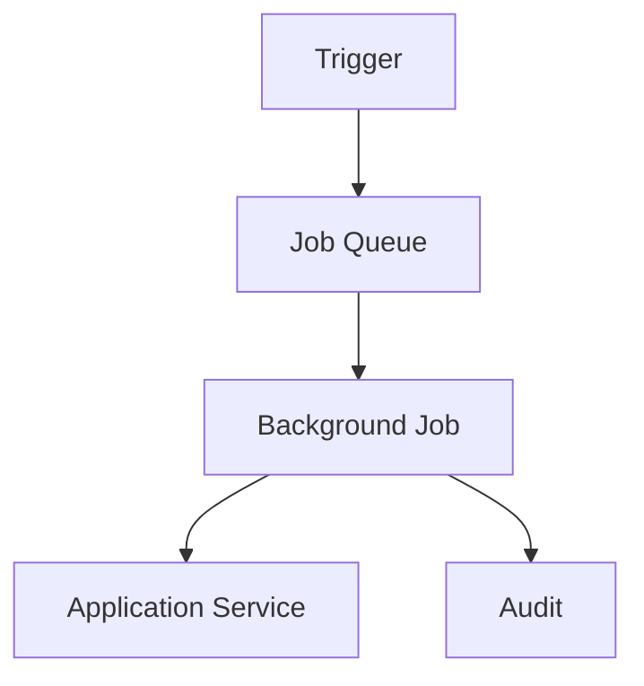
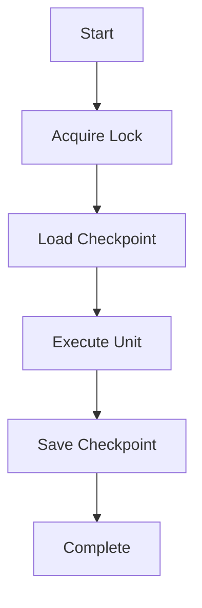
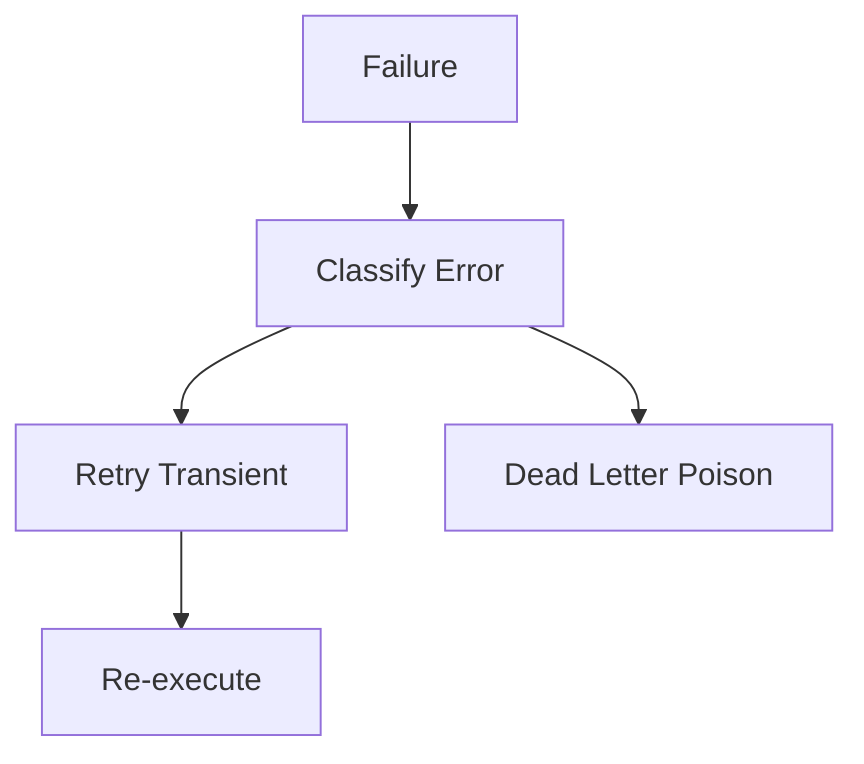
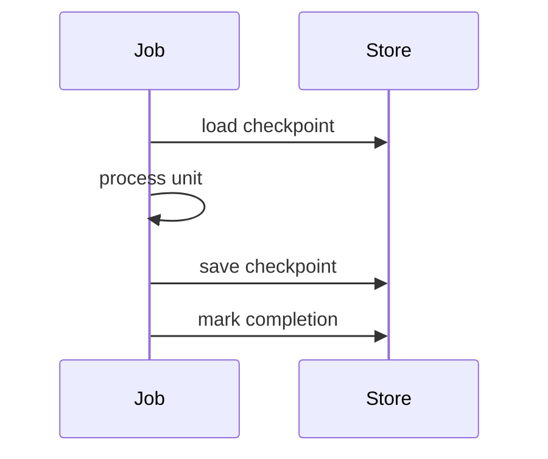
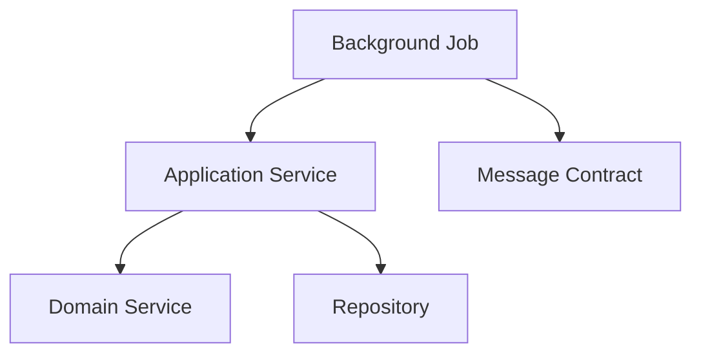

# Background Job Framework
## Split Navigation
- [Background job catalog](background-job/catalog.md)
- [Background job execution strategy](background-job/execution-strategy.md)
- [Background job matrices and controls](background-job/matrices-and-controls.md)
- [Background job strategy and recovery](background-job/strategy-and-recovery.md)
- [Background job operational controls](background-job/operational-controls.md)
- [Background job governance and testing](background-job/governance-and-testing.md)
- [Background job validation and rules](background-job/validation-and-rules.md)
- [Background job diagrams and completion](background-job/diagrams-and-completion.md)
- [Background job maintenance jobs](background-job/maintenance-jobs.md)

# Document Control

Document Name: Background Job Framework
Document Path: knowledge/framework/background-job-framework.md
Document Type: Atlas Enterprise Canonical Specification
Version: 1.0
Status: Canonical Specification
Domain: Platform
Bounded Context: Platform
Owner: Project Atlas
Source of Truth: Atlas Background Job Source of Truth
Last Updated: 2026-07-12

Related Specifications:
- knowledge/workflow-engine-framework.md
- knowledge/application-service-catalog.md
- knowledge/domain-service-catalog.md
- knowledge/command-catalog.md
- knowledge/domain-event-catalog.md
- knowledge/message-contract-catalog.md
- knowledge/event-driven-architecture.md
- knowledge/integration-framework.md
- knowledge/service-catalog.md
- knowledge/system-module-catalog.md
- knowledge/api-governance-framework.md
- knowledge/scheduler-framework.md
- knowledge/automation-framework.md
- knowledge/projection-engine-framework.md
- knowledge/calculation-engine-framework.md
- docs/specification/04-DomainModel.md
- docs/database/05-DatabaseDesign.md
- docs/database/06-ERD.md
- docs/api/07-API.md

# Purpose

Background Job Framework defines approved Atlas background execution for Scheduler, Automation, Workflow, Application Service, Domain Service, Command, Domain Event, Message Contract, Outbox, Inbox, Integration, Notification, Projection, Cache Refresh, and Batch Process work. It is the background job source of truth for triggers, retries, checkpoints, resume, audit, performance, and recovery.

# Scope

- Background Job
- Batch Job
- Long Running Job
- Async Job
- Recurring Job
- One Time Job
- Retry Job
- Compensation Job
- Cleanup Job
- Projection Job
- Notification Job
- Import Job
- Export Job
- Synchronization Job
- Maintenance Job

# Background Job Principles

- Every job is idempotent or explicitly protected by execution lock.
- Every job has trigger, owner, retry, timeout, checkpoint, resume, cancellation, audit, and observability.
- Every job invokes catalog-approved Application Services, Domain Services, Commands, Domain Events, or Message Contracts.
- Jobs do not bypass repository, service, security, or transaction boundaries.
- Retries are bounded and auditable.
- Long-running jobs checkpoint deterministic progress.

# Background Job Architecture

Background jobs execute through scheduler, automation, workflow, message, integration, or manual operational triggers. Jobs use application service boundaries, preserve domain ownership, process idempotently, checkpoint progress, and emit audit records.

# Complete Background Job Catalog

## ScenarioEvaluationJob

Job Name: ScenarioEvaluationJob
Display Name: ScenarioEvaluationJob
Category: Async Job
Purpose: Run queued scenario evaluation.
Business Meaning: ScenarioEvaluationJob performs asynchronous Atlas work without redefining domain concepts.
Description: Job execution coordinates trigger, schedule, application service, domain service, repositories, commands, events, messages, workflow, scheduler, automation, retry, timeout, checkpoint, resume, cancellation, and audit.
Trigger: EvaluateScenario request
Schedule: On demand
Frequency: Queued or scheduled
Input: EvaluateScenarioJobInput
Output: ScenarioEvaluationResult
Execution Context: System actor or authorized actor context with CorrelationId and CausationId.
Execution Owner: ScenarioApplicationService
Application Service: ScenarioApplicationService
Domain Service: ScenarioService, ScoringService, RiskService
Repositories: ScenarioRepository, DecisionRepository
Commands: EvaluateScenario
Domain Events: ScenarioEvaluated, RuleEvaluated, ScoreAdjusted
Message Contract: ScenarioEvaluatedMessage
Workflow: Scenario workflow
Scheduler: Scheduler Framework
Automation: Automation Framework
Dependencies: ScenarioApplicationService; ScenarioService, ScoringService, RiskService; ScenarioRepository, DecisionRepository; ScenarioEvaluatedMessage
Transaction Boundary: One checkpointed unit of work per batch item or aggregate operation.
Consistency Boundary: Eventual consistency is expected for projections, notifications, imports, exports, and message processing.
Retry Strategy: Exponential retry for transient failures with bounded attempts.
Timeout Strategy: Bounded execution timeout with safe cancellation and checkpoint preservation.
Compensation Strategy: Workflow or saga compensation only when cataloged.
Concurrency Strategy: Job key and scope prevent duplicate concurrent execution.
Lock Strategy: Distributed or scoped lock by job name, HouseholdId, aggregate id, message id, or batch id as needed.
Failure Handling: Retry, checkpoint, dead letter, quarantine, cancel, or fail with catalog error.
Idempotency: JobId plus execution scope plus input hash plus checkpoint key.
Checkpoint: Persisted after each successful deterministic unit.
Resume Strategy: Resume from last committed checkpoint and skip duplicate work.
Cancellation: Cooperative cancellation with audit and no partial uncheckpointed commit.
Audit: Execution history, CorrelationId, CausationId, retry history, checkpoint history, actor or system actor, and result.
Logging: Structured logs with job name, attempt, checkpoint, dependency, result, and error code.
Metrics: Duration, queue latency, throughput, retry count, failure rate, checkpoint lag, and resource use.
Security: Authorization, permission, tenant isolation, Household isolation, and service boundary protection.
Performance: Execution SLA, throughput, parallel execution, resource usage, and dependency latency are measured.
Example: ScenarioEvaluationJob starts from EvaluateScenario request, invokes ScenarioApplicationService, uses ScenarioEvaluatedMessage, checkpoints progress, and audits completion.
Background Job Control 1: ScenarioEvaluationJob preserves trigger, schedule, frequency, input, output, execution context, owner, application service, domain service, repository, command, domain event, message contract, workflow, scheduler, automation, dependency, transaction boundary, consistency boundary, retry, timeout, compensation, concurrency, lock, failure handling, idempotency, checkpoint, resume, cancellation, audit, logging, metrics, security, performance, and recovery alignment.
Background Job Control 2: ScenarioEvaluationJob preserves trigger, schedule, frequency, input, output, execution context, owner, application service, domain service, repository, command, domain event, message contract, workflow, scheduler, automation, dependency, transaction boundary, consistency boundary, retry, timeout, compensation, concurrency, lock, failure handling, idempotency, checkpoint, resume, cancellation, audit, logging, metrics, security, performance, and recovery alignment.
Background Job Control 3: ScenarioEvaluationJob preserves trigger, schedule, frequency, input, output, execution context, owner, application service, domain service, repository, command, domain event, message contract, workflow, scheduler, automation, dependency, transaction boundary, consistency boundary, retry, timeout, compensation, concurrency, lock, failure handling, idempotency, checkpoint, resume, cancellation, audit, logging, metrics, security, performance, and recovery alignment.
Background Job Control 4: ScenarioEvaluationJob preserves trigger, schedule, frequency, input, output, execution context, owner, application service, domain service, repository, command, domain event, message contract, workflow, scheduler, automation, dependency, transaction boundary, consistency boundary, retry, timeout, compensation, concurrency, lock, failure handling, idempotency, checkpoint, resume, cancellation, audit, logging, metrics, security, performance, and recovery alignment.
Background Job Control 5: ScenarioEvaluationJob preserves trigger, schedule, frequency, input, output, execution context, owner, application service, domain service, repository, command, domain event, message contract, workflow, scheduler, automation, dependency, transaction boundary, consistency boundary, retry, timeout, compensation, concurrency, lock, failure handling, idempotency, checkpoint, resume, cancellation, audit, logging, metrics, security, performance, and recovery alignment.
Background Job Control 6: ScenarioEvaluationJob preserves trigger, schedule, frequency, input, output, execution context, owner, application service, domain service, repository, command, domain event, message contract, workflow, scheduler, automation, dependency, transaction boundary, consistency boundary, retry, timeout, compensation, concurrency, lock, failure handling, idempotency, checkpoint, resume, cancellation, audit, logging, metrics, security, performance, and recovery alignment.
Background Job Control 7: ScenarioEvaluationJob preserves trigger, schedule, frequency, input, output, execution context, owner, application service, domain service, repository, command, domain event, message contract, workflow, scheduler, automation, dependency, transaction boundary, consistency boundary, retry, timeout, compensation, concurrency, lock, failure handling, idempotency, checkpoint, resume, cancellation, audit, logging, metrics, security, performance, and recovery alignment.
Background Job Control 8: ScenarioEvaluationJob preserves trigger, schedule, frequency, input, output, execution context, owner, application service, domain service, repository, command, domain event, message contract, workflow, scheduler, automation, dependency, transaction boundary, consistency boundary, retry, timeout, compensation, concurrency, lock, failure handling, idempotency, checkpoint, resume, cancellation, audit, logging, metrics, security, performance, and recovery alignment.
Background Job Control 9: ScenarioEvaluationJob preserves trigger, schedule, frequency, input, output, execution context, owner, application service, domain service, repository, command, domain event, message contract, workflow, scheduler, automation, dependency, transaction boundary, consistency boundary, retry, timeout, compensation, concurrency, lock, failure handling, idempotency, checkpoint, resume, cancellation, audit, logging, metrics, security, performance, and recovery alignment.
Background Job Control 10: ScenarioEvaluationJob preserves trigger, schedule, frequency, input, output, execution context, owner, application service, domain service, repository, command, domain event, message contract, workflow, scheduler, automation, dependency, transaction boundary, consistency boundary, retry, timeout, compensation, concurrency, lock, failure handling, idempotency, checkpoint, resume, cancellation, audit, logging, metrics, security, performance, and recovery alignment.
Background Job Control 11: ScenarioEvaluationJob preserves trigger, schedule, frequency, input, output, execution context, owner, application service, domain service, repository, command, domain event, message contract, workflow, scheduler, automation, dependency, transaction boundary, consistency boundary, retry, timeout, compensation, concurrency, lock, failure handling, idempotency, checkpoint, resume, cancellation, audit, logging, metrics, security, performance, and recovery alignment.
Background Job Control 12: ScenarioEvaluationJob preserves trigger, schedule, frequency, input, output, execution context, owner, application service, domain service, repository, command, domain event, message contract, workflow, scheduler, automation, dependency, transaction boundary, consistency boundary, retry, timeout, compensation, concurrency, lock, failure handling, idempotency, checkpoint, resume, cancellation, audit, logging, metrics, security, performance, and recovery alignment.
Background Job Control 13: ScenarioEvaluationJob preserves trigger, schedule, frequency, input, output, execution context, owner, application service, domain service, repository, command, domain event, message contract, workflow, scheduler, automation, dependency, transaction boundary, consistency boundary, retry, timeout, compensation, concurrency, lock, failure handling, idempotency, checkpoint, resume, cancellation, audit, logging, metrics, security, performance, and recovery alignment.
Background Job Control 14: ScenarioEvaluationJob preserves trigger, schedule, frequency, input, output, execution context, owner, application service, domain service, repository, command, domain event, message contract, workflow, scheduler, automation, dependency, transaction boundary, consistency boundary, retry, timeout, compensation, concurrency, lock, failure handling, idempotency, checkpoint, resume, cancellation, audit, logging, metrics, security, performance, and recovery alignment.
Background Job Control 15: ScenarioEvaluationJob preserves trigger, schedule, frequency, input, output, execution context, owner, application service, domain service, repository, command, domain event, message contract, workflow, scheduler, automation, dependency, transaction boundary, consistency boundary, retry, timeout, compensation, concurrency, lock, failure handling, idempotency, checkpoint, resume, cancellation, audit, logging, metrics, security, performance, and recovery alignment.
Background Job Control 16: ScenarioEvaluationJob preserves trigger, schedule, frequency, input, output, execution context, owner, application service, domain service, repository, command, domain event, message contract, workflow, scheduler, automation, dependency, transaction boundary, consistency boundary, retry, timeout, compensation, concurrency, lock, failure handling, idempotency, checkpoint, resume, cancellation, audit, logging, metrics, security, performance, and recovery alignment.
Background Job Control 17: ScenarioEvaluationJob preserves trigger, schedule, frequency, input, output, execution context, owner, application service, domain service, repository, command, domain event, message contract, workflow, scheduler, automation, dependency, transaction boundary, consistency boundary, retry, timeout, compensation, concurrency, lock, failure handling, idempotency, checkpoint, resume, cancellation, audit, logging, metrics, security, performance, and recovery alignment.
Background Job Control 18: ScenarioEvaluationJob preserves trigger, schedule, frequency, input, output, execution context, owner, application service, domain service, repository, command, domain event, message contract, workflow, scheduler, automation, dependency, transaction boundary, consistency boundary, retry, timeout, compensation, concurrency, lock, failure handling, idempotency, checkpoint, resume, cancellation, audit, logging, metrics, security, performance, and recovery alignment.
Background Job Control 19: ScenarioEvaluationJob preserves trigger, schedule, frequency, input, output, execution context, owner, application service, domain service, repository, command, domain event, message contract, workflow, scheduler, automation, dependency, transaction boundary, consistency boundary, retry, timeout, compensation, concurrency, lock, failure handling, idempotency, checkpoint, resume, cancellation, audit, logging, metrics, security, performance, and recovery alignment.
Background Job Control 20: ScenarioEvaluationJob preserves trigger, schedule, frequency, input, output, execution context, owner, application service, domain service, repository, command, domain event, message contract, workflow, scheduler, automation, dependency, transaction boundary, consistency boundary, retry, timeout, compensation, concurrency, lock, failure handling, idempotency, checkpoint, resume, cancellation, audit, logging, metrics, security, performance, and recovery alignment.
Background Job Control 21: ScenarioEvaluationJob preserves trigger, schedule, frequency, input, output, execution context, owner, application service, domain service, repository, command, domain event, message contract, workflow, scheduler, automation, dependency, transaction boundary, consistency boundary, retry, timeout, compensation, concurrency, lock, failure handling, idempotency, checkpoint, resume, cancellation, audit, logging, metrics, security, performance, and recovery alignment.
Background Job Control 22: ScenarioEvaluationJob preserves trigger, schedule, frequency, input, output, execution context, owner, application service, domain service, repository, command, domain event, message contract, workflow, scheduler, automation, dependency, transaction boundary, consistency boundary, retry, timeout, compensation, concurrency, lock, failure handling, idempotency, checkpoint, resume, cancellation, audit, logging, metrics, security, performance, and recovery alignment.
Background Job Control 23: ScenarioEvaluationJob preserves trigger, schedule, frequency, input, output, execution context, owner, application service, domain service, repository, command, domain event, message contract, workflow, scheduler, automation, dependency, transaction boundary, consistency boundary, retry, timeout, compensation, concurrency, lock, failure handling, idempotency, checkpoint, resume, cancellation, audit, logging, metrics, security, performance, and recovery alignment.
Background Job Control 24: ScenarioEvaluationJob preserves trigger, schedule, frequency, input, output, execution context, owner, application service, domain service, repository, command, domain event, message contract, workflow, scheduler, automation, dependency, transaction boundary, consistency boundary, retry, timeout, compensation, concurrency, lock, failure handling, idempotency, checkpoint, resume, cancellation, audit, logging, metrics, security, performance, and recovery alignment.
Background Job Control 25: ScenarioEvaluationJob preserves trigger, schedule, frequency, input, output, execution context, owner, application service, domain service, repository, command, domain event, message contract, workflow, scheduler, automation, dependency, transaction boundary, consistency boundary, retry, timeout, compensation, concurrency, lock, failure handling, idempotency, checkpoint, resume, cancellation, audit, logging, metrics, security, performance, and recovery alignment.
Background Job Control 26: ScenarioEvaluationJob preserves trigger, schedule, frequency, input, output, execution context, owner, application service, domain service, repository, command, domain event, message contract, workflow, scheduler, automation, dependency, transaction boundary, consistency boundary, retry, timeout, compensation, concurrency, lock, failure handling, idempotency, checkpoint, resume, cancellation, audit, logging, metrics, security, performance, and recovery alignment.
Background Job Control 27: ScenarioEvaluationJob preserves trigger, schedule, frequency, input, output, execution context, owner, application service, domain service, repository, command, domain event, message contract, workflow, scheduler, automation, dependency, transaction boundary, consistency boundary, retry, timeout, compensation, concurrency, lock, failure handling, idempotency, checkpoint, resume, cancellation, audit, logging, metrics, security, performance, and recovery alignment.
Background Job Control 28: ScenarioEvaluationJob preserves trigger, schedule, frequency, input, output, execution context, owner, application service, domain service, repository, command, domain event, message contract, workflow, scheduler, automation, dependency, transaction boundary, consistency boundary, retry, timeout, compensation, concurrency, lock, failure handling, idempotency, checkpoint, resume, cancellation, audit, logging, metrics, security, performance, and recovery alignment.
Background Job Control 29: ScenarioEvaluationJob preserves trigger, schedule, frequency, input, output, execution context, owner, application service, domain service, repository, command, domain event, message contract, workflow, scheduler, automation, dependency, transaction boundary, consistency boundary, retry, timeout, compensation, concurrency, lock, failure handling, idempotency, checkpoint, resume, cancellation, audit, logging, metrics, security, performance, and recovery alignment.
Background Job Control 30: ScenarioEvaluationJob preserves trigger, schedule, frequency, input, output, execution context, owner, application service, domain service, repository, command, domain event, message contract, workflow, scheduler, automation, dependency, transaction boundary, consistency boundary, retry, timeout, compensation, concurrency, lock, failure handling, idempotency, checkpoint, resume, cancellation, audit, logging, metrics, security, performance, and recovery alignment.
Background Job Control 31: ScenarioEvaluationJob preserves trigger, schedule, frequency, input, output, execution context, owner, application service, domain service, repository, command, domain event, message contract, workflow, scheduler, automation, dependency, transaction boundary, consistency boundary, retry, timeout, compensation, concurrency, lock, failure handling, idempotency, checkpoint, resume, cancellation, audit, logging, metrics, security, performance, and recovery alignment.
Background Job Control 32: ScenarioEvaluationJob preserves trigger, schedule, frequency, input, output, execution context, owner, application service, domain service, repository, command, domain event, message contract, workflow, scheduler, automation, dependency, transaction boundary, consistency boundary, retry, timeout, compensation, concurrency, lock, failure handling, idempotency, checkpoint, resume, cancellation, audit, logging, metrics, security, performance, and recovery alignment.
Background Job Control 33: ScenarioEvaluationJob preserves trigger, schedule, frequency, input, output, execution context, owner, application service, domain service, repository, command, domain event, message contract, workflow, scheduler, automation, dependency, transaction boundary, consistency boundary, retry, timeout, compensation, concurrency, lock, failure handling, idempotency, checkpoint, resume, cancellation, audit, logging, metrics, security, performance, and recovery alignment.
Background Job Control 34: ScenarioEvaluationJob preserves trigger, schedule, frequency, input, output, execution context, owner, application service, domain service, repository, command, domain event, message contract, workflow, scheduler, automation, dependency, transaction boundary, consistency boundary, retry, timeout, compensation, concurrency, lock, failure handling, idempotency, checkpoint, resume, cancellation, audit, logging, metrics, security, performance, and recovery alignment.
Background Job Control 35: ScenarioEvaluationJob preserves trigger, schedule, frequency, input, output, execution context, owner, application service, domain service, repository, command, domain event, message contract, workflow, scheduler, automation, dependency, transaction boundary, consistency boundary, retry, timeout, compensation, concurrency, lock, failure handling, idempotency, checkpoint, resume, cancellation, audit, logging, metrics, security, performance, and recovery alignment.
Background Job Control 36: ScenarioEvaluationJob preserves trigger, schedule, frequency, input, output, execution context, owner, application service, domain service, repository, command, domain event, message contract, workflow, scheduler, automation, dependency, transaction boundary, consistency boundary, retry, timeout, compensation, concurrency, lock, failure handling, idempotency, checkpoint, resume, cancellation, audit, logging, metrics, security, performance, and recovery alignment.
Background Job Control 37: ScenarioEvaluationJob preserves trigger, schedule, frequency, input, output, execution context, owner, application service, domain service, repository, command, domain event, message contract, workflow, scheduler, automation, dependency, transaction boundary, consistency boundary, retry, timeout, compensation, concurrency, lock, failure handling, idempotency, checkpoint, resume, cancellation, audit, logging, metrics, security, performance, and recovery alignment.
Background Job Control 38: ScenarioEvaluationJob preserves trigger, schedule, frequency, input, output, execution context, owner, application service, domain service, repository, command, domain event, message contract, workflow, scheduler, automation, dependency, transaction boundary, consistency boundary, retry, timeout, compensation, concurrency, lock, failure handling, idempotency, checkpoint, resume, cancellation, audit, logging, metrics, security, performance, and recovery alignment.
Background Job Control 39: ScenarioEvaluationJob preserves trigger, schedule, frequency, input, output, execution context, owner, application service, domain service, repository, command, domain event, message contract, workflow, scheduler, automation, dependency, transaction boundary, consistency boundary, retry, timeout, compensation, concurrency, lock, failure handling, idempotency, checkpoint, resume, cancellation, audit, logging, metrics, security, performance, and recovery alignment.
Background Job Control 40: ScenarioEvaluationJob preserves trigger, schedule, frequency, input, output, execution context, owner, application service, domain service, repository, command, domain event, message contract, workflow, scheduler, automation, dependency, transaction boundary, consistency boundary, retry, timeout, compensation, concurrency, lock, failure handling, idempotency, checkpoint, resume, cancellation, audit, logging, metrics, security, performance, and recovery alignment.
Background Job Control 41: ScenarioEvaluationJob preserves trigger, schedule, frequency, input, output, execution context, owner, application service, domain service, repository, command, domain event, message contract, workflow, scheduler, automation, dependency, transaction boundary, consistency boundary, retry, timeout, compensation, concurrency, lock, failure handling, idempotency, checkpoint, resume, cancellation, audit, logging, metrics, security, performance, and recovery alignment.
Background Job Control 42: ScenarioEvaluationJob preserves trigger, schedule, frequency, input, output, execution context, owner, application service, domain service, repository, command, domain event, message contract, workflow, scheduler, automation, dependency, transaction boundary, consistency boundary, retry, timeout, compensation, concurrency, lock, failure handling, idempotency, checkpoint, resume, cancellation, audit, logging, metrics, security, performance, and recovery alignment.
Background Job Control 43: ScenarioEvaluationJob preserves trigger, schedule, frequency, input, output, execution context, owner, application service, domain service, repository, command, domain event, message contract, workflow, scheduler, automation, dependency, transaction boundary, consistency boundary, retry, timeout, compensation, concurrency, lock, failure handling, idempotency, checkpoint, resume, cancellation, audit, logging, metrics, security, performance, and recovery alignment.
Background Job Control 44: ScenarioEvaluationJob preserves trigger, schedule, frequency, input, output, execution context, owner, application service, domain service, repository, command, domain event, message contract, workflow, scheduler, automation, dependency, transaction boundary, consistency boundary, retry, timeout, compensation, concurrency, lock, failure handling, idempotency, checkpoint, resume, cancellation, audit, logging, metrics, security, performance, and recovery alignment.
Background Job Control 45: ScenarioEvaluationJob preserves trigger, schedule, frequency, input, output, execution context, owner, application service, domain service, repository, command, domain event, message contract, workflow, scheduler, automation, dependency, transaction boundary, consistency boundary, retry, timeout, compensation, concurrency, lock, failure handling, idempotency, checkpoint, resume, cancellation, audit, logging, metrics, security, performance, and recovery alignment.
Background Job Control 46: ScenarioEvaluationJob preserves trigger, schedule, frequency, input, output, execution context, owner, application service, domain service, repository, command, domain event, message contract, workflow, scheduler, automation, dependency, transaction boundary, consistency boundary, retry, timeout, compensation, concurrency, lock, failure handling, idempotency, checkpoint, resume, cancellation, audit, logging, metrics, security, performance, and recovery alignment.
Background Job Control 47: ScenarioEvaluationJob preserves trigger, schedule, frequency, input, output, execution context, owner, application service, domain service, repository, command, domain event, message contract, workflow, scheduler, automation, dependency, transaction boundary, consistency boundary, retry, timeout, compensation, concurrency, lock, failure handling, idempotency, checkpoint, resume, cancellation, audit, logging, metrics, security, performance, and recovery alignment.
Background Job Control 48: ScenarioEvaluationJob preserves trigger, schedule, frequency, input, output, execution context, owner, application service, domain service, repository, command, domain event, message contract, workflow, scheduler, automation, dependency, transaction boundary, consistency boundary, retry, timeout, compensation, concurrency, lock, failure handling, idempotency, checkpoint, resume, cancellation, audit, logging, metrics, security, performance, and recovery alignment.
Background Job Control 49: ScenarioEvaluationJob preserves trigger, schedule, frequency, input, output, execution context, owner, application service, domain service, repository, command, domain event, message contract, workflow, scheduler, automation, dependency, transaction boundary, consistency boundary, retry, timeout, compensation, concurrency, lock, failure handling, idempotency, checkpoint, resume, cancellation, audit, logging, metrics, security, performance, and recovery alignment.
Background Job Control 50: ScenarioEvaluationJob preserves trigger, schedule, frequency, input, output, execution context, owner, application service, domain service, repository, command, domain event, message contract, workflow, scheduler, automation, dependency, transaction boundary, consistency boundary, retry, timeout, compensation, concurrency, lock, failure handling, idempotency, checkpoint, resume, cancellation, audit, logging, metrics, security, performance, and recovery alignment.
Background Job Control 51: ScenarioEvaluationJob preserves trigger, schedule, frequency, input, output, execution context, owner, application service, domain service, repository, command, domain event, message contract, workflow, scheduler, automation, dependency, transaction boundary, consistency boundary, retry, timeout, compensation, concurrency, lock, failure handling, idempotency, checkpoint, resume, cancellation, audit, logging, metrics, security, performance, and recovery alignment.
Background Job Control 52: ScenarioEvaluationJob preserves trigger, schedule, frequency, input, output, execution context, owner, application service, domain service, repository, command, domain event, message contract, workflow, scheduler, automation, dependency, transaction boundary, consistency boundary, retry, timeout, compensation, concurrency, lock, failure handling, idempotency, checkpoint, resume, cancellation, audit, logging, metrics, security, performance, and recovery alignment.
Background Job Control 53: ScenarioEvaluationJob preserves trigger, schedule, frequency, input, output, execution context, owner, application service, domain service, repository, command, domain event, message contract, workflow, scheduler, automation, dependency, transaction boundary, consistency boundary, retry, timeout, compensation, concurrency, lock, failure handling, idempotency, checkpoint, resume, cancellation, audit, logging, metrics, security, performance, and recovery alignment.
Background Job Control 54: ScenarioEvaluationJob preserves trigger, schedule, frequency, input, output, execution context, owner, application service, domain service, repository, command, domain event, message contract, workflow, scheduler, automation, dependency, transaction boundary, consistency boundary, retry, timeout, compensation, concurrency, lock, failure handling, idempotency, checkpoint, resume, cancellation, audit, logging, metrics, security, performance, and recovery alignment.
Background Job Control 55: ScenarioEvaluationJob preserves trigger, schedule, frequency, input, output, execution context, owner, application service, domain service, repository, command, domain event, message contract, workflow, scheduler, automation, dependency, transaction boundary, consistency boundary, retry, timeout, compensation, concurrency, lock, failure handling, idempotency, checkpoint, resume, cancellation, audit, logging, metrics, security, performance, and recovery alignment.
Background Job Control 56: ScenarioEvaluationJob preserves trigger, schedule, frequency, input, output, execution context, owner, application service, domain service, repository, command, domain event, message contract, workflow, scheduler, automation, dependency, transaction boundary, consistency boundary, retry, timeout, compensation, concurrency, lock, failure handling, idempotency, checkpoint, resume, cancellation, audit, logging, metrics, security, performance, and recovery alignment.
Background Job Control 57: ScenarioEvaluationJob preserves trigger, schedule, frequency, input, output, execution context, owner, application service, domain service, repository, command, domain event, message contract, workflow, scheduler, automation, dependency, transaction boundary, consistency boundary, retry, timeout, compensation, concurrency, lock, failure handling, idempotency, checkpoint, resume, cancellation, audit, logging, metrics, security, performance, and recovery alignment.
Background Job Control 58: ScenarioEvaluationJob preserves trigger, schedule, frequency, input, output, execution context, owner, application service, domain service, repository, command, domain event, message contract, workflow, scheduler, automation, dependency, transaction boundary, consistency boundary, retry, timeout, compensation, concurrency, lock, failure handling, idempotency, checkpoint, resume, cancellation, audit, logging, metrics, security, performance, and recovery alignment.
Background Job Control 59: ScenarioEvaluationJob preserves trigger, schedule, frequency, input, output, execution context, owner, application service, domain service, repository, command, domain event, message contract, workflow, scheduler, automation, dependency, transaction boundary, consistency boundary, retry, timeout, compensation, concurrency, lock, failure handling, idempotency, checkpoint, resume, cancellation, audit, logging, metrics, security, performance, and recovery alignment.
Background Job Control 60: ScenarioEvaluationJob preserves trigger, schedule, frequency, input, output, execution context, owner, application service, domain service, repository, command, domain event, message contract, workflow, scheduler, automation, dependency, transaction boundary, consistency boundary, retry, timeout, compensation, concurrency, lock, failure handling, idempotency, checkpoint, resume, cancellation, audit, logging, metrics, security, performance, and recovery alignment.
Background Job Control 61: ScenarioEvaluationJob preserves trigger, schedule, frequency, input, output, execution context, owner, application service, domain service, repository, command, domain event, message contract, workflow, scheduler, automation, dependency, transaction boundary, consistency boundary, retry, timeout, compensation, concurrency, lock, failure handling, idempotency, checkpoint, resume, cancellation, audit, logging, metrics, security, performance, and recovery alignment.
Background Job Control 62: ScenarioEvaluationJob preserves trigger, schedule, frequency, input, output, execution context, owner, application service, domain service, repository, command, domain event, message contract, workflow, scheduler, automation, dependency, transaction boundary, consistency boundary, retry, timeout, compensation, concurrency, lock, failure handling, idempotency, checkpoint, resume, cancellation, audit, logging, metrics, security, performance, and recovery alignment.
Background Job Control 63: ScenarioEvaluationJob preserves trigger, schedule, frequency, input, output, execution context, owner, application service, domain service, repository, command, domain event, message contract, workflow, scheduler, automation, dependency, transaction boundary, consistency boundary, retry, timeout, compensation, concurrency, lock, failure handling, idempotency, checkpoint, resume, cancellation, audit, logging, metrics, security, performance, and recovery alignment.
Background Job Control 64: ScenarioEvaluationJob preserves trigger, schedule, frequency, input, output, execution context, owner, application service, domain service, repository, command, domain event, message contract, workflow, scheduler, automation, dependency, transaction boundary, consistency boundary, retry, timeout, compensation, concurrency, lock, failure handling, idempotency, checkpoint, resume, cancellation, audit, logging, metrics, security, performance, and recovery alignment.
Background Job Control 65: ScenarioEvaluationJob preserves trigger, schedule, frequency, input, output, execution context, owner, application service, domain service, repository, command, domain event, message contract, workflow, scheduler, automation, dependency, transaction boundary, consistency boundary, retry, timeout, compensation, concurrency, lock, failure handling, idempotency, checkpoint, resume, cancellation, audit, logging, metrics, security, performance, and recovery alignment.
Background Job Control 66: ScenarioEvaluationJob preserves trigger, schedule, frequency, input, output, execution context, owner, application service, domain service, repository, command, domain event, message contract, workflow, scheduler, automation, dependency, transaction boundary, consistency boundary, retry, timeout, compensation, concurrency, lock, failure handling, idempotency, checkpoint, resume, cancellation, audit, logging, metrics, security, performance, and recovery alignment.
Background Job Control 67: ScenarioEvaluationJob preserves trigger, schedule, frequency, input, output, execution context, owner, application service, domain service, repository, command, domain event, message contract, workflow, scheduler, automation, dependency, transaction boundary, consistency boundary, retry, timeout, compensation, concurrency, lock, failure handling, idempotency, checkpoint, resume, cancellation, audit, logging, metrics, security, performance, and recovery alignment.
Background Job Control 68: ScenarioEvaluationJob preserves trigger, schedule, frequency, input, output, execution context, owner, application service, domain service, repository, command, domain event, message contract, workflow, scheduler, automation, dependency, transaction boundary, consistency boundary, retry, timeout, compensation, concurrency, lock, failure handling, idempotency, checkpoint, resume, cancellation, audit, logging, metrics, security, performance, and recovery alignment.
Background Job Control 69: ScenarioEvaluationJob preserves trigger, schedule, frequency, input, output, execution context, owner, application service, domain service, repository, command, domain event, message contract, workflow, scheduler, automation, dependency, transaction boundary, consistency boundary, retry, timeout, compensation, concurrency, lock, failure handling, idempotency, checkpoint, resume, cancellation, audit, logging, metrics, security, performance, and recovery alignment.
Background Job Control 70: ScenarioEvaluationJob preserves trigger, schedule, frequency, input, output, execution context, owner, application service, domain service, repository, command, domain event, message contract, workflow, scheduler, automation, dependency, transaction boundary, consistency boundary, retry, timeout, compensation, concurrency, lock, failure handling, idempotency, checkpoint, resume, cancellation, audit, logging, metrics, security, performance, and recovery alignment.
Background Job Control 71: ScenarioEvaluationJob preserves trigger, schedule, frequency, input, output, execution context, owner, application service, domain service, repository, command, domain event, message contract, workflow, scheduler, automation, dependency, transaction boundary, consistency boundary, retry, timeout, compensation, concurrency, lock, failure handling, idempotency, checkpoint, resume, cancellation, audit, logging, metrics, security, performance, and recovery alignment.
Background Job Control 72: ScenarioEvaluationJob preserves trigger, schedule, frequency, input, output, execution context, owner, application service, domain service, repository, command, domain event, message contract, workflow, scheduler, automation, dependency, transaction boundary, consistency boundary, retry, timeout, compensation, concurrency, lock, failure handling, idempotency, checkpoint, resume, cancellation, audit, logging, metrics, security, performance, and recovery alignment.
Background Job Control 73: ScenarioEvaluationJob preserves trigger, schedule, frequency, input, output, execution context, owner, application service, domain service, repository, command, domain event, message contract, workflow, scheduler, automation, dependency, transaction boundary, consistency boundary, retry, timeout, compensation, concurrency, lock, failure handling, idempotency, checkpoint, resume, cancellation, audit, logging, metrics, security, performance, and recovery alignment.
Background Job Control 74: ScenarioEvaluationJob preserves trigger, schedule, frequency, input, output, execution context, owner, application service, domain service, repository, command, domain event, message contract, workflow, scheduler, automation, dependency, transaction boundary, consistency boundary, retry, timeout, compensation, concurrency, lock, failure handling, idempotency, checkpoint, resume, cancellation, audit, logging, metrics, security, performance, and recovery alignment.
Background Job Control 75: ScenarioEvaluationJob preserves trigger, schedule, frequency, input, output, execution context, owner, application service, domain service, repository, command, domain event, message contract, workflow, scheduler, automation, dependency, transaction boundary, consistency boundary, retry, timeout, compensation, concurrency, lock, failure handling, idempotency, checkpoint, resume, cancellation, audit, logging, metrics, security, performance, and recovery alignment.
Background Job Control 76: ScenarioEvaluationJob preserves trigger, schedule, frequency, input, output, execution context, owner, application service, domain service, repository, command, domain event, message contract, workflow, scheduler, automation, dependency, transaction boundary, consistency boundary, retry, timeout, compensation, concurrency, lock, failure handling, idempotency, checkpoint, resume, cancellation, audit, logging, metrics, security, performance, and recovery alignment.
Background Job Control 77: ScenarioEvaluationJob preserves trigger, schedule, frequency, input, output, execution context, owner, application service, domain service, repository, command, domain event, message contract, workflow, scheduler, automation, dependency, transaction boundary, consistency boundary, retry, timeout, compensation, concurrency, lock, failure handling, idempotency, checkpoint, resume, cancellation, audit, logging, metrics, security, performance, and recovery alignment.
Background Job Control 78: ScenarioEvaluationJob preserves trigger, schedule, frequency, input, output, execution context, owner, application service, domain service, repository, command, domain event, message contract, workflow, scheduler, automation, dependency, transaction boundary, consistency boundary, retry, timeout, compensation, concurrency, lock, failure handling, idempotency, checkpoint, resume, cancellation, audit, logging, metrics, security, performance, and recovery alignment.
Background Job Control 79: ScenarioEvaluationJob preserves trigger, schedule, frequency, input, output, execution context, owner, application service, domain service, repository, command, domain event, message contract, workflow, scheduler, automation, dependency, transaction boundary, consistency boundary, retry, timeout, compensation, concurrency, lock, failure handling, idempotency, checkpoint, resume, cancellation, audit, logging, metrics, security, performance, and recovery alignment.
Background Job Control 80: ScenarioEvaluationJob preserves trigger, schedule, frequency, input, output, execution context, owner, application service, domain service, repository, command, domain event, message contract, workflow, scheduler, automation, dependency, transaction boundary, consistency boundary, retry, timeout, compensation, concurrency, lock, failure handling, idempotency, checkpoint, resume, cancellation, audit, logging, metrics, security, performance, and recovery alignment.
Background Job Control 81: ScenarioEvaluationJob preserves trigger, schedule, frequency, input, output, execution context, owner, application service, domain service, repository, command, domain event, message contract, workflow, scheduler, automation, dependency, transaction boundary, consistency boundary, retry, timeout, compensation, concurrency, lock, failure handling, idempotency, checkpoint, resume, cancellation, audit, logging, metrics, security, performance, and recovery alignment.
Background Job Control 82: ScenarioEvaluationJob preserves trigger, schedule, frequency, input, output, execution context, owner, application service, domain service, repository, command, domain event, message contract, workflow, scheduler, automation, dependency, transaction boundary, consistency boundary, retry, timeout, compensation, concurrency, lock, failure handling, idempotency, checkpoint, resume, cancellation, audit, logging, metrics, security, performance, and recovery alignment.
Background Job Control 83: ScenarioEvaluationJob preserves trigger, schedule, frequency, input, output, execution context, owner, application service, domain service, repository, command, domain event, message contract, workflow, scheduler, automation, dependency, transaction boundary, consistency boundary, retry, timeout, compensation, concurrency, lock, failure handling, idempotency, checkpoint, resume, cancellation, audit, logging, metrics, security, performance, and recovery alignment.
Background Job Control 84: ScenarioEvaluationJob preserves trigger, schedule, frequency, input, output, execution context, owner, application service, domain service, repository, command, domain event, message contract, workflow, scheduler, automation, dependency, transaction boundary, consistency boundary, retry, timeout, compensation, concurrency, lock, failure handling, idempotency, checkpoint, resume, cancellation, audit, logging, metrics, security, performance, and recovery alignment.
Background Job Control 85: ScenarioEvaluationJob preserves trigger, schedule, frequency, input, output, execution context, owner, application service, domain service, repository, command, domain event, message contract, workflow, scheduler, automation, dependency, transaction boundary, consistency boundary, retry, timeout, compensation, concurrency, lock, failure handling, idempotency, checkpoint, resume, cancellation, audit, logging, metrics, security, performance, and recovery alignment.
Background Job Control 86: ScenarioEvaluationJob preserves trigger, schedule, frequency, input, output, execution context, owner, application service, domain service, repository, command, domain event, message contract, workflow, scheduler, automation, dependency, transaction boundary, consistency boundary, retry, timeout, compensation, concurrency, lock, failure handling, idempotency, checkpoint, resume, cancellation, audit, logging, metrics, security, performance, and recovery alignment.
Background Job Control 87: ScenarioEvaluationJob preserves trigger, schedule, frequency, input, output, execution context, owner, application service, domain service, repository, command, domain event, message contract, workflow, scheduler, automation, dependency, transaction boundary, consistency boundary, retry, timeout, compensation, concurrency, lock, failure handling, idempotency, checkpoint, resume, cancellation, audit, logging, metrics, security, performance, and recovery alignment.
Background Job Control 88: ScenarioEvaluationJob preserves trigger, schedule, frequency, input, output, execution context, owner, application service, domain service, repository, command, domain event, message contract, workflow, scheduler, automation, dependency, transaction boundary, consistency boundary, retry, timeout, compensation, concurrency, lock, failure handling, idempotency, checkpoint, resume, cancellation, audit, logging, metrics, security, performance, and recovery alignment.
Background Job Control 89: ScenarioEvaluationJob preserves trigger, schedule, frequency, input, output, execution context, owner, application service, domain service, repository, command, domain event, message contract, workflow, scheduler, automation, dependency, transaction boundary, consistency boundary, retry, timeout, compensation, concurrency, lock, failure handling, idempotency, checkpoint, resume, cancellation, audit, logging, metrics, security, performance, and recovery alignment.
Background Job Control 90: ScenarioEvaluationJob preserves trigger, schedule, frequency, input, output, execution context, owner, application service, domain service, repository, command, domain event, message contract, workflow, scheduler, automation, dependency, transaction boundary, consistency boundary, retry, timeout, compensation, concurrency, lock, failure handling, idempotency, checkpoint, resume, cancellation, audit, logging, metrics, security, performance, and recovery alignment.
Background Job Control 91: ScenarioEvaluationJob preserves trigger, schedule, frequency, input, output, execution context, owner, application service, domain service, repository, command, domain event, message contract, workflow, scheduler, automation, dependency, transaction boundary, consistency boundary, retry, timeout, compensation, concurrency, lock, failure handling, idempotency, checkpoint, resume, cancellation, audit, logging, metrics, security, performance, and recovery alignment.
Background Job Control 92: ScenarioEvaluationJob preserves trigger, schedule, frequency, input, output, execution context, owner, application service, domain service, repository, command, domain event, message contract, workflow, scheduler, automation, dependency, transaction boundary, consistency boundary, retry, timeout, compensation, concurrency, lock, failure handling, idempotency, checkpoint, resume, cancellation, audit, logging, metrics, security, performance, and recovery alignment.
Background Job Control 93: ScenarioEvaluationJob preserves trigger, schedule, frequency, input, output, execution context, owner, application service, domain service, repository, command, domain event, message contract, workflow, scheduler, automation, dependency, transaction boundary, consistency boundary, retry, timeout, compensation, concurrency, lock, failure handling, idempotency, checkpoint, resume, cancellation, audit, logging, metrics, security, performance, and recovery alignment.
Background Job Control 94: ScenarioEvaluationJob preserves trigger, schedule, frequency, input, output, execution context, owner, application service, domain service, repository, command, domain event, message contract, workflow, scheduler, automation, dependency, transaction boundary, consistency boundary, retry, timeout, compensation, concurrency, lock, failure handling, idempotency, checkpoint, resume, cancellation, audit, logging, metrics, security, performance, and recovery alignment.
Background Job Control 95: ScenarioEvaluationJob preserves trigger, schedule, frequency, input, output, execution context, owner, application service, domain service, repository, command, domain event, message contract, workflow, scheduler, automation, dependency, transaction boundary, consistency boundary, retry, timeout, compensation, concurrency, lock, failure handling, idempotency, checkpoint, resume, cancellation, audit, logging, metrics, security, performance, and recovery alignment.
Background Job Control 96: ScenarioEvaluationJob preserves trigger, schedule, frequency, input, output, execution context, owner, application service, domain service, repository, command, domain event, message contract, workflow, scheduler, automation, dependency, transaction boundary, consistency boundary, retry, timeout, compensation, concurrency, lock, failure handling, idempotency, checkpoint, resume, cancellation, audit, logging, metrics, security, performance, and recovery alignment.
Background Job Control 97: ScenarioEvaluationJob preserves trigger, schedule, frequency, input, output, execution context, owner, application service, domain service, repository, command, domain event, message contract, workflow, scheduler, automation, dependency, transaction boundary, consistency boundary, retry, timeout, compensation, concurrency, lock, failure handling, idempotency, checkpoint, resume, cancellation, audit, logging, metrics, security, performance, and recovery alignment.
Background Job Control 98: ScenarioEvaluationJob preserves trigger, schedule, frequency, input, output, execution context, owner, application service, domain service, repository, command, domain event, message contract, workflow, scheduler, automation, dependency, transaction boundary, consistency boundary, retry, timeout, compensation, concurrency, lock, failure handling, idempotency, checkpoint, resume, cancellation, audit, logging, metrics, security, performance, and recovery alignment.
Background Job Control 99: ScenarioEvaluationJob preserves trigger, schedule, frequency, input, output, execution context, owner, application service, domain service, repository, command, domain event, message contract, workflow, scheduler, automation, dependency, transaction boundary, consistency boundary, retry, timeout, compensation, concurrency, lock, failure handling, idempotency, checkpoint, resume, cancellation, audit, logging, metrics, security, performance, and recovery alignment.
Background Job Control 100: ScenarioEvaluationJob preserves trigger, schedule, frequency, input, output, execution context, owner, application service, domain service, repository, command, domain event, message contract, workflow, scheduler, automation, dependency, transaction boundary, consistency boundary, retry, timeout, compensation, concurrency, lock, failure handling, idempotency, checkpoint, resume, cancellation, audit, logging, metrics, security, performance, and recovery alignment.
Background Job Control 101: ScenarioEvaluationJob preserves trigger, schedule, frequency, input, output, execution context, owner, application service, domain service, repository, command, domain event, message contract, workflow, scheduler, automation, dependency, transaction boundary, consistency boundary, retry, timeout, compensation, concurrency, lock, failure handling, idempotency, checkpoint, resume, cancellation, audit, logging, metrics, security, performance, and recovery alignment.
Background Job Control 102: ScenarioEvaluationJob preserves trigger, schedule, frequency, input, output, execution context, owner, application service, domain service, repository, command, domain event, message contract, workflow, scheduler, automation, dependency, transaction boundary, consistency boundary, retry, timeout, compensation, concurrency, lock, failure handling, idempotency, checkpoint, resume, cancellation, audit, logging, metrics, security, performance, and recovery alignment.
Background Job Control 103: ScenarioEvaluationJob preserves trigger, schedule, frequency, input, output, execution context, owner, application service, domain service, repository, command, domain event, message contract, workflow, scheduler, automation, dependency, transaction boundary, consistency boundary, retry, timeout, compensation, concurrency, lock, failure handling, idempotency, checkpoint, resume, cancellation, audit, logging, metrics, security, performance, and recovery alignment.
Background Job Control 104: ScenarioEvaluationJob preserves trigger, schedule, frequency, input, output, execution context, owner, application service, domain service, repository, command, domain event, message contract, workflow, scheduler, automation, dependency, transaction boundary, consistency boundary, retry, timeout, compensation, concurrency, lock, failure handling, idempotency, checkpoint, resume, cancellation, audit, logging, metrics, security, performance, and recovery alignment.
Background Job Control 105: ScenarioEvaluationJob preserves trigger, schedule, frequency, input, output, execution context, owner, application service, domain service, repository, command, domain event, message contract, workflow, scheduler, automation, dependency, transaction boundary, consistency boundary, retry, timeout, compensation, concurrency, lock, failure handling, idempotency, checkpoint, resume, cancellation, audit, logging, metrics, security, performance, and recovery alignment.

## ScenarioReplayJob

Job Name: ScenarioReplayJob
Display Name: ScenarioReplayJob
Category: Long Running Job
Purpose: Replay scenario using versioned assumptions and formulas.
Business Meaning: ScenarioReplayJob performs asynchronous Atlas work without redefining domain concepts.
Description: Job execution coordinates trigger, schedule, application service, domain service, repositories, commands, events, messages, workflow, scheduler, automation, retry, timeout, checkpoint, resume, cancellation, and audit.
Trigger: ReplayScenario request
Schedule: On demand
Frequency: Manual or scheduled
Input: ReplayScenarioJobInput
Output: ReplayScenarioResult
Execution Context: System actor or authorized actor context with CorrelationId and CausationId.
Execution Owner: ScenarioApplicationService
Application Service: ScenarioApplicationService
Domain Service: ScenarioService
Repositories: ScenarioRepository, AuditRepository
Commands: ReplayScenario
Domain Events: SnapshotCreated, ReplayCompleted
Message Contract: ReplayCompletedMessage
Workflow: Replay workflow
Scheduler: Scheduler Framework
Automation: Administration automation
Dependencies: ScenarioApplicationService; ScenarioService; ScenarioRepository, AuditRepository; ReplayCompletedMessage
Transaction Boundary: One checkpointed unit of work per batch item or aggregate operation.
Consistency Boundary: Eventual consistency is expected for projections, notifications, imports, exports, and message processing.
Retry Strategy: Exponential retry for transient failures with bounded attempts.
Timeout Strategy: Bounded execution timeout with safe cancellation and checkpoint preservation.
Compensation Strategy: Workflow or saga compensation only when cataloged.
Concurrency Strategy: Job key and scope prevent duplicate concurrent execution.
Lock Strategy: Distributed or scoped lock by job name, HouseholdId, aggregate id, message id, or batch id as needed.
Failure Handling: Retry, checkpoint, dead letter, quarantine, cancel, or fail with catalog error.
Idempotency: JobId plus execution scope plus input hash plus checkpoint key.
Checkpoint: Persisted after each successful deterministic unit.
Resume Strategy: Resume from last committed checkpoint and skip duplicate work.
Cancellation: Cooperative cancellation with audit and no partial uncheckpointed commit.
Audit: Execution history, CorrelationId, CausationId, retry history, checkpoint history, actor or system actor, and result.
Logging: Structured logs with job name, attempt, checkpoint, dependency, result, and error code.
Metrics: Duration, queue latency, throughput, retry count, failure rate, checkpoint lag, and resource use.
Security: Authorization, permission, tenant isolation, Household isolation, and service boundary protection.
Performance: Execution SLA, throughput, parallel execution, resource usage, and dependency latency are measured.
Example: ScenarioReplayJob starts from ReplayScenario request, invokes ScenarioApplicationService, uses ReplayCompletedMessage, checkpoints progress, and audits completion.
Background Job Control 1: ScenarioReplayJob preserves trigger, schedule, frequency, input, output, execution context, owner, application service, domain service, repository, command, domain event, message contract, workflow, scheduler, automation, dependency, transaction boundary, consistency boundary, retry, timeout, compensation, concurrency, lock, failure handling, idempotency, checkpoint, resume, cancellation, audit, logging, metrics, security, performance, and recovery alignment.
Background Job Control 2: ScenarioReplayJob preserves trigger, schedule, frequency, input, output, execution context, owner, application service, domain service, repository, command, domain event, message contract, workflow, scheduler, automation, dependency, transaction boundary, consistency boundary, retry, timeout, compensation, concurrency, lock, failure handling, idempotency, checkpoint, resume, cancellation, audit, logging, metrics, security, performance, and recovery alignment.
Background Job Control 3: ScenarioReplayJob preserves trigger, schedule, frequency, input, output, execution context, owner, application service, domain service, repository, command, domain event, message contract, workflow, scheduler, automation, dependency, transaction boundary, consistency boundary, retry, timeout, compensation, concurrency, lock, failure handling, idempotency, checkpoint, resume, cancellation, audit, logging, metrics, security, performance, and recovery alignment.
Background Job Control 4: ScenarioReplayJob preserves trigger, schedule, frequency, input, output, execution context, owner, application service, domain service, repository, command, domain event, message contract, workflow, scheduler, automation, dependency, transaction boundary, consistency boundary, retry, timeout, compensation, concurrency, lock, failure handling, idempotency, checkpoint, resume, cancellation, audit, logging, metrics, security, performance, and recovery alignment.
Background Job Control 5: ScenarioReplayJob preserves trigger, schedule, frequency, input, output, execution context, owner, application service, domain service, repository, command, domain event, message contract, workflow, scheduler, automation, dependency, transaction boundary, consistency boundary, retry, timeout, compensation, concurrency, lock, failure handling, idempotency, checkpoint, resume, cancellation, audit, logging, metrics, security, performance, and recovery alignment.
Background Job Control 6: ScenarioReplayJob preserves trigger, schedule, frequency, input, output, execution context, owner, application service, domain service, repository, command, domain event, message contract, workflow, scheduler, automation, dependency, transaction boundary, consistency boundary, retry, timeout, compensation, concurrency, lock, failure handling, idempotency, checkpoint, resume, cancellation, audit, logging, metrics, security, performance, and recovery alignment.
Background Job Control 7: ScenarioReplayJob preserves trigger, schedule, frequency, input, output, execution context, owner, application service, domain service, repository, command, domain event, message contract, workflow, scheduler, automation, dependency, transaction boundary, consistency boundary, retry, timeout, compensation, concurrency, lock, failure handling, idempotency, checkpoint, resume, cancellation, audit, logging, metrics, security, performance, and recovery alignment.
Background Job Control 8: ScenarioReplayJob preserves trigger, schedule, frequency, input, output, execution context, owner, application service, domain service, repository, command, domain event, message contract, workflow, scheduler, automation, dependency, transaction boundary, consistency boundary, retry, timeout, compensation, concurrency, lock, failure handling, idempotency, checkpoint, resume, cancellation, audit, logging, metrics, security, performance, and recovery alignment.
Background Job Control 9: ScenarioReplayJob preserves trigger, schedule, frequency, input, output, execution context, owner, application service, domain service, repository, command, domain event, message contract, workflow, scheduler, automation, dependency, transaction boundary, consistency boundary, retry, timeout, compensation, concurrency, lock, failure handling, idempotency, checkpoint, resume, cancellation, audit, logging, metrics, security, performance, and recovery alignment.
Background Job Control 10: ScenarioReplayJob preserves trigger, schedule, frequency, input, output, execution context, owner, application service, domain service, repository, command, domain event, message contract, workflow, scheduler, automation, dependency, transaction boundary, consistency boundary, retry, timeout, compensation, concurrency, lock, failure handling, idempotency, checkpoint, resume, cancellation, audit, logging, metrics, security, performance, and recovery alignment.
Background Job Control 11: ScenarioReplayJob preserves trigger, schedule, frequency, input, output, execution context, owner, application service, domain service, repository, command, domain event, message contract, workflow, scheduler, automation, dependency, transaction boundary, consistency boundary, retry, timeout, compensation, concurrency, lock, failure handling, idempotency, checkpoint, resume, cancellation, audit, logging, metrics, security, performance, and recovery alignment.
Background Job Control 12: ScenarioReplayJob preserves trigger, schedule, frequency, input, output, execution context, owner, application service, domain service, repository, command, domain event, message contract, workflow, scheduler, automation, dependency, transaction boundary, consistency boundary, retry, timeout, compensation, concurrency, lock, failure handling, idempotency, checkpoint, resume, cancellation, audit, logging, metrics, security, performance, and recovery alignment.
Background Job Control 13: ScenarioReplayJob preserves trigger, schedule, frequency, input, output, execution context, owner, application service, domain service, repository, command, domain event, message contract, workflow, scheduler, automation, dependency, transaction boundary, consistency boundary, retry, timeout, compensation, concurrency, lock, failure handling, idempotency, checkpoint, resume, cancellation, audit, logging, metrics, security, performance, and recovery alignment.
Background Job Control 14: ScenarioReplayJob preserves trigger, schedule, frequency, input, output, execution context, owner, application service, domain service, repository, command, domain event, message contract, workflow, scheduler, automation, dependency, transaction boundary, consistency boundary, retry, timeout, compensation, concurrency, lock, failure handling, idempotency, checkpoint, resume, cancellation, audit, logging, metrics, security, performance, and recovery alignment.
Background Job Control 15: ScenarioReplayJob preserves trigger, schedule, frequency, input, output, execution context, owner, application service, domain service, repository, command, domain event, message contract, workflow, scheduler, automation, dependency, transaction boundary, consistency boundary, retry, timeout, compensation, concurrency, lock, failure handling, idempotency, checkpoint, resume, cancellation, audit, logging, metrics, security, performance, and recovery alignment.
Background Job Control 16: ScenarioReplayJob preserves trigger, schedule, frequency, input, output, execution context, owner, application service, domain service, repository, command, domain event, message contract, workflow, scheduler, automation, dependency, transaction boundary, consistency boundary, retry, timeout, compensation, concurrency, lock, failure handling, idempotency, checkpoint, resume, cancellation, audit, logging, metrics, security, performance, and recovery alignment.
Background Job Control 17: ScenarioReplayJob preserves trigger, schedule, frequency, input, output, execution context, owner, application service, domain service, repository, command, domain event, message contract, workflow, scheduler, automation, dependency, transaction boundary, consistency boundary, retry, timeout, compensation, concurrency, lock, failure handling, idempotency, checkpoint, resume, cancellation, audit, logging, metrics, security, performance, and recovery alignment.
Background Job Control 18: ScenarioReplayJob preserves trigger, schedule, frequency, input, output, execution context, owner, application service, domain service, repository, command, domain event, message contract, workflow, scheduler, automation, dependency, transaction boundary, consistency boundary, retry, timeout, compensation, concurrency, lock, failure handling, idempotency, checkpoint, resume, cancellation, audit, logging, metrics, security, performance, and recovery alignment.
Background Job Control 19: ScenarioReplayJob preserves trigger, schedule, frequency, input, output, execution context, owner, application service, domain service, repository, command, domain event, message contract, workflow, scheduler, automation, dependency, transaction boundary, consistency boundary, retry, timeout, compensation, concurrency, lock, failure handling, idempotency, checkpoint, resume, cancellation, audit, logging, metrics, security, performance, and recovery alignment.
Background Job Control 20: ScenarioReplayJob preserves trigger, schedule, frequency, input, output, execution context, owner, application service, domain service, repository, command, domain event, message contract, workflow, scheduler, automation, dependency, transaction boundary, consistency boundary, retry, timeout, compensation, concurrency, lock, failure handling, idempotency, checkpoint, resume, cancellation, audit, logging, metrics, security, performance, and recovery alignment.
Background Job Control 21: ScenarioReplayJob preserves trigger, schedule, frequency, input, output, execution context, owner, application service, domain service, repository, command, domain event, message contract, workflow, scheduler, automation, dependency, transaction boundary, consistency boundary, retry, timeout, compensation, concurrency, lock, failure handling, idempotency, checkpoint, resume, cancellation, audit, logging, metrics, security, performance, and recovery alignment.
Background Job Control 22: ScenarioReplayJob preserves trigger, schedule, frequency, input, output, execution context, owner, application service, domain service, repository, command, domain event, message contract, workflow, scheduler, automation, dependency, transaction boundary, consistency boundary, retry, timeout, compensation, concurrency, lock, failure handling, idempotency, checkpoint, resume, cancellation, audit, logging, metrics, security, performance, and recovery alignment.
Background Job Control 23: ScenarioReplayJob preserves trigger, schedule, frequency, input, output, execution context, owner, application service, domain service, repository, command, domain event, message contract, workflow, scheduler, automation, dependency, transaction boundary, consistency boundary, retry, timeout, compensation, concurrency, lock, failure handling, idempotency, checkpoint, resume, cancellation, audit, logging, metrics, security, performance, and recovery alignment.
Background Job Control 24: ScenarioReplayJob preserves trigger, schedule, frequency, input, output, execution context, owner, application service, domain service, repository, command, domain event, message contract, workflow, scheduler, automation, dependency, transaction boundary, consistency boundary, retry, timeout, compensation, concurrency, lock, failure handling, idempotency, checkpoint, resume, cancellation, audit, logging, metrics, security, performance, and recovery alignment.
Background Job Control 25: ScenarioReplayJob preserves trigger, schedule, frequency, input, output, execution context, owner, application service, domain service, repository, command, domain event, message contract, workflow, scheduler, automation, dependency, transaction boundary, consistency boundary, retry, timeout, compensation, concurrency, lock, failure handling, idempotency, checkpoint, resume, cancellation, audit, logging, metrics, security, performance, and recovery alignment.
Background Job Control 26: ScenarioReplayJob preserves trigger, schedule, frequency, input, output, execution context, owner, application service, domain service, repository, command, domain event, message contract, workflow, scheduler, automation, dependency, transaction boundary, consistency boundary, retry, timeout, compensation, concurrency, lock, failure handling, idempotency, checkpoint, resume, cancellation, audit, logging, metrics, security, performance, and recovery alignment.
Background Job Control 27: ScenarioReplayJob preserves trigger, schedule, frequency, input, output, execution context, owner, application service, domain service, repository, command, domain event, message contract, workflow, scheduler, automation, dependency, transaction boundary, consistency boundary, retry, timeout, compensation, concurrency, lock, failure handling, idempotency, checkpoint, resume, cancellation, audit, logging, metrics, security, performance, and recovery alignment.
Background Job Control 28: ScenarioReplayJob preserves trigger, schedule, frequency, input, output, execution context, owner, application service, domain service, repository, command, domain event, message contract, workflow, scheduler, automation, dependency, transaction boundary, consistency boundary, retry, timeout, compensation, concurrency, lock, failure handling, idempotency, checkpoint, resume, cancellation, audit, logging, metrics, security, performance, and recovery alignment.
Background Job Control 29: ScenarioReplayJob preserves trigger, schedule, frequency, input, output, execution context, owner, application service, domain service, repository, command, domain event, message contract, workflow, scheduler, automation, dependency, transaction boundary, consistency boundary, retry, timeout, compensation, concurrency, lock, failure handling, idempotency, checkpoint, resume, cancellation, audit, logging, metrics, security, performance, and recovery alignment.
Background Job Control 30: ScenarioReplayJob preserves trigger, schedule, frequency, input, output, execution context, owner, application service, domain service, repository, command, domain event, message contract, workflow, scheduler, automation, dependency, transaction boundary, consistency boundary, retry, timeout, compensation, concurrency, lock, failure handling, idempotency, checkpoint, resume, cancellation, audit, logging, metrics, security, performance, and recovery alignment.
Background Job Control 31: ScenarioReplayJob preserves trigger, schedule, frequency, input, output, execution context, owner, application service, domain service, repository, command, domain event, message contract, workflow, scheduler, automation, dependency, transaction boundary, consistency boundary, retry, timeout, compensation, concurrency, lock, failure handling, idempotency, checkpoint, resume, cancellation, audit, logging, metrics, security, performance, and recovery alignment.
Background Job Control 32: ScenarioReplayJob preserves trigger, schedule, frequency, input, output, execution context, owner, application service, domain service, repository, command, domain event, message contract, workflow, scheduler, automation, dependency, transaction boundary, consistency boundary, retry, timeout, compensation, concurrency, lock, failure handling, idempotency, checkpoint, resume, cancellation, audit, logging, metrics, security, performance, and recovery alignment.
Background Job Control 33: ScenarioReplayJob preserves trigger, schedule, frequency, input, output, execution context, owner, application service, domain service, repository, command, domain event, message contract, workflow, scheduler, automation, dependency, transaction boundary, consistency boundary, retry, timeout, compensation, concurrency, lock, failure handling, idempotency, checkpoint, resume, cancellation, audit, logging, metrics, security, performance, and recovery alignment.
Background Job Control 34: ScenarioReplayJob preserves trigger, schedule, frequency, input, output, execution context, owner, application service, domain service, repository, command, domain event, message contract, workflow, scheduler, automation, dependency, transaction boundary, consistency boundary, retry, timeout, compensation, concurrency, lock, failure handling, idempotency, checkpoint, resume, cancellation, audit, logging, metrics, security, performance, and recovery alignment.
Background Job Control 35: ScenarioReplayJob preserves trigger, schedule, frequency, input, output, execution context, owner, application service, domain service, repository, command, domain event, message contract, workflow, scheduler, automation, dependency, transaction boundary, consistency boundary, retry, timeout, compensation, concurrency, lock, failure handling, idempotency, checkpoint, resume, cancellation, audit, logging, metrics, security, performance, and recovery alignment.
Background Job Control 36: ScenarioReplayJob preserves trigger, schedule, frequency, input, output, execution context, owner, application service, domain service, repository, command, domain event, message contract, workflow, scheduler, automation, dependency, transaction boundary, consistency boundary, retry, timeout, compensation, concurrency, lock, failure handling, idempotency, checkpoint, resume, cancellation, audit, logging, metrics, security, performance, and recovery alignment.
Background Job Control 37: ScenarioReplayJob preserves trigger, schedule, frequency, input, output, execution context, owner, application service, domain service, repository, command, domain event, message contract, workflow, scheduler, automation, dependency, transaction boundary, consistency boundary, retry, timeout, compensation, concurrency, lock, failure handling, idempotency, checkpoint, resume, cancellation, audit, logging, metrics, security, performance, and recovery alignment.
Background Job Control 38: ScenarioReplayJob preserves trigger, schedule, frequency, input, output, execution context, owner, application service, domain service, repository, command, domain event, message contract, workflow, scheduler, automation, dependency, transaction boundary, consistency boundary, retry, timeout, compensation, concurrency, lock, failure handling, idempotency, checkpoint, resume, cancellation, audit, logging, metrics, security, performance, and recovery alignment.
Background Job Control 39: ScenarioReplayJob preserves trigger, schedule, frequency, input, output, execution context, owner, application service, domain service, repository, command, domain event, message contract, workflow, scheduler, automation, dependency, transaction boundary, consistency boundary, retry, timeout, compensation, concurrency, lock, failure handling, idempotency, checkpoint, resume, cancellation, audit, logging, metrics, security, performance, and recovery alignment.
Background Job Control 40: ScenarioReplayJob preserves trigger, schedule, frequency, input, output, execution context, owner, application service, domain service, repository, command, domain event, message contract, workflow, scheduler, automation, dependency, transaction boundary, consistency boundary, retry, timeout, compensation, concurrency, lock, failure handling, idempotency, checkpoint, resume, cancellation, audit, logging, metrics, security, performance, and recovery alignment.
Background Job Control 41: ScenarioReplayJob preserves trigger, schedule, frequency, input, output, execution context, owner, application service, domain service, repository, command, domain event, message contract, workflow, scheduler, automation, dependency, transaction boundary, consistency boundary, retry, timeout, compensation, concurrency, lock, failure handling, idempotency, checkpoint, resume, cancellation, audit, logging, metrics, security, performance, and recovery alignment.
Background Job Control 42: ScenarioReplayJob preserves trigger, schedule, frequency, input, output, execution context, owner, application service, domain service, repository, command, domain event, message contract, workflow, scheduler, automation, dependency, transaction boundary, consistency boundary, retry, timeout, compensation, concurrency, lock, failure handling, idempotency, checkpoint, resume, cancellation, audit, logging, metrics, security, performance, and recovery alignment.
Background Job Control 43: ScenarioReplayJob preserves trigger, schedule, frequency, input, output, execution context, owner, application service, domain service, repository, command, domain event, message contract, workflow, scheduler, automation, dependency, transaction boundary, consistency boundary, retry, timeout, compensation, concurrency, lock, failure handling, idempotency, checkpoint, resume, cancellation, audit, logging, metrics, security, performance, and recovery alignment.
Background Job Control 44: ScenarioReplayJob preserves trigger, schedule, frequency, input, output, execution context, owner, application service, domain service, repository, command, domain event, message contract, workflow, scheduler, automation, dependency, transaction boundary, consistency boundary, retry, timeout, compensation, concurrency, lock, failure handling, idempotency, checkpoint, resume, cancellation, audit, logging, metrics, security, performance, and recovery alignment.
Background Job Control 45: ScenarioReplayJob preserves trigger, schedule, frequency, input, output, execution context, owner, application service, domain service, repository, command, domain event, message contract, workflow, scheduler, automation, dependency, transaction boundary, consistency boundary, retry, timeout, compensation, concurrency, lock, failure handling, idempotency, checkpoint, resume, cancellation, audit, logging, metrics, security, performance, and recovery alignment.
Background Job Control 46: ScenarioReplayJob preserves trigger, schedule, frequency, input, output, execution context, owner, application service, domain service, repository, command, domain event, message contract, workflow, scheduler, automation, dependency, transaction boundary, consistency boundary, retry, timeout, compensation, concurrency, lock, failure handling, idempotency, checkpoint, resume, cancellation, audit, logging, metrics, security, performance, and recovery alignment.
Background Job Control 47: ScenarioReplayJob preserves trigger, schedule, frequency, input, output, execution context, owner, application service, domain service, repository, command, domain event, message contract, workflow, scheduler, automation, dependency, transaction boundary, consistency boundary, retry, timeout, compensation, concurrency, lock, failure handling, idempotency, checkpoint, resume, cancellation, audit, logging, metrics, security, performance, and recovery alignment.
Background Job Control 48: ScenarioReplayJob preserves trigger, schedule, frequency, input, output, execution context, owner, application service, domain service, repository, command, domain event, message contract, workflow, scheduler, automation, dependency, transaction boundary, consistency boundary, retry, timeout, compensation, concurrency, lock, failure handling, idempotency, checkpoint, resume, cancellation, audit, logging, metrics, security, performance, and recovery alignment.
Background Job Control 49: ScenarioReplayJob preserves trigger, schedule, frequency, input, output, execution context, owner, application service, domain service, repository, command, domain event, message contract, workflow, scheduler, automation, dependency, transaction boundary, consistency boundary, retry, timeout, compensation, concurrency, lock, failure handling, idempotency, checkpoint, resume, cancellation, audit, logging, metrics, security, performance, and recovery alignment.
Background Job Control 50: ScenarioReplayJob preserves trigger, schedule, frequency, input, output, execution context, owner, application service, domain service, repository, command, domain event, message contract, workflow, scheduler, automation, dependency, transaction boundary, consistency boundary, retry, timeout, compensation, concurrency, lock, failure handling, idempotency, checkpoint, resume, cancellation, audit, logging, metrics, security, performance, and recovery alignment.
Background Job Control 51: ScenarioReplayJob preserves trigger, schedule, frequency, input, output, execution context, owner, application service, domain service, repository, command, domain event, message contract, workflow, scheduler, automation, dependency, transaction boundary, consistency boundary, retry, timeout, compensation, concurrency, lock, failure handling, idempotency, checkpoint, resume, cancellation, audit, logging, metrics, security, performance, and recovery alignment.
Background Job Control 52: ScenarioReplayJob preserves trigger, schedule, frequency, input, output, execution context, owner, application service, domain service, repository, command, domain event, message contract, workflow, scheduler, automation, dependency, transaction boundary, consistency boundary, retry, timeout, compensation, concurrency, lock, failure handling, idempotency, checkpoint, resume, cancellation, audit, logging, metrics, security, performance, and recovery alignment.
Background Job Control 53: ScenarioReplayJob preserves trigger, schedule, frequency, input, output, execution context, owner, application service, domain service, repository, command, domain event, message contract, workflow, scheduler, automation, dependency, transaction boundary, consistency boundary, retry, timeout, compensation, concurrency, lock, failure handling, idempotency, checkpoint, resume, cancellation, audit, logging, metrics, security, performance, and recovery alignment.
Background Job Control 54: ScenarioReplayJob preserves trigger, schedule, frequency, input, output, execution context, owner, application service, domain service, repository, command, domain event, message contract, workflow, scheduler, automation, dependency, transaction boundary, consistency boundary, retry, timeout, compensation, concurrency, lock, failure handling, idempotency, checkpoint, resume, cancellation, audit, logging, metrics, security, performance, and recovery alignment.
Background Job Control 55: ScenarioReplayJob preserves trigger, schedule, frequency, input, output, execution context, owner, application service, domain service, repository, command, domain event, message contract, workflow, scheduler, automation, dependency, transaction boundary, consistency boundary, retry, timeout, compensation, concurrency, lock, failure handling, idempotency, checkpoint, resume, cancellation, audit, logging, metrics, security, performance, and recovery alignment.
Background Job Control 56: ScenarioReplayJob preserves trigger, schedule, frequency, input, output, execution context, owner, application service, domain service, repository, command, domain event, message contract, workflow, scheduler, automation, dependency, transaction boundary, consistency boundary, retry, timeout, compensation, concurrency, lock, failure handling, idempotency, checkpoint, resume, cancellation, audit, logging, metrics, security, performance, and recovery alignment.
Background Job Control 57: ScenarioReplayJob preserves trigger, schedule, frequency, input, output, execution context, owner, application service, domain service, repository, command, domain event, message contract, workflow, scheduler, automation, dependency, transaction boundary, consistency boundary, retry, timeout, compensation, concurrency, lock, failure handling, idempotency, checkpoint, resume, cancellation, audit, logging, metrics, security, performance, and recovery alignment.
Background Job Control 58: ScenarioReplayJob preserves trigger, schedule, frequency, input, output, execution context, owner, application service, domain service, repository, command, domain event, message contract, workflow, scheduler, automation, dependency, transaction boundary, consistency boundary, retry, timeout, compensation, concurrency, lock, failure handling, idempotency, checkpoint, resume, cancellation, audit, logging, metrics, security, performance, and recovery alignment.
Background Job Control 59: ScenarioReplayJob preserves trigger, schedule, frequency, input, output, execution context, owner, application service, domain service, repository, command, domain event, message contract, workflow, scheduler, automation, dependency, transaction boundary, consistency boundary, retry, timeout, compensation, concurrency, lock, failure handling, idempotency, checkpoint, resume, cancellation, audit, logging, metrics, security, performance, and recovery alignment.
Background Job Control 60: ScenarioReplayJob preserves trigger, schedule, frequency, input, output, execution context, owner, application service, domain service, repository, command, domain event, message contract, workflow, scheduler, automation, dependency, transaction boundary, consistency boundary, retry, timeout, compensation, concurrency, lock, failure handling, idempotency, checkpoint, resume, cancellation, audit, logging, metrics, security, performance, and recovery alignment.
Background Job Control 61: ScenarioReplayJob preserves trigger, schedule, frequency, input, output, execution context, owner, application service, domain service, repository, command, domain event, message contract, workflow, scheduler, automation, dependency, transaction boundary, consistency boundary, retry, timeout, compensation, concurrency, lock, failure handling, idempotency, checkpoint, resume, cancellation, audit, logging, metrics, security, performance, and recovery alignment.
Background Job Control 62: ScenarioReplayJob preserves trigger, schedule, frequency, input, output, execution context, owner, application service, domain service, repository, command, domain event, message contract, workflow, scheduler, automation, dependency, transaction boundary, consistency boundary, retry, timeout, compensation, concurrency, lock, failure handling, idempotency, checkpoint, resume, cancellation, audit, logging, metrics, security, performance, and recovery alignment.
Background Job Control 63: ScenarioReplayJob preserves trigger, schedule, frequency, input, output, execution context, owner, application service, domain service, repository, command, domain event, message contract, workflow, scheduler, automation, dependency, transaction boundary, consistency boundary, retry, timeout, compensation, concurrency, lock, failure handling, idempotency, checkpoint, resume, cancellation, audit, logging, metrics, security, performance, and recovery alignment.
Background Job Control 64: ScenarioReplayJob preserves trigger, schedule, frequency, input, output, execution context, owner, application service, domain service, repository, command, domain event, message contract, workflow, scheduler, automation, dependency, transaction boundary, consistency boundary, retry, timeout, compensation, concurrency, lock, failure handling, idempotency, checkpoint, resume, cancellation, audit, logging, metrics, security, performance, and recovery alignment.
Background Job Control 65: ScenarioReplayJob preserves trigger, schedule, frequency, input, output, execution context, owner, application service, domain service, repository, command, domain event, message contract, workflow, scheduler, automation, dependency, transaction boundary, consistency boundary, retry, timeout, compensation, concurrency, lock, failure handling, idempotency, checkpoint, resume, cancellation, audit, logging, metrics, security, performance, and recovery alignment.
Background Job Control 66: ScenarioReplayJob preserves trigger, schedule, frequency, input, output, execution context, owner, application service, domain service, repository, command, domain event, message contract, workflow, scheduler, automation, dependency, transaction boundary, consistency boundary, retry, timeout, compensation, concurrency, lock, failure handling, idempotency, checkpoint, resume, cancellation, audit, logging, metrics, security, performance, and recovery alignment.
Background Job Control 67: ScenarioReplayJob preserves trigger, schedule, frequency, input, output, execution context, owner, application service, domain service, repository, command, domain event, message contract, workflow, scheduler, automation, dependency, transaction boundary, consistency boundary, retry, timeout, compensation, concurrency, lock, failure handling, idempotency, checkpoint, resume, cancellation, audit, logging, metrics, security, performance, and recovery alignment.
Background Job Control 68: ScenarioReplayJob preserves trigger, schedule, frequency, input, output, execution context, owner, application service, domain service, repository, command, domain event, message contract, workflow, scheduler, automation, dependency, transaction boundary, consistency boundary, retry, timeout, compensation, concurrency, lock, failure handling, idempotency, checkpoint, resume, cancellation, audit, logging, metrics, security, performance, and recovery alignment.
Background Job Control 69: ScenarioReplayJob preserves trigger, schedule, frequency, input, output, execution context, owner, application service, domain service, repository, command, domain event, message contract, workflow, scheduler, automation, dependency, transaction boundary, consistency boundary, retry, timeout, compensation, concurrency, lock, failure handling, idempotency, checkpoint, resume, cancellation, audit, logging, metrics, security, performance, and recovery alignment.
Background Job Control 70: ScenarioReplayJob preserves trigger, schedule, frequency, input, output, execution context, owner, application service, domain service, repository, command, domain event, message contract, workflow, scheduler, automation, dependency, transaction boundary, consistency boundary, retry, timeout, compensation, concurrency, lock, failure handling, idempotency, checkpoint, resume, cancellation, audit, logging, metrics, security, performance, and recovery alignment.
Background Job Control 71: ScenarioReplayJob preserves trigger, schedule, frequency, input, output, execution context, owner, application service, domain service, repository, command, domain event, message contract, workflow, scheduler, automation, dependency, transaction boundary, consistency boundary, retry, timeout, compensation, concurrency, lock, failure handling, idempotency, checkpoint, resume, cancellation, audit, logging, metrics, security, performance, and recovery alignment.
Background Job Control 72: ScenarioReplayJob preserves trigger, schedule, frequency, input, output, execution context, owner, application service, domain service, repository, command, domain event, message contract, workflow, scheduler, automation, dependency, transaction boundary, consistency boundary, retry, timeout, compensation, concurrency, lock, failure handling, idempotency, checkpoint, resume, cancellation, audit, logging, metrics, security, performance, and recovery alignment.
Background Job Control 73: ScenarioReplayJob preserves trigger, schedule, frequency, input, output, execution context, owner, application service, domain service, repository, command, domain event, message contract, workflow, scheduler, automation, dependency, transaction boundary, consistency boundary, retry, timeout, compensation, concurrency, lock, failure handling, idempotency, checkpoint, resume, cancellation, audit, logging, metrics, security, performance, and recovery alignment.
Background Job Control 74: ScenarioReplayJob preserves trigger, schedule, frequency, input, output, execution context, owner, application service, domain service, repository, command, domain event, message contract, workflow, scheduler, automation, dependency, transaction boundary, consistency boundary, retry, timeout, compensation, concurrency, lock, failure handling, idempotency, checkpoint, resume, cancellation, audit, logging, metrics, security, performance, and recovery alignment.
Background Job Control 75: ScenarioReplayJob preserves trigger, schedule, frequency, input, output, execution context, owner, application service, domain service, repository, command, domain event, message contract, workflow, scheduler, automation, dependency, transaction boundary, consistency boundary, retry, timeout, compensation, concurrency, lock, failure handling, idempotency, checkpoint, resume, cancellation, audit, logging, metrics, security, performance, and recovery alignment.
Background Job Control 76: ScenarioReplayJob preserves trigger, schedule, frequency, input, output, execution context, owner, application service, domain service, repository, command, domain event, message contract, workflow, scheduler, automation, dependency, transaction boundary, consistency boundary, retry, timeout, compensation, concurrency, lock, failure handling, idempotency, checkpoint, resume, cancellation, audit, logging, metrics, security, performance, and recovery alignment.
Background Job Control 77: ScenarioReplayJob preserves trigger, schedule, frequency, input, output, execution context, owner, application service, domain service, repository, command, domain event, message contract, workflow, scheduler, automation, dependency, transaction boundary, consistency boundary, retry, timeout, compensation, concurrency, lock, failure handling, idempotency, checkpoint, resume, cancellation, audit, logging, metrics, security, performance, and recovery alignment.
Background Job Control 78: ScenarioReplayJob preserves trigger, schedule, frequency, input, output, execution context, owner, application service, domain service, repository, command, domain event, message contract, workflow, scheduler, automation, dependency, transaction boundary, consistency boundary, retry, timeout, compensation, concurrency, lock, failure handling, idempotency, checkpoint, resume, cancellation, audit, logging, metrics, security, performance, and recovery alignment.
Background Job Control 79: ScenarioReplayJob preserves trigger, schedule, frequency, input, output, execution context, owner, application service, domain service, repository, command, domain event, message contract, workflow, scheduler, automation, dependency, transaction boundary, consistency boundary, retry, timeout, compensation, concurrency, lock, failure handling, idempotency, checkpoint, resume, cancellation, audit, logging, metrics, security, performance, and recovery alignment.
Background Job Control 80: ScenarioReplayJob preserves trigger, schedule, frequency, input, output, execution context, owner, application service, domain service, repository, command, domain event, message contract, workflow, scheduler, automation, dependency, transaction boundary, consistency boundary, retry, timeout, compensation, concurrency, lock, failure handling, idempotency, checkpoint, resume, cancellation, audit, logging, metrics, security, performance, and recovery alignment.
Background Job Control 81: ScenarioReplayJob preserves trigger, schedule, frequency, input, output, execution context, owner, application service, domain service, repository, command, domain event, message contract, workflow, scheduler, automation, dependency, transaction boundary, consistency boundary, retry, timeout, compensation, concurrency, lock, failure handling, idempotency, checkpoint, resume, cancellation, audit, logging, metrics, security, performance, and recovery alignment.
Background Job Control 82: ScenarioReplayJob preserves trigger, schedule, frequency, input, output, execution context, owner, application service, domain service, repository, command, domain event, message contract, workflow, scheduler, automation, dependency, transaction boundary, consistency boundary, retry, timeout, compensation, concurrency, lock, failure handling, idempotency, checkpoint, resume, cancellation, audit, logging, metrics, security, performance, and recovery alignment.
Background Job Control 83: ScenarioReplayJob preserves trigger, schedule, frequency, input, output, execution context, owner, application service, domain service, repository, command, domain event, message contract, workflow, scheduler, automation, dependency, transaction boundary, consistency boundary, retry, timeout, compensation, concurrency, lock, failure handling, idempotency, checkpoint, resume, cancellation, audit, logging, metrics, security, performance, and recovery alignment.
Background Job Control 84: ScenarioReplayJob preserves trigger, schedule, frequency, input, output, execution context, owner, application service, domain service, repository, command, domain event, message contract, workflow, scheduler, automation, dependency, transaction boundary, consistency boundary, retry, timeout, compensation, concurrency, lock, failure handling, idempotency, checkpoint, resume, cancellation, audit, logging, metrics, security, performance, and recovery alignment.
Background Job Control 85: ScenarioReplayJob preserves trigger, schedule, frequency, input, output, execution context, owner, application service, domain service, repository, command, domain event, message contract, workflow, scheduler, automation, dependency, transaction boundary, consistency boundary, retry, timeout, compensation, concurrency, lock, failure handling, idempotency, checkpoint, resume, cancellation, audit, logging, metrics, security, performance, and recovery alignment.
Background Job Control 86: ScenarioReplayJob preserves trigger, schedule, frequency, input, output, execution context, owner, application service, domain service, repository, command, domain event, message contract, workflow, scheduler, automation, dependency, transaction boundary, consistency boundary, retry, timeout, compensation, concurrency, lock, failure handling, idempotency, checkpoint, resume, cancellation, audit, logging, metrics, security, performance, and recovery alignment.
Background Job Control 87: ScenarioReplayJob preserves trigger, schedule, frequency, input, output, execution context, owner, application service, domain service, repository, command, domain event, message contract, workflow, scheduler, automation, dependency, transaction boundary, consistency boundary, retry, timeout, compensation, concurrency, lock, failure handling, idempotency, checkpoint, resume, cancellation, audit, logging, metrics, security, performance, and recovery alignment.
Background Job Control 88: ScenarioReplayJob preserves trigger, schedule, frequency, input, output, execution context, owner, application service, domain service, repository, command, domain event, message contract, workflow, scheduler, automation, dependency, transaction boundary, consistency boundary, retry, timeout, compensation, concurrency, lock, failure handling, idempotency, checkpoint, resume, cancellation, audit, logging, metrics, security, performance, and recovery alignment.
Background Job Control 89: ScenarioReplayJob preserves trigger, schedule, frequency, input, output, execution context, owner, application service, domain service, repository, command, domain event, message contract, workflow, scheduler, automation, dependency, transaction boundary, consistency boundary, retry, timeout, compensation, concurrency, lock, failure handling, idempotency, checkpoint, resume, cancellation, audit, logging, metrics, security, performance, and recovery alignment.
Background Job Control 90: ScenarioReplayJob preserves trigger, schedule, frequency, input, output, execution context, owner, application service, domain service, repository, command, domain event, message contract, workflow, scheduler, automation, dependency, transaction boundary, consistency boundary, retry, timeout, compensation, concurrency, lock, failure handling, idempotency, checkpoint, resume, cancellation, audit, logging, metrics, security, performance, and recovery alignment.
Background Job Control 91: ScenarioReplayJob preserves trigger, schedule, frequency, input, output, execution context, owner, application service, domain service, repository, command, domain event, message contract, workflow, scheduler, automation, dependency, transaction boundary, consistency boundary, retry, timeout, compensation, concurrency, lock, failure handling, idempotency, checkpoint, resume, cancellation, audit, logging, metrics, security, performance, and recovery alignment.
Background Job Control 92: ScenarioReplayJob preserves trigger, schedule, frequency, input, output, execution context, owner, application service, domain service, repository, command, domain event, message contract, workflow, scheduler, automation, dependency, transaction boundary, consistency boundary, retry, timeout, compensation, concurrency, lock, failure handling, idempotency, checkpoint, resume, cancellation, audit, logging, metrics, security, performance, and recovery alignment.
Background Job Control 93: ScenarioReplayJob preserves trigger, schedule, frequency, input, output, execution context, owner, application service, domain service, repository, command, domain event, message contract, workflow, scheduler, automation, dependency, transaction boundary, consistency boundary, retry, timeout, compensation, concurrency, lock, failure handling, idempotency, checkpoint, resume, cancellation, audit, logging, metrics, security, performance, and recovery alignment.
Background Job Control 94: ScenarioReplayJob preserves trigger, schedule, frequency, input, output, execution context, owner, application service, domain service, repository, command, domain event, message contract, workflow, scheduler, automation, dependency, transaction boundary, consistency boundary, retry, timeout, compensation, concurrency, lock, failure handling, idempotency, checkpoint, resume, cancellation, audit, logging, metrics, security, performance, and recovery alignment.
Background Job Control 95: ScenarioReplayJob preserves trigger, schedule, frequency, input, output, execution context, owner, application service, domain service, repository, command, domain event, message contract, workflow, scheduler, automation, dependency, transaction boundary, consistency boundary, retry, timeout, compensation, concurrency, lock, failure handling, idempotency, checkpoint, resume, cancellation, audit, logging, metrics, security, performance, and recovery alignment.
Background Job Control 96: ScenarioReplayJob preserves trigger, schedule, frequency, input, output, execution context, owner, application service, domain service, repository, command, domain event, message contract, workflow, scheduler, automation, dependency, transaction boundary, consistency boundary, retry, timeout, compensation, concurrency, lock, failure handling, idempotency, checkpoint, resume, cancellation, audit, logging, metrics, security, performance, and recovery alignment.
Background Job Control 97: ScenarioReplayJob preserves trigger, schedule, frequency, input, output, execution context, owner, application service, domain service, repository, command, domain event, message contract, workflow, scheduler, automation, dependency, transaction boundary, consistency boundary, retry, timeout, compensation, concurrency, lock, failure handling, idempotency, checkpoint, resume, cancellation, audit, logging, metrics, security, performance, and recovery alignment.
Background Job Control 98: ScenarioReplayJob preserves trigger, schedule, frequency, input, output, execution context, owner, application service, domain service, repository, command, domain event, message contract, workflow, scheduler, automation, dependency, transaction boundary, consistency boundary, retry, timeout, compensation, concurrency, lock, failure handling, idempotency, checkpoint, resume, cancellation, audit, logging, metrics, security, performance, and recovery alignment.
Background Job Control 99: ScenarioReplayJob preserves trigger, schedule, frequency, input, output, execution context, owner, application service, domain service, repository, command, domain event, message contract, workflow, scheduler, automation, dependency, transaction boundary, consistency boundary, retry, timeout, compensation, concurrency, lock, failure handling, idempotency, checkpoint, resume, cancellation, audit, logging, metrics, security, performance, and recovery alignment.
Background Job Control 100: ScenarioReplayJob preserves trigger, schedule, frequency, input, output, execution context, owner, application service, domain service, repository, command, domain event, message contract, workflow, scheduler, automation, dependency, transaction boundary, consistency boundary, retry, timeout, compensation, concurrency, lock, failure handling, idempotency, checkpoint, resume, cancellation, audit, logging, metrics, security, performance, and recovery alignment.
Background Job Control 101: ScenarioReplayJob preserves trigger, schedule, frequency, input, output, execution context, owner, application service, domain service, repository, command, domain event, message contract, workflow, scheduler, automation, dependency, transaction boundary, consistency boundary, retry, timeout, compensation, concurrency, lock, failure handling, idempotency, checkpoint, resume, cancellation, audit, logging, metrics, security, performance, and recovery alignment.
Background Job Control 102: ScenarioReplayJob preserves trigger, schedule, frequency, input, output, execution context, owner, application service, domain service, repository, command, domain event, message contract, workflow, scheduler, automation, dependency, transaction boundary, consistency boundary, retry, timeout, compensation, concurrency, lock, failure handling, idempotency, checkpoint, resume, cancellation, audit, logging, metrics, security, performance, and recovery alignment.
Background Job Control 103: ScenarioReplayJob preserves trigger, schedule, frequency, input, output, execution context, owner, application service, domain service, repository, command, domain event, message contract, workflow, scheduler, automation, dependency, transaction boundary, consistency boundary, retry, timeout, compensation, concurrency, lock, failure handling, idempotency, checkpoint, resume, cancellation, audit, logging, metrics, security, performance, and recovery alignment.
Background Job Control 104: ScenarioReplayJob preserves trigger, schedule, frequency, input, output, execution context, owner, application service, domain service, repository, command, domain event, message contract, workflow, scheduler, automation, dependency, transaction boundary, consistency boundary, retry, timeout, compensation, concurrency, lock, failure handling, idempotency, checkpoint, resume, cancellation, audit, logging, metrics, security, performance, and recovery alignment.
Background Job Control 105: ScenarioReplayJob preserves trigger, schedule, frequency, input, output, execution context, owner, application service, domain service, repository, command, domain event, message contract, workflow, scheduler, automation, dependency, transaction boundary, consistency boundary, retry, timeout, compensation, concurrency, lock, failure handling, idempotency, checkpoint, resume, cancellation, audit, logging, metrics, security, performance, and recovery alignment.

## ProjectionRefreshJob

Job Name: ProjectionRefreshJob
Display Name: ProjectionRefreshJob
Category: Projection Job
Purpose: Refresh read models after event delivery.
Business Meaning: ProjectionRefreshJob performs asynchronous Atlas work without redefining domain concepts.
Description: Job execution coordinates trigger, schedule, application service, domain service, repositories, commands, events, messages, workflow, scheduler, automation, retry, timeout, checkpoint, resume, cancellation, and audit.
Trigger: Domain event inbox
Schedule: Event driven
Frequency: Continuous
Input: ProjectionRefreshInput
Output: ProjectionRefreshResult
Execution Context: System actor or authorized actor context with CorrelationId and CausationId.
Execution Owner: DashboardApplicationService
Application Service: DashboardApplicationService
Domain Service: ScenarioService, PortfolioService, LoanService
Repositories: ScenarioRepository, PortfolioRepository, LoanRepository
Commands: Projection update commands from catalog-aligned handlers
Domain Events: ScenarioEvaluated, PortfolioRebalanced, LoanPaymentMade
Message Contract: Projection messages
Workflow: Projection workflow
Scheduler: Scheduler Framework
Automation: Automation Framework
Dependencies: DashboardApplicationService; ScenarioService, PortfolioService, LoanService; ScenarioRepository, PortfolioRepository, LoanRepository; Projection messages
Transaction Boundary: One checkpointed unit of work per batch item or aggregate operation.
Consistency Boundary: Eventual consistency is expected for projections, notifications, imports, exports, and message processing.
Retry Strategy: Exponential retry for transient failures with bounded attempts.
Timeout Strategy: Bounded execution timeout with safe cancellation and checkpoint preservation.
Compensation Strategy: Workflow or saga compensation only when cataloged.
Concurrency Strategy: Job key and scope prevent duplicate concurrent execution.
Lock Strategy: Distributed or scoped lock by job name, HouseholdId, aggregate id, message id, or batch id as needed.
Failure Handling: Retry, checkpoint, dead letter, quarantine, cancel, or fail with catalog error.
Idempotency: JobId plus execution scope plus input hash plus checkpoint key.
Checkpoint: Persisted after each successful deterministic unit.
Resume Strategy: Resume from last committed checkpoint and skip duplicate work.
Cancellation: Cooperative cancellation with audit and no partial uncheckpointed commit.
Audit: Execution history, CorrelationId, CausationId, retry history, checkpoint history, actor or system actor, and result.
Logging: Structured logs with job name, attempt, checkpoint, dependency, result, and error code.
Metrics: Duration, queue latency, throughput, retry count, failure rate, checkpoint lag, and resource use.
Security: Authorization, permission, tenant isolation, Household isolation, and service boundary protection.
Performance: Execution SLA, throughput, parallel execution, resource usage, and dependency latency are measured.
Example: ProjectionRefreshJob starts from Domain event inbox, invokes DashboardApplicationService, uses Projection messages, checkpoints progress, and audits completion.
Background Job Control 1: ProjectionRefreshJob preserves trigger, schedule, frequency, input, output, execution context, owner, application service, domain service, repository, command, domain event, message contract, workflow, scheduler, automation, dependency, transaction boundary, consistency boundary, retry, timeout, compensation, concurrency, lock, failure handling, idempotency, checkpoint, resume, cancellation, audit, logging, metrics, security, performance, and recovery alignment.
Background Job Control 2: ProjectionRefreshJob preserves trigger, schedule, frequency, input, output, execution context, owner, application service, domain service, repository, command, domain event, message contract, workflow, scheduler, automation, dependency, transaction boundary, consistency boundary, retry, timeout, compensation, concurrency, lock, failure handling, idempotency, checkpoint, resume, cancellation, audit, logging, metrics, security, performance, and recovery alignment.
Background Job Control 3: ProjectionRefreshJob preserves trigger, schedule, frequency, input, output, execution context, owner, application service, domain service, repository, command, domain event, message contract, workflow, scheduler, automation, dependency, transaction boundary, consistency boundary, retry, timeout, compensation, concurrency, lock, failure handling, idempotency, checkpoint, resume, cancellation, audit, logging, metrics, security, performance, and recovery alignment.
Background Job Control 4: ProjectionRefreshJob preserves trigger, schedule, frequency, input, output, execution context, owner, application service, domain service, repository, command, domain event, message contract, workflow, scheduler, automation, dependency, transaction boundary, consistency boundary, retry, timeout, compensation, concurrency, lock, failure handling, idempotency, checkpoint, resume, cancellation, audit, logging, metrics, security, performance, and recovery alignment.
Background Job Control 5: ProjectionRefreshJob preserves trigger, schedule, frequency, input, output, execution context, owner, application service, domain service, repository, command, domain event, message contract, workflow, scheduler, automation, dependency, transaction boundary, consistency boundary, retry, timeout, compensation, concurrency, lock, failure handling, idempotency, checkpoint, resume, cancellation, audit, logging, metrics, security, performance, and recovery alignment.
Background Job Control 6: ProjectionRefreshJob preserves trigger, schedule, frequency, input, output, execution context, owner, application service, domain service, repository, command, domain event, message contract, workflow, scheduler, automation, dependency, transaction boundary, consistency boundary, retry, timeout, compensation, concurrency, lock, failure handling, idempotency, checkpoint, resume, cancellation, audit, logging, metrics, security, performance, and recovery alignment.
Background Job Control 7: ProjectionRefreshJob preserves trigger, schedule, frequency, input, output, execution context, owner, application service, domain service, repository, command, domain event, message contract, workflow, scheduler, automation, dependency, transaction boundary, consistency boundary, retry, timeout, compensation, concurrency, lock, failure handling, idempotency, checkpoint, resume, cancellation, audit, logging, metrics, security, performance, and recovery alignment.
Background Job Control 8: ProjectionRefreshJob preserves trigger, schedule, frequency, input, output, execution context, owner, application service, domain service, repository, command, domain event, message contract, workflow, scheduler, automation, dependency, transaction boundary, consistency boundary, retry, timeout, compensation, concurrency, lock, failure handling, idempotency, checkpoint, resume, cancellation, audit, logging, metrics, security, performance, and recovery alignment.
Background Job Control 9: ProjectionRefreshJob preserves trigger, schedule, frequency, input, output, execution context, owner, application service, domain service, repository, command, domain event, message contract, workflow, scheduler, automation, dependency, transaction boundary, consistency boundary, retry, timeout, compensation, concurrency, lock, failure handling, idempotency, checkpoint, resume, cancellation, audit, logging, metrics, security, performance, and recovery alignment.
Background Job Control 10: ProjectionRefreshJob preserves trigger, schedule, frequency, input, output, execution context, owner, application service, domain service, repository, command, domain event, message contract, workflow, scheduler, automation, dependency, transaction boundary, consistency boundary, retry, timeout, compensation, concurrency, lock, failure handling, idempotency, checkpoint, resume, cancellation, audit, logging, metrics, security, performance, and recovery alignment.
Background Job Control 11: ProjectionRefreshJob preserves trigger, schedule, frequency, input, output, execution context, owner, application service, domain service, repository, command, domain event, message contract, workflow, scheduler, automation, dependency, transaction boundary, consistency boundary, retry, timeout, compensation, concurrency, lock, failure handling, idempotency, checkpoint, resume, cancellation, audit, logging, metrics, security, performance, and recovery alignment.
Background Job Control 12: ProjectionRefreshJob preserves trigger, schedule, frequency, input, output, execution context, owner, application service, domain service, repository, command, domain event, message contract, workflow, scheduler, automation, dependency, transaction boundary, consistency boundary, retry, timeout, compensation, concurrency, lock, failure handling, idempotency, checkpoint, resume, cancellation, audit, logging, metrics, security, performance, and recovery alignment.
Background Job Control 13: ProjectionRefreshJob preserves trigger, schedule, frequency, input, output, execution context, owner, application service, domain service, repository, command, domain event, message contract, workflow, scheduler, automation, dependency, transaction boundary, consistency boundary, retry, timeout, compensation, concurrency, lock, failure handling, idempotency, checkpoint, resume, cancellation, audit, logging, metrics, security, performance, and recovery alignment.
Background Job Control 14: ProjectionRefreshJob preserves trigger, schedule, frequency, input, output, execution context, owner, application service, domain service, repository, command, domain event, message contract, workflow, scheduler, automation, dependency, transaction boundary, consistency boundary, retry, timeout, compensation, concurrency, lock, failure handling, idempotency, checkpoint, resume, cancellation, audit, logging, metrics, security, performance, and recovery alignment.
Background Job Control 15: ProjectionRefreshJob preserves trigger, schedule, frequency, input, output, execution context, owner, application service, domain service, repository, command, domain event, message contract, workflow, scheduler, automation, dependency, transaction boundary, consistency boundary, retry, timeout, compensation, concurrency, lock, failure handling, idempotency, checkpoint, resume, cancellation, audit, logging, metrics, security, performance, and recovery alignment.
Background Job Control 16: ProjectionRefreshJob preserves trigger, schedule, frequency, input, output, execution context, owner, application service, domain service, repository, command, domain event, message contract, workflow, scheduler, automation, dependency, transaction boundary, consistency boundary, retry, timeout, compensation, concurrency, lock, failure handling, idempotency, checkpoint, resume, cancellation, audit, logging, metrics, security, performance, and recovery alignment.
Background Job Control 17: ProjectionRefreshJob preserves trigger, schedule, frequency, input, output, execution context, owner, application service, domain service, repository, command, domain event, message contract, workflow, scheduler, automation, dependency, transaction boundary, consistency boundary, retry, timeout, compensation, concurrency, lock, failure handling, idempotency, checkpoint, resume, cancellation, audit, logging, metrics, security, performance, and recovery alignment.
Background Job Control 18: ProjectionRefreshJob preserves trigger, schedule, frequency, input, output, execution context, owner, application service, domain service, repository, command, domain event, message contract, workflow, scheduler, automation, dependency, transaction boundary, consistency boundary, retry, timeout, compensation, concurrency, lock, failure handling, idempotency, checkpoint, resume, cancellation, audit, logging, metrics, security, performance, and recovery alignment.
Background Job Control 19: ProjectionRefreshJob preserves trigger, schedule, frequency, input, output, execution context, owner, application service, domain service, repository, command, domain event, message contract, workflow, scheduler, automation, dependency, transaction boundary, consistency boundary, retry, timeout, compensation, concurrency, lock, failure handling, idempotency, checkpoint, resume, cancellation, audit, logging, metrics, security, performance, and recovery alignment.
Background Job Control 20: ProjectionRefreshJob preserves trigger, schedule, frequency, input, output, execution context, owner, application service, domain service, repository, command, domain event, message contract, workflow, scheduler, automation, dependency, transaction boundary, consistency boundary, retry, timeout, compensation, concurrency, lock, failure handling, idempotency, checkpoint, resume, cancellation, audit, logging, metrics, security, performance, and recovery alignment.
Background Job Control 21: ProjectionRefreshJob preserves trigger, schedule, frequency, input, output, execution context, owner, application service, domain service, repository, command, domain event, message contract, workflow, scheduler, automation, dependency, transaction boundary, consistency boundary, retry, timeout, compensation, concurrency, lock, failure handling, idempotency, checkpoint, resume, cancellation, audit, logging, metrics, security, performance, and recovery alignment.
Background Job Control 22: ProjectionRefreshJob preserves trigger, schedule, frequency, input, output, execution context, owner, application service, domain service, repository, command, domain event, message contract, workflow, scheduler, automation, dependency, transaction boundary, consistency boundary, retry, timeout, compensation, concurrency, lock, failure handling, idempotency, checkpoint, resume, cancellation, audit, logging, metrics, security, performance, and recovery alignment.
Background Job Control 23: ProjectionRefreshJob preserves trigger, schedule, frequency, input, output, execution context, owner, application service, domain service, repository, command, domain event, message contract, workflow, scheduler, automation, dependency, transaction boundary, consistency boundary, retry, timeout, compensation, concurrency, lock, failure handling, idempotency, checkpoint, resume, cancellation, audit, logging, metrics, security, performance, and recovery alignment.
Background Job Control 24: ProjectionRefreshJob preserves trigger, schedule, frequency, input, output, execution context, owner, application service, domain service, repository, command, domain event, message contract, workflow, scheduler, automation, dependency, transaction boundary, consistency boundary, retry, timeout, compensation, concurrency, lock, failure handling, idempotency, checkpoint, resume, cancellation, audit, logging, metrics, security, performance, and recovery alignment.
Background Job Control 25: ProjectionRefreshJob preserves trigger, schedule, frequency, input, output, execution context, owner, application service, domain service, repository, command, domain event, message contract, workflow, scheduler, automation, dependency, transaction boundary, consistency boundary, retry, timeout, compensation, concurrency, lock, failure handling, idempotency, checkpoint, resume, cancellation, audit, logging, metrics, security, performance, and recovery alignment.
Background Job Control 26: ProjectionRefreshJob preserves trigger, schedule, frequency, input, output, execution context, owner, application service, domain service, repository, command, domain event, message contract, workflow, scheduler, automation, dependency, transaction boundary, consistency boundary, retry, timeout, compensation, concurrency, lock, failure handling, idempotency, checkpoint, resume, cancellation, audit, logging, metrics, security, performance, and recovery alignment.
Background Job Control 27: ProjectionRefreshJob preserves trigger, schedule, frequency, input, output, execution context, owner, application service, domain service, repository, command, domain event, message contract, workflow, scheduler, automation, dependency, transaction boundary, consistency boundary, retry, timeout, compensation, concurrency, lock, failure handling, idempotency, checkpoint, resume, cancellation, audit, logging, metrics, security, performance, and recovery alignment.
Background Job Control 28: ProjectionRefreshJob preserves trigger, schedule, frequency, input, output, execution context, owner, application service, domain service, repository, command, domain event, message contract, workflow, scheduler, automation, dependency, transaction boundary, consistency boundary, retry, timeout, compensation, concurrency, lock, failure handling, idempotency, checkpoint, resume, cancellation, audit, logging, metrics, security, performance, and recovery alignment.
Background Job Control 29: ProjectionRefreshJob preserves trigger, schedule, frequency, input, output, execution context, owner, application service, domain service, repository, command, domain event, message contract, workflow, scheduler, automation, dependency, transaction boundary, consistency boundary, retry, timeout, compensation, concurrency, lock, failure handling, idempotency, checkpoint, resume, cancellation, audit, logging, metrics, security, performance, and recovery alignment.
Background Job Control 30: ProjectionRefreshJob preserves trigger, schedule, frequency, input, output, execution context, owner, application service, domain service, repository, command, domain event, message contract, workflow, scheduler, automation, dependency, transaction boundary, consistency boundary, retry, timeout, compensation, concurrency, lock, failure handling, idempotency, checkpoint, resume, cancellation, audit, logging, metrics, security, performance, and recovery alignment.
Background Job Control 31: ProjectionRefreshJob preserves trigger, schedule, frequency, input, output, execution context, owner, application service, domain service, repository, command, domain event, message contract, workflow, scheduler, automation, dependency, transaction boundary, consistency boundary, retry, timeout, compensation, concurrency, lock, failure handling, idempotency, checkpoint, resume, cancellation, audit, logging, metrics, security, performance, and recovery alignment.
Background Job Control 32: ProjectionRefreshJob preserves trigger, schedule, frequency, input, output, execution context, owner, application service, domain service, repository, command, domain event, message contract, workflow, scheduler, automation, dependency, transaction boundary, consistency boundary, retry, timeout, compensation, concurrency, lock, failure handling, idempotency, checkpoint, resume, cancellation, audit, logging, metrics, security, performance, and recovery alignment.
Background Job Control 33: ProjectionRefreshJob preserves trigger, schedule, frequency, input, output, execution context, owner, application service, domain service, repository, command, domain event, message contract, workflow, scheduler, automation, dependency, transaction boundary, consistency boundary, retry, timeout, compensation, concurrency, lock, failure handling, idempotency, checkpoint, resume, cancellation, audit, logging, metrics, security, performance, and recovery alignment.
Background Job Control 34: ProjectionRefreshJob preserves trigger, schedule, frequency, input, output, execution context, owner, application service, domain service, repository, command, domain event, message contract, workflow, scheduler, automation, dependency, transaction boundary, consistency boundary, retry, timeout, compensation, concurrency, lock, failure handling, idempotency, checkpoint, resume, cancellation, audit, logging, metrics, security, performance, and recovery alignment.
Background Job Control 35: ProjectionRefreshJob preserves trigger, schedule, frequency, input, output, execution context, owner, application service, domain service, repository, command, domain event, message contract, workflow, scheduler, automation, dependency, transaction boundary, consistency boundary, retry, timeout, compensation, concurrency, lock, failure handling, idempotency, checkpoint, resume, cancellation, audit, logging, metrics, security, performance, and recovery alignment.
Background Job Control 36: ProjectionRefreshJob preserves trigger, schedule, frequency, input, output, execution context, owner, application service, domain service, repository, command, domain event, message contract, workflow, scheduler, automation, dependency, transaction boundary, consistency boundary, retry, timeout, compensation, concurrency, lock, failure handling, idempotency, checkpoint, resume, cancellation, audit, logging, metrics, security, performance, and recovery alignment.
Background Job Control 37: ProjectionRefreshJob preserves trigger, schedule, frequency, input, output, execution context, owner, application service, domain service, repository, command, domain event, message contract, workflow, scheduler, automation, dependency, transaction boundary, consistency boundary, retry, timeout, compensation, concurrency, lock, failure handling, idempotency, checkpoint, resume, cancellation, audit, logging, metrics, security, performance, and recovery alignment.
Background Job Control 38: ProjectionRefreshJob preserves trigger, schedule, frequency, input, output, execution context, owner, application service, domain service, repository, command, domain event, message contract, workflow, scheduler, automation, dependency, transaction boundary, consistency boundary, retry, timeout, compensation, concurrency, lock, failure handling, idempotency, checkpoint, resume, cancellation, audit, logging, metrics, security, performance, and recovery alignment.
Background Job Control 39: ProjectionRefreshJob preserves trigger, schedule, frequency, input, output, execution context, owner, application service, domain service, repository, command, domain event, message contract, workflow, scheduler, automation, dependency, transaction boundary, consistency boundary, retry, timeout, compensation, concurrency, lock, failure handling, idempotency, checkpoint, resume, cancellation, audit, logging, metrics, security, performance, and recovery alignment.
Background Job Control 40: ProjectionRefreshJob preserves trigger, schedule, frequency, input, output, execution context, owner, application service, domain service, repository, command, domain event, message contract, workflow, scheduler, automation, dependency, transaction boundary, consistency boundary, retry, timeout, compensation, concurrency, lock, failure handling, idempotency, checkpoint, resume, cancellation, audit, logging, metrics, security, performance, and recovery alignment.
Background Job Control 41: ProjectionRefreshJob preserves trigger, schedule, frequency, input, output, execution context, owner, application service, domain service, repository, command, domain event, message contract, workflow, scheduler, automation, dependency, transaction boundary, consistency boundary, retry, timeout, compensation, concurrency, lock, failure handling, idempotency, checkpoint, resume, cancellation, audit, logging, metrics, security, performance, and recovery alignment.
Background Job Control 42: ProjectionRefreshJob preserves trigger, schedule, frequency, input, output, execution context, owner, application service, domain service, repository, command, domain event, message contract, workflow, scheduler, automation, dependency, transaction boundary, consistency boundary, retry, timeout, compensation, concurrency, lock, failure handling, idempotency, checkpoint, resume, cancellation, audit, logging, metrics, security, performance, and recovery alignment.
Background Job Control 43: ProjectionRefreshJob preserves trigger, schedule, frequency, input, output, execution context, owner, application service, domain service, repository, command, domain event, message contract, workflow, scheduler, automation, dependency, transaction boundary, consistency boundary, retry, timeout, compensation, concurrency, lock, failure handling, idempotency, checkpoint, resume, cancellation, audit, logging, metrics, security, performance, and recovery alignment.
Background Job Control 44: ProjectionRefreshJob preserves trigger, schedule, frequency, input, output, execution context, owner, application service, domain service, repository, command, domain event, message contract, workflow, scheduler, automation, dependency, transaction boundary, consistency boundary, retry, timeout, compensation, concurrency, lock, failure handling, idempotency, checkpoint, resume, cancellation, audit, logging, metrics, security, performance, and recovery alignment.
Background Job Control 45: ProjectionRefreshJob preserves trigger, schedule, frequency, input, output, execution context, owner, application service, domain service, repository, command, domain event, message contract, workflow, scheduler, automation, dependency, transaction boundary, consistency boundary, retry, timeout, compensation, concurrency, lock, failure handling, idempotency, checkpoint, resume, cancellation, audit, logging, metrics, security, performance, and recovery alignment.
Background Job Control 46: ProjectionRefreshJob preserves trigger, schedule, frequency, input, output, execution context, owner, application service, domain service, repository, command, domain event, message contract, workflow, scheduler, automation, dependency, transaction boundary, consistency boundary, retry, timeout, compensation, concurrency, lock, failure handling, idempotency, checkpoint, resume, cancellation, audit, logging, metrics, security, performance, and recovery alignment.
Background Job Control 47: ProjectionRefreshJob preserves trigger, schedule, frequency, input, output, execution context, owner, application service, domain service, repository, command, domain event, message contract, workflow, scheduler, automation, dependency, transaction boundary, consistency boundary, retry, timeout, compensation, concurrency, lock, failure handling, idempotency, checkpoint, resume, cancellation, audit, logging, metrics, security, performance, and recovery alignment.
Background Job Control 48: ProjectionRefreshJob preserves trigger, schedule, frequency, input, output, execution context, owner, application service, domain service, repository, command, domain event, message contract, workflow, scheduler, automation, dependency, transaction boundary, consistency boundary, retry, timeout, compensation, concurrency, lock, failure handling, idempotency, checkpoint, resume, cancellation, audit, logging, metrics, security, performance, and recovery alignment.
Background Job Control 49: ProjectionRefreshJob preserves trigger, schedule, frequency, input, output, execution context, owner, application service, domain service, repository, command, domain event, message contract, workflow, scheduler, automation, dependency, transaction boundary, consistency boundary, retry, timeout, compensation, concurrency, lock, failure handling, idempotency, checkpoint, resume, cancellation, audit, logging, metrics, security, performance, and recovery alignment.
Background Job Control 50: ProjectionRefreshJob preserves trigger, schedule, frequency, input, output, execution context, owner, application service, domain service, repository, command, domain event, message contract, workflow, scheduler, automation, dependency, transaction boundary, consistency boundary, retry, timeout, compensation, concurrency, lock, failure handling, idempotency, checkpoint, resume, cancellation, audit, logging, metrics, security, performance, and recovery alignment.
Background Job Control 51: ProjectionRefreshJob preserves trigger, schedule, frequency, input, output, execution context, owner, application service, domain service, repository, command, domain event, message contract, workflow, scheduler, automation, dependency, transaction boundary, consistency boundary, retry, timeout, compensation, concurrency, lock, failure handling, idempotency, checkpoint, resume, cancellation, audit, logging, metrics, security, performance, and recovery alignment.
Background Job Control 52: ProjectionRefreshJob preserves trigger, schedule, frequency, input, output, execution context, owner, application service, domain service, repository, command, domain event, message contract, workflow, scheduler, automation, dependency, transaction boundary, consistency boundary, retry, timeout, compensation, concurrency, lock, failure handling, idempotency, checkpoint, resume, cancellation, audit, logging, metrics, security, performance, and recovery alignment.
Background Job Control 53: ProjectionRefreshJob preserves trigger, schedule, frequency, input, output, execution context, owner, application service, domain service, repository, command, domain event, message contract, workflow, scheduler, automation, dependency, transaction boundary, consistency boundary, retry, timeout, compensation, concurrency, lock, failure handling, idempotency, checkpoint, resume, cancellation, audit, logging, metrics, security, performance, and recovery alignment.
Background Job Control 54: ProjectionRefreshJob preserves trigger, schedule, frequency, input, output, execution context, owner, application service, domain service, repository, command, domain event, message contract, workflow, scheduler, automation, dependency, transaction boundary, consistency boundary, retry, timeout, compensation, concurrency, lock, failure handling, idempotency, checkpoint, resume, cancellation, audit, logging, metrics, security, performance, and recovery alignment.
Background Job Control 55: ProjectionRefreshJob preserves trigger, schedule, frequency, input, output, execution context, owner, application service, domain service, repository, command, domain event, message contract, workflow, scheduler, automation, dependency, transaction boundary, consistency boundary, retry, timeout, compensation, concurrency, lock, failure handling, idempotency, checkpoint, resume, cancellation, audit, logging, metrics, security, performance, and recovery alignment.
Background Job Control 56: ProjectionRefreshJob preserves trigger, schedule, frequency, input, output, execution context, owner, application service, domain service, repository, command, domain event, message contract, workflow, scheduler, automation, dependency, transaction boundary, consistency boundary, retry, timeout, compensation, concurrency, lock, failure handling, idempotency, checkpoint, resume, cancellation, audit, logging, metrics, security, performance, and recovery alignment.
Background Job Control 57: ProjectionRefreshJob preserves trigger, schedule, frequency, input, output, execution context, owner, application service, domain service, repository, command, domain event, message contract, workflow, scheduler, automation, dependency, transaction boundary, consistency boundary, retry, timeout, compensation, concurrency, lock, failure handling, idempotency, checkpoint, resume, cancellation, audit, logging, metrics, security, performance, and recovery alignment.
Background Job Control 58: ProjectionRefreshJob preserves trigger, schedule, frequency, input, output, execution context, owner, application service, domain service, repository, command, domain event, message contract, workflow, scheduler, automation, dependency, transaction boundary, consistency boundary, retry, timeout, compensation, concurrency, lock, failure handling, idempotency, checkpoint, resume, cancellation, audit, logging, metrics, security, performance, and recovery alignment.
Background Job Control 59: ProjectionRefreshJob preserves trigger, schedule, frequency, input, output, execution context, owner, application service, domain service, repository, command, domain event, message contract, workflow, scheduler, automation, dependency, transaction boundary, consistency boundary, retry, timeout, compensation, concurrency, lock, failure handling, idempotency, checkpoint, resume, cancellation, audit, logging, metrics, security, performance, and recovery alignment.
Background Job Control 60: ProjectionRefreshJob preserves trigger, schedule, frequency, input, output, execution context, owner, application service, domain service, repository, command, domain event, message contract, workflow, scheduler, automation, dependency, transaction boundary, consistency boundary, retry, timeout, compensation, concurrency, lock, failure handling, idempotency, checkpoint, resume, cancellation, audit, logging, metrics, security, performance, and recovery alignment.
Background Job Control 61: ProjectionRefreshJob preserves trigger, schedule, frequency, input, output, execution context, owner, application service, domain service, repository, command, domain event, message contract, workflow, scheduler, automation, dependency, transaction boundary, consistency boundary, retry, timeout, compensation, concurrency, lock, failure handling, idempotency, checkpoint, resume, cancellation, audit, logging, metrics, security, performance, and recovery alignment.
Background Job Control 62: ProjectionRefreshJob preserves trigger, schedule, frequency, input, output, execution context, owner, application service, domain service, repository, command, domain event, message contract, workflow, scheduler, automation, dependency, transaction boundary, consistency boundary, retry, timeout, compensation, concurrency, lock, failure handling, idempotency, checkpoint, resume, cancellation, audit, logging, metrics, security, performance, and recovery alignment.
Background Job Control 63: ProjectionRefreshJob preserves trigger, schedule, frequency, input, output, execution context, owner, application service, domain service, repository, command, domain event, message contract, workflow, scheduler, automation, dependency, transaction boundary, consistency boundary, retry, timeout, compensation, concurrency, lock, failure handling, idempotency, checkpoint, resume, cancellation, audit, logging, metrics, security, performance, and recovery alignment.
Background Job Control 64: ProjectionRefreshJob preserves trigger, schedule, frequency, input, output, execution context, owner, application service, domain service, repository, command, domain event, message contract, workflow, scheduler, automation, dependency, transaction boundary, consistency boundary, retry, timeout, compensation, concurrency, lock, failure handling, idempotency, checkpoint, resume, cancellation, audit, logging, metrics, security, performance, and recovery alignment.
Background Job Control 65: ProjectionRefreshJob preserves trigger, schedule, frequency, input, output, execution context, owner, application service, domain service, repository, command, domain event, message contract, workflow, scheduler, automation, dependency, transaction boundary, consistency boundary, retry, timeout, compensation, concurrency, lock, failure handling, idempotency, checkpoint, resume, cancellation, audit, logging, metrics, security, performance, and recovery alignment.
Background Job Control 66: ProjectionRefreshJob preserves trigger, schedule, frequency, input, output, execution context, owner, application service, domain service, repository, command, domain event, message contract, workflow, scheduler, automation, dependency, transaction boundary, consistency boundary, retry, timeout, compensation, concurrency, lock, failure handling, idempotency, checkpoint, resume, cancellation, audit, logging, metrics, security, performance, and recovery alignment.
Background Job Control 67: ProjectionRefreshJob preserves trigger, schedule, frequency, input, output, execution context, owner, application service, domain service, repository, command, domain event, message contract, workflow, scheduler, automation, dependency, transaction boundary, consistency boundary, retry, timeout, compensation, concurrency, lock, failure handling, idempotency, checkpoint, resume, cancellation, audit, logging, metrics, security, performance, and recovery alignment.
Background Job Control 68: ProjectionRefreshJob preserves trigger, schedule, frequency, input, output, execution context, owner, application service, domain service, repository, command, domain event, message contract, workflow, scheduler, automation, dependency, transaction boundary, consistency boundary, retry, timeout, compensation, concurrency, lock, failure handling, idempotency, checkpoint, resume, cancellation, audit, logging, metrics, security, performance, and recovery alignment.
Background Job Control 69: ProjectionRefreshJob preserves trigger, schedule, frequency, input, output, execution context, owner, application service, domain service, repository, command, domain event, message contract, workflow, scheduler, automation, dependency, transaction boundary, consistency boundary, retry, timeout, compensation, concurrency, lock, failure handling, idempotency, checkpoint, resume, cancellation, audit, logging, metrics, security, performance, and recovery alignment.
Background Job Control 70: ProjectionRefreshJob preserves trigger, schedule, frequency, input, output, execution context, owner, application service, domain service, repository, command, domain event, message contract, workflow, scheduler, automation, dependency, transaction boundary, consistency boundary, retry, timeout, compensation, concurrency, lock, failure handling, idempotency, checkpoint, resume, cancellation, audit, logging, metrics, security, performance, and recovery alignment.
Background Job Control 71: ProjectionRefreshJob preserves trigger, schedule, frequency, input, output, execution context, owner, application service, domain service, repository, command, domain event, message contract, workflow, scheduler, automation, dependency, transaction boundary, consistency boundary, retry, timeout, compensation, concurrency, lock, failure handling, idempotency, checkpoint, resume, cancellation, audit, logging, metrics, security, performance, and recovery alignment.
Background Job Control 72: ProjectionRefreshJob preserves trigger, schedule, frequency, input, output, execution context, owner, application service, domain service, repository, command, domain event, message contract, workflow, scheduler, automation, dependency, transaction boundary, consistency boundary, retry, timeout, compensation, concurrency, lock, failure handling, idempotency, checkpoint, resume, cancellation, audit, logging, metrics, security, performance, and recovery alignment.
Background Job Control 73: ProjectionRefreshJob preserves trigger, schedule, frequency, input, output, execution context, owner, application service, domain service, repository, command, domain event, message contract, workflow, scheduler, automation, dependency, transaction boundary, consistency boundary, retry, timeout, compensation, concurrency, lock, failure handling, idempotency, checkpoint, resume, cancellation, audit, logging, metrics, security, performance, and recovery alignment.
Background Job Control 74: ProjectionRefreshJob preserves trigger, schedule, frequency, input, output, execution context, owner, application service, domain service, repository, command, domain event, message contract, workflow, scheduler, automation, dependency, transaction boundary, consistency boundary, retry, timeout, compensation, concurrency, lock, failure handling, idempotency, checkpoint, resume, cancellation, audit, logging, metrics, security, performance, and recovery alignment.
Background Job Control 75: ProjectionRefreshJob preserves trigger, schedule, frequency, input, output, execution context, owner, application service, domain service, repository, command, domain event, message contract, workflow, scheduler, automation, dependency, transaction boundary, consistency boundary, retry, timeout, compensation, concurrency, lock, failure handling, idempotency, checkpoint, resume, cancellation, audit, logging, metrics, security, performance, and recovery alignment.
Background Job Control 76: ProjectionRefreshJob preserves trigger, schedule, frequency, input, output, execution context, owner, application service, domain service, repository, command, domain event, message contract, workflow, scheduler, automation, dependency, transaction boundary, consistency boundary, retry, timeout, compensation, concurrency, lock, failure handling, idempotency, checkpoint, resume, cancellation, audit, logging, metrics, security, performance, and recovery alignment.
Background Job Control 77: ProjectionRefreshJob preserves trigger, schedule, frequency, input, output, execution context, owner, application service, domain service, repository, command, domain event, message contract, workflow, scheduler, automation, dependency, transaction boundary, consistency boundary, retry, timeout, compensation, concurrency, lock, failure handling, idempotency, checkpoint, resume, cancellation, audit, logging, metrics, security, performance, and recovery alignment.
Background Job Control 78: ProjectionRefreshJob preserves trigger, schedule, frequency, input, output, execution context, owner, application service, domain service, repository, command, domain event, message contract, workflow, scheduler, automation, dependency, transaction boundary, consistency boundary, retry, timeout, compensation, concurrency, lock, failure handling, idempotency, checkpoint, resume, cancellation, audit, logging, metrics, security, performance, and recovery alignment.
Background Job Control 79: ProjectionRefreshJob preserves trigger, schedule, frequency, input, output, execution context, owner, application service, domain service, repository, command, domain event, message contract, workflow, scheduler, automation, dependency, transaction boundary, consistency boundary, retry, timeout, compensation, concurrency, lock, failure handling, idempotency, checkpoint, resume, cancellation, audit, logging, metrics, security, performance, and recovery alignment.
Background Job Control 80: ProjectionRefreshJob preserves trigger, schedule, frequency, input, output, execution context, owner, application service, domain service, repository, command, domain event, message contract, workflow, scheduler, automation, dependency, transaction boundary, consistency boundary, retry, timeout, compensation, concurrency, lock, failure handling, idempotency, checkpoint, resume, cancellation, audit, logging, metrics, security, performance, and recovery alignment.
Background Job Control 81: ProjectionRefreshJob preserves trigger, schedule, frequency, input, output, execution context, owner, application service, domain service, repository, command, domain event, message contract, workflow, scheduler, automation, dependency, transaction boundary, consistency boundary, retry, timeout, compensation, concurrency, lock, failure handling, idempotency, checkpoint, resume, cancellation, audit, logging, metrics, security, performance, and recovery alignment.
Background Job Control 82: ProjectionRefreshJob preserves trigger, schedule, frequency, input, output, execution context, owner, application service, domain service, repository, command, domain event, message contract, workflow, scheduler, automation, dependency, transaction boundary, consistency boundary, retry, timeout, compensation, concurrency, lock, failure handling, idempotency, checkpoint, resume, cancellation, audit, logging, metrics, security, performance, and recovery alignment.
Background Job Control 83: ProjectionRefreshJob preserves trigger, schedule, frequency, input, output, execution context, owner, application service, domain service, repository, command, domain event, message contract, workflow, scheduler, automation, dependency, transaction boundary, consistency boundary, retry, timeout, compensation, concurrency, lock, failure handling, idempotency, checkpoint, resume, cancellation, audit, logging, metrics, security, performance, and recovery alignment.
Background Job Control 84: ProjectionRefreshJob preserves trigger, schedule, frequency, input, output, execution context, owner, application service, domain service, repository, command, domain event, message contract, workflow, scheduler, automation, dependency, transaction boundary, consistency boundary, retry, timeout, compensation, concurrency, lock, failure handling, idempotency, checkpoint, resume, cancellation, audit, logging, metrics, security, performance, and recovery alignment.
Background Job Control 85: ProjectionRefreshJob preserves trigger, schedule, frequency, input, output, execution context, owner, application service, domain service, repository, command, domain event, message contract, workflow, scheduler, automation, dependency, transaction boundary, consistency boundary, retry, timeout, compensation, concurrency, lock, failure handling, idempotency, checkpoint, resume, cancellation, audit, logging, metrics, security, performance, and recovery alignment.
Background Job Control 86: ProjectionRefreshJob preserves trigger, schedule, frequency, input, output, execution context, owner, application service, domain service, repository, command, domain event, message contract, workflow, scheduler, automation, dependency, transaction boundary, consistency boundary, retry, timeout, compensation, concurrency, lock, failure handling, idempotency, checkpoint, resume, cancellation, audit, logging, metrics, security, performance, and recovery alignment.
Background Job Control 87: ProjectionRefreshJob preserves trigger, schedule, frequency, input, output, execution context, owner, application service, domain service, repository, command, domain event, message contract, workflow, scheduler, automation, dependency, transaction boundary, consistency boundary, retry, timeout, compensation, concurrency, lock, failure handling, idempotency, checkpoint, resume, cancellation, audit, logging, metrics, security, performance, and recovery alignment.
Background Job Control 88: ProjectionRefreshJob preserves trigger, schedule, frequency, input, output, execution context, owner, application service, domain service, repository, command, domain event, message contract, workflow, scheduler, automation, dependency, transaction boundary, consistency boundary, retry, timeout, compensation, concurrency, lock, failure handling, idempotency, checkpoint, resume, cancellation, audit, logging, metrics, security, performance, and recovery alignment.
Background Job Control 89: ProjectionRefreshJob preserves trigger, schedule, frequency, input, output, execution context, owner, application service, domain service, repository, command, domain event, message contract, workflow, scheduler, automation, dependency, transaction boundary, consistency boundary, retry, timeout, compensation, concurrency, lock, failure handling, idempotency, checkpoint, resume, cancellation, audit, logging, metrics, security, performance, and recovery alignment.
Background Job Control 90: ProjectionRefreshJob preserves trigger, schedule, frequency, input, output, execution context, owner, application service, domain service, repository, command, domain event, message contract, workflow, scheduler, automation, dependency, transaction boundary, consistency boundary, retry, timeout, compensation, concurrency, lock, failure handling, idempotency, checkpoint, resume, cancellation, audit, logging, metrics, security, performance, and recovery alignment.
Background Job Control 91: ProjectionRefreshJob preserves trigger, schedule, frequency, input, output, execution context, owner, application service, domain service, repository, command, domain event, message contract, workflow, scheduler, automation, dependency, transaction boundary, consistency boundary, retry, timeout, compensation, concurrency, lock, failure handling, idempotency, checkpoint, resume, cancellation, audit, logging, metrics, security, performance, and recovery alignment.
Background Job Control 92: ProjectionRefreshJob preserves trigger, schedule, frequency, input, output, execution context, owner, application service, domain service, repository, command, domain event, message contract, workflow, scheduler, automation, dependency, transaction boundary, consistency boundary, retry, timeout, compensation, concurrency, lock, failure handling, idempotency, checkpoint, resume, cancellation, audit, logging, metrics, security, performance, and recovery alignment.
Background Job Control 93: ProjectionRefreshJob preserves trigger, schedule, frequency, input, output, execution context, owner, application service, domain service, repository, command, domain event, message contract, workflow, scheduler, automation, dependency, transaction boundary, consistency boundary, retry, timeout, compensation, concurrency, lock, failure handling, idempotency, checkpoint, resume, cancellation, audit, logging, metrics, security, performance, and recovery alignment.
Background Job Control 94: ProjectionRefreshJob preserves trigger, schedule, frequency, input, output, execution context, owner, application service, domain service, repository, command, domain event, message contract, workflow, scheduler, automation, dependency, transaction boundary, consistency boundary, retry, timeout, compensation, concurrency, lock, failure handling, idempotency, checkpoint, resume, cancellation, audit, logging, metrics, security, performance, and recovery alignment.
Background Job Control 95: ProjectionRefreshJob preserves trigger, schedule, frequency, input, output, execution context, owner, application service, domain service, repository, command, domain event, message contract, workflow, scheduler, automation, dependency, transaction boundary, consistency boundary, retry, timeout, compensation, concurrency, lock, failure handling, idempotency, checkpoint, resume, cancellation, audit, logging, metrics, security, performance, and recovery alignment.
Background Job Control 96: ProjectionRefreshJob preserves trigger, schedule, frequency, input, output, execution context, owner, application service, domain service, repository, command, domain event, message contract, workflow, scheduler, automation, dependency, transaction boundary, consistency boundary, retry, timeout, compensation, concurrency, lock, failure handling, idempotency, checkpoint, resume, cancellation, audit, logging, metrics, security, performance, and recovery alignment.
Background Job Control 97: ProjectionRefreshJob preserves trigger, schedule, frequency, input, output, execution context, owner, application service, domain service, repository, command, domain event, message contract, workflow, scheduler, automation, dependency, transaction boundary, consistency boundary, retry, timeout, compensation, concurrency, lock, failure handling, idempotency, checkpoint, resume, cancellation, audit, logging, metrics, security, performance, and recovery alignment.
Background Job Control 98: ProjectionRefreshJob preserves trigger, schedule, frequency, input, output, execution context, owner, application service, domain service, repository, command, domain event, message contract, workflow, scheduler, automation, dependency, transaction boundary, consistency boundary, retry, timeout, compensation, concurrency, lock, failure handling, idempotency, checkpoint, resume, cancellation, audit, logging, metrics, security, performance, and recovery alignment.
Background Job Control 99: ProjectionRefreshJob preserves trigger, schedule, frequency, input, output, execution context, owner, application service, domain service, repository, command, domain event, message contract, workflow, scheduler, automation, dependency, transaction boundary, consistency boundary, retry, timeout, compensation, concurrency, lock, failure handling, idempotency, checkpoint, resume, cancellation, audit, logging, metrics, security, performance, and recovery alignment.
Background Job Control 100: ProjectionRefreshJob preserves trigger, schedule, frequency, input, output, execution context, owner, application service, domain service, repository, command, domain event, message contract, workflow, scheduler, automation, dependency, transaction boundary, consistency boundary, retry, timeout, compensation, concurrency, lock, failure handling, idempotency, checkpoint, resume, cancellation, audit, logging, metrics, security, performance, and recovery alignment.
Background Job Control 101: ProjectionRefreshJob preserves trigger, schedule, frequency, input, output, execution context, owner, application service, domain service, repository, command, domain event, message contract, workflow, scheduler, automation, dependency, transaction boundary, consistency boundary, retry, timeout, compensation, concurrency, lock, failure handling, idempotency, checkpoint, resume, cancellation, audit, logging, metrics, security, performance, and recovery alignment.
Background Job Control 102: ProjectionRefreshJob preserves trigger, schedule, frequency, input, output, execution context, owner, application service, domain service, repository, command, domain event, message contract, workflow, scheduler, automation, dependency, transaction boundary, consistency boundary, retry, timeout, compensation, concurrency, lock, failure handling, idempotency, checkpoint, resume, cancellation, audit, logging, metrics, security, performance, and recovery alignment.
Background Job Control 103: ProjectionRefreshJob preserves trigger, schedule, frequency, input, output, execution context, owner, application service, domain service, repository, command, domain event, message contract, workflow, scheduler, automation, dependency, transaction boundary, consistency boundary, retry, timeout, compensation, concurrency, lock, failure handling, idempotency, checkpoint, resume, cancellation, audit, logging, metrics, security, performance, and recovery alignment.
Background Job Control 104: ProjectionRefreshJob preserves trigger, schedule, frequency, input, output, execution context, owner, application service, domain service, repository, command, domain event, message contract, workflow, scheduler, automation, dependency, transaction boundary, consistency boundary, retry, timeout, compensation, concurrency, lock, failure handling, idempotency, checkpoint, resume, cancellation, audit, logging, metrics, security, performance, and recovery alignment.
Background Job Control 105: ProjectionRefreshJob preserves trigger, schedule, frequency, input, output, execution context, owner, application service, domain service, repository, command, domain event, message contract, workflow, scheduler, automation, dependency, transaction boundary, consistency boundary, retry, timeout, compensation, concurrency, lock, failure handling, idempotency, checkpoint, resume, cancellation, audit, logging, metrics, security, performance, and recovery alignment.

## NotificationDispatchJob

Job Name: NotificationDispatchJob
Display Name: NotificationDispatchJob
Category: Notification Job
Purpose: Dispatch notifications through approved channels.
Business Meaning: NotificationDispatchJob performs asynchronous Atlas work without redefining domain concepts.
Description: Job execution coordinates trigger, schedule, application service, domain service, repositories, commands, events, messages, workflow, scheduler, automation, retry, timeout, checkpoint, resume, cancellation, and audit.
Trigger: NotificationRequestedMessage
Schedule: Event driven
Frequency: Continuous
Input: NotificationDispatchInput
Output: NotificationDispatchResult
Execution Context: System actor or authorized actor context with CorrelationId and CausationId.
Execution Owner: NotificationApplicationService
Application Service: NotificationApplicationService
Domain Service: ExplainabilityService, DecisionService
Repositories: NotificationRepository, AuditRepository
Commands: Notification delivery commands from catalog-aligned handlers
Domain Events: DecisionAccepted, DecisionRejected, RecommendationGenerated
Message Contract: NotificationRequestedMessage
Workflow: Notification workflow
Scheduler: Scheduler Framework
Automation: Notification automation
Dependencies: NotificationApplicationService; ExplainabilityService, DecisionService; NotificationRepository, AuditRepository; NotificationRequestedMessage
Transaction Boundary: One checkpointed unit of work per batch item or aggregate operation.
Consistency Boundary: Eventual consistency is expected for projections, notifications, imports, exports, and message processing.
Retry Strategy: Exponential retry for transient failures with bounded attempts.
Timeout Strategy: Bounded execution timeout with safe cancellation and checkpoint preservation.
Compensation Strategy: Workflow or saga compensation only when cataloged.
Concurrency Strategy: Job key and scope prevent duplicate concurrent execution.
Lock Strategy: Distributed or scoped lock by job name, HouseholdId, aggregate id, message id, or batch id as needed.
Failure Handling: Retry, checkpoint, dead letter, quarantine, cancel, or fail with catalog error.
Idempotency: JobId plus execution scope plus input hash plus checkpoint key.
Checkpoint: Persisted after each successful deterministic unit.
Resume Strategy: Resume from last committed checkpoint and skip duplicate work.
Cancellation: Cooperative cancellation with audit and no partial uncheckpointed commit.
Audit: Execution history, CorrelationId, CausationId, retry history, checkpoint history, actor or system actor, and result.
Logging: Structured logs with job name, attempt, checkpoint, dependency, result, and error code.
Metrics: Duration, queue latency, throughput, retry count, failure rate, checkpoint lag, and resource use.
Security: Authorization, permission, tenant isolation, Household isolation, and service boundary protection.
Performance: Execution SLA, throughput, parallel execution, resource usage, and dependency latency are measured.
Example: NotificationDispatchJob starts from NotificationRequestedMessage, invokes NotificationApplicationService, uses NotificationRequestedMessage, checkpoints progress, and audits completion.
Background Job Control 1: NotificationDispatchJob preserves trigger, schedule, frequency, input, output, execution context, owner, application service, domain service, repository, command, domain event, message contract, workflow, scheduler, automation, dependency, transaction boundary, consistency boundary, retry, timeout, compensation, concurrency, lock, failure handling, idempotency, checkpoint, resume, cancellation, audit, logging, metrics, security, performance, and recovery alignment.
Background Job Control 2: NotificationDispatchJob preserves trigger, schedule, frequency, input, output, execution context, owner, application service, domain service, repository, command, domain event, message contract, workflow, scheduler, automation, dependency, transaction boundary, consistency boundary, retry, timeout, compensation, concurrency, lock, failure handling, idempotency, checkpoint, resume, cancellation, audit, logging, metrics, security, performance, and recovery alignment.
Background Job Control 3: NotificationDispatchJob preserves trigger, schedule, frequency, input, output, execution context, owner, application service, domain service, repository, command, domain event, message contract, workflow, scheduler, automation, dependency, transaction boundary, consistency boundary, retry, timeout, compensation, concurrency, lock, failure handling, idempotency, checkpoint, resume, cancellation, audit, logging, metrics, security, performance, and recovery alignment.
Background Job Control 4: NotificationDispatchJob preserves trigger, schedule, frequency, input, output, execution context, owner, application service, domain service, repository, command, domain event, message contract, workflow, scheduler, automation, dependency, transaction boundary, consistency boundary, retry, timeout, compensation, concurrency, lock, failure handling, idempotency, checkpoint, resume, cancellation, audit, logging, metrics, security, performance, and recovery alignment.
Background Job Control 5: NotificationDispatchJob preserves trigger, schedule, frequency, input, output, execution context, owner, application service, domain service, repository, command, domain event, message contract, workflow, scheduler, automation, dependency, transaction boundary, consistency boundary, retry, timeout, compensation, concurrency, lock, failure handling, idempotency, checkpoint, resume, cancellation, audit, logging, metrics, security, performance, and recovery alignment.
Background Job Control 6: NotificationDispatchJob preserves trigger, schedule, frequency, input, output, execution context, owner, application service, domain service, repository, command, domain event, message contract, workflow, scheduler, automation, dependency, transaction boundary, consistency boundary, retry, timeout, compensation, concurrency, lock, failure handling, idempotency, checkpoint, resume, cancellation, audit, logging, metrics, security, performance, and recovery alignment.
Background Job Control 7: NotificationDispatchJob preserves trigger, schedule, frequency, input, output, execution context, owner, application service, domain service, repository, command, domain event, message contract, workflow, scheduler, automation, dependency, transaction boundary, consistency boundary, retry, timeout, compensation, concurrency, lock, failure handling, idempotency, checkpoint, resume, cancellation, audit, logging, metrics, security, performance, and recovery alignment.
Background Job Control 8: NotificationDispatchJob preserves trigger, schedule, frequency, input, output, execution context, owner, application service, domain service, repository, command, domain event, message contract, workflow, scheduler, automation, dependency, transaction boundary, consistency boundary, retry, timeout, compensation, concurrency, lock, failure handling, idempotency, checkpoint, resume, cancellation, audit, logging, metrics, security, performance, and recovery alignment.
Background Job Control 9: NotificationDispatchJob preserves trigger, schedule, frequency, input, output, execution context, owner, application service, domain service, repository, command, domain event, message contract, workflow, scheduler, automation, dependency, transaction boundary, consistency boundary, retry, timeout, compensation, concurrency, lock, failure handling, idempotency, checkpoint, resume, cancellation, audit, logging, metrics, security, performance, and recovery alignment.
Background Job Control 10: NotificationDispatchJob preserves trigger, schedule, frequency, input, output, execution context, owner, application service, domain service, repository, command, domain event, message contract, workflow, scheduler, automation, dependency, transaction boundary, consistency boundary, retry, timeout, compensation, concurrency, lock, failure handling, idempotency, checkpoint, resume, cancellation, audit, logging, metrics, security, performance, and recovery alignment.
Background Job Control 11: NotificationDispatchJob preserves trigger, schedule, frequency, input, output, execution context, owner, application service, domain service, repository, command, domain event, message contract, workflow, scheduler, automation, dependency, transaction boundary, consistency boundary, retry, timeout, compensation, concurrency, lock, failure handling, idempotency, checkpoint, resume, cancellation, audit, logging, metrics, security, performance, and recovery alignment.
Background Job Control 12: NotificationDispatchJob preserves trigger, schedule, frequency, input, output, execution context, owner, application service, domain service, repository, command, domain event, message contract, workflow, scheduler, automation, dependency, transaction boundary, consistency boundary, retry, timeout, compensation, concurrency, lock, failure handling, idempotency, checkpoint, resume, cancellation, audit, logging, metrics, security, performance, and recovery alignment.
Background Job Control 13: NotificationDispatchJob preserves trigger, schedule, frequency, input, output, execution context, owner, application service, domain service, repository, command, domain event, message contract, workflow, scheduler, automation, dependency, transaction boundary, consistency boundary, retry, timeout, compensation, concurrency, lock, failure handling, idempotency, checkpoint, resume, cancellation, audit, logging, metrics, security, performance, and recovery alignment.
Background Job Control 14: NotificationDispatchJob preserves trigger, schedule, frequency, input, output, execution context, owner, application service, domain service, repository, command, domain event, message contract, workflow, scheduler, automation, dependency, transaction boundary, consistency boundary, retry, timeout, compensation, concurrency, lock, failure handling, idempotency, checkpoint, resume, cancellation, audit, logging, metrics, security, performance, and recovery alignment.
Background Job Control 15: NotificationDispatchJob preserves trigger, schedule, frequency, input, output, execution context, owner, application service, domain service, repository, command, domain event, message contract, workflow, scheduler, automation, dependency, transaction boundary, consistency boundary, retry, timeout, compensation, concurrency, lock, failure handling, idempotency, checkpoint, resume, cancellation, audit, logging, metrics, security, performance, and recovery alignment.
Background Job Control 16: NotificationDispatchJob preserves trigger, schedule, frequency, input, output, execution context, owner, application service, domain service, repository, command, domain event, message contract, workflow, scheduler, automation, dependency, transaction boundary, consistency boundary, retry, timeout, compensation, concurrency, lock, failure handling, idempotency, checkpoint, resume, cancellation, audit, logging, metrics, security, performance, and recovery alignment.
Background Job Control 17: NotificationDispatchJob preserves trigger, schedule, frequency, input, output, execution context, owner, application service, domain service, repository, command, domain event, message contract, workflow, scheduler, automation, dependency, transaction boundary, consistency boundary, retry, timeout, compensation, concurrency, lock, failure handling, idempotency, checkpoint, resume, cancellation, audit, logging, metrics, security, performance, and recovery alignment.
Background Job Control 18: NotificationDispatchJob preserves trigger, schedule, frequency, input, output, execution context, owner, application service, domain service, repository, command, domain event, message contract, workflow, scheduler, automation, dependency, transaction boundary, consistency boundary, retry, timeout, compensation, concurrency, lock, failure handling, idempotency, checkpoint, resume, cancellation, audit, logging, metrics, security, performance, and recovery alignment.
Background Job Control 19: NotificationDispatchJob preserves trigger, schedule, frequency, input, output, execution context, owner, application service, domain service, repository, command, domain event, message contract, workflow, scheduler, automation, dependency, transaction boundary, consistency boundary, retry, timeout, compensation, concurrency, lock, failure handling, idempotency, checkpoint, resume, cancellation, audit, logging, metrics, security, performance, and recovery alignment.
Background Job Control 20: NotificationDispatchJob preserves trigger, schedule, frequency, input, output, execution context, owner, application service, domain service, repository, command, domain event, message contract, workflow, scheduler, automation, dependency, transaction boundary, consistency boundary, retry, timeout, compensation, concurrency, lock, failure handling, idempotency, checkpoint, resume, cancellation, audit, logging, metrics, security, performance, and recovery alignment.
Background Job Control 21: NotificationDispatchJob preserves trigger, schedule, frequency, input, output, execution context, owner, application service, domain service, repository, command, domain event, message contract, workflow, scheduler, automation, dependency, transaction boundary, consistency boundary, retry, timeout, compensation, concurrency, lock, failure handling, idempotency, checkpoint, resume, cancellation, audit, logging, metrics, security, performance, and recovery alignment.
Background Job Control 22: NotificationDispatchJob preserves trigger, schedule, frequency, input, output, execution context, owner, application service, domain service, repository, command, domain event, message contract, workflow, scheduler, automation, dependency, transaction boundary, consistency boundary, retry, timeout, compensation, concurrency, lock, failure handling, idempotency, checkpoint, resume, cancellation, audit, logging, metrics, security, performance, and recovery alignment.
Background Job Control 23: NotificationDispatchJob preserves trigger, schedule, frequency, input, output, execution context, owner, application service, domain service, repository, command, domain event, message contract, workflow, scheduler, automation, dependency, transaction boundary, consistency boundary, retry, timeout, compensation, concurrency, lock, failure handling, idempotency, checkpoint, resume, cancellation, audit, logging, metrics, security, performance, and recovery alignment.
Background Job Control 24: NotificationDispatchJob preserves trigger, schedule, frequency, input, output, execution context, owner, application service, domain service, repository, command, domain event, message contract, workflow, scheduler, automation, dependency, transaction boundary, consistency boundary, retry, timeout, compensation, concurrency, lock, failure handling, idempotency, checkpoint, resume, cancellation, audit, logging, metrics, security, performance, and recovery alignment.
Background Job Control 25: NotificationDispatchJob preserves trigger, schedule, frequency, input, output, execution context, owner, application service, domain service, repository, command, domain event, message contract, workflow, scheduler, automation, dependency, transaction boundary, consistency boundary, retry, timeout, compensation, concurrency, lock, failure handling, idempotency, checkpoint, resume, cancellation, audit, logging, metrics, security, performance, and recovery alignment.
Background Job Control 26: NotificationDispatchJob preserves trigger, schedule, frequency, input, output, execution context, owner, application service, domain service, repository, command, domain event, message contract, workflow, scheduler, automation, dependency, transaction boundary, consistency boundary, retry, timeout, compensation, concurrency, lock, failure handling, idempotency, checkpoint, resume, cancellation, audit, logging, metrics, security, performance, and recovery alignment.
Background Job Control 27: NotificationDispatchJob preserves trigger, schedule, frequency, input, output, execution context, owner, application service, domain service, repository, command, domain event, message contract, workflow, scheduler, automation, dependency, transaction boundary, consistency boundary, retry, timeout, compensation, concurrency, lock, failure handling, idempotency, checkpoint, resume, cancellation, audit, logging, metrics, security, performance, and recovery alignment.
Background Job Control 28: NotificationDispatchJob preserves trigger, schedule, frequency, input, output, execution context, owner, application service, domain service, repository, command, domain event, message contract, workflow, scheduler, automation, dependency, transaction boundary, consistency boundary, retry, timeout, compensation, concurrency, lock, failure handling, idempotency, checkpoint, resume, cancellation, audit, logging, metrics, security, performance, and recovery alignment.
Background Job Control 29: NotificationDispatchJob preserves trigger, schedule, frequency, input, output, execution context, owner, application service, domain service, repository, command, domain event, message contract, workflow, scheduler, automation, dependency, transaction boundary, consistency boundary, retry, timeout, compensation, concurrency, lock, failure handling, idempotency, checkpoint, resume, cancellation, audit, logging, metrics, security, performance, and recovery alignment.
Background Job Control 30: NotificationDispatchJob preserves trigger, schedule, frequency, input, output, execution context, owner, application service, domain service, repository, command, domain event, message contract, workflow, scheduler, automation, dependency, transaction boundary, consistency boundary, retry, timeout, compensation, concurrency, lock, failure handling, idempotency, checkpoint, resume, cancellation, audit, logging, metrics, security, performance, and recovery alignment.
Background Job Control 31: NotificationDispatchJob preserves trigger, schedule, frequency, input, output, execution context, owner, application service, domain service, repository, command, domain event, message contract, workflow, scheduler, automation, dependency, transaction boundary, consistency boundary, retry, timeout, compensation, concurrency, lock, failure handling, idempotency, checkpoint, resume, cancellation, audit, logging, metrics, security, performance, and recovery alignment.
Background Job Control 32: NotificationDispatchJob preserves trigger, schedule, frequency, input, output, execution context, owner, application service, domain service, repository, command, domain event, message contract, workflow, scheduler, automation, dependency, transaction boundary, consistency boundary, retry, timeout, compensation, concurrency, lock, failure handling, idempotency, checkpoint, resume, cancellation, audit, logging, metrics, security, performance, and recovery alignment.
Background Job Control 33: NotificationDispatchJob preserves trigger, schedule, frequency, input, output, execution context, owner, application service, domain service, repository, command, domain event, message contract, workflow, scheduler, automation, dependency, transaction boundary, consistency boundary, retry, timeout, compensation, concurrency, lock, failure handling, idempotency, checkpoint, resume, cancellation, audit, logging, metrics, security, performance, and recovery alignment.
Background Job Control 34: NotificationDispatchJob preserves trigger, schedule, frequency, input, output, execution context, owner, application service, domain service, repository, command, domain event, message contract, workflow, scheduler, automation, dependency, transaction boundary, consistency boundary, retry, timeout, compensation, concurrency, lock, failure handling, idempotency, checkpoint, resume, cancellation, audit, logging, metrics, security, performance, and recovery alignment.
Background Job Control 35: NotificationDispatchJob preserves trigger, schedule, frequency, input, output, execution context, owner, application service, domain service, repository, command, domain event, message contract, workflow, scheduler, automation, dependency, transaction boundary, consistency boundary, retry, timeout, compensation, concurrency, lock, failure handling, idempotency, checkpoint, resume, cancellation, audit, logging, metrics, security, performance, and recovery alignment.
Background Job Control 36: NotificationDispatchJob preserves trigger, schedule, frequency, input, output, execution context, owner, application service, domain service, repository, command, domain event, message contract, workflow, scheduler, automation, dependency, transaction boundary, consistency boundary, retry, timeout, compensation, concurrency, lock, failure handling, idempotency, checkpoint, resume, cancellation, audit, logging, metrics, security, performance, and recovery alignment.
Background Job Control 37: NotificationDispatchJob preserves trigger, schedule, frequency, input, output, execution context, owner, application service, domain service, repository, command, domain event, message contract, workflow, scheduler, automation, dependency, transaction boundary, consistency boundary, retry, timeout, compensation, concurrency, lock, failure handling, idempotency, checkpoint, resume, cancellation, audit, logging, metrics, security, performance, and recovery alignment.
Background Job Control 38: NotificationDispatchJob preserves trigger, schedule, frequency, input, output, execution context, owner, application service, domain service, repository, command, domain event, message contract, workflow, scheduler, automation, dependency, transaction boundary, consistency boundary, retry, timeout, compensation, concurrency, lock, failure handling, idempotency, checkpoint, resume, cancellation, audit, logging, metrics, security, performance, and recovery alignment.
Background Job Control 39: NotificationDispatchJob preserves trigger, schedule, frequency, input, output, execution context, owner, application service, domain service, repository, command, domain event, message contract, workflow, scheduler, automation, dependency, transaction boundary, consistency boundary, retry, timeout, compensation, concurrency, lock, failure handling, idempotency, checkpoint, resume, cancellation, audit, logging, metrics, security, performance, and recovery alignment.
Background Job Control 40: NotificationDispatchJob preserves trigger, schedule, frequency, input, output, execution context, owner, application service, domain service, repository, command, domain event, message contract, workflow, scheduler, automation, dependency, transaction boundary, consistency boundary, retry, timeout, compensation, concurrency, lock, failure handling, idempotency, checkpoint, resume, cancellation, audit, logging, metrics, security, performance, and recovery alignment.
Background Job Control 41: NotificationDispatchJob preserves trigger, schedule, frequency, input, output, execution context, owner, application service, domain service, repository, command, domain event, message contract, workflow, scheduler, automation, dependency, transaction boundary, consistency boundary, retry, timeout, compensation, concurrency, lock, failure handling, idempotency, checkpoint, resume, cancellation, audit, logging, metrics, security, performance, and recovery alignment.
Background Job Control 42: NotificationDispatchJob preserves trigger, schedule, frequency, input, output, execution context, owner, application service, domain service, repository, command, domain event, message contract, workflow, scheduler, automation, dependency, transaction boundary, consistency boundary, retry, timeout, compensation, concurrency, lock, failure handling, idempotency, checkpoint, resume, cancellation, audit, logging, metrics, security, performance, and recovery alignment.
Background Job Control 43: NotificationDispatchJob preserves trigger, schedule, frequency, input, output, execution context, owner, application service, domain service, repository, command, domain event, message contract, workflow, scheduler, automation, dependency, transaction boundary, consistency boundary, retry, timeout, compensation, concurrency, lock, failure handling, idempotency, checkpoint, resume, cancellation, audit, logging, metrics, security, performance, and recovery alignment.
Background Job Control 44: NotificationDispatchJob preserves trigger, schedule, frequency, input, output, execution context, owner, application service, domain service, repository, command, domain event, message contract, workflow, scheduler, automation, dependency, transaction boundary, consistency boundary, retry, timeout, compensation, concurrency, lock, failure handling, idempotency, checkpoint, resume, cancellation, audit, logging, metrics, security, performance, and recovery alignment.
Background Job Control 45: NotificationDispatchJob preserves trigger, schedule, frequency, input, output, execution context, owner, application service, domain service, repository, command, domain event, message contract, workflow, scheduler, automation, dependency, transaction boundary, consistency boundary, retry, timeout, compensation, concurrency, lock, failure handling, idempotency, checkpoint, resume, cancellation, audit, logging, metrics, security, performance, and recovery alignment.
Background Job Control 46: NotificationDispatchJob preserves trigger, schedule, frequency, input, output, execution context, owner, application service, domain service, repository, command, domain event, message contract, workflow, scheduler, automation, dependency, transaction boundary, consistency boundary, retry, timeout, compensation, concurrency, lock, failure handling, idempotency, checkpoint, resume, cancellation, audit, logging, metrics, security, performance, and recovery alignment.
Background Job Control 47: NotificationDispatchJob preserves trigger, schedule, frequency, input, output, execution context, owner, application service, domain service, repository, command, domain event, message contract, workflow, scheduler, automation, dependency, transaction boundary, consistency boundary, retry, timeout, compensation, concurrency, lock, failure handling, idempotency, checkpoint, resume, cancellation, audit, logging, metrics, security, performance, and recovery alignment.
Background Job Control 48: NotificationDispatchJob preserves trigger, schedule, frequency, input, output, execution context, owner, application service, domain service, repository, command, domain event, message contract, workflow, scheduler, automation, dependency, transaction boundary, consistency boundary, retry, timeout, compensation, concurrency, lock, failure handling, idempotency, checkpoint, resume, cancellation, audit, logging, metrics, security, performance, and recovery alignment.
Background Job Control 49: NotificationDispatchJob preserves trigger, schedule, frequency, input, output, execution context, owner, application service, domain service, repository, command, domain event, message contract, workflow, scheduler, automation, dependency, transaction boundary, consistency boundary, retry, timeout, compensation, concurrency, lock, failure handling, idempotency, checkpoint, resume, cancellation, audit, logging, metrics, security, performance, and recovery alignment.
Background Job Control 50: NotificationDispatchJob preserves trigger, schedule, frequency, input, output, execution context, owner, application service, domain service, repository, command, domain event, message contract, workflow, scheduler, automation, dependency, transaction boundary, consistency boundary, retry, timeout, compensation, concurrency, lock, failure handling, idempotency, checkpoint, resume, cancellation, audit, logging, metrics, security, performance, and recovery alignment.
Background Job Control 51: NotificationDispatchJob preserves trigger, schedule, frequency, input, output, execution context, owner, application service, domain service, repository, command, domain event, message contract, workflow, scheduler, automation, dependency, transaction boundary, consistency boundary, retry, timeout, compensation, concurrency, lock, failure handling, idempotency, checkpoint, resume, cancellation, audit, logging, metrics, security, performance, and recovery alignment.
Background Job Control 52: NotificationDispatchJob preserves trigger, schedule, frequency, input, output, execution context, owner, application service, domain service, repository, command, domain event, message contract, workflow, scheduler, automation, dependency, transaction boundary, consistency boundary, retry, timeout, compensation, concurrency, lock, failure handling, idempotency, checkpoint, resume, cancellation, audit, logging, metrics, security, performance, and recovery alignment.
Background Job Control 53: NotificationDispatchJob preserves trigger, schedule, frequency, input, output, execution context, owner, application service, domain service, repository, command, domain event, message contract, workflow, scheduler, automation, dependency, transaction boundary, consistency boundary, retry, timeout, compensation, concurrency, lock, failure handling, idempotency, checkpoint, resume, cancellation, audit, logging, metrics, security, performance, and recovery alignment.
Background Job Control 54: NotificationDispatchJob preserves trigger, schedule, frequency, input, output, execution context, owner, application service, domain service, repository, command, domain event, message contract, workflow, scheduler, automation, dependency, transaction boundary, consistency boundary, retry, timeout, compensation, concurrency, lock, failure handling, idempotency, checkpoint, resume, cancellation, audit, logging, metrics, security, performance, and recovery alignment.
Background Job Control 55: NotificationDispatchJob preserves trigger, schedule, frequency, input, output, execution context, owner, application service, domain service, repository, command, domain event, message contract, workflow, scheduler, automation, dependency, transaction boundary, consistency boundary, retry, timeout, compensation, concurrency, lock, failure handling, idempotency, checkpoint, resume, cancellation, audit, logging, metrics, security, performance, and recovery alignment.
Background Job Control 56: NotificationDispatchJob preserves trigger, schedule, frequency, input, output, execution context, owner, application service, domain service, repository, command, domain event, message contract, workflow, scheduler, automation, dependency, transaction boundary, consistency boundary, retry, timeout, compensation, concurrency, lock, failure handling, idempotency, checkpoint, resume, cancellation, audit, logging, metrics, security, performance, and recovery alignment.
Background Job Control 57: NotificationDispatchJob preserves trigger, schedule, frequency, input, output, execution context, owner, application service, domain service, repository, command, domain event, message contract, workflow, scheduler, automation, dependency, transaction boundary, consistency boundary, retry, timeout, compensation, concurrency, lock, failure handling, idempotency, checkpoint, resume, cancellation, audit, logging, metrics, security, performance, and recovery alignment.
Background Job Control 58: NotificationDispatchJob preserves trigger, schedule, frequency, input, output, execution context, owner, application service, domain service, repository, command, domain event, message contract, workflow, scheduler, automation, dependency, transaction boundary, consistency boundary, retry, timeout, compensation, concurrency, lock, failure handling, idempotency, checkpoint, resume, cancellation, audit, logging, metrics, security, performance, and recovery alignment.
Background Job Control 59: NotificationDispatchJob preserves trigger, schedule, frequency, input, output, execution context, owner, application service, domain service, repository, command, domain event, message contract, workflow, scheduler, automation, dependency, transaction boundary, consistency boundary, retry, timeout, compensation, concurrency, lock, failure handling, idempotency, checkpoint, resume, cancellation, audit, logging, metrics, security, performance, and recovery alignment.
Background Job Control 60: NotificationDispatchJob preserves trigger, schedule, frequency, input, output, execution context, owner, application service, domain service, repository, command, domain event, message contract, workflow, scheduler, automation, dependency, transaction boundary, consistency boundary, retry, timeout, compensation, concurrency, lock, failure handling, idempotency, checkpoint, resume, cancellation, audit, logging, metrics, security, performance, and recovery alignment.
Background Job Control 61: NotificationDispatchJob preserves trigger, schedule, frequency, input, output, execution context, owner, application service, domain service, repository, command, domain event, message contract, workflow, scheduler, automation, dependency, transaction boundary, consistency boundary, retry, timeout, compensation, concurrency, lock, failure handling, idempotency, checkpoint, resume, cancellation, audit, logging, metrics, security, performance, and recovery alignment.
Background Job Control 62: NotificationDispatchJob preserves trigger, schedule, frequency, input, output, execution context, owner, application service, domain service, repository, command, domain event, message contract, workflow, scheduler, automation, dependency, transaction boundary, consistency boundary, retry, timeout, compensation, concurrency, lock, failure handling, idempotency, checkpoint, resume, cancellation, audit, logging, metrics, security, performance, and recovery alignment.
Background Job Control 63: NotificationDispatchJob preserves trigger, schedule, frequency, input, output, execution context, owner, application service, domain service, repository, command, domain event, message contract, workflow, scheduler, automation, dependency, transaction boundary, consistency boundary, retry, timeout, compensation, concurrency, lock, failure handling, idempotency, checkpoint, resume, cancellation, audit, logging, metrics, security, performance, and recovery alignment.
Background Job Control 64: NotificationDispatchJob preserves trigger, schedule, frequency, input, output, execution context, owner, application service, domain service, repository, command, domain event, message contract, workflow, scheduler, automation, dependency, transaction boundary, consistency boundary, retry, timeout, compensation, concurrency, lock, failure handling, idempotency, checkpoint, resume, cancellation, audit, logging, metrics, security, performance, and recovery alignment.
Background Job Control 65: NotificationDispatchJob preserves trigger, schedule, frequency, input, output, execution context, owner, application service, domain service, repository, command, domain event, message contract, workflow, scheduler, automation, dependency, transaction boundary, consistency boundary, retry, timeout, compensation, concurrency, lock, failure handling, idempotency, checkpoint, resume, cancellation, audit, logging, metrics, security, performance, and recovery alignment.
Background Job Control 66: NotificationDispatchJob preserves trigger, schedule, frequency, input, output, execution context, owner, application service, domain service, repository, command, domain event, message contract, workflow, scheduler, automation, dependency, transaction boundary, consistency boundary, retry, timeout, compensation, concurrency, lock, failure handling, idempotency, checkpoint, resume, cancellation, audit, logging, metrics, security, performance, and recovery alignment.
Background Job Control 67: NotificationDispatchJob preserves trigger, schedule, frequency, input, output, execution context, owner, application service, domain service, repository, command, domain event, message contract, workflow, scheduler, automation, dependency, transaction boundary, consistency boundary, retry, timeout, compensation, concurrency, lock, failure handling, idempotency, checkpoint, resume, cancellation, audit, logging, metrics, security, performance, and recovery alignment.
Background Job Control 68: NotificationDispatchJob preserves trigger, schedule, frequency, input, output, execution context, owner, application service, domain service, repository, command, domain event, message contract, workflow, scheduler, automation, dependency, transaction boundary, consistency boundary, retry, timeout, compensation, concurrency, lock, failure handling, idempotency, checkpoint, resume, cancellation, audit, logging, metrics, security, performance, and recovery alignment.
Background Job Control 69: NotificationDispatchJob preserves trigger, schedule, frequency, input, output, execution context, owner, application service, domain service, repository, command, domain event, message contract, workflow, scheduler, automation, dependency, transaction boundary, consistency boundary, retry, timeout, compensation, concurrency, lock, failure handling, idempotency, checkpoint, resume, cancellation, audit, logging, metrics, security, performance, and recovery alignment.
Background Job Control 70: NotificationDispatchJob preserves trigger, schedule, frequency, input, output, execution context, owner, application service, domain service, repository, command, domain event, message contract, workflow, scheduler, automation, dependency, transaction boundary, consistency boundary, retry, timeout, compensation, concurrency, lock, failure handling, idempotency, checkpoint, resume, cancellation, audit, logging, metrics, security, performance, and recovery alignment.
Background Job Control 71: NotificationDispatchJob preserves trigger, schedule, frequency, input, output, execution context, owner, application service, domain service, repository, command, domain event, message contract, workflow, scheduler, automation, dependency, transaction boundary, consistency boundary, retry, timeout, compensation, concurrency, lock, failure handling, idempotency, checkpoint, resume, cancellation, audit, logging, metrics, security, performance, and recovery alignment.
Background Job Control 72: NotificationDispatchJob preserves trigger, schedule, frequency, input, output, execution context, owner, application service, domain service, repository, command, domain event, message contract, workflow, scheduler, automation, dependency, transaction boundary, consistency boundary, retry, timeout, compensation, concurrency, lock, failure handling, idempotency, checkpoint, resume, cancellation, audit, logging, metrics, security, performance, and recovery alignment.
Background Job Control 73: NotificationDispatchJob preserves trigger, schedule, frequency, input, output, execution context, owner, application service, domain service, repository, command, domain event, message contract, workflow, scheduler, automation, dependency, transaction boundary, consistency boundary, retry, timeout, compensation, concurrency, lock, failure handling, idempotency, checkpoint, resume, cancellation, audit, logging, metrics, security, performance, and recovery alignment.
Background Job Control 74: NotificationDispatchJob preserves trigger, schedule, frequency, input, output, execution context, owner, application service, domain service, repository, command, domain event, message contract, workflow, scheduler, automation, dependency, transaction boundary, consistency boundary, retry, timeout, compensation, concurrency, lock, failure handling, idempotency, checkpoint, resume, cancellation, audit, logging, metrics, security, performance, and recovery alignment.
Background Job Control 75: NotificationDispatchJob preserves trigger, schedule, frequency, input, output, execution context, owner, application service, domain service, repository, command, domain event, message contract, workflow, scheduler, automation, dependency, transaction boundary, consistency boundary, retry, timeout, compensation, concurrency, lock, failure handling, idempotency, checkpoint, resume, cancellation, audit, logging, metrics, security, performance, and recovery alignment.
Background Job Control 76: NotificationDispatchJob preserves trigger, schedule, frequency, input, output, execution context, owner, application service, domain service, repository, command, domain event, message contract, workflow, scheduler, automation, dependency, transaction boundary, consistency boundary, retry, timeout, compensation, concurrency, lock, failure handling, idempotency, checkpoint, resume, cancellation, audit, logging, metrics, security, performance, and recovery alignment.
Background Job Control 77: NotificationDispatchJob preserves trigger, schedule, frequency, input, output, execution context, owner, application service, domain service, repository, command, domain event, message contract, workflow, scheduler, automation, dependency, transaction boundary, consistency boundary, retry, timeout, compensation, concurrency, lock, failure handling, idempotency, checkpoint, resume, cancellation, audit, logging, metrics, security, performance, and recovery alignment.
Background Job Control 78: NotificationDispatchJob preserves trigger, schedule, frequency, input, output, execution context, owner, application service, domain service, repository, command, domain event, message contract, workflow, scheduler, automation, dependency, transaction boundary, consistency boundary, retry, timeout, compensation, concurrency, lock, failure handling, idempotency, checkpoint, resume, cancellation, audit, logging, metrics, security, performance, and recovery alignment.
Background Job Control 79: NotificationDispatchJob preserves trigger, schedule, frequency, input, output, execution context, owner, application service, domain service, repository, command, domain event, message contract, workflow, scheduler, automation, dependency, transaction boundary, consistency boundary, retry, timeout, compensation, concurrency, lock, failure handling, idempotency, checkpoint, resume, cancellation, audit, logging, metrics, security, performance, and recovery alignment.
Background Job Control 80: NotificationDispatchJob preserves trigger, schedule, frequency, input, output, execution context, owner, application service, domain service, repository, command, domain event, message contract, workflow, scheduler, automation, dependency, transaction boundary, consistency boundary, retry, timeout, compensation, concurrency, lock, failure handling, idempotency, checkpoint, resume, cancellation, audit, logging, metrics, security, performance, and recovery alignment.
Background Job Control 81: NotificationDispatchJob preserves trigger, schedule, frequency, input, output, execution context, owner, application service, domain service, repository, command, domain event, message contract, workflow, scheduler, automation, dependency, transaction boundary, consistency boundary, retry, timeout, compensation, concurrency, lock, failure handling, idempotency, checkpoint, resume, cancellation, audit, logging, metrics, security, performance, and recovery alignment.
Background Job Control 82: NotificationDispatchJob preserves trigger, schedule, frequency, input, output, execution context, owner, application service, domain service, repository, command, domain event, message contract, workflow, scheduler, automation, dependency, transaction boundary, consistency boundary, retry, timeout, compensation, concurrency, lock, failure handling, idempotency, checkpoint, resume, cancellation, audit, logging, metrics, security, performance, and recovery alignment.
Background Job Control 83: NotificationDispatchJob preserves trigger, schedule, frequency, input, output, execution context, owner, application service, domain service, repository, command, domain event, message contract, workflow, scheduler, automation, dependency, transaction boundary, consistency boundary, retry, timeout, compensation, concurrency, lock, failure handling, idempotency, checkpoint, resume, cancellation, audit, logging, metrics, security, performance, and recovery alignment.
Background Job Control 84: NotificationDispatchJob preserves trigger, schedule, frequency, input, output, execution context, owner, application service, domain service, repository, command, domain event, message contract, workflow, scheduler, automation, dependency, transaction boundary, consistency boundary, retry, timeout, compensation, concurrency, lock, failure handling, idempotency, checkpoint, resume, cancellation, audit, logging, metrics, security, performance, and recovery alignment.
Background Job Control 85: NotificationDispatchJob preserves trigger, schedule, frequency, input, output, execution context, owner, application service, domain service, repository, command, domain event, message contract, workflow, scheduler, automation, dependency, transaction boundary, consistency boundary, retry, timeout, compensation, concurrency, lock, failure handling, idempotency, checkpoint, resume, cancellation, audit, logging, metrics, security, performance, and recovery alignment.
Background Job Control 86: NotificationDispatchJob preserves trigger, schedule, frequency, input, output, execution context, owner, application service, domain service, repository, command, domain event, message contract, workflow, scheduler, automation, dependency, transaction boundary, consistency boundary, retry, timeout, compensation, concurrency, lock, failure handling, idempotency, checkpoint, resume, cancellation, audit, logging, metrics, security, performance, and recovery alignment.
Background Job Control 87: NotificationDispatchJob preserves trigger, schedule, frequency, input, output, execution context, owner, application service, domain service, repository, command, domain event, message contract, workflow, scheduler, automation, dependency, transaction boundary, consistency boundary, retry, timeout, compensation, concurrency, lock, failure handling, idempotency, checkpoint, resume, cancellation, audit, logging, metrics, security, performance, and recovery alignment.
Background Job Control 88: NotificationDispatchJob preserves trigger, schedule, frequency, input, output, execution context, owner, application service, domain service, repository, command, domain event, message contract, workflow, scheduler, automation, dependency, transaction boundary, consistency boundary, retry, timeout, compensation, concurrency, lock, failure handling, idempotency, checkpoint, resume, cancellation, audit, logging, metrics, security, performance, and recovery alignment.
Background Job Control 89: NotificationDispatchJob preserves trigger, schedule, frequency, input, output, execution context, owner, application service, domain service, repository, command, domain event, message contract, workflow, scheduler, automation, dependency, transaction boundary, consistency boundary, retry, timeout, compensation, concurrency, lock, failure handling, idempotency, checkpoint, resume, cancellation, audit, logging, metrics, security, performance, and recovery alignment.
Background Job Control 90: NotificationDispatchJob preserves trigger, schedule, frequency, input, output, execution context, owner, application service, domain service, repository, command, domain event, message contract, workflow, scheduler, automation, dependency, transaction boundary, consistency boundary, retry, timeout, compensation, concurrency, lock, failure handling, idempotency, checkpoint, resume, cancellation, audit, logging, metrics, security, performance, and recovery alignment.
Background Job Control 91: NotificationDispatchJob preserves trigger, schedule, frequency, input, output, execution context, owner, application service, domain service, repository, command, domain event, message contract, workflow, scheduler, automation, dependency, transaction boundary, consistency boundary, retry, timeout, compensation, concurrency, lock, failure handling, idempotency, checkpoint, resume, cancellation, audit, logging, metrics, security, performance, and recovery alignment.
Background Job Control 92: NotificationDispatchJob preserves trigger, schedule, frequency, input, output, execution context, owner, application service, domain service, repository, command, domain event, message contract, workflow, scheduler, automation, dependency, transaction boundary, consistency boundary, retry, timeout, compensation, concurrency, lock, failure handling, idempotency, checkpoint, resume, cancellation, audit, logging, metrics, security, performance, and recovery alignment.
Background Job Control 93: NotificationDispatchJob preserves trigger, schedule, frequency, input, output, execution context, owner, application service, domain service, repository, command, domain event, message contract, workflow, scheduler, automation, dependency, transaction boundary, consistency boundary, retry, timeout, compensation, concurrency, lock, failure handling, idempotency, checkpoint, resume, cancellation, audit, logging, metrics, security, performance, and recovery alignment.
Background Job Control 94: NotificationDispatchJob preserves trigger, schedule, frequency, input, output, execution context, owner, application service, domain service, repository, command, domain event, message contract, workflow, scheduler, automation, dependency, transaction boundary, consistency boundary, retry, timeout, compensation, concurrency, lock, failure handling, idempotency, checkpoint, resume, cancellation, audit, logging, metrics, security, performance, and recovery alignment.
Background Job Control 95: NotificationDispatchJob preserves trigger, schedule, frequency, input, output, execution context, owner, application service, domain service, repository, command, domain event, message contract, workflow, scheduler, automation, dependency, transaction boundary, consistency boundary, retry, timeout, compensation, concurrency, lock, failure handling, idempotency, checkpoint, resume, cancellation, audit, logging, metrics, security, performance, and recovery alignment.
Background Job Control 96: NotificationDispatchJob preserves trigger, schedule, frequency, input, output, execution context, owner, application service, domain service, repository, command, domain event, message contract, workflow, scheduler, automation, dependency, transaction boundary, consistency boundary, retry, timeout, compensation, concurrency, lock, failure handling, idempotency, checkpoint, resume, cancellation, audit, logging, metrics, security, performance, and recovery alignment.
Background Job Control 97: NotificationDispatchJob preserves trigger, schedule, frequency, input, output, execution context, owner, application service, domain service, repository, command, domain event, message contract, workflow, scheduler, automation, dependency, transaction boundary, consistency boundary, retry, timeout, compensation, concurrency, lock, failure handling, idempotency, checkpoint, resume, cancellation, audit, logging, metrics, security, performance, and recovery alignment.
Background Job Control 98: NotificationDispatchJob preserves trigger, schedule, frequency, input, output, execution context, owner, application service, domain service, repository, command, domain event, message contract, workflow, scheduler, automation, dependency, transaction boundary, consistency boundary, retry, timeout, compensation, concurrency, lock, failure handling, idempotency, checkpoint, resume, cancellation, audit, logging, metrics, security, performance, and recovery alignment.
Background Job Control 99: NotificationDispatchJob preserves trigger, schedule, frequency, input, output, execution context, owner, application service, domain service, repository, command, domain event, message contract, workflow, scheduler, automation, dependency, transaction boundary, consistency boundary, retry, timeout, compensation, concurrency, lock, failure handling, idempotency, checkpoint, resume, cancellation, audit, logging, metrics, security, performance, and recovery alignment.
Background Job Control 100: NotificationDispatchJob preserves trigger, schedule, frequency, input, output, execution context, owner, application service, domain service, repository, command, domain event, message contract, workflow, scheduler, automation, dependency, transaction boundary, consistency boundary, retry, timeout, compensation, concurrency, lock, failure handling, idempotency, checkpoint, resume, cancellation, audit, logging, metrics, security, performance, and recovery alignment.
Background Job Control 101: NotificationDispatchJob preserves trigger, schedule, frequency, input, output, execution context, owner, application service, domain service, repository, command, domain event, message contract, workflow, scheduler, automation, dependency, transaction boundary, consistency boundary, retry, timeout, compensation, concurrency, lock, failure handling, idempotency, checkpoint, resume, cancellation, audit, logging, metrics, security, performance, and recovery alignment.
Background Job Control 102: NotificationDispatchJob preserves trigger, schedule, frequency, input, output, execution context, owner, application service, domain service, repository, command, domain event, message contract, workflow, scheduler, automation, dependency, transaction boundary, consistency boundary, retry, timeout, compensation, concurrency, lock, failure handling, idempotency, checkpoint, resume, cancellation, audit, logging, metrics, security, performance, and recovery alignment.
Background Job Control 103: NotificationDispatchJob preserves trigger, schedule, frequency, input, output, execution context, owner, application service, domain service, repository, command, domain event, message contract, workflow, scheduler, automation, dependency, transaction boundary, consistency boundary, retry, timeout, compensation, concurrency, lock, failure handling, idempotency, checkpoint, resume, cancellation, audit, logging, metrics, security, performance, and recovery alignment.
Background Job Control 104: NotificationDispatchJob preserves trigger, schedule, frequency, input, output, execution context, owner, application service, domain service, repository, command, domain event, message contract, workflow, scheduler, automation, dependency, transaction boundary, consistency boundary, retry, timeout, compensation, concurrency, lock, failure handling, idempotency, checkpoint, resume, cancellation, audit, logging, metrics, security, performance, and recovery alignment.
Background Job Control 105: NotificationDispatchJob preserves trigger, schedule, frequency, input, output, execution context, owner, application service, domain service, repository, command, domain event, message contract, workflow, scheduler, automation, dependency, transaction boundary, consistency boundary, retry, timeout, compensation, concurrency, lock, failure handling, idempotency, checkpoint, resume, cancellation, audit, logging, metrics, security, performance, and recovery alignment.

## ReportGenerationJob

Job Name: ReportGenerationJob
Display Name: ReportGenerationJob
Category: Export Job
Purpose: Generate and export reports.
Business Meaning: ReportGenerationJob performs asynchronous Atlas work without redefining domain concepts.
Description: Job execution coordinates trigger, schedule, application service, domain service, repositories, commands, events, messages, workflow, scheduler, automation, retry, timeout, checkpoint, resume, cancellation, and audit.
Trigger: Report request
Schedule: On demand
Frequency: Manual or scheduled
Input: ReportGenerationInput
Output: ReportGenerationResult
Execution Context: System actor or authorized actor context with CorrelationId and CausationId.
Execution Owner: ReportApplicationService
Application Service: ReportApplicationService
Domain Service: ExplainabilityService, ScenarioService, PortfolioService, LoanService
Repositories: AuditRepository, ScenarioRepository, DecisionRepository
Commands: Report generation commands from catalog-aligned handlers
Domain Events: Report source events through read models
Message Contract: ReportGenerationRequestedMessage
Workflow: Report workflow
Scheduler: Scheduler Framework
Automation: Report automation
Dependencies: ReportApplicationService; ExplainabilityService, ScenarioService, PortfolioService, LoanService; AuditRepository, ScenarioRepository, DecisionRepository; ReportGenerationRequestedMessage
Transaction Boundary: One checkpointed unit of work per batch item or aggregate operation.
Consistency Boundary: Eventual consistency is expected for projections, notifications, imports, exports, and message processing.
Retry Strategy: Exponential retry for transient failures with bounded attempts.
Timeout Strategy: Bounded execution timeout with safe cancellation and checkpoint preservation.
Compensation Strategy: Workflow or saga compensation only when cataloged.
Concurrency Strategy: Job key and scope prevent duplicate concurrent execution.
Lock Strategy: Distributed or scoped lock by job name, HouseholdId, aggregate id, message id, or batch id as needed.
Failure Handling: Retry, checkpoint, dead letter, quarantine, cancel, or fail with catalog error.
Idempotency: JobId plus execution scope plus input hash plus checkpoint key.
Checkpoint: Persisted after each successful deterministic unit.
Resume Strategy: Resume from last committed checkpoint and skip duplicate work.
Cancellation: Cooperative cancellation with audit and no partial uncheckpointed commit.
Audit: Execution history, CorrelationId, CausationId, retry history, checkpoint history, actor or system actor, and result.
Logging: Structured logs with job name, attempt, checkpoint, dependency, result, and error code.
Metrics: Duration, queue latency, throughput, retry count, failure rate, checkpoint lag, and resource use.
Security: Authorization, permission, tenant isolation, Household isolation, and service boundary protection.
Performance: Execution SLA, throughput, parallel execution, resource usage, and dependency latency are measured.
Example: ReportGenerationJob starts from Report request, invokes ReportApplicationService, uses ReportGenerationRequestedMessage, checkpoints progress, and audits completion.
Background Job Control 1: ReportGenerationJob preserves trigger, schedule, frequency, input, output, execution context, owner, application service, domain service, repository, command, domain event, message contract, workflow, scheduler, automation, dependency, transaction boundary, consistency boundary, retry, timeout, compensation, concurrency, lock, failure handling, idempotency, checkpoint, resume, cancellation, audit, logging, metrics, security, performance, and recovery alignment.
Background Job Control 2: ReportGenerationJob preserves trigger, schedule, frequency, input, output, execution context, owner, application service, domain service, repository, command, domain event, message contract, workflow, scheduler, automation, dependency, transaction boundary, consistency boundary, retry, timeout, compensation, concurrency, lock, failure handling, idempotency, checkpoint, resume, cancellation, audit, logging, metrics, security, performance, and recovery alignment.
Background Job Control 3: ReportGenerationJob preserves trigger, schedule, frequency, input, output, execution context, owner, application service, domain service, repository, command, domain event, message contract, workflow, scheduler, automation, dependency, transaction boundary, consistency boundary, retry, timeout, compensation, concurrency, lock, failure handling, idempotency, checkpoint, resume, cancellation, audit, logging, metrics, security, performance, and recovery alignment.
Background Job Control 4: ReportGenerationJob preserves trigger, schedule, frequency, input, output, execution context, owner, application service, domain service, repository, command, domain event, message contract, workflow, scheduler, automation, dependency, transaction boundary, consistency boundary, retry, timeout, compensation, concurrency, lock, failure handling, idempotency, checkpoint, resume, cancellation, audit, logging, metrics, security, performance, and recovery alignment.
Background Job Control 5: ReportGenerationJob preserves trigger, schedule, frequency, input, output, execution context, owner, application service, domain service, repository, command, domain event, message contract, workflow, scheduler, automation, dependency, transaction boundary, consistency boundary, retry, timeout, compensation, concurrency, lock, failure handling, idempotency, checkpoint, resume, cancellation, audit, logging, metrics, security, performance, and recovery alignment.
Background Job Control 6: ReportGenerationJob preserves trigger, schedule, frequency, input, output, execution context, owner, application service, domain service, repository, command, domain event, message contract, workflow, scheduler, automation, dependency, transaction boundary, consistency boundary, retry, timeout, compensation, concurrency, lock, failure handling, idempotency, checkpoint, resume, cancellation, audit, logging, metrics, security, performance, and recovery alignment.
Background Job Control 7: ReportGenerationJob preserves trigger, schedule, frequency, input, output, execution context, owner, application service, domain service, repository, command, domain event, message contract, workflow, scheduler, automation, dependency, transaction boundary, consistency boundary, retry, timeout, compensation, concurrency, lock, failure handling, idempotency, checkpoint, resume, cancellation, audit, logging, metrics, security, performance, and recovery alignment.
Background Job Control 8: ReportGenerationJob preserves trigger, schedule, frequency, input, output, execution context, owner, application service, domain service, repository, command, domain event, message contract, workflow, scheduler, automation, dependency, transaction boundary, consistency boundary, retry, timeout, compensation, concurrency, lock, failure handling, idempotency, checkpoint, resume, cancellation, audit, logging, metrics, security, performance, and recovery alignment.
Background Job Control 9: ReportGenerationJob preserves trigger, schedule, frequency, input, output, execution context, owner, application service, domain service, repository, command, domain event, message contract, workflow, scheduler, automation, dependency, transaction boundary, consistency boundary, retry, timeout, compensation, concurrency, lock, failure handling, idempotency, checkpoint, resume, cancellation, audit, logging, metrics, security, performance, and recovery alignment.
Background Job Control 10: ReportGenerationJob preserves trigger, schedule, frequency, input, output, execution context, owner, application service, domain service, repository, command, domain event, message contract, workflow, scheduler, automation, dependency, transaction boundary, consistency boundary, retry, timeout, compensation, concurrency, lock, failure handling, idempotency, checkpoint, resume, cancellation, audit, logging, metrics, security, performance, and recovery alignment.
Background Job Control 11: ReportGenerationJob preserves trigger, schedule, frequency, input, output, execution context, owner, application service, domain service, repository, command, domain event, message contract, workflow, scheduler, automation, dependency, transaction boundary, consistency boundary, retry, timeout, compensation, concurrency, lock, failure handling, idempotency, checkpoint, resume, cancellation, audit, logging, metrics, security, performance, and recovery alignment.
Background Job Control 12: ReportGenerationJob preserves trigger, schedule, frequency, input, output, execution context, owner, application service, domain service, repository, command, domain event, message contract, workflow, scheduler, automation, dependency, transaction boundary, consistency boundary, retry, timeout, compensation, concurrency, lock, failure handling, idempotency, checkpoint, resume, cancellation, audit, logging, metrics, security, performance, and recovery alignment.
Background Job Control 13: ReportGenerationJob preserves trigger, schedule, frequency, input, output, execution context, owner, application service, domain service, repository, command, domain event, message contract, workflow, scheduler, automation, dependency, transaction boundary, consistency boundary, retry, timeout, compensation, concurrency, lock, failure handling, idempotency, checkpoint, resume, cancellation, audit, logging, metrics, security, performance, and recovery alignment.
Background Job Control 14: ReportGenerationJob preserves trigger, schedule, frequency, input, output, execution context, owner, application service, domain service, repository, command, domain event, message contract, workflow, scheduler, automation, dependency, transaction boundary, consistency boundary, retry, timeout, compensation, concurrency, lock, failure handling, idempotency, checkpoint, resume, cancellation, audit, logging, metrics, security, performance, and recovery alignment.
Background Job Control 15: ReportGenerationJob preserves trigger, schedule, frequency, input, output, execution context, owner, application service, domain service, repository, command, domain event, message contract, workflow, scheduler, automation, dependency, transaction boundary, consistency boundary, retry, timeout, compensation, concurrency, lock, failure handling, idempotency, checkpoint, resume, cancellation, audit, logging, metrics, security, performance, and recovery alignment.
Background Job Control 16: ReportGenerationJob preserves trigger, schedule, frequency, input, output, execution context, owner, application service, domain service, repository, command, domain event, message contract, workflow, scheduler, automation, dependency, transaction boundary, consistency boundary, retry, timeout, compensation, concurrency, lock, failure handling, idempotency, checkpoint, resume, cancellation, audit, logging, metrics, security, performance, and recovery alignment.
Background Job Control 17: ReportGenerationJob preserves trigger, schedule, frequency, input, output, execution context, owner, application service, domain service, repository, command, domain event, message contract, workflow, scheduler, automation, dependency, transaction boundary, consistency boundary, retry, timeout, compensation, concurrency, lock, failure handling, idempotency, checkpoint, resume, cancellation, audit, logging, metrics, security, performance, and recovery alignment.
Background Job Control 18: ReportGenerationJob preserves trigger, schedule, frequency, input, output, execution context, owner, application service, domain service, repository, command, domain event, message contract, workflow, scheduler, automation, dependency, transaction boundary, consistency boundary, retry, timeout, compensation, concurrency, lock, failure handling, idempotency, checkpoint, resume, cancellation, audit, logging, metrics, security, performance, and recovery alignment.
Background Job Control 19: ReportGenerationJob preserves trigger, schedule, frequency, input, output, execution context, owner, application service, domain service, repository, command, domain event, message contract, workflow, scheduler, automation, dependency, transaction boundary, consistency boundary, retry, timeout, compensation, concurrency, lock, failure handling, idempotency, checkpoint, resume, cancellation, audit, logging, metrics, security, performance, and recovery alignment.
Background Job Control 20: ReportGenerationJob preserves trigger, schedule, frequency, input, output, execution context, owner, application service, domain service, repository, command, domain event, message contract, workflow, scheduler, automation, dependency, transaction boundary, consistency boundary, retry, timeout, compensation, concurrency, lock, failure handling, idempotency, checkpoint, resume, cancellation, audit, logging, metrics, security, performance, and recovery alignment.
Background Job Control 21: ReportGenerationJob preserves trigger, schedule, frequency, input, output, execution context, owner, application service, domain service, repository, command, domain event, message contract, workflow, scheduler, automation, dependency, transaction boundary, consistency boundary, retry, timeout, compensation, concurrency, lock, failure handling, idempotency, checkpoint, resume, cancellation, audit, logging, metrics, security, performance, and recovery alignment.
Background Job Control 22: ReportGenerationJob preserves trigger, schedule, frequency, input, output, execution context, owner, application service, domain service, repository, command, domain event, message contract, workflow, scheduler, automation, dependency, transaction boundary, consistency boundary, retry, timeout, compensation, concurrency, lock, failure handling, idempotency, checkpoint, resume, cancellation, audit, logging, metrics, security, performance, and recovery alignment.
Background Job Control 23: ReportGenerationJob preserves trigger, schedule, frequency, input, output, execution context, owner, application service, domain service, repository, command, domain event, message contract, workflow, scheduler, automation, dependency, transaction boundary, consistency boundary, retry, timeout, compensation, concurrency, lock, failure handling, idempotency, checkpoint, resume, cancellation, audit, logging, metrics, security, performance, and recovery alignment.
Background Job Control 24: ReportGenerationJob preserves trigger, schedule, frequency, input, output, execution context, owner, application service, domain service, repository, command, domain event, message contract, workflow, scheduler, automation, dependency, transaction boundary, consistency boundary, retry, timeout, compensation, concurrency, lock, failure handling, idempotency, checkpoint, resume, cancellation, audit, logging, metrics, security, performance, and recovery alignment.
Background Job Control 25: ReportGenerationJob preserves trigger, schedule, frequency, input, output, execution context, owner, application service, domain service, repository, command, domain event, message contract, workflow, scheduler, automation, dependency, transaction boundary, consistency boundary, retry, timeout, compensation, concurrency, lock, failure handling, idempotency, checkpoint, resume, cancellation, audit, logging, metrics, security, performance, and recovery alignment.
Background Job Control 26: ReportGenerationJob preserves trigger, schedule, frequency, input, output, execution context, owner, application service, domain service, repository, command, domain event, message contract, workflow, scheduler, automation, dependency, transaction boundary, consistency boundary, retry, timeout, compensation, concurrency, lock, failure handling, idempotency, checkpoint, resume, cancellation, audit, logging, metrics, security, performance, and recovery alignment.
Background Job Control 27: ReportGenerationJob preserves trigger, schedule, frequency, input, output, execution context, owner, application service, domain service, repository, command, domain event, message contract, workflow, scheduler, automation, dependency, transaction boundary, consistency boundary, retry, timeout, compensation, concurrency, lock, failure handling, idempotency, checkpoint, resume, cancellation, audit, logging, metrics, security, performance, and recovery alignment.
Background Job Control 28: ReportGenerationJob preserves trigger, schedule, frequency, input, output, execution context, owner, application service, domain service, repository, command, domain event, message contract, workflow, scheduler, automation, dependency, transaction boundary, consistency boundary, retry, timeout, compensation, concurrency, lock, failure handling, idempotency, checkpoint, resume, cancellation, audit, logging, metrics, security, performance, and recovery alignment.
Background Job Control 29: ReportGenerationJob preserves trigger, schedule, frequency, input, output, execution context, owner, application service, domain service, repository, command, domain event, message contract, workflow, scheduler, automation, dependency, transaction boundary, consistency boundary, retry, timeout, compensation, concurrency, lock, failure handling, idempotency, checkpoint, resume, cancellation, audit, logging, metrics, security, performance, and recovery alignment.
Background Job Control 30: ReportGenerationJob preserves trigger, schedule, frequency, input, output, execution context, owner, application service, domain service, repository, command, domain event, message contract, workflow, scheduler, automation, dependency, transaction boundary, consistency boundary, retry, timeout, compensation, concurrency, lock, failure handling, idempotency, checkpoint, resume, cancellation, audit, logging, metrics, security, performance, and recovery alignment.
Background Job Control 31: ReportGenerationJob preserves trigger, schedule, frequency, input, output, execution context, owner, application service, domain service, repository, command, domain event, message contract, workflow, scheduler, automation, dependency, transaction boundary, consistency boundary, retry, timeout, compensation, concurrency, lock, failure handling, idempotency, checkpoint, resume, cancellation, audit, logging, metrics, security, performance, and recovery alignment.
Background Job Control 32: ReportGenerationJob preserves trigger, schedule, frequency, input, output, execution context, owner, application service, domain service, repository, command, domain event, message contract, workflow, scheduler, automation, dependency, transaction boundary, consistency boundary, retry, timeout, compensation, concurrency, lock, failure handling, idempotency, checkpoint, resume, cancellation, audit, logging, metrics, security, performance, and recovery alignment.
Background Job Control 33: ReportGenerationJob preserves trigger, schedule, frequency, input, output, execution context, owner, application service, domain service, repository, command, domain event, message contract, workflow, scheduler, automation, dependency, transaction boundary, consistency boundary, retry, timeout, compensation, concurrency, lock, failure handling, idempotency, checkpoint, resume, cancellation, audit, logging, metrics, security, performance, and recovery alignment.
Background Job Control 34: ReportGenerationJob preserves trigger, schedule, frequency, input, output, execution context, owner, application service, domain service, repository, command, domain event, message contract, workflow, scheduler, automation, dependency, transaction boundary, consistency boundary, retry, timeout, compensation, concurrency, lock, failure handling, idempotency, checkpoint, resume, cancellation, audit, logging, metrics, security, performance, and recovery alignment.
Background Job Control 35: ReportGenerationJob preserves trigger, schedule, frequency, input, output, execution context, owner, application service, domain service, repository, command, domain event, message contract, workflow, scheduler, automation, dependency, transaction boundary, consistency boundary, retry, timeout, compensation, concurrency, lock, failure handling, idempotency, checkpoint, resume, cancellation, audit, logging, metrics, security, performance, and recovery alignment.
Background Job Control 36: ReportGenerationJob preserves trigger, schedule, frequency, input, output, execution context, owner, application service, domain service, repository, command, domain event, message contract, workflow, scheduler, automation, dependency, transaction boundary, consistency boundary, retry, timeout, compensation, concurrency, lock, failure handling, idempotency, checkpoint, resume, cancellation, audit, logging, metrics, security, performance, and recovery alignment.
Background Job Control 37: ReportGenerationJob preserves trigger, schedule, frequency, input, output, execution context, owner, application service, domain service, repository, command, domain event, message contract, workflow, scheduler, automation, dependency, transaction boundary, consistency boundary, retry, timeout, compensation, concurrency, lock, failure handling, idempotency, checkpoint, resume, cancellation, audit, logging, metrics, security, performance, and recovery alignment.
Background Job Control 38: ReportGenerationJob preserves trigger, schedule, frequency, input, output, execution context, owner, application service, domain service, repository, command, domain event, message contract, workflow, scheduler, automation, dependency, transaction boundary, consistency boundary, retry, timeout, compensation, concurrency, lock, failure handling, idempotency, checkpoint, resume, cancellation, audit, logging, metrics, security, performance, and recovery alignment.
Background Job Control 39: ReportGenerationJob preserves trigger, schedule, frequency, input, output, execution context, owner, application service, domain service, repository, command, domain event, message contract, workflow, scheduler, automation, dependency, transaction boundary, consistency boundary, retry, timeout, compensation, concurrency, lock, failure handling, idempotency, checkpoint, resume, cancellation, audit, logging, metrics, security, performance, and recovery alignment.
Background Job Control 40: ReportGenerationJob preserves trigger, schedule, frequency, input, output, execution context, owner, application service, domain service, repository, command, domain event, message contract, workflow, scheduler, automation, dependency, transaction boundary, consistency boundary, retry, timeout, compensation, concurrency, lock, failure handling, idempotency, checkpoint, resume, cancellation, audit, logging, metrics, security, performance, and recovery alignment.
Background Job Control 41: ReportGenerationJob preserves trigger, schedule, frequency, input, output, execution context, owner, application service, domain service, repository, command, domain event, message contract, workflow, scheduler, automation, dependency, transaction boundary, consistency boundary, retry, timeout, compensation, concurrency, lock, failure handling, idempotency, checkpoint, resume, cancellation, audit, logging, metrics, security, performance, and recovery alignment.
Background Job Control 42: ReportGenerationJob preserves trigger, schedule, frequency, input, output, execution context, owner, application service, domain service, repository, command, domain event, message contract, workflow, scheduler, automation, dependency, transaction boundary, consistency boundary, retry, timeout, compensation, concurrency, lock, failure handling, idempotency, checkpoint, resume, cancellation, audit, logging, metrics, security, performance, and recovery alignment.
Background Job Control 43: ReportGenerationJob preserves trigger, schedule, frequency, input, output, execution context, owner, application service, domain service, repository, command, domain event, message contract, workflow, scheduler, automation, dependency, transaction boundary, consistency boundary, retry, timeout, compensation, concurrency, lock, failure handling, idempotency, checkpoint, resume, cancellation, audit, logging, metrics, security, performance, and recovery alignment.
Background Job Control 44: ReportGenerationJob preserves trigger, schedule, frequency, input, output, execution context, owner, application service, domain service, repository, command, domain event, message contract, workflow, scheduler, automation, dependency, transaction boundary, consistency boundary, retry, timeout, compensation, concurrency, lock, failure handling, idempotency, checkpoint, resume, cancellation, audit, logging, metrics, security, performance, and recovery alignment.
Background Job Control 45: ReportGenerationJob preserves trigger, schedule, frequency, input, output, execution context, owner, application service, domain service, repository, command, domain event, message contract, workflow, scheduler, automation, dependency, transaction boundary, consistency boundary, retry, timeout, compensation, concurrency, lock, failure handling, idempotency, checkpoint, resume, cancellation, audit, logging, metrics, security, performance, and recovery alignment.
Background Job Control 46: ReportGenerationJob preserves trigger, schedule, frequency, input, output, execution context, owner, application service, domain service, repository, command, domain event, message contract, workflow, scheduler, automation, dependency, transaction boundary, consistency boundary, retry, timeout, compensation, concurrency, lock, failure handling, idempotency, checkpoint, resume, cancellation, audit, logging, metrics, security, performance, and recovery alignment.
Background Job Control 47: ReportGenerationJob preserves trigger, schedule, frequency, input, output, execution context, owner, application service, domain service, repository, command, domain event, message contract, workflow, scheduler, automation, dependency, transaction boundary, consistency boundary, retry, timeout, compensation, concurrency, lock, failure handling, idempotency, checkpoint, resume, cancellation, audit, logging, metrics, security, performance, and recovery alignment.
Background Job Control 48: ReportGenerationJob preserves trigger, schedule, frequency, input, output, execution context, owner, application service, domain service, repository, command, domain event, message contract, workflow, scheduler, automation, dependency, transaction boundary, consistency boundary, retry, timeout, compensation, concurrency, lock, failure handling, idempotency, checkpoint, resume, cancellation, audit, logging, metrics, security, performance, and recovery alignment.
Background Job Control 49: ReportGenerationJob preserves trigger, schedule, frequency, input, output, execution context, owner, application service, domain service, repository, command, domain event, message contract, workflow, scheduler, automation, dependency, transaction boundary, consistency boundary, retry, timeout, compensation, concurrency, lock, failure handling, idempotency, checkpoint, resume, cancellation, audit, logging, metrics, security, performance, and recovery alignment.
Background Job Control 50: ReportGenerationJob preserves trigger, schedule, frequency, input, output, execution context, owner, application service, domain service, repository, command, domain event, message contract, workflow, scheduler, automation, dependency, transaction boundary, consistency boundary, retry, timeout, compensation, concurrency, lock, failure handling, idempotency, checkpoint, resume, cancellation, audit, logging, metrics, security, performance, and recovery alignment.
Background Job Control 51: ReportGenerationJob preserves trigger, schedule, frequency, input, output, execution context, owner, application service, domain service, repository, command, domain event, message contract, workflow, scheduler, automation, dependency, transaction boundary, consistency boundary, retry, timeout, compensation, concurrency, lock, failure handling, idempotency, checkpoint, resume, cancellation, audit, logging, metrics, security, performance, and recovery alignment.
Background Job Control 52: ReportGenerationJob preserves trigger, schedule, frequency, input, output, execution context, owner, application service, domain service, repository, command, domain event, message contract, workflow, scheduler, automation, dependency, transaction boundary, consistency boundary, retry, timeout, compensation, concurrency, lock, failure handling, idempotency, checkpoint, resume, cancellation, audit, logging, metrics, security, performance, and recovery alignment.
Background Job Control 53: ReportGenerationJob preserves trigger, schedule, frequency, input, output, execution context, owner, application service, domain service, repository, command, domain event, message contract, workflow, scheduler, automation, dependency, transaction boundary, consistency boundary, retry, timeout, compensation, concurrency, lock, failure handling, idempotency, checkpoint, resume, cancellation, audit, logging, metrics, security, performance, and recovery alignment.
Background Job Control 54: ReportGenerationJob preserves trigger, schedule, frequency, input, output, execution context, owner, application service, domain service, repository, command, domain event, message contract, workflow, scheduler, automation, dependency, transaction boundary, consistency boundary, retry, timeout, compensation, concurrency, lock, failure handling, idempotency, checkpoint, resume, cancellation, audit, logging, metrics, security, performance, and recovery alignment.
Background Job Control 55: ReportGenerationJob preserves trigger, schedule, frequency, input, output, execution context, owner, application service, domain service, repository, command, domain event, message contract, workflow, scheduler, automation, dependency, transaction boundary, consistency boundary, retry, timeout, compensation, concurrency, lock, failure handling, idempotency, checkpoint, resume, cancellation, audit, logging, metrics, security, performance, and recovery alignment.
Background Job Control 56: ReportGenerationJob preserves trigger, schedule, frequency, input, output, execution context, owner, application service, domain service, repository, command, domain event, message contract, workflow, scheduler, automation, dependency, transaction boundary, consistency boundary, retry, timeout, compensation, concurrency, lock, failure handling, idempotency, checkpoint, resume, cancellation, audit, logging, metrics, security, performance, and recovery alignment.
Background Job Control 57: ReportGenerationJob preserves trigger, schedule, frequency, input, output, execution context, owner, application service, domain service, repository, command, domain event, message contract, workflow, scheduler, automation, dependency, transaction boundary, consistency boundary, retry, timeout, compensation, concurrency, lock, failure handling, idempotency, checkpoint, resume, cancellation, audit, logging, metrics, security, performance, and recovery alignment.
Background Job Control 58: ReportGenerationJob preserves trigger, schedule, frequency, input, output, execution context, owner, application service, domain service, repository, command, domain event, message contract, workflow, scheduler, automation, dependency, transaction boundary, consistency boundary, retry, timeout, compensation, concurrency, lock, failure handling, idempotency, checkpoint, resume, cancellation, audit, logging, metrics, security, performance, and recovery alignment.
Background Job Control 59: ReportGenerationJob preserves trigger, schedule, frequency, input, output, execution context, owner, application service, domain service, repository, command, domain event, message contract, workflow, scheduler, automation, dependency, transaction boundary, consistency boundary, retry, timeout, compensation, concurrency, lock, failure handling, idempotency, checkpoint, resume, cancellation, audit, logging, metrics, security, performance, and recovery alignment.
Background Job Control 60: ReportGenerationJob preserves trigger, schedule, frequency, input, output, execution context, owner, application service, domain service, repository, command, domain event, message contract, workflow, scheduler, automation, dependency, transaction boundary, consistency boundary, retry, timeout, compensation, concurrency, lock, failure handling, idempotency, checkpoint, resume, cancellation, audit, logging, metrics, security, performance, and recovery alignment.
Background Job Control 61: ReportGenerationJob preserves trigger, schedule, frequency, input, output, execution context, owner, application service, domain service, repository, command, domain event, message contract, workflow, scheduler, automation, dependency, transaction boundary, consistency boundary, retry, timeout, compensation, concurrency, lock, failure handling, idempotency, checkpoint, resume, cancellation, audit, logging, metrics, security, performance, and recovery alignment.
Background Job Control 62: ReportGenerationJob preserves trigger, schedule, frequency, input, output, execution context, owner, application service, domain service, repository, command, domain event, message contract, workflow, scheduler, automation, dependency, transaction boundary, consistency boundary, retry, timeout, compensation, concurrency, lock, failure handling, idempotency, checkpoint, resume, cancellation, audit, logging, metrics, security, performance, and recovery alignment.
Background Job Control 63: ReportGenerationJob preserves trigger, schedule, frequency, input, output, execution context, owner, application service, domain service, repository, command, domain event, message contract, workflow, scheduler, automation, dependency, transaction boundary, consistency boundary, retry, timeout, compensation, concurrency, lock, failure handling, idempotency, checkpoint, resume, cancellation, audit, logging, metrics, security, performance, and recovery alignment.
Background Job Control 64: ReportGenerationJob preserves trigger, schedule, frequency, input, output, execution context, owner, application service, domain service, repository, command, domain event, message contract, workflow, scheduler, automation, dependency, transaction boundary, consistency boundary, retry, timeout, compensation, concurrency, lock, failure handling, idempotency, checkpoint, resume, cancellation, audit, logging, metrics, security, performance, and recovery alignment.
Background Job Control 65: ReportGenerationJob preserves trigger, schedule, frequency, input, output, execution context, owner, application service, domain service, repository, command, domain event, message contract, workflow, scheduler, automation, dependency, transaction boundary, consistency boundary, retry, timeout, compensation, concurrency, lock, failure handling, idempotency, checkpoint, resume, cancellation, audit, logging, metrics, security, performance, and recovery alignment.
Background Job Control 66: ReportGenerationJob preserves trigger, schedule, frequency, input, output, execution context, owner, application service, domain service, repository, command, domain event, message contract, workflow, scheduler, automation, dependency, transaction boundary, consistency boundary, retry, timeout, compensation, concurrency, lock, failure handling, idempotency, checkpoint, resume, cancellation, audit, logging, metrics, security, performance, and recovery alignment.
Background Job Control 67: ReportGenerationJob preserves trigger, schedule, frequency, input, output, execution context, owner, application service, domain service, repository, command, domain event, message contract, workflow, scheduler, automation, dependency, transaction boundary, consistency boundary, retry, timeout, compensation, concurrency, lock, failure handling, idempotency, checkpoint, resume, cancellation, audit, logging, metrics, security, performance, and recovery alignment.
Background Job Control 68: ReportGenerationJob preserves trigger, schedule, frequency, input, output, execution context, owner, application service, domain service, repository, command, domain event, message contract, workflow, scheduler, automation, dependency, transaction boundary, consistency boundary, retry, timeout, compensation, concurrency, lock, failure handling, idempotency, checkpoint, resume, cancellation, audit, logging, metrics, security, performance, and recovery alignment.
Background Job Control 69: ReportGenerationJob preserves trigger, schedule, frequency, input, output, execution context, owner, application service, domain service, repository, command, domain event, message contract, workflow, scheduler, automation, dependency, transaction boundary, consistency boundary, retry, timeout, compensation, concurrency, lock, failure handling, idempotency, checkpoint, resume, cancellation, audit, logging, metrics, security, performance, and recovery alignment.
Background Job Control 70: ReportGenerationJob preserves trigger, schedule, frequency, input, output, execution context, owner, application service, domain service, repository, command, domain event, message contract, workflow, scheduler, automation, dependency, transaction boundary, consistency boundary, retry, timeout, compensation, concurrency, lock, failure handling, idempotency, checkpoint, resume, cancellation, audit, logging, metrics, security, performance, and recovery alignment.
Background Job Control 71: ReportGenerationJob preserves trigger, schedule, frequency, input, output, execution context, owner, application service, domain service, repository, command, domain event, message contract, workflow, scheduler, automation, dependency, transaction boundary, consistency boundary, retry, timeout, compensation, concurrency, lock, failure handling, idempotency, checkpoint, resume, cancellation, audit, logging, metrics, security, performance, and recovery alignment.
Background Job Control 72: ReportGenerationJob preserves trigger, schedule, frequency, input, output, execution context, owner, application service, domain service, repository, command, domain event, message contract, workflow, scheduler, automation, dependency, transaction boundary, consistency boundary, retry, timeout, compensation, concurrency, lock, failure handling, idempotency, checkpoint, resume, cancellation, audit, logging, metrics, security, performance, and recovery alignment.
Background Job Control 73: ReportGenerationJob preserves trigger, schedule, frequency, input, output, execution context, owner, application service, domain service, repository, command, domain event, message contract, workflow, scheduler, automation, dependency, transaction boundary, consistency boundary, retry, timeout, compensation, concurrency, lock, failure handling, idempotency, checkpoint, resume, cancellation, audit, logging, metrics, security, performance, and recovery alignment.
Background Job Control 74: ReportGenerationJob preserves trigger, schedule, frequency, input, output, execution context, owner, application service, domain service, repository, command, domain event, message contract, workflow, scheduler, automation, dependency, transaction boundary, consistency boundary, retry, timeout, compensation, concurrency, lock, failure handling, idempotency, checkpoint, resume, cancellation, audit, logging, metrics, security, performance, and recovery alignment.
Background Job Control 75: ReportGenerationJob preserves trigger, schedule, frequency, input, output, execution context, owner, application service, domain service, repository, command, domain event, message contract, workflow, scheduler, automation, dependency, transaction boundary, consistency boundary, retry, timeout, compensation, concurrency, lock, failure handling, idempotency, checkpoint, resume, cancellation, audit, logging, metrics, security, performance, and recovery alignment.
Background Job Control 76: ReportGenerationJob preserves trigger, schedule, frequency, input, output, execution context, owner, application service, domain service, repository, command, domain event, message contract, workflow, scheduler, automation, dependency, transaction boundary, consistency boundary, retry, timeout, compensation, concurrency, lock, failure handling, idempotency, checkpoint, resume, cancellation, audit, logging, metrics, security, performance, and recovery alignment.
Background Job Control 77: ReportGenerationJob preserves trigger, schedule, frequency, input, output, execution context, owner, application service, domain service, repository, command, domain event, message contract, workflow, scheduler, automation, dependency, transaction boundary, consistency boundary, retry, timeout, compensation, concurrency, lock, failure handling, idempotency, checkpoint, resume, cancellation, audit, logging, metrics, security, performance, and recovery alignment.
Background Job Control 78: ReportGenerationJob preserves trigger, schedule, frequency, input, output, execution context, owner, application service, domain service, repository, command, domain event, message contract, workflow, scheduler, automation, dependency, transaction boundary, consistency boundary, retry, timeout, compensation, concurrency, lock, failure handling, idempotency, checkpoint, resume, cancellation, audit, logging, metrics, security, performance, and recovery alignment.
Background Job Control 79: ReportGenerationJob preserves trigger, schedule, frequency, input, output, execution context, owner, application service, domain service, repository, command, domain event, message contract, workflow, scheduler, automation, dependency, transaction boundary, consistency boundary, retry, timeout, compensation, concurrency, lock, failure handling, idempotency, checkpoint, resume, cancellation, audit, logging, metrics, security, performance, and recovery alignment.
Background Job Control 80: ReportGenerationJob preserves trigger, schedule, frequency, input, output, execution context, owner, application service, domain service, repository, command, domain event, message contract, workflow, scheduler, automation, dependency, transaction boundary, consistency boundary, retry, timeout, compensation, concurrency, lock, failure handling, idempotency, checkpoint, resume, cancellation, audit, logging, metrics, security, performance, and recovery alignment.
Background Job Control 81: ReportGenerationJob preserves trigger, schedule, frequency, input, output, execution context, owner, application service, domain service, repository, command, domain event, message contract, workflow, scheduler, automation, dependency, transaction boundary, consistency boundary, retry, timeout, compensation, concurrency, lock, failure handling, idempotency, checkpoint, resume, cancellation, audit, logging, metrics, security, performance, and recovery alignment.
Background Job Control 82: ReportGenerationJob preserves trigger, schedule, frequency, input, output, execution context, owner, application service, domain service, repository, command, domain event, message contract, workflow, scheduler, automation, dependency, transaction boundary, consistency boundary, retry, timeout, compensation, concurrency, lock, failure handling, idempotency, checkpoint, resume, cancellation, audit, logging, metrics, security, performance, and recovery alignment.
Background Job Control 83: ReportGenerationJob preserves trigger, schedule, frequency, input, output, execution context, owner, application service, domain service, repository, command, domain event, message contract, workflow, scheduler, automation, dependency, transaction boundary, consistency boundary, retry, timeout, compensation, concurrency, lock, failure handling, idempotency, checkpoint, resume, cancellation, audit, logging, metrics, security, performance, and recovery alignment.
Background Job Control 84: ReportGenerationJob preserves trigger, schedule, frequency, input, output, execution context, owner, application service, domain service, repository, command, domain event, message contract, workflow, scheduler, automation, dependency, transaction boundary, consistency boundary, retry, timeout, compensation, concurrency, lock, failure handling, idempotency, checkpoint, resume, cancellation, audit, logging, metrics, security, performance, and recovery alignment.
Background Job Control 85: ReportGenerationJob preserves trigger, schedule, frequency, input, output, execution context, owner, application service, domain service, repository, command, domain event, message contract, workflow, scheduler, automation, dependency, transaction boundary, consistency boundary, retry, timeout, compensation, concurrency, lock, failure handling, idempotency, checkpoint, resume, cancellation, audit, logging, metrics, security, performance, and recovery alignment.
Background Job Control 86: ReportGenerationJob preserves trigger, schedule, frequency, input, output, execution context, owner, application service, domain service, repository, command, domain event, message contract, workflow, scheduler, automation, dependency, transaction boundary, consistency boundary, retry, timeout, compensation, concurrency, lock, failure handling, idempotency, checkpoint, resume, cancellation, audit, logging, metrics, security, performance, and recovery alignment.
Background Job Control 87: ReportGenerationJob preserves trigger, schedule, frequency, input, output, execution context, owner, application service, domain service, repository, command, domain event, message contract, workflow, scheduler, automation, dependency, transaction boundary, consistency boundary, retry, timeout, compensation, concurrency, lock, failure handling, idempotency, checkpoint, resume, cancellation, audit, logging, metrics, security, performance, and recovery alignment.
Background Job Control 88: ReportGenerationJob preserves trigger, schedule, frequency, input, output, execution context, owner, application service, domain service, repository, command, domain event, message contract, workflow, scheduler, automation, dependency, transaction boundary, consistency boundary, retry, timeout, compensation, concurrency, lock, failure handling, idempotency, checkpoint, resume, cancellation, audit, logging, metrics, security, performance, and recovery alignment.
Background Job Control 89: ReportGenerationJob preserves trigger, schedule, frequency, input, output, execution context, owner, application service, domain service, repository, command, domain event, message contract, workflow, scheduler, automation, dependency, transaction boundary, consistency boundary, retry, timeout, compensation, concurrency, lock, failure handling, idempotency, checkpoint, resume, cancellation, audit, logging, metrics, security, performance, and recovery alignment.
Background Job Control 90: ReportGenerationJob preserves trigger, schedule, frequency, input, output, execution context, owner, application service, domain service, repository, command, domain event, message contract, workflow, scheduler, automation, dependency, transaction boundary, consistency boundary, retry, timeout, compensation, concurrency, lock, failure handling, idempotency, checkpoint, resume, cancellation, audit, logging, metrics, security, performance, and recovery alignment.
Background Job Control 91: ReportGenerationJob preserves trigger, schedule, frequency, input, output, execution context, owner, application service, domain service, repository, command, domain event, message contract, workflow, scheduler, automation, dependency, transaction boundary, consistency boundary, retry, timeout, compensation, concurrency, lock, failure handling, idempotency, checkpoint, resume, cancellation, audit, logging, metrics, security, performance, and recovery alignment.
Background Job Control 92: ReportGenerationJob preserves trigger, schedule, frequency, input, output, execution context, owner, application service, domain service, repository, command, domain event, message contract, workflow, scheduler, automation, dependency, transaction boundary, consistency boundary, retry, timeout, compensation, concurrency, lock, failure handling, idempotency, checkpoint, resume, cancellation, audit, logging, metrics, security, performance, and recovery alignment.
Background Job Control 93: ReportGenerationJob preserves trigger, schedule, frequency, input, output, execution context, owner, application service, domain service, repository, command, domain event, message contract, workflow, scheduler, automation, dependency, transaction boundary, consistency boundary, retry, timeout, compensation, concurrency, lock, failure handling, idempotency, checkpoint, resume, cancellation, audit, logging, metrics, security, performance, and recovery alignment.
Background Job Control 94: ReportGenerationJob preserves trigger, schedule, frequency, input, output, execution context, owner, application service, domain service, repository, command, domain event, message contract, workflow, scheduler, automation, dependency, transaction boundary, consistency boundary, retry, timeout, compensation, concurrency, lock, failure handling, idempotency, checkpoint, resume, cancellation, audit, logging, metrics, security, performance, and recovery alignment.
Background Job Control 95: ReportGenerationJob preserves trigger, schedule, frequency, input, output, execution context, owner, application service, domain service, repository, command, domain event, message contract, workflow, scheduler, automation, dependency, transaction boundary, consistency boundary, retry, timeout, compensation, concurrency, lock, failure handling, idempotency, checkpoint, resume, cancellation, audit, logging, metrics, security, performance, and recovery alignment.
Background Job Control 96: ReportGenerationJob preserves trigger, schedule, frequency, input, output, execution context, owner, application service, domain service, repository, command, domain event, message contract, workflow, scheduler, automation, dependency, transaction boundary, consistency boundary, retry, timeout, compensation, concurrency, lock, failure handling, idempotency, checkpoint, resume, cancellation, audit, logging, metrics, security, performance, and recovery alignment.
Background Job Control 97: ReportGenerationJob preserves trigger, schedule, frequency, input, output, execution context, owner, application service, domain service, repository, command, domain event, message contract, workflow, scheduler, automation, dependency, transaction boundary, consistency boundary, retry, timeout, compensation, concurrency, lock, failure handling, idempotency, checkpoint, resume, cancellation, audit, logging, metrics, security, performance, and recovery alignment.
Background Job Control 98: ReportGenerationJob preserves trigger, schedule, frequency, input, output, execution context, owner, application service, domain service, repository, command, domain event, message contract, workflow, scheduler, automation, dependency, transaction boundary, consistency boundary, retry, timeout, compensation, concurrency, lock, failure handling, idempotency, checkpoint, resume, cancellation, audit, logging, metrics, security, performance, and recovery alignment.
Background Job Control 99: ReportGenerationJob preserves trigger, schedule, frequency, input, output, execution context, owner, application service, domain service, repository, command, domain event, message contract, workflow, scheduler, automation, dependency, transaction boundary, consistency boundary, retry, timeout, compensation, concurrency, lock, failure handling, idempotency, checkpoint, resume, cancellation, audit, logging, metrics, security, performance, and recovery alignment.
Background Job Control 100: ReportGenerationJob preserves trigger, schedule, frequency, input, output, execution context, owner, application service, domain service, repository, command, domain event, message contract, workflow, scheduler, automation, dependency, transaction boundary, consistency boundary, retry, timeout, compensation, concurrency, lock, failure handling, idempotency, checkpoint, resume, cancellation, audit, logging, metrics, security, performance, and recovery alignment.
Background Job Control 101: ReportGenerationJob preserves trigger, schedule, frequency, input, output, execution context, owner, application service, domain service, repository, command, domain event, message contract, workflow, scheduler, automation, dependency, transaction boundary, consistency boundary, retry, timeout, compensation, concurrency, lock, failure handling, idempotency, checkpoint, resume, cancellation, audit, logging, metrics, security, performance, and recovery alignment.
Background Job Control 102: ReportGenerationJob preserves trigger, schedule, frequency, input, output, execution context, owner, application service, domain service, repository, command, domain event, message contract, workflow, scheduler, automation, dependency, transaction boundary, consistency boundary, retry, timeout, compensation, concurrency, lock, failure handling, idempotency, checkpoint, resume, cancellation, audit, logging, metrics, security, performance, and recovery alignment.
Background Job Control 103: ReportGenerationJob preserves trigger, schedule, frequency, input, output, execution context, owner, application service, domain service, repository, command, domain event, message contract, workflow, scheduler, automation, dependency, transaction boundary, consistency boundary, retry, timeout, compensation, concurrency, lock, failure handling, idempotency, checkpoint, resume, cancellation, audit, logging, metrics, security, performance, and recovery alignment.
Background Job Control 104: ReportGenerationJob preserves trigger, schedule, frequency, input, output, execution context, owner, application service, domain service, repository, command, domain event, message contract, workflow, scheduler, automation, dependency, transaction boundary, consistency boundary, retry, timeout, compensation, concurrency, lock, failure handling, idempotency, checkpoint, resume, cancellation, audit, logging, metrics, security, performance, and recovery alignment.
Background Job Control 105: ReportGenerationJob preserves trigger, schedule, frequency, input, output, execution context, owner, application service, domain service, repository, command, domain event, message contract, workflow, scheduler, automation, dependency, transaction boundary, consistency boundary, retry, timeout, compensation, concurrency, lock, failure handling, idempotency, checkpoint, resume, cancellation, audit, logging, metrics, security, performance, and recovery alignment.

## BankingImportJob

Job Name: BankingImportJob
Display Name: BankingImportJob
Category: Import Job
Purpose: Import banking transactions.
Business Meaning: BankingImportJob performs asynchronous Atlas work without redefining domain concepts.
Description: Job execution coordinates trigger, schedule, application service, domain service, repositories, commands, events, messages, workflow, scheduler, automation, retry, timeout, checkpoint, resume, cancellation, and audit.
Trigger: Banking integration request
Schedule: Scheduled
Frequency: Daily or on demand
Input: BankingImportInput
Output: BankingImportResult
Execution Context: System actor or authorized actor context with CorrelationId and CausationId.
Execution Owner: BlueprintApplicationService, DashboardApplicationService
Application Service: BlueprintApplicationService, DashboardApplicationService
Domain Service: CashFlowService
Repositories: HouseholdRepository, AuditRepository
Commands: RecordIncome, RecordExpense
Domain Events: SalaryReceived, ExpenseRecorded
Message Contract: BankingTransactionImportedMessage
Workflow: Cash flow workflow
Scheduler: Scheduler Framework
Automation: Import automation
Dependencies: BlueprintApplicationService, DashboardApplicationService; CashFlowService; HouseholdRepository, AuditRepository; BankingTransactionImportedMessage
Transaction Boundary: One checkpointed unit of work per batch item or aggregate operation.
Consistency Boundary: Eventual consistency is expected for projections, notifications, imports, exports, and message processing.
Retry Strategy: Exponential retry for transient failures with bounded attempts.
Timeout Strategy: Bounded execution timeout with safe cancellation and checkpoint preservation.
Compensation Strategy: Workflow or saga compensation only when cataloged.
Concurrency Strategy: Job key and scope prevent duplicate concurrent execution.
Lock Strategy: Distributed or scoped lock by job name, HouseholdId, aggregate id, message id, or batch id as needed.
Failure Handling: Retry, checkpoint, dead letter, quarantine, cancel, or fail with catalog error.
Idempotency: JobId plus execution scope plus input hash plus checkpoint key.
Checkpoint: Persisted after each successful deterministic unit.
Resume Strategy: Resume from last committed checkpoint and skip duplicate work.
Cancellation: Cooperative cancellation with audit and no partial uncheckpointed commit.
Audit: Execution history, CorrelationId, CausationId, retry history, checkpoint history, actor or system actor, and result.
Logging: Structured logs with job name, attempt, checkpoint, dependency, result, and error code.
Metrics: Duration, queue latency, throughput, retry count, failure rate, checkpoint lag, and resource use.
Security: Authorization, permission, tenant isolation, Household isolation, and service boundary protection.
Performance: Execution SLA, throughput, parallel execution, resource usage, and dependency latency are measured.
Example: BankingImportJob starts from Banking integration request, invokes BlueprintApplicationService, DashboardApplicationService, uses BankingTransactionImportedMessage, checkpoints progress, and audits completion.
Background Job Control 1: BankingImportJob preserves trigger, schedule, frequency, input, output, execution context, owner, application service, domain service, repository, command, domain event, message contract, workflow, scheduler, automation, dependency, transaction boundary, consistency boundary, retry, timeout, compensation, concurrency, lock, failure handling, idempotency, checkpoint, resume, cancellation, audit, logging, metrics, security, performance, and recovery alignment.
Background Job Control 2: BankingImportJob preserves trigger, schedule, frequency, input, output, execution context, owner, application service, domain service, repository, command, domain event, message contract, workflow, scheduler, automation, dependency, transaction boundary, consistency boundary, retry, timeout, compensation, concurrency, lock, failure handling, idempotency, checkpoint, resume, cancellation, audit, logging, metrics, security, performance, and recovery alignment.
Background Job Control 3: BankingImportJob preserves trigger, schedule, frequency, input, output, execution context, owner, application service, domain service, repository, command, domain event, message contract, workflow, scheduler, automation, dependency, transaction boundary, consistency boundary, retry, timeout, compensation, concurrency, lock, failure handling, idempotency, checkpoint, resume, cancellation, audit, logging, metrics, security, performance, and recovery alignment.
Background Job Control 4: BankingImportJob preserves trigger, schedule, frequency, input, output, execution context, owner, application service, domain service, repository, command, domain event, message contract, workflow, scheduler, automation, dependency, transaction boundary, consistency boundary, retry, timeout, compensation, concurrency, lock, failure handling, idempotency, checkpoint, resume, cancellation, audit, logging, metrics, security, performance, and recovery alignment.
Background Job Control 5: BankingImportJob preserves trigger, schedule, frequency, input, output, execution context, owner, application service, domain service, repository, command, domain event, message contract, workflow, scheduler, automation, dependency, transaction boundary, consistency boundary, retry, timeout, compensation, concurrency, lock, failure handling, idempotency, checkpoint, resume, cancellation, audit, logging, metrics, security, performance, and recovery alignment.
Background Job Control 6: BankingImportJob preserves trigger, schedule, frequency, input, output, execution context, owner, application service, domain service, repository, command, domain event, message contract, workflow, scheduler, automation, dependency, transaction boundary, consistency boundary, retry, timeout, compensation, concurrency, lock, failure handling, idempotency, checkpoint, resume, cancellation, audit, logging, metrics, security, performance, and recovery alignment.
Background Job Control 7: BankingImportJob preserves trigger, schedule, frequency, input, output, execution context, owner, application service, domain service, repository, command, domain event, message contract, workflow, scheduler, automation, dependency, transaction boundary, consistency boundary, retry, timeout, compensation, concurrency, lock, failure handling, idempotency, checkpoint, resume, cancellation, audit, logging, metrics, security, performance, and recovery alignment.
Background Job Control 8: BankingImportJob preserves trigger, schedule, frequency, input, output, execution context, owner, application service, domain service, repository, command, domain event, message contract, workflow, scheduler, automation, dependency, transaction boundary, consistency boundary, retry, timeout, compensation, concurrency, lock, failure handling, idempotency, checkpoint, resume, cancellation, audit, logging, metrics, security, performance, and recovery alignment.
Background Job Control 9: BankingImportJob preserves trigger, schedule, frequency, input, output, execution context, owner, application service, domain service, repository, command, domain event, message contract, workflow, scheduler, automation, dependency, transaction boundary, consistency boundary, retry, timeout, compensation, concurrency, lock, failure handling, idempotency, checkpoint, resume, cancellation, audit, logging, metrics, security, performance, and recovery alignment.
Background Job Control 10: BankingImportJob preserves trigger, schedule, frequency, input, output, execution context, owner, application service, domain service, repository, command, domain event, message contract, workflow, scheduler, automation, dependency, transaction boundary, consistency boundary, retry, timeout, compensation, concurrency, lock, failure handling, idempotency, checkpoint, resume, cancellation, audit, logging, metrics, security, performance, and recovery alignment.
Background Job Control 11: BankingImportJob preserves trigger, schedule, frequency, input, output, execution context, owner, application service, domain service, repository, command, domain event, message contract, workflow, scheduler, automation, dependency, transaction boundary, consistency boundary, retry, timeout, compensation, concurrency, lock, failure handling, idempotency, checkpoint, resume, cancellation, audit, logging, metrics, security, performance, and recovery alignment.
Background Job Control 12: BankingImportJob preserves trigger, schedule, frequency, input, output, execution context, owner, application service, domain service, repository, command, domain event, message contract, workflow, scheduler, automation, dependency, transaction boundary, consistency boundary, retry, timeout, compensation, concurrency, lock, failure handling, idempotency, checkpoint, resume, cancellation, audit, logging, metrics, security, performance, and recovery alignment.
Background Job Control 13: BankingImportJob preserves trigger, schedule, frequency, input, output, execution context, owner, application service, domain service, repository, command, domain event, message contract, workflow, scheduler, automation, dependency, transaction boundary, consistency boundary, retry, timeout, compensation, concurrency, lock, failure handling, idempotency, checkpoint, resume, cancellation, audit, logging, metrics, security, performance, and recovery alignment.
Background Job Control 14: BankingImportJob preserves trigger, schedule, frequency, input, output, execution context, owner, application service, domain service, repository, command, domain event, message contract, workflow, scheduler, automation, dependency, transaction boundary, consistency boundary, retry, timeout, compensation, concurrency, lock, failure handling, idempotency, checkpoint, resume, cancellation, audit, logging, metrics, security, performance, and recovery alignment.
Background Job Control 15: BankingImportJob preserves trigger, schedule, frequency, input, output, execution context, owner, application service, domain service, repository, command, domain event, message contract, workflow, scheduler, automation, dependency, transaction boundary, consistency boundary, retry, timeout, compensation, concurrency, lock, failure handling, idempotency, checkpoint, resume, cancellation, audit, logging, metrics, security, performance, and recovery alignment.
Background Job Control 16: BankingImportJob preserves trigger, schedule, frequency, input, output, execution context, owner, application service, domain service, repository, command, domain event, message contract, workflow, scheduler, automation, dependency, transaction boundary, consistency boundary, retry, timeout, compensation, concurrency, lock, failure handling, idempotency, checkpoint, resume, cancellation, audit, logging, metrics, security, performance, and recovery alignment.
Background Job Control 17: BankingImportJob preserves trigger, schedule, frequency, input, output, execution context, owner, application service, domain service, repository, command, domain event, message contract, workflow, scheduler, automation, dependency, transaction boundary, consistency boundary, retry, timeout, compensation, concurrency, lock, failure handling, idempotency, checkpoint, resume, cancellation, audit, logging, metrics, security, performance, and recovery alignment.
Background Job Control 18: BankingImportJob preserves trigger, schedule, frequency, input, output, execution context, owner, application service, domain service, repository, command, domain event, message contract, workflow, scheduler, automation, dependency, transaction boundary, consistency boundary, retry, timeout, compensation, concurrency, lock, failure handling, idempotency, checkpoint, resume, cancellation, audit, logging, metrics, security, performance, and recovery alignment.
Background Job Control 19: BankingImportJob preserves trigger, schedule, frequency, input, output, execution context, owner, application service, domain service, repository, command, domain event, message contract, workflow, scheduler, automation, dependency, transaction boundary, consistency boundary, retry, timeout, compensation, concurrency, lock, failure handling, idempotency, checkpoint, resume, cancellation, audit, logging, metrics, security, performance, and recovery alignment.
Background Job Control 20: BankingImportJob preserves trigger, schedule, frequency, input, output, execution context, owner, application service, domain service, repository, command, domain event, message contract, workflow, scheduler, automation, dependency, transaction boundary, consistency boundary, retry, timeout, compensation, concurrency, lock, failure handling, idempotency, checkpoint, resume, cancellation, audit, logging, metrics, security, performance, and recovery alignment.
Background Job Control 21: BankingImportJob preserves trigger, schedule, frequency, input, output, execution context, owner, application service, domain service, repository, command, domain event, message contract, workflow, scheduler, automation, dependency, transaction boundary, consistency boundary, retry, timeout, compensation, concurrency, lock, failure handling, idempotency, checkpoint, resume, cancellation, audit, logging, metrics, security, performance, and recovery alignment.
Background Job Control 22: BankingImportJob preserves trigger, schedule, frequency, input, output, execution context, owner, application service, domain service, repository, command, domain event, message contract, workflow, scheduler, automation, dependency, transaction boundary, consistency boundary, retry, timeout, compensation, concurrency, lock, failure handling, idempotency, checkpoint, resume, cancellation, audit, logging, metrics, security, performance, and recovery alignment.
Background Job Control 23: BankingImportJob preserves trigger, schedule, frequency, input, output, execution context, owner, application service, domain service, repository, command, domain event, message contract, workflow, scheduler, automation, dependency, transaction boundary, consistency boundary, retry, timeout, compensation, concurrency, lock, failure handling, idempotency, checkpoint, resume, cancellation, audit, logging, metrics, security, performance, and recovery alignment.
Background Job Control 24: BankingImportJob preserves trigger, schedule, frequency, input, output, execution context, owner, application service, domain service, repository, command, domain event, message contract, workflow, scheduler, automation, dependency, transaction boundary, consistency boundary, retry, timeout, compensation, concurrency, lock, failure handling, idempotency, checkpoint, resume, cancellation, audit, logging, metrics, security, performance, and recovery alignment.
Background Job Control 25: BankingImportJob preserves trigger, schedule, frequency, input, output, execution context, owner, application service, domain service, repository, command, domain event, message contract, workflow, scheduler, automation, dependency, transaction boundary, consistency boundary, retry, timeout, compensation, concurrency, lock, failure handling, idempotency, checkpoint, resume, cancellation, audit, logging, metrics, security, performance, and recovery alignment.
Background Job Control 26: BankingImportJob preserves trigger, schedule, frequency, input, output, execution context, owner, application service, domain service, repository, command, domain event, message contract, workflow, scheduler, automation, dependency, transaction boundary, consistency boundary, retry, timeout, compensation, concurrency, lock, failure handling, idempotency, checkpoint, resume, cancellation, audit, logging, metrics, security, performance, and recovery alignment.
Background Job Control 27: BankingImportJob preserves trigger, schedule, frequency, input, output, execution context, owner, application service, domain service, repository, command, domain event, message contract, workflow, scheduler, automation, dependency, transaction boundary, consistency boundary, retry, timeout, compensation, concurrency, lock, failure handling, idempotency, checkpoint, resume, cancellation, audit, logging, metrics, security, performance, and recovery alignment.
Background Job Control 28: BankingImportJob preserves trigger, schedule, frequency, input, output, execution context, owner, application service, domain service, repository, command, domain event, message contract, workflow, scheduler, automation, dependency, transaction boundary, consistency boundary, retry, timeout, compensation, concurrency, lock, failure handling, idempotency, checkpoint, resume, cancellation, audit, logging, metrics, security, performance, and recovery alignment.
Background Job Control 29: BankingImportJob preserves trigger, schedule, frequency, input, output, execution context, owner, application service, domain service, repository, command, domain event, message contract, workflow, scheduler, automation, dependency, transaction boundary, consistency boundary, retry, timeout, compensation, concurrency, lock, failure handling, idempotency, checkpoint, resume, cancellation, audit, logging, metrics, security, performance, and recovery alignment.
Background Job Control 30: BankingImportJob preserves trigger, schedule, frequency, input, output, execution context, owner, application service, domain service, repository, command, domain event, message contract, workflow, scheduler, automation, dependency, transaction boundary, consistency boundary, retry, timeout, compensation, concurrency, lock, failure handling, idempotency, checkpoint, resume, cancellation, audit, logging, metrics, security, performance, and recovery alignment.
Background Job Control 31: BankingImportJob preserves trigger, schedule, frequency, input, output, execution context, owner, application service, domain service, repository, command, domain event, message contract, workflow, scheduler, automation, dependency, transaction boundary, consistency boundary, retry, timeout, compensation, concurrency, lock, failure handling, idempotency, checkpoint, resume, cancellation, audit, logging, metrics, security, performance, and recovery alignment.
Background Job Control 32: BankingImportJob preserves trigger, schedule, frequency, input, output, execution context, owner, application service, domain service, repository, command, domain event, message contract, workflow, scheduler, automation, dependency, transaction boundary, consistency boundary, retry, timeout, compensation, concurrency, lock, failure handling, idempotency, checkpoint, resume, cancellation, audit, logging, metrics, security, performance, and recovery alignment.
Background Job Control 33: BankingImportJob preserves trigger, schedule, frequency, input, output, execution context, owner, application service, domain service, repository, command, domain event, message contract, workflow, scheduler, automation, dependency, transaction boundary, consistency boundary, retry, timeout, compensation, concurrency, lock, failure handling, idempotency, checkpoint, resume, cancellation, audit, logging, metrics, security, performance, and recovery alignment.
Background Job Control 34: BankingImportJob preserves trigger, schedule, frequency, input, output, execution context, owner, application service, domain service, repository, command, domain event, message contract, workflow, scheduler, automation, dependency, transaction boundary, consistency boundary, retry, timeout, compensation, concurrency, lock, failure handling, idempotency, checkpoint, resume, cancellation, audit, logging, metrics, security, performance, and recovery alignment.
Background Job Control 35: BankingImportJob preserves trigger, schedule, frequency, input, output, execution context, owner, application service, domain service, repository, command, domain event, message contract, workflow, scheduler, automation, dependency, transaction boundary, consistency boundary, retry, timeout, compensation, concurrency, lock, failure handling, idempotency, checkpoint, resume, cancellation, audit, logging, metrics, security, performance, and recovery alignment.
Background Job Control 36: BankingImportJob preserves trigger, schedule, frequency, input, output, execution context, owner, application service, domain service, repository, command, domain event, message contract, workflow, scheduler, automation, dependency, transaction boundary, consistency boundary, retry, timeout, compensation, concurrency, lock, failure handling, idempotency, checkpoint, resume, cancellation, audit, logging, metrics, security, performance, and recovery alignment.
Background Job Control 37: BankingImportJob preserves trigger, schedule, frequency, input, output, execution context, owner, application service, domain service, repository, command, domain event, message contract, workflow, scheduler, automation, dependency, transaction boundary, consistency boundary, retry, timeout, compensation, concurrency, lock, failure handling, idempotency, checkpoint, resume, cancellation, audit, logging, metrics, security, performance, and recovery alignment.
Background Job Control 38: BankingImportJob preserves trigger, schedule, frequency, input, output, execution context, owner, application service, domain service, repository, command, domain event, message contract, workflow, scheduler, automation, dependency, transaction boundary, consistency boundary, retry, timeout, compensation, concurrency, lock, failure handling, idempotency, checkpoint, resume, cancellation, audit, logging, metrics, security, performance, and recovery alignment.
Background Job Control 39: BankingImportJob preserves trigger, schedule, frequency, input, output, execution context, owner, application service, domain service, repository, command, domain event, message contract, workflow, scheduler, automation, dependency, transaction boundary, consistency boundary, retry, timeout, compensation, concurrency, lock, failure handling, idempotency, checkpoint, resume, cancellation, audit, logging, metrics, security, performance, and recovery alignment.
Background Job Control 40: BankingImportJob preserves trigger, schedule, frequency, input, output, execution context, owner, application service, domain service, repository, command, domain event, message contract, workflow, scheduler, automation, dependency, transaction boundary, consistency boundary, retry, timeout, compensation, concurrency, lock, failure handling, idempotency, checkpoint, resume, cancellation, audit, logging, metrics, security, performance, and recovery alignment.
Background Job Control 41: BankingImportJob preserves trigger, schedule, frequency, input, output, execution context, owner, application service, domain service, repository, command, domain event, message contract, workflow, scheduler, automation, dependency, transaction boundary, consistency boundary, retry, timeout, compensation, concurrency, lock, failure handling, idempotency, checkpoint, resume, cancellation, audit, logging, metrics, security, performance, and recovery alignment.
Background Job Control 42: BankingImportJob preserves trigger, schedule, frequency, input, output, execution context, owner, application service, domain service, repository, command, domain event, message contract, workflow, scheduler, automation, dependency, transaction boundary, consistency boundary, retry, timeout, compensation, concurrency, lock, failure handling, idempotency, checkpoint, resume, cancellation, audit, logging, metrics, security, performance, and recovery alignment.
Background Job Control 43: BankingImportJob preserves trigger, schedule, frequency, input, output, execution context, owner, application service, domain service, repository, command, domain event, message contract, workflow, scheduler, automation, dependency, transaction boundary, consistency boundary, retry, timeout, compensation, concurrency, lock, failure handling, idempotency, checkpoint, resume, cancellation, audit, logging, metrics, security, performance, and recovery alignment.
Background Job Control 44: BankingImportJob preserves trigger, schedule, frequency, input, output, execution context, owner, application service, domain service, repository, command, domain event, message contract, workflow, scheduler, automation, dependency, transaction boundary, consistency boundary, retry, timeout, compensation, concurrency, lock, failure handling, idempotency, checkpoint, resume, cancellation, audit, logging, metrics, security, performance, and recovery alignment.
Background Job Control 45: BankingImportJob preserves trigger, schedule, frequency, input, output, execution context, owner, application service, domain service, repository, command, domain event, message contract, workflow, scheduler, automation, dependency, transaction boundary, consistency boundary, retry, timeout, compensation, concurrency, lock, failure handling, idempotency, checkpoint, resume, cancellation, audit, logging, metrics, security, performance, and recovery alignment.
Background Job Control 46: BankingImportJob preserves trigger, schedule, frequency, input, output, execution context, owner, application service, domain service, repository, command, domain event, message contract, workflow, scheduler, automation, dependency, transaction boundary, consistency boundary, retry, timeout, compensation, concurrency, lock, failure handling, idempotency, checkpoint, resume, cancellation, audit, logging, metrics, security, performance, and recovery alignment.
Background Job Control 47: BankingImportJob preserves trigger, schedule, frequency, input, output, execution context, owner, application service, domain service, repository, command, domain event, message contract, workflow, scheduler, automation, dependency, transaction boundary, consistency boundary, retry, timeout, compensation, concurrency, lock, failure handling, idempotency, checkpoint, resume, cancellation, audit, logging, metrics, security, performance, and recovery alignment.
Background Job Control 48: BankingImportJob preserves trigger, schedule, frequency, input, output, execution context, owner, application service, domain service, repository, command, domain event, message contract, workflow, scheduler, automation, dependency, transaction boundary, consistency boundary, retry, timeout, compensation, concurrency, lock, failure handling, idempotency, checkpoint, resume, cancellation, audit, logging, metrics, security, performance, and recovery alignment.
Background Job Control 49: BankingImportJob preserves trigger, schedule, frequency, input, output, execution context, owner, application service, domain service, repository, command, domain event, message contract, workflow, scheduler, automation, dependency, transaction boundary, consistency boundary, retry, timeout, compensation, concurrency, lock, failure handling, idempotency, checkpoint, resume, cancellation, audit, logging, metrics, security, performance, and recovery alignment.
Background Job Control 50: BankingImportJob preserves trigger, schedule, frequency, input, output, execution context, owner, application service, domain service, repository, command, domain event, message contract, workflow, scheduler, automation, dependency, transaction boundary, consistency boundary, retry, timeout, compensation, concurrency, lock, failure handling, idempotency, checkpoint, resume, cancellation, audit, logging, metrics, security, performance, and recovery alignment.
Background Job Control 51: BankingImportJob preserves trigger, schedule, frequency, input, output, execution context, owner, application service, domain service, repository, command, domain event, message contract, workflow, scheduler, automation, dependency, transaction boundary, consistency boundary, retry, timeout, compensation, concurrency, lock, failure handling, idempotency, checkpoint, resume, cancellation, audit, logging, metrics, security, performance, and recovery alignment.
Background Job Control 52: BankingImportJob preserves trigger, schedule, frequency, input, output, execution context, owner, application service, domain service, repository, command, domain event, message contract, workflow, scheduler, automation, dependency, transaction boundary, consistency boundary, retry, timeout, compensation, concurrency, lock, failure handling, idempotency, checkpoint, resume, cancellation, audit, logging, metrics, security, performance, and recovery alignment.
Background Job Control 53: BankingImportJob preserves trigger, schedule, frequency, input, output, execution context, owner, application service, domain service, repository, command, domain event, message contract, workflow, scheduler, automation, dependency, transaction boundary, consistency boundary, retry, timeout, compensation, concurrency, lock, failure handling, idempotency, checkpoint, resume, cancellation, audit, logging, metrics, security, performance, and recovery alignment.
Background Job Control 54: BankingImportJob preserves trigger, schedule, frequency, input, output, execution context, owner, application service, domain service, repository, command, domain event, message contract, workflow, scheduler, automation, dependency, transaction boundary, consistency boundary, retry, timeout, compensation, concurrency, lock, failure handling, idempotency, checkpoint, resume, cancellation, audit, logging, metrics, security, performance, and recovery alignment.
Background Job Control 55: BankingImportJob preserves trigger, schedule, frequency, input, output, execution context, owner, application service, domain service, repository, command, domain event, message contract, workflow, scheduler, automation, dependency, transaction boundary, consistency boundary, retry, timeout, compensation, concurrency, lock, failure handling, idempotency, checkpoint, resume, cancellation, audit, logging, metrics, security, performance, and recovery alignment.
Background Job Control 56: BankingImportJob preserves trigger, schedule, frequency, input, output, execution context, owner, application service, domain service, repository, command, domain event, message contract, workflow, scheduler, automation, dependency, transaction boundary, consistency boundary, retry, timeout, compensation, concurrency, lock, failure handling, idempotency, checkpoint, resume, cancellation, audit, logging, metrics, security, performance, and recovery alignment.
Background Job Control 57: BankingImportJob preserves trigger, schedule, frequency, input, output, execution context, owner, application service, domain service, repository, command, domain event, message contract, workflow, scheduler, automation, dependency, transaction boundary, consistency boundary, retry, timeout, compensation, concurrency, lock, failure handling, idempotency, checkpoint, resume, cancellation, audit, logging, metrics, security, performance, and recovery alignment.
Background Job Control 58: BankingImportJob preserves trigger, schedule, frequency, input, output, execution context, owner, application service, domain service, repository, command, domain event, message contract, workflow, scheduler, automation, dependency, transaction boundary, consistency boundary, retry, timeout, compensation, concurrency, lock, failure handling, idempotency, checkpoint, resume, cancellation, audit, logging, metrics, security, performance, and recovery alignment.
Background Job Control 59: BankingImportJob preserves trigger, schedule, frequency, input, output, execution context, owner, application service, domain service, repository, command, domain event, message contract, workflow, scheduler, automation, dependency, transaction boundary, consistency boundary, retry, timeout, compensation, concurrency, lock, failure handling, idempotency, checkpoint, resume, cancellation, audit, logging, metrics, security, performance, and recovery alignment.
Background Job Control 60: BankingImportJob preserves trigger, schedule, frequency, input, output, execution context, owner, application service, domain service, repository, command, domain event, message contract, workflow, scheduler, automation, dependency, transaction boundary, consistency boundary, retry, timeout, compensation, concurrency, lock, failure handling, idempotency, checkpoint, resume, cancellation, audit, logging, metrics, security, performance, and recovery alignment.
Background Job Control 61: BankingImportJob preserves trigger, schedule, frequency, input, output, execution context, owner, application service, domain service, repository, command, domain event, message contract, workflow, scheduler, automation, dependency, transaction boundary, consistency boundary, retry, timeout, compensation, concurrency, lock, failure handling, idempotency, checkpoint, resume, cancellation, audit, logging, metrics, security, performance, and recovery alignment.
Background Job Control 62: BankingImportJob preserves trigger, schedule, frequency, input, output, execution context, owner, application service, domain service, repository, command, domain event, message contract, workflow, scheduler, automation, dependency, transaction boundary, consistency boundary, retry, timeout, compensation, concurrency, lock, failure handling, idempotency, checkpoint, resume, cancellation, audit, logging, metrics, security, performance, and recovery alignment.
Background Job Control 63: BankingImportJob preserves trigger, schedule, frequency, input, output, execution context, owner, application service, domain service, repository, command, domain event, message contract, workflow, scheduler, automation, dependency, transaction boundary, consistency boundary, retry, timeout, compensation, concurrency, lock, failure handling, idempotency, checkpoint, resume, cancellation, audit, logging, metrics, security, performance, and recovery alignment.
Background Job Control 64: BankingImportJob preserves trigger, schedule, frequency, input, output, execution context, owner, application service, domain service, repository, command, domain event, message contract, workflow, scheduler, automation, dependency, transaction boundary, consistency boundary, retry, timeout, compensation, concurrency, lock, failure handling, idempotency, checkpoint, resume, cancellation, audit, logging, metrics, security, performance, and recovery alignment.
Background Job Control 65: BankingImportJob preserves trigger, schedule, frequency, input, output, execution context, owner, application service, domain service, repository, command, domain event, message contract, workflow, scheduler, automation, dependency, transaction boundary, consistency boundary, retry, timeout, compensation, concurrency, lock, failure handling, idempotency, checkpoint, resume, cancellation, audit, logging, metrics, security, performance, and recovery alignment.
Background Job Control 66: BankingImportJob preserves trigger, schedule, frequency, input, output, execution context, owner, application service, domain service, repository, command, domain event, message contract, workflow, scheduler, automation, dependency, transaction boundary, consistency boundary, retry, timeout, compensation, concurrency, lock, failure handling, idempotency, checkpoint, resume, cancellation, audit, logging, metrics, security, performance, and recovery alignment.
Background Job Control 67: BankingImportJob preserves trigger, schedule, frequency, input, output, execution context, owner, application service, domain service, repository, command, domain event, message contract, workflow, scheduler, automation, dependency, transaction boundary, consistency boundary, retry, timeout, compensation, concurrency, lock, failure handling, idempotency, checkpoint, resume, cancellation, audit, logging, metrics, security, performance, and recovery alignment.
Background Job Control 68: BankingImportJob preserves trigger, schedule, frequency, input, output, execution context, owner, application service, domain service, repository, command, domain event, message contract, workflow, scheduler, automation, dependency, transaction boundary, consistency boundary, retry, timeout, compensation, concurrency, lock, failure handling, idempotency, checkpoint, resume, cancellation, audit, logging, metrics, security, performance, and recovery alignment.
Background Job Control 69: BankingImportJob preserves trigger, schedule, frequency, input, output, execution context, owner, application service, domain service, repository, command, domain event, message contract, workflow, scheduler, automation, dependency, transaction boundary, consistency boundary, retry, timeout, compensation, concurrency, lock, failure handling, idempotency, checkpoint, resume, cancellation, audit, logging, metrics, security, performance, and recovery alignment.
Background Job Control 70: BankingImportJob preserves trigger, schedule, frequency, input, output, execution context, owner, application service, domain service, repository, command, domain event, message contract, workflow, scheduler, automation, dependency, transaction boundary, consistency boundary, retry, timeout, compensation, concurrency, lock, failure handling, idempotency, checkpoint, resume, cancellation, audit, logging, metrics, security, performance, and recovery alignment.
Background Job Control 71: BankingImportJob preserves trigger, schedule, frequency, input, output, execution context, owner, application service, domain service, repository, command, domain event, message contract, workflow, scheduler, automation, dependency, transaction boundary, consistency boundary, retry, timeout, compensation, concurrency, lock, failure handling, idempotency, checkpoint, resume, cancellation, audit, logging, metrics, security, performance, and recovery alignment.
Background Job Control 72: BankingImportJob preserves trigger, schedule, frequency, input, output, execution context, owner, application service, domain service, repository, command, domain event, message contract, workflow, scheduler, automation, dependency, transaction boundary, consistency boundary, retry, timeout, compensation, concurrency, lock, failure handling, idempotency, checkpoint, resume, cancellation, audit, logging, metrics, security, performance, and recovery alignment.
Background Job Control 73: BankingImportJob preserves trigger, schedule, frequency, input, output, execution context, owner, application service, domain service, repository, command, domain event, message contract, workflow, scheduler, automation, dependency, transaction boundary, consistency boundary, retry, timeout, compensation, concurrency, lock, failure handling, idempotency, checkpoint, resume, cancellation, audit, logging, metrics, security, performance, and recovery alignment.
Background Job Control 74: BankingImportJob preserves trigger, schedule, frequency, input, output, execution context, owner, application service, domain service, repository, command, domain event, message contract, workflow, scheduler, automation, dependency, transaction boundary, consistency boundary, retry, timeout, compensation, concurrency, lock, failure handling, idempotency, checkpoint, resume, cancellation, audit, logging, metrics, security, performance, and recovery alignment.
Background Job Control 75: BankingImportJob preserves trigger, schedule, frequency, input, output, execution context, owner, application service, domain service, repository, command, domain event, message contract, workflow, scheduler, automation, dependency, transaction boundary, consistency boundary, retry, timeout, compensation, concurrency, lock, failure handling, idempotency, checkpoint, resume, cancellation, audit, logging, metrics, security, performance, and recovery alignment.
Background Job Control 76: BankingImportJob preserves trigger, schedule, frequency, input, output, execution context, owner, application service, domain service, repository, command, domain event, message contract, workflow, scheduler, automation, dependency, transaction boundary, consistency boundary, retry, timeout, compensation, concurrency, lock, failure handling, idempotency, checkpoint, resume, cancellation, audit, logging, metrics, security, performance, and recovery alignment.
Background Job Control 77: BankingImportJob preserves trigger, schedule, frequency, input, output, execution context, owner, application service, domain service, repository, command, domain event, message contract, workflow, scheduler, automation, dependency, transaction boundary, consistency boundary, retry, timeout, compensation, concurrency, lock, failure handling, idempotency, checkpoint, resume, cancellation, audit, logging, metrics, security, performance, and recovery alignment.
Background Job Control 78: BankingImportJob preserves trigger, schedule, frequency, input, output, execution context, owner, application service, domain service, repository, command, domain event, message contract, workflow, scheduler, automation, dependency, transaction boundary, consistency boundary, retry, timeout, compensation, concurrency, lock, failure handling, idempotency, checkpoint, resume, cancellation, audit, logging, metrics, security, performance, and recovery alignment.
Background Job Control 79: BankingImportJob preserves trigger, schedule, frequency, input, output, execution context, owner, application service, domain service, repository, command, domain event, message contract, workflow, scheduler, automation, dependency, transaction boundary, consistency boundary, retry, timeout, compensation, concurrency, lock, failure handling, idempotency, checkpoint, resume, cancellation, audit, logging, metrics, security, performance, and recovery alignment.
Background Job Control 80: BankingImportJob preserves trigger, schedule, frequency, input, output, execution context, owner, application service, domain service, repository, command, domain event, message contract, workflow, scheduler, automation, dependency, transaction boundary, consistency boundary, retry, timeout, compensation, concurrency, lock, failure handling, idempotency, checkpoint, resume, cancellation, audit, logging, metrics, security, performance, and recovery alignment.
Background Job Control 81: BankingImportJob preserves trigger, schedule, frequency, input, output, execution context, owner, application service, domain service, repository, command, domain event, message contract, workflow, scheduler, automation, dependency, transaction boundary, consistency boundary, retry, timeout, compensation, concurrency, lock, failure handling, idempotency, checkpoint, resume, cancellation, audit, logging, metrics, security, performance, and recovery alignment.
Background Job Control 82: BankingImportJob preserves trigger, schedule, frequency, input, output, execution context, owner, application service, domain service, repository, command, domain event, message contract, workflow, scheduler, automation, dependency, transaction boundary, consistency boundary, retry, timeout, compensation, concurrency, lock, failure handling, idempotency, checkpoint, resume, cancellation, audit, logging, metrics, security, performance, and recovery alignment.
Background Job Control 83: BankingImportJob preserves trigger, schedule, frequency, input, output, execution context, owner, application service, domain service, repository, command, domain event, message contract, workflow, scheduler, automation, dependency, transaction boundary, consistency boundary, retry, timeout, compensation, concurrency, lock, failure handling, idempotency, checkpoint, resume, cancellation, audit, logging, metrics, security, performance, and recovery alignment.
Background Job Control 84: BankingImportJob preserves trigger, schedule, frequency, input, output, execution context, owner, application service, domain service, repository, command, domain event, message contract, workflow, scheduler, automation, dependency, transaction boundary, consistency boundary, retry, timeout, compensation, concurrency, lock, failure handling, idempotency, checkpoint, resume, cancellation, audit, logging, metrics, security, performance, and recovery alignment.
Background Job Control 85: BankingImportJob preserves trigger, schedule, frequency, input, output, execution context, owner, application service, domain service, repository, command, domain event, message contract, workflow, scheduler, automation, dependency, transaction boundary, consistency boundary, retry, timeout, compensation, concurrency, lock, failure handling, idempotency, checkpoint, resume, cancellation, audit, logging, metrics, security, performance, and recovery alignment.
Background Job Control 86: BankingImportJob preserves trigger, schedule, frequency, input, output, execution context, owner, application service, domain service, repository, command, domain event, message contract, workflow, scheduler, automation, dependency, transaction boundary, consistency boundary, retry, timeout, compensation, concurrency, lock, failure handling, idempotency, checkpoint, resume, cancellation, audit, logging, metrics, security, performance, and recovery alignment.
Background Job Control 87: BankingImportJob preserves trigger, schedule, frequency, input, output, execution context, owner, application service, domain service, repository, command, domain event, message contract, workflow, scheduler, automation, dependency, transaction boundary, consistency boundary, retry, timeout, compensation, concurrency, lock, failure handling, idempotency, checkpoint, resume, cancellation, audit, logging, metrics, security, performance, and recovery alignment.
Background Job Control 88: BankingImportJob preserves trigger, schedule, frequency, input, output, execution context, owner, application service, domain service, repository, command, domain event, message contract, workflow, scheduler, automation, dependency, transaction boundary, consistency boundary, retry, timeout, compensation, concurrency, lock, failure handling, idempotency, checkpoint, resume, cancellation, audit, logging, metrics, security, performance, and recovery alignment.
Background Job Control 89: BankingImportJob preserves trigger, schedule, frequency, input, output, execution context, owner, application service, domain service, repository, command, domain event, message contract, workflow, scheduler, automation, dependency, transaction boundary, consistency boundary, retry, timeout, compensation, concurrency, lock, failure handling, idempotency, checkpoint, resume, cancellation, audit, logging, metrics, security, performance, and recovery alignment.
Background Job Control 90: BankingImportJob preserves trigger, schedule, frequency, input, output, execution context, owner, application service, domain service, repository, command, domain event, message contract, workflow, scheduler, automation, dependency, transaction boundary, consistency boundary, retry, timeout, compensation, concurrency, lock, failure handling, idempotency, checkpoint, resume, cancellation, audit, logging, metrics, security, performance, and recovery alignment.
Background Job Control 91: BankingImportJob preserves trigger, schedule, frequency, input, output, execution context, owner, application service, domain service, repository, command, domain event, message contract, workflow, scheduler, automation, dependency, transaction boundary, consistency boundary, retry, timeout, compensation, concurrency, lock, failure handling, idempotency, checkpoint, resume, cancellation, audit, logging, metrics, security, performance, and recovery alignment.
Background Job Control 92: BankingImportJob preserves trigger, schedule, frequency, input, output, execution context, owner, application service, domain service, repository, command, domain event, message contract, workflow, scheduler, automation, dependency, transaction boundary, consistency boundary, retry, timeout, compensation, concurrency, lock, failure handling, idempotency, checkpoint, resume, cancellation, audit, logging, metrics, security, performance, and recovery alignment.
Background Job Control 93: BankingImportJob preserves trigger, schedule, frequency, input, output, execution context, owner, application service, domain service, repository, command, domain event, message contract, workflow, scheduler, automation, dependency, transaction boundary, consistency boundary, retry, timeout, compensation, concurrency, lock, failure handling, idempotency, checkpoint, resume, cancellation, audit, logging, metrics, security, performance, and recovery alignment.
Background Job Control 94: BankingImportJob preserves trigger, schedule, frequency, input, output, execution context, owner, application service, domain service, repository, command, domain event, message contract, workflow, scheduler, automation, dependency, transaction boundary, consistency boundary, retry, timeout, compensation, concurrency, lock, failure handling, idempotency, checkpoint, resume, cancellation, audit, logging, metrics, security, performance, and recovery alignment.
Background Job Control 95: BankingImportJob preserves trigger, schedule, frequency, input, output, execution context, owner, application service, domain service, repository, command, domain event, message contract, workflow, scheduler, automation, dependency, transaction boundary, consistency boundary, retry, timeout, compensation, concurrency, lock, failure handling, idempotency, checkpoint, resume, cancellation, audit, logging, metrics, security, performance, and recovery alignment.
Background Job Control 96: BankingImportJob preserves trigger, schedule, frequency, input, output, execution context, owner, application service, domain service, repository, command, domain event, message contract, workflow, scheduler, automation, dependency, transaction boundary, consistency boundary, retry, timeout, compensation, concurrency, lock, failure handling, idempotency, checkpoint, resume, cancellation, audit, logging, metrics, security, performance, and recovery alignment.
Background Job Control 97: BankingImportJob preserves trigger, schedule, frequency, input, output, execution context, owner, application service, domain service, repository, command, domain event, message contract, workflow, scheduler, automation, dependency, transaction boundary, consistency boundary, retry, timeout, compensation, concurrency, lock, failure handling, idempotency, checkpoint, resume, cancellation, audit, logging, metrics, security, performance, and recovery alignment.
Background Job Control 98: BankingImportJob preserves trigger, schedule, frequency, input, output, execution context, owner, application service, domain service, repository, command, domain event, message contract, workflow, scheduler, automation, dependency, transaction boundary, consistency boundary, retry, timeout, compensation, concurrency, lock, failure handling, idempotency, checkpoint, resume, cancellation, audit, logging, metrics, security, performance, and recovery alignment.
Background Job Control 99: BankingImportJob preserves trigger, schedule, frequency, input, output, execution context, owner, application service, domain service, repository, command, domain event, message contract, workflow, scheduler, automation, dependency, transaction boundary, consistency boundary, retry, timeout, compensation, concurrency, lock, failure handling, idempotency, checkpoint, resume, cancellation, audit, logging, metrics, security, performance, and recovery alignment.
Background Job Control 100: BankingImportJob preserves trigger, schedule, frequency, input, output, execution context, owner, application service, domain service, repository, command, domain event, message contract, workflow, scheduler, automation, dependency, transaction boundary, consistency boundary, retry, timeout, compensation, concurrency, lock, failure handling, idempotency, checkpoint, resume, cancellation, audit, logging, metrics, security, performance, and recovery alignment.
Background Job Control 101: BankingImportJob preserves trigger, schedule, frequency, input, output, execution context, owner, application service, domain service, repository, command, domain event, message contract, workflow, scheduler, automation, dependency, transaction boundary, consistency boundary, retry, timeout, compensation, concurrency, lock, failure handling, idempotency, checkpoint, resume, cancellation, audit, logging, metrics, security, performance, and recovery alignment.
Background Job Control 102: BankingImportJob preserves trigger, schedule, frequency, input, output, execution context, owner, application service, domain service, repository, command, domain event, message contract, workflow, scheduler, automation, dependency, transaction boundary, consistency boundary, retry, timeout, compensation, concurrency, lock, failure handling, idempotency, checkpoint, resume, cancellation, audit, logging, metrics, security, performance, and recovery alignment.
Background Job Control 103: BankingImportJob preserves trigger, schedule, frequency, input, output, execution context, owner, application service, domain service, repository, command, domain event, message contract, workflow, scheduler, automation, dependency, transaction boundary, consistency boundary, retry, timeout, compensation, concurrency, lock, failure handling, idempotency, checkpoint, resume, cancellation, audit, logging, metrics, security, performance, and recovery alignment.
Background Job Control 104: BankingImportJob preserves trigger, schedule, frequency, input, output, execution context, owner, application service, domain service, repository, command, domain event, message contract, workflow, scheduler, automation, dependency, transaction boundary, consistency boundary, retry, timeout, compensation, concurrency, lock, failure handling, idempotency, checkpoint, resume, cancellation, audit, logging, metrics, security, performance, and recovery alignment.
Background Job Control 105: BankingImportJob preserves trigger, schedule, frequency, input, output, execution context, owner, application service, domain service, repository, command, domain event, message contract, workflow, scheduler, automation, dependency, transaction boundary, consistency boundary, retry, timeout, compensation, concurrency, lock, failure handling, idempotency, checkpoint, resume, cancellation, audit, logging, metrics, security, performance, and recovery alignment.

## BrokerageImportJob

Job Name: BrokerageImportJob
Display Name: BrokerageImportJob
Category: Import Job
Purpose: Import brokerage holdings and transactions.
Business Meaning: BrokerageImportJob performs asynchronous Atlas work without redefining domain concepts.
Description: Job execution coordinates trigger, schedule, application service, domain service, repositories, commands, events, messages, workflow, scheduler, automation, retry, timeout, checkpoint, resume, cancellation, and audit.
Trigger: Brokerage integration request
Schedule: Scheduled
Frequency: Daily or on demand
Input: BrokerageImportInput
Output: BrokerageImportResult
Execution Context: System actor or authorized actor context with CorrelationId and CausationId.
Execution Owner: PortfolioApplicationService
Application Service: PortfolioApplicationService
Domain Service: PortfolioService, AllocationService
Repositories: PortfolioRepository, AssetRepository, AuditRepository
Commands: CreatePortfolio, BuySecurity, SellSecurity
Domain Events: PortfolioCreated, SecurityPurchased, SecuritySold
Message Contract: PortfolioImportedMessage
Workflow: Portfolio workflow
Scheduler: Scheduler Framework
Automation: Import automation
Dependencies: PortfolioApplicationService; PortfolioService, AllocationService; PortfolioRepository, AssetRepository, AuditRepository; PortfolioImportedMessage
Transaction Boundary: One checkpointed unit of work per batch item or aggregate operation.
Consistency Boundary: Eventual consistency is expected for projections, notifications, imports, exports, and message processing.
Retry Strategy: Exponential retry for transient failures with bounded attempts.
Timeout Strategy: Bounded execution timeout with safe cancellation and checkpoint preservation.
Compensation Strategy: Workflow or saga compensation only when cataloged.
Concurrency Strategy: Job key and scope prevent duplicate concurrent execution.
Lock Strategy: Distributed or scoped lock by job name, HouseholdId, aggregate id, message id, or batch id as needed.
Failure Handling: Retry, checkpoint, dead letter, quarantine, cancel, or fail with catalog error.
Idempotency: JobId plus execution scope plus input hash plus checkpoint key.
Checkpoint: Persisted after each successful deterministic unit.
Resume Strategy: Resume from last committed checkpoint and skip duplicate work.
Cancellation: Cooperative cancellation with audit and no partial uncheckpointed commit.
Audit: Execution history, CorrelationId, CausationId, retry history, checkpoint history, actor or system actor, and result.
Logging: Structured logs with job name, attempt, checkpoint, dependency, result, and error code.
Metrics: Duration, queue latency, throughput, retry count, failure rate, checkpoint lag, and resource use.
Security: Authorization, permission, tenant isolation, Household isolation, and service boundary protection.
Performance: Execution SLA, throughput, parallel execution, resource usage, and dependency latency are measured.
Example: BrokerageImportJob starts from Brokerage integration request, invokes PortfolioApplicationService, uses PortfolioImportedMessage, checkpoints progress, and audits completion.
Background Job Control 1: BrokerageImportJob preserves trigger, schedule, frequency, input, output, execution context, owner, application service, domain service, repository, command, domain event, message contract, workflow, scheduler, automation, dependency, transaction boundary, consistency boundary, retry, timeout, compensation, concurrency, lock, failure handling, idempotency, checkpoint, resume, cancellation, audit, logging, metrics, security, performance, and recovery alignment.
Background Job Control 2: BrokerageImportJob preserves trigger, schedule, frequency, input, output, execution context, owner, application service, domain service, repository, command, domain event, message contract, workflow, scheduler, automation, dependency, transaction boundary, consistency boundary, retry, timeout, compensation, concurrency, lock, failure handling, idempotency, checkpoint, resume, cancellation, audit, logging, metrics, security, performance, and recovery alignment.
Background Job Control 3: BrokerageImportJob preserves trigger, schedule, frequency, input, output, execution context, owner, application service, domain service, repository, command, domain event, message contract, workflow, scheduler, automation, dependency, transaction boundary, consistency boundary, retry, timeout, compensation, concurrency, lock, failure handling, idempotency, checkpoint, resume, cancellation, audit, logging, metrics, security, performance, and recovery alignment.
Background Job Control 4: BrokerageImportJob preserves trigger, schedule, frequency, input, output, execution context, owner, application service, domain service, repository, command, domain event, message contract, workflow, scheduler, automation, dependency, transaction boundary, consistency boundary, retry, timeout, compensation, concurrency, lock, failure handling, idempotency, checkpoint, resume, cancellation, audit, logging, metrics, security, performance, and recovery alignment.
Background Job Control 5: BrokerageImportJob preserves trigger, schedule, frequency, input, output, execution context, owner, application service, domain service, repository, command, domain event, message contract, workflow, scheduler, automation, dependency, transaction boundary, consistency boundary, retry, timeout, compensation, concurrency, lock, failure handling, idempotency, checkpoint, resume, cancellation, audit, logging, metrics, security, performance, and recovery alignment.
Background Job Control 6: BrokerageImportJob preserves trigger, schedule, frequency, input, output, execution context, owner, application service, domain service, repository, command, domain event, message contract, workflow, scheduler, automation, dependency, transaction boundary, consistency boundary, retry, timeout, compensation, concurrency, lock, failure handling, idempotency, checkpoint, resume, cancellation, audit, logging, metrics, security, performance, and recovery alignment.
Background Job Control 7: BrokerageImportJob preserves trigger, schedule, frequency, input, output, execution context, owner, application service, domain service, repository, command, domain event, message contract, workflow, scheduler, automation, dependency, transaction boundary, consistency boundary, retry, timeout, compensation, concurrency, lock, failure handling, idempotency, checkpoint, resume, cancellation, audit, logging, metrics, security, performance, and recovery alignment.
Background Job Control 8: BrokerageImportJob preserves trigger, schedule, frequency, input, output, execution context, owner, application service, domain service, repository, command, domain event, message contract, workflow, scheduler, automation, dependency, transaction boundary, consistency boundary, retry, timeout, compensation, concurrency, lock, failure handling, idempotency, checkpoint, resume, cancellation, audit, logging, metrics, security, performance, and recovery alignment.
Background Job Control 9: BrokerageImportJob preserves trigger, schedule, frequency, input, output, execution context, owner, application service, domain service, repository, command, domain event, message contract, workflow, scheduler, automation, dependency, transaction boundary, consistency boundary, retry, timeout, compensation, concurrency, lock, failure handling, idempotency, checkpoint, resume, cancellation, audit, logging, metrics, security, performance, and recovery alignment.
Background Job Control 10: BrokerageImportJob preserves trigger, schedule, frequency, input, output, execution context, owner, application service, domain service, repository, command, domain event, message contract, workflow, scheduler, automation, dependency, transaction boundary, consistency boundary, retry, timeout, compensation, concurrency, lock, failure handling, idempotency, checkpoint, resume, cancellation, audit, logging, metrics, security, performance, and recovery alignment.
Background Job Control 11: BrokerageImportJob preserves trigger, schedule, frequency, input, output, execution context, owner, application service, domain service, repository, command, domain event, message contract, workflow, scheduler, automation, dependency, transaction boundary, consistency boundary, retry, timeout, compensation, concurrency, lock, failure handling, idempotency, checkpoint, resume, cancellation, audit, logging, metrics, security, performance, and recovery alignment.
Background Job Control 12: BrokerageImportJob preserves trigger, schedule, frequency, input, output, execution context, owner, application service, domain service, repository, command, domain event, message contract, workflow, scheduler, automation, dependency, transaction boundary, consistency boundary, retry, timeout, compensation, concurrency, lock, failure handling, idempotency, checkpoint, resume, cancellation, audit, logging, metrics, security, performance, and recovery alignment.
Background Job Control 13: BrokerageImportJob preserves trigger, schedule, frequency, input, output, execution context, owner, application service, domain service, repository, command, domain event, message contract, workflow, scheduler, automation, dependency, transaction boundary, consistency boundary, retry, timeout, compensation, concurrency, lock, failure handling, idempotency, checkpoint, resume, cancellation, audit, logging, metrics, security, performance, and recovery alignment.
Background Job Control 14: BrokerageImportJob preserves trigger, schedule, frequency, input, output, execution context, owner, application service, domain service, repository, command, domain event, message contract, workflow, scheduler, automation, dependency, transaction boundary, consistency boundary, retry, timeout, compensation, concurrency, lock, failure handling, idempotency, checkpoint, resume, cancellation, audit, logging, metrics, security, performance, and recovery alignment.
Background Job Control 15: BrokerageImportJob preserves trigger, schedule, frequency, input, output, execution context, owner, application service, domain service, repository, command, domain event, message contract, workflow, scheduler, automation, dependency, transaction boundary, consistency boundary, retry, timeout, compensation, concurrency, lock, failure handling, idempotency, checkpoint, resume, cancellation, audit, logging, metrics, security, performance, and recovery alignment.
Background Job Control 16: BrokerageImportJob preserves trigger, schedule, frequency, input, output, execution context, owner, application service, domain service, repository, command, domain event, message contract, workflow, scheduler, automation, dependency, transaction boundary, consistency boundary, retry, timeout, compensation, concurrency, lock, failure handling, idempotency, checkpoint, resume, cancellation, audit, logging, metrics, security, performance, and recovery alignment.
Background Job Control 17: BrokerageImportJob preserves trigger, schedule, frequency, input, output, execution context, owner, application service, domain service, repository, command, domain event, message contract, workflow, scheduler, automation, dependency, transaction boundary, consistency boundary, retry, timeout, compensation, concurrency, lock, failure handling, idempotency, checkpoint, resume, cancellation, audit, logging, metrics, security, performance, and recovery alignment.
Background Job Control 18: BrokerageImportJob preserves trigger, schedule, frequency, input, output, execution context, owner, application service, domain service, repository, command, domain event, message contract, workflow, scheduler, automation, dependency, transaction boundary, consistency boundary, retry, timeout, compensation, concurrency, lock, failure handling, idempotency, checkpoint, resume, cancellation, audit, logging, metrics, security, performance, and recovery alignment.
Background Job Control 19: BrokerageImportJob preserves trigger, schedule, frequency, input, output, execution context, owner, application service, domain service, repository, command, domain event, message contract, workflow, scheduler, automation, dependency, transaction boundary, consistency boundary, retry, timeout, compensation, concurrency, lock, failure handling, idempotency, checkpoint, resume, cancellation, audit, logging, metrics, security, performance, and recovery alignment.
Background Job Control 20: BrokerageImportJob preserves trigger, schedule, frequency, input, output, execution context, owner, application service, domain service, repository, command, domain event, message contract, workflow, scheduler, automation, dependency, transaction boundary, consistency boundary, retry, timeout, compensation, concurrency, lock, failure handling, idempotency, checkpoint, resume, cancellation, audit, logging, metrics, security, performance, and recovery alignment.
Background Job Control 21: BrokerageImportJob preserves trigger, schedule, frequency, input, output, execution context, owner, application service, domain service, repository, command, domain event, message contract, workflow, scheduler, automation, dependency, transaction boundary, consistency boundary, retry, timeout, compensation, concurrency, lock, failure handling, idempotency, checkpoint, resume, cancellation, audit, logging, metrics, security, performance, and recovery alignment.
Background Job Control 22: BrokerageImportJob preserves trigger, schedule, frequency, input, output, execution context, owner, application service, domain service, repository, command, domain event, message contract, workflow, scheduler, automation, dependency, transaction boundary, consistency boundary, retry, timeout, compensation, concurrency, lock, failure handling, idempotency, checkpoint, resume, cancellation, audit, logging, metrics, security, performance, and recovery alignment.
Background Job Control 23: BrokerageImportJob preserves trigger, schedule, frequency, input, output, execution context, owner, application service, domain service, repository, command, domain event, message contract, workflow, scheduler, automation, dependency, transaction boundary, consistency boundary, retry, timeout, compensation, concurrency, lock, failure handling, idempotency, checkpoint, resume, cancellation, audit, logging, metrics, security, performance, and recovery alignment.
Background Job Control 24: BrokerageImportJob preserves trigger, schedule, frequency, input, output, execution context, owner, application service, domain service, repository, command, domain event, message contract, workflow, scheduler, automation, dependency, transaction boundary, consistency boundary, retry, timeout, compensation, concurrency, lock, failure handling, idempotency, checkpoint, resume, cancellation, audit, logging, metrics, security, performance, and recovery alignment.
Background Job Control 25: BrokerageImportJob preserves trigger, schedule, frequency, input, output, execution context, owner, application service, domain service, repository, command, domain event, message contract, workflow, scheduler, automation, dependency, transaction boundary, consistency boundary, retry, timeout, compensation, concurrency, lock, failure handling, idempotency, checkpoint, resume, cancellation, audit, logging, metrics, security, performance, and recovery alignment.
Background Job Control 26: BrokerageImportJob preserves trigger, schedule, frequency, input, output, execution context, owner, application service, domain service, repository, command, domain event, message contract, workflow, scheduler, automation, dependency, transaction boundary, consistency boundary, retry, timeout, compensation, concurrency, lock, failure handling, idempotency, checkpoint, resume, cancellation, audit, logging, metrics, security, performance, and recovery alignment.
Background Job Control 27: BrokerageImportJob preserves trigger, schedule, frequency, input, output, execution context, owner, application service, domain service, repository, command, domain event, message contract, workflow, scheduler, automation, dependency, transaction boundary, consistency boundary, retry, timeout, compensation, concurrency, lock, failure handling, idempotency, checkpoint, resume, cancellation, audit, logging, metrics, security, performance, and recovery alignment.
Background Job Control 28: BrokerageImportJob preserves trigger, schedule, frequency, input, output, execution context, owner, application service, domain service, repository, command, domain event, message contract, workflow, scheduler, automation, dependency, transaction boundary, consistency boundary, retry, timeout, compensation, concurrency, lock, failure handling, idempotency, checkpoint, resume, cancellation, audit, logging, metrics, security, performance, and recovery alignment.
Background Job Control 29: BrokerageImportJob preserves trigger, schedule, frequency, input, output, execution context, owner, application service, domain service, repository, command, domain event, message contract, workflow, scheduler, automation, dependency, transaction boundary, consistency boundary, retry, timeout, compensation, concurrency, lock, failure handling, idempotency, checkpoint, resume, cancellation, audit, logging, metrics, security, performance, and recovery alignment.
Background Job Control 30: BrokerageImportJob preserves trigger, schedule, frequency, input, output, execution context, owner, application service, domain service, repository, command, domain event, message contract, workflow, scheduler, automation, dependency, transaction boundary, consistency boundary, retry, timeout, compensation, concurrency, lock, failure handling, idempotency, checkpoint, resume, cancellation, audit, logging, metrics, security, performance, and recovery alignment.
Background Job Control 31: BrokerageImportJob preserves trigger, schedule, frequency, input, output, execution context, owner, application service, domain service, repository, command, domain event, message contract, workflow, scheduler, automation, dependency, transaction boundary, consistency boundary, retry, timeout, compensation, concurrency, lock, failure handling, idempotency, checkpoint, resume, cancellation, audit, logging, metrics, security, performance, and recovery alignment.
Background Job Control 32: BrokerageImportJob preserves trigger, schedule, frequency, input, output, execution context, owner, application service, domain service, repository, command, domain event, message contract, workflow, scheduler, automation, dependency, transaction boundary, consistency boundary, retry, timeout, compensation, concurrency, lock, failure handling, idempotency, checkpoint, resume, cancellation, audit, logging, metrics, security, performance, and recovery alignment.
Background Job Control 33: BrokerageImportJob preserves trigger, schedule, frequency, input, output, execution context, owner, application service, domain service, repository, command, domain event, message contract, workflow, scheduler, automation, dependency, transaction boundary, consistency boundary, retry, timeout, compensation, concurrency, lock, failure handling, idempotency, checkpoint, resume, cancellation, audit, logging, metrics, security, performance, and recovery alignment.
Background Job Control 34: BrokerageImportJob preserves trigger, schedule, frequency, input, output, execution context, owner, application service, domain service, repository, command, domain event, message contract, workflow, scheduler, automation, dependency, transaction boundary, consistency boundary, retry, timeout, compensation, concurrency, lock, failure handling, idempotency, checkpoint, resume, cancellation, audit, logging, metrics, security, performance, and recovery alignment.
Background Job Control 35: BrokerageImportJob preserves trigger, schedule, frequency, input, output, execution context, owner, application service, domain service, repository, command, domain event, message contract, workflow, scheduler, automation, dependency, transaction boundary, consistency boundary, retry, timeout, compensation, concurrency, lock, failure handling, idempotency, checkpoint, resume, cancellation, audit, logging, metrics, security, performance, and recovery alignment.
Background Job Control 36: BrokerageImportJob preserves trigger, schedule, frequency, input, output, execution context, owner, application service, domain service, repository, command, domain event, message contract, workflow, scheduler, automation, dependency, transaction boundary, consistency boundary, retry, timeout, compensation, concurrency, lock, failure handling, idempotency, checkpoint, resume, cancellation, audit, logging, metrics, security, performance, and recovery alignment.
Background Job Control 37: BrokerageImportJob preserves trigger, schedule, frequency, input, output, execution context, owner, application service, domain service, repository, command, domain event, message contract, workflow, scheduler, automation, dependency, transaction boundary, consistency boundary, retry, timeout, compensation, concurrency, lock, failure handling, idempotency, checkpoint, resume, cancellation, audit, logging, metrics, security, performance, and recovery alignment.
Background Job Control 38: BrokerageImportJob preserves trigger, schedule, frequency, input, output, execution context, owner, application service, domain service, repository, command, domain event, message contract, workflow, scheduler, automation, dependency, transaction boundary, consistency boundary, retry, timeout, compensation, concurrency, lock, failure handling, idempotency, checkpoint, resume, cancellation, audit, logging, metrics, security, performance, and recovery alignment.
Background Job Control 39: BrokerageImportJob preserves trigger, schedule, frequency, input, output, execution context, owner, application service, domain service, repository, command, domain event, message contract, workflow, scheduler, automation, dependency, transaction boundary, consistency boundary, retry, timeout, compensation, concurrency, lock, failure handling, idempotency, checkpoint, resume, cancellation, audit, logging, metrics, security, performance, and recovery alignment.
Background Job Control 40: BrokerageImportJob preserves trigger, schedule, frequency, input, output, execution context, owner, application service, domain service, repository, command, domain event, message contract, workflow, scheduler, automation, dependency, transaction boundary, consistency boundary, retry, timeout, compensation, concurrency, lock, failure handling, idempotency, checkpoint, resume, cancellation, audit, logging, metrics, security, performance, and recovery alignment.
Background Job Control 41: BrokerageImportJob preserves trigger, schedule, frequency, input, output, execution context, owner, application service, domain service, repository, command, domain event, message contract, workflow, scheduler, automation, dependency, transaction boundary, consistency boundary, retry, timeout, compensation, concurrency, lock, failure handling, idempotency, checkpoint, resume, cancellation, audit, logging, metrics, security, performance, and recovery alignment.
Background Job Control 42: BrokerageImportJob preserves trigger, schedule, frequency, input, output, execution context, owner, application service, domain service, repository, command, domain event, message contract, workflow, scheduler, automation, dependency, transaction boundary, consistency boundary, retry, timeout, compensation, concurrency, lock, failure handling, idempotency, checkpoint, resume, cancellation, audit, logging, metrics, security, performance, and recovery alignment.
Background Job Control 43: BrokerageImportJob preserves trigger, schedule, frequency, input, output, execution context, owner, application service, domain service, repository, command, domain event, message contract, workflow, scheduler, automation, dependency, transaction boundary, consistency boundary, retry, timeout, compensation, concurrency, lock, failure handling, idempotency, checkpoint, resume, cancellation, audit, logging, metrics, security, performance, and recovery alignment.
Background Job Control 44: BrokerageImportJob preserves trigger, schedule, frequency, input, output, execution context, owner, application service, domain service, repository, command, domain event, message contract, workflow, scheduler, automation, dependency, transaction boundary, consistency boundary, retry, timeout, compensation, concurrency, lock, failure handling, idempotency, checkpoint, resume, cancellation, audit, logging, metrics, security, performance, and recovery alignment.
Background Job Control 45: BrokerageImportJob preserves trigger, schedule, frequency, input, output, execution context, owner, application service, domain service, repository, command, domain event, message contract, workflow, scheduler, automation, dependency, transaction boundary, consistency boundary, retry, timeout, compensation, concurrency, lock, failure handling, idempotency, checkpoint, resume, cancellation, audit, logging, metrics, security, performance, and recovery alignment.
Background Job Control 46: BrokerageImportJob preserves trigger, schedule, frequency, input, output, execution context, owner, application service, domain service, repository, command, domain event, message contract, workflow, scheduler, automation, dependency, transaction boundary, consistency boundary, retry, timeout, compensation, concurrency, lock, failure handling, idempotency, checkpoint, resume, cancellation, audit, logging, metrics, security, performance, and recovery alignment.
Background Job Control 47: BrokerageImportJob preserves trigger, schedule, frequency, input, output, execution context, owner, application service, domain service, repository, command, domain event, message contract, workflow, scheduler, automation, dependency, transaction boundary, consistency boundary, retry, timeout, compensation, concurrency, lock, failure handling, idempotency, checkpoint, resume, cancellation, audit, logging, metrics, security, performance, and recovery alignment.
Background Job Control 48: BrokerageImportJob preserves trigger, schedule, frequency, input, output, execution context, owner, application service, domain service, repository, command, domain event, message contract, workflow, scheduler, automation, dependency, transaction boundary, consistency boundary, retry, timeout, compensation, concurrency, lock, failure handling, idempotency, checkpoint, resume, cancellation, audit, logging, metrics, security, performance, and recovery alignment.
Background Job Control 49: BrokerageImportJob preserves trigger, schedule, frequency, input, output, execution context, owner, application service, domain service, repository, command, domain event, message contract, workflow, scheduler, automation, dependency, transaction boundary, consistency boundary, retry, timeout, compensation, concurrency, lock, failure handling, idempotency, checkpoint, resume, cancellation, audit, logging, metrics, security, performance, and recovery alignment.
Background Job Control 50: BrokerageImportJob preserves trigger, schedule, frequency, input, output, execution context, owner, application service, domain service, repository, command, domain event, message contract, workflow, scheduler, automation, dependency, transaction boundary, consistency boundary, retry, timeout, compensation, concurrency, lock, failure handling, idempotency, checkpoint, resume, cancellation, audit, logging, metrics, security, performance, and recovery alignment.
Background Job Control 51: BrokerageImportJob preserves trigger, schedule, frequency, input, output, execution context, owner, application service, domain service, repository, command, domain event, message contract, workflow, scheduler, automation, dependency, transaction boundary, consistency boundary, retry, timeout, compensation, concurrency, lock, failure handling, idempotency, checkpoint, resume, cancellation, audit, logging, metrics, security, performance, and recovery alignment.
Background Job Control 52: BrokerageImportJob preserves trigger, schedule, frequency, input, output, execution context, owner, application service, domain service, repository, command, domain event, message contract, workflow, scheduler, automation, dependency, transaction boundary, consistency boundary, retry, timeout, compensation, concurrency, lock, failure handling, idempotency, checkpoint, resume, cancellation, audit, logging, metrics, security, performance, and recovery alignment.
Background Job Control 53: BrokerageImportJob preserves trigger, schedule, frequency, input, output, execution context, owner, application service, domain service, repository, command, domain event, message contract, workflow, scheduler, automation, dependency, transaction boundary, consistency boundary, retry, timeout, compensation, concurrency, lock, failure handling, idempotency, checkpoint, resume, cancellation, audit, logging, metrics, security, performance, and recovery alignment.
Background Job Control 54: BrokerageImportJob preserves trigger, schedule, frequency, input, output, execution context, owner, application service, domain service, repository, command, domain event, message contract, workflow, scheduler, automation, dependency, transaction boundary, consistency boundary, retry, timeout, compensation, concurrency, lock, failure handling, idempotency, checkpoint, resume, cancellation, audit, logging, metrics, security, performance, and recovery alignment.
Background Job Control 55: BrokerageImportJob preserves trigger, schedule, frequency, input, output, execution context, owner, application service, domain service, repository, command, domain event, message contract, workflow, scheduler, automation, dependency, transaction boundary, consistency boundary, retry, timeout, compensation, concurrency, lock, failure handling, idempotency, checkpoint, resume, cancellation, audit, logging, metrics, security, performance, and recovery alignment.
Background Job Control 56: BrokerageImportJob preserves trigger, schedule, frequency, input, output, execution context, owner, application service, domain service, repository, command, domain event, message contract, workflow, scheduler, automation, dependency, transaction boundary, consistency boundary, retry, timeout, compensation, concurrency, lock, failure handling, idempotency, checkpoint, resume, cancellation, audit, logging, metrics, security, performance, and recovery alignment.
Background Job Control 57: BrokerageImportJob preserves trigger, schedule, frequency, input, output, execution context, owner, application service, domain service, repository, command, domain event, message contract, workflow, scheduler, automation, dependency, transaction boundary, consistency boundary, retry, timeout, compensation, concurrency, lock, failure handling, idempotency, checkpoint, resume, cancellation, audit, logging, metrics, security, performance, and recovery alignment.
Background Job Control 58: BrokerageImportJob preserves trigger, schedule, frequency, input, output, execution context, owner, application service, domain service, repository, command, domain event, message contract, workflow, scheduler, automation, dependency, transaction boundary, consistency boundary, retry, timeout, compensation, concurrency, lock, failure handling, idempotency, checkpoint, resume, cancellation, audit, logging, metrics, security, performance, and recovery alignment.
Background Job Control 59: BrokerageImportJob preserves trigger, schedule, frequency, input, output, execution context, owner, application service, domain service, repository, command, domain event, message contract, workflow, scheduler, automation, dependency, transaction boundary, consistency boundary, retry, timeout, compensation, concurrency, lock, failure handling, idempotency, checkpoint, resume, cancellation, audit, logging, metrics, security, performance, and recovery alignment.
Background Job Control 60: BrokerageImportJob preserves trigger, schedule, frequency, input, output, execution context, owner, application service, domain service, repository, command, domain event, message contract, workflow, scheduler, automation, dependency, transaction boundary, consistency boundary, retry, timeout, compensation, concurrency, lock, failure handling, idempotency, checkpoint, resume, cancellation, audit, logging, metrics, security, performance, and recovery alignment.
Background Job Control 61: BrokerageImportJob preserves trigger, schedule, frequency, input, output, execution context, owner, application service, domain service, repository, command, domain event, message contract, workflow, scheduler, automation, dependency, transaction boundary, consistency boundary, retry, timeout, compensation, concurrency, lock, failure handling, idempotency, checkpoint, resume, cancellation, audit, logging, metrics, security, performance, and recovery alignment.
Background Job Control 62: BrokerageImportJob preserves trigger, schedule, frequency, input, output, execution context, owner, application service, domain service, repository, command, domain event, message contract, workflow, scheduler, automation, dependency, transaction boundary, consistency boundary, retry, timeout, compensation, concurrency, lock, failure handling, idempotency, checkpoint, resume, cancellation, audit, logging, metrics, security, performance, and recovery alignment.
Background Job Control 63: BrokerageImportJob preserves trigger, schedule, frequency, input, output, execution context, owner, application service, domain service, repository, command, domain event, message contract, workflow, scheduler, automation, dependency, transaction boundary, consistency boundary, retry, timeout, compensation, concurrency, lock, failure handling, idempotency, checkpoint, resume, cancellation, audit, logging, metrics, security, performance, and recovery alignment.
Background Job Control 64: BrokerageImportJob preserves trigger, schedule, frequency, input, output, execution context, owner, application service, domain service, repository, command, domain event, message contract, workflow, scheduler, automation, dependency, transaction boundary, consistency boundary, retry, timeout, compensation, concurrency, lock, failure handling, idempotency, checkpoint, resume, cancellation, audit, logging, metrics, security, performance, and recovery alignment.
Background Job Control 65: BrokerageImportJob preserves trigger, schedule, frequency, input, output, execution context, owner, application service, domain service, repository, command, domain event, message contract, workflow, scheduler, automation, dependency, transaction boundary, consistency boundary, retry, timeout, compensation, concurrency, lock, failure handling, idempotency, checkpoint, resume, cancellation, audit, logging, metrics, security, performance, and recovery alignment.
Background Job Control 66: BrokerageImportJob preserves trigger, schedule, frequency, input, output, execution context, owner, application service, domain service, repository, command, domain event, message contract, workflow, scheduler, automation, dependency, transaction boundary, consistency boundary, retry, timeout, compensation, concurrency, lock, failure handling, idempotency, checkpoint, resume, cancellation, audit, logging, metrics, security, performance, and recovery alignment.
Background Job Control 67: BrokerageImportJob preserves trigger, schedule, frequency, input, output, execution context, owner, application service, domain service, repository, command, domain event, message contract, workflow, scheduler, automation, dependency, transaction boundary, consistency boundary, retry, timeout, compensation, concurrency, lock, failure handling, idempotency, checkpoint, resume, cancellation, audit, logging, metrics, security, performance, and recovery alignment.
Background Job Control 68: BrokerageImportJob preserves trigger, schedule, frequency, input, output, execution context, owner, application service, domain service, repository, command, domain event, message contract, workflow, scheduler, automation, dependency, transaction boundary, consistency boundary, retry, timeout, compensation, concurrency, lock, failure handling, idempotency, checkpoint, resume, cancellation, audit, logging, metrics, security, performance, and recovery alignment.
Background Job Control 69: BrokerageImportJob preserves trigger, schedule, frequency, input, output, execution context, owner, application service, domain service, repository, command, domain event, message contract, workflow, scheduler, automation, dependency, transaction boundary, consistency boundary, retry, timeout, compensation, concurrency, lock, failure handling, idempotency, checkpoint, resume, cancellation, audit, logging, metrics, security, performance, and recovery alignment.
Background Job Control 70: BrokerageImportJob preserves trigger, schedule, frequency, input, output, execution context, owner, application service, domain service, repository, command, domain event, message contract, workflow, scheduler, automation, dependency, transaction boundary, consistency boundary, retry, timeout, compensation, concurrency, lock, failure handling, idempotency, checkpoint, resume, cancellation, audit, logging, metrics, security, performance, and recovery alignment.
Background Job Control 71: BrokerageImportJob preserves trigger, schedule, frequency, input, output, execution context, owner, application service, domain service, repository, command, domain event, message contract, workflow, scheduler, automation, dependency, transaction boundary, consistency boundary, retry, timeout, compensation, concurrency, lock, failure handling, idempotency, checkpoint, resume, cancellation, audit, logging, metrics, security, performance, and recovery alignment.
Background Job Control 72: BrokerageImportJob preserves trigger, schedule, frequency, input, output, execution context, owner, application service, domain service, repository, command, domain event, message contract, workflow, scheduler, automation, dependency, transaction boundary, consistency boundary, retry, timeout, compensation, concurrency, lock, failure handling, idempotency, checkpoint, resume, cancellation, audit, logging, metrics, security, performance, and recovery alignment.
Background Job Control 73: BrokerageImportJob preserves trigger, schedule, frequency, input, output, execution context, owner, application service, domain service, repository, command, domain event, message contract, workflow, scheduler, automation, dependency, transaction boundary, consistency boundary, retry, timeout, compensation, concurrency, lock, failure handling, idempotency, checkpoint, resume, cancellation, audit, logging, metrics, security, performance, and recovery alignment.
Background Job Control 74: BrokerageImportJob preserves trigger, schedule, frequency, input, output, execution context, owner, application service, domain service, repository, command, domain event, message contract, workflow, scheduler, automation, dependency, transaction boundary, consistency boundary, retry, timeout, compensation, concurrency, lock, failure handling, idempotency, checkpoint, resume, cancellation, audit, logging, metrics, security, performance, and recovery alignment.
Background Job Control 75: BrokerageImportJob preserves trigger, schedule, frequency, input, output, execution context, owner, application service, domain service, repository, command, domain event, message contract, workflow, scheduler, automation, dependency, transaction boundary, consistency boundary, retry, timeout, compensation, concurrency, lock, failure handling, idempotency, checkpoint, resume, cancellation, audit, logging, metrics, security, performance, and recovery alignment.
Background Job Control 76: BrokerageImportJob preserves trigger, schedule, frequency, input, output, execution context, owner, application service, domain service, repository, command, domain event, message contract, workflow, scheduler, automation, dependency, transaction boundary, consistency boundary, retry, timeout, compensation, concurrency, lock, failure handling, idempotency, checkpoint, resume, cancellation, audit, logging, metrics, security, performance, and recovery alignment.
Background Job Control 77: BrokerageImportJob preserves trigger, schedule, frequency, input, output, execution context, owner, application service, domain service, repository, command, domain event, message contract, workflow, scheduler, automation, dependency, transaction boundary, consistency boundary, retry, timeout, compensation, concurrency, lock, failure handling, idempotency, checkpoint, resume, cancellation, audit, logging, metrics, security, performance, and recovery alignment.
Background Job Control 78: BrokerageImportJob preserves trigger, schedule, frequency, input, output, execution context, owner, application service, domain service, repository, command, domain event, message contract, workflow, scheduler, automation, dependency, transaction boundary, consistency boundary, retry, timeout, compensation, concurrency, lock, failure handling, idempotency, checkpoint, resume, cancellation, audit, logging, metrics, security, performance, and recovery alignment.
Background Job Control 79: BrokerageImportJob preserves trigger, schedule, frequency, input, output, execution context, owner, application service, domain service, repository, command, domain event, message contract, workflow, scheduler, automation, dependency, transaction boundary, consistency boundary, retry, timeout, compensation, concurrency, lock, failure handling, idempotency, checkpoint, resume, cancellation, audit, logging, metrics, security, performance, and recovery alignment.
Background Job Control 80: BrokerageImportJob preserves trigger, schedule, frequency, input, output, execution context, owner, application service, domain service, repository, command, domain event, message contract, workflow, scheduler, automation, dependency, transaction boundary, consistency boundary, retry, timeout, compensation, concurrency, lock, failure handling, idempotency, checkpoint, resume, cancellation, audit, logging, metrics, security, performance, and recovery alignment.
Background Job Control 81: BrokerageImportJob preserves trigger, schedule, frequency, input, output, execution context, owner, application service, domain service, repository, command, domain event, message contract, workflow, scheduler, automation, dependency, transaction boundary, consistency boundary, retry, timeout, compensation, concurrency, lock, failure handling, idempotency, checkpoint, resume, cancellation, audit, logging, metrics, security, performance, and recovery alignment.
Background Job Control 82: BrokerageImportJob preserves trigger, schedule, frequency, input, output, execution context, owner, application service, domain service, repository, command, domain event, message contract, workflow, scheduler, automation, dependency, transaction boundary, consistency boundary, retry, timeout, compensation, concurrency, lock, failure handling, idempotency, checkpoint, resume, cancellation, audit, logging, metrics, security, performance, and recovery alignment.
Background Job Control 83: BrokerageImportJob preserves trigger, schedule, frequency, input, output, execution context, owner, application service, domain service, repository, command, domain event, message contract, workflow, scheduler, automation, dependency, transaction boundary, consistency boundary, retry, timeout, compensation, concurrency, lock, failure handling, idempotency, checkpoint, resume, cancellation, audit, logging, metrics, security, performance, and recovery alignment.
Background Job Control 84: BrokerageImportJob preserves trigger, schedule, frequency, input, output, execution context, owner, application service, domain service, repository, command, domain event, message contract, workflow, scheduler, automation, dependency, transaction boundary, consistency boundary, retry, timeout, compensation, concurrency, lock, failure handling, idempotency, checkpoint, resume, cancellation, audit, logging, metrics, security, performance, and recovery alignment.
Background Job Control 85: BrokerageImportJob preserves trigger, schedule, frequency, input, output, execution context, owner, application service, domain service, repository, command, domain event, message contract, workflow, scheduler, automation, dependency, transaction boundary, consistency boundary, retry, timeout, compensation, concurrency, lock, failure handling, idempotency, checkpoint, resume, cancellation, audit, logging, metrics, security, performance, and recovery alignment.
Background Job Control 86: BrokerageImportJob preserves trigger, schedule, frequency, input, output, execution context, owner, application service, domain service, repository, command, domain event, message contract, workflow, scheduler, automation, dependency, transaction boundary, consistency boundary, retry, timeout, compensation, concurrency, lock, failure handling, idempotency, checkpoint, resume, cancellation, audit, logging, metrics, security, performance, and recovery alignment.
Background Job Control 87: BrokerageImportJob preserves trigger, schedule, frequency, input, output, execution context, owner, application service, domain service, repository, command, domain event, message contract, workflow, scheduler, automation, dependency, transaction boundary, consistency boundary, retry, timeout, compensation, concurrency, lock, failure handling, idempotency, checkpoint, resume, cancellation, audit, logging, metrics, security, performance, and recovery alignment.
Background Job Control 88: BrokerageImportJob preserves trigger, schedule, frequency, input, output, execution context, owner, application service, domain service, repository, command, domain event, message contract, workflow, scheduler, automation, dependency, transaction boundary, consistency boundary, retry, timeout, compensation, concurrency, lock, failure handling, idempotency, checkpoint, resume, cancellation, audit, logging, metrics, security, performance, and recovery alignment.
Background Job Control 89: BrokerageImportJob preserves trigger, schedule, frequency, input, output, execution context, owner, application service, domain service, repository, command, domain event, message contract, workflow, scheduler, automation, dependency, transaction boundary, consistency boundary, retry, timeout, compensation, concurrency, lock, failure handling, idempotency, checkpoint, resume, cancellation, audit, logging, metrics, security, performance, and recovery alignment.
Background Job Control 90: BrokerageImportJob preserves trigger, schedule, frequency, input, output, execution context, owner, application service, domain service, repository, command, domain event, message contract, workflow, scheduler, automation, dependency, transaction boundary, consistency boundary, retry, timeout, compensation, concurrency, lock, failure handling, idempotency, checkpoint, resume, cancellation, audit, logging, metrics, security, performance, and recovery alignment.
Background Job Control 91: BrokerageImportJob preserves trigger, schedule, frequency, input, output, execution context, owner, application service, domain service, repository, command, domain event, message contract, workflow, scheduler, automation, dependency, transaction boundary, consistency boundary, retry, timeout, compensation, concurrency, lock, failure handling, idempotency, checkpoint, resume, cancellation, audit, logging, metrics, security, performance, and recovery alignment.
Background Job Control 92: BrokerageImportJob preserves trigger, schedule, frequency, input, output, execution context, owner, application service, domain service, repository, command, domain event, message contract, workflow, scheduler, automation, dependency, transaction boundary, consistency boundary, retry, timeout, compensation, concurrency, lock, failure handling, idempotency, checkpoint, resume, cancellation, audit, logging, metrics, security, performance, and recovery alignment.
Background Job Control 93: BrokerageImportJob preserves trigger, schedule, frequency, input, output, execution context, owner, application service, domain service, repository, command, domain event, message contract, workflow, scheduler, automation, dependency, transaction boundary, consistency boundary, retry, timeout, compensation, concurrency, lock, failure handling, idempotency, checkpoint, resume, cancellation, audit, logging, metrics, security, performance, and recovery alignment.
Background Job Control 94: BrokerageImportJob preserves trigger, schedule, frequency, input, output, execution context, owner, application service, domain service, repository, command, domain event, message contract, workflow, scheduler, automation, dependency, transaction boundary, consistency boundary, retry, timeout, compensation, concurrency, lock, failure handling, idempotency, checkpoint, resume, cancellation, audit, logging, metrics, security, performance, and recovery alignment.
Background Job Control 95: BrokerageImportJob preserves trigger, schedule, frequency, input, output, execution context, owner, application service, domain service, repository, command, domain event, message contract, workflow, scheduler, automation, dependency, transaction boundary, consistency boundary, retry, timeout, compensation, concurrency, lock, failure handling, idempotency, checkpoint, resume, cancellation, audit, logging, metrics, security, performance, and recovery alignment.
Background Job Control 96: BrokerageImportJob preserves trigger, schedule, frequency, input, output, execution context, owner, application service, domain service, repository, command, domain event, message contract, workflow, scheduler, automation, dependency, transaction boundary, consistency boundary, retry, timeout, compensation, concurrency, lock, failure handling, idempotency, checkpoint, resume, cancellation, audit, logging, metrics, security, performance, and recovery alignment.
Background Job Control 97: BrokerageImportJob preserves trigger, schedule, frequency, input, output, execution context, owner, application service, domain service, repository, command, domain event, message contract, workflow, scheduler, automation, dependency, transaction boundary, consistency boundary, retry, timeout, compensation, concurrency, lock, failure handling, idempotency, checkpoint, resume, cancellation, audit, logging, metrics, security, performance, and recovery alignment.
Background Job Control 98: BrokerageImportJob preserves trigger, schedule, frequency, input, output, execution context, owner, application service, domain service, repository, command, domain event, message contract, workflow, scheduler, automation, dependency, transaction boundary, consistency boundary, retry, timeout, compensation, concurrency, lock, failure handling, idempotency, checkpoint, resume, cancellation, audit, logging, metrics, security, performance, and recovery alignment.
Background Job Control 99: BrokerageImportJob preserves trigger, schedule, frequency, input, output, execution context, owner, application service, domain service, repository, command, domain event, message contract, workflow, scheduler, automation, dependency, transaction boundary, consistency boundary, retry, timeout, compensation, concurrency, lock, failure handling, idempotency, checkpoint, resume, cancellation, audit, logging, metrics, security, performance, and recovery alignment.
Background Job Control 100: BrokerageImportJob preserves trigger, schedule, frequency, input, output, execution context, owner, application service, domain service, repository, command, domain event, message contract, workflow, scheduler, automation, dependency, transaction boundary, consistency boundary, retry, timeout, compensation, concurrency, lock, failure handling, idempotency, checkpoint, resume, cancellation, audit, logging, metrics, security, performance, and recovery alignment.
Background Job Control 101: BrokerageImportJob preserves trigger, schedule, frequency, input, output, execution context, owner, application service, domain service, repository, command, domain event, message contract, workflow, scheduler, automation, dependency, transaction boundary, consistency boundary, retry, timeout, compensation, concurrency, lock, failure handling, idempotency, checkpoint, resume, cancellation, audit, logging, metrics, security, performance, and recovery alignment.
Background Job Control 102: BrokerageImportJob preserves trigger, schedule, frequency, input, output, execution context, owner, application service, domain service, repository, command, domain event, message contract, workflow, scheduler, automation, dependency, transaction boundary, consistency boundary, retry, timeout, compensation, concurrency, lock, failure handling, idempotency, checkpoint, resume, cancellation, audit, logging, metrics, security, performance, and recovery alignment.
Background Job Control 103: BrokerageImportJob preserves trigger, schedule, frequency, input, output, execution context, owner, application service, domain service, repository, command, domain event, message contract, workflow, scheduler, automation, dependency, transaction boundary, consistency boundary, retry, timeout, compensation, concurrency, lock, failure handling, idempotency, checkpoint, resume, cancellation, audit, logging, metrics, security, performance, and recovery alignment.
Background Job Control 104: BrokerageImportJob preserves trigger, schedule, frequency, input, output, execution context, owner, application service, domain service, repository, command, domain event, message contract, workflow, scheduler, automation, dependency, transaction boundary, consistency boundary, retry, timeout, compensation, concurrency, lock, failure handling, idempotency, checkpoint, resume, cancellation, audit, logging, metrics, security, performance, and recovery alignment.
Background Job Control 105: BrokerageImportJob preserves trigger, schedule, frequency, input, output, execution context, owner, application service, domain service, repository, command, domain event, message contract, workflow, scheduler, automation, dependency, transaction boundary, consistency boundary, retry, timeout, compensation, concurrency, lock, failure handling, idempotency, checkpoint, resume, cancellation, audit, logging, metrics, security, performance, and recovery alignment.

## CacheRefreshJob

Job Name: CacheRefreshJob
Display Name: CacheRefreshJob
Category: Cache Refresh Job
Purpose: Refresh scoped read cache.
Business Meaning: CacheRefreshJob performs asynchronous Atlas work without redefining domain concepts.
Description: Job execution coordinates trigger, schedule, application service, domain service, repositories, commands, events, messages, workflow, scheduler, automation, retry, timeout, checkpoint, resume, cancellation, and audit.
Trigger: Cache invalidation event
Schedule: Event driven
Frequency: Continuous
Input: CacheRefreshInput
Output: CacheRefreshResult
Execution Context: System actor or authorized actor context with CorrelationId and CausationId.
Execution Owner: DashboardApplicationService
Application Service: DashboardApplicationService
Domain Service: CashFlowService, PortfolioService, LoanService
Repositories: HouseholdRepository, PortfolioRepository, LoanRepository
Commands: Read cache refresh operation
Domain Events: SalaryReceived, ExpenseRecorded, PortfolioRebalanced
Message Contract: CacheRefreshMessage
Workflow: Dashboard refresh workflow
Scheduler: Scheduler Framework
Automation: Cache automation
Dependencies: DashboardApplicationService; CashFlowService, PortfolioService, LoanService; HouseholdRepository, PortfolioRepository, LoanRepository; CacheRefreshMessage
Transaction Boundary: One checkpointed unit of work per batch item or aggregate operation.
Consistency Boundary: Eventual consistency is expected for projections, notifications, imports, exports, and message processing.
Retry Strategy: Exponential retry for transient failures with bounded attempts.
Timeout Strategy: Bounded execution timeout with safe cancellation and checkpoint preservation.
Compensation Strategy: Workflow or saga compensation only when cataloged.
Concurrency Strategy: Job key and scope prevent duplicate concurrent execution.
Lock Strategy: Distributed or scoped lock by job name, HouseholdId, aggregate id, message id, or batch id as needed.
Failure Handling: Retry, checkpoint, dead letter, quarantine, cancel, or fail with catalog error.
Idempotency: JobId plus execution scope plus input hash plus checkpoint key.
Checkpoint: Persisted after each successful deterministic unit.
Resume Strategy: Resume from last committed checkpoint and skip duplicate work.
Cancellation: Cooperative cancellation with audit and no partial uncheckpointed commit.
Audit: Execution history, CorrelationId, CausationId, retry history, checkpoint history, actor or system actor, and result.
Logging: Structured logs with job name, attempt, checkpoint, dependency, result, and error code.
Metrics: Duration, queue latency, throughput, retry count, failure rate, checkpoint lag, and resource use.
Security: Authorization, permission, tenant isolation, Household isolation, and service boundary protection.
Performance: Execution SLA, throughput, parallel execution, resource usage, and dependency latency are measured.
Example: CacheRefreshJob starts from Cache invalidation event, invokes DashboardApplicationService, uses CacheRefreshMessage, checkpoints progress, and audits completion.
Background Job Control 1: CacheRefreshJob preserves trigger, schedule, frequency, input, output, execution context, owner, application service, domain service, repository, command, domain event, message contract, workflow, scheduler, automation, dependency, transaction boundary, consistency boundary, retry, timeout, compensation, concurrency, lock, failure handling, idempotency, checkpoint, resume, cancellation, audit, logging, metrics, security, performance, and recovery alignment.
Background Job Control 2: CacheRefreshJob preserves trigger, schedule, frequency, input, output, execution context, owner, application service, domain service, repository, command, domain event, message contract, workflow, scheduler, automation, dependency, transaction boundary, consistency boundary, retry, timeout, compensation, concurrency, lock, failure handling, idempotency, checkpoint, resume, cancellation, audit, logging, metrics, security, performance, and recovery alignment.
Background Job Control 3: CacheRefreshJob preserves trigger, schedule, frequency, input, output, execution context, owner, application service, domain service, repository, command, domain event, message contract, workflow, scheduler, automation, dependency, transaction boundary, consistency boundary, retry, timeout, compensation, concurrency, lock, failure handling, idempotency, checkpoint, resume, cancellation, audit, logging, metrics, security, performance, and recovery alignment.
Background Job Control 4: CacheRefreshJob preserves trigger, schedule, frequency, input, output, execution context, owner, application service, domain service, repository, command, domain event, message contract, workflow, scheduler, automation, dependency, transaction boundary, consistency boundary, retry, timeout, compensation, concurrency, lock, failure handling, idempotency, checkpoint, resume, cancellation, audit, logging, metrics, security, performance, and recovery alignment.
Background Job Control 5: CacheRefreshJob preserves trigger, schedule, frequency, input, output, execution context, owner, application service, domain service, repository, command, domain event, message contract, workflow, scheduler, automation, dependency, transaction boundary, consistency boundary, retry, timeout, compensation, concurrency, lock, failure handling, idempotency, checkpoint, resume, cancellation, audit, logging, metrics, security, performance, and recovery alignment.
Background Job Control 6: CacheRefreshJob preserves trigger, schedule, frequency, input, output, execution context, owner, application service, domain service, repository, command, domain event, message contract, workflow, scheduler, automation, dependency, transaction boundary, consistency boundary, retry, timeout, compensation, concurrency, lock, failure handling, idempotency, checkpoint, resume, cancellation, audit, logging, metrics, security, performance, and recovery alignment.
Background Job Control 7: CacheRefreshJob preserves trigger, schedule, frequency, input, output, execution context, owner, application service, domain service, repository, command, domain event, message contract, workflow, scheduler, automation, dependency, transaction boundary, consistency boundary, retry, timeout, compensation, concurrency, lock, failure handling, idempotency, checkpoint, resume, cancellation, audit, logging, metrics, security, performance, and recovery alignment.
Background Job Control 8: CacheRefreshJob preserves trigger, schedule, frequency, input, output, execution context, owner, application service, domain service, repository, command, domain event, message contract, workflow, scheduler, automation, dependency, transaction boundary, consistency boundary, retry, timeout, compensation, concurrency, lock, failure handling, idempotency, checkpoint, resume, cancellation, audit, logging, metrics, security, performance, and recovery alignment.
Background Job Control 9: CacheRefreshJob preserves trigger, schedule, frequency, input, output, execution context, owner, application service, domain service, repository, command, domain event, message contract, workflow, scheduler, automation, dependency, transaction boundary, consistency boundary, retry, timeout, compensation, concurrency, lock, failure handling, idempotency, checkpoint, resume, cancellation, audit, logging, metrics, security, performance, and recovery alignment.
Background Job Control 10: CacheRefreshJob preserves trigger, schedule, frequency, input, output, execution context, owner, application service, domain service, repository, command, domain event, message contract, workflow, scheduler, automation, dependency, transaction boundary, consistency boundary, retry, timeout, compensation, concurrency, lock, failure handling, idempotency, checkpoint, resume, cancellation, audit, logging, metrics, security, performance, and recovery alignment.
Background Job Control 11: CacheRefreshJob preserves trigger, schedule, frequency, input, output, execution context, owner, application service, domain service, repository, command, domain event, message contract, workflow, scheduler, automation, dependency, transaction boundary, consistency boundary, retry, timeout, compensation, concurrency, lock, failure handling, idempotency, checkpoint, resume, cancellation, audit, logging, metrics, security, performance, and recovery alignment.
Background Job Control 12: CacheRefreshJob preserves trigger, schedule, frequency, input, output, execution context, owner, application service, domain service, repository, command, domain event, message contract, workflow, scheduler, automation, dependency, transaction boundary, consistency boundary, retry, timeout, compensation, concurrency, lock, failure handling, idempotency, checkpoint, resume, cancellation, audit, logging, metrics, security, performance, and recovery alignment.
Background Job Control 13: CacheRefreshJob preserves trigger, schedule, frequency, input, output, execution context, owner, application service, domain service, repository, command, domain event, message contract, workflow, scheduler, automation, dependency, transaction boundary, consistency boundary, retry, timeout, compensation, concurrency, lock, failure handling, idempotency, checkpoint, resume, cancellation, audit, logging, metrics, security, performance, and recovery alignment.
Background Job Control 14: CacheRefreshJob preserves trigger, schedule, frequency, input, output, execution context, owner, application service, domain service, repository, command, domain event, message contract, workflow, scheduler, automation, dependency, transaction boundary, consistency boundary, retry, timeout, compensation, concurrency, lock, failure handling, idempotency, checkpoint, resume, cancellation, audit, logging, metrics, security, performance, and recovery alignment.
Background Job Control 15: CacheRefreshJob preserves trigger, schedule, frequency, input, output, execution context, owner, application service, domain service, repository, command, domain event, message contract, workflow, scheduler, automation, dependency, transaction boundary, consistency boundary, retry, timeout, compensation, concurrency, lock, failure handling, idempotency, checkpoint, resume, cancellation, audit, logging, metrics, security, performance, and recovery alignment.
Background Job Control 16: CacheRefreshJob preserves trigger, schedule, frequency, input, output, execution context, owner, application service, domain service, repository, command, domain event, message contract, workflow, scheduler, automation, dependency, transaction boundary, consistency boundary, retry, timeout, compensation, concurrency, lock, failure handling, idempotency, checkpoint, resume, cancellation, audit, logging, metrics, security, performance, and recovery alignment.
Background Job Control 17: CacheRefreshJob preserves trigger, schedule, frequency, input, output, execution context, owner, application service, domain service, repository, command, domain event, message contract, workflow, scheduler, automation, dependency, transaction boundary, consistency boundary, retry, timeout, compensation, concurrency, lock, failure handling, idempotency, checkpoint, resume, cancellation, audit, logging, metrics, security, performance, and recovery alignment.
Background Job Control 18: CacheRefreshJob preserves trigger, schedule, frequency, input, output, execution context, owner, application service, domain service, repository, command, domain event, message contract, workflow, scheduler, automation, dependency, transaction boundary, consistency boundary, retry, timeout, compensation, concurrency, lock, failure handling, idempotency, checkpoint, resume, cancellation, audit, logging, metrics, security, performance, and recovery alignment.
Background Job Control 19: CacheRefreshJob preserves trigger, schedule, frequency, input, output, execution context, owner, application service, domain service, repository, command, domain event, message contract, workflow, scheduler, automation, dependency, transaction boundary, consistency boundary, retry, timeout, compensation, concurrency, lock, failure handling, idempotency, checkpoint, resume, cancellation, audit, logging, metrics, security, performance, and recovery alignment.
Background Job Control 20: CacheRefreshJob preserves trigger, schedule, frequency, input, output, execution context, owner, application service, domain service, repository, command, domain event, message contract, workflow, scheduler, automation, dependency, transaction boundary, consistency boundary, retry, timeout, compensation, concurrency, lock, failure handling, idempotency, checkpoint, resume, cancellation, audit, logging, metrics, security, performance, and recovery alignment.
Background Job Control 21: CacheRefreshJob preserves trigger, schedule, frequency, input, output, execution context, owner, application service, domain service, repository, command, domain event, message contract, workflow, scheduler, automation, dependency, transaction boundary, consistency boundary, retry, timeout, compensation, concurrency, lock, failure handling, idempotency, checkpoint, resume, cancellation, audit, logging, metrics, security, performance, and recovery alignment.
Background Job Control 22: CacheRefreshJob preserves trigger, schedule, frequency, input, output, execution context, owner, application service, domain service, repository, command, domain event, message contract, workflow, scheduler, automation, dependency, transaction boundary, consistency boundary, retry, timeout, compensation, concurrency, lock, failure handling, idempotency, checkpoint, resume, cancellation, audit, logging, metrics, security, performance, and recovery alignment.
Background Job Control 23: CacheRefreshJob preserves trigger, schedule, frequency, input, output, execution context, owner, application service, domain service, repository, command, domain event, message contract, workflow, scheduler, automation, dependency, transaction boundary, consistency boundary, retry, timeout, compensation, concurrency, lock, failure handling, idempotency, checkpoint, resume, cancellation, audit, logging, metrics, security, performance, and recovery alignment.
Background Job Control 24: CacheRefreshJob preserves trigger, schedule, frequency, input, output, execution context, owner, application service, domain service, repository, command, domain event, message contract, workflow, scheduler, automation, dependency, transaction boundary, consistency boundary, retry, timeout, compensation, concurrency, lock, failure handling, idempotency, checkpoint, resume, cancellation, audit, logging, metrics, security, performance, and recovery alignment.
Background Job Control 25: CacheRefreshJob preserves trigger, schedule, frequency, input, output, execution context, owner, application service, domain service, repository, command, domain event, message contract, workflow, scheduler, automation, dependency, transaction boundary, consistency boundary, retry, timeout, compensation, concurrency, lock, failure handling, idempotency, checkpoint, resume, cancellation, audit, logging, metrics, security, performance, and recovery alignment.
Background Job Control 26: CacheRefreshJob preserves trigger, schedule, frequency, input, output, execution context, owner, application service, domain service, repository, command, domain event, message contract, workflow, scheduler, automation, dependency, transaction boundary, consistency boundary, retry, timeout, compensation, concurrency, lock, failure handling, idempotency, checkpoint, resume, cancellation, audit, logging, metrics, security, performance, and recovery alignment.
Background Job Control 27: CacheRefreshJob preserves trigger, schedule, frequency, input, output, execution context, owner, application service, domain service, repository, command, domain event, message contract, workflow, scheduler, automation, dependency, transaction boundary, consistency boundary, retry, timeout, compensation, concurrency, lock, failure handling, idempotency, checkpoint, resume, cancellation, audit, logging, metrics, security, performance, and recovery alignment.
Background Job Control 28: CacheRefreshJob preserves trigger, schedule, frequency, input, output, execution context, owner, application service, domain service, repository, command, domain event, message contract, workflow, scheduler, automation, dependency, transaction boundary, consistency boundary, retry, timeout, compensation, concurrency, lock, failure handling, idempotency, checkpoint, resume, cancellation, audit, logging, metrics, security, performance, and recovery alignment.
Background Job Control 29: CacheRefreshJob preserves trigger, schedule, frequency, input, output, execution context, owner, application service, domain service, repository, command, domain event, message contract, workflow, scheduler, automation, dependency, transaction boundary, consistency boundary, retry, timeout, compensation, concurrency, lock, failure handling, idempotency, checkpoint, resume, cancellation, audit, logging, metrics, security, performance, and recovery alignment.
Background Job Control 30: CacheRefreshJob preserves trigger, schedule, frequency, input, output, execution context, owner, application service, domain service, repository, command, domain event, message contract, workflow, scheduler, automation, dependency, transaction boundary, consistency boundary, retry, timeout, compensation, concurrency, lock, failure handling, idempotency, checkpoint, resume, cancellation, audit, logging, metrics, security, performance, and recovery alignment.
Background Job Control 31: CacheRefreshJob preserves trigger, schedule, frequency, input, output, execution context, owner, application service, domain service, repository, command, domain event, message contract, workflow, scheduler, automation, dependency, transaction boundary, consistency boundary, retry, timeout, compensation, concurrency, lock, failure handling, idempotency, checkpoint, resume, cancellation, audit, logging, metrics, security, performance, and recovery alignment.
Background Job Control 32: CacheRefreshJob preserves trigger, schedule, frequency, input, output, execution context, owner, application service, domain service, repository, command, domain event, message contract, workflow, scheduler, automation, dependency, transaction boundary, consistency boundary, retry, timeout, compensation, concurrency, lock, failure handling, idempotency, checkpoint, resume, cancellation, audit, logging, metrics, security, performance, and recovery alignment.
Background Job Control 33: CacheRefreshJob preserves trigger, schedule, frequency, input, output, execution context, owner, application service, domain service, repository, command, domain event, message contract, workflow, scheduler, automation, dependency, transaction boundary, consistency boundary, retry, timeout, compensation, concurrency, lock, failure handling, idempotency, checkpoint, resume, cancellation, audit, logging, metrics, security, performance, and recovery alignment.
Background Job Control 34: CacheRefreshJob preserves trigger, schedule, frequency, input, output, execution context, owner, application service, domain service, repository, command, domain event, message contract, workflow, scheduler, automation, dependency, transaction boundary, consistency boundary, retry, timeout, compensation, concurrency, lock, failure handling, idempotency, checkpoint, resume, cancellation, audit, logging, metrics, security, performance, and recovery alignment.
Background Job Control 35: CacheRefreshJob preserves trigger, schedule, frequency, input, output, execution context, owner, application service, domain service, repository, command, domain event, message contract, workflow, scheduler, automation, dependency, transaction boundary, consistency boundary, retry, timeout, compensation, concurrency, lock, failure handling, idempotency, checkpoint, resume, cancellation, audit, logging, metrics, security, performance, and recovery alignment.
Background Job Control 36: CacheRefreshJob preserves trigger, schedule, frequency, input, output, execution context, owner, application service, domain service, repository, command, domain event, message contract, workflow, scheduler, automation, dependency, transaction boundary, consistency boundary, retry, timeout, compensation, concurrency, lock, failure handling, idempotency, checkpoint, resume, cancellation, audit, logging, metrics, security, performance, and recovery alignment.
Background Job Control 37: CacheRefreshJob preserves trigger, schedule, frequency, input, output, execution context, owner, application service, domain service, repository, command, domain event, message contract, workflow, scheduler, automation, dependency, transaction boundary, consistency boundary, retry, timeout, compensation, concurrency, lock, failure handling, idempotency, checkpoint, resume, cancellation, audit, logging, metrics, security, performance, and recovery alignment.
Background Job Control 38: CacheRefreshJob preserves trigger, schedule, frequency, input, output, execution context, owner, application service, domain service, repository, command, domain event, message contract, workflow, scheduler, automation, dependency, transaction boundary, consistency boundary, retry, timeout, compensation, concurrency, lock, failure handling, idempotency, checkpoint, resume, cancellation, audit, logging, metrics, security, performance, and recovery alignment.
Background Job Control 39: CacheRefreshJob preserves trigger, schedule, frequency, input, output, execution context, owner, application service, domain service, repository, command, domain event, message contract, workflow, scheduler, automation, dependency, transaction boundary, consistency boundary, retry, timeout, compensation, concurrency, lock, failure handling, idempotency, checkpoint, resume, cancellation, audit, logging, metrics, security, performance, and recovery alignment.
Background Job Control 40: CacheRefreshJob preserves trigger, schedule, frequency, input, output, execution context, owner, application service, domain service, repository, command, domain event, message contract, workflow, scheduler, automation, dependency, transaction boundary, consistency boundary, retry, timeout, compensation, concurrency, lock, failure handling, idempotency, checkpoint, resume, cancellation, audit, logging, metrics, security, performance, and recovery alignment.
Background Job Control 41: CacheRefreshJob preserves trigger, schedule, frequency, input, output, execution context, owner, application service, domain service, repository, command, domain event, message contract, workflow, scheduler, automation, dependency, transaction boundary, consistency boundary, retry, timeout, compensation, concurrency, lock, failure handling, idempotency, checkpoint, resume, cancellation, audit, logging, metrics, security, performance, and recovery alignment.
Background Job Control 42: CacheRefreshJob preserves trigger, schedule, frequency, input, output, execution context, owner, application service, domain service, repository, command, domain event, message contract, workflow, scheduler, automation, dependency, transaction boundary, consistency boundary, retry, timeout, compensation, concurrency, lock, failure handling, idempotency, checkpoint, resume, cancellation, audit, logging, metrics, security, performance, and recovery alignment.
Background Job Control 43: CacheRefreshJob preserves trigger, schedule, frequency, input, output, execution context, owner, application service, domain service, repository, command, domain event, message contract, workflow, scheduler, automation, dependency, transaction boundary, consistency boundary, retry, timeout, compensation, concurrency, lock, failure handling, idempotency, checkpoint, resume, cancellation, audit, logging, metrics, security, performance, and recovery alignment.
Background Job Control 44: CacheRefreshJob preserves trigger, schedule, frequency, input, output, execution context, owner, application service, domain service, repository, command, domain event, message contract, workflow, scheduler, automation, dependency, transaction boundary, consistency boundary, retry, timeout, compensation, concurrency, lock, failure handling, idempotency, checkpoint, resume, cancellation, audit, logging, metrics, security, performance, and recovery alignment.
Background Job Control 45: CacheRefreshJob preserves trigger, schedule, frequency, input, output, execution context, owner, application service, domain service, repository, command, domain event, message contract, workflow, scheduler, automation, dependency, transaction boundary, consistency boundary, retry, timeout, compensation, concurrency, lock, failure handling, idempotency, checkpoint, resume, cancellation, audit, logging, metrics, security, performance, and recovery alignment.
Background Job Control 46: CacheRefreshJob preserves trigger, schedule, frequency, input, output, execution context, owner, application service, domain service, repository, command, domain event, message contract, workflow, scheduler, automation, dependency, transaction boundary, consistency boundary, retry, timeout, compensation, concurrency, lock, failure handling, idempotency, checkpoint, resume, cancellation, audit, logging, metrics, security, performance, and recovery alignment.
Background Job Control 47: CacheRefreshJob preserves trigger, schedule, frequency, input, output, execution context, owner, application service, domain service, repository, command, domain event, message contract, workflow, scheduler, automation, dependency, transaction boundary, consistency boundary, retry, timeout, compensation, concurrency, lock, failure handling, idempotency, checkpoint, resume, cancellation, audit, logging, metrics, security, performance, and recovery alignment.
Background Job Control 48: CacheRefreshJob preserves trigger, schedule, frequency, input, output, execution context, owner, application service, domain service, repository, command, domain event, message contract, workflow, scheduler, automation, dependency, transaction boundary, consistency boundary, retry, timeout, compensation, concurrency, lock, failure handling, idempotency, checkpoint, resume, cancellation, audit, logging, metrics, security, performance, and recovery alignment.
Background Job Control 49: CacheRefreshJob preserves trigger, schedule, frequency, input, output, execution context, owner, application service, domain service, repository, command, domain event, message contract, workflow, scheduler, automation, dependency, transaction boundary, consistency boundary, retry, timeout, compensation, concurrency, lock, failure handling, idempotency, checkpoint, resume, cancellation, audit, logging, metrics, security, performance, and recovery alignment.
Background Job Control 50: CacheRefreshJob preserves trigger, schedule, frequency, input, output, execution context, owner, application service, domain service, repository, command, domain event, message contract, workflow, scheduler, automation, dependency, transaction boundary, consistency boundary, retry, timeout, compensation, concurrency, lock, failure handling, idempotency, checkpoint, resume, cancellation, audit, logging, metrics, security, performance, and recovery alignment.
Background Job Control 51: CacheRefreshJob preserves trigger, schedule, frequency, input, output, execution context, owner, application service, domain service, repository, command, domain event, message contract, workflow, scheduler, automation, dependency, transaction boundary, consistency boundary, retry, timeout, compensation, concurrency, lock, failure handling, idempotency, checkpoint, resume, cancellation, audit, logging, metrics, security, performance, and recovery alignment.
Background Job Control 52: CacheRefreshJob preserves trigger, schedule, frequency, input, output, execution context, owner, application service, domain service, repository, command, domain event, message contract, workflow, scheduler, automation, dependency, transaction boundary, consistency boundary, retry, timeout, compensation, concurrency, lock, failure handling, idempotency, checkpoint, resume, cancellation, audit, logging, metrics, security, performance, and recovery alignment.
Background Job Control 53: CacheRefreshJob preserves trigger, schedule, frequency, input, output, execution context, owner, application service, domain service, repository, command, domain event, message contract, workflow, scheduler, automation, dependency, transaction boundary, consistency boundary, retry, timeout, compensation, concurrency, lock, failure handling, idempotency, checkpoint, resume, cancellation, audit, logging, metrics, security, performance, and recovery alignment.
Background Job Control 54: CacheRefreshJob preserves trigger, schedule, frequency, input, output, execution context, owner, application service, domain service, repository, command, domain event, message contract, workflow, scheduler, automation, dependency, transaction boundary, consistency boundary, retry, timeout, compensation, concurrency, lock, failure handling, idempotency, checkpoint, resume, cancellation, audit, logging, metrics, security, performance, and recovery alignment.
Background Job Control 55: CacheRefreshJob preserves trigger, schedule, frequency, input, output, execution context, owner, application service, domain service, repository, command, domain event, message contract, workflow, scheduler, automation, dependency, transaction boundary, consistency boundary, retry, timeout, compensation, concurrency, lock, failure handling, idempotency, checkpoint, resume, cancellation, audit, logging, metrics, security, performance, and recovery alignment.
Background Job Control 56: CacheRefreshJob preserves trigger, schedule, frequency, input, output, execution context, owner, application service, domain service, repository, command, domain event, message contract, workflow, scheduler, automation, dependency, transaction boundary, consistency boundary, retry, timeout, compensation, concurrency, lock, failure handling, idempotency, checkpoint, resume, cancellation, audit, logging, metrics, security, performance, and recovery alignment.
Background Job Control 57: CacheRefreshJob preserves trigger, schedule, frequency, input, output, execution context, owner, application service, domain service, repository, command, domain event, message contract, workflow, scheduler, automation, dependency, transaction boundary, consistency boundary, retry, timeout, compensation, concurrency, lock, failure handling, idempotency, checkpoint, resume, cancellation, audit, logging, metrics, security, performance, and recovery alignment.
Background Job Control 58: CacheRefreshJob preserves trigger, schedule, frequency, input, output, execution context, owner, application service, domain service, repository, command, domain event, message contract, workflow, scheduler, automation, dependency, transaction boundary, consistency boundary, retry, timeout, compensation, concurrency, lock, failure handling, idempotency, checkpoint, resume, cancellation, audit, logging, metrics, security, performance, and recovery alignment.
Background Job Control 59: CacheRefreshJob preserves trigger, schedule, frequency, input, output, execution context, owner, application service, domain service, repository, command, domain event, message contract, workflow, scheduler, automation, dependency, transaction boundary, consistency boundary, retry, timeout, compensation, concurrency, lock, failure handling, idempotency, checkpoint, resume, cancellation, audit, logging, metrics, security, performance, and recovery alignment.
Background Job Control 60: CacheRefreshJob preserves trigger, schedule, frequency, input, output, execution context, owner, application service, domain service, repository, command, domain event, message contract, workflow, scheduler, automation, dependency, transaction boundary, consistency boundary, retry, timeout, compensation, concurrency, lock, failure handling, idempotency, checkpoint, resume, cancellation, audit, logging, metrics, security, performance, and recovery alignment.
Background Job Control 61: CacheRefreshJob preserves trigger, schedule, frequency, input, output, execution context, owner, application service, domain service, repository, command, domain event, message contract, workflow, scheduler, automation, dependency, transaction boundary, consistency boundary, retry, timeout, compensation, concurrency, lock, failure handling, idempotency, checkpoint, resume, cancellation, audit, logging, metrics, security, performance, and recovery alignment.
Background Job Control 62: CacheRefreshJob preserves trigger, schedule, frequency, input, output, execution context, owner, application service, domain service, repository, command, domain event, message contract, workflow, scheduler, automation, dependency, transaction boundary, consistency boundary, retry, timeout, compensation, concurrency, lock, failure handling, idempotency, checkpoint, resume, cancellation, audit, logging, metrics, security, performance, and recovery alignment.
Background Job Control 63: CacheRefreshJob preserves trigger, schedule, frequency, input, output, execution context, owner, application service, domain service, repository, command, domain event, message contract, workflow, scheduler, automation, dependency, transaction boundary, consistency boundary, retry, timeout, compensation, concurrency, lock, failure handling, idempotency, checkpoint, resume, cancellation, audit, logging, metrics, security, performance, and recovery alignment.
Background Job Control 64: CacheRefreshJob preserves trigger, schedule, frequency, input, output, execution context, owner, application service, domain service, repository, command, domain event, message contract, workflow, scheduler, automation, dependency, transaction boundary, consistency boundary, retry, timeout, compensation, concurrency, lock, failure handling, idempotency, checkpoint, resume, cancellation, audit, logging, metrics, security, performance, and recovery alignment.
Background Job Control 65: CacheRefreshJob preserves trigger, schedule, frequency, input, output, execution context, owner, application service, domain service, repository, command, domain event, message contract, workflow, scheduler, automation, dependency, transaction boundary, consistency boundary, retry, timeout, compensation, concurrency, lock, failure handling, idempotency, checkpoint, resume, cancellation, audit, logging, metrics, security, performance, and recovery alignment.
Background Job Control 66: CacheRefreshJob preserves trigger, schedule, frequency, input, output, execution context, owner, application service, domain service, repository, command, domain event, message contract, workflow, scheduler, automation, dependency, transaction boundary, consistency boundary, retry, timeout, compensation, concurrency, lock, failure handling, idempotency, checkpoint, resume, cancellation, audit, logging, metrics, security, performance, and recovery alignment.
Background Job Control 67: CacheRefreshJob preserves trigger, schedule, frequency, input, output, execution context, owner, application service, domain service, repository, command, domain event, message contract, workflow, scheduler, automation, dependency, transaction boundary, consistency boundary, retry, timeout, compensation, concurrency, lock, failure handling, idempotency, checkpoint, resume, cancellation, audit, logging, metrics, security, performance, and recovery alignment.
Background Job Control 68: CacheRefreshJob preserves trigger, schedule, frequency, input, output, execution context, owner, application service, domain service, repository, command, domain event, message contract, workflow, scheduler, automation, dependency, transaction boundary, consistency boundary, retry, timeout, compensation, concurrency, lock, failure handling, idempotency, checkpoint, resume, cancellation, audit, logging, metrics, security, performance, and recovery alignment.
Background Job Control 69: CacheRefreshJob preserves trigger, schedule, frequency, input, output, execution context, owner, application service, domain service, repository, command, domain event, message contract, workflow, scheduler, automation, dependency, transaction boundary, consistency boundary, retry, timeout, compensation, concurrency, lock, failure handling, idempotency, checkpoint, resume, cancellation, audit, logging, metrics, security, performance, and recovery alignment.
Background Job Control 70: CacheRefreshJob preserves trigger, schedule, frequency, input, output, execution context, owner, application service, domain service, repository, command, domain event, message contract, workflow, scheduler, automation, dependency, transaction boundary, consistency boundary, retry, timeout, compensation, concurrency, lock, failure handling, idempotency, checkpoint, resume, cancellation, audit, logging, metrics, security, performance, and recovery alignment.
Background Job Control 71: CacheRefreshJob preserves trigger, schedule, frequency, input, output, execution context, owner, application service, domain service, repository, command, domain event, message contract, workflow, scheduler, automation, dependency, transaction boundary, consistency boundary, retry, timeout, compensation, concurrency, lock, failure handling, idempotency, checkpoint, resume, cancellation, audit, logging, metrics, security, performance, and recovery alignment.
Background Job Control 72: CacheRefreshJob preserves trigger, schedule, frequency, input, output, execution context, owner, application service, domain service, repository, command, domain event, message contract, workflow, scheduler, automation, dependency, transaction boundary, consistency boundary, retry, timeout, compensation, concurrency, lock, failure handling, idempotency, checkpoint, resume, cancellation, audit, logging, metrics, security, performance, and recovery alignment.
Background Job Control 73: CacheRefreshJob preserves trigger, schedule, frequency, input, output, execution context, owner, application service, domain service, repository, command, domain event, message contract, workflow, scheduler, automation, dependency, transaction boundary, consistency boundary, retry, timeout, compensation, concurrency, lock, failure handling, idempotency, checkpoint, resume, cancellation, audit, logging, metrics, security, performance, and recovery alignment.
Background Job Control 74: CacheRefreshJob preserves trigger, schedule, frequency, input, output, execution context, owner, application service, domain service, repository, command, domain event, message contract, workflow, scheduler, automation, dependency, transaction boundary, consistency boundary, retry, timeout, compensation, concurrency, lock, failure handling, idempotency, checkpoint, resume, cancellation, audit, logging, metrics, security, performance, and recovery alignment.
Background Job Control 75: CacheRefreshJob preserves trigger, schedule, frequency, input, output, execution context, owner, application service, domain service, repository, command, domain event, message contract, workflow, scheduler, automation, dependency, transaction boundary, consistency boundary, retry, timeout, compensation, concurrency, lock, failure handling, idempotency, checkpoint, resume, cancellation, audit, logging, metrics, security, performance, and recovery alignment.
Background Job Control 76: CacheRefreshJob preserves trigger, schedule, frequency, input, output, execution context, owner, application service, domain service, repository, command, domain event, message contract, workflow, scheduler, automation, dependency, transaction boundary, consistency boundary, retry, timeout, compensation, concurrency, lock, failure handling, idempotency, checkpoint, resume, cancellation, audit, logging, metrics, security, performance, and recovery alignment.
Background Job Control 77: CacheRefreshJob preserves trigger, schedule, frequency, input, output, execution context, owner, application service, domain service, repository, command, domain event, message contract, workflow, scheduler, automation, dependency, transaction boundary, consistency boundary, retry, timeout, compensation, concurrency, lock, failure handling, idempotency, checkpoint, resume, cancellation, audit, logging, metrics, security, performance, and recovery alignment.
Background Job Control 78: CacheRefreshJob preserves trigger, schedule, frequency, input, output, execution context, owner, application service, domain service, repository, command, domain event, message contract, workflow, scheduler, automation, dependency, transaction boundary, consistency boundary, retry, timeout, compensation, concurrency, lock, failure handling, idempotency, checkpoint, resume, cancellation, audit, logging, metrics, security, performance, and recovery alignment.
Background Job Control 79: CacheRefreshJob preserves trigger, schedule, frequency, input, output, execution context, owner, application service, domain service, repository, command, domain event, message contract, workflow, scheduler, automation, dependency, transaction boundary, consistency boundary, retry, timeout, compensation, concurrency, lock, failure handling, idempotency, checkpoint, resume, cancellation, audit, logging, metrics, security, performance, and recovery alignment.
Background Job Control 80: CacheRefreshJob preserves trigger, schedule, frequency, input, output, execution context, owner, application service, domain service, repository, command, domain event, message contract, workflow, scheduler, automation, dependency, transaction boundary, consistency boundary, retry, timeout, compensation, concurrency, lock, failure handling, idempotency, checkpoint, resume, cancellation, audit, logging, metrics, security, performance, and recovery alignment.
Background Job Control 81: CacheRefreshJob preserves trigger, schedule, frequency, input, output, execution context, owner, application service, domain service, repository, command, domain event, message contract, workflow, scheduler, automation, dependency, transaction boundary, consistency boundary, retry, timeout, compensation, concurrency, lock, failure handling, idempotency, checkpoint, resume, cancellation, audit, logging, metrics, security, performance, and recovery alignment.
Background Job Control 82: CacheRefreshJob preserves trigger, schedule, frequency, input, output, execution context, owner, application service, domain service, repository, command, domain event, message contract, workflow, scheduler, automation, dependency, transaction boundary, consistency boundary, retry, timeout, compensation, concurrency, lock, failure handling, idempotency, checkpoint, resume, cancellation, audit, logging, metrics, security, performance, and recovery alignment.
Background Job Control 83: CacheRefreshJob preserves trigger, schedule, frequency, input, output, execution context, owner, application service, domain service, repository, command, domain event, message contract, workflow, scheduler, automation, dependency, transaction boundary, consistency boundary, retry, timeout, compensation, concurrency, lock, failure handling, idempotency, checkpoint, resume, cancellation, audit, logging, metrics, security, performance, and recovery alignment.
Background Job Control 84: CacheRefreshJob preserves trigger, schedule, frequency, input, output, execution context, owner, application service, domain service, repository, command, domain event, message contract, workflow, scheduler, automation, dependency, transaction boundary, consistency boundary, retry, timeout, compensation, concurrency, lock, failure handling, idempotency, checkpoint, resume, cancellation, audit, logging, metrics, security, performance, and recovery alignment.
Background Job Control 85: CacheRefreshJob preserves trigger, schedule, frequency, input, output, execution context, owner, application service, domain service, repository, command, domain event, message contract, workflow, scheduler, automation, dependency, transaction boundary, consistency boundary, retry, timeout, compensation, concurrency, lock, failure handling, idempotency, checkpoint, resume, cancellation, audit, logging, metrics, security, performance, and recovery alignment.
Background Job Control 86: CacheRefreshJob preserves trigger, schedule, frequency, input, output, execution context, owner, application service, domain service, repository, command, domain event, message contract, workflow, scheduler, automation, dependency, transaction boundary, consistency boundary, retry, timeout, compensation, concurrency, lock, failure handling, idempotency, checkpoint, resume, cancellation, audit, logging, metrics, security, performance, and recovery alignment.
Background Job Control 87: CacheRefreshJob preserves trigger, schedule, frequency, input, output, execution context, owner, application service, domain service, repository, command, domain event, message contract, workflow, scheduler, automation, dependency, transaction boundary, consistency boundary, retry, timeout, compensation, concurrency, lock, failure handling, idempotency, checkpoint, resume, cancellation, audit, logging, metrics, security, performance, and recovery alignment.
Background Job Control 88: CacheRefreshJob preserves trigger, schedule, frequency, input, output, execution context, owner, application service, domain service, repository, command, domain event, message contract, workflow, scheduler, automation, dependency, transaction boundary, consistency boundary, retry, timeout, compensation, concurrency, lock, failure handling, idempotency, checkpoint, resume, cancellation, audit, logging, metrics, security, performance, and recovery alignment.
Background Job Control 89: CacheRefreshJob preserves trigger, schedule, frequency, input, output, execution context, owner, application service, domain service, repository, command, domain event, message contract, workflow, scheduler, automation, dependency, transaction boundary, consistency boundary, retry, timeout, compensation, concurrency, lock, failure handling, idempotency, checkpoint, resume, cancellation, audit, logging, metrics, security, performance, and recovery alignment.
Background Job Control 90: CacheRefreshJob preserves trigger, schedule, frequency, input, output, execution context, owner, application service, domain service, repository, command, domain event, message contract, workflow, scheduler, automation, dependency, transaction boundary, consistency boundary, retry, timeout, compensation, concurrency, lock, failure handling, idempotency, checkpoint, resume, cancellation, audit, logging, metrics, security, performance, and recovery alignment.
Background Job Control 91: CacheRefreshJob preserves trigger, schedule, frequency, input, output, execution context, owner, application service, domain service, repository, command, domain event, message contract, workflow, scheduler, automation, dependency, transaction boundary, consistency boundary, retry, timeout, compensation, concurrency, lock, failure handling, idempotency, checkpoint, resume, cancellation, audit, logging, metrics, security, performance, and recovery alignment.
Background Job Control 92: CacheRefreshJob preserves trigger, schedule, frequency, input, output, execution context, owner, application service, domain service, repository, command, domain event, message contract, workflow, scheduler, automation, dependency, transaction boundary, consistency boundary, retry, timeout, compensation, concurrency, lock, failure handling, idempotency, checkpoint, resume, cancellation, audit, logging, metrics, security, performance, and recovery alignment.
Background Job Control 93: CacheRefreshJob preserves trigger, schedule, frequency, input, output, execution context, owner, application service, domain service, repository, command, domain event, message contract, workflow, scheduler, automation, dependency, transaction boundary, consistency boundary, retry, timeout, compensation, concurrency, lock, failure handling, idempotency, checkpoint, resume, cancellation, audit, logging, metrics, security, performance, and recovery alignment.
Background Job Control 94: CacheRefreshJob preserves trigger, schedule, frequency, input, output, execution context, owner, application service, domain service, repository, command, domain event, message contract, workflow, scheduler, automation, dependency, transaction boundary, consistency boundary, retry, timeout, compensation, concurrency, lock, failure handling, idempotency, checkpoint, resume, cancellation, audit, logging, metrics, security, performance, and recovery alignment.
Background Job Control 95: CacheRefreshJob preserves trigger, schedule, frequency, input, output, execution context, owner, application service, domain service, repository, command, domain event, message contract, workflow, scheduler, automation, dependency, transaction boundary, consistency boundary, retry, timeout, compensation, concurrency, lock, failure handling, idempotency, checkpoint, resume, cancellation, audit, logging, metrics, security, performance, and recovery alignment.
Background Job Control 96: CacheRefreshJob preserves trigger, schedule, frequency, input, output, execution context, owner, application service, domain service, repository, command, domain event, message contract, workflow, scheduler, automation, dependency, transaction boundary, consistency boundary, retry, timeout, compensation, concurrency, lock, failure handling, idempotency, checkpoint, resume, cancellation, audit, logging, metrics, security, performance, and recovery alignment.
Background Job Control 97: CacheRefreshJob preserves trigger, schedule, frequency, input, output, execution context, owner, application service, domain service, repository, command, domain event, message contract, workflow, scheduler, automation, dependency, transaction boundary, consistency boundary, retry, timeout, compensation, concurrency, lock, failure handling, idempotency, checkpoint, resume, cancellation, audit, logging, metrics, security, performance, and recovery alignment.
Background Job Control 98: CacheRefreshJob preserves trigger, schedule, frequency, input, output, execution context, owner, application service, domain service, repository, command, domain event, message contract, workflow, scheduler, automation, dependency, transaction boundary, consistency boundary, retry, timeout, compensation, concurrency, lock, failure handling, idempotency, checkpoint, resume, cancellation, audit, logging, metrics, security, performance, and recovery alignment.
Background Job Control 99: CacheRefreshJob preserves trigger, schedule, frequency, input, output, execution context, owner, application service, domain service, repository, command, domain event, message contract, workflow, scheduler, automation, dependency, transaction boundary, consistency boundary, retry, timeout, compensation, concurrency, lock, failure handling, idempotency, checkpoint, resume, cancellation, audit, logging, metrics, security, performance, and recovery alignment.
Background Job Control 100: CacheRefreshJob preserves trigger, schedule, frequency, input, output, execution context, owner, application service, domain service, repository, command, domain event, message contract, workflow, scheduler, automation, dependency, transaction boundary, consistency boundary, retry, timeout, compensation, concurrency, lock, failure handling, idempotency, checkpoint, resume, cancellation, audit, logging, metrics, security, performance, and recovery alignment.
Background Job Control 101: CacheRefreshJob preserves trigger, schedule, frequency, input, output, execution context, owner, application service, domain service, repository, command, domain event, message contract, workflow, scheduler, automation, dependency, transaction boundary, consistency boundary, retry, timeout, compensation, concurrency, lock, failure handling, idempotency, checkpoint, resume, cancellation, audit, logging, metrics, security, performance, and recovery alignment.
Background Job Control 102: CacheRefreshJob preserves trigger, schedule, frequency, input, output, execution context, owner, application service, domain service, repository, command, domain event, message contract, workflow, scheduler, automation, dependency, transaction boundary, consistency boundary, retry, timeout, compensation, concurrency, lock, failure handling, idempotency, checkpoint, resume, cancellation, audit, logging, metrics, security, performance, and recovery alignment.
Background Job Control 103: CacheRefreshJob preserves trigger, schedule, frequency, input, output, execution context, owner, application service, domain service, repository, command, domain event, message contract, workflow, scheduler, automation, dependency, transaction boundary, consistency boundary, retry, timeout, compensation, concurrency, lock, failure handling, idempotency, checkpoint, resume, cancellation, audit, logging, metrics, security, performance, and recovery alignment.
Background Job Control 104: CacheRefreshJob preserves trigger, schedule, frequency, input, output, execution context, owner, application service, domain service, repository, command, domain event, message contract, workflow, scheduler, automation, dependency, transaction boundary, consistency boundary, retry, timeout, compensation, concurrency, lock, failure handling, idempotency, checkpoint, resume, cancellation, audit, logging, metrics, security, performance, and recovery alignment.
Background Job Control 105: CacheRefreshJob preserves trigger, schedule, frequency, input, output, execution context, owner, application service, domain service, repository, command, domain event, message contract, workflow, scheduler, automation, dependency, transaction boundary, consistency boundary, retry, timeout, compensation, concurrency, lock, failure handling, idempotency, checkpoint, resume, cancellation, audit, logging, metrics, security, performance, and recovery alignment.

## OutboxPublishJob

Job Name: OutboxPublishJob
Display Name: OutboxPublishJob
Category: Message Job
Purpose: Publish committed outbox messages.
Business Meaning: OutboxPublishJob performs asynchronous Atlas work without redefining domain concepts.
Description: Job execution coordinates trigger, schedule, application service, domain service, repositories, commands, events, messages, workflow, scheduler, automation, retry, timeout, checkpoint, resume, cancellation, and audit.
Trigger: Outbox pending row
Schedule: Recurring
Frequency: Continuous
Input: OutboxPublishInput
Output: OutboxPublishResult
Execution Context: System actor or authorized actor context with CorrelationId and CausationId.
Execution Owner: AdministrationApplicationService
Application Service: AdministrationApplicationService
Domain Service: ExplainabilityService
Repositories: AuditRepository
Commands: Outbox publish operation
Domain Events: All catalog domain events
Message Contract: All catalog messages
Workflow: Event publishing workflow
Scheduler: Scheduler Framework
Automation: Outbox automation
Dependencies: AdministrationApplicationService; ExplainabilityService; AuditRepository; All catalog messages
Transaction Boundary: One checkpointed unit of work per batch item or aggregate operation.
Consistency Boundary: Eventual consistency is expected for projections, notifications, imports, exports, and message processing.
Retry Strategy: Exponential retry for transient failures with bounded attempts.
Timeout Strategy: Bounded execution timeout with safe cancellation and checkpoint preservation.
Compensation Strategy: Workflow or saga compensation only when cataloged.
Concurrency Strategy: Job key and scope prevent duplicate concurrent execution.
Lock Strategy: Distributed or scoped lock by job name, HouseholdId, aggregate id, message id, or batch id as needed.
Failure Handling: Retry, checkpoint, dead letter, quarantine, cancel, or fail with catalog error.
Idempotency: JobId plus execution scope plus input hash plus checkpoint key.
Checkpoint: Persisted after each successful deterministic unit.
Resume Strategy: Resume from last committed checkpoint and skip duplicate work.
Cancellation: Cooperative cancellation with audit and no partial uncheckpointed commit.
Audit: Execution history, CorrelationId, CausationId, retry history, checkpoint history, actor or system actor, and result.
Logging: Structured logs with job name, attempt, checkpoint, dependency, result, and error code.
Metrics: Duration, queue latency, throughput, retry count, failure rate, checkpoint lag, and resource use.
Security: Authorization, permission, tenant isolation, Household isolation, and service boundary protection.
Performance: Execution SLA, throughput, parallel execution, resource usage, and dependency latency are measured.
Example: OutboxPublishJob starts from Outbox pending row, invokes AdministrationApplicationService, uses All catalog messages, checkpoints progress, and audits completion.
Background Job Control 1: OutboxPublishJob preserves trigger, schedule, frequency, input, output, execution context, owner, application service, domain service, repository, command, domain event, message contract, workflow, scheduler, automation, dependency, transaction boundary, consistency boundary, retry, timeout, compensation, concurrency, lock, failure handling, idempotency, checkpoint, resume, cancellation, audit, logging, metrics, security, performance, and recovery alignment.
Background Job Control 2: OutboxPublishJob preserves trigger, schedule, frequency, input, output, execution context, owner, application service, domain service, repository, command, domain event, message contract, workflow, scheduler, automation, dependency, transaction boundary, consistency boundary, retry, timeout, compensation, concurrency, lock, failure handling, idempotency, checkpoint, resume, cancellation, audit, logging, metrics, security, performance, and recovery alignment.
Background Job Control 3: OutboxPublishJob preserves trigger, schedule, frequency, input, output, execution context, owner, application service, domain service, repository, command, domain event, message contract, workflow, scheduler, automation, dependency, transaction boundary, consistency boundary, retry, timeout, compensation, concurrency, lock, failure handling, idempotency, checkpoint, resume, cancellation, audit, logging, metrics, security, performance, and recovery alignment.
Background Job Control 4: OutboxPublishJob preserves trigger, schedule, frequency, input, output, execution context, owner, application service, domain service, repository, command, domain event, message contract, workflow, scheduler, automation, dependency, transaction boundary, consistency boundary, retry, timeout, compensation, concurrency, lock, failure handling, idempotency, checkpoint, resume, cancellation, audit, logging, metrics, security, performance, and recovery alignment.
Background Job Control 5: OutboxPublishJob preserves trigger, schedule, frequency, input, output, execution context, owner, application service, domain service, repository, command, domain event, message contract, workflow, scheduler, automation, dependency, transaction boundary, consistency boundary, retry, timeout, compensation, concurrency, lock, failure handling, idempotency, checkpoint, resume, cancellation, audit, logging, metrics, security, performance, and recovery alignment.
Background Job Control 6: OutboxPublishJob preserves trigger, schedule, frequency, input, output, execution context, owner, application service, domain service, repository, command, domain event, message contract, workflow, scheduler, automation, dependency, transaction boundary, consistency boundary, retry, timeout, compensation, concurrency, lock, failure handling, idempotency, checkpoint, resume, cancellation, audit, logging, metrics, security, performance, and recovery alignment.
Background Job Control 7: OutboxPublishJob preserves trigger, schedule, frequency, input, output, execution context, owner, application service, domain service, repository, command, domain event, message contract, workflow, scheduler, automation, dependency, transaction boundary, consistency boundary, retry, timeout, compensation, concurrency, lock, failure handling, idempotency, checkpoint, resume, cancellation, audit, logging, metrics, security, performance, and recovery alignment.
Background Job Control 8: OutboxPublishJob preserves trigger, schedule, frequency, input, output, execution context, owner, application service, domain service, repository, command, domain event, message contract, workflow, scheduler, automation, dependency, transaction boundary, consistency boundary, retry, timeout, compensation, concurrency, lock, failure handling, idempotency, checkpoint, resume, cancellation, audit, logging, metrics, security, performance, and recovery alignment.
Background Job Control 9: OutboxPublishJob preserves trigger, schedule, frequency, input, output, execution context, owner, application service, domain service, repository, command, domain event, message contract, workflow, scheduler, automation, dependency, transaction boundary, consistency boundary, retry, timeout, compensation, concurrency, lock, failure handling, idempotency, checkpoint, resume, cancellation, audit, logging, metrics, security, performance, and recovery alignment.
Background Job Control 10: OutboxPublishJob preserves trigger, schedule, frequency, input, output, execution context, owner, application service, domain service, repository, command, domain event, message contract, workflow, scheduler, automation, dependency, transaction boundary, consistency boundary, retry, timeout, compensation, concurrency, lock, failure handling, idempotency, checkpoint, resume, cancellation, audit, logging, metrics, security, performance, and recovery alignment.
Background Job Control 11: OutboxPublishJob preserves trigger, schedule, frequency, input, output, execution context, owner, application service, domain service, repository, command, domain event, message contract, workflow, scheduler, automation, dependency, transaction boundary, consistency boundary, retry, timeout, compensation, concurrency, lock, failure handling, idempotency, checkpoint, resume, cancellation, audit, logging, metrics, security, performance, and recovery alignment.
Background Job Control 12: OutboxPublishJob preserves trigger, schedule, frequency, input, output, execution context, owner, application service, domain service, repository, command, domain event, message contract, workflow, scheduler, automation, dependency, transaction boundary, consistency boundary, retry, timeout, compensation, concurrency, lock, failure handling, idempotency, checkpoint, resume, cancellation, audit, logging, metrics, security, performance, and recovery alignment.
Background Job Control 13: OutboxPublishJob preserves trigger, schedule, frequency, input, output, execution context, owner, application service, domain service, repository, command, domain event, message contract, workflow, scheduler, automation, dependency, transaction boundary, consistency boundary, retry, timeout, compensation, concurrency, lock, failure handling, idempotency, checkpoint, resume, cancellation, audit, logging, metrics, security, performance, and recovery alignment.
Background Job Control 14: OutboxPublishJob preserves trigger, schedule, frequency, input, output, execution context, owner, application service, domain service, repository, command, domain event, message contract, workflow, scheduler, automation, dependency, transaction boundary, consistency boundary, retry, timeout, compensation, concurrency, lock, failure handling, idempotency, checkpoint, resume, cancellation, audit, logging, metrics, security, performance, and recovery alignment.
Background Job Control 15: OutboxPublishJob preserves trigger, schedule, frequency, input, output, execution context, owner, application service, domain service, repository, command, domain event, message contract, workflow, scheduler, automation, dependency, transaction boundary, consistency boundary, retry, timeout, compensation, concurrency, lock, failure handling, idempotency, checkpoint, resume, cancellation, audit, logging, metrics, security, performance, and recovery alignment.
Background Job Control 16: OutboxPublishJob preserves trigger, schedule, frequency, input, output, execution context, owner, application service, domain service, repository, command, domain event, message contract, workflow, scheduler, automation, dependency, transaction boundary, consistency boundary, retry, timeout, compensation, concurrency, lock, failure handling, idempotency, checkpoint, resume, cancellation, audit, logging, metrics, security, performance, and recovery alignment.
Background Job Control 17: OutboxPublishJob preserves trigger, schedule, frequency, input, output, execution context, owner, application service, domain service, repository, command, domain event, message contract, workflow, scheduler, automation, dependency, transaction boundary, consistency boundary, retry, timeout, compensation, concurrency, lock, failure handling, idempotency, checkpoint, resume, cancellation, audit, logging, metrics, security, performance, and recovery alignment.
Background Job Control 18: OutboxPublishJob preserves trigger, schedule, frequency, input, output, execution context, owner, application service, domain service, repository, command, domain event, message contract, workflow, scheduler, automation, dependency, transaction boundary, consistency boundary, retry, timeout, compensation, concurrency, lock, failure handling, idempotency, checkpoint, resume, cancellation, audit, logging, metrics, security, performance, and recovery alignment.
Background Job Control 19: OutboxPublishJob preserves trigger, schedule, frequency, input, output, execution context, owner, application service, domain service, repository, command, domain event, message contract, workflow, scheduler, automation, dependency, transaction boundary, consistency boundary, retry, timeout, compensation, concurrency, lock, failure handling, idempotency, checkpoint, resume, cancellation, audit, logging, metrics, security, performance, and recovery alignment.
Background Job Control 20: OutboxPublishJob preserves trigger, schedule, frequency, input, output, execution context, owner, application service, domain service, repository, command, domain event, message contract, workflow, scheduler, automation, dependency, transaction boundary, consistency boundary, retry, timeout, compensation, concurrency, lock, failure handling, idempotency, checkpoint, resume, cancellation, audit, logging, metrics, security, performance, and recovery alignment.
Background Job Control 21: OutboxPublishJob preserves trigger, schedule, frequency, input, output, execution context, owner, application service, domain service, repository, command, domain event, message contract, workflow, scheduler, automation, dependency, transaction boundary, consistency boundary, retry, timeout, compensation, concurrency, lock, failure handling, idempotency, checkpoint, resume, cancellation, audit, logging, metrics, security, performance, and recovery alignment.
Background Job Control 22: OutboxPublishJob preserves trigger, schedule, frequency, input, output, execution context, owner, application service, domain service, repository, command, domain event, message contract, workflow, scheduler, automation, dependency, transaction boundary, consistency boundary, retry, timeout, compensation, concurrency, lock, failure handling, idempotency, checkpoint, resume, cancellation, audit, logging, metrics, security, performance, and recovery alignment.
Background Job Control 23: OutboxPublishJob preserves trigger, schedule, frequency, input, output, execution context, owner, application service, domain service, repository, command, domain event, message contract, workflow, scheduler, automation, dependency, transaction boundary, consistency boundary, retry, timeout, compensation, concurrency, lock, failure handling, idempotency, checkpoint, resume, cancellation, audit, logging, metrics, security, performance, and recovery alignment.
Background Job Control 24: OutboxPublishJob preserves trigger, schedule, frequency, input, output, execution context, owner, application service, domain service, repository, command, domain event, message contract, workflow, scheduler, automation, dependency, transaction boundary, consistency boundary, retry, timeout, compensation, concurrency, lock, failure handling, idempotency, checkpoint, resume, cancellation, audit, logging, metrics, security, performance, and recovery alignment.
Background Job Control 25: OutboxPublishJob preserves trigger, schedule, frequency, input, output, execution context, owner, application service, domain service, repository, command, domain event, message contract, workflow, scheduler, automation, dependency, transaction boundary, consistency boundary, retry, timeout, compensation, concurrency, lock, failure handling, idempotency, checkpoint, resume, cancellation, audit, logging, metrics, security, performance, and recovery alignment.
Background Job Control 26: OutboxPublishJob preserves trigger, schedule, frequency, input, output, execution context, owner, application service, domain service, repository, command, domain event, message contract, workflow, scheduler, automation, dependency, transaction boundary, consistency boundary, retry, timeout, compensation, concurrency, lock, failure handling, idempotency, checkpoint, resume, cancellation, audit, logging, metrics, security, performance, and recovery alignment.
Background Job Control 27: OutboxPublishJob preserves trigger, schedule, frequency, input, output, execution context, owner, application service, domain service, repository, command, domain event, message contract, workflow, scheduler, automation, dependency, transaction boundary, consistency boundary, retry, timeout, compensation, concurrency, lock, failure handling, idempotency, checkpoint, resume, cancellation, audit, logging, metrics, security, performance, and recovery alignment.
Background Job Control 28: OutboxPublishJob preserves trigger, schedule, frequency, input, output, execution context, owner, application service, domain service, repository, command, domain event, message contract, workflow, scheduler, automation, dependency, transaction boundary, consistency boundary, retry, timeout, compensation, concurrency, lock, failure handling, idempotency, checkpoint, resume, cancellation, audit, logging, metrics, security, performance, and recovery alignment.
Background Job Control 29: OutboxPublishJob preserves trigger, schedule, frequency, input, output, execution context, owner, application service, domain service, repository, command, domain event, message contract, workflow, scheduler, automation, dependency, transaction boundary, consistency boundary, retry, timeout, compensation, concurrency, lock, failure handling, idempotency, checkpoint, resume, cancellation, audit, logging, metrics, security, performance, and recovery alignment.
Background Job Control 30: OutboxPublishJob preserves trigger, schedule, frequency, input, output, execution context, owner, application service, domain service, repository, command, domain event, message contract, workflow, scheduler, automation, dependency, transaction boundary, consistency boundary, retry, timeout, compensation, concurrency, lock, failure handling, idempotency, checkpoint, resume, cancellation, audit, logging, metrics, security, performance, and recovery alignment.
Background Job Control 31: OutboxPublishJob preserves trigger, schedule, frequency, input, output, execution context, owner, application service, domain service, repository, command, domain event, message contract, workflow, scheduler, automation, dependency, transaction boundary, consistency boundary, retry, timeout, compensation, concurrency, lock, failure handling, idempotency, checkpoint, resume, cancellation, audit, logging, metrics, security, performance, and recovery alignment.
Background Job Control 32: OutboxPublishJob preserves trigger, schedule, frequency, input, output, execution context, owner, application service, domain service, repository, command, domain event, message contract, workflow, scheduler, automation, dependency, transaction boundary, consistency boundary, retry, timeout, compensation, concurrency, lock, failure handling, idempotency, checkpoint, resume, cancellation, audit, logging, metrics, security, performance, and recovery alignment.
Background Job Control 33: OutboxPublishJob preserves trigger, schedule, frequency, input, output, execution context, owner, application service, domain service, repository, command, domain event, message contract, workflow, scheduler, automation, dependency, transaction boundary, consistency boundary, retry, timeout, compensation, concurrency, lock, failure handling, idempotency, checkpoint, resume, cancellation, audit, logging, metrics, security, performance, and recovery alignment.
Background Job Control 34: OutboxPublishJob preserves trigger, schedule, frequency, input, output, execution context, owner, application service, domain service, repository, command, domain event, message contract, workflow, scheduler, automation, dependency, transaction boundary, consistency boundary, retry, timeout, compensation, concurrency, lock, failure handling, idempotency, checkpoint, resume, cancellation, audit, logging, metrics, security, performance, and recovery alignment.
Background Job Control 35: OutboxPublishJob preserves trigger, schedule, frequency, input, output, execution context, owner, application service, domain service, repository, command, domain event, message contract, workflow, scheduler, automation, dependency, transaction boundary, consistency boundary, retry, timeout, compensation, concurrency, lock, failure handling, idempotency, checkpoint, resume, cancellation, audit, logging, metrics, security, performance, and recovery alignment.
Background Job Control 36: OutboxPublishJob preserves trigger, schedule, frequency, input, output, execution context, owner, application service, domain service, repository, command, domain event, message contract, workflow, scheduler, automation, dependency, transaction boundary, consistency boundary, retry, timeout, compensation, concurrency, lock, failure handling, idempotency, checkpoint, resume, cancellation, audit, logging, metrics, security, performance, and recovery alignment.
Background Job Control 37: OutboxPublishJob preserves trigger, schedule, frequency, input, output, execution context, owner, application service, domain service, repository, command, domain event, message contract, workflow, scheduler, automation, dependency, transaction boundary, consistency boundary, retry, timeout, compensation, concurrency, lock, failure handling, idempotency, checkpoint, resume, cancellation, audit, logging, metrics, security, performance, and recovery alignment.
Background Job Control 38: OutboxPublishJob preserves trigger, schedule, frequency, input, output, execution context, owner, application service, domain service, repository, command, domain event, message contract, workflow, scheduler, automation, dependency, transaction boundary, consistency boundary, retry, timeout, compensation, concurrency, lock, failure handling, idempotency, checkpoint, resume, cancellation, audit, logging, metrics, security, performance, and recovery alignment.
Background Job Control 39: OutboxPublishJob preserves trigger, schedule, frequency, input, output, execution context, owner, application service, domain service, repository, command, domain event, message contract, workflow, scheduler, automation, dependency, transaction boundary, consistency boundary, retry, timeout, compensation, concurrency, lock, failure handling, idempotency, checkpoint, resume, cancellation, audit, logging, metrics, security, performance, and recovery alignment.
Background Job Control 40: OutboxPublishJob preserves trigger, schedule, frequency, input, output, execution context, owner, application service, domain service, repository, command, domain event, message contract, workflow, scheduler, automation, dependency, transaction boundary, consistency boundary, retry, timeout, compensation, concurrency, lock, failure handling, idempotency, checkpoint, resume, cancellation, audit, logging, metrics, security, performance, and recovery alignment.
Background Job Control 41: OutboxPublishJob preserves trigger, schedule, frequency, input, output, execution context, owner, application service, domain service, repository, command, domain event, message contract, workflow, scheduler, automation, dependency, transaction boundary, consistency boundary, retry, timeout, compensation, concurrency, lock, failure handling, idempotency, checkpoint, resume, cancellation, audit, logging, metrics, security, performance, and recovery alignment.
Background Job Control 42: OutboxPublishJob preserves trigger, schedule, frequency, input, output, execution context, owner, application service, domain service, repository, command, domain event, message contract, workflow, scheduler, automation, dependency, transaction boundary, consistency boundary, retry, timeout, compensation, concurrency, lock, failure handling, idempotency, checkpoint, resume, cancellation, audit, logging, metrics, security, performance, and recovery alignment.
Background Job Control 43: OutboxPublishJob preserves trigger, schedule, frequency, input, output, execution context, owner, application service, domain service, repository, command, domain event, message contract, workflow, scheduler, automation, dependency, transaction boundary, consistency boundary, retry, timeout, compensation, concurrency, lock, failure handling, idempotency, checkpoint, resume, cancellation, audit, logging, metrics, security, performance, and recovery alignment.
Background Job Control 44: OutboxPublishJob preserves trigger, schedule, frequency, input, output, execution context, owner, application service, domain service, repository, command, domain event, message contract, workflow, scheduler, automation, dependency, transaction boundary, consistency boundary, retry, timeout, compensation, concurrency, lock, failure handling, idempotency, checkpoint, resume, cancellation, audit, logging, metrics, security, performance, and recovery alignment.
Background Job Control 45: OutboxPublishJob preserves trigger, schedule, frequency, input, output, execution context, owner, application service, domain service, repository, command, domain event, message contract, workflow, scheduler, automation, dependency, transaction boundary, consistency boundary, retry, timeout, compensation, concurrency, lock, failure handling, idempotency, checkpoint, resume, cancellation, audit, logging, metrics, security, performance, and recovery alignment.
Background Job Control 46: OutboxPublishJob preserves trigger, schedule, frequency, input, output, execution context, owner, application service, domain service, repository, command, domain event, message contract, workflow, scheduler, automation, dependency, transaction boundary, consistency boundary, retry, timeout, compensation, concurrency, lock, failure handling, idempotency, checkpoint, resume, cancellation, audit, logging, metrics, security, performance, and recovery alignment.
Background Job Control 47: OutboxPublishJob preserves trigger, schedule, frequency, input, output, execution context, owner, application service, domain service, repository, command, domain event, message contract, workflow, scheduler, automation, dependency, transaction boundary, consistency boundary, retry, timeout, compensation, concurrency, lock, failure handling, idempotency, checkpoint, resume, cancellation, audit, logging, metrics, security, performance, and recovery alignment.
Background Job Control 48: OutboxPublishJob preserves trigger, schedule, frequency, input, output, execution context, owner, application service, domain service, repository, command, domain event, message contract, workflow, scheduler, automation, dependency, transaction boundary, consistency boundary, retry, timeout, compensation, concurrency, lock, failure handling, idempotency, checkpoint, resume, cancellation, audit, logging, metrics, security, performance, and recovery alignment.
Background Job Control 49: OutboxPublishJob preserves trigger, schedule, frequency, input, output, execution context, owner, application service, domain service, repository, command, domain event, message contract, workflow, scheduler, automation, dependency, transaction boundary, consistency boundary, retry, timeout, compensation, concurrency, lock, failure handling, idempotency, checkpoint, resume, cancellation, audit, logging, metrics, security, performance, and recovery alignment.
Background Job Control 50: OutboxPublishJob preserves trigger, schedule, frequency, input, output, execution context, owner, application service, domain service, repository, command, domain event, message contract, workflow, scheduler, automation, dependency, transaction boundary, consistency boundary, retry, timeout, compensation, concurrency, lock, failure handling, idempotency, checkpoint, resume, cancellation, audit, logging, metrics, security, performance, and recovery alignment.
Background Job Control 51: OutboxPublishJob preserves trigger, schedule, frequency, input, output, execution context, owner, application service, domain service, repository, command, domain event, message contract, workflow, scheduler, automation, dependency, transaction boundary, consistency boundary, retry, timeout, compensation, concurrency, lock, failure handling, idempotency, checkpoint, resume, cancellation, audit, logging, metrics, security, performance, and recovery alignment.
Background Job Control 52: OutboxPublishJob preserves trigger, schedule, frequency, input, output, execution context, owner, application service, domain service, repository, command, domain event, message contract, workflow, scheduler, automation, dependency, transaction boundary, consistency boundary, retry, timeout, compensation, concurrency, lock, failure handling, idempotency, checkpoint, resume, cancellation, audit, logging, metrics, security, performance, and recovery alignment.
Background Job Control 53: OutboxPublishJob preserves trigger, schedule, frequency, input, output, execution context, owner, application service, domain service, repository, command, domain event, message contract, workflow, scheduler, automation, dependency, transaction boundary, consistency boundary, retry, timeout, compensation, concurrency, lock, failure handling, idempotency, checkpoint, resume, cancellation, audit, logging, metrics, security, performance, and recovery alignment.
Background Job Control 54: OutboxPublishJob preserves trigger, schedule, frequency, input, output, execution context, owner, application service, domain service, repository, command, domain event, message contract, workflow, scheduler, automation, dependency, transaction boundary, consistency boundary, retry, timeout, compensation, concurrency, lock, failure handling, idempotency, checkpoint, resume, cancellation, audit, logging, metrics, security, performance, and recovery alignment.
Background Job Control 55: OutboxPublishJob preserves trigger, schedule, frequency, input, output, execution context, owner, application service, domain service, repository, command, domain event, message contract, workflow, scheduler, automation, dependency, transaction boundary, consistency boundary, retry, timeout, compensation, concurrency, lock, failure handling, idempotency, checkpoint, resume, cancellation, audit, logging, metrics, security, performance, and recovery alignment.
Background Job Control 56: OutboxPublishJob preserves trigger, schedule, frequency, input, output, execution context, owner, application service, domain service, repository, command, domain event, message contract, workflow, scheduler, automation, dependency, transaction boundary, consistency boundary, retry, timeout, compensation, concurrency, lock, failure handling, idempotency, checkpoint, resume, cancellation, audit, logging, metrics, security, performance, and recovery alignment.
Background Job Control 57: OutboxPublishJob preserves trigger, schedule, frequency, input, output, execution context, owner, application service, domain service, repository, command, domain event, message contract, workflow, scheduler, automation, dependency, transaction boundary, consistency boundary, retry, timeout, compensation, concurrency, lock, failure handling, idempotency, checkpoint, resume, cancellation, audit, logging, metrics, security, performance, and recovery alignment.
Background Job Control 58: OutboxPublishJob preserves trigger, schedule, frequency, input, output, execution context, owner, application service, domain service, repository, command, domain event, message contract, workflow, scheduler, automation, dependency, transaction boundary, consistency boundary, retry, timeout, compensation, concurrency, lock, failure handling, idempotency, checkpoint, resume, cancellation, audit, logging, metrics, security, performance, and recovery alignment.
Background Job Control 59: OutboxPublishJob preserves trigger, schedule, frequency, input, output, execution context, owner, application service, domain service, repository, command, domain event, message contract, workflow, scheduler, automation, dependency, transaction boundary, consistency boundary, retry, timeout, compensation, concurrency, lock, failure handling, idempotency, checkpoint, resume, cancellation, audit, logging, metrics, security, performance, and recovery alignment.
Background Job Control 60: OutboxPublishJob preserves trigger, schedule, frequency, input, output, execution context, owner, application service, domain service, repository, command, domain event, message contract, workflow, scheduler, automation, dependency, transaction boundary, consistency boundary, retry, timeout, compensation, concurrency, lock, failure handling, idempotency, checkpoint, resume, cancellation, audit, logging, metrics, security, performance, and recovery alignment.
Background Job Control 61: OutboxPublishJob preserves trigger, schedule, frequency, input, output, execution context, owner, application service, domain service, repository, command, domain event, message contract, workflow, scheduler, automation, dependency, transaction boundary, consistency boundary, retry, timeout, compensation, concurrency, lock, failure handling, idempotency, checkpoint, resume, cancellation, audit, logging, metrics, security, performance, and recovery alignment.
Background Job Control 62: OutboxPublishJob preserves trigger, schedule, frequency, input, output, execution context, owner, application service, domain service, repository, command, domain event, message contract, workflow, scheduler, automation, dependency, transaction boundary, consistency boundary, retry, timeout, compensation, concurrency, lock, failure handling, idempotency, checkpoint, resume, cancellation, audit, logging, metrics, security, performance, and recovery alignment.
Background Job Control 63: OutboxPublishJob preserves trigger, schedule, frequency, input, output, execution context, owner, application service, domain service, repository, command, domain event, message contract, workflow, scheduler, automation, dependency, transaction boundary, consistency boundary, retry, timeout, compensation, concurrency, lock, failure handling, idempotency, checkpoint, resume, cancellation, audit, logging, metrics, security, performance, and recovery alignment.
Background Job Control 64: OutboxPublishJob preserves trigger, schedule, frequency, input, output, execution context, owner, application service, domain service, repository, command, domain event, message contract, workflow, scheduler, automation, dependency, transaction boundary, consistency boundary, retry, timeout, compensation, concurrency, lock, failure handling, idempotency, checkpoint, resume, cancellation, audit, logging, metrics, security, performance, and recovery alignment.
Background Job Control 65: OutboxPublishJob preserves trigger, schedule, frequency, input, output, execution context, owner, application service, domain service, repository, command, domain event, message contract, workflow, scheduler, automation, dependency, transaction boundary, consistency boundary, retry, timeout, compensation, concurrency, lock, failure handling, idempotency, checkpoint, resume, cancellation, audit, logging, metrics, security, performance, and recovery alignment.
Background Job Control 66: OutboxPublishJob preserves trigger, schedule, frequency, input, output, execution context, owner, application service, domain service, repository, command, domain event, message contract, workflow, scheduler, automation, dependency, transaction boundary, consistency boundary, retry, timeout, compensation, concurrency, lock, failure handling, idempotency, checkpoint, resume, cancellation, audit, logging, metrics, security, performance, and recovery alignment.
Background Job Control 67: OutboxPublishJob preserves trigger, schedule, frequency, input, output, execution context, owner, application service, domain service, repository, command, domain event, message contract, workflow, scheduler, automation, dependency, transaction boundary, consistency boundary, retry, timeout, compensation, concurrency, lock, failure handling, idempotency, checkpoint, resume, cancellation, audit, logging, metrics, security, performance, and recovery alignment.
Background Job Control 68: OutboxPublishJob preserves trigger, schedule, frequency, input, output, execution context, owner, application service, domain service, repository, command, domain event, message contract, workflow, scheduler, automation, dependency, transaction boundary, consistency boundary, retry, timeout, compensation, concurrency, lock, failure handling, idempotency, checkpoint, resume, cancellation, audit, logging, metrics, security, performance, and recovery alignment.
Background Job Control 69: OutboxPublishJob preserves trigger, schedule, frequency, input, output, execution context, owner, application service, domain service, repository, command, domain event, message contract, workflow, scheduler, automation, dependency, transaction boundary, consistency boundary, retry, timeout, compensation, concurrency, lock, failure handling, idempotency, checkpoint, resume, cancellation, audit, logging, metrics, security, performance, and recovery alignment.
Background Job Control 70: OutboxPublishJob preserves trigger, schedule, frequency, input, output, execution context, owner, application service, domain service, repository, command, domain event, message contract, workflow, scheduler, automation, dependency, transaction boundary, consistency boundary, retry, timeout, compensation, concurrency, lock, failure handling, idempotency, checkpoint, resume, cancellation, audit, logging, metrics, security, performance, and recovery alignment.
Background Job Control 71: OutboxPublishJob preserves trigger, schedule, frequency, input, output, execution context, owner, application service, domain service, repository, command, domain event, message contract, workflow, scheduler, automation, dependency, transaction boundary, consistency boundary, retry, timeout, compensation, concurrency, lock, failure handling, idempotency, checkpoint, resume, cancellation, audit, logging, metrics, security, performance, and recovery alignment.
Background Job Control 72: OutboxPublishJob preserves trigger, schedule, frequency, input, output, execution context, owner, application service, domain service, repository, command, domain event, message contract, workflow, scheduler, automation, dependency, transaction boundary, consistency boundary, retry, timeout, compensation, concurrency, lock, failure handling, idempotency, checkpoint, resume, cancellation, audit, logging, metrics, security, performance, and recovery alignment.
Background Job Control 73: OutboxPublishJob preserves trigger, schedule, frequency, input, output, execution context, owner, application service, domain service, repository, command, domain event, message contract, workflow, scheduler, automation, dependency, transaction boundary, consistency boundary, retry, timeout, compensation, concurrency, lock, failure handling, idempotency, checkpoint, resume, cancellation, audit, logging, metrics, security, performance, and recovery alignment.
Background Job Control 74: OutboxPublishJob preserves trigger, schedule, frequency, input, output, execution context, owner, application service, domain service, repository, command, domain event, message contract, workflow, scheduler, automation, dependency, transaction boundary, consistency boundary, retry, timeout, compensation, concurrency, lock, failure handling, idempotency, checkpoint, resume, cancellation, audit, logging, metrics, security, performance, and recovery alignment.
Background Job Control 75: OutboxPublishJob preserves trigger, schedule, frequency, input, output, execution context, owner, application service, domain service, repository, command, domain event, message contract, workflow, scheduler, automation, dependency, transaction boundary, consistency boundary, retry, timeout, compensation, concurrency, lock, failure handling, idempotency, checkpoint, resume, cancellation, audit, logging, metrics, security, performance, and recovery alignment.
Background Job Control 76: OutboxPublishJob preserves trigger, schedule, frequency, input, output, execution context, owner, application service, domain service, repository, command, domain event, message contract, workflow, scheduler, automation, dependency, transaction boundary, consistency boundary, retry, timeout, compensation, concurrency, lock, failure handling, idempotency, checkpoint, resume, cancellation, audit, logging, metrics, security, performance, and recovery alignment.
Background Job Control 77: OutboxPublishJob preserves trigger, schedule, frequency, input, output, execution context, owner, application service, domain service, repository, command, domain event, message contract, workflow, scheduler, automation, dependency, transaction boundary, consistency boundary, retry, timeout, compensation, concurrency, lock, failure handling, idempotency, checkpoint, resume, cancellation, audit, logging, metrics, security, performance, and recovery alignment.
Background Job Control 78: OutboxPublishJob preserves trigger, schedule, frequency, input, output, execution context, owner, application service, domain service, repository, command, domain event, message contract, workflow, scheduler, automation, dependency, transaction boundary, consistency boundary, retry, timeout, compensation, concurrency, lock, failure handling, idempotency, checkpoint, resume, cancellation, audit, logging, metrics, security, performance, and recovery alignment.
Background Job Control 79: OutboxPublishJob preserves trigger, schedule, frequency, input, output, execution context, owner, application service, domain service, repository, command, domain event, message contract, workflow, scheduler, automation, dependency, transaction boundary, consistency boundary, retry, timeout, compensation, concurrency, lock, failure handling, idempotency, checkpoint, resume, cancellation, audit, logging, metrics, security, performance, and recovery alignment.
Background Job Control 80: OutboxPublishJob preserves trigger, schedule, frequency, input, output, execution context, owner, application service, domain service, repository, command, domain event, message contract, workflow, scheduler, automation, dependency, transaction boundary, consistency boundary, retry, timeout, compensation, concurrency, lock, failure handling, idempotency, checkpoint, resume, cancellation, audit, logging, metrics, security, performance, and recovery alignment.
Background Job Control 81: OutboxPublishJob preserves trigger, schedule, frequency, input, output, execution context, owner, application service, domain service, repository, command, domain event, message contract, workflow, scheduler, automation, dependency, transaction boundary, consistency boundary, retry, timeout, compensation, concurrency, lock, failure handling, idempotency, checkpoint, resume, cancellation, audit, logging, metrics, security, performance, and recovery alignment.
Background Job Control 82: OutboxPublishJob preserves trigger, schedule, frequency, input, output, execution context, owner, application service, domain service, repository, command, domain event, message contract, workflow, scheduler, automation, dependency, transaction boundary, consistency boundary, retry, timeout, compensation, concurrency, lock, failure handling, idempotency, checkpoint, resume, cancellation, audit, logging, metrics, security, performance, and recovery alignment.
Background Job Control 83: OutboxPublishJob preserves trigger, schedule, frequency, input, output, execution context, owner, application service, domain service, repository, command, domain event, message contract, workflow, scheduler, automation, dependency, transaction boundary, consistency boundary, retry, timeout, compensation, concurrency, lock, failure handling, idempotency, checkpoint, resume, cancellation, audit, logging, metrics, security, performance, and recovery alignment.
Background Job Control 84: OutboxPublishJob preserves trigger, schedule, frequency, input, output, execution context, owner, application service, domain service, repository, command, domain event, message contract, workflow, scheduler, automation, dependency, transaction boundary, consistency boundary, retry, timeout, compensation, concurrency, lock, failure handling, idempotency, checkpoint, resume, cancellation, audit, logging, metrics, security, performance, and recovery alignment.
Background Job Control 85: OutboxPublishJob preserves trigger, schedule, frequency, input, output, execution context, owner, application service, domain service, repository, command, domain event, message contract, workflow, scheduler, automation, dependency, transaction boundary, consistency boundary, retry, timeout, compensation, concurrency, lock, failure handling, idempotency, checkpoint, resume, cancellation, audit, logging, metrics, security, performance, and recovery alignment.
Background Job Control 86: OutboxPublishJob preserves trigger, schedule, frequency, input, output, execution context, owner, application service, domain service, repository, command, domain event, message contract, workflow, scheduler, automation, dependency, transaction boundary, consistency boundary, retry, timeout, compensation, concurrency, lock, failure handling, idempotency, checkpoint, resume, cancellation, audit, logging, metrics, security, performance, and recovery alignment.
Background Job Control 87: OutboxPublishJob preserves trigger, schedule, frequency, input, output, execution context, owner, application service, domain service, repository, command, domain event, message contract, workflow, scheduler, automation, dependency, transaction boundary, consistency boundary, retry, timeout, compensation, concurrency, lock, failure handling, idempotency, checkpoint, resume, cancellation, audit, logging, metrics, security, performance, and recovery alignment.
Background Job Control 88: OutboxPublishJob preserves trigger, schedule, frequency, input, output, execution context, owner, application service, domain service, repository, command, domain event, message contract, workflow, scheduler, automation, dependency, transaction boundary, consistency boundary, retry, timeout, compensation, concurrency, lock, failure handling, idempotency, checkpoint, resume, cancellation, audit, logging, metrics, security, performance, and recovery alignment.
Background Job Control 89: OutboxPublishJob preserves trigger, schedule, frequency, input, output, execution context, owner, application service, domain service, repository, command, domain event, message contract, workflow, scheduler, automation, dependency, transaction boundary, consistency boundary, retry, timeout, compensation, concurrency, lock, failure handling, idempotency, checkpoint, resume, cancellation, audit, logging, metrics, security, performance, and recovery alignment.
Background Job Control 90: OutboxPublishJob preserves trigger, schedule, frequency, input, output, execution context, owner, application service, domain service, repository, command, domain event, message contract, workflow, scheduler, automation, dependency, transaction boundary, consistency boundary, retry, timeout, compensation, concurrency, lock, failure handling, idempotency, checkpoint, resume, cancellation, audit, logging, metrics, security, performance, and recovery alignment.
Background Job Control 91: OutboxPublishJob preserves trigger, schedule, frequency, input, output, execution context, owner, application service, domain service, repository, command, domain event, message contract, workflow, scheduler, automation, dependency, transaction boundary, consistency boundary, retry, timeout, compensation, concurrency, lock, failure handling, idempotency, checkpoint, resume, cancellation, audit, logging, metrics, security, performance, and recovery alignment.
Background Job Control 92: OutboxPublishJob preserves trigger, schedule, frequency, input, output, execution context, owner, application service, domain service, repository, command, domain event, message contract, workflow, scheduler, automation, dependency, transaction boundary, consistency boundary, retry, timeout, compensation, concurrency, lock, failure handling, idempotency, checkpoint, resume, cancellation, audit, logging, metrics, security, performance, and recovery alignment.
Background Job Control 93: OutboxPublishJob preserves trigger, schedule, frequency, input, output, execution context, owner, application service, domain service, repository, command, domain event, message contract, workflow, scheduler, automation, dependency, transaction boundary, consistency boundary, retry, timeout, compensation, concurrency, lock, failure handling, idempotency, checkpoint, resume, cancellation, audit, logging, metrics, security, performance, and recovery alignment.
Background Job Control 94: OutboxPublishJob preserves trigger, schedule, frequency, input, output, execution context, owner, application service, domain service, repository, command, domain event, message contract, workflow, scheduler, automation, dependency, transaction boundary, consistency boundary, retry, timeout, compensation, concurrency, lock, failure handling, idempotency, checkpoint, resume, cancellation, audit, logging, metrics, security, performance, and recovery alignment.
Background Job Control 95: OutboxPublishJob preserves trigger, schedule, frequency, input, output, execution context, owner, application service, domain service, repository, command, domain event, message contract, workflow, scheduler, automation, dependency, transaction boundary, consistency boundary, retry, timeout, compensation, concurrency, lock, failure handling, idempotency, checkpoint, resume, cancellation, audit, logging, metrics, security, performance, and recovery alignment.
Background Job Control 96: OutboxPublishJob preserves trigger, schedule, frequency, input, output, execution context, owner, application service, domain service, repository, command, domain event, message contract, workflow, scheduler, automation, dependency, transaction boundary, consistency boundary, retry, timeout, compensation, concurrency, lock, failure handling, idempotency, checkpoint, resume, cancellation, audit, logging, metrics, security, performance, and recovery alignment.
Background Job Control 97: OutboxPublishJob preserves trigger, schedule, frequency, input, output, execution context, owner, application service, domain service, repository, command, domain event, message contract, workflow, scheduler, automation, dependency, transaction boundary, consistency boundary, retry, timeout, compensation, concurrency, lock, failure handling, idempotency, checkpoint, resume, cancellation, audit, logging, metrics, security, performance, and recovery alignment.
Background Job Control 98: OutboxPublishJob preserves trigger, schedule, frequency, input, output, execution context, owner, application service, domain service, repository, command, domain event, message contract, workflow, scheduler, automation, dependency, transaction boundary, consistency boundary, retry, timeout, compensation, concurrency, lock, failure handling, idempotency, checkpoint, resume, cancellation, audit, logging, metrics, security, performance, and recovery alignment.
Background Job Control 99: OutboxPublishJob preserves trigger, schedule, frequency, input, output, execution context, owner, application service, domain service, repository, command, domain event, message contract, workflow, scheduler, automation, dependency, transaction boundary, consistency boundary, retry, timeout, compensation, concurrency, lock, failure handling, idempotency, checkpoint, resume, cancellation, audit, logging, metrics, security, performance, and recovery alignment.
Background Job Control 100: OutboxPublishJob preserves trigger, schedule, frequency, input, output, execution context, owner, application service, domain service, repository, command, domain event, message contract, workflow, scheduler, automation, dependency, transaction boundary, consistency boundary, retry, timeout, compensation, concurrency, lock, failure handling, idempotency, checkpoint, resume, cancellation, audit, logging, metrics, security, performance, and recovery alignment.
Background Job Control 101: OutboxPublishJob preserves trigger, schedule, frequency, input, output, execution context, owner, application service, domain service, repository, command, domain event, message contract, workflow, scheduler, automation, dependency, transaction boundary, consistency boundary, retry, timeout, compensation, concurrency, lock, failure handling, idempotency, checkpoint, resume, cancellation, audit, logging, metrics, security, performance, and recovery alignment.
Background Job Control 102: OutboxPublishJob preserves trigger, schedule, frequency, input, output, execution context, owner, application service, domain service, repository, command, domain event, message contract, workflow, scheduler, automation, dependency, transaction boundary, consistency boundary, retry, timeout, compensation, concurrency, lock, failure handling, idempotency, checkpoint, resume, cancellation, audit, logging, metrics, security, performance, and recovery alignment.
Background Job Control 103: OutboxPublishJob preserves trigger, schedule, frequency, input, output, execution context, owner, application service, domain service, repository, command, domain event, message contract, workflow, scheduler, automation, dependency, transaction boundary, consistency boundary, retry, timeout, compensation, concurrency, lock, failure handling, idempotency, checkpoint, resume, cancellation, audit, logging, metrics, security, performance, and recovery alignment.
Background Job Control 104: OutboxPublishJob preserves trigger, schedule, frequency, input, output, execution context, owner, application service, domain service, repository, command, domain event, message contract, workflow, scheduler, automation, dependency, transaction boundary, consistency boundary, retry, timeout, compensation, concurrency, lock, failure handling, idempotency, checkpoint, resume, cancellation, audit, logging, metrics, security, performance, and recovery alignment.
Background Job Control 105: OutboxPublishJob preserves trigger, schedule, frequency, input, output, execution context, owner, application service, domain service, repository, command, domain event, message contract, workflow, scheduler, automation, dependency, transaction boundary, consistency boundary, retry, timeout, compensation, concurrency, lock, failure handling, idempotency, checkpoint, resume, cancellation, audit, logging, metrics, security, performance, and recovery alignment.

## InboxProcessJob

Job Name: InboxProcessJob
Display Name: InboxProcessJob
Category: Message Job
Purpose: Process inbox messages idempotently.
Business Meaning: InboxProcessJob performs asynchronous Atlas work without redefining domain concepts.
Description: Job execution coordinates trigger, schedule, application service, domain service, repositories, commands, events, messages, workflow, scheduler, automation, retry, timeout, checkpoint, resume, cancellation, and audit.
Trigger: Inbox pending row
Schedule: Recurring
Frequency: Continuous
Input: InboxProcessInput
Output: InboxProcessResult
Execution Context: System actor or authorized actor context with CorrelationId and CausationId.
Execution Owner: AdministrationApplicationService
Application Service: AdministrationApplicationService
Domain Service: ScenarioService
Repositories: AuditRepository
Commands: Inbox process operation
Domain Events: All consumed domain events
Message Contract: All consumed messages
Workflow: Inbox processing workflow
Scheduler: Scheduler Framework
Automation: Inbox automation
Dependencies: AdministrationApplicationService; ScenarioService; AuditRepository; All consumed messages
Transaction Boundary: One checkpointed unit of work per batch item or aggregate operation.
Consistency Boundary: Eventual consistency is expected for projections, notifications, imports, exports, and message processing.
Retry Strategy: Exponential retry for transient failures with bounded attempts.
Timeout Strategy: Bounded execution timeout with safe cancellation and checkpoint preservation.
Compensation Strategy: Workflow or saga compensation only when cataloged.
Concurrency Strategy: Job key and scope prevent duplicate concurrent execution.
Lock Strategy: Distributed or scoped lock by job name, HouseholdId, aggregate id, message id, or batch id as needed.
Failure Handling: Retry, checkpoint, dead letter, quarantine, cancel, or fail with catalog error.
Idempotency: JobId plus execution scope plus input hash plus checkpoint key.
Checkpoint: Persisted after each successful deterministic unit.
Resume Strategy: Resume from last committed checkpoint and skip duplicate work.
Cancellation: Cooperative cancellation with audit and no partial uncheckpointed commit.
Audit: Execution history, CorrelationId, CausationId, retry history, checkpoint history, actor or system actor, and result.
Logging: Structured logs with job name, attempt, checkpoint, dependency, result, and error code.
Metrics: Duration, queue latency, throughput, retry count, failure rate, checkpoint lag, and resource use.
Security: Authorization, permission, tenant isolation, Household isolation, and service boundary protection.
Performance: Execution SLA, throughput, parallel execution, resource usage, and dependency latency are measured.
Example: InboxProcessJob starts from Inbox pending row, invokes AdministrationApplicationService, uses All consumed messages, checkpoints progress, and audits completion.
Background Job Control 1: InboxProcessJob preserves trigger, schedule, frequency, input, output, execution context, owner, application service, domain service, repository, command, domain event, message contract, workflow, scheduler, automation, dependency, transaction boundary, consistency boundary, retry, timeout, compensation, concurrency, lock, failure handling, idempotency, checkpoint, resume, cancellation, audit, logging, metrics, security, performance, and recovery alignment.
Background Job Control 2: InboxProcessJob preserves trigger, schedule, frequency, input, output, execution context, owner, application service, domain service, repository, command, domain event, message contract, workflow, scheduler, automation, dependency, transaction boundary, consistency boundary, retry, timeout, compensation, concurrency, lock, failure handling, idempotency, checkpoint, resume, cancellation, audit, logging, metrics, security, performance, and recovery alignment.
Background Job Control 3: InboxProcessJob preserves trigger, schedule, frequency, input, output, execution context, owner, application service, domain service, repository, command, domain event, message contract, workflow, scheduler, automation, dependency, transaction boundary, consistency boundary, retry, timeout, compensation, concurrency, lock, failure handling, idempotency, checkpoint, resume, cancellation, audit, logging, metrics, security, performance, and recovery alignment.
Background Job Control 4: InboxProcessJob preserves trigger, schedule, frequency, input, output, execution context, owner, application service, domain service, repository, command, domain event, message contract, workflow, scheduler, automation, dependency, transaction boundary, consistency boundary, retry, timeout, compensation, concurrency, lock, failure handling, idempotency, checkpoint, resume, cancellation, audit, logging, metrics, security, performance, and recovery alignment.
Background Job Control 5: InboxProcessJob preserves trigger, schedule, frequency, input, output, execution context, owner, application service, domain service, repository, command, domain event, message contract, workflow, scheduler, automation, dependency, transaction boundary, consistency boundary, retry, timeout, compensation, concurrency, lock, failure handling, idempotency, checkpoint, resume, cancellation, audit, logging, metrics, security, performance, and recovery alignment.
Background Job Control 6: InboxProcessJob preserves trigger, schedule, frequency, input, output, execution context, owner, application service, domain service, repository, command, domain event, message contract, workflow, scheduler, automation, dependency, transaction boundary, consistency boundary, retry, timeout, compensation, concurrency, lock, failure handling, idempotency, checkpoint, resume, cancellation, audit, logging, metrics, security, performance, and recovery alignment.
Background Job Control 7: InboxProcessJob preserves trigger, schedule, frequency, input, output, execution context, owner, application service, domain service, repository, command, domain event, message contract, workflow, scheduler, automation, dependency, transaction boundary, consistency boundary, retry, timeout, compensation, concurrency, lock, failure handling, idempotency, checkpoint, resume, cancellation, audit, logging, metrics, security, performance, and recovery alignment.
Background Job Control 8: InboxProcessJob preserves trigger, schedule, frequency, input, output, execution context, owner, application service, domain service, repository, command, domain event, message contract, workflow, scheduler, automation, dependency, transaction boundary, consistency boundary, retry, timeout, compensation, concurrency, lock, failure handling, idempotency, checkpoint, resume, cancellation, audit, logging, metrics, security, performance, and recovery alignment.
Background Job Control 9: InboxProcessJob preserves trigger, schedule, frequency, input, output, execution context, owner, application service, domain service, repository, command, domain event, message contract, workflow, scheduler, automation, dependency, transaction boundary, consistency boundary, retry, timeout, compensation, concurrency, lock, failure handling, idempotency, checkpoint, resume, cancellation, audit, logging, metrics, security, performance, and recovery alignment.
Background Job Control 10: InboxProcessJob preserves trigger, schedule, frequency, input, output, execution context, owner, application service, domain service, repository, command, domain event, message contract, workflow, scheduler, automation, dependency, transaction boundary, consistency boundary, retry, timeout, compensation, concurrency, lock, failure handling, idempotency, checkpoint, resume, cancellation, audit, logging, metrics, security, performance, and recovery alignment.
Background Job Control 11: InboxProcessJob preserves trigger, schedule, frequency, input, output, execution context, owner, application service, domain service, repository, command, domain event, message contract, workflow, scheduler, automation, dependency, transaction boundary, consistency boundary, retry, timeout, compensation, concurrency, lock, failure handling, idempotency, checkpoint, resume, cancellation, audit, logging, metrics, security, performance, and recovery alignment.
Background Job Control 12: InboxProcessJob preserves trigger, schedule, frequency, input, output, execution context, owner, application service, domain service, repository, command, domain event, message contract, workflow, scheduler, automation, dependency, transaction boundary, consistency boundary, retry, timeout, compensation, concurrency, lock, failure handling, idempotency, checkpoint, resume, cancellation, audit, logging, metrics, security, performance, and recovery alignment.
Background Job Control 13: InboxProcessJob preserves trigger, schedule, frequency, input, output, execution context, owner, application service, domain service, repository, command, domain event, message contract, workflow, scheduler, automation, dependency, transaction boundary, consistency boundary, retry, timeout, compensation, concurrency, lock, failure handling, idempotency, checkpoint, resume, cancellation, audit, logging, metrics, security, performance, and recovery alignment.
Background Job Control 14: InboxProcessJob preserves trigger, schedule, frequency, input, output, execution context, owner, application service, domain service, repository, command, domain event, message contract, workflow, scheduler, automation, dependency, transaction boundary, consistency boundary, retry, timeout, compensation, concurrency, lock, failure handling, idempotency, checkpoint, resume, cancellation, audit, logging, metrics, security, performance, and recovery alignment.
Background Job Control 15: InboxProcessJob preserves trigger, schedule, frequency, input, output, execution context, owner, application service, domain service, repository, command, domain event, message contract, workflow, scheduler, automation, dependency, transaction boundary, consistency boundary, retry, timeout, compensation, concurrency, lock, failure handling, idempotency, checkpoint, resume, cancellation, audit, logging, metrics, security, performance, and recovery alignment.
Background Job Control 16: InboxProcessJob preserves trigger, schedule, frequency, input, output, execution context, owner, application service, domain service, repository, command, domain event, message contract, workflow, scheduler, automation, dependency, transaction boundary, consistency boundary, retry, timeout, compensation, concurrency, lock, failure handling, idempotency, checkpoint, resume, cancellation, audit, logging, metrics, security, performance, and recovery alignment.
Background Job Control 17: InboxProcessJob preserves trigger, schedule, frequency, input, output, execution context, owner, application service, domain service, repository, command, domain event, message contract, workflow, scheduler, automation, dependency, transaction boundary, consistency boundary, retry, timeout, compensation, concurrency, lock, failure handling, idempotency, checkpoint, resume, cancellation, audit, logging, metrics, security, performance, and recovery alignment.
Background Job Control 18: InboxProcessJob preserves trigger, schedule, frequency, input, output, execution context, owner, application service, domain service, repository, command, domain event, message contract, workflow, scheduler, automation, dependency, transaction boundary, consistency boundary, retry, timeout, compensation, concurrency, lock, failure handling, idempotency, checkpoint, resume, cancellation, audit, logging, metrics, security, performance, and recovery alignment.
Background Job Control 19: InboxProcessJob preserves trigger, schedule, frequency, input, output, execution context, owner, application service, domain service, repository, command, domain event, message contract, workflow, scheduler, automation, dependency, transaction boundary, consistency boundary, retry, timeout, compensation, concurrency, lock, failure handling, idempotency, checkpoint, resume, cancellation, audit, logging, metrics, security, performance, and recovery alignment.
Background Job Control 20: InboxProcessJob preserves trigger, schedule, frequency, input, output, execution context, owner, application service, domain service, repository, command, domain event, message contract, workflow, scheduler, automation, dependency, transaction boundary, consistency boundary, retry, timeout, compensation, concurrency, lock, failure handling, idempotency, checkpoint, resume, cancellation, audit, logging, metrics, security, performance, and recovery alignment.
Background Job Control 21: InboxProcessJob preserves trigger, schedule, frequency, input, output, execution context, owner, application service, domain service, repository, command, domain event, message contract, workflow, scheduler, automation, dependency, transaction boundary, consistency boundary, retry, timeout, compensation, concurrency, lock, failure handling, idempotency, checkpoint, resume, cancellation, audit, logging, metrics, security, performance, and recovery alignment.
Background Job Control 22: InboxProcessJob preserves trigger, schedule, frequency, input, output, execution context, owner, application service, domain service, repository, command, domain event, message contract, workflow, scheduler, automation, dependency, transaction boundary, consistency boundary, retry, timeout, compensation, concurrency, lock, failure handling, idempotency, checkpoint, resume, cancellation, audit, logging, metrics, security, performance, and recovery alignment.
Background Job Control 23: InboxProcessJob preserves trigger, schedule, frequency, input, output, execution context, owner, application service, domain service, repository, command, domain event, message contract, workflow, scheduler, automation, dependency, transaction boundary, consistency boundary, retry, timeout, compensation, concurrency, lock, failure handling, idempotency, checkpoint, resume, cancellation, audit, logging, metrics, security, performance, and recovery alignment.
Background Job Control 24: InboxProcessJob preserves trigger, schedule, frequency, input, output, execution context, owner, application service, domain service, repository, command, domain event, message contract, workflow, scheduler, automation, dependency, transaction boundary, consistency boundary, retry, timeout, compensation, concurrency, lock, failure handling, idempotency, checkpoint, resume, cancellation, audit, logging, metrics, security, performance, and recovery alignment.
Background Job Control 25: InboxProcessJob preserves trigger, schedule, frequency, input, output, execution context, owner, application service, domain service, repository, command, domain event, message contract, workflow, scheduler, automation, dependency, transaction boundary, consistency boundary, retry, timeout, compensation, concurrency, lock, failure handling, idempotency, checkpoint, resume, cancellation, audit, logging, metrics, security, performance, and recovery alignment.
Background Job Control 26: InboxProcessJob preserves trigger, schedule, frequency, input, output, execution context, owner, application service, domain service, repository, command, domain event, message contract, workflow, scheduler, automation, dependency, transaction boundary, consistency boundary, retry, timeout, compensation, concurrency, lock, failure handling, idempotency, checkpoint, resume, cancellation, audit, logging, metrics, security, performance, and recovery alignment.
Background Job Control 27: InboxProcessJob preserves trigger, schedule, frequency, input, output, execution context, owner, application service, domain service, repository, command, domain event, message contract, workflow, scheduler, automation, dependency, transaction boundary, consistency boundary, retry, timeout, compensation, concurrency, lock, failure handling, idempotency, checkpoint, resume, cancellation, audit, logging, metrics, security, performance, and recovery alignment.
Background Job Control 28: InboxProcessJob preserves trigger, schedule, frequency, input, output, execution context, owner, application service, domain service, repository, command, domain event, message contract, workflow, scheduler, automation, dependency, transaction boundary, consistency boundary, retry, timeout, compensation, concurrency, lock, failure handling, idempotency, checkpoint, resume, cancellation, audit, logging, metrics, security, performance, and recovery alignment.
Background Job Control 29: InboxProcessJob preserves trigger, schedule, frequency, input, output, execution context, owner, application service, domain service, repository, command, domain event, message contract, workflow, scheduler, automation, dependency, transaction boundary, consistency boundary, retry, timeout, compensation, concurrency, lock, failure handling, idempotency, checkpoint, resume, cancellation, audit, logging, metrics, security, performance, and recovery alignment.
Background Job Control 30: InboxProcessJob preserves trigger, schedule, frequency, input, output, execution context, owner, application service, domain service, repository, command, domain event, message contract, workflow, scheduler, automation, dependency, transaction boundary, consistency boundary, retry, timeout, compensation, concurrency, lock, failure handling, idempotency, checkpoint, resume, cancellation, audit, logging, metrics, security, performance, and recovery alignment.
Background Job Control 31: InboxProcessJob preserves trigger, schedule, frequency, input, output, execution context, owner, application service, domain service, repository, command, domain event, message contract, workflow, scheduler, automation, dependency, transaction boundary, consistency boundary, retry, timeout, compensation, concurrency, lock, failure handling, idempotency, checkpoint, resume, cancellation, audit, logging, metrics, security, performance, and recovery alignment.
Background Job Control 32: InboxProcessJob preserves trigger, schedule, frequency, input, output, execution context, owner, application service, domain service, repository, command, domain event, message contract, workflow, scheduler, automation, dependency, transaction boundary, consistency boundary, retry, timeout, compensation, concurrency, lock, failure handling, idempotency, checkpoint, resume, cancellation, audit, logging, metrics, security, performance, and recovery alignment.
Background Job Control 33: InboxProcessJob preserves trigger, schedule, frequency, input, output, execution context, owner, application service, domain service, repository, command, domain event, message contract, workflow, scheduler, automation, dependency, transaction boundary, consistency boundary, retry, timeout, compensation, concurrency, lock, failure handling, idempotency, checkpoint, resume, cancellation, audit, logging, metrics, security, performance, and recovery alignment.
Background Job Control 34: InboxProcessJob preserves trigger, schedule, frequency, input, output, execution context, owner, application service, domain service, repository, command, domain event, message contract, workflow, scheduler, automation, dependency, transaction boundary, consistency boundary, retry, timeout, compensation, concurrency, lock, failure handling, idempotency, checkpoint, resume, cancellation, audit, logging, metrics, security, performance, and recovery alignment.
Background Job Control 35: InboxProcessJob preserves trigger, schedule, frequency, input, output, execution context, owner, application service, domain service, repository, command, domain event, message contract, workflow, scheduler, automation, dependency, transaction boundary, consistency boundary, retry, timeout, compensation, concurrency, lock, failure handling, idempotency, checkpoint, resume, cancellation, audit, logging, metrics, security, performance, and recovery alignment.
Background Job Control 36: InboxProcessJob preserves trigger, schedule, frequency, input, output, execution context, owner, application service, domain service, repository, command, domain event, message contract, workflow, scheduler, automation, dependency, transaction boundary, consistency boundary, retry, timeout, compensation, concurrency, lock, failure handling, idempotency, checkpoint, resume, cancellation, audit, logging, metrics, security, performance, and recovery alignment.
Background Job Control 37: InboxProcessJob preserves trigger, schedule, frequency, input, output, execution context, owner, application service, domain service, repository, command, domain event, message contract, workflow, scheduler, automation, dependency, transaction boundary, consistency boundary, retry, timeout, compensation, concurrency, lock, failure handling, idempotency, checkpoint, resume, cancellation, audit, logging, metrics, security, performance, and recovery alignment.
Background Job Control 38: InboxProcessJob preserves trigger, schedule, frequency, input, output, execution context, owner, application service, domain service, repository, command, domain event, message contract, workflow, scheduler, automation, dependency, transaction boundary, consistency boundary, retry, timeout, compensation, concurrency, lock, failure handling, idempotency, checkpoint, resume, cancellation, audit, logging, metrics, security, performance, and recovery alignment.
Background Job Control 39: InboxProcessJob preserves trigger, schedule, frequency, input, output, execution context, owner, application service, domain service, repository, command, domain event, message contract, workflow, scheduler, automation, dependency, transaction boundary, consistency boundary, retry, timeout, compensation, concurrency, lock, failure handling, idempotency, checkpoint, resume, cancellation, audit, logging, metrics, security, performance, and recovery alignment.
Background Job Control 40: InboxProcessJob preserves trigger, schedule, frequency, input, output, execution context, owner, application service, domain service, repository, command, domain event, message contract, workflow, scheduler, automation, dependency, transaction boundary, consistency boundary, retry, timeout, compensation, concurrency, lock, failure handling, idempotency, checkpoint, resume, cancellation, audit, logging, metrics, security, performance, and recovery alignment.
Background Job Control 41: InboxProcessJob preserves trigger, schedule, frequency, input, output, execution context, owner, application service, domain service, repository, command, domain event, message contract, workflow, scheduler, automation, dependency, transaction boundary, consistency boundary, retry, timeout, compensation, concurrency, lock, failure handling, idempotency, checkpoint, resume, cancellation, audit, logging, metrics, security, performance, and recovery alignment.
Background Job Control 42: InboxProcessJob preserves trigger, schedule, frequency, input, output, execution context, owner, application service, domain service, repository, command, domain event, message contract, workflow, scheduler, automation, dependency, transaction boundary, consistency boundary, retry, timeout, compensation, concurrency, lock, failure handling, idempotency, checkpoint, resume, cancellation, audit, logging, metrics, security, performance, and recovery alignment.
Background Job Control 43: InboxProcessJob preserves trigger, schedule, frequency, input, output, execution context, owner, application service, domain service, repository, command, domain event, message contract, workflow, scheduler, automation, dependency, transaction boundary, consistency boundary, retry, timeout, compensation, concurrency, lock, failure handling, idempotency, checkpoint, resume, cancellation, audit, logging, metrics, security, performance, and recovery alignment.
Background Job Control 44: InboxProcessJob preserves trigger, schedule, frequency, input, output, execution context, owner, application service, domain service, repository, command, domain event, message contract, workflow, scheduler, automation, dependency, transaction boundary, consistency boundary, retry, timeout, compensation, concurrency, lock, failure handling, idempotency, checkpoint, resume, cancellation, audit, logging, metrics, security, performance, and recovery alignment.
Background Job Control 45: InboxProcessJob preserves trigger, schedule, frequency, input, output, execution context, owner, application service, domain service, repository, command, domain event, message contract, workflow, scheduler, automation, dependency, transaction boundary, consistency boundary, retry, timeout, compensation, concurrency, lock, failure handling, idempotency, checkpoint, resume, cancellation, audit, logging, metrics, security, performance, and recovery alignment.
Background Job Control 46: InboxProcessJob preserves trigger, schedule, frequency, input, output, execution context, owner, application service, domain service, repository, command, domain event, message contract, workflow, scheduler, automation, dependency, transaction boundary, consistency boundary, retry, timeout, compensation, concurrency, lock, failure handling, idempotency, checkpoint, resume, cancellation, audit, logging, metrics, security, performance, and recovery alignment.
Background Job Control 47: InboxProcessJob preserves trigger, schedule, frequency, input, output, execution context, owner, application service, domain service, repository, command, domain event, message contract, workflow, scheduler, automation, dependency, transaction boundary, consistency boundary, retry, timeout, compensation, concurrency, lock, failure handling, idempotency, checkpoint, resume, cancellation, audit, logging, metrics, security, performance, and recovery alignment.
Background Job Control 48: InboxProcessJob preserves trigger, schedule, frequency, input, output, execution context, owner, application service, domain service, repository, command, domain event, message contract, workflow, scheduler, automation, dependency, transaction boundary, consistency boundary, retry, timeout, compensation, concurrency, lock, failure handling, idempotency, checkpoint, resume, cancellation, audit, logging, metrics, security, performance, and recovery alignment.
Background Job Control 49: InboxProcessJob preserves trigger, schedule, frequency, input, output, execution context, owner, application service, domain service, repository, command, domain event, message contract, workflow, scheduler, automation, dependency, transaction boundary, consistency boundary, retry, timeout, compensation, concurrency, lock, failure handling, idempotency, checkpoint, resume, cancellation, audit, logging, metrics, security, performance, and recovery alignment.
Background Job Control 50: InboxProcessJob preserves trigger, schedule, frequency, input, output, execution context, owner, application service, domain service, repository, command, domain event, message contract, workflow, scheduler, automation, dependency, transaction boundary, consistency boundary, retry, timeout, compensation, concurrency, lock, failure handling, idempotency, checkpoint, resume, cancellation, audit, logging, metrics, security, performance, and recovery alignment.
Background Job Control 51: InboxProcessJob preserves trigger, schedule, frequency, input, output, execution context, owner, application service, domain service, repository, command, domain event, message contract, workflow, scheduler, automation, dependency, transaction boundary, consistency boundary, retry, timeout, compensation, concurrency, lock, failure handling, idempotency, checkpoint, resume, cancellation, audit, logging, metrics, security, performance, and recovery alignment.
Background Job Control 52: InboxProcessJob preserves trigger, schedule, frequency, input, output, execution context, owner, application service, domain service, repository, command, domain event, message contract, workflow, scheduler, automation, dependency, transaction boundary, consistency boundary, retry, timeout, compensation, concurrency, lock, failure handling, idempotency, checkpoint, resume, cancellation, audit, logging, metrics, security, performance, and recovery alignment.
Background Job Control 53: InboxProcessJob preserves trigger, schedule, frequency, input, output, execution context, owner, application service, domain service, repository, command, domain event, message contract, workflow, scheduler, automation, dependency, transaction boundary, consistency boundary, retry, timeout, compensation, concurrency, lock, failure handling, idempotency, checkpoint, resume, cancellation, audit, logging, metrics, security, performance, and recovery alignment.
Background Job Control 54: InboxProcessJob preserves trigger, schedule, frequency, input, output, execution context, owner, application service, domain service, repository, command, domain event, message contract, workflow, scheduler, automation, dependency, transaction boundary, consistency boundary, retry, timeout, compensation, concurrency, lock, failure handling, idempotency, checkpoint, resume, cancellation, audit, logging, metrics, security, performance, and recovery alignment.
Background Job Control 55: InboxProcessJob preserves trigger, schedule, frequency, input, output, execution context, owner, application service, domain service, repository, command, domain event, message contract, workflow, scheduler, automation, dependency, transaction boundary, consistency boundary, retry, timeout, compensation, concurrency, lock, failure handling, idempotency, checkpoint, resume, cancellation, audit, logging, metrics, security, performance, and recovery alignment.
Background Job Control 56: InboxProcessJob preserves trigger, schedule, frequency, input, output, execution context, owner, application service, domain service, repository, command, domain event, message contract, workflow, scheduler, automation, dependency, transaction boundary, consistency boundary, retry, timeout, compensation, concurrency, lock, failure handling, idempotency, checkpoint, resume, cancellation, audit, logging, metrics, security, performance, and recovery alignment.
Background Job Control 57: InboxProcessJob preserves trigger, schedule, frequency, input, output, execution context, owner, application service, domain service, repository, command, domain event, message contract, workflow, scheduler, automation, dependency, transaction boundary, consistency boundary, retry, timeout, compensation, concurrency, lock, failure handling, idempotency, checkpoint, resume, cancellation, audit, logging, metrics, security, performance, and recovery alignment.
Background Job Control 58: InboxProcessJob preserves trigger, schedule, frequency, input, output, execution context, owner, application service, domain service, repository, command, domain event, message contract, workflow, scheduler, automation, dependency, transaction boundary, consistency boundary, retry, timeout, compensation, concurrency, lock, failure handling, idempotency, checkpoint, resume, cancellation, audit, logging, metrics, security, performance, and recovery alignment.
Background Job Control 59: InboxProcessJob preserves trigger, schedule, frequency, input, output, execution context, owner, application service, domain service, repository, command, domain event, message contract, workflow, scheduler, automation, dependency, transaction boundary, consistency boundary, retry, timeout, compensation, concurrency, lock, failure handling, idempotency, checkpoint, resume, cancellation, audit, logging, metrics, security, performance, and recovery alignment.
Background Job Control 60: InboxProcessJob preserves trigger, schedule, frequency, input, output, execution context, owner, application service, domain service, repository, command, domain event, message contract, workflow, scheduler, automation, dependency, transaction boundary, consistency boundary, retry, timeout, compensation, concurrency, lock, failure handling, idempotency, checkpoint, resume, cancellation, audit, logging, metrics, security, performance, and recovery alignment.
Background Job Control 61: InboxProcessJob preserves trigger, schedule, frequency, input, output, execution context, owner, application service, domain service, repository, command, domain event, message contract, workflow, scheduler, automation, dependency, transaction boundary, consistency boundary, retry, timeout, compensation, concurrency, lock, failure handling, idempotency, checkpoint, resume, cancellation, audit, logging, metrics, security, performance, and recovery alignment.
Background Job Control 62: InboxProcessJob preserves trigger, schedule, frequency, input, output, execution context, owner, application service, domain service, repository, command, domain event, message contract, workflow, scheduler, automation, dependency, transaction boundary, consistency boundary, retry, timeout, compensation, concurrency, lock, failure handling, idempotency, checkpoint, resume, cancellation, audit, logging, metrics, security, performance, and recovery alignment.
Background Job Control 63: InboxProcessJob preserves trigger, schedule, frequency, input, output, execution context, owner, application service, domain service, repository, command, domain event, message contract, workflow, scheduler, automation, dependency, transaction boundary, consistency boundary, retry, timeout, compensation, concurrency, lock, failure handling, idempotency, checkpoint, resume, cancellation, audit, logging, metrics, security, performance, and recovery alignment.
Background Job Control 64: InboxProcessJob preserves trigger, schedule, frequency, input, output, execution context, owner, application service, domain service, repository, command, domain event, message contract, workflow, scheduler, automation, dependency, transaction boundary, consistency boundary, retry, timeout, compensation, concurrency, lock, failure handling, idempotency, checkpoint, resume, cancellation, audit, logging, metrics, security, performance, and recovery alignment.
Background Job Control 65: InboxProcessJob preserves trigger, schedule, frequency, input, output, execution context, owner, application service, domain service, repository, command, domain event, message contract, workflow, scheduler, automation, dependency, transaction boundary, consistency boundary, retry, timeout, compensation, concurrency, lock, failure handling, idempotency, checkpoint, resume, cancellation, audit, logging, metrics, security, performance, and recovery alignment.
Background Job Control 66: InboxProcessJob preserves trigger, schedule, frequency, input, output, execution context, owner, application service, domain service, repository, command, domain event, message contract, workflow, scheduler, automation, dependency, transaction boundary, consistency boundary, retry, timeout, compensation, concurrency, lock, failure handling, idempotency, checkpoint, resume, cancellation, audit, logging, metrics, security, performance, and recovery alignment.
Background Job Control 67: InboxProcessJob preserves trigger, schedule, frequency, input, output, execution context, owner, application service, domain service, repository, command, domain event, message contract, workflow, scheduler, automation, dependency, transaction boundary, consistency boundary, retry, timeout, compensation, concurrency, lock, failure handling, idempotency, checkpoint, resume, cancellation, audit, logging, metrics, security, performance, and recovery alignment.
Background Job Control 68: InboxProcessJob preserves trigger, schedule, frequency, input, output, execution context, owner, application service, domain service, repository, command, domain event, message contract, workflow, scheduler, automation, dependency, transaction boundary, consistency boundary, retry, timeout, compensation, concurrency, lock, failure handling, idempotency, checkpoint, resume, cancellation, audit, logging, metrics, security, performance, and recovery alignment.
Background Job Control 69: InboxProcessJob preserves trigger, schedule, frequency, input, output, execution context, owner, application service, domain service, repository, command, domain event, message contract, workflow, scheduler, automation, dependency, transaction boundary, consistency boundary, retry, timeout, compensation, concurrency, lock, failure handling, idempotency, checkpoint, resume, cancellation, audit, logging, metrics, security, performance, and recovery alignment.
Background Job Control 70: InboxProcessJob preserves trigger, schedule, frequency, input, output, execution context, owner, application service, domain service, repository, command, domain event, message contract, workflow, scheduler, automation, dependency, transaction boundary, consistency boundary, retry, timeout, compensation, concurrency, lock, failure handling, idempotency, checkpoint, resume, cancellation, audit, logging, metrics, security, performance, and recovery alignment.
Background Job Control 71: InboxProcessJob preserves trigger, schedule, frequency, input, output, execution context, owner, application service, domain service, repository, command, domain event, message contract, workflow, scheduler, automation, dependency, transaction boundary, consistency boundary, retry, timeout, compensation, concurrency, lock, failure handling, idempotency, checkpoint, resume, cancellation, audit, logging, metrics, security, performance, and recovery alignment.
Background Job Control 72: InboxProcessJob preserves trigger, schedule, frequency, input, output, execution context, owner, application service, domain service, repository, command, domain event, message contract, workflow, scheduler, automation, dependency, transaction boundary, consistency boundary, retry, timeout, compensation, concurrency, lock, failure handling, idempotency, checkpoint, resume, cancellation, audit, logging, metrics, security, performance, and recovery alignment.
Background Job Control 73: InboxProcessJob preserves trigger, schedule, frequency, input, output, execution context, owner, application service, domain service, repository, command, domain event, message contract, workflow, scheduler, automation, dependency, transaction boundary, consistency boundary, retry, timeout, compensation, concurrency, lock, failure handling, idempotency, checkpoint, resume, cancellation, audit, logging, metrics, security, performance, and recovery alignment.
Background Job Control 74: InboxProcessJob preserves trigger, schedule, frequency, input, output, execution context, owner, application service, domain service, repository, command, domain event, message contract, workflow, scheduler, automation, dependency, transaction boundary, consistency boundary, retry, timeout, compensation, concurrency, lock, failure handling, idempotency, checkpoint, resume, cancellation, audit, logging, metrics, security, performance, and recovery alignment.
Background Job Control 75: InboxProcessJob preserves trigger, schedule, frequency, input, output, execution context, owner, application service, domain service, repository, command, domain event, message contract, workflow, scheduler, automation, dependency, transaction boundary, consistency boundary, retry, timeout, compensation, concurrency, lock, failure handling, idempotency, checkpoint, resume, cancellation, audit, logging, metrics, security, performance, and recovery alignment.
Background Job Control 76: InboxProcessJob preserves trigger, schedule, frequency, input, output, execution context, owner, application service, domain service, repository, command, domain event, message contract, workflow, scheduler, automation, dependency, transaction boundary, consistency boundary, retry, timeout, compensation, concurrency, lock, failure handling, idempotency, checkpoint, resume, cancellation, audit, logging, metrics, security, performance, and recovery alignment.
Background Job Control 77: InboxProcessJob preserves trigger, schedule, frequency, input, output, execution context, owner, application service, domain service, repository, command, domain event, message contract, workflow, scheduler, automation, dependency, transaction boundary, consistency boundary, retry, timeout, compensation, concurrency, lock, failure handling, idempotency, checkpoint, resume, cancellation, audit, logging, metrics, security, performance, and recovery alignment.
Background Job Control 78: InboxProcessJob preserves trigger, schedule, frequency, input, output, execution context, owner, application service, domain service, repository, command, domain event, message contract, workflow, scheduler, automation, dependency, transaction boundary, consistency boundary, retry, timeout, compensation, concurrency, lock, failure handling, idempotency, checkpoint, resume, cancellation, audit, logging, metrics, security, performance, and recovery alignment.
Background Job Control 79: InboxProcessJob preserves trigger, schedule, frequency, input, output, execution context, owner, application service, domain service, repository, command, domain event, message contract, workflow, scheduler, automation, dependency, transaction boundary, consistency boundary, retry, timeout, compensation, concurrency, lock, failure handling, idempotency, checkpoint, resume, cancellation, audit, logging, metrics, security, performance, and recovery alignment.
Background Job Control 80: InboxProcessJob preserves trigger, schedule, frequency, input, output, execution context, owner, application service, domain service, repository, command, domain event, message contract, workflow, scheduler, automation, dependency, transaction boundary, consistency boundary, retry, timeout, compensation, concurrency, lock, failure handling, idempotency, checkpoint, resume, cancellation, audit, logging, metrics, security, performance, and recovery alignment.
Background Job Control 81: InboxProcessJob preserves trigger, schedule, frequency, input, output, execution context, owner, application service, domain service, repository, command, domain event, message contract, workflow, scheduler, automation, dependency, transaction boundary, consistency boundary, retry, timeout, compensation, concurrency, lock, failure handling, idempotency, checkpoint, resume, cancellation, audit, logging, metrics, security, performance, and recovery alignment.
Background Job Control 82: InboxProcessJob preserves trigger, schedule, frequency, input, output, execution context, owner, application service, domain service, repository, command, domain event, message contract, workflow, scheduler, automation, dependency, transaction boundary, consistency boundary, retry, timeout, compensation, concurrency, lock, failure handling, idempotency, checkpoint, resume, cancellation, audit, logging, metrics, security, performance, and recovery alignment.
Background Job Control 83: InboxProcessJob preserves trigger, schedule, frequency, input, output, execution context, owner, application service, domain service, repository, command, domain event, message contract, workflow, scheduler, automation, dependency, transaction boundary, consistency boundary, retry, timeout, compensation, concurrency, lock, failure handling, idempotency, checkpoint, resume, cancellation, audit, logging, metrics, security, performance, and recovery alignment.
Background Job Control 84: InboxProcessJob preserves trigger, schedule, frequency, input, output, execution context, owner, application service, domain service, repository, command, domain event, message contract, workflow, scheduler, automation, dependency, transaction boundary, consistency boundary, retry, timeout, compensation, concurrency, lock, failure handling, idempotency, checkpoint, resume, cancellation, audit, logging, metrics, security, performance, and recovery alignment.
Background Job Control 85: InboxProcessJob preserves trigger, schedule, frequency, input, output, execution context, owner, application service, domain service, repository, command, domain event, message contract, workflow, scheduler, automation, dependency, transaction boundary, consistency boundary, retry, timeout, compensation, concurrency, lock, failure handling, idempotency, checkpoint, resume, cancellation, audit, logging, metrics, security, performance, and recovery alignment.
Background Job Control 86: InboxProcessJob preserves trigger, schedule, frequency, input, output, execution context, owner, application service, domain service, repository, command, domain event, message contract, workflow, scheduler, automation, dependency, transaction boundary, consistency boundary, retry, timeout, compensation, concurrency, lock, failure handling, idempotency, checkpoint, resume, cancellation, audit, logging, metrics, security, performance, and recovery alignment.
Background Job Control 87: InboxProcessJob preserves trigger, schedule, frequency, input, output, execution context, owner, application service, domain service, repository, command, domain event, message contract, workflow, scheduler, automation, dependency, transaction boundary, consistency boundary, retry, timeout, compensation, concurrency, lock, failure handling, idempotency, checkpoint, resume, cancellation, audit, logging, metrics, security, performance, and recovery alignment.
Background Job Control 88: InboxProcessJob preserves trigger, schedule, frequency, input, output, execution context, owner, application service, domain service, repository, command, domain event, message contract, workflow, scheduler, automation, dependency, transaction boundary, consistency boundary, retry, timeout, compensation, concurrency, lock, failure handling, idempotency, checkpoint, resume, cancellation, audit, logging, metrics, security, performance, and recovery alignment.
Background Job Control 89: InboxProcessJob preserves trigger, schedule, frequency, input, output, execution context, owner, application service, domain service, repository, command, domain event, message contract, workflow, scheduler, automation, dependency, transaction boundary, consistency boundary, retry, timeout, compensation, concurrency, lock, failure handling, idempotency, checkpoint, resume, cancellation, audit, logging, metrics, security, performance, and recovery alignment.
Background Job Control 90: InboxProcessJob preserves trigger, schedule, frequency, input, output, execution context, owner, application service, domain service, repository, command, domain event, message contract, workflow, scheduler, automation, dependency, transaction boundary, consistency boundary, retry, timeout, compensation, concurrency, lock, failure handling, idempotency, checkpoint, resume, cancellation, audit, logging, metrics, security, performance, and recovery alignment.
Background Job Control 91: InboxProcessJob preserves trigger, schedule, frequency, input, output, execution context, owner, application service, domain service, repository, command, domain event, message contract, workflow, scheduler, automation, dependency, transaction boundary, consistency boundary, retry, timeout, compensation, concurrency, lock, failure handling, idempotency, checkpoint, resume, cancellation, audit, logging, metrics, security, performance, and recovery alignment.
Background Job Control 92: InboxProcessJob preserves trigger, schedule, frequency, input, output, execution context, owner, application service, domain service, repository, command, domain event, message contract, workflow, scheduler, automation, dependency, transaction boundary, consistency boundary, retry, timeout, compensation, concurrency, lock, failure handling, idempotency, checkpoint, resume, cancellation, audit, logging, metrics, security, performance, and recovery alignment.
Background Job Control 93: InboxProcessJob preserves trigger, schedule, frequency, input, output, execution context, owner, application service, domain service, repository, command, domain event, message contract, workflow, scheduler, automation, dependency, transaction boundary, consistency boundary, retry, timeout, compensation, concurrency, lock, failure handling, idempotency, checkpoint, resume, cancellation, audit, logging, metrics, security, performance, and recovery alignment.
Background Job Control 94: InboxProcessJob preserves trigger, schedule, frequency, input, output, execution context, owner, application service, domain service, repository, command, domain event, message contract, workflow, scheduler, automation, dependency, transaction boundary, consistency boundary, retry, timeout, compensation, concurrency, lock, failure handling, idempotency, checkpoint, resume, cancellation, audit, logging, metrics, security, performance, and recovery alignment.
Background Job Control 95: InboxProcessJob preserves trigger, schedule, frequency, input, output, execution context, owner, application service, domain service, repository, command, domain event, message contract, workflow, scheduler, automation, dependency, transaction boundary, consistency boundary, retry, timeout, compensation, concurrency, lock, failure handling, idempotency, checkpoint, resume, cancellation, audit, logging, metrics, security, performance, and recovery alignment.
Background Job Control 96: InboxProcessJob preserves trigger, schedule, frequency, input, output, execution context, owner, application service, domain service, repository, command, domain event, message contract, workflow, scheduler, automation, dependency, transaction boundary, consistency boundary, retry, timeout, compensation, concurrency, lock, failure handling, idempotency, checkpoint, resume, cancellation, audit, logging, metrics, security, performance, and recovery alignment.
Background Job Control 97: InboxProcessJob preserves trigger, schedule, frequency, input, output, execution context, owner, application service, domain service, repository, command, domain event, message contract, workflow, scheduler, automation, dependency, transaction boundary, consistency boundary, retry, timeout, compensation, concurrency, lock, failure handling, idempotency, checkpoint, resume, cancellation, audit, logging, metrics, security, performance, and recovery alignment.
Background Job Control 98: InboxProcessJob preserves trigger, schedule, frequency, input, output, execution context, owner, application service, domain service, repository, command, domain event, message contract, workflow, scheduler, automation, dependency, transaction boundary, consistency boundary, retry, timeout, compensation, concurrency, lock, failure handling, idempotency, checkpoint, resume, cancellation, audit, logging, metrics, security, performance, and recovery alignment.
Background Job Control 99: InboxProcessJob preserves trigger, schedule, frequency, input, output, execution context, owner, application service, domain service, repository, command, domain event, message contract, workflow, scheduler, automation, dependency, transaction boundary, consistency boundary, retry, timeout, compensation, concurrency, lock, failure handling, idempotency, checkpoint, resume, cancellation, audit, logging, metrics, security, performance, and recovery alignment.
Background Job Control 100: InboxProcessJob preserves trigger, schedule, frequency, input, output, execution context, owner, application service, domain service, repository, command, domain event, message contract, workflow, scheduler, automation, dependency, transaction boundary, consistency boundary, retry, timeout, compensation, concurrency, lock, failure handling, idempotency, checkpoint, resume, cancellation, audit, logging, metrics, security, performance, and recovery alignment.
Background Job Control 101: InboxProcessJob preserves trigger, schedule, frequency, input, output, execution context, owner, application service, domain service, repository, command, domain event, message contract, workflow, scheduler, automation, dependency, transaction boundary, consistency boundary, retry, timeout, compensation, concurrency, lock, failure handling, idempotency, checkpoint, resume, cancellation, audit, logging, metrics, security, performance, and recovery alignment.
Background Job Control 102: InboxProcessJob preserves trigger, schedule, frequency, input, output, execution context, owner, application service, domain service, repository, command, domain event, message contract, workflow, scheduler, automation, dependency, transaction boundary, consistency boundary, retry, timeout, compensation, concurrency, lock, failure handling, idempotency, checkpoint, resume, cancellation, audit, logging, metrics, security, performance, and recovery alignment.
Background Job Control 103: InboxProcessJob preserves trigger, schedule, frequency, input, output, execution context, owner, application service, domain service, repository, command, domain event, message contract, workflow, scheduler, automation, dependency, transaction boundary, consistency boundary, retry, timeout, compensation, concurrency, lock, failure handling, idempotency, checkpoint, resume, cancellation, audit, logging, metrics, security, performance, and recovery alignment.
Background Job Control 104: InboxProcessJob preserves trigger, schedule, frequency, input, output, execution context, owner, application service, domain service, repository, command, domain event, message contract, workflow, scheduler, automation, dependency, transaction boundary, consistency boundary, retry, timeout, compensation, concurrency, lock, failure handling, idempotency, checkpoint, resume, cancellation, audit, logging, metrics, security, performance, and recovery alignment.
Background Job Control 105: InboxProcessJob preserves trigger, schedule, frequency, input, output, execution context, owner, application service, domain service, repository, command, domain event, message contract, workflow, scheduler, automation, dependency, transaction boundary, consistency boundary, retry, timeout, compensation, concurrency, lock, failure handling, idempotency, checkpoint, resume, cancellation, audit, logging, metrics, security, performance, and recovery alignment.

## CleanupJob

Job Name: CleanupJob
Display Name: CleanupJob
Category: Cleanup Job
Purpose: Clean expired temporary operational records.
Business Meaning: CleanupJob performs asynchronous Atlas work without redefining domain concepts.
Description: Job execution coordinates trigger, schedule, application service, domain service, repositories, commands, events, messages, workflow, scheduler, automation, retry, timeout, checkpoint, resume, cancellation, and audit.
Trigger: Maintenance schedule
Schedule: Scheduled
Frequency: Daily
Input: CleanupInput
Output: CleanupResult
Execution Context: System actor or authorized actor context with CorrelationId and CausationId.
Execution Owner: AdministrationApplicationService
Application Service: AdministrationApplicationService
Domain Service: ExplainabilityService
Repositories: AuditRepository
Commands: Cleanup operation
Domain Events: Audit and operational events
Message Contract: CleanupMessage
Workflow: Administration workflow
Scheduler: Scheduler Framework
Automation: Maintenance automation
Dependencies: AdministrationApplicationService; ExplainabilityService; AuditRepository; CleanupMessage
Transaction Boundary: One checkpointed unit of work per batch item or aggregate operation.
Consistency Boundary: Eventual consistency is expected for projections, notifications, imports, exports, and message processing.
Retry Strategy: Exponential retry for transient failures with bounded attempts.
Timeout Strategy: Bounded execution timeout with safe cancellation and checkpoint preservation.
Compensation Strategy: Workflow or saga compensation only when cataloged.
Concurrency Strategy: Job key and scope prevent duplicate concurrent execution.
Lock Strategy: Distributed or scoped lock by job name, HouseholdId, aggregate id, message id, or batch id as needed.
Failure Handling: Retry, checkpoint, dead letter, quarantine, cancel, or fail with catalog error.
Idempotency: JobId plus execution scope plus input hash plus checkpoint key.
Checkpoint: Persisted after each successful deterministic unit.
Resume Strategy: Resume from last committed checkpoint and skip duplicate work.
Cancellation: Cooperative cancellation with audit and no partial uncheckpointed commit.
Audit: Execution history, CorrelationId, CausationId, retry history, checkpoint history, actor or system actor, and result.
Logging: Structured logs with job name, attempt, checkpoint, dependency, result, and error code.
Metrics: Duration, queue latency, throughput, retry count, failure rate, checkpoint lag, and resource use.
Security: Authorization, permission, tenant isolation, Household isolation, and service boundary protection.
Performance: Execution SLA, throughput, parallel execution, resource usage, and dependency latency are measured.
Example: CleanupJob starts from Maintenance schedule, invokes AdministrationApplicationService, uses CleanupMessage, checkpoints progress, and audits completion.
Background Job Control 1: CleanupJob preserves trigger, schedule, frequency, input, output, execution context, owner, application service, domain service, repository, command, domain event, message contract, workflow, scheduler, automation, dependency, transaction boundary, consistency boundary, retry, timeout, compensation, concurrency, lock, failure handling, idempotency, checkpoint, resume, cancellation, audit, logging, metrics, security, performance, and recovery alignment.
Background Job Control 2: CleanupJob preserves trigger, schedule, frequency, input, output, execution context, owner, application service, domain service, repository, command, domain event, message contract, workflow, scheduler, automation, dependency, transaction boundary, consistency boundary, retry, timeout, compensation, concurrency, lock, failure handling, idempotency, checkpoint, resume, cancellation, audit, logging, metrics, security, performance, and recovery alignment.
Background Job Control 3: CleanupJob preserves trigger, schedule, frequency, input, output, execution context, owner, application service, domain service, repository, command, domain event, message contract, workflow, scheduler, automation, dependency, transaction boundary, consistency boundary, retry, timeout, compensation, concurrency, lock, failure handling, idempotency, checkpoint, resume, cancellation, audit, logging, metrics, security, performance, and recovery alignment.
Background Job Control 4: CleanupJob preserves trigger, schedule, frequency, input, output, execution context, owner, application service, domain service, repository, command, domain event, message contract, workflow, scheduler, automation, dependency, transaction boundary, consistency boundary, retry, timeout, compensation, concurrency, lock, failure handling, idempotency, checkpoint, resume, cancellation, audit, logging, metrics, security, performance, and recovery alignment.
Background Job Control 5: CleanupJob preserves trigger, schedule, frequency, input, output, execution context, owner, application service, domain service, repository, command, domain event, message contract, workflow, scheduler, automation, dependency, transaction boundary, consistency boundary, retry, timeout, compensation, concurrency, lock, failure handling, idempotency, checkpoint, resume, cancellation, audit, logging, metrics, security, performance, and recovery alignment.
Background Job Control 6: CleanupJob preserves trigger, schedule, frequency, input, output, execution context, owner, application service, domain service, repository, command, domain event, message contract, workflow, scheduler, automation, dependency, transaction boundary, consistency boundary, retry, timeout, compensation, concurrency, lock, failure handling, idempotency, checkpoint, resume, cancellation, audit, logging, metrics, security, performance, and recovery alignment.
Background Job Control 7: CleanupJob preserves trigger, schedule, frequency, input, output, execution context, owner, application service, domain service, repository, command, domain event, message contract, workflow, scheduler, automation, dependency, transaction boundary, consistency boundary, retry, timeout, compensation, concurrency, lock, failure handling, idempotency, checkpoint, resume, cancellation, audit, logging, metrics, security, performance, and recovery alignment.
Background Job Control 8: CleanupJob preserves trigger, schedule, frequency, input, output, execution context, owner, application service, domain service, repository, command, domain event, message contract, workflow, scheduler, automation, dependency, transaction boundary, consistency boundary, retry, timeout, compensation, concurrency, lock, failure handling, idempotency, checkpoint, resume, cancellation, audit, logging, metrics, security, performance, and recovery alignment.
Background Job Control 9: CleanupJob preserves trigger, schedule, frequency, input, output, execution context, owner, application service, domain service, repository, command, domain event, message contract, workflow, scheduler, automation, dependency, transaction boundary, consistency boundary, retry, timeout, compensation, concurrency, lock, failure handling, idempotency, checkpoint, resume, cancellation, audit, logging, metrics, security, performance, and recovery alignment.
Background Job Control 10: CleanupJob preserves trigger, schedule, frequency, input, output, execution context, owner, application service, domain service, repository, command, domain event, message contract, workflow, scheduler, automation, dependency, transaction boundary, consistency boundary, retry, timeout, compensation, concurrency, lock, failure handling, idempotency, checkpoint, resume, cancellation, audit, logging, metrics, security, performance, and recovery alignment.
Background Job Control 11: CleanupJob preserves trigger, schedule, frequency, input, output, execution context, owner, application service, domain service, repository, command, domain event, message contract, workflow, scheduler, automation, dependency, transaction boundary, consistency boundary, retry, timeout, compensation, concurrency, lock, failure handling, idempotency, checkpoint, resume, cancellation, audit, logging, metrics, security, performance, and recovery alignment.
Background Job Control 12: CleanupJob preserves trigger, schedule, frequency, input, output, execution context, owner, application service, domain service, repository, command, domain event, message contract, workflow, scheduler, automation, dependency, transaction boundary, consistency boundary, retry, timeout, compensation, concurrency, lock, failure handling, idempotency, checkpoint, resume, cancellation, audit, logging, metrics, security, performance, and recovery alignment.
Background Job Control 13: CleanupJob preserves trigger, schedule, frequency, input, output, execution context, owner, application service, domain service, repository, command, domain event, message contract, workflow, scheduler, automation, dependency, transaction boundary, consistency boundary, retry, timeout, compensation, concurrency, lock, failure handling, idempotency, checkpoint, resume, cancellation, audit, logging, metrics, security, performance, and recovery alignment.
Background Job Control 14: CleanupJob preserves trigger, schedule, frequency, input, output, execution context, owner, application service, domain service, repository, command, domain event, message contract, workflow, scheduler, automation, dependency, transaction boundary, consistency boundary, retry, timeout, compensation, concurrency, lock, failure handling, idempotency, checkpoint, resume, cancellation, audit, logging, metrics, security, performance, and recovery alignment.
Background Job Control 15: CleanupJob preserves trigger, schedule, frequency, input, output, execution context, owner, application service, domain service, repository, command, domain event, message contract, workflow, scheduler, automation, dependency, transaction boundary, consistency boundary, retry, timeout, compensation, concurrency, lock, failure handling, idempotency, checkpoint, resume, cancellation, audit, logging, metrics, security, performance, and recovery alignment.
Background Job Control 16: CleanupJob preserves trigger, schedule, frequency, input, output, execution context, owner, application service, domain service, repository, command, domain event, message contract, workflow, scheduler, automation, dependency, transaction boundary, consistency boundary, retry, timeout, compensation, concurrency, lock, failure handling, idempotency, checkpoint, resume, cancellation, audit, logging, metrics, security, performance, and recovery alignment.
Background Job Control 17: CleanupJob preserves trigger, schedule, frequency, input, output, execution context, owner, application service, domain service, repository, command, domain event, message contract, workflow, scheduler, automation, dependency, transaction boundary, consistency boundary, retry, timeout, compensation, concurrency, lock, failure handling, idempotency, checkpoint, resume, cancellation, audit, logging, metrics, security, performance, and recovery alignment.
Background Job Control 18: CleanupJob preserves trigger, schedule, frequency, input, output, execution context, owner, application service, domain service, repository, command, domain event, message contract, workflow, scheduler, automation, dependency, transaction boundary, consistency boundary, retry, timeout, compensation, concurrency, lock, failure handling, idempotency, checkpoint, resume, cancellation, audit, logging, metrics, security, performance, and recovery alignment.
Background Job Control 19: CleanupJob preserves trigger, schedule, frequency, input, output, execution context, owner, application service, domain service, repository, command, domain event, message contract, workflow, scheduler, automation, dependency, transaction boundary, consistency boundary, retry, timeout, compensation, concurrency, lock, failure handling, idempotency, checkpoint, resume, cancellation, audit, logging, metrics, security, performance, and recovery alignment.
Background Job Control 20: CleanupJob preserves trigger, schedule, frequency, input, output, execution context, owner, application service, domain service, repository, command, domain event, message contract, workflow, scheduler, automation, dependency, transaction boundary, consistency boundary, retry, timeout, compensation, concurrency, lock, failure handling, idempotency, checkpoint, resume, cancellation, audit, logging, metrics, security, performance, and recovery alignment.
Background Job Control 21: CleanupJob preserves trigger, schedule, frequency, input, output, execution context, owner, application service, domain service, repository, command, domain event, message contract, workflow, scheduler, automation, dependency, transaction boundary, consistency boundary, retry, timeout, compensation, concurrency, lock, failure handling, idempotency, checkpoint, resume, cancellation, audit, logging, metrics, security, performance, and recovery alignment.
Background Job Control 22: CleanupJob preserves trigger, schedule, frequency, input, output, execution context, owner, application service, domain service, repository, command, domain event, message contract, workflow, scheduler, automation, dependency, transaction boundary, consistency boundary, retry, timeout, compensation, concurrency, lock, failure handling, idempotency, checkpoint, resume, cancellation, audit, logging, metrics, security, performance, and recovery alignment.
Background Job Control 23: CleanupJob preserves trigger, schedule, frequency, input, output, execution context, owner, application service, domain service, repository, command, domain event, message contract, workflow, scheduler, automation, dependency, transaction boundary, consistency boundary, retry, timeout, compensation, concurrency, lock, failure handling, idempotency, checkpoint, resume, cancellation, audit, logging, metrics, security, performance, and recovery alignment.
Background Job Control 24: CleanupJob preserves trigger, schedule, frequency, input, output, execution context, owner, application service, domain service, repository, command, domain event, message contract, workflow, scheduler, automation, dependency, transaction boundary, consistency boundary, retry, timeout, compensation, concurrency, lock, failure handling, idempotency, checkpoint, resume, cancellation, audit, logging, metrics, security, performance, and recovery alignment.
Background Job Control 25: CleanupJob preserves trigger, schedule, frequency, input, output, execution context, owner, application service, domain service, repository, command, domain event, message contract, workflow, scheduler, automation, dependency, transaction boundary, consistency boundary, retry, timeout, compensation, concurrency, lock, failure handling, idempotency, checkpoint, resume, cancellation, audit, logging, metrics, security, performance, and recovery alignment.
Background Job Control 26: CleanupJob preserves trigger, schedule, frequency, input, output, execution context, owner, application service, domain service, repository, command, domain event, message contract, workflow, scheduler, automation, dependency, transaction boundary, consistency boundary, retry, timeout, compensation, concurrency, lock, failure handling, idempotency, checkpoint, resume, cancellation, audit, logging, metrics, security, performance, and recovery alignment.
Background Job Control 27: CleanupJob preserves trigger, schedule, frequency, input, output, execution context, owner, application service, domain service, repository, command, domain event, message contract, workflow, scheduler, automation, dependency, transaction boundary, consistency boundary, retry, timeout, compensation, concurrency, lock, failure handling, idempotency, checkpoint, resume, cancellation, audit, logging, metrics, security, performance, and recovery alignment.
Background Job Control 28: CleanupJob preserves trigger, schedule, frequency, input, output, execution context, owner, application service, domain service, repository, command, domain event, message contract, workflow, scheduler, automation, dependency, transaction boundary, consistency boundary, retry, timeout, compensation, concurrency, lock, failure handling, idempotency, checkpoint, resume, cancellation, audit, logging, metrics, security, performance, and recovery alignment.
Background Job Control 29: CleanupJob preserves trigger, schedule, frequency, input, output, execution context, owner, application service, domain service, repository, command, domain event, message contract, workflow, scheduler, automation, dependency, transaction boundary, consistency boundary, retry, timeout, compensation, concurrency, lock, failure handling, idempotency, checkpoint, resume, cancellation, audit, logging, metrics, security, performance, and recovery alignment.
Background Job Control 30: CleanupJob preserves trigger, schedule, frequency, input, output, execution context, owner, application service, domain service, repository, command, domain event, message contract, workflow, scheduler, automation, dependency, transaction boundary, consistency boundary, retry, timeout, compensation, concurrency, lock, failure handling, idempotency, checkpoint, resume, cancellation, audit, logging, metrics, security, performance, and recovery alignment.
Background Job Control 31: CleanupJob preserves trigger, schedule, frequency, input, output, execution context, owner, application service, domain service, repository, command, domain event, message contract, workflow, scheduler, automation, dependency, transaction boundary, consistency boundary, retry, timeout, compensation, concurrency, lock, failure handling, idempotency, checkpoint, resume, cancellation, audit, logging, metrics, security, performance, and recovery alignment.
Background Job Control 32: CleanupJob preserves trigger, schedule, frequency, input, output, execution context, owner, application service, domain service, repository, command, domain event, message contract, workflow, scheduler, automation, dependency, transaction boundary, consistency boundary, retry, timeout, compensation, concurrency, lock, failure handling, idempotency, checkpoint, resume, cancellation, audit, logging, metrics, security, performance, and recovery alignment.
Background Job Control 33: CleanupJob preserves trigger, schedule, frequency, input, output, execution context, owner, application service, domain service, repository, command, domain event, message contract, workflow, scheduler, automation, dependency, transaction boundary, consistency boundary, retry, timeout, compensation, concurrency, lock, failure handling, idempotency, checkpoint, resume, cancellation, audit, logging, metrics, security, performance, and recovery alignment.
Background Job Control 34: CleanupJob preserves trigger, schedule, frequency, input, output, execution context, owner, application service, domain service, repository, command, domain event, message contract, workflow, scheduler, automation, dependency, transaction boundary, consistency boundary, retry, timeout, compensation, concurrency, lock, failure handling, idempotency, checkpoint, resume, cancellation, audit, logging, metrics, security, performance, and recovery alignment.
Background Job Control 35: CleanupJob preserves trigger, schedule, frequency, input, output, execution context, owner, application service, domain service, repository, command, domain event, message contract, workflow, scheduler, automation, dependency, transaction boundary, consistency boundary, retry, timeout, compensation, concurrency, lock, failure handling, idempotency, checkpoint, resume, cancellation, audit, logging, metrics, security, performance, and recovery alignment.
Background Job Control 36: CleanupJob preserves trigger, schedule, frequency, input, output, execution context, owner, application service, domain service, repository, command, domain event, message contract, workflow, scheduler, automation, dependency, transaction boundary, consistency boundary, retry, timeout, compensation, concurrency, lock, failure handling, idempotency, checkpoint, resume, cancellation, audit, logging, metrics, security, performance, and recovery alignment.
Background Job Control 37: CleanupJob preserves trigger, schedule, frequency, input, output, execution context, owner, application service, domain service, repository, command, domain event, message contract, workflow, scheduler, automation, dependency, transaction boundary, consistency boundary, retry, timeout, compensation, concurrency, lock, failure handling, idempotency, checkpoint, resume, cancellation, audit, logging, metrics, security, performance, and recovery alignment.
Background Job Control 38: CleanupJob preserves trigger, schedule, frequency, input, output, execution context, owner, application service, domain service, repository, command, domain event, message contract, workflow, scheduler, automation, dependency, transaction boundary, consistency boundary, retry, timeout, compensation, concurrency, lock, failure handling, idempotency, checkpoint, resume, cancellation, audit, logging, metrics, security, performance, and recovery alignment.
Background Job Control 39: CleanupJob preserves trigger, schedule, frequency, input, output, execution context, owner, application service, domain service, repository, command, domain event, message contract, workflow, scheduler, automation, dependency, transaction boundary, consistency boundary, retry, timeout, compensation, concurrency, lock, failure handling, idempotency, checkpoint, resume, cancellation, audit, logging, metrics, security, performance, and recovery alignment.
Background Job Control 40: CleanupJob preserves trigger, schedule, frequency, input, output, execution context, owner, application service, domain service, repository, command, domain event, message contract, workflow, scheduler, automation, dependency, transaction boundary, consistency boundary, retry, timeout, compensation, concurrency, lock, failure handling, idempotency, checkpoint, resume, cancellation, audit, logging, metrics, security, performance, and recovery alignment.
Background Job Control 41: CleanupJob preserves trigger, schedule, frequency, input, output, execution context, owner, application service, domain service, repository, command, domain event, message contract, workflow, scheduler, automation, dependency, transaction boundary, consistency boundary, retry, timeout, compensation, concurrency, lock, failure handling, idempotency, checkpoint, resume, cancellation, audit, logging, metrics, security, performance, and recovery alignment.
Background Job Control 42: CleanupJob preserves trigger, schedule, frequency, input, output, execution context, owner, application service, domain service, repository, command, domain event, message contract, workflow, scheduler, automation, dependency, transaction boundary, consistency boundary, retry, timeout, compensation, concurrency, lock, failure handling, idempotency, checkpoint, resume, cancellation, audit, logging, metrics, security, performance, and recovery alignment.
Background Job Control 43: CleanupJob preserves trigger, schedule, frequency, input, output, execution context, owner, application service, domain service, repository, command, domain event, message contract, workflow, scheduler, automation, dependency, transaction boundary, consistency boundary, retry, timeout, compensation, concurrency, lock, failure handling, idempotency, checkpoint, resume, cancellation, audit, logging, metrics, security, performance, and recovery alignment.
Background Job Control 44: CleanupJob preserves trigger, schedule, frequency, input, output, execution context, owner, application service, domain service, repository, command, domain event, message contract, workflow, scheduler, automation, dependency, transaction boundary, consistency boundary, retry, timeout, compensation, concurrency, lock, failure handling, idempotency, checkpoint, resume, cancellation, audit, logging, metrics, security, performance, and recovery alignment.
Background Job Control 45: CleanupJob preserves trigger, schedule, frequency, input, output, execution context, owner, application service, domain service, repository, command, domain event, message contract, workflow, scheduler, automation, dependency, transaction boundary, consistency boundary, retry, timeout, compensation, concurrency, lock, failure handling, idempotency, checkpoint, resume, cancellation, audit, logging, metrics, security, performance, and recovery alignment.
Background Job Control 46: CleanupJob preserves trigger, schedule, frequency, input, output, execution context, owner, application service, domain service, repository, command, domain event, message contract, workflow, scheduler, automation, dependency, transaction boundary, consistency boundary, retry, timeout, compensation, concurrency, lock, failure handling, idempotency, checkpoint, resume, cancellation, audit, logging, metrics, security, performance, and recovery alignment.
Background Job Control 47: CleanupJob preserves trigger, schedule, frequency, input, output, execution context, owner, application service, domain service, repository, command, domain event, message contract, workflow, scheduler, automation, dependency, transaction boundary, consistency boundary, retry, timeout, compensation, concurrency, lock, failure handling, idempotency, checkpoint, resume, cancellation, audit, logging, metrics, security, performance, and recovery alignment.
Background Job Control 48: CleanupJob preserves trigger, schedule, frequency, input, output, execution context, owner, application service, domain service, repository, command, domain event, message contract, workflow, scheduler, automation, dependency, transaction boundary, consistency boundary, retry, timeout, compensation, concurrency, lock, failure handling, idempotency, checkpoint, resume, cancellation, audit, logging, metrics, security, performance, and recovery alignment.
Background Job Control 49: CleanupJob preserves trigger, schedule, frequency, input, output, execution context, owner, application service, domain service, repository, command, domain event, message contract, workflow, scheduler, automation, dependency, transaction boundary, consistency boundary, retry, timeout, compensation, concurrency, lock, failure handling, idempotency, checkpoint, resume, cancellation, audit, logging, metrics, security, performance, and recovery alignment.
Background Job Control 50: CleanupJob preserves trigger, schedule, frequency, input, output, execution context, owner, application service, domain service, repository, command, domain event, message contract, workflow, scheduler, automation, dependency, transaction boundary, consistency boundary, retry, timeout, compensation, concurrency, lock, failure handling, idempotency, checkpoint, resume, cancellation, audit, logging, metrics, security, performance, and recovery alignment.
Background Job Control 51: CleanupJob preserves trigger, schedule, frequency, input, output, execution context, owner, application service, domain service, repository, command, domain event, message contract, workflow, scheduler, automation, dependency, transaction boundary, consistency boundary, retry, timeout, compensation, concurrency, lock, failure handling, idempotency, checkpoint, resume, cancellation, audit, logging, metrics, security, performance, and recovery alignment.
Background Job Control 52: CleanupJob preserves trigger, schedule, frequency, input, output, execution context, owner, application service, domain service, repository, command, domain event, message contract, workflow, scheduler, automation, dependency, transaction boundary, consistency boundary, retry, timeout, compensation, concurrency, lock, failure handling, idempotency, checkpoint, resume, cancellation, audit, logging, metrics, security, performance, and recovery alignment.
Background Job Control 53: CleanupJob preserves trigger, schedule, frequency, input, output, execution context, owner, application service, domain service, repository, command, domain event, message contract, workflow, scheduler, automation, dependency, transaction boundary, consistency boundary, retry, timeout, compensation, concurrency, lock, failure handling, idempotency, checkpoint, resume, cancellation, audit, logging, metrics, security, performance, and recovery alignment.
Background Job Control 54: CleanupJob preserves trigger, schedule, frequency, input, output, execution context, owner, application service, domain service, repository, command, domain event, message contract, workflow, scheduler, automation, dependency, transaction boundary, consistency boundary, retry, timeout, compensation, concurrency, lock, failure handling, idempotency, checkpoint, resume, cancellation, audit, logging, metrics, security, performance, and recovery alignment.
Background Job Control 55: CleanupJob preserves trigger, schedule, frequency, input, output, execution context, owner, application service, domain service, repository, command, domain event, message contract, workflow, scheduler, automation, dependency, transaction boundary, consistency boundary, retry, timeout, compensation, concurrency, lock, failure handling, idempotency, checkpoint, resume, cancellation, audit, logging, metrics, security, performance, and recovery alignment.
Background Job Control 56: CleanupJob preserves trigger, schedule, frequency, input, output, execution context, owner, application service, domain service, repository, command, domain event, message contract, workflow, scheduler, automation, dependency, transaction boundary, consistency boundary, retry, timeout, compensation, concurrency, lock, failure handling, idempotency, checkpoint, resume, cancellation, audit, logging, metrics, security, performance, and recovery alignment.
Background Job Control 57: CleanupJob preserves trigger, schedule, frequency, input, output, execution context, owner, application service, domain service, repository, command, domain event, message contract, workflow, scheduler, automation, dependency, transaction boundary, consistency boundary, retry, timeout, compensation, concurrency, lock, failure handling, idempotency, checkpoint, resume, cancellation, audit, logging, metrics, security, performance, and recovery alignment.
Background Job Control 58: CleanupJob preserves trigger, schedule, frequency, input, output, execution context, owner, application service, domain service, repository, command, domain event, message contract, workflow, scheduler, automation, dependency, transaction boundary, consistency boundary, retry, timeout, compensation, concurrency, lock, failure handling, idempotency, checkpoint, resume, cancellation, audit, logging, metrics, security, performance, and recovery alignment.
Background Job Control 59: CleanupJob preserves trigger, schedule, frequency, input, output, execution context, owner, application service, domain service, repository, command, domain event, message contract, workflow, scheduler, automation, dependency, transaction boundary, consistency boundary, retry, timeout, compensation, concurrency, lock, failure handling, idempotency, checkpoint, resume, cancellation, audit, logging, metrics, security, performance, and recovery alignment.
Background Job Control 60: CleanupJob preserves trigger, schedule, frequency, input, output, execution context, owner, application service, domain service, repository, command, domain event, message contract, workflow, scheduler, automation, dependency, transaction boundary, consistency boundary, retry, timeout, compensation, concurrency, lock, failure handling, idempotency, checkpoint, resume, cancellation, audit, logging, metrics, security, performance, and recovery alignment.
Background Job Control 61: CleanupJob preserves trigger, schedule, frequency, input, output, execution context, owner, application service, domain service, repository, command, domain event, message contract, workflow, scheduler, automation, dependency, transaction boundary, consistency boundary, retry, timeout, compensation, concurrency, lock, failure handling, idempotency, checkpoint, resume, cancellation, audit, logging, metrics, security, performance, and recovery alignment.
Background Job Control 62: CleanupJob preserves trigger, schedule, frequency, input, output, execution context, owner, application service, domain service, repository, command, domain event, message contract, workflow, scheduler, automation, dependency, transaction boundary, consistency boundary, retry, timeout, compensation, concurrency, lock, failure handling, idempotency, checkpoint, resume, cancellation, audit, logging, metrics, security, performance, and recovery alignment.
Background Job Control 63: CleanupJob preserves trigger, schedule, frequency, input, output, execution context, owner, application service, domain service, repository, command, domain event, message contract, workflow, scheduler, automation, dependency, transaction boundary, consistency boundary, retry, timeout, compensation, concurrency, lock, failure handling, idempotency, checkpoint, resume, cancellation, audit, logging, metrics, security, performance, and recovery alignment.
Background Job Control 64: CleanupJob preserves trigger, schedule, frequency, input, output, execution context, owner, application service, domain service, repository, command, domain event, message contract, workflow, scheduler, automation, dependency, transaction boundary, consistency boundary, retry, timeout, compensation, concurrency, lock, failure handling, idempotency, checkpoint, resume, cancellation, audit, logging, metrics, security, performance, and recovery alignment.
Background Job Control 65: CleanupJob preserves trigger, schedule, frequency, input, output, execution context, owner, application service, domain service, repository, command, domain event, message contract, workflow, scheduler, automation, dependency, transaction boundary, consistency boundary, retry, timeout, compensation, concurrency, lock, failure handling, idempotency, checkpoint, resume, cancellation, audit, logging, metrics, security, performance, and recovery alignment.
Background Job Control 66: CleanupJob preserves trigger, schedule, frequency, input, output, execution context, owner, application service, domain service, repository, command, domain event, message contract, workflow, scheduler, automation, dependency, transaction boundary, consistency boundary, retry, timeout, compensation, concurrency, lock, failure handling, idempotency, checkpoint, resume, cancellation, audit, logging, metrics, security, performance, and recovery alignment.
Background Job Control 67: CleanupJob preserves trigger, schedule, frequency, input, output, execution context, owner, application service, domain service, repository, command, domain event, message contract, workflow, scheduler, automation, dependency, transaction boundary, consistency boundary, retry, timeout, compensation, concurrency, lock, failure handling, idempotency, checkpoint, resume, cancellation, audit, logging, metrics, security, performance, and recovery alignment.
Background Job Control 68: CleanupJob preserves trigger, schedule, frequency, input, output, execution context, owner, application service, domain service, repository, command, domain event, message contract, workflow, scheduler, automation, dependency, transaction boundary, consistency boundary, retry, timeout, compensation, concurrency, lock, failure handling, idempotency, checkpoint, resume, cancellation, audit, logging, metrics, security, performance, and recovery alignment.
Background Job Control 69: CleanupJob preserves trigger, schedule, frequency, input, output, execution context, owner, application service, domain service, repository, command, domain event, message contract, workflow, scheduler, automation, dependency, transaction boundary, consistency boundary, retry, timeout, compensation, concurrency, lock, failure handling, idempotency, checkpoint, resume, cancellation, audit, logging, metrics, security, performance, and recovery alignment.
Background Job Control 70: CleanupJob preserves trigger, schedule, frequency, input, output, execution context, owner, application service, domain service, repository, command, domain event, message contract, workflow, scheduler, automation, dependency, transaction boundary, consistency boundary, retry, timeout, compensation, concurrency, lock, failure handling, idempotency, checkpoint, resume, cancellation, audit, logging, metrics, security, performance, and recovery alignment.
Background Job Control 71: CleanupJob preserves trigger, schedule, frequency, input, output, execution context, owner, application service, domain service, repository, command, domain event, message contract, workflow, scheduler, automation, dependency, transaction boundary, consistency boundary, retry, timeout, compensation, concurrency, lock, failure handling, idempotency, checkpoint, resume, cancellation, audit, logging, metrics, security, performance, and recovery alignment.
Background Job Control 72: CleanupJob preserves trigger, schedule, frequency, input, output, execution context, owner, application service, domain service, repository, command, domain event, message contract, workflow, scheduler, automation, dependency, transaction boundary, consistency boundary, retry, timeout, compensation, concurrency, lock, failure handling, idempotency, checkpoint, resume, cancellation, audit, logging, metrics, security, performance, and recovery alignment.
Background Job Control 73: CleanupJob preserves trigger, schedule, frequency, input, output, execution context, owner, application service, domain service, repository, command, domain event, message contract, workflow, scheduler, automation, dependency, transaction boundary, consistency boundary, retry, timeout, compensation, concurrency, lock, failure handling, idempotency, checkpoint, resume, cancellation, audit, logging, metrics, security, performance, and recovery alignment.
Background Job Control 74: CleanupJob preserves trigger, schedule, frequency, input, output, execution context, owner, application service, domain service, repository, command, domain event, message contract, workflow, scheduler, automation, dependency, transaction boundary, consistency boundary, retry, timeout, compensation, concurrency, lock, failure handling, idempotency, checkpoint, resume, cancellation, audit, logging, metrics, security, performance, and recovery alignment.
Background Job Control 75: CleanupJob preserves trigger, schedule, frequency, input, output, execution context, owner, application service, domain service, repository, command, domain event, message contract, workflow, scheduler, automation, dependency, transaction boundary, consistency boundary, retry, timeout, compensation, concurrency, lock, failure handling, idempotency, checkpoint, resume, cancellation, audit, logging, metrics, security, performance, and recovery alignment.
Background Job Control 76: CleanupJob preserves trigger, schedule, frequency, input, output, execution context, owner, application service, domain service, repository, command, domain event, message contract, workflow, scheduler, automation, dependency, transaction boundary, consistency boundary, retry, timeout, compensation, concurrency, lock, failure handling, idempotency, checkpoint, resume, cancellation, audit, logging, metrics, security, performance, and recovery alignment.
Background Job Control 77: CleanupJob preserves trigger, schedule, frequency, input, output, execution context, owner, application service, domain service, repository, command, domain event, message contract, workflow, scheduler, automation, dependency, transaction boundary, consistency boundary, retry, timeout, compensation, concurrency, lock, failure handling, idempotency, checkpoint, resume, cancellation, audit, logging, metrics, security, performance, and recovery alignment.
Background Job Control 78: CleanupJob preserves trigger, schedule, frequency, input, output, execution context, owner, application service, domain service, repository, command, domain event, message contract, workflow, scheduler, automation, dependency, transaction boundary, consistency boundary, retry, timeout, compensation, concurrency, lock, failure handling, idempotency, checkpoint, resume, cancellation, audit, logging, metrics, security, performance, and recovery alignment.
Background Job Control 79: CleanupJob preserves trigger, schedule, frequency, input, output, execution context, owner, application service, domain service, repository, command, domain event, message contract, workflow, scheduler, automation, dependency, transaction boundary, consistency boundary, retry, timeout, compensation, concurrency, lock, failure handling, idempotency, checkpoint, resume, cancellation, audit, logging, metrics, security, performance, and recovery alignment.
Background Job Control 80: CleanupJob preserves trigger, schedule, frequency, input, output, execution context, owner, application service, domain service, repository, command, domain event, message contract, workflow, scheduler, automation, dependency, transaction boundary, consistency boundary, retry, timeout, compensation, concurrency, lock, failure handling, idempotency, checkpoint, resume, cancellation, audit, logging, metrics, security, performance, and recovery alignment.
Background Job Control 81: CleanupJob preserves trigger, schedule, frequency, input, output, execution context, owner, application service, domain service, repository, command, domain event, message contract, workflow, scheduler, automation, dependency, transaction boundary, consistency boundary, retry, timeout, compensation, concurrency, lock, failure handling, idempotency, checkpoint, resume, cancellation, audit, logging, metrics, security, performance, and recovery alignment.
Background Job Control 82: CleanupJob preserves trigger, schedule, frequency, input, output, execution context, owner, application service, domain service, repository, command, domain event, message contract, workflow, scheduler, automation, dependency, transaction boundary, consistency boundary, retry, timeout, compensation, concurrency, lock, failure handling, idempotency, checkpoint, resume, cancellation, audit, logging, metrics, security, performance, and recovery alignment.
Background Job Control 83: CleanupJob preserves trigger, schedule, frequency, input, output, execution context, owner, application service, domain service, repository, command, domain event, message contract, workflow, scheduler, automation, dependency, transaction boundary, consistency boundary, retry, timeout, compensation, concurrency, lock, failure handling, idempotency, checkpoint, resume, cancellation, audit, logging, metrics, security, performance, and recovery alignment.
Background Job Control 84: CleanupJob preserves trigger, schedule, frequency, input, output, execution context, owner, application service, domain service, repository, command, domain event, message contract, workflow, scheduler, automation, dependency, transaction boundary, consistency boundary, retry, timeout, compensation, concurrency, lock, failure handling, idempotency, checkpoint, resume, cancellation, audit, logging, metrics, security, performance, and recovery alignment.
Background Job Control 85: CleanupJob preserves trigger, schedule, frequency, input, output, execution context, owner, application service, domain service, repository, command, domain event, message contract, workflow, scheduler, automation, dependency, transaction boundary, consistency boundary, retry, timeout, compensation, concurrency, lock, failure handling, idempotency, checkpoint, resume, cancellation, audit, logging, metrics, security, performance, and recovery alignment.
Background Job Control 86: CleanupJob preserves trigger, schedule, frequency, input, output, execution context, owner, application service, domain service, repository, command, domain event, message contract, workflow, scheduler, automation, dependency, transaction boundary, consistency boundary, retry, timeout, compensation, concurrency, lock, failure handling, idempotency, checkpoint, resume, cancellation, audit, logging, metrics, security, performance, and recovery alignment.
Background Job Control 87: CleanupJob preserves trigger, schedule, frequency, input, output, execution context, owner, application service, domain service, repository, command, domain event, message contract, workflow, scheduler, automation, dependency, transaction boundary, consistency boundary, retry, timeout, compensation, concurrency, lock, failure handling, idempotency, checkpoint, resume, cancellation, audit, logging, metrics, security, performance, and recovery alignment.
Background Job Control 88: CleanupJob preserves trigger, schedule, frequency, input, output, execution context, owner, application service, domain service, repository, command, domain event, message contract, workflow, scheduler, automation, dependency, transaction boundary, consistency boundary, retry, timeout, compensation, concurrency, lock, failure handling, idempotency, checkpoint, resume, cancellation, audit, logging, metrics, security, performance, and recovery alignment.
Background Job Control 89: CleanupJob preserves trigger, schedule, frequency, input, output, execution context, owner, application service, domain service, repository, command, domain event, message contract, workflow, scheduler, automation, dependency, transaction boundary, consistency boundary, retry, timeout, compensation, concurrency, lock, failure handling, idempotency, checkpoint, resume, cancellation, audit, logging, metrics, security, performance, and recovery alignment.
Background Job Control 90: CleanupJob preserves trigger, schedule, frequency, input, output, execution context, owner, application service, domain service, repository, command, domain event, message contract, workflow, scheduler, automation, dependency, transaction boundary, consistency boundary, retry, timeout, compensation, concurrency, lock, failure handling, idempotency, checkpoint, resume, cancellation, audit, logging, metrics, security, performance, and recovery alignment.
Background Job Control 91: CleanupJob preserves trigger, schedule, frequency, input, output, execution context, owner, application service, domain service, repository, command, domain event, message contract, workflow, scheduler, automation, dependency, transaction boundary, consistency boundary, retry, timeout, compensation, concurrency, lock, failure handling, idempotency, checkpoint, resume, cancellation, audit, logging, metrics, security, performance, and recovery alignment.
Background Job Control 92: CleanupJob preserves trigger, schedule, frequency, input, output, execution context, owner, application service, domain service, repository, command, domain event, message contract, workflow, scheduler, automation, dependency, transaction boundary, consistency boundary, retry, timeout, compensation, concurrency, lock, failure handling, idempotency, checkpoint, resume, cancellation, audit, logging, metrics, security, performance, and recovery alignment.
Background Job Control 93: CleanupJob preserves trigger, schedule, frequency, input, output, execution context, owner, application service, domain service, repository, command, domain event, message contract, workflow, scheduler, automation, dependency, transaction boundary, consistency boundary, retry, timeout, compensation, concurrency, lock, failure handling, idempotency, checkpoint, resume, cancellation, audit, logging, metrics, security, performance, and recovery alignment.
Background Job Control 94: CleanupJob preserves trigger, schedule, frequency, input, output, execution context, owner, application service, domain service, repository, command, domain event, message contract, workflow, scheduler, automation, dependency, transaction boundary, consistency boundary, retry, timeout, compensation, concurrency, lock, failure handling, idempotency, checkpoint, resume, cancellation, audit, logging, metrics, security, performance, and recovery alignment.
Background Job Control 95: CleanupJob preserves trigger, schedule, frequency, input, output, execution context, owner, application service, domain service, repository, command, domain event, message contract, workflow, scheduler, automation, dependency, transaction boundary, consistency boundary, retry, timeout, compensation, concurrency, lock, failure handling, idempotency, checkpoint, resume, cancellation, audit, logging, metrics, security, performance, and recovery alignment.
Background Job Control 96: CleanupJob preserves trigger, schedule, frequency, input, output, execution context, owner, application service, domain service, repository, command, domain event, message contract, workflow, scheduler, automation, dependency, transaction boundary, consistency boundary, retry, timeout, compensation, concurrency, lock, failure handling, idempotency, checkpoint, resume, cancellation, audit, logging, metrics, security, performance, and recovery alignment.
Background Job Control 97: CleanupJob preserves trigger, schedule, frequency, input, output, execution context, owner, application service, domain service, repository, command, domain event, message contract, workflow, scheduler, automation, dependency, transaction boundary, consistency boundary, retry, timeout, compensation, concurrency, lock, failure handling, idempotency, checkpoint, resume, cancellation, audit, logging, metrics, security, performance, and recovery alignment.
Background Job Control 98: CleanupJob preserves trigger, schedule, frequency, input, output, execution context, owner, application service, domain service, repository, command, domain event, message contract, workflow, scheduler, automation, dependency, transaction boundary, consistency boundary, retry, timeout, compensation, concurrency, lock, failure handling, idempotency, checkpoint, resume, cancellation, audit, logging, metrics, security, performance, and recovery alignment.
Background Job Control 99: CleanupJob preserves trigger, schedule, frequency, input, output, execution context, owner, application service, domain service, repository, command, domain event, message contract, workflow, scheduler, automation, dependency, transaction boundary, consistency boundary, retry, timeout, compensation, concurrency, lock, failure handling, idempotency, checkpoint, resume, cancellation, audit, logging, metrics, security, performance, and recovery alignment.
Background Job Control 100: CleanupJob preserves trigger, schedule, frequency, input, output, execution context, owner, application service, domain service, repository, command, domain event, message contract, workflow, scheduler, automation, dependency, transaction boundary, consistency boundary, retry, timeout, compensation, concurrency, lock, failure handling, idempotency, checkpoint, resume, cancellation, audit, logging, metrics, security, performance, and recovery alignment.
Background Job Control 101: CleanupJob preserves trigger, schedule, frequency, input, output, execution context, owner, application service, domain service, repository, command, domain event, message contract, workflow, scheduler, automation, dependency, transaction boundary, consistency boundary, retry, timeout, compensation, concurrency, lock, failure handling, idempotency, checkpoint, resume, cancellation, audit, logging, metrics, security, performance, and recovery alignment.
Background Job Control 102: CleanupJob preserves trigger, schedule, frequency, input, output, execution context, owner, application service, domain service, repository, command, domain event, message contract, workflow, scheduler, automation, dependency, transaction boundary, consistency boundary, retry, timeout, compensation, concurrency, lock, failure handling, idempotency, checkpoint, resume, cancellation, audit, logging, metrics, security, performance, and recovery alignment.
Background Job Control 103: CleanupJob preserves trigger, schedule, frequency, input, output, execution context, owner, application service, domain service, repository, command, domain event, message contract, workflow, scheduler, automation, dependency, transaction boundary, consistency boundary, retry, timeout, compensation, concurrency, lock, failure handling, idempotency, checkpoint, resume, cancellation, audit, logging, metrics, security, performance, and recovery alignment.
Background Job Control 104: CleanupJob preserves trigger, schedule, frequency, input, output, execution context, owner, application service, domain service, repository, command, domain event, message contract, workflow, scheduler, automation, dependency, transaction boundary, consistency boundary, retry, timeout, compensation, concurrency, lock, failure handling, idempotency, checkpoint, resume, cancellation, audit, logging, metrics, security, performance, and recovery alignment.
Background Job Control 105: CleanupJob preserves trigger, schedule, frequency, input, output, execution context, owner, application service, domain service, repository, command, domain event, message contract, workflow, scheduler, automation, dependency, transaction boundary, consistency boundary, retry, timeout, compensation, concurrency, lock, failure handling, idempotency, checkpoint, resume, cancellation, audit, logging, metrics, security, performance, and recovery alignment.

## BackupJob

Job Name: BackupJob
Display Name: BackupJob
Category: Maintenance Job
Purpose: Run backup and verification process.
Business Meaning: BackupJob performs asynchronous Atlas work without redefining domain concepts.
Description: Job execution coordinates trigger, schedule, application service, domain service, repositories, commands, events, messages, workflow, scheduler, automation, retry, timeout, checkpoint, resume, cancellation, and audit.
Trigger: Backup schedule
Schedule: Scheduled
Frequency: Daily
Input: BackupInput
Output: BackupResult
Execution Context: System actor or authorized actor context with CorrelationId and CausationId.
Execution Owner: AdministrationApplicationService
Application Service: AdministrationApplicationService
Domain Service: ExplainabilityService
Repositories: AuditRepository
Commands: Backup operation
Domain Events: Audit and backup events
Message Contract: BackupCompletedMessage
Workflow: Administration workflow
Scheduler: Scheduler Framework
Automation: Backup automation
Dependencies: AdministrationApplicationService; ExplainabilityService; AuditRepository; BackupCompletedMessage
Transaction Boundary: One checkpointed unit of work per batch item or aggregate operation.
Consistency Boundary: Eventual consistency is expected for projections, notifications, imports, exports, and message processing.
Retry Strategy: Exponential retry for transient failures with bounded attempts.
Timeout Strategy: Bounded execution timeout with safe cancellation and checkpoint preservation.
Compensation Strategy: Workflow or saga compensation only when cataloged.
Concurrency Strategy: Job key and scope prevent duplicate concurrent execution.
Lock Strategy: Distributed or scoped lock by job name, HouseholdId, aggregate id, message id, or batch id as needed.
Failure Handling: Retry, checkpoint, dead letter, quarantine, cancel, or fail with catalog error.
Idempotency: JobId plus execution scope plus input hash plus checkpoint key.
Checkpoint: Persisted after each successful deterministic unit.
Resume Strategy: Resume from last committed checkpoint and skip duplicate work.
Cancellation: Cooperative cancellation with audit and no partial uncheckpointed commit.
Audit: Execution history, CorrelationId, CausationId, retry history, checkpoint history, actor or system actor, and result.
Logging: Structured logs with job name, attempt, checkpoint, dependency, result, and error code.
Metrics: Duration, queue latency, throughput, retry count, failure rate, checkpoint lag, and resource use.
Security: Authorization, permission, tenant isolation, Household isolation, and service boundary protection.
Performance: Execution SLA, throughput, parallel execution, resource usage, and dependency latency are measured.
Example: BackupJob starts from Backup schedule, invokes AdministrationApplicationService, uses BackupCompletedMessage, checkpoints progress, and audits completion.
Background Job Control 1: BackupJob preserves trigger, schedule, frequency, input, output, execution context, owner, application service, domain service, repository, command, domain event, message contract, workflow, scheduler, automation, dependency, transaction boundary, consistency boundary, retry, timeout, compensation, concurrency, lock, failure handling, idempotency, checkpoint, resume, cancellation, audit, logging, metrics, security, performance, and recovery alignment.
Background Job Control 2: BackupJob preserves trigger, schedule, frequency, input, output, execution context, owner, application service, domain service, repository, command, domain event, message contract, workflow, scheduler, automation, dependency, transaction boundary, consistency boundary, retry, timeout, compensation, concurrency, lock, failure handling, idempotency, checkpoint, resume, cancellation, audit, logging, metrics, security, performance, and recovery alignment.
Background Job Control 3: BackupJob preserves trigger, schedule, frequency, input, output, execution context, owner, application service, domain service, repository, command, domain event, message contract, workflow, scheduler, automation, dependency, transaction boundary, consistency boundary, retry, timeout, compensation, concurrency, lock, failure handling, idempotency, checkpoint, resume, cancellation, audit, logging, metrics, security, performance, and recovery alignment.
Background Job Control 4: BackupJob preserves trigger, schedule, frequency, input, output, execution context, owner, application service, domain service, repository, command, domain event, message contract, workflow, scheduler, automation, dependency, transaction boundary, consistency boundary, retry, timeout, compensation, concurrency, lock, failure handling, idempotency, checkpoint, resume, cancellation, audit, logging, metrics, security, performance, and recovery alignment.
Background Job Control 5: BackupJob preserves trigger, schedule, frequency, input, output, execution context, owner, application service, domain service, repository, command, domain event, message contract, workflow, scheduler, automation, dependency, transaction boundary, consistency boundary, retry, timeout, compensation, concurrency, lock, failure handling, idempotency, checkpoint, resume, cancellation, audit, logging, metrics, security, performance, and recovery alignment.
Background Job Control 6: BackupJob preserves trigger, schedule, frequency, input, output, execution context, owner, application service, domain service, repository, command, domain event, message contract, workflow, scheduler, automation, dependency, transaction boundary, consistency boundary, retry, timeout, compensation, concurrency, lock, failure handling, idempotency, checkpoint, resume, cancellation, audit, logging, metrics, security, performance, and recovery alignment.
Background Job Control 7: BackupJob preserves trigger, schedule, frequency, input, output, execution context, owner, application service, domain service, repository, command, domain event, message contract, workflow, scheduler, automation, dependency, transaction boundary, consistency boundary, retry, timeout, compensation, concurrency, lock, failure handling, idempotency, checkpoint, resume, cancellation, audit, logging, metrics, security, performance, and recovery alignment.
Background Job Control 8: BackupJob preserves trigger, schedule, frequency, input, output, execution context, owner, application service, domain service, repository, command, domain event, message contract, workflow, scheduler, automation, dependency, transaction boundary, consistency boundary, retry, timeout, compensation, concurrency, lock, failure handling, idempotency, checkpoint, resume, cancellation, audit, logging, metrics, security, performance, and recovery alignment.
Background Job Control 9: BackupJob preserves trigger, schedule, frequency, input, output, execution context, owner, application service, domain service, repository, command, domain event, message contract, workflow, scheduler, automation, dependency, transaction boundary, consistency boundary, retry, timeout, compensation, concurrency, lock, failure handling, idempotency, checkpoint, resume, cancellation, audit, logging, metrics, security, performance, and recovery alignment.
Background Job Control 10: BackupJob preserves trigger, schedule, frequency, input, output, execution context, owner, application service, domain service, repository, command, domain event, message contract, workflow, scheduler, automation, dependency, transaction boundary, consistency boundary, retry, timeout, compensation, concurrency, lock, failure handling, idempotency, checkpoint, resume, cancellation, audit, logging, metrics, security, performance, and recovery alignment.
Background Job Control 11: BackupJob preserves trigger, schedule, frequency, input, output, execution context, owner, application service, domain service, repository, command, domain event, message contract, workflow, scheduler, automation, dependency, transaction boundary, consistency boundary, retry, timeout, compensation, concurrency, lock, failure handling, idempotency, checkpoint, resume, cancellation, audit, logging, metrics, security, performance, and recovery alignment.
Background Job Control 12: BackupJob preserves trigger, schedule, frequency, input, output, execution context, owner, application service, domain service, repository, command, domain event, message contract, workflow, scheduler, automation, dependency, transaction boundary, consistency boundary, retry, timeout, compensation, concurrency, lock, failure handling, idempotency, checkpoint, resume, cancellation, audit, logging, metrics, security, performance, and recovery alignment.
Background Job Control 13: BackupJob preserves trigger, schedule, frequency, input, output, execution context, owner, application service, domain service, repository, command, domain event, message contract, workflow, scheduler, automation, dependency, transaction boundary, consistency boundary, retry, timeout, compensation, concurrency, lock, failure handling, idempotency, checkpoint, resume, cancellation, audit, logging, metrics, security, performance, and recovery alignment.
Background Job Control 14: BackupJob preserves trigger, schedule, frequency, input, output, execution context, owner, application service, domain service, repository, command, domain event, message contract, workflow, scheduler, automation, dependency, transaction boundary, consistency boundary, retry, timeout, compensation, concurrency, lock, failure handling, idempotency, checkpoint, resume, cancellation, audit, logging, metrics, security, performance, and recovery alignment.
Background Job Control 15: BackupJob preserves trigger, schedule, frequency, input, output, execution context, owner, application service, domain service, repository, command, domain event, message contract, workflow, scheduler, automation, dependency, transaction boundary, consistency boundary, retry, timeout, compensation, concurrency, lock, failure handling, idempotency, checkpoint, resume, cancellation, audit, logging, metrics, security, performance, and recovery alignment.
Background Job Control 16: BackupJob preserves trigger, schedule, frequency, input, output, execution context, owner, application service, domain service, repository, command, domain event, message contract, workflow, scheduler, automation, dependency, transaction boundary, consistency boundary, retry, timeout, compensation, concurrency, lock, failure handling, idempotency, checkpoint, resume, cancellation, audit, logging, metrics, security, performance, and recovery alignment.
Background Job Control 17: BackupJob preserves trigger, schedule, frequency, input, output, execution context, owner, application service, domain service, repository, command, domain event, message contract, workflow, scheduler, automation, dependency, transaction boundary, consistency boundary, retry, timeout, compensation, concurrency, lock, failure handling, idempotency, checkpoint, resume, cancellation, audit, logging, metrics, security, performance, and recovery alignment.
Background Job Control 18: BackupJob preserves trigger, schedule, frequency, input, output, execution context, owner, application service, domain service, repository, command, domain event, message contract, workflow, scheduler, automation, dependency, transaction boundary, consistency boundary, retry, timeout, compensation, concurrency, lock, failure handling, idempotency, checkpoint, resume, cancellation, audit, logging, metrics, security, performance, and recovery alignment.
Background Job Control 19: BackupJob preserves trigger, schedule, frequency, input, output, execution context, owner, application service, domain service, repository, command, domain event, message contract, workflow, scheduler, automation, dependency, transaction boundary, consistency boundary, retry, timeout, compensation, concurrency, lock, failure handling, idempotency, checkpoint, resume, cancellation, audit, logging, metrics, security, performance, and recovery alignment.
Background Job Control 20: BackupJob preserves trigger, schedule, frequency, input, output, execution context, owner, application service, domain service, repository, command, domain event, message contract, workflow, scheduler, automation, dependency, transaction boundary, consistency boundary, retry, timeout, compensation, concurrency, lock, failure handling, idempotency, checkpoint, resume, cancellation, audit, logging, metrics, security, performance, and recovery alignment.
Background Job Control 21: BackupJob preserves trigger, schedule, frequency, input, output, execution context, owner, application service, domain service, repository, command, domain event, message contract, workflow, scheduler, automation, dependency, transaction boundary, consistency boundary, retry, timeout, compensation, concurrency, lock, failure handling, idempotency, checkpoint, resume, cancellation, audit, logging, metrics, security, performance, and recovery alignment.
Background Job Control 22: BackupJob preserves trigger, schedule, frequency, input, output, execution context, owner, application service, domain service, repository, command, domain event, message contract, workflow, scheduler, automation, dependency, transaction boundary, consistency boundary, retry, timeout, compensation, concurrency, lock, failure handling, idempotency, checkpoint, resume, cancellation, audit, logging, metrics, security, performance, and recovery alignment.
Background Job Control 23: BackupJob preserves trigger, schedule, frequency, input, output, execution context, owner, application service, domain service, repository, command, domain event, message contract, workflow, scheduler, automation, dependency, transaction boundary, consistency boundary, retry, timeout, compensation, concurrency, lock, failure handling, idempotency, checkpoint, resume, cancellation, audit, logging, metrics, security, performance, and recovery alignment.
Background Job Control 24: BackupJob preserves trigger, schedule, frequency, input, output, execution context, owner, application service, domain service, repository, command, domain event, message contract, workflow, scheduler, automation, dependency, transaction boundary, consistency boundary, retry, timeout, compensation, concurrency, lock, failure handling, idempotency, checkpoint, resume, cancellation, audit, logging, metrics, security, performance, and recovery alignment.
Background Job Control 25: BackupJob preserves trigger, schedule, frequency, input, output, execution context, owner, application service, domain service, repository, command, domain event, message contract, workflow, scheduler, automation, dependency, transaction boundary, consistency boundary, retry, timeout, compensation, concurrency, lock, failure handling, idempotency, checkpoint, resume, cancellation, audit, logging, metrics, security, performance, and recovery alignment.
Background Job Control 26: BackupJob preserves trigger, schedule, frequency, input, output, execution context, owner, application service, domain service, repository, command, domain event, message contract, workflow, scheduler, automation, dependency, transaction boundary, consistency boundary, retry, timeout, compensation, concurrency, lock, failure handling, idempotency, checkpoint, resume, cancellation, audit, logging, metrics, security, performance, and recovery alignment.
Background Job Control 27: BackupJob preserves trigger, schedule, frequency, input, output, execution context, owner, application service, domain service, repository, command, domain event, message contract, workflow, scheduler, automation, dependency, transaction boundary, consistency boundary, retry, timeout, compensation, concurrency, lock, failure handling, idempotency, checkpoint, resume, cancellation, audit, logging, metrics, security, performance, and recovery alignment.
Background Job Control 28: BackupJob preserves trigger, schedule, frequency, input, output, execution context, owner, application service, domain service, repository, command, domain event, message contract, workflow, scheduler, automation, dependency, transaction boundary, consistency boundary, retry, timeout, compensation, concurrency, lock, failure handling, idempotency, checkpoint, resume, cancellation, audit, logging, metrics, security, performance, and recovery alignment.
Background Job Control 29: BackupJob preserves trigger, schedule, frequency, input, output, execution context, owner, application service, domain service, repository, command, domain event, message contract, workflow, scheduler, automation, dependency, transaction boundary, consistency boundary, retry, timeout, compensation, concurrency, lock, failure handling, idempotency, checkpoint, resume, cancellation, audit, logging, metrics, security, performance, and recovery alignment.
Background Job Control 30: BackupJob preserves trigger, schedule, frequency, input, output, execution context, owner, application service, domain service, repository, command, domain event, message contract, workflow, scheduler, automation, dependency, transaction boundary, consistency boundary, retry, timeout, compensation, concurrency, lock, failure handling, idempotency, checkpoint, resume, cancellation, audit, logging, metrics, security, performance, and recovery alignment.
Background Job Control 31: BackupJob preserves trigger, schedule, frequency, input, output, execution context, owner, application service, domain service, repository, command, domain event, message contract, workflow, scheduler, automation, dependency, transaction boundary, consistency boundary, retry, timeout, compensation, concurrency, lock, failure handling, idempotency, checkpoint, resume, cancellation, audit, logging, metrics, security, performance, and recovery alignment.
Background Job Control 32: BackupJob preserves trigger, schedule, frequency, input, output, execution context, owner, application service, domain service, repository, command, domain event, message contract, workflow, scheduler, automation, dependency, transaction boundary, consistency boundary, retry, timeout, compensation, concurrency, lock, failure handling, idempotency, checkpoint, resume, cancellation, audit, logging, metrics, security, performance, and recovery alignment.
Background Job Control 33: BackupJob preserves trigger, schedule, frequency, input, output, execution context, owner, application service, domain service, repository, command, domain event, message contract, workflow, scheduler, automation, dependency, transaction boundary, consistency boundary, retry, timeout, compensation, concurrency, lock, failure handling, idempotency, checkpoint, resume, cancellation, audit, logging, metrics, security, performance, and recovery alignment.
Background Job Control 34: BackupJob preserves trigger, schedule, frequency, input, output, execution context, owner, application service, domain service, repository, command, domain event, message contract, workflow, scheduler, automation, dependency, transaction boundary, consistency boundary, retry, timeout, compensation, concurrency, lock, failure handling, idempotency, checkpoint, resume, cancellation, audit, logging, metrics, security, performance, and recovery alignment.
Background Job Control 35: BackupJob preserves trigger, schedule, frequency, input, output, execution context, owner, application service, domain service, repository, command, domain event, message contract, workflow, scheduler, automation, dependency, transaction boundary, consistency boundary, retry, timeout, compensation, concurrency, lock, failure handling, idempotency, checkpoint, resume, cancellation, audit, logging, metrics, security, performance, and recovery alignment.
Background Job Control 36: BackupJob preserves trigger, schedule, frequency, input, output, execution context, owner, application service, domain service, repository, command, domain event, message contract, workflow, scheduler, automation, dependency, transaction boundary, consistency boundary, retry, timeout, compensation, concurrency, lock, failure handling, idempotency, checkpoint, resume, cancellation, audit, logging, metrics, security, performance, and recovery alignment.
Background Job Control 37: BackupJob preserves trigger, schedule, frequency, input, output, execution context, owner, application service, domain service, repository, command, domain event, message contract, workflow, scheduler, automation, dependency, transaction boundary, consistency boundary, retry, timeout, compensation, concurrency, lock, failure handling, idempotency, checkpoint, resume, cancellation, audit, logging, metrics, security, performance, and recovery alignment.
Background Job Control 38: BackupJob preserves trigger, schedule, frequency, input, output, execution context, owner, application service, domain service, repository, command, domain event, message contract, workflow, scheduler, automation, dependency, transaction boundary, consistency boundary, retry, timeout, compensation, concurrency, lock, failure handling, idempotency, checkpoint, resume, cancellation, audit, logging, metrics, security, performance, and recovery alignment.
Background Job Control 39: BackupJob preserves trigger, schedule, frequency, input, output, execution context, owner, application service, domain service, repository, command, domain event, message contract, workflow, scheduler, automation, dependency, transaction boundary, consistency boundary, retry, timeout, compensation, concurrency, lock, failure handling, idempotency, checkpoint, resume, cancellation, audit, logging, metrics, security, performance, and recovery alignment.
Background Job Control 40: BackupJob preserves trigger, schedule, frequency, input, output, execution context, owner, application service, domain service, repository, command, domain event, message contract, workflow, scheduler, automation, dependency, transaction boundary, consistency boundary, retry, timeout, compensation, concurrency, lock, failure handling, idempotency, checkpoint, resume, cancellation, audit, logging, metrics, security, performance, and recovery alignment.
Background Job Control 41: BackupJob preserves trigger, schedule, frequency, input, output, execution context, owner, application service, domain service, repository, command, domain event, message contract, workflow, scheduler, automation, dependency, transaction boundary, consistency boundary, retry, timeout, compensation, concurrency, lock, failure handling, idempotency, checkpoint, resume, cancellation, audit, logging, metrics, security, performance, and recovery alignment.
Background Job Control 42: BackupJob preserves trigger, schedule, frequency, input, output, execution context, owner, application service, domain service, repository, command, domain event, message contract, workflow, scheduler, automation, dependency, transaction boundary, consistency boundary, retry, timeout, compensation, concurrency, lock, failure handling, idempotency, checkpoint, resume, cancellation, audit, logging, metrics, security, performance, and recovery alignment.
Background Job Control 43: BackupJob preserves trigger, schedule, frequency, input, output, execution context, owner, application service, domain service, repository, command, domain event, message contract, workflow, scheduler, automation, dependency, transaction boundary, consistency boundary, retry, timeout, compensation, concurrency, lock, failure handling, idempotency, checkpoint, resume, cancellation, audit, logging, metrics, security, performance, and recovery alignment.
Background Job Control 44: BackupJob preserves trigger, schedule, frequency, input, output, execution context, owner, application service, domain service, repository, command, domain event, message contract, workflow, scheduler, automation, dependency, transaction boundary, consistency boundary, retry, timeout, compensation, concurrency, lock, failure handling, idempotency, checkpoint, resume, cancellation, audit, logging, metrics, security, performance, and recovery alignment.
Background Job Control 45: BackupJob preserves trigger, schedule, frequency, input, output, execution context, owner, application service, domain service, repository, command, domain event, message contract, workflow, scheduler, automation, dependency, transaction boundary, consistency boundary, retry, timeout, compensation, concurrency, lock, failure handling, idempotency, checkpoint, resume, cancellation, audit, logging, metrics, security, performance, and recovery alignment.
Background Job Control 46: BackupJob preserves trigger, schedule, frequency, input, output, execution context, owner, application service, domain service, repository, command, domain event, message contract, workflow, scheduler, automation, dependency, transaction boundary, consistency boundary, retry, timeout, compensation, concurrency, lock, failure handling, idempotency, checkpoint, resume, cancellation, audit, logging, metrics, security, performance, and recovery alignment.
Background Job Control 47: BackupJob preserves trigger, schedule, frequency, input, output, execution context, owner, application service, domain service, repository, command, domain event, message contract, workflow, scheduler, automation, dependency, transaction boundary, consistency boundary, retry, timeout, compensation, concurrency, lock, failure handling, idempotency, checkpoint, resume, cancellation, audit, logging, metrics, security, performance, and recovery alignment.
Background Job Control 48: BackupJob preserves trigger, schedule, frequency, input, output, execution context, owner, application service, domain service, repository, command, domain event, message contract, workflow, scheduler, automation, dependency, transaction boundary, consistency boundary, retry, timeout, compensation, concurrency, lock, failure handling, idempotency, checkpoint, resume, cancellation, audit, logging, metrics, security, performance, and recovery alignment.
Background Job Control 49: BackupJob preserves trigger, schedule, frequency, input, output, execution context, owner, application service, domain service, repository, command, domain event, message contract, workflow, scheduler, automation, dependency, transaction boundary, consistency boundary, retry, timeout, compensation, concurrency, lock, failure handling, idempotency, checkpoint, resume, cancellation, audit, logging, metrics, security, performance, and recovery alignment.
Background Job Control 50: BackupJob preserves trigger, schedule, frequency, input, output, execution context, owner, application service, domain service, repository, command, domain event, message contract, workflow, scheduler, automation, dependency, transaction boundary, consistency boundary, retry, timeout, compensation, concurrency, lock, failure handling, idempotency, checkpoint, resume, cancellation, audit, logging, metrics, security, performance, and recovery alignment.
Background Job Control 51: BackupJob preserves trigger, schedule, frequency, input, output, execution context, owner, application service, domain service, repository, command, domain event, message contract, workflow, scheduler, automation, dependency, transaction boundary, consistency boundary, retry, timeout, compensation, concurrency, lock, failure handling, idempotency, checkpoint, resume, cancellation, audit, logging, metrics, security, performance, and recovery alignment.
Background Job Control 52: BackupJob preserves trigger, schedule, frequency, input, output, execution context, owner, application service, domain service, repository, command, domain event, message contract, workflow, scheduler, automation, dependency, transaction boundary, consistency boundary, retry, timeout, compensation, concurrency, lock, failure handling, idempotency, checkpoint, resume, cancellation, audit, logging, metrics, security, performance, and recovery alignment.
Background Job Control 53: BackupJob preserves trigger, schedule, frequency, input, output, execution context, owner, application service, domain service, repository, command, domain event, message contract, workflow, scheduler, automation, dependency, transaction boundary, consistency boundary, retry, timeout, compensation, concurrency, lock, failure handling, idempotency, checkpoint, resume, cancellation, audit, logging, metrics, security, performance, and recovery alignment.
Background Job Control 54: BackupJob preserves trigger, schedule, frequency, input, output, execution context, owner, application service, domain service, repository, command, domain event, message contract, workflow, scheduler, automation, dependency, transaction boundary, consistency boundary, retry, timeout, compensation, concurrency, lock, failure handling, idempotency, checkpoint, resume, cancellation, audit, logging, metrics, security, performance, and recovery alignment.
Background Job Control 55: BackupJob preserves trigger, schedule, frequency, input, output, execution context, owner, application service, domain service, repository, command, domain event, message contract, workflow, scheduler, automation, dependency, transaction boundary, consistency boundary, retry, timeout, compensation, concurrency, lock, failure handling, idempotency, checkpoint, resume, cancellation, audit, logging, metrics, security, performance, and recovery alignment.
Background Job Control 56: BackupJob preserves trigger, schedule, frequency, input, output, execution context, owner, application service, domain service, repository, command, domain event, message contract, workflow, scheduler, automation, dependency, transaction boundary, consistency boundary, retry, timeout, compensation, concurrency, lock, failure handling, idempotency, checkpoint, resume, cancellation, audit, logging, metrics, security, performance, and recovery alignment.
Background Job Control 57: BackupJob preserves trigger, schedule, frequency, input, output, execution context, owner, application service, domain service, repository, command, domain event, message contract, workflow, scheduler, automation, dependency, transaction boundary, consistency boundary, retry, timeout, compensation, concurrency, lock, failure handling, idempotency, checkpoint, resume, cancellation, audit, logging, metrics, security, performance, and recovery alignment.
Background Job Control 58: BackupJob preserves trigger, schedule, frequency, input, output, execution context, owner, application service, domain service, repository, command, domain event, message contract, workflow, scheduler, automation, dependency, transaction boundary, consistency boundary, retry, timeout, compensation, concurrency, lock, failure handling, idempotency, checkpoint, resume, cancellation, audit, logging, metrics, security, performance, and recovery alignment.
Background Job Control 59: BackupJob preserves trigger, schedule, frequency, input, output, execution context, owner, application service, domain service, repository, command, domain event, message contract, workflow, scheduler, automation, dependency, transaction boundary, consistency boundary, retry, timeout, compensation, concurrency, lock, failure handling, idempotency, checkpoint, resume, cancellation, audit, logging, metrics, security, performance, and recovery alignment.
Background Job Control 60: BackupJob preserves trigger, schedule, frequency, input, output, execution context, owner, application service, domain service, repository, command, domain event, message contract, workflow, scheduler, automation, dependency, transaction boundary, consistency boundary, retry, timeout, compensation, concurrency, lock, failure handling, idempotency, checkpoint, resume, cancellation, audit, logging, metrics, security, performance, and recovery alignment.
Background Job Control 61: BackupJob preserves trigger, schedule, frequency, input, output, execution context, owner, application service, domain service, repository, command, domain event, message contract, workflow, scheduler, automation, dependency, transaction boundary, consistency boundary, retry, timeout, compensation, concurrency, lock, failure handling, idempotency, checkpoint, resume, cancellation, audit, logging, metrics, security, performance, and recovery alignment.
Background Job Control 62: BackupJob preserves trigger, schedule, frequency, input, output, execution context, owner, application service, domain service, repository, command, domain event, message contract, workflow, scheduler, automation, dependency, transaction boundary, consistency boundary, retry, timeout, compensation, concurrency, lock, failure handling, idempotency, checkpoint, resume, cancellation, audit, logging, metrics, security, performance, and recovery alignment.
Background Job Control 63: BackupJob preserves trigger, schedule, frequency, input, output, execution context, owner, application service, domain service, repository, command, domain event, message contract, workflow, scheduler, automation, dependency, transaction boundary, consistency boundary, retry, timeout, compensation, concurrency, lock, failure handling, idempotency, checkpoint, resume, cancellation, audit, logging, metrics, security, performance, and recovery alignment.
Background Job Control 64: BackupJob preserves trigger, schedule, frequency, input, output, execution context, owner, application service, domain service, repository, command, domain event, message contract, workflow, scheduler, automation, dependency, transaction boundary, consistency boundary, retry, timeout, compensation, concurrency, lock, failure handling, idempotency, checkpoint, resume, cancellation, audit, logging, metrics, security, performance, and recovery alignment.
Background Job Control 65: BackupJob preserves trigger, schedule, frequency, input, output, execution context, owner, application service, domain service, repository, command, domain event, message contract, workflow, scheduler, automation, dependency, transaction boundary, consistency boundary, retry, timeout, compensation, concurrency, lock, failure handling, idempotency, checkpoint, resume, cancellation, audit, logging, metrics, security, performance, and recovery alignment.
Background Job Control 66: BackupJob preserves trigger, schedule, frequency, input, output, execution context, owner, application service, domain service, repository, command, domain event, message contract, workflow, scheduler, automation, dependency, transaction boundary, consistency boundary, retry, timeout, compensation, concurrency, lock, failure handling, idempotency, checkpoint, resume, cancellation, audit, logging, metrics, security, performance, and recovery alignment.
Background Job Control 67: BackupJob preserves trigger, schedule, frequency, input, output, execution context, owner, application service, domain service, repository, command, domain event, message contract, workflow, scheduler, automation, dependency, transaction boundary, consistency boundary, retry, timeout, compensation, concurrency, lock, failure handling, idempotency, checkpoint, resume, cancellation, audit, logging, metrics, security, performance, and recovery alignment.
Background Job Control 68: BackupJob preserves trigger, schedule, frequency, input, output, execution context, owner, application service, domain service, repository, command, domain event, message contract, workflow, scheduler, automation, dependency, transaction boundary, consistency boundary, retry, timeout, compensation, concurrency, lock, failure handling, idempotency, checkpoint, resume, cancellation, audit, logging, metrics, security, performance, and recovery alignment.
Background Job Control 69: BackupJob preserves trigger, schedule, frequency, input, output, execution context, owner, application service, domain service, repository, command, domain event, message contract, workflow, scheduler, automation, dependency, transaction boundary, consistency boundary, retry, timeout, compensation, concurrency, lock, failure handling, idempotency, checkpoint, resume, cancellation, audit, logging, metrics, security, performance, and recovery alignment.
Background Job Control 70: BackupJob preserves trigger, schedule, frequency, input, output, execution context, owner, application service, domain service, repository, command, domain event, message contract, workflow, scheduler, automation, dependency, transaction boundary, consistency boundary, retry, timeout, compensation, concurrency, lock, failure handling, idempotency, checkpoint, resume, cancellation, audit, logging, metrics, security, performance, and recovery alignment.
Background Job Control 71: BackupJob preserves trigger, schedule, frequency, input, output, execution context, owner, application service, domain service, repository, command, domain event, message contract, workflow, scheduler, automation, dependency, transaction boundary, consistency boundary, retry, timeout, compensation, concurrency, lock, failure handling, idempotency, checkpoint, resume, cancellation, audit, logging, metrics, security, performance, and recovery alignment.
Background Job Control 72: BackupJob preserves trigger, schedule, frequency, input, output, execution context, owner, application service, domain service, repository, command, domain event, message contract, workflow, scheduler, automation, dependency, transaction boundary, consistency boundary, retry, timeout, compensation, concurrency, lock, failure handling, idempotency, checkpoint, resume, cancellation, audit, logging, metrics, security, performance, and recovery alignment.
Background Job Control 73: BackupJob preserves trigger, schedule, frequency, input, output, execution context, owner, application service, domain service, repository, command, domain event, message contract, workflow, scheduler, automation, dependency, transaction boundary, consistency boundary, retry, timeout, compensation, concurrency, lock, failure handling, idempotency, checkpoint, resume, cancellation, audit, logging, metrics, security, performance, and recovery alignment.
Background Job Control 74: BackupJob preserves trigger, schedule, frequency, input, output, execution context, owner, application service, domain service, repository, command, domain event, message contract, workflow, scheduler, automation, dependency, transaction boundary, consistency boundary, retry, timeout, compensation, concurrency, lock, failure handling, idempotency, checkpoint, resume, cancellation, audit, logging, metrics, security, performance, and recovery alignment.
Background Job Control 75: BackupJob preserves trigger, schedule, frequency, input, output, execution context, owner, application service, domain service, repository, command, domain event, message contract, workflow, scheduler, automation, dependency, transaction boundary, consistency boundary, retry, timeout, compensation, concurrency, lock, failure handling, idempotency, checkpoint, resume, cancellation, audit, logging, metrics, security, performance, and recovery alignment.
Background Job Control 76: BackupJob preserves trigger, schedule, frequency, input, output, execution context, owner, application service, domain service, repository, command, domain event, message contract, workflow, scheduler, automation, dependency, transaction boundary, consistency boundary, retry, timeout, compensation, concurrency, lock, failure handling, idempotency, checkpoint, resume, cancellation, audit, logging, metrics, security, performance, and recovery alignment.
Background Job Control 77: BackupJob preserves trigger, schedule, frequency, input, output, execution context, owner, application service, domain service, repository, command, domain event, message contract, workflow, scheduler, automation, dependency, transaction boundary, consistency boundary, retry, timeout, compensation, concurrency, lock, failure handling, idempotency, checkpoint, resume, cancellation, audit, logging, metrics, security, performance, and recovery alignment.
Background Job Control 78: BackupJob preserves trigger, schedule, frequency, input, output, execution context, owner, application service, domain service, repository, command, domain event, message contract, workflow, scheduler, automation, dependency, transaction boundary, consistency boundary, retry, timeout, compensation, concurrency, lock, failure handling, idempotency, checkpoint, resume, cancellation, audit, logging, metrics, security, performance, and recovery alignment.
Background Job Control 79: BackupJob preserves trigger, schedule, frequency, input, output, execution context, owner, application service, domain service, repository, command, domain event, message contract, workflow, scheduler, automation, dependency, transaction boundary, consistency boundary, retry, timeout, compensation, concurrency, lock, failure handling, idempotency, checkpoint, resume, cancellation, audit, logging, metrics, security, performance, and recovery alignment.
Background Job Control 80: BackupJob preserves trigger, schedule, frequency, input, output, execution context, owner, application service, domain service, repository, command, domain event, message contract, workflow, scheduler, automation, dependency, transaction boundary, consistency boundary, retry, timeout, compensation, concurrency, lock, failure handling, idempotency, checkpoint, resume, cancellation, audit, logging, metrics, security, performance, and recovery alignment.
Background Job Control 81: BackupJob preserves trigger, schedule, frequency, input, output, execution context, owner, application service, domain service, repository, command, domain event, message contract, workflow, scheduler, automation, dependency, transaction boundary, consistency boundary, retry, timeout, compensation, concurrency, lock, failure handling, idempotency, checkpoint, resume, cancellation, audit, logging, metrics, security, performance, and recovery alignment.
Background Job Control 82: BackupJob preserves trigger, schedule, frequency, input, output, execution context, owner, application service, domain service, repository, command, domain event, message contract, workflow, scheduler, automation, dependency, transaction boundary, consistency boundary, retry, timeout, compensation, concurrency, lock, failure handling, idempotency, checkpoint, resume, cancellation, audit, logging, metrics, security, performance, and recovery alignment.
Background Job Control 83: BackupJob preserves trigger, schedule, frequency, input, output, execution context, owner, application service, domain service, repository, command, domain event, message contract, workflow, scheduler, automation, dependency, transaction boundary, consistency boundary, retry, timeout, compensation, concurrency, lock, failure handling, idempotency, checkpoint, resume, cancellation, audit, logging, metrics, security, performance, and recovery alignment.
Background Job Control 84: BackupJob preserves trigger, schedule, frequency, input, output, execution context, owner, application service, domain service, repository, command, domain event, message contract, workflow, scheduler, automation, dependency, transaction boundary, consistency boundary, retry, timeout, compensation, concurrency, lock, failure handling, idempotency, checkpoint, resume, cancellation, audit, logging, metrics, security, performance, and recovery alignment.
Background Job Control 85: BackupJob preserves trigger, schedule, frequency, input, output, execution context, owner, application service, domain service, repository, command, domain event, message contract, workflow, scheduler, automation, dependency, transaction boundary, consistency boundary, retry, timeout, compensation, concurrency, lock, failure handling, idempotency, checkpoint, resume, cancellation, audit, logging, metrics, security, performance, and recovery alignment.
Background Job Control 86: BackupJob preserves trigger, schedule, frequency, input, output, execution context, owner, application service, domain service, repository, command, domain event, message contract, workflow, scheduler, automation, dependency, transaction boundary, consistency boundary, retry, timeout, compensation, concurrency, lock, failure handling, idempotency, checkpoint, resume, cancellation, audit, logging, metrics, security, performance, and recovery alignment.
Background Job Control 87: BackupJob preserves trigger, schedule, frequency, input, output, execution context, owner, application service, domain service, repository, command, domain event, message contract, workflow, scheduler, automation, dependency, transaction boundary, consistency boundary, retry, timeout, compensation, concurrency, lock, failure handling, idempotency, checkpoint, resume, cancellation, audit, logging, metrics, security, performance, and recovery alignment.
Background Job Control 88: BackupJob preserves trigger, schedule, frequency, input, output, execution context, owner, application service, domain service, repository, command, domain event, message contract, workflow, scheduler, automation, dependency, transaction boundary, consistency boundary, retry, timeout, compensation, concurrency, lock, failure handling, idempotency, checkpoint, resume, cancellation, audit, logging, metrics, security, performance, and recovery alignment.
Background Job Control 89: BackupJob preserves trigger, schedule, frequency, input, output, execution context, owner, application service, domain service, repository, command, domain event, message contract, workflow, scheduler, automation, dependency, transaction boundary, consistency boundary, retry, timeout, compensation, concurrency, lock, failure handling, idempotency, checkpoint, resume, cancellation, audit, logging, metrics, security, performance, and recovery alignment.
Background Job Control 90: BackupJob preserves trigger, schedule, frequency, input, output, execution context, owner, application service, domain service, repository, command, domain event, message contract, workflow, scheduler, automation, dependency, transaction boundary, consistency boundary, retry, timeout, compensation, concurrency, lock, failure handling, idempotency, checkpoint, resume, cancellation, audit, logging, metrics, security, performance, and recovery alignment.
Background Job Control 91: BackupJob preserves trigger, schedule, frequency, input, output, execution context, owner, application service, domain service, repository, command, domain event, message contract, workflow, scheduler, automation, dependency, transaction boundary, consistency boundary, retry, timeout, compensation, concurrency, lock, failure handling, idempotency, checkpoint, resume, cancellation, audit, logging, metrics, security, performance, and recovery alignment.
Background Job Control 92: BackupJob preserves trigger, schedule, frequency, input, output, execution context, owner, application service, domain service, repository, command, domain event, message contract, workflow, scheduler, automation, dependency, transaction boundary, consistency boundary, retry, timeout, compensation, concurrency, lock, failure handling, idempotency, checkpoint, resume, cancellation, audit, logging, metrics, security, performance, and recovery alignment.
Background Job Control 93: BackupJob preserves trigger, schedule, frequency, input, output, execution context, owner, application service, domain service, repository, command, domain event, message contract, workflow, scheduler, automation, dependency, transaction boundary, consistency boundary, retry, timeout, compensation, concurrency, lock, failure handling, idempotency, checkpoint, resume, cancellation, audit, logging, metrics, security, performance, and recovery alignment.
Background Job Control 94: BackupJob preserves trigger, schedule, frequency, input, output, execution context, owner, application service, domain service, repository, command, domain event, message contract, workflow, scheduler, automation, dependency, transaction boundary, consistency boundary, retry, timeout, compensation, concurrency, lock, failure handling, idempotency, checkpoint, resume, cancellation, audit, logging, metrics, security, performance, and recovery alignment.
Background Job Control 95: BackupJob preserves trigger, schedule, frequency, input, output, execution context, owner, application service, domain service, repository, command, domain event, message contract, workflow, scheduler, automation, dependency, transaction boundary, consistency boundary, retry, timeout, compensation, concurrency, lock, failure handling, idempotency, checkpoint, resume, cancellation, audit, logging, metrics, security, performance, and recovery alignment.
Background Job Control 96: BackupJob preserves trigger, schedule, frequency, input, output, execution context, owner, application service, domain service, repository, command, domain event, message contract, workflow, scheduler, automation, dependency, transaction boundary, consistency boundary, retry, timeout, compensation, concurrency, lock, failure handling, idempotency, checkpoint, resume, cancellation, audit, logging, metrics, security, performance, and recovery alignment.
Background Job Control 97: BackupJob preserves trigger, schedule, frequency, input, output, execution context, owner, application service, domain service, repository, command, domain event, message contract, workflow, scheduler, automation, dependency, transaction boundary, consistency boundary, retry, timeout, compensation, concurrency, lock, failure handling, idempotency, checkpoint, resume, cancellation, audit, logging, metrics, security, performance, and recovery alignment.
Background Job Control 98: BackupJob preserves trigger, schedule, frequency, input, output, execution context, owner, application service, domain service, repository, command, domain event, message contract, workflow, scheduler, automation, dependency, transaction boundary, consistency boundary, retry, timeout, compensation, concurrency, lock, failure handling, idempotency, checkpoint, resume, cancellation, audit, logging, metrics, security, performance, and recovery alignment.
Background Job Control 99: BackupJob preserves trigger, schedule, frequency, input, output, execution context, owner, application service, domain service, repository, command, domain event, message contract, workflow, scheduler, automation, dependency, transaction boundary, consistency boundary, retry, timeout, compensation, concurrency, lock, failure handling, idempotency, checkpoint, resume, cancellation, audit, logging, metrics, security, performance, and recovery alignment.
Background Job Control 100: BackupJob preserves trigger, schedule, frequency, input, output, execution context, owner, application service, domain service, repository, command, domain event, message contract, workflow, scheduler, automation, dependency, transaction boundary, consistency boundary, retry, timeout, compensation, concurrency, lock, failure handling, idempotency, checkpoint, resume, cancellation, audit, logging, metrics, security, performance, and recovery alignment.
Background Job Control 101: BackupJob preserves trigger, schedule, frequency, input, output, execution context, owner, application service, domain service, repository, command, domain event, message contract, workflow, scheduler, automation, dependency, transaction boundary, consistency boundary, retry, timeout, compensation, concurrency, lock, failure handling, idempotency, checkpoint, resume, cancellation, audit, logging, metrics, security, performance, and recovery alignment.
Background Job Control 102: BackupJob preserves trigger, schedule, frequency, input, output, execution context, owner, application service, domain service, repository, command, domain event, message contract, workflow, scheduler, automation, dependency, transaction boundary, consistency boundary, retry, timeout, compensation, concurrency, lock, failure handling, idempotency, checkpoint, resume, cancellation, audit, logging, metrics, security, performance, and recovery alignment.
Background Job Control 103: BackupJob preserves trigger, schedule, frequency, input, output, execution context, owner, application service, domain service, repository, command, domain event, message contract, workflow, scheduler, automation, dependency, transaction boundary, consistency boundary, retry, timeout, compensation, concurrency, lock, failure handling, idempotency, checkpoint, resume, cancellation, audit, logging, metrics, security, performance, and recovery alignment.
Background Job Control 104: BackupJob preserves trigger, schedule, frequency, input, output, execution context, owner, application service, domain service, repository, command, domain event, message contract, workflow, scheduler, automation, dependency, transaction boundary, consistency boundary, retry, timeout, compensation, concurrency, lock, failure handling, idempotency, checkpoint, resume, cancellation, audit, logging, metrics, security, performance, and recovery alignment.
Background Job Control 105: BackupJob preserves trigger, schedule, frequency, input, output, execution context, owner, application service, domain service, repository, command, domain event, message contract, workflow, scheduler, automation, dependency, transaction boundary, consistency boundary, retry, timeout, compensation, concurrency, lock, failure handling, idempotency, checkpoint, resume, cancellation, audit, logging, metrics, security, performance, and recovery alignment.

# Background Job Matrix

| Background Job | Workflow | Scheduler | Automation | Application Service | Domain Service | Repository | Command | Domain Event | Message Contract |
|---|---|---|---|---|---|---|---|---|---|
| ScenarioEvaluationJob | Scenario workflow | Scheduler Framework | Automation Framework | ScenarioApplicationService | ScenarioService, ScoringService, RiskService | ScenarioRepository, DecisionRepository | EvaluateScenario | ScenarioEvaluated, RuleEvaluated, ScoreAdjusted | ScenarioEvaluatedMessage |
| ScenarioReplayJob | Replay workflow | Scheduler Framework | Administration automation | ScenarioApplicationService | ScenarioService | ScenarioRepository, AuditRepository | ReplayScenario | SnapshotCreated, ReplayCompleted | ReplayCompletedMessage |
| ProjectionRefreshJob | Projection workflow | Scheduler Framework | Automation Framework | DashboardApplicationService | ScenarioService, PortfolioService, LoanService | ScenarioRepository, PortfolioRepository, LoanRepository | Projection update commands from catalog-aligned handlers | ScenarioEvaluated, PortfolioRebalanced, LoanPaymentMade | Projection messages |
| NotificationDispatchJob | Notification workflow | Scheduler Framework | Notification automation | NotificationApplicationService | ExplainabilityService, DecisionService | NotificationRepository, AuditRepository | Notification delivery commands from catalog-aligned handlers | DecisionAccepted, DecisionRejected, RecommendationGenerated | NotificationRequestedMessage |
| ReportGenerationJob | Report workflow | Scheduler Framework | Report automation | ReportApplicationService | ExplainabilityService, ScenarioService, PortfolioService, LoanService | AuditRepository, ScenarioRepository, DecisionRepository | Report generation commands from catalog-aligned handlers | Report source events through read models | ReportGenerationRequestedMessage |
| BankingImportJob | Cash flow workflow | Scheduler Framework | Import automation | BlueprintApplicationService, DashboardApplicationService | CashFlowService | HouseholdRepository, AuditRepository | RecordIncome, RecordExpense | SalaryReceived, ExpenseRecorded | BankingTransactionImportedMessage |
| BrokerageImportJob | Portfolio workflow | Scheduler Framework | Import automation | PortfolioApplicationService | PortfolioService, AllocationService | PortfolioRepository, AssetRepository, AuditRepository | CreatePortfolio, BuySecurity, SellSecurity | PortfolioCreated, SecurityPurchased, SecuritySold | PortfolioImportedMessage |
| CacheRefreshJob | Dashboard refresh workflow | Scheduler Framework | Cache automation | DashboardApplicationService | CashFlowService, PortfolioService, LoanService | HouseholdRepository, PortfolioRepository, LoanRepository | Read cache refresh operation | SalaryReceived, ExpenseRecorded, PortfolioRebalanced | CacheRefreshMessage |
| OutboxPublishJob | Event publishing workflow | Scheduler Framework | Outbox automation | AdministrationApplicationService | ExplainabilityService | AuditRepository | Outbox publish operation | All catalog domain events | All catalog messages |
| InboxProcessJob | Inbox processing workflow | Scheduler Framework | Inbox automation | AdministrationApplicationService | ScenarioService | AuditRepository | Inbox process operation | All consumed domain events | All consumed messages |
| CleanupJob | Administration workflow | Scheduler Framework | Maintenance automation | AdministrationApplicationService | ExplainabilityService | AuditRepository | Cleanup operation | Audit and operational events | CleanupMessage |
| BackupJob | Administration workflow | Scheduler Framework | Backup automation | AdministrationApplicationService | ExplainabilityService | AuditRepository | Backup operation | Audit and backup events | BackupCompletedMessage |

# Scheduler Matrix

| Background Job | Mapping | Owner | Control |
|---|---|---|---|
| ScenarioEvaluationJob | Scenario workflow; Scheduler Framework; EvaluateScenario; ScenarioEvaluated, RuleEvaluated, ScoreAdjusted | ScenarioApplicationService | Idempotent, checkpointed, audited, retry-safe |
| ScenarioReplayJob | Replay workflow; Scheduler Framework; ReplayScenario; SnapshotCreated, ReplayCompleted | ScenarioApplicationService | Idempotent, checkpointed, audited, retry-safe |
| ProjectionRefreshJob | Projection workflow; Scheduler Framework; Projection update commands from catalog-aligned handlers; ScenarioEvaluated, PortfolioRebalanced, LoanPaymentMade | DashboardApplicationService | Idempotent, checkpointed, audited, retry-safe |
| NotificationDispatchJob | Notification workflow; Scheduler Framework; Notification delivery commands from catalog-aligned handlers; DecisionAccepted, DecisionRejected, RecommendationGenerated | NotificationApplicationService | Idempotent, checkpointed, audited, retry-safe |
| ReportGenerationJob | Report workflow; Scheduler Framework; Report generation commands from catalog-aligned handlers; Report source events through read models | ReportApplicationService | Idempotent, checkpointed, audited, retry-safe |
| BankingImportJob | Cash flow workflow; Scheduler Framework; RecordIncome, RecordExpense; SalaryReceived, ExpenseRecorded | BlueprintApplicationService, DashboardApplicationService | Idempotent, checkpointed, audited, retry-safe |
| BrokerageImportJob | Portfolio workflow; Scheduler Framework; CreatePortfolio, BuySecurity, SellSecurity; PortfolioCreated, SecurityPurchased, SecuritySold | PortfolioApplicationService | Idempotent, checkpointed, audited, retry-safe |
| CacheRefreshJob | Dashboard refresh workflow; Scheduler Framework; Read cache refresh operation; SalaryReceived, ExpenseRecorded, PortfolioRebalanced | DashboardApplicationService | Idempotent, checkpointed, audited, retry-safe |
| OutboxPublishJob | Event publishing workflow; Scheduler Framework; Outbox publish operation; All catalog domain events | AdministrationApplicationService | Idempotent, checkpointed, audited, retry-safe |
| InboxProcessJob | Inbox processing workflow; Scheduler Framework; Inbox process operation; All consumed domain events | AdministrationApplicationService | Idempotent, checkpointed, audited, retry-safe |
| CleanupJob | Administration workflow; Scheduler Framework; Cleanup operation; Audit and operational events | AdministrationApplicationService | Idempotent, checkpointed, audited, retry-safe |
| BackupJob | Administration workflow; Scheduler Framework; Backup operation; Audit and backup events | AdministrationApplicationService | Idempotent, checkpointed, audited, retry-safe |

# Automation Matrix

| Background Job | Mapping | Owner | Control |
|---|---|---|---|
| ScenarioEvaluationJob | Scenario workflow; Scheduler Framework; EvaluateScenario; ScenarioEvaluated, RuleEvaluated, ScoreAdjusted | ScenarioApplicationService | Idempotent, checkpointed, audited, retry-safe |
| ScenarioReplayJob | Replay workflow; Scheduler Framework; ReplayScenario; SnapshotCreated, ReplayCompleted | ScenarioApplicationService | Idempotent, checkpointed, audited, retry-safe |
| ProjectionRefreshJob | Projection workflow; Scheduler Framework; Projection update commands from catalog-aligned handlers; ScenarioEvaluated, PortfolioRebalanced, LoanPaymentMade | DashboardApplicationService | Idempotent, checkpointed, audited, retry-safe |
| NotificationDispatchJob | Notification workflow; Scheduler Framework; Notification delivery commands from catalog-aligned handlers; DecisionAccepted, DecisionRejected, RecommendationGenerated | NotificationApplicationService | Idempotent, checkpointed, audited, retry-safe |
| ReportGenerationJob | Report workflow; Scheduler Framework; Report generation commands from catalog-aligned handlers; Report source events through read models | ReportApplicationService | Idempotent, checkpointed, audited, retry-safe |
| BankingImportJob | Cash flow workflow; Scheduler Framework; RecordIncome, RecordExpense; SalaryReceived, ExpenseRecorded | BlueprintApplicationService, DashboardApplicationService | Idempotent, checkpointed, audited, retry-safe |
| BrokerageImportJob | Portfolio workflow; Scheduler Framework; CreatePortfolio, BuySecurity, SellSecurity; PortfolioCreated, SecurityPurchased, SecuritySold | PortfolioApplicationService | Idempotent, checkpointed, audited, retry-safe |
| CacheRefreshJob | Dashboard refresh workflow; Scheduler Framework; Read cache refresh operation; SalaryReceived, ExpenseRecorded, PortfolioRebalanced | DashboardApplicationService | Idempotent, checkpointed, audited, retry-safe |
| OutboxPublishJob | Event publishing workflow; Scheduler Framework; Outbox publish operation; All catalog domain events | AdministrationApplicationService | Idempotent, checkpointed, audited, retry-safe |
| InboxProcessJob | Inbox processing workflow; Scheduler Framework; Inbox process operation; All consumed domain events | AdministrationApplicationService | Idempotent, checkpointed, audited, retry-safe |
| CleanupJob | Administration workflow; Scheduler Framework; Cleanup operation; Audit and operational events | AdministrationApplicationService | Idempotent, checkpointed, audited, retry-safe |
| BackupJob | Administration workflow; Scheduler Framework; Backup operation; Audit and backup events | AdministrationApplicationService | Idempotent, checkpointed, audited, retry-safe |

# Workflow Matrix

| Background Job | Mapping | Owner | Control |
|---|---|---|---|
| ScenarioEvaluationJob | Scenario workflow; Scheduler Framework; EvaluateScenario; ScenarioEvaluated, RuleEvaluated, ScoreAdjusted | ScenarioApplicationService | Idempotent, checkpointed, audited, retry-safe |
| ScenarioReplayJob | Replay workflow; Scheduler Framework; ReplayScenario; SnapshotCreated, ReplayCompleted | ScenarioApplicationService | Idempotent, checkpointed, audited, retry-safe |
| ProjectionRefreshJob | Projection workflow; Scheduler Framework; Projection update commands from catalog-aligned handlers; ScenarioEvaluated, PortfolioRebalanced, LoanPaymentMade | DashboardApplicationService | Idempotent, checkpointed, audited, retry-safe |
| NotificationDispatchJob | Notification workflow; Scheduler Framework; Notification delivery commands from catalog-aligned handlers; DecisionAccepted, DecisionRejected, RecommendationGenerated | NotificationApplicationService | Idempotent, checkpointed, audited, retry-safe |
| ReportGenerationJob | Report workflow; Scheduler Framework; Report generation commands from catalog-aligned handlers; Report source events through read models | ReportApplicationService | Idempotent, checkpointed, audited, retry-safe |
| BankingImportJob | Cash flow workflow; Scheduler Framework; RecordIncome, RecordExpense; SalaryReceived, ExpenseRecorded | BlueprintApplicationService, DashboardApplicationService | Idempotent, checkpointed, audited, retry-safe |
| BrokerageImportJob | Portfolio workflow; Scheduler Framework; CreatePortfolio, BuySecurity, SellSecurity; PortfolioCreated, SecurityPurchased, SecuritySold | PortfolioApplicationService | Idempotent, checkpointed, audited, retry-safe |
| CacheRefreshJob | Dashboard refresh workflow; Scheduler Framework; Read cache refresh operation; SalaryReceived, ExpenseRecorded, PortfolioRebalanced | DashboardApplicationService | Idempotent, checkpointed, audited, retry-safe |
| OutboxPublishJob | Event publishing workflow; Scheduler Framework; Outbox publish operation; All catalog domain events | AdministrationApplicationService | Idempotent, checkpointed, audited, retry-safe |
| InboxProcessJob | Inbox processing workflow; Scheduler Framework; Inbox process operation; All consumed domain events | AdministrationApplicationService | Idempotent, checkpointed, audited, retry-safe |
| CleanupJob | Administration workflow; Scheduler Framework; Cleanup operation; Audit and operational events | AdministrationApplicationService | Idempotent, checkpointed, audited, retry-safe |
| BackupJob | Administration workflow; Scheduler Framework; Backup operation; Audit and backup events | AdministrationApplicationService | Idempotent, checkpointed, audited, retry-safe |

# Repository Matrix

| Background Job | Mapping | Owner | Control |
|---|---|---|---|
| ScenarioEvaluationJob | Scenario workflow; Scheduler Framework; EvaluateScenario; ScenarioEvaluated, RuleEvaluated, ScoreAdjusted | ScenarioApplicationService | Idempotent, checkpointed, audited, retry-safe |
| ScenarioReplayJob | Replay workflow; Scheduler Framework; ReplayScenario; SnapshotCreated, ReplayCompleted | ScenarioApplicationService | Idempotent, checkpointed, audited, retry-safe |
| ProjectionRefreshJob | Projection workflow; Scheduler Framework; Projection update commands from catalog-aligned handlers; ScenarioEvaluated, PortfolioRebalanced, LoanPaymentMade | DashboardApplicationService | Idempotent, checkpointed, audited, retry-safe |
| NotificationDispatchJob | Notification workflow; Scheduler Framework; Notification delivery commands from catalog-aligned handlers; DecisionAccepted, DecisionRejected, RecommendationGenerated | NotificationApplicationService | Idempotent, checkpointed, audited, retry-safe |
| ReportGenerationJob | Report workflow; Scheduler Framework; Report generation commands from catalog-aligned handlers; Report source events through read models | ReportApplicationService | Idempotent, checkpointed, audited, retry-safe |
| BankingImportJob | Cash flow workflow; Scheduler Framework; RecordIncome, RecordExpense; SalaryReceived, ExpenseRecorded | BlueprintApplicationService, DashboardApplicationService | Idempotent, checkpointed, audited, retry-safe |
| BrokerageImportJob | Portfolio workflow; Scheduler Framework; CreatePortfolio, BuySecurity, SellSecurity; PortfolioCreated, SecurityPurchased, SecuritySold | PortfolioApplicationService | Idempotent, checkpointed, audited, retry-safe |
| CacheRefreshJob | Dashboard refresh workflow; Scheduler Framework; Read cache refresh operation; SalaryReceived, ExpenseRecorded, PortfolioRebalanced | DashboardApplicationService | Idempotent, checkpointed, audited, retry-safe |
| OutboxPublishJob | Event publishing workflow; Scheduler Framework; Outbox publish operation; All catalog domain events | AdministrationApplicationService | Idempotent, checkpointed, audited, retry-safe |
| InboxProcessJob | Inbox processing workflow; Scheduler Framework; Inbox process operation; All consumed domain events | AdministrationApplicationService | Idempotent, checkpointed, audited, retry-safe |
| CleanupJob | Administration workflow; Scheduler Framework; Cleanup operation; Audit and operational events | AdministrationApplicationService | Idempotent, checkpointed, audited, retry-safe |
| BackupJob | Administration workflow; Scheduler Framework; Backup operation; Audit and backup events | AdministrationApplicationService | Idempotent, checkpointed, audited, retry-safe |

# Command Matrix

| Background Job | Mapping | Owner | Control |
|---|---|---|---|
| ScenarioEvaluationJob | Scenario workflow; Scheduler Framework; EvaluateScenario; ScenarioEvaluated, RuleEvaluated, ScoreAdjusted | ScenarioApplicationService | Idempotent, checkpointed, audited, retry-safe |
| ScenarioReplayJob | Replay workflow; Scheduler Framework; ReplayScenario; SnapshotCreated, ReplayCompleted | ScenarioApplicationService | Idempotent, checkpointed, audited, retry-safe |
| ProjectionRefreshJob | Projection workflow; Scheduler Framework; Projection update commands from catalog-aligned handlers; ScenarioEvaluated, PortfolioRebalanced, LoanPaymentMade | DashboardApplicationService | Idempotent, checkpointed, audited, retry-safe |
| NotificationDispatchJob | Notification workflow; Scheduler Framework; Notification delivery commands from catalog-aligned handlers; DecisionAccepted, DecisionRejected, RecommendationGenerated | NotificationApplicationService | Idempotent, checkpointed, audited, retry-safe |
| ReportGenerationJob | Report workflow; Scheduler Framework; Report generation commands from catalog-aligned handlers; Report source events through read models | ReportApplicationService | Idempotent, checkpointed, audited, retry-safe |
| BankingImportJob | Cash flow workflow; Scheduler Framework; RecordIncome, RecordExpense; SalaryReceived, ExpenseRecorded | BlueprintApplicationService, DashboardApplicationService | Idempotent, checkpointed, audited, retry-safe |
| BrokerageImportJob | Portfolio workflow; Scheduler Framework; CreatePortfolio, BuySecurity, SellSecurity; PortfolioCreated, SecurityPurchased, SecuritySold | PortfolioApplicationService | Idempotent, checkpointed, audited, retry-safe |
| CacheRefreshJob | Dashboard refresh workflow; Scheduler Framework; Read cache refresh operation; SalaryReceived, ExpenseRecorded, PortfolioRebalanced | DashboardApplicationService | Idempotent, checkpointed, audited, retry-safe |
| OutboxPublishJob | Event publishing workflow; Scheduler Framework; Outbox publish operation; All catalog domain events | AdministrationApplicationService | Idempotent, checkpointed, audited, retry-safe |
| InboxProcessJob | Inbox processing workflow; Scheduler Framework; Inbox process operation; All consumed domain events | AdministrationApplicationService | Idempotent, checkpointed, audited, retry-safe |
| CleanupJob | Administration workflow; Scheduler Framework; Cleanup operation; Audit and operational events | AdministrationApplicationService | Idempotent, checkpointed, audited, retry-safe |
| BackupJob | Administration workflow; Scheduler Framework; Backup operation; Audit and backup events | AdministrationApplicationService | Idempotent, checkpointed, audited, retry-safe |

# Domain Event Matrix

| Background Job | Mapping | Owner | Control |
|---|---|---|---|
| ScenarioEvaluationJob | Scenario workflow; Scheduler Framework; EvaluateScenario; ScenarioEvaluated, RuleEvaluated, ScoreAdjusted | ScenarioApplicationService | Idempotent, checkpointed, audited, retry-safe |
| ScenarioReplayJob | Replay workflow; Scheduler Framework; ReplayScenario; SnapshotCreated, ReplayCompleted | ScenarioApplicationService | Idempotent, checkpointed, audited, retry-safe |
| ProjectionRefreshJob | Projection workflow; Scheduler Framework; Projection update commands from catalog-aligned handlers; ScenarioEvaluated, PortfolioRebalanced, LoanPaymentMade | DashboardApplicationService | Idempotent, checkpointed, audited, retry-safe |
| NotificationDispatchJob | Notification workflow; Scheduler Framework; Notification delivery commands from catalog-aligned handlers; DecisionAccepted, DecisionRejected, RecommendationGenerated | NotificationApplicationService | Idempotent, checkpointed, audited, retry-safe |
| ReportGenerationJob | Report workflow; Scheduler Framework; Report generation commands from catalog-aligned handlers; Report source events through read models | ReportApplicationService | Idempotent, checkpointed, audited, retry-safe |
| BankingImportJob | Cash flow workflow; Scheduler Framework; RecordIncome, RecordExpense; SalaryReceived, ExpenseRecorded | BlueprintApplicationService, DashboardApplicationService | Idempotent, checkpointed, audited, retry-safe |
| BrokerageImportJob | Portfolio workflow; Scheduler Framework; CreatePortfolio, BuySecurity, SellSecurity; PortfolioCreated, SecurityPurchased, SecuritySold | PortfolioApplicationService | Idempotent, checkpointed, audited, retry-safe |
| CacheRefreshJob | Dashboard refresh workflow; Scheduler Framework; Read cache refresh operation; SalaryReceived, ExpenseRecorded, PortfolioRebalanced | DashboardApplicationService | Idempotent, checkpointed, audited, retry-safe |
| OutboxPublishJob | Event publishing workflow; Scheduler Framework; Outbox publish operation; All catalog domain events | AdministrationApplicationService | Idempotent, checkpointed, audited, retry-safe |
| InboxProcessJob | Inbox processing workflow; Scheduler Framework; Inbox process operation; All consumed domain events | AdministrationApplicationService | Idempotent, checkpointed, audited, retry-safe |
| CleanupJob | Administration workflow; Scheduler Framework; Cleanup operation; Audit and operational events | AdministrationApplicationService | Idempotent, checkpointed, audited, retry-safe |
| BackupJob | Administration workflow; Scheduler Framework; Backup operation; Audit and backup events | AdministrationApplicationService | Idempotent, checkpointed, audited, retry-safe |

# Retry Strategy

- Retry Strategy rule 1 preserves bounded execution, known state, idempotent retries, checkpoint integrity, resume safety, lock discipline, cancellation safety, audit, metrics, and catalog error handling.
- Retry Strategy rule 2 preserves bounded execution, known state, idempotent retries, checkpoint integrity, resume safety, lock discipline, cancellation safety, audit, metrics, and catalog error handling.
- Retry Strategy rule 3 preserves bounded execution, known state, idempotent retries, checkpoint integrity, resume safety, lock discipline, cancellation safety, audit, metrics, and catalog error handling.
- Retry Strategy rule 4 preserves bounded execution, known state, idempotent retries, checkpoint integrity, resume safety, lock discipline, cancellation safety, audit, metrics, and catalog error handling.
- Retry Strategy rule 5 preserves bounded execution, known state, idempotent retries, checkpoint integrity, resume safety, lock discipline, cancellation safety, audit, metrics, and catalog error handling.
- Retry Strategy rule 6 preserves bounded execution, known state, idempotent retries, checkpoint integrity, resume safety, lock discipline, cancellation safety, audit, metrics, and catalog error handling.
- Retry Strategy rule 7 preserves bounded execution, known state, idempotent retries, checkpoint integrity, resume safety, lock discipline, cancellation safety, audit, metrics, and catalog error handling.
- Retry Strategy rule 8 preserves bounded execution, known state, idempotent retries, checkpoint integrity, resume safety, lock discipline, cancellation safety, audit, metrics, and catalog error handling.
- Retry Strategy rule 9 preserves bounded execution, known state, idempotent retries, checkpoint integrity, resume safety, lock discipline, cancellation safety, audit, metrics, and catalog error handling.
- Retry Strategy rule 10 preserves bounded execution, known state, idempotent retries, checkpoint integrity, resume safety, lock discipline, cancellation safety, audit, metrics, and catalog error handling.
- Retry Strategy rule 11 preserves bounded execution, known state, idempotent retries, checkpoint integrity, resume safety, lock discipline, cancellation safety, audit, metrics, and catalog error handling.
- Retry Strategy rule 12 preserves bounded execution, known state, idempotent retries, checkpoint integrity, resume safety, lock discipline, cancellation safety, audit, metrics, and catalog error handling.

# Checkpoint Strategy

- Checkpoint Strategy rule 1 preserves bounded execution, known state, idempotent retries, checkpoint integrity, resume safety, lock discipline, cancellation safety, audit, metrics, and catalog error handling.
- Checkpoint Strategy rule 2 preserves bounded execution, known state, idempotent retries, checkpoint integrity, resume safety, lock discipline, cancellation safety, audit, metrics, and catalog error handling.
- Checkpoint Strategy rule 3 preserves bounded execution, known state, idempotent retries, checkpoint integrity, resume safety, lock discipline, cancellation safety, audit, metrics, and catalog error handling.
- Checkpoint Strategy rule 4 preserves bounded execution, known state, idempotent retries, checkpoint integrity, resume safety, lock discipline, cancellation safety, audit, metrics, and catalog error handling.
- Checkpoint Strategy rule 5 preserves bounded execution, known state, idempotent retries, checkpoint integrity, resume safety, lock discipline, cancellation safety, audit, metrics, and catalog error handling.
- Checkpoint Strategy rule 6 preserves bounded execution, known state, idempotent retries, checkpoint integrity, resume safety, lock discipline, cancellation safety, audit, metrics, and catalog error handling.
- Checkpoint Strategy rule 7 preserves bounded execution, known state, idempotent retries, checkpoint integrity, resume safety, lock discipline, cancellation safety, audit, metrics, and catalog error handling.
- Checkpoint Strategy rule 8 preserves bounded execution, known state, idempotent retries, checkpoint integrity, resume safety, lock discipline, cancellation safety, audit, metrics, and catalog error handling.
- Checkpoint Strategy rule 9 preserves bounded execution, known state, idempotent retries, checkpoint integrity, resume safety, lock discipline, cancellation safety, audit, metrics, and catalog error handling.
- Checkpoint Strategy rule 10 preserves bounded execution, known state, idempotent retries, checkpoint integrity, resume safety, lock discipline, cancellation safety, audit, metrics, and catalog error handling.
- Checkpoint Strategy rule 11 preserves bounded execution, known state, idempotent retries, checkpoint integrity, resume safety, lock discipline, cancellation safety, audit, metrics, and catalog error handling.
- Checkpoint Strategy rule 12 preserves bounded execution, known state, idempotent retries, checkpoint integrity, resume safety, lock discipline, cancellation safety, audit, metrics, and catalog error handling.

# Resume Strategy

- Resume Strategy rule 1 preserves bounded execution, known state, idempotent retries, checkpoint integrity, resume safety, lock discipline, cancellation safety, audit, metrics, and catalog error handling.
- Resume Strategy rule 2 preserves bounded execution, known state, idempotent retries, checkpoint integrity, resume safety, lock discipline, cancellation safety, audit, metrics, and catalog error handling.
- Resume Strategy rule 3 preserves bounded execution, known state, idempotent retries, checkpoint integrity, resume safety, lock discipline, cancellation safety, audit, metrics, and catalog error handling.
- Resume Strategy rule 4 preserves bounded execution, known state, idempotent retries, checkpoint integrity, resume safety, lock discipline, cancellation safety, audit, metrics, and catalog error handling.
- Resume Strategy rule 5 preserves bounded execution, known state, idempotent retries, checkpoint integrity, resume safety, lock discipline, cancellation safety, audit, metrics, and catalog error handling.
- Resume Strategy rule 6 preserves bounded execution, known state, idempotent retries, checkpoint integrity, resume safety, lock discipline, cancellation safety, audit, metrics, and catalog error handling.
- Resume Strategy rule 7 preserves bounded execution, known state, idempotent retries, checkpoint integrity, resume safety, lock discipline, cancellation safety, audit, metrics, and catalog error handling.
- Resume Strategy rule 8 preserves bounded execution, known state, idempotent retries, checkpoint integrity, resume safety, lock discipline, cancellation safety, audit, metrics, and catalog error handling.
- Resume Strategy rule 9 preserves bounded execution, known state, idempotent retries, checkpoint integrity, resume safety, lock discipline, cancellation safety, audit, metrics, and catalog error handling.
- Resume Strategy rule 10 preserves bounded execution, known state, idempotent retries, checkpoint integrity, resume safety, lock discipline, cancellation safety, audit, metrics, and catalog error handling.
- Resume Strategy rule 11 preserves bounded execution, known state, idempotent retries, checkpoint integrity, resume safety, lock discipline, cancellation safety, audit, metrics, and catalog error handling.
- Resume Strategy rule 12 preserves bounded execution, known state, idempotent retries, checkpoint integrity, resume safety, lock discipline, cancellation safety, audit, metrics, and catalog error handling.

# Failure Recovery Strategy

- Failure Recovery Strategy rule 1 preserves bounded execution, known state, idempotent retries, checkpoint integrity, resume safety, lock discipline, cancellation safety, audit, metrics, and catalog error handling.
- Failure Recovery Strategy rule 2 preserves bounded execution, known state, idempotent retries, checkpoint integrity, resume safety, lock discipline, cancellation safety, audit, metrics, and catalog error handling.
- Failure Recovery Strategy rule 3 preserves bounded execution, known state, idempotent retries, checkpoint integrity, resume safety, lock discipline, cancellation safety, audit, metrics, and catalog error handling.
- Failure Recovery Strategy rule 4 preserves bounded execution, known state, idempotent retries, checkpoint integrity, resume safety, lock discipline, cancellation safety, audit, metrics, and catalog error handling.
- Failure Recovery Strategy rule 5 preserves bounded execution, known state, idempotent retries, checkpoint integrity, resume safety, lock discipline, cancellation safety, audit, metrics, and catalog error handling.
- Failure Recovery Strategy rule 6 preserves bounded execution, known state, idempotent retries, checkpoint integrity, resume safety, lock discipline, cancellation safety, audit, metrics, and catalog error handling.
- Failure Recovery Strategy rule 7 preserves bounded execution, known state, idempotent retries, checkpoint integrity, resume safety, lock discipline, cancellation safety, audit, metrics, and catalog error handling.
- Failure Recovery Strategy rule 8 preserves bounded execution, known state, idempotent retries, checkpoint integrity, resume safety, lock discipline, cancellation safety, audit, metrics, and catalog error handling.
- Failure Recovery Strategy rule 9 preserves bounded execution, known state, idempotent retries, checkpoint integrity, resume safety, lock discipline, cancellation safety, audit, metrics, and catalog error handling.
- Failure Recovery Strategy rule 10 preserves bounded execution, known state, idempotent retries, checkpoint integrity, resume safety, lock discipline, cancellation safety, audit, metrics, and catalog error handling.
- Failure Recovery Strategy rule 11 preserves bounded execution, known state, idempotent retries, checkpoint integrity, resume safety, lock discipline, cancellation safety, audit, metrics, and catalog error handling.
- Failure Recovery Strategy rule 12 preserves bounded execution, known state, idempotent retries, checkpoint integrity, resume safety, lock discipline, cancellation safety, audit, metrics, and catalog error handling.

# Validation Rules

| Rule ID | Description | Condition | Validation | Blocking | Error |
|---|---|---|---|---|---|
| JOB-VR-001 | Validate Background Job requirement 1. | Job is queued, started, retried, resumed, checkpointed, cancelled, failed, or completed. | Trigger, owner, schedule, input, output, service, repository, command, event, message, workflow, scheduler, automation, retry, timeout, checkpoint, resume, idempotency, lock, audit, security, and performance are checked. | Yes | JOB-ERR-001 |
| JOB-VR-002 | Validate Background Job requirement 2. | Job is queued, started, retried, resumed, checkpointed, cancelled, failed, or completed. | Trigger, owner, schedule, input, output, service, repository, command, event, message, workflow, scheduler, automation, retry, timeout, checkpoint, resume, idempotency, lock, audit, security, and performance are checked. | Yes | JOB-ERR-002 |
| JOB-VR-003 | Validate Background Job requirement 3. | Job is queued, started, retried, resumed, checkpointed, cancelled, failed, or completed. | Trigger, owner, schedule, input, output, service, repository, command, event, message, workflow, scheduler, automation, retry, timeout, checkpoint, resume, idempotency, lock, audit, security, and performance are checked. | Yes | JOB-ERR-003 |
| JOB-VR-004 | Validate Background Job requirement 4. | Job is queued, started, retried, resumed, checkpointed, cancelled, failed, or completed. | Trigger, owner, schedule, input, output, service, repository, command, event, message, workflow, scheduler, automation, retry, timeout, checkpoint, resume, idempotency, lock, audit, security, and performance are checked. | Yes | JOB-ERR-004 |
| JOB-VR-005 | Validate Background Job requirement 5. | Job is queued, started, retried, resumed, checkpointed, cancelled, failed, or completed. | Trigger, owner, schedule, input, output, service, repository, command, event, message, workflow, scheduler, automation, retry, timeout, checkpoint, resume, idempotency, lock, audit, security, and performance are checked. | Yes | JOB-ERR-005 |
| JOB-VR-006 | Validate Background Job requirement 6. | Job is queued, started, retried, resumed, checkpointed, cancelled, failed, or completed. | Trigger, owner, schedule, input, output, service, repository, command, event, message, workflow, scheduler, automation, retry, timeout, checkpoint, resume, idempotency, lock, audit, security, and performance are checked. | Yes | JOB-ERR-006 |
| JOB-VR-007 | Validate Background Job requirement 7. | Job is queued, started, retried, resumed, checkpointed, cancelled, failed, or completed. | Trigger, owner, schedule, input, output, service, repository, command, event, message, workflow, scheduler, automation, retry, timeout, checkpoint, resume, idempotency, lock, audit, security, and performance are checked. | Yes | JOB-ERR-007 |
| JOB-VR-008 | Validate Background Job requirement 8. | Job is queued, started, retried, resumed, checkpointed, cancelled, failed, or completed. | Trigger, owner, schedule, input, output, service, repository, command, event, message, workflow, scheduler, automation, retry, timeout, checkpoint, resume, idempotency, lock, audit, security, and performance are checked. | Yes | JOB-ERR-008 |
| JOB-VR-009 | Validate Background Job requirement 9. | Job is queued, started, retried, resumed, checkpointed, cancelled, failed, or completed. | Trigger, owner, schedule, input, output, service, repository, command, event, message, workflow, scheduler, automation, retry, timeout, checkpoint, resume, idempotency, lock, audit, security, and performance are checked. | Yes | JOB-ERR-009 |
| JOB-VR-010 | Validate Background Job requirement 10. | Job is queued, started, retried, resumed, checkpointed, cancelled, failed, or completed. | Trigger, owner, schedule, input, output, service, repository, command, event, message, workflow, scheduler, automation, retry, timeout, checkpoint, resume, idempotency, lock, audit, security, and performance are checked. | Yes | JOB-ERR-010 |
| JOB-VR-011 | Validate Background Job requirement 11. | Job is queued, started, retried, resumed, checkpointed, cancelled, failed, or completed. | Trigger, owner, schedule, input, output, service, repository, command, event, message, workflow, scheduler, automation, retry, timeout, checkpoint, resume, idempotency, lock, audit, security, and performance are checked. | Yes | JOB-ERR-011 |
| JOB-VR-012 | Validate Background Job requirement 12. | Job is queued, started, retried, resumed, checkpointed, cancelled, failed, or completed. | Trigger, owner, schedule, input, output, service, repository, command, event, message, workflow, scheduler, automation, retry, timeout, checkpoint, resume, idempotency, lock, audit, security, and performance are checked. | Yes | JOB-ERR-012 |
| JOB-VR-013 | Validate Background Job requirement 13. | Job is queued, started, retried, resumed, checkpointed, cancelled, failed, or completed. | Trigger, owner, schedule, input, output, service, repository, command, event, message, workflow, scheduler, automation, retry, timeout, checkpoint, resume, idempotency, lock, audit, security, and performance are checked. | Yes | JOB-ERR-013 |
| JOB-VR-014 | Validate Background Job requirement 14. | Job is queued, started, retried, resumed, checkpointed, cancelled, failed, or completed. | Trigger, owner, schedule, input, output, service, repository, command, event, message, workflow, scheduler, automation, retry, timeout, checkpoint, resume, idempotency, lock, audit, security, and performance are checked. | Yes | JOB-ERR-014 |
| JOB-VR-015 | Validate Background Job requirement 15. | Job is queued, started, retried, resumed, checkpointed, cancelled, failed, or completed. | Trigger, owner, schedule, input, output, service, repository, command, event, message, workflow, scheduler, automation, retry, timeout, checkpoint, resume, idempotency, lock, audit, security, and performance are checked. | Yes | JOB-ERR-015 |
| JOB-VR-016 | Validate Background Job requirement 16. | Job is queued, started, retried, resumed, checkpointed, cancelled, failed, or completed. | Trigger, owner, schedule, input, output, service, repository, command, event, message, workflow, scheduler, automation, retry, timeout, checkpoint, resume, idempotency, lock, audit, security, and performance are checked. | Yes | JOB-ERR-016 |
| JOB-VR-017 | Validate Background Job requirement 17. | Job is queued, started, retried, resumed, checkpointed, cancelled, failed, or completed. | Trigger, owner, schedule, input, output, service, repository, command, event, message, workflow, scheduler, automation, retry, timeout, checkpoint, resume, idempotency, lock, audit, security, and performance are checked. | Yes | JOB-ERR-017 |
| JOB-VR-018 | Validate Background Job requirement 18. | Job is queued, started, retried, resumed, checkpointed, cancelled, failed, or completed. | Trigger, owner, schedule, input, output, service, repository, command, event, message, workflow, scheduler, automation, retry, timeout, checkpoint, resume, idempotency, lock, audit, security, and performance are checked. | Yes | JOB-ERR-018 |
| JOB-VR-019 | Validate Background Job requirement 19. | Job is queued, started, retried, resumed, checkpointed, cancelled, failed, or completed. | Trigger, owner, schedule, input, output, service, repository, command, event, message, workflow, scheduler, automation, retry, timeout, checkpoint, resume, idempotency, lock, audit, security, and performance are checked. | Yes | JOB-ERR-019 |
| JOB-VR-020 | Validate Background Job requirement 20. | Job is queued, started, retried, resumed, checkpointed, cancelled, failed, or completed. | Trigger, owner, schedule, input, output, service, repository, command, event, message, workflow, scheduler, automation, retry, timeout, checkpoint, resume, idempotency, lock, audit, security, and performance are checked. | Yes | JOB-ERR-020 |
| JOB-VR-021 | Validate Background Job requirement 21. | Job is queued, started, retried, resumed, checkpointed, cancelled, failed, or completed. | Trigger, owner, schedule, input, output, service, repository, command, event, message, workflow, scheduler, automation, retry, timeout, checkpoint, resume, idempotency, lock, audit, security, and performance are checked. | Yes | JOB-ERR-021 |
| JOB-VR-022 | Validate Background Job requirement 22. | Job is queued, started, retried, resumed, checkpointed, cancelled, failed, or completed. | Trigger, owner, schedule, input, output, service, repository, command, event, message, workflow, scheduler, automation, retry, timeout, checkpoint, resume, idempotency, lock, audit, security, and performance are checked. | Yes | JOB-ERR-022 |
| JOB-VR-023 | Validate Background Job requirement 23. | Job is queued, started, retried, resumed, checkpointed, cancelled, failed, or completed. | Trigger, owner, schedule, input, output, service, repository, command, event, message, workflow, scheduler, automation, retry, timeout, checkpoint, resume, idempotency, lock, audit, security, and performance are checked. | Yes | JOB-ERR-023 |
| JOB-VR-024 | Validate Background Job requirement 24. | Job is queued, started, retried, resumed, checkpointed, cancelled, failed, or completed. | Trigger, owner, schedule, input, output, service, repository, command, event, message, workflow, scheduler, automation, retry, timeout, checkpoint, resume, idempotency, lock, audit, security, and performance are checked. | Yes | JOB-ERR-024 |
| JOB-VR-025 | Validate Background Job requirement 25. | Job is queued, started, retried, resumed, checkpointed, cancelled, failed, or completed. | Trigger, owner, schedule, input, output, service, repository, command, event, message, workflow, scheduler, automation, retry, timeout, checkpoint, resume, idempotency, lock, audit, security, and performance are checked. | Yes | JOB-ERR-025 |
| JOB-VR-026 | Validate Background Job requirement 26. | Job is queued, started, retried, resumed, checkpointed, cancelled, failed, or completed. | Trigger, owner, schedule, input, output, service, repository, command, event, message, workflow, scheduler, automation, retry, timeout, checkpoint, resume, idempotency, lock, audit, security, and performance are checked. | Yes | JOB-ERR-026 |
| JOB-VR-027 | Validate Background Job requirement 27. | Job is queued, started, retried, resumed, checkpointed, cancelled, failed, or completed. | Trigger, owner, schedule, input, output, service, repository, command, event, message, workflow, scheduler, automation, retry, timeout, checkpoint, resume, idempotency, lock, audit, security, and performance are checked. | Yes | JOB-ERR-027 |
| JOB-VR-028 | Validate Background Job requirement 28. | Job is queued, started, retried, resumed, checkpointed, cancelled, failed, or completed. | Trigger, owner, schedule, input, output, service, repository, command, event, message, workflow, scheduler, automation, retry, timeout, checkpoint, resume, idempotency, lock, audit, security, and performance are checked. | Yes | JOB-ERR-028 |
| JOB-VR-029 | Validate Background Job requirement 29. | Job is queued, started, retried, resumed, checkpointed, cancelled, failed, or completed. | Trigger, owner, schedule, input, output, service, repository, command, event, message, workflow, scheduler, automation, retry, timeout, checkpoint, resume, idempotency, lock, audit, security, and performance are checked. | Yes | JOB-ERR-029 |
| JOB-VR-030 | Validate Background Job requirement 30. | Job is queued, started, retried, resumed, checkpointed, cancelled, failed, or completed. | Trigger, owner, schedule, input, output, service, repository, command, event, message, workflow, scheduler, automation, retry, timeout, checkpoint, resume, idempotency, lock, audit, security, and performance are checked. | Yes | JOB-ERR-030 |
| JOB-VR-031 | Validate Background Job requirement 31. | Job is queued, started, retried, resumed, checkpointed, cancelled, failed, or completed. | Trigger, owner, schedule, input, output, service, repository, command, event, message, workflow, scheduler, automation, retry, timeout, checkpoint, resume, idempotency, lock, audit, security, and performance are checked. | Yes | JOB-ERR-031 |
| JOB-VR-032 | Validate Background Job requirement 32. | Job is queued, started, retried, resumed, checkpointed, cancelled, failed, or completed. | Trigger, owner, schedule, input, output, service, repository, command, event, message, workflow, scheduler, automation, retry, timeout, checkpoint, resume, idempotency, lock, audit, security, and performance are checked. | Yes | JOB-ERR-032 |
| JOB-VR-033 | Validate Background Job requirement 33. | Job is queued, started, retried, resumed, checkpointed, cancelled, failed, or completed. | Trigger, owner, schedule, input, output, service, repository, command, event, message, workflow, scheduler, automation, retry, timeout, checkpoint, resume, idempotency, lock, audit, security, and performance are checked. | Yes | JOB-ERR-033 |
| JOB-VR-034 | Validate Background Job requirement 34. | Job is queued, started, retried, resumed, checkpointed, cancelled, failed, or completed. | Trigger, owner, schedule, input, output, service, repository, command, event, message, workflow, scheduler, automation, retry, timeout, checkpoint, resume, idempotency, lock, audit, security, and performance are checked. | Yes | JOB-ERR-034 |
| JOB-VR-035 | Validate Background Job requirement 35. | Job is queued, started, retried, resumed, checkpointed, cancelled, failed, or completed. | Trigger, owner, schedule, input, output, service, repository, command, event, message, workflow, scheduler, automation, retry, timeout, checkpoint, resume, idempotency, lock, audit, security, and performance are checked. | Yes | JOB-ERR-035 |
| JOB-VR-036 | Validate Background Job requirement 36. | Job is queued, started, retried, resumed, checkpointed, cancelled, failed, or completed. | Trigger, owner, schedule, input, output, service, repository, command, event, message, workflow, scheduler, automation, retry, timeout, checkpoint, resume, idempotency, lock, audit, security, and performance are checked. | Yes | JOB-ERR-036 |
| JOB-VR-037 | Validate Background Job requirement 37. | Job is queued, started, retried, resumed, checkpointed, cancelled, failed, or completed. | Trigger, owner, schedule, input, output, service, repository, command, event, message, workflow, scheduler, automation, retry, timeout, checkpoint, resume, idempotency, lock, audit, security, and performance are checked. | Yes | JOB-ERR-037 |
| JOB-VR-038 | Validate Background Job requirement 38. | Job is queued, started, retried, resumed, checkpointed, cancelled, failed, or completed. | Trigger, owner, schedule, input, output, service, repository, command, event, message, workflow, scheduler, automation, retry, timeout, checkpoint, resume, idempotency, lock, audit, security, and performance are checked. | Yes | JOB-ERR-038 |
| JOB-VR-039 | Validate Background Job requirement 39. | Job is queued, started, retried, resumed, checkpointed, cancelled, failed, or completed. | Trigger, owner, schedule, input, output, service, repository, command, event, message, workflow, scheduler, automation, retry, timeout, checkpoint, resume, idempotency, lock, audit, security, and performance are checked. | Yes | JOB-ERR-039 |
| JOB-VR-040 | Validate Background Job requirement 40. | Job is queued, started, retried, resumed, checkpointed, cancelled, failed, or completed. | Trigger, owner, schedule, input, output, service, repository, command, event, message, workflow, scheduler, automation, retry, timeout, checkpoint, resume, idempotency, lock, audit, security, and performance are checked. | Yes | JOB-ERR-040 |

# Business Rules

1. JOB-BR-001 Trigger: job queue, execution, retry, checkpoint, resume, cancellation, failure recovery, scheduler run, automation run, workflow step, message processing, import, export, projection, notification, cleanup, or backup. Input: job name, trigger, schedule, execution context, input hash, checkpoint key, retry count, lock key, CorrelationId, CausationId, service dependencies, command, event, message, and audit context. Logic: enforce catalog-approved job, no hidden domain mutation, service boundary, repository boundary, transaction boundary, idempotency, concurrency lock, retry limit, timeout, checkpoint integrity, resume safety, cancellation safety, failure handling, security, observability, performance, and audit consistency. Result: job succeeds, retries, resumes, cancels, dead-letters, quarantines, or fails with catalog error. Exception: duplicate execution, stale checkpoint, missing owner, unauthorized context, poison payload, timeout, or dependency failure is blocked. Audit: job execution history is recorded.
2. JOB-BR-002 Trigger: job queue, execution, retry, checkpoint, resume, cancellation, failure recovery, scheduler run, automation run, workflow step, message processing, import, export, projection, notification, cleanup, or backup. Input: job name, trigger, schedule, execution context, input hash, checkpoint key, retry count, lock key, CorrelationId, CausationId, service dependencies, command, event, message, and audit context. Logic: enforce catalog-approved job, no hidden domain mutation, service boundary, repository boundary, transaction boundary, idempotency, concurrency lock, retry limit, timeout, checkpoint integrity, resume safety, cancellation safety, failure handling, security, observability, performance, and audit consistency. Result: job succeeds, retries, resumes, cancels, dead-letters, quarantines, or fails with catalog error. Exception: duplicate execution, stale checkpoint, missing owner, unauthorized context, poison payload, timeout, or dependency failure is blocked. Audit: job execution history is recorded.
3. JOB-BR-003 Trigger: job queue, execution, retry, checkpoint, resume, cancellation, failure recovery, scheduler run, automation run, workflow step, message processing, import, export, projection, notification, cleanup, or backup. Input: job name, trigger, schedule, execution context, input hash, checkpoint key, retry count, lock key, CorrelationId, CausationId, service dependencies, command, event, message, and audit context. Logic: enforce catalog-approved job, no hidden domain mutation, service boundary, repository boundary, transaction boundary, idempotency, concurrency lock, retry limit, timeout, checkpoint integrity, resume safety, cancellation safety, failure handling, security, observability, performance, and audit consistency. Result: job succeeds, retries, resumes, cancels, dead-letters, quarantines, or fails with catalog error. Exception: duplicate execution, stale checkpoint, missing owner, unauthorized context, poison payload, timeout, or dependency failure is blocked. Audit: job execution history is recorded.
4. JOB-BR-004 Trigger: job queue, execution, retry, checkpoint, resume, cancellation, failure recovery, scheduler run, automation run, workflow step, message processing, import, export, projection, notification, cleanup, or backup. Input: job name, trigger, schedule, execution context, input hash, checkpoint key, retry count, lock key, CorrelationId, CausationId, service dependencies, command, event, message, and audit context. Logic: enforce catalog-approved job, no hidden domain mutation, service boundary, repository boundary, transaction boundary, idempotency, concurrency lock, retry limit, timeout, checkpoint integrity, resume safety, cancellation safety, failure handling, security, observability, performance, and audit consistency. Result: job succeeds, retries, resumes, cancels, dead-letters, quarantines, or fails with catalog error. Exception: duplicate execution, stale checkpoint, missing owner, unauthorized context, poison payload, timeout, or dependency failure is blocked. Audit: job execution history is recorded.
5. JOB-BR-005 Trigger: job queue, execution, retry, checkpoint, resume, cancellation, failure recovery, scheduler run, automation run, workflow step, message processing, import, export, projection, notification, cleanup, or backup. Input: job name, trigger, schedule, execution context, input hash, checkpoint key, retry count, lock key, CorrelationId, CausationId, service dependencies, command, event, message, and audit context. Logic: enforce catalog-approved job, no hidden domain mutation, service boundary, repository boundary, transaction boundary, idempotency, concurrency lock, retry limit, timeout, checkpoint integrity, resume safety, cancellation safety, failure handling, security, observability, performance, and audit consistency. Result: job succeeds, retries, resumes, cancels, dead-letters, quarantines, or fails with catalog error. Exception: duplicate execution, stale checkpoint, missing owner, unauthorized context, poison payload, timeout, or dependency failure is blocked. Audit: job execution history is recorded.
6. JOB-BR-006 Trigger: job queue, execution, retry, checkpoint, resume, cancellation, failure recovery, scheduler run, automation run, workflow step, message processing, import, export, projection, notification, cleanup, or backup. Input: job name, trigger, schedule, execution context, input hash, checkpoint key, retry count, lock key, CorrelationId, CausationId, service dependencies, command, event, message, and audit context. Logic: enforce catalog-approved job, no hidden domain mutation, service boundary, repository boundary, transaction boundary, idempotency, concurrency lock, retry limit, timeout, checkpoint integrity, resume safety, cancellation safety, failure handling, security, observability, performance, and audit consistency. Result: job succeeds, retries, resumes, cancels, dead-letters, quarantines, or fails with catalog error. Exception: duplicate execution, stale checkpoint, missing owner, unauthorized context, poison payload, timeout, or dependency failure is blocked. Audit: job execution history is recorded.
7. JOB-BR-007 Trigger: job queue, execution, retry, checkpoint, resume, cancellation, failure recovery, scheduler run, automation run, workflow step, message processing, import, export, projection, notification, cleanup, or backup. Input: job name, trigger, schedule, execution context, input hash, checkpoint key, retry count, lock key, CorrelationId, CausationId, service dependencies, command, event, message, and audit context. Logic: enforce catalog-approved job, no hidden domain mutation, service boundary, repository boundary, transaction boundary, idempotency, concurrency lock, retry limit, timeout, checkpoint integrity, resume safety, cancellation safety, failure handling, security, observability, performance, and audit consistency. Result: job succeeds, retries, resumes, cancels, dead-letters, quarantines, or fails with catalog error. Exception: duplicate execution, stale checkpoint, missing owner, unauthorized context, poison payload, timeout, or dependency failure is blocked. Audit: job execution history is recorded.
8. JOB-BR-008 Trigger: job queue, execution, retry, checkpoint, resume, cancellation, failure recovery, scheduler run, automation run, workflow step, message processing, import, export, projection, notification, cleanup, or backup. Input: job name, trigger, schedule, execution context, input hash, checkpoint key, retry count, lock key, CorrelationId, CausationId, service dependencies, command, event, message, and audit context. Logic: enforce catalog-approved job, no hidden domain mutation, service boundary, repository boundary, transaction boundary, idempotency, concurrency lock, retry limit, timeout, checkpoint integrity, resume safety, cancellation safety, failure handling, security, observability, performance, and audit consistency. Result: job succeeds, retries, resumes, cancels, dead-letters, quarantines, or fails with catalog error. Exception: duplicate execution, stale checkpoint, missing owner, unauthorized context, poison payload, timeout, or dependency failure is blocked. Audit: job execution history is recorded.
9. JOB-BR-009 Trigger: job queue, execution, retry, checkpoint, resume, cancellation, failure recovery, scheduler run, automation run, workflow step, message processing, import, export, projection, notification, cleanup, or backup. Input: job name, trigger, schedule, execution context, input hash, checkpoint key, retry count, lock key, CorrelationId, CausationId, service dependencies, command, event, message, and audit context. Logic: enforce catalog-approved job, no hidden domain mutation, service boundary, repository boundary, transaction boundary, idempotency, concurrency lock, retry limit, timeout, checkpoint integrity, resume safety, cancellation safety, failure handling, security, observability, performance, and audit consistency. Result: job succeeds, retries, resumes, cancels, dead-letters, quarantines, or fails with catalog error. Exception: duplicate execution, stale checkpoint, missing owner, unauthorized context, poison payload, timeout, or dependency failure is blocked. Audit: job execution history is recorded.
10. JOB-BR-010 Trigger: job queue, execution, retry, checkpoint, resume, cancellation, failure recovery, scheduler run, automation run, workflow step, message processing, import, export, projection, notification, cleanup, or backup. Input: job name, trigger, schedule, execution context, input hash, checkpoint key, retry count, lock key, CorrelationId, CausationId, service dependencies, command, event, message, and audit context. Logic: enforce catalog-approved job, no hidden domain mutation, service boundary, repository boundary, transaction boundary, idempotency, concurrency lock, retry limit, timeout, checkpoint integrity, resume safety, cancellation safety, failure handling, security, observability, performance, and audit consistency. Result: job succeeds, retries, resumes, cancels, dead-letters, quarantines, or fails with catalog error. Exception: duplicate execution, stale checkpoint, missing owner, unauthorized context, poison payload, timeout, or dependency failure is blocked. Audit: job execution history is recorded.
11. JOB-BR-011 Trigger: job queue, execution, retry, checkpoint, resume, cancellation, failure recovery, scheduler run, automation run, workflow step, message processing, import, export, projection, notification, cleanup, or backup. Input: job name, trigger, schedule, execution context, input hash, checkpoint key, retry count, lock key, CorrelationId, CausationId, service dependencies, command, event, message, and audit context. Logic: enforce catalog-approved job, no hidden domain mutation, service boundary, repository boundary, transaction boundary, idempotency, concurrency lock, retry limit, timeout, checkpoint integrity, resume safety, cancellation safety, failure handling, security, observability, performance, and audit consistency. Result: job succeeds, retries, resumes, cancels, dead-letters, quarantines, or fails with catalog error. Exception: duplicate execution, stale checkpoint, missing owner, unauthorized context, poison payload, timeout, or dependency failure is blocked. Audit: job execution history is recorded.
12. JOB-BR-012 Trigger: job queue, execution, retry, checkpoint, resume, cancellation, failure recovery, scheduler run, automation run, workflow step, message processing, import, export, projection, notification, cleanup, or backup. Input: job name, trigger, schedule, execution context, input hash, checkpoint key, retry count, lock key, CorrelationId, CausationId, service dependencies, command, event, message, and audit context. Logic: enforce catalog-approved job, no hidden domain mutation, service boundary, repository boundary, transaction boundary, idempotency, concurrency lock, retry limit, timeout, checkpoint integrity, resume safety, cancellation safety, failure handling, security, observability, performance, and audit consistency. Result: job succeeds, retries, resumes, cancels, dead-letters, quarantines, or fails with catalog error. Exception: duplicate execution, stale checkpoint, missing owner, unauthorized context, poison payload, timeout, or dependency failure is blocked. Audit: job execution history is recorded.
13. JOB-BR-013 Trigger: job queue, execution, retry, checkpoint, resume, cancellation, failure recovery, scheduler run, automation run, workflow step, message processing, import, export, projection, notification, cleanup, or backup. Input: job name, trigger, schedule, execution context, input hash, checkpoint key, retry count, lock key, CorrelationId, CausationId, service dependencies, command, event, message, and audit context. Logic: enforce catalog-approved job, no hidden domain mutation, service boundary, repository boundary, transaction boundary, idempotency, concurrency lock, retry limit, timeout, checkpoint integrity, resume safety, cancellation safety, failure handling, security, observability, performance, and audit consistency. Result: job succeeds, retries, resumes, cancels, dead-letters, quarantines, or fails with catalog error. Exception: duplicate execution, stale checkpoint, missing owner, unauthorized context, poison payload, timeout, or dependency failure is blocked. Audit: job execution history is recorded.
14. JOB-BR-014 Trigger: job queue, execution, retry, checkpoint, resume, cancellation, failure recovery, scheduler run, automation run, workflow step, message processing, import, export, projection, notification, cleanup, or backup. Input: job name, trigger, schedule, execution context, input hash, checkpoint key, retry count, lock key, CorrelationId, CausationId, service dependencies, command, event, message, and audit context. Logic: enforce catalog-approved job, no hidden domain mutation, service boundary, repository boundary, transaction boundary, idempotency, concurrency lock, retry limit, timeout, checkpoint integrity, resume safety, cancellation safety, failure handling, security, observability, performance, and audit consistency. Result: job succeeds, retries, resumes, cancels, dead-letters, quarantines, or fails with catalog error. Exception: duplicate execution, stale checkpoint, missing owner, unauthorized context, poison payload, timeout, or dependency failure is blocked. Audit: job execution history is recorded.
15. JOB-BR-015 Trigger: job queue, execution, retry, checkpoint, resume, cancellation, failure recovery, scheduler run, automation run, workflow step, message processing, import, export, projection, notification, cleanup, or backup. Input: job name, trigger, schedule, execution context, input hash, checkpoint key, retry count, lock key, CorrelationId, CausationId, service dependencies, command, event, message, and audit context. Logic: enforce catalog-approved job, no hidden domain mutation, service boundary, repository boundary, transaction boundary, idempotency, concurrency lock, retry limit, timeout, checkpoint integrity, resume safety, cancellation safety, failure handling, security, observability, performance, and audit consistency. Result: job succeeds, retries, resumes, cancels, dead-letters, quarantines, or fails with catalog error. Exception: duplicate execution, stale checkpoint, missing owner, unauthorized context, poison payload, timeout, or dependency failure is blocked. Audit: job execution history is recorded.
16. JOB-BR-016 Trigger: job queue, execution, retry, checkpoint, resume, cancellation, failure recovery, scheduler run, automation run, workflow step, message processing, import, export, projection, notification, cleanup, or backup. Input: job name, trigger, schedule, execution context, input hash, checkpoint key, retry count, lock key, CorrelationId, CausationId, service dependencies, command, event, message, and audit context. Logic: enforce catalog-approved job, no hidden domain mutation, service boundary, repository boundary, transaction boundary, idempotency, concurrency lock, retry limit, timeout, checkpoint integrity, resume safety, cancellation safety, failure handling, security, observability, performance, and audit consistency. Result: job succeeds, retries, resumes, cancels, dead-letters, quarantines, or fails with catalog error. Exception: duplicate execution, stale checkpoint, missing owner, unauthorized context, poison payload, timeout, or dependency failure is blocked. Audit: job execution history is recorded.
17. JOB-BR-017 Trigger: job queue, execution, retry, checkpoint, resume, cancellation, failure recovery, scheduler run, automation run, workflow step, message processing, import, export, projection, notification, cleanup, or backup. Input: job name, trigger, schedule, execution context, input hash, checkpoint key, retry count, lock key, CorrelationId, CausationId, service dependencies, command, event, message, and audit context. Logic: enforce catalog-approved job, no hidden domain mutation, service boundary, repository boundary, transaction boundary, idempotency, concurrency lock, retry limit, timeout, checkpoint integrity, resume safety, cancellation safety, failure handling, security, observability, performance, and audit consistency. Result: job succeeds, retries, resumes, cancels, dead-letters, quarantines, or fails with catalog error. Exception: duplicate execution, stale checkpoint, missing owner, unauthorized context, poison payload, timeout, or dependency failure is blocked. Audit: job execution history is recorded.
18. JOB-BR-018 Trigger: job queue, execution, retry, checkpoint, resume, cancellation, failure recovery, scheduler run, automation run, workflow step, message processing, import, export, projection, notification, cleanup, or backup. Input: job name, trigger, schedule, execution context, input hash, checkpoint key, retry count, lock key, CorrelationId, CausationId, service dependencies, command, event, message, and audit context. Logic: enforce catalog-approved job, no hidden domain mutation, service boundary, repository boundary, transaction boundary, idempotency, concurrency lock, retry limit, timeout, checkpoint integrity, resume safety, cancellation safety, failure handling, security, observability, performance, and audit consistency. Result: job succeeds, retries, resumes, cancels, dead-letters, quarantines, or fails with catalog error. Exception: duplicate execution, stale checkpoint, missing owner, unauthorized context, poison payload, timeout, or dependency failure is blocked. Audit: job execution history is recorded.
19. JOB-BR-019 Trigger: job queue, execution, retry, checkpoint, resume, cancellation, failure recovery, scheduler run, automation run, workflow step, message processing, import, export, projection, notification, cleanup, or backup. Input: job name, trigger, schedule, execution context, input hash, checkpoint key, retry count, lock key, CorrelationId, CausationId, service dependencies, command, event, message, and audit context. Logic: enforce catalog-approved job, no hidden domain mutation, service boundary, repository boundary, transaction boundary, idempotency, concurrency lock, retry limit, timeout, checkpoint integrity, resume safety, cancellation safety, failure handling, security, observability, performance, and audit consistency. Result: job succeeds, retries, resumes, cancels, dead-letters, quarantines, or fails with catalog error. Exception: duplicate execution, stale checkpoint, missing owner, unauthorized context, poison payload, timeout, or dependency failure is blocked. Audit: job execution history is recorded.
20. JOB-BR-020 Trigger: job queue, execution, retry, checkpoint, resume, cancellation, failure recovery, scheduler run, automation run, workflow step, message processing, import, export, projection, notification, cleanup, or backup. Input: job name, trigger, schedule, execution context, input hash, checkpoint key, retry count, lock key, CorrelationId, CausationId, service dependencies, command, event, message, and audit context. Logic: enforce catalog-approved job, no hidden domain mutation, service boundary, repository boundary, transaction boundary, idempotency, concurrency lock, retry limit, timeout, checkpoint integrity, resume safety, cancellation safety, failure handling, security, observability, performance, and audit consistency. Result: job succeeds, retries, resumes, cancels, dead-letters, quarantines, or fails with catalog error. Exception: duplicate execution, stale checkpoint, missing owner, unauthorized context, poison payload, timeout, or dependency failure is blocked. Audit: job execution history is recorded.
21. JOB-BR-021 Trigger: job queue, execution, retry, checkpoint, resume, cancellation, failure recovery, scheduler run, automation run, workflow step, message processing, import, export, projection, notification, cleanup, or backup. Input: job name, trigger, schedule, execution context, input hash, checkpoint key, retry count, lock key, CorrelationId, CausationId, service dependencies, command, event, message, and audit context. Logic: enforce catalog-approved job, no hidden domain mutation, service boundary, repository boundary, transaction boundary, idempotency, concurrency lock, retry limit, timeout, checkpoint integrity, resume safety, cancellation safety, failure handling, security, observability, performance, and audit consistency. Result: job succeeds, retries, resumes, cancels, dead-letters, quarantines, or fails with catalog error. Exception: duplicate execution, stale checkpoint, missing owner, unauthorized context, poison payload, timeout, or dependency failure is blocked. Audit: job execution history is recorded.
22. JOB-BR-022 Trigger: job queue, execution, retry, checkpoint, resume, cancellation, failure recovery, scheduler run, automation run, workflow step, message processing, import, export, projection, notification, cleanup, or backup. Input: job name, trigger, schedule, execution context, input hash, checkpoint key, retry count, lock key, CorrelationId, CausationId, service dependencies, command, event, message, and audit context. Logic: enforce catalog-approved job, no hidden domain mutation, service boundary, repository boundary, transaction boundary, idempotency, concurrency lock, retry limit, timeout, checkpoint integrity, resume safety, cancellation safety, failure handling, security, observability, performance, and audit consistency. Result: job succeeds, retries, resumes, cancels, dead-letters, quarantines, or fails with catalog error. Exception: duplicate execution, stale checkpoint, missing owner, unauthorized context, poison payload, timeout, or dependency failure is blocked. Audit: job execution history is recorded.
23. JOB-BR-023 Trigger: job queue, execution, retry, checkpoint, resume, cancellation, failure recovery, scheduler run, automation run, workflow step, message processing, import, export, projection, notification, cleanup, or backup. Input: job name, trigger, schedule, execution context, input hash, checkpoint key, retry count, lock key, CorrelationId, CausationId, service dependencies, command, event, message, and audit context. Logic: enforce catalog-approved job, no hidden domain mutation, service boundary, repository boundary, transaction boundary, idempotency, concurrency lock, retry limit, timeout, checkpoint integrity, resume safety, cancellation safety, failure handling, security, observability, performance, and audit consistency. Result: job succeeds, retries, resumes, cancels, dead-letters, quarantines, or fails with catalog error. Exception: duplicate execution, stale checkpoint, missing owner, unauthorized context, poison payload, timeout, or dependency failure is blocked. Audit: job execution history is recorded.
24. JOB-BR-024 Trigger: job queue, execution, retry, checkpoint, resume, cancellation, failure recovery, scheduler run, automation run, workflow step, message processing, import, export, projection, notification, cleanup, or backup. Input: job name, trigger, schedule, execution context, input hash, checkpoint key, retry count, lock key, CorrelationId, CausationId, service dependencies, command, event, message, and audit context. Logic: enforce catalog-approved job, no hidden domain mutation, service boundary, repository boundary, transaction boundary, idempotency, concurrency lock, retry limit, timeout, checkpoint integrity, resume safety, cancellation safety, failure handling, security, observability, performance, and audit consistency. Result: job succeeds, retries, resumes, cancels, dead-letters, quarantines, or fails with catalog error. Exception: duplicate execution, stale checkpoint, missing owner, unauthorized context, poison payload, timeout, or dependency failure is blocked. Audit: job execution history is recorded.
25. JOB-BR-025 Trigger: job queue, execution, retry, checkpoint, resume, cancellation, failure recovery, scheduler run, automation run, workflow step, message processing, import, export, projection, notification, cleanup, or backup. Input: job name, trigger, schedule, execution context, input hash, checkpoint key, retry count, lock key, CorrelationId, CausationId, service dependencies, command, event, message, and audit context. Logic: enforce catalog-approved job, no hidden domain mutation, service boundary, repository boundary, transaction boundary, idempotency, concurrency lock, retry limit, timeout, checkpoint integrity, resume safety, cancellation safety, failure handling, security, observability, performance, and audit consistency. Result: job succeeds, retries, resumes, cancels, dead-letters, quarantines, or fails with catalog error. Exception: duplicate execution, stale checkpoint, missing owner, unauthorized context, poison payload, timeout, or dependency failure is blocked. Audit: job execution history is recorded.
26. JOB-BR-026 Trigger: job queue, execution, retry, checkpoint, resume, cancellation, failure recovery, scheduler run, automation run, workflow step, message processing, import, export, projection, notification, cleanup, or backup. Input: job name, trigger, schedule, execution context, input hash, checkpoint key, retry count, lock key, CorrelationId, CausationId, service dependencies, command, event, message, and audit context. Logic: enforce catalog-approved job, no hidden domain mutation, service boundary, repository boundary, transaction boundary, idempotency, concurrency lock, retry limit, timeout, checkpoint integrity, resume safety, cancellation safety, failure handling, security, observability, performance, and audit consistency. Result: job succeeds, retries, resumes, cancels, dead-letters, quarantines, or fails with catalog error. Exception: duplicate execution, stale checkpoint, missing owner, unauthorized context, poison payload, timeout, or dependency failure is blocked. Audit: job execution history is recorded.
27. JOB-BR-027 Trigger: job queue, execution, retry, checkpoint, resume, cancellation, failure recovery, scheduler run, automation run, workflow step, message processing, import, export, projection, notification, cleanup, or backup. Input: job name, trigger, schedule, execution context, input hash, checkpoint key, retry count, lock key, CorrelationId, CausationId, service dependencies, command, event, message, and audit context. Logic: enforce catalog-approved job, no hidden domain mutation, service boundary, repository boundary, transaction boundary, idempotency, concurrency lock, retry limit, timeout, checkpoint integrity, resume safety, cancellation safety, failure handling, security, observability, performance, and audit consistency. Result: job succeeds, retries, resumes, cancels, dead-letters, quarantines, or fails with catalog error. Exception: duplicate execution, stale checkpoint, missing owner, unauthorized context, poison payload, timeout, or dependency failure is blocked. Audit: job execution history is recorded.
28. JOB-BR-028 Trigger: job queue, execution, retry, checkpoint, resume, cancellation, failure recovery, scheduler run, automation run, workflow step, message processing, import, export, projection, notification, cleanup, or backup. Input: job name, trigger, schedule, execution context, input hash, checkpoint key, retry count, lock key, CorrelationId, CausationId, service dependencies, command, event, message, and audit context. Logic: enforce catalog-approved job, no hidden domain mutation, service boundary, repository boundary, transaction boundary, idempotency, concurrency lock, retry limit, timeout, checkpoint integrity, resume safety, cancellation safety, failure handling, security, observability, performance, and audit consistency. Result: job succeeds, retries, resumes, cancels, dead-letters, quarantines, or fails with catalog error. Exception: duplicate execution, stale checkpoint, missing owner, unauthorized context, poison payload, timeout, or dependency failure is blocked. Audit: job execution history is recorded.
29. JOB-BR-029 Trigger: job queue, execution, retry, checkpoint, resume, cancellation, failure recovery, scheduler run, automation run, workflow step, message processing, import, export, projection, notification, cleanup, or backup. Input: job name, trigger, schedule, execution context, input hash, checkpoint key, retry count, lock key, CorrelationId, CausationId, service dependencies, command, event, message, and audit context. Logic: enforce catalog-approved job, no hidden domain mutation, service boundary, repository boundary, transaction boundary, idempotency, concurrency lock, retry limit, timeout, checkpoint integrity, resume safety, cancellation safety, failure handling, security, observability, performance, and audit consistency. Result: job succeeds, retries, resumes, cancels, dead-letters, quarantines, or fails with catalog error. Exception: duplicate execution, stale checkpoint, missing owner, unauthorized context, poison payload, timeout, or dependency failure is blocked. Audit: job execution history is recorded.
30. JOB-BR-030 Trigger: job queue, execution, retry, checkpoint, resume, cancellation, failure recovery, scheduler run, automation run, workflow step, message processing, import, export, projection, notification, cleanup, or backup. Input: job name, trigger, schedule, execution context, input hash, checkpoint key, retry count, lock key, CorrelationId, CausationId, service dependencies, command, event, message, and audit context. Logic: enforce catalog-approved job, no hidden domain mutation, service boundary, repository boundary, transaction boundary, idempotency, concurrency lock, retry limit, timeout, checkpoint integrity, resume safety, cancellation safety, failure handling, security, observability, performance, and audit consistency. Result: job succeeds, retries, resumes, cancels, dead-letters, quarantines, or fails with catalog error. Exception: duplicate execution, stale checkpoint, missing owner, unauthorized context, poison payload, timeout, or dependency failure is blocked. Audit: job execution history is recorded.
31. JOB-BR-031 Trigger: job queue, execution, retry, checkpoint, resume, cancellation, failure recovery, scheduler run, automation run, workflow step, message processing, import, export, projection, notification, cleanup, or backup. Input: job name, trigger, schedule, execution context, input hash, checkpoint key, retry count, lock key, CorrelationId, CausationId, service dependencies, command, event, message, and audit context. Logic: enforce catalog-approved job, no hidden domain mutation, service boundary, repository boundary, transaction boundary, idempotency, concurrency lock, retry limit, timeout, checkpoint integrity, resume safety, cancellation safety, failure handling, security, observability, performance, and audit consistency. Result: job succeeds, retries, resumes, cancels, dead-letters, quarantines, or fails with catalog error. Exception: duplicate execution, stale checkpoint, missing owner, unauthorized context, poison payload, timeout, or dependency failure is blocked. Audit: job execution history is recorded.
32. JOB-BR-032 Trigger: job queue, execution, retry, checkpoint, resume, cancellation, failure recovery, scheduler run, automation run, workflow step, message processing, import, export, projection, notification, cleanup, or backup. Input: job name, trigger, schedule, execution context, input hash, checkpoint key, retry count, lock key, CorrelationId, CausationId, service dependencies, command, event, message, and audit context. Logic: enforce catalog-approved job, no hidden domain mutation, service boundary, repository boundary, transaction boundary, idempotency, concurrency lock, retry limit, timeout, checkpoint integrity, resume safety, cancellation safety, failure handling, security, observability, performance, and audit consistency. Result: job succeeds, retries, resumes, cancels, dead-letters, quarantines, or fails with catalog error. Exception: duplicate execution, stale checkpoint, missing owner, unauthorized context, poison payload, timeout, or dependency failure is blocked. Audit: job execution history is recorded.
33. JOB-BR-033 Trigger: job queue, execution, retry, checkpoint, resume, cancellation, failure recovery, scheduler run, automation run, workflow step, message processing, import, export, projection, notification, cleanup, or backup. Input: job name, trigger, schedule, execution context, input hash, checkpoint key, retry count, lock key, CorrelationId, CausationId, service dependencies, command, event, message, and audit context. Logic: enforce catalog-approved job, no hidden domain mutation, service boundary, repository boundary, transaction boundary, idempotency, concurrency lock, retry limit, timeout, checkpoint integrity, resume safety, cancellation safety, failure handling, security, observability, performance, and audit consistency. Result: job succeeds, retries, resumes, cancels, dead-letters, quarantines, or fails with catalog error. Exception: duplicate execution, stale checkpoint, missing owner, unauthorized context, poison payload, timeout, or dependency failure is blocked. Audit: job execution history is recorded.
34. JOB-BR-034 Trigger: job queue, execution, retry, checkpoint, resume, cancellation, failure recovery, scheduler run, automation run, workflow step, message processing, import, export, projection, notification, cleanup, or backup. Input: job name, trigger, schedule, execution context, input hash, checkpoint key, retry count, lock key, CorrelationId, CausationId, service dependencies, command, event, message, and audit context. Logic: enforce catalog-approved job, no hidden domain mutation, service boundary, repository boundary, transaction boundary, idempotency, concurrency lock, retry limit, timeout, checkpoint integrity, resume safety, cancellation safety, failure handling, security, observability, performance, and audit consistency. Result: job succeeds, retries, resumes, cancels, dead-letters, quarantines, or fails with catalog error. Exception: duplicate execution, stale checkpoint, missing owner, unauthorized context, poison payload, timeout, or dependency failure is blocked. Audit: job execution history is recorded.
35. JOB-BR-035 Trigger: job queue, execution, retry, checkpoint, resume, cancellation, failure recovery, scheduler run, automation run, workflow step, message processing, import, export, projection, notification, cleanup, or backup. Input: job name, trigger, schedule, execution context, input hash, checkpoint key, retry count, lock key, CorrelationId, CausationId, service dependencies, command, event, message, and audit context. Logic: enforce catalog-approved job, no hidden domain mutation, service boundary, repository boundary, transaction boundary, idempotency, concurrency lock, retry limit, timeout, checkpoint integrity, resume safety, cancellation safety, failure handling, security, observability, performance, and audit consistency. Result: job succeeds, retries, resumes, cancels, dead-letters, quarantines, or fails with catalog error. Exception: duplicate execution, stale checkpoint, missing owner, unauthorized context, poison payload, timeout, or dependency failure is blocked. Audit: job execution history is recorded.
36. JOB-BR-036 Trigger: job queue, execution, retry, checkpoint, resume, cancellation, failure recovery, scheduler run, automation run, workflow step, message processing, import, export, projection, notification, cleanup, or backup. Input: job name, trigger, schedule, execution context, input hash, checkpoint key, retry count, lock key, CorrelationId, CausationId, service dependencies, command, event, message, and audit context. Logic: enforce catalog-approved job, no hidden domain mutation, service boundary, repository boundary, transaction boundary, idempotency, concurrency lock, retry limit, timeout, checkpoint integrity, resume safety, cancellation safety, failure handling, security, observability, performance, and audit consistency. Result: job succeeds, retries, resumes, cancels, dead-letters, quarantines, or fails with catalog error. Exception: duplicate execution, stale checkpoint, missing owner, unauthorized context, poison payload, timeout, or dependency failure is blocked. Audit: job execution history is recorded.
37. JOB-BR-037 Trigger: job queue, execution, retry, checkpoint, resume, cancellation, failure recovery, scheduler run, automation run, workflow step, message processing, import, export, projection, notification, cleanup, or backup. Input: job name, trigger, schedule, execution context, input hash, checkpoint key, retry count, lock key, CorrelationId, CausationId, service dependencies, command, event, message, and audit context. Logic: enforce catalog-approved job, no hidden domain mutation, service boundary, repository boundary, transaction boundary, idempotency, concurrency lock, retry limit, timeout, checkpoint integrity, resume safety, cancellation safety, failure handling, security, observability, performance, and audit consistency. Result: job succeeds, retries, resumes, cancels, dead-letters, quarantines, or fails with catalog error. Exception: duplicate execution, stale checkpoint, missing owner, unauthorized context, poison payload, timeout, or dependency failure is blocked. Audit: job execution history is recorded.
38. JOB-BR-038 Trigger: job queue, execution, retry, checkpoint, resume, cancellation, failure recovery, scheduler run, automation run, workflow step, message processing, import, export, projection, notification, cleanup, or backup. Input: job name, trigger, schedule, execution context, input hash, checkpoint key, retry count, lock key, CorrelationId, CausationId, service dependencies, command, event, message, and audit context. Logic: enforce catalog-approved job, no hidden domain mutation, service boundary, repository boundary, transaction boundary, idempotency, concurrency lock, retry limit, timeout, checkpoint integrity, resume safety, cancellation safety, failure handling, security, observability, performance, and audit consistency. Result: job succeeds, retries, resumes, cancels, dead-letters, quarantines, or fails with catalog error. Exception: duplicate execution, stale checkpoint, missing owner, unauthorized context, poison payload, timeout, or dependency failure is blocked. Audit: job execution history is recorded.
39. JOB-BR-039 Trigger: job queue, execution, retry, checkpoint, resume, cancellation, failure recovery, scheduler run, automation run, workflow step, message processing, import, export, projection, notification, cleanup, or backup. Input: job name, trigger, schedule, execution context, input hash, checkpoint key, retry count, lock key, CorrelationId, CausationId, service dependencies, command, event, message, and audit context. Logic: enforce catalog-approved job, no hidden domain mutation, service boundary, repository boundary, transaction boundary, idempotency, concurrency lock, retry limit, timeout, checkpoint integrity, resume safety, cancellation safety, failure handling, security, observability, performance, and audit consistency. Result: job succeeds, retries, resumes, cancels, dead-letters, quarantines, or fails with catalog error. Exception: duplicate execution, stale checkpoint, missing owner, unauthorized context, poison payload, timeout, or dependency failure is blocked. Audit: job execution history is recorded.
40. JOB-BR-040 Trigger: job queue, execution, retry, checkpoint, resume, cancellation, failure recovery, scheduler run, automation run, workflow step, message processing, import, export, projection, notification, cleanup, or backup. Input: job name, trigger, schedule, execution context, input hash, checkpoint key, retry count, lock key, CorrelationId, CausationId, service dependencies, command, event, message, and audit context. Logic: enforce catalog-approved job, no hidden domain mutation, service boundary, repository boundary, transaction boundary, idempotency, concurrency lock, retry limit, timeout, checkpoint integrity, resume safety, cancellation safety, failure handling, security, observability, performance, and audit consistency. Result: job succeeds, retries, resumes, cancels, dead-letters, quarantines, or fails with catalog error. Exception: duplicate execution, stale checkpoint, missing owner, unauthorized context, poison payload, timeout, or dependency failure is blocked. Audit: job execution history is recorded.
41. JOB-BR-041 Trigger: job queue, execution, retry, checkpoint, resume, cancellation, failure recovery, scheduler run, automation run, workflow step, message processing, import, export, projection, notification, cleanup, or backup. Input: job name, trigger, schedule, execution context, input hash, checkpoint key, retry count, lock key, CorrelationId, CausationId, service dependencies, command, event, message, and audit context. Logic: enforce catalog-approved job, no hidden domain mutation, service boundary, repository boundary, transaction boundary, idempotency, concurrency lock, retry limit, timeout, checkpoint integrity, resume safety, cancellation safety, failure handling, security, observability, performance, and audit consistency. Result: job succeeds, retries, resumes, cancels, dead-letters, quarantines, or fails with catalog error. Exception: duplicate execution, stale checkpoint, missing owner, unauthorized context, poison payload, timeout, or dependency failure is blocked. Audit: job execution history is recorded.
42. JOB-BR-042 Trigger: job queue, execution, retry, checkpoint, resume, cancellation, failure recovery, scheduler run, automation run, workflow step, message processing, import, export, projection, notification, cleanup, or backup. Input: job name, trigger, schedule, execution context, input hash, checkpoint key, retry count, lock key, CorrelationId, CausationId, service dependencies, command, event, message, and audit context. Logic: enforce catalog-approved job, no hidden domain mutation, service boundary, repository boundary, transaction boundary, idempotency, concurrency lock, retry limit, timeout, checkpoint integrity, resume safety, cancellation safety, failure handling, security, observability, performance, and audit consistency. Result: job succeeds, retries, resumes, cancels, dead-letters, quarantines, or fails with catalog error. Exception: duplicate execution, stale checkpoint, missing owner, unauthorized context, poison payload, timeout, or dependency failure is blocked. Audit: job execution history is recorded.
43. JOB-BR-043 Trigger: job queue, execution, retry, checkpoint, resume, cancellation, failure recovery, scheduler run, automation run, workflow step, message processing, import, export, projection, notification, cleanup, or backup. Input: job name, trigger, schedule, execution context, input hash, checkpoint key, retry count, lock key, CorrelationId, CausationId, service dependencies, command, event, message, and audit context. Logic: enforce catalog-approved job, no hidden domain mutation, service boundary, repository boundary, transaction boundary, idempotency, concurrency lock, retry limit, timeout, checkpoint integrity, resume safety, cancellation safety, failure handling, security, observability, performance, and audit consistency. Result: job succeeds, retries, resumes, cancels, dead-letters, quarantines, or fails with catalog error. Exception: duplicate execution, stale checkpoint, missing owner, unauthorized context, poison payload, timeout, or dependency failure is blocked. Audit: job execution history is recorded.
44. JOB-BR-044 Trigger: job queue, execution, retry, checkpoint, resume, cancellation, failure recovery, scheduler run, automation run, workflow step, message processing, import, export, projection, notification, cleanup, or backup. Input: job name, trigger, schedule, execution context, input hash, checkpoint key, retry count, lock key, CorrelationId, CausationId, service dependencies, command, event, message, and audit context. Logic: enforce catalog-approved job, no hidden domain mutation, service boundary, repository boundary, transaction boundary, idempotency, concurrency lock, retry limit, timeout, checkpoint integrity, resume safety, cancellation safety, failure handling, security, observability, performance, and audit consistency. Result: job succeeds, retries, resumes, cancels, dead-letters, quarantines, or fails with catalog error. Exception: duplicate execution, stale checkpoint, missing owner, unauthorized context, poison payload, timeout, or dependency failure is blocked. Audit: job execution history is recorded.
45. JOB-BR-045 Trigger: job queue, execution, retry, checkpoint, resume, cancellation, failure recovery, scheduler run, automation run, workflow step, message processing, import, export, projection, notification, cleanup, or backup. Input: job name, trigger, schedule, execution context, input hash, checkpoint key, retry count, lock key, CorrelationId, CausationId, service dependencies, command, event, message, and audit context. Logic: enforce catalog-approved job, no hidden domain mutation, service boundary, repository boundary, transaction boundary, idempotency, concurrency lock, retry limit, timeout, checkpoint integrity, resume safety, cancellation safety, failure handling, security, observability, performance, and audit consistency. Result: job succeeds, retries, resumes, cancels, dead-letters, quarantines, or fails with catalog error. Exception: duplicate execution, stale checkpoint, missing owner, unauthorized context, poison payload, timeout, or dependency failure is blocked. Audit: job execution history is recorded.
46. JOB-BR-046 Trigger: job queue, execution, retry, checkpoint, resume, cancellation, failure recovery, scheduler run, automation run, workflow step, message processing, import, export, projection, notification, cleanup, or backup. Input: job name, trigger, schedule, execution context, input hash, checkpoint key, retry count, lock key, CorrelationId, CausationId, service dependencies, command, event, message, and audit context. Logic: enforce catalog-approved job, no hidden domain mutation, service boundary, repository boundary, transaction boundary, idempotency, concurrency lock, retry limit, timeout, checkpoint integrity, resume safety, cancellation safety, failure handling, security, observability, performance, and audit consistency. Result: job succeeds, retries, resumes, cancels, dead-letters, quarantines, or fails with catalog error. Exception: duplicate execution, stale checkpoint, missing owner, unauthorized context, poison payload, timeout, or dependency failure is blocked. Audit: job execution history is recorded.
47. JOB-BR-047 Trigger: job queue, execution, retry, checkpoint, resume, cancellation, failure recovery, scheduler run, automation run, workflow step, message processing, import, export, projection, notification, cleanup, or backup. Input: job name, trigger, schedule, execution context, input hash, checkpoint key, retry count, lock key, CorrelationId, CausationId, service dependencies, command, event, message, and audit context. Logic: enforce catalog-approved job, no hidden domain mutation, service boundary, repository boundary, transaction boundary, idempotency, concurrency lock, retry limit, timeout, checkpoint integrity, resume safety, cancellation safety, failure handling, security, observability, performance, and audit consistency. Result: job succeeds, retries, resumes, cancels, dead-letters, quarantines, or fails with catalog error. Exception: duplicate execution, stale checkpoint, missing owner, unauthorized context, poison payload, timeout, or dependency failure is blocked. Audit: job execution history is recorded.
48. JOB-BR-048 Trigger: job queue, execution, retry, checkpoint, resume, cancellation, failure recovery, scheduler run, automation run, workflow step, message processing, import, export, projection, notification, cleanup, or backup. Input: job name, trigger, schedule, execution context, input hash, checkpoint key, retry count, lock key, CorrelationId, CausationId, service dependencies, command, event, message, and audit context. Logic: enforce catalog-approved job, no hidden domain mutation, service boundary, repository boundary, transaction boundary, idempotency, concurrency lock, retry limit, timeout, checkpoint integrity, resume safety, cancellation safety, failure handling, security, observability, performance, and audit consistency. Result: job succeeds, retries, resumes, cancels, dead-letters, quarantines, or fails with catalog error. Exception: duplicate execution, stale checkpoint, missing owner, unauthorized context, poison payload, timeout, or dependency failure is blocked. Audit: job execution history is recorded.
49. JOB-BR-049 Trigger: job queue, execution, retry, checkpoint, resume, cancellation, failure recovery, scheduler run, automation run, workflow step, message processing, import, export, projection, notification, cleanup, or backup. Input: job name, trigger, schedule, execution context, input hash, checkpoint key, retry count, lock key, CorrelationId, CausationId, service dependencies, command, event, message, and audit context. Logic: enforce catalog-approved job, no hidden domain mutation, service boundary, repository boundary, transaction boundary, idempotency, concurrency lock, retry limit, timeout, checkpoint integrity, resume safety, cancellation safety, failure handling, security, observability, performance, and audit consistency. Result: job succeeds, retries, resumes, cancels, dead-letters, quarantines, or fails with catalog error. Exception: duplicate execution, stale checkpoint, missing owner, unauthorized context, poison payload, timeout, or dependency failure is blocked. Audit: job execution history is recorded.
50. JOB-BR-050 Trigger: job queue, execution, retry, checkpoint, resume, cancellation, failure recovery, scheduler run, automation run, workflow step, message processing, import, export, projection, notification, cleanup, or backup. Input: job name, trigger, schedule, execution context, input hash, checkpoint key, retry count, lock key, CorrelationId, CausationId, service dependencies, command, event, message, and audit context. Logic: enforce catalog-approved job, no hidden domain mutation, service boundary, repository boundary, transaction boundary, idempotency, concurrency lock, retry limit, timeout, checkpoint integrity, resume safety, cancellation safety, failure handling, security, observability, performance, and audit consistency. Result: job succeeds, retries, resumes, cancels, dead-letters, quarantines, or fails with catalog error. Exception: duplicate execution, stale checkpoint, missing owner, unauthorized context, poison payload, timeout, or dependency failure is blocked. Audit: job execution history is recorded.
51. JOB-BR-051 Trigger: job queue, execution, retry, checkpoint, resume, cancellation, failure recovery, scheduler run, automation run, workflow step, message processing, import, export, projection, notification, cleanup, or backup. Input: job name, trigger, schedule, execution context, input hash, checkpoint key, retry count, lock key, CorrelationId, CausationId, service dependencies, command, event, message, and audit context. Logic: enforce catalog-approved job, no hidden domain mutation, service boundary, repository boundary, transaction boundary, idempotency, concurrency lock, retry limit, timeout, checkpoint integrity, resume safety, cancellation safety, failure handling, security, observability, performance, and audit consistency. Result: job succeeds, retries, resumes, cancels, dead-letters, quarantines, or fails with catalog error. Exception: duplicate execution, stale checkpoint, missing owner, unauthorized context, poison payload, timeout, or dependency failure is blocked. Audit: job execution history is recorded.
52. JOB-BR-052 Trigger: job queue, execution, retry, checkpoint, resume, cancellation, failure recovery, scheduler run, automation run, workflow step, message processing, import, export, projection, notification, cleanup, or backup. Input: job name, trigger, schedule, execution context, input hash, checkpoint key, retry count, lock key, CorrelationId, CausationId, service dependencies, command, event, message, and audit context. Logic: enforce catalog-approved job, no hidden domain mutation, service boundary, repository boundary, transaction boundary, idempotency, concurrency lock, retry limit, timeout, checkpoint integrity, resume safety, cancellation safety, failure handling, security, observability, performance, and audit consistency. Result: job succeeds, retries, resumes, cancels, dead-letters, quarantines, or fails with catalog error. Exception: duplicate execution, stale checkpoint, missing owner, unauthorized context, poison payload, timeout, or dependency failure is blocked. Audit: job execution history is recorded.
53. JOB-BR-053 Trigger: job queue, execution, retry, checkpoint, resume, cancellation, failure recovery, scheduler run, automation run, workflow step, message processing, import, export, projection, notification, cleanup, or backup. Input: job name, trigger, schedule, execution context, input hash, checkpoint key, retry count, lock key, CorrelationId, CausationId, service dependencies, command, event, message, and audit context. Logic: enforce catalog-approved job, no hidden domain mutation, service boundary, repository boundary, transaction boundary, idempotency, concurrency lock, retry limit, timeout, checkpoint integrity, resume safety, cancellation safety, failure handling, security, observability, performance, and audit consistency. Result: job succeeds, retries, resumes, cancels, dead-letters, quarantines, or fails with catalog error. Exception: duplicate execution, stale checkpoint, missing owner, unauthorized context, poison payload, timeout, or dependency failure is blocked. Audit: job execution history is recorded.
54. JOB-BR-054 Trigger: job queue, execution, retry, checkpoint, resume, cancellation, failure recovery, scheduler run, automation run, workflow step, message processing, import, export, projection, notification, cleanup, or backup. Input: job name, trigger, schedule, execution context, input hash, checkpoint key, retry count, lock key, CorrelationId, CausationId, service dependencies, command, event, message, and audit context. Logic: enforce catalog-approved job, no hidden domain mutation, service boundary, repository boundary, transaction boundary, idempotency, concurrency lock, retry limit, timeout, checkpoint integrity, resume safety, cancellation safety, failure handling, security, observability, performance, and audit consistency. Result: job succeeds, retries, resumes, cancels, dead-letters, quarantines, or fails with catalog error. Exception: duplicate execution, stale checkpoint, missing owner, unauthorized context, poison payload, timeout, or dependency failure is blocked. Audit: job execution history is recorded.
55. JOB-BR-055 Trigger: job queue, execution, retry, checkpoint, resume, cancellation, failure recovery, scheduler run, automation run, workflow step, message processing, import, export, projection, notification, cleanup, or backup. Input: job name, trigger, schedule, execution context, input hash, checkpoint key, retry count, lock key, CorrelationId, CausationId, service dependencies, command, event, message, and audit context. Logic: enforce catalog-approved job, no hidden domain mutation, service boundary, repository boundary, transaction boundary, idempotency, concurrency lock, retry limit, timeout, checkpoint integrity, resume safety, cancellation safety, failure handling, security, observability, performance, and audit consistency. Result: job succeeds, retries, resumes, cancels, dead-letters, quarantines, or fails with catalog error. Exception: duplicate execution, stale checkpoint, missing owner, unauthorized context, poison payload, timeout, or dependency failure is blocked. Audit: job execution history is recorded.
56. JOB-BR-056 Trigger: job queue, execution, retry, checkpoint, resume, cancellation, failure recovery, scheduler run, automation run, workflow step, message processing, import, export, projection, notification, cleanup, or backup. Input: job name, trigger, schedule, execution context, input hash, checkpoint key, retry count, lock key, CorrelationId, CausationId, service dependencies, command, event, message, and audit context. Logic: enforce catalog-approved job, no hidden domain mutation, service boundary, repository boundary, transaction boundary, idempotency, concurrency lock, retry limit, timeout, checkpoint integrity, resume safety, cancellation safety, failure handling, security, observability, performance, and audit consistency. Result: job succeeds, retries, resumes, cancels, dead-letters, quarantines, or fails with catalog error. Exception: duplicate execution, stale checkpoint, missing owner, unauthorized context, poison payload, timeout, or dependency failure is blocked. Audit: job execution history is recorded.
57. JOB-BR-057 Trigger: job queue, execution, retry, checkpoint, resume, cancellation, failure recovery, scheduler run, automation run, workflow step, message processing, import, export, projection, notification, cleanup, or backup. Input: job name, trigger, schedule, execution context, input hash, checkpoint key, retry count, lock key, CorrelationId, CausationId, service dependencies, command, event, message, and audit context. Logic: enforce catalog-approved job, no hidden domain mutation, service boundary, repository boundary, transaction boundary, idempotency, concurrency lock, retry limit, timeout, checkpoint integrity, resume safety, cancellation safety, failure handling, security, observability, performance, and audit consistency. Result: job succeeds, retries, resumes, cancels, dead-letters, quarantines, or fails with catalog error. Exception: duplicate execution, stale checkpoint, missing owner, unauthorized context, poison payload, timeout, or dependency failure is blocked. Audit: job execution history is recorded.
58. JOB-BR-058 Trigger: job queue, execution, retry, checkpoint, resume, cancellation, failure recovery, scheduler run, automation run, workflow step, message processing, import, export, projection, notification, cleanup, or backup. Input: job name, trigger, schedule, execution context, input hash, checkpoint key, retry count, lock key, CorrelationId, CausationId, service dependencies, command, event, message, and audit context. Logic: enforce catalog-approved job, no hidden domain mutation, service boundary, repository boundary, transaction boundary, idempotency, concurrency lock, retry limit, timeout, checkpoint integrity, resume safety, cancellation safety, failure handling, security, observability, performance, and audit consistency. Result: job succeeds, retries, resumes, cancels, dead-letters, quarantines, or fails with catalog error. Exception: duplicate execution, stale checkpoint, missing owner, unauthorized context, poison payload, timeout, or dependency failure is blocked. Audit: job execution history is recorded.
59. JOB-BR-059 Trigger: job queue, execution, retry, checkpoint, resume, cancellation, failure recovery, scheduler run, automation run, workflow step, message processing, import, export, projection, notification, cleanup, or backup. Input: job name, trigger, schedule, execution context, input hash, checkpoint key, retry count, lock key, CorrelationId, CausationId, service dependencies, command, event, message, and audit context. Logic: enforce catalog-approved job, no hidden domain mutation, service boundary, repository boundary, transaction boundary, idempotency, concurrency lock, retry limit, timeout, checkpoint integrity, resume safety, cancellation safety, failure handling, security, observability, performance, and audit consistency. Result: job succeeds, retries, resumes, cancels, dead-letters, quarantines, or fails with catalog error. Exception: duplicate execution, stale checkpoint, missing owner, unauthorized context, poison payload, timeout, or dependency failure is blocked. Audit: job execution history is recorded.
60. JOB-BR-060 Trigger: job queue, execution, retry, checkpoint, resume, cancellation, failure recovery, scheduler run, automation run, workflow step, message processing, import, export, projection, notification, cleanup, or backup. Input: job name, trigger, schedule, execution context, input hash, checkpoint key, retry count, lock key, CorrelationId, CausationId, service dependencies, command, event, message, and audit context. Logic: enforce catalog-approved job, no hidden domain mutation, service boundary, repository boundary, transaction boundary, idempotency, concurrency lock, retry limit, timeout, checkpoint integrity, resume safety, cancellation safety, failure handling, security, observability, performance, and audit consistency. Result: job succeeds, retries, resumes, cancels, dead-letters, quarantines, or fails with catalog error. Exception: duplicate execution, stale checkpoint, missing owner, unauthorized context, poison payload, timeout, or dependency failure is blocked. Audit: job execution history is recorded.
61. JOB-BR-061 Trigger: job queue, execution, retry, checkpoint, resume, cancellation, failure recovery, scheduler run, automation run, workflow step, message processing, import, export, projection, notification, cleanup, or backup. Input: job name, trigger, schedule, execution context, input hash, checkpoint key, retry count, lock key, CorrelationId, CausationId, service dependencies, command, event, message, and audit context. Logic: enforce catalog-approved job, no hidden domain mutation, service boundary, repository boundary, transaction boundary, idempotency, concurrency lock, retry limit, timeout, checkpoint integrity, resume safety, cancellation safety, failure handling, security, observability, performance, and audit consistency. Result: job succeeds, retries, resumes, cancels, dead-letters, quarantines, or fails with catalog error. Exception: duplicate execution, stale checkpoint, missing owner, unauthorized context, poison payload, timeout, or dependency failure is blocked. Audit: job execution history is recorded.
62. JOB-BR-062 Trigger: job queue, execution, retry, checkpoint, resume, cancellation, failure recovery, scheduler run, automation run, workflow step, message processing, import, export, projection, notification, cleanup, or backup. Input: job name, trigger, schedule, execution context, input hash, checkpoint key, retry count, lock key, CorrelationId, CausationId, service dependencies, command, event, message, and audit context. Logic: enforce catalog-approved job, no hidden domain mutation, service boundary, repository boundary, transaction boundary, idempotency, concurrency lock, retry limit, timeout, checkpoint integrity, resume safety, cancellation safety, failure handling, security, observability, performance, and audit consistency. Result: job succeeds, retries, resumes, cancels, dead-letters, quarantines, or fails with catalog error. Exception: duplicate execution, stale checkpoint, missing owner, unauthorized context, poison payload, timeout, or dependency failure is blocked. Audit: job execution history is recorded.
63. JOB-BR-063 Trigger: job queue, execution, retry, checkpoint, resume, cancellation, failure recovery, scheduler run, automation run, workflow step, message processing, import, export, projection, notification, cleanup, or backup. Input: job name, trigger, schedule, execution context, input hash, checkpoint key, retry count, lock key, CorrelationId, CausationId, service dependencies, command, event, message, and audit context. Logic: enforce catalog-approved job, no hidden domain mutation, service boundary, repository boundary, transaction boundary, idempotency, concurrency lock, retry limit, timeout, checkpoint integrity, resume safety, cancellation safety, failure handling, security, observability, performance, and audit consistency. Result: job succeeds, retries, resumes, cancels, dead-letters, quarantines, or fails with catalog error. Exception: duplicate execution, stale checkpoint, missing owner, unauthorized context, poison payload, timeout, or dependency failure is blocked. Audit: job execution history is recorded.
64. JOB-BR-064 Trigger: job queue, execution, retry, checkpoint, resume, cancellation, failure recovery, scheduler run, automation run, workflow step, message processing, import, export, projection, notification, cleanup, or backup. Input: job name, trigger, schedule, execution context, input hash, checkpoint key, retry count, lock key, CorrelationId, CausationId, service dependencies, command, event, message, and audit context. Logic: enforce catalog-approved job, no hidden domain mutation, service boundary, repository boundary, transaction boundary, idempotency, concurrency lock, retry limit, timeout, checkpoint integrity, resume safety, cancellation safety, failure handling, security, observability, performance, and audit consistency. Result: job succeeds, retries, resumes, cancels, dead-letters, quarantines, or fails with catalog error. Exception: duplicate execution, stale checkpoint, missing owner, unauthorized context, poison payload, timeout, or dependency failure is blocked. Audit: job execution history is recorded.
65. JOB-BR-065 Trigger: job queue, execution, retry, checkpoint, resume, cancellation, failure recovery, scheduler run, automation run, workflow step, message processing, import, export, projection, notification, cleanup, or backup. Input: job name, trigger, schedule, execution context, input hash, checkpoint key, retry count, lock key, CorrelationId, CausationId, service dependencies, command, event, message, and audit context. Logic: enforce catalog-approved job, no hidden domain mutation, service boundary, repository boundary, transaction boundary, idempotency, concurrency lock, retry limit, timeout, checkpoint integrity, resume safety, cancellation safety, failure handling, security, observability, performance, and audit consistency. Result: job succeeds, retries, resumes, cancels, dead-letters, quarantines, or fails with catalog error. Exception: duplicate execution, stale checkpoint, missing owner, unauthorized context, poison payload, timeout, or dependency failure is blocked. Audit: job execution history is recorded.
66. JOB-BR-066 Trigger: job queue, execution, retry, checkpoint, resume, cancellation, failure recovery, scheduler run, automation run, workflow step, message processing, import, export, projection, notification, cleanup, or backup. Input: job name, trigger, schedule, execution context, input hash, checkpoint key, retry count, lock key, CorrelationId, CausationId, service dependencies, command, event, message, and audit context. Logic: enforce catalog-approved job, no hidden domain mutation, service boundary, repository boundary, transaction boundary, idempotency, concurrency lock, retry limit, timeout, checkpoint integrity, resume safety, cancellation safety, failure handling, security, observability, performance, and audit consistency. Result: job succeeds, retries, resumes, cancels, dead-letters, quarantines, or fails with catalog error. Exception: duplicate execution, stale checkpoint, missing owner, unauthorized context, poison payload, timeout, or dependency failure is blocked. Audit: job execution history is recorded.
67. JOB-BR-067 Trigger: job queue, execution, retry, checkpoint, resume, cancellation, failure recovery, scheduler run, automation run, workflow step, message processing, import, export, projection, notification, cleanup, or backup. Input: job name, trigger, schedule, execution context, input hash, checkpoint key, retry count, lock key, CorrelationId, CausationId, service dependencies, command, event, message, and audit context. Logic: enforce catalog-approved job, no hidden domain mutation, service boundary, repository boundary, transaction boundary, idempotency, concurrency lock, retry limit, timeout, checkpoint integrity, resume safety, cancellation safety, failure handling, security, observability, performance, and audit consistency. Result: job succeeds, retries, resumes, cancels, dead-letters, quarantines, or fails with catalog error. Exception: duplicate execution, stale checkpoint, missing owner, unauthorized context, poison payload, timeout, or dependency failure is blocked. Audit: job execution history is recorded.
68. JOB-BR-068 Trigger: job queue, execution, retry, checkpoint, resume, cancellation, failure recovery, scheduler run, automation run, workflow step, message processing, import, export, projection, notification, cleanup, or backup. Input: job name, trigger, schedule, execution context, input hash, checkpoint key, retry count, lock key, CorrelationId, CausationId, service dependencies, command, event, message, and audit context. Logic: enforce catalog-approved job, no hidden domain mutation, service boundary, repository boundary, transaction boundary, idempotency, concurrency lock, retry limit, timeout, checkpoint integrity, resume safety, cancellation safety, failure handling, security, observability, performance, and audit consistency. Result: job succeeds, retries, resumes, cancels, dead-letters, quarantines, or fails with catalog error. Exception: duplicate execution, stale checkpoint, missing owner, unauthorized context, poison payload, timeout, or dependency failure is blocked. Audit: job execution history is recorded.
69. JOB-BR-069 Trigger: job queue, execution, retry, checkpoint, resume, cancellation, failure recovery, scheduler run, automation run, workflow step, message processing, import, export, projection, notification, cleanup, or backup. Input: job name, trigger, schedule, execution context, input hash, checkpoint key, retry count, lock key, CorrelationId, CausationId, service dependencies, command, event, message, and audit context. Logic: enforce catalog-approved job, no hidden domain mutation, service boundary, repository boundary, transaction boundary, idempotency, concurrency lock, retry limit, timeout, checkpoint integrity, resume safety, cancellation safety, failure handling, security, observability, performance, and audit consistency. Result: job succeeds, retries, resumes, cancels, dead-letters, quarantines, or fails with catalog error. Exception: duplicate execution, stale checkpoint, missing owner, unauthorized context, poison payload, timeout, or dependency failure is blocked. Audit: job execution history is recorded.
70. JOB-BR-070 Trigger: job queue, execution, retry, checkpoint, resume, cancellation, failure recovery, scheduler run, automation run, workflow step, message processing, import, export, projection, notification, cleanup, or backup. Input: job name, trigger, schedule, execution context, input hash, checkpoint key, retry count, lock key, CorrelationId, CausationId, service dependencies, command, event, message, and audit context. Logic: enforce catalog-approved job, no hidden domain mutation, service boundary, repository boundary, transaction boundary, idempotency, concurrency lock, retry limit, timeout, checkpoint integrity, resume safety, cancellation safety, failure handling, security, observability, performance, and audit consistency. Result: job succeeds, retries, resumes, cancels, dead-letters, quarantines, or fails with catalog error. Exception: duplicate execution, stale checkpoint, missing owner, unauthorized context, poison payload, timeout, or dependency failure is blocked. Audit: job execution history is recorded.
71. JOB-BR-071 Trigger: job queue, execution, retry, checkpoint, resume, cancellation, failure recovery, scheduler run, automation run, workflow step, message processing, import, export, projection, notification, cleanup, or backup. Input: job name, trigger, schedule, execution context, input hash, checkpoint key, retry count, lock key, CorrelationId, CausationId, service dependencies, command, event, message, and audit context. Logic: enforce catalog-approved job, no hidden domain mutation, service boundary, repository boundary, transaction boundary, idempotency, concurrency lock, retry limit, timeout, checkpoint integrity, resume safety, cancellation safety, failure handling, security, observability, performance, and audit consistency. Result: job succeeds, retries, resumes, cancels, dead-letters, quarantines, or fails with catalog error. Exception: duplicate execution, stale checkpoint, missing owner, unauthorized context, poison payload, timeout, or dependency failure is blocked. Audit: job execution history is recorded.
72. JOB-BR-072 Trigger: job queue, execution, retry, checkpoint, resume, cancellation, failure recovery, scheduler run, automation run, workflow step, message processing, import, export, projection, notification, cleanup, or backup. Input: job name, trigger, schedule, execution context, input hash, checkpoint key, retry count, lock key, CorrelationId, CausationId, service dependencies, command, event, message, and audit context. Logic: enforce catalog-approved job, no hidden domain mutation, service boundary, repository boundary, transaction boundary, idempotency, concurrency lock, retry limit, timeout, checkpoint integrity, resume safety, cancellation safety, failure handling, security, observability, performance, and audit consistency. Result: job succeeds, retries, resumes, cancels, dead-letters, quarantines, or fails with catalog error. Exception: duplicate execution, stale checkpoint, missing owner, unauthorized context, poison payload, timeout, or dependency failure is blocked. Audit: job execution history is recorded.
73. JOB-BR-073 Trigger: job queue, execution, retry, checkpoint, resume, cancellation, failure recovery, scheduler run, automation run, workflow step, message processing, import, export, projection, notification, cleanup, or backup. Input: job name, trigger, schedule, execution context, input hash, checkpoint key, retry count, lock key, CorrelationId, CausationId, service dependencies, command, event, message, and audit context. Logic: enforce catalog-approved job, no hidden domain mutation, service boundary, repository boundary, transaction boundary, idempotency, concurrency lock, retry limit, timeout, checkpoint integrity, resume safety, cancellation safety, failure handling, security, observability, performance, and audit consistency. Result: job succeeds, retries, resumes, cancels, dead-letters, quarantines, or fails with catalog error. Exception: duplicate execution, stale checkpoint, missing owner, unauthorized context, poison payload, timeout, or dependency failure is blocked. Audit: job execution history is recorded.
74. JOB-BR-074 Trigger: job queue, execution, retry, checkpoint, resume, cancellation, failure recovery, scheduler run, automation run, workflow step, message processing, import, export, projection, notification, cleanup, or backup. Input: job name, trigger, schedule, execution context, input hash, checkpoint key, retry count, lock key, CorrelationId, CausationId, service dependencies, command, event, message, and audit context. Logic: enforce catalog-approved job, no hidden domain mutation, service boundary, repository boundary, transaction boundary, idempotency, concurrency lock, retry limit, timeout, checkpoint integrity, resume safety, cancellation safety, failure handling, security, observability, performance, and audit consistency. Result: job succeeds, retries, resumes, cancels, dead-letters, quarantines, or fails with catalog error. Exception: duplicate execution, stale checkpoint, missing owner, unauthorized context, poison payload, timeout, or dependency failure is blocked. Audit: job execution history is recorded.
75. JOB-BR-075 Trigger: job queue, execution, retry, checkpoint, resume, cancellation, failure recovery, scheduler run, automation run, workflow step, message processing, import, export, projection, notification, cleanup, or backup. Input: job name, trigger, schedule, execution context, input hash, checkpoint key, retry count, lock key, CorrelationId, CausationId, service dependencies, command, event, message, and audit context. Logic: enforce catalog-approved job, no hidden domain mutation, service boundary, repository boundary, transaction boundary, idempotency, concurrency lock, retry limit, timeout, checkpoint integrity, resume safety, cancellation safety, failure handling, security, observability, performance, and audit consistency. Result: job succeeds, retries, resumes, cancels, dead-letters, quarantines, or fails with catalog error. Exception: duplicate execution, stale checkpoint, missing owner, unauthorized context, poison payload, timeout, or dependency failure is blocked. Audit: job execution history is recorded.
76. JOB-BR-076 Trigger: job queue, execution, retry, checkpoint, resume, cancellation, failure recovery, scheduler run, automation run, workflow step, message processing, import, export, projection, notification, cleanup, or backup. Input: job name, trigger, schedule, execution context, input hash, checkpoint key, retry count, lock key, CorrelationId, CausationId, service dependencies, command, event, message, and audit context. Logic: enforce catalog-approved job, no hidden domain mutation, service boundary, repository boundary, transaction boundary, idempotency, concurrency lock, retry limit, timeout, checkpoint integrity, resume safety, cancellation safety, failure handling, security, observability, performance, and audit consistency. Result: job succeeds, retries, resumes, cancels, dead-letters, quarantines, or fails with catalog error. Exception: duplicate execution, stale checkpoint, missing owner, unauthorized context, poison payload, timeout, or dependency failure is blocked. Audit: job execution history is recorded.
77. JOB-BR-077 Trigger: job queue, execution, retry, checkpoint, resume, cancellation, failure recovery, scheduler run, automation run, workflow step, message processing, import, export, projection, notification, cleanup, or backup. Input: job name, trigger, schedule, execution context, input hash, checkpoint key, retry count, lock key, CorrelationId, CausationId, service dependencies, command, event, message, and audit context. Logic: enforce catalog-approved job, no hidden domain mutation, service boundary, repository boundary, transaction boundary, idempotency, concurrency lock, retry limit, timeout, checkpoint integrity, resume safety, cancellation safety, failure handling, security, observability, performance, and audit consistency. Result: job succeeds, retries, resumes, cancels, dead-letters, quarantines, or fails with catalog error. Exception: duplicate execution, stale checkpoint, missing owner, unauthorized context, poison payload, timeout, or dependency failure is blocked. Audit: job execution history is recorded.
78. JOB-BR-078 Trigger: job queue, execution, retry, checkpoint, resume, cancellation, failure recovery, scheduler run, automation run, workflow step, message processing, import, export, projection, notification, cleanup, or backup. Input: job name, trigger, schedule, execution context, input hash, checkpoint key, retry count, lock key, CorrelationId, CausationId, service dependencies, command, event, message, and audit context. Logic: enforce catalog-approved job, no hidden domain mutation, service boundary, repository boundary, transaction boundary, idempotency, concurrency lock, retry limit, timeout, checkpoint integrity, resume safety, cancellation safety, failure handling, security, observability, performance, and audit consistency. Result: job succeeds, retries, resumes, cancels, dead-letters, quarantines, or fails with catalog error. Exception: duplicate execution, stale checkpoint, missing owner, unauthorized context, poison payload, timeout, or dependency failure is blocked. Audit: job execution history is recorded.
79. JOB-BR-079 Trigger: job queue, execution, retry, checkpoint, resume, cancellation, failure recovery, scheduler run, automation run, workflow step, message processing, import, export, projection, notification, cleanup, or backup. Input: job name, trigger, schedule, execution context, input hash, checkpoint key, retry count, lock key, CorrelationId, CausationId, service dependencies, command, event, message, and audit context. Logic: enforce catalog-approved job, no hidden domain mutation, service boundary, repository boundary, transaction boundary, idempotency, concurrency lock, retry limit, timeout, checkpoint integrity, resume safety, cancellation safety, failure handling, security, observability, performance, and audit consistency. Result: job succeeds, retries, resumes, cancels, dead-letters, quarantines, or fails with catalog error. Exception: duplicate execution, stale checkpoint, missing owner, unauthorized context, poison payload, timeout, or dependency failure is blocked. Audit: job execution history is recorded.
80. JOB-BR-080 Trigger: job queue, execution, retry, checkpoint, resume, cancellation, failure recovery, scheduler run, automation run, workflow step, message processing, import, export, projection, notification, cleanup, or backup. Input: job name, trigger, schedule, execution context, input hash, checkpoint key, retry count, lock key, CorrelationId, CausationId, service dependencies, command, event, message, and audit context. Logic: enforce catalog-approved job, no hidden domain mutation, service boundary, repository boundary, transaction boundary, idempotency, concurrency lock, retry limit, timeout, checkpoint integrity, resume safety, cancellation safety, failure handling, security, observability, performance, and audit consistency. Result: job succeeds, retries, resumes, cancels, dead-letters, quarantines, or fails with catalog error. Exception: duplicate execution, stale checkpoint, missing owner, unauthorized context, poison payload, timeout, or dependency failure is blocked. Audit: job execution history is recorded.
81. JOB-BR-081 Trigger: job queue, execution, retry, checkpoint, resume, cancellation, failure recovery, scheduler run, automation run, workflow step, message processing, import, export, projection, notification, cleanup, or backup. Input: job name, trigger, schedule, execution context, input hash, checkpoint key, retry count, lock key, CorrelationId, CausationId, service dependencies, command, event, message, and audit context. Logic: enforce catalog-approved job, no hidden domain mutation, service boundary, repository boundary, transaction boundary, idempotency, concurrency lock, retry limit, timeout, checkpoint integrity, resume safety, cancellation safety, failure handling, security, observability, performance, and audit consistency. Result: job succeeds, retries, resumes, cancels, dead-letters, quarantines, or fails with catalog error. Exception: duplicate execution, stale checkpoint, missing owner, unauthorized context, poison payload, timeout, or dependency failure is blocked. Audit: job execution history is recorded.
82. JOB-BR-082 Trigger: job queue, execution, retry, checkpoint, resume, cancellation, failure recovery, scheduler run, automation run, workflow step, message processing, import, export, projection, notification, cleanup, or backup. Input: job name, trigger, schedule, execution context, input hash, checkpoint key, retry count, lock key, CorrelationId, CausationId, service dependencies, command, event, message, and audit context. Logic: enforce catalog-approved job, no hidden domain mutation, service boundary, repository boundary, transaction boundary, idempotency, concurrency lock, retry limit, timeout, checkpoint integrity, resume safety, cancellation safety, failure handling, security, observability, performance, and audit consistency. Result: job succeeds, retries, resumes, cancels, dead-letters, quarantines, or fails with catalog error. Exception: duplicate execution, stale checkpoint, missing owner, unauthorized context, poison payload, timeout, or dependency failure is blocked. Audit: job execution history is recorded.
83. JOB-BR-083 Trigger: job queue, execution, retry, checkpoint, resume, cancellation, failure recovery, scheduler run, automation run, workflow step, message processing, import, export, projection, notification, cleanup, or backup. Input: job name, trigger, schedule, execution context, input hash, checkpoint key, retry count, lock key, CorrelationId, CausationId, service dependencies, command, event, message, and audit context. Logic: enforce catalog-approved job, no hidden domain mutation, service boundary, repository boundary, transaction boundary, idempotency, concurrency lock, retry limit, timeout, checkpoint integrity, resume safety, cancellation safety, failure handling, security, observability, performance, and audit consistency. Result: job succeeds, retries, resumes, cancels, dead-letters, quarantines, or fails with catalog error. Exception: duplicate execution, stale checkpoint, missing owner, unauthorized context, poison payload, timeout, or dependency failure is blocked. Audit: job execution history is recorded.
84. JOB-BR-084 Trigger: job queue, execution, retry, checkpoint, resume, cancellation, failure recovery, scheduler run, automation run, workflow step, message processing, import, export, projection, notification, cleanup, or backup. Input: job name, trigger, schedule, execution context, input hash, checkpoint key, retry count, lock key, CorrelationId, CausationId, service dependencies, command, event, message, and audit context. Logic: enforce catalog-approved job, no hidden domain mutation, service boundary, repository boundary, transaction boundary, idempotency, concurrency lock, retry limit, timeout, checkpoint integrity, resume safety, cancellation safety, failure handling, security, observability, performance, and audit consistency. Result: job succeeds, retries, resumes, cancels, dead-letters, quarantines, or fails with catalog error. Exception: duplicate execution, stale checkpoint, missing owner, unauthorized context, poison payload, timeout, or dependency failure is blocked. Audit: job execution history is recorded.
85. JOB-BR-085 Trigger: job queue, execution, retry, checkpoint, resume, cancellation, failure recovery, scheduler run, automation run, workflow step, message processing, import, export, projection, notification, cleanup, or backup. Input: job name, trigger, schedule, execution context, input hash, checkpoint key, retry count, lock key, CorrelationId, CausationId, service dependencies, command, event, message, and audit context. Logic: enforce catalog-approved job, no hidden domain mutation, service boundary, repository boundary, transaction boundary, idempotency, concurrency lock, retry limit, timeout, checkpoint integrity, resume safety, cancellation safety, failure handling, security, observability, performance, and audit consistency. Result: job succeeds, retries, resumes, cancels, dead-letters, quarantines, or fails with catalog error. Exception: duplicate execution, stale checkpoint, missing owner, unauthorized context, poison payload, timeout, or dependency failure is blocked. Audit: job execution history is recorded.
86. JOB-BR-086 Trigger: job queue, execution, retry, checkpoint, resume, cancellation, failure recovery, scheduler run, automation run, workflow step, message processing, import, export, projection, notification, cleanup, or backup. Input: job name, trigger, schedule, execution context, input hash, checkpoint key, retry count, lock key, CorrelationId, CausationId, service dependencies, command, event, message, and audit context. Logic: enforce catalog-approved job, no hidden domain mutation, service boundary, repository boundary, transaction boundary, idempotency, concurrency lock, retry limit, timeout, checkpoint integrity, resume safety, cancellation safety, failure handling, security, observability, performance, and audit consistency. Result: job succeeds, retries, resumes, cancels, dead-letters, quarantines, or fails with catalog error. Exception: duplicate execution, stale checkpoint, missing owner, unauthorized context, poison payload, timeout, or dependency failure is blocked. Audit: job execution history is recorded.
87. JOB-BR-087 Trigger: job queue, execution, retry, checkpoint, resume, cancellation, failure recovery, scheduler run, automation run, workflow step, message processing, import, export, projection, notification, cleanup, or backup. Input: job name, trigger, schedule, execution context, input hash, checkpoint key, retry count, lock key, CorrelationId, CausationId, service dependencies, command, event, message, and audit context. Logic: enforce catalog-approved job, no hidden domain mutation, service boundary, repository boundary, transaction boundary, idempotency, concurrency lock, retry limit, timeout, checkpoint integrity, resume safety, cancellation safety, failure handling, security, observability, performance, and audit consistency. Result: job succeeds, retries, resumes, cancels, dead-letters, quarantines, or fails with catalog error. Exception: duplicate execution, stale checkpoint, missing owner, unauthorized context, poison payload, timeout, or dependency failure is blocked. Audit: job execution history is recorded.
88. JOB-BR-088 Trigger: job queue, execution, retry, checkpoint, resume, cancellation, failure recovery, scheduler run, automation run, workflow step, message processing, import, export, projection, notification, cleanup, or backup. Input: job name, trigger, schedule, execution context, input hash, checkpoint key, retry count, lock key, CorrelationId, CausationId, service dependencies, command, event, message, and audit context. Logic: enforce catalog-approved job, no hidden domain mutation, service boundary, repository boundary, transaction boundary, idempotency, concurrency lock, retry limit, timeout, checkpoint integrity, resume safety, cancellation safety, failure handling, security, observability, performance, and audit consistency. Result: job succeeds, retries, resumes, cancels, dead-letters, quarantines, or fails with catalog error. Exception: duplicate execution, stale checkpoint, missing owner, unauthorized context, poison payload, timeout, or dependency failure is blocked. Audit: job execution history is recorded.
89. JOB-BR-089 Trigger: job queue, execution, retry, checkpoint, resume, cancellation, failure recovery, scheduler run, automation run, workflow step, message processing, import, export, projection, notification, cleanup, or backup. Input: job name, trigger, schedule, execution context, input hash, checkpoint key, retry count, lock key, CorrelationId, CausationId, service dependencies, command, event, message, and audit context. Logic: enforce catalog-approved job, no hidden domain mutation, service boundary, repository boundary, transaction boundary, idempotency, concurrency lock, retry limit, timeout, checkpoint integrity, resume safety, cancellation safety, failure handling, security, observability, performance, and audit consistency. Result: job succeeds, retries, resumes, cancels, dead-letters, quarantines, or fails with catalog error. Exception: duplicate execution, stale checkpoint, missing owner, unauthorized context, poison payload, timeout, or dependency failure is blocked. Audit: job execution history is recorded.
90. JOB-BR-090 Trigger: job queue, execution, retry, checkpoint, resume, cancellation, failure recovery, scheduler run, automation run, workflow step, message processing, import, export, projection, notification, cleanup, or backup. Input: job name, trigger, schedule, execution context, input hash, checkpoint key, retry count, lock key, CorrelationId, CausationId, service dependencies, command, event, message, and audit context. Logic: enforce catalog-approved job, no hidden domain mutation, service boundary, repository boundary, transaction boundary, idempotency, concurrency lock, retry limit, timeout, checkpoint integrity, resume safety, cancellation safety, failure handling, security, observability, performance, and audit consistency. Result: job succeeds, retries, resumes, cancels, dead-letters, quarantines, or fails with catalog error. Exception: duplicate execution, stale checkpoint, missing owner, unauthorized context, poison payload, timeout, or dependency failure is blocked. Audit: job execution history is recorded.
91. JOB-BR-091 Trigger: job queue, execution, retry, checkpoint, resume, cancellation, failure recovery, scheduler run, automation run, workflow step, message processing, import, export, projection, notification, cleanup, or backup. Input: job name, trigger, schedule, execution context, input hash, checkpoint key, retry count, lock key, CorrelationId, CausationId, service dependencies, command, event, message, and audit context. Logic: enforce catalog-approved job, no hidden domain mutation, service boundary, repository boundary, transaction boundary, idempotency, concurrency lock, retry limit, timeout, checkpoint integrity, resume safety, cancellation safety, failure handling, security, observability, performance, and audit consistency. Result: job succeeds, retries, resumes, cancels, dead-letters, quarantines, or fails with catalog error. Exception: duplicate execution, stale checkpoint, missing owner, unauthorized context, poison payload, timeout, or dependency failure is blocked. Audit: job execution history is recorded.
92. JOB-BR-092 Trigger: job queue, execution, retry, checkpoint, resume, cancellation, failure recovery, scheduler run, automation run, workflow step, message processing, import, export, projection, notification, cleanup, or backup. Input: job name, trigger, schedule, execution context, input hash, checkpoint key, retry count, lock key, CorrelationId, CausationId, service dependencies, command, event, message, and audit context. Logic: enforce catalog-approved job, no hidden domain mutation, service boundary, repository boundary, transaction boundary, idempotency, concurrency lock, retry limit, timeout, checkpoint integrity, resume safety, cancellation safety, failure handling, security, observability, performance, and audit consistency. Result: job succeeds, retries, resumes, cancels, dead-letters, quarantines, or fails with catalog error. Exception: duplicate execution, stale checkpoint, missing owner, unauthorized context, poison payload, timeout, or dependency failure is blocked. Audit: job execution history is recorded.
93. JOB-BR-093 Trigger: job queue, execution, retry, checkpoint, resume, cancellation, failure recovery, scheduler run, automation run, workflow step, message processing, import, export, projection, notification, cleanup, or backup. Input: job name, trigger, schedule, execution context, input hash, checkpoint key, retry count, lock key, CorrelationId, CausationId, service dependencies, command, event, message, and audit context. Logic: enforce catalog-approved job, no hidden domain mutation, service boundary, repository boundary, transaction boundary, idempotency, concurrency lock, retry limit, timeout, checkpoint integrity, resume safety, cancellation safety, failure handling, security, observability, performance, and audit consistency. Result: job succeeds, retries, resumes, cancels, dead-letters, quarantines, or fails with catalog error. Exception: duplicate execution, stale checkpoint, missing owner, unauthorized context, poison payload, timeout, or dependency failure is blocked. Audit: job execution history is recorded.
94. JOB-BR-094 Trigger: job queue, execution, retry, checkpoint, resume, cancellation, failure recovery, scheduler run, automation run, workflow step, message processing, import, export, projection, notification, cleanup, or backup. Input: job name, trigger, schedule, execution context, input hash, checkpoint key, retry count, lock key, CorrelationId, CausationId, service dependencies, command, event, message, and audit context. Logic: enforce catalog-approved job, no hidden domain mutation, service boundary, repository boundary, transaction boundary, idempotency, concurrency lock, retry limit, timeout, checkpoint integrity, resume safety, cancellation safety, failure handling, security, observability, performance, and audit consistency. Result: job succeeds, retries, resumes, cancels, dead-letters, quarantines, or fails with catalog error. Exception: duplicate execution, stale checkpoint, missing owner, unauthorized context, poison payload, timeout, or dependency failure is blocked. Audit: job execution history is recorded.
95. JOB-BR-095 Trigger: job queue, execution, retry, checkpoint, resume, cancellation, failure recovery, scheduler run, automation run, workflow step, message processing, import, export, projection, notification, cleanup, or backup. Input: job name, trigger, schedule, execution context, input hash, checkpoint key, retry count, lock key, CorrelationId, CausationId, service dependencies, command, event, message, and audit context. Logic: enforce catalog-approved job, no hidden domain mutation, service boundary, repository boundary, transaction boundary, idempotency, concurrency lock, retry limit, timeout, checkpoint integrity, resume safety, cancellation safety, failure handling, security, observability, performance, and audit consistency. Result: job succeeds, retries, resumes, cancels, dead-letters, quarantines, or fails with catalog error. Exception: duplicate execution, stale checkpoint, missing owner, unauthorized context, poison payload, timeout, or dependency failure is blocked. Audit: job execution history is recorded.
96. JOB-BR-096 Trigger: job queue, execution, retry, checkpoint, resume, cancellation, failure recovery, scheduler run, automation run, workflow step, message processing, import, export, projection, notification, cleanup, or backup. Input: job name, trigger, schedule, execution context, input hash, checkpoint key, retry count, lock key, CorrelationId, CausationId, service dependencies, command, event, message, and audit context. Logic: enforce catalog-approved job, no hidden domain mutation, service boundary, repository boundary, transaction boundary, idempotency, concurrency lock, retry limit, timeout, checkpoint integrity, resume safety, cancellation safety, failure handling, security, observability, performance, and audit consistency. Result: job succeeds, retries, resumes, cancels, dead-letters, quarantines, or fails with catalog error. Exception: duplicate execution, stale checkpoint, missing owner, unauthorized context, poison payload, timeout, or dependency failure is blocked. Audit: job execution history is recorded.
97. JOB-BR-097 Trigger: job queue, execution, retry, checkpoint, resume, cancellation, failure recovery, scheduler run, automation run, workflow step, message processing, import, export, projection, notification, cleanup, or backup. Input: job name, trigger, schedule, execution context, input hash, checkpoint key, retry count, lock key, CorrelationId, CausationId, service dependencies, command, event, message, and audit context. Logic: enforce catalog-approved job, no hidden domain mutation, service boundary, repository boundary, transaction boundary, idempotency, concurrency lock, retry limit, timeout, checkpoint integrity, resume safety, cancellation safety, failure handling, security, observability, performance, and audit consistency. Result: job succeeds, retries, resumes, cancels, dead-letters, quarantines, or fails with catalog error. Exception: duplicate execution, stale checkpoint, missing owner, unauthorized context, poison payload, timeout, or dependency failure is blocked. Audit: job execution history is recorded.
98. JOB-BR-098 Trigger: job queue, execution, retry, checkpoint, resume, cancellation, failure recovery, scheduler run, automation run, workflow step, message processing, import, export, projection, notification, cleanup, or backup. Input: job name, trigger, schedule, execution context, input hash, checkpoint key, retry count, lock key, CorrelationId, CausationId, service dependencies, command, event, message, and audit context. Logic: enforce catalog-approved job, no hidden domain mutation, service boundary, repository boundary, transaction boundary, idempotency, concurrency lock, retry limit, timeout, checkpoint integrity, resume safety, cancellation safety, failure handling, security, observability, performance, and audit consistency. Result: job succeeds, retries, resumes, cancels, dead-letters, quarantines, or fails with catalog error. Exception: duplicate execution, stale checkpoint, missing owner, unauthorized context, poison payload, timeout, or dependency failure is blocked. Audit: job execution history is recorded.
99. JOB-BR-099 Trigger: job queue, execution, retry, checkpoint, resume, cancellation, failure recovery, scheduler run, automation run, workflow step, message processing, import, export, projection, notification, cleanup, or backup. Input: job name, trigger, schedule, execution context, input hash, checkpoint key, retry count, lock key, CorrelationId, CausationId, service dependencies, command, event, message, and audit context. Logic: enforce catalog-approved job, no hidden domain mutation, service boundary, repository boundary, transaction boundary, idempotency, concurrency lock, retry limit, timeout, checkpoint integrity, resume safety, cancellation safety, failure handling, security, observability, performance, and audit consistency. Result: job succeeds, retries, resumes, cancels, dead-letters, quarantines, or fails with catalog error. Exception: duplicate execution, stale checkpoint, missing owner, unauthorized context, poison payload, timeout, or dependency failure is blocked. Audit: job execution history is recorded.
100. JOB-BR-100 Trigger: job queue, execution, retry, checkpoint, resume, cancellation, failure recovery, scheduler run, automation run, workflow step, message processing, import, export, projection, notification, cleanup, or backup. Input: job name, trigger, schedule, execution context, input hash, checkpoint key, retry count, lock key, CorrelationId, CausationId, service dependencies, command, event, message, and audit context. Logic: enforce catalog-approved job, no hidden domain mutation, service boundary, repository boundary, transaction boundary, idempotency, concurrency lock, retry limit, timeout, checkpoint integrity, resume safety, cancellation safety, failure handling, security, observability, performance, and audit consistency. Result: job succeeds, retries, resumes, cancels, dead-letters, quarantines, or fails with catalog error. Exception: duplicate execution, stale checkpoint, missing owner, unauthorized context, poison payload, timeout, or dependency failure is blocked. Audit: job execution history is recorded.

# Security

- Authorization is enforced before job execution, repository access, service invocation, message processing, projection update, notification dispatch, import, export, cleanup, or backup.
- Permission is enforced before job execution, repository access, service invocation, message processing, projection update, notification dispatch, import, export, cleanup, or backup.
- Tenant Isolation is enforced before job execution, repository access, service invocation, message processing, projection update, notification dispatch, import, export, cleanup, or backup.
- Household Isolation is enforced before job execution, repository access, service invocation, message processing, projection update, notification dispatch, import, export, cleanup, or backup.

# Audit

- Execution History is recorded with job name, attempt, checkpoint, input hash, output hash, dependency result, duration, and error code.
- CorrelationId is recorded with job name, attempt, checkpoint, input hash, output hash, dependency result, duration, and error code.
- CausationId is recorded with job name, attempt, checkpoint, input hash, output hash, dependency result, duration, and error code.
- Retry History is recorded with job name, attempt, checkpoint, input hash, output hash, dependency result, duration, and error code.

# Performance

- Execution SLA is measured per job with queue latency, execution duration, batch size, retry count, lock wait, checkpoint lag, and dependency timing.
- Throughput is measured per job with queue latency, execution duration, batch size, retry count, lock wait, checkpoint lag, and dependency timing.
- Parallel Execution is measured per job with queue latency, execution duration, batch size, retry count, lock wait, checkpoint lag, and dependency timing.
- Resource Usage is measured per job with queue latency, execution duration, batch size, retry count, lock wait, checkpoint lag, and dependency timing.

# Mermaid

## Background Job Architecture

## Execution Flow

## Retry Flow

## Checkpoint Flow

## Scheduler Flow

## Dependency Diagram

# Testing

## Unit Test
- Verify Unit Test Background Job behavior case 1 with trigger, schedule, input, output, service, repository, command, event, message, retry, timeout, checkpoint, resume, cancellation, idempotency, locking, security, audit, and performance.
- Verify Unit Test Background Job behavior case 2 with trigger, schedule, input, output, service, repository, command, event, message, retry, timeout, checkpoint, resume, cancellation, idempotency, locking, security, audit, and performance.
- Verify Unit Test Background Job behavior case 3 with trigger, schedule, input, output, service, repository, command, event, message, retry, timeout, checkpoint, resume, cancellation, idempotency, locking, security, audit, and performance.
- Verify Unit Test Background Job behavior case 4 with trigger, schedule, input, output, service, repository, command, event, message, retry, timeout, checkpoint, resume, cancellation, idempotency, locking, security, audit, and performance.
- Verify Unit Test Background Job behavior case 5 with trigger, schedule, input, output, service, repository, command, event, message, retry, timeout, checkpoint, resume, cancellation, idempotency, locking, security, audit, and performance.
- Verify Unit Test Background Job behavior case 6 with trigger, schedule, input, output, service, repository, command, event, message, retry, timeout, checkpoint, resume, cancellation, idempotency, locking, security, audit, and performance.
- Verify Unit Test Background Job behavior case 7 with trigger, schedule, input, output, service, repository, command, event, message, retry, timeout, checkpoint, resume, cancellation, idempotency, locking, security, audit, and performance.
- Verify Unit Test Background Job behavior case 8 with trigger, schedule, input, output, service, repository, command, event, message, retry, timeout, checkpoint, resume, cancellation, idempotency, locking, security, audit, and performance.
- Verify Unit Test Background Job behavior case 9 with trigger, schedule, input, output, service, repository, command, event, message, retry, timeout, checkpoint, resume, cancellation, idempotency, locking, security, audit, and performance.
- Verify Unit Test Background Job behavior case 10 with trigger, schedule, input, output, service, repository, command, event, message, retry, timeout, checkpoint, resume, cancellation, idempotency, locking, security, audit, and performance.
- Verify Unit Test Background Job behavior case 11 with trigger, schedule, input, output, service, repository, command, event, message, retry, timeout, checkpoint, resume, cancellation, idempotency, locking, security, audit, and performance.
- Verify Unit Test Background Job behavior case 12 with trigger, schedule, input, output, service, repository, command, event, message, retry, timeout, checkpoint, resume, cancellation, idempotency, locking, security, audit, and performance.
- Verify Unit Test Background Job behavior case 13 with trigger, schedule, input, output, service, repository, command, event, message, retry, timeout, checkpoint, resume, cancellation, idempotency, locking, security, audit, and performance.
- Verify Unit Test Background Job behavior case 14 with trigger, schedule, input, output, service, repository, command, event, message, retry, timeout, checkpoint, resume, cancellation, idempotency, locking, security, audit, and performance.
- Verify Unit Test Background Job behavior case 15 with trigger, schedule, input, output, service, repository, command, event, message, retry, timeout, checkpoint, resume, cancellation, idempotency, locking, security, audit, and performance.
- Verify Unit Test Background Job behavior case 16 with trigger, schedule, input, output, service, repository, command, event, message, retry, timeout, checkpoint, resume, cancellation, idempotency, locking, security, audit, and performance.
- Verify Unit Test Background Job behavior case 17 with trigger, schedule, input, output, service, repository, command, event, message, retry, timeout, checkpoint, resume, cancellation, idempotency, locking, security, audit, and performance.

## Execution Test
- Verify Execution Test Background Job behavior case 1 with trigger, schedule, input, output, service, repository, command, event, message, retry, timeout, checkpoint, resume, cancellation, idempotency, locking, security, audit, and performance.
- Verify Execution Test Background Job behavior case 2 with trigger, schedule, input, output, service, repository, command, event, message, retry, timeout, checkpoint, resume, cancellation, idempotency, locking, security, audit, and performance.
- Verify Execution Test Background Job behavior case 3 with trigger, schedule, input, output, service, repository, command, event, message, retry, timeout, checkpoint, resume, cancellation, idempotency, locking, security, audit, and performance.
- Verify Execution Test Background Job behavior case 4 with trigger, schedule, input, output, service, repository, command, event, message, retry, timeout, checkpoint, resume, cancellation, idempotency, locking, security, audit, and performance.
- Verify Execution Test Background Job behavior case 5 with trigger, schedule, input, output, service, repository, command, event, message, retry, timeout, checkpoint, resume, cancellation, idempotency, locking, security, audit, and performance.
- Verify Execution Test Background Job behavior case 6 with trigger, schedule, input, output, service, repository, command, event, message, retry, timeout, checkpoint, resume, cancellation, idempotency, locking, security, audit, and performance.
- Verify Execution Test Background Job behavior case 7 with trigger, schedule, input, output, service, repository, command, event, message, retry, timeout, checkpoint, resume, cancellation, idempotency, locking, security, audit, and performance.
- Verify Execution Test Background Job behavior case 8 with trigger, schedule, input, output, service, repository, command, event, message, retry, timeout, checkpoint, resume, cancellation, idempotency, locking, security, audit, and performance.
- Verify Execution Test Background Job behavior case 9 with trigger, schedule, input, output, service, repository, command, event, message, retry, timeout, checkpoint, resume, cancellation, idempotency, locking, security, audit, and performance.
- Verify Execution Test Background Job behavior case 10 with trigger, schedule, input, output, service, repository, command, event, message, retry, timeout, checkpoint, resume, cancellation, idempotency, locking, security, audit, and performance.
- Verify Execution Test Background Job behavior case 11 with trigger, schedule, input, output, service, repository, command, event, message, retry, timeout, checkpoint, resume, cancellation, idempotency, locking, security, audit, and performance.
- Verify Execution Test Background Job behavior case 12 with trigger, schedule, input, output, service, repository, command, event, message, retry, timeout, checkpoint, resume, cancellation, idempotency, locking, security, audit, and performance.
- Verify Execution Test Background Job behavior case 13 with trigger, schedule, input, output, service, repository, command, event, message, retry, timeout, checkpoint, resume, cancellation, idempotency, locking, security, audit, and performance.
- Verify Execution Test Background Job behavior case 14 with trigger, schedule, input, output, service, repository, command, event, message, retry, timeout, checkpoint, resume, cancellation, idempotency, locking, security, audit, and performance.
- Verify Execution Test Background Job behavior case 15 with trigger, schedule, input, output, service, repository, command, event, message, retry, timeout, checkpoint, resume, cancellation, idempotency, locking, security, audit, and performance.
- Verify Execution Test Background Job behavior case 16 with trigger, schedule, input, output, service, repository, command, event, message, retry, timeout, checkpoint, resume, cancellation, idempotency, locking, security, audit, and performance.
- Verify Execution Test Background Job behavior case 17 with trigger, schedule, input, output, service, repository, command, event, message, retry, timeout, checkpoint, resume, cancellation, idempotency, locking, security, audit, and performance.

## Retry Test
- Verify Retry Test Background Job behavior case 1 with trigger, schedule, input, output, service, repository, command, event, message, retry, timeout, checkpoint, resume, cancellation, idempotency, locking, security, audit, and performance.
- Verify Retry Test Background Job behavior case 2 with trigger, schedule, input, output, service, repository, command, event, message, retry, timeout, checkpoint, resume, cancellation, idempotency, locking, security, audit, and performance.
- Verify Retry Test Background Job behavior case 3 with trigger, schedule, input, output, service, repository, command, event, message, retry, timeout, checkpoint, resume, cancellation, idempotency, locking, security, audit, and performance.
- Verify Retry Test Background Job behavior case 4 with trigger, schedule, input, output, service, repository, command, event, message, retry, timeout, checkpoint, resume, cancellation, idempotency, locking, security, audit, and performance.
- Verify Retry Test Background Job behavior case 5 with trigger, schedule, input, output, service, repository, command, event, message, retry, timeout, checkpoint, resume, cancellation, idempotency, locking, security, audit, and performance.
- Verify Retry Test Background Job behavior case 6 with trigger, schedule, input, output, service, repository, command, event, message, retry, timeout, checkpoint, resume, cancellation, idempotency, locking, security, audit, and performance.
- Verify Retry Test Background Job behavior case 7 with trigger, schedule, input, output, service, repository, command, event, message, retry, timeout, checkpoint, resume, cancellation, idempotency, locking, security, audit, and performance.
- Verify Retry Test Background Job behavior case 8 with trigger, schedule, input, output, service, repository, command, event, message, retry, timeout, checkpoint, resume, cancellation, idempotency, locking, security, audit, and performance.
- Verify Retry Test Background Job behavior case 9 with trigger, schedule, input, output, service, repository, command, event, message, retry, timeout, checkpoint, resume, cancellation, idempotency, locking, security, audit, and performance.
- Verify Retry Test Background Job behavior case 10 with trigger, schedule, input, output, service, repository, command, event, message, retry, timeout, checkpoint, resume, cancellation, idempotency, locking, security, audit, and performance.
- Verify Retry Test Background Job behavior case 11 with trigger, schedule, input, output, service, repository, command, event, message, retry, timeout, checkpoint, resume, cancellation, idempotency, locking, security, audit, and performance.
- Verify Retry Test Background Job behavior case 12 with trigger, schedule, input, output, service, repository, command, event, message, retry, timeout, checkpoint, resume, cancellation, idempotency, locking, security, audit, and performance.
- Verify Retry Test Background Job behavior case 13 with trigger, schedule, input, output, service, repository, command, event, message, retry, timeout, checkpoint, resume, cancellation, idempotency, locking, security, audit, and performance.
- Verify Retry Test Background Job behavior case 14 with trigger, schedule, input, output, service, repository, command, event, message, retry, timeout, checkpoint, resume, cancellation, idempotency, locking, security, audit, and performance.
- Verify Retry Test Background Job behavior case 15 with trigger, schedule, input, output, service, repository, command, event, message, retry, timeout, checkpoint, resume, cancellation, idempotency, locking, security, audit, and performance.
- Verify Retry Test Background Job behavior case 16 with trigger, schedule, input, output, service, repository, command, event, message, retry, timeout, checkpoint, resume, cancellation, idempotency, locking, security, audit, and performance.
- Verify Retry Test Background Job behavior case 17 with trigger, schedule, input, output, service, repository, command, event, message, retry, timeout, checkpoint, resume, cancellation, idempotency, locking, security, audit, and performance.

## Checkpoint Test
- Verify Checkpoint Test Background Job behavior case 1 with trigger, schedule, input, output, service, repository, command, event, message, retry, timeout, checkpoint, resume, cancellation, idempotency, locking, security, audit, and performance.
- Verify Checkpoint Test Background Job behavior case 2 with trigger, schedule, input, output, service, repository, command, event, message, retry, timeout, checkpoint, resume, cancellation, idempotency, locking, security, audit, and performance.
- Verify Checkpoint Test Background Job behavior case 3 with trigger, schedule, input, output, service, repository, command, event, message, retry, timeout, checkpoint, resume, cancellation, idempotency, locking, security, audit, and performance.
- Verify Checkpoint Test Background Job behavior case 4 with trigger, schedule, input, output, service, repository, command, event, message, retry, timeout, checkpoint, resume, cancellation, idempotency, locking, security, audit, and performance.
- Verify Checkpoint Test Background Job behavior case 5 with trigger, schedule, input, output, service, repository, command, event, message, retry, timeout, checkpoint, resume, cancellation, idempotency, locking, security, audit, and performance.
- Verify Checkpoint Test Background Job behavior case 6 with trigger, schedule, input, output, service, repository, command, event, message, retry, timeout, checkpoint, resume, cancellation, idempotency, locking, security, audit, and performance.
- Verify Checkpoint Test Background Job behavior case 7 with trigger, schedule, input, output, service, repository, command, event, message, retry, timeout, checkpoint, resume, cancellation, idempotency, locking, security, audit, and performance.
- Verify Checkpoint Test Background Job behavior case 8 with trigger, schedule, input, output, service, repository, command, event, message, retry, timeout, checkpoint, resume, cancellation, idempotency, locking, security, audit, and performance.
- Verify Checkpoint Test Background Job behavior case 9 with trigger, schedule, input, output, service, repository, command, event, message, retry, timeout, checkpoint, resume, cancellation, idempotency, locking, security, audit, and performance.
- Verify Checkpoint Test Background Job behavior case 10 with trigger, schedule, input, output, service, repository, command, event, message, retry, timeout, checkpoint, resume, cancellation, idempotency, locking, security, audit, and performance.
- Verify Checkpoint Test Background Job behavior case 11 with trigger, schedule, input, output, service, repository, command, event, message, retry, timeout, checkpoint, resume, cancellation, idempotency, locking, security, audit, and performance.
- Verify Checkpoint Test Background Job behavior case 12 with trigger, schedule, input, output, service, repository, command, event, message, retry, timeout, checkpoint, resume, cancellation, idempotency, locking, security, audit, and performance.
- Verify Checkpoint Test Background Job behavior case 13 with trigger, schedule, input, output, service, repository, command, event, message, retry, timeout, checkpoint, resume, cancellation, idempotency, locking, security, audit, and performance.
- Verify Checkpoint Test Background Job behavior case 14 with trigger, schedule, input, output, service, repository, command, event, message, retry, timeout, checkpoint, resume, cancellation, idempotency, locking, security, audit, and performance.
- Verify Checkpoint Test Background Job behavior case 15 with trigger, schedule, input, output, service, repository, command, event, message, retry, timeout, checkpoint, resume, cancellation, idempotency, locking, security, audit, and performance.
- Verify Checkpoint Test Background Job behavior case 16 with trigger, schedule, input, output, service, repository, command, event, message, retry, timeout, checkpoint, resume, cancellation, idempotency, locking, security, audit, and performance.
- Verify Checkpoint Test Background Job behavior case 17 with trigger, schedule, input, output, service, repository, command, event, message, retry, timeout, checkpoint, resume, cancellation, idempotency, locking, security, audit, and performance.

## Performance Test
- Verify Performance Test Background Job behavior case 1 with trigger, schedule, input, output, service, repository, command, event, message, retry, timeout, checkpoint, resume, cancellation, idempotency, locking, security, audit, and performance.
- Verify Performance Test Background Job behavior case 2 with trigger, schedule, input, output, service, repository, command, event, message, retry, timeout, checkpoint, resume, cancellation, idempotency, locking, security, audit, and performance.
- Verify Performance Test Background Job behavior case 3 with trigger, schedule, input, output, service, repository, command, event, message, retry, timeout, checkpoint, resume, cancellation, idempotency, locking, security, audit, and performance.
- Verify Performance Test Background Job behavior case 4 with trigger, schedule, input, output, service, repository, command, event, message, retry, timeout, checkpoint, resume, cancellation, idempotency, locking, security, audit, and performance.
- Verify Performance Test Background Job behavior case 5 with trigger, schedule, input, output, service, repository, command, event, message, retry, timeout, checkpoint, resume, cancellation, idempotency, locking, security, audit, and performance.
- Verify Performance Test Background Job behavior case 6 with trigger, schedule, input, output, service, repository, command, event, message, retry, timeout, checkpoint, resume, cancellation, idempotency, locking, security, audit, and performance.
- Verify Performance Test Background Job behavior case 7 with trigger, schedule, input, output, service, repository, command, event, message, retry, timeout, checkpoint, resume, cancellation, idempotency, locking, security, audit, and performance.
- Verify Performance Test Background Job behavior case 8 with trigger, schedule, input, output, service, repository, command, event, message, retry, timeout, checkpoint, resume, cancellation, idempotency, locking, security, audit, and performance.
- Verify Performance Test Background Job behavior case 9 with trigger, schedule, input, output, service, repository, command, event, message, retry, timeout, checkpoint, resume, cancellation, idempotency, locking, security, audit, and performance.
- Verify Performance Test Background Job behavior case 10 with trigger, schedule, input, output, service, repository, command, event, message, retry, timeout, checkpoint, resume, cancellation, idempotency, locking, security, audit, and performance.
- Verify Performance Test Background Job behavior case 11 with trigger, schedule, input, output, service, repository, command, event, message, retry, timeout, checkpoint, resume, cancellation, idempotency, locking, security, audit, and performance.
- Verify Performance Test Background Job behavior case 12 with trigger, schedule, input, output, service, repository, command, event, message, retry, timeout, checkpoint, resume, cancellation, idempotency, locking, security, audit, and performance.
- Verify Performance Test Background Job behavior case 13 with trigger, schedule, input, output, service, repository, command, event, message, retry, timeout, checkpoint, resume, cancellation, idempotency, locking, security, audit, and performance.
- Verify Performance Test Background Job behavior case 14 with trigger, schedule, input, output, service, repository, command, event, message, retry, timeout, checkpoint, resume, cancellation, idempotency, locking, security, audit, and performance.
- Verify Performance Test Background Job behavior case 15 with trigger, schedule, input, output, service, repository, command, event, message, retry, timeout, checkpoint, resume, cancellation, idempotency, locking, security, audit, and performance.
- Verify Performance Test Background Job behavior case 16 with trigger, schedule, input, output, service, repository, command, event, message, retry, timeout, checkpoint, resume, cancellation, idempotency, locking, security, audit, and performance.
- Verify Performance Test Background Job behavior case 17 with trigger, schedule, input, output, service, repository, command, event, message, retry, timeout, checkpoint, resume, cancellation, idempotency, locking, security, audit, and performance.

## Recovery Test
- Verify Recovery Test Background Job behavior case 1 with trigger, schedule, input, output, service, repository, command, event, message, retry, timeout, checkpoint, resume, cancellation, idempotency, locking, security, audit, and performance.
- Verify Recovery Test Background Job behavior case 2 with trigger, schedule, input, output, service, repository, command, event, message, retry, timeout, checkpoint, resume, cancellation, idempotency, locking, security, audit, and performance.
- Verify Recovery Test Background Job behavior case 3 with trigger, schedule, input, output, service, repository, command, event, message, retry, timeout, checkpoint, resume, cancellation, idempotency, locking, security, audit, and performance.
- Verify Recovery Test Background Job behavior case 4 with trigger, schedule, input, output, service, repository, command, event, message, retry, timeout, checkpoint, resume, cancellation, idempotency, locking, security, audit, and performance.
- Verify Recovery Test Background Job behavior case 5 with trigger, schedule, input, output, service, repository, command, event, message, retry, timeout, checkpoint, resume, cancellation, idempotency, locking, security, audit, and performance.
- Verify Recovery Test Background Job behavior case 6 with trigger, schedule, input, output, service, repository, command, event, message, retry, timeout, checkpoint, resume, cancellation, idempotency, locking, security, audit, and performance.
- Verify Recovery Test Background Job behavior case 7 with trigger, schedule, input, output, service, repository, command, event, message, retry, timeout, checkpoint, resume, cancellation, idempotency, locking, security, audit, and performance.
- Verify Recovery Test Background Job behavior case 8 with trigger, schedule, input, output, service, repository, command, event, message, retry, timeout, checkpoint, resume, cancellation, idempotency, locking, security, audit, and performance.
- Verify Recovery Test Background Job behavior case 9 with trigger, schedule, input, output, service, repository, command, event, message, retry, timeout, checkpoint, resume, cancellation, idempotency, locking, security, audit, and performance.
- Verify Recovery Test Background Job behavior case 10 with trigger, schedule, input, output, service, repository, command, event, message, retry, timeout, checkpoint, resume, cancellation, idempotency, locking, security, audit, and performance.
- Verify Recovery Test Background Job behavior case 11 with trigger, schedule, input, output, service, repository, command, event, message, retry, timeout, checkpoint, resume, cancellation, idempotency, locking, security, audit, and performance.
- Verify Recovery Test Background Job behavior case 12 with trigger, schedule, input, output, service, repository, command, event, message, retry, timeout, checkpoint, resume, cancellation, idempotency, locking, security, audit, and performance.
- Verify Recovery Test Background Job behavior case 13 with trigger, schedule, input, output, service, repository, command, event, message, retry, timeout, checkpoint, resume, cancellation, idempotency, locking, security, audit, and performance.
- Verify Recovery Test Background Job behavior case 14 with trigger, schedule, input, output, service, repository, command, event, message, retry, timeout, checkpoint, resume, cancellation, idempotency, locking, security, audit, and performance.
- Verify Recovery Test Background Job behavior case 15 with trigger, schedule, input, output, service, repository, command, event, message, retry, timeout, checkpoint, resume, cancellation, idempotency, locking, security, audit, and performance.
- Verify Recovery Test Background Job behavior case 16 with trigger, schedule, input, output, service, repository, command, event, message, retry, timeout, checkpoint, resume, cancellation, idempotency, locking, security, audit, and performance.
- Verify Recovery Test Background Job behavior case 17 with trigger, schedule, input, output, service, repository, command, event, message, retry, timeout, checkpoint, resume, cancellation, idempotency, locking, security, audit, and performance.

# Edge Cases

1. Background job edge case 1: trigger, schedule, frequency, input, output, execution owner, application service, domain service, repository, command, domain event, message contract, workflow, scheduler, automation, dependency, transaction, consistency, retry, timeout, checkpoint, resume, cancellation, idempotency, lock, audit, logging, metrics, security, or performance mapping is incomplete or conflicting.
2. Background job edge case 2: trigger, schedule, frequency, input, output, execution owner, application service, domain service, repository, command, domain event, message contract, workflow, scheduler, automation, dependency, transaction, consistency, retry, timeout, checkpoint, resume, cancellation, idempotency, lock, audit, logging, metrics, security, or performance mapping is incomplete or conflicting.
3. Background job edge case 3: trigger, schedule, frequency, input, output, execution owner, application service, domain service, repository, command, domain event, message contract, workflow, scheduler, automation, dependency, transaction, consistency, retry, timeout, checkpoint, resume, cancellation, idempotency, lock, audit, logging, metrics, security, or performance mapping is incomplete or conflicting.
4. Background job edge case 4: trigger, schedule, frequency, input, output, execution owner, application service, domain service, repository, command, domain event, message contract, workflow, scheduler, automation, dependency, transaction, consistency, retry, timeout, checkpoint, resume, cancellation, idempotency, lock, audit, logging, metrics, security, or performance mapping is incomplete or conflicting.
5. Background job edge case 5: trigger, schedule, frequency, input, output, execution owner, application service, domain service, repository, command, domain event, message contract, workflow, scheduler, automation, dependency, transaction, consistency, retry, timeout, checkpoint, resume, cancellation, idempotency, lock, audit, logging, metrics, security, or performance mapping is incomplete or conflicting.
6. Background job edge case 6: trigger, schedule, frequency, input, output, execution owner, application service, domain service, repository, command, domain event, message contract, workflow, scheduler, automation, dependency, transaction, consistency, retry, timeout, checkpoint, resume, cancellation, idempotency, lock, audit, logging, metrics, security, or performance mapping is incomplete or conflicting.
7. Background job edge case 7: trigger, schedule, frequency, input, output, execution owner, application service, domain service, repository, command, domain event, message contract, workflow, scheduler, automation, dependency, transaction, consistency, retry, timeout, checkpoint, resume, cancellation, idempotency, lock, audit, logging, metrics, security, or performance mapping is incomplete or conflicting.
8. Background job edge case 8: trigger, schedule, frequency, input, output, execution owner, application service, domain service, repository, command, domain event, message contract, workflow, scheduler, automation, dependency, transaction, consistency, retry, timeout, checkpoint, resume, cancellation, idempotency, lock, audit, logging, metrics, security, or performance mapping is incomplete or conflicting.
9. Background job edge case 9: trigger, schedule, frequency, input, output, execution owner, application service, domain service, repository, command, domain event, message contract, workflow, scheduler, automation, dependency, transaction, consistency, retry, timeout, checkpoint, resume, cancellation, idempotency, lock, audit, logging, metrics, security, or performance mapping is incomplete or conflicting.
10. Background job edge case 10: trigger, schedule, frequency, input, output, execution owner, application service, domain service, repository, command, domain event, message contract, workflow, scheduler, automation, dependency, transaction, consistency, retry, timeout, checkpoint, resume, cancellation, idempotency, lock, audit, logging, metrics, security, or performance mapping is incomplete or conflicting.
11. Background job edge case 11: trigger, schedule, frequency, input, output, execution owner, application service, domain service, repository, command, domain event, message contract, workflow, scheduler, automation, dependency, transaction, consistency, retry, timeout, checkpoint, resume, cancellation, idempotency, lock, audit, logging, metrics, security, or performance mapping is incomplete or conflicting.
12. Background job edge case 12: trigger, schedule, frequency, input, output, execution owner, application service, domain service, repository, command, domain event, message contract, workflow, scheduler, automation, dependency, transaction, consistency, retry, timeout, checkpoint, resume, cancellation, idempotency, lock, audit, logging, metrics, security, or performance mapping is incomplete or conflicting.
13. Background job edge case 13: trigger, schedule, frequency, input, output, execution owner, application service, domain service, repository, command, domain event, message contract, workflow, scheduler, automation, dependency, transaction, consistency, retry, timeout, checkpoint, resume, cancellation, idempotency, lock, audit, logging, metrics, security, or performance mapping is incomplete or conflicting.
14. Background job edge case 14: trigger, schedule, frequency, input, output, execution owner, application service, domain service, repository, command, domain event, message contract, workflow, scheduler, automation, dependency, transaction, consistency, retry, timeout, checkpoint, resume, cancellation, idempotency, lock, audit, logging, metrics, security, or performance mapping is incomplete or conflicting.
15. Background job edge case 15: trigger, schedule, frequency, input, output, execution owner, application service, domain service, repository, command, domain event, message contract, workflow, scheduler, automation, dependency, transaction, consistency, retry, timeout, checkpoint, resume, cancellation, idempotency, lock, audit, logging, metrics, security, or performance mapping is incomplete or conflicting.
16. Background job edge case 16: trigger, schedule, frequency, input, output, execution owner, application service, domain service, repository, command, domain event, message contract, workflow, scheduler, automation, dependency, transaction, consistency, retry, timeout, checkpoint, resume, cancellation, idempotency, lock, audit, logging, metrics, security, or performance mapping is incomplete or conflicting.
17. Background job edge case 17: trigger, schedule, frequency, input, output, execution owner, application service, domain service, repository, command, domain event, message contract, workflow, scheduler, automation, dependency, transaction, consistency, retry, timeout, checkpoint, resume, cancellation, idempotency, lock, audit, logging, metrics, security, or performance mapping is incomplete or conflicting.
18. Background job edge case 18: trigger, schedule, frequency, input, output, execution owner, application service, domain service, repository, command, domain event, message contract, workflow, scheduler, automation, dependency, transaction, consistency, retry, timeout, checkpoint, resume, cancellation, idempotency, lock, audit, logging, metrics, security, or performance mapping is incomplete or conflicting.
19. Background job edge case 19: trigger, schedule, frequency, input, output, execution owner, application service, domain service, repository, command, domain event, message contract, workflow, scheduler, automation, dependency, transaction, consistency, retry, timeout, checkpoint, resume, cancellation, idempotency, lock, audit, logging, metrics, security, or performance mapping is incomplete or conflicting.
20. Background job edge case 20: trigger, schedule, frequency, input, output, execution owner, application service, domain service, repository, command, domain event, message contract, workflow, scheduler, automation, dependency, transaction, consistency, retry, timeout, checkpoint, resume, cancellation, idempotency, lock, audit, logging, metrics, security, or performance mapping is incomplete or conflicting.
21. Background job edge case 21: trigger, schedule, frequency, input, output, execution owner, application service, domain service, repository, command, domain event, message contract, workflow, scheduler, automation, dependency, transaction, consistency, retry, timeout, checkpoint, resume, cancellation, idempotency, lock, audit, logging, metrics, security, or performance mapping is incomplete or conflicting.
22. Background job edge case 22: trigger, schedule, frequency, input, output, execution owner, application service, domain service, repository, command, domain event, message contract, workflow, scheduler, automation, dependency, transaction, consistency, retry, timeout, checkpoint, resume, cancellation, idempotency, lock, audit, logging, metrics, security, or performance mapping is incomplete or conflicting.
23. Background job edge case 23: trigger, schedule, frequency, input, output, execution owner, application service, domain service, repository, command, domain event, message contract, workflow, scheduler, automation, dependency, transaction, consistency, retry, timeout, checkpoint, resume, cancellation, idempotency, lock, audit, logging, metrics, security, or performance mapping is incomplete or conflicting.
24. Background job edge case 24: trigger, schedule, frequency, input, output, execution owner, application service, domain service, repository, command, domain event, message contract, workflow, scheduler, automation, dependency, transaction, consistency, retry, timeout, checkpoint, resume, cancellation, idempotency, lock, audit, logging, metrics, security, or performance mapping is incomplete or conflicting.
25. Background job edge case 25: trigger, schedule, frequency, input, output, execution owner, application service, domain service, repository, command, domain event, message contract, workflow, scheduler, automation, dependency, transaction, consistency, retry, timeout, checkpoint, resume, cancellation, idempotency, lock, audit, logging, metrics, security, or performance mapping is incomplete or conflicting.
26. Background job edge case 26: trigger, schedule, frequency, input, output, execution owner, application service, domain service, repository, command, domain event, message contract, workflow, scheduler, automation, dependency, transaction, consistency, retry, timeout, checkpoint, resume, cancellation, idempotency, lock, audit, logging, metrics, security, or performance mapping is incomplete or conflicting.
27. Background job edge case 27: trigger, schedule, frequency, input, output, execution owner, application service, domain service, repository, command, domain event, message contract, workflow, scheduler, automation, dependency, transaction, consistency, retry, timeout, checkpoint, resume, cancellation, idempotency, lock, audit, logging, metrics, security, or performance mapping is incomplete or conflicting.
28. Background job edge case 28: trigger, schedule, frequency, input, output, execution owner, application service, domain service, repository, command, domain event, message contract, workflow, scheduler, automation, dependency, transaction, consistency, retry, timeout, checkpoint, resume, cancellation, idempotency, lock, audit, logging, metrics, security, or performance mapping is incomplete or conflicting.
29. Background job edge case 29: trigger, schedule, frequency, input, output, execution owner, application service, domain service, repository, command, domain event, message contract, workflow, scheduler, automation, dependency, transaction, consistency, retry, timeout, checkpoint, resume, cancellation, idempotency, lock, audit, logging, metrics, security, or performance mapping is incomplete or conflicting.
30. Background job edge case 30: trigger, schedule, frequency, input, output, execution owner, application service, domain service, repository, command, domain event, message contract, workflow, scheduler, automation, dependency, transaction, consistency, retry, timeout, checkpoint, resume, cancellation, idempotency, lock, audit, logging, metrics, security, or performance mapping is incomplete or conflicting.
31. Background job edge case 31: trigger, schedule, frequency, input, output, execution owner, application service, domain service, repository, command, domain event, message contract, workflow, scheduler, automation, dependency, transaction, consistency, retry, timeout, checkpoint, resume, cancellation, idempotency, lock, audit, logging, metrics, security, or performance mapping is incomplete or conflicting.
32. Background job edge case 32: trigger, schedule, frequency, input, output, execution owner, application service, domain service, repository, command, domain event, message contract, workflow, scheduler, automation, dependency, transaction, consistency, retry, timeout, checkpoint, resume, cancellation, idempotency, lock, audit, logging, metrics, security, or performance mapping is incomplete or conflicting.
33. Background job edge case 33: trigger, schedule, frequency, input, output, execution owner, application service, domain service, repository, command, domain event, message contract, workflow, scheduler, automation, dependency, transaction, consistency, retry, timeout, checkpoint, resume, cancellation, idempotency, lock, audit, logging, metrics, security, or performance mapping is incomplete or conflicting.
34. Background job edge case 34: trigger, schedule, frequency, input, output, execution owner, application service, domain service, repository, command, domain event, message contract, workflow, scheduler, automation, dependency, transaction, consistency, retry, timeout, checkpoint, resume, cancellation, idempotency, lock, audit, logging, metrics, security, or performance mapping is incomplete or conflicting.
35. Background job edge case 35: trigger, schedule, frequency, input, output, execution owner, application service, domain service, repository, command, domain event, message contract, workflow, scheduler, automation, dependency, transaction, consistency, retry, timeout, checkpoint, resume, cancellation, idempotency, lock, audit, logging, metrics, security, or performance mapping is incomplete or conflicting.
36. Background job edge case 36: trigger, schedule, frequency, input, output, execution owner, application service, domain service, repository, command, domain event, message contract, workflow, scheduler, automation, dependency, transaction, consistency, retry, timeout, checkpoint, resume, cancellation, idempotency, lock, audit, logging, metrics, security, or performance mapping is incomplete or conflicting.
37. Background job edge case 37: trigger, schedule, frequency, input, output, execution owner, application service, domain service, repository, command, domain event, message contract, workflow, scheduler, automation, dependency, transaction, consistency, retry, timeout, checkpoint, resume, cancellation, idempotency, lock, audit, logging, metrics, security, or performance mapping is incomplete or conflicting.
38. Background job edge case 38: trigger, schedule, frequency, input, output, execution owner, application service, domain service, repository, command, domain event, message contract, workflow, scheduler, automation, dependency, transaction, consistency, retry, timeout, checkpoint, resume, cancellation, idempotency, lock, audit, logging, metrics, security, or performance mapping is incomplete or conflicting.
39. Background job edge case 39: trigger, schedule, frequency, input, output, execution owner, application service, domain service, repository, command, domain event, message contract, workflow, scheduler, automation, dependency, transaction, consistency, retry, timeout, checkpoint, resume, cancellation, idempotency, lock, audit, logging, metrics, security, or performance mapping is incomplete or conflicting.
40. Background job edge case 40: trigger, schedule, frequency, input, output, execution owner, application service, domain service, repository, command, domain event, message contract, workflow, scheduler, automation, dependency, transaction, consistency, retry, timeout, checkpoint, resume, cancellation, idempotency, lock, audit, logging, metrics, security, or performance mapping is incomplete or conflicting.
41. Background job edge case 41: trigger, schedule, frequency, input, output, execution owner, application service, domain service, repository, command, domain event, message contract, workflow, scheduler, automation, dependency, transaction, consistency, retry, timeout, checkpoint, resume, cancellation, idempotency, lock, audit, logging, metrics, security, or performance mapping is incomplete or conflicting.
42. Background job edge case 42: trigger, schedule, frequency, input, output, execution owner, application service, domain service, repository, command, domain event, message contract, workflow, scheduler, automation, dependency, transaction, consistency, retry, timeout, checkpoint, resume, cancellation, idempotency, lock, audit, logging, metrics, security, or performance mapping is incomplete or conflicting.
43. Background job edge case 43: trigger, schedule, frequency, input, output, execution owner, application service, domain service, repository, command, domain event, message contract, workflow, scheduler, automation, dependency, transaction, consistency, retry, timeout, checkpoint, resume, cancellation, idempotency, lock, audit, logging, metrics, security, or performance mapping is incomplete or conflicting.
44. Background job edge case 44: trigger, schedule, frequency, input, output, execution owner, application service, domain service, repository, command, domain event, message contract, workflow, scheduler, automation, dependency, transaction, consistency, retry, timeout, checkpoint, resume, cancellation, idempotency, lock, audit, logging, metrics, security, or performance mapping is incomplete or conflicting.
45. Background job edge case 45: trigger, schedule, frequency, input, output, execution owner, application service, domain service, repository, command, domain event, message contract, workflow, scheduler, automation, dependency, transaction, consistency, retry, timeout, checkpoint, resume, cancellation, idempotency, lock, audit, logging, metrics, security, or performance mapping is incomplete or conflicting.
46. Background job edge case 46: trigger, schedule, frequency, input, output, execution owner, application service, domain service, repository, command, domain event, message contract, workflow, scheduler, automation, dependency, transaction, consistency, retry, timeout, checkpoint, resume, cancellation, idempotency, lock, audit, logging, metrics, security, or performance mapping is incomplete or conflicting.
47. Background job edge case 47: trigger, schedule, frequency, input, output, execution owner, application service, domain service, repository, command, domain event, message contract, workflow, scheduler, automation, dependency, transaction, consistency, retry, timeout, checkpoint, resume, cancellation, idempotency, lock, audit, logging, metrics, security, or performance mapping is incomplete or conflicting.
48. Background job edge case 48: trigger, schedule, frequency, input, output, execution owner, application service, domain service, repository, command, domain event, message contract, workflow, scheduler, automation, dependency, transaction, consistency, retry, timeout, checkpoint, resume, cancellation, idempotency, lock, audit, logging, metrics, security, or performance mapping is incomplete or conflicting.
49. Background job edge case 49: trigger, schedule, frequency, input, output, execution owner, application service, domain service, repository, command, domain event, message contract, workflow, scheduler, automation, dependency, transaction, consistency, retry, timeout, checkpoint, resume, cancellation, idempotency, lock, audit, logging, metrics, security, or performance mapping is incomplete or conflicting.
50. Background job edge case 50: trigger, schedule, frequency, input, output, execution owner, application service, domain service, repository, command, domain event, message contract, workflow, scheduler, automation, dependency, transaction, consistency, retry, timeout, checkpoint, resume, cancellation, idempotency, lock, audit, logging, metrics, security, or performance mapping is incomplete or conflicting.

# Final Consistency Matrix

| Background Job | Workflow | Scheduler | Automation | Application Service | Domain Service | Repository | Command | Domain Event | Message Contract |
|---|---|---|---|---|---|---|---|---|---|
| ScenarioEvaluationJob | Scenario workflow | Scheduler Framework | Automation Framework | ScenarioApplicationService | ScenarioService, ScoringService, RiskService | ScenarioRepository, DecisionRepository | EvaluateScenario | ScenarioEvaluated, RuleEvaluated, ScoreAdjusted | ScenarioEvaluatedMessage |
| ScenarioReplayJob | Replay workflow | Scheduler Framework | Administration automation | ScenarioApplicationService | ScenarioService | ScenarioRepository, AuditRepository | ReplayScenario | SnapshotCreated, ReplayCompleted | ReplayCompletedMessage |
| ProjectionRefreshJob | Projection workflow | Scheduler Framework | Automation Framework | DashboardApplicationService | ScenarioService, PortfolioService, LoanService | ScenarioRepository, PortfolioRepository, LoanRepository | Projection update commands from catalog-aligned handlers | ScenarioEvaluated, PortfolioRebalanced, LoanPaymentMade | Projection messages |
| NotificationDispatchJob | Notification workflow | Scheduler Framework | Notification automation | NotificationApplicationService | ExplainabilityService, DecisionService | NotificationRepository, AuditRepository | Notification delivery commands from catalog-aligned handlers | DecisionAccepted, DecisionRejected, RecommendationGenerated | NotificationRequestedMessage |
| ReportGenerationJob | Report workflow | Scheduler Framework | Report automation | ReportApplicationService | ExplainabilityService, ScenarioService, PortfolioService, LoanService | AuditRepository, ScenarioRepository, DecisionRepository | Report generation commands from catalog-aligned handlers | Report source events through read models | ReportGenerationRequestedMessage |
| BankingImportJob | Cash flow workflow | Scheduler Framework | Import automation | BlueprintApplicationService, DashboardApplicationService | CashFlowService | HouseholdRepository, AuditRepository | RecordIncome, RecordExpense | SalaryReceived, ExpenseRecorded | BankingTransactionImportedMessage |
| BrokerageImportJob | Portfolio workflow | Scheduler Framework | Import automation | PortfolioApplicationService | PortfolioService, AllocationService | PortfolioRepository, AssetRepository, AuditRepository | CreatePortfolio, BuySecurity, SellSecurity | PortfolioCreated, SecurityPurchased, SecuritySold | PortfolioImportedMessage |
| CacheRefreshJob | Dashboard refresh workflow | Scheduler Framework | Cache automation | DashboardApplicationService | CashFlowService, PortfolioService, LoanService | HouseholdRepository, PortfolioRepository, LoanRepository | Read cache refresh operation | SalaryReceived, ExpenseRecorded, PortfolioRebalanced | CacheRefreshMessage |
| OutboxPublishJob | Event publishing workflow | Scheduler Framework | Outbox automation | AdministrationApplicationService | ExplainabilityService | AuditRepository | Outbox publish operation | All catalog domain events | All catalog messages |
| InboxProcessJob | Inbox processing workflow | Scheduler Framework | Inbox automation | AdministrationApplicationService | ScenarioService | AuditRepository | Inbox process operation | All consumed domain events | All consumed messages |
| CleanupJob | Administration workflow | Scheduler Framework | Maintenance automation | AdministrationApplicationService | ExplainabilityService | AuditRepository | Cleanup operation | Audit and operational events | CleanupMessage |
| BackupJob | Administration workflow | Scheduler Framework | Backup automation | AdministrationApplicationService | ExplainabilityService | AuditRepository | Backup operation | Audit and backup events | BackupCompletedMessage |

# Completion Checklist

- Every Background Job defines Trigger.
- Every Background Job defines Retry.
- Every Background Job defines Timeout.
- Every Background Job defines Checkpoint.
- Every Background Job defines Resume Strategy.
- Every Background Job defines Audit.
- Every Background Job defines Performance Target.
- Only catalog-approved Background Jobs are present.
- No incomplete work marker is present.
- No unresolved preparation marker is present.
- Mermaid diagrams are present.
- Markdown structure is complete.
- Background Job Framework is the background job source of truth.

# Version History

| Version | Date | Description |
|---|---|---|
| 1.0 | 2026-07-12 | Upgraded to Atlas Enterprise Canonical Specification and Background Job Source of Truth. |
