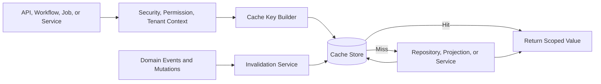
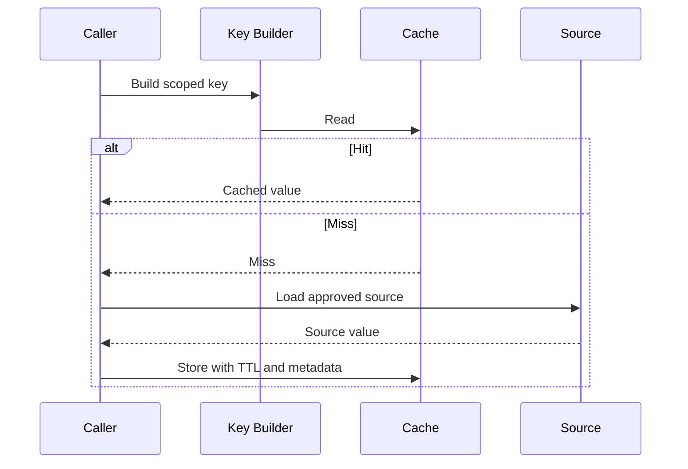
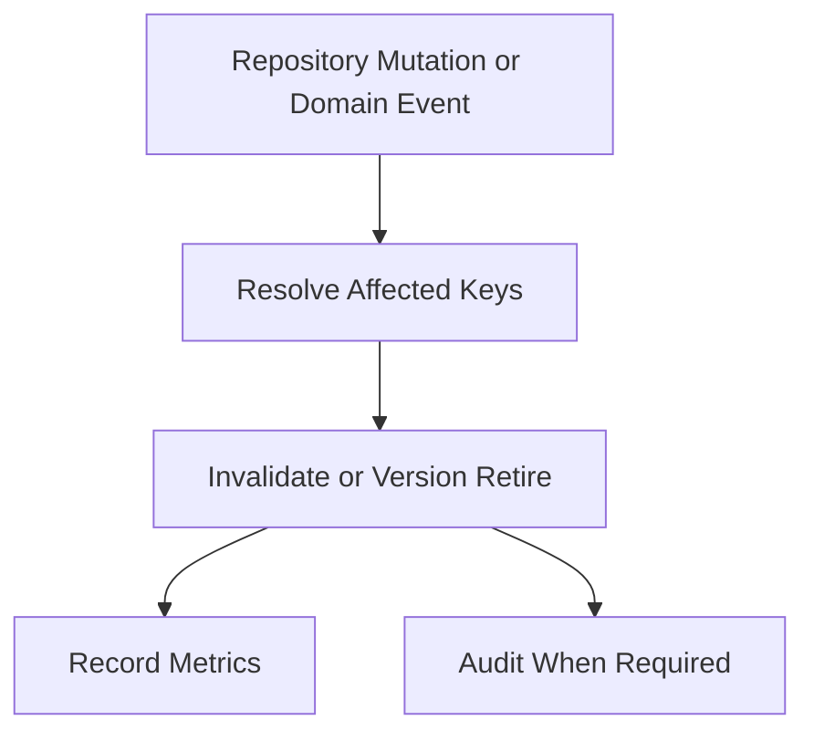
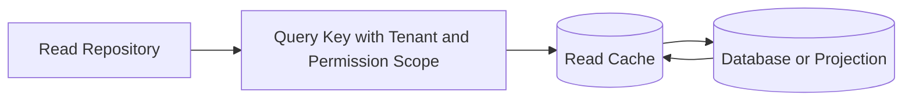
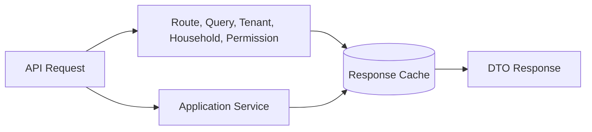
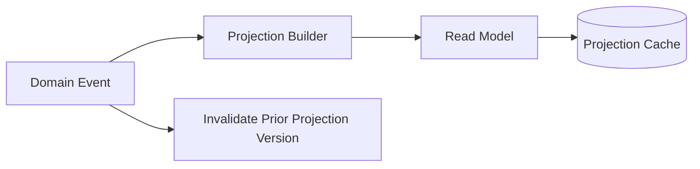

# Cache Strategy Framework

# Document Control

Document Name: Cache Strategy Framework
Document Path: knowledge/cache-strategy-framework.md
Document Type: Atlas Enterprise Canonical Specification
Version: 1.0
Status: Canonical Specification
Domain: Platform
Bounded Context: Platform
Owner: Project Atlas
Source of Truth: Atlas Cache Strategy Source of Truth
Last Updated: 2026-07-13

Related Specifications:
- knowledge/repository-catalog.md
- knowledge/application-service-catalog.md
- knowledge/domain-service-catalog.md
- knowledge/domain-event-catalog.md
- knowledge/event-driven-architecture.md
- knowledge/message-contract-catalog.md
- knowledge/data-governance-framework.md
- knowledge/database-governance-framework.md
- knowledge/security-framework.md
- knowledge/audit-framework.md
- knowledge/system-module-catalog.md
- knowledge/service-catalog.md
- knowledge/api-governance-framework.md
- knowledge/workflow-engine-framework.md
- knowledge/background-job-framework.md
- knowledge/scheduler-framework.md
- knowledge/automation-framework.md
- docs/database/05-DatabaseDesign.md
- docs/database/06-ERD.md
- docs/api/07-API.md

# Purpose

Cache Strategy Framework defines the canonical Atlas cache model. It is the source of truth for Memory Cache, Distributed Cache, Redis Cache, Read Cache, Projection Cache, Reference Cache, Configuration Cache, Metadata Cache, Session Cache, Response Cache, Query Cache, DTO Cache, cache-aside, read-through, write-through, write-behind, refresh-ahead, invalidation, warming, stampede prevention, penetration protection, avalanche prevention, cache security, cache audit, and cache performance.

This document does not create new Atlas domains or business concepts. It consolidates cache behavior required by Aggregates, Entities, Repositories, Application Services, Domain Services, APIs, DTOs, Workflows, Automations, Schedulers, Background Jobs, Projections, Read Models, Search, Notifications, Database, Redis, Memory Cache, Distributed Cache, CDN, and Event-Driven Architecture.

# Scope

- Memory Cache
- Distributed Cache
- Redis Cache
- Read Cache
- Projection Cache
- Reference Cache
- Configuration Cache
- Metadata Cache
- Session Cache
- Response Cache
- Query Cache
- DTO Cache
- Cache Aside
- Read Through
- Write Through
- Write Behind
- Refresh Ahead
- Cache Invalidation
- Cache Warming
- Cache Stampede
- Cache Penetration
- Cache Avalanche
- Repository
- Application Service
- Domain Service
- API
- DTO
- Workflow
- Automation
- Scheduler
- Background Job
- Projection
- Read Model
- Search
- Notification
- Database
- Event-Driven Architecture

# Cache Strategy Principles

- Cache is an optimization layer and must not become the source of business truth.
- Every cache must have an owner, purpose, TTL, invalidation strategy, refresh strategy, consistency strategy, security classification, monitoring, and performance target.
- Every cache key must encode enough scope to prevent tenant, household, permission, locale, version, and classification leakage.
- Every cached value must preserve Data Governance classification and Security Framework handling rules.
- Every cache that stores tenant-scoped data must include TenantId in namespace or key.
- Every cache that stores household-scoped data must include HouseholdId in namespace or key.
- Every cache for protected data must enforce permission either before population, before read, or through scoped keys that cannot be reused across principals.
- Every cache invalidation path must be deterministic, observable, and safe under retry.
- Every cache refresh path must avoid stampede, penetration, and avalanche failures.
- Cache consistency requirements must be explicit and aligned with repository, projection, event, API, and workflow behavior.

# Cache Concept Definitions

| Concept | Canonical Meaning | Required Usage |
| --- | --- | --- |
| Memory Cache | Process-local cache scoped to one application instance. | Used only for short-lived, low-risk, recomputable values. |
| Distributed Cache | Shared cache across application instances. | Used for cross-instance read optimization, coordination, and shared state when approved. |
| Redis Cache | Redis-backed distributed cache implementation. | Used when atomic operations, shared TTL, distributed locks, or high-throughput cache access are required. |
| Read Cache | Cached query result or read model response. | Must include query scope, permission scope, and invalidation rule. |
| Projection Cache | Cached projection or materialized read model. | Must include source event or projection version lineage. |
| Reference Cache | Cached reference data, enumerations, assumptions, rules, and stable catalog values. | Must include version and effective time. |
| Configuration Cache | Cached tenant, household, feature, policy, or operational configuration. | Must include configuration version and invalidation rule. |
| Metadata Cache | Cached metadata such as classification, lineage, schema, or ownership. | Must include version and owner. |
| Session Cache | Cached session, token, or principal execution context. | Must follow Security Framework and never store raw secrets. |
| Response Cache | Cached API response. | Must include route, query, tenant, household, principal or permission scope, locale, version, and classification. |
| Query Cache | Cached repository or query service result. | Must include filters, sorting, pagination, tenant, household, and permission scope. |
| DTO Cache | Cached DTO shape or serialized response. | Must preserve masking, classification, locale, and API version. |
| Cache Aside | Application checks cache, loads from source, then stores value. | Default pattern for Atlas read optimization. |
| Read Through | Cache layer loads source on miss. | Allowed only when source access and permission checks are explicit. |
| Write Through | Write path synchronously updates cache and source. | Allowed for configuration or reference data when consistency requires it. |
| Write Behind | Cache accepts write and asynchronously persists source. | Prohibited for business truth unless explicitly cataloged and auditable. |
| Refresh Ahead | Cache refreshes before expiry. | Used for high-read stable data with known refresh cadence. |
| Cache Invalidation | Removal or version retirement of cached values. | Required for mutable data. |
| Cache Warming | Preloading cache before traffic needs it. | Required for expensive hot paths when approved. |
| Cache Stampede | Many callers rebuild the same missing key concurrently. | Must be prevented for expensive keys. |
| Cache Penetration | Repeated misses for nonexistent data. | Must be mitigated with negative caching or request validation. |
| Cache Avalanche | Many keys expire simultaneously and overload source. | Must be mitigated through TTL jitter and staged warming. |

# Cache Architecture

Atlas cache architecture is repository-aware, event-aware, tenant-aware, and classification-aware.

1. API, workflow, scheduler, automation, background job, or application service receives authenticated execution context.
2. Permission and tenant checks resolve allowed scope before protected cached data is returned.
3. Cache key builder creates deterministic key with resource, query, version, TenantId, HouseholdId, locale, permission scope, and classification where required.
4. Cache read attempts to return a valid value that matches context, schema version, and data version.
5. Cache miss loads data through repository, projection, read model, configuration service, reference provider, or approved external source.
6. Cache write serializes, compresses, encrypts where required, sets TTL, records metadata, and emits metrics.
7. Domain Events, integration events, repository mutations, configuration changes, scheduler runs, and manual operations invalidate or refresh affected keys.
8. Monitoring tracks hit ratio, latency, memory, evictions, stale reads, refresh failures, invalidation failures, and source fallback.

# Complete Cache Catalog

Every cache entry or cache family must use this Enterprise contract.

| Field | Requirement |
| --- | --- |
| Cache Name | Stable PascalCase name ending with Cache. |
| Display Name | Human-readable label. |
| Category | Memory, Distributed, Redis, Read, Projection, Reference, Configuration, Metadata, Session, Response, Query, DTO, Search, Notification. |
| Purpose | Why the cache exists. |
| Business Meaning | Business, operational, security, reporting, or performance meaning. |
| Description | Exact value cached and access behavior. |
| Cache Type | Cache-aside, read-through, write-through, refresh-ahead, negative cache, or coordination cache. |
| Storage | Memory, Redis, distributed cache provider, CDN, browser cache, service worker cache, or approved storage. |
| Owner | Application, repository, platform service, or module owner. |
| Repository | Repository owning source data when applicable. |
| Application Service | Service responsible for orchestration. |
| Domain Service | Service responsible for domain-derived value when applicable. |
| Aggregate | Aggregate source when applicable. |
| Entity | Entity source when applicable. |
| Projection | Projection source when applicable. |
| Read Model | Read model source when applicable. |
| API | API response or route when applicable. |
| Workflow | Workflow scope when applicable. |
| Scheduler | Scheduler scope when applicable. |
| Automation | Automation scope when applicable. |
| Background Job | Job scope when applicable. |
| Trigger | Read miss, write, event, scheduler, deployment, warming, or manual operation. |
| TTL | Time-to-live and jitter rule. |
| Expiration | Absolute, sliding, version-based, event-based, or manual. |
| Eviction Policy | LRU, LFU, volatile TTL, memory pressure, version retirement, or manual. |
| Refresh Policy | Refresh-ahead, lazy refresh, scheduled refresh, event refresh, or no refresh. |
| Invalidation Strategy | Event, command, repository mutation, version bump, dependency graph, wildcard, or explicit key. |
| Consistency Strategy | Strong, read-your-write, bounded stale, eventual, or best-effort. |
| Concurrency Strategy | Lock, single-flight, compare-and-set, version token, or idempotent refresh. |
| Serialization | JSON, binary, compressed JSON, DTO version, or approved format. |
| Compression | Required when payload size or bandwidth requires it. |
| Encryption | Required for protected cached data. |
| Monitoring | Metrics, alerts, dashboards, and ownership. |
| Metrics | Hit ratio, miss ratio, latency, stale read, refresh count, eviction count, memory, errors. |
| Security | Classification, tenant, household, permission, masking, encryption, and secret rules. |
| Audit | Required audit for invalidation, refresh, administrative access, protected data, and security failures. |
| Performance | Target latency, source fallback SLA, memory budget, and warm-up expectation. |
| Example | Minimal valid cache key and value description. |

# Cache Matrix

| Cache Category | Source of Truth | Typical TTL | Consistency |
| --- | --- | --- | --- |
| Reference Cache | Reference catalog or governed table | Long with version invalidation | Bounded stale or versioned strong. |
| Configuration Cache | Configuration repository | Short to medium with version invalidation | Read-your-write for administrative changes. |
| Query Cache | Repository or read model | Short with event invalidation | Bounded stale. |
| Projection Cache | Event projection or read model | Medium with projection version | Eventual. |
| Response Cache | API response | Short with permission and route scope | Bounded stale. |
| Session Cache | Security session store | Session lifetime | Strong for revocation-sensitive values. |
| Metadata Cache | Governance metadata source | Medium with version invalidation | Read-your-write for policy changes. |
| Negative Cache | Repository miss or validation miss | Very short | Best-effort. |

# Repository Cache Matrix

| Repository Concern | Cache Rule |
| --- | --- |
| Aggregate Repository | Do not cache mutable aggregate write model unless explicitly approved. |
| Read Repository | Cache stable read results with tenant, household, filter, sort, page, and permission scope. |
| Projection Repository | Cache projection results with projection version and source event position. |
| Configuration Repository | Cache by TenantId, HouseholdId, key, version, and effective time. |
| Audit Repository | Cache search metadata only when permission and classification allow it. |
| Integration Repository | Cache partner metadata and endpoint routing, not raw secrets. |

# API Cache Matrix

| API Area | Cache Rule |
| --- | --- |
| Public Reference API | Response cache allowed with versioned keys and long TTL. |
| Authenticated Read API | Cache only with tenant, household, principal or permission scope, route, query, API version, and classification. |
| Mutation API | Do not response-cache mutation results except idempotency responses under strict key scope. |
| Export API | Do not cache generated protected exports unless approved storage and audit policy exists. |
| Error Response | Cache only safe validation or not-found responses with short negative TTL. |
| Pagination | Cursor and page cache must bind tenant, household, filter, sort, and permission scope. |

# Projection Cache Matrix

| Projection Type | Cache Rule |
| --- | --- |
| Event Projection | Key includes projection name, projection version, event position, TenantId, and HouseholdId when scoped. |
| Read Model | Key includes read model version, query, tenant, household, and classification. |
| Search Result | Key includes search index version, query, filters, permission scope, and staleness limit. |
| Dashboard Metric | Key includes metric id, source version, aggregation window, tenant, household, and permission scope. |
| Report Fragment | Key includes report id, source query version, generated time, scope, and classification. |

# Workflow Cache Matrix

| Workflow Use | Cache Rule |
| --- | --- |
| Step Lookup | Cache reference or configuration values with workflow run context and version. |
| Approval State | Do not cache as source of truth; cache read copy only with short TTL. |
| Compensation Data | Cache only derived helper data; persistent workflow state remains source of truth. |
| Long Running Workflow | Use versioned refresh to avoid stale policy, permission, or configuration. |

# Invalidation Matrix

| Source Change | Required Invalidation |
| --- | --- |
| Repository Mutation | Invalidate affected aggregate, entity, query, projection, and response keys. |
| Domain Event | Invalidate or refresh projection, read model, search, dashboard, and report keys. |
| Configuration Change | Bump configuration version and invalidate tenant or household configuration keys. |
| Permission Change | Invalidate permission cache, response cache, DTO cache, and protected query cache for affected scope. |
| Tenant Lifecycle Change | Invalidate tenant routing, configuration, session-dependent, and response keys. |
| Household Membership Change | Invalidate household-scoped permission, query, response, and dashboard keys. |
| Deployment | Invalidate keys with incompatible schema, DTO, serialization, or API version. |
| Archive or Purge | Invalidate source record, search, projection, report, and archive metadata keys. |

# TTL Strategy

- TTL must reflect volatility, classification, consistency requirement, and source recovery cost.
- Protected data TTL should be shorter than public or reference data TTL.
- Configuration and permission caches must support explicit invalidation in addition to TTL.
- TTL jitter must be applied to high-volume cache families to prevent avalanche.
- Negative cache TTL must be short and must not hide newly created resources for long.
- Session-related TTL must not exceed session or token validity.

# Refresh Strategy

- Refresh-ahead is allowed for expensive, high-read, low-volatility keys.
- Lazy refresh is the default for ordinary read caches.
- Event refresh is required when event-driven projections must remain warm.
- Scheduled refresh is allowed for reference, reporting, dashboard, and metadata caches.
- Refresh failures must fall back to previous value only when staleness policy allows it.
- Refresh must use single-flight or distributed lock for expensive keys.

# Warm-up Strategy

- Warm-up must target known hot keys, reference data, configuration, dashboard metrics, and projections.
- Warm-up must be scoped by tenant and household only when access policy allows it.
- Deployment warm-up must respect schema, DTO, API, and serialization versions.
- Warm-up failures must be observable and must not block critical deployment unless the cache is required for availability.

# Consistency Strategy

- Strong consistency is required for session revocation, permission denial, tenant suspension, legal hold, and security-sensitive configuration.
- Read-your-write consistency is required for user-visible configuration and command-result reads when promised by API behavior.
- Bounded stale consistency is acceptable for dashboards, reporting fragments, reference data, and expensive read models.
- Eventual consistency is acceptable for projections and search when staleness is visible or bounded.
- Best-effort caching is acceptable only for non-critical technical optimizations.

# Validation Rules

- Cache Name is required.
- Cache Category is required.
- Cache Owner is required.
- Source of Truth is required.
- TTL is required.
- Expiration rule is required.
- Invalidation Strategy is required for mutable data.
- Refresh Policy is required.
- Consistency Strategy is required.
- Concurrency Strategy is required for expensive refresh.
- Serialization format is required.
- Cache key format is required.
- Cache key must include TenantId for tenant-scoped data.
- Cache key must include HouseholdId for household-scoped data.
- Cache key must include permission or principal scope for permission-sensitive data.
- Cache key must include API version for response cache.
- Cache key must include DTO version for DTO cache.
- Cache key must include projection version for projection cache.
- Cache key must include configuration version for configuration cache.
- Cache value classification is required.
- Encryption policy is required for protected cached data.
- Masking policy is required for protected response or DTO cache.
- Monitoring metrics are required.
- Performance target is required.
- Memory budget is required for memory or distributed caches.
- Eviction policy is required.
- Negative cache TTL must be explicitly short.
- Session cache TTL must not exceed session validity.
- Permission cache must invalidate on role or policy change.
- Configuration cache must invalidate on configuration change.
- Repository mutation must invalidate affected read caches.
- Domain Event must invalidate or refresh affected projection caches.
- Protected cache administrative operations must be audited.
- Cache failures must be observable.
- Cache miss fallback must use approved source path.
- Write-behind cache is prohibited for business truth unless explicitly approved.
- Raw secrets must not be cached.
- Raw tokens must not be cached.
- Cache stampede protection is required for expensive keys.
- Cache avalanche mitigation is required for high-volume key families.
- Cache penetration mitigation is required for known miss-heavy endpoints.
- Cache schema changes must version keys or invalidate incompatible values.

# Business Rules

- Cache must not be the source of business truth.
- Cache must not bypass repository ownership.
- Cache must not bypass permission evaluation.
- Cache must not bypass tenant isolation.
- Cache must not bypass household isolation.
- Cache must not weaken data classification.
- Cache must not store raw secrets.
- Cache must not store raw tokens.
- Cache must not expose unmasked restricted values.
- Cache keys must be deterministic.
- Cache keys must be bounded in length.
- Cache keys must avoid raw PII when a stable hash or internal id can be used.
- Cache values must be versioned when schema changes can occur.
- Cache values must be invalidated when serialization changes.
- Cache values must be invalidated when DTO shape changes.
- Cache values must be invalidated when permission scope changes.
- Cache values must be invalidated when tenant lifecycle changes.
- Cache values must be invalidated when household membership changes.
- Cache values must be invalidated when configuration version changes.
- Cache values must be invalidated when source record is archived.
- Cache values must be invalidated when source record is purged.
- Cache values must be invalidated when source classification changes.
- Read cache must be populated only after source read succeeds.
- Read cache must not return data from another tenant.
- Read cache must not return data from another household.
- Response cache must include route and query parameters.
- Response cache must include locale when response is localized.
- Response cache must include currency or formatting context when values are formatted.
- Query cache must include filters, sorting, and pagination.
- DTO cache must include API version and masking scope.
- Projection cache must include source version or event position.
- Search cache must include index version.
- Reference cache must include reference version or effective date.
- Configuration cache must include configuration version.
- Metadata cache must include metadata version.
- Permission cache must include policy and role version.
- Session cache must support revocation.
- Cache-aside is the default read pattern.
- Read-through is allowed only with explicit permission and source access rules.
- Write-through must not hide source write failure.
- Write-behind is prohibited for financial decisions, audit evidence, security state, permission state, tenant lifecycle, and compliance evidence.
- Refresh-ahead must not overload source systems.
- Cache warm-up must not leak protected data.
- Cache warming must use approved service actors.
- Cache invalidation must be idempotent.
- Cache refresh must be idempotent.
- Cache refresh must preserve audit correlation when triggered by governed operation.
- Cache invalidation failures must be monitored.
- Cache refresh failures must be monitored.
- Cache eviction must not break correctness.
- Cache miss must fall back to approved source.
- Cache miss fallback must enforce permission.
- Negative cache must not persist longer than resource creation visibility requirement.
- Stampede protection must use single-flight or distributed lock for expensive keys.
- Distributed locks must have expiry.
- Distributed locks must be owned and observable.
- TTL jitter must be used for high-volume keys.
- High-risk security changes must invalidate synchronously when required.
- Low-risk dashboard caches may refresh asynchronously.
- Audit records must not depend on cache availability.
- Domain events must not be dropped because cache invalidation fails.
- Repository transactions must not depend on cache write success unless write-through is explicitly required.
- Cache outage must degrade to source reads where capacity allows.
- Source overload protection must be considered during cache outage.
- Cache metrics must be reviewed for hit ratio and stale reads.
- Cache memory growth must be bounded.
- Eviction spikes must be investigated.
- Redis keyspace must be namespaced by environment and service.
- Redis keys must avoid uncontrolled cardinality.
- CDN cache must not store tenant-protected personalized responses unless scoped and approved.
- Browser or service worker cache must not store protected data unless security policy approves it.
- Notification caches must not expose restricted template variables.
- Integration caches must not store raw partner credentials.
- Data Governance Framework controls apply to cached data.
- Database Governance Framework remains source for persistent truth.
- Event-Driven Architecture provides invalidation signals when source changes through events.
- Cache Strategy Framework conflicts are resolved by this document unless Security, Audit, Compliance, Data Governance, Tenant, or legal rules impose stricter controls.

# Security

## Encryption

- Protected cached values must be encrypted when storage is shared, distributed, persistent, or outside process memory.
- Redis and distributed cache transport must be encrypted when carrying protected data.
- Secure references must be cached only when permitted and never expanded into raw secrets.

## Access Control

- Protected cache reads require prior authentication and permission.
- Administrative cache inspect, flush, warm, and restore actions require elevated permission.
- Cache tooling must not expose values beyond the actor's classification scope.

## Tenant Isolation

- Tenant-scoped cache keys must include TenantId or tenant namespace.
- Cross-tenant cache sharing is prohibited unless data is explicitly public or platform-scoped.
- Tenant lifecycle changes must invalidate affected tenant caches.

## Household Isolation

- Household-scoped cache keys must include HouseholdId.
- Household membership changes must invalidate affected permission, response, query, dashboard, and DTO caches.
- Household data must not be cached under tenant-only keys unless the value is aggregated and approved.

# Audit

## Cache History

- Administrative cache flush, warm-up, inspect, override, and restore actions must be audited.
- Cache policy changes must be audited.

## Invalidation History

- Invalidation caused by security, permission, tenant lifecycle, household membership, archive, purge, or classification changes must be auditable.
- Invalidation failures must create operational evidence.

## Refresh History

- Scheduled refresh, refresh-ahead, and event refresh failures must be recorded with cache name, key scope, owner, and outcome.
- Refresh of compliance-sensitive or security-sensitive cache families must be auditable.

# Performance

| Area | Requirement |
| --- | --- |
| Cache Hit Ratio | Each cache family must define expected hit ratio and review threshold. |
| Latency | Cache read and write latency must be measured separately from source fallback. |
| Memory Usage | Memory budget, key cardinality, payload size, and eviction behavior must be monitored. |
| Eviction | Eviction spikes must be visible and tied to owner review. |

# Mermaid

## Cache Architecture

## Cache Flow

## Cache Invalidation

## Repository Cache

## API Cache

## Projection Cache

# Testing

| Test Type | Required Coverage |
| --- | --- |
| Cache Test | Key scope, read miss, read hit, source fallback, serialization, versioning, and masking. |
| TTL Test | Expiration, TTL jitter, negative cache TTL, session TTL, and refresh-ahead timing. |
| Invalidation Test | Repository mutation, domain event, permission change, tenant change, household change, archive, purge, and deployment invalidation. |
| Performance Test | Hit ratio, latency, memory usage, eviction, stampede prevention, and source fallback load. |
| Consistency Test | Strong, read-your-write, bounded stale, eventual, and best-effort consistency behavior. |

# Edge Cases

- Cache key omits TenantId.
- Cache key omits HouseholdId.
- Cache key omits permission scope.
- Cache key omits API version.
- Cache key omits DTO version.
- Cache key includes raw PII.
- Response cache returns another tenant's value.
- Query cache returns another household's value.
- Permission changes but protected response cache remains valid.
- Tenant is suspended but cache still returns data.
- Household member is removed but dashboard cache remains visible.
- Configuration changes but configuration cache is stale.
- Domain Event is delayed and invalidation is delayed.
- Repository mutation commits but cache invalidation fails.
- Cache invalidation runs before transaction commits.
- Projection cache refreshes from stale event position.
- Search cache uses old index version.
- Negative cache hides newly created resource.
- TTL avalanche expires hot keys at the same time.
- Cache stampede overloads database.
- Cache penetration attacks nonexistent keys.
- Redis node fails during write.
- Redis lock expires before refresh finishes.
- Distributed lock is not released.
- Memory cache differs across application instances.
- Deployment changes serialization format.
- Old cache value cannot deserialize.
- DTO cache leaks unmasked field after masking policy changes.
- CDN caches personalized response.
- Browser cache stores protected data.
- Service worker cache serves stale protected response.
- Session revocation is not reflected in session cache.
- Token rotation leaves stale token-derived cache.
- Integration cache stores raw credential.
- Notification template cache includes restricted value.
- Archive purge does not invalidate search cache.
- Legal hold changes but retention cache remains stale.
- Cache warm-up runs without approved service actor.
- Cache warm-up loads protected data for inactive tenant.
- Cache monitoring misses eviction spike.
- Cache memory budget is exceeded.
- Eviction removes coordination key.
- Write-through cache succeeds but source write fails.
- Source write succeeds but write-through cache fails.
- Refresh-ahead keeps refreshing unused key.
- Stale value is returned beyond allowed staleness window.
- Compression failure blocks cache write.
- Encryption key rotation makes cached value unreadable.
- Cache administrative flush is not audited.
- Cache inspect tool shows protected value.
- High-cardinality keys create memory pressure.
- Query filter order creates duplicate equivalent keys.
- Locale missing from localized response key.
- Currency formatting context missing from key.
- Time range query cache ignores timezone semantics.
- Report fragment cache uses outdated aggregation window.

# Final Consistency Matrix

| Area | Required Cache Alignment |
| --- | --- |
| Cache | Uses this framework as canonical source of truth. |
| Repository | Source ownership, query scope, mutation invalidation, and transaction behavior are defined. |
| Application Service | Cache orchestration, permission, fallback, and context propagation are defined. |
| Domain Service | Domain-derived cached values preserve source version and rules. |
| Workflow | Workflow cache usage preserves run context, policy, and version. |
| Scheduler | Scheduled refresh, warm-up, invalidation, and monitoring are scoped and audited. |
| Automation | Cache remediation and invalidation actions preserve permission and audit. |
| Projection | Projection cache preserves event position, source lineage, and classification. |
| API | Response, DTO, query, pagination, locale, and permission caches are scoped. |
| Database | Database remains source of truth and cache fallback source. |

# Completion Checklist

- Cache owner requirement is defined.
- Cache TTL requirement is defined.
- Cache invalidation strategy is defined.
- Cache refresh strategy is defined.
- Cache warm-up strategy is defined.
- Cache consistency strategy is defined.
- Cache key scope rules are defined.
- Repository cache mapping is defined.
- API cache mapping is defined.
- Projection cache mapping is defined.
- Workflow cache mapping is defined.
- Performance target requirement is defined.
- Monitoring requirement is defined.
- Security requirement is defined.
- Audit requirement is defined.
- Validation rules are complete.
- Business rules are complete.
- Mermaid diagrams are syntactically valid.
- Markdown structure is valid.
- No placeholder terms are present.
- No draft-only status is present.
- No temporary catalog entries are present.
