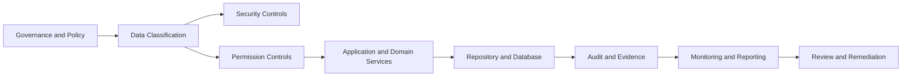
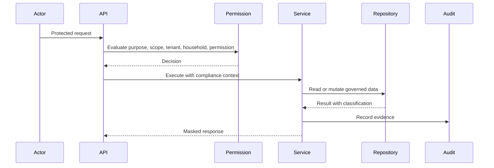
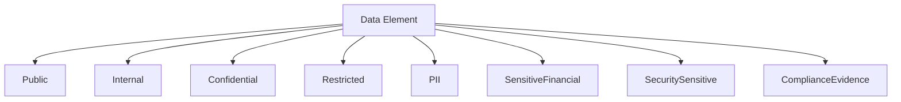
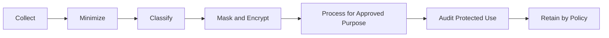
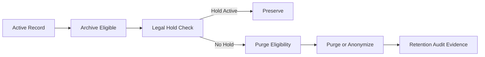
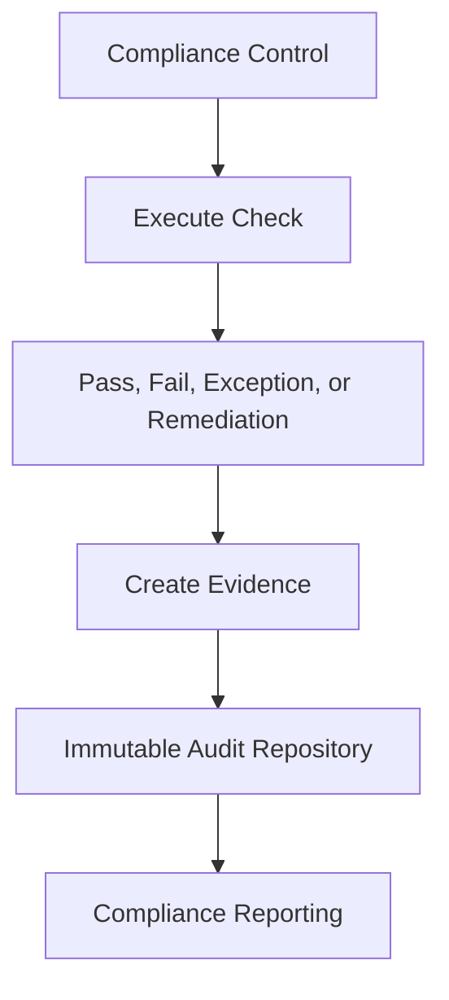

# Compliance Framework

# Document Control

Document Name: Compliance Framework
Document Path: knowledge/compliance-framework.md
Document Type: Atlas Enterprise Canonical Specification
Version: 1.0
Status: Canonical Specification
Domain: Platform
Bounded Context: Platform
Owner: Project Atlas
Source of Truth: Atlas Compliance Source of Truth
Last Updated: 2026-07-13

Related Specifications:
- knowledge/security-framework.md
- knowledge/permission-framework.md
- knowledge/audit-framework.md
- knowledge/tenant-framework.md
- knowledge/application-service-catalog.md
- knowledge/domain-service-catalog.md
- knowledge/repository-catalog.md
- knowledge/aggregate-catalog.md
- knowledge/entity-catalog.md
- knowledge/command-catalog.md
- knowledge/domain-event-catalog.md
- knowledge/api-governance-framework.md
- knowledge/service-catalog.md
- knowledge/system-module-catalog.md
- knowledge/workflow-engine-framework.md
- knowledge/background-job-framework.md
- knowledge/scheduler-framework.md
- knowledge/automation-framework.md
- knowledge/integration-framework.md
- docs/database/05-DatabaseDesign.md
- docs/database/06-ERD.md
- docs/api/07-API.md

# Purpose

Compliance Framework defines the canonical Atlas compliance model. It is the source of truth for governance, internal policy, data governance, data classification, PII handling, sensitive data controls, retention, legal hold, consent, purpose limitation, minimization, evidence, exceptions, compliance audit, monitoring, reporting, and control ownership.

This document does not define external regulations as Atlas domains and does not create new business concepts outside the approved Atlas knowledge base. It consolidates compliance behavior required by Security, Permission, Audit, Tenant, Application Service, Domain Service, Repository, Command, Domain Event, Workflow, Automation, Scheduler, Background Job, API, Database, Notification, Integration, Retention Policy, PII, and Data Governance specifications.

# Scope

- Compliance
- Governance
- Regulation
- Internal Policy
- Data Governance
- Data Classification
- PII
- Sensitive Data
- Data Retention
- Legal Hold
- Consent
- Purpose Limitation
- Data Minimization
- Data Ownership
- Data Steward
- Compliance Audit
- Risk Control
- Evidence
- Exception
- Security
- Permission
- Audit
- Tenant
- Repository
- Application Service
- Domain Service
- Aggregate
- Entity
- Command
- Domain Event
- Workflow
- Scheduler
- Automation
- Background Job
- API
- Database
- Cache
- Notification
- Integration

# Compliance Principles

- Every compliance requirement must map to an Atlas owner, control, evidence source, and audit path.
- Every protected data element must have classification, owner, retention, access, masking, and encryption expectations.
- Every compliance-sensitive operation must be auditable.
- Every compliance exception must be approved, scoped, time-bound, monitored, and auditable.
- Every repository containing protected data must enforce retention and access controls.
- Every API exposing protected data must enforce authentication, authorization, permission, tenant isolation, household isolation, classification, masking, audit, and rate limiting where applicable.
- Every workflow, scheduler, automation, and background job handling protected data must preserve compliance context.
- Every integration and notification carrying protected data must follow data classification, consent, purpose, and evidence requirements.
- Default behavior is deny, minimize, mask, encrypt, retain by policy, and audit.
- Compliance evidence must be immutable or traceable to immutable audit records.

# Compliance Concept Definitions

| Concept | Canonical Meaning | Required Usage |
| --- | --- | --- |
| Compliance | Demonstrable adherence to Atlas governance, security, privacy, retention, audit, and operational controls. | Required for protected data and controlled operations. |
| Governance | Approved decision structure defining ownership, accountability, policy, control, and review cadence. | Required for compliance capabilities and exceptions. |
| Regulation | External legal or regulatory obligation represented only as a mapped compliance requirement. | Must not create unmanaged domain behavior. |
| Internal Policy | Atlas-controlled rule that constrains system behavior, operations, access, data handling, and evidence. | Required for enforceable controls. |
| Data Governance | Ownership and management of data classification, quality, retention, access, lineage, and usage. | Required for entities, repositories, APIs, and reporting. |
| Data Classification | Label describing sensitivity and required controls. | Required for protected data fields and payloads. |
| PII | Personal identifying or household-identifying information. | Requires minimization, masking, encryption, access control, retention, and audit. |
| Sensitive Data | Financial, security, credential, identity, or decision data requiring elevated protection. | Requires stronger controls than public or internal data. |
| Data Retention | Policy defining how long data and evidence are retained before archive or purge eligibility. | Required for repositories and audit records. |
| Legal Hold | Override preventing purge or destructive transformation while investigation or obligation exists. | Takes precedence over normal retention. |
| Consent | Recorded permission or authorization for a specific data use when required by policy. | Must be versioned and auditable. |
| Purpose Limitation | Constraint that data is collected, processed, exported, or shared only for approved purposes. | Required for protected processing. |
| Data Minimization | Requirement to collect, store, transmit, display, and export only the necessary data. | Required for APIs, messages, notifications, and audit payloads. |
| Data Ownership | Accountability for data domain, classification, quality, access, and retention. | Required for aggregates, entities, and repositories. |
| Data Steward | Responsible role maintaining data governance quality and review. | Required for compliance review and exceptions. |
| Compliance Audit | Evidence record proving control execution, exception handling, review, and remediation. | Required for compliance-sensitive operations. |
| Risk Control | Preventive, detective, corrective, or compensating control reducing compliance risk. | Required for every capability. |
| Evidence | Verifiable record of control execution or policy compliance. | Must be immutable, auditable, or traceable. |
| Exception | Approved deviation from a policy or control. | Must be scoped, time-bound, approved, monitored, and audited. |

# Compliance Architecture

Atlas compliance architecture uses policy-driven controls, enforced at boundaries and evidenced through audit.

1. Governance defines compliance capability, owner, control, policy, classification, retention, and evidence.
2. Data Governance classifies aggregates, entities, fields, payloads, API responses, message contracts, notifications, exports, and audit records.
3. Security Framework authenticates actors and protects secrets, credentials, sessions, and transport.
4. Permission Framework evaluates action, resource, tenant, household, role, policy, and scope.
5. Tenant Framework enforces tenant and household isolation.
6. Application Services and Domain Services apply business rules, purpose limitation, consent checks, and compliance guards.
7. Repositories enforce access, retention, soft delete, archive, legal hold, and data minimization rules.
8. APIs, Workflows, Schedulers, Automations, Background Jobs, Notifications, and Integrations preserve compliance context.
9. Audit Framework records evidence, exception, control decision, actor, reason, correlation, and outcome.
10. Monitoring, reporting, and review processes consume evidence without bypassing permission or tenant isolation.

# Complete Compliance Catalog

Every compliance capability must use this Enterprise contract.

| Field | Requirement |
| --- | --- |
| Capability Name | Stable PascalCase name ending with Compliance when capability-level. |
| Display Name | Human-readable label. |
| Category | DataGovernance, Privacy, Security, Retention, Audit, AccessControl, OperationalControl, IntegrationControl, NotificationControl, ReportingControl, ExceptionControl. |
| Purpose | Why the capability exists. |
| Business Meaning | Business, operational, privacy, security, or governance meaning. |
| Description | Exact behavior controlled or evidenced. |
| Applicable Domain | Atlas domain or platform area affected. |
| Applicable Aggregate | Aggregate requiring compliance ownership. |
| Applicable Entity | Entity requiring classification, retention, or access policy. |
| Applicable Repository | Repository enforcing retention, access, archive, or legal hold. |
| Applicable API | API enforcing consent, purpose, access, masking, export, or audit. |
| Applicable Workflow | Workflow preserving compliance context and approval state. |
| Applicable Scheduler | Scheduler running compliance checks, retention, archive, review, or reporting. |
| Applicable Automation | Automation executing compliance guard, alert, remediation, or approval action. |
| Applicable Background Job | Job processing retention, archive, export, report, evidence, or control validation. |
| Applicable Command | Command requiring compliance validation or audit. |
| Applicable Domain Event | Event carrying compliance metadata or evidence. |
| Applicable Message Contract | Message carrying protected data or compliance metadata. |
| Security Dependency | Authentication, encryption, session, token, secret, transport, or integrity requirement. |
| Permission Dependency | Required permission, role, policy, or scope. |
| Audit Dependency | Evidence and audit record requirements. |
| Tenant Dependency | TenantId and HouseholdId requirements. |
| Validation Rules | Mandatory validations before execution. |
| Business Rules | Mandatory behavioral rules. |
| Retention Policy | Retention class, archive class, purge eligibility, and legal hold behavior. |
| Data Classification | Public, Internal, Confidential, Restricted, PII, SensitiveFinancial, SecuritySensitive, ComplianceEvidence. |
| Masking Policy | Display, export, log, notification, and audit masking. |
| Encryption Policy | At-rest, in-transit, field-level, tokenization, or secure reference requirement. |
| Access Policy | Read, write, approve, export, restore, delete, review, and administer rules. |
| Exception Policy | Approval, scope, expiry, compensating control, monitoring, and audit. |
| Evidence | Required proof source and storage. |
| Monitoring | Metrics, alerts, checks, and review cadence. |
| Reporting | Dashboard, report, export, and stakeholder view. |
| Performance | SLA or bounded execution expectation. |
| Example | Minimal valid compliance scenario. |

# Compliance Matrix

| Capability Category | Primary Owner | Required Evidence |
| --- | --- | --- |
| Data Governance | Data Steward | Classification record, owner, retention class, access policy, review timestamp. |
| Privacy | Security and Data Steward | PII map, consent record, purpose, masking, access audit, export audit. |
| Security | Security Framework | Authentication, authorization, encryption, key or secret reference, denial audit. |
| Retention | Repository and Audit | Retention class, archive action, purge eligibility, legal hold state, purge audit. |
| Audit | Audit Framework | Immutable audit record, correlation, actor, resource, outcome, integrity marker. |
| Access Control | Permission Framework | Permission decision, role, policy, scope, tenant, household, denial reason. |
| Operational Control | Service Catalog | Approval, change record, run record, exception, rollback or remediation evidence. |
| Integration Control | Integration Framework | Partner mapping, contract version, payload classification, delivery audit. |
| Notification Control | Notification Framework | Recipient scope, template classification, consent, delivery result, suppression. |
| Reporting Control | Application Service | Data scope, aggregation rule, export permission, masking, generated report audit. |

# Data Classification Matrix

| Classification | Meaning | Required Controls |
| --- | --- | --- |
| Public | Approved for public or unauthenticated use. | Integrity control and source ownership. |
| Internal | Operational information not intended for public exposure. | Authentication and standard audit. |
| Confidential | Tenant, household, business, or operational data requiring controlled access. | Permission, tenant isolation, encryption, audit, retention. |
| Restricted | Data whose exposure creates high security, privacy, or financial risk. | Elevated permission, masking, encryption, detailed audit, export control. |
| PII | Data identifying a person or household. | Minimization, masking, encryption, consent or approved purpose, retention, audit. |
| SensitiveFinancial | Assets, liabilities, cashflow, goals, projections, scenarios, recommendations, and financial decisions. | Household isolation, permission, audit, encryption, retention, export control. |
| SecuritySensitive | Tokens, sessions, secrets, credentials, keys, policy internals, threat indicators. | Secure reference, no raw logging, elevated access, tamper evidence. |
| ComplianceEvidence | Evidence, approval, exception, legal hold, audit, report, and review records. | Immutability, retention, restricted access, integrity verification. |

# PII Matrix

| PII Area | Examples | Required Controls |
| --- | --- | --- |
| Identity | Name, email, phone, user id, account id. | Permission, masking in logs, encryption, audit on protected reads. |
| Household | Household id, membership, relationship, address-like context. | Household isolation, permission, audit, retention. |
| Financial Profile | Income, assets, liabilities, expenses, cash reserve, portfolio values. | SensitiveFinancial controls and restricted exports. |
| Behavior | Login history, session, usage, actions, preferences. | Purpose limitation, retention, masking, audit. |
| Notification | Recipient, channel, template variables. | Consent where required, minimization, delivery audit. |
| Integration | Partner identifiers, account mappings, external references. | Partner contract control, encryption, audit, deletion policy. |

# Retention Matrix

| Record Type | Retention Class | Minimum Retention | Notes |
| --- | --- | --- | --- |
| Business Decisions | BusinessStandard | 7 years | Includes assumptions, formula versions, rule versions, and recommendation evidence. |
| Security Decisions | SecurityStandard | 7 years | Includes authentication, authorization, token, session, and isolation decisions. |
| Compliance Evidence | ComplianceLong | 10 years | Includes approvals, exceptions, reviews, and control validation. |
| Operational Logs | OperationalStandard | 1 year | Includes jobs, schedulers, workflows, integrations, and system actions. |
| Technical Diagnostics | OperationalShort | 90 days | Excludes mandatory audit and security evidence. |
| Legal Hold Records | LegalHold | Until released | Overrides purge and destructive anonymization. |

# Audit Matrix

| Compliance Activity | Required Audit |
| --- | --- |
| Classification Change | Actor, data element, old class, new class, reason, approval, correlation. |
| Retention Change | Actor, repository, old policy, new policy, effective time, approval. |
| Legal Hold Apply | Actor, scope, reason, authority, start time, affected records. |
| Legal Hold Release | Actor, scope, reason, release time, resumed policy. |
| Exception Approval | Requester, approver, policy, scope, expiry, compensating control. |
| Protected Read | Principal, purpose, resource, tenant, household, permission, outcome. |
| Export | Principal, scope, classification, masking, destination, retention, outcome. |
| Purge | Principal, scope, eligibility, hold check, affected count, outcome. |
| Report Generation | Principal, data scope, filters, classification, masking, output reference. |

# Permission Matrix

| Action | Permission Requirement |
| --- | --- |
| View Compliance Data | Compliance.Read with tenant and household scope. |
| Manage Classification | Compliance.Classification.Manage with data steward role or approved policy. |
| Manage Retention | Compliance.Retention.Manage with administrative approval. |
| Apply Legal Hold | Compliance.LegalHold.Apply with elevated permission and reason. |
| Release Legal Hold | Compliance.LegalHold.Release with elevated permission and approval. |
| Approve Exception | Compliance.Exception.Approve with segregation of duties. |
| Export Protected Data | Compliance.Export with purpose, scope, masking, and audit. |
| Purge Data | Compliance.Purge with retention eligibility and legal hold verification. |
| View Evidence | Compliance.Evidence.Read with classification-based restriction. |

# API Compliance Matrix

| API Area | Compliance Requirement |
| --- | --- |
| Authentication | Required for protected APIs. |
| Authorization | Required before protected data is returned or modified. |
| Tenant Resolution | Required before resource lookup. |
| Data Classification | Response fields must follow classification and masking policy. |
| Purpose | Protected processing must have approved purpose. |
| Export | Requires export permission, scope, masking, and audit. |
| Error Handling | Must not disclose protected resource existence across tenant or household boundaries. |
| Pagination | Cursor must preserve tenant, household, classification, and permission scope. |

# Repository Compliance Matrix

| Repository Concern | Compliance Requirement |
| --- | --- |
| Create | Assign classification, owner, tenant, household, retention class, and audit context. |
| Read | Enforce permission, tenant, household, purpose, masking, and protected-read audit. |
| Update | Validate classification, ownership, retention, permission, and audit. |
| Delete | Enforce retention, legal hold, permission, soft delete, archive, or purge policy. |
| Archive | Preserve classification, TenantId, HouseholdId, integrity, and search metadata. |
| Restore | Validate permission, destination scope, classification, and audit. |
| Query | Apply tenant and household filters before user filters. |

# Workflow Compliance Matrix

| Workflow Stage | Compliance Requirement |
| --- | --- |
| Start | Record purpose, actor, tenant, household, data classification, and evidence need. |
| Step | Preserve compliance context and enforce permission before protected action. |
| Approval | Enforce approver permission and segregation of duties. |
| Exception | Require scope, expiry, compensating control, monitoring, and audit. |
| Compensation | Preserve evidence and record remediation result. |
| Complete | Record outcome, evidence reference, duration, and compliance status. |

# Validation Rules

- Capability Name is required.
- Category is required.
- Purpose is required.
- Owner is required.
- Data owner is required for protected data.
- Data steward is required for governed data sets.
- Data Classification is required for protected fields.
- PII classification is required when personal or household-identifying data appears.
- Retention Policy is required for every persistent record.
- Legal Hold status must be checked before purge.
- Consent must be checked when required by policy.
- Purpose must be present for protected processing.
- TenantId is required for tenant-scoped compliance records.
- HouseholdId is required for household-owned compliance records.
- Permission must be evaluated before protected read.
- Permission must be evaluated before protected export.
- Permission must be evaluated before retention purge.
- Permission must be evaluated before legal hold change.
- Classification must be preserved across DTOs and messages.
- Repository methods must enforce retention rules.
- Repository methods must enforce tenant isolation.
- Repository methods must enforce household isolation.
- API responses must apply masking rules.
- API exports must apply masking and scope rules.
- Audit records must include compliance-relevant correlation.
- Exception must include approver.
- Exception must include expiry.
- Exception must include reason.
- Exception must include compensating control.
- Exception must be monitored.
- Exception must be auditable.
- Scheduler compliance jobs must declare tenant or platform scope.
- Automation compliance actions must declare trigger and action scope.
- Background jobs processing protected data must carry classification.
- Integrations must declare payload classification.
- Notifications must declare template and payload classification.
- Reports must declare source scope and classification.
- Dashboards must enforce permission on compliance metrics.
- Data import must validate classification and tenant scope.
- Data export must validate purpose and destination.
- Archive restore must validate permission and classification.
- Purge must validate retention eligibility and hold status.
- Evidence must be immutable or traceable to immutable audit.
- Compliance monitoring must record check result and time.
- Control failure must create evidence and remediation state.

# Business Rules

- Compliance controls apply to Atlas behavior, not only stored data.
- Compliance evidence must be available for the full retention period.
- Compliance evidence must not be editable through normal application paths.
- Data classification must be assigned before protected data is persisted.
- Data classification must not be weakened without approval.
- PII must be minimized in commands.
- PII must be minimized in domain events.
- PII must be minimized in message contracts.
- PII must be minimized in notifications.
- PII must be minimized in audit records.
- SensitiveFinancial data must remain household-isolated unless explicit permission allows broader access.
- SecuritySensitive values must never be stored as raw audit payload.
- Secrets must be stored as secure references.
- Tokens must not be logged.
- Credentials must not be exported.
- Exported data must be scoped to approved purpose.
- Exported data must be masked unless unmasked export is explicitly approved.
- Reports must not combine tenants unless administrative permission and aggregation policy allow it.
- Cross-tenant analytics must use approved anonymized or aggregated data paths.
- Protected reads must be auditable when policy requires evidence.
- Protected writes must be auditable.
- Retention purge must be auditable.
- Archive movement must be auditable.
- Legal hold changes must be auditable.
- Compliance exceptions must be auditable.
- Exception approver must not be the same as requester unless policy permits emergency override.
- Emergency override must have expiry and post-action review.
- Every compliance control must have a control category: preventive, detective, corrective, or compensating.
- Preventive controls must block invalid actions before data exposure or mutation.
- Detective controls must generate evidence for review.
- Corrective controls must create remediation work or automated correction.
- Compensating controls must be documented and time-bound.
- Compliance monitoring failures must not be silently ignored.
- Compliance reports must use approved query services.
- Compliance dashboards must enforce permissions.
- Compliance exports must create audit evidence.
- Repository retention rules must not be bypassed by API endpoints.
- Repository legal hold checks must run before purge.
- Soft delete does not satisfy purge unless policy defines it as sufficient.
- Archive does not satisfy deletion unless policy defines archive as retained state.
- Data anonymization must preserve audit evidence where required.
- Data deletion must not delete mandatory audit evidence before retention ends.
- Tenant deletion must preserve compliance evidence according to retention.
- Household removal must preserve compliance evidence according to retention.
- Consent withdrawal must stop optional processing when policy requires it.
- Consent withdrawal does not remove mandatory retained evidence.
- Purpose limitation must be evaluated before integration transmission.
- Purpose limitation must be evaluated before notification delivery.
- Purpose limitation must be evaluated before report generation.
- Data import must not weaken classification from source metadata.
- Data mapping must not copy restricted fields into lower-classification stores.
- Cache entries containing protected data must follow classification and TTL policy.
- Cache invalidation must avoid cross-tenant disclosure.
- Search indexes must not expose restricted fields outside permission.
- Background jobs must not process protected data without TenantContext.
- Scheduler jobs must not run compliance-sensitive work without declared scope.
- Automation must not remediate protected data without permission and audit.
- Workflow approvals must preserve evidence.
- Workflow compensation must preserve evidence.
- Domain Events must include classification metadata when carrying protected data.
- Message Contracts must include classification metadata when carrying protected data.
- Integration payloads must be minimized.
- Integration retries must preserve compliance context.
- Notification payloads must be minimized.
- Notification templates must not expose restricted fields without approval.
- Audit payloads must store references for oversized or highly sensitive details.
- ComplianceEvidence records must have integrity protection.
- Control validation results must be queryable by capability, owner, tenant, and time.
- Control failures must have severity.
- Control failures must have owner.
- Control failures must have remediation status.
- Remediation completion must be audited.
- Remediation overdue state must be reportable.
- Data stewards must review classifications on an approved cadence.
- Retention policies must be reviewed on an approved cadence.
- Legal holds must be reviewed on an approved cadence.
- Exceptions must expire automatically unless renewed through approval.
- Expired exceptions must stop granting behavior.
- Expired exceptions must remain in evidence history.
- Compliance Framework conflicts are resolved by this document unless Security, Permission, Audit, Tenant, legal, or explicit governance rules impose stricter requirements.
- Compliance controls must be testable.
- Compliance controls must be observable.
- Compliance controls must be owned.
- Compliance controls must have evidence.
- Compliance controls must have failure handling.
- Compliance controls must have review path.
- Compliance controls must not depend on manual memory.
- Manual compliance actions must use authenticated Principal.
- Operational tools must not bypass audit.
- Administrative access must be least privilege.
- Segregation of duties must apply to approval and execution when required.
- Compliance reporting must not reveal another tenant's protected information.
- Metrics may be aggregated only through approved classification and anonymization rules.
- Compliance performance controls must not drop mandatory evidence.
- Sampling is prohibited for mandatory compliance, security, privacy, and audit evidence.

# Security

## Encryption

- Confidential, Restricted, PII, SensitiveFinancial, SecuritySensitive, and ComplianceEvidence data must be encrypted at rest and in transit.
- Field-level encryption, tokenization, or secure references are required for secrets, credentials, tokens, and highly sensitive values.
- Encryption and key handling must align with Security Framework.

## Masking

- Masking must be applied to API responses, logs, audit details, exports, reports, notifications, and dashboards according to classification.
- Masking must not remove evidence needed for compliance verification when a secure reference can be used.

## Access Control

- Compliance data access requires explicit permission.
- Compliance evidence access requires classification-aware permission.
- Export, purge, legal hold, exception approval, and retention change require elevated permission and audit.

## Least Privilege

- Actors receive only the permissions required for their compliance role.
- Service actors must be scoped to approved tenants, households, repositories, commands, or jobs.

## Segregation of Duties

- Request, approval, execution, and review responsibilities must be separated when the action is high risk.
- Emergency overrides must be time-bound, reason-bound, audited, and reviewed.

# Audit

## Compliance Audit

- Compliance-sensitive decisions must produce Compliance Audit records.
- Audit records must include actor, principal, tenant, household when applicable, resource, classification, control, outcome, reason, and correlation.

## Evidence

- Evidence must be immutable or traceable to immutable audit.
- Evidence must include control name, execution time, result, owner, and related resource.

## History

- Classification, retention, legal hold, exception, approval, and policy changes must retain history.
- Historical records must preserve prior value references and actor.

## Exception

- Exceptions must include requester, approver, reason, policy, scope, expiry, compensating control, monitoring, and outcome.
- Exception expiration and renewal must be audited.

# Performance

| Area | Requirement |
| --- | --- |
| Compliance Check SLA | Runtime compliance checks must be bounded and observable so protected operations do not hang indefinitely. |
| Retention Performance | Retention, archive, and purge jobs must run in bounded batches with checkpoints and audit. |
| Reporting Performance | Compliance reports must use approved projections and indexes without bypassing permission, masking, or tenant isolation. |

# Mermaid

## Compliance Architecture

## Compliance Flow

## Data Classification Diagram

## PII Flow

## Retention Flow

## Audit Flow

# Testing

| Test Type | Required Coverage |
| --- | --- |
| Compliance Test | Classification, retention, consent, purpose, exception, evidence, reporting, and remediation controls. |
| Security Test | Encryption, masking, access control, least privilege, segregation of duties, and denial behavior. |
| Retention Test | Archive, purge, legal hold, restore, deletion eligibility, and evidence preservation. |
| Audit Test | Compliance Audit, evidence immutability, history, exception, and correlation. |
| Performance Test | Runtime checks, retention jobs, archive jobs, reporting queries, and monitoring checks. |

# Edge Cases

- Data element has no classification.
- Data element has conflicting classifications.
- PII appears in a technical log.
- Restricted value appears in notification template.
- Export request includes mixed classifications.
- Export requester lacks unmasked export permission.
- API response includes field not in DTO classification map.
- Pagination cursor is reused under a different tenant.
- Report aggregates tenants without approved anonymization.
- Repository purge runs while legal hold is active.
- Legal hold is applied after archive eligibility.
- Legal hold is released after purge eligibility.
- Retention job fails mid-batch.
- Archive job stores metadata but not evidence payload.
- Restore targets a different tenant.
- Restore would weaken classification.
- Consent is withdrawn during long-running workflow.
- Consent exists but purpose does not match.
- Purpose is missing from protected processing.
- Exception expires during command execution.
- Exception approver is also requester.
- Emergency override lacks post-action review.
- Permission cache is stale after role change.
- Tenant is suspended during compliance job.
- Household membership changes after report generation.
- Integration partner sends restricted field not in contract.
- Integration retry loses classification metadata.
- Domain Event carries protected data without classification.
- Message Contract version lacks masking policy.
- Background job starts without TenantContext.
- Scheduler runs compliance purge without declared scope.
- Automation remediates data without approval.
- Workflow compensation deletes evidence reference.
- Audit persistence succeeds but evidence projection fails.
- Evidence record hash verification fails.
- Compliance report query times out.
- Compliance dashboard exposes another tenant metric.
- Data import maps restricted field to confidential field.
- Data steward changes classification without approval.
- Retention policy changes without effective date.
- Control check fails but remediation owner is missing.
- Remediation is completed without audit.
- Exception is renewed without compensating control.
- Secure reference points to missing secret.
- Encryption key rotation occurs during archive restore.
- Masking hides too much data for approved reviewer.
- Masking hides too little data for normal user.
- Protected read audit cannot safely reveal attempted resource.
- Denial response reveals another tenant resource exists.
- Compliance export destination is unapproved.
- Notification recipient is outside tenant scope.
- Cache stores unmasked restricted data.
- Search index stores PII in plain text.
- Deleted tenant still has retained audit evidence.
- Anonymization breaks required evidence correlation.
- Operational support access lacks reason.
- Control ownership changes while finding remains open.

# Final Consistency Matrix

| Area | Required Compliance Alignment |
| --- | --- |
| Compliance | Uses this framework as canonical source of truth. |
| Security | Encryption, masking, secret handling, transport, access, and integrity are enforced. |
| Permission | Protected actions require explicit permission, scope, and audit. |
| Audit | Compliance-sensitive decisions create evidence and immutable audit history. |
| Tenant | TenantId and HouseholdId are enforced for scoped data and evidence. |
| Aggregate | Data ownership, classification, and retention are defined. |
| Repository | Retention, legal hold, archive, purge, access, and classification are enforced. |
| Workflow | Compliance context, approval, exception, evidence, and remediation are preserved. |
| Scheduler | Compliance jobs declare scope, checkpoint, audit, and retention behavior. |
| Automation | Compliance remediation and alerts require scope, permission, and audit. |
| API | Authentication, authorization, tenant resolution, masking, export, and evidence are enforced. |
| Database | Classification, retention, legal hold, archive, purge, and constraints are supported. |
| PII | PII is minimized, masked, encrypted, permissioned, retained, and audited. |
| Retention | Retention class, archive, purge eligibility, legal hold, and evidence are defined. |

# Completion Checklist

- PII classification is defined.
- Data classification matrix is defined.
- Retention policy matrix is defined.
- Aggregate compliance policy is defined.
- Entity compliance expectations are defined.
- Repository retention and legal hold policy are defined.
- API compliance requirements are defined.
- Workflow compliance boundary is defined.
- Scheduler compliance requirement is defined.
- Automation compliance requirement is defined.
- Background Job compliance requirement is defined.
- Integration compliance requirement is defined.
- Notification compliance requirement is defined.
- Audit evidence requirement is defined.
- Permission matrix is defined.
- Validation rules are complete.
- Business rules are complete.
- Security controls are complete.
- Mermaid diagrams are syntactically valid.
- Markdown structure is valid.
- No placeholder terms are present.
- No draft-only status is present.
- No temporary catalog entries are present.
