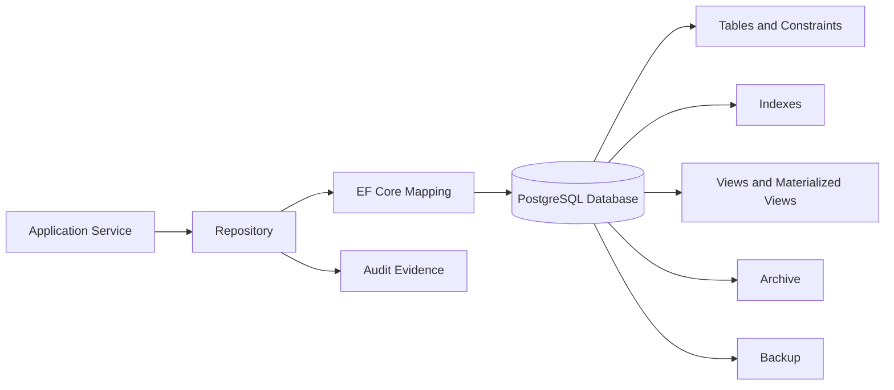
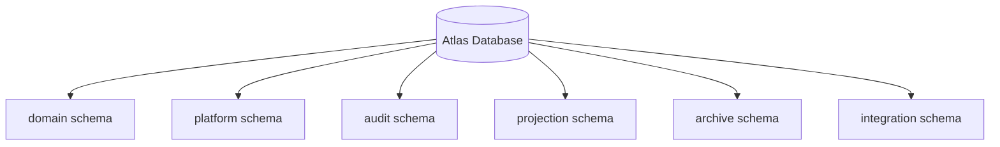
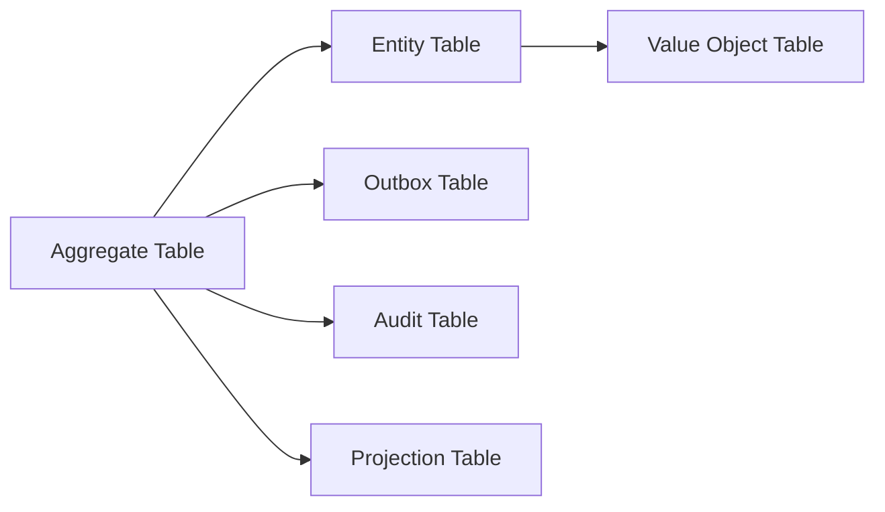
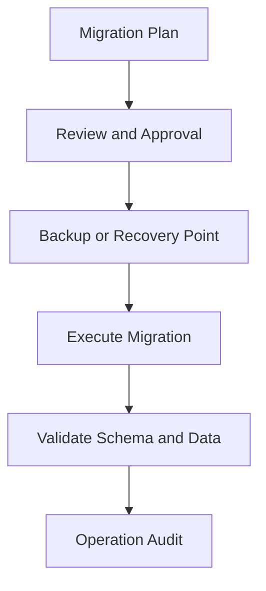
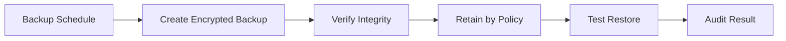
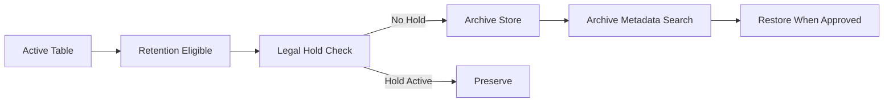

# Database Governance Framework

# Document Control

Document Name: Database Governance Framework
Document Path: knowledge/framework/database-governance-framework.md
Document Type: Atlas Enterprise Canonical Specification
Version: 1.0
Status: Canonical Specification
Domain: Platform
Bounded Context: Platform
Owner: Project Atlas
Source of Truth: Atlas Database Governance Source of Truth
Last Updated: 2026-07-13

Related Specifications:
- knowledge/domain-model-catalog.md
- knowledge/aggregate-catalog.md
- knowledge/entity-catalog.md
- knowledge/value-object-catalog.md
- knowledge/repository-catalog.md
- knowledge/application-service-catalog.md
- knowledge/domain-service-catalog.md
- knowledge/security-framework.md
- knowledge/audit-framework.md
- knowledge/compliance-framework.md
- knowledge/data-governance-framework.md
- knowledge/tenant-framework.md
- knowledge/api-governance-framework.md
- knowledge/service-catalog.md
- docs/database/05-DatabaseDesign.md
- docs/database/06-ERD.md
- docs/api/07-API.md

# Purpose

Database Governance Framework defines the canonical Atlas database governance model. It is the source of truth for PostgreSQL schemas, database objects, tables, views, materialized views, repositories, aggregates, entities, value objects, migrations, EF Core mappings, indexes, constraints, transactions, locks, concurrency, partitions, archive, backup, restore, security, audit, monitoring, and performance governance.

This document does not create new Atlas business domains. It consolidates database behavior already required by the Domain Model Catalog, Aggregate Catalog, Entity Catalog, Value Object Catalog, Repository Catalog, Application Service Catalog, Domain Service Catalog, Security Framework, Audit Framework, Compliance Framework, Data Governance Framework, Tenant Framework, API Governance Framework, Service Catalog, Database Design, ERD, and API documentation.

# Scope

- Database
- PostgreSQL Schema
- Schema
- Table
- View
- Materialized View
- Sequence
- Constraint
- Index
- Primary Key
- Foreign Key
- Unique Key
- Check Constraint
- Partition
- Archive
- Backup
- Restore
- Migration
- Version
- Transaction
- Lock
- Concurrency
- Repository
- Aggregate
- Entity
- Value Object
- Application Service
- Domain Service
- EF Core
- Audit
- Security
- Tenant

# Database Governance Principles

- Every database object must have an owner, purpose, lifecycle, and mapping to an approved Atlas catalog when it represents application data.
- Every table must map to an aggregate, entity, value object, projection, audit record, configuration record, or operational record.
- Every repository must declare its table, view, materialized view, projection, and transaction mappings.
- Every migration must be versioned, reversible by policy or explicitly marked as irreversible with approval, tested, and auditable.
- Every tenant-scoped table must preserve TenantId through keys, indexes, constraints, and repository filters.
- Every household-scoped table must preserve HouseholdId and TenantId.
- Every protected column must have classification, masking, encryption, retention, and audit expectations.
- Every index must have a documented query purpose and ownership.
- Every constraint must protect business, data quality, tenant, household, referential, or lifecycle integrity.
- Every backup, restore, archive, purge, and partition operation must be permissioned, monitored, and audited.

# Database Concept Definitions

| Concept | Canonical Meaning | Required Usage |
| --- | --- | --- |
| Database | Governed PostgreSQL persistence boundary for Atlas application, audit, operational, projection, and reporting data. | Required for all persistent data. |
| Schema | Namespace grouping related database objects by domain, platform concern, audit, configuration, projection, archive, or operational purpose. | Required for table and object ownership. |
| Table | Persistent relational structure storing governed records. | Must map to a cataloged owner and retention policy. |
| View | Query abstraction over governed tables. | Must preserve permission, tenant, household, masking, and classification rules. |
| Materialized View | Persisted query result for performance, reporting, or projection. | Requires refresh policy, lineage, classification, and owner. |
| Sequence | Database object generating numeric values. | Must have owner and collision strategy. |
| Constraint | Database enforcement of integrity or allowed values. | Required when database can protect invariant or relationship. |
| Index | Performance structure for query access. | Must map to approved query path and be monitored. |
| Primary Key | Stable row identity. | Required on every application table. |
| Foreign Key | Referential relationship between records. | Required where database can enforce relationship safely. |
| Unique Key | Constraint preventing duplicate logical identity. | Required for natural uniqueness and idempotency keys. |
| Check Constraint | Constraint enforcing allowed value range or state. | Required for stable simple invariants. |
| Partition | Physical segmentation strategy for scale, retention, or operational isolation. | Requires routing, maintenance, and archive policy. |
| Archive | Governed retained historical storage. | Requires metadata, restore policy, and audit. |
| Backup | Recoverable copy of database state. | Requires schedule, encryption, retention, and restore testing. |
| Restore | Controlled recovery operation from backup or archive. | Requires permission, destination scope, validation, and audit. |
| Migration | Versioned database change. | Requires review, test, ordering, and audit. |
| Version | Schema, migration, object, or mapping version. | Required for deterministic deployment and recovery. |
| Transaction | Atomic database unit of work. | Must align with repository and application service transaction boundary. |
| Lock | Database mechanism controlling concurrent access. | Must be bounded and observable. |
| Concurrency | Control model for simultaneous updates. | Requires optimistic or pessimistic strategy. |

# Database Architecture

Atlas database architecture is repository-owned and catalog-aligned.

1. Application Service starts a command or query with authenticated Principal, TenantContext, and permission decision.
2. Domain Service or Aggregate enforces domain rules before persistent mutation.
3. Repository owns SQL, EF Core mapping, query filters, transaction boundary, concurrency tokens, and table mapping.
4. Database enforces structural integrity through primary keys, foreign keys, unique keys, check constraints, indexes, and transaction isolation.
5. Audit records capture mutation, migration, backup, restore, archive, purge, and administrative access.
6. Data Governance and Compliance define classification, retention, legal hold, masking, encryption, and lineage.
7. Security and Tenant Frameworks enforce protected access, encryption, tenant isolation, and household isolation.

# Database Naming Convention

- Schema names use lowercase snake_case.
- Table names use lowercase snake_case plural nouns for persisted collections.
- View names use lowercase snake_case and end with `_view` when ambiguity exists.
- Materialized view names use lowercase snake_case and end with `_mv`.
- Primary key constraints use `pk_<table>`.
- Foreign key constraints use `fk_<from_table>_<to_table>_<column>`.
- Unique constraints use `uq_<table>_<columns>`.
- Check constraints use `ck_<table>_<rule>`.
- Indexes use `ix_<table>_<columns>`.
- Partial indexes add a suffix describing the predicate.
- Migration names include timestamp, sequence, and intent.

# Schema Convention

| Schema Type | Purpose | Governance Rule |
| --- | --- | --- |
| domain schema | Stores business aggregate and entity records. | Must map to domain, aggregate, repository, and retention policy. |
| platform schema | Stores identity, tenant, configuration, policy, and operational records. | Requires elevated permission and audit for administration. |
| audit schema | Stores immutable audit evidence and search projections. | Append-only and integrity protected. |
| projection schema | Stores read models, projections, and materialized query structures. | Requires lineage and rebuild policy. |
| archive schema | Stores retained historical records and archive metadata. | Requires retention, restore, and legal hold controls. |
| integration schema | Stores partner mappings, delivery records, inbox, and outbox state. | Requires contract version and tenant isolation. |

# Table Convention

- Every table must have a clear purpose.
- Every application table must have a primary key.
- Tenant-scoped tables must include `tenant_id` directly or inherit it through a validated aggregate root mapping.
- Household-scoped tables must include `household_id` when direct filtering is required.
- Tables storing protected data must define classification and retention.
- Tables storing mutable records must define created, updated, version, and concurrency metadata where applicable.
- Soft-delete tables must define deletion state and deletion timestamp.
- Archive-eligible tables must define archive key or archive mapping.

# Column Convention

- Column names use lowercase snake_case.
- Identifier columns end with `_id`.
- Timestamp columns specify UTC semantics.
- Boolean columns use affirmative names.
- Monetary values must define currency strategy.
- Ratio, rate, and percentage values must define precision and scale.
- Encrypted or tokenized fields must not be indexed unless approved.
- JSON columns require schema ownership, validation strategy, and migration policy.
- Nullable columns must have documented meaning.

# Primary Key Convention

- Primary keys must be stable and immutable.
- Primary keys must not expose sensitive business meaning unless approved.
- Composite primary keys are allowed only when they represent stable relationship identity.
- Surrogate keys must be paired with unique natural constraints where business uniqueness exists.

# Foreign Key Convention

- Foreign keys should be used when relationship integrity can be enforced without violating archive, partition, or operational constraints.
- Tenant consistency must be protected by composite keys, constraints, repository validation, or database policies.
- Foreign key delete behavior must be explicit.
- Cascade delete is prohibited for protected business records unless retention and audit rules explicitly allow it.

# Index Convention

- Every index must map to a known query, repository method, API, workflow, job, report, or operational need.
- TenantId must be part of common indexes for tenant-scoped tables.
- HouseholdId must be part of common indexes for household-scoped tables.
- Foreign key columns should be indexed when used in joins.
- Unique indexes must support idempotency, natural keys, or business uniqueness.
- Partial indexes must document predicate and lifecycle.
- Indexes on protected values require classification review.

# Constraint Convention

- Constraints must enforce stable database-level integrity.
- Check constraints should enforce bounded enumerations, non-negative values, state flags, and valid date ranges.
- Unique constraints must prevent duplicate logical records.
- Constraints must be named and traceable.
- Constraint violations must map to controlled application errors where exposed through APIs.

# Migration Strategy

- Migrations are the only approved way to change governed database structure.
- Every migration must have version, purpose, owner, risk class, rollout plan, validation plan, and rollback or recovery plan.
- Migration scripts must be deterministic.
- Data migrations must record affected tables, selection criteria, affected count, and verification result.
- Destructive migrations require retention, legal hold, backup, approval, and audit checks.
- Migration execution must produce Operation Audit records.

# Versioning Strategy

- Database schema version must be traceable to application version and migration history.
- EF Core model snapshot must align with migration history.
- Repository mapping changes must be versioned with database migration when persistence shape changes.
- Views and materialized views must have definition version.
- Archive format must have version.
- Backup and restore procedures must record database version.

# Archive Strategy

- Archive movement must preserve primary identity, TenantId, HouseholdId, classification, lineage, retention class, legal hold status, and audit correlation.
- Archive records must remain searchable by approved metadata.
- Archive restore must validate permission, destination scope, classification, and integrity.
- Archive operations must run in bounded batches with checkpoints.
- Archive failure must be observable and auditable.

# Backup Strategy

- Backups must be encrypted.
- Backups must follow retention policy.
- Backup schedules must match recovery point objectives.
- Backup integrity must be checked.
- Backup restore tests must be performed on an approved cadence.
- Backup access requires elevated permission.
- Backup creation, verification, failure, and restore must be audited.

# Restore Strategy

- Restore requires approval, scope, reason, target environment, data classification review, and audit.
- Tenant-scoped restore must validate TenantId.
- Household-scoped restore must validate HouseholdId.
- Cross-tenant restore requires explicit administrative permission and compliance approval.
- Restore must verify schema version compatibility.
- Restore must verify integrity and row counts where applicable.
- Restore must not weaken classification or retention.

# Partition Strategy

- Partitioning may be used for scale, retention, archive, tenant grouping, time range, or high-volume audit records.
- Partition key must align with dominant query, retention, and archive patterns.
- Partition maintenance must be scheduled, monitored, and audited.
- Partition pruning must be validated for core queries.
- Partition detach, archive, and drop operations must follow retention and legal hold checks.

# Performance Strategy

- Query plans must be monitored for critical repository methods.
- Statistics must be current for high-volume tables.
- Indexes must be reviewed for usage and bloat.
- Materialized views must have refresh policy and staleness limits.
- Long-running queries must have owner, purpose, and acceptable SLA.
- Reporting queries must use approved projections instead of bypassing repository governance.

# Concurrency Strategy

- Mutable aggregate tables require optimistic concurrency tokens unless a cataloged alternative exists.
- Pessimistic locks must be scoped and bounded.
- Idempotency keys must be used for retryable command persistence.
- Transaction isolation level must match consistency requirements.
- Concurrency conflicts must map to controlled application responses and audit where material.

# Lock Strategy

- Locks must have bounded duration.
- Scheduler and background job locks must include owner, expiry, and heartbeat where needed.
- Operational locks must be visible to monitoring.
- Deadlocks must be logged and analyzed.
- Lock escalation risks must be reviewed for bulk operations.

# Database Security

- Database access must use least privilege.
- Application database users must not have unrestricted schema modification permission.
- Migration execution must use controlled credentials.
- Sensitive columns must be encrypted, tokenized, masked, or protected by secure reference when required.
- Direct database access for support or operations requires approval and audit.
- Tenant and household isolation must not rely only on UI controls.
- Backups and archives must be encrypted and access-controlled.

# Database Audit

- Schema changes must be audited.
- Migration execution must be audited.
- Administrative access must be audited.
- Backup, verification, restore, archive, purge, and partition maintenance must be audited.
- Bulk data changes must be audited with selection criteria and affected counts.
- Protected data reads must be audited when required by classification.
- Audit records must include actor, tenant when applicable, household when applicable, resource, action, correlation, and outcome.

# Database Monitoring

- Monitor connection pool usage.
- Monitor query latency.
- Monitor lock waits and deadlocks.
- Monitor index usage and bloat.
- Monitor table and partition growth.
- Monitor autovacuum and vacuum health.
- Monitor analyze statistics freshness.
- Monitor backup success and restore test results.
- Monitor archive and purge job progress.
- Monitor migration state and failures.

# Validation Rules

- Every schema must have purpose.
- Every schema must have owner.
- Every table must have owner.
- Every table must have purpose.
- Every application table must have primary key.
- Every table must map to repository, aggregate, entity, projection, audit, configuration, integration, or operational owner.
- Every tenant-scoped table must include TenantId or validated inherited TenantId mapping.
- Every household-scoped table must include HouseholdId or validated inherited HouseholdId mapping.
- Every protected column must have classification.
- Every protected column must have masking policy.
- Every protected column must have encryption policy when required.
- Every persistent table must have retention policy.
- Every archive-eligible table must have archive policy.
- Every purge-eligible table must have deletion policy.
- Every foreign key must define delete behavior.
- Every unique business identity must have unique constraint.
- Every enum-like column must have check constraint or governed reference table.
- Every index must have documented query purpose.
- Every migration must have version.
- Every migration must have owner.
- Every migration must have validation plan.
- Every destructive migration must check legal hold.
- Every backup policy must define schedule.
- Every backup policy must define retention.
- Every restore operation must define scope.
- Every restore operation must validate version compatibility.
- Every materialized view must have refresh policy.
- Every projection table must have lineage.
- Every partitioned table must define partition key.
- Every partition maintenance operation must be audited.
- Every repository mutation must align with transaction boundary.
- Every concurrency-controlled table must define version strategy.
- Every direct administrative database action must be audited.
- Every table containing TenantId must index TenantId for common access paths.
- Every table containing HouseholdId must index HouseholdId for common access paths.
- Every cache or projection derived from a table must preserve classification.
- Every database object exposed through API must map to DTO classification.
- Every migration failure must be observable.
- Every backup failure must be observable.
- Every restore failure must be observable.
- Every archive failure must be observable.

# Business Rules

- Database governance is subordinate to approved Atlas domain ownership and superior to ad hoc persistence decisions.
- Tables must not be created without catalog ownership.
- Columns must not be added without classification review when they store business or protected data.
- Repository methods must be the normal access path to application tables.
- Application Services must not bypass repository governance for normal business operations.
- Domain Services must not issue unmanaged database writes.
- EF Core mappings must align with database naming and constraint conventions.
- Database schema must align with docs/database/05-DatabaseDesign.md.
- ERD must reflect governed table relationships.
- API response shape must not depend on unmanaged database objects.
- Tenant-scoped records must remain tenant-isolated in tables, views, projections, indexes, archives, backups, and restores.
- Household-scoped records must remain household-isolated.
- TenantId must be validated before repository access.
- HouseholdId must be validated before household-owned access.
- Foreign keys should enforce stable relationships when operationally safe.
- Repository validation must protect relationships that cannot be enforced by foreign keys.
- Cascade delete is not allowed for retained protected records unless explicitly approved.
- Soft delete must preserve audit and retention rules.
- Purge must require retention eligibility and legal hold check.
- Archive must preserve classification and lineage.
- Restore must not weaken classification.
- Restore must not bypass tenant or household isolation.
- Backup restore to non-production must require masking or approved secure environment controls.
- Production backups must not be exposed to lower-trust environments without approval.
- Migration execution must be ordered.
- Migration history must not be manually rewritten.
- Migration rollback must preserve data integrity.
- Irreversible migration must have approval and recovery plan.
- Data migration must record affected row count.
- Data migration must verify expected row count.
- Data migration must produce audit evidence.
- Schema drift must be detected.
- Schema drift must be resolved through migration.
- Indexes must not be added without query purpose.
- Unused indexes must be reviewed before removal.
- Indexes on sensitive columns require security review.
- Materialized view refresh must preserve lineage.
- Materialized view staleness must be visible.
- Reporting must use approved views, projections, or repositories.
- Analytics data sets must preserve source and transformation lineage.
- Search indexes must propagate deletes and classification changes.
- Database constraints must not contradict domain invariants.
- Domain invariants that can be represented safely as constraints should be enforced in database.
- Transaction boundaries must match aggregate consistency boundaries.
- Cross-aggregate transactions require explicit application service ownership.
- Long transactions must be avoided in user-facing paths.
- Bulk operations must run in bounded batches.
- Bulk operations must include affected-count safeguards.
- Bulk operations must be auditable.
- Locks must be bounded.
- Deadlocks must be investigated.
- Concurrency conflicts must be handled deterministically.
- Retryable database operations must use idempotency where mutation is possible.
- Sequences must not be reset in a way that causes collision.
- Timestamps must use UTC.
- Time zone interpretation belongs in application or reporting layer unless explicitly cataloged.
- Monetary columns must preserve precision.
- Percentage and rate columns must define scale.
- JSON columns must not become unmanaged schema substitutes.
- JSON columns storing governed data require schema validation.
- Database comments may document operational meaning but do not replace catalog ownership.
- Administrative database access must be least privilege.
- Support database queries must be approved and audited.
- Direct production updates are prohibited outside approved operational process.
- Backup creation must be monitored.
- Backup verification must be monitored.
- Restore tests must be scheduled.
- Archive jobs must be monitored.
- Purge jobs must be monitored.
- Vacuum and analyze health must be monitored.
- Statistics must be current for critical query paths.
- Partition pruning must be verified.
- Partition drops must respect retention and legal hold.
- Database Governance Framework conflicts are resolved by this document unless Security, Audit, Compliance, Data Governance, Tenant, or legal rules impose stricter controls.

# Database Governance Matrix

| Area | Required Governance |
| --- | --- |
| Database | Owner, version, backup, restore, security, audit, and monitoring. |
| Schema | Purpose, owner, object category, migration control, and access boundary. |
| Table | Owner, repository mapping, classification, retention, keys, indexes, and constraints. |
| View | Purpose, source lineage, permission, masking, and performance expectation. |
| Materialized View | Refresh policy, lineage, staleness, owner, and rebuild strategy. |
| Index | Query purpose, owner, usage monitoring, and classification review. |
| Constraint | Integrity purpose, owner, error mapping, and migration history. |
| Migration | Version, owner, validation, rollback or recovery, and audit. |
| Backup | Schedule, retention, encryption, verification, and restore test. |
| Archive | Retention, legal hold, restore, search metadata, and audit. |

# Schema Matrix

| Schema | Purpose | Required Mapping |
| --- | --- | --- |
| domain | Business records. | Aggregate, Entity, Repository. |
| platform | Identity, tenant, configuration, and operational records. | Service Catalog and Security Framework. |
| audit | Immutable evidence. | Audit Framework and Compliance Framework. |
| projection | Read models and reporting projections. | Repository Catalog and Data Governance Framework. |
| archive | Historical retained records. | Retention, Archive, Backup, Restore. |
| integration | Outbox, inbox, partner mappings, and delivery records. | Integration Framework and Message Contracts. |

# Table Matrix

| Table Type | Required Fields |
| --- | --- |
| Aggregate Table | id, tenant_id when scoped, household_id when scoped, version, created_at, updated_at. |
| Entity Table | id or composite key, aggregate reference, tenant or household scope, version when mutable. |
| Value Object Table | owner reference, value fields, classification, lifecycle when persisted separately. |
| Audit Table | audit_id, actor, action, resource, correlation_id, timestamp, classification, integrity metadata. |
| Projection Table | source id, source version, projection version, refreshed_at, lineage metadata. |
| Archive Table | source id, archive id, retention class, legal hold state, archived_at, restore metadata. |

# Repository Matrix

| Repository Type | Database Requirement |
| --- | --- |
| Aggregate Repository | Owns write table mapping, transaction boundary, concurrency token, and tenant filter. |
| Read Repository | Owns view, projection, query filters, sorting, pagination, and masking. |
| Projection Repository | Owns projection table, source lineage, rebuild, and refresh behavior. |
| Audit Repository | Owns append-only audit tables, integrity metadata, and search indexes. |
| Archive Repository | Owns archive metadata, restore path, legal hold, and retention filters. |

# Aggregate Matrix

| Aggregate Concern | Database Requirement |
| --- | --- |
| Identity | Primary key and optional natural unique key. |
| Ownership | TenantId and HouseholdId strategy. |
| Consistency | Transaction boundary and concurrency token. |
| Lifecycle | Active, deleted, archived, purge-eligible, or retained state. |
| Events | Outbox mapping when domain events are persisted. |

# Entity Matrix

| Entity Concern | Database Requirement |
| --- | --- |
| Identity | Stable key or aggregate-owned composite key. |
| Relationship | Foreign key or repository-validated relationship. |
| Classification | Column-level classification for protected data. |
| Retention | Inherited or explicit retention class. |
| History | Revision or audit mapping when change history is required. |

# Migration Matrix

| Migration Type | Required Control |
| --- | --- |
| Additive Schema | Version, owner, compatibility, validation. |
| Destructive Schema | Approval, backup, legal hold check, recovery plan, audit. |
| Data Migration | Selection criteria, affected count, verification, audit. |
| Index Migration | Query purpose, build strategy, performance validation. |
| Constraint Migration | Existing data validation, error mapping, rollback or recovery. |

# Backup Matrix

| Backup Area | Required Control |
| --- | --- |
| Full Backup | Encryption, schedule, retention, verification. |
| Incremental Backup | Chain integrity, retention, recovery point validation. |
| Point-in-Time Recovery | WAL retention, restore test, target time validation. |
| Non-Production Restore | Masking, access control, approval, audit. |
| Backup Failure | Alert, owner, remediation, audit. |

# Archive Matrix

| Archive Area | Required Control |
| --- | --- |
| Eligibility | Retention class, lifecycle state, legal hold check. |
| Movement | Batch checkpoint, source reference, classification, metadata. |
| Search | TenantId, HouseholdId, resource id, time, classification, retention. |
| Restore | Permission, destination scope, version compatibility, audit. |
| Purge | Eligibility, hold check, affected count, audit. |

# Performance

## Index Usage

- Critical repository queries must use intended indexes.
- Index usage must be reviewed for high-volume tables.
- Unused indexes must be reviewed against write cost before removal.

## Partition

- Partition pruning must be verified for partitioned tables.
- Partition maintenance must be scheduled and audited.
- Partition keys must align with query and retention patterns.

## VACUUM

- Vacuum health must be monitored for high-write tables.
- Autovacuum configuration must be reviewed for audit, outbox, inbox, and event tables.
- Vacuum failures must be visible to operations.

## Analyze

- Statistics freshness must be monitored.
- Analyze must run after large data migrations when needed.
- Query plan regressions must trigger review.

## Statistics

- Statistics targets may be tuned for skewed tenant, household, status, or timestamp distributions.
- Critical performance dashboards must expose slow query and stale statistics indicators.

# Mermaid

## Database Architecture

## Schema Diagram

## Table Dependency

## Migration Flow

## Backup Flow

## Archive Flow

# Testing

| Test Type | Required Coverage |
| --- | --- |
| Migration Test | Apply, validate, compatibility, data migration counts, rollback or recovery plan. |
| Schema Test | Naming, ownership, keys, tenant columns, household columns, retention, and classification. |
| Constraint Test | Primary key, foreign key, unique key, check constraint, tenant consistency, and delete behavior. |
| Performance Test | Query plan, index usage, partition pruning, materialized view refresh, statistics, and lock waits. |
| Backup Test | Backup creation, encryption, verification, retention, failure alert, and access control. |
| Restore Test | Version compatibility, integrity, row counts, tenant scope, masking, and audit. |

# Edge Cases

- Table has no owner.
- Schema has no purpose.
- Table has no repository mapping.
- Entity maps to multiple tables without documented ownership.
- Repository reads a table outside its ownership.
- Tenant-scoped table lacks TenantId.
- Household-scoped table lacks HouseholdId.
- TenantId exists but is not indexed for common queries.
- Foreign key permits cross-tenant relationship.
- Cascade delete removes retained protected record.
- Nullable column has no business meaning.
- JSON column stores governed data without validation.
- Index exists without query purpose.
- Index on sensitive field exposes value.
- Unique constraint missing for idempotency key.
- Check constraint conflicts with domain enumeration.
- Migration applied out of order.
- Migration history differs from EF Core model snapshot.
- Destructive migration runs without backup.
- Data migration affected count differs from expected count.
- Migration succeeds but audit write fails.
- Schema drift appears in production.
- Materialized view refresh fails.
- Projection rebuild changes classification.
- Search index misses delete propagation.
- Archive job moves record under legal hold.
- Archive metadata omits TenantId.
- Restore targets wrong tenant.
- Restore into non-production lacks masking.
- Backup integrity check fails.
- Backup retention deletes needed recovery point.
- Point-in-time restore crosses migration boundary.
- Partition detach runs before legal hold check.
- Partition pruning fails for tenant query.
- Autovacuum falls behind on audit table.
- Statistics become stale after bulk import.
- Long transaction blocks migration.
- Deadlock occurs in high-volume command path.
- Pessimistic lock has no expiry.
- Optimistic concurrency token missing on mutable aggregate.
- Sequence reset creates duplicate key risk.
- Monetary precision is too small.
- Time zone value stored ambiguously.
- Report query bypasses repository filters.
- Direct support query reads protected data without audit.
- Database user has excessive privileges.
- Migration credential is reused by application runtime.
- Archive restore weakens retention class.
- Purge deletes source before audit record is durable.
- Backup restore loses archive search metadata.
- View exposes another tenant's data.
- Materialized view staleness exceeds SLA.
- Constraint violation leaks internal table name through API.
- Bulk update crosses tenant boundary.
- Operational repair changes data without correlation id.
- Legal hold release and purge run concurrently.
- Database extension is introduced without ownership.
- Table partition grows without monitoring.
- Index bloat degrades write performance.
- Restore validation row counts are skipped.
- Encrypted column is accidentally logged by migration script.

# Final Consistency Matrix

| Area | Required Database Alignment |
| --- | --- |
| Database | Uses this framework as canonical source of truth. |
| Schema | Purpose, owner, access boundary, migration path, and object classification are defined. |
| Table | Owner, repository mapping, aggregate or entity mapping, keys, constraints, indexes, retention, and classification are defined. |
| Repository | Table mapping, transaction boundary, tenant filter, concurrency, archive, and audit behavior are defined. |
| Aggregate | Identity, ownership, lifecycle, consistency, and event persistence mapping are defined. |
| Entity | Relationship, key, classification, retention, and history mapping are defined. |
| Migration | Version, owner, validation, risk, rollback or recovery, and audit are defined. |
| Audit | Schema changes, data changes, backup, restore, archive, purge, and administrative access are evidenced. |
| Security | Least privilege, encryption, masking, direct access control, and credential separation are enforced. |
| Archive | Eligibility, movement, metadata, restore, and purge controls are defined. |
| Backup | Schedule, encryption, verification, retention, restore testing, and failure handling are defined. |

# Completion Checklist

- Table owner requirement is defined.
- Schema purpose requirement is defined.
- Repository table mapping is defined.
- Entity database mapping is defined.
- Aggregate database mapping is defined.
- Migration version requirement is defined.
- Migration validation requirement is defined.
- Backup policy is defined.
- Restore policy is defined.
- Archive strategy is defined.
- Partition strategy is defined.
- Index strategy is defined.
- Constraint strategy is defined.
- Transaction strategy is defined.
- Concurrency strategy is defined.
- Lock strategy is defined.
- Database security controls are defined.
- Database audit controls are defined.
- Database monitoring controls are defined.
- Validation rules are complete.
- Business rules are complete.
- Mermaid diagrams are syntactically valid.
- Markdown structure is valid.
- No placeholder terms are present.
- No draft-only status is present.
- No temporary catalog entries are present.
