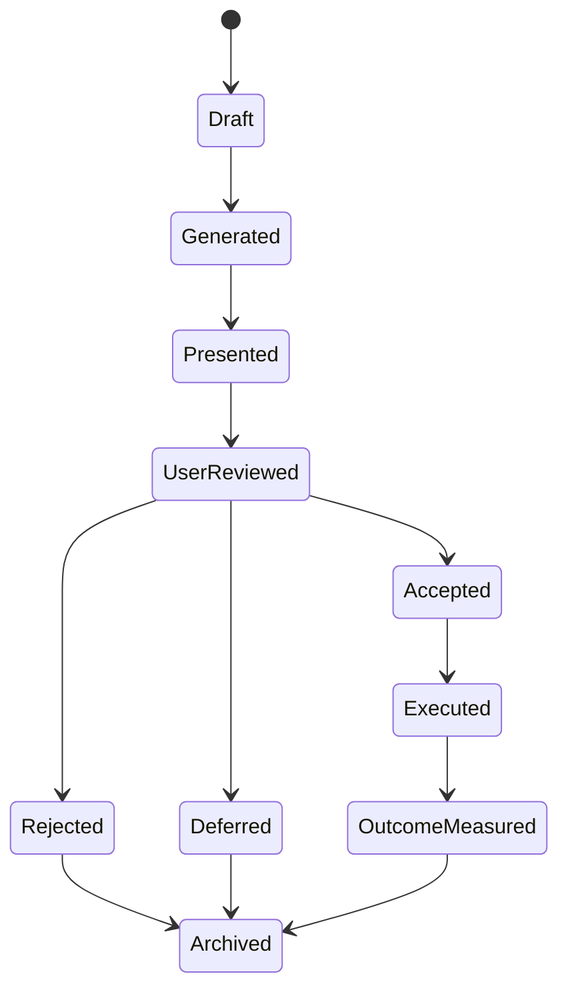

# Decision History Records and Versioning

## Purpose
This split document isolates immutable history record structure, versioning rules, and user action tracking from the parent Decision History Framework.

## Source
- Parent specification: [Decision History Framework](../decision-history-framework.md)

## Core Principles
- History is immutable.
- Every decision has a persistent Decision ID.
- Every revision creates a new Decision Version.
- User actions are recorded independently.

## Decision Lifecycle

## History Record
Each record contains Decision ID, version, parent version, timestamp, user or household, decision type, scenario ID, recommendation ID, and status.

## Versioning
Each version stores changed assumptions, changed inputs, rule differences, metric differences, and recommendation changes.

## User Actions
Supported actions include view, accept, reject, dismiss, snooze, execute, undo, and add notes.

## Business Rules
- Historical versions are immutable.
- Accepted decisions remain linked to execution records.
- Deleted decisions are never physically removed.
- Major financial events create new decision versions.

