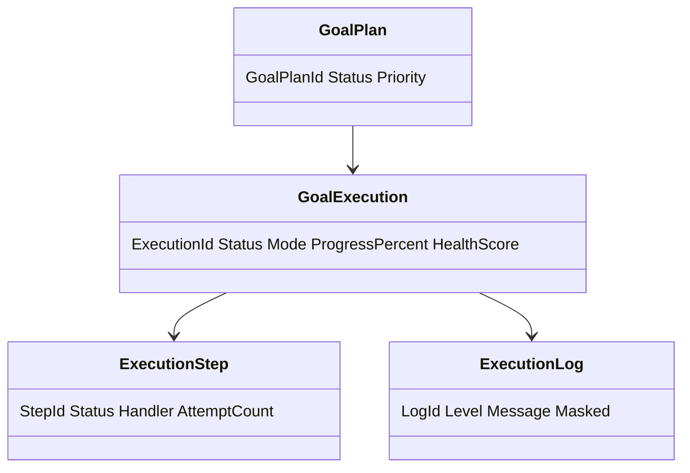
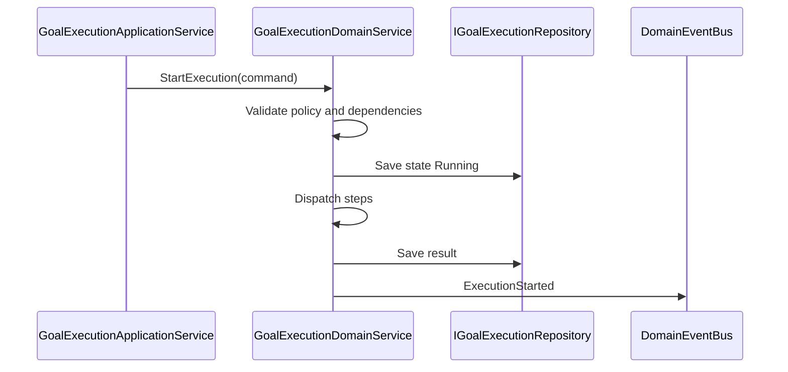
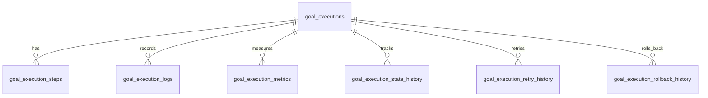
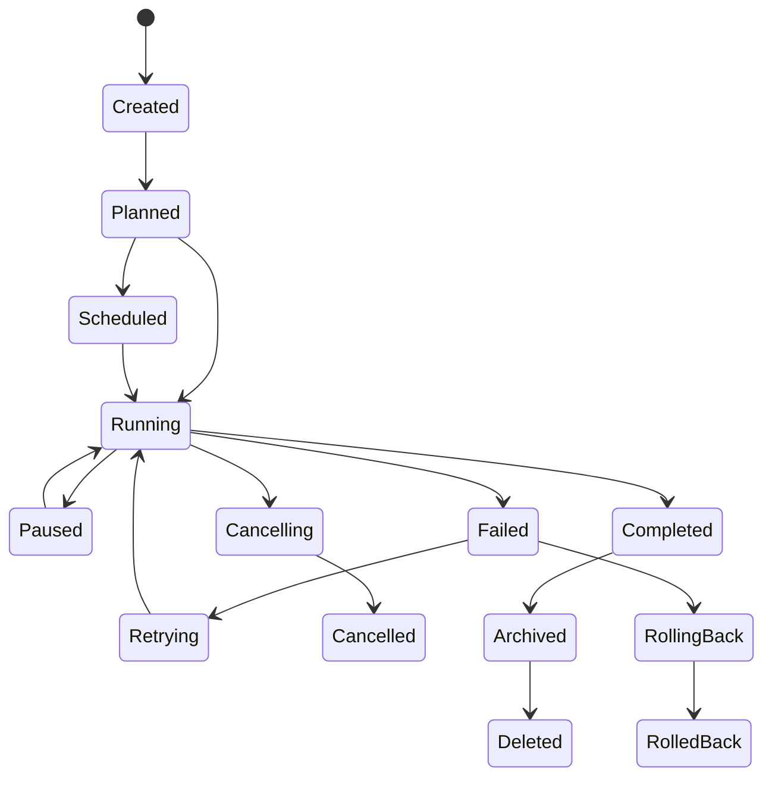
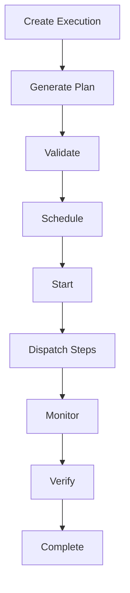
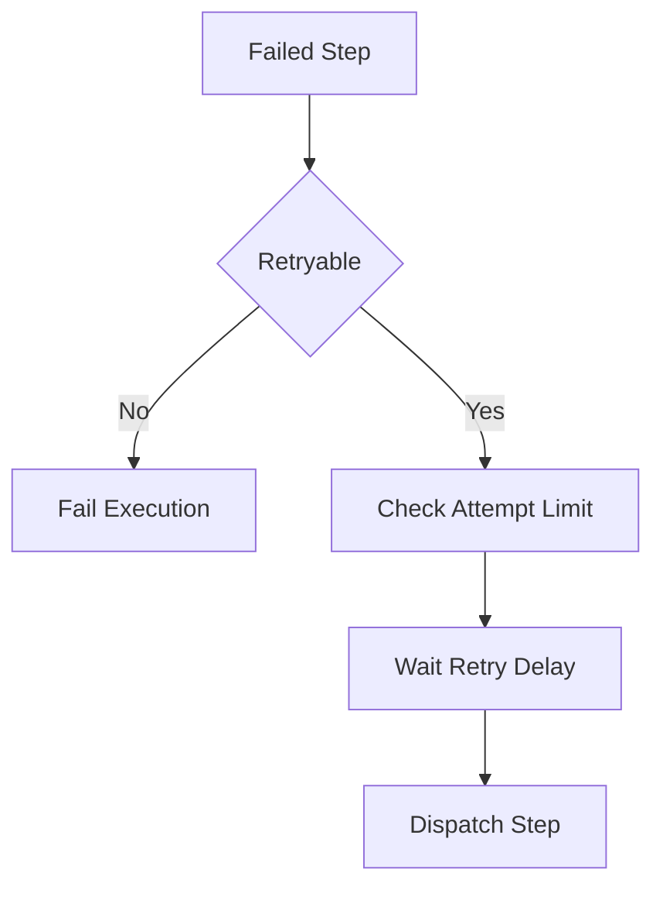
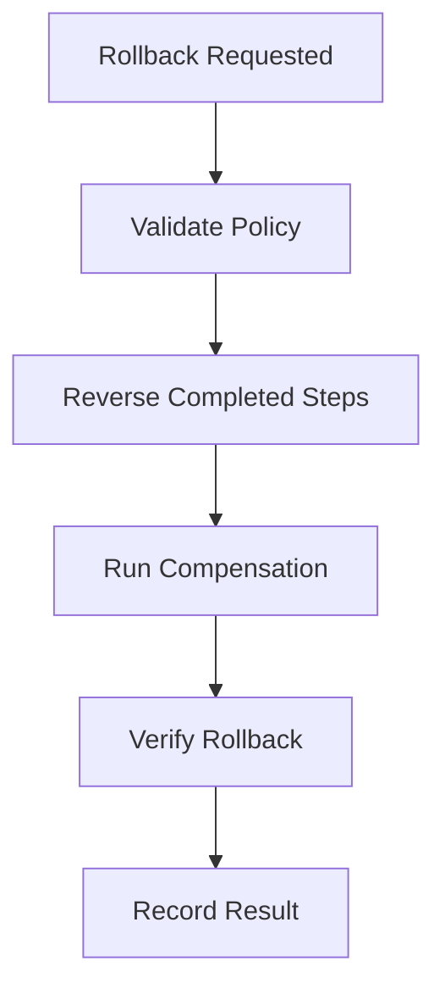

# Goal Execution
Version: 1.0
Status: Enterprise Specification
Owner: Project Atlas
Source of Truth: Atlas Goal Execution Specification
Last Updated: 2026-07-13
# Split Navigation

- [Scope and Architecture](goal-execution/scope-and-architecture.md)
- [Workflow and Policies](goal-execution/workflow-and-policies.md)
- [Governance and Testing](goal-execution/governance-and-testing.md)

# Goal Execution Overview
## Purpose
Goal Execution defines how Atlas creates, starts, pauses, resumes, retries, cancels, completes, rolls back, archives, restores, deletes, secures, audits, and observes execution for GoalPlan. It coordinates execution with GoalPlan, Milestone, Task, Goal Progress Tracking, Goal Metrics, Goal Dashboard, Goal Analytics, Goal Reporting, Goal Insights, Goal Optimization, Goal Review, DecisionSession, Recommendation, Scenario, Portfolio, CashFlow, Notification, User, Business Calendar, Automation, and Workflow.
It preserves existing Atlas domain ownership and existing catalog naming.
## Business Meaning
Goal Execution turns approved goal actions into governed execution records. Execution records make work observable, recoverable, auditable, measurable, and permission-aware.
Execution does not automatically redesign GoalPlan, Milestone, Task, Portfolio, CashFlow, Recommendation, DecisionSession, Scenario, Automation, or Workflow.
## Execution Lifecycle
Execution lifecycle starts when CreateExecution or GenerateExecutionPlan creates an execution record. The record moves through preparation, validation, scheduling, execution, monitoring, verification, completion, rollback, retry, archive, restore, or deletion.
Lifecycle state is append-only in execution history.
## Execution Scope
Execution scope can be GoalPlan, Milestone, Task, Recommendation, DecisionSession, Scenario, Goal Optimization, Goal Review, household, batch, workflow, automation, or scheduled window. Scope must preserve HouseholdId.
Scope must preserve TenantId when tenant scope exists. Scope must not include unauthorized source data.
## Execution Strategy
Execution strategy determines order, priority, dependency handling, conflict handling, retries, timeout, cancellation, rollback, compensation, approval, monitoring, and notification. Strategy must be deterministic for identical source version and policy version.
## Execution Context
Execution context includes actor, system actor when automated, correlation id, causation id, source version hash, policy version, Business Calendar window, Workflow state, Automation trigger, permission context, and masking mode. Execution context is persisted with every state transition.
## Relationship with Goal
GoalPlan supplies target, status, owner, category, priority, target date, and lifecycle. Goal Execution does not mutate GoalPlan without explicit domain command.
GoalPlan lifecycle controls whether execution can start, pause, resume, cancel, complete, roll back, archive, restore, or delete.
## Relationship with Milestone
Milestone supplies execution checkpoint, due date, completion evidence, dependency, and blocker state. Execution may synchronize milestone progress through explicit command.
## Relationship with Task
Task supplies execution unit and operational status when existing task tracking is available. Task dispatch must preserve task ownership and status rules.
## Relationship with Goal Progress
Goal Progress Tracking receives synchronized execution progress when command policy allows. Progress updates must be traceable to execution id.
## Relationship with Goal Metrics
Goal Metrics receives execution latency, completion rate, retry count, rollback count, error count, and success rate. Metric calculation time and unit must be preserved.
## Relationship with Goal Dashboard
Goal Dashboard consumes execution status, health, progress, active count, failed count, retry count, and recent logs. Dashboard projection must be permission-filtered.
## Relationship with Goal Analytics
Goal Analytics consumes execution duration, throughput, forecast, anomaly, trend, error distribution, and completion probability. Analytics calculation version must be recorded.
## Relationship with Goal Reporting
Goal Reporting includes execution plan, execution result, status history, error history, retry history, rollback history, and operator history. Report snapshots preserve execution state at generation time.
## Relationship with Goal Insights
Goal Insights may trigger execution recommendations and may receive execution result as evidence. Insight mapping records ExecutionId when execution changes insight state.
## Relationship with Goal Optimization
Goal Optimization may create approved candidate output that becomes execution plan input. Execution records OptimizationId and candidate id when applicable.
## Relationship with Goal Review
Goal Review may approve, reject, or verify execution result. Review action must be recorded when it changes execution.
## Relationship with Decision
DecisionSession may approve execution, block execution, or provide decision rationale. Decision mapping records DecisionSessionId and decision status.
## Relationship with Recommendation
Recommendation may be executed only through explicit execution command. Recommendation adoption and completion remain owned by Recommendation.
## Relationship with Scenario
Scenario may provide dry run, simulation, and comparison context. Scenario execution must record ScenarioId and ScenarioVersion.
## Relationship with Portfolio
Portfolio actions require portfolio permission and explicit portfolio command. Execution may reference portfolio evidence but does not directly mutate Portfolio.
## Relationship with CashFlow
CashFlow actions require cashflow permission and explicit cashflow command. Execution uses CashFlow period and contribution capacity for feasibility.
## Relationship with Notification
Notification is triggered by start, pause, resume, retry, failure, rollback, cancellation, completion, approval need, and timeout. Notification suppression does not remove audit history.
## Relationship with User
User supplies actor, approver, operator, permission, preference, locale, and masking context. User permission is evaluated before execution and projection.
## Relationship with Business Calendar
Business Calendar supplies valid execution windows, blackout periods, working days, holidays, and cutoff times. Scheduling must honor Business Calendar unless override permission is present.
## Relationship with Automation
Automation may trigger scheduled, event-driven, or workflow-driven execution. Automation trigger id and run id must be recorded.
## Relationship with Workflow
Workflow supplies state, approvals, transitions, and orchestration steps. Workflow state must remain consistent with execution state.
# Execution Architecture
## Execution Engine
Execution Engine runs execution plan steps, state transitions, verification, error handling, retry, rollback, and completion. It records deterministic inputs and output for every run.
## Workflow Engine
Workflow Engine coordinates approval, state transition, workflow step, and external orchestration state. Workflow state cannot bypass execution permission.
## Scheduling Engine
Scheduling Engine evaluates Business Calendar, scheduled time, blackout period, priority, dependency, and queue availability. Invalid scheduled windows are rejected unless override is authorized.
## Task Dispatcher
Task Dispatcher sends executable steps to the correct handler. Dispatch records handler name, attempt number, timeout, and result.
## Execution Coordinator
Execution Coordinator manages transaction boundary, state lock, optimistic concurrency, correlation id, and domain events. Coordinator prevents duplicate active execution for the same execution key.
## Progress Synchronizer
Progress Synchronizer updates Goal Progress Tracking when execution result is committed and policy permits. Synchronization records ExecutionId and source version.
## Notification Coordinator
Notification Coordinator publishes notification triggers after committed state changes. Delivery failure does not roll back execution persistence.
## Decision Coordinator
Decision Coordinator evaluates required DecisionSession approval or blocking decision. Decision evidence is recorded in execution context.
## Recommendation Coordinator
Recommendation Coordinator maps execution to Recommendation adoption, completion, or rejection where command policy allows. Recommendation lifecycle remains owned by Recommendation.
## Audit Coordinator
Audit Coordinator records command, state change, operator, retry, rollback, error, result, and access history. Audit data is append-only.
## Recovery Coordinator
Recovery Coordinator handles retry, rollback, compensation, timeout recovery, and stuck execution detection. Recovery policy is versioned.
# Execution Phases
## Preparation
Preparation resolves scope, actor, source versions, execution mode, plan, policy, and permission context.
## Validation
Validation checks lifecycle, permission, dependencies, Business Calendar, Workflow state, Automation trigger, and source availability.
## Scheduling
Scheduling assigns execution window, queue, priority, timeout, retry policy, and dispatch order.
## Execution
Execution runs plan steps and records per-step results.
## Monitoring
Monitoring collects status, progress, health, latency, errors, warnings, logs, metrics, forecasts, and KPIs.
## Verification
Verification confirms expected result, state consistency, and synchronization outcome.
## Completion
Completion finalizes execution result and emits completion event.
## Rollback
Rollback runs approved rollback or compensation policy and records result.
## Retry
Retry reruns eligible failed step or execution according to retry policy.
## Archive
Archive makes execution read-only and removes it from default active queries.
# Execution Modes
## Manual
Manual execution is started by an authorized user. Actor id is required.
## Automatic
Automatic execution is started by system actor under authorized policy. System actor and policy id are required.
## Scheduled
Scheduled execution starts at a planned time after Business Calendar validation. Schedule id is required.
## Event Driven
Event Driven execution starts after committed domain event. Causation event id is required.
## Workflow Driven
Workflow Driven execution starts or transitions from Workflow state. Workflow instance id is required.
## Simulation
Simulation evaluates execution path without committing source domain changes. Simulation result is evidence only.
## Dry Run
Dry Run validates plan, dependencies, permissions, and expected dispatch without executing side effects. Dry Run result is non-mutating.
## Batch Execution
Batch Execution runs multiple execution scopes with isolated per-item result. Batch failures do not invalidate successful items.
## Parallel Execution
Parallel Execution runs independent steps concurrently with bounded concurrency. Dependency order must still be preserved.
## Incremental Execution
Incremental Execution runs only changed or pending steps. It must use source version and step state.
# Execution Policies
## Execution Order
Execution Order follows dependency graph, priority, scheduled time, and Workflow step order. Ties use created time and execution key.
## Priority Strategy
Priority Strategy ranks urgent, high, medium, and low execution using GoalPlan priority, Recommendation priority, Decision urgency, and deadline proximity.
## Dependency Resolution
Dependency Resolution blocks steps with unresolved hard dependencies. Soft dependencies create warnings.
## Conflict Resolution
Conflict Resolution prevents duplicate active execution and handles concurrent commands with optimistic version.
## Retry Policy
Retry Policy defines maximum attempts, retry delay, backoff, retryable errors, and final failure handling.
## Timeout Policy
Timeout Policy defines execution timeout, step timeout, heartbeat interval, and stuck execution detection.
## Cancellation Policy
Cancellation Policy defines who can cancel, cancellable states, and cancellation effects.
## Rollback Policy
Rollback Policy defines reversible steps, rollback order, compensation, and rollback verification.
## Compensation Policy
Compensation Policy records compensating action when direct rollback is not possible.
## Approval Policy
Approval Policy defines approval requirement, approver permission, DecisionSession mapping, and escalation.
# Execution Monitoring
## Execution Status
Execution Status reports Created, Scheduled, Running, Paused, Completed, Failed, Cancelled, RolledBack, Archived, or Deleted.
## Execution Progress
Execution Progress reports completed steps divided by total executable steps with weighted step support.
## Execution Health
Execution Health combines status, error count, retry count, latency, timeout risk, and dependency state.
## Execution Latency
Execution Latency records queue latency, start latency, step latency, total duration, and verification duration.
## Execution Errors
Execution Errors record code, message, retryable flag, step id, handler, timestamp, and correlation id.
## Execution Warnings
Execution Warnings record soft dependency, approaching timeout, stale source, masking change, and policy warning.
## Execution Logs
Execution Logs record structured step logs with masking and retention policy.
## Execution Metrics
Execution Metrics include success rate, failure rate, retry rate, rollback rate, average duration, and throughput.
## Execution Forecast
Execution Forecast estimates expected completion time, timeout risk, retry probability, and success probability.
## Execution KPIs
Execution KPIs include completion percent, on-time completion, error rate, rollback count, and operator load.
# Validation Rules
1. ExecutionId must be globally unique. 2. HouseholdId is required. 3. TenantId is required when tenant scope exists. 4. Scope must reference an existing authorized target. 5. Execution mode is required. 6. Execution policy version is required. 7. Source version hash is required before start. 8. Correlation id is required. 9. Actor id is required for Manual mode. 10. System actor is required for Automatic mode. 11. Schedule id is required for Scheduled mode. 12. Causation event id is required for Event Driven mode. 13. Workflow instance id is required for Workflow Driven mode. 14. Business Calendar window must be valid. 15. Blackout period must block execution unless override permission exists. 16. GoalPlan must not be deleted. 17. Archived GoalPlan cannot start new execution. 18. Cancelled GoalPlan cannot start new execution. 19. Completed GoalPlan can only run historical or verification execution. 20. Execution plan must include at least one step. 21. Step ids must be unique within execution plan. 22. Step dependency graph must be acyclic. 23. Step timeout must be positive. 24. Execution timeout must be positive. 25. Retry maximum must be zero or positive. 26. Retry delay must be zero or positive. 27. Pause requires Running state. 28. Resume requires Paused state. 29. Retry requires Failed or partially failed state. 30. Complete requires verification success. 31. Rollback requires reversible state or compensation policy. 32. Archive requires terminal or paused state according to policy. 33. Restore requires Archived state. 34. Delete requires retention validation. 35. Progress percent must be between 0 and 100. 36. Health score must be between 0 and 100. 37. Error code is required for failed step. 38. Operator id is required for operator action. 39. Approval is required when approval policy applies. 40. DecisionSessionId is required when decision approval is used. 41. RecommendationId must reference existing Recommendation when present. 42. ScenarioVersion is required for Simulation mode. 43. Portfolio evidence requires portfolio permission. 44. CashFlow evidence requires cashflow permission. 45. Projection fields must be allowed. 46. Sorting fields must be allowed. 47. Pagination limit must be within API maximum. 48. Update must preserve immutable identifiers. 49. State transition must match allowed transition. 50. Audit metadata is required for every command.
# Business Rules
1. Execution must preserve Atlas domain ownership. 2. Execution must not redesign Atlas. 3. Execution must not create unrelated business concepts. 4. Execution naming must follow existing catalog naming. 5. Execution cannot mutate GoalPlan without explicit domain command. 6. Execution cannot mutate Milestone without explicit domain command. 7. Execution cannot mutate Task without explicit domain command. 8. Execution cannot mutate Portfolio without explicit domain command. 9. Execution cannot mutate CashFlow without explicit domain command. 10. Execution cannot mutate Recommendation without explicit domain command. 11. Execution cannot mutate DecisionSession without explicit domain command. 12. Execution cannot mutate Scenario without explicit domain command. 13. Only authorized users can create execution. 14. Only authorized users can start execution. 15. Only authorized users can pause execution. 16. Only authorized users can resume execution. 17. Only authorized users can retry execution. 18. Only authorized users can cancel execution. 19. Only authorized users can complete execution. 20. Only authorized users can roll back execution. 21. Only authorized users can archive execution. 22. Only authorized users can delete execution. 23. Field-level security applies before projection. 24. Masked data must remain masked in cache. 25. Aggregation must not leak unauthorized data. 26. Duplicate active execution for same execution key is not allowed. 27. Execution key must include scope, mode, and policy version. 28. Running execution must have a lock or optimistic concurrency token. 29. Start must validate source version. 30. Start must validate Business Calendar. 31. Start must validate dependency state. 32. Start must validate Workflow state when present. 33. Start must validate Automation trigger when present. 34. Pause must stop new step dispatch. 35. Pause must not interrupt non-interruptible committed step. 36. Resume must revalidate dependencies. 37. Resume must revalidate permission. 38. Resume must revalidate source freshness. 39. Retry must follow retry policy. 40. Retry count cannot exceed maximum attempts. 41. Non-retryable error cannot be retried without override permission. 42. Timeout may trigger cancellation, retry, failure, or rollback according to policy. 43. Cancellation must record reason. 44. Cancellation must not remove execution history. 45. Completion must require verification. 46. Completion must emit event after persistence. 47. Failure must record error code and failed step. 48. Rollback must follow rollback order. 49. Rollback must record rollback result. 50. Compensation must record compensation action. 51. Archive makes execution read-only. 52. Restore must revalidate retention and source availability. 53. Delete requires retention permission. 54. Batch execution isolates item failure. 55. Parallel execution must preserve dependency order. 56. Incremental execution must skip completed valid steps. 57. Dry Run must not execute side effects. 58. Simulation must not execute side effects. 59. Scheduled execution must respect Business Calendar. 60. Event Driven execution must be idempotent by event id. 61. Workflow Driven execution must be idempotent by workflow step. 62. Automatic execution must record system actor. 63. Manual execution must record user actor. 64. Approval policy must be enforced before execution when required. 65. DecisionSession approval must record decision status. 66. Recommendation execution must record RecommendationId. 67. Optimization execution must record OptimizationId and candidate id. 68. Insight-triggered execution must record InsightId. 69. Scenario execution must record ScenarioId and ScenarioVersion. 70. Portfolio-related execution requires portfolio permission. 71. CashFlow-related execution requires cashflow permission. 72. Notification failure must not roll back execution. 73. Cache failure must not roll back execution. 74. Progress synchronization failure must create warning or retry according to policy. 75. Audit trail is required for every command. 76. State history is append-only. 77. Retry history is append-only. 78. Rollback history is append-only. 79. Operator history is append-only. 80. Execution logs must respect masking policy. 81. Execution metrics must be derived from committed records. 82. Execution forecast must show calculation time. 83. Execution health must degrade on repeated errors. 84. Execution health must degrade on timeout risk. 85. Execution progress cannot exceed 100. 86. Completed execution remains 100 percent. 87. Cancelled execution cannot resume. 88. RolledBack execution cannot complete without new execution. 89. Archived execution cannot update. 90. Deleted execution cannot restore. 91. Source version change may mark execution stale. 92. Policy version change may require revalidation. 93. Permission change invalidates cached projection. 94. Masking change invalidates cached projection. 95. Dashboard projection must use permission-filtered data. 96. Reporting snapshot must preserve execution state.
# State Machine
## States
- Created
- Planned
- Scheduled
- Running
- Paused
- Completed
- Failed
- Retrying
- Cancelling
- Cancelled
- RollingBack
- RolledBack
- Archived
- Deleted
## Transitions
- Created -> Planned by GenerateExecutionPlan.
- Planned -> Scheduled by scheduling validation.
- Planned -> Running by StartExecution when immediate.
- Scheduled -> Running by schedule trigger.
- Running -> Paused by PauseExecution.
- Paused -> Running by ResumeExecution.
- Running -> Completed by CompleteExecution.
- Running -> Failed by execution error.
- Failed -> Retrying by RetryExecution.
- Retrying -> Running by retry dispatch.
- Running -> Cancelling by CancelExecution.
- Cancelling -> Cancelled by cancellation completion.
- Failed -> RollingBack by RollbackExecution.
- Running -> RollingBack by RollbackExecution when policy allows.
- RollingBack -> RolledBack by rollback completion.
- Completed -> Archived by ArchiveExecution.
- Failed -> Archived by ArchiveExecution.
- Cancelled -> Archived by ArchiveExecution.
- RolledBack -> Archived by ArchiveExecution.
- Archived -> Planned by RestoreExecution when previous state was Planned.
- Archived -> Completed by RestoreExecution when previous state was Completed.
- Archived -> Deleted by DeleteExecution.
## Triggers
- CreateExecution
- GenerateExecutionPlan
- StartExecution
- PauseExecution
- ResumeExecution
- RetryExecution
- CancelExecution
- CompleteExecution
- RollbackExecution
- ArchiveExecution
- RestoreExecution
- DeleteExecution
- ScheduleElapsed
- WorkflowAdvanced
- AutomationTriggered
- EventReceived
- TimeoutDetected
## Invariant
ExecutionId, HouseholdId, created time, created by, and original scope are immutable. Running execution must have execution plan, source version hash, policy version, and correlation id.
Completed execution must have result, completed time, verification evidence, and progress 100. Archived and Deleted execution cannot be updated except by restore or retention operation.
## Illegal Transition
- Deleted -> Running
- Deleted -> Completed
- Archived -> Running
- Cancelled -> Running
- RolledBack -> Completed
- Completed -> Running
- Failed -> Completed without retry success
- Created -> Completed
- Scheduled -> Completed
- Paused -> Completed without resume
# Commands
## CreateExecution
Creates execution record with scope, mode, policy, and context.
## StartExecution
Starts eligible execution and dispatches first executable step.
## PauseExecution
Pauses running execution and stops new dispatch.
## ResumeExecution
Resumes paused execution after validation.
## RetryExecution
Retries eligible failed execution or failed step.
## CancelExecution
Cancels eligible execution with reason.
## CompleteExecution
Completes execution after verification.
## RollbackExecution
Runs rollback or compensation policy.
## ArchiveExecution
Archives terminal or eligible execution.
## RestoreExecution
Restores archived execution after validation.
## DeleteExecution
Deletes eligible execution after retention validation.
## GenerateExecutionPlan
Generates execution steps, dependencies, schedule, and rollback plan.
## ValidateExecution
Validates scope, dependencies, Business Calendar, Workflow, and permission.
## DispatchExecutionStep
Dispatches a step to a handler.
## RecordExecutionLog
Records structured execution log.
## SynchronizeExecutionProgress
Synchronizes execution progress to Goal Progress Tracking.
## PublishExecutionNotification
Publishes eligible notification trigger.
## BatchStartExecution
Starts multiple execution records with per-item result.
# Domain Events
## ExecutionCreated
Emitted after execution is created.
## ExecutionStarted
Emitted after execution starts.
## ExecutionPaused
Emitted after execution pauses.
## ExecutionResumed
Emitted after execution resumes.
## ExecutionCompleted
Emitted after execution completes.
## ExecutionCancelled
Emitted after execution cancels.
## ExecutionFailed
Emitted after execution fails.
## ExecutionRetried
Emitted after retry is scheduled or dispatched.
## ExecutionRolledBack
Emitted after rollback completes.
## ExecutionArchived
Emitted after archive succeeds.
## ExecutionRestored
Emitted after restore succeeds.
## ExecutionPlanGenerated
Emitted after execution plan is generated.
## ExecutionDeleted
Emitted after delete succeeds.
## ExecutionScheduled
Emitted after scheduling succeeds.
## ExecutionStepStarted
Emitted after a step starts.
## ExecutionStepCompleted
Emitted after a step completes.
## ExecutionStepFailed
Emitted after a step fails.
## ExecutionTimedOut
Emitted after timeout detection.
## ExecutionProgressSynchronized
Emitted after progress synchronization.
## ExecutionNotificationTriggered
Emitted after notification trigger is published.
# Repository
## Interface
IGoalExecutionRepository persists execution aggregate, plan, steps, logs, metrics, state history, retry history, rollback history, operator history, and projections.
## Methods
- Add
- Update
- GetById
- GetByExecutionKey
- GetActiveByGoalPlanId
- GetByHouseholdId
- Search
- SavePlan
- SaveStep
- SaveLog
- SaveMetric
- SaveStateHistory
- SaveRetryHistory
- SaveRollbackHistory
- SaveOperatorHistory
- Archive
- Restore
- Delete
- GetDetailProjection
- GetSummaryProjection
- GetDashboardProjection
## Queries
- ExecutionsByGoalPlan
- ExecutionsByHousehold
- ExecutionsByStatus
- ExecutionsByMode
- ExecutionsByWorkflow
- ExecutionsByAutomation
- ExecutionsBySchedule
- FailedExecutions
- RunningExecutions
- PausedExecutions
- TimeoutRiskExecutions
- RetryEligibleExecutions
## Filtering
- GoalPlanId
- HouseholdId
- TenantId
- Status
- Mode
- Priority
- WorkflowInstanceId
- AutomationRunId
- ScheduleId
- CreatedDateRange
- StartedDateRange
- CompletedDateRange
- HasErrors
- HasWarnings
- IsStale
## Sorting
- createdAt desc
- startedAt desc
- completedAt desc
- priority desc
- status asc
- progressPercent desc
- healthScore desc
- duration desc
- retryCount desc
## Aggregation
- CountByStatus
- CountByMode
- CountByPriority
- AverageDuration
- AverageProgress
- AverageHealth
- FailureCount
- RetryCount
- RollbackCount
- TimeoutCount
## Projection
- ExecutionSummaryProjection
- ExecutionDetailProjection
- ExecutionPlanProjection
- ExecutionResultProjection
- ExecutionLogProjection
- ExecutionDashboardProjection
## Specification
- ActiveExecutionSpecification
- VisibleExecutionSpecification
- RetryEligibleExecutionSpecification
- TimeoutRiskExecutionSpecification
- GoalScopedExecutionSpecification
- ArchivedExecutionSpecification
- AuditExecutionSpecification
# Domain Service Interaction
- GoalExecutionDomainService validates lifecycle, policy, plan, state, and business rules.
- GoalProgressDomainService receives progress synchronization.
- GoalMetricsDomainService receives execution metrics.
- GoalAnalyticsDomainService consumes execution analytics inputs.
- GoalInsightDomainService consumes execution result evidence.
- GoalOptimizationDomainService supplies approved optimization candidate context.
- GoalReviewDomainService supplies review approval and verification context.
- RecommendationDomainService supplies recommendation execution context.
- DecisionDomainService supplies decision approval and blocking status.
- ScenarioDomainService supplies simulation and dry run context.
- PortfolioDomainService supplies authorized portfolio execution evidence.
- CashFlowDomainService supplies authorized cashflow execution evidence.
- NotificationDomainService receives execution notification triggers.
- BusinessCalendarDomainService validates execution windows.
- AutomationDomainService supplies automation trigger and run context.
- WorkflowDomainService supplies workflow state and transition context.
- AuditDomainService records command, state, retry, rollback, operator, and access history.
- SecurityDomainService evaluates authorization and masking.
- CacheDomainService invalidates execution projections.
# Application Service Interaction
- GoalExecutionApplicationService coordinates commands, queries, and unit of work.
- CreateExecutionHandler validates create DTO and calls domain service.
- GenerateExecutionPlanHandler creates plan, dependencies, schedule, and rollback policy.
- StartExecutionHandler validates state and dispatches steps.
- PauseExecutionHandler validates running state and writes pause history.
- ResumeExecutionHandler revalidates source and resumes dispatch.
- RetryExecutionHandler applies retry policy and attempt count.
- CancelExecutionHandler applies cancellation policy.
- CompleteExecutionHandler verifies result and completes execution.
- RollbackExecutionHandler applies rollback or compensation policy.
- ArchiveExecutionHandler makes execution read-only.
- RestoreExecutionHandler revalidates retention and source availability.
- DeleteExecutionHandler validates retention and deletes eligible execution.
- SearchExecutionQueryHandler applies filters, sorting, projection, and pagination.
- BulkExecutionHandler performs batch start, retry, cancel, archive, and restore with per-item result.
# API
## REST Endpoints
- GET /api/goal-executions
- POST /api/goal-executions
- GET /api/goal-executions/{executionId}
- PUT /api/goal-executions/{executionId}
- POST /api/goal-executions/{executionId}/plan
- POST /api/goal-executions/{executionId}/start
- POST /api/goal-executions/{executionId}/pause
- POST /api/goal-executions/{executionId}/resume
- POST /api/goal-executions/{executionId}/retry
- POST /api/goal-executions/{executionId}/cancel
- POST /api/goal-executions/{executionId}/complete
- POST /api/goal-executions/{executionId}/rollback
- POST /api/goal-executions/{executionId}/archive
- POST /api/goal-executions/{executionId}/restore
- DELETE /api/goal-executions/{executionId}
- POST /api/goal-executions/bulk/start
- GET /api/goals/{goalPlanId}/executions
## HTTP Methods
GET reads execution projections. POST creates, plans, starts, pauses, resumes, retries, cancels, completes, rolls back, archives, restores, or bulk processes.
PUT updates eligible execution metadata. DELETE deletes eligible execution after retention validation.
## Request
Create request includes scope, mode, policy, schedule, workflow, automation, and context. Start request includes source version mode, dispatch option, and override flag.
Pause request includes reason. Resume request includes reason and source refresh mode.
Retry request includes target step id, reason, and override flag. Rollback request includes rollback reason and compensation option.
Complete request includes result, verification evidence, and progress synchronization option. Search request includes filters, sorting, pagination, and projection.
## Response
Detail response returns execution, plan, steps, logs, metrics, histories, permissions, and audit metadata. Summary response returns status, mode, progress, health, started time, completed time, retry count, and error count.
Plan response returns steps, dependencies, schedule, rollback plan, and validation result. Result response returns completion state, verification evidence, synchronized progress, and emitted events.
Bulk response returns processed, completed, failed, skipped, and per-item errors.
## Errors
- 400 invalid request
- 401 unauthenticated
- 403 forbidden
- 404 execution not found
- 409 concurrency conflict
- 410 stale source
- 422 validation failed
- 423 execution locked
- 424 dependency blocked
- 429 rate limited
- 500 internal error
## Pagination
Pagination uses pageNumber, pageSize, totalCount, totalPages, hasNextPage, and hasPreviousPage.
## Filtering
Filtering supports status, mode, priority, goalPlanId, householdId, workflowInstanceId, automationRunId, scheduleId, date range, stale state, error state, and warning state.
## Sorting
Sorting supports createdAt, startedAt, completedAt, priority, status, progressPercent, healthScore, duration, and retryCount.
## Projection
Projection supports summary, detail, plan, result, log, dashboard, and audit-safe views.
## Bulk API
Bulk API supports start, pause, resume, retry, cancel, archive, restore, and delete with per-item result and correlation id.
## Execution API
Execution API provides start, pause, resume, retry, cancel, complete, rollback, logs, metrics, and plan operations.
# DTO
## Create DTO
Includes scope, mode, policyVersion, schedule, workflow, automation, priority, timeout, retry policy, and context.
## Update DTO
Includes executionId, version, priority, policy settings, schedule change, and update reason.
## Detail DTO
Includes execution detail, plan, steps, logs, metrics, histories, errors, warnings, permissions, and audit metadata.
## Summary DTO
Includes executionId, status, mode, priority, progressPercent, healthScore, startedAt, completedAt, retryCount, and errorCount.
## Search DTO
Includes filters, sorting, pagination, projection, and masking mode.
## Execution DTO
Includes core execution identifiers, scope, status, mode, policy version, source version hash, and timestamps.
## Execution Plan DTO
Includes steps, dependencies, schedule, timeout, retry policy, rollback policy, and validation result.
## Execution Result DTO
Includes status, result code, completed steps, failed steps, verification evidence, and synchronization outcome.
## Execution Log DTO
Includes log id, step id, level, message, masked payload, occurred time, and correlation id.
# Database Mapping
## Table
- goal_executions
- goal_execution_steps
- goal_execution_logs
- goal_execution_metrics
- goal_execution_state_history
- goal_execution_retry_history
- goal_execution_rollback_history
- goal_execution_operator_history
## Columns
- execution_id uuid primary key
- tenant_id uuid null
- household_id uuid not null
- goal_plan_id uuid null
- status varchar(40) not null
- mode varchar(40) not null
- priority varchar(20) not null
- execution_key varchar(240) not null
- source_version_hash varchar(128) not null
- policy_version varchar(40) not null
- workflow_instance_id uuid null
- automation_run_id uuid null
- schedule_id uuid null
- progress_percent numeric(5,2) not null
- health_score numeric(5,2) not null
- retry_count int not null
- error_count int not null
- warning_count int not null
- timeout_at timestamptz null
- scheduled_at timestamptz null
- started_at timestamptz null
- completed_at timestamptz null
- archived_at timestamptz null
- created_at timestamptz not null
- updated_at timestamptz not null
- version int not null
## Indexes
- ix_goal_executions_household_status
- ix_goal_executions_goal_status
- ix_goal_executions_mode_status
- ix_goal_executions_schedule
- ix_goal_executions_workflow
- ix_goal_executions_automation
- ix_goal_executions_priority
- ix_goal_executions_created_at
- ux_goal_executions_active_key
## Constraints
- progress_percent between 0 and 100
- health_score between 0 and 100
- retry_count greater than or equal to 0
- error_count greater than or equal to 0
- warning_count greater than or equal to 0
- status in supported states
- mode in supported modes
## FK
- goal_plan_id references goal_plans when present
- household_id references households
- execution_id references goal_executions for child tables
- workflow_instance_id references workflow instances when present
- automation_run_id references automation runs when present
- schedule_id references schedules when present
## Unique
- Unique active execution key per household when status is active.
- Unique step order per execution.
## Check Constraint
- Lifecycle timestamp must match lifecycle status.
- Started time cannot be after completed time.
## Partition Strategy
- Partition logs, metrics, state history, retry history, rollback history, and operator history by created_at month.
# PostgreSQL Schema
```sql
CREATE TABLE goal_executions (
  execution_id uuid PRIMARY KEY,
  tenant_id uuid NULL,
  household_id uuid NOT NULL,
  goal_plan_id uuid NULL,
  status varchar(40) NOT NULL,
  mode varchar(40) NOT NULL,
  priority varchar(20) NOT NULL,
  execution_key varchar(240) NOT NULL,
  source_version_hash varchar(128) NOT NULL,
  policy_version varchar(40) NOT NULL,
  workflow_instance_id uuid NULL,
  automation_run_id uuid NULL,
  schedule_id uuid NULL,
  plan_payload jsonb NOT NULL DEFAULT '{}'::jsonb,
  result_payload jsonb NOT NULL DEFAULT '{}'::jsonb,
  progress_percent numeric(5,2) NOT NULL DEFAULT 0,
  health_score numeric(5,2) NOT NULL DEFAULT 100,
  retry_count int NOT NULL DEFAULT 0,
  error_count int NOT NULL DEFAULT 0,
  warning_count int NOT NULL DEFAULT 0,
  timeout_at timestamptz NULL,
  scheduled_at timestamptz NULL,
  started_at timestamptz NULL,
  completed_at timestamptz NULL,
  archived_at timestamptz NULL,
  created_by uuid NULL,
  updated_by uuid NULL,
  created_at timestamptz NOT NULL DEFAULT now(),
  updated_at timestamptz NOT NULL DEFAULT now(),
  version int NOT NULL DEFAULT 1,
  CONSTRAINT ck_goal_executions_status CHECK (status IN ('Created','Planned','Scheduled','Running','Paused','Completed','Failed','Retrying','Cancelling','Cancelled','RollingBack','RolledBack','Archived','Deleted')),
  CONSTRAINT ck_goal_executions_mode CHECK (mode IN ('Manual','Automatic','Scheduled','EventDriven','WorkflowDriven','Simulation','DryRun','BatchExecution','ParallelExecution','IncrementalExecution')),
  CONSTRAINT ck_goal_executions_progress CHECK (progress_percent >= 0 AND progress_percent <= 100),
  CONSTRAINT ck_goal_executions_health CHECK (health_score >= 0 AND health_score <= 100),
  CONSTRAINT ck_goal_executions_counts CHECK (retry_count >= 0 AND error_count >= 0 AND warning_count >= 0)
);
CREATE TABLE goal_execution_steps (
  step_id uuid PRIMARY KEY,
  execution_id uuid NOT NULL REFERENCES goal_executions(execution_id),
  step_order int NOT NULL,
  status varchar(40) NOT NULL,
  handler varchar(160) NOT NULL,
  dependency_payload jsonb NOT NULL DEFAULT '[]'::jsonb,
  input_payload jsonb NOT NULL DEFAULT '{}'::jsonb,
  result_payload jsonb NOT NULL DEFAULT '{}'::jsonb,
  attempt_count int NOT NULL DEFAULT 0,
  timeout_at timestamptz NULL,
  started_at timestamptz NULL,
  completed_at timestamptz NULL,
  CONSTRAINT ck_goal_execution_steps_order CHECK (step_order > 0),
  CONSTRAINT ck_goal_execution_steps_attempt CHECK (attempt_count >= 0)
);
CREATE TABLE goal_execution_logs (
  log_id uuid PRIMARY KEY,
  execution_id uuid NOT NULL REFERENCES goal_executions(execution_id),
  step_id uuid NULL,
  level varchar(20) NOT NULL,
  message varchar(1200) NOT NULL,
  payload jsonb NOT NULL DEFAULT '{}'::jsonb,
  masked boolean NOT NULL DEFAULT false,
  occurred_at timestamptz NOT NULL DEFAULT now(),
  correlation_id uuid NOT NULL
);
CREATE TABLE goal_execution_metrics (
  metric_id uuid PRIMARY KEY,
  execution_id uuid NOT NULL REFERENCES goal_executions(execution_id),
  metric_name varchar(120) NOT NULL,
  metric_value numeric(18,4) NOT NULL,
  unit varchar(40) NOT NULL,
  recorded_at timestamptz NOT NULL DEFAULT now()
);
CREATE TABLE goal_execution_state_history (
  history_id uuid PRIMARY KEY,
  execution_id uuid NOT NULL REFERENCES goal_executions(execution_id),
  from_status varchar(40) NULL,
  to_status varchar(40) NOT NULL,
  reason varchar(800) NULL,
  actor_id uuid NULL,
  occurred_at timestamptz NOT NULL DEFAULT now(),
  correlation_id uuid NOT NULL
);
CREATE TABLE goal_execution_retry_history (
  retry_id uuid PRIMARY KEY,
  execution_id uuid NOT NULL REFERENCES goal_executions(execution_id),
  step_id uuid NULL,
  attempt_number int NOT NULL,
  reason varchar(800) NOT NULL,
  occurred_at timestamptz NOT NULL DEFAULT now(),
  correlation_id uuid NOT NULL
);
CREATE TABLE goal_execution_rollback_history (
  rollback_id uuid PRIMARY KEY,
  execution_id uuid NOT NULL REFERENCES goal_executions(execution_id),
  rollback_status varchar(40) NOT NULL,
  reason varchar(800) NOT NULL,
  result_payload jsonb NOT NULL DEFAULT '{}'::jsonb,
  occurred_at timestamptz NOT NULL DEFAULT now(),
  correlation_id uuid NOT NULL
);
CREATE TABLE goal_execution_operator_history (
  operator_history_id uuid PRIMARY KEY,
  execution_id uuid NOT NULL REFERENCES goal_executions(execution_id),
  operator_id uuid NULL,
  action varchar(80) NOT NULL,
  occurred_at timestamptz NOT NULL DEFAULT now(),
  correlation_id uuid NOT NULL
);
CREATE INDEX ix_goal_executions_household_status ON goal_executions(household_id, status);
CREATE INDEX ix_goal_executions_goal_status ON goal_executions(goal_plan_id, status);
CREATE INDEX ix_goal_executions_mode_status ON goal_executions(mode, status);
CREATE INDEX ix_goal_executions_schedule ON goal_executions(scheduled_at);
CREATE INDEX ix_goal_executions_workflow ON goal_executions(workflow_instance_id);
CREATE INDEX ix_goal_executions_automation ON goal_executions(automation_run_id);
CREATE INDEX ix_goal_executions_priority ON goal_executions(priority, scheduled_at);
CREATE UNIQUE INDEX ux_goal_executions_active_key ON goal_executions(household_id, execution_key) WHERE status IN ('Created','Planned','Scheduled','Running','Paused','Retrying','Cancelling','RollingBack');
CREATE VIEW v_goal_execution_summary AS
SELECT execution_id, household_id, goal_plan_id, status, mode, priority, progress_percent, health_score, retry_count, error_count, created_at, updated_at
FROM goal_executions
WHERE status <> 'Deleted';
CREATE MATERIALIZED VIEW mv_goal_execution_dashboard AS
SELECT household_id, status, mode, priority, count(*) AS execution_count, avg(progress_percent) AS average_progress, avg(health_score) AS average_health
FROM goal_executions
WHERE status <> 'Deleted'
GROUP BY household_id, status, mode, priority;
```
# EF Core Mapping
- Fluent API maps GoalExecution to goal_executions with execution_id primary key.
- Owned Types map plan payload, result payload, dependency payload, input payload, and log payload as JSON value objects.
- Indexes map household status, goal status, mode status, schedule, workflow, automation, priority, and active execution key.
- Query Filters exclude Deleted by default and enforce tenant scope when tenant scope exists.
- Value Conversion stores ExecutionStatus, ExecutionMode, ExecutionPriority, LogLevel, and policy codes as strings.
- Concurrency token uses version column.
- Navigation maps steps, logs, metrics, state history, retry history, rollback history, and operator history.
# Cache Strategy
- Redis Key: atlas:goal-executions:{tenantId}:{householdId}:summary
- Redis Key: atlas:goal-executions:{tenantId}:{householdId}:goal:{goalPlanId}
- Redis Key: atlas:goal-executions:{tenantId}:{householdId}:detail:{executionId}
- Redis Key: atlas:goal-executions:{tenantId}:{householdId}:plan:{executionId}
- Redis Key: atlas:goal-executions:{tenantId}:{householdId}:dashboard
- TTL: summary 180 seconds.
- TTL: detail 300 seconds.
- TTL: plan 600 seconds.
- TTL: dashboard 120 seconds.
- Refresh Strategy: refresh after command success, state change, log write, metric write, and materialized view refresh.
- Invalidation: invalidate by execution id, goal id, household id, permission change, masking change, state change, and source version change.
- Execution Cache stores only permission-filtered and masking-aware projections.
# Security
- Authorization requires authenticated user and household access.
- Permissions include GoalExecution.Read.
- Permissions include GoalExecution.Create.
- Permissions include GoalExecution.Start.
- Permissions include GoalExecution.Pause.
- Permissions include GoalExecution.Resume.
- Permissions include GoalExecution.Retry.
- Permissions include GoalExecution.Cancel.
- Permissions include GoalExecution.Complete.
- Permissions include GoalExecution.Rollback.
- Permissions include GoalExecution.Archive.
- Permissions include GoalExecution.Delete.
- Permissions include GoalExecution.AuditRead.
- Field Level Security masks financial, portfolio, cashflow, restricted review, and operator-sensitive evidence.
- Execution Permission Model evaluates scope permission, mode permission, command permission, approval permission, and override permission.
- Data Masking applies before cache, dashboard, report, export, notification, log, and API projection.
# Audit
- Execution History records created, planned, scheduled, started, paused, resumed, completed, failed, retried, cancelled, rolled back, archived, restored, and deleted.
- State History records from status, to status, reason, actor, occurred time, and correlation id.
- Retry History records attempt number, retryable error, step id, delay, and result.
- Rollback History records rollback policy, rollback step, compensation, result, and verification.
- Operator History records operator action, actor, permission context, and timestamp.
# Performance
- Parallel Execution runs independent steps with bounded concurrency and dependency preservation.
- Batch Execution partitions work by household, goal, mode, schedule, and priority.
- Incremental Execution runs pending or stale steps only.
- Queue Optimization uses priority, scheduled time, dependency readiness, and timeout risk.
- Caching stores summary, detail, plan, dashboard, log, and search projections.
- Materialized Views aggregate execution counts, average progress, average health, error counts, and retry counts.
# Example JSON
## Create
```json
{
  "scope": {"goalPlanId": "1f2e3d4c-0000-4000-9000-000000000001"},
  "mode": "Manual",
  "priority": "high",
  "policyVersion": "1.0",
  "timeoutSeconds": 1800
}
```
## Start
```json
{
  "executionId": "48f8e9b5-7432-4d63-a111-000000000001",
  "sourceVersionMode": "Current",
  "dispatchOption": "Immediate"
}
```
## Pause
```json
{
  "executionId": "48f8e9b5-7432-4d63-a111-000000000001",
  "reason": "Operator pause"
}
```
## Resume
```json
{
  "executionId": "48f8e9b5-7432-4d63-a111-000000000001",
  "reason": "Dependency cleared",
  "sourceRefreshMode": "Refresh"
}
```
## Retry
```json
{
  "executionId": "48f8e9b5-7432-4d63-a111-000000000001",
  "stepId": "8bf42fd6-3490-4994-b111-000000000002",
  "reason": "Retryable timeout"
}
```
## Rollback
```json
{
  "executionId": "48f8e9b5-7432-4d63-a111-000000000001",
  "reason": "Verification failed",
  "compensationAllowed": true
}
```
## Complete
```json
{
  "executionId": "48f8e9b5-7432-4d63-a111-000000000001",
  "resultCode": "Completed",
  "verificationEvidence": {"verified": true},
  "synchronizeProgress": true
}
```
## Detail
```json
{
  "executionId": "48f8e9b5-7432-4d63-a111-000000000001",
  "status": "Running",
  "mode": "Manual",
  "progressPercent": 45.5,
  "healthScore": 92.0,
  "retryCount": 0
}
```
## Search
```json
{
  "filters": {"status": ["Running", "Failed"], "mode": ["Manual"]},
  "sorting": [{"field": "priority", "direction": "desc"}],
  "pagination": {"pageNumber": 1, "pageSize": 20}
}
```
## Execution Plan
```json
{
  "executionId": "48f8e9b5-7432-4d63-a111-000000000001",
  "steps": [{"order": 1, "handler": "GoalProgressSynchronizer", "timeoutSeconds": 300}],
  "rollbackPolicy": {"enabled": true}
}
```
# Mermaid
## Class Diagram

## Sequence Diagram

## ER Diagram

## State Diagram

## Execution Flow

## Retry Flow

## Rollback Flow

# Testing
## Unit Test
Unit tests validate lifecycle, transition rules, policies, retry, timeout, cancellation, rollback, validation, and masking.
## Integration Test
Integration tests validate repository, API, domain events, cache invalidation, progress synchronization, notification, security, and audit trail.
## Execution Test
Execution tests validate plan generation, dispatch, completion, failure, retry, cancellation, rollback, and verification.
## Workflow Test
Workflow tests validate Workflow Driven execution, approval, state synchronization, and workflow idempotency.
## Performance Test
Performance tests validate dispatch latency, queue latency, dashboard read latency, and materialized view refresh.
## Concurrency Test
Concurrency tests validate duplicate start, pause while running, cancel while retrying, completion conflict, and optimistic version conflict.
## Stress Test
Stress tests validate batch execution, parallel execution, high log volume, high retry volume, and cache pressure.
## Recovery Test
Recovery tests validate stuck execution detection, timeout recovery, retry recovery, rollback recovery, and compensation recovery.
# Edge Cases
1. GoalPlan is completed during execution. 2. GoalPlan is archived before start. 3. GoalPlan is cancelled while running. 4. Source version changes after plan generation. 5. Business Calendar blackout begins before dispatch. 6. Workflow state changes during execution. 7. Automation trigger is duplicated. 8. Event Driven command receives duplicate event. 9. User loses permission after execution starts. 10. Field masking changes after log is written. 11. Dependency becomes blocked during execution. 12. Dependency clears while execution is paused. 13. Retryable error becomes non-retryable after policy change. 14. Retry limit is reached. 15. Timeout occurs during rollback. 16. Cancellation arrives during retry delay. 17. Completion arrives after cancellation. 18. Rollback arrives after completion. 19. Archive arrives while running. 20. Restore targets deleted execution. 21. Delete violates retention policy. 22. Parallel step fails while another step completes. 23. Batch execution partially fails. 24. Dry Run attempts side effect. 25. Simulation references stale ScenarioVersion. 26. CashFlow period is closed. 27. Portfolio permission is revoked. 28. Notification delivery fails. 29. Cache invalidation fails. 30. Progress synchronization fails. 31. Materialized view refresh fails. 32. Execution log payload exceeds size limit. 33. Search requests unauthorized projection. 34. Pagination token references deleted execution. 35. Sorting by unsupported field. 36. Aggregation could reveal restricted execution. 37. Tenant scope is missing in tenant-aware environment. 38. Clock skew makes completed time earlier than start time. 39. Operator action is missing actor id. 40. Recovery detects stuck execution with active lock.
# Version History
| Version | Date | Change | Owner |
|---|---|---|---|
| 1.0 | 2026-07-13 | Enterprise Specification for Goal Execution. | Project Atlas |

## Phase 2 Executable Specification Addendum

### Execution Run Contract

| Field | Required | Description |
|---|---|---|
| ExecutionRunId | Yes | Stable execution run identifier |
| ExecutionId | Yes | Goal execution identifier |
| HouseholdId | Yes | Household scope |
| ExecutionKey | Yes | Idempotent scope, mode, and policy key |
| PlanVersion | Yes | Execution plan version |
| PolicyVersion | Yes | Execution policy version |
| SourceVersionHash | Yes | Source data version hash |
| StepResultSet | Yes | Step outcomes |
| VerificationResult | Yes | Completion verification outcome |
| CorrelationId | Yes | Audit correlation |

### Required Commands

| Command | Actor | Output |
|---|---|---|
| ExecuteGoalExecutionRun | GoalExecutionApplicationService | GoalExecutionStarted |
| VerifyGoalExecutionRun | GoalExecutionApplicationService | GoalExecutionVerified |
| RecoverGoalExecutionRun | GoalExecutionApplicationService | GoalExecutionRecovered |
| ReplayGoalExecutionRun | AdministrationApplicationService | GoalExecutionReplayed |

### Addendum Validation Rules

| Rule ID | Rule | Failure |
|---|---|---|
| GEX-P2-VR-001 | Execution run must reference plan version, policy version, and source version hash. | Reject start |
| GEX-P2-VR-002 | Completion requires verification result. | Reject completion |
| GEX-P2-VR-003 | Recovery must use current lock state and retry policy. | Reject recovery |
| GEX-P2-VR-004 | Replay must not execute side effects. | Reject replay |

### Addendum Testing Matrix

| Test | Expected Result |
|---|---|
| Missing source version hash | Start is rejected |
| Completion without verification | Completion is rejected |
| Duplicate execution key | Original active execution is returned |
| Replay execution | No side effects are dispatched |
| Recovery after timeout | Retry, rollback, or failure follows policy |

| Version | Date | Change |
|---|---|---|
| 1.0-p2 | 2026-07-15 | Phase 2 executable addendum added. |

## Phase 2 Executable Specification Addendum

### Execution Run Contract

| Field | Required | Description |
|---|---|---|
| ExecutionRunId | Yes | Stable execution run identifier |
| ExecutionId | Yes | Goal execution identifier |
| HouseholdId | Yes | Household scope |
| ExecutionKey | Yes | Idempotent scope, mode, and policy key |
| PlanVersion | Yes | Execution plan version |
| PolicyVersion | Yes | Execution policy version |
| SourceVersionHash | Yes | Source data version hash |
| StepResultSet | Yes | Step outcomes |
| VerificationResult | Yes | Completion verification outcome |
| CorrelationId | Yes | Audit correlation |

### Required Commands

| Command | Actor | Output |
|---|---|---|
| ExecuteGoalExecutionRun | GoalExecutionApplicationService | GoalExecutionStarted |
| VerifyGoalExecutionRun | GoalExecutionApplicationService | GoalExecutionVerified |
| RecoverGoalExecutionRun | GoalExecutionApplicationService | GoalExecutionRecovered |
| ReplayGoalExecutionRun | AdministrationApplicationService | GoalExecutionReplayed |

### Addendum Validation Rules

| Rule ID | Rule | Failure |
|---|---|---|
| GEX-P2-VR-001 | Execution run must reference plan version, policy version, and source version hash. | Reject start |
| GEX-P2-VR-002 | Completion requires verification result. | Reject completion |
| GEX-P2-VR-003 | Recovery must use current lock state and retry policy. | Reject recovery |
| GEX-P2-VR-004 | Replay must not execute side effects. | Reject replay |

### Addendum Testing Matrix

| Test | Expected Result |
|---|---|
| Missing source version hash | Start is rejected |
| Completion without verification | Completion is rejected |
| Duplicate execution key | Original active execution is returned |
| Replay execution | No side effects are dispatched |
| Recovery after timeout | Retry, rollback, or failure follows policy |

| Version | Date | Change |
|---|---|---|
| 1.0-p2 | 2026-07-15 | Phase 2 executable addendum added. |
