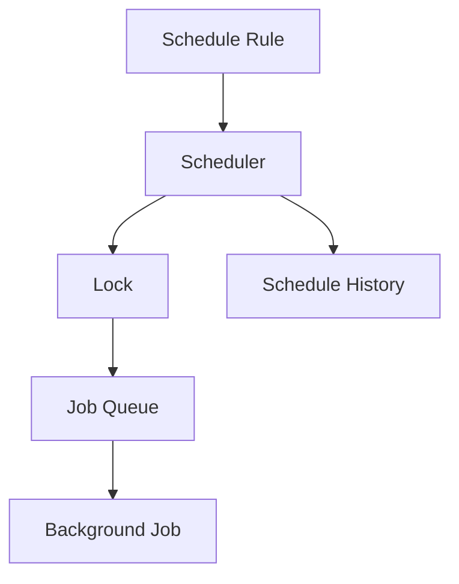
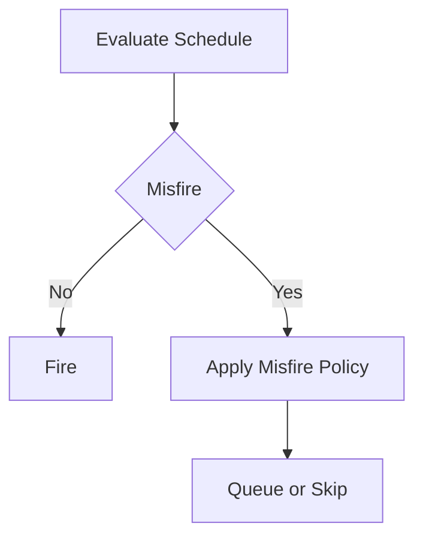
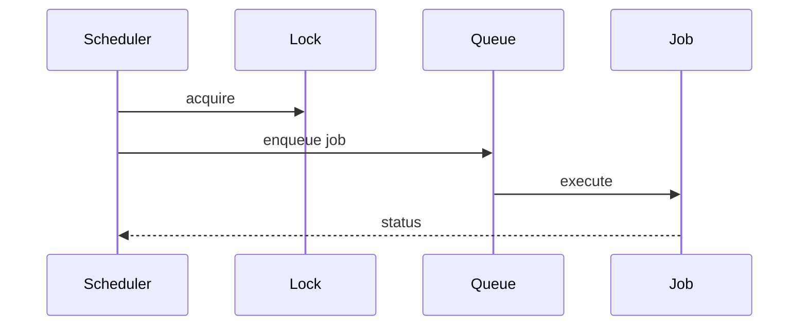
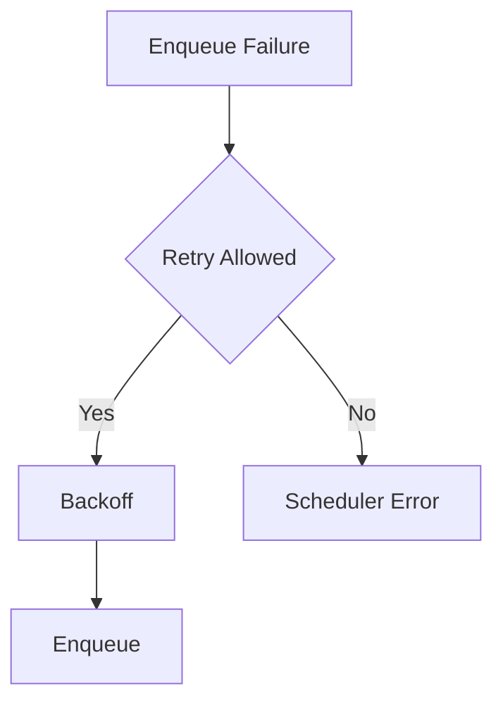
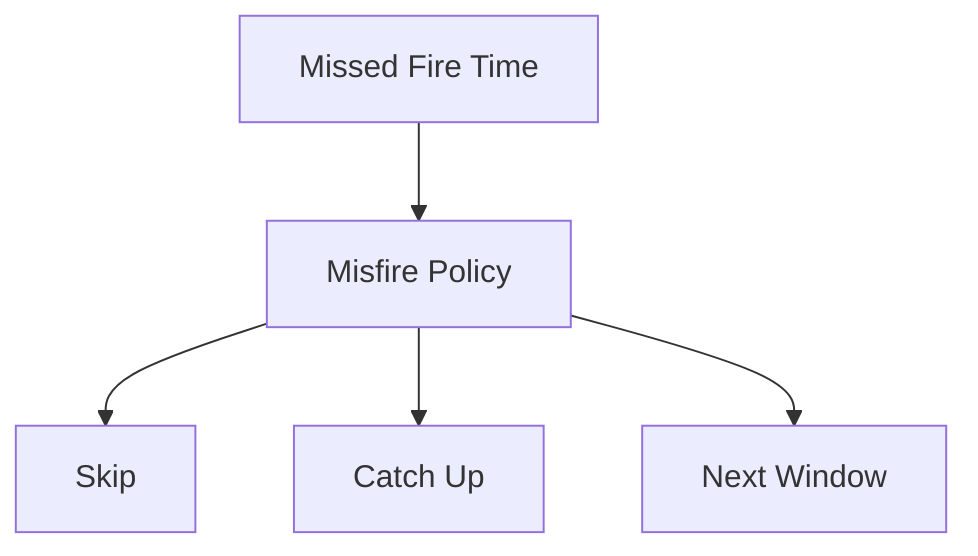
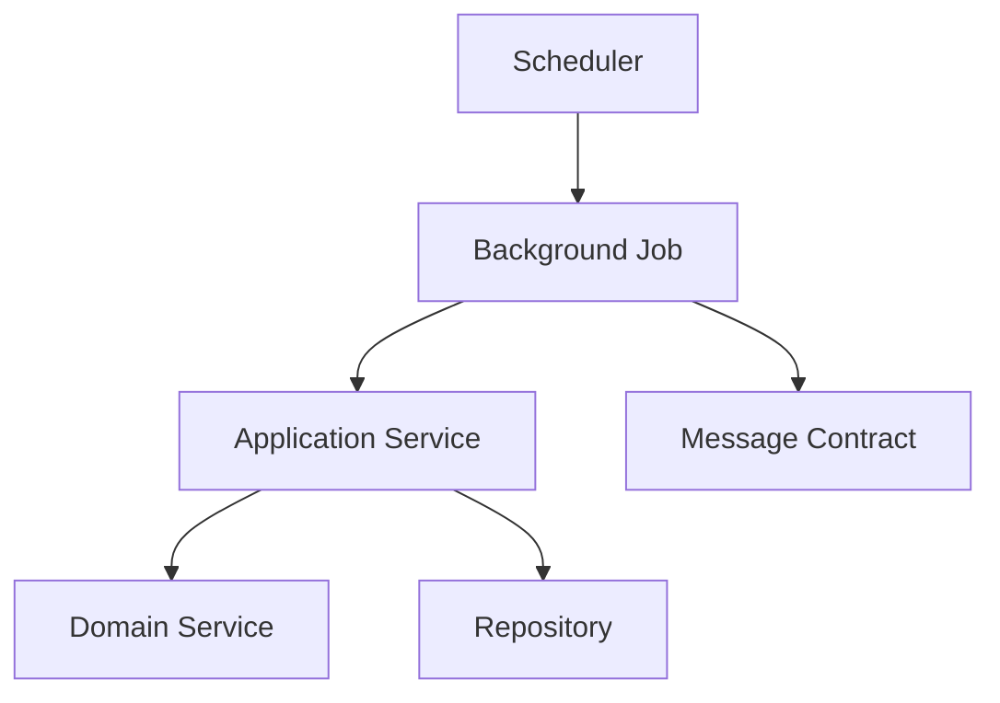

# Scheduler Framework
## Split Navigation
- [Scheduler catalog and timing](scheduler/catalog-and-timing.md)
- [Scheduler execution strategies](scheduler/execution-strategies.md)
- [Scheduler governance and testing](scheduler/governance-and-testing.md)

# Document Control

Document Name: Scheduler Framework
Document Path: knowledge/scheduler-framework.md
Document Type: Atlas Enterprise Canonical Specification
Version: 1.0
Status: Canonical Specification
Domain: Platform
Bounded Context: Platform
Owner: Project Atlas
Source of Truth: Atlas Scheduler Source of Truth
Last Updated: 2026-07-12

Related Specifications:
- knowledge/background-job-framework.md
- knowledge/workflow-engine-framework.md
- knowledge/application-service-catalog.md
- knowledge/domain-service-catalog.md
- knowledge/command-catalog.md
- knowledge/domain-event-catalog.md
- knowledge/message-contract-catalog.md
- knowledge/event-driven-architecture.md
- knowledge/integration-framework.md
- knowledge/service-catalog.md
- knowledge/system-module-catalog.md
- knowledge/api-governance-framework.md
- knowledge/automation-framework.md
- knowledge/projection-engine-framework.md
- docs/specification/04-DomainModel.md
- docs/database/05-DatabaseDesign.md
- docs/database/06-ERD.md
- docs/api/07-API.md

# Purpose

Scheduler Framework defines approved Atlas scheduling for Background Jobs, Workflows, Automation, Application Services, Domain Services, Commands, Domain Events, Message Contracts, Notifications, Projections, Batch work, Maintenance, Cache Refresh, and Integration Polling. It is the scheduler source of truth for triggers, schedule rules, retry, misfire policy, concurrency, audit, and performance.

# Scope

- Scheduler
- Recurring Scheduler
- One Time Scheduler
- Cron Scheduler
- Calendar Scheduler
- Interval Scheduler
- Delayed Scheduler
- Manual Scheduler
- Maintenance Scheduler
- Polling Scheduler
- Retry Scheduler
- Catch-up Scheduler

# Scheduler Principles

- Every scheduler has a trigger and schedule rule.
- Every scheduler has timezone, misfire, catch-up, retry, timeout, concurrency, lock, audit, and metrics behavior.
- Schedulers start catalog-approved Background Jobs or service operations only.
- Schedulers do not bypass Application Service, Domain Service, Command, Repository, or Message Contract boundaries.
- Misfire and catch-up must be deterministic and auditable.
- Concurrent runs are controlled by scheduler and job lock strategy.

# Scheduler Architecture

Schedulers create deterministic execution opportunities for Background Jobs, Workflows, Automations, Projections, Imports, Exports, Maintenance, Cache Refresh, Outbox, and Inbox processing. Execution ownership remains with the scheduled job or service.

# Complete Scheduler Catalog

The complete per-scheduler specifications have been split into dedicated files to keep this framework navigable while preserving the canonical scheduler inventory.

| Scheduler | Specification |
|---|---|
| ScenarioEvaluationScheduler | knowledge/framework/schedulers/scenario-evaluation-scheduler.md |
| ScenarioReplayScheduler | knowledge/framework/schedulers/scenario-replay-scheduler.md |
| ProjectionRefreshScheduler | knowledge/framework/schedulers/projection-refresh-scheduler.md |
| NotificationDispatchScheduler | knowledge/framework/schedulers/notification-dispatch-scheduler.md |
| ReportGenerationScheduler | knowledge/framework/schedulers/report-generation-scheduler.md |
| BankingImportScheduler | knowledge/framework/schedulers/banking-import-scheduler.md |
| BrokerageImportScheduler | knowledge/framework/schedulers/brokerage-import-scheduler.md |
| CacheRefreshScheduler | knowledge/framework/schedulers/cache-refresh-scheduler.md |
| OutboxPublishScheduler | knowledge/framework/schedulers/outbox-publish-scheduler.md |
| InboxProcessScheduler | knowledge/framework/schedulers/inbox-process-scheduler.md |
| CleanupScheduler | knowledge/framework/schedulers/cleanup-scheduler.md |
| BackupScheduler | knowledge/framework/schedulers/backup-scheduler.md |

# Scheduler Matrix

| Scheduler | Background Job | Workflow | Automation | Application Service | Domain Service | Repository | Command | Domain Event | Message Contract |
|---|---|---|---|---|---|---|---|---|---|
| ScenarioEvaluationScheduler | ScenarioEvaluationJob | Scenario workflow | Scenario automation | ScenarioApplicationService | ScenarioService | ScenarioRepository | EvaluateScenario | ScenarioEvaluated | ScenarioEvaluatedMessage |
| ScenarioReplayScheduler | ScenarioReplayJob | Replay workflow | Administration automation | ScenarioApplicationService | ScenarioService | ScenarioRepository, AuditRepository | ReplayScenario | ReplayCompleted | ReplayCompletedMessage |
| ProjectionRefreshScheduler | ProjectionRefreshJob | Projection workflow | Projection automation | DashboardApplicationService | ScenarioService, PortfolioService, LoanService | ScenarioRepository, PortfolioRepository, LoanRepository | Projection update commands from catalog-aligned handlers | ScenarioEvaluated, PortfolioRebalanced, LoanPaymentMade | Projection messages |
| NotificationDispatchScheduler | NotificationDispatchJob | Notification workflow | Notification automation | NotificationApplicationService | ExplainabilityService, DecisionService | NotificationRepository | Notification delivery commands from catalog-aligned handlers | DecisionAccepted, DecisionRejected, RecommendationGenerated | NotificationRequestedMessage |
| ReportGenerationScheduler | ReportGenerationJob | Report workflow | Report automation | ReportApplicationService | ExplainabilityService, ScenarioService, PortfolioService, LoanService | AuditRepository, ScenarioRepository, DecisionRepository | Report generation commands from catalog-aligned handlers | Report source events through read models | ReportGenerationRequestedMessage |
| BankingImportScheduler | BankingImportJob | Cash flow workflow | Import automation | BlueprintApplicationService, DashboardApplicationService | CashFlowService | HouseholdRepository, AuditRepository | RecordIncome, RecordExpense | SalaryReceived, ExpenseRecorded | BankingTransactionImportedMessage |
| BrokerageImportScheduler | BrokerageImportJob | Portfolio workflow | Import automation | PortfolioApplicationService | PortfolioService, AllocationService | PortfolioRepository, AssetRepository, AuditRepository | CreatePortfolio, BuySecurity, SellSecurity | PortfolioCreated, SecurityPurchased, SecuritySold | PortfolioImportedMessage |
| CacheRefreshScheduler | CacheRefreshJob | Dashboard refresh workflow | Cache automation | DashboardApplicationService | CashFlowService, PortfolioService, LoanService | HouseholdRepository, PortfolioRepository, LoanRepository | Read cache refresh operation | SalaryReceived, ExpenseRecorded, PortfolioRebalanced | CacheRefreshMessage |
| OutboxPublishScheduler | OutboxPublishJob | Event publishing workflow | Outbox automation | AdministrationApplicationService | ExplainabilityService | AuditRepository | Outbox publish operation | All catalog domain events | All catalog messages |
| InboxProcessScheduler | InboxProcessJob | Inbox processing workflow | Inbox automation | AdministrationApplicationService | ScenarioService | AuditRepository | Inbox process operation | All consumed domain events | All consumed messages |
| CleanupScheduler | CleanupJob | Administration workflow | Maintenance automation | AdministrationApplicationService | ExplainabilityService | AuditRepository | Cleanup operation | Audit and operational events | CleanupMessage |
| BackupScheduler | BackupJob | Administration workflow | Backup automation | AdministrationApplicationService | ExplainabilityService | AuditRepository | Backup operation | Audit and backup events | BackupCompletedMessage |

# Background Job Matrix

| Scheduler | Mapping | Owner | Control |
|---|---|---|---|
| ScenarioEvaluationScheduler | ScenarioEvaluationJob; Scenario workflow; EvaluateScenario; ScenarioEvaluated | ScenarioApplicationService | Deterministic, locked, audited, retry-safe |
| ScenarioReplayScheduler | ScenarioReplayJob; Replay workflow; ReplayScenario; ReplayCompleted | ScenarioApplicationService | Deterministic, locked, audited, retry-safe |
| ProjectionRefreshScheduler | ProjectionRefreshJob; Projection workflow; Projection update commands from catalog-aligned handlers; ScenarioEvaluated, PortfolioRebalanced, LoanPaymentMade | DashboardApplicationService | Deterministic, locked, audited, retry-safe |
| NotificationDispatchScheduler | NotificationDispatchJob; Notification workflow; Notification delivery commands from catalog-aligned handlers; DecisionAccepted, DecisionRejected, RecommendationGenerated | NotificationApplicationService | Deterministic, locked, audited, retry-safe |
| ReportGenerationScheduler | ReportGenerationJob; Report workflow; Report generation commands from catalog-aligned handlers; Report source events through read models | ReportApplicationService | Deterministic, locked, audited, retry-safe |
| BankingImportScheduler | BankingImportJob; Cash flow workflow; RecordIncome, RecordExpense; SalaryReceived, ExpenseRecorded | BlueprintApplicationService, DashboardApplicationService | Deterministic, locked, audited, retry-safe |
| BrokerageImportScheduler | BrokerageImportJob; Portfolio workflow; CreatePortfolio, BuySecurity, SellSecurity; PortfolioCreated, SecurityPurchased, SecuritySold | PortfolioApplicationService | Deterministic, locked, audited, retry-safe |
| CacheRefreshScheduler | CacheRefreshJob; Dashboard refresh workflow; Read cache refresh operation; SalaryReceived, ExpenseRecorded, PortfolioRebalanced | DashboardApplicationService | Deterministic, locked, audited, retry-safe |
| OutboxPublishScheduler | OutboxPublishJob; Event publishing workflow; Outbox publish operation; All catalog domain events | AdministrationApplicationService | Deterministic, locked, audited, retry-safe |
| InboxProcessScheduler | InboxProcessJob; Inbox processing workflow; Inbox process operation; All consumed domain events | AdministrationApplicationService | Deterministic, locked, audited, retry-safe |
| CleanupScheduler | CleanupJob; Administration workflow; Cleanup operation; Audit and operational events | AdministrationApplicationService | Deterministic, locked, audited, retry-safe |
| BackupScheduler | BackupJob; Administration workflow; Backup operation; Audit and backup events | AdministrationApplicationService | Deterministic, locked, audited, retry-safe |

# Workflow Matrix

| Scheduler | Mapping | Owner | Control |
|---|---|---|---|
| ScenarioEvaluationScheduler | ScenarioEvaluationJob; Scenario workflow; EvaluateScenario; ScenarioEvaluated | ScenarioApplicationService | Deterministic, locked, audited, retry-safe |
| ScenarioReplayScheduler | ScenarioReplayJob; Replay workflow; ReplayScenario; ReplayCompleted | ScenarioApplicationService | Deterministic, locked, audited, retry-safe |
| ProjectionRefreshScheduler | ProjectionRefreshJob; Projection workflow; Projection update commands from catalog-aligned handlers; ScenarioEvaluated, PortfolioRebalanced, LoanPaymentMade | DashboardApplicationService | Deterministic, locked, audited, retry-safe |
| NotificationDispatchScheduler | NotificationDispatchJob; Notification workflow; Notification delivery commands from catalog-aligned handlers; DecisionAccepted, DecisionRejected, RecommendationGenerated | NotificationApplicationService | Deterministic, locked, audited, retry-safe |
| ReportGenerationScheduler | ReportGenerationJob; Report workflow; Report generation commands from catalog-aligned handlers; Report source events through read models | ReportApplicationService | Deterministic, locked, audited, retry-safe |
| BankingImportScheduler | BankingImportJob; Cash flow workflow; RecordIncome, RecordExpense; SalaryReceived, ExpenseRecorded | BlueprintApplicationService, DashboardApplicationService | Deterministic, locked, audited, retry-safe |
| BrokerageImportScheduler | BrokerageImportJob; Portfolio workflow; CreatePortfolio, BuySecurity, SellSecurity; PortfolioCreated, SecurityPurchased, SecuritySold | PortfolioApplicationService | Deterministic, locked, audited, retry-safe |
| CacheRefreshScheduler | CacheRefreshJob; Dashboard refresh workflow; Read cache refresh operation; SalaryReceived, ExpenseRecorded, PortfolioRebalanced | DashboardApplicationService | Deterministic, locked, audited, retry-safe |
| OutboxPublishScheduler | OutboxPublishJob; Event publishing workflow; Outbox publish operation; All catalog domain events | AdministrationApplicationService | Deterministic, locked, audited, retry-safe |
| InboxProcessScheduler | InboxProcessJob; Inbox processing workflow; Inbox process operation; All consumed domain events | AdministrationApplicationService | Deterministic, locked, audited, retry-safe |
| CleanupScheduler | CleanupJob; Administration workflow; Cleanup operation; Audit and operational events | AdministrationApplicationService | Deterministic, locked, audited, retry-safe |
| BackupScheduler | BackupJob; Administration workflow; Backup operation; Audit and backup events | AdministrationApplicationService | Deterministic, locked, audited, retry-safe |

# Automation Matrix

| Scheduler | Mapping | Owner | Control |
|---|---|---|---|
| ScenarioEvaluationScheduler | ScenarioEvaluationJob; Scenario workflow; EvaluateScenario; ScenarioEvaluated | ScenarioApplicationService | Deterministic, locked, audited, retry-safe |
| ScenarioReplayScheduler | ScenarioReplayJob; Replay workflow; ReplayScenario; ReplayCompleted | ScenarioApplicationService | Deterministic, locked, audited, retry-safe |
| ProjectionRefreshScheduler | ProjectionRefreshJob; Projection workflow; Projection update commands from catalog-aligned handlers; ScenarioEvaluated, PortfolioRebalanced, LoanPaymentMade | DashboardApplicationService | Deterministic, locked, audited, retry-safe |
| NotificationDispatchScheduler | NotificationDispatchJob; Notification workflow; Notification delivery commands from catalog-aligned handlers; DecisionAccepted, DecisionRejected, RecommendationGenerated | NotificationApplicationService | Deterministic, locked, audited, retry-safe |
| ReportGenerationScheduler | ReportGenerationJob; Report workflow; Report generation commands from catalog-aligned handlers; Report source events through read models | ReportApplicationService | Deterministic, locked, audited, retry-safe |
| BankingImportScheduler | BankingImportJob; Cash flow workflow; RecordIncome, RecordExpense; SalaryReceived, ExpenseRecorded | BlueprintApplicationService, DashboardApplicationService | Deterministic, locked, audited, retry-safe |
| BrokerageImportScheduler | BrokerageImportJob; Portfolio workflow; CreatePortfolio, BuySecurity, SellSecurity; PortfolioCreated, SecurityPurchased, SecuritySold | PortfolioApplicationService | Deterministic, locked, audited, retry-safe |
| CacheRefreshScheduler | CacheRefreshJob; Dashboard refresh workflow; Read cache refresh operation; SalaryReceived, ExpenseRecorded, PortfolioRebalanced | DashboardApplicationService | Deterministic, locked, audited, retry-safe |
| OutboxPublishScheduler | OutboxPublishJob; Event publishing workflow; Outbox publish operation; All catalog domain events | AdministrationApplicationService | Deterministic, locked, audited, retry-safe |
| InboxProcessScheduler | InboxProcessJob; Inbox processing workflow; Inbox process operation; All consumed domain events | AdministrationApplicationService | Deterministic, locked, audited, retry-safe |
| CleanupScheduler | CleanupJob; Administration workflow; Cleanup operation; Audit and operational events | AdministrationApplicationService | Deterministic, locked, audited, retry-safe |
| BackupScheduler | BackupJob; Administration workflow; Backup operation; Audit and backup events | AdministrationApplicationService | Deterministic, locked, audited, retry-safe |

# Command Matrix

| Scheduler | Mapping | Owner | Control |
|---|---|---|---|
| ScenarioEvaluationScheduler | ScenarioEvaluationJob; Scenario workflow; EvaluateScenario; ScenarioEvaluated | ScenarioApplicationService | Deterministic, locked, audited, retry-safe |
| ScenarioReplayScheduler | ScenarioReplayJob; Replay workflow; ReplayScenario; ReplayCompleted | ScenarioApplicationService | Deterministic, locked, audited, retry-safe |
| ProjectionRefreshScheduler | ProjectionRefreshJob; Projection workflow; Projection update commands from catalog-aligned handlers; ScenarioEvaluated, PortfolioRebalanced, LoanPaymentMade | DashboardApplicationService | Deterministic, locked, audited, retry-safe |
| NotificationDispatchScheduler | NotificationDispatchJob; Notification workflow; Notification delivery commands from catalog-aligned handlers; DecisionAccepted, DecisionRejected, RecommendationGenerated | NotificationApplicationService | Deterministic, locked, audited, retry-safe |
| ReportGenerationScheduler | ReportGenerationJob; Report workflow; Report generation commands from catalog-aligned handlers; Report source events through read models | ReportApplicationService | Deterministic, locked, audited, retry-safe |
| BankingImportScheduler | BankingImportJob; Cash flow workflow; RecordIncome, RecordExpense; SalaryReceived, ExpenseRecorded | BlueprintApplicationService, DashboardApplicationService | Deterministic, locked, audited, retry-safe |
| BrokerageImportScheduler | BrokerageImportJob; Portfolio workflow; CreatePortfolio, BuySecurity, SellSecurity; PortfolioCreated, SecurityPurchased, SecuritySold | PortfolioApplicationService | Deterministic, locked, audited, retry-safe |
| CacheRefreshScheduler | CacheRefreshJob; Dashboard refresh workflow; Read cache refresh operation; SalaryReceived, ExpenseRecorded, PortfolioRebalanced | DashboardApplicationService | Deterministic, locked, audited, retry-safe |
| OutboxPublishScheduler | OutboxPublishJob; Event publishing workflow; Outbox publish operation; All catalog domain events | AdministrationApplicationService | Deterministic, locked, audited, retry-safe |
| InboxProcessScheduler | InboxProcessJob; Inbox processing workflow; Inbox process operation; All consumed domain events | AdministrationApplicationService | Deterministic, locked, audited, retry-safe |
| CleanupScheduler | CleanupJob; Administration workflow; Cleanup operation; Audit and operational events | AdministrationApplicationService | Deterministic, locked, audited, retry-safe |
| BackupScheduler | BackupJob; Administration workflow; Backup operation; Audit and backup events | AdministrationApplicationService | Deterministic, locked, audited, retry-safe |

# Domain Event Matrix

| Scheduler | Mapping | Owner | Control |
|---|---|---|---|
| ScenarioEvaluationScheduler | ScenarioEvaluationJob; Scenario workflow; EvaluateScenario; ScenarioEvaluated | ScenarioApplicationService | Deterministic, locked, audited, retry-safe |
| ScenarioReplayScheduler | ScenarioReplayJob; Replay workflow; ReplayScenario; ReplayCompleted | ScenarioApplicationService | Deterministic, locked, audited, retry-safe |
| ProjectionRefreshScheduler | ProjectionRefreshJob; Projection workflow; Projection update commands from catalog-aligned handlers; ScenarioEvaluated, PortfolioRebalanced, LoanPaymentMade | DashboardApplicationService | Deterministic, locked, audited, retry-safe |
| NotificationDispatchScheduler | NotificationDispatchJob; Notification workflow; Notification delivery commands from catalog-aligned handlers; DecisionAccepted, DecisionRejected, RecommendationGenerated | NotificationApplicationService | Deterministic, locked, audited, retry-safe |
| ReportGenerationScheduler | ReportGenerationJob; Report workflow; Report generation commands from catalog-aligned handlers; Report source events through read models | ReportApplicationService | Deterministic, locked, audited, retry-safe |
| BankingImportScheduler | BankingImportJob; Cash flow workflow; RecordIncome, RecordExpense; SalaryReceived, ExpenseRecorded | BlueprintApplicationService, DashboardApplicationService | Deterministic, locked, audited, retry-safe |
| BrokerageImportScheduler | BrokerageImportJob; Portfolio workflow; CreatePortfolio, BuySecurity, SellSecurity; PortfolioCreated, SecurityPurchased, SecuritySold | PortfolioApplicationService | Deterministic, locked, audited, retry-safe |
| CacheRefreshScheduler | CacheRefreshJob; Dashboard refresh workflow; Read cache refresh operation; SalaryReceived, ExpenseRecorded, PortfolioRebalanced | DashboardApplicationService | Deterministic, locked, audited, retry-safe |
| OutboxPublishScheduler | OutboxPublishJob; Event publishing workflow; Outbox publish operation; All catalog domain events | AdministrationApplicationService | Deterministic, locked, audited, retry-safe |
| InboxProcessScheduler | InboxProcessJob; Inbox processing workflow; Inbox process operation; All consumed domain events | AdministrationApplicationService | Deterministic, locked, audited, retry-safe |
| CleanupScheduler | CleanupJob; Administration workflow; Cleanup operation; Audit and operational events | AdministrationApplicationService | Deterministic, locked, audited, retry-safe |
| BackupScheduler | BackupJob; Administration workflow; Backup operation; Audit and backup events | AdministrationApplicationService | Deterministic, locked, audited, retry-safe |

# Cron Strategy

- Cron Strategy rule 1 preserves deterministic schedule evaluation, timezone safety, duplicate prevention, lock discipline, bounded retry, misfire handling, catch-up safety, audit, metrics, and catalog error handling.
- Cron Strategy rule 2 preserves deterministic schedule evaluation, timezone safety, duplicate prevention, lock discipline, bounded retry, misfire handling, catch-up safety, audit, metrics, and catalog error handling.
- Cron Strategy rule 3 preserves deterministic schedule evaluation, timezone safety, duplicate prevention, lock discipline, bounded retry, misfire handling, catch-up safety, audit, metrics, and catalog error handling.
- Cron Strategy rule 4 preserves deterministic schedule evaluation, timezone safety, duplicate prevention, lock discipline, bounded retry, misfire handling, catch-up safety, audit, metrics, and catalog error handling.
- Cron Strategy rule 5 preserves deterministic schedule evaluation, timezone safety, duplicate prevention, lock discipline, bounded retry, misfire handling, catch-up safety, audit, metrics, and catalog error handling.
- Cron Strategy rule 6 preserves deterministic schedule evaluation, timezone safety, duplicate prevention, lock discipline, bounded retry, misfire handling, catch-up safety, audit, metrics, and catalog error handling.
- Cron Strategy rule 7 preserves deterministic schedule evaluation, timezone safety, duplicate prevention, lock discipline, bounded retry, misfire handling, catch-up safety, audit, metrics, and catalog error handling.
- Cron Strategy rule 8 preserves deterministic schedule evaluation, timezone safety, duplicate prevention, lock discipline, bounded retry, misfire handling, catch-up safety, audit, metrics, and catalog error handling.
- Cron Strategy rule 9 preserves deterministic schedule evaluation, timezone safety, duplicate prevention, lock discipline, bounded retry, misfire handling, catch-up safety, audit, metrics, and catalog error handling.
- Cron Strategy rule 10 preserves deterministic schedule evaluation, timezone safety, duplicate prevention, lock discipline, bounded retry, misfire handling, catch-up safety, audit, metrics, and catalog error handling.
- Cron Strategy rule 11 preserves deterministic schedule evaluation, timezone safety, duplicate prevention, lock discipline, bounded retry, misfire handling, catch-up safety, audit, metrics, and catalog error handling.
- Cron Strategy rule 12 preserves deterministic schedule evaluation, timezone safety, duplicate prevention, lock discipline, bounded retry, misfire handling, catch-up safety, audit, metrics, and catalog error handling.

# Calendar Strategy

- Calendar Strategy rule 1 preserves deterministic schedule evaluation, timezone safety, duplicate prevention, lock discipline, bounded retry, misfire handling, catch-up safety, audit, metrics, and catalog error handling.
- Calendar Strategy rule 2 preserves deterministic schedule evaluation, timezone safety, duplicate prevention, lock discipline, bounded retry, misfire handling, catch-up safety, audit, metrics, and catalog error handling.
- Calendar Strategy rule 3 preserves deterministic schedule evaluation, timezone safety, duplicate prevention, lock discipline, bounded retry, misfire handling, catch-up safety, audit, metrics, and catalog error handling.
- Calendar Strategy rule 4 preserves deterministic schedule evaluation, timezone safety, duplicate prevention, lock discipline, bounded retry, misfire handling, catch-up safety, audit, metrics, and catalog error handling.
- Calendar Strategy rule 5 preserves deterministic schedule evaluation, timezone safety, duplicate prevention, lock discipline, bounded retry, misfire handling, catch-up safety, audit, metrics, and catalog error handling.
- Calendar Strategy rule 6 preserves deterministic schedule evaluation, timezone safety, duplicate prevention, lock discipline, bounded retry, misfire handling, catch-up safety, audit, metrics, and catalog error handling.
- Calendar Strategy rule 7 preserves deterministic schedule evaluation, timezone safety, duplicate prevention, lock discipline, bounded retry, misfire handling, catch-up safety, audit, metrics, and catalog error handling.
- Calendar Strategy rule 8 preserves deterministic schedule evaluation, timezone safety, duplicate prevention, lock discipline, bounded retry, misfire handling, catch-up safety, audit, metrics, and catalog error handling.
- Calendar Strategy rule 9 preserves deterministic schedule evaluation, timezone safety, duplicate prevention, lock discipline, bounded retry, misfire handling, catch-up safety, audit, metrics, and catalog error handling.
- Calendar Strategy rule 10 preserves deterministic schedule evaluation, timezone safety, duplicate prevention, lock discipline, bounded retry, misfire handling, catch-up safety, audit, metrics, and catalog error handling.
- Calendar Strategy rule 11 preserves deterministic schedule evaluation, timezone safety, duplicate prevention, lock discipline, bounded retry, misfire handling, catch-up safety, audit, metrics, and catalog error handling.
- Calendar Strategy rule 12 preserves deterministic schedule evaluation, timezone safety, duplicate prevention, lock discipline, bounded retry, misfire handling, catch-up safety, audit, metrics, and catalog error handling.

# Retry Strategy

- Retry Strategy rule 1 preserves deterministic schedule evaluation, timezone safety, duplicate prevention, lock discipline, bounded retry, misfire handling, catch-up safety, audit, metrics, and catalog error handling.
- Retry Strategy rule 2 preserves deterministic schedule evaluation, timezone safety, duplicate prevention, lock discipline, bounded retry, misfire handling, catch-up safety, audit, metrics, and catalog error handling.
- Retry Strategy rule 3 preserves deterministic schedule evaluation, timezone safety, duplicate prevention, lock discipline, bounded retry, misfire handling, catch-up safety, audit, metrics, and catalog error handling.
- Retry Strategy rule 4 preserves deterministic schedule evaluation, timezone safety, duplicate prevention, lock discipline, bounded retry, misfire handling, catch-up safety, audit, metrics, and catalog error handling.
- Retry Strategy rule 5 preserves deterministic schedule evaluation, timezone safety, duplicate prevention, lock discipline, bounded retry, misfire handling, catch-up safety, audit, metrics, and catalog error handling.
- Retry Strategy rule 6 preserves deterministic schedule evaluation, timezone safety, duplicate prevention, lock discipline, bounded retry, misfire handling, catch-up safety, audit, metrics, and catalog error handling.
- Retry Strategy rule 7 preserves deterministic schedule evaluation, timezone safety, duplicate prevention, lock discipline, bounded retry, misfire handling, catch-up safety, audit, metrics, and catalog error handling.
- Retry Strategy rule 8 preserves deterministic schedule evaluation, timezone safety, duplicate prevention, lock discipline, bounded retry, misfire handling, catch-up safety, audit, metrics, and catalog error handling.
- Retry Strategy rule 9 preserves deterministic schedule evaluation, timezone safety, duplicate prevention, lock discipline, bounded retry, misfire handling, catch-up safety, audit, metrics, and catalog error handling.
- Retry Strategy rule 10 preserves deterministic schedule evaluation, timezone safety, duplicate prevention, lock discipline, bounded retry, misfire handling, catch-up safety, audit, metrics, and catalog error handling.
- Retry Strategy rule 11 preserves deterministic schedule evaluation, timezone safety, duplicate prevention, lock discipline, bounded retry, misfire handling, catch-up safety, audit, metrics, and catalog error handling.
- Retry Strategy rule 12 preserves deterministic schedule evaluation, timezone safety, duplicate prevention, lock discipline, bounded retry, misfire handling, catch-up safety, audit, metrics, and catalog error handling.

# Misfire Strategy

- Misfire Strategy rule 1 preserves deterministic schedule evaluation, timezone safety, duplicate prevention, lock discipline, bounded retry, misfire handling, catch-up safety, audit, metrics, and catalog error handling.
- Misfire Strategy rule 2 preserves deterministic schedule evaluation, timezone safety, duplicate prevention, lock discipline, bounded retry, misfire handling, catch-up safety, audit, metrics, and catalog error handling.
- Misfire Strategy rule 3 preserves deterministic schedule evaluation, timezone safety, duplicate prevention, lock discipline, bounded retry, misfire handling, catch-up safety, audit, metrics, and catalog error handling.
- Misfire Strategy rule 4 preserves deterministic schedule evaluation, timezone safety, duplicate prevention, lock discipline, bounded retry, misfire handling, catch-up safety, audit, metrics, and catalog error handling.
- Misfire Strategy rule 5 preserves deterministic schedule evaluation, timezone safety, duplicate prevention, lock discipline, bounded retry, misfire handling, catch-up safety, audit, metrics, and catalog error handling.
- Misfire Strategy rule 6 preserves deterministic schedule evaluation, timezone safety, duplicate prevention, lock discipline, bounded retry, misfire handling, catch-up safety, audit, metrics, and catalog error handling.
- Misfire Strategy rule 7 preserves deterministic schedule evaluation, timezone safety, duplicate prevention, lock discipline, bounded retry, misfire handling, catch-up safety, audit, metrics, and catalog error handling.
- Misfire Strategy rule 8 preserves deterministic schedule evaluation, timezone safety, duplicate prevention, lock discipline, bounded retry, misfire handling, catch-up safety, audit, metrics, and catalog error handling.
- Misfire Strategy rule 9 preserves deterministic schedule evaluation, timezone safety, duplicate prevention, lock discipline, bounded retry, misfire handling, catch-up safety, audit, metrics, and catalog error handling.
- Misfire Strategy rule 10 preserves deterministic schedule evaluation, timezone safety, duplicate prevention, lock discipline, bounded retry, misfire handling, catch-up safety, audit, metrics, and catalog error handling.
- Misfire Strategy rule 11 preserves deterministic schedule evaluation, timezone safety, duplicate prevention, lock discipline, bounded retry, misfire handling, catch-up safety, audit, metrics, and catalog error handling.
- Misfire Strategy rule 12 preserves deterministic schedule evaluation, timezone safety, duplicate prevention, lock discipline, bounded retry, misfire handling, catch-up safety, audit, metrics, and catalog error handling.

# Catch-up Strategy

- Catch-up Strategy rule 1 preserves deterministic schedule evaluation, timezone safety, duplicate prevention, lock discipline, bounded retry, misfire handling, catch-up safety, audit, metrics, and catalog error handling.
- Catch-up Strategy rule 2 preserves deterministic schedule evaluation, timezone safety, duplicate prevention, lock discipline, bounded retry, misfire handling, catch-up safety, audit, metrics, and catalog error handling.
- Catch-up Strategy rule 3 preserves deterministic schedule evaluation, timezone safety, duplicate prevention, lock discipline, bounded retry, misfire handling, catch-up safety, audit, metrics, and catalog error handling.
- Catch-up Strategy rule 4 preserves deterministic schedule evaluation, timezone safety, duplicate prevention, lock discipline, bounded retry, misfire handling, catch-up safety, audit, metrics, and catalog error handling.
- Catch-up Strategy rule 5 preserves deterministic schedule evaluation, timezone safety, duplicate prevention, lock discipline, bounded retry, misfire handling, catch-up safety, audit, metrics, and catalog error handling.
- Catch-up Strategy rule 6 preserves deterministic schedule evaluation, timezone safety, duplicate prevention, lock discipline, bounded retry, misfire handling, catch-up safety, audit, metrics, and catalog error handling.
- Catch-up Strategy rule 7 preserves deterministic schedule evaluation, timezone safety, duplicate prevention, lock discipline, bounded retry, misfire handling, catch-up safety, audit, metrics, and catalog error handling.
- Catch-up Strategy rule 8 preserves deterministic schedule evaluation, timezone safety, duplicate prevention, lock discipline, bounded retry, misfire handling, catch-up safety, audit, metrics, and catalog error handling.
- Catch-up Strategy rule 9 preserves deterministic schedule evaluation, timezone safety, duplicate prevention, lock discipline, bounded retry, misfire handling, catch-up safety, audit, metrics, and catalog error handling.
- Catch-up Strategy rule 10 preserves deterministic schedule evaluation, timezone safety, duplicate prevention, lock discipline, bounded retry, misfire handling, catch-up safety, audit, metrics, and catalog error handling.
- Catch-up Strategy rule 11 preserves deterministic schedule evaluation, timezone safety, duplicate prevention, lock discipline, bounded retry, misfire handling, catch-up safety, audit, metrics, and catalog error handling.
- Catch-up Strategy rule 12 preserves deterministic schedule evaluation, timezone safety, duplicate prevention, lock discipline, bounded retry, misfire handling, catch-up safety, audit, metrics, and catalog error handling.

# Concurrency Strategy

- Concurrency Strategy rule 1 preserves deterministic schedule evaluation, timezone safety, duplicate prevention, lock discipline, bounded retry, misfire handling, catch-up safety, audit, metrics, and catalog error handling.
- Concurrency Strategy rule 2 preserves deterministic schedule evaluation, timezone safety, duplicate prevention, lock discipline, bounded retry, misfire handling, catch-up safety, audit, metrics, and catalog error handling.
- Concurrency Strategy rule 3 preserves deterministic schedule evaluation, timezone safety, duplicate prevention, lock discipline, bounded retry, misfire handling, catch-up safety, audit, metrics, and catalog error handling.
- Concurrency Strategy rule 4 preserves deterministic schedule evaluation, timezone safety, duplicate prevention, lock discipline, bounded retry, misfire handling, catch-up safety, audit, metrics, and catalog error handling.
- Concurrency Strategy rule 5 preserves deterministic schedule evaluation, timezone safety, duplicate prevention, lock discipline, bounded retry, misfire handling, catch-up safety, audit, metrics, and catalog error handling.
- Concurrency Strategy rule 6 preserves deterministic schedule evaluation, timezone safety, duplicate prevention, lock discipline, bounded retry, misfire handling, catch-up safety, audit, metrics, and catalog error handling.
- Concurrency Strategy rule 7 preserves deterministic schedule evaluation, timezone safety, duplicate prevention, lock discipline, bounded retry, misfire handling, catch-up safety, audit, metrics, and catalog error handling.
- Concurrency Strategy rule 8 preserves deterministic schedule evaluation, timezone safety, duplicate prevention, lock discipline, bounded retry, misfire handling, catch-up safety, audit, metrics, and catalog error handling.
- Concurrency Strategy rule 9 preserves deterministic schedule evaluation, timezone safety, duplicate prevention, lock discipline, bounded retry, misfire handling, catch-up safety, audit, metrics, and catalog error handling.
- Concurrency Strategy rule 10 preserves deterministic schedule evaluation, timezone safety, duplicate prevention, lock discipline, bounded retry, misfire handling, catch-up safety, audit, metrics, and catalog error handling.
- Concurrency Strategy rule 11 preserves deterministic schedule evaluation, timezone safety, duplicate prevention, lock discipline, bounded retry, misfire handling, catch-up safety, audit, metrics, and catalog error handling.
- Concurrency Strategy rule 12 preserves deterministic schedule evaluation, timezone safety, duplicate prevention, lock discipline, bounded retry, misfire handling, catch-up safety, audit, metrics, and catalog error handling.

# Validation Rules

| Rule ID | Description | Condition | Validation | Blocking | Error |
|---|---|---|---|---|---|
| SCH-VR-001 | Validate Scheduler requirement 1. | Schedule is created, evaluated, fired, misfired, caught up, retried, locked, queued, cancelled, or completed. | Trigger, schedule rule, timezone, misfire, catch-up, retry, timeout, execution window, concurrency, lock, owner, job, workflow, automation, command, event, repository, idempotency, checkpoint, audit, security, and performance are checked. | Yes | SCH-ERR-001 |
| SCH-VR-002 | Validate Scheduler requirement 2. | Schedule is created, evaluated, fired, misfired, caught up, retried, locked, queued, cancelled, or completed. | Trigger, schedule rule, timezone, misfire, catch-up, retry, timeout, execution window, concurrency, lock, owner, job, workflow, automation, command, event, repository, idempotency, checkpoint, audit, security, and performance are checked. | Yes | SCH-ERR-002 |
| SCH-VR-003 | Validate Scheduler requirement 3. | Schedule is created, evaluated, fired, misfired, caught up, retried, locked, queued, cancelled, or completed. | Trigger, schedule rule, timezone, misfire, catch-up, retry, timeout, execution window, concurrency, lock, owner, job, workflow, automation, command, event, repository, idempotency, checkpoint, audit, security, and performance are checked. | Yes | SCH-ERR-003 |
| SCH-VR-004 | Validate Scheduler requirement 4. | Schedule is created, evaluated, fired, misfired, caught up, retried, locked, queued, cancelled, or completed. | Trigger, schedule rule, timezone, misfire, catch-up, retry, timeout, execution window, concurrency, lock, owner, job, workflow, automation, command, event, repository, idempotency, checkpoint, audit, security, and performance are checked. | Yes | SCH-ERR-004 |
| SCH-VR-005 | Validate Scheduler requirement 5. | Schedule is created, evaluated, fired, misfired, caught up, retried, locked, queued, cancelled, or completed. | Trigger, schedule rule, timezone, misfire, catch-up, retry, timeout, execution window, concurrency, lock, owner, job, workflow, automation, command, event, repository, idempotency, checkpoint, audit, security, and performance are checked. | Yes | SCH-ERR-005 |
| SCH-VR-006 | Validate Scheduler requirement 6. | Schedule is created, evaluated, fired, misfired, caught up, retried, locked, queued, cancelled, or completed. | Trigger, schedule rule, timezone, misfire, catch-up, retry, timeout, execution window, concurrency, lock, owner, job, workflow, automation, command, event, repository, idempotency, checkpoint, audit, security, and performance are checked. | Yes | SCH-ERR-006 |
| SCH-VR-007 | Validate Scheduler requirement 7. | Schedule is created, evaluated, fired, misfired, caught up, retried, locked, queued, cancelled, or completed. | Trigger, schedule rule, timezone, misfire, catch-up, retry, timeout, execution window, concurrency, lock, owner, job, workflow, automation, command, event, repository, idempotency, checkpoint, audit, security, and performance are checked. | Yes | SCH-ERR-007 |
| SCH-VR-008 | Validate Scheduler requirement 8. | Schedule is created, evaluated, fired, misfired, caught up, retried, locked, queued, cancelled, or completed. | Trigger, schedule rule, timezone, misfire, catch-up, retry, timeout, execution window, concurrency, lock, owner, job, workflow, automation, command, event, repository, idempotency, checkpoint, audit, security, and performance are checked. | Yes | SCH-ERR-008 |
| SCH-VR-009 | Validate Scheduler requirement 9. | Schedule is created, evaluated, fired, misfired, caught up, retried, locked, queued, cancelled, or completed. | Trigger, schedule rule, timezone, misfire, catch-up, retry, timeout, execution window, concurrency, lock, owner, job, workflow, automation, command, event, repository, idempotency, checkpoint, audit, security, and performance are checked. | Yes | SCH-ERR-009 |
| SCH-VR-010 | Validate Scheduler requirement 10. | Schedule is created, evaluated, fired, misfired, caught up, retried, locked, queued, cancelled, or completed. | Trigger, schedule rule, timezone, misfire, catch-up, retry, timeout, execution window, concurrency, lock, owner, job, workflow, automation, command, event, repository, idempotency, checkpoint, audit, security, and performance are checked. | Yes | SCH-ERR-010 |
| SCH-VR-011 | Validate Scheduler requirement 11. | Schedule is created, evaluated, fired, misfired, caught up, retried, locked, queued, cancelled, or completed. | Trigger, schedule rule, timezone, misfire, catch-up, retry, timeout, execution window, concurrency, lock, owner, job, workflow, automation, command, event, repository, idempotency, checkpoint, audit, security, and performance are checked. | Yes | SCH-ERR-011 |
| SCH-VR-012 | Validate Scheduler requirement 12. | Schedule is created, evaluated, fired, misfired, caught up, retried, locked, queued, cancelled, or completed. | Trigger, schedule rule, timezone, misfire, catch-up, retry, timeout, execution window, concurrency, lock, owner, job, workflow, automation, command, event, repository, idempotency, checkpoint, audit, security, and performance are checked. | Yes | SCH-ERR-012 |
| SCH-VR-013 | Validate Scheduler requirement 13. | Schedule is created, evaluated, fired, misfired, caught up, retried, locked, queued, cancelled, or completed. | Trigger, schedule rule, timezone, misfire, catch-up, retry, timeout, execution window, concurrency, lock, owner, job, workflow, automation, command, event, repository, idempotency, checkpoint, audit, security, and performance are checked. | Yes | SCH-ERR-013 |
| SCH-VR-014 | Validate Scheduler requirement 14. | Schedule is created, evaluated, fired, misfired, caught up, retried, locked, queued, cancelled, or completed. | Trigger, schedule rule, timezone, misfire, catch-up, retry, timeout, execution window, concurrency, lock, owner, job, workflow, automation, command, event, repository, idempotency, checkpoint, audit, security, and performance are checked. | Yes | SCH-ERR-014 |
| SCH-VR-015 | Validate Scheduler requirement 15. | Schedule is created, evaluated, fired, misfired, caught up, retried, locked, queued, cancelled, or completed. | Trigger, schedule rule, timezone, misfire, catch-up, retry, timeout, execution window, concurrency, lock, owner, job, workflow, automation, command, event, repository, idempotency, checkpoint, audit, security, and performance are checked. | Yes | SCH-ERR-015 |
| SCH-VR-016 | Validate Scheduler requirement 16. | Schedule is created, evaluated, fired, misfired, caught up, retried, locked, queued, cancelled, or completed. | Trigger, schedule rule, timezone, misfire, catch-up, retry, timeout, execution window, concurrency, lock, owner, job, workflow, automation, command, event, repository, idempotency, checkpoint, audit, security, and performance are checked. | Yes | SCH-ERR-016 |
| SCH-VR-017 | Validate Scheduler requirement 17. | Schedule is created, evaluated, fired, misfired, caught up, retried, locked, queued, cancelled, or completed. | Trigger, schedule rule, timezone, misfire, catch-up, retry, timeout, execution window, concurrency, lock, owner, job, workflow, automation, command, event, repository, idempotency, checkpoint, audit, security, and performance are checked. | Yes | SCH-ERR-017 |
| SCH-VR-018 | Validate Scheduler requirement 18. | Schedule is created, evaluated, fired, misfired, caught up, retried, locked, queued, cancelled, or completed. | Trigger, schedule rule, timezone, misfire, catch-up, retry, timeout, execution window, concurrency, lock, owner, job, workflow, automation, command, event, repository, idempotency, checkpoint, audit, security, and performance are checked. | Yes | SCH-ERR-018 |
| SCH-VR-019 | Validate Scheduler requirement 19. | Schedule is created, evaluated, fired, misfired, caught up, retried, locked, queued, cancelled, or completed. | Trigger, schedule rule, timezone, misfire, catch-up, retry, timeout, execution window, concurrency, lock, owner, job, workflow, automation, command, event, repository, idempotency, checkpoint, audit, security, and performance are checked. | Yes | SCH-ERR-019 |
| SCH-VR-020 | Validate Scheduler requirement 20. | Schedule is created, evaluated, fired, misfired, caught up, retried, locked, queued, cancelled, or completed. | Trigger, schedule rule, timezone, misfire, catch-up, retry, timeout, execution window, concurrency, lock, owner, job, workflow, automation, command, event, repository, idempotency, checkpoint, audit, security, and performance are checked. | Yes | SCH-ERR-020 |
| SCH-VR-021 | Validate Scheduler requirement 21. | Schedule is created, evaluated, fired, misfired, caught up, retried, locked, queued, cancelled, or completed. | Trigger, schedule rule, timezone, misfire, catch-up, retry, timeout, execution window, concurrency, lock, owner, job, workflow, automation, command, event, repository, idempotency, checkpoint, audit, security, and performance are checked. | Yes | SCH-ERR-021 |
| SCH-VR-022 | Validate Scheduler requirement 22. | Schedule is created, evaluated, fired, misfired, caught up, retried, locked, queued, cancelled, or completed. | Trigger, schedule rule, timezone, misfire, catch-up, retry, timeout, execution window, concurrency, lock, owner, job, workflow, automation, command, event, repository, idempotency, checkpoint, audit, security, and performance are checked. | Yes | SCH-ERR-022 |
| SCH-VR-023 | Validate Scheduler requirement 23. | Schedule is created, evaluated, fired, misfired, caught up, retried, locked, queued, cancelled, or completed. | Trigger, schedule rule, timezone, misfire, catch-up, retry, timeout, execution window, concurrency, lock, owner, job, workflow, automation, command, event, repository, idempotency, checkpoint, audit, security, and performance are checked. | Yes | SCH-ERR-023 |
| SCH-VR-024 | Validate Scheduler requirement 24. | Schedule is created, evaluated, fired, misfired, caught up, retried, locked, queued, cancelled, or completed. | Trigger, schedule rule, timezone, misfire, catch-up, retry, timeout, execution window, concurrency, lock, owner, job, workflow, automation, command, event, repository, idempotency, checkpoint, audit, security, and performance are checked. | Yes | SCH-ERR-024 |
| SCH-VR-025 | Validate Scheduler requirement 25. | Schedule is created, evaluated, fired, misfired, caught up, retried, locked, queued, cancelled, or completed. | Trigger, schedule rule, timezone, misfire, catch-up, retry, timeout, execution window, concurrency, lock, owner, job, workflow, automation, command, event, repository, idempotency, checkpoint, audit, security, and performance are checked. | Yes | SCH-ERR-025 |
| SCH-VR-026 | Validate Scheduler requirement 26. | Schedule is created, evaluated, fired, misfired, caught up, retried, locked, queued, cancelled, or completed. | Trigger, schedule rule, timezone, misfire, catch-up, retry, timeout, execution window, concurrency, lock, owner, job, workflow, automation, command, event, repository, idempotency, checkpoint, audit, security, and performance are checked. | Yes | SCH-ERR-026 |
| SCH-VR-027 | Validate Scheduler requirement 27. | Schedule is created, evaluated, fired, misfired, caught up, retried, locked, queued, cancelled, or completed. | Trigger, schedule rule, timezone, misfire, catch-up, retry, timeout, execution window, concurrency, lock, owner, job, workflow, automation, command, event, repository, idempotency, checkpoint, audit, security, and performance are checked. | Yes | SCH-ERR-027 |
| SCH-VR-028 | Validate Scheduler requirement 28. | Schedule is created, evaluated, fired, misfired, caught up, retried, locked, queued, cancelled, or completed. | Trigger, schedule rule, timezone, misfire, catch-up, retry, timeout, execution window, concurrency, lock, owner, job, workflow, automation, command, event, repository, idempotency, checkpoint, audit, security, and performance are checked. | Yes | SCH-ERR-028 |
| SCH-VR-029 | Validate Scheduler requirement 29. | Schedule is created, evaluated, fired, misfired, caught up, retried, locked, queued, cancelled, or completed. | Trigger, schedule rule, timezone, misfire, catch-up, retry, timeout, execution window, concurrency, lock, owner, job, workflow, automation, command, event, repository, idempotency, checkpoint, audit, security, and performance are checked. | Yes | SCH-ERR-029 |
| SCH-VR-030 | Validate Scheduler requirement 30. | Schedule is created, evaluated, fired, misfired, caught up, retried, locked, queued, cancelled, or completed. | Trigger, schedule rule, timezone, misfire, catch-up, retry, timeout, execution window, concurrency, lock, owner, job, workflow, automation, command, event, repository, idempotency, checkpoint, audit, security, and performance are checked. | Yes | SCH-ERR-030 |
| SCH-VR-031 | Validate Scheduler requirement 31. | Schedule is created, evaluated, fired, misfired, caught up, retried, locked, queued, cancelled, or completed. | Trigger, schedule rule, timezone, misfire, catch-up, retry, timeout, execution window, concurrency, lock, owner, job, workflow, automation, command, event, repository, idempotency, checkpoint, audit, security, and performance are checked. | Yes | SCH-ERR-031 |
| SCH-VR-032 | Validate Scheduler requirement 32. | Schedule is created, evaluated, fired, misfired, caught up, retried, locked, queued, cancelled, or completed. | Trigger, schedule rule, timezone, misfire, catch-up, retry, timeout, execution window, concurrency, lock, owner, job, workflow, automation, command, event, repository, idempotency, checkpoint, audit, security, and performance are checked. | Yes | SCH-ERR-032 |
| SCH-VR-033 | Validate Scheduler requirement 33. | Schedule is created, evaluated, fired, misfired, caught up, retried, locked, queued, cancelled, or completed. | Trigger, schedule rule, timezone, misfire, catch-up, retry, timeout, execution window, concurrency, lock, owner, job, workflow, automation, command, event, repository, idempotency, checkpoint, audit, security, and performance are checked. | Yes | SCH-ERR-033 |
| SCH-VR-034 | Validate Scheduler requirement 34. | Schedule is created, evaluated, fired, misfired, caught up, retried, locked, queued, cancelled, or completed. | Trigger, schedule rule, timezone, misfire, catch-up, retry, timeout, execution window, concurrency, lock, owner, job, workflow, automation, command, event, repository, idempotency, checkpoint, audit, security, and performance are checked. | Yes | SCH-ERR-034 |
| SCH-VR-035 | Validate Scheduler requirement 35. | Schedule is created, evaluated, fired, misfired, caught up, retried, locked, queued, cancelled, or completed. | Trigger, schedule rule, timezone, misfire, catch-up, retry, timeout, execution window, concurrency, lock, owner, job, workflow, automation, command, event, repository, idempotency, checkpoint, audit, security, and performance are checked. | Yes | SCH-ERR-035 |
| SCH-VR-036 | Validate Scheduler requirement 36. | Schedule is created, evaluated, fired, misfired, caught up, retried, locked, queued, cancelled, or completed. | Trigger, schedule rule, timezone, misfire, catch-up, retry, timeout, execution window, concurrency, lock, owner, job, workflow, automation, command, event, repository, idempotency, checkpoint, audit, security, and performance are checked. | Yes | SCH-ERR-036 |
| SCH-VR-037 | Validate Scheduler requirement 37. | Schedule is created, evaluated, fired, misfired, caught up, retried, locked, queued, cancelled, or completed. | Trigger, schedule rule, timezone, misfire, catch-up, retry, timeout, execution window, concurrency, lock, owner, job, workflow, automation, command, event, repository, idempotency, checkpoint, audit, security, and performance are checked. | Yes | SCH-ERR-037 |
| SCH-VR-038 | Validate Scheduler requirement 38. | Schedule is created, evaluated, fired, misfired, caught up, retried, locked, queued, cancelled, or completed. | Trigger, schedule rule, timezone, misfire, catch-up, retry, timeout, execution window, concurrency, lock, owner, job, workflow, automation, command, event, repository, idempotency, checkpoint, audit, security, and performance are checked. | Yes | SCH-ERR-038 |
| SCH-VR-039 | Validate Scheduler requirement 39. | Schedule is created, evaluated, fired, misfired, caught up, retried, locked, queued, cancelled, or completed. | Trigger, schedule rule, timezone, misfire, catch-up, retry, timeout, execution window, concurrency, lock, owner, job, workflow, automation, command, event, repository, idempotency, checkpoint, audit, security, and performance are checked. | Yes | SCH-ERR-039 |
| SCH-VR-040 | Validate Scheduler requirement 40. | Schedule is created, evaluated, fired, misfired, caught up, retried, locked, queued, cancelled, or completed. | Trigger, schedule rule, timezone, misfire, catch-up, retry, timeout, execution window, concurrency, lock, owner, job, workflow, automation, command, event, repository, idempotency, checkpoint, audit, security, and performance are checked. | Yes | SCH-ERR-040 |

# Business Rules

1. SCH-BR-001 Trigger: scheduler definition, schedule evaluation, fire time, misfire, catch-up, retry, lock acquisition, job queue, workflow start, automation run, cancellation, or schedule history update. Input: scheduler name, trigger, schedule type, cron expression, calendar rule, interval, timezone, misfire policy, catch-up policy, retry policy, timeout policy, execution owner, job, workflow, automation, command, event, repository, lock key, scheduled time, actual time, CorrelationId, CausationId, and audit context. Logic: enforce catalog-approved scheduler, no hidden scheduler, deterministic schedule rule, timezone validity, misfire policy, catch-up safety, concurrency policy, lock strategy, idempotency, queue safety, retry limit, timeout, service boundary, repository boundary, security, logging, metrics, audit, and performance consistency. Result: schedule evaluates, queues, skips, catches up, retries, misfires, cancels, or fails with catalog error. Exception: invalid cron, duplicate active run, stale lock, unauthorized context, invalid catch-up, or dependency failure is blocked. Audit: schedule history is recorded.
2. SCH-BR-002 Trigger: scheduler definition, schedule evaluation, fire time, misfire, catch-up, retry, lock acquisition, job queue, workflow start, automation run, cancellation, or schedule history update. Input: scheduler name, trigger, schedule type, cron expression, calendar rule, interval, timezone, misfire policy, catch-up policy, retry policy, timeout policy, execution owner, job, workflow, automation, command, event, repository, lock key, scheduled time, actual time, CorrelationId, CausationId, and audit context. Logic: enforce catalog-approved scheduler, no hidden scheduler, deterministic schedule rule, timezone validity, misfire policy, catch-up safety, concurrency policy, lock strategy, idempotency, queue safety, retry limit, timeout, service boundary, repository boundary, security, logging, metrics, audit, and performance consistency. Result: schedule evaluates, queues, skips, catches up, retries, misfires, cancels, or fails with catalog error. Exception: invalid cron, duplicate active run, stale lock, unauthorized context, invalid catch-up, or dependency failure is blocked. Audit: schedule history is recorded.
3. SCH-BR-003 Trigger: scheduler definition, schedule evaluation, fire time, misfire, catch-up, retry, lock acquisition, job queue, workflow start, automation run, cancellation, or schedule history update. Input: scheduler name, trigger, schedule type, cron expression, calendar rule, interval, timezone, misfire policy, catch-up policy, retry policy, timeout policy, execution owner, job, workflow, automation, command, event, repository, lock key, scheduled time, actual time, CorrelationId, CausationId, and audit context. Logic: enforce catalog-approved scheduler, no hidden scheduler, deterministic schedule rule, timezone validity, misfire policy, catch-up safety, concurrency policy, lock strategy, idempotency, queue safety, retry limit, timeout, service boundary, repository boundary, security, logging, metrics, audit, and performance consistency. Result: schedule evaluates, queues, skips, catches up, retries, misfires, cancels, or fails with catalog error. Exception: invalid cron, duplicate active run, stale lock, unauthorized context, invalid catch-up, or dependency failure is blocked. Audit: schedule history is recorded.
4. SCH-BR-004 Trigger: scheduler definition, schedule evaluation, fire time, misfire, catch-up, retry, lock acquisition, job queue, workflow start, automation run, cancellation, or schedule history update. Input: scheduler name, trigger, schedule type, cron expression, calendar rule, interval, timezone, misfire policy, catch-up policy, retry policy, timeout policy, execution owner, job, workflow, automation, command, event, repository, lock key, scheduled time, actual time, CorrelationId, CausationId, and audit context. Logic: enforce catalog-approved scheduler, no hidden scheduler, deterministic schedule rule, timezone validity, misfire policy, catch-up safety, concurrency policy, lock strategy, idempotency, queue safety, retry limit, timeout, service boundary, repository boundary, security, logging, metrics, audit, and performance consistency. Result: schedule evaluates, queues, skips, catches up, retries, misfires, cancels, or fails with catalog error. Exception: invalid cron, duplicate active run, stale lock, unauthorized context, invalid catch-up, or dependency failure is blocked. Audit: schedule history is recorded.
5. SCH-BR-005 Trigger: scheduler definition, schedule evaluation, fire time, misfire, catch-up, retry, lock acquisition, job queue, workflow start, automation run, cancellation, or schedule history update. Input: scheduler name, trigger, schedule type, cron expression, calendar rule, interval, timezone, misfire policy, catch-up policy, retry policy, timeout policy, execution owner, job, workflow, automation, command, event, repository, lock key, scheduled time, actual time, CorrelationId, CausationId, and audit context. Logic: enforce catalog-approved scheduler, no hidden scheduler, deterministic schedule rule, timezone validity, misfire policy, catch-up safety, concurrency policy, lock strategy, idempotency, queue safety, retry limit, timeout, service boundary, repository boundary, security, logging, metrics, audit, and performance consistency. Result: schedule evaluates, queues, skips, catches up, retries, misfires, cancels, or fails with catalog error. Exception: invalid cron, duplicate active run, stale lock, unauthorized context, invalid catch-up, or dependency failure is blocked. Audit: schedule history is recorded.
6. SCH-BR-006 Trigger: scheduler definition, schedule evaluation, fire time, misfire, catch-up, retry, lock acquisition, job queue, workflow start, automation run, cancellation, or schedule history update. Input: scheduler name, trigger, schedule type, cron expression, calendar rule, interval, timezone, misfire policy, catch-up policy, retry policy, timeout policy, execution owner, job, workflow, automation, command, event, repository, lock key, scheduled time, actual time, CorrelationId, CausationId, and audit context. Logic: enforce catalog-approved scheduler, no hidden scheduler, deterministic schedule rule, timezone validity, misfire policy, catch-up safety, concurrency policy, lock strategy, idempotency, queue safety, retry limit, timeout, service boundary, repository boundary, security, logging, metrics, audit, and performance consistency. Result: schedule evaluates, queues, skips, catches up, retries, misfires, cancels, or fails with catalog error. Exception: invalid cron, duplicate active run, stale lock, unauthorized context, invalid catch-up, or dependency failure is blocked. Audit: schedule history is recorded.
7. SCH-BR-007 Trigger: scheduler definition, schedule evaluation, fire time, misfire, catch-up, retry, lock acquisition, job queue, workflow start, automation run, cancellation, or schedule history update. Input: scheduler name, trigger, schedule type, cron expression, calendar rule, interval, timezone, misfire policy, catch-up policy, retry policy, timeout policy, execution owner, job, workflow, automation, command, event, repository, lock key, scheduled time, actual time, CorrelationId, CausationId, and audit context. Logic: enforce catalog-approved scheduler, no hidden scheduler, deterministic schedule rule, timezone validity, misfire policy, catch-up safety, concurrency policy, lock strategy, idempotency, queue safety, retry limit, timeout, service boundary, repository boundary, security, logging, metrics, audit, and performance consistency. Result: schedule evaluates, queues, skips, catches up, retries, misfires, cancels, or fails with catalog error. Exception: invalid cron, duplicate active run, stale lock, unauthorized context, invalid catch-up, or dependency failure is blocked. Audit: schedule history is recorded.
8. SCH-BR-008 Trigger: scheduler definition, schedule evaluation, fire time, misfire, catch-up, retry, lock acquisition, job queue, workflow start, automation run, cancellation, or schedule history update. Input: scheduler name, trigger, schedule type, cron expression, calendar rule, interval, timezone, misfire policy, catch-up policy, retry policy, timeout policy, execution owner, job, workflow, automation, command, event, repository, lock key, scheduled time, actual time, CorrelationId, CausationId, and audit context. Logic: enforce catalog-approved scheduler, no hidden scheduler, deterministic schedule rule, timezone validity, misfire policy, catch-up safety, concurrency policy, lock strategy, idempotency, queue safety, retry limit, timeout, service boundary, repository boundary, security, logging, metrics, audit, and performance consistency. Result: schedule evaluates, queues, skips, catches up, retries, misfires, cancels, or fails with catalog error. Exception: invalid cron, duplicate active run, stale lock, unauthorized context, invalid catch-up, or dependency failure is blocked. Audit: schedule history is recorded.
9. SCH-BR-009 Trigger: scheduler definition, schedule evaluation, fire time, misfire, catch-up, retry, lock acquisition, job queue, workflow start, automation run, cancellation, or schedule history update. Input: scheduler name, trigger, schedule type, cron expression, calendar rule, interval, timezone, misfire policy, catch-up policy, retry policy, timeout policy, execution owner, job, workflow, automation, command, event, repository, lock key, scheduled time, actual time, CorrelationId, CausationId, and audit context. Logic: enforce catalog-approved scheduler, no hidden scheduler, deterministic schedule rule, timezone validity, misfire policy, catch-up safety, concurrency policy, lock strategy, idempotency, queue safety, retry limit, timeout, service boundary, repository boundary, security, logging, metrics, audit, and performance consistency. Result: schedule evaluates, queues, skips, catches up, retries, misfires, cancels, or fails with catalog error. Exception: invalid cron, duplicate active run, stale lock, unauthorized context, invalid catch-up, or dependency failure is blocked. Audit: schedule history is recorded.
10. SCH-BR-010 Trigger: scheduler definition, schedule evaluation, fire time, misfire, catch-up, retry, lock acquisition, job queue, workflow start, automation run, cancellation, or schedule history update. Input: scheduler name, trigger, schedule type, cron expression, calendar rule, interval, timezone, misfire policy, catch-up policy, retry policy, timeout policy, execution owner, job, workflow, automation, command, event, repository, lock key, scheduled time, actual time, CorrelationId, CausationId, and audit context. Logic: enforce catalog-approved scheduler, no hidden scheduler, deterministic schedule rule, timezone validity, misfire policy, catch-up safety, concurrency policy, lock strategy, idempotency, queue safety, retry limit, timeout, service boundary, repository boundary, security, logging, metrics, audit, and performance consistency. Result: schedule evaluates, queues, skips, catches up, retries, misfires, cancels, or fails with catalog error. Exception: invalid cron, duplicate active run, stale lock, unauthorized context, invalid catch-up, or dependency failure is blocked. Audit: schedule history is recorded.
11. SCH-BR-011 Trigger: scheduler definition, schedule evaluation, fire time, misfire, catch-up, retry, lock acquisition, job queue, workflow start, automation run, cancellation, or schedule history update. Input: scheduler name, trigger, schedule type, cron expression, calendar rule, interval, timezone, misfire policy, catch-up policy, retry policy, timeout policy, execution owner, job, workflow, automation, command, event, repository, lock key, scheduled time, actual time, CorrelationId, CausationId, and audit context. Logic: enforce catalog-approved scheduler, no hidden scheduler, deterministic schedule rule, timezone validity, misfire policy, catch-up safety, concurrency policy, lock strategy, idempotency, queue safety, retry limit, timeout, service boundary, repository boundary, security, logging, metrics, audit, and performance consistency. Result: schedule evaluates, queues, skips, catches up, retries, misfires, cancels, or fails with catalog error. Exception: invalid cron, duplicate active run, stale lock, unauthorized context, invalid catch-up, or dependency failure is blocked. Audit: schedule history is recorded.
12. SCH-BR-012 Trigger: scheduler definition, schedule evaluation, fire time, misfire, catch-up, retry, lock acquisition, job queue, workflow start, automation run, cancellation, or schedule history update. Input: scheduler name, trigger, schedule type, cron expression, calendar rule, interval, timezone, misfire policy, catch-up policy, retry policy, timeout policy, execution owner, job, workflow, automation, command, event, repository, lock key, scheduled time, actual time, CorrelationId, CausationId, and audit context. Logic: enforce catalog-approved scheduler, no hidden scheduler, deterministic schedule rule, timezone validity, misfire policy, catch-up safety, concurrency policy, lock strategy, idempotency, queue safety, retry limit, timeout, service boundary, repository boundary, security, logging, metrics, audit, and performance consistency. Result: schedule evaluates, queues, skips, catches up, retries, misfires, cancels, or fails with catalog error. Exception: invalid cron, duplicate active run, stale lock, unauthorized context, invalid catch-up, or dependency failure is blocked. Audit: schedule history is recorded.
13. SCH-BR-013 Trigger: scheduler definition, schedule evaluation, fire time, misfire, catch-up, retry, lock acquisition, job queue, workflow start, automation run, cancellation, or schedule history update. Input: scheduler name, trigger, schedule type, cron expression, calendar rule, interval, timezone, misfire policy, catch-up policy, retry policy, timeout policy, execution owner, job, workflow, automation, command, event, repository, lock key, scheduled time, actual time, CorrelationId, CausationId, and audit context. Logic: enforce catalog-approved scheduler, no hidden scheduler, deterministic schedule rule, timezone validity, misfire policy, catch-up safety, concurrency policy, lock strategy, idempotency, queue safety, retry limit, timeout, service boundary, repository boundary, security, logging, metrics, audit, and performance consistency. Result: schedule evaluates, queues, skips, catches up, retries, misfires, cancels, or fails with catalog error. Exception: invalid cron, duplicate active run, stale lock, unauthorized context, invalid catch-up, or dependency failure is blocked. Audit: schedule history is recorded.
14. SCH-BR-014 Trigger: scheduler definition, schedule evaluation, fire time, misfire, catch-up, retry, lock acquisition, job queue, workflow start, automation run, cancellation, or schedule history update. Input: scheduler name, trigger, schedule type, cron expression, calendar rule, interval, timezone, misfire policy, catch-up policy, retry policy, timeout policy, execution owner, job, workflow, automation, command, event, repository, lock key, scheduled time, actual time, CorrelationId, CausationId, and audit context. Logic: enforce catalog-approved scheduler, no hidden scheduler, deterministic schedule rule, timezone validity, misfire policy, catch-up safety, concurrency policy, lock strategy, idempotency, queue safety, retry limit, timeout, service boundary, repository boundary, security, logging, metrics, audit, and performance consistency. Result: schedule evaluates, queues, skips, catches up, retries, misfires, cancels, or fails with catalog error. Exception: invalid cron, duplicate active run, stale lock, unauthorized context, invalid catch-up, or dependency failure is blocked. Audit: schedule history is recorded.
15. SCH-BR-015 Trigger: scheduler definition, schedule evaluation, fire time, misfire, catch-up, retry, lock acquisition, job queue, workflow start, automation run, cancellation, or schedule history update. Input: scheduler name, trigger, schedule type, cron expression, calendar rule, interval, timezone, misfire policy, catch-up policy, retry policy, timeout policy, execution owner, job, workflow, automation, command, event, repository, lock key, scheduled time, actual time, CorrelationId, CausationId, and audit context. Logic: enforce catalog-approved scheduler, no hidden scheduler, deterministic schedule rule, timezone validity, misfire policy, catch-up safety, concurrency policy, lock strategy, idempotency, queue safety, retry limit, timeout, service boundary, repository boundary, security, logging, metrics, audit, and performance consistency. Result: schedule evaluates, queues, skips, catches up, retries, misfires, cancels, or fails with catalog error. Exception: invalid cron, duplicate active run, stale lock, unauthorized context, invalid catch-up, or dependency failure is blocked. Audit: schedule history is recorded.
16. SCH-BR-016 Trigger: scheduler definition, schedule evaluation, fire time, misfire, catch-up, retry, lock acquisition, job queue, workflow start, automation run, cancellation, or schedule history update. Input: scheduler name, trigger, schedule type, cron expression, calendar rule, interval, timezone, misfire policy, catch-up policy, retry policy, timeout policy, execution owner, job, workflow, automation, command, event, repository, lock key, scheduled time, actual time, CorrelationId, CausationId, and audit context. Logic: enforce catalog-approved scheduler, no hidden scheduler, deterministic schedule rule, timezone validity, misfire policy, catch-up safety, concurrency policy, lock strategy, idempotency, queue safety, retry limit, timeout, service boundary, repository boundary, security, logging, metrics, audit, and performance consistency. Result: schedule evaluates, queues, skips, catches up, retries, misfires, cancels, or fails with catalog error. Exception: invalid cron, duplicate active run, stale lock, unauthorized context, invalid catch-up, or dependency failure is blocked. Audit: schedule history is recorded.
17. SCH-BR-017 Trigger: scheduler definition, schedule evaluation, fire time, misfire, catch-up, retry, lock acquisition, job queue, workflow start, automation run, cancellation, or schedule history update. Input: scheduler name, trigger, schedule type, cron expression, calendar rule, interval, timezone, misfire policy, catch-up policy, retry policy, timeout policy, execution owner, job, workflow, automation, command, event, repository, lock key, scheduled time, actual time, CorrelationId, CausationId, and audit context. Logic: enforce catalog-approved scheduler, no hidden scheduler, deterministic schedule rule, timezone validity, misfire policy, catch-up safety, concurrency policy, lock strategy, idempotency, queue safety, retry limit, timeout, service boundary, repository boundary, security, logging, metrics, audit, and performance consistency. Result: schedule evaluates, queues, skips, catches up, retries, misfires, cancels, or fails with catalog error. Exception: invalid cron, duplicate active run, stale lock, unauthorized context, invalid catch-up, or dependency failure is blocked. Audit: schedule history is recorded.
18. SCH-BR-018 Trigger: scheduler definition, schedule evaluation, fire time, misfire, catch-up, retry, lock acquisition, job queue, workflow start, automation run, cancellation, or schedule history update. Input: scheduler name, trigger, schedule type, cron expression, calendar rule, interval, timezone, misfire policy, catch-up policy, retry policy, timeout policy, execution owner, job, workflow, automation, command, event, repository, lock key, scheduled time, actual time, CorrelationId, CausationId, and audit context. Logic: enforce catalog-approved scheduler, no hidden scheduler, deterministic schedule rule, timezone validity, misfire policy, catch-up safety, concurrency policy, lock strategy, idempotency, queue safety, retry limit, timeout, service boundary, repository boundary, security, logging, metrics, audit, and performance consistency. Result: schedule evaluates, queues, skips, catches up, retries, misfires, cancels, or fails with catalog error. Exception: invalid cron, duplicate active run, stale lock, unauthorized context, invalid catch-up, or dependency failure is blocked. Audit: schedule history is recorded.
19. SCH-BR-019 Trigger: scheduler definition, schedule evaluation, fire time, misfire, catch-up, retry, lock acquisition, job queue, workflow start, automation run, cancellation, or schedule history update. Input: scheduler name, trigger, schedule type, cron expression, calendar rule, interval, timezone, misfire policy, catch-up policy, retry policy, timeout policy, execution owner, job, workflow, automation, command, event, repository, lock key, scheduled time, actual time, CorrelationId, CausationId, and audit context. Logic: enforce catalog-approved scheduler, no hidden scheduler, deterministic schedule rule, timezone validity, misfire policy, catch-up safety, concurrency policy, lock strategy, idempotency, queue safety, retry limit, timeout, service boundary, repository boundary, security, logging, metrics, audit, and performance consistency. Result: schedule evaluates, queues, skips, catches up, retries, misfires, cancels, or fails with catalog error. Exception: invalid cron, duplicate active run, stale lock, unauthorized context, invalid catch-up, or dependency failure is blocked. Audit: schedule history is recorded.
20. SCH-BR-020 Trigger: scheduler definition, schedule evaluation, fire time, misfire, catch-up, retry, lock acquisition, job queue, workflow start, automation run, cancellation, or schedule history update. Input: scheduler name, trigger, schedule type, cron expression, calendar rule, interval, timezone, misfire policy, catch-up policy, retry policy, timeout policy, execution owner, job, workflow, automation, command, event, repository, lock key, scheduled time, actual time, CorrelationId, CausationId, and audit context. Logic: enforce catalog-approved scheduler, no hidden scheduler, deterministic schedule rule, timezone validity, misfire policy, catch-up safety, concurrency policy, lock strategy, idempotency, queue safety, retry limit, timeout, service boundary, repository boundary, security, logging, metrics, audit, and performance consistency. Result: schedule evaluates, queues, skips, catches up, retries, misfires, cancels, or fails with catalog error. Exception: invalid cron, duplicate active run, stale lock, unauthorized context, invalid catch-up, or dependency failure is blocked. Audit: schedule history is recorded.
21. SCH-BR-021 Trigger: scheduler definition, schedule evaluation, fire time, misfire, catch-up, retry, lock acquisition, job queue, workflow start, automation run, cancellation, or schedule history update. Input: scheduler name, trigger, schedule type, cron expression, calendar rule, interval, timezone, misfire policy, catch-up policy, retry policy, timeout policy, execution owner, job, workflow, automation, command, event, repository, lock key, scheduled time, actual time, CorrelationId, CausationId, and audit context. Logic: enforce catalog-approved scheduler, no hidden scheduler, deterministic schedule rule, timezone validity, misfire policy, catch-up safety, concurrency policy, lock strategy, idempotency, queue safety, retry limit, timeout, service boundary, repository boundary, security, logging, metrics, audit, and performance consistency. Result: schedule evaluates, queues, skips, catches up, retries, misfires, cancels, or fails with catalog error. Exception: invalid cron, duplicate active run, stale lock, unauthorized context, invalid catch-up, or dependency failure is blocked. Audit: schedule history is recorded.
22. SCH-BR-022 Trigger: scheduler definition, schedule evaluation, fire time, misfire, catch-up, retry, lock acquisition, job queue, workflow start, automation run, cancellation, or schedule history update. Input: scheduler name, trigger, schedule type, cron expression, calendar rule, interval, timezone, misfire policy, catch-up policy, retry policy, timeout policy, execution owner, job, workflow, automation, command, event, repository, lock key, scheduled time, actual time, CorrelationId, CausationId, and audit context. Logic: enforce catalog-approved scheduler, no hidden scheduler, deterministic schedule rule, timezone validity, misfire policy, catch-up safety, concurrency policy, lock strategy, idempotency, queue safety, retry limit, timeout, service boundary, repository boundary, security, logging, metrics, audit, and performance consistency. Result: schedule evaluates, queues, skips, catches up, retries, misfires, cancels, or fails with catalog error. Exception: invalid cron, duplicate active run, stale lock, unauthorized context, invalid catch-up, or dependency failure is blocked. Audit: schedule history is recorded.
23. SCH-BR-023 Trigger: scheduler definition, schedule evaluation, fire time, misfire, catch-up, retry, lock acquisition, job queue, workflow start, automation run, cancellation, or schedule history update. Input: scheduler name, trigger, schedule type, cron expression, calendar rule, interval, timezone, misfire policy, catch-up policy, retry policy, timeout policy, execution owner, job, workflow, automation, command, event, repository, lock key, scheduled time, actual time, CorrelationId, CausationId, and audit context. Logic: enforce catalog-approved scheduler, no hidden scheduler, deterministic schedule rule, timezone validity, misfire policy, catch-up safety, concurrency policy, lock strategy, idempotency, queue safety, retry limit, timeout, service boundary, repository boundary, security, logging, metrics, audit, and performance consistency. Result: schedule evaluates, queues, skips, catches up, retries, misfires, cancels, or fails with catalog error. Exception: invalid cron, duplicate active run, stale lock, unauthorized context, invalid catch-up, or dependency failure is blocked. Audit: schedule history is recorded.
24. SCH-BR-024 Trigger: scheduler definition, schedule evaluation, fire time, misfire, catch-up, retry, lock acquisition, job queue, workflow start, automation run, cancellation, or schedule history update. Input: scheduler name, trigger, schedule type, cron expression, calendar rule, interval, timezone, misfire policy, catch-up policy, retry policy, timeout policy, execution owner, job, workflow, automation, command, event, repository, lock key, scheduled time, actual time, CorrelationId, CausationId, and audit context. Logic: enforce catalog-approved scheduler, no hidden scheduler, deterministic schedule rule, timezone validity, misfire policy, catch-up safety, concurrency policy, lock strategy, idempotency, queue safety, retry limit, timeout, service boundary, repository boundary, security, logging, metrics, audit, and performance consistency. Result: schedule evaluates, queues, skips, catches up, retries, misfires, cancels, or fails with catalog error. Exception: invalid cron, duplicate active run, stale lock, unauthorized context, invalid catch-up, or dependency failure is blocked. Audit: schedule history is recorded.
25. SCH-BR-025 Trigger: scheduler definition, schedule evaluation, fire time, misfire, catch-up, retry, lock acquisition, job queue, workflow start, automation run, cancellation, or schedule history update. Input: scheduler name, trigger, schedule type, cron expression, calendar rule, interval, timezone, misfire policy, catch-up policy, retry policy, timeout policy, execution owner, job, workflow, automation, command, event, repository, lock key, scheduled time, actual time, CorrelationId, CausationId, and audit context. Logic: enforce catalog-approved scheduler, no hidden scheduler, deterministic schedule rule, timezone validity, misfire policy, catch-up safety, concurrency policy, lock strategy, idempotency, queue safety, retry limit, timeout, service boundary, repository boundary, security, logging, metrics, audit, and performance consistency. Result: schedule evaluates, queues, skips, catches up, retries, misfires, cancels, or fails with catalog error. Exception: invalid cron, duplicate active run, stale lock, unauthorized context, invalid catch-up, or dependency failure is blocked. Audit: schedule history is recorded.
26. SCH-BR-026 Trigger: scheduler definition, schedule evaluation, fire time, misfire, catch-up, retry, lock acquisition, job queue, workflow start, automation run, cancellation, or schedule history update. Input: scheduler name, trigger, schedule type, cron expression, calendar rule, interval, timezone, misfire policy, catch-up policy, retry policy, timeout policy, execution owner, job, workflow, automation, command, event, repository, lock key, scheduled time, actual time, CorrelationId, CausationId, and audit context. Logic: enforce catalog-approved scheduler, no hidden scheduler, deterministic schedule rule, timezone validity, misfire policy, catch-up safety, concurrency policy, lock strategy, idempotency, queue safety, retry limit, timeout, service boundary, repository boundary, security, logging, metrics, audit, and performance consistency. Result: schedule evaluates, queues, skips, catches up, retries, misfires, cancels, or fails with catalog error. Exception: invalid cron, duplicate active run, stale lock, unauthorized context, invalid catch-up, or dependency failure is blocked. Audit: schedule history is recorded.
27. SCH-BR-027 Trigger: scheduler definition, schedule evaluation, fire time, misfire, catch-up, retry, lock acquisition, job queue, workflow start, automation run, cancellation, or schedule history update. Input: scheduler name, trigger, schedule type, cron expression, calendar rule, interval, timezone, misfire policy, catch-up policy, retry policy, timeout policy, execution owner, job, workflow, automation, command, event, repository, lock key, scheduled time, actual time, CorrelationId, CausationId, and audit context. Logic: enforce catalog-approved scheduler, no hidden scheduler, deterministic schedule rule, timezone validity, misfire policy, catch-up safety, concurrency policy, lock strategy, idempotency, queue safety, retry limit, timeout, service boundary, repository boundary, security, logging, metrics, audit, and performance consistency. Result: schedule evaluates, queues, skips, catches up, retries, misfires, cancels, or fails with catalog error. Exception: invalid cron, duplicate active run, stale lock, unauthorized context, invalid catch-up, or dependency failure is blocked. Audit: schedule history is recorded.
28. SCH-BR-028 Trigger: scheduler definition, schedule evaluation, fire time, misfire, catch-up, retry, lock acquisition, job queue, workflow start, automation run, cancellation, or schedule history update. Input: scheduler name, trigger, schedule type, cron expression, calendar rule, interval, timezone, misfire policy, catch-up policy, retry policy, timeout policy, execution owner, job, workflow, automation, command, event, repository, lock key, scheduled time, actual time, CorrelationId, CausationId, and audit context. Logic: enforce catalog-approved scheduler, no hidden scheduler, deterministic schedule rule, timezone validity, misfire policy, catch-up safety, concurrency policy, lock strategy, idempotency, queue safety, retry limit, timeout, service boundary, repository boundary, security, logging, metrics, audit, and performance consistency. Result: schedule evaluates, queues, skips, catches up, retries, misfires, cancels, or fails with catalog error. Exception: invalid cron, duplicate active run, stale lock, unauthorized context, invalid catch-up, or dependency failure is blocked. Audit: schedule history is recorded.
29. SCH-BR-029 Trigger: scheduler definition, schedule evaluation, fire time, misfire, catch-up, retry, lock acquisition, job queue, workflow start, automation run, cancellation, or schedule history update. Input: scheduler name, trigger, schedule type, cron expression, calendar rule, interval, timezone, misfire policy, catch-up policy, retry policy, timeout policy, execution owner, job, workflow, automation, command, event, repository, lock key, scheduled time, actual time, CorrelationId, CausationId, and audit context. Logic: enforce catalog-approved scheduler, no hidden scheduler, deterministic schedule rule, timezone validity, misfire policy, catch-up safety, concurrency policy, lock strategy, idempotency, queue safety, retry limit, timeout, service boundary, repository boundary, security, logging, metrics, audit, and performance consistency. Result: schedule evaluates, queues, skips, catches up, retries, misfires, cancels, or fails with catalog error. Exception: invalid cron, duplicate active run, stale lock, unauthorized context, invalid catch-up, or dependency failure is blocked. Audit: schedule history is recorded.
30. SCH-BR-030 Trigger: scheduler definition, schedule evaluation, fire time, misfire, catch-up, retry, lock acquisition, job queue, workflow start, automation run, cancellation, or schedule history update. Input: scheduler name, trigger, schedule type, cron expression, calendar rule, interval, timezone, misfire policy, catch-up policy, retry policy, timeout policy, execution owner, job, workflow, automation, command, event, repository, lock key, scheduled time, actual time, CorrelationId, CausationId, and audit context. Logic: enforce catalog-approved scheduler, no hidden scheduler, deterministic schedule rule, timezone validity, misfire policy, catch-up safety, concurrency policy, lock strategy, idempotency, queue safety, retry limit, timeout, service boundary, repository boundary, security, logging, metrics, audit, and performance consistency. Result: schedule evaluates, queues, skips, catches up, retries, misfires, cancels, or fails with catalog error. Exception: invalid cron, duplicate active run, stale lock, unauthorized context, invalid catch-up, or dependency failure is blocked. Audit: schedule history is recorded.
31. SCH-BR-031 Trigger: scheduler definition, schedule evaluation, fire time, misfire, catch-up, retry, lock acquisition, job queue, workflow start, automation run, cancellation, or schedule history update. Input: scheduler name, trigger, schedule type, cron expression, calendar rule, interval, timezone, misfire policy, catch-up policy, retry policy, timeout policy, execution owner, job, workflow, automation, command, event, repository, lock key, scheduled time, actual time, CorrelationId, CausationId, and audit context. Logic: enforce catalog-approved scheduler, no hidden scheduler, deterministic schedule rule, timezone validity, misfire policy, catch-up safety, concurrency policy, lock strategy, idempotency, queue safety, retry limit, timeout, service boundary, repository boundary, security, logging, metrics, audit, and performance consistency. Result: schedule evaluates, queues, skips, catches up, retries, misfires, cancels, or fails with catalog error. Exception: invalid cron, duplicate active run, stale lock, unauthorized context, invalid catch-up, or dependency failure is blocked. Audit: schedule history is recorded.
32. SCH-BR-032 Trigger: scheduler definition, schedule evaluation, fire time, misfire, catch-up, retry, lock acquisition, job queue, workflow start, automation run, cancellation, or schedule history update. Input: scheduler name, trigger, schedule type, cron expression, calendar rule, interval, timezone, misfire policy, catch-up policy, retry policy, timeout policy, execution owner, job, workflow, automation, command, event, repository, lock key, scheduled time, actual time, CorrelationId, CausationId, and audit context. Logic: enforce catalog-approved scheduler, no hidden scheduler, deterministic schedule rule, timezone validity, misfire policy, catch-up safety, concurrency policy, lock strategy, idempotency, queue safety, retry limit, timeout, service boundary, repository boundary, security, logging, metrics, audit, and performance consistency. Result: schedule evaluates, queues, skips, catches up, retries, misfires, cancels, or fails with catalog error. Exception: invalid cron, duplicate active run, stale lock, unauthorized context, invalid catch-up, or dependency failure is blocked. Audit: schedule history is recorded.
33. SCH-BR-033 Trigger: scheduler definition, schedule evaluation, fire time, misfire, catch-up, retry, lock acquisition, job queue, workflow start, automation run, cancellation, or schedule history update. Input: scheduler name, trigger, schedule type, cron expression, calendar rule, interval, timezone, misfire policy, catch-up policy, retry policy, timeout policy, execution owner, job, workflow, automation, command, event, repository, lock key, scheduled time, actual time, CorrelationId, CausationId, and audit context. Logic: enforce catalog-approved scheduler, no hidden scheduler, deterministic schedule rule, timezone validity, misfire policy, catch-up safety, concurrency policy, lock strategy, idempotency, queue safety, retry limit, timeout, service boundary, repository boundary, security, logging, metrics, audit, and performance consistency. Result: schedule evaluates, queues, skips, catches up, retries, misfires, cancels, or fails with catalog error. Exception: invalid cron, duplicate active run, stale lock, unauthorized context, invalid catch-up, or dependency failure is blocked. Audit: schedule history is recorded.
34. SCH-BR-034 Trigger: scheduler definition, schedule evaluation, fire time, misfire, catch-up, retry, lock acquisition, job queue, workflow start, automation run, cancellation, or schedule history update. Input: scheduler name, trigger, schedule type, cron expression, calendar rule, interval, timezone, misfire policy, catch-up policy, retry policy, timeout policy, execution owner, job, workflow, automation, command, event, repository, lock key, scheduled time, actual time, CorrelationId, CausationId, and audit context. Logic: enforce catalog-approved scheduler, no hidden scheduler, deterministic schedule rule, timezone validity, misfire policy, catch-up safety, concurrency policy, lock strategy, idempotency, queue safety, retry limit, timeout, service boundary, repository boundary, security, logging, metrics, audit, and performance consistency. Result: schedule evaluates, queues, skips, catches up, retries, misfires, cancels, or fails with catalog error. Exception: invalid cron, duplicate active run, stale lock, unauthorized context, invalid catch-up, or dependency failure is blocked. Audit: schedule history is recorded.
35. SCH-BR-035 Trigger: scheduler definition, schedule evaluation, fire time, misfire, catch-up, retry, lock acquisition, job queue, workflow start, automation run, cancellation, or schedule history update. Input: scheduler name, trigger, schedule type, cron expression, calendar rule, interval, timezone, misfire policy, catch-up policy, retry policy, timeout policy, execution owner, job, workflow, automation, command, event, repository, lock key, scheduled time, actual time, CorrelationId, CausationId, and audit context. Logic: enforce catalog-approved scheduler, no hidden scheduler, deterministic schedule rule, timezone validity, misfire policy, catch-up safety, concurrency policy, lock strategy, idempotency, queue safety, retry limit, timeout, service boundary, repository boundary, security, logging, metrics, audit, and performance consistency. Result: schedule evaluates, queues, skips, catches up, retries, misfires, cancels, or fails with catalog error. Exception: invalid cron, duplicate active run, stale lock, unauthorized context, invalid catch-up, or dependency failure is blocked. Audit: schedule history is recorded.
36. SCH-BR-036 Trigger: scheduler definition, schedule evaluation, fire time, misfire, catch-up, retry, lock acquisition, job queue, workflow start, automation run, cancellation, or schedule history update. Input: scheduler name, trigger, schedule type, cron expression, calendar rule, interval, timezone, misfire policy, catch-up policy, retry policy, timeout policy, execution owner, job, workflow, automation, command, event, repository, lock key, scheduled time, actual time, CorrelationId, CausationId, and audit context. Logic: enforce catalog-approved scheduler, no hidden scheduler, deterministic schedule rule, timezone validity, misfire policy, catch-up safety, concurrency policy, lock strategy, idempotency, queue safety, retry limit, timeout, service boundary, repository boundary, security, logging, metrics, audit, and performance consistency. Result: schedule evaluates, queues, skips, catches up, retries, misfires, cancels, or fails with catalog error. Exception: invalid cron, duplicate active run, stale lock, unauthorized context, invalid catch-up, or dependency failure is blocked. Audit: schedule history is recorded.
37. SCH-BR-037 Trigger: scheduler definition, schedule evaluation, fire time, misfire, catch-up, retry, lock acquisition, job queue, workflow start, automation run, cancellation, or schedule history update. Input: scheduler name, trigger, schedule type, cron expression, calendar rule, interval, timezone, misfire policy, catch-up policy, retry policy, timeout policy, execution owner, job, workflow, automation, command, event, repository, lock key, scheduled time, actual time, CorrelationId, CausationId, and audit context. Logic: enforce catalog-approved scheduler, no hidden scheduler, deterministic schedule rule, timezone validity, misfire policy, catch-up safety, concurrency policy, lock strategy, idempotency, queue safety, retry limit, timeout, service boundary, repository boundary, security, logging, metrics, audit, and performance consistency. Result: schedule evaluates, queues, skips, catches up, retries, misfires, cancels, or fails with catalog error. Exception: invalid cron, duplicate active run, stale lock, unauthorized context, invalid catch-up, or dependency failure is blocked. Audit: schedule history is recorded.
38. SCH-BR-038 Trigger: scheduler definition, schedule evaluation, fire time, misfire, catch-up, retry, lock acquisition, job queue, workflow start, automation run, cancellation, or schedule history update. Input: scheduler name, trigger, schedule type, cron expression, calendar rule, interval, timezone, misfire policy, catch-up policy, retry policy, timeout policy, execution owner, job, workflow, automation, command, event, repository, lock key, scheduled time, actual time, CorrelationId, CausationId, and audit context. Logic: enforce catalog-approved scheduler, no hidden scheduler, deterministic schedule rule, timezone validity, misfire policy, catch-up safety, concurrency policy, lock strategy, idempotency, queue safety, retry limit, timeout, service boundary, repository boundary, security, logging, metrics, audit, and performance consistency. Result: schedule evaluates, queues, skips, catches up, retries, misfires, cancels, or fails with catalog error. Exception: invalid cron, duplicate active run, stale lock, unauthorized context, invalid catch-up, or dependency failure is blocked. Audit: schedule history is recorded.
39. SCH-BR-039 Trigger: scheduler definition, schedule evaluation, fire time, misfire, catch-up, retry, lock acquisition, job queue, workflow start, automation run, cancellation, or schedule history update. Input: scheduler name, trigger, schedule type, cron expression, calendar rule, interval, timezone, misfire policy, catch-up policy, retry policy, timeout policy, execution owner, job, workflow, automation, command, event, repository, lock key, scheduled time, actual time, CorrelationId, CausationId, and audit context. Logic: enforce catalog-approved scheduler, no hidden scheduler, deterministic schedule rule, timezone validity, misfire policy, catch-up safety, concurrency policy, lock strategy, idempotency, queue safety, retry limit, timeout, service boundary, repository boundary, security, logging, metrics, audit, and performance consistency. Result: schedule evaluates, queues, skips, catches up, retries, misfires, cancels, or fails with catalog error. Exception: invalid cron, duplicate active run, stale lock, unauthorized context, invalid catch-up, or dependency failure is blocked. Audit: schedule history is recorded.
40. SCH-BR-040 Trigger: scheduler definition, schedule evaluation, fire time, misfire, catch-up, retry, lock acquisition, job queue, workflow start, automation run, cancellation, or schedule history update. Input: scheduler name, trigger, schedule type, cron expression, calendar rule, interval, timezone, misfire policy, catch-up policy, retry policy, timeout policy, execution owner, job, workflow, automation, command, event, repository, lock key, scheduled time, actual time, CorrelationId, CausationId, and audit context. Logic: enforce catalog-approved scheduler, no hidden scheduler, deterministic schedule rule, timezone validity, misfire policy, catch-up safety, concurrency policy, lock strategy, idempotency, queue safety, retry limit, timeout, service boundary, repository boundary, security, logging, metrics, audit, and performance consistency. Result: schedule evaluates, queues, skips, catches up, retries, misfires, cancels, or fails with catalog error. Exception: invalid cron, duplicate active run, stale lock, unauthorized context, invalid catch-up, or dependency failure is blocked. Audit: schedule history is recorded.
41. SCH-BR-041 Trigger: scheduler definition, schedule evaluation, fire time, misfire, catch-up, retry, lock acquisition, job queue, workflow start, automation run, cancellation, or schedule history update. Input: scheduler name, trigger, schedule type, cron expression, calendar rule, interval, timezone, misfire policy, catch-up policy, retry policy, timeout policy, execution owner, job, workflow, automation, command, event, repository, lock key, scheduled time, actual time, CorrelationId, CausationId, and audit context. Logic: enforce catalog-approved scheduler, no hidden scheduler, deterministic schedule rule, timezone validity, misfire policy, catch-up safety, concurrency policy, lock strategy, idempotency, queue safety, retry limit, timeout, service boundary, repository boundary, security, logging, metrics, audit, and performance consistency. Result: schedule evaluates, queues, skips, catches up, retries, misfires, cancels, or fails with catalog error. Exception: invalid cron, duplicate active run, stale lock, unauthorized context, invalid catch-up, or dependency failure is blocked. Audit: schedule history is recorded.
42. SCH-BR-042 Trigger: scheduler definition, schedule evaluation, fire time, misfire, catch-up, retry, lock acquisition, job queue, workflow start, automation run, cancellation, or schedule history update. Input: scheduler name, trigger, schedule type, cron expression, calendar rule, interval, timezone, misfire policy, catch-up policy, retry policy, timeout policy, execution owner, job, workflow, automation, command, event, repository, lock key, scheduled time, actual time, CorrelationId, CausationId, and audit context. Logic: enforce catalog-approved scheduler, no hidden scheduler, deterministic schedule rule, timezone validity, misfire policy, catch-up safety, concurrency policy, lock strategy, idempotency, queue safety, retry limit, timeout, service boundary, repository boundary, security, logging, metrics, audit, and performance consistency. Result: schedule evaluates, queues, skips, catches up, retries, misfires, cancels, or fails with catalog error. Exception: invalid cron, duplicate active run, stale lock, unauthorized context, invalid catch-up, or dependency failure is blocked. Audit: schedule history is recorded.
43. SCH-BR-043 Trigger: scheduler definition, schedule evaluation, fire time, misfire, catch-up, retry, lock acquisition, job queue, workflow start, automation run, cancellation, or schedule history update. Input: scheduler name, trigger, schedule type, cron expression, calendar rule, interval, timezone, misfire policy, catch-up policy, retry policy, timeout policy, execution owner, job, workflow, automation, command, event, repository, lock key, scheduled time, actual time, CorrelationId, CausationId, and audit context. Logic: enforce catalog-approved scheduler, no hidden scheduler, deterministic schedule rule, timezone validity, misfire policy, catch-up safety, concurrency policy, lock strategy, idempotency, queue safety, retry limit, timeout, service boundary, repository boundary, security, logging, metrics, audit, and performance consistency. Result: schedule evaluates, queues, skips, catches up, retries, misfires, cancels, or fails with catalog error. Exception: invalid cron, duplicate active run, stale lock, unauthorized context, invalid catch-up, or dependency failure is blocked. Audit: schedule history is recorded.
44. SCH-BR-044 Trigger: scheduler definition, schedule evaluation, fire time, misfire, catch-up, retry, lock acquisition, job queue, workflow start, automation run, cancellation, or schedule history update. Input: scheduler name, trigger, schedule type, cron expression, calendar rule, interval, timezone, misfire policy, catch-up policy, retry policy, timeout policy, execution owner, job, workflow, automation, command, event, repository, lock key, scheduled time, actual time, CorrelationId, CausationId, and audit context. Logic: enforce catalog-approved scheduler, no hidden scheduler, deterministic schedule rule, timezone validity, misfire policy, catch-up safety, concurrency policy, lock strategy, idempotency, queue safety, retry limit, timeout, service boundary, repository boundary, security, logging, metrics, audit, and performance consistency. Result: schedule evaluates, queues, skips, catches up, retries, misfires, cancels, or fails with catalog error. Exception: invalid cron, duplicate active run, stale lock, unauthorized context, invalid catch-up, or dependency failure is blocked. Audit: schedule history is recorded.
45. SCH-BR-045 Trigger: scheduler definition, schedule evaluation, fire time, misfire, catch-up, retry, lock acquisition, job queue, workflow start, automation run, cancellation, or schedule history update. Input: scheduler name, trigger, schedule type, cron expression, calendar rule, interval, timezone, misfire policy, catch-up policy, retry policy, timeout policy, execution owner, job, workflow, automation, command, event, repository, lock key, scheduled time, actual time, CorrelationId, CausationId, and audit context. Logic: enforce catalog-approved scheduler, no hidden scheduler, deterministic schedule rule, timezone validity, misfire policy, catch-up safety, concurrency policy, lock strategy, idempotency, queue safety, retry limit, timeout, service boundary, repository boundary, security, logging, metrics, audit, and performance consistency. Result: schedule evaluates, queues, skips, catches up, retries, misfires, cancels, or fails with catalog error. Exception: invalid cron, duplicate active run, stale lock, unauthorized context, invalid catch-up, or dependency failure is blocked. Audit: schedule history is recorded.
46. SCH-BR-046 Trigger: scheduler definition, schedule evaluation, fire time, misfire, catch-up, retry, lock acquisition, job queue, workflow start, automation run, cancellation, or schedule history update. Input: scheduler name, trigger, schedule type, cron expression, calendar rule, interval, timezone, misfire policy, catch-up policy, retry policy, timeout policy, execution owner, job, workflow, automation, command, event, repository, lock key, scheduled time, actual time, CorrelationId, CausationId, and audit context. Logic: enforce catalog-approved scheduler, no hidden scheduler, deterministic schedule rule, timezone validity, misfire policy, catch-up safety, concurrency policy, lock strategy, idempotency, queue safety, retry limit, timeout, service boundary, repository boundary, security, logging, metrics, audit, and performance consistency. Result: schedule evaluates, queues, skips, catches up, retries, misfires, cancels, or fails with catalog error. Exception: invalid cron, duplicate active run, stale lock, unauthorized context, invalid catch-up, or dependency failure is blocked. Audit: schedule history is recorded.
47. SCH-BR-047 Trigger: scheduler definition, schedule evaluation, fire time, misfire, catch-up, retry, lock acquisition, job queue, workflow start, automation run, cancellation, or schedule history update. Input: scheduler name, trigger, schedule type, cron expression, calendar rule, interval, timezone, misfire policy, catch-up policy, retry policy, timeout policy, execution owner, job, workflow, automation, command, event, repository, lock key, scheduled time, actual time, CorrelationId, CausationId, and audit context. Logic: enforce catalog-approved scheduler, no hidden scheduler, deterministic schedule rule, timezone validity, misfire policy, catch-up safety, concurrency policy, lock strategy, idempotency, queue safety, retry limit, timeout, service boundary, repository boundary, security, logging, metrics, audit, and performance consistency. Result: schedule evaluates, queues, skips, catches up, retries, misfires, cancels, or fails with catalog error. Exception: invalid cron, duplicate active run, stale lock, unauthorized context, invalid catch-up, or dependency failure is blocked. Audit: schedule history is recorded.
48. SCH-BR-048 Trigger: scheduler definition, schedule evaluation, fire time, misfire, catch-up, retry, lock acquisition, job queue, workflow start, automation run, cancellation, or schedule history update. Input: scheduler name, trigger, schedule type, cron expression, calendar rule, interval, timezone, misfire policy, catch-up policy, retry policy, timeout policy, execution owner, job, workflow, automation, command, event, repository, lock key, scheduled time, actual time, CorrelationId, CausationId, and audit context. Logic: enforce catalog-approved scheduler, no hidden scheduler, deterministic schedule rule, timezone validity, misfire policy, catch-up safety, concurrency policy, lock strategy, idempotency, queue safety, retry limit, timeout, service boundary, repository boundary, security, logging, metrics, audit, and performance consistency. Result: schedule evaluates, queues, skips, catches up, retries, misfires, cancels, or fails with catalog error. Exception: invalid cron, duplicate active run, stale lock, unauthorized context, invalid catch-up, or dependency failure is blocked. Audit: schedule history is recorded.
49. SCH-BR-049 Trigger: scheduler definition, schedule evaluation, fire time, misfire, catch-up, retry, lock acquisition, job queue, workflow start, automation run, cancellation, or schedule history update. Input: scheduler name, trigger, schedule type, cron expression, calendar rule, interval, timezone, misfire policy, catch-up policy, retry policy, timeout policy, execution owner, job, workflow, automation, command, event, repository, lock key, scheduled time, actual time, CorrelationId, CausationId, and audit context. Logic: enforce catalog-approved scheduler, no hidden scheduler, deterministic schedule rule, timezone validity, misfire policy, catch-up safety, concurrency policy, lock strategy, idempotency, queue safety, retry limit, timeout, service boundary, repository boundary, security, logging, metrics, audit, and performance consistency. Result: schedule evaluates, queues, skips, catches up, retries, misfires, cancels, or fails with catalog error. Exception: invalid cron, duplicate active run, stale lock, unauthorized context, invalid catch-up, or dependency failure is blocked. Audit: schedule history is recorded.
50. SCH-BR-050 Trigger: scheduler definition, schedule evaluation, fire time, misfire, catch-up, retry, lock acquisition, job queue, workflow start, automation run, cancellation, or schedule history update. Input: scheduler name, trigger, schedule type, cron expression, calendar rule, interval, timezone, misfire policy, catch-up policy, retry policy, timeout policy, execution owner, job, workflow, automation, command, event, repository, lock key, scheduled time, actual time, CorrelationId, CausationId, and audit context. Logic: enforce catalog-approved scheduler, no hidden scheduler, deterministic schedule rule, timezone validity, misfire policy, catch-up safety, concurrency policy, lock strategy, idempotency, queue safety, retry limit, timeout, service boundary, repository boundary, security, logging, metrics, audit, and performance consistency. Result: schedule evaluates, queues, skips, catches up, retries, misfires, cancels, or fails with catalog error. Exception: invalid cron, duplicate active run, stale lock, unauthorized context, invalid catch-up, or dependency failure is blocked. Audit: schedule history is recorded.
51. SCH-BR-051 Trigger: scheduler definition, schedule evaluation, fire time, misfire, catch-up, retry, lock acquisition, job queue, workflow start, automation run, cancellation, or schedule history update. Input: scheduler name, trigger, schedule type, cron expression, calendar rule, interval, timezone, misfire policy, catch-up policy, retry policy, timeout policy, execution owner, job, workflow, automation, command, event, repository, lock key, scheduled time, actual time, CorrelationId, CausationId, and audit context. Logic: enforce catalog-approved scheduler, no hidden scheduler, deterministic schedule rule, timezone validity, misfire policy, catch-up safety, concurrency policy, lock strategy, idempotency, queue safety, retry limit, timeout, service boundary, repository boundary, security, logging, metrics, audit, and performance consistency. Result: schedule evaluates, queues, skips, catches up, retries, misfires, cancels, or fails with catalog error. Exception: invalid cron, duplicate active run, stale lock, unauthorized context, invalid catch-up, or dependency failure is blocked. Audit: schedule history is recorded.
52. SCH-BR-052 Trigger: scheduler definition, schedule evaluation, fire time, misfire, catch-up, retry, lock acquisition, job queue, workflow start, automation run, cancellation, or schedule history update. Input: scheduler name, trigger, schedule type, cron expression, calendar rule, interval, timezone, misfire policy, catch-up policy, retry policy, timeout policy, execution owner, job, workflow, automation, command, event, repository, lock key, scheduled time, actual time, CorrelationId, CausationId, and audit context. Logic: enforce catalog-approved scheduler, no hidden scheduler, deterministic schedule rule, timezone validity, misfire policy, catch-up safety, concurrency policy, lock strategy, idempotency, queue safety, retry limit, timeout, service boundary, repository boundary, security, logging, metrics, audit, and performance consistency. Result: schedule evaluates, queues, skips, catches up, retries, misfires, cancels, or fails with catalog error. Exception: invalid cron, duplicate active run, stale lock, unauthorized context, invalid catch-up, or dependency failure is blocked. Audit: schedule history is recorded.
53. SCH-BR-053 Trigger: scheduler definition, schedule evaluation, fire time, misfire, catch-up, retry, lock acquisition, job queue, workflow start, automation run, cancellation, or schedule history update. Input: scheduler name, trigger, schedule type, cron expression, calendar rule, interval, timezone, misfire policy, catch-up policy, retry policy, timeout policy, execution owner, job, workflow, automation, command, event, repository, lock key, scheduled time, actual time, CorrelationId, CausationId, and audit context. Logic: enforce catalog-approved scheduler, no hidden scheduler, deterministic schedule rule, timezone validity, misfire policy, catch-up safety, concurrency policy, lock strategy, idempotency, queue safety, retry limit, timeout, service boundary, repository boundary, security, logging, metrics, audit, and performance consistency. Result: schedule evaluates, queues, skips, catches up, retries, misfires, cancels, or fails with catalog error. Exception: invalid cron, duplicate active run, stale lock, unauthorized context, invalid catch-up, or dependency failure is blocked. Audit: schedule history is recorded.
54. SCH-BR-054 Trigger: scheduler definition, schedule evaluation, fire time, misfire, catch-up, retry, lock acquisition, job queue, workflow start, automation run, cancellation, or schedule history update. Input: scheduler name, trigger, schedule type, cron expression, calendar rule, interval, timezone, misfire policy, catch-up policy, retry policy, timeout policy, execution owner, job, workflow, automation, command, event, repository, lock key, scheduled time, actual time, CorrelationId, CausationId, and audit context. Logic: enforce catalog-approved scheduler, no hidden scheduler, deterministic schedule rule, timezone validity, misfire policy, catch-up safety, concurrency policy, lock strategy, idempotency, queue safety, retry limit, timeout, service boundary, repository boundary, security, logging, metrics, audit, and performance consistency. Result: schedule evaluates, queues, skips, catches up, retries, misfires, cancels, or fails with catalog error. Exception: invalid cron, duplicate active run, stale lock, unauthorized context, invalid catch-up, or dependency failure is blocked. Audit: schedule history is recorded.
55. SCH-BR-055 Trigger: scheduler definition, schedule evaluation, fire time, misfire, catch-up, retry, lock acquisition, job queue, workflow start, automation run, cancellation, or schedule history update. Input: scheduler name, trigger, schedule type, cron expression, calendar rule, interval, timezone, misfire policy, catch-up policy, retry policy, timeout policy, execution owner, job, workflow, automation, command, event, repository, lock key, scheduled time, actual time, CorrelationId, CausationId, and audit context. Logic: enforce catalog-approved scheduler, no hidden scheduler, deterministic schedule rule, timezone validity, misfire policy, catch-up safety, concurrency policy, lock strategy, idempotency, queue safety, retry limit, timeout, service boundary, repository boundary, security, logging, metrics, audit, and performance consistency. Result: schedule evaluates, queues, skips, catches up, retries, misfires, cancels, or fails with catalog error. Exception: invalid cron, duplicate active run, stale lock, unauthorized context, invalid catch-up, or dependency failure is blocked. Audit: schedule history is recorded.
56. SCH-BR-056 Trigger: scheduler definition, schedule evaluation, fire time, misfire, catch-up, retry, lock acquisition, job queue, workflow start, automation run, cancellation, or schedule history update. Input: scheduler name, trigger, schedule type, cron expression, calendar rule, interval, timezone, misfire policy, catch-up policy, retry policy, timeout policy, execution owner, job, workflow, automation, command, event, repository, lock key, scheduled time, actual time, CorrelationId, CausationId, and audit context. Logic: enforce catalog-approved scheduler, no hidden scheduler, deterministic schedule rule, timezone validity, misfire policy, catch-up safety, concurrency policy, lock strategy, idempotency, queue safety, retry limit, timeout, service boundary, repository boundary, security, logging, metrics, audit, and performance consistency. Result: schedule evaluates, queues, skips, catches up, retries, misfires, cancels, or fails with catalog error. Exception: invalid cron, duplicate active run, stale lock, unauthorized context, invalid catch-up, or dependency failure is blocked. Audit: schedule history is recorded.
57. SCH-BR-057 Trigger: scheduler definition, schedule evaluation, fire time, misfire, catch-up, retry, lock acquisition, job queue, workflow start, automation run, cancellation, or schedule history update. Input: scheduler name, trigger, schedule type, cron expression, calendar rule, interval, timezone, misfire policy, catch-up policy, retry policy, timeout policy, execution owner, job, workflow, automation, command, event, repository, lock key, scheduled time, actual time, CorrelationId, CausationId, and audit context. Logic: enforce catalog-approved scheduler, no hidden scheduler, deterministic schedule rule, timezone validity, misfire policy, catch-up safety, concurrency policy, lock strategy, idempotency, queue safety, retry limit, timeout, service boundary, repository boundary, security, logging, metrics, audit, and performance consistency. Result: schedule evaluates, queues, skips, catches up, retries, misfires, cancels, or fails with catalog error. Exception: invalid cron, duplicate active run, stale lock, unauthorized context, invalid catch-up, or dependency failure is blocked. Audit: schedule history is recorded.
58. SCH-BR-058 Trigger: scheduler definition, schedule evaluation, fire time, misfire, catch-up, retry, lock acquisition, job queue, workflow start, automation run, cancellation, or schedule history update. Input: scheduler name, trigger, schedule type, cron expression, calendar rule, interval, timezone, misfire policy, catch-up policy, retry policy, timeout policy, execution owner, job, workflow, automation, command, event, repository, lock key, scheduled time, actual time, CorrelationId, CausationId, and audit context. Logic: enforce catalog-approved scheduler, no hidden scheduler, deterministic schedule rule, timezone validity, misfire policy, catch-up safety, concurrency policy, lock strategy, idempotency, queue safety, retry limit, timeout, service boundary, repository boundary, security, logging, metrics, audit, and performance consistency. Result: schedule evaluates, queues, skips, catches up, retries, misfires, cancels, or fails with catalog error. Exception: invalid cron, duplicate active run, stale lock, unauthorized context, invalid catch-up, or dependency failure is blocked. Audit: schedule history is recorded.
59. SCH-BR-059 Trigger: scheduler definition, schedule evaluation, fire time, misfire, catch-up, retry, lock acquisition, job queue, workflow start, automation run, cancellation, or schedule history update. Input: scheduler name, trigger, schedule type, cron expression, calendar rule, interval, timezone, misfire policy, catch-up policy, retry policy, timeout policy, execution owner, job, workflow, automation, command, event, repository, lock key, scheduled time, actual time, CorrelationId, CausationId, and audit context. Logic: enforce catalog-approved scheduler, no hidden scheduler, deterministic schedule rule, timezone validity, misfire policy, catch-up safety, concurrency policy, lock strategy, idempotency, queue safety, retry limit, timeout, service boundary, repository boundary, security, logging, metrics, audit, and performance consistency. Result: schedule evaluates, queues, skips, catches up, retries, misfires, cancels, or fails with catalog error. Exception: invalid cron, duplicate active run, stale lock, unauthorized context, invalid catch-up, or dependency failure is blocked. Audit: schedule history is recorded.
60. SCH-BR-060 Trigger: scheduler definition, schedule evaluation, fire time, misfire, catch-up, retry, lock acquisition, job queue, workflow start, automation run, cancellation, or schedule history update. Input: scheduler name, trigger, schedule type, cron expression, calendar rule, interval, timezone, misfire policy, catch-up policy, retry policy, timeout policy, execution owner, job, workflow, automation, command, event, repository, lock key, scheduled time, actual time, CorrelationId, CausationId, and audit context. Logic: enforce catalog-approved scheduler, no hidden scheduler, deterministic schedule rule, timezone validity, misfire policy, catch-up safety, concurrency policy, lock strategy, idempotency, queue safety, retry limit, timeout, service boundary, repository boundary, security, logging, metrics, audit, and performance consistency. Result: schedule evaluates, queues, skips, catches up, retries, misfires, cancels, or fails with catalog error. Exception: invalid cron, duplicate active run, stale lock, unauthorized context, invalid catch-up, or dependency failure is blocked. Audit: schedule history is recorded.
61. SCH-BR-061 Trigger: scheduler definition, schedule evaluation, fire time, misfire, catch-up, retry, lock acquisition, job queue, workflow start, automation run, cancellation, or schedule history update. Input: scheduler name, trigger, schedule type, cron expression, calendar rule, interval, timezone, misfire policy, catch-up policy, retry policy, timeout policy, execution owner, job, workflow, automation, command, event, repository, lock key, scheduled time, actual time, CorrelationId, CausationId, and audit context. Logic: enforce catalog-approved scheduler, no hidden scheduler, deterministic schedule rule, timezone validity, misfire policy, catch-up safety, concurrency policy, lock strategy, idempotency, queue safety, retry limit, timeout, service boundary, repository boundary, security, logging, metrics, audit, and performance consistency. Result: schedule evaluates, queues, skips, catches up, retries, misfires, cancels, or fails with catalog error. Exception: invalid cron, duplicate active run, stale lock, unauthorized context, invalid catch-up, or dependency failure is blocked. Audit: schedule history is recorded.
62. SCH-BR-062 Trigger: scheduler definition, schedule evaluation, fire time, misfire, catch-up, retry, lock acquisition, job queue, workflow start, automation run, cancellation, or schedule history update. Input: scheduler name, trigger, schedule type, cron expression, calendar rule, interval, timezone, misfire policy, catch-up policy, retry policy, timeout policy, execution owner, job, workflow, automation, command, event, repository, lock key, scheduled time, actual time, CorrelationId, CausationId, and audit context. Logic: enforce catalog-approved scheduler, no hidden scheduler, deterministic schedule rule, timezone validity, misfire policy, catch-up safety, concurrency policy, lock strategy, idempotency, queue safety, retry limit, timeout, service boundary, repository boundary, security, logging, metrics, audit, and performance consistency. Result: schedule evaluates, queues, skips, catches up, retries, misfires, cancels, or fails with catalog error. Exception: invalid cron, duplicate active run, stale lock, unauthorized context, invalid catch-up, or dependency failure is blocked. Audit: schedule history is recorded.
63. SCH-BR-063 Trigger: scheduler definition, schedule evaluation, fire time, misfire, catch-up, retry, lock acquisition, job queue, workflow start, automation run, cancellation, or schedule history update. Input: scheduler name, trigger, schedule type, cron expression, calendar rule, interval, timezone, misfire policy, catch-up policy, retry policy, timeout policy, execution owner, job, workflow, automation, command, event, repository, lock key, scheduled time, actual time, CorrelationId, CausationId, and audit context. Logic: enforce catalog-approved scheduler, no hidden scheduler, deterministic schedule rule, timezone validity, misfire policy, catch-up safety, concurrency policy, lock strategy, idempotency, queue safety, retry limit, timeout, service boundary, repository boundary, security, logging, metrics, audit, and performance consistency. Result: schedule evaluates, queues, skips, catches up, retries, misfires, cancels, or fails with catalog error. Exception: invalid cron, duplicate active run, stale lock, unauthorized context, invalid catch-up, or dependency failure is blocked. Audit: schedule history is recorded.
64. SCH-BR-064 Trigger: scheduler definition, schedule evaluation, fire time, misfire, catch-up, retry, lock acquisition, job queue, workflow start, automation run, cancellation, or schedule history update. Input: scheduler name, trigger, schedule type, cron expression, calendar rule, interval, timezone, misfire policy, catch-up policy, retry policy, timeout policy, execution owner, job, workflow, automation, command, event, repository, lock key, scheduled time, actual time, CorrelationId, CausationId, and audit context. Logic: enforce catalog-approved scheduler, no hidden scheduler, deterministic schedule rule, timezone validity, misfire policy, catch-up safety, concurrency policy, lock strategy, idempotency, queue safety, retry limit, timeout, service boundary, repository boundary, security, logging, metrics, audit, and performance consistency. Result: schedule evaluates, queues, skips, catches up, retries, misfires, cancels, or fails with catalog error. Exception: invalid cron, duplicate active run, stale lock, unauthorized context, invalid catch-up, or dependency failure is blocked. Audit: schedule history is recorded.
65. SCH-BR-065 Trigger: scheduler definition, schedule evaluation, fire time, misfire, catch-up, retry, lock acquisition, job queue, workflow start, automation run, cancellation, or schedule history update. Input: scheduler name, trigger, schedule type, cron expression, calendar rule, interval, timezone, misfire policy, catch-up policy, retry policy, timeout policy, execution owner, job, workflow, automation, command, event, repository, lock key, scheduled time, actual time, CorrelationId, CausationId, and audit context. Logic: enforce catalog-approved scheduler, no hidden scheduler, deterministic schedule rule, timezone validity, misfire policy, catch-up safety, concurrency policy, lock strategy, idempotency, queue safety, retry limit, timeout, service boundary, repository boundary, security, logging, metrics, audit, and performance consistency. Result: schedule evaluates, queues, skips, catches up, retries, misfires, cancels, or fails with catalog error. Exception: invalid cron, duplicate active run, stale lock, unauthorized context, invalid catch-up, or dependency failure is blocked. Audit: schedule history is recorded.
66. SCH-BR-066 Trigger: scheduler definition, schedule evaluation, fire time, misfire, catch-up, retry, lock acquisition, job queue, workflow start, automation run, cancellation, or schedule history update. Input: scheduler name, trigger, schedule type, cron expression, calendar rule, interval, timezone, misfire policy, catch-up policy, retry policy, timeout policy, execution owner, job, workflow, automation, command, event, repository, lock key, scheduled time, actual time, CorrelationId, CausationId, and audit context. Logic: enforce catalog-approved scheduler, no hidden scheduler, deterministic schedule rule, timezone validity, misfire policy, catch-up safety, concurrency policy, lock strategy, idempotency, queue safety, retry limit, timeout, service boundary, repository boundary, security, logging, metrics, audit, and performance consistency. Result: schedule evaluates, queues, skips, catches up, retries, misfires, cancels, or fails with catalog error. Exception: invalid cron, duplicate active run, stale lock, unauthorized context, invalid catch-up, or dependency failure is blocked. Audit: schedule history is recorded.
67. SCH-BR-067 Trigger: scheduler definition, schedule evaluation, fire time, misfire, catch-up, retry, lock acquisition, job queue, workflow start, automation run, cancellation, or schedule history update. Input: scheduler name, trigger, schedule type, cron expression, calendar rule, interval, timezone, misfire policy, catch-up policy, retry policy, timeout policy, execution owner, job, workflow, automation, command, event, repository, lock key, scheduled time, actual time, CorrelationId, CausationId, and audit context. Logic: enforce catalog-approved scheduler, no hidden scheduler, deterministic schedule rule, timezone validity, misfire policy, catch-up safety, concurrency policy, lock strategy, idempotency, queue safety, retry limit, timeout, service boundary, repository boundary, security, logging, metrics, audit, and performance consistency. Result: schedule evaluates, queues, skips, catches up, retries, misfires, cancels, or fails with catalog error. Exception: invalid cron, duplicate active run, stale lock, unauthorized context, invalid catch-up, or dependency failure is blocked. Audit: schedule history is recorded.
68. SCH-BR-068 Trigger: scheduler definition, schedule evaluation, fire time, misfire, catch-up, retry, lock acquisition, job queue, workflow start, automation run, cancellation, or schedule history update. Input: scheduler name, trigger, schedule type, cron expression, calendar rule, interval, timezone, misfire policy, catch-up policy, retry policy, timeout policy, execution owner, job, workflow, automation, command, event, repository, lock key, scheduled time, actual time, CorrelationId, CausationId, and audit context. Logic: enforce catalog-approved scheduler, no hidden scheduler, deterministic schedule rule, timezone validity, misfire policy, catch-up safety, concurrency policy, lock strategy, idempotency, queue safety, retry limit, timeout, service boundary, repository boundary, security, logging, metrics, audit, and performance consistency. Result: schedule evaluates, queues, skips, catches up, retries, misfires, cancels, or fails with catalog error. Exception: invalid cron, duplicate active run, stale lock, unauthorized context, invalid catch-up, or dependency failure is blocked. Audit: schedule history is recorded.
69. SCH-BR-069 Trigger: scheduler definition, schedule evaluation, fire time, misfire, catch-up, retry, lock acquisition, job queue, workflow start, automation run, cancellation, or schedule history update. Input: scheduler name, trigger, schedule type, cron expression, calendar rule, interval, timezone, misfire policy, catch-up policy, retry policy, timeout policy, execution owner, job, workflow, automation, command, event, repository, lock key, scheduled time, actual time, CorrelationId, CausationId, and audit context. Logic: enforce catalog-approved scheduler, no hidden scheduler, deterministic schedule rule, timezone validity, misfire policy, catch-up safety, concurrency policy, lock strategy, idempotency, queue safety, retry limit, timeout, service boundary, repository boundary, security, logging, metrics, audit, and performance consistency. Result: schedule evaluates, queues, skips, catches up, retries, misfires, cancels, or fails with catalog error. Exception: invalid cron, duplicate active run, stale lock, unauthorized context, invalid catch-up, or dependency failure is blocked. Audit: schedule history is recorded.
70. SCH-BR-070 Trigger: scheduler definition, schedule evaluation, fire time, misfire, catch-up, retry, lock acquisition, job queue, workflow start, automation run, cancellation, or schedule history update. Input: scheduler name, trigger, schedule type, cron expression, calendar rule, interval, timezone, misfire policy, catch-up policy, retry policy, timeout policy, execution owner, job, workflow, automation, command, event, repository, lock key, scheduled time, actual time, CorrelationId, CausationId, and audit context. Logic: enforce catalog-approved scheduler, no hidden scheduler, deterministic schedule rule, timezone validity, misfire policy, catch-up safety, concurrency policy, lock strategy, idempotency, queue safety, retry limit, timeout, service boundary, repository boundary, security, logging, metrics, audit, and performance consistency. Result: schedule evaluates, queues, skips, catches up, retries, misfires, cancels, or fails with catalog error. Exception: invalid cron, duplicate active run, stale lock, unauthorized context, invalid catch-up, or dependency failure is blocked. Audit: schedule history is recorded.
71. SCH-BR-071 Trigger: scheduler definition, schedule evaluation, fire time, misfire, catch-up, retry, lock acquisition, job queue, workflow start, automation run, cancellation, or schedule history update. Input: scheduler name, trigger, schedule type, cron expression, calendar rule, interval, timezone, misfire policy, catch-up policy, retry policy, timeout policy, execution owner, job, workflow, automation, command, event, repository, lock key, scheduled time, actual time, CorrelationId, CausationId, and audit context. Logic: enforce catalog-approved scheduler, no hidden scheduler, deterministic schedule rule, timezone validity, misfire policy, catch-up safety, concurrency policy, lock strategy, idempotency, queue safety, retry limit, timeout, service boundary, repository boundary, security, logging, metrics, audit, and performance consistency. Result: schedule evaluates, queues, skips, catches up, retries, misfires, cancels, or fails with catalog error. Exception: invalid cron, duplicate active run, stale lock, unauthorized context, invalid catch-up, or dependency failure is blocked. Audit: schedule history is recorded.
72. SCH-BR-072 Trigger: scheduler definition, schedule evaluation, fire time, misfire, catch-up, retry, lock acquisition, job queue, workflow start, automation run, cancellation, or schedule history update. Input: scheduler name, trigger, schedule type, cron expression, calendar rule, interval, timezone, misfire policy, catch-up policy, retry policy, timeout policy, execution owner, job, workflow, automation, command, event, repository, lock key, scheduled time, actual time, CorrelationId, CausationId, and audit context. Logic: enforce catalog-approved scheduler, no hidden scheduler, deterministic schedule rule, timezone validity, misfire policy, catch-up safety, concurrency policy, lock strategy, idempotency, queue safety, retry limit, timeout, service boundary, repository boundary, security, logging, metrics, audit, and performance consistency. Result: schedule evaluates, queues, skips, catches up, retries, misfires, cancels, or fails with catalog error. Exception: invalid cron, duplicate active run, stale lock, unauthorized context, invalid catch-up, or dependency failure is blocked. Audit: schedule history is recorded.
73. SCH-BR-073 Trigger: scheduler definition, schedule evaluation, fire time, misfire, catch-up, retry, lock acquisition, job queue, workflow start, automation run, cancellation, or schedule history update. Input: scheduler name, trigger, schedule type, cron expression, calendar rule, interval, timezone, misfire policy, catch-up policy, retry policy, timeout policy, execution owner, job, workflow, automation, command, event, repository, lock key, scheduled time, actual time, CorrelationId, CausationId, and audit context. Logic: enforce catalog-approved scheduler, no hidden scheduler, deterministic schedule rule, timezone validity, misfire policy, catch-up safety, concurrency policy, lock strategy, idempotency, queue safety, retry limit, timeout, service boundary, repository boundary, security, logging, metrics, audit, and performance consistency. Result: schedule evaluates, queues, skips, catches up, retries, misfires, cancels, or fails with catalog error. Exception: invalid cron, duplicate active run, stale lock, unauthorized context, invalid catch-up, or dependency failure is blocked. Audit: schedule history is recorded.
74. SCH-BR-074 Trigger: scheduler definition, schedule evaluation, fire time, misfire, catch-up, retry, lock acquisition, job queue, workflow start, automation run, cancellation, or schedule history update. Input: scheduler name, trigger, schedule type, cron expression, calendar rule, interval, timezone, misfire policy, catch-up policy, retry policy, timeout policy, execution owner, job, workflow, automation, command, event, repository, lock key, scheduled time, actual time, CorrelationId, CausationId, and audit context. Logic: enforce catalog-approved scheduler, no hidden scheduler, deterministic schedule rule, timezone validity, misfire policy, catch-up safety, concurrency policy, lock strategy, idempotency, queue safety, retry limit, timeout, service boundary, repository boundary, security, logging, metrics, audit, and performance consistency. Result: schedule evaluates, queues, skips, catches up, retries, misfires, cancels, or fails with catalog error. Exception: invalid cron, duplicate active run, stale lock, unauthorized context, invalid catch-up, or dependency failure is blocked. Audit: schedule history is recorded.
75. SCH-BR-075 Trigger: scheduler definition, schedule evaluation, fire time, misfire, catch-up, retry, lock acquisition, job queue, workflow start, automation run, cancellation, or schedule history update. Input: scheduler name, trigger, schedule type, cron expression, calendar rule, interval, timezone, misfire policy, catch-up policy, retry policy, timeout policy, execution owner, job, workflow, automation, command, event, repository, lock key, scheduled time, actual time, CorrelationId, CausationId, and audit context. Logic: enforce catalog-approved scheduler, no hidden scheduler, deterministic schedule rule, timezone validity, misfire policy, catch-up safety, concurrency policy, lock strategy, idempotency, queue safety, retry limit, timeout, service boundary, repository boundary, security, logging, metrics, audit, and performance consistency. Result: schedule evaluates, queues, skips, catches up, retries, misfires, cancels, or fails with catalog error. Exception: invalid cron, duplicate active run, stale lock, unauthorized context, invalid catch-up, or dependency failure is blocked. Audit: schedule history is recorded.
76. SCH-BR-076 Trigger: scheduler definition, schedule evaluation, fire time, misfire, catch-up, retry, lock acquisition, job queue, workflow start, automation run, cancellation, or schedule history update. Input: scheduler name, trigger, schedule type, cron expression, calendar rule, interval, timezone, misfire policy, catch-up policy, retry policy, timeout policy, execution owner, job, workflow, automation, command, event, repository, lock key, scheduled time, actual time, CorrelationId, CausationId, and audit context. Logic: enforce catalog-approved scheduler, no hidden scheduler, deterministic schedule rule, timezone validity, misfire policy, catch-up safety, concurrency policy, lock strategy, idempotency, queue safety, retry limit, timeout, service boundary, repository boundary, security, logging, metrics, audit, and performance consistency. Result: schedule evaluates, queues, skips, catches up, retries, misfires, cancels, or fails with catalog error. Exception: invalid cron, duplicate active run, stale lock, unauthorized context, invalid catch-up, or dependency failure is blocked. Audit: schedule history is recorded.
77. SCH-BR-077 Trigger: scheduler definition, schedule evaluation, fire time, misfire, catch-up, retry, lock acquisition, job queue, workflow start, automation run, cancellation, or schedule history update. Input: scheduler name, trigger, schedule type, cron expression, calendar rule, interval, timezone, misfire policy, catch-up policy, retry policy, timeout policy, execution owner, job, workflow, automation, command, event, repository, lock key, scheduled time, actual time, CorrelationId, CausationId, and audit context. Logic: enforce catalog-approved scheduler, no hidden scheduler, deterministic schedule rule, timezone validity, misfire policy, catch-up safety, concurrency policy, lock strategy, idempotency, queue safety, retry limit, timeout, service boundary, repository boundary, security, logging, metrics, audit, and performance consistency. Result: schedule evaluates, queues, skips, catches up, retries, misfires, cancels, or fails with catalog error. Exception: invalid cron, duplicate active run, stale lock, unauthorized context, invalid catch-up, or dependency failure is blocked. Audit: schedule history is recorded.
78. SCH-BR-078 Trigger: scheduler definition, schedule evaluation, fire time, misfire, catch-up, retry, lock acquisition, job queue, workflow start, automation run, cancellation, or schedule history update. Input: scheduler name, trigger, schedule type, cron expression, calendar rule, interval, timezone, misfire policy, catch-up policy, retry policy, timeout policy, execution owner, job, workflow, automation, command, event, repository, lock key, scheduled time, actual time, CorrelationId, CausationId, and audit context. Logic: enforce catalog-approved scheduler, no hidden scheduler, deterministic schedule rule, timezone validity, misfire policy, catch-up safety, concurrency policy, lock strategy, idempotency, queue safety, retry limit, timeout, service boundary, repository boundary, security, logging, metrics, audit, and performance consistency. Result: schedule evaluates, queues, skips, catches up, retries, misfires, cancels, or fails with catalog error. Exception: invalid cron, duplicate active run, stale lock, unauthorized context, invalid catch-up, or dependency failure is blocked. Audit: schedule history is recorded.
79. SCH-BR-079 Trigger: scheduler definition, schedule evaluation, fire time, misfire, catch-up, retry, lock acquisition, job queue, workflow start, automation run, cancellation, or schedule history update. Input: scheduler name, trigger, schedule type, cron expression, calendar rule, interval, timezone, misfire policy, catch-up policy, retry policy, timeout policy, execution owner, job, workflow, automation, command, event, repository, lock key, scheduled time, actual time, CorrelationId, CausationId, and audit context. Logic: enforce catalog-approved scheduler, no hidden scheduler, deterministic schedule rule, timezone validity, misfire policy, catch-up safety, concurrency policy, lock strategy, idempotency, queue safety, retry limit, timeout, service boundary, repository boundary, security, logging, metrics, audit, and performance consistency. Result: schedule evaluates, queues, skips, catches up, retries, misfires, cancels, or fails with catalog error. Exception: invalid cron, duplicate active run, stale lock, unauthorized context, invalid catch-up, or dependency failure is blocked. Audit: schedule history is recorded.
80. SCH-BR-080 Trigger: scheduler definition, schedule evaluation, fire time, misfire, catch-up, retry, lock acquisition, job queue, workflow start, automation run, cancellation, or schedule history update. Input: scheduler name, trigger, schedule type, cron expression, calendar rule, interval, timezone, misfire policy, catch-up policy, retry policy, timeout policy, execution owner, job, workflow, automation, command, event, repository, lock key, scheduled time, actual time, CorrelationId, CausationId, and audit context. Logic: enforce catalog-approved scheduler, no hidden scheduler, deterministic schedule rule, timezone validity, misfire policy, catch-up safety, concurrency policy, lock strategy, idempotency, queue safety, retry limit, timeout, service boundary, repository boundary, security, logging, metrics, audit, and performance consistency. Result: schedule evaluates, queues, skips, catches up, retries, misfires, cancels, or fails with catalog error. Exception: invalid cron, duplicate active run, stale lock, unauthorized context, invalid catch-up, or dependency failure is blocked. Audit: schedule history is recorded.
81. SCH-BR-081 Trigger: scheduler definition, schedule evaluation, fire time, misfire, catch-up, retry, lock acquisition, job queue, workflow start, automation run, cancellation, or schedule history update. Input: scheduler name, trigger, schedule type, cron expression, calendar rule, interval, timezone, misfire policy, catch-up policy, retry policy, timeout policy, execution owner, job, workflow, automation, command, event, repository, lock key, scheduled time, actual time, CorrelationId, CausationId, and audit context. Logic: enforce catalog-approved scheduler, no hidden scheduler, deterministic schedule rule, timezone validity, misfire policy, catch-up safety, concurrency policy, lock strategy, idempotency, queue safety, retry limit, timeout, service boundary, repository boundary, security, logging, metrics, audit, and performance consistency. Result: schedule evaluates, queues, skips, catches up, retries, misfires, cancels, or fails with catalog error. Exception: invalid cron, duplicate active run, stale lock, unauthorized context, invalid catch-up, or dependency failure is blocked. Audit: schedule history is recorded.
82. SCH-BR-082 Trigger: scheduler definition, schedule evaluation, fire time, misfire, catch-up, retry, lock acquisition, job queue, workflow start, automation run, cancellation, or schedule history update. Input: scheduler name, trigger, schedule type, cron expression, calendar rule, interval, timezone, misfire policy, catch-up policy, retry policy, timeout policy, execution owner, job, workflow, automation, command, event, repository, lock key, scheduled time, actual time, CorrelationId, CausationId, and audit context. Logic: enforce catalog-approved scheduler, no hidden scheduler, deterministic schedule rule, timezone validity, misfire policy, catch-up safety, concurrency policy, lock strategy, idempotency, queue safety, retry limit, timeout, service boundary, repository boundary, security, logging, metrics, audit, and performance consistency. Result: schedule evaluates, queues, skips, catches up, retries, misfires, cancels, or fails with catalog error. Exception: invalid cron, duplicate active run, stale lock, unauthorized context, invalid catch-up, or dependency failure is blocked. Audit: schedule history is recorded.
83. SCH-BR-083 Trigger: scheduler definition, schedule evaluation, fire time, misfire, catch-up, retry, lock acquisition, job queue, workflow start, automation run, cancellation, or schedule history update. Input: scheduler name, trigger, schedule type, cron expression, calendar rule, interval, timezone, misfire policy, catch-up policy, retry policy, timeout policy, execution owner, job, workflow, automation, command, event, repository, lock key, scheduled time, actual time, CorrelationId, CausationId, and audit context. Logic: enforce catalog-approved scheduler, no hidden scheduler, deterministic schedule rule, timezone validity, misfire policy, catch-up safety, concurrency policy, lock strategy, idempotency, queue safety, retry limit, timeout, service boundary, repository boundary, security, logging, metrics, audit, and performance consistency. Result: schedule evaluates, queues, skips, catches up, retries, misfires, cancels, or fails with catalog error. Exception: invalid cron, duplicate active run, stale lock, unauthorized context, invalid catch-up, or dependency failure is blocked. Audit: schedule history is recorded.
84. SCH-BR-084 Trigger: scheduler definition, schedule evaluation, fire time, misfire, catch-up, retry, lock acquisition, job queue, workflow start, automation run, cancellation, or schedule history update. Input: scheduler name, trigger, schedule type, cron expression, calendar rule, interval, timezone, misfire policy, catch-up policy, retry policy, timeout policy, execution owner, job, workflow, automation, command, event, repository, lock key, scheduled time, actual time, CorrelationId, CausationId, and audit context. Logic: enforce catalog-approved scheduler, no hidden scheduler, deterministic schedule rule, timezone validity, misfire policy, catch-up safety, concurrency policy, lock strategy, idempotency, queue safety, retry limit, timeout, service boundary, repository boundary, security, logging, metrics, audit, and performance consistency. Result: schedule evaluates, queues, skips, catches up, retries, misfires, cancels, or fails with catalog error. Exception: invalid cron, duplicate active run, stale lock, unauthorized context, invalid catch-up, or dependency failure is blocked. Audit: schedule history is recorded.
85. SCH-BR-085 Trigger: scheduler definition, schedule evaluation, fire time, misfire, catch-up, retry, lock acquisition, job queue, workflow start, automation run, cancellation, or schedule history update. Input: scheduler name, trigger, schedule type, cron expression, calendar rule, interval, timezone, misfire policy, catch-up policy, retry policy, timeout policy, execution owner, job, workflow, automation, command, event, repository, lock key, scheduled time, actual time, CorrelationId, CausationId, and audit context. Logic: enforce catalog-approved scheduler, no hidden scheduler, deterministic schedule rule, timezone validity, misfire policy, catch-up safety, concurrency policy, lock strategy, idempotency, queue safety, retry limit, timeout, service boundary, repository boundary, security, logging, metrics, audit, and performance consistency. Result: schedule evaluates, queues, skips, catches up, retries, misfires, cancels, or fails with catalog error. Exception: invalid cron, duplicate active run, stale lock, unauthorized context, invalid catch-up, or dependency failure is blocked. Audit: schedule history is recorded.
86. SCH-BR-086 Trigger: scheduler definition, schedule evaluation, fire time, misfire, catch-up, retry, lock acquisition, job queue, workflow start, automation run, cancellation, or schedule history update. Input: scheduler name, trigger, schedule type, cron expression, calendar rule, interval, timezone, misfire policy, catch-up policy, retry policy, timeout policy, execution owner, job, workflow, automation, command, event, repository, lock key, scheduled time, actual time, CorrelationId, CausationId, and audit context. Logic: enforce catalog-approved scheduler, no hidden scheduler, deterministic schedule rule, timezone validity, misfire policy, catch-up safety, concurrency policy, lock strategy, idempotency, queue safety, retry limit, timeout, service boundary, repository boundary, security, logging, metrics, audit, and performance consistency. Result: schedule evaluates, queues, skips, catches up, retries, misfires, cancels, or fails with catalog error. Exception: invalid cron, duplicate active run, stale lock, unauthorized context, invalid catch-up, or dependency failure is blocked. Audit: schedule history is recorded.
87. SCH-BR-087 Trigger: scheduler definition, schedule evaluation, fire time, misfire, catch-up, retry, lock acquisition, job queue, workflow start, automation run, cancellation, or schedule history update. Input: scheduler name, trigger, schedule type, cron expression, calendar rule, interval, timezone, misfire policy, catch-up policy, retry policy, timeout policy, execution owner, job, workflow, automation, command, event, repository, lock key, scheduled time, actual time, CorrelationId, CausationId, and audit context. Logic: enforce catalog-approved scheduler, no hidden scheduler, deterministic schedule rule, timezone validity, misfire policy, catch-up safety, concurrency policy, lock strategy, idempotency, queue safety, retry limit, timeout, service boundary, repository boundary, security, logging, metrics, audit, and performance consistency. Result: schedule evaluates, queues, skips, catches up, retries, misfires, cancels, or fails with catalog error. Exception: invalid cron, duplicate active run, stale lock, unauthorized context, invalid catch-up, or dependency failure is blocked. Audit: schedule history is recorded.
88. SCH-BR-088 Trigger: scheduler definition, schedule evaluation, fire time, misfire, catch-up, retry, lock acquisition, job queue, workflow start, automation run, cancellation, or schedule history update. Input: scheduler name, trigger, schedule type, cron expression, calendar rule, interval, timezone, misfire policy, catch-up policy, retry policy, timeout policy, execution owner, job, workflow, automation, command, event, repository, lock key, scheduled time, actual time, CorrelationId, CausationId, and audit context. Logic: enforce catalog-approved scheduler, no hidden scheduler, deterministic schedule rule, timezone validity, misfire policy, catch-up safety, concurrency policy, lock strategy, idempotency, queue safety, retry limit, timeout, service boundary, repository boundary, security, logging, metrics, audit, and performance consistency. Result: schedule evaluates, queues, skips, catches up, retries, misfires, cancels, or fails with catalog error. Exception: invalid cron, duplicate active run, stale lock, unauthorized context, invalid catch-up, or dependency failure is blocked. Audit: schedule history is recorded.
89. SCH-BR-089 Trigger: scheduler definition, schedule evaluation, fire time, misfire, catch-up, retry, lock acquisition, job queue, workflow start, automation run, cancellation, or schedule history update. Input: scheduler name, trigger, schedule type, cron expression, calendar rule, interval, timezone, misfire policy, catch-up policy, retry policy, timeout policy, execution owner, job, workflow, automation, command, event, repository, lock key, scheduled time, actual time, CorrelationId, CausationId, and audit context. Logic: enforce catalog-approved scheduler, no hidden scheduler, deterministic schedule rule, timezone validity, misfire policy, catch-up safety, concurrency policy, lock strategy, idempotency, queue safety, retry limit, timeout, service boundary, repository boundary, security, logging, metrics, audit, and performance consistency. Result: schedule evaluates, queues, skips, catches up, retries, misfires, cancels, or fails with catalog error. Exception: invalid cron, duplicate active run, stale lock, unauthorized context, invalid catch-up, or dependency failure is blocked. Audit: schedule history is recorded.
90. SCH-BR-090 Trigger: scheduler definition, schedule evaluation, fire time, misfire, catch-up, retry, lock acquisition, job queue, workflow start, automation run, cancellation, or schedule history update. Input: scheduler name, trigger, schedule type, cron expression, calendar rule, interval, timezone, misfire policy, catch-up policy, retry policy, timeout policy, execution owner, job, workflow, automation, command, event, repository, lock key, scheduled time, actual time, CorrelationId, CausationId, and audit context. Logic: enforce catalog-approved scheduler, no hidden scheduler, deterministic schedule rule, timezone validity, misfire policy, catch-up safety, concurrency policy, lock strategy, idempotency, queue safety, retry limit, timeout, service boundary, repository boundary, security, logging, metrics, audit, and performance consistency. Result: schedule evaluates, queues, skips, catches up, retries, misfires, cancels, or fails with catalog error. Exception: invalid cron, duplicate active run, stale lock, unauthorized context, invalid catch-up, or dependency failure is blocked. Audit: schedule history is recorded.
91. SCH-BR-091 Trigger: scheduler definition, schedule evaluation, fire time, misfire, catch-up, retry, lock acquisition, job queue, workflow start, automation run, cancellation, or schedule history update. Input: scheduler name, trigger, schedule type, cron expression, calendar rule, interval, timezone, misfire policy, catch-up policy, retry policy, timeout policy, execution owner, job, workflow, automation, command, event, repository, lock key, scheduled time, actual time, CorrelationId, CausationId, and audit context. Logic: enforce catalog-approved scheduler, no hidden scheduler, deterministic schedule rule, timezone validity, misfire policy, catch-up safety, concurrency policy, lock strategy, idempotency, queue safety, retry limit, timeout, service boundary, repository boundary, security, logging, metrics, audit, and performance consistency. Result: schedule evaluates, queues, skips, catches up, retries, misfires, cancels, or fails with catalog error. Exception: invalid cron, duplicate active run, stale lock, unauthorized context, invalid catch-up, or dependency failure is blocked. Audit: schedule history is recorded.
92. SCH-BR-092 Trigger: scheduler definition, schedule evaluation, fire time, misfire, catch-up, retry, lock acquisition, job queue, workflow start, automation run, cancellation, or schedule history update. Input: scheduler name, trigger, schedule type, cron expression, calendar rule, interval, timezone, misfire policy, catch-up policy, retry policy, timeout policy, execution owner, job, workflow, automation, command, event, repository, lock key, scheduled time, actual time, CorrelationId, CausationId, and audit context. Logic: enforce catalog-approved scheduler, no hidden scheduler, deterministic schedule rule, timezone validity, misfire policy, catch-up safety, concurrency policy, lock strategy, idempotency, queue safety, retry limit, timeout, service boundary, repository boundary, security, logging, metrics, audit, and performance consistency. Result: schedule evaluates, queues, skips, catches up, retries, misfires, cancels, or fails with catalog error. Exception: invalid cron, duplicate active run, stale lock, unauthorized context, invalid catch-up, or dependency failure is blocked. Audit: schedule history is recorded.
93. SCH-BR-093 Trigger: scheduler definition, schedule evaluation, fire time, misfire, catch-up, retry, lock acquisition, job queue, workflow start, automation run, cancellation, or schedule history update. Input: scheduler name, trigger, schedule type, cron expression, calendar rule, interval, timezone, misfire policy, catch-up policy, retry policy, timeout policy, execution owner, job, workflow, automation, command, event, repository, lock key, scheduled time, actual time, CorrelationId, CausationId, and audit context. Logic: enforce catalog-approved scheduler, no hidden scheduler, deterministic schedule rule, timezone validity, misfire policy, catch-up safety, concurrency policy, lock strategy, idempotency, queue safety, retry limit, timeout, service boundary, repository boundary, security, logging, metrics, audit, and performance consistency. Result: schedule evaluates, queues, skips, catches up, retries, misfires, cancels, or fails with catalog error. Exception: invalid cron, duplicate active run, stale lock, unauthorized context, invalid catch-up, or dependency failure is blocked. Audit: schedule history is recorded.
94. SCH-BR-094 Trigger: scheduler definition, schedule evaluation, fire time, misfire, catch-up, retry, lock acquisition, job queue, workflow start, automation run, cancellation, or schedule history update. Input: scheduler name, trigger, schedule type, cron expression, calendar rule, interval, timezone, misfire policy, catch-up policy, retry policy, timeout policy, execution owner, job, workflow, automation, command, event, repository, lock key, scheduled time, actual time, CorrelationId, CausationId, and audit context. Logic: enforce catalog-approved scheduler, no hidden scheduler, deterministic schedule rule, timezone validity, misfire policy, catch-up safety, concurrency policy, lock strategy, idempotency, queue safety, retry limit, timeout, service boundary, repository boundary, security, logging, metrics, audit, and performance consistency. Result: schedule evaluates, queues, skips, catches up, retries, misfires, cancels, or fails with catalog error. Exception: invalid cron, duplicate active run, stale lock, unauthorized context, invalid catch-up, or dependency failure is blocked. Audit: schedule history is recorded.
95. SCH-BR-095 Trigger: scheduler definition, schedule evaluation, fire time, misfire, catch-up, retry, lock acquisition, job queue, workflow start, automation run, cancellation, or schedule history update. Input: scheduler name, trigger, schedule type, cron expression, calendar rule, interval, timezone, misfire policy, catch-up policy, retry policy, timeout policy, execution owner, job, workflow, automation, command, event, repository, lock key, scheduled time, actual time, CorrelationId, CausationId, and audit context. Logic: enforce catalog-approved scheduler, no hidden scheduler, deterministic schedule rule, timezone validity, misfire policy, catch-up safety, concurrency policy, lock strategy, idempotency, queue safety, retry limit, timeout, service boundary, repository boundary, security, logging, metrics, audit, and performance consistency. Result: schedule evaluates, queues, skips, catches up, retries, misfires, cancels, or fails with catalog error. Exception: invalid cron, duplicate active run, stale lock, unauthorized context, invalid catch-up, or dependency failure is blocked. Audit: schedule history is recorded.
96. SCH-BR-096 Trigger: scheduler definition, schedule evaluation, fire time, misfire, catch-up, retry, lock acquisition, job queue, workflow start, automation run, cancellation, or schedule history update. Input: scheduler name, trigger, schedule type, cron expression, calendar rule, interval, timezone, misfire policy, catch-up policy, retry policy, timeout policy, execution owner, job, workflow, automation, command, event, repository, lock key, scheduled time, actual time, CorrelationId, CausationId, and audit context. Logic: enforce catalog-approved scheduler, no hidden scheduler, deterministic schedule rule, timezone validity, misfire policy, catch-up safety, concurrency policy, lock strategy, idempotency, queue safety, retry limit, timeout, service boundary, repository boundary, security, logging, metrics, audit, and performance consistency. Result: schedule evaluates, queues, skips, catches up, retries, misfires, cancels, or fails with catalog error. Exception: invalid cron, duplicate active run, stale lock, unauthorized context, invalid catch-up, or dependency failure is blocked. Audit: schedule history is recorded.
97. SCH-BR-097 Trigger: scheduler definition, schedule evaluation, fire time, misfire, catch-up, retry, lock acquisition, job queue, workflow start, automation run, cancellation, or schedule history update. Input: scheduler name, trigger, schedule type, cron expression, calendar rule, interval, timezone, misfire policy, catch-up policy, retry policy, timeout policy, execution owner, job, workflow, automation, command, event, repository, lock key, scheduled time, actual time, CorrelationId, CausationId, and audit context. Logic: enforce catalog-approved scheduler, no hidden scheduler, deterministic schedule rule, timezone validity, misfire policy, catch-up safety, concurrency policy, lock strategy, idempotency, queue safety, retry limit, timeout, service boundary, repository boundary, security, logging, metrics, audit, and performance consistency. Result: schedule evaluates, queues, skips, catches up, retries, misfires, cancels, or fails with catalog error. Exception: invalid cron, duplicate active run, stale lock, unauthorized context, invalid catch-up, or dependency failure is blocked. Audit: schedule history is recorded.
98. SCH-BR-098 Trigger: scheduler definition, schedule evaluation, fire time, misfire, catch-up, retry, lock acquisition, job queue, workflow start, automation run, cancellation, or schedule history update. Input: scheduler name, trigger, schedule type, cron expression, calendar rule, interval, timezone, misfire policy, catch-up policy, retry policy, timeout policy, execution owner, job, workflow, automation, command, event, repository, lock key, scheduled time, actual time, CorrelationId, CausationId, and audit context. Logic: enforce catalog-approved scheduler, no hidden scheduler, deterministic schedule rule, timezone validity, misfire policy, catch-up safety, concurrency policy, lock strategy, idempotency, queue safety, retry limit, timeout, service boundary, repository boundary, security, logging, metrics, audit, and performance consistency. Result: schedule evaluates, queues, skips, catches up, retries, misfires, cancels, or fails with catalog error. Exception: invalid cron, duplicate active run, stale lock, unauthorized context, invalid catch-up, or dependency failure is blocked. Audit: schedule history is recorded.
99. SCH-BR-099 Trigger: scheduler definition, schedule evaluation, fire time, misfire, catch-up, retry, lock acquisition, job queue, workflow start, automation run, cancellation, or schedule history update. Input: scheduler name, trigger, schedule type, cron expression, calendar rule, interval, timezone, misfire policy, catch-up policy, retry policy, timeout policy, execution owner, job, workflow, automation, command, event, repository, lock key, scheduled time, actual time, CorrelationId, CausationId, and audit context. Logic: enforce catalog-approved scheduler, no hidden scheduler, deterministic schedule rule, timezone validity, misfire policy, catch-up safety, concurrency policy, lock strategy, idempotency, queue safety, retry limit, timeout, service boundary, repository boundary, security, logging, metrics, audit, and performance consistency. Result: schedule evaluates, queues, skips, catches up, retries, misfires, cancels, or fails with catalog error. Exception: invalid cron, duplicate active run, stale lock, unauthorized context, invalid catch-up, or dependency failure is blocked. Audit: schedule history is recorded.
100. SCH-BR-100 Trigger: scheduler definition, schedule evaluation, fire time, misfire, catch-up, retry, lock acquisition, job queue, workflow start, automation run, cancellation, or schedule history update. Input: scheduler name, trigger, schedule type, cron expression, calendar rule, interval, timezone, misfire policy, catch-up policy, retry policy, timeout policy, execution owner, job, workflow, automation, command, event, repository, lock key, scheduled time, actual time, CorrelationId, CausationId, and audit context. Logic: enforce catalog-approved scheduler, no hidden scheduler, deterministic schedule rule, timezone validity, misfire policy, catch-up safety, concurrency policy, lock strategy, idempotency, queue safety, retry limit, timeout, service boundary, repository boundary, security, logging, metrics, audit, and performance consistency. Result: schedule evaluates, queues, skips, catches up, retries, misfires, cancels, or fails with catalog error. Exception: invalid cron, duplicate active run, stale lock, unauthorized context, invalid catch-up, or dependency failure is blocked. Audit: schedule history is recorded.

# Security

- Authorization is enforced before scheduler creation, update, deletion, fire, job queue, workflow start, automation run, repository access, or service invocation.
- Permission is enforced before scheduler creation, update, deletion, fire, job queue, workflow start, automation run, repository access, or service invocation.
- Tenant Isolation is enforced before scheduler creation, update, deletion, fire, job queue, workflow start, automation run, repository access, or service invocation.
- Household Isolation is enforced before scheduler creation, update, deletion, fire, job queue, workflow start, automation run, repository access, or service invocation.

# Audit

- Execution History is recorded with scheduler name, scheduled time, actual time, rule, lock result, queue result, retry count, misfire state, catch-up state, and error code.
- CorrelationId is recorded with scheduler name, scheduled time, actual time, rule, lock result, queue result, retry count, misfire state, catch-up state, and error code.
- CausationId is recorded with scheduler name, scheduled time, actual time, rule, lock result, queue result, retry count, misfire state, catch-up state, and error code.
- Schedule History is recorded with scheduler name, scheduled time, actual time, rule, lock result, queue result, retry count, misfire state, catch-up state, and error code.

# Performance

- Scheduling SLA is measured per scheduler with fire time drift, queue latency, lock wait, retry count, misfire count, catch-up count, and dependency timing.
- Execution Latency is measured per scheduler with fire time drift, queue latency, lock wait, retry count, misfire count, catch-up count, and dependency timing.
- Queue Throughput is measured per scheduler with fire time drift, queue latency, lock wait, retry count, misfire count, catch-up count, and dependency timing.

# Mermaid

## Scheduler Architecture

## Scheduling Flow

## Execution Flow

## Retry Flow

## Misfire Flow

## Dependency Diagram

# Testing

## Scheduler Test
- Verify Scheduler Test Scheduler Framework behavior case 1 with trigger, schedule rule, timezone, misfire, catch-up, retry, timeout, execution window, concurrency, lock, background job, workflow, automation, command, event, audit, security, and performance.
- Verify Scheduler Test Scheduler Framework behavior case 2 with trigger, schedule rule, timezone, misfire, catch-up, retry, timeout, execution window, concurrency, lock, background job, workflow, automation, command, event, audit, security, and performance.
- Verify Scheduler Test Scheduler Framework behavior case 3 with trigger, schedule rule, timezone, misfire, catch-up, retry, timeout, execution window, concurrency, lock, background job, workflow, automation, command, event, audit, security, and performance.
- Verify Scheduler Test Scheduler Framework behavior case 4 with trigger, schedule rule, timezone, misfire, catch-up, retry, timeout, execution window, concurrency, lock, background job, workflow, automation, command, event, audit, security, and performance.
- Verify Scheduler Test Scheduler Framework behavior case 5 with trigger, schedule rule, timezone, misfire, catch-up, retry, timeout, execution window, concurrency, lock, background job, workflow, automation, command, event, audit, security, and performance.
- Verify Scheduler Test Scheduler Framework behavior case 6 with trigger, schedule rule, timezone, misfire, catch-up, retry, timeout, execution window, concurrency, lock, background job, workflow, automation, command, event, audit, security, and performance.
- Verify Scheduler Test Scheduler Framework behavior case 7 with trigger, schedule rule, timezone, misfire, catch-up, retry, timeout, execution window, concurrency, lock, background job, workflow, automation, command, event, audit, security, and performance.
- Verify Scheduler Test Scheduler Framework behavior case 8 with trigger, schedule rule, timezone, misfire, catch-up, retry, timeout, execution window, concurrency, lock, background job, workflow, automation, command, event, audit, security, and performance.
- Verify Scheduler Test Scheduler Framework behavior case 9 with trigger, schedule rule, timezone, misfire, catch-up, retry, timeout, execution window, concurrency, lock, background job, workflow, automation, command, event, audit, security, and performance.
- Verify Scheduler Test Scheduler Framework behavior case 10 with trigger, schedule rule, timezone, misfire, catch-up, retry, timeout, execution window, concurrency, lock, background job, workflow, automation, command, event, audit, security, and performance.
- Verify Scheduler Test Scheduler Framework behavior case 11 with trigger, schedule rule, timezone, misfire, catch-up, retry, timeout, execution window, concurrency, lock, background job, workflow, automation, command, event, audit, security, and performance.
- Verify Scheduler Test Scheduler Framework behavior case 12 with trigger, schedule rule, timezone, misfire, catch-up, retry, timeout, execution window, concurrency, lock, background job, workflow, automation, command, event, audit, security, and performance.
- Verify Scheduler Test Scheduler Framework behavior case 13 with trigger, schedule rule, timezone, misfire, catch-up, retry, timeout, execution window, concurrency, lock, background job, workflow, automation, command, event, audit, security, and performance.
- Verify Scheduler Test Scheduler Framework behavior case 14 with trigger, schedule rule, timezone, misfire, catch-up, retry, timeout, execution window, concurrency, lock, background job, workflow, automation, command, event, audit, security, and performance.
- Verify Scheduler Test Scheduler Framework behavior case 15 with trigger, schedule rule, timezone, misfire, catch-up, retry, timeout, execution window, concurrency, lock, background job, workflow, automation, command, event, audit, security, and performance.
- Verify Scheduler Test Scheduler Framework behavior case 16 with trigger, schedule rule, timezone, misfire, catch-up, retry, timeout, execution window, concurrency, lock, background job, workflow, automation, command, event, audit, security, and performance.
- Verify Scheduler Test Scheduler Framework behavior case 17 with trigger, schedule rule, timezone, misfire, catch-up, retry, timeout, execution window, concurrency, lock, background job, workflow, automation, command, event, audit, security, and performance.

## Cron Test
- Verify Cron Test Scheduler Framework behavior case 1 with trigger, schedule rule, timezone, misfire, catch-up, retry, timeout, execution window, concurrency, lock, background job, workflow, automation, command, event, audit, security, and performance.
- Verify Cron Test Scheduler Framework behavior case 2 with trigger, schedule rule, timezone, misfire, catch-up, retry, timeout, execution window, concurrency, lock, background job, workflow, automation, command, event, audit, security, and performance.
- Verify Cron Test Scheduler Framework behavior case 3 with trigger, schedule rule, timezone, misfire, catch-up, retry, timeout, execution window, concurrency, lock, background job, workflow, automation, command, event, audit, security, and performance.
- Verify Cron Test Scheduler Framework behavior case 4 with trigger, schedule rule, timezone, misfire, catch-up, retry, timeout, execution window, concurrency, lock, background job, workflow, automation, command, event, audit, security, and performance.
- Verify Cron Test Scheduler Framework behavior case 5 with trigger, schedule rule, timezone, misfire, catch-up, retry, timeout, execution window, concurrency, lock, background job, workflow, automation, command, event, audit, security, and performance.
- Verify Cron Test Scheduler Framework behavior case 6 with trigger, schedule rule, timezone, misfire, catch-up, retry, timeout, execution window, concurrency, lock, background job, workflow, automation, command, event, audit, security, and performance.
- Verify Cron Test Scheduler Framework behavior case 7 with trigger, schedule rule, timezone, misfire, catch-up, retry, timeout, execution window, concurrency, lock, background job, workflow, automation, command, event, audit, security, and performance.
- Verify Cron Test Scheduler Framework behavior case 8 with trigger, schedule rule, timezone, misfire, catch-up, retry, timeout, execution window, concurrency, lock, background job, workflow, automation, command, event, audit, security, and performance.
- Verify Cron Test Scheduler Framework behavior case 9 with trigger, schedule rule, timezone, misfire, catch-up, retry, timeout, execution window, concurrency, lock, background job, workflow, automation, command, event, audit, security, and performance.
- Verify Cron Test Scheduler Framework behavior case 10 with trigger, schedule rule, timezone, misfire, catch-up, retry, timeout, execution window, concurrency, lock, background job, workflow, automation, command, event, audit, security, and performance.
- Verify Cron Test Scheduler Framework behavior case 11 with trigger, schedule rule, timezone, misfire, catch-up, retry, timeout, execution window, concurrency, lock, background job, workflow, automation, command, event, audit, security, and performance.
- Verify Cron Test Scheduler Framework behavior case 12 with trigger, schedule rule, timezone, misfire, catch-up, retry, timeout, execution window, concurrency, lock, background job, workflow, automation, command, event, audit, security, and performance.
- Verify Cron Test Scheduler Framework behavior case 13 with trigger, schedule rule, timezone, misfire, catch-up, retry, timeout, execution window, concurrency, lock, background job, workflow, automation, command, event, audit, security, and performance.
- Verify Cron Test Scheduler Framework behavior case 14 with trigger, schedule rule, timezone, misfire, catch-up, retry, timeout, execution window, concurrency, lock, background job, workflow, automation, command, event, audit, security, and performance.
- Verify Cron Test Scheduler Framework behavior case 15 with trigger, schedule rule, timezone, misfire, catch-up, retry, timeout, execution window, concurrency, lock, background job, workflow, automation, command, event, audit, security, and performance.
- Verify Cron Test Scheduler Framework behavior case 16 with trigger, schedule rule, timezone, misfire, catch-up, retry, timeout, execution window, concurrency, lock, background job, workflow, automation, command, event, audit, security, and performance.
- Verify Cron Test Scheduler Framework behavior case 17 with trigger, schedule rule, timezone, misfire, catch-up, retry, timeout, execution window, concurrency, lock, background job, workflow, automation, command, event, audit, security, and performance.

## Calendar Test
- Verify Calendar Test Scheduler Framework behavior case 1 with trigger, schedule rule, timezone, misfire, catch-up, retry, timeout, execution window, concurrency, lock, background job, workflow, automation, command, event, audit, security, and performance.
- Verify Calendar Test Scheduler Framework behavior case 2 with trigger, schedule rule, timezone, misfire, catch-up, retry, timeout, execution window, concurrency, lock, background job, workflow, automation, command, event, audit, security, and performance.
- Verify Calendar Test Scheduler Framework behavior case 3 with trigger, schedule rule, timezone, misfire, catch-up, retry, timeout, execution window, concurrency, lock, background job, workflow, automation, command, event, audit, security, and performance.
- Verify Calendar Test Scheduler Framework behavior case 4 with trigger, schedule rule, timezone, misfire, catch-up, retry, timeout, execution window, concurrency, lock, background job, workflow, automation, command, event, audit, security, and performance.
- Verify Calendar Test Scheduler Framework behavior case 5 with trigger, schedule rule, timezone, misfire, catch-up, retry, timeout, execution window, concurrency, lock, background job, workflow, automation, command, event, audit, security, and performance.
- Verify Calendar Test Scheduler Framework behavior case 6 with trigger, schedule rule, timezone, misfire, catch-up, retry, timeout, execution window, concurrency, lock, background job, workflow, automation, command, event, audit, security, and performance.
- Verify Calendar Test Scheduler Framework behavior case 7 with trigger, schedule rule, timezone, misfire, catch-up, retry, timeout, execution window, concurrency, lock, background job, workflow, automation, command, event, audit, security, and performance.
- Verify Calendar Test Scheduler Framework behavior case 8 with trigger, schedule rule, timezone, misfire, catch-up, retry, timeout, execution window, concurrency, lock, background job, workflow, automation, command, event, audit, security, and performance.
- Verify Calendar Test Scheduler Framework behavior case 9 with trigger, schedule rule, timezone, misfire, catch-up, retry, timeout, execution window, concurrency, lock, background job, workflow, automation, command, event, audit, security, and performance.
- Verify Calendar Test Scheduler Framework behavior case 10 with trigger, schedule rule, timezone, misfire, catch-up, retry, timeout, execution window, concurrency, lock, background job, workflow, automation, command, event, audit, security, and performance.
- Verify Calendar Test Scheduler Framework behavior case 11 with trigger, schedule rule, timezone, misfire, catch-up, retry, timeout, execution window, concurrency, lock, background job, workflow, automation, command, event, audit, security, and performance.
- Verify Calendar Test Scheduler Framework behavior case 12 with trigger, schedule rule, timezone, misfire, catch-up, retry, timeout, execution window, concurrency, lock, background job, workflow, automation, command, event, audit, security, and performance.
- Verify Calendar Test Scheduler Framework behavior case 13 with trigger, schedule rule, timezone, misfire, catch-up, retry, timeout, execution window, concurrency, lock, background job, workflow, automation, command, event, audit, security, and performance.
- Verify Calendar Test Scheduler Framework behavior case 14 with trigger, schedule rule, timezone, misfire, catch-up, retry, timeout, execution window, concurrency, lock, background job, workflow, automation, command, event, audit, security, and performance.
- Verify Calendar Test Scheduler Framework behavior case 15 with trigger, schedule rule, timezone, misfire, catch-up, retry, timeout, execution window, concurrency, lock, background job, workflow, automation, command, event, audit, security, and performance.
- Verify Calendar Test Scheduler Framework behavior case 16 with trigger, schedule rule, timezone, misfire, catch-up, retry, timeout, execution window, concurrency, lock, background job, workflow, automation, command, event, audit, security, and performance.
- Verify Calendar Test Scheduler Framework behavior case 17 with trigger, schedule rule, timezone, misfire, catch-up, retry, timeout, execution window, concurrency, lock, background job, workflow, automation, command, event, audit, security, and performance.

## Retry Test
- Verify Retry Test Scheduler Framework behavior case 1 with trigger, schedule rule, timezone, misfire, catch-up, retry, timeout, execution window, concurrency, lock, background job, workflow, automation, command, event, audit, security, and performance.
- Verify Retry Test Scheduler Framework behavior case 2 with trigger, schedule rule, timezone, misfire, catch-up, retry, timeout, execution window, concurrency, lock, background job, workflow, automation, command, event, audit, security, and performance.
- Verify Retry Test Scheduler Framework behavior case 3 with trigger, schedule rule, timezone, misfire, catch-up, retry, timeout, execution window, concurrency, lock, background job, workflow, automation, command, event, audit, security, and performance.
- Verify Retry Test Scheduler Framework behavior case 4 with trigger, schedule rule, timezone, misfire, catch-up, retry, timeout, execution window, concurrency, lock, background job, workflow, automation, command, event, audit, security, and performance.
- Verify Retry Test Scheduler Framework behavior case 5 with trigger, schedule rule, timezone, misfire, catch-up, retry, timeout, execution window, concurrency, lock, background job, workflow, automation, command, event, audit, security, and performance.
- Verify Retry Test Scheduler Framework behavior case 6 with trigger, schedule rule, timezone, misfire, catch-up, retry, timeout, execution window, concurrency, lock, background job, workflow, automation, command, event, audit, security, and performance.
- Verify Retry Test Scheduler Framework behavior case 7 with trigger, schedule rule, timezone, misfire, catch-up, retry, timeout, execution window, concurrency, lock, background job, workflow, automation, command, event, audit, security, and performance.
- Verify Retry Test Scheduler Framework behavior case 8 with trigger, schedule rule, timezone, misfire, catch-up, retry, timeout, execution window, concurrency, lock, background job, workflow, automation, command, event, audit, security, and performance.
- Verify Retry Test Scheduler Framework behavior case 9 with trigger, schedule rule, timezone, misfire, catch-up, retry, timeout, execution window, concurrency, lock, background job, workflow, automation, command, event, audit, security, and performance.
- Verify Retry Test Scheduler Framework behavior case 10 with trigger, schedule rule, timezone, misfire, catch-up, retry, timeout, execution window, concurrency, lock, background job, workflow, automation, command, event, audit, security, and performance.
- Verify Retry Test Scheduler Framework behavior case 11 with trigger, schedule rule, timezone, misfire, catch-up, retry, timeout, execution window, concurrency, lock, background job, workflow, automation, command, event, audit, security, and performance.
- Verify Retry Test Scheduler Framework behavior case 12 with trigger, schedule rule, timezone, misfire, catch-up, retry, timeout, execution window, concurrency, lock, background job, workflow, automation, command, event, audit, security, and performance.
- Verify Retry Test Scheduler Framework behavior case 13 with trigger, schedule rule, timezone, misfire, catch-up, retry, timeout, execution window, concurrency, lock, background job, workflow, automation, command, event, audit, security, and performance.
- Verify Retry Test Scheduler Framework behavior case 14 with trigger, schedule rule, timezone, misfire, catch-up, retry, timeout, execution window, concurrency, lock, background job, workflow, automation, command, event, audit, security, and performance.
- Verify Retry Test Scheduler Framework behavior case 15 with trigger, schedule rule, timezone, misfire, catch-up, retry, timeout, execution window, concurrency, lock, background job, workflow, automation, command, event, audit, security, and performance.
- Verify Retry Test Scheduler Framework behavior case 16 with trigger, schedule rule, timezone, misfire, catch-up, retry, timeout, execution window, concurrency, lock, background job, workflow, automation, command, event, audit, security, and performance.
- Verify Retry Test Scheduler Framework behavior case 17 with trigger, schedule rule, timezone, misfire, catch-up, retry, timeout, execution window, concurrency, lock, background job, workflow, automation, command, event, audit, security, and performance.

## Misfire Test
- Verify Misfire Test Scheduler Framework behavior case 1 with trigger, schedule rule, timezone, misfire, catch-up, retry, timeout, execution window, concurrency, lock, background job, workflow, automation, command, event, audit, security, and performance.
- Verify Misfire Test Scheduler Framework behavior case 2 with trigger, schedule rule, timezone, misfire, catch-up, retry, timeout, execution window, concurrency, lock, background job, workflow, automation, command, event, audit, security, and performance.
- Verify Misfire Test Scheduler Framework behavior case 3 with trigger, schedule rule, timezone, misfire, catch-up, retry, timeout, execution window, concurrency, lock, background job, workflow, automation, command, event, audit, security, and performance.
- Verify Misfire Test Scheduler Framework behavior case 4 with trigger, schedule rule, timezone, misfire, catch-up, retry, timeout, execution window, concurrency, lock, background job, workflow, automation, command, event, audit, security, and performance.
- Verify Misfire Test Scheduler Framework behavior case 5 with trigger, schedule rule, timezone, misfire, catch-up, retry, timeout, execution window, concurrency, lock, background job, workflow, automation, command, event, audit, security, and performance.
- Verify Misfire Test Scheduler Framework behavior case 6 with trigger, schedule rule, timezone, misfire, catch-up, retry, timeout, execution window, concurrency, lock, background job, workflow, automation, command, event, audit, security, and performance.
- Verify Misfire Test Scheduler Framework behavior case 7 with trigger, schedule rule, timezone, misfire, catch-up, retry, timeout, execution window, concurrency, lock, background job, workflow, automation, command, event, audit, security, and performance.
- Verify Misfire Test Scheduler Framework behavior case 8 with trigger, schedule rule, timezone, misfire, catch-up, retry, timeout, execution window, concurrency, lock, background job, workflow, automation, command, event, audit, security, and performance.
- Verify Misfire Test Scheduler Framework behavior case 9 with trigger, schedule rule, timezone, misfire, catch-up, retry, timeout, execution window, concurrency, lock, background job, workflow, automation, command, event, audit, security, and performance.
- Verify Misfire Test Scheduler Framework behavior case 10 with trigger, schedule rule, timezone, misfire, catch-up, retry, timeout, execution window, concurrency, lock, background job, workflow, automation, command, event, audit, security, and performance.
- Verify Misfire Test Scheduler Framework behavior case 11 with trigger, schedule rule, timezone, misfire, catch-up, retry, timeout, execution window, concurrency, lock, background job, workflow, automation, command, event, audit, security, and performance.
- Verify Misfire Test Scheduler Framework behavior case 12 with trigger, schedule rule, timezone, misfire, catch-up, retry, timeout, execution window, concurrency, lock, background job, workflow, automation, command, event, audit, security, and performance.
- Verify Misfire Test Scheduler Framework behavior case 13 with trigger, schedule rule, timezone, misfire, catch-up, retry, timeout, execution window, concurrency, lock, background job, workflow, automation, command, event, audit, security, and performance.
- Verify Misfire Test Scheduler Framework behavior case 14 with trigger, schedule rule, timezone, misfire, catch-up, retry, timeout, execution window, concurrency, lock, background job, workflow, automation, command, event, audit, security, and performance.
- Verify Misfire Test Scheduler Framework behavior case 15 with trigger, schedule rule, timezone, misfire, catch-up, retry, timeout, execution window, concurrency, lock, background job, workflow, automation, command, event, audit, security, and performance.
- Verify Misfire Test Scheduler Framework behavior case 16 with trigger, schedule rule, timezone, misfire, catch-up, retry, timeout, execution window, concurrency, lock, background job, workflow, automation, command, event, audit, security, and performance.
- Verify Misfire Test Scheduler Framework behavior case 17 with trigger, schedule rule, timezone, misfire, catch-up, retry, timeout, execution window, concurrency, lock, background job, workflow, automation, command, event, audit, security, and performance.

## Performance Test
- Verify Performance Test Scheduler Framework behavior case 1 with trigger, schedule rule, timezone, misfire, catch-up, retry, timeout, execution window, concurrency, lock, background job, workflow, automation, command, event, audit, security, and performance.
- Verify Performance Test Scheduler Framework behavior case 2 with trigger, schedule rule, timezone, misfire, catch-up, retry, timeout, execution window, concurrency, lock, background job, workflow, automation, command, event, audit, security, and performance.
- Verify Performance Test Scheduler Framework behavior case 3 with trigger, schedule rule, timezone, misfire, catch-up, retry, timeout, execution window, concurrency, lock, background job, workflow, automation, command, event, audit, security, and performance.
- Verify Performance Test Scheduler Framework behavior case 4 with trigger, schedule rule, timezone, misfire, catch-up, retry, timeout, execution window, concurrency, lock, background job, workflow, automation, command, event, audit, security, and performance.
- Verify Performance Test Scheduler Framework behavior case 5 with trigger, schedule rule, timezone, misfire, catch-up, retry, timeout, execution window, concurrency, lock, background job, workflow, automation, command, event, audit, security, and performance.
- Verify Performance Test Scheduler Framework behavior case 6 with trigger, schedule rule, timezone, misfire, catch-up, retry, timeout, execution window, concurrency, lock, background job, workflow, automation, command, event, audit, security, and performance.
- Verify Performance Test Scheduler Framework behavior case 7 with trigger, schedule rule, timezone, misfire, catch-up, retry, timeout, execution window, concurrency, lock, background job, workflow, automation, command, event, audit, security, and performance.
- Verify Performance Test Scheduler Framework behavior case 8 with trigger, schedule rule, timezone, misfire, catch-up, retry, timeout, execution window, concurrency, lock, background job, workflow, automation, command, event, audit, security, and performance.
- Verify Performance Test Scheduler Framework behavior case 9 with trigger, schedule rule, timezone, misfire, catch-up, retry, timeout, execution window, concurrency, lock, background job, workflow, automation, command, event, audit, security, and performance.
- Verify Performance Test Scheduler Framework behavior case 10 with trigger, schedule rule, timezone, misfire, catch-up, retry, timeout, execution window, concurrency, lock, background job, workflow, automation, command, event, audit, security, and performance.
- Verify Performance Test Scheduler Framework behavior case 11 with trigger, schedule rule, timezone, misfire, catch-up, retry, timeout, execution window, concurrency, lock, background job, workflow, automation, command, event, audit, security, and performance.
- Verify Performance Test Scheduler Framework behavior case 12 with trigger, schedule rule, timezone, misfire, catch-up, retry, timeout, execution window, concurrency, lock, background job, workflow, automation, command, event, audit, security, and performance.
- Verify Performance Test Scheduler Framework behavior case 13 with trigger, schedule rule, timezone, misfire, catch-up, retry, timeout, execution window, concurrency, lock, background job, workflow, automation, command, event, audit, security, and performance.
- Verify Performance Test Scheduler Framework behavior case 14 with trigger, schedule rule, timezone, misfire, catch-up, retry, timeout, execution window, concurrency, lock, background job, workflow, automation, command, event, audit, security, and performance.
- Verify Performance Test Scheduler Framework behavior case 15 with trigger, schedule rule, timezone, misfire, catch-up, retry, timeout, execution window, concurrency, lock, background job, workflow, automation, command, event, audit, security, and performance.
- Verify Performance Test Scheduler Framework behavior case 16 with trigger, schedule rule, timezone, misfire, catch-up, retry, timeout, execution window, concurrency, lock, background job, workflow, automation, command, event, audit, security, and performance.
- Verify Performance Test Scheduler Framework behavior case 17 with trigger, schedule rule, timezone, misfire, catch-up, retry, timeout, execution window, concurrency, lock, background job, workflow, automation, command, event, audit, security, and performance.

# Edge Cases

1. Scheduler edge case 1: trigger, schedule rule, cron expression, calendar rule, interval, timezone, misfire policy, catch-up policy, retry policy, timeout policy, execution window, concurrency policy, lock strategy, execution owner, job, workflow, automation, command, domain event, repository, message contract, idempotency, checkpoint, audit, logging, metrics, security, or performance mapping is incomplete or conflicting.
2. Scheduler edge case 2: trigger, schedule rule, cron expression, calendar rule, interval, timezone, misfire policy, catch-up policy, retry policy, timeout policy, execution window, concurrency policy, lock strategy, execution owner, job, workflow, automation, command, domain event, repository, message contract, idempotency, checkpoint, audit, logging, metrics, security, or performance mapping is incomplete or conflicting.
3. Scheduler edge case 3: trigger, schedule rule, cron expression, calendar rule, interval, timezone, misfire policy, catch-up policy, retry policy, timeout policy, execution window, concurrency policy, lock strategy, execution owner, job, workflow, automation, command, domain event, repository, message contract, idempotency, checkpoint, audit, logging, metrics, security, or performance mapping is incomplete or conflicting.
4. Scheduler edge case 4: trigger, schedule rule, cron expression, calendar rule, interval, timezone, misfire policy, catch-up policy, retry policy, timeout policy, execution window, concurrency policy, lock strategy, execution owner, job, workflow, automation, command, domain event, repository, message contract, idempotency, checkpoint, audit, logging, metrics, security, or performance mapping is incomplete or conflicting.
5. Scheduler edge case 5: trigger, schedule rule, cron expression, calendar rule, interval, timezone, misfire policy, catch-up policy, retry policy, timeout policy, execution window, concurrency policy, lock strategy, execution owner, job, workflow, automation, command, domain event, repository, message contract, idempotency, checkpoint, audit, logging, metrics, security, or performance mapping is incomplete or conflicting.
6. Scheduler edge case 6: trigger, schedule rule, cron expression, calendar rule, interval, timezone, misfire policy, catch-up policy, retry policy, timeout policy, execution window, concurrency policy, lock strategy, execution owner, job, workflow, automation, command, domain event, repository, message contract, idempotency, checkpoint, audit, logging, metrics, security, or performance mapping is incomplete or conflicting.
7. Scheduler edge case 7: trigger, schedule rule, cron expression, calendar rule, interval, timezone, misfire policy, catch-up policy, retry policy, timeout policy, execution window, concurrency policy, lock strategy, execution owner, job, workflow, automation, command, domain event, repository, message contract, idempotency, checkpoint, audit, logging, metrics, security, or performance mapping is incomplete or conflicting.
8. Scheduler edge case 8: trigger, schedule rule, cron expression, calendar rule, interval, timezone, misfire policy, catch-up policy, retry policy, timeout policy, execution window, concurrency policy, lock strategy, execution owner, job, workflow, automation, command, domain event, repository, message contract, idempotency, checkpoint, audit, logging, metrics, security, or performance mapping is incomplete or conflicting.
9. Scheduler edge case 9: trigger, schedule rule, cron expression, calendar rule, interval, timezone, misfire policy, catch-up policy, retry policy, timeout policy, execution window, concurrency policy, lock strategy, execution owner, job, workflow, automation, command, domain event, repository, message contract, idempotency, checkpoint, audit, logging, metrics, security, or performance mapping is incomplete or conflicting.
10. Scheduler edge case 10: trigger, schedule rule, cron expression, calendar rule, interval, timezone, misfire policy, catch-up policy, retry policy, timeout policy, execution window, concurrency policy, lock strategy, execution owner, job, workflow, automation, command, domain event, repository, message contract, idempotency, checkpoint, audit, logging, metrics, security, or performance mapping is incomplete or conflicting.
11. Scheduler edge case 11: trigger, schedule rule, cron expression, calendar rule, interval, timezone, misfire policy, catch-up policy, retry policy, timeout policy, execution window, concurrency policy, lock strategy, execution owner, job, workflow, automation, command, domain event, repository, message contract, idempotency, checkpoint, audit, logging, metrics, security, or performance mapping is incomplete or conflicting.
12. Scheduler edge case 12: trigger, schedule rule, cron expression, calendar rule, interval, timezone, misfire policy, catch-up policy, retry policy, timeout policy, execution window, concurrency policy, lock strategy, execution owner, job, workflow, automation, command, domain event, repository, message contract, idempotency, checkpoint, audit, logging, metrics, security, or performance mapping is incomplete or conflicting.
13. Scheduler edge case 13: trigger, schedule rule, cron expression, calendar rule, interval, timezone, misfire policy, catch-up policy, retry policy, timeout policy, execution window, concurrency policy, lock strategy, execution owner, job, workflow, automation, command, domain event, repository, message contract, idempotency, checkpoint, audit, logging, metrics, security, or performance mapping is incomplete or conflicting.
14. Scheduler edge case 14: trigger, schedule rule, cron expression, calendar rule, interval, timezone, misfire policy, catch-up policy, retry policy, timeout policy, execution window, concurrency policy, lock strategy, execution owner, job, workflow, automation, command, domain event, repository, message contract, idempotency, checkpoint, audit, logging, metrics, security, or performance mapping is incomplete or conflicting.
15. Scheduler edge case 15: trigger, schedule rule, cron expression, calendar rule, interval, timezone, misfire policy, catch-up policy, retry policy, timeout policy, execution window, concurrency policy, lock strategy, execution owner, job, workflow, automation, command, domain event, repository, message contract, idempotency, checkpoint, audit, logging, metrics, security, or performance mapping is incomplete or conflicting.
16. Scheduler edge case 16: trigger, schedule rule, cron expression, calendar rule, interval, timezone, misfire policy, catch-up policy, retry policy, timeout policy, execution window, concurrency policy, lock strategy, execution owner, job, workflow, automation, command, domain event, repository, message contract, idempotency, checkpoint, audit, logging, metrics, security, or performance mapping is incomplete or conflicting.
17. Scheduler edge case 17: trigger, schedule rule, cron expression, calendar rule, interval, timezone, misfire policy, catch-up policy, retry policy, timeout policy, execution window, concurrency policy, lock strategy, execution owner, job, workflow, automation, command, domain event, repository, message contract, idempotency, checkpoint, audit, logging, metrics, security, or performance mapping is incomplete or conflicting.
18. Scheduler edge case 18: trigger, schedule rule, cron expression, calendar rule, interval, timezone, misfire policy, catch-up policy, retry policy, timeout policy, execution window, concurrency policy, lock strategy, execution owner, job, workflow, automation, command, domain event, repository, message contract, idempotency, checkpoint, audit, logging, metrics, security, or performance mapping is incomplete or conflicting.
19. Scheduler edge case 19: trigger, schedule rule, cron expression, calendar rule, interval, timezone, misfire policy, catch-up policy, retry policy, timeout policy, execution window, concurrency policy, lock strategy, execution owner, job, workflow, automation, command, domain event, repository, message contract, idempotency, checkpoint, audit, logging, metrics, security, or performance mapping is incomplete or conflicting.
20. Scheduler edge case 20: trigger, schedule rule, cron expression, calendar rule, interval, timezone, misfire policy, catch-up policy, retry policy, timeout policy, execution window, concurrency policy, lock strategy, execution owner, job, workflow, automation, command, domain event, repository, message contract, idempotency, checkpoint, audit, logging, metrics, security, or performance mapping is incomplete or conflicting.
21. Scheduler edge case 21: trigger, schedule rule, cron expression, calendar rule, interval, timezone, misfire policy, catch-up policy, retry policy, timeout policy, execution window, concurrency policy, lock strategy, execution owner, job, workflow, automation, command, domain event, repository, message contract, idempotency, checkpoint, audit, logging, metrics, security, or performance mapping is incomplete or conflicting.
22. Scheduler edge case 22: trigger, schedule rule, cron expression, calendar rule, interval, timezone, misfire policy, catch-up policy, retry policy, timeout policy, execution window, concurrency policy, lock strategy, execution owner, job, workflow, automation, command, domain event, repository, message contract, idempotency, checkpoint, audit, logging, metrics, security, or performance mapping is incomplete or conflicting.
23. Scheduler edge case 23: trigger, schedule rule, cron expression, calendar rule, interval, timezone, misfire policy, catch-up policy, retry policy, timeout policy, execution window, concurrency policy, lock strategy, execution owner, job, workflow, automation, command, domain event, repository, message contract, idempotency, checkpoint, audit, logging, metrics, security, or performance mapping is incomplete or conflicting.
24. Scheduler edge case 24: trigger, schedule rule, cron expression, calendar rule, interval, timezone, misfire policy, catch-up policy, retry policy, timeout policy, execution window, concurrency policy, lock strategy, execution owner, job, workflow, automation, command, domain event, repository, message contract, idempotency, checkpoint, audit, logging, metrics, security, or performance mapping is incomplete or conflicting.
25. Scheduler edge case 25: trigger, schedule rule, cron expression, calendar rule, interval, timezone, misfire policy, catch-up policy, retry policy, timeout policy, execution window, concurrency policy, lock strategy, execution owner, job, workflow, automation, command, domain event, repository, message contract, idempotency, checkpoint, audit, logging, metrics, security, or performance mapping is incomplete or conflicting.
26. Scheduler edge case 26: trigger, schedule rule, cron expression, calendar rule, interval, timezone, misfire policy, catch-up policy, retry policy, timeout policy, execution window, concurrency policy, lock strategy, execution owner, job, workflow, automation, command, domain event, repository, message contract, idempotency, checkpoint, audit, logging, metrics, security, or performance mapping is incomplete or conflicting.
27. Scheduler edge case 27: trigger, schedule rule, cron expression, calendar rule, interval, timezone, misfire policy, catch-up policy, retry policy, timeout policy, execution window, concurrency policy, lock strategy, execution owner, job, workflow, automation, command, domain event, repository, message contract, idempotency, checkpoint, audit, logging, metrics, security, or performance mapping is incomplete or conflicting.
28. Scheduler edge case 28: trigger, schedule rule, cron expression, calendar rule, interval, timezone, misfire policy, catch-up policy, retry policy, timeout policy, execution window, concurrency policy, lock strategy, execution owner, job, workflow, automation, command, domain event, repository, message contract, idempotency, checkpoint, audit, logging, metrics, security, or performance mapping is incomplete or conflicting.
29. Scheduler edge case 29: trigger, schedule rule, cron expression, calendar rule, interval, timezone, misfire policy, catch-up policy, retry policy, timeout policy, execution window, concurrency policy, lock strategy, execution owner, job, workflow, automation, command, domain event, repository, message contract, idempotency, checkpoint, audit, logging, metrics, security, or performance mapping is incomplete or conflicting.
30. Scheduler edge case 30: trigger, schedule rule, cron expression, calendar rule, interval, timezone, misfire policy, catch-up policy, retry policy, timeout policy, execution window, concurrency policy, lock strategy, execution owner, job, workflow, automation, command, domain event, repository, message contract, idempotency, checkpoint, audit, logging, metrics, security, or performance mapping is incomplete or conflicting.
31. Scheduler edge case 31: trigger, schedule rule, cron expression, calendar rule, interval, timezone, misfire policy, catch-up policy, retry policy, timeout policy, execution window, concurrency policy, lock strategy, execution owner, job, workflow, automation, command, domain event, repository, message contract, idempotency, checkpoint, audit, logging, metrics, security, or performance mapping is incomplete or conflicting.
32. Scheduler edge case 32: trigger, schedule rule, cron expression, calendar rule, interval, timezone, misfire policy, catch-up policy, retry policy, timeout policy, execution window, concurrency policy, lock strategy, execution owner, job, workflow, automation, command, domain event, repository, message contract, idempotency, checkpoint, audit, logging, metrics, security, or performance mapping is incomplete or conflicting.
33. Scheduler edge case 33: trigger, schedule rule, cron expression, calendar rule, interval, timezone, misfire policy, catch-up policy, retry policy, timeout policy, execution window, concurrency policy, lock strategy, execution owner, job, workflow, automation, command, domain event, repository, message contract, idempotency, checkpoint, audit, logging, metrics, security, or performance mapping is incomplete or conflicting.
34. Scheduler edge case 34: trigger, schedule rule, cron expression, calendar rule, interval, timezone, misfire policy, catch-up policy, retry policy, timeout policy, execution window, concurrency policy, lock strategy, execution owner, job, workflow, automation, command, domain event, repository, message contract, idempotency, checkpoint, audit, logging, metrics, security, or performance mapping is incomplete or conflicting.
35. Scheduler edge case 35: trigger, schedule rule, cron expression, calendar rule, interval, timezone, misfire policy, catch-up policy, retry policy, timeout policy, execution window, concurrency policy, lock strategy, execution owner, job, workflow, automation, command, domain event, repository, message contract, idempotency, checkpoint, audit, logging, metrics, security, or performance mapping is incomplete or conflicting.
36. Scheduler edge case 36: trigger, schedule rule, cron expression, calendar rule, interval, timezone, misfire policy, catch-up policy, retry policy, timeout policy, execution window, concurrency policy, lock strategy, execution owner, job, workflow, automation, command, domain event, repository, message contract, idempotency, checkpoint, audit, logging, metrics, security, or performance mapping is incomplete or conflicting.
37. Scheduler edge case 37: trigger, schedule rule, cron expression, calendar rule, interval, timezone, misfire policy, catch-up policy, retry policy, timeout policy, execution window, concurrency policy, lock strategy, execution owner, job, workflow, automation, command, domain event, repository, message contract, idempotency, checkpoint, audit, logging, metrics, security, or performance mapping is incomplete or conflicting.
38. Scheduler edge case 38: trigger, schedule rule, cron expression, calendar rule, interval, timezone, misfire policy, catch-up policy, retry policy, timeout policy, execution window, concurrency policy, lock strategy, execution owner, job, workflow, automation, command, domain event, repository, message contract, idempotency, checkpoint, audit, logging, metrics, security, or performance mapping is incomplete or conflicting.
39. Scheduler edge case 39: trigger, schedule rule, cron expression, calendar rule, interval, timezone, misfire policy, catch-up policy, retry policy, timeout policy, execution window, concurrency policy, lock strategy, execution owner, job, workflow, automation, command, domain event, repository, message contract, idempotency, checkpoint, audit, logging, metrics, security, or performance mapping is incomplete or conflicting.
40. Scheduler edge case 40: trigger, schedule rule, cron expression, calendar rule, interval, timezone, misfire policy, catch-up policy, retry policy, timeout policy, execution window, concurrency policy, lock strategy, execution owner, job, workflow, automation, command, domain event, repository, message contract, idempotency, checkpoint, audit, logging, metrics, security, or performance mapping is incomplete or conflicting.
41. Scheduler edge case 41: trigger, schedule rule, cron expression, calendar rule, interval, timezone, misfire policy, catch-up policy, retry policy, timeout policy, execution window, concurrency policy, lock strategy, execution owner, job, workflow, automation, command, domain event, repository, message contract, idempotency, checkpoint, audit, logging, metrics, security, or performance mapping is incomplete or conflicting.
42. Scheduler edge case 42: trigger, schedule rule, cron expression, calendar rule, interval, timezone, misfire policy, catch-up policy, retry policy, timeout policy, execution window, concurrency policy, lock strategy, execution owner, job, workflow, automation, command, domain event, repository, message contract, idempotency, checkpoint, audit, logging, metrics, security, or performance mapping is incomplete or conflicting.
43. Scheduler edge case 43: trigger, schedule rule, cron expression, calendar rule, interval, timezone, misfire policy, catch-up policy, retry policy, timeout policy, execution window, concurrency policy, lock strategy, execution owner, job, workflow, automation, command, domain event, repository, message contract, idempotency, checkpoint, audit, logging, metrics, security, or performance mapping is incomplete or conflicting.
44. Scheduler edge case 44: trigger, schedule rule, cron expression, calendar rule, interval, timezone, misfire policy, catch-up policy, retry policy, timeout policy, execution window, concurrency policy, lock strategy, execution owner, job, workflow, automation, command, domain event, repository, message contract, idempotency, checkpoint, audit, logging, metrics, security, or performance mapping is incomplete or conflicting.
45. Scheduler edge case 45: trigger, schedule rule, cron expression, calendar rule, interval, timezone, misfire policy, catch-up policy, retry policy, timeout policy, execution window, concurrency policy, lock strategy, execution owner, job, workflow, automation, command, domain event, repository, message contract, idempotency, checkpoint, audit, logging, metrics, security, or performance mapping is incomplete or conflicting.
46. Scheduler edge case 46: trigger, schedule rule, cron expression, calendar rule, interval, timezone, misfire policy, catch-up policy, retry policy, timeout policy, execution window, concurrency policy, lock strategy, execution owner, job, workflow, automation, command, domain event, repository, message contract, idempotency, checkpoint, audit, logging, metrics, security, or performance mapping is incomplete or conflicting.
47. Scheduler edge case 47: trigger, schedule rule, cron expression, calendar rule, interval, timezone, misfire policy, catch-up policy, retry policy, timeout policy, execution window, concurrency policy, lock strategy, execution owner, job, workflow, automation, command, domain event, repository, message contract, idempotency, checkpoint, audit, logging, metrics, security, or performance mapping is incomplete or conflicting.
48. Scheduler edge case 48: trigger, schedule rule, cron expression, calendar rule, interval, timezone, misfire policy, catch-up policy, retry policy, timeout policy, execution window, concurrency policy, lock strategy, execution owner, job, workflow, automation, command, domain event, repository, message contract, idempotency, checkpoint, audit, logging, metrics, security, or performance mapping is incomplete or conflicting.
49. Scheduler edge case 49: trigger, schedule rule, cron expression, calendar rule, interval, timezone, misfire policy, catch-up policy, retry policy, timeout policy, execution window, concurrency policy, lock strategy, execution owner, job, workflow, automation, command, domain event, repository, message contract, idempotency, checkpoint, audit, logging, metrics, security, or performance mapping is incomplete or conflicting.
50. Scheduler edge case 50: trigger, schedule rule, cron expression, calendar rule, interval, timezone, misfire policy, catch-up policy, retry policy, timeout policy, execution window, concurrency policy, lock strategy, execution owner, job, workflow, automation, command, domain event, repository, message contract, idempotency, checkpoint, audit, logging, metrics, security, or performance mapping is incomplete or conflicting.

# Final Consistency Matrix

| Scheduler | Background Job | Workflow | Automation | Application Service | Domain Service | Repository | Command | Domain Event | Message Contract |
|---|---|---|---|---|---|---|---|---|---|
| ScenarioEvaluationScheduler | ScenarioEvaluationJob | Scenario workflow | Scenario automation | ScenarioApplicationService | ScenarioService | ScenarioRepository | EvaluateScenario | ScenarioEvaluated | ScenarioEvaluatedMessage |
| ScenarioReplayScheduler | ScenarioReplayJob | Replay workflow | Administration automation | ScenarioApplicationService | ScenarioService | ScenarioRepository, AuditRepository | ReplayScenario | ReplayCompleted | ReplayCompletedMessage |
| ProjectionRefreshScheduler | ProjectionRefreshJob | Projection workflow | Projection automation | DashboardApplicationService | ScenarioService, PortfolioService, LoanService | ScenarioRepository, PortfolioRepository, LoanRepository | Projection update commands from catalog-aligned handlers | ScenarioEvaluated, PortfolioRebalanced, LoanPaymentMade | Projection messages |
| NotificationDispatchScheduler | NotificationDispatchJob | Notification workflow | Notification automation | NotificationApplicationService | ExplainabilityService, DecisionService | NotificationRepository | Notification delivery commands from catalog-aligned handlers | DecisionAccepted, DecisionRejected, RecommendationGenerated | NotificationRequestedMessage |
| ReportGenerationScheduler | ReportGenerationJob | Report workflow | Report automation | ReportApplicationService | ExplainabilityService, ScenarioService, PortfolioService, LoanService | AuditRepository, ScenarioRepository, DecisionRepository | Report generation commands from catalog-aligned handlers | Report source events through read models | ReportGenerationRequestedMessage |
| BankingImportScheduler | BankingImportJob | Cash flow workflow | Import automation | BlueprintApplicationService, DashboardApplicationService | CashFlowService | HouseholdRepository, AuditRepository | RecordIncome, RecordExpense | SalaryReceived, ExpenseRecorded | BankingTransactionImportedMessage |
| BrokerageImportScheduler | BrokerageImportJob | Portfolio workflow | Import automation | PortfolioApplicationService | PortfolioService, AllocationService | PortfolioRepository, AssetRepository, AuditRepository | CreatePortfolio, BuySecurity, SellSecurity | PortfolioCreated, SecurityPurchased, SecuritySold | PortfolioImportedMessage |
| CacheRefreshScheduler | CacheRefreshJob | Dashboard refresh workflow | Cache automation | DashboardApplicationService | CashFlowService, PortfolioService, LoanService | HouseholdRepository, PortfolioRepository, LoanRepository | Read cache refresh operation | SalaryReceived, ExpenseRecorded, PortfolioRebalanced | CacheRefreshMessage |
| OutboxPublishScheduler | OutboxPublishJob | Event publishing workflow | Outbox automation | AdministrationApplicationService | ExplainabilityService | AuditRepository | Outbox publish operation | All catalog domain events | All catalog messages |
| InboxProcessScheduler | InboxProcessJob | Inbox processing workflow | Inbox automation | AdministrationApplicationService | ScenarioService | AuditRepository | Inbox process operation | All consumed domain events | All consumed messages |
| CleanupScheduler | CleanupJob | Administration workflow | Maintenance automation | AdministrationApplicationService | ExplainabilityService | AuditRepository | Cleanup operation | Audit and operational events | CleanupMessage |
| BackupScheduler | BackupJob | Administration workflow | Backup automation | AdministrationApplicationService | ExplainabilityService | AuditRepository | Backup operation | Audit and backup events | BackupCompletedMessage |

# Completion Checklist

- Every Scheduler defines Trigger.
- Every Scheduler defines Schedule Rule.
- Every Scheduler defines Retry.
- Every Scheduler defines Misfire Policy.
- Every Scheduler defines Concurrency Strategy.
- Every Scheduler defines Audit.
- Every Scheduler defines Performance Target.
- Only catalog-approved Schedulers are present.
- No incomplete work marker is present.
- No unresolved preparation marker is present.
- Mermaid diagrams are present.
- Markdown structure is complete.
- Scheduler Framework is the scheduler source of truth.

# Version History

| Version | Date | Description |
|---|---|---|
| 1.0 | 2026-07-12 | Upgraded to Atlas Enterprise Canonical Specification and Scheduler Source of Truth. |
