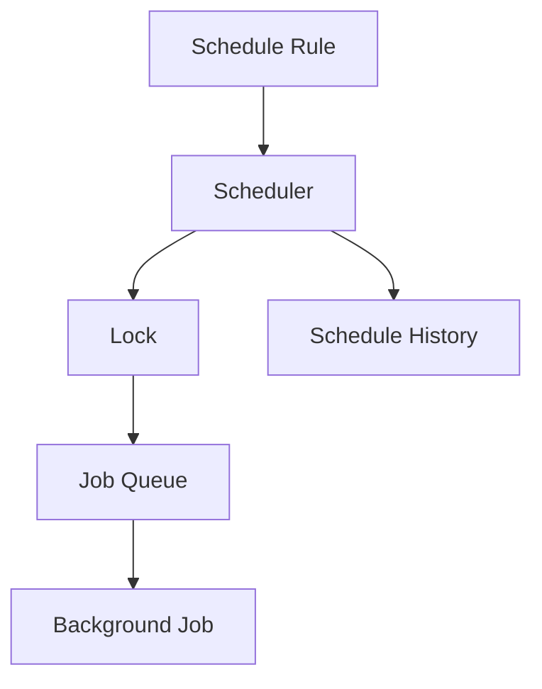
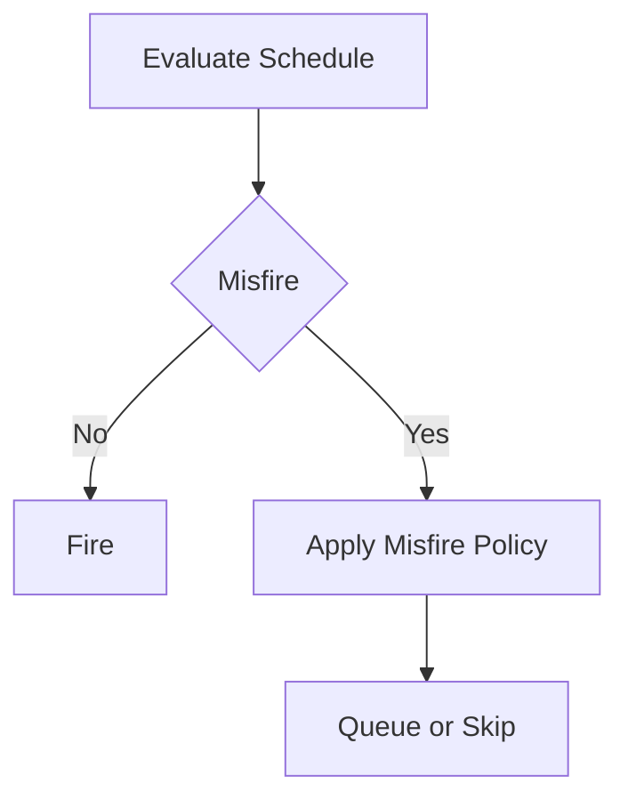
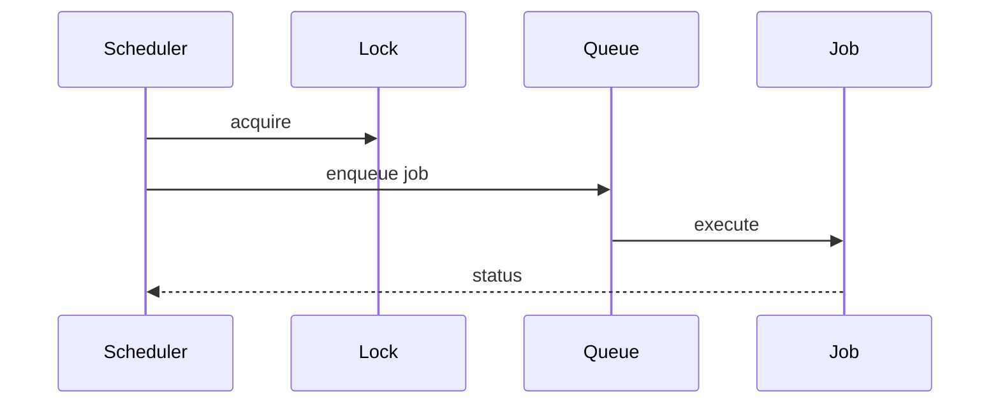
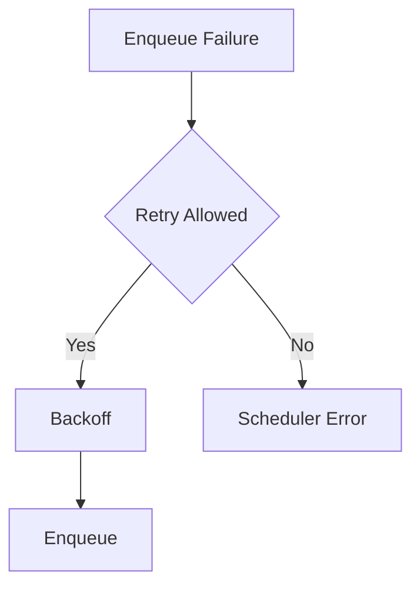
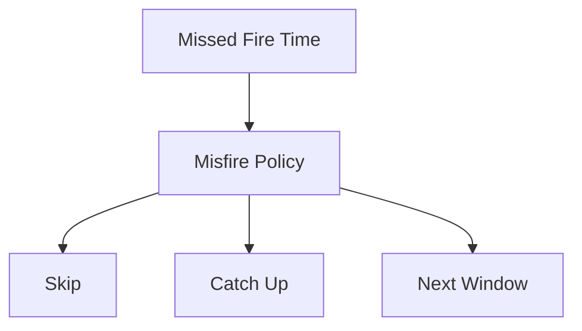
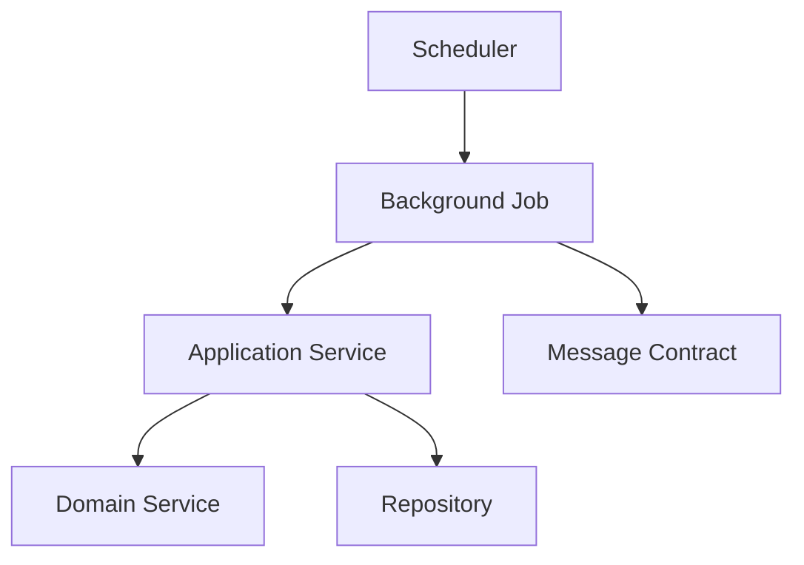

# Scheduler Diagrams and Consistency

Document Path: knowledge/framework/scheduler/diagrams-and-consistency.md

Parent Specification: knowledge/framework/scheduler-framework.md

# Purpose

This split document isolates the Scheduler Framework diagrams, edge-case coverage, final consistency matrix, and completion checklist. It keeps scheduler flow and cross-catalog consistency readable without changing the parent framework.

# Scheduler Diagrams

## Scheduler Architecture

## Scheduling Flow

## Execution Flow

## Retry Flow

## Misfire Flow

## Dependency Diagram

# Edge Case Coverage

Scheduler edge cases cover incomplete or conflicting mappings across trigger, schedule rule, cron expression, calendar rule, interval, timezone, misfire policy, catch-up policy, retry policy, timeout policy, execution window, concurrency policy, lock strategy, execution owner, job, workflow, automation, command, domain event, repository, message contract, idempotency, checkpoint, audit, logging, metrics, security, and performance.

# Final Consistency Matrix

| Scheduler | Background Job | Workflow | Automation | Application Service | Domain Service | Repository | Command | Domain Event | Message Contract |
|---|---|---|---|---|---|---|---|---|---|
| ScenarioEvaluationScheduler | ScenarioEvaluationJob | Scenario workflow | Scenario automation | ScenarioApplicationService | ScenarioService | ScenarioRepository | EvaluateScenario | ScenarioEvaluated | ScenarioEvaluatedMessage |
| ScenarioReplayScheduler | ScenarioReplayJob | Replay workflow | Administration automation | ScenarioApplicationService | ScenarioService | ScenarioRepository, AuditRepository | ReplayScenario | ReplayCompleted | ReplayCompletedMessage |
| ProjectionRefreshScheduler | ProjectionRefreshJob | Projection workflow | Projection automation | DashboardApplicationService | ScenarioService, PortfolioService, LoanService | ScenarioRepository, PortfolioRepository, LoanRepository | Projection update commands from catalog-aligned handlers | ScenarioEvaluated, PortfolioRebalanced, LoanPaymentMade | Projection messages |
| NotificationDispatchScheduler | NotificationDispatchJob | Notification workflow | Notification automation | NotificationApplicationService | ExplainabilityService, DecisionService | NotificationRepository | Notification delivery commands from catalog-aligned handlers | DecisionAccepted, DecisionRejected, RecommendationGenerated | NotificationRequestedMessage |
| ReportGenerationScheduler | ReportGenerationJob | Report workflow | Report automation | ReportApplicationService | ExplainabilityService, ScenarioService, PortfolioService, LoanService | AuditRepository, ScenarioRepository, DecisionRepository | Report generation commands from catalog-aligned handlers | Report source events through read models | ReportGenerationRequestedMessage |
| BankingImportScheduler | BankingImportJob | Cash flow workflow | Import automation | BlueprintApplicationService, DashboardApplicationService | CashFlowService | HouseholdRepository, AuditRepository | RecordIncome, RecordExpense | SalaryReceived, ExpenseRecorded | BankingTransactionImportedMessage |
| BrokerageImportScheduler | BrokerageImportJob | Portfolio workflow | Import automation | PortfolioApplicationService | PortfolioService, AllocationService | PortfolioRepository, AssetRepository, AuditRepository | CreatePortfolio, BuySecurity, SellSecurity | PortfolioCreated, SecurityPurchased, SecuritySold | PortfolioImportedMessage |
| CacheRefreshScheduler | CacheRefreshJob | Dashboard refresh workflow | Cache automation | DashboardApplicationService | CashFlowService, PortfolioService, LoanService | HouseholdRepository, PortfolioRepository, LoanRepository | Read cache refresh operation | SalaryReceived, ExpenseRecorded, PortfolioRebalanced | CacheRefreshMessage |
| OutboxPublishScheduler | OutboxPublishJob | Event publishing workflow | Outbox automation | AdministrationApplicationService | ExplainabilityService | AuditRepository | Outbox publish operation | All catalog domain events | All catalog messages |
| InboxProcessScheduler | InboxProcessJob | Inbox processing workflow | Inbox automation | AdministrationApplicationService | ScenarioService | AuditRepository | Inbox process operation | All consumed domain events | All consumed messages |
| CleanupScheduler | CleanupJob | Administration workflow | Maintenance automation | AdministrationApplicationService | ExplainabilityService | AuditRepository | Cleanup operation | Audit and operational events | CleanupMessage |
| BackupScheduler | BackupJob | Administration workflow | Backup automation | AdministrationApplicationService | ExplainabilityService | AuditRepository | Backup operation | Audit and backup events | BackupCompletedMessage |

# Completion Checklist

- Every Scheduler defines Trigger.
- Every Scheduler defines Schedule Rule.
- Every Scheduler defines Retry.
- Every Scheduler defines Misfire Policy.
- Every Scheduler defines Concurrency Strategy.
- Every Scheduler defines Audit.
- Every Scheduler defines Performance Target.
- Only catalog-approved Schedulers are present.
- No incomplete work marker is present.
- No unresolved preparation marker is present.
- Mermaid diagrams are present.
- Markdown structure is complete.
- Scheduler Framework is the scheduler source of truth.

