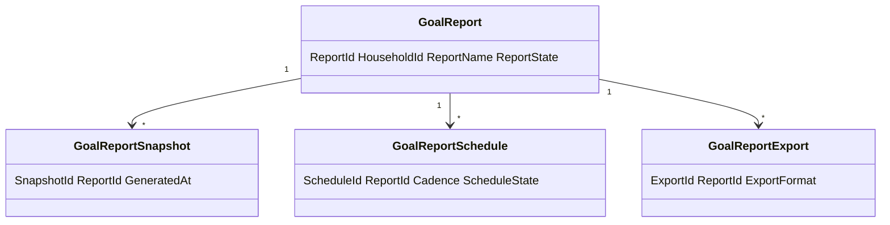
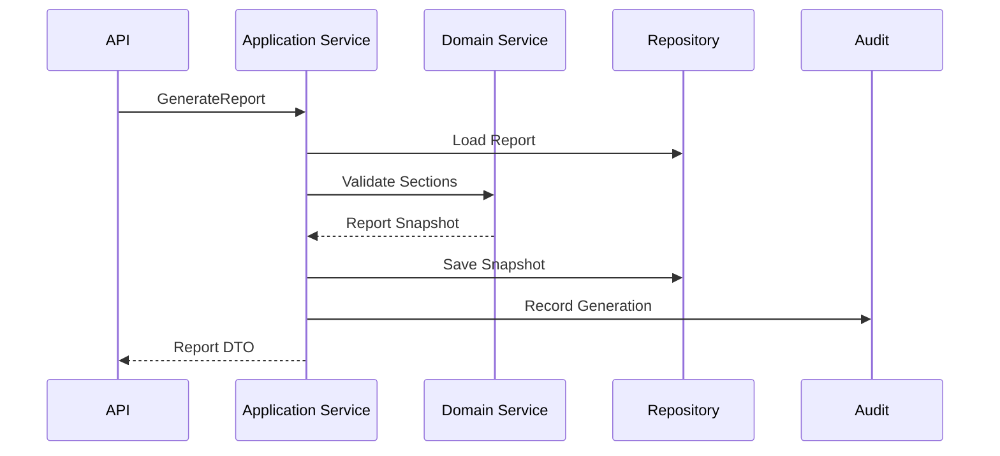
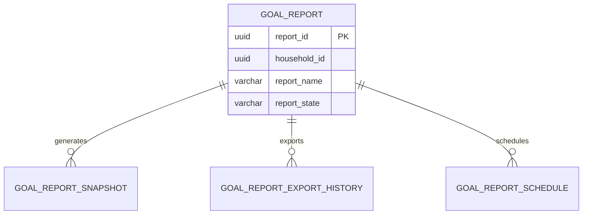
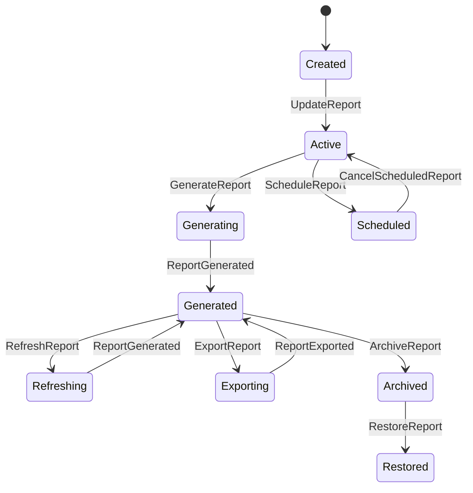
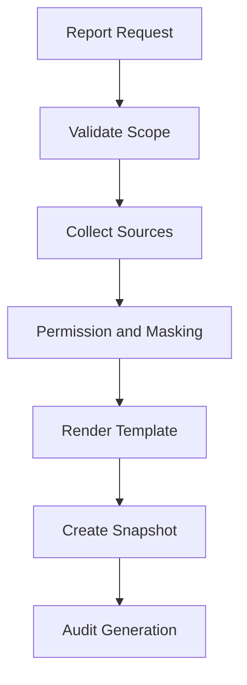
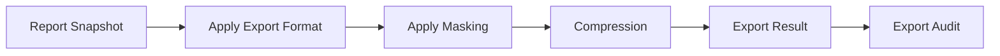
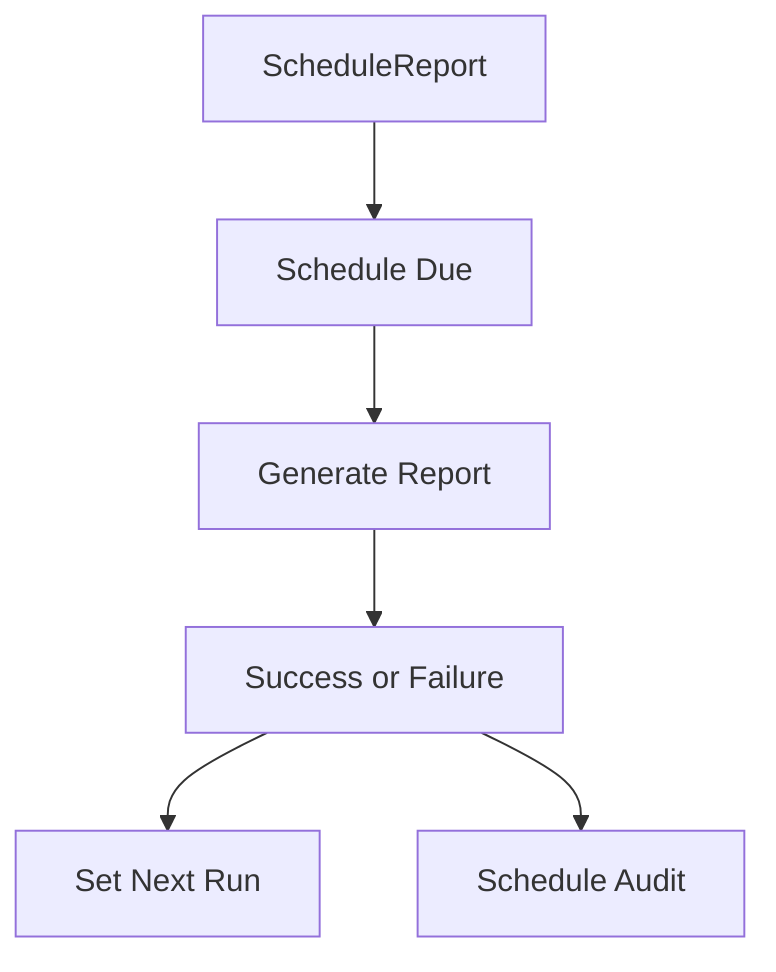

> **ADR-001 PWA Runtime Alignment:** Atlas v1 uses PWA v1 Runtime, Browser Runtime, and IndexedDB Runtime. Future Cloud Architecture is optional future mapping and must not be required for v1.\r\n\r\n# Goal Reporting
Version: 1.0
Status: Enterprise Specification
Owner: Project Atlas
Source of Truth: Atlas Goal Reporting Specification
Last Updated: 2026-07-13
# Split Navigation

- [Scope and Relationships](goal-reporting/scope-and-relationships.md)
- [Reports and Metrics](goal-reporting/reports-and-metrics.md)
- [Governance and Testing](goal-reporting/governance-and-testing.md)

# Goal Reporting Overview
## Purpose
Goal Reporting defines how Atlas creates, updates, generates, refreshes, exports, shares, schedules, archives, restores, deletes, secures, audits, and retains reports for GoalPlan. It coordinates reporting with GoalPlan, Milestone, Task when tracked, Goal Progress Tracking, Goal Metrics, Goal Dashboard, Goal Analytics, Goal Review, DecisionSession, Recommendation, Scenario, Portfolio, CashFlow, Notification, User, API, Repository, Cache, Security, Permission, Audit, and Reporting consumers.
It does not redesign Atlas. It does not modify existing Domain ownership.
It does not create a new Business Concept. It does not replace GoalPlan, Goal Progress Tracking, Goal Metrics, Goal Dashboard, Goal Analytics, Goal Review, DecisionSession, Recommendation, Scenario, Portfolio, CashFlow, Notification, or User.
## Business Meaning
Goal Reporting provides governed, repeatable, exportable, and auditable documents or API responses that summarize GoalPlan performance, progress, completion, health, risk, financial state, forecast, review, recommendation, decision, scenario, portfolio, and cashflow information. Reports support user review, household planning, operational monitoring, executive visibility, management review, audit evidence, and export.
## Reporting Lifecycle
Reporting lifecycle starts when a report definition is created or a report request is submitted. Reporting lifecycle continues through update, generation, refresh, export, share, schedule, cancellation, archive, restore, and deletion when policy permits.
Generated report snapshots are retained according to retention policy. Report history is append-only unless approved correction applies.
## Ownership
GoalPlan owns goal-scoped report content. Household owns household-scoped report output.
Goal Reporting owns report definition, template, sections, generation policy, export formats, schedule policy, retention policy, and share policy. Application Service owns orchestration.
Domain Service owns validation and rule enforcement. Repository owns persistence and queries.
Audit owns history, generation, export, schedule, access, and sharing evidence.
## Reporting Scope
Report scope can be GoalPlan-level, Household-level, goal category-level, scenario-level, portfolio-related, cashflow-related, dashboard-related, analytics-related, review-related, operational, audit, executive, management, or custom configured view. Report scope must preserve HouseholdId.
Report scope must preserve TenantId when tenant scope exists. Report scope must not include unauthorized source data.
## Reporting Architecture
Reporting architecture uses source collection, permission evaluation, section assembly, template rendering, snapshot creation, export formatting, retention, cache, and audit. Each generated report records report definition version, template version, source versions, generated time, actor, filters, projection, export format, and masking mode.
## Relationship with Goal
GoalPlan supplies report target, status, category, target amount, target date, priority, and lifecycle. Goal Reporting does not mutate GoalPlan.
Goal status controls inclusion, read-only behavior, completion reporting, archive reporting, and cancellation reporting.
## Relationship with Milestone
Milestones supply timeline, completion, overdue state, blocker state, and milestone appendix data. Milestone sections must preserve MilestoneId when drill-down is authorized.
## Relationship with Task
Tasks supply execution status when existing Goal planning data tracks task state. Task sections are subordinate to milestone and GoalPlan consistency.
## Relationship with Goal Progress
Goal Progress supplies progress percent, dimension progress, schedule variance, expected completion, completion score, confidence score, and health score. Progress sections must show generated time.
## Relationship with Goal Metrics
Goal Metrics supplies KPI, thresholds, trend, forecast, and metric history. Metrics sections must show unit, precision, threshold state, and generated time.
## Relationship with Goal Dashboard
Goal Dashboard supplies snapshot, widget summary, and visualization-ready data. Dashboard sections must preserve snapshot version and filter state.
## Relationship with Goal Analytics
Goal Analytics supplies analytical indicators, trend, forecast, comparison, and report-ready results. Analytics sections must show calculation version.
## Relationship with Goal Review
Goal Review supplies review findings, review result, next review date, action items, and review history. Review sections must honor restricted finding visibility.
## Relationship with Decision
DecisionSession supplies decision status, accepted decisions, rejected decisions, decision quality, and decision impact. Decision sections require decision read permission.
## Relationship with Recommendation
Recommendation supplies adoption, completion, suppression, ranking, expected impact, and realized impact. Recommendation sections require recommendation read permission.
## Relationship with Scenario
Scenario supplies forecast, comparison, stress, what-if, and baseline data. Scenario sections must record ScenarioId, ScenarioVersion, assumptions, generated time, and staleness.
## Relationship with Portfolio
Portfolio supplies allocation, performance, risk, liquidity, and valuation evidence when relevant. Portfolio sections require portfolio read permission and valuation time.
## Relationship with CashFlow
CashFlow supplies contribution capacity, budget pressure, surplus, deficit, and funding gap evidence. CashFlow sections require cashflow read permission and period.
## Relationship with Notification
Notification supplies alert, delivery, suppression, and escalation history. Notification sections must honor notification visibility.
## Relationship with User
User can create, view, generate, export, share, schedule, archive, restore, or delete reports only through authorized paths. User-visible report output must apply Household isolation, Tenant isolation, field-level security, masking, and export policy.
# Report Types
## Goal Summary Report
Summarizes selected GoalPlan records with progress, health, risk, priority, and status.
## Goal Detail Report
Shows one GoalPlan with progress, metrics, milestones, reviews, decisions, recommendations, scenarios, and history.
## Goal Progress Report
Focuses on progress dimensions, schedule variance, trend, forecast, and completion probability.
## Goal Completion Report
Focuses on completion evidence, completion candidates, completed goals, and completion quality.
## Goal Health Report
Focuses on health score, health band, warning state, critical state, and drivers.
## Goal Risk Report
Focuses on risk score, risk trend, dependency risk, portfolio risk, and scenario stress.
## Goal Financial Report
Focuses on target amount, funded amount, budget variance, contribution capacity, and ROI.
## Goal Forecast Report
Focuses on expected completion, forecast accuracy, scenario forecast, confidence interval, and forecast drift.
## Goal Review Report
Focuses on review status, review result, findings, action items, and next review date.
## Goal Recommendation Report
Focuses on recommendation adoption, completion, expected impact, realized impact, and suppression.
## Goal Decision Report
Focuses on DecisionSession status, decision quality, accepted decisions, rejected decisions, and decision impact.
## Goal Portfolio Report
Focuses on portfolio allocation, performance, risk, liquidity, and goal relationship.
## Scenario Report
Focuses on baseline, alternative, stress, and comparison results.
## Executive Report
Summarizes household or management-level outcomes with high-level KPIs.
## Management Report
Shows operational and planning metrics for review and action.
## Operational Report
Shows refresh, schedule, notification, generation, and workflow status.
## Audit Report
Shows report history, generation history, export history, schedule history, access history, and audit trail.
## Custom Report
Uses approved templates, sections, filters, projections, and source permissions.
# Report Sections
## Executive Summary
High-level status, key findings, critical risks, and recommended follow-up.
## Goal Overview
Goal identity, status, category, priority, target amount, target date, and owner scope.
## Progress
Overall progress, dimension progress, schedule variance, trend, and expected completion.
## Milestones
Milestone timeline, completion state, blocker state, delay, and contribution.
## KPIs
Completion percent, progress percent, health score, risk score, priority score, budget usage, and business value score.
## Metrics
Goal Metrics values, units, thresholds, precision, trend, and generated time.
## Analytics
Goal Analytics indicators, trends, forecasts, comparisons, and calculation version.
## Forecast
Forecast completion, expected completion date, scenario reference, confidence interval, and forecast accuracy.
## Risk
Risk score, risk trend, risk drivers, scenario stress, and critical risks.
## Cash Flow
Contribution capacity, recurring surplus, recurring deficit, funding gap, and period.
## Budget
Target amount, current funding, budget usage, budget variance, and currency.
## Recommendations
Recommendation adoption, completion, suppression, expected impact, realized impact, and status.
## Decisions
Decision status, accepted decisions, rejected decisions, stale decisions, and decision quality.
## Dependencies
Ready dependencies, blocked dependencies, dependency risk, blocker age, and dependency status.
## Timeline
Goal lifecycle events, milestones, reviews, recommendations, decisions, notifications, and report events.
## Appendix
Source versions, assumptions, filters, projection, generated time, glossary, and audit reference.
# Reporting Engine
## Report Generation
Report generation collects sources, validates scope, applies permission, renders sections, creates snapshot, records audit, and returns output or export reference.
## Snapshot
Snapshot stores report data, filters, source versions, template version, generated time, masking mode, and actor.
## Historical Report
Historical report reads retained snapshots and historical sources. Historical report must not rewrite prior snapshots.
## Scheduled Report
Scheduled report runs by cadence and service actor. Scheduled report stores schedule history and generation history.
## Real-time Report
Real-time report generates from current source projections and marks generated time. Real-time report must not bypass permission.
## Export Engine
Export engine converts snapshot to JSON, CSV, Excel, PDF, HTML, Markdown, or API response. Export engine applies masking before output.
## Template Engine
Template engine applies approved section layout, labels, order, visibility, and formatting. Template version is recorded.
## Versioning
Report definition version, template version, calculation version, source versions, and export version are recorded.
## Compression
Large reports may be compressed for storage or export. Compression must not alter report content.
## Retention Policy
Generated reports, exports, and schedules follow retention policy and legal hold rules.
# Export Formats
## JSON
JSON export preserves structured report data and metadata.
## CSV
CSV export is section-limited and tabular.
## Excel
Excel export supports sheets per section where supported by export engine.
## PDF
PDF export supports presentation-ready report output.
## HTML
HTML export supports browser-readable output.
## Markdown
Markdown export supports text report output.
## API Response
API response returns report DTO or generated report payload according to projection.
# Validation Rules
1. ReportId is required for persisted report.
2. ReportName is required.
3. ReportType is required.
4. ReportState is required.
5. HouseholdId is required.
6. TenantId is required when tenant scope exists.
7. GoalPlanId is required for goal-scoped report.
8. Report scope is required.
9. Report sections are required.
10. TemplateVersion is required.
11. ReportDefinitionVersion is required.
12. ExportFormat is required for export.
13. Generated report requires generated time.
14. Generated report requires source snapshot.
15. Scheduled report requires cadence.
16. Scheduled report requires service actor.
17. Schedule start date must be valid.
18. Schedule end date must be after start date when present.
19. Report filters must be allowlisted.
20. Report sort fields must be allowlisted.
21. Projection name must be allowlisted.
22. Report date range must be valid.
23. Scenario section requires ScenarioVersion.
24. Portfolio section requires portfolio permission.
25. CashFlow section requires cashflow permission.
26. Decision section requires decision permission.
27. Recommendation section requires recommendation permission.
28. Analytics section requires analytics permission.
29. Dashboard section requires dashboard permission.
30. Financial values require CurrencyCode.
31. Export requires export permission.
32. Share requires share permission.
33. Report sharing must preserve source permissions.
34. Masking must be applied before export.
35. Field-level security must run before response.
36. Archive requires permission.
37. Restore requires archived report.
38. Delete requires permission.
39. Deleted report cannot generate.
40. Archived report cannot update.
41. CancelScheduledReport requires active schedule.
42. GenerateReport requires active report definition.
43. RefreshReport requires generated or active report.
44. Compression option must be valid.
45. Retention policy is required for generated report.
46. Report payload must fit configured size limit.
47. API request requires RequestId.
48. Event-driven generation requires CausationId.
49. Audit requires CorrelationId.
50. RowVersion is required for update.
51. Cache key must include HouseholdId.
52. Goal-scoped cache key must include GoalPlanId.
53. Snapshot cache key must include ReportId.
54. Export cache key must include ExportId.
55. Report schedule must not overlap itself unless allowed.
56. Generated report must include template version.
57. Generated report must include masking mode.
58. Audit report requires elevated permission.
59. Access history must record reader when required.
60. Domain Event emission must be idempotent.
# Business Rules
1. Goal Reporting belongs to GoalPlan or Household scope.
2. Goal Reporting is governed output and evidence.
3. Goal Reporting must not redefine GoalPlan.
4. Goal Reporting must not redefine Goal Progress.
5. Goal Reporting must not redefine Goal Metrics.
6. Goal Reporting must not redefine Goal Dashboard.
7. Goal Reporting must not redefine Goal Analytics.
8. Goal Reporting must not redefine Goal Review.
9. Goal Reporting must not redefine DecisionSession.
10. Goal Reporting must not redefine Recommendation.
11. Goal Reporting must not redefine Scenario.
12. Goal Reporting must not redefine Portfolio.
13. Goal Reporting must not redefine CashFlow.
14. Reports must preserve Household isolation.
15. Reports must preserve Tenant isolation when applicable.
16. Report definitions must be versioned.
17. Report templates must be versioned.
18. Generated reports must record source versions.
19. Generated reports must record generated time.
20. Generated reports must record actor or service actor.
21. Generated reports must record filters.
22. Generated reports must record projection.
23. Generated reports must record masking mode.
24. Generated reports must record report state.
25. Report history is append-only.
26. Generation history is append-only.
27. Export history is append-only.
28. Schedule history is append-only.
29. Access history is append-only when access logging is required.
30. Manual report generation requires permission.
31. Scheduled report generation requires service actor.
32. Scheduled report generation must be retryable.
33. Scheduled report generation must be idempotent for schedule window.
34. Scheduled report cancellation must be audited.
35. Report export requires permission.
36. Report export requires audit.
37. Report share requires permission.
38. Report share requires audit.
39. Shared report cannot bypass source permission.
40. Export must apply masking before output.
41. PDF export must use snapshot data.
42. Excel export must use snapshot data.
43. CSV export must use tabular sections only.
44. JSON export must include metadata.
45. Markdown export must include metadata.
46. API response projection must be allowlisted.
47. Real-time report must show generated time.
48. Historical report must use historical snapshot or historical source.
49. Historical report must not rewrite old snapshot.
50. Audit report requires elevated permission.
51. Executive report must not expose restricted details without permission.
52. Management report must preserve Household scope.
53. Operational report must record schedule and generation state.
54. Custom report must use approved sections.
55. Custom report must use approved filters.
56. Custom report must use approved export formats.
57. Report section visibility must be permission-aware.
58. Report cannot include another Household without permission.
59. Report cannot include another Tenant without permission.
60. Portfolio section requires portfolio permission.
61. CashFlow section requires cashflow permission.
62. Decision section requires decision permission.
63. Recommendation section requires recommendation permission.
64. Scenario section requires scenario permission.
65. Analytics section requires analytics permission.
66. Dashboard section requires dashboard permission.
67. Report cache invalidates after report update.
68. Report cache invalidates after generation.
69. Report cache invalidates after archive.
70. Report cache invalidates after restore.
71. Report schedule changes invalidate schedule cache.
72. Large reports may use compression.
73. Compression must be reversible.
74. Retention policy controls generated report storage.
75. Legal hold blocks purge.
76. Deleted report is excluded from normal queries.
77. Archived report is read-only.
78. Restored report preserves history.
79. Exported report must record export format.
80. Report access must be logged when policy requires it.
# State Machine
## States
| State | Meaning |
|---|---|
| Created | Report definition exists. |
| Active | Report can be generated. |
| Generating | Report generation is running. |
| Generated | Report snapshot is available. |
| Refreshing | Existing generated report is refreshing. |
| Exporting | Report export is running. |
| Shared | Report has active share configuration. |
| Scheduled | Report has active schedule. |
| Archived | Report is read-only history. |
| Deleted | Report is soft deleted when policy permits. |
| Restored | Report was restored from archive. |
## Transitions
| From | To | Trigger |
|---|---|---|
| None | Created | CreateReport |
| Created | Active | UpdateReport |
| Active | Generating | GenerateReport |
| Generating | Generated | ReportGenerated |
| Generated | Refreshing | RefreshReport |
| Refreshing | Generated | ReportGenerated |
| Generated | Exporting | ExportReport |
| Exporting | Generated | ReportExported |
| Generated | Shared | ShareReport |
| Active | Scheduled | ScheduleReport |
| Scheduled | Active | CancelScheduledReport |
| Active | Archived | ArchiveReport |
| Generated | Archived | ArchiveReport |
| Archived | Restored | RestoreReport |
| Restored | Active | UpdateReport |
| Created | Deleted | DeleteReport |
## Triggers
Triggers include CreateReport, UpdateReport, GenerateReport, RefreshReport, ArchiveReport, RestoreReport, DeleteReport, ExportReport, ShareReport, ScheduleReport, CancelScheduledReport, scheduler run, source event, user request, and retention action.
## Invariant
Report must preserve HouseholdId. Report must preserve TenantId when applicable.
Generated report must have snapshot. Exported report must have export history.
Scheduled report must have schedule definition. Archived report is read-only.
Deleted report is excluded from normal queries.
## Illegal Transition
| From | To | Reason |
|---|---|---|
| Archived | Generating | RestoreReport is required first. |
| Deleted | Active | Restore policy is required first. |
| Created | Exporting | Generated report is required first. |
| Generating | Deleted | Generation must finish or cancel first. |
| Deleted | Generating | Deleted report cannot generate. |
# Commands
## CreateReport
Creates report definition. Input: HouseholdId, GoalPlanId, ReportName, ReportType, Sections, RequestedBy, CorrelationId.
Output: ReportId, ReportState.
## UpdateReport
Updates report definition. Input: ReportId, ReportName, Sections, Filters, TemplateVersion, RowVersion, CorrelationId.
Output: ReportId, Version, ChangedFields.
## GenerateReport
Generates report snapshot. Input: ReportId, SourceSnapshotId, DateRange, Projection, CorrelationId.
Output: ReportId, SnapshotId, GeneratedAt.
## RefreshReport
Refreshes generated report. Input: ReportId, RefreshReason, SourceSnapshotId, CorrelationId.
Output: ReportId, SnapshotId, RefreshedAt.
## ArchiveReport
Archives report. Input: ReportId, ArchiveReason, RowVersion, CorrelationId.
Output: ReportState = Archived.
## RestoreReport
Restores archived report. Input: ReportId, RestoreReason, RowVersion, CorrelationId.
Output: ReportState = Restored.
## DeleteReport
Soft deletes report. Input: ReportId, DeleteReason, RowVersion, CorrelationId.
Output: ReportState = Deleted.
## ExportReport
Exports generated report. Input: ReportId, ExportFormat, MaskingMode, Compression, CorrelationId.
Output: ExportId, ExportStatus.
## ShareReport
Shares report within approved scope. Input: ReportId, RecipientId, ShareScope, PermissionScope, CorrelationId.
Output: ShareId, ShareStatus.
## ScheduleReport
Creates report schedule. Input: ReportId, Cadence, StartDate, EndDate, ServiceActorId, CorrelationId.
Output: ScheduleId, ScheduleState.
## CancelScheduledReport
Cancels report schedule. Input: ScheduleId, CancelReason, RowVersion, CorrelationId.
Output: ScheduleState = Cancelled.
## All related Domain Commands
| Command | Reporting Relationship |
|---|---|
| RefreshGoalProgress | Supplies progress sections. |
| RecalculateGoalProgress | Supplies recalculated progress sections. |
| RefreshMetric | Supplies KPI and metric sections. |
| RecalculateMetric | Supplies recalculated metric sections. |
| RefreshDashboard | Supplies dashboard snapshot sections. |
| RecalculateAnalytics | Supplies analytics sections. |
| CompleteReview | Supplies review sections. |
| AcceptDecision | Supplies decision sections. |
| AcceptRecommendation | Supplies recommendation sections. |
| RunScenario | Supplies scenario sections. |
| TriggerNotification | Supplies notification sections. |
# Domain Events
## ReportCreated
Payload: ReportId, HouseholdId, GoalPlanId, ReportType, CorrelationId.
## ReportUpdated
Payload: ReportId, ChangedFields, Version, CorrelationId.
## ReportGenerated
Payload: ReportId, SnapshotId, GeneratedAt, TemplateVersion, CorrelationId.
## ReportExported
Payload: ReportId, ExportId, ExportFormat, ExportScope, CorrelationId.
## ReportShared
Payload: ReportId, ShareId, RecipientId, ShareScope, CorrelationId.
## ReportArchived
Payload: ReportId, ArchiveReason, ArchivedAt, CorrelationId.
## ReportRestored
Payload: ReportId, RestoreReason, RestoredAt, CorrelationId.
## ReportDeleted
Payload: ReportId, DeleteReason, DeletedAt, CorrelationId.
## ScheduleCreated
Payload: ReportId, ScheduleId, Cadence, StartDate, CorrelationId.
## ScheduleCancelled
Payload: ReportId, ScheduleId, CancelReason, CorrelationId.
## All related Events
| Event | Reporting Impact |
|---|---|
| GoalProgressUpdated | Refreshes progress reports. |
| GoalHealthChanged | Refreshes health reports. |
| MetricCalculated | Refreshes metric reports. |
| DashboardRefreshed | Refreshes dashboard sections. |
| AnalyticsCalculated | Refreshes analytics reports. |
| ReviewCompleted | Refreshes review reports. |
| DecisionAccepted | Refreshes decision reports. |
| RecommendationAccepted | Refreshes recommendation reports. |
| ScenarioSimulated | Refreshes forecast reports. |
| NotificationTriggered | Refreshes notification sections. |
# Repository
## Interface
```csharp
public interface IGoalReportRepository
{
    Task<GoalReport?> GetByIdAsync(Guid householdId, Guid reportId, CancellationToken cancellationToken);
    Task<IReadOnlyList<GoalReport>> SearchAsync(GoalReportSearchSpecification specification, CancellationToken cancellationToken);
    Task<GoalReportSnapshot?> GetSnapshotAsync(Guid householdId, Guid reportId, CancellationToken cancellationToken);
    Task AddAsync(GoalReport report, CancellationToken cancellationToken);
    Task UpdateAsync(GoalReport report, CancellationToken cancellationToken);
    Task ArchiveAsync(Guid householdId, Guid reportId, string reason, CancellationToken cancellationToken);
}
```
## Methods
Methods include GetByIdAsync, GetByGoalPlanIdAsync, SearchAsync, GetSnapshotAsync, GetExportAsync, GetScheduleAsync, GetHistoryAsync, AddAsync, UpdateAsync, ArchiveAsync, RestoreAsync, DeleteAsync, SaveSnapshotAsync, SaveExportHistoryAsync, and SaveScheduleHistoryAsync.
## Queries
Queries include report by id, report by GoalPlan, report by Household, report by type, report by state, report by schedule, report by generated date, report by export status, and report history.
## Filtering
Allowed filters: goalPlanId, householdId, reportType, reportState, exportFormat, scheduleState, generatedAt, createdAt, updatedAt.
## Sorting
Allowed sorting: reportName, reportType, updatedAt, generatedAt, createdAt, reportState.
## Aggregation
Aggregations include count by type, count by state, generated count, export count, schedule count, archive count, and access count.
## Projection
Supported projections: summary, detail, report, export, schedule, template, snapshot, search, history.
## Specification
GoalReportSearchSpecification fields: HouseholdId, TenantId, GoalPlanIds, ReportTypes, ReportStates, ExportFormats, ScheduleStates, DateFrom, DateTo, Sort, PageSize, Cursor.
# Domain Service Interaction
GoalReportDomainService validates report definition, sections, filters, template, export format, schedule cadence, retention policy, share scope, state transition, section visibility, and source permission requirements.
| Service | Interaction |
|---|---|
| GoalProgressDomainService | Supplies progress sections. |
| GoalMetricDomainService | Supplies KPI and metric sections. |
| GoalDashboardDomainService | Supplies dashboard snapshot sections. |
| GoalAnalyticsDomainService | Supplies analytics and report-ready indicators. |
| GoalReviewDomainService | Supplies review sections. |
| GoalDependencyDomainService | Supplies dependency sections. |
| GoalPrioritizationDomainService | Supplies priority sections. |
| DecisionDomainService | Supplies decision sections. |
| RecommendationDomainService | Supplies recommendation sections. |
| ScenarioDomainService | Supplies scenario sections. |
| NotificationDomainService | Supplies notification sections. |
# Application Service Interaction
GoalReportApplicationService authorizes request, resolves Household scope, loads report, loads source sections, invokes Domain Service, generates snapshot, renders template, exports format, saves history, publishes events, invalidates cache, records audit, and returns DTO.
```csharp
Task<GoalReportDetailDto> CreateReportAsync(CreateReportRequest request);
Task<GoalReportDetailDto> UpdateReportAsync(UpdateReportRequest request);
Task<GoalReportDto> GenerateReportAsync(GenerateReportRequest request);
Task<GoalReportDto> RefreshReportAsync(RefreshReportRequest request);
Task<GoalReportDetailDto> ArchiveReportAsync(ArchiveReportRequest request);
Task<GoalReportDetailDto> RestoreReportAsync(RestoreReportRequest request);
Task<GoalReportExportDto> ExportReportAsync(ExportReportRequest request);
Task<GoalReportShareDto> ShareReportAsync(ShareReportRequest request);
Task<GoalReportScheduleDto> ScheduleReportAsync(ScheduleReportRequest request);
Task<GoalReportSearchResultDto> SearchReportsAsync(GoalReportSearchRequest request);
```
# API
## Future Cloud Architecture Endpoints
| Method | Endpoint | Purpose |
|---|---|---|
| GET | /api/goal-reports | Search reports. |
| GET | /api/goal-reports/{reportId} | Get detail. |
| POST | /api/goal-reports | Create report. |
| PATCH | /api/goal-reports/{reportId} | Update report. |
| POST | /api/goal-reports/{reportId}/generate | Generate report. |
| POST | /api/goal-reports/{reportId}/refresh | Refresh report. |
| POST | /api/goal-reports/{reportId}/archive | Archive report. |
| POST | /api/goal-reports/{reportId}/restore | Restore report. |
| DELETE | /api/goal-reports/{reportId} | Soft delete report. |
| POST | /api/goal-reports/{reportId}/export | Export report. |
| POST | /api/goal-reports/{reportId}/share | Share report. |
| POST | /api/goal-reports/{reportId}/schedules | Schedule report. |
| DELETE | /api/goal-reports/schedules/{scheduleId} | Cancel scheduled report. |
## HTTP Methods
GET reads reports. POST executes commands.
PATCH updates editable definition. DELETE soft deletes report or cancels schedule.
## Request
```json
{ "goalPlanId": "uuid", "reportName": "Monthly Goal Summary", "reportType": "GoalSummaryReport", "sections": ["ExecutiveSummary", "Progress", "KPIs"], "templateVersion": "1.0" }
```
## Response
```json
{ "reportId": "uuid", "reportName": "Monthly Goal Summary", "reportState": "Created", "reportType": "GoalSummaryReport" }
```
## Errors
| Status | Error |
|---|---|
| 400 | InvalidReportRequest |
| 401 | Unauthenticated |
| 403 | GoalReportPermissionDenied |
| 404 | GoalReportNotFound |
| 409 | GoalReportConcurrencyConflict |
| 422 | GoalReportStateViolation |
## Pagination
Cursor pagination is required. Default page size is 50.
Maximum page size is 200.
## Filtering
API supports allowlisted filters only.
## Sorting
Default sorting is updatedAt desc. API supports allowlisted sorting only.
## Projection
Projection supports summary, detail, report, export, schedule, template, snapshot, search, and history.
## Export API
Export API accepts exportFormat, projection, dateRange, maskingMode, compression, and snapshot option.
## Schedule API
Schedule API accepts cadence, startDate, endDate, timezone, service actor, and delivery preference when supported.
# DTO
## Create DTO
```json
{ "goalPlanId": "uuid", "reportName": "Monthly Goal Summary", "reportType": "GoalSummaryReport", "sections": ["ExecutiveSummary", "Progress", "KPIs"], "templateVersion": "1.0" }
```
## Update DTO
```json
{ "reportName": "Monthly Goal Summary", "sections": ["ExecutiveSummary", "Progress", "Forecast"], "rowVersion": "base64" }
```
## Detail DTO
```json
{ "reportId": "uuid", "reportName": "Monthly Goal Summary", "reportState": "Generated", "generatedAt": "2026-07-13T00:00:00Z", "sections": [] }
```
## Summary DTO
```json
{ "reportId": "uuid", "reportName": "Monthly Goal Summary", "reportType": "GoalSummaryReport", "reportState": "Generated" }
```
## Search DTO
```json
{ "filters": { "reportType": "GoalSummaryReport" }, "sort": "updatedAt:desc", "pageSize": 50, "cursor": null }
```
## Report DTO
```json
{ "reportId": "uuid", "snapshotId": "uuid", "generatedAt": "2026-07-13T00:00:00Z", "templateVersion": "1.0", "sections": [] }
```
## Export DTO
```json
{ "exportId": "uuid", "reportId": "uuid", "exportFormat": "PDF", "exportStatus": "Completed" }
```
## Schedule DTO
```json
{ "scheduleId": "uuid", "reportId": "uuid", "cadence": "Monthly", "scheduleState": "Active", "nextRunAt": "2026-08-13T00:00:00Z" }
```
## Template DTO
```json
{ "templateVersion": "1.0", "sections": ["ExecutiveSummary", "Progress", "KPIs"], "format": "PDF" }
```
# PWA Runtime Mapping
## Table
Primary table: goal_report. Snapshot table: goal_report_snapshot.
Export table: goal_report_export_history. Schedule table: goal_report_schedule.
History table: goal_report_history. Access table: goal_report_access_history.
## Columns
Report columns: report_id, tenant_id, household_id, goal_plan_id, report_name, report_type, report_state, sections_json, filters_json, template_version, definition_version, retention_policy, row_version, created_at, updated_at, archived_at, deleted_at. Snapshot columns: snapshot_id, report_id, household_id, payload_json, source_versions_json, generated_at.
Export columns: export_id, report_id, household_id, export_format, export_scope, masking_mode, compression, created_at. Schedule columns: schedule_id, report_id, cadence, schedule_state, start_at, end_at, next_run_at, cancelled_at.
## Indexes
Indexes: ix_goal_report_household_goal, ix_goal_report_household_type, ix_goal_report_household_state, ix_goal_report_updated_at, ix_goal_report_snapshot_report, ix_goal_report_schedule_next_run.
## Constraints
Constraints: primary keys, FK relationships, unique report name per owner scope, valid report state, valid schedule state, valid export format.
## FK
fk_goal_report_snapshot_report. fk_goal_report_export_report.
fk_goal_report_schedule_report.
## Unique
uq_goal_report_household_goal_name.
## Check Constraint
ReportName length must be greater than 0. Schedule end must be after schedule start when present.
## Partition Strategy
Partition snapshot, export history, access history, and generation history by created_at or generated_at month when volume requires it.
# Future Cloud Mapping Schema
```sql
CREATE TABLE goal_report (
    report_id uuid PRIMARY KEY,
    tenant_id uuid NULL,
    household_id uuid NOT NULL,
    goal_plan_id uuid NULL,
    report_name varchar(128) NOT NULL,
    report_type varchar(64) NOT NULL,
    report_state varchar(32) NOT NULL,
    sections_json jsonb NOT NULL DEFAULT '[]'::jsonb,
    filters_json jsonb NOT NULL DEFAULT '{}'::jsonb,
    template_version varchar(32) NOT NULL,
    definition_version varchar(32) NOT NULL,
    retention_policy varchar(64) NOT NULL,
    row_version bigint NOT NULL DEFAULT 1,
    created_at timestamptz NOT NULL,
    updated_at timestamptz NOT NULL,
    archived_at timestamptz NULL,
    deleted_at timestamptz NULL,
    CONSTRAINT uq_goal_report_household_goal_name UNIQUE (household_id, goal_plan_id, report_name),
    CONSTRAINT ck_goal_report_name CHECK (length(report_name) > 0)
);
CREATE TABLE goal_report_snapshot (
    snapshot_id uuid PRIMARY KEY,
    report_id uuid NOT NULL,
    household_id uuid NOT NULL,
    payload_json jsonb NOT NULL,
    source_versions_json jsonb NOT NULL DEFAULT '{}'::jsonb,
    masking_mode varchar(32) NOT NULL,
    generated_at timestamptz NOT NULL,
    CONSTRAINT fk_goal_report_snapshot_report FOREIGN KEY (report_id) REFERENCES goal_report (report_id)
);
CREATE TABLE goal_report_export_history (
    export_id uuid PRIMARY KEY,
    report_id uuid NOT NULL,
    household_id uuid NOT NULL,
    exported_by uuid NULL,
    export_format varchar(32) NOT NULL,
    export_scope jsonb NOT NULL,
    masking_mode varchar(32) NOT NULL,
    compression varchar(32) NULL,
    snapshot_id uuid NULL,
    correlation_id uuid NOT NULL,
    created_at timestamptz NOT NULL,
    CONSTRAINT fk_goal_report_export_report FOREIGN KEY (report_id) REFERENCES goal_report (report_id)
);
CREATE TABLE goal_report_schedule (
    schedule_id uuid PRIMARY KEY,
    report_id uuid NOT NULL,
    household_id uuid NOT NULL,
    cadence varchar(64) NOT NULL,
    schedule_state varchar(32) NOT NULL,
    service_actor_id uuid NULL,
    start_at timestamptz NOT NULL,
    end_at timestamptz NULL,
    next_run_at timestamptz NULL,
    cancelled_at timestamptz NULL,
    row_version bigint NOT NULL DEFAULT 1,
    CONSTRAINT fk_goal_report_schedule_report FOREIGN KEY (report_id) REFERENCES goal_report (report_id),
    CONSTRAINT ck_goal_report_schedule_dates CHECK (end_at IS NULL OR end_at > start_at)
);
CREATE TABLE goal_report_history (
    history_id uuid PRIMARY KEY,
    report_id uuid NOT NULL,
    household_id uuid NOT NULL,
    version bigint NOT NULL,
    change_reason varchar(256) NOT NULL,
    changed_by uuid NULL,
    previous_values jsonb NOT NULL,
    new_values jsonb NOT NULL,
    correlation_id uuid NOT NULL,
    created_at timestamptz NOT NULL
);
CREATE TABLE goal_report_access_history (
    access_id uuid PRIMARY KEY,
    report_id uuid NOT NULL,
    household_id uuid NOT NULL,
    accessed_by uuid NULL,
    access_type varchar(64) NOT NULL,
    correlation_id uuid NOT NULL,
    accessed_at timestamptz NOT NULL
);
CREATE INDEX ix_goal_report_household_goal ON goal_report (household_id, goal_plan_id);
CREATE INDEX ix_goal_report_household_type ON goal_report (household_id, report_type);
CREATE INDEX ix_goal_report_household_state ON goal_report (household_id, report_state);
CREATE INDEX ix_goal_report_updated_at ON goal_report (updated_at DESC);
CREATE INDEX ix_goal_report_snapshot_report ON goal_report_snapshot (report_id, generated_at DESC);
CREATE INDEX ix_goal_report_schedule_next_run ON goal_report_schedule (schedule_state, next_run_at);
CREATE VIEW goal_report_summary_view AS
SELECT household_id,
       report_id,
       report_name,
       report_type,
       report_state,
       updated_at
FROM goal_report
WHERE deleted_at IS NULL;
CREATE MATERIALIZED VIEW goal_report_household_summary_mv AS
SELECT household_id,
       count(*) AS report_count,
       count(*) FILTER (WHERE report_state = 'Generated') AS generated_count,
       count(*) FILTER (WHERE report_state = 'Scheduled') AS scheduled_count,
       max(updated_at) AS generated_at
FROM goal_report
WHERE deleted_at IS NULL
GROUP BY household_id;
```
# Future Cloud Mapping
## Fluent API
```csharp
builder.ToTable("goal_report");
builder.HasKey(x => x.ReportId);
builder.Property(x => x.ReportId).HasColumnName("report_id");
builder.Property(x => x.TenantId).HasColumnName("tenant_id");
builder.Property(x => x.HouseholdId).HasColumnName("household_id").IsRequired();
builder.Property(x => x.GoalPlanId).HasColumnName("goal_plan_id");
builder.Property(x => x.ReportName).HasColumnName("report_name").HasMaxLength(128).IsRequired();
builder.Property(x => x.ReportType).HasColumnName("report_type").HasMaxLength(64).IsRequired();
builder.Property(x => x.ReportState).HasColumnName("report_state").HasMaxLength(32).IsRequired();
builder.Property(x => x.SectionsJson).HasColumnName("sections_json").HasColumnType("jsonb");
builder.Property(x => x.FiltersJson).HasColumnName("filters_json").HasColumnType("jsonb");
builder.Property(x => x.TemplateVersion).HasColumnName("template_version").HasMaxLength(32).IsRequired();
builder.Property(x => x.DefinitionVersion).HasColumnName("definition_version").HasMaxLength(32).IsRequired();
builder.Property(x => x.RowVersion).HasColumnName("row_version").IsConcurrencyToken();
builder.HasIndex(x => new { x.HouseholdId, x.GoalPlanId, x.ReportName }).IsUnique();
builder.HasIndex(x => new { x.HouseholdId, x.ReportType });
builder.HasIndex(x => new { x.HouseholdId, x.ReportState });
builder.HasQueryFilter(x => x.DeletedAt == null);
```
## Owned Types
ReportSectionSet can be owned for section configuration. ReportFilterSet can be owned for filters.
ReportTemplate can be owned for template version and rendering options. ReportRetention can be owned for retention policy.
## Indexes
Indexes match Future Cloud Mapping schema.
## Query Filters
Default query filter excludes deleted reports. Repository specification applies Household and Tenant filters.
## Value Conversion
ReportType, ReportState, ExportFormat, ScheduleState, Cadence, TemplateFormat, Compression, and MaskingMode use string conversion.
# Cache Strategy
## Redis Key
Detail key: `atlas:{tenantId}:household:{householdId}:goal-report:{reportId}:detail:v1`. Snapshot key: `atlas:{tenantId}:household:{householdId}:goal-report:{reportId}:snapshot:{snapshotId}:v1`.
Export key: `atlas:{tenantId}:household:{householdId}:goal-report:{reportId}:export:{exportId}:v1`. Schedule key: `atlas:{tenantId}:household:{householdId}:goal-report:schedule:{scheduleId}:v1`.
Search key: `atlas:{tenantId}:household:{householdId}:goal-report:search:{hash}:v1`.
## TTL
Detail TTL is 5 minutes. Snapshot TTL is 30 minutes.
Export TTL is 15 minutes. Schedule TTL is 10 minutes.
Search TTL is 1 minute.
## Refresh Strategy
Refresh detail after update. Refresh snapshot after generation.
Refresh export cache after export. Refresh schedule cache after schedule change.
## Invalidation
Invalidate on ReportCreated, ReportUpdated, ReportGenerated, ReportExported, ReportShared, ReportArchived, ReportRestored, ReportDeleted, ScheduleCreated, ScheduleCancelled, GoalProgressUpdated, MetricCalculated, AnalyticsCalculated, ReviewCompleted, DashboardRefreshed, ScenarioSimulated, Recommendation change, and Decision change.
## Snapshot Cache
Snapshot cache stores generated payload, source versions, generated time, template version, filters, projection, and masking mode.
# Security
## Authorization
Report access requires authenticated Principal and Household permission. Report sections require source-specific permission.
Export, share, schedule, and audit report require elevated permission.
## Permissions
Permissions: GoalReport.Read, GoalReport.Create, GoalReport.Update, GoalReport.Generate, GoalReport.Refresh, GoalReport.Archive, GoalReport.Restore, GoalReport.Delete, GoalReport.Export, GoalReport.Share, GoalReport.Schedule, GoalReport.Schedule.Cancel.
## Field Level Security
Financial sections require financial read permission. Portfolio sections require portfolio read permission.
Decision sections require decision read permission. Recommendation sections require recommendation read permission.
Scenario sections require scenario read permission. Audit sections require audit read permission.
## Report Sharing
Report sharing grants report visibility only within source permission. Sharing cannot bypass source permissions.
Shared recipients see only authorized sections and fields.
## Data Masking
Mask currency values when user lacks financial read permission. Mask portfolio details when user lacks portfolio permission.
Mask decision details when user lacks decision permission. Mask recommendation details when user lacks recommendation permission.
Mask audit details when user lacks audit permission.
# Audit
## Report History
Report history records create, update, refresh, archive, restore, delete, share, and configuration change.
## Generation History
Generation history records generated time, source snapshot, source versions, template version, actor, duration, and outcome.
## Export History
Export history records export format, scope, masking mode, compression, actor, created time, and correlation.
## Schedule History
Schedule history records schedule create, run, success, failure, cancellation, next run, and service actor.
## Access History
Access history records report read, snapshot read, export read, shared access, and audit report access when policy requires it.
# Performance
## Batch Generation
Scheduled reports use bounded batches and checkpoint. Default batch size is 100.
Maximum batch size is 1000.
## Parallel Rendering
Independent sections may render in parallel. Parallel rendering must preserve source snapshot consistency.
## Incremental Generation
Incremental generation updates changed sections when source scope is known. Full generation occurs when template version or report definition changes.
## Caching
Redis caches detail, snapshot, export, schedule, and search results.
## Materialized Views
Materialized views support summary and high-volume report listing. Refresh must preserve generated time.
## Compression
Large snapshots and exports may use compression. Compression must be reversible and auditable.
# Example JSON
## Create
```json
{ "goalPlanId": "5e4b510a-6f80-43c7-9978-89f2b9f89a11", "reportName": "Monthly Goal Summary", "reportType": "GoalSummaryReport", "sections": ["ExecutiveSummary", "Progress", "KPIs"], "templateVersion": "1.0" }
```
## Update
```json
{ "reportName": "Monthly Goal Summary", "sections": ["ExecutiveSummary", "Progress", "Forecast"], "rowVersion": "AAAAAAAAB9E=" }
```
## Detail
```json
{ "reportId": "uuid", "reportName": "Monthly Goal Summary", "reportState": "Generated", "generatedAt": "2026-07-13T00:00:00Z", "sections": [] }
```
## Summary
```json
{ "reportId": "uuid", "reportName": "Monthly Goal Summary", "reportType": "GoalSummaryReport", "reportState": "Generated" }
```
## Search
```json
{ "items": [{ "reportId": "uuid", "reportName": "Monthly Goal Summary", "reportType": "GoalSummaryReport" }], "nextCursor": null }
```
## Generate
```json
{ "sourceSnapshotId": "uuid", "dateRange": { "from": "2026-01-01", "to": "2026-12-31" }, "projection": "detail" }
```
## Export
```json
{ "exportFormat": "PDF", "projection": "detail", "maskingMode": "authorized", "compression": "none" }
```
## Schedule
```json
{ "cadence": "Monthly", "startAt": "2026-07-13T00:00:00Z", "endAt": null, "serviceActorId": "uuid" }
```
# Mermaid
## Class Diagram

## Sequence Diagram

## ER Diagram

## State Diagram

## Report Generation Flow

## Export Flow

## Schedule Flow

# Testing
## Unit Test
Unit tests cover report section validation, template validation, export format validation, schedule validation, permission evaluation, state transition, retention policy, and masking.
## Integration Test
Integration tests cover create, update, generate, refresh, archive, restore, delete, export, share, schedule, cancel schedule, search, snapshot retrieval, and audit.
## Performance Test
Performance tests cover report generation latency, export latency, summary query latency, materialized view refresh, cache hit ratio, and compression time.
## Load Test
Load tests cover concurrent report generation, scheduled report batch, export burst, shared report reads, and report search.
## Concurrency Test
Concurrency tests cover RowVersion conflict, duplicate schedule run, concurrent generation, export while refreshing, cache invalidation race, and schedule cancellation race.
## Export Test
Export tests cover JSON, CSV, Excel, PDF, HTML, Markdown, API response, masking, compression, and metadata.
## Schedule Test
Schedule tests cover cadence, next run calculation, cancellation, retry, overlap prevention, failure audit, and service actor.
# Edge Cases
1. Report missing or deleted.
2. Report archived.
3. GoalPlan missing, archived, or cancelled.
4. Report type invalid.
5. Section list empty.
6. TemplateVersion missing.
7. Source snapshot missing.
8. ScenarioVersion stale.
9. Export format unsupported.
10. Compression unsupported.
11. User lacks export permission.
12. User lacks section source permission.
13. HouseholdId mismatch.
14. TenantId mismatch.
15. Schedule overlaps previous run.
16. Schedule cancelled while running.
17. Report generation times out.
18. Export generation fails.
19. PDF rendering fails.
20. CSV section is not tabular.
21. Excel sheet limit exceeded.
22. Snapshot payload exceeds size limit.
23. Cache returns stale snapshot.
24. Materialized view refresh fails.
25. Audit write fails.
26. Export history write fails.
27. Access history write fails.
28. RowVersion conflict occurs.
29. Shared recipient loses permission.
30. Masking policy changes after snapshot.
31. Legal hold blocks purge.
32. Retention policy expires generated report.
33. Event arrives out of order.
34. Event is delivered twice.
35. Report restore requested for active report.
36. Delete requested for scheduled report.
37. Report includes mixed currencies.
38. Historical source unavailable.
39. API projection is not allowlisted.
40. Export attempts unmasked protected data.
# Version History
| Version | Date | Description |
|---|---|---|
| 1.0 | 2026-07-13 | Enterprise Specification for Goal Reporting. |

## Phase 2 Executable Specification Addendum

### Report Generation Contract

| Field | Required | Description |
|---|---|---|
| ReportGenerationId | Yes | Stable report generation identifier |
| ReportId | Yes | Report definition identifier |
| HouseholdId | Yes | Household scope |
| ReportType | Yes | Report category |
| TemplateVersion | Yes | Report template version |
| SourceSnapshotId | Yes | Source data snapshot |
| SectionVersionSet | Yes | Section source versions |
| MaskingMode | Yes | Permission-aware masking mode |
| CorrelationId | Yes | Audit correlation |

### Required Commands

| Command | Actor | Output |
|---|---|---|
| ExecuteGoalReportGeneration | GoalReportingApplicationService | GoalReportGenerated |
| ExportGoalReport | GoalReportingApplicationService | GoalReportExported |
| ScheduleGoalReportGeneration | GoalReportingApplicationService | GoalReportScheduled |
| ReplayGoalReportGeneration | AdministrationApplicationService | GoalReportGenerationReplayed |

### Addendum Validation Rules

| Rule ID | Rule | Failure |
|---|---|---|
| GRP-P2-VR-001 | Report generation must include template version and source snapshot. | Reject generation |
| GRP-P2-VR-002 | Export must apply masking before payload creation. | Reject export |
| GRP-P2-VR-003 | Scheduled report runs must be idempotent by schedule period. | Reject duplicate |
| GRP-P2-VR-004 | Replay must not send notifications or write new exports. | Reject replay |

### Addendum Testing Matrix

| Test | Expected Result |
|---|---|
| Missing template version | Generation fails |
| Unauthorized section | Section is masked or excluded |
| Duplicate scheduled run | Original run result is returned |
| Export protected data | Masking is applied |
| Historical replay | Original report snapshot reproduces |

| Version | Date | Description |
|---|---|---|
| 1.0-p2 | 2026-07-15 | Phase 2 executable addendum added. |

## Phase 2 Executable Specification Addendum

### Report Generation Contract

| Field | Required | Description |
|---|---|---|
| ReportGenerationId | Yes | Stable report generation identifier |
| ReportId | Yes | Report definition identifier |
| HouseholdId | Yes | Household scope |
| ReportType | Yes | Report category |
| TemplateVersion | Yes | Report template version |
| SourceSnapshotId | Yes | Source data snapshot |
| SectionVersionSet | Yes | Section source versions |
| MaskingMode | Yes | Permission-aware masking mode |
| CorrelationId | Yes | Audit correlation |

### Required Commands

| Command | Actor | Output |
|---|---|---|
| ExecuteGoalReportGeneration | GoalReportingApplicationService | GoalReportGenerated |
| ExportGoalReport | GoalReportingApplicationService | GoalReportExported |
| ScheduleGoalReportGeneration | GoalReportingApplicationService | GoalReportScheduled |
| ReplayGoalReportGeneration | AdministrationApplicationService | GoalReportGenerationReplayed |

### Addendum Validation Rules

| Rule ID | Rule | Failure |
|---|---|---|
| GRP-P2-VR-001 | Report generation must include template version and source snapshot. | Reject generation |
| GRP-P2-VR-002 | Export must apply masking before payload creation. | Reject export |
| GRP-P2-VR-003 | Scheduled report runs must be idempotent by schedule period. | Reject duplicate |
| GRP-P2-VR-004 | Replay must not send notifications or write new exports. | Reject replay |

### Addendum Testing Matrix

| Test | Expected Result |
|---|---|
| Missing template version | Generation fails |
| Unauthorized section | Section is masked or excluded |
| Duplicate scheduled run | Original run result is returned |
| Export protected data | Masking is applied |
| Historical replay | Original report snapshot reproduces |

| Version | Date | Description |
|---|---|---|
| 1.0-p2 | 2026-07-15 | Phase 2 executable addendum added. |
