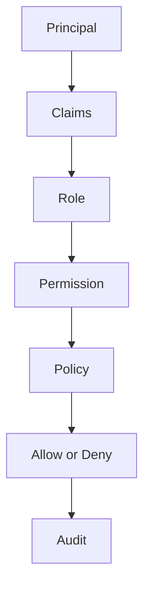
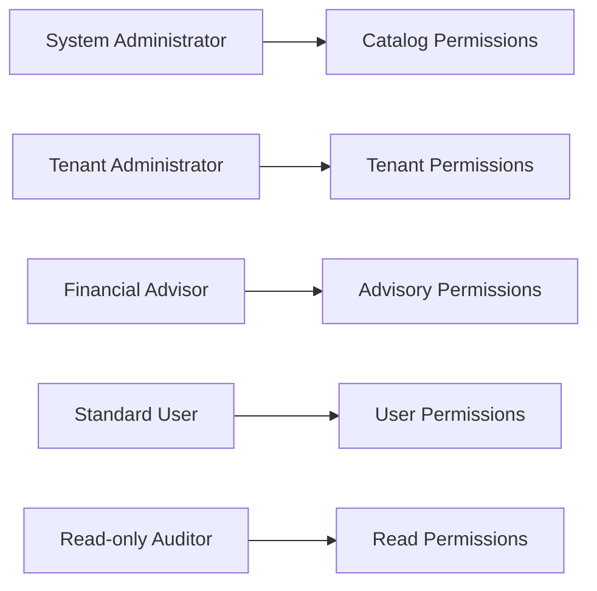
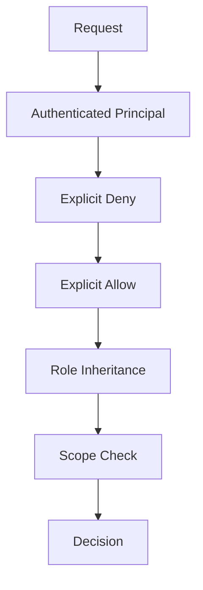
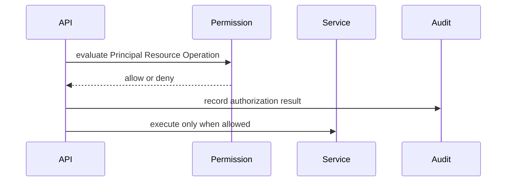
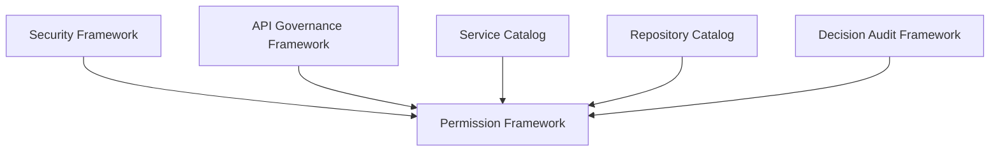

# Permission Framework
## Split Navigation
- [Permission catalog](permission-framework/permission-catalog.md)
- [Permission evaluation and cache](permission-framework/evaluation-and-cache.md)
- [Permission integration boundaries](permission-framework/integration-boundaries.md)
- [Role and matrix catalog](permission-framework/role-and-matrix-catalog.md)
- [Permission governance and testing](permission-framework/permission-governance-and-testing.md)

## Document Control

| Field | Value |
| --- | --- |
| Document | Permission Framework |
| Classification | Atlas Enterprise Canonical Specification |
| Source of Truth | Permission, Role, Policy, Claim, Principal, Authorization Rule, Access Control, RBAC, ABAC, Resource Permission, Operation Permission, Ownership Permission, Scope, Privilege, Least Privilege, Permission Inheritance, Permission Resolution, Permission Evaluation, and Permission Cache |
| Version | v1.0 |
| Status | Canonical |
| Alignment Sources | Security Framework, API Governance Framework, Application Service Catalog, Domain Service Catalog, Repository Catalog, Command Catalog, Domain Event Catalog, Service Catalog, System Module Catalog, Workflow Engine Framework, Background Job Framework, Scheduler Framework, Automation Framework, Message Contract Catalog, Decision Audit Framework, Event Driven Architecture, API Documentation |

## Purpose

Permission Framework defines the canonical Atlas permission model. It controls authorization decisions for Security, Authentication, Authorization, Role, Application Service, Domain Service, Repository, Command, Domain Event, Workflow, Automation, Scheduler, Background Job, API, UI, Notification, Audit, and Integration execution.

## Scope

- Applies to every protected Atlas resource, operation, API, command, repository method, workflow step, scheduler job, automation action, background job, message contract, notification action, and audit-visible authorization decision.
- Uses existing Atlas resources and actions: Dashboard, Goal, Asset, Liability, Scenario, Decision, Policy, Configuration, Report, Administration, and Create, Read, Update, Delete, Execute, Approve, Export, Share, Restore.
- Requires default deny when Permission, Role, Policy, Scope, Principal, Claim, tenant isolation, household isolation, or audit context cannot be resolved.

## Permission Principles

### Permission Concept: Permission
- Definition: Permission is part of Atlas permission governance and must be interpreted through Security Framework and API Governance Framework.
- Owner: Permission Framework.
- Consumers: Application Services, Domain Services, Repositories, Commands, Domain Events, Workflows, Automation, Scheduler, Background Jobs, APIs, UI, Notification, Audit, and Integration.
- Evaluation: Permission must preserve least privilege, explicit resource binding, explicit operation binding, household isolation, tenant isolation, and auditable authorization history.

### Permission Concept: Role
- Definition: Role is part of Atlas permission governance and must be interpreted through Security Framework and API Governance Framework.
- Owner: Permission Framework.
- Consumers: Application Services, Domain Services, Repositories, Commands, Domain Events, Workflows, Automation, Scheduler, Background Jobs, APIs, UI, Notification, Audit, and Integration.
- Evaluation: Role must preserve least privilege, explicit resource binding, explicit operation binding, household isolation, tenant isolation, and auditable authorization history.

### Permission Concept: Policy
- Definition: Policy is part of Atlas permission governance and must be interpreted through Security Framework and API Governance Framework.
- Owner: Permission Framework.
- Consumers: Application Services, Domain Services, Repositories, Commands, Domain Events, Workflows, Automation, Scheduler, Background Jobs, APIs, UI, Notification, Audit, and Integration.
- Evaluation: Policy must preserve least privilege, explicit resource binding, explicit operation binding, household isolation, tenant isolation, and auditable authorization history.

### Permission Concept: Claim
- Definition: Claim is part of Atlas permission governance and must be interpreted through Security Framework and API Governance Framework.
- Owner: Permission Framework.
- Consumers: Application Services, Domain Services, Repositories, Commands, Domain Events, Workflows, Automation, Scheduler, Background Jobs, APIs, UI, Notification, Audit, and Integration.
- Evaluation: Claim must preserve least privilege, explicit resource binding, explicit operation binding, household isolation, tenant isolation, and auditable authorization history.

### Permission Concept: Principal
- Definition: Principal is part of Atlas permission governance and must be interpreted through Security Framework and API Governance Framework.
- Owner: Permission Framework.
- Consumers: Application Services, Domain Services, Repositories, Commands, Domain Events, Workflows, Automation, Scheduler, Background Jobs, APIs, UI, Notification, Audit, and Integration.
- Evaluation: Principal must preserve least privilege, explicit resource binding, explicit operation binding, household isolation, tenant isolation, and auditable authorization history.

### Permission Concept: Authorization Rule
- Definition: Authorization Rule is part of Atlas permission governance and must be interpreted through Security Framework and API Governance Framework.
- Owner: Permission Framework.
- Consumers: Application Services, Domain Services, Repositories, Commands, Domain Events, Workflows, Automation, Scheduler, Background Jobs, APIs, UI, Notification, Audit, and Integration.
- Evaluation: Authorization Rule must preserve least privilege, explicit resource binding, explicit operation binding, household isolation, tenant isolation, and auditable authorization history.

### Permission Concept: Access Control
- Definition: Access Control is part of Atlas permission governance and must be interpreted through Security Framework and API Governance Framework.
- Owner: Permission Framework.
- Consumers: Application Services, Domain Services, Repositories, Commands, Domain Events, Workflows, Automation, Scheduler, Background Jobs, APIs, UI, Notification, Audit, and Integration.
- Evaluation: Access Control must preserve least privilege, explicit resource binding, explicit operation binding, household isolation, tenant isolation, and auditable authorization history.

### Permission Concept: RBAC
- Definition: RBAC is part of Atlas permission governance and must be interpreted through Security Framework and API Governance Framework.
- Owner: Permission Framework.
- Consumers: Application Services, Domain Services, Repositories, Commands, Domain Events, Workflows, Automation, Scheduler, Background Jobs, APIs, UI, Notification, Audit, and Integration.
- Evaluation: RBAC must preserve least privilege, explicit resource binding, explicit operation binding, household isolation, tenant isolation, and auditable authorization history.

### Permission Concept: ABAC
- Definition: ABAC is part of Atlas permission governance and must be interpreted through Security Framework and API Governance Framework.
- Owner: Permission Framework.
- Consumers: Application Services, Domain Services, Repositories, Commands, Domain Events, Workflows, Automation, Scheduler, Background Jobs, APIs, UI, Notification, Audit, and Integration.
- Evaluation: ABAC must preserve least privilege, explicit resource binding, explicit operation binding, household isolation, tenant isolation, and auditable authorization history.

### Permission Concept: Resource Permission
- Definition: Resource Permission is part of Atlas permission governance and must be interpreted through Security Framework and API Governance Framework.
- Owner: Permission Framework.
- Consumers: Application Services, Domain Services, Repositories, Commands, Domain Events, Workflows, Automation, Scheduler, Background Jobs, APIs, UI, Notification, Audit, and Integration.
- Evaluation: Resource Permission must preserve least privilege, explicit resource binding, explicit operation binding, household isolation, tenant isolation, and auditable authorization history.

### Permission Concept: Operation Permission
- Definition: Operation Permission is part of Atlas permission governance and must be interpreted through Security Framework and API Governance Framework.
- Owner: Permission Framework.
- Consumers: Application Services, Domain Services, Repositories, Commands, Domain Events, Workflows, Automation, Scheduler, Background Jobs, APIs, UI, Notification, Audit, and Integration.
- Evaluation: Operation Permission must preserve least privilege, explicit resource binding, explicit operation binding, household isolation, tenant isolation, and auditable authorization history.

### Permission Concept: Ownership Permission
- Definition: Ownership Permission is part of Atlas permission governance and must be interpreted through Security Framework and API Governance Framework.
- Owner: Permission Framework.
- Consumers: Application Services, Domain Services, Repositories, Commands, Domain Events, Workflows, Automation, Scheduler, Background Jobs, APIs, UI, Notification, Audit, and Integration.
- Evaluation: Ownership Permission must preserve least privilege, explicit resource binding, explicit operation binding, household isolation, tenant isolation, and auditable authorization history.

### Permission Concept: Scope
- Definition: Scope is part of Atlas permission governance and must be interpreted through Security Framework and API Governance Framework.
- Owner: Permission Framework.
- Consumers: Application Services, Domain Services, Repositories, Commands, Domain Events, Workflows, Automation, Scheduler, Background Jobs, APIs, UI, Notification, Audit, and Integration.
- Evaluation: Scope must preserve least privilege, explicit resource binding, explicit operation binding, household isolation, tenant isolation, and auditable authorization history.

### Permission Concept: Privilege
- Definition: Privilege is part of Atlas permission governance and must be interpreted through Security Framework and API Governance Framework.
- Owner: Permission Framework.
- Consumers: Application Services, Domain Services, Repositories, Commands, Domain Events, Workflows, Automation, Scheduler, Background Jobs, APIs, UI, Notification, Audit, and Integration.
- Evaluation: Privilege must preserve least privilege, explicit resource binding, explicit operation binding, household isolation, tenant isolation, and auditable authorization history.

### Permission Concept: Least Privilege
- Definition: Least Privilege is part of Atlas permission governance and must be interpreted through Security Framework and API Governance Framework.
- Owner: Permission Framework.
- Consumers: Application Services, Domain Services, Repositories, Commands, Domain Events, Workflows, Automation, Scheduler, Background Jobs, APIs, UI, Notification, Audit, and Integration.
- Evaluation: Least Privilege must preserve least privilege, explicit resource binding, explicit operation binding, household isolation, tenant isolation, and auditable authorization history.

### Permission Concept: Permission Inheritance
- Definition: Permission Inheritance is part of Atlas permission governance and must be interpreted through Security Framework and API Governance Framework.
- Owner: Permission Framework.
- Consumers: Application Services, Domain Services, Repositories, Commands, Domain Events, Workflows, Automation, Scheduler, Background Jobs, APIs, UI, Notification, Audit, and Integration.
- Evaluation: Permission Inheritance must preserve least privilege, explicit resource binding, explicit operation binding, household isolation, tenant isolation, and auditable authorization history.

### Permission Concept: Permission Resolution
- Definition: Permission Resolution is part of Atlas permission governance and must be interpreted through Security Framework and API Governance Framework.
- Owner: Permission Framework.
- Consumers: Application Services, Domain Services, Repositories, Commands, Domain Events, Workflows, Automation, Scheduler, Background Jobs, APIs, UI, Notification, Audit, and Integration.
- Evaluation: Permission Resolution must preserve least privilege, explicit resource binding, explicit operation binding, household isolation, tenant isolation, and auditable authorization history.

### Permission Concept: Permission Evaluation
- Definition: Permission Evaluation is part of Atlas permission governance and must be interpreted through Security Framework and API Governance Framework.
- Owner: Permission Framework.
- Consumers: Application Services, Domain Services, Repositories, Commands, Domain Events, Workflows, Automation, Scheduler, Background Jobs, APIs, UI, Notification, Audit, and Integration.
- Evaluation: Permission Evaluation must preserve least privilege, explicit resource binding, explicit operation binding, household isolation, tenant isolation, and auditable authorization history.

### Permission Concept: Permission Cache
- Definition: Permission Cache is part of Atlas permission governance and must be interpreted through Security Framework and API Governance Framework.
- Owner: Permission Framework.
- Consumers: Application Services, Domain Services, Repositories, Commands, Domain Events, Workflows, Automation, Scheduler, Background Jobs, APIs, UI, Notification, Audit, and Integration.
- Evaluation: Permission Cache must preserve least privilege, explicit resource binding, explicit operation binding, household isolation, tenant isolation, and auditable authorization history.

## Permission Architecture

- Principal receives Claims from authentication.
- Role maps Principal to catalog permissions.
- Policy constrains permissions by resource, operation, ownership, tenant, household, and scope.
- Permission Evaluation resolves explicit deny, explicit allow, role inheritance, scope, ownership, cache validity, and default deny.
- Audit records permission changes, role assignments, authorization decisions, and privileged operations.
- Permission Architecture control {0:D2}: every protected Atlas execution boundary checks Principal, Claim, Role, Permission, Policy, Resource, Operation, Scope, TenantId, HouseholdId, cache version, and audit correlation before execution.
- Permission Architecture control {0:D2}: every protected Atlas execution boundary checks Principal, Claim, Role, Permission, Policy, Resource, Operation, Scope, TenantId, HouseholdId, cache version, and audit correlation before execution.
- Permission Architecture control {0:D2}: every protected Atlas execution boundary checks Principal, Claim, Role, Permission, Policy, Resource, Operation, Scope, TenantId, HouseholdId, cache version, and audit correlation before execution.
- Permission Architecture control {0:D2}: every protected Atlas execution boundary checks Principal, Claim, Role, Permission, Policy, Resource, Operation, Scope, TenantId, HouseholdId, cache version, and audit correlation before execution.
- Permission Architecture control {0:D2}: every protected Atlas execution boundary checks Principal, Claim, Role, Permission, Policy, Resource, Operation, Scope, TenantId, HouseholdId, cache version, and audit correlation before execution.
- Permission Architecture control {0:D2}: every protected Atlas execution boundary checks Principal, Claim, Role, Permission, Policy, Resource, Operation, Scope, TenantId, HouseholdId, cache version, and audit correlation before execution.
- Permission Architecture control {0:D2}: every protected Atlas execution boundary checks Principal, Claim, Role, Permission, Policy, Resource, Operation, Scope, TenantId, HouseholdId, cache version, and audit correlation before execution.
- Permission Architecture control {0:D2}: every protected Atlas execution boundary checks Principal, Claim, Role, Permission, Policy, Resource, Operation, Scope, TenantId, HouseholdId, cache version, and audit correlation before execution.
- Permission Architecture control {0:D2}: every protected Atlas execution boundary checks Principal, Claim, Role, Permission, Policy, Resource, Operation, Scope, TenantId, HouseholdId, cache version, and audit correlation before execution.
- Permission Architecture control {0:D2}: every protected Atlas execution boundary checks Principal, Claim, Role, Permission, Policy, Resource, Operation, Scope, TenantId, HouseholdId, cache version, and audit correlation before execution.
- Permission Architecture control {0:D2}: every protected Atlas execution boundary checks Principal, Claim, Role, Permission, Policy, Resource, Operation, Scope, TenantId, HouseholdId, cache version, and audit correlation before execution.
- Permission Architecture control {0:D2}: every protected Atlas execution boundary checks Principal, Claim, Role, Permission, Policy, Resource, Operation, Scope, TenantId, HouseholdId, cache version, and audit correlation before execution.
- Permission Architecture control {0:D2}: every protected Atlas execution boundary checks Principal, Claim, Role, Permission, Policy, Resource, Operation, Scope, TenantId, HouseholdId, cache version, and audit correlation before execution.
- Permission Architecture control {0:D2}: every protected Atlas execution boundary checks Principal, Claim, Role, Permission, Policy, Resource, Operation, Scope, TenantId, HouseholdId, cache version, and audit correlation before execution.
- Permission Architecture control {0:D2}: every protected Atlas execution boundary checks Principal, Claim, Role, Permission, Policy, Resource, Operation, Scope, TenantId, HouseholdId, cache version, and audit correlation before execution.
- Permission Architecture control {0:D2}: every protected Atlas execution boundary checks Principal, Claim, Role, Permission, Policy, Resource, Operation, Scope, TenantId, HouseholdId, cache version, and audit correlation before execution.
- Permission Architecture control {0:D2}: every protected Atlas execution boundary checks Principal, Claim, Role, Permission, Policy, Resource, Operation, Scope, TenantId, HouseholdId, cache version, and audit correlation before execution.
- Permission Architecture control {0:D2}: every protected Atlas execution boundary checks Principal, Claim, Role, Permission, Policy, Resource, Operation, Scope, TenantId, HouseholdId, cache version, and audit correlation before execution.
- Permission Architecture control {0:D2}: every protected Atlas execution boundary checks Principal, Claim, Role, Permission, Policy, Resource, Operation, Scope, TenantId, HouseholdId, cache version, and audit correlation before execution.
- Permission Architecture control {0:D2}: every protected Atlas execution boundary checks Principal, Claim, Role, Permission, Policy, Resource, Operation, Scope, TenantId, HouseholdId, cache version, and audit correlation before execution.
- Permission Architecture control {0:D2}: every protected Atlas execution boundary checks Principal, Claim, Role, Permission, Policy, Resource, Operation, Scope, TenantId, HouseholdId, cache version, and audit correlation before execution.
- Permission Architecture control {0:D2}: every protected Atlas execution boundary checks Principal, Claim, Role, Permission, Policy, Resource, Operation, Scope, TenantId, HouseholdId, cache version, and audit correlation before execution.
- Permission Architecture control {0:D2}: every protected Atlas execution boundary checks Principal, Claim, Role, Permission, Policy, Resource, Operation, Scope, TenantId, HouseholdId, cache version, and audit correlation before execution.
- Permission Architecture control {0:D2}: every protected Atlas execution boundary checks Principal, Claim, Role, Permission, Policy, Resource, Operation, Scope, TenantId, HouseholdId, cache version, and audit correlation before execution.
- Permission Architecture control {0:D2}: every protected Atlas execution boundary checks Principal, Claim, Role, Permission, Policy, Resource, Operation, Scope, TenantId, HouseholdId, cache version, and audit correlation before execution.
- Permission Architecture control {0:D2}: every protected Atlas execution boundary checks Principal, Claim, Role, Permission, Policy, Resource, Operation, Scope, TenantId, HouseholdId, cache version, and audit correlation before execution.
- Permission Architecture control {0:D2}: every protected Atlas execution boundary checks Principal, Claim, Role, Permission, Policy, Resource, Operation, Scope, TenantId, HouseholdId, cache version, and audit correlation before execution.
- Permission Architecture control {0:D2}: every protected Atlas execution boundary checks Principal, Claim, Role, Permission, Policy, Resource, Operation, Scope, TenantId, HouseholdId, cache version, and audit correlation before execution.
- Permission Architecture control {0:D2}: every protected Atlas execution boundary checks Principal, Claim, Role, Permission, Policy, Resource, Operation, Scope, TenantId, HouseholdId, cache version, and audit correlation before execution.
- Permission Architecture control {0:D2}: every protected Atlas execution boundary checks Principal, Claim, Role, Permission, Policy, Resource, Operation, Scope, TenantId, HouseholdId, cache version, and audit correlation before execution.
- Permission Architecture control {0:D2}: every protected Atlas execution boundary checks Principal, Claim, Role, Permission, Policy, Resource, Operation, Scope, TenantId, HouseholdId, cache version, and audit correlation before execution.
- Permission Architecture control {0:D2}: every protected Atlas execution boundary checks Principal, Claim, Role, Permission, Policy, Resource, Operation, Scope, TenantId, HouseholdId, cache version, and audit correlation before execution.
- Permission Architecture control {0:D2}: every protected Atlas execution boundary checks Principal, Claim, Role, Permission, Policy, Resource, Operation, Scope, TenantId, HouseholdId, cache version, and audit correlation before execution.
- Permission Architecture control {0:D2}: every protected Atlas execution boundary checks Principal, Claim, Role, Permission, Policy, Resource, Operation, Scope, TenantId, HouseholdId, cache version, and audit correlation before execution.
- Permission Architecture control {0:D2}: every protected Atlas execution boundary checks Principal, Claim, Role, Permission, Policy, Resource, Operation, Scope, TenantId, HouseholdId, cache version, and audit correlation before execution.
- Permission Architecture control {0:D2}: every protected Atlas execution boundary checks Principal, Claim, Role, Permission, Policy, Resource, Operation, Scope, TenantId, HouseholdId, cache version, and audit correlation before execution.
- Permission Architecture control {0:D2}: every protected Atlas execution boundary checks Principal, Claim, Role, Permission, Policy, Resource, Operation, Scope, TenantId, HouseholdId, cache version, and audit correlation before execution.
- Permission Architecture control {0:D2}: every protected Atlas execution boundary checks Principal, Claim, Role, Permission, Policy, Resource, Operation, Scope, TenantId, HouseholdId, cache version, and audit correlation before execution.
- Permission Architecture control {0:D2}: every protected Atlas execution boundary checks Principal, Claim, Role, Permission, Policy, Resource, Operation, Scope, TenantId, HouseholdId, cache version, and audit correlation before execution.
- Permission Architecture control {0:D2}: every protected Atlas execution boundary checks Principal, Claim, Role, Permission, Policy, Resource, Operation, Scope, TenantId, HouseholdId, cache version, and audit correlation before execution.
- Permission Architecture control {0:D2}: every protected Atlas execution boundary checks Principal, Claim, Role, Permission, Policy, Resource, Operation, Scope, TenantId, HouseholdId, cache version, and audit correlation before execution.
- Permission Architecture control {0:D2}: every protected Atlas execution boundary checks Principal, Claim, Role, Permission, Policy, Resource, Operation, Scope, TenantId, HouseholdId, cache version, and audit correlation before execution.
- Permission Architecture control {0:D2}: every protected Atlas execution boundary checks Principal, Claim, Role, Permission, Policy, Resource, Operation, Scope, TenantId, HouseholdId, cache version, and audit correlation before execution.
- Permission Architecture control {0:D2}: every protected Atlas execution boundary checks Principal, Claim, Role, Permission, Policy, Resource, Operation, Scope, TenantId, HouseholdId, cache version, and audit correlation before execution.
- Permission Architecture control {0:D2}: every protected Atlas execution boundary checks Principal, Claim, Role, Permission, Policy, Resource, Operation, Scope, TenantId, HouseholdId, cache version, and audit correlation before execution.
- Permission Architecture control {0:D2}: every protected Atlas execution boundary checks Principal, Claim, Role, Permission, Policy, Resource, Operation, Scope, TenantId, HouseholdId, cache version, and audit correlation before execution.
- Permission Architecture control {0:D2}: every protected Atlas execution boundary checks Principal, Claim, Role, Permission, Policy, Resource, Operation, Scope, TenantId, HouseholdId, cache version, and audit correlation before execution.
- Permission Architecture control {0:D2}: every protected Atlas execution boundary checks Principal, Claim, Role, Permission, Policy, Resource, Operation, Scope, TenantId, HouseholdId, cache version, and audit correlation before execution.
- Permission Architecture control {0:D2}: every protected Atlas execution boundary checks Principal, Claim, Role, Permission, Policy, Resource, Operation, Scope, TenantId, HouseholdId, cache version, and audit correlation before execution.
- Permission Architecture control {0:D2}: every protected Atlas execution boundary checks Principal, Claim, Role, Permission, Policy, Resource, Operation, Scope, TenantId, HouseholdId, cache version, and audit correlation before execution.
- Permission Architecture control {0:D2}: every protected Atlas execution boundary checks Principal, Claim, Role, Permission, Policy, Resource, Operation, Scope, TenantId, HouseholdId, cache version, and audit correlation before execution.
- Permission Architecture control {0:D2}: every protected Atlas execution boundary checks Principal, Claim, Role, Permission, Policy, Resource, Operation, Scope, TenantId, HouseholdId, cache version, and audit correlation before execution.
- Permission Architecture control {0:D2}: every protected Atlas execution boundary checks Principal, Claim, Role, Permission, Policy, Resource, Operation, Scope, TenantId, HouseholdId, cache version, and audit correlation before execution.
- Permission Architecture control {0:D2}: every protected Atlas execution boundary checks Principal, Claim, Role, Permission, Policy, Resource, Operation, Scope, TenantId, HouseholdId, cache version, and audit correlation before execution.
- Permission Architecture control {0:D2}: every protected Atlas execution boundary checks Principal, Claim, Role, Permission, Policy, Resource, Operation, Scope, TenantId, HouseholdId, cache version, and audit correlation before execution.
- Permission Architecture control {0:D2}: every protected Atlas execution boundary checks Principal, Claim, Role, Permission, Policy, Resource, Operation, Scope, TenantId, HouseholdId, cache version, and audit correlation before execution.
- Permission Architecture control {0:D2}: every protected Atlas execution boundary checks Principal, Claim, Role, Permission, Policy, Resource, Operation, Scope, TenantId, HouseholdId, cache version, and audit correlation before execution.
- Permission Architecture control {0:D2}: every protected Atlas execution boundary checks Principal, Claim, Role, Permission, Policy, Resource, Operation, Scope, TenantId, HouseholdId, cache version, and audit correlation before execution.
- Permission Architecture control {0:D2}: every protected Atlas execution boundary checks Principal, Claim, Role, Permission, Policy, Resource, Operation, Scope, TenantId, HouseholdId, cache version, and audit correlation before execution.
- Permission Architecture control {0:D2}: every protected Atlas execution boundary checks Principal, Claim, Role, Permission, Policy, Resource, Operation, Scope, TenantId, HouseholdId, cache version, and audit correlation before execution.
- Permission Architecture control {0:D2}: every protected Atlas execution boundary checks Principal, Claim, Role, Permission, Policy, Resource, Operation, Scope, TenantId, HouseholdId, cache version, and audit correlation before execution.
- Permission Architecture control {0:D2}: every protected Atlas execution boundary checks Principal, Claim, Role, Permission, Policy, Resource, Operation, Scope, TenantId, HouseholdId, cache version, and audit correlation before execution.
- Permission Architecture control {0:D2}: every protected Atlas execution boundary checks Principal, Claim, Role, Permission, Policy, Resource, Operation, Scope, TenantId, HouseholdId, cache version, and audit correlation before execution.
- Permission Architecture control {0:D2}: every protected Atlas execution boundary checks Principal, Claim, Role, Permission, Policy, Resource, Operation, Scope, TenantId, HouseholdId, cache version, and audit correlation before execution.
- Permission Architecture control {0:D2}: every protected Atlas execution boundary checks Principal, Claim, Role, Permission, Policy, Resource, Operation, Scope, TenantId, HouseholdId, cache version, and audit correlation before execution.
- Permission Architecture control {0:D2}: every protected Atlas execution boundary checks Principal, Claim, Role, Permission, Policy, Resource, Operation, Scope, TenantId, HouseholdId, cache version, and audit correlation before execution.
- Permission Architecture control {0:D2}: every protected Atlas execution boundary checks Principal, Claim, Role, Permission, Policy, Resource, Operation, Scope, TenantId, HouseholdId, cache version, and audit correlation before execution.
- Permission Architecture control {0:D2}: every protected Atlas execution boundary checks Principal, Claim, Role, Permission, Policy, Resource, Operation, Scope, TenantId, HouseholdId, cache version, and audit correlation before execution.
- Permission Architecture control {0:D2}: every protected Atlas execution boundary checks Principal, Claim, Role, Permission, Policy, Resource, Operation, Scope, TenantId, HouseholdId, cache version, and audit correlation before execution.
- Permission Architecture control {0:D2}: every protected Atlas execution boundary checks Principal, Claim, Role, Permission, Policy, Resource, Operation, Scope, TenantId, HouseholdId, cache version, and audit correlation before execution.
- Permission Architecture control {0:D2}: every protected Atlas execution boundary checks Principal, Claim, Role, Permission, Policy, Resource, Operation, Scope, TenantId, HouseholdId, cache version, and audit correlation before execution.
- Permission Architecture control {0:D2}: every protected Atlas execution boundary checks Principal, Claim, Role, Permission, Policy, Resource, Operation, Scope, TenantId, HouseholdId, cache version, and audit correlation before execution.
- Permission Architecture control {0:D2}: every protected Atlas execution boundary checks Principal, Claim, Role, Permission, Policy, Resource, Operation, Scope, TenantId, HouseholdId, cache version, and audit correlation before execution.
- Permission Architecture control {0:D2}: every protected Atlas execution boundary checks Principal, Claim, Role, Permission, Policy, Resource, Operation, Scope, TenantId, HouseholdId, cache version, and audit correlation before execution.
- Permission Architecture control {0:D2}: every protected Atlas execution boundary checks Principal, Claim, Role, Permission, Policy, Resource, Operation, Scope, TenantId, HouseholdId, cache version, and audit correlation before execution.
- Permission Architecture control {0:D2}: every protected Atlas execution boundary checks Principal, Claim, Role, Permission, Policy, Resource, Operation, Scope, TenantId, HouseholdId, cache version, and audit correlation before execution.
- Permission Architecture control {0:D2}: every protected Atlas execution boundary checks Principal, Claim, Role, Permission, Policy, Resource, Operation, Scope, TenantId, HouseholdId, cache version, and audit correlation before execution.
- Permission Architecture control {0:D2}: every protected Atlas execution boundary checks Principal, Claim, Role, Permission, Policy, Resource, Operation, Scope, TenantId, HouseholdId, cache version, and audit correlation before execution.
- Permission Architecture control {0:D2}: every protected Atlas execution boundary checks Principal, Claim, Role, Permission, Policy, Resource, Operation, Scope, TenantId, HouseholdId, cache version, and audit correlation before execution.
- Permission Architecture control {0:D2}: every protected Atlas execution boundary checks Principal, Claim, Role, Permission, Policy, Resource, Operation, Scope, TenantId, HouseholdId, cache version, and audit correlation before execution.

## Complete Permission Catalog

### Permission: Dashboard:Create
- Permission Name: Dashboard:Create
- Display Name: Dashboard Create Permission
- Category: Dashboard
- Purpose: allow authorized Principal to perform Create on Dashboard according to Atlas permission governance.
- Business Meaning: Dashboard:Create protects the Atlas Dashboard resource for the Create operation.
- Description: Dashboard:Create requires authentication, authorization, explicit scope, tenant isolation, household isolation when applicable, and audit evidence.
- Resource: Dashboard
- Operation: Create
- Scope: Global, Tenant, User Group, User, Household where applicable.
- Role Mapping: System Administrator, Tenant Administrator, Financial Advisor, Standard User
- Policy Mapping: resource ownership, operation sensitivity, tenant membership, household membership, explicit deny, explicit allow, default deny.
- Application Service: UserApplicationService
- Domain Service: DecisionService
- Repository: UserRepository
- Command: RecordIncome
- Domain Event: SalaryReceived
- Workflow: Workflow Engine Framework governed step.
- Scheduler: Scheduler Framework governed execution.
- Automation: Automation Framework governed action.
- Background Job: Background Job Framework governed worker.
- API: /api/v1/users
- UI: UI action must request this permission before protected operation rendering.
- Notification: Notification action must avoid exposing protected Dashboard data without Dashboard:Create.
- Audit: authorization result and permission decision are recorded.
- Dependencies: Security Framework, API Governance Framework, Permission Cache, Audit.
- Authorization Strategy: evaluate explicit deny, explicit allow, role inheritance, scope, ownership, tenant, household, and default deny.
- Permission Evaluation: deterministic and replayable from claims, role assignment, policy version, and resource scope.
- Cache Strategy: cache by PrincipalId, TenantId, HouseholdId, Permission, Resource, Operation, RoleVersion, PolicyVersion.
- Security: least privilege, privilege escalation prevention, tenant isolation, household isolation.
- Performance: authorization decision must use valid cache where policy and role versions match.
- Example: Principal with Dashboard:Create may perform Create on authorized Dashboard records only.

### Permission: Dashboard:Read
- Permission Name: Dashboard:Read
- Display Name: Dashboard Read Permission
- Category: Dashboard
- Purpose: allow authorized Principal to perform Read on Dashboard according to Atlas permission governance.
- Business Meaning: Dashboard:Read protects the Atlas Dashboard resource for the Read operation.
- Description: Dashboard:Read requires authentication, authorization, explicit scope, tenant isolation, household isolation when applicable, and audit evidence.
- Resource: Dashboard
- Operation: Read
- Scope: Global, Tenant, User Group, User, Household where applicable.
- Role Mapping: System Administrator, Tenant Administrator, Financial Advisor, Standard User, Read-only Auditor
- Policy Mapping: resource ownership, operation sensitivity, tenant membership, household membership, explicit deny, explicit allow, default deny.
- Application Service: BlueprintApplicationService
- Domain Service: CashFlowService
- Repository: HouseholdRepository
- Command: RecordExpense
- Domain Event: BonusReceived
- Workflow: Workflow Engine Framework governed step.
- Scheduler: Scheduler Framework governed execution.
- Automation: Automation Framework governed action.
- Background Job: Background Job Framework governed worker.
- API: /api/v1/households
- UI: UI action must request this permission before protected operation rendering.
- Notification: Notification action must avoid exposing protected Dashboard data without Dashboard:Read.
- Audit: authorization result and permission decision are recorded.
- Dependencies: Security Framework, API Governance Framework, Permission Cache, Audit.
- Authorization Strategy: evaluate explicit deny, explicit allow, role inheritance, scope, ownership, tenant, household, and default deny.
- Permission Evaluation: deterministic and replayable from claims, role assignment, policy version, and resource scope.
- Cache Strategy: cache by PrincipalId, TenantId, HouseholdId, Permission, Resource, Operation, RoleVersion, PolicyVersion.
- Security: least privilege, privilege escalation prevention, tenant isolation, household isolation.
- Performance: authorization decision must use valid cache where policy and role versions match.
- Example: Principal with Dashboard:Read may perform Read on authorized Dashboard records only.

### Permission: Dashboard:Update
- Permission Name: Dashboard:Update
- Display Name: Dashboard Update Permission
- Category: Dashboard
- Purpose: allow authorized Principal to perform Update on Dashboard according to Atlas permission governance.
- Business Meaning: Dashboard:Update protects the Atlas Dashboard resource for the Update operation.
- Description: Dashboard:Update requires authentication, authorization, explicit scope, tenant isolation, household isolation when applicable, and audit evidence.
- Resource: Dashboard
- Operation: Update
- Scope: Global, Tenant, User Group, User, Household where applicable.
- Role Mapping: System Administrator, Tenant Administrator, Financial Advisor, Standard User
- Policy Mapping: resource ownership, operation sensitivity, tenant membership, household membership, explicit deny, explicit allow, default deny.
- Application Service: IPSApplicationService
- Domain Service: PortfolioService
- Repository: AssetRepository
- Command: CreatePortfolio
- Domain Event: ExpenseRecorded
- Workflow: Workflow Engine Framework governed step.
- Scheduler: Scheduler Framework governed execution.
- Automation: Automation Framework governed action.
- Background Job: Background Job Framework governed worker.
- API: /api/v1/blueprint
- UI: UI action must request this permission before protected operation rendering.
- Notification: Notification action must avoid exposing protected Dashboard data without Dashboard:Update.
- Audit: authorization result and permission decision are recorded.
- Dependencies: Security Framework, API Governance Framework, Permission Cache, Audit.
- Authorization Strategy: evaluate explicit deny, explicit allow, role inheritance, scope, ownership, tenant, household, and default deny.
- Permission Evaluation: deterministic and replayable from claims, role assignment, policy version, and resource scope.
- Cache Strategy: cache by PrincipalId, TenantId, HouseholdId, Permission, Resource, Operation, RoleVersion, PolicyVersion.
- Security: least privilege, privilege escalation prevention, tenant isolation, household isolation.
- Performance: authorization decision must use valid cache where policy and role versions match.
- Example: Principal with Dashboard:Update may perform Update on authorized Dashboard records only.

### Permission: Dashboard:Delete
- Permission Name: Dashboard:Delete
- Display Name: Dashboard Delete Permission
- Category: Dashboard
- Purpose: allow authorized Principal to perform Delete on Dashboard according to Atlas permission governance.
- Business Meaning: Dashboard:Delete protects the Atlas Dashboard resource for the Delete operation.
- Description: Dashboard:Delete requires authentication, authorization, explicit scope, tenant isolation, household isolation when applicable, and audit evidence.
- Resource: Dashboard
- Operation: Delete
- Scope: Global, Tenant, User Group, User, Household where applicable.
- Role Mapping: System Administrator, Tenant Administrator, Financial Advisor
- Policy Mapping: resource ownership, operation sensitivity, tenant membership, household membership, explicit deny, explicit allow, default deny.
- Application Service: DecisionApplicationService
- Domain Service: LoanService
- Repository: LiabilityRepository
- Command: BuySecurity
- Domain Event: PortfolioCreated
- Workflow: Workflow Engine Framework governed step.
- Scheduler: Scheduler Framework governed execution.
- Automation: Automation Framework governed action.
- Background Job: Background Job Framework governed worker.
- API: /api/v1/goals
- UI: UI action must request this permission before protected operation rendering.
- Notification: Notification action must avoid exposing protected Dashboard data without Dashboard:Delete.
- Audit: authorization result and permission decision are recorded.
- Dependencies: Security Framework, API Governance Framework, Permission Cache, Audit.
- Authorization Strategy: evaluate explicit deny, explicit allow, role inheritance, scope, ownership, tenant, household, and default deny.
- Permission Evaluation: deterministic and replayable from claims, role assignment, policy version, and resource scope.
- Cache Strategy: cache by PrincipalId, TenantId, HouseholdId, Permission, Resource, Operation, RoleVersion, PolicyVersion.
- Security: least privilege, privilege escalation prevention, tenant isolation, household isolation.
- Performance: authorization decision must use valid cache where policy and role versions match.
- Example: Principal with Dashboard:Delete may perform Delete on authorized Dashboard records only.

### Permission: Dashboard:Execute
- Permission Name: Dashboard:Execute
- Display Name: Dashboard Execute Permission
- Category: Dashboard
- Purpose: allow authorized Principal to perform Execute on Dashboard according to Atlas permission governance.
- Business Meaning: Dashboard:Execute protects the Atlas Dashboard resource for the Execute operation.
- Description: Dashboard:Execute requires authentication, authorization, explicit scope, tenant isolation, household isolation when applicable, and audit evidence.
- Resource: Dashboard
- Operation: Execute
- Scope: Global, Tenant, User Group, User, Household where applicable.
- Role Mapping: System Administrator, Tenant Administrator, Financial Advisor, Standard User
- Policy Mapping: resource ownership, operation sensitivity, tenant membership, household membership, explicit deny, explicit allow, default deny.
- Application Service: ScenarioApplicationService
- Domain Service: RetirementService
- Repository: GoalRepository
- Command: SellSecurity
- Domain Event: SecurityPurchased
- Workflow: Workflow Engine Framework governed step.
- Scheduler: Scheduler Framework governed execution.
- Automation: Automation Framework governed action.
- Background Job: Background Job Framework governed worker.
- API: /api/v1/portfolios
- UI: UI action must request this permission before protected operation rendering.
- Notification: Notification action must avoid exposing protected Dashboard data without Dashboard:Execute.
- Audit: authorization result and permission decision are recorded.
- Dependencies: Security Framework, API Governance Framework, Permission Cache, Audit.
- Authorization Strategy: evaluate explicit deny, explicit allow, role inheritance, scope, ownership, tenant, household, and default deny.
- Permission Evaluation: deterministic and replayable from claims, role assignment, policy version, and resource scope.
- Cache Strategy: cache by PrincipalId, TenantId, HouseholdId, Permission, Resource, Operation, RoleVersion, PolicyVersion.
- Security: least privilege, privilege escalation prevention, tenant isolation, household isolation.
- Performance: authorization decision must use valid cache where policy and role versions match.
- Example: Principal with Dashboard:Execute may perform Execute on authorized Dashboard records only.

### Permission: Dashboard:Approve
- Permission Name: Dashboard:Approve
- Display Name: Dashboard Approve Permission
- Category: Dashboard
- Purpose: allow authorized Principal to perform Approve on Dashboard according to Atlas permission governance.
- Business Meaning: Dashboard:Approve protects the Atlas Dashboard resource for the Approve operation.
- Description: Dashboard:Approve requires authentication, authorization, explicit scope, tenant isolation, household isolation when applicable, and audit evidence.
- Resource: Dashboard
- Operation: Approve
- Scope: Global, Tenant, User Group, User, Household where applicable.
- Role Mapping: System Administrator, Tenant Administrator, Financial Advisor
- Policy Mapping: resource ownership, operation sensitivity, tenant membership, household membership, explicit deny, explicit allow, default deny.
- Application Service: DashboardApplicationService
- Domain Service: ScenarioService
- Repository: PortfolioRepository
- Command: RebalancePortfolio
- Domain Event: LoanCreated
- Workflow: Workflow Engine Framework governed step.
- Scheduler: Scheduler Framework governed execution.
- Automation: Automation Framework governed action.
- Background Job: Background Job Framework governed worker.
- API: /api/v1/loans
- UI: UI action must request this permission before protected operation rendering.
- Notification: Notification action must avoid exposing protected Dashboard data without Dashboard:Approve.
- Audit: authorization result and permission decision are recorded.
- Dependencies: Security Framework, API Governance Framework, Permission Cache, Audit.
- Authorization Strategy: evaluate explicit deny, explicit allow, role inheritance, scope, ownership, tenant, household, and default deny.
- Permission Evaluation: deterministic and replayable from claims, role assignment, policy version, and resource scope.
- Cache Strategy: cache by PrincipalId, TenantId, HouseholdId, Permission, Resource, Operation, RoleVersion, PolicyVersion.
- Security: least privilege, privilege escalation prevention, tenant isolation, household isolation.
- Performance: authorization decision must use valid cache where policy and role versions match.
- Example: Principal with Dashboard:Approve may perform Approve on authorized Dashboard records only.

### Permission: Dashboard:Export
- Permission Name: Dashboard:Export
- Display Name: Dashboard Export Permission
- Category: Dashboard
- Purpose: allow authorized Principal to perform Export on Dashboard according to Atlas permission governance.
- Business Meaning: Dashboard:Export protects the Atlas Dashboard resource for the Export operation.
- Description: Dashboard:Export requires authentication, authorization, explicit scope, tenant isolation, household isolation when applicable, and audit evidence.
- Resource: Dashboard
- Operation: Export
- Scope: Global, Tenant, User Group, User, Household where applicable.
- Role Mapping: System Administrator, Tenant Administrator, Financial Advisor, Standard User
- Policy Mapping: resource ownership, operation sensitivity, tenant membership, household membership, explicit deny, explicit allow, default deny.
- Application Service: NotificationApplicationService
- Domain Service: ScoringService
- Repository: LoanRepository
- Command: CreateLoan
- Domain Event: LoanPaymentMade
- Workflow: Workflow Engine Framework governed step.
- Scheduler: Scheduler Framework governed execution.
- Automation: Automation Framework governed action.
- Background Job: Background Job Framework governed worker.
- API: /api/v1/properties
- UI: UI action must request this permission before protected operation rendering.
- Notification: Notification action must avoid exposing protected Dashboard data without Dashboard:Export.
- Audit: authorization result and permission decision are recorded.
- Dependencies: Security Framework, API Governance Framework, Permission Cache, Audit.
- Authorization Strategy: evaluate explicit deny, explicit allow, role inheritance, scope, ownership, tenant, household, and default deny.
- Permission Evaluation: deterministic and replayable from claims, role assignment, policy version, and resource scope.
- Cache Strategy: cache by PrincipalId, TenantId, HouseholdId, Permission, Resource, Operation, RoleVersion, PolicyVersion.
- Security: least privilege, privilege escalation prevention, tenant isolation, household isolation.
- Performance: authorization decision must use valid cache where policy and role versions match.
- Example: Principal with Dashboard:Export may perform Export on authorized Dashboard records only.

### Permission: Dashboard:Share
- Permission Name: Dashboard:Share
- Display Name: Dashboard Share Permission
- Category: Dashboard
- Purpose: allow authorized Principal to perform Share on Dashboard according to Atlas permission governance.
- Business Meaning: Dashboard:Share protects the Atlas Dashboard resource for the Share operation.
- Description: Dashboard:Share requires authentication, authorization, explicit scope, tenant isolation, household isolation when applicable, and audit evidence.
- Resource: Dashboard
- Operation: Share
- Scope: Global, Tenant, User Group, User, Household where applicable.
- Role Mapping: System Administrator, Tenant Administrator, Financial Advisor, Standard User
- Policy Mapping: resource ownership, operation sensitivity, tenant membership, household membership, explicit deny, explicit allow, default deny.
- Application Service: ReportApplicationService
- Domain Service: ExplainabilityService
- Repository: PropertyRepository
- Command: RecordLoanPayment
- Domain Event: HomePurchased
- Workflow: Workflow Engine Framework governed step.
- Scheduler: Scheduler Framework governed execution.
- Automation: Automation Framework governed action.
- Background Job: Background Job Framework governed worker.
- API: /api/v1/scenarios
- UI: UI action must request this permission before protected operation rendering.
- Notification: Notification action must avoid exposing protected Dashboard data without Dashboard:Share.
- Audit: authorization result and permission decision are recorded.
- Dependencies: Security Framework, API Governance Framework, Permission Cache, Audit.
- Authorization Strategy: evaluate explicit deny, explicit allow, role inheritance, scope, ownership, tenant, household, and default deny.
- Permission Evaluation: deterministic and replayable from claims, role assignment, policy version, and resource scope.
- Cache Strategy: cache by PrincipalId, TenantId, HouseholdId, Permission, Resource, Operation, RoleVersion, PolicyVersion.
- Security: least privilege, privilege escalation prevention, tenant isolation, household isolation.
- Performance: authorization decision must use valid cache where policy and role versions match.
- Example: Principal with Dashboard:Share may perform Share on authorized Dashboard records only.

### Permission: Dashboard:Restore
- Permission Name: Dashboard:Restore
- Display Name: Dashboard Restore Permission
- Category: Dashboard
- Purpose: allow authorized Principal to perform Restore on Dashboard according to Atlas permission governance.
- Business Meaning: Dashboard:Restore protects the Atlas Dashboard resource for the Restore operation.
- Description: Dashboard:Restore requires authentication, authorization, explicit scope, tenant isolation, household isolation when applicable, and audit evidence.
- Resource: Dashboard
- Operation: Restore
- Scope: Global, Tenant, User Group, User, Household where applicable.
- Role Mapping: System Administrator, Tenant Administrator, Financial Advisor
- Policy Mapping: resource ownership, operation sensitivity, tenant membership, household membership, explicit deny, explicit allow, default deny.
- Application Service: AdministrationApplicationService
- Domain Service: RiskService
- Repository: ScenarioRepository
- Command: RefinanceLoan
- Domain Event: PolicyIssued
- Workflow: Workflow Engine Framework governed step.
- Scheduler: Scheduler Framework governed execution.
- Automation: Automation Framework governed action.
- Background Job: Background Job Framework governed worker.
- API: /api/v1/decisions
- UI: UI action must request this permission before protected operation rendering.
- Notification: Notification action must avoid exposing protected Dashboard data without Dashboard:Restore.
- Audit: authorization result and permission decision are recorded.
- Dependencies: Security Framework, API Governance Framework, Permission Cache, Audit.
- Authorization Strategy: evaluate explicit deny, explicit allow, role inheritance, scope, ownership, tenant, household, and default deny.
- Permission Evaluation: deterministic and replayable from claims, role assignment, policy version, and resource scope.
- Cache Strategy: cache by PrincipalId, TenantId, HouseholdId, Permission, Resource, Operation, RoleVersion, PolicyVersion.
- Security: least privilege, privilege escalation prevention, tenant isolation, household isolation.
- Performance: authorization decision must use valid cache where policy and role versions match.
- Example: Principal with Dashboard:Restore may perform Restore on authorized Dashboard records only.

### Permission: Goal:Create
- Permission Name: Goal:Create
- Display Name: Goal Create Permission
- Category: Goal
- Purpose: allow authorized Principal to perform Create on Goal according to Atlas permission governance.
- Business Meaning: Goal:Create protects the Atlas Goal resource for the Create operation.
- Description: Goal:Create requires authentication, authorization, explicit scope, tenant isolation, household isolation when applicable, and audit evidence.
- Resource: Goal
- Operation: Create
- Scope: Global, Tenant, User Group, User, Household where applicable.
- Role Mapping: System Administrator, Tenant Administrator, Financial Advisor, Standard User
- Policy Mapping: resource ownership, operation sensitivity, tenant membership, household membership, explicit deny, explicit allow, default deny.
- Application Service: GoalApplicationService
- Domain Service: AllocationService
- Repository: DecisionRepository
- Command: PurchaseHome
- Domain Event: PremiumPaid
- Workflow: Workflow Engine Framework governed step.
- Scheduler: Scheduler Framework governed execution.
- Automation: Automation Framework governed action.
- Background Job: Background Job Framework governed worker.
- API: /api/v1/recommendations
- UI: UI action must request this permission before protected operation rendering.
- Notification: Notification action must avoid exposing protected Goal data without Goal:Create.
- Audit: authorization result and permission decision are recorded.
- Dependencies: Security Framework, API Governance Framework, Permission Cache, Audit.
- Authorization Strategy: evaluate explicit deny, explicit allow, role inheritance, scope, ownership, tenant, household, and default deny.
- Permission Evaluation: deterministic and replayable from claims, role assignment, policy version, and resource scope.
- Cache Strategy: cache by PrincipalId, TenantId, HouseholdId, Permission, Resource, Operation, RoleVersion, PolicyVersion.
- Security: least privilege, privilege escalation prevention, tenant isolation, household isolation.
- Performance: authorization decision must use valid cache where policy and role versions match.
- Example: Principal with Goal:Create may perform Create on authorized Goal records only.

### Permission: Goal:Read
- Permission Name: Goal:Read
- Display Name: Goal Read Permission
- Category: Goal
- Purpose: allow authorized Principal to perform Read on Goal according to Atlas permission governance.
- Business Meaning: Goal:Read protects the Atlas Goal resource for the Read operation.
- Description: Goal:Read requires authentication, authorization, explicit scope, tenant isolation, household isolation when applicable, and audit evidence.
- Resource: Goal
- Operation: Read
- Scope: Global, Tenant, User Group, User, Household where applicable.
- Role Mapping: System Administrator, Tenant Administrator, Financial Advisor, Standard User, Read-only Auditor
- Policy Mapping: resource ownership, operation sensitivity, tenant membership, household membership, explicit deny, explicit allow, default deny.
- Application Service: PortfolioApplicationService
- Domain Service: DecisionService
- Repository: NotificationRepository
- Command: SellHome
- Domain Event: ScenarioEvaluated
- Workflow: Workflow Engine Framework governed step.
- Scheduler: Scheduler Framework governed execution.
- Automation: Automation Framework governed action.
- Background Job: Background Job Framework governed worker.
- API: /api/v1/policies
- UI: UI action must request this permission before protected operation rendering.
- Notification: Notification action must avoid exposing protected Goal data without Goal:Read.
- Audit: authorization result and permission decision are recorded.
- Dependencies: Security Framework, API Governance Framework, Permission Cache, Audit.
- Authorization Strategy: evaluate explicit deny, explicit allow, role inheritance, scope, ownership, tenant, household, and default deny.
- Permission Evaluation: deterministic and replayable from claims, role assignment, policy version, and resource scope.
- Cache Strategy: cache by PrincipalId, TenantId, HouseholdId, Permission, Resource, Operation, RoleVersion, PolicyVersion.
- Security: least privilege, privilege escalation prevention, tenant isolation, household isolation.
- Performance: authorization decision must use valid cache where policy and role versions match.
- Example: Principal with Goal:Read may perform Read on authorized Goal records only.

### Permission: Goal:Update
- Permission Name: Goal:Update
- Display Name: Goal Update Permission
- Category: Goal
- Purpose: allow authorized Principal to perform Update on Goal according to Atlas permission governance.
- Business Meaning: Goal:Update protects the Atlas Goal resource for the Update operation.
- Description: Goal:Update requires authentication, authorization, explicit scope, tenant isolation, household isolation when applicable, and audit evidence.
- Resource: Goal
- Operation: Update
- Scope: Global, Tenant, User Group, User, Household where applicable.
- Role Mapping: System Administrator, Tenant Administrator, Financial Advisor, Standard User
- Policy Mapping: resource ownership, operation sensitivity, tenant membership, household membership, explicit deny, explicit allow, default deny.
- Application Service: LoanApplicationService
- Domain Service: CashFlowService
- Repository: AuditRepository
- Command: UpdatePropertyValue
- Domain Event: RecommendationGenerated
- Workflow: Workflow Engine Framework governed step.
- Scheduler: Scheduler Framework governed execution.
- Automation: Automation Framework governed action.
- Background Job: Background Job Framework governed worker.
- API: /api/v1/dashboard
- UI: UI action must request this permission before protected operation rendering.
- Notification: Notification action must avoid exposing protected Goal data without Goal:Update.
- Audit: authorization result and permission decision are recorded.
- Dependencies: Security Framework, API Governance Framework, Permission Cache, Audit.
- Authorization Strategy: evaluate explicit deny, explicit allow, role inheritance, scope, ownership, tenant, household, and default deny.
- Permission Evaluation: deterministic and replayable from claims, role assignment, policy version, and resource scope.
- Cache Strategy: cache by PrincipalId, TenantId, HouseholdId, Permission, Resource, Operation, RoleVersion, PolicyVersion.
- Security: least privilege, privilege escalation prevention, tenant isolation, household isolation.
- Performance: authorization decision must use valid cache where policy and role versions match.
- Example: Principal with Goal:Update may perform Update on authorized Goal records only.

### Permission: Goal:Delete
- Permission Name: Goal:Delete
- Display Name: Goal Delete Permission
- Category: Goal
- Purpose: allow authorized Principal to perform Delete on Goal according to Atlas permission governance.
- Business Meaning: Goal:Delete protects the Atlas Goal resource for the Delete operation.
- Description: Goal:Delete requires authentication, authorization, explicit scope, tenant isolation, household isolation when applicable, and audit evidence.
- Resource: Goal
- Operation: Delete
- Scope: Global, Tenant, User Group, User, Household where applicable.
- Role Mapping: System Administrator, Tenant Administrator, Financial Advisor
- Policy Mapping: resource ownership, operation sensitivity, tenant membership, household membership, explicit deny, explicit allow, default deny.
- Application Service: UserApplicationService
- Domain Service: PortfolioService
- Repository: UserRepository
- Command: IssuePolicy
- Domain Event: DecisionAccepted
- Workflow: Workflow Engine Framework governed step.
- Scheduler: Scheduler Framework governed execution.
- Automation: Automation Framework governed action.
- Background Job: Background Job Framework governed worker.
- API: /api/v1/notifications
- UI: UI action must request this permission before protected operation rendering.
- Notification: Notification action must avoid exposing protected Goal data without Goal:Delete.
- Audit: authorization result and permission decision are recorded.
- Dependencies: Security Framework, API Governance Framework, Permission Cache, Audit.
- Authorization Strategy: evaluate explicit deny, explicit allow, role inheritance, scope, ownership, tenant, household, and default deny.
- Permission Evaluation: deterministic and replayable from claims, role assignment, policy version, and resource scope.
- Cache Strategy: cache by PrincipalId, TenantId, HouseholdId, Permission, Resource, Operation, RoleVersion, PolicyVersion.
- Security: least privilege, privilege escalation prevention, tenant isolation, household isolation.
- Performance: authorization decision must use valid cache where policy and role versions match.
- Example: Principal with Goal:Delete may perform Delete on authorized Goal records only.

### Permission: Goal:Execute
- Permission Name: Goal:Execute
- Display Name: Goal Execute Permission
- Category: Goal
- Purpose: allow authorized Principal to perform Execute on Goal according to Atlas permission governance.
- Business Meaning: Goal:Execute protects the Atlas Goal resource for the Execute operation.
- Description: Goal:Execute requires authentication, authorization, explicit scope, tenant isolation, household isolation when applicable, and audit evidence.
- Resource: Goal
- Operation: Execute
- Scope: Global, Tenant, User Group, User, Household where applicable.
- Role Mapping: System Administrator, Tenant Administrator, Financial Advisor, Standard User
- Policy Mapping: resource ownership, operation sensitivity, tenant membership, household membership, explicit deny, explicit allow, default deny.
- Application Service: BlueprintApplicationService
- Domain Service: LoanService
- Repository: HouseholdRepository
- Command: PayPremium
- Domain Event: DecisionRejected
- Workflow: Workflow Engine Framework governed step.
- Scheduler: Scheduler Framework governed execution.
- Automation: Automation Framework governed action.
- Background Job: Background Job Framework governed worker.
- API: /api/v1/reports
- UI: UI action must request this permission before protected operation rendering.
- Notification: Notification action must avoid exposing protected Goal data without Goal:Execute.
- Audit: authorization result and permission decision are recorded.
- Dependencies: Security Framework, API Governance Framework, Permission Cache, Audit.
- Authorization Strategy: evaluate explicit deny, explicit allow, role inheritance, scope, ownership, tenant, household, and default deny.
- Permission Evaluation: deterministic and replayable from claims, role assignment, policy version, and resource scope.
- Cache Strategy: cache by PrincipalId, TenantId, HouseholdId, Permission, Resource, Operation, RoleVersion, PolicyVersion.
- Security: least privilege, privilege escalation prevention, tenant isolation, household isolation.
- Performance: authorization decision must use valid cache where policy and role versions match.
- Example: Principal with Goal:Execute may perform Execute on authorized Goal records only.

### Permission: Goal:Approve
- Permission Name: Goal:Approve
- Display Name: Goal Approve Permission
- Category: Goal
- Purpose: allow authorized Principal to perform Approve on Goal according to Atlas permission governance.
- Business Meaning: Goal:Approve protects the Atlas Goal resource for the Approve operation.
- Description: Goal:Approve requires authentication, authorization, explicit scope, tenant isolation, household isolation when applicable, and audit evidence.
- Resource: Goal
- Operation: Approve
- Scope: Global, Tenant, User Group, User, Household where applicable.
- Role Mapping: System Administrator, Tenant Administrator, Financial Advisor
- Policy Mapping: resource ownership, operation sensitivity, tenant membership, household membership, explicit deny, explicit allow, default deny.
- Application Service: IPSApplicationService
- Domain Service: RetirementService
- Repository: AssetRepository
- Command: UpdateRetirementPlan
- Domain Event: RuleEvaluated
- Workflow: Workflow Engine Framework governed step.
- Scheduler: Scheduler Framework governed execution.
- Automation: Automation Framework governed action.
- Background Job: Background Job Framework governed worker.
- API: /api/v1/administration
- UI: UI action must request this permission before protected operation rendering.
- Notification: Notification action must avoid exposing protected Goal data without Goal:Approve.
- Audit: authorization result and permission decision are recorded.
- Dependencies: Security Framework, API Governance Framework, Permission Cache, Audit.
- Authorization Strategy: evaluate explicit deny, explicit allow, role inheritance, scope, ownership, tenant, household, and default deny.
- Permission Evaluation: deterministic and replayable from claims, role assignment, policy version, and resource scope.
- Cache Strategy: cache by PrincipalId, TenantId, HouseholdId, Permission, Resource, Operation, RoleVersion, PolicyVersion.
- Security: least privilege, privilege escalation prevention, tenant isolation, household isolation.
- Performance: authorization decision must use valid cache where policy and role versions match.
- Example: Principal with Goal:Approve may perform Approve on authorized Goal records only.

### Permission: Goal:Export
- Permission Name: Goal:Export
- Display Name: Goal Export Permission
- Category: Goal
- Purpose: allow authorized Principal to perform Export on Goal according to Atlas permission governance.
- Business Meaning: Goal:Export protects the Atlas Goal resource for the Export operation.
- Description: Goal:Export requires authentication, authorization, explicit scope, tenant isolation, household isolation when applicable, and audit evidence.
- Resource: Goal
- Operation: Export
- Scope: Global, Tenant, User Group, User, Household where applicable.
- Role Mapping: System Administrator, Tenant Administrator, Financial Advisor, Standard User
- Policy Mapping: resource ownership, operation sensitivity, tenant membership, household membership, explicit deny, explicit allow, default deny.
- Application Service: DecisionApplicationService
- Domain Service: ScenarioService
- Repository: LiabilityRepository
- Command: EvaluateScenario
- Domain Event: ReplayCompleted
- Workflow: Workflow Engine Framework governed step.
- Scheduler: Scheduler Framework governed execution.
- Automation: Automation Framework governed action.
- Background Job: Background Job Framework governed worker.
- API: /api/v1/audit
- UI: UI action must request this permission before protected operation rendering.
- Notification: Notification action must avoid exposing protected Goal data without Goal:Export.
- Audit: authorization result and permission decision are recorded.
- Dependencies: Security Framework, API Governance Framework, Permission Cache, Audit.
- Authorization Strategy: evaluate explicit deny, explicit allow, role inheritance, scope, ownership, tenant, household, and default deny.
- Permission Evaluation: deterministic and replayable from claims, role assignment, policy version, and resource scope.
- Cache Strategy: cache by PrincipalId, TenantId, HouseholdId, Permission, Resource, Operation, RoleVersion, PolicyVersion.
- Security: least privilege, privilege escalation prevention, tenant isolation, household isolation.
- Performance: authorization decision must use valid cache where policy and role versions match.
- Example: Principal with Goal:Export may perform Export on authorized Goal records only.

### Permission: Goal:Share
- Permission Name: Goal:Share
- Display Name: Goal Share Permission
- Category: Goal
- Purpose: allow authorized Principal to perform Share on Goal according to Atlas permission governance.
- Business Meaning: Goal:Share protects the Atlas Goal resource for the Share operation.
- Description: Goal:Share requires authentication, authorization, explicit scope, tenant isolation, household isolation when applicable, and audit evidence.
- Resource: Goal
- Operation: Share
- Scope: Global, Tenant, User Group, User, Household where applicable.
- Role Mapping: System Administrator, Tenant Administrator, Financial Advisor, Standard User
- Policy Mapping: resource ownership, operation sensitivity, tenant membership, household membership, explicit deny, explicit allow, default deny.
- Application Service: ScenarioApplicationService
- Domain Service: ScoringService
- Repository: GoalRepository
- Command: AcceptRecommendation
- Domain Event: SalaryReceived
- Workflow: Workflow Engine Framework governed step.
- Scheduler: Scheduler Framework governed execution.
- Automation: Automation Framework governed action.
- Background Job: Background Job Framework governed worker.
- API: /api/v1/users
- UI: UI action must request this permission before protected operation rendering.
- Notification: Notification action must avoid exposing protected Goal data without Goal:Share.
- Audit: authorization result and permission decision are recorded.
- Dependencies: Security Framework, API Governance Framework, Permission Cache, Audit.
- Authorization Strategy: evaluate explicit deny, explicit allow, role inheritance, scope, ownership, tenant, household, and default deny.
- Permission Evaluation: deterministic and replayable from claims, role assignment, policy version, and resource scope.
- Cache Strategy: cache by PrincipalId, TenantId, HouseholdId, Permission, Resource, Operation, RoleVersion, PolicyVersion.
- Security: least privilege, privilege escalation prevention, tenant isolation, household isolation.
- Performance: authorization decision must use valid cache where policy and role versions match.
- Example: Principal with Goal:Share may perform Share on authorized Goal records only.

### Permission: Goal:Restore
- Permission Name: Goal:Restore
- Display Name: Goal Restore Permission
- Category: Goal
- Purpose: allow authorized Principal to perform Restore on Goal according to Atlas permission governance.
- Business Meaning: Goal:Restore protects the Atlas Goal resource for the Restore operation.
- Description: Goal:Restore requires authentication, authorization, explicit scope, tenant isolation, household isolation when applicable, and audit evidence.
- Resource: Goal
- Operation: Restore
- Scope: Global, Tenant, User Group, User, Household where applicable.
- Role Mapping: System Administrator, Tenant Administrator, Financial Advisor
- Policy Mapping: resource ownership, operation sensitivity, tenant membership, household membership, explicit deny, explicit allow, default deny.
- Application Service: DashboardApplicationService
- Domain Service: ExplainabilityService
- Repository: PortfolioRepository
- Command: RejectRecommendation
- Domain Event: BonusReceived
- Workflow: Workflow Engine Framework governed step.
- Scheduler: Scheduler Framework governed execution.
- Automation: Automation Framework governed action.
- Background Job: Background Job Framework governed worker.
- API: /api/v1/households
- UI: UI action must request this permission before protected operation rendering.
- Notification: Notification action must avoid exposing protected Goal data without Goal:Restore.
- Audit: authorization result and permission decision are recorded.
- Dependencies: Security Framework, API Governance Framework, Permission Cache, Audit.
- Authorization Strategy: evaluate explicit deny, explicit allow, role inheritance, scope, ownership, tenant, household, and default deny.
- Permission Evaluation: deterministic and replayable from claims, role assignment, policy version, and resource scope.
- Cache Strategy: cache by PrincipalId, TenantId, HouseholdId, Permission, Resource, Operation, RoleVersion, PolicyVersion.
- Security: least privilege, privilege escalation prevention, tenant isolation, household isolation.
- Performance: authorization decision must use valid cache where policy and role versions match.
- Example: Principal with Goal:Restore may perform Restore on authorized Goal records only.

### Permission: Asset:Create
- Permission Name: Asset:Create
- Display Name: Asset Create Permission
- Category: Asset
- Purpose: allow authorized Principal to perform Create on Asset according to Atlas permission governance.
- Business Meaning: Asset:Create protects the Atlas Asset resource for the Create operation.
- Description: Asset:Create requires authentication, authorization, explicit scope, tenant isolation, household isolation when applicable, and audit evidence.
- Resource: Asset
- Operation: Create
- Scope: Global, Tenant, User Group, User, Household where applicable.
- Role Mapping: System Administrator, Tenant Administrator, Financial Advisor, Standard User
- Policy Mapping: resource ownership, operation sensitivity, tenant membership, household membership, explicit deny, explicit allow, default deny.
- Application Service: NotificationApplicationService
- Domain Service: RiskService
- Repository: LoanRepository
- Command: ReplayScenario
- Domain Event: ExpenseRecorded
- Workflow: Workflow Engine Framework governed step.
- Scheduler: Scheduler Framework governed execution.
- Automation: Automation Framework governed action.
- Background Job: Background Job Framework governed worker.
- API: /api/v1/blueprint
- UI: UI action must request this permission before protected operation rendering.
- Notification: Notification action must avoid exposing protected Asset data without Asset:Create.
- Audit: authorization result and permission decision are recorded.
- Dependencies: Security Framework, API Governance Framework, Permission Cache, Audit.
- Authorization Strategy: evaluate explicit deny, explicit allow, role inheritance, scope, ownership, tenant, household, and default deny.
- Permission Evaluation: deterministic and replayable from claims, role assignment, policy version, and resource scope.
- Cache Strategy: cache by PrincipalId, TenantId, HouseholdId, Permission, Resource, Operation, RoleVersion, PolicyVersion.
- Security: least privilege, privilege escalation prevention, tenant isolation, household isolation.
- Performance: authorization decision must use valid cache where policy and role versions match.
- Example: Principal with Asset:Create may perform Create on authorized Asset records only.

### Permission: Asset:Read
- Permission Name: Asset:Read
- Display Name: Asset Read Permission
- Category: Asset
- Purpose: allow authorized Principal to perform Read on Asset according to Atlas permission governance.
- Business Meaning: Asset:Read protects the Atlas Asset resource for the Read operation.
- Description: Asset:Read requires authentication, authorization, explicit scope, tenant isolation, household isolation when applicable, and audit evidence.
- Resource: Asset
- Operation: Read
- Scope: Global, Tenant, User Group, User, Household where applicable.
- Role Mapping: System Administrator, Tenant Administrator, Financial Advisor, Standard User, Read-only Auditor
- Policy Mapping: resource ownership, operation sensitivity, tenant membership, household membership, explicit deny, explicit allow, default deny.
- Application Service: ReportApplicationService
- Domain Service: AllocationService
- Repository: PropertyRepository
- Command: RecordIncome
- Domain Event: PortfolioCreated
- Workflow: Workflow Engine Framework governed step.
- Scheduler: Scheduler Framework governed execution.
- Automation: Automation Framework governed action.
- Background Job: Background Job Framework governed worker.
- API: /api/v1/goals
- UI: UI action must request this permission before protected operation rendering.
- Notification: Notification action must avoid exposing protected Asset data without Asset:Read.
- Audit: authorization result and permission decision are recorded.
- Dependencies: Security Framework, API Governance Framework, Permission Cache, Audit.
- Authorization Strategy: evaluate explicit deny, explicit allow, role inheritance, scope, ownership, tenant, household, and default deny.
- Permission Evaluation: deterministic and replayable from claims, role assignment, policy version, and resource scope.
- Cache Strategy: cache by PrincipalId, TenantId, HouseholdId, Permission, Resource, Operation, RoleVersion, PolicyVersion.
- Security: least privilege, privilege escalation prevention, tenant isolation, household isolation.
- Performance: authorization decision must use valid cache where policy and role versions match.
- Example: Principal with Asset:Read may perform Read on authorized Asset records only.

### Permission: Asset:Update
- Permission Name: Asset:Update
- Display Name: Asset Update Permission
- Category: Asset
- Purpose: allow authorized Principal to perform Update on Asset according to Atlas permission governance.
- Business Meaning: Asset:Update protects the Atlas Asset resource for the Update operation.
- Description: Asset:Update requires authentication, authorization, explicit scope, tenant isolation, household isolation when applicable, and audit evidence.
- Resource: Asset
- Operation: Update
- Scope: Global, Tenant, User Group, User, Household where applicable.
- Role Mapping: System Administrator, Tenant Administrator, Financial Advisor, Standard User
- Policy Mapping: resource ownership, operation sensitivity, tenant membership, household membership, explicit deny, explicit allow, default deny.
- Application Service: AdministrationApplicationService
- Domain Service: DecisionService
- Repository: ScenarioRepository
- Command: RecordExpense
- Domain Event: SecurityPurchased
- Workflow: Workflow Engine Framework governed step.
- Scheduler: Scheduler Framework governed execution.
- Automation: Automation Framework governed action.
- Background Job: Background Job Framework governed worker.
- API: /api/v1/portfolios
- UI: UI action must request this permission before protected operation rendering.
- Notification: Notification action must avoid exposing protected Asset data without Asset:Update.
- Audit: authorization result and permission decision are recorded.
- Dependencies: Security Framework, API Governance Framework, Permission Cache, Audit.
- Authorization Strategy: evaluate explicit deny, explicit allow, role inheritance, scope, ownership, tenant, household, and default deny.
- Permission Evaluation: deterministic and replayable from claims, role assignment, policy version, and resource scope.
- Cache Strategy: cache by PrincipalId, TenantId, HouseholdId, Permission, Resource, Operation, RoleVersion, PolicyVersion.
- Security: least privilege, privilege escalation prevention, tenant isolation, household isolation.
- Performance: authorization decision must use valid cache where policy and role versions match.
- Example: Principal with Asset:Update may perform Update on authorized Asset records only.

### Permission: Asset:Delete
- Permission Name: Asset:Delete
- Display Name: Asset Delete Permission
- Category: Asset
- Purpose: allow authorized Principal to perform Delete on Asset according to Atlas permission governance.
- Business Meaning: Asset:Delete protects the Atlas Asset resource for the Delete operation.
- Description: Asset:Delete requires authentication, authorization, explicit scope, tenant isolation, household isolation when applicable, and audit evidence.
- Resource: Asset
- Operation: Delete
- Scope: Global, Tenant, User Group, User, Household where applicable.
- Role Mapping: System Administrator, Tenant Administrator, Financial Advisor
- Policy Mapping: resource ownership, operation sensitivity, tenant membership, household membership, explicit deny, explicit allow, default deny.
- Application Service: GoalApplicationService
- Domain Service: CashFlowService
- Repository: DecisionRepository
- Command: CreatePortfolio
- Domain Event: LoanCreated
- Workflow: Workflow Engine Framework governed step.
- Scheduler: Scheduler Framework governed execution.
- Automation: Automation Framework governed action.
- Background Job: Background Job Framework governed worker.
- API: /api/v1/loans
- UI: UI action must request this permission before protected operation rendering.
- Notification: Notification action must avoid exposing protected Asset data without Asset:Delete.
- Audit: authorization result and permission decision are recorded.
- Dependencies: Security Framework, API Governance Framework, Permission Cache, Audit.
- Authorization Strategy: evaluate explicit deny, explicit allow, role inheritance, scope, ownership, tenant, household, and default deny.
- Permission Evaluation: deterministic and replayable from claims, role assignment, policy version, and resource scope.
- Cache Strategy: cache by PrincipalId, TenantId, HouseholdId, Permission, Resource, Operation, RoleVersion, PolicyVersion.
- Security: least privilege, privilege escalation prevention, tenant isolation, household isolation.
- Performance: authorization decision must use valid cache where policy and role versions match.
- Example: Principal with Asset:Delete may perform Delete on authorized Asset records only.

### Permission: Asset:Execute
- Permission Name: Asset:Execute
- Display Name: Asset Execute Permission
- Category: Asset
- Purpose: allow authorized Principal to perform Execute on Asset according to Atlas permission governance.
- Business Meaning: Asset:Execute protects the Atlas Asset resource for the Execute operation.
- Description: Asset:Execute requires authentication, authorization, explicit scope, tenant isolation, household isolation when applicable, and audit evidence.
- Resource: Asset
- Operation: Execute
- Scope: Global, Tenant, User Group, User, Household where applicable.
- Role Mapping: System Administrator, Tenant Administrator, Financial Advisor, Standard User
- Policy Mapping: resource ownership, operation sensitivity, tenant membership, household membership, explicit deny, explicit allow, default deny.
- Application Service: PortfolioApplicationService
- Domain Service: PortfolioService
- Repository: NotificationRepository
- Command: BuySecurity
- Domain Event: LoanPaymentMade
- Workflow: Workflow Engine Framework governed step.
- Scheduler: Scheduler Framework governed execution.
- Automation: Automation Framework governed action.
- Background Job: Background Job Framework governed worker.
- API: /api/v1/properties
- UI: UI action must request this permission before protected operation rendering.
- Notification: Notification action must avoid exposing protected Asset data without Asset:Execute.
- Audit: authorization result and permission decision are recorded.
- Dependencies: Security Framework, API Governance Framework, Permission Cache, Audit.
- Authorization Strategy: evaluate explicit deny, explicit allow, role inheritance, scope, ownership, tenant, household, and default deny.
- Permission Evaluation: deterministic and replayable from claims, role assignment, policy version, and resource scope.
- Cache Strategy: cache by PrincipalId, TenantId, HouseholdId, Permission, Resource, Operation, RoleVersion, PolicyVersion.
- Security: least privilege, privilege escalation prevention, tenant isolation, household isolation.
- Performance: authorization decision must use valid cache where policy and role versions match.
- Example: Principal with Asset:Execute may perform Execute on authorized Asset records only.

### Permission: Asset:Approve
- Permission Name: Asset:Approve
- Display Name: Asset Approve Permission
- Category: Asset
- Purpose: allow authorized Principal to perform Approve on Asset according to Atlas permission governance.
- Business Meaning: Asset:Approve protects the Atlas Asset resource for the Approve operation.
- Description: Asset:Approve requires authentication, authorization, explicit scope, tenant isolation, household isolation when applicable, and audit evidence.
- Resource: Asset
- Operation: Approve
- Scope: Global, Tenant, User Group, User, Household where applicable.
- Role Mapping: System Administrator, Tenant Administrator, Financial Advisor
- Policy Mapping: resource ownership, operation sensitivity, tenant membership, household membership, explicit deny, explicit allow, default deny.
- Application Service: LoanApplicationService
- Domain Service: LoanService
- Repository: AuditRepository
- Command: SellSecurity
- Domain Event: HomePurchased
- Workflow: Workflow Engine Framework governed step.
- Scheduler: Scheduler Framework governed execution.
- Automation: Automation Framework governed action.
- Background Job: Background Job Framework governed worker.
- API: /api/v1/scenarios
- UI: UI action must request this permission before protected operation rendering.
- Notification: Notification action must avoid exposing protected Asset data without Asset:Approve.
- Audit: authorization result and permission decision are recorded.
- Dependencies: Security Framework, API Governance Framework, Permission Cache, Audit.
- Authorization Strategy: evaluate explicit deny, explicit allow, role inheritance, scope, ownership, tenant, household, and default deny.
- Permission Evaluation: deterministic and replayable from claims, role assignment, policy version, and resource scope.
- Cache Strategy: cache by PrincipalId, TenantId, HouseholdId, Permission, Resource, Operation, RoleVersion, PolicyVersion.
- Security: least privilege, privilege escalation prevention, tenant isolation, household isolation.
- Performance: authorization decision must use valid cache where policy and role versions match.
- Example: Principal with Asset:Approve may perform Approve on authorized Asset records only.

### Permission: Asset:Export
- Permission Name: Asset:Export
- Display Name: Asset Export Permission
- Category: Asset
- Purpose: allow authorized Principal to perform Export on Asset according to Atlas permission governance.
- Business Meaning: Asset:Export protects the Atlas Asset resource for the Export operation.
- Description: Asset:Export requires authentication, authorization, explicit scope, tenant isolation, household isolation when applicable, and audit evidence.
- Resource: Asset
- Operation: Export
- Scope: Global, Tenant, User Group, User, Household where applicable.
- Role Mapping: System Administrator, Tenant Administrator, Financial Advisor, Standard User
- Policy Mapping: resource ownership, operation sensitivity, tenant membership, household membership, explicit deny, explicit allow, default deny.
- Application Service: UserApplicationService
- Domain Service: RetirementService
- Repository: UserRepository
- Command: RebalancePortfolio
- Domain Event: PolicyIssued
- Workflow: Workflow Engine Framework governed step.
- Scheduler: Scheduler Framework governed execution.
- Automation: Automation Framework governed action.
- Background Job: Background Job Framework governed worker.
- API: /api/v1/decisions
- UI: UI action must request this permission before protected operation rendering.
- Notification: Notification action must avoid exposing protected Asset data without Asset:Export.
- Audit: authorization result and permission decision are recorded.
- Dependencies: Security Framework, API Governance Framework, Permission Cache, Audit.
- Authorization Strategy: evaluate explicit deny, explicit allow, role inheritance, scope, ownership, tenant, household, and default deny.
- Permission Evaluation: deterministic and replayable from claims, role assignment, policy version, and resource scope.
- Cache Strategy: cache by PrincipalId, TenantId, HouseholdId, Permission, Resource, Operation, RoleVersion, PolicyVersion.
- Security: least privilege, privilege escalation prevention, tenant isolation, household isolation.
- Performance: authorization decision must use valid cache where policy and role versions match.
- Example: Principal with Asset:Export may perform Export on authorized Asset records only.

### Permission: Asset:Share
- Permission Name: Asset:Share
- Display Name: Asset Share Permission
- Category: Asset
- Purpose: allow authorized Principal to perform Share on Asset according to Atlas permission governance.
- Business Meaning: Asset:Share protects the Atlas Asset resource for the Share operation.
- Description: Asset:Share requires authentication, authorization, explicit scope, tenant isolation, household isolation when applicable, and audit evidence.
- Resource: Asset
- Operation: Share
- Scope: Global, Tenant, User Group, User, Household where applicable.
- Role Mapping: System Administrator, Tenant Administrator, Financial Advisor, Standard User
- Policy Mapping: resource ownership, operation sensitivity, tenant membership, household membership, explicit deny, explicit allow, default deny.
- Application Service: BlueprintApplicationService
- Domain Service: ScenarioService
- Repository: HouseholdRepository
- Command: CreateLoan
- Domain Event: PremiumPaid
- Workflow: Workflow Engine Framework governed step.
- Scheduler: Scheduler Framework governed execution.
- Automation: Automation Framework governed action.
- Background Job: Background Job Framework governed worker.
- API: /api/v1/recommendations
- UI: UI action must request this permission before protected operation rendering.
- Notification: Notification action must avoid exposing protected Asset data without Asset:Share.
- Audit: authorization result and permission decision are recorded.
- Dependencies: Security Framework, API Governance Framework, Permission Cache, Audit.
- Authorization Strategy: evaluate explicit deny, explicit allow, role inheritance, scope, ownership, tenant, household, and default deny.
- Permission Evaluation: deterministic and replayable from claims, role assignment, policy version, and resource scope.
- Cache Strategy: cache by PrincipalId, TenantId, HouseholdId, Permission, Resource, Operation, RoleVersion, PolicyVersion.
- Security: least privilege, privilege escalation prevention, tenant isolation, household isolation.
- Performance: authorization decision must use valid cache where policy and role versions match.
- Example: Principal with Asset:Share may perform Share on authorized Asset records only.

### Permission: Asset:Restore
- Permission Name: Asset:Restore
- Display Name: Asset Restore Permission
- Category: Asset
- Purpose: allow authorized Principal to perform Restore on Asset according to Atlas permission governance.
- Business Meaning: Asset:Restore protects the Atlas Asset resource for the Restore operation.
- Description: Asset:Restore requires authentication, authorization, explicit scope, tenant isolation, household isolation when applicable, and audit evidence.
- Resource: Asset
- Operation: Restore
- Scope: Global, Tenant, User Group, User, Household where applicable.
- Role Mapping: System Administrator, Tenant Administrator, Financial Advisor
- Policy Mapping: resource ownership, operation sensitivity, tenant membership, household membership, explicit deny, explicit allow, default deny.
- Application Service: IPSApplicationService
- Domain Service: ScoringService
- Repository: AssetRepository
- Command: RecordLoanPayment
- Domain Event: ScenarioEvaluated
- Workflow: Workflow Engine Framework governed step.
- Scheduler: Scheduler Framework governed execution.
- Automation: Automation Framework governed action.
- Background Job: Background Job Framework governed worker.
- API: /api/v1/policies
- UI: UI action must request this permission before protected operation rendering.
- Notification: Notification action must avoid exposing protected Asset data without Asset:Restore.
- Audit: authorization result and permission decision are recorded.
- Dependencies: Security Framework, API Governance Framework, Permission Cache, Audit.
- Authorization Strategy: evaluate explicit deny, explicit allow, role inheritance, scope, ownership, tenant, household, and default deny.
- Permission Evaluation: deterministic and replayable from claims, role assignment, policy version, and resource scope.
- Cache Strategy: cache by PrincipalId, TenantId, HouseholdId, Permission, Resource, Operation, RoleVersion, PolicyVersion.
- Security: least privilege, privilege escalation prevention, tenant isolation, household isolation.
- Performance: authorization decision must use valid cache where policy and role versions match.
- Example: Principal with Asset:Restore may perform Restore on authorized Asset records only.

### Permission: Liability:Create
- Permission Name: Liability:Create
- Display Name: Liability Create Permission
- Category: Liability
- Purpose: allow authorized Principal to perform Create on Liability according to Atlas permission governance.
- Business Meaning: Liability:Create protects the Atlas Liability resource for the Create operation.
- Description: Liability:Create requires authentication, authorization, explicit scope, tenant isolation, household isolation when applicable, and audit evidence.
- Resource: Liability
- Operation: Create
- Scope: Global, Tenant, User Group, User, Household where applicable.
- Role Mapping: System Administrator, Tenant Administrator, Financial Advisor, Standard User
- Policy Mapping: resource ownership, operation sensitivity, tenant membership, household membership, explicit deny, explicit allow, default deny.
- Application Service: DecisionApplicationService
- Domain Service: ExplainabilityService
- Repository: LiabilityRepository
- Command: RefinanceLoan
- Domain Event: RecommendationGenerated
- Workflow: Workflow Engine Framework governed step.
- Scheduler: Scheduler Framework governed execution.
- Automation: Automation Framework governed action.
- Background Job: Background Job Framework governed worker.
- API: /api/v1/dashboard
- UI: UI action must request this permission before protected operation rendering.
- Notification: Notification action must avoid exposing protected Liability data without Liability:Create.
- Audit: authorization result and permission decision are recorded.
- Dependencies: Security Framework, API Governance Framework, Permission Cache, Audit.
- Authorization Strategy: evaluate explicit deny, explicit allow, role inheritance, scope, ownership, tenant, household, and default deny.
- Permission Evaluation: deterministic and replayable from claims, role assignment, policy version, and resource scope.
- Cache Strategy: cache by PrincipalId, TenantId, HouseholdId, Permission, Resource, Operation, RoleVersion, PolicyVersion.
- Security: least privilege, privilege escalation prevention, tenant isolation, household isolation.
- Performance: authorization decision must use valid cache where policy and role versions match.
- Example: Principal with Liability:Create may perform Create on authorized Liability records only.

### Permission: Liability:Read
- Permission Name: Liability:Read
- Display Name: Liability Read Permission
- Category: Liability
- Purpose: allow authorized Principal to perform Read on Liability according to Atlas permission governance.
- Business Meaning: Liability:Read protects the Atlas Liability resource for the Read operation.
- Description: Liability:Read requires authentication, authorization, explicit scope, tenant isolation, household isolation when applicable, and audit evidence.
- Resource: Liability
- Operation: Read
- Scope: Global, Tenant, User Group, User, Household where applicable.
- Role Mapping: System Administrator, Tenant Administrator, Financial Advisor, Standard User, Read-only Auditor
- Policy Mapping: resource ownership, operation sensitivity, tenant membership, household membership, explicit deny, explicit allow, default deny.
- Application Service: ScenarioApplicationService
- Domain Service: RiskService
- Repository: GoalRepository
- Command: PurchaseHome
- Domain Event: DecisionAccepted
- Workflow: Workflow Engine Framework governed step.
- Scheduler: Scheduler Framework governed execution.
- Automation: Automation Framework governed action.
- Background Job: Background Job Framework governed worker.
- API: /api/v1/notifications
- UI: UI action must request this permission before protected operation rendering.
- Notification: Notification action must avoid exposing protected Liability data without Liability:Read.
- Audit: authorization result and permission decision are recorded.
- Dependencies: Security Framework, API Governance Framework, Permission Cache, Audit.
- Authorization Strategy: evaluate explicit deny, explicit allow, role inheritance, scope, ownership, tenant, household, and default deny.
- Permission Evaluation: deterministic and replayable from claims, role assignment, policy version, and resource scope.
- Cache Strategy: cache by PrincipalId, TenantId, HouseholdId, Permission, Resource, Operation, RoleVersion, PolicyVersion.
- Security: least privilege, privilege escalation prevention, tenant isolation, household isolation.
- Performance: authorization decision must use valid cache where policy and role versions match.
- Example: Principal with Liability:Read may perform Read on authorized Liability records only.

### Permission: Liability:Update
- Permission Name: Liability:Update
- Display Name: Liability Update Permission
- Category: Liability
- Purpose: allow authorized Principal to perform Update on Liability according to Atlas permission governance.
- Business Meaning: Liability:Update protects the Atlas Liability resource for the Update operation.
- Description: Liability:Update requires authentication, authorization, explicit scope, tenant isolation, household isolation when applicable, and audit evidence.
- Resource: Liability
- Operation: Update
- Scope: Global, Tenant, User Group, User, Household where applicable.
- Role Mapping: System Administrator, Tenant Administrator, Financial Advisor, Standard User
- Policy Mapping: resource ownership, operation sensitivity, tenant membership, household membership, explicit deny, explicit allow, default deny.
- Application Service: DashboardApplicationService
- Domain Service: AllocationService
- Repository: PortfolioRepository
- Command: SellHome
- Domain Event: DecisionRejected
- Workflow: Workflow Engine Framework governed step.
- Scheduler: Scheduler Framework governed execution.
- Automation: Automation Framework governed action.
- Background Job: Background Job Framework governed worker.
- API: /api/v1/reports
- UI: UI action must request this permission before protected operation rendering.
- Notification: Notification action must avoid exposing protected Liability data without Liability:Update.
- Audit: authorization result and permission decision are recorded.
- Dependencies: Security Framework, API Governance Framework, Permission Cache, Audit.
- Authorization Strategy: evaluate explicit deny, explicit allow, role inheritance, scope, ownership, tenant, household, and default deny.
- Permission Evaluation: deterministic and replayable from claims, role assignment, policy version, and resource scope.
- Cache Strategy: cache by PrincipalId, TenantId, HouseholdId, Permission, Resource, Operation, RoleVersion, PolicyVersion.
- Security: least privilege, privilege escalation prevention, tenant isolation, household isolation.
- Performance: authorization decision must use valid cache where policy and role versions match.
- Example: Principal with Liability:Update may perform Update on authorized Liability records only.

### Permission: Liability:Delete
- Permission Name: Liability:Delete
- Display Name: Liability Delete Permission
- Category: Liability
- Purpose: allow authorized Principal to perform Delete on Liability according to Atlas permission governance.
- Business Meaning: Liability:Delete protects the Atlas Liability resource for the Delete operation.
- Description: Liability:Delete requires authentication, authorization, explicit scope, tenant isolation, household isolation when applicable, and audit evidence.
- Resource: Liability
- Operation: Delete
- Scope: Global, Tenant, User Group, User, Household where applicable.
- Role Mapping: System Administrator, Tenant Administrator, Financial Advisor
- Policy Mapping: resource ownership, operation sensitivity, tenant membership, household membership, explicit deny, explicit allow, default deny.
- Application Service: NotificationApplicationService
- Domain Service: DecisionService
- Repository: LoanRepository
- Command: UpdatePropertyValue
- Domain Event: RuleEvaluated
- Workflow: Workflow Engine Framework governed step.
- Scheduler: Scheduler Framework governed execution.
- Automation: Automation Framework governed action.
- Background Job: Background Job Framework governed worker.
- API: /api/v1/administration
- UI: UI action must request this permission before protected operation rendering.
- Notification: Notification action must avoid exposing protected Liability data without Liability:Delete.
- Audit: authorization result and permission decision are recorded.
- Dependencies: Security Framework, API Governance Framework, Permission Cache, Audit.
- Authorization Strategy: evaluate explicit deny, explicit allow, role inheritance, scope, ownership, tenant, household, and default deny.
- Permission Evaluation: deterministic and replayable from claims, role assignment, policy version, and resource scope.
- Cache Strategy: cache by PrincipalId, TenantId, HouseholdId, Permission, Resource, Operation, RoleVersion, PolicyVersion.
- Security: least privilege, privilege escalation prevention, tenant isolation, household isolation.
- Performance: authorization decision must use valid cache where policy and role versions match.
- Example: Principal with Liability:Delete may perform Delete on authorized Liability records only.

### Permission: Liability:Execute
- Permission Name: Liability:Execute
- Display Name: Liability Execute Permission
- Category: Liability
- Purpose: allow authorized Principal to perform Execute on Liability according to Atlas permission governance.
- Business Meaning: Liability:Execute protects the Atlas Liability resource for the Execute operation.
- Description: Liability:Execute requires authentication, authorization, explicit scope, tenant isolation, household isolation when applicable, and audit evidence.
- Resource: Liability
- Operation: Execute
- Scope: Global, Tenant, User Group, User, Household where applicable.
- Role Mapping: System Administrator, Tenant Administrator, Financial Advisor, Standard User
- Policy Mapping: resource ownership, operation sensitivity, tenant membership, household membership, explicit deny, explicit allow, default deny.
- Application Service: ReportApplicationService
- Domain Service: CashFlowService
- Repository: PropertyRepository
- Command: IssuePolicy
- Domain Event: ReplayCompleted
- Workflow: Workflow Engine Framework governed step.
- Scheduler: Scheduler Framework governed execution.
- Automation: Automation Framework governed action.
- Background Job: Background Job Framework governed worker.
- API: /api/v1/audit
- UI: UI action must request this permission before protected operation rendering.
- Notification: Notification action must avoid exposing protected Liability data without Liability:Execute.
- Audit: authorization result and permission decision are recorded.
- Dependencies: Security Framework, API Governance Framework, Permission Cache, Audit.
- Authorization Strategy: evaluate explicit deny, explicit allow, role inheritance, scope, ownership, tenant, household, and default deny.
- Permission Evaluation: deterministic and replayable from claims, role assignment, policy version, and resource scope.
- Cache Strategy: cache by PrincipalId, TenantId, HouseholdId, Permission, Resource, Operation, RoleVersion, PolicyVersion.
- Security: least privilege, privilege escalation prevention, tenant isolation, household isolation.
- Performance: authorization decision must use valid cache where policy and role versions match.
- Example: Principal with Liability:Execute may perform Execute on authorized Liability records only.

### Permission: Liability:Approve
- Permission Name: Liability:Approve
- Display Name: Liability Approve Permission
- Category: Liability
- Purpose: allow authorized Principal to perform Approve on Liability according to Atlas permission governance.
- Business Meaning: Liability:Approve protects the Atlas Liability resource for the Approve operation.
- Description: Liability:Approve requires authentication, authorization, explicit scope, tenant isolation, household isolation when applicable, and audit evidence.
- Resource: Liability
- Operation: Approve
- Scope: Global, Tenant, User Group, User, Household where applicable.
- Role Mapping: System Administrator, Tenant Administrator, Financial Advisor
- Policy Mapping: resource ownership, operation sensitivity, tenant membership, household membership, explicit deny, explicit allow, default deny.
- Application Service: AdministrationApplicationService
- Domain Service: PortfolioService
- Repository: ScenarioRepository
- Command: PayPremium
- Domain Event: SalaryReceived
- Workflow: Workflow Engine Framework governed step.
- Scheduler: Scheduler Framework governed execution.
- Automation: Automation Framework governed action.
- Background Job: Background Job Framework governed worker.
- API: /api/v1/users
- UI: UI action must request this permission before protected operation rendering.
- Notification: Notification action must avoid exposing protected Liability data without Liability:Approve.
- Audit: authorization result and permission decision are recorded.
- Dependencies: Security Framework, API Governance Framework, Permission Cache, Audit.
- Authorization Strategy: evaluate explicit deny, explicit allow, role inheritance, scope, ownership, tenant, household, and default deny.
- Permission Evaluation: deterministic and replayable from claims, role assignment, policy version, and resource scope.
- Cache Strategy: cache by PrincipalId, TenantId, HouseholdId, Permission, Resource, Operation, RoleVersion, PolicyVersion.
- Security: least privilege, privilege escalation prevention, tenant isolation, household isolation.
- Performance: authorization decision must use valid cache where policy and role versions match.
- Example: Principal with Liability:Approve may perform Approve on authorized Liability records only.

### Permission: Liability:Export
- Permission Name: Liability:Export
- Display Name: Liability Export Permission
- Category: Liability
- Purpose: allow authorized Principal to perform Export on Liability according to Atlas permission governance.
- Business Meaning: Liability:Export protects the Atlas Liability resource for the Export operation.
- Description: Liability:Export requires authentication, authorization, explicit scope, tenant isolation, household isolation when applicable, and audit evidence.
- Resource: Liability
- Operation: Export
- Scope: Global, Tenant, User Group, User, Household where applicable.
- Role Mapping: System Administrator, Tenant Administrator, Financial Advisor, Standard User
- Policy Mapping: resource ownership, operation sensitivity, tenant membership, household membership, explicit deny, explicit allow, default deny.
- Application Service: GoalApplicationService
- Domain Service: LoanService
- Repository: DecisionRepository
- Command: UpdateRetirementPlan
- Domain Event: BonusReceived
- Workflow: Workflow Engine Framework governed step.
- Scheduler: Scheduler Framework governed execution.
- Automation: Automation Framework governed action.
- Background Job: Background Job Framework governed worker.
- API: /api/v1/households
- UI: UI action must request this permission before protected operation rendering.
- Notification: Notification action must avoid exposing protected Liability data without Liability:Export.
- Audit: authorization result and permission decision are recorded.
- Dependencies: Security Framework, API Governance Framework, Permission Cache, Audit.
- Authorization Strategy: evaluate explicit deny, explicit allow, role inheritance, scope, ownership, tenant, household, and default deny.
- Permission Evaluation: deterministic and replayable from claims, role assignment, policy version, and resource scope.
- Cache Strategy: cache by PrincipalId, TenantId, HouseholdId, Permission, Resource, Operation, RoleVersion, PolicyVersion.
- Security: least privilege, privilege escalation prevention, tenant isolation, household isolation.
- Performance: authorization decision must use valid cache where policy and role versions match.
- Example: Principal with Liability:Export may perform Export on authorized Liability records only.

### Permission: Liability:Share
- Permission Name: Liability:Share
- Display Name: Liability Share Permission
- Category: Liability
- Purpose: allow authorized Principal to perform Share on Liability according to Atlas permission governance.
- Business Meaning: Liability:Share protects the Atlas Liability resource for the Share operation.
- Description: Liability:Share requires authentication, authorization, explicit scope, tenant isolation, household isolation when applicable, and audit evidence.
- Resource: Liability
- Operation: Share
- Scope: Global, Tenant, User Group, User, Household where applicable.
- Role Mapping: System Administrator, Tenant Administrator, Financial Advisor, Standard User
- Policy Mapping: resource ownership, operation sensitivity, tenant membership, household membership, explicit deny, explicit allow, default deny.
- Application Service: PortfolioApplicationService
- Domain Service: RetirementService
- Repository: NotificationRepository
- Command: EvaluateScenario
- Domain Event: ExpenseRecorded
- Workflow: Workflow Engine Framework governed step.
- Scheduler: Scheduler Framework governed execution.
- Automation: Automation Framework governed action.
- Background Job: Background Job Framework governed worker.
- API: /api/v1/blueprint
- UI: UI action must request this permission before protected operation rendering.
- Notification: Notification action must avoid exposing protected Liability data without Liability:Share.
- Audit: authorization result and permission decision are recorded.
- Dependencies: Security Framework, API Governance Framework, Permission Cache, Audit.
- Authorization Strategy: evaluate explicit deny, explicit allow, role inheritance, scope, ownership, tenant, household, and default deny.
- Permission Evaluation: deterministic and replayable from claims, role assignment, policy version, and resource scope.
- Cache Strategy: cache by PrincipalId, TenantId, HouseholdId, Permission, Resource, Operation, RoleVersion, PolicyVersion.
- Security: least privilege, privilege escalation prevention, tenant isolation, household isolation.
- Performance: authorization decision must use valid cache where policy and role versions match.
- Example: Principal with Liability:Share may perform Share on authorized Liability records only.

### Permission: Liability:Restore
- Permission Name: Liability:Restore
- Display Name: Liability Restore Permission
- Category: Liability
- Purpose: allow authorized Principal to perform Restore on Liability according to Atlas permission governance.
- Business Meaning: Liability:Restore protects the Atlas Liability resource for the Restore operation.
- Description: Liability:Restore requires authentication, authorization, explicit scope, tenant isolation, household isolation when applicable, and audit evidence.
- Resource: Liability
- Operation: Restore
- Scope: Global, Tenant, User Group, User, Household where applicable.
- Role Mapping: System Administrator, Tenant Administrator, Financial Advisor
- Policy Mapping: resource ownership, operation sensitivity, tenant membership, household membership, explicit deny, explicit allow, default deny.
- Application Service: LoanApplicationService
- Domain Service: ScenarioService
- Repository: AuditRepository
- Command: AcceptRecommendation
- Domain Event: PortfolioCreated
- Workflow: Workflow Engine Framework governed step.
- Scheduler: Scheduler Framework governed execution.
- Automation: Automation Framework governed action.
- Background Job: Background Job Framework governed worker.
- API: /api/v1/goals
- UI: UI action must request this permission before protected operation rendering.
- Notification: Notification action must avoid exposing protected Liability data without Liability:Restore.
- Audit: authorization result and permission decision are recorded.
- Dependencies: Security Framework, API Governance Framework, Permission Cache, Audit.
- Authorization Strategy: evaluate explicit deny, explicit allow, role inheritance, scope, ownership, tenant, household, and default deny.
- Permission Evaluation: deterministic and replayable from claims, role assignment, policy version, and resource scope.
- Cache Strategy: cache by PrincipalId, TenantId, HouseholdId, Permission, Resource, Operation, RoleVersion, PolicyVersion.
- Security: least privilege, privilege escalation prevention, tenant isolation, household isolation.
- Performance: authorization decision must use valid cache where policy and role versions match.
- Example: Principal with Liability:Restore may perform Restore on authorized Liability records only.

### Permission: Scenario:Create
- Permission Name: Scenario:Create
- Display Name: Scenario Create Permission
- Category: Scenario
- Purpose: allow authorized Principal to perform Create on Scenario according to Atlas permission governance.
- Business Meaning: Scenario:Create protects the Atlas Scenario resource for the Create operation.
- Description: Scenario:Create requires authentication, authorization, explicit scope, tenant isolation, household isolation when applicable, and audit evidence.
- Resource: Scenario
- Operation: Create
- Scope: Global, Tenant, User Group, User, Household where applicable.
- Role Mapping: System Administrator, Tenant Administrator, Financial Advisor, Standard User
- Policy Mapping: resource ownership, operation sensitivity, tenant membership, household membership, explicit deny, explicit allow, default deny.
- Application Service: UserApplicationService
- Domain Service: ScoringService
- Repository: UserRepository
- Command: RejectRecommendation
- Domain Event: SecurityPurchased
- Workflow: Workflow Engine Framework governed step.
- Scheduler: Scheduler Framework governed execution.
- Automation: Automation Framework governed action.
- Background Job: Background Job Framework governed worker.
- API: /api/v1/portfolios
- UI: UI action must request this permission before protected operation rendering.
- Notification: Notification action must avoid exposing protected Scenario data without Scenario:Create.
- Audit: authorization result and permission decision are recorded.
- Dependencies: Security Framework, API Governance Framework, Permission Cache, Audit.
- Authorization Strategy: evaluate explicit deny, explicit allow, role inheritance, scope, ownership, tenant, household, and default deny.
- Permission Evaluation: deterministic and replayable from claims, role assignment, policy version, and resource scope.
- Cache Strategy: cache by PrincipalId, TenantId, HouseholdId, Permission, Resource, Operation, RoleVersion, PolicyVersion.
- Security: least privilege, privilege escalation prevention, tenant isolation, household isolation.
- Performance: authorization decision must use valid cache where policy and role versions match.
- Example: Principal with Scenario:Create may perform Create on authorized Scenario records only.

### Permission: Scenario:Read
- Permission Name: Scenario:Read
- Display Name: Scenario Read Permission
- Category: Scenario
- Purpose: allow authorized Principal to perform Read on Scenario according to Atlas permission governance.
- Business Meaning: Scenario:Read protects the Atlas Scenario resource for the Read operation.
- Description: Scenario:Read requires authentication, authorization, explicit scope, tenant isolation, household isolation when applicable, and audit evidence.
- Resource: Scenario
- Operation: Read
- Scope: Global, Tenant, User Group, User, Household where applicable.
- Role Mapping: System Administrator, Tenant Administrator, Financial Advisor, Standard User, Read-only Auditor
- Policy Mapping: resource ownership, operation sensitivity, tenant membership, household membership, explicit deny, explicit allow, default deny.
- Application Service: BlueprintApplicationService
- Domain Service: ExplainabilityService
- Repository: HouseholdRepository
- Command: ReplayScenario
- Domain Event: LoanCreated
- Workflow: Workflow Engine Framework governed step.
- Scheduler: Scheduler Framework governed execution.
- Automation: Automation Framework governed action.
- Background Job: Background Job Framework governed worker.
- API: /api/v1/loans
- UI: UI action must request this permission before protected operation rendering.
- Notification: Notification action must avoid exposing protected Scenario data without Scenario:Read.
- Audit: authorization result and permission decision are recorded.
- Dependencies: Security Framework, API Governance Framework, Permission Cache, Audit.
- Authorization Strategy: evaluate explicit deny, explicit allow, role inheritance, scope, ownership, tenant, household, and default deny.
- Permission Evaluation: deterministic and replayable from claims, role assignment, policy version, and resource scope.
- Cache Strategy: cache by PrincipalId, TenantId, HouseholdId, Permission, Resource, Operation, RoleVersion, PolicyVersion.
- Security: least privilege, privilege escalation prevention, tenant isolation, household isolation.
- Performance: authorization decision must use valid cache where policy and role versions match.
- Example: Principal with Scenario:Read may perform Read on authorized Scenario records only.

### Permission: Scenario:Update
- Permission Name: Scenario:Update
- Display Name: Scenario Update Permission
- Category: Scenario
- Purpose: allow authorized Principal to perform Update on Scenario according to Atlas permission governance.
- Business Meaning: Scenario:Update protects the Atlas Scenario resource for the Update operation.
- Description: Scenario:Update requires authentication, authorization, explicit scope, tenant isolation, household isolation when applicable, and audit evidence.
- Resource: Scenario
- Operation: Update
- Scope: Global, Tenant, User Group, User, Household where applicable.
- Role Mapping: System Administrator, Tenant Administrator, Financial Advisor, Standard User
- Policy Mapping: resource ownership, operation sensitivity, tenant membership, household membership, explicit deny, explicit allow, default deny.
- Application Service: IPSApplicationService
- Domain Service: RiskService
- Repository: AssetRepository
- Command: RecordIncome
- Domain Event: LoanPaymentMade
- Workflow: Workflow Engine Framework governed step.
- Scheduler: Scheduler Framework governed execution.
- Automation: Automation Framework governed action.
- Background Job: Background Job Framework governed worker.
- API: /api/v1/properties
- UI: UI action must request this permission before protected operation rendering.
- Notification: Notification action must avoid exposing protected Scenario data without Scenario:Update.
- Audit: authorization result and permission decision are recorded.
- Dependencies: Security Framework, API Governance Framework, Permission Cache, Audit.
- Authorization Strategy: evaluate explicit deny, explicit allow, role inheritance, scope, ownership, tenant, household, and default deny.
- Permission Evaluation: deterministic and replayable from claims, role assignment, policy version, and resource scope.
- Cache Strategy: cache by PrincipalId, TenantId, HouseholdId, Permission, Resource, Operation, RoleVersion, PolicyVersion.
- Security: least privilege, privilege escalation prevention, tenant isolation, household isolation.
- Performance: authorization decision must use valid cache where policy and role versions match.
- Example: Principal with Scenario:Update may perform Update on authorized Scenario records only.

### Permission: Scenario:Delete
- Permission Name: Scenario:Delete
- Display Name: Scenario Delete Permission
- Category: Scenario
- Purpose: allow authorized Principal to perform Delete on Scenario according to Atlas permission governance.
- Business Meaning: Scenario:Delete protects the Atlas Scenario resource for the Delete operation.
- Description: Scenario:Delete requires authentication, authorization, explicit scope, tenant isolation, household isolation when applicable, and audit evidence.
- Resource: Scenario
- Operation: Delete
- Scope: Global, Tenant, User Group, User, Household where applicable.
- Role Mapping: System Administrator, Tenant Administrator, Financial Advisor
- Policy Mapping: resource ownership, operation sensitivity, tenant membership, household membership, explicit deny, explicit allow, default deny.
- Application Service: DecisionApplicationService
- Domain Service: AllocationService
- Repository: LiabilityRepository
- Command: RecordExpense
- Domain Event: HomePurchased
- Workflow: Workflow Engine Framework governed step.
- Scheduler: Scheduler Framework governed execution.
- Automation: Automation Framework governed action.
- Background Job: Background Job Framework governed worker.
- API: /api/v1/scenarios
- UI: UI action must request this permission before protected operation rendering.
- Notification: Notification action must avoid exposing protected Scenario data without Scenario:Delete.
- Audit: authorization result and permission decision are recorded.
- Dependencies: Security Framework, API Governance Framework, Permission Cache, Audit.
- Authorization Strategy: evaluate explicit deny, explicit allow, role inheritance, scope, ownership, tenant, household, and default deny.
- Permission Evaluation: deterministic and replayable from claims, role assignment, policy version, and resource scope.
- Cache Strategy: cache by PrincipalId, TenantId, HouseholdId, Permission, Resource, Operation, RoleVersion, PolicyVersion.
- Security: least privilege, privilege escalation prevention, tenant isolation, household isolation.
- Performance: authorization decision must use valid cache where policy and role versions match.
- Example: Principal with Scenario:Delete may perform Delete on authorized Scenario records only.

### Permission: Scenario:Execute
- Permission Name: Scenario:Execute
- Display Name: Scenario Execute Permission
- Category: Scenario
- Purpose: allow authorized Principal to perform Execute on Scenario according to Atlas permission governance.
- Business Meaning: Scenario:Execute protects the Atlas Scenario resource for the Execute operation.
- Description: Scenario:Execute requires authentication, authorization, explicit scope, tenant isolation, household isolation when applicable, and audit evidence.
- Resource: Scenario
- Operation: Execute
- Scope: Global, Tenant, User Group, User, Household where applicable.
- Role Mapping: System Administrator, Tenant Administrator, Financial Advisor, Standard User
- Policy Mapping: resource ownership, operation sensitivity, tenant membership, household membership, explicit deny, explicit allow, default deny.
- Application Service: ScenarioApplicationService
- Domain Service: DecisionService
- Repository: GoalRepository
- Command: CreatePortfolio
- Domain Event: PolicyIssued
- Workflow: Workflow Engine Framework governed step.
- Scheduler: Scheduler Framework governed execution.
- Automation: Automation Framework governed action.
- Background Job: Background Job Framework governed worker.
- API: /api/v1/decisions
- UI: UI action must request this permission before protected operation rendering.
- Notification: Notification action must avoid exposing protected Scenario data without Scenario:Execute.
- Audit: authorization result and permission decision are recorded.
- Dependencies: Security Framework, API Governance Framework, Permission Cache, Audit.
- Authorization Strategy: evaluate explicit deny, explicit allow, role inheritance, scope, ownership, tenant, household, and default deny.
- Permission Evaluation: deterministic and replayable from claims, role assignment, policy version, and resource scope.
- Cache Strategy: cache by PrincipalId, TenantId, HouseholdId, Permission, Resource, Operation, RoleVersion, PolicyVersion.
- Security: least privilege, privilege escalation prevention, tenant isolation, household isolation.
- Performance: authorization decision must use valid cache where policy and role versions match.
- Example: Principal with Scenario:Execute may perform Execute on authorized Scenario records only.

### Permission: Scenario:Approve
- Permission Name: Scenario:Approve
- Display Name: Scenario Approve Permission
- Category: Scenario
- Purpose: allow authorized Principal to perform Approve on Scenario according to Atlas permission governance.
- Business Meaning: Scenario:Approve protects the Atlas Scenario resource for the Approve operation.
- Description: Scenario:Approve requires authentication, authorization, explicit scope, tenant isolation, household isolation when applicable, and audit evidence.
- Resource: Scenario
- Operation: Approve
- Scope: Global, Tenant, User Group, User, Household where applicable.
- Role Mapping: System Administrator, Tenant Administrator, Financial Advisor
- Policy Mapping: resource ownership, operation sensitivity, tenant membership, household membership, explicit deny, explicit allow, default deny.
- Application Service: DashboardApplicationService
- Domain Service: CashFlowService
- Repository: PortfolioRepository
- Command: BuySecurity
- Domain Event: PremiumPaid
- Workflow: Workflow Engine Framework governed step.
- Scheduler: Scheduler Framework governed execution.
- Automation: Automation Framework governed action.
- Background Job: Background Job Framework governed worker.
- API: /api/v1/recommendations
- UI: UI action must request this permission before protected operation rendering.
- Notification: Notification action must avoid exposing protected Scenario data without Scenario:Approve.
- Audit: authorization result and permission decision are recorded.
- Dependencies: Security Framework, API Governance Framework, Permission Cache, Audit.
- Authorization Strategy: evaluate explicit deny, explicit allow, role inheritance, scope, ownership, tenant, household, and default deny.
- Permission Evaluation: deterministic and replayable from claims, role assignment, policy version, and resource scope.
- Cache Strategy: cache by PrincipalId, TenantId, HouseholdId, Permission, Resource, Operation, RoleVersion, PolicyVersion.
- Security: least privilege, privilege escalation prevention, tenant isolation, household isolation.
- Performance: authorization decision must use valid cache where policy and role versions match.
- Example: Principal with Scenario:Approve may perform Approve on authorized Scenario records only.

### Permission: Scenario:Export
- Permission Name: Scenario:Export
- Display Name: Scenario Export Permission
- Category: Scenario
- Purpose: allow authorized Principal to perform Export on Scenario according to Atlas permission governance.
- Business Meaning: Scenario:Export protects the Atlas Scenario resource for the Export operation.
- Description: Scenario:Export requires authentication, authorization, explicit scope, tenant isolation, household isolation when applicable, and audit evidence.
- Resource: Scenario
- Operation: Export
- Scope: Global, Tenant, User Group, User, Household where applicable.
- Role Mapping: System Administrator, Tenant Administrator, Financial Advisor, Standard User
- Policy Mapping: resource ownership, operation sensitivity, tenant membership, household membership, explicit deny, explicit allow, default deny.
- Application Service: NotificationApplicationService
- Domain Service: PortfolioService
- Repository: LoanRepository
- Command: SellSecurity
- Domain Event: ScenarioEvaluated
- Workflow: Workflow Engine Framework governed step.
- Scheduler: Scheduler Framework governed execution.
- Automation: Automation Framework governed action.
- Background Job: Background Job Framework governed worker.
- API: /api/v1/policies
- UI: UI action must request this permission before protected operation rendering.
- Notification: Notification action must avoid exposing protected Scenario data without Scenario:Export.
- Audit: authorization result and permission decision are recorded.
- Dependencies: Security Framework, API Governance Framework, Permission Cache, Audit.
- Authorization Strategy: evaluate explicit deny, explicit allow, role inheritance, scope, ownership, tenant, household, and default deny.
- Permission Evaluation: deterministic and replayable from claims, role assignment, policy version, and resource scope.
- Cache Strategy: cache by PrincipalId, TenantId, HouseholdId, Permission, Resource, Operation, RoleVersion, PolicyVersion.
- Security: least privilege, privilege escalation prevention, tenant isolation, household isolation.
- Performance: authorization decision must use valid cache where policy and role versions match.
- Example: Principal with Scenario:Export may perform Export on authorized Scenario records only.

### Permission: Scenario:Share
- Permission Name: Scenario:Share
- Display Name: Scenario Share Permission
- Category: Scenario
- Purpose: allow authorized Principal to perform Share on Scenario according to Atlas permission governance.
- Business Meaning: Scenario:Share protects the Atlas Scenario resource for the Share operation.
- Description: Scenario:Share requires authentication, authorization, explicit scope, tenant isolation, household isolation when applicable, and audit evidence.
- Resource: Scenario
- Operation: Share
- Scope: Global, Tenant, User Group, User, Household where applicable.
- Role Mapping: System Administrator, Tenant Administrator, Financial Advisor, Standard User
- Policy Mapping: resource ownership, operation sensitivity, tenant membership, household membership, explicit deny, explicit allow, default deny.
- Application Service: ReportApplicationService
- Domain Service: LoanService
- Repository: PropertyRepository
- Command: RebalancePortfolio
- Domain Event: RecommendationGenerated
- Workflow: Workflow Engine Framework governed step.
- Scheduler: Scheduler Framework governed execution.
- Automation: Automation Framework governed action.
- Background Job: Background Job Framework governed worker.
- API: /api/v1/dashboard
- UI: UI action must request this permission before protected operation rendering.
- Notification: Notification action must avoid exposing protected Scenario data without Scenario:Share.
- Audit: authorization result and permission decision are recorded.
- Dependencies: Security Framework, API Governance Framework, Permission Cache, Audit.
- Authorization Strategy: evaluate explicit deny, explicit allow, role inheritance, scope, ownership, tenant, household, and default deny.
- Permission Evaluation: deterministic and replayable from claims, role assignment, policy version, and resource scope.
- Cache Strategy: cache by PrincipalId, TenantId, HouseholdId, Permission, Resource, Operation, RoleVersion, PolicyVersion.
- Security: least privilege, privilege escalation prevention, tenant isolation, household isolation.
- Performance: authorization decision must use valid cache where policy and role versions match.
- Example: Principal with Scenario:Share may perform Share on authorized Scenario records only.

### Permission: Scenario:Restore
- Permission Name: Scenario:Restore
- Display Name: Scenario Restore Permission
- Category: Scenario
- Purpose: allow authorized Principal to perform Restore on Scenario according to Atlas permission governance.
- Business Meaning: Scenario:Restore protects the Atlas Scenario resource for the Restore operation.
- Description: Scenario:Restore requires authentication, authorization, explicit scope, tenant isolation, household isolation when applicable, and audit evidence.
- Resource: Scenario
- Operation: Restore
- Scope: Global, Tenant, User Group, User, Household where applicable.
- Role Mapping: System Administrator, Tenant Administrator, Financial Advisor
- Policy Mapping: resource ownership, operation sensitivity, tenant membership, household membership, explicit deny, explicit allow, default deny.
- Application Service: AdministrationApplicationService
- Domain Service: RetirementService
- Repository: ScenarioRepository
- Command: CreateLoan
- Domain Event: DecisionAccepted
- Workflow: Workflow Engine Framework governed step.
- Scheduler: Scheduler Framework governed execution.
- Automation: Automation Framework governed action.
- Background Job: Background Job Framework governed worker.
- API: /api/v1/notifications
- UI: UI action must request this permission before protected operation rendering.
- Notification: Notification action must avoid exposing protected Scenario data without Scenario:Restore.
- Audit: authorization result and permission decision are recorded.
- Dependencies: Security Framework, API Governance Framework, Permission Cache, Audit.
- Authorization Strategy: evaluate explicit deny, explicit allow, role inheritance, scope, ownership, tenant, household, and default deny.
- Permission Evaluation: deterministic and replayable from claims, role assignment, policy version, and resource scope.
- Cache Strategy: cache by PrincipalId, TenantId, HouseholdId, Permission, Resource, Operation, RoleVersion, PolicyVersion.
- Security: least privilege, privilege escalation prevention, tenant isolation, household isolation.
- Performance: authorization decision must use valid cache where policy and role versions match.
- Example: Principal with Scenario:Restore may perform Restore on authorized Scenario records only.

### Permission: Decision:Create
- Permission Name: Decision:Create
- Display Name: Decision Create Permission
- Category: Decision
- Purpose: allow authorized Principal to perform Create on Decision according to Atlas permission governance.
- Business Meaning: Decision:Create protects the Atlas Decision resource for the Create operation.
- Description: Decision:Create requires authentication, authorization, explicit scope, tenant isolation, household isolation when applicable, and audit evidence.
- Resource: Decision
- Operation: Create
- Scope: Global, Tenant, User Group, User, Household where applicable.
- Role Mapping: System Administrator, Tenant Administrator, Financial Advisor, Standard User
- Policy Mapping: resource ownership, operation sensitivity, tenant membership, household membership, explicit deny, explicit allow, default deny.
- Application Service: GoalApplicationService
- Domain Service: ScenarioService
- Repository: DecisionRepository
- Command: RecordLoanPayment
- Domain Event: DecisionRejected
- Workflow: Workflow Engine Framework governed step.
- Scheduler: Scheduler Framework governed execution.
- Automation: Automation Framework governed action.
- Background Job: Background Job Framework governed worker.
- API: /api/v1/reports
- UI: UI action must request this permission before protected operation rendering.
- Notification: Notification action must avoid exposing protected Decision data without Decision:Create.
- Audit: authorization result and permission decision are recorded.
- Dependencies: Security Framework, API Governance Framework, Permission Cache, Audit.
- Authorization Strategy: evaluate explicit deny, explicit allow, role inheritance, scope, ownership, tenant, household, and default deny.
- Permission Evaluation: deterministic and replayable from claims, role assignment, policy version, and resource scope.
- Cache Strategy: cache by PrincipalId, TenantId, HouseholdId, Permission, Resource, Operation, RoleVersion, PolicyVersion.
- Security: least privilege, privilege escalation prevention, tenant isolation, household isolation.
- Performance: authorization decision must use valid cache where policy and role versions match.
- Example: Principal with Decision:Create may perform Create on authorized Decision records only.

### Permission: Decision:Read
- Permission Name: Decision:Read
- Display Name: Decision Read Permission
- Category: Decision
- Purpose: allow authorized Principal to perform Read on Decision according to Atlas permission governance.
- Business Meaning: Decision:Read protects the Atlas Decision resource for the Read operation.
- Description: Decision:Read requires authentication, authorization, explicit scope, tenant isolation, household isolation when applicable, and audit evidence.
- Resource: Decision
- Operation: Read
- Scope: Global, Tenant, User Group, User, Household where applicable.
- Role Mapping: System Administrator, Tenant Administrator, Financial Advisor, Standard User, Read-only Auditor
- Policy Mapping: resource ownership, operation sensitivity, tenant membership, household membership, explicit deny, explicit allow, default deny.
- Application Service: PortfolioApplicationService
- Domain Service: ScoringService
- Repository: NotificationRepository
- Command: RefinanceLoan
- Domain Event: RuleEvaluated
- Workflow: Workflow Engine Framework governed step.
- Scheduler: Scheduler Framework governed execution.
- Automation: Automation Framework governed action.
- Background Job: Background Job Framework governed worker.
- API: /api/v1/administration
- UI: UI action must request this permission before protected operation rendering.
- Notification: Notification action must avoid exposing protected Decision data without Decision:Read.
- Audit: authorization result and permission decision are recorded.
- Dependencies: Security Framework, API Governance Framework, Permission Cache, Audit.
- Authorization Strategy: evaluate explicit deny, explicit allow, role inheritance, scope, ownership, tenant, household, and default deny.
- Permission Evaluation: deterministic and replayable from claims, role assignment, policy version, and resource scope.
- Cache Strategy: cache by PrincipalId, TenantId, HouseholdId, Permission, Resource, Operation, RoleVersion, PolicyVersion.
- Security: least privilege, privilege escalation prevention, tenant isolation, household isolation.
- Performance: authorization decision must use valid cache where policy and role versions match.
- Example: Principal with Decision:Read may perform Read on authorized Decision records only.

### Permission: Decision:Update
- Permission Name: Decision:Update
- Display Name: Decision Update Permission
- Category: Decision
- Purpose: allow authorized Principal to perform Update on Decision according to Atlas permission governance.
- Business Meaning: Decision:Update protects the Atlas Decision resource for the Update operation.
- Description: Decision:Update requires authentication, authorization, explicit scope, tenant isolation, household isolation when applicable, and audit evidence.
- Resource: Decision
- Operation: Update
- Scope: Global, Tenant, User Group, User, Household where applicable.
- Role Mapping: System Administrator, Tenant Administrator, Financial Advisor, Standard User
- Policy Mapping: resource ownership, operation sensitivity, tenant membership, household membership, explicit deny, explicit allow, default deny.
- Application Service: LoanApplicationService
- Domain Service: ExplainabilityService
- Repository: AuditRepository
- Command: PurchaseHome
- Domain Event: ReplayCompleted
- Workflow: Workflow Engine Framework governed step.
- Scheduler: Scheduler Framework governed execution.
- Automation: Automation Framework governed action.
- Background Job: Background Job Framework governed worker.
- API: /api/v1/audit
- UI: UI action must request this permission before protected operation rendering.
- Notification: Notification action must avoid exposing protected Decision data without Decision:Update.
- Audit: authorization result and permission decision are recorded.
- Dependencies: Security Framework, API Governance Framework, Permission Cache, Audit.
- Authorization Strategy: evaluate explicit deny, explicit allow, role inheritance, scope, ownership, tenant, household, and default deny.
- Permission Evaluation: deterministic and replayable from claims, role assignment, policy version, and resource scope.
- Cache Strategy: cache by PrincipalId, TenantId, HouseholdId, Permission, Resource, Operation, RoleVersion, PolicyVersion.
- Security: least privilege, privilege escalation prevention, tenant isolation, household isolation.
- Performance: authorization decision must use valid cache where policy and role versions match.
- Example: Principal with Decision:Update may perform Update on authorized Decision records only.

### Permission: Decision:Delete
- Permission Name: Decision:Delete
- Display Name: Decision Delete Permission
- Category: Decision
- Purpose: allow authorized Principal to perform Delete on Decision according to Atlas permission governance.
- Business Meaning: Decision:Delete protects the Atlas Decision resource for the Delete operation.
- Description: Decision:Delete requires authentication, authorization, explicit scope, tenant isolation, household isolation when applicable, and audit evidence.
- Resource: Decision
- Operation: Delete
- Scope: Global, Tenant, User Group, User, Household where applicable.
- Role Mapping: System Administrator, Tenant Administrator, Financial Advisor
- Policy Mapping: resource ownership, operation sensitivity, tenant membership, household membership, explicit deny, explicit allow, default deny.
- Application Service: UserApplicationService
- Domain Service: RiskService
- Repository: UserRepository
- Command: SellHome
- Domain Event: SalaryReceived
- Workflow: Workflow Engine Framework governed step.
- Scheduler: Scheduler Framework governed execution.
- Automation: Automation Framework governed action.
- Background Job: Background Job Framework governed worker.
- API: /api/v1/users
- UI: UI action must request this permission before protected operation rendering.
- Notification: Notification action must avoid exposing protected Decision data without Decision:Delete.
- Audit: authorization result and permission decision are recorded.
- Dependencies: Security Framework, API Governance Framework, Permission Cache, Audit.
- Authorization Strategy: evaluate explicit deny, explicit allow, role inheritance, scope, ownership, tenant, household, and default deny.
- Permission Evaluation: deterministic and replayable from claims, role assignment, policy version, and resource scope.
- Cache Strategy: cache by PrincipalId, TenantId, HouseholdId, Permission, Resource, Operation, RoleVersion, PolicyVersion.
- Security: least privilege, privilege escalation prevention, tenant isolation, household isolation.
- Performance: authorization decision must use valid cache where policy and role versions match.
- Example: Principal with Decision:Delete may perform Delete on authorized Decision records only.

### Permission: Decision:Execute
- Permission Name: Decision:Execute
- Display Name: Decision Execute Permission
- Category: Decision
- Purpose: allow authorized Principal to perform Execute on Decision according to Atlas permission governance.
- Business Meaning: Decision:Execute protects the Atlas Decision resource for the Execute operation.
- Description: Decision:Execute requires authentication, authorization, explicit scope, tenant isolation, household isolation when applicable, and audit evidence.
- Resource: Decision
- Operation: Execute
- Scope: Global, Tenant, User Group, User, Household where applicable.
- Role Mapping: System Administrator, Tenant Administrator, Financial Advisor, Standard User
- Policy Mapping: resource ownership, operation sensitivity, tenant membership, household membership, explicit deny, explicit allow, default deny.
- Application Service: BlueprintApplicationService
- Domain Service: AllocationService
- Repository: HouseholdRepository
- Command: UpdatePropertyValue
- Domain Event: BonusReceived
- Workflow: Workflow Engine Framework governed step.
- Scheduler: Scheduler Framework governed execution.
- Automation: Automation Framework governed action.
- Background Job: Background Job Framework governed worker.
- API: /api/v1/households
- UI: UI action must request this permission before protected operation rendering.
- Notification: Notification action must avoid exposing protected Decision data without Decision:Execute.
- Audit: authorization result and permission decision are recorded.
- Dependencies: Security Framework, API Governance Framework, Permission Cache, Audit.
- Authorization Strategy: evaluate explicit deny, explicit allow, role inheritance, scope, ownership, tenant, household, and default deny.
- Permission Evaluation: deterministic and replayable from claims, role assignment, policy version, and resource scope.
- Cache Strategy: cache by PrincipalId, TenantId, HouseholdId, Permission, Resource, Operation, RoleVersion, PolicyVersion.
- Security: least privilege, privilege escalation prevention, tenant isolation, household isolation.
- Performance: authorization decision must use valid cache where policy and role versions match.
- Example: Principal with Decision:Execute may perform Execute on authorized Decision records only.

### Permission: Decision:Approve
- Permission Name: Decision:Approve
- Display Name: Decision Approve Permission
- Category: Decision
- Purpose: allow authorized Principal to perform Approve on Decision according to Atlas permission governance.
- Business Meaning: Decision:Approve protects the Atlas Decision resource for the Approve operation.
- Description: Decision:Approve requires authentication, authorization, explicit scope, tenant isolation, household isolation when applicable, and audit evidence.
- Resource: Decision
- Operation: Approve
- Scope: Global, Tenant, User Group, User, Household where applicable.
- Role Mapping: System Administrator, Tenant Administrator, Financial Advisor
- Policy Mapping: resource ownership, operation sensitivity, tenant membership, household membership, explicit deny, explicit allow, default deny.
- Application Service: IPSApplicationService
- Domain Service: DecisionService
- Repository: AssetRepository
- Command: IssuePolicy
- Domain Event: ExpenseRecorded
- Workflow: Workflow Engine Framework governed step.
- Scheduler: Scheduler Framework governed execution.
- Automation: Automation Framework governed action.
- Background Job: Background Job Framework governed worker.
- API: /api/v1/blueprint
- UI: UI action must request this permission before protected operation rendering.
- Notification: Notification action must avoid exposing protected Decision data without Decision:Approve.
- Audit: authorization result and permission decision are recorded.
- Dependencies: Security Framework, API Governance Framework, Permission Cache, Audit.
- Authorization Strategy: evaluate explicit deny, explicit allow, role inheritance, scope, ownership, tenant, household, and default deny.
- Permission Evaluation: deterministic and replayable from claims, role assignment, policy version, and resource scope.
- Cache Strategy: cache by PrincipalId, TenantId, HouseholdId, Permission, Resource, Operation, RoleVersion, PolicyVersion.
- Security: least privilege, privilege escalation prevention, tenant isolation, household isolation.
- Performance: authorization decision must use valid cache where policy and role versions match.
- Example: Principal with Decision:Approve may perform Approve on authorized Decision records only.

### Permission: Decision:Export
- Permission Name: Decision:Export
- Display Name: Decision Export Permission
- Category: Decision
- Purpose: allow authorized Principal to perform Export on Decision according to Atlas permission governance.
- Business Meaning: Decision:Export protects the Atlas Decision resource for the Export operation.
- Description: Decision:Export requires authentication, authorization, explicit scope, tenant isolation, household isolation when applicable, and audit evidence.
- Resource: Decision
- Operation: Export
- Scope: Global, Tenant, User Group, User, Household where applicable.
- Role Mapping: System Administrator, Tenant Administrator, Financial Advisor, Standard User
- Policy Mapping: resource ownership, operation sensitivity, tenant membership, household membership, explicit deny, explicit allow, default deny.
- Application Service: DecisionApplicationService
- Domain Service: CashFlowService
- Repository: LiabilityRepository
- Command: PayPremium
- Domain Event: PortfolioCreated
- Workflow: Workflow Engine Framework governed step.
- Scheduler: Scheduler Framework governed execution.
- Automation: Automation Framework governed action.
- Background Job: Background Job Framework governed worker.
- API: /api/v1/goals
- UI: UI action must request this permission before protected operation rendering.
- Notification: Notification action must avoid exposing protected Decision data without Decision:Export.
- Audit: authorization result and permission decision are recorded.
- Dependencies: Security Framework, API Governance Framework, Permission Cache, Audit.
- Authorization Strategy: evaluate explicit deny, explicit allow, role inheritance, scope, ownership, tenant, household, and default deny.
- Permission Evaluation: deterministic and replayable from claims, role assignment, policy version, and resource scope.
- Cache Strategy: cache by PrincipalId, TenantId, HouseholdId, Permission, Resource, Operation, RoleVersion, PolicyVersion.
- Security: least privilege, privilege escalation prevention, tenant isolation, household isolation.
- Performance: authorization decision must use valid cache where policy and role versions match.
- Example: Principal with Decision:Export may perform Export on authorized Decision records only.

### Permission: Decision:Share
- Permission Name: Decision:Share
- Display Name: Decision Share Permission
- Category: Decision
- Purpose: allow authorized Principal to perform Share on Decision according to Atlas permission governance.
- Business Meaning: Decision:Share protects the Atlas Decision resource for the Share operation.
- Description: Decision:Share requires authentication, authorization, explicit scope, tenant isolation, household isolation when applicable, and audit evidence.
- Resource: Decision
- Operation: Share
- Scope: Global, Tenant, User Group, User, Household where applicable.
- Role Mapping: System Administrator, Tenant Administrator, Financial Advisor, Standard User
- Policy Mapping: resource ownership, operation sensitivity, tenant membership, household membership, explicit deny, explicit allow, default deny.
- Application Service: ScenarioApplicationService
- Domain Service: PortfolioService
- Repository: GoalRepository
- Command: UpdateRetirementPlan
- Domain Event: SecurityPurchased
- Workflow: Workflow Engine Framework governed step.
- Scheduler: Scheduler Framework governed execution.
- Automation: Automation Framework governed action.
- Background Job: Background Job Framework governed worker.
- API: /api/v1/portfolios
- UI: UI action must request this permission before protected operation rendering.
- Notification: Notification action must avoid exposing protected Decision data without Decision:Share.
- Audit: authorization result and permission decision are recorded.
- Dependencies: Security Framework, API Governance Framework, Permission Cache, Audit.
- Authorization Strategy: evaluate explicit deny, explicit allow, role inheritance, scope, ownership, tenant, household, and default deny.
- Permission Evaluation: deterministic and replayable from claims, role assignment, policy version, and resource scope.
- Cache Strategy: cache by PrincipalId, TenantId, HouseholdId, Permission, Resource, Operation, RoleVersion, PolicyVersion.
- Security: least privilege, privilege escalation prevention, tenant isolation, household isolation.
- Performance: authorization decision must use valid cache where policy and role versions match.
- Example: Principal with Decision:Share may perform Share on authorized Decision records only.

### Permission: Decision:Restore
- Permission Name: Decision:Restore
- Display Name: Decision Restore Permission
- Category: Decision
- Purpose: allow authorized Principal to perform Restore on Decision according to Atlas permission governance.
- Business Meaning: Decision:Restore protects the Atlas Decision resource for the Restore operation.
- Description: Decision:Restore requires authentication, authorization, explicit scope, tenant isolation, household isolation when applicable, and audit evidence.
- Resource: Decision
- Operation: Restore
- Scope: Global, Tenant, User Group, User, Household where applicable.
- Role Mapping: System Administrator, Tenant Administrator, Financial Advisor
- Policy Mapping: resource ownership, operation sensitivity, tenant membership, household membership, explicit deny, explicit allow, default deny.
- Application Service: DashboardApplicationService
- Domain Service: LoanService
- Repository: PortfolioRepository
- Command: EvaluateScenario
- Domain Event: LoanCreated
- Workflow: Workflow Engine Framework governed step.
- Scheduler: Scheduler Framework governed execution.
- Automation: Automation Framework governed action.
- Background Job: Background Job Framework governed worker.
- API: /api/v1/loans
- UI: UI action must request this permission before protected operation rendering.
- Notification: Notification action must avoid exposing protected Decision data without Decision:Restore.
- Audit: authorization result and permission decision are recorded.
- Dependencies: Security Framework, API Governance Framework, Permission Cache, Audit.
- Authorization Strategy: evaluate explicit deny, explicit allow, role inheritance, scope, ownership, tenant, household, and default deny.
- Permission Evaluation: deterministic and replayable from claims, role assignment, policy version, and resource scope.
- Cache Strategy: cache by PrincipalId, TenantId, HouseholdId, Permission, Resource, Operation, RoleVersion, PolicyVersion.
- Security: least privilege, privilege escalation prevention, tenant isolation, household isolation.
- Performance: authorization decision must use valid cache where policy and role versions match.
- Example: Principal with Decision:Restore may perform Restore on authorized Decision records only.

### Permission: Policy:Create
- Permission Name: Policy:Create
- Display Name: Policy Create Permission
- Category: Policy
- Purpose: allow authorized Principal to perform Create on Policy according to Atlas permission governance.
- Business Meaning: Policy:Create protects the Atlas Policy resource for the Create operation.
- Description: Policy:Create requires authentication, authorization, explicit scope, tenant isolation, household isolation when applicable, and audit evidence.
- Resource: Policy
- Operation: Create
- Scope: Global, Tenant, User Group, User, Household where applicable.
- Role Mapping: System Administrator, Tenant Administrator, Financial Advisor, Standard User
- Policy Mapping: resource ownership, operation sensitivity, tenant membership, household membership, explicit deny, explicit allow, default deny.
- Application Service: NotificationApplicationService
- Domain Service: RetirementService
- Repository: LoanRepository
- Command: AcceptRecommendation
- Domain Event: LoanPaymentMade
- Workflow: Workflow Engine Framework governed step.
- Scheduler: Scheduler Framework governed execution.
- Automation: Automation Framework governed action.
- Background Job: Background Job Framework governed worker.
- API: /api/v1/properties
- UI: UI action must request this permission before protected operation rendering.
- Notification: Notification action must avoid exposing protected Policy data without Policy:Create.
- Audit: authorization result and permission decision are recorded.
- Dependencies: Security Framework, API Governance Framework, Permission Cache, Audit.
- Authorization Strategy: evaluate explicit deny, explicit allow, role inheritance, scope, ownership, tenant, household, and default deny.
- Permission Evaluation: deterministic and replayable from claims, role assignment, policy version, and resource scope.
- Cache Strategy: cache by PrincipalId, TenantId, HouseholdId, Permission, Resource, Operation, RoleVersion, PolicyVersion.
- Security: least privilege, privilege escalation prevention, tenant isolation, household isolation.
- Performance: authorization decision must use valid cache where policy and role versions match.
- Example: Principal with Policy:Create may perform Create on authorized Policy records only.

### Permission: Policy:Read
- Permission Name: Policy:Read
- Display Name: Policy Read Permission
- Category: Policy
- Purpose: allow authorized Principal to perform Read on Policy according to Atlas permission governance.
- Business Meaning: Policy:Read protects the Atlas Policy resource for the Read operation.
- Description: Policy:Read requires authentication, authorization, explicit scope, tenant isolation, household isolation when applicable, and audit evidence.
- Resource: Policy
- Operation: Read
- Scope: Global, Tenant, User Group, User, Household where applicable.
- Role Mapping: System Administrator, Tenant Administrator, Financial Advisor, Standard User, Read-only Auditor
- Policy Mapping: resource ownership, operation sensitivity, tenant membership, household membership, explicit deny, explicit allow, default deny.
- Application Service: ReportApplicationService
- Domain Service: ScenarioService
- Repository: PropertyRepository
- Command: RejectRecommendation
- Domain Event: HomePurchased
- Workflow: Workflow Engine Framework governed step.
- Scheduler: Scheduler Framework governed execution.
- Automation: Automation Framework governed action.
- Background Job: Background Job Framework governed worker.
- API: /api/v1/scenarios
- UI: UI action must request this permission before protected operation rendering.
- Notification: Notification action must avoid exposing protected Policy data without Policy:Read.
- Audit: authorization result and permission decision are recorded.
- Dependencies: Security Framework, API Governance Framework, Permission Cache, Audit.
- Authorization Strategy: evaluate explicit deny, explicit allow, role inheritance, scope, ownership, tenant, household, and default deny.
- Permission Evaluation: deterministic and replayable from claims, role assignment, policy version, and resource scope.
- Cache Strategy: cache by PrincipalId, TenantId, HouseholdId, Permission, Resource, Operation, RoleVersion, PolicyVersion.
- Security: least privilege, privilege escalation prevention, tenant isolation, household isolation.
- Performance: authorization decision must use valid cache where policy and role versions match.
- Example: Principal with Policy:Read may perform Read on authorized Policy records only.

### Permission: Policy:Update
- Permission Name: Policy:Update
- Display Name: Policy Update Permission
- Category: Policy
- Purpose: allow authorized Principal to perform Update on Policy according to Atlas permission governance.
- Business Meaning: Policy:Update protects the Atlas Policy resource for the Update operation.
- Description: Policy:Update requires authentication, authorization, explicit scope, tenant isolation, household isolation when applicable, and audit evidence.
- Resource: Policy
- Operation: Update
- Scope: Global, Tenant, User Group, User, Household where applicable.
- Role Mapping: System Administrator, Tenant Administrator, Financial Advisor, Standard User
- Policy Mapping: resource ownership, operation sensitivity, tenant membership, household membership, explicit deny, explicit allow, default deny.
- Application Service: AdministrationApplicationService
- Domain Service: ScoringService
- Repository: ScenarioRepository
- Command: ReplayScenario
- Domain Event: PolicyIssued
- Workflow: Workflow Engine Framework governed step.
- Scheduler: Scheduler Framework governed execution.
- Automation: Automation Framework governed action.
- Background Job: Background Job Framework governed worker.
- API: /api/v1/decisions
- UI: UI action must request this permission before protected operation rendering.
- Notification: Notification action must avoid exposing protected Policy data without Policy:Update.
- Audit: authorization result and permission decision are recorded.
- Dependencies: Security Framework, API Governance Framework, Permission Cache, Audit.
- Authorization Strategy: evaluate explicit deny, explicit allow, role inheritance, scope, ownership, tenant, household, and default deny.
- Permission Evaluation: deterministic and replayable from claims, role assignment, policy version, and resource scope.
- Cache Strategy: cache by PrincipalId, TenantId, HouseholdId, Permission, Resource, Operation, RoleVersion, PolicyVersion.
- Security: least privilege, privilege escalation prevention, tenant isolation, household isolation.
- Performance: authorization decision must use valid cache where policy and role versions match.
- Example: Principal with Policy:Update may perform Update on authorized Policy records only.

### Permission: Policy:Delete
- Permission Name: Policy:Delete
- Display Name: Policy Delete Permission
- Category: Policy
- Purpose: allow authorized Principal to perform Delete on Policy according to Atlas permission governance.
- Business Meaning: Policy:Delete protects the Atlas Policy resource for the Delete operation.
- Description: Policy:Delete requires authentication, authorization, explicit scope, tenant isolation, household isolation when applicable, and audit evidence.
- Resource: Policy
- Operation: Delete
- Scope: Global, Tenant, User Group, User, Household where applicable.
- Role Mapping: System Administrator, Tenant Administrator, Financial Advisor
- Policy Mapping: resource ownership, operation sensitivity, tenant membership, household membership, explicit deny, explicit allow, default deny.
- Application Service: GoalApplicationService
- Domain Service: ExplainabilityService
- Repository: DecisionRepository
- Command: RecordIncome
- Domain Event: PremiumPaid
- Workflow: Workflow Engine Framework governed step.
- Scheduler: Scheduler Framework governed execution.
- Automation: Automation Framework governed action.
- Background Job: Background Job Framework governed worker.
- API: /api/v1/recommendations
- UI: UI action must request this permission before protected operation rendering.
- Notification: Notification action must avoid exposing protected Policy data without Policy:Delete.
- Audit: authorization result and permission decision are recorded.
- Dependencies: Security Framework, API Governance Framework, Permission Cache, Audit.
- Authorization Strategy: evaluate explicit deny, explicit allow, role inheritance, scope, ownership, tenant, household, and default deny.
- Permission Evaluation: deterministic and replayable from claims, role assignment, policy version, and resource scope.
- Cache Strategy: cache by PrincipalId, TenantId, HouseholdId, Permission, Resource, Operation, RoleVersion, PolicyVersion.
- Security: least privilege, privilege escalation prevention, tenant isolation, household isolation.
- Performance: authorization decision must use valid cache where policy and role versions match.
- Example: Principal with Policy:Delete may perform Delete on authorized Policy records only.

### Permission: Policy:Execute
- Permission Name: Policy:Execute
- Display Name: Policy Execute Permission
- Category: Policy
- Purpose: allow authorized Principal to perform Execute on Policy according to Atlas permission governance.
- Business Meaning: Policy:Execute protects the Atlas Policy resource for the Execute operation.
- Description: Policy:Execute requires authentication, authorization, explicit scope, tenant isolation, household isolation when applicable, and audit evidence.
- Resource: Policy
- Operation: Execute
- Scope: Global, Tenant, User Group, User, Household where applicable.
- Role Mapping: System Administrator, Tenant Administrator, Financial Advisor, Standard User
- Policy Mapping: resource ownership, operation sensitivity, tenant membership, household membership, explicit deny, explicit allow, default deny.
- Application Service: PortfolioApplicationService
- Domain Service: RiskService
- Repository: NotificationRepository
- Command: RecordExpense
- Domain Event: ScenarioEvaluated
- Workflow: Workflow Engine Framework governed step.
- Scheduler: Scheduler Framework governed execution.
- Automation: Automation Framework governed action.
- Background Job: Background Job Framework governed worker.
- API: /api/v1/policies
- UI: UI action must request this permission before protected operation rendering.
- Notification: Notification action must avoid exposing protected Policy data without Policy:Execute.
- Audit: authorization result and permission decision are recorded.
- Dependencies: Security Framework, API Governance Framework, Permission Cache, Audit.
- Authorization Strategy: evaluate explicit deny, explicit allow, role inheritance, scope, ownership, tenant, household, and default deny.
- Permission Evaluation: deterministic and replayable from claims, role assignment, policy version, and resource scope.
- Cache Strategy: cache by PrincipalId, TenantId, HouseholdId, Permission, Resource, Operation, RoleVersion, PolicyVersion.
- Security: least privilege, privilege escalation prevention, tenant isolation, household isolation.
- Performance: authorization decision must use valid cache where policy and role versions match.
- Example: Principal with Policy:Execute may perform Execute on authorized Policy records only.

### Permission: Policy:Approve
- Permission Name: Policy:Approve
- Display Name: Policy Approve Permission
- Category: Policy
- Purpose: allow authorized Principal to perform Approve on Policy according to Atlas permission governance.
- Business Meaning: Policy:Approve protects the Atlas Policy resource for the Approve operation.
- Description: Policy:Approve requires authentication, authorization, explicit scope, tenant isolation, household isolation when applicable, and audit evidence.
- Resource: Policy
- Operation: Approve
- Scope: Global, Tenant, User Group, User, Household where applicable.
- Role Mapping: System Administrator, Tenant Administrator, Financial Advisor
- Policy Mapping: resource ownership, operation sensitivity, tenant membership, household membership, explicit deny, explicit allow, default deny.
- Application Service: LoanApplicationService
- Domain Service: AllocationService
- Repository: AuditRepository
- Command: CreatePortfolio
- Domain Event: RecommendationGenerated
- Workflow: Workflow Engine Framework governed step.
- Scheduler: Scheduler Framework governed execution.
- Automation: Automation Framework governed action.
- Background Job: Background Job Framework governed worker.
- API: /api/v1/dashboard
- UI: UI action must request this permission before protected operation rendering.
- Notification: Notification action must avoid exposing protected Policy data without Policy:Approve.
- Audit: authorization result and permission decision are recorded.
- Dependencies: Security Framework, API Governance Framework, Permission Cache, Audit.
- Authorization Strategy: evaluate explicit deny, explicit allow, role inheritance, scope, ownership, tenant, household, and default deny.
- Permission Evaluation: deterministic and replayable from claims, role assignment, policy version, and resource scope.
- Cache Strategy: cache by PrincipalId, TenantId, HouseholdId, Permission, Resource, Operation, RoleVersion, PolicyVersion.
- Security: least privilege, privilege escalation prevention, tenant isolation, household isolation.
- Performance: authorization decision must use valid cache where policy and role versions match.
- Example: Principal with Policy:Approve may perform Approve on authorized Policy records only.

### Permission: Policy:Export
- Permission Name: Policy:Export
- Display Name: Policy Export Permission
- Category: Policy
- Purpose: allow authorized Principal to perform Export on Policy according to Atlas permission governance.
- Business Meaning: Policy:Export protects the Atlas Policy resource for the Export operation.
- Description: Policy:Export requires authentication, authorization, explicit scope, tenant isolation, household isolation when applicable, and audit evidence.
- Resource: Policy
- Operation: Export
- Scope: Global, Tenant, User Group, User, Household where applicable.
- Role Mapping: System Administrator, Tenant Administrator, Financial Advisor, Standard User
- Policy Mapping: resource ownership, operation sensitivity, tenant membership, household membership, explicit deny, explicit allow, default deny.
- Application Service: UserApplicationService
- Domain Service: DecisionService
- Repository: UserRepository
- Command: BuySecurity
- Domain Event: DecisionAccepted
- Workflow: Workflow Engine Framework governed step.
- Scheduler: Scheduler Framework governed execution.
- Automation: Automation Framework governed action.
- Background Job: Background Job Framework governed worker.
- API: /api/v1/notifications
- UI: UI action must request this permission before protected operation rendering.
- Notification: Notification action must avoid exposing protected Policy data without Policy:Export.
- Audit: authorization result and permission decision are recorded.
- Dependencies: Security Framework, API Governance Framework, Permission Cache, Audit.
- Authorization Strategy: evaluate explicit deny, explicit allow, role inheritance, scope, ownership, tenant, household, and default deny.
- Permission Evaluation: deterministic and replayable from claims, role assignment, policy version, and resource scope.
- Cache Strategy: cache by PrincipalId, TenantId, HouseholdId, Permission, Resource, Operation, RoleVersion, PolicyVersion.
- Security: least privilege, privilege escalation prevention, tenant isolation, household isolation.
- Performance: authorization decision must use valid cache where policy and role versions match.
- Example: Principal with Policy:Export may perform Export on authorized Policy records only.

### Permission: Policy:Share
- Permission Name: Policy:Share
- Display Name: Policy Share Permission
- Category: Policy
- Purpose: allow authorized Principal to perform Share on Policy according to Atlas permission governance.
- Business Meaning: Policy:Share protects the Atlas Policy resource for the Share operation.
- Description: Policy:Share requires authentication, authorization, explicit scope, tenant isolation, household isolation when applicable, and audit evidence.
- Resource: Policy
- Operation: Share
- Scope: Global, Tenant, User Group, User, Household where applicable.
- Role Mapping: System Administrator, Tenant Administrator, Financial Advisor, Standard User
- Policy Mapping: resource ownership, operation sensitivity, tenant membership, household membership, explicit deny, explicit allow, default deny.
- Application Service: BlueprintApplicationService
- Domain Service: CashFlowService
- Repository: HouseholdRepository
- Command: SellSecurity
- Domain Event: DecisionRejected
- Workflow: Workflow Engine Framework governed step.
- Scheduler: Scheduler Framework governed execution.
- Automation: Automation Framework governed action.
- Background Job: Background Job Framework governed worker.
- API: /api/v1/reports
- UI: UI action must request this permission before protected operation rendering.
- Notification: Notification action must avoid exposing protected Policy data without Policy:Share.
- Audit: authorization result and permission decision are recorded.
- Dependencies: Security Framework, API Governance Framework, Permission Cache, Audit.
- Authorization Strategy: evaluate explicit deny, explicit allow, role inheritance, scope, ownership, tenant, household, and default deny.
- Permission Evaluation: deterministic and replayable from claims, role assignment, policy version, and resource scope.
- Cache Strategy: cache by PrincipalId, TenantId, HouseholdId, Permission, Resource, Operation, RoleVersion, PolicyVersion.
- Security: least privilege, privilege escalation prevention, tenant isolation, household isolation.
- Performance: authorization decision must use valid cache where policy and role versions match.
- Example: Principal with Policy:Share may perform Share on authorized Policy records only.

### Permission: Policy:Restore
- Permission Name: Policy:Restore
- Display Name: Policy Restore Permission
- Category: Policy
- Purpose: allow authorized Principal to perform Restore on Policy according to Atlas permission governance.
- Business Meaning: Policy:Restore protects the Atlas Policy resource for the Restore operation.
- Description: Policy:Restore requires authentication, authorization, explicit scope, tenant isolation, household isolation when applicable, and audit evidence.
- Resource: Policy
- Operation: Restore
- Scope: Global, Tenant, User Group, User, Household where applicable.
- Role Mapping: System Administrator, Tenant Administrator, Financial Advisor
- Policy Mapping: resource ownership, operation sensitivity, tenant membership, household membership, explicit deny, explicit allow, default deny.
- Application Service: IPSApplicationService
- Domain Service: PortfolioService
- Repository: AssetRepository
- Command: RebalancePortfolio
- Domain Event: RuleEvaluated
- Workflow: Workflow Engine Framework governed step.
- Scheduler: Scheduler Framework governed execution.
- Automation: Automation Framework governed action.
- Background Job: Background Job Framework governed worker.
- API: /api/v1/administration
- UI: UI action must request this permission before protected operation rendering.
- Notification: Notification action must avoid exposing protected Policy data without Policy:Restore.
- Audit: authorization result and permission decision are recorded.
- Dependencies: Security Framework, API Governance Framework, Permission Cache, Audit.
- Authorization Strategy: evaluate explicit deny, explicit allow, role inheritance, scope, ownership, tenant, household, and default deny.
- Permission Evaluation: deterministic and replayable from claims, role assignment, policy version, and resource scope.
- Cache Strategy: cache by PrincipalId, TenantId, HouseholdId, Permission, Resource, Operation, RoleVersion, PolicyVersion.
- Security: least privilege, privilege escalation prevention, tenant isolation, household isolation.
- Performance: authorization decision must use valid cache where policy and role versions match.
- Example: Principal with Policy:Restore may perform Restore on authorized Policy records only.

### Permission: Configuration:Create
- Permission Name: Configuration:Create
- Display Name: Configuration Create Permission
- Category: Configuration
- Purpose: allow authorized Principal to perform Create on Configuration according to Atlas permission governance.
- Business Meaning: Configuration:Create protects the Atlas Configuration resource for the Create operation.
- Description: Configuration:Create requires authentication, authorization, explicit scope, tenant isolation, household isolation when applicable, and audit evidence.
- Resource: Configuration
- Operation: Create
- Scope: Global, Tenant, User Group, User, Household where applicable.
- Role Mapping: System Administrator, Tenant Administrator, Financial Advisor, Standard User
- Policy Mapping: resource ownership, operation sensitivity, tenant membership, household membership, explicit deny, explicit allow, default deny.
- Application Service: DecisionApplicationService
- Domain Service: LoanService
- Repository: LiabilityRepository
- Command: CreateLoan
- Domain Event: ReplayCompleted
- Workflow: Workflow Engine Framework governed step.
- Scheduler: Scheduler Framework governed execution.
- Automation: Automation Framework governed action.
- Background Job: Background Job Framework governed worker.
- API: /api/v1/audit
- UI: UI action must request this permission before protected operation rendering.
- Notification: Notification action must avoid exposing protected Configuration data without Configuration:Create.
- Audit: authorization result and permission decision are recorded.
- Dependencies: Security Framework, API Governance Framework, Permission Cache, Audit.
- Authorization Strategy: evaluate explicit deny, explicit allow, role inheritance, scope, ownership, tenant, household, and default deny.
- Permission Evaluation: deterministic and replayable from claims, role assignment, policy version, and resource scope.
- Cache Strategy: cache by PrincipalId, TenantId, HouseholdId, Permission, Resource, Operation, RoleVersion, PolicyVersion.
- Security: least privilege, privilege escalation prevention, tenant isolation, household isolation.
- Performance: authorization decision must use valid cache where policy and role versions match.
- Example: Principal with Configuration:Create may perform Create on authorized Configuration records only.

### Permission: Configuration:Read
- Permission Name: Configuration:Read
- Display Name: Configuration Read Permission
- Category: Configuration
- Purpose: allow authorized Principal to perform Read on Configuration according to Atlas permission governance.
- Business Meaning: Configuration:Read protects the Atlas Configuration resource for the Read operation.
- Description: Configuration:Read requires authentication, authorization, explicit scope, tenant isolation, household isolation when applicable, and audit evidence.
- Resource: Configuration
- Operation: Read
- Scope: Global, Tenant, User Group, User, Household where applicable.
- Role Mapping: System Administrator, Tenant Administrator, Financial Advisor, Standard User, Read-only Auditor
- Policy Mapping: resource ownership, operation sensitivity, tenant membership, household membership, explicit deny, explicit allow, default deny.
- Application Service: ScenarioApplicationService
- Domain Service: RetirementService
- Repository: GoalRepository
- Command: RecordLoanPayment
- Domain Event: SalaryReceived
- Workflow: Workflow Engine Framework governed step.
- Scheduler: Scheduler Framework governed execution.
- Automation: Automation Framework governed action.
- Background Job: Background Job Framework governed worker.
- API: /api/v1/users
- UI: UI action must request this permission before protected operation rendering.
- Notification: Notification action must avoid exposing protected Configuration data without Configuration:Read.
- Audit: authorization result and permission decision are recorded.
- Dependencies: Security Framework, API Governance Framework, Permission Cache, Audit.
- Authorization Strategy: evaluate explicit deny, explicit allow, role inheritance, scope, ownership, tenant, household, and default deny.
- Permission Evaluation: deterministic and replayable from claims, role assignment, policy version, and resource scope.
- Cache Strategy: cache by PrincipalId, TenantId, HouseholdId, Permission, Resource, Operation, RoleVersion, PolicyVersion.
- Security: least privilege, privilege escalation prevention, tenant isolation, household isolation.
- Performance: authorization decision must use valid cache where policy and role versions match.
- Example: Principal with Configuration:Read may perform Read on authorized Configuration records only.

### Permission: Configuration:Update
- Permission Name: Configuration:Update
- Display Name: Configuration Update Permission
- Category: Configuration
- Purpose: allow authorized Principal to perform Update on Configuration according to Atlas permission governance.
- Business Meaning: Configuration:Update protects the Atlas Configuration resource for the Update operation.
- Description: Configuration:Update requires authentication, authorization, explicit scope, tenant isolation, household isolation when applicable, and audit evidence.
- Resource: Configuration
- Operation: Update
- Scope: Global, Tenant, User Group, User, Household where applicable.
- Role Mapping: System Administrator, Tenant Administrator, Financial Advisor, Standard User
- Policy Mapping: resource ownership, operation sensitivity, tenant membership, household membership, explicit deny, explicit allow, default deny.
- Application Service: DashboardApplicationService
- Domain Service: ScenarioService
- Repository: PortfolioRepository
- Command: RefinanceLoan
- Domain Event: BonusReceived
- Workflow: Workflow Engine Framework governed step.
- Scheduler: Scheduler Framework governed execution.
- Automation: Automation Framework governed action.
- Background Job: Background Job Framework governed worker.
- API: /api/v1/households
- UI: UI action must request this permission before protected operation rendering.
- Notification: Notification action must avoid exposing protected Configuration data without Configuration:Update.
- Audit: authorization result and permission decision are recorded.
- Dependencies: Security Framework, API Governance Framework, Permission Cache, Audit.
- Authorization Strategy: evaluate explicit deny, explicit allow, role inheritance, scope, ownership, tenant, household, and default deny.
- Permission Evaluation: deterministic and replayable from claims, role assignment, policy version, and resource scope.
- Cache Strategy: cache by PrincipalId, TenantId, HouseholdId, Permission, Resource, Operation, RoleVersion, PolicyVersion.
- Security: least privilege, privilege escalation prevention, tenant isolation, household isolation.
- Performance: authorization decision must use valid cache where policy and role versions match.
- Example: Principal with Configuration:Update may perform Update on authorized Configuration records only.

### Permission: Configuration:Delete
- Permission Name: Configuration:Delete
- Display Name: Configuration Delete Permission
- Category: Configuration
- Purpose: allow authorized Principal to perform Delete on Configuration according to Atlas permission governance.
- Business Meaning: Configuration:Delete protects the Atlas Configuration resource for the Delete operation.
- Description: Configuration:Delete requires authentication, authorization, explicit scope, tenant isolation, household isolation when applicable, and audit evidence.
- Resource: Configuration
- Operation: Delete
- Scope: Global, Tenant, User Group, User, Household where applicable.
- Role Mapping: System Administrator, Tenant Administrator, Financial Advisor
- Policy Mapping: resource ownership, operation sensitivity, tenant membership, household membership, explicit deny, explicit allow, default deny.
- Application Service: NotificationApplicationService
- Domain Service: ScoringService
- Repository: LoanRepository
- Command: PurchaseHome
- Domain Event: ExpenseRecorded
- Workflow: Workflow Engine Framework governed step.
- Scheduler: Scheduler Framework governed execution.
- Automation: Automation Framework governed action.
- Background Job: Background Job Framework governed worker.
- API: /api/v1/blueprint
- UI: UI action must request this permission before protected operation rendering.
- Notification: Notification action must avoid exposing protected Configuration data without Configuration:Delete.
- Audit: authorization result and permission decision are recorded.
- Dependencies: Security Framework, API Governance Framework, Permission Cache, Audit.
- Authorization Strategy: evaluate explicit deny, explicit allow, role inheritance, scope, ownership, tenant, household, and default deny.
- Permission Evaluation: deterministic and replayable from claims, role assignment, policy version, and resource scope.
- Cache Strategy: cache by PrincipalId, TenantId, HouseholdId, Permission, Resource, Operation, RoleVersion, PolicyVersion.
- Security: least privilege, privilege escalation prevention, tenant isolation, household isolation.
- Performance: authorization decision must use valid cache where policy and role versions match.
- Example: Principal with Configuration:Delete may perform Delete on authorized Configuration records only.

### Permission: Configuration:Execute
- Permission Name: Configuration:Execute
- Display Name: Configuration Execute Permission
- Category: Configuration
- Purpose: allow authorized Principal to perform Execute on Configuration according to Atlas permission governance.
- Business Meaning: Configuration:Execute protects the Atlas Configuration resource for the Execute operation.
- Description: Configuration:Execute requires authentication, authorization, explicit scope, tenant isolation, household isolation when applicable, and audit evidence.
- Resource: Configuration
- Operation: Execute
- Scope: Global, Tenant, User Group, User, Household where applicable.
- Role Mapping: System Administrator, Tenant Administrator, Financial Advisor, Standard User
- Policy Mapping: resource ownership, operation sensitivity, tenant membership, household membership, explicit deny, explicit allow, default deny.
- Application Service: ReportApplicationService
- Domain Service: ExplainabilityService
- Repository: PropertyRepository
- Command: SellHome
- Domain Event: PortfolioCreated
- Workflow: Workflow Engine Framework governed step.
- Scheduler: Scheduler Framework governed execution.
- Automation: Automation Framework governed action.
- Background Job: Background Job Framework governed worker.
- API: /api/v1/goals
- UI: UI action must request this permission before protected operation rendering.
- Notification: Notification action must avoid exposing protected Configuration data without Configuration:Execute.
- Audit: authorization result and permission decision are recorded.
- Dependencies: Security Framework, API Governance Framework, Permission Cache, Audit.
- Authorization Strategy: evaluate explicit deny, explicit allow, role inheritance, scope, ownership, tenant, household, and default deny.
- Permission Evaluation: deterministic and replayable from claims, role assignment, policy version, and resource scope.
- Cache Strategy: cache by PrincipalId, TenantId, HouseholdId, Permission, Resource, Operation, RoleVersion, PolicyVersion.
- Security: least privilege, privilege escalation prevention, tenant isolation, household isolation.
- Performance: authorization decision must use valid cache where policy and role versions match.
- Example: Principal with Configuration:Execute may perform Execute on authorized Configuration records only.

### Permission: Configuration:Approve
- Permission Name: Configuration:Approve
- Display Name: Configuration Approve Permission
- Category: Configuration
- Purpose: allow authorized Principal to perform Approve on Configuration according to Atlas permission governance.
- Business Meaning: Configuration:Approve protects the Atlas Configuration resource for the Approve operation.
- Description: Configuration:Approve requires authentication, authorization, explicit scope, tenant isolation, household isolation when applicable, and audit evidence.
- Resource: Configuration
- Operation: Approve
- Scope: Global, Tenant, User Group, User, Household where applicable.
- Role Mapping: System Administrator, Tenant Administrator, Financial Advisor
- Policy Mapping: resource ownership, operation sensitivity, tenant membership, household membership, explicit deny, explicit allow, default deny.
- Application Service: AdministrationApplicationService
- Domain Service: RiskService
- Repository: ScenarioRepository
- Command: UpdatePropertyValue
- Domain Event: SecurityPurchased
- Workflow: Workflow Engine Framework governed step.
- Scheduler: Scheduler Framework governed execution.
- Automation: Automation Framework governed action.
- Background Job: Background Job Framework governed worker.
- API: /api/v1/portfolios
- UI: UI action must request this permission before protected operation rendering.
- Notification: Notification action must avoid exposing protected Configuration data without Configuration:Approve.
- Audit: authorization result and permission decision are recorded.
- Dependencies: Security Framework, API Governance Framework, Permission Cache, Audit.
- Authorization Strategy: evaluate explicit deny, explicit allow, role inheritance, scope, ownership, tenant, household, and default deny.
- Permission Evaluation: deterministic and replayable from claims, role assignment, policy version, and resource scope.
- Cache Strategy: cache by PrincipalId, TenantId, HouseholdId, Permission, Resource, Operation, RoleVersion, PolicyVersion.
- Security: least privilege, privilege escalation prevention, tenant isolation, household isolation.
- Performance: authorization decision must use valid cache where policy and role versions match.
- Example: Principal with Configuration:Approve may perform Approve on authorized Configuration records only.

### Permission: Configuration:Export
- Permission Name: Configuration:Export
- Display Name: Configuration Export Permission
- Category: Configuration
- Purpose: allow authorized Principal to perform Export on Configuration according to Atlas permission governance.
- Business Meaning: Configuration:Export protects the Atlas Configuration resource for the Export operation.
- Description: Configuration:Export requires authentication, authorization, explicit scope, tenant isolation, household isolation when applicable, and audit evidence.
- Resource: Configuration
- Operation: Export
- Scope: Global, Tenant, User Group, User, Household where applicable.
- Role Mapping: System Administrator, Tenant Administrator, Financial Advisor, Standard User
- Policy Mapping: resource ownership, operation sensitivity, tenant membership, household membership, explicit deny, explicit allow, default deny.
- Application Service: GoalApplicationService
- Domain Service: AllocationService
- Repository: DecisionRepository
- Command: IssuePolicy
- Domain Event: LoanCreated
- Workflow: Workflow Engine Framework governed step.
- Scheduler: Scheduler Framework governed execution.
- Automation: Automation Framework governed action.
- Background Job: Background Job Framework governed worker.
- API: /api/v1/loans
- UI: UI action must request this permission before protected operation rendering.
- Notification: Notification action must avoid exposing protected Configuration data without Configuration:Export.
- Audit: authorization result and permission decision are recorded.
- Dependencies: Security Framework, API Governance Framework, Permission Cache, Audit.
- Authorization Strategy: evaluate explicit deny, explicit allow, role inheritance, scope, ownership, tenant, household, and default deny.
- Permission Evaluation: deterministic and replayable from claims, role assignment, policy version, and resource scope.
- Cache Strategy: cache by PrincipalId, TenantId, HouseholdId, Permission, Resource, Operation, RoleVersion, PolicyVersion.
- Security: least privilege, privilege escalation prevention, tenant isolation, household isolation.
- Performance: authorization decision must use valid cache where policy and role versions match.
- Example: Principal with Configuration:Export may perform Export on authorized Configuration records only.

### Permission: Configuration:Share
- Permission Name: Configuration:Share
- Display Name: Configuration Share Permission
- Category: Configuration
- Purpose: allow authorized Principal to perform Share on Configuration according to Atlas permission governance.
- Business Meaning: Configuration:Share protects the Atlas Configuration resource for the Share operation.
- Description: Configuration:Share requires authentication, authorization, explicit scope, tenant isolation, household isolation when applicable, and audit evidence.
- Resource: Configuration
- Operation: Share
- Scope: Global, Tenant, User Group, User, Household where applicable.
- Role Mapping: System Administrator, Tenant Administrator, Financial Advisor, Standard User
- Policy Mapping: resource ownership, operation sensitivity, tenant membership, household membership, explicit deny, explicit allow, default deny.
- Application Service: PortfolioApplicationService
- Domain Service: DecisionService
- Repository: NotificationRepository
- Command: PayPremium
- Domain Event: LoanPaymentMade
- Workflow: Workflow Engine Framework governed step.
- Scheduler: Scheduler Framework governed execution.
- Automation: Automation Framework governed action.
- Background Job: Background Job Framework governed worker.
- API: /api/v1/properties
- UI: UI action must request this permission before protected operation rendering.
- Notification: Notification action must avoid exposing protected Configuration data without Configuration:Share.
- Audit: authorization result and permission decision are recorded.
- Dependencies: Security Framework, API Governance Framework, Permission Cache, Audit.
- Authorization Strategy: evaluate explicit deny, explicit allow, role inheritance, scope, ownership, tenant, household, and default deny.
- Permission Evaluation: deterministic and replayable from claims, role assignment, policy version, and resource scope.
- Cache Strategy: cache by PrincipalId, TenantId, HouseholdId, Permission, Resource, Operation, RoleVersion, PolicyVersion.
- Security: least privilege, privilege escalation prevention, tenant isolation, household isolation.
- Performance: authorization decision must use valid cache where policy and role versions match.
- Example: Principal with Configuration:Share may perform Share on authorized Configuration records only.

### Permission: Configuration:Restore
- Permission Name: Configuration:Restore
- Display Name: Configuration Restore Permission
- Category: Configuration
- Purpose: allow authorized Principal to perform Restore on Configuration according to Atlas permission governance.
- Business Meaning: Configuration:Restore protects the Atlas Configuration resource for the Restore operation.
- Description: Configuration:Restore requires authentication, authorization, explicit scope, tenant isolation, household isolation when applicable, and audit evidence.
- Resource: Configuration
- Operation: Restore
- Scope: Global, Tenant, User Group, User, Household where applicable.
- Role Mapping: System Administrator, Tenant Administrator, Financial Advisor
- Policy Mapping: resource ownership, operation sensitivity, tenant membership, household membership, explicit deny, explicit allow, default deny.
- Application Service: LoanApplicationService
- Domain Service: CashFlowService
- Repository: AuditRepository
- Command: UpdateRetirementPlan
- Domain Event: HomePurchased
- Workflow: Workflow Engine Framework governed step.
- Scheduler: Scheduler Framework governed execution.
- Automation: Automation Framework governed action.
- Background Job: Background Job Framework governed worker.
- API: /api/v1/scenarios
- UI: UI action must request this permission before protected operation rendering.
- Notification: Notification action must avoid exposing protected Configuration data without Configuration:Restore.
- Audit: authorization result and permission decision are recorded.
- Dependencies: Security Framework, API Governance Framework, Permission Cache, Audit.
- Authorization Strategy: evaluate explicit deny, explicit allow, role inheritance, scope, ownership, tenant, household, and default deny.
- Permission Evaluation: deterministic and replayable from claims, role assignment, policy version, and resource scope.
- Cache Strategy: cache by PrincipalId, TenantId, HouseholdId, Permission, Resource, Operation, RoleVersion, PolicyVersion.
- Security: least privilege, privilege escalation prevention, tenant isolation, household isolation.
- Performance: authorization decision must use valid cache where policy and role versions match.
- Example: Principal with Configuration:Restore may perform Restore on authorized Configuration records only.

### Permission: Report:Create
- Permission Name: Report:Create
- Display Name: Report Create Permission
- Category: Report
- Purpose: allow authorized Principal to perform Create on Report according to Atlas permission governance.
- Business Meaning: Report:Create protects the Atlas Report resource for the Create operation.
- Description: Report:Create requires authentication, authorization, explicit scope, tenant isolation, household isolation when applicable, and audit evidence.
- Resource: Report
- Operation: Create
- Scope: Global, Tenant, User Group, User, Household where applicable.
- Role Mapping: System Administrator, Tenant Administrator, Financial Advisor, Standard User
- Policy Mapping: resource ownership, operation sensitivity, tenant membership, household membership, explicit deny, explicit allow, default deny.
- Application Service: UserApplicationService
- Domain Service: PortfolioService
- Repository: UserRepository
- Command: EvaluateScenario
- Domain Event: PolicyIssued
- Workflow: Workflow Engine Framework governed step.
- Scheduler: Scheduler Framework governed execution.
- Automation: Automation Framework governed action.
- Background Job: Background Job Framework governed worker.
- API: /api/v1/decisions
- UI: UI action must request this permission before protected operation rendering.
- Notification: Notification action must avoid exposing protected Report data without Report:Create.
- Audit: authorization result and permission decision are recorded.
- Dependencies: Security Framework, API Governance Framework, Permission Cache, Audit.
- Authorization Strategy: evaluate explicit deny, explicit allow, role inheritance, scope, ownership, tenant, household, and default deny.
- Permission Evaluation: deterministic and replayable from claims, role assignment, policy version, and resource scope.
- Cache Strategy: cache by PrincipalId, TenantId, HouseholdId, Permission, Resource, Operation, RoleVersion, PolicyVersion.
- Security: least privilege, privilege escalation prevention, tenant isolation, household isolation.
- Performance: authorization decision must use valid cache where policy and role versions match.
- Example: Principal with Report:Create may perform Create on authorized Report records only.

### Permission: Report:Read
- Permission Name: Report:Read
- Display Name: Report Read Permission
- Category: Report
- Purpose: allow authorized Principal to perform Read on Report according to Atlas permission governance.
- Business Meaning: Report:Read protects the Atlas Report resource for the Read operation.
- Description: Report:Read requires authentication, authorization, explicit scope, tenant isolation, household isolation when applicable, and audit evidence.
- Resource: Report
- Operation: Read
- Scope: Global, Tenant, User Group, User, Household where applicable.
- Role Mapping: System Administrator, Tenant Administrator, Financial Advisor, Standard User, Read-only Auditor
- Policy Mapping: resource ownership, operation sensitivity, tenant membership, household membership, explicit deny, explicit allow, default deny.
- Application Service: BlueprintApplicationService
- Domain Service: LoanService
- Repository: HouseholdRepository
- Command: AcceptRecommendation
- Domain Event: PremiumPaid
- Workflow: Workflow Engine Framework governed step.
- Scheduler: Scheduler Framework governed execution.
- Automation: Automation Framework governed action.
- Background Job: Background Job Framework governed worker.
- API: /api/v1/recommendations
- UI: UI action must request this permission before protected operation rendering.
- Notification: Notification action must avoid exposing protected Report data without Report:Read.
- Audit: authorization result and permission decision are recorded.
- Dependencies: Security Framework, API Governance Framework, Permission Cache, Audit.
- Authorization Strategy: evaluate explicit deny, explicit allow, role inheritance, scope, ownership, tenant, household, and default deny.
- Permission Evaluation: deterministic and replayable from claims, role assignment, policy version, and resource scope.
- Cache Strategy: cache by PrincipalId, TenantId, HouseholdId, Permission, Resource, Operation, RoleVersion, PolicyVersion.
- Security: least privilege, privilege escalation prevention, tenant isolation, household isolation.
- Performance: authorization decision must use valid cache where policy and role versions match.
- Example: Principal with Report:Read may perform Read on authorized Report records only.

### Permission: Report:Update
- Permission Name: Report:Update
- Display Name: Report Update Permission
- Category: Report
- Purpose: allow authorized Principal to perform Update on Report according to Atlas permission governance.
- Business Meaning: Report:Update protects the Atlas Report resource for the Update operation.
- Description: Report:Update requires authentication, authorization, explicit scope, tenant isolation, household isolation when applicable, and audit evidence.
- Resource: Report
- Operation: Update
- Scope: Global, Tenant, User Group, User, Household where applicable.
- Role Mapping: System Administrator, Tenant Administrator, Financial Advisor, Standard User
- Policy Mapping: resource ownership, operation sensitivity, tenant membership, household membership, explicit deny, explicit allow, default deny.
- Application Service: IPSApplicationService
- Domain Service: RetirementService
- Repository: AssetRepository
- Command: RejectRecommendation
- Domain Event: ScenarioEvaluated
- Workflow: Workflow Engine Framework governed step.
- Scheduler: Scheduler Framework governed execution.
- Automation: Automation Framework governed action.
- Background Job: Background Job Framework governed worker.
- API: /api/v1/policies
- UI: UI action must request this permission before protected operation rendering.
- Notification: Notification action must avoid exposing protected Report data without Report:Update.
- Audit: authorization result and permission decision are recorded.
- Dependencies: Security Framework, API Governance Framework, Permission Cache, Audit.
- Authorization Strategy: evaluate explicit deny, explicit allow, role inheritance, scope, ownership, tenant, household, and default deny.
- Permission Evaluation: deterministic and replayable from claims, role assignment, policy version, and resource scope.
- Cache Strategy: cache by PrincipalId, TenantId, HouseholdId, Permission, Resource, Operation, RoleVersion, PolicyVersion.
- Security: least privilege, privilege escalation prevention, tenant isolation, household isolation.
- Performance: authorization decision must use valid cache where policy and role versions match.
- Example: Principal with Report:Update may perform Update on authorized Report records only.

### Permission: Report:Delete
- Permission Name: Report:Delete
- Display Name: Report Delete Permission
- Category: Report
- Purpose: allow authorized Principal to perform Delete on Report according to Atlas permission governance.
- Business Meaning: Report:Delete protects the Atlas Report resource for the Delete operation.
- Description: Report:Delete requires authentication, authorization, explicit scope, tenant isolation, household isolation when applicable, and audit evidence.
- Resource: Report
- Operation: Delete
- Scope: Global, Tenant, User Group, User, Household where applicable.
- Role Mapping: System Administrator, Tenant Administrator, Financial Advisor
- Policy Mapping: resource ownership, operation sensitivity, tenant membership, household membership, explicit deny, explicit allow, default deny.
- Application Service: DecisionApplicationService
- Domain Service: ScenarioService
- Repository: LiabilityRepository
- Command: ReplayScenario
- Domain Event: RecommendationGenerated
- Workflow: Workflow Engine Framework governed step.
- Scheduler: Scheduler Framework governed execution.
- Automation: Automation Framework governed action.
- Background Job: Background Job Framework governed worker.
- API: /api/v1/dashboard
- UI: UI action must request this permission before protected operation rendering.
- Notification: Notification action must avoid exposing protected Report data without Report:Delete.
- Audit: authorization result and permission decision are recorded.
- Dependencies: Security Framework, API Governance Framework, Permission Cache, Audit.
- Authorization Strategy: evaluate explicit deny, explicit allow, role inheritance, scope, ownership, tenant, household, and default deny.
- Permission Evaluation: deterministic and replayable from claims, role assignment, policy version, and resource scope.
- Cache Strategy: cache by PrincipalId, TenantId, HouseholdId, Permission, Resource, Operation, RoleVersion, PolicyVersion.
- Security: least privilege, privilege escalation prevention, tenant isolation, household isolation.
- Performance: authorization decision must use valid cache where policy and role versions match.
- Example: Principal with Report:Delete may perform Delete on authorized Report records only.

### Permission: Report:Execute
- Permission Name: Report:Execute
- Display Name: Report Execute Permission
- Category: Report
- Purpose: allow authorized Principal to perform Execute on Report according to Atlas permission governance.
- Business Meaning: Report:Execute protects the Atlas Report resource for the Execute operation.
- Description: Report:Execute requires authentication, authorization, explicit scope, tenant isolation, household isolation when applicable, and audit evidence.
- Resource: Report
- Operation: Execute
- Scope: Global, Tenant, User Group, User, Household where applicable.
- Role Mapping: System Administrator, Tenant Administrator, Financial Advisor, Standard User
- Policy Mapping: resource ownership, operation sensitivity, tenant membership, household membership, explicit deny, explicit allow, default deny.
- Application Service: ScenarioApplicationService
- Domain Service: ScoringService
- Repository: GoalRepository
- Command: RecordIncome
- Domain Event: DecisionAccepted
- Workflow: Workflow Engine Framework governed step.
- Scheduler: Scheduler Framework governed execution.
- Automation: Automation Framework governed action.
- Background Job: Background Job Framework governed worker.
- API: /api/v1/notifications
- UI: UI action must request this permission before protected operation rendering.
- Notification: Notification action must avoid exposing protected Report data without Report:Execute.
- Audit: authorization result and permission decision are recorded.
- Dependencies: Security Framework, API Governance Framework, Permission Cache, Audit.
- Authorization Strategy: evaluate explicit deny, explicit allow, role inheritance, scope, ownership, tenant, household, and default deny.
- Permission Evaluation: deterministic and replayable from claims, role assignment, policy version, and resource scope.
- Cache Strategy: cache by PrincipalId, TenantId, HouseholdId, Permission, Resource, Operation, RoleVersion, PolicyVersion.
- Security: least privilege, privilege escalation prevention, tenant isolation, household isolation.
- Performance: authorization decision must use valid cache where policy and role versions match.
- Example: Principal with Report:Execute may perform Execute on authorized Report records only.

### Permission: Report:Approve
- Permission Name: Report:Approve
- Display Name: Report Approve Permission
- Category: Report
- Purpose: allow authorized Principal to perform Approve on Report according to Atlas permission governance.
- Business Meaning: Report:Approve protects the Atlas Report resource for the Approve operation.
- Description: Report:Approve requires authentication, authorization, explicit scope, tenant isolation, household isolation when applicable, and audit evidence.
- Resource: Report
- Operation: Approve
- Scope: Global, Tenant, User Group, User, Household where applicable.
- Role Mapping: System Administrator, Tenant Administrator, Financial Advisor
- Policy Mapping: resource ownership, operation sensitivity, tenant membership, household membership, explicit deny, explicit allow, default deny.
- Application Service: DashboardApplicationService
- Domain Service: ExplainabilityService
- Repository: PortfolioRepository
- Command: RecordExpense
- Domain Event: DecisionRejected
- Workflow: Workflow Engine Framework governed step.
- Scheduler: Scheduler Framework governed execution.
- Automation: Automation Framework governed action.
- Background Job: Background Job Framework governed worker.
- API: /api/v1/reports
- UI: UI action must request this permission before protected operation rendering.
- Notification: Notification action must avoid exposing protected Report data without Report:Approve.
- Audit: authorization result and permission decision are recorded.
- Dependencies: Security Framework, API Governance Framework, Permission Cache, Audit.
- Authorization Strategy: evaluate explicit deny, explicit allow, role inheritance, scope, ownership, tenant, household, and default deny.
- Permission Evaluation: deterministic and replayable from claims, role assignment, policy version, and resource scope.
- Cache Strategy: cache by PrincipalId, TenantId, HouseholdId, Permission, Resource, Operation, RoleVersion, PolicyVersion.
- Security: least privilege, privilege escalation prevention, tenant isolation, household isolation.
- Performance: authorization decision must use valid cache where policy and role versions match.
- Example: Principal with Report:Approve may perform Approve on authorized Report records only.

### Permission: Report:Export
- Permission Name: Report:Export
- Display Name: Report Export Permission
- Category: Report
- Purpose: allow authorized Principal to perform Export on Report according to Atlas permission governance.
- Business Meaning: Report:Export protects the Atlas Report resource for the Export operation.
- Description: Report:Export requires authentication, authorization, explicit scope, tenant isolation, household isolation when applicable, and audit evidence.
- Resource: Report
- Operation: Export
- Scope: Global, Tenant, User Group, User, Household where applicable.
- Role Mapping: System Administrator, Tenant Administrator, Financial Advisor, Standard User
- Policy Mapping: resource ownership, operation sensitivity, tenant membership, household membership, explicit deny, explicit allow, default deny.
- Application Service: NotificationApplicationService
- Domain Service: RiskService
- Repository: LoanRepository
- Command: CreatePortfolio
- Domain Event: RuleEvaluated
- Workflow: Workflow Engine Framework governed step.
- Scheduler: Scheduler Framework governed execution.
- Automation: Automation Framework governed action.
- Background Job: Background Job Framework governed worker.
- API: /api/v1/administration
- UI: UI action must request this permission before protected operation rendering.
- Notification: Notification action must avoid exposing protected Report data without Report:Export.
- Audit: authorization result and permission decision are recorded.
- Dependencies: Security Framework, API Governance Framework, Permission Cache, Audit.
- Authorization Strategy: evaluate explicit deny, explicit allow, role inheritance, scope, ownership, tenant, household, and default deny.
- Permission Evaluation: deterministic and replayable from claims, role assignment, policy version, and resource scope.
- Cache Strategy: cache by PrincipalId, TenantId, HouseholdId, Permission, Resource, Operation, RoleVersion, PolicyVersion.
- Security: least privilege, privilege escalation prevention, tenant isolation, household isolation.
- Performance: authorization decision must use valid cache where policy and role versions match.
- Example: Principal with Report:Export may perform Export on authorized Report records only.

### Permission: Report:Share
- Permission Name: Report:Share
- Display Name: Report Share Permission
- Category: Report
- Purpose: allow authorized Principal to perform Share on Report according to Atlas permission governance.
- Business Meaning: Report:Share protects the Atlas Report resource for the Share operation.
- Description: Report:Share requires authentication, authorization, explicit scope, tenant isolation, household isolation when applicable, and audit evidence.
- Resource: Report
- Operation: Share
- Scope: Global, Tenant, User Group, User, Household where applicable.
- Role Mapping: System Administrator, Tenant Administrator, Financial Advisor, Standard User
- Policy Mapping: resource ownership, operation sensitivity, tenant membership, household membership, explicit deny, explicit allow, default deny.
- Application Service: ReportApplicationService
- Domain Service: AllocationService
- Repository: PropertyRepository
- Command: BuySecurity
- Domain Event: ReplayCompleted
- Workflow: Workflow Engine Framework governed step.
- Scheduler: Scheduler Framework governed execution.
- Automation: Automation Framework governed action.
- Background Job: Background Job Framework governed worker.
- API: /api/v1/audit
- UI: UI action must request this permission before protected operation rendering.
- Notification: Notification action must avoid exposing protected Report data without Report:Share.
- Audit: authorization result and permission decision are recorded.
- Dependencies: Security Framework, API Governance Framework, Permission Cache, Audit.
- Authorization Strategy: evaluate explicit deny, explicit allow, role inheritance, scope, ownership, tenant, household, and default deny.
- Permission Evaluation: deterministic and replayable from claims, role assignment, policy version, and resource scope.
- Cache Strategy: cache by PrincipalId, TenantId, HouseholdId, Permission, Resource, Operation, RoleVersion, PolicyVersion.
- Security: least privilege, privilege escalation prevention, tenant isolation, household isolation.
- Performance: authorization decision must use valid cache where policy and role versions match.
- Example: Principal with Report:Share may perform Share on authorized Report records only.

### Permission: Report:Restore
- Permission Name: Report:Restore
- Display Name: Report Restore Permission
- Category: Report
- Purpose: allow authorized Principal to perform Restore on Report according to Atlas permission governance.
- Business Meaning: Report:Restore protects the Atlas Report resource for the Restore operation.
- Description: Report:Restore requires authentication, authorization, explicit scope, tenant isolation, household isolation when applicable, and audit evidence.
- Resource: Report
- Operation: Restore
- Scope: Global, Tenant, User Group, User, Household where applicable.
- Role Mapping: System Administrator, Tenant Administrator, Financial Advisor
- Policy Mapping: resource ownership, operation sensitivity, tenant membership, household membership, explicit deny, explicit allow, default deny.
- Application Service: AdministrationApplicationService
- Domain Service: DecisionService
- Repository: ScenarioRepository
- Command: SellSecurity
- Domain Event: SalaryReceived
- Workflow: Workflow Engine Framework governed step.
- Scheduler: Scheduler Framework governed execution.
- Automation: Automation Framework governed action.
- Background Job: Background Job Framework governed worker.
- API: /api/v1/users
- UI: UI action must request this permission before protected operation rendering.
- Notification: Notification action must avoid exposing protected Report data without Report:Restore.
- Audit: authorization result and permission decision are recorded.
- Dependencies: Security Framework, API Governance Framework, Permission Cache, Audit.
- Authorization Strategy: evaluate explicit deny, explicit allow, role inheritance, scope, ownership, tenant, household, and default deny.
- Permission Evaluation: deterministic and replayable from claims, role assignment, policy version, and resource scope.
- Cache Strategy: cache by PrincipalId, TenantId, HouseholdId, Permission, Resource, Operation, RoleVersion, PolicyVersion.
- Security: least privilege, privilege escalation prevention, tenant isolation, household isolation.
- Performance: authorization decision must use valid cache where policy and role versions match.
- Example: Principal with Report:Restore may perform Restore on authorized Report records only.

### Permission: Administration:Create
- Permission Name: Administration:Create
- Display Name: Administration Create Permission
- Category: Administration
- Purpose: allow authorized Principal to perform Create on Administration according to Atlas permission governance.
- Business Meaning: Administration:Create protects the Atlas Administration resource for the Create operation.
- Description: Administration:Create requires authentication, authorization, explicit scope, tenant isolation, household isolation when applicable, and audit evidence.
- Resource: Administration
- Operation: Create
- Scope: Global, Tenant, User Group, User, Household where applicable.
- Role Mapping: System Administrator, Tenant Administrator, Financial Advisor, Standard User
- Policy Mapping: resource ownership, operation sensitivity, tenant membership, household membership, explicit deny, explicit allow, default deny.
- Application Service: GoalApplicationService
- Domain Service: CashFlowService
- Repository: DecisionRepository
- Command: RebalancePortfolio
- Domain Event: BonusReceived
- Workflow: Workflow Engine Framework governed step.
- Scheduler: Scheduler Framework governed execution.
- Automation: Automation Framework governed action.
- Background Job: Background Job Framework governed worker.
- API: /api/v1/households
- UI: UI action must request this permission before protected operation rendering.
- Notification: Notification action must avoid exposing protected Administration data without Administration:Create.
- Audit: authorization result and permission decision are recorded.
- Dependencies: Security Framework, API Governance Framework, Permission Cache, Audit.
- Authorization Strategy: evaluate explicit deny, explicit allow, role inheritance, scope, ownership, tenant, household, and default deny.
- Permission Evaluation: deterministic and replayable from claims, role assignment, policy version, and resource scope.
- Cache Strategy: cache by PrincipalId, TenantId, HouseholdId, Permission, Resource, Operation, RoleVersion, PolicyVersion.
- Security: least privilege, privilege escalation prevention, tenant isolation, household isolation.
- Performance: authorization decision must use valid cache where policy and role versions match.
- Example: Principal with Administration:Create may perform Create on authorized Administration records only.

### Permission: Administration:Read
- Permission Name: Administration:Read
- Display Name: Administration Read Permission
- Category: Administration
- Purpose: allow authorized Principal to perform Read on Administration according to Atlas permission governance.
- Business Meaning: Administration:Read protects the Atlas Administration resource for the Read operation.
- Description: Administration:Read requires authentication, authorization, explicit scope, tenant isolation, household isolation when applicable, and audit evidence.
- Resource: Administration
- Operation: Read
- Scope: Global, Tenant, User Group, User, Household where applicable.
- Role Mapping: System Administrator, Tenant Administrator, Financial Advisor, Standard User, Read-only Auditor
- Policy Mapping: resource ownership, operation sensitivity, tenant membership, household membership, explicit deny, explicit allow, default deny.
- Application Service: PortfolioApplicationService
- Domain Service: PortfolioService
- Repository: NotificationRepository
- Command: CreateLoan
- Domain Event: ExpenseRecorded
- Workflow: Workflow Engine Framework governed step.
- Scheduler: Scheduler Framework governed execution.
- Automation: Automation Framework governed action.
- Background Job: Background Job Framework governed worker.
- API: /api/v1/blueprint
- UI: UI action must request this permission before protected operation rendering.
- Notification: Notification action must avoid exposing protected Administration data without Administration:Read.
- Audit: authorization result and permission decision are recorded.
- Dependencies: Security Framework, API Governance Framework, Permission Cache, Audit.
- Authorization Strategy: evaluate explicit deny, explicit allow, role inheritance, scope, ownership, tenant, household, and default deny.
- Permission Evaluation: deterministic and replayable from claims, role assignment, policy version, and resource scope.
- Cache Strategy: cache by PrincipalId, TenantId, HouseholdId, Permission, Resource, Operation, RoleVersion, PolicyVersion.
- Security: least privilege, privilege escalation prevention, tenant isolation, household isolation.
- Performance: authorization decision must use valid cache where policy and role versions match.
- Example: Principal with Administration:Read may perform Read on authorized Administration records only.

### Permission: Administration:Update
- Permission Name: Administration:Update
- Display Name: Administration Update Permission
- Category: Administration
- Purpose: allow authorized Principal to perform Update on Administration according to Atlas permission governance.
- Business Meaning: Administration:Update protects the Atlas Administration resource for the Update operation.
- Description: Administration:Update requires authentication, authorization, explicit scope, tenant isolation, household isolation when applicable, and audit evidence.
- Resource: Administration
- Operation: Update
- Scope: Global, Tenant, User Group, User, Household where applicable.
- Role Mapping: System Administrator, Tenant Administrator, Financial Advisor, Standard User
- Policy Mapping: resource ownership, operation sensitivity, tenant membership, household membership, explicit deny, explicit allow, default deny.
- Application Service: LoanApplicationService
- Domain Service: LoanService
- Repository: AuditRepository
- Command: RecordLoanPayment
- Domain Event: PortfolioCreated
- Workflow: Workflow Engine Framework governed step.
- Scheduler: Scheduler Framework governed execution.
- Automation: Automation Framework governed action.
- Background Job: Background Job Framework governed worker.
- API: /api/v1/goals
- UI: UI action must request this permission before protected operation rendering.
- Notification: Notification action must avoid exposing protected Administration data without Administration:Update.
- Audit: authorization result and permission decision are recorded.
- Dependencies: Security Framework, API Governance Framework, Permission Cache, Audit.
- Authorization Strategy: evaluate explicit deny, explicit allow, role inheritance, scope, ownership, tenant, household, and default deny.
- Permission Evaluation: deterministic and replayable from claims, role assignment, policy version, and resource scope.
- Cache Strategy: cache by PrincipalId, TenantId, HouseholdId, Permission, Resource, Operation, RoleVersion, PolicyVersion.
- Security: least privilege, privilege escalation prevention, tenant isolation, household isolation.
- Performance: authorization decision must use valid cache where policy and role versions match.
- Example: Principal with Administration:Update may perform Update on authorized Administration records only.

### Permission: Administration:Delete
- Permission Name: Administration:Delete
- Display Name: Administration Delete Permission
- Category: Administration
- Purpose: allow authorized Principal to perform Delete on Administration according to Atlas permission governance.
- Business Meaning: Administration:Delete protects the Atlas Administration resource for the Delete operation.
- Description: Administration:Delete requires authentication, authorization, explicit scope, tenant isolation, household isolation when applicable, and audit evidence.
- Resource: Administration
- Operation: Delete
- Scope: Global, Tenant, User Group, User, Household where applicable.
- Role Mapping: System Administrator, Tenant Administrator, Financial Advisor
- Policy Mapping: resource ownership, operation sensitivity, tenant membership, household membership, explicit deny, explicit allow, default deny.
- Application Service: UserApplicationService
- Domain Service: RetirementService
- Repository: UserRepository
- Command: RefinanceLoan
- Domain Event: SecurityPurchased
- Workflow: Workflow Engine Framework governed step.
- Scheduler: Scheduler Framework governed execution.
- Automation: Automation Framework governed action.
- Background Job: Background Job Framework governed worker.
- API: /api/v1/portfolios
- UI: UI action must request this permission before protected operation rendering.
- Notification: Notification action must avoid exposing protected Administration data without Administration:Delete.
- Audit: authorization result and permission decision are recorded.
- Dependencies: Security Framework, API Governance Framework, Permission Cache, Audit.
- Authorization Strategy: evaluate explicit deny, explicit allow, role inheritance, scope, ownership, tenant, household, and default deny.
- Permission Evaluation: deterministic and replayable from claims, role assignment, policy version, and resource scope.
- Cache Strategy: cache by PrincipalId, TenantId, HouseholdId, Permission, Resource, Operation, RoleVersion, PolicyVersion.
- Security: least privilege, privilege escalation prevention, tenant isolation, household isolation.
- Performance: authorization decision must use valid cache where policy and role versions match.
- Example: Principal with Administration:Delete may perform Delete on authorized Administration records only.

### Permission: Administration:Execute
- Permission Name: Administration:Execute
- Display Name: Administration Execute Permission
- Category: Administration
- Purpose: allow authorized Principal to perform Execute on Administration according to Atlas permission governance.
- Business Meaning: Administration:Execute protects the Atlas Administration resource for the Execute operation.
- Description: Administration:Execute requires authentication, authorization, explicit scope, tenant isolation, household isolation when applicable, and audit evidence.
- Resource: Administration
- Operation: Execute
- Scope: Global, Tenant, User Group, User, Household where applicable.
- Role Mapping: System Administrator, Tenant Administrator, Financial Advisor, Standard User
- Policy Mapping: resource ownership, operation sensitivity, tenant membership, household membership, explicit deny, explicit allow, default deny.
- Application Service: BlueprintApplicationService
- Domain Service: ScenarioService
- Repository: HouseholdRepository
- Command: PurchaseHome
- Domain Event: LoanCreated
- Workflow: Workflow Engine Framework governed step.
- Scheduler: Scheduler Framework governed execution.
- Automation: Automation Framework governed action.
- Background Job: Background Job Framework governed worker.
- API: /api/v1/loans
- UI: UI action must request this permission before protected operation rendering.
- Notification: Notification action must avoid exposing protected Administration data without Administration:Execute.
- Audit: authorization result and permission decision are recorded.
- Dependencies: Security Framework, API Governance Framework, Permission Cache, Audit.
- Authorization Strategy: evaluate explicit deny, explicit allow, role inheritance, scope, ownership, tenant, household, and default deny.
- Permission Evaluation: deterministic and replayable from claims, role assignment, policy version, and resource scope.
- Cache Strategy: cache by PrincipalId, TenantId, HouseholdId, Permission, Resource, Operation, RoleVersion, PolicyVersion.
- Security: least privilege, privilege escalation prevention, tenant isolation, household isolation.
- Performance: authorization decision must use valid cache where policy and role versions match.
- Example: Principal with Administration:Execute may perform Execute on authorized Administration records only.

### Permission: Administration:Approve
- Permission Name: Administration:Approve
- Display Name: Administration Approve Permission
- Category: Administration
- Purpose: allow authorized Principal to perform Approve on Administration according to Atlas permission governance.
- Business Meaning: Administration:Approve protects the Atlas Administration resource for the Approve operation.
- Description: Administration:Approve requires authentication, authorization, explicit scope, tenant isolation, household isolation when applicable, and audit evidence.
- Resource: Administration
- Operation: Approve
- Scope: Global, Tenant, User Group, User, Household where applicable.
- Role Mapping: System Administrator, Tenant Administrator, Financial Advisor
- Policy Mapping: resource ownership, operation sensitivity, tenant membership, household membership, explicit deny, explicit allow, default deny.
- Application Service: IPSApplicationService
- Domain Service: ScoringService
- Repository: AssetRepository
- Command: SellHome
- Domain Event: LoanPaymentMade
- Workflow: Workflow Engine Framework governed step.
- Scheduler: Scheduler Framework governed execution.
- Automation: Automation Framework governed action.
- Background Job: Background Job Framework governed worker.
- API: /api/v1/properties
- UI: UI action must request this permission before protected operation rendering.
- Notification: Notification action must avoid exposing protected Administration data without Administration:Approve.
- Audit: authorization result and permission decision are recorded.
- Dependencies: Security Framework, API Governance Framework, Permission Cache, Audit.
- Authorization Strategy: evaluate explicit deny, explicit allow, role inheritance, scope, ownership, tenant, household, and default deny.
- Permission Evaluation: deterministic and replayable from claims, role assignment, policy version, and resource scope.
- Cache Strategy: cache by PrincipalId, TenantId, HouseholdId, Permission, Resource, Operation, RoleVersion, PolicyVersion.
- Security: least privilege, privilege escalation prevention, tenant isolation, household isolation.
- Performance: authorization decision must use valid cache where policy and role versions match.
- Example: Principal with Administration:Approve may perform Approve on authorized Administration records only.

### Permission: Administration:Export
- Permission Name: Administration:Export
- Display Name: Administration Export Permission
- Category: Administration
- Purpose: allow authorized Principal to perform Export on Administration according to Atlas permission governance.
- Business Meaning: Administration:Export protects the Atlas Administration resource for the Export operation.
- Description: Administration:Export requires authentication, authorization, explicit scope, tenant isolation, household isolation when applicable, and audit evidence.
- Resource: Administration
- Operation: Export
- Scope: Global, Tenant, User Group, User, Household where applicable.
- Role Mapping: System Administrator, Tenant Administrator, Financial Advisor, Standard User
- Policy Mapping: resource ownership, operation sensitivity, tenant membership, household membership, explicit deny, explicit allow, default deny.
- Application Service: DecisionApplicationService
- Domain Service: ExplainabilityService
- Repository: LiabilityRepository
- Command: UpdatePropertyValue
- Domain Event: HomePurchased
- Workflow: Workflow Engine Framework governed step.
- Scheduler: Scheduler Framework governed execution.
- Automation: Automation Framework governed action.
- Background Job: Background Job Framework governed worker.
- API: /api/v1/scenarios
- UI: UI action must request this permission before protected operation rendering.
- Notification: Notification action must avoid exposing protected Administration data without Administration:Export.
- Audit: authorization result and permission decision are recorded.
- Dependencies: Security Framework, API Governance Framework, Permission Cache, Audit.
- Authorization Strategy: evaluate explicit deny, explicit allow, role inheritance, scope, ownership, tenant, household, and default deny.
- Permission Evaluation: deterministic and replayable from claims, role assignment, policy version, and resource scope.
- Cache Strategy: cache by PrincipalId, TenantId, HouseholdId, Permission, Resource, Operation, RoleVersion, PolicyVersion.
- Security: least privilege, privilege escalation prevention, tenant isolation, household isolation.
- Performance: authorization decision must use valid cache where policy and role versions match.
- Example: Principal with Administration:Export may perform Export on authorized Administration records only.

### Permission: Administration:Share
- Permission Name: Administration:Share
- Display Name: Administration Share Permission
- Category: Administration
- Purpose: allow authorized Principal to perform Share on Administration according to Atlas permission governance.
- Business Meaning: Administration:Share protects the Atlas Administration resource for the Share operation.
- Description: Administration:Share requires authentication, authorization, explicit scope, tenant isolation, household isolation when applicable, and audit evidence.
- Resource: Administration
- Operation: Share
- Scope: Global, Tenant, User Group, User, Household where applicable.
- Role Mapping: System Administrator, Tenant Administrator, Financial Advisor, Standard User
- Policy Mapping: resource ownership, operation sensitivity, tenant membership, household membership, explicit deny, explicit allow, default deny.
- Application Service: ScenarioApplicationService
- Domain Service: RiskService
- Repository: GoalRepository
- Command: IssuePolicy
- Domain Event: PolicyIssued
- Workflow: Workflow Engine Framework governed step.
- Scheduler: Scheduler Framework governed execution.
- Automation: Automation Framework governed action.
- Background Job: Background Job Framework governed worker.
- API: /api/v1/decisions
- UI: UI action must request this permission before protected operation rendering.
- Notification: Notification action must avoid exposing protected Administration data without Administration:Share.
- Audit: authorization result and permission decision are recorded.
- Dependencies: Security Framework, API Governance Framework, Permission Cache, Audit.
- Authorization Strategy: evaluate explicit deny, explicit allow, role inheritance, scope, ownership, tenant, household, and default deny.
- Permission Evaluation: deterministic and replayable from claims, role assignment, policy version, and resource scope.
- Cache Strategy: cache by PrincipalId, TenantId, HouseholdId, Permission, Resource, Operation, RoleVersion, PolicyVersion.
- Security: least privilege, privilege escalation prevention, tenant isolation, household isolation.
- Performance: authorization decision must use valid cache where policy and role versions match.
- Example: Principal with Administration:Share may perform Share on authorized Administration records only.

### Permission: Administration:Restore
- Permission Name: Administration:Restore
- Display Name: Administration Restore Permission
- Category: Administration
- Purpose: allow authorized Principal to perform Restore on Administration according to Atlas permission governance.
- Business Meaning: Administration:Restore protects the Atlas Administration resource for the Restore operation.
- Description: Administration:Restore requires authentication, authorization, explicit scope, tenant isolation, household isolation when applicable, and audit evidence.
- Resource: Administration
- Operation: Restore
- Scope: Global, Tenant, User Group, User, Household where applicable.
- Role Mapping: System Administrator, Tenant Administrator, Financial Advisor
- Policy Mapping: resource ownership, operation sensitivity, tenant membership, household membership, explicit deny, explicit allow, default deny.
- Application Service: DashboardApplicationService
- Domain Service: AllocationService
- Repository: PortfolioRepository
- Command: PayPremium
- Domain Event: PremiumPaid
- Workflow: Workflow Engine Framework governed step.
- Scheduler: Scheduler Framework governed execution.
- Automation: Automation Framework governed action.
- Background Job: Background Job Framework governed worker.
- API: /api/v1/recommendations
- UI: UI action must request this permission before protected operation rendering.
- Notification: Notification action must avoid exposing protected Administration data without Administration:Restore.
- Audit: authorization result and permission decision are recorded.
- Dependencies: Security Framework, API Governance Framework, Permission Cache, Audit.
- Authorization Strategy: evaluate explicit deny, explicit allow, role inheritance, scope, ownership, tenant, household, and default deny.
- Permission Evaluation: deterministic and replayable from claims, role assignment, policy version, and resource scope.
- Cache Strategy: cache by PrincipalId, TenantId, HouseholdId, Permission, Resource, Operation, RoleVersion, PolicyVersion.
- Security: least privilege, privilege escalation prevention, tenant isolation, household isolation.
- Performance: authorization decision must use valid cache where policy and role versions match.
- Example: Principal with Administration:Restore may perform Restore on authorized Administration records only.

## Role Catalog

### Role: System Administrator
- Purpose: provide catalog-approved permission grouping for System Administrator.
- Permission Boundary: follows least privilege and does not bypass Permission Evaluation.
- Assignment Audit: required for grant, revoke, and role change.
- Scope: Global, Tenant, User Group, User, and Household where applicable.

### Role: Tenant Administrator
- Purpose: provide catalog-approved permission grouping for Tenant Administrator.
- Permission Boundary: follows least privilege and does not bypass Permission Evaluation.
- Assignment Audit: required for grant, revoke, and role change.
- Scope: Global, Tenant, User Group, User, and Household where applicable.

### Role: Financial Advisor
- Purpose: provide catalog-approved permission grouping for Financial Advisor.
- Permission Boundary: follows least privilege and does not bypass Permission Evaluation.
- Assignment Audit: required for grant, revoke, and role change.
- Scope: Global, Tenant, User Group, User, and Household where applicable.

### Role: Standard User
- Purpose: provide catalog-approved permission grouping for Standard User.
- Permission Boundary: follows least privilege and does not bypass Permission Evaluation.
- Assignment Audit: required for grant, revoke, and role change.
- Scope: Global, Tenant, User Group, User, and Household where applicable.

### Role: Read-only Auditor
- Purpose: provide catalog-approved permission grouping for Read-only Auditor.
- Permission Boundary: follows least privilege and does not bypass Permission Evaluation.
- Assignment Audit: required for grant, revoke, and role change.
- Scope: Global, Tenant, User Group, User, and Household where applicable.

## Permission Matrix

| Mapping ID | Permission | Resource | Operation | Role Mapping | Policy Mapping |
| --- | --- | --- | --- | --- | --- |
| MAP-PERM-001 | Dashboard:Create | Dashboard | Create | System Administrator, Tenant Administrator, Financial Advisor, Standard User | ownership, scope, tenant, household, deny before allow |
| MAP-PERM-002 | Dashboard:Read | Dashboard | Read | System Administrator, Tenant Administrator, Financial Advisor, Standard User, Read-only Auditor | ownership, scope, tenant, household, deny before allow |
| MAP-PERM-003 | Dashboard:Update | Dashboard | Update | System Administrator, Tenant Administrator, Financial Advisor, Standard User | ownership, scope, tenant, household, deny before allow |
| MAP-PERM-004 | Dashboard:Delete | Dashboard | Delete | System Administrator, Tenant Administrator, Financial Advisor | ownership, scope, tenant, household, deny before allow |
| MAP-PERM-005 | Dashboard:Execute | Dashboard | Execute | System Administrator, Tenant Administrator, Financial Advisor, Standard User | ownership, scope, tenant, household, deny before allow |
| MAP-PERM-006 | Dashboard:Approve | Dashboard | Approve | System Administrator, Tenant Administrator, Financial Advisor | ownership, scope, tenant, household, deny before allow |
| MAP-PERM-007 | Dashboard:Export | Dashboard | Export | System Administrator, Tenant Administrator, Financial Advisor, Standard User | ownership, scope, tenant, household, deny before allow |
| MAP-PERM-008 | Dashboard:Share | Dashboard | Share | System Administrator, Tenant Administrator, Financial Advisor, Standard User | ownership, scope, tenant, household, deny before allow |
| MAP-PERM-009 | Dashboard:Restore | Dashboard | Restore | System Administrator, Tenant Administrator, Financial Advisor | ownership, scope, tenant, household, deny before allow |
| MAP-PERM-010 | Goal:Create | Goal | Create | System Administrator, Tenant Administrator, Financial Advisor, Standard User | ownership, scope, tenant, household, deny before allow |
| MAP-PERM-011 | Goal:Read | Goal | Read | System Administrator, Tenant Administrator, Financial Advisor, Standard User, Read-only Auditor | ownership, scope, tenant, household, deny before allow |
| MAP-PERM-012 | Goal:Update | Goal | Update | System Administrator, Tenant Administrator, Financial Advisor, Standard User | ownership, scope, tenant, household, deny before allow |
| MAP-PERM-013 | Goal:Delete | Goal | Delete | System Administrator, Tenant Administrator, Financial Advisor | ownership, scope, tenant, household, deny before allow |
| MAP-PERM-014 | Goal:Execute | Goal | Execute | System Administrator, Tenant Administrator, Financial Advisor, Standard User | ownership, scope, tenant, household, deny before allow |
| MAP-PERM-015 | Goal:Approve | Goal | Approve | System Administrator, Tenant Administrator, Financial Advisor | ownership, scope, tenant, household, deny before allow |
| MAP-PERM-016 | Goal:Export | Goal | Export | System Administrator, Tenant Administrator, Financial Advisor, Standard User | ownership, scope, tenant, household, deny before allow |
| MAP-PERM-017 | Goal:Share | Goal | Share | System Administrator, Tenant Administrator, Financial Advisor, Standard User | ownership, scope, tenant, household, deny before allow |
| MAP-PERM-018 | Goal:Restore | Goal | Restore | System Administrator, Tenant Administrator, Financial Advisor | ownership, scope, tenant, household, deny before allow |
| MAP-PERM-019 | Asset:Create | Asset | Create | System Administrator, Tenant Administrator, Financial Advisor, Standard User | ownership, scope, tenant, household, deny before allow |
| MAP-PERM-020 | Asset:Read | Asset | Read | System Administrator, Tenant Administrator, Financial Advisor, Standard User, Read-only Auditor | ownership, scope, tenant, household, deny before allow |
| MAP-PERM-021 | Asset:Update | Asset | Update | System Administrator, Tenant Administrator, Financial Advisor, Standard User | ownership, scope, tenant, household, deny before allow |
| MAP-PERM-022 | Asset:Delete | Asset | Delete | System Administrator, Tenant Administrator, Financial Advisor | ownership, scope, tenant, household, deny before allow |
| MAP-PERM-023 | Asset:Execute | Asset | Execute | System Administrator, Tenant Administrator, Financial Advisor, Standard User | ownership, scope, tenant, household, deny before allow |
| MAP-PERM-024 | Asset:Approve | Asset | Approve | System Administrator, Tenant Administrator, Financial Advisor | ownership, scope, tenant, household, deny before allow |
| MAP-PERM-025 | Asset:Export | Asset | Export | System Administrator, Tenant Administrator, Financial Advisor, Standard User | ownership, scope, tenant, household, deny before allow |
| MAP-PERM-026 | Asset:Share | Asset | Share | System Administrator, Tenant Administrator, Financial Advisor, Standard User | ownership, scope, tenant, household, deny before allow |
| MAP-PERM-027 | Asset:Restore | Asset | Restore | System Administrator, Tenant Administrator, Financial Advisor | ownership, scope, tenant, household, deny before allow |
| MAP-PERM-028 | Liability:Create | Liability | Create | System Administrator, Tenant Administrator, Financial Advisor, Standard User | ownership, scope, tenant, household, deny before allow |
| MAP-PERM-029 | Liability:Read | Liability | Read | System Administrator, Tenant Administrator, Financial Advisor, Standard User, Read-only Auditor | ownership, scope, tenant, household, deny before allow |
| MAP-PERM-030 | Liability:Update | Liability | Update | System Administrator, Tenant Administrator, Financial Advisor, Standard User | ownership, scope, tenant, household, deny before allow |
| MAP-PERM-031 | Liability:Delete | Liability | Delete | System Administrator, Tenant Administrator, Financial Advisor | ownership, scope, tenant, household, deny before allow |
| MAP-PERM-032 | Liability:Execute | Liability | Execute | System Administrator, Tenant Administrator, Financial Advisor, Standard User | ownership, scope, tenant, household, deny before allow |
| MAP-PERM-033 | Liability:Approve | Liability | Approve | System Administrator, Tenant Administrator, Financial Advisor | ownership, scope, tenant, household, deny before allow |
| MAP-PERM-034 | Liability:Export | Liability | Export | System Administrator, Tenant Administrator, Financial Advisor, Standard User | ownership, scope, tenant, household, deny before allow |
| MAP-PERM-035 | Liability:Share | Liability | Share | System Administrator, Tenant Administrator, Financial Advisor, Standard User | ownership, scope, tenant, household, deny before allow |
| MAP-PERM-036 | Liability:Restore | Liability | Restore | System Administrator, Tenant Administrator, Financial Advisor | ownership, scope, tenant, household, deny before allow |
| MAP-PERM-037 | Scenario:Create | Scenario | Create | System Administrator, Tenant Administrator, Financial Advisor, Standard User | ownership, scope, tenant, household, deny before allow |
| MAP-PERM-038 | Scenario:Read | Scenario | Read | System Administrator, Tenant Administrator, Financial Advisor, Standard User, Read-only Auditor | ownership, scope, tenant, household, deny before allow |
| MAP-PERM-039 | Scenario:Update | Scenario | Update | System Administrator, Tenant Administrator, Financial Advisor, Standard User | ownership, scope, tenant, household, deny before allow |
| MAP-PERM-040 | Scenario:Delete | Scenario | Delete | System Administrator, Tenant Administrator, Financial Advisor | ownership, scope, tenant, household, deny before allow |
| MAP-PERM-041 | Scenario:Execute | Scenario | Execute | System Administrator, Tenant Administrator, Financial Advisor, Standard User | ownership, scope, tenant, household, deny before allow |
| MAP-PERM-042 | Scenario:Approve | Scenario | Approve | System Administrator, Tenant Administrator, Financial Advisor | ownership, scope, tenant, household, deny before allow |
| MAP-PERM-043 | Scenario:Export | Scenario | Export | System Administrator, Tenant Administrator, Financial Advisor, Standard User | ownership, scope, tenant, household, deny before allow |
| MAP-PERM-044 | Scenario:Share | Scenario | Share | System Administrator, Tenant Administrator, Financial Advisor, Standard User | ownership, scope, tenant, household, deny before allow |
| MAP-PERM-045 | Scenario:Restore | Scenario | Restore | System Administrator, Tenant Administrator, Financial Advisor | ownership, scope, tenant, household, deny before allow |
| MAP-PERM-046 | Decision:Create | Decision | Create | System Administrator, Tenant Administrator, Financial Advisor, Standard User | ownership, scope, tenant, household, deny before allow |
| MAP-PERM-047 | Decision:Read | Decision | Read | System Administrator, Tenant Administrator, Financial Advisor, Standard User, Read-only Auditor | ownership, scope, tenant, household, deny before allow |
| MAP-PERM-048 | Decision:Update | Decision | Update | System Administrator, Tenant Administrator, Financial Advisor, Standard User | ownership, scope, tenant, household, deny before allow |
| MAP-PERM-049 | Decision:Delete | Decision | Delete | System Administrator, Tenant Administrator, Financial Advisor | ownership, scope, tenant, household, deny before allow |
| MAP-PERM-050 | Decision:Execute | Decision | Execute | System Administrator, Tenant Administrator, Financial Advisor, Standard User | ownership, scope, tenant, household, deny before allow |
| MAP-PERM-051 | Decision:Approve | Decision | Approve | System Administrator, Tenant Administrator, Financial Advisor | ownership, scope, tenant, household, deny before allow |
| MAP-PERM-052 | Decision:Export | Decision | Export | System Administrator, Tenant Administrator, Financial Advisor, Standard User | ownership, scope, tenant, household, deny before allow |
| MAP-PERM-053 | Decision:Share | Decision | Share | System Administrator, Tenant Administrator, Financial Advisor, Standard User | ownership, scope, tenant, household, deny before allow |
| MAP-PERM-054 | Decision:Restore | Decision | Restore | System Administrator, Tenant Administrator, Financial Advisor | ownership, scope, tenant, household, deny before allow |
| MAP-PERM-055 | Policy:Create | Policy | Create | System Administrator, Tenant Administrator, Financial Advisor, Standard User | ownership, scope, tenant, household, deny before allow |
| MAP-PERM-056 | Policy:Read | Policy | Read | System Administrator, Tenant Administrator, Financial Advisor, Standard User, Read-only Auditor | ownership, scope, tenant, household, deny before allow |
| MAP-PERM-057 | Policy:Update | Policy | Update | System Administrator, Tenant Administrator, Financial Advisor, Standard User | ownership, scope, tenant, household, deny before allow |
| MAP-PERM-058 | Policy:Delete | Policy | Delete | System Administrator, Tenant Administrator, Financial Advisor | ownership, scope, tenant, household, deny before allow |
| MAP-PERM-059 | Policy:Execute | Policy | Execute | System Administrator, Tenant Administrator, Financial Advisor, Standard User | ownership, scope, tenant, household, deny before allow |
| MAP-PERM-060 | Policy:Approve | Policy | Approve | System Administrator, Tenant Administrator, Financial Advisor | ownership, scope, tenant, household, deny before allow |
| MAP-PERM-061 | Policy:Export | Policy | Export | System Administrator, Tenant Administrator, Financial Advisor, Standard User | ownership, scope, tenant, household, deny before allow |
| MAP-PERM-062 | Policy:Share | Policy | Share | System Administrator, Tenant Administrator, Financial Advisor, Standard User | ownership, scope, tenant, household, deny before allow |
| MAP-PERM-063 | Policy:Restore | Policy | Restore | System Administrator, Tenant Administrator, Financial Advisor | ownership, scope, tenant, household, deny before allow |
| MAP-PERM-064 | Configuration:Create | Configuration | Create | System Administrator, Tenant Administrator, Financial Advisor, Standard User | ownership, scope, tenant, household, deny before allow |
| MAP-PERM-065 | Configuration:Read | Configuration | Read | System Administrator, Tenant Administrator, Financial Advisor, Standard User, Read-only Auditor | ownership, scope, tenant, household, deny before allow |
| MAP-PERM-066 | Configuration:Update | Configuration | Update | System Administrator, Tenant Administrator, Financial Advisor, Standard User | ownership, scope, tenant, household, deny before allow |
| MAP-PERM-067 | Configuration:Delete | Configuration | Delete | System Administrator, Tenant Administrator, Financial Advisor | ownership, scope, tenant, household, deny before allow |
| MAP-PERM-068 | Configuration:Execute | Configuration | Execute | System Administrator, Tenant Administrator, Financial Advisor, Standard User | ownership, scope, tenant, household, deny before allow |
| MAP-PERM-069 | Configuration:Approve | Configuration | Approve | System Administrator, Tenant Administrator, Financial Advisor | ownership, scope, tenant, household, deny before allow |
| MAP-PERM-070 | Configuration:Export | Configuration | Export | System Administrator, Tenant Administrator, Financial Advisor, Standard User | ownership, scope, tenant, household, deny before allow |
| MAP-PERM-071 | Configuration:Share | Configuration | Share | System Administrator, Tenant Administrator, Financial Advisor, Standard User | ownership, scope, tenant, household, deny before allow |
| MAP-PERM-072 | Configuration:Restore | Configuration | Restore | System Administrator, Tenant Administrator, Financial Advisor | ownership, scope, tenant, household, deny before allow |
| MAP-PERM-073 | Report:Create | Report | Create | System Administrator, Tenant Administrator, Financial Advisor, Standard User | ownership, scope, tenant, household, deny before allow |
| MAP-PERM-074 | Report:Read | Report | Read | System Administrator, Tenant Administrator, Financial Advisor, Standard User, Read-only Auditor | ownership, scope, tenant, household, deny before allow |
| MAP-PERM-075 | Report:Update | Report | Update | System Administrator, Tenant Administrator, Financial Advisor, Standard User | ownership, scope, tenant, household, deny before allow |
| MAP-PERM-076 | Report:Delete | Report | Delete | System Administrator, Tenant Administrator, Financial Advisor | ownership, scope, tenant, household, deny before allow |
| MAP-PERM-077 | Report:Execute | Report | Execute | System Administrator, Tenant Administrator, Financial Advisor, Standard User | ownership, scope, tenant, household, deny before allow |
| MAP-PERM-078 | Report:Approve | Report | Approve | System Administrator, Tenant Administrator, Financial Advisor | ownership, scope, tenant, household, deny before allow |
| MAP-PERM-079 | Report:Export | Report | Export | System Administrator, Tenant Administrator, Financial Advisor, Standard User | ownership, scope, tenant, household, deny before allow |
| MAP-PERM-080 | Report:Share | Report | Share | System Administrator, Tenant Administrator, Financial Advisor, Standard User | ownership, scope, tenant, household, deny before allow |
| MAP-PERM-081 | Report:Restore | Report | Restore | System Administrator, Tenant Administrator, Financial Advisor | ownership, scope, tenant, household, deny before allow |
| MAP-PERM-082 | Administration:Create | Administration | Create | System Administrator, Tenant Administrator, Financial Advisor, Standard User | ownership, scope, tenant, household, deny before allow |
| MAP-PERM-083 | Administration:Read | Administration | Read | System Administrator, Tenant Administrator, Financial Advisor, Standard User, Read-only Auditor | ownership, scope, tenant, household, deny before allow |
| MAP-PERM-084 | Administration:Update | Administration | Update | System Administrator, Tenant Administrator, Financial Advisor, Standard User | ownership, scope, tenant, household, deny before allow |
| MAP-PERM-085 | Administration:Delete | Administration | Delete | System Administrator, Tenant Administrator, Financial Advisor | ownership, scope, tenant, household, deny before allow |
| MAP-PERM-086 | Administration:Execute | Administration | Execute | System Administrator, Tenant Administrator, Financial Advisor, Standard User | ownership, scope, tenant, household, deny before allow |
| MAP-PERM-087 | Administration:Approve | Administration | Approve | System Administrator, Tenant Administrator, Financial Advisor | ownership, scope, tenant, household, deny before allow |
| MAP-PERM-088 | Administration:Export | Administration | Export | System Administrator, Tenant Administrator, Financial Advisor, Standard User | ownership, scope, tenant, household, deny before allow |
| MAP-PERM-089 | Administration:Share | Administration | Share | System Administrator, Tenant Administrator, Financial Advisor, Standard User | ownership, scope, tenant, household, deny before allow |
| MAP-PERM-090 | Administration:Restore | Administration | Restore | System Administrator, Tenant Administrator, Financial Advisor | ownership, scope, tenant, household, deny before allow |

## Role Permission Matrix

| Permission | Role Mapping | Evaluation Requirement |
| --- | --- | --- |
| Dashboard:Create | System Administrator, Tenant Administrator, Financial Advisor, Standard User | authenticated Principal, policy version, scope, audit |
| Dashboard:Read | System Administrator, Tenant Administrator, Financial Advisor, Standard User, Read-only Auditor | authenticated Principal, policy version, scope, audit |
| Dashboard:Update | System Administrator, Tenant Administrator, Financial Advisor, Standard User | authenticated Principal, policy version, scope, audit |
| Dashboard:Delete | System Administrator, Tenant Administrator, Financial Advisor | authenticated Principal, policy version, scope, audit |
| Dashboard:Execute | System Administrator, Tenant Administrator, Financial Advisor, Standard User | authenticated Principal, policy version, scope, audit |
| Dashboard:Approve | System Administrator, Tenant Administrator, Financial Advisor | authenticated Principal, policy version, scope, audit |
| Dashboard:Export | System Administrator, Tenant Administrator, Financial Advisor, Standard User | authenticated Principal, policy version, scope, audit |
| Dashboard:Share | System Administrator, Tenant Administrator, Financial Advisor, Standard User | authenticated Principal, policy version, scope, audit |
| Dashboard:Restore | System Administrator, Tenant Administrator, Financial Advisor | authenticated Principal, policy version, scope, audit |
| Goal:Create | System Administrator, Tenant Administrator, Financial Advisor, Standard User | authenticated Principal, policy version, scope, audit |
| Goal:Read | System Administrator, Tenant Administrator, Financial Advisor, Standard User, Read-only Auditor | authenticated Principal, policy version, scope, audit |
| Goal:Update | System Administrator, Tenant Administrator, Financial Advisor, Standard User | authenticated Principal, policy version, scope, audit |
| Goal:Delete | System Administrator, Tenant Administrator, Financial Advisor | authenticated Principal, policy version, scope, audit |
| Goal:Execute | System Administrator, Tenant Administrator, Financial Advisor, Standard User | authenticated Principal, policy version, scope, audit |
| Goal:Approve | System Administrator, Tenant Administrator, Financial Advisor | authenticated Principal, policy version, scope, audit |
| Goal:Export | System Administrator, Tenant Administrator, Financial Advisor, Standard User | authenticated Principal, policy version, scope, audit |
| Goal:Share | System Administrator, Tenant Administrator, Financial Advisor, Standard User | authenticated Principal, policy version, scope, audit |
| Goal:Restore | System Administrator, Tenant Administrator, Financial Advisor | authenticated Principal, policy version, scope, audit |
| Asset:Create | System Administrator, Tenant Administrator, Financial Advisor, Standard User | authenticated Principal, policy version, scope, audit |
| Asset:Read | System Administrator, Tenant Administrator, Financial Advisor, Standard User, Read-only Auditor | authenticated Principal, policy version, scope, audit |
| Asset:Update | System Administrator, Tenant Administrator, Financial Advisor, Standard User | authenticated Principal, policy version, scope, audit |
| Asset:Delete | System Administrator, Tenant Administrator, Financial Advisor | authenticated Principal, policy version, scope, audit |
| Asset:Execute | System Administrator, Tenant Administrator, Financial Advisor, Standard User | authenticated Principal, policy version, scope, audit |
| Asset:Approve | System Administrator, Tenant Administrator, Financial Advisor | authenticated Principal, policy version, scope, audit |
| Asset:Export | System Administrator, Tenant Administrator, Financial Advisor, Standard User | authenticated Principal, policy version, scope, audit |
| Asset:Share | System Administrator, Tenant Administrator, Financial Advisor, Standard User | authenticated Principal, policy version, scope, audit |
| Asset:Restore | System Administrator, Tenant Administrator, Financial Advisor | authenticated Principal, policy version, scope, audit |
| Liability:Create | System Administrator, Tenant Administrator, Financial Advisor, Standard User | authenticated Principal, policy version, scope, audit |
| Liability:Read | System Administrator, Tenant Administrator, Financial Advisor, Standard User, Read-only Auditor | authenticated Principal, policy version, scope, audit |
| Liability:Update | System Administrator, Tenant Administrator, Financial Advisor, Standard User | authenticated Principal, policy version, scope, audit |
| Liability:Delete | System Administrator, Tenant Administrator, Financial Advisor | authenticated Principal, policy version, scope, audit |
| Liability:Execute | System Administrator, Tenant Administrator, Financial Advisor, Standard User | authenticated Principal, policy version, scope, audit |
| Liability:Approve | System Administrator, Tenant Administrator, Financial Advisor | authenticated Principal, policy version, scope, audit |
| Liability:Export | System Administrator, Tenant Administrator, Financial Advisor, Standard User | authenticated Principal, policy version, scope, audit |
| Liability:Share | System Administrator, Tenant Administrator, Financial Advisor, Standard User | authenticated Principal, policy version, scope, audit |
| Liability:Restore | System Administrator, Tenant Administrator, Financial Advisor | authenticated Principal, policy version, scope, audit |
| Scenario:Create | System Administrator, Tenant Administrator, Financial Advisor, Standard User | authenticated Principal, policy version, scope, audit |
| Scenario:Read | System Administrator, Tenant Administrator, Financial Advisor, Standard User, Read-only Auditor | authenticated Principal, policy version, scope, audit |
| Scenario:Update | System Administrator, Tenant Administrator, Financial Advisor, Standard User | authenticated Principal, policy version, scope, audit |
| Scenario:Delete | System Administrator, Tenant Administrator, Financial Advisor | authenticated Principal, policy version, scope, audit |
| Scenario:Execute | System Administrator, Tenant Administrator, Financial Advisor, Standard User | authenticated Principal, policy version, scope, audit |
| Scenario:Approve | System Administrator, Tenant Administrator, Financial Advisor | authenticated Principal, policy version, scope, audit |
| Scenario:Export | System Administrator, Tenant Administrator, Financial Advisor, Standard User | authenticated Principal, policy version, scope, audit |
| Scenario:Share | System Administrator, Tenant Administrator, Financial Advisor, Standard User | authenticated Principal, policy version, scope, audit |
| Scenario:Restore | System Administrator, Tenant Administrator, Financial Advisor | authenticated Principal, policy version, scope, audit |
| Decision:Create | System Administrator, Tenant Administrator, Financial Advisor, Standard User | authenticated Principal, policy version, scope, audit |
| Decision:Read | System Administrator, Tenant Administrator, Financial Advisor, Standard User, Read-only Auditor | authenticated Principal, policy version, scope, audit |
| Decision:Update | System Administrator, Tenant Administrator, Financial Advisor, Standard User | authenticated Principal, policy version, scope, audit |
| Decision:Delete | System Administrator, Tenant Administrator, Financial Advisor | authenticated Principal, policy version, scope, audit |
| Decision:Execute | System Administrator, Tenant Administrator, Financial Advisor, Standard User | authenticated Principal, policy version, scope, audit |
| Decision:Approve | System Administrator, Tenant Administrator, Financial Advisor | authenticated Principal, policy version, scope, audit |
| Decision:Export | System Administrator, Tenant Administrator, Financial Advisor, Standard User | authenticated Principal, policy version, scope, audit |
| Decision:Share | System Administrator, Tenant Administrator, Financial Advisor, Standard User | authenticated Principal, policy version, scope, audit |
| Decision:Restore | System Administrator, Tenant Administrator, Financial Advisor | authenticated Principal, policy version, scope, audit |
| Policy:Create | System Administrator, Tenant Administrator, Financial Advisor, Standard User | authenticated Principal, policy version, scope, audit |
| Policy:Read | System Administrator, Tenant Administrator, Financial Advisor, Standard User, Read-only Auditor | authenticated Principal, policy version, scope, audit |
| Policy:Update | System Administrator, Tenant Administrator, Financial Advisor, Standard User | authenticated Principal, policy version, scope, audit |
| Policy:Delete | System Administrator, Tenant Administrator, Financial Advisor | authenticated Principal, policy version, scope, audit |
| Policy:Execute | System Administrator, Tenant Administrator, Financial Advisor, Standard User | authenticated Principal, policy version, scope, audit |
| Policy:Approve | System Administrator, Tenant Administrator, Financial Advisor | authenticated Principal, policy version, scope, audit |
| Policy:Export | System Administrator, Tenant Administrator, Financial Advisor, Standard User | authenticated Principal, policy version, scope, audit |
| Policy:Share | System Administrator, Tenant Administrator, Financial Advisor, Standard User | authenticated Principal, policy version, scope, audit |
| Policy:Restore | System Administrator, Tenant Administrator, Financial Advisor | authenticated Principal, policy version, scope, audit |
| Configuration:Create | System Administrator, Tenant Administrator, Financial Advisor, Standard User | authenticated Principal, policy version, scope, audit |
| Configuration:Read | System Administrator, Tenant Administrator, Financial Advisor, Standard User, Read-only Auditor | authenticated Principal, policy version, scope, audit |
| Configuration:Update | System Administrator, Tenant Administrator, Financial Advisor, Standard User | authenticated Principal, policy version, scope, audit |
| Configuration:Delete | System Administrator, Tenant Administrator, Financial Advisor | authenticated Principal, policy version, scope, audit |
| Configuration:Execute | System Administrator, Tenant Administrator, Financial Advisor, Standard User | authenticated Principal, policy version, scope, audit |
| Configuration:Approve | System Administrator, Tenant Administrator, Financial Advisor | authenticated Principal, policy version, scope, audit |
| Configuration:Export | System Administrator, Tenant Administrator, Financial Advisor, Standard User | authenticated Principal, policy version, scope, audit |
| Configuration:Share | System Administrator, Tenant Administrator, Financial Advisor, Standard User | authenticated Principal, policy version, scope, audit |
| Configuration:Restore | System Administrator, Tenant Administrator, Financial Advisor | authenticated Principal, policy version, scope, audit |
| Report:Create | System Administrator, Tenant Administrator, Financial Advisor, Standard User | authenticated Principal, policy version, scope, audit |
| Report:Read | System Administrator, Tenant Administrator, Financial Advisor, Standard User, Read-only Auditor | authenticated Principal, policy version, scope, audit |
| Report:Update | System Administrator, Tenant Administrator, Financial Advisor, Standard User | authenticated Principal, policy version, scope, audit |
| Report:Delete | System Administrator, Tenant Administrator, Financial Advisor | authenticated Principal, policy version, scope, audit |
| Report:Execute | System Administrator, Tenant Administrator, Financial Advisor, Standard User | authenticated Principal, policy version, scope, audit |
| Report:Approve | System Administrator, Tenant Administrator, Financial Advisor | authenticated Principal, policy version, scope, audit |
| Report:Export | System Administrator, Tenant Administrator, Financial Advisor, Standard User | authenticated Principal, policy version, scope, audit |
| Report:Share | System Administrator, Tenant Administrator, Financial Advisor, Standard User | authenticated Principal, policy version, scope, audit |
| Report:Restore | System Administrator, Tenant Administrator, Financial Advisor | authenticated Principal, policy version, scope, audit |
| Administration:Create | System Administrator, Tenant Administrator, Financial Advisor, Standard User | authenticated Principal, policy version, scope, audit |
| Administration:Read | System Administrator, Tenant Administrator, Financial Advisor, Standard User, Read-only Auditor | authenticated Principal, policy version, scope, audit |
| Administration:Update | System Administrator, Tenant Administrator, Financial Advisor, Standard User | authenticated Principal, policy version, scope, audit |
| Administration:Delete | System Administrator, Tenant Administrator, Financial Advisor | authenticated Principal, policy version, scope, audit |
| Administration:Execute | System Administrator, Tenant Administrator, Financial Advisor, Standard User | authenticated Principal, policy version, scope, audit |
| Administration:Approve | System Administrator, Tenant Administrator, Financial Advisor | authenticated Principal, policy version, scope, audit |
| Administration:Export | System Administrator, Tenant Administrator, Financial Advisor, Standard User | authenticated Principal, policy version, scope, audit |
| Administration:Share | System Administrator, Tenant Administrator, Financial Advisor, Standard User | authenticated Principal, policy version, scope, audit |
| Administration:Restore | System Administrator, Tenant Administrator, Financial Advisor | authenticated Principal, policy version, scope, audit |

## Permission Resource Matrix

| Permission | Resource | Evaluation Requirement |
| --- | --- | --- |
| Dashboard:Create | Dashboard | authenticated Principal, policy version, scope, audit |
| Dashboard:Read | Dashboard | authenticated Principal, policy version, scope, audit |
| Dashboard:Update | Dashboard | authenticated Principal, policy version, scope, audit |
| Dashboard:Delete | Dashboard | authenticated Principal, policy version, scope, audit |
| Dashboard:Execute | Dashboard | authenticated Principal, policy version, scope, audit |
| Dashboard:Approve | Dashboard | authenticated Principal, policy version, scope, audit |
| Dashboard:Export | Dashboard | authenticated Principal, policy version, scope, audit |
| Dashboard:Share | Dashboard | authenticated Principal, policy version, scope, audit |
| Dashboard:Restore | Dashboard | authenticated Principal, policy version, scope, audit |
| Goal:Create | Goal | authenticated Principal, policy version, scope, audit |
| Goal:Read | Goal | authenticated Principal, policy version, scope, audit |
| Goal:Update | Goal | authenticated Principal, policy version, scope, audit |
| Goal:Delete | Goal | authenticated Principal, policy version, scope, audit |
| Goal:Execute | Goal | authenticated Principal, policy version, scope, audit |
| Goal:Approve | Goal | authenticated Principal, policy version, scope, audit |
| Goal:Export | Goal | authenticated Principal, policy version, scope, audit |
| Goal:Share | Goal | authenticated Principal, policy version, scope, audit |
| Goal:Restore | Goal | authenticated Principal, policy version, scope, audit |
| Asset:Create | Asset | authenticated Principal, policy version, scope, audit |
| Asset:Read | Asset | authenticated Principal, policy version, scope, audit |
| Asset:Update | Asset | authenticated Principal, policy version, scope, audit |
| Asset:Delete | Asset | authenticated Principal, policy version, scope, audit |
| Asset:Execute | Asset | authenticated Principal, policy version, scope, audit |
| Asset:Approve | Asset | authenticated Principal, policy version, scope, audit |
| Asset:Export | Asset | authenticated Principal, policy version, scope, audit |
| Asset:Share | Asset | authenticated Principal, policy version, scope, audit |
| Asset:Restore | Asset | authenticated Principal, policy version, scope, audit |
| Liability:Create | Liability | authenticated Principal, policy version, scope, audit |
| Liability:Read | Liability | authenticated Principal, policy version, scope, audit |
| Liability:Update | Liability | authenticated Principal, policy version, scope, audit |
| Liability:Delete | Liability | authenticated Principal, policy version, scope, audit |
| Liability:Execute | Liability | authenticated Principal, policy version, scope, audit |
| Liability:Approve | Liability | authenticated Principal, policy version, scope, audit |
| Liability:Export | Liability | authenticated Principal, policy version, scope, audit |
| Liability:Share | Liability | authenticated Principal, policy version, scope, audit |
| Liability:Restore | Liability | authenticated Principal, policy version, scope, audit |
| Scenario:Create | Scenario | authenticated Principal, policy version, scope, audit |
| Scenario:Read | Scenario | authenticated Principal, policy version, scope, audit |
| Scenario:Update | Scenario | authenticated Principal, policy version, scope, audit |
| Scenario:Delete | Scenario | authenticated Principal, policy version, scope, audit |
| Scenario:Execute | Scenario | authenticated Principal, policy version, scope, audit |
| Scenario:Approve | Scenario | authenticated Principal, policy version, scope, audit |
| Scenario:Export | Scenario | authenticated Principal, policy version, scope, audit |
| Scenario:Share | Scenario | authenticated Principal, policy version, scope, audit |
| Scenario:Restore | Scenario | authenticated Principal, policy version, scope, audit |
| Decision:Create | Decision | authenticated Principal, policy version, scope, audit |
| Decision:Read | Decision | authenticated Principal, policy version, scope, audit |
| Decision:Update | Decision | authenticated Principal, policy version, scope, audit |
| Decision:Delete | Decision | authenticated Principal, policy version, scope, audit |
| Decision:Execute | Decision | authenticated Principal, policy version, scope, audit |
| Decision:Approve | Decision | authenticated Principal, policy version, scope, audit |
| Decision:Export | Decision | authenticated Principal, policy version, scope, audit |
| Decision:Share | Decision | authenticated Principal, policy version, scope, audit |
| Decision:Restore | Decision | authenticated Principal, policy version, scope, audit |
| Policy:Create | Policy | authenticated Principal, policy version, scope, audit |
| Policy:Read | Policy | authenticated Principal, policy version, scope, audit |
| Policy:Update | Policy | authenticated Principal, policy version, scope, audit |
| Policy:Delete | Policy | authenticated Principal, policy version, scope, audit |
| Policy:Execute | Policy | authenticated Principal, policy version, scope, audit |
| Policy:Approve | Policy | authenticated Principal, policy version, scope, audit |
| Policy:Export | Policy | authenticated Principal, policy version, scope, audit |
| Policy:Share | Policy | authenticated Principal, policy version, scope, audit |
| Policy:Restore | Policy | authenticated Principal, policy version, scope, audit |
| Configuration:Create | Configuration | authenticated Principal, policy version, scope, audit |
| Configuration:Read | Configuration | authenticated Principal, policy version, scope, audit |
| Configuration:Update | Configuration | authenticated Principal, policy version, scope, audit |
| Configuration:Delete | Configuration | authenticated Principal, policy version, scope, audit |
| Configuration:Execute | Configuration | authenticated Principal, policy version, scope, audit |
| Configuration:Approve | Configuration | authenticated Principal, policy version, scope, audit |
| Configuration:Export | Configuration | authenticated Principal, policy version, scope, audit |
| Configuration:Share | Configuration | authenticated Principal, policy version, scope, audit |
| Configuration:Restore | Configuration | authenticated Principal, policy version, scope, audit |
| Report:Create | Report | authenticated Principal, policy version, scope, audit |
| Report:Read | Report | authenticated Principal, policy version, scope, audit |
| Report:Update | Report | authenticated Principal, policy version, scope, audit |
| Report:Delete | Report | authenticated Principal, policy version, scope, audit |
| Report:Execute | Report | authenticated Principal, policy version, scope, audit |
| Report:Approve | Report | authenticated Principal, policy version, scope, audit |
| Report:Export | Report | authenticated Principal, policy version, scope, audit |
| Report:Share | Report | authenticated Principal, policy version, scope, audit |
| Report:Restore | Report | authenticated Principal, policy version, scope, audit |
| Administration:Create | Administration | authenticated Principal, policy version, scope, audit |
| Administration:Read | Administration | authenticated Principal, policy version, scope, audit |
| Administration:Update | Administration | authenticated Principal, policy version, scope, audit |
| Administration:Delete | Administration | authenticated Principal, policy version, scope, audit |
| Administration:Execute | Administration | authenticated Principal, policy version, scope, audit |
| Administration:Approve | Administration | authenticated Principal, policy version, scope, audit |
| Administration:Export | Administration | authenticated Principal, policy version, scope, audit |
| Administration:Share | Administration | authenticated Principal, policy version, scope, audit |
| Administration:Restore | Administration | authenticated Principal, policy version, scope, audit |

## Permission API Matrix

| Permission | API | Evaluation Requirement |
| --- | --- | --- |
| Dashboard:Create | /api/v1/users | authenticated Principal, policy version, scope, audit |
| Dashboard:Read | /api/v1/households | authenticated Principal, policy version, scope, audit |
| Dashboard:Update | /api/v1/blueprint | authenticated Principal, policy version, scope, audit |
| Dashboard:Delete | /api/v1/goals | authenticated Principal, policy version, scope, audit |
| Dashboard:Execute | /api/v1/portfolios | authenticated Principal, policy version, scope, audit |
| Dashboard:Approve | /api/v1/loans | authenticated Principal, policy version, scope, audit |
| Dashboard:Export | /api/v1/properties | authenticated Principal, policy version, scope, audit |
| Dashboard:Share | /api/v1/scenarios | authenticated Principal, policy version, scope, audit |
| Dashboard:Restore | /api/v1/decisions | authenticated Principal, policy version, scope, audit |
| Goal:Create | /api/v1/recommendations | authenticated Principal, policy version, scope, audit |
| Goal:Read | /api/v1/policies | authenticated Principal, policy version, scope, audit |
| Goal:Update | /api/v1/dashboard | authenticated Principal, policy version, scope, audit |
| Goal:Delete | /api/v1/notifications | authenticated Principal, policy version, scope, audit |
| Goal:Execute | /api/v1/reports | authenticated Principal, policy version, scope, audit |
| Goal:Approve | /api/v1/administration | authenticated Principal, policy version, scope, audit |
| Goal:Export | /api/v1/audit | authenticated Principal, policy version, scope, audit |
| Goal:Share | /api/v1/users | authenticated Principal, policy version, scope, audit |
| Goal:Restore | /api/v1/households | authenticated Principal, policy version, scope, audit |
| Asset:Create | /api/v1/blueprint | authenticated Principal, policy version, scope, audit |
| Asset:Read | /api/v1/goals | authenticated Principal, policy version, scope, audit |
| Asset:Update | /api/v1/portfolios | authenticated Principal, policy version, scope, audit |
| Asset:Delete | /api/v1/loans | authenticated Principal, policy version, scope, audit |
| Asset:Execute | /api/v1/properties | authenticated Principal, policy version, scope, audit |
| Asset:Approve | /api/v1/scenarios | authenticated Principal, policy version, scope, audit |
| Asset:Export | /api/v1/decisions | authenticated Principal, policy version, scope, audit |
| Asset:Share | /api/v1/recommendations | authenticated Principal, policy version, scope, audit |
| Asset:Restore | /api/v1/policies | authenticated Principal, policy version, scope, audit |
| Liability:Create | /api/v1/dashboard | authenticated Principal, policy version, scope, audit |
| Liability:Read | /api/v1/notifications | authenticated Principal, policy version, scope, audit |
| Liability:Update | /api/v1/reports | authenticated Principal, policy version, scope, audit |
| Liability:Delete | /api/v1/administration | authenticated Principal, policy version, scope, audit |
| Liability:Execute | /api/v1/audit | authenticated Principal, policy version, scope, audit |
| Liability:Approve | /api/v1/users | authenticated Principal, policy version, scope, audit |
| Liability:Export | /api/v1/households | authenticated Principal, policy version, scope, audit |
| Liability:Share | /api/v1/blueprint | authenticated Principal, policy version, scope, audit |
| Liability:Restore | /api/v1/goals | authenticated Principal, policy version, scope, audit |
| Scenario:Create | /api/v1/portfolios | authenticated Principal, policy version, scope, audit |
| Scenario:Read | /api/v1/loans | authenticated Principal, policy version, scope, audit |
| Scenario:Update | /api/v1/properties | authenticated Principal, policy version, scope, audit |
| Scenario:Delete | /api/v1/scenarios | authenticated Principal, policy version, scope, audit |
| Scenario:Execute | /api/v1/decisions | authenticated Principal, policy version, scope, audit |
| Scenario:Approve | /api/v1/recommendations | authenticated Principal, policy version, scope, audit |
| Scenario:Export | /api/v1/policies | authenticated Principal, policy version, scope, audit |
| Scenario:Share | /api/v1/dashboard | authenticated Principal, policy version, scope, audit |
| Scenario:Restore | /api/v1/notifications | authenticated Principal, policy version, scope, audit |
| Decision:Create | /api/v1/reports | authenticated Principal, policy version, scope, audit |
| Decision:Read | /api/v1/administration | authenticated Principal, policy version, scope, audit |
| Decision:Update | /api/v1/audit | authenticated Principal, policy version, scope, audit |
| Decision:Delete | /api/v1/users | authenticated Principal, policy version, scope, audit |
| Decision:Execute | /api/v1/households | authenticated Principal, policy version, scope, audit |
| Decision:Approve | /api/v1/blueprint | authenticated Principal, policy version, scope, audit |
| Decision:Export | /api/v1/goals | authenticated Principal, policy version, scope, audit |
| Decision:Share | /api/v1/portfolios | authenticated Principal, policy version, scope, audit |
| Decision:Restore | /api/v1/loans | authenticated Principal, policy version, scope, audit |
| Policy:Create | /api/v1/properties | authenticated Principal, policy version, scope, audit |
| Policy:Read | /api/v1/scenarios | authenticated Principal, policy version, scope, audit |
| Policy:Update | /api/v1/decisions | authenticated Principal, policy version, scope, audit |
| Policy:Delete | /api/v1/recommendations | authenticated Principal, policy version, scope, audit |
| Policy:Execute | /api/v1/policies | authenticated Principal, policy version, scope, audit |
| Policy:Approve | /api/v1/dashboard | authenticated Principal, policy version, scope, audit |
| Policy:Export | /api/v1/notifications | authenticated Principal, policy version, scope, audit |
| Policy:Share | /api/v1/reports | authenticated Principal, policy version, scope, audit |
| Policy:Restore | /api/v1/administration | authenticated Principal, policy version, scope, audit |
| Configuration:Create | /api/v1/audit | authenticated Principal, policy version, scope, audit |
| Configuration:Read | /api/v1/users | authenticated Principal, policy version, scope, audit |
| Configuration:Update | /api/v1/households | authenticated Principal, policy version, scope, audit |
| Configuration:Delete | /api/v1/blueprint | authenticated Principal, policy version, scope, audit |
| Configuration:Execute | /api/v1/goals | authenticated Principal, policy version, scope, audit |
| Configuration:Approve | /api/v1/portfolios | authenticated Principal, policy version, scope, audit |
| Configuration:Export | /api/v1/loans | authenticated Principal, policy version, scope, audit |
| Configuration:Share | /api/v1/properties | authenticated Principal, policy version, scope, audit |
| Configuration:Restore | /api/v1/scenarios | authenticated Principal, policy version, scope, audit |
| Report:Create | /api/v1/decisions | authenticated Principal, policy version, scope, audit |
| Report:Read | /api/v1/recommendations | authenticated Principal, policy version, scope, audit |
| Report:Update | /api/v1/policies | authenticated Principal, policy version, scope, audit |
| Report:Delete | /api/v1/dashboard | authenticated Principal, policy version, scope, audit |
| Report:Execute | /api/v1/notifications | authenticated Principal, policy version, scope, audit |
| Report:Approve | /api/v1/reports | authenticated Principal, policy version, scope, audit |
| Report:Export | /api/v1/administration | authenticated Principal, policy version, scope, audit |
| Report:Share | /api/v1/audit | authenticated Principal, policy version, scope, audit |
| Report:Restore | /api/v1/users | authenticated Principal, policy version, scope, audit |
| Administration:Create | /api/v1/households | authenticated Principal, policy version, scope, audit |
| Administration:Read | /api/v1/blueprint | authenticated Principal, policy version, scope, audit |
| Administration:Update | /api/v1/goals | authenticated Principal, policy version, scope, audit |
| Administration:Delete | /api/v1/portfolios | authenticated Principal, policy version, scope, audit |
| Administration:Execute | /api/v1/loans | authenticated Principal, policy version, scope, audit |
| Administration:Approve | /api/v1/properties | authenticated Principal, policy version, scope, audit |
| Administration:Export | /api/v1/scenarios | authenticated Principal, policy version, scope, audit |
| Administration:Share | /api/v1/decisions | authenticated Principal, policy version, scope, audit |
| Administration:Restore | /api/v1/recommendations | authenticated Principal, policy version, scope, audit |

## Permission Command Matrix

| Permission | Command | Evaluation Requirement |
| --- | --- | --- |
| Dashboard:Create | RecordIncome | authenticated Principal, policy version, scope, audit |
| Dashboard:Read | RecordExpense | authenticated Principal, policy version, scope, audit |
| Dashboard:Update | CreatePortfolio | authenticated Principal, policy version, scope, audit |
| Dashboard:Delete | BuySecurity | authenticated Principal, policy version, scope, audit |
| Dashboard:Execute | SellSecurity | authenticated Principal, policy version, scope, audit |
| Dashboard:Approve | RebalancePortfolio | authenticated Principal, policy version, scope, audit |
| Dashboard:Export | CreateLoan | authenticated Principal, policy version, scope, audit |
| Dashboard:Share | RecordLoanPayment | authenticated Principal, policy version, scope, audit |
| Dashboard:Restore | RefinanceLoan | authenticated Principal, policy version, scope, audit |
| Goal:Create | PurchaseHome | authenticated Principal, policy version, scope, audit |
| Goal:Read | SellHome | authenticated Principal, policy version, scope, audit |
| Goal:Update | UpdatePropertyValue | authenticated Principal, policy version, scope, audit |
| Goal:Delete | IssuePolicy | authenticated Principal, policy version, scope, audit |
| Goal:Execute | PayPremium | authenticated Principal, policy version, scope, audit |
| Goal:Approve | UpdateRetirementPlan | authenticated Principal, policy version, scope, audit |
| Goal:Export | EvaluateScenario | authenticated Principal, policy version, scope, audit |
| Goal:Share | AcceptRecommendation | authenticated Principal, policy version, scope, audit |
| Goal:Restore | RejectRecommendation | authenticated Principal, policy version, scope, audit |
| Asset:Create | ReplayScenario | authenticated Principal, policy version, scope, audit |
| Asset:Read | RecordIncome | authenticated Principal, policy version, scope, audit |
| Asset:Update | RecordExpense | authenticated Principal, policy version, scope, audit |
| Asset:Delete | CreatePortfolio | authenticated Principal, policy version, scope, audit |
| Asset:Execute | BuySecurity | authenticated Principal, policy version, scope, audit |
| Asset:Approve | SellSecurity | authenticated Principal, policy version, scope, audit |
| Asset:Export | RebalancePortfolio | authenticated Principal, policy version, scope, audit |
| Asset:Share | CreateLoan | authenticated Principal, policy version, scope, audit |
| Asset:Restore | RecordLoanPayment | authenticated Principal, policy version, scope, audit |
| Liability:Create | RefinanceLoan | authenticated Principal, policy version, scope, audit |
| Liability:Read | PurchaseHome | authenticated Principal, policy version, scope, audit |
| Liability:Update | SellHome | authenticated Principal, policy version, scope, audit |
| Liability:Delete | UpdatePropertyValue | authenticated Principal, policy version, scope, audit |
| Liability:Execute | IssuePolicy | authenticated Principal, policy version, scope, audit |
| Liability:Approve | PayPremium | authenticated Principal, policy version, scope, audit |
| Liability:Export | UpdateRetirementPlan | authenticated Principal, policy version, scope, audit |
| Liability:Share | EvaluateScenario | authenticated Principal, policy version, scope, audit |
| Liability:Restore | AcceptRecommendation | authenticated Principal, policy version, scope, audit |
| Scenario:Create | RejectRecommendation | authenticated Principal, policy version, scope, audit |
| Scenario:Read | ReplayScenario | authenticated Principal, policy version, scope, audit |
| Scenario:Update | RecordIncome | authenticated Principal, policy version, scope, audit |
| Scenario:Delete | RecordExpense | authenticated Principal, policy version, scope, audit |
| Scenario:Execute | CreatePortfolio | authenticated Principal, policy version, scope, audit |
| Scenario:Approve | BuySecurity | authenticated Principal, policy version, scope, audit |
| Scenario:Export | SellSecurity | authenticated Principal, policy version, scope, audit |
| Scenario:Share | RebalancePortfolio | authenticated Principal, policy version, scope, audit |
| Scenario:Restore | CreateLoan | authenticated Principal, policy version, scope, audit |
| Decision:Create | RecordLoanPayment | authenticated Principal, policy version, scope, audit |
| Decision:Read | RefinanceLoan | authenticated Principal, policy version, scope, audit |
| Decision:Update | PurchaseHome | authenticated Principal, policy version, scope, audit |
| Decision:Delete | SellHome | authenticated Principal, policy version, scope, audit |
| Decision:Execute | UpdatePropertyValue | authenticated Principal, policy version, scope, audit |
| Decision:Approve | IssuePolicy | authenticated Principal, policy version, scope, audit |
| Decision:Export | PayPremium | authenticated Principal, policy version, scope, audit |
| Decision:Share | UpdateRetirementPlan | authenticated Principal, policy version, scope, audit |
| Decision:Restore | EvaluateScenario | authenticated Principal, policy version, scope, audit |
| Policy:Create | AcceptRecommendation | authenticated Principal, policy version, scope, audit |
| Policy:Read | RejectRecommendation | authenticated Principal, policy version, scope, audit |
| Policy:Update | ReplayScenario | authenticated Principal, policy version, scope, audit |
| Policy:Delete | RecordIncome | authenticated Principal, policy version, scope, audit |
| Policy:Execute | RecordExpense | authenticated Principal, policy version, scope, audit |
| Policy:Approve | CreatePortfolio | authenticated Principal, policy version, scope, audit |
| Policy:Export | BuySecurity | authenticated Principal, policy version, scope, audit |
| Policy:Share | SellSecurity | authenticated Principal, policy version, scope, audit |
| Policy:Restore | RebalancePortfolio | authenticated Principal, policy version, scope, audit |
| Configuration:Create | CreateLoan | authenticated Principal, policy version, scope, audit |
| Configuration:Read | RecordLoanPayment | authenticated Principal, policy version, scope, audit |
| Configuration:Update | RefinanceLoan | authenticated Principal, policy version, scope, audit |
| Configuration:Delete | PurchaseHome | authenticated Principal, policy version, scope, audit |
| Configuration:Execute | SellHome | authenticated Principal, policy version, scope, audit |
| Configuration:Approve | UpdatePropertyValue | authenticated Principal, policy version, scope, audit |
| Configuration:Export | IssuePolicy | authenticated Principal, policy version, scope, audit |
| Configuration:Share | PayPremium | authenticated Principal, policy version, scope, audit |
| Configuration:Restore | UpdateRetirementPlan | authenticated Principal, policy version, scope, audit |
| Report:Create | EvaluateScenario | authenticated Principal, policy version, scope, audit |
| Report:Read | AcceptRecommendation | authenticated Principal, policy version, scope, audit |
| Report:Update | RejectRecommendation | authenticated Principal, policy version, scope, audit |
| Report:Delete | ReplayScenario | authenticated Principal, policy version, scope, audit |
| Report:Execute | RecordIncome | authenticated Principal, policy version, scope, audit |
| Report:Approve | RecordExpense | authenticated Principal, policy version, scope, audit |
| Report:Export | CreatePortfolio | authenticated Principal, policy version, scope, audit |
| Report:Share | BuySecurity | authenticated Principal, policy version, scope, audit |
| Report:Restore | SellSecurity | authenticated Principal, policy version, scope, audit |
| Administration:Create | RebalancePortfolio | authenticated Principal, policy version, scope, audit |
| Administration:Read | CreateLoan | authenticated Principal, policy version, scope, audit |
| Administration:Update | RecordLoanPayment | authenticated Principal, policy version, scope, audit |
| Administration:Delete | RefinanceLoan | authenticated Principal, policy version, scope, audit |
| Administration:Execute | PurchaseHome | authenticated Principal, policy version, scope, audit |
| Administration:Approve | SellHome | authenticated Principal, policy version, scope, audit |
| Administration:Export | UpdatePropertyValue | authenticated Principal, policy version, scope, audit |
| Administration:Share | IssuePolicy | authenticated Principal, policy version, scope, audit |
| Administration:Restore | PayPremium | authenticated Principal, policy version, scope, audit |

## Permission Repository Matrix

| Permission | Repository | Evaluation Requirement |
| --- | --- | --- |
| Dashboard:Create | UserRepository | authenticated Principal, policy version, scope, audit |
| Dashboard:Read | HouseholdRepository | authenticated Principal, policy version, scope, audit |
| Dashboard:Update | AssetRepository | authenticated Principal, policy version, scope, audit |
| Dashboard:Delete | LiabilityRepository | authenticated Principal, policy version, scope, audit |
| Dashboard:Execute | GoalRepository | authenticated Principal, policy version, scope, audit |
| Dashboard:Approve | PortfolioRepository | authenticated Principal, policy version, scope, audit |
| Dashboard:Export | LoanRepository | authenticated Principal, policy version, scope, audit |
| Dashboard:Share | PropertyRepository | authenticated Principal, policy version, scope, audit |
| Dashboard:Restore | ScenarioRepository | authenticated Principal, policy version, scope, audit |
| Goal:Create | DecisionRepository | authenticated Principal, policy version, scope, audit |
| Goal:Read | NotificationRepository | authenticated Principal, policy version, scope, audit |
| Goal:Update | AuditRepository | authenticated Principal, policy version, scope, audit |
| Goal:Delete | UserRepository | authenticated Principal, policy version, scope, audit |
| Goal:Execute | HouseholdRepository | authenticated Principal, policy version, scope, audit |
| Goal:Approve | AssetRepository | authenticated Principal, policy version, scope, audit |
| Goal:Export | LiabilityRepository | authenticated Principal, policy version, scope, audit |
| Goal:Share | GoalRepository | authenticated Principal, policy version, scope, audit |
| Goal:Restore | PortfolioRepository | authenticated Principal, policy version, scope, audit |
| Asset:Create | LoanRepository | authenticated Principal, policy version, scope, audit |
| Asset:Read | PropertyRepository | authenticated Principal, policy version, scope, audit |
| Asset:Update | ScenarioRepository | authenticated Principal, policy version, scope, audit |
| Asset:Delete | DecisionRepository | authenticated Principal, policy version, scope, audit |
| Asset:Execute | NotificationRepository | authenticated Principal, policy version, scope, audit |
| Asset:Approve | AuditRepository | authenticated Principal, policy version, scope, audit |
| Asset:Export | UserRepository | authenticated Principal, policy version, scope, audit |
| Asset:Share | HouseholdRepository | authenticated Principal, policy version, scope, audit |
| Asset:Restore | AssetRepository | authenticated Principal, policy version, scope, audit |
| Liability:Create | LiabilityRepository | authenticated Principal, policy version, scope, audit |
| Liability:Read | GoalRepository | authenticated Principal, policy version, scope, audit |
| Liability:Update | PortfolioRepository | authenticated Principal, policy version, scope, audit |
| Liability:Delete | LoanRepository | authenticated Principal, policy version, scope, audit |
| Liability:Execute | PropertyRepository | authenticated Principal, policy version, scope, audit |
| Liability:Approve | ScenarioRepository | authenticated Principal, policy version, scope, audit |
| Liability:Export | DecisionRepository | authenticated Principal, policy version, scope, audit |
| Liability:Share | NotificationRepository | authenticated Principal, policy version, scope, audit |
| Liability:Restore | AuditRepository | authenticated Principal, policy version, scope, audit |
| Scenario:Create | UserRepository | authenticated Principal, policy version, scope, audit |
| Scenario:Read | HouseholdRepository | authenticated Principal, policy version, scope, audit |
| Scenario:Update | AssetRepository | authenticated Principal, policy version, scope, audit |
| Scenario:Delete | LiabilityRepository | authenticated Principal, policy version, scope, audit |
| Scenario:Execute | GoalRepository | authenticated Principal, policy version, scope, audit |
| Scenario:Approve | PortfolioRepository | authenticated Principal, policy version, scope, audit |
| Scenario:Export | LoanRepository | authenticated Principal, policy version, scope, audit |
| Scenario:Share | PropertyRepository | authenticated Principal, policy version, scope, audit |
| Scenario:Restore | ScenarioRepository | authenticated Principal, policy version, scope, audit |
| Decision:Create | DecisionRepository | authenticated Principal, policy version, scope, audit |
| Decision:Read | NotificationRepository | authenticated Principal, policy version, scope, audit |
| Decision:Update | AuditRepository | authenticated Principal, policy version, scope, audit |
| Decision:Delete | UserRepository | authenticated Principal, policy version, scope, audit |
| Decision:Execute | HouseholdRepository | authenticated Principal, policy version, scope, audit |
| Decision:Approve | AssetRepository | authenticated Principal, policy version, scope, audit |
| Decision:Export | LiabilityRepository | authenticated Principal, policy version, scope, audit |
| Decision:Share | GoalRepository | authenticated Principal, policy version, scope, audit |
| Decision:Restore | PortfolioRepository | authenticated Principal, policy version, scope, audit |
| Policy:Create | LoanRepository | authenticated Principal, policy version, scope, audit |
| Policy:Read | PropertyRepository | authenticated Principal, policy version, scope, audit |
| Policy:Update | ScenarioRepository | authenticated Principal, policy version, scope, audit |
| Policy:Delete | DecisionRepository | authenticated Principal, policy version, scope, audit |
| Policy:Execute | NotificationRepository | authenticated Principal, policy version, scope, audit |
| Policy:Approve | AuditRepository | authenticated Principal, policy version, scope, audit |
| Policy:Export | UserRepository | authenticated Principal, policy version, scope, audit |
| Policy:Share | HouseholdRepository | authenticated Principal, policy version, scope, audit |
| Policy:Restore | AssetRepository | authenticated Principal, policy version, scope, audit |
| Configuration:Create | LiabilityRepository | authenticated Principal, policy version, scope, audit |
| Configuration:Read | GoalRepository | authenticated Principal, policy version, scope, audit |
| Configuration:Update | PortfolioRepository | authenticated Principal, policy version, scope, audit |
| Configuration:Delete | LoanRepository | authenticated Principal, policy version, scope, audit |
| Configuration:Execute | PropertyRepository | authenticated Principal, policy version, scope, audit |
| Configuration:Approve | ScenarioRepository | authenticated Principal, policy version, scope, audit |
| Configuration:Export | DecisionRepository | authenticated Principal, policy version, scope, audit |
| Configuration:Share | NotificationRepository | authenticated Principal, policy version, scope, audit |
| Configuration:Restore | AuditRepository | authenticated Principal, policy version, scope, audit |
| Report:Create | UserRepository | authenticated Principal, policy version, scope, audit |
| Report:Read | HouseholdRepository | authenticated Principal, policy version, scope, audit |
| Report:Update | AssetRepository | authenticated Principal, policy version, scope, audit |
| Report:Delete | LiabilityRepository | authenticated Principal, policy version, scope, audit |
| Report:Execute | GoalRepository | authenticated Principal, policy version, scope, audit |
| Report:Approve | PortfolioRepository | authenticated Principal, policy version, scope, audit |
| Report:Export | LoanRepository | authenticated Principal, policy version, scope, audit |
| Report:Share | PropertyRepository | authenticated Principal, policy version, scope, audit |
| Report:Restore | ScenarioRepository | authenticated Principal, policy version, scope, audit |
| Administration:Create | DecisionRepository | authenticated Principal, policy version, scope, audit |
| Administration:Read | NotificationRepository | authenticated Principal, policy version, scope, audit |
| Administration:Update | AuditRepository | authenticated Principal, policy version, scope, audit |
| Administration:Delete | UserRepository | authenticated Principal, policy version, scope, audit |
| Administration:Execute | HouseholdRepository | authenticated Principal, policy version, scope, audit |
| Administration:Approve | AssetRepository | authenticated Principal, policy version, scope, audit |
| Administration:Export | LiabilityRepository | authenticated Principal, policy version, scope, audit |
| Administration:Share | GoalRepository | authenticated Principal, policy version, scope, audit |
| Administration:Restore | PortfolioRepository | authenticated Principal, policy version, scope, audit |

## Permission Workflow Matrix

| Permission | Workflow | Evaluation Requirement |
| --- | --- | --- |
| Dashboard:Create | Workflow Engine Framework | authenticated Principal, policy version, scope, audit |
| Dashboard:Read | Workflow Engine Framework | authenticated Principal, policy version, scope, audit |
| Dashboard:Update | Workflow Engine Framework | authenticated Principal, policy version, scope, audit |
| Dashboard:Delete | Workflow Engine Framework | authenticated Principal, policy version, scope, audit |
| Dashboard:Execute | Workflow Engine Framework | authenticated Principal, policy version, scope, audit |
| Dashboard:Approve | Workflow Engine Framework | authenticated Principal, policy version, scope, audit |
| Dashboard:Export | Workflow Engine Framework | authenticated Principal, policy version, scope, audit |
| Dashboard:Share | Workflow Engine Framework | authenticated Principal, policy version, scope, audit |
| Dashboard:Restore | Workflow Engine Framework | authenticated Principal, policy version, scope, audit |
| Goal:Create | Workflow Engine Framework | authenticated Principal, policy version, scope, audit |
| Goal:Read | Workflow Engine Framework | authenticated Principal, policy version, scope, audit |
| Goal:Update | Workflow Engine Framework | authenticated Principal, policy version, scope, audit |
| Goal:Delete | Workflow Engine Framework | authenticated Principal, policy version, scope, audit |
| Goal:Execute | Workflow Engine Framework | authenticated Principal, policy version, scope, audit |
| Goal:Approve | Workflow Engine Framework | authenticated Principal, policy version, scope, audit |
| Goal:Export | Workflow Engine Framework | authenticated Principal, policy version, scope, audit |
| Goal:Share | Workflow Engine Framework | authenticated Principal, policy version, scope, audit |
| Goal:Restore | Workflow Engine Framework | authenticated Principal, policy version, scope, audit |
| Asset:Create | Workflow Engine Framework | authenticated Principal, policy version, scope, audit |
| Asset:Read | Workflow Engine Framework | authenticated Principal, policy version, scope, audit |
| Asset:Update | Workflow Engine Framework | authenticated Principal, policy version, scope, audit |
| Asset:Delete | Workflow Engine Framework | authenticated Principal, policy version, scope, audit |
| Asset:Execute | Workflow Engine Framework | authenticated Principal, policy version, scope, audit |
| Asset:Approve | Workflow Engine Framework | authenticated Principal, policy version, scope, audit |
| Asset:Export | Workflow Engine Framework | authenticated Principal, policy version, scope, audit |
| Asset:Share | Workflow Engine Framework | authenticated Principal, policy version, scope, audit |
| Asset:Restore | Workflow Engine Framework | authenticated Principal, policy version, scope, audit |
| Liability:Create | Workflow Engine Framework | authenticated Principal, policy version, scope, audit |
| Liability:Read | Workflow Engine Framework | authenticated Principal, policy version, scope, audit |
| Liability:Update | Workflow Engine Framework | authenticated Principal, policy version, scope, audit |
| Liability:Delete | Workflow Engine Framework | authenticated Principal, policy version, scope, audit |
| Liability:Execute | Workflow Engine Framework | authenticated Principal, policy version, scope, audit |
| Liability:Approve | Workflow Engine Framework | authenticated Principal, policy version, scope, audit |
| Liability:Export | Workflow Engine Framework | authenticated Principal, policy version, scope, audit |
| Liability:Share | Workflow Engine Framework | authenticated Principal, policy version, scope, audit |
| Liability:Restore | Workflow Engine Framework | authenticated Principal, policy version, scope, audit |
| Scenario:Create | Workflow Engine Framework | authenticated Principal, policy version, scope, audit |
| Scenario:Read | Workflow Engine Framework | authenticated Principal, policy version, scope, audit |
| Scenario:Update | Workflow Engine Framework | authenticated Principal, policy version, scope, audit |
| Scenario:Delete | Workflow Engine Framework | authenticated Principal, policy version, scope, audit |
| Scenario:Execute | Workflow Engine Framework | authenticated Principal, policy version, scope, audit |
| Scenario:Approve | Workflow Engine Framework | authenticated Principal, policy version, scope, audit |
| Scenario:Export | Workflow Engine Framework | authenticated Principal, policy version, scope, audit |
| Scenario:Share | Workflow Engine Framework | authenticated Principal, policy version, scope, audit |
| Scenario:Restore | Workflow Engine Framework | authenticated Principal, policy version, scope, audit |
| Decision:Create | Workflow Engine Framework | authenticated Principal, policy version, scope, audit |
| Decision:Read | Workflow Engine Framework | authenticated Principal, policy version, scope, audit |
| Decision:Update | Workflow Engine Framework | authenticated Principal, policy version, scope, audit |
| Decision:Delete | Workflow Engine Framework | authenticated Principal, policy version, scope, audit |
| Decision:Execute | Workflow Engine Framework | authenticated Principal, policy version, scope, audit |
| Decision:Approve | Workflow Engine Framework | authenticated Principal, policy version, scope, audit |
| Decision:Export | Workflow Engine Framework | authenticated Principal, policy version, scope, audit |
| Decision:Share | Workflow Engine Framework | authenticated Principal, policy version, scope, audit |
| Decision:Restore | Workflow Engine Framework | authenticated Principal, policy version, scope, audit |
| Policy:Create | Workflow Engine Framework | authenticated Principal, policy version, scope, audit |
| Policy:Read | Workflow Engine Framework | authenticated Principal, policy version, scope, audit |
| Policy:Update | Workflow Engine Framework | authenticated Principal, policy version, scope, audit |
| Policy:Delete | Workflow Engine Framework | authenticated Principal, policy version, scope, audit |
| Policy:Execute | Workflow Engine Framework | authenticated Principal, policy version, scope, audit |
| Policy:Approve | Workflow Engine Framework | authenticated Principal, policy version, scope, audit |
| Policy:Export | Workflow Engine Framework | authenticated Principal, policy version, scope, audit |
| Policy:Share | Workflow Engine Framework | authenticated Principal, policy version, scope, audit |
| Policy:Restore | Workflow Engine Framework | authenticated Principal, policy version, scope, audit |
| Configuration:Create | Workflow Engine Framework | authenticated Principal, policy version, scope, audit |
| Configuration:Read | Workflow Engine Framework | authenticated Principal, policy version, scope, audit |
| Configuration:Update | Workflow Engine Framework | authenticated Principal, policy version, scope, audit |
| Configuration:Delete | Workflow Engine Framework | authenticated Principal, policy version, scope, audit |
| Configuration:Execute | Workflow Engine Framework | authenticated Principal, policy version, scope, audit |
| Configuration:Approve | Workflow Engine Framework | authenticated Principal, policy version, scope, audit |
| Configuration:Export | Workflow Engine Framework | authenticated Principal, policy version, scope, audit |
| Configuration:Share | Workflow Engine Framework | authenticated Principal, policy version, scope, audit |
| Configuration:Restore | Workflow Engine Framework | authenticated Principal, policy version, scope, audit |
| Report:Create | Workflow Engine Framework | authenticated Principal, policy version, scope, audit |
| Report:Read | Workflow Engine Framework | authenticated Principal, policy version, scope, audit |
| Report:Update | Workflow Engine Framework | authenticated Principal, policy version, scope, audit |
| Report:Delete | Workflow Engine Framework | authenticated Principal, policy version, scope, audit |
| Report:Execute | Workflow Engine Framework | authenticated Principal, policy version, scope, audit |
| Report:Approve | Workflow Engine Framework | authenticated Principal, policy version, scope, audit |
| Report:Export | Workflow Engine Framework | authenticated Principal, policy version, scope, audit |
| Report:Share | Workflow Engine Framework | authenticated Principal, policy version, scope, audit |
| Report:Restore | Workflow Engine Framework | authenticated Principal, policy version, scope, audit |
| Administration:Create | Workflow Engine Framework | authenticated Principal, policy version, scope, audit |
| Administration:Read | Workflow Engine Framework | authenticated Principal, policy version, scope, audit |
| Administration:Update | Workflow Engine Framework | authenticated Principal, policy version, scope, audit |
| Administration:Delete | Workflow Engine Framework | authenticated Principal, policy version, scope, audit |
| Administration:Execute | Workflow Engine Framework | authenticated Principal, policy version, scope, audit |
| Administration:Approve | Workflow Engine Framework | authenticated Principal, policy version, scope, audit |
| Administration:Export | Workflow Engine Framework | authenticated Principal, policy version, scope, audit |
| Administration:Share | Workflow Engine Framework | authenticated Principal, policy version, scope, audit |
| Administration:Restore | Workflow Engine Framework | authenticated Principal, policy version, scope, audit |

## Permission Scheduler Matrix

| Permission | Scheduler | Evaluation Requirement |
| --- | --- | --- |
| Dashboard:Create | Scheduler Framework | authenticated Principal, policy version, scope, audit |
| Dashboard:Read | Scheduler Framework | authenticated Principal, policy version, scope, audit |
| Dashboard:Update | Scheduler Framework | authenticated Principal, policy version, scope, audit |
| Dashboard:Delete | Scheduler Framework | authenticated Principal, policy version, scope, audit |
| Dashboard:Execute | Scheduler Framework | authenticated Principal, policy version, scope, audit |
| Dashboard:Approve | Scheduler Framework | authenticated Principal, policy version, scope, audit |
| Dashboard:Export | Scheduler Framework | authenticated Principal, policy version, scope, audit |
| Dashboard:Share | Scheduler Framework | authenticated Principal, policy version, scope, audit |
| Dashboard:Restore | Scheduler Framework | authenticated Principal, policy version, scope, audit |
| Goal:Create | Scheduler Framework | authenticated Principal, policy version, scope, audit |
| Goal:Read | Scheduler Framework | authenticated Principal, policy version, scope, audit |
| Goal:Update | Scheduler Framework | authenticated Principal, policy version, scope, audit |
| Goal:Delete | Scheduler Framework | authenticated Principal, policy version, scope, audit |
| Goal:Execute | Scheduler Framework | authenticated Principal, policy version, scope, audit |
| Goal:Approve | Scheduler Framework | authenticated Principal, policy version, scope, audit |
| Goal:Export | Scheduler Framework | authenticated Principal, policy version, scope, audit |
| Goal:Share | Scheduler Framework | authenticated Principal, policy version, scope, audit |
| Goal:Restore | Scheduler Framework | authenticated Principal, policy version, scope, audit |
| Asset:Create | Scheduler Framework | authenticated Principal, policy version, scope, audit |
| Asset:Read | Scheduler Framework | authenticated Principal, policy version, scope, audit |
| Asset:Update | Scheduler Framework | authenticated Principal, policy version, scope, audit |
| Asset:Delete | Scheduler Framework | authenticated Principal, policy version, scope, audit |
| Asset:Execute | Scheduler Framework | authenticated Principal, policy version, scope, audit |
| Asset:Approve | Scheduler Framework | authenticated Principal, policy version, scope, audit |
| Asset:Export | Scheduler Framework | authenticated Principal, policy version, scope, audit |
| Asset:Share | Scheduler Framework | authenticated Principal, policy version, scope, audit |
| Asset:Restore | Scheduler Framework | authenticated Principal, policy version, scope, audit |
| Liability:Create | Scheduler Framework | authenticated Principal, policy version, scope, audit |
| Liability:Read | Scheduler Framework | authenticated Principal, policy version, scope, audit |
| Liability:Update | Scheduler Framework | authenticated Principal, policy version, scope, audit |
| Liability:Delete | Scheduler Framework | authenticated Principal, policy version, scope, audit |
| Liability:Execute | Scheduler Framework | authenticated Principal, policy version, scope, audit |
| Liability:Approve | Scheduler Framework | authenticated Principal, policy version, scope, audit |
| Liability:Export | Scheduler Framework | authenticated Principal, policy version, scope, audit |
| Liability:Share | Scheduler Framework | authenticated Principal, policy version, scope, audit |
| Liability:Restore | Scheduler Framework | authenticated Principal, policy version, scope, audit |
| Scenario:Create | Scheduler Framework | authenticated Principal, policy version, scope, audit |
| Scenario:Read | Scheduler Framework | authenticated Principal, policy version, scope, audit |
| Scenario:Update | Scheduler Framework | authenticated Principal, policy version, scope, audit |
| Scenario:Delete | Scheduler Framework | authenticated Principal, policy version, scope, audit |
| Scenario:Execute | Scheduler Framework | authenticated Principal, policy version, scope, audit |
| Scenario:Approve | Scheduler Framework | authenticated Principal, policy version, scope, audit |
| Scenario:Export | Scheduler Framework | authenticated Principal, policy version, scope, audit |
| Scenario:Share | Scheduler Framework | authenticated Principal, policy version, scope, audit |
| Scenario:Restore | Scheduler Framework | authenticated Principal, policy version, scope, audit |
| Decision:Create | Scheduler Framework | authenticated Principal, policy version, scope, audit |
| Decision:Read | Scheduler Framework | authenticated Principal, policy version, scope, audit |
| Decision:Update | Scheduler Framework | authenticated Principal, policy version, scope, audit |
| Decision:Delete | Scheduler Framework | authenticated Principal, policy version, scope, audit |
| Decision:Execute | Scheduler Framework | authenticated Principal, policy version, scope, audit |
| Decision:Approve | Scheduler Framework | authenticated Principal, policy version, scope, audit |
| Decision:Export | Scheduler Framework | authenticated Principal, policy version, scope, audit |
| Decision:Share | Scheduler Framework | authenticated Principal, policy version, scope, audit |
| Decision:Restore | Scheduler Framework | authenticated Principal, policy version, scope, audit |
| Policy:Create | Scheduler Framework | authenticated Principal, policy version, scope, audit |
| Policy:Read | Scheduler Framework | authenticated Principal, policy version, scope, audit |
| Policy:Update | Scheduler Framework | authenticated Principal, policy version, scope, audit |
| Policy:Delete | Scheduler Framework | authenticated Principal, policy version, scope, audit |
| Policy:Execute | Scheduler Framework | authenticated Principal, policy version, scope, audit |
| Policy:Approve | Scheduler Framework | authenticated Principal, policy version, scope, audit |
| Policy:Export | Scheduler Framework | authenticated Principal, policy version, scope, audit |
| Policy:Share | Scheduler Framework | authenticated Principal, policy version, scope, audit |
| Policy:Restore | Scheduler Framework | authenticated Principal, policy version, scope, audit |
| Configuration:Create | Scheduler Framework | authenticated Principal, policy version, scope, audit |
| Configuration:Read | Scheduler Framework | authenticated Principal, policy version, scope, audit |
| Configuration:Update | Scheduler Framework | authenticated Principal, policy version, scope, audit |
| Configuration:Delete | Scheduler Framework | authenticated Principal, policy version, scope, audit |
| Configuration:Execute | Scheduler Framework | authenticated Principal, policy version, scope, audit |
| Configuration:Approve | Scheduler Framework | authenticated Principal, policy version, scope, audit |
| Configuration:Export | Scheduler Framework | authenticated Principal, policy version, scope, audit |
| Configuration:Share | Scheduler Framework | authenticated Principal, policy version, scope, audit |
| Configuration:Restore | Scheduler Framework | authenticated Principal, policy version, scope, audit |
| Report:Create | Scheduler Framework | authenticated Principal, policy version, scope, audit |
| Report:Read | Scheduler Framework | authenticated Principal, policy version, scope, audit |
| Report:Update | Scheduler Framework | authenticated Principal, policy version, scope, audit |
| Report:Delete | Scheduler Framework | authenticated Principal, policy version, scope, audit |
| Report:Execute | Scheduler Framework | authenticated Principal, policy version, scope, audit |
| Report:Approve | Scheduler Framework | authenticated Principal, policy version, scope, audit |
| Report:Export | Scheduler Framework | authenticated Principal, policy version, scope, audit |
| Report:Share | Scheduler Framework | authenticated Principal, policy version, scope, audit |
| Report:Restore | Scheduler Framework | authenticated Principal, policy version, scope, audit |
| Administration:Create | Scheduler Framework | authenticated Principal, policy version, scope, audit |
| Administration:Read | Scheduler Framework | authenticated Principal, policy version, scope, audit |
| Administration:Update | Scheduler Framework | authenticated Principal, policy version, scope, audit |
| Administration:Delete | Scheduler Framework | authenticated Principal, policy version, scope, audit |
| Administration:Execute | Scheduler Framework | authenticated Principal, policy version, scope, audit |
| Administration:Approve | Scheduler Framework | authenticated Principal, policy version, scope, audit |
| Administration:Export | Scheduler Framework | authenticated Principal, policy version, scope, audit |
| Administration:Share | Scheduler Framework | authenticated Principal, policy version, scope, audit |
| Administration:Restore | Scheduler Framework | authenticated Principal, policy version, scope, audit |

## Permission Automation Matrix

| Permission | Automation | Evaluation Requirement |
| --- | --- | --- |
| Dashboard:Create | Automation Framework | authenticated Principal, policy version, scope, audit |
| Dashboard:Read | Automation Framework | authenticated Principal, policy version, scope, audit |
| Dashboard:Update | Automation Framework | authenticated Principal, policy version, scope, audit |
| Dashboard:Delete | Automation Framework | authenticated Principal, policy version, scope, audit |
| Dashboard:Execute | Automation Framework | authenticated Principal, policy version, scope, audit |
| Dashboard:Approve | Automation Framework | authenticated Principal, policy version, scope, audit |
| Dashboard:Export | Automation Framework | authenticated Principal, policy version, scope, audit |
| Dashboard:Share | Automation Framework | authenticated Principal, policy version, scope, audit |
| Dashboard:Restore | Automation Framework | authenticated Principal, policy version, scope, audit |
| Goal:Create | Automation Framework | authenticated Principal, policy version, scope, audit |
| Goal:Read | Automation Framework | authenticated Principal, policy version, scope, audit |
| Goal:Update | Automation Framework | authenticated Principal, policy version, scope, audit |
| Goal:Delete | Automation Framework | authenticated Principal, policy version, scope, audit |
| Goal:Execute | Automation Framework | authenticated Principal, policy version, scope, audit |
| Goal:Approve | Automation Framework | authenticated Principal, policy version, scope, audit |
| Goal:Export | Automation Framework | authenticated Principal, policy version, scope, audit |
| Goal:Share | Automation Framework | authenticated Principal, policy version, scope, audit |
| Goal:Restore | Automation Framework | authenticated Principal, policy version, scope, audit |
| Asset:Create | Automation Framework | authenticated Principal, policy version, scope, audit |
| Asset:Read | Automation Framework | authenticated Principal, policy version, scope, audit |
| Asset:Update | Automation Framework | authenticated Principal, policy version, scope, audit |
| Asset:Delete | Automation Framework | authenticated Principal, policy version, scope, audit |
| Asset:Execute | Automation Framework | authenticated Principal, policy version, scope, audit |
| Asset:Approve | Automation Framework | authenticated Principal, policy version, scope, audit |
| Asset:Export | Automation Framework | authenticated Principal, policy version, scope, audit |
| Asset:Share | Automation Framework | authenticated Principal, policy version, scope, audit |
| Asset:Restore | Automation Framework | authenticated Principal, policy version, scope, audit |
| Liability:Create | Automation Framework | authenticated Principal, policy version, scope, audit |
| Liability:Read | Automation Framework | authenticated Principal, policy version, scope, audit |
| Liability:Update | Automation Framework | authenticated Principal, policy version, scope, audit |
| Liability:Delete | Automation Framework | authenticated Principal, policy version, scope, audit |
| Liability:Execute | Automation Framework | authenticated Principal, policy version, scope, audit |
| Liability:Approve | Automation Framework | authenticated Principal, policy version, scope, audit |
| Liability:Export | Automation Framework | authenticated Principal, policy version, scope, audit |
| Liability:Share | Automation Framework | authenticated Principal, policy version, scope, audit |
| Liability:Restore | Automation Framework | authenticated Principal, policy version, scope, audit |
| Scenario:Create | Automation Framework | authenticated Principal, policy version, scope, audit |
| Scenario:Read | Automation Framework | authenticated Principal, policy version, scope, audit |
| Scenario:Update | Automation Framework | authenticated Principal, policy version, scope, audit |
| Scenario:Delete | Automation Framework | authenticated Principal, policy version, scope, audit |
| Scenario:Execute | Automation Framework | authenticated Principal, policy version, scope, audit |
| Scenario:Approve | Automation Framework | authenticated Principal, policy version, scope, audit |
| Scenario:Export | Automation Framework | authenticated Principal, policy version, scope, audit |
| Scenario:Share | Automation Framework | authenticated Principal, policy version, scope, audit |
| Scenario:Restore | Automation Framework | authenticated Principal, policy version, scope, audit |
| Decision:Create | Automation Framework | authenticated Principal, policy version, scope, audit |
| Decision:Read | Automation Framework | authenticated Principal, policy version, scope, audit |
| Decision:Update | Automation Framework | authenticated Principal, policy version, scope, audit |
| Decision:Delete | Automation Framework | authenticated Principal, policy version, scope, audit |
| Decision:Execute | Automation Framework | authenticated Principal, policy version, scope, audit |
| Decision:Approve | Automation Framework | authenticated Principal, policy version, scope, audit |
| Decision:Export | Automation Framework | authenticated Principal, policy version, scope, audit |
| Decision:Share | Automation Framework | authenticated Principal, policy version, scope, audit |
| Decision:Restore | Automation Framework | authenticated Principal, policy version, scope, audit |
| Policy:Create | Automation Framework | authenticated Principal, policy version, scope, audit |
| Policy:Read | Automation Framework | authenticated Principal, policy version, scope, audit |
| Policy:Update | Automation Framework | authenticated Principal, policy version, scope, audit |
| Policy:Delete | Automation Framework | authenticated Principal, policy version, scope, audit |
| Policy:Execute | Automation Framework | authenticated Principal, policy version, scope, audit |
| Policy:Approve | Automation Framework | authenticated Principal, policy version, scope, audit |
| Policy:Export | Automation Framework | authenticated Principal, policy version, scope, audit |
| Policy:Share | Automation Framework | authenticated Principal, policy version, scope, audit |
| Policy:Restore | Automation Framework | authenticated Principal, policy version, scope, audit |
| Configuration:Create | Automation Framework | authenticated Principal, policy version, scope, audit |
| Configuration:Read | Automation Framework | authenticated Principal, policy version, scope, audit |
| Configuration:Update | Automation Framework | authenticated Principal, policy version, scope, audit |
| Configuration:Delete | Automation Framework | authenticated Principal, policy version, scope, audit |
| Configuration:Execute | Automation Framework | authenticated Principal, policy version, scope, audit |
| Configuration:Approve | Automation Framework | authenticated Principal, policy version, scope, audit |
| Configuration:Export | Automation Framework | authenticated Principal, policy version, scope, audit |
| Configuration:Share | Automation Framework | authenticated Principal, policy version, scope, audit |
| Configuration:Restore | Automation Framework | authenticated Principal, policy version, scope, audit |
| Report:Create | Automation Framework | authenticated Principal, policy version, scope, audit |
| Report:Read | Automation Framework | authenticated Principal, policy version, scope, audit |
| Report:Update | Automation Framework | authenticated Principal, policy version, scope, audit |
| Report:Delete | Automation Framework | authenticated Principal, policy version, scope, audit |
| Report:Execute | Automation Framework | authenticated Principal, policy version, scope, audit |
| Report:Approve | Automation Framework | authenticated Principal, policy version, scope, audit |
| Report:Export | Automation Framework | authenticated Principal, policy version, scope, audit |
| Report:Share | Automation Framework | authenticated Principal, policy version, scope, audit |
| Report:Restore | Automation Framework | authenticated Principal, policy version, scope, audit |
| Administration:Create | Automation Framework | authenticated Principal, policy version, scope, audit |
| Administration:Read | Automation Framework | authenticated Principal, policy version, scope, audit |
| Administration:Update | Automation Framework | authenticated Principal, policy version, scope, audit |
| Administration:Delete | Automation Framework | authenticated Principal, policy version, scope, audit |
| Administration:Execute | Automation Framework | authenticated Principal, policy version, scope, audit |
| Administration:Approve | Automation Framework | authenticated Principal, policy version, scope, audit |
| Administration:Export | Automation Framework | authenticated Principal, policy version, scope, audit |
| Administration:Share | Automation Framework | authenticated Principal, policy version, scope, audit |
| Administration:Restore | Automation Framework | authenticated Principal, policy version, scope, audit |

## Permission Resolution Strategy

- Permission Resolution Strategy rule {0:D2}: resolve explicit deny, explicit allow, role inheritance, policy scope, ownership, tenant, household, cache validity, and default deny in deterministic order.
- Permission Resolution Strategy rule {0:D2}: resolve explicit deny, explicit allow, role inheritance, policy scope, ownership, tenant, household, cache validity, and default deny in deterministic order.
- Permission Resolution Strategy rule {0:D2}: resolve explicit deny, explicit allow, role inheritance, policy scope, ownership, tenant, household, cache validity, and default deny in deterministic order.
- Permission Resolution Strategy rule {0:D2}: resolve explicit deny, explicit allow, role inheritance, policy scope, ownership, tenant, household, cache validity, and default deny in deterministic order.
- Permission Resolution Strategy rule {0:D2}: resolve explicit deny, explicit allow, role inheritance, policy scope, ownership, tenant, household, cache validity, and default deny in deterministic order.
- Permission Resolution Strategy rule {0:D2}: resolve explicit deny, explicit allow, role inheritance, policy scope, ownership, tenant, household, cache validity, and default deny in deterministic order.
- Permission Resolution Strategy rule {0:D2}: resolve explicit deny, explicit allow, role inheritance, policy scope, ownership, tenant, household, cache validity, and default deny in deterministic order.
- Permission Resolution Strategy rule {0:D2}: resolve explicit deny, explicit allow, role inheritance, policy scope, ownership, tenant, household, cache validity, and default deny in deterministic order.
- Permission Resolution Strategy rule {0:D2}: resolve explicit deny, explicit allow, role inheritance, policy scope, ownership, tenant, household, cache validity, and default deny in deterministic order.
- Permission Resolution Strategy rule {0:D2}: resolve explicit deny, explicit allow, role inheritance, policy scope, ownership, tenant, household, cache validity, and default deny in deterministic order.
- Permission Resolution Strategy rule {0:D2}: resolve explicit deny, explicit allow, role inheritance, policy scope, ownership, tenant, household, cache validity, and default deny in deterministic order.
- Permission Resolution Strategy rule {0:D2}: resolve explicit deny, explicit allow, role inheritance, policy scope, ownership, tenant, household, cache validity, and default deny in deterministic order.
- Permission Resolution Strategy rule {0:D2}: resolve explicit deny, explicit allow, role inheritance, policy scope, ownership, tenant, household, cache validity, and default deny in deterministic order.
- Permission Resolution Strategy rule {0:D2}: resolve explicit deny, explicit allow, role inheritance, policy scope, ownership, tenant, household, cache validity, and default deny in deterministic order.
- Permission Resolution Strategy rule {0:D2}: resolve explicit deny, explicit allow, role inheritance, policy scope, ownership, tenant, household, cache validity, and default deny in deterministic order.
- Permission Resolution Strategy rule {0:D2}: resolve explicit deny, explicit allow, role inheritance, policy scope, ownership, tenant, household, cache validity, and default deny in deterministic order.
- Permission Resolution Strategy rule {0:D2}: resolve explicit deny, explicit allow, role inheritance, policy scope, ownership, tenant, household, cache validity, and default deny in deterministic order.
- Permission Resolution Strategy rule {0:D2}: resolve explicit deny, explicit allow, role inheritance, policy scope, ownership, tenant, household, cache validity, and default deny in deterministic order.
- Permission Resolution Strategy rule {0:D2}: resolve explicit deny, explicit allow, role inheritance, policy scope, ownership, tenant, household, cache validity, and default deny in deterministic order.
- Permission Resolution Strategy rule {0:D2}: resolve explicit deny, explicit allow, role inheritance, policy scope, ownership, tenant, household, cache validity, and default deny in deterministic order.
- Permission Resolution Strategy rule {0:D2}: resolve explicit deny, explicit allow, role inheritance, policy scope, ownership, tenant, household, cache validity, and default deny in deterministic order.
- Permission Resolution Strategy rule {0:D2}: resolve explicit deny, explicit allow, role inheritance, policy scope, ownership, tenant, household, cache validity, and default deny in deterministic order.
- Permission Resolution Strategy rule {0:D2}: resolve explicit deny, explicit allow, role inheritance, policy scope, ownership, tenant, household, cache validity, and default deny in deterministic order.
- Permission Resolution Strategy rule {0:D2}: resolve explicit deny, explicit allow, role inheritance, policy scope, ownership, tenant, household, cache validity, and default deny in deterministic order.
- Permission Resolution Strategy rule {0:D2}: resolve explicit deny, explicit allow, role inheritance, policy scope, ownership, tenant, household, cache validity, and default deny in deterministic order.
- Permission Resolution Strategy rule {0:D2}: resolve explicit deny, explicit allow, role inheritance, policy scope, ownership, tenant, household, cache validity, and default deny in deterministic order.
- Permission Resolution Strategy rule {0:D2}: resolve explicit deny, explicit allow, role inheritance, policy scope, ownership, tenant, household, cache validity, and default deny in deterministic order.
- Permission Resolution Strategy rule {0:D2}: resolve explicit deny, explicit allow, role inheritance, policy scope, ownership, tenant, household, cache validity, and default deny in deterministic order.
- Permission Resolution Strategy rule {0:D2}: resolve explicit deny, explicit allow, role inheritance, policy scope, ownership, tenant, household, cache validity, and default deny in deterministic order.
- Permission Resolution Strategy rule {0:D2}: resolve explicit deny, explicit allow, role inheritance, policy scope, ownership, tenant, household, cache validity, and default deny in deterministic order.
- Permission Resolution Strategy rule {0:D2}: resolve explicit deny, explicit allow, role inheritance, policy scope, ownership, tenant, household, cache validity, and default deny in deterministic order.
- Permission Resolution Strategy rule {0:D2}: resolve explicit deny, explicit allow, role inheritance, policy scope, ownership, tenant, household, cache validity, and default deny in deterministic order.
- Permission Resolution Strategy rule {0:D2}: resolve explicit deny, explicit allow, role inheritance, policy scope, ownership, tenant, household, cache validity, and default deny in deterministic order.
- Permission Resolution Strategy rule {0:D2}: resolve explicit deny, explicit allow, role inheritance, policy scope, ownership, tenant, household, cache validity, and default deny in deterministic order.
- Permission Resolution Strategy rule {0:D2}: resolve explicit deny, explicit allow, role inheritance, policy scope, ownership, tenant, household, cache validity, and default deny in deterministic order.

## Permission Inheritance Strategy

- Permission Inheritance Strategy rule {0:D2}: resolve explicit deny, explicit allow, role inheritance, policy scope, ownership, tenant, household, cache validity, and default deny in deterministic order.
- Permission Inheritance Strategy rule {0:D2}: resolve explicit deny, explicit allow, role inheritance, policy scope, ownership, tenant, household, cache validity, and default deny in deterministic order.
- Permission Inheritance Strategy rule {0:D2}: resolve explicit deny, explicit allow, role inheritance, policy scope, ownership, tenant, household, cache validity, and default deny in deterministic order.
- Permission Inheritance Strategy rule {0:D2}: resolve explicit deny, explicit allow, role inheritance, policy scope, ownership, tenant, household, cache validity, and default deny in deterministic order.
- Permission Inheritance Strategy rule {0:D2}: resolve explicit deny, explicit allow, role inheritance, policy scope, ownership, tenant, household, cache validity, and default deny in deterministic order.
- Permission Inheritance Strategy rule {0:D2}: resolve explicit deny, explicit allow, role inheritance, policy scope, ownership, tenant, household, cache validity, and default deny in deterministic order.
- Permission Inheritance Strategy rule {0:D2}: resolve explicit deny, explicit allow, role inheritance, policy scope, ownership, tenant, household, cache validity, and default deny in deterministic order.
- Permission Inheritance Strategy rule {0:D2}: resolve explicit deny, explicit allow, role inheritance, policy scope, ownership, tenant, household, cache validity, and default deny in deterministic order.
- Permission Inheritance Strategy rule {0:D2}: resolve explicit deny, explicit allow, role inheritance, policy scope, ownership, tenant, household, cache validity, and default deny in deterministic order.
- Permission Inheritance Strategy rule {0:D2}: resolve explicit deny, explicit allow, role inheritance, policy scope, ownership, tenant, household, cache validity, and default deny in deterministic order.
- Permission Inheritance Strategy rule {0:D2}: resolve explicit deny, explicit allow, role inheritance, policy scope, ownership, tenant, household, cache validity, and default deny in deterministic order.
- Permission Inheritance Strategy rule {0:D2}: resolve explicit deny, explicit allow, role inheritance, policy scope, ownership, tenant, household, cache validity, and default deny in deterministic order.
- Permission Inheritance Strategy rule {0:D2}: resolve explicit deny, explicit allow, role inheritance, policy scope, ownership, tenant, household, cache validity, and default deny in deterministic order.
- Permission Inheritance Strategy rule {0:D2}: resolve explicit deny, explicit allow, role inheritance, policy scope, ownership, tenant, household, cache validity, and default deny in deterministic order.
- Permission Inheritance Strategy rule {0:D2}: resolve explicit deny, explicit allow, role inheritance, policy scope, ownership, tenant, household, cache validity, and default deny in deterministic order.
- Permission Inheritance Strategy rule {0:D2}: resolve explicit deny, explicit allow, role inheritance, policy scope, ownership, tenant, household, cache validity, and default deny in deterministic order.
- Permission Inheritance Strategy rule {0:D2}: resolve explicit deny, explicit allow, role inheritance, policy scope, ownership, tenant, household, cache validity, and default deny in deterministic order.
- Permission Inheritance Strategy rule {0:D2}: resolve explicit deny, explicit allow, role inheritance, policy scope, ownership, tenant, household, cache validity, and default deny in deterministic order.
- Permission Inheritance Strategy rule {0:D2}: resolve explicit deny, explicit allow, role inheritance, policy scope, ownership, tenant, household, cache validity, and default deny in deterministic order.
- Permission Inheritance Strategy rule {0:D2}: resolve explicit deny, explicit allow, role inheritance, policy scope, ownership, tenant, household, cache validity, and default deny in deterministic order.
- Permission Inheritance Strategy rule {0:D2}: resolve explicit deny, explicit allow, role inheritance, policy scope, ownership, tenant, household, cache validity, and default deny in deterministic order.
- Permission Inheritance Strategy rule {0:D2}: resolve explicit deny, explicit allow, role inheritance, policy scope, ownership, tenant, household, cache validity, and default deny in deterministic order.
- Permission Inheritance Strategy rule {0:D2}: resolve explicit deny, explicit allow, role inheritance, policy scope, ownership, tenant, household, cache validity, and default deny in deterministic order.
- Permission Inheritance Strategy rule {0:D2}: resolve explicit deny, explicit allow, role inheritance, policy scope, ownership, tenant, household, cache validity, and default deny in deterministic order.
- Permission Inheritance Strategy rule {0:D2}: resolve explicit deny, explicit allow, role inheritance, policy scope, ownership, tenant, household, cache validity, and default deny in deterministic order.
- Permission Inheritance Strategy rule {0:D2}: resolve explicit deny, explicit allow, role inheritance, policy scope, ownership, tenant, household, cache validity, and default deny in deterministic order.
- Permission Inheritance Strategy rule {0:D2}: resolve explicit deny, explicit allow, role inheritance, policy scope, ownership, tenant, household, cache validity, and default deny in deterministic order.
- Permission Inheritance Strategy rule {0:D2}: resolve explicit deny, explicit allow, role inheritance, policy scope, ownership, tenant, household, cache validity, and default deny in deterministic order.
- Permission Inheritance Strategy rule {0:D2}: resolve explicit deny, explicit allow, role inheritance, policy scope, ownership, tenant, household, cache validity, and default deny in deterministic order.
- Permission Inheritance Strategy rule {0:D2}: resolve explicit deny, explicit allow, role inheritance, policy scope, ownership, tenant, household, cache validity, and default deny in deterministic order.
- Permission Inheritance Strategy rule {0:D2}: resolve explicit deny, explicit allow, role inheritance, policy scope, ownership, tenant, household, cache validity, and default deny in deterministic order.
- Permission Inheritance Strategy rule {0:D2}: resolve explicit deny, explicit allow, role inheritance, policy scope, ownership, tenant, household, cache validity, and default deny in deterministic order.
- Permission Inheritance Strategy rule {0:D2}: resolve explicit deny, explicit allow, role inheritance, policy scope, ownership, tenant, household, cache validity, and default deny in deterministic order.
- Permission Inheritance Strategy rule {0:D2}: resolve explicit deny, explicit allow, role inheritance, policy scope, ownership, tenant, household, cache validity, and default deny in deterministic order.
- Permission Inheritance Strategy rule {0:D2}: resolve explicit deny, explicit allow, role inheritance, policy scope, ownership, tenant, household, cache validity, and default deny in deterministic order.

## Permission Cache Strategy

- Permission Cache Strategy rule {0:D2}: resolve explicit deny, explicit allow, role inheritance, policy scope, ownership, tenant, household, cache validity, and default deny in deterministic order.
- Permission Cache Strategy rule {0:D2}: resolve explicit deny, explicit allow, role inheritance, policy scope, ownership, tenant, household, cache validity, and default deny in deterministic order.
- Permission Cache Strategy rule {0:D2}: resolve explicit deny, explicit allow, role inheritance, policy scope, ownership, tenant, household, cache validity, and default deny in deterministic order.
- Permission Cache Strategy rule {0:D2}: resolve explicit deny, explicit allow, role inheritance, policy scope, ownership, tenant, household, cache validity, and default deny in deterministic order.
- Permission Cache Strategy rule {0:D2}: resolve explicit deny, explicit allow, role inheritance, policy scope, ownership, tenant, household, cache validity, and default deny in deterministic order.
- Permission Cache Strategy rule {0:D2}: resolve explicit deny, explicit allow, role inheritance, policy scope, ownership, tenant, household, cache validity, and default deny in deterministic order.
- Permission Cache Strategy rule {0:D2}: resolve explicit deny, explicit allow, role inheritance, policy scope, ownership, tenant, household, cache validity, and default deny in deterministic order.
- Permission Cache Strategy rule {0:D2}: resolve explicit deny, explicit allow, role inheritance, policy scope, ownership, tenant, household, cache validity, and default deny in deterministic order.
- Permission Cache Strategy rule {0:D2}: resolve explicit deny, explicit allow, role inheritance, policy scope, ownership, tenant, household, cache validity, and default deny in deterministic order.
- Permission Cache Strategy rule {0:D2}: resolve explicit deny, explicit allow, role inheritance, policy scope, ownership, tenant, household, cache validity, and default deny in deterministic order.
- Permission Cache Strategy rule {0:D2}: resolve explicit deny, explicit allow, role inheritance, policy scope, ownership, tenant, household, cache validity, and default deny in deterministic order.
- Permission Cache Strategy rule {0:D2}: resolve explicit deny, explicit allow, role inheritance, policy scope, ownership, tenant, household, cache validity, and default deny in deterministic order.
- Permission Cache Strategy rule {0:D2}: resolve explicit deny, explicit allow, role inheritance, policy scope, ownership, tenant, household, cache validity, and default deny in deterministic order.
- Permission Cache Strategy rule {0:D2}: resolve explicit deny, explicit allow, role inheritance, policy scope, ownership, tenant, household, cache validity, and default deny in deterministic order.
- Permission Cache Strategy rule {0:D2}: resolve explicit deny, explicit allow, role inheritance, policy scope, ownership, tenant, household, cache validity, and default deny in deterministic order.
- Permission Cache Strategy rule {0:D2}: resolve explicit deny, explicit allow, role inheritance, policy scope, ownership, tenant, household, cache validity, and default deny in deterministic order.
- Permission Cache Strategy rule {0:D2}: resolve explicit deny, explicit allow, role inheritance, policy scope, ownership, tenant, household, cache validity, and default deny in deterministic order.
- Permission Cache Strategy rule {0:D2}: resolve explicit deny, explicit allow, role inheritance, policy scope, ownership, tenant, household, cache validity, and default deny in deterministic order.
- Permission Cache Strategy rule {0:D2}: resolve explicit deny, explicit allow, role inheritance, policy scope, ownership, tenant, household, cache validity, and default deny in deterministic order.
- Permission Cache Strategy rule {0:D2}: resolve explicit deny, explicit allow, role inheritance, policy scope, ownership, tenant, household, cache validity, and default deny in deterministic order.
- Permission Cache Strategy rule {0:D2}: resolve explicit deny, explicit allow, role inheritance, policy scope, ownership, tenant, household, cache validity, and default deny in deterministic order.
- Permission Cache Strategy rule {0:D2}: resolve explicit deny, explicit allow, role inheritance, policy scope, ownership, tenant, household, cache validity, and default deny in deterministic order.
- Permission Cache Strategy rule {0:D2}: resolve explicit deny, explicit allow, role inheritance, policy scope, ownership, tenant, household, cache validity, and default deny in deterministic order.
- Permission Cache Strategy rule {0:D2}: resolve explicit deny, explicit allow, role inheritance, policy scope, ownership, tenant, household, cache validity, and default deny in deterministic order.
- Permission Cache Strategy rule {0:D2}: resolve explicit deny, explicit allow, role inheritance, policy scope, ownership, tenant, household, cache validity, and default deny in deterministic order.
- Permission Cache Strategy rule {0:D2}: resolve explicit deny, explicit allow, role inheritance, policy scope, ownership, tenant, household, cache validity, and default deny in deterministic order.
- Permission Cache Strategy rule {0:D2}: resolve explicit deny, explicit allow, role inheritance, policy scope, ownership, tenant, household, cache validity, and default deny in deterministic order.
- Permission Cache Strategy rule {0:D2}: resolve explicit deny, explicit allow, role inheritance, policy scope, ownership, tenant, household, cache validity, and default deny in deterministic order.
- Permission Cache Strategy rule {0:D2}: resolve explicit deny, explicit allow, role inheritance, policy scope, ownership, tenant, household, cache validity, and default deny in deterministic order.
- Permission Cache Strategy rule {0:D2}: resolve explicit deny, explicit allow, role inheritance, policy scope, ownership, tenant, household, cache validity, and default deny in deterministic order.
- Permission Cache Strategy rule {0:D2}: resolve explicit deny, explicit allow, role inheritance, policy scope, ownership, tenant, household, cache validity, and default deny in deterministic order.
- Permission Cache Strategy rule {0:D2}: resolve explicit deny, explicit allow, role inheritance, policy scope, ownership, tenant, household, cache validity, and default deny in deterministic order.
- Permission Cache Strategy rule {0:D2}: resolve explicit deny, explicit allow, role inheritance, policy scope, ownership, tenant, household, cache validity, and default deny in deterministic order.
- Permission Cache Strategy rule {0:D2}: resolve explicit deny, explicit allow, role inheritance, policy scope, ownership, tenant, household, cache validity, and default deny in deterministic order.
- Permission Cache Strategy rule {0:D2}: resolve explicit deny, explicit allow, role inheritance, policy scope, ownership, tenant, household, cache validity, and default deny in deterministic order.

## Validation Rules

| Rule ID | Rule |
| --- | --- |
| PERM-VR-{0:D3} | Permission validation 1 requires Permission Name, Resource, Operation, Role Mapping, Policy Mapping, Scope, Principal, Claim, cache version, and audit correlation before authorization can allow execution. |
| PERM-VR-{0:D3} | Permission validation 2 requires Permission Name, Resource, Operation, Role Mapping, Policy Mapping, Scope, Principal, Claim, cache version, and audit correlation before authorization can allow execution. |
| PERM-VR-{0:D3} | Permission validation 3 requires Permission Name, Resource, Operation, Role Mapping, Policy Mapping, Scope, Principal, Claim, cache version, and audit correlation before authorization can allow execution. |
| PERM-VR-{0:D3} | Permission validation 4 requires Permission Name, Resource, Operation, Role Mapping, Policy Mapping, Scope, Principal, Claim, cache version, and audit correlation before authorization can allow execution. |
| PERM-VR-{0:D3} | Permission validation 5 requires Permission Name, Resource, Operation, Role Mapping, Policy Mapping, Scope, Principal, Claim, cache version, and audit correlation before authorization can allow execution. |
| PERM-VR-{0:D3} | Permission validation 6 requires Permission Name, Resource, Operation, Role Mapping, Policy Mapping, Scope, Principal, Claim, cache version, and audit correlation before authorization can allow execution. |
| PERM-VR-{0:D3} | Permission validation 7 requires Permission Name, Resource, Operation, Role Mapping, Policy Mapping, Scope, Principal, Claim, cache version, and audit correlation before authorization can allow execution. |
| PERM-VR-{0:D3} | Permission validation 8 requires Permission Name, Resource, Operation, Role Mapping, Policy Mapping, Scope, Principal, Claim, cache version, and audit correlation before authorization can allow execution. |
| PERM-VR-{0:D3} | Permission validation 9 requires Permission Name, Resource, Operation, Role Mapping, Policy Mapping, Scope, Principal, Claim, cache version, and audit correlation before authorization can allow execution. |
| PERM-VR-{0:D3} | Permission validation 10 requires Permission Name, Resource, Operation, Role Mapping, Policy Mapping, Scope, Principal, Claim, cache version, and audit correlation before authorization can allow execution. |
| PERM-VR-{0:D3} | Permission validation 11 requires Permission Name, Resource, Operation, Role Mapping, Policy Mapping, Scope, Principal, Claim, cache version, and audit correlation before authorization can allow execution. |
| PERM-VR-{0:D3} | Permission validation 12 requires Permission Name, Resource, Operation, Role Mapping, Policy Mapping, Scope, Principal, Claim, cache version, and audit correlation before authorization can allow execution. |
| PERM-VR-{0:D3} | Permission validation 13 requires Permission Name, Resource, Operation, Role Mapping, Policy Mapping, Scope, Principal, Claim, cache version, and audit correlation before authorization can allow execution. |
| PERM-VR-{0:D3} | Permission validation 14 requires Permission Name, Resource, Operation, Role Mapping, Policy Mapping, Scope, Principal, Claim, cache version, and audit correlation before authorization can allow execution. |
| PERM-VR-{0:D3} | Permission validation 15 requires Permission Name, Resource, Operation, Role Mapping, Policy Mapping, Scope, Principal, Claim, cache version, and audit correlation before authorization can allow execution. |
| PERM-VR-{0:D3} | Permission validation 16 requires Permission Name, Resource, Operation, Role Mapping, Policy Mapping, Scope, Principal, Claim, cache version, and audit correlation before authorization can allow execution. |
| PERM-VR-{0:D3} | Permission validation 17 requires Permission Name, Resource, Operation, Role Mapping, Policy Mapping, Scope, Principal, Claim, cache version, and audit correlation before authorization can allow execution. |
| PERM-VR-{0:D3} | Permission validation 18 requires Permission Name, Resource, Operation, Role Mapping, Policy Mapping, Scope, Principal, Claim, cache version, and audit correlation before authorization can allow execution. |
| PERM-VR-{0:D3} | Permission validation 19 requires Permission Name, Resource, Operation, Role Mapping, Policy Mapping, Scope, Principal, Claim, cache version, and audit correlation before authorization can allow execution. |
| PERM-VR-{0:D3} | Permission validation 20 requires Permission Name, Resource, Operation, Role Mapping, Policy Mapping, Scope, Principal, Claim, cache version, and audit correlation before authorization can allow execution. |
| PERM-VR-{0:D3} | Permission validation 21 requires Permission Name, Resource, Operation, Role Mapping, Policy Mapping, Scope, Principal, Claim, cache version, and audit correlation before authorization can allow execution. |
| PERM-VR-{0:D3} | Permission validation 22 requires Permission Name, Resource, Operation, Role Mapping, Policy Mapping, Scope, Principal, Claim, cache version, and audit correlation before authorization can allow execution. |
| PERM-VR-{0:D3} | Permission validation 23 requires Permission Name, Resource, Operation, Role Mapping, Policy Mapping, Scope, Principal, Claim, cache version, and audit correlation before authorization can allow execution. |
| PERM-VR-{0:D3} | Permission validation 24 requires Permission Name, Resource, Operation, Role Mapping, Policy Mapping, Scope, Principal, Claim, cache version, and audit correlation before authorization can allow execution. |
| PERM-VR-{0:D3} | Permission validation 25 requires Permission Name, Resource, Operation, Role Mapping, Policy Mapping, Scope, Principal, Claim, cache version, and audit correlation before authorization can allow execution. |
| PERM-VR-{0:D3} | Permission validation 26 requires Permission Name, Resource, Operation, Role Mapping, Policy Mapping, Scope, Principal, Claim, cache version, and audit correlation before authorization can allow execution. |
| PERM-VR-{0:D3} | Permission validation 27 requires Permission Name, Resource, Operation, Role Mapping, Policy Mapping, Scope, Principal, Claim, cache version, and audit correlation before authorization can allow execution. |
| PERM-VR-{0:D3} | Permission validation 28 requires Permission Name, Resource, Operation, Role Mapping, Policy Mapping, Scope, Principal, Claim, cache version, and audit correlation before authorization can allow execution. |
| PERM-VR-{0:D3} | Permission validation 29 requires Permission Name, Resource, Operation, Role Mapping, Policy Mapping, Scope, Principal, Claim, cache version, and audit correlation before authorization can allow execution. |
| PERM-VR-{0:D3} | Permission validation 30 requires Permission Name, Resource, Operation, Role Mapping, Policy Mapping, Scope, Principal, Claim, cache version, and audit correlation before authorization can allow execution. |
| PERM-VR-{0:D3} | Permission validation 31 requires Permission Name, Resource, Operation, Role Mapping, Policy Mapping, Scope, Principal, Claim, cache version, and audit correlation before authorization can allow execution. |
| PERM-VR-{0:D3} | Permission validation 32 requires Permission Name, Resource, Operation, Role Mapping, Policy Mapping, Scope, Principal, Claim, cache version, and audit correlation before authorization can allow execution. |
| PERM-VR-{0:D3} | Permission validation 33 requires Permission Name, Resource, Operation, Role Mapping, Policy Mapping, Scope, Principal, Claim, cache version, and audit correlation before authorization can allow execution. |
| PERM-VR-{0:D3} | Permission validation 34 requires Permission Name, Resource, Operation, Role Mapping, Policy Mapping, Scope, Principal, Claim, cache version, and audit correlation before authorization can allow execution. |
| PERM-VR-{0:D3} | Permission validation 35 requires Permission Name, Resource, Operation, Role Mapping, Policy Mapping, Scope, Principal, Claim, cache version, and audit correlation before authorization can allow execution. |
| PERM-VR-{0:D3} | Permission validation 36 requires Permission Name, Resource, Operation, Role Mapping, Policy Mapping, Scope, Principal, Claim, cache version, and audit correlation before authorization can allow execution. |
| PERM-VR-{0:D3} | Permission validation 37 requires Permission Name, Resource, Operation, Role Mapping, Policy Mapping, Scope, Principal, Claim, cache version, and audit correlation before authorization can allow execution. |
| PERM-VR-{0:D3} | Permission validation 38 requires Permission Name, Resource, Operation, Role Mapping, Policy Mapping, Scope, Principal, Claim, cache version, and audit correlation before authorization can allow execution. |
| PERM-VR-{0:D3} | Permission validation 39 requires Permission Name, Resource, Operation, Role Mapping, Policy Mapping, Scope, Principal, Claim, cache version, and audit correlation before authorization can allow execution. |
| PERM-VR-{0:D3} | Permission validation 40 requires Permission Name, Resource, Operation, Role Mapping, Policy Mapping, Scope, Principal, Claim, cache version, and audit correlation before authorization can allow execution. |

## Business Rules

1. PERM-BR-{0:D3}: Atlas permission rule 1 requires least privilege, catalog permission, explicit resource, explicit operation, policy evaluation, tenant isolation, household isolation, and auditable authorization result.
2. PERM-BR-{0:D3}: Atlas permission rule 2 requires least privilege, catalog permission, explicit resource, explicit operation, policy evaluation, tenant isolation, household isolation, and auditable authorization result.
3. PERM-BR-{0:D3}: Atlas permission rule 3 requires least privilege, catalog permission, explicit resource, explicit operation, policy evaluation, tenant isolation, household isolation, and auditable authorization result.
4. PERM-BR-{0:D3}: Atlas permission rule 4 requires least privilege, catalog permission, explicit resource, explicit operation, policy evaluation, tenant isolation, household isolation, and auditable authorization result.
5. PERM-BR-{0:D3}: Atlas permission rule 5 requires least privilege, catalog permission, explicit resource, explicit operation, policy evaluation, tenant isolation, household isolation, and auditable authorization result.
6. PERM-BR-{0:D3}: Atlas permission rule 6 requires least privilege, catalog permission, explicit resource, explicit operation, policy evaluation, tenant isolation, household isolation, and auditable authorization result.
7. PERM-BR-{0:D3}: Atlas permission rule 7 requires least privilege, catalog permission, explicit resource, explicit operation, policy evaluation, tenant isolation, household isolation, and auditable authorization result.
8. PERM-BR-{0:D3}: Atlas permission rule 8 requires least privilege, catalog permission, explicit resource, explicit operation, policy evaluation, tenant isolation, household isolation, and auditable authorization result.
9. PERM-BR-{0:D3}: Atlas permission rule 9 requires least privilege, catalog permission, explicit resource, explicit operation, policy evaluation, tenant isolation, household isolation, and auditable authorization result.
10. PERM-BR-{0:D3}: Atlas permission rule 10 requires least privilege, catalog permission, explicit resource, explicit operation, policy evaluation, tenant isolation, household isolation, and auditable authorization result.
11. PERM-BR-{0:D3}: Atlas permission rule 11 requires least privilege, catalog permission, explicit resource, explicit operation, policy evaluation, tenant isolation, household isolation, and auditable authorization result.
12. PERM-BR-{0:D3}: Atlas permission rule 12 requires least privilege, catalog permission, explicit resource, explicit operation, policy evaluation, tenant isolation, household isolation, and auditable authorization result.
13. PERM-BR-{0:D3}: Atlas permission rule 13 requires least privilege, catalog permission, explicit resource, explicit operation, policy evaluation, tenant isolation, household isolation, and auditable authorization result.
14. PERM-BR-{0:D3}: Atlas permission rule 14 requires least privilege, catalog permission, explicit resource, explicit operation, policy evaluation, tenant isolation, household isolation, and auditable authorization result.
15. PERM-BR-{0:D3}: Atlas permission rule 15 requires least privilege, catalog permission, explicit resource, explicit operation, policy evaluation, tenant isolation, household isolation, and auditable authorization result.
16. PERM-BR-{0:D3}: Atlas permission rule 16 requires least privilege, catalog permission, explicit resource, explicit operation, policy evaluation, tenant isolation, household isolation, and auditable authorization result.
17. PERM-BR-{0:D3}: Atlas permission rule 17 requires least privilege, catalog permission, explicit resource, explicit operation, policy evaluation, tenant isolation, household isolation, and auditable authorization result.
18. PERM-BR-{0:D3}: Atlas permission rule 18 requires least privilege, catalog permission, explicit resource, explicit operation, policy evaluation, tenant isolation, household isolation, and auditable authorization result.
19. PERM-BR-{0:D3}: Atlas permission rule 19 requires least privilege, catalog permission, explicit resource, explicit operation, policy evaluation, tenant isolation, household isolation, and auditable authorization result.
20. PERM-BR-{0:D3}: Atlas permission rule 20 requires least privilege, catalog permission, explicit resource, explicit operation, policy evaluation, tenant isolation, household isolation, and auditable authorization result.
21. PERM-BR-{0:D3}: Atlas permission rule 21 requires least privilege, catalog permission, explicit resource, explicit operation, policy evaluation, tenant isolation, household isolation, and auditable authorization result.
22. PERM-BR-{0:D3}: Atlas permission rule 22 requires least privilege, catalog permission, explicit resource, explicit operation, policy evaluation, tenant isolation, household isolation, and auditable authorization result.
23. PERM-BR-{0:D3}: Atlas permission rule 23 requires least privilege, catalog permission, explicit resource, explicit operation, policy evaluation, tenant isolation, household isolation, and auditable authorization result.
24. PERM-BR-{0:D3}: Atlas permission rule 24 requires least privilege, catalog permission, explicit resource, explicit operation, policy evaluation, tenant isolation, household isolation, and auditable authorization result.
25. PERM-BR-{0:D3}: Atlas permission rule 25 requires least privilege, catalog permission, explicit resource, explicit operation, policy evaluation, tenant isolation, household isolation, and auditable authorization result.
26. PERM-BR-{0:D3}: Atlas permission rule 26 requires least privilege, catalog permission, explicit resource, explicit operation, policy evaluation, tenant isolation, household isolation, and auditable authorization result.
27. PERM-BR-{0:D3}: Atlas permission rule 27 requires least privilege, catalog permission, explicit resource, explicit operation, policy evaluation, tenant isolation, household isolation, and auditable authorization result.
28. PERM-BR-{0:D3}: Atlas permission rule 28 requires least privilege, catalog permission, explicit resource, explicit operation, policy evaluation, tenant isolation, household isolation, and auditable authorization result.
29. PERM-BR-{0:D3}: Atlas permission rule 29 requires least privilege, catalog permission, explicit resource, explicit operation, policy evaluation, tenant isolation, household isolation, and auditable authorization result.
30. PERM-BR-{0:D3}: Atlas permission rule 30 requires least privilege, catalog permission, explicit resource, explicit operation, policy evaluation, tenant isolation, household isolation, and auditable authorization result.
31. PERM-BR-{0:D3}: Atlas permission rule 31 requires least privilege, catalog permission, explicit resource, explicit operation, policy evaluation, tenant isolation, household isolation, and auditable authorization result.
32. PERM-BR-{0:D3}: Atlas permission rule 32 requires least privilege, catalog permission, explicit resource, explicit operation, policy evaluation, tenant isolation, household isolation, and auditable authorization result.
33. PERM-BR-{0:D3}: Atlas permission rule 33 requires least privilege, catalog permission, explicit resource, explicit operation, policy evaluation, tenant isolation, household isolation, and auditable authorization result.
34. PERM-BR-{0:D3}: Atlas permission rule 34 requires least privilege, catalog permission, explicit resource, explicit operation, policy evaluation, tenant isolation, household isolation, and auditable authorization result.
35. PERM-BR-{0:D3}: Atlas permission rule 35 requires least privilege, catalog permission, explicit resource, explicit operation, policy evaluation, tenant isolation, household isolation, and auditable authorization result.
36. PERM-BR-{0:D3}: Atlas permission rule 36 requires least privilege, catalog permission, explicit resource, explicit operation, policy evaluation, tenant isolation, household isolation, and auditable authorization result.
37. PERM-BR-{0:D3}: Atlas permission rule 37 requires least privilege, catalog permission, explicit resource, explicit operation, policy evaluation, tenant isolation, household isolation, and auditable authorization result.
38. PERM-BR-{0:D3}: Atlas permission rule 38 requires least privilege, catalog permission, explicit resource, explicit operation, policy evaluation, tenant isolation, household isolation, and auditable authorization result.
39. PERM-BR-{0:D3}: Atlas permission rule 39 requires least privilege, catalog permission, explicit resource, explicit operation, policy evaluation, tenant isolation, household isolation, and auditable authorization result.
40. PERM-BR-{0:D3}: Atlas permission rule 40 requires least privilege, catalog permission, explicit resource, explicit operation, policy evaluation, tenant isolation, household isolation, and auditable authorization result.
41. PERM-BR-{0:D3}: Atlas permission rule 41 requires least privilege, catalog permission, explicit resource, explicit operation, policy evaluation, tenant isolation, household isolation, and auditable authorization result.
42. PERM-BR-{0:D3}: Atlas permission rule 42 requires least privilege, catalog permission, explicit resource, explicit operation, policy evaluation, tenant isolation, household isolation, and auditable authorization result.
43. PERM-BR-{0:D3}: Atlas permission rule 43 requires least privilege, catalog permission, explicit resource, explicit operation, policy evaluation, tenant isolation, household isolation, and auditable authorization result.
44. PERM-BR-{0:D3}: Atlas permission rule 44 requires least privilege, catalog permission, explicit resource, explicit operation, policy evaluation, tenant isolation, household isolation, and auditable authorization result.
45. PERM-BR-{0:D3}: Atlas permission rule 45 requires least privilege, catalog permission, explicit resource, explicit operation, policy evaluation, tenant isolation, household isolation, and auditable authorization result.
46. PERM-BR-{0:D3}: Atlas permission rule 46 requires least privilege, catalog permission, explicit resource, explicit operation, policy evaluation, tenant isolation, household isolation, and auditable authorization result.
47. PERM-BR-{0:D3}: Atlas permission rule 47 requires least privilege, catalog permission, explicit resource, explicit operation, policy evaluation, tenant isolation, household isolation, and auditable authorization result.
48. PERM-BR-{0:D3}: Atlas permission rule 48 requires least privilege, catalog permission, explicit resource, explicit operation, policy evaluation, tenant isolation, household isolation, and auditable authorization result.
49. PERM-BR-{0:D3}: Atlas permission rule 49 requires least privilege, catalog permission, explicit resource, explicit operation, policy evaluation, tenant isolation, household isolation, and auditable authorization result.
50. PERM-BR-{0:D3}: Atlas permission rule 50 requires least privilege, catalog permission, explicit resource, explicit operation, policy evaluation, tenant isolation, household isolation, and auditable authorization result.
51. PERM-BR-{0:D3}: Atlas permission rule 51 requires least privilege, catalog permission, explicit resource, explicit operation, policy evaluation, tenant isolation, household isolation, and auditable authorization result.
52. PERM-BR-{0:D3}: Atlas permission rule 52 requires least privilege, catalog permission, explicit resource, explicit operation, policy evaluation, tenant isolation, household isolation, and auditable authorization result.
53. PERM-BR-{0:D3}: Atlas permission rule 53 requires least privilege, catalog permission, explicit resource, explicit operation, policy evaluation, tenant isolation, household isolation, and auditable authorization result.
54. PERM-BR-{0:D3}: Atlas permission rule 54 requires least privilege, catalog permission, explicit resource, explicit operation, policy evaluation, tenant isolation, household isolation, and auditable authorization result.
55. PERM-BR-{0:D3}: Atlas permission rule 55 requires least privilege, catalog permission, explicit resource, explicit operation, policy evaluation, tenant isolation, household isolation, and auditable authorization result.
56. PERM-BR-{0:D3}: Atlas permission rule 56 requires least privilege, catalog permission, explicit resource, explicit operation, policy evaluation, tenant isolation, household isolation, and auditable authorization result.
57. PERM-BR-{0:D3}: Atlas permission rule 57 requires least privilege, catalog permission, explicit resource, explicit operation, policy evaluation, tenant isolation, household isolation, and auditable authorization result.
58. PERM-BR-{0:D3}: Atlas permission rule 58 requires least privilege, catalog permission, explicit resource, explicit operation, policy evaluation, tenant isolation, household isolation, and auditable authorization result.
59. PERM-BR-{0:D3}: Atlas permission rule 59 requires least privilege, catalog permission, explicit resource, explicit operation, policy evaluation, tenant isolation, household isolation, and auditable authorization result.
60. PERM-BR-{0:D3}: Atlas permission rule 60 requires least privilege, catalog permission, explicit resource, explicit operation, policy evaluation, tenant isolation, household isolation, and auditable authorization result.
61. PERM-BR-{0:D3}: Atlas permission rule 61 requires least privilege, catalog permission, explicit resource, explicit operation, policy evaluation, tenant isolation, household isolation, and auditable authorization result.
62. PERM-BR-{0:D3}: Atlas permission rule 62 requires least privilege, catalog permission, explicit resource, explicit operation, policy evaluation, tenant isolation, household isolation, and auditable authorization result.
63. PERM-BR-{0:D3}: Atlas permission rule 63 requires least privilege, catalog permission, explicit resource, explicit operation, policy evaluation, tenant isolation, household isolation, and auditable authorization result.
64. PERM-BR-{0:D3}: Atlas permission rule 64 requires least privilege, catalog permission, explicit resource, explicit operation, policy evaluation, tenant isolation, household isolation, and auditable authorization result.
65. PERM-BR-{0:D3}: Atlas permission rule 65 requires least privilege, catalog permission, explicit resource, explicit operation, policy evaluation, tenant isolation, household isolation, and auditable authorization result.
66. PERM-BR-{0:D3}: Atlas permission rule 66 requires least privilege, catalog permission, explicit resource, explicit operation, policy evaluation, tenant isolation, household isolation, and auditable authorization result.
67. PERM-BR-{0:D3}: Atlas permission rule 67 requires least privilege, catalog permission, explicit resource, explicit operation, policy evaluation, tenant isolation, household isolation, and auditable authorization result.
68. PERM-BR-{0:D3}: Atlas permission rule 68 requires least privilege, catalog permission, explicit resource, explicit operation, policy evaluation, tenant isolation, household isolation, and auditable authorization result.
69. PERM-BR-{0:D3}: Atlas permission rule 69 requires least privilege, catalog permission, explicit resource, explicit operation, policy evaluation, tenant isolation, household isolation, and auditable authorization result.
70. PERM-BR-{0:D3}: Atlas permission rule 70 requires least privilege, catalog permission, explicit resource, explicit operation, policy evaluation, tenant isolation, household isolation, and auditable authorization result.
71. PERM-BR-{0:D3}: Atlas permission rule 71 requires least privilege, catalog permission, explicit resource, explicit operation, policy evaluation, tenant isolation, household isolation, and auditable authorization result.
72. PERM-BR-{0:D3}: Atlas permission rule 72 requires least privilege, catalog permission, explicit resource, explicit operation, policy evaluation, tenant isolation, household isolation, and auditable authorization result.
73. PERM-BR-{0:D3}: Atlas permission rule 73 requires least privilege, catalog permission, explicit resource, explicit operation, policy evaluation, tenant isolation, household isolation, and auditable authorization result.
74. PERM-BR-{0:D3}: Atlas permission rule 74 requires least privilege, catalog permission, explicit resource, explicit operation, policy evaluation, tenant isolation, household isolation, and auditable authorization result.
75. PERM-BR-{0:D3}: Atlas permission rule 75 requires least privilege, catalog permission, explicit resource, explicit operation, policy evaluation, tenant isolation, household isolation, and auditable authorization result.
76. PERM-BR-{0:D3}: Atlas permission rule 76 requires least privilege, catalog permission, explicit resource, explicit operation, policy evaluation, tenant isolation, household isolation, and auditable authorization result.
77. PERM-BR-{0:D3}: Atlas permission rule 77 requires least privilege, catalog permission, explicit resource, explicit operation, policy evaluation, tenant isolation, household isolation, and auditable authorization result.
78. PERM-BR-{0:D3}: Atlas permission rule 78 requires least privilege, catalog permission, explicit resource, explicit operation, policy evaluation, tenant isolation, household isolation, and auditable authorization result.
79. PERM-BR-{0:D3}: Atlas permission rule 79 requires least privilege, catalog permission, explicit resource, explicit operation, policy evaluation, tenant isolation, household isolation, and auditable authorization result.
80. PERM-BR-{0:D3}: Atlas permission rule 80 requires least privilege, catalog permission, explicit resource, explicit operation, policy evaluation, tenant isolation, household isolation, and auditable authorization result.
81. PERM-BR-{0:D3}: Atlas permission rule 81 requires least privilege, catalog permission, explicit resource, explicit operation, policy evaluation, tenant isolation, household isolation, and auditable authorization result.
82. PERM-BR-{0:D3}: Atlas permission rule 82 requires least privilege, catalog permission, explicit resource, explicit operation, policy evaluation, tenant isolation, household isolation, and auditable authorization result.
83. PERM-BR-{0:D3}: Atlas permission rule 83 requires least privilege, catalog permission, explicit resource, explicit operation, policy evaluation, tenant isolation, household isolation, and auditable authorization result.
84. PERM-BR-{0:D3}: Atlas permission rule 84 requires least privilege, catalog permission, explicit resource, explicit operation, policy evaluation, tenant isolation, household isolation, and auditable authorization result.
85. PERM-BR-{0:D3}: Atlas permission rule 85 requires least privilege, catalog permission, explicit resource, explicit operation, policy evaluation, tenant isolation, household isolation, and auditable authorization result.
86. PERM-BR-{0:D3}: Atlas permission rule 86 requires least privilege, catalog permission, explicit resource, explicit operation, policy evaluation, tenant isolation, household isolation, and auditable authorization result.
87. PERM-BR-{0:D3}: Atlas permission rule 87 requires least privilege, catalog permission, explicit resource, explicit operation, policy evaluation, tenant isolation, household isolation, and auditable authorization result.
88. PERM-BR-{0:D3}: Atlas permission rule 88 requires least privilege, catalog permission, explicit resource, explicit operation, policy evaluation, tenant isolation, household isolation, and auditable authorization result.
89. PERM-BR-{0:D3}: Atlas permission rule 89 requires least privilege, catalog permission, explicit resource, explicit operation, policy evaluation, tenant isolation, household isolation, and auditable authorization result.
90. PERM-BR-{0:D3}: Atlas permission rule 90 requires least privilege, catalog permission, explicit resource, explicit operation, policy evaluation, tenant isolation, household isolation, and auditable authorization result.
91. PERM-BR-{0:D3}: Atlas permission rule 91 requires least privilege, catalog permission, explicit resource, explicit operation, policy evaluation, tenant isolation, household isolation, and auditable authorization result.
92. PERM-BR-{0:D3}: Atlas permission rule 92 requires least privilege, catalog permission, explicit resource, explicit operation, policy evaluation, tenant isolation, household isolation, and auditable authorization result.
93. PERM-BR-{0:D3}: Atlas permission rule 93 requires least privilege, catalog permission, explicit resource, explicit operation, policy evaluation, tenant isolation, household isolation, and auditable authorization result.
94. PERM-BR-{0:D3}: Atlas permission rule 94 requires least privilege, catalog permission, explicit resource, explicit operation, policy evaluation, tenant isolation, household isolation, and auditable authorization result.
95. PERM-BR-{0:D3}: Atlas permission rule 95 requires least privilege, catalog permission, explicit resource, explicit operation, policy evaluation, tenant isolation, household isolation, and auditable authorization result.
96. PERM-BR-{0:D3}: Atlas permission rule 96 requires least privilege, catalog permission, explicit resource, explicit operation, policy evaluation, tenant isolation, household isolation, and auditable authorization result.
97. PERM-BR-{0:D3}: Atlas permission rule 97 requires least privilege, catalog permission, explicit resource, explicit operation, policy evaluation, tenant isolation, household isolation, and auditable authorization result.
98. PERM-BR-{0:D3}: Atlas permission rule 98 requires least privilege, catalog permission, explicit resource, explicit operation, policy evaluation, tenant isolation, household isolation, and auditable authorization result.
99. PERM-BR-{0:D3}: Atlas permission rule 99 requires least privilege, catalog permission, explicit resource, explicit operation, policy evaluation, tenant isolation, household isolation, and auditable authorization result.
100. PERM-BR-{0:D3}: Atlas permission rule 100 requires least privilege, catalog permission, explicit resource, explicit operation, policy evaluation, tenant isolation, household isolation, and auditable authorization result.

## Security

### Authorization
- Authorization must evaluate Permission before Application Service, Domain Service, Repository, Command, Workflow, Scheduler, Automation, Background Job, API, UI, Notification, and Integration execution.
### Privilege Escalation Prevention
- Role assignment cannot grant permissions outside catalog-approved resource and operation boundaries.
### Tenant Isolation
- Tenant scope must be present for tenant-scoped resources and must match Principal claims.
### Household Isolation
- Household scope must be present for household-scoped resources and must match Principal membership.

## Audit

### Permission Changes
- Permission grant, revoke, cache invalidation, and policy update are audit-recorded.
### Role Assignment
- Role assignment and role removal are audit-recorded with actor, subject, scope, and reason.
### Authorization History
- Allow and deny decisions are retained with Principal, Resource, Operation, Permission, PolicyVersion, RoleVersion, CorrelationId, and timestamp.

## Performance

### Authorization SLA
- Permission evaluation must complete within the API Governance latency budget.
### Permission Cache
- Permission Cache is keyed by PrincipalId, TenantId, HouseholdId, Permission, Resource, Operation, RoleVersion, and PolicyVersion.
### Evaluation Latency
- Cache hits must avoid repository reads where role and policy versions are current.

## Mermaid

### Permission Architecture

### Role Permission Diagram

### Permission Evaluation Flow

### Authorization Flow

### Permission Dependency Diagram

## Testing

### Permission Test
- PERM-T-{0:D3}: Permission Test case 1 verifies Permission, Resource, Operation, Role, Policy, Scope, cache behavior, tenant isolation, household isolation, and audit evidence.
- PERM-T-{0:D3}: Permission Test case 2 verifies Permission, Resource, Operation, Role, Policy, Scope, cache behavior, tenant isolation, household isolation, and audit evidence.
- PERM-T-{0:D3}: Permission Test case 3 verifies Permission, Resource, Operation, Role, Policy, Scope, cache behavior, tenant isolation, household isolation, and audit evidence.
- PERM-T-{0:D3}: Permission Test case 4 verifies Permission, Resource, Operation, Role, Policy, Scope, cache behavior, tenant isolation, household isolation, and audit evidence.
- PERM-T-{0:D3}: Permission Test case 5 verifies Permission, Resource, Operation, Role, Policy, Scope, cache behavior, tenant isolation, household isolation, and audit evidence.
- PERM-T-{0:D3}: Permission Test case 6 verifies Permission, Resource, Operation, Role, Policy, Scope, cache behavior, tenant isolation, household isolation, and audit evidence.
- PERM-T-{0:D3}: Permission Test case 7 verifies Permission, Resource, Operation, Role, Policy, Scope, cache behavior, tenant isolation, household isolation, and audit evidence.
- PERM-T-{0:D3}: Permission Test case 8 verifies Permission, Resource, Operation, Role, Policy, Scope, cache behavior, tenant isolation, household isolation, and audit evidence.
- PERM-T-{0:D3}: Permission Test case 9 verifies Permission, Resource, Operation, Role, Policy, Scope, cache behavior, tenant isolation, household isolation, and audit evidence.
- PERM-T-{0:D3}: Permission Test case 10 verifies Permission, Resource, Operation, Role, Policy, Scope, cache behavior, tenant isolation, household isolation, and audit evidence.
- PERM-T-{0:D3}: Permission Test case 11 verifies Permission, Resource, Operation, Role, Policy, Scope, cache behavior, tenant isolation, household isolation, and audit evidence.
- PERM-T-{0:D3}: Permission Test case 12 verifies Permission, Resource, Operation, Role, Policy, Scope, cache behavior, tenant isolation, household isolation, and audit evidence.
- PERM-T-{0:D3}: Permission Test case 13 verifies Permission, Resource, Operation, Role, Policy, Scope, cache behavior, tenant isolation, household isolation, and audit evidence.
- PERM-T-{0:D3}: Permission Test case 14 verifies Permission, Resource, Operation, Role, Policy, Scope, cache behavior, tenant isolation, household isolation, and audit evidence.
- PERM-T-{0:D3}: Permission Test case 15 verifies Permission, Resource, Operation, Role, Policy, Scope, cache behavior, tenant isolation, household isolation, and audit evidence.
- PERM-T-{0:D3}: Permission Test case 16 verifies Permission, Resource, Operation, Role, Policy, Scope, cache behavior, tenant isolation, household isolation, and audit evidence.
- PERM-T-{0:D3}: Permission Test case 17 verifies Permission, Resource, Operation, Role, Policy, Scope, cache behavior, tenant isolation, household isolation, and audit evidence.
- PERM-T-{0:D3}: Permission Test case 18 verifies Permission, Resource, Operation, Role, Policy, Scope, cache behavior, tenant isolation, household isolation, and audit evidence.
- PERM-T-{0:D3}: Permission Test case 19 verifies Permission, Resource, Operation, Role, Policy, Scope, cache behavior, tenant isolation, household isolation, and audit evidence.
- PERM-T-{0:D3}: Permission Test case 20 verifies Permission, Resource, Operation, Role, Policy, Scope, cache behavior, tenant isolation, household isolation, and audit evidence.

### Authorization Test
- PERM-T-{0:D3}: Authorization Test case 1 verifies Permission, Resource, Operation, Role, Policy, Scope, cache behavior, tenant isolation, household isolation, and audit evidence.
- PERM-T-{0:D3}: Authorization Test case 2 verifies Permission, Resource, Operation, Role, Policy, Scope, cache behavior, tenant isolation, household isolation, and audit evidence.
- PERM-T-{0:D3}: Authorization Test case 3 verifies Permission, Resource, Operation, Role, Policy, Scope, cache behavior, tenant isolation, household isolation, and audit evidence.
- PERM-T-{0:D3}: Authorization Test case 4 verifies Permission, Resource, Operation, Role, Policy, Scope, cache behavior, tenant isolation, household isolation, and audit evidence.
- PERM-T-{0:D3}: Authorization Test case 5 verifies Permission, Resource, Operation, Role, Policy, Scope, cache behavior, tenant isolation, household isolation, and audit evidence.
- PERM-T-{0:D3}: Authorization Test case 6 verifies Permission, Resource, Operation, Role, Policy, Scope, cache behavior, tenant isolation, household isolation, and audit evidence.
- PERM-T-{0:D3}: Authorization Test case 7 verifies Permission, Resource, Operation, Role, Policy, Scope, cache behavior, tenant isolation, household isolation, and audit evidence.
- PERM-T-{0:D3}: Authorization Test case 8 verifies Permission, Resource, Operation, Role, Policy, Scope, cache behavior, tenant isolation, household isolation, and audit evidence.
- PERM-T-{0:D3}: Authorization Test case 9 verifies Permission, Resource, Operation, Role, Policy, Scope, cache behavior, tenant isolation, household isolation, and audit evidence.
- PERM-T-{0:D3}: Authorization Test case 10 verifies Permission, Resource, Operation, Role, Policy, Scope, cache behavior, tenant isolation, household isolation, and audit evidence.
- PERM-T-{0:D3}: Authorization Test case 11 verifies Permission, Resource, Operation, Role, Policy, Scope, cache behavior, tenant isolation, household isolation, and audit evidence.
- PERM-T-{0:D3}: Authorization Test case 12 verifies Permission, Resource, Operation, Role, Policy, Scope, cache behavior, tenant isolation, household isolation, and audit evidence.
- PERM-T-{0:D3}: Authorization Test case 13 verifies Permission, Resource, Operation, Role, Policy, Scope, cache behavior, tenant isolation, household isolation, and audit evidence.
- PERM-T-{0:D3}: Authorization Test case 14 verifies Permission, Resource, Operation, Role, Policy, Scope, cache behavior, tenant isolation, household isolation, and audit evidence.
- PERM-T-{0:D3}: Authorization Test case 15 verifies Permission, Resource, Operation, Role, Policy, Scope, cache behavior, tenant isolation, household isolation, and audit evidence.
- PERM-T-{0:D3}: Authorization Test case 16 verifies Permission, Resource, Operation, Role, Policy, Scope, cache behavior, tenant isolation, household isolation, and audit evidence.
- PERM-T-{0:D3}: Authorization Test case 17 verifies Permission, Resource, Operation, Role, Policy, Scope, cache behavior, tenant isolation, household isolation, and audit evidence.
- PERM-T-{0:D3}: Authorization Test case 18 verifies Permission, Resource, Operation, Role, Policy, Scope, cache behavior, tenant isolation, household isolation, and audit evidence.
- PERM-T-{0:D3}: Authorization Test case 19 verifies Permission, Resource, Operation, Role, Policy, Scope, cache behavior, tenant isolation, household isolation, and audit evidence.
- PERM-T-{0:D3}: Authorization Test case 20 verifies Permission, Resource, Operation, Role, Policy, Scope, cache behavior, tenant isolation, household isolation, and audit evidence.

### Role Test
- PERM-T-{0:D3}: Role Test case 1 verifies Permission, Resource, Operation, Role, Policy, Scope, cache behavior, tenant isolation, household isolation, and audit evidence.
- PERM-T-{0:D3}: Role Test case 2 verifies Permission, Resource, Operation, Role, Policy, Scope, cache behavior, tenant isolation, household isolation, and audit evidence.
- PERM-T-{0:D3}: Role Test case 3 verifies Permission, Resource, Operation, Role, Policy, Scope, cache behavior, tenant isolation, household isolation, and audit evidence.
- PERM-T-{0:D3}: Role Test case 4 verifies Permission, Resource, Operation, Role, Policy, Scope, cache behavior, tenant isolation, household isolation, and audit evidence.
- PERM-T-{0:D3}: Role Test case 5 verifies Permission, Resource, Operation, Role, Policy, Scope, cache behavior, tenant isolation, household isolation, and audit evidence.
- PERM-T-{0:D3}: Role Test case 6 verifies Permission, Resource, Operation, Role, Policy, Scope, cache behavior, tenant isolation, household isolation, and audit evidence.
- PERM-T-{0:D3}: Role Test case 7 verifies Permission, Resource, Operation, Role, Policy, Scope, cache behavior, tenant isolation, household isolation, and audit evidence.
- PERM-T-{0:D3}: Role Test case 8 verifies Permission, Resource, Operation, Role, Policy, Scope, cache behavior, tenant isolation, household isolation, and audit evidence.
- PERM-T-{0:D3}: Role Test case 9 verifies Permission, Resource, Operation, Role, Policy, Scope, cache behavior, tenant isolation, household isolation, and audit evidence.
- PERM-T-{0:D3}: Role Test case 10 verifies Permission, Resource, Operation, Role, Policy, Scope, cache behavior, tenant isolation, household isolation, and audit evidence.
- PERM-T-{0:D3}: Role Test case 11 verifies Permission, Resource, Operation, Role, Policy, Scope, cache behavior, tenant isolation, household isolation, and audit evidence.
- PERM-T-{0:D3}: Role Test case 12 verifies Permission, Resource, Operation, Role, Policy, Scope, cache behavior, tenant isolation, household isolation, and audit evidence.
- PERM-T-{0:D3}: Role Test case 13 verifies Permission, Resource, Operation, Role, Policy, Scope, cache behavior, tenant isolation, household isolation, and audit evidence.
- PERM-T-{0:D3}: Role Test case 14 verifies Permission, Resource, Operation, Role, Policy, Scope, cache behavior, tenant isolation, household isolation, and audit evidence.
- PERM-T-{0:D3}: Role Test case 15 verifies Permission, Resource, Operation, Role, Policy, Scope, cache behavior, tenant isolation, household isolation, and audit evidence.
- PERM-T-{0:D3}: Role Test case 16 verifies Permission, Resource, Operation, Role, Policy, Scope, cache behavior, tenant isolation, household isolation, and audit evidence.
- PERM-T-{0:D3}: Role Test case 17 verifies Permission, Resource, Operation, Role, Policy, Scope, cache behavior, tenant isolation, household isolation, and audit evidence.
- PERM-T-{0:D3}: Role Test case 18 verifies Permission, Resource, Operation, Role, Policy, Scope, cache behavior, tenant isolation, household isolation, and audit evidence.
- PERM-T-{0:D3}: Role Test case 19 verifies Permission, Resource, Operation, Role, Policy, Scope, cache behavior, tenant isolation, household isolation, and audit evidence.
- PERM-T-{0:D3}: Role Test case 20 verifies Permission, Resource, Operation, Role, Policy, Scope, cache behavior, tenant isolation, household isolation, and audit evidence.

### Integration Test
- PERM-T-{0:D3}: Integration Test case 1 verifies Permission, Resource, Operation, Role, Policy, Scope, cache behavior, tenant isolation, household isolation, and audit evidence.
- PERM-T-{0:D3}: Integration Test case 2 verifies Permission, Resource, Operation, Role, Policy, Scope, cache behavior, tenant isolation, household isolation, and audit evidence.
- PERM-T-{0:D3}: Integration Test case 3 verifies Permission, Resource, Operation, Role, Policy, Scope, cache behavior, tenant isolation, household isolation, and audit evidence.
- PERM-T-{0:D3}: Integration Test case 4 verifies Permission, Resource, Operation, Role, Policy, Scope, cache behavior, tenant isolation, household isolation, and audit evidence.
- PERM-T-{0:D3}: Integration Test case 5 verifies Permission, Resource, Operation, Role, Policy, Scope, cache behavior, tenant isolation, household isolation, and audit evidence.
- PERM-T-{0:D3}: Integration Test case 6 verifies Permission, Resource, Operation, Role, Policy, Scope, cache behavior, tenant isolation, household isolation, and audit evidence.
- PERM-T-{0:D3}: Integration Test case 7 verifies Permission, Resource, Operation, Role, Policy, Scope, cache behavior, tenant isolation, household isolation, and audit evidence.
- PERM-T-{0:D3}: Integration Test case 8 verifies Permission, Resource, Operation, Role, Policy, Scope, cache behavior, tenant isolation, household isolation, and audit evidence.
- PERM-T-{0:D3}: Integration Test case 9 verifies Permission, Resource, Operation, Role, Policy, Scope, cache behavior, tenant isolation, household isolation, and audit evidence.
- PERM-T-{0:D3}: Integration Test case 10 verifies Permission, Resource, Operation, Role, Policy, Scope, cache behavior, tenant isolation, household isolation, and audit evidence.
- PERM-T-{0:D3}: Integration Test case 11 verifies Permission, Resource, Operation, Role, Policy, Scope, cache behavior, tenant isolation, household isolation, and audit evidence.
- PERM-T-{0:D3}: Integration Test case 12 verifies Permission, Resource, Operation, Role, Policy, Scope, cache behavior, tenant isolation, household isolation, and audit evidence.
- PERM-T-{0:D3}: Integration Test case 13 verifies Permission, Resource, Operation, Role, Policy, Scope, cache behavior, tenant isolation, household isolation, and audit evidence.
- PERM-T-{0:D3}: Integration Test case 14 verifies Permission, Resource, Operation, Role, Policy, Scope, cache behavior, tenant isolation, household isolation, and audit evidence.
- PERM-T-{0:D3}: Integration Test case 15 verifies Permission, Resource, Operation, Role, Policy, Scope, cache behavior, tenant isolation, household isolation, and audit evidence.
- PERM-T-{0:D3}: Integration Test case 16 verifies Permission, Resource, Operation, Role, Policy, Scope, cache behavior, tenant isolation, household isolation, and audit evidence.
- PERM-T-{0:D3}: Integration Test case 17 verifies Permission, Resource, Operation, Role, Policy, Scope, cache behavior, tenant isolation, household isolation, and audit evidence.
- PERM-T-{0:D3}: Integration Test case 18 verifies Permission, Resource, Operation, Role, Policy, Scope, cache behavior, tenant isolation, household isolation, and audit evidence.
- PERM-T-{0:D3}: Integration Test case 19 verifies Permission, Resource, Operation, Role, Policy, Scope, cache behavior, tenant isolation, household isolation, and audit evidence.
- PERM-T-{0:D3}: Integration Test case 20 verifies Permission, Resource, Operation, Role, Policy, Scope, cache behavior, tenant isolation, household isolation, and audit evidence.

### Performance Test
- PERM-T-{0:D3}: Performance Test case 1 verifies Permission, Resource, Operation, Role, Policy, Scope, cache behavior, tenant isolation, household isolation, and audit evidence.
- PERM-T-{0:D3}: Performance Test case 2 verifies Permission, Resource, Operation, Role, Policy, Scope, cache behavior, tenant isolation, household isolation, and audit evidence.
- PERM-T-{0:D3}: Performance Test case 3 verifies Permission, Resource, Operation, Role, Policy, Scope, cache behavior, tenant isolation, household isolation, and audit evidence.
- PERM-T-{0:D3}: Performance Test case 4 verifies Permission, Resource, Operation, Role, Policy, Scope, cache behavior, tenant isolation, household isolation, and audit evidence.
- PERM-T-{0:D3}: Performance Test case 5 verifies Permission, Resource, Operation, Role, Policy, Scope, cache behavior, tenant isolation, household isolation, and audit evidence.
- PERM-T-{0:D3}: Performance Test case 6 verifies Permission, Resource, Operation, Role, Policy, Scope, cache behavior, tenant isolation, household isolation, and audit evidence.
- PERM-T-{0:D3}: Performance Test case 7 verifies Permission, Resource, Operation, Role, Policy, Scope, cache behavior, tenant isolation, household isolation, and audit evidence.
- PERM-T-{0:D3}: Performance Test case 8 verifies Permission, Resource, Operation, Role, Policy, Scope, cache behavior, tenant isolation, household isolation, and audit evidence.
- PERM-T-{0:D3}: Performance Test case 9 verifies Permission, Resource, Operation, Role, Policy, Scope, cache behavior, tenant isolation, household isolation, and audit evidence.
- PERM-T-{0:D3}: Performance Test case 10 verifies Permission, Resource, Operation, Role, Policy, Scope, cache behavior, tenant isolation, household isolation, and audit evidence.
- PERM-T-{0:D3}: Performance Test case 11 verifies Permission, Resource, Operation, Role, Policy, Scope, cache behavior, tenant isolation, household isolation, and audit evidence.
- PERM-T-{0:D3}: Performance Test case 12 verifies Permission, Resource, Operation, Role, Policy, Scope, cache behavior, tenant isolation, household isolation, and audit evidence.
- PERM-T-{0:D3}: Performance Test case 13 verifies Permission, Resource, Operation, Role, Policy, Scope, cache behavior, tenant isolation, household isolation, and audit evidence.
- PERM-T-{0:D3}: Performance Test case 14 verifies Permission, Resource, Operation, Role, Policy, Scope, cache behavior, tenant isolation, household isolation, and audit evidence.
- PERM-T-{0:D3}: Performance Test case 15 verifies Permission, Resource, Operation, Role, Policy, Scope, cache behavior, tenant isolation, household isolation, and audit evidence.
- PERM-T-{0:D3}: Performance Test case 16 verifies Permission, Resource, Operation, Role, Policy, Scope, cache behavior, tenant isolation, household isolation, and audit evidence.
- PERM-T-{0:D3}: Performance Test case 17 verifies Permission, Resource, Operation, Role, Policy, Scope, cache behavior, tenant isolation, household isolation, and audit evidence.
- PERM-T-{0:D3}: Performance Test case 18 verifies Permission, Resource, Operation, Role, Policy, Scope, cache behavior, tenant isolation, household isolation, and audit evidence.
- PERM-T-{0:D3}: Performance Test case 19 verifies Permission, Resource, Operation, Role, Policy, Scope, cache behavior, tenant isolation, household isolation, and audit evidence.
- PERM-T-{0:D3}: Performance Test case 20 verifies Permission, Resource, Operation, Role, Policy, Scope, cache behavior, tenant isolation, household isolation, and audit evidence.

## Edge Cases

- PERM-EC-{0:D3}: Edge case 1 covers missing role, missing claim, stale cache, explicit deny, inherited allow, tenant mismatch, household mismatch, command retry, repository denial, workflow retry, scheduler execution, automation action, background job replay, and audit sink recovery.
- PERM-EC-{0:D3}: Edge case 2 covers missing role, missing claim, stale cache, explicit deny, inherited allow, tenant mismatch, household mismatch, command retry, repository denial, workflow retry, scheduler execution, automation action, background job replay, and audit sink recovery.
- PERM-EC-{0:D3}: Edge case 3 covers missing role, missing claim, stale cache, explicit deny, inherited allow, tenant mismatch, household mismatch, command retry, repository denial, workflow retry, scheduler execution, automation action, background job replay, and audit sink recovery.
- PERM-EC-{0:D3}: Edge case 4 covers missing role, missing claim, stale cache, explicit deny, inherited allow, tenant mismatch, household mismatch, command retry, repository denial, workflow retry, scheduler execution, automation action, background job replay, and audit sink recovery.
- PERM-EC-{0:D3}: Edge case 5 covers missing role, missing claim, stale cache, explicit deny, inherited allow, tenant mismatch, household mismatch, command retry, repository denial, workflow retry, scheduler execution, automation action, background job replay, and audit sink recovery.
- PERM-EC-{0:D3}: Edge case 6 covers missing role, missing claim, stale cache, explicit deny, inherited allow, tenant mismatch, household mismatch, command retry, repository denial, workflow retry, scheduler execution, automation action, background job replay, and audit sink recovery.
- PERM-EC-{0:D3}: Edge case 7 covers missing role, missing claim, stale cache, explicit deny, inherited allow, tenant mismatch, household mismatch, command retry, repository denial, workflow retry, scheduler execution, automation action, background job replay, and audit sink recovery.
- PERM-EC-{0:D3}: Edge case 8 covers missing role, missing claim, stale cache, explicit deny, inherited allow, tenant mismatch, household mismatch, command retry, repository denial, workflow retry, scheduler execution, automation action, background job replay, and audit sink recovery.
- PERM-EC-{0:D3}: Edge case 9 covers missing role, missing claim, stale cache, explicit deny, inherited allow, tenant mismatch, household mismatch, command retry, repository denial, workflow retry, scheduler execution, automation action, background job replay, and audit sink recovery.
- PERM-EC-{0:D3}: Edge case 10 covers missing role, missing claim, stale cache, explicit deny, inherited allow, tenant mismatch, household mismatch, command retry, repository denial, workflow retry, scheduler execution, automation action, background job replay, and audit sink recovery.
- PERM-EC-{0:D3}: Edge case 11 covers missing role, missing claim, stale cache, explicit deny, inherited allow, tenant mismatch, household mismatch, command retry, repository denial, workflow retry, scheduler execution, automation action, background job replay, and audit sink recovery.
- PERM-EC-{0:D3}: Edge case 12 covers missing role, missing claim, stale cache, explicit deny, inherited allow, tenant mismatch, household mismatch, command retry, repository denial, workflow retry, scheduler execution, automation action, background job replay, and audit sink recovery.
- PERM-EC-{0:D3}: Edge case 13 covers missing role, missing claim, stale cache, explicit deny, inherited allow, tenant mismatch, household mismatch, command retry, repository denial, workflow retry, scheduler execution, automation action, background job replay, and audit sink recovery.
- PERM-EC-{0:D3}: Edge case 14 covers missing role, missing claim, stale cache, explicit deny, inherited allow, tenant mismatch, household mismatch, command retry, repository denial, workflow retry, scheduler execution, automation action, background job replay, and audit sink recovery.
- PERM-EC-{0:D3}: Edge case 15 covers missing role, missing claim, stale cache, explicit deny, inherited allow, tenant mismatch, household mismatch, command retry, repository denial, workflow retry, scheduler execution, automation action, background job replay, and audit sink recovery.
- PERM-EC-{0:D3}: Edge case 16 covers missing role, missing claim, stale cache, explicit deny, inherited allow, tenant mismatch, household mismatch, command retry, repository denial, workflow retry, scheduler execution, automation action, background job replay, and audit sink recovery.
- PERM-EC-{0:D3}: Edge case 17 covers missing role, missing claim, stale cache, explicit deny, inherited allow, tenant mismatch, household mismatch, command retry, repository denial, workflow retry, scheduler execution, automation action, background job replay, and audit sink recovery.
- PERM-EC-{0:D3}: Edge case 18 covers missing role, missing claim, stale cache, explicit deny, inherited allow, tenant mismatch, household mismatch, command retry, repository denial, workflow retry, scheduler execution, automation action, background job replay, and audit sink recovery.
- PERM-EC-{0:D3}: Edge case 19 covers missing role, missing claim, stale cache, explicit deny, inherited allow, tenant mismatch, household mismatch, command retry, repository denial, workflow retry, scheduler execution, automation action, background job replay, and audit sink recovery.
- PERM-EC-{0:D3}: Edge case 20 covers missing role, missing claim, stale cache, explicit deny, inherited allow, tenant mismatch, household mismatch, command retry, repository denial, workflow retry, scheduler execution, automation action, background job replay, and audit sink recovery.
- PERM-EC-{0:D3}: Edge case 21 covers missing role, missing claim, stale cache, explicit deny, inherited allow, tenant mismatch, household mismatch, command retry, repository denial, workflow retry, scheduler execution, automation action, background job replay, and audit sink recovery.
- PERM-EC-{0:D3}: Edge case 22 covers missing role, missing claim, stale cache, explicit deny, inherited allow, tenant mismatch, household mismatch, command retry, repository denial, workflow retry, scheduler execution, automation action, background job replay, and audit sink recovery.
- PERM-EC-{0:D3}: Edge case 23 covers missing role, missing claim, stale cache, explicit deny, inherited allow, tenant mismatch, household mismatch, command retry, repository denial, workflow retry, scheduler execution, automation action, background job replay, and audit sink recovery.
- PERM-EC-{0:D3}: Edge case 24 covers missing role, missing claim, stale cache, explicit deny, inherited allow, tenant mismatch, household mismatch, command retry, repository denial, workflow retry, scheduler execution, automation action, background job replay, and audit sink recovery.
- PERM-EC-{0:D3}: Edge case 25 covers missing role, missing claim, stale cache, explicit deny, inherited allow, tenant mismatch, household mismatch, command retry, repository denial, workflow retry, scheduler execution, automation action, background job replay, and audit sink recovery.
- PERM-EC-{0:D3}: Edge case 26 covers missing role, missing claim, stale cache, explicit deny, inherited allow, tenant mismatch, household mismatch, command retry, repository denial, workflow retry, scheduler execution, automation action, background job replay, and audit sink recovery.
- PERM-EC-{0:D3}: Edge case 27 covers missing role, missing claim, stale cache, explicit deny, inherited allow, tenant mismatch, household mismatch, command retry, repository denial, workflow retry, scheduler execution, automation action, background job replay, and audit sink recovery.
- PERM-EC-{0:D3}: Edge case 28 covers missing role, missing claim, stale cache, explicit deny, inherited allow, tenant mismatch, household mismatch, command retry, repository denial, workflow retry, scheduler execution, automation action, background job replay, and audit sink recovery.
- PERM-EC-{0:D3}: Edge case 29 covers missing role, missing claim, stale cache, explicit deny, inherited allow, tenant mismatch, household mismatch, command retry, repository denial, workflow retry, scheduler execution, automation action, background job replay, and audit sink recovery.
- PERM-EC-{0:D3}: Edge case 30 covers missing role, missing claim, stale cache, explicit deny, inherited allow, tenant mismatch, household mismatch, command retry, repository denial, workflow retry, scheduler execution, automation action, background job replay, and audit sink recovery.
- PERM-EC-{0:D3}: Edge case 31 covers missing role, missing claim, stale cache, explicit deny, inherited allow, tenant mismatch, household mismatch, command retry, repository denial, workflow retry, scheduler execution, automation action, background job replay, and audit sink recovery.
- PERM-EC-{0:D3}: Edge case 32 covers missing role, missing claim, stale cache, explicit deny, inherited allow, tenant mismatch, household mismatch, command retry, repository denial, workflow retry, scheduler execution, automation action, background job replay, and audit sink recovery.
- PERM-EC-{0:D3}: Edge case 33 covers missing role, missing claim, stale cache, explicit deny, inherited allow, tenant mismatch, household mismatch, command retry, repository denial, workflow retry, scheduler execution, automation action, background job replay, and audit sink recovery.
- PERM-EC-{0:D3}: Edge case 34 covers missing role, missing claim, stale cache, explicit deny, inherited allow, tenant mismatch, household mismatch, command retry, repository denial, workflow retry, scheduler execution, automation action, background job replay, and audit sink recovery.
- PERM-EC-{0:D3}: Edge case 35 covers missing role, missing claim, stale cache, explicit deny, inherited allow, tenant mismatch, household mismatch, command retry, repository denial, workflow retry, scheduler execution, automation action, background job replay, and audit sink recovery.
- PERM-EC-{0:D3}: Edge case 36 covers missing role, missing claim, stale cache, explicit deny, inherited allow, tenant mismatch, household mismatch, command retry, repository denial, workflow retry, scheduler execution, automation action, background job replay, and audit sink recovery.
- PERM-EC-{0:D3}: Edge case 37 covers missing role, missing claim, stale cache, explicit deny, inherited allow, tenant mismatch, household mismatch, command retry, repository denial, workflow retry, scheduler execution, automation action, background job replay, and audit sink recovery.
- PERM-EC-{0:D3}: Edge case 38 covers missing role, missing claim, stale cache, explicit deny, inherited allow, tenant mismatch, household mismatch, command retry, repository denial, workflow retry, scheduler execution, automation action, background job replay, and audit sink recovery.
- PERM-EC-{0:D3}: Edge case 39 covers missing role, missing claim, stale cache, explicit deny, inherited allow, tenant mismatch, household mismatch, command retry, repository denial, workflow retry, scheduler execution, automation action, background job replay, and audit sink recovery.
- PERM-EC-{0:D3}: Edge case 40 covers missing role, missing claim, stale cache, explicit deny, inherited allow, tenant mismatch, household mismatch, command retry, repository denial, workflow retry, scheduler execution, automation action, background job replay, and audit sink recovery.
- PERM-EC-{0:D3}: Edge case 41 covers missing role, missing claim, stale cache, explicit deny, inherited allow, tenant mismatch, household mismatch, command retry, repository denial, workflow retry, scheduler execution, automation action, background job replay, and audit sink recovery.
- PERM-EC-{0:D3}: Edge case 42 covers missing role, missing claim, stale cache, explicit deny, inherited allow, tenant mismatch, household mismatch, command retry, repository denial, workflow retry, scheduler execution, automation action, background job replay, and audit sink recovery.
- PERM-EC-{0:D3}: Edge case 43 covers missing role, missing claim, stale cache, explicit deny, inherited allow, tenant mismatch, household mismatch, command retry, repository denial, workflow retry, scheduler execution, automation action, background job replay, and audit sink recovery.
- PERM-EC-{0:D3}: Edge case 44 covers missing role, missing claim, stale cache, explicit deny, inherited allow, tenant mismatch, household mismatch, command retry, repository denial, workflow retry, scheduler execution, automation action, background job replay, and audit sink recovery.
- PERM-EC-{0:D3}: Edge case 45 covers missing role, missing claim, stale cache, explicit deny, inherited allow, tenant mismatch, household mismatch, command retry, repository denial, workflow retry, scheduler execution, automation action, background job replay, and audit sink recovery.
- PERM-EC-{0:D3}: Edge case 46 covers missing role, missing claim, stale cache, explicit deny, inherited allow, tenant mismatch, household mismatch, command retry, repository denial, workflow retry, scheduler execution, automation action, background job replay, and audit sink recovery.
- PERM-EC-{0:D3}: Edge case 47 covers missing role, missing claim, stale cache, explicit deny, inherited allow, tenant mismatch, household mismatch, command retry, repository denial, workflow retry, scheduler execution, automation action, background job replay, and audit sink recovery.
- PERM-EC-{0:D3}: Edge case 48 covers missing role, missing claim, stale cache, explicit deny, inherited allow, tenant mismatch, household mismatch, command retry, repository denial, workflow retry, scheduler execution, automation action, background job replay, and audit sink recovery.
- PERM-EC-{0:D3}: Edge case 49 covers missing role, missing claim, stale cache, explicit deny, inherited allow, tenant mismatch, household mismatch, command retry, repository denial, workflow retry, scheduler execution, automation action, background job replay, and audit sink recovery.
- PERM-EC-{0:D3}: Edge case 50 covers missing role, missing claim, stale cache, explicit deny, inherited allow, tenant mismatch, household mismatch, command retry, repository denial, workflow retry, scheduler execution, automation action, background job replay, and audit sink recovery.

## Final Consistency Matrix

| Area | Permission Requirement | Status |
| --- | --- | --- |
| Permission | Must map to catalog permission, resource, operation, role, policy, scope, authorization decision, cache rule, and audit evidence. | Canonical |
| Role | Must map to catalog permission, resource, operation, role, policy, scope, authorization decision, cache rule, and audit evidence. | Canonical |
| API | Must map to catalog permission, resource, operation, role, policy, scope, authorization decision, cache rule, and audit evidence. | Canonical |
| Application Service | Must map to catalog permission, resource, operation, role, policy, scope, authorization decision, cache rule, and audit evidence. | Canonical |
| Domain Service | Must map to catalog permission, resource, operation, role, policy, scope, authorization decision, cache rule, and audit evidence. | Canonical |
| Repository | Must map to catalog permission, resource, operation, role, policy, scope, authorization decision, cache rule, and audit evidence. | Canonical |
| Command | Must map to catalog permission, resource, operation, role, policy, scope, authorization decision, cache rule, and audit evidence. | Canonical |
| Workflow | Must map to catalog permission, resource, operation, role, policy, scope, authorization decision, cache rule, and audit evidence. | Canonical |
| Scheduler | Must map to catalog permission, resource, operation, role, policy, scope, authorization decision, cache rule, and audit evidence. | Canonical |
| Automation | Must map to catalog permission, resource, operation, role, policy, scope, authorization decision, cache rule, and audit evidence. | Canonical |
| Background Job | Must map to catalog permission, resource, operation, role, policy, scope, authorization decision, cache rule, and audit evidence. | Canonical |
| Audit | Must map to catalog permission, resource, operation, role, policy, scope, authorization decision, cache rule, and audit evidence. | Canonical |

## Completion Checklist

- All Permissions have Resource.
- All Permissions have Operation.
- All Permissions have Role.
- All Permissions have Policy.
- All APIs have Permission.
- All Commands have Permission.
- All Repositories have Permission.
- No incomplete permission marker is present.
- No unapproved permission roadmap item is present.
- No unresolved marker is present.
- Mermaid diagrams are renderable.
- Markdown structure is valid.

## Version History

| Version | Date | Description |
| --- | --- | --- |
| v1.0 | 2026-07-13 | Atlas Enterprise Canonical Permission Specification. |

## Phase 2 Executable Specification Addendum

### Permission Evaluation Contract

| Field | Requirement |
|---|---|
| Aggregate | PermissionEvaluation |
| Identity | evaluationId |
| Scope | tenantId, householdId optional, resourceScope |
| Inputs | principal, claims, roles, policies, resource, operation, ownershipContext, cacheVersion |
| Outputs | decision, denyReason, matchedPolicies, matchedRoles, auditReference |
| Default | Default deny when required context cannot be resolved. |

### Required Commands

| Command | Purpose |
|---|---|
| EvaluatePermission | Resolve authorization for a protected operation. |
| AssignRole | Assign role to principal within scope. |
| RevokeRole | Revoke scoped role assignment. |
| GrantPermission | Grant explicit permission under approved policy. |
| DenyPermission | Record explicit deny under approved policy. |
| InvalidatePermissionCache | Remove stale permission cache entries. |
| ReplayPermissionEvaluation | Rebuild authorization decision from historical context. |

### Addendum Validation Rules

1. Explicit deny overrides explicit allow, inherited allow, and role allow.
2. Tenant-scoped resources require tenant match unless administrative cross-tenant policy is present.
3. Household-scoped resources require household match or approved sharing policy.
4. Cached permission decisions must include principalId, resource, operation, scope, policyVersion, and cacheVersion.
5. Replay must preserve original claims, policies, roles, and resource ownership context.

### Addendum Testing Matrix

| Scenario | Expected Result |
|---|---|
| Missing principal | Permission denied. |
| Explicit deny and role allow | Permission denied. |
| Tenant mismatch | Permission denied and audited. |
| Stale cache version | Cache is bypassed or invalidated. |
| Replay authorization decision | Original decision and deny reason are reproduced. |

### Addendum Version History

| Version | Date | Description |
|---|---|---|
| 1.0-p2 | 2026-07-15 | Phase 2 executable addendum added. |
