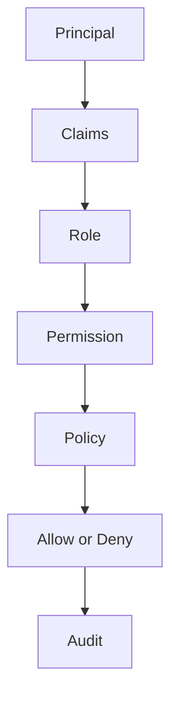
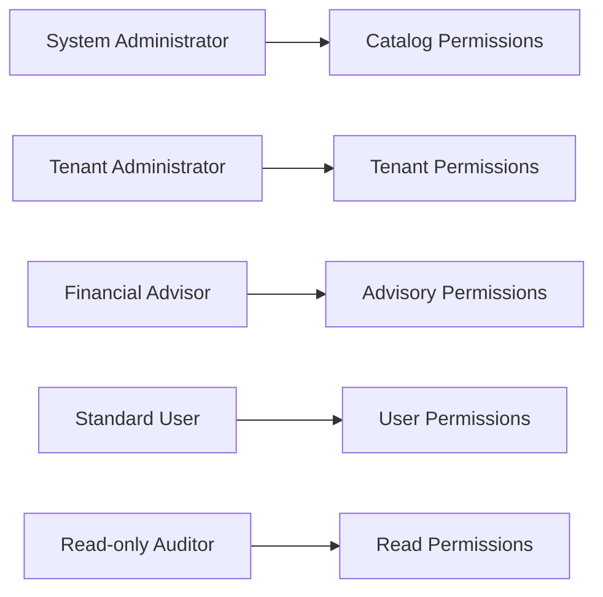
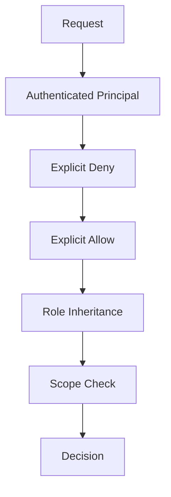
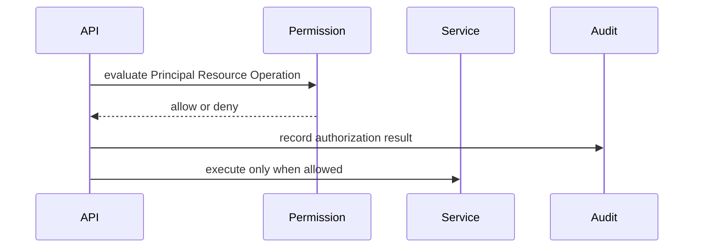
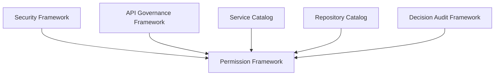

# Permission Governance and Testing

Source: [permission-framework.md](../permission-framework.md)

## Permission Resolution Strategy

- Permission Resolution Strategy rule {0:D2}: resolve explicit deny, explicit allow, role inheritance, policy scope, ownership, tenant, household, cache validity, and default deny in deterministic order.
- Permission Resolution Strategy rule {0:D2}: resolve explicit deny, explicit allow, role inheritance, policy scope, ownership, tenant, household, cache validity, and default deny in deterministic order.
- Permission Resolution Strategy rule {0:D2}: resolve explicit deny, explicit allow, role inheritance, policy scope, ownership, tenant, household, cache validity, and default deny in deterministic order.
- Permission Resolution Strategy rule {0:D2}: resolve explicit deny, explicit allow, role inheritance, policy scope, ownership, tenant, household, cache validity, and default deny in deterministic order.
- Permission Resolution Strategy rule {0:D2}: resolve explicit deny, explicit allow, role inheritance, policy scope, ownership, tenant, household, cache validity, and default deny in deterministic order.
- Permission Resolution Strategy rule {0:D2}: resolve explicit deny, explicit allow, role inheritance, policy scope, ownership, tenant, household, cache validity, and default deny in deterministic order.
- Permission Resolution Strategy rule {0:D2}: resolve explicit deny, explicit allow, role inheritance, policy scope, ownership, tenant, household, cache validity, and default deny in deterministic order.
- Permission Resolution Strategy rule {0:D2}: resolve explicit deny, explicit allow, role inheritance, policy scope, ownership, tenant, household, cache validity, and default deny in deterministic order.
- Permission Resolution Strategy rule {0:D2}: resolve explicit deny, explicit allow, role inheritance, policy scope, ownership, tenant, household, cache validity, and default deny in deterministic order.
- Permission Resolution Strategy rule {0:D2}: resolve explicit deny, explicit allow, role inheritance, policy scope, ownership, tenant, household, cache validity, and default deny in deterministic order.
- Permission Resolution Strategy rule {0:D2}: resolve explicit deny, explicit allow, role inheritance, policy scope, ownership, tenant, household, cache validity, and default deny in deterministic order.
- Permission Resolution Strategy rule {0:D2}: resolve explicit deny, explicit allow, role inheritance, policy scope, ownership, tenant, household, cache validity, and default deny in deterministic order.
- Permission Resolution Strategy rule {0:D2}: resolve explicit deny, explicit allow, role inheritance, policy scope, ownership, tenant, household, cache validity, and default deny in deterministic order.
- Permission Resolution Strategy rule {0:D2}: resolve explicit deny, explicit allow, role inheritance, policy scope, ownership, tenant, household, cache validity, and default deny in deterministic order.
- Permission Resolution Strategy rule {0:D2}: resolve explicit deny, explicit allow, role inheritance, policy scope, ownership, tenant, household, cache validity, and default deny in deterministic order.
- Permission Resolution Strategy rule {0:D2}: resolve explicit deny, explicit allow, role inheritance, policy scope, ownership, tenant, household, cache validity, and default deny in deterministic order.
- Permission Resolution Strategy rule {0:D2}: resolve explicit deny, explicit allow, role inheritance, policy scope, ownership, tenant, household, cache validity, and default deny in deterministic order.
- Permission Resolution Strategy rule {0:D2}: resolve explicit deny, explicit allow, role inheritance, policy scope, ownership, tenant, household, cache validity, and default deny in deterministic order.
- Permission Resolution Strategy rule {0:D2}: resolve explicit deny, explicit allow, role inheritance, policy scope, ownership, tenant, household, cache validity, and default deny in deterministic order.
- Permission Resolution Strategy rule {0:D2}: resolve explicit deny, explicit allow, role inheritance, policy scope, ownership, tenant, household, cache validity, and default deny in deterministic order.
- Permission Resolution Strategy rule {0:D2}: resolve explicit deny, explicit allow, role inheritance, policy scope, ownership, tenant, household, cache validity, and default deny in deterministic order.
- Permission Resolution Strategy rule {0:D2}: resolve explicit deny, explicit allow, role inheritance, policy scope, ownership, tenant, household, cache validity, and default deny in deterministic order.
- Permission Resolution Strategy rule {0:D2}: resolve explicit deny, explicit allow, role inheritance, policy scope, ownership, tenant, household, cache validity, and default deny in deterministic order.
- Permission Resolution Strategy rule {0:D2}: resolve explicit deny, explicit allow, role inheritance, policy scope, ownership, tenant, household, cache validity, and default deny in deterministic order.
- Permission Resolution Strategy rule {0:D2}: resolve explicit deny, explicit allow, role inheritance, policy scope, ownership, tenant, household, cache validity, and default deny in deterministic order.
- Permission Resolution Strategy rule {0:D2}: resolve explicit deny, explicit allow, role inheritance, policy scope, ownership, tenant, household, cache validity, and default deny in deterministic order.
- Permission Resolution Strategy rule {0:D2}: resolve explicit deny, explicit allow, role inheritance, policy scope, ownership, tenant, household, cache validity, and default deny in deterministic order.
- Permission Resolution Strategy rule {0:D2}: resolve explicit deny, explicit allow, role inheritance, policy scope, ownership, tenant, household, cache validity, and default deny in deterministic order.
- Permission Resolution Strategy rule {0:D2}: resolve explicit deny, explicit allow, role inheritance, policy scope, ownership, tenant, household, cache validity, and default deny in deterministic order.
- Permission Resolution Strategy rule {0:D2}: resolve explicit deny, explicit allow, role inheritance, policy scope, ownership, tenant, household, cache validity, and default deny in deterministic order.
- Permission Resolution Strategy rule {0:D2}: resolve explicit deny, explicit allow, role inheritance, policy scope, ownership, tenant, household, cache validity, and default deny in deterministic order.
- Permission Resolution Strategy rule {0:D2}: resolve explicit deny, explicit allow, role inheritance, policy scope, ownership, tenant, household, cache validity, and default deny in deterministic order.
- Permission Resolution Strategy rule {0:D2}: resolve explicit deny, explicit allow, role inheritance, policy scope, ownership, tenant, household, cache validity, and default deny in deterministic order.
- Permission Resolution Strategy rule {0:D2}: resolve explicit deny, explicit allow, role inheritance, policy scope, ownership, tenant, household, cache validity, and default deny in deterministic order.
- Permission Resolution Strategy rule {0:D2}: resolve explicit deny, explicit allow, role inheritance, policy scope, ownership, tenant, household, cache validity, and default deny in deterministic order.

## Permission Inheritance Strategy

- Permission Inheritance Strategy rule {0:D2}: resolve explicit deny, explicit allow, role inheritance, policy scope, ownership, tenant, household, cache validity, and default deny in deterministic order.
- Permission Inheritance Strategy rule {0:D2}: resolve explicit deny, explicit allow, role inheritance, policy scope, ownership, tenant, household, cache validity, and default deny in deterministic order.
- Permission Inheritance Strategy rule {0:D2}: resolve explicit deny, explicit allow, role inheritance, policy scope, ownership, tenant, household, cache validity, and default deny in deterministic order.
- Permission Inheritance Strategy rule {0:D2}: resolve explicit deny, explicit allow, role inheritance, policy scope, ownership, tenant, household, cache validity, and default deny in deterministic order.
- Permission Inheritance Strategy rule {0:D2}: resolve explicit deny, explicit allow, role inheritance, policy scope, ownership, tenant, household, cache validity, and default deny in deterministic order.
- Permission Inheritance Strategy rule {0:D2}: resolve explicit deny, explicit allow, role inheritance, policy scope, ownership, tenant, household, cache validity, and default deny in deterministic order.
- Permission Inheritance Strategy rule {0:D2}: resolve explicit deny, explicit allow, role inheritance, policy scope, ownership, tenant, household, cache validity, and default deny in deterministic order.
- Permission Inheritance Strategy rule {0:D2}: resolve explicit deny, explicit allow, role inheritance, policy scope, ownership, tenant, household, cache validity, and default deny in deterministic order.
- Permission Inheritance Strategy rule {0:D2}: resolve explicit deny, explicit allow, role inheritance, policy scope, ownership, tenant, household, cache validity, and default deny in deterministic order.
- Permission Inheritance Strategy rule {0:D2}: resolve explicit deny, explicit allow, role inheritance, policy scope, ownership, tenant, household, cache validity, and default deny in deterministic order.
- Permission Inheritance Strategy rule {0:D2}: resolve explicit deny, explicit allow, role inheritance, policy scope, ownership, tenant, household, cache validity, and default deny in deterministic order.
- Permission Inheritance Strategy rule {0:D2}: resolve explicit deny, explicit allow, role inheritance, policy scope, ownership, tenant, household, cache validity, and default deny in deterministic order.
- Permission Inheritance Strategy rule {0:D2}: resolve explicit deny, explicit allow, role inheritance, policy scope, ownership, tenant, household, cache validity, and default deny in deterministic order.
- Permission Inheritance Strategy rule {0:D2}: resolve explicit deny, explicit allow, role inheritance, policy scope, ownership, tenant, household, cache validity, and default deny in deterministic order.
- Permission Inheritance Strategy rule {0:D2}: resolve explicit deny, explicit allow, role inheritance, policy scope, ownership, tenant, household, cache validity, and default deny in deterministic order.
- Permission Inheritance Strategy rule {0:D2}: resolve explicit deny, explicit allow, role inheritance, policy scope, ownership, tenant, household, cache validity, and default deny in deterministic order.
- Permission Inheritance Strategy rule {0:D2}: resolve explicit deny, explicit allow, role inheritance, policy scope, ownership, tenant, household, cache validity, and default deny in deterministic order.
- Permission Inheritance Strategy rule {0:D2}: resolve explicit deny, explicit allow, role inheritance, policy scope, ownership, tenant, household, cache validity, and default deny in deterministic order.
- Permission Inheritance Strategy rule {0:D2}: resolve explicit deny, explicit allow, role inheritance, policy scope, ownership, tenant, household, cache validity, and default deny in deterministic order.
- Permission Inheritance Strategy rule {0:D2}: resolve explicit deny, explicit allow, role inheritance, policy scope, ownership, tenant, household, cache validity, and default deny in deterministic order.
- Permission Inheritance Strategy rule {0:D2}: resolve explicit deny, explicit allow, role inheritance, policy scope, ownership, tenant, household, cache validity, and default deny in deterministic order.
- Permission Inheritance Strategy rule {0:D2}: resolve explicit deny, explicit allow, role inheritance, policy scope, ownership, tenant, household, cache validity, and default deny in deterministic order.
- Permission Inheritance Strategy rule {0:D2}: resolve explicit deny, explicit allow, role inheritance, policy scope, ownership, tenant, household, cache validity, and default deny in deterministic order.
- Permission Inheritance Strategy rule {0:D2}: resolve explicit deny, explicit allow, role inheritance, policy scope, ownership, tenant, household, cache validity, and default deny in deterministic order.
- Permission Inheritance Strategy rule {0:D2}: resolve explicit deny, explicit allow, role inheritance, policy scope, ownership, tenant, household, cache validity, and default deny in deterministic order.
- Permission Inheritance Strategy rule {0:D2}: resolve explicit deny, explicit allow, role inheritance, policy scope, ownership, tenant, household, cache validity, and default deny in deterministic order.
- Permission Inheritance Strategy rule {0:D2}: resolve explicit deny, explicit allow, role inheritance, policy scope, ownership, tenant, household, cache validity, and default deny in deterministic order.
- Permission Inheritance Strategy rule {0:D2}: resolve explicit deny, explicit allow, role inheritance, policy scope, ownership, tenant, household, cache validity, and default deny in deterministic order.
- Permission Inheritance Strategy rule {0:D2}: resolve explicit deny, explicit allow, role inheritance, policy scope, ownership, tenant, household, cache validity, and default deny in deterministic order.
- Permission Inheritance Strategy rule {0:D2}: resolve explicit deny, explicit allow, role inheritance, policy scope, ownership, tenant, household, cache validity, and default deny in deterministic order.
- Permission Inheritance Strategy rule {0:D2}: resolve explicit deny, explicit allow, role inheritance, policy scope, ownership, tenant, household, cache validity, and default deny in deterministic order.
- Permission Inheritance Strategy rule {0:D2}: resolve explicit deny, explicit allow, role inheritance, policy scope, ownership, tenant, household, cache validity, and default deny in deterministic order.
- Permission Inheritance Strategy rule {0:D2}: resolve explicit deny, explicit allow, role inheritance, policy scope, ownership, tenant, household, cache validity, and default deny in deterministic order.
- Permission Inheritance Strategy rule {0:D2}: resolve explicit deny, explicit allow, role inheritance, policy scope, ownership, tenant, household, cache validity, and default deny in deterministic order.
- Permission Inheritance Strategy rule {0:D2}: resolve explicit deny, explicit allow, role inheritance, policy scope, ownership, tenant, household, cache validity, and default deny in deterministic order.

## Permission Cache Strategy

- Permission Cache Strategy rule {0:D2}: resolve explicit deny, explicit allow, role inheritance, policy scope, ownership, tenant, household, cache validity, and default deny in deterministic order.
- Permission Cache Strategy rule {0:D2}: resolve explicit deny, explicit allow, role inheritance, policy scope, ownership, tenant, household, cache validity, and default deny in deterministic order.
- Permission Cache Strategy rule {0:D2}: resolve explicit deny, explicit allow, role inheritance, policy scope, ownership, tenant, household, cache validity, and default deny in deterministic order.
- Permission Cache Strategy rule {0:D2}: resolve explicit deny, explicit allow, role inheritance, policy scope, ownership, tenant, household, cache validity, and default deny in deterministic order.
- Permission Cache Strategy rule {0:D2}: resolve explicit deny, explicit allow, role inheritance, policy scope, ownership, tenant, household, cache validity, and default deny in deterministic order.
- Permission Cache Strategy rule {0:D2}: resolve explicit deny, explicit allow, role inheritance, policy scope, ownership, tenant, household, cache validity, and default deny in deterministic order.
- Permission Cache Strategy rule {0:D2}: resolve explicit deny, explicit allow, role inheritance, policy scope, ownership, tenant, household, cache validity, and default deny in deterministic order.
- Permission Cache Strategy rule {0:D2}: resolve explicit deny, explicit allow, role inheritance, policy scope, ownership, tenant, household, cache validity, and default deny in deterministic order.
- Permission Cache Strategy rule {0:D2}: resolve explicit deny, explicit allow, role inheritance, policy scope, ownership, tenant, household, cache validity, and default deny in deterministic order.
- Permission Cache Strategy rule {0:D2}: resolve explicit deny, explicit allow, role inheritance, policy scope, ownership, tenant, household, cache validity, and default deny in deterministic order.
- Permission Cache Strategy rule {0:D2}: resolve explicit deny, explicit allow, role inheritance, policy scope, ownership, tenant, household, cache validity, and default deny in deterministic order.
- Permission Cache Strategy rule {0:D2}: resolve explicit deny, explicit allow, role inheritance, policy scope, ownership, tenant, household, cache validity, and default deny in deterministic order.
- Permission Cache Strategy rule {0:D2}: resolve explicit deny, explicit allow, role inheritance, policy scope, ownership, tenant, household, cache validity, and default deny in deterministic order.
- Permission Cache Strategy rule {0:D2}: resolve explicit deny, explicit allow, role inheritance, policy scope, ownership, tenant, household, cache validity, and default deny in deterministic order.
- Permission Cache Strategy rule {0:D2}: resolve explicit deny, explicit allow, role inheritance, policy scope, ownership, tenant, household, cache validity, and default deny in deterministic order.
- Permission Cache Strategy rule {0:D2}: resolve explicit deny, explicit allow, role inheritance, policy scope, ownership, tenant, household, cache validity, and default deny in deterministic order.
- Permission Cache Strategy rule {0:D2}: resolve explicit deny, explicit allow, role inheritance, policy scope, ownership, tenant, household, cache validity, and default deny in deterministic order.
- Permission Cache Strategy rule {0:D2}: resolve explicit deny, explicit allow, role inheritance, policy scope, ownership, tenant, household, cache validity, and default deny in deterministic order.
- Permission Cache Strategy rule {0:D2}: resolve explicit deny, explicit allow, role inheritance, policy scope, ownership, tenant, household, cache validity, and default deny in deterministic order.
- Permission Cache Strategy rule {0:D2}: resolve explicit deny, explicit allow, role inheritance, policy scope, ownership, tenant, household, cache validity, and default deny in deterministic order.
- Permission Cache Strategy rule {0:D2}: resolve explicit deny, explicit allow, role inheritance, policy scope, ownership, tenant, household, cache validity, and default deny in deterministic order.
- Permission Cache Strategy rule {0:D2}: resolve explicit deny, explicit allow, role inheritance, policy scope, ownership, tenant, household, cache validity, and default deny in deterministic order.
- Permission Cache Strategy rule {0:D2}: resolve explicit deny, explicit allow, role inheritance, policy scope, ownership, tenant, household, cache validity, and default deny in deterministic order.
- Permission Cache Strategy rule {0:D2}: resolve explicit deny, explicit allow, role inheritance, policy scope, ownership, tenant, household, cache validity, and default deny in deterministic order.
- Permission Cache Strategy rule {0:D2}: resolve explicit deny, explicit allow, role inheritance, policy scope, ownership, tenant, household, cache validity, and default deny in deterministic order.
- Permission Cache Strategy rule {0:D2}: resolve explicit deny, explicit allow, role inheritance, policy scope, ownership, tenant, household, cache validity, and default deny in deterministic order.
- Permission Cache Strategy rule {0:D2}: resolve explicit deny, explicit allow, role inheritance, policy scope, ownership, tenant, household, cache validity, and default deny in deterministic order.
- Permission Cache Strategy rule {0:D2}: resolve explicit deny, explicit allow, role inheritance, policy scope, ownership, tenant, household, cache validity, and default deny in deterministic order.
- Permission Cache Strategy rule {0:D2}: resolve explicit deny, explicit allow, role inheritance, policy scope, ownership, tenant, household, cache validity, and default deny in deterministic order.
- Permission Cache Strategy rule {0:D2}: resolve explicit deny, explicit allow, role inheritance, policy scope, ownership, tenant, household, cache validity, and default deny in deterministic order.
- Permission Cache Strategy rule {0:D2}: resolve explicit deny, explicit allow, role inheritance, policy scope, ownership, tenant, household, cache validity, and default deny in deterministic order.
- Permission Cache Strategy rule {0:D2}: resolve explicit deny, explicit allow, role inheritance, policy scope, ownership, tenant, household, cache validity, and default deny in deterministic order.
- Permission Cache Strategy rule {0:D2}: resolve explicit deny, explicit allow, role inheritance, policy scope, ownership, tenant, household, cache validity, and default deny in deterministic order.
- Permission Cache Strategy rule {0:D2}: resolve explicit deny, explicit allow, role inheritance, policy scope, ownership, tenant, household, cache validity, and default deny in deterministic order.
- Permission Cache Strategy rule {0:D2}: resolve explicit deny, explicit allow, role inheritance, policy scope, ownership, tenant, household, cache validity, and default deny in deterministic order.

## Validation Rules

| Rule ID | Rule |
| --- | --- |
| PERM-VR-{0:D3} | Permission validation 1 requires Permission Name, Resource, Operation, Role Mapping, Policy Mapping, Scope, Principal, Claim, cache version, and audit correlation before authorization can allow execution. |
| PERM-VR-{0:D3} | Permission validation 2 requires Permission Name, Resource, Operation, Role Mapping, Policy Mapping, Scope, Principal, Claim, cache version, and audit correlation before authorization can allow execution. |
| PERM-VR-{0:D3} | Permission validation 3 requires Permission Name, Resource, Operation, Role Mapping, Policy Mapping, Scope, Principal, Claim, cache version, and audit correlation before authorization can allow execution. |
| PERM-VR-{0:D3} | Permission validation 4 requires Permission Name, Resource, Operation, Role Mapping, Policy Mapping, Scope, Principal, Claim, cache version, and audit correlation before authorization can allow execution. |
| PERM-VR-{0:D3} | Permission validation 5 requires Permission Name, Resource, Operation, Role Mapping, Policy Mapping, Scope, Principal, Claim, cache version, and audit correlation before authorization can allow execution. |
| PERM-VR-{0:D3} | Permission validation 6 requires Permission Name, Resource, Operation, Role Mapping, Policy Mapping, Scope, Principal, Claim, cache version, and audit correlation before authorization can allow execution. |
| PERM-VR-{0:D3} | Permission validation 7 requires Permission Name, Resource, Operation, Role Mapping, Policy Mapping, Scope, Principal, Claim, cache version, and audit correlation before authorization can allow execution. |
| PERM-VR-{0:D3} | Permission validation 8 requires Permission Name, Resource, Operation, Role Mapping, Policy Mapping, Scope, Principal, Claim, cache version, and audit correlation before authorization can allow execution. |
| PERM-VR-{0:D3} | Permission validation 9 requires Permission Name, Resource, Operation, Role Mapping, Policy Mapping, Scope, Principal, Claim, cache version, and audit correlation before authorization can allow execution. |
| PERM-VR-{0:D3} | Permission validation 10 requires Permission Name, Resource, Operation, Role Mapping, Policy Mapping, Scope, Principal, Claim, cache version, and audit correlation before authorization can allow execution. |
| PERM-VR-{0:D3} | Permission validation 11 requires Permission Name, Resource, Operation, Role Mapping, Policy Mapping, Scope, Principal, Claim, cache version, and audit correlation before authorization can allow execution. |
| PERM-VR-{0:D3} | Permission validation 12 requires Permission Name, Resource, Operation, Role Mapping, Policy Mapping, Scope, Principal, Claim, cache version, and audit correlation before authorization can allow execution. |
| PERM-VR-{0:D3} | Permission validation 13 requires Permission Name, Resource, Operation, Role Mapping, Policy Mapping, Scope, Principal, Claim, cache version, and audit correlation before authorization can allow execution. |
| PERM-VR-{0:D3} | Permission validation 14 requires Permission Name, Resource, Operation, Role Mapping, Policy Mapping, Scope, Principal, Claim, cache version, and audit correlation before authorization can allow execution. |
| PERM-VR-{0:D3} | Permission validation 15 requires Permission Name, Resource, Operation, Role Mapping, Policy Mapping, Scope, Principal, Claim, cache version, and audit correlation before authorization can allow execution. |
| PERM-VR-{0:D3} | Permission validation 16 requires Permission Name, Resource, Operation, Role Mapping, Policy Mapping, Scope, Principal, Claim, cache version, and audit correlation before authorization can allow execution. |
| PERM-VR-{0:D3} | Permission validation 17 requires Permission Name, Resource, Operation, Role Mapping, Policy Mapping, Scope, Principal, Claim, cache version, and audit correlation before authorization can allow execution. |
| PERM-VR-{0:D3} | Permission validation 18 requires Permission Name, Resource, Operation, Role Mapping, Policy Mapping, Scope, Principal, Claim, cache version, and audit correlation before authorization can allow execution. |
| PERM-VR-{0:D3} | Permission validation 19 requires Permission Name, Resource, Operation, Role Mapping, Policy Mapping, Scope, Principal, Claim, cache version, and audit correlation before authorization can allow execution. |
| PERM-VR-{0:D3} | Permission validation 20 requires Permission Name, Resource, Operation, Role Mapping, Policy Mapping, Scope, Principal, Claim, cache version, and audit correlation before authorization can allow execution. |
| PERM-VR-{0:D3} | Permission validation 21 requires Permission Name, Resource, Operation, Role Mapping, Policy Mapping, Scope, Principal, Claim, cache version, and audit correlation before authorization can allow execution. |
| PERM-VR-{0:D3} | Permission validation 22 requires Permission Name, Resource, Operation, Role Mapping, Policy Mapping, Scope, Principal, Claim, cache version, and audit correlation before authorization can allow execution. |
| PERM-VR-{0:D3} | Permission validation 23 requires Permission Name, Resource, Operation, Role Mapping, Policy Mapping, Scope, Principal, Claim, cache version, and audit correlation before authorization can allow execution. |
| PERM-VR-{0:D3} | Permission validation 24 requires Permission Name, Resource, Operation, Role Mapping, Policy Mapping, Scope, Principal, Claim, cache version, and audit correlation before authorization can allow execution. |
| PERM-VR-{0:D3} | Permission validation 25 requires Permission Name, Resource, Operation, Role Mapping, Policy Mapping, Scope, Principal, Claim, cache version, and audit correlation before authorization can allow execution. |
| PERM-VR-{0:D3} | Permission validation 26 requires Permission Name, Resource, Operation, Role Mapping, Policy Mapping, Scope, Principal, Claim, cache version, and audit correlation before authorization can allow execution. |
| PERM-VR-{0:D3} | Permission validation 27 requires Permission Name, Resource, Operation, Role Mapping, Policy Mapping, Scope, Principal, Claim, cache version, and audit correlation before authorization can allow execution. |
| PERM-VR-{0:D3} | Permission validation 28 requires Permission Name, Resource, Operation, Role Mapping, Policy Mapping, Scope, Principal, Claim, cache version, and audit correlation before authorization can allow execution. |
| PERM-VR-{0:D3} | Permission validation 29 requires Permission Name, Resource, Operation, Role Mapping, Policy Mapping, Scope, Principal, Claim, cache version, and audit correlation before authorization can allow execution. |
| PERM-VR-{0:D3} | Permission validation 30 requires Permission Name, Resource, Operation, Role Mapping, Policy Mapping, Scope, Principal, Claim, cache version, and audit correlation before authorization can allow execution. |
| PERM-VR-{0:D3} | Permission validation 31 requires Permission Name, Resource, Operation, Role Mapping, Policy Mapping, Scope, Principal, Claim, cache version, and audit correlation before authorization can allow execution. |
| PERM-VR-{0:D3} | Permission validation 32 requires Permission Name, Resource, Operation, Role Mapping, Policy Mapping, Scope, Principal, Claim, cache version, and audit correlation before authorization can allow execution. |
| PERM-VR-{0:D3} | Permission validation 33 requires Permission Name, Resource, Operation, Role Mapping, Policy Mapping, Scope, Principal, Claim, cache version, and audit correlation before authorization can allow execution. |
| PERM-VR-{0:D3} | Permission validation 34 requires Permission Name, Resource, Operation, Role Mapping, Policy Mapping, Scope, Principal, Claim, cache version, and audit correlation before authorization can allow execution. |
| PERM-VR-{0:D3} | Permission validation 35 requires Permission Name, Resource, Operation, Role Mapping, Policy Mapping, Scope, Principal, Claim, cache version, and audit correlation before authorization can allow execution. |
| PERM-VR-{0:D3} | Permission validation 36 requires Permission Name, Resource, Operation, Role Mapping, Policy Mapping, Scope, Principal, Claim, cache version, and audit correlation before authorization can allow execution. |
| PERM-VR-{0:D3} | Permission validation 37 requires Permission Name, Resource, Operation, Role Mapping, Policy Mapping, Scope, Principal, Claim, cache version, and audit correlation before authorization can allow execution. |
| PERM-VR-{0:D3} | Permission validation 38 requires Permission Name, Resource, Operation, Role Mapping, Policy Mapping, Scope, Principal, Claim, cache version, and audit correlation before authorization can allow execution. |
| PERM-VR-{0:D3} | Permission validation 39 requires Permission Name, Resource, Operation, Role Mapping, Policy Mapping, Scope, Principal, Claim, cache version, and audit correlation before authorization can allow execution. |
| PERM-VR-{0:D3} | Permission validation 40 requires Permission Name, Resource, Operation, Role Mapping, Policy Mapping, Scope, Principal, Claim, cache version, and audit correlation before authorization can allow execution. |

## Business Rules

1. PERM-BR-{0:D3}: Atlas permission rule 1 requires least privilege, catalog permission, explicit resource, explicit operation, policy evaluation, tenant isolation, household isolation, and auditable authorization result.
2. PERM-BR-{0:D3}: Atlas permission rule 2 requires least privilege, catalog permission, explicit resource, explicit operation, policy evaluation, tenant isolation, household isolation, and auditable authorization result.
3. PERM-BR-{0:D3}: Atlas permission rule 3 requires least privilege, catalog permission, explicit resource, explicit operation, policy evaluation, tenant isolation, household isolation, and auditable authorization result.
4. PERM-BR-{0:D3}: Atlas permission rule 4 requires least privilege, catalog permission, explicit resource, explicit operation, policy evaluation, tenant isolation, household isolation, and auditable authorization result.
5. PERM-BR-{0:D3}: Atlas permission rule 5 requires least privilege, catalog permission, explicit resource, explicit operation, policy evaluation, tenant isolation, household isolation, and auditable authorization result.
6. PERM-BR-{0:D3}: Atlas permission rule 6 requires least privilege, catalog permission, explicit resource, explicit operation, policy evaluation, tenant isolation, household isolation, and auditable authorization result.
7. PERM-BR-{0:D3}: Atlas permission rule 7 requires least privilege, catalog permission, explicit resource, explicit operation, policy evaluation, tenant isolation, household isolation, and auditable authorization result.
8. PERM-BR-{0:D3}: Atlas permission rule 8 requires least privilege, catalog permission, explicit resource, explicit operation, policy evaluation, tenant isolation, household isolation, and auditable authorization result.
9. PERM-BR-{0:D3}: Atlas permission rule 9 requires least privilege, catalog permission, explicit resource, explicit operation, policy evaluation, tenant isolation, household isolation, and auditable authorization result.
10. PERM-BR-{0:D3}: Atlas permission rule 10 requires least privilege, catalog permission, explicit resource, explicit operation, policy evaluation, tenant isolation, household isolation, and auditable authorization result.
11. PERM-BR-{0:D3}: Atlas permission rule 11 requires least privilege, catalog permission, explicit resource, explicit operation, policy evaluation, tenant isolation, household isolation, and auditable authorization result.
12. PERM-BR-{0:D3}: Atlas permission rule 12 requires least privilege, catalog permission, explicit resource, explicit operation, policy evaluation, tenant isolation, household isolation, and auditable authorization result.
13. PERM-BR-{0:D3}: Atlas permission rule 13 requires least privilege, catalog permission, explicit resource, explicit operation, policy evaluation, tenant isolation, household isolation, and auditable authorization result.
14. PERM-BR-{0:D3}: Atlas permission rule 14 requires least privilege, catalog permission, explicit resource, explicit operation, policy evaluation, tenant isolation, household isolation, and auditable authorization result.
15. PERM-BR-{0:D3}: Atlas permission rule 15 requires least privilege, catalog permission, explicit resource, explicit operation, policy evaluation, tenant isolation, household isolation, and auditable authorization result.
16. PERM-BR-{0:D3}: Atlas permission rule 16 requires least privilege, catalog permission, explicit resource, explicit operation, policy evaluation, tenant isolation, household isolation, and auditable authorization result.
17. PERM-BR-{0:D3}: Atlas permission rule 17 requires least privilege, catalog permission, explicit resource, explicit operation, policy evaluation, tenant isolation, household isolation, and auditable authorization result.
18. PERM-BR-{0:D3}: Atlas permission rule 18 requires least privilege, catalog permission, explicit resource, explicit operation, policy evaluation, tenant isolation, household isolation, and auditable authorization result.
19. PERM-BR-{0:D3}: Atlas permission rule 19 requires least privilege, catalog permission, explicit resource, explicit operation, policy evaluation, tenant isolation, household isolation, and auditable authorization result.
20. PERM-BR-{0:D3}: Atlas permission rule 20 requires least privilege, catalog permission, explicit resource, explicit operation, policy evaluation, tenant isolation, household isolation, and auditable authorization result.
21. PERM-BR-{0:D3}: Atlas permission rule 21 requires least privilege, catalog permission, explicit resource, explicit operation, policy evaluation, tenant isolation, household isolation, and auditable authorization result.
22. PERM-BR-{0:D3}: Atlas permission rule 22 requires least privilege, catalog permission, explicit resource, explicit operation, policy evaluation, tenant isolation, household isolation, and auditable authorization result.
23. PERM-BR-{0:D3}: Atlas permission rule 23 requires least privilege, catalog permission, explicit resource, explicit operation, policy evaluation, tenant isolation, household isolation, and auditable authorization result.
24. PERM-BR-{0:D3}: Atlas permission rule 24 requires least privilege, catalog permission, explicit resource, explicit operation, policy evaluation, tenant isolation, household isolation, and auditable authorization result.
25. PERM-BR-{0:D3}: Atlas permission rule 25 requires least privilege, catalog permission, explicit resource, explicit operation, policy evaluation, tenant isolation, household isolation, and auditable authorization result.
26. PERM-BR-{0:D3}: Atlas permission rule 26 requires least privilege, catalog permission, explicit resource, explicit operation, policy evaluation, tenant isolation, household isolation, and auditable authorization result.
27. PERM-BR-{0:D3}: Atlas permission rule 27 requires least privilege, catalog permission, explicit resource, explicit operation, policy evaluation, tenant isolation, household isolation, and auditable authorization result.
28. PERM-BR-{0:D3}: Atlas permission rule 28 requires least privilege, catalog permission, explicit resource, explicit operation, policy evaluation, tenant isolation, household isolation, and auditable authorization result.
29. PERM-BR-{0:D3}: Atlas permission rule 29 requires least privilege, catalog permission, explicit resource, explicit operation, policy evaluation, tenant isolation, household isolation, and auditable authorization result.
30. PERM-BR-{0:D3}: Atlas permission rule 30 requires least privilege, catalog permission, explicit resource, explicit operation, policy evaluation, tenant isolation, household isolation, and auditable authorization result.
31. PERM-BR-{0:D3}: Atlas permission rule 31 requires least privilege, catalog permission, explicit resource, explicit operation, policy evaluation, tenant isolation, household isolation, and auditable authorization result.
32. PERM-BR-{0:D3}: Atlas permission rule 32 requires least privilege, catalog permission, explicit resource, explicit operation, policy evaluation, tenant isolation, household isolation, and auditable authorization result.
33. PERM-BR-{0:D3}: Atlas permission rule 33 requires least privilege, catalog permission, explicit resource, explicit operation, policy evaluation, tenant isolation, household isolation, and auditable authorization result.
34. PERM-BR-{0:D3}: Atlas permission rule 34 requires least privilege, catalog permission, explicit resource, explicit operation, policy evaluation, tenant isolation, household isolation, and auditable authorization result.
35. PERM-BR-{0:D3}: Atlas permission rule 35 requires least privilege, catalog permission, explicit resource, explicit operation, policy evaluation, tenant isolation, household isolation, and auditable authorization result.
36. PERM-BR-{0:D3}: Atlas permission rule 36 requires least privilege, catalog permission, explicit resource, explicit operation, policy evaluation, tenant isolation, household isolation, and auditable authorization result.
37. PERM-BR-{0:D3}: Atlas permission rule 37 requires least privilege, catalog permission, explicit resource, explicit operation, policy evaluation, tenant isolation, household isolation, and auditable authorization result.
38. PERM-BR-{0:D3}: Atlas permission rule 38 requires least privilege, catalog permission, explicit resource, explicit operation, policy evaluation, tenant isolation, household isolation, and auditable authorization result.
39. PERM-BR-{0:D3}: Atlas permission rule 39 requires least privilege, catalog permission, explicit resource, explicit operation, policy evaluation, tenant isolation, household isolation, and auditable authorization result.
40. PERM-BR-{0:D3}: Atlas permission rule 40 requires least privilege, catalog permission, explicit resource, explicit operation, policy evaluation, tenant isolation, household isolation, and auditable authorization result.
41. PERM-BR-{0:D3}: Atlas permission rule 41 requires least privilege, catalog permission, explicit resource, explicit operation, policy evaluation, tenant isolation, household isolation, and auditable authorization result.
42. PERM-BR-{0:D3}: Atlas permission rule 42 requires least privilege, catalog permission, explicit resource, explicit operation, policy evaluation, tenant isolation, household isolation, and auditable authorization result.
43. PERM-BR-{0:D3}: Atlas permission rule 43 requires least privilege, catalog permission, explicit resource, explicit operation, policy evaluation, tenant isolation, household isolation, and auditable authorization result.
44. PERM-BR-{0:D3}: Atlas permission rule 44 requires least privilege, catalog permission, explicit resource, explicit operation, policy evaluation, tenant isolation, household isolation, and auditable authorization result.
45. PERM-BR-{0:D3}: Atlas permission rule 45 requires least privilege, catalog permission, explicit resource, explicit operation, policy evaluation, tenant isolation, household isolation, and auditable authorization result.
46. PERM-BR-{0:D3}: Atlas permission rule 46 requires least privilege, catalog permission, explicit resource, explicit operation, policy evaluation, tenant isolation, household isolation, and auditable authorization result.
47. PERM-BR-{0:D3}: Atlas permission rule 47 requires least privilege, catalog permission, explicit resource, explicit operation, policy evaluation, tenant isolation, household isolation, and auditable authorization result.
48. PERM-BR-{0:D3}: Atlas permission rule 48 requires least privilege, catalog permission, explicit resource, explicit operation, policy evaluation, tenant isolation, household isolation, and auditable authorization result.
49. PERM-BR-{0:D3}: Atlas permission rule 49 requires least privilege, catalog permission, explicit resource, explicit operation, policy evaluation, tenant isolation, household isolation, and auditable authorization result.
50. PERM-BR-{0:D3}: Atlas permission rule 50 requires least privilege, catalog permission, explicit resource, explicit operation, policy evaluation, tenant isolation, household isolation, and auditable authorization result.
51. PERM-BR-{0:D3}: Atlas permission rule 51 requires least privilege, catalog permission, explicit resource, explicit operation, policy evaluation, tenant isolation, household isolation, and auditable authorization result.
52. PERM-BR-{0:D3}: Atlas permission rule 52 requires least privilege, catalog permission, explicit resource, explicit operation, policy evaluation, tenant isolation, household isolation, and auditable authorization result.
53. PERM-BR-{0:D3}: Atlas permission rule 53 requires least privilege, catalog permission, explicit resource, explicit operation, policy evaluation, tenant isolation, household isolation, and auditable authorization result.
54. PERM-BR-{0:D3}: Atlas permission rule 54 requires least privilege, catalog permission, explicit resource, explicit operation, policy evaluation, tenant isolation, household isolation, and auditable authorization result.
55. PERM-BR-{0:D3}: Atlas permission rule 55 requires least privilege, catalog permission, explicit resource, explicit operation, policy evaluation, tenant isolation, household isolation, and auditable authorization result.
56. PERM-BR-{0:D3}: Atlas permission rule 56 requires least privilege, catalog permission, explicit resource, explicit operation, policy evaluation, tenant isolation, household isolation, and auditable authorization result.
57. PERM-BR-{0:D3}: Atlas permission rule 57 requires least privilege, catalog permission, explicit resource, explicit operation, policy evaluation, tenant isolation, household isolation, and auditable authorization result.
58. PERM-BR-{0:D3}: Atlas permission rule 58 requires least privilege, catalog permission, explicit resource, explicit operation, policy evaluation, tenant isolation, household isolation, and auditable authorization result.
59. PERM-BR-{0:D3}: Atlas permission rule 59 requires least privilege, catalog permission, explicit resource, explicit operation, policy evaluation, tenant isolation, household isolation, and auditable authorization result.
60. PERM-BR-{0:D3}: Atlas permission rule 60 requires least privilege, catalog permission, explicit resource, explicit operation, policy evaluation, tenant isolation, household isolation, and auditable authorization result.
61. PERM-BR-{0:D3}: Atlas permission rule 61 requires least privilege, catalog permission, explicit resource, explicit operation, policy evaluation, tenant isolation, household isolation, and auditable authorization result.
62. PERM-BR-{0:D3}: Atlas permission rule 62 requires least privilege, catalog permission, explicit resource, explicit operation, policy evaluation, tenant isolation, household isolation, and auditable authorization result.
63. PERM-BR-{0:D3}: Atlas permission rule 63 requires least privilege, catalog permission, explicit resource, explicit operation, policy evaluation, tenant isolation, household isolation, and auditable authorization result.
64. PERM-BR-{0:D3}: Atlas permission rule 64 requires least privilege, catalog permission, explicit resource, explicit operation, policy evaluation, tenant isolation, household isolation, and auditable authorization result.
65. PERM-BR-{0:D3}: Atlas permission rule 65 requires least privilege, catalog permission, explicit resource, explicit operation, policy evaluation, tenant isolation, household isolation, and auditable authorization result.
66. PERM-BR-{0:D3}: Atlas permission rule 66 requires least privilege, catalog permission, explicit resource, explicit operation, policy evaluation, tenant isolation, household isolation, and auditable authorization result.
67. PERM-BR-{0:D3}: Atlas permission rule 67 requires least privilege, catalog permission, explicit resource, explicit operation, policy evaluation, tenant isolation, household isolation, and auditable authorization result.
68. PERM-BR-{0:D3}: Atlas permission rule 68 requires least privilege, catalog permission, explicit resource, explicit operation, policy evaluation, tenant isolation, household isolation, and auditable authorization result.
69. PERM-BR-{0:D3}: Atlas permission rule 69 requires least privilege, catalog permission, explicit resource, explicit operation, policy evaluation, tenant isolation, household isolation, and auditable authorization result.
70. PERM-BR-{0:D3}: Atlas permission rule 70 requires least privilege, catalog permission, explicit resource, explicit operation, policy evaluation, tenant isolation, household isolation, and auditable authorization result.
71. PERM-BR-{0:D3}: Atlas permission rule 71 requires least privilege, catalog permission, explicit resource, explicit operation, policy evaluation, tenant isolation, household isolation, and auditable authorization result.
72. PERM-BR-{0:D3}: Atlas permission rule 72 requires least privilege, catalog permission, explicit resource, explicit operation, policy evaluation, tenant isolation, household isolation, and auditable authorization result.
73. PERM-BR-{0:D3}: Atlas permission rule 73 requires least privilege, catalog permission, explicit resource, explicit operation, policy evaluation, tenant isolation, household isolation, and auditable authorization result.
74. PERM-BR-{0:D3}: Atlas permission rule 74 requires least privilege, catalog permission, explicit resource, explicit operation, policy evaluation, tenant isolation, household isolation, and auditable authorization result.
75. PERM-BR-{0:D3}: Atlas permission rule 75 requires least privilege, catalog permission, explicit resource, explicit operation, policy evaluation, tenant isolation, household isolation, and auditable authorization result.
76. PERM-BR-{0:D3}: Atlas permission rule 76 requires least privilege, catalog permission, explicit resource, explicit operation, policy evaluation, tenant isolation, household isolation, and auditable authorization result.
77. PERM-BR-{0:D3}: Atlas permission rule 77 requires least privilege, catalog permission, explicit resource, explicit operation, policy evaluation, tenant isolation, household isolation, and auditable authorization result.
78. PERM-BR-{0:D3}: Atlas permission rule 78 requires least privilege, catalog permission, explicit resource, explicit operation, policy evaluation, tenant isolation, household isolation, and auditable authorization result.
79. PERM-BR-{0:D3}: Atlas permission rule 79 requires least privilege, catalog permission, explicit resource, explicit operation, policy evaluation, tenant isolation, household isolation, and auditable authorization result.
80. PERM-BR-{0:D3}: Atlas permission rule 80 requires least privilege, catalog permission, explicit resource, explicit operation, policy evaluation, tenant isolation, household isolation, and auditable authorization result.
81. PERM-BR-{0:D3}: Atlas permission rule 81 requires least privilege, catalog permission, explicit resource, explicit operation, policy evaluation, tenant isolation, household isolation, and auditable authorization result.
82. PERM-BR-{0:D3}: Atlas permission rule 82 requires least privilege, catalog permission, explicit resource, explicit operation, policy evaluation, tenant isolation, household isolation, and auditable authorization result.
83. PERM-BR-{0:D3}: Atlas permission rule 83 requires least privilege, catalog permission, explicit resource, explicit operation, policy evaluation, tenant isolation, household isolation, and auditable authorization result.
84. PERM-BR-{0:D3}: Atlas permission rule 84 requires least privilege, catalog permission, explicit resource, explicit operation, policy evaluation, tenant isolation, household isolation, and auditable authorization result.
85. PERM-BR-{0:D3}: Atlas permission rule 85 requires least privilege, catalog permission, explicit resource, explicit operation, policy evaluation, tenant isolation, household isolation, and auditable authorization result.
86. PERM-BR-{0:D3}: Atlas permission rule 86 requires least privilege, catalog permission, explicit resource, explicit operation, policy evaluation, tenant isolation, household isolation, and auditable authorization result.
87. PERM-BR-{0:D3}: Atlas permission rule 87 requires least privilege, catalog permission, explicit resource, explicit operation, policy evaluation, tenant isolation, household isolation, and auditable authorization result.
88. PERM-BR-{0:D3}: Atlas permission rule 88 requires least privilege, catalog permission, explicit resource, explicit operation, policy evaluation, tenant isolation, household isolation, and auditable authorization result.
89. PERM-BR-{0:D3}: Atlas permission rule 89 requires least privilege, catalog permission, explicit resource, explicit operation, policy evaluation, tenant isolation, household isolation, and auditable authorization result.
90. PERM-BR-{0:D3}: Atlas permission rule 90 requires least privilege, catalog permission, explicit resource, explicit operation, policy evaluation, tenant isolation, household isolation, and auditable authorization result.
91. PERM-BR-{0:D3}: Atlas permission rule 91 requires least privilege, catalog permission, explicit resource, explicit operation, policy evaluation, tenant isolation, household isolation, and auditable authorization result.
92. PERM-BR-{0:D3}: Atlas permission rule 92 requires least privilege, catalog permission, explicit resource, explicit operation, policy evaluation, tenant isolation, household isolation, and auditable authorization result.
93. PERM-BR-{0:D3}: Atlas permission rule 93 requires least privilege, catalog permission, explicit resource, explicit operation, policy evaluation, tenant isolation, household isolation, and auditable authorization result.
94. PERM-BR-{0:D3}: Atlas permission rule 94 requires least privilege, catalog permission, explicit resource, explicit operation, policy evaluation, tenant isolation, household isolation, and auditable authorization result.
95. PERM-BR-{0:D3}: Atlas permission rule 95 requires least privilege, catalog permission, explicit resource, explicit operation, policy evaluation, tenant isolation, household isolation, and auditable authorization result.
96. PERM-BR-{0:D3}: Atlas permission rule 96 requires least privilege, catalog permission, explicit resource, explicit operation, policy evaluation, tenant isolation, household isolation, and auditable authorization result.
97. PERM-BR-{0:D3}: Atlas permission rule 97 requires least privilege, catalog permission, explicit resource, explicit operation, policy evaluation, tenant isolation, household isolation, and auditable authorization result.
98. PERM-BR-{0:D3}: Atlas permission rule 98 requires least privilege, catalog permission, explicit resource, explicit operation, policy evaluation, tenant isolation, household isolation, and auditable authorization result.
99. PERM-BR-{0:D3}: Atlas permission rule 99 requires least privilege, catalog permission, explicit resource, explicit operation, policy evaluation, tenant isolation, household isolation, and auditable authorization result.
100. PERM-BR-{0:D3}: Atlas permission rule 100 requires least privilege, catalog permission, explicit resource, explicit operation, policy evaluation, tenant isolation, household isolation, and auditable authorization result.

## Security

### Authorization
- Authorization must evaluate Permission before Application Service, Domain Service, Repository, Command, Workflow, Scheduler, Automation, Background Job, API, UI, Notification, and Integration execution.
### Privilege Escalation Prevention
- Role assignment cannot grant permissions outside catalog-approved resource and operation boundaries.
### Tenant Isolation
- Tenant scope must be present for tenant-scoped resources and must match Principal claims.
### Household Isolation
- Household scope must be present for household-scoped resources and must match Principal membership.

## Audit

### Permission Changes
- Permission grant, revoke, cache invalidation, and policy update are audit-recorded.
### Role Assignment
- Role assignment and role removal are audit-recorded with actor, subject, scope, and reason.
### Authorization History
- Allow and deny decisions are retained with Principal, Resource, Operation, Permission, PolicyVersion, RoleVersion, CorrelationId, and timestamp.

## Performance

### Authorization SLA
- Permission evaluation must complete within the API Governance latency budget.
### Permission Cache
- Permission Cache is keyed by PrincipalId, TenantId, HouseholdId, Permission, Resource, Operation, RoleVersion, and PolicyVersion.
### Evaluation Latency
- Cache hits must avoid repository reads where role and policy versions are current.

## Mermaid

### Permission Architecture

### Role Permission Diagram

### Permission Evaluation Flow

### Authorization Flow

### Permission Dependency Diagram

## Testing

### Permission Test
- PERM-T-{0:D3}: Permission Test case 1 verifies Permission, Resource, Operation, Role, Policy, Scope, cache behavior, tenant isolation, household isolation, and audit evidence.
- PERM-T-{0:D3}: Permission Test case 2 verifies Permission, Resource, Operation, Role, Policy, Scope, cache behavior, tenant isolation, household isolation, and audit evidence.
- PERM-T-{0:D3}: Permission Test case 3 verifies Permission, Resource, Operation, Role, Policy, Scope, cache behavior, tenant isolation, household isolation, and audit evidence.
- PERM-T-{0:D3}: Permission Test case 4 verifies Permission, Resource, Operation, Role, Policy, Scope, cache behavior, tenant isolation, household isolation, and audit evidence.
- PERM-T-{0:D3}: Permission Test case 5 verifies Permission, Resource, Operation, Role, Policy, Scope, cache behavior, tenant isolation, household isolation, and audit evidence.
- PERM-T-{0:D3}: Permission Test case 6 verifies Permission, Resource, Operation, Role, Policy, Scope, cache behavior, tenant isolation, household isolation, and audit evidence.
- PERM-T-{0:D3}: Permission Test case 7 verifies Permission, Resource, Operation, Role, Policy, Scope, cache behavior, tenant isolation, household isolation, and audit evidence.
- PERM-T-{0:D3}: Permission Test case 8 verifies Permission, Resource, Operation, Role, Policy, Scope, cache behavior, tenant isolation, household isolation, and audit evidence.
- PERM-T-{0:D3}: Permission Test case 9 verifies Permission, Resource, Operation, Role, Policy, Scope, cache behavior, tenant isolation, household isolation, and audit evidence.
- PERM-T-{0:D3}: Permission Test case 10 verifies Permission, Resource, Operation, Role, Policy, Scope, cache behavior, tenant isolation, household isolation, and audit evidence.
- PERM-T-{0:D3}: Permission Test case 11 verifies Permission, Resource, Operation, Role, Policy, Scope, cache behavior, tenant isolation, household isolation, and audit evidence.
- PERM-T-{0:D3}: Permission Test case 12 verifies Permission, Resource, Operation, Role, Policy, Scope, cache behavior, tenant isolation, household isolation, and audit evidence.
- PERM-T-{0:D3}: Permission Test case 13 verifies Permission, Resource, Operation, Role, Policy, Scope, cache behavior, tenant isolation, household isolation, and audit evidence.
- PERM-T-{0:D3}: Permission Test case 14 verifies Permission, Resource, Operation, Role, Policy, Scope, cache behavior, tenant isolation, household isolation, and audit evidence.
- PERM-T-{0:D3}: Permission Test case 15 verifies Permission, Resource, Operation, Role, Policy, Scope, cache behavior, tenant isolation, household isolation, and audit evidence.
- PERM-T-{0:D3}: Permission Test case 16 verifies Permission, Resource, Operation, Role, Policy, Scope, cache behavior, tenant isolation, household isolation, and audit evidence.
- PERM-T-{0:D3}: Permission Test case 17 verifies Permission, Resource, Operation, Role, Policy, Scope, cache behavior, tenant isolation, household isolation, and audit evidence.
- PERM-T-{0:D3}: Permission Test case 18 verifies Permission, Resource, Operation, Role, Policy, Scope, cache behavior, tenant isolation, household isolation, and audit evidence.
- PERM-T-{0:D3}: Permission Test case 19 verifies Permission, Resource, Operation, Role, Policy, Scope, cache behavior, tenant isolation, household isolation, and audit evidence.
- PERM-T-{0:D3}: Permission Test case 20 verifies Permission, Resource, Operation, Role, Policy, Scope, cache behavior, tenant isolation, household isolation, and audit evidence.

### Authorization Test
- PERM-T-{0:D3}: Authorization Test case 1 verifies Permission, Resource, Operation, Role, Policy, Scope, cache behavior, tenant isolation, household isolation, and audit evidence.
- PERM-T-{0:D3}: Authorization Test case 2 verifies Permission, Resource, Operation, Role, Policy, Scope, cache behavior, tenant isolation, household isolation, and audit evidence.
- PERM-T-{0:D3}: Authorization Test case 3 verifies Permission, Resource, Operation, Role, Policy, Scope, cache behavior, tenant isolation, household isolation, and audit evidence.
- PERM-T-{0:D3}: Authorization Test case 4 verifies Permission, Resource, Operation, Role, Policy, Scope, cache behavior, tenant isolation, household isolation, and audit evidence.
- PERM-T-{0:D3}: Authorization Test case 5 verifies Permission, Resource, Operation, Role, Policy, Scope, cache behavior, tenant isolation, household isolation, and audit evidence.
- PERM-T-{0:D3}: Authorization Test case 6 verifies Permission, Resource, Operation, Role, Policy, Scope, cache behavior, tenant isolation, household isolation, and audit evidence.
- PERM-T-{0:D3}: Authorization Test case 7 verifies Permission, Resource, Operation, Role, Policy, Scope, cache behavior, tenant isolation, household isolation, and audit evidence.
- PERM-T-{0:D3}: Authorization Test case 8 verifies Permission, Resource, Operation, Role, Policy, Scope, cache behavior, tenant isolation, household isolation, and audit evidence.
- PERM-T-{0:D3}: Authorization Test case 9 verifies Permission, Resource, Operation, Role, Policy, Scope, cache behavior, tenant isolation, household isolation, and audit evidence.
- PERM-T-{0:D3}: Authorization Test case 10 verifies Permission, Resource, Operation, Role, Policy, Scope, cache behavior, tenant isolation, household isolation, and audit evidence.
- PERM-T-{0:D3}: Authorization Test case 11 verifies Permission, Resource, Operation, Role, Policy, Scope, cache behavior, tenant isolation, household isolation, and audit evidence.
- PERM-T-{0:D3}: Authorization Test case 12 verifies Permission, Resource, Operation, Role, Policy, Scope, cache behavior, tenant isolation, household isolation, and audit evidence.
- PERM-T-{0:D3}: Authorization Test case 13 verifies Permission, Resource, Operation, Role, Policy, Scope, cache behavior, tenant isolation, household isolation, and audit evidence.
- PERM-T-{0:D3}: Authorization Test case 14 verifies Permission, Resource, Operation, Role, Policy, Scope, cache behavior, tenant isolation, household isolation, and audit evidence.
- PERM-T-{0:D3}: Authorization Test case 15 verifies Permission, Resource, Operation, Role, Policy, Scope, cache behavior, tenant isolation, household isolation, and audit evidence.
- PERM-T-{0:D3}: Authorization Test case 16 verifies Permission, Resource, Operation, Role, Policy, Scope, cache behavior, tenant isolation, household isolation, and audit evidence.
- PERM-T-{0:D3}: Authorization Test case 17 verifies Permission, Resource, Operation, Role, Policy, Scope, cache behavior, tenant isolation, household isolation, and audit evidence.
- PERM-T-{0:D3}: Authorization Test case 18 verifies Permission, Resource, Operation, Role, Policy, Scope, cache behavior, tenant isolation, household isolation, and audit evidence.
- PERM-T-{0:D3}: Authorization Test case 19 verifies Permission, Resource, Operation, Role, Policy, Scope, cache behavior, tenant isolation, household isolation, and audit evidence.
- PERM-T-{0:D3}: Authorization Test case 20 verifies Permission, Resource, Operation, Role, Policy, Scope, cache behavior, tenant isolation, household isolation, and audit evidence.

### Role Test
- PERM-T-{0:D3}: Role Test case 1 verifies Permission, Resource, Operation, Role, Policy, Scope, cache behavior, tenant isolation, household isolation, and audit evidence.
- PERM-T-{0:D3}: Role Test case 2 verifies Permission, Resource, Operation, Role, Policy, Scope, cache behavior, tenant isolation, household isolation, and audit evidence.
- PERM-T-{0:D3}: Role Test case 3 verifies Permission, Resource, Operation, Role, Policy, Scope, cache behavior, tenant isolation, household isolation, and audit evidence.
- PERM-T-{0:D3}: Role Test case 4 verifies Permission, Resource, Operation, Role, Policy, Scope, cache behavior, tenant isolation, household isolation, and audit evidence.
- PERM-T-{0:D3}: Role Test case 5 verifies Permission, Resource, Operation, Role, Policy, Scope, cache behavior, tenant isolation, household isolation, and audit evidence.
- PERM-T-{0:D3}: Role Test case 6 verifies Permission, Resource, Operation, Role, Policy, Scope, cache behavior, tenant isolation, household isolation, and audit evidence.
- PERM-T-{0:D3}: Role Test case 7 verifies Permission, Resource, Operation, Role, Policy, Scope, cache behavior, tenant isolation, household isolation, and audit evidence.
- PERM-T-{0:D3}: Role Test case 8 verifies Permission, Resource, Operation, Role, Policy, Scope, cache behavior, tenant isolation, household isolation, and audit evidence.
- PERM-T-{0:D3}: Role Test case 9 verifies Permission, Resource, Operation, Role, Policy, Scope, cache behavior, tenant isolation, household isolation, and audit evidence.
- PERM-T-{0:D3}: Role Test case 10 verifies Permission, Resource, Operation, Role, Policy, Scope, cache behavior, tenant isolation, household isolation, and audit evidence.
- PERM-T-{0:D3}: Role Test case 11 verifies Permission, Resource, Operation, Role, Policy, Scope, cache behavior, tenant isolation, household isolation, and audit evidence.
- PERM-T-{0:D3}: Role Test case 12 verifies Permission, Resource, Operation, Role, Policy, Scope, cache behavior, tenant isolation, household isolation, and audit evidence.
- PERM-T-{0:D3}: Role Test case 13 verifies Permission, Resource, Operation, Role, Policy, Scope, cache behavior, tenant isolation, household isolation, and audit evidence.
- PERM-T-{0:D3}: Role Test case 14 verifies Permission, Resource, Operation, Role, Policy, Scope, cache behavior, tenant isolation, household isolation, and audit evidence.
- PERM-T-{0:D3}: Role Test case 15 verifies Permission, Resource, Operation, Role, Policy, Scope, cache behavior, tenant isolation, household isolation, and audit evidence.
- PERM-T-{0:D3}: Role Test case 16 verifies Permission, Resource, Operation, Role, Policy, Scope, cache behavior, tenant isolation, household isolation, and audit evidence.
- PERM-T-{0:D3}: Role Test case 17 verifies Permission, Resource, Operation, Role, Policy, Scope, cache behavior, tenant isolation, household isolation, and audit evidence.
- PERM-T-{0:D3}: Role Test case 18 verifies Permission, Resource, Operation, Role, Policy, Scope, cache behavior, tenant isolation, household isolation, and audit evidence.
- PERM-T-{0:D3}: Role Test case 19 verifies Permission, Resource, Operation, Role, Policy, Scope, cache behavior, tenant isolation, household isolation, and audit evidence.
- PERM-T-{0:D3}: Role Test case 20 verifies Permission, Resource, Operation, Role, Policy, Scope, cache behavior, tenant isolation, household isolation, and audit evidence.

### Integration Test
- PERM-T-{0:D3}: Integration Test case 1 verifies Permission, Resource, Operation, Role, Policy, Scope, cache behavior, tenant isolation, household isolation, and audit evidence.
- PERM-T-{0:D3}: Integration Test case 2 verifies Permission, Resource, Operation, Role, Policy, Scope, cache behavior, tenant isolation, household isolation, and audit evidence.
- PERM-T-{0:D3}: Integration Test case 3 verifies Permission, Resource, Operation, Role, Policy, Scope, cache behavior, tenant isolation, household isolation, and audit evidence.
- PERM-T-{0:D3}: Integration Test case 4 verifies Permission, Resource, Operation, Role, Policy, Scope, cache behavior, tenant isolation, household isolation, and audit evidence.
- PERM-T-{0:D3}: Integration Test case 5 verifies Permission, Resource, Operation, Role, Policy, Scope, cache behavior, tenant isolation, household isolation, and audit evidence.
- PERM-T-{0:D3}: Integration Test case 6 verifies Permission, Resource, Operation, Role, Policy, Scope, cache behavior, tenant isolation, household isolation, and audit evidence.
- PERM-T-{0:D3}: Integration Test case 7 verifies Permission, Resource, Operation, Role, Policy, Scope, cache behavior, tenant isolation, household isolation, and audit evidence.
- PERM-T-{0:D3}: Integration Test case 8 verifies Permission, Resource, Operation, Role, Policy, Scope, cache behavior, tenant isolation, household isolation, and audit evidence.
- PERM-T-{0:D3}: Integration Test case 9 verifies Permission, Resource, Operation, Role, Policy, Scope, cache behavior, tenant isolation, household isolation, and audit evidence.
- PERM-T-{0:D3}: Integration Test case 10 verifies Permission, Resource, Operation, Role, Policy, Scope, cache behavior, tenant isolation, household isolation, and audit evidence.
- PERM-T-{0:D3}: Integration Test case 11 verifies Permission, Resource, Operation, Role, Policy, Scope, cache behavior, tenant isolation, household isolation, and audit evidence.
- PERM-T-{0:D3}: Integration Test case 12 verifies Permission, Resource, Operation, Role, Policy, Scope, cache behavior, tenant isolation, household isolation, and audit evidence.
- PERM-T-{0:D3}: Integration Test case 13 verifies Permission, Resource, Operation, Role, Policy, Scope, cache behavior, tenant isolation, household isolation, and audit evidence.
- PERM-T-{0:D3}: Integration Test case 14 verifies Permission, Resource, Operation, Role, Policy, Scope, cache behavior, tenant isolation, household isolation, and audit evidence.
- PERM-T-{0:D3}: Integration Test case 15 verifies Permission, Resource, Operation, Role, Policy, Scope, cache behavior, tenant isolation, household isolation, and audit evidence.
- PERM-T-{0:D3}: Integration Test case 16 verifies Permission, Resource, Operation, Role, Policy, Scope, cache behavior, tenant isolation, household isolation, and audit evidence.
- PERM-T-{0:D3}: Integration Test case 17 verifies Permission, Resource, Operation, Role, Policy, Scope, cache behavior, tenant isolation, household isolation, and audit evidence.
- PERM-T-{0:D3}: Integration Test case 18 verifies Permission, Resource, Operation, Role, Policy, Scope, cache behavior, tenant isolation, household isolation, and audit evidence.
- PERM-T-{0:D3}: Integration Test case 19 verifies Permission, Resource, Operation, Role, Policy, Scope, cache behavior, tenant isolation, household isolation, and audit evidence.
- PERM-T-{0:D3}: Integration Test case 20 verifies Permission, Resource, Operation, Role, Policy, Scope, cache behavior, tenant isolation, household isolation, and audit evidence.

### Performance Test
- PERM-T-{0:D3}: Performance Test case 1 verifies Permission, Resource, Operation, Role, Policy, Scope, cache behavior, tenant isolation, household isolation, and audit evidence.
- PERM-T-{0:D3}: Performance Test case 2 verifies Permission, Resource, Operation, Role, Policy, Scope, cache behavior, tenant isolation, household isolation, and audit evidence.
- PERM-T-{0:D3}: Performance Test case 3 verifies Permission, Resource, Operation, Role, Policy, Scope, cache behavior, tenant isolation, household isolation, and audit evidence.
- PERM-T-{0:D3}: Performance Test case 4 verifies Permission, Resource, Operation, Role, Policy, Scope, cache behavior, tenant isolation, household isolation, and audit evidence.
- PERM-T-{0:D3}: Performance Test case 5 verifies Permission, Resource, Operation, Role, Policy, Scope, cache behavior, tenant isolation, household isolation, and audit evidence.
- PERM-T-{0:D3}: Performance Test case 6 verifies Permission, Resource, Operation, Role, Policy, Scope, cache behavior, tenant isolation, household isolation, and audit evidence.
- PERM-T-{0:D3}: Performance Test case 7 verifies Permission, Resource, Operation, Role, Policy, Scope, cache behavior, tenant isolation, household isolation, and audit evidence.
- PERM-T-{0:D3}: Performance Test case 8 verifies Permission, Resource, Operation, Role, Policy, Scope, cache behavior, tenant isolation, household isolation, and audit evidence.
- PERM-T-{0:D3}: Performance Test case 9 verifies Permission, Resource, Operation, Role, Policy, Scope, cache behavior, tenant isolation, household isolation, and audit evidence.
- PERM-T-{0:D3}: Performance Test case 10 verifies Permission, Resource, Operation, Role, Policy, Scope, cache behavior, tenant isolation, household isolation, and audit evidence.
- PERM-T-{0:D3}: Performance Test case 11 verifies Permission, Resource, Operation, Role, Policy, Scope, cache behavior, tenant isolation, household isolation, and audit evidence.
- PERM-T-{0:D3}: Performance Test case 12 verifies Permission, Resource, Operation, Role, Policy, Scope, cache behavior, tenant isolation, household isolation, and audit evidence.
- PERM-T-{0:D3}: Performance Test case 13 verifies Permission, Resource, Operation, Role, Policy, Scope, cache behavior, tenant isolation, household isolation, and audit evidence.
- PERM-T-{0:D3}: Performance Test case 14 verifies Permission, Resource, Operation, Role, Policy, Scope, cache behavior, tenant isolation, household isolation, and audit evidence.
- PERM-T-{0:D3}: Performance Test case 15 verifies Permission, Resource, Operation, Role, Policy, Scope, cache behavior, tenant isolation, household isolation, and audit evidence.
- PERM-T-{0:D3}: Performance Test case 16 verifies Permission, Resource, Operation, Role, Policy, Scope, cache behavior, tenant isolation, household isolation, and audit evidence.
- PERM-T-{0:D3}: Performance Test case 17 verifies Permission, Resource, Operation, Role, Policy, Scope, cache behavior, tenant isolation, household isolation, and audit evidence.
- PERM-T-{0:D3}: Performance Test case 18 verifies Permission, Resource, Operation, Role, Policy, Scope, cache behavior, tenant isolation, household isolation, and audit evidence.
- PERM-T-{0:D3}: Performance Test case 19 verifies Permission, Resource, Operation, Role, Policy, Scope, cache behavior, tenant isolation, household isolation, and audit evidence.
- PERM-T-{0:D3}: Performance Test case 20 verifies Permission, Resource, Operation, Role, Policy, Scope, cache behavior, tenant isolation, household isolation, and audit evidence.

## Edge Cases

- PERM-EC-{0:D3}: Edge case 1 covers missing role, missing claim, stale cache, explicit deny, inherited allow, tenant mismatch, household mismatch, command retry, repository denial, workflow retry, scheduler execution, automation action, background job replay, and audit sink recovery.
- PERM-EC-{0:D3}: Edge case 2 covers missing role, missing claim, stale cache, explicit deny, inherited allow, tenant mismatch, household mismatch, command retry, repository denial, workflow retry, scheduler execution, automation action, background job replay, and audit sink recovery.
- PERM-EC-{0:D3}: Edge case 3 covers missing role, missing claim, stale cache, explicit deny, inherited allow, tenant mismatch, household mismatch, command retry, repository denial, workflow retry, scheduler execution, automation action, background job replay, and audit sink recovery.
- PERM-EC-{0:D3}: Edge case 4 covers missing role, missing claim, stale cache, explicit deny, inherited allow, tenant mismatch, household mismatch, command retry, repository denial, workflow retry, scheduler execution, automation action, background job replay, and audit sink recovery.
- PERM-EC-{0:D3}: Edge case 5 covers missing role, missing claim, stale cache, explicit deny, inherited allow, tenant mismatch, household mismatch, command retry, repository denial, workflow retry, scheduler execution, automation action, background job replay, and audit sink recovery.
- PERM-EC-{0:D3}: Edge case 6 covers missing role, missing claim, stale cache, explicit deny, inherited allow, tenant mismatch, household mismatch, command retry, repository denial, workflow retry, scheduler execution, automation action, background job replay, and audit sink recovery.
- PERM-EC-{0:D3}: Edge case 7 covers missing role, missing claim, stale cache, explicit deny, inherited allow, tenant mismatch, household mismatch, command retry, repository denial, workflow retry, scheduler execution, automation action, background job replay, and audit sink recovery.
- PERM-EC-{0:D3}: Edge case 8 covers missing role, missing claim, stale cache, explicit deny, inherited allow, tenant mismatch, household mismatch, command retry, repository denial, workflow retry, scheduler execution, automation action, background job replay, and audit sink recovery.
- PERM-EC-{0:D3}: Edge case 9 covers missing role, missing claim, stale cache, explicit deny, inherited allow, tenant mismatch, household mismatch, command retry, repository denial, workflow retry, scheduler execution, automation action, background job replay, and audit sink recovery.
- PERM-EC-{0:D3}: Edge case 10 covers missing role, missing claim, stale cache, explicit deny, inherited allow, tenant mismatch, household mismatch, command retry, repository denial, workflow retry, scheduler execution, automation action, background job replay, and audit sink recovery.
- PERM-EC-{0:D3}: Edge case 11 covers missing role, missing claim, stale cache, explicit deny, inherited allow, tenant mismatch, household mismatch, command retry, repository denial, workflow retry, scheduler execution, automation action, background job replay, and audit sink recovery.
- PERM-EC-{0:D3}: Edge case 12 covers missing role, missing claim, stale cache, explicit deny, inherited allow, tenant mismatch, household mismatch, command retry, repository denial, workflow retry, scheduler execution, automation action, background job replay, and audit sink recovery.
- PERM-EC-{0:D3}: Edge case 13 covers missing role, missing claim, stale cache, explicit deny, inherited allow, tenant mismatch, household mismatch, command retry, repository denial, workflow retry, scheduler execution, automation action, background job replay, and audit sink recovery.
- PERM-EC-{0:D3}: Edge case 14 covers missing role, missing claim, stale cache, explicit deny, inherited allow, tenant mismatch, household mismatch, command retry, repository denial, workflow retry, scheduler execution, automation action, background job replay, and audit sink recovery.
- PERM-EC-{0:D3}: Edge case 15 covers missing role, missing claim, stale cache, explicit deny, inherited allow, tenant mismatch, household mismatch, command retry, repository denial, workflow retry, scheduler execution, automation action, background job replay, and audit sink recovery.
- PERM-EC-{0:D3}: Edge case 16 covers missing role, missing claim, stale cache, explicit deny, inherited allow, tenant mismatch, household mismatch, command retry, repository denial, workflow retry, scheduler execution, automation action, background job replay, and audit sink recovery.
- PERM-EC-{0:D3}: Edge case 17 covers missing role, missing claim, stale cache, explicit deny, inherited allow, tenant mismatch, household mismatch, command retry, repository denial, workflow retry, scheduler execution, automation action, background job replay, and audit sink recovery.
- PERM-EC-{0:D3}: Edge case 18 covers missing role, missing claim, stale cache, explicit deny, inherited allow, tenant mismatch, household mismatch, command retry, repository denial, workflow retry, scheduler execution, automation action, background job replay, and audit sink recovery.
- PERM-EC-{0:D3}: Edge case 19 covers missing role, missing claim, stale cache, explicit deny, inherited allow, tenant mismatch, household mismatch, command retry, repository denial, workflow retry, scheduler execution, automation action, background job replay, and audit sink recovery.
- PERM-EC-{0:D3}: Edge case 20 covers missing role, missing claim, stale cache, explicit deny, inherited allow, tenant mismatch, household mismatch, command retry, repository denial, workflow retry, scheduler execution, automation action, background job replay, and audit sink recovery.
- PERM-EC-{0:D3}: Edge case 21 covers missing role, missing claim, stale cache, explicit deny, inherited allow, tenant mismatch, household mismatch, command retry, repository denial, workflow retry, scheduler execution, automation action, background job replay, and audit sink recovery.
- PERM-EC-{0:D3}: Edge case 22 covers missing role, missing claim, stale cache, explicit deny, inherited allow, tenant mismatch, household mismatch, command retry, repository denial, workflow retry, scheduler execution, automation action, background job replay, and audit sink recovery.
- PERM-EC-{0:D3}: Edge case 23 covers missing role, missing claim, stale cache, explicit deny, inherited allow, tenant mismatch, household mismatch, command retry, repository denial, workflow retry, scheduler execution, automation action, background job replay, and audit sink recovery.
- PERM-EC-{0:D3}: Edge case 24 covers missing role, missing claim, stale cache, explicit deny, inherited allow, tenant mismatch, household mismatch, command retry, repository denial, workflow retry, scheduler execution, automation action, background job replay, and audit sink recovery.
- PERM-EC-{0:D3}: Edge case 25 covers missing role, missing claim, stale cache, explicit deny, inherited allow, tenant mismatch, household mismatch, command retry, repository denial, workflow retry, scheduler execution, automation action, background job replay, and audit sink recovery.
- PERM-EC-{0:D3}: Edge case 26 covers missing role, missing claim, stale cache, explicit deny, inherited allow, tenant mismatch, household mismatch, command retry, repository denial, workflow retry, scheduler execution, automation action, background job replay, and audit sink recovery.
- PERM-EC-{0:D3}: Edge case 27 covers missing role, missing claim, stale cache, explicit deny, inherited allow, tenant mismatch, household mismatch, command retry, repository denial, workflow retry, scheduler execution, automation action, background job replay, and audit sink recovery.
- PERM-EC-{0:D3}: Edge case 28 covers missing role, missing claim, stale cache, explicit deny, inherited allow, tenant mismatch, household mismatch, command retry, repository denial, workflow retry, scheduler execution, automation action, background job replay, and audit sink recovery.
- PERM-EC-{0:D3}: Edge case 29 covers missing role, missing claim, stale cache, explicit deny, inherited allow, tenant mismatch, household mismatch, command retry, repository denial, workflow retry, scheduler execution, automation action, background job replay, and audit sink recovery.
- PERM-EC-{0:D3}: Edge case 30 covers missing role, missing claim, stale cache, explicit deny, inherited allow, tenant mismatch, household mismatch, command retry, repository denial, workflow retry, scheduler execution, automation action, background job replay, and audit sink recovery.
- PERM-EC-{0:D3}: Edge case 31 covers missing role, missing claim, stale cache, explicit deny, inherited allow, tenant mismatch, household mismatch, command retry, repository denial, workflow retry, scheduler execution, automation action, background job replay, and audit sink recovery.
- PERM-EC-{0:D3}: Edge case 32 covers missing role, missing claim, stale cache, explicit deny, inherited allow, tenant mismatch, household mismatch, command retry, repository denial, workflow retry, scheduler execution, automation action, background job replay, and audit sink recovery.
- PERM-EC-{0:D3}: Edge case 33 covers missing role, missing claim, stale cache, explicit deny, inherited allow, tenant mismatch, household mismatch, command retry, repository denial, workflow retry, scheduler execution, automation action, background job replay, and audit sink recovery.
- PERM-EC-{0:D3}: Edge case 34 covers missing role, missing claim, stale cache, explicit deny, inherited allow, tenant mismatch, household mismatch, command retry, repository denial, workflow retry, scheduler execution, automation action, background job replay, and audit sink recovery.
- PERM-EC-{0:D3}: Edge case 35 covers missing role, missing claim, stale cache, explicit deny, inherited allow, tenant mismatch, household mismatch, command retry, repository denial, workflow retry, scheduler execution, automation action, background job replay, and audit sink recovery.
- PERM-EC-{0:D3}: Edge case 36 covers missing role, missing claim, stale cache, explicit deny, inherited allow, tenant mismatch, household mismatch, command retry, repository denial, workflow retry, scheduler execution, automation action, background job replay, and audit sink recovery.
- PERM-EC-{0:D3}: Edge case 37 covers missing role, missing claim, stale cache, explicit deny, inherited allow, tenant mismatch, household mismatch, command retry, repository denial, workflow retry, scheduler execution, automation action, background job replay, and audit sink recovery.
- PERM-EC-{0:D3}: Edge case 38 covers missing role, missing claim, stale cache, explicit deny, inherited allow, tenant mismatch, household mismatch, command retry, repository denial, workflow retry, scheduler execution, automation action, background job replay, and audit sink recovery.
- PERM-EC-{0:D3}: Edge case 39 covers missing role, missing claim, stale cache, explicit deny, inherited allow, tenant mismatch, household mismatch, command retry, repository denial, workflow retry, scheduler execution, automation action, background job replay, and audit sink recovery.
- PERM-EC-{0:D3}: Edge case 40 covers missing role, missing claim, stale cache, explicit deny, inherited allow, tenant mismatch, household mismatch, command retry, repository denial, workflow retry, scheduler execution, automation action, background job replay, and audit sink recovery.
- PERM-EC-{0:D3}: Edge case 41 covers missing role, missing claim, stale cache, explicit deny, inherited allow, tenant mismatch, household mismatch, command retry, repository denial, workflow retry, scheduler execution, automation action, background job replay, and audit sink recovery.
- PERM-EC-{0:D3}: Edge case 42 covers missing role, missing claim, stale cache, explicit deny, inherited allow, tenant mismatch, household mismatch, command retry, repository denial, workflow retry, scheduler execution, automation action, background job replay, and audit sink recovery.
- PERM-EC-{0:D3}: Edge case 43 covers missing role, missing claim, stale cache, explicit deny, inherited allow, tenant mismatch, household mismatch, command retry, repository denial, workflow retry, scheduler execution, automation action, background job replay, and audit sink recovery.
- PERM-EC-{0:D3}: Edge case 44 covers missing role, missing claim, stale cache, explicit deny, inherited allow, tenant mismatch, household mismatch, command retry, repository denial, workflow retry, scheduler execution, automation action, background job replay, and audit sink recovery.
- PERM-EC-{0:D3}: Edge case 45 covers missing role, missing claim, stale cache, explicit deny, inherited allow, tenant mismatch, household mismatch, command retry, repository denial, workflow retry, scheduler execution, automation action, background job replay, and audit sink recovery.
- PERM-EC-{0:D3}: Edge case 46 covers missing role, missing claim, stale cache, explicit deny, inherited allow, tenant mismatch, household mismatch, command retry, repository denial, workflow retry, scheduler execution, automation action, background job replay, and audit sink recovery.
- PERM-EC-{0:D3}: Edge case 47 covers missing role, missing claim, stale cache, explicit deny, inherited allow, tenant mismatch, household mismatch, command retry, repository denial, workflow retry, scheduler execution, automation action, background job replay, and audit sink recovery.
- PERM-EC-{0:D3}: Edge case 48 covers missing role, missing claim, stale cache, explicit deny, inherited allow, tenant mismatch, household mismatch, command retry, repository denial, workflow retry, scheduler execution, automation action, background job replay, and audit sink recovery.
- PERM-EC-{0:D3}: Edge case 49 covers missing role, missing claim, stale cache, explicit deny, inherited allow, tenant mismatch, household mismatch, command retry, repository denial, workflow retry, scheduler execution, automation action, background job replay, and audit sink recovery.
- PERM-EC-{0:D3}: Edge case 50 covers missing role, missing claim, stale cache, explicit deny, inherited allow, tenant mismatch, household mismatch, command retry, repository denial, workflow retry, scheduler execution, automation action, background job replay, and audit sink recovery.

## Final Consistency Matrix

| Area | Permission Requirement | Status |
| --- | --- | --- |
| Permission | Must map to catalog permission, resource, operation, role, policy, scope, authorization decision, cache rule, and audit evidence. | Canonical |
| Role | Must map to catalog permission, resource, operation, role, policy, scope, authorization decision, cache rule, and audit evidence. | Canonical |
| API | Must map to catalog permission, resource, operation, role, policy, scope, authorization decision, cache rule, and audit evidence. | Canonical |
| Application Service | Must map to catalog permission, resource, operation, role, policy, scope, authorization decision, cache rule, and audit evidence. | Canonical |
| Domain Service | Must map to catalog permission, resource, operation, role, policy, scope, authorization decision, cache rule, and audit evidence. | Canonical |
| Repository | Must map to catalog permission, resource, operation, role, policy, scope, authorization decision, cache rule, and audit evidence. | Canonical |
| Command | Must map to catalog permission, resource, operation, role, policy, scope, authorization decision, cache rule, and audit evidence. | Canonical |
| Workflow | Must map to catalog permission, resource, operation, role, policy, scope, authorization decision, cache rule, and audit evidence. | Canonical |
| Scheduler | Must map to catalog permission, resource, operation, role, policy, scope, authorization decision, cache rule, and audit evidence. | Canonical |
| Automation | Must map to catalog permission, resource, operation, role, policy, scope, authorization decision, cache rule, and audit evidence. | Canonical |
| Background Job | Must map to catalog permission, resource, operation, role, policy, scope, authorization decision, cache rule, and audit evidence. | Canonical |
| Audit | Must map to catalog permission, resource, operation, role, policy, scope, authorization decision, cache rule, and audit evidence. | Canonical |

## Completion Checklist

- All Permissions have Resource.
- All Permissions have Operation.
- All Permissions have Role.
- All Permissions have Policy.
- All APIs have Permission.
- All Commands have Permission.
- All Repositories have Permission.
- No incomplete permission marker is present.
- No unapproved permission roadmap item is present.
- No unresolved marker is present.
- Mermaid diagrams are renderable.
- Markdown structure is valid.

## Version History

| Version | Date | Description |
| --- | --- | --- |
| v1.0 | 2026-07-13 | Atlas Enterprise Canonical Permission Specification. |

