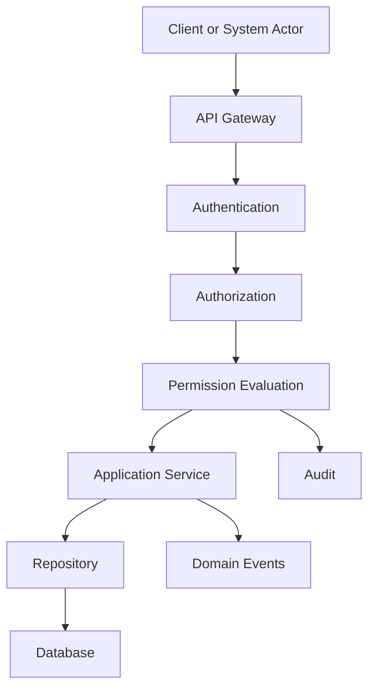
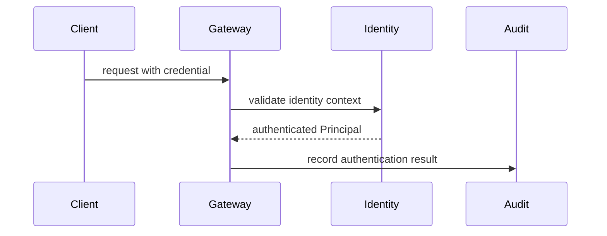
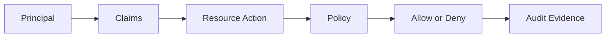
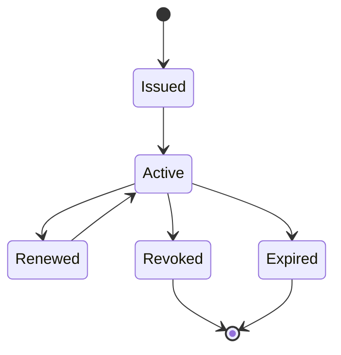
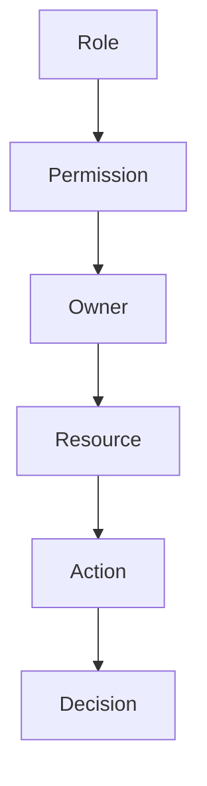
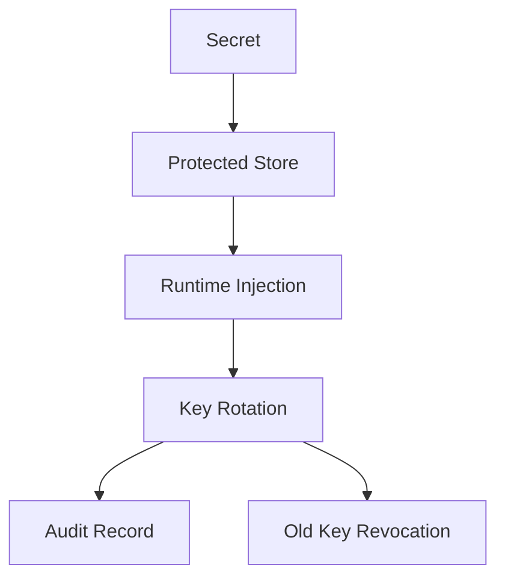

# Security Framework
## Split Navigation
- [Security architecture](security-framework/security-architecture.md)
- [Authentication flows and events](security-framework/authentication-flows-and-events.md)
- [Security governance and testing](security-framework/security-governance-and-testing.md)
- [Data protection and isolation](security-framework/data-protection-and-isolation.md)
- [Threat validation and runtime controls](security-framework/threat-validation-and-runtime-controls.md)

## Document Control

| Field | Value |
| --- | --- |
| Document | Security Framework |
| Classification | Atlas Enterprise Canonical Specification |
| Source of Truth | Security controls for Authentication, Authorization, Permission, Application Service, Domain Service, Repository, API, DTO, Workflow, Automation, Scheduler, Background Job, Message Contract, Domain Event, Audit, Database, Cache, Integration, and Notification |
| Version | v1.0 |
| Status | Canonical |
| Alignment Sources | API Governance Framework, Permission Framework, Application Service Catalog, Domain Service Catalog, Repository Catalog, Command Catalog, Domain Event Catalog, Message Contract Catalog, Event Driven Architecture, Integration Framework, System Module Catalog, Service Catalog, Decision Audit Framework, API Documentation, Database Design |

## Purpose

Security Framework defines the required Atlas security model. It is the canonical source of truth for identity verification, permission evaluation, data protection, API boundary protection, message protection, repository access, audit evidence, and operational security controls.

This document does not create new Atlas domains or business concepts. It consolidates security behavior that already appears across Atlas API governance, permission governance, service catalogs, repository catalogs, event contracts, integration rules, audit rules, and database design.

## Scope

- Applies to REST APIs, Application Services, Domain Services, Repositories, DTOs, Commands, Queries, Message Contracts, Domain Events, Workflows, Automation, Scheduler, Background Jobs, Integrations, Notifications, Database access, Cache access, Audit recording, and operational administration.
- Requires every API request to complete authentication, authorization, permission evaluation, tenant isolation, household isolation, validation, audit correlation, and rate limiting checks before protected data is returned or modified.
- Requires every machine-to-machine call, scheduled operation, background job, and message consumer to use an authenticated Principal with explicit permissions and auditable execution context.

## Security Principles

### Security Concept: Authentication
Authentication verifies the Principal before Atlas accepts an API request, message consumer action, scheduler execution, background job, or integration callback.
- Owner: Security Framework.
- Consumers: API Governance, Permission Framework, Audit, Application Services, Domain Services, Repositories, Integration, Scheduler, Automation, Background Jobs.
- Audit: every material decision or failure involving Authentication must be correlated with Principal, HouseholdId when applicable, TenantId when applicable, CorrelationId, and timestamp.

### Security Concept: Authorization
Authorization determines whether the authenticated Principal may perform an action on the requested Atlas resource.
- Owner: Security Framework.
- Consumers: API Governance, Permission Framework, Audit, Application Services, Domain Services, Repositories, Integration, Scheduler, Automation, Background Jobs.
- Audit: every material decision or failure involving Authorization must be correlated with Principal, HouseholdId when applicable, TenantId when applicable, CorrelationId, and timestamp.

### Security Concept: Permission
Permission is the catalog-controlled grant that binds resource, action, owner, and evaluation condition.
- Owner: Security Framework.
- Consumers: API Governance, Permission Framework, Audit, Application Services, Domain Services, Repositories, Integration, Scheduler, Automation, Background Jobs.
- Audit: every material decision or failure involving Permission must be correlated with Principal, HouseholdId when applicable, TenantId when applicable, CorrelationId, and timestamp.

### Security Concept: Role
Role groups permissions for Atlas users and system actors according to Permission Framework role governance.
- Owner: Security Framework.
- Consumers: API Governance, Permission Framework, Audit, Application Services, Domain Services, Repositories, Integration, Scheduler, Automation, Background Jobs.
- Audit: every material decision or failure involving Role must be correlated with Principal, HouseholdId when applicable, TenantId when applicable, CorrelationId, and timestamp.

### Security Concept: Policy
Policy constrains permission evaluation with resource ownership, household membership, tenant membership, risk classification, and audit requirements.
- Owner: Security Framework.
- Consumers: API Governance, Permission Framework, Audit, Application Services, Domain Services, Repositories, Integration, Scheduler, Automation, Background Jobs.
- Audit: every material decision or failure involving Policy must be correlated with Principal, HouseholdId when applicable, TenantId when applicable, CorrelationId, and timestamp.

### Security Concept: Principal
Principal is the authenticated user, service actor, scheduler actor, automation actor, integration actor, or message consumer actor.
- Owner: Security Framework.
- Consumers: API Governance, Permission Framework, Audit, Application Services, Domain Services, Repositories, Integration, Scheduler, Automation, Background Jobs.
- Audit: every material decision or failure involving Principal must be correlated with Principal, HouseholdId when applicable, TenantId when applicable, CorrelationId, and timestamp.

### Security Concept: Identity
Identity is the stable subject reference used to bind Principal, claims, household membership, tenant membership, and audit evidence.
- Owner: Security Framework.
- Consumers: API Governance, Permission Framework, Audit, Application Services, Domain Services, Repositories, Integration, Scheduler, Automation, Background Jobs.
- Audit: every material decision or failure involving Identity must be correlated with Principal, HouseholdId when applicable, TenantId when applicable, CorrelationId, and timestamp.

### Security Concept: Claims
Claims are trusted attributes issued after authentication and consumed by authorization, permission, audit, and isolation checks.
- Owner: Security Framework.
- Consumers: API Governance, Permission Framework, Audit, Application Services, Domain Services, Repositories, Integration, Scheduler, Automation, Background Jobs.
- Audit: every material decision or failure involving Claims must be correlated with Principal, HouseholdId when applicable, TenantId when applicable, CorrelationId, and timestamp.

### Security Concept: Token
Token carries authenticated identity context and must follow Atlas token lifecycle rules from issue through expiry and revocation.
- Owner: Security Framework.
- Consumers: API Governance, Permission Framework, Audit, Application Services, Domain Services, Repositories, Integration, Scheduler, Automation, Background Jobs.
- Audit: every material decision or failure involving Token must be correlated with Principal, HouseholdId when applicable, TenantId when applicable, CorrelationId, and timestamp.

### Security Concept: JWT
JWT is the signed bearer token format used where API Governance requires stateless authenticated API access.
- Owner: Security Framework.
- Consumers: API Governance, Permission Framework, Audit, Application Services, Domain Services, Repositories, Integration, Scheduler, Automation, Background Jobs.
- Audit: every material decision or failure involving JWT must be correlated with Principal, HouseholdId when applicable, TenantId when applicable, CorrelationId, and timestamp.

### Security Concept: OAuth
OAuth is used for delegated authorization with approved integration and user consent flows.
- Owner: Security Framework.
- Consumers: API Governance, Permission Framework, Audit, Application Services, Domain Services, Repositories, Integration, Scheduler, Automation, Background Jobs.
- Audit: every material decision or failure involving OAuth must be correlated with Principal, HouseholdId when applicable, TenantId when applicable, CorrelationId, and timestamp.

### Security Concept: OIDC
OIDC is used for identity assertions and login identity claims where API Governance accepts external identity verification.
- Owner: Security Framework.
- Consumers: API Governance, Permission Framework, Audit, Application Services, Domain Services, Repositories, Integration, Scheduler, Automation, Background Jobs.
- Audit: every material decision or failure involving OIDC must be correlated with Principal, HouseholdId when applicable, TenantId when applicable, CorrelationId, and timestamp.

### Security Concept: API Key
API Key authenticates approved integration clients and is always scoped, rotated, rate limited, and audited.
- Owner: Security Framework.
- Consumers: API Governance, Permission Framework, Audit, Application Services, Domain Services, Repositories, Integration, Scheduler, Automation, Background Jobs.
- Audit: every material decision or failure involving API Key must be correlated with Principal, HouseholdId when applicable, TenantId when applicable, CorrelationId, and timestamp.

### Security Concept: mTLS
mTLS authenticates approved service-to-service or integration transport channels with certificate validation.
- Owner: Security Framework.
- Consumers: API Governance, Permission Framework, Audit, Application Services, Domain Services, Repositories, Integration, Scheduler, Automation, Background Jobs.
- Audit: every material decision or failure involving mTLS must be correlated with Principal, HouseholdId when applicable, TenantId when applicable, CorrelationId, and timestamp.

### Security Concept: Session
Session represents interactive user continuity and must be bound to authenticated identity, expiration, renewal, and revocation.
- Owner: Security Framework.
- Consumers: API Governance, Permission Framework, Audit, Application Services, Domain Services, Repositories, Integration, Scheduler, Automation, Background Jobs.
- Audit: every material decision or failure involving Session must be correlated with Principal, HouseholdId when applicable, TenantId when applicable, CorrelationId, and timestamp.

### Security Concept: CSRF
CSRF protection applies to browser-originating state-changing requests that use session credentials.
- Owner: Security Framework.
- Consumers: API Governance, Permission Framework, Audit, Application Services, Domain Services, Repositories, Integration, Scheduler, Automation, Background Jobs.
- Audit: every material decision or failure involving CSRF must be correlated with Principal, HouseholdId when applicable, TenantId when applicable, CorrelationId, and timestamp.

### Security Concept: CORS
CORS limits browser access to approved Atlas origins and does not replace authentication or authorization.
- Owner: Security Framework.
- Consumers: API Governance, Permission Framework, Audit, Application Services, Domain Services, Repositories, Integration, Scheduler, Automation, Background Jobs.
- Audit: every material decision or failure involving CORS must be correlated with Principal, HouseholdId when applicable, TenantId when applicable, CorrelationId, and timestamp.

### Security Concept: Rate Limiting
Rate Limiting protects APIs, authentication endpoints, integration endpoints, and high-cost queries from excessive traffic.
- Owner: Security Framework.
- Consumers: API Governance, Permission Framework, Audit, Application Services, Domain Services, Repositories, Integration, Scheduler, Automation, Background Jobs.
- Audit: every material decision or failure involving Rate Limiting must be correlated with Principal, HouseholdId when applicable, TenantId when applicable, CorrelationId, and timestamp.

### Security Concept: Encryption
Encryption protects sensitive data in transit and at rest, including PII, credentials, secrets, and security audit material.
- Owner: Security Framework.
- Consumers: API Governance, Permission Framework, Audit, Application Services, Domain Services, Repositories, Integration, Scheduler, Automation, Background Jobs.
- Audit: every material decision or failure involving Encryption must be correlated with Principal, HouseholdId when applicable, TenantId when applicable, CorrelationId, and timestamp.

### Security Concept: Hash
Hash protects credentials and integrity references where reversible access is not required.
- Owner: Security Framework.
- Consumers: API Governance, Permission Framework, Audit, Application Services, Domain Services, Repositories, Integration, Scheduler, Automation, Background Jobs.
- Audit: every material decision or failure involving Hash must be correlated with Principal, HouseholdId when applicable, TenantId when applicable, CorrelationId, and timestamp.

### Security Concept: Digital Signature
Digital Signature validates token integrity, message integrity, event authenticity, and non-repudiation where required.
- Owner: Security Framework.
- Consumers: API Governance, Permission Framework, Audit, Application Services, Domain Services, Repositories, Integration, Scheduler, Automation, Background Jobs.
- Audit: every material decision or failure involving Digital Signature must be correlated with Principal, HouseholdId when applicable, TenantId when applicable, CorrelationId, and timestamp.

### Security Concept: Secrets
Secrets include signing keys, API keys, integration credentials, database credentials, encryption keys, and provider credentials.
- Owner: Security Framework.
- Consumers: API Governance, Permission Framework, Audit, Application Services, Domain Services, Repositories, Integration, Scheduler, Automation, Background Jobs.
- Audit: every material decision or failure involving Secrets must be correlated with Principal, HouseholdId when applicable, TenantId when applicable, CorrelationId, and timestamp.

### Security Concept: Key Rotation
Key Rotation replaces active secrets and keys on a controlled schedule or incident response trigger without breaking auditability.
- Owner: Security Framework.
- Consumers: API Governance, Permission Framework, Audit, Application Services, Domain Services, Repositories, Integration, Scheduler, Automation, Background Jobs.
- Audit: every material decision or failure involving Key Rotation must be correlated with Principal, HouseholdId when applicable, TenantId when applicable, CorrelationId, and timestamp.

## Authentication Architecture

Authentication Architecture defines mandatory controls for Atlas components that depend on identity, permission, data protection, or audit evidence.
- Authentication Architecture control 01: enforce authenticated Principal, authorization decision, permission ownership, household isolation, tenant isolation, audit correlation, and failure-safe denial for every protected Atlas operation.
- Authentication Architecture control 02: enforce authenticated Principal, authorization decision, permission ownership, household isolation, tenant isolation, audit correlation, and failure-safe denial for every protected Atlas operation.
- Authentication Architecture control 03: enforce authenticated Principal, authorization decision, permission ownership, household isolation, tenant isolation, audit correlation, and failure-safe denial for every protected Atlas operation.
- Authentication Architecture control 04: enforce authenticated Principal, authorization decision, permission ownership, household isolation, tenant isolation, audit correlation, and failure-safe denial for every protected Atlas operation.
- Authentication Architecture control 05: enforce authenticated Principal, authorization decision, permission ownership, household isolation, tenant isolation, audit correlation, and failure-safe denial for every protected Atlas operation.
- Authentication Architecture control 06: enforce authenticated Principal, authorization decision, permission ownership, household isolation, tenant isolation, audit correlation, and failure-safe denial for every protected Atlas operation.
- Authentication Architecture control 07: enforce authenticated Principal, authorization decision, permission ownership, household isolation, tenant isolation, audit correlation, and failure-safe denial for every protected Atlas operation.
- Authentication Architecture control 08: enforce authenticated Principal, authorization decision, permission ownership, household isolation, tenant isolation, audit correlation, and failure-safe denial for every protected Atlas operation.
- Authentication Architecture control 09: enforce authenticated Principal, authorization decision, permission ownership, household isolation, tenant isolation, audit correlation, and failure-safe denial for every protected Atlas operation.
- Authentication Architecture control 10: enforce authenticated Principal, authorization decision, permission ownership, household isolation, tenant isolation, audit correlation, and failure-safe denial for every protected Atlas operation.
- Authentication Architecture control 11: enforce authenticated Principal, authorization decision, permission ownership, household isolation, tenant isolation, audit correlation, and failure-safe denial for every protected Atlas operation.
- Authentication Architecture control 12: enforce authenticated Principal, authorization decision, permission ownership, household isolation, tenant isolation, audit correlation, and failure-safe denial for every protected Atlas operation.
- Authentication Architecture control 13: enforce authenticated Principal, authorization decision, permission ownership, household isolation, tenant isolation, audit correlation, and failure-safe denial for every protected Atlas operation.
- Authentication Architecture control 14: enforce authenticated Principal, authorization decision, permission ownership, household isolation, tenant isolation, audit correlation, and failure-safe denial for every protected Atlas operation.
- Authentication Architecture control 15: enforce authenticated Principal, authorization decision, permission ownership, household isolation, tenant isolation, audit correlation, and failure-safe denial for every protected Atlas operation.
- Authentication Architecture control 16: enforce authenticated Principal, authorization decision, permission ownership, household isolation, tenant isolation, audit correlation, and failure-safe denial for every protected Atlas operation.
- Authentication Architecture control 17: enforce authenticated Principal, authorization decision, permission ownership, household isolation, tenant isolation, audit correlation, and failure-safe denial for every protected Atlas operation.
- Authentication Architecture control 18: enforce authenticated Principal, authorization decision, permission ownership, household isolation, tenant isolation, audit correlation, and failure-safe denial for every protected Atlas operation.
- Authentication Architecture control 19: enforce authenticated Principal, authorization decision, permission ownership, household isolation, tenant isolation, audit correlation, and failure-safe denial for every protected Atlas operation.
- Authentication Architecture control 20: enforce authenticated Principal, authorization decision, permission ownership, household isolation, tenant isolation, audit correlation, and failure-safe denial for every protected Atlas operation.
- Authentication Architecture control 21: enforce authenticated Principal, authorization decision, permission ownership, household isolation, tenant isolation, audit correlation, and failure-safe denial for every protected Atlas operation.
- Authentication Architecture control 22: enforce authenticated Principal, authorization decision, permission ownership, household isolation, tenant isolation, audit correlation, and failure-safe denial for every protected Atlas operation.
- Authentication Architecture control 23: enforce authenticated Principal, authorization decision, permission ownership, household isolation, tenant isolation, audit correlation, and failure-safe denial for every protected Atlas operation.
- Authentication Architecture control 24: enforce authenticated Principal, authorization decision, permission ownership, household isolation, tenant isolation, audit correlation, and failure-safe denial for every protected Atlas operation.
- Authentication Architecture control 25: enforce authenticated Principal, authorization decision, permission ownership, household isolation, tenant isolation, audit correlation, and failure-safe denial for every protected Atlas operation.
- Authentication Architecture control 26: enforce authenticated Principal, authorization decision, permission ownership, household isolation, tenant isolation, audit correlation, and failure-safe denial for every protected Atlas operation.
- Authentication Architecture control 27: enforce authenticated Principal, authorization decision, permission ownership, household isolation, tenant isolation, audit correlation, and failure-safe denial for every protected Atlas operation.
- Authentication Architecture control 28: enforce authenticated Principal, authorization decision, permission ownership, household isolation, tenant isolation, audit correlation, and failure-safe denial for every protected Atlas operation.
- Authentication Architecture control 29: enforce authenticated Principal, authorization decision, permission ownership, household isolation, tenant isolation, audit correlation, and failure-safe denial for every protected Atlas operation.
- Authentication Architecture control 30: enforce authenticated Principal, authorization decision, permission ownership, household isolation, tenant isolation, audit correlation, and failure-safe denial for every protected Atlas operation.
- Authentication Architecture control 31: enforce authenticated Principal, authorization decision, permission ownership, household isolation, tenant isolation, audit correlation, and failure-safe denial for every protected Atlas operation.
- Authentication Architecture control 32: enforce authenticated Principal, authorization decision, permission ownership, household isolation, tenant isolation, audit correlation, and failure-safe denial for every protected Atlas operation.
- Authentication Architecture control 33: enforce authenticated Principal, authorization decision, permission ownership, household isolation, tenant isolation, audit correlation, and failure-safe denial for every protected Atlas operation.
- Authentication Architecture control 34: enforce authenticated Principal, authorization decision, permission ownership, household isolation, tenant isolation, audit correlation, and failure-safe denial for every protected Atlas operation.
- Authentication Architecture control 35: enforce authenticated Principal, authorization decision, permission ownership, household isolation, tenant isolation, audit correlation, and failure-safe denial for every protected Atlas operation.
- Authentication Architecture control 36: enforce authenticated Principal, authorization decision, permission ownership, household isolation, tenant isolation, audit correlation, and failure-safe denial for every protected Atlas operation.
- Authentication Architecture control 37: enforce authenticated Principal, authorization decision, permission ownership, household isolation, tenant isolation, audit correlation, and failure-safe denial for every protected Atlas operation.
- Authentication Architecture control 38: enforce authenticated Principal, authorization decision, permission ownership, household isolation, tenant isolation, audit correlation, and failure-safe denial for every protected Atlas operation.
- Authentication Architecture control 39: enforce authenticated Principal, authorization decision, permission ownership, household isolation, tenant isolation, audit correlation, and failure-safe denial for every protected Atlas operation.
- Authentication Architecture control 40: enforce authenticated Principal, authorization decision, permission ownership, household isolation, tenant isolation, audit correlation, and failure-safe denial for every protected Atlas operation.
- Authentication Architecture control 41: enforce authenticated Principal, authorization decision, permission ownership, household isolation, tenant isolation, audit correlation, and failure-safe denial for every protected Atlas operation.
- Authentication Architecture control 42: enforce authenticated Principal, authorization decision, permission ownership, household isolation, tenant isolation, audit correlation, and failure-safe denial for every protected Atlas operation.
- Authentication Architecture control 43: enforce authenticated Principal, authorization decision, permission ownership, household isolation, tenant isolation, audit correlation, and failure-safe denial for every protected Atlas operation.
- Authentication Architecture control 44: enforce authenticated Principal, authorization decision, permission ownership, household isolation, tenant isolation, audit correlation, and failure-safe denial for every protected Atlas operation.
- Authentication Architecture control 45: enforce authenticated Principal, authorization decision, permission ownership, household isolation, tenant isolation, audit correlation, and failure-safe denial for every protected Atlas operation.

## Authorization Architecture

Authorization Architecture defines mandatory controls for Atlas components that depend on identity, permission, data protection, or audit evidence.
- Authorization Architecture control 01: enforce authenticated Principal, authorization decision, permission ownership, household isolation, tenant isolation, audit correlation, and failure-safe denial for every protected Atlas operation.
- Authorization Architecture control 02: enforce authenticated Principal, authorization decision, permission ownership, household isolation, tenant isolation, audit correlation, and failure-safe denial for every protected Atlas operation.
- Authorization Architecture control 03: enforce authenticated Principal, authorization decision, permission ownership, household isolation, tenant isolation, audit correlation, and failure-safe denial for every protected Atlas operation.
- Authorization Architecture control 04: enforce authenticated Principal, authorization decision, permission ownership, household isolation, tenant isolation, audit correlation, and failure-safe denial for every protected Atlas operation.
- Authorization Architecture control 05: enforce authenticated Principal, authorization decision, permission ownership, household isolation, tenant isolation, audit correlation, and failure-safe denial for every protected Atlas operation.
- Authorization Architecture control 06: enforce authenticated Principal, authorization decision, permission ownership, household isolation, tenant isolation, audit correlation, and failure-safe denial for every protected Atlas operation.
- Authorization Architecture control 07: enforce authenticated Principal, authorization decision, permission ownership, household isolation, tenant isolation, audit correlation, and failure-safe denial for every protected Atlas operation.
- Authorization Architecture control 08: enforce authenticated Principal, authorization decision, permission ownership, household isolation, tenant isolation, audit correlation, and failure-safe denial for every protected Atlas operation.
- Authorization Architecture control 09: enforce authenticated Principal, authorization decision, permission ownership, household isolation, tenant isolation, audit correlation, and failure-safe denial for every protected Atlas operation.
- Authorization Architecture control 10: enforce authenticated Principal, authorization decision, permission ownership, household isolation, tenant isolation, audit correlation, and failure-safe denial for every protected Atlas operation.
- Authorization Architecture control 11: enforce authenticated Principal, authorization decision, permission ownership, household isolation, tenant isolation, audit correlation, and failure-safe denial for every protected Atlas operation.
- Authorization Architecture control 12: enforce authenticated Principal, authorization decision, permission ownership, household isolation, tenant isolation, audit correlation, and failure-safe denial for every protected Atlas operation.
- Authorization Architecture control 13: enforce authenticated Principal, authorization decision, permission ownership, household isolation, tenant isolation, audit correlation, and failure-safe denial for every protected Atlas operation.
- Authorization Architecture control 14: enforce authenticated Principal, authorization decision, permission ownership, household isolation, tenant isolation, audit correlation, and failure-safe denial for every protected Atlas operation.
- Authorization Architecture control 15: enforce authenticated Principal, authorization decision, permission ownership, household isolation, tenant isolation, audit correlation, and failure-safe denial for every protected Atlas operation.
- Authorization Architecture control 16: enforce authenticated Principal, authorization decision, permission ownership, household isolation, tenant isolation, audit correlation, and failure-safe denial for every protected Atlas operation.
- Authorization Architecture control 17: enforce authenticated Principal, authorization decision, permission ownership, household isolation, tenant isolation, audit correlation, and failure-safe denial for every protected Atlas operation.
- Authorization Architecture control 18: enforce authenticated Principal, authorization decision, permission ownership, household isolation, tenant isolation, audit correlation, and failure-safe denial for every protected Atlas operation.
- Authorization Architecture control 19: enforce authenticated Principal, authorization decision, permission ownership, household isolation, tenant isolation, audit correlation, and failure-safe denial for every protected Atlas operation.
- Authorization Architecture control 20: enforce authenticated Principal, authorization decision, permission ownership, household isolation, tenant isolation, audit correlation, and failure-safe denial for every protected Atlas operation.
- Authorization Architecture control 21: enforce authenticated Principal, authorization decision, permission ownership, household isolation, tenant isolation, audit correlation, and failure-safe denial for every protected Atlas operation.
- Authorization Architecture control 22: enforce authenticated Principal, authorization decision, permission ownership, household isolation, tenant isolation, audit correlation, and failure-safe denial for every protected Atlas operation.
- Authorization Architecture control 23: enforce authenticated Principal, authorization decision, permission ownership, household isolation, tenant isolation, audit correlation, and failure-safe denial for every protected Atlas operation.
- Authorization Architecture control 24: enforce authenticated Principal, authorization decision, permission ownership, household isolation, tenant isolation, audit correlation, and failure-safe denial for every protected Atlas operation.
- Authorization Architecture control 25: enforce authenticated Principal, authorization decision, permission ownership, household isolation, tenant isolation, audit correlation, and failure-safe denial for every protected Atlas operation.
- Authorization Architecture control 26: enforce authenticated Principal, authorization decision, permission ownership, household isolation, tenant isolation, audit correlation, and failure-safe denial for every protected Atlas operation.
- Authorization Architecture control 27: enforce authenticated Principal, authorization decision, permission ownership, household isolation, tenant isolation, audit correlation, and failure-safe denial for every protected Atlas operation.
- Authorization Architecture control 28: enforce authenticated Principal, authorization decision, permission ownership, household isolation, tenant isolation, audit correlation, and failure-safe denial for every protected Atlas operation.
- Authorization Architecture control 29: enforce authenticated Principal, authorization decision, permission ownership, household isolation, tenant isolation, audit correlation, and failure-safe denial for every protected Atlas operation.
- Authorization Architecture control 30: enforce authenticated Principal, authorization decision, permission ownership, household isolation, tenant isolation, audit correlation, and failure-safe denial for every protected Atlas operation.
- Authorization Architecture control 31: enforce authenticated Principal, authorization decision, permission ownership, household isolation, tenant isolation, audit correlation, and failure-safe denial for every protected Atlas operation.
- Authorization Architecture control 32: enforce authenticated Principal, authorization decision, permission ownership, household isolation, tenant isolation, audit correlation, and failure-safe denial for every protected Atlas operation.
- Authorization Architecture control 33: enforce authenticated Principal, authorization decision, permission ownership, household isolation, tenant isolation, audit correlation, and failure-safe denial for every protected Atlas operation.
- Authorization Architecture control 34: enforce authenticated Principal, authorization decision, permission ownership, household isolation, tenant isolation, audit correlation, and failure-safe denial for every protected Atlas operation.
- Authorization Architecture control 35: enforce authenticated Principal, authorization decision, permission ownership, household isolation, tenant isolation, audit correlation, and failure-safe denial for every protected Atlas operation.
- Authorization Architecture control 36: enforce authenticated Principal, authorization decision, permission ownership, household isolation, tenant isolation, audit correlation, and failure-safe denial for every protected Atlas operation.
- Authorization Architecture control 37: enforce authenticated Principal, authorization decision, permission ownership, household isolation, tenant isolation, audit correlation, and failure-safe denial for every protected Atlas operation.
- Authorization Architecture control 38: enforce authenticated Principal, authorization decision, permission ownership, household isolation, tenant isolation, audit correlation, and failure-safe denial for every protected Atlas operation.
- Authorization Architecture control 39: enforce authenticated Principal, authorization decision, permission ownership, household isolation, tenant isolation, audit correlation, and failure-safe denial for every protected Atlas operation.
- Authorization Architecture control 40: enforce authenticated Principal, authorization decision, permission ownership, household isolation, tenant isolation, audit correlation, and failure-safe denial for every protected Atlas operation.
- Authorization Architecture control 41: enforce authenticated Principal, authorization decision, permission ownership, household isolation, tenant isolation, audit correlation, and failure-safe denial for every protected Atlas operation.
- Authorization Architecture control 42: enforce authenticated Principal, authorization decision, permission ownership, household isolation, tenant isolation, audit correlation, and failure-safe denial for every protected Atlas operation.
- Authorization Architecture control 43: enforce authenticated Principal, authorization decision, permission ownership, household isolation, tenant isolation, audit correlation, and failure-safe denial for every protected Atlas operation.
- Authorization Architecture control 44: enforce authenticated Principal, authorization decision, permission ownership, household isolation, tenant isolation, audit correlation, and failure-safe denial for every protected Atlas operation.
- Authorization Architecture control 45: enforce authenticated Principal, authorization decision, permission ownership, household isolation, tenant isolation, audit correlation, and failure-safe denial for every protected Atlas operation.

## Permission Model

Permission Model defines mandatory controls for Atlas components that depend on identity, permission, data protection, or audit evidence.
- Permission Model control 01: enforce authenticated Principal, authorization decision, permission ownership, household isolation, tenant isolation, audit correlation, and failure-safe denial for every protected Atlas operation.
- Permission Model control 02: enforce authenticated Principal, authorization decision, permission ownership, household isolation, tenant isolation, audit correlation, and failure-safe denial for every protected Atlas operation.
- Permission Model control 03: enforce authenticated Principal, authorization decision, permission ownership, household isolation, tenant isolation, audit correlation, and failure-safe denial for every protected Atlas operation.
- Permission Model control 04: enforce authenticated Principal, authorization decision, permission ownership, household isolation, tenant isolation, audit correlation, and failure-safe denial for every protected Atlas operation.
- Permission Model control 05: enforce authenticated Principal, authorization decision, permission ownership, household isolation, tenant isolation, audit correlation, and failure-safe denial for every protected Atlas operation.
- Permission Model control 06: enforce authenticated Principal, authorization decision, permission ownership, household isolation, tenant isolation, audit correlation, and failure-safe denial for every protected Atlas operation.
- Permission Model control 07: enforce authenticated Principal, authorization decision, permission ownership, household isolation, tenant isolation, audit correlation, and failure-safe denial for every protected Atlas operation.
- Permission Model control 08: enforce authenticated Principal, authorization decision, permission ownership, household isolation, tenant isolation, audit correlation, and failure-safe denial for every protected Atlas operation.
- Permission Model control 09: enforce authenticated Principal, authorization decision, permission ownership, household isolation, tenant isolation, audit correlation, and failure-safe denial for every protected Atlas operation.
- Permission Model control 10: enforce authenticated Principal, authorization decision, permission ownership, household isolation, tenant isolation, audit correlation, and failure-safe denial for every protected Atlas operation.
- Permission Model control 11: enforce authenticated Principal, authorization decision, permission ownership, household isolation, tenant isolation, audit correlation, and failure-safe denial for every protected Atlas operation.
- Permission Model control 12: enforce authenticated Principal, authorization decision, permission ownership, household isolation, tenant isolation, audit correlation, and failure-safe denial for every protected Atlas operation.
- Permission Model control 13: enforce authenticated Principal, authorization decision, permission ownership, household isolation, tenant isolation, audit correlation, and failure-safe denial for every protected Atlas operation.
- Permission Model control 14: enforce authenticated Principal, authorization decision, permission ownership, household isolation, tenant isolation, audit correlation, and failure-safe denial for every protected Atlas operation.
- Permission Model control 15: enforce authenticated Principal, authorization decision, permission ownership, household isolation, tenant isolation, audit correlation, and failure-safe denial for every protected Atlas operation.
- Permission Model control 16: enforce authenticated Principal, authorization decision, permission ownership, household isolation, tenant isolation, audit correlation, and failure-safe denial for every protected Atlas operation.
- Permission Model control 17: enforce authenticated Principal, authorization decision, permission ownership, household isolation, tenant isolation, audit correlation, and failure-safe denial for every protected Atlas operation.
- Permission Model control 18: enforce authenticated Principal, authorization decision, permission ownership, household isolation, tenant isolation, audit correlation, and failure-safe denial for every protected Atlas operation.
- Permission Model control 19: enforce authenticated Principal, authorization decision, permission ownership, household isolation, tenant isolation, audit correlation, and failure-safe denial for every protected Atlas operation.
- Permission Model control 20: enforce authenticated Principal, authorization decision, permission ownership, household isolation, tenant isolation, audit correlation, and failure-safe denial for every protected Atlas operation.
- Permission Model control 21: enforce authenticated Principal, authorization decision, permission ownership, household isolation, tenant isolation, audit correlation, and failure-safe denial for every protected Atlas operation.
- Permission Model control 22: enforce authenticated Principal, authorization decision, permission ownership, household isolation, tenant isolation, audit correlation, and failure-safe denial for every protected Atlas operation.
- Permission Model control 23: enforce authenticated Principal, authorization decision, permission ownership, household isolation, tenant isolation, audit correlation, and failure-safe denial for every protected Atlas operation.
- Permission Model control 24: enforce authenticated Principal, authorization decision, permission ownership, household isolation, tenant isolation, audit correlation, and failure-safe denial for every protected Atlas operation.
- Permission Model control 25: enforce authenticated Principal, authorization decision, permission ownership, household isolation, tenant isolation, audit correlation, and failure-safe denial for every protected Atlas operation.
- Permission Model control 26: enforce authenticated Principal, authorization decision, permission ownership, household isolation, tenant isolation, audit correlation, and failure-safe denial for every protected Atlas operation.
- Permission Model control 27: enforce authenticated Principal, authorization decision, permission ownership, household isolation, tenant isolation, audit correlation, and failure-safe denial for every protected Atlas operation.
- Permission Model control 28: enforce authenticated Principal, authorization decision, permission ownership, household isolation, tenant isolation, audit correlation, and failure-safe denial for every protected Atlas operation.
- Permission Model control 29: enforce authenticated Principal, authorization decision, permission ownership, household isolation, tenant isolation, audit correlation, and failure-safe denial for every protected Atlas operation.
- Permission Model control 30: enforce authenticated Principal, authorization decision, permission ownership, household isolation, tenant isolation, audit correlation, and failure-safe denial for every protected Atlas operation.
- Permission Model control 31: enforce authenticated Principal, authorization decision, permission ownership, household isolation, tenant isolation, audit correlation, and failure-safe denial for every protected Atlas operation.
- Permission Model control 32: enforce authenticated Principal, authorization decision, permission ownership, household isolation, tenant isolation, audit correlation, and failure-safe denial for every protected Atlas operation.
- Permission Model control 33: enforce authenticated Principal, authorization decision, permission ownership, household isolation, tenant isolation, audit correlation, and failure-safe denial for every protected Atlas operation.
- Permission Model control 34: enforce authenticated Principal, authorization decision, permission ownership, household isolation, tenant isolation, audit correlation, and failure-safe denial for every protected Atlas operation.
- Permission Model control 35: enforce authenticated Principal, authorization decision, permission ownership, household isolation, tenant isolation, audit correlation, and failure-safe denial for every protected Atlas operation.
- Permission Model control 36: enforce authenticated Principal, authorization decision, permission ownership, household isolation, tenant isolation, audit correlation, and failure-safe denial for every protected Atlas operation.
- Permission Model control 37: enforce authenticated Principal, authorization decision, permission ownership, household isolation, tenant isolation, audit correlation, and failure-safe denial for every protected Atlas operation.
- Permission Model control 38: enforce authenticated Principal, authorization decision, permission ownership, household isolation, tenant isolation, audit correlation, and failure-safe denial for every protected Atlas operation.
- Permission Model control 39: enforce authenticated Principal, authorization decision, permission ownership, household isolation, tenant isolation, audit correlation, and failure-safe denial for every protected Atlas operation.
- Permission Model control 40: enforce authenticated Principal, authorization decision, permission ownership, household isolation, tenant isolation, audit correlation, and failure-safe denial for every protected Atlas operation.
- Permission Model control 41: enforce authenticated Principal, authorization decision, permission ownership, household isolation, tenant isolation, audit correlation, and failure-safe denial for every protected Atlas operation.
- Permission Model control 42: enforce authenticated Principal, authorization decision, permission ownership, household isolation, tenant isolation, audit correlation, and failure-safe denial for every protected Atlas operation.
- Permission Model control 43: enforce authenticated Principal, authorization decision, permission ownership, household isolation, tenant isolation, audit correlation, and failure-safe denial for every protected Atlas operation.
- Permission Model control 44: enforce authenticated Principal, authorization decision, permission ownership, household isolation, tenant isolation, audit correlation, and failure-safe denial for every protected Atlas operation.
- Permission Model control 45: enforce authenticated Principal, authorization decision, permission ownership, household isolation, tenant isolation, audit correlation, and failure-safe denial for every protected Atlas operation.

## Identity Model

Identity Model defines mandatory controls for Atlas components that depend on identity, permission, data protection, or audit evidence.
- Identity Model control 01: enforce authenticated Principal, authorization decision, permission ownership, household isolation, tenant isolation, audit correlation, and failure-safe denial for every protected Atlas operation.
- Identity Model control 02: enforce authenticated Principal, authorization decision, permission ownership, household isolation, tenant isolation, audit correlation, and failure-safe denial for every protected Atlas operation.
- Identity Model control 03: enforce authenticated Principal, authorization decision, permission ownership, household isolation, tenant isolation, audit correlation, and failure-safe denial for every protected Atlas operation.
- Identity Model control 04: enforce authenticated Principal, authorization decision, permission ownership, household isolation, tenant isolation, audit correlation, and failure-safe denial for every protected Atlas operation.
- Identity Model control 05: enforce authenticated Principal, authorization decision, permission ownership, household isolation, tenant isolation, audit correlation, and failure-safe denial for every protected Atlas operation.
- Identity Model control 06: enforce authenticated Principal, authorization decision, permission ownership, household isolation, tenant isolation, audit correlation, and failure-safe denial for every protected Atlas operation.
- Identity Model control 07: enforce authenticated Principal, authorization decision, permission ownership, household isolation, tenant isolation, audit correlation, and failure-safe denial for every protected Atlas operation.
- Identity Model control 08: enforce authenticated Principal, authorization decision, permission ownership, household isolation, tenant isolation, audit correlation, and failure-safe denial for every protected Atlas operation.
- Identity Model control 09: enforce authenticated Principal, authorization decision, permission ownership, household isolation, tenant isolation, audit correlation, and failure-safe denial for every protected Atlas operation.
- Identity Model control 10: enforce authenticated Principal, authorization decision, permission ownership, household isolation, tenant isolation, audit correlation, and failure-safe denial for every protected Atlas operation.
- Identity Model control 11: enforce authenticated Principal, authorization decision, permission ownership, household isolation, tenant isolation, audit correlation, and failure-safe denial for every protected Atlas operation.
- Identity Model control 12: enforce authenticated Principal, authorization decision, permission ownership, household isolation, tenant isolation, audit correlation, and failure-safe denial for every protected Atlas operation.
- Identity Model control 13: enforce authenticated Principal, authorization decision, permission ownership, household isolation, tenant isolation, audit correlation, and failure-safe denial for every protected Atlas operation.
- Identity Model control 14: enforce authenticated Principal, authorization decision, permission ownership, household isolation, tenant isolation, audit correlation, and failure-safe denial for every protected Atlas operation.
- Identity Model control 15: enforce authenticated Principal, authorization decision, permission ownership, household isolation, tenant isolation, audit correlation, and failure-safe denial for every protected Atlas operation.
- Identity Model control 16: enforce authenticated Principal, authorization decision, permission ownership, household isolation, tenant isolation, audit correlation, and failure-safe denial for every protected Atlas operation.
- Identity Model control 17: enforce authenticated Principal, authorization decision, permission ownership, household isolation, tenant isolation, audit correlation, and failure-safe denial for every protected Atlas operation.
- Identity Model control 18: enforce authenticated Principal, authorization decision, permission ownership, household isolation, tenant isolation, audit correlation, and failure-safe denial for every protected Atlas operation.
- Identity Model control 19: enforce authenticated Principal, authorization decision, permission ownership, household isolation, tenant isolation, audit correlation, and failure-safe denial for every protected Atlas operation.
- Identity Model control 20: enforce authenticated Principal, authorization decision, permission ownership, household isolation, tenant isolation, audit correlation, and failure-safe denial for every protected Atlas operation.
- Identity Model control 21: enforce authenticated Principal, authorization decision, permission ownership, household isolation, tenant isolation, audit correlation, and failure-safe denial for every protected Atlas operation.
- Identity Model control 22: enforce authenticated Principal, authorization decision, permission ownership, household isolation, tenant isolation, audit correlation, and failure-safe denial for every protected Atlas operation.
- Identity Model control 23: enforce authenticated Principal, authorization decision, permission ownership, household isolation, tenant isolation, audit correlation, and failure-safe denial for every protected Atlas operation.
- Identity Model control 24: enforce authenticated Principal, authorization decision, permission ownership, household isolation, tenant isolation, audit correlation, and failure-safe denial for every protected Atlas operation.
- Identity Model control 25: enforce authenticated Principal, authorization decision, permission ownership, household isolation, tenant isolation, audit correlation, and failure-safe denial for every protected Atlas operation.
- Identity Model control 26: enforce authenticated Principal, authorization decision, permission ownership, household isolation, tenant isolation, audit correlation, and failure-safe denial for every protected Atlas operation.
- Identity Model control 27: enforce authenticated Principal, authorization decision, permission ownership, household isolation, tenant isolation, audit correlation, and failure-safe denial for every protected Atlas operation.
- Identity Model control 28: enforce authenticated Principal, authorization decision, permission ownership, household isolation, tenant isolation, audit correlation, and failure-safe denial for every protected Atlas operation.
- Identity Model control 29: enforce authenticated Principal, authorization decision, permission ownership, household isolation, tenant isolation, audit correlation, and failure-safe denial for every protected Atlas operation.
- Identity Model control 30: enforce authenticated Principal, authorization decision, permission ownership, household isolation, tenant isolation, audit correlation, and failure-safe denial for every protected Atlas operation.
- Identity Model control 31: enforce authenticated Principal, authorization decision, permission ownership, household isolation, tenant isolation, audit correlation, and failure-safe denial for every protected Atlas operation.
- Identity Model control 32: enforce authenticated Principal, authorization decision, permission ownership, household isolation, tenant isolation, audit correlation, and failure-safe denial for every protected Atlas operation.
- Identity Model control 33: enforce authenticated Principal, authorization decision, permission ownership, household isolation, tenant isolation, audit correlation, and failure-safe denial for every protected Atlas operation.
- Identity Model control 34: enforce authenticated Principal, authorization decision, permission ownership, household isolation, tenant isolation, audit correlation, and failure-safe denial for every protected Atlas operation.
- Identity Model control 35: enforce authenticated Principal, authorization decision, permission ownership, household isolation, tenant isolation, audit correlation, and failure-safe denial for every protected Atlas operation.
- Identity Model control 36: enforce authenticated Principal, authorization decision, permission ownership, household isolation, tenant isolation, audit correlation, and failure-safe denial for every protected Atlas operation.
- Identity Model control 37: enforce authenticated Principal, authorization decision, permission ownership, household isolation, tenant isolation, audit correlation, and failure-safe denial for every protected Atlas operation.
- Identity Model control 38: enforce authenticated Principal, authorization decision, permission ownership, household isolation, tenant isolation, audit correlation, and failure-safe denial for every protected Atlas operation.
- Identity Model control 39: enforce authenticated Principal, authorization decision, permission ownership, household isolation, tenant isolation, audit correlation, and failure-safe denial for every protected Atlas operation.
- Identity Model control 40: enforce authenticated Principal, authorization decision, permission ownership, household isolation, tenant isolation, audit correlation, and failure-safe denial for every protected Atlas operation.
- Identity Model control 41: enforce authenticated Principal, authorization decision, permission ownership, household isolation, tenant isolation, audit correlation, and failure-safe denial for every protected Atlas operation.
- Identity Model control 42: enforce authenticated Principal, authorization decision, permission ownership, household isolation, tenant isolation, audit correlation, and failure-safe denial for every protected Atlas operation.
- Identity Model control 43: enforce authenticated Principal, authorization decision, permission ownership, household isolation, tenant isolation, audit correlation, and failure-safe denial for every protected Atlas operation.
- Identity Model control 44: enforce authenticated Principal, authorization decision, permission ownership, household isolation, tenant isolation, audit correlation, and failure-safe denial for every protected Atlas operation.
- Identity Model control 45: enforce authenticated Principal, authorization decision, permission ownership, household isolation, tenant isolation, audit correlation, and failure-safe denial for every protected Atlas operation.

## Token Lifecycle

Token Lifecycle defines mandatory controls for Atlas components that depend on identity, permission, data protection, or audit evidence.
- Token Lifecycle control 01: enforce authenticated Principal, authorization decision, permission ownership, household isolation, tenant isolation, audit correlation, and failure-safe denial for every protected Atlas operation.
- Token Lifecycle control 02: enforce authenticated Principal, authorization decision, permission ownership, household isolation, tenant isolation, audit correlation, and failure-safe denial for every protected Atlas operation.
- Token Lifecycle control 03: enforce authenticated Principal, authorization decision, permission ownership, household isolation, tenant isolation, audit correlation, and failure-safe denial for every protected Atlas operation.
- Token Lifecycle control 04: enforce authenticated Principal, authorization decision, permission ownership, household isolation, tenant isolation, audit correlation, and failure-safe denial for every protected Atlas operation.
- Token Lifecycle control 05: enforce authenticated Principal, authorization decision, permission ownership, household isolation, tenant isolation, audit correlation, and failure-safe denial for every protected Atlas operation.
- Token Lifecycle control 06: enforce authenticated Principal, authorization decision, permission ownership, household isolation, tenant isolation, audit correlation, and failure-safe denial for every protected Atlas operation.
- Token Lifecycle control 07: enforce authenticated Principal, authorization decision, permission ownership, household isolation, tenant isolation, audit correlation, and failure-safe denial for every protected Atlas operation.
- Token Lifecycle control 08: enforce authenticated Principal, authorization decision, permission ownership, household isolation, tenant isolation, audit correlation, and failure-safe denial for every protected Atlas operation.
- Token Lifecycle control 09: enforce authenticated Principal, authorization decision, permission ownership, household isolation, tenant isolation, audit correlation, and failure-safe denial for every protected Atlas operation.
- Token Lifecycle control 10: enforce authenticated Principal, authorization decision, permission ownership, household isolation, tenant isolation, audit correlation, and failure-safe denial for every protected Atlas operation.
- Token Lifecycle control 11: enforce authenticated Principal, authorization decision, permission ownership, household isolation, tenant isolation, audit correlation, and failure-safe denial for every protected Atlas operation.
- Token Lifecycle control 12: enforce authenticated Principal, authorization decision, permission ownership, household isolation, tenant isolation, audit correlation, and failure-safe denial for every protected Atlas operation.
- Token Lifecycle control 13: enforce authenticated Principal, authorization decision, permission ownership, household isolation, tenant isolation, audit correlation, and failure-safe denial for every protected Atlas operation.
- Token Lifecycle control 14: enforce authenticated Principal, authorization decision, permission ownership, household isolation, tenant isolation, audit correlation, and failure-safe denial for every protected Atlas operation.
- Token Lifecycle control 15: enforce authenticated Principal, authorization decision, permission ownership, household isolation, tenant isolation, audit correlation, and failure-safe denial for every protected Atlas operation.
- Token Lifecycle control 16: enforce authenticated Principal, authorization decision, permission ownership, household isolation, tenant isolation, audit correlation, and failure-safe denial for every protected Atlas operation.
- Token Lifecycle control 17: enforce authenticated Principal, authorization decision, permission ownership, household isolation, tenant isolation, audit correlation, and failure-safe denial for every protected Atlas operation.
- Token Lifecycle control 18: enforce authenticated Principal, authorization decision, permission ownership, household isolation, tenant isolation, audit correlation, and failure-safe denial for every protected Atlas operation.
- Token Lifecycle control 19: enforce authenticated Principal, authorization decision, permission ownership, household isolation, tenant isolation, audit correlation, and failure-safe denial for every protected Atlas operation.
- Token Lifecycle control 20: enforce authenticated Principal, authorization decision, permission ownership, household isolation, tenant isolation, audit correlation, and failure-safe denial for every protected Atlas operation.
- Token Lifecycle control 21: enforce authenticated Principal, authorization decision, permission ownership, household isolation, tenant isolation, audit correlation, and failure-safe denial for every protected Atlas operation.
- Token Lifecycle control 22: enforce authenticated Principal, authorization decision, permission ownership, household isolation, tenant isolation, audit correlation, and failure-safe denial for every protected Atlas operation.
- Token Lifecycle control 23: enforce authenticated Principal, authorization decision, permission ownership, household isolation, tenant isolation, audit correlation, and failure-safe denial for every protected Atlas operation.
- Token Lifecycle control 24: enforce authenticated Principal, authorization decision, permission ownership, household isolation, tenant isolation, audit correlation, and failure-safe denial for every protected Atlas operation.
- Token Lifecycle control 25: enforce authenticated Principal, authorization decision, permission ownership, household isolation, tenant isolation, audit correlation, and failure-safe denial for every protected Atlas operation.
- Token Lifecycle control 26: enforce authenticated Principal, authorization decision, permission ownership, household isolation, tenant isolation, audit correlation, and failure-safe denial for every protected Atlas operation.
- Token Lifecycle control 27: enforce authenticated Principal, authorization decision, permission ownership, household isolation, tenant isolation, audit correlation, and failure-safe denial for every protected Atlas operation.
- Token Lifecycle control 28: enforce authenticated Principal, authorization decision, permission ownership, household isolation, tenant isolation, audit correlation, and failure-safe denial for every protected Atlas operation.
- Token Lifecycle control 29: enforce authenticated Principal, authorization decision, permission ownership, household isolation, tenant isolation, audit correlation, and failure-safe denial for every protected Atlas operation.
- Token Lifecycle control 30: enforce authenticated Principal, authorization decision, permission ownership, household isolation, tenant isolation, audit correlation, and failure-safe denial for every protected Atlas operation.
- Token Lifecycle control 31: enforce authenticated Principal, authorization decision, permission ownership, household isolation, tenant isolation, audit correlation, and failure-safe denial for every protected Atlas operation.
- Token Lifecycle control 32: enforce authenticated Principal, authorization decision, permission ownership, household isolation, tenant isolation, audit correlation, and failure-safe denial for every protected Atlas operation.
- Token Lifecycle control 33: enforce authenticated Principal, authorization decision, permission ownership, household isolation, tenant isolation, audit correlation, and failure-safe denial for every protected Atlas operation.
- Token Lifecycle control 34: enforce authenticated Principal, authorization decision, permission ownership, household isolation, tenant isolation, audit correlation, and failure-safe denial for every protected Atlas operation.
- Token Lifecycle control 35: enforce authenticated Principal, authorization decision, permission ownership, household isolation, tenant isolation, audit correlation, and failure-safe denial for every protected Atlas operation.
- Token Lifecycle control 36: enforce authenticated Principal, authorization decision, permission ownership, household isolation, tenant isolation, audit correlation, and failure-safe denial for every protected Atlas operation.
- Token Lifecycle control 37: enforce authenticated Principal, authorization decision, permission ownership, household isolation, tenant isolation, audit correlation, and failure-safe denial for every protected Atlas operation.
- Token Lifecycle control 38: enforce authenticated Principal, authorization decision, permission ownership, household isolation, tenant isolation, audit correlation, and failure-safe denial for every protected Atlas operation.
- Token Lifecycle control 39: enforce authenticated Principal, authorization decision, permission ownership, household isolation, tenant isolation, audit correlation, and failure-safe denial for every protected Atlas operation.
- Token Lifecycle control 40: enforce authenticated Principal, authorization decision, permission ownership, household isolation, tenant isolation, audit correlation, and failure-safe denial for every protected Atlas operation.
- Token Lifecycle control 41: enforce authenticated Principal, authorization decision, permission ownership, household isolation, tenant isolation, audit correlation, and failure-safe denial for every protected Atlas operation.
- Token Lifecycle control 42: enforce authenticated Principal, authorization decision, permission ownership, household isolation, tenant isolation, audit correlation, and failure-safe denial for every protected Atlas operation.
- Token Lifecycle control 43: enforce authenticated Principal, authorization decision, permission ownership, household isolation, tenant isolation, audit correlation, and failure-safe denial for every protected Atlas operation.
- Token Lifecycle control 44: enforce authenticated Principal, authorization decision, permission ownership, household isolation, tenant isolation, audit correlation, and failure-safe denial for every protected Atlas operation.
- Token Lifecycle control 45: enforce authenticated Principal, authorization decision, permission ownership, household isolation, tenant isolation, audit correlation, and failure-safe denial for every protected Atlas operation.

## Credential Management

Credential Management defines mandatory controls for Atlas components that depend on identity, permission, data protection, or audit evidence.
- Credential Management control 01: enforce authenticated Principal, authorization decision, permission ownership, household isolation, tenant isolation, audit correlation, and failure-safe denial for every protected Atlas operation.
- Credential Management control 02: enforce authenticated Principal, authorization decision, permission ownership, household isolation, tenant isolation, audit correlation, and failure-safe denial for every protected Atlas operation.
- Credential Management control 03: enforce authenticated Principal, authorization decision, permission ownership, household isolation, tenant isolation, audit correlation, and failure-safe denial for every protected Atlas operation.
- Credential Management control 04: enforce authenticated Principal, authorization decision, permission ownership, household isolation, tenant isolation, audit correlation, and failure-safe denial for every protected Atlas operation.
- Credential Management control 05: enforce authenticated Principal, authorization decision, permission ownership, household isolation, tenant isolation, audit correlation, and failure-safe denial for every protected Atlas operation.
- Credential Management control 06: enforce authenticated Principal, authorization decision, permission ownership, household isolation, tenant isolation, audit correlation, and failure-safe denial for every protected Atlas operation.
- Credential Management control 07: enforce authenticated Principal, authorization decision, permission ownership, household isolation, tenant isolation, audit correlation, and failure-safe denial for every protected Atlas operation.
- Credential Management control 08: enforce authenticated Principal, authorization decision, permission ownership, household isolation, tenant isolation, audit correlation, and failure-safe denial for every protected Atlas operation.
- Credential Management control 09: enforce authenticated Principal, authorization decision, permission ownership, household isolation, tenant isolation, audit correlation, and failure-safe denial for every protected Atlas operation.
- Credential Management control 10: enforce authenticated Principal, authorization decision, permission ownership, household isolation, tenant isolation, audit correlation, and failure-safe denial for every protected Atlas operation.
- Credential Management control 11: enforce authenticated Principal, authorization decision, permission ownership, household isolation, tenant isolation, audit correlation, and failure-safe denial for every protected Atlas operation.
- Credential Management control 12: enforce authenticated Principal, authorization decision, permission ownership, household isolation, tenant isolation, audit correlation, and failure-safe denial for every protected Atlas operation.
- Credential Management control 13: enforce authenticated Principal, authorization decision, permission ownership, household isolation, tenant isolation, audit correlation, and failure-safe denial for every protected Atlas operation.
- Credential Management control 14: enforce authenticated Principal, authorization decision, permission ownership, household isolation, tenant isolation, audit correlation, and failure-safe denial for every protected Atlas operation.
- Credential Management control 15: enforce authenticated Principal, authorization decision, permission ownership, household isolation, tenant isolation, audit correlation, and failure-safe denial for every protected Atlas operation.
- Credential Management control 16: enforce authenticated Principal, authorization decision, permission ownership, household isolation, tenant isolation, audit correlation, and failure-safe denial for every protected Atlas operation.
- Credential Management control 17: enforce authenticated Principal, authorization decision, permission ownership, household isolation, tenant isolation, audit correlation, and failure-safe denial for every protected Atlas operation.
- Credential Management control 18: enforce authenticated Principal, authorization decision, permission ownership, household isolation, tenant isolation, audit correlation, and failure-safe denial for every protected Atlas operation.
- Credential Management control 19: enforce authenticated Principal, authorization decision, permission ownership, household isolation, tenant isolation, audit correlation, and failure-safe denial for every protected Atlas operation.
- Credential Management control 20: enforce authenticated Principal, authorization decision, permission ownership, household isolation, tenant isolation, audit correlation, and failure-safe denial for every protected Atlas operation.
- Credential Management control 21: enforce authenticated Principal, authorization decision, permission ownership, household isolation, tenant isolation, audit correlation, and failure-safe denial for every protected Atlas operation.
- Credential Management control 22: enforce authenticated Principal, authorization decision, permission ownership, household isolation, tenant isolation, audit correlation, and failure-safe denial for every protected Atlas operation.
- Credential Management control 23: enforce authenticated Principal, authorization decision, permission ownership, household isolation, tenant isolation, audit correlation, and failure-safe denial for every protected Atlas operation.
- Credential Management control 24: enforce authenticated Principal, authorization decision, permission ownership, household isolation, tenant isolation, audit correlation, and failure-safe denial for every protected Atlas operation.
- Credential Management control 25: enforce authenticated Principal, authorization decision, permission ownership, household isolation, tenant isolation, audit correlation, and failure-safe denial for every protected Atlas operation.
- Credential Management control 26: enforce authenticated Principal, authorization decision, permission ownership, household isolation, tenant isolation, audit correlation, and failure-safe denial for every protected Atlas operation.
- Credential Management control 27: enforce authenticated Principal, authorization decision, permission ownership, household isolation, tenant isolation, audit correlation, and failure-safe denial for every protected Atlas operation.
- Credential Management control 28: enforce authenticated Principal, authorization decision, permission ownership, household isolation, tenant isolation, audit correlation, and failure-safe denial for every protected Atlas operation.
- Credential Management control 29: enforce authenticated Principal, authorization decision, permission ownership, household isolation, tenant isolation, audit correlation, and failure-safe denial for every protected Atlas operation.
- Credential Management control 30: enforce authenticated Principal, authorization decision, permission ownership, household isolation, tenant isolation, audit correlation, and failure-safe denial for every protected Atlas operation.
- Credential Management control 31: enforce authenticated Principal, authorization decision, permission ownership, household isolation, tenant isolation, audit correlation, and failure-safe denial for every protected Atlas operation.
- Credential Management control 32: enforce authenticated Principal, authorization decision, permission ownership, household isolation, tenant isolation, audit correlation, and failure-safe denial for every protected Atlas operation.
- Credential Management control 33: enforce authenticated Principal, authorization decision, permission ownership, household isolation, tenant isolation, audit correlation, and failure-safe denial for every protected Atlas operation.
- Credential Management control 34: enforce authenticated Principal, authorization decision, permission ownership, household isolation, tenant isolation, audit correlation, and failure-safe denial for every protected Atlas operation.
- Credential Management control 35: enforce authenticated Principal, authorization decision, permission ownership, household isolation, tenant isolation, audit correlation, and failure-safe denial for every protected Atlas operation.
- Credential Management control 36: enforce authenticated Principal, authorization decision, permission ownership, household isolation, tenant isolation, audit correlation, and failure-safe denial for every protected Atlas operation.
- Credential Management control 37: enforce authenticated Principal, authorization decision, permission ownership, household isolation, tenant isolation, audit correlation, and failure-safe denial for every protected Atlas operation.
- Credential Management control 38: enforce authenticated Principal, authorization decision, permission ownership, household isolation, tenant isolation, audit correlation, and failure-safe denial for every protected Atlas operation.
- Credential Management control 39: enforce authenticated Principal, authorization decision, permission ownership, household isolation, tenant isolation, audit correlation, and failure-safe denial for every protected Atlas operation.
- Credential Management control 40: enforce authenticated Principal, authorization decision, permission ownership, household isolation, tenant isolation, audit correlation, and failure-safe denial for every protected Atlas operation.
- Credential Management control 41: enforce authenticated Principal, authorization decision, permission ownership, household isolation, tenant isolation, audit correlation, and failure-safe denial for every protected Atlas operation.
- Credential Management control 42: enforce authenticated Principal, authorization decision, permission ownership, household isolation, tenant isolation, audit correlation, and failure-safe denial for every protected Atlas operation.
- Credential Management control 43: enforce authenticated Principal, authorization decision, permission ownership, household isolation, tenant isolation, audit correlation, and failure-safe denial for every protected Atlas operation.
- Credential Management control 44: enforce authenticated Principal, authorization decision, permission ownership, household isolation, tenant isolation, audit correlation, and failure-safe denial for every protected Atlas operation.
- Credential Management control 45: enforce authenticated Principal, authorization decision, permission ownership, household isolation, tenant isolation, audit correlation, and failure-safe denial for every protected Atlas operation.

## Secret Management

Secret Management defines mandatory controls for Atlas components that depend on identity, permission, data protection, or audit evidence.
- Secret Management control 01: enforce authenticated Principal, authorization decision, permission ownership, household isolation, tenant isolation, audit correlation, and failure-safe denial for every protected Atlas operation.
- Secret Management control 02: enforce authenticated Principal, authorization decision, permission ownership, household isolation, tenant isolation, audit correlation, and failure-safe denial for every protected Atlas operation.
- Secret Management control 03: enforce authenticated Principal, authorization decision, permission ownership, household isolation, tenant isolation, audit correlation, and failure-safe denial for every protected Atlas operation.
- Secret Management control 04: enforce authenticated Principal, authorization decision, permission ownership, household isolation, tenant isolation, audit correlation, and failure-safe denial for every protected Atlas operation.
- Secret Management control 05: enforce authenticated Principal, authorization decision, permission ownership, household isolation, tenant isolation, audit correlation, and failure-safe denial for every protected Atlas operation.
- Secret Management control 06: enforce authenticated Principal, authorization decision, permission ownership, household isolation, tenant isolation, audit correlation, and failure-safe denial for every protected Atlas operation.
- Secret Management control 07: enforce authenticated Principal, authorization decision, permission ownership, household isolation, tenant isolation, audit correlation, and failure-safe denial for every protected Atlas operation.
- Secret Management control 08: enforce authenticated Principal, authorization decision, permission ownership, household isolation, tenant isolation, audit correlation, and failure-safe denial for every protected Atlas operation.
- Secret Management control 09: enforce authenticated Principal, authorization decision, permission ownership, household isolation, tenant isolation, audit correlation, and failure-safe denial for every protected Atlas operation.
- Secret Management control 10: enforce authenticated Principal, authorization decision, permission ownership, household isolation, tenant isolation, audit correlation, and failure-safe denial for every protected Atlas operation.
- Secret Management control 11: enforce authenticated Principal, authorization decision, permission ownership, household isolation, tenant isolation, audit correlation, and failure-safe denial for every protected Atlas operation.
- Secret Management control 12: enforce authenticated Principal, authorization decision, permission ownership, household isolation, tenant isolation, audit correlation, and failure-safe denial for every protected Atlas operation.
- Secret Management control 13: enforce authenticated Principal, authorization decision, permission ownership, household isolation, tenant isolation, audit correlation, and failure-safe denial for every protected Atlas operation.
- Secret Management control 14: enforce authenticated Principal, authorization decision, permission ownership, household isolation, tenant isolation, audit correlation, and failure-safe denial for every protected Atlas operation.
- Secret Management control 15: enforce authenticated Principal, authorization decision, permission ownership, household isolation, tenant isolation, audit correlation, and failure-safe denial for every protected Atlas operation.
- Secret Management control 16: enforce authenticated Principal, authorization decision, permission ownership, household isolation, tenant isolation, audit correlation, and failure-safe denial for every protected Atlas operation.
- Secret Management control 17: enforce authenticated Principal, authorization decision, permission ownership, household isolation, tenant isolation, audit correlation, and failure-safe denial for every protected Atlas operation.
- Secret Management control 18: enforce authenticated Principal, authorization decision, permission ownership, household isolation, tenant isolation, audit correlation, and failure-safe denial for every protected Atlas operation.
- Secret Management control 19: enforce authenticated Principal, authorization decision, permission ownership, household isolation, tenant isolation, audit correlation, and failure-safe denial for every protected Atlas operation.
- Secret Management control 20: enforce authenticated Principal, authorization decision, permission ownership, household isolation, tenant isolation, audit correlation, and failure-safe denial for every protected Atlas operation.
- Secret Management control 21: enforce authenticated Principal, authorization decision, permission ownership, household isolation, tenant isolation, audit correlation, and failure-safe denial for every protected Atlas operation.
- Secret Management control 22: enforce authenticated Principal, authorization decision, permission ownership, household isolation, tenant isolation, audit correlation, and failure-safe denial for every protected Atlas operation.
- Secret Management control 23: enforce authenticated Principal, authorization decision, permission ownership, household isolation, tenant isolation, audit correlation, and failure-safe denial for every protected Atlas operation.
- Secret Management control 24: enforce authenticated Principal, authorization decision, permission ownership, household isolation, tenant isolation, audit correlation, and failure-safe denial for every protected Atlas operation.
- Secret Management control 25: enforce authenticated Principal, authorization decision, permission ownership, household isolation, tenant isolation, audit correlation, and failure-safe denial for every protected Atlas operation.
- Secret Management control 26: enforce authenticated Principal, authorization decision, permission ownership, household isolation, tenant isolation, audit correlation, and failure-safe denial for every protected Atlas operation.
- Secret Management control 27: enforce authenticated Principal, authorization decision, permission ownership, household isolation, tenant isolation, audit correlation, and failure-safe denial for every protected Atlas operation.
- Secret Management control 28: enforce authenticated Principal, authorization decision, permission ownership, household isolation, tenant isolation, audit correlation, and failure-safe denial for every protected Atlas operation.
- Secret Management control 29: enforce authenticated Principal, authorization decision, permission ownership, household isolation, tenant isolation, audit correlation, and failure-safe denial for every protected Atlas operation.
- Secret Management control 30: enforce authenticated Principal, authorization decision, permission ownership, household isolation, tenant isolation, audit correlation, and failure-safe denial for every protected Atlas operation.
- Secret Management control 31: enforce authenticated Principal, authorization decision, permission ownership, household isolation, tenant isolation, audit correlation, and failure-safe denial for every protected Atlas operation.
- Secret Management control 32: enforce authenticated Principal, authorization decision, permission ownership, household isolation, tenant isolation, audit correlation, and failure-safe denial for every protected Atlas operation.
- Secret Management control 33: enforce authenticated Principal, authorization decision, permission ownership, household isolation, tenant isolation, audit correlation, and failure-safe denial for every protected Atlas operation.
- Secret Management control 34: enforce authenticated Principal, authorization decision, permission ownership, household isolation, tenant isolation, audit correlation, and failure-safe denial for every protected Atlas operation.
- Secret Management control 35: enforce authenticated Principal, authorization decision, permission ownership, household isolation, tenant isolation, audit correlation, and failure-safe denial for every protected Atlas operation.
- Secret Management control 36: enforce authenticated Principal, authorization decision, permission ownership, household isolation, tenant isolation, audit correlation, and failure-safe denial for every protected Atlas operation.
- Secret Management control 37: enforce authenticated Principal, authorization decision, permission ownership, household isolation, tenant isolation, audit correlation, and failure-safe denial for every protected Atlas operation.
- Secret Management control 38: enforce authenticated Principal, authorization decision, permission ownership, household isolation, tenant isolation, audit correlation, and failure-safe denial for every protected Atlas operation.
- Secret Management control 39: enforce authenticated Principal, authorization decision, permission ownership, household isolation, tenant isolation, audit correlation, and failure-safe denial for every protected Atlas operation.
- Secret Management control 40: enforce authenticated Principal, authorization decision, permission ownership, household isolation, tenant isolation, audit correlation, and failure-safe denial for every protected Atlas operation.
- Secret Management control 41: enforce authenticated Principal, authorization decision, permission ownership, household isolation, tenant isolation, audit correlation, and failure-safe denial for every protected Atlas operation.
- Secret Management control 42: enforce authenticated Principal, authorization decision, permission ownership, household isolation, tenant isolation, audit correlation, and failure-safe denial for every protected Atlas operation.
- Secret Management control 43: enforce authenticated Principal, authorization decision, permission ownership, household isolation, tenant isolation, audit correlation, and failure-safe denial for every protected Atlas operation.
- Secret Management control 44: enforce authenticated Principal, authorization decision, permission ownership, household isolation, tenant isolation, audit correlation, and failure-safe denial for every protected Atlas operation.
- Secret Management control 45: enforce authenticated Principal, authorization decision, permission ownership, household isolation, tenant isolation, audit correlation, and failure-safe denial for every protected Atlas operation.

## Encryption Strategy

Encryption Strategy defines mandatory controls for Atlas components that depend on identity, permission, data protection, or audit evidence.
- Encryption Strategy control 01: enforce authenticated Principal, authorization decision, permission ownership, household isolation, tenant isolation, audit correlation, and failure-safe denial for every protected Atlas operation.
- Encryption Strategy control 02: enforce authenticated Principal, authorization decision, permission ownership, household isolation, tenant isolation, audit correlation, and failure-safe denial for every protected Atlas operation.
- Encryption Strategy control 03: enforce authenticated Principal, authorization decision, permission ownership, household isolation, tenant isolation, audit correlation, and failure-safe denial for every protected Atlas operation.
- Encryption Strategy control 04: enforce authenticated Principal, authorization decision, permission ownership, household isolation, tenant isolation, audit correlation, and failure-safe denial for every protected Atlas operation.
- Encryption Strategy control 05: enforce authenticated Principal, authorization decision, permission ownership, household isolation, tenant isolation, audit correlation, and failure-safe denial for every protected Atlas operation.
- Encryption Strategy control 06: enforce authenticated Principal, authorization decision, permission ownership, household isolation, tenant isolation, audit correlation, and failure-safe denial for every protected Atlas operation.
- Encryption Strategy control 07: enforce authenticated Principal, authorization decision, permission ownership, household isolation, tenant isolation, audit correlation, and failure-safe denial for every protected Atlas operation.
- Encryption Strategy control 08: enforce authenticated Principal, authorization decision, permission ownership, household isolation, tenant isolation, audit correlation, and failure-safe denial for every protected Atlas operation.
- Encryption Strategy control 09: enforce authenticated Principal, authorization decision, permission ownership, household isolation, tenant isolation, audit correlation, and failure-safe denial for every protected Atlas operation.
- Encryption Strategy control 10: enforce authenticated Principal, authorization decision, permission ownership, household isolation, tenant isolation, audit correlation, and failure-safe denial for every protected Atlas operation.
- Encryption Strategy control 11: enforce authenticated Principal, authorization decision, permission ownership, household isolation, tenant isolation, audit correlation, and failure-safe denial for every protected Atlas operation.
- Encryption Strategy control 12: enforce authenticated Principal, authorization decision, permission ownership, household isolation, tenant isolation, audit correlation, and failure-safe denial for every protected Atlas operation.
- Encryption Strategy control 13: enforce authenticated Principal, authorization decision, permission ownership, household isolation, tenant isolation, audit correlation, and failure-safe denial for every protected Atlas operation.
- Encryption Strategy control 14: enforce authenticated Principal, authorization decision, permission ownership, household isolation, tenant isolation, audit correlation, and failure-safe denial for every protected Atlas operation.
- Encryption Strategy control 15: enforce authenticated Principal, authorization decision, permission ownership, household isolation, tenant isolation, audit correlation, and failure-safe denial for every protected Atlas operation.
- Encryption Strategy control 16: enforce authenticated Principal, authorization decision, permission ownership, household isolation, tenant isolation, audit correlation, and failure-safe denial for every protected Atlas operation.
- Encryption Strategy control 17: enforce authenticated Principal, authorization decision, permission ownership, household isolation, tenant isolation, audit correlation, and failure-safe denial for every protected Atlas operation.
- Encryption Strategy control 18: enforce authenticated Principal, authorization decision, permission ownership, household isolation, tenant isolation, audit correlation, and failure-safe denial for every protected Atlas operation.
- Encryption Strategy control 19: enforce authenticated Principal, authorization decision, permission ownership, household isolation, tenant isolation, audit correlation, and failure-safe denial for every protected Atlas operation.
- Encryption Strategy control 20: enforce authenticated Principal, authorization decision, permission ownership, household isolation, tenant isolation, audit correlation, and failure-safe denial for every protected Atlas operation.
- Encryption Strategy control 21: enforce authenticated Principal, authorization decision, permission ownership, household isolation, tenant isolation, audit correlation, and failure-safe denial for every protected Atlas operation.
- Encryption Strategy control 22: enforce authenticated Principal, authorization decision, permission ownership, household isolation, tenant isolation, audit correlation, and failure-safe denial for every protected Atlas operation.
- Encryption Strategy control 23: enforce authenticated Principal, authorization decision, permission ownership, household isolation, tenant isolation, audit correlation, and failure-safe denial for every protected Atlas operation.
- Encryption Strategy control 24: enforce authenticated Principal, authorization decision, permission ownership, household isolation, tenant isolation, audit correlation, and failure-safe denial for every protected Atlas operation.
- Encryption Strategy control 25: enforce authenticated Principal, authorization decision, permission ownership, household isolation, tenant isolation, audit correlation, and failure-safe denial for every protected Atlas operation.
- Encryption Strategy control 26: enforce authenticated Principal, authorization decision, permission ownership, household isolation, tenant isolation, audit correlation, and failure-safe denial for every protected Atlas operation.
- Encryption Strategy control 27: enforce authenticated Principal, authorization decision, permission ownership, household isolation, tenant isolation, audit correlation, and failure-safe denial for every protected Atlas operation.
- Encryption Strategy control 28: enforce authenticated Principal, authorization decision, permission ownership, household isolation, tenant isolation, audit correlation, and failure-safe denial for every protected Atlas operation.
- Encryption Strategy control 29: enforce authenticated Principal, authorization decision, permission ownership, household isolation, tenant isolation, audit correlation, and failure-safe denial for every protected Atlas operation.
- Encryption Strategy control 30: enforce authenticated Principal, authorization decision, permission ownership, household isolation, tenant isolation, audit correlation, and failure-safe denial for every protected Atlas operation.
- Encryption Strategy control 31: enforce authenticated Principal, authorization decision, permission ownership, household isolation, tenant isolation, audit correlation, and failure-safe denial for every protected Atlas operation.
- Encryption Strategy control 32: enforce authenticated Principal, authorization decision, permission ownership, household isolation, tenant isolation, audit correlation, and failure-safe denial for every protected Atlas operation.
- Encryption Strategy control 33: enforce authenticated Principal, authorization decision, permission ownership, household isolation, tenant isolation, audit correlation, and failure-safe denial for every protected Atlas operation.
- Encryption Strategy control 34: enforce authenticated Principal, authorization decision, permission ownership, household isolation, tenant isolation, audit correlation, and failure-safe denial for every protected Atlas operation.
- Encryption Strategy control 35: enforce authenticated Principal, authorization decision, permission ownership, household isolation, tenant isolation, audit correlation, and failure-safe denial for every protected Atlas operation.
- Encryption Strategy control 36: enforce authenticated Principal, authorization decision, permission ownership, household isolation, tenant isolation, audit correlation, and failure-safe denial for every protected Atlas operation.
- Encryption Strategy control 37: enforce authenticated Principal, authorization decision, permission ownership, household isolation, tenant isolation, audit correlation, and failure-safe denial for every protected Atlas operation.
- Encryption Strategy control 38: enforce authenticated Principal, authorization decision, permission ownership, household isolation, tenant isolation, audit correlation, and failure-safe denial for every protected Atlas operation.
- Encryption Strategy control 39: enforce authenticated Principal, authorization decision, permission ownership, household isolation, tenant isolation, audit correlation, and failure-safe denial for every protected Atlas operation.
- Encryption Strategy control 40: enforce authenticated Principal, authorization decision, permission ownership, household isolation, tenant isolation, audit correlation, and failure-safe denial for every protected Atlas operation.
- Encryption Strategy control 41: enforce authenticated Principal, authorization decision, permission ownership, household isolation, tenant isolation, audit correlation, and failure-safe denial for every protected Atlas operation.
- Encryption Strategy control 42: enforce authenticated Principal, authorization decision, permission ownership, household isolation, tenant isolation, audit correlation, and failure-safe denial for every protected Atlas operation.
- Encryption Strategy control 43: enforce authenticated Principal, authorization decision, permission ownership, household isolation, tenant isolation, audit correlation, and failure-safe denial for every protected Atlas operation.
- Encryption Strategy control 44: enforce authenticated Principal, authorization decision, permission ownership, household isolation, tenant isolation, audit correlation, and failure-safe denial for every protected Atlas operation.
- Encryption Strategy control 45: enforce authenticated Principal, authorization decision, permission ownership, household isolation, tenant isolation, audit correlation, and failure-safe denial for every protected Atlas operation.

## Key Management

Key Management defines mandatory controls for Atlas components that depend on identity, permission, data protection, or audit evidence.
- Key Management control 01: enforce authenticated Principal, authorization decision, permission ownership, household isolation, tenant isolation, audit correlation, and failure-safe denial for every protected Atlas operation.
- Key Management control 02: enforce authenticated Principal, authorization decision, permission ownership, household isolation, tenant isolation, audit correlation, and failure-safe denial for every protected Atlas operation.
- Key Management control 03: enforce authenticated Principal, authorization decision, permission ownership, household isolation, tenant isolation, audit correlation, and failure-safe denial for every protected Atlas operation.
- Key Management control 04: enforce authenticated Principal, authorization decision, permission ownership, household isolation, tenant isolation, audit correlation, and failure-safe denial for every protected Atlas operation.
- Key Management control 05: enforce authenticated Principal, authorization decision, permission ownership, household isolation, tenant isolation, audit correlation, and failure-safe denial for every protected Atlas operation.
- Key Management control 06: enforce authenticated Principal, authorization decision, permission ownership, household isolation, tenant isolation, audit correlation, and failure-safe denial for every protected Atlas operation.
- Key Management control 07: enforce authenticated Principal, authorization decision, permission ownership, household isolation, tenant isolation, audit correlation, and failure-safe denial for every protected Atlas operation.
- Key Management control 08: enforce authenticated Principal, authorization decision, permission ownership, household isolation, tenant isolation, audit correlation, and failure-safe denial for every protected Atlas operation.
- Key Management control 09: enforce authenticated Principal, authorization decision, permission ownership, household isolation, tenant isolation, audit correlation, and failure-safe denial for every protected Atlas operation.
- Key Management control 10: enforce authenticated Principal, authorization decision, permission ownership, household isolation, tenant isolation, audit correlation, and failure-safe denial for every protected Atlas operation.
- Key Management control 11: enforce authenticated Principal, authorization decision, permission ownership, household isolation, tenant isolation, audit correlation, and failure-safe denial for every protected Atlas operation.
- Key Management control 12: enforce authenticated Principal, authorization decision, permission ownership, household isolation, tenant isolation, audit correlation, and failure-safe denial for every protected Atlas operation.
- Key Management control 13: enforce authenticated Principal, authorization decision, permission ownership, household isolation, tenant isolation, audit correlation, and failure-safe denial for every protected Atlas operation.
- Key Management control 14: enforce authenticated Principal, authorization decision, permission ownership, household isolation, tenant isolation, audit correlation, and failure-safe denial for every protected Atlas operation.
- Key Management control 15: enforce authenticated Principal, authorization decision, permission ownership, household isolation, tenant isolation, audit correlation, and failure-safe denial for every protected Atlas operation.
- Key Management control 16: enforce authenticated Principal, authorization decision, permission ownership, household isolation, tenant isolation, audit correlation, and failure-safe denial for every protected Atlas operation.
- Key Management control 17: enforce authenticated Principal, authorization decision, permission ownership, household isolation, tenant isolation, audit correlation, and failure-safe denial for every protected Atlas operation.
- Key Management control 18: enforce authenticated Principal, authorization decision, permission ownership, household isolation, tenant isolation, audit correlation, and failure-safe denial for every protected Atlas operation.
- Key Management control 19: enforce authenticated Principal, authorization decision, permission ownership, household isolation, tenant isolation, audit correlation, and failure-safe denial for every protected Atlas operation.
- Key Management control 20: enforce authenticated Principal, authorization decision, permission ownership, household isolation, tenant isolation, audit correlation, and failure-safe denial for every protected Atlas operation.
- Key Management control 21: enforce authenticated Principal, authorization decision, permission ownership, household isolation, tenant isolation, audit correlation, and failure-safe denial for every protected Atlas operation.
- Key Management control 22: enforce authenticated Principal, authorization decision, permission ownership, household isolation, tenant isolation, audit correlation, and failure-safe denial for every protected Atlas operation.
- Key Management control 23: enforce authenticated Principal, authorization decision, permission ownership, household isolation, tenant isolation, audit correlation, and failure-safe denial for every protected Atlas operation.
- Key Management control 24: enforce authenticated Principal, authorization decision, permission ownership, household isolation, tenant isolation, audit correlation, and failure-safe denial for every protected Atlas operation.
- Key Management control 25: enforce authenticated Principal, authorization decision, permission ownership, household isolation, tenant isolation, audit correlation, and failure-safe denial for every protected Atlas operation.
- Key Management control 26: enforce authenticated Principal, authorization decision, permission ownership, household isolation, tenant isolation, audit correlation, and failure-safe denial for every protected Atlas operation.
- Key Management control 27: enforce authenticated Principal, authorization decision, permission ownership, household isolation, tenant isolation, audit correlation, and failure-safe denial for every protected Atlas operation.
- Key Management control 28: enforce authenticated Principal, authorization decision, permission ownership, household isolation, tenant isolation, audit correlation, and failure-safe denial for every protected Atlas operation.
- Key Management control 29: enforce authenticated Principal, authorization decision, permission ownership, household isolation, tenant isolation, audit correlation, and failure-safe denial for every protected Atlas operation.
- Key Management control 30: enforce authenticated Principal, authorization decision, permission ownership, household isolation, tenant isolation, audit correlation, and failure-safe denial for every protected Atlas operation.
- Key Management control 31: enforce authenticated Principal, authorization decision, permission ownership, household isolation, tenant isolation, audit correlation, and failure-safe denial for every protected Atlas operation.
- Key Management control 32: enforce authenticated Principal, authorization decision, permission ownership, household isolation, tenant isolation, audit correlation, and failure-safe denial for every protected Atlas operation.
- Key Management control 33: enforce authenticated Principal, authorization decision, permission ownership, household isolation, tenant isolation, audit correlation, and failure-safe denial for every protected Atlas operation.
- Key Management control 34: enforce authenticated Principal, authorization decision, permission ownership, household isolation, tenant isolation, audit correlation, and failure-safe denial for every protected Atlas operation.
- Key Management control 35: enforce authenticated Principal, authorization decision, permission ownership, household isolation, tenant isolation, audit correlation, and failure-safe denial for every protected Atlas operation.
- Key Management control 36: enforce authenticated Principal, authorization decision, permission ownership, household isolation, tenant isolation, audit correlation, and failure-safe denial for every protected Atlas operation.
- Key Management control 37: enforce authenticated Principal, authorization decision, permission ownership, household isolation, tenant isolation, audit correlation, and failure-safe denial for every protected Atlas operation.
- Key Management control 38: enforce authenticated Principal, authorization decision, permission ownership, household isolation, tenant isolation, audit correlation, and failure-safe denial for every protected Atlas operation.
- Key Management control 39: enforce authenticated Principal, authorization decision, permission ownership, household isolation, tenant isolation, audit correlation, and failure-safe denial for every protected Atlas operation.
- Key Management control 40: enforce authenticated Principal, authorization decision, permission ownership, household isolation, tenant isolation, audit correlation, and failure-safe denial for every protected Atlas operation.
- Key Management control 41: enforce authenticated Principal, authorization decision, permission ownership, household isolation, tenant isolation, audit correlation, and failure-safe denial for every protected Atlas operation.
- Key Management control 42: enforce authenticated Principal, authorization decision, permission ownership, household isolation, tenant isolation, audit correlation, and failure-safe denial for every protected Atlas operation.
- Key Management control 43: enforce authenticated Principal, authorization decision, permission ownership, household isolation, tenant isolation, audit correlation, and failure-safe denial for every protected Atlas operation.
- Key Management control 44: enforce authenticated Principal, authorization decision, permission ownership, household isolation, tenant isolation, audit correlation, and failure-safe denial for every protected Atlas operation.
- Key Management control 45: enforce authenticated Principal, authorization decision, permission ownership, household isolation, tenant isolation, audit correlation, and failure-safe denial for every protected Atlas operation.

## API Security

API Security defines mandatory controls for Atlas components that depend on identity, permission, data protection, or audit evidence.
- API Security control 01: enforce authenticated Principal, authorization decision, permission ownership, household isolation, tenant isolation, audit correlation, and failure-safe denial for every protected Atlas operation.
- API Security control 02: enforce authenticated Principal, authorization decision, permission ownership, household isolation, tenant isolation, audit correlation, and failure-safe denial for every protected Atlas operation.
- API Security control 03: enforce authenticated Principal, authorization decision, permission ownership, household isolation, tenant isolation, audit correlation, and failure-safe denial for every protected Atlas operation.
- API Security control 04: enforce authenticated Principal, authorization decision, permission ownership, household isolation, tenant isolation, audit correlation, and failure-safe denial for every protected Atlas operation.
- API Security control 05: enforce authenticated Principal, authorization decision, permission ownership, household isolation, tenant isolation, audit correlation, and failure-safe denial for every protected Atlas operation.
- API Security control 06: enforce authenticated Principal, authorization decision, permission ownership, household isolation, tenant isolation, audit correlation, and failure-safe denial for every protected Atlas operation.
- API Security control 07: enforce authenticated Principal, authorization decision, permission ownership, household isolation, tenant isolation, audit correlation, and failure-safe denial for every protected Atlas operation.
- API Security control 08: enforce authenticated Principal, authorization decision, permission ownership, household isolation, tenant isolation, audit correlation, and failure-safe denial for every protected Atlas operation.
- API Security control 09: enforce authenticated Principal, authorization decision, permission ownership, household isolation, tenant isolation, audit correlation, and failure-safe denial for every protected Atlas operation.
- API Security control 10: enforce authenticated Principal, authorization decision, permission ownership, household isolation, tenant isolation, audit correlation, and failure-safe denial for every protected Atlas operation.
- API Security control 11: enforce authenticated Principal, authorization decision, permission ownership, household isolation, tenant isolation, audit correlation, and failure-safe denial for every protected Atlas operation.
- API Security control 12: enforce authenticated Principal, authorization decision, permission ownership, household isolation, tenant isolation, audit correlation, and failure-safe denial for every protected Atlas operation.
- API Security control 13: enforce authenticated Principal, authorization decision, permission ownership, household isolation, tenant isolation, audit correlation, and failure-safe denial for every protected Atlas operation.
- API Security control 14: enforce authenticated Principal, authorization decision, permission ownership, household isolation, tenant isolation, audit correlation, and failure-safe denial for every protected Atlas operation.
- API Security control 15: enforce authenticated Principal, authorization decision, permission ownership, household isolation, tenant isolation, audit correlation, and failure-safe denial for every protected Atlas operation.
- API Security control 16: enforce authenticated Principal, authorization decision, permission ownership, household isolation, tenant isolation, audit correlation, and failure-safe denial for every protected Atlas operation.
- API Security control 17: enforce authenticated Principal, authorization decision, permission ownership, household isolation, tenant isolation, audit correlation, and failure-safe denial for every protected Atlas operation.
- API Security control 18: enforce authenticated Principal, authorization decision, permission ownership, household isolation, tenant isolation, audit correlation, and failure-safe denial for every protected Atlas operation.
- API Security control 19: enforce authenticated Principal, authorization decision, permission ownership, household isolation, tenant isolation, audit correlation, and failure-safe denial for every protected Atlas operation.
- API Security control 20: enforce authenticated Principal, authorization decision, permission ownership, household isolation, tenant isolation, audit correlation, and failure-safe denial for every protected Atlas operation.
- API Security control 21: enforce authenticated Principal, authorization decision, permission ownership, household isolation, tenant isolation, audit correlation, and failure-safe denial for every protected Atlas operation.
- API Security control 22: enforce authenticated Principal, authorization decision, permission ownership, household isolation, tenant isolation, audit correlation, and failure-safe denial for every protected Atlas operation.
- API Security control 23: enforce authenticated Principal, authorization decision, permission ownership, household isolation, tenant isolation, audit correlation, and failure-safe denial for every protected Atlas operation.
- API Security control 24: enforce authenticated Principal, authorization decision, permission ownership, household isolation, tenant isolation, audit correlation, and failure-safe denial for every protected Atlas operation.
- API Security control 25: enforce authenticated Principal, authorization decision, permission ownership, household isolation, tenant isolation, audit correlation, and failure-safe denial for every protected Atlas operation.
- API Security control 26: enforce authenticated Principal, authorization decision, permission ownership, household isolation, tenant isolation, audit correlation, and failure-safe denial for every protected Atlas operation.
- API Security control 27: enforce authenticated Principal, authorization decision, permission ownership, household isolation, tenant isolation, audit correlation, and failure-safe denial for every protected Atlas operation.
- API Security control 28: enforce authenticated Principal, authorization decision, permission ownership, household isolation, tenant isolation, audit correlation, and failure-safe denial for every protected Atlas operation.
- API Security control 29: enforce authenticated Principal, authorization decision, permission ownership, household isolation, tenant isolation, audit correlation, and failure-safe denial for every protected Atlas operation.
- API Security control 30: enforce authenticated Principal, authorization decision, permission ownership, household isolation, tenant isolation, audit correlation, and failure-safe denial for every protected Atlas operation.
- API Security control 31: enforce authenticated Principal, authorization decision, permission ownership, household isolation, tenant isolation, audit correlation, and failure-safe denial for every protected Atlas operation.
- API Security control 32: enforce authenticated Principal, authorization decision, permission ownership, household isolation, tenant isolation, audit correlation, and failure-safe denial for every protected Atlas operation.
- API Security control 33: enforce authenticated Principal, authorization decision, permission ownership, household isolation, tenant isolation, audit correlation, and failure-safe denial for every protected Atlas operation.
- API Security control 34: enforce authenticated Principal, authorization decision, permission ownership, household isolation, tenant isolation, audit correlation, and failure-safe denial for every protected Atlas operation.
- API Security control 35: enforce authenticated Principal, authorization decision, permission ownership, household isolation, tenant isolation, audit correlation, and failure-safe denial for every protected Atlas operation.
- API Security control 36: enforce authenticated Principal, authorization decision, permission ownership, household isolation, tenant isolation, audit correlation, and failure-safe denial for every protected Atlas operation.
- API Security control 37: enforce authenticated Principal, authorization decision, permission ownership, household isolation, tenant isolation, audit correlation, and failure-safe denial for every protected Atlas operation.
- API Security control 38: enforce authenticated Principal, authorization decision, permission ownership, household isolation, tenant isolation, audit correlation, and failure-safe denial for every protected Atlas operation.
- API Security control 39: enforce authenticated Principal, authorization decision, permission ownership, household isolation, tenant isolation, audit correlation, and failure-safe denial for every protected Atlas operation.
- API Security control 40: enforce authenticated Principal, authorization decision, permission ownership, household isolation, tenant isolation, audit correlation, and failure-safe denial for every protected Atlas operation.
- API Security control 41: enforce authenticated Principal, authorization decision, permission ownership, household isolation, tenant isolation, audit correlation, and failure-safe denial for every protected Atlas operation.
- API Security control 42: enforce authenticated Principal, authorization decision, permission ownership, household isolation, tenant isolation, audit correlation, and failure-safe denial for every protected Atlas operation.
- API Security control 43: enforce authenticated Principal, authorization decision, permission ownership, household isolation, tenant isolation, audit correlation, and failure-safe denial for every protected Atlas operation.
- API Security control 44: enforce authenticated Principal, authorization decision, permission ownership, household isolation, tenant isolation, audit correlation, and failure-safe denial for every protected Atlas operation.
- API Security control 45: enforce authenticated Principal, authorization decision, permission ownership, household isolation, tenant isolation, audit correlation, and failure-safe denial for every protected Atlas operation.

## Message Security

Message Security defines mandatory controls for Atlas components that depend on identity, permission, data protection, or audit evidence.
- Message Security control 01: enforce authenticated Principal, authorization decision, permission ownership, household isolation, tenant isolation, audit correlation, and failure-safe denial for every protected Atlas operation.
- Message Security control 02: enforce authenticated Principal, authorization decision, permission ownership, household isolation, tenant isolation, audit correlation, and failure-safe denial for every protected Atlas operation.
- Message Security control 03: enforce authenticated Principal, authorization decision, permission ownership, household isolation, tenant isolation, audit correlation, and failure-safe denial for every protected Atlas operation.
- Message Security control 04: enforce authenticated Principal, authorization decision, permission ownership, household isolation, tenant isolation, audit correlation, and failure-safe denial for every protected Atlas operation.
- Message Security control 05: enforce authenticated Principal, authorization decision, permission ownership, household isolation, tenant isolation, audit correlation, and failure-safe denial for every protected Atlas operation.
- Message Security control 06: enforce authenticated Principal, authorization decision, permission ownership, household isolation, tenant isolation, audit correlation, and failure-safe denial for every protected Atlas operation.
- Message Security control 07: enforce authenticated Principal, authorization decision, permission ownership, household isolation, tenant isolation, audit correlation, and failure-safe denial for every protected Atlas operation.
- Message Security control 08: enforce authenticated Principal, authorization decision, permission ownership, household isolation, tenant isolation, audit correlation, and failure-safe denial for every protected Atlas operation.
- Message Security control 09: enforce authenticated Principal, authorization decision, permission ownership, household isolation, tenant isolation, audit correlation, and failure-safe denial for every protected Atlas operation.
- Message Security control 10: enforce authenticated Principal, authorization decision, permission ownership, household isolation, tenant isolation, audit correlation, and failure-safe denial for every protected Atlas operation.
- Message Security control 11: enforce authenticated Principal, authorization decision, permission ownership, household isolation, tenant isolation, audit correlation, and failure-safe denial for every protected Atlas operation.
- Message Security control 12: enforce authenticated Principal, authorization decision, permission ownership, household isolation, tenant isolation, audit correlation, and failure-safe denial for every protected Atlas operation.
- Message Security control 13: enforce authenticated Principal, authorization decision, permission ownership, household isolation, tenant isolation, audit correlation, and failure-safe denial for every protected Atlas operation.
- Message Security control 14: enforce authenticated Principal, authorization decision, permission ownership, household isolation, tenant isolation, audit correlation, and failure-safe denial for every protected Atlas operation.
- Message Security control 15: enforce authenticated Principal, authorization decision, permission ownership, household isolation, tenant isolation, audit correlation, and failure-safe denial for every protected Atlas operation.
- Message Security control 16: enforce authenticated Principal, authorization decision, permission ownership, household isolation, tenant isolation, audit correlation, and failure-safe denial for every protected Atlas operation.
- Message Security control 17: enforce authenticated Principal, authorization decision, permission ownership, household isolation, tenant isolation, audit correlation, and failure-safe denial for every protected Atlas operation.
- Message Security control 18: enforce authenticated Principal, authorization decision, permission ownership, household isolation, tenant isolation, audit correlation, and failure-safe denial for every protected Atlas operation.
- Message Security control 19: enforce authenticated Principal, authorization decision, permission ownership, household isolation, tenant isolation, audit correlation, and failure-safe denial for every protected Atlas operation.
- Message Security control 20: enforce authenticated Principal, authorization decision, permission ownership, household isolation, tenant isolation, audit correlation, and failure-safe denial for every protected Atlas operation.
- Message Security control 21: enforce authenticated Principal, authorization decision, permission ownership, household isolation, tenant isolation, audit correlation, and failure-safe denial for every protected Atlas operation.
- Message Security control 22: enforce authenticated Principal, authorization decision, permission ownership, household isolation, tenant isolation, audit correlation, and failure-safe denial for every protected Atlas operation.
- Message Security control 23: enforce authenticated Principal, authorization decision, permission ownership, household isolation, tenant isolation, audit correlation, and failure-safe denial for every protected Atlas operation.
- Message Security control 24: enforce authenticated Principal, authorization decision, permission ownership, household isolation, tenant isolation, audit correlation, and failure-safe denial for every protected Atlas operation.
- Message Security control 25: enforce authenticated Principal, authorization decision, permission ownership, household isolation, tenant isolation, audit correlation, and failure-safe denial for every protected Atlas operation.
- Message Security control 26: enforce authenticated Principal, authorization decision, permission ownership, household isolation, tenant isolation, audit correlation, and failure-safe denial for every protected Atlas operation.
- Message Security control 27: enforce authenticated Principal, authorization decision, permission ownership, household isolation, tenant isolation, audit correlation, and failure-safe denial for every protected Atlas operation.
- Message Security control 28: enforce authenticated Principal, authorization decision, permission ownership, household isolation, tenant isolation, audit correlation, and failure-safe denial for every protected Atlas operation.
- Message Security control 29: enforce authenticated Principal, authorization decision, permission ownership, household isolation, tenant isolation, audit correlation, and failure-safe denial for every protected Atlas operation.
- Message Security control 30: enforce authenticated Principal, authorization decision, permission ownership, household isolation, tenant isolation, audit correlation, and failure-safe denial for every protected Atlas operation.
- Message Security control 31: enforce authenticated Principal, authorization decision, permission ownership, household isolation, tenant isolation, audit correlation, and failure-safe denial for every protected Atlas operation.
- Message Security control 32: enforce authenticated Principal, authorization decision, permission ownership, household isolation, tenant isolation, audit correlation, and failure-safe denial for every protected Atlas operation.
- Message Security control 33: enforce authenticated Principal, authorization decision, permission ownership, household isolation, tenant isolation, audit correlation, and failure-safe denial for every protected Atlas operation.
- Message Security control 34: enforce authenticated Principal, authorization decision, permission ownership, household isolation, tenant isolation, audit correlation, and failure-safe denial for every protected Atlas operation.
- Message Security control 35: enforce authenticated Principal, authorization decision, permission ownership, household isolation, tenant isolation, audit correlation, and failure-safe denial for every protected Atlas operation.
- Message Security control 36: enforce authenticated Principal, authorization decision, permission ownership, household isolation, tenant isolation, audit correlation, and failure-safe denial for every protected Atlas operation.
- Message Security control 37: enforce authenticated Principal, authorization decision, permission ownership, household isolation, tenant isolation, audit correlation, and failure-safe denial for every protected Atlas operation.
- Message Security control 38: enforce authenticated Principal, authorization decision, permission ownership, household isolation, tenant isolation, audit correlation, and failure-safe denial for every protected Atlas operation.
- Message Security control 39: enforce authenticated Principal, authorization decision, permission ownership, household isolation, tenant isolation, audit correlation, and failure-safe denial for every protected Atlas operation.
- Message Security control 40: enforce authenticated Principal, authorization decision, permission ownership, household isolation, tenant isolation, audit correlation, and failure-safe denial for every protected Atlas operation.
- Message Security control 41: enforce authenticated Principal, authorization decision, permission ownership, household isolation, tenant isolation, audit correlation, and failure-safe denial for every protected Atlas operation.
- Message Security control 42: enforce authenticated Principal, authorization decision, permission ownership, household isolation, tenant isolation, audit correlation, and failure-safe denial for every protected Atlas operation.
- Message Security control 43: enforce authenticated Principal, authorization decision, permission ownership, household isolation, tenant isolation, audit correlation, and failure-safe denial for every protected Atlas operation.
- Message Security control 44: enforce authenticated Principal, authorization decision, permission ownership, household isolation, tenant isolation, audit correlation, and failure-safe denial for every protected Atlas operation.
- Message Security control 45: enforce authenticated Principal, authorization decision, permission ownership, household isolation, tenant isolation, audit correlation, and failure-safe denial for every protected Atlas operation.

## Repository Security

Repository Security defines mandatory controls for Atlas components that depend on identity, permission, data protection, or audit evidence.
- Repository Security control 01: enforce authenticated Principal, authorization decision, permission ownership, household isolation, tenant isolation, audit correlation, and failure-safe denial for every protected Atlas operation.
- Repository Security control 02: enforce authenticated Principal, authorization decision, permission ownership, household isolation, tenant isolation, audit correlation, and failure-safe denial for every protected Atlas operation.
- Repository Security control 03: enforce authenticated Principal, authorization decision, permission ownership, household isolation, tenant isolation, audit correlation, and failure-safe denial for every protected Atlas operation.
- Repository Security control 04: enforce authenticated Principal, authorization decision, permission ownership, household isolation, tenant isolation, audit correlation, and failure-safe denial for every protected Atlas operation.
- Repository Security control 05: enforce authenticated Principal, authorization decision, permission ownership, household isolation, tenant isolation, audit correlation, and failure-safe denial for every protected Atlas operation.
- Repository Security control 06: enforce authenticated Principal, authorization decision, permission ownership, household isolation, tenant isolation, audit correlation, and failure-safe denial for every protected Atlas operation.
- Repository Security control 07: enforce authenticated Principal, authorization decision, permission ownership, household isolation, tenant isolation, audit correlation, and failure-safe denial for every protected Atlas operation.
- Repository Security control 08: enforce authenticated Principal, authorization decision, permission ownership, household isolation, tenant isolation, audit correlation, and failure-safe denial for every protected Atlas operation.
- Repository Security control 09: enforce authenticated Principal, authorization decision, permission ownership, household isolation, tenant isolation, audit correlation, and failure-safe denial for every protected Atlas operation.
- Repository Security control 10: enforce authenticated Principal, authorization decision, permission ownership, household isolation, tenant isolation, audit correlation, and failure-safe denial for every protected Atlas operation.
- Repository Security control 11: enforce authenticated Principal, authorization decision, permission ownership, household isolation, tenant isolation, audit correlation, and failure-safe denial for every protected Atlas operation.
- Repository Security control 12: enforce authenticated Principal, authorization decision, permission ownership, household isolation, tenant isolation, audit correlation, and failure-safe denial for every protected Atlas operation.
- Repository Security control 13: enforce authenticated Principal, authorization decision, permission ownership, household isolation, tenant isolation, audit correlation, and failure-safe denial for every protected Atlas operation.
- Repository Security control 14: enforce authenticated Principal, authorization decision, permission ownership, household isolation, tenant isolation, audit correlation, and failure-safe denial for every protected Atlas operation.
- Repository Security control 15: enforce authenticated Principal, authorization decision, permission ownership, household isolation, tenant isolation, audit correlation, and failure-safe denial for every protected Atlas operation.
- Repository Security control 16: enforce authenticated Principal, authorization decision, permission ownership, household isolation, tenant isolation, audit correlation, and failure-safe denial for every protected Atlas operation.
- Repository Security control 17: enforce authenticated Principal, authorization decision, permission ownership, household isolation, tenant isolation, audit correlation, and failure-safe denial for every protected Atlas operation.
- Repository Security control 18: enforce authenticated Principal, authorization decision, permission ownership, household isolation, tenant isolation, audit correlation, and failure-safe denial for every protected Atlas operation.
- Repository Security control 19: enforce authenticated Principal, authorization decision, permission ownership, household isolation, tenant isolation, audit correlation, and failure-safe denial for every protected Atlas operation.
- Repository Security control 20: enforce authenticated Principal, authorization decision, permission ownership, household isolation, tenant isolation, audit correlation, and failure-safe denial for every protected Atlas operation.
- Repository Security control 21: enforce authenticated Principal, authorization decision, permission ownership, household isolation, tenant isolation, audit correlation, and failure-safe denial for every protected Atlas operation.
- Repository Security control 22: enforce authenticated Principal, authorization decision, permission ownership, household isolation, tenant isolation, audit correlation, and failure-safe denial for every protected Atlas operation.
- Repository Security control 23: enforce authenticated Principal, authorization decision, permission ownership, household isolation, tenant isolation, audit correlation, and failure-safe denial for every protected Atlas operation.
- Repository Security control 24: enforce authenticated Principal, authorization decision, permission ownership, household isolation, tenant isolation, audit correlation, and failure-safe denial for every protected Atlas operation.
- Repository Security control 25: enforce authenticated Principal, authorization decision, permission ownership, household isolation, tenant isolation, audit correlation, and failure-safe denial for every protected Atlas operation.
- Repository Security control 26: enforce authenticated Principal, authorization decision, permission ownership, household isolation, tenant isolation, audit correlation, and failure-safe denial for every protected Atlas operation.
- Repository Security control 27: enforce authenticated Principal, authorization decision, permission ownership, household isolation, tenant isolation, audit correlation, and failure-safe denial for every protected Atlas operation.
- Repository Security control 28: enforce authenticated Principal, authorization decision, permission ownership, household isolation, tenant isolation, audit correlation, and failure-safe denial for every protected Atlas operation.
- Repository Security control 29: enforce authenticated Principal, authorization decision, permission ownership, household isolation, tenant isolation, audit correlation, and failure-safe denial for every protected Atlas operation.
- Repository Security control 30: enforce authenticated Principal, authorization decision, permission ownership, household isolation, tenant isolation, audit correlation, and failure-safe denial for every protected Atlas operation.
- Repository Security control 31: enforce authenticated Principal, authorization decision, permission ownership, household isolation, tenant isolation, audit correlation, and failure-safe denial for every protected Atlas operation.
- Repository Security control 32: enforce authenticated Principal, authorization decision, permission ownership, household isolation, tenant isolation, audit correlation, and failure-safe denial for every protected Atlas operation.
- Repository Security control 33: enforce authenticated Principal, authorization decision, permission ownership, household isolation, tenant isolation, audit correlation, and failure-safe denial for every protected Atlas operation.
- Repository Security control 34: enforce authenticated Principal, authorization decision, permission ownership, household isolation, tenant isolation, audit correlation, and failure-safe denial for every protected Atlas operation.
- Repository Security control 35: enforce authenticated Principal, authorization decision, permission ownership, household isolation, tenant isolation, audit correlation, and failure-safe denial for every protected Atlas operation.
- Repository Security control 36: enforce authenticated Principal, authorization decision, permission ownership, household isolation, tenant isolation, audit correlation, and failure-safe denial for every protected Atlas operation.
- Repository Security control 37: enforce authenticated Principal, authorization decision, permission ownership, household isolation, tenant isolation, audit correlation, and failure-safe denial for every protected Atlas operation.
- Repository Security control 38: enforce authenticated Principal, authorization decision, permission ownership, household isolation, tenant isolation, audit correlation, and failure-safe denial for every protected Atlas operation.
- Repository Security control 39: enforce authenticated Principal, authorization decision, permission ownership, household isolation, tenant isolation, audit correlation, and failure-safe denial for every protected Atlas operation.
- Repository Security control 40: enforce authenticated Principal, authorization decision, permission ownership, household isolation, tenant isolation, audit correlation, and failure-safe denial for every protected Atlas operation.
- Repository Security control 41: enforce authenticated Principal, authorization decision, permission ownership, household isolation, tenant isolation, audit correlation, and failure-safe denial for every protected Atlas operation.
- Repository Security control 42: enforce authenticated Principal, authorization decision, permission ownership, household isolation, tenant isolation, audit correlation, and failure-safe denial for every protected Atlas operation.
- Repository Security control 43: enforce authenticated Principal, authorization decision, permission ownership, household isolation, tenant isolation, audit correlation, and failure-safe denial for every protected Atlas operation.
- Repository Security control 44: enforce authenticated Principal, authorization decision, permission ownership, household isolation, tenant isolation, audit correlation, and failure-safe denial for every protected Atlas operation.
- Repository Security control 45: enforce authenticated Principal, authorization decision, permission ownership, household isolation, tenant isolation, audit correlation, and failure-safe denial for every protected Atlas operation.

## Database Security

Database Security defines mandatory controls for Atlas components that depend on identity, permission, data protection, or audit evidence.
- Database Security control 01: enforce authenticated Principal, authorization decision, permission ownership, household isolation, tenant isolation, audit correlation, and failure-safe denial for every protected Atlas operation.
- Database Security control 02: enforce authenticated Principal, authorization decision, permission ownership, household isolation, tenant isolation, audit correlation, and failure-safe denial for every protected Atlas operation.
- Database Security control 03: enforce authenticated Principal, authorization decision, permission ownership, household isolation, tenant isolation, audit correlation, and failure-safe denial for every protected Atlas operation.
- Database Security control 04: enforce authenticated Principal, authorization decision, permission ownership, household isolation, tenant isolation, audit correlation, and failure-safe denial for every protected Atlas operation.
- Database Security control 05: enforce authenticated Principal, authorization decision, permission ownership, household isolation, tenant isolation, audit correlation, and failure-safe denial for every protected Atlas operation.
- Database Security control 06: enforce authenticated Principal, authorization decision, permission ownership, household isolation, tenant isolation, audit correlation, and failure-safe denial for every protected Atlas operation.
- Database Security control 07: enforce authenticated Principal, authorization decision, permission ownership, household isolation, tenant isolation, audit correlation, and failure-safe denial for every protected Atlas operation.
- Database Security control 08: enforce authenticated Principal, authorization decision, permission ownership, household isolation, tenant isolation, audit correlation, and failure-safe denial for every protected Atlas operation.
- Database Security control 09: enforce authenticated Principal, authorization decision, permission ownership, household isolation, tenant isolation, audit correlation, and failure-safe denial for every protected Atlas operation.
- Database Security control 10: enforce authenticated Principal, authorization decision, permission ownership, household isolation, tenant isolation, audit correlation, and failure-safe denial for every protected Atlas operation.
- Database Security control 11: enforce authenticated Principal, authorization decision, permission ownership, household isolation, tenant isolation, audit correlation, and failure-safe denial for every protected Atlas operation.
- Database Security control 12: enforce authenticated Principal, authorization decision, permission ownership, household isolation, tenant isolation, audit correlation, and failure-safe denial for every protected Atlas operation.
- Database Security control 13: enforce authenticated Principal, authorization decision, permission ownership, household isolation, tenant isolation, audit correlation, and failure-safe denial for every protected Atlas operation.
- Database Security control 14: enforce authenticated Principal, authorization decision, permission ownership, household isolation, tenant isolation, audit correlation, and failure-safe denial for every protected Atlas operation.
- Database Security control 15: enforce authenticated Principal, authorization decision, permission ownership, household isolation, tenant isolation, audit correlation, and failure-safe denial for every protected Atlas operation.
- Database Security control 16: enforce authenticated Principal, authorization decision, permission ownership, household isolation, tenant isolation, audit correlation, and failure-safe denial for every protected Atlas operation.
- Database Security control 17: enforce authenticated Principal, authorization decision, permission ownership, household isolation, tenant isolation, audit correlation, and failure-safe denial for every protected Atlas operation.
- Database Security control 18: enforce authenticated Principal, authorization decision, permission ownership, household isolation, tenant isolation, audit correlation, and failure-safe denial for every protected Atlas operation.
- Database Security control 19: enforce authenticated Principal, authorization decision, permission ownership, household isolation, tenant isolation, audit correlation, and failure-safe denial for every protected Atlas operation.
- Database Security control 20: enforce authenticated Principal, authorization decision, permission ownership, household isolation, tenant isolation, audit correlation, and failure-safe denial for every protected Atlas operation.
- Database Security control 21: enforce authenticated Principal, authorization decision, permission ownership, household isolation, tenant isolation, audit correlation, and failure-safe denial for every protected Atlas operation.
- Database Security control 22: enforce authenticated Principal, authorization decision, permission ownership, household isolation, tenant isolation, audit correlation, and failure-safe denial for every protected Atlas operation.
- Database Security control 23: enforce authenticated Principal, authorization decision, permission ownership, household isolation, tenant isolation, audit correlation, and failure-safe denial for every protected Atlas operation.
- Database Security control 24: enforce authenticated Principal, authorization decision, permission ownership, household isolation, tenant isolation, audit correlation, and failure-safe denial for every protected Atlas operation.
- Database Security control 25: enforce authenticated Principal, authorization decision, permission ownership, household isolation, tenant isolation, audit correlation, and failure-safe denial for every protected Atlas operation.
- Database Security control 26: enforce authenticated Principal, authorization decision, permission ownership, household isolation, tenant isolation, audit correlation, and failure-safe denial for every protected Atlas operation.
- Database Security control 27: enforce authenticated Principal, authorization decision, permission ownership, household isolation, tenant isolation, audit correlation, and failure-safe denial for every protected Atlas operation.
- Database Security control 28: enforce authenticated Principal, authorization decision, permission ownership, household isolation, tenant isolation, audit correlation, and failure-safe denial for every protected Atlas operation.
- Database Security control 29: enforce authenticated Principal, authorization decision, permission ownership, household isolation, tenant isolation, audit correlation, and failure-safe denial for every protected Atlas operation.
- Database Security control 30: enforce authenticated Principal, authorization decision, permission ownership, household isolation, tenant isolation, audit correlation, and failure-safe denial for every protected Atlas operation.
- Database Security control 31: enforce authenticated Principal, authorization decision, permission ownership, household isolation, tenant isolation, audit correlation, and failure-safe denial for every protected Atlas operation.
- Database Security control 32: enforce authenticated Principal, authorization decision, permission ownership, household isolation, tenant isolation, audit correlation, and failure-safe denial for every protected Atlas operation.
- Database Security control 33: enforce authenticated Principal, authorization decision, permission ownership, household isolation, tenant isolation, audit correlation, and failure-safe denial for every protected Atlas operation.
- Database Security control 34: enforce authenticated Principal, authorization decision, permission ownership, household isolation, tenant isolation, audit correlation, and failure-safe denial for every protected Atlas operation.
- Database Security control 35: enforce authenticated Principal, authorization decision, permission ownership, household isolation, tenant isolation, audit correlation, and failure-safe denial for every protected Atlas operation.
- Database Security control 36: enforce authenticated Principal, authorization decision, permission ownership, household isolation, tenant isolation, audit correlation, and failure-safe denial for every protected Atlas operation.
- Database Security control 37: enforce authenticated Principal, authorization decision, permission ownership, household isolation, tenant isolation, audit correlation, and failure-safe denial for every protected Atlas operation.
- Database Security control 38: enforce authenticated Principal, authorization decision, permission ownership, household isolation, tenant isolation, audit correlation, and failure-safe denial for every protected Atlas operation.
- Database Security control 39: enforce authenticated Principal, authorization decision, permission ownership, household isolation, tenant isolation, audit correlation, and failure-safe denial for every protected Atlas operation.
- Database Security control 40: enforce authenticated Principal, authorization decision, permission ownership, household isolation, tenant isolation, audit correlation, and failure-safe denial for every protected Atlas operation.
- Database Security control 41: enforce authenticated Principal, authorization decision, permission ownership, household isolation, tenant isolation, audit correlation, and failure-safe denial for every protected Atlas operation.
- Database Security control 42: enforce authenticated Principal, authorization decision, permission ownership, household isolation, tenant isolation, audit correlation, and failure-safe denial for every protected Atlas operation.
- Database Security control 43: enforce authenticated Principal, authorization decision, permission ownership, household isolation, tenant isolation, audit correlation, and failure-safe denial for every protected Atlas operation.
- Database Security control 44: enforce authenticated Principal, authorization decision, permission ownership, household isolation, tenant isolation, audit correlation, and failure-safe denial for every protected Atlas operation.
- Database Security control 45: enforce authenticated Principal, authorization decision, permission ownership, household isolation, tenant isolation, audit correlation, and failure-safe denial for every protected Atlas operation.

## Tenant Isolation

Tenant Isolation defines mandatory controls for Atlas components that depend on identity, permission, data protection, or audit evidence.
- Tenant Isolation control 01: enforce authenticated Principal, authorization decision, permission ownership, household isolation, tenant isolation, audit correlation, and failure-safe denial for every protected Atlas operation.
- Tenant Isolation control 02: enforce authenticated Principal, authorization decision, permission ownership, household isolation, tenant isolation, audit correlation, and failure-safe denial for every protected Atlas operation.
- Tenant Isolation control 03: enforce authenticated Principal, authorization decision, permission ownership, household isolation, tenant isolation, audit correlation, and failure-safe denial for every protected Atlas operation.
- Tenant Isolation control 04: enforce authenticated Principal, authorization decision, permission ownership, household isolation, tenant isolation, audit correlation, and failure-safe denial for every protected Atlas operation.
- Tenant Isolation control 05: enforce authenticated Principal, authorization decision, permission ownership, household isolation, tenant isolation, audit correlation, and failure-safe denial for every protected Atlas operation.
- Tenant Isolation control 06: enforce authenticated Principal, authorization decision, permission ownership, household isolation, tenant isolation, audit correlation, and failure-safe denial for every protected Atlas operation.
- Tenant Isolation control 07: enforce authenticated Principal, authorization decision, permission ownership, household isolation, tenant isolation, audit correlation, and failure-safe denial for every protected Atlas operation.
- Tenant Isolation control 08: enforce authenticated Principal, authorization decision, permission ownership, household isolation, tenant isolation, audit correlation, and failure-safe denial for every protected Atlas operation.
- Tenant Isolation control 09: enforce authenticated Principal, authorization decision, permission ownership, household isolation, tenant isolation, audit correlation, and failure-safe denial for every protected Atlas operation.
- Tenant Isolation control 10: enforce authenticated Principal, authorization decision, permission ownership, household isolation, tenant isolation, audit correlation, and failure-safe denial for every protected Atlas operation.
- Tenant Isolation control 11: enforce authenticated Principal, authorization decision, permission ownership, household isolation, tenant isolation, audit correlation, and failure-safe denial for every protected Atlas operation.
- Tenant Isolation control 12: enforce authenticated Principal, authorization decision, permission ownership, household isolation, tenant isolation, audit correlation, and failure-safe denial for every protected Atlas operation.
- Tenant Isolation control 13: enforce authenticated Principal, authorization decision, permission ownership, household isolation, tenant isolation, audit correlation, and failure-safe denial for every protected Atlas operation.
- Tenant Isolation control 14: enforce authenticated Principal, authorization decision, permission ownership, household isolation, tenant isolation, audit correlation, and failure-safe denial for every protected Atlas operation.
- Tenant Isolation control 15: enforce authenticated Principal, authorization decision, permission ownership, household isolation, tenant isolation, audit correlation, and failure-safe denial for every protected Atlas operation.
- Tenant Isolation control 16: enforce authenticated Principal, authorization decision, permission ownership, household isolation, tenant isolation, audit correlation, and failure-safe denial for every protected Atlas operation.
- Tenant Isolation control 17: enforce authenticated Principal, authorization decision, permission ownership, household isolation, tenant isolation, audit correlation, and failure-safe denial for every protected Atlas operation.
- Tenant Isolation control 18: enforce authenticated Principal, authorization decision, permission ownership, household isolation, tenant isolation, audit correlation, and failure-safe denial for every protected Atlas operation.
- Tenant Isolation control 19: enforce authenticated Principal, authorization decision, permission ownership, household isolation, tenant isolation, audit correlation, and failure-safe denial for every protected Atlas operation.
- Tenant Isolation control 20: enforce authenticated Principal, authorization decision, permission ownership, household isolation, tenant isolation, audit correlation, and failure-safe denial for every protected Atlas operation.
- Tenant Isolation control 21: enforce authenticated Principal, authorization decision, permission ownership, household isolation, tenant isolation, audit correlation, and failure-safe denial for every protected Atlas operation.
- Tenant Isolation control 22: enforce authenticated Principal, authorization decision, permission ownership, household isolation, tenant isolation, audit correlation, and failure-safe denial for every protected Atlas operation.
- Tenant Isolation control 23: enforce authenticated Principal, authorization decision, permission ownership, household isolation, tenant isolation, audit correlation, and failure-safe denial for every protected Atlas operation.
- Tenant Isolation control 24: enforce authenticated Principal, authorization decision, permission ownership, household isolation, tenant isolation, audit correlation, and failure-safe denial for every protected Atlas operation.
- Tenant Isolation control 25: enforce authenticated Principal, authorization decision, permission ownership, household isolation, tenant isolation, audit correlation, and failure-safe denial for every protected Atlas operation.
- Tenant Isolation control 26: enforce authenticated Principal, authorization decision, permission ownership, household isolation, tenant isolation, audit correlation, and failure-safe denial for every protected Atlas operation.
- Tenant Isolation control 27: enforce authenticated Principal, authorization decision, permission ownership, household isolation, tenant isolation, audit correlation, and failure-safe denial for every protected Atlas operation.
- Tenant Isolation control 28: enforce authenticated Principal, authorization decision, permission ownership, household isolation, tenant isolation, audit correlation, and failure-safe denial for every protected Atlas operation.
- Tenant Isolation control 29: enforce authenticated Principal, authorization decision, permission ownership, household isolation, tenant isolation, audit correlation, and failure-safe denial for every protected Atlas operation.
- Tenant Isolation control 30: enforce authenticated Principal, authorization decision, permission ownership, household isolation, tenant isolation, audit correlation, and failure-safe denial for every protected Atlas operation.
- Tenant Isolation control 31: enforce authenticated Principal, authorization decision, permission ownership, household isolation, tenant isolation, audit correlation, and failure-safe denial for every protected Atlas operation.
- Tenant Isolation control 32: enforce authenticated Principal, authorization decision, permission ownership, household isolation, tenant isolation, audit correlation, and failure-safe denial for every protected Atlas operation.
- Tenant Isolation control 33: enforce authenticated Principal, authorization decision, permission ownership, household isolation, tenant isolation, audit correlation, and failure-safe denial for every protected Atlas operation.
- Tenant Isolation control 34: enforce authenticated Principal, authorization decision, permission ownership, household isolation, tenant isolation, audit correlation, and failure-safe denial for every protected Atlas operation.
- Tenant Isolation control 35: enforce authenticated Principal, authorization decision, permission ownership, household isolation, tenant isolation, audit correlation, and failure-safe denial for every protected Atlas operation.
- Tenant Isolation control 36: enforce authenticated Principal, authorization decision, permission ownership, household isolation, tenant isolation, audit correlation, and failure-safe denial for every protected Atlas operation.
- Tenant Isolation control 37: enforce authenticated Principal, authorization decision, permission ownership, household isolation, tenant isolation, audit correlation, and failure-safe denial for every protected Atlas operation.
- Tenant Isolation control 38: enforce authenticated Principal, authorization decision, permission ownership, household isolation, tenant isolation, audit correlation, and failure-safe denial for every protected Atlas operation.
- Tenant Isolation control 39: enforce authenticated Principal, authorization decision, permission ownership, household isolation, tenant isolation, audit correlation, and failure-safe denial for every protected Atlas operation.
- Tenant Isolation control 40: enforce authenticated Principal, authorization decision, permission ownership, household isolation, tenant isolation, audit correlation, and failure-safe denial for every protected Atlas operation.
- Tenant Isolation control 41: enforce authenticated Principal, authorization decision, permission ownership, household isolation, tenant isolation, audit correlation, and failure-safe denial for every protected Atlas operation.
- Tenant Isolation control 42: enforce authenticated Principal, authorization decision, permission ownership, household isolation, tenant isolation, audit correlation, and failure-safe denial for every protected Atlas operation.
- Tenant Isolation control 43: enforce authenticated Principal, authorization decision, permission ownership, household isolation, tenant isolation, audit correlation, and failure-safe denial for every protected Atlas operation.
- Tenant Isolation control 44: enforce authenticated Principal, authorization decision, permission ownership, household isolation, tenant isolation, audit correlation, and failure-safe denial for every protected Atlas operation.
- Tenant Isolation control 45: enforce authenticated Principal, authorization decision, permission ownership, household isolation, tenant isolation, audit correlation, and failure-safe denial for every protected Atlas operation.

## Household Isolation

Household Isolation defines mandatory controls for Atlas components that depend on identity, permission, data protection, or audit evidence.
- Household Isolation control 01: enforce authenticated Principal, authorization decision, permission ownership, household isolation, tenant isolation, audit correlation, and failure-safe denial for every protected Atlas operation.
- Household Isolation control 02: enforce authenticated Principal, authorization decision, permission ownership, household isolation, tenant isolation, audit correlation, and failure-safe denial for every protected Atlas operation.
- Household Isolation control 03: enforce authenticated Principal, authorization decision, permission ownership, household isolation, tenant isolation, audit correlation, and failure-safe denial for every protected Atlas operation.
- Household Isolation control 04: enforce authenticated Principal, authorization decision, permission ownership, household isolation, tenant isolation, audit correlation, and failure-safe denial for every protected Atlas operation.
- Household Isolation control 05: enforce authenticated Principal, authorization decision, permission ownership, household isolation, tenant isolation, audit correlation, and failure-safe denial for every protected Atlas operation.
- Household Isolation control 06: enforce authenticated Principal, authorization decision, permission ownership, household isolation, tenant isolation, audit correlation, and failure-safe denial for every protected Atlas operation.
- Household Isolation control 07: enforce authenticated Principal, authorization decision, permission ownership, household isolation, tenant isolation, audit correlation, and failure-safe denial for every protected Atlas operation.
- Household Isolation control 08: enforce authenticated Principal, authorization decision, permission ownership, household isolation, tenant isolation, audit correlation, and failure-safe denial for every protected Atlas operation.
- Household Isolation control 09: enforce authenticated Principal, authorization decision, permission ownership, household isolation, tenant isolation, audit correlation, and failure-safe denial for every protected Atlas operation.
- Household Isolation control 10: enforce authenticated Principal, authorization decision, permission ownership, household isolation, tenant isolation, audit correlation, and failure-safe denial for every protected Atlas operation.
- Household Isolation control 11: enforce authenticated Principal, authorization decision, permission ownership, household isolation, tenant isolation, audit correlation, and failure-safe denial for every protected Atlas operation.
- Household Isolation control 12: enforce authenticated Principal, authorization decision, permission ownership, household isolation, tenant isolation, audit correlation, and failure-safe denial for every protected Atlas operation.
- Household Isolation control 13: enforce authenticated Principal, authorization decision, permission ownership, household isolation, tenant isolation, audit correlation, and failure-safe denial for every protected Atlas operation.
- Household Isolation control 14: enforce authenticated Principal, authorization decision, permission ownership, household isolation, tenant isolation, audit correlation, and failure-safe denial for every protected Atlas operation.
- Household Isolation control 15: enforce authenticated Principal, authorization decision, permission ownership, household isolation, tenant isolation, audit correlation, and failure-safe denial for every protected Atlas operation.
- Household Isolation control 16: enforce authenticated Principal, authorization decision, permission ownership, household isolation, tenant isolation, audit correlation, and failure-safe denial for every protected Atlas operation.
- Household Isolation control 17: enforce authenticated Principal, authorization decision, permission ownership, household isolation, tenant isolation, audit correlation, and failure-safe denial for every protected Atlas operation.
- Household Isolation control 18: enforce authenticated Principal, authorization decision, permission ownership, household isolation, tenant isolation, audit correlation, and failure-safe denial for every protected Atlas operation.
- Household Isolation control 19: enforce authenticated Principal, authorization decision, permission ownership, household isolation, tenant isolation, audit correlation, and failure-safe denial for every protected Atlas operation.
- Household Isolation control 20: enforce authenticated Principal, authorization decision, permission ownership, household isolation, tenant isolation, audit correlation, and failure-safe denial for every protected Atlas operation.
- Household Isolation control 21: enforce authenticated Principal, authorization decision, permission ownership, household isolation, tenant isolation, audit correlation, and failure-safe denial for every protected Atlas operation.
- Household Isolation control 22: enforce authenticated Principal, authorization decision, permission ownership, household isolation, tenant isolation, audit correlation, and failure-safe denial for every protected Atlas operation.
- Household Isolation control 23: enforce authenticated Principal, authorization decision, permission ownership, household isolation, tenant isolation, audit correlation, and failure-safe denial for every protected Atlas operation.
- Household Isolation control 24: enforce authenticated Principal, authorization decision, permission ownership, household isolation, tenant isolation, audit correlation, and failure-safe denial for every protected Atlas operation.
- Household Isolation control 25: enforce authenticated Principal, authorization decision, permission ownership, household isolation, tenant isolation, audit correlation, and failure-safe denial for every protected Atlas operation.
- Household Isolation control 26: enforce authenticated Principal, authorization decision, permission ownership, household isolation, tenant isolation, audit correlation, and failure-safe denial for every protected Atlas operation.
- Household Isolation control 27: enforce authenticated Principal, authorization decision, permission ownership, household isolation, tenant isolation, audit correlation, and failure-safe denial for every protected Atlas operation.
- Household Isolation control 28: enforce authenticated Principal, authorization decision, permission ownership, household isolation, tenant isolation, audit correlation, and failure-safe denial for every protected Atlas operation.
- Household Isolation control 29: enforce authenticated Principal, authorization decision, permission ownership, household isolation, tenant isolation, audit correlation, and failure-safe denial for every protected Atlas operation.
- Household Isolation control 30: enforce authenticated Principal, authorization decision, permission ownership, household isolation, tenant isolation, audit correlation, and failure-safe denial for every protected Atlas operation.
- Household Isolation control 31: enforce authenticated Principal, authorization decision, permission ownership, household isolation, tenant isolation, audit correlation, and failure-safe denial for every protected Atlas operation.
- Household Isolation control 32: enforce authenticated Principal, authorization decision, permission ownership, household isolation, tenant isolation, audit correlation, and failure-safe denial for every protected Atlas operation.
- Household Isolation control 33: enforce authenticated Principal, authorization decision, permission ownership, household isolation, tenant isolation, audit correlation, and failure-safe denial for every protected Atlas operation.
- Household Isolation control 34: enforce authenticated Principal, authorization decision, permission ownership, household isolation, tenant isolation, audit correlation, and failure-safe denial for every protected Atlas operation.
- Household Isolation control 35: enforce authenticated Principal, authorization decision, permission ownership, household isolation, tenant isolation, audit correlation, and failure-safe denial for every protected Atlas operation.
- Household Isolation control 36: enforce authenticated Principal, authorization decision, permission ownership, household isolation, tenant isolation, audit correlation, and failure-safe denial for every protected Atlas operation.
- Household Isolation control 37: enforce authenticated Principal, authorization decision, permission ownership, household isolation, tenant isolation, audit correlation, and failure-safe denial for every protected Atlas operation.
- Household Isolation control 38: enforce authenticated Principal, authorization decision, permission ownership, household isolation, tenant isolation, audit correlation, and failure-safe denial for every protected Atlas operation.
- Household Isolation control 39: enforce authenticated Principal, authorization decision, permission ownership, household isolation, tenant isolation, audit correlation, and failure-safe denial for every protected Atlas operation.
- Household Isolation control 40: enforce authenticated Principal, authorization decision, permission ownership, household isolation, tenant isolation, audit correlation, and failure-safe denial for every protected Atlas operation.
- Household Isolation control 41: enforce authenticated Principal, authorization decision, permission ownership, household isolation, tenant isolation, audit correlation, and failure-safe denial for every protected Atlas operation.
- Household Isolation control 42: enforce authenticated Principal, authorization decision, permission ownership, household isolation, tenant isolation, audit correlation, and failure-safe denial for every protected Atlas operation.
- Household Isolation control 43: enforce authenticated Principal, authorization decision, permission ownership, household isolation, tenant isolation, audit correlation, and failure-safe denial for every protected Atlas operation.
- Household Isolation control 44: enforce authenticated Principal, authorization decision, permission ownership, household isolation, tenant isolation, audit correlation, and failure-safe denial for every protected Atlas operation.
- Household Isolation control 45: enforce authenticated Principal, authorization decision, permission ownership, household isolation, tenant isolation, audit correlation, and failure-safe denial for every protected Atlas operation.

## PII Protection

PII Protection defines mandatory controls for Atlas components that depend on identity, permission, data protection, or audit evidence.
- PII Protection control 01: enforce authenticated Principal, authorization decision, permission ownership, household isolation, tenant isolation, audit correlation, and failure-safe denial for every protected Atlas operation.
- PII Protection control 02: enforce authenticated Principal, authorization decision, permission ownership, household isolation, tenant isolation, audit correlation, and failure-safe denial for every protected Atlas operation.
- PII Protection control 03: enforce authenticated Principal, authorization decision, permission ownership, household isolation, tenant isolation, audit correlation, and failure-safe denial for every protected Atlas operation.
- PII Protection control 04: enforce authenticated Principal, authorization decision, permission ownership, household isolation, tenant isolation, audit correlation, and failure-safe denial for every protected Atlas operation.
- PII Protection control 05: enforce authenticated Principal, authorization decision, permission ownership, household isolation, tenant isolation, audit correlation, and failure-safe denial for every protected Atlas operation.
- PII Protection control 06: enforce authenticated Principal, authorization decision, permission ownership, household isolation, tenant isolation, audit correlation, and failure-safe denial for every protected Atlas operation.
- PII Protection control 07: enforce authenticated Principal, authorization decision, permission ownership, household isolation, tenant isolation, audit correlation, and failure-safe denial for every protected Atlas operation.
- PII Protection control 08: enforce authenticated Principal, authorization decision, permission ownership, household isolation, tenant isolation, audit correlation, and failure-safe denial for every protected Atlas operation.
- PII Protection control 09: enforce authenticated Principal, authorization decision, permission ownership, household isolation, tenant isolation, audit correlation, and failure-safe denial for every protected Atlas operation.
- PII Protection control 10: enforce authenticated Principal, authorization decision, permission ownership, household isolation, tenant isolation, audit correlation, and failure-safe denial for every protected Atlas operation.
- PII Protection control 11: enforce authenticated Principal, authorization decision, permission ownership, household isolation, tenant isolation, audit correlation, and failure-safe denial for every protected Atlas operation.
- PII Protection control 12: enforce authenticated Principal, authorization decision, permission ownership, household isolation, tenant isolation, audit correlation, and failure-safe denial for every protected Atlas operation.
- PII Protection control 13: enforce authenticated Principal, authorization decision, permission ownership, household isolation, tenant isolation, audit correlation, and failure-safe denial for every protected Atlas operation.
- PII Protection control 14: enforce authenticated Principal, authorization decision, permission ownership, household isolation, tenant isolation, audit correlation, and failure-safe denial for every protected Atlas operation.
- PII Protection control 15: enforce authenticated Principal, authorization decision, permission ownership, household isolation, tenant isolation, audit correlation, and failure-safe denial for every protected Atlas operation.
- PII Protection control 16: enforce authenticated Principal, authorization decision, permission ownership, household isolation, tenant isolation, audit correlation, and failure-safe denial for every protected Atlas operation.
- PII Protection control 17: enforce authenticated Principal, authorization decision, permission ownership, household isolation, tenant isolation, audit correlation, and failure-safe denial for every protected Atlas operation.
- PII Protection control 18: enforce authenticated Principal, authorization decision, permission ownership, household isolation, tenant isolation, audit correlation, and failure-safe denial for every protected Atlas operation.
- PII Protection control 19: enforce authenticated Principal, authorization decision, permission ownership, household isolation, tenant isolation, audit correlation, and failure-safe denial for every protected Atlas operation.
- PII Protection control 20: enforce authenticated Principal, authorization decision, permission ownership, household isolation, tenant isolation, audit correlation, and failure-safe denial for every protected Atlas operation.
- PII Protection control 21: enforce authenticated Principal, authorization decision, permission ownership, household isolation, tenant isolation, audit correlation, and failure-safe denial for every protected Atlas operation.
- PII Protection control 22: enforce authenticated Principal, authorization decision, permission ownership, household isolation, tenant isolation, audit correlation, and failure-safe denial for every protected Atlas operation.
- PII Protection control 23: enforce authenticated Principal, authorization decision, permission ownership, household isolation, tenant isolation, audit correlation, and failure-safe denial for every protected Atlas operation.
- PII Protection control 24: enforce authenticated Principal, authorization decision, permission ownership, household isolation, tenant isolation, audit correlation, and failure-safe denial for every protected Atlas operation.
- PII Protection control 25: enforce authenticated Principal, authorization decision, permission ownership, household isolation, tenant isolation, audit correlation, and failure-safe denial for every protected Atlas operation.
- PII Protection control 26: enforce authenticated Principal, authorization decision, permission ownership, household isolation, tenant isolation, audit correlation, and failure-safe denial for every protected Atlas operation.
- PII Protection control 27: enforce authenticated Principal, authorization decision, permission ownership, household isolation, tenant isolation, audit correlation, and failure-safe denial for every protected Atlas operation.
- PII Protection control 28: enforce authenticated Principal, authorization decision, permission ownership, household isolation, tenant isolation, audit correlation, and failure-safe denial for every protected Atlas operation.
- PII Protection control 29: enforce authenticated Principal, authorization decision, permission ownership, household isolation, tenant isolation, audit correlation, and failure-safe denial for every protected Atlas operation.
- PII Protection control 30: enforce authenticated Principal, authorization decision, permission ownership, household isolation, tenant isolation, audit correlation, and failure-safe denial for every protected Atlas operation.
- PII Protection control 31: enforce authenticated Principal, authorization decision, permission ownership, household isolation, tenant isolation, audit correlation, and failure-safe denial for every protected Atlas operation.
- PII Protection control 32: enforce authenticated Principal, authorization decision, permission ownership, household isolation, tenant isolation, audit correlation, and failure-safe denial for every protected Atlas operation.
- PII Protection control 33: enforce authenticated Principal, authorization decision, permission ownership, household isolation, tenant isolation, audit correlation, and failure-safe denial for every protected Atlas operation.
- PII Protection control 34: enforce authenticated Principal, authorization decision, permission ownership, household isolation, tenant isolation, audit correlation, and failure-safe denial for every protected Atlas operation.
- PII Protection control 35: enforce authenticated Principal, authorization decision, permission ownership, household isolation, tenant isolation, audit correlation, and failure-safe denial for every protected Atlas operation.
- PII Protection control 36: enforce authenticated Principal, authorization decision, permission ownership, household isolation, tenant isolation, audit correlation, and failure-safe denial for every protected Atlas operation.
- PII Protection control 37: enforce authenticated Principal, authorization decision, permission ownership, household isolation, tenant isolation, audit correlation, and failure-safe denial for every protected Atlas operation.
- PII Protection control 38: enforce authenticated Principal, authorization decision, permission ownership, household isolation, tenant isolation, audit correlation, and failure-safe denial for every protected Atlas operation.
- PII Protection control 39: enforce authenticated Principal, authorization decision, permission ownership, household isolation, tenant isolation, audit correlation, and failure-safe denial for every protected Atlas operation.
- PII Protection control 40: enforce authenticated Principal, authorization decision, permission ownership, household isolation, tenant isolation, audit correlation, and failure-safe denial for every protected Atlas operation.
- PII Protection control 41: enforce authenticated Principal, authorization decision, permission ownership, household isolation, tenant isolation, audit correlation, and failure-safe denial for every protected Atlas operation.
- PII Protection control 42: enforce authenticated Principal, authorization decision, permission ownership, household isolation, tenant isolation, audit correlation, and failure-safe denial for every protected Atlas operation.
- PII Protection control 43: enforce authenticated Principal, authorization decision, permission ownership, household isolation, tenant isolation, audit correlation, and failure-safe denial for every protected Atlas operation.
- PII Protection control 44: enforce authenticated Principal, authorization decision, permission ownership, household isolation, tenant isolation, audit correlation, and failure-safe denial for every protected Atlas operation.
- PII Protection control 45: enforce authenticated Principal, authorization decision, permission ownership, household isolation, tenant isolation, audit correlation, and failure-safe denial for every protected Atlas operation.

## Data Masking

Data Masking defines mandatory controls for Atlas components that depend on identity, permission, data protection, or audit evidence.
- Data Masking control 01: enforce authenticated Principal, authorization decision, permission ownership, household isolation, tenant isolation, audit correlation, and failure-safe denial for every protected Atlas operation.
- Data Masking control 02: enforce authenticated Principal, authorization decision, permission ownership, household isolation, tenant isolation, audit correlation, and failure-safe denial for every protected Atlas operation.
- Data Masking control 03: enforce authenticated Principal, authorization decision, permission ownership, household isolation, tenant isolation, audit correlation, and failure-safe denial for every protected Atlas operation.
- Data Masking control 04: enforce authenticated Principal, authorization decision, permission ownership, household isolation, tenant isolation, audit correlation, and failure-safe denial for every protected Atlas operation.
- Data Masking control 05: enforce authenticated Principal, authorization decision, permission ownership, household isolation, tenant isolation, audit correlation, and failure-safe denial for every protected Atlas operation.
- Data Masking control 06: enforce authenticated Principal, authorization decision, permission ownership, household isolation, tenant isolation, audit correlation, and failure-safe denial for every protected Atlas operation.
- Data Masking control 07: enforce authenticated Principal, authorization decision, permission ownership, household isolation, tenant isolation, audit correlation, and failure-safe denial for every protected Atlas operation.
- Data Masking control 08: enforce authenticated Principal, authorization decision, permission ownership, household isolation, tenant isolation, audit correlation, and failure-safe denial for every protected Atlas operation.
- Data Masking control 09: enforce authenticated Principal, authorization decision, permission ownership, household isolation, tenant isolation, audit correlation, and failure-safe denial for every protected Atlas operation.
- Data Masking control 10: enforce authenticated Principal, authorization decision, permission ownership, household isolation, tenant isolation, audit correlation, and failure-safe denial for every protected Atlas operation.
- Data Masking control 11: enforce authenticated Principal, authorization decision, permission ownership, household isolation, tenant isolation, audit correlation, and failure-safe denial for every protected Atlas operation.
- Data Masking control 12: enforce authenticated Principal, authorization decision, permission ownership, household isolation, tenant isolation, audit correlation, and failure-safe denial for every protected Atlas operation.
- Data Masking control 13: enforce authenticated Principal, authorization decision, permission ownership, household isolation, tenant isolation, audit correlation, and failure-safe denial for every protected Atlas operation.
- Data Masking control 14: enforce authenticated Principal, authorization decision, permission ownership, household isolation, tenant isolation, audit correlation, and failure-safe denial for every protected Atlas operation.
- Data Masking control 15: enforce authenticated Principal, authorization decision, permission ownership, household isolation, tenant isolation, audit correlation, and failure-safe denial for every protected Atlas operation.
- Data Masking control 16: enforce authenticated Principal, authorization decision, permission ownership, household isolation, tenant isolation, audit correlation, and failure-safe denial for every protected Atlas operation.
- Data Masking control 17: enforce authenticated Principal, authorization decision, permission ownership, household isolation, tenant isolation, audit correlation, and failure-safe denial for every protected Atlas operation.
- Data Masking control 18: enforce authenticated Principal, authorization decision, permission ownership, household isolation, tenant isolation, audit correlation, and failure-safe denial for every protected Atlas operation.
- Data Masking control 19: enforce authenticated Principal, authorization decision, permission ownership, household isolation, tenant isolation, audit correlation, and failure-safe denial for every protected Atlas operation.
- Data Masking control 20: enforce authenticated Principal, authorization decision, permission ownership, household isolation, tenant isolation, audit correlation, and failure-safe denial for every protected Atlas operation.
- Data Masking control 21: enforce authenticated Principal, authorization decision, permission ownership, household isolation, tenant isolation, audit correlation, and failure-safe denial for every protected Atlas operation.
- Data Masking control 22: enforce authenticated Principal, authorization decision, permission ownership, household isolation, tenant isolation, audit correlation, and failure-safe denial for every protected Atlas operation.
- Data Masking control 23: enforce authenticated Principal, authorization decision, permission ownership, household isolation, tenant isolation, audit correlation, and failure-safe denial for every protected Atlas operation.
- Data Masking control 24: enforce authenticated Principal, authorization decision, permission ownership, household isolation, tenant isolation, audit correlation, and failure-safe denial for every protected Atlas operation.
- Data Masking control 25: enforce authenticated Principal, authorization decision, permission ownership, household isolation, tenant isolation, audit correlation, and failure-safe denial for every protected Atlas operation.
- Data Masking control 26: enforce authenticated Principal, authorization decision, permission ownership, household isolation, tenant isolation, audit correlation, and failure-safe denial for every protected Atlas operation.
- Data Masking control 27: enforce authenticated Principal, authorization decision, permission ownership, household isolation, tenant isolation, audit correlation, and failure-safe denial for every protected Atlas operation.
- Data Masking control 28: enforce authenticated Principal, authorization decision, permission ownership, household isolation, tenant isolation, audit correlation, and failure-safe denial for every protected Atlas operation.
- Data Masking control 29: enforce authenticated Principal, authorization decision, permission ownership, household isolation, tenant isolation, audit correlation, and failure-safe denial for every protected Atlas operation.
- Data Masking control 30: enforce authenticated Principal, authorization decision, permission ownership, household isolation, tenant isolation, audit correlation, and failure-safe denial for every protected Atlas operation.
- Data Masking control 31: enforce authenticated Principal, authorization decision, permission ownership, household isolation, tenant isolation, audit correlation, and failure-safe denial for every protected Atlas operation.
- Data Masking control 32: enforce authenticated Principal, authorization decision, permission ownership, household isolation, tenant isolation, audit correlation, and failure-safe denial for every protected Atlas operation.
- Data Masking control 33: enforce authenticated Principal, authorization decision, permission ownership, household isolation, tenant isolation, audit correlation, and failure-safe denial for every protected Atlas operation.
- Data Masking control 34: enforce authenticated Principal, authorization decision, permission ownership, household isolation, tenant isolation, audit correlation, and failure-safe denial for every protected Atlas operation.
- Data Masking control 35: enforce authenticated Principal, authorization decision, permission ownership, household isolation, tenant isolation, audit correlation, and failure-safe denial for every protected Atlas operation.
- Data Masking control 36: enforce authenticated Principal, authorization decision, permission ownership, household isolation, tenant isolation, audit correlation, and failure-safe denial for every protected Atlas operation.
- Data Masking control 37: enforce authenticated Principal, authorization decision, permission ownership, household isolation, tenant isolation, audit correlation, and failure-safe denial for every protected Atlas operation.
- Data Masking control 38: enforce authenticated Principal, authorization decision, permission ownership, household isolation, tenant isolation, audit correlation, and failure-safe denial for every protected Atlas operation.
- Data Masking control 39: enforce authenticated Principal, authorization decision, permission ownership, household isolation, tenant isolation, audit correlation, and failure-safe denial for every protected Atlas operation.
- Data Masking control 40: enforce authenticated Principal, authorization decision, permission ownership, household isolation, tenant isolation, audit correlation, and failure-safe denial for every protected Atlas operation.
- Data Masking control 41: enforce authenticated Principal, authorization decision, permission ownership, household isolation, tenant isolation, audit correlation, and failure-safe denial for every protected Atlas operation.
- Data Masking control 42: enforce authenticated Principal, authorization decision, permission ownership, household isolation, tenant isolation, audit correlation, and failure-safe denial for every protected Atlas operation.
- Data Masking control 43: enforce authenticated Principal, authorization decision, permission ownership, household isolation, tenant isolation, audit correlation, and failure-safe denial for every protected Atlas operation.
- Data Masking control 44: enforce authenticated Principal, authorization decision, permission ownership, household isolation, tenant isolation, audit correlation, and failure-safe denial for every protected Atlas operation.
- Data Masking control 45: enforce authenticated Principal, authorization decision, permission ownership, household isolation, tenant isolation, audit correlation, and failure-safe denial for every protected Atlas operation.

## Audit Security

Audit Security defines mandatory controls for Atlas components that depend on identity, permission, data protection, or audit evidence.
- Audit Security control 01: enforce authenticated Principal, authorization decision, permission ownership, household isolation, tenant isolation, audit correlation, and failure-safe denial for every protected Atlas operation.
- Audit Security control 02: enforce authenticated Principal, authorization decision, permission ownership, household isolation, tenant isolation, audit correlation, and failure-safe denial for every protected Atlas operation.
- Audit Security control 03: enforce authenticated Principal, authorization decision, permission ownership, household isolation, tenant isolation, audit correlation, and failure-safe denial for every protected Atlas operation.
- Audit Security control 04: enforce authenticated Principal, authorization decision, permission ownership, household isolation, tenant isolation, audit correlation, and failure-safe denial for every protected Atlas operation.
- Audit Security control 05: enforce authenticated Principal, authorization decision, permission ownership, household isolation, tenant isolation, audit correlation, and failure-safe denial for every protected Atlas operation.
- Audit Security control 06: enforce authenticated Principal, authorization decision, permission ownership, household isolation, tenant isolation, audit correlation, and failure-safe denial for every protected Atlas operation.
- Audit Security control 07: enforce authenticated Principal, authorization decision, permission ownership, household isolation, tenant isolation, audit correlation, and failure-safe denial for every protected Atlas operation.
- Audit Security control 08: enforce authenticated Principal, authorization decision, permission ownership, household isolation, tenant isolation, audit correlation, and failure-safe denial for every protected Atlas operation.
- Audit Security control 09: enforce authenticated Principal, authorization decision, permission ownership, household isolation, tenant isolation, audit correlation, and failure-safe denial for every protected Atlas operation.
- Audit Security control 10: enforce authenticated Principal, authorization decision, permission ownership, household isolation, tenant isolation, audit correlation, and failure-safe denial for every protected Atlas operation.
- Audit Security control 11: enforce authenticated Principal, authorization decision, permission ownership, household isolation, tenant isolation, audit correlation, and failure-safe denial for every protected Atlas operation.
- Audit Security control 12: enforce authenticated Principal, authorization decision, permission ownership, household isolation, tenant isolation, audit correlation, and failure-safe denial for every protected Atlas operation.
- Audit Security control 13: enforce authenticated Principal, authorization decision, permission ownership, household isolation, tenant isolation, audit correlation, and failure-safe denial for every protected Atlas operation.
- Audit Security control 14: enforce authenticated Principal, authorization decision, permission ownership, household isolation, tenant isolation, audit correlation, and failure-safe denial for every protected Atlas operation.
- Audit Security control 15: enforce authenticated Principal, authorization decision, permission ownership, household isolation, tenant isolation, audit correlation, and failure-safe denial for every protected Atlas operation.
- Audit Security control 16: enforce authenticated Principal, authorization decision, permission ownership, household isolation, tenant isolation, audit correlation, and failure-safe denial for every protected Atlas operation.
- Audit Security control 17: enforce authenticated Principal, authorization decision, permission ownership, household isolation, tenant isolation, audit correlation, and failure-safe denial for every protected Atlas operation.
- Audit Security control 18: enforce authenticated Principal, authorization decision, permission ownership, household isolation, tenant isolation, audit correlation, and failure-safe denial for every protected Atlas operation.
- Audit Security control 19: enforce authenticated Principal, authorization decision, permission ownership, household isolation, tenant isolation, audit correlation, and failure-safe denial for every protected Atlas operation.
- Audit Security control 20: enforce authenticated Principal, authorization decision, permission ownership, household isolation, tenant isolation, audit correlation, and failure-safe denial for every protected Atlas operation.
- Audit Security control 21: enforce authenticated Principal, authorization decision, permission ownership, household isolation, tenant isolation, audit correlation, and failure-safe denial for every protected Atlas operation.
- Audit Security control 22: enforce authenticated Principal, authorization decision, permission ownership, household isolation, tenant isolation, audit correlation, and failure-safe denial for every protected Atlas operation.
- Audit Security control 23: enforce authenticated Principal, authorization decision, permission ownership, household isolation, tenant isolation, audit correlation, and failure-safe denial for every protected Atlas operation.
- Audit Security control 24: enforce authenticated Principal, authorization decision, permission ownership, household isolation, tenant isolation, audit correlation, and failure-safe denial for every protected Atlas operation.
- Audit Security control 25: enforce authenticated Principal, authorization decision, permission ownership, household isolation, tenant isolation, audit correlation, and failure-safe denial for every protected Atlas operation.
- Audit Security control 26: enforce authenticated Principal, authorization decision, permission ownership, household isolation, tenant isolation, audit correlation, and failure-safe denial for every protected Atlas operation.
- Audit Security control 27: enforce authenticated Principal, authorization decision, permission ownership, household isolation, tenant isolation, audit correlation, and failure-safe denial for every protected Atlas operation.
- Audit Security control 28: enforce authenticated Principal, authorization decision, permission ownership, household isolation, tenant isolation, audit correlation, and failure-safe denial for every protected Atlas operation.
- Audit Security control 29: enforce authenticated Principal, authorization decision, permission ownership, household isolation, tenant isolation, audit correlation, and failure-safe denial for every protected Atlas operation.
- Audit Security control 30: enforce authenticated Principal, authorization decision, permission ownership, household isolation, tenant isolation, audit correlation, and failure-safe denial for every protected Atlas operation.
- Audit Security control 31: enforce authenticated Principal, authorization decision, permission ownership, household isolation, tenant isolation, audit correlation, and failure-safe denial for every protected Atlas operation.
- Audit Security control 32: enforce authenticated Principal, authorization decision, permission ownership, household isolation, tenant isolation, audit correlation, and failure-safe denial for every protected Atlas operation.
- Audit Security control 33: enforce authenticated Principal, authorization decision, permission ownership, household isolation, tenant isolation, audit correlation, and failure-safe denial for every protected Atlas operation.
- Audit Security control 34: enforce authenticated Principal, authorization decision, permission ownership, household isolation, tenant isolation, audit correlation, and failure-safe denial for every protected Atlas operation.
- Audit Security control 35: enforce authenticated Principal, authorization decision, permission ownership, household isolation, tenant isolation, audit correlation, and failure-safe denial for every protected Atlas operation.
- Audit Security control 36: enforce authenticated Principal, authorization decision, permission ownership, household isolation, tenant isolation, audit correlation, and failure-safe denial for every protected Atlas operation.
- Audit Security control 37: enforce authenticated Principal, authorization decision, permission ownership, household isolation, tenant isolation, audit correlation, and failure-safe denial for every protected Atlas operation.
- Audit Security control 38: enforce authenticated Principal, authorization decision, permission ownership, household isolation, tenant isolation, audit correlation, and failure-safe denial for every protected Atlas operation.
- Audit Security control 39: enforce authenticated Principal, authorization decision, permission ownership, household isolation, tenant isolation, audit correlation, and failure-safe denial for every protected Atlas operation.
- Audit Security control 40: enforce authenticated Principal, authorization decision, permission ownership, household isolation, tenant isolation, audit correlation, and failure-safe denial for every protected Atlas operation.
- Audit Security control 41: enforce authenticated Principal, authorization decision, permission ownership, household isolation, tenant isolation, audit correlation, and failure-safe denial for every protected Atlas operation.
- Audit Security control 42: enforce authenticated Principal, authorization decision, permission ownership, household isolation, tenant isolation, audit correlation, and failure-safe denial for every protected Atlas operation.
- Audit Security control 43: enforce authenticated Principal, authorization decision, permission ownership, household isolation, tenant isolation, audit correlation, and failure-safe denial for every protected Atlas operation.
- Audit Security control 44: enforce authenticated Principal, authorization decision, permission ownership, household isolation, tenant isolation, audit correlation, and failure-safe denial for every protected Atlas operation.
- Audit Security control 45: enforce authenticated Principal, authorization decision, permission ownership, household isolation, tenant isolation, audit correlation, and failure-safe denial for every protected Atlas operation.

## Threat Model

Threat Model defines mandatory controls for Atlas components that depend on identity, permission, data protection, or audit evidence.
- Threat Model control 01: enforce authenticated Principal, authorization decision, permission ownership, household isolation, tenant isolation, audit correlation, and failure-safe denial for every protected Atlas operation.
- Threat Model control 02: enforce authenticated Principal, authorization decision, permission ownership, household isolation, tenant isolation, audit correlation, and failure-safe denial for every protected Atlas operation.
- Threat Model control 03: enforce authenticated Principal, authorization decision, permission ownership, household isolation, tenant isolation, audit correlation, and failure-safe denial for every protected Atlas operation.
- Threat Model control 04: enforce authenticated Principal, authorization decision, permission ownership, household isolation, tenant isolation, audit correlation, and failure-safe denial for every protected Atlas operation.
- Threat Model control 05: enforce authenticated Principal, authorization decision, permission ownership, household isolation, tenant isolation, audit correlation, and failure-safe denial for every protected Atlas operation.
- Threat Model control 06: enforce authenticated Principal, authorization decision, permission ownership, household isolation, tenant isolation, audit correlation, and failure-safe denial for every protected Atlas operation.
- Threat Model control 07: enforce authenticated Principal, authorization decision, permission ownership, household isolation, tenant isolation, audit correlation, and failure-safe denial for every protected Atlas operation.
- Threat Model control 08: enforce authenticated Principal, authorization decision, permission ownership, household isolation, tenant isolation, audit correlation, and failure-safe denial for every protected Atlas operation.
- Threat Model control 09: enforce authenticated Principal, authorization decision, permission ownership, household isolation, tenant isolation, audit correlation, and failure-safe denial for every protected Atlas operation.
- Threat Model control 10: enforce authenticated Principal, authorization decision, permission ownership, household isolation, tenant isolation, audit correlation, and failure-safe denial for every protected Atlas operation.
- Threat Model control 11: enforce authenticated Principal, authorization decision, permission ownership, household isolation, tenant isolation, audit correlation, and failure-safe denial for every protected Atlas operation.
- Threat Model control 12: enforce authenticated Principal, authorization decision, permission ownership, household isolation, tenant isolation, audit correlation, and failure-safe denial for every protected Atlas operation.
- Threat Model control 13: enforce authenticated Principal, authorization decision, permission ownership, household isolation, tenant isolation, audit correlation, and failure-safe denial for every protected Atlas operation.
- Threat Model control 14: enforce authenticated Principal, authorization decision, permission ownership, household isolation, tenant isolation, audit correlation, and failure-safe denial for every protected Atlas operation.
- Threat Model control 15: enforce authenticated Principal, authorization decision, permission ownership, household isolation, tenant isolation, audit correlation, and failure-safe denial for every protected Atlas operation.
- Threat Model control 16: enforce authenticated Principal, authorization decision, permission ownership, household isolation, tenant isolation, audit correlation, and failure-safe denial for every protected Atlas operation.
- Threat Model control 17: enforce authenticated Principal, authorization decision, permission ownership, household isolation, tenant isolation, audit correlation, and failure-safe denial for every protected Atlas operation.
- Threat Model control 18: enforce authenticated Principal, authorization decision, permission ownership, household isolation, tenant isolation, audit correlation, and failure-safe denial for every protected Atlas operation.
- Threat Model control 19: enforce authenticated Principal, authorization decision, permission ownership, household isolation, tenant isolation, audit correlation, and failure-safe denial for every protected Atlas operation.
- Threat Model control 20: enforce authenticated Principal, authorization decision, permission ownership, household isolation, tenant isolation, audit correlation, and failure-safe denial for every protected Atlas operation.
- Threat Model control 21: enforce authenticated Principal, authorization decision, permission ownership, household isolation, tenant isolation, audit correlation, and failure-safe denial for every protected Atlas operation.
- Threat Model control 22: enforce authenticated Principal, authorization decision, permission ownership, household isolation, tenant isolation, audit correlation, and failure-safe denial for every protected Atlas operation.
- Threat Model control 23: enforce authenticated Principal, authorization decision, permission ownership, household isolation, tenant isolation, audit correlation, and failure-safe denial for every protected Atlas operation.
- Threat Model control 24: enforce authenticated Principal, authorization decision, permission ownership, household isolation, tenant isolation, audit correlation, and failure-safe denial for every protected Atlas operation.
- Threat Model control 25: enforce authenticated Principal, authorization decision, permission ownership, household isolation, tenant isolation, audit correlation, and failure-safe denial for every protected Atlas operation.
- Threat Model control 26: enforce authenticated Principal, authorization decision, permission ownership, household isolation, tenant isolation, audit correlation, and failure-safe denial for every protected Atlas operation.
- Threat Model control 27: enforce authenticated Principal, authorization decision, permission ownership, household isolation, tenant isolation, audit correlation, and failure-safe denial for every protected Atlas operation.
- Threat Model control 28: enforce authenticated Principal, authorization decision, permission ownership, household isolation, tenant isolation, audit correlation, and failure-safe denial for every protected Atlas operation.
- Threat Model control 29: enforce authenticated Principal, authorization decision, permission ownership, household isolation, tenant isolation, audit correlation, and failure-safe denial for every protected Atlas operation.
- Threat Model control 30: enforce authenticated Principal, authorization decision, permission ownership, household isolation, tenant isolation, audit correlation, and failure-safe denial for every protected Atlas operation.
- Threat Model control 31: enforce authenticated Principal, authorization decision, permission ownership, household isolation, tenant isolation, audit correlation, and failure-safe denial for every protected Atlas operation.
- Threat Model control 32: enforce authenticated Principal, authorization decision, permission ownership, household isolation, tenant isolation, audit correlation, and failure-safe denial for every protected Atlas operation.
- Threat Model control 33: enforce authenticated Principal, authorization decision, permission ownership, household isolation, tenant isolation, audit correlation, and failure-safe denial for every protected Atlas operation.
- Threat Model control 34: enforce authenticated Principal, authorization decision, permission ownership, household isolation, tenant isolation, audit correlation, and failure-safe denial for every protected Atlas operation.
- Threat Model control 35: enforce authenticated Principal, authorization decision, permission ownership, household isolation, tenant isolation, audit correlation, and failure-safe denial for every protected Atlas operation.
- Threat Model control 36: enforce authenticated Principal, authorization decision, permission ownership, household isolation, tenant isolation, audit correlation, and failure-safe denial for every protected Atlas operation.
- Threat Model control 37: enforce authenticated Principal, authorization decision, permission ownership, household isolation, tenant isolation, audit correlation, and failure-safe denial for every protected Atlas operation.
- Threat Model control 38: enforce authenticated Principal, authorization decision, permission ownership, household isolation, tenant isolation, audit correlation, and failure-safe denial for every protected Atlas operation.
- Threat Model control 39: enforce authenticated Principal, authorization decision, permission ownership, household isolation, tenant isolation, audit correlation, and failure-safe denial for every protected Atlas operation.
- Threat Model control 40: enforce authenticated Principal, authorization decision, permission ownership, household isolation, tenant isolation, audit correlation, and failure-safe denial for every protected Atlas operation.
- Threat Model control 41: enforce authenticated Principal, authorization decision, permission ownership, household isolation, tenant isolation, audit correlation, and failure-safe denial for every protected Atlas operation.
- Threat Model control 42: enforce authenticated Principal, authorization decision, permission ownership, household isolation, tenant isolation, audit correlation, and failure-safe denial for every protected Atlas operation.
- Threat Model control 43: enforce authenticated Principal, authorization decision, permission ownership, household isolation, tenant isolation, audit correlation, and failure-safe denial for every protected Atlas operation.
- Threat Model control 44: enforce authenticated Principal, authorization decision, permission ownership, household isolation, tenant isolation, audit correlation, and failure-safe denial for every protected Atlas operation.
- Threat Model control 45: enforce authenticated Principal, authorization decision, permission ownership, household isolation, tenant isolation, audit correlation, and failure-safe denial for every protected Atlas operation.

## Permission Mapping

| Id | API Resource | URI | Application Service | Permission | Owner | Authentication | Authorization | Audit |
| --- | --- | --- | --- | --- | --- | --- | --- | --- |
| SEC-PERM-001 | Users | /api/v1/users | UserApplicationService | Administration:Read | Administration | Required | Required | Required |
| SEC-PERM-002 | Households | /api/v1/households | UserApplicationService | Administration:Read | Administration | Required | Required | Required |
| SEC-PERM-003 | Blueprint | /api/v1/blueprint | BlueprintApplicationService | Dashboard:Read | Dashboard | Required | Required | Required |
| SEC-PERM-004 | Goals | /api/v1/goals | GoalApplicationService | Goal:Read | Goal | Required | Required | Required |
| SEC-PERM-005 | Portfolios | /api/v1/portfolios | PortfolioApplicationService | Asset:Read | Asset | Required | Required | Required |
| SEC-PERM-006 | Loans | /api/v1/loans | LoanApplicationService | Liability:Read | Liability | Required | Required | Required |
| SEC-PERM-007 | Properties | /api/v1/properties | PortfolioApplicationService | Asset:Read | Asset | Required | Required | Required |
| SEC-PERM-008 | Scenarios | /api/v1/scenarios | ScenarioApplicationService | Scenario:Read | Scenario | Required | Required | Required |
| SEC-PERM-009 | Decisions | /api/v1/decisions | DecisionApplicationService | Decision:Read | Decision | Required | Required | Required |
| SEC-PERM-010 | Recommendations | /api/v1/recommendations | DecisionApplicationService | Decision:Read | Decision | Required | Required | Required |
| SEC-PERM-011 | Policies | /api/v1/policies | IPSApplicationService | Policy:Read | Policy | Required | Required | Required |
| SEC-PERM-012 | Dashboard | /api/v1/dashboard | DashboardApplicationService | Dashboard:Read | Dashboard | Required | Required | Required |
| SEC-PERM-013 | Notifications | /api/v1/notifications | NotificationApplicationService | Dashboard:Read | Dashboard | Required | Required | Required |
| SEC-PERM-014 | Reports | /api/v1/reports | ReportApplicationService | Report:Read | Report | Required | Required | Required |
| SEC-PERM-015 | Administration | /api/v1/administration | AdministrationApplicationService | Administration:Read | Administration | Required | Required | Required |
| SEC-PERM-016 | Audit | /api/v1/audit | AdministrationApplicationService | Administration:Read | Administration | Required | Required | Required |

## Authentication Flows

### Authentication Flow: ApiBearerTokenFlow
- Purpose: authenticate the Principal before protected Atlas access.
- Actor: user, service actor, integration actor, scheduler actor, automation actor, background job actor, or message consumer actor.
- Required Input: credential, token, API key, certificate, session reference, or signed message context according to the flow.
- Preconditions: identity provider, key material, permission owner, audit sink, and rate limit policy are available.
- Validation: credential integrity, issuer trust, audience, expiry, revocation, household claim, tenant claim, and replay protection.
- Result: authenticated Principal with claims ready for authorization and permission evaluation.
- Failure: request is denied, audit is recorded, retry policy follows rate limiting, and no protected data is returned.

### Authentication Flow: OidcLoginFlow
- Purpose: authenticate the Principal before protected Atlas access.
- Actor: user, service actor, integration actor, scheduler actor, automation actor, background job actor, or message consumer actor.
- Required Input: credential, token, API key, certificate, session reference, or signed message context according to the flow.
- Preconditions: identity provider, key material, permission owner, audit sink, and rate limit policy are available.
- Validation: credential integrity, issuer trust, audience, expiry, revocation, household claim, tenant claim, and replay protection.
- Result: authenticated Principal with claims ready for authorization and permission evaluation.
- Failure: request is denied, audit is recorded, retry policy follows rate limiting, and no protected data is returned.

### Authentication Flow: OAuthAuthorizationFlow
- Purpose: authenticate the Principal before protected Atlas access.
- Actor: user, service actor, integration actor, scheduler actor, automation actor, background job actor, or message consumer actor.
- Required Input: credential, token, API key, certificate, session reference, or signed message context according to the flow.
- Preconditions: identity provider, key material, permission owner, audit sink, and rate limit policy are available.
- Validation: credential integrity, issuer trust, audience, expiry, revocation, household claim, tenant claim, and replay protection.
- Result: authenticated Principal with claims ready for authorization and permission evaluation.
- Failure: request is denied, audit is recorded, retry policy follows rate limiting, and no protected data is returned.

### Authentication Flow: ApiKeyIntegrationFlow
- Purpose: authenticate the Principal before protected Atlas access.
- Actor: user, service actor, integration actor, scheduler actor, automation actor, background job actor, or message consumer actor.
- Required Input: credential, token, API key, certificate, session reference, or signed message context according to the flow.
- Preconditions: identity provider, key material, permission owner, audit sink, and rate limit policy are available.
- Validation: credential integrity, issuer trust, audience, expiry, revocation, household claim, tenant claim, and replay protection.
- Result: authenticated Principal with claims ready for authorization and permission evaluation.
- Failure: request is denied, audit is recorded, retry policy follows rate limiting, and no protected data is returned.

### Authentication Flow: MTLSIntegrationFlow
- Purpose: authenticate the Principal before protected Atlas access.
- Actor: user, service actor, integration actor, scheduler actor, automation actor, background job actor, or message consumer actor.
- Required Input: credential, token, API key, certificate, session reference, or signed message context according to the flow.
- Preconditions: identity provider, key material, permission owner, audit sink, and rate limit policy are available.
- Validation: credential integrity, issuer trust, audience, expiry, revocation, household claim, tenant claim, and replay protection.
- Result: authenticated Principal with claims ready for authorization and permission evaluation.
- Failure: request is denied, audit is recorded, retry policy follows rate limiting, and no protected data is returned.

### Authentication Flow: SessionFlow
- Purpose: authenticate the Principal before protected Atlas access.
- Actor: user, service actor, integration actor, scheduler actor, automation actor, background job actor, or message consumer actor.
- Required Input: credential, token, API key, certificate, session reference, or signed message context according to the flow.
- Preconditions: identity provider, key material, permission owner, audit sink, and rate limit policy are available.
- Validation: credential integrity, issuer trust, audience, expiry, revocation, household claim, tenant claim, and replay protection.
- Result: authenticated Principal with claims ready for authorization and permission evaluation.
- Failure: request is denied, audit is recorded, retry policy follows rate limiting, and no protected data is returned.

### Authentication Flow: SchedulerSystemActorFlow
- Purpose: authenticate the Principal before protected Atlas access.
- Actor: user, service actor, integration actor, scheduler actor, automation actor, background job actor, or message consumer actor.
- Required Input: credential, token, API key, certificate, session reference, or signed message context according to the flow.
- Preconditions: identity provider, key material, permission owner, audit sink, and rate limit policy are available.
- Validation: credential integrity, issuer trust, audience, expiry, revocation, household claim, tenant claim, and replay protection.
- Result: authenticated Principal with claims ready for authorization and permission evaluation.
- Failure: request is denied, audit is recorded, retry policy follows rate limiting, and no protected data is returned.

### Authentication Flow: MessageConsumerAuthenticationFlow
- Purpose: authenticate the Principal before protected Atlas access.
- Actor: user, service actor, integration actor, scheduler actor, automation actor, background job actor, or message consumer actor.
- Required Input: credential, token, API key, certificate, session reference, or signed message context according to the flow.
- Preconditions: identity provider, key material, permission owner, audit sink, and rate limit policy are available.
- Validation: credential integrity, issuer trust, audience, expiry, revocation, household claim, tenant claim, and replay protection.
- Result: authenticated Principal with claims ready for authorization and permission evaluation.
- Failure: request is denied, audit is recorded, retry policy follows rate limiting, and no protected data is returned.

## Security Event Contracts

### AuthenticationSucceeded
- Trigger: security decision or security lifecycle change named AuthenticationSucceeded.
- Producer: Security Framework implementation boundary.
- Consumers: AuditRepository, AdministrationApplicationService, API Gateway, Integration Framework, Event Driven Architecture, NotificationApplicationService when configured by catalog rules.
- Required Payload: EventId, PrincipalId, TenantId, HouseholdId when applicable, Resource, Action, Decision, ReasonCode, CorrelationId, CausationId, OccurredAt, SchemaVersion.
- AggregateId: related aggregate identifier when the event protects aggregate access.
- HouseholdId: required for household-scoped resources and omitted only for administration scope without household ownership.
- CorrelationId: required.
- CausationId: required.
- OccurredAt: required UTC timestamp.
- Schema Version: v1.
- Ordering Requirement: ordered per PrincipalId and resource when replayed.
- Replay Requirement: replayable for audit reconstruction without re-executing external side effects.
- Idempotency Requirement: EventId is unique and duplicate delivery is ignored by consumers.

### AuthenticationFailed
- Trigger: security decision or security lifecycle change named AuthenticationFailed.
- Producer: Security Framework implementation boundary.
- Consumers: AuditRepository, AdministrationApplicationService, API Gateway, Integration Framework, Event Driven Architecture, NotificationApplicationService when configured by catalog rules.
- Required Payload: EventId, PrincipalId, TenantId, HouseholdId when applicable, Resource, Action, Decision, ReasonCode, CorrelationId, CausationId, OccurredAt, SchemaVersion.
- AggregateId: related aggregate identifier when the event protects aggregate access.
- HouseholdId: required for household-scoped resources and omitted only for administration scope without household ownership.
- CorrelationId: required.
- CausationId: required.
- OccurredAt: required UTC timestamp.
- Schema Version: v1.
- Ordering Requirement: ordered per PrincipalId and resource when replayed.
- Replay Requirement: replayable for audit reconstruction without re-executing external side effects.
- Idempotency Requirement: EventId is unique and duplicate delivery is ignored by consumers.

### AuthorizationGranted
- Trigger: security decision or security lifecycle change named AuthorizationGranted.
- Producer: Security Framework implementation boundary.
- Consumers: AuditRepository, AdministrationApplicationService, API Gateway, Integration Framework, Event Driven Architecture, NotificationApplicationService when configured by catalog rules.
- Required Payload: EventId, PrincipalId, TenantId, HouseholdId when applicable, Resource, Action, Decision, ReasonCode, CorrelationId, CausationId, OccurredAt, SchemaVersion.
- AggregateId: related aggregate identifier when the event protects aggregate access.
- HouseholdId: required for household-scoped resources and omitted only for administration scope without household ownership.
- CorrelationId: required.
- CausationId: required.
- OccurredAt: required UTC timestamp.
- Schema Version: v1.
- Ordering Requirement: ordered per PrincipalId and resource when replayed.
- Replay Requirement: replayable for audit reconstruction without re-executing external side effects.
- Idempotency Requirement: EventId is unique and duplicate delivery is ignored by consumers.

### AuthorizationDenied
- Trigger: security decision or security lifecycle change named AuthorizationDenied.
- Producer: Security Framework implementation boundary.
- Consumers: AuditRepository, AdministrationApplicationService, API Gateway, Integration Framework, Event Driven Architecture, NotificationApplicationService when configured by catalog rules.
- Required Payload: EventId, PrincipalId, TenantId, HouseholdId when applicable, Resource, Action, Decision, ReasonCode, CorrelationId, CausationId, OccurredAt, SchemaVersion.
- AggregateId: related aggregate identifier when the event protects aggregate access.
- HouseholdId: required for household-scoped resources and omitted only for administration scope without household ownership.
- CorrelationId: required.
- CausationId: required.
- OccurredAt: required UTC timestamp.
- Schema Version: v1.
- Ordering Requirement: ordered per PrincipalId and resource when replayed.
- Replay Requirement: replayable for audit reconstruction without re-executing external side effects.
- Idempotency Requirement: EventId is unique and duplicate delivery is ignored by consumers.

### PermissionEvaluated
- Trigger: security decision or security lifecycle change named PermissionEvaluated.
- Producer: Security Framework implementation boundary.
- Consumers: AuditRepository, AdministrationApplicationService, API Gateway, Integration Framework, Event Driven Architecture, NotificationApplicationService when configured by catalog rules.
- Required Payload: EventId, PrincipalId, TenantId, HouseholdId when applicable, Resource, Action, Decision, ReasonCode, CorrelationId, CausationId, OccurredAt, SchemaVersion.
- AggregateId: related aggregate identifier when the event protects aggregate access.
- HouseholdId: required for household-scoped resources and omitted only for administration scope without household ownership.
- CorrelationId: required.
- CausationId: required.
- OccurredAt: required UTC timestamp.
- Schema Version: v1.
- Ordering Requirement: ordered per PrincipalId and resource when replayed.
- Replay Requirement: replayable for audit reconstruction without re-executing external side effects.
- Idempotency Requirement: EventId is unique and duplicate delivery is ignored by consumers.

### TokenIssued
- Trigger: security decision or security lifecycle change named TokenIssued.
- Producer: Security Framework implementation boundary.
- Consumers: AuditRepository, AdministrationApplicationService, API Gateway, Integration Framework, Event Driven Architecture, NotificationApplicationService when configured by catalog rules.
- Required Payload: EventId, PrincipalId, TenantId, HouseholdId when applicable, Resource, Action, Decision, ReasonCode, CorrelationId, CausationId, OccurredAt, SchemaVersion.
- AggregateId: related aggregate identifier when the event protects aggregate access.
- HouseholdId: required for household-scoped resources and omitted only for administration scope without household ownership.
- CorrelationId: required.
- CausationId: required.
- OccurredAt: required UTC timestamp.
- Schema Version: v1.
- Ordering Requirement: ordered per PrincipalId and resource when replayed.
- Replay Requirement: replayable for audit reconstruction without re-executing external side effects.
- Idempotency Requirement: EventId is unique and duplicate delivery is ignored by consumers.

### TokenExpired
- Trigger: security decision or security lifecycle change named TokenExpired.
- Producer: Security Framework implementation boundary.
- Consumers: AuditRepository, AdministrationApplicationService, API Gateway, Integration Framework, Event Driven Architecture, NotificationApplicationService when configured by catalog rules.
- Required Payload: EventId, PrincipalId, TenantId, HouseholdId when applicable, Resource, Action, Decision, ReasonCode, CorrelationId, CausationId, OccurredAt, SchemaVersion.
- AggregateId: related aggregate identifier when the event protects aggregate access.
- HouseholdId: required for household-scoped resources and omitted only for administration scope without household ownership.
- CorrelationId: required.
- CausationId: required.
- OccurredAt: required UTC timestamp.
- Schema Version: v1.
- Ordering Requirement: ordered per PrincipalId and resource when replayed.
- Replay Requirement: replayable for audit reconstruction without re-executing external side effects.
- Idempotency Requirement: EventId is unique and duplicate delivery is ignored by consumers.

### SecretRotated
- Trigger: security decision or security lifecycle change named SecretRotated.
- Producer: Security Framework implementation boundary.
- Consumers: AuditRepository, AdministrationApplicationService, API Gateway, Integration Framework, Event Driven Architecture, NotificationApplicationService when configured by catalog rules.
- Required Payload: EventId, PrincipalId, TenantId, HouseholdId when applicable, Resource, Action, Decision, ReasonCode, CorrelationId, CausationId, OccurredAt, SchemaVersion.
- AggregateId: related aggregate identifier when the event protects aggregate access.
- HouseholdId: required for household-scoped resources and omitted only for administration scope without household ownership.
- CorrelationId: required.
- CausationId: required.
- OccurredAt: required UTC timestamp.
- Schema Version: v1.
- Ordering Requirement: ordered per PrincipalId and resource when replayed.
- Replay Requirement: replayable for audit reconstruction without re-executing external side effects.
- Idempotency Requirement: EventId is unique and duplicate delivery is ignored by consumers.

### ApiKeyAccepted
- Trigger: security decision or security lifecycle change named ApiKeyAccepted.
- Producer: Security Framework implementation boundary.
- Consumers: AuditRepository, AdministrationApplicationService, API Gateway, Integration Framework, Event Driven Architecture, NotificationApplicationService when configured by catalog rules.
- Required Payload: EventId, PrincipalId, TenantId, HouseholdId when applicable, Resource, Action, Decision, ReasonCode, CorrelationId, CausationId, OccurredAt, SchemaVersion.
- AggregateId: related aggregate identifier when the event protects aggregate access.
- HouseholdId: required for household-scoped resources and omitted only for administration scope without household ownership.
- CorrelationId: required.
- CausationId: required.
- OccurredAt: required UTC timestamp.
- Schema Version: v1.
- Ordering Requirement: ordered per PrincipalId and resource when replayed.
- Replay Requirement: replayable for audit reconstruction without re-executing external side effects.
- Idempotency Requirement: EventId is unique and duplicate delivery is ignored by consumers.

### MTLSCertificateValidated
- Trigger: security decision or security lifecycle change named MTLSCertificateValidated.
- Producer: Security Framework implementation boundary.
- Consumers: AuditRepository, AdministrationApplicationService, API Gateway, Integration Framework, Event Driven Architecture, NotificationApplicationService when configured by catalog rules.
- Required Payload: EventId, PrincipalId, TenantId, HouseholdId when applicable, Resource, Action, Decision, ReasonCode, CorrelationId, CausationId, OccurredAt, SchemaVersion.
- AggregateId: related aggregate identifier when the event protects aggregate access.
- HouseholdId: required for household-scoped resources and omitted only for administration scope without household ownership.
- CorrelationId: required.
- CausationId: required.
- OccurredAt: required UTC timestamp.
- Schema Version: v1.
- Ordering Requirement: ordered per PrincipalId and resource when replayed.
- Replay Requirement: replayable for audit reconstruction without re-executing external side effects.
- Idempotency Requirement: EventId is unique and duplicate delivery is ignored by consumers.

### RateLimitExceeded
- Trigger: security decision or security lifecycle change named RateLimitExceeded.
- Producer: Security Framework implementation boundary.
- Consumers: AuditRepository, AdministrationApplicationService, API Gateway, Integration Framework, Event Driven Architecture, NotificationApplicationService when configured by catalog rules.
- Required Payload: EventId, PrincipalId, TenantId, HouseholdId when applicable, Resource, Action, Decision, ReasonCode, CorrelationId, CausationId, OccurredAt, SchemaVersion.
- AggregateId: related aggregate identifier when the event protects aggregate access.
- HouseholdId: required for household-scoped resources and omitted only for administration scope without household ownership.
- CorrelationId: required.
- CausationId: required.
- OccurredAt: required UTC timestamp.
- Schema Version: v1.
- Ordering Requirement: ordered per PrincipalId and resource when replayed.
- Replay Requirement: replayable for audit reconstruction without re-executing external side effects.
- Idempotency Requirement: EventId is unique and duplicate delivery is ignored by consumers.

### SecurityAuditRecorded
- Trigger: security decision or security lifecycle change named SecurityAuditRecorded.
- Producer: Security Framework implementation boundary.
- Consumers: AuditRepository, AdministrationApplicationService, API Gateway, Integration Framework, Event Driven Architecture, NotificationApplicationService when configured by catalog rules.
- Required Payload: EventId, PrincipalId, TenantId, HouseholdId when applicable, Resource, Action, Decision, ReasonCode, CorrelationId, CausationId, OccurredAt, SchemaVersion.
- AggregateId: related aggregate identifier when the event protects aggregate access.
- HouseholdId: required for household-scoped resources and omitted only for administration scope without household ownership.
- CorrelationId: required.
- CausationId: required.
- OccurredAt: required UTC timestamp.
- Schema Version: v1.
- Ordering Requirement: ordered per PrincipalId and resource when replayed.
- Replay Requirement: replayable for audit reconstruction without re-executing external side effects.
- Idempotency Requirement: EventId is unique and duplicate delivery is ignored by consumers.

## Validation Rules

| Rule ID | Rule |
| --- | --- |
| SEC-VR-001 | Security validation 1 requires non-empty authenticated Principal, valid authorization context, catalog permission, tenant isolation, household isolation, audit correlation, input validation, and failure-safe denial before operation execution. |
| SEC-VR-002 | Security validation 2 requires non-empty authenticated Principal, valid authorization context, catalog permission, tenant isolation, household isolation, audit correlation, input validation, and failure-safe denial before operation execution. |
| SEC-VR-003 | Security validation 3 requires non-empty authenticated Principal, valid authorization context, catalog permission, tenant isolation, household isolation, audit correlation, input validation, and failure-safe denial before operation execution. |
| SEC-VR-004 | Security validation 4 requires non-empty authenticated Principal, valid authorization context, catalog permission, tenant isolation, household isolation, audit correlation, input validation, and failure-safe denial before operation execution. |
| SEC-VR-005 | Security validation 5 requires non-empty authenticated Principal, valid authorization context, catalog permission, tenant isolation, household isolation, audit correlation, input validation, and failure-safe denial before operation execution. |
| SEC-VR-006 | Security validation 6 requires non-empty authenticated Principal, valid authorization context, catalog permission, tenant isolation, household isolation, audit correlation, input validation, and failure-safe denial before operation execution. |
| SEC-VR-007 | Security validation 7 requires non-empty authenticated Principal, valid authorization context, catalog permission, tenant isolation, household isolation, audit correlation, input validation, and failure-safe denial before operation execution. |
| SEC-VR-008 | Security validation 8 requires non-empty authenticated Principal, valid authorization context, catalog permission, tenant isolation, household isolation, audit correlation, input validation, and failure-safe denial before operation execution. |
| SEC-VR-009 | Security validation 9 requires non-empty authenticated Principal, valid authorization context, catalog permission, tenant isolation, household isolation, audit correlation, input validation, and failure-safe denial before operation execution. |
| SEC-VR-010 | Security validation 10 requires non-empty authenticated Principal, valid authorization context, catalog permission, tenant isolation, household isolation, audit correlation, input validation, and failure-safe denial before operation execution. |
| SEC-VR-011 | Security validation 11 requires non-empty authenticated Principal, valid authorization context, catalog permission, tenant isolation, household isolation, audit correlation, input validation, and failure-safe denial before operation execution. |
| SEC-VR-012 | Security validation 12 requires non-empty authenticated Principal, valid authorization context, catalog permission, tenant isolation, household isolation, audit correlation, input validation, and failure-safe denial before operation execution. |
| SEC-VR-013 | Security validation 13 requires non-empty authenticated Principal, valid authorization context, catalog permission, tenant isolation, household isolation, audit correlation, input validation, and failure-safe denial before operation execution. |
| SEC-VR-014 | Security validation 14 requires non-empty authenticated Principal, valid authorization context, catalog permission, tenant isolation, household isolation, audit correlation, input validation, and failure-safe denial before operation execution. |
| SEC-VR-015 | Security validation 15 requires non-empty authenticated Principal, valid authorization context, catalog permission, tenant isolation, household isolation, audit correlation, input validation, and failure-safe denial before operation execution. |
| SEC-VR-016 | Security validation 16 requires non-empty authenticated Principal, valid authorization context, catalog permission, tenant isolation, household isolation, audit correlation, input validation, and failure-safe denial before operation execution. |
| SEC-VR-017 | Security validation 17 requires non-empty authenticated Principal, valid authorization context, catalog permission, tenant isolation, household isolation, audit correlation, input validation, and failure-safe denial before operation execution. |
| SEC-VR-018 | Security validation 18 requires non-empty authenticated Principal, valid authorization context, catalog permission, tenant isolation, household isolation, audit correlation, input validation, and failure-safe denial before operation execution. |
| SEC-VR-019 | Security validation 19 requires non-empty authenticated Principal, valid authorization context, catalog permission, tenant isolation, household isolation, audit correlation, input validation, and failure-safe denial before operation execution. |
| SEC-VR-020 | Security validation 20 requires non-empty authenticated Principal, valid authorization context, catalog permission, tenant isolation, household isolation, audit correlation, input validation, and failure-safe denial before operation execution. |
| SEC-VR-021 | Security validation 21 requires non-empty authenticated Principal, valid authorization context, catalog permission, tenant isolation, household isolation, audit correlation, input validation, and failure-safe denial before operation execution. |
| SEC-VR-022 | Security validation 22 requires non-empty authenticated Principal, valid authorization context, catalog permission, tenant isolation, household isolation, audit correlation, input validation, and failure-safe denial before operation execution. |
| SEC-VR-023 | Security validation 23 requires non-empty authenticated Principal, valid authorization context, catalog permission, tenant isolation, household isolation, audit correlation, input validation, and failure-safe denial before operation execution. |
| SEC-VR-024 | Security validation 24 requires non-empty authenticated Principal, valid authorization context, catalog permission, tenant isolation, household isolation, audit correlation, input validation, and failure-safe denial before operation execution. |
| SEC-VR-025 | Security validation 25 requires non-empty authenticated Principal, valid authorization context, catalog permission, tenant isolation, household isolation, audit correlation, input validation, and failure-safe denial before operation execution. |
| SEC-VR-026 | Security validation 26 requires non-empty authenticated Principal, valid authorization context, catalog permission, tenant isolation, household isolation, audit correlation, input validation, and failure-safe denial before operation execution. |
| SEC-VR-027 | Security validation 27 requires non-empty authenticated Principal, valid authorization context, catalog permission, tenant isolation, household isolation, audit correlation, input validation, and failure-safe denial before operation execution. |
| SEC-VR-028 | Security validation 28 requires non-empty authenticated Principal, valid authorization context, catalog permission, tenant isolation, household isolation, audit correlation, input validation, and failure-safe denial before operation execution. |
| SEC-VR-029 | Security validation 29 requires non-empty authenticated Principal, valid authorization context, catalog permission, tenant isolation, household isolation, audit correlation, input validation, and failure-safe denial before operation execution. |
| SEC-VR-030 | Security validation 30 requires non-empty authenticated Principal, valid authorization context, catalog permission, tenant isolation, household isolation, audit correlation, input validation, and failure-safe denial before operation execution. |
| SEC-VR-031 | Security validation 31 requires non-empty authenticated Principal, valid authorization context, catalog permission, tenant isolation, household isolation, audit correlation, input validation, and failure-safe denial before operation execution. |
| SEC-VR-032 | Security validation 32 requires non-empty authenticated Principal, valid authorization context, catalog permission, tenant isolation, household isolation, audit correlation, input validation, and failure-safe denial before operation execution. |
| SEC-VR-033 | Security validation 33 requires non-empty authenticated Principal, valid authorization context, catalog permission, tenant isolation, household isolation, audit correlation, input validation, and failure-safe denial before operation execution. |
| SEC-VR-034 | Security validation 34 requires non-empty authenticated Principal, valid authorization context, catalog permission, tenant isolation, household isolation, audit correlation, input validation, and failure-safe denial before operation execution. |
| SEC-VR-035 | Security validation 35 requires non-empty authenticated Principal, valid authorization context, catalog permission, tenant isolation, household isolation, audit correlation, input validation, and failure-safe denial before operation execution. |
| SEC-VR-036 | Security validation 36 requires non-empty authenticated Principal, valid authorization context, catalog permission, tenant isolation, household isolation, audit correlation, input validation, and failure-safe denial before operation execution. |
| SEC-VR-037 | Security validation 37 requires non-empty authenticated Principal, valid authorization context, catalog permission, tenant isolation, household isolation, audit correlation, input validation, and failure-safe denial before operation execution. |
| SEC-VR-038 | Security validation 38 requires non-empty authenticated Principal, valid authorization context, catalog permission, tenant isolation, household isolation, audit correlation, input validation, and failure-safe denial before operation execution. |
| SEC-VR-039 | Security validation 39 requires non-empty authenticated Principal, valid authorization context, catalog permission, tenant isolation, household isolation, audit correlation, input validation, and failure-safe denial before operation execution. |
| SEC-VR-040 | Security validation 40 requires non-empty authenticated Principal, valid authorization context, catalog permission, tenant isolation, household isolation, audit correlation, input validation, and failure-safe denial before operation execution. |

## Business Rules

1. SEC-BR-001: Atlas security rule 1 requires protected operations to use catalog-approved authentication, authorization, permission owner, audit evidence, isolation checks, and deterministic denial behavior.
2. SEC-BR-002: Atlas security rule 2 requires protected operations to use catalog-approved authentication, authorization, permission owner, audit evidence, isolation checks, and deterministic denial behavior.
3. SEC-BR-003: Atlas security rule 3 requires protected operations to use catalog-approved authentication, authorization, permission owner, audit evidence, isolation checks, and deterministic denial behavior.
4. SEC-BR-004: Atlas security rule 4 requires protected operations to use catalog-approved authentication, authorization, permission owner, audit evidence, isolation checks, and deterministic denial behavior.
5. SEC-BR-005: Atlas security rule 5 requires protected operations to use catalog-approved authentication, authorization, permission owner, audit evidence, isolation checks, and deterministic denial behavior.
6. SEC-BR-006: Atlas security rule 6 requires protected operations to use catalog-approved authentication, authorization, permission owner, audit evidence, isolation checks, and deterministic denial behavior.
7. SEC-BR-007: Atlas security rule 7 requires protected operations to use catalog-approved authentication, authorization, permission owner, audit evidence, isolation checks, and deterministic denial behavior.
8. SEC-BR-008: Atlas security rule 8 requires protected operations to use catalog-approved authentication, authorization, permission owner, audit evidence, isolation checks, and deterministic denial behavior.
9. SEC-BR-009: Atlas security rule 9 requires protected operations to use catalog-approved authentication, authorization, permission owner, audit evidence, isolation checks, and deterministic denial behavior.
10. SEC-BR-010: Atlas security rule 10 requires protected operations to use catalog-approved authentication, authorization, permission owner, audit evidence, isolation checks, and deterministic denial behavior.
11. SEC-BR-011: Atlas security rule 11 requires protected operations to use catalog-approved authentication, authorization, permission owner, audit evidence, isolation checks, and deterministic denial behavior.
12. SEC-BR-012: Atlas security rule 12 requires protected operations to use catalog-approved authentication, authorization, permission owner, audit evidence, isolation checks, and deterministic denial behavior.
13. SEC-BR-013: Atlas security rule 13 requires protected operations to use catalog-approved authentication, authorization, permission owner, audit evidence, isolation checks, and deterministic denial behavior.
14. SEC-BR-014: Atlas security rule 14 requires protected operations to use catalog-approved authentication, authorization, permission owner, audit evidence, isolation checks, and deterministic denial behavior.
15. SEC-BR-015: Atlas security rule 15 requires protected operations to use catalog-approved authentication, authorization, permission owner, audit evidence, isolation checks, and deterministic denial behavior.
16. SEC-BR-016: Atlas security rule 16 requires protected operations to use catalog-approved authentication, authorization, permission owner, audit evidence, isolation checks, and deterministic denial behavior.
17. SEC-BR-017: Atlas security rule 17 requires protected operations to use catalog-approved authentication, authorization, permission owner, audit evidence, isolation checks, and deterministic denial behavior.
18. SEC-BR-018: Atlas security rule 18 requires protected operations to use catalog-approved authentication, authorization, permission owner, audit evidence, isolation checks, and deterministic denial behavior.
19. SEC-BR-019: Atlas security rule 19 requires protected operations to use catalog-approved authentication, authorization, permission owner, audit evidence, isolation checks, and deterministic denial behavior.
20. SEC-BR-020: Atlas security rule 20 requires protected operations to use catalog-approved authentication, authorization, permission owner, audit evidence, isolation checks, and deterministic denial behavior.
21. SEC-BR-021: Atlas security rule 21 requires protected operations to use catalog-approved authentication, authorization, permission owner, audit evidence, isolation checks, and deterministic denial behavior.
22. SEC-BR-022: Atlas security rule 22 requires protected operations to use catalog-approved authentication, authorization, permission owner, audit evidence, isolation checks, and deterministic denial behavior.
23. SEC-BR-023: Atlas security rule 23 requires protected operations to use catalog-approved authentication, authorization, permission owner, audit evidence, isolation checks, and deterministic denial behavior.
24. SEC-BR-024: Atlas security rule 24 requires protected operations to use catalog-approved authentication, authorization, permission owner, audit evidence, isolation checks, and deterministic denial behavior.
25. SEC-BR-025: Atlas security rule 25 requires protected operations to use catalog-approved authentication, authorization, permission owner, audit evidence, isolation checks, and deterministic denial behavior.
26. SEC-BR-026: Atlas security rule 26 requires protected operations to use catalog-approved authentication, authorization, permission owner, audit evidence, isolation checks, and deterministic denial behavior.
27. SEC-BR-027: Atlas security rule 27 requires protected operations to use catalog-approved authentication, authorization, permission owner, audit evidence, isolation checks, and deterministic denial behavior.
28. SEC-BR-028: Atlas security rule 28 requires protected operations to use catalog-approved authentication, authorization, permission owner, audit evidence, isolation checks, and deterministic denial behavior.
29. SEC-BR-029: Atlas security rule 29 requires protected operations to use catalog-approved authentication, authorization, permission owner, audit evidence, isolation checks, and deterministic denial behavior.
30. SEC-BR-030: Atlas security rule 30 requires protected operations to use catalog-approved authentication, authorization, permission owner, audit evidence, isolation checks, and deterministic denial behavior.
31. SEC-BR-031: Atlas security rule 31 requires protected operations to use catalog-approved authentication, authorization, permission owner, audit evidence, isolation checks, and deterministic denial behavior.
32. SEC-BR-032: Atlas security rule 32 requires protected operations to use catalog-approved authentication, authorization, permission owner, audit evidence, isolation checks, and deterministic denial behavior.
33. SEC-BR-033: Atlas security rule 33 requires protected operations to use catalog-approved authentication, authorization, permission owner, audit evidence, isolation checks, and deterministic denial behavior.
34. SEC-BR-034: Atlas security rule 34 requires protected operations to use catalog-approved authentication, authorization, permission owner, audit evidence, isolation checks, and deterministic denial behavior.
35. SEC-BR-035: Atlas security rule 35 requires protected operations to use catalog-approved authentication, authorization, permission owner, audit evidence, isolation checks, and deterministic denial behavior.
36. SEC-BR-036: Atlas security rule 36 requires protected operations to use catalog-approved authentication, authorization, permission owner, audit evidence, isolation checks, and deterministic denial behavior.
37. SEC-BR-037: Atlas security rule 37 requires protected operations to use catalog-approved authentication, authorization, permission owner, audit evidence, isolation checks, and deterministic denial behavior.
38. SEC-BR-038: Atlas security rule 38 requires protected operations to use catalog-approved authentication, authorization, permission owner, audit evidence, isolation checks, and deterministic denial behavior.
39. SEC-BR-039: Atlas security rule 39 requires protected operations to use catalog-approved authentication, authorization, permission owner, audit evidence, isolation checks, and deterministic denial behavior.
40. SEC-BR-040: Atlas security rule 40 requires protected operations to use catalog-approved authentication, authorization, permission owner, audit evidence, isolation checks, and deterministic denial behavior.
41. SEC-BR-041: Atlas security rule 41 requires protected operations to use catalog-approved authentication, authorization, permission owner, audit evidence, isolation checks, and deterministic denial behavior.
42. SEC-BR-042: Atlas security rule 42 requires protected operations to use catalog-approved authentication, authorization, permission owner, audit evidence, isolation checks, and deterministic denial behavior.
43. SEC-BR-043: Atlas security rule 43 requires protected operations to use catalog-approved authentication, authorization, permission owner, audit evidence, isolation checks, and deterministic denial behavior.
44. SEC-BR-044: Atlas security rule 44 requires protected operations to use catalog-approved authentication, authorization, permission owner, audit evidence, isolation checks, and deterministic denial behavior.
45. SEC-BR-045: Atlas security rule 45 requires protected operations to use catalog-approved authentication, authorization, permission owner, audit evidence, isolation checks, and deterministic denial behavior.
46. SEC-BR-046: Atlas security rule 46 requires protected operations to use catalog-approved authentication, authorization, permission owner, audit evidence, isolation checks, and deterministic denial behavior.
47. SEC-BR-047: Atlas security rule 47 requires protected operations to use catalog-approved authentication, authorization, permission owner, audit evidence, isolation checks, and deterministic denial behavior.
48. SEC-BR-048: Atlas security rule 48 requires protected operations to use catalog-approved authentication, authorization, permission owner, audit evidence, isolation checks, and deterministic denial behavior.
49. SEC-BR-049: Atlas security rule 49 requires protected operations to use catalog-approved authentication, authorization, permission owner, audit evidence, isolation checks, and deterministic denial behavior.
50. SEC-BR-050: Atlas security rule 50 requires protected operations to use catalog-approved authentication, authorization, permission owner, audit evidence, isolation checks, and deterministic denial behavior.
51. SEC-BR-051: Atlas security rule 51 requires protected operations to use catalog-approved authentication, authorization, permission owner, audit evidence, isolation checks, and deterministic denial behavior.
52. SEC-BR-052: Atlas security rule 52 requires protected operations to use catalog-approved authentication, authorization, permission owner, audit evidence, isolation checks, and deterministic denial behavior.
53. SEC-BR-053: Atlas security rule 53 requires protected operations to use catalog-approved authentication, authorization, permission owner, audit evidence, isolation checks, and deterministic denial behavior.
54. SEC-BR-054: Atlas security rule 54 requires protected operations to use catalog-approved authentication, authorization, permission owner, audit evidence, isolation checks, and deterministic denial behavior.
55. SEC-BR-055: Atlas security rule 55 requires protected operations to use catalog-approved authentication, authorization, permission owner, audit evidence, isolation checks, and deterministic denial behavior.
56. SEC-BR-056: Atlas security rule 56 requires protected operations to use catalog-approved authentication, authorization, permission owner, audit evidence, isolation checks, and deterministic denial behavior.
57. SEC-BR-057: Atlas security rule 57 requires protected operations to use catalog-approved authentication, authorization, permission owner, audit evidence, isolation checks, and deterministic denial behavior.
58. SEC-BR-058: Atlas security rule 58 requires protected operations to use catalog-approved authentication, authorization, permission owner, audit evidence, isolation checks, and deterministic denial behavior.
59. SEC-BR-059: Atlas security rule 59 requires protected operations to use catalog-approved authentication, authorization, permission owner, audit evidence, isolation checks, and deterministic denial behavior.
60. SEC-BR-060: Atlas security rule 60 requires protected operations to use catalog-approved authentication, authorization, permission owner, audit evidence, isolation checks, and deterministic denial behavior.
61. SEC-BR-061: Atlas security rule 61 requires protected operations to use catalog-approved authentication, authorization, permission owner, audit evidence, isolation checks, and deterministic denial behavior.
62. SEC-BR-062: Atlas security rule 62 requires protected operations to use catalog-approved authentication, authorization, permission owner, audit evidence, isolation checks, and deterministic denial behavior.
63. SEC-BR-063: Atlas security rule 63 requires protected operations to use catalog-approved authentication, authorization, permission owner, audit evidence, isolation checks, and deterministic denial behavior.
64. SEC-BR-064: Atlas security rule 64 requires protected operations to use catalog-approved authentication, authorization, permission owner, audit evidence, isolation checks, and deterministic denial behavior.
65. SEC-BR-065: Atlas security rule 65 requires protected operations to use catalog-approved authentication, authorization, permission owner, audit evidence, isolation checks, and deterministic denial behavior.
66. SEC-BR-066: Atlas security rule 66 requires protected operations to use catalog-approved authentication, authorization, permission owner, audit evidence, isolation checks, and deterministic denial behavior.
67. SEC-BR-067: Atlas security rule 67 requires protected operations to use catalog-approved authentication, authorization, permission owner, audit evidence, isolation checks, and deterministic denial behavior.
68. SEC-BR-068: Atlas security rule 68 requires protected operations to use catalog-approved authentication, authorization, permission owner, audit evidence, isolation checks, and deterministic denial behavior.
69. SEC-BR-069: Atlas security rule 69 requires protected operations to use catalog-approved authentication, authorization, permission owner, audit evidence, isolation checks, and deterministic denial behavior.
70. SEC-BR-070: Atlas security rule 70 requires protected operations to use catalog-approved authentication, authorization, permission owner, audit evidence, isolation checks, and deterministic denial behavior.
71. SEC-BR-071: Atlas security rule 71 requires protected operations to use catalog-approved authentication, authorization, permission owner, audit evidence, isolation checks, and deterministic denial behavior.
72. SEC-BR-072: Atlas security rule 72 requires protected operations to use catalog-approved authentication, authorization, permission owner, audit evidence, isolation checks, and deterministic denial behavior.
73. SEC-BR-073: Atlas security rule 73 requires protected operations to use catalog-approved authentication, authorization, permission owner, audit evidence, isolation checks, and deterministic denial behavior.
74. SEC-BR-074: Atlas security rule 74 requires protected operations to use catalog-approved authentication, authorization, permission owner, audit evidence, isolation checks, and deterministic denial behavior.
75. SEC-BR-075: Atlas security rule 75 requires protected operations to use catalog-approved authentication, authorization, permission owner, audit evidence, isolation checks, and deterministic denial behavior.
76. SEC-BR-076: Atlas security rule 76 requires protected operations to use catalog-approved authentication, authorization, permission owner, audit evidence, isolation checks, and deterministic denial behavior.
77. SEC-BR-077: Atlas security rule 77 requires protected operations to use catalog-approved authentication, authorization, permission owner, audit evidence, isolation checks, and deterministic denial behavior.
78. SEC-BR-078: Atlas security rule 78 requires protected operations to use catalog-approved authentication, authorization, permission owner, audit evidence, isolation checks, and deterministic denial behavior.
79. SEC-BR-079: Atlas security rule 79 requires protected operations to use catalog-approved authentication, authorization, permission owner, audit evidence, isolation checks, and deterministic denial behavior.
80. SEC-BR-080: Atlas security rule 80 requires protected operations to use catalog-approved authentication, authorization, permission owner, audit evidence, isolation checks, and deterministic denial behavior.
81. SEC-BR-081: Atlas security rule 81 requires protected operations to use catalog-approved authentication, authorization, permission owner, audit evidence, isolation checks, and deterministic denial behavior.
82. SEC-BR-082: Atlas security rule 82 requires protected operations to use catalog-approved authentication, authorization, permission owner, audit evidence, isolation checks, and deterministic denial behavior.
83. SEC-BR-083: Atlas security rule 83 requires protected operations to use catalog-approved authentication, authorization, permission owner, audit evidence, isolation checks, and deterministic denial behavior.
84. SEC-BR-084: Atlas security rule 84 requires protected operations to use catalog-approved authentication, authorization, permission owner, audit evidence, isolation checks, and deterministic denial behavior.
85. SEC-BR-085: Atlas security rule 85 requires protected operations to use catalog-approved authentication, authorization, permission owner, audit evidence, isolation checks, and deterministic denial behavior.
86. SEC-BR-086: Atlas security rule 86 requires protected operations to use catalog-approved authentication, authorization, permission owner, audit evidence, isolation checks, and deterministic denial behavior.
87. SEC-BR-087: Atlas security rule 87 requires protected operations to use catalog-approved authentication, authorization, permission owner, audit evidence, isolation checks, and deterministic denial behavior.
88. SEC-BR-088: Atlas security rule 88 requires protected operations to use catalog-approved authentication, authorization, permission owner, audit evidence, isolation checks, and deterministic denial behavior.
89. SEC-BR-089: Atlas security rule 89 requires protected operations to use catalog-approved authentication, authorization, permission owner, audit evidence, isolation checks, and deterministic denial behavior.
90. SEC-BR-090: Atlas security rule 90 requires protected operations to use catalog-approved authentication, authorization, permission owner, audit evidence, isolation checks, and deterministic denial behavior.
91. SEC-BR-091: Atlas security rule 91 requires protected operations to use catalog-approved authentication, authorization, permission owner, audit evidence, isolation checks, and deterministic denial behavior.
92. SEC-BR-092: Atlas security rule 92 requires protected operations to use catalog-approved authentication, authorization, permission owner, audit evidence, isolation checks, and deterministic denial behavior.
93. SEC-BR-093: Atlas security rule 93 requires protected operations to use catalog-approved authentication, authorization, permission owner, audit evidence, isolation checks, and deterministic denial behavior.
94. SEC-BR-094: Atlas security rule 94 requires protected operations to use catalog-approved authentication, authorization, permission owner, audit evidence, isolation checks, and deterministic denial behavior.
95. SEC-BR-095: Atlas security rule 95 requires protected operations to use catalog-approved authentication, authorization, permission owner, audit evidence, isolation checks, and deterministic denial behavior.
96. SEC-BR-096: Atlas security rule 96 requires protected operations to use catalog-approved authentication, authorization, permission owner, audit evidence, isolation checks, and deterministic denial behavior.
97. SEC-BR-097: Atlas security rule 97 requires protected operations to use catalog-approved authentication, authorization, permission owner, audit evidence, isolation checks, and deterministic denial behavior.
98. SEC-BR-098: Atlas security rule 98 requires protected operations to use catalog-approved authentication, authorization, permission owner, audit evidence, isolation checks, and deterministic denial behavior.
99. SEC-BR-099: Atlas security rule 99 requires protected operations to use catalog-approved authentication, authorization, permission owner, audit evidence, isolation checks, and deterministic denial behavior.
100. SEC-BR-100: Atlas security rule 100 requires protected operations to use catalog-approved authentication, authorization, permission owner, audit evidence, isolation checks, and deterministic denial behavior.

## Performance

### Authentication SLA
- Interactive authentication validation should complete within the API Governance latency budget for authenticated endpoints.
- Token validation must avoid unnecessary remote calls when local signature, issuer, audience, expiry, and revocation cache checks are sufficient.
- Authentication failures must complete quickly enough to avoid resource exhaustion while preserving audit evidence.

### Authorization SLA
- Permission evaluation must complete before Application Service execution.
- Authorization decisions may be cached only by Principal, permission, resource scope, tenant scope, household scope, token version, and policy version.
- Deny decisions must not be weakened by stale cache entries.

### Caching
- Cache keys must include PrincipalId, TenantId, HouseholdId, Permission, Resource, Action, PolicyVersion, and TokenVersion where applicable.
- Cache invalidation is required after permission change, role change, token revocation, key rotation, household membership change, tenant membership change, or policy change.
- Cache entries must never store raw credentials, raw secrets, or unmasked PII.

## Mermaid

### Security Architecture

### Authentication Flow

### Authorization Flow

### Token Lifecycle

### Permission Flow

### Secret Management

## Testing

### Authentication Test
- SEC-T-001: Authentication Test case 1 verifies authenticated Principal, permission owner, isolation context, audit evidence, denial behavior, and catalog naming consistency.
- SEC-T-002: Authentication Test case 2 verifies authenticated Principal, permission owner, isolation context, audit evidence, denial behavior, and catalog naming consistency.
- SEC-T-003: Authentication Test case 3 verifies authenticated Principal, permission owner, isolation context, audit evidence, denial behavior, and catalog naming consistency.
- SEC-T-004: Authentication Test case 4 verifies authenticated Principal, permission owner, isolation context, audit evidence, denial behavior, and catalog naming consistency.
- SEC-T-005: Authentication Test case 5 verifies authenticated Principal, permission owner, isolation context, audit evidence, denial behavior, and catalog naming consistency.
- SEC-T-006: Authentication Test case 6 verifies authenticated Principal, permission owner, isolation context, audit evidence, denial behavior, and catalog naming consistency.
- SEC-T-007: Authentication Test case 7 verifies authenticated Principal, permission owner, isolation context, audit evidence, denial behavior, and catalog naming consistency.
- SEC-T-008: Authentication Test case 8 verifies authenticated Principal, permission owner, isolation context, audit evidence, denial behavior, and catalog naming consistency.
- SEC-T-009: Authentication Test case 9 verifies authenticated Principal, permission owner, isolation context, audit evidence, denial behavior, and catalog naming consistency.
- SEC-T-010: Authentication Test case 10 verifies authenticated Principal, permission owner, isolation context, audit evidence, denial behavior, and catalog naming consistency.
- SEC-T-011: Authentication Test case 11 verifies authenticated Principal, permission owner, isolation context, audit evidence, denial behavior, and catalog naming consistency.
- SEC-T-012: Authentication Test case 12 verifies authenticated Principal, permission owner, isolation context, audit evidence, denial behavior, and catalog naming consistency.
- SEC-T-013: Authentication Test case 13 verifies authenticated Principal, permission owner, isolation context, audit evidence, denial behavior, and catalog naming consistency.
- SEC-T-014: Authentication Test case 14 verifies authenticated Principal, permission owner, isolation context, audit evidence, denial behavior, and catalog naming consistency.
- SEC-T-015: Authentication Test case 15 verifies authenticated Principal, permission owner, isolation context, audit evidence, denial behavior, and catalog naming consistency.
- SEC-T-016: Authentication Test case 16 verifies authenticated Principal, permission owner, isolation context, audit evidence, denial behavior, and catalog naming consistency.
- SEC-T-017: Authentication Test case 17 verifies authenticated Principal, permission owner, isolation context, audit evidence, denial behavior, and catalog naming consistency.
- SEC-T-018: Authentication Test case 18 verifies authenticated Principal, permission owner, isolation context, audit evidence, denial behavior, and catalog naming consistency.
- SEC-T-019: Authentication Test case 19 verifies authenticated Principal, permission owner, isolation context, audit evidence, denial behavior, and catalog naming consistency.
- SEC-T-020: Authentication Test case 20 verifies authenticated Principal, permission owner, isolation context, audit evidence, denial behavior, and catalog naming consistency.

### Authorization Test
- SEC-T-021: Authorization Test case 1 verifies authenticated Principal, permission owner, isolation context, audit evidence, denial behavior, and catalog naming consistency.
- SEC-T-022: Authorization Test case 2 verifies authenticated Principal, permission owner, isolation context, audit evidence, denial behavior, and catalog naming consistency.
- SEC-T-023: Authorization Test case 3 verifies authenticated Principal, permission owner, isolation context, audit evidence, denial behavior, and catalog naming consistency.
- SEC-T-024: Authorization Test case 4 verifies authenticated Principal, permission owner, isolation context, audit evidence, denial behavior, and catalog naming consistency.
- SEC-T-025: Authorization Test case 5 verifies authenticated Principal, permission owner, isolation context, audit evidence, denial behavior, and catalog naming consistency.
- SEC-T-026: Authorization Test case 6 verifies authenticated Principal, permission owner, isolation context, audit evidence, denial behavior, and catalog naming consistency.
- SEC-T-027: Authorization Test case 7 verifies authenticated Principal, permission owner, isolation context, audit evidence, denial behavior, and catalog naming consistency.
- SEC-T-028: Authorization Test case 8 verifies authenticated Principal, permission owner, isolation context, audit evidence, denial behavior, and catalog naming consistency.
- SEC-T-029: Authorization Test case 9 verifies authenticated Principal, permission owner, isolation context, audit evidence, denial behavior, and catalog naming consistency.
- SEC-T-030: Authorization Test case 10 verifies authenticated Principal, permission owner, isolation context, audit evidence, denial behavior, and catalog naming consistency.
- SEC-T-031: Authorization Test case 11 verifies authenticated Principal, permission owner, isolation context, audit evidence, denial behavior, and catalog naming consistency.
- SEC-T-032: Authorization Test case 12 verifies authenticated Principal, permission owner, isolation context, audit evidence, denial behavior, and catalog naming consistency.
- SEC-T-033: Authorization Test case 13 verifies authenticated Principal, permission owner, isolation context, audit evidence, denial behavior, and catalog naming consistency.
- SEC-T-034: Authorization Test case 14 verifies authenticated Principal, permission owner, isolation context, audit evidence, denial behavior, and catalog naming consistency.
- SEC-T-035: Authorization Test case 15 verifies authenticated Principal, permission owner, isolation context, audit evidence, denial behavior, and catalog naming consistency.
- SEC-T-036: Authorization Test case 16 verifies authenticated Principal, permission owner, isolation context, audit evidence, denial behavior, and catalog naming consistency.
- SEC-T-037: Authorization Test case 17 verifies authenticated Principal, permission owner, isolation context, audit evidence, denial behavior, and catalog naming consistency.
- SEC-T-038: Authorization Test case 18 verifies authenticated Principal, permission owner, isolation context, audit evidence, denial behavior, and catalog naming consistency.
- SEC-T-039: Authorization Test case 19 verifies authenticated Principal, permission owner, isolation context, audit evidence, denial behavior, and catalog naming consistency.
- SEC-T-040: Authorization Test case 20 verifies authenticated Principal, permission owner, isolation context, audit evidence, denial behavior, and catalog naming consistency.

### Permission Test
- SEC-T-041: Permission Test case 1 verifies authenticated Principal, permission owner, isolation context, audit evidence, denial behavior, and catalog naming consistency.
- SEC-T-042: Permission Test case 2 verifies authenticated Principal, permission owner, isolation context, audit evidence, denial behavior, and catalog naming consistency.
- SEC-T-043: Permission Test case 3 verifies authenticated Principal, permission owner, isolation context, audit evidence, denial behavior, and catalog naming consistency.
- SEC-T-044: Permission Test case 4 verifies authenticated Principal, permission owner, isolation context, audit evidence, denial behavior, and catalog naming consistency.
- SEC-T-045: Permission Test case 5 verifies authenticated Principal, permission owner, isolation context, audit evidence, denial behavior, and catalog naming consistency.
- SEC-T-046: Permission Test case 6 verifies authenticated Principal, permission owner, isolation context, audit evidence, denial behavior, and catalog naming consistency.
- SEC-T-047: Permission Test case 7 verifies authenticated Principal, permission owner, isolation context, audit evidence, denial behavior, and catalog naming consistency.
- SEC-T-048: Permission Test case 8 verifies authenticated Principal, permission owner, isolation context, audit evidence, denial behavior, and catalog naming consistency.
- SEC-T-049: Permission Test case 9 verifies authenticated Principal, permission owner, isolation context, audit evidence, denial behavior, and catalog naming consistency.
- SEC-T-050: Permission Test case 10 verifies authenticated Principal, permission owner, isolation context, audit evidence, denial behavior, and catalog naming consistency.
- SEC-T-051: Permission Test case 11 verifies authenticated Principal, permission owner, isolation context, audit evidence, denial behavior, and catalog naming consistency.
- SEC-T-052: Permission Test case 12 verifies authenticated Principal, permission owner, isolation context, audit evidence, denial behavior, and catalog naming consistency.
- SEC-T-053: Permission Test case 13 verifies authenticated Principal, permission owner, isolation context, audit evidence, denial behavior, and catalog naming consistency.
- SEC-T-054: Permission Test case 14 verifies authenticated Principal, permission owner, isolation context, audit evidence, denial behavior, and catalog naming consistency.
- SEC-T-055: Permission Test case 15 verifies authenticated Principal, permission owner, isolation context, audit evidence, denial behavior, and catalog naming consistency.
- SEC-T-056: Permission Test case 16 verifies authenticated Principal, permission owner, isolation context, audit evidence, denial behavior, and catalog naming consistency.
- SEC-T-057: Permission Test case 17 verifies authenticated Principal, permission owner, isolation context, audit evidence, denial behavior, and catalog naming consistency.
- SEC-T-058: Permission Test case 18 verifies authenticated Principal, permission owner, isolation context, audit evidence, denial behavior, and catalog naming consistency.
- SEC-T-059: Permission Test case 19 verifies authenticated Principal, permission owner, isolation context, audit evidence, denial behavior, and catalog naming consistency.
- SEC-T-060: Permission Test case 20 verifies authenticated Principal, permission owner, isolation context, audit evidence, denial behavior, and catalog naming consistency.

### Security Integration Test
- SEC-T-061: Security Integration Test case 1 verifies authenticated Principal, permission owner, isolation context, audit evidence, denial behavior, and catalog naming consistency.
- SEC-T-062: Security Integration Test case 2 verifies authenticated Principal, permission owner, isolation context, audit evidence, denial behavior, and catalog naming consistency.
- SEC-T-063: Security Integration Test case 3 verifies authenticated Principal, permission owner, isolation context, audit evidence, denial behavior, and catalog naming consistency.
- SEC-T-064: Security Integration Test case 4 verifies authenticated Principal, permission owner, isolation context, audit evidence, denial behavior, and catalog naming consistency.
- SEC-T-065: Security Integration Test case 5 verifies authenticated Principal, permission owner, isolation context, audit evidence, denial behavior, and catalog naming consistency.
- SEC-T-066: Security Integration Test case 6 verifies authenticated Principal, permission owner, isolation context, audit evidence, denial behavior, and catalog naming consistency.
- SEC-T-067: Security Integration Test case 7 verifies authenticated Principal, permission owner, isolation context, audit evidence, denial behavior, and catalog naming consistency.
- SEC-T-068: Security Integration Test case 8 verifies authenticated Principal, permission owner, isolation context, audit evidence, denial behavior, and catalog naming consistency.
- SEC-T-069: Security Integration Test case 9 verifies authenticated Principal, permission owner, isolation context, audit evidence, denial behavior, and catalog naming consistency.
- SEC-T-070: Security Integration Test case 10 verifies authenticated Principal, permission owner, isolation context, audit evidence, denial behavior, and catalog naming consistency.
- SEC-T-071: Security Integration Test case 11 verifies authenticated Principal, permission owner, isolation context, audit evidence, denial behavior, and catalog naming consistency.
- SEC-T-072: Security Integration Test case 12 verifies authenticated Principal, permission owner, isolation context, audit evidence, denial behavior, and catalog naming consistency.
- SEC-T-073: Security Integration Test case 13 verifies authenticated Principal, permission owner, isolation context, audit evidence, denial behavior, and catalog naming consistency.
- SEC-T-074: Security Integration Test case 14 verifies authenticated Principal, permission owner, isolation context, audit evidence, denial behavior, and catalog naming consistency.
- SEC-T-075: Security Integration Test case 15 verifies authenticated Principal, permission owner, isolation context, audit evidence, denial behavior, and catalog naming consistency.
- SEC-T-076: Security Integration Test case 16 verifies authenticated Principal, permission owner, isolation context, audit evidence, denial behavior, and catalog naming consistency.
- SEC-T-077: Security Integration Test case 17 verifies authenticated Principal, permission owner, isolation context, audit evidence, denial behavior, and catalog naming consistency.
- SEC-T-078: Security Integration Test case 18 verifies authenticated Principal, permission owner, isolation context, audit evidence, denial behavior, and catalog naming consistency.
- SEC-T-079: Security Integration Test case 19 verifies authenticated Principal, permission owner, isolation context, audit evidence, denial behavior, and catalog naming consistency.
- SEC-T-080: Security Integration Test case 20 verifies authenticated Principal, permission owner, isolation context, audit evidence, denial behavior, and catalog naming consistency.

### Penetration Test
- SEC-T-081: Penetration Test case 1 verifies authenticated Principal, permission owner, isolation context, audit evidence, denial behavior, and catalog naming consistency.
- SEC-T-082: Penetration Test case 2 verifies authenticated Principal, permission owner, isolation context, audit evidence, denial behavior, and catalog naming consistency.
- SEC-T-083: Penetration Test case 3 verifies authenticated Principal, permission owner, isolation context, audit evidence, denial behavior, and catalog naming consistency.
- SEC-T-084: Penetration Test case 4 verifies authenticated Principal, permission owner, isolation context, audit evidence, denial behavior, and catalog naming consistency.
- SEC-T-085: Penetration Test case 5 verifies authenticated Principal, permission owner, isolation context, audit evidence, denial behavior, and catalog naming consistency.
- SEC-T-086: Penetration Test case 6 verifies authenticated Principal, permission owner, isolation context, audit evidence, denial behavior, and catalog naming consistency.
- SEC-T-087: Penetration Test case 7 verifies authenticated Principal, permission owner, isolation context, audit evidence, denial behavior, and catalog naming consistency.
- SEC-T-088: Penetration Test case 8 verifies authenticated Principal, permission owner, isolation context, audit evidence, denial behavior, and catalog naming consistency.
- SEC-T-089: Penetration Test case 9 verifies authenticated Principal, permission owner, isolation context, audit evidence, denial behavior, and catalog naming consistency.
- SEC-T-090: Penetration Test case 10 verifies authenticated Principal, permission owner, isolation context, audit evidence, denial behavior, and catalog naming consistency.
- SEC-T-091: Penetration Test case 11 verifies authenticated Principal, permission owner, isolation context, audit evidence, denial behavior, and catalog naming consistency.
- SEC-T-092: Penetration Test case 12 verifies authenticated Principal, permission owner, isolation context, audit evidence, denial behavior, and catalog naming consistency.
- SEC-T-093: Penetration Test case 13 verifies authenticated Principal, permission owner, isolation context, audit evidence, denial behavior, and catalog naming consistency.
- SEC-T-094: Penetration Test case 14 verifies authenticated Principal, permission owner, isolation context, audit evidence, denial behavior, and catalog naming consistency.
- SEC-T-095: Penetration Test case 15 verifies authenticated Principal, permission owner, isolation context, audit evidence, denial behavior, and catalog naming consistency.
- SEC-T-096: Penetration Test case 16 verifies authenticated Principal, permission owner, isolation context, audit evidence, denial behavior, and catalog naming consistency.
- SEC-T-097: Penetration Test case 17 verifies authenticated Principal, permission owner, isolation context, audit evidence, denial behavior, and catalog naming consistency.
- SEC-T-098: Penetration Test case 18 verifies authenticated Principal, permission owner, isolation context, audit evidence, denial behavior, and catalog naming consistency.
- SEC-T-099: Penetration Test case 19 verifies authenticated Principal, permission owner, isolation context, audit evidence, denial behavior, and catalog naming consistency.
- SEC-T-100: Penetration Test case 20 verifies authenticated Principal, permission owner, isolation context, audit evidence, denial behavior, and catalog naming consistency.

### Performance Test
- SEC-T-101: Performance Test case 1 verifies authenticated Principal, permission owner, isolation context, audit evidence, denial behavior, and catalog naming consistency.
- SEC-T-102: Performance Test case 2 verifies authenticated Principal, permission owner, isolation context, audit evidence, denial behavior, and catalog naming consistency.
- SEC-T-103: Performance Test case 3 verifies authenticated Principal, permission owner, isolation context, audit evidence, denial behavior, and catalog naming consistency.
- SEC-T-104: Performance Test case 4 verifies authenticated Principal, permission owner, isolation context, audit evidence, denial behavior, and catalog naming consistency.
- SEC-T-105: Performance Test case 5 verifies authenticated Principal, permission owner, isolation context, audit evidence, denial behavior, and catalog naming consistency.
- SEC-T-106: Performance Test case 6 verifies authenticated Principal, permission owner, isolation context, audit evidence, denial behavior, and catalog naming consistency.
- SEC-T-107: Performance Test case 7 verifies authenticated Principal, permission owner, isolation context, audit evidence, denial behavior, and catalog naming consistency.
- SEC-T-108: Performance Test case 8 verifies authenticated Principal, permission owner, isolation context, audit evidence, denial behavior, and catalog naming consistency.
- SEC-T-109: Performance Test case 9 verifies authenticated Principal, permission owner, isolation context, audit evidence, denial behavior, and catalog naming consistency.
- SEC-T-110: Performance Test case 10 verifies authenticated Principal, permission owner, isolation context, audit evidence, denial behavior, and catalog naming consistency.
- SEC-T-111: Performance Test case 11 verifies authenticated Principal, permission owner, isolation context, audit evidence, denial behavior, and catalog naming consistency.
- SEC-T-112: Performance Test case 12 verifies authenticated Principal, permission owner, isolation context, audit evidence, denial behavior, and catalog naming consistency.
- SEC-T-113: Performance Test case 13 verifies authenticated Principal, permission owner, isolation context, audit evidence, denial behavior, and catalog naming consistency.
- SEC-T-114: Performance Test case 14 verifies authenticated Principal, permission owner, isolation context, audit evidence, denial behavior, and catalog naming consistency.
- SEC-T-115: Performance Test case 15 verifies authenticated Principal, permission owner, isolation context, audit evidence, denial behavior, and catalog naming consistency.
- SEC-T-116: Performance Test case 16 verifies authenticated Principal, permission owner, isolation context, audit evidence, denial behavior, and catalog naming consistency.
- SEC-T-117: Performance Test case 17 verifies authenticated Principal, permission owner, isolation context, audit evidence, denial behavior, and catalog naming consistency.
- SEC-T-118: Performance Test case 18 verifies authenticated Principal, permission owner, isolation context, audit evidence, denial behavior, and catalog naming consistency.
- SEC-T-119: Performance Test case 19 verifies authenticated Principal, permission owner, isolation context, audit evidence, denial behavior, and catalog naming consistency.
- SEC-T-120: Performance Test case 20 verifies authenticated Principal, permission owner, isolation context, audit evidence, denial behavior, and catalog naming consistency.

## Edge Cases

- SEC-EC-001: Edge case 1 covers missing claim, expired token, revoked key, stale permission cache, household mismatch, tenant mismatch, integration retry, duplicate message, rate limit breach, and audit sink recovery.
- SEC-EC-002: Edge case 2 covers missing claim, expired token, revoked key, stale permission cache, household mismatch, tenant mismatch, integration retry, duplicate message, rate limit breach, and audit sink recovery.
- SEC-EC-003: Edge case 3 covers missing claim, expired token, revoked key, stale permission cache, household mismatch, tenant mismatch, integration retry, duplicate message, rate limit breach, and audit sink recovery.
- SEC-EC-004: Edge case 4 covers missing claim, expired token, revoked key, stale permission cache, household mismatch, tenant mismatch, integration retry, duplicate message, rate limit breach, and audit sink recovery.
- SEC-EC-005: Edge case 5 covers missing claim, expired token, revoked key, stale permission cache, household mismatch, tenant mismatch, integration retry, duplicate message, rate limit breach, and audit sink recovery.
- SEC-EC-006: Edge case 6 covers missing claim, expired token, revoked key, stale permission cache, household mismatch, tenant mismatch, integration retry, duplicate message, rate limit breach, and audit sink recovery.
- SEC-EC-007: Edge case 7 covers missing claim, expired token, revoked key, stale permission cache, household mismatch, tenant mismatch, integration retry, duplicate message, rate limit breach, and audit sink recovery.
- SEC-EC-008: Edge case 8 covers missing claim, expired token, revoked key, stale permission cache, household mismatch, tenant mismatch, integration retry, duplicate message, rate limit breach, and audit sink recovery.
- SEC-EC-009: Edge case 9 covers missing claim, expired token, revoked key, stale permission cache, household mismatch, tenant mismatch, integration retry, duplicate message, rate limit breach, and audit sink recovery.
- SEC-EC-010: Edge case 10 covers missing claim, expired token, revoked key, stale permission cache, household mismatch, tenant mismatch, integration retry, duplicate message, rate limit breach, and audit sink recovery.
- SEC-EC-011: Edge case 11 covers missing claim, expired token, revoked key, stale permission cache, household mismatch, tenant mismatch, integration retry, duplicate message, rate limit breach, and audit sink recovery.
- SEC-EC-012: Edge case 12 covers missing claim, expired token, revoked key, stale permission cache, household mismatch, tenant mismatch, integration retry, duplicate message, rate limit breach, and audit sink recovery.
- SEC-EC-013: Edge case 13 covers missing claim, expired token, revoked key, stale permission cache, household mismatch, tenant mismatch, integration retry, duplicate message, rate limit breach, and audit sink recovery.
- SEC-EC-014: Edge case 14 covers missing claim, expired token, revoked key, stale permission cache, household mismatch, tenant mismatch, integration retry, duplicate message, rate limit breach, and audit sink recovery.
- SEC-EC-015: Edge case 15 covers missing claim, expired token, revoked key, stale permission cache, household mismatch, tenant mismatch, integration retry, duplicate message, rate limit breach, and audit sink recovery.
- SEC-EC-016: Edge case 16 covers missing claim, expired token, revoked key, stale permission cache, household mismatch, tenant mismatch, integration retry, duplicate message, rate limit breach, and audit sink recovery.
- SEC-EC-017: Edge case 17 covers missing claim, expired token, revoked key, stale permission cache, household mismatch, tenant mismatch, integration retry, duplicate message, rate limit breach, and audit sink recovery.
- SEC-EC-018: Edge case 18 covers missing claim, expired token, revoked key, stale permission cache, household mismatch, tenant mismatch, integration retry, duplicate message, rate limit breach, and audit sink recovery.
- SEC-EC-019: Edge case 19 covers missing claim, expired token, revoked key, stale permission cache, household mismatch, tenant mismatch, integration retry, duplicate message, rate limit breach, and audit sink recovery.
- SEC-EC-020: Edge case 20 covers missing claim, expired token, revoked key, stale permission cache, household mismatch, tenant mismatch, integration retry, duplicate message, rate limit breach, and audit sink recovery.
- SEC-EC-021: Edge case 21 covers missing claim, expired token, revoked key, stale permission cache, household mismatch, tenant mismatch, integration retry, duplicate message, rate limit breach, and audit sink recovery.
- SEC-EC-022: Edge case 22 covers missing claim, expired token, revoked key, stale permission cache, household mismatch, tenant mismatch, integration retry, duplicate message, rate limit breach, and audit sink recovery.
- SEC-EC-023: Edge case 23 covers missing claim, expired token, revoked key, stale permission cache, household mismatch, tenant mismatch, integration retry, duplicate message, rate limit breach, and audit sink recovery.
- SEC-EC-024: Edge case 24 covers missing claim, expired token, revoked key, stale permission cache, household mismatch, tenant mismatch, integration retry, duplicate message, rate limit breach, and audit sink recovery.
- SEC-EC-025: Edge case 25 covers missing claim, expired token, revoked key, stale permission cache, household mismatch, tenant mismatch, integration retry, duplicate message, rate limit breach, and audit sink recovery.
- SEC-EC-026: Edge case 26 covers missing claim, expired token, revoked key, stale permission cache, household mismatch, tenant mismatch, integration retry, duplicate message, rate limit breach, and audit sink recovery.
- SEC-EC-027: Edge case 27 covers missing claim, expired token, revoked key, stale permission cache, household mismatch, tenant mismatch, integration retry, duplicate message, rate limit breach, and audit sink recovery.
- SEC-EC-028: Edge case 28 covers missing claim, expired token, revoked key, stale permission cache, household mismatch, tenant mismatch, integration retry, duplicate message, rate limit breach, and audit sink recovery.
- SEC-EC-029: Edge case 29 covers missing claim, expired token, revoked key, stale permission cache, household mismatch, tenant mismatch, integration retry, duplicate message, rate limit breach, and audit sink recovery.
- SEC-EC-030: Edge case 30 covers missing claim, expired token, revoked key, stale permission cache, household mismatch, tenant mismatch, integration retry, duplicate message, rate limit breach, and audit sink recovery.
- SEC-EC-031: Edge case 31 covers missing claim, expired token, revoked key, stale permission cache, household mismatch, tenant mismatch, integration retry, duplicate message, rate limit breach, and audit sink recovery.
- SEC-EC-032: Edge case 32 covers missing claim, expired token, revoked key, stale permission cache, household mismatch, tenant mismatch, integration retry, duplicate message, rate limit breach, and audit sink recovery.
- SEC-EC-033: Edge case 33 covers missing claim, expired token, revoked key, stale permission cache, household mismatch, tenant mismatch, integration retry, duplicate message, rate limit breach, and audit sink recovery.
- SEC-EC-034: Edge case 34 covers missing claim, expired token, revoked key, stale permission cache, household mismatch, tenant mismatch, integration retry, duplicate message, rate limit breach, and audit sink recovery.
- SEC-EC-035: Edge case 35 covers missing claim, expired token, revoked key, stale permission cache, household mismatch, tenant mismatch, integration retry, duplicate message, rate limit breach, and audit sink recovery.
- SEC-EC-036: Edge case 36 covers missing claim, expired token, revoked key, stale permission cache, household mismatch, tenant mismatch, integration retry, duplicate message, rate limit breach, and audit sink recovery.
- SEC-EC-037: Edge case 37 covers missing claim, expired token, revoked key, stale permission cache, household mismatch, tenant mismatch, integration retry, duplicate message, rate limit breach, and audit sink recovery.
- SEC-EC-038: Edge case 38 covers missing claim, expired token, revoked key, stale permission cache, household mismatch, tenant mismatch, integration retry, duplicate message, rate limit breach, and audit sink recovery.
- SEC-EC-039: Edge case 39 covers missing claim, expired token, revoked key, stale permission cache, household mismatch, tenant mismatch, integration retry, duplicate message, rate limit breach, and audit sink recovery.
- SEC-EC-040: Edge case 40 covers missing claim, expired token, revoked key, stale permission cache, household mismatch, tenant mismatch, integration retry, duplicate message, rate limit breach, and audit sink recovery.
- SEC-EC-041: Edge case 41 covers missing claim, expired token, revoked key, stale permission cache, household mismatch, tenant mismatch, integration retry, duplicate message, rate limit breach, and audit sink recovery.
- SEC-EC-042: Edge case 42 covers missing claim, expired token, revoked key, stale permission cache, household mismatch, tenant mismatch, integration retry, duplicate message, rate limit breach, and audit sink recovery.
- SEC-EC-043: Edge case 43 covers missing claim, expired token, revoked key, stale permission cache, household mismatch, tenant mismatch, integration retry, duplicate message, rate limit breach, and audit sink recovery.
- SEC-EC-044: Edge case 44 covers missing claim, expired token, revoked key, stale permission cache, household mismatch, tenant mismatch, integration retry, duplicate message, rate limit breach, and audit sink recovery.
- SEC-EC-045: Edge case 45 covers missing claim, expired token, revoked key, stale permission cache, household mismatch, tenant mismatch, integration retry, duplicate message, rate limit breach, and audit sink recovery.
- SEC-EC-046: Edge case 46 covers missing claim, expired token, revoked key, stale permission cache, household mismatch, tenant mismatch, integration retry, duplicate message, rate limit breach, and audit sink recovery.
- SEC-EC-047: Edge case 47 covers missing claim, expired token, revoked key, stale permission cache, household mismatch, tenant mismatch, integration retry, duplicate message, rate limit breach, and audit sink recovery.
- SEC-EC-048: Edge case 48 covers missing claim, expired token, revoked key, stale permission cache, household mismatch, tenant mismatch, integration retry, duplicate message, rate limit breach, and audit sink recovery.
- SEC-EC-049: Edge case 49 covers missing claim, expired token, revoked key, stale permission cache, household mismatch, tenant mismatch, integration retry, duplicate message, rate limit breach, and audit sink recovery.
- SEC-EC-050: Edge case 50 covers missing claim, expired token, revoked key, stale permission cache, household mismatch, tenant mismatch, integration retry, duplicate message, rate limit breach, and audit sink recovery.

## Final Consistency Matrix

| Area | Canonical Security Requirement | Source Alignment |
| --- | --- | --- |
| Authentication | Must use authenticated Principal, catalog permission, owner mapping, isolation check, audit evidence, and deterministic denial. | Aligned with Atlas catalogs and frameworks. |
| Authorization | Must use authenticated Principal, catalog permission, owner mapping, isolation check, audit evidence, and deterministic denial. | Aligned with Atlas catalogs and frameworks. |
| Permission | Must use authenticated Principal, catalog permission, owner mapping, isolation check, audit evidence, and deterministic denial. | Aligned with Atlas catalogs and frameworks. |
| API | Must use authenticated Principal, catalog permission, owner mapping, isolation check, audit evidence, and deterministic denial. | Aligned with Atlas catalogs and frameworks. |
| Application Service | Must use authenticated Principal, catalog permission, owner mapping, isolation check, audit evidence, and deterministic denial. | Aligned with Atlas catalogs and frameworks. |
| Repository | Must use authenticated Principal, catalog permission, owner mapping, isolation check, audit evidence, and deterministic denial. | Aligned with Atlas catalogs and frameworks. |
| Workflow | Must use authenticated Principal, catalog permission, owner mapping, isolation check, audit evidence, and deterministic denial. | Aligned with Atlas catalogs and frameworks. |
| Automation | Must use authenticated Principal, catalog permission, owner mapping, isolation check, audit evidence, and deterministic denial. | Aligned with Atlas catalogs and frameworks. |
| Scheduler | Must use authenticated Principal, catalog permission, owner mapping, isolation check, audit evidence, and deterministic denial. | Aligned with Atlas catalogs and frameworks. |
| Background Job | Must use authenticated Principal, catalog permission, owner mapping, isolation check, audit evidence, and deterministic denial. | Aligned with Atlas catalogs and frameworks. |
| Integration | Must use authenticated Principal, catalog permission, owner mapping, isolation check, audit evidence, and deterministic denial. | Aligned with Atlas catalogs and frameworks. |
| Audit | Must use authenticated Principal, catalog permission, owner mapping, isolation check, audit evidence, and deterministic denial. | Aligned with Atlas catalogs and frameworks. |

## Completion Checklist

- All APIs have Authentication.
- All APIs have Authorization.
- All Permissions have Owner.
- All Tokens have Lifecycle.
- All Security Events have Audit.
- All Secrets have Rotation.
- No incomplete work marker is present.
- No unapproved roadmap security item is present.
- No unresolved marker is present.
- Mermaid diagrams are renderable.
- Markdown structure is valid.

## Version History

| Version | Date | Description |
| --- | --- | --- |
| v1.0 | 2026-07-12 | Atlas Enterprise Canonical Security Specification. |
