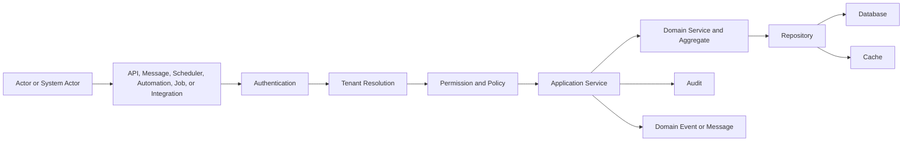
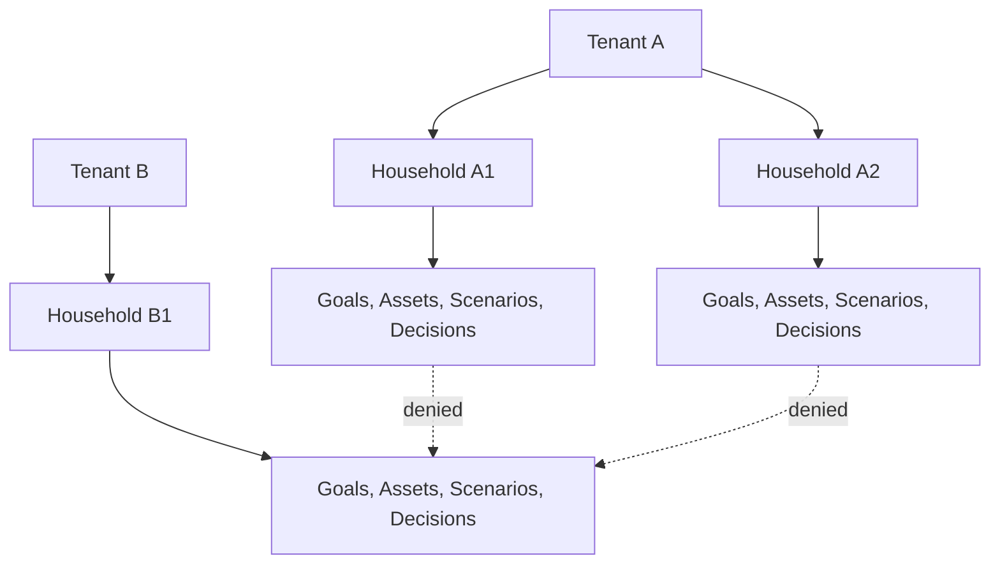
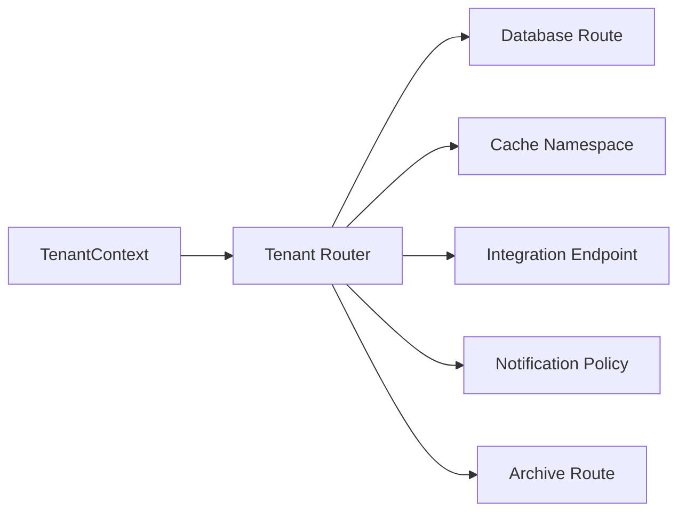
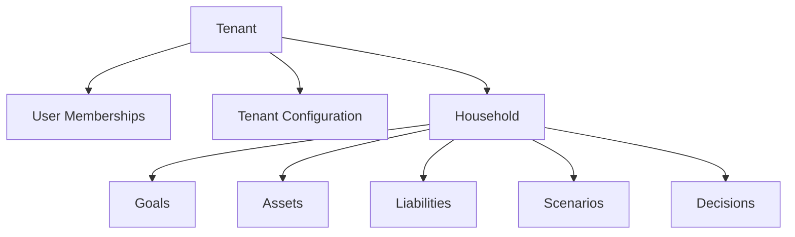
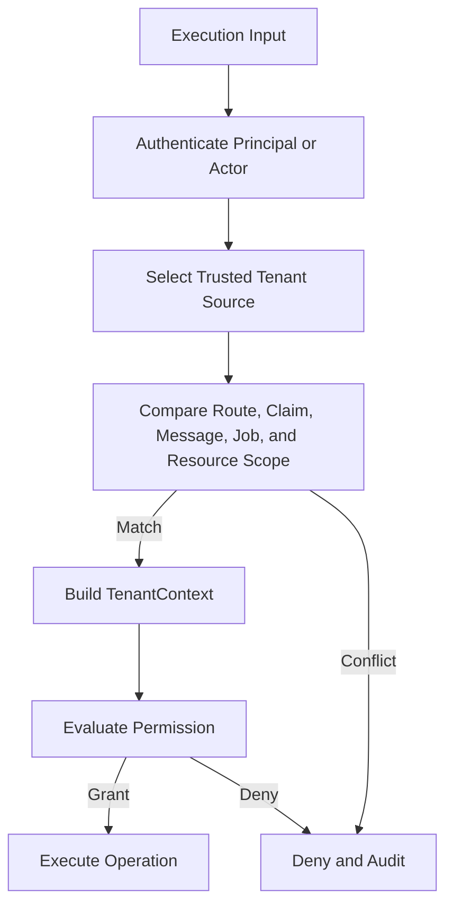
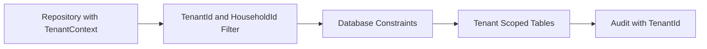

# Tenant Framework

# Document Control

Document Name: Tenant Framework
Document Path: knowledge/tenant-framework.md
Document Type: Atlas Enterprise Canonical Specification
Version: 1.0
Status: Canonical Specification
Domain: Platform
Bounded Context: Platform
Owner: Project Atlas
Source of Truth: Atlas Tenant Isolation Source of Truth
Last Updated: 2026-07-13

Related Specifications:
- knowledge/security-framework.md
- knowledge/permission-framework.md
- knowledge/audit-framework.md
- knowledge/application-service-catalog.md
- knowledge/domain-service-catalog.md
- knowledge/repository-catalog.md
- knowledge/aggregate-catalog.md
- knowledge/entity-catalog.md
- knowledge/command-catalog.md
- knowledge/domain-event-catalog.md
- knowledge/api-governance-framework.md
- knowledge/service-catalog.md
- knowledge/system-module-catalog.md
- knowledge/workflow-engine-framework.md
- knowledge/background-job-framework.md
- knowledge/scheduler-framework.md
- knowledge/automation-framework.md
- knowledge/integration-framework.md
- docs/database/05-DatabaseDesign.md
- docs/database/06-ERD.md
- docs/api/07-API.md

# Purpose

Tenant Framework defines the canonical Atlas tenant model. It is the source of truth for tenant identity, household ownership, tenant context, tenant resolution, tenant isolation, tenant routing, tenant configuration, tenant lifecycle, tenant-aware persistence, tenant-aware cache keys, tenant-aware audit records, and cross-boundary access controls.

This document does not create new Atlas business domains. It consolidates tenant rules already required by Security Framework, Permission Framework, Audit Framework, API Governance, Repository Catalog, Application Service Catalog, Domain Service Catalog, Aggregate Catalog, Entity Catalog, Command Catalog, Domain Event Catalog, Workflow, Scheduler, Automation, Background Job, Integration, Notification, Database, and Cache specifications.

# Scope

- Tenant
- Household
- Tenant Boundary
- Tenant Ownership
- Tenant Context
- Tenant Isolation
- Cross Tenant Access
- Tenant Provisioning
- Tenant Lifecycle
- Tenant Configuration
- Tenant Metadata
- Tenant Settings
- Tenant Security
- Tenant Storage
- Tenant Routing
- Tenant Resolution
- User
- Aggregate
- Entity
- Repository
- Application Service
- Domain Service
- Command
- Domain Event
- Workflow
- Automation
- Scheduler
- Background Job
- API
- Database
- Cache
- Notification
- Integration
- Security
- Permission
- Audit

# Tenant Principles

- Every tenant-scoped resource must have an explicit TenantId.
- Every household-scoped resource must have both TenantId and HouseholdId.
- Tenant isolation is mandatory at API, service, repository, database, cache, message, workflow, scheduler, automation, background job, integration, notification, security, permission, and audit boundaries.
- Tenant context must be resolved before protected data is read or mutated.
- Tenant context must be propagated across commands, domain events, workflows, schedulers, automations, background jobs, messages, integrations, notifications, and audit records.
- Tenant context must never be inferred from untrusted request body fields when a trusted route, token, session, or service context is available.
- Cross-tenant access is denied by default and allowed only through explicit administrative permission, approved service actor, or governed operational process.
- Household isolation is stricter than tenant membership for household-owned data.
- Tenant routing must be deterministic, auditable, and consistent across read and write paths.
- Tenant configuration must be versioned and auditable.
- Tenant storage and cache strategies must prevent key collision and data leakage.

# Tenant Concept Definitions

| Concept | Canonical Meaning | Required Usage |
| --- | --- | --- |
| Tenant | Top-level Atlas isolation boundary for users, households, configurations, data, integrations, and operational policies. | Required on all tenant-scoped resources and execution contexts. |
| Household | Financial and planning ownership group within a tenant. | Required on household-owned goals, assets, liabilities, scenarios, decisions, projections, and recommendations. |
| Tenant Boundary | Logical enforcement boundary that prevents one tenant from accessing another tenant's data or execution context. | Required at API, service, repository, database, cache, and audit layers. |
| Tenant Ownership | Relationship between a tenant and resource ownership. | Required on aggregates, entities, commands, events, and repositories. |
| Tenant Context | Trusted execution context containing TenantId, HouseholdId when applicable, Principal, permissions, correlation, and routing metadata. | Required before protected operations execute. |
| Tenant Isolation | Enforcement rule that prevents unauthorized cross-tenant read, write, route, cache, event, job, and audit access. | Required by default. |
| Cross Tenant Access | Controlled access spanning multiple tenants. | Requires explicit permission, reason, scope, and audit evidence. |
| Tenant Provisioning | Controlled creation of tenant metadata, default settings, security boundaries, routing, storage, and audit baseline. | Required before tenant activation. |
| Tenant Lifecycle | Governed states from provisioning through activation, suspension, archive, and deletion eligibility. | Required for operational controls. |
| Tenant Configuration | Versioned tenant-specific settings for assumptions, locale, feature flags, notifications, integrations, and policies. | Required for tenant-specific behavior. |
| Tenant Metadata | Stable descriptive and operational properties for a tenant. | Required for routing, support, monitoring, and governance. |
| Tenant Settings | Runtime settings applied to Atlas features for a tenant. | Must be resolved through configuration strategy. |
| Tenant Security | Authentication, authorization, permission, policy, and isolation rules for a tenant. | Must align with Security and Permission Frameworks. |
| Tenant Storage | Database and persistence strategy for tenant-scoped data. | Must align with Repository Catalog and Database Design. |
| Tenant Routing | Process that selects tenant storage, cache namespace, service route, and integration endpoint. | Required before repository and integration execution. |
| Tenant Resolution | Process that determines trusted TenantId and HouseholdId from request, token, session, route, message, job, or system context. | Required before permission evaluation and data access. |

# Tenant Architecture

Atlas tenant architecture uses a trusted tenant context that is resolved once at the boundary and then propagated through controlled layers.

1. API, message, scheduler, automation, background job, integration callback, or operational command receives execution input.
2. Security Framework authenticates Principal or system actor.
3. Tenant Resolution determines TenantId from trusted claims, route binding, session, message metadata, scheduler definition, automation definition, integration registration, or operational context.
4. Permission Framework evaluates tenant membership, household membership, role, policy, action, and resource scope.
5. Application Service receives TenantContext and validates command or query scope.
6. Domain Service and Aggregate enforce tenant ownership invariants where business rules require it.
7. Repository applies tenant filters, household filters, database routing, transaction boundaries, and optimistic concurrency.
8. Cache applies tenant namespace and household namespace before read or write.
9. Domain Events, Message Contracts, Workflows, Scheduler runs, Automation runs, Background Jobs, Notifications, Integrations, and Audit records carry TenantId and HouseholdId when applicable.

# Complete Tenant Catalog

Every tenant type or tenant-scoped execution model must use this contract.

| Field | Requirement |
| --- | --- |
| Tenant Type | Stable tenant model name such as PlatformTenant, OrganizationTenant, HouseholdTenantScope, ServiceTenantScope, or AdministrativeTenantScope. |
| Display Name | Human-readable name. |
| Purpose | Why the tenant model exists. |
| Business Meaning | Meaning for household finance, operations, security, compliance, or administration. |
| Description | Exact tenant behavior and isolation expectation. |
| Ownership | Owner of resources and configuration. |
| Lifecycle | Allowed states and transitions. |
| Isolation Strategy | Database, repository, cache, API, message, workflow, job, and audit isolation. |
| Resolution Strategy | Trusted source used to resolve TenantId and HouseholdId. |
| Context Strategy | Fields required in TenantContext and propagation rules. |
| Authentication | Principal requirements and trusted actor model. |
| Authorization | Role, policy, and action evaluation requirements. |
| Permission | Required permission scope and default-deny behavior. |
| Repository | Repository enforcement strategy and query filters. |
| Application Service | Service validation and orchestration responsibilities. |
| Domain Service | Domain invariant responsibilities. |
| Aggregate | Tenant ownership rules for aggregate roots. |
| Entity | Tenant or household ownership rules for entities. |
| Workflow | Workflow run tenant context requirements. |
| Scheduler | Scheduler run tenant context requirements. |
| Automation | Automation trigger and action tenant context requirements. |
| Background Job | Job payload and worker tenant context requirements. |
| API | Route, header, token, body, and response tenant rules. |
| Database | Table, index, key, constraint, and routing rules. |
| Cache | Namespace, key, TTL, and invalidation rules. |
| Notification | Recipient, template, channel, and delivery tenant rules. |
| Integration | Partner registration, endpoint routing, and payload tenant rules. |
| Audit | TenantId, HouseholdId, actor, action, resource, correlation, and outcome requirements. |
| Security | Isolation, encryption, secret, and administrative access requirements. |
| Performance | Routing and query performance expectations. |
| Scalability | Partitioning, indexing, and batch strategy expectations. |
| Availability | Tenant-level failure isolation and recovery expectations. |
| Example | Minimal valid example of tenant-scoped execution. |

# Tenant Resolution Matrix

| Entry Point | Trusted Tenant Source | Household Source | Deny Condition |
| --- | --- | --- | --- |
| API Request | Authenticated claims plus route binding | Route, claims, or resource lookup | Claim and route conflict, missing tenant, missing permission. |
| Command | Command context supplied by Application Service | Command context or target resource | Body TenantId differs from context or target resource. |
| Domain Event | Event metadata from producer | Event metadata from producer | Missing TenantId for tenant-scoped event. |
| Message Consumer | Message metadata plus consumer registration | Message metadata or payload reference | Message tenant not allowed for consumer. |
| Workflow | WorkflowRun TenantContext | WorkflowRun or step resource | Step attempts to cross tenant without approval. |
| Scheduler | Scheduler definition and run context | Scheduler scope or target resource | Schedule lacks tenant for tenant-scoped job. |
| Automation | Trigger resource plus automation definition | Trigger resource or approval context | Trigger and action tenants differ without approved scope. |
| Background Job | Job payload metadata and enqueue context | Job payload or target resource | Worker cannot resolve tenant before repository access. |
| Integration Callback | Integration registration and signed callback metadata | Partner payload after registration validation | Partner tenant mapping missing or mismatched. |
| Operation Tool | Authenticated administrative context | Explicit approved scope | No reason, no permission, or no audit correlation. |

# Tenant to Aggregate Matrix

| Aggregate Category | Tenant Rule | Household Rule |
| --- | --- | --- |
| User | TenantId required for membership and administration. | HouseholdId optional unless household membership is modified. |
| Household | TenantId required. | HouseholdId is aggregate identity. |
| Goal | TenantId required. | HouseholdId required. |
| Asset | TenantId required. | HouseholdId required. |
| Liability | TenantId required. | HouseholdId required. |
| Portfolio | TenantId required. | HouseholdId required when portfolio is household-owned. |
| Scenario | TenantId required. | HouseholdId required for household planning scenarios. |
| Decision | TenantId required. | HouseholdId required for household decisions. |
| Policy | TenantId required for tenant policy; platform policy requires administrative scope. | HouseholdId required for household policy overrides. |
| Configuration | TenantId required. | HouseholdId required for household-level settings. |

# Tenant to Entity Matrix

| Entity Category | Tenant Requirement | Enforcement |
| --- | --- | --- |
| Tenant-owned Entity | TenantId required on row or inherited through aggregate root. | Repository query filter and database constraint. |
| Household-owned Entity | TenantId and HouseholdId required. | Repository query filter, household permission, and ownership invariant. |
| Platform Entity | TenantId absent or platform scope marker. | Administrative permission and audit required. |
| Reference Entity | TenantId optional depending on ownership. | Read-only public reference data must be explicitly classified. |
| Integration Entity | TenantId required when partner registration is tenant-specific. | Integration mapping and repository filter. |
| Audit Entity | TenantId required for tenant-scoped evidence. | Audit write validation and search permission. |

# Tenant to Repository Matrix

| Repository Type | Tenant Responsibility |
| --- | --- |
| Aggregate Repository | Require TenantContext, apply TenantId filter, validate aggregate TenantId before save. |
| Read Repository | Apply TenantId and HouseholdId filters before projection query executes. |
| Projection Repository | Preserve source event TenantId and HouseholdId in read model. |
| Configuration Repository | Resolve tenant-level and household-level configuration with version metadata. |
| Audit Repository | Require TenantId for tenant-scoped audit and enforce tenant-aware search. |
| Integration Repository | Bind partner registrations, credentials references, and endpoints to TenantId. |
| Cache Repository | Use tenant namespace and never share mutable tenant data across namespaces. |
| Operational Repository | Require administrative permission for cross-tenant operations. |

# Tenant to Application Service Matrix

| Application Service Responsibility | Tenant Requirement |
| --- | --- |
| Command orchestration | Resolve TenantContext before validation, permission, and repository access. |
| Query orchestration | Apply tenant and household scope before returning protected data. |
| Configuration resolution | Load settings by precedence and include version in decision context. |
| Workflow initiation | Store TenantContext in WorkflowRun. |
| Integration orchestration | Select tenant-specific registration, endpoint, credential reference, and audit context. |
| Notification orchestration | Resolve tenant template, locale, channel policy, and recipient scope. |
| Administrative action | Require explicit cross-tenant permission, reason, and audit record. |

# Tenant to API Matrix

| API Concern | Tenant Rule |
| --- | --- |
| Route | Tenant route parameter must match authenticated and authorized context when present. |
| Header | Tenant headers are hints only unless issued by trusted gateway or internal service. |
| Body | TenantId in body must not override trusted context. |
| Query | Tenant filters must be constrained by permission. |
| Response | Response must not include resources outside resolved scope. |
| Error | Denial errors must not reveal existence of another tenant's resource. |
| Pagination | Cursor must encode or bind tenant scope. |
| Export | Export must be tenant-scoped unless administrative cross-tenant permission is granted. |

# Tenant to Database Matrix

| Database Area | Tenant Strategy |
| --- | --- |
| Tables | Tenant-scoped tables include TenantId directly or inherit it through aggregate root. |
| Primary Keys | Keys must prevent ambiguous cross-tenant resource references. |
| Foreign Keys | Foreign keys must preserve tenant consistency where supported. |
| Indexes | TenantId must be included in common query indexes for tenant-scoped data. |
| Constraints | Database constraints should prevent cross-tenant relationship corruption. |
| Transactions | Transaction boundaries must not mix tenants unless operation is explicitly administrative. |
| Migrations | Tenant-impacting migrations must produce Operation Audit records. |
| Archive | Archive records preserve TenantId and HouseholdId. |

# Tenant to Cache Matrix

| Cache Concern | Tenant Rule |
| --- | --- |
| Namespace | TenantId is part of cache namespace for tenant-scoped data. |
| Household Namespace | HouseholdId is part of key for household-scoped data. |
| Key | Cache key must include resource type, id, version, and scope. |
| TTL | TTL must follow data sensitivity and configuration volatility. |
| Invalidation | Invalidation must target tenant scope and avoid cross-tenant eviction mistakes. |
| Shared Reference Data | Shared cache requires explicit public or platform classification. |
| Permission Cache | Permission cache must include TenantId, PrincipalId, role version, and policy version. |

# Tenant to Audit Matrix

| Audit Category | Tenant Requirement |
| --- | --- |
| Business Audit | TenantId required; HouseholdId required for household-owned decisions and resources. |
| Security Audit | TenantId required when resolved; denial records include attempted tenant when safe. |
| Permission Audit | TenantId, resource, action, policy, and decision required. |
| Operation Audit | Tenant scope and administrative reason required. |
| Integration Audit | TenantId, partner, endpoint, contract, and result required. |
| Workflow Audit | WorkflowRunId, TenantId, step, actor, and outcome required. |
| Scheduler Audit | ScheduleRunId, TenantId, planned time, actual time, and outcome required. |
| Automation Audit | AutomationRunId, TenantId, trigger, action, guard result, and outcome required. |

# Isolation Strategy

- API isolation validates tenant context before protected controller or endpoint logic executes.
- Application Service isolation rejects commands and queries whose target resource does not match TenantContext.
- Domain Service isolation enforces domain invariants when tenant ownership has business meaning.
- Repository isolation applies TenantId and HouseholdId filters on every tenant-scoped query.
- Database isolation uses TenantId columns, indexes, constraints, and transaction rules.
- Cache isolation uses tenant and household namespaces.
- Message isolation includes TenantId and HouseholdId in metadata for tenant-scoped messages.
- Workflow isolation stores TenantContext in run and step state.
- Scheduler isolation binds schedule definitions to tenant or platform scope.
- Automation isolation validates trigger scope and action scope.
- Background Job isolation validates tenant scope before processing payload.
- Notification isolation resolves tenant-specific templates, locale, and recipients.
- Integration isolation binds partner registration and endpoint to tenant scope.
- Audit isolation records TenantId and HouseholdId for evidence and search filtering.

# Provisioning Strategy

- Provisioning starts with a unique TenantId.
- Tenant metadata is created before any tenant-owned business data.
- Default security roles and permission policies are assigned during provisioning.
- Default tenant configuration is created from approved platform defaults.
- Default household configuration is created only when a household is created.
- Tenant routing metadata is initialized before activation.
- Integration registrations are disabled until credentials and partner mapping are configured.
- Notification templates and channels are initialized before notification use.
- Audit baseline records provisioning actor, time, metadata, configuration version, and activation result.
- Tenant becomes Active only after metadata, configuration, security, routing, and audit checks pass.

# Configuration Strategy

Configuration precedence is resolved in this order:

1. Explicit request override when allowed by permission and policy.
2. Household-level configuration.
3. Tenant-level configuration.
4. Platform-level configuration.
5. Code default only when approved by configuration governance.

Configuration records must include:

- TenantId.
- HouseholdId when applicable.
- Configuration key.
- Configuration value or secure reference.
- Version.
- Effective time.
- Expiry time when applicable.
- Owner.
- Security classification.
- Audit correlation.

# Routing Strategy

- Tenant routing must be deterministic for the same TenantId and resource.
- Routing must occur before repository, cache, integration, notification, and archive access.
- Routing metadata must not be accepted from untrusted request body fields.
- API gateway, internal service context, scheduler definition, automation definition, integration registration, or job payload metadata may provide routing inputs only when trusted.
- Routing changes must be versioned and audited.
- In-flight operations must use a consistent routing version.
- Cross-region or cross-shard routing must preserve tenant isolation and audit correlation.

# Validation Rules

- TenantId is required for every tenant-scoped API request after resolution.
- TenantId is required for every tenant-scoped command.
- TenantId is required for every tenant-scoped domain event.
- TenantId is required for every tenant-scoped message contract.
- TenantId is required for every tenant-scoped workflow run.
- TenantId is required for every tenant-scoped scheduler run.
- TenantId is required for every tenant-scoped automation run.
- TenantId is required for every tenant-scoped background job.
- TenantId is required for every tenant-scoped audit record.
- HouseholdId is required for household-owned resources.
- TenantId in request body must match trusted TenantContext when present.
- TenantId in route must match authenticated scope when route binding exists.
- TenantId in message metadata must match payload resource scope.
- TenantId in job payload must match enqueue context.
- TenantId in cache key must match TenantContext.
- TenantId in database mutation must match aggregate TenantId.
- Repository methods for tenant-scoped data must require TenantContext.
- Application Services must resolve TenantContext before permission evaluation.
- Permission evaluation must include TenantId.
- Household permission evaluation must include HouseholdId.
- Cross-tenant access must include explicit permission.
- Cross-tenant access must include reason.
- Cross-tenant access must include audit correlation.
- Administrative tenant operations must use an authenticated Principal.
- System tenant operations must use a registered service actor.
- Scheduler definitions must declare tenant or platform scope.
- Automation definitions must declare trigger scope and action scope.
- Workflow definitions must declare tenant context propagation.
- Integration registrations must map partner identity to TenantId.
- Notification recipients must belong to target tenant or be explicitly external.
- Tenant configuration must have version.
- Tenant configuration must have owner.
- Tenant configuration must have audit history.
- Tenant routing metadata must have version.
- Tenant lifecycle transition must be valid.
- Suspended tenants must reject non-administrative mutations.
- Archived tenants must reject normal operational writes.
- Deleted tenants must not accept new data.
- Legal hold must block tenant purge.
- Cache entries for tenant data must include tenant namespace.
- Search cursors must bind tenant scope.
- Export requests must bind tenant scope.
- Audit queries must enforce tenant permission.
- Missing tenant context must default to deny.
- Conflicting tenant context must default to deny.

# Business Rules

- Tenant is the highest normal isolation boundary in Atlas.
- Household is the normal financial planning ownership boundary inside a tenant.
- Household data must not be visible to another household without explicit permission.
- Tenant data must not be visible to another tenant without explicit administrative permission.
- Platform reference data may be shared only when explicitly classified as platform-scoped.
- Tenant-specific configuration overrides platform defaults only within that tenant.
- Household-specific configuration overrides tenant configuration only within that household.
- Tenant context must be resolved before protected data access.
- Tenant context must be propagated to every downstream command.
- Tenant context must be propagated to every downstream event.
- Tenant context must be propagated to every workflow step.
- Tenant context must be propagated to every scheduler run.
- Tenant context must be propagated to every automation action.
- Tenant context must be propagated to every background job.
- Tenant context must be propagated to every integration request.
- Tenant context must be propagated to every notification request.
- Tenant context must be propagated to every audit record.
- User membership in a tenant does not automatically grant household access.
- Household membership does not automatically grant administrative tenant access.
- Tenant owner may administer tenant settings only through granted permissions.
- Administrative actors may cross tenant boundaries only through explicit policy.
- Service actors may cross tenant boundaries only when registered and scoped.
- Support access must be time-bound, reason-bound, permission-bound, and audited.
- Cross-tenant analytics must use approved aggregated or anonymized data paths.
- Protected tenant data must not be joined across tenants in normal user queries.
- Repository queries must apply tenant filters before user-supplied filters.
- Repository updates must verify existing resource tenant before mutation.
- Repository deletes must verify tenant, household, retention, and permission.
- Repository bulk updates must include tenant scope and affected-count safeguards.
- Database migrations that affect tenant data must record tenant impact.
- Database constraints should prevent cross-tenant ownership corruption.
- Cache reads must use tenant-aware keys.
- Cache writes must use tenant-aware keys.
- Cache invalidation must not leak tenant-specific resource identifiers.
- Permission caches must be invalidated when tenant roles or policies change.
- Tenant configuration cache must be invalidated when configuration version changes.
- API responses must not reveal whether another tenant's resource exists.
- API error messages must use safe denial wording for cross-tenant failures.
- API pagination cursors must not allow tenant scope switching.
- API exports must include tenant scope in audit metadata.
- Commands must not trust TenantId from body over authenticated context.
- Commands must fail when target resource belongs to a different tenant.
- Domain Events must preserve producer TenantId.
- Domain Events consumed by another service must preserve TenantId.
- Message retries must preserve TenantId and HouseholdId.
- Workflow retries must preserve original TenantContext.
- Scheduler retries must preserve schedule TenantContext.
- Automation retries must preserve trigger and action TenantContext.
- Background job retries must preserve enqueue TenantContext.
- Integration retries must preserve tenant registration and endpoint selection.
- Notification retries must preserve tenant template and recipient scope.
- Tenant provisioning must be audited.
- Tenant activation must be audited.
- Tenant suspension must be audited.
- Tenant reactivation must be audited.
- Tenant archive must be audited.
- Tenant deletion eligibility check must be audited.
- Tenant purge must be audited.
- Tenant configuration changes must be audited.
- Tenant ownership changes must be audited.
- Tenant routing changes must be audited.
- Tenant security policy changes must be audited.
- Tenant role assignment changes must be audited.
- Tenant integration credential reference changes must be audited.
- Tenant notification channel changes must be audited.
- Tenant storage relocation must be audited.
- Tenant archive restore must be audited.
- Suspended tenants allow read-only access only when policy permits.
- Suspended tenants reject new financial decisions unless administrative override is approved.
- Archived tenants are not active execution targets.
- Archived tenant data remains available only through archive and compliance paths.
- Deleted tenants must retain audit records for required retention periods.
- Tenant deletion must not delete records under legal hold.
- Tenant deletion must remove or anonymize data only through approved retention policy.
- Tenant lifecycle state must be checked before command execution.
- Tenant lifecycle state must be checked before scheduler execution.
- Tenant lifecycle state must be checked before automation execution.
- Tenant lifecycle state must be checked before integration delivery.
- Tenant lifecycle state must be checked before notification delivery.
- Tenant settings must not store raw secrets.
- Tenant secret references must point to approved secure storage.
- Tenant encryption settings must follow Security Framework.
- Tenant audit records must include TenantId when tenant context is known.
- Tenant audit search must enforce tenant permission.
- Tenant-level monitoring must not expose another tenant's metrics.
- Tenant usage metering must be isolated by TenantId.
- Tenant scaling decisions must preserve routing consistency.
- Tenant failover must preserve TenantId, routing version, and audit continuity.
- Tenant backup must preserve TenantId and HouseholdId.
- Tenant restore must validate destination tenant scope.
- Tenant restore into a different tenant requires administrative permission and audit.
- Tenant data repair must be scoped, approved, and audited.
- Tenant data import must validate TenantId on every imported resource.
- Tenant data export must include scope, requester, purpose, and audit record.
- Tenant resource identifiers must not be assumed globally unique unless cataloged that way.
- Public identifiers must still be validated against tenant scope.
- Cross-tenant resource references are prohibited unless cataloged and governed.
- Platform administrators must not bypass repository tenant filters in normal paths.
- Operational bypass tools must emit Operation Audit records.
- Tenant resolution failures must not continue with platform default scope.
- Missing TenantId must not be replaced with an arbitrary default.
- HouseholdId must not be inferred from last-used UI state for server-side authorization.
- Tenant Framework conflicts are resolved by this document unless Security, Permission, Audit, Compliance, or legal rules impose stricter controls.

# Security

## Tenant Isolation

- Tenant isolation is default deny.
- Every tenant-scoped read, write, update, delete, export, import, archive, restore, route, cache, message, workflow, job, notification, and integration action must verify TenantId.
- Cross-tenant access requires explicit permission, reason, bounded scope, and audit evidence.

## Household Isolation

- Household isolation applies inside tenant boundaries.
- Household-owned resources require HouseholdId validation.
- Household access requires membership, delegated access, administrative permission, or approved service actor scope.

## Permission

- Permission evaluation must include TenantId, HouseholdId when applicable, Principal, resource, action, role, policy, and claim context.
- Permission failures must default to deny.
- Permission cache entries must include TenantId and policy version.

## Encryption

- Tenant-scoped sensitive data must be encrypted at rest and in transit.
- Tenant secret material must be stored as secure references, not raw configuration values.
- Archive and backup encryption must preserve tenant boundaries.

# Audit

## Tenant History

- Tenant creation, activation, suspension, reactivation, archive, deletion eligibility, purge, restore, and storage relocation must produce Operation Audit records.
- Tenant state history must be queryable by TenantId, actor, time, action, and correlation.

## Configuration History

- Tenant configuration changes must record key, previous version reference, new version, actor, reason, effective time, and correlation.
- Sensitive configuration values must be masked or referenced securely.

## Ownership History

- Tenant owner changes, household ownership changes, role assignments, delegated access, support access, and administrative access must be audited.
- Ownership audit records must include TenantId and HouseholdId when applicable.

# Performance

| Area | Requirement |
| --- | --- |
| Tenant Routing | Routing lookup must be deterministic, cacheable, versioned, and auditable. |
| Query Performance | TenantId and HouseholdId indexes must support common read and write paths. |
| Scaling | Tenant partitioning, archive, cache, and job batching must preserve tenant isolation. |
| Availability | A tenant-level operational incident should not expand access or expose another tenant's data. |

# Mermaid

## Tenant Architecture

## Tenant Isolation Diagram

## Tenant Routing Diagram

## Tenant Ownership Diagram

## Tenant Resolution Flow

## Database Isolation Diagram

# Testing

| Test Type | Required Coverage |
| --- | --- |
| Tenant Test | Provisioning, activation, suspension, archive, deletion eligibility, configuration, and routing. |
| Isolation Test | API, service, repository, database, cache, message, workflow, scheduler, automation, background job, integration, notification, and audit isolation. |
| Routing Test | Tenant routing version, database route, cache namespace, integration endpoint, notification policy, and archive route. |
| Security Test | Authentication, authorization, permission, household isolation, cross-tenant denial, administrative override, and audit. |
| Performance Test | Tenant-filtered query latency, routing lookup latency, cache hit rate, batch processing, and archive lookup. |

# Edge Cases

- API route TenantId conflicts with authenticated claim.
- Request body TenantId conflicts with route TenantId.
- Request body TenantId conflicts with target resource.
- TenantId is missing from authenticated context.
- TenantId is missing from tenant-scoped command.
- HouseholdId is missing for household-owned resource.
- HouseholdId belongs to same tenant but user lacks household permission.
- User belongs to tenant but not target household.
- User belongs to multiple tenants and no tenant is selected.
- User switches tenant during long-running UI session.
- Session contains stale tenant membership.
- Permission cache uses outdated role version.
- Tenant policy changes during command execution.
- Tenant is suspended after command validation but before mutation.
- Tenant is archived while scheduler run is queued.
- Tenant is deleted while audit retention remains active.
- Legal hold blocks tenant purge.
- Tenant provisioning fails after metadata creation.
- Tenant provisioning succeeds but default configuration fails.
- Tenant activation occurs without routing metadata.
- Tenant routing metadata changes during in-flight request.
- Tenant database route is temporarily unavailable.
- Tenant cache namespace is missing.
- Cache key omits TenantId.
- Cache invalidation evicts another tenant's key pattern.
- Repository query forgets TenantId filter.
- Repository update targets resource from another tenant.
- Bulk update selection includes multiple tenants.
- Database foreign key links records from different tenants.
- Database migration affects only some tenant partitions.
- Archive restore targets wrong tenant.
- Backup restore attempts cross-tenant restore.
- Integration callback has unknown tenant mapping.
- Integration partner sends TenantId that conflicts with registration.
- Notification recipient belongs to another tenant.
- Notification template resolves from wrong tenant.
- Message metadata TenantId conflicts with payload TenantId.
- Message retry loses TenantId.
- Domain Event from old producer lacks TenantId.
- Workflow compensation attempts cross-tenant action.
- Automation trigger resource and action target differ by tenant.
- Scheduler definition lacks tenant or platform scope.
- Background job payload loses TenantContext.
- Support actor attempts access without reason.
- Administrator attempts export across tenants without explicit permission.
- Audit query spans tenants without administrative permission.
- Audit record for denial cannot safely reveal attempted TenantId.
- Search cursor is replayed under another tenant.
- Public reference data is accidentally tenant-customized.
- Tenant configuration value contains raw secret.
- Tenant locale affects notification but not audit timestamp.
- Tenant time zone changes during scheduled job planning.
- Tenant owner is removed while active support access exists.
- Household is transferred between users inside same tenant.
- Tenant data import contains duplicate resource ids.
- Tenant data export includes archived household records.
- Tenant metrics aggregation leaks another tenant's usage.
- Tenant scaling partition split occurs during writes.
- Tenant failover changes database route while cache points to old namespace.

# Final Consistency Matrix

| Area | Required Tenant Alignment |
| --- | --- |
| Tenant | Uses this framework as canonical source of truth. |
| Household | Requires TenantId, HouseholdId, membership, permission, and audit. |
| Aggregate | Tenant ownership is explicit on tenant-scoped aggregate roots. |
| Entity | Tenant and household scope is explicit or inherited through aggregate root. |
| Repository | TenantContext is required and filters are enforced. |
| Application Service | Tenant resolution, permission, lifecycle, and context propagation are enforced. |
| Domain Service | Tenant ownership invariants are enforced where business behavior requires them. |
| Workflow | WorkflowRun and steps preserve TenantContext. |
| Scheduler | Schedule definitions and runs declare tenant or platform scope. |
| Automation | Trigger, guard, action, and approval preserve TenantContext. |
| API | Route, claim, body, response, cursor, and error behavior preserve tenant isolation. |
| Database | Tables, indexes, constraints, transactions, migrations, archive, and restore preserve TenantId. |
| Cache | Namespace, key, TTL, invalidation, and permission cache preserve tenant scope. |
| Audit | Every tenant-scoped audit record includes TenantId and HouseholdId when applicable. |

# Completion Checklist

- Aggregate tenant ownership is defined.
- Entity tenant ownership is defined.
- Repository tenant isolation is defined.
- Application Service tenant context is defined.
- Domain Service tenant invariant responsibility is defined.
- API tenant resolution is defined.
- Workflow tenant context is defined.
- Scheduler tenant context is defined.
- Automation tenant context is defined.
- Background Job tenant context is defined.
- Integration tenant routing is defined.
- Notification tenant scope is defined.
- Audit tenant identifier requirement is defined.
- Database tenant strategy is defined.
- Cache tenant namespace strategy is defined.
- Tenant resolution matrix is defined.
- Tenant validation rules are complete.
- Tenant business rules are complete.
- Tenant security rules are complete.
- Tenant audit rules are complete.
- Mermaid diagrams are syntactically valid.
- Markdown structure is valid.
- No placeholder terms are present.
- No draft-only status is present.
- No temporary catalog entries are present.
