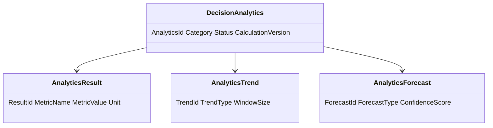
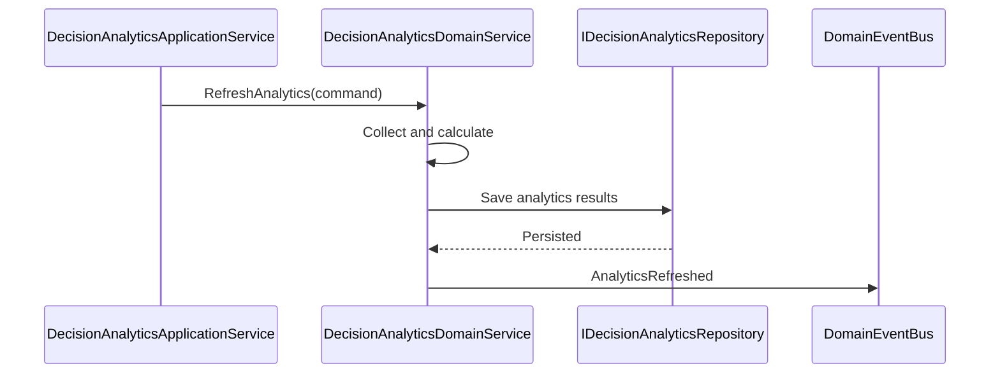
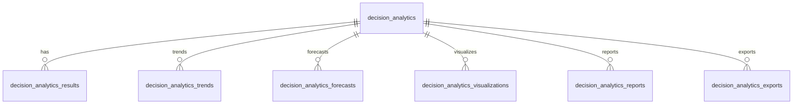
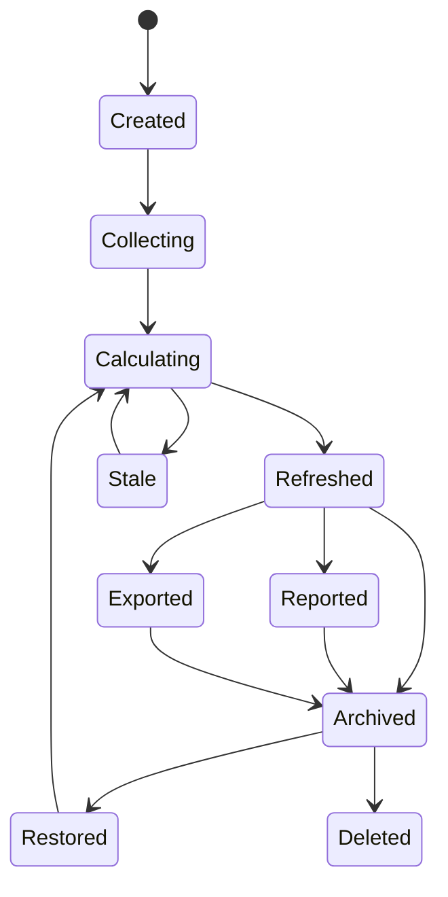
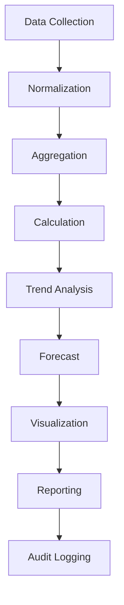
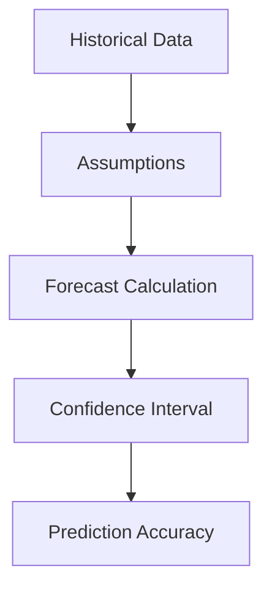
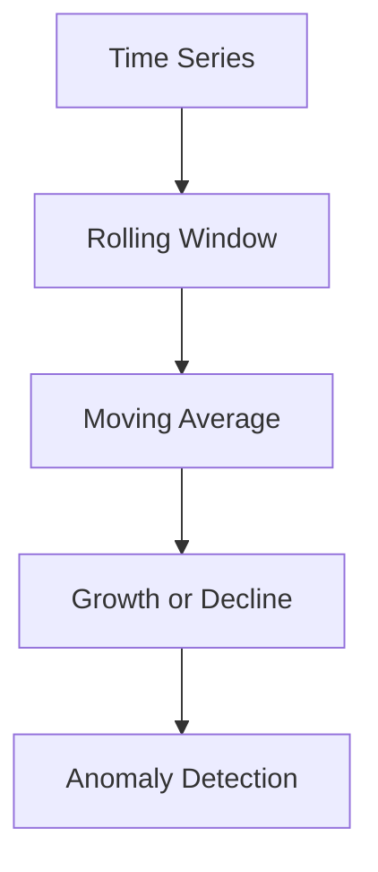
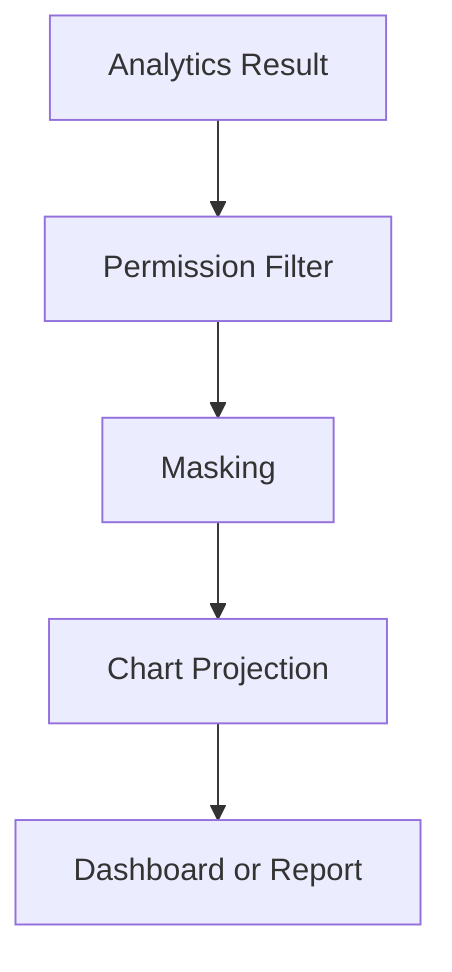

# Decision Analytics
Version: 1.0
## Split Navigation
- [Decision analytics indicators](decision-analytics/indicators.md)
- [Decision analytics pipeline](decision-analytics/pipeline-and-reporting.md)
- [Decision analytics governance and testing](decision-analytics/governance-and-testing.md)
Status: Enterprise Specification
Owner: Project Atlas
Source of Truth: Atlas Decision Analytics Specification
Last Updated: 2026-07-13
# Decision Analytics Overview
## Purpose
Decision Analytics defines how Atlas collects, normalizes, aggregates, calculates, trends, forecasts, visualizes, reports, exports, secures, audits, and serves analytics for DecisionSession.
It coordinates analytics with Decision Lifecycle, Decision Evaluation, Decision Execution, Decision Governance, Decision Explainability, Decision History, Decision Audit, Decision Rule, Recommendation, GoalPlan, Scenario, Portfolio, CashFlow, Optimization, Simulation, Risk, Workflow, Automation, Notification, Business Calendar, and User.
It preserves existing Atlas domain ownership and existing catalog naming.
## Business Meaning
Decision Analytics turns governed decision records into measurable business intelligence.
It explains decision quality, success, failure, approval behavior, execution behavior, financial impact, cashflow impact, portfolio impact, goal alignment, risk, recommendation impact, scenario outcomes, simulation outcomes, and optimization outcomes.
Analytics is read-oriented and does not mutate source domains.
## Analytics Scope
Analytics scope includes DecisionSession outcomes, lifecycle state, evaluation scores, execution results, governance compliance, explainability readiness, history, audit, decision rules, recommendation mapping, goal alignment, scenario evidence, portfolio evidence, cashflow evidence, optimization result, simulation result, risk evidence, workflow state, automation triggers, notification delivery, Business Calendar timing, and user behavior.
Scope must preserve HouseholdId.
Scope must preserve TenantId when tenant scope exists.
Scope must not include unauthorized source data.
## Analytics Lifecycle
Analytics lifecycle starts when CreateAnalytics defines an analytics configuration or when RefreshAnalytics creates a calculated analytics result.
Analytics can be updated, refreshed, recalculated, reported, exported, archived, restored, or deleted according to lifecycle policy.
Every calculated analytics result records source version, calculation version, generated time, refresh mode, projection, and actor or system actor.
## Analytics Objectives
Analytics objectives are decision performance visibility, quality measurement, failure analysis, financial clarity, risk awareness, approval insight, execution insight, forecast accuracy, trend detection, anomaly detection, reporting readiness, and permission-safe visualization.
Objectives are measured by indicator coverage, refresh latency, calculation accuracy, forecast accuracy, cache hit rate, query latency, and audit completeness.
## Ownership
Decision Analytics owns analytics definitions, analytics results, trends, forecasts, comparisons, visualizations, reports, exports, and analytics projections.
DecisionSession owns decision source state.
Decision Evaluation owns score source data.
Decision Execution owns execution source data.
Decision Governance owns compliance source data.
Decision Explainability owns explanation source data.
Decision History owns historical source data.
Decision Audit owns immutable audit evidence.
Repository owns persistence and query.
Application Service owns orchestration.
Security owns authorization and masking.
## Aggregate Root
DecisionSession remains the source aggregate root for decision behavior.
Decision Analytics stores analytics read models and calculated results scoped to DecisionSession, household, tenant when present, period, category, and projection.
## Relationship with Decision
DecisionSession supplies decision id, status, owner, selected option, rationale, decision type, created time, updated time, and outcome.
Analytics does not mutate DecisionSession.
## Relationship with Decision Lifecycle
Decision Lifecycle supplies states, transition history, state duration, restore count, archive count, failed transition count, and terminal state.
Lifecycle analytics measures decision movement and bottlenecks.
## Relationship with Decision Evaluation
Decision Evaluation supplies composite score, confidence score, explainability score, dimension scores, constraint results, and ranking.
Evaluation analytics measures quality and readiness.
## Relationship with Decision Execution
Decision Execution supplies progress, health, status, duration, retry count, rollback count, recovery count, error count, and completion result.
Execution analytics measures operational performance.
## Relationship with Decision Governance
Decision Governance supplies policy compliance, exception, escalation, approval policy, retention status, and compliance history.
Governance analytics measures policy effectiveness.
## Relationship with Decision Explainability
Decision Explainability supplies rationale completeness, evidence traceability, rule traceability, and explanation quality.
Explainability analytics measures approval confidence and transparency.
## Relationship with Decision History
Decision History supplies historical records for trend, rolling window, comparison, and historical analysis.
History is append-only.
## Relationship with Decision Audit
Decision Audit supplies access, command, export, report, approval, and policy audit evidence.
Audit analytics measures traceability and access patterns.
## Relationship with Decision Rule
Decision Rule supplies rule version, rule result, rule severity, warning count, and failure count.
Rule analytics measures rule effectiveness and rule drift.
## Relationship with Recommendation
Recommendation supplies adoption, suppression, ranking, expected impact, realized impact, and lifecycle state.
Recommendation analytics measures decision impact on recommendation outcomes.
## Relationship with Goal
GoalPlan supplies alignment, priority, progress, health, target, and lifecycle context.
Goal analytics measures decision contribution to goal outcomes.
## Relationship with Scenario
Scenario supplies assumptions, baseline, forecast, what-if result, stress result, and ScenarioVersion.
Scenario analytics measures scenario sensitivity and compatibility.
## Relationship with Portfolio
Portfolio supplies authorized allocation, liquidity, risk, performance, and valuation evidence.
Portfolio analytics requires portfolio permission and masking.
## Relationship with CashFlow
CashFlow supplies authorized contribution capacity, surplus, deficit, funding gap, period, and currency.
Cash Flow analytics requires cashflow permission and masking.
## Relationship with Optimization
Optimization supplies candidate score, objective result, constraint result, optimized ranking, and confidence.
Optimization analytics measures improvement and adoption.
## Relationship with Simulation
Simulation supplies simulated result, confidence interval, scenario output, and simulation version.
Simulation analytics measures forecast quality and uncertainty.
## Relationship with Risk
Risk supplies risk score, risk trend, severity, threshold state, and mitigation state.
Risk analytics measures exposure and risk-adjusted decision quality.
## Relationship with Workflow
Workflow supplies approval routing, step duration, queue time, escalation, and workflow state.
Workflow analytics measures approval and process latency.
## Relationship with Automation
Automation supplies trigger, run id, scheduled refresh, recalculation, report generation, export, and cleanup.
Automation analytics measures automated processing reliability.
## Relationship with Notification
Notification supplies trigger, delivery, acknowledgement, suppression, escalation, and failure evidence.
Notification analytics measures communication effectiveness.
## Relationship with Business Calendar
Business Calendar supplies working-day duration, blackout windows, approval windows, escalation windows, and reporting periods.
Calendar analytics normalizes time-based measures.
## Relationship with User
User supplies owner, approver, actor, operator, preference, locale, permission, and masking context.
User behavior analytics must not expose restricted data.
# Analytics Architecture
## Analytics Engine
Analytics Engine coordinates source collection, refresh mode, calculation, trend, forecast, comparison, visualization, report, export, cache, and audit.
It is deterministic for identical source versions and calculation versions.
## Aggregation Engine
Aggregation Engine groups analytics by household, tenant, decision, period, category, status, owner, scenario, recommendation, goal, portfolio, cashflow period, and risk level.
Aggregation must not leak unauthorized counts.
## Calculation Engine
Calculation Engine computes metrics, indicators, normalized values, composite scores, ratios, rates, and thresholds.
Calculation version must be recorded.
## Forecast Engine
Forecast Engine calculates success probability, execution forecast, financial forecast, cashflow forecast, risk forecast, goal forecast, scenario forecast, confidence interval, and prediction accuracy.
Forecast assumptions must be recorded.
## Trend Engine
Trend Engine calculates historical trend, moving average, rolling window, growth rate, decline rate, seasonality, correlation, and regression.
Trend window must be recorded.
## Pattern Detection Engine
Pattern Detection Engine detects repeated approvals, repeated failures, repeated exceptions, repeated rollbacks, repeated stale evaluations, and recurring risk events.
Pattern match count and period are recorded.
## Anomaly Detection Engine
Anomaly Detection Engine detects unusual decision duration, approval delay, score movement, execution failure, financial variance, and risk movement.
Anomaly baseline window is recorded.
## Reporting Engine
Reporting Engine produces analytics report snapshots, report history, report projections, and export-ready data.
Report generation must use permission-filtered source data.
## Visualization Engine
Visualization Engine produces chart-ready projections, dashboard series, trend series, forecast bands, comparison tables, and ranking views.
Visualization must preserve masking.
## Caching Layer
Caching Layer stores analytics summary, detail, trend, forecast, visualization, report, and search projections.
Cache keys include tenant, household, period, projection, and masking mode.
## Audit Layer
Audit Layer records refresh, recalculation, report, export, query, access, cache invalidation, and projection generation.
# Analytics Pipeline
## Data Collection
Data Collection reads authorized decision, lifecycle, evaluation, execution, governance, explainability, history, audit, rule, recommendation, goal, scenario, portfolio, cashflow, optimization, simulation, risk, workflow, automation, notification, calendar, and user evidence.
## Normalization
Normalization converts source units, periods, currencies, time zones, states, and score scales into analytics-ready values.
## Aggregation
Aggregation groups records by configured dimensions and periods.
## Calculation
Calculation computes metrics, indicators, scores, rates, ratios, and thresholds.
## Trend Analysis
Trend Analysis computes historical movement, rolling windows, moving averages, growth, decline, and trend breaks.
## Pattern Detection
Pattern Detection identifies repeated behavior and recurring state sequences.
## Forecast
Forecast estimates success probability, execution completion, financial outcome, cashflow outcome, risk movement, goal outcome, and scenario outcome.
## Scoring
Scoring calculates analytics health, confidence, quality, and business impact scores.
## Ranking
Ranking sorts decisions, options, risks, failures, bottlenecks, recommendations, and opportunities.
## Visualization
Visualization prepares chart-ready data for dashboard, report, and export.
## Reporting
Reporting creates governed report snapshots with source versions and masking mode.
## Audit Logging
Audit Logging records all analytics operations and access.
# Analytics Categories
## Decision Performance Analytics
Definition: Measures overall decision throughput, latency, and outcome.
Business Meaning: Shows how effectively decisions move from creation to outcome.
Calculation Formula: PerformanceScore = SuccessRate * 0.4 + OnTimeRate * 0.3 + ThroughputScore * 0.3.
Inputs: Decision count, completed count, duration, target duration.
Outputs: PerformanceScore, SuccessRate, AverageDuration.
Threshold: PerformanceScore below 60 creates warning.
Refresh Frequency: Hourly or event-driven.
Visualization: KPI card, trend line, table.
Example: Monthly decision success rate is 82 percent.
## Decision Success Analytics
Definition: Measures successful decision outcome rate.
Business Meaning: Shows whether decisions produce intended outcomes.
Calculation Formula: SuccessRate = SucceededDecisions / ClosedDecisions * 100.
Inputs: SucceededDecisions, ClosedDecisions.
Outputs: SuccessRate.
Threshold: Below 70 percent requires review.
Refresh Frequency: Daily.
Visualization: Gauge and trend line.
Example: Success rate improved from 74 to 81 percent.
## Decision Failure Analytics
Definition: Measures failed decisions and failure causes.
Business Meaning: Identifies where decisions break down.
Calculation Formula: FailureRate = FailedDecisions / ClosedDecisions * 100.
Inputs: FailedDecisions, ClosedDecisions, FailureReason.
Outputs: FailureRate, TopFailureReasons.
Threshold: Above 20 percent creates warning.
Refresh Frequency: Daily.
Visualization: Bar chart and reason table.
Example: Execution failure is the top failure reason.
## Decision Quality Analytics
Definition: Measures quality using evaluation, confidence, explainability, and rule outcomes.
Business Meaning: Shows how strong decision evidence is.
Calculation Formula: QualityScore = CompositeScore * 0.4 + ConfidenceScore * 0.3 + ExplainabilityScore * 0.3.
Inputs: CompositeScore, ConfidenceScore, ExplainabilityScore.
Outputs: QualityScore.
Threshold: Below 65 requires review.
Refresh Frequency: Event-driven.
Visualization: Scorecard.
Example: Quality score is 88 for approved decisions.
## Financial Analytics
Definition: Measures financial impact, budget variance, cost, and funding gap.
Business Meaning: Shows financial decision effect.
Calculation Formula: FinancialImpact = BenefitAmount - CostAmount - FundingGap.
Inputs: BenefitAmount, CostAmount, FundingGap, Currency.
Outputs: FinancialImpact, BudgetVariance.
Threshold: Negative impact creates warning.
Refresh Frequency: Daily.
Visualization: Waterfall and table.
Example: Decision lowers expected cost by 1200.
## Cash Flow Analytics
Definition: Measures contribution capacity and cashflow fit.
Business Meaning: Shows whether decisions fit available CashFlow.
Calculation Formula: CapacityRatio = AvailableContribution / RequiredContribution.
Inputs: AvailableContribution, RequiredContribution, Period.
Outputs: CapacityRatio, DeficitAmount.
Threshold: CapacityRatio below 1 creates warning.
Refresh Frequency: Daily.
Visualization: Period chart.
Example: Capacity ratio is 1.15 for selected option.
## Portfolio Analytics
Definition: Measures allocation, liquidity, risk, and valuation impact.
Business Meaning: Shows portfolio sensitivity to decisions.
Calculation Formula: PortfolioImpactScore = LiquidityScore + AllocationFitScore - RiskPenalty.
Inputs: Liquidity, Allocation, PortfolioRisk, ValuationTime.
Outputs: PortfolioImpactScore, LiquidityGap.
Threshold: Stale valuation lowers confidence.
Refresh Frequency: Daily or valuation-driven.
Visualization: Allocation chart.
Example: Option improves allocation fit.
## Goal Alignment Analytics
Definition: Measures decision alignment with GoalPlan priorities and outcomes.
Business Meaning: Shows decision contribution to goals.
Calculation Formula: AlignmentScore = PriorityFit * 0.4 + ProgressImpact * 0.3 + HealthImpact * 0.3.
Inputs: PriorityScore, ProgressImpact, HealthImpact.
Outputs: AlignmentScore.
Threshold: Below 50 requires review.
Refresh Frequency: Event-driven.
Visualization: Goal alignment matrix.
Example: Decision improves high-priority GoalPlan.
## Risk Analytics
Definition: Measures risk exposure, risk trend, and risk-adjusted outcome.
Business Meaning: Shows risk impact of decisions.
Calculation Formula: RiskAdjustedScore = OutcomeScore - RiskScore * 0.4.
Inputs: OutcomeScore, RiskScore, RiskTrend.
Outputs: RiskAdjustedScore, RiskLevel.
Threshold: RiskScore above 80 escalates.
Refresh Frequency: Event-driven.
Visualization: Risk heatmap.
Example: Risk-adjusted score falls after market stress.
## Recommendation Analytics
Definition: Measures recommendation adoption and realized impact.
Business Meaning: Shows how recommendations affect decisions.
Calculation Formula: AdoptionRate = AdoptedRecommendations / RecommendedDecisions * 100.
Inputs: AdoptedRecommendations, RecommendedDecisions, RealizedImpact.
Outputs: AdoptionRate, RealizedImpact.
Threshold: Below 50 percent requires review.
Refresh Frequency: Daily.
Visualization: Funnel.
Example: Adoption rate is 62 percent.
## Scenario Analytics
Definition: Measures decision behavior across scenarios.
Business Meaning: Shows scenario sensitivity.
Calculation Formula: ScenarioDelta = ScenarioOutcomeScore - BaselineOutcomeScore.
Inputs: ScenarioOutcomeScore, BaselineOutcomeScore.
Outputs: ScenarioDelta, ScenarioConfidence.
Threshold: Absolute delta above 20 requires explanation.
Refresh Frequency: Scenario-driven.
Visualization: Scenario comparison chart.
Example: Stress scenario lowers success probability by 12 points.
## Simulation Analytics
Definition: Measures simulation output and confidence.
Business Meaning: Shows predicted decision behavior.
Calculation Formula: SimulationConfidence = EvidenceCompleteness * 0.5 + ModelReliability * 0.5.
Inputs: SimulationResult, EvidenceCompleteness, ModelReliability.
Outputs: SimulationConfidence, ForecastRange.
Threshold: Confidence below 60 requires review.
Refresh Frequency: Simulation-driven.
Visualization: Confidence band.
Example: Simulation confidence is 76 percent.
## Optimization Analytics
Definition: Measures improvement from optimization.
Business Meaning: Shows whether optimization improved decision outcome.
Calculation Formula: OptimizationLift = OptimizedScore - BaselineScore.
Inputs: OptimizedScore, BaselineScore.
Outputs: OptimizationLift.
Threshold: Lift below 5 may not justify change.
Refresh Frequency: Optimization-driven.
Visualization: Lift chart.
Example: Optimization improves score by 9.
## Execution Analytics
Definition: Measures execution progress, success, retry, rollback, and recovery.
Business Meaning: Shows whether decisions execute reliably.
Calculation Formula: ExecutionHealth = SuccessRate * 0.4 + OnTimeRate * 0.3 - RetryPenalty - RollbackPenalty.
Inputs: SuccessRate, OnTimeRate, RetryCount, RollbackCount.
Outputs: ExecutionHealth.
Threshold: Below 70 requires operational review.
Refresh Frequency: Event-driven.
Visualization: Execution dashboard.
Example: Retry rate increased this week.
## Approval Analytics
Definition: Measures approval latency, approval rate, rejection rate, and overdue approvals.
Business Meaning: Shows decision approval efficiency.
Calculation Formula: ApprovalEfficiency = ApprovalRate * 0.5 + OnTimeApprovalRate * 0.5.
Inputs: ApprovedCount, RejectedCount, ApprovalDuration, DueDate.
Outputs: ApprovalEfficiency.
Threshold: Overdue approval count above threshold escalates.
Refresh Frequency: Hourly.
Visualization: Approval queue chart.
Example: Median approval time is 2 business days.
## User Behavior Analytics
Definition: Measures user interaction with decisions where authorized.
Business Meaning: Shows engagement and operating patterns.
Calculation Formula: EngagementScore = ActionCountScore + ReviewCompletionScore + AcknowledgementScore.
Inputs: ActionCount, ReviewCompletion, Acknowledgement.
Outputs: EngagementScore.
Threshold: Low engagement creates reminder signal.
Refresh Frequency: Daily.
Visualization: Engagement trend.
Example: Decision review activity decreased.
## Operational Analytics
Definition: Measures system operations for decision processing.
Business Meaning: Shows throughput, latency, errors, and queue health.
Calculation Formula: OperationalScore = ThroughputScore - ErrorPenalty - LatencyPenalty.
Inputs: Throughput, ErrorCount, Latency.
Outputs: OperationalScore.
Threshold: Score below 70 triggers monitoring.
Refresh Frequency: Near real-time.
Visualization: Operations chart.
Example: Queue latency increased after batch refresh.
## Historical Analytics
Definition: Measures long-term decision patterns from history.
Business Meaning: Shows recurring behavior and trend context.
Calculation Formula: HistoricalIndex = CurrentPeriodValue / HistoricalAverage * 100.
Inputs: CurrentPeriodValue, HistoricalAverage.
Outputs: HistoricalIndex.
Threshold: Index outside 80 to 120 is notable.
Refresh Frequency: Daily.
Visualization: Historical comparison.
Example: Decision volume is 130 percent of historical average.
## Forecast Analytics
Definition: Measures predicted future decision outcome.
Business Meaning: Shows expected success, risk, execution, and financial outcome.
Calculation Formula: ForecastScore = PredictedSuccess * 0.5 + ForecastConfidence * 0.3 - ForecastRiskPenalty.
Inputs: PredictedSuccess, ForecastConfidence, ForecastRisk.
Outputs: ForecastScore, ConfidenceInterval.
Threshold: Forecast confidence below 60 requires review.
Refresh Frequency: Forecast-driven.
Visualization: Forecast band.
Example: Success probability is forecast at 78 percent.
# Trend Analysis
## Historical Trend
Historical Trend compares current values against prior periods and historical averages.
## Moving Average
Moving Average smooths decision metrics over configured windows.
## Rolling Window
Rolling Window calculates metrics over the latest N days, weeks, months, or decision count.
## Growth Rate
Growth Rate = (CurrentValue - PreviousValue) / PreviousValue * 100.
## Decline Rate
Decline Rate = (PreviousValue - CurrentValue) / PreviousValue * 100.
## Pattern Detection
Pattern Detection identifies repeated state paths, repeated failures, repeated approvals, and recurring exceptions.
## Seasonality
Seasonality detects recurring calendar-based changes using Business Calendar periods.
## Anomaly Detection
Anomaly Detection identifies values outside expected historical range.
## Correlation Analysis
Correlation Analysis measures association between metrics such as confidence and success.
## Regression Analysis
Regression Analysis estimates relationships between inputs and outcomes.
# Forecast Analysis
## Success Probability
Success Probability estimates likelihood of Succeeded outcome.
## Execution Forecast
Execution Forecast estimates completion time, timeout risk, retry probability, and recovery probability.
## Financial Forecast
Financial Forecast estimates financial impact and budget variance.
## Cash Flow Forecast
Cash Flow Forecast estimates capacity ratio, deficit risk, and funding gap.
## Risk Forecast
Risk Forecast estimates risk movement and threshold crossing.
## Goal Forecast
Goal Forecast estimates decision impact on GoalPlan progress, health, and target date.
## Scenario Forecast
Scenario Forecast estimates outcome under selected ScenarioVersion.
## Confidence Interval
Confidence Interval records lower bound, expected value, and upper bound.
## Prediction Accuracy
Prediction Accuracy = 100 - ForecastErrorPercent.
# Validation Rules
1. AnalyticsId must be globally unique. 2. HouseholdId is required. 3. TenantId is required when tenant scope exists. 4. Analytics scope is required. 5. Analytics category is required. 6. Source version hash is required. 7. Calculation version is required. 8. Refresh mode is required. 9. Period start must be before period end. 10. DecisionSessionId must exist when decision-scoped. 11. ScenarioVersion is required for scenario analytics. 12. Portfolio permission is required for portfolio analytics. 13. CashFlow permission is required for cashflow analytics. 14. Risk score must be between 0 and 100. 15. Score values must be between 0 and 100. 16. Rate values must be between 0 and 100 unless explicitly defined otherwise. 17. Forecast confidence must be between 0 and 100. 18. Trend window must be positive. 19. Rolling window must be positive. 20. Aggregation period must be valid. 21. Visualization type must be allowed. 22. Export format must be allowed. 23. Report projection must be allowed. 24. Filter fields must be allowed. 25. Sorting fields must be allowed. 26. Pagination limit must be within API maximum. 27. Masked fields must not appear in unauthorized projection. 28. Aggregation must enforce authorization. 29. Calculation input cannot be empty. 30. Materialized view refresh must use committed data. 31. Archive requires eligible analytics state. 32. Restore requires archived analytics. 33. Delete requires retention validation. 34. Export requires export permission. 35. Report generation requires report permission. 36. Cache key must include masking mode. 37. Audit metadata is required for every command. 38. GeneratedAt cannot be before source collected time. 39. Comparison requires compatible periods. 40. Forecast requires sufficient historical evidence or explicit low-confidence result.
# Business Rules
1. Decision Analytics must preserve Atlas domain ownership. 2. Decision Analytics must not redesign Atlas. 3. Decision Analytics must not create unrelated business concepts. 4. Analytics naming must follow existing catalog. 5. Analytics is read-oriented. 6. Analytics cannot mutate DecisionSession. 7. Analytics cannot mutate Decision Lifecycle. 8. Analytics cannot mutate Decision Evaluation. 9. Analytics cannot mutate Decision Execution. 10. Analytics cannot mutate Decision Governance. 11. Analytics cannot mutate Recommendation. 12. Analytics cannot mutate GoalPlan. 13. Analytics cannot mutate Scenario. 14. Analytics cannot mutate Portfolio. 15. Analytics cannot mutate CashFlow. 16. Analytics cannot mutate Workflow. 17. Analytics cannot mutate Automation. 18. Every analytics result must record source version. 19. Every analytics result must record calculation version. 20. Every analytics result must record generated time. 21. Every analytics result must record scope. 22. Every analytics query must enforce permission. 23. Field-level security applies before projection. 24. Masked data must remain masked in cache. 25. Aggregation must not leak unauthorized data. 26. Portfolio analytics requires portfolio permission. 27. CashFlow analytics requires cashflow permission. 28. Scenario analytics requires ScenarioVersion. 29. Simulation analytics requires simulation version. 30. Optimization analytics requires optimization version. 31. Governance analytics requires compliance source version. 32. Execution analytics requires execution source version. 33. Evaluation analytics requires evaluation source version. 34. Explainability analytics requires explanation source version. 35. Historical analytics uses committed history only. 36. Audit analytics uses audit-safe projection only. 37. User behavior analytics must not expose private data beyond permission. 38. Trend calculations must record window. 39. Moving average must record period count. 40. Rolling window must record boundary. 41. Growth rate must handle zero prior value. 42. Decline rate must handle zero prior value. 43. Pattern detection must record pattern definition. 44. Anomaly detection must record baseline window. 45. Correlation analysis must record input metrics. 46. Regression analysis must record independent variables. 47. Forecast must record assumptions. 48. Forecast must record confidence interval when available. 49. Forecast must record prediction accuracy when actuals exist. 50. Low confidence forecast must be marked. 51. Stale source version marks analytics stale. 52. Calculation version change marks analytics stale. 53. Permission change invalidates analytics cache. 54. Masking change invalidates analytics cache. 55. Report generation must snapshot values. 56. Export must use masked projection when required. 57. Dashboard visualization must use permission-filtered data. 58. Materialized views must use committed records. 59. Cache failure must not roll back analytics calculation. 60. Report failure must not delete analytics result. 61. Export failure must not delete analytics result. 62. Notification failure must not delete threshold event. 63. ThresholdExceeded event must include threshold and value. 64. Archive makes analytics read-only. 65. Restore revalidates source availability. 66. Delete requires retention permission. 67. Analytics history is append-only. 68. Calculation history is append-only. 69. Report history is append-only. 70. Export history is append-only. 71. Access history is append-only. 72. Batch calculation isolates item failure. 73. Parallel processing must produce deterministic results. 74. Incremental refresh processes changed source only. 75. Search enforces HouseholdId scope. 76. Tenant-aware search enforces TenantId. 77. API response includes generated time. 78. API response includes source freshness when applicable. 79. Visualization includes unit and precision. 80. Financial visualization includes currency when authorized. 81. CashFlow visualization includes period when authorized. 82. Portfolio visualization includes valuation time when authorized. 83. Risk visualization includes risk level. 84. Recommendation analytics preserves RecommendationId when authorized. 85. Goal analytics preserves GoalPlanId when authorized. 86. Scenario analytics preserves ScenarioId when authorized. 87. Automation refresh records AutomationRunId. 88. Workflow analytics records WorkflowInstanceId when used. 89. Business Calendar normalization records calendar id. 90. Analytics report must be reproducible. 91. Comparison requires compatible scope. 92. Ranking must be deterministic for equal inputs. 93. Ties must use stable identifier. 94. Forecast cannot be presented as actual. 95. Historical projection cannot include deleted records unless audit projection is authorized. 96. Archived analytics excluded from default active query. 97. Deleted analytics excluded from default query. 98. Restored analytics must be recalculated if source is stale. 99. Concurrent update must use optimistic version. 100. Duplicate refresh command must be idempotent by command id. 101. Domain event emitted after persistence. 102. Domain event includes AnalyticsId. 103. Domain event includes scope. 104. Audit record includes actor and correlation id. 105. Export record includes format and projection.
# State Machine
## States
- Created
- Collecting
- Calculating
- Refreshed
- Stale
- Reported
- Exported
- Archived
- Restored
- Deleted
## Transitions
- Created -> Collecting by CreateAnalytics.
- Collecting -> Calculating by RefreshAnalytics.
- Calculating -> Refreshed by calculation success.
- Calculating -> Stale by source version conflict.
- Refreshed -> Stale by source change.
- Refreshed -> Reported by GenerateAnalyticsReport.
- Refreshed -> Exported by ExportAnalytics.
- Stale -> Calculating by RecalculateAnalytics.
- Reported -> Archived by ArchiveAnalytics.
- Exported -> Archived by ArchiveAnalytics.
- Refreshed -> Archived by ArchiveAnalytics.
- Archived -> Restored by RestoreAnalytics.
- Restored -> Calculating by RecalculateAnalytics.
- Archived -> Deleted by DeleteAnalytics.
## Triggers
- CreateAnalytics
- UpdateAnalytics
- RefreshAnalytics
- RecalculateAnalytics
- ArchiveAnalytics
- RestoreAnalytics
- DeleteAnalytics
- GenerateAnalyticsReport
- ExportAnalytics
- SourceChanged
- ThresholdExceeded
- AutomationTriggered
## Invariant
AnalyticsId, HouseholdId, original scope, created time, and source identity are immutable.
Calculated result must record source version and calculation version.
Archived analytics is read-only.
Deleted analytics is terminal.
## Illegal Transition
- Deleted -> Refreshed.
- Deleted -> Reported.
- Archived -> Calculating without RestoreAnalytics.
- Created -> Exported.
- Collecting -> Exported.
- Calculating -> Archived.
- Stale -> Exported without recalculation.
- Reported -> Calculating without recalculation command.
# Commands
## CreateAnalytics
Creates analytics definition or analytics request.
## UpdateAnalytics
Updates editable analytics configuration.
## RefreshAnalytics
Refreshes analytics from current source versions.
## RecalculateAnalytics
Recalculates stale analytics or changed calculation version.
## ArchiveAnalytics
Archives analytics and makes it read-only.
## RestoreAnalytics
Restores archived analytics after validation.
## DeleteAnalytics
Deletes eligible analytics after retention validation.
## GenerateAnalyticsReport
Generates analytics report snapshot.
## ExportAnalytics
Exports analytics projection in approved format.
## RefreshTrendAnalytics
Refreshes trend values.
## RefreshForecastAnalytics
Refreshes forecast values.
## DetectAnalyticsAnomaly
Detects anomalies and threshold events.
# Domain Events
## AnalyticsCreated
Emitted after CreateAnalytics succeeds.
## AnalyticsUpdated
Emitted after UpdateAnalytics succeeds.
## AnalyticsCalculated
Emitted after calculation succeeds.
## AnalyticsRefreshed
Emitted after refresh succeeds.
## AnalyticsArchived
Emitted after ArchiveAnalytics succeeds.
## AnalyticsRestored
Emitted after RestoreAnalytics succeeds.
## AnalyticsDeleted
Emitted after DeleteAnalytics succeeds.
## AnalyticsReportGenerated
Emitted after report generation succeeds.
## AnalyticsExported
Emitted after export succeeds.
## ThresholdExceeded
Emitted when value crosses configured threshold.
## AnalyticsStale
Emitted when source or calculation version changes.
## AnalyticsAnomalyDetected
Emitted when anomaly detection finds a material anomaly.
## AnalyticsForecastUpdated
Emitted when forecast values change.
# Repository
## Interface
IDecisionAnalyticsRepository persists analytics definition, calculated result, trend result, forecast result, comparison result, visualization result, report history, export history, and access history.
## Methods
- Add
- Update
- GetById
- GetByScope
- GetByDecisionSessionId
- Search
- SaveCalculatedResult
- SaveTrendResult
- SaveForecastResult
- SaveComparisonResult
- SaveVisualizationResult
- SaveReport
- SaveExport
- SaveAccessHistory
- Archive
- Restore
- Delete
- GetSummaryProjection
- GetDetailProjection
- GetDashboardProjection
## Queries
- AnalyticsByDecision
- AnalyticsByHousehold
- AnalyticsByCategory
- AnalyticsByStatus
- AnalyticsByPeriod
- StaleAnalytics
- ForecastAnalytics
- TrendAnalytics
- ReportedAnalytics
- ExportedAnalytics
## Filtering
- AnalyticsId
- DecisionSessionId
- HouseholdId
- TenantId
- Category
- Status
- Period
- SourceVersion
- CalculationVersion
- GeneratedDateRange
- HasForecast
- HasTrend
- HasThresholdEvent
## Sorting
- generatedAt desc
- refreshedAt desc
- category asc
- status asc
- score desc
- confidence desc
- periodStart desc
## Aggregation
- CountByCategory
- CountByStatus
- CountByPeriod
- AverageScore
- AverageConfidence
- ThresholdExceededCount
- StaleCount
- ReportCount
- ExportCount
## Projection
- AnalyticsSummaryProjection
- AnalyticsDetailProjection
- TrendProjection
- ForecastProjection
- ComparisonProjection
- VisualizationProjection
- ReportProjection
- DashboardProjection
## Specification
- ActiveAnalyticsSpecification
- VisibleAnalyticsSpecification
- StaleAnalyticsSpecification
- ForecastAnalyticsSpecification
- ThresholdExceededSpecification
- AuditAnalyticsSpecification
# Domain Service Interaction
- DecisionAnalyticsDomainService validates analytics lifecycle, calculations, forecasts, and business rules.
- DecisionLifecycleDomainService supplies lifecycle state and transition evidence.
- DecisionEvaluationDomainService supplies score and constraint evidence.
- DecisionExecutionDomainService supplies execution performance evidence.
- DecisionGovernanceDomainService supplies compliance and policy evidence.
- DecisionExplainabilityDomainService supplies explanation quality evidence.
- DecisionHistoryDomainService supplies historical records.
- DecisionAuditDomainService supplies audit-safe evidence.
- DecisionRuleDomainService supplies rule result and version.
- RecommendationDomainService supplies recommendation impact evidence.
- GoalLifecycleDomainService supplies GoalPlan state and alignment evidence.
- ScenarioDomainService supplies scenario evidence and version.
- PortfolioDomainService supplies authorized portfolio evidence.
- CashFlowDomainService supplies authorized cashflow evidence.
- OptimizationDomainService supplies optimization evidence.
- SimulationDomainService supplies simulation evidence.
- RiskDomainService supplies risk evidence.
- WorkflowDomainService supplies workflow duration and approval route evidence.
- AutomationDomainService supplies automation run context.
- NotificationDomainService supplies notification evidence.
- BusinessCalendarDomainService supplies calendar normalization.
- SecurityDomainService evaluates authorization and masking.
- CacheDomainService invalidates analytics projections.
# Application Service Interaction
- DecisionAnalyticsApplicationService coordinates commands, queries, unit of work, event publication, and cache invalidation.
- CreateAnalyticsHandler validates create DTO and creates analytics definition.
- UpdateAnalyticsHandler validates version and editable fields.
- RefreshAnalyticsHandler collects sources and calculates results.
- RecalculateAnalyticsHandler recalculates stale analytics.
- ArchiveAnalyticsHandler makes analytics read-only.
- RestoreAnalyticsHandler revalidates source availability.
- DeleteAnalyticsHandler validates retention.
- GenerateAnalyticsReportHandler creates report snapshot.
- ExportAnalyticsHandler creates export record and projection.
- SearchAnalyticsQueryHandler applies filtering, sorting, pagination, and projection.
- DashboardAnalyticsQueryHandler returns visualization-ready dashboard data.
# API
## REST Endpoints
- GET /api/decision-analytics
- POST /api/decision-analytics
- GET /api/decision-analytics/{analyticsId}
- PUT /api/decision-analytics/{analyticsId}
- POST /api/decision-analytics/{analyticsId}/refresh
- POST /api/decision-analytics/{analyticsId}/recalculate
- POST /api/decision-analytics/{analyticsId}/archive
- POST /api/decision-analytics/{analyticsId}/restore
- DELETE /api/decision-analytics/{analyticsId}
- POST /api/decision-analytics/{analyticsId}/report
- POST /api/decision-analytics/{analyticsId}/export
- GET /api/decision-analytics/dashboard
- GET /api/decisions/{decisionSessionId}/analytics
## HTTP Methods
GET reads analytics projections.
POST creates, refreshes, recalculates, archives, restores, reports, or exports analytics.
PUT updates editable analytics configuration.
DELETE deletes eligible analytics after retention validation.
## Request
Create request includes scope, categories, period, refresh policy, calculation version, projection, and masking mode.
Update request includes version, category changes, refresh policy changes, and reason.
Refresh request includes source version mode, category list, and force refresh flag.
Report request includes projection, period, categories, and export option.
Export request includes format, projection, and masking mode.
Search request includes filters, sorting, pagination, and projection.
## Response
Detail response returns analytics definition, calculated results, trends, forecasts, visualizations, reports, exports, permissions, and audit metadata.
Summary response returns status, categories, generated time, source freshness, threshold state, and top indicators.
Dashboard response returns KPI cards, trend series, forecast bands, category counts, and threshold events.
Report response returns report id, scope, generated time, and report projection.
Export response returns export id, format, generated time, and export status.
## Errors
- 400 invalid request
- 401 unauthenticated
- 403 forbidden
- 404 analytics not found
- 409 concurrency conflict
- 410 stale source
- 422 validation failed
- 423 analytics locked
- 429 rate limited
- 500 internal error
## Pagination
Pagination uses pageNumber, pageSize, totalCount, totalPages, hasNextPage, and hasPreviousPage.
## Filtering
Filtering supports status, category, period, scope, DecisionSessionId, source version, calculation version, threshold state, forecast state, trend state, and generated date.
## Sorting
Sorting supports generatedAt, refreshedAt, category, status, score, confidence, and periodStart.
## Projection
Projection supports summary, detail, trend, forecast, comparison, visualization, report, dashboard, and audit-safe views.
## Analytics API
Analytics API provides create, update, refresh, recalculate, archive, restore, delete, dashboard, and search operations.
## Export API
Export API supports JSON, CSV, Excel, PDF, HTML, Markdown, and API response projections when enabled by existing export policy.
## Report API
Report API generates, reads, searches, and exports analytics reports.
# DTO
## Create DTO
Includes scope, categories, period, refresh policy, calculation version, projection, and masking mode.
## Update DTO
Includes AnalyticsId, version, category changes, refresh changes, and reason.
## Analytics DTO
Includes AnalyticsId, scope, categories, status, source version, calculation version, generated time, and stale flag.
## Trend DTO
Includes series, moving average, rolling window, growth rate, decline rate, anomaly flags, and period.
## Forecast DTO
Includes forecast type, predicted value, confidence interval, accuracy, assumptions, and generated time.
## Comparison DTO
Includes baseline, comparison target, delta, percentage change, and significance.
## Visualization DTO
Includes visualization type, labels, series, unit, precision, masking mode, and generated time.
## Summary DTO
Includes AnalyticsId, status, category count, generated time, top KPI, threshold count, and stale flag.
## Detail DTO
Includes analytics definition, source versions, calculated results, trends, forecasts, visualizations, reports, exports, permissions, and audit metadata.
## Search DTO
Includes filters, sorting, pagination, projection, and masking mode.
## Report DTO
Includes report id, analytics id, scope, period, generated time, projection, and summary.
# Database Mapping
## Table
- decision_analytics
- decision_analytics_results
- decision_analytics_trends
- decision_analytics_forecasts
- decision_analytics_comparisons
- decision_analytics_visualizations
- decision_analytics_reports
- decision_analytics_exports
- decision_analytics_access_history
## Columns
- analytics_id uuid primary key
- tenant_id uuid null
- household_id uuid not null
- decision_session_id uuid null
- scope_type varchar(80) not null
- category varchar(120) not null
- status varchar(40) not null
- source_version_hash varchar(128) not null
- calculation_version varchar(40) not null
- period_start timestamptz not null
- period_end timestamptz not null
- generated_at timestamptz null
- refreshed_at timestamptz null
- archived_at timestamptz null
- deleted_at timestamptz null
- created_at timestamptz not null
- updated_at timestamptz not null
- version int not null
## Indexes
- ix_decision_analytics_household_status
- ix_decision_analytics_decision
- ix_decision_analytics_category
- ix_decision_analytics_period
- ix_decision_analytics_generated_at
- ix_decision_analytics_source_version
- ix_decision_analytics_calculation_version
- ux_decision_analytics_scope_category_period
## Constraints
- period_start before period_end
- status in supported analytics states
- version greater than zero
- deleted_at null unless status is Deleted
## FK
- decision_session_id references decision_sessions when present.
- household_id references households.
- analytics_id references decision_analytics for child tables.
## Unique
- Unique analytics scope, category, period, calculation version, and source version.
## Check Constraint
- Score values in result tables must be between 0 and 100 when score type is bounded.
## Partition Strategy
- Partition results, trends, forecasts, reports, exports, and access history by generated_at month.
# PostgreSQL Schema
```sql
CREATE TABLE decision_analytics (
  analytics_id uuid PRIMARY KEY,
  tenant_id uuid NULL,
  household_id uuid NOT NULL,
  decision_session_id uuid NULL,
  scope_type varchar(80) NOT NULL,
  category varchar(120) NOT NULL,
  status varchar(40) NOT NULL,
  source_version_hash varchar(128) NOT NULL,
  calculation_version varchar(40) NOT NULL,
  period_start timestamptz NOT NULL,
  period_end timestamptz NOT NULL,
  config_payload jsonb NOT NULL DEFAULT '{}'::jsonb,
  generated_at timestamptz NULL,
  refreshed_at timestamptz NULL,
  archived_at timestamptz NULL,
  deleted_at timestamptz NULL,
  created_by uuid NULL,
  updated_by uuid NULL,
  created_at timestamptz NOT NULL DEFAULT now(),
  updated_at timestamptz NOT NULL DEFAULT now(),
  version int NOT NULL DEFAULT 1,
  CONSTRAINT ck_decision_analytics_status CHECK (status IN ('Created','Collecting','Calculating','Refreshed','Stale','Reported','Exported','Archived','Restored','Deleted')),
  CONSTRAINT ck_decision_analytics_period CHECK (period_start < period_end),
  CONSTRAINT ck_decision_analytics_version CHECK (version > 0),
  CONSTRAINT ck_decision_analytics_deleted CHECK ((status = 'Deleted' AND deleted_at IS NOT NULL) OR status <> 'Deleted')
);
CREATE TABLE decision_analytics_results (
  result_id uuid PRIMARY KEY,
  analytics_id uuid NOT NULL REFERENCES decision_analytics(analytics_id),
  metric_name varchar(120) NOT NULL,
  metric_value numeric(18,4) NOT NULL,
  unit varchar(40) NULL,
  precision_value int NOT NULL DEFAULT 2,
  threshold_state varchar(40) NULL,
  result_payload jsonb NOT NULL DEFAULT '{}'::jsonb,
  generated_at timestamptz NOT NULL DEFAULT now()
);
CREATE TABLE decision_analytics_trends (
  trend_id uuid PRIMARY KEY,
  analytics_id uuid NOT NULL REFERENCES decision_analytics(analytics_id),
  trend_type varchar(80) NOT NULL,
  window_size int NOT NULL,
  series_payload jsonb NOT NULL DEFAULT '[]'::jsonb,
  generated_at timestamptz NOT NULL DEFAULT now(),
  CONSTRAINT ck_decision_analytics_trend_window CHECK (window_size > 0)
);
CREATE TABLE decision_analytics_forecasts (
  forecast_id uuid PRIMARY KEY,
  analytics_id uuid NOT NULL REFERENCES decision_analytics(analytics_id),
  forecast_type varchar(80) NOT NULL,
  predicted_value numeric(18,4) NULL,
  lower_bound numeric(18,4) NULL,
  upper_bound numeric(18,4) NULL,
  confidence_score numeric(5,2) NOT NULL,
  forecast_payload jsonb NOT NULL DEFAULT '{}'::jsonb,
  generated_at timestamptz NOT NULL DEFAULT now(),
  CONSTRAINT ck_decision_analytics_forecast_confidence CHECK (confidence_score >= 0 AND confidence_score <= 100)
);
CREATE TABLE decision_analytics_visualizations (
  visualization_id uuid PRIMARY KEY,
  analytics_id uuid NOT NULL REFERENCES decision_analytics(analytics_id),
  visualization_type varchar(80) NOT NULL,
  visualization_payload jsonb NOT NULL DEFAULT '{}'::jsonb,
  generated_at timestamptz NOT NULL DEFAULT now()
);
CREATE TABLE decision_analytics_reports (
  report_id uuid PRIMARY KEY,
  analytics_id uuid NOT NULL REFERENCES decision_analytics(analytics_id),
  report_payload jsonb NOT NULL DEFAULT '{}'::jsonb,
  generated_by uuid NULL,
  generated_at timestamptz NOT NULL DEFAULT now(),
  correlation_id uuid NOT NULL
);
CREATE TABLE decision_analytics_exports (
  export_id uuid PRIMARY KEY,
  analytics_id uuid NOT NULL REFERENCES decision_analytics(analytics_id),
  export_format varchar(40) NOT NULL,
  projection varchar(80) NOT NULL,
  export_payload jsonb NOT NULL DEFAULT '{}'::jsonb,
  exported_by uuid NULL,
  exported_at timestamptz NOT NULL DEFAULT now(),
  correlation_id uuid NOT NULL
);
CREATE TABLE decision_analytics_access_history (
  access_id uuid PRIMARY KEY,
  analytics_id uuid NULL,
  actor_id uuid NULL,
  action varchar(80) NOT NULL,
  occurred_at timestamptz NOT NULL DEFAULT now(),
  correlation_id uuid NOT NULL
);
CREATE INDEX ix_decision_analytics_household_status ON decision_analytics(household_id, status);
CREATE INDEX ix_decision_analytics_decision ON decision_analytics(decision_session_id);
CREATE INDEX ix_decision_analytics_category ON decision_analytics(category);
CREATE INDEX ix_decision_analytics_period ON decision_analytics(period_start, period_end);
CREATE INDEX ix_decision_analytics_generated_at ON decision_analytics(generated_at);
CREATE INDEX ix_decision_analytics_source_version ON decision_analytics(source_version_hash);
CREATE INDEX ix_decision_analytics_calculation_version ON decision_analytics(calculation_version);
CREATE UNIQUE INDEX ux_decision_analytics_scope_category_period ON decision_analytics(household_id, scope_type, category, period_start, period_end, calculation_version, source_version_hash);
CREATE VIEW v_decision_analytics_summary AS
SELECT analytics_id, household_id, decision_session_id, scope_type, category, status, period_start, period_end, generated_at, refreshed_at
FROM decision_analytics
WHERE status <> 'Deleted';
CREATE MATERIALIZED VIEW mv_decision_analytics_dashboard AS
SELECT household_id, category, status, count(*) AS analytics_count, max(generated_at) AS last_generated_at
FROM decision_analytics
WHERE status <> 'Deleted'
GROUP BY household_id, category, status;
```
# EF Core Mapping
- Fluent API maps DecisionAnalytics to decision_analytics with analytics_id primary key.
- Owned Types map config payload, result payload, series payload, forecast payload, visualization payload, report payload, and export payload as JSON.
- Indexes map household status, decision, category, period, generated time, source version, calculation version, and scope category period uniqueness.
- Value Conversion stores AnalyticsStatus, AnalyticsCategory, TrendType, ForecastType, VisualizationType, ThresholdState, and ExportFormat as strings.
- Query Filters exclude Deleted by default and enforce tenant scope when tenant scope exists.
- Concurrency token uses version column.
- Navigation maps results, trends, forecasts, visualizations, reports, exports, and access history.
# Cache Strategy
- Redis Key: atlas:decision-analytics:{tenantId}:{householdId}:summary
- Redis Key: atlas:decision-analytics:{tenantId}:{householdId}:decision:{decisionSessionId}
- Redis Key: atlas:decision-analytics:{tenantId}:{householdId}:detail:{analyticsId}
- Redis Key: atlas:decision-analytics:{tenantId}:{householdId}:trend:{analyticsId}
- Redis Key: atlas:decision-analytics:{tenantId}:{householdId}:forecast:{analyticsId}
- Redis Key: atlas:decision-analytics:{tenantId}:{householdId}:dashboard
- Analytics Cache stores summary, detail, dashboard, and visualization projections.
- Forecast Cache stores forecast projections and confidence intervals.
- Trend Cache stores trend series and rolling windows.
- TTL: summary 180 seconds.
- TTL: detail 300 seconds.
- TTL: trend 600 seconds.
- TTL: forecast 600 seconds.
- TTL: dashboard 120 seconds.
- Refresh Strategy: refresh after calculation, recalculation, report generation, export, archive, restore, source version change, and materialized view refresh.
- Invalidation: invalidate by analytics id, decision id, household id, tenant id, source version change, calculation version change, permission change, and masking change.
# Security
- Authorization requires authenticated user and household access.
- Permissions include DecisionAnalytics.Read.
- Permissions include DecisionAnalytics.Create.
- Permissions include DecisionAnalytics.Update.
- Permissions include DecisionAnalytics.Refresh.
- Permissions include DecisionAnalytics.Recalculate.
- Permissions include DecisionAnalytics.Archive.
- Permissions include DecisionAnalytics.Restore.
- Permissions include DecisionAnalytics.Delete.
- Permissions include DecisionAnalytics.Report.
- Permissions include DecisionAnalytics.Export.
- Analytics Permissions evaluate scope, category, source domain permission, projection permission, export permission, and report permission.
- Field Level Security masks financial, portfolio, cashflow, scenario, risk, user behavior, audit, and explainability-sensitive evidence.
- Data Masking applies before cache, dashboard, report, export, notification, and API projection.
# Audit
- Analytics History records created, updated, refreshed, recalculated, archived, restored, deleted, reported, and exported.
- Calculation History records source version, calculation version, metrics, formulas, generated time, and result hashes.
- Report History records report id, projection, actor, generated time, source versions, and masking mode.
- Export History records export id, format, projection, actor, exported time, and masking mode.
- Access History records query, dashboard access, detail access, report access, export access, actor, and correlation id.
# Performance
- Batch Calculation partitions work by household, period, category, and source version.
- Parallel Processing evaluates independent analytics categories with bounded concurrency.
- Incremental Refresh processes only changed source records and stale analytics.
- Materialized Views aggregate dashboard counts, category counts, threshold counts, and last generated time.
- Caching stores summary, detail, dashboard, trend, forecast, visualization, and search projections.
- Read Optimization uses covering indexes, materialized views, keyset pagination, and projection tables.
# Example JSON
## Create
```json
{"scope":{"type":"Household","id":"7b9f7d3a-1000-4000-9000-000000000001"},"categories":["Decision Performance Analytics","Risk Analytics"],"period":{"from":"2026-07-01","to":"2026-07-31"},"calculationVersion":"1.0"}
```
## Update
```json
{"analyticsId":"66b7ef1f-0000-4000-9000-000000000001","version":2,"categories":["Decision Success Analytics","Execution Analytics"],"reason":"Dashboard category update"}
```
## Analytics
```json
{"analyticsId":"66b7ef1f-0000-4000-9000-000000000001","status":"Refreshed","category":"Decision Performance Analytics","generatedAt":"2026-07-13T00:00:00Z"}
```
## Trend
```json
{"analyticsId":"66b7ef1f-0000-4000-9000-000000000001","trendType":"MovingAverage","windowSize":30,"series":[{"date":"2026-07-13","value":82.4}]}
```
## Forecast
```json
{"analyticsId":"66b7ef1f-0000-4000-9000-000000000001","forecastType":"SuccessProbability","predictedValue":78.2,"confidenceInterval":{"lower":70.0,"upper":84.5}}
```
## Comparison
```json
{"baseline":"PreviousPeriod","currentValue":82.4,"baselineValue":76.1,"delta":6.3}
```
## Visualization
```json
{"visualizationType":"LineChart","unit":"percent","series":[{"label":"Success Rate","values":[78.0,82.4]}]}
```
## Report
```json
{"analyticsId":"66b7ef1f-0000-4000-9000-000000000001","projection":"Detail","includeForecast":true,"includeTrend":true}
```
## Search
```json
{"filters":{"category":["Risk Analytics"],"status":["Refreshed"]},"sorting":[{"field":"generatedAt","direction":"desc"}],"pagination":{"pageNumber":1,"pageSize":20}}
```
## Detail
```json
{"analyticsId":"66b7ef1f-0000-4000-9000-000000000001","category":"Risk Analytics","status":"Refreshed","thresholdExceeded":false,"generatedAt":"2026-07-13T00:00:00Z"}
```
# Mermaid
## Class Diagram

## Sequence Diagram

## ER Diagram

## Complete State Diagram

## Analytics Pipeline

## Forecast Flow

## Trend Flow

## Visualization Flow

# Testing
## Unit Test
Unit tests validate formulas, normalization, aggregation, trend, forecast, anomaly, threshold, validation, and masking.
## Integration Test
Integration tests validate repository, API, domain events, cache invalidation, report generation, export, security, and audit.
## Analytics Test
Analytics tests validate pipeline, categories, projections, source versions, and generated time.
## Calculation Test
Calculation tests validate metrics, indicators, composite scores, rates, ratios, and thresholds.
## Forecast Test
Forecast tests validate success probability, execution forecast, financial forecast, cashflow forecast, risk forecast, goal forecast, scenario forecast, and confidence interval.
## Performance Test
Performance tests validate refresh latency, batch throughput, dashboard query latency, materialized view refresh, and cache hit rate.
## Concurrency Test
Concurrency tests validate duplicate refresh, concurrent recalculation, report race, export race, archive race, and optimistic version conflict.
## Stress Test
Stress tests validate large history volume, many categories, high dashboard traffic, high export volume, and cache pressure.
## Visualization Test
Visualization tests validate chart projections, labels, units, precision, masking, and responsive payload size.
# Edge Cases
1. DecisionSession is deleted during analytics refresh. 2. Decision Lifecycle state changes during calculation. 3. Decision Evaluation becomes stale. 4. Decision Execution updates after aggregation. 5. Decision Governance policy changes during report generation. 6. Explainability evidence is missing. 7. Decision History has gaps. 8. Decision Audit is restricted. 9. Rule version changes during calculation. 10. Recommendation is archived. 11. GoalPlan is deleted from default projection. 12. ScenarioVersion changes during forecast. 13. Portfolio permission is revoked. 14. CashFlow period closes. 15. Optimization output becomes stale. 16. Simulation confidence is low. 17. Risk score is missing. 18. Workflow state is inconsistent. 19. Automation trigger is duplicated. 20. Notification delivery is suppressed. 21. Business Calendar period has no working days. 22. Historical average denominator is zero. 23. Growth rate previous value is zero. 24. Decline rate previous value is zero. 25. Rolling window has insufficient data. 26. Forecast has insufficient history. 27. Anomaly baseline is too small. 28. Correlation inputs have different periods. 29. Regression input contains null values. 30. Visualization requests unauthorized fields. 31. Export requests restricted data. 32. Report generation fails. 33. Cache invalidation fails. 34. Materialized view refresh fails. 35. Search uses unsupported sorting field. 36. Pagination token references deleted analytics. 37. Tenant scope is missing in tenant-aware environment. 38. Aggregation could reveal restricted count. 39. Clock skew affects generated time. 40. Source version hash is missing. 41. Calculation version is retired. 42. Archive arrives during calculation. 43. Restore finds stale source. 44. Delete violates retention policy. 45. Dashboard reads stale projection.
# Version History
| Version | Date | Change | Owner |
|---|---|---|---|
| 1.0 | 2026-07-13 | Enterprise Specification for Decision Analytics. | Project Atlas |
