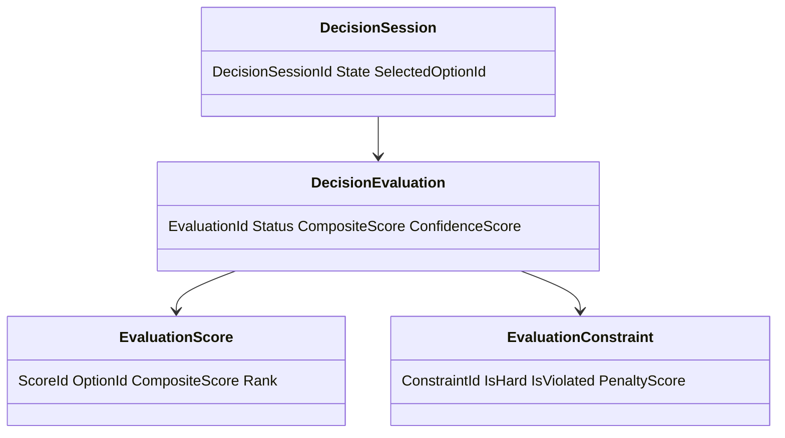
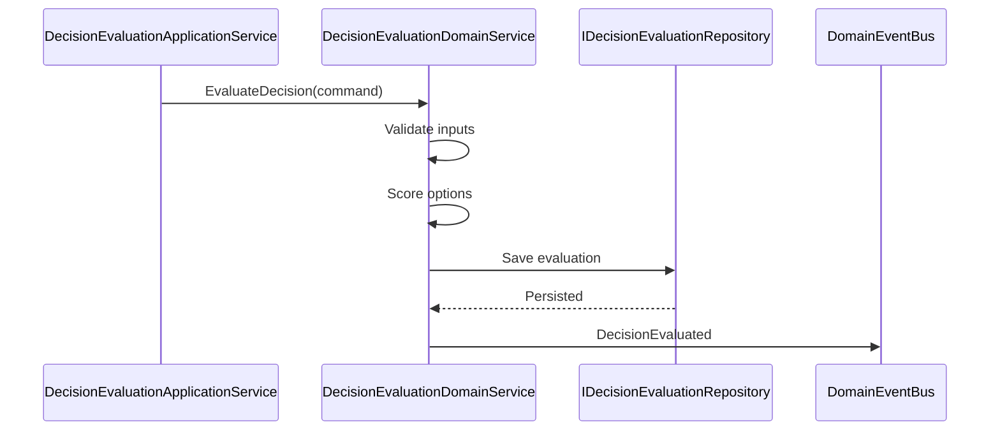
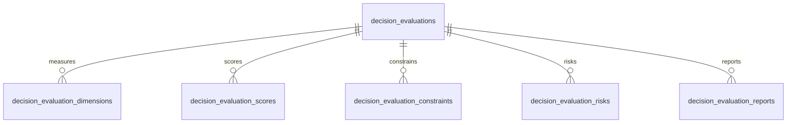
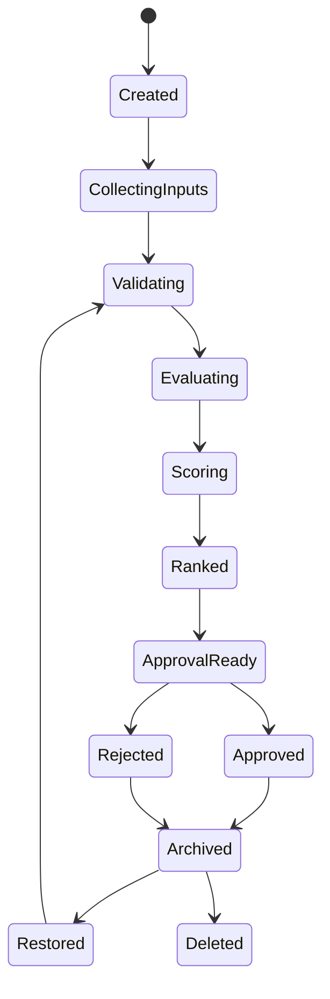
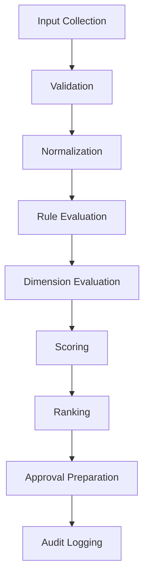
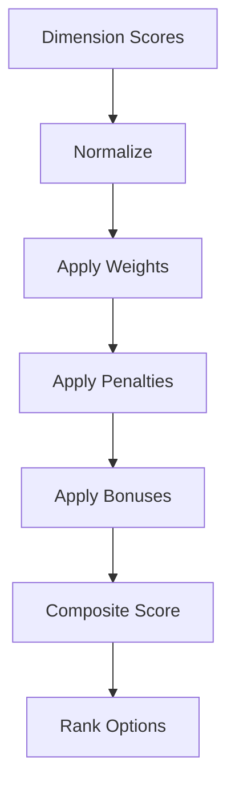
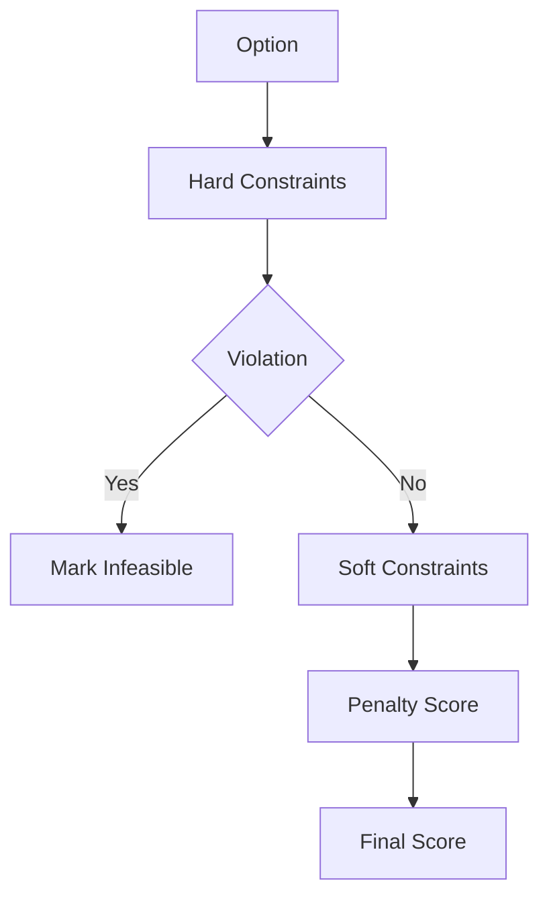

# Decision Evaluation
Version: 1.0
## Split Navigation
- [Decision evaluation criteria](decision-evaluation/criteria-and-scoring.md)
- [Decision evaluation execution](decision-evaluation/execution-and-evidence.md)
- [Decision evaluation governance and testing](decision-evaluation/governance-and-testing.md)
Status: Enterprise Specification
Owner: Project Atlas
Source of Truth: Atlas Decision Evaluation Specification
Last Updated: 2026-07-13
# Decision Evaluation Overview
## Purpose
Decision Evaluation defines how Atlas evaluates DecisionSession options with governed scoring, rule checks, financial impact, risk impact, goal alignment, scenario evidence, simulation evidence, optimization output, constraints, explainability, approval readiness, audit, and reporting.
It coordinates evaluation with Decision Lifecycle, Decision Rule, Decision Explainability, Decision History, Decision Audit, Recommendation, GoalPlan, Scenario, Portfolio, CashFlow, Risk, Constraint, Optimization, Simulation, Workflow, Automation, Business Calendar, Notification, and User.
It preserves existing Atlas domain ownership and existing catalog naming.
## Business Meaning
Decision Evaluation converts decision evidence into comparable, explainable, auditable, and permission-safe evaluation results.
Evaluation output helps decide whether an option should be recommended, approved, rejected, simulated, optimized, executed, or archived.
Evaluation does not directly mutate Recommendation, GoalPlan, Scenario, Portfolio, CashFlow, Workflow, Automation, or Notification.
## Evaluation Scope
Evaluation scope includes option scoring, constraint evaluation, rule evaluation, financial evaluation, risk evaluation, goal alignment, scenario analysis, simulation result, optimization result, ranking, recommendation mapping, approval preparation, report generation, cache, security, and audit.
Scope must preserve HouseholdId.
Scope must preserve TenantId when tenant scope exists.
Scope must not include unauthorized source data.
## Evaluation Lifecycle
Evaluation lifecycle starts when CreateEvaluation or EvaluateDecision creates an evaluation record for a DecisionSession.
Evaluation can be updated, recalculated, approved, rejected, archived, restored, deleted, or reported according to lifecycle rules.
Evaluation result must record source version, rule version, scoring version, constraint version, evaluated time, and actor or system actor.
## Evaluation Objectives
Evaluation objectives are decision quality, financial clarity, risk awareness, goal alignment, scenario compatibility, constraint compliance, explainability, approval readiness, recommendation mapping, and auditability.
Objectives are measured through composite score, confidence score, explainability score, constraint pass rate, rule pass rate, approval readiness, and ranking stability.
## Ownership
DecisionSession owns decision intent, options, selected option, and decision outcome.
Decision Evaluation owns evaluation record, scores, dimension results, constraint results, ranking, evaluation report, and evaluation projections.
Decision Rule owns rule definitions and rule versions.
Decision Explainability owns explanation artifacts.
Decision History owns historical projections.
Decision Audit owns immutable audit evidence.
Repository owns persistence and query.
Application Service owns orchestration.
Security owns authorization and masking.
## Aggregate Root
DecisionSession is the aggregate root.
Decision Evaluation is scoped to DecisionSession and references related aggregates by identifier and source version.
## Relationship with Decision
DecisionSession supplies options, intent, status, owner, rationale, lifecycle state, and selected option.
Evaluation records DecisionSessionId and does not change decision lifecycle without explicit Decision command.
## Relationship with Decision Lifecycle
Decision Lifecycle supplies current state, legal command context, approval readiness, execution readiness, archive state, restore state, and delete eligibility.
Evaluation is allowed only in lifecycle states that permit evaluation.
## Relationship with Decision Rule
Decision Rule supplies rule code, rule category, severity, threshold, priority, and version.
Evaluation records rule result and rule version.
## Relationship with Decision Explainability
Decision Explainability supplies rationale, supporting evidence, formula explanation, constraint explanation, score explanation, and option comparison.
Explainability output must be permission-filtered.
## Relationship with Decision History
Decision History stores evaluation versions, score changes, constraint results, approval changes, and report generation.
History is append-only.
## Relationship with Decision Audit
Decision Audit records command, score changes, rule evaluation, constraint evaluation, access, approval, rejection, archive, restore, delete, and report generation.
Audit is immutable under retention policy.
## Relationship with Recommendation
Recommendation may consume evaluation ranking and approved evaluation result.
Evaluation can map to Recommendation but does not own Recommendation lifecycle.
## Relationship with Goal
GoalPlan supplies goal alignment, priority, target date, target amount, progress, and health evidence.
Evaluation must not mutate GoalPlan.
## Relationship with Scenario
Scenario supplies assumptions, baseline, comparison, and ScenarioVersion.
Scenario evidence must record ScenarioId and ScenarioVersion.
## Relationship with Portfolio
Portfolio supplies allocation, liquidity, risk, performance, and valuation evidence where authorized.
Portfolio evidence must record valuation time and masking state.
## Relationship with CashFlow
CashFlow supplies surplus, deficit, funding gap, contribution capacity, and period evidence where authorized.
CashFlow evidence must record period and currency.
## Relationship with Risk
Risk evidence supplies risk score, risk trend, risk severity, and risk threshold state.
Risk evaluation can reduce composite score or block approval.
## Relationship with Constraint
Constraint evidence supplies hard constraints, soft constraints, penalties, and violation reasons.
Hard constraint failure makes an option infeasible.
## Relationship with Optimization
Optimization supplies candidate ranking, objective score, constraint score, and optimized option evidence.
Optimization output is referenced by version.
## Relationship with Simulation
Simulation supplies scenario result, forecast result, confidence interval, and sensitivity evidence.
Simulation output is referenced by version.
## Relationship with Workflow
Workflow supplies approval route, evaluation task, review state, and escalation step.
Workflow cannot bypass evaluation validation.
## Relationship with Automation
Automation may trigger evaluation, recalculation, reporting, archive, reminder, and cleanup.
AutomationRunId must be recorded.
## Relationship with Business Calendar
Business Calendar supplies evaluation windows, approval deadlines, expiration windows, and escalation timing.
Evaluation deadlines must respect Business Calendar when configured.
## Relationship with Notification
Notification may be triggered by completed evaluation, failed evaluation, approval needed, rejected evaluation, report generated, or constraint failure.
Notification suppression does not remove evaluation history.
## Relationship with User
User supplies actor, owner, approver, reviewer, permission, preference, locale, and masking context.
User permission is evaluated before command and projection.
# Evaluation Architecture
## Evaluation Engine
Evaluation Engine coordinates evidence collection, validation, normalization, dimension evaluation, scoring, ranking, recommendation mapping, approval preparation, and audit.
It produces deterministic results for the same input versions.
## Rule Evaluation Engine
Rule Evaluation Engine evaluates Decision Rule sets and returns pass, fail, warning, severity, score, and explanation.
Rule version is mandatory.
## Financial Evaluation Engine
Financial Evaluation Engine evaluates financial impact, budget variance, funding gap, cost, contribution impact, currency, and period.
Financial fields are masked when required.
## Risk Evaluation Engine
Risk Evaluation Engine evaluates risk score, risk trend, risk severity, downside exposure, and risk-adjusted score.
Critical risk can block approval.
## Goal Alignment Engine
Goal Alignment Engine evaluates relationship between decision option and GoalPlan priority, progress, target, health, milestone, and strategy.
Alignment evidence records GoalPlanId.
## Scenario Evaluation Engine
Scenario Evaluation Engine evaluates scenario compatibility, baseline difference, assumption validity, and scenario confidence.
ScenarioVersion is required.
## Simulation Engine
Simulation Engine provides non-mutating simulation outputs for decision options.
Simulation outputs are evidence only.
## Optimization Engine
Optimization Engine provides option ranking and optimized candidates.
Optimization output is advisory until approved.
## Constraint Engine
Constraint Engine validates hard constraints and computes soft constraint penalties.
Violation detail is recorded per option.
## Scoring Engine
Scoring Engine computes normalized score, weighted score, composite score, confidence score, penalty, bonus, ranking, and tie-breaker.
Scoring version is mandatory.
## Explainability Engine
Explainability Engine generates human-readable rationale, formula trace, evidence trace, and ranking explanation.
Explainability projection must honor masking.
## Audit Engine
Audit Engine records evaluation command, inputs, outputs, score changes, constraint results, rule results, approval, rejection, report, and access.
# Evaluation Pipeline
## Input Collection
Input Collection reads DecisionSession, options, rule set, goal evidence, scenario evidence, portfolio evidence, cashflow evidence, risk evidence, constraints, simulation output, optimization output, workflow state, automation context, calendar window, and user context.
## Validation
Validation checks required identifiers, source versions, permissions, state eligibility, option completeness, and required evidence.
## Normalization
Normalization converts all dimension values into comparable 0 to 100 normalized values while preserving source unit and precision.
## Rule Evaluation
Rule Evaluation applies Decision Rule definitions and records pass, fail, warning, severity, and explanation.
## Financial Evaluation
Financial Evaluation computes cost, funding gap, budget variance, cash requirement, and financial feasibility.
## Risk Evaluation
Risk Evaluation computes risk score, risk penalty, risk trend, and risk-adjusted score.
## Goal Alignment
Goal Alignment computes alignment with goal priority, target, time horizon, progress, and health.
## Scenario Analysis
Scenario Analysis compares baseline, selected scenario, assumption changes, and compatibility.
## Simulation
Simulation imports simulation result and confidence interval for each decision option.
## Optimization
Optimization imports optimized ranking, objective score, and constraint score.
## Scoring
Scoring applies weights, penalties, bonuses, confidence, and normalization.
## Ranking
Ranking sorts options by feasibility, composite score, confidence score, hard constraint result, risk, and tie-breaker.
## Recommendation Mapping
Recommendation Mapping links evaluation result to Recommendation when policy and permission allow.
## Approval Preparation
Approval Preparation identifies required approver, approval reason, blocking constraints, and Decision Lifecycle readiness.
## Audit Logging
Audit Logging records command, source versions, calculated scores, actor, permission context, and correlation id.
# Evaluation Dimensions
## Financial Impact
Definition: Measures option effect on cost, target amount, budget variance, and funding gap.
Business Meaning: Shows whether a decision is financially feasible.
Calculation Formula: FinancialImpactScore = 100 - abs(BudgetVariancePercent) - FundingGapPenalty - CostPenalty.
Inputs: BudgetVariancePercent, FundingGap, CostAmount, Currency.
Outputs: FinancialImpactScore, BudgetVariance, FundingGap.
Threshold: Score below 60 creates warning.
Weight: 0.10.
Validation: Currency and period are required.
Example: Option reduces funding gap by 1200.
## Cash Flow Impact
Definition: Measures option effect on CashFlow capacity and period fit.
Business Meaning: Shows whether the option can be funded in the required period.
Calculation Formula: CashFlowScore = min(100, ContributionCapacity / RequiredContribution * 100) - DeficitPenalty.
Inputs: ContributionCapacity, RequiredContribution, Surplus, Deficit, Period.
Outputs: CashFlowScore, CapacityRatio, DeficitAmount.
Threshold: CapacityRatio below 1 creates warning.
Weight: 0.09.
Validation: CashFlow period must align with decision period.
Example: Option uses 82 percent of available capacity.
## Portfolio Impact
Definition: Measures option effect on allocation, liquidity, risk, and valuation.
Business Meaning: Shows whether Portfolio evidence supports the option.
Calculation Formula: PortfolioScore = LiquidityScore + AllocationFitScore - PortfolioRiskPenalty.
Inputs: Liquidity, Allocation, PortfolioRisk, ValuationTime.
Outputs: PortfolioScore, LiquidityGap, AllocationFit.
Threshold: Stale valuation blocks high confidence score.
Weight: 0.08.
Validation: Portfolio permission and valuation time are required.
Example: Option uses available liquidity without breaching allocation limit.
## Goal Alignment
Definition: Measures option alignment with GoalPlan priority, target, progress, and health.
Business Meaning: Shows whether the decision helps the goal.
Calculation Formula: GoalAlignmentScore = PriorityFit * 0.4 + TargetFit * 0.3 + HealthImpact * 0.3.
Inputs: PriorityScore, TargetDate, TargetAmount, HealthScore.
Outputs: GoalAlignmentScore, AlignmentReason.
Threshold: Score below 50 requires review.
Weight: 0.10.
Validation: GoalPlanId is required when goal alignment applies.
Example: Option improves high-priority goal completion probability.
## Risk Level
Definition: Measures risk exposure and downside.
Business Meaning: Shows whether the option is acceptable under risk policy.
Calculation Formula: RiskScoreNormalized = 100 - RiskScore - RiskTrendPenalty.
Inputs: RiskScore, RiskTrend, RiskSeverity.
Outputs: RiskScoreNormalized, RiskPenalty.
Threshold: RiskScore above 80 blocks approval unless exception applies.
Weight: 0.09.
Validation: RiskScore must be between 0 and 100.
Example: Option lowers risk score from 70 to 55.
## Liquidity
Definition: Measures available liquid capacity after decision.
Business Meaning: Shows whether the option preserves liquidity.
Calculation Formula: LiquidityScore = min(100, AvailableLiquidity / RequiredLiquidity * 100).
Inputs: AvailableLiquidity, RequiredLiquidity.
Outputs: LiquidityScore, LiquidityGap.
Threshold: LiquidityScore below 70 creates warning.
Weight: 0.05.
Validation: Amount and currency are required.
Example: Option keeps liquidity above minimum.
## Time Horizon
Definition: Measures timing fit with decision window and goal horizon.
Business Meaning: Shows whether the option fits schedule.
Calculation Formula: TimeHorizonScore = 100 - abs(TargetDateDeltaDays) * TimePenaltyRate.
Inputs: TargetDate, ExpectedDate, CalendarWindow.
Outputs: TimeHorizonScore, DateDeltaDays.
Threshold: Negative schedule variance creates warning.
Weight: 0.06.
Validation: Business Calendar window must be valid.
Example: Option completes 10 days earlier.
## Priority
Definition: Measures option fit with priority strategy.
Business Meaning: Shows whether the option supports high-priority work.
Calculation Formula: PriorityScoreResult = PriorityScore + DeadlineBonus - ConflictPenalty.
Inputs: PriorityScore, DeadlineProximity, ConflictCount.
Outputs: PriorityScoreResult.
Threshold: Score below 50 requires review.
Weight: 0.05.
Validation: PriorityScore must be between 0 and 100.
Example: Option supports urgent GoalPlan.
## Dependency
Definition: Measures blocker and dependency effect.
Business Meaning: Shows whether the option is blocked.
Calculation Formula: DependencyScore = 100 - CriticalBlockers * 30 - Blockers * 10.
Inputs: CriticalBlockers, Blockers, DependencyAgeDays.
Outputs: DependencyScore, BlockerReason.
Threshold: Critical blocker makes option infeasible.
Weight: 0.05.
Validation: Dependency graph must be acyclic.
Example: Option clears two blockers.
## Tax Impact
Definition: Measures tax-related impact when tax evidence exists.
Business Meaning: Shows whether tax effect changes option value.
Calculation Formula: TaxImpactScore = 100 - TaxCostPenalty + TaxBenefitBonus.
Inputs: TaxCost, TaxBenefit, Period.
Outputs: TaxImpactScore, NetTaxEffect.
Threshold: Material tax cost requires explanation.
Weight: 0.04.
Validation: Tax evidence must be authorized.
Example: Option has tax benefit in current period.
## Loan Impact
Definition: Measures loan-related payment, rate, debt, and amortization effect.
Business Meaning: Shows whether debt impact is acceptable.
Calculation Formula: LoanImpactScore = 100 - PaymentIncreasePenalty - DebtRiskPenalty.
Inputs: PaymentChange, RateChange, DebtBalance.
Outputs: LoanImpactScore.
Threshold: Payment increase above threshold requires review.
Weight: 0.04.
Validation: Loan evidence must be authorized.
Example: Option lowers monthly payment.
## Insurance Impact
Definition: Measures insurance coverage, premium, and protection effect.
Business Meaning: Shows whether protection level remains acceptable.
Calculation Formula: InsuranceImpactScore = CoverageFitScore - PremiumPenalty.
Inputs: CoverageAmount, PremiumAmount, ProtectionGap.
Outputs: InsuranceImpactScore, ProtectionGap.
Threshold: Protection gap creates warning.
Weight: 0.03.
Validation: Policy evidence must be authorized.
Example: Option preserves required coverage.
## Investment Impact
Definition: Measures investment return, volatility, allocation, and risk effect.
Business Meaning: Shows whether investment effect supports the decision.
Calculation Formula: InvestmentImpactScore = ExpectedReturnScore - VolatilityPenalty - AllocationPenalty.
Inputs: ExpectedReturn, Volatility, AllocationDelta.
Outputs: InvestmentImpactScore.
Threshold: Allocation breach blocks approval.
Weight: 0.06.
Validation: Portfolio permission is required.
Example: Option improves allocation fit.
## Scenario Compatibility
Definition: Measures fit with selected scenario assumptions.
Business Meaning: Shows whether option remains viable under scenario.
Calculation Formula: ScenarioCompatibilityScore = BaselineFit + ScenarioDeltaScore + ConfidenceBonus.
Inputs: ScenarioOutcome, BaselineOutcome, ScenarioConfidence.
Outputs: ScenarioCompatibilityScore, ScenarioDelta.
Threshold: Incompatible scenario blocks automatic approval.
Weight: 0.06.
Validation: ScenarioId and ScenarioVersion are required.
Example: Option remains feasible under stress scenario.
## Execution Complexity
Definition: Measures operational difficulty, steps, dependencies, and retry risk.
Business Meaning: Shows how hard the option is to execute.
Calculation Formula: ExecutionComplexityScore = 100 - StepCountPenalty - DependencyPenalty - RetryRiskPenalty.
Inputs: StepCount, DependencyCount, RetryRisk.
Outputs: ExecutionComplexityScore.
Threshold: Score below 50 requires execution review.
Weight: 0.04.
Validation: Execution plan evidence must be valid when present.
Example: Option has fewer execution steps.
## Operational Cost
Definition: Measures operating effort, time, and recurring burden.
Business Meaning: Shows cost of maintaining the option.
Calculation Formula: OperationalCostScore = 100 - OperatingCostPenalty - EffortPenalty.
Inputs: OperatingCost, EffortHours, Recurrence.
Outputs: OperationalCostScore.
Threshold: High recurring cost creates warning.
Weight: 0.03.
Validation: Cost unit and period are required.
Example: Option lowers monthly operating cost.
## Business Value
Definition: Measures strategic value and outcome value.
Business Meaning: Shows whether option creates meaningful value.
Calculation Formula: BusinessValueScore = OutcomeValue * 0.6 + StrategicFit * 0.4.
Inputs: OutcomeValue, StrategicFit.
Outputs: BusinessValueScore.
Threshold: Score below 40 deprioritizes option.
Weight: 0.08.
Validation: Value score must be between 0 and 100.
Example: Option improves long-term goal outcome.
## User Preference Alignment
Definition: Measures fit with user preference and constraints.
Business Meaning: Shows whether option respects user preferences.
Calculation Formula: PreferenceScore = 100 - PreferenceConflictPenalty + PreferenceMatchBonus.
Inputs: PreferenceMatches, PreferenceConflicts.
Outputs: PreferenceScore.
Threshold: Hard preference conflict blocks option.
Weight: 0.05.
Validation: Preference must be authorized and current.
Example: Option matches preferred contribution limit.
## Confidence Score
Definition: Measures reliability of evaluation result.
Business Meaning: Shows trust level of scoring and ranking.
Calculation Formula: ConfidenceScore = SourceFreshness * 0.4 + EvidenceCompleteness * 0.4 + ModelReliability * 0.2.
Inputs: SourceFreshness, EvidenceCompleteness, ModelReliability.
Outputs: ConfidenceScore.
Threshold: Score below 60 requires review.
Weight: 0.08.
Validation: Evidence completeness is required.
Example: Evaluation has current source data and complete evidence.
## Explainability Score
Definition: Measures how well the evaluation can be explained.
Business Meaning: Shows whether approval has understandable rationale.
Calculation Formula: ExplainabilityScore = EvidenceTraceability * 0.4 + FormulaTraceability * 0.3 + RationaleCompleteness * 0.3.
Inputs: EvidenceTraceability, FormulaTraceability, RationaleCompleteness.
Outputs: ExplainabilityScore.
Threshold: Score below 70 blocks automatic approval.
Weight: 0.07.
Validation: Explanation artifacts must be present.
Example: Every score traces to source evidence.
# Evaluation Scoring
## Weighted Score
Weighted Score = sum(NormalizedDimensionScore_i * Weight_i) / sum(Weight_i).
Weights must be non-negative.
## Composite Score
Composite Score = WeightedScore + BonusScore - PenaltyScore.
Composite Score is clamped between 0 and 100.
## Normalized Score
Normalized Score converts raw dimension values to a 0 to 100 scale.
Normalization formula and version must be recorded.
## Confidence Score
Confidence Score = SourceFreshness * 0.4 + EvidenceCompleteness * 0.4 + CalculationReliability * 0.2.
Confidence below threshold requires approval review.
## Penalty Rules
Hard constraint failure sets option feasibility to false.
Soft constraint failure adds penalty to composite score.
Stale evidence adds confidence penalty.
Missing explainability adds approval penalty.
## Bonus Rules
Goal alignment bonus applies when option improves high-priority GoalPlan.
Scenario bonus applies when option performs better than baseline.
Risk reduction bonus applies when option lowers risk.
CashFlow bonus applies when option improves capacity ratio.
## Ranking Rules
Feasible options rank above infeasible options.
Higher composite score ranks above lower composite score.
Higher confidence ranks above lower confidence when composite score ties.
Lower risk ranks above higher risk when confidence ties.
## Tie-breaking Rules
Tie-breaking order is feasibility, composite score, confidence score, risk score, financial impact, goal alignment, created time, and option id.
# Constraint Evaluation
## Hard Constraints
Hard constraints cannot be violated.
Violation makes the option infeasible and blocks approval unless explicit exception policy allows.
## Soft Constraints
Soft constraints create score penalties and warnings.
Soft constraint violations must remain visible in detail projection.
## Financial Constraints
Financial constraints include budget cap, funding gap, currency, period, and approved amount.
## Risk Constraints
Risk constraints include maximum risk score, critical risk, risk trend, and risk exception.
## Goal Constraints
Goal constraints include GoalPlan lifecycle state, dependency, target date, target amount, and priority.
## Scenario Constraints
Scenario constraints include ScenarioId, ScenarioVersion, assumption validity, and baseline compatibility.
## Portfolio Constraints
Portfolio constraints include portfolio permission, valuation freshness, liquidity, allocation, and risk limit.
## Cash Flow Constraints
Cash Flow constraints include period alignment, contribution capacity, deficit, surplus, and funding gap.
## Regulatory Constraints
Regulatory constraints use existing Atlas governance and compliance rules.
## User Preference Constraints
User Preference constraints include preference limits, excluded options, required review, and notification preference.
# Validation Rules
1. EvaluationId must be globally unique. 2. DecisionSessionId is required. 3. HouseholdId is required. 4. TenantId is required when tenant scope exists. 5. Evaluation state is required. 6. Evaluation source version hash is required. 7. Rule version is required. 8. Scoring version is required. 9. Constraint version is required. 10. Evaluation must include at least one decision option. 11. Option ids must be unique. 12. Dimension result must reference a known dimension. 13. Dimension score must be between 0 and 100. 14. Dimension weight must be greater than or equal to 0. 15. Total active weight must be greater than 0. 16. Composite score must be between 0 and 100. 17. Confidence score must be between 0 and 100. 18. Explainability score must be between 0 and 100. 19. Hard constraint violation must mark option infeasible. 20. Soft constraint violation must include penalty. 21. Financial evidence must include currency and period. 22. CashFlow evidence must include period. 23. Portfolio evidence must include valuation time. 24. Scenario evidence must include ScenarioId and ScenarioVersion. 25. Risk score must be between 0 and 100. 26. Recommendation mapping must reference existing Recommendation when present. 27. GoalPlan reference must exist when present. 28. Approval requires approver id. 29. Rejection requires rejection reason. 30. Archive requires terminal or policy-approved state. 31. Restore requires archived evaluation. 32. Delete requires retention validation. 33. Report generation requires report permission. 34. Search date range must be valid. 35. Sorting field must be allowed. 36. Projection field must be allowed. 37. Pagination limit must be within API maximum. 38. Masked fields must not appear in unauthorized projection. 39. Audit metadata is required for every command. 40. EvaluatedAt cannot be before createdAt.
# Business Rules
1. Decision Evaluation must preserve Atlas domain ownership. 2. Decision Evaluation must not redesign Atlas. 3. Decision Evaluation must not create unrelated business concepts. 4. Evaluation naming must follow existing catalog. 5. DecisionSession owns decision intent and outcome. 6. Evaluation cannot approve DecisionSession directly without ApproveDecision. 7. Evaluation cannot execute DecisionSession directly without ExecuteDecision. 8. Evaluation cannot mutate Recommendation directly. 9. Evaluation cannot mutate GoalPlan directly. 10. Evaluation cannot mutate Scenario directly. 11. Evaluation cannot mutate Portfolio directly. 12. Evaluation cannot mutate CashFlow directly. 13. Every evaluation must reference DecisionSessionId. 14. Every evaluation must record source version. 15. Every evaluation must record scoring version. 16. Every evaluation must record rule version. 17. Every evaluation must record constraint version. 18. Every option must receive a composite score. 19. Every option must receive a confidence score. 20. Every option must receive explainability evidence. 21. Hard constraint failure makes option infeasible. 22. Infeasible option cannot be approved. 23. Soft constraint failure reduces score. 24. Soft constraint failure must remain visible. 25. Rule failure must remain visible. 26. Critical rule failure blocks approval. 27. Financial impact must preserve currency. 28. CashFlow impact must preserve period. 29. Portfolio impact requires portfolio permission. 30. Portfolio valuation time must be recorded. 31. Scenario compatibility requires ScenarioVersion. 32. Simulation result must be non-mutating. 33. Optimization result is advisory before approval. 34. Ranking must be deterministic for identical inputs. 35. Feasible option ranks above infeasible option. 36. Composite score determines primary ranking. 37. Confidence score determines tie-breaker after composite score. 38. Risk level determines tie-breaker after confidence. 39. Goal alignment determines tie-breaker after risk. 40. Evaluation report must preserve evaluated time. 41. Evaluation report must preserve source versions. 42. Recommendation mapping requires recommendation permission. 43. Approval preparation must identify blockers. 44. Approval preparation must identify required approver. 45. Approval preparation must include explanation. 46. Evaluation approval requires evaluation permission. 47. Evaluation rejection requires rejection reason. 48. Archived evaluation is read-only. 49. Restored evaluation must revalidate source version. 50. Deleted evaluation cannot be restored. 51. Evaluation history is append-only. 52. Score history is append-only. 53. Constraint history is append-only. 54. Decision history is append-only. 55. Approval history is append-only. 56. Audit trail is required for commands. 57. Cache failure must not roll back persisted evaluation. 58. Notification failure must not roll back persisted evaluation. 59. Report generation failure must not delete evaluation. 60. Permission change invalidates evaluation cache. 61. Masking change invalidates evaluation cache. 62. Rule change marks evaluation stale. 63. Scoring change marks evaluation stale. 64. Constraint change marks evaluation stale. 65. Source version change marks evaluation stale. 66. Stale evaluation cannot be approved without refresh. 67. Stale evaluation can be archived. 68. Batch evaluation must isolate item failures. 69. Parallel evaluation must preserve deterministic results. 70. Incremental evaluation must process changed evidence only. 71. Business Calendar can constrain approval preparation. 72. Workflow can require review before approval. 73. Automation can trigger recalculation. 74. Automation cannot bypass permission. 75. User preference can add constraints. 76. User preference cannot hide audit evidence. 77. Field-level security applies before cache. 78. Field-level security applies before report. 79. Field-level security applies before API response. 80. Aggregation must not leak unauthorized data. 81. Search must enforce HouseholdId scope. 82. Tenant-aware search must enforce TenantId. 83. Export must use masked projection when required. 84. Evaluation report must be reproducible. 85. Explainability score below threshold blocks automatic approval. 86. Confidence score below threshold requires review. 87. Financial warning must be visible in detail. 88. Risk warning must be visible in detail. 89. Constraint warning must be visible in detail. 90. Rule warning must be visible in detail. 91. Decision Lifecycle state must allow evaluation. 92. Evaluation cannot run on deleted decision. 93. Evaluation cannot update archived decision state. 94. Approved evaluation cannot change scores. 95. Rejected evaluation cannot be approved without restore. 96. Archived evaluation cannot be updated. 97. Reported evaluation must preserve snapshot values. 98. Materialized views must use committed data. 99. Optimistic concurrency is required for updates. 100. Duplicate command must be idempotent by command id. 101. Domain event must be emitted after persistence. 102. Domain event must include evaluation id. 103. Domain event must include DecisionSessionId. 104. Domain event must include prior state and current state when applicable. 105. Audit record must include actor and correlation id.
# State Machine
## States
- Created
- CollectingInputs
- Validating
- Evaluating
- Scoring
- Ranked
- ApprovalReady
- Approved
- Rejected
- Archived
- Restored
- Deleted
## Transitions
- Created -> CollectingInputs by CreateEvaluation.
- CollectingInputs -> Validating by UpdateEvaluation.
- Validating -> Evaluating by EvaluateDecision when validation passes.
- Validating -> Rejected by RejectEvaluation when validation fails and rejection is requested.
- Evaluating -> Scoring by EvaluateDecision after dimension evaluation.
- Scoring -> Ranked by scoring completion.
- Ranked -> ApprovalReady by approval preparation.
- ApprovalReady -> Approved by ApproveEvaluation.
- ApprovalReady -> Rejected by RejectEvaluation.
- Approved -> Archived by ArchiveEvaluation.
- Rejected -> Archived by ArchiveEvaluation.
- Archived -> Restored by RestoreEvaluation.
- Restored -> Validating by ReEvaluateDecision.
- Archived -> Deleted by DeleteEvaluation.
## Triggers
- CreateEvaluation
- UpdateEvaluation
- EvaluateDecision
- ReEvaluateDecision
- ApproveEvaluation
- RejectEvaluation
- ArchiveEvaluation
- RestoreEvaluation
- DeleteEvaluation
- GenerateEvaluationReport
- SourceChanged
- RuleChanged
- ScoreChanged
- ConstraintChanged
## Invariant
EvaluationId, DecisionSessionId, HouseholdId, created time, source version hash, and initial scope are immutable.
Approved evaluation scores are immutable.
Archived evaluation is read-only.
Deleted evaluation is terminal.
## Illegal Transition
- Deleted -> Approved.
- Deleted -> Evaluating.
- Archived -> Approved without RestoreEvaluation.
- Approved -> Evaluating.
- Rejected -> Approved without RestoreEvaluation.
- Created -> Approved.
- CollectingInputs -> Approved.
- Validating -> Approved.
- Scoring -> Approved.
# Commands
## CreateEvaluation
Creates evaluation record for DecisionSession.
## UpdateEvaluation
Updates editable evaluation inputs before approval.
## EvaluateDecision
Runs evaluation pipeline and produces scores.
## ReEvaluateDecision
Recalculates evaluation after source, rule, score, or constraint change.
## ApproveEvaluation
Approves evaluation result for approval preparation or recommendation mapping.
## RejectEvaluation
Rejects evaluation with reason.
## ArchiveEvaluation
Archives evaluation and makes it read-only.
## RestoreEvaluation
Restores archived evaluation after validation.
## DeleteEvaluation
Deletes eligible evaluation after retention validation.
## GenerateEvaluationReport
Generates evaluation report projection.
## RefreshEvaluation
Refreshes source versions and stale indicators.
## MapEvaluationRecommendation
Maps evaluation result to Recommendation.
## ExportEvaluation
Exports masked evaluation projection.
# Domain Events
## EvaluationCreated
Emitted after CreateEvaluation succeeds.
## EvaluationUpdated
Emitted after UpdateEvaluation succeeds.
## DecisionEvaluated
Emitted after EvaluateDecision succeeds.
## EvaluationApproved
Emitted after ApproveEvaluation succeeds.
## EvaluationRejected
Emitted after RejectEvaluation succeeds.
## EvaluationArchived
Emitted after ArchiveEvaluation succeeds.
## EvaluationRestored
Emitted after RestoreEvaluation succeeds.
## EvaluationDeleted
Emitted after DeleteEvaluation succeeds.
## EvaluationReportGenerated
Emitted after report generation succeeds.
## EvaluationRecalculated
Emitted after ReEvaluateDecision succeeds.
## EvaluationConstraintFailed
Emitted after hard constraint failure is recorded.
## EvaluationScoreChanged
Emitted after score materially changes.
## EvaluationStale
Emitted after source, rule, scoring, or constraint version changes.
# Repository
## Interface
IDecisionEvaluationRepository persists evaluation aggregate, dimension results, score results, constraint results, risk results, report history, approval history, and projections.
## Methods
- Add
- Update
- GetById
- GetByDecisionSessionId
- GetLatestByDecisionSessionId
- Search
- SaveDimensionResult
- SaveScoreResult
- SaveConstraintResult
- SaveRiskResult
- SaveReport
- SaveApprovalHistory
- Archive
- Restore
- Delete
- GetSummaryProjection
- GetDetailProjection
- GetScoreProjection
## Queries
- EvaluationsByDecision
- EvaluationsByStatus
- EvaluationsByScoreRange
- EvaluationsByConstraintResult
- EvaluationsByRiskLevel
- EvaluationsByGoalPlan
- EvaluationsByScenario
- StaleEvaluations
- ApprovalReadyEvaluations
- ArchivedEvaluations
## Filtering
- EvaluationId
- DecisionSessionId
- HouseholdId
- TenantId
- Status
- ScoreRange
- ConfidenceRange
- RiskLevel
- ConstraintResult
- RecommendationId
- GoalPlanId
- ScenarioId
- CreatedDateRange
- EvaluatedDateRange
## Sorting
- createdAt desc
- evaluatedAt desc
- compositeScore desc
- confidenceScore desc
- explainabilityScore desc
- riskScore asc
- status asc
## Aggregation
- CountByStatus
- CountByRiskLevel
- CountByConstraintResult
- AverageCompositeScore
- AverageConfidenceScore
- AverageExplainabilityScore
- ApprovalReadyCount
- StaleCount
## Projection
- EvaluationSummaryProjection
- EvaluationDetailProjection
- ScoreProjection
- ConstraintProjection
- RiskProjection
- ReportProjection
- DashboardProjection
## Specification
- ActiveEvaluationSpecification
- VisibleEvaluationSpecification
- ApprovalReadyEvaluationSpecification
- StaleEvaluationSpecification
- HighRiskEvaluationSpecification
- ConstraintFailedEvaluationSpecification
- AuditEvaluationSpecification
# Domain Service Interaction
- DecisionEvaluationDomainService validates evaluation lifecycle, scoring, constraints, and business rules.
- DecisionLifecycleDomainService supplies decision state eligibility.
- DecisionRuleDomainService supplies decision rules and versions.
- DecisionExplainabilityDomainService creates explanation artifacts.
- DecisionHistoryDomainService records evaluation history.
- DecisionAuditDomainService records audit evidence.
- RecommendationDomainService consumes approved evaluation mapping.
- GoalLifecycleDomainService supplies GoalPlan state and lifecycle constraints.
- GoalProgressDomainService supplies goal progress evidence.
- ScenarioDomainService supplies scenario evidence and version.
- PortfolioDomainService supplies authorized portfolio evidence.
- CashFlowDomainService supplies authorized cashflow evidence.
- RiskDomainService supplies risk evidence where present.
- ConstraintDomainService supplies constraint definitions where present.
- SimulationDomainService supplies simulation result evidence.
- OptimizationDomainService supplies optimization result evidence.
- WorkflowDomainService supplies approval readiness and workflow state.
- AutomationDomainService supplies automation trigger context.
- BusinessCalendarDomainService validates evaluation and approval windows.
- NotificationDomainService receives evaluation triggers.
- SecurityDomainService evaluates authorization and masking.
- CacheDomainService invalidates evaluation projections.
# Application Service Interaction
- DecisionEvaluationApplicationService coordinates commands, queries, unit of work, event publication, and cache invalidation.
- CreateEvaluationHandler creates evaluation record.
- UpdateEvaluationHandler updates editable evaluation inputs.
- EvaluateDecisionHandler executes evaluation pipeline.
- ReEvaluateDecisionHandler refreshes source versions and recalculates scores.
- ApproveEvaluationHandler validates approval permission and locks scores.
- RejectEvaluationHandler records rejection reason.
- ArchiveEvaluationHandler validates archive policy.
- RestoreEvaluationHandler validates source and permission.
- DeleteEvaluationHandler validates retention.
- GenerateEvaluationReportHandler creates report projection.
- SearchEvaluationQueryHandler applies filters, sorting, pagination, and projection.
- BulkEvaluationHandler performs batch evaluation with per-item result.
# API
## REST Endpoints
- GET /api/decision-evaluations
- POST /api/decision-evaluations
- GET /api/decision-evaluations/{evaluationId}
- PUT /api/decision-evaluations/{evaluationId}
- POST /api/decision-evaluations/{evaluationId}/evaluate
- POST /api/decision-evaluations/{evaluationId}/reevaluate
- POST /api/decision-evaluations/{evaluationId}/approve
- POST /api/decision-evaluations/{evaluationId}/reject
- POST /api/decision-evaluations/{evaluationId}/archive
- POST /api/decision-evaluations/{evaluationId}/restore
- DELETE /api/decision-evaluations/{evaluationId}
- POST /api/decision-evaluations/{evaluationId}/report
- POST /api/decision-evaluations/bulk/evaluate
- GET /api/decisions/{decisionSessionId}/evaluations
## HTTP Methods
GET reads evaluation projections.
POST creates, evaluates, recalculates, approves, rejects, archives, restores, reports, or batches evaluation.
PUT updates editable fields.
DELETE deletes eligible evaluation after retention validation.
## Request
Create request includes DecisionSessionId, options, scope, evaluation dimensions, scoring version, constraint version, and source version mode.
Update request includes version, inputs, dimension settings, and update reason.
Evaluate request includes source version mode, included dimensions, force refresh flag, and report option.
Approve request includes reason, approver, expected version, and optional Recommendation mapping.
Reject request includes reason and expected version.
Search request includes filters, sorting, pagination, and projection.
## Response
Detail response returns evaluation, dimension results, score results, constraint results, risk results, ranking, explainability, permissions, and audit metadata.
Summary response returns status, composite score, confidence score, explainability score, top option, and stale flag.
Report response returns report id, score summary, constraint summary, ranking, and generated time.
Bulk response returns processed, succeeded, failed, skipped, and per-item errors.
## Errors
- 400 invalid request
- 401 unauthenticated
- 403 forbidden
- 404 evaluation not found
- 409 concurrency conflict
- 410 stale source
- 422 validation failed
- 423 evaluation locked
- 424 dependency blocked
- 429 rate limited
- 500 internal error
## Pagination
Pagination uses pageNumber, pageSize, totalCount, totalPages, hasNextPage, and hasPreviousPage.
## Filtering
Filtering supports status, score range, confidence range, explainability range, risk level, constraint result, DecisionSessionId, GoalPlanId, ScenarioId, RecommendationId, date range, and stale flag.
## Sorting
Sorting supports createdAt, evaluatedAt, compositeScore, confidenceScore, explainabilityScore, riskScore, and status.
## Projection
Projection supports summary, detail, score, constraint, risk, report, dashboard, and audit-safe views.
## Bulk API
Bulk API supports evaluate, recalculate, archive, restore, report, and export with per-item result and correlation id.
## Evaluation API
Evaluation API provides create, update, evaluate, recalculate, approve, reject, archive, restore, delete, report, and query operations.
# DTO
## Create DTO
Includes DecisionSessionId, options, dimensions, constraints, scoring version, rule version, source version mode, and scope.
## Update DTO
Includes EvaluationId, version, editable inputs, dimension settings, constraint settings, and update reason.
## Evaluation DTO
Includes EvaluationId, DecisionSessionId, status, source version, rule version, scoring version, constraint version, and timestamps.
## Score DTO
Includes option id, dimension scores, weighted score, composite score, normalized score, confidence score, explainability score, penalties, and bonuses.
## Constraint DTO
Includes constraint id, type, hard flag, violation flag, penalty score, reason, and evidence.
## Risk DTO
Includes risk level, risk score, risk trend, risk penalty, and mitigation evidence.
## Summary DTO
Includes EvaluationId, status, top option, composite score, confidence score, explainability score, stale flag, and evaluatedAt.
## Detail DTO
Includes all dimensions, scores, constraints, risks, ranking, explanation, approvals, reports, permissions, and audit metadata.
## Search DTO
Includes filters, sorting, pagination, projection, and masking mode.
## Report DTO
Includes report id, evaluation id, score summary, constraint summary, ranking, generatedAt, and generatedBy.
# Database Mapping
## Table
- decision_evaluations
- decision_evaluation_dimensions
- decision_evaluation_scores
- decision_evaluation_constraints
- decision_evaluation_risks
- decision_evaluation_reports
- decision_evaluation_approval_history
- decision_evaluation_audit
## Columns
- evaluation_id uuid primary key
- tenant_id uuid null
- household_id uuid not null
- decision_session_id uuid not null
- status varchar(40) not null
- source_version_hash varchar(128) not null
- rule_version varchar(40) not null
- scoring_version varchar(40) not null
- constraint_version varchar(40) not null
- top_option_id uuid null
- composite_score numeric(6,2) null
- confidence_score numeric(5,2) null
- explainability_score numeric(5,2) null
- risk_score numeric(5,2) null
- is_stale boolean not null
- evaluated_at timestamptz null
- archived_at timestamptz null
- deleted_at timestamptz null
- created_at timestamptz not null
- updated_at timestamptz not null
- version int not null
## Indexes
- ix_decision_evaluations_decision_status
- ix_decision_evaluations_household_status
- ix_decision_evaluations_score
- ix_decision_evaluations_confidence
- ix_decision_evaluations_risk
- ix_decision_evaluations_stale
- ix_decision_evaluations_evaluated_at
- ux_decision_evaluations_latest_active
## Constraints
- composite_score between 0 and 100 when present
- confidence_score between 0 and 100 when present
- explainability_score between 0 and 100 when present
- risk_score between 0 and 100 when present
- status in supported states
- version greater than zero
## FK
- decision_session_id references decision_sessions.
- household_id references households.
- evaluation_id references decision_evaluations for child tables.
- top_option_id references decision options when present.
## Unique
- Unique latest active evaluation per DecisionSession and scoring version.
- Unique option score per evaluation and option.
- Unique dimension result per evaluation, option, and dimension.
## Check Constraint
- Deleted status requires deleted_at.
- Approved status requires approval history.
## Partition Strategy
- Partition dimensions, scores, constraints, risks, reports, approval history, and audit by created_at month.
# PostgreSQL Schema
```sql
CREATE TABLE decision_evaluations (
  evaluation_id uuid PRIMARY KEY,
  tenant_id uuid NULL,
  household_id uuid NOT NULL,
  decision_session_id uuid NOT NULL,
  status varchar(40) NOT NULL,
  source_version_hash varchar(128) NOT NULL,
  rule_version varchar(40) NOT NULL,
  scoring_version varchar(40) NOT NULL,
  constraint_version varchar(40) NOT NULL,
  top_option_id uuid NULL,
  composite_score numeric(6,2) NULL,
  confidence_score numeric(5,2) NULL,
  explainability_score numeric(5,2) NULL,
  risk_score numeric(5,2) NULL,
  is_stale boolean NOT NULL DEFAULT false,
  evaluated_at timestamptz NULL,
  archived_at timestamptz NULL,
  deleted_at timestamptz NULL,
  created_by uuid NULL,
  updated_by uuid NULL,
  created_at timestamptz NOT NULL DEFAULT now(),
  updated_at timestamptz NOT NULL DEFAULT now(),
  version int NOT NULL DEFAULT 1,
  CONSTRAINT ck_decision_evaluations_status CHECK (status IN ('Created','CollectingInputs','Validating','Evaluating','Scoring','Ranked','ApprovalReady','Approved','Rejected','Archived','Restored','Deleted')),
  CONSTRAINT ck_decision_evaluations_composite CHECK (composite_score IS NULL OR (composite_score >= 0 AND composite_score <= 100)),
  CONSTRAINT ck_decision_evaluations_confidence CHECK (confidence_score IS NULL OR (confidence_score >= 0 AND confidence_score <= 100)),
  CONSTRAINT ck_decision_evaluations_explainability CHECK (explainability_score IS NULL OR (explainability_score >= 0 AND explainability_score <= 100)),
  CONSTRAINT ck_decision_evaluations_risk CHECK (risk_score IS NULL OR (risk_score >= 0 AND risk_score <= 100)),
  CONSTRAINT ck_decision_evaluations_version CHECK (version > 0)
);
CREATE TABLE decision_evaluation_dimensions (
  dimension_id uuid PRIMARY KEY,
  evaluation_id uuid NOT NULL REFERENCES decision_evaluations(evaluation_id),
  option_id uuid NOT NULL,
  dimension_name varchar(120) NOT NULL,
  raw_value numeric(18,4) NULL,
  normalized_score numeric(5,2) NOT NULL,
  weight numeric(8,4) NOT NULL,
  evidence_payload jsonb NOT NULL DEFAULT '{}'::jsonb,
  created_at timestamptz NOT NULL DEFAULT now(),
  CONSTRAINT ck_decision_evaluation_dimension_score CHECK (normalized_score >= 0 AND normalized_score <= 100),
  CONSTRAINT ck_decision_evaluation_dimension_weight CHECK (weight >= 0)
);
CREATE TABLE decision_evaluation_scores (
  score_id uuid PRIMARY KEY,
  evaluation_id uuid NOT NULL REFERENCES decision_evaluations(evaluation_id),
  option_id uuid NOT NULL,
  weighted_score numeric(6,2) NOT NULL,
  composite_score numeric(6,2) NOT NULL,
  confidence_score numeric(5,2) NOT NULL,
  explainability_score numeric(5,2) NOT NULL,
  rank int NOT NULL,
  score_payload jsonb NOT NULL DEFAULT '{}'::jsonb,
  created_at timestamptz NOT NULL DEFAULT now(),
  CONSTRAINT ck_decision_evaluation_scores_range CHECK (weighted_score >= 0 AND weighted_score <= 100 AND composite_score >= 0 AND composite_score <= 100),
  CONSTRAINT ck_decision_evaluation_scores_rank CHECK (rank > 0)
);
CREATE TABLE decision_evaluation_constraints (
  constraint_result_id uuid PRIMARY KEY,
  evaluation_id uuid NOT NULL REFERENCES decision_evaluations(evaluation_id),
  option_id uuid NOT NULL,
  constraint_type varchar(120) NOT NULL,
  is_hard boolean NOT NULL,
  is_violated boolean NOT NULL,
  penalty_score numeric(6,2) NOT NULL DEFAULT 0,
  reason varchar(800) NULL,
  evidence_payload jsonb NOT NULL DEFAULT '{}'::jsonb,
  created_at timestamptz NOT NULL DEFAULT now()
);
CREATE TABLE decision_evaluation_risks (
  risk_result_id uuid PRIMARY KEY,
  evaluation_id uuid NOT NULL REFERENCES decision_evaluations(evaluation_id),
  option_id uuid NOT NULL,
  risk_level varchar(40) NOT NULL,
  risk_score numeric(5,2) NOT NULL,
  risk_payload jsonb NOT NULL DEFAULT '{}'::jsonb,
  created_at timestamptz NOT NULL DEFAULT now(),
  CONSTRAINT ck_decision_evaluation_risk_score CHECK (risk_score >= 0 AND risk_score <= 100)
);
CREATE TABLE decision_evaluation_reports (
  report_id uuid PRIMARY KEY,
  evaluation_id uuid NOT NULL REFERENCES decision_evaluations(evaluation_id),
  report_payload jsonb NOT NULL DEFAULT '{}'::jsonb,
  generated_by uuid NULL,
  generated_at timestamptz NOT NULL DEFAULT now(),
  correlation_id uuid NOT NULL
);
CREATE TABLE decision_evaluation_approval_history (
  approval_history_id uuid PRIMARY KEY,
  evaluation_id uuid NOT NULL REFERENCES decision_evaluations(evaluation_id),
  approval_state varchar(40) NOT NULL,
  reason varchar(800) NOT NULL,
  actor_id uuid NULL,
  occurred_at timestamptz NOT NULL DEFAULT now(),
  correlation_id uuid NOT NULL
);
CREATE TABLE decision_evaluation_audit (
  audit_id uuid PRIMARY KEY,
  evaluation_id uuid NULL,
  action varchar(120) NOT NULL,
  actor_id uuid NULL,
  payload jsonb NOT NULL DEFAULT '{}'::jsonb,
  occurred_at timestamptz NOT NULL DEFAULT now(),
  correlation_id uuid NOT NULL
);
CREATE INDEX ix_decision_evaluations_decision_status ON decision_evaluations(decision_session_id, status);
CREATE INDEX ix_decision_evaluations_household_status ON decision_evaluations(household_id, status);
CREATE INDEX ix_decision_evaluations_score ON decision_evaluations(composite_score DESC);
CREATE INDEX ix_decision_evaluations_confidence ON decision_evaluations(confidence_score DESC);
CREATE INDEX ix_decision_evaluations_risk ON decision_evaluations(risk_score);
CREATE INDEX ix_decision_evaluations_stale ON decision_evaluations(is_stale);
CREATE INDEX ix_decision_evaluations_evaluated_at ON decision_evaluations(evaluated_at);
CREATE UNIQUE INDEX ux_decision_evaluations_latest_active ON decision_evaluations(decision_session_id, scoring_version) WHERE status <> 'Deleted';
CREATE VIEW v_decision_evaluation_summary AS
SELECT evaluation_id, household_id, decision_session_id, status, top_option_id, composite_score, confidence_score, explainability_score, risk_score, is_stale, evaluated_at
FROM decision_evaluations
WHERE status <> 'Deleted';
CREATE MATERIALIZED VIEW mv_decision_evaluation_dashboard AS
SELECT household_id, status, count(*) AS evaluation_count, avg(composite_score) AS average_score, avg(confidence_score) AS average_confidence
FROM decision_evaluations
WHERE status <> 'Deleted'
GROUP BY household_id, status;
```
# EF Core Mapping
- Fluent API maps DecisionEvaluation to decision_evaluations with evaluation_id primary key.
- Owned Types map evidence payload, score payload, risk payload, report payload, and audit payload as JSON.
- Indexes map decision status, household status, score, confidence, risk, stale flag, evaluated time, and latest active evaluation.
- Value Conversion stores EvaluationStatus, DimensionName, ConstraintType, RiskLevel, ApprovalState, and report type as strings.
- Query Filters exclude Deleted by default and enforce tenant scope when tenant scope exists.
- Concurrency token uses version column.
- Navigation maps dimensions, scores, constraints, risks, reports, approval history, and audit.
# Cache Strategy
- Redis Key: atlas:decision-evaluation:{tenantId}:{householdId}:summary
- Redis Key: atlas:decision-evaluation:{tenantId}:{householdId}:decision:{decisionSessionId}
- Redis Key: atlas:decision-evaluation:{tenantId}:{householdId}:detail:{evaluationId}
- Redis Key: atlas:decision-evaluation:{tenantId}:{householdId}:score:{evaluationId}
- Redis Key: atlas:decision-evaluation:{tenantId}:{householdId}:dashboard
- Evaluation Cache stores summary and detail projection.
- Score Cache stores score projection and ranking projection.
- TTL: summary 180 seconds.
- TTL: detail 300 seconds.
- TTL: score 600 seconds.
- TTL: dashboard 120 seconds.
- Refresh Strategy: refresh after evaluation, recalculation, approval, rejection, archive, restore, report generation, and materialized view refresh.
- Invalidation: invalidate by evaluation id, decision id, household id, tenant id, source version change, rule change, scoring change, constraint change, permission change, and masking change.
# Security
- Authorization requires authenticated user and household access.
- Permissions include DecisionEvaluation.Read.
- Permissions include DecisionEvaluation.Create.
- Permissions include DecisionEvaluation.Update.
- Permissions include DecisionEvaluation.Evaluate.
- Permissions include DecisionEvaluation.Approve.
- Permissions include DecisionEvaluation.Reject.
- Permissions include DecisionEvaluation.Archive.
- Permissions include DecisionEvaluation.Restore.
- Permissions include DecisionEvaluation.Delete.
- Permissions include DecisionEvaluation.Report.
- Evaluation Permissions evaluate decision access, evidence access, scoring access, approval access, and report access.
- Field Level Security masks financial, portfolio, cashflow, tax, loan, insurance, investment, audit, and explainability-sensitive evidence.
- Data Masking applies before cache, dashboard, report, export, notification, and API projection.
# Audit
- Evaluation History records created, updated, evaluated, recalculated, approved, rejected, archived, restored, deleted, and reported.
- Score History records dimension score, weighted score, composite score, confidence score, explainability score, penalty, bonus, and ranking.
- Constraint History records hard constraint, soft constraint, violation, penalty, and reason.
- Decision History records linked DecisionSession state and selected option evidence.
- Approval History records approval state, actor, reason, and occurred time.
# Performance
- Parallel Evaluation evaluates independent decision options and dimensions with bounded concurrency.
- Batch Evaluation partitions work by household, decision, status, source version, and scoring version.
- Incremental Evaluation recalculates changed evidence, changed rules, changed constraints, and stale scores only.
- Caching stores summary, detail, score, dashboard, and search projections.
- Materialized Views aggregate counts, average scores, average confidence, and stale counts.
- Read Optimization uses covering indexes, summary projections, and keyset pagination.
# Example JSON
## Create
```json
{"decisionSessionId":"33b7ef1f-0000-4000-9000-000000000001","dimensions":["Financial Impact","Risk Level","Goal Alignment"],"scoringVersion":"1.0","constraintVersion":"1.0"}
```
## Update
```json
{"evaluationId":"44b7ef1f-0000-4000-9000-000000000001","version":2,"dimensionWeights":{"Financial Impact":0.12},"reason":"Weight adjusted"}
```
## Evaluate
```json
{"evaluationId":"44b7ef1f-0000-4000-9000-000000000001","sourceVersionMode":"Current","forceRefresh":true}
```
## Approve
```json
{"evaluationId":"44b7ef1f-0000-4000-9000-000000000001","reason":"Top option is feasible and explainable"}
```
## Reject
```json
{"evaluationId":"44b7ef1f-0000-4000-9000-000000000001","reason":"Hard constraint failed"}
```
## Detail
```json
{"evaluationId":"44b7ef1f-0000-4000-9000-000000000001","status":"Ranked","topOptionId":"55b7ef1f-0000-4000-9000-000000000002","compositeScore":86.25,"confidenceScore":82.4}
```
## Summary
```json
{"evaluationId":"44b7ef1f-0000-4000-9000-000000000001","status":"ApprovalReady","compositeScore":86.25,"explainabilityScore":91.0}
```
## Search
```json
{"filters":{"status":["Ranked","ApprovalReady"],"isStale":false},"sorting":[{"field":"compositeScore","direction":"desc"}],"pagination":{"pageNumber":1,"pageSize":20}}
```
## Report
```json
{"evaluationId":"44b7ef1f-0000-4000-9000-000000000001","projection":"Detail","includeConstraints":true,"includeExplainability":true}
```
# Mermaid
## Class Diagram

## Sequence Diagram

## ER Diagram

## State Diagram

## Evaluation Pipeline

## Scoring Flow

## Constraint Flow

# Testing
## Unit Test
Unit tests validate dimension formulas, score formulas, constraints, penalties, bonuses, ranking, validation rules, and masking.
## Integration Test
Integration tests validate repository, API, domain events, cache invalidation, security, reports, and audit.
## Evaluation Test
Evaluation tests validate input collection, normalization, rule evaluation, dimension evaluation, scoring, ranking, and approval preparation.
## Constraint Test
Constraint tests validate hard constraints, soft constraints, financial constraints, risk constraints, scenario constraints, portfolio constraints, cashflow constraints, and user preference constraints.
## Scoring Test
Scoring tests validate weighted score, composite score, normalized score, confidence score, penalty rules, bonus rules, ranking rules, and tie-breaking rules.
## Performance Test
Performance tests validate evaluation latency, batch throughput, dashboard query latency, materialized view refresh, and cache hit rate.
## Concurrency Test
Concurrency tests validate optimistic version, duplicate command, concurrent evaluation, concurrent approval, archive race, and restore race.
## Stress Test
Stress tests validate large option count, many dimensions, high batch volume, high report volume, and cache pressure.
# Edge Cases
1. DecisionSession is deleted during evaluation. 2. Decision Lifecycle state changes during evaluation. 3. Rule version changes during scoring. 4. Scoring version changes during approval. 5. Constraint version changes during ranking. 6. Source version becomes stale. 7. Option is removed during evaluation. 8. Selected option has hard constraint violation. 9. All options are infeasible. 10. Two options have identical scores. 11. Confidence score is below threshold. 12. Explainability score is below threshold. 13. Financial evidence is missing currency. 14. CashFlow period is closed. 15. Portfolio valuation is stale. 16. Portfolio permission is revoked. 17. ScenarioVersion changes during simulation. 18. Simulation result is missing. 19. Optimization result is stale. 20. Recommendation is archived before mapping. 21. GoalPlan is completed during evaluation. 22. Risk score is unavailable. 23. Constraint result conflicts with rule result. 24. Tax evidence is unauthorized. 25. Loan evidence is unavailable. 26. Insurance evidence is masked. 27. Investment evidence is stale. 28. User preference changes during evaluation. 29. Workflow approval step changes. 30. Automation trigger is duplicated. 31. Business Calendar blocks approval window. 32. Notification delivery fails. 33. Cache invalidation fails. 34. Report generation fails. 35. Materialized view refresh fails. 36. Audit write fails before event publication. 37. Event publication fails after persistence. 38. Search requests unauthorized projection. 39. Sorting field is unsupported. 40. Pagination token references deleted evaluation. 41. Tenant scope is missing in tenant-aware environment. 42. Aggregation could reveal restricted evaluation count. 43. Batch evaluation partially fails. 44. Parallel evaluation returns out-of-order completion. 45. Restore is requested after delete.
# Version History
| Version | Date | Change | Owner |
|---|---|---|---|
| 1.0 | 2026-07-13 | Enterprise Specification for Decision Evaluation. | Project Atlas |
