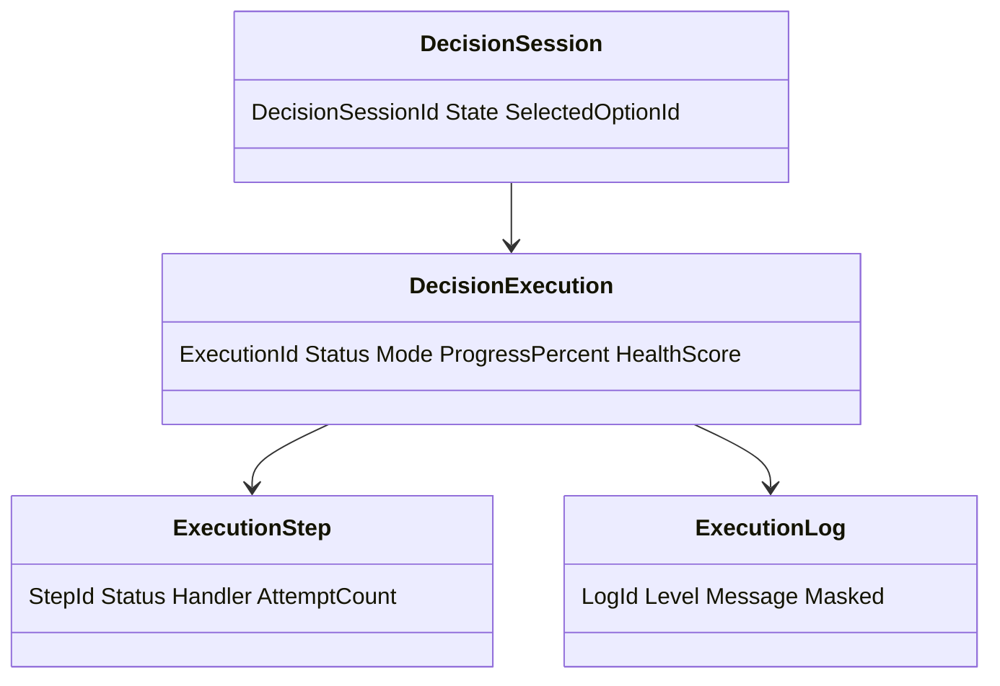
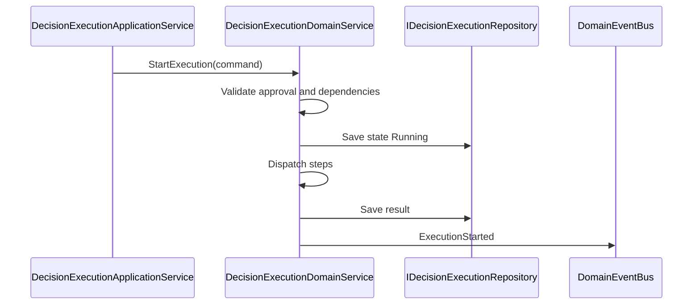
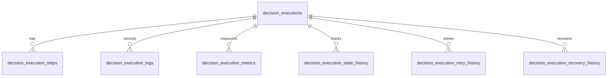
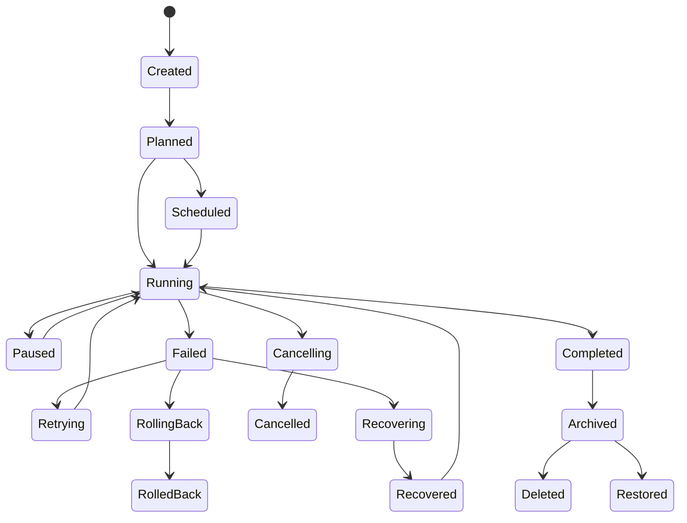
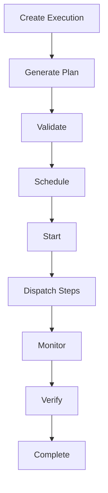
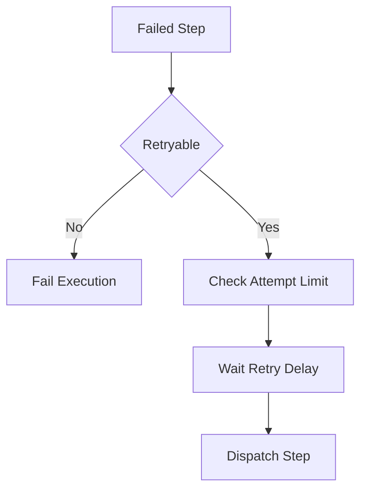
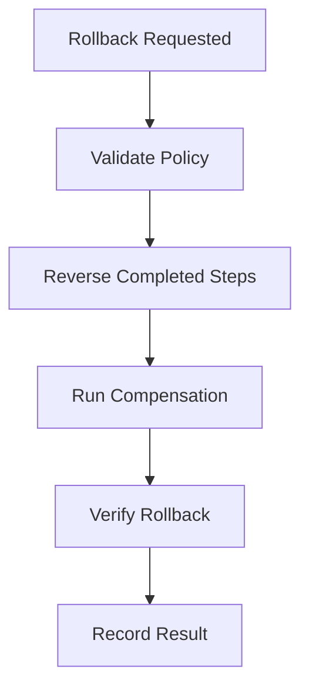
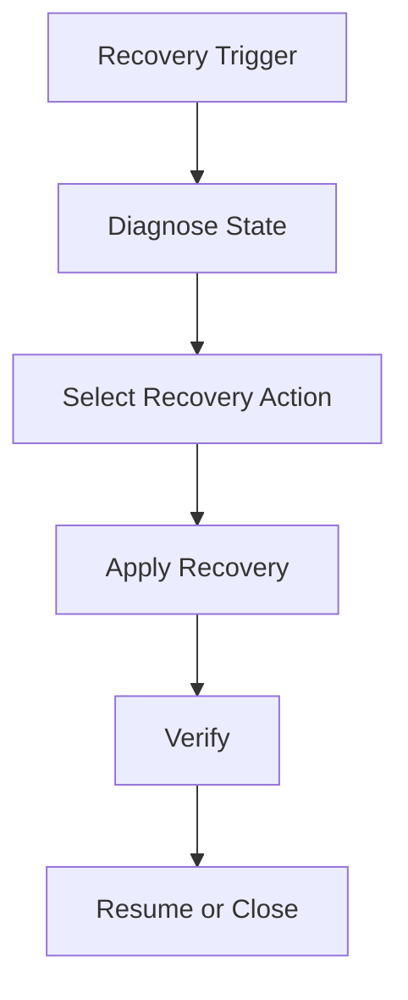

> **ADR-001 PWA Runtime Alignment:** Atlas v1 uses PWA v1 Runtime, Browser Runtime, and IndexedDB Runtime. Future Cloud Architecture is optional future mapping and must not be required for v1.\r\n\r\n# Decision Execution
Version: 1.0
## Split Navigation
- [Decision execution planning](decision-execution/planning-and-workflow.md)
- [Decision execution recovery](decision-execution/recovery-and-audit.md)
- [Decision execution governance and testing](decision-execution/governance-and-testing.md)
Status: Enterprise Specification
Owner: Project Atlas
Source of Truth: Atlas Decision Execution Specification
Last Updated: 2026-07-13
# Decision Execution Overview
## Purpose
Decision Execution defines how Atlas creates, starts, pauses, resumes, retries, cancels, completes, rolls back, recovers, archives, restores, deletes, secures, audits, monitors, and reports execution for DecisionSession.
It coordinates execution with Decision Lifecycle, Decision Evaluation, Decision Explainability, Decision History, Decision Audit, Decision Rule, Recommendation, GoalPlan, Scenario, Portfolio, CashFlow, Risk, Optimization, Simulation, Workflow, Automation, Business Calendar, Notification, and User.
It preserves existing Atlas domain ownership and existing catalog naming.
## Business Meaning
Decision Execution converts an approved DecisionSession into an observable and recoverable execution record.
Execution creates operational evidence for whether the selected decision was started, paused, retried, completed, failed, rolled back, recovered, archived, restored, or deleted.
Execution does not directly mutate Recommendation, GoalPlan, Scenario, Portfolio, CashFlow, Workflow, Automation, or Notification without explicit domain commands.
## Execution Scope
Execution scope includes execution plan, execution request, validation, rule validation, approval check, dependency check, resource check, scheduling, dispatch, progress tracking, verification, completion, retry, rollback, recovery, audit, notification, cache, security, API, and reporting projections.
Scope must preserve HouseholdId.
Scope must preserve TenantId when tenant scope exists.
Scope must not include unauthorized source data.
## Execution Lifecycle
Execution lifecycle starts when CreateExecution creates an execution record for an approved or execution-eligible DecisionSession.
The record can move through planned, scheduled, running, paused, retrying, completed, failed, cancelled, rolling back, rolled back, recovering, recovered, archived, restored, and deleted states.
Lifecycle state is appended to execution history.
## Execution Objectives
Execution objectives are operational correctness, approval adherence, rule compliance, progress visibility, failure isolation, retry discipline, rollback traceability, recovery reliability, notification consistency, auditability, and permission-safe reporting.
Objectives are measured by success rate, failure rate, retry rate, rollback rate, recovery rate, latency, timeout count, verification rate, and audit completeness.
## Ownership
DecisionSession owns decision state and selected option.
Decision Execution owns execution record, execution plan, execution result, execution logs, retries, rollback, recovery, monitoring, and execution projections.
Decision Lifecycle owns decision lifecycle state.
Decision Evaluation owns evaluation scores and approval readiness.
Decision Audit owns immutable audit evidence.
Decision History owns historical projections.
Workflow owns workflow state.
Automation owns automation trigger state.
Repository owns persistence and query.
Application Service owns orchestration.
Security owns authorization and masking.
## Aggregate Root
DecisionSession is the aggregate root for decision lifecycle and selected option.
Decision Execution is a governed execution record scoped to DecisionSession and references related domains by identifier and source version.
## Relationship with Decision
DecisionSession supplies selected option, approval state, owner, scope, decision rationale, and lifecycle status.
Decision Execution cannot start unless DecisionSession is execution-eligible.
## Relationship with Decision Lifecycle
Decision Lifecycle supplies state eligibility, legal commands, restoration state, archival state, and terminal state.
Execution state changes may synchronize Decision Lifecycle through explicit Decision command policy.
## Relationship with Decision Evaluation
Decision Evaluation supplies approved option, scores, constraints, risk, confidence, and explainability readiness.
Execution records EvaluationId and evaluation version when used.
## Relationship with Decision Explainability
Decision Explainability supplies rationale, rule trace, score trace, option trace, and execution rationale.
Execution report must preserve explainability reference.
## Relationship with Decision History
Decision History records execution request, state changes, retry history, rollback history, recovery history, and result.
History is append-only.
## Relationship with Decision Audit
Decision Audit records command, operator, rule check, approval check, dispatch, retry, rollback, recovery, completion, failure, and access.
Audit is immutable under retention policy.
## Relationship with Decision Rule
Decision Rule supplies execution eligibility rules, validation rules, approval rules, and exception rules.
Execution records rule version.
## Relationship with Recommendation
Recommendation may be executed through Decision Execution when it is part of the approved decision.
Recommendation adoption remains owned by Recommendation.
## Relationship with Goal
GoalPlan may be affected by an executed decision through explicit Goal command policy.
Execution records GoalPlanId when decision affects a goal.
## Relationship with Scenario
Scenario supplies assumptions, baseline, and simulation context for execution readiness.
Scenario evidence records ScenarioId and ScenarioVersion.
## Relationship with Portfolio
Portfolio supplies authorized allocation, liquidity, risk, and valuation evidence for execution.
Portfolio mutation requires explicit Portfolio command and permission.
## Relationship with CashFlow
CashFlow supplies authorized contribution, surplus, deficit, and funding gap evidence.
CashFlow mutation requires explicit CashFlow command and permission.
## Relationship with Risk
Risk evidence supplies risk score, threshold state, mitigation, and risk exception.
Critical risk can block or escalate execution.
## Relationship with Optimization
Optimization supplies approved candidate and optimized execution path.
Execution records OptimizationId and candidate id when used.
## Relationship with Simulation
Simulation supplies dry run and simulated outcome evidence.
Simulation mode must not commit source domain side effects.
## Relationship with Workflow
Workflow supplies approval routing, execution gates, pause conditions, recovery steps, and escalation.
Workflow cannot bypass execution validation.
## Relationship with Automation
Automation can trigger scheduled, event-driven, recovery, retry, cleanup, and notification actions.
AutomationRunId must be recorded.
## Relationship with Business Calendar
Business Calendar supplies execution windows, blackout periods, cutoff times, retry windows, escalation windows, and scheduled cleanup windows.
Execution scheduling must honor Business Calendar unless override is authorized.
## Relationship with Notification
Notification is triggered by execution creation, start, pause, resume, retry, failure, rollback, recovery, completion, cancellation, archive, restore, delete, and timeout.
Notification suppression does not remove execution history.
## Relationship with User
User supplies actor, operator, approver, owner, permission, preference, locale, and masking context.
User permission is evaluated before command and projection.
# Execution Architecture
## Execution Coordinator
Execution Coordinator manages command orchestration, state lock, transaction boundary, idempotency, event publication, cache invalidation, and notification trigger.
It prevents duplicate active execution for the same decision and execution key.
## Execution Engine
Execution Engine executes plan steps, records results, validates output, and applies completion or failure policy.
It records handler, attempt, duration, and result for every step.
## Workflow Engine
Workflow Engine coordinates workflow state, approval gates, recovery routing, and escalation path.
Workflow state must align with execution state.
## Scheduling Engine
Scheduling Engine evaluates requested time, Business Calendar, priority, dependency readiness, blackout window, and queue capacity.
Invalid windows are rejected unless override permission exists.
## Task Dispatcher
Task Dispatcher dispatches execution steps to domain-specific handlers.
Dispatcher records handler name, step id, attempt number, timeout, and result.
## Validation Engine
Validation Engine validates decision state, rule state, approval state, dependency state, resource state, permission, and consistency.
Validation result is stored as execution evidence.
## Approval Engine
Approval Engine verifies approval state, approver authority, approval freshness, Decision Evaluation result, and Workflow approval gate.
Approval failure blocks execution.
## Monitoring Engine
Monitoring Engine collects progress, status, health, metrics, errors, warnings, KPIs, forecast, timeline, and logs.
Monitoring output feeds dashboard, reporting, analytics, and notification.
## Recovery Engine
Recovery Engine detects stuck execution, stale lock, failed dispatch, missing event, incomplete verification, and failed projection sync.
Recovery records recovery action and result.
## Rollback Engine
Rollback Engine evaluates rollback eligibility, rollback order, compensation action, verification, and result.
Rollback cannot remove audit evidence.
## Audit Engine
Audit Engine records command, actor, operator, approval evidence, rule evidence, state transition, retry, rollback, recovery, completion, and access.
Audit includes correlation id and source version.
## Notification Engine
Notification Engine emits notification triggers after committed execution state changes.
Delivery failure does not roll back execution persistence.
# Execution Pipeline
## Execution Request
Execution Request captures DecisionSessionId, selected option, execution mode, actor, source version, rule version, approval version, and correlation id.
## Pre Validation
Pre Validation checks Decision Lifecycle state, evaluation state, selected option, execution permission, and source availability.
## Rule Validation
Rule Validation evaluates execution eligibility rules and records rule version and result.
## Approval Check
Approval Check verifies that DecisionSession approval is current and valid for the selected option.
## Dependency Check
Dependency Check validates GoalPlan, Recommendation, Scenario, Portfolio, CashFlow, Workflow, Automation, and Business Calendar dependencies.
## Resource Check
Resource Check validates financial capacity, liquidity, cashflow capacity, operator availability, and handler availability.
## Scheduling
Scheduling assigns execution window, priority, queue, retry policy, timeout policy, and dispatch order.
## Execution
Execution runs plan steps and records per-step result.
## Progress Tracking
Progress Tracking calculates completed steps, weighted progress, health, latency, and forecast.
## Verification
Verification confirms expected outcome, domain consistency, and completion evidence.
## Completion
Completion finalizes result, emits completion event, and invalidates projections.
## Rollback
Rollback runs rollback or compensation policy and records result.
## Recovery
Recovery repairs stuck state, stale lock, failed projection, missing event, or interrupted dispatch.
## Audit
Audit records pipeline evidence at each committed stage.
## Notification
Notification publishes eligible lifecycle and monitoring triggers.
# Execution Modes
## Manual
Manual execution is started by an authorized user.
Actor id and reason are required.
## Automatic
Automatic execution is started by system actor under policy.
System actor and policy version are required.
## Scheduled
Scheduled execution starts during a valid Business Calendar window.
Schedule id and scheduled time are required.
## Event Driven
Event Driven execution starts after committed domain event.
Causation event id is required.
## Workflow Driven
Workflow Driven execution starts or transitions from workflow state.
WorkflowInstanceId is required.
## Batch
Batch execution runs multiple decision executions with isolated per-item results.
Item failure does not invalidate successful items.
## Parallel
Parallel execution runs independent steps concurrently with bounded concurrency.
Dependency order must be preserved.
## Incremental
Incremental execution runs pending, stale, or failed eligible steps only.
Source version and step state are required.
## Simulation
Simulation execution evaluates path without committing source domain side effects.
Simulation output is evidence only.
## Dry Run
Dry Run validates execution plan, dependencies, permissions, and expected dispatch without side effects.
Dry Run cannot mark DecisionSession executed.
## Emergency Execution
Emergency Execution bypasses selected non-critical waits only when emergency permission and audit reason exist.
Hard approval and security constraints still apply.
# Execution Policies
## Priority Policy
Priority Policy orders execution by urgency, approval deadline, risk, goal priority, and Business Calendar cutoff.
## Dependency Policy
Dependency Policy blocks execution when hard dependencies are unresolved and warns when soft dependencies are unresolved.
## Retry Policy
Retry Policy defines retryable errors, maximum attempts, delay, backoff, and final failure state.
## Timeout Policy
Timeout Policy defines step timeout, execution timeout, heartbeat, stuck detection, and timeout escalation.
## Cancellation Policy
Cancellation Policy defines cancellable states, cancellation authority, cancellation reason, and post-cancel state.
## Rollback Policy
Rollback Policy defines reversible steps, compensation steps, rollback order, and rollback verification.
## Recovery Policy
Recovery Policy defines recovery triggers, recovery action, retry after recovery, and recovery audit.
## Escalation Policy
Escalation Policy defines recipients, severity, repeated failure, overdue approval, stuck execution, and critical risk triggers.
## Approval Policy
Approval Policy defines required approval, approval freshness, self-approval restrictions, and override permission.
## Notification Policy
Notification Policy defines notification triggers, suppression, escalation, and delivery channels.
## Audit Policy
Audit Policy defines mandatory audit points, retention, masking, and access.
# Execution Monitoring
## Execution Progress
Execution Progress = completed step weight / total executable step weight * 100.
Progress is clamped between 0 and 100.
## Execution Status
Execution Status reports current state and last transition time.
Status is derived from committed execution state.
## Execution Health
Execution Health combines progress, error count, retry count, timeout risk, dependency state, and recovery state.
Health score is between 0 and 100.
## Execution Metrics
Execution Metrics include queue latency, start latency, step duration, total duration, retry count, rollback count, recovery count, and success rate.
## Execution Errors
Execution Errors record error code, message, step id, handler, retryable flag, occurred time, and correlation id.
## Execution Warnings
Execution Warnings record stale source, soft dependency, masking change, approaching timeout, and policy warning.
## Execution KPIs
Execution KPIs include on-time completion, success rate, failure rate, retry rate, rollback rate, recovery rate, and verification rate.
## Execution Forecast
Execution Forecast estimates expected completion time, timeout probability, retry probability, and success probability.
## Execution Timeline
Execution Timeline records requested time, scheduled time, started time, paused time, resumed time, completed time, failed time, and archived time.
## Execution Logs
Execution Logs are structured, masked when required, and retained according to audit policy.
# Validation Rules
1. ExecutionId must be globally unique. 2. DecisionSessionId is required. 3. HouseholdId is required. 4. TenantId is required when tenant scope exists. 5. Execution mode is required. 6. Execution state is required. 7. Source version hash is required. 8. Rule version is required. 9. Approval version is required when approval applies. 10. CorrelationId is required. 11. Actor id is required for Manual mode. 12. System actor is required for Automatic mode. 13. Schedule id is required for Scheduled mode. 14. Causation event id is required for Event Driven mode. 15. WorkflowInstanceId is required for Workflow Driven mode. 16. Business Calendar window must be valid when scheduling applies. 17. DecisionSession must exist. 18. Decision Lifecycle state must allow execution. 19. Decision Evaluation must be approved or execution-eligible when policy requires. 20. Selected option must exist. 21. Selected option must match approved option when approval requires it. 22. Hard constraints must pass unless approved exception exists. 23. Rule validation must pass before start. 24. Approval check must pass before start. 25. Dependency check must pass before dispatch. 26. Execution plan must include at least one step. 27. Step ids must be unique within execution plan. 28. Step order must be valid. 29. Step dependency graph must be acyclic. 30. Step timeout must be positive. 31. Execution timeout must be positive. 32. Retry maximum must be zero or positive. 33. Retry delay must be zero or positive. 34. Progress percent must be between 0 and 100. 35. Health score must be between 0 and 100. 36. Pause requires Running state. 37. Resume requires Paused state. 38. Retry requires Failed or retryable step state. 39. Complete requires verification success. 40. Rollback requires rollback eligibility. 41. Recovery requires recoverable error or stuck state. 42. Archive requires terminal or policy-approved state. 43. Restore requires Archived state. 44. Delete requires retention validation. 45. Cancellation requires reason. 46. Failure requires error code. 47. Portfolio evidence requires portfolio permission. 48. CashFlow evidence requires cashflow permission. 49. Projection field must be allowed. 50. Sorting field must be allowed. 51. Pagination limit must be within API maximum. 52. Audit metadata is required for every command.
# Business Rules
1. Decision Execution must preserve Atlas domain ownership. 2. Decision Execution must not redesign Atlas. 3. Decision Execution must not create unrelated business concepts. 4. Execution naming must follow existing catalog. 5. DecisionSession owns decision state. 6. Execution cannot approve DecisionSession. 7. Execution cannot reject DecisionSession. 8. Execution cannot mutate Recommendation without explicit Recommendation command. 9. Execution cannot mutate GoalPlan without explicit Goal command. 10. Execution cannot mutate Scenario without explicit Scenario command. 11. Execution cannot mutate Portfolio without explicit Portfolio command. 12. Execution cannot mutate CashFlow without explicit CashFlow command. 13. Execution cannot mutate Workflow without explicit Workflow operation. 14. Execution cannot mutate Automation without explicit Automation operation. 15. Only authorized users can create execution. 16. Only authorized users can start execution. 17. Only authorized users can pause execution. 18. Only authorized users can resume execution. 19. Only authorized users can retry execution. 20. Only authorized users can cancel execution. 21. Only authorized users can complete execution. 22. Only authorized users can roll back execution. 23. Only authorized users can recover execution. 24. Only authorized users can archive execution. 25. Only authorized users can restore execution. 26. Only authorized users can delete execution. 27. Execution requires execution-eligible Decision Lifecycle state. 28. Execution requires approved selected option when approval policy applies. 29. Execution requires current rule version. 30. Execution requires source version hash. 31. Duplicate active execution for same decision and execution key is not allowed. 32. Execution key includes DecisionSessionId, selected option, mode, and policy version. 33. Running execution must have lock or optimistic version. 34. Manual execution records actor. 35. Automatic execution records system actor. 36. Scheduled execution respects Business Calendar. 37. Event Driven execution is idempotent by event id. 38. Workflow Driven execution is idempotent by workflow step. 39. Batch execution isolates item failures. 40. Parallel execution preserves dependency order. 41. Incremental execution skips completed valid steps. 42. Simulation mode has no side effects. 43. Dry Run mode has no side effects. 44. Emergency Execution requires emergency permission. 45. Emergency Execution requires reason. 46. Emergency Execution cannot bypass hard security constraints. 47. Rule failure blocks start when rule severity is critical. 48. Hard constraint violation blocks execution. 49. Soft constraint violation creates warning. 50. Portfolio execution requires portfolio permission. 51. CashFlow execution requires cashflow permission. 52. Risk threshold breach can block or escalate. 53. Approval freshness is required when policy defines expiration. 54. Stale evaluation blocks execution when policy requires. 55. Stale simulation blocks simulation-based execution. 56. Stale optimization blocks optimization-based execution. 57. Pause stops new step dispatch. 58. Pause does not interrupt committed non-interruptible step. 59. Resume revalidates dependencies. 60. Resume revalidates permission. 61. Resume revalidates source freshness. 62. Retry follows retry policy. 63. Retry count cannot exceed maximum. 64. Non-retryable error cannot be retried without override permission. 65. Timeout triggers failure, retry, cancellation, recovery, or escalation according to policy. 66. Cancellation records reason. 67. Cancellation does not remove execution history. 68. Complete requires verification evidence. 69. Completion emits event after persistence. 70. Failure records failed step. 71. Failure records error code. 72. Rollback follows rollback order. 73. Rollback records rollback result. 74. Compensation records compensation action. 75. Recovery records recovery reason. 76. Recovery records recovery result. 77. Archive makes execution read-only. 78. Restore revalidates retention and source availability. 79. Delete requires retention permission. 80. Notification failure does not roll back execution. 81. Cache failure does not roll back execution. 82. Audit failure blocks command when audit is required. 83. Execution history is append-only. 84. State history is append-only. 85. Retry history is append-only. 86. Rollback history is append-only. 87. Recovery history is append-only. 88. Operator history is append-only. 89. Execution logs respect masking policy. 90. Execution metrics derive from committed records. 91. Execution forecast shows calculation time. 92. Execution health degrades on repeated errors. 93. Execution health degrades on timeout risk. 94. Execution progress cannot exceed 100. 95. Completed execution remains 100 percent. 96. Cancelled execution cannot resume. 97. RolledBack execution cannot complete without new execution. 98. Archived execution cannot update. 99. Deleted execution cannot restore. 100. Source version change can mark execution stale. 101. Policy version change can require revalidation. 102. Permission change invalidates execution cache. 103. Masking change invalidates execution cache. 104. Dashboard projection must use permission-filtered data. 105. Reporting snapshot preserves execution state. 106. Analytics uses committed execution history. 107. Search enforces HouseholdId scope. 108. Tenant-aware query enforces TenantId. 109. Aggregation must not leak unauthorized data. 110. Export uses masked projection when required.
# State Machine
## States
- Created
- Planned
- Scheduled
- Running
- Paused
- Retrying
- Completed
- Failed
- Cancelling
- Cancelled
- RollingBack
- RolledBack
- Recovering
- Recovered
- Archived
- Restored
- Deleted
## Transitions
- Created -> Planned by GenerateExecutionPlan.
- Planned -> Scheduled by scheduling validation.
- Planned -> Running by StartExecution when immediate.
- Scheduled -> Running by schedule trigger.
- Running -> Paused by PauseExecution.
- Paused -> Running by ResumeExecution.
- Running -> Completed by CompleteExecution.
- Running -> Failed by execution error.
- Failed -> Retrying by RetryExecution.
- Retrying -> Running by retry dispatch.
- Failed -> Recovering by RecoverExecution.
- Recovering -> Recovered by recovery completion.
- Recovered -> Running by ResumeExecution.
- Running -> Cancelling by CancelExecution.
- Cancelling -> Cancelled by cancellation completion.
- Failed -> RollingBack by RollbackExecution.
- Running -> RollingBack by RollbackExecution when policy allows.
- RollingBack -> RolledBack by rollback completion.
- Completed -> Archived by ArchiveExecution.
- Failed -> Archived by ArchiveExecution.
- Cancelled -> Archived by ArchiveExecution.
- RolledBack -> Archived by ArchiveExecution.
- Archived -> Restored by RestoreExecution.
- Archived -> Deleted by DeleteExecution.
## Triggers
- CreateExecution
- GenerateExecutionPlan
- StartExecution
- PauseExecution
- ResumeExecution
- RetryExecution
- CancelExecution
- CompleteExecution
- RollbackExecution
- RecoverExecution
- ArchiveExecution
- RestoreExecution
- DeleteExecution
- ScheduleElapsed
- WorkflowAdvanced
- AutomationTriggered
- EventReceived
- TimeoutDetected
## Invariant
ExecutionId, DecisionSessionId, HouseholdId, created time, created by, and original scope are immutable.
Running execution must have execution plan, source version hash, policy version, and correlation id.
Completed execution must have result, completed time, verification evidence, and progress 100.
Archived and Deleted execution cannot be updated except by restore or retention operation.
## Illegal Transition
- Deleted -> Running.
- Deleted -> Completed.
- Archived -> Running.
- Cancelled -> Running.
- RolledBack -> Completed.
- Completed -> Running.
- Failed -> Completed without retry or recovery.
- Created -> Completed.
- Scheduled -> Completed.
- Paused -> Completed without resume.
# Commands
## CreateExecution
Creates execution record for DecisionSession.
## StartExecution
Starts eligible execution and dispatches executable steps.
## PauseExecution
Pauses running execution and stops new dispatch.
## ResumeExecution
Resumes paused or recovered execution after validation.
## RetryExecution
Retries eligible failed execution or failed step.
## CancelExecution
Cancels eligible execution with reason.
## CompleteExecution
Completes execution after verification.
## RollbackExecution
Runs rollback or compensation policy.
## RecoverExecution
Runs recovery policy for stuck or recoverable execution.
## ArchiveExecution
Archives eligible execution.
## RestoreExecution
Restores archived execution after validation.
## DeleteExecution
Deletes eligible execution after retention validation.
## GenerateExecutionPlan
Generates execution steps, dependencies, schedule, timeout, retry, and rollback plan.
## ValidateExecution
Validates execution request, rule result, approval, dependencies, and permission.
## DispatchExecutionStep
Dispatches step to handler and records result.
## RecordExecutionLog
Records structured masked execution log.
## PublishExecutionNotification
Publishes eligible notification trigger.
## BatchStartExecution
Starts multiple executions with per-item result.
# Domain Events
## ExecutionCreated
Emitted after CreateExecution succeeds.
## ExecutionStarted
Emitted after StartExecution succeeds.
## ExecutionPaused
Emitted after PauseExecution succeeds.
## ExecutionResumed
Emitted after ResumeExecution succeeds.
## ExecutionCompleted
Emitted after CompleteExecution succeeds.
## ExecutionCancelled
Emitted after CancelExecution succeeds.
## ExecutionFailed
Emitted after execution fails.
## ExecutionRetried
Emitted after RetryExecution succeeds.
## ExecutionRecovered
Emitted after RecoverExecution succeeds.
## ExecutionRolledBack
Emitted after RollbackExecution succeeds.
## ExecutionArchived
Emitted after ArchiveExecution succeeds.
## ExecutionRestored
Emitted after RestoreExecution succeeds.
## ExecutionDeleted
Emitted after DeleteExecution succeeds.
## ExecutionPlanGenerated
Emitted after GenerateExecutionPlan succeeds.
## ExecutionScheduled
Emitted after scheduling succeeds.
## ExecutionStepStarted
Emitted after a step starts.
## ExecutionStepCompleted
Emitted after a step completes.
## ExecutionStepFailed
Emitted after a step fails.
## ExecutionTimedOut
Emitted after timeout detection.
## ExecutionNotificationTriggered
Emitted after notification trigger is published.
# Repository
## Interface
IDecisionExecutionRepository persists execution aggregate, plan, steps, logs, metrics, state history, retry history, rollback history, recovery history, operator history, and projections.
## Methods
- Add
- Update
- GetById
- GetByExecutionKey
- GetActiveByDecisionSessionId
- GetByHouseholdId
- Search
- SavePlan
- SaveStep
- SaveLog
- SaveMetric
- SaveStateHistory
- SaveRetryHistory
- SaveRollbackHistory
- SaveRecoveryHistory
- SaveOperatorHistory
- Archive
- Restore
- Delete
- GetDetailProjection
- GetSummaryProjection
- GetDashboardProjection
## Queries
- ExecutionsByDecision
- ExecutionsByHousehold
- ExecutionsByStatus
- ExecutionsByMode
- ExecutionsByWorkflow
- ExecutionsByAutomation
- ExecutionsBySchedule
- FailedExecutions
- RunningExecutions
- PausedExecutions
- TimeoutRiskExecutions
- RetryEligibleExecutions
- RecoveryEligibleExecutions
## Filtering
- DecisionSessionId
- HouseholdId
- TenantId
- Status
- Mode
- Priority
- WorkflowInstanceId
- AutomationRunId
- ScheduleId
- CreatedDateRange
- StartedDateRange
- CompletedDateRange
- HasErrors
- HasWarnings
- IsStale
## Sorting
- createdAt desc
- startedAt desc
- completedAt desc
- priority desc
- status asc
- progressPercent desc
- healthScore desc
- duration desc
- retryCount desc
## Aggregation
- CountByStatus
- CountByMode
- CountByPriority
- AverageDuration
- AverageProgress
- AverageHealth
- FailureCount
- RetryCount
- RollbackCount
- RecoveryCount
- TimeoutCount
## Projection
- ExecutionSummaryProjection
- ExecutionDetailProjection
- ExecutionPlanProjection
- ExecutionResultProjection
- ExecutionLogProjection
- ExecutionDashboardProjection
## Specification
- ActiveExecutionSpecification
- VisibleExecutionSpecification
- RetryEligibleExecutionSpecification
- RecoveryEligibleExecutionSpecification
- TimeoutRiskExecutionSpecification
- DecisionScopedExecutionSpecification
- ArchivedExecutionSpecification
- AuditExecutionSpecification
# Domain Service Interaction
- DecisionExecutionDomainService validates lifecycle, policy, plan, state, and business rules.
- DecisionLifecycleDomainService supplies execution eligibility and lifecycle synchronization.
- DecisionEvaluationDomainService supplies evaluation approval and scoring evidence.
- DecisionExplainabilityDomainService supplies explanation artifacts.
- DecisionHistoryDomainService records execution history projections.
- DecisionAuditDomainService records immutable audit evidence.
- DecisionRuleDomainService supplies execution rule definitions and versions.
- RecommendationDomainService supplies recommendation execution context.
- GoalLifecycleDomainService supplies GoalPlan constraints and lifecycle context.
- ScenarioDomainService supplies scenario version and simulation context.
- PortfolioDomainService supplies authorized portfolio evidence.
- CashFlowDomainService supplies authorized cashflow evidence.
- RiskDomainService supplies risk evidence where present.
- OptimizationDomainService supplies approved optimization candidate context.
- SimulationDomainService supplies simulation and dry run context.
- WorkflowDomainService supplies workflow state and approvals.
- AutomationDomainService supplies automation run context.
- BusinessCalendarDomainService validates windows and deadlines.
- NotificationDomainService receives execution notification triggers.
- SecurityDomainService evaluates authorization and masking.
- CacheDomainService invalidates execution projections.
# Application Service Interaction
- DecisionExecutionApplicationService coordinates commands, queries, transaction boundary, event publication, and cache invalidation.
- CreateExecutionHandler creates execution record.
- GenerateExecutionPlanHandler creates plan, steps, dependencies, schedule, retry, timeout, and rollback policy.
- StartExecutionHandler validates state and dispatches steps.
- PauseExecutionHandler validates running state and writes pause history.
- ResumeExecutionHandler revalidates source and resumes dispatch.
- RetryExecutionHandler applies retry policy and attempt count.
- CancelExecutionHandler applies cancellation policy.
- CompleteExecutionHandler verifies result and completes execution.
- RollbackExecutionHandler applies rollback or compensation policy.
- RecoverExecutionHandler applies recovery policy and records result.
- ArchiveExecutionHandler makes execution read-only.
- RestoreExecutionHandler revalidates retention and source availability.
- DeleteExecutionHandler validates retention and deletes eligible execution.
- SearchExecutionQueryHandler applies filters, sorting, projection, and pagination.
- BulkExecutionHandler performs batch start, retry, cancel, archive, and restore with per-item result.
# API
## Future Cloud Architecture Endpoints
- GET /api/decision-executions
- POST /api/decision-executions
- GET /api/decision-executions/{executionId}
- PUT /api/decision-executions/{executionId}
- POST /api/decision-executions/{executionId}/plan
- POST /api/decision-executions/{executionId}/start
- POST /api/decision-executions/{executionId}/pause
- POST /api/decision-executions/{executionId}/resume
- POST /api/decision-executions/{executionId}/retry
- POST /api/decision-executions/{executionId}/cancel
- POST /api/decision-executions/{executionId}/complete
- POST /api/decision-executions/{executionId}/rollback
- POST /api/decision-executions/{executionId}/recover
- POST /api/decision-executions/{executionId}/archive
- POST /api/decision-executions/{executionId}/restore
- DELETE /api/decision-executions/{executionId}
- POST /api/decision-executions/bulk/start
- GET /api/decisions/{decisionSessionId}/executions
## HTTP Methods
GET reads execution projections.
POST creates, plans, starts, pauses, resumes, retries, cancels, completes, rolls back, recovers, archives, restores, or bulk processes.
PUT updates eligible execution metadata.
DELETE deletes eligible execution after retention validation.
## Request
Create request includes DecisionSessionId, selected option, mode, policy, schedule, workflow, automation, and context.
Start request includes source version mode, dispatch option, and override flag.
Pause request includes reason.
Resume request includes reason and source refresh mode.
Retry request includes target step id, reason, and override flag.
Rollback request includes rollback reason and compensation option.
Recover request includes recovery reason and recovery mode.
Complete request includes result, verification evidence, and lifecycle synchronization option.
Search request includes filters, sorting, pagination, and projection.
## Response
Detail response returns execution, plan, steps, logs, metrics, histories, errors, warnings, permissions, and audit metadata.
Summary response returns status, mode, progress, health, started time, completed time, retry count, recovery count, and error count.
Plan response returns steps, dependencies, schedule, rollback plan, recovery plan, and validation result.
Result response returns completion state, verification evidence, synchronized decision state, and emitted events.
Bulk response returns processed, completed, failed, skipped, and per-item errors.
## Errors
- 400 invalid request
- 401 unauthenticated
- 403 forbidden
- 404 execution not found
- 409 concurrency conflict
- 410 stale source
- 422 validation failed
- 423 execution locked
- 424 dependency blocked
- 429 rate limited
- 500 internal error
## Pagination
Pagination uses pageNumber, pageSize, totalCount, totalPages, hasNextPage, and hasPreviousPage.
## Filtering
Filtering supports status, mode, priority, DecisionSessionId, householdId, workflowInstanceId, automationRunId, scheduleId, date range, stale state, error state, warning state, and recovery state.
## Sorting
Sorting supports createdAt, startedAt, completedAt, priority, status, progressPercent, healthScore, duration, retryCount, and recoveryCount.
## Projection
Projection supports summary, detail, plan, result, log, dashboard, and audit-safe views.
## Execution API
Execution API provides start, pause, resume, retry, cancel, complete, rollback, recover, logs, metrics, and plan operations.
## Batch API
Batch API supports start, pause, resume, retry, cancel, recover, archive, restore, and delete with per-item result and correlation id.
# DTO
## Create DTO
Includes DecisionSessionId, selectedOptionId, mode, policyVersion, schedule, workflow, automation, priority, timeout, retry policy, and context.
## Update DTO
Includes executionId, version, priority, policy settings, schedule change, and update reason.
## Execution DTO
Includes execution identifiers, DecisionSessionId, selected option, status, mode, policy version, source version hash, and timestamps.
## Execution Plan DTO
Includes steps, dependencies, schedule, timeout, retry policy, rollback policy, recovery policy, and validation result.
## Execution Result DTO
Includes status, result code, completed steps, failed steps, verification evidence, lifecycle synchronization outcome, and emitted events.
## Execution Log DTO
Includes log id, step id, level, message, masked payload, occurred time, and correlation id.
## Execution Status DTO
Includes current state, progress percent, health score, retry count, recovery count, error count, warning count, and last transition.
## Summary DTO
Includes executionId, DecisionSessionId, status, mode, priority, progressPercent, healthScore, startedAt, completedAt, retryCount, and errorCount.
## Detail DTO
Includes execution detail, plan, steps, logs, metrics, histories, errors, warnings, permissions, and audit metadata.
## Search DTO
Includes filters, sorting, pagination, projection, and masking mode.
# PWA Runtime Mapping
## Table
- decision_executions
- decision_execution_steps
- decision_execution_logs
- decision_execution_metrics
- decision_execution_state_history
- decision_execution_retry_history
- decision_execution_rollback_history
- decision_execution_recovery_history
- decision_execution_operator_history
## Columns
- execution_id uuid primary key
- tenant_id uuid null
- household_id uuid not null
- decision_session_id uuid not null
- selected_option_id uuid null
- status varchar(40) not null
- mode varchar(40) not null
- priority varchar(20) not null
- execution_key varchar(240) not null
- source_version_hash varchar(128) not null
- rule_version varchar(40) not null
- policy_version varchar(40) not null
- workflow_instance_id uuid null
- automation_run_id uuid null
- schedule_id uuid null
- progress_percent numeric(5,2) not null
- health_score numeric(5,2) not null
- retry_count int not null
- recovery_count int not null
- error_count int not null
- warning_count int not null
- timeout_at timestamptz null
- scheduled_at timestamptz null
- started_at timestamptz null
- completed_at timestamptz null
- archived_at timestamptz null
- created_at timestamptz not null
- updated_at timestamptz not null
- version int not null
## Indexes
- ix_decision_executions_household_status
- ix_decision_executions_decision_status
- ix_decision_executions_mode_status
- ix_decision_executions_schedule
- ix_decision_executions_workflow
- ix_decision_executions_automation
- ix_decision_executions_priority
- ix_decision_executions_created_at
- ux_decision_executions_active_key
## Constraints
- progress_percent between 0 and 100
- health_score between 0 and 100
- retry_count greater than or equal to 0
- recovery_count greater than or equal to 0
- error_count greater than or equal to 0
- warning_count greater than or equal to 0
- status in supported states
- mode in supported modes
## FK
- decision_session_id references decision_sessions.
- household_id references households.
- execution_id references decision_executions for child tables.
- workflow_instance_id references workflow instances when present.
- automation_run_id references automation runs when present.
- schedule_id references schedules when present.
## Unique
- Unique active execution key per household when status is active.
- Unique step order per execution.
## Check Constraint
- Lifecycle timestamp must match lifecycle status.
- Started time cannot be after completed time.
## Partition Strategy
- Partition logs, metrics, state history, retry history, rollback history, recovery history, and operator history by created_at month.
# Future Cloud Mapping Schema
```sql
CREATE TABLE decision_executions (
  execution_id uuid PRIMARY KEY,
  tenant_id uuid NULL,
  household_id uuid NOT NULL,
  decision_session_id uuid NOT NULL,
  selected_option_id uuid NULL,
  status varchar(40) NOT NULL,
  mode varchar(40) NOT NULL,
  priority varchar(20) NOT NULL,
  execution_key varchar(240) NOT NULL,
  source_version_hash varchar(128) NOT NULL,
  rule_version varchar(40) NOT NULL,
  policy_version varchar(40) NOT NULL,
  workflow_instance_id uuid NULL,
  automation_run_id uuid NULL,
  schedule_id uuid NULL,
  plan_payload jsonb NOT NULL DEFAULT '{}'::jsonb,
  result_payload jsonb NOT NULL DEFAULT '{}'::jsonb,
  progress_percent numeric(5,2) NOT NULL DEFAULT 0,
  health_score numeric(5,2) NOT NULL DEFAULT 100,
  retry_count int NOT NULL DEFAULT 0,
  recovery_count int NOT NULL DEFAULT 0,
  error_count int NOT NULL DEFAULT 0,
  warning_count int NOT NULL DEFAULT 0,
  timeout_at timestamptz NULL,
  scheduled_at timestamptz NULL,
  started_at timestamptz NULL,
  completed_at timestamptz NULL,
  archived_at timestamptz NULL,
  created_by uuid NULL,
  updated_by uuid NULL,
  created_at timestamptz NOT NULL DEFAULT now(),
  updated_at timestamptz NOT NULL DEFAULT now(),
  version int NOT NULL DEFAULT 1,
  CONSTRAINT ck_decision_executions_status CHECK (status IN ('Created','Planned','Scheduled','Running','Paused','Retrying','Completed','Failed','Cancelling','Cancelled','RollingBack','RolledBack','Recovering','Recovered','Archived','Restored','Deleted')),
  CONSTRAINT ck_decision_executions_mode CHECK (mode IN ('Manual','Automatic','Scheduled','EventDriven','WorkflowDriven','Batch','Parallel','Incremental','Simulation','DryRun','EmergencyExecution')),
  CONSTRAINT ck_decision_executions_progress CHECK (progress_percent >= 0 AND progress_percent <= 100),
  CONSTRAINT ck_decision_executions_health CHECK (health_score >= 0 AND health_score <= 100),
  CONSTRAINT ck_decision_executions_counts CHECK (retry_count >= 0 AND recovery_count >= 0 AND error_count >= 0 AND warning_count >= 0)
);
CREATE TABLE decision_execution_steps (
  step_id uuid PRIMARY KEY,
  execution_id uuid NOT NULL REFERENCES decision_executions(execution_id),
  step_order int NOT NULL,
  status varchar(40) NOT NULL,
  handler varchar(160) NOT NULL,
  dependency_payload jsonb NOT NULL DEFAULT '[]'::jsonb,
  input_payload jsonb NOT NULL DEFAULT '{}'::jsonb,
  result_payload jsonb NOT NULL DEFAULT '{}'::jsonb,
  attempt_count int NOT NULL DEFAULT 0,
  timeout_at timestamptz NULL,
  started_at timestamptz NULL,
  completed_at timestamptz NULL,
  CONSTRAINT ck_decision_execution_steps_order CHECK (step_order > 0),
  CONSTRAINT ck_decision_execution_steps_attempt CHECK (attempt_count >= 0)
);
CREATE TABLE decision_execution_logs (
  log_id uuid PRIMARY KEY,
  execution_id uuid NOT NULL REFERENCES decision_executions(execution_id),
  step_id uuid NULL,
  level varchar(20) NOT NULL,
  message varchar(1200) NOT NULL,
  payload jsonb NOT NULL DEFAULT '{}'::jsonb,
  masked boolean NOT NULL DEFAULT false,
  occurred_at timestamptz NOT NULL DEFAULT now(),
  correlation_id uuid NOT NULL
);
CREATE TABLE decision_execution_metrics (
  metric_id uuid PRIMARY KEY,
  execution_id uuid NOT NULL REFERENCES decision_executions(execution_id),
  metric_name varchar(120) NOT NULL,
  metric_value numeric(18,4) NOT NULL,
  unit varchar(40) NOT NULL,
  recorded_at timestamptz NOT NULL DEFAULT now()
);
CREATE TABLE decision_execution_state_history (
  history_id uuid PRIMARY KEY,
  execution_id uuid NOT NULL REFERENCES decision_executions(execution_id),
  from_status varchar(40) NULL,
  to_status varchar(40) NOT NULL,
  reason varchar(800) NULL,
  actor_id uuid NULL,
  occurred_at timestamptz NOT NULL DEFAULT now(),
  correlation_id uuid NOT NULL
);
CREATE TABLE decision_execution_retry_history (
  retry_id uuid PRIMARY KEY,
  execution_id uuid NOT NULL REFERENCES decision_executions(execution_id),
  step_id uuid NULL,
  attempt_number int NOT NULL,
  reason varchar(800) NOT NULL,
  occurred_at timestamptz NOT NULL DEFAULT now(),
  correlation_id uuid NOT NULL
);
CREATE TABLE decision_execution_rollback_history (
  rollback_id uuid PRIMARY KEY,
  execution_id uuid NOT NULL REFERENCES decision_executions(execution_id),
  rollback_status varchar(40) NOT NULL,
  reason varchar(800) NOT NULL,
  result_payload jsonb NOT NULL DEFAULT '{}'::jsonb,
  occurred_at timestamptz NOT NULL DEFAULT now(),
  correlation_id uuid NOT NULL
);
CREATE TABLE decision_execution_recovery_history (
  recovery_id uuid PRIMARY KEY,
  execution_id uuid NOT NULL REFERENCES decision_executions(execution_id),
  recovery_status varchar(40) NOT NULL,
  reason varchar(800) NOT NULL,
  result_payload jsonb NOT NULL DEFAULT '{}'::jsonb,
  occurred_at timestamptz NOT NULL DEFAULT now(),
  correlation_id uuid NOT NULL
);
CREATE TABLE decision_execution_operator_history (
  operator_history_id uuid PRIMARY KEY,
  execution_id uuid NOT NULL REFERENCES decision_executions(execution_id),
  operator_id uuid NULL,
  action varchar(80) NOT NULL,
  occurred_at timestamptz NOT NULL DEFAULT now(),
  correlation_id uuid NOT NULL
);
CREATE INDEX ix_decision_executions_household_status ON decision_executions(household_id, status);
CREATE INDEX ix_decision_executions_decision_status ON decision_executions(decision_session_id, status);
CREATE INDEX ix_decision_executions_mode_status ON decision_executions(mode, status);
CREATE INDEX ix_decision_executions_schedule ON decision_executions(scheduled_at);
CREATE INDEX ix_decision_executions_workflow ON decision_executions(workflow_instance_id);
CREATE INDEX ix_decision_executions_automation ON decision_executions(automation_run_id);
CREATE INDEX ix_decision_executions_priority ON decision_executions(priority, scheduled_at);
CREATE UNIQUE INDEX ux_decision_executions_active_key ON decision_executions(household_id, execution_key) WHERE status IN ('Created','Planned','Scheduled','Running','Paused','Retrying','Cancelling','RollingBack','Recovering');
CREATE VIEW v_decision_execution_summary AS
SELECT execution_id, household_id, decision_session_id, status, mode, priority, progress_percent, health_score, retry_count, recovery_count, error_count, created_at, updated_at
FROM decision_executions
WHERE status <> 'Deleted';
CREATE MATERIALIZED VIEW mv_decision_execution_dashboard AS
SELECT household_id, status, mode, priority, count(*) AS execution_count, avg(progress_percent) AS average_progress, avg(health_score) AS average_health
FROM decision_executions
WHERE status <> 'Deleted'
GROUP BY household_id, status, mode, priority;
```
# Future Cloud Mapping
- Fluent API maps DecisionExecution to decision_executions with execution_id primary key.
- Owned Types map plan payload, result payload, dependency payload, input payload, recovery payload, rollback payload, and log payload as JSON.
- Indexes map household status, decision status, mode status, schedule, workflow, automation, priority, and active execution key.
- Value Conversion stores ExecutionStatus, ExecutionMode, ExecutionPriority, LogLevel, and policy codes as strings.
- Query Filters exclude Deleted by default and enforce tenant scope when tenant scope exists.
- Concurrency token uses version column.
- Navigation maps steps, logs, metrics, state history, retry history, rollback history, recovery history, and operator history.
# Cache Strategy
- Redis Key: atlas:decision-executions:{tenantId}:{householdId}:summary
- Redis Key: atlas:decision-executions:{tenantId}:{householdId}:decision:{decisionSessionId}
- Redis Key: atlas:decision-executions:{tenantId}:{householdId}:detail:{executionId}
- Redis Key: atlas:decision-executions:{tenantId}:{householdId}:progress:{executionId}
- Redis Key: atlas:decision-executions:{tenantId}:{householdId}:dashboard
- Execution Cache stores summary, detail, plan, result, and dashboard projection.
- Progress Cache stores progress, health, forecast, and generated time.
- TTL: summary 180 seconds.
- TTL: detail 300 seconds.
- TTL: progress 60 seconds.
- TTL: dashboard 120 seconds.
- Refresh Strategy: refresh after command success, state change, log write, metric write, recovery, rollback, and materialized view refresh.
- Invalidation: invalidate by execution id, decision id, household id, permission change, masking change, state change, and source version change.
# Security
- Authorization requires authenticated user and household access.
- Permissions include DecisionExecution.Read.
- Permissions include DecisionExecution.Create.
- Permissions include DecisionExecution.Start.
- Permissions include DecisionExecution.Pause.
- Permissions include DecisionExecution.Resume.
- Permissions include DecisionExecution.Retry.
- Permissions include DecisionExecution.Cancel.
- Permissions include DecisionExecution.Complete.
- Permissions include DecisionExecution.Rollback.
- Permissions include DecisionExecution.Recover.
- Permissions include DecisionExecution.Archive.
- Permissions include DecisionExecution.Delete.
- Execution Permission Model evaluates scope permission, mode permission, command permission, approval permission, emergency permission, and override permission.
- Field Level Security masks financial, portfolio, cashflow, scenario, operator, audit, and explainability-sensitive evidence.
- Data Masking applies before cache, dashboard, report, export, notification, log, and API projection.
# Audit
- Execution History records created, planned, scheduled, started, paused, resumed, completed, failed, retried, cancelled, rolled back, recovered, archived, restored, and deleted.
- State History records from status, to status, reason, actor, occurred time, and correlation id.
- Retry History records attempt number, retryable error, step id, delay, and result.
- Rollback History records rollback policy, rollback step, compensation, result, and verification.
- Recovery History records recovery policy, recovery action, source issue, result, and verification.
- Operator History records operator action, actor, permission context, and timestamp.
# Performance
- Parallel Execution runs independent steps with bounded concurrency and dependency preservation.
- Batch Execution partitions work by household, decision, mode, schedule, and priority.
- Incremental Execution runs pending or stale steps only.
- Queue Optimization uses priority, scheduled time, dependency readiness, timeout risk, and approval deadline.
- Caching stores summary, detail, progress, plan, dashboard, log, and search projections.
- Materialized Views aggregate execution counts, average progress, average health, error counts, retry counts, and recovery counts.
# Example JSON
## Create
```json
{"decisionSessionId":"33b7ef1f-0000-4000-9000-000000000001","selectedOptionId":"44b7ef1f-0000-4000-9000-000000000002","mode":"Manual","priority":"high","policyVersion":"1.0"}
```
## Start
```json
{"executionId":"48f8e9b5-7432-4d63-a111-000000000001","sourceVersionMode":"Current","dispatchOption":"Immediate"}
```
## Pause
```json
{"executionId":"48f8e9b5-7432-4d63-a111-000000000001","reason":"Operator pause"}
```
## Resume
```json
{"executionId":"48f8e9b5-7432-4d63-a111-000000000001","reason":"Dependency cleared","sourceRefreshMode":"Refresh"}
```
## Retry
```json
{"executionId":"48f8e9b5-7432-4d63-a111-000000000001","stepId":"8bf42fd6-3490-4994-b111-000000000002","reason":"Retryable timeout"}
```
## Rollback
```json
{"executionId":"48f8e9b5-7432-4d63-a111-000000000001","reason":"Verification failed","compensationAllowed":true}
```
## Recover
```json
{"executionId":"48f8e9b5-7432-4d63-a111-000000000001","reason":"Stale lock recovery","recoveryMode":"SafeResume"}
```
## Complete
```json
{"executionId":"48f8e9b5-7432-4d63-a111-000000000001","resultCode":"Completed","verificationEvidence":{"verified":true},"synchronizeDecisionLifecycle":true}
```
## Detail
```json
{"executionId":"48f8e9b5-7432-4d63-a111-000000000001","status":"Running","mode":"Manual","progressPercent":45.5,"healthScore":92.0,"retryCount":0}
```
## Search
```json
{"filters":{"status":["Running","Failed"],"mode":["Manual"]},"sorting":[{"field":"priority","direction":"desc"}],"pagination":{"pageNumber":1,"pageSize":20}}
```
## Execution Plan
```json
{"executionId":"48f8e9b5-7432-4d63-a111-000000000001","steps":[{"order":1,"handler":"DecisionOptionExecutor","timeoutSeconds":300}],"rollbackPolicy":{"enabled":true},"recoveryPolicy":{"enabled":true}}
```
# Mermaid
## Class Diagram

## Sequence Diagram

## ER Diagram

## Complete State Diagram

## Execution Flow

## Retry Flow

## Rollback Flow

## Recovery Flow

# Testing
## Unit Test
Unit tests validate lifecycle, transition rules, policies, retry, timeout, cancellation, rollback, recovery, validation, and masking.
## Integration Test
Integration tests validate repository, API, domain events, cache invalidation, lifecycle synchronization, notification, security, and audit trail.
## Execution Test
Execution tests validate plan generation, dispatch, completion, failure, retry, cancellation, rollback, recovery, and verification.
## Workflow Test
Workflow tests validate Workflow Driven execution, approval gates, state synchronization, and workflow idempotency.
## Validation Test
Validation tests validate rule validation, approval check, dependency check, resource check, permission check, and consistency check.
## Performance Test
Performance tests validate dispatch latency, queue latency, dashboard read latency, and materialized view refresh.
## Concurrency Test
Concurrency tests validate duplicate start, pause while running, cancel while retrying, completion conflict, recovery conflict, and optimistic version conflict.
## Recovery Test
Recovery tests validate stuck execution detection, timeout recovery, retry recovery, rollback recovery, projection recovery, and compensation recovery.
## Stress Test
Stress tests validate batch execution, parallel execution, high log volume, high retry volume, high recovery volume, and cache pressure.
# Edge Cases
1. DecisionSession is archived before execution starts. 2. Decision Lifecycle state changes during validation. 3. Decision Evaluation becomes stale after approval check. 4. Rule version changes before dispatch. 5. Selected option is removed before execution. 6. Recommendation is archived during execution. 7. GoalPlan is completed during execution. 8. ScenarioVersion changes during simulation mode. 9. Portfolio valuation becomes stale. 10. Portfolio permission is revoked. 11. CashFlow period closes during execution. 12. Risk threshold becomes critical after start. 13. Workflow approval is withdrawn. 14. Automation trigger is duplicated. 15. Business Calendar blackout starts before dispatch. 16. User loses permission after execution starts. 17. Field masking changes after log write. 18. Dependency becomes blocked during execution. 19. Dependency clears while execution is paused. 20. Retryable error becomes non-retryable after policy change. 21. Retry limit is reached. 22. Timeout occurs during rollback. 23. Cancellation arrives during retry delay. 24. Completion arrives after cancellation. 25. Rollback arrives after completion. 26. Recovery arrives while running. 27. Recovery fails due to stale lock. 28. Archive arrives while running. 29. Restore targets deleted execution. 30. Delete violates retention policy. 31. Parallel step fails while another step completes. 32. Batch execution partially fails. 33. Dry Run attempts side effect. 34. Simulation mode attempts source mutation. 35. Emergency execution lacks reason. 36. Emergency execution lacks permission. 37. Notification delivery fails. 38. Cache invalidation fails. 39. Progress cache is stale. 40. Materialized view refresh fails. 41. Execution log payload exceeds size limit. 42. Search requests unauthorized projection. 43. Pagination token references deleted execution. 44. Sorting by unsupported field. 45. Aggregation could reveal restricted execution. 46. Tenant scope is missing in tenant-aware environment. 47. Clock skew makes completed time earlier than start time. 48. Operator action is missing actor id. 49. Audit write fails before event publication. 50. Event publication fails after persistence.
# Version History
| Version | Date | Change | Owner |
|---|---|---|---|
| 1.0 | 2026-07-13 | Enterprise Specification for Decision Execution. | Project Atlas |
