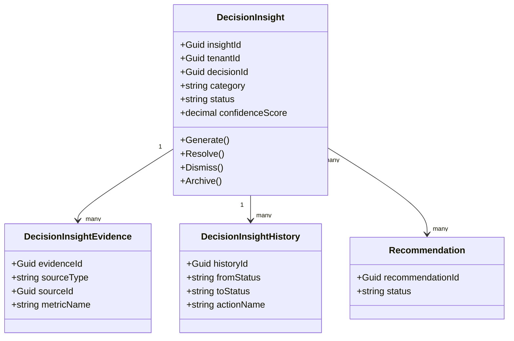
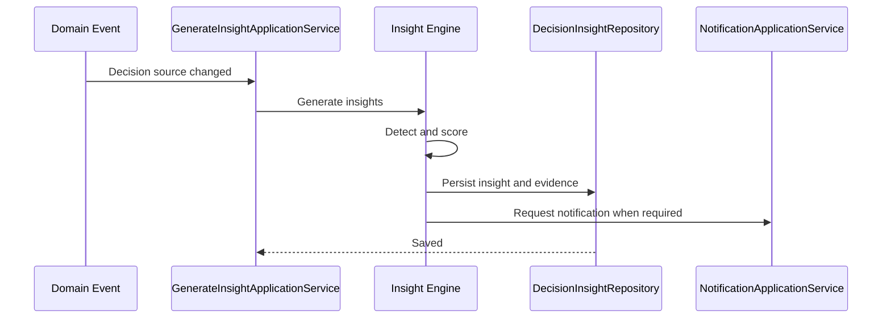
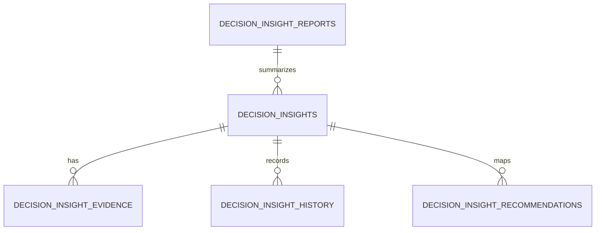
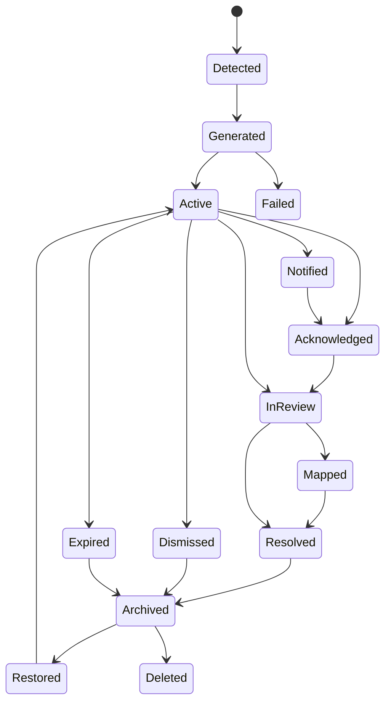
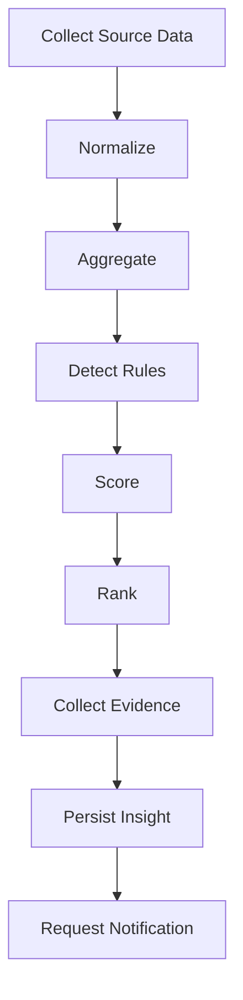
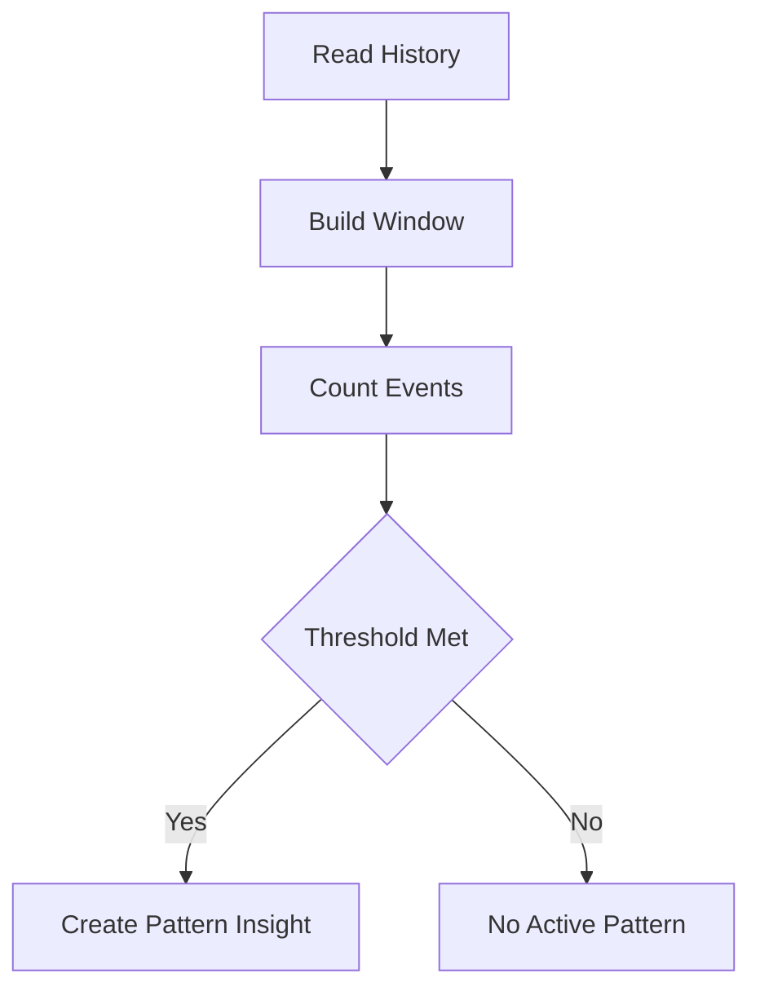
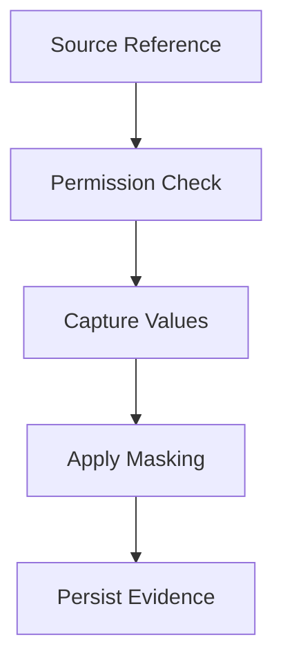
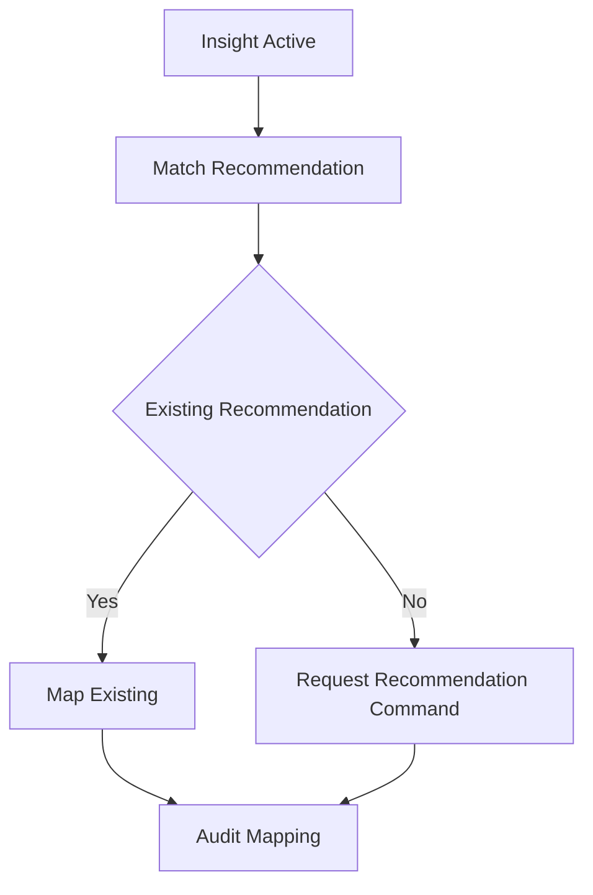

# Decision Insights Overview
Version: 1.0.0 Status: Enterprise Specification Owner: Atlas Decision Domain Source of Truth: Decision Catalog
Last Updated: 2026-07-13
## Split Navigation
- [Decision insights generation](decision-insights/generation-and-detection.md)
- [Decision insight categories and rules](decision-insights/categories-and-rules.md)
- [Decision insight contracts and persistence](decision-insights/contracts-and-persistence.md)
- [Decision insights execution and reporting](decision-insights/execution-and-reporting.md)
- [Decision insights scoring and evidence](decision-insights/scoring-and-evidence.md)
- [Decision insights security and performance](decision-insights/security-and-performance.md)
## Purpose
Decision Insights defines how Atlas detects, explains, ranks, and governs business insights related to Decision behavior. It converts Decision, Recommendation, Goal, Scenario, Portfolio, CashFlow, Risk, Simulation, Workflow, Automation, Notification, Business Calendar, and User signals into auditable insight records. It supports decision quality improvement, execution monitoring, risk awareness, opportunity discovery, and governance visibility without changing existing Atlas domains.
## Business Meaning
A Decision Insight is a business observation derived from existing Atlas records. It is not a new business objective, not a replacement for Decision, and not a substitute for Recommendation. It explains why a Decision may need attention, why a pattern matters, and which existing Atlas entity provides evidence. It preserves evidence, confidence, severity, priority, and lifecycle state so business users can act consistently.
## Insight Scope
Insight scope includes Decision quality, Decision risk, Decision performance, Decision success, Decision failure, financial impact, CashFlow impact, Portfolio alignment, Goal alignment, Scenario outcomes, Recommendation adoption, Optimization output, Simulation output, Execution status, Governance compliance, User behavior, historical patterns, forecasts, and operational signals. Insight scope excludes new financial products, new Goal types, new Decision categories, and any concept not already present in Atlas Catalog. Insight scope must remain tenant-safe, permission-aware, auditable, and reproducible.
## Insight Lifecycle
The lifecycle begins when source data is collected from existing Atlas domains. The lifecycle continues through normalization, aggregation, detection, scoring, ranking, evidence collection, recommendation mapping, notification, resolution, dismissal, archive, restore, and deletion. Every lifecycle action records operator, source, timestamp, reason, prior state, next state, and correlation identifier.
## Insight Objectives
1. Detect material Decision conditions from existing domain data. 2. Explain business meaning with traceable supporting evidence. 3. Rank insights by severity, priority, confidence, and business impact. 4. Preserve auditability for governance and compliance review. 5. Coordinate notifications without duplicating Notification rules. 6. Map insights to existing Recommendations when action is required. 7. Support dashboards, analytics, reporting, and lifecycle management.

## Ownership

Decision Insights is owned by the Decision domain.


## Aggregate Root

Decision Insight is modeled as an aggregate root when it has an independent lifecycle, evidence collection, resolution state, audit trail, and repository identity.


Decision Insight commands that affect Decision state must call existing Decision commands through application service coordination.

## Relationship with Decision

Decision is the primary business context.

Every Decision Insight must reference exactly one Decision unless it is an aggregate insight generated for a Decision search or dashboard projection.

Decision status, priority, approval state, execution state, and outcome are insight inputs.

## Relationship with Decision Lifecycle

Decision Lifecycle provides state history and transition timing.

Insight detection uses lifecycle transitions to identify delay, blockage, repeated rejection, stale approval, failed execution, and expired Decision patterns.

Insight state must not override Decision Lifecycle state.

## Relationship with Decision Evaluation

Decision Evaluation provides scores, criteria, evidence, and evaluation results.

Insights may detect weak evaluation evidence, inconsistent evaluation scores, or declining evaluation quality.

Evaluation results remain owned by Decision Evaluation.

## Relationship with Decision Execution

Decision Execution provides execution progress, status, retry, rollback, recovery, and completion signals.

Insights may detect execution delay, repeated retry, failed recovery, or unresolved rollback risk.

Execution commands remain owned by Decision Execution.

## Relationship with Decision Governance

Decision Governance provides policy, approval, compliance, exception, and escalation signals.

Insights may detect policy failure, governance exception recurrence, missing approval, or overdue escalation.

Governance enforcement remains owned by Decision Governance.

## Relationship with Decision Analytics

Decision Analytics provides historical, forecast, trend, and comparative metrics.

Insights use analytics outputs as evidence and thresholds.

Analytics calculations remain source metrics, while insights provide business interpretation.

## Relationship with Decision Reporting

Decision Reporting consumes insight summaries, evidence, and lifecycle history.

Reports must show insight state, severity, confidence, related Decision, and resolution outcome.

Reporting does not recalculate insights.

## Relationship with Decision Optimization

Decision Optimization provides candidate plans, objective scores, constraints, and selected optimization results.

Insights may detect low optimization confidence, constraint pressure, or opportunity to rerun optimization.

Optimization remains the owner of objective functions and plans.

## Relationship with Decision Explainability

Decision Explainability provides rationale, rule traces, and evidence narrative.

Insights must expose evidence in a way compatible with explainability records.

Insight explanation must be reproducible from stored evidence and source references.

## Relationship with Decision History

Decision History provides state changes, field changes, operator actions, and prior outcomes.

Insights use history for trend, recurrence, regression, and anomaly detection.

History is immutable evidence.

## Relationship with Decision Audit

Decision Audit records control evidence for governance, security, and compliance.

Every insight generation, update, dismissal, resolution, archive, restore, and deletion must be auditable.

Audit records must identify source data and rule version.

## Relationship with Decision Rule

Decision Rule defines deterministic thresholds and rule conditions.

Rule-based insights must record rule identifier, rule version, input values, and evaluation result.

Decision Rule remains the source for rule semantics.

## Relationship with Recommendation

Recommendation provides action options mapped from an insight.

Insight may reference zero or more Recommendations.

Insight must not create a Recommendation unless the existing Recommendation command is invoked.

## Relationship with Goal

Goal provides strategic alignment and expected business outcome.

Insights may detect Decision misalignment with Goal priority, Goal progress, or Goal health.

Goal state remains owned by Goal.

## Relationship with Scenario

Scenario provides alternative assumptions and comparative outcomes.

Insights may compare Decision behavior across Scenario outputs.

Scenario state remains owned by Scenario.

## Relationship with Portfolio

Portfolio provides allocation, exposure, concentration, and performance context.

Insights may detect Portfolio concentration risk or alignment issues caused by Decision outcomes.

Portfolio state remains owned by Portfolio.

## Relationship with CashFlow

CashFlow provides inflow, outflow, timing, shortfall, surplus, and forecast context.

Insights may detect CashFlow pressure, timing mismatch, and Decision impact on liquidity.

CashFlow records remain owned by CashFlow.

## Relationship with Risk

Risk provides severity, likelihood, exposure, mitigation, and residual risk context.

Insights may detect rising risk, unresolved risk, or risk mismatch against Decision priority.

Risk records remain owned by Risk.

## Relationship with Simulation

Simulation provides projected outcomes under assumptions.

Insights may compare simulated result against actual Decision execution or forecast.

Simulation records remain immutable evidence for insight calculation.

## Relationship with Workflow

Workflow provides approval, execution, escalation, and task routing context.

Insights may detect stalled workflow, repeated handoff, or breached workflow time limits.

Workflow owns process orchestration.

## Relationship with Automation

Automation provides scheduled and event-driven triggers.

Insights may be generated by Automation when configured by existing rules.

Automation owns execution trigger timing.

## Relationship with Notification

Notification delivers insight awareness to authorized Users.

Insights may trigger Notification creation through Notification commands.

Notification owns delivery channel, retry, and read state.

## Relationship with Business Calendar

Business Calendar defines business days, holidays, cutoff time, and review cadence.

Insight due dates, expiration, scheduled detection, and overdue calculations must use Business Calendar.

Calendar changes must trigger recalculation when they affect insight timing.

## Relationship with User

User defines ownership, permissions, preferences, and accountability.

Insight visibility must respect User authorization and field-level masking.

User actions must be recorded for dismissal, resolution, archive, restore, and deletion.

---

# Insight Architecture

## Insight Engine

The Insight Engine coordinates source collection, rule evaluation, scoring, ranking, evidence persistence, and lifecycle transitions.

It must be deterministic for the same source snapshot and rule versions.

## Pattern Detection Engine

The Pattern Detection Engine detects repeated states, repeated failures, repeated delays, recurring approval issues, recurring execution defects, and repeated Recommendation non-adoption.

It operates on Decision History, Decision Audit, Decision Execution, and Decision Analytics outputs.

## Trend Analysis Engine

The Trend Analysis Engine detects directional changes across time windows.

It supports moving average, rolling window, growth rate, decline rate, and trend break detection.

## Anomaly Detection Engine

The Anomaly Detection Engine detects values outside expected ranges defined by historical baselines, thresholds, peer comparison, Scenario comparison, or forecast intervals.

It must store baseline source and detection method.

## Recommendation Engine

The Recommendation Engine maps insight categories to existing Recommendation records or commands.

It does not own Recommendation lifecycle.

## Forecast Engine

The Forecast Engine consumes Decision Analytics and Simulation outputs to detect future Decision risk, completion likelihood, financial impact, and CashFlow pressure.

It stores forecast horizon and confidence interval.

## Risk Engine

The Risk Engine evaluates severity, likelihood, residual risk, mitigation status, and exposure from existing Risk data.

It ranks insights where risk is material to Decision outcome.

## Opportunity Engine

The Opportunity Engine detects beneficial conditions such as improved forecast, lower cost, better timing, stronger Goal alignment, or Optimization improvement.

Opportunity insights must still include evidence and confidence.

## Scoring Engine

The Scoring Engine computes severity score, priority score, confidence score, business impact score, freshness score, evidence score, and composite score.

All scores use `0.0000` to `1.0000` precision unless a domain metric specifies otherwise.

## Evidence Engine

The Evidence Engine stores source references, metric values, rule outputs, prior values, current values, and explanation notes.

Evidence must be immutable after insight generation except for correction records.

## Audit Engine

The Audit Engine writes insight lifecycle changes, rule versions, source snapshots, and operator actions to audit history.

Audit records must be append-only.

## Caching Layer

The Caching Layer stores insight summaries, evidence summaries, trend results, and dashboard projections.

Cache keys must include tenant, user authorization context, Decision identifier, and projection version when required.

---

# Insight Generation Pipeline

## Data Collection

1. Collect Decision identity, state, priority, ownership, approval status, and execution status. 2. Collect Decision Lifecycle transition history and duration. 3. Collect Decision Evaluation result, score, evidence, and criteria. 4. Collect Decision Execution status, retry, rollback, and recovery records. 5. Collect Decision Governance policy result and exception records. 6. Collect Decision Analytics trends, forecasts, and comparative indicators. 7. Collect Decision Optimization constraints, scores, and selected plan. 8. Collect Recommendation status, adoption state, and action outcome. 9. Collect Goal, Scenario, Portfolio, CashFlow, Risk, Simulation, Workflow, Automation, Notification, Business Calendar, and User references.

## Normalization

1. Convert percentages to decimal values. 2. Convert time values to UTC storage and Business Calendar display. 3. Normalize severity into `Low`, `Medium`, `High`, `Critical`. 4. Normalize confidence into decimal score. 5. Normalize monetary values to Decision currency. 6. Normalize missing optional evidence as explicit `Unavailable`.

## Aggregation

1. Aggregate Decision scores by category. 2. Aggregate repeated events by rolling window. 3. Aggregate financial impact by Decision and Portfolio. 4. Aggregate CashFlow impact by period. 5. Aggregate Risk exposure by severity and likelihood. 6. Aggregate Recommendation adoption by status.

## Pattern Detection

1. Detect repeated approval rejection. 2. Detect repeated execution failure. 3. Detect repeated rollback. 4. Detect repeated governance exception. 5. Detect repeated budget variance. 6. Detect repeated CashFlow pressure. 7. Detect repeated Scenario underperformance.

## Trend Analysis

1. Calculate slope across historical Decision metrics. 2. Calculate moving average across configured windows. 3. Detect trend break when current value deviates from prior window beyond threshold. 4. Detect improvement trend when score increases consistently. 5. Detect deterioration trend when score decreases consistently.

## Anomaly Detection

1. Compare current score against historical baseline. 2. Compare current financial impact against forecast interval. 3. Compare execution duration against Business Calendar expected duration. 4. Compare Recommendation adoption against comparable Decisions. 5. Compare Risk score against policy threshold.

## Opportunity Discovery

1. Detect improved optimization candidate. 2. Detect better Scenario outcome. 3. Detect Goal alignment improvement. 4. Detect lower CashFlow pressure. 5. Detect improved completion probability.

## Risk Discovery

1. Detect high residual risk. 2. Detect unmitigated Risk after Decision approval. 3. Detect execution delay that changes risk exposure. 4. Detect Portfolio concentration created by Decision. 5. Detect CashFlow shortfall caused by Decision timing.

## Scoring

1. `severity_score = severity_weight * threshold_breach_ratio`. 2. `confidence_score = evidence_score * data_quality_score * rule_reliability_score`. 3. `priority_score = severity_score * business_impact_score * urgency_score`. 4. `composite_score = (severity_score * 0.35) + (confidence_score * 0.25) + (business_impact_score * 0.25) + (urgency_score * 0.15)`.

## Ranking

1. Rank Critical insights before High insights. 2. Rank higher composite score before lower composite score. 3. Rank lower time-to-impact before higher time-to-impact. 4. Rank User-owned unresolved insights before archived insights.

## Evidence Collection

1. Store source entity type and identifier. 2. Store source metric name and value. 3. Store threshold, prior value, current value, and calculated delta. 4. Store rule version and detection method. 5. Store generated explanation text.

## Recommendation Mapping

1. Map insight category to existing Recommendation category. 2. Link existing Recommendation when it already addresses the insight. 3. Invoke Recommendation command only when business rule allows creation. 4. Store mapping reason and confidence.

## Audit Logging

1. Log generation request. 2. Log detection result. 3. Log score calculation. 4. Log lifecycle transition. 5. Log evidence references. 6. Log notification request.

---

# Insight Categories

## Decision Quality Insight

Definition: Detects weak or inconsistent Decision quality.

Business Meaning: Indicates that a Decision may not have sufficient evidence or evaluation strength.

Trigger: Evaluation score below threshold or evidence completeness below threshold.

Formula: `quality_gap = required_quality_score - actual_quality_score`.

Inputs: Decision Evaluation score, evidence count, criteria coverage.

Outputs: Insight severity, quality gap, evidence list.

Threshold: `actual_quality_score < 0.7000`.

Confidence: `min(evidence_score, evaluation_reliability_score)`.

Severity: Medium to Critical based on quality gap.

Priority: High when Decision is approved or executing.

Validation: Evaluation score must be present for quality calculation.

Example: Approved Decision has quality score `0.6200` and missing supporting evidence.

## Decision Risk Insight

Definition: Detects material Risk exposure connected to a Decision.

Business Meaning: Indicates that Decision outcome may be affected by rising or unresolved risk.

Trigger: Risk score exceeds threshold or mitigation is overdue.

Formula: `risk_exposure = likelihood * impact * residual_factor`.

Inputs: Risk severity, likelihood, mitigation status, Decision priority.

Outputs: Risk exposure, severity, mitigation evidence.

Threshold: `risk_exposure >= 0.6500`.

Confidence: Risk data quality multiplied by mitigation freshness.

Severity: High when residual risk is unmitigated.

Priority: Critical when Decision is executing.

Validation: Risk identifier must resolve to an existing Risk record.

Example: Executing Decision has unresolved high-likelihood financial risk.

## Decision Performance Insight

Definition: Detects performance deviation from expected Decision result.

Business Meaning: Indicates that actual Decision performance differs from expected business outcome.

Trigger: Forecast-to-actual variance exceeds allowed range.

Formula: `performance_variance = actual_value - expected_value`.

Inputs: Decision Analytics, Decision Execution, Decision Evaluation.

Outputs: Variance, trend, explanation.

Threshold: `abs(performance_variance) > allowed_variance`.

Confidence: Analytics confidence score.

Severity: Based on absolute and relative variance.

Priority: Higher when variance affects Goal or CashFlow.

Validation: Expected and actual values must share unit.

Example: Decision outcome underperforms expected benefit by 18%.

## Decision Success Insight

Definition: Detects conditions that improve Decision success probability.

Business Meaning: Indicates positive evidence for continuing or accelerating the Decision.

Trigger: Success probability increases beyond improvement threshold.

Formula: `success_delta = current_success_probability - prior_success_probability`.

Inputs: Forecast, execution progress, risk trend, Recommendation adoption.

Outputs: Positive insight, confidence, supporting evidence.

Threshold: `success_delta >= 0.1000`.

Confidence: Forecast confidence score.

Severity: Low because it is positive.

Priority: Medium when action can capture opportunity.

Validation: Prior probability must exist.

Example: Simulation and execution evidence increase success probability from `0.7100` to `0.8400`.

## Decision Failure Insight

Definition: Detects probable or actual Decision failure.

Business Meaning: Indicates that the Decision may fail or has failed to meet required outcome.

Trigger: Failure probability exceeds threshold or execution failed.

Formula: `failure_probability = 1 - success_probability`.

Inputs: Execution status, forecast, risk exposure, rollback status.

Outputs: Failure probability, severity, required attention.

Threshold: `failure_probability >= 0.5000`.

Confidence: Execution evidence score.

Severity: Critical when execution status is Failed.

Priority: Critical when financial or Goal impact exists.

Validation: Execution state must be current.

Example: Decision execution failed after three retries and unresolved rollback.

## Financial Insight

Definition: Detects financial variance linked to Decision.

Business Meaning: Indicates impact on budget, value, cost, or financial target.

Trigger: Budget or value variance exceeds threshold.

Formula: `financial_variance = actual_amount - planned_amount`.

Inputs: Decision financial fields, Portfolio data, CashFlow data.

Outputs: Variance amount, variance percentage, severity.

Threshold: `abs(financial_variance_percent) >= 0.1000`.

Confidence: Financial data quality score.

Severity: Based on amount materiality.

Priority: High when variance affects active Goal.

Validation: Currency must be normalized.

Example: Decision cost exceeds planned amount by 12%.

## Cash Flow Insight

Definition: Detects CashFlow timing or amount pressure caused by Decision.

Business Meaning: Indicates liquidity impact from Decision execution or timing.

Trigger: Forecasted CashFlow shortfall or timing mismatch.

Formula: `cashflow_gap = projected_inflow - projected_outflow`.

Inputs: CashFlow forecast, Decision schedule, financial amount.

Outputs: Gap amount, affected period, severity.

Threshold: `cashflow_gap < 0`.

Confidence: CashFlow forecast confidence.

Severity: High when gap falls within active period.

Priority: Critical when shortfall affects approved Decision.

Validation: Period must align with Business Calendar.

Example: Decision execution creates shortfall in next monthly CashFlow period.

## Portfolio Insight

Definition: Detects Portfolio concentration or allocation concern.

Business Meaning: Indicates that a Decision may alter Portfolio exposure or balance.

Trigger: Allocation exceeds policy threshold.

Formula: `allocation_ratio = decision_exposure / portfolio_total_value`.

Inputs: Portfolio allocation, Decision amount, Risk data.

Outputs: Allocation ratio, threshold breach, exposure.

Threshold: `allocation_ratio > allowed_allocation_ratio`.

Confidence: Portfolio valuation freshness.

Severity: Based on concentration and volatility.

Priority: High when Decision is approved.

Validation: Portfolio value must be positive.

Example: Decision increases exposure above Portfolio policy limit.

## Goal Alignment Insight

Definition: Detects mismatch between Decision and Goal priority.

Business Meaning: Indicates that a Decision may not support the active Goal context.

Trigger: Decision priority conflicts with Goal priority or Goal health.

Formula: `alignment_score = weighted_goal_match_score`.

Inputs: Goal priority, Goal status, Decision priority, Recommendation mapping.

Outputs: Alignment score, mismatch reason.

Threshold: `alignment_score < 0.6500`.

Confidence: Goal and Decision status freshness.

Severity: Medium to High.

Priority: High when Goal is active.

Validation: Goal reference must be authorized.

Example: High-cost Decision is linked to a low-priority Goal while critical Goal is delayed.

## Scenario Insight

Definition: Detects meaningful difference across Scenario outcomes.

Business Meaning: Indicates that Decision result depends materially on assumptions.

Trigger: Scenario spread exceeds threshold.

Formula: `scenario_spread = max(scenario_outcome) - min(scenario_outcome)`.

Inputs: Scenario results, Simulation outputs, Decision forecast.

Outputs: Spread, scenario comparison, confidence.

Threshold: `scenario_spread >= materiality_threshold`.

Confidence: Scenario model confidence.

Severity: Based on downside scenario.

Priority: High when downside affects CashFlow.

Validation: Compared scenarios must use compatible assumptions.

Example: Optimistic and conservative scenarios produce materially different Decision outcomes.

## Recommendation Insight

Definition: Detects Recommendation adoption or non-adoption pattern.

Business Meaning: Indicates whether existing Recommendations are being followed.

Trigger: Recommendation remains pending or rejected while insight remains unresolved.

Formula: `adoption_gap = recommended_action_count - adopted_action_count`.

Inputs: Recommendation status, Decision state, insight mapping.

Outputs: Adoption gap, related Recommendation identifiers.

Threshold: `adoption_gap > 0`.

Confidence: Recommendation status freshness.

Severity: Medium when non-adoption increases risk.

Priority: High when Recommendation is critical.

Validation: Recommendation must reference same Decision context.

Example: Critical Recommendation is not adopted before Decision execution.

## Optimization Insight

Definition: Detects opportunity or risk from Optimization result.

Business Meaning: Indicates that Optimization output materially affects Decision selection or execution.

Trigger: Optimization candidate score differs from selected Decision score.

Formula: `optimization_gap = best_candidate_score - selected_candidate_score`.

Inputs: Optimization results, constraints, Decision selection.

Outputs: Gap, candidate reference, constraint evidence.

Threshold: `optimization_gap >= 0.1000`.

Confidence: Optimization confidence.

Severity: Medium to High.

Priority: High when gap affects financial or Goal outcome.

Validation: Candidate and selected score must share scoring model.

Example: Better Optimization candidate exists but selected Decision remains unchanged.

## Simulation Insight

Definition: Detects meaningful Simulation result connected to Decision.

Business Meaning: Indicates that simulated outcome differs from current plan or forecast.

Trigger: Simulation variance exceeds threshold.

Formula: `simulation_variance = simulated_outcome - planned_outcome`.

Inputs: Simulation output, Decision plan, Scenario assumptions.

Outputs: Variance, assumptions, confidence.

Threshold: `abs(simulation_variance) >= threshold`.

Confidence: Simulation confidence score.

Severity: Based on downside impact.

Priority: High when Decision is pending approval.

Validation: Simulation must be current for Decision version.

Example: Simulation shows downside CashFlow impact under conservative assumption.

## Execution Insight

Definition: Detects execution status, latency, retry, rollback, or recovery issue.

Business Meaning: Indicates operational condition affecting Decision execution.

Trigger: Execution delay, failure, retry excess, rollback, or recovery.

Formula: `execution_delay = actual_duration - expected_duration`.

Inputs: Execution logs, Business Calendar, Workflow state.

Outputs: Delay, status, retry count, recovery status.

Threshold: `execution_delay > allowed_duration`.

Confidence: Execution log completeness.

Severity: Critical on failed execution.

Priority: Critical when rollback is unresolved.

Validation: Execution record must belong to Decision.

Example: Execution exceeds expected duration by three business days.

## Governance Insight

Definition: Detects governance policy exception or approval concern.

Business Meaning: Indicates control risk in Decision handling.

Trigger: Policy failure, overdue approval, missing exception reason, or escalation breach.

Formula: `governance_score = passed_policy_count / required_policy_count`.

Inputs: Governance policy result, approval state, exception records.

Outputs: Compliance gap, policy evidence, escalation status.

Threshold: `governance_score < 1.0000`.

Confidence: Policy evaluation reliability.

Severity: High when approval is missing.

Priority: Critical when Decision is executing without required approval.

Validation: Required policy count must be greater than zero.

Example: Decision executes while required policy approval remains pending.

## Compliance Insight

Definition: Detects compliance failure or retention concern.

Business Meaning: Indicates that Decision handling may not satisfy required controls.

Trigger: Compliance check fails or required audit evidence is missing.

Formula: `compliance_gap = required_control_count - passed_control_count`.

Inputs: Compliance result, audit trail, policy records.

Outputs: Gap, failed controls, evidence references.

Threshold: `compliance_gap > 0`.

Confidence: Compliance engine confidence.

Severity: High to Critical.

Priority: Critical when compliance blocks execution.

Validation: Control identifiers must be valid.

Example: Required audit evidence missing for approved Decision.

## Behavior Insight

Definition: Detects User behavior pattern affecting Decision quality or timeliness.

Business Meaning: Indicates repeated action or inaction that affects Decision lifecycle.

Trigger: Repeated delayed approval, repeated dismissal, or repeated rejection.

Formula: `behavior_frequency = event_count / observation_window_days`.

Inputs: User actions, Decision History, Workflow actions.

Outputs: Frequency, pattern, affected Decisions.

Threshold: `behavior_frequency > configured_limit`.

Confidence: Audit completeness.

Severity: Medium unless business impact is high.

Priority: Based on affected Decision priority.

Validation: User identifiers must be authorized for aggregation.

Example: Same approval role repeatedly exceeds approval window.

## Historical Insight

Definition: Detects recurrence compared with historical Decision records.

Business Meaning: Indicates that a Decision resembles prior outcomes or known patterns.

Trigger: Historical similarity exceeds threshold.

Formula: `similarity_score = matched_features / comparable_features`.

Inputs: Decision History, Analytics baseline, prior outcomes.

Outputs: Similarity score, prior evidence, risk note.

Threshold: `similarity_score >= 0.7500`.

Confidence: Historical data quality.

Severity: Based on prior outcome severity.

Priority: High when prior pattern ended in failure.

Validation: Historical records must pass permission filter.

Example: New Decision resembles prior failed Decision with similar CashFlow pressure.

## Forecast Insight

Definition: Detects forecasted issue or opportunity.

Business Meaning: Indicates expected future Decision condition.

Trigger: Forecast crosses warning or critical threshold.

Formula: `forecast_delta = forecast_value - current_value`.

Inputs: Decision Analytics, Simulation, Scenario, CashFlow forecast.

Outputs: Forecast value, confidence interval, horizon.

Threshold: Domain-specific warning or critical threshold.

Confidence: Forecast model confidence.

Severity: Based on forecasted business impact.

Priority: Higher when time-to-impact is short.

Validation: Forecast horizon must be valid.

Example: Forecast indicates Decision completion will miss expected date.

## Operational Insight

Definition: Detects operational bottleneck, queue delay, or processing error.

Business Meaning: Indicates system or process condition affecting Decision work.

Trigger: Queue latency, processing failure, or repeated warning.

Formula: `operational_delay = completed_at - queued_at`.

Inputs: Workflow logs, Automation records, execution logs.

Outputs: Delay, bottleneck, affected command.

Threshold: `operational_delay > configured_service_level`.

Confidence: Operational log completeness.

Severity: Medium to Critical.

Priority: High when Decision is blocked.

Validation: Log correlation identifier must be present.

Example: Automation refresh queue delay prevents timely insight generation.

---

# Insight Detection Rules

## Threshold Detection

1. Threshold detection compares current metric values with configured warning and critical thresholds. 2. Thresholds must be stored with unit, precision, owner, and effective date. 3. Threshold detection must record threshold version. 4. Warning threshold creates Medium or High insight. 5. Critical threshold creates High or Critical insight.

## Pattern Detection

1. Pattern detection uses repeated events within a rolling window. 2. Event identity must include entity type, entity identifier, event type, and timestamp. 3. Repeated failure pattern requires at least two comparable failures. 4. Repeated delay pattern requires Business Calendar normalization. 5. Pattern insight expires when pattern no longer exists in active window.

## Historical Comparison

1. Historical comparison uses prior Decision outcomes as baseline. 2. Baseline must be filtered by tenant, authorization, and comparable category. 3. Historical comparison must record baseline size. 4. Baseline size below minimum produces low confidence. 5. Historical outcome must not be modified by insight generation.

## Forecast Comparison

1. Forecast comparison uses Decision Analytics and Simulation forecasts. 2. Forecast horizon must be explicit. 3. Forecast confidence interval must be stored. 4. Forecast insight must be recalculated when forecast source changes. 5. Forecast insight must expire after forecast horizon passes.

## Peer Comparison

1. Peer comparison uses authorized comparable Decisions. 2. Peer grouping must use existing Catalog fields. 3. Peer baseline must exclude archived or deleted records unless report explicitly includes history. 4. Peer comparison must show median and percentile. 5. Peer comparison cannot expose unauthorized peer details.

## Scenario Comparison

1. Scenario comparison uses existing Scenario outputs. 2. Compared Scenarios must belong to same Decision context or authorized Portfolio context. 3. Scenario assumptions must be compatible. 4. Scenario spread must include downside and upside values. 5. Scenario insight must identify selected Scenario when applicable.

## Rule-based Detection

1. Rule-based detection evaluates Decision Rule records. 2. Rule identifier and version must be stored. 3. Rule evaluation must be deterministic. 4. Failed rule validation blocks insight generation. 5. Rule-based insight must include input values and rule result.

## Event-driven Detection

1. Event-driven detection is triggered by Domain Events. 2. Event identifier must be idempotent. 3. Duplicate event processing must not duplicate active insight. 4. Event timestamp must be preserved. 5. Event-driven insight must reference source event.

## Scheduled Detection

1. Scheduled detection uses Business Calendar. 2. Scheduled run must record run identifier. 3. Missed schedule must trigger recovery run. 4. Scheduled detection must respect tenant boundaries. 5. Scheduled detection must not overwrite manually resolved insights.

## Incremental Detection

1. Incremental detection processes only changed source records. 2. Incremental cursor must be monotonic. 3. Reprocessing same cursor must be idempotent. 4. Incremental failure must preserve prior active insights. 5. Full recalculation may replace incremental projection when requested.

---

# Validation Rules

1. `insight_id` is required for all persisted insight records. 2. `tenant_id` is required. 3. `decision_id` is required for Decision-scoped insights. 4. `insight_type` must exist in Decision Catalog. 5. `category` must exist in Decision Catalog. 6. `severity` must be `Low`, `Medium`, `High`, or `Critical`. 7. `priority` must be `Low`, `Medium`, `High`, or `Critical`. 8. `confidence_score` must be between `0.0000` and `1.0000`. 9. `severity_score` must be between `0.0000` and `1.0000`. 10. `priority_score` must be between `0.0000` and `1.0000`. 11. `composite_score` must be between `0.0000` and `1.0000`. 12. `status` must be a valid insight state. 13. `title` is required. 14. `business_meaning` is required. 15. `trigger` is required for generated insights. 16. `formula` is required for calculated insights. 17. `inputs` must identify source entity and field names. 18. `outputs` must identify calculated values. 19. `threshold` must include unit when numeric. 20. `evidence_count` must be greater than zero for generated insights. 21. Evidence source entity type must be valid. 22. Evidence source entity identifier must be present. 23. Evidence timestamp cannot be after insight generation timestamp. 24. Rule-based insight must include `rule_id`. 25. Rule-based insight must include `rule_version`. 26. Forecast insight must include `forecast_horizon_start`. 27. Forecast insight must include `forecast_horizon_end`. 28. Forecast horizon end must be after horizon start. 29. Financial insight must include currency. 30. CashFlow insight must include period. 31. Portfolio insight must include portfolio identifier. 32. Goal alignment insight must include Goal identifier. 33. Scenario insight must include Scenario identifier. 34. Recommendation insight must include Recommendation identifier when mapped. 35. Execution insight must include Execution identifier. 36. Governance insight must include policy identifier. 37. Compliance insight must include control identifier. 38. User behavior insight must be aggregated only for authorized users. 39. Archived insight cannot be updated except restore metadata. 40. Deleted insight cannot be restored unless soft delete is enabled. 41. Resolved insight requires resolution reason. 42. Dismissed insight requires dismissal reason. 43. Resolved insight requires resolver user identifier. 44. Dismissed insight requires dismissing user identifier. 45. Expired insight requires expiration timestamp. 46. Recalculated insight must preserve previous version reference. 47. Notification trigger requires authorized recipient. 48. API request projection must include valid projection name. 49. Search request page size must be within configured limit. 50. Sort field must be allowlisted. 51. Filter field must be allowlisted. 52. Date range start must not exceed date range end. 53. Business Calendar identifier must be valid when used. 54. Tenant isolation must be enforced before aggregation. 55. Field-level security must be applied before response serialization. 56. Masked fields must not be used as unmasked response evidence. 57. Idempotency key is required for command endpoints. 58. Correlation identifier is required for event-driven generation. 59. Bulk commands must not exceed configured maximum batch size. 60. Generated insight must not duplicate an active insight with same fingerprint.

---

# Business Rules

1. Decision Insight must not redesign Decision. 2. Decision Insight must not modify existing domain ownership. 3. Decision Insight must not introduce a new business concept outside Atlas Catalog. 4. Every insight must reference an existing Decision context or authorized aggregate projection. 5. Active insight fingerprint must be unique per tenant, Decision, category, trigger, and source rule version. 6. Generated insight must include supporting evidence. 7. Evidence must remain immutable after generation. 8. Evidence correction must create a new evidence version. 9. Confidence score must decrease when required evidence is missing. 10. Critical severity requires Notification trigger unless suppressed by permission or policy. 11. High severity requires Notification trigger when Decision is active, approved, or executing. 12. Low severity may be dashboard-only. 13. Dismissed insight cannot trigger Notification again unless source condition materially changes. 14. Resolved insight cannot be reopened unless recalculation detects active condition. 15. Archived insight cannot be updated. 16. Deleted insight cannot appear in standard search. 17. Restored insight must return to prior non-deleted state when allowed. 18. Insight generation must be idempotent. 19. Event replay must not duplicate active insight. 20. Scheduled generation must not override manual resolution without recalculation reason. 21. Manual insight creation requires authorized User. 22. Manual insight creation must provide business meaning and evidence. 23. Automatic insight generation must record source engine. 24. Rule-based insight must record rule identifier and version. 25. Threshold-based insight must record threshold value and unit. 26. Forecast insight must record horizon and confidence interval. 27. Pattern insight must record observation window. 28. Historical insight must record baseline size. 29. Peer comparison insight must mask unauthorized peer details. 30. Scenario insight must record compared Scenario identifiers. 31. Portfolio insight must record allocation or exposure evidence. 32. CashFlow insight must record period and amount evidence. 33. Goal alignment insight must record Goal relationship evidence. 34. Recommendation insight must record mapped Recommendation status. 35. Execution insight must record execution status and timing. 36. Governance insight must record policy result. 37. Compliance insight must record failed control. 38. Behavior insight must not expose unauthorized User details. 39. Operational insight must include correlation identifier. 40. Insight severity must be recalculated when source condition changes. 41. Insight confidence must be recalculated when evidence quality changes. 42. Insight priority must be recalculated when Decision priority changes. 43. Insight expiration must use Business Calendar. 44. Insight due date must use Business Calendar. 45. Notification recipients must be permission-filtered. 46. Insight dashboard projection must respect field-level security. 47. Insight report projection must include audit-safe evidence. 48. Insight analytics projection may aggregate only authorized data. 49. Insight search must filter by tenant. 50. Insight cache must include tenant and authorization context. 51. Insight cache must be invalidated after lifecycle transition. 52. Evidence cache must be invalidated after evidence correction. 53. Trend cache must be invalidated after analytics refresh. 54. Bulk generation must process each Decision independently. 55. Bulk generation failure must not corrupt successful insight records. 56. Retry must use idempotency key. 57. Recalculation must create version history. 58. Recalculation must preserve prior insight identifier unless business fingerprint changes. 59. Resolution must record reason, operator, timestamp, and evidence. 60. Dismissal must record reason, operator, timestamp, and expiration if temporary. 61. Archive must preserve audit and evidence. 62. Restore must preserve original generation timestamp. 63. Delete must be soft delete unless retention policy allows hard delete. 64. Retention policy must apply to insight history and evidence history. 65. Insight cannot mutate Decision state directly. 66. Insight cannot mutate Recommendation state directly. 67. Insight cannot mutate Goal state directly. 68. Insight cannot mutate CashFlow state directly. 69. Insight cannot mutate Portfolio state directly. 70. Insight cannot mutate Risk state directly. 71. Insight may request existing commands through application service coordination. 72. Critical governance insight must be escalated according to Governance rules. 73. Critical execution insight must be visible in Decision Dashboard. 74. Critical financial insight must be visible in Decision Reporting. 75. Opportunity insight must never be labeled as failure. 76. Positive insight may still require approval if action is recommended. 77. Insight ranking must be deterministic. 78. Insight score precision must be consistent across API, database, and cache. 79. Insight generated from stale source data must be marked low confidence. 80. Source data freshness must be stored. 81. Insight generation must fail when tenant isolation cannot be verified. 82. Insight generation must fail when Decision reference is invalid. 83. Insight generation must fail when required rule version is inactive. 84. Insight generation must fail when source evidence is inaccessible. 85. Insight update must reject invalid state transition. 86. Insight update must reject score outside allowed range. 87. Insight report must not reveal masked data. 88. Insight summary must include status, severity, priority, confidence, and generated timestamp. 89. Insight detail must include evidence and lifecycle history when authorized. 90. Insight export must record access history. 91. Insight generation report must include counts by status, severity, and category. 92. Insight SLA must be measured from detection timestamp. 93. Business Calendar change must recalculate overdue and expiration status. 94. Decision cancellation must archive unresolved insights unless retention rule requires active audit. 95. Decision archive must archive active insights. 96. Decision restore may restore archived insights when source condition still exists. 97. Decision deletion must follow insight retention and audit policy. 98. Insight cannot be resolved by a User without permission. 99. Insight cannot be dismissed by a User without permission. 100. Insight cannot be archived when required compliance review is open. 101. Insight with active Recommendation must record Recommendation mapping. 102. Insight with Notification trigger must record Notification identifier. 103. Insight with unresolved Critical severity must remain visible on dashboard. 104. Insight with expired source condition must transition to Expired. 105. Insight version must increment on recalculation.

---

# State Machine

## States

1. `Detected`: Source condition has been detected. 2. `Generated`: Insight record has been created with evidence. 3. `Active`: Insight is visible and actionable. 4. `Notified`: Notification request has been sent. 5. `Acknowledged`: Authorized User has acknowledged the insight. 6. `InReview`: Insight is under review. 7. `Mapped`: Insight is mapped to Recommendation. 8. `Resolved`: Business condition has been resolved. 9. `Dismissed`: Authorized User dismissed the insight. 10. `Expired`: Insight condition is no longer current by time or source condition. 11. `Archived`: Insight is retained for history. 12. `Restored`: Archived insight has been restored. 13. `Deleted`: Insight is soft deleted. 14. `Failed`: Generation or recalculation failed.

## Transitions

1. `Detected -> Generated` on successful evidence collection. 2. `Generated -> Active` on validation success. 3. `Generated -> Failed` on validation failure. 4. `Active -> Notified` on notification trigger. 5. `Active -> Acknowledged` on user acknowledgement. 6. `Notified -> Acknowledged` on user acknowledgement. 7. `Active -> InReview` on review start. 8. `Acknowledged -> InReview` on review start. 9. `InReview -> Mapped` on Recommendation mapping. 10. `Mapped -> Resolved` on successful resolution. 11. `InReview -> Resolved` on resolution without Recommendation. 12. `Active -> Dismissed` on authorized dismissal. 13. `Acknowledged -> Dismissed` on authorized dismissal. 14. `Active -> Expired` on expiration. 15. `Resolved -> Archived` on archive command. 16. `Dismissed -> Archived` on archive command. 17. `Expired -> Archived` on archive command. 18. `Archived -> Restored` on restore command. 19. `Restored -> Active` on source condition still active. 20. `Restored -> Expired` on source condition no longer active. 21. `Archived -> Deleted` on delete command. 22. `Failed -> Archived` on archive command.

## Triggers

1. Domain Event trigger. 2. Scheduled detection trigger. 3. Manual command trigger. 4. Batch generation trigger. 5. Recalculation trigger. 6. Source data update trigger. 7. Business Calendar trigger. 8. Recommendation mapping trigger. 9. Notification trigger. 10. Retention trigger.

## Invariant

1. Tenant identifier never changes. 2. Decision identifier never changes after creation. 3. Evidence references remain immutable. 4. Generated timestamp never changes. 5. State transition must be recorded. 6. Deleted insight is excluded from normal queries. 7. Archived insight is read-only. 8. Active insight must have at least one evidence record. 9. Critical insight must have severity score greater than or equal to Critical threshold. 10. Insight version must increase after recalculation.

## Illegal Transition

1. `Deleted -> Active` is illegal. 2. `Deleted -> Resolved` is illegal. 3. `Archived -> Active` is illegal without Restore. 4. `Resolved -> Generated` is illegal. 5. `Dismissed -> Generated` is illegal. 6. `Expired -> Notified` is illegal unless regenerated. 7. `Failed -> Active` is illegal without successful recalculation. 8. `Active -> Deleted` is illegal when retention requires archive first. 9. `Notified -> Generated` is illegal. 10. `Mapped -> Generated` is illegal.

---

# Commands

## CreateInsight

Creates a manual or system-authorized insight with evidence.

Required fields: `tenant_id`, `decision_id`, `category`, `title`, `business_meaning`, `severity`, `priority`, `confidence_score`, `evidence`.

Validation: User must have insight creation permission.

Result: `InsightCreated`.

## UpdateInsight

Updates editable metadata such as title, business meaning, priority override, or visibility.

Validation: Archived, deleted, and resolved insights cannot update mutable fields.

Result: `InsightUpdated`.

## RefreshInsight

Refreshes source evidence and current projection without changing insight identity.

Validation: Source Decision must exist and be authorized.

Result: `InsightUpdated`.

## GenerateInsight

Generates insights from source Decision data.

Validation: Detection rules must be valid and active.

Result: `InsightGenerated`.

## DismissInsight

Dismisses an active or acknowledged insight.

Validation: Dismissal reason is required.

Result: `InsightDismissed`.

## ResolveInsight

Resolves an insight after business condition is addressed.

Validation: Resolution reason and evidence are required.

Result: `InsightResolved`.

## ArchiveInsight

Archives resolved, dismissed, expired, failed, or active insights when policy allows.

Validation: Compliance hold must not block archive.

Result: `InsightArchived`.

## RestoreInsight

Restores archived insight for review or active use.

Validation: Source Decision must still be accessible.

Result: `InsightRestored`.

## DeleteInsight

Soft deletes archived insight according to retention rules.

Validation: Retention policy must allow deletion.

Result: `InsightDeleted`.

## GenerateInsightReport

Generates a report of insight status, severity, category, trend, and evidence summary.

Validation: User must have report access.

Result: `InsightReportGenerated`.

## All Related Domain Commands

1. `MapInsightToRecommendation`. 2. `UnmapInsightFromRecommendation`. 3. `AcknowledgeInsight`. 4. `RecalculateInsightScore`. 5. `ExpireInsight`. 6. `NotifyInsight`. 7. `BulkGenerateInsights`. 8. `BulkArchiveInsights`. 9. `CorrectInsightEvidence`. 10. `ExportInsight`.

---

# Domain Events

1. `InsightCreated`: Raised when an insight is created. 2. `InsightUpdated`: Raised when mutable insight fields change. 3. `InsightGenerated`: Raised when detection creates or refreshes insight. 4. `InsightDismissed`: Raised when an authorized User dismisses insight. 5. `InsightResolved`: Raised when insight is resolved. 6. `InsightArchived`: Raised when insight is archived. 7. `InsightRestored`: Raised when insight is restored. 8. `InsightDeleted`: Raised when insight is soft deleted. 9. `InsightReportGenerated`: Raised when insight report is generated. 10. `ThresholdExceeded`: Raised when source metric exceeds threshold. 11. `InsightAcknowledged`: Raised when User acknowledges insight. 12. `InsightMappedToRecommendation`: Raised when Recommendation is mapped. 13. `InsightUnmappedFromRecommendation`: Raised when mapping is removed. 14. `InsightExpired`: Raised when insight expires. 15. `InsightScoreChanged`: Raised when severity, priority, or confidence changes. 16. `InsightEvidenceCorrected`: Raised when evidence correction is recorded. 17. `InsightNotificationRequested`: Raised when Notification command is requested. 18. `InsightGenerationFailed`: Raised when generation fails. 19. `InsightRecalculated`: Raised when recalculation completes. 20. `InsightExported`: Raised when export is completed.

---

# Repository

## Interface

```csharp
public interface IDecisionInsightRepository
{
    Task<DecisionInsight?> GetByIdAsync(Guid tenantId, Guid insightId, CancellationToken cancellationToken);
    Task<DecisionInsight?> GetByFingerprintAsync(Guid tenantId, string fingerprint, CancellationToken cancellationToken);
    Task<IReadOnlyList<DecisionInsight>> SearchAsync(DecisionInsightSearchSpecification specification, CancellationToken cancellationToken);
    Task AddAsync(DecisionInsight insight, CancellationToken cancellationToken);
    Task UpdateAsync(DecisionInsight insight, CancellationToken cancellationToken);
    Task AddHistoryAsync(DecisionInsightHistory history, CancellationToken cancellationToken);
    Task SaveChangesAsync(CancellationToken cancellationToken);
}
```

## Methods

1. `GetByIdAsync`. 2. `GetByDecisionIdAsync`. 3. `GetByFingerprintAsync`. 4. `GetActiveByDecisionAsync`. 5. `GetUnresolvedCriticalAsync`. 6. `SearchAsync`. 7. `CountAsync`. 8. `AggregateBySeverityAsync`. 9. `AggregateByCategoryAsync`. 10. `AddAsync`. 11. `UpdateAsync`. 12. `AddEvidenceAsync`. 13. `AddHistoryAsync`. 14. `SoftDeleteAsync`. 15. `SaveChangesAsync`.

## Queries

1. Active insights by Decision. 2. Critical unresolved insights by tenant. 3. Insights by Recommendation. 4. Insights by Goal. 5. Insights by Scenario. 6. Insights by Portfolio. 7. Insights by CashFlow period. 8. Insights by User owner. 9. Insights by status. 10. Insights by category. 11. Insights by severity. 12. Insights by priority. 13. Insights by generated date range. 14. Insights by expiration date range. 15. Insights by report projection.

## Filtering

1. `tenant_id`. 2. `decision_id`. 3. `status`. 4. `category`. 5. `severity`. 6. `priority`. 7. `confidence_min`. 8. `confidence_max`. 9. `generated_from`. 10. `generated_to`. 11. `owner_user_id`. 12. `recommendation_id`. 13. `goal_id`. 14. `scenario_id`. 15. `portfolio_id`.

## Sorting

1. `generated_at desc`. 2. `severity_score desc`. 3. `priority_score desc`. 4. `confidence_score desc`. 5. `composite_score desc`. 6. `expires_at asc`. 7. `updated_at desc`. 8. `status asc`. 9. `category asc`. 10. `title asc`.

## Aggregation

1. Count by status. 2. Count by category. 3. Count by severity. 4. Count by priority. 5. Average confidence score. 6. Average composite score. 7. Critical unresolved count. 8. Expired count. 9. Recommendation mapped count. 10. Notification triggered count.

## Projection

1. Summary projection. 2. Detail projection. 3. Dashboard projection. 4. Report projection. 5. Evidence projection. 6. Recommendation projection. 7. Risk projection. 8. Search projection. 9. Export projection. 10. Audit projection.

## Specification

`DecisionInsightSearchSpecification` must include tenant, authorization context, filters, sort, pagination, projection, and include flags.

Specifications must be composable, deterministic, and testable.

---

# Domain Service Interaction

1. `DecisionInsightDomainService` validates insight lifecycle transitions. 2. `DecisionInsightGenerationService` coordinates detection rules. 3. `DecisionInsightScoringService` calculates severity, priority, confidence, and composite score. 4. `DecisionInsightEvidenceService` validates and persists evidence references. 5. `DecisionInsightFingerprintService` prevents duplicate active insights. 6. `DecisionInsightLifecycleService` applies state machine rules. 7. `DecisionInsightNotificationService` requests Notification commands. 8. `DecisionInsightRecommendationMappingService` maps Recommendation records. 9. `DecisionInsightForecastService` evaluates forecast-based insights. 10. `DecisionInsightTrendService` evaluates trend-based insights. 11. `DecisionInsightSecurityService` applies permissions and masking. 12. `DecisionInsightAuditService` records audit trail. 13. `DecisionInsightReportService` produces report projections. 14. `DecisionInsightCacheService` manages cache keys and invalidation. 15. `DecisionInsightRetentionService` enforces archive and delete policy.

---

# Application Service Interaction

1. `CreateInsightApplicationService` handles manual insight creation. 2. `UpdateInsightApplicationService` handles mutable field updates. 3. `GenerateInsightApplicationService` handles single Decision generation. 4. `BulkGenerateInsightApplicationService` handles batch generation. 5. `RefreshInsightApplicationService` handles source refresh. 6. `DismissInsightApplicationService` handles dismissal workflow. 7. `ResolveInsightApplicationService` handles resolution workflow. 8. `ArchiveInsightApplicationService` handles archive workflow. 9. `RestoreInsightApplicationService` handles restore workflow. 10. `DeleteInsightApplicationService` handles soft delete workflow. 11. `GenerateInsightReportApplicationService` handles report creation. 12. `SearchInsightApplicationService` handles query, filtering, sorting, and projection. 13. `DecisionApplicationService` supplies Decision state and authorization. 14. `RecommendationApplicationService` handles Recommendation mapping commands. 15. `NotificationApplicationService` handles Notification creation. 16. `WorkflowApplicationService` supplies workflow state. 17. `AutomationApplicationService` triggers scheduled and event-driven generation. 18. `BusinessCalendarApplicationService` supplies business time calculation. 19. `AuditApplicationService` persists audit trail. 20. `CacheApplicationService` invalidates read projections.

---

# API

## REST Endpoints

| Endpoint | Method | Purpose |
|---|---:|---|
| `/api/decision-insights` | `POST` | Create insight |
| `/api/decision-insights` | `GET` | Search insights |
| `/api/decision-insights/{insightId}` | `GET` | Get detail |
| `/api/decision-insights/{insightId}` | `PATCH` | Update insight |
| `/api/decision-insights/{insightId}/refresh` | `POST` | Refresh insight |
| `/api/decision-insights/generate` | `POST` | Generate insights |
| `/api/decision-insights/bulk/generate` | `POST` | Bulk generate |
| `/api/decision-insights/{insightId}/dismiss` | `POST` | Dismiss insight |
| `/api/decision-insights/{insightId}/resolve` | `POST` | Resolve insight |
| `/api/decision-insights/{insightId}/archive` | `POST` | Archive insight |
| `/api/decision-insights/{insightId}/restore` | `POST` | Restore insight |
| `/api/decision-insights/{insightId}` | `DELETE` | Soft delete insight |
| `/api/decision-insights/reports` | `POST` | Generate insight report |
| `/api/decision-insights/{insightId}/evidence` | `GET` | Get evidence |

## HTTP Methods

`GET` reads insight resources.

`POST` creates insight resources or executes commands.

`PATCH` updates mutable fields.

`DELETE` performs soft delete.

## Request

Requests must include authorization token, tenant context, idempotency key for commands, correlation identifier for generation, and projection name for read operations when required.

## Response

Responses include `data`, `metadata`, `links`, `errors`, `trace_id`, and `timestamp`.

Detail responses include evidence when authorized.

## Errors

1. `400 Bad Request`: Validation failed. 2. `401 Unauthorized`: Authentication missing. 3. `403 Forbidden`: Permission denied. 4. `404 Not Found`: Insight or Decision not found. 5. `409 Conflict`: Duplicate fingerprint or invalid state transition. 6. `412 Precondition Failed`: Version conflict. 7. `422 Unprocessable Entity`: Business rule violation. 8. `429 Too Many Requests`: Bulk or rate limit exceeded. 9. `500 Internal Server Error`: Unexpected failure.

## Pagination

Pagination uses `page_number`, `page_size`, `total_count`, `total_pages`, and `has_next`.

Maximum `page_size` is configured by API policy.

## Filtering

Filtering supports tenant-safe fields only.

Unsupported filter fields return `400 Bad Request`.

## Sorting

Sorting supports allowlisted fields only.

Default sort is `generated_at desc`.

## Projection

Projection options are `summary`, `detail`, `dashboard`, `report`, `evidence`, `recommendation`, and `export`.

## Insight API

Insight API handles lifecycle commands, evidence reads, and search projections.

## Report API

Report API generates insight report snapshots.

## Bulk API

Bulk API supports generation, archive, and export commands with per-item result.

---

# DTO

## Create DTO

```json
{
  "tenantId": "11111111-1111-1111-1111-111111111111",
  "decisionId": "22222222-2222-2222-2222-222222222222",
  "category": "DecisionRiskInsight",
  "title": "Decision risk exceeds threshold",
  "businessMeaning": "The Decision has unresolved risk exposure.",
  "severity": "High",
  "priority": "High",
  "confidenceScore": 0.84,
  "evidence": []
}
```

## Update DTO

Fields: `title`, `businessMeaning`, `priority`, `visibility`, `version`.

## Insight DTO

Fields: `insightId`, `tenantId`, `decisionId`, `category`, `status`, `severity`, `priority`, `confidenceScore`, `compositeScore`, `generatedAt`, `updatedAt`.

## Evidence DTO

Fields: `evidenceId`, `sourceType`, `sourceId`, `metricName`, `priorValue`, `currentValue`, `thresholdValue`, `unit`, `capturedAt`.

## Recommendation DTO

Fields: `recommendationId`, `status`, `mappingReason`, `mappingConfidence`, `createdAt`.

## Risk DTO

Fields: `riskId`, `riskScore`, `likelihood`, `impact`, `mitigationStatus`, `residualRisk`.

## Summary DTO

Fields: `insightId`, `title`, `category`, `status`, `severity`, `priority`, `confidenceScore`, `generatedAt`.

## Detail DTO

Fields: summary fields, `businessMeaning`, `formula`, `threshold`, `evidence`, `history`, `recommendations`, `notifications`, `audit`.

## Search DTO

Fields: `filters`, `sort`, `pagination`, `projection`, `includeArchived`, `includeDeleted`.

## Report DTO

Fields: `reportId`, `generatedAt`, `filters`, `counts`, `severityDistribution`, `categoryDistribution`, `topInsights`, `evidenceSummary`.

---

# Database Mapping

## Table

Primary table: `decision_insights`.

Evidence table: `decision_insight_evidence`.

History table: `decision_insight_history`.

Recommendation mapping table: `decision_insight_recommendations`.

Report table: `decision_insight_reports`.

## Columns

1. `insight_id`. 2. `tenant_id`. 3. `decision_id`. 4. `fingerprint`. 5. `category`. 6. `status`. 7. `severity`. 8. `priority`. 9. `severity_score`. 10. `priority_score`. 11. `confidence_score`. 12. `composite_score`. 13. `title`. 14. `business_meaning`. 15. `trigger`. 16. `formula`. 17. `threshold_value`. 18. `threshold_unit`. 19. `generated_at`. 20. `updated_at`. 21. `expires_at`. 22. `resolved_at`. 23. `dismissed_at`. 24. `archived_at`. 25. `deleted_at`. 26. `version`.

## Indexes

1. Primary key on `insight_id`. 2. Index on `tenant_id`, `decision_id`, `status`. 3. Index on `tenant_id`, `severity`, `priority`. 4. Index on `tenant_id`, `category`, `generated_at`. 5. Unique active fingerprint index. 6. Index on `expires_at`. 7. Index on `composite_score`.

## Constraints

1. `tenant_id` not null. 2. `decision_id` not null. 3. `fingerprint` not null. 4. `status` not null. 5. Score range checks. 6. Version greater than zero. 7. Soft delete timestamp consistency.

## FK

1. `decision_insights.decision_id` references `decisions.decision_id`. 2. `decision_insight_evidence.insight_id` references `decision_insights.insight_id`. 3. `decision_insight_history.insight_id` references `decision_insights.insight_id`. 4. `decision_insight_recommendations.insight_id` references `decision_insights.insight_id`. 5. `decision_insight_reports.tenant_id` references tenant context table when available.

## Unique

Active insight fingerprint must be unique where `deleted_at is null` and `status not in ('Archived','Deleted')`.

## Check Constraint

Scores must be between `0.0000` and `1.0000`.

Severity and priority must match allowed values.

Status must match allowed values.

## Partition Strategy

Partition history and evidence by `tenant_id` and `generated_at` month when volume requires partitioning.

Archive partitions may be compressed.

---

# PostgreSQL Schema

```sql
CREATE TABLE decision_insights (
    insight_id uuid PRIMARY KEY,
    tenant_id uuid NOT NULL,
    decision_id uuid NOT NULL,
    fingerprint varchar(160) NOT NULL,
    category varchar(80) NOT NULL,
    status varchar(40) NOT NULL,
    severity varchar(20) NOT NULL,
    priority varchar(20) NOT NULL,
    severity_score numeric(7,4) NOT NULL DEFAULT 0,
    priority_score numeric(7,4) NOT NULL DEFAULT 0,
    confidence_score numeric(7,4) NOT NULL DEFAULT 0,
    composite_score numeric(7,4) NOT NULL DEFAULT 0,
    title varchar(240) NOT NULL,
    business_meaning text NOT NULL,
    trigger_name varchar(120) NOT NULL,
    formula text NULL,
    threshold_value numeric(20,6) NULL,
    threshold_unit varchar(40) NULL,
    generated_at timestamptz NOT NULL,
    updated_at timestamptz NOT NULL,
    expires_at timestamptz NULL,
    resolved_at timestamptz NULL,
    dismissed_at timestamptz NULL,
    archived_at timestamptz NULL,
    deleted_at timestamptz NULL,
    version integer NOT NULL DEFAULT 1,
    created_by uuid NULL,
    updated_by uuid NULL,
    CONSTRAINT ck_decision_insights_status CHECK (status IN ('Detected','Generated','Active','Notified','Acknowledged','InReview','Mapped','Resolved','Dismissed','Expired','Archived','Restored','Deleted','Failed')),
    CONSTRAINT ck_decision_insights_severity CHECK (severity IN ('Low','Medium','High','Critical')),
    CONSTRAINT ck_decision_insights_priority CHECK (priority IN ('Low','Medium','High','Critical')),
    CONSTRAINT ck_decision_insights_scores CHECK (
        severity_score BETWEEN 0 AND 1
        AND priority_score BETWEEN 0 AND 1
        AND confidence_score BETWEEN 0 AND 1
        AND composite_score BETWEEN 0 AND 1
    ),
    CONSTRAINT ck_decision_insights_version CHECK (version > 0)
);

CREATE TABLE decision_insight_evidence (
    evidence_id uuid PRIMARY KEY,
    insight_id uuid NOT NULL REFERENCES decision_insights(insight_id),
    tenant_id uuid NOT NULL,
    source_type varchar(80) NOT NULL,
    source_id uuid NOT NULL,
    metric_name varchar(120) NOT NULL,
    prior_value text NULL,
    current_value text NULL,
    threshold_value text NULL,
    unit varchar(40) NULL,
    rule_id uuid NULL,
    rule_version integer NULL,
    captured_at timestamptz NOT NULL,
    created_at timestamptz NOT NULL
);

CREATE TABLE decision_insight_history (
    history_id uuid PRIMARY KEY,
    insight_id uuid NOT NULL REFERENCES decision_insights(insight_id),
    tenant_id uuid NOT NULL,
    from_status varchar(40) NULL,
    to_status varchar(40) NOT NULL,
    action_name varchar(80) NOT NULL,
    reason text NULL,
    operator_user_id uuid NULL,
    correlation_id varchar(120) NOT NULL,
    occurred_at timestamptz NOT NULL
);

CREATE TABLE decision_insight_recommendations (
    insight_recommendation_id uuid PRIMARY KEY,
    insight_id uuid NOT NULL REFERENCES decision_insights(insight_id),
    tenant_id uuid NOT NULL,
    recommendation_id uuid NOT NULL,
    mapping_reason text NOT NULL,
    mapping_confidence numeric(7,4) NOT NULL,
    created_at timestamptz NOT NULL,
    CONSTRAINT ck_decision_insight_recommendations_confidence CHECK (mapping_confidence BETWEEN 0 AND 1)
);

CREATE TABLE decision_insight_reports (
    report_id uuid PRIMARY KEY,
    tenant_id uuid NOT NULL,
    report_name varchar(160) NOT NULL,
    filters jsonb NOT NULL,
    result jsonb NOT NULL,
    generated_by uuid NULL,
    generated_at timestamptz NOT NULL,
    archived_at timestamptz NULL,
    deleted_at timestamptz NULL
);

CREATE INDEX ix_decision_insights_tenant_decision_status
    ON decision_insights (tenant_id, decision_id, status);

CREATE INDEX ix_decision_insights_tenant_severity_priority
    ON decision_insights (tenant_id, severity, priority);

CREATE INDEX ix_decision_insights_tenant_category_generated
    ON decision_insights (tenant_id, category, generated_at DESC);

CREATE INDEX ix_decision_insights_expires_at
    ON decision_insights (expires_at)
    WHERE expires_at IS NOT NULL AND deleted_at IS NULL;

CREATE INDEX ix_decision_insights_composite_score
    ON decision_insights (tenant_id, composite_score DESC)
    WHERE deleted_at IS NULL;

CREATE UNIQUE INDEX ux_decision_insights_active_fingerprint
    ON decision_insights (tenant_id, fingerprint)
    WHERE deleted_at IS NULL AND status NOT IN ('Archived','Deleted');

CREATE INDEX ix_decision_insight_evidence_insight
    ON decision_insight_evidence (tenant_id, insight_id);

CREATE INDEX ix_decision_insight_history_insight
    ON decision_insight_history (tenant_id, insight_id, occurred_at DESC);

CREATE INDEX ix_decision_insight_recommendations_insight
    ON decision_insight_recommendations (tenant_id, insight_id);

CREATE VIEW v_decision_insight_summary AS
SELECT
    insight_id,
    tenant_id,
    decision_id,
    category,
    status,
    severity,
    priority,
    confidence_score,
    composite_score,
    title,
    generated_at,
    updated_at
FROM decision_insights
WHERE deleted_at IS NULL;

CREATE MATERIALIZED VIEW mv_decision_insight_dashboard AS
SELECT
    tenant_id,
    decision_id,
    status,
    severity,
    category,
    count(*) AS insight_count,
    avg(confidence_score) AS avg_confidence_score,
    max(composite_score) AS max_composite_score
FROM decision_insights
WHERE deleted_at IS NULL
GROUP BY tenant_id, decision_id, status, severity, category;

CREATE INDEX ix_mv_decision_insight_dashboard
    ON mv_decision_insight_dashboard (tenant_id, decision_id, status, severity);
```

## Indexes

Indexes optimize tenant-filtered Decision reads, severity ranking, category dashboards, expiration scans, and evidence lookup.

## Constraints

Database constraints enforce valid status, severity, priority, score ranges, and version integrity.

## Views

`v_decision_insight_summary` supports search projection.

## Materialized Views

`mv_decision_insight_dashboard` supports dashboard and report aggregation.

---

# EF Core Mapping

## Fluent API

```csharp
builder.ToTable("decision_insights");
builder.HasKey(x => x.InsightId);
builder.Property(x => x.TenantId).IsRequired();
builder.Property(x => x.DecisionId).IsRequired();
builder.Property(x => x.Fingerprint).HasMaxLength(160).IsRequired();
builder.Property(x => x.Category).HasMaxLength(80).IsRequired();
builder.Property(x => x.Status).HasMaxLength(40).IsRequired();
builder.Property(x => x.Severity).HasMaxLength(20).IsRequired();
builder.Property(x => x.Priority).HasMaxLength(20).IsRequired();
builder.Property(x => x.SeverityScore).HasPrecision(7, 4);
builder.Property(x => x.PriorityScore).HasPrecision(7, 4);
builder.Property(x => x.ConfidenceScore).HasPrecision(7, 4);
builder.Property(x => x.CompositeScore).HasPrecision(7, 4);
builder.Property(x => x.Title).HasMaxLength(240).IsRequired();
builder.Property(x => x.BusinessMeaning).IsRequired();
builder.Property(x => x.Version).IsConcurrencyToken();
```

## Owned Types

1. `InsightScore`. 2. `InsightThreshold`. 3. `InsightLifecycle`. 4. `InsightEvidenceReference`. 5. `InsightAuditMetadata`.

## Indexes

```csharp
builder.HasIndex(x => new { x.TenantId, x.DecisionId, x.Status });
builder.HasIndex(x => new { x.TenantId, x.Severity, x.Priority });
builder.HasIndex(x => new { x.TenantId, x.Category, x.GeneratedAt });
builder.HasIndex(x => new { x.TenantId, x.Fingerprint }).IsUnique().HasFilter("deleted_at IS NULL AND status NOT IN ('Archived','Deleted')");
```

## Value Conversion

Enums convert to string for status, severity, priority, and category.

Scores convert to decimal with four-place precision.

## Query Filters

Global query filter must enforce tenant context and exclude soft-deleted records by default.

---

# Cache Strategy

## Redis Key

1. `atlas:tenant:{tenantId}:decision:{decisionId}:insights:summary:{authHash}`. 2. `atlas:tenant:{tenantId}:decision:{decisionId}:insights:detail:{insightId}:{authHash}`. 3. `atlas:tenant:{tenantId}:decision-insights:dashboard:{projection}:{authHash}`. 4. `atlas:tenant:{tenantId}:decision-insights:trend:{window}:{authHash}`. 5. `atlas:tenant:{tenantId}:decision-insights:evidence:{insightId}:{authHash}`.

## Insight Cache

Insight cache stores summary and detail projections after permission filtering.

## Evidence Cache

Evidence cache stores evidence summaries, not raw masked values.

## Trend Cache

Trend cache stores aggregated trend outputs by window.

## TTL

Summary TTL is 5 minutes.

Detail TTL is 5 minutes.

Dashboard TTL is 3 minutes.

Trend TTL is 15 minutes.

Evidence TTL is 10 minutes.

## Refresh Strategy

Refresh cache after generation, update, resolution, dismissal, archive, restore, delete, and recalculation.

## Invalidation

Invalidate by tenant, Decision, insight, category, and projection.

Invalidate dashboard cache after any active insight changes.

---

# Security

## Authorization

Authorization must verify tenant access, Decision access, insight permission, and projection permission.

## Permissions

1. `DecisionInsight.Read`. 2. `DecisionInsight.Create`. 3. `DecisionInsight.Update`. 4. `DecisionInsight.Generate`. 5. `DecisionInsight.Resolve`. 6. `DecisionInsight.Dismiss`. 7. `DecisionInsight.Archive`. 8. `DecisionInsight.Restore`. 9. `DecisionInsight.Delete`. 10. `DecisionInsight.Report`. 11. `DecisionInsight.Export`.

## Insight Permissions

Critical insight resolution requires elevated permission.

Manual insight creation requires create permission.

Dismissal requires dismiss permission.

## Field Level Security

Financial amounts, CashFlow amounts, Portfolio values, Risk notes, User behavior details, and audit details must be masked when permission is insufficient.

## Data Masking

Masked fields must show classification, not raw value.

Masked evidence must preserve source type and existence without revealing restricted values.

---

# Audit

## Insight History

Insight History stores all lifecycle transitions and mutable field changes.

## Evidence History

Evidence History stores evidence corrections and source snapshot references.

## Resolution History

Resolution History stores reason, operator, timestamp, and verification evidence.

## Recommendation History

Recommendation History stores insight-to-Recommendation mappings and unmapping actions.

## Access History

Access History stores detail view, report generation, export, and administrative access.

---

# Performance

## Batch Generation

Batch generation must partition by tenant and Decision range.

Per-item failure must be isolated.

## Incremental Detection

Incremental detection must use source change cursor.

Cursor replay must be idempotent.

## Parallel Processing

Parallel processing may process independent Decisions concurrently.

Per-tenant concurrency limits must be enforced.

## Caching

Cache summary, dashboard, trend, and report projections.

Invalidate targeted keys after lifecycle changes.

## Materialized Views

Dashboard aggregation should use materialized view refresh for high-volume tenants.

Refresh can be scheduled or event-driven.

## Read Optimization

Search responses should use summary projection.

Detail evidence should load only when requested.

---

# Example JSON

## Create

```json
{
  "decisionId": "22222222-2222-2222-2222-222222222222",
  "category": "DecisionQualityInsight",
  "title": "Decision evidence is incomplete",
  "businessMeaning": "The Decision has insufficient evaluation evidence.",
  "severity": "Medium",
  "priority": "High",
  "confidenceScore": 0.78,
  "evidence": [
    {
      "sourceType": "DecisionEvaluation",
      "sourceId": "33333333-3333-3333-3333-333333333333",
      "metricName": "evidenceCompleteness",
      "currentValue": "0.58",
      "thresholdValue": "0.70",
      "unit": "ratio"
    }
  ]
}
```

## Update

```json
{
  "title": "Decision evidence remains incomplete",
  "priority": "High",
  "version": 3
}
```

## Generate

```json
{
  "decisionId": "22222222-2222-2222-2222-222222222222",
  "mode": "EventDriven",
  "categories": ["DecisionRiskInsight", "ExecutionInsight", "FinancialInsight"],
  "correlationId": "decision-event-20260713-001"
}
```

## Resolve

```json
{
  "resolutionReason": "Risk mitigation completed and verified.",
  "resolutionEvidence": [
    {
      "sourceType": "Risk",
      "sourceId": "44444444-4444-4444-4444-444444444444",
      "metricName": "mitigationStatus",
      "currentValue": "Completed"
    }
  ],
  "version": 4
}
```

## Dismiss

```json
{
  "dismissalReason": "Insight reviewed and accepted as not material.",
  "expiresAt": "2026-08-13T00:00:00Z",
  "version": 4
}
```

## Search

```json
{
  "filters": {
    "status": ["Active", "Notified"],
    "severity": ["High", "Critical"],
    "category": ["DecisionRiskInsight", "ExecutionInsight"]
  },
  "sort": [{ "field": "compositeScore", "direction": "desc" }],
  "pagination": { "pageNumber": 1, "pageSize": 25 },
  "projection": "summary"
}
```

## Summary

```json
{
  "insightId": "55555555-5555-5555-5555-555555555555",
  "decisionId": "22222222-2222-2222-2222-222222222222",
  "category": "DecisionRiskInsight",
  "status": "Active",
  "severity": "High",
  "priority": "High",
  "confidenceScore": 0.84,
  "compositeScore": 0.81,
  "generatedAt": "2026-07-13T08:00:00Z"
}
```

## Detail

```json
{
  "insightId": "55555555-5555-5555-5555-555555555555",
  "title": "Decision risk exceeds threshold",
  "businessMeaning": "The Decision has unresolved risk exposure.",
  "status": "Active",
  "severity": "High",
  "priority": "High",
  "confidenceScore": 0.84,
  "evidence": [],
  "history": [],
  "recommendations": []
}
```

## Report

```json
{
  "reportName": "Decision Insight Risk Report",
  "filters": {
    "generatedFrom": "2026-07-01",
    "generatedTo": "2026-07-13",
    "severity": ["High", "Critical"]
  },
  "projection": "report"
}
```

---

# Mermaid

## Class Diagram



## Sequence Diagram



## ER Diagram



## State Diagram



## Insight Generation Flow



## Pattern Detection Flow



## Evidence Collection Flow



## Recommendation Flow



---

# Testing

## Unit Test

1. Validate insight score calculation. 2. Validate fingerprint generation. 3. Validate duplicate prevention. 4. Validate state transition rules. 5. Validate severity threshold mapping. 6. Validate confidence score with missing evidence. 7. Validate expiration calculation. 8. Validate permission decision. 9. Validate masking policy. 10. Validate cache key construction.

## Integration Test

1. Generate insight from Decision event. 2. Generate insight from scheduled run. 3. Map insight to Recommendation. 4. Request Notification for Critical insight. 5. Resolve insight with evidence. 6. Dismiss insight with reason. 7. Archive and restore insight. 8. Search with filters and pagination. 9. Generate report projection. 10. Validate audit records.

## Insight Test

1. Decision Quality Insight generation. 2. Decision Risk Insight generation. 3. Financial Insight generation. 4. Cash Flow Insight generation. 5. Scenario Insight generation. 6. Execution Insight generation. 7. Governance Insight generation. 8. Compliance Insight generation. 9. Forecast Insight generation. 10. Opportunity Insight generation.

## Detection Test

1. Threshold detection. 2. Pattern detection. 3. Historical comparison. 4. Forecast comparison. 5. Peer comparison. 6. Scenario comparison. 7. Rule-based detection. 8. Event-driven detection. 9. Scheduled detection. 10. Incremental detection.

## Evidence Test

1. Evidence source required. 2. Evidence timestamp validation. 3. Evidence masking. 4. Evidence correction history. 5. Evidence immutability. 6. Evidence permission filtering. 7. Evidence source not found handling. 8. Evidence stale source handling. 9. Evidence export masking. 10. Evidence audit trail.

## Performance Test

1. Generate 10,000 insights in batch. 2. Search active insights under service target. 3. Refresh dashboard materialized view. 4. Validate cache hit ratio. 5. Validate bulk report generation.

## Concurrency Test

1. Concurrent generation with same fingerprint. 2. Concurrent resolve and dismiss. 3. Concurrent archive and restore. 4. Concurrent recalculation and search. 5. Concurrent cache invalidation.

## Stress Test

1. High event volume generation. 2. Large evidence payload handling. 3. Large tenant aggregation. 4. Dashboard refresh under load. 5. Report generation under load.

## Forecast Test

1. Forecast horizon validation. 2. Forecast confidence interval persistence. 3. Forecast expiration. 4. Forecast recalculation. 5. Forecast comparison accuracy.

---

# Edge Cases

1. Decision does not exist. 2. Decision exists but User lacks access. 3. Source evidence exists but is masked. 4. Source evidence is deleted after insight generation. 5. Source evidence is archived after insight generation. 6. Rule version is inactive. 7. Rule version changes during generation. 8. Duplicate event is processed. 9. Duplicate fingerprint is generated concurrently. 10. Scheduled generation runs late. 11. Business Calendar changes after expiration calculation. 12. Forecast horizon has passed. 13. Forecast confidence is zero. 14. Historical baseline is empty. 15. Historical baseline is too small. 16. Peer comparison contains unauthorized records. 17. Scenario assumptions are incompatible. 18. Portfolio value is zero. 19. CashFlow period is missing. 20. Currency conversion is unavailable. 21. Risk record is unresolved but Decision is archived. 22. Recommendation is deleted after mapping. 23. Notification request fails. 24. Notification recipient loses permission. 25. User dismisses insight while recalculation is running. 26. User resolves insight while source condition remains active. 27. Archive command runs during active review. 28. Restore command runs after Decision deletion. 29. Delete command blocked by retention. 30. Evidence correction changes confidence score. 31. Score calculation produces value above one. 32. Score calculation produces negative value. 33. Missing idempotency key. 34. Missing correlation identifier. 35. Bulk generation partially fails. 36. Cache invalidation fails. 37. Materialized view refresh fails. 38. Search sort field is unsupported. 39. Filter includes masked field. 40. Export includes restricted field. 41. Audit write fails. 42. Database version conflict occurs. 43. Insight is expired before Notification delivery. 44. Insight is dismissed and source condition worsens. 45. Insight is resolved and duplicate event replays. 46. Decision priority changes after insight ranking. 47. Goal status changes after Goal alignment insight. 48. Execution rollback changes insight severity. 49. Compliance hold blocks archive. 50. Tenant context is missing.

---

# Version History

| Version | Date | Author | Change |
|---|---:|---|---|
| 1.0.0 | 2026-07-13 | Atlas Decision Domain | Enterprise specification for Decision Insights. |
