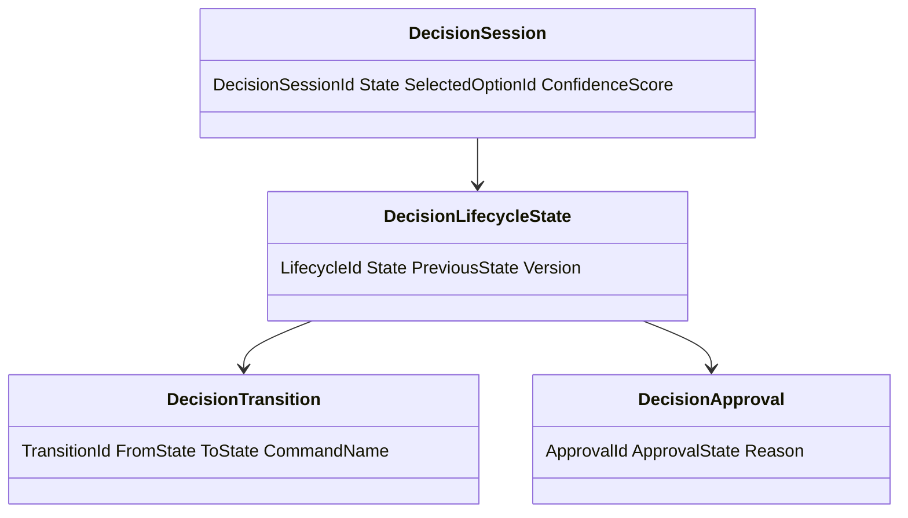
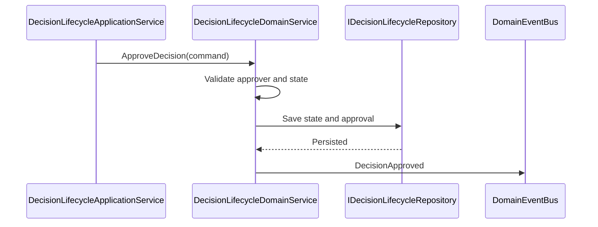
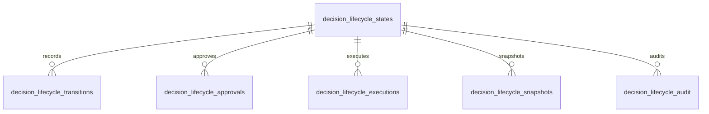
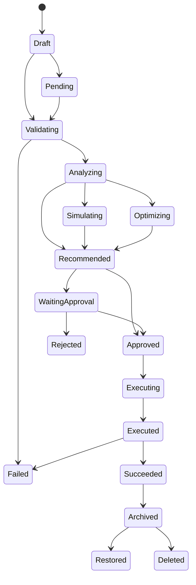
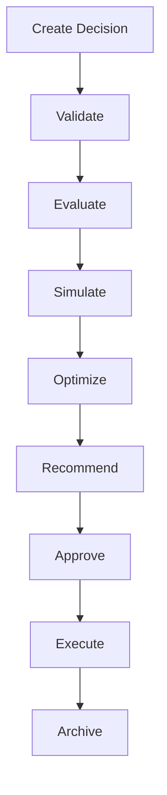
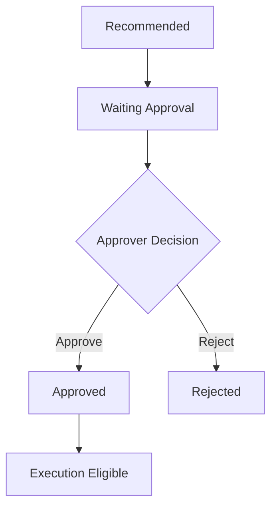
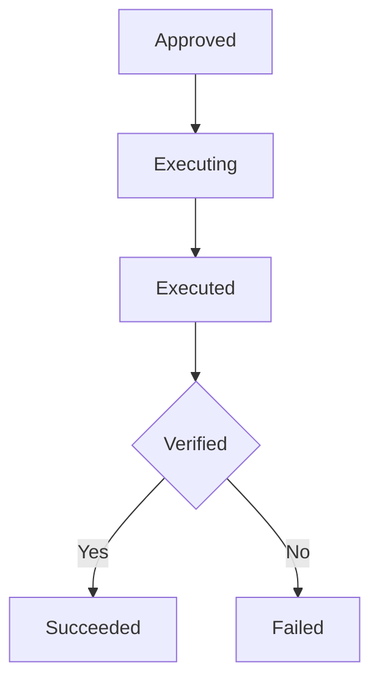

> **ADR-001 PWA Runtime Alignment:** Atlas v1 uses PWA v1 Runtime, Browser Runtime, and IndexedDB Runtime. Future Cloud Architecture is optional future mapping and must not be required for v1.\r\n\r\n# Decision Lifecycle
Version: 1.0
## Split Navigation
- [Decision lifecycle states](decision-lifecycle/states-and-transitions.md)
- [Decision lifecycle execution](decision-lifecycle/execution-and-audit.md)
- [Decision lifecycle governance and testing](decision-lifecycle/governance-and-testing.md)
Status: Enterprise Specification
Owner: Project Atlas
Source of Truth: Atlas Decision Lifecycle Specification
Last Updated: 2026-07-13
# Decision Lifecycle Overview
## Purpose
Decision Lifecycle defines the governed state model for DecisionSession from creation through validation, analysis, simulation, optimization, recommendation, approval, execution, closure, archival, restoration, deletion, snapshot, template, and historical retention.
It coordinates decision state with Recommendation, GoalPlan, Scenario, Portfolio, CashFlow, Notification, Decision History, Decision Audit, Decision Explainability, Decision Rule, Rule Engine, Simulation, Optimization, Workflow, Automation, Business Calendar, and User.
It preserves existing Atlas domain ownership and existing catalog naming.
## Business Meaning
Decision Lifecycle makes every DecisionSession state observable, explainable, auditable, permission-aware, recoverable, and consistent across recommendations, goals, scenarios, portfolio evidence, cashflow evidence, workflow approvals, automation, and execution.
Lifecycle state controls whether a decision can be edited, validated, analyzed, simulated, optimized, recommended, approved, rejected, executed, cancelled, archived, restored, deleted, cloned, or snapshotted.
Decision Lifecycle does not replace DecisionSession business ownership.
## Lifecycle Scope
Lifecycle scope covers DecisionSession state, command guards, event outputs, transition validation, decision evidence, approval evidence, execution evidence, rollback evidence, history, audit, cache, API projections, and lifecycle automation.
Scope includes related Recommendation, GoalPlan, Scenario, Portfolio, CashFlow, Notification, Rule Engine, Simulation, Optimization, Workflow, Automation, Business Calendar, and User only as coordination inputs.
Scope must preserve HouseholdId.
Scope must preserve TenantId when tenant scope exists.
## Lifecycle Objectives
Lifecycle objectives are valid state control, decision quality, explainability, approval discipline, execution traceability, evidence retention, recovery, auditability, and permission-safe projections.
Objectives are measured through decision completion rate, approval latency, rejection rate, simulation coverage, optimization coverage, failed execution count, expired decision count, rollback count, and audit completeness.
## Ownership
DecisionSession owns decision lifecycle state and decision outcome.
Decision Lifecycle owns state rules, transition matrix, lifecycle validation, state history, transition history, recovery, retention, and projections.
Decision History owns historical record projections.
Decision Audit owns immutable audit evidence.
Decision Explainability owns explanation artifacts and rationale visibility.
Decision Rule and Rule Engine own rule evaluation logic and rule versions.
Application Service owns orchestration.
Repository owns persistence and query.
Security owns authorization and masking.
## Aggregate Root
DecisionSession is the aggregate root for decision lifecycle behavior.
All lifecycle transitions must be applied through DecisionSession consistency boundary.
Related aggregates are referenced by identifier and version but are not mutated unless an explicit command in that domain is invoked.
## Relationship with Decision
DecisionSession supplies decision intent, status, owner, options, selected option, rationale, approval state, execution state, and lifecycle.
Decision Lifecycle controls valid transitions and records prior state and new state.
## Relationship with Recommendation
Recommendation can create, support, or consume a decision.
Recommendation adoption may depend on approved or executed DecisionSession.
Decision Lifecycle does not own Recommendation lifecycle.
## Relationship with Goal
GoalPlan may require a decision before activation, optimization, execution, completion, or cancellation.
Decision lifecycle events may unblock or block GoalPlan operations through explicit Goal command policy.
## Relationship with Scenario
Scenario supplies assumptions, comparison, simulation result, and scenario version.
Decision simulation must record ScenarioId and ScenarioVersion.
## Relationship with Portfolio
Portfolio supplies allocation, liquidity, valuation, risk, and performance evidence where authorized.
Portfolio evidence must record valuation time and masking state.
## Relationship with CashFlow
CashFlow supplies surplus, deficit, contribution capacity, funding gap, and period evidence where authorized.
CashFlow evidence must record period and currency.
## Relationship with Notification
Notification is triggered by decision creation, pending approval, approval, rejection, execution, failure, cancellation, expiration, archive, restore, and escalation.
Notification suppression does not remove decision history or audit.
## Relationship with Decision History
Decision History stores state history, option history, rationale history, approval history, simulation history, optimization history, execution history, and closure history.
History is append-only.
## Relationship with Decision Audit
Decision Audit records commands, state changes, evidence access, approval actions, execution actions, rollback actions, and projection access.
Audit records are immutable under retention policy.
## Relationship with Decision Explainability
Decision Explainability records rationale, rule evaluation, option scoring, simulation summary, optimization summary, and approval reasoning.
Explainability projection must honor field-level security.
## Relationship with Decision Rule
Decision Rule supplies rule definitions, rule categories, rule priorities, and rule versions.
Decision Lifecycle records rule version used for validation and evaluation.
## Relationship with Rule Engine
Rule Engine evaluates decision rules and returns pass, fail, warning, score, explanation, and source version.
Rule Engine output is evidence and does not directly mutate lifecycle state.
## Relationship with Simulation
Simulation evaluates decision options under scenario assumptions and source versions.
Simulation output can move state to Simulating or DecisionSimulated event when command succeeds.
## Relationship with Optimization
Optimization ranks decision options and tradeoffs.
Optimization output can move state to Optimizing or DecisionOptimized event when command succeeds.
## Relationship with Workflow
Workflow controls approval routing, review steps, execution gates, and escalation state.
Workflow cannot bypass lifecycle validation.
## Relationship with Automation
Automation can trigger validation, evaluation, simulation, optimization, reminder, expiration, archive, and cleanup.
AutomationRunId must be recorded.
## Relationship with Business Calendar
Business Calendar supplies approval windows, escalation deadlines, expiration windows, scheduled execution windows, and reminder cadence.
Lifecycle deadlines must respect Business Calendar when configured.
## Relationship with User
User supplies actor, owner, approver, reviewer, operator, permission, preference, locale, and masking context.
User permission is evaluated before every command and projection.
# Lifecycle Architecture
## Lifecycle Coordinator
Lifecycle Coordinator orchestrates command handling, transition validation, state persistence, history writing, event publication, cache invalidation, and notification triggers.
## State Machine
State Machine defines decision states, legal transitions, illegal transitions, guards, invariants, triggers, rollback, and recovery behavior.
It is deterministic for the same current state, command, source version, and policy version.
## Workflow Engine
Workflow Engine supplies approval step, reviewer assignment, escalation step, and execution gate.
It must not move DecisionSession without lifecycle command.
## Validation Engine
Validation Engine evaluates business, financial, portfolio, cashflow, goal, rule, scenario, permission, and consistency validation.
It returns validation result, warnings, violations, and required approvals.
## Rule Engine
Rule Engine evaluates Decision Rule sets and returns rule result, rule score, explanation, and rule version.
Rule failure can block approval or execution when policy requires.
## Approval Engine
Approval Engine validates approver permission, approval state, workflow step, DecisionSession state, rationale, and effective time.
Approval output is recorded in approval history.
## Audit Engine
Audit Engine records command, event, state transition, evidence, approval, rejection, execution, rollback, access, and export.
Audit records include actor, correlation id, source version, before state, and after state.
## Recovery Engine
Recovery Engine handles stale lock, failed transition, missing event, failed cache invalidation, incomplete execution sync, and partial approval sync.
Recovery creates auditable recovery records.
## History Engine
History Engine stores append-only state history, transition history, option history, rationale history, approval history, simulation history, optimization history, and execution history.
## Notification Engine
Notification Engine sends lifecycle triggers after committed state changes.
Notification failure does not roll back lifecycle persistence.
# Decision States
## Draft
Purpose: Capture editable decision intent before validation.
Entry Criteria: CreateDecision succeeds with owner, scope, and minimum intent.
Exit Criteria: UpdateDecision or ValidateDecision passes required input checks.
Allowed Commands: UpdateDecision, ValidateDecision, CancelDecision, DeleteDecision, CloneDecision, CreateSnapshot.
Allowed Events: DecisionCreated, DecisionUpdated, DecisionValidated, DecisionCancelled, DecisionDeleted, DecisionSnapshotCreated.
Business Constraints: Draft is editable and excluded from approval and execution.
## Pending
Purpose: Represent a decision waiting for required data, actor input, workflow step, or validation start.
Entry Criteria: Draft has enough intent but missing validation or assigned action.
Exit Criteria: ValidateDecision, CancelDecision, or ArchiveDecision succeeds.
Allowed Commands: UpdateDecision, ValidateDecision, CancelDecision, ArchiveDecision, CreateSnapshot.
Allowed Events: DecisionUpdated, DecisionValidated, DecisionCancelled, DecisionArchived, DecisionSnapshotCreated.
Business Constraints: Pending must record pending reason when it blocks related GoalPlan.
## Validating
Purpose: Evaluate required business, rule, permission, financial, goal, scenario, portfolio, and cashflow checks.
Entry Criteria: ValidateDecision starts with valid source version.
Exit Criteria: Validation passes to Analyzing or fails to Failed or returns to Pending.
Allowed Commands: ValidateDecision, CancelDecision, CreateSnapshot.
Allowed Events: DecisionValidated, DecisionFailed, DecisionCancelled, DecisionSnapshotCreated.
Business Constraints: Validating must record rule version and source version.
## Analyzing
Purpose: Evaluate options, business impact, explainability, risk, and expected outcome.
Entry Criteria: Validation passes and evaluation is requested.
Exit Criteria: EvaluateDecision completes and moves to Simulating, Optimizing, Recommended, or Failed.
Allowed Commands: EvaluateDecision, SimulateDecision, OptimizeDecision, RecommendDecision, CancelDecision, CreateSnapshot.
Allowed Events: DecisionEvaluated, DecisionSimulated, DecisionOptimized, DecisionRecommended, DecisionFailed, DecisionCancelled, DecisionSnapshotCreated.
Business Constraints: Analysis must preserve option scores and explanation evidence.
## Simulating
Purpose: Evaluate options against Scenario assumptions and simulation inputs.
Entry Criteria: SimulateDecision starts with ScenarioId and ScenarioVersion.
Exit Criteria: Simulation completes and returns to Analyzing, Optimizing, Recommended, or Failed.
Allowed Commands: SimulateDecision, OptimizeDecision, RecommendDecision, CancelDecision, CreateSnapshot.
Allowed Events: DecisionSimulated, DecisionOptimized, DecisionRecommended, DecisionFailed, DecisionCancelled, DecisionSnapshotCreated.
Business Constraints: Simulation must not mutate Scenario or source domains.
## Optimizing
Purpose: Rank decision options using optimization output and constraints.
Entry Criteria: OptimizeDecision starts with objective and constraint evidence.
Exit Criteria: Optimization completes and moves to Recommended, Waiting Approval, or Failed.
Allowed Commands: OptimizeDecision, RecommendDecision, CancelDecision, CreateSnapshot.
Allowed Events: DecisionOptimized, DecisionRecommended, DecisionFailed, DecisionCancelled, DecisionSnapshotCreated.
Business Constraints: Optimization output is advisory until approval.
## Recommended
Purpose: Present preferred option and rationale for approval or execution.
Entry Criteria: RecommendDecision succeeds with ranked option and explanation.
Exit Criteria: ApproveDecision, RejectDecision, UpdateDecision, or CancelDecision succeeds.
Allowed Commands: ApproveDecision, RejectDecision, UpdateDecision, CancelDecision, CreateSnapshot.
Allowed Events: DecisionRecommended, DecisionApproved, DecisionRejected, DecisionUpdated, DecisionCancelled, DecisionSnapshotCreated.
Business Constraints: Recommended state must include selected recommendation evidence.
## Waiting Approval
Purpose: Wait for approver, workflow, business calendar, or decision owner approval.
Entry Criteria: Approval is required and recommendation is ready.
Exit Criteria: ApproveDecision, RejectDecision, CancelDecision, or Expiration process succeeds.
Allowed Commands: ApproveDecision, RejectDecision, CancelDecision, CreateSnapshot.
Allowed Events: DecisionApproved, DecisionRejected, DecisionCancelled, DecisionSnapshotCreated.
Business Constraints: Waiting Approval must include approval reason, approver role, and due date when configured.
## Approved
Purpose: Represent authorized decision ready for execution or closure.
Entry Criteria: ApproveDecision succeeds.
Exit Criteria: ExecuteDecision, ArchiveDecision, CancelDecision, or CreateSnapshot succeeds.
Allowed Commands: ExecuteDecision, ArchiveDecision, CancelDecision, CreateSnapshot.
Allowed Events: DecisionApproved, DecisionExecuted, DecisionArchived, DecisionCancelled, DecisionSnapshotCreated.
Business Constraints: Approved decision must preserve approver and approval rationale.
## Rejected
Purpose: Represent a decision that was rejected by approver, workflow, rule, or owner.
Entry Criteria: RejectDecision succeeds.
Exit Criteria: ArchiveDecision, RestoreDecision, CloneDecision, or CreateSnapshot succeeds.
Allowed Commands: ArchiveDecision, RestoreDecision, CloneDecision, CreateSnapshot.
Allowed Events: DecisionRejected, DecisionArchived, DecisionRestored, DecisionSnapshotCreated.
Business Constraints: Rejected decision must include rejection reason.
## Executing
Purpose: Represent an approved decision currently being executed.
Entry Criteria: ExecuteDecision starts.
Exit Criteria: Execution completes, succeeds, fails, or is cancelled.
Allowed Commands: ExecuteDecision, CancelDecision, CreateSnapshot.
Allowed Events: DecisionExecuted, DecisionSucceeded, DecisionFailed, DecisionCancelled, DecisionSnapshotCreated.
Business Constraints: Executing state requires execution context and operator.
## Executed
Purpose: Represent decision execution completed administratively before outcome verification.
Entry Criteria: ExecuteDecision records execution result.
Exit Criteria: Verification moves to Succeeded or Failed.
Allowed Commands: ExecuteDecision, ArchiveDecision, CreateSnapshot.
Allowed Events: DecisionExecuted, DecisionSucceeded, DecisionFailed, DecisionArchived, DecisionSnapshotCreated.
Business Constraints: Executed state must include execution result and verification status.
## Succeeded
Purpose: Represent successful decision outcome.
Entry Criteria: Execution verification succeeds or approved non-executing decision closes successfully.
Exit Criteria: ArchiveDecision, CreateSnapshot, or RestoreDecision through approved correction.
Allowed Commands: ArchiveDecision, CreateSnapshot.
Allowed Events: DecisionSucceeded, DecisionArchived, DecisionSnapshotCreated.
Business Constraints: Succeeded is terminal except archive, snapshot, or approved correction.
## Failed
Purpose: Represent failed validation, evaluation, simulation, optimization, approval requirement, or execution.
Entry Criteria: Failure is recorded with reason and source evidence.
Exit Criteria: RestoreDecision, CancelDecision, ArchiveDecision, CloneDecision, or CreateSnapshot succeeds.
Allowed Commands: RestoreDecision, CancelDecision, ArchiveDecision, CloneDecision, CreateSnapshot.
Allowed Events: DecisionFailed, DecisionRestored, DecisionCancelled, DecisionArchived, DecisionSnapshotCreated.
Business Constraints: Failed state must include failure reason and recoverability flag.
## Cancelled
Purpose: Represent intentionally stopped decision lifecycle.
Entry Criteria: CancelDecision succeeds.
Exit Criteria: ArchiveDecision, RestoreDecision, CloneDecision, or CreateSnapshot succeeds.
Allowed Commands: ArchiveDecision, RestoreDecision, CloneDecision, CreateSnapshot.
Allowed Events: DecisionCancelled, DecisionArchived, DecisionRestored, DecisionSnapshotCreated.
Business Constraints: Cancelled decision cannot execute without restore.
## Expired
Purpose: Represent decision no longer valid because decision window, scenario, business calendar, or approval period expired.
Entry Criteria: Expiration process or automation succeeds.
Exit Criteria: ArchiveDecision, RestoreDecision, CloneDecision, or CreateSnapshot succeeds.
Allowed Commands: ArchiveDecision, RestoreDecision, CloneDecision, CreateSnapshot.
Allowed Events: DecisionArchived, DecisionRestored, DecisionSnapshotCreated.
Business Constraints: Expired state must include expiration reason and evaluated time.
## Archived
Purpose: Preserve decision as read-only history.
Entry Criteria: ArchiveDecision succeeds.
Exit Criteria: RestoreDecision or DeleteDecision succeeds.
Allowed Commands: RestoreDecision, DeleteDecision, CreateSnapshot.
Allowed Events: DecisionArchived, DecisionRestored, DecisionDeleted, DecisionSnapshotCreated.
Business Constraints: Archived decision cannot update business fields.
## Deleted
Purpose: Represent retained deletion marker or removal according to retention policy.
Entry Criteria: DeleteDecision succeeds.
Exit Criteria: None unless administrative retention recovery is permitted.
Allowed Commands: None.
Allowed Events: DecisionDeleted.
Business Constraints: Deleted decision is excluded from default queries and cannot transition.
## Restored
Purpose: Represent decision restored from Archived, Cancelled, Failed, Expired, Rejected, or permitted deleted marker.
Entry Criteria: RestoreDecision succeeds.
Exit Criteria: State is assigned by restore policy.
Allowed Commands: UpdateDecision, ValidateDecision, ApproveDecision, ArchiveDecision, CreateSnapshot.
Allowed Events: DecisionRestored, DecisionUpdated, DecisionValidated, DecisionApproved, DecisionArchived, DecisionSnapshotCreated.
Business Constraints: Restored state must revalidate source, permission, and rule version.
## Template
Purpose: Represent reusable decision pattern.
Entry Criteria: CloneDecision or template conversion succeeds according to policy.
Exit Criteria: CloneDecision or ArchiveDecision succeeds.
Allowed Commands: CloneDecision, ArchiveDecision, CreateSnapshot.
Allowed Events: DecisionCreated, DecisionArchived, DecisionSnapshotCreated.
Business Constraints: Template must not include unauthorized personal financial data.
## Historical
Purpose: Represent retained decision evidence for audit, reporting, analytics, explainability, and replay.
Entry Criteria: Archive, delete marker, snapshot, or retention process creates historical record.
Exit Criteria: Retention expiration or administrative archive process.
Allowed Commands: CreateSnapshot.
Allowed Events: DecisionSnapshotCreated.
Business Constraints: Historical state is read-only and permission-filtered.
# Transition Matrix
## Legal Transitions
- Draft -> Pending by UpdateDecision when minimum intent exists.
- Draft -> Validating by ValidateDecision.
- Draft -> Cancelled by CancelDecision.
- Draft -> Deleted by DeleteDecision when retention allows.
- Pending -> Validating by ValidateDecision.
- Pending -> Cancelled by CancelDecision.
- Pending -> Archived by ArchiveDecision.
- Validating -> Analyzing by ValidateDecision when validation passes.
- Validating -> Failed by ValidateDecision when hard validation fails.
- Validating -> Pending by ValidateDecision when missing input remains.
- Analyzing -> Simulating by SimulateDecision.
- Analyzing -> Optimizing by OptimizeDecision.
- Analyzing -> Recommended by RecommendDecision.
- Analyzing -> Failed by EvaluateDecision when evaluation fails.
- Simulating -> Analyzing by SimulateDecision when more analysis is required.
- Simulating -> Optimizing by OptimizeDecision.
- Simulating -> Recommended by RecommendDecision.
- Simulating -> Failed by SimulateDecision when simulation fails.
- Optimizing -> Recommended by RecommendDecision.
- Optimizing -> Waiting Approval by OptimizeDecision when approval is required.
- Optimizing -> Failed by OptimizeDecision when optimization fails.
- Recommended -> Waiting Approval by RecommendDecision when approval is required.
- Recommended -> Approved by ApproveDecision when approval is direct.
- Recommended -> Rejected by RejectDecision.
- Recommended -> Cancelled by CancelDecision.
- Waiting Approval -> Approved by ApproveDecision.
- Waiting Approval -> Rejected by RejectDecision.
- Waiting Approval -> Cancelled by CancelDecision.
- Waiting Approval -> Expired by expiration process.
- Approved -> Executing by ExecuteDecision.
- Approved -> Succeeded by closure when no execution is required.
- Approved -> Cancelled by CancelDecision.
- Approved -> Archived by ArchiveDecision.
- Rejected -> Archived by ArchiveDecision.
- Rejected -> Restored by RestoreDecision.
- Executing -> Executed by ExecuteDecision.
- Executing -> Succeeded by ExecuteDecision when verified.
- Executing -> Failed by ExecuteDecision when execution fails.
- Executing -> Cancelled by CancelDecision.
- Executed -> Succeeded by verification.
- Executed -> Failed by verification failure.
- Succeeded -> Archived by ArchiveDecision.
- Failed -> Restored by RestoreDecision.
- Failed -> Cancelled by CancelDecision.
- Failed -> Archived by ArchiveDecision.
- Cancelled -> Restored by RestoreDecision.
- Cancelled -> Archived by ArchiveDecision.
- Expired -> Restored by RestoreDecision.
- Expired -> Archived by ArchiveDecision.
- Archived -> Restored by RestoreDecision.
- Archived -> Deleted by DeleteDecision.
- Restored -> Pending by restore policy.
- Restored -> Validating by restore policy.
- Restored -> Recommended by restore policy.
- Template -> Draft by CloneDecision.
- Historical -> Historical by retention process.
## Illegal Transitions
- Deleted -> Draft.
- Deleted -> Pending.
- Deleted -> Approved.
- Deleted -> Executing.
- Archived -> Executing without RestoreDecision.
- Rejected -> Executing.
- Cancelled -> Executing.
- Expired -> Executing.
- Draft -> Approved.
- Pending -> Approved.
- Validating -> Approved.
- Analyzing -> Executed.
- Simulating -> Executed.
- Optimizing -> Executed.
- Template -> Executing.
- Historical -> Executing.
## Trigger
Triggers are domain commands, domain events, Workflow steps, Automation runs, Business Calendar deadlines, Rule Engine results, Simulation results, Optimization results, Recommendation changes, GoalPlan conditions, Scenario changes, Portfolio changes, CashFlow changes, Notification escalation, and retention process.
## Pre-condition
Pre-condition includes current state, command permission, DecisionSession ownership, source version, rule version, evidence availability, workflow state, automation context, business calendar window, approval authority, and audit readiness.
## Post-condition
Post-condition includes new state, transition history, domain event, cache invalidation, notification trigger, history record, audit record, and projection refresh.
## Invariant
DecisionSessionId, HouseholdId, owner scope, created time, transition id, and persisted historical evidence are immutable.
Terminal states cannot move except through RestoreDecision, ArchiveDecision, CreateSnapshot, or DeleteDecision when policy allows.
## Rollback Strategy
Rollback restores prior state only when persistence, event publication, or projection update fails before external side effects are committed.
Committed events require compensating transition rather than silent rollback.
## Recovery Strategy
Recovery handles stale lock, missing event, failed notification, cache mismatch, incomplete execution sync, approval sync failure, and history projection lag.
Recovery records RecoveryId, reason, actor or system actor, and result.
# Decision Validation
## Business Validation
Business validation checks decision intent, options, rationale, selected option, relationship scope, and required evidence.
## Financial Validation
Financial validation checks amount, currency, budget impact, funding gap, contribution impact, and financial source version.
## Portfolio Validation
Portfolio validation checks portfolio permission, valuation freshness, allocation, liquidity, risk, and masking.
## CashFlow Validation
CashFlow validation checks period, surplus, deficit, contribution capacity, funding gap, and currency.
## Goal Validation
Goal validation checks GoalPlan state, goal dependency, goal progress, target date, target amount, and lifecycle constraints.
## Rule Validation
Rule validation checks rule set, rule version, rule result, rule severity, and rule explainability.
## Scenario Validation
Scenario validation checks ScenarioId, ScenarioVersion, assumptions, baseline, and simulation readiness.
## Permission Validation
Permission validation checks actor, owner, approver, operator, household, tenant when present, field-level security, and command permission.
## Consistency Validation
Consistency validation checks state, transition, recommendation, goal, scenario, portfolio, cashflow, approval, execution, history, audit, and projection consistency.
# Decision Workflow
## Decision Creation
Decision Creation creates Draft state and records initial owner, scope, intent, and correlation id.
## Evaluation
Evaluation validates options, evidence, rules, and explainability.
## Simulation
Simulation evaluates options against Scenario assumptions and records simulation result.
## Optimization
Optimization ranks options by objective, constraint, risk, financial impact, and confidence.
## Recommendation
Recommendation produces selected option, rationale, score, and explanation.
## Approval
Approval validates approver authority, workflow state, rationale, and Business Calendar window.
## Execution
Execution applies approved decision through explicit execution command or marks non-executing decision complete.
## Verification
Verification confirms execution result, outcome, rule compliance, and consistency.
## Closure
Closure moves decision to Succeeded, Failed, Cancelled, Rejected, or Expired.
## Archive
Archive makes decision read-only and preserves history.
# Validation Rules
1. DecisionSessionId must be globally unique. 2. HouseholdId is required. 3. TenantId is required when tenant scope exists. 4. Decision state is required. 5. Current state must be supported. 6. Target state must be supported. 7. Command must be supported. 8. Command must be allowed from current state. 9. Transition must be legal. 10. Illegal transition must be rejected. 11. Actor is required for manual command. 12. System actor is required for automation. 13. CorrelationId is required. 14. CausationId is required for event-driven command. 15. Source version hash is required. 16. Rule version is required for validation and evaluation. 17. ScenarioVersion is required for simulation. 18. Optimization version is required for optimization. 19. Approval requires approver id. 20. Rejection requires rejection reason. 21. Cancellation requires cancellation reason. 22. Execution requires approved state or explicit execution policy. 23. Execution result is required for Executed, Succeeded, or Failed. 24. Failure requires failure reason. 25. Archive requires terminal or policy-approved state. 26. Restore requires Archived, Cancelled, Failed, Expired, Rejected, or permitted deleted marker. 27. Delete requires retention validation. 28. Clone requires template-safe fields. 29. Snapshot requires source version hash. 30. Portfolio evidence requires portfolio permission. 31. CashFlow evidence requires cashflow permission. 32. GoalPlan reference must exist when present. 33. Recommendation reference must exist when present. 34. Decision option ids must be unique. 35. Selected option must exist before approval. 36. Approval due date must be valid when present. 37. Business Calendar window must be valid when configured. 38. WorkflowInstanceId is required when workflow controls approval. 39. AutomationRunId is required when automation triggers transition. 40. Permission context must be recorded. 41. Field projection must be allowed. 42. Sorting field must be allowed. 43. Pagination limit must be within API maximum. 44. Audit metadata is required for every command. 45. Transition timestamp cannot be before decision creation time.
# Business Rules
1. Decision Lifecycle must preserve Atlas domain ownership. 2. Decision Lifecycle must not redesign Atlas. 3. Decision Lifecycle must not create unrelated business concepts. 4. Decision naming must follow existing catalog. 5. DecisionSession owns lifecycle state. 6. Draft is editable by authorized owner. 7. Draft cannot be approved. 8. Draft cannot execute. 9. Pending must record pending reason when blocking related operations. 10. Pending can be validated. 11. Validating must record rule version. 12. Validating must record source version. 13. Validation failure must record violation reason. 14. Analyzing must preserve option scores. 15. Analyzing must preserve explanation evidence. 16. Simulating requires ScenarioId. 17. Simulating requires ScenarioVersion. 18. Simulation must not mutate Scenario. 19. Simulation must not mutate GoalPlan. 20. Simulation must not mutate Portfolio. 21. Simulation must not mutate CashFlow. 22. Optimizing must preserve objective and constraint evidence. 23. Optimization result is advisory before approval. 24. Recommended requires selected option. 25. Recommended requires rationale. 26. Waiting Approval requires approver role. 27. Waiting Approval requires due date when configured. 28. Approved requires approver id. 29. Approved requires approval rationale. 30. Approved can execute when policy permits. 31. Approved can close without execution when no execution is required. 32. Rejected requires rejection reason. 33. Rejected cannot execute. 34. Executing requires execution context. 35. Executing requires operator or system actor. 36. Executed requires execution result. 37. Succeeded requires verification evidence. 38. Succeeded is terminal except archive, snapshot, or approved correction. 39. Failed requires failure reason. 40. Failed must record recoverability flag. 41. Cancelled requires cancellation reason. 42. Cancelled cannot execute without restore. 43. Expired requires expiration reason. 44. Expired cannot execute without restore. 45. Archived is read-only. 46. Archived is excluded from default active query. 47. Deleted is terminal. 48. Deleted is excluded from default query. 49. Restored requires source revalidation. 50. Restored requires permission revalidation. 51. Restored requires rule revalidation. 52. Template must not include unauthorized financial data. 53. Historical state is read-only. 54. Historical projection must be permission-filtered. 55. Recommendation can request decision but cannot approve it. 56. Recommendation can consume approved decision. 57. GoalPlan can be blocked by pending decision. 58. GoalPlan can be unblocked by approved decision through explicit goal command. 59. Scenario evidence must record source version. 60. Portfolio evidence must be masked when permission requires. 61. CashFlow evidence must be masked when permission requires. 62. Notification failure must not roll back state change. 63. Cache failure must not roll back state change. 64. Audit failure must block transition when audit is required. 65. Decision History is append-only. 66. Decision Audit is append-only. 67. Approval History is append-only. 68. Execution History is append-only. 69. Rollback History is append-only. 70. Explainability evidence must be reproducible from recorded inputs. 71. Rule Engine output must record rule version. 72. Rule failure can block approval. 73. Critical rule failure can block execution. 74. Workflow cannot bypass lifecycle validation. 75. Automation cannot bypass lifecycle validation. 76. Business Calendar blackout blocks scheduled approval unless override permission exists. 77. Expiration can be automated. 78. Archive can be automated by retention policy. 79. Cleanup must not delete audit evidence early. 80. Concurrent update must use optimistic version. 81. Duplicate command must be idempotent by command id. 82. Event replay must reproduce lifecycle state. 83. State change must emit domain event after persistence. 84. Domain event must include prior state and new state. 85. Lifecycle cache invalidates after state change. 86. Decision cache invalidates after state change. 87. Dashboard projection invalidates after state change. 88. Reporting snapshot must preserve state at generation time. 89. Analytics must use committed history. 90. Search must enforce HouseholdId scope. 91. Tenant-aware query must enforce TenantId. 92. Aggregation must not leak unauthorized data. 93. Export must use masked projection when required. 94. Approval permission is separate from read permission. 95. Execution permission is separate from approval permission. 96. Delete permission is separate from archive permission. 97. Restore permission is separate from update permission. 98. Clone permission is separate from create permission. 99. Snapshot permission is separate from read permission. 100. Approval cannot be self-approved when policy forbids it. 101. Rejection cannot remove recommendation evidence. 102. Cancellation cannot remove decision history. 103. Expiration cannot remove audit history. 104. Archive cannot remove compliance evidence. 105. Restore must not reuse stale simulation without validation. 106. Restore must not reuse stale optimization without validation. 107. Execution must not start with stale approval. 108. Decision outcome must be explainable. 109. Decision outcome must record selected option. 110. Decision outcome must record rationale.
# State Machine
## Complete State Matrix
| From | To | Command | Guard |
|---|---|---|---|
| Draft | Pending | UpdateDecision | minimum intent |
| Draft | Validating | ValidateDecision | inputs present |
| Draft | Cancelled | CancelDecision | reason present |
| Pending | Validating | ValidateDecision | inputs present |
| Validating | Analyzing | ValidateDecision | validation passed |
| Validating | Failed | ValidateDecision | hard validation failed |
| Analyzing | Simulating | SimulateDecision | scenario available |
| Analyzing | Optimizing | OptimizeDecision | objectives available |
| Analyzing | Recommended | RecommendDecision | option selected |
| Simulating | Recommended | RecommendDecision | simulation complete |
| Optimizing | Recommended | RecommendDecision | optimization complete |
| Recommended | Waiting Approval | RecommendDecision | approval required |
| Recommended | Approved | ApproveDecision | direct approval |
| Recommended | Rejected | RejectDecision | reason present |
| Waiting Approval | Approved | ApproveDecision | approver authorized |
| Waiting Approval | Rejected | RejectDecision | reason present |
| Waiting Approval | Expired | Expiration | window expired |
| Approved | Executing | ExecuteDecision | execution required |
| Approved | Succeeded | ExecuteDecision | no execution required |
| Executing | Executed | ExecuteDecision | execution complete |
| Executed | Succeeded | ExecuteDecision | verification passed |
| Executed | Failed | ExecuteDecision | verification failed |
| Succeeded | Archived | ArchiveDecision | retention allowed |
| Failed | Restored | RestoreDecision | validation passed |
| Failed | Archived | ArchiveDecision | retention allowed |
| Cancelled | Restored | RestoreDecision | validation passed |
| Expired | Restored | RestoreDecision | validation passed |
| Archived | Restored | RestoreDecision | validation passed |
| Archived | Deleted | DeleteDecision | retention allowed |
| Template | Draft | CloneDecision | permission |
## Transitions
Transitions are valid only when current state, target state, command, permission, validation, workflow, automation, rule, audit, and retention checks pass.
## Triggers
Triggers include commands, domain events, Workflow step, Automation run, Business Calendar deadline, Rule Engine result, Simulation result, Optimization result, Recommendation state, GoalPlan condition, Scenario change, Portfolio change, CashFlow change, and retention process.
## Invariant
DecisionSessionId is immutable.
HouseholdId is immutable.
CreatedAt is immutable.
Deleted state is terminal.
Historical records are read-only.
Approval history is append-only.
Execution history is append-only.
Transition history is append-only.
## Illegal Transition
Illegal transition includes any transition not listed in the state matrix, any transition without permission, any transition without audit metadata, and any transition that violates rule or workflow guard.
# Commands
## CreateDecision
Creates Draft DecisionSession.
## UpdateDecision
Updates editable decision fields.
## ValidateDecision
Runs validation and records rule result.
## EvaluateDecision
Evaluates decision options and explanation.
## SimulateDecision
Runs simulation using Scenario evidence.
## OptimizeDecision
Runs optimization over decision options.
## RecommendDecision
Selects recommended option and rationale.
## ApproveDecision
Approves decision with approver and reason.
## RejectDecision
Rejects decision with reason.
## ExecuteDecision
Executes approved decision or records no-execution closure.
## CancelDecision
Cancels eligible decision with reason.
## ArchiveDecision
Archives eligible decision.
## RestoreDecision
Restores eligible decision after validation.
## DeleteDecision
Deletes eligible decision after retention validation.
## CloneDecision
Clones decision from template or historical source.
## CreateSnapshot
Creates immutable decision snapshot.
## ExpireDecision
Moves eligible decision to Expired.
## GenerateDecisionExplanation
Creates explainability projection.
## RecalculateDecisionLifecycle
Revalidates state against current source evidence.
# Domain Events
## DecisionCreated
Emitted after CreateDecision succeeds.
## DecisionUpdated
Emitted after UpdateDecision succeeds.
## DecisionValidated
Emitted after ValidateDecision succeeds.
## DecisionEvaluated
Emitted after EvaluateDecision succeeds.
## DecisionSimulated
Emitted after SimulateDecision succeeds.
## DecisionOptimized
Emitted after OptimizeDecision succeeds.
## DecisionRecommended
Emitted after RecommendDecision succeeds.
## DecisionApproved
Emitted after ApproveDecision succeeds.
## DecisionRejected
Emitted after RejectDecision succeeds.
## DecisionExecuted
Emitted after ExecuteDecision records execution.
## DecisionSucceeded
Emitted after decision succeeds.
## DecisionFailed
Emitted after decision fails.
## DecisionCancelled
Emitted after CancelDecision succeeds.
## DecisionArchived
Emitted after ArchiveDecision succeeds.
## DecisionRestored
Emitted after RestoreDecision succeeds.
## DecisionDeleted
Emitted after DeleteDecision succeeds.
## DecisionSnapshotCreated
Emitted after CreateSnapshot succeeds.
## DecisionExpired
Emitted after ExpireDecision succeeds.
## DecisionExplanationGenerated
Emitted after explanation projection is generated.
# Repository
## Interface
IDecisionLifecycleRepository persists DecisionSession lifecycle state, transition history, approval history, execution history, rollback history, snapshots, templates, and projections.
## Methods
- Add
- Update
- GetById
- GetByLifecycleState
- GetByHouseholdId
- Search
- SaveTransitionHistory
- SaveStateHistory
- SaveApprovalHistory
- SaveExecutionHistory
- SaveRollbackHistory
- SaveSnapshot
- SaveTemplate
- Archive
- Restore
- Delete
- GetSummaryProjection
- GetDetailProjection
- GetLifecycleProjection
## Queries
- DecisionsByState
- DecisionsByOwner
- DecisionsByHousehold
- PendingDecisions
- WaitingApprovalDecisions
- ApprovedDecisions
- ExecutingDecisions
- FailedDecisions
- ArchivedDecisions
- ExpiredDecisions
- HistoricalDecisions
- TemplateDecisions
## Filtering
- DecisionSessionId
- HouseholdId
- TenantId
- OwnerId
- LifecycleState
- RecommendationId
- GoalPlanId
- ScenarioId
- PortfolioId
- CashFlowPeriod
- CreatedDateRange
- UpdatedDateRange
- ApprovalDateRange
- ExecutionDateRange
- HasWorkflow
- HasAutomation
## Sorting
- createdAt desc
- updatedAt desc
- approvalDueAt asc
- priority desc
- lifecycleState asc
- confidenceScore desc
- executedAt desc
- archivedAt desc
## Aggregation
- CountByState
- CountByOwner
- CountByRecommendation
- CountByGoal
- PendingApprovalCount
- ApprovedCount
- RejectedCount
- ExecutedCount
- FailedCount
- AverageApprovalDuration
## Projection
- DecisionSummaryProjection
- DecisionDetailProjection
- DecisionLifecycleProjection
- StateProjection
- TransitionProjection
- ApprovalProjection
- SimulationProjection
- ExecutionProjection
- SnapshotProjection
## Specification
- EditableDecisionSpecification
- ApprovableDecisionSpecification
- RejectableDecisionSpecification
- ExecutableDecisionSpecification
- RestorableDecisionSpecification
- DeletableDecisionSpecification
- ArchivableDecisionSpecification
- HistoricalDecisionSpecification
# Domain Service Interaction
- DecisionLifecycleDomainService validates states, transitions, commands, and invariants.
- RecommendationDomainService supplies recommendation context and consumes decision outcome.
- GoalLifecycleDomainService supplies GoalPlan lifecycle constraints.
- GoalProgressDomainService supplies goal progress evidence when decision affects goal.
- ScenarioDomainService supplies ScenarioVersion and simulation context.
- PortfolioDomainService supplies authorized portfolio evidence.
- CashFlowDomainService supplies authorized cashflow evidence.
- NotificationDomainService receives decision notification triggers.
- DecisionHistoryDomainService records history projections.
- DecisionAuditDomainService records immutable audit evidence.
- DecisionExplainabilityDomainService creates explanation artifacts.
- DecisionRuleDomainService supplies rule definitions and rule versions.
- RuleEngineDomainService evaluates rules.
- SimulationDomainService evaluates scenario simulation output.
- OptimizationDomainService evaluates option ranking.
- WorkflowDomainService supplies approval routing and workflow state.
- AutomationDomainService supplies automation run context.
- BusinessCalendarDomainService validates windows and deadlines.
- SecurityDomainService evaluates permission and masking.
- CacheDomainService invalidates lifecycle and decision projections.
# Application Service Interaction
- DecisionLifecycleApplicationService coordinates commands, queries, unit of work, event publication, and cache invalidation.
- CreateDecisionHandler creates Draft state.
- UpdateDecisionHandler updates editable fields and records history.
- ValidateDecisionHandler invokes validation and rule engine.
- EvaluateDecisionHandler evaluates options and explanation.
- SimulateDecisionHandler invokes simulation service.
- OptimizeDecisionHandler invokes optimization service.
- RecommendDecisionHandler records recommended option.
- ApproveDecisionHandler validates approver and workflow state.
- RejectDecisionHandler records rejection reason.
- ExecuteDecisionHandler executes approved decision or records closure.
- CancelDecisionHandler records cancellation reason.
- ArchiveDecisionHandler validates archive policy.
- RestoreDecisionHandler validates source, rule, and permission.
- DeleteDecisionHandler validates retention.
- CloneDecisionHandler creates decision from template.
- CreateSnapshotHandler persists immutable snapshot.
- SearchDecisionQueryHandler applies filters, sorting, pagination, and projection.
# API
## Future Cloud Architecture Endpoints
- GET /api/decisions
- POST /api/decisions
- GET /api/decisions/{decisionSessionId}
- PUT /api/decisions/{decisionSessionId}
- POST /api/decisions/{decisionSessionId}/validate
- POST /api/decisions/{decisionSessionId}/evaluate
- POST /api/decisions/{decisionSessionId}/simulate
- POST /api/decisions/{decisionSessionId}/optimize
- POST /api/decisions/{decisionSessionId}/recommend
- POST /api/decisions/{decisionSessionId}/approve
- POST /api/decisions/{decisionSessionId}/reject
- POST /api/decisions/{decisionSessionId}/execute
- POST /api/decisions/{decisionSessionId}/cancel
- POST /api/decisions/{decisionSessionId}/archive
- POST /api/decisions/{decisionSessionId}/restore
- DELETE /api/decisions/{decisionSessionId}
- POST /api/decisions/{decisionSessionId}/clone
- POST /api/decisions/{decisionSessionId}/snapshot
- GET /api/decisions/{decisionSessionId}/lifecycle
- GET /api/decisions/lifecycle/summary
## HTTP Methods
GET reads decision lifecycle projections.
POST creates and performs lifecycle operations.
PUT updates editable fields.
DELETE deletes eligible decision after retention validation.
## Request
Create request includes owner, household, decision intent, options, related goal, recommendation, scenario, and initial evidence.
Update request includes version, editable fields, and reason.
Approval request includes selected option, approver, reason, workflow context, and expected state.
Execution request includes execution mode, operator, source version, and result handling.
Snapshot request includes projection, source version, and retention class.
Search request includes filters, sorting, pagination, and projection.
## Response
Detail response returns DecisionSession, lifecycle state, options, explanation, approval, execution, history, permissions, and audit metadata.
Summary response returns state, selected option, recommendation link, goal link, approval state, execution state, and updated time.
Lifecycle response returns current state, legal commands, illegal commands, transition history, and automation state.
Bulk response returns processed, succeeded, failed, skipped, and per-item errors.
## Errors
- 400 invalid request
- 401 unauthenticated
- 403 forbidden
- 404 decision not found
- 409 concurrency conflict
- 410 stale source
- 422 validation failed
- 423 decision locked
- 424 dependency blocked
- 429 rate limited
- 500 internal error
## Pagination
Pagination uses pageNumber, pageSize, totalCount, totalPages, hasNextPage, and hasPreviousPage.
## Filtering
Filtering supports lifecycle state, owner, household, recommendation, goal, scenario, approval state, execution state, date range, workflow, automation, archived, historical, and template.
## Sorting
Sorting supports createdAt, updatedAt, approvalDueAt, priority, lifecycleState, confidenceScore, executedAt, and archivedAt.
## Projection
Projection supports summary, detail, lifecycle, state, transition, approval, simulation, execution, snapshot, dashboard, and audit-safe views.
## Bulk Operations
Bulk operations support validate, evaluate, simulate, optimize, archive, restore, snapshot, and expire with per-item result.
## Lifecycle Operations
Lifecycle operations include create, update, validate, evaluate, simulate, optimize, recommend, approve, reject, execute, cancel, archive, restore, delete, clone, and snapshot.
# DTO
## Create DTO
Includes owner, household, intent, options, relatedRecommendationId, relatedGoalPlanId, ScenarioId, evidence, and initial context.
## Update DTO
Includes decisionSessionId, version, editable fields, option changes, evidence changes, and reason.
## Decision DTO
Includes decision identifiers, state, owner, selected option, rationale, confidence, source version, and timestamps.
## Lifecycle DTO
Includes current state, previous state, legal commands, blocked commands, transition id, and source version.
## State DTO
Includes state, reason, enteredAt, enteredBy, duration, and invariants.
## Transition DTO
Includes transition id, from state, to state, command, trigger, actor, reason, occurredAt, and correlation id.
## Approval DTO
Includes approver id, approval state, selected option, reason, workflow step, and approvedAt.
## Simulation DTO
Includes ScenarioId, ScenarioVersion, assumptions, simulation result, confidence, and generatedAt.
## Execution DTO
Includes execution mode, operator, execution result, verification, executedAt, and related ExecutionId when present.
## Snapshot DTO
Includes snapshot id, decisionSessionId, source version hash, projection, createdAt, and retention class.
## Summary DTO
Includes decisionSessionId, state, selected option, approval state, execution state, confidence, and updatedAt.
## Detail DTO
Includes full detail, options, evidence, lifecycle, approval, simulation, optimization, execution, history, audit, and permissions.
## Search DTO
Includes filters, sorting, pagination, projection, and masking mode.
# PWA Runtime Mapping
## Table
- decision_lifecycle_states
- decision_lifecycle_transitions
- decision_lifecycle_approvals
- decision_lifecycle_executions
- decision_lifecycle_snapshots
- decision_lifecycle_templates
- decision_lifecycle_rollback_history
- decision_lifecycle_audit
## Columns
- lifecycle_id uuid primary key
- tenant_id uuid null
- household_id uuid not null
- decision_session_id uuid not null
- state varchar(40) not null
- previous_state varchar(40) null
- state_reason varchar(800) null
- source_version_hash varchar(128) not null
- rule_version varchar(40) null
- workflow_instance_id uuid null
- automation_run_id uuid null
- selected_option_id uuid null
- confidence_score numeric(5,2) null
- approval_due_at timestamptz null
- entered_at timestamptz not null
- entered_by uuid null
- archived_at timestamptz null
- deleted_at timestamptz null
- created_at timestamptz not null
- updated_at timestamptz not null
- version int not null
## Indexes
- ix_decision_lifecycle_decision_state
- ix_decision_lifecycle_household_state
- ix_decision_lifecycle_tenant_state
- ix_decision_lifecycle_entered_at
- ix_decision_lifecycle_approval_due
- ix_decision_lifecycle_workflow
- ix_decision_lifecycle_automation
- ux_decision_lifecycle_current
## Constraints
- state in supported decision states
- confidence_score between 0 and 100 when present
- entered_at after or equal created_at
- version greater than zero
- source_version_hash required
- deleted_at null unless state is Deleted
## FK
- decision_session_id references decision_sessions
- household_id references households
- workflow_instance_id references workflow instances when present
- automation_run_id references automation runs when present
- selected_option_id references decision options when present
## Unique
- Unique current lifecycle row per DecisionSession.
- Unique transition sequence per DecisionSession.
- Unique snapshot sequence per DecisionSession.
## Check Constraint
- Deleted state requires deleted_at.
- Approved state requires approval history.
- Executed state requires execution history.
## Partition Strategy
- Partition transitions, approvals, executions, snapshots, rollback history, and audit by created_at month.
# Future Cloud Mapping Schema
```sql
CREATE TABLE decision_lifecycle_states (
  lifecycle_id uuid PRIMARY KEY,
  tenant_id uuid NULL,
  household_id uuid NOT NULL,
  decision_session_id uuid NOT NULL,
  state varchar(40) NOT NULL,
  previous_state varchar(40) NULL,
  state_reason varchar(800) NULL,
  source_version_hash varchar(128) NOT NULL,
  rule_version varchar(40) NULL,
  workflow_instance_id uuid NULL,
  automation_run_id uuid NULL,
  selected_option_id uuid NULL,
  confidence_score numeric(5,2) NULL,
  approval_due_at timestamptz NULL,
  entered_at timestamptz NOT NULL DEFAULT now(),
  entered_by uuid NULL,
  archived_at timestamptz NULL,
  deleted_at timestamptz NULL,
  created_at timestamptz NOT NULL DEFAULT now(),
  updated_at timestamptz NOT NULL DEFAULT now(),
  version int NOT NULL DEFAULT 1,
  CONSTRAINT ck_decision_lifecycle_state CHECK (state IN ('Draft','Pending','Validating','Analyzing','Simulating','Optimizing','Recommended','WaitingApproval','Approved','Rejected','Executing','Executed','Succeeded','Failed','Cancelled','Expired','Archived','Deleted','Restored','Template','Historical')),
  CONSTRAINT ck_decision_lifecycle_confidence CHECK (confidence_score IS NULL OR (confidence_score >= 0 AND confidence_score <= 100)),
  CONSTRAINT ck_decision_lifecycle_version CHECK (version > 0),
  CONSTRAINT ck_decision_lifecycle_deleted CHECK ((state = 'Deleted' AND deleted_at IS NOT NULL) OR state <> 'Deleted')
);
CREATE TABLE decision_lifecycle_transitions (
  transition_id uuid PRIMARY KEY,
  decision_session_id uuid NOT NULL,
  from_state varchar(40) NULL,
  to_state varchar(40) NOT NULL,
  command_name varchar(120) NOT NULL,
  trigger_name varchar(120) NOT NULL,
  reason varchar(800) NULL,
  actor_id uuid NULL,
  source_version_hash varchar(128) NOT NULL,
  occurred_at timestamptz NOT NULL DEFAULT now(),
  correlation_id uuid NOT NULL,
  sequence_number int NOT NULL,
  CONSTRAINT ck_decision_lifecycle_transition_sequence CHECK (sequence_number > 0)
);
CREATE TABLE decision_lifecycle_approvals (
  approval_id uuid PRIMARY KEY,
  decision_session_id uuid NOT NULL,
  selected_option_id uuid NULL,
  approval_state varchar(40) NOT NULL,
  reason varchar(800) NOT NULL,
  approver_id uuid NULL,
  workflow_instance_id uuid NULL,
  occurred_at timestamptz NOT NULL DEFAULT now(),
  correlation_id uuid NOT NULL
);
CREATE TABLE decision_lifecycle_executions (
  execution_id uuid PRIMARY KEY,
  decision_session_id uuid NOT NULL,
  execution_state varchar(40) NOT NULL,
  execution_payload jsonb NOT NULL DEFAULT '{}'::jsonb,
  verification_payload jsonb NOT NULL DEFAULT '{}'::jsonb,
  operator_id uuid NULL,
  executed_at timestamptz NOT NULL DEFAULT now(),
  correlation_id uuid NOT NULL
);
CREATE TABLE decision_lifecycle_snapshots (
  snapshot_id uuid PRIMARY KEY,
  decision_session_id uuid NOT NULL,
  source_version_hash varchar(128) NOT NULL,
  snapshot_payload jsonb NOT NULL DEFAULT '{}'::jsonb,
  retention_class varchar(80) NOT NULL,
  created_by uuid NULL,
  created_at timestamptz NOT NULL DEFAULT now()
);
CREATE TABLE decision_lifecycle_templates (
  template_id uuid PRIMARY KEY,
  source_decision_session_id uuid NOT NULL,
  template_payload jsonb NOT NULL DEFAULT '{}'::jsonb,
  created_by uuid NULL,
  created_at timestamptz NOT NULL DEFAULT now()
);
CREATE TABLE decision_lifecycle_rollback_history (
  rollback_id uuid PRIMARY KEY,
  decision_session_id uuid NOT NULL,
  from_state varchar(40) NOT NULL,
  to_state varchar(40) NOT NULL,
  reason varchar(800) NOT NULL,
  occurred_at timestamptz NOT NULL DEFAULT now(),
  correlation_id uuid NOT NULL
);
CREATE TABLE decision_lifecycle_audit (
  audit_id uuid PRIMARY KEY,
  decision_session_id uuid NULL,
  action varchar(120) NOT NULL,
  actor_id uuid NULL,
  payload jsonb NOT NULL DEFAULT '{}'::jsonb,
  occurred_at timestamptz NOT NULL DEFAULT now(),
  correlation_id uuid NOT NULL
);
CREATE INDEX ix_decision_lifecycle_decision_state ON decision_lifecycle_states(decision_session_id, state);
CREATE INDEX ix_decision_lifecycle_household_state ON decision_lifecycle_states(household_id, state);
CREATE INDEX ix_decision_lifecycle_tenant_state ON decision_lifecycle_states(tenant_id, state);
CREATE INDEX ix_decision_lifecycle_entered_at ON decision_lifecycle_states(entered_at);
CREATE INDEX ix_decision_lifecycle_approval_due ON decision_lifecycle_states(approval_due_at);
CREATE INDEX ix_decision_lifecycle_workflow ON decision_lifecycle_states(workflow_instance_id);
CREATE INDEX ix_decision_lifecycle_automation ON decision_lifecycle_states(automation_run_id);
CREATE UNIQUE INDEX ux_decision_lifecycle_current ON decision_lifecycle_states(decision_session_id);
CREATE UNIQUE INDEX ux_decision_lifecycle_transition_sequence ON decision_lifecycle_transitions(decision_session_id, sequence_number);
CREATE VIEW v_decision_lifecycle_summary AS
SELECT lifecycle_id, household_id, decision_session_id, state, previous_state, confidence_score, entered_at, updated_at
FROM decision_lifecycle_states
WHERE state <> 'Deleted';
CREATE MATERIALIZED VIEW mv_decision_lifecycle_dashboard AS
SELECT household_id, state, count(*) AS decision_count, avg(confidence_score) AS average_confidence, max(updated_at) AS last_updated_at
FROM decision_lifecycle_states
WHERE state <> 'Deleted'
GROUP BY household_id, state;
```
# Future Cloud Mapping
- Fluent API maps DecisionLifecycleState to decision_lifecycle_states with lifecycle_id primary key.
- Owned Types map snapshot payload, template payload, execution payload, verification payload, and audit payload as JSON.
- Indexes map decision state, household state, tenant state, entered time, approval due time, workflow, automation, and current lifecycle row.
- Value Conversion stores DecisionLifecycleState, command name, trigger name, approval state, execution state, and retention class as strings.
- Query Filters exclude Deleted by default and enforce tenant scope when tenant scope exists.
- Concurrency token uses version column.
- Navigation maps transitions, approvals, executions, snapshots, templates, rollback history, and audit.
# Cache Strategy
- Redis Key: atlas:decision:{tenantId}:{householdId}:summary
- Redis Key: atlas:decision:{tenantId}:{householdId}:detail:{decisionSessionId}
- Redis Key: atlas:decision-lifecycle:{tenantId}:{householdId}:state:{decisionSessionId}
- Redis Key: atlas:decision-lifecycle:{tenantId}:{householdId}:transition:{decisionSessionId}
- Redis Key: atlas:decision-lifecycle:{tenantId}:{householdId}:dashboard
- Decision Cache stores summary and detail projection.
- Lifecycle Cache stores current state, legal commands, blocked commands, and generated time.
- TTL: decision summary 180 seconds.
- TTL: decision detail 300 seconds.
- TTL: lifecycle state 300 seconds.
- TTL: transition cache 600 seconds.
- Refresh Strategy: refresh after state change, approval, rejection, execution, archive, restore, snapshot, and materialized view refresh.
- Invalidation: invalidate by decision id, household id, tenant id, state change, permission change, masking change, rule change, and source version change.
# Security
- Authorization requires authenticated user and household access.
- Permissions include Decision.Read.
- Permissions include Decision.Create.
- Permissions include Decision.Update.
- Permissions include Decision.Validate.
- Permissions include Decision.Evaluate.
- Permissions include Decision.Simulate.
- Permissions include Decision.Optimize.
- Permissions include Decision.Recommend.
- Permissions include Decision.Approve.
- Permissions include Decision.Reject.
- Permissions include Decision.Execute.
- Permissions include Decision.Cancel.
- Permissions include Decision.Archive.
- Permissions include Decision.Restore.
- Permissions include Decision.Delete.
- Decision Approval Permissions evaluate approver role, workflow step, self-approval policy, and override authority.
- Field Level Security masks financial, portfolio, cashflow, scenario, operator, audit, and explainability-sensitive evidence.
- Data Masking applies before cache, dashboard, report, export, notification, and API projection.
# Audit
- Decision History records state, options, rationale, recommendation, simulation, optimization, approval, execution, and closure.
- Lifecycle History records every lifecycle state and reason.
- Approval History records approver, selected option, approval state, reason, workflow step, and occurred time.
- Execution History records operator, execution state, execution payload, verification payload, and result.
- Rollback History records rollback reason, prior state, restored state, and recovery result.
# Performance
- Lifecycle Optimization uses current state index, state matrix cache, and legal command projection.
- Batch Decision Processing partitions by household, state, owner, approval due date, and priority.
- Parallel Evaluation evaluates independent decisions concurrently with bounded concurrency.
- Caching stores decision summary, decision detail, lifecycle state, transition history, and dashboard summary.
- Materialized Views aggregate decision state counts and average confidence.
- Incremental Processing evaluates only changed decisions, changed source versions, and stale projections.
# Example JSON
## Create
```json
{"householdId":"7b9f7d3a-1000-4000-9000-000000000001","intent":"Select goal funding option","options":[{"name":"Increase monthly contribution"},{"name":"Delay target date"}],"relatedGoalPlanId":"1f2e3d4c-0000-4000-9000-000000000001"}
```
## Update
```json
{"decisionSessionId":"33b7ef1f-0000-4000-9000-000000000001","version":2,"reason":"Option evidence updated"}
```
## Approve
```json
{"decisionSessionId":"33b7ef1f-0000-4000-9000-000000000001","selectedOptionId":"44b7ef1f-0000-4000-9000-000000000002","reason":"Best risk-adjusted result"}
```
## Reject
```json
{"decisionSessionId":"33b7ef1f-0000-4000-9000-000000000001","reason":"Portfolio risk exceeds approved threshold"}
```
## Execute
```json
{"decisionSessionId":"33b7ef1f-0000-4000-9000-000000000001","executionMode":"Manual","operatorId":"55b7ef1f-0000-4000-9000-000000000003"}
```
## Archive
```json
{"decisionSessionId":"33b7ef1f-0000-4000-9000-000000000001","reason":"Terminal decision archived","retentionClass":"DecisionHistory"}
```
## Restore
```json
{"decisionSessionId":"33b7ef1f-0000-4000-9000-000000000001","targetState":"Pending","reason":"Approved correction"}
```
## Search
```json
{"filters":{"state":["Pending","WaitingApproval"]},"sorting":[{"field":"approvalDueAt","direction":"asc"}],"pagination":{"pageNumber":1,"pageSize":20}}
```
## Summary
```json
{"decisionSessionId":"33b7ef1f-0000-4000-9000-000000000001","state":"WaitingApproval","confidenceScore":82.4,"approvalDueAt":"2026-07-20T00:00:00Z"}
```
## Detail
```json
{"decisionSessionId":"33b7ef1f-0000-4000-9000-000000000001","state":"Recommended","selectedOption":"Increase monthly contribution","allowedCommands":["ApproveDecision","RejectDecision","CreateSnapshot"]}
```
## Snapshot
```json
{"decisionSessionId":"33b7ef1f-0000-4000-9000-000000000001","projection":"Detail","retentionClass":"Audit"}
```
# Mermaid
## Class Diagram

## Sequence Diagram

## ER Diagram

## Complete State Diagram

## Lifecycle Flow

## Approval Flow

## Execution Flow

# Testing
## Unit Test
Unit tests validate state rules, transition rules, command guards, invariants, validation rules, approval rules, and masking.
## Integration Test
Integration tests validate repository, API, domain events, cache invalidation, notification, security, history, and audit.
## Lifecycle Test
Lifecycle tests validate create, update, validate, evaluate, simulate, optimize, recommend, approve, reject, execute, cancel, archive, restore, delete, clone, and snapshot.
## Validation Test
Validation tests validate business, financial, portfolio, cashflow, goal, rule, scenario, permission, and consistency checks.
## Approval Test
Approval tests validate approver permission, self-approval policy, workflow state, approval due date, and rejection.
## Execution Test
Execution tests validate execution start, execution result, verification, success, failure, cancellation, and history.
## Concurrency Test
Concurrency tests validate optimistic version, duplicate command, concurrent approval, concurrent rejection, execution conflict, restore race, and archive race.
## Performance Test
Performance tests validate query latency, transition throughput, evaluation latency, materialized view refresh, and cache hit rate.
## Recovery Test
Recovery tests validate stale lock, failed event publication, failed cache invalidation, projection lag, approval sync, and execution sync.
# Edge Cases
1. CreateDecision receives duplicate command id. 2. Draft is deleted before validation finishes. 3. Pending decision blocks GoalPlan activation. 4. Validation rule version changes during validation. 5. Validation passes but source version becomes stale. 6. Simulation references stale ScenarioVersion. 7. Scenario is archived during simulation. 8. Optimization result becomes stale before recommendation. 9. Recommendation is archived while decision is pending. 10. GoalPlan is completed before approval. 11. Portfolio permission is revoked during evaluation. 12. CashFlow period closes during approval. 13. Approval arrives after expiration. 14. Rejection arrives after approval. 15. Execution starts after approval is revoked. 16. Execution fails after related GoalPlan changes. 17. Execution succeeds but verification fails. 18. Cancellation arrives during execution. 19. Archive arrives while executing. 20. Restore targets deleted decision. 21. Delete violates retention policy. 22. Clone uses masked template evidence. 23. Snapshot source version is stale. 24. Workflow approval step is skipped. 25. Automation trigger is duplicated. 26. Business Calendar blackout affects approval window. 27. Notification delivery fails. 28. Cache invalidation fails. 29. Materialized view refresh fails. 30. Audit write fails before event publication. 31. Event publication fails after persistence. 32. Projection asks for restricted fields. 33. Search uses unsupported sorting field. 34. Pagination token references deleted decision. 35. Tenant scope is missing in tenant-aware environment. 36. Aggregation could reveal restricted decision count. 37. Operator loses permission after validation. 38. Self-approval is attempted when policy forbids it. 39. Explanation evidence is missing. 40. Rule Engine returns warning and approval is required. 41. Rule Engine returns hard failure. 42. Expired decision receives ExecuteDecision. 43. Cancelled decision receives ApproveDecision. 44. Archived decision receives UpdateDecision. 45. Recovery finds history without current projection.
# Version History
| Version | Date | Change | Owner |
|---|---|---|---|
| 1.0 | 2026-07-13 | Enterprise Specification for Decision Lifecycle. | Project Atlas |
