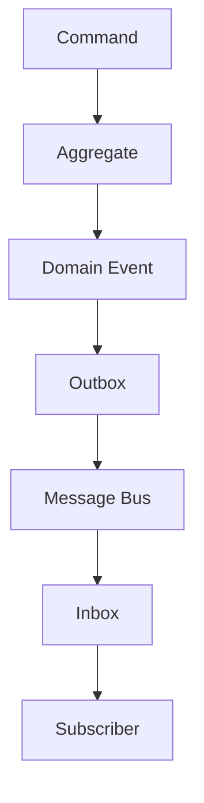
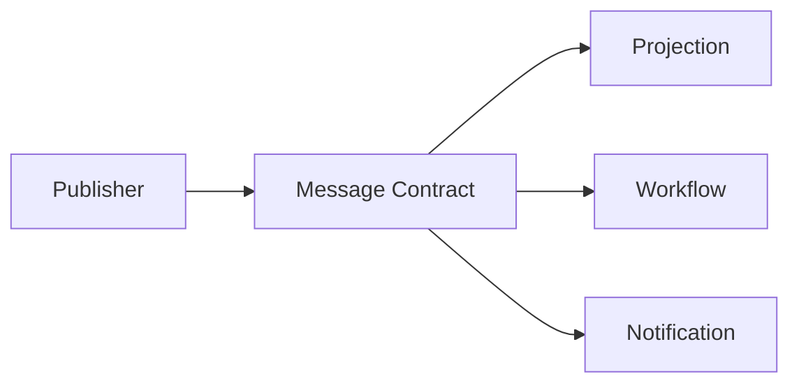
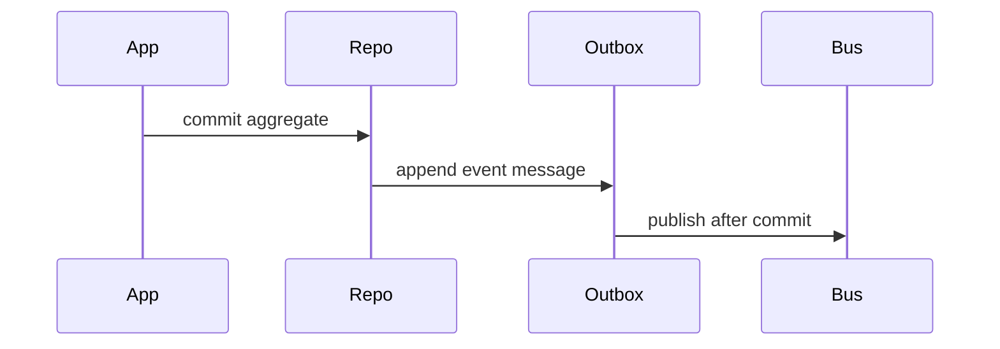
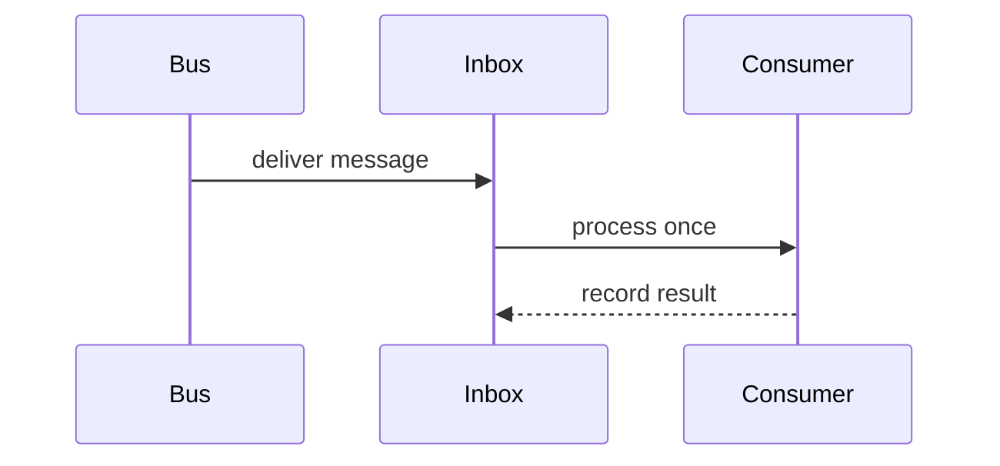
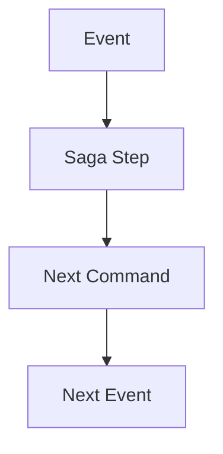
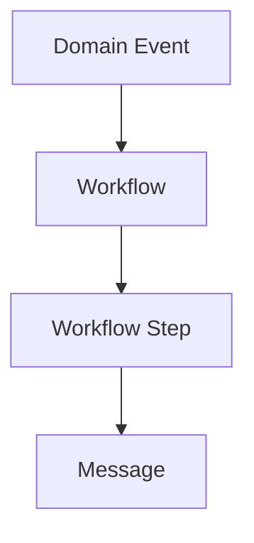
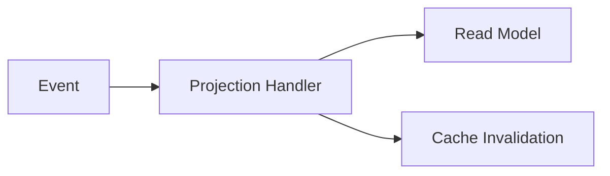
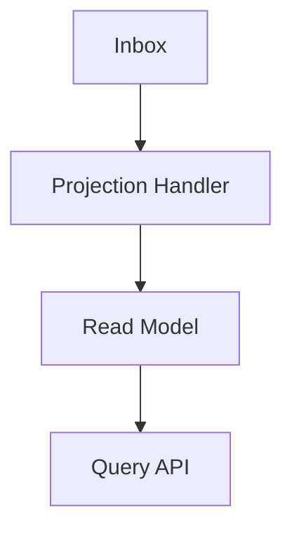
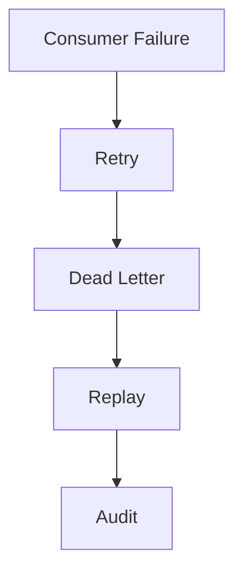

# Event Driven Architecture
## Split Navigation
- [Event-driven delivery patterns](event-driven-architecture/delivery-patterns.md)
- [Event-driven flow catalog](event-driven-architecture/flow-catalog.md)
- [Event-driven governance and testing](event-driven-architecture/governance-and-testing.md)
- [Event-driven publishing and subscription](event-driven-architecture/publishing-and-subscription.md)

# Document Control

Document Name: Event Driven Architecture
Document Path: knowledge/event-driven-architecture.md
Document Type: Atlas Enterprise Canonical Specification
Version: 1.0
Status: Canonical Specification
Domain: Platform
Bounded Context: Platform
Owner: Project Atlas
Source of Truth: Atlas Event-Driven Architecture Source of Truth
Last Updated: 2026-07-12

Related Specifications:
- knowledge/domain-event-catalog.md
- knowledge/message-contract-catalog.md
- knowledge/command-catalog.md
- knowledge/application-service-catalog.md
- knowledge/domain-service-catalog.md
- knowledge/repository-catalog.md
- knowledge/service-catalog.md
- knowledge/event-taxonomy.md
- knowledge/api-governance-framework.md
- knowledge/integration-framework.md
- knowledge/workflow-engine-framework.md
- knowledge/background-job-framework.md
- knowledge/scheduler-framework.md
- knowledge/automation-framework.md
- knowledge/system-module-catalog.md
- docs/specification/04-DomainModel.md
- docs/database/05-DatabaseDesign.md
- docs/database/06-ERD.md
- docs/api/07-API.md

# Purpose

Event Driven Architecture defines the canonical Atlas event-driven model across Domain Events, Integration Events, Message Contracts, Commands, Application Services, Domain Services, Repositories, Outbox, Inbox, Message Bus, Workflow, Saga, Automation, Scheduler, Background Job, Projection, Read Model, Notification, and Integration Framework. It is the event-driven architecture source of truth.

# Scope

- Event Driven Architecture
- Domain Event
- Integration Event
- Application Event
- Event Bus
- Event Publisher
- Event Subscriber
- Outbox Pattern
- Inbox Pattern
- Event Streaming
- Message Broker
- Projection
- Read Model
- Eventual Consistency
- Saga
- Workflow
- Event Replay
- Idempotency
- Correlation
- Causation

# Event Driven Principles

- Domain Events represent immutable business facts.
- Message Contracts transport catalog-approved event facts and application messages.
- Outbox is required for committed event publication.
- Inbox is required for idempotent consumer processing.
- At least once delivery requires idempotent consumers.
- Ordering is guaranteed only within declared ordering keys.
- Replay must be versioned, audited, and side-effect controlled.
- Eventual consistency is explicit and observable.

# Architecture Overview

- Architecture Overview rule 1 preserves catalog event mapping, message contract mapping, publisher ownership, subscriber ownership, outbox, inbox, ordering, idempotency, retry, replay, projection, read model, notification, audit, security, and observability.
- Architecture Overview rule 2 preserves catalog event mapping, message contract mapping, publisher ownership, subscriber ownership, outbox, inbox, ordering, idempotency, retry, replay, projection, read model, notification, audit, security, and observability.
- Architecture Overview rule 3 preserves catalog event mapping, message contract mapping, publisher ownership, subscriber ownership, outbox, inbox, ordering, idempotency, retry, replay, projection, read model, notification, audit, security, and observability.
- Architecture Overview rule 4 preserves catalog event mapping, message contract mapping, publisher ownership, subscriber ownership, outbox, inbox, ordering, idempotency, retry, replay, projection, read model, notification, audit, security, and observability.
- Architecture Overview rule 5 preserves catalog event mapping, message contract mapping, publisher ownership, subscriber ownership, outbox, inbox, ordering, idempotency, retry, replay, projection, read model, notification, audit, security, and observability.
- Architecture Overview rule 6 preserves catalog event mapping, message contract mapping, publisher ownership, subscriber ownership, outbox, inbox, ordering, idempotency, retry, replay, projection, read model, notification, audit, security, and observability.
- Architecture Overview rule 7 preserves catalog event mapping, message contract mapping, publisher ownership, subscriber ownership, outbox, inbox, ordering, idempotency, retry, replay, projection, read model, notification, audit, security, and observability.
- Architecture Overview rule 8 preserves catalog event mapping, message contract mapping, publisher ownership, subscriber ownership, outbox, inbox, ordering, idempotency, retry, replay, projection, read model, notification, audit, security, and observability.

# Event Flow Architecture

- Event Flow Architecture rule 1 preserves catalog event mapping, message contract mapping, publisher ownership, subscriber ownership, outbox, inbox, ordering, idempotency, retry, replay, projection, read model, notification, audit, security, and observability.
- Event Flow Architecture rule 2 preserves catalog event mapping, message contract mapping, publisher ownership, subscriber ownership, outbox, inbox, ordering, idempotency, retry, replay, projection, read model, notification, audit, security, and observability.
- Event Flow Architecture rule 3 preserves catalog event mapping, message contract mapping, publisher ownership, subscriber ownership, outbox, inbox, ordering, idempotency, retry, replay, projection, read model, notification, audit, security, and observability.
- Event Flow Architecture rule 4 preserves catalog event mapping, message contract mapping, publisher ownership, subscriber ownership, outbox, inbox, ordering, idempotency, retry, replay, projection, read model, notification, audit, security, and observability.
- Event Flow Architecture rule 5 preserves catalog event mapping, message contract mapping, publisher ownership, subscriber ownership, outbox, inbox, ordering, idempotency, retry, replay, projection, read model, notification, audit, security, and observability.
- Event Flow Architecture rule 6 preserves catalog event mapping, message contract mapping, publisher ownership, subscriber ownership, outbox, inbox, ordering, idempotency, retry, replay, projection, read model, notification, audit, security, and observability.
- Event Flow Architecture rule 7 preserves catalog event mapping, message contract mapping, publisher ownership, subscriber ownership, outbox, inbox, ordering, idempotency, retry, replay, projection, read model, notification, audit, security, and observability.
- Event Flow Architecture rule 8 preserves catalog event mapping, message contract mapping, publisher ownership, subscriber ownership, outbox, inbox, ordering, idempotency, retry, replay, projection, read model, notification, audit, security, and observability.

# Publishing Strategy

- Publishing Strategy rule 1 preserves catalog event mapping, message contract mapping, publisher ownership, subscriber ownership, outbox, inbox, ordering, idempotency, retry, replay, projection, read model, notification, audit, security, and observability.
- Publishing Strategy rule 2 preserves catalog event mapping, message contract mapping, publisher ownership, subscriber ownership, outbox, inbox, ordering, idempotency, retry, replay, projection, read model, notification, audit, security, and observability.
- Publishing Strategy rule 3 preserves catalog event mapping, message contract mapping, publisher ownership, subscriber ownership, outbox, inbox, ordering, idempotency, retry, replay, projection, read model, notification, audit, security, and observability.
- Publishing Strategy rule 4 preserves catalog event mapping, message contract mapping, publisher ownership, subscriber ownership, outbox, inbox, ordering, idempotency, retry, replay, projection, read model, notification, audit, security, and observability.
- Publishing Strategy rule 5 preserves catalog event mapping, message contract mapping, publisher ownership, subscriber ownership, outbox, inbox, ordering, idempotency, retry, replay, projection, read model, notification, audit, security, and observability.
- Publishing Strategy rule 6 preserves catalog event mapping, message contract mapping, publisher ownership, subscriber ownership, outbox, inbox, ordering, idempotency, retry, replay, projection, read model, notification, audit, security, and observability.
- Publishing Strategy rule 7 preserves catalog event mapping, message contract mapping, publisher ownership, subscriber ownership, outbox, inbox, ordering, idempotency, retry, replay, projection, read model, notification, audit, security, and observability.
- Publishing Strategy rule 8 preserves catalog event mapping, message contract mapping, publisher ownership, subscriber ownership, outbox, inbox, ordering, idempotency, retry, replay, projection, read model, notification, audit, security, and observability.

# Subscription Strategy

- Subscription Strategy rule 1 preserves catalog event mapping, message contract mapping, publisher ownership, subscriber ownership, outbox, inbox, ordering, idempotency, retry, replay, projection, read model, notification, audit, security, and observability.
- Subscription Strategy rule 2 preserves catalog event mapping, message contract mapping, publisher ownership, subscriber ownership, outbox, inbox, ordering, idempotency, retry, replay, projection, read model, notification, audit, security, and observability.
- Subscription Strategy rule 3 preserves catalog event mapping, message contract mapping, publisher ownership, subscriber ownership, outbox, inbox, ordering, idempotency, retry, replay, projection, read model, notification, audit, security, and observability.
- Subscription Strategy rule 4 preserves catalog event mapping, message contract mapping, publisher ownership, subscriber ownership, outbox, inbox, ordering, idempotency, retry, replay, projection, read model, notification, audit, security, and observability.
- Subscription Strategy rule 5 preserves catalog event mapping, message contract mapping, publisher ownership, subscriber ownership, outbox, inbox, ordering, idempotency, retry, replay, projection, read model, notification, audit, security, and observability.
- Subscription Strategy rule 6 preserves catalog event mapping, message contract mapping, publisher ownership, subscriber ownership, outbox, inbox, ordering, idempotency, retry, replay, projection, read model, notification, audit, security, and observability.
- Subscription Strategy rule 7 preserves catalog event mapping, message contract mapping, publisher ownership, subscriber ownership, outbox, inbox, ordering, idempotency, retry, replay, projection, read model, notification, audit, security, and observability.
- Subscription Strategy rule 8 preserves catalog event mapping, message contract mapping, publisher ownership, subscriber ownership, outbox, inbox, ordering, idempotency, retry, replay, projection, read model, notification, audit, security, and observability.

# Delivery Guarantee

- Delivery Guarantee rule 1 preserves catalog event mapping, message contract mapping, publisher ownership, subscriber ownership, outbox, inbox, ordering, idempotency, retry, replay, projection, read model, notification, audit, security, and observability.
- Delivery Guarantee rule 2 preserves catalog event mapping, message contract mapping, publisher ownership, subscriber ownership, outbox, inbox, ordering, idempotency, retry, replay, projection, read model, notification, audit, security, and observability.
- Delivery Guarantee rule 3 preserves catalog event mapping, message contract mapping, publisher ownership, subscriber ownership, outbox, inbox, ordering, idempotency, retry, replay, projection, read model, notification, audit, security, and observability.
- Delivery Guarantee rule 4 preserves catalog event mapping, message contract mapping, publisher ownership, subscriber ownership, outbox, inbox, ordering, idempotency, retry, replay, projection, read model, notification, audit, security, and observability.
- Delivery Guarantee rule 5 preserves catalog event mapping, message contract mapping, publisher ownership, subscriber ownership, outbox, inbox, ordering, idempotency, retry, replay, projection, read model, notification, audit, security, and observability.
- Delivery Guarantee rule 6 preserves catalog event mapping, message contract mapping, publisher ownership, subscriber ownership, outbox, inbox, ordering, idempotency, retry, replay, projection, read model, notification, audit, security, and observability.
- Delivery Guarantee rule 7 preserves catalog event mapping, message contract mapping, publisher ownership, subscriber ownership, outbox, inbox, ordering, idempotency, retry, replay, projection, read model, notification, audit, security, and observability.
- Delivery Guarantee rule 8 preserves catalog event mapping, message contract mapping, publisher ownership, subscriber ownership, outbox, inbox, ordering, idempotency, retry, replay, projection, read model, notification, audit, security, and observability.

# Ordering Strategy

- Ordering Strategy rule 1 preserves catalog event mapping, message contract mapping, publisher ownership, subscriber ownership, outbox, inbox, ordering, idempotency, retry, replay, projection, read model, notification, audit, security, and observability.
- Ordering Strategy rule 2 preserves catalog event mapping, message contract mapping, publisher ownership, subscriber ownership, outbox, inbox, ordering, idempotency, retry, replay, projection, read model, notification, audit, security, and observability.
- Ordering Strategy rule 3 preserves catalog event mapping, message contract mapping, publisher ownership, subscriber ownership, outbox, inbox, ordering, idempotency, retry, replay, projection, read model, notification, audit, security, and observability.
- Ordering Strategy rule 4 preserves catalog event mapping, message contract mapping, publisher ownership, subscriber ownership, outbox, inbox, ordering, idempotency, retry, replay, projection, read model, notification, audit, security, and observability.
- Ordering Strategy rule 5 preserves catalog event mapping, message contract mapping, publisher ownership, subscriber ownership, outbox, inbox, ordering, idempotency, retry, replay, projection, read model, notification, audit, security, and observability.
- Ordering Strategy rule 6 preserves catalog event mapping, message contract mapping, publisher ownership, subscriber ownership, outbox, inbox, ordering, idempotency, retry, replay, projection, read model, notification, audit, security, and observability.
- Ordering Strategy rule 7 preserves catalog event mapping, message contract mapping, publisher ownership, subscriber ownership, outbox, inbox, ordering, idempotency, retry, replay, projection, read model, notification, audit, security, and observability.
- Ordering Strategy rule 8 preserves catalog event mapping, message contract mapping, publisher ownership, subscriber ownership, outbox, inbox, ordering, idempotency, retry, replay, projection, read model, notification, audit, security, and observability.

# Outbox Strategy

- Outbox Strategy rule 1 preserves catalog event mapping, message contract mapping, publisher ownership, subscriber ownership, outbox, inbox, ordering, idempotency, retry, replay, projection, read model, notification, audit, security, and observability.
- Outbox Strategy rule 2 preserves catalog event mapping, message contract mapping, publisher ownership, subscriber ownership, outbox, inbox, ordering, idempotency, retry, replay, projection, read model, notification, audit, security, and observability.
- Outbox Strategy rule 3 preserves catalog event mapping, message contract mapping, publisher ownership, subscriber ownership, outbox, inbox, ordering, idempotency, retry, replay, projection, read model, notification, audit, security, and observability.
- Outbox Strategy rule 4 preserves catalog event mapping, message contract mapping, publisher ownership, subscriber ownership, outbox, inbox, ordering, idempotency, retry, replay, projection, read model, notification, audit, security, and observability.
- Outbox Strategy rule 5 preserves catalog event mapping, message contract mapping, publisher ownership, subscriber ownership, outbox, inbox, ordering, idempotency, retry, replay, projection, read model, notification, audit, security, and observability.
- Outbox Strategy rule 6 preserves catalog event mapping, message contract mapping, publisher ownership, subscriber ownership, outbox, inbox, ordering, idempotency, retry, replay, projection, read model, notification, audit, security, and observability.
- Outbox Strategy rule 7 preserves catalog event mapping, message contract mapping, publisher ownership, subscriber ownership, outbox, inbox, ordering, idempotency, retry, replay, projection, read model, notification, audit, security, and observability.
- Outbox Strategy rule 8 preserves catalog event mapping, message contract mapping, publisher ownership, subscriber ownership, outbox, inbox, ordering, idempotency, retry, replay, projection, read model, notification, audit, security, and observability.

# Inbox Strategy

- Inbox Strategy rule 1 preserves catalog event mapping, message contract mapping, publisher ownership, subscriber ownership, outbox, inbox, ordering, idempotency, retry, replay, projection, read model, notification, audit, security, and observability.
- Inbox Strategy rule 2 preserves catalog event mapping, message contract mapping, publisher ownership, subscriber ownership, outbox, inbox, ordering, idempotency, retry, replay, projection, read model, notification, audit, security, and observability.
- Inbox Strategy rule 3 preserves catalog event mapping, message contract mapping, publisher ownership, subscriber ownership, outbox, inbox, ordering, idempotency, retry, replay, projection, read model, notification, audit, security, and observability.
- Inbox Strategy rule 4 preserves catalog event mapping, message contract mapping, publisher ownership, subscriber ownership, outbox, inbox, ordering, idempotency, retry, replay, projection, read model, notification, audit, security, and observability.
- Inbox Strategy rule 5 preserves catalog event mapping, message contract mapping, publisher ownership, subscriber ownership, outbox, inbox, ordering, idempotency, retry, replay, projection, read model, notification, audit, security, and observability.
- Inbox Strategy rule 6 preserves catalog event mapping, message contract mapping, publisher ownership, subscriber ownership, outbox, inbox, ordering, idempotency, retry, replay, projection, read model, notification, audit, security, and observability.
- Inbox Strategy rule 7 preserves catalog event mapping, message contract mapping, publisher ownership, subscriber ownership, outbox, inbox, ordering, idempotency, retry, replay, projection, read model, notification, audit, security, and observability.
- Inbox Strategy rule 8 preserves catalog event mapping, message contract mapping, publisher ownership, subscriber ownership, outbox, inbox, ordering, idempotency, retry, replay, projection, read model, notification, audit, security, and observability.

# Retry Strategy

- Retry Strategy rule 1 preserves catalog event mapping, message contract mapping, publisher ownership, subscriber ownership, outbox, inbox, ordering, idempotency, retry, replay, projection, read model, notification, audit, security, and observability.
- Retry Strategy rule 2 preserves catalog event mapping, message contract mapping, publisher ownership, subscriber ownership, outbox, inbox, ordering, idempotency, retry, replay, projection, read model, notification, audit, security, and observability.
- Retry Strategy rule 3 preserves catalog event mapping, message contract mapping, publisher ownership, subscriber ownership, outbox, inbox, ordering, idempotency, retry, replay, projection, read model, notification, audit, security, and observability.
- Retry Strategy rule 4 preserves catalog event mapping, message contract mapping, publisher ownership, subscriber ownership, outbox, inbox, ordering, idempotency, retry, replay, projection, read model, notification, audit, security, and observability.
- Retry Strategy rule 5 preserves catalog event mapping, message contract mapping, publisher ownership, subscriber ownership, outbox, inbox, ordering, idempotency, retry, replay, projection, read model, notification, audit, security, and observability.
- Retry Strategy rule 6 preserves catalog event mapping, message contract mapping, publisher ownership, subscriber ownership, outbox, inbox, ordering, idempotency, retry, replay, projection, read model, notification, audit, security, and observability.
- Retry Strategy rule 7 preserves catalog event mapping, message contract mapping, publisher ownership, subscriber ownership, outbox, inbox, ordering, idempotency, retry, replay, projection, read model, notification, audit, security, and observability.
- Retry Strategy rule 8 preserves catalog event mapping, message contract mapping, publisher ownership, subscriber ownership, outbox, inbox, ordering, idempotency, retry, replay, projection, read model, notification, audit, security, and observability.

# Dead Letter Strategy

- Dead Letter Strategy rule 1 preserves catalog event mapping, message contract mapping, publisher ownership, subscriber ownership, outbox, inbox, ordering, idempotency, retry, replay, projection, read model, notification, audit, security, and observability.
- Dead Letter Strategy rule 2 preserves catalog event mapping, message contract mapping, publisher ownership, subscriber ownership, outbox, inbox, ordering, idempotency, retry, replay, projection, read model, notification, audit, security, and observability.
- Dead Letter Strategy rule 3 preserves catalog event mapping, message contract mapping, publisher ownership, subscriber ownership, outbox, inbox, ordering, idempotency, retry, replay, projection, read model, notification, audit, security, and observability.
- Dead Letter Strategy rule 4 preserves catalog event mapping, message contract mapping, publisher ownership, subscriber ownership, outbox, inbox, ordering, idempotency, retry, replay, projection, read model, notification, audit, security, and observability.
- Dead Letter Strategy rule 5 preserves catalog event mapping, message contract mapping, publisher ownership, subscriber ownership, outbox, inbox, ordering, idempotency, retry, replay, projection, read model, notification, audit, security, and observability.
- Dead Letter Strategy rule 6 preserves catalog event mapping, message contract mapping, publisher ownership, subscriber ownership, outbox, inbox, ordering, idempotency, retry, replay, projection, read model, notification, audit, security, and observability.
- Dead Letter Strategy rule 7 preserves catalog event mapping, message contract mapping, publisher ownership, subscriber ownership, outbox, inbox, ordering, idempotency, retry, replay, projection, read model, notification, audit, security, and observability.
- Dead Letter Strategy rule 8 preserves catalog event mapping, message contract mapping, publisher ownership, subscriber ownership, outbox, inbox, ordering, idempotency, retry, replay, projection, read model, notification, audit, security, and observability.

# Replay Strategy

- Replay Strategy rule 1 preserves catalog event mapping, message contract mapping, publisher ownership, subscriber ownership, outbox, inbox, ordering, idempotency, retry, replay, projection, read model, notification, audit, security, and observability.
- Replay Strategy rule 2 preserves catalog event mapping, message contract mapping, publisher ownership, subscriber ownership, outbox, inbox, ordering, idempotency, retry, replay, projection, read model, notification, audit, security, and observability.
- Replay Strategy rule 3 preserves catalog event mapping, message contract mapping, publisher ownership, subscriber ownership, outbox, inbox, ordering, idempotency, retry, replay, projection, read model, notification, audit, security, and observability.
- Replay Strategy rule 4 preserves catalog event mapping, message contract mapping, publisher ownership, subscriber ownership, outbox, inbox, ordering, idempotency, retry, replay, projection, read model, notification, audit, security, and observability.
- Replay Strategy rule 5 preserves catalog event mapping, message contract mapping, publisher ownership, subscriber ownership, outbox, inbox, ordering, idempotency, retry, replay, projection, read model, notification, audit, security, and observability.
- Replay Strategy rule 6 preserves catalog event mapping, message contract mapping, publisher ownership, subscriber ownership, outbox, inbox, ordering, idempotency, retry, replay, projection, read model, notification, audit, security, and observability.
- Replay Strategy rule 7 preserves catalog event mapping, message contract mapping, publisher ownership, subscriber ownership, outbox, inbox, ordering, idempotency, retry, replay, projection, read model, notification, audit, security, and observability.
- Replay Strategy rule 8 preserves catalog event mapping, message contract mapping, publisher ownership, subscriber ownership, outbox, inbox, ordering, idempotency, retry, replay, projection, read model, notification, audit, security, and observability.

# Projection Strategy

- Projection Strategy rule 1 preserves catalog event mapping, message contract mapping, publisher ownership, subscriber ownership, outbox, inbox, ordering, idempotency, retry, replay, projection, read model, notification, audit, security, and observability.
- Projection Strategy rule 2 preserves catalog event mapping, message contract mapping, publisher ownership, subscriber ownership, outbox, inbox, ordering, idempotency, retry, replay, projection, read model, notification, audit, security, and observability.
- Projection Strategy rule 3 preserves catalog event mapping, message contract mapping, publisher ownership, subscriber ownership, outbox, inbox, ordering, idempotency, retry, replay, projection, read model, notification, audit, security, and observability.
- Projection Strategy rule 4 preserves catalog event mapping, message contract mapping, publisher ownership, subscriber ownership, outbox, inbox, ordering, idempotency, retry, replay, projection, read model, notification, audit, security, and observability.
- Projection Strategy rule 5 preserves catalog event mapping, message contract mapping, publisher ownership, subscriber ownership, outbox, inbox, ordering, idempotency, retry, replay, projection, read model, notification, audit, security, and observability.
- Projection Strategy rule 6 preserves catalog event mapping, message contract mapping, publisher ownership, subscriber ownership, outbox, inbox, ordering, idempotency, retry, replay, projection, read model, notification, audit, security, and observability.
- Projection Strategy rule 7 preserves catalog event mapping, message contract mapping, publisher ownership, subscriber ownership, outbox, inbox, ordering, idempotency, retry, replay, projection, read model, notification, audit, security, and observability.
- Projection Strategy rule 8 preserves catalog event mapping, message contract mapping, publisher ownership, subscriber ownership, outbox, inbox, ordering, idempotency, retry, replay, projection, read model, notification, audit, security, and observability.

# Read Model Strategy

- Read Model Strategy rule 1 preserves catalog event mapping, message contract mapping, publisher ownership, subscriber ownership, outbox, inbox, ordering, idempotency, retry, replay, projection, read model, notification, audit, security, and observability.
- Read Model Strategy rule 2 preserves catalog event mapping, message contract mapping, publisher ownership, subscriber ownership, outbox, inbox, ordering, idempotency, retry, replay, projection, read model, notification, audit, security, and observability.
- Read Model Strategy rule 3 preserves catalog event mapping, message contract mapping, publisher ownership, subscriber ownership, outbox, inbox, ordering, idempotency, retry, replay, projection, read model, notification, audit, security, and observability.
- Read Model Strategy rule 4 preserves catalog event mapping, message contract mapping, publisher ownership, subscriber ownership, outbox, inbox, ordering, idempotency, retry, replay, projection, read model, notification, audit, security, and observability.
- Read Model Strategy rule 5 preserves catalog event mapping, message contract mapping, publisher ownership, subscriber ownership, outbox, inbox, ordering, idempotency, retry, replay, projection, read model, notification, audit, security, and observability.
- Read Model Strategy rule 6 preserves catalog event mapping, message contract mapping, publisher ownership, subscriber ownership, outbox, inbox, ordering, idempotency, retry, replay, projection, read model, notification, audit, security, and observability.
- Read Model Strategy rule 7 preserves catalog event mapping, message contract mapping, publisher ownership, subscriber ownership, outbox, inbox, ordering, idempotency, retry, replay, projection, read model, notification, audit, security, and observability.
- Read Model Strategy rule 8 preserves catalog event mapping, message contract mapping, publisher ownership, subscriber ownership, outbox, inbox, ordering, idempotency, retry, replay, projection, read model, notification, audit, security, and observability.

# Saga Coordination

- Saga Coordination rule 1 preserves catalog event mapping, message contract mapping, publisher ownership, subscriber ownership, outbox, inbox, ordering, idempotency, retry, replay, projection, read model, notification, audit, security, and observability.
- Saga Coordination rule 2 preserves catalog event mapping, message contract mapping, publisher ownership, subscriber ownership, outbox, inbox, ordering, idempotency, retry, replay, projection, read model, notification, audit, security, and observability.
- Saga Coordination rule 3 preserves catalog event mapping, message contract mapping, publisher ownership, subscriber ownership, outbox, inbox, ordering, idempotency, retry, replay, projection, read model, notification, audit, security, and observability.
- Saga Coordination rule 4 preserves catalog event mapping, message contract mapping, publisher ownership, subscriber ownership, outbox, inbox, ordering, idempotency, retry, replay, projection, read model, notification, audit, security, and observability.
- Saga Coordination rule 5 preserves catalog event mapping, message contract mapping, publisher ownership, subscriber ownership, outbox, inbox, ordering, idempotency, retry, replay, projection, read model, notification, audit, security, and observability.
- Saga Coordination rule 6 preserves catalog event mapping, message contract mapping, publisher ownership, subscriber ownership, outbox, inbox, ordering, idempotency, retry, replay, projection, read model, notification, audit, security, and observability.
- Saga Coordination rule 7 preserves catalog event mapping, message contract mapping, publisher ownership, subscriber ownership, outbox, inbox, ordering, idempotency, retry, replay, projection, read model, notification, audit, security, and observability.
- Saga Coordination rule 8 preserves catalog event mapping, message contract mapping, publisher ownership, subscriber ownership, outbox, inbox, ordering, idempotency, retry, replay, projection, read model, notification, audit, security, and observability.

# Workflow Coordination

- Workflow Coordination rule 1 preserves catalog event mapping, message contract mapping, publisher ownership, subscriber ownership, outbox, inbox, ordering, idempotency, retry, replay, projection, read model, notification, audit, security, and observability.
- Workflow Coordination rule 2 preserves catalog event mapping, message contract mapping, publisher ownership, subscriber ownership, outbox, inbox, ordering, idempotency, retry, replay, projection, read model, notification, audit, security, and observability.
- Workflow Coordination rule 3 preserves catalog event mapping, message contract mapping, publisher ownership, subscriber ownership, outbox, inbox, ordering, idempotency, retry, replay, projection, read model, notification, audit, security, and observability.
- Workflow Coordination rule 4 preserves catalog event mapping, message contract mapping, publisher ownership, subscriber ownership, outbox, inbox, ordering, idempotency, retry, replay, projection, read model, notification, audit, security, and observability.
- Workflow Coordination rule 5 preserves catalog event mapping, message contract mapping, publisher ownership, subscriber ownership, outbox, inbox, ordering, idempotency, retry, replay, projection, read model, notification, audit, security, and observability.
- Workflow Coordination rule 6 preserves catalog event mapping, message contract mapping, publisher ownership, subscriber ownership, outbox, inbox, ordering, idempotency, retry, replay, projection, read model, notification, audit, security, and observability.
- Workflow Coordination rule 7 preserves catalog event mapping, message contract mapping, publisher ownership, subscriber ownership, outbox, inbox, ordering, idempotency, retry, replay, projection, read model, notification, audit, security, and observability.
- Workflow Coordination rule 8 preserves catalog event mapping, message contract mapping, publisher ownership, subscriber ownership, outbox, inbox, ordering, idempotency, retry, replay, projection, read model, notification, audit, security, and observability.

# Automation Coordination

- Automation Coordination rule 1 preserves catalog event mapping, message contract mapping, publisher ownership, subscriber ownership, outbox, inbox, ordering, idempotency, retry, replay, projection, read model, notification, audit, security, and observability.
- Automation Coordination rule 2 preserves catalog event mapping, message contract mapping, publisher ownership, subscriber ownership, outbox, inbox, ordering, idempotency, retry, replay, projection, read model, notification, audit, security, and observability.
- Automation Coordination rule 3 preserves catalog event mapping, message contract mapping, publisher ownership, subscriber ownership, outbox, inbox, ordering, idempotency, retry, replay, projection, read model, notification, audit, security, and observability.
- Automation Coordination rule 4 preserves catalog event mapping, message contract mapping, publisher ownership, subscriber ownership, outbox, inbox, ordering, idempotency, retry, replay, projection, read model, notification, audit, security, and observability.
- Automation Coordination rule 5 preserves catalog event mapping, message contract mapping, publisher ownership, subscriber ownership, outbox, inbox, ordering, idempotency, retry, replay, projection, read model, notification, audit, security, and observability.
- Automation Coordination rule 6 preserves catalog event mapping, message contract mapping, publisher ownership, subscriber ownership, outbox, inbox, ordering, idempotency, retry, replay, projection, read model, notification, audit, security, and observability.
- Automation Coordination rule 7 preserves catalog event mapping, message contract mapping, publisher ownership, subscriber ownership, outbox, inbox, ordering, idempotency, retry, replay, projection, read model, notification, audit, security, and observability.
- Automation Coordination rule 8 preserves catalog event mapping, message contract mapping, publisher ownership, subscriber ownership, outbox, inbox, ordering, idempotency, retry, replay, projection, read model, notification, audit, security, and observability.

# Background Job Coordination

- Background Job Coordination rule 1 preserves catalog event mapping, message contract mapping, publisher ownership, subscriber ownership, outbox, inbox, ordering, idempotency, retry, replay, projection, read model, notification, audit, security, and observability.
- Background Job Coordination rule 2 preserves catalog event mapping, message contract mapping, publisher ownership, subscriber ownership, outbox, inbox, ordering, idempotency, retry, replay, projection, read model, notification, audit, security, and observability.
- Background Job Coordination rule 3 preserves catalog event mapping, message contract mapping, publisher ownership, subscriber ownership, outbox, inbox, ordering, idempotency, retry, replay, projection, read model, notification, audit, security, and observability.
- Background Job Coordination rule 4 preserves catalog event mapping, message contract mapping, publisher ownership, subscriber ownership, outbox, inbox, ordering, idempotency, retry, replay, projection, read model, notification, audit, security, and observability.
- Background Job Coordination rule 5 preserves catalog event mapping, message contract mapping, publisher ownership, subscriber ownership, outbox, inbox, ordering, idempotency, retry, replay, projection, read model, notification, audit, security, and observability.
- Background Job Coordination rule 6 preserves catalog event mapping, message contract mapping, publisher ownership, subscriber ownership, outbox, inbox, ordering, idempotency, retry, replay, projection, read model, notification, audit, security, and observability.
- Background Job Coordination rule 7 preserves catalog event mapping, message contract mapping, publisher ownership, subscriber ownership, outbox, inbox, ordering, idempotency, retry, replay, projection, read model, notification, audit, security, and observability.
- Background Job Coordination rule 8 preserves catalog event mapping, message contract mapping, publisher ownership, subscriber ownership, outbox, inbox, ordering, idempotency, retry, replay, projection, read model, notification, audit, security, and observability.

# Scheduler Coordination

- Scheduler Coordination rule 1 preserves catalog event mapping, message contract mapping, publisher ownership, subscriber ownership, outbox, inbox, ordering, idempotency, retry, replay, projection, read model, notification, audit, security, and observability.
- Scheduler Coordination rule 2 preserves catalog event mapping, message contract mapping, publisher ownership, subscriber ownership, outbox, inbox, ordering, idempotency, retry, replay, projection, read model, notification, audit, security, and observability.
- Scheduler Coordination rule 3 preserves catalog event mapping, message contract mapping, publisher ownership, subscriber ownership, outbox, inbox, ordering, idempotency, retry, replay, projection, read model, notification, audit, security, and observability.
- Scheduler Coordination rule 4 preserves catalog event mapping, message contract mapping, publisher ownership, subscriber ownership, outbox, inbox, ordering, idempotency, retry, replay, projection, read model, notification, audit, security, and observability.
- Scheduler Coordination rule 5 preserves catalog event mapping, message contract mapping, publisher ownership, subscriber ownership, outbox, inbox, ordering, idempotency, retry, replay, projection, read model, notification, audit, security, and observability.
- Scheduler Coordination rule 6 preserves catalog event mapping, message contract mapping, publisher ownership, subscriber ownership, outbox, inbox, ordering, idempotency, retry, replay, projection, read model, notification, audit, security, and observability.
- Scheduler Coordination rule 7 preserves catalog event mapping, message contract mapping, publisher ownership, subscriber ownership, outbox, inbox, ordering, idempotency, retry, replay, projection, read model, notification, audit, security, and observability.
- Scheduler Coordination rule 8 preserves catalog event mapping, message contract mapping, publisher ownership, subscriber ownership, outbox, inbox, ordering, idempotency, retry, replay, projection, read model, notification, audit, security, and observability.

# Notification Strategy

- Notification Strategy rule 1 preserves catalog event mapping, message contract mapping, publisher ownership, subscriber ownership, outbox, inbox, ordering, idempotency, retry, replay, projection, read model, notification, audit, security, and observability.
- Notification Strategy rule 2 preserves catalog event mapping, message contract mapping, publisher ownership, subscriber ownership, outbox, inbox, ordering, idempotency, retry, replay, projection, read model, notification, audit, security, and observability.
- Notification Strategy rule 3 preserves catalog event mapping, message contract mapping, publisher ownership, subscriber ownership, outbox, inbox, ordering, idempotency, retry, replay, projection, read model, notification, audit, security, and observability.
- Notification Strategy rule 4 preserves catalog event mapping, message contract mapping, publisher ownership, subscriber ownership, outbox, inbox, ordering, idempotency, retry, replay, projection, read model, notification, audit, security, and observability.
- Notification Strategy rule 5 preserves catalog event mapping, message contract mapping, publisher ownership, subscriber ownership, outbox, inbox, ordering, idempotency, retry, replay, projection, read model, notification, audit, security, and observability.
- Notification Strategy rule 6 preserves catalog event mapping, message contract mapping, publisher ownership, subscriber ownership, outbox, inbox, ordering, idempotency, retry, replay, projection, read model, notification, audit, security, and observability.
- Notification Strategy rule 7 preserves catalog event mapping, message contract mapping, publisher ownership, subscriber ownership, outbox, inbox, ordering, idempotency, retry, replay, projection, read model, notification, audit, security, and observability.
- Notification Strategy rule 8 preserves catalog event mapping, message contract mapping, publisher ownership, subscriber ownership, outbox, inbox, ordering, idempotency, retry, replay, projection, read model, notification, audit, security, and observability.

# Cache Invalidation Strategy

- Cache Invalidation Strategy rule 1 preserves catalog event mapping, message contract mapping, publisher ownership, subscriber ownership, outbox, inbox, ordering, idempotency, retry, replay, projection, read model, notification, audit, security, and observability.
- Cache Invalidation Strategy rule 2 preserves catalog event mapping, message contract mapping, publisher ownership, subscriber ownership, outbox, inbox, ordering, idempotency, retry, replay, projection, read model, notification, audit, security, and observability.
- Cache Invalidation Strategy rule 3 preserves catalog event mapping, message contract mapping, publisher ownership, subscriber ownership, outbox, inbox, ordering, idempotency, retry, replay, projection, read model, notification, audit, security, and observability.
- Cache Invalidation Strategy rule 4 preserves catalog event mapping, message contract mapping, publisher ownership, subscriber ownership, outbox, inbox, ordering, idempotency, retry, replay, projection, read model, notification, audit, security, and observability.
- Cache Invalidation Strategy rule 5 preserves catalog event mapping, message contract mapping, publisher ownership, subscriber ownership, outbox, inbox, ordering, idempotency, retry, replay, projection, read model, notification, audit, security, and observability.
- Cache Invalidation Strategy rule 6 preserves catalog event mapping, message contract mapping, publisher ownership, subscriber ownership, outbox, inbox, ordering, idempotency, retry, replay, projection, read model, notification, audit, security, and observability.
- Cache Invalidation Strategy rule 7 preserves catalog event mapping, message contract mapping, publisher ownership, subscriber ownership, outbox, inbox, ordering, idempotency, retry, replay, projection, read model, notification, audit, security, and observability.
- Cache Invalidation Strategy rule 8 preserves catalog event mapping, message contract mapping, publisher ownership, subscriber ownership, outbox, inbox, ordering, idempotency, retry, replay, projection, read model, notification, audit, security, and observability.

# Search Index Update Strategy

- Search Index Update Strategy rule 1 preserves catalog event mapping, message contract mapping, publisher ownership, subscriber ownership, outbox, inbox, ordering, idempotency, retry, replay, projection, read model, notification, audit, security, and observability.
- Search Index Update Strategy rule 2 preserves catalog event mapping, message contract mapping, publisher ownership, subscriber ownership, outbox, inbox, ordering, idempotency, retry, replay, projection, read model, notification, audit, security, and observability.
- Search Index Update Strategy rule 3 preserves catalog event mapping, message contract mapping, publisher ownership, subscriber ownership, outbox, inbox, ordering, idempotency, retry, replay, projection, read model, notification, audit, security, and observability.
- Search Index Update Strategy rule 4 preserves catalog event mapping, message contract mapping, publisher ownership, subscriber ownership, outbox, inbox, ordering, idempotency, retry, replay, projection, read model, notification, audit, security, and observability.
- Search Index Update Strategy rule 5 preserves catalog event mapping, message contract mapping, publisher ownership, subscriber ownership, outbox, inbox, ordering, idempotency, retry, replay, projection, read model, notification, audit, security, and observability.
- Search Index Update Strategy rule 6 preserves catalog event mapping, message contract mapping, publisher ownership, subscriber ownership, outbox, inbox, ordering, idempotency, retry, replay, projection, read model, notification, audit, security, and observability.
- Search Index Update Strategy rule 7 preserves catalog event mapping, message contract mapping, publisher ownership, subscriber ownership, outbox, inbox, ordering, idempotency, retry, replay, projection, read model, notification, audit, security, and observability.
- Search Index Update Strategy rule 8 preserves catalog event mapping, message contract mapping, publisher ownership, subscriber ownership, outbox, inbox, ordering, idempotency, retry, replay, projection, read model, notification, audit, security, and observability.

# Transaction Boundary

- Transaction Boundary rule 1 preserves catalog event mapping, message contract mapping, publisher ownership, subscriber ownership, outbox, inbox, ordering, idempotency, retry, replay, projection, read model, notification, audit, security, and observability.
- Transaction Boundary rule 2 preserves catalog event mapping, message contract mapping, publisher ownership, subscriber ownership, outbox, inbox, ordering, idempotency, retry, replay, projection, read model, notification, audit, security, and observability.
- Transaction Boundary rule 3 preserves catalog event mapping, message contract mapping, publisher ownership, subscriber ownership, outbox, inbox, ordering, idempotency, retry, replay, projection, read model, notification, audit, security, and observability.
- Transaction Boundary rule 4 preserves catalog event mapping, message contract mapping, publisher ownership, subscriber ownership, outbox, inbox, ordering, idempotency, retry, replay, projection, read model, notification, audit, security, and observability.
- Transaction Boundary rule 5 preserves catalog event mapping, message contract mapping, publisher ownership, subscriber ownership, outbox, inbox, ordering, idempotency, retry, replay, projection, read model, notification, audit, security, and observability.
- Transaction Boundary rule 6 preserves catalog event mapping, message contract mapping, publisher ownership, subscriber ownership, outbox, inbox, ordering, idempotency, retry, replay, projection, read model, notification, audit, security, and observability.
- Transaction Boundary rule 7 preserves catalog event mapping, message contract mapping, publisher ownership, subscriber ownership, outbox, inbox, ordering, idempotency, retry, replay, projection, read model, notification, audit, security, and observability.
- Transaction Boundary rule 8 preserves catalog event mapping, message contract mapping, publisher ownership, subscriber ownership, outbox, inbox, ordering, idempotency, retry, replay, projection, read model, notification, audit, security, and observability.

# Consistency Boundary

- Consistency Boundary rule 1 preserves catalog event mapping, message contract mapping, publisher ownership, subscriber ownership, outbox, inbox, ordering, idempotency, retry, replay, projection, read model, notification, audit, security, and observability.
- Consistency Boundary rule 2 preserves catalog event mapping, message contract mapping, publisher ownership, subscriber ownership, outbox, inbox, ordering, idempotency, retry, replay, projection, read model, notification, audit, security, and observability.
- Consistency Boundary rule 3 preserves catalog event mapping, message contract mapping, publisher ownership, subscriber ownership, outbox, inbox, ordering, idempotency, retry, replay, projection, read model, notification, audit, security, and observability.
- Consistency Boundary rule 4 preserves catalog event mapping, message contract mapping, publisher ownership, subscriber ownership, outbox, inbox, ordering, idempotency, retry, replay, projection, read model, notification, audit, security, and observability.
- Consistency Boundary rule 5 preserves catalog event mapping, message contract mapping, publisher ownership, subscriber ownership, outbox, inbox, ordering, idempotency, retry, replay, projection, read model, notification, audit, security, and observability.
- Consistency Boundary rule 6 preserves catalog event mapping, message contract mapping, publisher ownership, subscriber ownership, outbox, inbox, ordering, idempotency, retry, replay, projection, read model, notification, audit, security, and observability.
- Consistency Boundary rule 7 preserves catalog event mapping, message contract mapping, publisher ownership, subscriber ownership, outbox, inbox, ordering, idempotency, retry, replay, projection, read model, notification, audit, security, and observability.
- Consistency Boundary rule 8 preserves catalog event mapping, message contract mapping, publisher ownership, subscriber ownership, outbox, inbox, ordering, idempotency, retry, replay, projection, read model, notification, audit, security, and observability.

# Failure Recovery

- Failure Recovery rule 1 preserves catalog event mapping, message contract mapping, publisher ownership, subscriber ownership, outbox, inbox, ordering, idempotency, retry, replay, projection, read model, notification, audit, security, and observability.
- Failure Recovery rule 2 preserves catalog event mapping, message contract mapping, publisher ownership, subscriber ownership, outbox, inbox, ordering, idempotency, retry, replay, projection, read model, notification, audit, security, and observability.
- Failure Recovery rule 3 preserves catalog event mapping, message contract mapping, publisher ownership, subscriber ownership, outbox, inbox, ordering, idempotency, retry, replay, projection, read model, notification, audit, security, and observability.
- Failure Recovery rule 4 preserves catalog event mapping, message contract mapping, publisher ownership, subscriber ownership, outbox, inbox, ordering, idempotency, retry, replay, projection, read model, notification, audit, security, and observability.
- Failure Recovery rule 5 preserves catalog event mapping, message contract mapping, publisher ownership, subscriber ownership, outbox, inbox, ordering, idempotency, retry, replay, projection, read model, notification, audit, security, and observability.
- Failure Recovery rule 6 preserves catalog event mapping, message contract mapping, publisher ownership, subscriber ownership, outbox, inbox, ordering, idempotency, retry, replay, projection, read model, notification, audit, security, and observability.
- Failure Recovery rule 7 preserves catalog event mapping, message contract mapping, publisher ownership, subscriber ownership, outbox, inbox, ordering, idempotency, retry, replay, projection, read model, notification, audit, security, and observability.
- Failure Recovery rule 8 preserves catalog event mapping, message contract mapping, publisher ownership, subscriber ownership, outbox, inbox, ordering, idempotency, retry, replay, projection, read model, notification, audit, security, and observability.

# Observability

- Observability rule 1 preserves catalog event mapping, message contract mapping, publisher ownership, subscriber ownership, outbox, inbox, ordering, idempotency, retry, replay, projection, read model, notification, audit, security, and observability.
- Observability rule 2 preserves catalog event mapping, message contract mapping, publisher ownership, subscriber ownership, outbox, inbox, ordering, idempotency, retry, replay, projection, read model, notification, audit, security, and observability.
- Observability rule 3 preserves catalog event mapping, message contract mapping, publisher ownership, subscriber ownership, outbox, inbox, ordering, idempotency, retry, replay, projection, read model, notification, audit, security, and observability.
- Observability rule 4 preserves catalog event mapping, message contract mapping, publisher ownership, subscriber ownership, outbox, inbox, ordering, idempotency, retry, replay, projection, read model, notification, audit, security, and observability.
- Observability rule 5 preserves catalog event mapping, message contract mapping, publisher ownership, subscriber ownership, outbox, inbox, ordering, idempotency, retry, replay, projection, read model, notification, audit, security, and observability.
- Observability rule 6 preserves catalog event mapping, message contract mapping, publisher ownership, subscriber ownership, outbox, inbox, ordering, idempotency, retry, replay, projection, read model, notification, audit, security, and observability.
- Observability rule 7 preserves catalog event mapping, message contract mapping, publisher ownership, subscriber ownership, outbox, inbox, ordering, idempotency, retry, replay, projection, read model, notification, audit, security, and observability.
- Observability rule 8 preserves catalog event mapping, message contract mapping, publisher ownership, subscriber ownership, outbox, inbox, ordering, idempotency, retry, replay, projection, read model, notification, audit, security, and observability.

# Complete Event Flow Catalog

## SalaryReceived Event Flow

Domain Event: SalaryReceived
Message Contract: SalaryReceivedMessage
Publisher: DashboardApplicationService
Subscriber: Timeline, Decision Engine, Dashboard
Command: RecordIncome
Domain Service: CashFlowService
Workflow: Cash flow workflow
Saga: Correlation based when cross-step orchestration is required.
Projection: Cash flow projection
Read Model: Dashboard read model
Notification: Notification optional
Outbox: Required after transaction commit.
Inbox: Required for each asynchronous consumer.
Delivery Guarantee: At least once with idempotent consumer handling.
Ordering Strategy: AggregateId or HouseholdId ordering key as defined by event catalog.
Retry Strategy: Retry transient failures with bounded attempts and dead letter on poison payload.
Replay Strategy: Replay side effects are suppressed unless consumer is replay-enabled.
Cache Invalidation Strategy: Invalidate Household and aggregate scoped cache keys.
Search Index Update Strategy: Update only cataloged searchable read model fields.
Transaction Boundary: Event append and outbox row persist with aggregate transaction.
Consistency Boundary: Eventual consistency between write model, message bus, projection, and read model.
Failure Recovery: Retry, dead letter, replay, and audit recovery follow this architecture.
Observability: Log, metric, trace, delivery history, and replay history are required.
Security: Tenant isolation, Household isolation, and authorized consumer checks apply.
Audit: CorrelationId, CausationId, delivery result, consumer result, and replay status are recorded.
Event Flow Control 1: SalaryReceived preserves publisher mapping, subscriber mapping, command causation, message contract, outbox, inbox, delivery guarantee, ordering, retry, dead letter, replay, projection, read model, workflow, saga, automation, scheduler, background job, notification, cache invalidation, search index update, transaction boundary, consistency boundary, failure recovery, observability, security, and audit.
Event Flow Control 2: SalaryReceived preserves publisher mapping, subscriber mapping, command causation, message contract, outbox, inbox, delivery guarantee, ordering, retry, dead letter, replay, projection, read model, workflow, saga, automation, scheduler, background job, notification, cache invalidation, search index update, transaction boundary, consistency boundary, failure recovery, observability, security, and audit.
Event Flow Control 3: SalaryReceived preserves publisher mapping, subscriber mapping, command causation, message contract, outbox, inbox, delivery guarantee, ordering, retry, dead letter, replay, projection, read model, workflow, saga, automation, scheduler, background job, notification, cache invalidation, search index update, transaction boundary, consistency boundary, failure recovery, observability, security, and audit.
Event Flow Control 4: SalaryReceived preserves publisher mapping, subscriber mapping, command causation, message contract, outbox, inbox, delivery guarantee, ordering, retry, dead letter, replay, projection, read model, workflow, saga, automation, scheduler, background job, notification, cache invalidation, search index update, transaction boundary, consistency boundary, failure recovery, observability, security, and audit.
Event Flow Control 5: SalaryReceived preserves publisher mapping, subscriber mapping, command causation, message contract, outbox, inbox, delivery guarantee, ordering, retry, dead letter, replay, projection, read model, workflow, saga, automation, scheduler, background job, notification, cache invalidation, search index update, transaction boundary, consistency boundary, failure recovery, observability, security, and audit.
Event Flow Control 6: SalaryReceived preserves publisher mapping, subscriber mapping, command causation, message contract, outbox, inbox, delivery guarantee, ordering, retry, dead letter, replay, projection, read model, workflow, saga, automation, scheduler, background job, notification, cache invalidation, search index update, transaction boundary, consistency boundary, failure recovery, observability, security, and audit.
Event Flow Control 7: SalaryReceived preserves publisher mapping, subscriber mapping, command causation, message contract, outbox, inbox, delivery guarantee, ordering, retry, dead letter, replay, projection, read model, workflow, saga, automation, scheduler, background job, notification, cache invalidation, search index update, transaction boundary, consistency boundary, failure recovery, observability, security, and audit.
Event Flow Control 8: SalaryReceived preserves publisher mapping, subscriber mapping, command causation, message contract, outbox, inbox, delivery guarantee, ordering, retry, dead letter, replay, projection, read model, workflow, saga, automation, scheduler, background job, notification, cache invalidation, search index update, transaction boundary, consistency boundary, failure recovery, observability, security, and audit.
Event Flow Control 9: SalaryReceived preserves publisher mapping, subscriber mapping, command causation, message contract, outbox, inbox, delivery guarantee, ordering, retry, dead letter, replay, projection, read model, workflow, saga, automation, scheduler, background job, notification, cache invalidation, search index update, transaction boundary, consistency boundary, failure recovery, observability, security, and audit.
Event Flow Control 10: SalaryReceived preserves publisher mapping, subscriber mapping, command causation, message contract, outbox, inbox, delivery guarantee, ordering, retry, dead letter, replay, projection, read model, workflow, saga, automation, scheduler, background job, notification, cache invalidation, search index update, transaction boundary, consistency boundary, failure recovery, observability, security, and audit.
Event Flow Control 11: SalaryReceived preserves publisher mapping, subscriber mapping, command causation, message contract, outbox, inbox, delivery guarantee, ordering, retry, dead letter, replay, projection, read model, workflow, saga, automation, scheduler, background job, notification, cache invalidation, search index update, transaction boundary, consistency boundary, failure recovery, observability, security, and audit.
Event Flow Control 12: SalaryReceived preserves publisher mapping, subscriber mapping, command causation, message contract, outbox, inbox, delivery guarantee, ordering, retry, dead letter, replay, projection, read model, workflow, saga, automation, scheduler, background job, notification, cache invalidation, search index update, transaction boundary, consistency boundary, failure recovery, observability, security, and audit.
Event Flow Control 13: SalaryReceived preserves publisher mapping, subscriber mapping, command causation, message contract, outbox, inbox, delivery guarantee, ordering, retry, dead letter, replay, projection, read model, workflow, saga, automation, scheduler, background job, notification, cache invalidation, search index update, transaction boundary, consistency boundary, failure recovery, observability, security, and audit.
Event Flow Control 14: SalaryReceived preserves publisher mapping, subscriber mapping, command causation, message contract, outbox, inbox, delivery guarantee, ordering, retry, dead letter, replay, projection, read model, workflow, saga, automation, scheduler, background job, notification, cache invalidation, search index update, transaction boundary, consistency boundary, failure recovery, observability, security, and audit.
Event Flow Control 15: SalaryReceived preserves publisher mapping, subscriber mapping, command causation, message contract, outbox, inbox, delivery guarantee, ordering, retry, dead letter, replay, projection, read model, workflow, saga, automation, scheduler, background job, notification, cache invalidation, search index update, transaction boundary, consistency boundary, failure recovery, observability, security, and audit.
Event Flow Control 16: SalaryReceived preserves publisher mapping, subscriber mapping, command causation, message contract, outbox, inbox, delivery guarantee, ordering, retry, dead letter, replay, projection, read model, workflow, saga, automation, scheduler, background job, notification, cache invalidation, search index update, transaction boundary, consistency boundary, failure recovery, observability, security, and audit.
Event Flow Control 17: SalaryReceived preserves publisher mapping, subscriber mapping, command causation, message contract, outbox, inbox, delivery guarantee, ordering, retry, dead letter, replay, projection, read model, workflow, saga, automation, scheduler, background job, notification, cache invalidation, search index update, transaction boundary, consistency boundary, failure recovery, observability, security, and audit.
Event Flow Control 18: SalaryReceived preserves publisher mapping, subscriber mapping, command causation, message contract, outbox, inbox, delivery guarantee, ordering, retry, dead letter, replay, projection, read model, workflow, saga, automation, scheduler, background job, notification, cache invalidation, search index update, transaction boundary, consistency boundary, failure recovery, observability, security, and audit.
Event Flow Control 19: SalaryReceived preserves publisher mapping, subscriber mapping, command causation, message contract, outbox, inbox, delivery guarantee, ordering, retry, dead letter, replay, projection, read model, workflow, saga, automation, scheduler, background job, notification, cache invalidation, search index update, transaction boundary, consistency boundary, failure recovery, observability, security, and audit.
Event Flow Control 20: SalaryReceived preserves publisher mapping, subscriber mapping, command causation, message contract, outbox, inbox, delivery guarantee, ordering, retry, dead letter, replay, projection, read model, workflow, saga, automation, scheduler, background job, notification, cache invalidation, search index update, transaction boundary, consistency boundary, failure recovery, observability, security, and audit.
Event Flow Control 21: SalaryReceived preserves publisher mapping, subscriber mapping, command causation, message contract, outbox, inbox, delivery guarantee, ordering, retry, dead letter, replay, projection, read model, workflow, saga, automation, scheduler, background job, notification, cache invalidation, search index update, transaction boundary, consistency boundary, failure recovery, observability, security, and audit.
Event Flow Control 22: SalaryReceived preserves publisher mapping, subscriber mapping, command causation, message contract, outbox, inbox, delivery guarantee, ordering, retry, dead letter, replay, projection, read model, workflow, saga, automation, scheduler, background job, notification, cache invalidation, search index update, transaction boundary, consistency boundary, failure recovery, observability, security, and audit.
Event Flow Control 23: SalaryReceived preserves publisher mapping, subscriber mapping, command causation, message contract, outbox, inbox, delivery guarantee, ordering, retry, dead letter, replay, projection, read model, workflow, saga, automation, scheduler, background job, notification, cache invalidation, search index update, transaction boundary, consistency boundary, failure recovery, observability, security, and audit.
Event Flow Control 24: SalaryReceived preserves publisher mapping, subscriber mapping, command causation, message contract, outbox, inbox, delivery guarantee, ordering, retry, dead letter, replay, projection, read model, workflow, saga, automation, scheduler, background job, notification, cache invalidation, search index update, transaction boundary, consistency boundary, failure recovery, observability, security, and audit.
Event Flow Control 25: SalaryReceived preserves publisher mapping, subscriber mapping, command causation, message contract, outbox, inbox, delivery guarantee, ordering, retry, dead letter, replay, projection, read model, workflow, saga, automation, scheduler, background job, notification, cache invalidation, search index update, transaction boundary, consistency boundary, failure recovery, observability, security, and audit.
Event Flow Control 26: SalaryReceived preserves publisher mapping, subscriber mapping, command causation, message contract, outbox, inbox, delivery guarantee, ordering, retry, dead letter, replay, projection, read model, workflow, saga, automation, scheduler, background job, notification, cache invalidation, search index update, transaction boundary, consistency boundary, failure recovery, observability, security, and audit.
Event Flow Control 27: SalaryReceived preserves publisher mapping, subscriber mapping, command causation, message contract, outbox, inbox, delivery guarantee, ordering, retry, dead letter, replay, projection, read model, workflow, saga, automation, scheduler, background job, notification, cache invalidation, search index update, transaction boundary, consistency boundary, failure recovery, observability, security, and audit.
Event Flow Control 28: SalaryReceived preserves publisher mapping, subscriber mapping, command causation, message contract, outbox, inbox, delivery guarantee, ordering, retry, dead letter, replay, projection, read model, workflow, saga, automation, scheduler, background job, notification, cache invalidation, search index update, transaction boundary, consistency boundary, failure recovery, observability, security, and audit.
Event Flow Control 29: SalaryReceived preserves publisher mapping, subscriber mapping, command causation, message contract, outbox, inbox, delivery guarantee, ordering, retry, dead letter, replay, projection, read model, workflow, saga, automation, scheduler, background job, notification, cache invalidation, search index update, transaction boundary, consistency boundary, failure recovery, observability, security, and audit.
Event Flow Control 30: SalaryReceived preserves publisher mapping, subscriber mapping, command causation, message contract, outbox, inbox, delivery guarantee, ordering, retry, dead letter, replay, projection, read model, workflow, saga, automation, scheduler, background job, notification, cache invalidation, search index update, transaction boundary, consistency boundary, failure recovery, observability, security, and audit.
Event Flow Control 31: SalaryReceived preserves publisher mapping, subscriber mapping, command causation, message contract, outbox, inbox, delivery guarantee, ordering, retry, dead letter, replay, projection, read model, workflow, saga, automation, scheduler, background job, notification, cache invalidation, search index update, transaction boundary, consistency boundary, failure recovery, observability, security, and audit.
Event Flow Control 32: SalaryReceived preserves publisher mapping, subscriber mapping, command causation, message contract, outbox, inbox, delivery guarantee, ordering, retry, dead letter, replay, projection, read model, workflow, saga, automation, scheduler, background job, notification, cache invalidation, search index update, transaction boundary, consistency boundary, failure recovery, observability, security, and audit.
Event Flow Control 33: SalaryReceived preserves publisher mapping, subscriber mapping, command causation, message contract, outbox, inbox, delivery guarantee, ordering, retry, dead letter, replay, projection, read model, workflow, saga, automation, scheduler, background job, notification, cache invalidation, search index update, transaction boundary, consistency boundary, failure recovery, observability, security, and audit.
Event Flow Control 34: SalaryReceived preserves publisher mapping, subscriber mapping, command causation, message contract, outbox, inbox, delivery guarantee, ordering, retry, dead letter, replay, projection, read model, workflow, saga, automation, scheduler, background job, notification, cache invalidation, search index update, transaction boundary, consistency boundary, failure recovery, observability, security, and audit.
Event Flow Control 35: SalaryReceived preserves publisher mapping, subscriber mapping, command causation, message contract, outbox, inbox, delivery guarantee, ordering, retry, dead letter, replay, projection, read model, workflow, saga, automation, scheduler, background job, notification, cache invalidation, search index update, transaction boundary, consistency boundary, failure recovery, observability, security, and audit.
Event Flow Control 36: SalaryReceived preserves publisher mapping, subscriber mapping, command causation, message contract, outbox, inbox, delivery guarantee, ordering, retry, dead letter, replay, projection, read model, workflow, saga, automation, scheduler, background job, notification, cache invalidation, search index update, transaction boundary, consistency boundary, failure recovery, observability, security, and audit.
Event Flow Control 37: SalaryReceived preserves publisher mapping, subscriber mapping, command causation, message contract, outbox, inbox, delivery guarantee, ordering, retry, dead letter, replay, projection, read model, workflow, saga, automation, scheduler, background job, notification, cache invalidation, search index update, transaction boundary, consistency boundary, failure recovery, observability, security, and audit.
Event Flow Control 38: SalaryReceived preserves publisher mapping, subscriber mapping, command causation, message contract, outbox, inbox, delivery guarantee, ordering, retry, dead letter, replay, projection, read model, workflow, saga, automation, scheduler, background job, notification, cache invalidation, search index update, transaction boundary, consistency boundary, failure recovery, observability, security, and audit.
Event Flow Control 39: SalaryReceived preserves publisher mapping, subscriber mapping, command causation, message contract, outbox, inbox, delivery guarantee, ordering, retry, dead letter, replay, projection, read model, workflow, saga, automation, scheduler, background job, notification, cache invalidation, search index update, transaction boundary, consistency boundary, failure recovery, observability, security, and audit.
Event Flow Control 40: SalaryReceived preserves publisher mapping, subscriber mapping, command causation, message contract, outbox, inbox, delivery guarantee, ordering, retry, dead letter, replay, projection, read model, workflow, saga, automation, scheduler, background job, notification, cache invalidation, search index update, transaction boundary, consistency boundary, failure recovery, observability, security, and audit.
Event Flow Control 41: SalaryReceived preserves publisher mapping, subscriber mapping, command causation, message contract, outbox, inbox, delivery guarantee, ordering, retry, dead letter, replay, projection, read model, workflow, saga, automation, scheduler, background job, notification, cache invalidation, search index update, transaction boundary, consistency boundary, failure recovery, observability, security, and audit.
Event Flow Control 42: SalaryReceived preserves publisher mapping, subscriber mapping, command causation, message contract, outbox, inbox, delivery guarantee, ordering, retry, dead letter, replay, projection, read model, workflow, saga, automation, scheduler, background job, notification, cache invalidation, search index update, transaction boundary, consistency boundary, failure recovery, observability, security, and audit.
Event Flow Control 43: SalaryReceived preserves publisher mapping, subscriber mapping, command causation, message contract, outbox, inbox, delivery guarantee, ordering, retry, dead letter, replay, projection, read model, workflow, saga, automation, scheduler, background job, notification, cache invalidation, search index update, transaction boundary, consistency boundary, failure recovery, observability, security, and audit.
Event Flow Control 44: SalaryReceived preserves publisher mapping, subscriber mapping, command causation, message contract, outbox, inbox, delivery guarantee, ordering, retry, dead letter, replay, projection, read model, workflow, saga, automation, scheduler, background job, notification, cache invalidation, search index update, transaction boundary, consistency boundary, failure recovery, observability, security, and audit.
Event Flow Control 45: SalaryReceived preserves publisher mapping, subscriber mapping, command causation, message contract, outbox, inbox, delivery guarantee, ordering, retry, dead letter, replay, projection, read model, workflow, saga, automation, scheduler, background job, notification, cache invalidation, search index update, transaction boundary, consistency boundary, failure recovery, observability, security, and audit.

## ExpenseRecorded Event Flow

Domain Event: ExpenseRecorded
Message Contract: ExpenseRecordedMessage
Publisher: DashboardApplicationService
Subscriber: Budget Projection, Dashboard
Command: RecordExpense
Domain Service: CashFlowService
Workflow: Cash flow workflow
Saga: Correlation based when cross-step orchestration is required.
Projection: Budget projection
Read Model: Dashboard read model
Notification: Notification optional
Outbox: Required after transaction commit.
Inbox: Required for each asynchronous consumer.
Delivery Guarantee: At least once with idempotent consumer handling.
Ordering Strategy: AggregateId or HouseholdId ordering key as defined by event catalog.
Retry Strategy: Retry transient failures with bounded attempts and dead letter on poison payload.
Replay Strategy: Replay side effects are suppressed unless consumer is replay-enabled.
Cache Invalidation Strategy: Invalidate Household and aggregate scoped cache keys.
Search Index Update Strategy: Update only cataloged searchable read model fields.
Transaction Boundary: Event append and outbox row persist with aggregate transaction.
Consistency Boundary: Eventual consistency between write model, message bus, projection, and read model.
Failure Recovery: Retry, dead letter, replay, and audit recovery follow this architecture.
Observability: Log, metric, trace, delivery history, and replay history are required.
Security: Tenant isolation, Household isolation, and authorized consumer checks apply.
Audit: CorrelationId, CausationId, delivery result, consumer result, and replay status are recorded.
Event Flow Control 1: ExpenseRecorded preserves publisher mapping, subscriber mapping, command causation, message contract, outbox, inbox, delivery guarantee, ordering, retry, dead letter, replay, projection, read model, workflow, saga, automation, scheduler, background job, notification, cache invalidation, search index update, transaction boundary, consistency boundary, failure recovery, observability, security, and audit.
Event Flow Control 2: ExpenseRecorded preserves publisher mapping, subscriber mapping, command causation, message contract, outbox, inbox, delivery guarantee, ordering, retry, dead letter, replay, projection, read model, workflow, saga, automation, scheduler, background job, notification, cache invalidation, search index update, transaction boundary, consistency boundary, failure recovery, observability, security, and audit.
Event Flow Control 3: ExpenseRecorded preserves publisher mapping, subscriber mapping, command causation, message contract, outbox, inbox, delivery guarantee, ordering, retry, dead letter, replay, projection, read model, workflow, saga, automation, scheduler, background job, notification, cache invalidation, search index update, transaction boundary, consistency boundary, failure recovery, observability, security, and audit.
Event Flow Control 4: ExpenseRecorded preserves publisher mapping, subscriber mapping, command causation, message contract, outbox, inbox, delivery guarantee, ordering, retry, dead letter, replay, projection, read model, workflow, saga, automation, scheduler, background job, notification, cache invalidation, search index update, transaction boundary, consistency boundary, failure recovery, observability, security, and audit.
Event Flow Control 5: ExpenseRecorded preserves publisher mapping, subscriber mapping, command causation, message contract, outbox, inbox, delivery guarantee, ordering, retry, dead letter, replay, projection, read model, workflow, saga, automation, scheduler, background job, notification, cache invalidation, search index update, transaction boundary, consistency boundary, failure recovery, observability, security, and audit.
Event Flow Control 6: ExpenseRecorded preserves publisher mapping, subscriber mapping, command causation, message contract, outbox, inbox, delivery guarantee, ordering, retry, dead letter, replay, projection, read model, workflow, saga, automation, scheduler, background job, notification, cache invalidation, search index update, transaction boundary, consistency boundary, failure recovery, observability, security, and audit.
Event Flow Control 7: ExpenseRecorded preserves publisher mapping, subscriber mapping, command causation, message contract, outbox, inbox, delivery guarantee, ordering, retry, dead letter, replay, projection, read model, workflow, saga, automation, scheduler, background job, notification, cache invalidation, search index update, transaction boundary, consistency boundary, failure recovery, observability, security, and audit.
Event Flow Control 8: ExpenseRecorded preserves publisher mapping, subscriber mapping, command causation, message contract, outbox, inbox, delivery guarantee, ordering, retry, dead letter, replay, projection, read model, workflow, saga, automation, scheduler, background job, notification, cache invalidation, search index update, transaction boundary, consistency boundary, failure recovery, observability, security, and audit.
Event Flow Control 9: ExpenseRecorded preserves publisher mapping, subscriber mapping, command causation, message contract, outbox, inbox, delivery guarantee, ordering, retry, dead letter, replay, projection, read model, workflow, saga, automation, scheduler, background job, notification, cache invalidation, search index update, transaction boundary, consistency boundary, failure recovery, observability, security, and audit.
Event Flow Control 10: ExpenseRecorded preserves publisher mapping, subscriber mapping, command causation, message contract, outbox, inbox, delivery guarantee, ordering, retry, dead letter, replay, projection, read model, workflow, saga, automation, scheduler, background job, notification, cache invalidation, search index update, transaction boundary, consistency boundary, failure recovery, observability, security, and audit.
Event Flow Control 11: ExpenseRecorded preserves publisher mapping, subscriber mapping, command causation, message contract, outbox, inbox, delivery guarantee, ordering, retry, dead letter, replay, projection, read model, workflow, saga, automation, scheduler, background job, notification, cache invalidation, search index update, transaction boundary, consistency boundary, failure recovery, observability, security, and audit.
Event Flow Control 12: ExpenseRecorded preserves publisher mapping, subscriber mapping, command causation, message contract, outbox, inbox, delivery guarantee, ordering, retry, dead letter, replay, projection, read model, workflow, saga, automation, scheduler, background job, notification, cache invalidation, search index update, transaction boundary, consistency boundary, failure recovery, observability, security, and audit.
Event Flow Control 13: ExpenseRecorded preserves publisher mapping, subscriber mapping, command causation, message contract, outbox, inbox, delivery guarantee, ordering, retry, dead letter, replay, projection, read model, workflow, saga, automation, scheduler, background job, notification, cache invalidation, search index update, transaction boundary, consistency boundary, failure recovery, observability, security, and audit.
Event Flow Control 14: ExpenseRecorded preserves publisher mapping, subscriber mapping, command causation, message contract, outbox, inbox, delivery guarantee, ordering, retry, dead letter, replay, projection, read model, workflow, saga, automation, scheduler, background job, notification, cache invalidation, search index update, transaction boundary, consistency boundary, failure recovery, observability, security, and audit.
Event Flow Control 15: ExpenseRecorded preserves publisher mapping, subscriber mapping, command causation, message contract, outbox, inbox, delivery guarantee, ordering, retry, dead letter, replay, projection, read model, workflow, saga, automation, scheduler, background job, notification, cache invalidation, search index update, transaction boundary, consistency boundary, failure recovery, observability, security, and audit.
Event Flow Control 16: ExpenseRecorded preserves publisher mapping, subscriber mapping, command causation, message contract, outbox, inbox, delivery guarantee, ordering, retry, dead letter, replay, projection, read model, workflow, saga, automation, scheduler, background job, notification, cache invalidation, search index update, transaction boundary, consistency boundary, failure recovery, observability, security, and audit.
Event Flow Control 17: ExpenseRecorded preserves publisher mapping, subscriber mapping, command causation, message contract, outbox, inbox, delivery guarantee, ordering, retry, dead letter, replay, projection, read model, workflow, saga, automation, scheduler, background job, notification, cache invalidation, search index update, transaction boundary, consistency boundary, failure recovery, observability, security, and audit.
Event Flow Control 18: ExpenseRecorded preserves publisher mapping, subscriber mapping, command causation, message contract, outbox, inbox, delivery guarantee, ordering, retry, dead letter, replay, projection, read model, workflow, saga, automation, scheduler, background job, notification, cache invalidation, search index update, transaction boundary, consistency boundary, failure recovery, observability, security, and audit.
Event Flow Control 19: ExpenseRecorded preserves publisher mapping, subscriber mapping, command causation, message contract, outbox, inbox, delivery guarantee, ordering, retry, dead letter, replay, projection, read model, workflow, saga, automation, scheduler, background job, notification, cache invalidation, search index update, transaction boundary, consistency boundary, failure recovery, observability, security, and audit.
Event Flow Control 20: ExpenseRecorded preserves publisher mapping, subscriber mapping, command causation, message contract, outbox, inbox, delivery guarantee, ordering, retry, dead letter, replay, projection, read model, workflow, saga, automation, scheduler, background job, notification, cache invalidation, search index update, transaction boundary, consistency boundary, failure recovery, observability, security, and audit.
Event Flow Control 21: ExpenseRecorded preserves publisher mapping, subscriber mapping, command causation, message contract, outbox, inbox, delivery guarantee, ordering, retry, dead letter, replay, projection, read model, workflow, saga, automation, scheduler, background job, notification, cache invalidation, search index update, transaction boundary, consistency boundary, failure recovery, observability, security, and audit.
Event Flow Control 22: ExpenseRecorded preserves publisher mapping, subscriber mapping, command causation, message contract, outbox, inbox, delivery guarantee, ordering, retry, dead letter, replay, projection, read model, workflow, saga, automation, scheduler, background job, notification, cache invalidation, search index update, transaction boundary, consistency boundary, failure recovery, observability, security, and audit.
Event Flow Control 23: ExpenseRecorded preserves publisher mapping, subscriber mapping, command causation, message contract, outbox, inbox, delivery guarantee, ordering, retry, dead letter, replay, projection, read model, workflow, saga, automation, scheduler, background job, notification, cache invalidation, search index update, transaction boundary, consistency boundary, failure recovery, observability, security, and audit.
Event Flow Control 24: ExpenseRecorded preserves publisher mapping, subscriber mapping, command causation, message contract, outbox, inbox, delivery guarantee, ordering, retry, dead letter, replay, projection, read model, workflow, saga, automation, scheduler, background job, notification, cache invalidation, search index update, transaction boundary, consistency boundary, failure recovery, observability, security, and audit.
Event Flow Control 25: ExpenseRecorded preserves publisher mapping, subscriber mapping, command causation, message contract, outbox, inbox, delivery guarantee, ordering, retry, dead letter, replay, projection, read model, workflow, saga, automation, scheduler, background job, notification, cache invalidation, search index update, transaction boundary, consistency boundary, failure recovery, observability, security, and audit.
Event Flow Control 26: ExpenseRecorded preserves publisher mapping, subscriber mapping, command causation, message contract, outbox, inbox, delivery guarantee, ordering, retry, dead letter, replay, projection, read model, workflow, saga, automation, scheduler, background job, notification, cache invalidation, search index update, transaction boundary, consistency boundary, failure recovery, observability, security, and audit.
Event Flow Control 27: ExpenseRecorded preserves publisher mapping, subscriber mapping, command causation, message contract, outbox, inbox, delivery guarantee, ordering, retry, dead letter, replay, projection, read model, workflow, saga, automation, scheduler, background job, notification, cache invalidation, search index update, transaction boundary, consistency boundary, failure recovery, observability, security, and audit.
Event Flow Control 28: ExpenseRecorded preserves publisher mapping, subscriber mapping, command causation, message contract, outbox, inbox, delivery guarantee, ordering, retry, dead letter, replay, projection, read model, workflow, saga, automation, scheduler, background job, notification, cache invalidation, search index update, transaction boundary, consistency boundary, failure recovery, observability, security, and audit.
Event Flow Control 29: ExpenseRecorded preserves publisher mapping, subscriber mapping, command causation, message contract, outbox, inbox, delivery guarantee, ordering, retry, dead letter, replay, projection, read model, workflow, saga, automation, scheduler, background job, notification, cache invalidation, search index update, transaction boundary, consistency boundary, failure recovery, observability, security, and audit.
Event Flow Control 30: ExpenseRecorded preserves publisher mapping, subscriber mapping, command causation, message contract, outbox, inbox, delivery guarantee, ordering, retry, dead letter, replay, projection, read model, workflow, saga, automation, scheduler, background job, notification, cache invalidation, search index update, transaction boundary, consistency boundary, failure recovery, observability, security, and audit.
Event Flow Control 31: ExpenseRecorded preserves publisher mapping, subscriber mapping, command causation, message contract, outbox, inbox, delivery guarantee, ordering, retry, dead letter, replay, projection, read model, workflow, saga, automation, scheduler, background job, notification, cache invalidation, search index update, transaction boundary, consistency boundary, failure recovery, observability, security, and audit.
Event Flow Control 32: ExpenseRecorded preserves publisher mapping, subscriber mapping, command causation, message contract, outbox, inbox, delivery guarantee, ordering, retry, dead letter, replay, projection, read model, workflow, saga, automation, scheduler, background job, notification, cache invalidation, search index update, transaction boundary, consistency boundary, failure recovery, observability, security, and audit.
Event Flow Control 33: ExpenseRecorded preserves publisher mapping, subscriber mapping, command causation, message contract, outbox, inbox, delivery guarantee, ordering, retry, dead letter, replay, projection, read model, workflow, saga, automation, scheduler, background job, notification, cache invalidation, search index update, transaction boundary, consistency boundary, failure recovery, observability, security, and audit.
Event Flow Control 34: ExpenseRecorded preserves publisher mapping, subscriber mapping, command causation, message contract, outbox, inbox, delivery guarantee, ordering, retry, dead letter, replay, projection, read model, workflow, saga, automation, scheduler, background job, notification, cache invalidation, search index update, transaction boundary, consistency boundary, failure recovery, observability, security, and audit.
Event Flow Control 35: ExpenseRecorded preserves publisher mapping, subscriber mapping, command causation, message contract, outbox, inbox, delivery guarantee, ordering, retry, dead letter, replay, projection, read model, workflow, saga, automation, scheduler, background job, notification, cache invalidation, search index update, transaction boundary, consistency boundary, failure recovery, observability, security, and audit.
Event Flow Control 36: ExpenseRecorded preserves publisher mapping, subscriber mapping, command causation, message contract, outbox, inbox, delivery guarantee, ordering, retry, dead letter, replay, projection, read model, workflow, saga, automation, scheduler, background job, notification, cache invalidation, search index update, transaction boundary, consistency boundary, failure recovery, observability, security, and audit.
Event Flow Control 37: ExpenseRecorded preserves publisher mapping, subscriber mapping, command causation, message contract, outbox, inbox, delivery guarantee, ordering, retry, dead letter, replay, projection, read model, workflow, saga, automation, scheduler, background job, notification, cache invalidation, search index update, transaction boundary, consistency boundary, failure recovery, observability, security, and audit.
Event Flow Control 38: ExpenseRecorded preserves publisher mapping, subscriber mapping, command causation, message contract, outbox, inbox, delivery guarantee, ordering, retry, dead letter, replay, projection, read model, workflow, saga, automation, scheduler, background job, notification, cache invalidation, search index update, transaction boundary, consistency boundary, failure recovery, observability, security, and audit.
Event Flow Control 39: ExpenseRecorded preserves publisher mapping, subscriber mapping, command causation, message contract, outbox, inbox, delivery guarantee, ordering, retry, dead letter, replay, projection, read model, workflow, saga, automation, scheduler, background job, notification, cache invalidation, search index update, transaction boundary, consistency boundary, failure recovery, observability, security, and audit.
Event Flow Control 40: ExpenseRecorded preserves publisher mapping, subscriber mapping, command causation, message contract, outbox, inbox, delivery guarantee, ordering, retry, dead letter, replay, projection, read model, workflow, saga, automation, scheduler, background job, notification, cache invalidation, search index update, transaction boundary, consistency boundary, failure recovery, observability, security, and audit.
Event Flow Control 41: ExpenseRecorded preserves publisher mapping, subscriber mapping, command causation, message contract, outbox, inbox, delivery guarantee, ordering, retry, dead letter, replay, projection, read model, workflow, saga, automation, scheduler, background job, notification, cache invalidation, search index update, transaction boundary, consistency boundary, failure recovery, observability, security, and audit.
Event Flow Control 42: ExpenseRecorded preserves publisher mapping, subscriber mapping, command causation, message contract, outbox, inbox, delivery guarantee, ordering, retry, dead letter, replay, projection, read model, workflow, saga, automation, scheduler, background job, notification, cache invalidation, search index update, transaction boundary, consistency boundary, failure recovery, observability, security, and audit.
Event Flow Control 43: ExpenseRecorded preserves publisher mapping, subscriber mapping, command causation, message contract, outbox, inbox, delivery guarantee, ordering, retry, dead letter, replay, projection, read model, workflow, saga, automation, scheduler, background job, notification, cache invalidation, search index update, transaction boundary, consistency boundary, failure recovery, observability, security, and audit.
Event Flow Control 44: ExpenseRecorded preserves publisher mapping, subscriber mapping, command causation, message contract, outbox, inbox, delivery guarantee, ordering, retry, dead letter, replay, projection, read model, workflow, saga, automation, scheduler, background job, notification, cache invalidation, search index update, transaction boundary, consistency boundary, failure recovery, observability, security, and audit.
Event Flow Control 45: ExpenseRecorded preserves publisher mapping, subscriber mapping, command causation, message contract, outbox, inbox, delivery guarantee, ordering, retry, dead letter, replay, projection, read model, workflow, saga, automation, scheduler, background job, notification, cache invalidation, search index update, transaction boundary, consistency boundary, failure recovery, observability, security, and audit.

## PortfolioCreated Event Flow

Domain Event: PortfolioCreated
Message Contract: PortfolioCreatedMessage
Publisher: PortfolioApplicationService
Subscriber: Dashboard, Scenario, Decision Engine
Command: CreatePortfolio
Domain Service: PortfolioService
Workflow: Portfolio workflow
Saga: Correlation based when cross-step orchestration is required.
Projection: Portfolio projection
Read Model: Portfolio read model
Notification: Notification optional
Outbox: Required after transaction commit.
Inbox: Required for each asynchronous consumer.
Delivery Guarantee: At least once with idempotent consumer handling.
Ordering Strategy: AggregateId or HouseholdId ordering key as defined by event catalog.
Retry Strategy: Retry transient failures with bounded attempts and dead letter on poison payload.
Replay Strategy: Replay side effects are suppressed unless consumer is replay-enabled.
Cache Invalidation Strategy: Invalidate Household and aggregate scoped cache keys.
Search Index Update Strategy: Update only cataloged searchable read model fields.
Transaction Boundary: Event append and outbox row persist with aggregate transaction.
Consistency Boundary: Eventual consistency between write model, message bus, projection, and read model.
Failure Recovery: Retry, dead letter, replay, and audit recovery follow this architecture.
Observability: Log, metric, trace, delivery history, and replay history are required.
Security: Tenant isolation, Household isolation, and authorized consumer checks apply.
Audit: CorrelationId, CausationId, delivery result, consumer result, and replay status are recorded.
Event Flow Control 1: PortfolioCreated preserves publisher mapping, subscriber mapping, command causation, message contract, outbox, inbox, delivery guarantee, ordering, retry, dead letter, replay, projection, read model, workflow, saga, automation, scheduler, background job, notification, cache invalidation, search index update, transaction boundary, consistency boundary, failure recovery, observability, security, and audit.
Event Flow Control 2: PortfolioCreated preserves publisher mapping, subscriber mapping, command causation, message contract, outbox, inbox, delivery guarantee, ordering, retry, dead letter, replay, projection, read model, workflow, saga, automation, scheduler, background job, notification, cache invalidation, search index update, transaction boundary, consistency boundary, failure recovery, observability, security, and audit.
Event Flow Control 3: PortfolioCreated preserves publisher mapping, subscriber mapping, command causation, message contract, outbox, inbox, delivery guarantee, ordering, retry, dead letter, replay, projection, read model, workflow, saga, automation, scheduler, background job, notification, cache invalidation, search index update, transaction boundary, consistency boundary, failure recovery, observability, security, and audit.
Event Flow Control 4: PortfolioCreated preserves publisher mapping, subscriber mapping, command causation, message contract, outbox, inbox, delivery guarantee, ordering, retry, dead letter, replay, projection, read model, workflow, saga, automation, scheduler, background job, notification, cache invalidation, search index update, transaction boundary, consistency boundary, failure recovery, observability, security, and audit.
Event Flow Control 5: PortfolioCreated preserves publisher mapping, subscriber mapping, command causation, message contract, outbox, inbox, delivery guarantee, ordering, retry, dead letter, replay, projection, read model, workflow, saga, automation, scheduler, background job, notification, cache invalidation, search index update, transaction boundary, consistency boundary, failure recovery, observability, security, and audit.
Event Flow Control 6: PortfolioCreated preserves publisher mapping, subscriber mapping, command causation, message contract, outbox, inbox, delivery guarantee, ordering, retry, dead letter, replay, projection, read model, workflow, saga, automation, scheduler, background job, notification, cache invalidation, search index update, transaction boundary, consistency boundary, failure recovery, observability, security, and audit.
Event Flow Control 7: PortfolioCreated preserves publisher mapping, subscriber mapping, command causation, message contract, outbox, inbox, delivery guarantee, ordering, retry, dead letter, replay, projection, read model, workflow, saga, automation, scheduler, background job, notification, cache invalidation, search index update, transaction boundary, consistency boundary, failure recovery, observability, security, and audit.
Event Flow Control 8: PortfolioCreated preserves publisher mapping, subscriber mapping, command causation, message contract, outbox, inbox, delivery guarantee, ordering, retry, dead letter, replay, projection, read model, workflow, saga, automation, scheduler, background job, notification, cache invalidation, search index update, transaction boundary, consistency boundary, failure recovery, observability, security, and audit.
Event Flow Control 9: PortfolioCreated preserves publisher mapping, subscriber mapping, command causation, message contract, outbox, inbox, delivery guarantee, ordering, retry, dead letter, replay, projection, read model, workflow, saga, automation, scheduler, background job, notification, cache invalidation, search index update, transaction boundary, consistency boundary, failure recovery, observability, security, and audit.
Event Flow Control 10: PortfolioCreated preserves publisher mapping, subscriber mapping, command causation, message contract, outbox, inbox, delivery guarantee, ordering, retry, dead letter, replay, projection, read model, workflow, saga, automation, scheduler, background job, notification, cache invalidation, search index update, transaction boundary, consistency boundary, failure recovery, observability, security, and audit.
Event Flow Control 11: PortfolioCreated preserves publisher mapping, subscriber mapping, command causation, message contract, outbox, inbox, delivery guarantee, ordering, retry, dead letter, replay, projection, read model, workflow, saga, automation, scheduler, background job, notification, cache invalidation, search index update, transaction boundary, consistency boundary, failure recovery, observability, security, and audit.
Event Flow Control 12: PortfolioCreated preserves publisher mapping, subscriber mapping, command causation, message contract, outbox, inbox, delivery guarantee, ordering, retry, dead letter, replay, projection, read model, workflow, saga, automation, scheduler, background job, notification, cache invalidation, search index update, transaction boundary, consistency boundary, failure recovery, observability, security, and audit.
Event Flow Control 13: PortfolioCreated preserves publisher mapping, subscriber mapping, command causation, message contract, outbox, inbox, delivery guarantee, ordering, retry, dead letter, replay, projection, read model, workflow, saga, automation, scheduler, background job, notification, cache invalidation, search index update, transaction boundary, consistency boundary, failure recovery, observability, security, and audit.
Event Flow Control 14: PortfolioCreated preserves publisher mapping, subscriber mapping, command causation, message contract, outbox, inbox, delivery guarantee, ordering, retry, dead letter, replay, projection, read model, workflow, saga, automation, scheduler, background job, notification, cache invalidation, search index update, transaction boundary, consistency boundary, failure recovery, observability, security, and audit.
Event Flow Control 15: PortfolioCreated preserves publisher mapping, subscriber mapping, command causation, message contract, outbox, inbox, delivery guarantee, ordering, retry, dead letter, replay, projection, read model, workflow, saga, automation, scheduler, background job, notification, cache invalidation, search index update, transaction boundary, consistency boundary, failure recovery, observability, security, and audit.
Event Flow Control 16: PortfolioCreated preserves publisher mapping, subscriber mapping, command causation, message contract, outbox, inbox, delivery guarantee, ordering, retry, dead letter, replay, projection, read model, workflow, saga, automation, scheduler, background job, notification, cache invalidation, search index update, transaction boundary, consistency boundary, failure recovery, observability, security, and audit.
Event Flow Control 17: PortfolioCreated preserves publisher mapping, subscriber mapping, command causation, message contract, outbox, inbox, delivery guarantee, ordering, retry, dead letter, replay, projection, read model, workflow, saga, automation, scheduler, background job, notification, cache invalidation, search index update, transaction boundary, consistency boundary, failure recovery, observability, security, and audit.
Event Flow Control 18: PortfolioCreated preserves publisher mapping, subscriber mapping, command causation, message contract, outbox, inbox, delivery guarantee, ordering, retry, dead letter, replay, projection, read model, workflow, saga, automation, scheduler, background job, notification, cache invalidation, search index update, transaction boundary, consistency boundary, failure recovery, observability, security, and audit.
Event Flow Control 19: PortfolioCreated preserves publisher mapping, subscriber mapping, command causation, message contract, outbox, inbox, delivery guarantee, ordering, retry, dead letter, replay, projection, read model, workflow, saga, automation, scheduler, background job, notification, cache invalidation, search index update, transaction boundary, consistency boundary, failure recovery, observability, security, and audit.
Event Flow Control 20: PortfolioCreated preserves publisher mapping, subscriber mapping, command causation, message contract, outbox, inbox, delivery guarantee, ordering, retry, dead letter, replay, projection, read model, workflow, saga, automation, scheduler, background job, notification, cache invalidation, search index update, transaction boundary, consistency boundary, failure recovery, observability, security, and audit.
Event Flow Control 21: PortfolioCreated preserves publisher mapping, subscriber mapping, command causation, message contract, outbox, inbox, delivery guarantee, ordering, retry, dead letter, replay, projection, read model, workflow, saga, automation, scheduler, background job, notification, cache invalidation, search index update, transaction boundary, consistency boundary, failure recovery, observability, security, and audit.
Event Flow Control 22: PortfolioCreated preserves publisher mapping, subscriber mapping, command causation, message contract, outbox, inbox, delivery guarantee, ordering, retry, dead letter, replay, projection, read model, workflow, saga, automation, scheduler, background job, notification, cache invalidation, search index update, transaction boundary, consistency boundary, failure recovery, observability, security, and audit.
Event Flow Control 23: PortfolioCreated preserves publisher mapping, subscriber mapping, command causation, message contract, outbox, inbox, delivery guarantee, ordering, retry, dead letter, replay, projection, read model, workflow, saga, automation, scheduler, background job, notification, cache invalidation, search index update, transaction boundary, consistency boundary, failure recovery, observability, security, and audit.
Event Flow Control 24: PortfolioCreated preserves publisher mapping, subscriber mapping, command causation, message contract, outbox, inbox, delivery guarantee, ordering, retry, dead letter, replay, projection, read model, workflow, saga, automation, scheduler, background job, notification, cache invalidation, search index update, transaction boundary, consistency boundary, failure recovery, observability, security, and audit.
Event Flow Control 25: PortfolioCreated preserves publisher mapping, subscriber mapping, command causation, message contract, outbox, inbox, delivery guarantee, ordering, retry, dead letter, replay, projection, read model, workflow, saga, automation, scheduler, background job, notification, cache invalidation, search index update, transaction boundary, consistency boundary, failure recovery, observability, security, and audit.
Event Flow Control 26: PortfolioCreated preserves publisher mapping, subscriber mapping, command causation, message contract, outbox, inbox, delivery guarantee, ordering, retry, dead letter, replay, projection, read model, workflow, saga, automation, scheduler, background job, notification, cache invalidation, search index update, transaction boundary, consistency boundary, failure recovery, observability, security, and audit.
Event Flow Control 27: PortfolioCreated preserves publisher mapping, subscriber mapping, command causation, message contract, outbox, inbox, delivery guarantee, ordering, retry, dead letter, replay, projection, read model, workflow, saga, automation, scheduler, background job, notification, cache invalidation, search index update, transaction boundary, consistency boundary, failure recovery, observability, security, and audit.
Event Flow Control 28: PortfolioCreated preserves publisher mapping, subscriber mapping, command causation, message contract, outbox, inbox, delivery guarantee, ordering, retry, dead letter, replay, projection, read model, workflow, saga, automation, scheduler, background job, notification, cache invalidation, search index update, transaction boundary, consistency boundary, failure recovery, observability, security, and audit.
Event Flow Control 29: PortfolioCreated preserves publisher mapping, subscriber mapping, command causation, message contract, outbox, inbox, delivery guarantee, ordering, retry, dead letter, replay, projection, read model, workflow, saga, automation, scheduler, background job, notification, cache invalidation, search index update, transaction boundary, consistency boundary, failure recovery, observability, security, and audit.
Event Flow Control 30: PortfolioCreated preserves publisher mapping, subscriber mapping, command causation, message contract, outbox, inbox, delivery guarantee, ordering, retry, dead letter, replay, projection, read model, workflow, saga, automation, scheduler, background job, notification, cache invalidation, search index update, transaction boundary, consistency boundary, failure recovery, observability, security, and audit.
Event Flow Control 31: PortfolioCreated preserves publisher mapping, subscriber mapping, command causation, message contract, outbox, inbox, delivery guarantee, ordering, retry, dead letter, replay, projection, read model, workflow, saga, automation, scheduler, background job, notification, cache invalidation, search index update, transaction boundary, consistency boundary, failure recovery, observability, security, and audit.
Event Flow Control 32: PortfolioCreated preserves publisher mapping, subscriber mapping, command causation, message contract, outbox, inbox, delivery guarantee, ordering, retry, dead letter, replay, projection, read model, workflow, saga, automation, scheduler, background job, notification, cache invalidation, search index update, transaction boundary, consistency boundary, failure recovery, observability, security, and audit.
Event Flow Control 33: PortfolioCreated preserves publisher mapping, subscriber mapping, command causation, message contract, outbox, inbox, delivery guarantee, ordering, retry, dead letter, replay, projection, read model, workflow, saga, automation, scheduler, background job, notification, cache invalidation, search index update, transaction boundary, consistency boundary, failure recovery, observability, security, and audit.
Event Flow Control 34: PortfolioCreated preserves publisher mapping, subscriber mapping, command causation, message contract, outbox, inbox, delivery guarantee, ordering, retry, dead letter, replay, projection, read model, workflow, saga, automation, scheduler, background job, notification, cache invalidation, search index update, transaction boundary, consistency boundary, failure recovery, observability, security, and audit.
Event Flow Control 35: PortfolioCreated preserves publisher mapping, subscriber mapping, command causation, message contract, outbox, inbox, delivery guarantee, ordering, retry, dead letter, replay, projection, read model, workflow, saga, automation, scheduler, background job, notification, cache invalidation, search index update, transaction boundary, consistency boundary, failure recovery, observability, security, and audit.
Event Flow Control 36: PortfolioCreated preserves publisher mapping, subscriber mapping, command causation, message contract, outbox, inbox, delivery guarantee, ordering, retry, dead letter, replay, projection, read model, workflow, saga, automation, scheduler, background job, notification, cache invalidation, search index update, transaction boundary, consistency boundary, failure recovery, observability, security, and audit.
Event Flow Control 37: PortfolioCreated preserves publisher mapping, subscriber mapping, command causation, message contract, outbox, inbox, delivery guarantee, ordering, retry, dead letter, replay, projection, read model, workflow, saga, automation, scheduler, background job, notification, cache invalidation, search index update, transaction boundary, consistency boundary, failure recovery, observability, security, and audit.
Event Flow Control 38: PortfolioCreated preserves publisher mapping, subscriber mapping, command causation, message contract, outbox, inbox, delivery guarantee, ordering, retry, dead letter, replay, projection, read model, workflow, saga, automation, scheduler, background job, notification, cache invalidation, search index update, transaction boundary, consistency boundary, failure recovery, observability, security, and audit.
Event Flow Control 39: PortfolioCreated preserves publisher mapping, subscriber mapping, command causation, message contract, outbox, inbox, delivery guarantee, ordering, retry, dead letter, replay, projection, read model, workflow, saga, automation, scheduler, background job, notification, cache invalidation, search index update, transaction boundary, consistency boundary, failure recovery, observability, security, and audit.
Event Flow Control 40: PortfolioCreated preserves publisher mapping, subscriber mapping, command causation, message contract, outbox, inbox, delivery guarantee, ordering, retry, dead letter, replay, projection, read model, workflow, saga, automation, scheduler, background job, notification, cache invalidation, search index update, transaction boundary, consistency boundary, failure recovery, observability, security, and audit.
Event Flow Control 41: PortfolioCreated preserves publisher mapping, subscriber mapping, command causation, message contract, outbox, inbox, delivery guarantee, ordering, retry, dead letter, replay, projection, read model, workflow, saga, automation, scheduler, background job, notification, cache invalidation, search index update, transaction boundary, consistency boundary, failure recovery, observability, security, and audit.
Event Flow Control 42: PortfolioCreated preserves publisher mapping, subscriber mapping, command causation, message contract, outbox, inbox, delivery guarantee, ordering, retry, dead letter, replay, projection, read model, workflow, saga, automation, scheduler, background job, notification, cache invalidation, search index update, transaction boundary, consistency boundary, failure recovery, observability, security, and audit.
Event Flow Control 43: PortfolioCreated preserves publisher mapping, subscriber mapping, command causation, message contract, outbox, inbox, delivery guarantee, ordering, retry, dead letter, replay, projection, read model, workflow, saga, automation, scheduler, background job, notification, cache invalidation, search index update, transaction boundary, consistency boundary, failure recovery, observability, security, and audit.
Event Flow Control 44: PortfolioCreated preserves publisher mapping, subscriber mapping, command causation, message contract, outbox, inbox, delivery guarantee, ordering, retry, dead letter, replay, projection, read model, workflow, saga, automation, scheduler, background job, notification, cache invalidation, search index update, transaction boundary, consistency boundary, failure recovery, observability, security, and audit.
Event Flow Control 45: PortfolioCreated preserves publisher mapping, subscriber mapping, command causation, message contract, outbox, inbox, delivery guarantee, ordering, retry, dead letter, replay, projection, read model, workflow, saga, automation, scheduler, background job, notification, cache invalidation, search index update, transaction boundary, consistency boundary, failure recovery, observability, security, and audit.

## SecurityPurchased Event Flow

Domain Event: SecurityPurchased
Message Contract: SecurityPurchasedMessage
Publisher: PortfolioApplicationService
Subscriber: Dashboard, Allocation Projection, Scenario
Command: BuySecurity
Domain Service: PortfolioService
Workflow: Portfolio workflow
Saga: Correlation based when cross-step orchestration is required.
Projection: Allocation projection
Read Model: Portfolio read model
Notification: None
Outbox: Required after transaction commit.
Inbox: Required for each asynchronous consumer.
Delivery Guarantee: At least once with idempotent consumer handling.
Ordering Strategy: AggregateId or HouseholdId ordering key as defined by event catalog.
Retry Strategy: Retry transient failures with bounded attempts and dead letter on poison payload.
Replay Strategy: Replay side effects are suppressed unless consumer is replay-enabled.
Cache Invalidation Strategy: Invalidate Household and aggregate scoped cache keys.
Search Index Update Strategy: Update only cataloged searchable read model fields.
Transaction Boundary: Event append and outbox row persist with aggregate transaction.
Consistency Boundary: Eventual consistency between write model, message bus, projection, and read model.
Failure Recovery: Retry, dead letter, replay, and audit recovery follow this architecture.
Observability: Log, metric, trace, delivery history, and replay history are required.
Security: Tenant isolation, Household isolation, and authorized consumer checks apply.
Audit: CorrelationId, CausationId, delivery result, consumer result, and replay status are recorded.
Event Flow Control 1: SecurityPurchased preserves publisher mapping, subscriber mapping, command causation, message contract, outbox, inbox, delivery guarantee, ordering, retry, dead letter, replay, projection, read model, workflow, saga, automation, scheduler, background job, notification, cache invalidation, search index update, transaction boundary, consistency boundary, failure recovery, observability, security, and audit.
Event Flow Control 2: SecurityPurchased preserves publisher mapping, subscriber mapping, command causation, message contract, outbox, inbox, delivery guarantee, ordering, retry, dead letter, replay, projection, read model, workflow, saga, automation, scheduler, background job, notification, cache invalidation, search index update, transaction boundary, consistency boundary, failure recovery, observability, security, and audit.
Event Flow Control 3: SecurityPurchased preserves publisher mapping, subscriber mapping, command causation, message contract, outbox, inbox, delivery guarantee, ordering, retry, dead letter, replay, projection, read model, workflow, saga, automation, scheduler, background job, notification, cache invalidation, search index update, transaction boundary, consistency boundary, failure recovery, observability, security, and audit.
Event Flow Control 4: SecurityPurchased preserves publisher mapping, subscriber mapping, command causation, message contract, outbox, inbox, delivery guarantee, ordering, retry, dead letter, replay, projection, read model, workflow, saga, automation, scheduler, background job, notification, cache invalidation, search index update, transaction boundary, consistency boundary, failure recovery, observability, security, and audit.
Event Flow Control 5: SecurityPurchased preserves publisher mapping, subscriber mapping, command causation, message contract, outbox, inbox, delivery guarantee, ordering, retry, dead letter, replay, projection, read model, workflow, saga, automation, scheduler, background job, notification, cache invalidation, search index update, transaction boundary, consistency boundary, failure recovery, observability, security, and audit.
Event Flow Control 6: SecurityPurchased preserves publisher mapping, subscriber mapping, command causation, message contract, outbox, inbox, delivery guarantee, ordering, retry, dead letter, replay, projection, read model, workflow, saga, automation, scheduler, background job, notification, cache invalidation, search index update, transaction boundary, consistency boundary, failure recovery, observability, security, and audit.
Event Flow Control 7: SecurityPurchased preserves publisher mapping, subscriber mapping, command causation, message contract, outbox, inbox, delivery guarantee, ordering, retry, dead letter, replay, projection, read model, workflow, saga, automation, scheduler, background job, notification, cache invalidation, search index update, transaction boundary, consistency boundary, failure recovery, observability, security, and audit.
Event Flow Control 8: SecurityPurchased preserves publisher mapping, subscriber mapping, command causation, message contract, outbox, inbox, delivery guarantee, ordering, retry, dead letter, replay, projection, read model, workflow, saga, automation, scheduler, background job, notification, cache invalidation, search index update, transaction boundary, consistency boundary, failure recovery, observability, security, and audit.
Event Flow Control 9: SecurityPurchased preserves publisher mapping, subscriber mapping, command causation, message contract, outbox, inbox, delivery guarantee, ordering, retry, dead letter, replay, projection, read model, workflow, saga, automation, scheduler, background job, notification, cache invalidation, search index update, transaction boundary, consistency boundary, failure recovery, observability, security, and audit.
Event Flow Control 10: SecurityPurchased preserves publisher mapping, subscriber mapping, command causation, message contract, outbox, inbox, delivery guarantee, ordering, retry, dead letter, replay, projection, read model, workflow, saga, automation, scheduler, background job, notification, cache invalidation, search index update, transaction boundary, consistency boundary, failure recovery, observability, security, and audit.
Event Flow Control 11: SecurityPurchased preserves publisher mapping, subscriber mapping, command causation, message contract, outbox, inbox, delivery guarantee, ordering, retry, dead letter, replay, projection, read model, workflow, saga, automation, scheduler, background job, notification, cache invalidation, search index update, transaction boundary, consistency boundary, failure recovery, observability, security, and audit.
Event Flow Control 12: SecurityPurchased preserves publisher mapping, subscriber mapping, command causation, message contract, outbox, inbox, delivery guarantee, ordering, retry, dead letter, replay, projection, read model, workflow, saga, automation, scheduler, background job, notification, cache invalidation, search index update, transaction boundary, consistency boundary, failure recovery, observability, security, and audit.
Event Flow Control 13: SecurityPurchased preserves publisher mapping, subscriber mapping, command causation, message contract, outbox, inbox, delivery guarantee, ordering, retry, dead letter, replay, projection, read model, workflow, saga, automation, scheduler, background job, notification, cache invalidation, search index update, transaction boundary, consistency boundary, failure recovery, observability, security, and audit.
Event Flow Control 14: SecurityPurchased preserves publisher mapping, subscriber mapping, command causation, message contract, outbox, inbox, delivery guarantee, ordering, retry, dead letter, replay, projection, read model, workflow, saga, automation, scheduler, background job, notification, cache invalidation, search index update, transaction boundary, consistency boundary, failure recovery, observability, security, and audit.
Event Flow Control 15: SecurityPurchased preserves publisher mapping, subscriber mapping, command causation, message contract, outbox, inbox, delivery guarantee, ordering, retry, dead letter, replay, projection, read model, workflow, saga, automation, scheduler, background job, notification, cache invalidation, search index update, transaction boundary, consistency boundary, failure recovery, observability, security, and audit.
Event Flow Control 16: SecurityPurchased preserves publisher mapping, subscriber mapping, command causation, message contract, outbox, inbox, delivery guarantee, ordering, retry, dead letter, replay, projection, read model, workflow, saga, automation, scheduler, background job, notification, cache invalidation, search index update, transaction boundary, consistency boundary, failure recovery, observability, security, and audit.
Event Flow Control 17: SecurityPurchased preserves publisher mapping, subscriber mapping, command causation, message contract, outbox, inbox, delivery guarantee, ordering, retry, dead letter, replay, projection, read model, workflow, saga, automation, scheduler, background job, notification, cache invalidation, search index update, transaction boundary, consistency boundary, failure recovery, observability, security, and audit.
Event Flow Control 18: SecurityPurchased preserves publisher mapping, subscriber mapping, command causation, message contract, outbox, inbox, delivery guarantee, ordering, retry, dead letter, replay, projection, read model, workflow, saga, automation, scheduler, background job, notification, cache invalidation, search index update, transaction boundary, consistency boundary, failure recovery, observability, security, and audit.
Event Flow Control 19: SecurityPurchased preserves publisher mapping, subscriber mapping, command causation, message contract, outbox, inbox, delivery guarantee, ordering, retry, dead letter, replay, projection, read model, workflow, saga, automation, scheduler, background job, notification, cache invalidation, search index update, transaction boundary, consistency boundary, failure recovery, observability, security, and audit.
Event Flow Control 20: SecurityPurchased preserves publisher mapping, subscriber mapping, command causation, message contract, outbox, inbox, delivery guarantee, ordering, retry, dead letter, replay, projection, read model, workflow, saga, automation, scheduler, background job, notification, cache invalidation, search index update, transaction boundary, consistency boundary, failure recovery, observability, security, and audit.
Event Flow Control 21: SecurityPurchased preserves publisher mapping, subscriber mapping, command causation, message contract, outbox, inbox, delivery guarantee, ordering, retry, dead letter, replay, projection, read model, workflow, saga, automation, scheduler, background job, notification, cache invalidation, search index update, transaction boundary, consistency boundary, failure recovery, observability, security, and audit.
Event Flow Control 22: SecurityPurchased preserves publisher mapping, subscriber mapping, command causation, message contract, outbox, inbox, delivery guarantee, ordering, retry, dead letter, replay, projection, read model, workflow, saga, automation, scheduler, background job, notification, cache invalidation, search index update, transaction boundary, consistency boundary, failure recovery, observability, security, and audit.
Event Flow Control 23: SecurityPurchased preserves publisher mapping, subscriber mapping, command causation, message contract, outbox, inbox, delivery guarantee, ordering, retry, dead letter, replay, projection, read model, workflow, saga, automation, scheduler, background job, notification, cache invalidation, search index update, transaction boundary, consistency boundary, failure recovery, observability, security, and audit.
Event Flow Control 24: SecurityPurchased preserves publisher mapping, subscriber mapping, command causation, message contract, outbox, inbox, delivery guarantee, ordering, retry, dead letter, replay, projection, read model, workflow, saga, automation, scheduler, background job, notification, cache invalidation, search index update, transaction boundary, consistency boundary, failure recovery, observability, security, and audit.
Event Flow Control 25: SecurityPurchased preserves publisher mapping, subscriber mapping, command causation, message contract, outbox, inbox, delivery guarantee, ordering, retry, dead letter, replay, projection, read model, workflow, saga, automation, scheduler, background job, notification, cache invalidation, search index update, transaction boundary, consistency boundary, failure recovery, observability, security, and audit.
Event Flow Control 26: SecurityPurchased preserves publisher mapping, subscriber mapping, command causation, message contract, outbox, inbox, delivery guarantee, ordering, retry, dead letter, replay, projection, read model, workflow, saga, automation, scheduler, background job, notification, cache invalidation, search index update, transaction boundary, consistency boundary, failure recovery, observability, security, and audit.
Event Flow Control 27: SecurityPurchased preserves publisher mapping, subscriber mapping, command causation, message contract, outbox, inbox, delivery guarantee, ordering, retry, dead letter, replay, projection, read model, workflow, saga, automation, scheduler, background job, notification, cache invalidation, search index update, transaction boundary, consistency boundary, failure recovery, observability, security, and audit.
Event Flow Control 28: SecurityPurchased preserves publisher mapping, subscriber mapping, command causation, message contract, outbox, inbox, delivery guarantee, ordering, retry, dead letter, replay, projection, read model, workflow, saga, automation, scheduler, background job, notification, cache invalidation, search index update, transaction boundary, consistency boundary, failure recovery, observability, security, and audit.
Event Flow Control 29: SecurityPurchased preserves publisher mapping, subscriber mapping, command causation, message contract, outbox, inbox, delivery guarantee, ordering, retry, dead letter, replay, projection, read model, workflow, saga, automation, scheduler, background job, notification, cache invalidation, search index update, transaction boundary, consistency boundary, failure recovery, observability, security, and audit.
Event Flow Control 30: SecurityPurchased preserves publisher mapping, subscriber mapping, command causation, message contract, outbox, inbox, delivery guarantee, ordering, retry, dead letter, replay, projection, read model, workflow, saga, automation, scheduler, background job, notification, cache invalidation, search index update, transaction boundary, consistency boundary, failure recovery, observability, security, and audit.
Event Flow Control 31: SecurityPurchased preserves publisher mapping, subscriber mapping, command causation, message contract, outbox, inbox, delivery guarantee, ordering, retry, dead letter, replay, projection, read model, workflow, saga, automation, scheduler, background job, notification, cache invalidation, search index update, transaction boundary, consistency boundary, failure recovery, observability, security, and audit.
Event Flow Control 32: SecurityPurchased preserves publisher mapping, subscriber mapping, command causation, message contract, outbox, inbox, delivery guarantee, ordering, retry, dead letter, replay, projection, read model, workflow, saga, automation, scheduler, background job, notification, cache invalidation, search index update, transaction boundary, consistency boundary, failure recovery, observability, security, and audit.
Event Flow Control 33: SecurityPurchased preserves publisher mapping, subscriber mapping, command causation, message contract, outbox, inbox, delivery guarantee, ordering, retry, dead letter, replay, projection, read model, workflow, saga, automation, scheduler, background job, notification, cache invalidation, search index update, transaction boundary, consistency boundary, failure recovery, observability, security, and audit.
Event Flow Control 34: SecurityPurchased preserves publisher mapping, subscriber mapping, command causation, message contract, outbox, inbox, delivery guarantee, ordering, retry, dead letter, replay, projection, read model, workflow, saga, automation, scheduler, background job, notification, cache invalidation, search index update, transaction boundary, consistency boundary, failure recovery, observability, security, and audit.
Event Flow Control 35: SecurityPurchased preserves publisher mapping, subscriber mapping, command causation, message contract, outbox, inbox, delivery guarantee, ordering, retry, dead letter, replay, projection, read model, workflow, saga, automation, scheduler, background job, notification, cache invalidation, search index update, transaction boundary, consistency boundary, failure recovery, observability, security, and audit.
Event Flow Control 36: SecurityPurchased preserves publisher mapping, subscriber mapping, command causation, message contract, outbox, inbox, delivery guarantee, ordering, retry, dead letter, replay, projection, read model, workflow, saga, automation, scheduler, background job, notification, cache invalidation, search index update, transaction boundary, consistency boundary, failure recovery, observability, security, and audit.
Event Flow Control 37: SecurityPurchased preserves publisher mapping, subscriber mapping, command causation, message contract, outbox, inbox, delivery guarantee, ordering, retry, dead letter, replay, projection, read model, workflow, saga, automation, scheduler, background job, notification, cache invalidation, search index update, transaction boundary, consistency boundary, failure recovery, observability, security, and audit.
Event Flow Control 38: SecurityPurchased preserves publisher mapping, subscriber mapping, command causation, message contract, outbox, inbox, delivery guarantee, ordering, retry, dead letter, replay, projection, read model, workflow, saga, automation, scheduler, background job, notification, cache invalidation, search index update, transaction boundary, consistency boundary, failure recovery, observability, security, and audit.
Event Flow Control 39: SecurityPurchased preserves publisher mapping, subscriber mapping, command causation, message contract, outbox, inbox, delivery guarantee, ordering, retry, dead letter, replay, projection, read model, workflow, saga, automation, scheduler, background job, notification, cache invalidation, search index update, transaction boundary, consistency boundary, failure recovery, observability, security, and audit.
Event Flow Control 40: SecurityPurchased preserves publisher mapping, subscriber mapping, command causation, message contract, outbox, inbox, delivery guarantee, ordering, retry, dead letter, replay, projection, read model, workflow, saga, automation, scheduler, background job, notification, cache invalidation, search index update, transaction boundary, consistency boundary, failure recovery, observability, security, and audit.
Event Flow Control 41: SecurityPurchased preserves publisher mapping, subscriber mapping, command causation, message contract, outbox, inbox, delivery guarantee, ordering, retry, dead letter, replay, projection, read model, workflow, saga, automation, scheduler, background job, notification, cache invalidation, search index update, transaction boundary, consistency boundary, failure recovery, observability, security, and audit.
Event Flow Control 42: SecurityPurchased preserves publisher mapping, subscriber mapping, command causation, message contract, outbox, inbox, delivery guarantee, ordering, retry, dead letter, replay, projection, read model, workflow, saga, automation, scheduler, background job, notification, cache invalidation, search index update, transaction boundary, consistency boundary, failure recovery, observability, security, and audit.
Event Flow Control 43: SecurityPurchased preserves publisher mapping, subscriber mapping, command causation, message contract, outbox, inbox, delivery guarantee, ordering, retry, dead letter, replay, projection, read model, workflow, saga, automation, scheduler, background job, notification, cache invalidation, search index update, transaction boundary, consistency boundary, failure recovery, observability, security, and audit.
Event Flow Control 44: SecurityPurchased preserves publisher mapping, subscriber mapping, command causation, message contract, outbox, inbox, delivery guarantee, ordering, retry, dead letter, replay, projection, read model, workflow, saga, automation, scheduler, background job, notification, cache invalidation, search index update, transaction boundary, consistency boundary, failure recovery, observability, security, and audit.
Event Flow Control 45: SecurityPurchased preserves publisher mapping, subscriber mapping, command causation, message contract, outbox, inbox, delivery guarantee, ordering, retry, dead letter, replay, projection, read model, workflow, saga, automation, scheduler, background job, notification, cache invalidation, search index update, transaction boundary, consistency boundary, failure recovery, observability, security, and audit.

## SecuritySold Event Flow

Domain Event: SecuritySold
Message Contract: SecuritySoldMessage
Publisher: PortfolioApplicationService
Subscriber: Dashboard, Allocation Projection, Scenario
Command: SellSecurity
Domain Service: PortfolioService
Workflow: Portfolio workflow
Saga: Correlation based when cross-step orchestration is required.
Projection: Allocation projection
Read Model: Portfolio read model
Notification: None
Outbox: Required after transaction commit.
Inbox: Required for each asynchronous consumer.
Delivery Guarantee: At least once with idempotent consumer handling.
Ordering Strategy: AggregateId or HouseholdId ordering key as defined by event catalog.
Retry Strategy: Retry transient failures with bounded attempts and dead letter on poison payload.
Replay Strategy: Replay side effects are suppressed unless consumer is replay-enabled.
Cache Invalidation Strategy: Invalidate Household and aggregate scoped cache keys.
Search Index Update Strategy: Update only cataloged searchable read model fields.
Transaction Boundary: Event append and outbox row persist with aggregate transaction.
Consistency Boundary: Eventual consistency between write model, message bus, projection, and read model.
Failure Recovery: Retry, dead letter, replay, and audit recovery follow this architecture.
Observability: Log, metric, trace, delivery history, and replay history are required.
Security: Tenant isolation, Household isolation, and authorized consumer checks apply.
Audit: CorrelationId, CausationId, delivery result, consumer result, and replay status are recorded.
Event Flow Control 1: SecuritySold preserves publisher mapping, subscriber mapping, command causation, message contract, outbox, inbox, delivery guarantee, ordering, retry, dead letter, replay, projection, read model, workflow, saga, automation, scheduler, background job, notification, cache invalidation, search index update, transaction boundary, consistency boundary, failure recovery, observability, security, and audit.
Event Flow Control 2: SecuritySold preserves publisher mapping, subscriber mapping, command causation, message contract, outbox, inbox, delivery guarantee, ordering, retry, dead letter, replay, projection, read model, workflow, saga, automation, scheduler, background job, notification, cache invalidation, search index update, transaction boundary, consistency boundary, failure recovery, observability, security, and audit.
Event Flow Control 3: SecuritySold preserves publisher mapping, subscriber mapping, command causation, message contract, outbox, inbox, delivery guarantee, ordering, retry, dead letter, replay, projection, read model, workflow, saga, automation, scheduler, background job, notification, cache invalidation, search index update, transaction boundary, consistency boundary, failure recovery, observability, security, and audit.
Event Flow Control 4: SecuritySold preserves publisher mapping, subscriber mapping, command causation, message contract, outbox, inbox, delivery guarantee, ordering, retry, dead letter, replay, projection, read model, workflow, saga, automation, scheduler, background job, notification, cache invalidation, search index update, transaction boundary, consistency boundary, failure recovery, observability, security, and audit.
Event Flow Control 5: SecuritySold preserves publisher mapping, subscriber mapping, command causation, message contract, outbox, inbox, delivery guarantee, ordering, retry, dead letter, replay, projection, read model, workflow, saga, automation, scheduler, background job, notification, cache invalidation, search index update, transaction boundary, consistency boundary, failure recovery, observability, security, and audit.
Event Flow Control 6: SecuritySold preserves publisher mapping, subscriber mapping, command causation, message contract, outbox, inbox, delivery guarantee, ordering, retry, dead letter, replay, projection, read model, workflow, saga, automation, scheduler, background job, notification, cache invalidation, search index update, transaction boundary, consistency boundary, failure recovery, observability, security, and audit.
Event Flow Control 7: SecuritySold preserves publisher mapping, subscriber mapping, command causation, message contract, outbox, inbox, delivery guarantee, ordering, retry, dead letter, replay, projection, read model, workflow, saga, automation, scheduler, background job, notification, cache invalidation, search index update, transaction boundary, consistency boundary, failure recovery, observability, security, and audit.
Event Flow Control 8: SecuritySold preserves publisher mapping, subscriber mapping, command causation, message contract, outbox, inbox, delivery guarantee, ordering, retry, dead letter, replay, projection, read model, workflow, saga, automation, scheduler, background job, notification, cache invalidation, search index update, transaction boundary, consistency boundary, failure recovery, observability, security, and audit.
Event Flow Control 9: SecuritySold preserves publisher mapping, subscriber mapping, command causation, message contract, outbox, inbox, delivery guarantee, ordering, retry, dead letter, replay, projection, read model, workflow, saga, automation, scheduler, background job, notification, cache invalidation, search index update, transaction boundary, consistency boundary, failure recovery, observability, security, and audit.
Event Flow Control 10: SecuritySold preserves publisher mapping, subscriber mapping, command causation, message contract, outbox, inbox, delivery guarantee, ordering, retry, dead letter, replay, projection, read model, workflow, saga, automation, scheduler, background job, notification, cache invalidation, search index update, transaction boundary, consistency boundary, failure recovery, observability, security, and audit.
Event Flow Control 11: SecuritySold preserves publisher mapping, subscriber mapping, command causation, message contract, outbox, inbox, delivery guarantee, ordering, retry, dead letter, replay, projection, read model, workflow, saga, automation, scheduler, background job, notification, cache invalidation, search index update, transaction boundary, consistency boundary, failure recovery, observability, security, and audit.
Event Flow Control 12: SecuritySold preserves publisher mapping, subscriber mapping, command causation, message contract, outbox, inbox, delivery guarantee, ordering, retry, dead letter, replay, projection, read model, workflow, saga, automation, scheduler, background job, notification, cache invalidation, search index update, transaction boundary, consistency boundary, failure recovery, observability, security, and audit.
Event Flow Control 13: SecuritySold preserves publisher mapping, subscriber mapping, command causation, message contract, outbox, inbox, delivery guarantee, ordering, retry, dead letter, replay, projection, read model, workflow, saga, automation, scheduler, background job, notification, cache invalidation, search index update, transaction boundary, consistency boundary, failure recovery, observability, security, and audit.
Event Flow Control 14: SecuritySold preserves publisher mapping, subscriber mapping, command causation, message contract, outbox, inbox, delivery guarantee, ordering, retry, dead letter, replay, projection, read model, workflow, saga, automation, scheduler, background job, notification, cache invalidation, search index update, transaction boundary, consistency boundary, failure recovery, observability, security, and audit.
Event Flow Control 15: SecuritySold preserves publisher mapping, subscriber mapping, command causation, message contract, outbox, inbox, delivery guarantee, ordering, retry, dead letter, replay, projection, read model, workflow, saga, automation, scheduler, background job, notification, cache invalidation, search index update, transaction boundary, consistency boundary, failure recovery, observability, security, and audit.
Event Flow Control 16: SecuritySold preserves publisher mapping, subscriber mapping, command causation, message contract, outbox, inbox, delivery guarantee, ordering, retry, dead letter, replay, projection, read model, workflow, saga, automation, scheduler, background job, notification, cache invalidation, search index update, transaction boundary, consistency boundary, failure recovery, observability, security, and audit.
Event Flow Control 17: SecuritySold preserves publisher mapping, subscriber mapping, command causation, message contract, outbox, inbox, delivery guarantee, ordering, retry, dead letter, replay, projection, read model, workflow, saga, automation, scheduler, background job, notification, cache invalidation, search index update, transaction boundary, consistency boundary, failure recovery, observability, security, and audit.
Event Flow Control 18: SecuritySold preserves publisher mapping, subscriber mapping, command causation, message contract, outbox, inbox, delivery guarantee, ordering, retry, dead letter, replay, projection, read model, workflow, saga, automation, scheduler, background job, notification, cache invalidation, search index update, transaction boundary, consistency boundary, failure recovery, observability, security, and audit.
Event Flow Control 19: SecuritySold preserves publisher mapping, subscriber mapping, command causation, message contract, outbox, inbox, delivery guarantee, ordering, retry, dead letter, replay, projection, read model, workflow, saga, automation, scheduler, background job, notification, cache invalidation, search index update, transaction boundary, consistency boundary, failure recovery, observability, security, and audit.
Event Flow Control 20: SecuritySold preserves publisher mapping, subscriber mapping, command causation, message contract, outbox, inbox, delivery guarantee, ordering, retry, dead letter, replay, projection, read model, workflow, saga, automation, scheduler, background job, notification, cache invalidation, search index update, transaction boundary, consistency boundary, failure recovery, observability, security, and audit.
Event Flow Control 21: SecuritySold preserves publisher mapping, subscriber mapping, command causation, message contract, outbox, inbox, delivery guarantee, ordering, retry, dead letter, replay, projection, read model, workflow, saga, automation, scheduler, background job, notification, cache invalidation, search index update, transaction boundary, consistency boundary, failure recovery, observability, security, and audit.
Event Flow Control 22: SecuritySold preserves publisher mapping, subscriber mapping, command causation, message contract, outbox, inbox, delivery guarantee, ordering, retry, dead letter, replay, projection, read model, workflow, saga, automation, scheduler, background job, notification, cache invalidation, search index update, transaction boundary, consistency boundary, failure recovery, observability, security, and audit.
Event Flow Control 23: SecuritySold preserves publisher mapping, subscriber mapping, command causation, message contract, outbox, inbox, delivery guarantee, ordering, retry, dead letter, replay, projection, read model, workflow, saga, automation, scheduler, background job, notification, cache invalidation, search index update, transaction boundary, consistency boundary, failure recovery, observability, security, and audit.
Event Flow Control 24: SecuritySold preserves publisher mapping, subscriber mapping, command causation, message contract, outbox, inbox, delivery guarantee, ordering, retry, dead letter, replay, projection, read model, workflow, saga, automation, scheduler, background job, notification, cache invalidation, search index update, transaction boundary, consistency boundary, failure recovery, observability, security, and audit.
Event Flow Control 25: SecuritySold preserves publisher mapping, subscriber mapping, command causation, message contract, outbox, inbox, delivery guarantee, ordering, retry, dead letter, replay, projection, read model, workflow, saga, automation, scheduler, background job, notification, cache invalidation, search index update, transaction boundary, consistency boundary, failure recovery, observability, security, and audit.
Event Flow Control 26: SecuritySold preserves publisher mapping, subscriber mapping, command causation, message contract, outbox, inbox, delivery guarantee, ordering, retry, dead letter, replay, projection, read model, workflow, saga, automation, scheduler, background job, notification, cache invalidation, search index update, transaction boundary, consistency boundary, failure recovery, observability, security, and audit.
Event Flow Control 27: SecuritySold preserves publisher mapping, subscriber mapping, command causation, message contract, outbox, inbox, delivery guarantee, ordering, retry, dead letter, replay, projection, read model, workflow, saga, automation, scheduler, background job, notification, cache invalidation, search index update, transaction boundary, consistency boundary, failure recovery, observability, security, and audit.
Event Flow Control 28: SecuritySold preserves publisher mapping, subscriber mapping, command causation, message contract, outbox, inbox, delivery guarantee, ordering, retry, dead letter, replay, projection, read model, workflow, saga, automation, scheduler, background job, notification, cache invalidation, search index update, transaction boundary, consistency boundary, failure recovery, observability, security, and audit.
Event Flow Control 29: SecuritySold preserves publisher mapping, subscriber mapping, command causation, message contract, outbox, inbox, delivery guarantee, ordering, retry, dead letter, replay, projection, read model, workflow, saga, automation, scheduler, background job, notification, cache invalidation, search index update, transaction boundary, consistency boundary, failure recovery, observability, security, and audit.
Event Flow Control 30: SecuritySold preserves publisher mapping, subscriber mapping, command causation, message contract, outbox, inbox, delivery guarantee, ordering, retry, dead letter, replay, projection, read model, workflow, saga, automation, scheduler, background job, notification, cache invalidation, search index update, transaction boundary, consistency boundary, failure recovery, observability, security, and audit.
Event Flow Control 31: SecuritySold preserves publisher mapping, subscriber mapping, command causation, message contract, outbox, inbox, delivery guarantee, ordering, retry, dead letter, replay, projection, read model, workflow, saga, automation, scheduler, background job, notification, cache invalidation, search index update, transaction boundary, consistency boundary, failure recovery, observability, security, and audit.
Event Flow Control 32: SecuritySold preserves publisher mapping, subscriber mapping, command causation, message contract, outbox, inbox, delivery guarantee, ordering, retry, dead letter, replay, projection, read model, workflow, saga, automation, scheduler, background job, notification, cache invalidation, search index update, transaction boundary, consistency boundary, failure recovery, observability, security, and audit.
Event Flow Control 33: SecuritySold preserves publisher mapping, subscriber mapping, command causation, message contract, outbox, inbox, delivery guarantee, ordering, retry, dead letter, replay, projection, read model, workflow, saga, automation, scheduler, background job, notification, cache invalidation, search index update, transaction boundary, consistency boundary, failure recovery, observability, security, and audit.
Event Flow Control 34: SecuritySold preserves publisher mapping, subscriber mapping, command causation, message contract, outbox, inbox, delivery guarantee, ordering, retry, dead letter, replay, projection, read model, workflow, saga, automation, scheduler, background job, notification, cache invalidation, search index update, transaction boundary, consistency boundary, failure recovery, observability, security, and audit.
Event Flow Control 35: SecuritySold preserves publisher mapping, subscriber mapping, command causation, message contract, outbox, inbox, delivery guarantee, ordering, retry, dead letter, replay, projection, read model, workflow, saga, automation, scheduler, background job, notification, cache invalidation, search index update, transaction boundary, consistency boundary, failure recovery, observability, security, and audit.
Event Flow Control 36: SecuritySold preserves publisher mapping, subscriber mapping, command causation, message contract, outbox, inbox, delivery guarantee, ordering, retry, dead letter, replay, projection, read model, workflow, saga, automation, scheduler, background job, notification, cache invalidation, search index update, transaction boundary, consistency boundary, failure recovery, observability, security, and audit.
Event Flow Control 37: SecuritySold preserves publisher mapping, subscriber mapping, command causation, message contract, outbox, inbox, delivery guarantee, ordering, retry, dead letter, replay, projection, read model, workflow, saga, automation, scheduler, background job, notification, cache invalidation, search index update, transaction boundary, consistency boundary, failure recovery, observability, security, and audit.
Event Flow Control 38: SecuritySold preserves publisher mapping, subscriber mapping, command causation, message contract, outbox, inbox, delivery guarantee, ordering, retry, dead letter, replay, projection, read model, workflow, saga, automation, scheduler, background job, notification, cache invalidation, search index update, transaction boundary, consistency boundary, failure recovery, observability, security, and audit.
Event Flow Control 39: SecuritySold preserves publisher mapping, subscriber mapping, command causation, message contract, outbox, inbox, delivery guarantee, ordering, retry, dead letter, replay, projection, read model, workflow, saga, automation, scheduler, background job, notification, cache invalidation, search index update, transaction boundary, consistency boundary, failure recovery, observability, security, and audit.
Event Flow Control 40: SecuritySold preserves publisher mapping, subscriber mapping, command causation, message contract, outbox, inbox, delivery guarantee, ordering, retry, dead letter, replay, projection, read model, workflow, saga, automation, scheduler, background job, notification, cache invalidation, search index update, transaction boundary, consistency boundary, failure recovery, observability, security, and audit.
Event Flow Control 41: SecuritySold preserves publisher mapping, subscriber mapping, command causation, message contract, outbox, inbox, delivery guarantee, ordering, retry, dead letter, replay, projection, read model, workflow, saga, automation, scheduler, background job, notification, cache invalidation, search index update, transaction boundary, consistency boundary, failure recovery, observability, security, and audit.
Event Flow Control 42: SecuritySold preserves publisher mapping, subscriber mapping, command causation, message contract, outbox, inbox, delivery guarantee, ordering, retry, dead letter, replay, projection, read model, workflow, saga, automation, scheduler, background job, notification, cache invalidation, search index update, transaction boundary, consistency boundary, failure recovery, observability, security, and audit.
Event Flow Control 43: SecuritySold preserves publisher mapping, subscriber mapping, command causation, message contract, outbox, inbox, delivery guarantee, ordering, retry, dead letter, replay, projection, read model, workflow, saga, automation, scheduler, background job, notification, cache invalidation, search index update, transaction boundary, consistency boundary, failure recovery, observability, security, and audit.
Event Flow Control 44: SecuritySold preserves publisher mapping, subscriber mapping, command causation, message contract, outbox, inbox, delivery guarantee, ordering, retry, dead letter, replay, projection, read model, workflow, saga, automation, scheduler, background job, notification, cache invalidation, search index update, transaction boundary, consistency boundary, failure recovery, observability, security, and audit.
Event Flow Control 45: SecuritySold preserves publisher mapping, subscriber mapping, command causation, message contract, outbox, inbox, delivery guarantee, ordering, retry, dead letter, replay, projection, read model, workflow, saga, automation, scheduler, background job, notification, cache invalidation, search index update, transaction boundary, consistency boundary, failure recovery, observability, security, and audit.

## PortfolioRebalanced Event Flow

Domain Event: PortfolioRebalanced
Message Contract: PortfolioRebalancedMessage
Publisher: PortfolioApplicationService
Subscriber: Risk Projection, Scenario
Command: RebalancePortfolio
Domain Service: AllocationService
Workflow: Portfolio workflow
Saga: Correlation based when cross-step orchestration is required.
Projection: Risk projection
Read Model: Portfolio read model
Notification: Notification optional
Outbox: Required after transaction commit.
Inbox: Required for each asynchronous consumer.
Delivery Guarantee: At least once with idempotent consumer handling.
Ordering Strategy: AggregateId or HouseholdId ordering key as defined by event catalog.
Retry Strategy: Retry transient failures with bounded attempts and dead letter on poison payload.
Replay Strategy: Replay side effects are suppressed unless consumer is replay-enabled.
Cache Invalidation Strategy: Invalidate Household and aggregate scoped cache keys.
Search Index Update Strategy: Update only cataloged searchable read model fields.
Transaction Boundary: Event append and outbox row persist with aggregate transaction.
Consistency Boundary: Eventual consistency between write model, message bus, projection, and read model.
Failure Recovery: Retry, dead letter, replay, and audit recovery follow this architecture.
Observability: Log, metric, trace, delivery history, and replay history are required.
Security: Tenant isolation, Household isolation, and authorized consumer checks apply.
Audit: CorrelationId, CausationId, delivery result, consumer result, and replay status are recorded.
Event Flow Control 1: PortfolioRebalanced preserves publisher mapping, subscriber mapping, command causation, message contract, outbox, inbox, delivery guarantee, ordering, retry, dead letter, replay, projection, read model, workflow, saga, automation, scheduler, background job, notification, cache invalidation, search index update, transaction boundary, consistency boundary, failure recovery, observability, security, and audit.
Event Flow Control 2: PortfolioRebalanced preserves publisher mapping, subscriber mapping, command causation, message contract, outbox, inbox, delivery guarantee, ordering, retry, dead letter, replay, projection, read model, workflow, saga, automation, scheduler, background job, notification, cache invalidation, search index update, transaction boundary, consistency boundary, failure recovery, observability, security, and audit.
Event Flow Control 3: PortfolioRebalanced preserves publisher mapping, subscriber mapping, command causation, message contract, outbox, inbox, delivery guarantee, ordering, retry, dead letter, replay, projection, read model, workflow, saga, automation, scheduler, background job, notification, cache invalidation, search index update, transaction boundary, consistency boundary, failure recovery, observability, security, and audit.
Event Flow Control 4: PortfolioRebalanced preserves publisher mapping, subscriber mapping, command causation, message contract, outbox, inbox, delivery guarantee, ordering, retry, dead letter, replay, projection, read model, workflow, saga, automation, scheduler, background job, notification, cache invalidation, search index update, transaction boundary, consistency boundary, failure recovery, observability, security, and audit.
Event Flow Control 5: PortfolioRebalanced preserves publisher mapping, subscriber mapping, command causation, message contract, outbox, inbox, delivery guarantee, ordering, retry, dead letter, replay, projection, read model, workflow, saga, automation, scheduler, background job, notification, cache invalidation, search index update, transaction boundary, consistency boundary, failure recovery, observability, security, and audit.
Event Flow Control 6: PortfolioRebalanced preserves publisher mapping, subscriber mapping, command causation, message contract, outbox, inbox, delivery guarantee, ordering, retry, dead letter, replay, projection, read model, workflow, saga, automation, scheduler, background job, notification, cache invalidation, search index update, transaction boundary, consistency boundary, failure recovery, observability, security, and audit.
Event Flow Control 7: PortfolioRebalanced preserves publisher mapping, subscriber mapping, command causation, message contract, outbox, inbox, delivery guarantee, ordering, retry, dead letter, replay, projection, read model, workflow, saga, automation, scheduler, background job, notification, cache invalidation, search index update, transaction boundary, consistency boundary, failure recovery, observability, security, and audit.
Event Flow Control 8: PortfolioRebalanced preserves publisher mapping, subscriber mapping, command causation, message contract, outbox, inbox, delivery guarantee, ordering, retry, dead letter, replay, projection, read model, workflow, saga, automation, scheduler, background job, notification, cache invalidation, search index update, transaction boundary, consistency boundary, failure recovery, observability, security, and audit.
Event Flow Control 9: PortfolioRebalanced preserves publisher mapping, subscriber mapping, command causation, message contract, outbox, inbox, delivery guarantee, ordering, retry, dead letter, replay, projection, read model, workflow, saga, automation, scheduler, background job, notification, cache invalidation, search index update, transaction boundary, consistency boundary, failure recovery, observability, security, and audit.
Event Flow Control 10: PortfolioRebalanced preserves publisher mapping, subscriber mapping, command causation, message contract, outbox, inbox, delivery guarantee, ordering, retry, dead letter, replay, projection, read model, workflow, saga, automation, scheduler, background job, notification, cache invalidation, search index update, transaction boundary, consistency boundary, failure recovery, observability, security, and audit.
Event Flow Control 11: PortfolioRebalanced preserves publisher mapping, subscriber mapping, command causation, message contract, outbox, inbox, delivery guarantee, ordering, retry, dead letter, replay, projection, read model, workflow, saga, automation, scheduler, background job, notification, cache invalidation, search index update, transaction boundary, consistency boundary, failure recovery, observability, security, and audit.
Event Flow Control 12: PortfolioRebalanced preserves publisher mapping, subscriber mapping, command causation, message contract, outbox, inbox, delivery guarantee, ordering, retry, dead letter, replay, projection, read model, workflow, saga, automation, scheduler, background job, notification, cache invalidation, search index update, transaction boundary, consistency boundary, failure recovery, observability, security, and audit.
Event Flow Control 13: PortfolioRebalanced preserves publisher mapping, subscriber mapping, command causation, message contract, outbox, inbox, delivery guarantee, ordering, retry, dead letter, replay, projection, read model, workflow, saga, automation, scheduler, background job, notification, cache invalidation, search index update, transaction boundary, consistency boundary, failure recovery, observability, security, and audit.
Event Flow Control 14: PortfolioRebalanced preserves publisher mapping, subscriber mapping, command causation, message contract, outbox, inbox, delivery guarantee, ordering, retry, dead letter, replay, projection, read model, workflow, saga, automation, scheduler, background job, notification, cache invalidation, search index update, transaction boundary, consistency boundary, failure recovery, observability, security, and audit.
Event Flow Control 15: PortfolioRebalanced preserves publisher mapping, subscriber mapping, command causation, message contract, outbox, inbox, delivery guarantee, ordering, retry, dead letter, replay, projection, read model, workflow, saga, automation, scheduler, background job, notification, cache invalidation, search index update, transaction boundary, consistency boundary, failure recovery, observability, security, and audit.
Event Flow Control 16: PortfolioRebalanced preserves publisher mapping, subscriber mapping, command causation, message contract, outbox, inbox, delivery guarantee, ordering, retry, dead letter, replay, projection, read model, workflow, saga, automation, scheduler, background job, notification, cache invalidation, search index update, transaction boundary, consistency boundary, failure recovery, observability, security, and audit.
Event Flow Control 17: PortfolioRebalanced preserves publisher mapping, subscriber mapping, command causation, message contract, outbox, inbox, delivery guarantee, ordering, retry, dead letter, replay, projection, read model, workflow, saga, automation, scheduler, background job, notification, cache invalidation, search index update, transaction boundary, consistency boundary, failure recovery, observability, security, and audit.
Event Flow Control 18: PortfolioRebalanced preserves publisher mapping, subscriber mapping, command causation, message contract, outbox, inbox, delivery guarantee, ordering, retry, dead letter, replay, projection, read model, workflow, saga, automation, scheduler, background job, notification, cache invalidation, search index update, transaction boundary, consistency boundary, failure recovery, observability, security, and audit.
Event Flow Control 19: PortfolioRebalanced preserves publisher mapping, subscriber mapping, command causation, message contract, outbox, inbox, delivery guarantee, ordering, retry, dead letter, replay, projection, read model, workflow, saga, automation, scheduler, background job, notification, cache invalidation, search index update, transaction boundary, consistency boundary, failure recovery, observability, security, and audit.
Event Flow Control 20: PortfolioRebalanced preserves publisher mapping, subscriber mapping, command causation, message contract, outbox, inbox, delivery guarantee, ordering, retry, dead letter, replay, projection, read model, workflow, saga, automation, scheduler, background job, notification, cache invalidation, search index update, transaction boundary, consistency boundary, failure recovery, observability, security, and audit.
Event Flow Control 21: PortfolioRebalanced preserves publisher mapping, subscriber mapping, command causation, message contract, outbox, inbox, delivery guarantee, ordering, retry, dead letter, replay, projection, read model, workflow, saga, automation, scheduler, background job, notification, cache invalidation, search index update, transaction boundary, consistency boundary, failure recovery, observability, security, and audit.
Event Flow Control 22: PortfolioRebalanced preserves publisher mapping, subscriber mapping, command causation, message contract, outbox, inbox, delivery guarantee, ordering, retry, dead letter, replay, projection, read model, workflow, saga, automation, scheduler, background job, notification, cache invalidation, search index update, transaction boundary, consistency boundary, failure recovery, observability, security, and audit.
Event Flow Control 23: PortfolioRebalanced preserves publisher mapping, subscriber mapping, command causation, message contract, outbox, inbox, delivery guarantee, ordering, retry, dead letter, replay, projection, read model, workflow, saga, automation, scheduler, background job, notification, cache invalidation, search index update, transaction boundary, consistency boundary, failure recovery, observability, security, and audit.
Event Flow Control 24: PortfolioRebalanced preserves publisher mapping, subscriber mapping, command causation, message contract, outbox, inbox, delivery guarantee, ordering, retry, dead letter, replay, projection, read model, workflow, saga, automation, scheduler, background job, notification, cache invalidation, search index update, transaction boundary, consistency boundary, failure recovery, observability, security, and audit.
Event Flow Control 25: PortfolioRebalanced preserves publisher mapping, subscriber mapping, command causation, message contract, outbox, inbox, delivery guarantee, ordering, retry, dead letter, replay, projection, read model, workflow, saga, automation, scheduler, background job, notification, cache invalidation, search index update, transaction boundary, consistency boundary, failure recovery, observability, security, and audit.
Event Flow Control 26: PortfolioRebalanced preserves publisher mapping, subscriber mapping, command causation, message contract, outbox, inbox, delivery guarantee, ordering, retry, dead letter, replay, projection, read model, workflow, saga, automation, scheduler, background job, notification, cache invalidation, search index update, transaction boundary, consistency boundary, failure recovery, observability, security, and audit.
Event Flow Control 27: PortfolioRebalanced preserves publisher mapping, subscriber mapping, command causation, message contract, outbox, inbox, delivery guarantee, ordering, retry, dead letter, replay, projection, read model, workflow, saga, automation, scheduler, background job, notification, cache invalidation, search index update, transaction boundary, consistency boundary, failure recovery, observability, security, and audit.
Event Flow Control 28: PortfolioRebalanced preserves publisher mapping, subscriber mapping, command causation, message contract, outbox, inbox, delivery guarantee, ordering, retry, dead letter, replay, projection, read model, workflow, saga, automation, scheduler, background job, notification, cache invalidation, search index update, transaction boundary, consistency boundary, failure recovery, observability, security, and audit.
Event Flow Control 29: PortfolioRebalanced preserves publisher mapping, subscriber mapping, command causation, message contract, outbox, inbox, delivery guarantee, ordering, retry, dead letter, replay, projection, read model, workflow, saga, automation, scheduler, background job, notification, cache invalidation, search index update, transaction boundary, consistency boundary, failure recovery, observability, security, and audit.
Event Flow Control 30: PortfolioRebalanced preserves publisher mapping, subscriber mapping, command causation, message contract, outbox, inbox, delivery guarantee, ordering, retry, dead letter, replay, projection, read model, workflow, saga, automation, scheduler, background job, notification, cache invalidation, search index update, transaction boundary, consistency boundary, failure recovery, observability, security, and audit.
Event Flow Control 31: PortfolioRebalanced preserves publisher mapping, subscriber mapping, command causation, message contract, outbox, inbox, delivery guarantee, ordering, retry, dead letter, replay, projection, read model, workflow, saga, automation, scheduler, background job, notification, cache invalidation, search index update, transaction boundary, consistency boundary, failure recovery, observability, security, and audit.
Event Flow Control 32: PortfolioRebalanced preserves publisher mapping, subscriber mapping, command causation, message contract, outbox, inbox, delivery guarantee, ordering, retry, dead letter, replay, projection, read model, workflow, saga, automation, scheduler, background job, notification, cache invalidation, search index update, transaction boundary, consistency boundary, failure recovery, observability, security, and audit.
Event Flow Control 33: PortfolioRebalanced preserves publisher mapping, subscriber mapping, command causation, message contract, outbox, inbox, delivery guarantee, ordering, retry, dead letter, replay, projection, read model, workflow, saga, automation, scheduler, background job, notification, cache invalidation, search index update, transaction boundary, consistency boundary, failure recovery, observability, security, and audit.
Event Flow Control 34: PortfolioRebalanced preserves publisher mapping, subscriber mapping, command causation, message contract, outbox, inbox, delivery guarantee, ordering, retry, dead letter, replay, projection, read model, workflow, saga, automation, scheduler, background job, notification, cache invalidation, search index update, transaction boundary, consistency boundary, failure recovery, observability, security, and audit.
Event Flow Control 35: PortfolioRebalanced preserves publisher mapping, subscriber mapping, command causation, message contract, outbox, inbox, delivery guarantee, ordering, retry, dead letter, replay, projection, read model, workflow, saga, automation, scheduler, background job, notification, cache invalidation, search index update, transaction boundary, consistency boundary, failure recovery, observability, security, and audit.
Event Flow Control 36: PortfolioRebalanced preserves publisher mapping, subscriber mapping, command causation, message contract, outbox, inbox, delivery guarantee, ordering, retry, dead letter, replay, projection, read model, workflow, saga, automation, scheduler, background job, notification, cache invalidation, search index update, transaction boundary, consistency boundary, failure recovery, observability, security, and audit.
Event Flow Control 37: PortfolioRebalanced preserves publisher mapping, subscriber mapping, command causation, message contract, outbox, inbox, delivery guarantee, ordering, retry, dead letter, replay, projection, read model, workflow, saga, automation, scheduler, background job, notification, cache invalidation, search index update, transaction boundary, consistency boundary, failure recovery, observability, security, and audit.
Event Flow Control 38: PortfolioRebalanced preserves publisher mapping, subscriber mapping, command causation, message contract, outbox, inbox, delivery guarantee, ordering, retry, dead letter, replay, projection, read model, workflow, saga, automation, scheduler, background job, notification, cache invalidation, search index update, transaction boundary, consistency boundary, failure recovery, observability, security, and audit.
Event Flow Control 39: PortfolioRebalanced preserves publisher mapping, subscriber mapping, command causation, message contract, outbox, inbox, delivery guarantee, ordering, retry, dead letter, replay, projection, read model, workflow, saga, automation, scheduler, background job, notification, cache invalidation, search index update, transaction boundary, consistency boundary, failure recovery, observability, security, and audit.
Event Flow Control 40: PortfolioRebalanced preserves publisher mapping, subscriber mapping, command causation, message contract, outbox, inbox, delivery guarantee, ordering, retry, dead letter, replay, projection, read model, workflow, saga, automation, scheduler, background job, notification, cache invalidation, search index update, transaction boundary, consistency boundary, failure recovery, observability, security, and audit.
Event Flow Control 41: PortfolioRebalanced preserves publisher mapping, subscriber mapping, command causation, message contract, outbox, inbox, delivery guarantee, ordering, retry, dead letter, replay, projection, read model, workflow, saga, automation, scheduler, background job, notification, cache invalidation, search index update, transaction boundary, consistency boundary, failure recovery, observability, security, and audit.
Event Flow Control 42: PortfolioRebalanced preserves publisher mapping, subscriber mapping, command causation, message contract, outbox, inbox, delivery guarantee, ordering, retry, dead letter, replay, projection, read model, workflow, saga, automation, scheduler, background job, notification, cache invalidation, search index update, transaction boundary, consistency boundary, failure recovery, observability, security, and audit.
Event Flow Control 43: PortfolioRebalanced preserves publisher mapping, subscriber mapping, command causation, message contract, outbox, inbox, delivery guarantee, ordering, retry, dead letter, replay, projection, read model, workflow, saga, automation, scheduler, background job, notification, cache invalidation, search index update, transaction boundary, consistency boundary, failure recovery, observability, security, and audit.
Event Flow Control 44: PortfolioRebalanced preserves publisher mapping, subscriber mapping, command causation, message contract, outbox, inbox, delivery guarantee, ordering, retry, dead letter, replay, projection, read model, workflow, saga, automation, scheduler, background job, notification, cache invalidation, search index update, transaction boundary, consistency boundary, failure recovery, observability, security, and audit.
Event Flow Control 45: PortfolioRebalanced preserves publisher mapping, subscriber mapping, command causation, message contract, outbox, inbox, delivery guarantee, ordering, retry, dead letter, replay, projection, read model, workflow, saga, automation, scheduler, background job, notification, cache invalidation, search index update, transaction boundary, consistency boundary, failure recovery, observability, security, and audit.

## LoanCreated Event Flow

Domain Event: LoanCreated
Message Contract: LoanCreatedMessage
Publisher: LoanApplicationService
Subscriber: Cash Flow Projection, Dashboard, Scenario
Command: CreateLoan
Domain Service: LoanService
Workflow: Loan workflow
Saga: Correlation based when cross-step orchestration is required.
Projection: Loan projection
Read Model: Loan read model
Notification: Notification optional
Outbox: Required after transaction commit.
Inbox: Required for each asynchronous consumer.
Delivery Guarantee: At least once with idempotent consumer handling.
Ordering Strategy: AggregateId or HouseholdId ordering key as defined by event catalog.
Retry Strategy: Retry transient failures with bounded attempts and dead letter on poison payload.
Replay Strategy: Replay side effects are suppressed unless consumer is replay-enabled.
Cache Invalidation Strategy: Invalidate Household and aggregate scoped cache keys.
Search Index Update Strategy: Update only cataloged searchable read model fields.
Transaction Boundary: Event append and outbox row persist with aggregate transaction.
Consistency Boundary: Eventual consistency between write model, message bus, projection, and read model.
Failure Recovery: Retry, dead letter, replay, and audit recovery follow this architecture.
Observability: Log, metric, trace, delivery history, and replay history are required.
Security: Tenant isolation, Household isolation, and authorized consumer checks apply.
Audit: CorrelationId, CausationId, delivery result, consumer result, and replay status are recorded.
Event Flow Control 1: LoanCreated preserves publisher mapping, subscriber mapping, command causation, message contract, outbox, inbox, delivery guarantee, ordering, retry, dead letter, replay, projection, read model, workflow, saga, automation, scheduler, background job, notification, cache invalidation, search index update, transaction boundary, consistency boundary, failure recovery, observability, security, and audit.
Event Flow Control 2: LoanCreated preserves publisher mapping, subscriber mapping, command causation, message contract, outbox, inbox, delivery guarantee, ordering, retry, dead letter, replay, projection, read model, workflow, saga, automation, scheduler, background job, notification, cache invalidation, search index update, transaction boundary, consistency boundary, failure recovery, observability, security, and audit.
Event Flow Control 3: LoanCreated preserves publisher mapping, subscriber mapping, command causation, message contract, outbox, inbox, delivery guarantee, ordering, retry, dead letter, replay, projection, read model, workflow, saga, automation, scheduler, background job, notification, cache invalidation, search index update, transaction boundary, consistency boundary, failure recovery, observability, security, and audit.
Event Flow Control 4: LoanCreated preserves publisher mapping, subscriber mapping, command causation, message contract, outbox, inbox, delivery guarantee, ordering, retry, dead letter, replay, projection, read model, workflow, saga, automation, scheduler, background job, notification, cache invalidation, search index update, transaction boundary, consistency boundary, failure recovery, observability, security, and audit.
Event Flow Control 5: LoanCreated preserves publisher mapping, subscriber mapping, command causation, message contract, outbox, inbox, delivery guarantee, ordering, retry, dead letter, replay, projection, read model, workflow, saga, automation, scheduler, background job, notification, cache invalidation, search index update, transaction boundary, consistency boundary, failure recovery, observability, security, and audit.
Event Flow Control 6: LoanCreated preserves publisher mapping, subscriber mapping, command causation, message contract, outbox, inbox, delivery guarantee, ordering, retry, dead letter, replay, projection, read model, workflow, saga, automation, scheduler, background job, notification, cache invalidation, search index update, transaction boundary, consistency boundary, failure recovery, observability, security, and audit.
Event Flow Control 7: LoanCreated preserves publisher mapping, subscriber mapping, command causation, message contract, outbox, inbox, delivery guarantee, ordering, retry, dead letter, replay, projection, read model, workflow, saga, automation, scheduler, background job, notification, cache invalidation, search index update, transaction boundary, consistency boundary, failure recovery, observability, security, and audit.
Event Flow Control 8: LoanCreated preserves publisher mapping, subscriber mapping, command causation, message contract, outbox, inbox, delivery guarantee, ordering, retry, dead letter, replay, projection, read model, workflow, saga, automation, scheduler, background job, notification, cache invalidation, search index update, transaction boundary, consistency boundary, failure recovery, observability, security, and audit.
Event Flow Control 9: LoanCreated preserves publisher mapping, subscriber mapping, command causation, message contract, outbox, inbox, delivery guarantee, ordering, retry, dead letter, replay, projection, read model, workflow, saga, automation, scheduler, background job, notification, cache invalidation, search index update, transaction boundary, consistency boundary, failure recovery, observability, security, and audit.
Event Flow Control 10: LoanCreated preserves publisher mapping, subscriber mapping, command causation, message contract, outbox, inbox, delivery guarantee, ordering, retry, dead letter, replay, projection, read model, workflow, saga, automation, scheduler, background job, notification, cache invalidation, search index update, transaction boundary, consistency boundary, failure recovery, observability, security, and audit.
Event Flow Control 11: LoanCreated preserves publisher mapping, subscriber mapping, command causation, message contract, outbox, inbox, delivery guarantee, ordering, retry, dead letter, replay, projection, read model, workflow, saga, automation, scheduler, background job, notification, cache invalidation, search index update, transaction boundary, consistency boundary, failure recovery, observability, security, and audit.
Event Flow Control 12: LoanCreated preserves publisher mapping, subscriber mapping, command causation, message contract, outbox, inbox, delivery guarantee, ordering, retry, dead letter, replay, projection, read model, workflow, saga, automation, scheduler, background job, notification, cache invalidation, search index update, transaction boundary, consistency boundary, failure recovery, observability, security, and audit.
Event Flow Control 13: LoanCreated preserves publisher mapping, subscriber mapping, command causation, message contract, outbox, inbox, delivery guarantee, ordering, retry, dead letter, replay, projection, read model, workflow, saga, automation, scheduler, background job, notification, cache invalidation, search index update, transaction boundary, consistency boundary, failure recovery, observability, security, and audit.
Event Flow Control 14: LoanCreated preserves publisher mapping, subscriber mapping, command causation, message contract, outbox, inbox, delivery guarantee, ordering, retry, dead letter, replay, projection, read model, workflow, saga, automation, scheduler, background job, notification, cache invalidation, search index update, transaction boundary, consistency boundary, failure recovery, observability, security, and audit.
Event Flow Control 15: LoanCreated preserves publisher mapping, subscriber mapping, command causation, message contract, outbox, inbox, delivery guarantee, ordering, retry, dead letter, replay, projection, read model, workflow, saga, automation, scheduler, background job, notification, cache invalidation, search index update, transaction boundary, consistency boundary, failure recovery, observability, security, and audit.
Event Flow Control 16: LoanCreated preserves publisher mapping, subscriber mapping, command causation, message contract, outbox, inbox, delivery guarantee, ordering, retry, dead letter, replay, projection, read model, workflow, saga, automation, scheduler, background job, notification, cache invalidation, search index update, transaction boundary, consistency boundary, failure recovery, observability, security, and audit.
Event Flow Control 17: LoanCreated preserves publisher mapping, subscriber mapping, command causation, message contract, outbox, inbox, delivery guarantee, ordering, retry, dead letter, replay, projection, read model, workflow, saga, automation, scheduler, background job, notification, cache invalidation, search index update, transaction boundary, consistency boundary, failure recovery, observability, security, and audit.
Event Flow Control 18: LoanCreated preserves publisher mapping, subscriber mapping, command causation, message contract, outbox, inbox, delivery guarantee, ordering, retry, dead letter, replay, projection, read model, workflow, saga, automation, scheduler, background job, notification, cache invalidation, search index update, transaction boundary, consistency boundary, failure recovery, observability, security, and audit.
Event Flow Control 19: LoanCreated preserves publisher mapping, subscriber mapping, command causation, message contract, outbox, inbox, delivery guarantee, ordering, retry, dead letter, replay, projection, read model, workflow, saga, automation, scheduler, background job, notification, cache invalidation, search index update, transaction boundary, consistency boundary, failure recovery, observability, security, and audit.
Event Flow Control 20: LoanCreated preserves publisher mapping, subscriber mapping, command causation, message contract, outbox, inbox, delivery guarantee, ordering, retry, dead letter, replay, projection, read model, workflow, saga, automation, scheduler, background job, notification, cache invalidation, search index update, transaction boundary, consistency boundary, failure recovery, observability, security, and audit.
Event Flow Control 21: LoanCreated preserves publisher mapping, subscriber mapping, command causation, message contract, outbox, inbox, delivery guarantee, ordering, retry, dead letter, replay, projection, read model, workflow, saga, automation, scheduler, background job, notification, cache invalidation, search index update, transaction boundary, consistency boundary, failure recovery, observability, security, and audit.
Event Flow Control 22: LoanCreated preserves publisher mapping, subscriber mapping, command causation, message contract, outbox, inbox, delivery guarantee, ordering, retry, dead letter, replay, projection, read model, workflow, saga, automation, scheduler, background job, notification, cache invalidation, search index update, transaction boundary, consistency boundary, failure recovery, observability, security, and audit.
Event Flow Control 23: LoanCreated preserves publisher mapping, subscriber mapping, command causation, message contract, outbox, inbox, delivery guarantee, ordering, retry, dead letter, replay, projection, read model, workflow, saga, automation, scheduler, background job, notification, cache invalidation, search index update, transaction boundary, consistency boundary, failure recovery, observability, security, and audit.
Event Flow Control 24: LoanCreated preserves publisher mapping, subscriber mapping, command causation, message contract, outbox, inbox, delivery guarantee, ordering, retry, dead letter, replay, projection, read model, workflow, saga, automation, scheduler, background job, notification, cache invalidation, search index update, transaction boundary, consistency boundary, failure recovery, observability, security, and audit.
Event Flow Control 25: LoanCreated preserves publisher mapping, subscriber mapping, command causation, message contract, outbox, inbox, delivery guarantee, ordering, retry, dead letter, replay, projection, read model, workflow, saga, automation, scheduler, background job, notification, cache invalidation, search index update, transaction boundary, consistency boundary, failure recovery, observability, security, and audit.
Event Flow Control 26: LoanCreated preserves publisher mapping, subscriber mapping, command causation, message contract, outbox, inbox, delivery guarantee, ordering, retry, dead letter, replay, projection, read model, workflow, saga, automation, scheduler, background job, notification, cache invalidation, search index update, transaction boundary, consistency boundary, failure recovery, observability, security, and audit.
Event Flow Control 27: LoanCreated preserves publisher mapping, subscriber mapping, command causation, message contract, outbox, inbox, delivery guarantee, ordering, retry, dead letter, replay, projection, read model, workflow, saga, automation, scheduler, background job, notification, cache invalidation, search index update, transaction boundary, consistency boundary, failure recovery, observability, security, and audit.
Event Flow Control 28: LoanCreated preserves publisher mapping, subscriber mapping, command causation, message contract, outbox, inbox, delivery guarantee, ordering, retry, dead letter, replay, projection, read model, workflow, saga, automation, scheduler, background job, notification, cache invalidation, search index update, transaction boundary, consistency boundary, failure recovery, observability, security, and audit.
Event Flow Control 29: LoanCreated preserves publisher mapping, subscriber mapping, command causation, message contract, outbox, inbox, delivery guarantee, ordering, retry, dead letter, replay, projection, read model, workflow, saga, automation, scheduler, background job, notification, cache invalidation, search index update, transaction boundary, consistency boundary, failure recovery, observability, security, and audit.
Event Flow Control 30: LoanCreated preserves publisher mapping, subscriber mapping, command causation, message contract, outbox, inbox, delivery guarantee, ordering, retry, dead letter, replay, projection, read model, workflow, saga, automation, scheduler, background job, notification, cache invalidation, search index update, transaction boundary, consistency boundary, failure recovery, observability, security, and audit.
Event Flow Control 31: LoanCreated preserves publisher mapping, subscriber mapping, command causation, message contract, outbox, inbox, delivery guarantee, ordering, retry, dead letter, replay, projection, read model, workflow, saga, automation, scheduler, background job, notification, cache invalidation, search index update, transaction boundary, consistency boundary, failure recovery, observability, security, and audit.
Event Flow Control 32: LoanCreated preserves publisher mapping, subscriber mapping, command causation, message contract, outbox, inbox, delivery guarantee, ordering, retry, dead letter, replay, projection, read model, workflow, saga, automation, scheduler, background job, notification, cache invalidation, search index update, transaction boundary, consistency boundary, failure recovery, observability, security, and audit.
Event Flow Control 33: LoanCreated preserves publisher mapping, subscriber mapping, command causation, message contract, outbox, inbox, delivery guarantee, ordering, retry, dead letter, replay, projection, read model, workflow, saga, automation, scheduler, background job, notification, cache invalidation, search index update, transaction boundary, consistency boundary, failure recovery, observability, security, and audit.
Event Flow Control 34: LoanCreated preserves publisher mapping, subscriber mapping, command causation, message contract, outbox, inbox, delivery guarantee, ordering, retry, dead letter, replay, projection, read model, workflow, saga, automation, scheduler, background job, notification, cache invalidation, search index update, transaction boundary, consistency boundary, failure recovery, observability, security, and audit.
Event Flow Control 35: LoanCreated preserves publisher mapping, subscriber mapping, command causation, message contract, outbox, inbox, delivery guarantee, ordering, retry, dead letter, replay, projection, read model, workflow, saga, automation, scheduler, background job, notification, cache invalidation, search index update, transaction boundary, consistency boundary, failure recovery, observability, security, and audit.
Event Flow Control 36: LoanCreated preserves publisher mapping, subscriber mapping, command causation, message contract, outbox, inbox, delivery guarantee, ordering, retry, dead letter, replay, projection, read model, workflow, saga, automation, scheduler, background job, notification, cache invalidation, search index update, transaction boundary, consistency boundary, failure recovery, observability, security, and audit.
Event Flow Control 37: LoanCreated preserves publisher mapping, subscriber mapping, command causation, message contract, outbox, inbox, delivery guarantee, ordering, retry, dead letter, replay, projection, read model, workflow, saga, automation, scheduler, background job, notification, cache invalidation, search index update, transaction boundary, consistency boundary, failure recovery, observability, security, and audit.
Event Flow Control 38: LoanCreated preserves publisher mapping, subscriber mapping, command causation, message contract, outbox, inbox, delivery guarantee, ordering, retry, dead letter, replay, projection, read model, workflow, saga, automation, scheduler, background job, notification, cache invalidation, search index update, transaction boundary, consistency boundary, failure recovery, observability, security, and audit.
Event Flow Control 39: LoanCreated preserves publisher mapping, subscriber mapping, command causation, message contract, outbox, inbox, delivery guarantee, ordering, retry, dead letter, replay, projection, read model, workflow, saga, automation, scheduler, background job, notification, cache invalidation, search index update, transaction boundary, consistency boundary, failure recovery, observability, security, and audit.
Event Flow Control 40: LoanCreated preserves publisher mapping, subscriber mapping, command causation, message contract, outbox, inbox, delivery guarantee, ordering, retry, dead letter, replay, projection, read model, workflow, saga, automation, scheduler, background job, notification, cache invalidation, search index update, transaction boundary, consistency boundary, failure recovery, observability, security, and audit.
Event Flow Control 41: LoanCreated preserves publisher mapping, subscriber mapping, command causation, message contract, outbox, inbox, delivery guarantee, ordering, retry, dead letter, replay, projection, read model, workflow, saga, automation, scheduler, background job, notification, cache invalidation, search index update, transaction boundary, consistency boundary, failure recovery, observability, security, and audit.
Event Flow Control 42: LoanCreated preserves publisher mapping, subscriber mapping, command causation, message contract, outbox, inbox, delivery guarantee, ordering, retry, dead letter, replay, projection, read model, workflow, saga, automation, scheduler, background job, notification, cache invalidation, search index update, transaction boundary, consistency boundary, failure recovery, observability, security, and audit.
Event Flow Control 43: LoanCreated preserves publisher mapping, subscriber mapping, command causation, message contract, outbox, inbox, delivery guarantee, ordering, retry, dead letter, replay, projection, read model, workflow, saga, automation, scheduler, background job, notification, cache invalidation, search index update, transaction boundary, consistency boundary, failure recovery, observability, security, and audit.
Event Flow Control 44: LoanCreated preserves publisher mapping, subscriber mapping, command causation, message contract, outbox, inbox, delivery guarantee, ordering, retry, dead letter, replay, projection, read model, workflow, saga, automation, scheduler, background job, notification, cache invalidation, search index update, transaction boundary, consistency boundary, failure recovery, observability, security, and audit.
Event Flow Control 45: LoanCreated preserves publisher mapping, subscriber mapping, command causation, message contract, outbox, inbox, delivery guarantee, ordering, retry, dead letter, replay, projection, read model, workflow, saga, automation, scheduler, background job, notification, cache invalidation, search index update, transaction boundary, consistency boundary, failure recovery, observability, security, and audit.

## LoanPaymentMade Event Flow

Domain Event: LoanPaymentMade
Message Contract: LoanPaymentMadeMessage
Publisher: LoanApplicationService
Subscriber: Cash Flow Projection, Dashboard, Scenario
Command: RecordLoanPayment
Domain Service: LoanService
Workflow: Loan workflow
Saga: Correlation based when cross-step orchestration is required.
Projection: Loan projection
Read Model: Loan read model
Notification: None
Outbox: Required after transaction commit.
Inbox: Required for each asynchronous consumer.
Delivery Guarantee: At least once with idempotent consumer handling.
Ordering Strategy: AggregateId or HouseholdId ordering key as defined by event catalog.
Retry Strategy: Retry transient failures with bounded attempts and dead letter on poison payload.
Replay Strategy: Replay side effects are suppressed unless consumer is replay-enabled.
Cache Invalidation Strategy: Invalidate Household and aggregate scoped cache keys.
Search Index Update Strategy: Update only cataloged searchable read model fields.
Transaction Boundary: Event append and outbox row persist with aggregate transaction.
Consistency Boundary: Eventual consistency between write model, message bus, projection, and read model.
Failure Recovery: Retry, dead letter, replay, and audit recovery follow this architecture.
Observability: Log, metric, trace, delivery history, and replay history are required.
Security: Tenant isolation, Household isolation, and authorized consumer checks apply.
Audit: CorrelationId, CausationId, delivery result, consumer result, and replay status are recorded.
Event Flow Control 1: LoanPaymentMade preserves publisher mapping, subscriber mapping, command causation, message contract, outbox, inbox, delivery guarantee, ordering, retry, dead letter, replay, projection, read model, workflow, saga, automation, scheduler, background job, notification, cache invalidation, search index update, transaction boundary, consistency boundary, failure recovery, observability, security, and audit.
Event Flow Control 2: LoanPaymentMade preserves publisher mapping, subscriber mapping, command causation, message contract, outbox, inbox, delivery guarantee, ordering, retry, dead letter, replay, projection, read model, workflow, saga, automation, scheduler, background job, notification, cache invalidation, search index update, transaction boundary, consistency boundary, failure recovery, observability, security, and audit.
Event Flow Control 3: LoanPaymentMade preserves publisher mapping, subscriber mapping, command causation, message contract, outbox, inbox, delivery guarantee, ordering, retry, dead letter, replay, projection, read model, workflow, saga, automation, scheduler, background job, notification, cache invalidation, search index update, transaction boundary, consistency boundary, failure recovery, observability, security, and audit.
Event Flow Control 4: LoanPaymentMade preserves publisher mapping, subscriber mapping, command causation, message contract, outbox, inbox, delivery guarantee, ordering, retry, dead letter, replay, projection, read model, workflow, saga, automation, scheduler, background job, notification, cache invalidation, search index update, transaction boundary, consistency boundary, failure recovery, observability, security, and audit.
Event Flow Control 5: LoanPaymentMade preserves publisher mapping, subscriber mapping, command causation, message contract, outbox, inbox, delivery guarantee, ordering, retry, dead letter, replay, projection, read model, workflow, saga, automation, scheduler, background job, notification, cache invalidation, search index update, transaction boundary, consistency boundary, failure recovery, observability, security, and audit.
Event Flow Control 6: LoanPaymentMade preserves publisher mapping, subscriber mapping, command causation, message contract, outbox, inbox, delivery guarantee, ordering, retry, dead letter, replay, projection, read model, workflow, saga, automation, scheduler, background job, notification, cache invalidation, search index update, transaction boundary, consistency boundary, failure recovery, observability, security, and audit.
Event Flow Control 7: LoanPaymentMade preserves publisher mapping, subscriber mapping, command causation, message contract, outbox, inbox, delivery guarantee, ordering, retry, dead letter, replay, projection, read model, workflow, saga, automation, scheduler, background job, notification, cache invalidation, search index update, transaction boundary, consistency boundary, failure recovery, observability, security, and audit.
Event Flow Control 8: LoanPaymentMade preserves publisher mapping, subscriber mapping, command causation, message contract, outbox, inbox, delivery guarantee, ordering, retry, dead letter, replay, projection, read model, workflow, saga, automation, scheduler, background job, notification, cache invalidation, search index update, transaction boundary, consistency boundary, failure recovery, observability, security, and audit.
Event Flow Control 9: LoanPaymentMade preserves publisher mapping, subscriber mapping, command causation, message contract, outbox, inbox, delivery guarantee, ordering, retry, dead letter, replay, projection, read model, workflow, saga, automation, scheduler, background job, notification, cache invalidation, search index update, transaction boundary, consistency boundary, failure recovery, observability, security, and audit.
Event Flow Control 10: LoanPaymentMade preserves publisher mapping, subscriber mapping, command causation, message contract, outbox, inbox, delivery guarantee, ordering, retry, dead letter, replay, projection, read model, workflow, saga, automation, scheduler, background job, notification, cache invalidation, search index update, transaction boundary, consistency boundary, failure recovery, observability, security, and audit.
Event Flow Control 11: LoanPaymentMade preserves publisher mapping, subscriber mapping, command causation, message contract, outbox, inbox, delivery guarantee, ordering, retry, dead letter, replay, projection, read model, workflow, saga, automation, scheduler, background job, notification, cache invalidation, search index update, transaction boundary, consistency boundary, failure recovery, observability, security, and audit.
Event Flow Control 12: LoanPaymentMade preserves publisher mapping, subscriber mapping, command causation, message contract, outbox, inbox, delivery guarantee, ordering, retry, dead letter, replay, projection, read model, workflow, saga, automation, scheduler, background job, notification, cache invalidation, search index update, transaction boundary, consistency boundary, failure recovery, observability, security, and audit.
Event Flow Control 13: LoanPaymentMade preserves publisher mapping, subscriber mapping, command causation, message contract, outbox, inbox, delivery guarantee, ordering, retry, dead letter, replay, projection, read model, workflow, saga, automation, scheduler, background job, notification, cache invalidation, search index update, transaction boundary, consistency boundary, failure recovery, observability, security, and audit.
Event Flow Control 14: LoanPaymentMade preserves publisher mapping, subscriber mapping, command causation, message contract, outbox, inbox, delivery guarantee, ordering, retry, dead letter, replay, projection, read model, workflow, saga, automation, scheduler, background job, notification, cache invalidation, search index update, transaction boundary, consistency boundary, failure recovery, observability, security, and audit.
Event Flow Control 15: LoanPaymentMade preserves publisher mapping, subscriber mapping, command causation, message contract, outbox, inbox, delivery guarantee, ordering, retry, dead letter, replay, projection, read model, workflow, saga, automation, scheduler, background job, notification, cache invalidation, search index update, transaction boundary, consistency boundary, failure recovery, observability, security, and audit.
Event Flow Control 16: LoanPaymentMade preserves publisher mapping, subscriber mapping, command causation, message contract, outbox, inbox, delivery guarantee, ordering, retry, dead letter, replay, projection, read model, workflow, saga, automation, scheduler, background job, notification, cache invalidation, search index update, transaction boundary, consistency boundary, failure recovery, observability, security, and audit.
Event Flow Control 17: LoanPaymentMade preserves publisher mapping, subscriber mapping, command causation, message contract, outbox, inbox, delivery guarantee, ordering, retry, dead letter, replay, projection, read model, workflow, saga, automation, scheduler, background job, notification, cache invalidation, search index update, transaction boundary, consistency boundary, failure recovery, observability, security, and audit.
Event Flow Control 18: LoanPaymentMade preserves publisher mapping, subscriber mapping, command causation, message contract, outbox, inbox, delivery guarantee, ordering, retry, dead letter, replay, projection, read model, workflow, saga, automation, scheduler, background job, notification, cache invalidation, search index update, transaction boundary, consistency boundary, failure recovery, observability, security, and audit.
Event Flow Control 19: LoanPaymentMade preserves publisher mapping, subscriber mapping, command causation, message contract, outbox, inbox, delivery guarantee, ordering, retry, dead letter, replay, projection, read model, workflow, saga, automation, scheduler, background job, notification, cache invalidation, search index update, transaction boundary, consistency boundary, failure recovery, observability, security, and audit.
Event Flow Control 20: LoanPaymentMade preserves publisher mapping, subscriber mapping, command causation, message contract, outbox, inbox, delivery guarantee, ordering, retry, dead letter, replay, projection, read model, workflow, saga, automation, scheduler, background job, notification, cache invalidation, search index update, transaction boundary, consistency boundary, failure recovery, observability, security, and audit.
Event Flow Control 21: LoanPaymentMade preserves publisher mapping, subscriber mapping, command causation, message contract, outbox, inbox, delivery guarantee, ordering, retry, dead letter, replay, projection, read model, workflow, saga, automation, scheduler, background job, notification, cache invalidation, search index update, transaction boundary, consistency boundary, failure recovery, observability, security, and audit.
Event Flow Control 22: LoanPaymentMade preserves publisher mapping, subscriber mapping, command causation, message contract, outbox, inbox, delivery guarantee, ordering, retry, dead letter, replay, projection, read model, workflow, saga, automation, scheduler, background job, notification, cache invalidation, search index update, transaction boundary, consistency boundary, failure recovery, observability, security, and audit.
Event Flow Control 23: LoanPaymentMade preserves publisher mapping, subscriber mapping, command causation, message contract, outbox, inbox, delivery guarantee, ordering, retry, dead letter, replay, projection, read model, workflow, saga, automation, scheduler, background job, notification, cache invalidation, search index update, transaction boundary, consistency boundary, failure recovery, observability, security, and audit.
Event Flow Control 24: LoanPaymentMade preserves publisher mapping, subscriber mapping, command causation, message contract, outbox, inbox, delivery guarantee, ordering, retry, dead letter, replay, projection, read model, workflow, saga, automation, scheduler, background job, notification, cache invalidation, search index update, transaction boundary, consistency boundary, failure recovery, observability, security, and audit.
Event Flow Control 25: LoanPaymentMade preserves publisher mapping, subscriber mapping, command causation, message contract, outbox, inbox, delivery guarantee, ordering, retry, dead letter, replay, projection, read model, workflow, saga, automation, scheduler, background job, notification, cache invalidation, search index update, transaction boundary, consistency boundary, failure recovery, observability, security, and audit.
Event Flow Control 26: LoanPaymentMade preserves publisher mapping, subscriber mapping, command causation, message contract, outbox, inbox, delivery guarantee, ordering, retry, dead letter, replay, projection, read model, workflow, saga, automation, scheduler, background job, notification, cache invalidation, search index update, transaction boundary, consistency boundary, failure recovery, observability, security, and audit.
Event Flow Control 27: LoanPaymentMade preserves publisher mapping, subscriber mapping, command causation, message contract, outbox, inbox, delivery guarantee, ordering, retry, dead letter, replay, projection, read model, workflow, saga, automation, scheduler, background job, notification, cache invalidation, search index update, transaction boundary, consistency boundary, failure recovery, observability, security, and audit.
Event Flow Control 28: LoanPaymentMade preserves publisher mapping, subscriber mapping, command causation, message contract, outbox, inbox, delivery guarantee, ordering, retry, dead letter, replay, projection, read model, workflow, saga, automation, scheduler, background job, notification, cache invalidation, search index update, transaction boundary, consistency boundary, failure recovery, observability, security, and audit.
Event Flow Control 29: LoanPaymentMade preserves publisher mapping, subscriber mapping, command causation, message contract, outbox, inbox, delivery guarantee, ordering, retry, dead letter, replay, projection, read model, workflow, saga, automation, scheduler, background job, notification, cache invalidation, search index update, transaction boundary, consistency boundary, failure recovery, observability, security, and audit.
Event Flow Control 30: LoanPaymentMade preserves publisher mapping, subscriber mapping, command causation, message contract, outbox, inbox, delivery guarantee, ordering, retry, dead letter, replay, projection, read model, workflow, saga, automation, scheduler, background job, notification, cache invalidation, search index update, transaction boundary, consistency boundary, failure recovery, observability, security, and audit.
Event Flow Control 31: LoanPaymentMade preserves publisher mapping, subscriber mapping, command causation, message contract, outbox, inbox, delivery guarantee, ordering, retry, dead letter, replay, projection, read model, workflow, saga, automation, scheduler, background job, notification, cache invalidation, search index update, transaction boundary, consistency boundary, failure recovery, observability, security, and audit.
Event Flow Control 32: LoanPaymentMade preserves publisher mapping, subscriber mapping, command causation, message contract, outbox, inbox, delivery guarantee, ordering, retry, dead letter, replay, projection, read model, workflow, saga, automation, scheduler, background job, notification, cache invalidation, search index update, transaction boundary, consistency boundary, failure recovery, observability, security, and audit.
Event Flow Control 33: LoanPaymentMade preserves publisher mapping, subscriber mapping, command causation, message contract, outbox, inbox, delivery guarantee, ordering, retry, dead letter, replay, projection, read model, workflow, saga, automation, scheduler, background job, notification, cache invalidation, search index update, transaction boundary, consistency boundary, failure recovery, observability, security, and audit.
Event Flow Control 34: LoanPaymentMade preserves publisher mapping, subscriber mapping, command causation, message contract, outbox, inbox, delivery guarantee, ordering, retry, dead letter, replay, projection, read model, workflow, saga, automation, scheduler, background job, notification, cache invalidation, search index update, transaction boundary, consistency boundary, failure recovery, observability, security, and audit.
Event Flow Control 35: LoanPaymentMade preserves publisher mapping, subscriber mapping, command causation, message contract, outbox, inbox, delivery guarantee, ordering, retry, dead letter, replay, projection, read model, workflow, saga, automation, scheduler, background job, notification, cache invalidation, search index update, transaction boundary, consistency boundary, failure recovery, observability, security, and audit.
Event Flow Control 36: LoanPaymentMade preserves publisher mapping, subscriber mapping, command causation, message contract, outbox, inbox, delivery guarantee, ordering, retry, dead letter, replay, projection, read model, workflow, saga, automation, scheduler, background job, notification, cache invalidation, search index update, transaction boundary, consistency boundary, failure recovery, observability, security, and audit.
Event Flow Control 37: LoanPaymentMade preserves publisher mapping, subscriber mapping, command causation, message contract, outbox, inbox, delivery guarantee, ordering, retry, dead letter, replay, projection, read model, workflow, saga, automation, scheduler, background job, notification, cache invalidation, search index update, transaction boundary, consistency boundary, failure recovery, observability, security, and audit.
Event Flow Control 38: LoanPaymentMade preserves publisher mapping, subscriber mapping, command causation, message contract, outbox, inbox, delivery guarantee, ordering, retry, dead letter, replay, projection, read model, workflow, saga, automation, scheduler, background job, notification, cache invalidation, search index update, transaction boundary, consistency boundary, failure recovery, observability, security, and audit.
Event Flow Control 39: LoanPaymentMade preserves publisher mapping, subscriber mapping, command causation, message contract, outbox, inbox, delivery guarantee, ordering, retry, dead letter, replay, projection, read model, workflow, saga, automation, scheduler, background job, notification, cache invalidation, search index update, transaction boundary, consistency boundary, failure recovery, observability, security, and audit.
Event Flow Control 40: LoanPaymentMade preserves publisher mapping, subscriber mapping, command causation, message contract, outbox, inbox, delivery guarantee, ordering, retry, dead letter, replay, projection, read model, workflow, saga, automation, scheduler, background job, notification, cache invalidation, search index update, transaction boundary, consistency boundary, failure recovery, observability, security, and audit.
Event Flow Control 41: LoanPaymentMade preserves publisher mapping, subscriber mapping, command causation, message contract, outbox, inbox, delivery guarantee, ordering, retry, dead letter, replay, projection, read model, workflow, saga, automation, scheduler, background job, notification, cache invalidation, search index update, transaction boundary, consistency boundary, failure recovery, observability, security, and audit.
Event Flow Control 42: LoanPaymentMade preserves publisher mapping, subscriber mapping, command causation, message contract, outbox, inbox, delivery guarantee, ordering, retry, dead letter, replay, projection, read model, workflow, saga, automation, scheduler, background job, notification, cache invalidation, search index update, transaction boundary, consistency boundary, failure recovery, observability, security, and audit.
Event Flow Control 43: LoanPaymentMade preserves publisher mapping, subscriber mapping, command causation, message contract, outbox, inbox, delivery guarantee, ordering, retry, dead letter, replay, projection, read model, workflow, saga, automation, scheduler, background job, notification, cache invalidation, search index update, transaction boundary, consistency boundary, failure recovery, observability, security, and audit.
Event Flow Control 44: LoanPaymentMade preserves publisher mapping, subscriber mapping, command causation, message contract, outbox, inbox, delivery guarantee, ordering, retry, dead letter, replay, projection, read model, workflow, saga, automation, scheduler, background job, notification, cache invalidation, search index update, transaction boundary, consistency boundary, failure recovery, observability, security, and audit.
Event Flow Control 45: LoanPaymentMade preserves publisher mapping, subscriber mapping, command causation, message contract, outbox, inbox, delivery guarantee, ordering, retry, dead letter, replay, projection, read model, workflow, saga, automation, scheduler, background job, notification, cache invalidation, search index update, transaction boundary, consistency boundary, failure recovery, observability, security, and audit.

## LoanRefinanced Event Flow

Domain Event: LoanRefinanced
Message Contract: LoanRefinancedMessage
Publisher: LoanApplicationService
Subscriber: Cash Flow Projection, Dashboard, Scenario
Command: RefinanceLoan
Domain Service: LoanService
Workflow: Loan workflow
Saga: Correlation based when cross-step orchestration is required.
Projection: Loan projection
Read Model: Loan read model
Notification: Notification optional
Outbox: Required after transaction commit.
Inbox: Required for each asynchronous consumer.
Delivery Guarantee: At least once with idempotent consumer handling.
Ordering Strategy: AggregateId or HouseholdId ordering key as defined by event catalog.
Retry Strategy: Retry transient failures with bounded attempts and dead letter on poison payload.
Replay Strategy: Replay side effects are suppressed unless consumer is replay-enabled.
Cache Invalidation Strategy: Invalidate Household and aggregate scoped cache keys.
Search Index Update Strategy: Update only cataloged searchable read model fields.
Transaction Boundary: Event append and outbox row persist with aggregate transaction.
Consistency Boundary: Eventual consistency between write model, message bus, projection, and read model.
Failure Recovery: Retry, dead letter, replay, and audit recovery follow this architecture.
Observability: Log, metric, trace, delivery history, and replay history are required.
Security: Tenant isolation, Household isolation, and authorized consumer checks apply.
Audit: CorrelationId, CausationId, delivery result, consumer result, and replay status are recorded.
Event Flow Control 1: LoanRefinanced preserves publisher mapping, subscriber mapping, command causation, message contract, outbox, inbox, delivery guarantee, ordering, retry, dead letter, replay, projection, read model, workflow, saga, automation, scheduler, background job, notification, cache invalidation, search index update, transaction boundary, consistency boundary, failure recovery, observability, security, and audit.
Event Flow Control 2: LoanRefinanced preserves publisher mapping, subscriber mapping, command causation, message contract, outbox, inbox, delivery guarantee, ordering, retry, dead letter, replay, projection, read model, workflow, saga, automation, scheduler, background job, notification, cache invalidation, search index update, transaction boundary, consistency boundary, failure recovery, observability, security, and audit.
Event Flow Control 3: LoanRefinanced preserves publisher mapping, subscriber mapping, command causation, message contract, outbox, inbox, delivery guarantee, ordering, retry, dead letter, replay, projection, read model, workflow, saga, automation, scheduler, background job, notification, cache invalidation, search index update, transaction boundary, consistency boundary, failure recovery, observability, security, and audit.
Event Flow Control 4: LoanRefinanced preserves publisher mapping, subscriber mapping, command causation, message contract, outbox, inbox, delivery guarantee, ordering, retry, dead letter, replay, projection, read model, workflow, saga, automation, scheduler, background job, notification, cache invalidation, search index update, transaction boundary, consistency boundary, failure recovery, observability, security, and audit.
Event Flow Control 5: LoanRefinanced preserves publisher mapping, subscriber mapping, command causation, message contract, outbox, inbox, delivery guarantee, ordering, retry, dead letter, replay, projection, read model, workflow, saga, automation, scheduler, background job, notification, cache invalidation, search index update, transaction boundary, consistency boundary, failure recovery, observability, security, and audit.
Event Flow Control 6: LoanRefinanced preserves publisher mapping, subscriber mapping, command causation, message contract, outbox, inbox, delivery guarantee, ordering, retry, dead letter, replay, projection, read model, workflow, saga, automation, scheduler, background job, notification, cache invalidation, search index update, transaction boundary, consistency boundary, failure recovery, observability, security, and audit.
Event Flow Control 7: LoanRefinanced preserves publisher mapping, subscriber mapping, command causation, message contract, outbox, inbox, delivery guarantee, ordering, retry, dead letter, replay, projection, read model, workflow, saga, automation, scheduler, background job, notification, cache invalidation, search index update, transaction boundary, consistency boundary, failure recovery, observability, security, and audit.
Event Flow Control 8: LoanRefinanced preserves publisher mapping, subscriber mapping, command causation, message contract, outbox, inbox, delivery guarantee, ordering, retry, dead letter, replay, projection, read model, workflow, saga, automation, scheduler, background job, notification, cache invalidation, search index update, transaction boundary, consistency boundary, failure recovery, observability, security, and audit.
Event Flow Control 9: LoanRefinanced preserves publisher mapping, subscriber mapping, command causation, message contract, outbox, inbox, delivery guarantee, ordering, retry, dead letter, replay, projection, read model, workflow, saga, automation, scheduler, background job, notification, cache invalidation, search index update, transaction boundary, consistency boundary, failure recovery, observability, security, and audit.
Event Flow Control 10: LoanRefinanced preserves publisher mapping, subscriber mapping, command causation, message contract, outbox, inbox, delivery guarantee, ordering, retry, dead letter, replay, projection, read model, workflow, saga, automation, scheduler, background job, notification, cache invalidation, search index update, transaction boundary, consistency boundary, failure recovery, observability, security, and audit.
Event Flow Control 11: LoanRefinanced preserves publisher mapping, subscriber mapping, command causation, message contract, outbox, inbox, delivery guarantee, ordering, retry, dead letter, replay, projection, read model, workflow, saga, automation, scheduler, background job, notification, cache invalidation, search index update, transaction boundary, consistency boundary, failure recovery, observability, security, and audit.
Event Flow Control 12: LoanRefinanced preserves publisher mapping, subscriber mapping, command causation, message contract, outbox, inbox, delivery guarantee, ordering, retry, dead letter, replay, projection, read model, workflow, saga, automation, scheduler, background job, notification, cache invalidation, search index update, transaction boundary, consistency boundary, failure recovery, observability, security, and audit.
Event Flow Control 13: LoanRefinanced preserves publisher mapping, subscriber mapping, command causation, message contract, outbox, inbox, delivery guarantee, ordering, retry, dead letter, replay, projection, read model, workflow, saga, automation, scheduler, background job, notification, cache invalidation, search index update, transaction boundary, consistency boundary, failure recovery, observability, security, and audit.
Event Flow Control 14: LoanRefinanced preserves publisher mapping, subscriber mapping, command causation, message contract, outbox, inbox, delivery guarantee, ordering, retry, dead letter, replay, projection, read model, workflow, saga, automation, scheduler, background job, notification, cache invalidation, search index update, transaction boundary, consistency boundary, failure recovery, observability, security, and audit.
Event Flow Control 15: LoanRefinanced preserves publisher mapping, subscriber mapping, command causation, message contract, outbox, inbox, delivery guarantee, ordering, retry, dead letter, replay, projection, read model, workflow, saga, automation, scheduler, background job, notification, cache invalidation, search index update, transaction boundary, consistency boundary, failure recovery, observability, security, and audit.
Event Flow Control 16: LoanRefinanced preserves publisher mapping, subscriber mapping, command causation, message contract, outbox, inbox, delivery guarantee, ordering, retry, dead letter, replay, projection, read model, workflow, saga, automation, scheduler, background job, notification, cache invalidation, search index update, transaction boundary, consistency boundary, failure recovery, observability, security, and audit.
Event Flow Control 17: LoanRefinanced preserves publisher mapping, subscriber mapping, command causation, message contract, outbox, inbox, delivery guarantee, ordering, retry, dead letter, replay, projection, read model, workflow, saga, automation, scheduler, background job, notification, cache invalidation, search index update, transaction boundary, consistency boundary, failure recovery, observability, security, and audit.
Event Flow Control 18: LoanRefinanced preserves publisher mapping, subscriber mapping, command causation, message contract, outbox, inbox, delivery guarantee, ordering, retry, dead letter, replay, projection, read model, workflow, saga, automation, scheduler, background job, notification, cache invalidation, search index update, transaction boundary, consistency boundary, failure recovery, observability, security, and audit.
Event Flow Control 19: LoanRefinanced preserves publisher mapping, subscriber mapping, command causation, message contract, outbox, inbox, delivery guarantee, ordering, retry, dead letter, replay, projection, read model, workflow, saga, automation, scheduler, background job, notification, cache invalidation, search index update, transaction boundary, consistency boundary, failure recovery, observability, security, and audit.
Event Flow Control 20: LoanRefinanced preserves publisher mapping, subscriber mapping, command causation, message contract, outbox, inbox, delivery guarantee, ordering, retry, dead letter, replay, projection, read model, workflow, saga, automation, scheduler, background job, notification, cache invalidation, search index update, transaction boundary, consistency boundary, failure recovery, observability, security, and audit.
Event Flow Control 21: LoanRefinanced preserves publisher mapping, subscriber mapping, command causation, message contract, outbox, inbox, delivery guarantee, ordering, retry, dead letter, replay, projection, read model, workflow, saga, automation, scheduler, background job, notification, cache invalidation, search index update, transaction boundary, consistency boundary, failure recovery, observability, security, and audit.
Event Flow Control 22: LoanRefinanced preserves publisher mapping, subscriber mapping, command causation, message contract, outbox, inbox, delivery guarantee, ordering, retry, dead letter, replay, projection, read model, workflow, saga, automation, scheduler, background job, notification, cache invalidation, search index update, transaction boundary, consistency boundary, failure recovery, observability, security, and audit.
Event Flow Control 23: LoanRefinanced preserves publisher mapping, subscriber mapping, command causation, message contract, outbox, inbox, delivery guarantee, ordering, retry, dead letter, replay, projection, read model, workflow, saga, automation, scheduler, background job, notification, cache invalidation, search index update, transaction boundary, consistency boundary, failure recovery, observability, security, and audit.
Event Flow Control 24: LoanRefinanced preserves publisher mapping, subscriber mapping, command causation, message contract, outbox, inbox, delivery guarantee, ordering, retry, dead letter, replay, projection, read model, workflow, saga, automation, scheduler, background job, notification, cache invalidation, search index update, transaction boundary, consistency boundary, failure recovery, observability, security, and audit.
Event Flow Control 25: LoanRefinanced preserves publisher mapping, subscriber mapping, command causation, message contract, outbox, inbox, delivery guarantee, ordering, retry, dead letter, replay, projection, read model, workflow, saga, automation, scheduler, background job, notification, cache invalidation, search index update, transaction boundary, consistency boundary, failure recovery, observability, security, and audit.
Event Flow Control 26: LoanRefinanced preserves publisher mapping, subscriber mapping, command causation, message contract, outbox, inbox, delivery guarantee, ordering, retry, dead letter, replay, projection, read model, workflow, saga, automation, scheduler, background job, notification, cache invalidation, search index update, transaction boundary, consistency boundary, failure recovery, observability, security, and audit.
Event Flow Control 27: LoanRefinanced preserves publisher mapping, subscriber mapping, command causation, message contract, outbox, inbox, delivery guarantee, ordering, retry, dead letter, replay, projection, read model, workflow, saga, automation, scheduler, background job, notification, cache invalidation, search index update, transaction boundary, consistency boundary, failure recovery, observability, security, and audit.
Event Flow Control 28: LoanRefinanced preserves publisher mapping, subscriber mapping, command causation, message contract, outbox, inbox, delivery guarantee, ordering, retry, dead letter, replay, projection, read model, workflow, saga, automation, scheduler, background job, notification, cache invalidation, search index update, transaction boundary, consistency boundary, failure recovery, observability, security, and audit.
Event Flow Control 29: LoanRefinanced preserves publisher mapping, subscriber mapping, command causation, message contract, outbox, inbox, delivery guarantee, ordering, retry, dead letter, replay, projection, read model, workflow, saga, automation, scheduler, background job, notification, cache invalidation, search index update, transaction boundary, consistency boundary, failure recovery, observability, security, and audit.
Event Flow Control 30: LoanRefinanced preserves publisher mapping, subscriber mapping, command causation, message contract, outbox, inbox, delivery guarantee, ordering, retry, dead letter, replay, projection, read model, workflow, saga, automation, scheduler, background job, notification, cache invalidation, search index update, transaction boundary, consistency boundary, failure recovery, observability, security, and audit.
Event Flow Control 31: LoanRefinanced preserves publisher mapping, subscriber mapping, command causation, message contract, outbox, inbox, delivery guarantee, ordering, retry, dead letter, replay, projection, read model, workflow, saga, automation, scheduler, background job, notification, cache invalidation, search index update, transaction boundary, consistency boundary, failure recovery, observability, security, and audit.
Event Flow Control 32: LoanRefinanced preserves publisher mapping, subscriber mapping, command causation, message contract, outbox, inbox, delivery guarantee, ordering, retry, dead letter, replay, projection, read model, workflow, saga, automation, scheduler, background job, notification, cache invalidation, search index update, transaction boundary, consistency boundary, failure recovery, observability, security, and audit.
Event Flow Control 33: LoanRefinanced preserves publisher mapping, subscriber mapping, command causation, message contract, outbox, inbox, delivery guarantee, ordering, retry, dead letter, replay, projection, read model, workflow, saga, automation, scheduler, background job, notification, cache invalidation, search index update, transaction boundary, consistency boundary, failure recovery, observability, security, and audit.
Event Flow Control 34: LoanRefinanced preserves publisher mapping, subscriber mapping, command causation, message contract, outbox, inbox, delivery guarantee, ordering, retry, dead letter, replay, projection, read model, workflow, saga, automation, scheduler, background job, notification, cache invalidation, search index update, transaction boundary, consistency boundary, failure recovery, observability, security, and audit.
Event Flow Control 35: LoanRefinanced preserves publisher mapping, subscriber mapping, command causation, message contract, outbox, inbox, delivery guarantee, ordering, retry, dead letter, replay, projection, read model, workflow, saga, automation, scheduler, background job, notification, cache invalidation, search index update, transaction boundary, consistency boundary, failure recovery, observability, security, and audit.
Event Flow Control 36: LoanRefinanced preserves publisher mapping, subscriber mapping, command causation, message contract, outbox, inbox, delivery guarantee, ordering, retry, dead letter, replay, projection, read model, workflow, saga, automation, scheduler, background job, notification, cache invalidation, search index update, transaction boundary, consistency boundary, failure recovery, observability, security, and audit.
Event Flow Control 37: LoanRefinanced preserves publisher mapping, subscriber mapping, command causation, message contract, outbox, inbox, delivery guarantee, ordering, retry, dead letter, replay, projection, read model, workflow, saga, automation, scheduler, background job, notification, cache invalidation, search index update, transaction boundary, consistency boundary, failure recovery, observability, security, and audit.
Event Flow Control 38: LoanRefinanced preserves publisher mapping, subscriber mapping, command causation, message contract, outbox, inbox, delivery guarantee, ordering, retry, dead letter, replay, projection, read model, workflow, saga, automation, scheduler, background job, notification, cache invalidation, search index update, transaction boundary, consistency boundary, failure recovery, observability, security, and audit.
Event Flow Control 39: LoanRefinanced preserves publisher mapping, subscriber mapping, command causation, message contract, outbox, inbox, delivery guarantee, ordering, retry, dead letter, replay, projection, read model, workflow, saga, automation, scheduler, background job, notification, cache invalidation, search index update, transaction boundary, consistency boundary, failure recovery, observability, security, and audit.
Event Flow Control 40: LoanRefinanced preserves publisher mapping, subscriber mapping, command causation, message contract, outbox, inbox, delivery guarantee, ordering, retry, dead letter, replay, projection, read model, workflow, saga, automation, scheduler, background job, notification, cache invalidation, search index update, transaction boundary, consistency boundary, failure recovery, observability, security, and audit.
Event Flow Control 41: LoanRefinanced preserves publisher mapping, subscriber mapping, command causation, message contract, outbox, inbox, delivery guarantee, ordering, retry, dead letter, replay, projection, read model, workflow, saga, automation, scheduler, background job, notification, cache invalidation, search index update, transaction boundary, consistency boundary, failure recovery, observability, security, and audit.
Event Flow Control 42: LoanRefinanced preserves publisher mapping, subscriber mapping, command causation, message contract, outbox, inbox, delivery guarantee, ordering, retry, dead letter, replay, projection, read model, workflow, saga, automation, scheduler, background job, notification, cache invalidation, search index update, transaction boundary, consistency boundary, failure recovery, observability, security, and audit.
Event Flow Control 43: LoanRefinanced preserves publisher mapping, subscriber mapping, command causation, message contract, outbox, inbox, delivery guarantee, ordering, retry, dead letter, replay, projection, read model, workflow, saga, automation, scheduler, background job, notification, cache invalidation, search index update, transaction boundary, consistency boundary, failure recovery, observability, security, and audit.
Event Flow Control 44: LoanRefinanced preserves publisher mapping, subscriber mapping, command causation, message contract, outbox, inbox, delivery guarantee, ordering, retry, dead letter, replay, projection, read model, workflow, saga, automation, scheduler, background job, notification, cache invalidation, search index update, transaction boundary, consistency boundary, failure recovery, observability, security, and audit.
Event Flow Control 45: LoanRefinanced preserves publisher mapping, subscriber mapping, command causation, message contract, outbox, inbox, delivery guarantee, ordering, retry, dead letter, replay, projection, read model, workflow, saga, automation, scheduler, background job, notification, cache invalidation, search index update, transaction boundary, consistency boundary, failure recovery, observability, security, and audit.

## HomePurchased Event Flow

Domain Event: HomePurchased
Message Contract: HomePurchasedMessage
Publisher: BlueprintApplicationService
Subscriber: Dashboard, Scenario, Net Worth Projection
Command: PurchaseHome
Domain Service: PortfolioService
Workflow: Property workflow
Saga: Correlation based when cross-step orchestration is required.
Projection: Property projection
Read Model: Property read model
Notification: Notification optional
Outbox: Required after transaction commit.
Inbox: Required for each asynchronous consumer.
Delivery Guarantee: At least once with idempotent consumer handling.
Ordering Strategy: AggregateId or HouseholdId ordering key as defined by event catalog.
Retry Strategy: Retry transient failures with bounded attempts and dead letter on poison payload.
Replay Strategy: Replay side effects are suppressed unless consumer is replay-enabled.
Cache Invalidation Strategy: Invalidate Household and aggregate scoped cache keys.
Search Index Update Strategy: Update only cataloged searchable read model fields.
Transaction Boundary: Event append and outbox row persist with aggregate transaction.
Consistency Boundary: Eventual consistency between write model, message bus, projection, and read model.
Failure Recovery: Retry, dead letter, replay, and audit recovery follow this architecture.
Observability: Log, metric, trace, delivery history, and replay history are required.
Security: Tenant isolation, Household isolation, and authorized consumer checks apply.
Audit: CorrelationId, CausationId, delivery result, consumer result, and replay status are recorded.
Event Flow Control 1: HomePurchased preserves publisher mapping, subscriber mapping, command causation, message contract, outbox, inbox, delivery guarantee, ordering, retry, dead letter, replay, projection, read model, workflow, saga, automation, scheduler, background job, notification, cache invalidation, search index update, transaction boundary, consistency boundary, failure recovery, observability, security, and audit.
Event Flow Control 2: HomePurchased preserves publisher mapping, subscriber mapping, command causation, message contract, outbox, inbox, delivery guarantee, ordering, retry, dead letter, replay, projection, read model, workflow, saga, automation, scheduler, background job, notification, cache invalidation, search index update, transaction boundary, consistency boundary, failure recovery, observability, security, and audit.
Event Flow Control 3: HomePurchased preserves publisher mapping, subscriber mapping, command causation, message contract, outbox, inbox, delivery guarantee, ordering, retry, dead letter, replay, projection, read model, workflow, saga, automation, scheduler, background job, notification, cache invalidation, search index update, transaction boundary, consistency boundary, failure recovery, observability, security, and audit.
Event Flow Control 4: HomePurchased preserves publisher mapping, subscriber mapping, command causation, message contract, outbox, inbox, delivery guarantee, ordering, retry, dead letter, replay, projection, read model, workflow, saga, automation, scheduler, background job, notification, cache invalidation, search index update, transaction boundary, consistency boundary, failure recovery, observability, security, and audit.
Event Flow Control 5: HomePurchased preserves publisher mapping, subscriber mapping, command causation, message contract, outbox, inbox, delivery guarantee, ordering, retry, dead letter, replay, projection, read model, workflow, saga, automation, scheduler, background job, notification, cache invalidation, search index update, transaction boundary, consistency boundary, failure recovery, observability, security, and audit.
Event Flow Control 6: HomePurchased preserves publisher mapping, subscriber mapping, command causation, message contract, outbox, inbox, delivery guarantee, ordering, retry, dead letter, replay, projection, read model, workflow, saga, automation, scheduler, background job, notification, cache invalidation, search index update, transaction boundary, consistency boundary, failure recovery, observability, security, and audit.
Event Flow Control 7: HomePurchased preserves publisher mapping, subscriber mapping, command causation, message contract, outbox, inbox, delivery guarantee, ordering, retry, dead letter, replay, projection, read model, workflow, saga, automation, scheduler, background job, notification, cache invalidation, search index update, transaction boundary, consistency boundary, failure recovery, observability, security, and audit.
Event Flow Control 8: HomePurchased preserves publisher mapping, subscriber mapping, command causation, message contract, outbox, inbox, delivery guarantee, ordering, retry, dead letter, replay, projection, read model, workflow, saga, automation, scheduler, background job, notification, cache invalidation, search index update, transaction boundary, consistency boundary, failure recovery, observability, security, and audit.
Event Flow Control 9: HomePurchased preserves publisher mapping, subscriber mapping, command causation, message contract, outbox, inbox, delivery guarantee, ordering, retry, dead letter, replay, projection, read model, workflow, saga, automation, scheduler, background job, notification, cache invalidation, search index update, transaction boundary, consistency boundary, failure recovery, observability, security, and audit.
Event Flow Control 10: HomePurchased preserves publisher mapping, subscriber mapping, command causation, message contract, outbox, inbox, delivery guarantee, ordering, retry, dead letter, replay, projection, read model, workflow, saga, automation, scheduler, background job, notification, cache invalidation, search index update, transaction boundary, consistency boundary, failure recovery, observability, security, and audit.
Event Flow Control 11: HomePurchased preserves publisher mapping, subscriber mapping, command causation, message contract, outbox, inbox, delivery guarantee, ordering, retry, dead letter, replay, projection, read model, workflow, saga, automation, scheduler, background job, notification, cache invalidation, search index update, transaction boundary, consistency boundary, failure recovery, observability, security, and audit.
Event Flow Control 12: HomePurchased preserves publisher mapping, subscriber mapping, command causation, message contract, outbox, inbox, delivery guarantee, ordering, retry, dead letter, replay, projection, read model, workflow, saga, automation, scheduler, background job, notification, cache invalidation, search index update, transaction boundary, consistency boundary, failure recovery, observability, security, and audit.
Event Flow Control 13: HomePurchased preserves publisher mapping, subscriber mapping, command causation, message contract, outbox, inbox, delivery guarantee, ordering, retry, dead letter, replay, projection, read model, workflow, saga, automation, scheduler, background job, notification, cache invalidation, search index update, transaction boundary, consistency boundary, failure recovery, observability, security, and audit.
Event Flow Control 14: HomePurchased preserves publisher mapping, subscriber mapping, command causation, message contract, outbox, inbox, delivery guarantee, ordering, retry, dead letter, replay, projection, read model, workflow, saga, automation, scheduler, background job, notification, cache invalidation, search index update, transaction boundary, consistency boundary, failure recovery, observability, security, and audit.
Event Flow Control 15: HomePurchased preserves publisher mapping, subscriber mapping, command causation, message contract, outbox, inbox, delivery guarantee, ordering, retry, dead letter, replay, projection, read model, workflow, saga, automation, scheduler, background job, notification, cache invalidation, search index update, transaction boundary, consistency boundary, failure recovery, observability, security, and audit.
Event Flow Control 16: HomePurchased preserves publisher mapping, subscriber mapping, command causation, message contract, outbox, inbox, delivery guarantee, ordering, retry, dead letter, replay, projection, read model, workflow, saga, automation, scheduler, background job, notification, cache invalidation, search index update, transaction boundary, consistency boundary, failure recovery, observability, security, and audit.
Event Flow Control 17: HomePurchased preserves publisher mapping, subscriber mapping, command causation, message contract, outbox, inbox, delivery guarantee, ordering, retry, dead letter, replay, projection, read model, workflow, saga, automation, scheduler, background job, notification, cache invalidation, search index update, transaction boundary, consistency boundary, failure recovery, observability, security, and audit.
Event Flow Control 18: HomePurchased preserves publisher mapping, subscriber mapping, command causation, message contract, outbox, inbox, delivery guarantee, ordering, retry, dead letter, replay, projection, read model, workflow, saga, automation, scheduler, background job, notification, cache invalidation, search index update, transaction boundary, consistency boundary, failure recovery, observability, security, and audit.
Event Flow Control 19: HomePurchased preserves publisher mapping, subscriber mapping, command causation, message contract, outbox, inbox, delivery guarantee, ordering, retry, dead letter, replay, projection, read model, workflow, saga, automation, scheduler, background job, notification, cache invalidation, search index update, transaction boundary, consistency boundary, failure recovery, observability, security, and audit.
Event Flow Control 20: HomePurchased preserves publisher mapping, subscriber mapping, command causation, message contract, outbox, inbox, delivery guarantee, ordering, retry, dead letter, replay, projection, read model, workflow, saga, automation, scheduler, background job, notification, cache invalidation, search index update, transaction boundary, consistency boundary, failure recovery, observability, security, and audit.
Event Flow Control 21: HomePurchased preserves publisher mapping, subscriber mapping, command causation, message contract, outbox, inbox, delivery guarantee, ordering, retry, dead letter, replay, projection, read model, workflow, saga, automation, scheduler, background job, notification, cache invalidation, search index update, transaction boundary, consistency boundary, failure recovery, observability, security, and audit.
Event Flow Control 22: HomePurchased preserves publisher mapping, subscriber mapping, command causation, message contract, outbox, inbox, delivery guarantee, ordering, retry, dead letter, replay, projection, read model, workflow, saga, automation, scheduler, background job, notification, cache invalidation, search index update, transaction boundary, consistency boundary, failure recovery, observability, security, and audit.
Event Flow Control 23: HomePurchased preserves publisher mapping, subscriber mapping, command causation, message contract, outbox, inbox, delivery guarantee, ordering, retry, dead letter, replay, projection, read model, workflow, saga, automation, scheduler, background job, notification, cache invalidation, search index update, transaction boundary, consistency boundary, failure recovery, observability, security, and audit.
Event Flow Control 24: HomePurchased preserves publisher mapping, subscriber mapping, command causation, message contract, outbox, inbox, delivery guarantee, ordering, retry, dead letter, replay, projection, read model, workflow, saga, automation, scheduler, background job, notification, cache invalidation, search index update, transaction boundary, consistency boundary, failure recovery, observability, security, and audit.
Event Flow Control 25: HomePurchased preserves publisher mapping, subscriber mapping, command causation, message contract, outbox, inbox, delivery guarantee, ordering, retry, dead letter, replay, projection, read model, workflow, saga, automation, scheduler, background job, notification, cache invalidation, search index update, transaction boundary, consistency boundary, failure recovery, observability, security, and audit.
Event Flow Control 26: HomePurchased preserves publisher mapping, subscriber mapping, command causation, message contract, outbox, inbox, delivery guarantee, ordering, retry, dead letter, replay, projection, read model, workflow, saga, automation, scheduler, background job, notification, cache invalidation, search index update, transaction boundary, consistency boundary, failure recovery, observability, security, and audit.
Event Flow Control 27: HomePurchased preserves publisher mapping, subscriber mapping, command causation, message contract, outbox, inbox, delivery guarantee, ordering, retry, dead letter, replay, projection, read model, workflow, saga, automation, scheduler, background job, notification, cache invalidation, search index update, transaction boundary, consistency boundary, failure recovery, observability, security, and audit.
Event Flow Control 28: HomePurchased preserves publisher mapping, subscriber mapping, command causation, message contract, outbox, inbox, delivery guarantee, ordering, retry, dead letter, replay, projection, read model, workflow, saga, automation, scheduler, background job, notification, cache invalidation, search index update, transaction boundary, consistency boundary, failure recovery, observability, security, and audit.
Event Flow Control 29: HomePurchased preserves publisher mapping, subscriber mapping, command causation, message contract, outbox, inbox, delivery guarantee, ordering, retry, dead letter, replay, projection, read model, workflow, saga, automation, scheduler, background job, notification, cache invalidation, search index update, transaction boundary, consistency boundary, failure recovery, observability, security, and audit.
Event Flow Control 30: HomePurchased preserves publisher mapping, subscriber mapping, command causation, message contract, outbox, inbox, delivery guarantee, ordering, retry, dead letter, replay, projection, read model, workflow, saga, automation, scheduler, background job, notification, cache invalidation, search index update, transaction boundary, consistency boundary, failure recovery, observability, security, and audit.
Event Flow Control 31: HomePurchased preserves publisher mapping, subscriber mapping, command causation, message contract, outbox, inbox, delivery guarantee, ordering, retry, dead letter, replay, projection, read model, workflow, saga, automation, scheduler, background job, notification, cache invalidation, search index update, transaction boundary, consistency boundary, failure recovery, observability, security, and audit.
Event Flow Control 32: HomePurchased preserves publisher mapping, subscriber mapping, command causation, message contract, outbox, inbox, delivery guarantee, ordering, retry, dead letter, replay, projection, read model, workflow, saga, automation, scheduler, background job, notification, cache invalidation, search index update, transaction boundary, consistency boundary, failure recovery, observability, security, and audit.
Event Flow Control 33: HomePurchased preserves publisher mapping, subscriber mapping, command causation, message contract, outbox, inbox, delivery guarantee, ordering, retry, dead letter, replay, projection, read model, workflow, saga, automation, scheduler, background job, notification, cache invalidation, search index update, transaction boundary, consistency boundary, failure recovery, observability, security, and audit.
Event Flow Control 34: HomePurchased preserves publisher mapping, subscriber mapping, command causation, message contract, outbox, inbox, delivery guarantee, ordering, retry, dead letter, replay, projection, read model, workflow, saga, automation, scheduler, background job, notification, cache invalidation, search index update, transaction boundary, consistency boundary, failure recovery, observability, security, and audit.
Event Flow Control 35: HomePurchased preserves publisher mapping, subscriber mapping, command causation, message contract, outbox, inbox, delivery guarantee, ordering, retry, dead letter, replay, projection, read model, workflow, saga, automation, scheduler, background job, notification, cache invalidation, search index update, transaction boundary, consistency boundary, failure recovery, observability, security, and audit.
Event Flow Control 36: HomePurchased preserves publisher mapping, subscriber mapping, command causation, message contract, outbox, inbox, delivery guarantee, ordering, retry, dead letter, replay, projection, read model, workflow, saga, automation, scheduler, background job, notification, cache invalidation, search index update, transaction boundary, consistency boundary, failure recovery, observability, security, and audit.
Event Flow Control 37: HomePurchased preserves publisher mapping, subscriber mapping, command causation, message contract, outbox, inbox, delivery guarantee, ordering, retry, dead letter, replay, projection, read model, workflow, saga, automation, scheduler, background job, notification, cache invalidation, search index update, transaction boundary, consistency boundary, failure recovery, observability, security, and audit.
Event Flow Control 38: HomePurchased preserves publisher mapping, subscriber mapping, command causation, message contract, outbox, inbox, delivery guarantee, ordering, retry, dead letter, replay, projection, read model, workflow, saga, automation, scheduler, background job, notification, cache invalidation, search index update, transaction boundary, consistency boundary, failure recovery, observability, security, and audit.
Event Flow Control 39: HomePurchased preserves publisher mapping, subscriber mapping, command causation, message contract, outbox, inbox, delivery guarantee, ordering, retry, dead letter, replay, projection, read model, workflow, saga, automation, scheduler, background job, notification, cache invalidation, search index update, transaction boundary, consistency boundary, failure recovery, observability, security, and audit.
Event Flow Control 40: HomePurchased preserves publisher mapping, subscriber mapping, command causation, message contract, outbox, inbox, delivery guarantee, ordering, retry, dead letter, replay, projection, read model, workflow, saga, automation, scheduler, background job, notification, cache invalidation, search index update, transaction boundary, consistency boundary, failure recovery, observability, security, and audit.
Event Flow Control 41: HomePurchased preserves publisher mapping, subscriber mapping, command causation, message contract, outbox, inbox, delivery guarantee, ordering, retry, dead letter, replay, projection, read model, workflow, saga, automation, scheduler, background job, notification, cache invalidation, search index update, transaction boundary, consistency boundary, failure recovery, observability, security, and audit.
Event Flow Control 42: HomePurchased preserves publisher mapping, subscriber mapping, command causation, message contract, outbox, inbox, delivery guarantee, ordering, retry, dead letter, replay, projection, read model, workflow, saga, automation, scheduler, background job, notification, cache invalidation, search index update, transaction boundary, consistency boundary, failure recovery, observability, security, and audit.
Event Flow Control 43: HomePurchased preserves publisher mapping, subscriber mapping, command causation, message contract, outbox, inbox, delivery guarantee, ordering, retry, dead letter, replay, projection, read model, workflow, saga, automation, scheduler, background job, notification, cache invalidation, search index update, transaction boundary, consistency boundary, failure recovery, observability, security, and audit.
Event Flow Control 44: HomePurchased preserves publisher mapping, subscriber mapping, command causation, message contract, outbox, inbox, delivery guarantee, ordering, retry, dead letter, replay, projection, read model, workflow, saga, automation, scheduler, background job, notification, cache invalidation, search index update, transaction boundary, consistency boundary, failure recovery, observability, security, and audit.
Event Flow Control 45: HomePurchased preserves publisher mapping, subscriber mapping, command causation, message contract, outbox, inbox, delivery guarantee, ordering, retry, dead letter, replay, projection, read model, workflow, saga, automation, scheduler, background job, notification, cache invalidation, search index update, transaction boundary, consistency boundary, failure recovery, observability, security, and audit.

## HomeSold Event Flow

Domain Event: HomeSold
Message Contract: HomeSoldMessage
Publisher: BlueprintApplicationService
Subscriber: Dashboard, Scenario, Tax Projection
Command: SellHome
Domain Service: PortfolioService
Workflow: Property workflow
Saga: Correlation based when cross-step orchestration is required.
Projection: Property projection
Read Model: Property read model
Notification: Notification optional
Outbox: Required after transaction commit.
Inbox: Required for each asynchronous consumer.
Delivery Guarantee: At least once with idempotent consumer handling.
Ordering Strategy: AggregateId or HouseholdId ordering key as defined by event catalog.
Retry Strategy: Retry transient failures with bounded attempts and dead letter on poison payload.
Replay Strategy: Replay side effects are suppressed unless consumer is replay-enabled.
Cache Invalidation Strategy: Invalidate Household and aggregate scoped cache keys.
Search Index Update Strategy: Update only cataloged searchable read model fields.
Transaction Boundary: Event append and outbox row persist with aggregate transaction.
Consistency Boundary: Eventual consistency between write model, message bus, projection, and read model.
Failure Recovery: Retry, dead letter, replay, and audit recovery follow this architecture.
Observability: Log, metric, trace, delivery history, and replay history are required.
Security: Tenant isolation, Household isolation, and authorized consumer checks apply.
Audit: CorrelationId, CausationId, delivery result, consumer result, and replay status are recorded.
Event Flow Control 1: HomeSold preserves publisher mapping, subscriber mapping, command causation, message contract, outbox, inbox, delivery guarantee, ordering, retry, dead letter, replay, projection, read model, workflow, saga, automation, scheduler, background job, notification, cache invalidation, search index update, transaction boundary, consistency boundary, failure recovery, observability, security, and audit.
Event Flow Control 2: HomeSold preserves publisher mapping, subscriber mapping, command causation, message contract, outbox, inbox, delivery guarantee, ordering, retry, dead letter, replay, projection, read model, workflow, saga, automation, scheduler, background job, notification, cache invalidation, search index update, transaction boundary, consistency boundary, failure recovery, observability, security, and audit.
Event Flow Control 3: HomeSold preserves publisher mapping, subscriber mapping, command causation, message contract, outbox, inbox, delivery guarantee, ordering, retry, dead letter, replay, projection, read model, workflow, saga, automation, scheduler, background job, notification, cache invalidation, search index update, transaction boundary, consistency boundary, failure recovery, observability, security, and audit.
Event Flow Control 4: HomeSold preserves publisher mapping, subscriber mapping, command causation, message contract, outbox, inbox, delivery guarantee, ordering, retry, dead letter, replay, projection, read model, workflow, saga, automation, scheduler, background job, notification, cache invalidation, search index update, transaction boundary, consistency boundary, failure recovery, observability, security, and audit.
Event Flow Control 5: HomeSold preserves publisher mapping, subscriber mapping, command causation, message contract, outbox, inbox, delivery guarantee, ordering, retry, dead letter, replay, projection, read model, workflow, saga, automation, scheduler, background job, notification, cache invalidation, search index update, transaction boundary, consistency boundary, failure recovery, observability, security, and audit.
Event Flow Control 6: HomeSold preserves publisher mapping, subscriber mapping, command causation, message contract, outbox, inbox, delivery guarantee, ordering, retry, dead letter, replay, projection, read model, workflow, saga, automation, scheduler, background job, notification, cache invalidation, search index update, transaction boundary, consistency boundary, failure recovery, observability, security, and audit.
Event Flow Control 7: HomeSold preserves publisher mapping, subscriber mapping, command causation, message contract, outbox, inbox, delivery guarantee, ordering, retry, dead letter, replay, projection, read model, workflow, saga, automation, scheduler, background job, notification, cache invalidation, search index update, transaction boundary, consistency boundary, failure recovery, observability, security, and audit.
Event Flow Control 8: HomeSold preserves publisher mapping, subscriber mapping, command causation, message contract, outbox, inbox, delivery guarantee, ordering, retry, dead letter, replay, projection, read model, workflow, saga, automation, scheduler, background job, notification, cache invalidation, search index update, transaction boundary, consistency boundary, failure recovery, observability, security, and audit.
Event Flow Control 9: HomeSold preserves publisher mapping, subscriber mapping, command causation, message contract, outbox, inbox, delivery guarantee, ordering, retry, dead letter, replay, projection, read model, workflow, saga, automation, scheduler, background job, notification, cache invalidation, search index update, transaction boundary, consistency boundary, failure recovery, observability, security, and audit.
Event Flow Control 10: HomeSold preserves publisher mapping, subscriber mapping, command causation, message contract, outbox, inbox, delivery guarantee, ordering, retry, dead letter, replay, projection, read model, workflow, saga, automation, scheduler, background job, notification, cache invalidation, search index update, transaction boundary, consistency boundary, failure recovery, observability, security, and audit.
Event Flow Control 11: HomeSold preserves publisher mapping, subscriber mapping, command causation, message contract, outbox, inbox, delivery guarantee, ordering, retry, dead letter, replay, projection, read model, workflow, saga, automation, scheduler, background job, notification, cache invalidation, search index update, transaction boundary, consistency boundary, failure recovery, observability, security, and audit.
Event Flow Control 12: HomeSold preserves publisher mapping, subscriber mapping, command causation, message contract, outbox, inbox, delivery guarantee, ordering, retry, dead letter, replay, projection, read model, workflow, saga, automation, scheduler, background job, notification, cache invalidation, search index update, transaction boundary, consistency boundary, failure recovery, observability, security, and audit.
Event Flow Control 13: HomeSold preserves publisher mapping, subscriber mapping, command causation, message contract, outbox, inbox, delivery guarantee, ordering, retry, dead letter, replay, projection, read model, workflow, saga, automation, scheduler, background job, notification, cache invalidation, search index update, transaction boundary, consistency boundary, failure recovery, observability, security, and audit.
Event Flow Control 14: HomeSold preserves publisher mapping, subscriber mapping, command causation, message contract, outbox, inbox, delivery guarantee, ordering, retry, dead letter, replay, projection, read model, workflow, saga, automation, scheduler, background job, notification, cache invalidation, search index update, transaction boundary, consistency boundary, failure recovery, observability, security, and audit.
Event Flow Control 15: HomeSold preserves publisher mapping, subscriber mapping, command causation, message contract, outbox, inbox, delivery guarantee, ordering, retry, dead letter, replay, projection, read model, workflow, saga, automation, scheduler, background job, notification, cache invalidation, search index update, transaction boundary, consistency boundary, failure recovery, observability, security, and audit.
Event Flow Control 16: HomeSold preserves publisher mapping, subscriber mapping, command causation, message contract, outbox, inbox, delivery guarantee, ordering, retry, dead letter, replay, projection, read model, workflow, saga, automation, scheduler, background job, notification, cache invalidation, search index update, transaction boundary, consistency boundary, failure recovery, observability, security, and audit.
Event Flow Control 17: HomeSold preserves publisher mapping, subscriber mapping, command causation, message contract, outbox, inbox, delivery guarantee, ordering, retry, dead letter, replay, projection, read model, workflow, saga, automation, scheduler, background job, notification, cache invalidation, search index update, transaction boundary, consistency boundary, failure recovery, observability, security, and audit.
Event Flow Control 18: HomeSold preserves publisher mapping, subscriber mapping, command causation, message contract, outbox, inbox, delivery guarantee, ordering, retry, dead letter, replay, projection, read model, workflow, saga, automation, scheduler, background job, notification, cache invalidation, search index update, transaction boundary, consistency boundary, failure recovery, observability, security, and audit.
Event Flow Control 19: HomeSold preserves publisher mapping, subscriber mapping, command causation, message contract, outbox, inbox, delivery guarantee, ordering, retry, dead letter, replay, projection, read model, workflow, saga, automation, scheduler, background job, notification, cache invalidation, search index update, transaction boundary, consistency boundary, failure recovery, observability, security, and audit.
Event Flow Control 20: HomeSold preserves publisher mapping, subscriber mapping, command causation, message contract, outbox, inbox, delivery guarantee, ordering, retry, dead letter, replay, projection, read model, workflow, saga, automation, scheduler, background job, notification, cache invalidation, search index update, transaction boundary, consistency boundary, failure recovery, observability, security, and audit.
Event Flow Control 21: HomeSold preserves publisher mapping, subscriber mapping, command causation, message contract, outbox, inbox, delivery guarantee, ordering, retry, dead letter, replay, projection, read model, workflow, saga, automation, scheduler, background job, notification, cache invalidation, search index update, transaction boundary, consistency boundary, failure recovery, observability, security, and audit.
Event Flow Control 22: HomeSold preserves publisher mapping, subscriber mapping, command causation, message contract, outbox, inbox, delivery guarantee, ordering, retry, dead letter, replay, projection, read model, workflow, saga, automation, scheduler, background job, notification, cache invalidation, search index update, transaction boundary, consistency boundary, failure recovery, observability, security, and audit.
Event Flow Control 23: HomeSold preserves publisher mapping, subscriber mapping, command causation, message contract, outbox, inbox, delivery guarantee, ordering, retry, dead letter, replay, projection, read model, workflow, saga, automation, scheduler, background job, notification, cache invalidation, search index update, transaction boundary, consistency boundary, failure recovery, observability, security, and audit.
Event Flow Control 24: HomeSold preserves publisher mapping, subscriber mapping, command causation, message contract, outbox, inbox, delivery guarantee, ordering, retry, dead letter, replay, projection, read model, workflow, saga, automation, scheduler, background job, notification, cache invalidation, search index update, transaction boundary, consistency boundary, failure recovery, observability, security, and audit.
Event Flow Control 25: HomeSold preserves publisher mapping, subscriber mapping, command causation, message contract, outbox, inbox, delivery guarantee, ordering, retry, dead letter, replay, projection, read model, workflow, saga, automation, scheduler, background job, notification, cache invalidation, search index update, transaction boundary, consistency boundary, failure recovery, observability, security, and audit.
Event Flow Control 26: HomeSold preserves publisher mapping, subscriber mapping, command causation, message contract, outbox, inbox, delivery guarantee, ordering, retry, dead letter, replay, projection, read model, workflow, saga, automation, scheduler, background job, notification, cache invalidation, search index update, transaction boundary, consistency boundary, failure recovery, observability, security, and audit.
Event Flow Control 27: HomeSold preserves publisher mapping, subscriber mapping, command causation, message contract, outbox, inbox, delivery guarantee, ordering, retry, dead letter, replay, projection, read model, workflow, saga, automation, scheduler, background job, notification, cache invalidation, search index update, transaction boundary, consistency boundary, failure recovery, observability, security, and audit.
Event Flow Control 28: HomeSold preserves publisher mapping, subscriber mapping, command causation, message contract, outbox, inbox, delivery guarantee, ordering, retry, dead letter, replay, projection, read model, workflow, saga, automation, scheduler, background job, notification, cache invalidation, search index update, transaction boundary, consistency boundary, failure recovery, observability, security, and audit.
Event Flow Control 29: HomeSold preserves publisher mapping, subscriber mapping, command causation, message contract, outbox, inbox, delivery guarantee, ordering, retry, dead letter, replay, projection, read model, workflow, saga, automation, scheduler, background job, notification, cache invalidation, search index update, transaction boundary, consistency boundary, failure recovery, observability, security, and audit.
Event Flow Control 30: HomeSold preserves publisher mapping, subscriber mapping, command causation, message contract, outbox, inbox, delivery guarantee, ordering, retry, dead letter, replay, projection, read model, workflow, saga, automation, scheduler, background job, notification, cache invalidation, search index update, transaction boundary, consistency boundary, failure recovery, observability, security, and audit.
Event Flow Control 31: HomeSold preserves publisher mapping, subscriber mapping, command causation, message contract, outbox, inbox, delivery guarantee, ordering, retry, dead letter, replay, projection, read model, workflow, saga, automation, scheduler, background job, notification, cache invalidation, search index update, transaction boundary, consistency boundary, failure recovery, observability, security, and audit.
Event Flow Control 32: HomeSold preserves publisher mapping, subscriber mapping, command causation, message contract, outbox, inbox, delivery guarantee, ordering, retry, dead letter, replay, projection, read model, workflow, saga, automation, scheduler, background job, notification, cache invalidation, search index update, transaction boundary, consistency boundary, failure recovery, observability, security, and audit.
Event Flow Control 33: HomeSold preserves publisher mapping, subscriber mapping, command causation, message contract, outbox, inbox, delivery guarantee, ordering, retry, dead letter, replay, projection, read model, workflow, saga, automation, scheduler, background job, notification, cache invalidation, search index update, transaction boundary, consistency boundary, failure recovery, observability, security, and audit.
Event Flow Control 34: HomeSold preserves publisher mapping, subscriber mapping, command causation, message contract, outbox, inbox, delivery guarantee, ordering, retry, dead letter, replay, projection, read model, workflow, saga, automation, scheduler, background job, notification, cache invalidation, search index update, transaction boundary, consistency boundary, failure recovery, observability, security, and audit.
Event Flow Control 35: HomeSold preserves publisher mapping, subscriber mapping, command causation, message contract, outbox, inbox, delivery guarantee, ordering, retry, dead letter, replay, projection, read model, workflow, saga, automation, scheduler, background job, notification, cache invalidation, search index update, transaction boundary, consistency boundary, failure recovery, observability, security, and audit.
Event Flow Control 36: HomeSold preserves publisher mapping, subscriber mapping, command causation, message contract, outbox, inbox, delivery guarantee, ordering, retry, dead letter, replay, projection, read model, workflow, saga, automation, scheduler, background job, notification, cache invalidation, search index update, transaction boundary, consistency boundary, failure recovery, observability, security, and audit.
Event Flow Control 37: HomeSold preserves publisher mapping, subscriber mapping, command causation, message contract, outbox, inbox, delivery guarantee, ordering, retry, dead letter, replay, projection, read model, workflow, saga, automation, scheduler, background job, notification, cache invalidation, search index update, transaction boundary, consistency boundary, failure recovery, observability, security, and audit.
Event Flow Control 38: HomeSold preserves publisher mapping, subscriber mapping, command causation, message contract, outbox, inbox, delivery guarantee, ordering, retry, dead letter, replay, projection, read model, workflow, saga, automation, scheduler, background job, notification, cache invalidation, search index update, transaction boundary, consistency boundary, failure recovery, observability, security, and audit.
Event Flow Control 39: HomeSold preserves publisher mapping, subscriber mapping, command causation, message contract, outbox, inbox, delivery guarantee, ordering, retry, dead letter, replay, projection, read model, workflow, saga, automation, scheduler, background job, notification, cache invalidation, search index update, transaction boundary, consistency boundary, failure recovery, observability, security, and audit.
Event Flow Control 40: HomeSold preserves publisher mapping, subscriber mapping, command causation, message contract, outbox, inbox, delivery guarantee, ordering, retry, dead letter, replay, projection, read model, workflow, saga, automation, scheduler, background job, notification, cache invalidation, search index update, transaction boundary, consistency boundary, failure recovery, observability, security, and audit.
Event Flow Control 41: HomeSold preserves publisher mapping, subscriber mapping, command causation, message contract, outbox, inbox, delivery guarantee, ordering, retry, dead letter, replay, projection, read model, workflow, saga, automation, scheduler, background job, notification, cache invalidation, search index update, transaction boundary, consistency boundary, failure recovery, observability, security, and audit.
Event Flow Control 42: HomeSold preserves publisher mapping, subscriber mapping, command causation, message contract, outbox, inbox, delivery guarantee, ordering, retry, dead letter, replay, projection, read model, workflow, saga, automation, scheduler, background job, notification, cache invalidation, search index update, transaction boundary, consistency boundary, failure recovery, observability, security, and audit.
Event Flow Control 43: HomeSold preserves publisher mapping, subscriber mapping, command causation, message contract, outbox, inbox, delivery guarantee, ordering, retry, dead letter, replay, projection, read model, workflow, saga, automation, scheduler, background job, notification, cache invalidation, search index update, transaction boundary, consistency boundary, failure recovery, observability, security, and audit.
Event Flow Control 44: HomeSold preserves publisher mapping, subscriber mapping, command causation, message contract, outbox, inbox, delivery guarantee, ordering, retry, dead letter, replay, projection, read model, workflow, saga, automation, scheduler, background job, notification, cache invalidation, search index update, transaction boundary, consistency boundary, failure recovery, observability, security, and audit.
Event Flow Control 45: HomeSold preserves publisher mapping, subscriber mapping, command causation, message contract, outbox, inbox, delivery guarantee, ordering, retry, dead letter, replay, projection, read model, workflow, saga, automation, scheduler, background job, notification, cache invalidation, search index update, transaction boundary, consistency boundary, failure recovery, observability, security, and audit.

## HomeValueUpdated Event Flow

Domain Event: HomeValueUpdated
Message Contract: HomeValueUpdatedMessage
Publisher: DashboardApplicationService
Subscriber: Dashboard, Scenario, Net Worth Projection
Command: UpdatePropertyValue
Domain Service: PortfolioService
Workflow: Property workflow
Saga: Correlation based when cross-step orchestration is required.
Projection: Property projection
Read Model: Property read model
Notification: None
Outbox: Required after transaction commit.
Inbox: Required for each asynchronous consumer.
Delivery Guarantee: At least once with idempotent consumer handling.
Ordering Strategy: AggregateId or HouseholdId ordering key as defined by event catalog.
Retry Strategy: Retry transient failures with bounded attempts and dead letter on poison payload.
Replay Strategy: Replay side effects are suppressed unless consumer is replay-enabled.
Cache Invalidation Strategy: Invalidate Household and aggregate scoped cache keys.
Search Index Update Strategy: Update only cataloged searchable read model fields.
Transaction Boundary: Event append and outbox row persist with aggregate transaction.
Consistency Boundary: Eventual consistency between write model, message bus, projection, and read model.
Failure Recovery: Retry, dead letter, replay, and audit recovery follow this architecture.
Observability: Log, metric, trace, delivery history, and replay history are required.
Security: Tenant isolation, Household isolation, and authorized consumer checks apply.
Audit: CorrelationId, CausationId, delivery result, consumer result, and replay status are recorded.
Event Flow Control 1: HomeValueUpdated preserves publisher mapping, subscriber mapping, command causation, message contract, outbox, inbox, delivery guarantee, ordering, retry, dead letter, replay, projection, read model, workflow, saga, automation, scheduler, background job, notification, cache invalidation, search index update, transaction boundary, consistency boundary, failure recovery, observability, security, and audit.
Event Flow Control 2: HomeValueUpdated preserves publisher mapping, subscriber mapping, command causation, message contract, outbox, inbox, delivery guarantee, ordering, retry, dead letter, replay, projection, read model, workflow, saga, automation, scheduler, background job, notification, cache invalidation, search index update, transaction boundary, consistency boundary, failure recovery, observability, security, and audit.
Event Flow Control 3: HomeValueUpdated preserves publisher mapping, subscriber mapping, command causation, message contract, outbox, inbox, delivery guarantee, ordering, retry, dead letter, replay, projection, read model, workflow, saga, automation, scheduler, background job, notification, cache invalidation, search index update, transaction boundary, consistency boundary, failure recovery, observability, security, and audit.
Event Flow Control 4: HomeValueUpdated preserves publisher mapping, subscriber mapping, command causation, message contract, outbox, inbox, delivery guarantee, ordering, retry, dead letter, replay, projection, read model, workflow, saga, automation, scheduler, background job, notification, cache invalidation, search index update, transaction boundary, consistency boundary, failure recovery, observability, security, and audit.
Event Flow Control 5: HomeValueUpdated preserves publisher mapping, subscriber mapping, command causation, message contract, outbox, inbox, delivery guarantee, ordering, retry, dead letter, replay, projection, read model, workflow, saga, automation, scheduler, background job, notification, cache invalidation, search index update, transaction boundary, consistency boundary, failure recovery, observability, security, and audit.
Event Flow Control 6: HomeValueUpdated preserves publisher mapping, subscriber mapping, command causation, message contract, outbox, inbox, delivery guarantee, ordering, retry, dead letter, replay, projection, read model, workflow, saga, automation, scheduler, background job, notification, cache invalidation, search index update, transaction boundary, consistency boundary, failure recovery, observability, security, and audit.
Event Flow Control 7: HomeValueUpdated preserves publisher mapping, subscriber mapping, command causation, message contract, outbox, inbox, delivery guarantee, ordering, retry, dead letter, replay, projection, read model, workflow, saga, automation, scheduler, background job, notification, cache invalidation, search index update, transaction boundary, consistency boundary, failure recovery, observability, security, and audit.
Event Flow Control 8: HomeValueUpdated preserves publisher mapping, subscriber mapping, command causation, message contract, outbox, inbox, delivery guarantee, ordering, retry, dead letter, replay, projection, read model, workflow, saga, automation, scheduler, background job, notification, cache invalidation, search index update, transaction boundary, consistency boundary, failure recovery, observability, security, and audit.
Event Flow Control 9: HomeValueUpdated preserves publisher mapping, subscriber mapping, command causation, message contract, outbox, inbox, delivery guarantee, ordering, retry, dead letter, replay, projection, read model, workflow, saga, automation, scheduler, background job, notification, cache invalidation, search index update, transaction boundary, consistency boundary, failure recovery, observability, security, and audit.
Event Flow Control 10: HomeValueUpdated preserves publisher mapping, subscriber mapping, command causation, message contract, outbox, inbox, delivery guarantee, ordering, retry, dead letter, replay, projection, read model, workflow, saga, automation, scheduler, background job, notification, cache invalidation, search index update, transaction boundary, consistency boundary, failure recovery, observability, security, and audit.
Event Flow Control 11: HomeValueUpdated preserves publisher mapping, subscriber mapping, command causation, message contract, outbox, inbox, delivery guarantee, ordering, retry, dead letter, replay, projection, read model, workflow, saga, automation, scheduler, background job, notification, cache invalidation, search index update, transaction boundary, consistency boundary, failure recovery, observability, security, and audit.
Event Flow Control 12: HomeValueUpdated preserves publisher mapping, subscriber mapping, command causation, message contract, outbox, inbox, delivery guarantee, ordering, retry, dead letter, replay, projection, read model, workflow, saga, automation, scheduler, background job, notification, cache invalidation, search index update, transaction boundary, consistency boundary, failure recovery, observability, security, and audit.
Event Flow Control 13: HomeValueUpdated preserves publisher mapping, subscriber mapping, command causation, message contract, outbox, inbox, delivery guarantee, ordering, retry, dead letter, replay, projection, read model, workflow, saga, automation, scheduler, background job, notification, cache invalidation, search index update, transaction boundary, consistency boundary, failure recovery, observability, security, and audit.
Event Flow Control 14: HomeValueUpdated preserves publisher mapping, subscriber mapping, command causation, message contract, outbox, inbox, delivery guarantee, ordering, retry, dead letter, replay, projection, read model, workflow, saga, automation, scheduler, background job, notification, cache invalidation, search index update, transaction boundary, consistency boundary, failure recovery, observability, security, and audit.
Event Flow Control 15: HomeValueUpdated preserves publisher mapping, subscriber mapping, command causation, message contract, outbox, inbox, delivery guarantee, ordering, retry, dead letter, replay, projection, read model, workflow, saga, automation, scheduler, background job, notification, cache invalidation, search index update, transaction boundary, consistency boundary, failure recovery, observability, security, and audit.
Event Flow Control 16: HomeValueUpdated preserves publisher mapping, subscriber mapping, command causation, message contract, outbox, inbox, delivery guarantee, ordering, retry, dead letter, replay, projection, read model, workflow, saga, automation, scheduler, background job, notification, cache invalidation, search index update, transaction boundary, consistency boundary, failure recovery, observability, security, and audit.
Event Flow Control 17: HomeValueUpdated preserves publisher mapping, subscriber mapping, command causation, message contract, outbox, inbox, delivery guarantee, ordering, retry, dead letter, replay, projection, read model, workflow, saga, automation, scheduler, background job, notification, cache invalidation, search index update, transaction boundary, consistency boundary, failure recovery, observability, security, and audit.
Event Flow Control 18: HomeValueUpdated preserves publisher mapping, subscriber mapping, command causation, message contract, outbox, inbox, delivery guarantee, ordering, retry, dead letter, replay, projection, read model, workflow, saga, automation, scheduler, background job, notification, cache invalidation, search index update, transaction boundary, consistency boundary, failure recovery, observability, security, and audit.
Event Flow Control 19: HomeValueUpdated preserves publisher mapping, subscriber mapping, command causation, message contract, outbox, inbox, delivery guarantee, ordering, retry, dead letter, replay, projection, read model, workflow, saga, automation, scheduler, background job, notification, cache invalidation, search index update, transaction boundary, consistency boundary, failure recovery, observability, security, and audit.
Event Flow Control 20: HomeValueUpdated preserves publisher mapping, subscriber mapping, command causation, message contract, outbox, inbox, delivery guarantee, ordering, retry, dead letter, replay, projection, read model, workflow, saga, automation, scheduler, background job, notification, cache invalidation, search index update, transaction boundary, consistency boundary, failure recovery, observability, security, and audit.
Event Flow Control 21: HomeValueUpdated preserves publisher mapping, subscriber mapping, command causation, message contract, outbox, inbox, delivery guarantee, ordering, retry, dead letter, replay, projection, read model, workflow, saga, automation, scheduler, background job, notification, cache invalidation, search index update, transaction boundary, consistency boundary, failure recovery, observability, security, and audit.
Event Flow Control 22: HomeValueUpdated preserves publisher mapping, subscriber mapping, command causation, message contract, outbox, inbox, delivery guarantee, ordering, retry, dead letter, replay, projection, read model, workflow, saga, automation, scheduler, background job, notification, cache invalidation, search index update, transaction boundary, consistency boundary, failure recovery, observability, security, and audit.
Event Flow Control 23: HomeValueUpdated preserves publisher mapping, subscriber mapping, command causation, message contract, outbox, inbox, delivery guarantee, ordering, retry, dead letter, replay, projection, read model, workflow, saga, automation, scheduler, background job, notification, cache invalidation, search index update, transaction boundary, consistency boundary, failure recovery, observability, security, and audit.
Event Flow Control 24: HomeValueUpdated preserves publisher mapping, subscriber mapping, command causation, message contract, outbox, inbox, delivery guarantee, ordering, retry, dead letter, replay, projection, read model, workflow, saga, automation, scheduler, background job, notification, cache invalidation, search index update, transaction boundary, consistency boundary, failure recovery, observability, security, and audit.
Event Flow Control 25: HomeValueUpdated preserves publisher mapping, subscriber mapping, command causation, message contract, outbox, inbox, delivery guarantee, ordering, retry, dead letter, replay, projection, read model, workflow, saga, automation, scheduler, background job, notification, cache invalidation, search index update, transaction boundary, consistency boundary, failure recovery, observability, security, and audit.
Event Flow Control 26: HomeValueUpdated preserves publisher mapping, subscriber mapping, command causation, message contract, outbox, inbox, delivery guarantee, ordering, retry, dead letter, replay, projection, read model, workflow, saga, automation, scheduler, background job, notification, cache invalidation, search index update, transaction boundary, consistency boundary, failure recovery, observability, security, and audit.
Event Flow Control 27: HomeValueUpdated preserves publisher mapping, subscriber mapping, command causation, message contract, outbox, inbox, delivery guarantee, ordering, retry, dead letter, replay, projection, read model, workflow, saga, automation, scheduler, background job, notification, cache invalidation, search index update, transaction boundary, consistency boundary, failure recovery, observability, security, and audit.
Event Flow Control 28: HomeValueUpdated preserves publisher mapping, subscriber mapping, command causation, message contract, outbox, inbox, delivery guarantee, ordering, retry, dead letter, replay, projection, read model, workflow, saga, automation, scheduler, background job, notification, cache invalidation, search index update, transaction boundary, consistency boundary, failure recovery, observability, security, and audit.
Event Flow Control 29: HomeValueUpdated preserves publisher mapping, subscriber mapping, command causation, message contract, outbox, inbox, delivery guarantee, ordering, retry, dead letter, replay, projection, read model, workflow, saga, automation, scheduler, background job, notification, cache invalidation, search index update, transaction boundary, consistency boundary, failure recovery, observability, security, and audit.
Event Flow Control 30: HomeValueUpdated preserves publisher mapping, subscriber mapping, command causation, message contract, outbox, inbox, delivery guarantee, ordering, retry, dead letter, replay, projection, read model, workflow, saga, automation, scheduler, background job, notification, cache invalidation, search index update, transaction boundary, consistency boundary, failure recovery, observability, security, and audit.
Event Flow Control 31: HomeValueUpdated preserves publisher mapping, subscriber mapping, command causation, message contract, outbox, inbox, delivery guarantee, ordering, retry, dead letter, replay, projection, read model, workflow, saga, automation, scheduler, background job, notification, cache invalidation, search index update, transaction boundary, consistency boundary, failure recovery, observability, security, and audit.
Event Flow Control 32: HomeValueUpdated preserves publisher mapping, subscriber mapping, command causation, message contract, outbox, inbox, delivery guarantee, ordering, retry, dead letter, replay, projection, read model, workflow, saga, automation, scheduler, background job, notification, cache invalidation, search index update, transaction boundary, consistency boundary, failure recovery, observability, security, and audit.
Event Flow Control 33: HomeValueUpdated preserves publisher mapping, subscriber mapping, command causation, message contract, outbox, inbox, delivery guarantee, ordering, retry, dead letter, replay, projection, read model, workflow, saga, automation, scheduler, background job, notification, cache invalidation, search index update, transaction boundary, consistency boundary, failure recovery, observability, security, and audit.
Event Flow Control 34: HomeValueUpdated preserves publisher mapping, subscriber mapping, command causation, message contract, outbox, inbox, delivery guarantee, ordering, retry, dead letter, replay, projection, read model, workflow, saga, automation, scheduler, background job, notification, cache invalidation, search index update, transaction boundary, consistency boundary, failure recovery, observability, security, and audit.
Event Flow Control 35: HomeValueUpdated preserves publisher mapping, subscriber mapping, command causation, message contract, outbox, inbox, delivery guarantee, ordering, retry, dead letter, replay, projection, read model, workflow, saga, automation, scheduler, background job, notification, cache invalidation, search index update, transaction boundary, consistency boundary, failure recovery, observability, security, and audit.
Event Flow Control 36: HomeValueUpdated preserves publisher mapping, subscriber mapping, command causation, message contract, outbox, inbox, delivery guarantee, ordering, retry, dead letter, replay, projection, read model, workflow, saga, automation, scheduler, background job, notification, cache invalidation, search index update, transaction boundary, consistency boundary, failure recovery, observability, security, and audit.
Event Flow Control 37: HomeValueUpdated preserves publisher mapping, subscriber mapping, command causation, message contract, outbox, inbox, delivery guarantee, ordering, retry, dead letter, replay, projection, read model, workflow, saga, automation, scheduler, background job, notification, cache invalidation, search index update, transaction boundary, consistency boundary, failure recovery, observability, security, and audit.
Event Flow Control 38: HomeValueUpdated preserves publisher mapping, subscriber mapping, command causation, message contract, outbox, inbox, delivery guarantee, ordering, retry, dead letter, replay, projection, read model, workflow, saga, automation, scheduler, background job, notification, cache invalidation, search index update, transaction boundary, consistency boundary, failure recovery, observability, security, and audit.
Event Flow Control 39: HomeValueUpdated preserves publisher mapping, subscriber mapping, command causation, message contract, outbox, inbox, delivery guarantee, ordering, retry, dead letter, replay, projection, read model, workflow, saga, automation, scheduler, background job, notification, cache invalidation, search index update, transaction boundary, consistency boundary, failure recovery, observability, security, and audit.
Event Flow Control 40: HomeValueUpdated preserves publisher mapping, subscriber mapping, command causation, message contract, outbox, inbox, delivery guarantee, ordering, retry, dead letter, replay, projection, read model, workflow, saga, automation, scheduler, background job, notification, cache invalidation, search index update, transaction boundary, consistency boundary, failure recovery, observability, security, and audit.
Event Flow Control 41: HomeValueUpdated preserves publisher mapping, subscriber mapping, command causation, message contract, outbox, inbox, delivery guarantee, ordering, retry, dead letter, replay, projection, read model, workflow, saga, automation, scheduler, background job, notification, cache invalidation, search index update, transaction boundary, consistency boundary, failure recovery, observability, security, and audit.
Event Flow Control 42: HomeValueUpdated preserves publisher mapping, subscriber mapping, command causation, message contract, outbox, inbox, delivery guarantee, ordering, retry, dead letter, replay, projection, read model, workflow, saga, automation, scheduler, background job, notification, cache invalidation, search index update, transaction boundary, consistency boundary, failure recovery, observability, security, and audit.
Event Flow Control 43: HomeValueUpdated preserves publisher mapping, subscriber mapping, command causation, message contract, outbox, inbox, delivery guarantee, ordering, retry, dead letter, replay, projection, read model, workflow, saga, automation, scheduler, background job, notification, cache invalidation, search index update, transaction boundary, consistency boundary, failure recovery, observability, security, and audit.
Event Flow Control 44: HomeValueUpdated preserves publisher mapping, subscriber mapping, command causation, message contract, outbox, inbox, delivery guarantee, ordering, retry, dead letter, replay, projection, read model, workflow, saga, automation, scheduler, background job, notification, cache invalidation, search index update, transaction boundary, consistency boundary, failure recovery, observability, security, and audit.
Event Flow Control 45: HomeValueUpdated preserves publisher mapping, subscriber mapping, command causation, message contract, outbox, inbox, delivery guarantee, ordering, retry, dead letter, replay, projection, read model, workflow, saga, automation, scheduler, background job, notification, cache invalidation, search index update, transaction boundary, consistency boundary, failure recovery, observability, security, and audit.

## PolicyIssued Event Flow

Domain Event: PolicyIssued
Message Contract: PolicyIssuedMessage
Publisher: IPSApplicationService
Subscriber: Risk Projection, Dashboard, Recommendation Engine
Command: IssuePolicy
Domain Service: RiskService
Workflow: Protection workflow
Saga: Correlation based when cross-step orchestration is required.
Projection: Risk projection
Read Model: Policy read model
Notification: Notification optional
Outbox: Required after transaction commit.
Inbox: Required for each asynchronous consumer.
Delivery Guarantee: At least once with idempotent consumer handling.
Ordering Strategy: AggregateId or HouseholdId ordering key as defined by event catalog.
Retry Strategy: Retry transient failures with bounded attempts and dead letter on poison payload.
Replay Strategy: Replay side effects are suppressed unless consumer is replay-enabled.
Cache Invalidation Strategy: Invalidate Household and aggregate scoped cache keys.
Search Index Update Strategy: Update only cataloged searchable read model fields.
Transaction Boundary: Event append and outbox row persist with aggregate transaction.
Consistency Boundary: Eventual consistency between write model, message bus, projection, and read model.
Failure Recovery: Retry, dead letter, replay, and audit recovery follow this architecture.
Observability: Log, metric, trace, delivery history, and replay history are required.
Security: Tenant isolation, Household isolation, and authorized consumer checks apply.
Audit: CorrelationId, CausationId, delivery result, consumer result, and replay status are recorded.
Event Flow Control 1: PolicyIssued preserves publisher mapping, subscriber mapping, command causation, message contract, outbox, inbox, delivery guarantee, ordering, retry, dead letter, replay, projection, read model, workflow, saga, automation, scheduler, background job, notification, cache invalidation, search index update, transaction boundary, consistency boundary, failure recovery, observability, security, and audit.
Event Flow Control 2: PolicyIssued preserves publisher mapping, subscriber mapping, command causation, message contract, outbox, inbox, delivery guarantee, ordering, retry, dead letter, replay, projection, read model, workflow, saga, automation, scheduler, background job, notification, cache invalidation, search index update, transaction boundary, consistency boundary, failure recovery, observability, security, and audit.
Event Flow Control 3: PolicyIssued preserves publisher mapping, subscriber mapping, command causation, message contract, outbox, inbox, delivery guarantee, ordering, retry, dead letter, replay, projection, read model, workflow, saga, automation, scheduler, background job, notification, cache invalidation, search index update, transaction boundary, consistency boundary, failure recovery, observability, security, and audit.
Event Flow Control 4: PolicyIssued preserves publisher mapping, subscriber mapping, command causation, message contract, outbox, inbox, delivery guarantee, ordering, retry, dead letter, replay, projection, read model, workflow, saga, automation, scheduler, background job, notification, cache invalidation, search index update, transaction boundary, consistency boundary, failure recovery, observability, security, and audit.
Event Flow Control 5: PolicyIssued preserves publisher mapping, subscriber mapping, command causation, message contract, outbox, inbox, delivery guarantee, ordering, retry, dead letter, replay, projection, read model, workflow, saga, automation, scheduler, background job, notification, cache invalidation, search index update, transaction boundary, consistency boundary, failure recovery, observability, security, and audit.
Event Flow Control 6: PolicyIssued preserves publisher mapping, subscriber mapping, command causation, message contract, outbox, inbox, delivery guarantee, ordering, retry, dead letter, replay, projection, read model, workflow, saga, automation, scheduler, background job, notification, cache invalidation, search index update, transaction boundary, consistency boundary, failure recovery, observability, security, and audit.
Event Flow Control 7: PolicyIssued preserves publisher mapping, subscriber mapping, command causation, message contract, outbox, inbox, delivery guarantee, ordering, retry, dead letter, replay, projection, read model, workflow, saga, automation, scheduler, background job, notification, cache invalidation, search index update, transaction boundary, consistency boundary, failure recovery, observability, security, and audit.
Event Flow Control 8: PolicyIssued preserves publisher mapping, subscriber mapping, command causation, message contract, outbox, inbox, delivery guarantee, ordering, retry, dead letter, replay, projection, read model, workflow, saga, automation, scheduler, background job, notification, cache invalidation, search index update, transaction boundary, consistency boundary, failure recovery, observability, security, and audit.
Event Flow Control 9: PolicyIssued preserves publisher mapping, subscriber mapping, command causation, message contract, outbox, inbox, delivery guarantee, ordering, retry, dead letter, replay, projection, read model, workflow, saga, automation, scheduler, background job, notification, cache invalidation, search index update, transaction boundary, consistency boundary, failure recovery, observability, security, and audit.
Event Flow Control 10: PolicyIssued preserves publisher mapping, subscriber mapping, command causation, message contract, outbox, inbox, delivery guarantee, ordering, retry, dead letter, replay, projection, read model, workflow, saga, automation, scheduler, background job, notification, cache invalidation, search index update, transaction boundary, consistency boundary, failure recovery, observability, security, and audit.
Event Flow Control 11: PolicyIssued preserves publisher mapping, subscriber mapping, command causation, message contract, outbox, inbox, delivery guarantee, ordering, retry, dead letter, replay, projection, read model, workflow, saga, automation, scheduler, background job, notification, cache invalidation, search index update, transaction boundary, consistency boundary, failure recovery, observability, security, and audit.
Event Flow Control 12: PolicyIssued preserves publisher mapping, subscriber mapping, command causation, message contract, outbox, inbox, delivery guarantee, ordering, retry, dead letter, replay, projection, read model, workflow, saga, automation, scheduler, background job, notification, cache invalidation, search index update, transaction boundary, consistency boundary, failure recovery, observability, security, and audit.
Event Flow Control 13: PolicyIssued preserves publisher mapping, subscriber mapping, command causation, message contract, outbox, inbox, delivery guarantee, ordering, retry, dead letter, replay, projection, read model, workflow, saga, automation, scheduler, background job, notification, cache invalidation, search index update, transaction boundary, consistency boundary, failure recovery, observability, security, and audit.
Event Flow Control 14: PolicyIssued preserves publisher mapping, subscriber mapping, command causation, message contract, outbox, inbox, delivery guarantee, ordering, retry, dead letter, replay, projection, read model, workflow, saga, automation, scheduler, background job, notification, cache invalidation, search index update, transaction boundary, consistency boundary, failure recovery, observability, security, and audit.
Event Flow Control 15: PolicyIssued preserves publisher mapping, subscriber mapping, command causation, message contract, outbox, inbox, delivery guarantee, ordering, retry, dead letter, replay, projection, read model, workflow, saga, automation, scheduler, background job, notification, cache invalidation, search index update, transaction boundary, consistency boundary, failure recovery, observability, security, and audit.
Event Flow Control 16: PolicyIssued preserves publisher mapping, subscriber mapping, command causation, message contract, outbox, inbox, delivery guarantee, ordering, retry, dead letter, replay, projection, read model, workflow, saga, automation, scheduler, background job, notification, cache invalidation, search index update, transaction boundary, consistency boundary, failure recovery, observability, security, and audit.
Event Flow Control 17: PolicyIssued preserves publisher mapping, subscriber mapping, command causation, message contract, outbox, inbox, delivery guarantee, ordering, retry, dead letter, replay, projection, read model, workflow, saga, automation, scheduler, background job, notification, cache invalidation, search index update, transaction boundary, consistency boundary, failure recovery, observability, security, and audit.
Event Flow Control 18: PolicyIssued preserves publisher mapping, subscriber mapping, command causation, message contract, outbox, inbox, delivery guarantee, ordering, retry, dead letter, replay, projection, read model, workflow, saga, automation, scheduler, background job, notification, cache invalidation, search index update, transaction boundary, consistency boundary, failure recovery, observability, security, and audit.
Event Flow Control 19: PolicyIssued preserves publisher mapping, subscriber mapping, command causation, message contract, outbox, inbox, delivery guarantee, ordering, retry, dead letter, replay, projection, read model, workflow, saga, automation, scheduler, background job, notification, cache invalidation, search index update, transaction boundary, consistency boundary, failure recovery, observability, security, and audit.
Event Flow Control 20: PolicyIssued preserves publisher mapping, subscriber mapping, command causation, message contract, outbox, inbox, delivery guarantee, ordering, retry, dead letter, replay, projection, read model, workflow, saga, automation, scheduler, background job, notification, cache invalidation, search index update, transaction boundary, consistency boundary, failure recovery, observability, security, and audit.
Event Flow Control 21: PolicyIssued preserves publisher mapping, subscriber mapping, command causation, message contract, outbox, inbox, delivery guarantee, ordering, retry, dead letter, replay, projection, read model, workflow, saga, automation, scheduler, background job, notification, cache invalidation, search index update, transaction boundary, consistency boundary, failure recovery, observability, security, and audit.
Event Flow Control 22: PolicyIssued preserves publisher mapping, subscriber mapping, command causation, message contract, outbox, inbox, delivery guarantee, ordering, retry, dead letter, replay, projection, read model, workflow, saga, automation, scheduler, background job, notification, cache invalidation, search index update, transaction boundary, consistency boundary, failure recovery, observability, security, and audit.
Event Flow Control 23: PolicyIssued preserves publisher mapping, subscriber mapping, command causation, message contract, outbox, inbox, delivery guarantee, ordering, retry, dead letter, replay, projection, read model, workflow, saga, automation, scheduler, background job, notification, cache invalidation, search index update, transaction boundary, consistency boundary, failure recovery, observability, security, and audit.
Event Flow Control 24: PolicyIssued preserves publisher mapping, subscriber mapping, command causation, message contract, outbox, inbox, delivery guarantee, ordering, retry, dead letter, replay, projection, read model, workflow, saga, automation, scheduler, background job, notification, cache invalidation, search index update, transaction boundary, consistency boundary, failure recovery, observability, security, and audit.
Event Flow Control 25: PolicyIssued preserves publisher mapping, subscriber mapping, command causation, message contract, outbox, inbox, delivery guarantee, ordering, retry, dead letter, replay, projection, read model, workflow, saga, automation, scheduler, background job, notification, cache invalidation, search index update, transaction boundary, consistency boundary, failure recovery, observability, security, and audit.
Event Flow Control 26: PolicyIssued preserves publisher mapping, subscriber mapping, command causation, message contract, outbox, inbox, delivery guarantee, ordering, retry, dead letter, replay, projection, read model, workflow, saga, automation, scheduler, background job, notification, cache invalidation, search index update, transaction boundary, consistency boundary, failure recovery, observability, security, and audit.
Event Flow Control 27: PolicyIssued preserves publisher mapping, subscriber mapping, command causation, message contract, outbox, inbox, delivery guarantee, ordering, retry, dead letter, replay, projection, read model, workflow, saga, automation, scheduler, background job, notification, cache invalidation, search index update, transaction boundary, consistency boundary, failure recovery, observability, security, and audit.
Event Flow Control 28: PolicyIssued preserves publisher mapping, subscriber mapping, command causation, message contract, outbox, inbox, delivery guarantee, ordering, retry, dead letter, replay, projection, read model, workflow, saga, automation, scheduler, background job, notification, cache invalidation, search index update, transaction boundary, consistency boundary, failure recovery, observability, security, and audit.
Event Flow Control 29: PolicyIssued preserves publisher mapping, subscriber mapping, command causation, message contract, outbox, inbox, delivery guarantee, ordering, retry, dead letter, replay, projection, read model, workflow, saga, automation, scheduler, background job, notification, cache invalidation, search index update, transaction boundary, consistency boundary, failure recovery, observability, security, and audit.
Event Flow Control 30: PolicyIssued preserves publisher mapping, subscriber mapping, command causation, message contract, outbox, inbox, delivery guarantee, ordering, retry, dead letter, replay, projection, read model, workflow, saga, automation, scheduler, background job, notification, cache invalidation, search index update, transaction boundary, consistency boundary, failure recovery, observability, security, and audit.
Event Flow Control 31: PolicyIssued preserves publisher mapping, subscriber mapping, command causation, message contract, outbox, inbox, delivery guarantee, ordering, retry, dead letter, replay, projection, read model, workflow, saga, automation, scheduler, background job, notification, cache invalidation, search index update, transaction boundary, consistency boundary, failure recovery, observability, security, and audit.
Event Flow Control 32: PolicyIssued preserves publisher mapping, subscriber mapping, command causation, message contract, outbox, inbox, delivery guarantee, ordering, retry, dead letter, replay, projection, read model, workflow, saga, automation, scheduler, background job, notification, cache invalidation, search index update, transaction boundary, consistency boundary, failure recovery, observability, security, and audit.
Event Flow Control 33: PolicyIssued preserves publisher mapping, subscriber mapping, command causation, message contract, outbox, inbox, delivery guarantee, ordering, retry, dead letter, replay, projection, read model, workflow, saga, automation, scheduler, background job, notification, cache invalidation, search index update, transaction boundary, consistency boundary, failure recovery, observability, security, and audit.
Event Flow Control 34: PolicyIssued preserves publisher mapping, subscriber mapping, command causation, message contract, outbox, inbox, delivery guarantee, ordering, retry, dead letter, replay, projection, read model, workflow, saga, automation, scheduler, background job, notification, cache invalidation, search index update, transaction boundary, consistency boundary, failure recovery, observability, security, and audit.
Event Flow Control 35: PolicyIssued preserves publisher mapping, subscriber mapping, command causation, message contract, outbox, inbox, delivery guarantee, ordering, retry, dead letter, replay, projection, read model, workflow, saga, automation, scheduler, background job, notification, cache invalidation, search index update, transaction boundary, consistency boundary, failure recovery, observability, security, and audit.
Event Flow Control 36: PolicyIssued preserves publisher mapping, subscriber mapping, command causation, message contract, outbox, inbox, delivery guarantee, ordering, retry, dead letter, replay, projection, read model, workflow, saga, automation, scheduler, background job, notification, cache invalidation, search index update, transaction boundary, consistency boundary, failure recovery, observability, security, and audit.
Event Flow Control 37: PolicyIssued preserves publisher mapping, subscriber mapping, command causation, message contract, outbox, inbox, delivery guarantee, ordering, retry, dead letter, replay, projection, read model, workflow, saga, automation, scheduler, background job, notification, cache invalidation, search index update, transaction boundary, consistency boundary, failure recovery, observability, security, and audit.
Event Flow Control 38: PolicyIssued preserves publisher mapping, subscriber mapping, command causation, message contract, outbox, inbox, delivery guarantee, ordering, retry, dead letter, replay, projection, read model, workflow, saga, automation, scheduler, background job, notification, cache invalidation, search index update, transaction boundary, consistency boundary, failure recovery, observability, security, and audit.
Event Flow Control 39: PolicyIssued preserves publisher mapping, subscriber mapping, command causation, message contract, outbox, inbox, delivery guarantee, ordering, retry, dead letter, replay, projection, read model, workflow, saga, automation, scheduler, background job, notification, cache invalidation, search index update, transaction boundary, consistency boundary, failure recovery, observability, security, and audit.
Event Flow Control 40: PolicyIssued preserves publisher mapping, subscriber mapping, command causation, message contract, outbox, inbox, delivery guarantee, ordering, retry, dead letter, replay, projection, read model, workflow, saga, automation, scheduler, background job, notification, cache invalidation, search index update, transaction boundary, consistency boundary, failure recovery, observability, security, and audit.
Event Flow Control 41: PolicyIssued preserves publisher mapping, subscriber mapping, command causation, message contract, outbox, inbox, delivery guarantee, ordering, retry, dead letter, replay, projection, read model, workflow, saga, automation, scheduler, background job, notification, cache invalidation, search index update, transaction boundary, consistency boundary, failure recovery, observability, security, and audit.
Event Flow Control 42: PolicyIssued preserves publisher mapping, subscriber mapping, command causation, message contract, outbox, inbox, delivery guarantee, ordering, retry, dead letter, replay, projection, read model, workflow, saga, automation, scheduler, background job, notification, cache invalidation, search index update, transaction boundary, consistency boundary, failure recovery, observability, security, and audit.
Event Flow Control 43: PolicyIssued preserves publisher mapping, subscriber mapping, command causation, message contract, outbox, inbox, delivery guarantee, ordering, retry, dead letter, replay, projection, read model, workflow, saga, automation, scheduler, background job, notification, cache invalidation, search index update, transaction boundary, consistency boundary, failure recovery, observability, security, and audit.
Event Flow Control 44: PolicyIssued preserves publisher mapping, subscriber mapping, command causation, message contract, outbox, inbox, delivery guarantee, ordering, retry, dead letter, replay, projection, read model, workflow, saga, automation, scheduler, background job, notification, cache invalidation, search index update, transaction boundary, consistency boundary, failure recovery, observability, security, and audit.
Event Flow Control 45: PolicyIssued preserves publisher mapping, subscriber mapping, command causation, message contract, outbox, inbox, delivery guarantee, ordering, retry, dead letter, replay, projection, read model, workflow, saga, automation, scheduler, background job, notification, cache invalidation, search index update, transaction boundary, consistency boundary, failure recovery, observability, security, and audit.

## PremiumPaid Event Flow

Domain Event: PremiumPaid
Message Contract: PremiumPaidMessage
Publisher: IPSApplicationService
Subscriber: Cash Flow Projection, Dashboard
Command: PayPremium
Domain Service: RiskService
Workflow: Protection workflow
Saga: Correlation based when cross-step orchestration is required.
Projection: Cash flow projection
Read Model: Policy read model
Notification: None
Outbox: Required after transaction commit.
Inbox: Required for each asynchronous consumer.
Delivery Guarantee: At least once with idempotent consumer handling.
Ordering Strategy: AggregateId or HouseholdId ordering key as defined by event catalog.
Retry Strategy: Retry transient failures with bounded attempts and dead letter on poison payload.
Replay Strategy: Replay side effects are suppressed unless consumer is replay-enabled.
Cache Invalidation Strategy: Invalidate Household and aggregate scoped cache keys.
Search Index Update Strategy: Update only cataloged searchable read model fields.
Transaction Boundary: Event append and outbox row persist with aggregate transaction.
Consistency Boundary: Eventual consistency between write model, message bus, projection, and read model.
Failure Recovery: Retry, dead letter, replay, and audit recovery follow this architecture.
Observability: Log, metric, trace, delivery history, and replay history are required.
Security: Tenant isolation, Household isolation, and authorized consumer checks apply.
Audit: CorrelationId, CausationId, delivery result, consumer result, and replay status are recorded.
Event Flow Control 1: PremiumPaid preserves publisher mapping, subscriber mapping, command causation, message contract, outbox, inbox, delivery guarantee, ordering, retry, dead letter, replay, projection, read model, workflow, saga, automation, scheduler, background job, notification, cache invalidation, search index update, transaction boundary, consistency boundary, failure recovery, observability, security, and audit.
Event Flow Control 2: PremiumPaid preserves publisher mapping, subscriber mapping, command causation, message contract, outbox, inbox, delivery guarantee, ordering, retry, dead letter, replay, projection, read model, workflow, saga, automation, scheduler, background job, notification, cache invalidation, search index update, transaction boundary, consistency boundary, failure recovery, observability, security, and audit.
Event Flow Control 3: PremiumPaid preserves publisher mapping, subscriber mapping, command causation, message contract, outbox, inbox, delivery guarantee, ordering, retry, dead letter, replay, projection, read model, workflow, saga, automation, scheduler, background job, notification, cache invalidation, search index update, transaction boundary, consistency boundary, failure recovery, observability, security, and audit.
Event Flow Control 4: PremiumPaid preserves publisher mapping, subscriber mapping, command causation, message contract, outbox, inbox, delivery guarantee, ordering, retry, dead letter, replay, projection, read model, workflow, saga, automation, scheduler, background job, notification, cache invalidation, search index update, transaction boundary, consistency boundary, failure recovery, observability, security, and audit.
Event Flow Control 5: PremiumPaid preserves publisher mapping, subscriber mapping, command causation, message contract, outbox, inbox, delivery guarantee, ordering, retry, dead letter, replay, projection, read model, workflow, saga, automation, scheduler, background job, notification, cache invalidation, search index update, transaction boundary, consistency boundary, failure recovery, observability, security, and audit.
Event Flow Control 6: PremiumPaid preserves publisher mapping, subscriber mapping, command causation, message contract, outbox, inbox, delivery guarantee, ordering, retry, dead letter, replay, projection, read model, workflow, saga, automation, scheduler, background job, notification, cache invalidation, search index update, transaction boundary, consistency boundary, failure recovery, observability, security, and audit.
Event Flow Control 7: PremiumPaid preserves publisher mapping, subscriber mapping, command causation, message contract, outbox, inbox, delivery guarantee, ordering, retry, dead letter, replay, projection, read model, workflow, saga, automation, scheduler, background job, notification, cache invalidation, search index update, transaction boundary, consistency boundary, failure recovery, observability, security, and audit.
Event Flow Control 8: PremiumPaid preserves publisher mapping, subscriber mapping, command causation, message contract, outbox, inbox, delivery guarantee, ordering, retry, dead letter, replay, projection, read model, workflow, saga, automation, scheduler, background job, notification, cache invalidation, search index update, transaction boundary, consistency boundary, failure recovery, observability, security, and audit.
Event Flow Control 9: PremiumPaid preserves publisher mapping, subscriber mapping, command causation, message contract, outbox, inbox, delivery guarantee, ordering, retry, dead letter, replay, projection, read model, workflow, saga, automation, scheduler, background job, notification, cache invalidation, search index update, transaction boundary, consistency boundary, failure recovery, observability, security, and audit.
Event Flow Control 10: PremiumPaid preserves publisher mapping, subscriber mapping, command causation, message contract, outbox, inbox, delivery guarantee, ordering, retry, dead letter, replay, projection, read model, workflow, saga, automation, scheduler, background job, notification, cache invalidation, search index update, transaction boundary, consistency boundary, failure recovery, observability, security, and audit.
Event Flow Control 11: PremiumPaid preserves publisher mapping, subscriber mapping, command causation, message contract, outbox, inbox, delivery guarantee, ordering, retry, dead letter, replay, projection, read model, workflow, saga, automation, scheduler, background job, notification, cache invalidation, search index update, transaction boundary, consistency boundary, failure recovery, observability, security, and audit.
Event Flow Control 12: PremiumPaid preserves publisher mapping, subscriber mapping, command causation, message contract, outbox, inbox, delivery guarantee, ordering, retry, dead letter, replay, projection, read model, workflow, saga, automation, scheduler, background job, notification, cache invalidation, search index update, transaction boundary, consistency boundary, failure recovery, observability, security, and audit.
Event Flow Control 13: PremiumPaid preserves publisher mapping, subscriber mapping, command causation, message contract, outbox, inbox, delivery guarantee, ordering, retry, dead letter, replay, projection, read model, workflow, saga, automation, scheduler, background job, notification, cache invalidation, search index update, transaction boundary, consistency boundary, failure recovery, observability, security, and audit.
Event Flow Control 14: PremiumPaid preserves publisher mapping, subscriber mapping, command causation, message contract, outbox, inbox, delivery guarantee, ordering, retry, dead letter, replay, projection, read model, workflow, saga, automation, scheduler, background job, notification, cache invalidation, search index update, transaction boundary, consistency boundary, failure recovery, observability, security, and audit.
Event Flow Control 15: PremiumPaid preserves publisher mapping, subscriber mapping, command causation, message contract, outbox, inbox, delivery guarantee, ordering, retry, dead letter, replay, projection, read model, workflow, saga, automation, scheduler, background job, notification, cache invalidation, search index update, transaction boundary, consistency boundary, failure recovery, observability, security, and audit.
Event Flow Control 16: PremiumPaid preserves publisher mapping, subscriber mapping, command causation, message contract, outbox, inbox, delivery guarantee, ordering, retry, dead letter, replay, projection, read model, workflow, saga, automation, scheduler, background job, notification, cache invalidation, search index update, transaction boundary, consistency boundary, failure recovery, observability, security, and audit.
Event Flow Control 17: PremiumPaid preserves publisher mapping, subscriber mapping, command causation, message contract, outbox, inbox, delivery guarantee, ordering, retry, dead letter, replay, projection, read model, workflow, saga, automation, scheduler, background job, notification, cache invalidation, search index update, transaction boundary, consistency boundary, failure recovery, observability, security, and audit.
Event Flow Control 18: PremiumPaid preserves publisher mapping, subscriber mapping, command causation, message contract, outbox, inbox, delivery guarantee, ordering, retry, dead letter, replay, projection, read model, workflow, saga, automation, scheduler, background job, notification, cache invalidation, search index update, transaction boundary, consistency boundary, failure recovery, observability, security, and audit.
Event Flow Control 19: PremiumPaid preserves publisher mapping, subscriber mapping, command causation, message contract, outbox, inbox, delivery guarantee, ordering, retry, dead letter, replay, projection, read model, workflow, saga, automation, scheduler, background job, notification, cache invalidation, search index update, transaction boundary, consistency boundary, failure recovery, observability, security, and audit.
Event Flow Control 20: PremiumPaid preserves publisher mapping, subscriber mapping, command causation, message contract, outbox, inbox, delivery guarantee, ordering, retry, dead letter, replay, projection, read model, workflow, saga, automation, scheduler, background job, notification, cache invalidation, search index update, transaction boundary, consistency boundary, failure recovery, observability, security, and audit.
Event Flow Control 21: PremiumPaid preserves publisher mapping, subscriber mapping, command causation, message contract, outbox, inbox, delivery guarantee, ordering, retry, dead letter, replay, projection, read model, workflow, saga, automation, scheduler, background job, notification, cache invalidation, search index update, transaction boundary, consistency boundary, failure recovery, observability, security, and audit.
Event Flow Control 22: PremiumPaid preserves publisher mapping, subscriber mapping, command causation, message contract, outbox, inbox, delivery guarantee, ordering, retry, dead letter, replay, projection, read model, workflow, saga, automation, scheduler, background job, notification, cache invalidation, search index update, transaction boundary, consistency boundary, failure recovery, observability, security, and audit.
Event Flow Control 23: PremiumPaid preserves publisher mapping, subscriber mapping, command causation, message contract, outbox, inbox, delivery guarantee, ordering, retry, dead letter, replay, projection, read model, workflow, saga, automation, scheduler, background job, notification, cache invalidation, search index update, transaction boundary, consistency boundary, failure recovery, observability, security, and audit.
Event Flow Control 24: PremiumPaid preserves publisher mapping, subscriber mapping, command causation, message contract, outbox, inbox, delivery guarantee, ordering, retry, dead letter, replay, projection, read model, workflow, saga, automation, scheduler, background job, notification, cache invalidation, search index update, transaction boundary, consistency boundary, failure recovery, observability, security, and audit.
Event Flow Control 25: PremiumPaid preserves publisher mapping, subscriber mapping, command causation, message contract, outbox, inbox, delivery guarantee, ordering, retry, dead letter, replay, projection, read model, workflow, saga, automation, scheduler, background job, notification, cache invalidation, search index update, transaction boundary, consistency boundary, failure recovery, observability, security, and audit.
Event Flow Control 26: PremiumPaid preserves publisher mapping, subscriber mapping, command causation, message contract, outbox, inbox, delivery guarantee, ordering, retry, dead letter, replay, projection, read model, workflow, saga, automation, scheduler, background job, notification, cache invalidation, search index update, transaction boundary, consistency boundary, failure recovery, observability, security, and audit.
Event Flow Control 27: PremiumPaid preserves publisher mapping, subscriber mapping, command causation, message contract, outbox, inbox, delivery guarantee, ordering, retry, dead letter, replay, projection, read model, workflow, saga, automation, scheduler, background job, notification, cache invalidation, search index update, transaction boundary, consistency boundary, failure recovery, observability, security, and audit.
Event Flow Control 28: PremiumPaid preserves publisher mapping, subscriber mapping, command causation, message contract, outbox, inbox, delivery guarantee, ordering, retry, dead letter, replay, projection, read model, workflow, saga, automation, scheduler, background job, notification, cache invalidation, search index update, transaction boundary, consistency boundary, failure recovery, observability, security, and audit.
Event Flow Control 29: PremiumPaid preserves publisher mapping, subscriber mapping, command causation, message contract, outbox, inbox, delivery guarantee, ordering, retry, dead letter, replay, projection, read model, workflow, saga, automation, scheduler, background job, notification, cache invalidation, search index update, transaction boundary, consistency boundary, failure recovery, observability, security, and audit.
Event Flow Control 30: PremiumPaid preserves publisher mapping, subscriber mapping, command causation, message contract, outbox, inbox, delivery guarantee, ordering, retry, dead letter, replay, projection, read model, workflow, saga, automation, scheduler, background job, notification, cache invalidation, search index update, transaction boundary, consistency boundary, failure recovery, observability, security, and audit.
Event Flow Control 31: PremiumPaid preserves publisher mapping, subscriber mapping, command causation, message contract, outbox, inbox, delivery guarantee, ordering, retry, dead letter, replay, projection, read model, workflow, saga, automation, scheduler, background job, notification, cache invalidation, search index update, transaction boundary, consistency boundary, failure recovery, observability, security, and audit.
Event Flow Control 32: PremiumPaid preserves publisher mapping, subscriber mapping, command causation, message contract, outbox, inbox, delivery guarantee, ordering, retry, dead letter, replay, projection, read model, workflow, saga, automation, scheduler, background job, notification, cache invalidation, search index update, transaction boundary, consistency boundary, failure recovery, observability, security, and audit.
Event Flow Control 33: PremiumPaid preserves publisher mapping, subscriber mapping, command causation, message contract, outbox, inbox, delivery guarantee, ordering, retry, dead letter, replay, projection, read model, workflow, saga, automation, scheduler, background job, notification, cache invalidation, search index update, transaction boundary, consistency boundary, failure recovery, observability, security, and audit.
Event Flow Control 34: PremiumPaid preserves publisher mapping, subscriber mapping, command causation, message contract, outbox, inbox, delivery guarantee, ordering, retry, dead letter, replay, projection, read model, workflow, saga, automation, scheduler, background job, notification, cache invalidation, search index update, transaction boundary, consistency boundary, failure recovery, observability, security, and audit.
Event Flow Control 35: PremiumPaid preserves publisher mapping, subscriber mapping, command causation, message contract, outbox, inbox, delivery guarantee, ordering, retry, dead letter, replay, projection, read model, workflow, saga, automation, scheduler, background job, notification, cache invalidation, search index update, transaction boundary, consistency boundary, failure recovery, observability, security, and audit.
Event Flow Control 36: PremiumPaid preserves publisher mapping, subscriber mapping, command causation, message contract, outbox, inbox, delivery guarantee, ordering, retry, dead letter, replay, projection, read model, workflow, saga, automation, scheduler, background job, notification, cache invalidation, search index update, transaction boundary, consistency boundary, failure recovery, observability, security, and audit.
Event Flow Control 37: PremiumPaid preserves publisher mapping, subscriber mapping, command causation, message contract, outbox, inbox, delivery guarantee, ordering, retry, dead letter, replay, projection, read model, workflow, saga, automation, scheduler, background job, notification, cache invalidation, search index update, transaction boundary, consistency boundary, failure recovery, observability, security, and audit.
Event Flow Control 38: PremiumPaid preserves publisher mapping, subscriber mapping, command causation, message contract, outbox, inbox, delivery guarantee, ordering, retry, dead letter, replay, projection, read model, workflow, saga, automation, scheduler, background job, notification, cache invalidation, search index update, transaction boundary, consistency boundary, failure recovery, observability, security, and audit.
Event Flow Control 39: PremiumPaid preserves publisher mapping, subscriber mapping, command causation, message contract, outbox, inbox, delivery guarantee, ordering, retry, dead letter, replay, projection, read model, workflow, saga, automation, scheduler, background job, notification, cache invalidation, search index update, transaction boundary, consistency boundary, failure recovery, observability, security, and audit.
Event Flow Control 40: PremiumPaid preserves publisher mapping, subscriber mapping, command causation, message contract, outbox, inbox, delivery guarantee, ordering, retry, dead letter, replay, projection, read model, workflow, saga, automation, scheduler, background job, notification, cache invalidation, search index update, transaction boundary, consistency boundary, failure recovery, observability, security, and audit.
Event Flow Control 41: PremiumPaid preserves publisher mapping, subscriber mapping, command causation, message contract, outbox, inbox, delivery guarantee, ordering, retry, dead letter, replay, projection, read model, workflow, saga, automation, scheduler, background job, notification, cache invalidation, search index update, transaction boundary, consistency boundary, failure recovery, observability, security, and audit.
Event Flow Control 42: PremiumPaid preserves publisher mapping, subscriber mapping, command causation, message contract, outbox, inbox, delivery guarantee, ordering, retry, dead letter, replay, projection, read model, workflow, saga, automation, scheduler, background job, notification, cache invalidation, search index update, transaction boundary, consistency boundary, failure recovery, observability, security, and audit.
Event Flow Control 43: PremiumPaid preserves publisher mapping, subscriber mapping, command causation, message contract, outbox, inbox, delivery guarantee, ordering, retry, dead letter, replay, projection, read model, workflow, saga, automation, scheduler, background job, notification, cache invalidation, search index update, transaction boundary, consistency boundary, failure recovery, observability, security, and audit.
Event Flow Control 44: PremiumPaid preserves publisher mapping, subscriber mapping, command causation, message contract, outbox, inbox, delivery guarantee, ordering, retry, dead letter, replay, projection, read model, workflow, saga, automation, scheduler, background job, notification, cache invalidation, search index update, transaction boundary, consistency boundary, failure recovery, observability, security, and audit.
Event Flow Control 45: PremiumPaid preserves publisher mapping, subscriber mapping, command causation, message contract, outbox, inbox, delivery guarantee, ordering, retry, dead letter, replay, projection, read model, workflow, saga, automation, scheduler, background job, notification, cache invalidation, search index update, transaction boundary, consistency boundary, failure recovery, observability, security, and audit.

## RetirementPlanUpdated Event Flow

Domain Event: RetirementPlanUpdated
Message Contract: RetirementPlanUpdatedMessage
Publisher: BlueprintApplicationService
Subscriber: Scenario, Dashboard, Recommendation Engine
Command: UpdateRetirementPlan
Domain Service: RetirementService
Workflow: Retirement workflow
Saga: Correlation based when cross-step orchestration is required.
Projection: Retirement projection
Read Model: Goal read model
Notification: Notification optional
Outbox: Required after transaction commit.
Inbox: Required for each asynchronous consumer.
Delivery Guarantee: At least once with idempotent consumer handling.
Ordering Strategy: AggregateId or HouseholdId ordering key as defined by event catalog.
Retry Strategy: Retry transient failures with bounded attempts and dead letter on poison payload.
Replay Strategy: Replay side effects are suppressed unless consumer is replay-enabled.
Cache Invalidation Strategy: Invalidate Household and aggregate scoped cache keys.
Search Index Update Strategy: Update only cataloged searchable read model fields.
Transaction Boundary: Event append and outbox row persist with aggregate transaction.
Consistency Boundary: Eventual consistency between write model, message bus, projection, and read model.
Failure Recovery: Retry, dead letter, replay, and audit recovery follow this architecture.
Observability: Log, metric, trace, delivery history, and replay history are required.
Security: Tenant isolation, Household isolation, and authorized consumer checks apply.
Audit: CorrelationId, CausationId, delivery result, consumer result, and replay status are recorded.
Event Flow Control 1: RetirementPlanUpdated preserves publisher mapping, subscriber mapping, command causation, message contract, outbox, inbox, delivery guarantee, ordering, retry, dead letter, replay, projection, read model, workflow, saga, automation, scheduler, background job, notification, cache invalidation, search index update, transaction boundary, consistency boundary, failure recovery, observability, security, and audit.
Event Flow Control 2: RetirementPlanUpdated preserves publisher mapping, subscriber mapping, command causation, message contract, outbox, inbox, delivery guarantee, ordering, retry, dead letter, replay, projection, read model, workflow, saga, automation, scheduler, background job, notification, cache invalidation, search index update, transaction boundary, consistency boundary, failure recovery, observability, security, and audit.
Event Flow Control 3: RetirementPlanUpdated preserves publisher mapping, subscriber mapping, command causation, message contract, outbox, inbox, delivery guarantee, ordering, retry, dead letter, replay, projection, read model, workflow, saga, automation, scheduler, background job, notification, cache invalidation, search index update, transaction boundary, consistency boundary, failure recovery, observability, security, and audit.
Event Flow Control 4: RetirementPlanUpdated preserves publisher mapping, subscriber mapping, command causation, message contract, outbox, inbox, delivery guarantee, ordering, retry, dead letter, replay, projection, read model, workflow, saga, automation, scheduler, background job, notification, cache invalidation, search index update, transaction boundary, consistency boundary, failure recovery, observability, security, and audit.
Event Flow Control 5: RetirementPlanUpdated preserves publisher mapping, subscriber mapping, command causation, message contract, outbox, inbox, delivery guarantee, ordering, retry, dead letter, replay, projection, read model, workflow, saga, automation, scheduler, background job, notification, cache invalidation, search index update, transaction boundary, consistency boundary, failure recovery, observability, security, and audit.
Event Flow Control 6: RetirementPlanUpdated preserves publisher mapping, subscriber mapping, command causation, message contract, outbox, inbox, delivery guarantee, ordering, retry, dead letter, replay, projection, read model, workflow, saga, automation, scheduler, background job, notification, cache invalidation, search index update, transaction boundary, consistency boundary, failure recovery, observability, security, and audit.
Event Flow Control 7: RetirementPlanUpdated preserves publisher mapping, subscriber mapping, command causation, message contract, outbox, inbox, delivery guarantee, ordering, retry, dead letter, replay, projection, read model, workflow, saga, automation, scheduler, background job, notification, cache invalidation, search index update, transaction boundary, consistency boundary, failure recovery, observability, security, and audit.
Event Flow Control 8: RetirementPlanUpdated preserves publisher mapping, subscriber mapping, command causation, message contract, outbox, inbox, delivery guarantee, ordering, retry, dead letter, replay, projection, read model, workflow, saga, automation, scheduler, background job, notification, cache invalidation, search index update, transaction boundary, consistency boundary, failure recovery, observability, security, and audit.
Event Flow Control 9: RetirementPlanUpdated preserves publisher mapping, subscriber mapping, command causation, message contract, outbox, inbox, delivery guarantee, ordering, retry, dead letter, replay, projection, read model, workflow, saga, automation, scheduler, background job, notification, cache invalidation, search index update, transaction boundary, consistency boundary, failure recovery, observability, security, and audit.
Event Flow Control 10: RetirementPlanUpdated preserves publisher mapping, subscriber mapping, command causation, message contract, outbox, inbox, delivery guarantee, ordering, retry, dead letter, replay, projection, read model, workflow, saga, automation, scheduler, background job, notification, cache invalidation, search index update, transaction boundary, consistency boundary, failure recovery, observability, security, and audit.
Event Flow Control 11: RetirementPlanUpdated preserves publisher mapping, subscriber mapping, command causation, message contract, outbox, inbox, delivery guarantee, ordering, retry, dead letter, replay, projection, read model, workflow, saga, automation, scheduler, background job, notification, cache invalidation, search index update, transaction boundary, consistency boundary, failure recovery, observability, security, and audit.
Event Flow Control 12: RetirementPlanUpdated preserves publisher mapping, subscriber mapping, command causation, message contract, outbox, inbox, delivery guarantee, ordering, retry, dead letter, replay, projection, read model, workflow, saga, automation, scheduler, background job, notification, cache invalidation, search index update, transaction boundary, consistency boundary, failure recovery, observability, security, and audit.
Event Flow Control 13: RetirementPlanUpdated preserves publisher mapping, subscriber mapping, command causation, message contract, outbox, inbox, delivery guarantee, ordering, retry, dead letter, replay, projection, read model, workflow, saga, automation, scheduler, background job, notification, cache invalidation, search index update, transaction boundary, consistency boundary, failure recovery, observability, security, and audit.
Event Flow Control 14: RetirementPlanUpdated preserves publisher mapping, subscriber mapping, command causation, message contract, outbox, inbox, delivery guarantee, ordering, retry, dead letter, replay, projection, read model, workflow, saga, automation, scheduler, background job, notification, cache invalidation, search index update, transaction boundary, consistency boundary, failure recovery, observability, security, and audit.
Event Flow Control 15: RetirementPlanUpdated preserves publisher mapping, subscriber mapping, command causation, message contract, outbox, inbox, delivery guarantee, ordering, retry, dead letter, replay, projection, read model, workflow, saga, automation, scheduler, background job, notification, cache invalidation, search index update, transaction boundary, consistency boundary, failure recovery, observability, security, and audit.
Event Flow Control 16: RetirementPlanUpdated preserves publisher mapping, subscriber mapping, command causation, message contract, outbox, inbox, delivery guarantee, ordering, retry, dead letter, replay, projection, read model, workflow, saga, automation, scheduler, background job, notification, cache invalidation, search index update, transaction boundary, consistency boundary, failure recovery, observability, security, and audit.
Event Flow Control 17: RetirementPlanUpdated preserves publisher mapping, subscriber mapping, command causation, message contract, outbox, inbox, delivery guarantee, ordering, retry, dead letter, replay, projection, read model, workflow, saga, automation, scheduler, background job, notification, cache invalidation, search index update, transaction boundary, consistency boundary, failure recovery, observability, security, and audit.
Event Flow Control 18: RetirementPlanUpdated preserves publisher mapping, subscriber mapping, command causation, message contract, outbox, inbox, delivery guarantee, ordering, retry, dead letter, replay, projection, read model, workflow, saga, automation, scheduler, background job, notification, cache invalidation, search index update, transaction boundary, consistency boundary, failure recovery, observability, security, and audit.
Event Flow Control 19: RetirementPlanUpdated preserves publisher mapping, subscriber mapping, command causation, message contract, outbox, inbox, delivery guarantee, ordering, retry, dead letter, replay, projection, read model, workflow, saga, automation, scheduler, background job, notification, cache invalidation, search index update, transaction boundary, consistency boundary, failure recovery, observability, security, and audit.
Event Flow Control 20: RetirementPlanUpdated preserves publisher mapping, subscriber mapping, command causation, message contract, outbox, inbox, delivery guarantee, ordering, retry, dead letter, replay, projection, read model, workflow, saga, automation, scheduler, background job, notification, cache invalidation, search index update, transaction boundary, consistency boundary, failure recovery, observability, security, and audit.
Event Flow Control 21: RetirementPlanUpdated preserves publisher mapping, subscriber mapping, command causation, message contract, outbox, inbox, delivery guarantee, ordering, retry, dead letter, replay, projection, read model, workflow, saga, automation, scheduler, background job, notification, cache invalidation, search index update, transaction boundary, consistency boundary, failure recovery, observability, security, and audit.
Event Flow Control 22: RetirementPlanUpdated preserves publisher mapping, subscriber mapping, command causation, message contract, outbox, inbox, delivery guarantee, ordering, retry, dead letter, replay, projection, read model, workflow, saga, automation, scheduler, background job, notification, cache invalidation, search index update, transaction boundary, consistency boundary, failure recovery, observability, security, and audit.
Event Flow Control 23: RetirementPlanUpdated preserves publisher mapping, subscriber mapping, command causation, message contract, outbox, inbox, delivery guarantee, ordering, retry, dead letter, replay, projection, read model, workflow, saga, automation, scheduler, background job, notification, cache invalidation, search index update, transaction boundary, consistency boundary, failure recovery, observability, security, and audit.
Event Flow Control 24: RetirementPlanUpdated preserves publisher mapping, subscriber mapping, command causation, message contract, outbox, inbox, delivery guarantee, ordering, retry, dead letter, replay, projection, read model, workflow, saga, automation, scheduler, background job, notification, cache invalidation, search index update, transaction boundary, consistency boundary, failure recovery, observability, security, and audit.
Event Flow Control 25: RetirementPlanUpdated preserves publisher mapping, subscriber mapping, command causation, message contract, outbox, inbox, delivery guarantee, ordering, retry, dead letter, replay, projection, read model, workflow, saga, automation, scheduler, background job, notification, cache invalidation, search index update, transaction boundary, consistency boundary, failure recovery, observability, security, and audit.
Event Flow Control 26: RetirementPlanUpdated preserves publisher mapping, subscriber mapping, command causation, message contract, outbox, inbox, delivery guarantee, ordering, retry, dead letter, replay, projection, read model, workflow, saga, automation, scheduler, background job, notification, cache invalidation, search index update, transaction boundary, consistency boundary, failure recovery, observability, security, and audit.
Event Flow Control 27: RetirementPlanUpdated preserves publisher mapping, subscriber mapping, command causation, message contract, outbox, inbox, delivery guarantee, ordering, retry, dead letter, replay, projection, read model, workflow, saga, automation, scheduler, background job, notification, cache invalidation, search index update, transaction boundary, consistency boundary, failure recovery, observability, security, and audit.
Event Flow Control 28: RetirementPlanUpdated preserves publisher mapping, subscriber mapping, command causation, message contract, outbox, inbox, delivery guarantee, ordering, retry, dead letter, replay, projection, read model, workflow, saga, automation, scheduler, background job, notification, cache invalidation, search index update, transaction boundary, consistency boundary, failure recovery, observability, security, and audit.
Event Flow Control 29: RetirementPlanUpdated preserves publisher mapping, subscriber mapping, command causation, message contract, outbox, inbox, delivery guarantee, ordering, retry, dead letter, replay, projection, read model, workflow, saga, automation, scheduler, background job, notification, cache invalidation, search index update, transaction boundary, consistency boundary, failure recovery, observability, security, and audit.
Event Flow Control 30: RetirementPlanUpdated preserves publisher mapping, subscriber mapping, command causation, message contract, outbox, inbox, delivery guarantee, ordering, retry, dead letter, replay, projection, read model, workflow, saga, automation, scheduler, background job, notification, cache invalidation, search index update, transaction boundary, consistency boundary, failure recovery, observability, security, and audit.
Event Flow Control 31: RetirementPlanUpdated preserves publisher mapping, subscriber mapping, command causation, message contract, outbox, inbox, delivery guarantee, ordering, retry, dead letter, replay, projection, read model, workflow, saga, automation, scheduler, background job, notification, cache invalidation, search index update, transaction boundary, consistency boundary, failure recovery, observability, security, and audit.
Event Flow Control 32: RetirementPlanUpdated preserves publisher mapping, subscriber mapping, command causation, message contract, outbox, inbox, delivery guarantee, ordering, retry, dead letter, replay, projection, read model, workflow, saga, automation, scheduler, background job, notification, cache invalidation, search index update, transaction boundary, consistency boundary, failure recovery, observability, security, and audit.
Event Flow Control 33: RetirementPlanUpdated preserves publisher mapping, subscriber mapping, command causation, message contract, outbox, inbox, delivery guarantee, ordering, retry, dead letter, replay, projection, read model, workflow, saga, automation, scheduler, background job, notification, cache invalidation, search index update, transaction boundary, consistency boundary, failure recovery, observability, security, and audit.
Event Flow Control 34: RetirementPlanUpdated preserves publisher mapping, subscriber mapping, command causation, message contract, outbox, inbox, delivery guarantee, ordering, retry, dead letter, replay, projection, read model, workflow, saga, automation, scheduler, background job, notification, cache invalidation, search index update, transaction boundary, consistency boundary, failure recovery, observability, security, and audit.
Event Flow Control 35: RetirementPlanUpdated preserves publisher mapping, subscriber mapping, command causation, message contract, outbox, inbox, delivery guarantee, ordering, retry, dead letter, replay, projection, read model, workflow, saga, automation, scheduler, background job, notification, cache invalidation, search index update, transaction boundary, consistency boundary, failure recovery, observability, security, and audit.
Event Flow Control 36: RetirementPlanUpdated preserves publisher mapping, subscriber mapping, command causation, message contract, outbox, inbox, delivery guarantee, ordering, retry, dead letter, replay, projection, read model, workflow, saga, automation, scheduler, background job, notification, cache invalidation, search index update, transaction boundary, consistency boundary, failure recovery, observability, security, and audit.
Event Flow Control 37: RetirementPlanUpdated preserves publisher mapping, subscriber mapping, command causation, message contract, outbox, inbox, delivery guarantee, ordering, retry, dead letter, replay, projection, read model, workflow, saga, automation, scheduler, background job, notification, cache invalidation, search index update, transaction boundary, consistency boundary, failure recovery, observability, security, and audit.
Event Flow Control 38: RetirementPlanUpdated preserves publisher mapping, subscriber mapping, command causation, message contract, outbox, inbox, delivery guarantee, ordering, retry, dead letter, replay, projection, read model, workflow, saga, automation, scheduler, background job, notification, cache invalidation, search index update, transaction boundary, consistency boundary, failure recovery, observability, security, and audit.
Event Flow Control 39: RetirementPlanUpdated preserves publisher mapping, subscriber mapping, command causation, message contract, outbox, inbox, delivery guarantee, ordering, retry, dead letter, replay, projection, read model, workflow, saga, automation, scheduler, background job, notification, cache invalidation, search index update, transaction boundary, consistency boundary, failure recovery, observability, security, and audit.
Event Flow Control 40: RetirementPlanUpdated preserves publisher mapping, subscriber mapping, command causation, message contract, outbox, inbox, delivery guarantee, ordering, retry, dead letter, replay, projection, read model, workflow, saga, automation, scheduler, background job, notification, cache invalidation, search index update, transaction boundary, consistency boundary, failure recovery, observability, security, and audit.
Event Flow Control 41: RetirementPlanUpdated preserves publisher mapping, subscriber mapping, command causation, message contract, outbox, inbox, delivery guarantee, ordering, retry, dead letter, replay, projection, read model, workflow, saga, automation, scheduler, background job, notification, cache invalidation, search index update, transaction boundary, consistency boundary, failure recovery, observability, security, and audit.
Event Flow Control 42: RetirementPlanUpdated preserves publisher mapping, subscriber mapping, command causation, message contract, outbox, inbox, delivery guarantee, ordering, retry, dead letter, replay, projection, read model, workflow, saga, automation, scheduler, background job, notification, cache invalidation, search index update, transaction boundary, consistency boundary, failure recovery, observability, security, and audit.
Event Flow Control 43: RetirementPlanUpdated preserves publisher mapping, subscriber mapping, command causation, message contract, outbox, inbox, delivery guarantee, ordering, retry, dead letter, replay, projection, read model, workflow, saga, automation, scheduler, background job, notification, cache invalidation, search index update, transaction boundary, consistency boundary, failure recovery, observability, security, and audit.
Event Flow Control 44: RetirementPlanUpdated preserves publisher mapping, subscriber mapping, command causation, message contract, outbox, inbox, delivery guarantee, ordering, retry, dead letter, replay, projection, read model, workflow, saga, automation, scheduler, background job, notification, cache invalidation, search index update, transaction boundary, consistency boundary, failure recovery, observability, security, and audit.
Event Flow Control 45: RetirementPlanUpdated preserves publisher mapping, subscriber mapping, command causation, message contract, outbox, inbox, delivery guarantee, ordering, retry, dead letter, replay, projection, read model, workflow, saga, automation, scheduler, background job, notification, cache invalidation, search index update, transaction boundary, consistency boundary, failure recovery, observability, security, and audit.

## ScenarioEvaluated Event Flow

Domain Event: ScenarioEvaluated
Message Contract: ScenarioEvaluatedMessage
Publisher: ScenarioApplicationService
Subscriber: Decision Engine, Recommendation Engine, Dashboard
Command: EvaluateScenario
Domain Service: ScenarioService
Workflow: Scenario workflow
Saga: Correlation based when cross-step orchestration is required.
Projection: Scenario projection
Read Model: Scenario read model
Notification: Notification optional
Outbox: Required after transaction commit.
Inbox: Required for each asynchronous consumer.
Delivery Guarantee: At least once with idempotent consumer handling.
Ordering Strategy: AggregateId or HouseholdId ordering key as defined by event catalog.
Retry Strategy: Retry transient failures with bounded attempts and dead letter on poison payload.
Replay Strategy: Replay side effects are suppressed unless consumer is replay-enabled.
Cache Invalidation Strategy: Invalidate Household and aggregate scoped cache keys.
Search Index Update Strategy: Update only cataloged searchable read model fields.
Transaction Boundary: Event append and outbox row persist with aggregate transaction.
Consistency Boundary: Eventual consistency between write model, message bus, projection, and read model.
Failure Recovery: Retry, dead letter, replay, and audit recovery follow this architecture.
Observability: Log, metric, trace, delivery history, and replay history are required.
Security: Tenant isolation, Household isolation, and authorized consumer checks apply.
Audit: CorrelationId, CausationId, delivery result, consumer result, and replay status are recorded.
Event Flow Control 1: ScenarioEvaluated preserves publisher mapping, subscriber mapping, command causation, message contract, outbox, inbox, delivery guarantee, ordering, retry, dead letter, replay, projection, read model, workflow, saga, automation, scheduler, background job, notification, cache invalidation, search index update, transaction boundary, consistency boundary, failure recovery, observability, security, and audit.
Event Flow Control 2: ScenarioEvaluated preserves publisher mapping, subscriber mapping, command causation, message contract, outbox, inbox, delivery guarantee, ordering, retry, dead letter, replay, projection, read model, workflow, saga, automation, scheduler, background job, notification, cache invalidation, search index update, transaction boundary, consistency boundary, failure recovery, observability, security, and audit.
Event Flow Control 3: ScenarioEvaluated preserves publisher mapping, subscriber mapping, command causation, message contract, outbox, inbox, delivery guarantee, ordering, retry, dead letter, replay, projection, read model, workflow, saga, automation, scheduler, background job, notification, cache invalidation, search index update, transaction boundary, consistency boundary, failure recovery, observability, security, and audit.
Event Flow Control 4: ScenarioEvaluated preserves publisher mapping, subscriber mapping, command causation, message contract, outbox, inbox, delivery guarantee, ordering, retry, dead letter, replay, projection, read model, workflow, saga, automation, scheduler, background job, notification, cache invalidation, search index update, transaction boundary, consistency boundary, failure recovery, observability, security, and audit.
Event Flow Control 5: ScenarioEvaluated preserves publisher mapping, subscriber mapping, command causation, message contract, outbox, inbox, delivery guarantee, ordering, retry, dead letter, replay, projection, read model, workflow, saga, automation, scheduler, background job, notification, cache invalidation, search index update, transaction boundary, consistency boundary, failure recovery, observability, security, and audit.
Event Flow Control 6: ScenarioEvaluated preserves publisher mapping, subscriber mapping, command causation, message contract, outbox, inbox, delivery guarantee, ordering, retry, dead letter, replay, projection, read model, workflow, saga, automation, scheduler, background job, notification, cache invalidation, search index update, transaction boundary, consistency boundary, failure recovery, observability, security, and audit.
Event Flow Control 7: ScenarioEvaluated preserves publisher mapping, subscriber mapping, command causation, message contract, outbox, inbox, delivery guarantee, ordering, retry, dead letter, replay, projection, read model, workflow, saga, automation, scheduler, background job, notification, cache invalidation, search index update, transaction boundary, consistency boundary, failure recovery, observability, security, and audit.
Event Flow Control 8: ScenarioEvaluated preserves publisher mapping, subscriber mapping, command causation, message contract, outbox, inbox, delivery guarantee, ordering, retry, dead letter, replay, projection, read model, workflow, saga, automation, scheduler, background job, notification, cache invalidation, search index update, transaction boundary, consistency boundary, failure recovery, observability, security, and audit.
Event Flow Control 9: ScenarioEvaluated preserves publisher mapping, subscriber mapping, command causation, message contract, outbox, inbox, delivery guarantee, ordering, retry, dead letter, replay, projection, read model, workflow, saga, automation, scheduler, background job, notification, cache invalidation, search index update, transaction boundary, consistency boundary, failure recovery, observability, security, and audit.
Event Flow Control 10: ScenarioEvaluated preserves publisher mapping, subscriber mapping, command causation, message contract, outbox, inbox, delivery guarantee, ordering, retry, dead letter, replay, projection, read model, workflow, saga, automation, scheduler, background job, notification, cache invalidation, search index update, transaction boundary, consistency boundary, failure recovery, observability, security, and audit.
Event Flow Control 11: ScenarioEvaluated preserves publisher mapping, subscriber mapping, command causation, message contract, outbox, inbox, delivery guarantee, ordering, retry, dead letter, replay, projection, read model, workflow, saga, automation, scheduler, background job, notification, cache invalidation, search index update, transaction boundary, consistency boundary, failure recovery, observability, security, and audit.
Event Flow Control 12: ScenarioEvaluated preserves publisher mapping, subscriber mapping, command causation, message contract, outbox, inbox, delivery guarantee, ordering, retry, dead letter, replay, projection, read model, workflow, saga, automation, scheduler, background job, notification, cache invalidation, search index update, transaction boundary, consistency boundary, failure recovery, observability, security, and audit.
Event Flow Control 13: ScenarioEvaluated preserves publisher mapping, subscriber mapping, command causation, message contract, outbox, inbox, delivery guarantee, ordering, retry, dead letter, replay, projection, read model, workflow, saga, automation, scheduler, background job, notification, cache invalidation, search index update, transaction boundary, consistency boundary, failure recovery, observability, security, and audit.
Event Flow Control 14: ScenarioEvaluated preserves publisher mapping, subscriber mapping, command causation, message contract, outbox, inbox, delivery guarantee, ordering, retry, dead letter, replay, projection, read model, workflow, saga, automation, scheduler, background job, notification, cache invalidation, search index update, transaction boundary, consistency boundary, failure recovery, observability, security, and audit.
Event Flow Control 15: ScenarioEvaluated preserves publisher mapping, subscriber mapping, command causation, message contract, outbox, inbox, delivery guarantee, ordering, retry, dead letter, replay, projection, read model, workflow, saga, automation, scheduler, background job, notification, cache invalidation, search index update, transaction boundary, consistency boundary, failure recovery, observability, security, and audit.
Event Flow Control 16: ScenarioEvaluated preserves publisher mapping, subscriber mapping, command causation, message contract, outbox, inbox, delivery guarantee, ordering, retry, dead letter, replay, projection, read model, workflow, saga, automation, scheduler, background job, notification, cache invalidation, search index update, transaction boundary, consistency boundary, failure recovery, observability, security, and audit.
Event Flow Control 17: ScenarioEvaluated preserves publisher mapping, subscriber mapping, command causation, message contract, outbox, inbox, delivery guarantee, ordering, retry, dead letter, replay, projection, read model, workflow, saga, automation, scheduler, background job, notification, cache invalidation, search index update, transaction boundary, consistency boundary, failure recovery, observability, security, and audit.
Event Flow Control 18: ScenarioEvaluated preserves publisher mapping, subscriber mapping, command causation, message contract, outbox, inbox, delivery guarantee, ordering, retry, dead letter, replay, projection, read model, workflow, saga, automation, scheduler, background job, notification, cache invalidation, search index update, transaction boundary, consistency boundary, failure recovery, observability, security, and audit.
Event Flow Control 19: ScenarioEvaluated preserves publisher mapping, subscriber mapping, command causation, message contract, outbox, inbox, delivery guarantee, ordering, retry, dead letter, replay, projection, read model, workflow, saga, automation, scheduler, background job, notification, cache invalidation, search index update, transaction boundary, consistency boundary, failure recovery, observability, security, and audit.
Event Flow Control 20: ScenarioEvaluated preserves publisher mapping, subscriber mapping, command causation, message contract, outbox, inbox, delivery guarantee, ordering, retry, dead letter, replay, projection, read model, workflow, saga, automation, scheduler, background job, notification, cache invalidation, search index update, transaction boundary, consistency boundary, failure recovery, observability, security, and audit.
Event Flow Control 21: ScenarioEvaluated preserves publisher mapping, subscriber mapping, command causation, message contract, outbox, inbox, delivery guarantee, ordering, retry, dead letter, replay, projection, read model, workflow, saga, automation, scheduler, background job, notification, cache invalidation, search index update, transaction boundary, consistency boundary, failure recovery, observability, security, and audit.
Event Flow Control 22: ScenarioEvaluated preserves publisher mapping, subscriber mapping, command causation, message contract, outbox, inbox, delivery guarantee, ordering, retry, dead letter, replay, projection, read model, workflow, saga, automation, scheduler, background job, notification, cache invalidation, search index update, transaction boundary, consistency boundary, failure recovery, observability, security, and audit.
Event Flow Control 23: ScenarioEvaluated preserves publisher mapping, subscriber mapping, command causation, message contract, outbox, inbox, delivery guarantee, ordering, retry, dead letter, replay, projection, read model, workflow, saga, automation, scheduler, background job, notification, cache invalidation, search index update, transaction boundary, consistency boundary, failure recovery, observability, security, and audit.
Event Flow Control 24: ScenarioEvaluated preserves publisher mapping, subscriber mapping, command causation, message contract, outbox, inbox, delivery guarantee, ordering, retry, dead letter, replay, projection, read model, workflow, saga, automation, scheduler, background job, notification, cache invalidation, search index update, transaction boundary, consistency boundary, failure recovery, observability, security, and audit.
Event Flow Control 25: ScenarioEvaluated preserves publisher mapping, subscriber mapping, command causation, message contract, outbox, inbox, delivery guarantee, ordering, retry, dead letter, replay, projection, read model, workflow, saga, automation, scheduler, background job, notification, cache invalidation, search index update, transaction boundary, consistency boundary, failure recovery, observability, security, and audit.
Event Flow Control 26: ScenarioEvaluated preserves publisher mapping, subscriber mapping, command causation, message contract, outbox, inbox, delivery guarantee, ordering, retry, dead letter, replay, projection, read model, workflow, saga, automation, scheduler, background job, notification, cache invalidation, search index update, transaction boundary, consistency boundary, failure recovery, observability, security, and audit.
Event Flow Control 27: ScenarioEvaluated preserves publisher mapping, subscriber mapping, command causation, message contract, outbox, inbox, delivery guarantee, ordering, retry, dead letter, replay, projection, read model, workflow, saga, automation, scheduler, background job, notification, cache invalidation, search index update, transaction boundary, consistency boundary, failure recovery, observability, security, and audit.
Event Flow Control 28: ScenarioEvaluated preserves publisher mapping, subscriber mapping, command causation, message contract, outbox, inbox, delivery guarantee, ordering, retry, dead letter, replay, projection, read model, workflow, saga, automation, scheduler, background job, notification, cache invalidation, search index update, transaction boundary, consistency boundary, failure recovery, observability, security, and audit.
Event Flow Control 29: ScenarioEvaluated preserves publisher mapping, subscriber mapping, command causation, message contract, outbox, inbox, delivery guarantee, ordering, retry, dead letter, replay, projection, read model, workflow, saga, automation, scheduler, background job, notification, cache invalidation, search index update, transaction boundary, consistency boundary, failure recovery, observability, security, and audit.
Event Flow Control 30: ScenarioEvaluated preserves publisher mapping, subscriber mapping, command causation, message contract, outbox, inbox, delivery guarantee, ordering, retry, dead letter, replay, projection, read model, workflow, saga, automation, scheduler, background job, notification, cache invalidation, search index update, transaction boundary, consistency boundary, failure recovery, observability, security, and audit.
Event Flow Control 31: ScenarioEvaluated preserves publisher mapping, subscriber mapping, command causation, message contract, outbox, inbox, delivery guarantee, ordering, retry, dead letter, replay, projection, read model, workflow, saga, automation, scheduler, background job, notification, cache invalidation, search index update, transaction boundary, consistency boundary, failure recovery, observability, security, and audit.
Event Flow Control 32: ScenarioEvaluated preserves publisher mapping, subscriber mapping, command causation, message contract, outbox, inbox, delivery guarantee, ordering, retry, dead letter, replay, projection, read model, workflow, saga, automation, scheduler, background job, notification, cache invalidation, search index update, transaction boundary, consistency boundary, failure recovery, observability, security, and audit.
Event Flow Control 33: ScenarioEvaluated preserves publisher mapping, subscriber mapping, command causation, message contract, outbox, inbox, delivery guarantee, ordering, retry, dead letter, replay, projection, read model, workflow, saga, automation, scheduler, background job, notification, cache invalidation, search index update, transaction boundary, consistency boundary, failure recovery, observability, security, and audit.
Event Flow Control 34: ScenarioEvaluated preserves publisher mapping, subscriber mapping, command causation, message contract, outbox, inbox, delivery guarantee, ordering, retry, dead letter, replay, projection, read model, workflow, saga, automation, scheduler, background job, notification, cache invalidation, search index update, transaction boundary, consistency boundary, failure recovery, observability, security, and audit.
Event Flow Control 35: ScenarioEvaluated preserves publisher mapping, subscriber mapping, command causation, message contract, outbox, inbox, delivery guarantee, ordering, retry, dead letter, replay, projection, read model, workflow, saga, automation, scheduler, background job, notification, cache invalidation, search index update, transaction boundary, consistency boundary, failure recovery, observability, security, and audit.
Event Flow Control 36: ScenarioEvaluated preserves publisher mapping, subscriber mapping, command causation, message contract, outbox, inbox, delivery guarantee, ordering, retry, dead letter, replay, projection, read model, workflow, saga, automation, scheduler, background job, notification, cache invalidation, search index update, transaction boundary, consistency boundary, failure recovery, observability, security, and audit.
Event Flow Control 37: ScenarioEvaluated preserves publisher mapping, subscriber mapping, command causation, message contract, outbox, inbox, delivery guarantee, ordering, retry, dead letter, replay, projection, read model, workflow, saga, automation, scheduler, background job, notification, cache invalidation, search index update, transaction boundary, consistency boundary, failure recovery, observability, security, and audit.
Event Flow Control 38: ScenarioEvaluated preserves publisher mapping, subscriber mapping, command causation, message contract, outbox, inbox, delivery guarantee, ordering, retry, dead letter, replay, projection, read model, workflow, saga, automation, scheduler, background job, notification, cache invalidation, search index update, transaction boundary, consistency boundary, failure recovery, observability, security, and audit.
Event Flow Control 39: ScenarioEvaluated preserves publisher mapping, subscriber mapping, command causation, message contract, outbox, inbox, delivery guarantee, ordering, retry, dead letter, replay, projection, read model, workflow, saga, automation, scheduler, background job, notification, cache invalidation, search index update, transaction boundary, consistency boundary, failure recovery, observability, security, and audit.
Event Flow Control 40: ScenarioEvaluated preserves publisher mapping, subscriber mapping, command causation, message contract, outbox, inbox, delivery guarantee, ordering, retry, dead letter, replay, projection, read model, workflow, saga, automation, scheduler, background job, notification, cache invalidation, search index update, transaction boundary, consistency boundary, failure recovery, observability, security, and audit.
Event Flow Control 41: ScenarioEvaluated preserves publisher mapping, subscriber mapping, command causation, message contract, outbox, inbox, delivery guarantee, ordering, retry, dead letter, replay, projection, read model, workflow, saga, automation, scheduler, background job, notification, cache invalidation, search index update, transaction boundary, consistency boundary, failure recovery, observability, security, and audit.
Event Flow Control 42: ScenarioEvaluated preserves publisher mapping, subscriber mapping, command causation, message contract, outbox, inbox, delivery guarantee, ordering, retry, dead letter, replay, projection, read model, workflow, saga, automation, scheduler, background job, notification, cache invalidation, search index update, transaction boundary, consistency boundary, failure recovery, observability, security, and audit.
Event Flow Control 43: ScenarioEvaluated preserves publisher mapping, subscriber mapping, command causation, message contract, outbox, inbox, delivery guarantee, ordering, retry, dead letter, replay, projection, read model, workflow, saga, automation, scheduler, background job, notification, cache invalidation, search index update, transaction boundary, consistency boundary, failure recovery, observability, security, and audit.
Event Flow Control 44: ScenarioEvaluated preserves publisher mapping, subscriber mapping, command causation, message contract, outbox, inbox, delivery guarantee, ordering, retry, dead letter, replay, projection, read model, workflow, saga, automation, scheduler, background job, notification, cache invalidation, search index update, transaction boundary, consistency boundary, failure recovery, observability, security, and audit.
Event Flow Control 45: ScenarioEvaluated preserves publisher mapping, subscriber mapping, command causation, message contract, outbox, inbox, delivery guarantee, ordering, retry, dead letter, replay, projection, read model, workflow, saga, automation, scheduler, background job, notification, cache invalidation, search index update, transaction boundary, consistency boundary, failure recovery, observability, security, and audit.

## RecommendationGenerated Event Flow

Domain Event: RecommendationGenerated
Message Contract: RecommendationGeneratedMessage
Publisher: DecisionApplicationService
Subscriber: Dashboard, Notification, Workflow
Command: EvaluateScenario
Domain Service: DecisionService
Workflow: Decision workflow
Saga: Correlation based when cross-step orchestration is required.
Projection: Recommendation projection
Read Model: Recommendation read model
Notification: Notification required
Outbox: Required after transaction commit.
Inbox: Required for each asynchronous consumer.
Delivery Guarantee: At least once with idempotent consumer handling.
Ordering Strategy: AggregateId or HouseholdId ordering key as defined by event catalog.
Retry Strategy: Retry transient failures with bounded attempts and dead letter on poison payload.
Replay Strategy: Replay side effects are suppressed unless consumer is replay-enabled.
Cache Invalidation Strategy: Invalidate Household and aggregate scoped cache keys.
Search Index Update Strategy: Update only cataloged searchable read model fields.
Transaction Boundary: Event append and outbox row persist with aggregate transaction.
Consistency Boundary: Eventual consistency between write model, message bus, projection, and read model.
Failure Recovery: Retry, dead letter, replay, and audit recovery follow this architecture.
Observability: Log, metric, trace, delivery history, and replay history are required.
Security: Tenant isolation, Household isolation, and authorized consumer checks apply.
Audit: CorrelationId, CausationId, delivery result, consumer result, and replay status are recorded.
Event Flow Control 1: RecommendationGenerated preserves publisher mapping, subscriber mapping, command causation, message contract, outbox, inbox, delivery guarantee, ordering, retry, dead letter, replay, projection, read model, workflow, saga, automation, scheduler, background job, notification, cache invalidation, search index update, transaction boundary, consistency boundary, failure recovery, observability, security, and audit.
Event Flow Control 2: RecommendationGenerated preserves publisher mapping, subscriber mapping, command causation, message contract, outbox, inbox, delivery guarantee, ordering, retry, dead letter, replay, projection, read model, workflow, saga, automation, scheduler, background job, notification, cache invalidation, search index update, transaction boundary, consistency boundary, failure recovery, observability, security, and audit.
Event Flow Control 3: RecommendationGenerated preserves publisher mapping, subscriber mapping, command causation, message contract, outbox, inbox, delivery guarantee, ordering, retry, dead letter, replay, projection, read model, workflow, saga, automation, scheduler, background job, notification, cache invalidation, search index update, transaction boundary, consistency boundary, failure recovery, observability, security, and audit.
Event Flow Control 4: RecommendationGenerated preserves publisher mapping, subscriber mapping, command causation, message contract, outbox, inbox, delivery guarantee, ordering, retry, dead letter, replay, projection, read model, workflow, saga, automation, scheduler, background job, notification, cache invalidation, search index update, transaction boundary, consistency boundary, failure recovery, observability, security, and audit.
Event Flow Control 5: RecommendationGenerated preserves publisher mapping, subscriber mapping, command causation, message contract, outbox, inbox, delivery guarantee, ordering, retry, dead letter, replay, projection, read model, workflow, saga, automation, scheduler, background job, notification, cache invalidation, search index update, transaction boundary, consistency boundary, failure recovery, observability, security, and audit.
Event Flow Control 6: RecommendationGenerated preserves publisher mapping, subscriber mapping, command causation, message contract, outbox, inbox, delivery guarantee, ordering, retry, dead letter, replay, projection, read model, workflow, saga, automation, scheduler, background job, notification, cache invalidation, search index update, transaction boundary, consistency boundary, failure recovery, observability, security, and audit.
Event Flow Control 7: RecommendationGenerated preserves publisher mapping, subscriber mapping, command causation, message contract, outbox, inbox, delivery guarantee, ordering, retry, dead letter, replay, projection, read model, workflow, saga, automation, scheduler, background job, notification, cache invalidation, search index update, transaction boundary, consistency boundary, failure recovery, observability, security, and audit.
Event Flow Control 8: RecommendationGenerated preserves publisher mapping, subscriber mapping, command causation, message contract, outbox, inbox, delivery guarantee, ordering, retry, dead letter, replay, projection, read model, workflow, saga, automation, scheduler, background job, notification, cache invalidation, search index update, transaction boundary, consistency boundary, failure recovery, observability, security, and audit.
Event Flow Control 9: RecommendationGenerated preserves publisher mapping, subscriber mapping, command causation, message contract, outbox, inbox, delivery guarantee, ordering, retry, dead letter, replay, projection, read model, workflow, saga, automation, scheduler, background job, notification, cache invalidation, search index update, transaction boundary, consistency boundary, failure recovery, observability, security, and audit.
Event Flow Control 10: RecommendationGenerated preserves publisher mapping, subscriber mapping, command causation, message contract, outbox, inbox, delivery guarantee, ordering, retry, dead letter, replay, projection, read model, workflow, saga, automation, scheduler, background job, notification, cache invalidation, search index update, transaction boundary, consistency boundary, failure recovery, observability, security, and audit.
Event Flow Control 11: RecommendationGenerated preserves publisher mapping, subscriber mapping, command causation, message contract, outbox, inbox, delivery guarantee, ordering, retry, dead letter, replay, projection, read model, workflow, saga, automation, scheduler, background job, notification, cache invalidation, search index update, transaction boundary, consistency boundary, failure recovery, observability, security, and audit.
Event Flow Control 12: RecommendationGenerated preserves publisher mapping, subscriber mapping, command causation, message contract, outbox, inbox, delivery guarantee, ordering, retry, dead letter, replay, projection, read model, workflow, saga, automation, scheduler, background job, notification, cache invalidation, search index update, transaction boundary, consistency boundary, failure recovery, observability, security, and audit.
Event Flow Control 13: RecommendationGenerated preserves publisher mapping, subscriber mapping, command causation, message contract, outbox, inbox, delivery guarantee, ordering, retry, dead letter, replay, projection, read model, workflow, saga, automation, scheduler, background job, notification, cache invalidation, search index update, transaction boundary, consistency boundary, failure recovery, observability, security, and audit.
Event Flow Control 14: RecommendationGenerated preserves publisher mapping, subscriber mapping, command causation, message contract, outbox, inbox, delivery guarantee, ordering, retry, dead letter, replay, projection, read model, workflow, saga, automation, scheduler, background job, notification, cache invalidation, search index update, transaction boundary, consistency boundary, failure recovery, observability, security, and audit.
Event Flow Control 15: RecommendationGenerated preserves publisher mapping, subscriber mapping, command causation, message contract, outbox, inbox, delivery guarantee, ordering, retry, dead letter, replay, projection, read model, workflow, saga, automation, scheduler, background job, notification, cache invalidation, search index update, transaction boundary, consistency boundary, failure recovery, observability, security, and audit.
Event Flow Control 16: RecommendationGenerated preserves publisher mapping, subscriber mapping, command causation, message contract, outbox, inbox, delivery guarantee, ordering, retry, dead letter, replay, projection, read model, workflow, saga, automation, scheduler, background job, notification, cache invalidation, search index update, transaction boundary, consistency boundary, failure recovery, observability, security, and audit.
Event Flow Control 17: RecommendationGenerated preserves publisher mapping, subscriber mapping, command causation, message contract, outbox, inbox, delivery guarantee, ordering, retry, dead letter, replay, projection, read model, workflow, saga, automation, scheduler, background job, notification, cache invalidation, search index update, transaction boundary, consistency boundary, failure recovery, observability, security, and audit.
Event Flow Control 18: RecommendationGenerated preserves publisher mapping, subscriber mapping, command causation, message contract, outbox, inbox, delivery guarantee, ordering, retry, dead letter, replay, projection, read model, workflow, saga, automation, scheduler, background job, notification, cache invalidation, search index update, transaction boundary, consistency boundary, failure recovery, observability, security, and audit.
Event Flow Control 19: RecommendationGenerated preserves publisher mapping, subscriber mapping, command causation, message contract, outbox, inbox, delivery guarantee, ordering, retry, dead letter, replay, projection, read model, workflow, saga, automation, scheduler, background job, notification, cache invalidation, search index update, transaction boundary, consistency boundary, failure recovery, observability, security, and audit.
Event Flow Control 20: RecommendationGenerated preserves publisher mapping, subscriber mapping, command causation, message contract, outbox, inbox, delivery guarantee, ordering, retry, dead letter, replay, projection, read model, workflow, saga, automation, scheduler, background job, notification, cache invalidation, search index update, transaction boundary, consistency boundary, failure recovery, observability, security, and audit.
Event Flow Control 21: RecommendationGenerated preserves publisher mapping, subscriber mapping, command causation, message contract, outbox, inbox, delivery guarantee, ordering, retry, dead letter, replay, projection, read model, workflow, saga, automation, scheduler, background job, notification, cache invalidation, search index update, transaction boundary, consistency boundary, failure recovery, observability, security, and audit.
Event Flow Control 22: RecommendationGenerated preserves publisher mapping, subscriber mapping, command causation, message contract, outbox, inbox, delivery guarantee, ordering, retry, dead letter, replay, projection, read model, workflow, saga, automation, scheduler, background job, notification, cache invalidation, search index update, transaction boundary, consistency boundary, failure recovery, observability, security, and audit.
Event Flow Control 23: RecommendationGenerated preserves publisher mapping, subscriber mapping, command causation, message contract, outbox, inbox, delivery guarantee, ordering, retry, dead letter, replay, projection, read model, workflow, saga, automation, scheduler, background job, notification, cache invalidation, search index update, transaction boundary, consistency boundary, failure recovery, observability, security, and audit.
Event Flow Control 24: RecommendationGenerated preserves publisher mapping, subscriber mapping, command causation, message contract, outbox, inbox, delivery guarantee, ordering, retry, dead letter, replay, projection, read model, workflow, saga, automation, scheduler, background job, notification, cache invalidation, search index update, transaction boundary, consistency boundary, failure recovery, observability, security, and audit.
Event Flow Control 25: RecommendationGenerated preserves publisher mapping, subscriber mapping, command causation, message contract, outbox, inbox, delivery guarantee, ordering, retry, dead letter, replay, projection, read model, workflow, saga, automation, scheduler, background job, notification, cache invalidation, search index update, transaction boundary, consistency boundary, failure recovery, observability, security, and audit.
Event Flow Control 26: RecommendationGenerated preserves publisher mapping, subscriber mapping, command causation, message contract, outbox, inbox, delivery guarantee, ordering, retry, dead letter, replay, projection, read model, workflow, saga, automation, scheduler, background job, notification, cache invalidation, search index update, transaction boundary, consistency boundary, failure recovery, observability, security, and audit.
Event Flow Control 27: RecommendationGenerated preserves publisher mapping, subscriber mapping, command causation, message contract, outbox, inbox, delivery guarantee, ordering, retry, dead letter, replay, projection, read model, workflow, saga, automation, scheduler, background job, notification, cache invalidation, search index update, transaction boundary, consistency boundary, failure recovery, observability, security, and audit.
Event Flow Control 28: RecommendationGenerated preserves publisher mapping, subscriber mapping, command causation, message contract, outbox, inbox, delivery guarantee, ordering, retry, dead letter, replay, projection, read model, workflow, saga, automation, scheduler, background job, notification, cache invalidation, search index update, transaction boundary, consistency boundary, failure recovery, observability, security, and audit.
Event Flow Control 29: RecommendationGenerated preserves publisher mapping, subscriber mapping, command causation, message contract, outbox, inbox, delivery guarantee, ordering, retry, dead letter, replay, projection, read model, workflow, saga, automation, scheduler, background job, notification, cache invalidation, search index update, transaction boundary, consistency boundary, failure recovery, observability, security, and audit.
Event Flow Control 30: RecommendationGenerated preserves publisher mapping, subscriber mapping, command causation, message contract, outbox, inbox, delivery guarantee, ordering, retry, dead letter, replay, projection, read model, workflow, saga, automation, scheduler, background job, notification, cache invalidation, search index update, transaction boundary, consistency boundary, failure recovery, observability, security, and audit.
Event Flow Control 31: RecommendationGenerated preserves publisher mapping, subscriber mapping, command causation, message contract, outbox, inbox, delivery guarantee, ordering, retry, dead letter, replay, projection, read model, workflow, saga, automation, scheduler, background job, notification, cache invalidation, search index update, transaction boundary, consistency boundary, failure recovery, observability, security, and audit.
Event Flow Control 32: RecommendationGenerated preserves publisher mapping, subscriber mapping, command causation, message contract, outbox, inbox, delivery guarantee, ordering, retry, dead letter, replay, projection, read model, workflow, saga, automation, scheduler, background job, notification, cache invalidation, search index update, transaction boundary, consistency boundary, failure recovery, observability, security, and audit.
Event Flow Control 33: RecommendationGenerated preserves publisher mapping, subscriber mapping, command causation, message contract, outbox, inbox, delivery guarantee, ordering, retry, dead letter, replay, projection, read model, workflow, saga, automation, scheduler, background job, notification, cache invalidation, search index update, transaction boundary, consistency boundary, failure recovery, observability, security, and audit.
Event Flow Control 34: RecommendationGenerated preserves publisher mapping, subscriber mapping, command causation, message contract, outbox, inbox, delivery guarantee, ordering, retry, dead letter, replay, projection, read model, workflow, saga, automation, scheduler, background job, notification, cache invalidation, search index update, transaction boundary, consistency boundary, failure recovery, observability, security, and audit.
Event Flow Control 35: RecommendationGenerated preserves publisher mapping, subscriber mapping, command causation, message contract, outbox, inbox, delivery guarantee, ordering, retry, dead letter, replay, projection, read model, workflow, saga, automation, scheduler, background job, notification, cache invalidation, search index update, transaction boundary, consistency boundary, failure recovery, observability, security, and audit.
Event Flow Control 36: RecommendationGenerated preserves publisher mapping, subscriber mapping, command causation, message contract, outbox, inbox, delivery guarantee, ordering, retry, dead letter, replay, projection, read model, workflow, saga, automation, scheduler, background job, notification, cache invalidation, search index update, transaction boundary, consistency boundary, failure recovery, observability, security, and audit.
Event Flow Control 37: RecommendationGenerated preserves publisher mapping, subscriber mapping, command causation, message contract, outbox, inbox, delivery guarantee, ordering, retry, dead letter, replay, projection, read model, workflow, saga, automation, scheduler, background job, notification, cache invalidation, search index update, transaction boundary, consistency boundary, failure recovery, observability, security, and audit.
Event Flow Control 38: RecommendationGenerated preserves publisher mapping, subscriber mapping, command causation, message contract, outbox, inbox, delivery guarantee, ordering, retry, dead letter, replay, projection, read model, workflow, saga, automation, scheduler, background job, notification, cache invalidation, search index update, transaction boundary, consistency boundary, failure recovery, observability, security, and audit.
Event Flow Control 39: RecommendationGenerated preserves publisher mapping, subscriber mapping, command causation, message contract, outbox, inbox, delivery guarantee, ordering, retry, dead letter, replay, projection, read model, workflow, saga, automation, scheduler, background job, notification, cache invalidation, search index update, transaction boundary, consistency boundary, failure recovery, observability, security, and audit.
Event Flow Control 40: RecommendationGenerated preserves publisher mapping, subscriber mapping, command causation, message contract, outbox, inbox, delivery guarantee, ordering, retry, dead letter, replay, projection, read model, workflow, saga, automation, scheduler, background job, notification, cache invalidation, search index update, transaction boundary, consistency boundary, failure recovery, observability, security, and audit.
Event Flow Control 41: RecommendationGenerated preserves publisher mapping, subscriber mapping, command causation, message contract, outbox, inbox, delivery guarantee, ordering, retry, dead letter, replay, projection, read model, workflow, saga, automation, scheduler, background job, notification, cache invalidation, search index update, transaction boundary, consistency boundary, failure recovery, observability, security, and audit.
Event Flow Control 42: RecommendationGenerated preserves publisher mapping, subscriber mapping, command causation, message contract, outbox, inbox, delivery guarantee, ordering, retry, dead letter, replay, projection, read model, workflow, saga, automation, scheduler, background job, notification, cache invalidation, search index update, transaction boundary, consistency boundary, failure recovery, observability, security, and audit.
Event Flow Control 43: RecommendationGenerated preserves publisher mapping, subscriber mapping, command causation, message contract, outbox, inbox, delivery guarantee, ordering, retry, dead letter, replay, projection, read model, workflow, saga, automation, scheduler, background job, notification, cache invalidation, search index update, transaction boundary, consistency boundary, failure recovery, observability, security, and audit.
Event Flow Control 44: RecommendationGenerated preserves publisher mapping, subscriber mapping, command causation, message contract, outbox, inbox, delivery guarantee, ordering, retry, dead letter, replay, projection, read model, workflow, saga, automation, scheduler, background job, notification, cache invalidation, search index update, transaction boundary, consistency boundary, failure recovery, observability, security, and audit.
Event Flow Control 45: RecommendationGenerated preserves publisher mapping, subscriber mapping, command causation, message contract, outbox, inbox, delivery guarantee, ordering, retry, dead letter, replay, projection, read model, workflow, saga, automation, scheduler, background job, notification, cache invalidation, search index update, transaction boundary, consistency boundary, failure recovery, observability, security, and audit.

## DecisionAccepted Event Flow

Domain Event: DecisionAccepted
Message Contract: DecisionAcceptedMessage
Publisher: DecisionApplicationService
Subscriber: Workflow, Execution Plan, Audit
Command: AcceptRecommendation
Domain Service: DecisionService
Workflow: Decision workflow
Saga: Correlation based when cross-step orchestration is required.
Projection: Decision projection
Read Model: Decision read model
Notification: Notification required
Outbox: Required after transaction commit.
Inbox: Required for each asynchronous consumer.
Delivery Guarantee: At least once with idempotent consumer handling.
Ordering Strategy: AggregateId or HouseholdId ordering key as defined by event catalog.
Retry Strategy: Retry transient failures with bounded attempts and dead letter on poison payload.
Replay Strategy: Replay side effects are suppressed unless consumer is replay-enabled.
Cache Invalidation Strategy: Invalidate Household and aggregate scoped cache keys.
Search Index Update Strategy: Update only cataloged searchable read model fields.
Transaction Boundary: Event append and outbox row persist with aggregate transaction.
Consistency Boundary: Eventual consistency between write model, message bus, projection, and read model.
Failure Recovery: Retry, dead letter, replay, and audit recovery follow this architecture.
Observability: Log, metric, trace, delivery history, and replay history are required.
Security: Tenant isolation, Household isolation, and authorized consumer checks apply.
Audit: CorrelationId, CausationId, delivery result, consumer result, and replay status are recorded.
Event Flow Control 1: DecisionAccepted preserves publisher mapping, subscriber mapping, command causation, message contract, outbox, inbox, delivery guarantee, ordering, retry, dead letter, replay, projection, read model, workflow, saga, automation, scheduler, background job, notification, cache invalidation, search index update, transaction boundary, consistency boundary, failure recovery, observability, security, and audit.
Event Flow Control 2: DecisionAccepted preserves publisher mapping, subscriber mapping, command causation, message contract, outbox, inbox, delivery guarantee, ordering, retry, dead letter, replay, projection, read model, workflow, saga, automation, scheduler, background job, notification, cache invalidation, search index update, transaction boundary, consistency boundary, failure recovery, observability, security, and audit.
Event Flow Control 3: DecisionAccepted preserves publisher mapping, subscriber mapping, command causation, message contract, outbox, inbox, delivery guarantee, ordering, retry, dead letter, replay, projection, read model, workflow, saga, automation, scheduler, background job, notification, cache invalidation, search index update, transaction boundary, consistency boundary, failure recovery, observability, security, and audit.
Event Flow Control 4: DecisionAccepted preserves publisher mapping, subscriber mapping, command causation, message contract, outbox, inbox, delivery guarantee, ordering, retry, dead letter, replay, projection, read model, workflow, saga, automation, scheduler, background job, notification, cache invalidation, search index update, transaction boundary, consistency boundary, failure recovery, observability, security, and audit.
Event Flow Control 5: DecisionAccepted preserves publisher mapping, subscriber mapping, command causation, message contract, outbox, inbox, delivery guarantee, ordering, retry, dead letter, replay, projection, read model, workflow, saga, automation, scheduler, background job, notification, cache invalidation, search index update, transaction boundary, consistency boundary, failure recovery, observability, security, and audit.
Event Flow Control 6: DecisionAccepted preserves publisher mapping, subscriber mapping, command causation, message contract, outbox, inbox, delivery guarantee, ordering, retry, dead letter, replay, projection, read model, workflow, saga, automation, scheduler, background job, notification, cache invalidation, search index update, transaction boundary, consistency boundary, failure recovery, observability, security, and audit.
Event Flow Control 7: DecisionAccepted preserves publisher mapping, subscriber mapping, command causation, message contract, outbox, inbox, delivery guarantee, ordering, retry, dead letter, replay, projection, read model, workflow, saga, automation, scheduler, background job, notification, cache invalidation, search index update, transaction boundary, consistency boundary, failure recovery, observability, security, and audit.
Event Flow Control 8: DecisionAccepted preserves publisher mapping, subscriber mapping, command causation, message contract, outbox, inbox, delivery guarantee, ordering, retry, dead letter, replay, projection, read model, workflow, saga, automation, scheduler, background job, notification, cache invalidation, search index update, transaction boundary, consistency boundary, failure recovery, observability, security, and audit.
Event Flow Control 9: DecisionAccepted preserves publisher mapping, subscriber mapping, command causation, message contract, outbox, inbox, delivery guarantee, ordering, retry, dead letter, replay, projection, read model, workflow, saga, automation, scheduler, background job, notification, cache invalidation, search index update, transaction boundary, consistency boundary, failure recovery, observability, security, and audit.
Event Flow Control 10: DecisionAccepted preserves publisher mapping, subscriber mapping, command causation, message contract, outbox, inbox, delivery guarantee, ordering, retry, dead letter, replay, projection, read model, workflow, saga, automation, scheduler, background job, notification, cache invalidation, search index update, transaction boundary, consistency boundary, failure recovery, observability, security, and audit.
Event Flow Control 11: DecisionAccepted preserves publisher mapping, subscriber mapping, command causation, message contract, outbox, inbox, delivery guarantee, ordering, retry, dead letter, replay, projection, read model, workflow, saga, automation, scheduler, background job, notification, cache invalidation, search index update, transaction boundary, consistency boundary, failure recovery, observability, security, and audit.
Event Flow Control 12: DecisionAccepted preserves publisher mapping, subscriber mapping, command causation, message contract, outbox, inbox, delivery guarantee, ordering, retry, dead letter, replay, projection, read model, workflow, saga, automation, scheduler, background job, notification, cache invalidation, search index update, transaction boundary, consistency boundary, failure recovery, observability, security, and audit.
Event Flow Control 13: DecisionAccepted preserves publisher mapping, subscriber mapping, command causation, message contract, outbox, inbox, delivery guarantee, ordering, retry, dead letter, replay, projection, read model, workflow, saga, automation, scheduler, background job, notification, cache invalidation, search index update, transaction boundary, consistency boundary, failure recovery, observability, security, and audit.
Event Flow Control 14: DecisionAccepted preserves publisher mapping, subscriber mapping, command causation, message contract, outbox, inbox, delivery guarantee, ordering, retry, dead letter, replay, projection, read model, workflow, saga, automation, scheduler, background job, notification, cache invalidation, search index update, transaction boundary, consistency boundary, failure recovery, observability, security, and audit.
Event Flow Control 15: DecisionAccepted preserves publisher mapping, subscriber mapping, command causation, message contract, outbox, inbox, delivery guarantee, ordering, retry, dead letter, replay, projection, read model, workflow, saga, automation, scheduler, background job, notification, cache invalidation, search index update, transaction boundary, consistency boundary, failure recovery, observability, security, and audit.
Event Flow Control 16: DecisionAccepted preserves publisher mapping, subscriber mapping, command causation, message contract, outbox, inbox, delivery guarantee, ordering, retry, dead letter, replay, projection, read model, workflow, saga, automation, scheduler, background job, notification, cache invalidation, search index update, transaction boundary, consistency boundary, failure recovery, observability, security, and audit.
Event Flow Control 17: DecisionAccepted preserves publisher mapping, subscriber mapping, command causation, message contract, outbox, inbox, delivery guarantee, ordering, retry, dead letter, replay, projection, read model, workflow, saga, automation, scheduler, background job, notification, cache invalidation, search index update, transaction boundary, consistency boundary, failure recovery, observability, security, and audit.
Event Flow Control 18: DecisionAccepted preserves publisher mapping, subscriber mapping, command causation, message contract, outbox, inbox, delivery guarantee, ordering, retry, dead letter, replay, projection, read model, workflow, saga, automation, scheduler, background job, notification, cache invalidation, search index update, transaction boundary, consistency boundary, failure recovery, observability, security, and audit.
Event Flow Control 19: DecisionAccepted preserves publisher mapping, subscriber mapping, command causation, message contract, outbox, inbox, delivery guarantee, ordering, retry, dead letter, replay, projection, read model, workflow, saga, automation, scheduler, background job, notification, cache invalidation, search index update, transaction boundary, consistency boundary, failure recovery, observability, security, and audit.
Event Flow Control 20: DecisionAccepted preserves publisher mapping, subscriber mapping, command causation, message contract, outbox, inbox, delivery guarantee, ordering, retry, dead letter, replay, projection, read model, workflow, saga, automation, scheduler, background job, notification, cache invalidation, search index update, transaction boundary, consistency boundary, failure recovery, observability, security, and audit.
Event Flow Control 21: DecisionAccepted preserves publisher mapping, subscriber mapping, command causation, message contract, outbox, inbox, delivery guarantee, ordering, retry, dead letter, replay, projection, read model, workflow, saga, automation, scheduler, background job, notification, cache invalidation, search index update, transaction boundary, consistency boundary, failure recovery, observability, security, and audit.
Event Flow Control 22: DecisionAccepted preserves publisher mapping, subscriber mapping, command causation, message contract, outbox, inbox, delivery guarantee, ordering, retry, dead letter, replay, projection, read model, workflow, saga, automation, scheduler, background job, notification, cache invalidation, search index update, transaction boundary, consistency boundary, failure recovery, observability, security, and audit.
Event Flow Control 23: DecisionAccepted preserves publisher mapping, subscriber mapping, command causation, message contract, outbox, inbox, delivery guarantee, ordering, retry, dead letter, replay, projection, read model, workflow, saga, automation, scheduler, background job, notification, cache invalidation, search index update, transaction boundary, consistency boundary, failure recovery, observability, security, and audit.
Event Flow Control 24: DecisionAccepted preserves publisher mapping, subscriber mapping, command causation, message contract, outbox, inbox, delivery guarantee, ordering, retry, dead letter, replay, projection, read model, workflow, saga, automation, scheduler, background job, notification, cache invalidation, search index update, transaction boundary, consistency boundary, failure recovery, observability, security, and audit.
Event Flow Control 25: DecisionAccepted preserves publisher mapping, subscriber mapping, command causation, message contract, outbox, inbox, delivery guarantee, ordering, retry, dead letter, replay, projection, read model, workflow, saga, automation, scheduler, background job, notification, cache invalidation, search index update, transaction boundary, consistency boundary, failure recovery, observability, security, and audit.
Event Flow Control 26: DecisionAccepted preserves publisher mapping, subscriber mapping, command causation, message contract, outbox, inbox, delivery guarantee, ordering, retry, dead letter, replay, projection, read model, workflow, saga, automation, scheduler, background job, notification, cache invalidation, search index update, transaction boundary, consistency boundary, failure recovery, observability, security, and audit.
Event Flow Control 27: DecisionAccepted preserves publisher mapping, subscriber mapping, command causation, message contract, outbox, inbox, delivery guarantee, ordering, retry, dead letter, replay, projection, read model, workflow, saga, automation, scheduler, background job, notification, cache invalidation, search index update, transaction boundary, consistency boundary, failure recovery, observability, security, and audit.
Event Flow Control 28: DecisionAccepted preserves publisher mapping, subscriber mapping, command causation, message contract, outbox, inbox, delivery guarantee, ordering, retry, dead letter, replay, projection, read model, workflow, saga, automation, scheduler, background job, notification, cache invalidation, search index update, transaction boundary, consistency boundary, failure recovery, observability, security, and audit.
Event Flow Control 29: DecisionAccepted preserves publisher mapping, subscriber mapping, command causation, message contract, outbox, inbox, delivery guarantee, ordering, retry, dead letter, replay, projection, read model, workflow, saga, automation, scheduler, background job, notification, cache invalidation, search index update, transaction boundary, consistency boundary, failure recovery, observability, security, and audit.
Event Flow Control 30: DecisionAccepted preserves publisher mapping, subscriber mapping, command causation, message contract, outbox, inbox, delivery guarantee, ordering, retry, dead letter, replay, projection, read model, workflow, saga, automation, scheduler, background job, notification, cache invalidation, search index update, transaction boundary, consistency boundary, failure recovery, observability, security, and audit.
Event Flow Control 31: DecisionAccepted preserves publisher mapping, subscriber mapping, command causation, message contract, outbox, inbox, delivery guarantee, ordering, retry, dead letter, replay, projection, read model, workflow, saga, automation, scheduler, background job, notification, cache invalidation, search index update, transaction boundary, consistency boundary, failure recovery, observability, security, and audit.
Event Flow Control 32: DecisionAccepted preserves publisher mapping, subscriber mapping, command causation, message contract, outbox, inbox, delivery guarantee, ordering, retry, dead letter, replay, projection, read model, workflow, saga, automation, scheduler, background job, notification, cache invalidation, search index update, transaction boundary, consistency boundary, failure recovery, observability, security, and audit.
Event Flow Control 33: DecisionAccepted preserves publisher mapping, subscriber mapping, command causation, message contract, outbox, inbox, delivery guarantee, ordering, retry, dead letter, replay, projection, read model, workflow, saga, automation, scheduler, background job, notification, cache invalidation, search index update, transaction boundary, consistency boundary, failure recovery, observability, security, and audit.
Event Flow Control 34: DecisionAccepted preserves publisher mapping, subscriber mapping, command causation, message contract, outbox, inbox, delivery guarantee, ordering, retry, dead letter, replay, projection, read model, workflow, saga, automation, scheduler, background job, notification, cache invalidation, search index update, transaction boundary, consistency boundary, failure recovery, observability, security, and audit.
Event Flow Control 35: DecisionAccepted preserves publisher mapping, subscriber mapping, command causation, message contract, outbox, inbox, delivery guarantee, ordering, retry, dead letter, replay, projection, read model, workflow, saga, automation, scheduler, background job, notification, cache invalidation, search index update, transaction boundary, consistency boundary, failure recovery, observability, security, and audit.
Event Flow Control 36: DecisionAccepted preserves publisher mapping, subscriber mapping, command causation, message contract, outbox, inbox, delivery guarantee, ordering, retry, dead letter, replay, projection, read model, workflow, saga, automation, scheduler, background job, notification, cache invalidation, search index update, transaction boundary, consistency boundary, failure recovery, observability, security, and audit.
Event Flow Control 37: DecisionAccepted preserves publisher mapping, subscriber mapping, command causation, message contract, outbox, inbox, delivery guarantee, ordering, retry, dead letter, replay, projection, read model, workflow, saga, automation, scheduler, background job, notification, cache invalidation, search index update, transaction boundary, consistency boundary, failure recovery, observability, security, and audit.
Event Flow Control 38: DecisionAccepted preserves publisher mapping, subscriber mapping, command causation, message contract, outbox, inbox, delivery guarantee, ordering, retry, dead letter, replay, projection, read model, workflow, saga, automation, scheduler, background job, notification, cache invalidation, search index update, transaction boundary, consistency boundary, failure recovery, observability, security, and audit.
Event Flow Control 39: DecisionAccepted preserves publisher mapping, subscriber mapping, command causation, message contract, outbox, inbox, delivery guarantee, ordering, retry, dead letter, replay, projection, read model, workflow, saga, automation, scheduler, background job, notification, cache invalidation, search index update, transaction boundary, consistency boundary, failure recovery, observability, security, and audit.
Event Flow Control 40: DecisionAccepted preserves publisher mapping, subscriber mapping, command causation, message contract, outbox, inbox, delivery guarantee, ordering, retry, dead letter, replay, projection, read model, workflow, saga, automation, scheduler, background job, notification, cache invalidation, search index update, transaction boundary, consistency boundary, failure recovery, observability, security, and audit.
Event Flow Control 41: DecisionAccepted preserves publisher mapping, subscriber mapping, command causation, message contract, outbox, inbox, delivery guarantee, ordering, retry, dead letter, replay, projection, read model, workflow, saga, automation, scheduler, background job, notification, cache invalidation, search index update, transaction boundary, consistency boundary, failure recovery, observability, security, and audit.
Event Flow Control 42: DecisionAccepted preserves publisher mapping, subscriber mapping, command causation, message contract, outbox, inbox, delivery guarantee, ordering, retry, dead letter, replay, projection, read model, workflow, saga, automation, scheduler, background job, notification, cache invalidation, search index update, transaction boundary, consistency boundary, failure recovery, observability, security, and audit.
Event Flow Control 43: DecisionAccepted preserves publisher mapping, subscriber mapping, command causation, message contract, outbox, inbox, delivery guarantee, ordering, retry, dead letter, replay, projection, read model, workflow, saga, automation, scheduler, background job, notification, cache invalidation, search index update, transaction boundary, consistency boundary, failure recovery, observability, security, and audit.
Event Flow Control 44: DecisionAccepted preserves publisher mapping, subscriber mapping, command causation, message contract, outbox, inbox, delivery guarantee, ordering, retry, dead letter, replay, projection, read model, workflow, saga, automation, scheduler, background job, notification, cache invalidation, search index update, transaction boundary, consistency boundary, failure recovery, observability, security, and audit.
Event Flow Control 45: DecisionAccepted preserves publisher mapping, subscriber mapping, command causation, message contract, outbox, inbox, delivery guarantee, ordering, retry, dead letter, replay, projection, read model, workflow, saga, automation, scheduler, background job, notification, cache invalidation, search index update, transaction boundary, consistency boundary, failure recovery, observability, security, and audit.

## DecisionRejected Event Flow

Domain Event: DecisionRejected
Message Contract: DecisionRejectedMessage
Publisher: DecisionApplicationService
Subscriber: Workflow, Recommendation Engine, Audit
Command: RejectRecommendation
Domain Service: DecisionService
Workflow: Decision workflow
Saga: Correlation based when cross-step orchestration is required.
Projection: Decision projection
Read Model: Decision read model
Notification: Notification optional
Outbox: Required after transaction commit.
Inbox: Required for each asynchronous consumer.
Delivery Guarantee: At least once with idempotent consumer handling.
Ordering Strategy: AggregateId or HouseholdId ordering key as defined by event catalog.
Retry Strategy: Retry transient failures with bounded attempts and dead letter on poison payload.
Replay Strategy: Replay side effects are suppressed unless consumer is replay-enabled.
Cache Invalidation Strategy: Invalidate Household and aggregate scoped cache keys.
Search Index Update Strategy: Update only cataloged searchable read model fields.
Transaction Boundary: Event append and outbox row persist with aggregate transaction.
Consistency Boundary: Eventual consistency between write model, message bus, projection, and read model.
Failure Recovery: Retry, dead letter, replay, and audit recovery follow this architecture.
Observability: Log, metric, trace, delivery history, and replay history are required.
Security: Tenant isolation, Household isolation, and authorized consumer checks apply.
Audit: CorrelationId, CausationId, delivery result, consumer result, and replay status are recorded.
Event Flow Control 1: DecisionRejected preserves publisher mapping, subscriber mapping, command causation, message contract, outbox, inbox, delivery guarantee, ordering, retry, dead letter, replay, projection, read model, workflow, saga, automation, scheduler, background job, notification, cache invalidation, search index update, transaction boundary, consistency boundary, failure recovery, observability, security, and audit.
Event Flow Control 2: DecisionRejected preserves publisher mapping, subscriber mapping, command causation, message contract, outbox, inbox, delivery guarantee, ordering, retry, dead letter, replay, projection, read model, workflow, saga, automation, scheduler, background job, notification, cache invalidation, search index update, transaction boundary, consistency boundary, failure recovery, observability, security, and audit.
Event Flow Control 3: DecisionRejected preserves publisher mapping, subscriber mapping, command causation, message contract, outbox, inbox, delivery guarantee, ordering, retry, dead letter, replay, projection, read model, workflow, saga, automation, scheduler, background job, notification, cache invalidation, search index update, transaction boundary, consistency boundary, failure recovery, observability, security, and audit.
Event Flow Control 4: DecisionRejected preserves publisher mapping, subscriber mapping, command causation, message contract, outbox, inbox, delivery guarantee, ordering, retry, dead letter, replay, projection, read model, workflow, saga, automation, scheduler, background job, notification, cache invalidation, search index update, transaction boundary, consistency boundary, failure recovery, observability, security, and audit.
Event Flow Control 5: DecisionRejected preserves publisher mapping, subscriber mapping, command causation, message contract, outbox, inbox, delivery guarantee, ordering, retry, dead letter, replay, projection, read model, workflow, saga, automation, scheduler, background job, notification, cache invalidation, search index update, transaction boundary, consistency boundary, failure recovery, observability, security, and audit.
Event Flow Control 6: DecisionRejected preserves publisher mapping, subscriber mapping, command causation, message contract, outbox, inbox, delivery guarantee, ordering, retry, dead letter, replay, projection, read model, workflow, saga, automation, scheduler, background job, notification, cache invalidation, search index update, transaction boundary, consistency boundary, failure recovery, observability, security, and audit.
Event Flow Control 7: DecisionRejected preserves publisher mapping, subscriber mapping, command causation, message contract, outbox, inbox, delivery guarantee, ordering, retry, dead letter, replay, projection, read model, workflow, saga, automation, scheduler, background job, notification, cache invalidation, search index update, transaction boundary, consistency boundary, failure recovery, observability, security, and audit.
Event Flow Control 8: DecisionRejected preserves publisher mapping, subscriber mapping, command causation, message contract, outbox, inbox, delivery guarantee, ordering, retry, dead letter, replay, projection, read model, workflow, saga, automation, scheduler, background job, notification, cache invalidation, search index update, transaction boundary, consistency boundary, failure recovery, observability, security, and audit.
Event Flow Control 9: DecisionRejected preserves publisher mapping, subscriber mapping, command causation, message contract, outbox, inbox, delivery guarantee, ordering, retry, dead letter, replay, projection, read model, workflow, saga, automation, scheduler, background job, notification, cache invalidation, search index update, transaction boundary, consistency boundary, failure recovery, observability, security, and audit.
Event Flow Control 10: DecisionRejected preserves publisher mapping, subscriber mapping, command causation, message contract, outbox, inbox, delivery guarantee, ordering, retry, dead letter, replay, projection, read model, workflow, saga, automation, scheduler, background job, notification, cache invalidation, search index update, transaction boundary, consistency boundary, failure recovery, observability, security, and audit.
Event Flow Control 11: DecisionRejected preserves publisher mapping, subscriber mapping, command causation, message contract, outbox, inbox, delivery guarantee, ordering, retry, dead letter, replay, projection, read model, workflow, saga, automation, scheduler, background job, notification, cache invalidation, search index update, transaction boundary, consistency boundary, failure recovery, observability, security, and audit.
Event Flow Control 12: DecisionRejected preserves publisher mapping, subscriber mapping, command causation, message contract, outbox, inbox, delivery guarantee, ordering, retry, dead letter, replay, projection, read model, workflow, saga, automation, scheduler, background job, notification, cache invalidation, search index update, transaction boundary, consistency boundary, failure recovery, observability, security, and audit.
Event Flow Control 13: DecisionRejected preserves publisher mapping, subscriber mapping, command causation, message contract, outbox, inbox, delivery guarantee, ordering, retry, dead letter, replay, projection, read model, workflow, saga, automation, scheduler, background job, notification, cache invalidation, search index update, transaction boundary, consistency boundary, failure recovery, observability, security, and audit.
Event Flow Control 14: DecisionRejected preserves publisher mapping, subscriber mapping, command causation, message contract, outbox, inbox, delivery guarantee, ordering, retry, dead letter, replay, projection, read model, workflow, saga, automation, scheduler, background job, notification, cache invalidation, search index update, transaction boundary, consistency boundary, failure recovery, observability, security, and audit.
Event Flow Control 15: DecisionRejected preserves publisher mapping, subscriber mapping, command causation, message contract, outbox, inbox, delivery guarantee, ordering, retry, dead letter, replay, projection, read model, workflow, saga, automation, scheduler, background job, notification, cache invalidation, search index update, transaction boundary, consistency boundary, failure recovery, observability, security, and audit.
Event Flow Control 16: DecisionRejected preserves publisher mapping, subscriber mapping, command causation, message contract, outbox, inbox, delivery guarantee, ordering, retry, dead letter, replay, projection, read model, workflow, saga, automation, scheduler, background job, notification, cache invalidation, search index update, transaction boundary, consistency boundary, failure recovery, observability, security, and audit.
Event Flow Control 17: DecisionRejected preserves publisher mapping, subscriber mapping, command causation, message contract, outbox, inbox, delivery guarantee, ordering, retry, dead letter, replay, projection, read model, workflow, saga, automation, scheduler, background job, notification, cache invalidation, search index update, transaction boundary, consistency boundary, failure recovery, observability, security, and audit.
Event Flow Control 18: DecisionRejected preserves publisher mapping, subscriber mapping, command causation, message contract, outbox, inbox, delivery guarantee, ordering, retry, dead letter, replay, projection, read model, workflow, saga, automation, scheduler, background job, notification, cache invalidation, search index update, transaction boundary, consistency boundary, failure recovery, observability, security, and audit.
Event Flow Control 19: DecisionRejected preserves publisher mapping, subscriber mapping, command causation, message contract, outbox, inbox, delivery guarantee, ordering, retry, dead letter, replay, projection, read model, workflow, saga, automation, scheduler, background job, notification, cache invalidation, search index update, transaction boundary, consistency boundary, failure recovery, observability, security, and audit.
Event Flow Control 20: DecisionRejected preserves publisher mapping, subscriber mapping, command causation, message contract, outbox, inbox, delivery guarantee, ordering, retry, dead letter, replay, projection, read model, workflow, saga, automation, scheduler, background job, notification, cache invalidation, search index update, transaction boundary, consistency boundary, failure recovery, observability, security, and audit.
Event Flow Control 21: DecisionRejected preserves publisher mapping, subscriber mapping, command causation, message contract, outbox, inbox, delivery guarantee, ordering, retry, dead letter, replay, projection, read model, workflow, saga, automation, scheduler, background job, notification, cache invalidation, search index update, transaction boundary, consistency boundary, failure recovery, observability, security, and audit.
Event Flow Control 22: DecisionRejected preserves publisher mapping, subscriber mapping, command causation, message contract, outbox, inbox, delivery guarantee, ordering, retry, dead letter, replay, projection, read model, workflow, saga, automation, scheduler, background job, notification, cache invalidation, search index update, transaction boundary, consistency boundary, failure recovery, observability, security, and audit.
Event Flow Control 23: DecisionRejected preserves publisher mapping, subscriber mapping, command causation, message contract, outbox, inbox, delivery guarantee, ordering, retry, dead letter, replay, projection, read model, workflow, saga, automation, scheduler, background job, notification, cache invalidation, search index update, transaction boundary, consistency boundary, failure recovery, observability, security, and audit.
Event Flow Control 24: DecisionRejected preserves publisher mapping, subscriber mapping, command causation, message contract, outbox, inbox, delivery guarantee, ordering, retry, dead letter, replay, projection, read model, workflow, saga, automation, scheduler, background job, notification, cache invalidation, search index update, transaction boundary, consistency boundary, failure recovery, observability, security, and audit.
Event Flow Control 25: DecisionRejected preserves publisher mapping, subscriber mapping, command causation, message contract, outbox, inbox, delivery guarantee, ordering, retry, dead letter, replay, projection, read model, workflow, saga, automation, scheduler, background job, notification, cache invalidation, search index update, transaction boundary, consistency boundary, failure recovery, observability, security, and audit.
Event Flow Control 26: DecisionRejected preserves publisher mapping, subscriber mapping, command causation, message contract, outbox, inbox, delivery guarantee, ordering, retry, dead letter, replay, projection, read model, workflow, saga, automation, scheduler, background job, notification, cache invalidation, search index update, transaction boundary, consistency boundary, failure recovery, observability, security, and audit.
Event Flow Control 27: DecisionRejected preserves publisher mapping, subscriber mapping, command causation, message contract, outbox, inbox, delivery guarantee, ordering, retry, dead letter, replay, projection, read model, workflow, saga, automation, scheduler, background job, notification, cache invalidation, search index update, transaction boundary, consistency boundary, failure recovery, observability, security, and audit.
Event Flow Control 28: DecisionRejected preserves publisher mapping, subscriber mapping, command causation, message contract, outbox, inbox, delivery guarantee, ordering, retry, dead letter, replay, projection, read model, workflow, saga, automation, scheduler, background job, notification, cache invalidation, search index update, transaction boundary, consistency boundary, failure recovery, observability, security, and audit.
Event Flow Control 29: DecisionRejected preserves publisher mapping, subscriber mapping, command causation, message contract, outbox, inbox, delivery guarantee, ordering, retry, dead letter, replay, projection, read model, workflow, saga, automation, scheduler, background job, notification, cache invalidation, search index update, transaction boundary, consistency boundary, failure recovery, observability, security, and audit.
Event Flow Control 30: DecisionRejected preserves publisher mapping, subscriber mapping, command causation, message contract, outbox, inbox, delivery guarantee, ordering, retry, dead letter, replay, projection, read model, workflow, saga, automation, scheduler, background job, notification, cache invalidation, search index update, transaction boundary, consistency boundary, failure recovery, observability, security, and audit.
Event Flow Control 31: DecisionRejected preserves publisher mapping, subscriber mapping, command causation, message contract, outbox, inbox, delivery guarantee, ordering, retry, dead letter, replay, projection, read model, workflow, saga, automation, scheduler, background job, notification, cache invalidation, search index update, transaction boundary, consistency boundary, failure recovery, observability, security, and audit.
Event Flow Control 32: DecisionRejected preserves publisher mapping, subscriber mapping, command causation, message contract, outbox, inbox, delivery guarantee, ordering, retry, dead letter, replay, projection, read model, workflow, saga, automation, scheduler, background job, notification, cache invalidation, search index update, transaction boundary, consistency boundary, failure recovery, observability, security, and audit.
Event Flow Control 33: DecisionRejected preserves publisher mapping, subscriber mapping, command causation, message contract, outbox, inbox, delivery guarantee, ordering, retry, dead letter, replay, projection, read model, workflow, saga, automation, scheduler, background job, notification, cache invalidation, search index update, transaction boundary, consistency boundary, failure recovery, observability, security, and audit.
Event Flow Control 34: DecisionRejected preserves publisher mapping, subscriber mapping, command causation, message contract, outbox, inbox, delivery guarantee, ordering, retry, dead letter, replay, projection, read model, workflow, saga, automation, scheduler, background job, notification, cache invalidation, search index update, transaction boundary, consistency boundary, failure recovery, observability, security, and audit.
Event Flow Control 35: DecisionRejected preserves publisher mapping, subscriber mapping, command causation, message contract, outbox, inbox, delivery guarantee, ordering, retry, dead letter, replay, projection, read model, workflow, saga, automation, scheduler, background job, notification, cache invalidation, search index update, transaction boundary, consistency boundary, failure recovery, observability, security, and audit.
Event Flow Control 36: DecisionRejected preserves publisher mapping, subscriber mapping, command causation, message contract, outbox, inbox, delivery guarantee, ordering, retry, dead letter, replay, projection, read model, workflow, saga, automation, scheduler, background job, notification, cache invalidation, search index update, transaction boundary, consistency boundary, failure recovery, observability, security, and audit.
Event Flow Control 37: DecisionRejected preserves publisher mapping, subscriber mapping, command causation, message contract, outbox, inbox, delivery guarantee, ordering, retry, dead letter, replay, projection, read model, workflow, saga, automation, scheduler, background job, notification, cache invalidation, search index update, transaction boundary, consistency boundary, failure recovery, observability, security, and audit.
Event Flow Control 38: DecisionRejected preserves publisher mapping, subscriber mapping, command causation, message contract, outbox, inbox, delivery guarantee, ordering, retry, dead letter, replay, projection, read model, workflow, saga, automation, scheduler, background job, notification, cache invalidation, search index update, transaction boundary, consistency boundary, failure recovery, observability, security, and audit.
Event Flow Control 39: DecisionRejected preserves publisher mapping, subscriber mapping, command causation, message contract, outbox, inbox, delivery guarantee, ordering, retry, dead letter, replay, projection, read model, workflow, saga, automation, scheduler, background job, notification, cache invalidation, search index update, transaction boundary, consistency boundary, failure recovery, observability, security, and audit.
Event Flow Control 40: DecisionRejected preserves publisher mapping, subscriber mapping, command causation, message contract, outbox, inbox, delivery guarantee, ordering, retry, dead letter, replay, projection, read model, workflow, saga, automation, scheduler, background job, notification, cache invalidation, search index update, transaction boundary, consistency boundary, failure recovery, observability, security, and audit.
Event Flow Control 41: DecisionRejected preserves publisher mapping, subscriber mapping, command causation, message contract, outbox, inbox, delivery guarantee, ordering, retry, dead letter, replay, projection, read model, workflow, saga, automation, scheduler, background job, notification, cache invalidation, search index update, transaction boundary, consistency boundary, failure recovery, observability, security, and audit.
Event Flow Control 42: DecisionRejected preserves publisher mapping, subscriber mapping, command causation, message contract, outbox, inbox, delivery guarantee, ordering, retry, dead letter, replay, projection, read model, workflow, saga, automation, scheduler, background job, notification, cache invalidation, search index update, transaction boundary, consistency boundary, failure recovery, observability, security, and audit.
Event Flow Control 43: DecisionRejected preserves publisher mapping, subscriber mapping, command causation, message contract, outbox, inbox, delivery guarantee, ordering, retry, dead letter, replay, projection, read model, workflow, saga, automation, scheduler, background job, notification, cache invalidation, search index update, transaction boundary, consistency boundary, failure recovery, observability, security, and audit.
Event Flow Control 44: DecisionRejected preserves publisher mapping, subscriber mapping, command causation, message contract, outbox, inbox, delivery guarantee, ordering, retry, dead letter, replay, projection, read model, workflow, saga, automation, scheduler, background job, notification, cache invalidation, search index update, transaction boundary, consistency boundary, failure recovery, observability, security, and audit.
Event Flow Control 45: DecisionRejected preserves publisher mapping, subscriber mapping, command causation, message contract, outbox, inbox, delivery guarantee, ordering, retry, dead letter, replay, projection, read model, workflow, saga, automation, scheduler, background job, notification, cache invalidation, search index update, transaction boundary, consistency boundary, failure recovery, observability, security, and audit.

## RuleEvaluated Event Flow

Domain Event: RuleEvaluated
Message Contract: RuleEvaluatedMessage
Publisher: ScenarioApplicationService
Subscriber: Explainability, Audit, Dashboard
Command: EvaluateScenario
Domain Service: ScoringService
Workflow: Scenario workflow
Saga: Correlation based when cross-step orchestration is required.
Projection: Explainability projection
Read Model: Scenario read model
Notification: None
Outbox: Required after transaction commit.
Inbox: Required for each asynchronous consumer.
Delivery Guarantee: At least once with idempotent consumer handling.
Ordering Strategy: AggregateId or HouseholdId ordering key as defined by event catalog.
Retry Strategy: Retry transient failures with bounded attempts and dead letter on poison payload.
Replay Strategy: Replay side effects are suppressed unless consumer is replay-enabled.
Cache Invalidation Strategy: Invalidate Household and aggregate scoped cache keys.
Search Index Update Strategy: Update only cataloged searchable read model fields.
Transaction Boundary: Event append and outbox row persist with aggregate transaction.
Consistency Boundary: Eventual consistency between write model, message bus, projection, and read model.
Failure Recovery: Retry, dead letter, replay, and audit recovery follow this architecture.
Observability: Log, metric, trace, delivery history, and replay history are required.
Security: Tenant isolation, Household isolation, and authorized consumer checks apply.
Audit: CorrelationId, CausationId, delivery result, consumer result, and replay status are recorded.
Event Flow Control 1: RuleEvaluated preserves publisher mapping, subscriber mapping, command causation, message contract, outbox, inbox, delivery guarantee, ordering, retry, dead letter, replay, projection, read model, workflow, saga, automation, scheduler, background job, notification, cache invalidation, search index update, transaction boundary, consistency boundary, failure recovery, observability, security, and audit.
Event Flow Control 2: RuleEvaluated preserves publisher mapping, subscriber mapping, command causation, message contract, outbox, inbox, delivery guarantee, ordering, retry, dead letter, replay, projection, read model, workflow, saga, automation, scheduler, background job, notification, cache invalidation, search index update, transaction boundary, consistency boundary, failure recovery, observability, security, and audit.
Event Flow Control 3: RuleEvaluated preserves publisher mapping, subscriber mapping, command causation, message contract, outbox, inbox, delivery guarantee, ordering, retry, dead letter, replay, projection, read model, workflow, saga, automation, scheduler, background job, notification, cache invalidation, search index update, transaction boundary, consistency boundary, failure recovery, observability, security, and audit.
Event Flow Control 4: RuleEvaluated preserves publisher mapping, subscriber mapping, command causation, message contract, outbox, inbox, delivery guarantee, ordering, retry, dead letter, replay, projection, read model, workflow, saga, automation, scheduler, background job, notification, cache invalidation, search index update, transaction boundary, consistency boundary, failure recovery, observability, security, and audit.
Event Flow Control 5: RuleEvaluated preserves publisher mapping, subscriber mapping, command causation, message contract, outbox, inbox, delivery guarantee, ordering, retry, dead letter, replay, projection, read model, workflow, saga, automation, scheduler, background job, notification, cache invalidation, search index update, transaction boundary, consistency boundary, failure recovery, observability, security, and audit.
Event Flow Control 6: RuleEvaluated preserves publisher mapping, subscriber mapping, command causation, message contract, outbox, inbox, delivery guarantee, ordering, retry, dead letter, replay, projection, read model, workflow, saga, automation, scheduler, background job, notification, cache invalidation, search index update, transaction boundary, consistency boundary, failure recovery, observability, security, and audit.
Event Flow Control 7: RuleEvaluated preserves publisher mapping, subscriber mapping, command causation, message contract, outbox, inbox, delivery guarantee, ordering, retry, dead letter, replay, projection, read model, workflow, saga, automation, scheduler, background job, notification, cache invalidation, search index update, transaction boundary, consistency boundary, failure recovery, observability, security, and audit.
Event Flow Control 8: RuleEvaluated preserves publisher mapping, subscriber mapping, command causation, message contract, outbox, inbox, delivery guarantee, ordering, retry, dead letter, replay, projection, read model, workflow, saga, automation, scheduler, background job, notification, cache invalidation, search index update, transaction boundary, consistency boundary, failure recovery, observability, security, and audit.
Event Flow Control 9: RuleEvaluated preserves publisher mapping, subscriber mapping, command causation, message contract, outbox, inbox, delivery guarantee, ordering, retry, dead letter, replay, projection, read model, workflow, saga, automation, scheduler, background job, notification, cache invalidation, search index update, transaction boundary, consistency boundary, failure recovery, observability, security, and audit.
Event Flow Control 10: RuleEvaluated preserves publisher mapping, subscriber mapping, command causation, message contract, outbox, inbox, delivery guarantee, ordering, retry, dead letter, replay, projection, read model, workflow, saga, automation, scheduler, background job, notification, cache invalidation, search index update, transaction boundary, consistency boundary, failure recovery, observability, security, and audit.
Event Flow Control 11: RuleEvaluated preserves publisher mapping, subscriber mapping, command causation, message contract, outbox, inbox, delivery guarantee, ordering, retry, dead letter, replay, projection, read model, workflow, saga, automation, scheduler, background job, notification, cache invalidation, search index update, transaction boundary, consistency boundary, failure recovery, observability, security, and audit.
Event Flow Control 12: RuleEvaluated preserves publisher mapping, subscriber mapping, command causation, message contract, outbox, inbox, delivery guarantee, ordering, retry, dead letter, replay, projection, read model, workflow, saga, automation, scheduler, background job, notification, cache invalidation, search index update, transaction boundary, consistency boundary, failure recovery, observability, security, and audit.
Event Flow Control 13: RuleEvaluated preserves publisher mapping, subscriber mapping, command causation, message contract, outbox, inbox, delivery guarantee, ordering, retry, dead letter, replay, projection, read model, workflow, saga, automation, scheduler, background job, notification, cache invalidation, search index update, transaction boundary, consistency boundary, failure recovery, observability, security, and audit.
Event Flow Control 14: RuleEvaluated preserves publisher mapping, subscriber mapping, command causation, message contract, outbox, inbox, delivery guarantee, ordering, retry, dead letter, replay, projection, read model, workflow, saga, automation, scheduler, background job, notification, cache invalidation, search index update, transaction boundary, consistency boundary, failure recovery, observability, security, and audit.
Event Flow Control 15: RuleEvaluated preserves publisher mapping, subscriber mapping, command causation, message contract, outbox, inbox, delivery guarantee, ordering, retry, dead letter, replay, projection, read model, workflow, saga, automation, scheduler, background job, notification, cache invalidation, search index update, transaction boundary, consistency boundary, failure recovery, observability, security, and audit.
Event Flow Control 16: RuleEvaluated preserves publisher mapping, subscriber mapping, command causation, message contract, outbox, inbox, delivery guarantee, ordering, retry, dead letter, replay, projection, read model, workflow, saga, automation, scheduler, background job, notification, cache invalidation, search index update, transaction boundary, consistency boundary, failure recovery, observability, security, and audit.
Event Flow Control 17: RuleEvaluated preserves publisher mapping, subscriber mapping, command causation, message contract, outbox, inbox, delivery guarantee, ordering, retry, dead letter, replay, projection, read model, workflow, saga, automation, scheduler, background job, notification, cache invalidation, search index update, transaction boundary, consistency boundary, failure recovery, observability, security, and audit.
Event Flow Control 18: RuleEvaluated preserves publisher mapping, subscriber mapping, command causation, message contract, outbox, inbox, delivery guarantee, ordering, retry, dead letter, replay, projection, read model, workflow, saga, automation, scheduler, background job, notification, cache invalidation, search index update, transaction boundary, consistency boundary, failure recovery, observability, security, and audit.
Event Flow Control 19: RuleEvaluated preserves publisher mapping, subscriber mapping, command causation, message contract, outbox, inbox, delivery guarantee, ordering, retry, dead letter, replay, projection, read model, workflow, saga, automation, scheduler, background job, notification, cache invalidation, search index update, transaction boundary, consistency boundary, failure recovery, observability, security, and audit.
Event Flow Control 20: RuleEvaluated preserves publisher mapping, subscriber mapping, command causation, message contract, outbox, inbox, delivery guarantee, ordering, retry, dead letter, replay, projection, read model, workflow, saga, automation, scheduler, background job, notification, cache invalidation, search index update, transaction boundary, consistency boundary, failure recovery, observability, security, and audit.
Event Flow Control 21: RuleEvaluated preserves publisher mapping, subscriber mapping, command causation, message contract, outbox, inbox, delivery guarantee, ordering, retry, dead letter, replay, projection, read model, workflow, saga, automation, scheduler, background job, notification, cache invalidation, search index update, transaction boundary, consistency boundary, failure recovery, observability, security, and audit.
Event Flow Control 22: RuleEvaluated preserves publisher mapping, subscriber mapping, command causation, message contract, outbox, inbox, delivery guarantee, ordering, retry, dead letter, replay, projection, read model, workflow, saga, automation, scheduler, background job, notification, cache invalidation, search index update, transaction boundary, consistency boundary, failure recovery, observability, security, and audit.
Event Flow Control 23: RuleEvaluated preserves publisher mapping, subscriber mapping, command causation, message contract, outbox, inbox, delivery guarantee, ordering, retry, dead letter, replay, projection, read model, workflow, saga, automation, scheduler, background job, notification, cache invalidation, search index update, transaction boundary, consistency boundary, failure recovery, observability, security, and audit.
Event Flow Control 24: RuleEvaluated preserves publisher mapping, subscriber mapping, command causation, message contract, outbox, inbox, delivery guarantee, ordering, retry, dead letter, replay, projection, read model, workflow, saga, automation, scheduler, background job, notification, cache invalidation, search index update, transaction boundary, consistency boundary, failure recovery, observability, security, and audit.
Event Flow Control 25: RuleEvaluated preserves publisher mapping, subscriber mapping, command causation, message contract, outbox, inbox, delivery guarantee, ordering, retry, dead letter, replay, projection, read model, workflow, saga, automation, scheduler, background job, notification, cache invalidation, search index update, transaction boundary, consistency boundary, failure recovery, observability, security, and audit.
Event Flow Control 26: RuleEvaluated preserves publisher mapping, subscriber mapping, command causation, message contract, outbox, inbox, delivery guarantee, ordering, retry, dead letter, replay, projection, read model, workflow, saga, automation, scheduler, background job, notification, cache invalidation, search index update, transaction boundary, consistency boundary, failure recovery, observability, security, and audit.
Event Flow Control 27: RuleEvaluated preserves publisher mapping, subscriber mapping, command causation, message contract, outbox, inbox, delivery guarantee, ordering, retry, dead letter, replay, projection, read model, workflow, saga, automation, scheduler, background job, notification, cache invalidation, search index update, transaction boundary, consistency boundary, failure recovery, observability, security, and audit.
Event Flow Control 28: RuleEvaluated preserves publisher mapping, subscriber mapping, command causation, message contract, outbox, inbox, delivery guarantee, ordering, retry, dead letter, replay, projection, read model, workflow, saga, automation, scheduler, background job, notification, cache invalidation, search index update, transaction boundary, consistency boundary, failure recovery, observability, security, and audit.
Event Flow Control 29: RuleEvaluated preserves publisher mapping, subscriber mapping, command causation, message contract, outbox, inbox, delivery guarantee, ordering, retry, dead letter, replay, projection, read model, workflow, saga, automation, scheduler, background job, notification, cache invalidation, search index update, transaction boundary, consistency boundary, failure recovery, observability, security, and audit.
Event Flow Control 30: RuleEvaluated preserves publisher mapping, subscriber mapping, command causation, message contract, outbox, inbox, delivery guarantee, ordering, retry, dead letter, replay, projection, read model, workflow, saga, automation, scheduler, background job, notification, cache invalidation, search index update, transaction boundary, consistency boundary, failure recovery, observability, security, and audit.
Event Flow Control 31: RuleEvaluated preserves publisher mapping, subscriber mapping, command causation, message contract, outbox, inbox, delivery guarantee, ordering, retry, dead letter, replay, projection, read model, workflow, saga, automation, scheduler, background job, notification, cache invalidation, search index update, transaction boundary, consistency boundary, failure recovery, observability, security, and audit.
Event Flow Control 32: RuleEvaluated preserves publisher mapping, subscriber mapping, command causation, message contract, outbox, inbox, delivery guarantee, ordering, retry, dead letter, replay, projection, read model, workflow, saga, automation, scheduler, background job, notification, cache invalidation, search index update, transaction boundary, consistency boundary, failure recovery, observability, security, and audit.
Event Flow Control 33: RuleEvaluated preserves publisher mapping, subscriber mapping, command causation, message contract, outbox, inbox, delivery guarantee, ordering, retry, dead letter, replay, projection, read model, workflow, saga, automation, scheduler, background job, notification, cache invalidation, search index update, transaction boundary, consistency boundary, failure recovery, observability, security, and audit.
Event Flow Control 34: RuleEvaluated preserves publisher mapping, subscriber mapping, command causation, message contract, outbox, inbox, delivery guarantee, ordering, retry, dead letter, replay, projection, read model, workflow, saga, automation, scheduler, background job, notification, cache invalidation, search index update, transaction boundary, consistency boundary, failure recovery, observability, security, and audit.
Event Flow Control 35: RuleEvaluated preserves publisher mapping, subscriber mapping, command causation, message contract, outbox, inbox, delivery guarantee, ordering, retry, dead letter, replay, projection, read model, workflow, saga, automation, scheduler, background job, notification, cache invalidation, search index update, transaction boundary, consistency boundary, failure recovery, observability, security, and audit.
Event Flow Control 36: RuleEvaluated preserves publisher mapping, subscriber mapping, command causation, message contract, outbox, inbox, delivery guarantee, ordering, retry, dead letter, replay, projection, read model, workflow, saga, automation, scheduler, background job, notification, cache invalidation, search index update, transaction boundary, consistency boundary, failure recovery, observability, security, and audit.
Event Flow Control 37: RuleEvaluated preserves publisher mapping, subscriber mapping, command causation, message contract, outbox, inbox, delivery guarantee, ordering, retry, dead letter, replay, projection, read model, workflow, saga, automation, scheduler, background job, notification, cache invalidation, search index update, transaction boundary, consistency boundary, failure recovery, observability, security, and audit.
Event Flow Control 38: RuleEvaluated preserves publisher mapping, subscriber mapping, command causation, message contract, outbox, inbox, delivery guarantee, ordering, retry, dead letter, replay, projection, read model, workflow, saga, automation, scheduler, background job, notification, cache invalidation, search index update, transaction boundary, consistency boundary, failure recovery, observability, security, and audit.
Event Flow Control 39: RuleEvaluated preserves publisher mapping, subscriber mapping, command causation, message contract, outbox, inbox, delivery guarantee, ordering, retry, dead letter, replay, projection, read model, workflow, saga, automation, scheduler, background job, notification, cache invalidation, search index update, transaction boundary, consistency boundary, failure recovery, observability, security, and audit.
Event Flow Control 40: RuleEvaluated preserves publisher mapping, subscriber mapping, command causation, message contract, outbox, inbox, delivery guarantee, ordering, retry, dead letter, replay, projection, read model, workflow, saga, automation, scheduler, background job, notification, cache invalidation, search index update, transaction boundary, consistency boundary, failure recovery, observability, security, and audit.
Event Flow Control 41: RuleEvaluated preserves publisher mapping, subscriber mapping, command causation, message contract, outbox, inbox, delivery guarantee, ordering, retry, dead letter, replay, projection, read model, workflow, saga, automation, scheduler, background job, notification, cache invalidation, search index update, transaction boundary, consistency boundary, failure recovery, observability, security, and audit.
Event Flow Control 42: RuleEvaluated preserves publisher mapping, subscriber mapping, command causation, message contract, outbox, inbox, delivery guarantee, ordering, retry, dead letter, replay, projection, read model, workflow, saga, automation, scheduler, background job, notification, cache invalidation, search index update, transaction boundary, consistency boundary, failure recovery, observability, security, and audit.
Event Flow Control 43: RuleEvaluated preserves publisher mapping, subscriber mapping, command causation, message contract, outbox, inbox, delivery guarantee, ordering, retry, dead letter, replay, projection, read model, workflow, saga, automation, scheduler, background job, notification, cache invalidation, search index update, transaction boundary, consistency boundary, failure recovery, observability, security, and audit.
Event Flow Control 44: RuleEvaluated preserves publisher mapping, subscriber mapping, command causation, message contract, outbox, inbox, delivery guarantee, ordering, retry, dead letter, replay, projection, read model, workflow, saga, automation, scheduler, background job, notification, cache invalidation, search index update, transaction boundary, consistency boundary, failure recovery, observability, security, and audit.
Event Flow Control 45: RuleEvaluated preserves publisher mapping, subscriber mapping, command causation, message contract, outbox, inbox, delivery guarantee, ordering, retry, dead letter, replay, projection, read model, workflow, saga, automation, scheduler, background job, notification, cache invalidation, search index update, transaction boundary, consistency boundary, failure recovery, observability, security, and audit.

## HardConstraintTriggered Event Flow

Domain Event: HardConstraintTriggered
Message Contract: HardConstraintTriggeredMessage
Publisher: ScenarioApplicationService
Subscriber: Explainability, Audit, Dashboard
Command: EvaluateScenario
Domain Service: RiskService
Workflow: Scenario workflow
Saga: Correlation based when cross-step orchestration is required.
Projection: Risk projection
Read Model: Scenario read model
Notification: Notification optional
Outbox: Required after transaction commit.
Inbox: Required for each asynchronous consumer.
Delivery Guarantee: At least once with idempotent consumer handling.
Ordering Strategy: AggregateId or HouseholdId ordering key as defined by event catalog.
Retry Strategy: Retry transient failures with bounded attempts and dead letter on poison payload.
Replay Strategy: Replay side effects are suppressed unless consumer is replay-enabled.
Cache Invalidation Strategy: Invalidate Household and aggregate scoped cache keys.
Search Index Update Strategy: Update only cataloged searchable read model fields.
Transaction Boundary: Event append and outbox row persist with aggregate transaction.
Consistency Boundary: Eventual consistency between write model, message bus, projection, and read model.
Failure Recovery: Retry, dead letter, replay, and audit recovery follow this architecture.
Observability: Log, metric, trace, delivery history, and replay history are required.
Security: Tenant isolation, Household isolation, and authorized consumer checks apply.
Audit: CorrelationId, CausationId, delivery result, consumer result, and replay status are recorded.
Event Flow Control 1: HardConstraintTriggered preserves publisher mapping, subscriber mapping, command causation, message contract, outbox, inbox, delivery guarantee, ordering, retry, dead letter, replay, projection, read model, workflow, saga, automation, scheduler, background job, notification, cache invalidation, search index update, transaction boundary, consistency boundary, failure recovery, observability, security, and audit.
Event Flow Control 2: HardConstraintTriggered preserves publisher mapping, subscriber mapping, command causation, message contract, outbox, inbox, delivery guarantee, ordering, retry, dead letter, replay, projection, read model, workflow, saga, automation, scheduler, background job, notification, cache invalidation, search index update, transaction boundary, consistency boundary, failure recovery, observability, security, and audit.
Event Flow Control 3: HardConstraintTriggered preserves publisher mapping, subscriber mapping, command causation, message contract, outbox, inbox, delivery guarantee, ordering, retry, dead letter, replay, projection, read model, workflow, saga, automation, scheduler, background job, notification, cache invalidation, search index update, transaction boundary, consistency boundary, failure recovery, observability, security, and audit.
Event Flow Control 4: HardConstraintTriggered preserves publisher mapping, subscriber mapping, command causation, message contract, outbox, inbox, delivery guarantee, ordering, retry, dead letter, replay, projection, read model, workflow, saga, automation, scheduler, background job, notification, cache invalidation, search index update, transaction boundary, consistency boundary, failure recovery, observability, security, and audit.
Event Flow Control 5: HardConstraintTriggered preserves publisher mapping, subscriber mapping, command causation, message contract, outbox, inbox, delivery guarantee, ordering, retry, dead letter, replay, projection, read model, workflow, saga, automation, scheduler, background job, notification, cache invalidation, search index update, transaction boundary, consistency boundary, failure recovery, observability, security, and audit.
Event Flow Control 6: HardConstraintTriggered preserves publisher mapping, subscriber mapping, command causation, message contract, outbox, inbox, delivery guarantee, ordering, retry, dead letter, replay, projection, read model, workflow, saga, automation, scheduler, background job, notification, cache invalidation, search index update, transaction boundary, consistency boundary, failure recovery, observability, security, and audit.
Event Flow Control 7: HardConstraintTriggered preserves publisher mapping, subscriber mapping, command causation, message contract, outbox, inbox, delivery guarantee, ordering, retry, dead letter, replay, projection, read model, workflow, saga, automation, scheduler, background job, notification, cache invalidation, search index update, transaction boundary, consistency boundary, failure recovery, observability, security, and audit.
Event Flow Control 8: HardConstraintTriggered preserves publisher mapping, subscriber mapping, command causation, message contract, outbox, inbox, delivery guarantee, ordering, retry, dead letter, replay, projection, read model, workflow, saga, automation, scheduler, background job, notification, cache invalidation, search index update, transaction boundary, consistency boundary, failure recovery, observability, security, and audit.
Event Flow Control 9: HardConstraintTriggered preserves publisher mapping, subscriber mapping, command causation, message contract, outbox, inbox, delivery guarantee, ordering, retry, dead letter, replay, projection, read model, workflow, saga, automation, scheduler, background job, notification, cache invalidation, search index update, transaction boundary, consistency boundary, failure recovery, observability, security, and audit.
Event Flow Control 10: HardConstraintTriggered preserves publisher mapping, subscriber mapping, command causation, message contract, outbox, inbox, delivery guarantee, ordering, retry, dead letter, replay, projection, read model, workflow, saga, automation, scheduler, background job, notification, cache invalidation, search index update, transaction boundary, consistency boundary, failure recovery, observability, security, and audit.
Event Flow Control 11: HardConstraintTriggered preserves publisher mapping, subscriber mapping, command causation, message contract, outbox, inbox, delivery guarantee, ordering, retry, dead letter, replay, projection, read model, workflow, saga, automation, scheduler, background job, notification, cache invalidation, search index update, transaction boundary, consistency boundary, failure recovery, observability, security, and audit.
Event Flow Control 12: HardConstraintTriggered preserves publisher mapping, subscriber mapping, command causation, message contract, outbox, inbox, delivery guarantee, ordering, retry, dead letter, replay, projection, read model, workflow, saga, automation, scheduler, background job, notification, cache invalidation, search index update, transaction boundary, consistency boundary, failure recovery, observability, security, and audit.
Event Flow Control 13: HardConstraintTriggered preserves publisher mapping, subscriber mapping, command causation, message contract, outbox, inbox, delivery guarantee, ordering, retry, dead letter, replay, projection, read model, workflow, saga, automation, scheduler, background job, notification, cache invalidation, search index update, transaction boundary, consistency boundary, failure recovery, observability, security, and audit.
Event Flow Control 14: HardConstraintTriggered preserves publisher mapping, subscriber mapping, command causation, message contract, outbox, inbox, delivery guarantee, ordering, retry, dead letter, replay, projection, read model, workflow, saga, automation, scheduler, background job, notification, cache invalidation, search index update, transaction boundary, consistency boundary, failure recovery, observability, security, and audit.
Event Flow Control 15: HardConstraintTriggered preserves publisher mapping, subscriber mapping, command causation, message contract, outbox, inbox, delivery guarantee, ordering, retry, dead letter, replay, projection, read model, workflow, saga, automation, scheduler, background job, notification, cache invalidation, search index update, transaction boundary, consistency boundary, failure recovery, observability, security, and audit.
Event Flow Control 16: HardConstraintTriggered preserves publisher mapping, subscriber mapping, command causation, message contract, outbox, inbox, delivery guarantee, ordering, retry, dead letter, replay, projection, read model, workflow, saga, automation, scheduler, background job, notification, cache invalidation, search index update, transaction boundary, consistency boundary, failure recovery, observability, security, and audit.
Event Flow Control 17: HardConstraintTriggered preserves publisher mapping, subscriber mapping, command causation, message contract, outbox, inbox, delivery guarantee, ordering, retry, dead letter, replay, projection, read model, workflow, saga, automation, scheduler, background job, notification, cache invalidation, search index update, transaction boundary, consistency boundary, failure recovery, observability, security, and audit.
Event Flow Control 18: HardConstraintTriggered preserves publisher mapping, subscriber mapping, command causation, message contract, outbox, inbox, delivery guarantee, ordering, retry, dead letter, replay, projection, read model, workflow, saga, automation, scheduler, background job, notification, cache invalidation, search index update, transaction boundary, consistency boundary, failure recovery, observability, security, and audit.
Event Flow Control 19: HardConstraintTriggered preserves publisher mapping, subscriber mapping, command causation, message contract, outbox, inbox, delivery guarantee, ordering, retry, dead letter, replay, projection, read model, workflow, saga, automation, scheduler, background job, notification, cache invalidation, search index update, transaction boundary, consistency boundary, failure recovery, observability, security, and audit.
Event Flow Control 20: HardConstraintTriggered preserves publisher mapping, subscriber mapping, command causation, message contract, outbox, inbox, delivery guarantee, ordering, retry, dead letter, replay, projection, read model, workflow, saga, automation, scheduler, background job, notification, cache invalidation, search index update, transaction boundary, consistency boundary, failure recovery, observability, security, and audit.
Event Flow Control 21: HardConstraintTriggered preserves publisher mapping, subscriber mapping, command causation, message contract, outbox, inbox, delivery guarantee, ordering, retry, dead letter, replay, projection, read model, workflow, saga, automation, scheduler, background job, notification, cache invalidation, search index update, transaction boundary, consistency boundary, failure recovery, observability, security, and audit.
Event Flow Control 22: HardConstraintTriggered preserves publisher mapping, subscriber mapping, command causation, message contract, outbox, inbox, delivery guarantee, ordering, retry, dead letter, replay, projection, read model, workflow, saga, automation, scheduler, background job, notification, cache invalidation, search index update, transaction boundary, consistency boundary, failure recovery, observability, security, and audit.
Event Flow Control 23: HardConstraintTriggered preserves publisher mapping, subscriber mapping, command causation, message contract, outbox, inbox, delivery guarantee, ordering, retry, dead letter, replay, projection, read model, workflow, saga, automation, scheduler, background job, notification, cache invalidation, search index update, transaction boundary, consistency boundary, failure recovery, observability, security, and audit.
Event Flow Control 24: HardConstraintTriggered preserves publisher mapping, subscriber mapping, command causation, message contract, outbox, inbox, delivery guarantee, ordering, retry, dead letter, replay, projection, read model, workflow, saga, automation, scheduler, background job, notification, cache invalidation, search index update, transaction boundary, consistency boundary, failure recovery, observability, security, and audit.
Event Flow Control 25: HardConstraintTriggered preserves publisher mapping, subscriber mapping, command causation, message contract, outbox, inbox, delivery guarantee, ordering, retry, dead letter, replay, projection, read model, workflow, saga, automation, scheduler, background job, notification, cache invalidation, search index update, transaction boundary, consistency boundary, failure recovery, observability, security, and audit.
Event Flow Control 26: HardConstraintTriggered preserves publisher mapping, subscriber mapping, command causation, message contract, outbox, inbox, delivery guarantee, ordering, retry, dead letter, replay, projection, read model, workflow, saga, automation, scheduler, background job, notification, cache invalidation, search index update, transaction boundary, consistency boundary, failure recovery, observability, security, and audit.
Event Flow Control 27: HardConstraintTriggered preserves publisher mapping, subscriber mapping, command causation, message contract, outbox, inbox, delivery guarantee, ordering, retry, dead letter, replay, projection, read model, workflow, saga, automation, scheduler, background job, notification, cache invalidation, search index update, transaction boundary, consistency boundary, failure recovery, observability, security, and audit.
Event Flow Control 28: HardConstraintTriggered preserves publisher mapping, subscriber mapping, command causation, message contract, outbox, inbox, delivery guarantee, ordering, retry, dead letter, replay, projection, read model, workflow, saga, automation, scheduler, background job, notification, cache invalidation, search index update, transaction boundary, consistency boundary, failure recovery, observability, security, and audit.
Event Flow Control 29: HardConstraintTriggered preserves publisher mapping, subscriber mapping, command causation, message contract, outbox, inbox, delivery guarantee, ordering, retry, dead letter, replay, projection, read model, workflow, saga, automation, scheduler, background job, notification, cache invalidation, search index update, transaction boundary, consistency boundary, failure recovery, observability, security, and audit.
Event Flow Control 30: HardConstraintTriggered preserves publisher mapping, subscriber mapping, command causation, message contract, outbox, inbox, delivery guarantee, ordering, retry, dead letter, replay, projection, read model, workflow, saga, automation, scheduler, background job, notification, cache invalidation, search index update, transaction boundary, consistency boundary, failure recovery, observability, security, and audit.
Event Flow Control 31: HardConstraintTriggered preserves publisher mapping, subscriber mapping, command causation, message contract, outbox, inbox, delivery guarantee, ordering, retry, dead letter, replay, projection, read model, workflow, saga, automation, scheduler, background job, notification, cache invalidation, search index update, transaction boundary, consistency boundary, failure recovery, observability, security, and audit.
Event Flow Control 32: HardConstraintTriggered preserves publisher mapping, subscriber mapping, command causation, message contract, outbox, inbox, delivery guarantee, ordering, retry, dead letter, replay, projection, read model, workflow, saga, automation, scheduler, background job, notification, cache invalidation, search index update, transaction boundary, consistency boundary, failure recovery, observability, security, and audit.
Event Flow Control 33: HardConstraintTriggered preserves publisher mapping, subscriber mapping, command causation, message contract, outbox, inbox, delivery guarantee, ordering, retry, dead letter, replay, projection, read model, workflow, saga, automation, scheduler, background job, notification, cache invalidation, search index update, transaction boundary, consistency boundary, failure recovery, observability, security, and audit.
Event Flow Control 34: HardConstraintTriggered preserves publisher mapping, subscriber mapping, command causation, message contract, outbox, inbox, delivery guarantee, ordering, retry, dead letter, replay, projection, read model, workflow, saga, automation, scheduler, background job, notification, cache invalidation, search index update, transaction boundary, consistency boundary, failure recovery, observability, security, and audit.
Event Flow Control 35: HardConstraintTriggered preserves publisher mapping, subscriber mapping, command causation, message contract, outbox, inbox, delivery guarantee, ordering, retry, dead letter, replay, projection, read model, workflow, saga, automation, scheduler, background job, notification, cache invalidation, search index update, transaction boundary, consistency boundary, failure recovery, observability, security, and audit.
Event Flow Control 36: HardConstraintTriggered preserves publisher mapping, subscriber mapping, command causation, message contract, outbox, inbox, delivery guarantee, ordering, retry, dead letter, replay, projection, read model, workflow, saga, automation, scheduler, background job, notification, cache invalidation, search index update, transaction boundary, consistency boundary, failure recovery, observability, security, and audit.
Event Flow Control 37: HardConstraintTriggered preserves publisher mapping, subscriber mapping, command causation, message contract, outbox, inbox, delivery guarantee, ordering, retry, dead letter, replay, projection, read model, workflow, saga, automation, scheduler, background job, notification, cache invalidation, search index update, transaction boundary, consistency boundary, failure recovery, observability, security, and audit.
Event Flow Control 38: HardConstraintTriggered preserves publisher mapping, subscriber mapping, command causation, message contract, outbox, inbox, delivery guarantee, ordering, retry, dead letter, replay, projection, read model, workflow, saga, automation, scheduler, background job, notification, cache invalidation, search index update, transaction boundary, consistency boundary, failure recovery, observability, security, and audit.
Event Flow Control 39: HardConstraintTriggered preserves publisher mapping, subscriber mapping, command causation, message contract, outbox, inbox, delivery guarantee, ordering, retry, dead letter, replay, projection, read model, workflow, saga, automation, scheduler, background job, notification, cache invalidation, search index update, transaction boundary, consistency boundary, failure recovery, observability, security, and audit.
Event Flow Control 40: HardConstraintTriggered preserves publisher mapping, subscriber mapping, command causation, message contract, outbox, inbox, delivery guarantee, ordering, retry, dead letter, replay, projection, read model, workflow, saga, automation, scheduler, background job, notification, cache invalidation, search index update, transaction boundary, consistency boundary, failure recovery, observability, security, and audit.
Event Flow Control 41: HardConstraintTriggered preserves publisher mapping, subscriber mapping, command causation, message contract, outbox, inbox, delivery guarantee, ordering, retry, dead letter, replay, projection, read model, workflow, saga, automation, scheduler, background job, notification, cache invalidation, search index update, transaction boundary, consistency boundary, failure recovery, observability, security, and audit.
Event Flow Control 42: HardConstraintTriggered preserves publisher mapping, subscriber mapping, command causation, message contract, outbox, inbox, delivery guarantee, ordering, retry, dead letter, replay, projection, read model, workflow, saga, automation, scheduler, background job, notification, cache invalidation, search index update, transaction boundary, consistency boundary, failure recovery, observability, security, and audit.
Event Flow Control 43: HardConstraintTriggered preserves publisher mapping, subscriber mapping, command causation, message contract, outbox, inbox, delivery guarantee, ordering, retry, dead letter, replay, projection, read model, workflow, saga, automation, scheduler, background job, notification, cache invalidation, search index update, transaction boundary, consistency boundary, failure recovery, observability, security, and audit.
Event Flow Control 44: HardConstraintTriggered preserves publisher mapping, subscriber mapping, command causation, message contract, outbox, inbox, delivery guarantee, ordering, retry, dead letter, replay, projection, read model, workflow, saga, automation, scheduler, background job, notification, cache invalidation, search index update, transaction boundary, consistency boundary, failure recovery, observability, security, and audit.
Event Flow Control 45: HardConstraintTriggered preserves publisher mapping, subscriber mapping, command causation, message contract, outbox, inbox, delivery guarantee, ordering, retry, dead letter, replay, projection, read model, workflow, saga, automation, scheduler, background job, notification, cache invalidation, search index update, transaction boundary, consistency boundary, failure recovery, observability, security, and audit.

## ScoreAdjusted Event Flow

Domain Event: ScoreAdjusted
Message Contract: ScoreAdjustedMessage
Publisher: ScenarioApplicationService
Subscriber: Explainability, Audit, Dashboard
Command: EvaluateScenario
Domain Service: ScoringService
Workflow: Scenario workflow
Saga: Correlation based when cross-step orchestration is required.
Projection: Score projection
Read Model: Scenario read model
Notification: None
Outbox: Required after transaction commit.
Inbox: Required for each asynchronous consumer.
Delivery Guarantee: At least once with idempotent consumer handling.
Ordering Strategy: AggregateId or HouseholdId ordering key as defined by event catalog.
Retry Strategy: Retry transient failures with bounded attempts and dead letter on poison payload.
Replay Strategy: Replay side effects are suppressed unless consumer is replay-enabled.
Cache Invalidation Strategy: Invalidate Household and aggregate scoped cache keys.
Search Index Update Strategy: Update only cataloged searchable read model fields.
Transaction Boundary: Event append and outbox row persist with aggregate transaction.
Consistency Boundary: Eventual consistency between write model, message bus, projection, and read model.
Failure Recovery: Retry, dead letter, replay, and audit recovery follow this architecture.
Observability: Log, metric, trace, delivery history, and replay history are required.
Security: Tenant isolation, Household isolation, and authorized consumer checks apply.
Audit: CorrelationId, CausationId, delivery result, consumer result, and replay status are recorded.
Event Flow Control 1: ScoreAdjusted preserves publisher mapping, subscriber mapping, command causation, message contract, outbox, inbox, delivery guarantee, ordering, retry, dead letter, replay, projection, read model, workflow, saga, automation, scheduler, background job, notification, cache invalidation, search index update, transaction boundary, consistency boundary, failure recovery, observability, security, and audit.
Event Flow Control 2: ScoreAdjusted preserves publisher mapping, subscriber mapping, command causation, message contract, outbox, inbox, delivery guarantee, ordering, retry, dead letter, replay, projection, read model, workflow, saga, automation, scheduler, background job, notification, cache invalidation, search index update, transaction boundary, consistency boundary, failure recovery, observability, security, and audit.
Event Flow Control 3: ScoreAdjusted preserves publisher mapping, subscriber mapping, command causation, message contract, outbox, inbox, delivery guarantee, ordering, retry, dead letter, replay, projection, read model, workflow, saga, automation, scheduler, background job, notification, cache invalidation, search index update, transaction boundary, consistency boundary, failure recovery, observability, security, and audit.
Event Flow Control 4: ScoreAdjusted preserves publisher mapping, subscriber mapping, command causation, message contract, outbox, inbox, delivery guarantee, ordering, retry, dead letter, replay, projection, read model, workflow, saga, automation, scheduler, background job, notification, cache invalidation, search index update, transaction boundary, consistency boundary, failure recovery, observability, security, and audit.
Event Flow Control 5: ScoreAdjusted preserves publisher mapping, subscriber mapping, command causation, message contract, outbox, inbox, delivery guarantee, ordering, retry, dead letter, replay, projection, read model, workflow, saga, automation, scheduler, background job, notification, cache invalidation, search index update, transaction boundary, consistency boundary, failure recovery, observability, security, and audit.
Event Flow Control 6: ScoreAdjusted preserves publisher mapping, subscriber mapping, command causation, message contract, outbox, inbox, delivery guarantee, ordering, retry, dead letter, replay, projection, read model, workflow, saga, automation, scheduler, background job, notification, cache invalidation, search index update, transaction boundary, consistency boundary, failure recovery, observability, security, and audit.
Event Flow Control 7: ScoreAdjusted preserves publisher mapping, subscriber mapping, command causation, message contract, outbox, inbox, delivery guarantee, ordering, retry, dead letter, replay, projection, read model, workflow, saga, automation, scheduler, background job, notification, cache invalidation, search index update, transaction boundary, consistency boundary, failure recovery, observability, security, and audit.
Event Flow Control 8: ScoreAdjusted preserves publisher mapping, subscriber mapping, command causation, message contract, outbox, inbox, delivery guarantee, ordering, retry, dead letter, replay, projection, read model, workflow, saga, automation, scheduler, background job, notification, cache invalidation, search index update, transaction boundary, consistency boundary, failure recovery, observability, security, and audit.
Event Flow Control 9: ScoreAdjusted preserves publisher mapping, subscriber mapping, command causation, message contract, outbox, inbox, delivery guarantee, ordering, retry, dead letter, replay, projection, read model, workflow, saga, automation, scheduler, background job, notification, cache invalidation, search index update, transaction boundary, consistency boundary, failure recovery, observability, security, and audit.
Event Flow Control 10: ScoreAdjusted preserves publisher mapping, subscriber mapping, command causation, message contract, outbox, inbox, delivery guarantee, ordering, retry, dead letter, replay, projection, read model, workflow, saga, automation, scheduler, background job, notification, cache invalidation, search index update, transaction boundary, consistency boundary, failure recovery, observability, security, and audit.
Event Flow Control 11: ScoreAdjusted preserves publisher mapping, subscriber mapping, command causation, message contract, outbox, inbox, delivery guarantee, ordering, retry, dead letter, replay, projection, read model, workflow, saga, automation, scheduler, background job, notification, cache invalidation, search index update, transaction boundary, consistency boundary, failure recovery, observability, security, and audit.
Event Flow Control 12: ScoreAdjusted preserves publisher mapping, subscriber mapping, command causation, message contract, outbox, inbox, delivery guarantee, ordering, retry, dead letter, replay, projection, read model, workflow, saga, automation, scheduler, background job, notification, cache invalidation, search index update, transaction boundary, consistency boundary, failure recovery, observability, security, and audit.
Event Flow Control 13: ScoreAdjusted preserves publisher mapping, subscriber mapping, command causation, message contract, outbox, inbox, delivery guarantee, ordering, retry, dead letter, replay, projection, read model, workflow, saga, automation, scheduler, background job, notification, cache invalidation, search index update, transaction boundary, consistency boundary, failure recovery, observability, security, and audit.
Event Flow Control 14: ScoreAdjusted preserves publisher mapping, subscriber mapping, command causation, message contract, outbox, inbox, delivery guarantee, ordering, retry, dead letter, replay, projection, read model, workflow, saga, automation, scheduler, background job, notification, cache invalidation, search index update, transaction boundary, consistency boundary, failure recovery, observability, security, and audit.
Event Flow Control 15: ScoreAdjusted preserves publisher mapping, subscriber mapping, command causation, message contract, outbox, inbox, delivery guarantee, ordering, retry, dead letter, replay, projection, read model, workflow, saga, automation, scheduler, background job, notification, cache invalidation, search index update, transaction boundary, consistency boundary, failure recovery, observability, security, and audit.
Event Flow Control 16: ScoreAdjusted preserves publisher mapping, subscriber mapping, command causation, message contract, outbox, inbox, delivery guarantee, ordering, retry, dead letter, replay, projection, read model, workflow, saga, automation, scheduler, background job, notification, cache invalidation, search index update, transaction boundary, consistency boundary, failure recovery, observability, security, and audit.
Event Flow Control 17: ScoreAdjusted preserves publisher mapping, subscriber mapping, command causation, message contract, outbox, inbox, delivery guarantee, ordering, retry, dead letter, replay, projection, read model, workflow, saga, automation, scheduler, background job, notification, cache invalidation, search index update, transaction boundary, consistency boundary, failure recovery, observability, security, and audit.
Event Flow Control 18: ScoreAdjusted preserves publisher mapping, subscriber mapping, command causation, message contract, outbox, inbox, delivery guarantee, ordering, retry, dead letter, replay, projection, read model, workflow, saga, automation, scheduler, background job, notification, cache invalidation, search index update, transaction boundary, consistency boundary, failure recovery, observability, security, and audit.
Event Flow Control 19: ScoreAdjusted preserves publisher mapping, subscriber mapping, command causation, message contract, outbox, inbox, delivery guarantee, ordering, retry, dead letter, replay, projection, read model, workflow, saga, automation, scheduler, background job, notification, cache invalidation, search index update, transaction boundary, consistency boundary, failure recovery, observability, security, and audit.
Event Flow Control 20: ScoreAdjusted preserves publisher mapping, subscriber mapping, command causation, message contract, outbox, inbox, delivery guarantee, ordering, retry, dead letter, replay, projection, read model, workflow, saga, automation, scheduler, background job, notification, cache invalidation, search index update, transaction boundary, consistency boundary, failure recovery, observability, security, and audit.
Event Flow Control 21: ScoreAdjusted preserves publisher mapping, subscriber mapping, command causation, message contract, outbox, inbox, delivery guarantee, ordering, retry, dead letter, replay, projection, read model, workflow, saga, automation, scheduler, background job, notification, cache invalidation, search index update, transaction boundary, consistency boundary, failure recovery, observability, security, and audit.
Event Flow Control 22: ScoreAdjusted preserves publisher mapping, subscriber mapping, command causation, message contract, outbox, inbox, delivery guarantee, ordering, retry, dead letter, replay, projection, read model, workflow, saga, automation, scheduler, background job, notification, cache invalidation, search index update, transaction boundary, consistency boundary, failure recovery, observability, security, and audit.
Event Flow Control 23: ScoreAdjusted preserves publisher mapping, subscriber mapping, command causation, message contract, outbox, inbox, delivery guarantee, ordering, retry, dead letter, replay, projection, read model, workflow, saga, automation, scheduler, background job, notification, cache invalidation, search index update, transaction boundary, consistency boundary, failure recovery, observability, security, and audit.
Event Flow Control 24: ScoreAdjusted preserves publisher mapping, subscriber mapping, command causation, message contract, outbox, inbox, delivery guarantee, ordering, retry, dead letter, replay, projection, read model, workflow, saga, automation, scheduler, background job, notification, cache invalidation, search index update, transaction boundary, consistency boundary, failure recovery, observability, security, and audit.
Event Flow Control 25: ScoreAdjusted preserves publisher mapping, subscriber mapping, command causation, message contract, outbox, inbox, delivery guarantee, ordering, retry, dead letter, replay, projection, read model, workflow, saga, automation, scheduler, background job, notification, cache invalidation, search index update, transaction boundary, consistency boundary, failure recovery, observability, security, and audit.
Event Flow Control 26: ScoreAdjusted preserves publisher mapping, subscriber mapping, command causation, message contract, outbox, inbox, delivery guarantee, ordering, retry, dead letter, replay, projection, read model, workflow, saga, automation, scheduler, background job, notification, cache invalidation, search index update, transaction boundary, consistency boundary, failure recovery, observability, security, and audit.
Event Flow Control 27: ScoreAdjusted preserves publisher mapping, subscriber mapping, command causation, message contract, outbox, inbox, delivery guarantee, ordering, retry, dead letter, replay, projection, read model, workflow, saga, automation, scheduler, background job, notification, cache invalidation, search index update, transaction boundary, consistency boundary, failure recovery, observability, security, and audit.
Event Flow Control 28: ScoreAdjusted preserves publisher mapping, subscriber mapping, command causation, message contract, outbox, inbox, delivery guarantee, ordering, retry, dead letter, replay, projection, read model, workflow, saga, automation, scheduler, background job, notification, cache invalidation, search index update, transaction boundary, consistency boundary, failure recovery, observability, security, and audit.
Event Flow Control 29: ScoreAdjusted preserves publisher mapping, subscriber mapping, command causation, message contract, outbox, inbox, delivery guarantee, ordering, retry, dead letter, replay, projection, read model, workflow, saga, automation, scheduler, background job, notification, cache invalidation, search index update, transaction boundary, consistency boundary, failure recovery, observability, security, and audit.
Event Flow Control 30: ScoreAdjusted preserves publisher mapping, subscriber mapping, command causation, message contract, outbox, inbox, delivery guarantee, ordering, retry, dead letter, replay, projection, read model, workflow, saga, automation, scheduler, background job, notification, cache invalidation, search index update, transaction boundary, consistency boundary, failure recovery, observability, security, and audit.
Event Flow Control 31: ScoreAdjusted preserves publisher mapping, subscriber mapping, command causation, message contract, outbox, inbox, delivery guarantee, ordering, retry, dead letter, replay, projection, read model, workflow, saga, automation, scheduler, background job, notification, cache invalidation, search index update, transaction boundary, consistency boundary, failure recovery, observability, security, and audit.
Event Flow Control 32: ScoreAdjusted preserves publisher mapping, subscriber mapping, command causation, message contract, outbox, inbox, delivery guarantee, ordering, retry, dead letter, replay, projection, read model, workflow, saga, automation, scheduler, background job, notification, cache invalidation, search index update, transaction boundary, consistency boundary, failure recovery, observability, security, and audit.
Event Flow Control 33: ScoreAdjusted preserves publisher mapping, subscriber mapping, command causation, message contract, outbox, inbox, delivery guarantee, ordering, retry, dead letter, replay, projection, read model, workflow, saga, automation, scheduler, background job, notification, cache invalidation, search index update, transaction boundary, consistency boundary, failure recovery, observability, security, and audit.
Event Flow Control 34: ScoreAdjusted preserves publisher mapping, subscriber mapping, command causation, message contract, outbox, inbox, delivery guarantee, ordering, retry, dead letter, replay, projection, read model, workflow, saga, automation, scheduler, background job, notification, cache invalidation, search index update, transaction boundary, consistency boundary, failure recovery, observability, security, and audit.
Event Flow Control 35: ScoreAdjusted preserves publisher mapping, subscriber mapping, command causation, message contract, outbox, inbox, delivery guarantee, ordering, retry, dead letter, replay, projection, read model, workflow, saga, automation, scheduler, background job, notification, cache invalidation, search index update, transaction boundary, consistency boundary, failure recovery, observability, security, and audit.
Event Flow Control 36: ScoreAdjusted preserves publisher mapping, subscriber mapping, command causation, message contract, outbox, inbox, delivery guarantee, ordering, retry, dead letter, replay, projection, read model, workflow, saga, automation, scheduler, background job, notification, cache invalidation, search index update, transaction boundary, consistency boundary, failure recovery, observability, security, and audit.
Event Flow Control 37: ScoreAdjusted preserves publisher mapping, subscriber mapping, command causation, message contract, outbox, inbox, delivery guarantee, ordering, retry, dead letter, replay, projection, read model, workflow, saga, automation, scheduler, background job, notification, cache invalidation, search index update, transaction boundary, consistency boundary, failure recovery, observability, security, and audit.
Event Flow Control 38: ScoreAdjusted preserves publisher mapping, subscriber mapping, command causation, message contract, outbox, inbox, delivery guarantee, ordering, retry, dead letter, replay, projection, read model, workflow, saga, automation, scheduler, background job, notification, cache invalidation, search index update, transaction boundary, consistency boundary, failure recovery, observability, security, and audit.
Event Flow Control 39: ScoreAdjusted preserves publisher mapping, subscriber mapping, command causation, message contract, outbox, inbox, delivery guarantee, ordering, retry, dead letter, replay, projection, read model, workflow, saga, automation, scheduler, background job, notification, cache invalidation, search index update, transaction boundary, consistency boundary, failure recovery, observability, security, and audit.
Event Flow Control 40: ScoreAdjusted preserves publisher mapping, subscriber mapping, command causation, message contract, outbox, inbox, delivery guarantee, ordering, retry, dead letter, replay, projection, read model, workflow, saga, automation, scheduler, background job, notification, cache invalidation, search index update, transaction boundary, consistency boundary, failure recovery, observability, security, and audit.
Event Flow Control 41: ScoreAdjusted preserves publisher mapping, subscriber mapping, command causation, message contract, outbox, inbox, delivery guarantee, ordering, retry, dead letter, replay, projection, read model, workflow, saga, automation, scheduler, background job, notification, cache invalidation, search index update, transaction boundary, consistency boundary, failure recovery, observability, security, and audit.
Event Flow Control 42: ScoreAdjusted preserves publisher mapping, subscriber mapping, command causation, message contract, outbox, inbox, delivery guarantee, ordering, retry, dead letter, replay, projection, read model, workflow, saga, automation, scheduler, background job, notification, cache invalidation, search index update, transaction boundary, consistency boundary, failure recovery, observability, security, and audit.
Event Flow Control 43: ScoreAdjusted preserves publisher mapping, subscriber mapping, command causation, message contract, outbox, inbox, delivery guarantee, ordering, retry, dead letter, replay, projection, read model, workflow, saga, automation, scheduler, background job, notification, cache invalidation, search index update, transaction boundary, consistency boundary, failure recovery, observability, security, and audit.
Event Flow Control 44: ScoreAdjusted preserves publisher mapping, subscriber mapping, command causation, message contract, outbox, inbox, delivery guarantee, ordering, retry, dead letter, replay, projection, read model, workflow, saga, automation, scheduler, background job, notification, cache invalidation, search index update, transaction boundary, consistency boundary, failure recovery, observability, security, and audit.
Event Flow Control 45: ScoreAdjusted preserves publisher mapping, subscriber mapping, command causation, message contract, outbox, inbox, delivery guarantee, ordering, retry, dead letter, replay, projection, read model, workflow, saga, automation, scheduler, background job, notification, cache invalidation, search index update, transaction boundary, consistency boundary, failure recovery, observability, security, and audit.

## SnapshotCreated Event Flow

Domain Event: SnapshotCreated
Message Contract: SnapshotCreatedMessage
Publisher: ScenarioApplicationService
Subscriber: Audit, Replay, Diagnostics
Command: ReplayScenario
Domain Service: ScenarioService
Workflow: Replay workflow
Saga: Correlation based when cross-step orchestration is required.
Projection: Replay projection
Read Model: Audit read model
Notification: None
Outbox: Required after transaction commit.
Inbox: Required for each asynchronous consumer.
Delivery Guarantee: At least once with idempotent consumer handling.
Ordering Strategy: AggregateId or HouseholdId ordering key as defined by event catalog.
Retry Strategy: Retry transient failures with bounded attempts and dead letter on poison payload.
Replay Strategy: Replay side effects are suppressed unless consumer is replay-enabled.
Cache Invalidation Strategy: Invalidate Household and aggregate scoped cache keys.
Search Index Update Strategy: Update only cataloged searchable read model fields.
Transaction Boundary: Event append and outbox row persist with aggregate transaction.
Consistency Boundary: Eventual consistency between write model, message bus, projection, and read model.
Failure Recovery: Retry, dead letter, replay, and audit recovery follow this architecture.
Observability: Log, metric, trace, delivery history, and replay history are required.
Security: Tenant isolation, Household isolation, and authorized consumer checks apply.
Audit: CorrelationId, CausationId, delivery result, consumer result, and replay status are recorded.
Event Flow Control 1: SnapshotCreated preserves publisher mapping, subscriber mapping, command causation, message contract, outbox, inbox, delivery guarantee, ordering, retry, dead letter, replay, projection, read model, workflow, saga, automation, scheduler, background job, notification, cache invalidation, search index update, transaction boundary, consistency boundary, failure recovery, observability, security, and audit.
Event Flow Control 2: SnapshotCreated preserves publisher mapping, subscriber mapping, command causation, message contract, outbox, inbox, delivery guarantee, ordering, retry, dead letter, replay, projection, read model, workflow, saga, automation, scheduler, background job, notification, cache invalidation, search index update, transaction boundary, consistency boundary, failure recovery, observability, security, and audit.
Event Flow Control 3: SnapshotCreated preserves publisher mapping, subscriber mapping, command causation, message contract, outbox, inbox, delivery guarantee, ordering, retry, dead letter, replay, projection, read model, workflow, saga, automation, scheduler, background job, notification, cache invalidation, search index update, transaction boundary, consistency boundary, failure recovery, observability, security, and audit.
Event Flow Control 4: SnapshotCreated preserves publisher mapping, subscriber mapping, command causation, message contract, outbox, inbox, delivery guarantee, ordering, retry, dead letter, replay, projection, read model, workflow, saga, automation, scheduler, background job, notification, cache invalidation, search index update, transaction boundary, consistency boundary, failure recovery, observability, security, and audit.
Event Flow Control 5: SnapshotCreated preserves publisher mapping, subscriber mapping, command causation, message contract, outbox, inbox, delivery guarantee, ordering, retry, dead letter, replay, projection, read model, workflow, saga, automation, scheduler, background job, notification, cache invalidation, search index update, transaction boundary, consistency boundary, failure recovery, observability, security, and audit.
Event Flow Control 6: SnapshotCreated preserves publisher mapping, subscriber mapping, command causation, message contract, outbox, inbox, delivery guarantee, ordering, retry, dead letter, replay, projection, read model, workflow, saga, automation, scheduler, background job, notification, cache invalidation, search index update, transaction boundary, consistency boundary, failure recovery, observability, security, and audit.
Event Flow Control 7: SnapshotCreated preserves publisher mapping, subscriber mapping, command causation, message contract, outbox, inbox, delivery guarantee, ordering, retry, dead letter, replay, projection, read model, workflow, saga, automation, scheduler, background job, notification, cache invalidation, search index update, transaction boundary, consistency boundary, failure recovery, observability, security, and audit.
Event Flow Control 8: SnapshotCreated preserves publisher mapping, subscriber mapping, command causation, message contract, outbox, inbox, delivery guarantee, ordering, retry, dead letter, replay, projection, read model, workflow, saga, automation, scheduler, background job, notification, cache invalidation, search index update, transaction boundary, consistency boundary, failure recovery, observability, security, and audit.
Event Flow Control 9: SnapshotCreated preserves publisher mapping, subscriber mapping, command causation, message contract, outbox, inbox, delivery guarantee, ordering, retry, dead letter, replay, projection, read model, workflow, saga, automation, scheduler, background job, notification, cache invalidation, search index update, transaction boundary, consistency boundary, failure recovery, observability, security, and audit.
Event Flow Control 10: SnapshotCreated preserves publisher mapping, subscriber mapping, command causation, message contract, outbox, inbox, delivery guarantee, ordering, retry, dead letter, replay, projection, read model, workflow, saga, automation, scheduler, background job, notification, cache invalidation, search index update, transaction boundary, consistency boundary, failure recovery, observability, security, and audit.
Event Flow Control 11: SnapshotCreated preserves publisher mapping, subscriber mapping, command causation, message contract, outbox, inbox, delivery guarantee, ordering, retry, dead letter, replay, projection, read model, workflow, saga, automation, scheduler, background job, notification, cache invalidation, search index update, transaction boundary, consistency boundary, failure recovery, observability, security, and audit.
Event Flow Control 12: SnapshotCreated preserves publisher mapping, subscriber mapping, command causation, message contract, outbox, inbox, delivery guarantee, ordering, retry, dead letter, replay, projection, read model, workflow, saga, automation, scheduler, background job, notification, cache invalidation, search index update, transaction boundary, consistency boundary, failure recovery, observability, security, and audit.
Event Flow Control 13: SnapshotCreated preserves publisher mapping, subscriber mapping, command causation, message contract, outbox, inbox, delivery guarantee, ordering, retry, dead letter, replay, projection, read model, workflow, saga, automation, scheduler, background job, notification, cache invalidation, search index update, transaction boundary, consistency boundary, failure recovery, observability, security, and audit.
Event Flow Control 14: SnapshotCreated preserves publisher mapping, subscriber mapping, command causation, message contract, outbox, inbox, delivery guarantee, ordering, retry, dead letter, replay, projection, read model, workflow, saga, automation, scheduler, background job, notification, cache invalidation, search index update, transaction boundary, consistency boundary, failure recovery, observability, security, and audit.
Event Flow Control 15: SnapshotCreated preserves publisher mapping, subscriber mapping, command causation, message contract, outbox, inbox, delivery guarantee, ordering, retry, dead letter, replay, projection, read model, workflow, saga, automation, scheduler, background job, notification, cache invalidation, search index update, transaction boundary, consistency boundary, failure recovery, observability, security, and audit.
Event Flow Control 16: SnapshotCreated preserves publisher mapping, subscriber mapping, command causation, message contract, outbox, inbox, delivery guarantee, ordering, retry, dead letter, replay, projection, read model, workflow, saga, automation, scheduler, background job, notification, cache invalidation, search index update, transaction boundary, consistency boundary, failure recovery, observability, security, and audit.
Event Flow Control 17: SnapshotCreated preserves publisher mapping, subscriber mapping, command causation, message contract, outbox, inbox, delivery guarantee, ordering, retry, dead letter, replay, projection, read model, workflow, saga, automation, scheduler, background job, notification, cache invalidation, search index update, transaction boundary, consistency boundary, failure recovery, observability, security, and audit.
Event Flow Control 18: SnapshotCreated preserves publisher mapping, subscriber mapping, command causation, message contract, outbox, inbox, delivery guarantee, ordering, retry, dead letter, replay, projection, read model, workflow, saga, automation, scheduler, background job, notification, cache invalidation, search index update, transaction boundary, consistency boundary, failure recovery, observability, security, and audit.
Event Flow Control 19: SnapshotCreated preserves publisher mapping, subscriber mapping, command causation, message contract, outbox, inbox, delivery guarantee, ordering, retry, dead letter, replay, projection, read model, workflow, saga, automation, scheduler, background job, notification, cache invalidation, search index update, transaction boundary, consistency boundary, failure recovery, observability, security, and audit.
Event Flow Control 20: SnapshotCreated preserves publisher mapping, subscriber mapping, command causation, message contract, outbox, inbox, delivery guarantee, ordering, retry, dead letter, replay, projection, read model, workflow, saga, automation, scheduler, background job, notification, cache invalidation, search index update, transaction boundary, consistency boundary, failure recovery, observability, security, and audit.
Event Flow Control 21: SnapshotCreated preserves publisher mapping, subscriber mapping, command causation, message contract, outbox, inbox, delivery guarantee, ordering, retry, dead letter, replay, projection, read model, workflow, saga, automation, scheduler, background job, notification, cache invalidation, search index update, transaction boundary, consistency boundary, failure recovery, observability, security, and audit.
Event Flow Control 22: SnapshotCreated preserves publisher mapping, subscriber mapping, command causation, message contract, outbox, inbox, delivery guarantee, ordering, retry, dead letter, replay, projection, read model, workflow, saga, automation, scheduler, background job, notification, cache invalidation, search index update, transaction boundary, consistency boundary, failure recovery, observability, security, and audit.
Event Flow Control 23: SnapshotCreated preserves publisher mapping, subscriber mapping, command causation, message contract, outbox, inbox, delivery guarantee, ordering, retry, dead letter, replay, projection, read model, workflow, saga, automation, scheduler, background job, notification, cache invalidation, search index update, transaction boundary, consistency boundary, failure recovery, observability, security, and audit.
Event Flow Control 24: SnapshotCreated preserves publisher mapping, subscriber mapping, command causation, message contract, outbox, inbox, delivery guarantee, ordering, retry, dead letter, replay, projection, read model, workflow, saga, automation, scheduler, background job, notification, cache invalidation, search index update, transaction boundary, consistency boundary, failure recovery, observability, security, and audit.
Event Flow Control 25: SnapshotCreated preserves publisher mapping, subscriber mapping, command causation, message contract, outbox, inbox, delivery guarantee, ordering, retry, dead letter, replay, projection, read model, workflow, saga, automation, scheduler, background job, notification, cache invalidation, search index update, transaction boundary, consistency boundary, failure recovery, observability, security, and audit.
Event Flow Control 26: SnapshotCreated preserves publisher mapping, subscriber mapping, command causation, message contract, outbox, inbox, delivery guarantee, ordering, retry, dead letter, replay, projection, read model, workflow, saga, automation, scheduler, background job, notification, cache invalidation, search index update, transaction boundary, consistency boundary, failure recovery, observability, security, and audit.
Event Flow Control 27: SnapshotCreated preserves publisher mapping, subscriber mapping, command causation, message contract, outbox, inbox, delivery guarantee, ordering, retry, dead letter, replay, projection, read model, workflow, saga, automation, scheduler, background job, notification, cache invalidation, search index update, transaction boundary, consistency boundary, failure recovery, observability, security, and audit.
Event Flow Control 28: SnapshotCreated preserves publisher mapping, subscriber mapping, command causation, message contract, outbox, inbox, delivery guarantee, ordering, retry, dead letter, replay, projection, read model, workflow, saga, automation, scheduler, background job, notification, cache invalidation, search index update, transaction boundary, consistency boundary, failure recovery, observability, security, and audit.
Event Flow Control 29: SnapshotCreated preserves publisher mapping, subscriber mapping, command causation, message contract, outbox, inbox, delivery guarantee, ordering, retry, dead letter, replay, projection, read model, workflow, saga, automation, scheduler, background job, notification, cache invalidation, search index update, transaction boundary, consistency boundary, failure recovery, observability, security, and audit.
Event Flow Control 30: SnapshotCreated preserves publisher mapping, subscriber mapping, command causation, message contract, outbox, inbox, delivery guarantee, ordering, retry, dead letter, replay, projection, read model, workflow, saga, automation, scheduler, background job, notification, cache invalidation, search index update, transaction boundary, consistency boundary, failure recovery, observability, security, and audit.
Event Flow Control 31: SnapshotCreated preserves publisher mapping, subscriber mapping, command causation, message contract, outbox, inbox, delivery guarantee, ordering, retry, dead letter, replay, projection, read model, workflow, saga, automation, scheduler, background job, notification, cache invalidation, search index update, transaction boundary, consistency boundary, failure recovery, observability, security, and audit.
Event Flow Control 32: SnapshotCreated preserves publisher mapping, subscriber mapping, command causation, message contract, outbox, inbox, delivery guarantee, ordering, retry, dead letter, replay, projection, read model, workflow, saga, automation, scheduler, background job, notification, cache invalidation, search index update, transaction boundary, consistency boundary, failure recovery, observability, security, and audit.
Event Flow Control 33: SnapshotCreated preserves publisher mapping, subscriber mapping, command causation, message contract, outbox, inbox, delivery guarantee, ordering, retry, dead letter, replay, projection, read model, workflow, saga, automation, scheduler, background job, notification, cache invalidation, search index update, transaction boundary, consistency boundary, failure recovery, observability, security, and audit.
Event Flow Control 34: SnapshotCreated preserves publisher mapping, subscriber mapping, command causation, message contract, outbox, inbox, delivery guarantee, ordering, retry, dead letter, replay, projection, read model, workflow, saga, automation, scheduler, background job, notification, cache invalidation, search index update, transaction boundary, consistency boundary, failure recovery, observability, security, and audit.
Event Flow Control 35: SnapshotCreated preserves publisher mapping, subscriber mapping, command causation, message contract, outbox, inbox, delivery guarantee, ordering, retry, dead letter, replay, projection, read model, workflow, saga, automation, scheduler, background job, notification, cache invalidation, search index update, transaction boundary, consistency boundary, failure recovery, observability, security, and audit.
Event Flow Control 36: SnapshotCreated preserves publisher mapping, subscriber mapping, command causation, message contract, outbox, inbox, delivery guarantee, ordering, retry, dead letter, replay, projection, read model, workflow, saga, automation, scheduler, background job, notification, cache invalidation, search index update, transaction boundary, consistency boundary, failure recovery, observability, security, and audit.
Event Flow Control 37: SnapshotCreated preserves publisher mapping, subscriber mapping, command causation, message contract, outbox, inbox, delivery guarantee, ordering, retry, dead letter, replay, projection, read model, workflow, saga, automation, scheduler, background job, notification, cache invalidation, search index update, transaction boundary, consistency boundary, failure recovery, observability, security, and audit.
Event Flow Control 38: SnapshotCreated preserves publisher mapping, subscriber mapping, command causation, message contract, outbox, inbox, delivery guarantee, ordering, retry, dead letter, replay, projection, read model, workflow, saga, automation, scheduler, background job, notification, cache invalidation, search index update, transaction boundary, consistency boundary, failure recovery, observability, security, and audit.
Event Flow Control 39: SnapshotCreated preserves publisher mapping, subscriber mapping, command causation, message contract, outbox, inbox, delivery guarantee, ordering, retry, dead letter, replay, projection, read model, workflow, saga, automation, scheduler, background job, notification, cache invalidation, search index update, transaction boundary, consistency boundary, failure recovery, observability, security, and audit.
Event Flow Control 40: SnapshotCreated preserves publisher mapping, subscriber mapping, command causation, message contract, outbox, inbox, delivery guarantee, ordering, retry, dead letter, replay, projection, read model, workflow, saga, automation, scheduler, background job, notification, cache invalidation, search index update, transaction boundary, consistency boundary, failure recovery, observability, security, and audit.
Event Flow Control 41: SnapshotCreated preserves publisher mapping, subscriber mapping, command causation, message contract, outbox, inbox, delivery guarantee, ordering, retry, dead letter, replay, projection, read model, workflow, saga, automation, scheduler, background job, notification, cache invalidation, search index update, transaction boundary, consistency boundary, failure recovery, observability, security, and audit.
Event Flow Control 42: SnapshotCreated preserves publisher mapping, subscriber mapping, command causation, message contract, outbox, inbox, delivery guarantee, ordering, retry, dead letter, replay, projection, read model, workflow, saga, automation, scheduler, background job, notification, cache invalidation, search index update, transaction boundary, consistency boundary, failure recovery, observability, security, and audit.
Event Flow Control 43: SnapshotCreated preserves publisher mapping, subscriber mapping, command causation, message contract, outbox, inbox, delivery guarantee, ordering, retry, dead letter, replay, projection, read model, workflow, saga, automation, scheduler, background job, notification, cache invalidation, search index update, transaction boundary, consistency boundary, failure recovery, observability, security, and audit.
Event Flow Control 44: SnapshotCreated preserves publisher mapping, subscriber mapping, command causation, message contract, outbox, inbox, delivery guarantee, ordering, retry, dead letter, replay, projection, read model, workflow, saga, automation, scheduler, background job, notification, cache invalidation, search index update, transaction boundary, consistency boundary, failure recovery, observability, security, and audit.
Event Flow Control 45: SnapshotCreated preserves publisher mapping, subscriber mapping, command causation, message contract, outbox, inbox, delivery guarantee, ordering, retry, dead letter, replay, projection, read model, workflow, saga, automation, scheduler, background job, notification, cache invalidation, search index update, transaction boundary, consistency boundary, failure recovery, observability, security, and audit.

## ReplayCompleted Event Flow

Domain Event: ReplayCompleted
Message Contract: ReplayCompletedMessage
Publisher: ScenarioApplicationService
Subscriber: Audit, Diagnostics
Command: ReplayScenario
Domain Service: ScenarioService
Workflow: Replay workflow
Saga: Correlation based when cross-step orchestration is required.
Projection: Replay projection
Read Model: Audit read model
Notification: None
Outbox: Required after transaction commit.
Inbox: Required for each asynchronous consumer.
Delivery Guarantee: At least once with idempotent consumer handling.
Ordering Strategy: AggregateId or HouseholdId ordering key as defined by event catalog.
Retry Strategy: Retry transient failures with bounded attempts and dead letter on poison payload.
Replay Strategy: Replay side effects are suppressed unless consumer is replay-enabled.
Cache Invalidation Strategy: Invalidate Household and aggregate scoped cache keys.
Search Index Update Strategy: Update only cataloged searchable read model fields.
Transaction Boundary: Event append and outbox row persist with aggregate transaction.
Consistency Boundary: Eventual consistency between write model, message bus, projection, and read model.
Failure Recovery: Retry, dead letter, replay, and audit recovery follow this architecture.
Observability: Log, metric, trace, delivery history, and replay history are required.
Security: Tenant isolation, Household isolation, and authorized consumer checks apply.
Audit: CorrelationId, CausationId, delivery result, consumer result, and replay status are recorded.
Event Flow Control 1: ReplayCompleted preserves publisher mapping, subscriber mapping, command causation, message contract, outbox, inbox, delivery guarantee, ordering, retry, dead letter, replay, projection, read model, workflow, saga, automation, scheduler, background job, notification, cache invalidation, search index update, transaction boundary, consistency boundary, failure recovery, observability, security, and audit.
Event Flow Control 2: ReplayCompleted preserves publisher mapping, subscriber mapping, command causation, message contract, outbox, inbox, delivery guarantee, ordering, retry, dead letter, replay, projection, read model, workflow, saga, automation, scheduler, background job, notification, cache invalidation, search index update, transaction boundary, consistency boundary, failure recovery, observability, security, and audit.
Event Flow Control 3: ReplayCompleted preserves publisher mapping, subscriber mapping, command causation, message contract, outbox, inbox, delivery guarantee, ordering, retry, dead letter, replay, projection, read model, workflow, saga, automation, scheduler, background job, notification, cache invalidation, search index update, transaction boundary, consistency boundary, failure recovery, observability, security, and audit.
Event Flow Control 4: ReplayCompleted preserves publisher mapping, subscriber mapping, command causation, message contract, outbox, inbox, delivery guarantee, ordering, retry, dead letter, replay, projection, read model, workflow, saga, automation, scheduler, background job, notification, cache invalidation, search index update, transaction boundary, consistency boundary, failure recovery, observability, security, and audit.
Event Flow Control 5: ReplayCompleted preserves publisher mapping, subscriber mapping, command causation, message contract, outbox, inbox, delivery guarantee, ordering, retry, dead letter, replay, projection, read model, workflow, saga, automation, scheduler, background job, notification, cache invalidation, search index update, transaction boundary, consistency boundary, failure recovery, observability, security, and audit.
Event Flow Control 6: ReplayCompleted preserves publisher mapping, subscriber mapping, command causation, message contract, outbox, inbox, delivery guarantee, ordering, retry, dead letter, replay, projection, read model, workflow, saga, automation, scheduler, background job, notification, cache invalidation, search index update, transaction boundary, consistency boundary, failure recovery, observability, security, and audit.
Event Flow Control 7: ReplayCompleted preserves publisher mapping, subscriber mapping, command causation, message contract, outbox, inbox, delivery guarantee, ordering, retry, dead letter, replay, projection, read model, workflow, saga, automation, scheduler, background job, notification, cache invalidation, search index update, transaction boundary, consistency boundary, failure recovery, observability, security, and audit.
Event Flow Control 8: ReplayCompleted preserves publisher mapping, subscriber mapping, command causation, message contract, outbox, inbox, delivery guarantee, ordering, retry, dead letter, replay, projection, read model, workflow, saga, automation, scheduler, background job, notification, cache invalidation, search index update, transaction boundary, consistency boundary, failure recovery, observability, security, and audit.
Event Flow Control 9: ReplayCompleted preserves publisher mapping, subscriber mapping, command causation, message contract, outbox, inbox, delivery guarantee, ordering, retry, dead letter, replay, projection, read model, workflow, saga, automation, scheduler, background job, notification, cache invalidation, search index update, transaction boundary, consistency boundary, failure recovery, observability, security, and audit.
Event Flow Control 10: ReplayCompleted preserves publisher mapping, subscriber mapping, command causation, message contract, outbox, inbox, delivery guarantee, ordering, retry, dead letter, replay, projection, read model, workflow, saga, automation, scheduler, background job, notification, cache invalidation, search index update, transaction boundary, consistency boundary, failure recovery, observability, security, and audit.
Event Flow Control 11: ReplayCompleted preserves publisher mapping, subscriber mapping, command causation, message contract, outbox, inbox, delivery guarantee, ordering, retry, dead letter, replay, projection, read model, workflow, saga, automation, scheduler, background job, notification, cache invalidation, search index update, transaction boundary, consistency boundary, failure recovery, observability, security, and audit.
Event Flow Control 12: ReplayCompleted preserves publisher mapping, subscriber mapping, command causation, message contract, outbox, inbox, delivery guarantee, ordering, retry, dead letter, replay, projection, read model, workflow, saga, automation, scheduler, background job, notification, cache invalidation, search index update, transaction boundary, consistency boundary, failure recovery, observability, security, and audit.
Event Flow Control 13: ReplayCompleted preserves publisher mapping, subscriber mapping, command causation, message contract, outbox, inbox, delivery guarantee, ordering, retry, dead letter, replay, projection, read model, workflow, saga, automation, scheduler, background job, notification, cache invalidation, search index update, transaction boundary, consistency boundary, failure recovery, observability, security, and audit.
Event Flow Control 14: ReplayCompleted preserves publisher mapping, subscriber mapping, command causation, message contract, outbox, inbox, delivery guarantee, ordering, retry, dead letter, replay, projection, read model, workflow, saga, automation, scheduler, background job, notification, cache invalidation, search index update, transaction boundary, consistency boundary, failure recovery, observability, security, and audit.
Event Flow Control 15: ReplayCompleted preserves publisher mapping, subscriber mapping, command causation, message contract, outbox, inbox, delivery guarantee, ordering, retry, dead letter, replay, projection, read model, workflow, saga, automation, scheduler, background job, notification, cache invalidation, search index update, transaction boundary, consistency boundary, failure recovery, observability, security, and audit.
Event Flow Control 16: ReplayCompleted preserves publisher mapping, subscriber mapping, command causation, message contract, outbox, inbox, delivery guarantee, ordering, retry, dead letter, replay, projection, read model, workflow, saga, automation, scheduler, background job, notification, cache invalidation, search index update, transaction boundary, consistency boundary, failure recovery, observability, security, and audit.
Event Flow Control 17: ReplayCompleted preserves publisher mapping, subscriber mapping, command causation, message contract, outbox, inbox, delivery guarantee, ordering, retry, dead letter, replay, projection, read model, workflow, saga, automation, scheduler, background job, notification, cache invalidation, search index update, transaction boundary, consistency boundary, failure recovery, observability, security, and audit.
Event Flow Control 18: ReplayCompleted preserves publisher mapping, subscriber mapping, command causation, message contract, outbox, inbox, delivery guarantee, ordering, retry, dead letter, replay, projection, read model, workflow, saga, automation, scheduler, background job, notification, cache invalidation, search index update, transaction boundary, consistency boundary, failure recovery, observability, security, and audit.
Event Flow Control 19: ReplayCompleted preserves publisher mapping, subscriber mapping, command causation, message contract, outbox, inbox, delivery guarantee, ordering, retry, dead letter, replay, projection, read model, workflow, saga, automation, scheduler, background job, notification, cache invalidation, search index update, transaction boundary, consistency boundary, failure recovery, observability, security, and audit.
Event Flow Control 20: ReplayCompleted preserves publisher mapping, subscriber mapping, command causation, message contract, outbox, inbox, delivery guarantee, ordering, retry, dead letter, replay, projection, read model, workflow, saga, automation, scheduler, background job, notification, cache invalidation, search index update, transaction boundary, consistency boundary, failure recovery, observability, security, and audit.
Event Flow Control 21: ReplayCompleted preserves publisher mapping, subscriber mapping, command causation, message contract, outbox, inbox, delivery guarantee, ordering, retry, dead letter, replay, projection, read model, workflow, saga, automation, scheduler, background job, notification, cache invalidation, search index update, transaction boundary, consistency boundary, failure recovery, observability, security, and audit.
Event Flow Control 22: ReplayCompleted preserves publisher mapping, subscriber mapping, command causation, message contract, outbox, inbox, delivery guarantee, ordering, retry, dead letter, replay, projection, read model, workflow, saga, automation, scheduler, background job, notification, cache invalidation, search index update, transaction boundary, consistency boundary, failure recovery, observability, security, and audit.
Event Flow Control 23: ReplayCompleted preserves publisher mapping, subscriber mapping, command causation, message contract, outbox, inbox, delivery guarantee, ordering, retry, dead letter, replay, projection, read model, workflow, saga, automation, scheduler, background job, notification, cache invalidation, search index update, transaction boundary, consistency boundary, failure recovery, observability, security, and audit.
Event Flow Control 24: ReplayCompleted preserves publisher mapping, subscriber mapping, command causation, message contract, outbox, inbox, delivery guarantee, ordering, retry, dead letter, replay, projection, read model, workflow, saga, automation, scheduler, background job, notification, cache invalidation, search index update, transaction boundary, consistency boundary, failure recovery, observability, security, and audit.
Event Flow Control 25: ReplayCompleted preserves publisher mapping, subscriber mapping, command causation, message contract, outbox, inbox, delivery guarantee, ordering, retry, dead letter, replay, projection, read model, workflow, saga, automation, scheduler, background job, notification, cache invalidation, search index update, transaction boundary, consistency boundary, failure recovery, observability, security, and audit.
Event Flow Control 26: ReplayCompleted preserves publisher mapping, subscriber mapping, command causation, message contract, outbox, inbox, delivery guarantee, ordering, retry, dead letter, replay, projection, read model, workflow, saga, automation, scheduler, background job, notification, cache invalidation, search index update, transaction boundary, consistency boundary, failure recovery, observability, security, and audit.
Event Flow Control 27: ReplayCompleted preserves publisher mapping, subscriber mapping, command causation, message contract, outbox, inbox, delivery guarantee, ordering, retry, dead letter, replay, projection, read model, workflow, saga, automation, scheduler, background job, notification, cache invalidation, search index update, transaction boundary, consistency boundary, failure recovery, observability, security, and audit.
Event Flow Control 28: ReplayCompleted preserves publisher mapping, subscriber mapping, command causation, message contract, outbox, inbox, delivery guarantee, ordering, retry, dead letter, replay, projection, read model, workflow, saga, automation, scheduler, background job, notification, cache invalidation, search index update, transaction boundary, consistency boundary, failure recovery, observability, security, and audit.
Event Flow Control 29: ReplayCompleted preserves publisher mapping, subscriber mapping, command causation, message contract, outbox, inbox, delivery guarantee, ordering, retry, dead letter, replay, projection, read model, workflow, saga, automation, scheduler, background job, notification, cache invalidation, search index update, transaction boundary, consistency boundary, failure recovery, observability, security, and audit.
Event Flow Control 30: ReplayCompleted preserves publisher mapping, subscriber mapping, command causation, message contract, outbox, inbox, delivery guarantee, ordering, retry, dead letter, replay, projection, read model, workflow, saga, automation, scheduler, background job, notification, cache invalidation, search index update, transaction boundary, consistency boundary, failure recovery, observability, security, and audit.
Event Flow Control 31: ReplayCompleted preserves publisher mapping, subscriber mapping, command causation, message contract, outbox, inbox, delivery guarantee, ordering, retry, dead letter, replay, projection, read model, workflow, saga, automation, scheduler, background job, notification, cache invalidation, search index update, transaction boundary, consistency boundary, failure recovery, observability, security, and audit.
Event Flow Control 32: ReplayCompleted preserves publisher mapping, subscriber mapping, command causation, message contract, outbox, inbox, delivery guarantee, ordering, retry, dead letter, replay, projection, read model, workflow, saga, automation, scheduler, background job, notification, cache invalidation, search index update, transaction boundary, consistency boundary, failure recovery, observability, security, and audit.
Event Flow Control 33: ReplayCompleted preserves publisher mapping, subscriber mapping, command causation, message contract, outbox, inbox, delivery guarantee, ordering, retry, dead letter, replay, projection, read model, workflow, saga, automation, scheduler, background job, notification, cache invalidation, search index update, transaction boundary, consistency boundary, failure recovery, observability, security, and audit.
Event Flow Control 34: ReplayCompleted preserves publisher mapping, subscriber mapping, command causation, message contract, outbox, inbox, delivery guarantee, ordering, retry, dead letter, replay, projection, read model, workflow, saga, automation, scheduler, background job, notification, cache invalidation, search index update, transaction boundary, consistency boundary, failure recovery, observability, security, and audit.
Event Flow Control 35: ReplayCompleted preserves publisher mapping, subscriber mapping, command causation, message contract, outbox, inbox, delivery guarantee, ordering, retry, dead letter, replay, projection, read model, workflow, saga, automation, scheduler, background job, notification, cache invalidation, search index update, transaction boundary, consistency boundary, failure recovery, observability, security, and audit.
Event Flow Control 36: ReplayCompleted preserves publisher mapping, subscriber mapping, command causation, message contract, outbox, inbox, delivery guarantee, ordering, retry, dead letter, replay, projection, read model, workflow, saga, automation, scheduler, background job, notification, cache invalidation, search index update, transaction boundary, consistency boundary, failure recovery, observability, security, and audit.
Event Flow Control 37: ReplayCompleted preserves publisher mapping, subscriber mapping, command causation, message contract, outbox, inbox, delivery guarantee, ordering, retry, dead letter, replay, projection, read model, workflow, saga, automation, scheduler, background job, notification, cache invalidation, search index update, transaction boundary, consistency boundary, failure recovery, observability, security, and audit.
Event Flow Control 38: ReplayCompleted preserves publisher mapping, subscriber mapping, command causation, message contract, outbox, inbox, delivery guarantee, ordering, retry, dead letter, replay, projection, read model, workflow, saga, automation, scheduler, background job, notification, cache invalidation, search index update, transaction boundary, consistency boundary, failure recovery, observability, security, and audit.
Event Flow Control 39: ReplayCompleted preserves publisher mapping, subscriber mapping, command causation, message contract, outbox, inbox, delivery guarantee, ordering, retry, dead letter, replay, projection, read model, workflow, saga, automation, scheduler, background job, notification, cache invalidation, search index update, transaction boundary, consistency boundary, failure recovery, observability, security, and audit.
Event Flow Control 40: ReplayCompleted preserves publisher mapping, subscriber mapping, command causation, message contract, outbox, inbox, delivery guarantee, ordering, retry, dead letter, replay, projection, read model, workflow, saga, automation, scheduler, background job, notification, cache invalidation, search index update, transaction boundary, consistency boundary, failure recovery, observability, security, and audit.
Event Flow Control 41: ReplayCompleted preserves publisher mapping, subscriber mapping, command causation, message contract, outbox, inbox, delivery guarantee, ordering, retry, dead letter, replay, projection, read model, workflow, saga, automation, scheduler, background job, notification, cache invalidation, search index update, transaction boundary, consistency boundary, failure recovery, observability, security, and audit.
Event Flow Control 42: ReplayCompleted preserves publisher mapping, subscriber mapping, command causation, message contract, outbox, inbox, delivery guarantee, ordering, retry, dead letter, replay, projection, read model, workflow, saga, automation, scheduler, background job, notification, cache invalidation, search index update, transaction boundary, consistency boundary, failure recovery, observability, security, and audit.
Event Flow Control 43: ReplayCompleted preserves publisher mapping, subscriber mapping, command causation, message contract, outbox, inbox, delivery guarantee, ordering, retry, dead letter, replay, projection, read model, workflow, saga, automation, scheduler, background job, notification, cache invalidation, search index update, transaction boundary, consistency boundary, failure recovery, observability, security, and audit.
Event Flow Control 44: ReplayCompleted preserves publisher mapping, subscriber mapping, command causation, message contract, outbox, inbox, delivery guarantee, ordering, retry, dead letter, replay, projection, read model, workflow, saga, automation, scheduler, background job, notification, cache invalidation, search index update, transaction boundary, consistency boundary, failure recovery, observability, security, and audit.
Event Flow Control 45: ReplayCompleted preserves publisher mapping, subscriber mapping, command causation, message contract, outbox, inbox, delivery guarantee, ordering, retry, dead letter, replay, projection, read model, workflow, saga, automation, scheduler, background job, notification, cache invalidation, search index update, transaction boundary, consistency boundary, failure recovery, observability, security, and audit.

# Security

- Authorization is enforced for event publication, message transport, inbox consumption, replay, projection, read model exposure, notification, automation, scheduler, background job, and integration.
- Encryption is enforced for event publication, message transport, inbox consumption, replay, projection, read model exposure, notification, automation, scheduler, background job, and integration.
- Tenant Isolation is enforced for event publication, message transport, inbox consumption, replay, projection, read model exposure, notification, automation, scheduler, background job, and integration.
- Household Isolation is enforced for event publication, message transport, inbox consumption, replay, projection, read model exposure, notification, automation, scheduler, background job, and integration.

# Audit

- CorrelationId is recorded for each event, message, outbox row, inbox row, consumer result, retry, dead letter, replay, projection update, and notification decision.
- CausationId is recorded for each event, message, outbox row, inbox row, consumer result, retry, dead letter, replay, projection update, and notification decision.
- Replay History is recorded for each event, message, outbox row, inbox row, consumer result, retry, dead letter, replay, projection update, and notification decision.
- Delivery History is recorded for each event, message, outbox row, inbox row, consumer result, retry, dead letter, replay, projection update, and notification decision.

# Performance

- Latency is governed by partition keys, bounded payloads, batch processing, idempotent consumers, projection lag metrics, retry metrics, and dead letter visibility.
- Throughput is governed by partition keys, bounded payloads, batch processing, idempotent consumers, projection lag metrics, retry metrics, and dead letter visibility.
- Scalability is governed by partition keys, bounded payloads, batch processing, idempotent consumers, projection lag metrics, retry metrics, and dead letter visibility.
- Batching is governed by partition keys, bounded payloads, batch processing, idempotent consumers, projection lag metrics, retry metrics, and dead letter visibility.
- Partitioning is governed by partition keys, bounded payloads, batch processing, idempotent consumers, projection lag metrics, retry metrics, and dead letter visibility.

# Validation Rules

| Rule ID | Description | Condition | Validation | Blocking | Error |
|---|---|---|---|---|---|
| EDA-VR-001 | Validate Event Driven Architecture requirement 1. | Event is published, transported, consumed, replayed, projected, or recovered. | Domain event, message contract, publisher, subscriber, command, application service, domain service, workflow, saga, projection, read model, notification, outbox, inbox, ordering, retry, idempotency, correlation, causation, security, and audit are checked. | Yes | EDA-ERR-001 |
| EDA-VR-002 | Validate Event Driven Architecture requirement 2. | Event is published, transported, consumed, replayed, projected, or recovered. | Domain event, message contract, publisher, subscriber, command, application service, domain service, workflow, saga, projection, read model, notification, outbox, inbox, ordering, retry, idempotency, correlation, causation, security, and audit are checked. | Yes | EDA-ERR-002 |
| EDA-VR-003 | Validate Event Driven Architecture requirement 3. | Event is published, transported, consumed, replayed, projected, or recovered. | Domain event, message contract, publisher, subscriber, command, application service, domain service, workflow, saga, projection, read model, notification, outbox, inbox, ordering, retry, idempotency, correlation, causation, security, and audit are checked. | Yes | EDA-ERR-003 |
| EDA-VR-004 | Validate Event Driven Architecture requirement 4. | Event is published, transported, consumed, replayed, projected, or recovered. | Domain event, message contract, publisher, subscriber, command, application service, domain service, workflow, saga, projection, read model, notification, outbox, inbox, ordering, retry, idempotency, correlation, causation, security, and audit are checked. | Yes | EDA-ERR-004 |
| EDA-VR-005 | Validate Event Driven Architecture requirement 5. | Event is published, transported, consumed, replayed, projected, or recovered. | Domain event, message contract, publisher, subscriber, command, application service, domain service, workflow, saga, projection, read model, notification, outbox, inbox, ordering, retry, idempotency, correlation, causation, security, and audit are checked. | Yes | EDA-ERR-005 |
| EDA-VR-006 | Validate Event Driven Architecture requirement 6. | Event is published, transported, consumed, replayed, projected, or recovered. | Domain event, message contract, publisher, subscriber, command, application service, domain service, workflow, saga, projection, read model, notification, outbox, inbox, ordering, retry, idempotency, correlation, causation, security, and audit are checked. | Yes | EDA-ERR-006 |
| EDA-VR-007 | Validate Event Driven Architecture requirement 7. | Event is published, transported, consumed, replayed, projected, or recovered. | Domain event, message contract, publisher, subscriber, command, application service, domain service, workflow, saga, projection, read model, notification, outbox, inbox, ordering, retry, idempotency, correlation, causation, security, and audit are checked. | Yes | EDA-ERR-007 |
| EDA-VR-008 | Validate Event Driven Architecture requirement 8. | Event is published, transported, consumed, replayed, projected, or recovered. | Domain event, message contract, publisher, subscriber, command, application service, domain service, workflow, saga, projection, read model, notification, outbox, inbox, ordering, retry, idempotency, correlation, causation, security, and audit are checked. | Yes | EDA-ERR-008 |
| EDA-VR-009 | Validate Event Driven Architecture requirement 9. | Event is published, transported, consumed, replayed, projected, or recovered. | Domain event, message contract, publisher, subscriber, command, application service, domain service, workflow, saga, projection, read model, notification, outbox, inbox, ordering, retry, idempotency, correlation, causation, security, and audit are checked. | Yes | EDA-ERR-009 |
| EDA-VR-010 | Validate Event Driven Architecture requirement 10. | Event is published, transported, consumed, replayed, projected, or recovered. | Domain event, message contract, publisher, subscriber, command, application service, domain service, workflow, saga, projection, read model, notification, outbox, inbox, ordering, retry, idempotency, correlation, causation, security, and audit are checked. | Yes | EDA-ERR-010 |
| EDA-VR-011 | Validate Event Driven Architecture requirement 11. | Event is published, transported, consumed, replayed, projected, or recovered. | Domain event, message contract, publisher, subscriber, command, application service, domain service, workflow, saga, projection, read model, notification, outbox, inbox, ordering, retry, idempotency, correlation, causation, security, and audit are checked. | Yes | EDA-ERR-011 |
| EDA-VR-012 | Validate Event Driven Architecture requirement 12. | Event is published, transported, consumed, replayed, projected, or recovered. | Domain event, message contract, publisher, subscriber, command, application service, domain service, workflow, saga, projection, read model, notification, outbox, inbox, ordering, retry, idempotency, correlation, causation, security, and audit are checked. | Yes | EDA-ERR-012 |
| EDA-VR-013 | Validate Event Driven Architecture requirement 13. | Event is published, transported, consumed, replayed, projected, or recovered. | Domain event, message contract, publisher, subscriber, command, application service, domain service, workflow, saga, projection, read model, notification, outbox, inbox, ordering, retry, idempotency, correlation, causation, security, and audit are checked. | Yes | EDA-ERR-013 |
| EDA-VR-014 | Validate Event Driven Architecture requirement 14. | Event is published, transported, consumed, replayed, projected, or recovered. | Domain event, message contract, publisher, subscriber, command, application service, domain service, workflow, saga, projection, read model, notification, outbox, inbox, ordering, retry, idempotency, correlation, causation, security, and audit are checked. | Yes | EDA-ERR-014 |
| EDA-VR-015 | Validate Event Driven Architecture requirement 15. | Event is published, transported, consumed, replayed, projected, or recovered. | Domain event, message contract, publisher, subscriber, command, application service, domain service, workflow, saga, projection, read model, notification, outbox, inbox, ordering, retry, idempotency, correlation, causation, security, and audit are checked. | Yes | EDA-ERR-015 |
| EDA-VR-016 | Validate Event Driven Architecture requirement 16. | Event is published, transported, consumed, replayed, projected, or recovered. | Domain event, message contract, publisher, subscriber, command, application service, domain service, workflow, saga, projection, read model, notification, outbox, inbox, ordering, retry, idempotency, correlation, causation, security, and audit are checked. | Yes | EDA-ERR-016 |
| EDA-VR-017 | Validate Event Driven Architecture requirement 17. | Event is published, transported, consumed, replayed, projected, or recovered. | Domain event, message contract, publisher, subscriber, command, application service, domain service, workflow, saga, projection, read model, notification, outbox, inbox, ordering, retry, idempotency, correlation, causation, security, and audit are checked. | Yes | EDA-ERR-017 |
| EDA-VR-018 | Validate Event Driven Architecture requirement 18. | Event is published, transported, consumed, replayed, projected, or recovered. | Domain event, message contract, publisher, subscriber, command, application service, domain service, workflow, saga, projection, read model, notification, outbox, inbox, ordering, retry, idempotency, correlation, causation, security, and audit are checked. | Yes | EDA-ERR-018 |
| EDA-VR-019 | Validate Event Driven Architecture requirement 19. | Event is published, transported, consumed, replayed, projected, or recovered. | Domain event, message contract, publisher, subscriber, command, application service, domain service, workflow, saga, projection, read model, notification, outbox, inbox, ordering, retry, idempotency, correlation, causation, security, and audit are checked. | Yes | EDA-ERR-019 |
| EDA-VR-020 | Validate Event Driven Architecture requirement 20. | Event is published, transported, consumed, replayed, projected, or recovered. | Domain event, message contract, publisher, subscriber, command, application service, domain service, workflow, saga, projection, read model, notification, outbox, inbox, ordering, retry, idempotency, correlation, causation, security, and audit are checked. | Yes | EDA-ERR-020 |
| EDA-VR-021 | Validate Event Driven Architecture requirement 21. | Event is published, transported, consumed, replayed, projected, or recovered. | Domain event, message contract, publisher, subscriber, command, application service, domain service, workflow, saga, projection, read model, notification, outbox, inbox, ordering, retry, idempotency, correlation, causation, security, and audit are checked. | Yes | EDA-ERR-021 |
| EDA-VR-022 | Validate Event Driven Architecture requirement 22. | Event is published, transported, consumed, replayed, projected, or recovered. | Domain event, message contract, publisher, subscriber, command, application service, domain service, workflow, saga, projection, read model, notification, outbox, inbox, ordering, retry, idempotency, correlation, causation, security, and audit are checked. | Yes | EDA-ERR-022 |
| EDA-VR-023 | Validate Event Driven Architecture requirement 23. | Event is published, transported, consumed, replayed, projected, or recovered. | Domain event, message contract, publisher, subscriber, command, application service, domain service, workflow, saga, projection, read model, notification, outbox, inbox, ordering, retry, idempotency, correlation, causation, security, and audit are checked. | Yes | EDA-ERR-023 |
| EDA-VR-024 | Validate Event Driven Architecture requirement 24. | Event is published, transported, consumed, replayed, projected, or recovered. | Domain event, message contract, publisher, subscriber, command, application service, domain service, workflow, saga, projection, read model, notification, outbox, inbox, ordering, retry, idempotency, correlation, causation, security, and audit are checked. | Yes | EDA-ERR-024 |
| EDA-VR-025 | Validate Event Driven Architecture requirement 25. | Event is published, transported, consumed, replayed, projected, or recovered. | Domain event, message contract, publisher, subscriber, command, application service, domain service, workflow, saga, projection, read model, notification, outbox, inbox, ordering, retry, idempotency, correlation, causation, security, and audit are checked. | Yes | EDA-ERR-025 |
| EDA-VR-026 | Validate Event Driven Architecture requirement 26. | Event is published, transported, consumed, replayed, projected, or recovered. | Domain event, message contract, publisher, subscriber, command, application service, domain service, workflow, saga, projection, read model, notification, outbox, inbox, ordering, retry, idempotency, correlation, causation, security, and audit are checked. | Yes | EDA-ERR-026 |
| EDA-VR-027 | Validate Event Driven Architecture requirement 27. | Event is published, transported, consumed, replayed, projected, or recovered. | Domain event, message contract, publisher, subscriber, command, application service, domain service, workflow, saga, projection, read model, notification, outbox, inbox, ordering, retry, idempotency, correlation, causation, security, and audit are checked. | Yes | EDA-ERR-027 |
| EDA-VR-028 | Validate Event Driven Architecture requirement 28. | Event is published, transported, consumed, replayed, projected, or recovered. | Domain event, message contract, publisher, subscriber, command, application service, domain service, workflow, saga, projection, read model, notification, outbox, inbox, ordering, retry, idempotency, correlation, causation, security, and audit are checked. | Yes | EDA-ERR-028 |
| EDA-VR-029 | Validate Event Driven Architecture requirement 29. | Event is published, transported, consumed, replayed, projected, or recovered. | Domain event, message contract, publisher, subscriber, command, application service, domain service, workflow, saga, projection, read model, notification, outbox, inbox, ordering, retry, idempotency, correlation, causation, security, and audit are checked. | Yes | EDA-ERR-029 |
| EDA-VR-030 | Validate Event Driven Architecture requirement 30. | Event is published, transported, consumed, replayed, projected, or recovered. | Domain event, message contract, publisher, subscriber, command, application service, domain service, workflow, saga, projection, read model, notification, outbox, inbox, ordering, retry, idempotency, correlation, causation, security, and audit are checked. | Yes | EDA-ERR-030 |
| EDA-VR-031 | Validate Event Driven Architecture requirement 31. | Event is published, transported, consumed, replayed, projected, or recovered. | Domain event, message contract, publisher, subscriber, command, application service, domain service, workflow, saga, projection, read model, notification, outbox, inbox, ordering, retry, idempotency, correlation, causation, security, and audit are checked. | Yes | EDA-ERR-031 |
| EDA-VR-032 | Validate Event Driven Architecture requirement 32. | Event is published, transported, consumed, replayed, projected, or recovered. | Domain event, message contract, publisher, subscriber, command, application service, domain service, workflow, saga, projection, read model, notification, outbox, inbox, ordering, retry, idempotency, correlation, causation, security, and audit are checked. | Yes | EDA-ERR-032 |
| EDA-VR-033 | Validate Event Driven Architecture requirement 33. | Event is published, transported, consumed, replayed, projected, or recovered. | Domain event, message contract, publisher, subscriber, command, application service, domain service, workflow, saga, projection, read model, notification, outbox, inbox, ordering, retry, idempotency, correlation, causation, security, and audit are checked. | Yes | EDA-ERR-033 |
| EDA-VR-034 | Validate Event Driven Architecture requirement 34. | Event is published, transported, consumed, replayed, projected, or recovered. | Domain event, message contract, publisher, subscriber, command, application service, domain service, workflow, saga, projection, read model, notification, outbox, inbox, ordering, retry, idempotency, correlation, causation, security, and audit are checked. | Yes | EDA-ERR-034 |
| EDA-VR-035 | Validate Event Driven Architecture requirement 35. | Event is published, transported, consumed, replayed, projected, or recovered. | Domain event, message contract, publisher, subscriber, command, application service, domain service, workflow, saga, projection, read model, notification, outbox, inbox, ordering, retry, idempotency, correlation, causation, security, and audit are checked. | Yes | EDA-ERR-035 |
| EDA-VR-036 | Validate Event Driven Architecture requirement 36. | Event is published, transported, consumed, replayed, projected, or recovered. | Domain event, message contract, publisher, subscriber, command, application service, domain service, workflow, saga, projection, read model, notification, outbox, inbox, ordering, retry, idempotency, correlation, causation, security, and audit are checked. | Yes | EDA-ERR-036 |
| EDA-VR-037 | Validate Event Driven Architecture requirement 37. | Event is published, transported, consumed, replayed, projected, or recovered. | Domain event, message contract, publisher, subscriber, command, application service, domain service, workflow, saga, projection, read model, notification, outbox, inbox, ordering, retry, idempotency, correlation, causation, security, and audit are checked. | Yes | EDA-ERR-037 |
| EDA-VR-038 | Validate Event Driven Architecture requirement 38. | Event is published, transported, consumed, replayed, projected, or recovered. | Domain event, message contract, publisher, subscriber, command, application service, domain service, workflow, saga, projection, read model, notification, outbox, inbox, ordering, retry, idempotency, correlation, causation, security, and audit are checked. | Yes | EDA-ERR-038 |
| EDA-VR-039 | Validate Event Driven Architecture requirement 39. | Event is published, transported, consumed, replayed, projected, or recovered. | Domain event, message contract, publisher, subscriber, command, application service, domain service, workflow, saga, projection, read model, notification, outbox, inbox, ordering, retry, idempotency, correlation, causation, security, and audit are checked. | Yes | EDA-ERR-039 |
| EDA-VR-040 | Validate Event Driven Architecture requirement 40. | Event is published, transported, consumed, replayed, projected, or recovered. | Domain event, message contract, publisher, subscriber, command, application service, domain service, workflow, saga, projection, read model, notification, outbox, inbox, ordering, retry, idempotency, correlation, causation, security, and audit are checked. | Yes | EDA-ERR-040 |

# Business Rules

1. EDA-BR-001 Trigger: command commit, event append, outbox write, message publish, inbox receive, workflow progress, saga step, automation run, scheduler run, background job, projection update, read model update, notification, replay, retry, dead letter, or failure recovery. Input: domain event, message contract, publisher, subscriber, command, service context, aggregate identity, HouseholdId, TenantId, CorrelationId, CausationId, ordering key, idempotency key, schema version, retry count, and audit context. Logic: enforce catalog-approved event flow, no uncataloged event bus or event type, publisher ownership, subscriber ownership, outbox transaction, inbox idempotency, delivery guarantee, ordering strategy, retry strategy, dead letter strategy, replay safety, projection safety, read model safety, workflow coordination, saga coordination, automation coordination, scheduler coordination, notification policy, cache invalidation, search update, security, observability, and audit consistency. Result: event flow succeeds, retries, dead-letters, replays, or rejects with catalog error. Exception: invalid mapping, missing metadata, duplicate processing, poison message, unauthorized consumer, or replay side effect is blocked. Audit: delivery and processing history are recorded.
2. EDA-BR-002 Trigger: command commit, event append, outbox write, message publish, inbox receive, workflow progress, saga step, automation run, scheduler run, background job, projection update, read model update, notification, replay, retry, dead letter, or failure recovery. Input: domain event, message contract, publisher, subscriber, command, service context, aggregate identity, HouseholdId, TenantId, CorrelationId, CausationId, ordering key, idempotency key, schema version, retry count, and audit context. Logic: enforce catalog-approved event flow, no uncataloged event bus or event type, publisher ownership, subscriber ownership, outbox transaction, inbox idempotency, delivery guarantee, ordering strategy, retry strategy, dead letter strategy, replay safety, projection safety, read model safety, workflow coordination, saga coordination, automation coordination, scheduler coordination, notification policy, cache invalidation, search update, security, observability, and audit consistency. Result: event flow succeeds, retries, dead-letters, replays, or rejects with catalog error. Exception: invalid mapping, missing metadata, duplicate processing, poison message, unauthorized consumer, or replay side effect is blocked. Audit: delivery and processing history are recorded.
3. EDA-BR-003 Trigger: command commit, event append, outbox write, message publish, inbox receive, workflow progress, saga step, automation run, scheduler run, background job, projection update, read model update, notification, replay, retry, dead letter, or failure recovery. Input: domain event, message contract, publisher, subscriber, command, service context, aggregate identity, HouseholdId, TenantId, CorrelationId, CausationId, ordering key, idempotency key, schema version, retry count, and audit context. Logic: enforce catalog-approved event flow, no uncataloged event bus or event type, publisher ownership, subscriber ownership, outbox transaction, inbox idempotency, delivery guarantee, ordering strategy, retry strategy, dead letter strategy, replay safety, projection safety, read model safety, workflow coordination, saga coordination, automation coordination, scheduler coordination, notification policy, cache invalidation, search update, security, observability, and audit consistency. Result: event flow succeeds, retries, dead-letters, replays, or rejects with catalog error. Exception: invalid mapping, missing metadata, duplicate processing, poison message, unauthorized consumer, or replay side effect is blocked. Audit: delivery and processing history are recorded.
4. EDA-BR-004 Trigger: command commit, event append, outbox write, message publish, inbox receive, workflow progress, saga step, automation run, scheduler run, background job, projection update, read model update, notification, replay, retry, dead letter, or failure recovery. Input: domain event, message contract, publisher, subscriber, command, service context, aggregate identity, HouseholdId, TenantId, CorrelationId, CausationId, ordering key, idempotency key, schema version, retry count, and audit context. Logic: enforce catalog-approved event flow, no uncataloged event bus or event type, publisher ownership, subscriber ownership, outbox transaction, inbox idempotency, delivery guarantee, ordering strategy, retry strategy, dead letter strategy, replay safety, projection safety, read model safety, workflow coordination, saga coordination, automation coordination, scheduler coordination, notification policy, cache invalidation, search update, security, observability, and audit consistency. Result: event flow succeeds, retries, dead-letters, replays, or rejects with catalog error. Exception: invalid mapping, missing metadata, duplicate processing, poison message, unauthorized consumer, or replay side effect is blocked. Audit: delivery and processing history are recorded.
5. EDA-BR-005 Trigger: command commit, event append, outbox write, message publish, inbox receive, workflow progress, saga step, automation run, scheduler run, background job, projection update, read model update, notification, replay, retry, dead letter, or failure recovery. Input: domain event, message contract, publisher, subscriber, command, service context, aggregate identity, HouseholdId, TenantId, CorrelationId, CausationId, ordering key, idempotency key, schema version, retry count, and audit context. Logic: enforce catalog-approved event flow, no uncataloged event bus or event type, publisher ownership, subscriber ownership, outbox transaction, inbox idempotency, delivery guarantee, ordering strategy, retry strategy, dead letter strategy, replay safety, projection safety, read model safety, workflow coordination, saga coordination, automation coordination, scheduler coordination, notification policy, cache invalidation, search update, security, observability, and audit consistency. Result: event flow succeeds, retries, dead-letters, replays, or rejects with catalog error. Exception: invalid mapping, missing metadata, duplicate processing, poison message, unauthorized consumer, or replay side effect is blocked. Audit: delivery and processing history are recorded.
6. EDA-BR-006 Trigger: command commit, event append, outbox write, message publish, inbox receive, workflow progress, saga step, automation run, scheduler run, background job, projection update, read model update, notification, replay, retry, dead letter, or failure recovery. Input: domain event, message contract, publisher, subscriber, command, service context, aggregate identity, HouseholdId, TenantId, CorrelationId, CausationId, ordering key, idempotency key, schema version, retry count, and audit context. Logic: enforce catalog-approved event flow, no uncataloged event bus or event type, publisher ownership, subscriber ownership, outbox transaction, inbox idempotency, delivery guarantee, ordering strategy, retry strategy, dead letter strategy, replay safety, projection safety, read model safety, workflow coordination, saga coordination, automation coordination, scheduler coordination, notification policy, cache invalidation, search update, security, observability, and audit consistency. Result: event flow succeeds, retries, dead-letters, replays, or rejects with catalog error. Exception: invalid mapping, missing metadata, duplicate processing, poison message, unauthorized consumer, or replay side effect is blocked. Audit: delivery and processing history are recorded.
7. EDA-BR-007 Trigger: command commit, event append, outbox write, message publish, inbox receive, workflow progress, saga step, automation run, scheduler run, background job, projection update, read model update, notification, replay, retry, dead letter, or failure recovery. Input: domain event, message contract, publisher, subscriber, command, service context, aggregate identity, HouseholdId, TenantId, CorrelationId, CausationId, ordering key, idempotency key, schema version, retry count, and audit context. Logic: enforce catalog-approved event flow, no uncataloged event bus or event type, publisher ownership, subscriber ownership, outbox transaction, inbox idempotency, delivery guarantee, ordering strategy, retry strategy, dead letter strategy, replay safety, projection safety, read model safety, workflow coordination, saga coordination, automation coordination, scheduler coordination, notification policy, cache invalidation, search update, security, observability, and audit consistency. Result: event flow succeeds, retries, dead-letters, replays, or rejects with catalog error. Exception: invalid mapping, missing metadata, duplicate processing, poison message, unauthorized consumer, or replay side effect is blocked. Audit: delivery and processing history are recorded.
8. EDA-BR-008 Trigger: command commit, event append, outbox write, message publish, inbox receive, workflow progress, saga step, automation run, scheduler run, background job, projection update, read model update, notification, replay, retry, dead letter, or failure recovery. Input: domain event, message contract, publisher, subscriber, command, service context, aggregate identity, HouseholdId, TenantId, CorrelationId, CausationId, ordering key, idempotency key, schema version, retry count, and audit context. Logic: enforce catalog-approved event flow, no uncataloged event bus or event type, publisher ownership, subscriber ownership, outbox transaction, inbox idempotency, delivery guarantee, ordering strategy, retry strategy, dead letter strategy, replay safety, projection safety, read model safety, workflow coordination, saga coordination, automation coordination, scheduler coordination, notification policy, cache invalidation, search update, security, observability, and audit consistency. Result: event flow succeeds, retries, dead-letters, replays, or rejects with catalog error. Exception: invalid mapping, missing metadata, duplicate processing, poison message, unauthorized consumer, or replay side effect is blocked. Audit: delivery and processing history are recorded.
9. EDA-BR-009 Trigger: command commit, event append, outbox write, message publish, inbox receive, workflow progress, saga step, automation run, scheduler run, background job, projection update, read model update, notification, replay, retry, dead letter, or failure recovery. Input: domain event, message contract, publisher, subscriber, command, service context, aggregate identity, HouseholdId, TenantId, CorrelationId, CausationId, ordering key, idempotency key, schema version, retry count, and audit context. Logic: enforce catalog-approved event flow, no uncataloged event bus or event type, publisher ownership, subscriber ownership, outbox transaction, inbox idempotency, delivery guarantee, ordering strategy, retry strategy, dead letter strategy, replay safety, projection safety, read model safety, workflow coordination, saga coordination, automation coordination, scheduler coordination, notification policy, cache invalidation, search update, security, observability, and audit consistency. Result: event flow succeeds, retries, dead-letters, replays, or rejects with catalog error. Exception: invalid mapping, missing metadata, duplicate processing, poison message, unauthorized consumer, or replay side effect is blocked. Audit: delivery and processing history are recorded.
10. EDA-BR-010 Trigger: command commit, event append, outbox write, message publish, inbox receive, workflow progress, saga step, automation run, scheduler run, background job, projection update, read model update, notification, replay, retry, dead letter, or failure recovery. Input: domain event, message contract, publisher, subscriber, command, service context, aggregate identity, HouseholdId, TenantId, CorrelationId, CausationId, ordering key, idempotency key, schema version, retry count, and audit context. Logic: enforce catalog-approved event flow, no uncataloged event bus or event type, publisher ownership, subscriber ownership, outbox transaction, inbox idempotency, delivery guarantee, ordering strategy, retry strategy, dead letter strategy, replay safety, projection safety, read model safety, workflow coordination, saga coordination, automation coordination, scheduler coordination, notification policy, cache invalidation, search update, security, observability, and audit consistency. Result: event flow succeeds, retries, dead-letters, replays, or rejects with catalog error. Exception: invalid mapping, missing metadata, duplicate processing, poison message, unauthorized consumer, or replay side effect is blocked. Audit: delivery and processing history are recorded.
11. EDA-BR-011 Trigger: command commit, event append, outbox write, message publish, inbox receive, workflow progress, saga step, automation run, scheduler run, background job, projection update, read model update, notification, replay, retry, dead letter, or failure recovery. Input: domain event, message contract, publisher, subscriber, command, service context, aggregate identity, HouseholdId, TenantId, CorrelationId, CausationId, ordering key, idempotency key, schema version, retry count, and audit context. Logic: enforce catalog-approved event flow, no uncataloged event bus or event type, publisher ownership, subscriber ownership, outbox transaction, inbox idempotency, delivery guarantee, ordering strategy, retry strategy, dead letter strategy, replay safety, projection safety, read model safety, workflow coordination, saga coordination, automation coordination, scheduler coordination, notification policy, cache invalidation, search update, security, observability, and audit consistency. Result: event flow succeeds, retries, dead-letters, replays, or rejects with catalog error. Exception: invalid mapping, missing metadata, duplicate processing, poison message, unauthorized consumer, or replay side effect is blocked. Audit: delivery and processing history are recorded.
12. EDA-BR-012 Trigger: command commit, event append, outbox write, message publish, inbox receive, workflow progress, saga step, automation run, scheduler run, background job, projection update, read model update, notification, replay, retry, dead letter, or failure recovery. Input: domain event, message contract, publisher, subscriber, command, service context, aggregate identity, HouseholdId, TenantId, CorrelationId, CausationId, ordering key, idempotency key, schema version, retry count, and audit context. Logic: enforce catalog-approved event flow, no uncataloged event bus or event type, publisher ownership, subscriber ownership, outbox transaction, inbox idempotency, delivery guarantee, ordering strategy, retry strategy, dead letter strategy, replay safety, projection safety, read model safety, workflow coordination, saga coordination, automation coordination, scheduler coordination, notification policy, cache invalidation, search update, security, observability, and audit consistency. Result: event flow succeeds, retries, dead-letters, replays, or rejects with catalog error. Exception: invalid mapping, missing metadata, duplicate processing, poison message, unauthorized consumer, or replay side effect is blocked. Audit: delivery and processing history are recorded.
13. EDA-BR-013 Trigger: command commit, event append, outbox write, message publish, inbox receive, workflow progress, saga step, automation run, scheduler run, background job, projection update, read model update, notification, replay, retry, dead letter, or failure recovery. Input: domain event, message contract, publisher, subscriber, command, service context, aggregate identity, HouseholdId, TenantId, CorrelationId, CausationId, ordering key, idempotency key, schema version, retry count, and audit context. Logic: enforce catalog-approved event flow, no uncataloged event bus or event type, publisher ownership, subscriber ownership, outbox transaction, inbox idempotency, delivery guarantee, ordering strategy, retry strategy, dead letter strategy, replay safety, projection safety, read model safety, workflow coordination, saga coordination, automation coordination, scheduler coordination, notification policy, cache invalidation, search update, security, observability, and audit consistency. Result: event flow succeeds, retries, dead-letters, replays, or rejects with catalog error. Exception: invalid mapping, missing metadata, duplicate processing, poison message, unauthorized consumer, or replay side effect is blocked. Audit: delivery and processing history are recorded.
14. EDA-BR-014 Trigger: command commit, event append, outbox write, message publish, inbox receive, workflow progress, saga step, automation run, scheduler run, background job, projection update, read model update, notification, replay, retry, dead letter, or failure recovery. Input: domain event, message contract, publisher, subscriber, command, service context, aggregate identity, HouseholdId, TenantId, CorrelationId, CausationId, ordering key, idempotency key, schema version, retry count, and audit context. Logic: enforce catalog-approved event flow, no uncataloged event bus or event type, publisher ownership, subscriber ownership, outbox transaction, inbox idempotency, delivery guarantee, ordering strategy, retry strategy, dead letter strategy, replay safety, projection safety, read model safety, workflow coordination, saga coordination, automation coordination, scheduler coordination, notification policy, cache invalidation, search update, security, observability, and audit consistency. Result: event flow succeeds, retries, dead-letters, replays, or rejects with catalog error. Exception: invalid mapping, missing metadata, duplicate processing, poison message, unauthorized consumer, or replay side effect is blocked. Audit: delivery and processing history are recorded.
15. EDA-BR-015 Trigger: command commit, event append, outbox write, message publish, inbox receive, workflow progress, saga step, automation run, scheduler run, background job, projection update, read model update, notification, replay, retry, dead letter, or failure recovery. Input: domain event, message contract, publisher, subscriber, command, service context, aggregate identity, HouseholdId, TenantId, CorrelationId, CausationId, ordering key, idempotency key, schema version, retry count, and audit context. Logic: enforce catalog-approved event flow, no uncataloged event bus or event type, publisher ownership, subscriber ownership, outbox transaction, inbox idempotency, delivery guarantee, ordering strategy, retry strategy, dead letter strategy, replay safety, projection safety, read model safety, workflow coordination, saga coordination, automation coordination, scheduler coordination, notification policy, cache invalidation, search update, security, observability, and audit consistency. Result: event flow succeeds, retries, dead-letters, replays, or rejects with catalog error. Exception: invalid mapping, missing metadata, duplicate processing, poison message, unauthorized consumer, or replay side effect is blocked. Audit: delivery and processing history are recorded.
16. EDA-BR-016 Trigger: command commit, event append, outbox write, message publish, inbox receive, workflow progress, saga step, automation run, scheduler run, background job, projection update, read model update, notification, replay, retry, dead letter, or failure recovery. Input: domain event, message contract, publisher, subscriber, command, service context, aggregate identity, HouseholdId, TenantId, CorrelationId, CausationId, ordering key, idempotency key, schema version, retry count, and audit context. Logic: enforce catalog-approved event flow, no uncataloged event bus or event type, publisher ownership, subscriber ownership, outbox transaction, inbox idempotency, delivery guarantee, ordering strategy, retry strategy, dead letter strategy, replay safety, projection safety, read model safety, workflow coordination, saga coordination, automation coordination, scheduler coordination, notification policy, cache invalidation, search update, security, observability, and audit consistency. Result: event flow succeeds, retries, dead-letters, replays, or rejects with catalog error. Exception: invalid mapping, missing metadata, duplicate processing, poison message, unauthorized consumer, or replay side effect is blocked. Audit: delivery and processing history are recorded.
17. EDA-BR-017 Trigger: command commit, event append, outbox write, message publish, inbox receive, workflow progress, saga step, automation run, scheduler run, background job, projection update, read model update, notification, replay, retry, dead letter, or failure recovery. Input: domain event, message contract, publisher, subscriber, command, service context, aggregate identity, HouseholdId, TenantId, CorrelationId, CausationId, ordering key, idempotency key, schema version, retry count, and audit context. Logic: enforce catalog-approved event flow, no uncataloged event bus or event type, publisher ownership, subscriber ownership, outbox transaction, inbox idempotency, delivery guarantee, ordering strategy, retry strategy, dead letter strategy, replay safety, projection safety, read model safety, workflow coordination, saga coordination, automation coordination, scheduler coordination, notification policy, cache invalidation, search update, security, observability, and audit consistency. Result: event flow succeeds, retries, dead-letters, replays, or rejects with catalog error. Exception: invalid mapping, missing metadata, duplicate processing, poison message, unauthorized consumer, or replay side effect is blocked. Audit: delivery and processing history are recorded.
18. EDA-BR-018 Trigger: command commit, event append, outbox write, message publish, inbox receive, workflow progress, saga step, automation run, scheduler run, background job, projection update, read model update, notification, replay, retry, dead letter, or failure recovery. Input: domain event, message contract, publisher, subscriber, command, service context, aggregate identity, HouseholdId, TenantId, CorrelationId, CausationId, ordering key, idempotency key, schema version, retry count, and audit context. Logic: enforce catalog-approved event flow, no uncataloged event bus or event type, publisher ownership, subscriber ownership, outbox transaction, inbox idempotency, delivery guarantee, ordering strategy, retry strategy, dead letter strategy, replay safety, projection safety, read model safety, workflow coordination, saga coordination, automation coordination, scheduler coordination, notification policy, cache invalidation, search update, security, observability, and audit consistency. Result: event flow succeeds, retries, dead-letters, replays, or rejects with catalog error. Exception: invalid mapping, missing metadata, duplicate processing, poison message, unauthorized consumer, or replay side effect is blocked. Audit: delivery and processing history are recorded.
19. EDA-BR-019 Trigger: command commit, event append, outbox write, message publish, inbox receive, workflow progress, saga step, automation run, scheduler run, background job, projection update, read model update, notification, replay, retry, dead letter, or failure recovery. Input: domain event, message contract, publisher, subscriber, command, service context, aggregate identity, HouseholdId, TenantId, CorrelationId, CausationId, ordering key, idempotency key, schema version, retry count, and audit context. Logic: enforce catalog-approved event flow, no uncataloged event bus or event type, publisher ownership, subscriber ownership, outbox transaction, inbox idempotency, delivery guarantee, ordering strategy, retry strategy, dead letter strategy, replay safety, projection safety, read model safety, workflow coordination, saga coordination, automation coordination, scheduler coordination, notification policy, cache invalidation, search update, security, observability, and audit consistency. Result: event flow succeeds, retries, dead-letters, replays, or rejects with catalog error. Exception: invalid mapping, missing metadata, duplicate processing, poison message, unauthorized consumer, or replay side effect is blocked. Audit: delivery and processing history are recorded.
20. EDA-BR-020 Trigger: command commit, event append, outbox write, message publish, inbox receive, workflow progress, saga step, automation run, scheduler run, background job, projection update, read model update, notification, replay, retry, dead letter, or failure recovery. Input: domain event, message contract, publisher, subscriber, command, service context, aggregate identity, HouseholdId, TenantId, CorrelationId, CausationId, ordering key, idempotency key, schema version, retry count, and audit context. Logic: enforce catalog-approved event flow, no uncataloged event bus or event type, publisher ownership, subscriber ownership, outbox transaction, inbox idempotency, delivery guarantee, ordering strategy, retry strategy, dead letter strategy, replay safety, projection safety, read model safety, workflow coordination, saga coordination, automation coordination, scheduler coordination, notification policy, cache invalidation, search update, security, observability, and audit consistency. Result: event flow succeeds, retries, dead-letters, replays, or rejects with catalog error. Exception: invalid mapping, missing metadata, duplicate processing, poison message, unauthorized consumer, or replay side effect is blocked. Audit: delivery and processing history are recorded.
21. EDA-BR-021 Trigger: command commit, event append, outbox write, message publish, inbox receive, workflow progress, saga step, automation run, scheduler run, background job, projection update, read model update, notification, replay, retry, dead letter, or failure recovery. Input: domain event, message contract, publisher, subscriber, command, service context, aggregate identity, HouseholdId, TenantId, CorrelationId, CausationId, ordering key, idempotency key, schema version, retry count, and audit context. Logic: enforce catalog-approved event flow, no uncataloged event bus or event type, publisher ownership, subscriber ownership, outbox transaction, inbox idempotency, delivery guarantee, ordering strategy, retry strategy, dead letter strategy, replay safety, projection safety, read model safety, workflow coordination, saga coordination, automation coordination, scheduler coordination, notification policy, cache invalidation, search update, security, observability, and audit consistency. Result: event flow succeeds, retries, dead-letters, replays, or rejects with catalog error. Exception: invalid mapping, missing metadata, duplicate processing, poison message, unauthorized consumer, or replay side effect is blocked. Audit: delivery and processing history are recorded.
22. EDA-BR-022 Trigger: command commit, event append, outbox write, message publish, inbox receive, workflow progress, saga step, automation run, scheduler run, background job, projection update, read model update, notification, replay, retry, dead letter, or failure recovery. Input: domain event, message contract, publisher, subscriber, command, service context, aggregate identity, HouseholdId, TenantId, CorrelationId, CausationId, ordering key, idempotency key, schema version, retry count, and audit context. Logic: enforce catalog-approved event flow, no uncataloged event bus or event type, publisher ownership, subscriber ownership, outbox transaction, inbox idempotency, delivery guarantee, ordering strategy, retry strategy, dead letter strategy, replay safety, projection safety, read model safety, workflow coordination, saga coordination, automation coordination, scheduler coordination, notification policy, cache invalidation, search update, security, observability, and audit consistency. Result: event flow succeeds, retries, dead-letters, replays, or rejects with catalog error. Exception: invalid mapping, missing metadata, duplicate processing, poison message, unauthorized consumer, or replay side effect is blocked. Audit: delivery and processing history are recorded.
23. EDA-BR-023 Trigger: command commit, event append, outbox write, message publish, inbox receive, workflow progress, saga step, automation run, scheduler run, background job, projection update, read model update, notification, replay, retry, dead letter, or failure recovery. Input: domain event, message contract, publisher, subscriber, command, service context, aggregate identity, HouseholdId, TenantId, CorrelationId, CausationId, ordering key, idempotency key, schema version, retry count, and audit context. Logic: enforce catalog-approved event flow, no uncataloged event bus or event type, publisher ownership, subscriber ownership, outbox transaction, inbox idempotency, delivery guarantee, ordering strategy, retry strategy, dead letter strategy, replay safety, projection safety, read model safety, workflow coordination, saga coordination, automation coordination, scheduler coordination, notification policy, cache invalidation, search update, security, observability, and audit consistency. Result: event flow succeeds, retries, dead-letters, replays, or rejects with catalog error. Exception: invalid mapping, missing metadata, duplicate processing, poison message, unauthorized consumer, or replay side effect is blocked. Audit: delivery and processing history are recorded.
24. EDA-BR-024 Trigger: command commit, event append, outbox write, message publish, inbox receive, workflow progress, saga step, automation run, scheduler run, background job, projection update, read model update, notification, replay, retry, dead letter, or failure recovery. Input: domain event, message contract, publisher, subscriber, command, service context, aggregate identity, HouseholdId, TenantId, CorrelationId, CausationId, ordering key, idempotency key, schema version, retry count, and audit context. Logic: enforce catalog-approved event flow, no uncataloged event bus or event type, publisher ownership, subscriber ownership, outbox transaction, inbox idempotency, delivery guarantee, ordering strategy, retry strategy, dead letter strategy, replay safety, projection safety, read model safety, workflow coordination, saga coordination, automation coordination, scheduler coordination, notification policy, cache invalidation, search update, security, observability, and audit consistency. Result: event flow succeeds, retries, dead-letters, replays, or rejects with catalog error. Exception: invalid mapping, missing metadata, duplicate processing, poison message, unauthorized consumer, or replay side effect is blocked. Audit: delivery and processing history are recorded.
25. EDA-BR-025 Trigger: command commit, event append, outbox write, message publish, inbox receive, workflow progress, saga step, automation run, scheduler run, background job, projection update, read model update, notification, replay, retry, dead letter, or failure recovery. Input: domain event, message contract, publisher, subscriber, command, service context, aggregate identity, HouseholdId, TenantId, CorrelationId, CausationId, ordering key, idempotency key, schema version, retry count, and audit context. Logic: enforce catalog-approved event flow, no uncataloged event bus or event type, publisher ownership, subscriber ownership, outbox transaction, inbox idempotency, delivery guarantee, ordering strategy, retry strategy, dead letter strategy, replay safety, projection safety, read model safety, workflow coordination, saga coordination, automation coordination, scheduler coordination, notification policy, cache invalidation, search update, security, observability, and audit consistency. Result: event flow succeeds, retries, dead-letters, replays, or rejects with catalog error. Exception: invalid mapping, missing metadata, duplicate processing, poison message, unauthorized consumer, or replay side effect is blocked. Audit: delivery and processing history are recorded.
26. EDA-BR-026 Trigger: command commit, event append, outbox write, message publish, inbox receive, workflow progress, saga step, automation run, scheduler run, background job, projection update, read model update, notification, replay, retry, dead letter, or failure recovery. Input: domain event, message contract, publisher, subscriber, command, service context, aggregate identity, HouseholdId, TenantId, CorrelationId, CausationId, ordering key, idempotency key, schema version, retry count, and audit context. Logic: enforce catalog-approved event flow, no uncataloged event bus or event type, publisher ownership, subscriber ownership, outbox transaction, inbox idempotency, delivery guarantee, ordering strategy, retry strategy, dead letter strategy, replay safety, projection safety, read model safety, workflow coordination, saga coordination, automation coordination, scheduler coordination, notification policy, cache invalidation, search update, security, observability, and audit consistency. Result: event flow succeeds, retries, dead-letters, replays, or rejects with catalog error. Exception: invalid mapping, missing metadata, duplicate processing, poison message, unauthorized consumer, or replay side effect is blocked. Audit: delivery and processing history are recorded.
27. EDA-BR-027 Trigger: command commit, event append, outbox write, message publish, inbox receive, workflow progress, saga step, automation run, scheduler run, background job, projection update, read model update, notification, replay, retry, dead letter, or failure recovery. Input: domain event, message contract, publisher, subscriber, command, service context, aggregate identity, HouseholdId, TenantId, CorrelationId, CausationId, ordering key, idempotency key, schema version, retry count, and audit context. Logic: enforce catalog-approved event flow, no uncataloged event bus or event type, publisher ownership, subscriber ownership, outbox transaction, inbox idempotency, delivery guarantee, ordering strategy, retry strategy, dead letter strategy, replay safety, projection safety, read model safety, workflow coordination, saga coordination, automation coordination, scheduler coordination, notification policy, cache invalidation, search update, security, observability, and audit consistency. Result: event flow succeeds, retries, dead-letters, replays, or rejects with catalog error. Exception: invalid mapping, missing metadata, duplicate processing, poison message, unauthorized consumer, or replay side effect is blocked. Audit: delivery and processing history are recorded.
28. EDA-BR-028 Trigger: command commit, event append, outbox write, message publish, inbox receive, workflow progress, saga step, automation run, scheduler run, background job, projection update, read model update, notification, replay, retry, dead letter, or failure recovery. Input: domain event, message contract, publisher, subscriber, command, service context, aggregate identity, HouseholdId, TenantId, CorrelationId, CausationId, ordering key, idempotency key, schema version, retry count, and audit context. Logic: enforce catalog-approved event flow, no uncataloged event bus or event type, publisher ownership, subscriber ownership, outbox transaction, inbox idempotency, delivery guarantee, ordering strategy, retry strategy, dead letter strategy, replay safety, projection safety, read model safety, workflow coordination, saga coordination, automation coordination, scheduler coordination, notification policy, cache invalidation, search update, security, observability, and audit consistency. Result: event flow succeeds, retries, dead-letters, replays, or rejects with catalog error. Exception: invalid mapping, missing metadata, duplicate processing, poison message, unauthorized consumer, or replay side effect is blocked. Audit: delivery and processing history are recorded.
29. EDA-BR-029 Trigger: command commit, event append, outbox write, message publish, inbox receive, workflow progress, saga step, automation run, scheduler run, background job, projection update, read model update, notification, replay, retry, dead letter, or failure recovery. Input: domain event, message contract, publisher, subscriber, command, service context, aggregate identity, HouseholdId, TenantId, CorrelationId, CausationId, ordering key, idempotency key, schema version, retry count, and audit context. Logic: enforce catalog-approved event flow, no uncataloged event bus or event type, publisher ownership, subscriber ownership, outbox transaction, inbox idempotency, delivery guarantee, ordering strategy, retry strategy, dead letter strategy, replay safety, projection safety, read model safety, workflow coordination, saga coordination, automation coordination, scheduler coordination, notification policy, cache invalidation, search update, security, observability, and audit consistency. Result: event flow succeeds, retries, dead-letters, replays, or rejects with catalog error. Exception: invalid mapping, missing metadata, duplicate processing, poison message, unauthorized consumer, or replay side effect is blocked. Audit: delivery and processing history are recorded.
30. EDA-BR-030 Trigger: command commit, event append, outbox write, message publish, inbox receive, workflow progress, saga step, automation run, scheduler run, background job, projection update, read model update, notification, replay, retry, dead letter, or failure recovery. Input: domain event, message contract, publisher, subscriber, command, service context, aggregate identity, HouseholdId, TenantId, CorrelationId, CausationId, ordering key, idempotency key, schema version, retry count, and audit context. Logic: enforce catalog-approved event flow, no uncataloged event bus or event type, publisher ownership, subscriber ownership, outbox transaction, inbox idempotency, delivery guarantee, ordering strategy, retry strategy, dead letter strategy, replay safety, projection safety, read model safety, workflow coordination, saga coordination, automation coordination, scheduler coordination, notification policy, cache invalidation, search update, security, observability, and audit consistency. Result: event flow succeeds, retries, dead-letters, replays, or rejects with catalog error. Exception: invalid mapping, missing metadata, duplicate processing, poison message, unauthorized consumer, or replay side effect is blocked. Audit: delivery and processing history are recorded.
31. EDA-BR-031 Trigger: command commit, event append, outbox write, message publish, inbox receive, workflow progress, saga step, automation run, scheduler run, background job, projection update, read model update, notification, replay, retry, dead letter, or failure recovery. Input: domain event, message contract, publisher, subscriber, command, service context, aggregate identity, HouseholdId, TenantId, CorrelationId, CausationId, ordering key, idempotency key, schema version, retry count, and audit context. Logic: enforce catalog-approved event flow, no uncataloged event bus or event type, publisher ownership, subscriber ownership, outbox transaction, inbox idempotency, delivery guarantee, ordering strategy, retry strategy, dead letter strategy, replay safety, projection safety, read model safety, workflow coordination, saga coordination, automation coordination, scheduler coordination, notification policy, cache invalidation, search update, security, observability, and audit consistency. Result: event flow succeeds, retries, dead-letters, replays, or rejects with catalog error. Exception: invalid mapping, missing metadata, duplicate processing, poison message, unauthorized consumer, or replay side effect is blocked. Audit: delivery and processing history are recorded.
32. EDA-BR-032 Trigger: command commit, event append, outbox write, message publish, inbox receive, workflow progress, saga step, automation run, scheduler run, background job, projection update, read model update, notification, replay, retry, dead letter, or failure recovery. Input: domain event, message contract, publisher, subscriber, command, service context, aggregate identity, HouseholdId, TenantId, CorrelationId, CausationId, ordering key, idempotency key, schema version, retry count, and audit context. Logic: enforce catalog-approved event flow, no uncataloged event bus or event type, publisher ownership, subscriber ownership, outbox transaction, inbox idempotency, delivery guarantee, ordering strategy, retry strategy, dead letter strategy, replay safety, projection safety, read model safety, workflow coordination, saga coordination, automation coordination, scheduler coordination, notification policy, cache invalidation, search update, security, observability, and audit consistency. Result: event flow succeeds, retries, dead-letters, replays, or rejects with catalog error. Exception: invalid mapping, missing metadata, duplicate processing, poison message, unauthorized consumer, or replay side effect is blocked. Audit: delivery and processing history are recorded.
33. EDA-BR-033 Trigger: command commit, event append, outbox write, message publish, inbox receive, workflow progress, saga step, automation run, scheduler run, background job, projection update, read model update, notification, replay, retry, dead letter, or failure recovery. Input: domain event, message contract, publisher, subscriber, command, service context, aggregate identity, HouseholdId, TenantId, CorrelationId, CausationId, ordering key, idempotency key, schema version, retry count, and audit context. Logic: enforce catalog-approved event flow, no uncataloged event bus or event type, publisher ownership, subscriber ownership, outbox transaction, inbox idempotency, delivery guarantee, ordering strategy, retry strategy, dead letter strategy, replay safety, projection safety, read model safety, workflow coordination, saga coordination, automation coordination, scheduler coordination, notification policy, cache invalidation, search update, security, observability, and audit consistency. Result: event flow succeeds, retries, dead-letters, replays, or rejects with catalog error. Exception: invalid mapping, missing metadata, duplicate processing, poison message, unauthorized consumer, or replay side effect is blocked. Audit: delivery and processing history are recorded.
34. EDA-BR-034 Trigger: command commit, event append, outbox write, message publish, inbox receive, workflow progress, saga step, automation run, scheduler run, background job, projection update, read model update, notification, replay, retry, dead letter, or failure recovery. Input: domain event, message contract, publisher, subscriber, command, service context, aggregate identity, HouseholdId, TenantId, CorrelationId, CausationId, ordering key, idempotency key, schema version, retry count, and audit context. Logic: enforce catalog-approved event flow, no uncataloged event bus or event type, publisher ownership, subscriber ownership, outbox transaction, inbox idempotency, delivery guarantee, ordering strategy, retry strategy, dead letter strategy, replay safety, projection safety, read model safety, workflow coordination, saga coordination, automation coordination, scheduler coordination, notification policy, cache invalidation, search update, security, observability, and audit consistency. Result: event flow succeeds, retries, dead-letters, replays, or rejects with catalog error. Exception: invalid mapping, missing metadata, duplicate processing, poison message, unauthorized consumer, or replay side effect is blocked. Audit: delivery and processing history are recorded.
35. EDA-BR-035 Trigger: command commit, event append, outbox write, message publish, inbox receive, workflow progress, saga step, automation run, scheduler run, background job, projection update, read model update, notification, replay, retry, dead letter, or failure recovery. Input: domain event, message contract, publisher, subscriber, command, service context, aggregate identity, HouseholdId, TenantId, CorrelationId, CausationId, ordering key, idempotency key, schema version, retry count, and audit context. Logic: enforce catalog-approved event flow, no uncataloged event bus or event type, publisher ownership, subscriber ownership, outbox transaction, inbox idempotency, delivery guarantee, ordering strategy, retry strategy, dead letter strategy, replay safety, projection safety, read model safety, workflow coordination, saga coordination, automation coordination, scheduler coordination, notification policy, cache invalidation, search update, security, observability, and audit consistency. Result: event flow succeeds, retries, dead-letters, replays, or rejects with catalog error. Exception: invalid mapping, missing metadata, duplicate processing, poison message, unauthorized consumer, or replay side effect is blocked. Audit: delivery and processing history are recorded.
36. EDA-BR-036 Trigger: command commit, event append, outbox write, message publish, inbox receive, workflow progress, saga step, automation run, scheduler run, background job, projection update, read model update, notification, replay, retry, dead letter, or failure recovery. Input: domain event, message contract, publisher, subscriber, command, service context, aggregate identity, HouseholdId, TenantId, CorrelationId, CausationId, ordering key, idempotency key, schema version, retry count, and audit context. Logic: enforce catalog-approved event flow, no uncataloged event bus or event type, publisher ownership, subscriber ownership, outbox transaction, inbox idempotency, delivery guarantee, ordering strategy, retry strategy, dead letter strategy, replay safety, projection safety, read model safety, workflow coordination, saga coordination, automation coordination, scheduler coordination, notification policy, cache invalidation, search update, security, observability, and audit consistency. Result: event flow succeeds, retries, dead-letters, replays, or rejects with catalog error. Exception: invalid mapping, missing metadata, duplicate processing, poison message, unauthorized consumer, or replay side effect is blocked. Audit: delivery and processing history are recorded.
37. EDA-BR-037 Trigger: command commit, event append, outbox write, message publish, inbox receive, workflow progress, saga step, automation run, scheduler run, background job, projection update, read model update, notification, replay, retry, dead letter, or failure recovery. Input: domain event, message contract, publisher, subscriber, command, service context, aggregate identity, HouseholdId, TenantId, CorrelationId, CausationId, ordering key, idempotency key, schema version, retry count, and audit context. Logic: enforce catalog-approved event flow, no uncataloged event bus or event type, publisher ownership, subscriber ownership, outbox transaction, inbox idempotency, delivery guarantee, ordering strategy, retry strategy, dead letter strategy, replay safety, projection safety, read model safety, workflow coordination, saga coordination, automation coordination, scheduler coordination, notification policy, cache invalidation, search update, security, observability, and audit consistency. Result: event flow succeeds, retries, dead-letters, replays, or rejects with catalog error. Exception: invalid mapping, missing metadata, duplicate processing, poison message, unauthorized consumer, or replay side effect is blocked. Audit: delivery and processing history are recorded.
38. EDA-BR-038 Trigger: command commit, event append, outbox write, message publish, inbox receive, workflow progress, saga step, automation run, scheduler run, background job, projection update, read model update, notification, replay, retry, dead letter, or failure recovery. Input: domain event, message contract, publisher, subscriber, command, service context, aggregate identity, HouseholdId, TenantId, CorrelationId, CausationId, ordering key, idempotency key, schema version, retry count, and audit context. Logic: enforce catalog-approved event flow, no uncataloged event bus or event type, publisher ownership, subscriber ownership, outbox transaction, inbox idempotency, delivery guarantee, ordering strategy, retry strategy, dead letter strategy, replay safety, projection safety, read model safety, workflow coordination, saga coordination, automation coordination, scheduler coordination, notification policy, cache invalidation, search update, security, observability, and audit consistency. Result: event flow succeeds, retries, dead-letters, replays, or rejects with catalog error. Exception: invalid mapping, missing metadata, duplicate processing, poison message, unauthorized consumer, or replay side effect is blocked. Audit: delivery and processing history are recorded.
39. EDA-BR-039 Trigger: command commit, event append, outbox write, message publish, inbox receive, workflow progress, saga step, automation run, scheduler run, background job, projection update, read model update, notification, replay, retry, dead letter, or failure recovery. Input: domain event, message contract, publisher, subscriber, command, service context, aggregate identity, HouseholdId, TenantId, CorrelationId, CausationId, ordering key, idempotency key, schema version, retry count, and audit context. Logic: enforce catalog-approved event flow, no uncataloged event bus or event type, publisher ownership, subscriber ownership, outbox transaction, inbox idempotency, delivery guarantee, ordering strategy, retry strategy, dead letter strategy, replay safety, projection safety, read model safety, workflow coordination, saga coordination, automation coordination, scheduler coordination, notification policy, cache invalidation, search update, security, observability, and audit consistency. Result: event flow succeeds, retries, dead-letters, replays, or rejects with catalog error. Exception: invalid mapping, missing metadata, duplicate processing, poison message, unauthorized consumer, or replay side effect is blocked. Audit: delivery and processing history are recorded.
40. EDA-BR-040 Trigger: command commit, event append, outbox write, message publish, inbox receive, workflow progress, saga step, automation run, scheduler run, background job, projection update, read model update, notification, replay, retry, dead letter, or failure recovery. Input: domain event, message contract, publisher, subscriber, command, service context, aggregate identity, HouseholdId, TenantId, CorrelationId, CausationId, ordering key, idempotency key, schema version, retry count, and audit context. Logic: enforce catalog-approved event flow, no uncataloged event bus or event type, publisher ownership, subscriber ownership, outbox transaction, inbox idempotency, delivery guarantee, ordering strategy, retry strategy, dead letter strategy, replay safety, projection safety, read model safety, workflow coordination, saga coordination, automation coordination, scheduler coordination, notification policy, cache invalidation, search update, security, observability, and audit consistency. Result: event flow succeeds, retries, dead-letters, replays, or rejects with catalog error. Exception: invalid mapping, missing metadata, duplicate processing, poison message, unauthorized consumer, or replay side effect is blocked. Audit: delivery and processing history are recorded.
41. EDA-BR-041 Trigger: command commit, event append, outbox write, message publish, inbox receive, workflow progress, saga step, automation run, scheduler run, background job, projection update, read model update, notification, replay, retry, dead letter, or failure recovery. Input: domain event, message contract, publisher, subscriber, command, service context, aggregate identity, HouseholdId, TenantId, CorrelationId, CausationId, ordering key, idempotency key, schema version, retry count, and audit context. Logic: enforce catalog-approved event flow, no uncataloged event bus or event type, publisher ownership, subscriber ownership, outbox transaction, inbox idempotency, delivery guarantee, ordering strategy, retry strategy, dead letter strategy, replay safety, projection safety, read model safety, workflow coordination, saga coordination, automation coordination, scheduler coordination, notification policy, cache invalidation, search update, security, observability, and audit consistency. Result: event flow succeeds, retries, dead-letters, replays, or rejects with catalog error. Exception: invalid mapping, missing metadata, duplicate processing, poison message, unauthorized consumer, or replay side effect is blocked. Audit: delivery and processing history are recorded.
42. EDA-BR-042 Trigger: command commit, event append, outbox write, message publish, inbox receive, workflow progress, saga step, automation run, scheduler run, background job, projection update, read model update, notification, replay, retry, dead letter, or failure recovery. Input: domain event, message contract, publisher, subscriber, command, service context, aggregate identity, HouseholdId, TenantId, CorrelationId, CausationId, ordering key, idempotency key, schema version, retry count, and audit context. Logic: enforce catalog-approved event flow, no uncataloged event bus or event type, publisher ownership, subscriber ownership, outbox transaction, inbox idempotency, delivery guarantee, ordering strategy, retry strategy, dead letter strategy, replay safety, projection safety, read model safety, workflow coordination, saga coordination, automation coordination, scheduler coordination, notification policy, cache invalidation, search update, security, observability, and audit consistency. Result: event flow succeeds, retries, dead-letters, replays, or rejects with catalog error. Exception: invalid mapping, missing metadata, duplicate processing, poison message, unauthorized consumer, or replay side effect is blocked. Audit: delivery and processing history are recorded.
43. EDA-BR-043 Trigger: command commit, event append, outbox write, message publish, inbox receive, workflow progress, saga step, automation run, scheduler run, background job, projection update, read model update, notification, replay, retry, dead letter, or failure recovery. Input: domain event, message contract, publisher, subscriber, command, service context, aggregate identity, HouseholdId, TenantId, CorrelationId, CausationId, ordering key, idempotency key, schema version, retry count, and audit context. Logic: enforce catalog-approved event flow, no uncataloged event bus or event type, publisher ownership, subscriber ownership, outbox transaction, inbox idempotency, delivery guarantee, ordering strategy, retry strategy, dead letter strategy, replay safety, projection safety, read model safety, workflow coordination, saga coordination, automation coordination, scheduler coordination, notification policy, cache invalidation, search update, security, observability, and audit consistency. Result: event flow succeeds, retries, dead-letters, replays, or rejects with catalog error. Exception: invalid mapping, missing metadata, duplicate processing, poison message, unauthorized consumer, or replay side effect is blocked. Audit: delivery and processing history are recorded.
44. EDA-BR-044 Trigger: command commit, event append, outbox write, message publish, inbox receive, workflow progress, saga step, automation run, scheduler run, background job, projection update, read model update, notification, replay, retry, dead letter, or failure recovery. Input: domain event, message contract, publisher, subscriber, command, service context, aggregate identity, HouseholdId, TenantId, CorrelationId, CausationId, ordering key, idempotency key, schema version, retry count, and audit context. Logic: enforce catalog-approved event flow, no uncataloged event bus or event type, publisher ownership, subscriber ownership, outbox transaction, inbox idempotency, delivery guarantee, ordering strategy, retry strategy, dead letter strategy, replay safety, projection safety, read model safety, workflow coordination, saga coordination, automation coordination, scheduler coordination, notification policy, cache invalidation, search update, security, observability, and audit consistency. Result: event flow succeeds, retries, dead-letters, replays, or rejects with catalog error. Exception: invalid mapping, missing metadata, duplicate processing, poison message, unauthorized consumer, or replay side effect is blocked. Audit: delivery and processing history are recorded.
45. EDA-BR-045 Trigger: command commit, event append, outbox write, message publish, inbox receive, workflow progress, saga step, automation run, scheduler run, background job, projection update, read model update, notification, replay, retry, dead letter, or failure recovery. Input: domain event, message contract, publisher, subscriber, command, service context, aggregate identity, HouseholdId, TenantId, CorrelationId, CausationId, ordering key, idempotency key, schema version, retry count, and audit context. Logic: enforce catalog-approved event flow, no uncataloged event bus or event type, publisher ownership, subscriber ownership, outbox transaction, inbox idempotency, delivery guarantee, ordering strategy, retry strategy, dead letter strategy, replay safety, projection safety, read model safety, workflow coordination, saga coordination, automation coordination, scheduler coordination, notification policy, cache invalidation, search update, security, observability, and audit consistency. Result: event flow succeeds, retries, dead-letters, replays, or rejects with catalog error. Exception: invalid mapping, missing metadata, duplicate processing, poison message, unauthorized consumer, or replay side effect is blocked. Audit: delivery and processing history are recorded.
46. EDA-BR-046 Trigger: command commit, event append, outbox write, message publish, inbox receive, workflow progress, saga step, automation run, scheduler run, background job, projection update, read model update, notification, replay, retry, dead letter, or failure recovery. Input: domain event, message contract, publisher, subscriber, command, service context, aggregate identity, HouseholdId, TenantId, CorrelationId, CausationId, ordering key, idempotency key, schema version, retry count, and audit context. Logic: enforce catalog-approved event flow, no uncataloged event bus or event type, publisher ownership, subscriber ownership, outbox transaction, inbox idempotency, delivery guarantee, ordering strategy, retry strategy, dead letter strategy, replay safety, projection safety, read model safety, workflow coordination, saga coordination, automation coordination, scheduler coordination, notification policy, cache invalidation, search update, security, observability, and audit consistency. Result: event flow succeeds, retries, dead-letters, replays, or rejects with catalog error. Exception: invalid mapping, missing metadata, duplicate processing, poison message, unauthorized consumer, or replay side effect is blocked. Audit: delivery and processing history are recorded.
47. EDA-BR-047 Trigger: command commit, event append, outbox write, message publish, inbox receive, workflow progress, saga step, automation run, scheduler run, background job, projection update, read model update, notification, replay, retry, dead letter, or failure recovery. Input: domain event, message contract, publisher, subscriber, command, service context, aggregate identity, HouseholdId, TenantId, CorrelationId, CausationId, ordering key, idempotency key, schema version, retry count, and audit context. Logic: enforce catalog-approved event flow, no uncataloged event bus or event type, publisher ownership, subscriber ownership, outbox transaction, inbox idempotency, delivery guarantee, ordering strategy, retry strategy, dead letter strategy, replay safety, projection safety, read model safety, workflow coordination, saga coordination, automation coordination, scheduler coordination, notification policy, cache invalidation, search update, security, observability, and audit consistency. Result: event flow succeeds, retries, dead-letters, replays, or rejects with catalog error. Exception: invalid mapping, missing metadata, duplicate processing, poison message, unauthorized consumer, or replay side effect is blocked. Audit: delivery and processing history are recorded.
48. EDA-BR-048 Trigger: command commit, event append, outbox write, message publish, inbox receive, workflow progress, saga step, automation run, scheduler run, background job, projection update, read model update, notification, replay, retry, dead letter, or failure recovery. Input: domain event, message contract, publisher, subscriber, command, service context, aggregate identity, HouseholdId, TenantId, CorrelationId, CausationId, ordering key, idempotency key, schema version, retry count, and audit context. Logic: enforce catalog-approved event flow, no uncataloged event bus or event type, publisher ownership, subscriber ownership, outbox transaction, inbox idempotency, delivery guarantee, ordering strategy, retry strategy, dead letter strategy, replay safety, projection safety, read model safety, workflow coordination, saga coordination, automation coordination, scheduler coordination, notification policy, cache invalidation, search update, security, observability, and audit consistency. Result: event flow succeeds, retries, dead-letters, replays, or rejects with catalog error. Exception: invalid mapping, missing metadata, duplicate processing, poison message, unauthorized consumer, or replay side effect is blocked. Audit: delivery and processing history are recorded.
49. EDA-BR-049 Trigger: command commit, event append, outbox write, message publish, inbox receive, workflow progress, saga step, automation run, scheduler run, background job, projection update, read model update, notification, replay, retry, dead letter, or failure recovery. Input: domain event, message contract, publisher, subscriber, command, service context, aggregate identity, HouseholdId, TenantId, CorrelationId, CausationId, ordering key, idempotency key, schema version, retry count, and audit context. Logic: enforce catalog-approved event flow, no uncataloged event bus or event type, publisher ownership, subscriber ownership, outbox transaction, inbox idempotency, delivery guarantee, ordering strategy, retry strategy, dead letter strategy, replay safety, projection safety, read model safety, workflow coordination, saga coordination, automation coordination, scheduler coordination, notification policy, cache invalidation, search update, security, observability, and audit consistency. Result: event flow succeeds, retries, dead-letters, replays, or rejects with catalog error. Exception: invalid mapping, missing metadata, duplicate processing, poison message, unauthorized consumer, or replay side effect is blocked. Audit: delivery and processing history are recorded.
50. EDA-BR-050 Trigger: command commit, event append, outbox write, message publish, inbox receive, workflow progress, saga step, automation run, scheduler run, background job, projection update, read model update, notification, replay, retry, dead letter, or failure recovery. Input: domain event, message contract, publisher, subscriber, command, service context, aggregate identity, HouseholdId, TenantId, CorrelationId, CausationId, ordering key, idempotency key, schema version, retry count, and audit context. Logic: enforce catalog-approved event flow, no uncataloged event bus or event type, publisher ownership, subscriber ownership, outbox transaction, inbox idempotency, delivery guarantee, ordering strategy, retry strategy, dead letter strategy, replay safety, projection safety, read model safety, workflow coordination, saga coordination, automation coordination, scheduler coordination, notification policy, cache invalidation, search update, security, observability, and audit consistency. Result: event flow succeeds, retries, dead-letters, replays, or rejects with catalog error. Exception: invalid mapping, missing metadata, duplicate processing, poison message, unauthorized consumer, or replay side effect is blocked. Audit: delivery and processing history are recorded.
51. EDA-BR-051 Trigger: command commit, event append, outbox write, message publish, inbox receive, workflow progress, saga step, automation run, scheduler run, background job, projection update, read model update, notification, replay, retry, dead letter, or failure recovery. Input: domain event, message contract, publisher, subscriber, command, service context, aggregate identity, HouseholdId, TenantId, CorrelationId, CausationId, ordering key, idempotency key, schema version, retry count, and audit context. Logic: enforce catalog-approved event flow, no uncataloged event bus or event type, publisher ownership, subscriber ownership, outbox transaction, inbox idempotency, delivery guarantee, ordering strategy, retry strategy, dead letter strategy, replay safety, projection safety, read model safety, workflow coordination, saga coordination, automation coordination, scheduler coordination, notification policy, cache invalidation, search update, security, observability, and audit consistency. Result: event flow succeeds, retries, dead-letters, replays, or rejects with catalog error. Exception: invalid mapping, missing metadata, duplicate processing, poison message, unauthorized consumer, or replay side effect is blocked. Audit: delivery and processing history are recorded.
52. EDA-BR-052 Trigger: command commit, event append, outbox write, message publish, inbox receive, workflow progress, saga step, automation run, scheduler run, background job, projection update, read model update, notification, replay, retry, dead letter, or failure recovery. Input: domain event, message contract, publisher, subscriber, command, service context, aggregate identity, HouseholdId, TenantId, CorrelationId, CausationId, ordering key, idempotency key, schema version, retry count, and audit context. Logic: enforce catalog-approved event flow, no uncataloged event bus or event type, publisher ownership, subscriber ownership, outbox transaction, inbox idempotency, delivery guarantee, ordering strategy, retry strategy, dead letter strategy, replay safety, projection safety, read model safety, workflow coordination, saga coordination, automation coordination, scheduler coordination, notification policy, cache invalidation, search update, security, observability, and audit consistency. Result: event flow succeeds, retries, dead-letters, replays, or rejects with catalog error. Exception: invalid mapping, missing metadata, duplicate processing, poison message, unauthorized consumer, or replay side effect is blocked. Audit: delivery and processing history are recorded.
53. EDA-BR-053 Trigger: command commit, event append, outbox write, message publish, inbox receive, workflow progress, saga step, automation run, scheduler run, background job, projection update, read model update, notification, replay, retry, dead letter, or failure recovery. Input: domain event, message contract, publisher, subscriber, command, service context, aggregate identity, HouseholdId, TenantId, CorrelationId, CausationId, ordering key, idempotency key, schema version, retry count, and audit context. Logic: enforce catalog-approved event flow, no uncataloged event bus or event type, publisher ownership, subscriber ownership, outbox transaction, inbox idempotency, delivery guarantee, ordering strategy, retry strategy, dead letter strategy, replay safety, projection safety, read model safety, workflow coordination, saga coordination, automation coordination, scheduler coordination, notification policy, cache invalidation, search update, security, observability, and audit consistency. Result: event flow succeeds, retries, dead-letters, replays, or rejects with catalog error. Exception: invalid mapping, missing metadata, duplicate processing, poison message, unauthorized consumer, or replay side effect is blocked. Audit: delivery and processing history are recorded.
54. EDA-BR-054 Trigger: command commit, event append, outbox write, message publish, inbox receive, workflow progress, saga step, automation run, scheduler run, background job, projection update, read model update, notification, replay, retry, dead letter, or failure recovery. Input: domain event, message contract, publisher, subscriber, command, service context, aggregate identity, HouseholdId, TenantId, CorrelationId, CausationId, ordering key, idempotency key, schema version, retry count, and audit context. Logic: enforce catalog-approved event flow, no uncataloged event bus or event type, publisher ownership, subscriber ownership, outbox transaction, inbox idempotency, delivery guarantee, ordering strategy, retry strategy, dead letter strategy, replay safety, projection safety, read model safety, workflow coordination, saga coordination, automation coordination, scheduler coordination, notification policy, cache invalidation, search update, security, observability, and audit consistency. Result: event flow succeeds, retries, dead-letters, replays, or rejects with catalog error. Exception: invalid mapping, missing metadata, duplicate processing, poison message, unauthorized consumer, or replay side effect is blocked. Audit: delivery and processing history are recorded.
55. EDA-BR-055 Trigger: command commit, event append, outbox write, message publish, inbox receive, workflow progress, saga step, automation run, scheduler run, background job, projection update, read model update, notification, replay, retry, dead letter, or failure recovery. Input: domain event, message contract, publisher, subscriber, command, service context, aggregate identity, HouseholdId, TenantId, CorrelationId, CausationId, ordering key, idempotency key, schema version, retry count, and audit context. Logic: enforce catalog-approved event flow, no uncataloged event bus or event type, publisher ownership, subscriber ownership, outbox transaction, inbox idempotency, delivery guarantee, ordering strategy, retry strategy, dead letter strategy, replay safety, projection safety, read model safety, workflow coordination, saga coordination, automation coordination, scheduler coordination, notification policy, cache invalidation, search update, security, observability, and audit consistency. Result: event flow succeeds, retries, dead-letters, replays, or rejects with catalog error. Exception: invalid mapping, missing metadata, duplicate processing, poison message, unauthorized consumer, or replay side effect is blocked. Audit: delivery and processing history are recorded.
56. EDA-BR-056 Trigger: command commit, event append, outbox write, message publish, inbox receive, workflow progress, saga step, automation run, scheduler run, background job, projection update, read model update, notification, replay, retry, dead letter, or failure recovery. Input: domain event, message contract, publisher, subscriber, command, service context, aggregate identity, HouseholdId, TenantId, CorrelationId, CausationId, ordering key, idempotency key, schema version, retry count, and audit context. Logic: enforce catalog-approved event flow, no uncataloged event bus or event type, publisher ownership, subscriber ownership, outbox transaction, inbox idempotency, delivery guarantee, ordering strategy, retry strategy, dead letter strategy, replay safety, projection safety, read model safety, workflow coordination, saga coordination, automation coordination, scheduler coordination, notification policy, cache invalidation, search update, security, observability, and audit consistency. Result: event flow succeeds, retries, dead-letters, replays, or rejects with catalog error. Exception: invalid mapping, missing metadata, duplicate processing, poison message, unauthorized consumer, or replay side effect is blocked. Audit: delivery and processing history are recorded.
57. EDA-BR-057 Trigger: command commit, event append, outbox write, message publish, inbox receive, workflow progress, saga step, automation run, scheduler run, background job, projection update, read model update, notification, replay, retry, dead letter, or failure recovery. Input: domain event, message contract, publisher, subscriber, command, service context, aggregate identity, HouseholdId, TenantId, CorrelationId, CausationId, ordering key, idempotency key, schema version, retry count, and audit context. Logic: enforce catalog-approved event flow, no uncataloged event bus or event type, publisher ownership, subscriber ownership, outbox transaction, inbox idempotency, delivery guarantee, ordering strategy, retry strategy, dead letter strategy, replay safety, projection safety, read model safety, workflow coordination, saga coordination, automation coordination, scheduler coordination, notification policy, cache invalidation, search update, security, observability, and audit consistency. Result: event flow succeeds, retries, dead-letters, replays, or rejects with catalog error. Exception: invalid mapping, missing metadata, duplicate processing, poison message, unauthorized consumer, or replay side effect is blocked. Audit: delivery and processing history are recorded.
58. EDA-BR-058 Trigger: command commit, event append, outbox write, message publish, inbox receive, workflow progress, saga step, automation run, scheduler run, background job, projection update, read model update, notification, replay, retry, dead letter, or failure recovery. Input: domain event, message contract, publisher, subscriber, command, service context, aggregate identity, HouseholdId, TenantId, CorrelationId, CausationId, ordering key, idempotency key, schema version, retry count, and audit context. Logic: enforce catalog-approved event flow, no uncataloged event bus or event type, publisher ownership, subscriber ownership, outbox transaction, inbox idempotency, delivery guarantee, ordering strategy, retry strategy, dead letter strategy, replay safety, projection safety, read model safety, workflow coordination, saga coordination, automation coordination, scheduler coordination, notification policy, cache invalidation, search update, security, observability, and audit consistency. Result: event flow succeeds, retries, dead-letters, replays, or rejects with catalog error. Exception: invalid mapping, missing metadata, duplicate processing, poison message, unauthorized consumer, or replay side effect is blocked. Audit: delivery and processing history are recorded.
59. EDA-BR-059 Trigger: command commit, event append, outbox write, message publish, inbox receive, workflow progress, saga step, automation run, scheduler run, background job, projection update, read model update, notification, replay, retry, dead letter, or failure recovery. Input: domain event, message contract, publisher, subscriber, command, service context, aggregate identity, HouseholdId, TenantId, CorrelationId, CausationId, ordering key, idempotency key, schema version, retry count, and audit context. Logic: enforce catalog-approved event flow, no uncataloged event bus or event type, publisher ownership, subscriber ownership, outbox transaction, inbox idempotency, delivery guarantee, ordering strategy, retry strategy, dead letter strategy, replay safety, projection safety, read model safety, workflow coordination, saga coordination, automation coordination, scheduler coordination, notification policy, cache invalidation, search update, security, observability, and audit consistency. Result: event flow succeeds, retries, dead-letters, replays, or rejects with catalog error. Exception: invalid mapping, missing metadata, duplicate processing, poison message, unauthorized consumer, or replay side effect is blocked. Audit: delivery and processing history are recorded.
60. EDA-BR-060 Trigger: command commit, event append, outbox write, message publish, inbox receive, workflow progress, saga step, automation run, scheduler run, background job, projection update, read model update, notification, replay, retry, dead letter, or failure recovery. Input: domain event, message contract, publisher, subscriber, command, service context, aggregate identity, HouseholdId, TenantId, CorrelationId, CausationId, ordering key, idempotency key, schema version, retry count, and audit context. Logic: enforce catalog-approved event flow, no uncataloged event bus or event type, publisher ownership, subscriber ownership, outbox transaction, inbox idempotency, delivery guarantee, ordering strategy, retry strategy, dead letter strategy, replay safety, projection safety, read model safety, workflow coordination, saga coordination, automation coordination, scheduler coordination, notification policy, cache invalidation, search update, security, observability, and audit consistency. Result: event flow succeeds, retries, dead-letters, replays, or rejects with catalog error. Exception: invalid mapping, missing metadata, duplicate processing, poison message, unauthorized consumer, or replay side effect is blocked. Audit: delivery and processing history are recorded.
61. EDA-BR-061 Trigger: command commit, event append, outbox write, message publish, inbox receive, workflow progress, saga step, automation run, scheduler run, background job, projection update, read model update, notification, replay, retry, dead letter, or failure recovery. Input: domain event, message contract, publisher, subscriber, command, service context, aggregate identity, HouseholdId, TenantId, CorrelationId, CausationId, ordering key, idempotency key, schema version, retry count, and audit context. Logic: enforce catalog-approved event flow, no uncataloged event bus or event type, publisher ownership, subscriber ownership, outbox transaction, inbox idempotency, delivery guarantee, ordering strategy, retry strategy, dead letter strategy, replay safety, projection safety, read model safety, workflow coordination, saga coordination, automation coordination, scheduler coordination, notification policy, cache invalidation, search update, security, observability, and audit consistency. Result: event flow succeeds, retries, dead-letters, replays, or rejects with catalog error. Exception: invalid mapping, missing metadata, duplicate processing, poison message, unauthorized consumer, or replay side effect is blocked. Audit: delivery and processing history are recorded.
62. EDA-BR-062 Trigger: command commit, event append, outbox write, message publish, inbox receive, workflow progress, saga step, automation run, scheduler run, background job, projection update, read model update, notification, replay, retry, dead letter, or failure recovery. Input: domain event, message contract, publisher, subscriber, command, service context, aggregate identity, HouseholdId, TenantId, CorrelationId, CausationId, ordering key, idempotency key, schema version, retry count, and audit context. Logic: enforce catalog-approved event flow, no uncataloged event bus or event type, publisher ownership, subscriber ownership, outbox transaction, inbox idempotency, delivery guarantee, ordering strategy, retry strategy, dead letter strategy, replay safety, projection safety, read model safety, workflow coordination, saga coordination, automation coordination, scheduler coordination, notification policy, cache invalidation, search update, security, observability, and audit consistency. Result: event flow succeeds, retries, dead-letters, replays, or rejects with catalog error. Exception: invalid mapping, missing metadata, duplicate processing, poison message, unauthorized consumer, or replay side effect is blocked. Audit: delivery and processing history are recorded.
63. EDA-BR-063 Trigger: command commit, event append, outbox write, message publish, inbox receive, workflow progress, saga step, automation run, scheduler run, background job, projection update, read model update, notification, replay, retry, dead letter, or failure recovery. Input: domain event, message contract, publisher, subscriber, command, service context, aggregate identity, HouseholdId, TenantId, CorrelationId, CausationId, ordering key, idempotency key, schema version, retry count, and audit context. Logic: enforce catalog-approved event flow, no uncataloged event bus or event type, publisher ownership, subscriber ownership, outbox transaction, inbox idempotency, delivery guarantee, ordering strategy, retry strategy, dead letter strategy, replay safety, projection safety, read model safety, workflow coordination, saga coordination, automation coordination, scheduler coordination, notification policy, cache invalidation, search update, security, observability, and audit consistency. Result: event flow succeeds, retries, dead-letters, replays, or rejects with catalog error. Exception: invalid mapping, missing metadata, duplicate processing, poison message, unauthorized consumer, or replay side effect is blocked. Audit: delivery and processing history are recorded.
64. EDA-BR-064 Trigger: command commit, event append, outbox write, message publish, inbox receive, workflow progress, saga step, automation run, scheduler run, background job, projection update, read model update, notification, replay, retry, dead letter, or failure recovery. Input: domain event, message contract, publisher, subscriber, command, service context, aggregate identity, HouseholdId, TenantId, CorrelationId, CausationId, ordering key, idempotency key, schema version, retry count, and audit context. Logic: enforce catalog-approved event flow, no uncataloged event bus or event type, publisher ownership, subscriber ownership, outbox transaction, inbox idempotency, delivery guarantee, ordering strategy, retry strategy, dead letter strategy, replay safety, projection safety, read model safety, workflow coordination, saga coordination, automation coordination, scheduler coordination, notification policy, cache invalidation, search update, security, observability, and audit consistency. Result: event flow succeeds, retries, dead-letters, replays, or rejects with catalog error. Exception: invalid mapping, missing metadata, duplicate processing, poison message, unauthorized consumer, or replay side effect is blocked. Audit: delivery and processing history are recorded.
65. EDA-BR-065 Trigger: command commit, event append, outbox write, message publish, inbox receive, workflow progress, saga step, automation run, scheduler run, background job, projection update, read model update, notification, replay, retry, dead letter, or failure recovery. Input: domain event, message contract, publisher, subscriber, command, service context, aggregate identity, HouseholdId, TenantId, CorrelationId, CausationId, ordering key, idempotency key, schema version, retry count, and audit context. Logic: enforce catalog-approved event flow, no uncataloged event bus or event type, publisher ownership, subscriber ownership, outbox transaction, inbox idempotency, delivery guarantee, ordering strategy, retry strategy, dead letter strategy, replay safety, projection safety, read model safety, workflow coordination, saga coordination, automation coordination, scheduler coordination, notification policy, cache invalidation, search update, security, observability, and audit consistency. Result: event flow succeeds, retries, dead-letters, replays, or rejects with catalog error. Exception: invalid mapping, missing metadata, duplicate processing, poison message, unauthorized consumer, or replay side effect is blocked. Audit: delivery and processing history are recorded.
66. EDA-BR-066 Trigger: command commit, event append, outbox write, message publish, inbox receive, workflow progress, saga step, automation run, scheduler run, background job, projection update, read model update, notification, replay, retry, dead letter, or failure recovery. Input: domain event, message contract, publisher, subscriber, command, service context, aggregate identity, HouseholdId, TenantId, CorrelationId, CausationId, ordering key, idempotency key, schema version, retry count, and audit context. Logic: enforce catalog-approved event flow, no uncataloged event bus or event type, publisher ownership, subscriber ownership, outbox transaction, inbox idempotency, delivery guarantee, ordering strategy, retry strategy, dead letter strategy, replay safety, projection safety, read model safety, workflow coordination, saga coordination, automation coordination, scheduler coordination, notification policy, cache invalidation, search update, security, observability, and audit consistency. Result: event flow succeeds, retries, dead-letters, replays, or rejects with catalog error. Exception: invalid mapping, missing metadata, duplicate processing, poison message, unauthorized consumer, or replay side effect is blocked. Audit: delivery and processing history are recorded.
67. EDA-BR-067 Trigger: command commit, event append, outbox write, message publish, inbox receive, workflow progress, saga step, automation run, scheduler run, background job, projection update, read model update, notification, replay, retry, dead letter, or failure recovery. Input: domain event, message contract, publisher, subscriber, command, service context, aggregate identity, HouseholdId, TenantId, CorrelationId, CausationId, ordering key, idempotency key, schema version, retry count, and audit context. Logic: enforce catalog-approved event flow, no uncataloged event bus or event type, publisher ownership, subscriber ownership, outbox transaction, inbox idempotency, delivery guarantee, ordering strategy, retry strategy, dead letter strategy, replay safety, projection safety, read model safety, workflow coordination, saga coordination, automation coordination, scheduler coordination, notification policy, cache invalidation, search update, security, observability, and audit consistency. Result: event flow succeeds, retries, dead-letters, replays, or rejects with catalog error. Exception: invalid mapping, missing metadata, duplicate processing, poison message, unauthorized consumer, or replay side effect is blocked. Audit: delivery and processing history are recorded.
68. EDA-BR-068 Trigger: command commit, event append, outbox write, message publish, inbox receive, workflow progress, saga step, automation run, scheduler run, background job, projection update, read model update, notification, replay, retry, dead letter, or failure recovery. Input: domain event, message contract, publisher, subscriber, command, service context, aggregate identity, HouseholdId, TenantId, CorrelationId, CausationId, ordering key, idempotency key, schema version, retry count, and audit context. Logic: enforce catalog-approved event flow, no uncataloged event bus or event type, publisher ownership, subscriber ownership, outbox transaction, inbox idempotency, delivery guarantee, ordering strategy, retry strategy, dead letter strategy, replay safety, projection safety, read model safety, workflow coordination, saga coordination, automation coordination, scheduler coordination, notification policy, cache invalidation, search update, security, observability, and audit consistency. Result: event flow succeeds, retries, dead-letters, replays, or rejects with catalog error. Exception: invalid mapping, missing metadata, duplicate processing, poison message, unauthorized consumer, or replay side effect is blocked. Audit: delivery and processing history are recorded.
69. EDA-BR-069 Trigger: command commit, event append, outbox write, message publish, inbox receive, workflow progress, saga step, automation run, scheduler run, background job, projection update, read model update, notification, replay, retry, dead letter, or failure recovery. Input: domain event, message contract, publisher, subscriber, command, service context, aggregate identity, HouseholdId, TenantId, CorrelationId, CausationId, ordering key, idempotency key, schema version, retry count, and audit context. Logic: enforce catalog-approved event flow, no uncataloged event bus or event type, publisher ownership, subscriber ownership, outbox transaction, inbox idempotency, delivery guarantee, ordering strategy, retry strategy, dead letter strategy, replay safety, projection safety, read model safety, workflow coordination, saga coordination, automation coordination, scheduler coordination, notification policy, cache invalidation, search update, security, observability, and audit consistency. Result: event flow succeeds, retries, dead-letters, replays, or rejects with catalog error. Exception: invalid mapping, missing metadata, duplicate processing, poison message, unauthorized consumer, or replay side effect is blocked. Audit: delivery and processing history are recorded.
70. EDA-BR-070 Trigger: command commit, event append, outbox write, message publish, inbox receive, workflow progress, saga step, automation run, scheduler run, background job, projection update, read model update, notification, replay, retry, dead letter, or failure recovery. Input: domain event, message contract, publisher, subscriber, command, service context, aggregate identity, HouseholdId, TenantId, CorrelationId, CausationId, ordering key, idempotency key, schema version, retry count, and audit context. Logic: enforce catalog-approved event flow, no uncataloged event bus or event type, publisher ownership, subscriber ownership, outbox transaction, inbox idempotency, delivery guarantee, ordering strategy, retry strategy, dead letter strategy, replay safety, projection safety, read model safety, workflow coordination, saga coordination, automation coordination, scheduler coordination, notification policy, cache invalidation, search update, security, observability, and audit consistency. Result: event flow succeeds, retries, dead-letters, replays, or rejects with catalog error. Exception: invalid mapping, missing metadata, duplicate processing, poison message, unauthorized consumer, or replay side effect is blocked. Audit: delivery and processing history are recorded.
71. EDA-BR-071 Trigger: command commit, event append, outbox write, message publish, inbox receive, workflow progress, saga step, automation run, scheduler run, background job, projection update, read model update, notification, replay, retry, dead letter, or failure recovery. Input: domain event, message contract, publisher, subscriber, command, service context, aggregate identity, HouseholdId, TenantId, CorrelationId, CausationId, ordering key, idempotency key, schema version, retry count, and audit context. Logic: enforce catalog-approved event flow, no uncataloged event bus or event type, publisher ownership, subscriber ownership, outbox transaction, inbox idempotency, delivery guarantee, ordering strategy, retry strategy, dead letter strategy, replay safety, projection safety, read model safety, workflow coordination, saga coordination, automation coordination, scheduler coordination, notification policy, cache invalidation, search update, security, observability, and audit consistency. Result: event flow succeeds, retries, dead-letters, replays, or rejects with catalog error. Exception: invalid mapping, missing metadata, duplicate processing, poison message, unauthorized consumer, or replay side effect is blocked. Audit: delivery and processing history are recorded.
72. EDA-BR-072 Trigger: command commit, event append, outbox write, message publish, inbox receive, workflow progress, saga step, automation run, scheduler run, background job, projection update, read model update, notification, replay, retry, dead letter, or failure recovery. Input: domain event, message contract, publisher, subscriber, command, service context, aggregate identity, HouseholdId, TenantId, CorrelationId, CausationId, ordering key, idempotency key, schema version, retry count, and audit context. Logic: enforce catalog-approved event flow, no uncataloged event bus or event type, publisher ownership, subscriber ownership, outbox transaction, inbox idempotency, delivery guarantee, ordering strategy, retry strategy, dead letter strategy, replay safety, projection safety, read model safety, workflow coordination, saga coordination, automation coordination, scheduler coordination, notification policy, cache invalidation, search update, security, observability, and audit consistency. Result: event flow succeeds, retries, dead-letters, replays, or rejects with catalog error. Exception: invalid mapping, missing metadata, duplicate processing, poison message, unauthorized consumer, or replay side effect is blocked. Audit: delivery and processing history are recorded.
73. EDA-BR-073 Trigger: command commit, event append, outbox write, message publish, inbox receive, workflow progress, saga step, automation run, scheduler run, background job, projection update, read model update, notification, replay, retry, dead letter, or failure recovery. Input: domain event, message contract, publisher, subscriber, command, service context, aggregate identity, HouseholdId, TenantId, CorrelationId, CausationId, ordering key, idempotency key, schema version, retry count, and audit context. Logic: enforce catalog-approved event flow, no uncataloged event bus or event type, publisher ownership, subscriber ownership, outbox transaction, inbox idempotency, delivery guarantee, ordering strategy, retry strategy, dead letter strategy, replay safety, projection safety, read model safety, workflow coordination, saga coordination, automation coordination, scheduler coordination, notification policy, cache invalidation, search update, security, observability, and audit consistency. Result: event flow succeeds, retries, dead-letters, replays, or rejects with catalog error. Exception: invalid mapping, missing metadata, duplicate processing, poison message, unauthorized consumer, or replay side effect is blocked. Audit: delivery and processing history are recorded.
74. EDA-BR-074 Trigger: command commit, event append, outbox write, message publish, inbox receive, workflow progress, saga step, automation run, scheduler run, background job, projection update, read model update, notification, replay, retry, dead letter, or failure recovery. Input: domain event, message contract, publisher, subscriber, command, service context, aggregate identity, HouseholdId, TenantId, CorrelationId, CausationId, ordering key, idempotency key, schema version, retry count, and audit context. Logic: enforce catalog-approved event flow, no uncataloged event bus or event type, publisher ownership, subscriber ownership, outbox transaction, inbox idempotency, delivery guarantee, ordering strategy, retry strategy, dead letter strategy, replay safety, projection safety, read model safety, workflow coordination, saga coordination, automation coordination, scheduler coordination, notification policy, cache invalidation, search update, security, observability, and audit consistency. Result: event flow succeeds, retries, dead-letters, replays, or rejects with catalog error. Exception: invalid mapping, missing metadata, duplicate processing, poison message, unauthorized consumer, or replay side effect is blocked. Audit: delivery and processing history are recorded.
75. EDA-BR-075 Trigger: command commit, event append, outbox write, message publish, inbox receive, workflow progress, saga step, automation run, scheduler run, background job, projection update, read model update, notification, replay, retry, dead letter, or failure recovery. Input: domain event, message contract, publisher, subscriber, command, service context, aggregate identity, HouseholdId, TenantId, CorrelationId, CausationId, ordering key, idempotency key, schema version, retry count, and audit context. Logic: enforce catalog-approved event flow, no uncataloged event bus or event type, publisher ownership, subscriber ownership, outbox transaction, inbox idempotency, delivery guarantee, ordering strategy, retry strategy, dead letter strategy, replay safety, projection safety, read model safety, workflow coordination, saga coordination, automation coordination, scheduler coordination, notification policy, cache invalidation, search update, security, observability, and audit consistency. Result: event flow succeeds, retries, dead-letters, replays, or rejects with catalog error. Exception: invalid mapping, missing metadata, duplicate processing, poison message, unauthorized consumer, or replay side effect is blocked. Audit: delivery and processing history are recorded.
76. EDA-BR-076 Trigger: command commit, event append, outbox write, message publish, inbox receive, workflow progress, saga step, automation run, scheduler run, background job, projection update, read model update, notification, replay, retry, dead letter, or failure recovery. Input: domain event, message contract, publisher, subscriber, command, service context, aggregate identity, HouseholdId, TenantId, CorrelationId, CausationId, ordering key, idempotency key, schema version, retry count, and audit context. Logic: enforce catalog-approved event flow, no uncataloged event bus or event type, publisher ownership, subscriber ownership, outbox transaction, inbox idempotency, delivery guarantee, ordering strategy, retry strategy, dead letter strategy, replay safety, projection safety, read model safety, workflow coordination, saga coordination, automation coordination, scheduler coordination, notification policy, cache invalidation, search update, security, observability, and audit consistency. Result: event flow succeeds, retries, dead-letters, replays, or rejects with catalog error. Exception: invalid mapping, missing metadata, duplicate processing, poison message, unauthorized consumer, or replay side effect is blocked. Audit: delivery and processing history are recorded.
77. EDA-BR-077 Trigger: command commit, event append, outbox write, message publish, inbox receive, workflow progress, saga step, automation run, scheduler run, background job, projection update, read model update, notification, replay, retry, dead letter, or failure recovery. Input: domain event, message contract, publisher, subscriber, command, service context, aggregate identity, HouseholdId, TenantId, CorrelationId, CausationId, ordering key, idempotency key, schema version, retry count, and audit context. Logic: enforce catalog-approved event flow, no uncataloged event bus or event type, publisher ownership, subscriber ownership, outbox transaction, inbox idempotency, delivery guarantee, ordering strategy, retry strategy, dead letter strategy, replay safety, projection safety, read model safety, workflow coordination, saga coordination, automation coordination, scheduler coordination, notification policy, cache invalidation, search update, security, observability, and audit consistency. Result: event flow succeeds, retries, dead-letters, replays, or rejects with catalog error. Exception: invalid mapping, missing metadata, duplicate processing, poison message, unauthorized consumer, or replay side effect is blocked. Audit: delivery and processing history are recorded.
78. EDA-BR-078 Trigger: command commit, event append, outbox write, message publish, inbox receive, workflow progress, saga step, automation run, scheduler run, background job, projection update, read model update, notification, replay, retry, dead letter, or failure recovery. Input: domain event, message contract, publisher, subscriber, command, service context, aggregate identity, HouseholdId, TenantId, CorrelationId, CausationId, ordering key, idempotency key, schema version, retry count, and audit context. Logic: enforce catalog-approved event flow, no uncataloged event bus or event type, publisher ownership, subscriber ownership, outbox transaction, inbox idempotency, delivery guarantee, ordering strategy, retry strategy, dead letter strategy, replay safety, projection safety, read model safety, workflow coordination, saga coordination, automation coordination, scheduler coordination, notification policy, cache invalidation, search update, security, observability, and audit consistency. Result: event flow succeeds, retries, dead-letters, replays, or rejects with catalog error. Exception: invalid mapping, missing metadata, duplicate processing, poison message, unauthorized consumer, or replay side effect is blocked. Audit: delivery and processing history are recorded.
79. EDA-BR-079 Trigger: command commit, event append, outbox write, message publish, inbox receive, workflow progress, saga step, automation run, scheduler run, background job, projection update, read model update, notification, replay, retry, dead letter, or failure recovery. Input: domain event, message contract, publisher, subscriber, command, service context, aggregate identity, HouseholdId, TenantId, CorrelationId, CausationId, ordering key, idempotency key, schema version, retry count, and audit context. Logic: enforce catalog-approved event flow, no uncataloged event bus or event type, publisher ownership, subscriber ownership, outbox transaction, inbox idempotency, delivery guarantee, ordering strategy, retry strategy, dead letter strategy, replay safety, projection safety, read model safety, workflow coordination, saga coordination, automation coordination, scheduler coordination, notification policy, cache invalidation, search update, security, observability, and audit consistency. Result: event flow succeeds, retries, dead-letters, replays, or rejects with catalog error. Exception: invalid mapping, missing metadata, duplicate processing, poison message, unauthorized consumer, or replay side effect is blocked. Audit: delivery and processing history are recorded.
80. EDA-BR-080 Trigger: command commit, event append, outbox write, message publish, inbox receive, workflow progress, saga step, automation run, scheduler run, background job, projection update, read model update, notification, replay, retry, dead letter, or failure recovery. Input: domain event, message contract, publisher, subscriber, command, service context, aggregate identity, HouseholdId, TenantId, CorrelationId, CausationId, ordering key, idempotency key, schema version, retry count, and audit context. Logic: enforce catalog-approved event flow, no uncataloged event bus or event type, publisher ownership, subscriber ownership, outbox transaction, inbox idempotency, delivery guarantee, ordering strategy, retry strategy, dead letter strategy, replay safety, projection safety, read model safety, workflow coordination, saga coordination, automation coordination, scheduler coordination, notification policy, cache invalidation, search update, security, observability, and audit consistency. Result: event flow succeeds, retries, dead-letters, replays, or rejects with catalog error. Exception: invalid mapping, missing metadata, duplicate processing, poison message, unauthorized consumer, or replay side effect is blocked. Audit: delivery and processing history are recorded.
81. EDA-BR-081 Trigger: command commit, event append, outbox write, message publish, inbox receive, workflow progress, saga step, automation run, scheduler run, background job, projection update, read model update, notification, replay, retry, dead letter, or failure recovery. Input: domain event, message contract, publisher, subscriber, command, service context, aggregate identity, HouseholdId, TenantId, CorrelationId, CausationId, ordering key, idempotency key, schema version, retry count, and audit context. Logic: enforce catalog-approved event flow, no uncataloged event bus or event type, publisher ownership, subscriber ownership, outbox transaction, inbox idempotency, delivery guarantee, ordering strategy, retry strategy, dead letter strategy, replay safety, projection safety, read model safety, workflow coordination, saga coordination, automation coordination, scheduler coordination, notification policy, cache invalidation, search update, security, observability, and audit consistency. Result: event flow succeeds, retries, dead-letters, replays, or rejects with catalog error. Exception: invalid mapping, missing metadata, duplicate processing, poison message, unauthorized consumer, or replay side effect is blocked. Audit: delivery and processing history are recorded.
82. EDA-BR-082 Trigger: command commit, event append, outbox write, message publish, inbox receive, workflow progress, saga step, automation run, scheduler run, background job, projection update, read model update, notification, replay, retry, dead letter, or failure recovery. Input: domain event, message contract, publisher, subscriber, command, service context, aggregate identity, HouseholdId, TenantId, CorrelationId, CausationId, ordering key, idempotency key, schema version, retry count, and audit context. Logic: enforce catalog-approved event flow, no uncataloged event bus or event type, publisher ownership, subscriber ownership, outbox transaction, inbox idempotency, delivery guarantee, ordering strategy, retry strategy, dead letter strategy, replay safety, projection safety, read model safety, workflow coordination, saga coordination, automation coordination, scheduler coordination, notification policy, cache invalidation, search update, security, observability, and audit consistency. Result: event flow succeeds, retries, dead-letters, replays, or rejects with catalog error. Exception: invalid mapping, missing metadata, duplicate processing, poison message, unauthorized consumer, or replay side effect is blocked. Audit: delivery and processing history are recorded.
83. EDA-BR-083 Trigger: command commit, event append, outbox write, message publish, inbox receive, workflow progress, saga step, automation run, scheduler run, background job, projection update, read model update, notification, replay, retry, dead letter, or failure recovery. Input: domain event, message contract, publisher, subscriber, command, service context, aggregate identity, HouseholdId, TenantId, CorrelationId, CausationId, ordering key, idempotency key, schema version, retry count, and audit context. Logic: enforce catalog-approved event flow, no uncataloged event bus or event type, publisher ownership, subscriber ownership, outbox transaction, inbox idempotency, delivery guarantee, ordering strategy, retry strategy, dead letter strategy, replay safety, projection safety, read model safety, workflow coordination, saga coordination, automation coordination, scheduler coordination, notification policy, cache invalidation, search update, security, observability, and audit consistency. Result: event flow succeeds, retries, dead-letters, replays, or rejects with catalog error. Exception: invalid mapping, missing metadata, duplicate processing, poison message, unauthorized consumer, or replay side effect is blocked. Audit: delivery and processing history are recorded.
84. EDA-BR-084 Trigger: command commit, event append, outbox write, message publish, inbox receive, workflow progress, saga step, automation run, scheduler run, background job, projection update, read model update, notification, replay, retry, dead letter, or failure recovery. Input: domain event, message contract, publisher, subscriber, command, service context, aggregate identity, HouseholdId, TenantId, CorrelationId, CausationId, ordering key, idempotency key, schema version, retry count, and audit context. Logic: enforce catalog-approved event flow, no uncataloged event bus or event type, publisher ownership, subscriber ownership, outbox transaction, inbox idempotency, delivery guarantee, ordering strategy, retry strategy, dead letter strategy, replay safety, projection safety, read model safety, workflow coordination, saga coordination, automation coordination, scheduler coordination, notification policy, cache invalidation, search update, security, observability, and audit consistency. Result: event flow succeeds, retries, dead-letters, replays, or rejects with catalog error. Exception: invalid mapping, missing metadata, duplicate processing, poison message, unauthorized consumer, or replay side effect is blocked. Audit: delivery and processing history are recorded.
85. EDA-BR-085 Trigger: command commit, event append, outbox write, message publish, inbox receive, workflow progress, saga step, automation run, scheduler run, background job, projection update, read model update, notification, replay, retry, dead letter, or failure recovery. Input: domain event, message contract, publisher, subscriber, command, service context, aggregate identity, HouseholdId, TenantId, CorrelationId, CausationId, ordering key, idempotency key, schema version, retry count, and audit context. Logic: enforce catalog-approved event flow, no uncataloged event bus or event type, publisher ownership, subscriber ownership, outbox transaction, inbox idempotency, delivery guarantee, ordering strategy, retry strategy, dead letter strategy, replay safety, projection safety, read model safety, workflow coordination, saga coordination, automation coordination, scheduler coordination, notification policy, cache invalidation, search update, security, observability, and audit consistency. Result: event flow succeeds, retries, dead-letters, replays, or rejects with catalog error. Exception: invalid mapping, missing metadata, duplicate processing, poison message, unauthorized consumer, or replay side effect is blocked. Audit: delivery and processing history are recorded.
86. EDA-BR-086 Trigger: command commit, event append, outbox write, message publish, inbox receive, workflow progress, saga step, automation run, scheduler run, background job, projection update, read model update, notification, replay, retry, dead letter, or failure recovery. Input: domain event, message contract, publisher, subscriber, command, service context, aggregate identity, HouseholdId, TenantId, CorrelationId, CausationId, ordering key, idempotency key, schema version, retry count, and audit context. Logic: enforce catalog-approved event flow, no uncataloged event bus or event type, publisher ownership, subscriber ownership, outbox transaction, inbox idempotency, delivery guarantee, ordering strategy, retry strategy, dead letter strategy, replay safety, projection safety, read model safety, workflow coordination, saga coordination, automation coordination, scheduler coordination, notification policy, cache invalidation, search update, security, observability, and audit consistency. Result: event flow succeeds, retries, dead-letters, replays, or rejects with catalog error. Exception: invalid mapping, missing metadata, duplicate processing, poison message, unauthorized consumer, or replay side effect is blocked. Audit: delivery and processing history are recorded.
87. EDA-BR-087 Trigger: command commit, event append, outbox write, message publish, inbox receive, workflow progress, saga step, automation run, scheduler run, background job, projection update, read model update, notification, replay, retry, dead letter, or failure recovery. Input: domain event, message contract, publisher, subscriber, command, service context, aggregate identity, HouseholdId, TenantId, CorrelationId, CausationId, ordering key, idempotency key, schema version, retry count, and audit context. Logic: enforce catalog-approved event flow, no uncataloged event bus or event type, publisher ownership, subscriber ownership, outbox transaction, inbox idempotency, delivery guarantee, ordering strategy, retry strategy, dead letter strategy, replay safety, projection safety, read model safety, workflow coordination, saga coordination, automation coordination, scheduler coordination, notification policy, cache invalidation, search update, security, observability, and audit consistency. Result: event flow succeeds, retries, dead-letters, replays, or rejects with catalog error. Exception: invalid mapping, missing metadata, duplicate processing, poison message, unauthorized consumer, or replay side effect is blocked. Audit: delivery and processing history are recorded.
88. EDA-BR-088 Trigger: command commit, event append, outbox write, message publish, inbox receive, workflow progress, saga step, automation run, scheduler run, background job, projection update, read model update, notification, replay, retry, dead letter, or failure recovery. Input: domain event, message contract, publisher, subscriber, command, service context, aggregate identity, HouseholdId, TenantId, CorrelationId, CausationId, ordering key, idempotency key, schema version, retry count, and audit context. Logic: enforce catalog-approved event flow, no uncataloged event bus or event type, publisher ownership, subscriber ownership, outbox transaction, inbox idempotency, delivery guarantee, ordering strategy, retry strategy, dead letter strategy, replay safety, projection safety, read model safety, workflow coordination, saga coordination, automation coordination, scheduler coordination, notification policy, cache invalidation, search update, security, observability, and audit consistency. Result: event flow succeeds, retries, dead-letters, replays, or rejects with catalog error. Exception: invalid mapping, missing metadata, duplicate processing, poison message, unauthorized consumer, or replay side effect is blocked. Audit: delivery and processing history are recorded.
89. EDA-BR-089 Trigger: command commit, event append, outbox write, message publish, inbox receive, workflow progress, saga step, automation run, scheduler run, background job, projection update, read model update, notification, replay, retry, dead letter, or failure recovery. Input: domain event, message contract, publisher, subscriber, command, service context, aggregate identity, HouseholdId, TenantId, CorrelationId, CausationId, ordering key, idempotency key, schema version, retry count, and audit context. Logic: enforce catalog-approved event flow, no uncataloged event bus or event type, publisher ownership, subscriber ownership, outbox transaction, inbox idempotency, delivery guarantee, ordering strategy, retry strategy, dead letter strategy, replay safety, projection safety, read model safety, workflow coordination, saga coordination, automation coordination, scheduler coordination, notification policy, cache invalidation, search update, security, observability, and audit consistency. Result: event flow succeeds, retries, dead-letters, replays, or rejects with catalog error. Exception: invalid mapping, missing metadata, duplicate processing, poison message, unauthorized consumer, or replay side effect is blocked. Audit: delivery and processing history are recorded.
90. EDA-BR-090 Trigger: command commit, event append, outbox write, message publish, inbox receive, workflow progress, saga step, automation run, scheduler run, background job, projection update, read model update, notification, replay, retry, dead letter, or failure recovery. Input: domain event, message contract, publisher, subscriber, command, service context, aggregate identity, HouseholdId, TenantId, CorrelationId, CausationId, ordering key, idempotency key, schema version, retry count, and audit context. Logic: enforce catalog-approved event flow, no uncataloged event bus or event type, publisher ownership, subscriber ownership, outbox transaction, inbox idempotency, delivery guarantee, ordering strategy, retry strategy, dead letter strategy, replay safety, projection safety, read model safety, workflow coordination, saga coordination, automation coordination, scheduler coordination, notification policy, cache invalidation, search update, security, observability, and audit consistency. Result: event flow succeeds, retries, dead-letters, replays, or rejects with catalog error. Exception: invalid mapping, missing metadata, duplicate processing, poison message, unauthorized consumer, or replay side effect is blocked. Audit: delivery and processing history are recorded.
91. EDA-BR-091 Trigger: command commit, event append, outbox write, message publish, inbox receive, workflow progress, saga step, automation run, scheduler run, background job, projection update, read model update, notification, replay, retry, dead letter, or failure recovery. Input: domain event, message contract, publisher, subscriber, command, service context, aggregate identity, HouseholdId, TenantId, CorrelationId, CausationId, ordering key, idempotency key, schema version, retry count, and audit context. Logic: enforce catalog-approved event flow, no uncataloged event bus or event type, publisher ownership, subscriber ownership, outbox transaction, inbox idempotency, delivery guarantee, ordering strategy, retry strategy, dead letter strategy, replay safety, projection safety, read model safety, workflow coordination, saga coordination, automation coordination, scheduler coordination, notification policy, cache invalidation, search update, security, observability, and audit consistency. Result: event flow succeeds, retries, dead-letters, replays, or rejects with catalog error. Exception: invalid mapping, missing metadata, duplicate processing, poison message, unauthorized consumer, or replay side effect is blocked. Audit: delivery and processing history are recorded.
92. EDA-BR-092 Trigger: command commit, event append, outbox write, message publish, inbox receive, workflow progress, saga step, automation run, scheduler run, background job, projection update, read model update, notification, replay, retry, dead letter, or failure recovery. Input: domain event, message contract, publisher, subscriber, command, service context, aggregate identity, HouseholdId, TenantId, CorrelationId, CausationId, ordering key, idempotency key, schema version, retry count, and audit context. Logic: enforce catalog-approved event flow, no uncataloged event bus or event type, publisher ownership, subscriber ownership, outbox transaction, inbox idempotency, delivery guarantee, ordering strategy, retry strategy, dead letter strategy, replay safety, projection safety, read model safety, workflow coordination, saga coordination, automation coordination, scheduler coordination, notification policy, cache invalidation, search update, security, observability, and audit consistency. Result: event flow succeeds, retries, dead-letters, replays, or rejects with catalog error. Exception: invalid mapping, missing metadata, duplicate processing, poison message, unauthorized consumer, or replay side effect is blocked. Audit: delivery and processing history are recorded.
93. EDA-BR-093 Trigger: command commit, event append, outbox write, message publish, inbox receive, workflow progress, saga step, automation run, scheduler run, background job, projection update, read model update, notification, replay, retry, dead letter, or failure recovery. Input: domain event, message contract, publisher, subscriber, command, service context, aggregate identity, HouseholdId, TenantId, CorrelationId, CausationId, ordering key, idempotency key, schema version, retry count, and audit context. Logic: enforce catalog-approved event flow, no uncataloged event bus or event type, publisher ownership, subscriber ownership, outbox transaction, inbox idempotency, delivery guarantee, ordering strategy, retry strategy, dead letter strategy, replay safety, projection safety, read model safety, workflow coordination, saga coordination, automation coordination, scheduler coordination, notification policy, cache invalidation, search update, security, observability, and audit consistency. Result: event flow succeeds, retries, dead-letters, replays, or rejects with catalog error. Exception: invalid mapping, missing metadata, duplicate processing, poison message, unauthorized consumer, or replay side effect is blocked. Audit: delivery and processing history are recorded.
94. EDA-BR-094 Trigger: command commit, event append, outbox write, message publish, inbox receive, workflow progress, saga step, automation run, scheduler run, background job, projection update, read model update, notification, replay, retry, dead letter, or failure recovery. Input: domain event, message contract, publisher, subscriber, command, service context, aggregate identity, HouseholdId, TenantId, CorrelationId, CausationId, ordering key, idempotency key, schema version, retry count, and audit context. Logic: enforce catalog-approved event flow, no uncataloged event bus or event type, publisher ownership, subscriber ownership, outbox transaction, inbox idempotency, delivery guarantee, ordering strategy, retry strategy, dead letter strategy, replay safety, projection safety, read model safety, workflow coordination, saga coordination, automation coordination, scheduler coordination, notification policy, cache invalidation, search update, security, observability, and audit consistency. Result: event flow succeeds, retries, dead-letters, replays, or rejects with catalog error. Exception: invalid mapping, missing metadata, duplicate processing, poison message, unauthorized consumer, or replay side effect is blocked. Audit: delivery and processing history are recorded.
95. EDA-BR-095 Trigger: command commit, event append, outbox write, message publish, inbox receive, workflow progress, saga step, automation run, scheduler run, background job, projection update, read model update, notification, replay, retry, dead letter, or failure recovery. Input: domain event, message contract, publisher, subscriber, command, service context, aggregate identity, HouseholdId, TenantId, CorrelationId, CausationId, ordering key, idempotency key, schema version, retry count, and audit context. Logic: enforce catalog-approved event flow, no uncataloged event bus or event type, publisher ownership, subscriber ownership, outbox transaction, inbox idempotency, delivery guarantee, ordering strategy, retry strategy, dead letter strategy, replay safety, projection safety, read model safety, workflow coordination, saga coordination, automation coordination, scheduler coordination, notification policy, cache invalidation, search update, security, observability, and audit consistency. Result: event flow succeeds, retries, dead-letters, replays, or rejects with catalog error. Exception: invalid mapping, missing metadata, duplicate processing, poison message, unauthorized consumer, or replay side effect is blocked. Audit: delivery and processing history are recorded.
96. EDA-BR-096 Trigger: command commit, event append, outbox write, message publish, inbox receive, workflow progress, saga step, automation run, scheduler run, background job, projection update, read model update, notification, replay, retry, dead letter, or failure recovery. Input: domain event, message contract, publisher, subscriber, command, service context, aggregate identity, HouseholdId, TenantId, CorrelationId, CausationId, ordering key, idempotency key, schema version, retry count, and audit context. Logic: enforce catalog-approved event flow, no uncataloged event bus or event type, publisher ownership, subscriber ownership, outbox transaction, inbox idempotency, delivery guarantee, ordering strategy, retry strategy, dead letter strategy, replay safety, projection safety, read model safety, workflow coordination, saga coordination, automation coordination, scheduler coordination, notification policy, cache invalidation, search update, security, observability, and audit consistency. Result: event flow succeeds, retries, dead-letters, replays, or rejects with catalog error. Exception: invalid mapping, missing metadata, duplicate processing, poison message, unauthorized consumer, or replay side effect is blocked. Audit: delivery and processing history are recorded.
97. EDA-BR-097 Trigger: command commit, event append, outbox write, message publish, inbox receive, workflow progress, saga step, automation run, scheduler run, background job, projection update, read model update, notification, replay, retry, dead letter, or failure recovery. Input: domain event, message contract, publisher, subscriber, command, service context, aggregate identity, HouseholdId, TenantId, CorrelationId, CausationId, ordering key, idempotency key, schema version, retry count, and audit context. Logic: enforce catalog-approved event flow, no uncataloged event bus or event type, publisher ownership, subscriber ownership, outbox transaction, inbox idempotency, delivery guarantee, ordering strategy, retry strategy, dead letter strategy, replay safety, projection safety, read model safety, workflow coordination, saga coordination, automation coordination, scheduler coordination, notification policy, cache invalidation, search update, security, observability, and audit consistency. Result: event flow succeeds, retries, dead-letters, replays, or rejects with catalog error. Exception: invalid mapping, missing metadata, duplicate processing, poison message, unauthorized consumer, or replay side effect is blocked. Audit: delivery and processing history are recorded.
98. EDA-BR-098 Trigger: command commit, event append, outbox write, message publish, inbox receive, workflow progress, saga step, automation run, scheduler run, background job, projection update, read model update, notification, replay, retry, dead letter, or failure recovery. Input: domain event, message contract, publisher, subscriber, command, service context, aggregate identity, HouseholdId, TenantId, CorrelationId, CausationId, ordering key, idempotency key, schema version, retry count, and audit context. Logic: enforce catalog-approved event flow, no uncataloged event bus or event type, publisher ownership, subscriber ownership, outbox transaction, inbox idempotency, delivery guarantee, ordering strategy, retry strategy, dead letter strategy, replay safety, projection safety, read model safety, workflow coordination, saga coordination, automation coordination, scheduler coordination, notification policy, cache invalidation, search update, security, observability, and audit consistency. Result: event flow succeeds, retries, dead-letters, replays, or rejects with catalog error. Exception: invalid mapping, missing metadata, duplicate processing, poison message, unauthorized consumer, or replay side effect is blocked. Audit: delivery and processing history are recorded.
99. EDA-BR-099 Trigger: command commit, event append, outbox write, message publish, inbox receive, workflow progress, saga step, automation run, scheduler run, background job, projection update, read model update, notification, replay, retry, dead letter, or failure recovery. Input: domain event, message contract, publisher, subscriber, command, service context, aggregate identity, HouseholdId, TenantId, CorrelationId, CausationId, ordering key, idempotency key, schema version, retry count, and audit context. Logic: enforce catalog-approved event flow, no uncataloged event bus or event type, publisher ownership, subscriber ownership, outbox transaction, inbox idempotency, delivery guarantee, ordering strategy, retry strategy, dead letter strategy, replay safety, projection safety, read model safety, workflow coordination, saga coordination, automation coordination, scheduler coordination, notification policy, cache invalidation, search update, security, observability, and audit consistency. Result: event flow succeeds, retries, dead-letters, replays, or rejects with catalog error. Exception: invalid mapping, missing metadata, duplicate processing, poison message, unauthorized consumer, or replay side effect is blocked. Audit: delivery and processing history are recorded.
100. EDA-BR-100 Trigger: command commit, event append, outbox write, message publish, inbox receive, workflow progress, saga step, automation run, scheduler run, background job, projection update, read model update, notification, replay, retry, dead letter, or failure recovery. Input: domain event, message contract, publisher, subscriber, command, service context, aggregate identity, HouseholdId, TenantId, CorrelationId, CausationId, ordering key, idempotency key, schema version, retry count, and audit context. Logic: enforce catalog-approved event flow, no uncataloged event bus or event type, publisher ownership, subscriber ownership, outbox transaction, inbox idempotency, delivery guarantee, ordering strategy, retry strategy, dead letter strategy, replay safety, projection safety, read model safety, workflow coordination, saga coordination, automation coordination, scheduler coordination, notification policy, cache invalidation, search update, security, observability, and audit consistency. Result: event flow succeeds, retries, dead-letters, replays, or rejects with catalog error. Exception: invalid mapping, missing metadata, duplicate processing, poison message, unauthorized consumer, or replay side effect is blocked. Audit: delivery and processing history are recorded.

# Mermaid

## Overall Event Architecture

## Publisher Subscriber

## Outbox Pattern

## Inbox Pattern

## Saga Flow

## Workflow Flow

## Projection Flow

## Read Model Flow

## Failure Recovery Flow

# Testing

## Unit Test
- Verify Unit Test Event Driven Architecture behavior case 1 with event flow, publisher, subscriber, message contract, outbox, inbox, ordering, idempotency, retry, replay, projection, read model, workflow, saga, notification, security, audit, and performance.
- Verify Unit Test Event Driven Architecture behavior case 2 with event flow, publisher, subscriber, message contract, outbox, inbox, ordering, idempotency, retry, replay, projection, read model, workflow, saga, notification, security, audit, and performance.
- Verify Unit Test Event Driven Architecture behavior case 3 with event flow, publisher, subscriber, message contract, outbox, inbox, ordering, idempotency, retry, replay, projection, read model, workflow, saga, notification, security, audit, and performance.
- Verify Unit Test Event Driven Architecture behavior case 4 with event flow, publisher, subscriber, message contract, outbox, inbox, ordering, idempotency, retry, replay, projection, read model, workflow, saga, notification, security, audit, and performance.
- Verify Unit Test Event Driven Architecture behavior case 5 with event flow, publisher, subscriber, message contract, outbox, inbox, ordering, idempotency, retry, replay, projection, read model, workflow, saga, notification, security, audit, and performance.
- Verify Unit Test Event Driven Architecture behavior case 6 with event flow, publisher, subscriber, message contract, outbox, inbox, ordering, idempotency, retry, replay, projection, read model, workflow, saga, notification, security, audit, and performance.
- Verify Unit Test Event Driven Architecture behavior case 7 with event flow, publisher, subscriber, message contract, outbox, inbox, ordering, idempotency, retry, replay, projection, read model, workflow, saga, notification, security, audit, and performance.
- Verify Unit Test Event Driven Architecture behavior case 8 with event flow, publisher, subscriber, message contract, outbox, inbox, ordering, idempotency, retry, replay, projection, read model, workflow, saga, notification, security, audit, and performance.
- Verify Unit Test Event Driven Architecture behavior case 9 with event flow, publisher, subscriber, message contract, outbox, inbox, ordering, idempotency, retry, replay, projection, read model, workflow, saga, notification, security, audit, and performance.
- Verify Unit Test Event Driven Architecture behavior case 10 with event flow, publisher, subscriber, message contract, outbox, inbox, ordering, idempotency, retry, replay, projection, read model, workflow, saga, notification, security, audit, and performance.
- Verify Unit Test Event Driven Architecture behavior case 11 with event flow, publisher, subscriber, message contract, outbox, inbox, ordering, idempotency, retry, replay, projection, read model, workflow, saga, notification, security, audit, and performance.
- Verify Unit Test Event Driven Architecture behavior case 12 with event flow, publisher, subscriber, message contract, outbox, inbox, ordering, idempotency, retry, replay, projection, read model, workflow, saga, notification, security, audit, and performance.

## Integration Test
- Verify Integration Test Event Driven Architecture behavior case 1 with event flow, publisher, subscriber, message contract, outbox, inbox, ordering, idempotency, retry, replay, projection, read model, workflow, saga, notification, security, audit, and performance.
- Verify Integration Test Event Driven Architecture behavior case 2 with event flow, publisher, subscriber, message contract, outbox, inbox, ordering, idempotency, retry, replay, projection, read model, workflow, saga, notification, security, audit, and performance.
- Verify Integration Test Event Driven Architecture behavior case 3 with event flow, publisher, subscriber, message contract, outbox, inbox, ordering, idempotency, retry, replay, projection, read model, workflow, saga, notification, security, audit, and performance.
- Verify Integration Test Event Driven Architecture behavior case 4 with event flow, publisher, subscriber, message contract, outbox, inbox, ordering, idempotency, retry, replay, projection, read model, workflow, saga, notification, security, audit, and performance.
- Verify Integration Test Event Driven Architecture behavior case 5 with event flow, publisher, subscriber, message contract, outbox, inbox, ordering, idempotency, retry, replay, projection, read model, workflow, saga, notification, security, audit, and performance.
- Verify Integration Test Event Driven Architecture behavior case 6 with event flow, publisher, subscriber, message contract, outbox, inbox, ordering, idempotency, retry, replay, projection, read model, workflow, saga, notification, security, audit, and performance.
- Verify Integration Test Event Driven Architecture behavior case 7 with event flow, publisher, subscriber, message contract, outbox, inbox, ordering, idempotency, retry, replay, projection, read model, workflow, saga, notification, security, audit, and performance.
- Verify Integration Test Event Driven Architecture behavior case 8 with event flow, publisher, subscriber, message contract, outbox, inbox, ordering, idempotency, retry, replay, projection, read model, workflow, saga, notification, security, audit, and performance.
- Verify Integration Test Event Driven Architecture behavior case 9 with event flow, publisher, subscriber, message contract, outbox, inbox, ordering, idempotency, retry, replay, projection, read model, workflow, saga, notification, security, audit, and performance.
- Verify Integration Test Event Driven Architecture behavior case 10 with event flow, publisher, subscriber, message contract, outbox, inbox, ordering, idempotency, retry, replay, projection, read model, workflow, saga, notification, security, audit, and performance.
- Verify Integration Test Event Driven Architecture behavior case 11 with event flow, publisher, subscriber, message contract, outbox, inbox, ordering, idempotency, retry, replay, projection, read model, workflow, saga, notification, security, audit, and performance.
- Verify Integration Test Event Driven Architecture behavior case 12 with event flow, publisher, subscriber, message contract, outbox, inbox, ordering, idempotency, retry, replay, projection, read model, workflow, saga, notification, security, audit, and performance.

## Replay Test
- Verify Replay Test Event Driven Architecture behavior case 1 with event flow, publisher, subscriber, message contract, outbox, inbox, ordering, idempotency, retry, replay, projection, read model, workflow, saga, notification, security, audit, and performance.
- Verify Replay Test Event Driven Architecture behavior case 2 with event flow, publisher, subscriber, message contract, outbox, inbox, ordering, idempotency, retry, replay, projection, read model, workflow, saga, notification, security, audit, and performance.
- Verify Replay Test Event Driven Architecture behavior case 3 with event flow, publisher, subscriber, message contract, outbox, inbox, ordering, idempotency, retry, replay, projection, read model, workflow, saga, notification, security, audit, and performance.
- Verify Replay Test Event Driven Architecture behavior case 4 with event flow, publisher, subscriber, message contract, outbox, inbox, ordering, idempotency, retry, replay, projection, read model, workflow, saga, notification, security, audit, and performance.
- Verify Replay Test Event Driven Architecture behavior case 5 with event flow, publisher, subscriber, message contract, outbox, inbox, ordering, idempotency, retry, replay, projection, read model, workflow, saga, notification, security, audit, and performance.
- Verify Replay Test Event Driven Architecture behavior case 6 with event flow, publisher, subscriber, message contract, outbox, inbox, ordering, idempotency, retry, replay, projection, read model, workflow, saga, notification, security, audit, and performance.
- Verify Replay Test Event Driven Architecture behavior case 7 with event flow, publisher, subscriber, message contract, outbox, inbox, ordering, idempotency, retry, replay, projection, read model, workflow, saga, notification, security, audit, and performance.
- Verify Replay Test Event Driven Architecture behavior case 8 with event flow, publisher, subscriber, message contract, outbox, inbox, ordering, idempotency, retry, replay, projection, read model, workflow, saga, notification, security, audit, and performance.
- Verify Replay Test Event Driven Architecture behavior case 9 with event flow, publisher, subscriber, message contract, outbox, inbox, ordering, idempotency, retry, replay, projection, read model, workflow, saga, notification, security, audit, and performance.
- Verify Replay Test Event Driven Architecture behavior case 10 with event flow, publisher, subscriber, message contract, outbox, inbox, ordering, idempotency, retry, replay, projection, read model, workflow, saga, notification, security, audit, and performance.
- Verify Replay Test Event Driven Architecture behavior case 11 with event flow, publisher, subscriber, message contract, outbox, inbox, ordering, idempotency, retry, replay, projection, read model, workflow, saga, notification, security, audit, and performance.
- Verify Replay Test Event Driven Architecture behavior case 12 with event flow, publisher, subscriber, message contract, outbox, inbox, ordering, idempotency, retry, replay, projection, read model, workflow, saga, notification, security, audit, and performance.

## Ordering Test
- Verify Ordering Test Event Driven Architecture behavior case 1 with event flow, publisher, subscriber, message contract, outbox, inbox, ordering, idempotency, retry, replay, projection, read model, workflow, saga, notification, security, audit, and performance.
- Verify Ordering Test Event Driven Architecture behavior case 2 with event flow, publisher, subscriber, message contract, outbox, inbox, ordering, idempotency, retry, replay, projection, read model, workflow, saga, notification, security, audit, and performance.
- Verify Ordering Test Event Driven Architecture behavior case 3 with event flow, publisher, subscriber, message contract, outbox, inbox, ordering, idempotency, retry, replay, projection, read model, workflow, saga, notification, security, audit, and performance.
- Verify Ordering Test Event Driven Architecture behavior case 4 with event flow, publisher, subscriber, message contract, outbox, inbox, ordering, idempotency, retry, replay, projection, read model, workflow, saga, notification, security, audit, and performance.
- Verify Ordering Test Event Driven Architecture behavior case 5 with event flow, publisher, subscriber, message contract, outbox, inbox, ordering, idempotency, retry, replay, projection, read model, workflow, saga, notification, security, audit, and performance.
- Verify Ordering Test Event Driven Architecture behavior case 6 with event flow, publisher, subscriber, message contract, outbox, inbox, ordering, idempotency, retry, replay, projection, read model, workflow, saga, notification, security, audit, and performance.
- Verify Ordering Test Event Driven Architecture behavior case 7 with event flow, publisher, subscriber, message contract, outbox, inbox, ordering, idempotency, retry, replay, projection, read model, workflow, saga, notification, security, audit, and performance.
- Verify Ordering Test Event Driven Architecture behavior case 8 with event flow, publisher, subscriber, message contract, outbox, inbox, ordering, idempotency, retry, replay, projection, read model, workflow, saga, notification, security, audit, and performance.
- Verify Ordering Test Event Driven Architecture behavior case 9 with event flow, publisher, subscriber, message contract, outbox, inbox, ordering, idempotency, retry, replay, projection, read model, workflow, saga, notification, security, audit, and performance.
- Verify Ordering Test Event Driven Architecture behavior case 10 with event flow, publisher, subscriber, message contract, outbox, inbox, ordering, idempotency, retry, replay, projection, read model, workflow, saga, notification, security, audit, and performance.
- Verify Ordering Test Event Driven Architecture behavior case 11 with event flow, publisher, subscriber, message contract, outbox, inbox, ordering, idempotency, retry, replay, projection, read model, workflow, saga, notification, security, audit, and performance.
- Verify Ordering Test Event Driven Architecture behavior case 12 with event flow, publisher, subscriber, message contract, outbox, inbox, ordering, idempotency, retry, replay, projection, read model, workflow, saga, notification, security, audit, and performance.

## Outbox Test
- Verify Outbox Test Event Driven Architecture behavior case 1 with event flow, publisher, subscriber, message contract, outbox, inbox, ordering, idempotency, retry, replay, projection, read model, workflow, saga, notification, security, audit, and performance.
- Verify Outbox Test Event Driven Architecture behavior case 2 with event flow, publisher, subscriber, message contract, outbox, inbox, ordering, idempotency, retry, replay, projection, read model, workflow, saga, notification, security, audit, and performance.
- Verify Outbox Test Event Driven Architecture behavior case 3 with event flow, publisher, subscriber, message contract, outbox, inbox, ordering, idempotency, retry, replay, projection, read model, workflow, saga, notification, security, audit, and performance.
- Verify Outbox Test Event Driven Architecture behavior case 4 with event flow, publisher, subscriber, message contract, outbox, inbox, ordering, idempotency, retry, replay, projection, read model, workflow, saga, notification, security, audit, and performance.
- Verify Outbox Test Event Driven Architecture behavior case 5 with event flow, publisher, subscriber, message contract, outbox, inbox, ordering, idempotency, retry, replay, projection, read model, workflow, saga, notification, security, audit, and performance.
- Verify Outbox Test Event Driven Architecture behavior case 6 with event flow, publisher, subscriber, message contract, outbox, inbox, ordering, idempotency, retry, replay, projection, read model, workflow, saga, notification, security, audit, and performance.
- Verify Outbox Test Event Driven Architecture behavior case 7 with event flow, publisher, subscriber, message contract, outbox, inbox, ordering, idempotency, retry, replay, projection, read model, workflow, saga, notification, security, audit, and performance.
- Verify Outbox Test Event Driven Architecture behavior case 8 with event flow, publisher, subscriber, message contract, outbox, inbox, ordering, idempotency, retry, replay, projection, read model, workflow, saga, notification, security, audit, and performance.
- Verify Outbox Test Event Driven Architecture behavior case 9 with event flow, publisher, subscriber, message contract, outbox, inbox, ordering, idempotency, retry, replay, projection, read model, workflow, saga, notification, security, audit, and performance.
- Verify Outbox Test Event Driven Architecture behavior case 10 with event flow, publisher, subscriber, message contract, outbox, inbox, ordering, idempotency, retry, replay, projection, read model, workflow, saga, notification, security, audit, and performance.
- Verify Outbox Test Event Driven Architecture behavior case 11 with event flow, publisher, subscriber, message contract, outbox, inbox, ordering, idempotency, retry, replay, projection, read model, workflow, saga, notification, security, audit, and performance.
- Verify Outbox Test Event Driven Architecture behavior case 12 with event flow, publisher, subscriber, message contract, outbox, inbox, ordering, idempotency, retry, replay, projection, read model, workflow, saga, notification, security, audit, and performance.

## Inbox Test
- Verify Inbox Test Event Driven Architecture behavior case 1 with event flow, publisher, subscriber, message contract, outbox, inbox, ordering, idempotency, retry, replay, projection, read model, workflow, saga, notification, security, audit, and performance.
- Verify Inbox Test Event Driven Architecture behavior case 2 with event flow, publisher, subscriber, message contract, outbox, inbox, ordering, idempotency, retry, replay, projection, read model, workflow, saga, notification, security, audit, and performance.
- Verify Inbox Test Event Driven Architecture behavior case 3 with event flow, publisher, subscriber, message contract, outbox, inbox, ordering, idempotency, retry, replay, projection, read model, workflow, saga, notification, security, audit, and performance.
- Verify Inbox Test Event Driven Architecture behavior case 4 with event flow, publisher, subscriber, message contract, outbox, inbox, ordering, idempotency, retry, replay, projection, read model, workflow, saga, notification, security, audit, and performance.
- Verify Inbox Test Event Driven Architecture behavior case 5 with event flow, publisher, subscriber, message contract, outbox, inbox, ordering, idempotency, retry, replay, projection, read model, workflow, saga, notification, security, audit, and performance.
- Verify Inbox Test Event Driven Architecture behavior case 6 with event flow, publisher, subscriber, message contract, outbox, inbox, ordering, idempotency, retry, replay, projection, read model, workflow, saga, notification, security, audit, and performance.
- Verify Inbox Test Event Driven Architecture behavior case 7 with event flow, publisher, subscriber, message contract, outbox, inbox, ordering, idempotency, retry, replay, projection, read model, workflow, saga, notification, security, audit, and performance.
- Verify Inbox Test Event Driven Architecture behavior case 8 with event flow, publisher, subscriber, message contract, outbox, inbox, ordering, idempotency, retry, replay, projection, read model, workflow, saga, notification, security, audit, and performance.
- Verify Inbox Test Event Driven Architecture behavior case 9 with event flow, publisher, subscriber, message contract, outbox, inbox, ordering, idempotency, retry, replay, projection, read model, workflow, saga, notification, security, audit, and performance.
- Verify Inbox Test Event Driven Architecture behavior case 10 with event flow, publisher, subscriber, message contract, outbox, inbox, ordering, idempotency, retry, replay, projection, read model, workflow, saga, notification, security, audit, and performance.
- Verify Inbox Test Event Driven Architecture behavior case 11 with event flow, publisher, subscriber, message contract, outbox, inbox, ordering, idempotency, retry, replay, projection, read model, workflow, saga, notification, security, audit, and performance.
- Verify Inbox Test Event Driven Architecture behavior case 12 with event flow, publisher, subscriber, message contract, outbox, inbox, ordering, idempotency, retry, replay, projection, read model, workflow, saga, notification, security, audit, and performance.

## Projection Test
- Verify Projection Test Event Driven Architecture behavior case 1 with event flow, publisher, subscriber, message contract, outbox, inbox, ordering, idempotency, retry, replay, projection, read model, workflow, saga, notification, security, audit, and performance.
- Verify Projection Test Event Driven Architecture behavior case 2 with event flow, publisher, subscriber, message contract, outbox, inbox, ordering, idempotency, retry, replay, projection, read model, workflow, saga, notification, security, audit, and performance.
- Verify Projection Test Event Driven Architecture behavior case 3 with event flow, publisher, subscriber, message contract, outbox, inbox, ordering, idempotency, retry, replay, projection, read model, workflow, saga, notification, security, audit, and performance.
- Verify Projection Test Event Driven Architecture behavior case 4 with event flow, publisher, subscriber, message contract, outbox, inbox, ordering, idempotency, retry, replay, projection, read model, workflow, saga, notification, security, audit, and performance.
- Verify Projection Test Event Driven Architecture behavior case 5 with event flow, publisher, subscriber, message contract, outbox, inbox, ordering, idempotency, retry, replay, projection, read model, workflow, saga, notification, security, audit, and performance.
- Verify Projection Test Event Driven Architecture behavior case 6 with event flow, publisher, subscriber, message contract, outbox, inbox, ordering, idempotency, retry, replay, projection, read model, workflow, saga, notification, security, audit, and performance.
- Verify Projection Test Event Driven Architecture behavior case 7 with event flow, publisher, subscriber, message contract, outbox, inbox, ordering, idempotency, retry, replay, projection, read model, workflow, saga, notification, security, audit, and performance.
- Verify Projection Test Event Driven Architecture behavior case 8 with event flow, publisher, subscriber, message contract, outbox, inbox, ordering, idempotency, retry, replay, projection, read model, workflow, saga, notification, security, audit, and performance.
- Verify Projection Test Event Driven Architecture behavior case 9 with event flow, publisher, subscriber, message contract, outbox, inbox, ordering, idempotency, retry, replay, projection, read model, workflow, saga, notification, security, audit, and performance.
- Verify Projection Test Event Driven Architecture behavior case 10 with event flow, publisher, subscriber, message contract, outbox, inbox, ordering, idempotency, retry, replay, projection, read model, workflow, saga, notification, security, audit, and performance.
- Verify Projection Test Event Driven Architecture behavior case 11 with event flow, publisher, subscriber, message contract, outbox, inbox, ordering, idempotency, retry, replay, projection, read model, workflow, saga, notification, security, audit, and performance.
- Verify Projection Test Event Driven Architecture behavior case 12 with event flow, publisher, subscriber, message contract, outbox, inbox, ordering, idempotency, retry, replay, projection, read model, workflow, saga, notification, security, audit, and performance.

## Saga Test
- Verify Saga Test Event Driven Architecture behavior case 1 with event flow, publisher, subscriber, message contract, outbox, inbox, ordering, idempotency, retry, replay, projection, read model, workflow, saga, notification, security, audit, and performance.
- Verify Saga Test Event Driven Architecture behavior case 2 with event flow, publisher, subscriber, message contract, outbox, inbox, ordering, idempotency, retry, replay, projection, read model, workflow, saga, notification, security, audit, and performance.
- Verify Saga Test Event Driven Architecture behavior case 3 with event flow, publisher, subscriber, message contract, outbox, inbox, ordering, idempotency, retry, replay, projection, read model, workflow, saga, notification, security, audit, and performance.
- Verify Saga Test Event Driven Architecture behavior case 4 with event flow, publisher, subscriber, message contract, outbox, inbox, ordering, idempotency, retry, replay, projection, read model, workflow, saga, notification, security, audit, and performance.
- Verify Saga Test Event Driven Architecture behavior case 5 with event flow, publisher, subscriber, message contract, outbox, inbox, ordering, idempotency, retry, replay, projection, read model, workflow, saga, notification, security, audit, and performance.
- Verify Saga Test Event Driven Architecture behavior case 6 with event flow, publisher, subscriber, message contract, outbox, inbox, ordering, idempotency, retry, replay, projection, read model, workflow, saga, notification, security, audit, and performance.
- Verify Saga Test Event Driven Architecture behavior case 7 with event flow, publisher, subscriber, message contract, outbox, inbox, ordering, idempotency, retry, replay, projection, read model, workflow, saga, notification, security, audit, and performance.
- Verify Saga Test Event Driven Architecture behavior case 8 with event flow, publisher, subscriber, message contract, outbox, inbox, ordering, idempotency, retry, replay, projection, read model, workflow, saga, notification, security, audit, and performance.
- Verify Saga Test Event Driven Architecture behavior case 9 with event flow, publisher, subscriber, message contract, outbox, inbox, ordering, idempotency, retry, replay, projection, read model, workflow, saga, notification, security, audit, and performance.
- Verify Saga Test Event Driven Architecture behavior case 10 with event flow, publisher, subscriber, message contract, outbox, inbox, ordering, idempotency, retry, replay, projection, read model, workflow, saga, notification, security, audit, and performance.
- Verify Saga Test Event Driven Architecture behavior case 11 with event flow, publisher, subscriber, message contract, outbox, inbox, ordering, idempotency, retry, replay, projection, read model, workflow, saga, notification, security, audit, and performance.
- Verify Saga Test Event Driven Architecture behavior case 12 with event flow, publisher, subscriber, message contract, outbox, inbox, ordering, idempotency, retry, replay, projection, read model, workflow, saga, notification, security, audit, and performance.

## Performance Test
- Verify Performance Test Event Driven Architecture behavior case 1 with event flow, publisher, subscriber, message contract, outbox, inbox, ordering, idempotency, retry, replay, projection, read model, workflow, saga, notification, security, audit, and performance.
- Verify Performance Test Event Driven Architecture behavior case 2 with event flow, publisher, subscriber, message contract, outbox, inbox, ordering, idempotency, retry, replay, projection, read model, workflow, saga, notification, security, audit, and performance.
- Verify Performance Test Event Driven Architecture behavior case 3 with event flow, publisher, subscriber, message contract, outbox, inbox, ordering, idempotency, retry, replay, projection, read model, workflow, saga, notification, security, audit, and performance.
- Verify Performance Test Event Driven Architecture behavior case 4 with event flow, publisher, subscriber, message contract, outbox, inbox, ordering, idempotency, retry, replay, projection, read model, workflow, saga, notification, security, audit, and performance.
- Verify Performance Test Event Driven Architecture behavior case 5 with event flow, publisher, subscriber, message contract, outbox, inbox, ordering, idempotency, retry, replay, projection, read model, workflow, saga, notification, security, audit, and performance.
- Verify Performance Test Event Driven Architecture behavior case 6 with event flow, publisher, subscriber, message contract, outbox, inbox, ordering, idempotency, retry, replay, projection, read model, workflow, saga, notification, security, audit, and performance.
- Verify Performance Test Event Driven Architecture behavior case 7 with event flow, publisher, subscriber, message contract, outbox, inbox, ordering, idempotency, retry, replay, projection, read model, workflow, saga, notification, security, audit, and performance.
- Verify Performance Test Event Driven Architecture behavior case 8 with event flow, publisher, subscriber, message contract, outbox, inbox, ordering, idempotency, retry, replay, projection, read model, workflow, saga, notification, security, audit, and performance.
- Verify Performance Test Event Driven Architecture behavior case 9 with event flow, publisher, subscriber, message contract, outbox, inbox, ordering, idempotency, retry, replay, projection, read model, workflow, saga, notification, security, audit, and performance.
- Verify Performance Test Event Driven Architecture behavior case 10 with event flow, publisher, subscriber, message contract, outbox, inbox, ordering, idempotency, retry, replay, projection, read model, workflow, saga, notification, security, audit, and performance.
- Verify Performance Test Event Driven Architecture behavior case 11 with event flow, publisher, subscriber, message contract, outbox, inbox, ordering, idempotency, retry, replay, projection, read model, workflow, saga, notification, security, audit, and performance.
- Verify Performance Test Event Driven Architecture behavior case 12 with event flow, publisher, subscriber, message contract, outbox, inbox, ordering, idempotency, retry, replay, projection, read model, workflow, saga, notification, security, audit, and performance.

# Edge Cases

1. Event-driven edge case 1: domain event, message contract, publisher, subscriber, command, service, workflow, saga, projection, read model, notification, outbox, inbox, ordering, idempotency, retry, dead letter, replay, cache invalidation, search update, transaction, consistency, security, observability, or audit mapping is incomplete or conflicting.
2. Event-driven edge case 2: domain event, message contract, publisher, subscriber, command, service, workflow, saga, projection, read model, notification, outbox, inbox, ordering, idempotency, retry, dead letter, replay, cache invalidation, search update, transaction, consistency, security, observability, or audit mapping is incomplete or conflicting.
3. Event-driven edge case 3: domain event, message contract, publisher, subscriber, command, service, workflow, saga, projection, read model, notification, outbox, inbox, ordering, idempotency, retry, dead letter, replay, cache invalidation, search update, transaction, consistency, security, observability, or audit mapping is incomplete or conflicting.
4. Event-driven edge case 4: domain event, message contract, publisher, subscriber, command, service, workflow, saga, projection, read model, notification, outbox, inbox, ordering, idempotency, retry, dead letter, replay, cache invalidation, search update, transaction, consistency, security, observability, or audit mapping is incomplete or conflicting.
5. Event-driven edge case 5: domain event, message contract, publisher, subscriber, command, service, workflow, saga, projection, read model, notification, outbox, inbox, ordering, idempotency, retry, dead letter, replay, cache invalidation, search update, transaction, consistency, security, observability, or audit mapping is incomplete or conflicting.
6. Event-driven edge case 6: domain event, message contract, publisher, subscriber, command, service, workflow, saga, projection, read model, notification, outbox, inbox, ordering, idempotency, retry, dead letter, replay, cache invalidation, search update, transaction, consistency, security, observability, or audit mapping is incomplete or conflicting.
7. Event-driven edge case 7: domain event, message contract, publisher, subscriber, command, service, workflow, saga, projection, read model, notification, outbox, inbox, ordering, idempotency, retry, dead letter, replay, cache invalidation, search update, transaction, consistency, security, observability, or audit mapping is incomplete or conflicting.
8. Event-driven edge case 8: domain event, message contract, publisher, subscriber, command, service, workflow, saga, projection, read model, notification, outbox, inbox, ordering, idempotency, retry, dead letter, replay, cache invalidation, search update, transaction, consistency, security, observability, or audit mapping is incomplete or conflicting.
9. Event-driven edge case 9: domain event, message contract, publisher, subscriber, command, service, workflow, saga, projection, read model, notification, outbox, inbox, ordering, idempotency, retry, dead letter, replay, cache invalidation, search update, transaction, consistency, security, observability, or audit mapping is incomplete or conflicting.
10. Event-driven edge case 10: domain event, message contract, publisher, subscriber, command, service, workflow, saga, projection, read model, notification, outbox, inbox, ordering, idempotency, retry, dead letter, replay, cache invalidation, search update, transaction, consistency, security, observability, or audit mapping is incomplete or conflicting.
11. Event-driven edge case 11: domain event, message contract, publisher, subscriber, command, service, workflow, saga, projection, read model, notification, outbox, inbox, ordering, idempotency, retry, dead letter, replay, cache invalidation, search update, transaction, consistency, security, observability, or audit mapping is incomplete or conflicting.
12. Event-driven edge case 12: domain event, message contract, publisher, subscriber, command, service, workflow, saga, projection, read model, notification, outbox, inbox, ordering, idempotency, retry, dead letter, replay, cache invalidation, search update, transaction, consistency, security, observability, or audit mapping is incomplete or conflicting.
13. Event-driven edge case 13: domain event, message contract, publisher, subscriber, command, service, workflow, saga, projection, read model, notification, outbox, inbox, ordering, idempotency, retry, dead letter, replay, cache invalidation, search update, transaction, consistency, security, observability, or audit mapping is incomplete or conflicting.
14. Event-driven edge case 14: domain event, message contract, publisher, subscriber, command, service, workflow, saga, projection, read model, notification, outbox, inbox, ordering, idempotency, retry, dead letter, replay, cache invalidation, search update, transaction, consistency, security, observability, or audit mapping is incomplete or conflicting.
15. Event-driven edge case 15: domain event, message contract, publisher, subscriber, command, service, workflow, saga, projection, read model, notification, outbox, inbox, ordering, idempotency, retry, dead letter, replay, cache invalidation, search update, transaction, consistency, security, observability, or audit mapping is incomplete or conflicting.
16. Event-driven edge case 16: domain event, message contract, publisher, subscriber, command, service, workflow, saga, projection, read model, notification, outbox, inbox, ordering, idempotency, retry, dead letter, replay, cache invalidation, search update, transaction, consistency, security, observability, or audit mapping is incomplete or conflicting.
17. Event-driven edge case 17: domain event, message contract, publisher, subscriber, command, service, workflow, saga, projection, read model, notification, outbox, inbox, ordering, idempotency, retry, dead letter, replay, cache invalidation, search update, transaction, consistency, security, observability, or audit mapping is incomplete or conflicting.
18. Event-driven edge case 18: domain event, message contract, publisher, subscriber, command, service, workflow, saga, projection, read model, notification, outbox, inbox, ordering, idempotency, retry, dead letter, replay, cache invalidation, search update, transaction, consistency, security, observability, or audit mapping is incomplete or conflicting.
19. Event-driven edge case 19: domain event, message contract, publisher, subscriber, command, service, workflow, saga, projection, read model, notification, outbox, inbox, ordering, idempotency, retry, dead letter, replay, cache invalidation, search update, transaction, consistency, security, observability, or audit mapping is incomplete or conflicting.
20. Event-driven edge case 20: domain event, message contract, publisher, subscriber, command, service, workflow, saga, projection, read model, notification, outbox, inbox, ordering, idempotency, retry, dead letter, replay, cache invalidation, search update, transaction, consistency, security, observability, or audit mapping is incomplete or conflicting.
21. Event-driven edge case 21: domain event, message contract, publisher, subscriber, command, service, workflow, saga, projection, read model, notification, outbox, inbox, ordering, idempotency, retry, dead letter, replay, cache invalidation, search update, transaction, consistency, security, observability, or audit mapping is incomplete or conflicting.
22. Event-driven edge case 22: domain event, message contract, publisher, subscriber, command, service, workflow, saga, projection, read model, notification, outbox, inbox, ordering, idempotency, retry, dead letter, replay, cache invalidation, search update, transaction, consistency, security, observability, or audit mapping is incomplete or conflicting.
23. Event-driven edge case 23: domain event, message contract, publisher, subscriber, command, service, workflow, saga, projection, read model, notification, outbox, inbox, ordering, idempotency, retry, dead letter, replay, cache invalidation, search update, transaction, consistency, security, observability, or audit mapping is incomplete or conflicting.
24. Event-driven edge case 24: domain event, message contract, publisher, subscriber, command, service, workflow, saga, projection, read model, notification, outbox, inbox, ordering, idempotency, retry, dead letter, replay, cache invalidation, search update, transaction, consistency, security, observability, or audit mapping is incomplete or conflicting.
25. Event-driven edge case 25: domain event, message contract, publisher, subscriber, command, service, workflow, saga, projection, read model, notification, outbox, inbox, ordering, idempotency, retry, dead letter, replay, cache invalidation, search update, transaction, consistency, security, observability, or audit mapping is incomplete or conflicting.
26. Event-driven edge case 26: domain event, message contract, publisher, subscriber, command, service, workflow, saga, projection, read model, notification, outbox, inbox, ordering, idempotency, retry, dead letter, replay, cache invalidation, search update, transaction, consistency, security, observability, or audit mapping is incomplete or conflicting.
27. Event-driven edge case 27: domain event, message contract, publisher, subscriber, command, service, workflow, saga, projection, read model, notification, outbox, inbox, ordering, idempotency, retry, dead letter, replay, cache invalidation, search update, transaction, consistency, security, observability, or audit mapping is incomplete or conflicting.
28. Event-driven edge case 28: domain event, message contract, publisher, subscriber, command, service, workflow, saga, projection, read model, notification, outbox, inbox, ordering, idempotency, retry, dead letter, replay, cache invalidation, search update, transaction, consistency, security, observability, or audit mapping is incomplete or conflicting.
29. Event-driven edge case 29: domain event, message contract, publisher, subscriber, command, service, workflow, saga, projection, read model, notification, outbox, inbox, ordering, idempotency, retry, dead letter, replay, cache invalidation, search update, transaction, consistency, security, observability, or audit mapping is incomplete or conflicting.
30. Event-driven edge case 30: domain event, message contract, publisher, subscriber, command, service, workflow, saga, projection, read model, notification, outbox, inbox, ordering, idempotency, retry, dead letter, replay, cache invalidation, search update, transaction, consistency, security, observability, or audit mapping is incomplete or conflicting.
31. Event-driven edge case 31: domain event, message contract, publisher, subscriber, command, service, workflow, saga, projection, read model, notification, outbox, inbox, ordering, idempotency, retry, dead letter, replay, cache invalidation, search update, transaction, consistency, security, observability, or audit mapping is incomplete or conflicting.
32. Event-driven edge case 32: domain event, message contract, publisher, subscriber, command, service, workflow, saga, projection, read model, notification, outbox, inbox, ordering, idempotency, retry, dead letter, replay, cache invalidation, search update, transaction, consistency, security, observability, or audit mapping is incomplete or conflicting.
33. Event-driven edge case 33: domain event, message contract, publisher, subscriber, command, service, workflow, saga, projection, read model, notification, outbox, inbox, ordering, idempotency, retry, dead letter, replay, cache invalidation, search update, transaction, consistency, security, observability, or audit mapping is incomplete or conflicting.
34. Event-driven edge case 34: domain event, message contract, publisher, subscriber, command, service, workflow, saga, projection, read model, notification, outbox, inbox, ordering, idempotency, retry, dead letter, replay, cache invalidation, search update, transaction, consistency, security, observability, or audit mapping is incomplete or conflicting.
35. Event-driven edge case 35: domain event, message contract, publisher, subscriber, command, service, workflow, saga, projection, read model, notification, outbox, inbox, ordering, idempotency, retry, dead letter, replay, cache invalidation, search update, transaction, consistency, security, observability, or audit mapping is incomplete or conflicting.
36. Event-driven edge case 36: domain event, message contract, publisher, subscriber, command, service, workflow, saga, projection, read model, notification, outbox, inbox, ordering, idempotency, retry, dead letter, replay, cache invalidation, search update, transaction, consistency, security, observability, or audit mapping is incomplete or conflicting.
37. Event-driven edge case 37: domain event, message contract, publisher, subscriber, command, service, workflow, saga, projection, read model, notification, outbox, inbox, ordering, idempotency, retry, dead letter, replay, cache invalidation, search update, transaction, consistency, security, observability, or audit mapping is incomplete or conflicting.
38. Event-driven edge case 38: domain event, message contract, publisher, subscriber, command, service, workflow, saga, projection, read model, notification, outbox, inbox, ordering, idempotency, retry, dead letter, replay, cache invalidation, search update, transaction, consistency, security, observability, or audit mapping is incomplete or conflicting.
39. Event-driven edge case 39: domain event, message contract, publisher, subscriber, command, service, workflow, saga, projection, read model, notification, outbox, inbox, ordering, idempotency, retry, dead letter, replay, cache invalidation, search update, transaction, consistency, security, observability, or audit mapping is incomplete or conflicting.
40. Event-driven edge case 40: domain event, message contract, publisher, subscriber, command, service, workflow, saga, projection, read model, notification, outbox, inbox, ordering, idempotency, retry, dead letter, replay, cache invalidation, search update, transaction, consistency, security, observability, or audit mapping is incomplete or conflicting.
41. Event-driven edge case 41: domain event, message contract, publisher, subscriber, command, service, workflow, saga, projection, read model, notification, outbox, inbox, ordering, idempotency, retry, dead letter, replay, cache invalidation, search update, transaction, consistency, security, observability, or audit mapping is incomplete or conflicting.
42. Event-driven edge case 42: domain event, message contract, publisher, subscriber, command, service, workflow, saga, projection, read model, notification, outbox, inbox, ordering, idempotency, retry, dead letter, replay, cache invalidation, search update, transaction, consistency, security, observability, or audit mapping is incomplete or conflicting.
43. Event-driven edge case 43: domain event, message contract, publisher, subscriber, command, service, workflow, saga, projection, read model, notification, outbox, inbox, ordering, idempotency, retry, dead letter, replay, cache invalidation, search update, transaction, consistency, security, observability, or audit mapping is incomplete or conflicting.
44. Event-driven edge case 44: domain event, message contract, publisher, subscriber, command, service, workflow, saga, projection, read model, notification, outbox, inbox, ordering, idempotency, retry, dead letter, replay, cache invalidation, search update, transaction, consistency, security, observability, or audit mapping is incomplete or conflicting.
45. Event-driven edge case 45: domain event, message contract, publisher, subscriber, command, service, workflow, saga, projection, read model, notification, outbox, inbox, ordering, idempotency, retry, dead letter, replay, cache invalidation, search update, transaction, consistency, security, observability, or audit mapping is incomplete or conflicting.
46. Event-driven edge case 46: domain event, message contract, publisher, subscriber, command, service, workflow, saga, projection, read model, notification, outbox, inbox, ordering, idempotency, retry, dead letter, replay, cache invalidation, search update, transaction, consistency, security, observability, or audit mapping is incomplete or conflicting.
47. Event-driven edge case 47: domain event, message contract, publisher, subscriber, command, service, workflow, saga, projection, read model, notification, outbox, inbox, ordering, idempotency, retry, dead letter, replay, cache invalidation, search update, transaction, consistency, security, observability, or audit mapping is incomplete or conflicting.
48. Event-driven edge case 48: domain event, message contract, publisher, subscriber, command, service, workflow, saga, projection, read model, notification, outbox, inbox, ordering, idempotency, retry, dead letter, replay, cache invalidation, search update, transaction, consistency, security, observability, or audit mapping is incomplete or conflicting.
49. Event-driven edge case 49: domain event, message contract, publisher, subscriber, command, service, workflow, saga, projection, read model, notification, outbox, inbox, ordering, idempotency, retry, dead letter, replay, cache invalidation, search update, transaction, consistency, security, observability, or audit mapping is incomplete or conflicting.
50. Event-driven edge case 50: domain event, message contract, publisher, subscriber, command, service, workflow, saga, projection, read model, notification, outbox, inbox, ordering, idempotency, retry, dead letter, replay, cache invalidation, search update, transaction, consistency, security, observability, or audit mapping is incomplete or conflicting.

# Final Consistency Matrix

| Domain Event | Message Contract | Publisher | Subscriber | Command | Application Service | Domain Service | Workflow | Saga | Projection | Read Model | Notification | Outbox | Inbox |
|---|---|---|---|---|---|---|---|---|---|---|---|---|---|
| SalaryReceived | SalaryReceivedMessage | DashboardApplicationService | Timeline, Decision Engine, Dashboard | RecordIncome | DashboardApplicationService | CashFlowService | Cash flow workflow | Correlation based | Cash flow projection | Dashboard read model | Notification optional | Required | Required |
| ExpenseRecorded | ExpenseRecordedMessage | DashboardApplicationService | Budget Projection, Dashboard | RecordExpense | DashboardApplicationService | CashFlowService | Cash flow workflow | Correlation based | Budget projection | Dashboard read model | Notification optional | Required | Required |
| PortfolioCreated | PortfolioCreatedMessage | PortfolioApplicationService | Dashboard, Scenario, Decision Engine | CreatePortfolio | PortfolioApplicationService | PortfolioService | Portfolio workflow | Correlation based | Portfolio projection | Portfolio read model | Notification optional | Required | Required |
| SecurityPurchased | SecurityPurchasedMessage | PortfolioApplicationService | Dashboard, Allocation Projection, Scenario | BuySecurity | PortfolioApplicationService | PortfolioService | Portfolio workflow | Correlation based | Allocation projection | Portfolio read model | None | Required | Required |
| SecuritySold | SecuritySoldMessage | PortfolioApplicationService | Dashboard, Allocation Projection, Scenario | SellSecurity | PortfolioApplicationService | PortfolioService | Portfolio workflow | Correlation based | Allocation projection | Portfolio read model | None | Required | Required |
| PortfolioRebalanced | PortfolioRebalancedMessage | PortfolioApplicationService | Risk Projection, Scenario | RebalancePortfolio | PortfolioApplicationService | AllocationService | Portfolio workflow | Correlation based | Risk projection | Portfolio read model | Notification optional | Required | Required |
| LoanCreated | LoanCreatedMessage | LoanApplicationService | Cash Flow Projection, Dashboard, Scenario | CreateLoan | LoanApplicationService | LoanService | Loan workflow | Correlation based | Loan projection | Loan read model | Notification optional | Required | Required |
| LoanPaymentMade | LoanPaymentMadeMessage | LoanApplicationService | Cash Flow Projection, Dashboard, Scenario | RecordLoanPayment | LoanApplicationService | LoanService | Loan workflow | Correlation based | Loan projection | Loan read model | None | Required | Required |
| LoanRefinanced | LoanRefinancedMessage | LoanApplicationService | Cash Flow Projection, Dashboard, Scenario | RefinanceLoan | LoanApplicationService | LoanService | Loan workflow | Correlation based | Loan projection | Loan read model | Notification optional | Required | Required |
| HomePurchased | HomePurchasedMessage | BlueprintApplicationService | Dashboard, Scenario, Net Worth Projection | PurchaseHome | BlueprintApplicationService | PortfolioService | Property workflow | Correlation based | Property projection | Property read model | Notification optional | Required | Required |
| HomeSold | HomeSoldMessage | BlueprintApplicationService | Dashboard, Scenario, Tax Projection | SellHome | BlueprintApplicationService | PortfolioService | Property workflow | Correlation based | Property projection | Property read model | Notification optional | Required | Required |
| HomeValueUpdated | HomeValueUpdatedMessage | DashboardApplicationService | Dashboard, Scenario, Net Worth Projection | UpdatePropertyValue | DashboardApplicationService | PortfolioService | Property workflow | Correlation based | Property projection | Property read model | None | Required | Required |
| PolicyIssued | PolicyIssuedMessage | IPSApplicationService | Risk Projection, Dashboard, Recommendation Engine | IssuePolicy | IPSApplicationService | RiskService | Protection workflow | Correlation based | Risk projection | Policy read model | Notification optional | Required | Required |
| PremiumPaid | PremiumPaidMessage | IPSApplicationService | Cash Flow Projection, Dashboard | PayPremium | IPSApplicationService | RiskService | Protection workflow | Correlation based | Cash flow projection | Policy read model | None | Required | Required |
| RetirementPlanUpdated | RetirementPlanUpdatedMessage | BlueprintApplicationService | Scenario, Dashboard, Recommendation Engine | UpdateRetirementPlan | BlueprintApplicationService | RetirementService | Retirement workflow | Correlation based | Retirement projection | Goal read model | Notification optional | Required | Required |
| ScenarioEvaluated | ScenarioEvaluatedMessage | ScenarioApplicationService | Decision Engine, Recommendation Engine, Dashboard | EvaluateScenario | ScenarioApplicationService | ScenarioService | Scenario workflow | Correlation based | Scenario projection | Scenario read model | Notification optional | Required | Required |
| RecommendationGenerated | RecommendationGeneratedMessage | DecisionApplicationService | Dashboard, Notification, Workflow | EvaluateScenario | DecisionApplicationService | DecisionService | Decision workflow | Correlation based | Recommendation projection | Recommendation read model | Notification required | Required | Required |
| DecisionAccepted | DecisionAcceptedMessage | DecisionApplicationService | Workflow, Execution Plan, Audit | AcceptRecommendation | DecisionApplicationService | DecisionService | Decision workflow | Correlation based | Decision projection | Decision read model | Notification required | Required | Required |
| DecisionRejected | DecisionRejectedMessage | DecisionApplicationService | Workflow, Recommendation Engine, Audit | RejectRecommendation | DecisionApplicationService | DecisionService | Decision workflow | Correlation based | Decision projection | Decision read model | Notification optional | Required | Required |
| RuleEvaluated | RuleEvaluatedMessage | ScenarioApplicationService | Explainability, Audit, Dashboard | EvaluateScenario | ScenarioApplicationService | ScoringService | Scenario workflow | Correlation based | Explainability projection | Scenario read model | None | Required | Required |
| HardConstraintTriggered | HardConstraintTriggeredMessage | ScenarioApplicationService | Explainability, Audit, Dashboard | EvaluateScenario | ScenarioApplicationService | RiskService | Scenario workflow | Correlation based | Risk projection | Scenario read model | Notification optional | Required | Required |
| ScoreAdjusted | ScoreAdjustedMessage | ScenarioApplicationService | Explainability, Audit, Dashboard | EvaluateScenario | ScenarioApplicationService | ScoringService | Scenario workflow | Correlation based | Score projection | Scenario read model | None | Required | Required |
| SnapshotCreated | SnapshotCreatedMessage | ScenarioApplicationService | Audit, Replay, Diagnostics | ReplayScenario | ScenarioApplicationService | ScenarioService | Replay workflow | Correlation based | Replay projection | Audit read model | None | Required | Required |
| ReplayCompleted | ReplayCompletedMessage | ScenarioApplicationService | Audit, Diagnostics | ReplayScenario | ScenarioApplicationService | ScenarioService | Replay workflow | Correlation based | Replay projection | Audit read model | None | Required | Required |

# Completion Checklist

- Every Event maps to Publisher.
- Every Event maps to Subscriber.
- Every Event defines Delivery Strategy.
- Every Event defines Ordering Strategy.
- Every Event defines Retry Strategy.
- Every Event defines Outbox.
- Every Event defines Inbox.
- Every Event defines Audit.
- Every Event defines Observability.
- Only catalog-approved Event Driven Architecture elements are present.
- No incomplete work marker is present.
- No unresolved preparation marker is present.
- Mermaid diagrams are present.
- Markdown structure is complete.
- Event Driven Architecture is the event-driven architecture source of truth.

# Version History

| Version | Date | Description |
|---|---|---|
| 1.0 | 2026-07-12 | Upgraded to Atlas Enterprise Canonical Specification and Event-Driven Architecture Source of Truth. |
