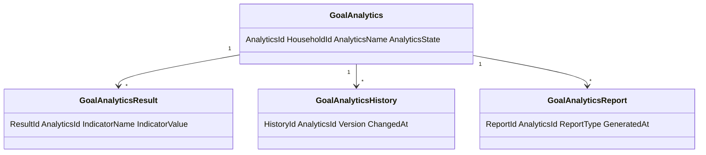
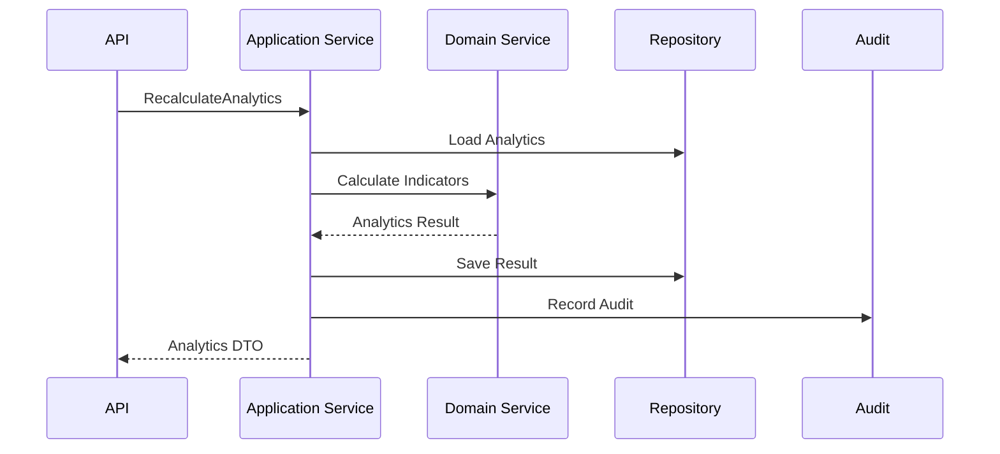
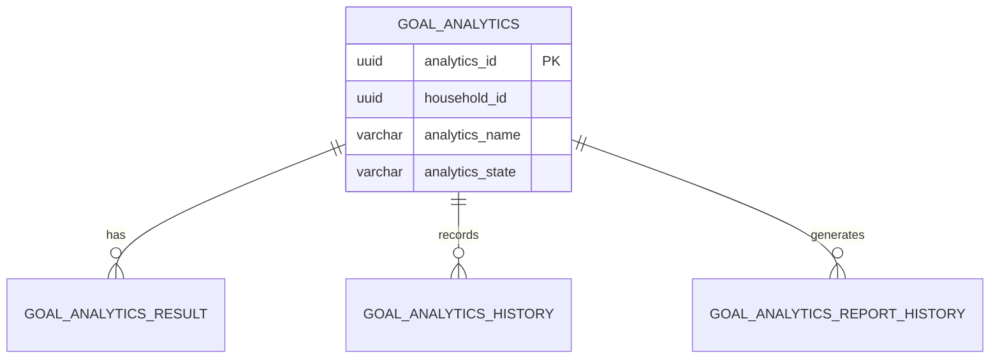
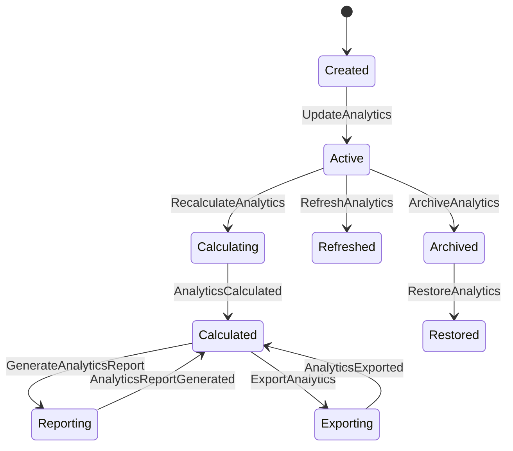
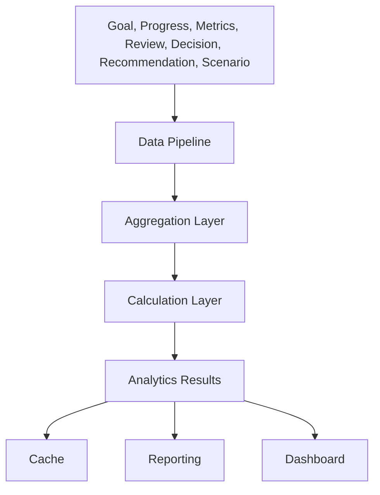
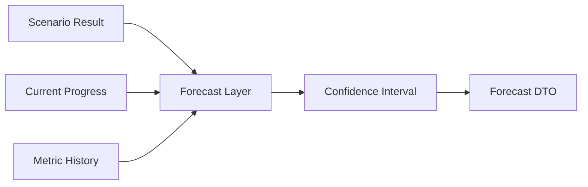
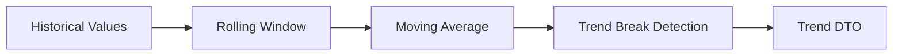

# Goal Analytics
Version: 1.0
Status: Enterprise Specification
Owner: Project Atlas
Source of Truth: Atlas Goal Analytics Specification
Last Updated: 2026-07-13
# Goal Analytics Overview
## Purpose
Goal Analytics defines how Atlas aggregates, calculates, trends, forecasts, compares, stores, exposes, secures, audits, reports, and exports analytical views for GoalPlan.
It coordinates analytics with GoalPlan, Milestone, Task when tracked, Goal Progress Tracking, Goal Metrics, Goal Review, Goal Dashboard, DecisionSession, Recommendation, Scenario, Portfolio, CashFlow, Notification, User, Repository, API, Cache, Security, Permission, Audit, and Reporting.
It does not redesign Atlas.
It does not modify existing Domain ownership.
It does not create a new Business Concept.
It does not replace GoalPlan, Goal Progress Tracking, Goal Metrics, Goal Review, Goal Dashboard, DecisionSession, Recommendation, Scenario, Portfolio, CashFlow, Notification, or User.
## Business Meaning
Goal Analytics gives User and Household a governed analytical view of goal progress, completion, financial outcomes, cash flow impact, priority alignment, risk, dependency readiness, milestone execution, review quality, decision quality, recommendation adoption, scenario comparison, portfolio impact, behavior, forecast, and trend.
Goal Analytics supports planning, monitoring, reporting, recommendation ranking, decision review, dashboard visualization, household comparison inside authorized scope, audit, and export.
## Analytics Lifecycle
Analytics lifecycle starts when an analytics definition or result is created for GoalPlan or Household scope.
Analytics lifecycle continues through creation, update, calculation, refresh, recalculation, report generation, export, archival, restoration, and deletion when policy permits.
Analytics lifecycle ends when the analytics record is archived, deleted, or superseded by a versioned calculation definition.
Historical analytics remain append-only evidence unless approved correction applies.
## Ownership
GoalPlan owns goal-scoped analytics targets.
Household owns household-scoped analytics results.
Goal Analytics owns analytical definitions, calculation contract, indicators, thresholds, refresh policy, report structure, and export behavior.
Application Service owns orchestration.
Domain Service owns validation and analytical rule enforcement.
Repository owns persistence and query behavior.
Dashboard and Reporting consume analytics projections.
Audit owns history, calculation evidence, report evidence, and export evidence.
## Data Sources
Data sources include GoalPlan, Milestone, Task when tracked, Goal Progress Tracking, Goal Metrics, Goal Review, Goal Dashboard, DecisionSession, Recommendation, Scenario, Portfolio, CashFlow, Notification, User activity, metric history, review history, progress history, and dashboard snapshots.
Every source must preserve HouseholdId.
Every source must preserve TenantId when tenant scope exists.
Every source must preserve source timestamp, version, and classification when shown as analytical result.
## Analytics Scope
Analytics scope can be GoalPlan-level, Household-level, goal category-level, scenario-level, portfolio-related, cashflow-related, dashboard-level, report-level, or user-visible filtered view.
Analytics scope must not cross Household boundaries without explicit permission.
Analytics scope must not cross Tenant boundaries without explicit permission.
Aggregated analytics must preserve masking and field-level security.
## Relationship with Goal
GoalPlan supplies identity, status, type, category, priority, target amount, target date, and lifecycle.
Goal Analytics never mutates GoalPlan directly.
Goal status controls inclusion in active, archived, completed, cancelled, or historical analytics.
## Relationship with Milestone
Milestones supply timeline, completion, delay, blocker, and milestone trend inputs.
Milestone analytics must preserve MilestoneId when drill-down is allowed.
## Relationship with Task
Tasks supply execution behavior and physical completion inputs when existing planning data tracks task state.
Task analytics must remain subordinate to GoalPlan and milestone consistency.
## Relationship with Goal Progress
Goal Progress supplies progress dimensions, health, schedule variance, expected completion date, and forecast.
Progress analytics must record generated time and calculation version.
## Relationship with Goal Metrics
Goal Metrics supplies KPI values, thresholds, trend inputs, forecast inputs, and calculation history.
Goal Analytics consumes metric history and does not redefine metric definitions.
## Relationship with Goal Review
Goal Review supplies review result, review completion, findings, review quality, and next review date.
Review analytics must not expose restricted findings without permission.
## Relationship with Goal Dashboard
Goal Dashboard consumes analytics summary, trend, forecast, comparison, and indicator output.
Dashboard analytics must expose generated time and staleness.
## Relationship with Decision
DecisionSession supplies decision status, decision completion, accepted decisions, rejected decisions, decision quality, and decision impact.
Decision analytics require decision read permission.
## Relationship with Recommendation
Recommendation supplies adoption, completion, suppression, dismissal, ranking, impact, and value.
Recommendation analytics require recommendation read permission.
## Relationship with Scenario
Scenario supplies forecast, comparison, stress, and what-if analytics.
Scenario analytics must record ScenarioId, ScenarioVersion, generated time, assumptions, and staleness.
## Relationship with Portfolio
Portfolio supplies allocation, return, risk, liquidity, valuation, and investment readiness analytics when relevant to GoalPlan.
Portfolio analytics require portfolio read permission.
## Relationship with CashFlow
CashFlow supplies contribution capacity, recurring surplus, recurring deficit, budget pressure, funding gap, and runway analytics.
CashFlow analytics require cashflow read permission.
## Relationship with Notification
Notification supplies count, severity, trigger, suppression, delivery, and response analytics.
Notification analytics must honor notification visibility policy.
## Relationship with User
User can view analytics only through authenticated and authorized API, dashboard, report, notification, or export paths.
User-visible analytics must apply Household isolation, Tenant isolation, masking, and field-level security.
# Analytics Architecture
## Data Pipeline
Data pipeline collects source snapshots, metric history, progress history, review history, decision history, recommendation history, scenario results, portfolio summaries, cashflow summaries, and notification history.
Pipeline records source version, generated time, calculation version, and CorrelationId.
## Aggregation Layer
Aggregation layer groups data by Household, GoalPlan, goal status, goal category, priority band, risk level, date range, scenario, portfolio, cashflow period, and user-visible filter.
Aggregation must preserve Household scope.
Aggregation must not mix currencies without conversion rule.
## Calculation Layer
Calculation layer executes indicator formulas, normalization, weighted scores, rolling windows, trend analysis, forecast analysis, benchmark comparison, and composite score.
Calculation layer records formula version and calculation version.
## Historical Layer
Historical layer reads metric history, progress history, review history, dashboard snapshots, decision history, recommendation history, and notification history.
Historical layer is append-only unless correction policy applies.
## Forecast Layer
Forecast layer reads Scenario, Goal Progress forecast, Goal Metrics forecast, and Projection output.
Forecast layer must mark results as forecast.
## Reporting Layer
Reporting layer produces analytical reports, export payloads, dashboards, summary projections, and comparison views.
Reporting layer must apply permission and masking.
## Caching Layer
Caching layer stores detail analytics, dashboard analytics, trend analytics, forecast analytics, comparison analytics, report results, and export snapshots.
Cache keys include TenantId, HouseholdId, AnalyticsId, GoalPlanId when scoped, filter hash, projection, and version.
## Visualization Layer
Visualization layer maps indicators to KPI cards, line chart, bar chart, stacked bar, distribution, table, timeline, heat map, gauge, and comparison chart.
Visualization does not own analytics data.
## Permission Layer
Permission layer evaluates source permissions before analytical output is returned.
Analytics read permission does not grant access to all source details.
# Analytics Categories
## Progress Analytics
Progress Analytics evaluates overall progress, progress velocity, progress trend, progress distribution, and progress variance.
## Completion Analytics
Completion Analytics evaluates completed goals, completion rate, completion probability, completion forecast, and completion quality.
## Financial Analytics
Financial Analytics evaluates target amount, funded amount, funding gap, budget variance, contribution performance, and ROI.
## Cash Flow Analytics
Cash Flow Analytics evaluates contribution capacity, surplus, deficit, recurring obligation pressure, and cashflow impact.
## Priority Analytics
Priority Analytics evaluates priority score, priority distribution, priority alignment, and priority movement.
## Risk Analytics
Risk Analytics evaluates risk score, risk trend, risk distribution, stress exposure, and risk-adjusted progress.
## Dependency Analytics
Dependency Analytics evaluates dependency readiness, blocker count, blocker age, dependency risk, and dependency trend.
## Milestone Analytics
Milestone Analytics evaluates milestone completion, milestone delay, milestone sequence, milestone quality, and timeline movement.
## Review Analytics
Review Analytics evaluates review completion, review result distribution, review timeliness, finding severity, and review impact.
## Decision Analytics
Decision Analytics evaluates decision completion, accepted decision ratio, rejected decision ratio, stale decisions, and decision quality.
## Recommendation Analytics
Recommendation Analytics evaluates adoption, completion, dismissal, suppression, expected impact, realized impact, and recommendation value.
## Scenario Analytics
Scenario Analytics evaluates baseline, alternative, stress, forecast, scenario ranking, and scenario variance.
## Portfolio Analytics
Portfolio Analytics evaluates portfolio contribution, risk, allocation, performance, concentration, and liquidity impact.
## Behavior Analytics
Behavior Analytics evaluates user activity, review participation, dashboard usage, recommendation response, and notification interaction when existing user activity data supports it.
## Forecast Analytics
Forecast Analytics evaluates expected completion, budget forecast, cashflow forecast, risk forecast, and confidence interval.
## Trend Analytics
Trend Analytics evaluates historical movement, moving average, rolling window, growth rate, decline rate, seasonality, trend break, and anomaly.
# Analytics Indicators
## GoalCompletionRate Name: GoalCompletionRate. Business Meaning: Share of goals completed in scope. Formula: `CompletedGoalCount / GoalCount`. Inputs: CompletedGoalCount, GoalCount. Outputs: Decimal from 0 to 1. Unit: ratio. Precision: numeric(7,6). Refresh Frequency: scheduled and event-driven. Threshold: 0.800000. Warning Range: 0.500000 to 0.799999. Critical Range: 0.000000 to 0.499999. Visualization Type: KPI card and trend line. Business Usage: Household goal success monitoring. Example: 0.625000.
## AverageProgress Name: AverageProgress. Business Meaning: Average goal progress in selected scope. Formula: `avg(OverallProgress)`. Inputs: OverallProgress values. Outputs: Decimal from 0 to 1. Unit: ratio. Precision: numeric(7,6). Refresh Frequency: event-driven and dashboard refresh. Threshold: 0.750000. Warning Range: 0.500000 to 0.749999. Critical Range: 0.000000 to 0.499999. Visualization Type: KPI card and bar chart. Business Usage: Overall progress monitoring. Example: 0.640000.
## AverageHealthScore Name: AverageHealthScore. Business Meaning: Average health of goals in scope. Formula: `avg(HealthScore)`. Inputs: HealthScore values. Outputs: Decimal from 0 to 1. Unit: score. Precision: numeric(7,6). Refresh Frequency: event-driven and scheduled. Threshold: 0.800000. Warning Range: 0.600000 to 0.799999. Critical Range: 0.000000 to 0.599999. Visualization Type: gauge and KPI card. Business Usage: Health monitoring. Example: 0.780000.
## AverageRiskScore Name: AverageRiskScore. Business Meaning: Average risk exposure in selected goals. Formula: `avg(RiskScore)`. Inputs: RiskScore values. Outputs: Decimal from 0 to 1. Unit: score. Precision: numeric(7,6). Refresh Frequency: risk source change and scheduled. Threshold: 0.300000. Warning Range: 0.300001 to 0.599999. Critical Range: 0.600000 to 1.000000. Visualization Type: gauge and distribution. Business Usage: Risk monitoring. Example: 0.220000.
## BudgetUsagePercent Name: BudgetUsagePercent. Business Meaning: Share of target amount funded. Formula: `sum(CurrentFundedAmount) / sum(TargetAmount) * 100`. Inputs: CurrentFundedAmount, TargetAmount, CurrencyCode. Outputs: Decimal percent. Unit: percent. Precision: numeric(7,4). Refresh Frequency: financial source change. Threshold: 80.0000. Warning Range: 50.0000 to 79.9999. Critical Range: 0.0000 to 49.9999. Visualization Type: progress bar. Business Usage: Funding monitoring. Example: 68.5000.
## ScheduleVarianceAverage Name: ScheduleVarianceAverage. Business Meaning: Average progress difference against elapsed time. Formula: `avg(OverallProgress - ElapsedTimePercent)`. Inputs: OverallProgress, StartDate, TargetDate, AsOfDate. Outputs: Decimal from -1 to 1. Unit: ratio delta. Precision: numeric(7,6). Refresh Frequency: daily scheduled and progress update. Threshold: 0.000000. Warning Range: -0.100000 to -0.000001. Critical Range: less than -0.100000. Visualization Type: line chart. Business Usage: Schedule monitoring. Example: -0.040000.
## ForecastAccuracy Name: ForecastAccuracy. Business Meaning: Difference between forecast progress and actual progress. Formula: `avg(1 - abs(ActualProgress - ForecastProgress))`. Inputs: ActualProgress, ForecastProgress. Outputs: Decimal from 0 to 1. Unit: score. Precision: numeric(7,6). Refresh Frequency: forecast refresh and actual update. Threshold: 0.850000. Warning Range: 0.650000 to 0.849999. Critical Range: 0.000000 to 0.649999. Visualization Type: line chart. Business Usage: Forecast quality monitoring. Example: 0.910000.
## RecommendationAdoptionRate Name: RecommendationAdoptionRate. Business Meaning: Share of eligible recommendations accepted. Formula: `AcceptedRecommendationCount / EligibleRecommendationCount`. Inputs: AcceptedRecommendationCount, EligibleRecommendationCount. Outputs: Decimal from 0 to 1. Unit: ratio. Precision: numeric(7,6). Refresh Frequency: Recommendation change. Threshold: 0.700000. Warning Range: 0.400000 to 0.699999. Critical Range: 0.000000 to 0.399999. Visualization Type: KPI card and bar chart. Business Usage: Recommendation effectiveness. Example: 0.580000.
## DecisionCompletionRate Name: DecisionCompletionRate. Business Meaning: Share of required decisions completed. Formula: `CompletedDecisionCount / RequiredDecisionCount`. Inputs: CompletedDecisionCount, RequiredDecisionCount. Outputs: Decimal from 0 to 1. Unit: ratio. Precision: numeric(7,6). Refresh Frequency: DecisionSession change. Threshold: 0.800000. Warning Range: 0.500000 to 0.799999. Critical Range: 0.000000 to 0.499999. Visualization Type: KPI card. Business Usage: Decision readiness. Example: 0.750000.
## BusinessValueScore Name: BusinessValueScore. Business Meaning: Combined household value of goal outcomes. Formula: `avg(BusinessImpactScore)`. Inputs: BusinessImpactScore. Outputs: Decimal score. Unit: score. Precision: numeric(10,4). Refresh Frequency: Review and metric calculation. Threshold: 75.0000. Warning Range: 50.0000 to 74.9999. Critical Range: 0.0000 to 49.9999. Visualization Type: KPI card and trend line. Business Usage: Value monitoring. Example: 81.2500.
# Trend Analysis
## Historical Trend
Historical trend reads ordered historical analytics or metric values over time.
Formula: `HistoricalTrendPoint_t = MetricValue_t`.
## Moving Average
Moving average smooths values over fixed window.
Formula: `MovingAverage_t = avg(Value_{t-n+1} ... Value_t)`.
## Rolling Window
Rolling window evaluates data within moving date boundary.
Formula: `RollingWindowValue = aggregate(Value where Date between WindowStart and WindowEnd)`.
## Growth Rate
Growth rate measures positive movement.
Formula: `GrowthRate = (CurrentValue - PriorValue) / abs(PriorValue)`.
## Decline Rate
Decline rate measures negative movement.
Formula: `DeclineRate = (PriorValue - CurrentValue) / abs(PriorValue)`.
## Seasonality
Seasonality compares current period with matching historical period.
Formula: `SeasonalityIndex = CurrentPeriodAverage / HistoricalMatchingPeriodAverage`.
## Trend Break Detection
Trend break detects material change from rolling average.
Formula: `TrendBreak = abs(CurrentValue - MovingAverage) > BreakThreshold`.
## Anomaly Detection
Anomaly detection flags value outside allowed statistical or configured range.
Formula: `Anomaly = abs(Value - Mean) > ZThreshold * StandardDeviation`.
# Forecast Analysis
## Completion Forecast
Completion forecast estimates completion progress and date.
Formula: `ForecastCompletion = clamp(CurrentProgress + ProgressRate * RemainingDays, 0, 1)`.
## Budget Forecast
Budget forecast estimates funded amount.
Formula: `ForecastFunding = CurrentFunding + ContributionRate * RemainingPeriods`.
## Cash Flow Forecast
Cash flow forecast estimates surplus or deficit.
Formula: `ForecastCashFlow = ExpectedIncome - ExpectedExpense - PlannedContribution`.
## Milestone Forecast
Milestone forecast estimates milestone completion.
Formula: `ForecastMilestoneCompletionDate = AsOfDate + RemainingMilestoneWork / MilestoneVelocity`.
## Risk Forecast
Risk forecast estimates risk movement.
Formula: `ForecastRiskScore = clamp(CurrentRiskScore + RiskTrend * ForecastPeriods, 0, 1)`.
## Recommendation Forecast
Recommendation forecast estimates expected impact.
Formula: `RecommendationForecastImpact = sum(AcceptedRecommendationExpectedImpact)`.
## Scenario Forecast
Scenario forecast uses Scenario result values.
Formula: `ScenarioForecastDelta = ScenarioMetricValue - BaselineMetricValue`.
## Confidence Interval
Confidence interval records lower and upper forecast range.
Formula: `ConfidenceInterval = ForecastValue +/- MarginOfError`.
# Comparative Analysis
## Goal vs Goal
Compares analytics indicators between two authorized GoalPlan records.
## Period Comparison
Compares current period with prior period.
Formula: `PeriodDelta = CurrentPeriodValue - PriorPeriodValue`.
## Scenario Comparison
Compares baseline scenario with alternative or stress scenario.
## Portfolio Comparison
Compares portfolio-related goal impact by valuation time or scenario.
## Household Comparison
Compares only within authorized household scope or approved anonymized aggregate.
## Target vs Actual
Formula: `TargetActualDelta = ActualValue - TargetValue`.
## Forecast vs Actual
Formula: `ForecastActualDelta = ActualValue - ForecastValue`.
# Validation Rules
1. AnalyticsId is required for persisted analytics. 2. AnalyticsName is required. 3. AnalyticsCategory is required. 4. AnalyticsState is required. 5. HouseholdId is required. 6. TenantId is required when tenant scope exists. 7. GoalPlanId is required for goal-scoped analytics. 8. IndicatorName is required. 9. Indicator definition version is required. 10. CalculationVersion is required for calculated output. 11. Formula is required for calculated indicator. 12. Inputs are required. 13. Outputs are required. 14. Unit is required. 15. Precision is required. 16. RefreshFrequency is required. 17. Threshold is required when thresholding is enabled. 18. Warning range must not overlap critical range. 19. Critical range must be valid. 20. Visualization type must be allowlisted. 21. Trend analysis requires historical data. 22. Moving average window must be positive. 23. Rolling window range must be valid. 24. Growth rate prior value must not be zero unless neutral rule applies. 25. Decline rate prior value must not be zero unless neutral rule applies. 26. Forecast requires forecast date. 27. Forecast requires ScenarioVersion when scenario is used. 28. Comparison requires comparable units. 29. Comparison requires compatible date ranges. 30. Currency comparison requires currency conversion or same CurrencyCode. 31. Aggregation must preserve Household scope. 32. Aggregation must preserve Tenant scope when applicable. 33. Dashboard analytics must include generated time. 34. Report analytics must include report id. 35. Export analytics must include export format. 36. Archive requires permission. 37. Restore requires archived analytics. 38. Delete requires permission. 39. Deleted analytics cannot refresh. 40. Archived analytics cannot update. 41. ThresholdExceeded requires prior threshold state. 42. AnalyticsCalculated requires result value or controlled null reason. 43. AnalyticsRefreshed requires refresh source. 44. API request requires RequestId. 45. Event-driven refresh requires CausationId. 46. Audit requires CorrelationId. 47. RowVersion is required for update. 48. Filter field must be allowlisted. 49. Sort field must be allowlisted. 50. Projection name must be allowlisted. 51. Cache key must include HouseholdId. 52. Goal-scoped cache key must include GoalPlanId. 53. Forecast cache key must include ScenarioVersion. 54. Historical cache key must include date range. 55. Masking must be applied before export. 56. Field-level security must be evaluated before response. 57. Materialized view refresh must be auditable. 58. Analytics sharing must not bypass source permission. 59. Report generation must preserve source versions. 60. Export snapshot must preserve generated time. 61. Indicator value must fit precision. 62. Percent indicator must be between 0 and 100. 63. Ratio indicator must be between 0 and 1 unless definition permits otherwise. 64. Report date range must be valid. 65. Domain Event emission must be idempotent.
# Business Rules
1. Goal Analytics belongs to GoalPlan or Household scope. 2. Goal Analytics is derived analytical data. 3. Goal Analytics must not redefine GoalPlan. 4. Goal Analytics must not redefine Goal Metrics. 5. Goal Analytics must not redefine Goal Dashboard. 6. Goal Analytics must not redefine Goal Review. 7. Goal Analytics must not redefine DecisionSession. 8. Goal Analytics must not redefine Recommendation. 9. Goal Analytics must not redefine Scenario. 10. Goal Analytics must not redefine Portfolio. 11. Goal Analytics must not redefine CashFlow. 12. Analytics definitions must be versioned. 13. Analytics calculations must be deterministic. 14. Analytics results must record calculation version. 15. Analytics results must record source snapshot when calculated from source data. 16. Analytics indicators must preserve unit. 17. Currency analytics must preserve CurrencyCode. 18. Ratio analytics must preserve decimal scale. 19. Percent analytics must preserve percent scale. 20. Composite analytics must declare weights. 21. Composite weights must sum to 1. 22. Threshold evaluation must be deterministic. 23. ThresholdExceeded emits only when crossing occurs. 24. Duplicate ThresholdExceeded emission is prohibited for same threshold state. 25. Archived analytics cannot update. 26. Deleted analytics cannot refresh. 27. Restored analytics must preserve history. 28. Analytics history is append-only. 29. Calculation history is append-only. 30. Report history is append-only. 31. Export history is append-only. 32. Manual update requires permission. 33. Manual update requires reason. 34. Manual update requires audit. 35. Automatic refresh must be idempotent. 36. Scheduled refresh must be retryable. 37. Batch calculation must use bounded pages. 38. Batch calculation must checkpoint. 39. Parallel processing is allowed across GoalPlan records. 40. Parallel processing of same AnalyticsId must use concurrency control. 41. Incremental refresh recalculates only affected analytics. 42. Full recalculation is required when formula version changes. 43. Dashboard analytics must expose generated time. 44. Forecast analytics must expose scenario version. 45. Trend analytics must expose comparison period. 46. Historical analytics must not be overwritten by current refresh. 47. Comparative analytics must record comparison scope. 48. Benchmark analytics must record benchmark source. 49. Aggregations must preserve Household isolation. 50. Aggregations must preserve Tenant isolation when applicable. 51. Analytics must not expose another Household. 52. Analytics must not expose another Tenant. 53. Field-level security applies to financial analytics. 54. Field-level security applies to portfolio analytics. 55. Field-level security applies to decision analytics. 56. Field-level security applies to recommendation analytics. 57. Masking must apply before export. 58. Cache invalidates after analytics update. 59. Cache invalidates after recalculation. 60. Cache invalidates after archive. 61. Cache invalidates after restore. 62. Dashboard analytics refresh after calculation. 63. Report analytics refresh after report generation. 64. Notification can consume threshold events. 65. Notification suppression must not suppress audit. 66. Analytics refresh cannot mutate GoalPlan directly. 67. Analytics result can inform DecisionSession. 68. Analytics result can inform Recommendation ranking. 69. Analytics result can inform Scenario comparison. 70. Analytics result can inform Goal Review. 71. Analytics result can inform Goal Dashboard. 72. Analytics value decrease must be explainable by source change. 73. Critical analytics range must trigger review or notification when configured. 74. Analytics deletion must be soft delete when history is retained. 75. Analytics audit must include changed fields. 76. Report generation requires permission. 77. Export requires permission. 78. Sharing cannot bypass source permission. 79. Materialized view refresh must preserve Household scope. 80. Forecast accuracy must be recalculated when actual data changes.
# State Machine
## States
| State | Meaning |
|---|---|
| Created | Analytics record exists. |
| Active | Analytics is available for calculation and read. |
| Calculating | Analytics calculation is running. |
| Calculated | Analytics has current calculated output. |
| Refreshed | Analytics was refreshed from source. |
| Reporting | Analytics report generation is running. |
| Exporting | Analytics export is running. |
| Archived | Analytics is read-only history. |
| Deleted | Analytics is soft deleted when policy permits. |
| Restored | Analytics was restored from archive. |
## Transitions
| From | To | Trigger |
|---|---|---|
| None | Created | CreateAnalytics |
| Created | Active | UpdateAnalytics |
| Active | Calculating | RecalculateAnalytics |
| Calculating | Calculated | AnalyticsCalculated |
| Active | Refreshed | RefreshAnalytics |
| Calculated | Reporting | GenerateAnalyticsReport |
| Reporting | Calculated | AnalyticsReportGenerated |
| Calculated | Exporting | ExportAnalytics |
| Exporting | Calculated | AnalyticsExported |
| Active | Archived | ArchiveAnalytics |
| Calculated | Archived | ArchiveAnalytics |
| Archived | Restored | RestoreAnalytics |
| Restored | Active | UpdateAnalytics |
| Created | Deleted | DeleteAnalytics |
## Triggers
Triggers include CreateAnalytics, UpdateAnalytics, RefreshAnalytics, RecalculateAnalytics, ArchiveAnalytics, RestoreAnalytics, DeleteAnalytics, GenerateAnalyticsReport, ExportAnalytics, source event, scheduler run, background job, threshold crossing, dashboard refresh, review completion, metric calculation, recommendation change, decision change, scenario simulation, portfolio change, and cashflow change.
## Invariant
Analytics must preserve HouseholdId.
Analytics must preserve TenantId when applicable.
Goal-scoped analytics must reference GoalPlanId.
Archived analytics is read-only.
Deleted analytics is excluded from normal queries.
Calculated analytics must have calculation version.
## Illegal Transition
| From | To | Reason |
|---|---|---|
| Archived | Calculating | RestoreAnalytics is required first. |
| Deleted | Active | Restore policy is required first. |
| Created | Exporting | Calculation or report snapshot is required first. |
| Calculating | Archived | Calculation must complete or cancel first. |
| Deleted | Calculating | Deleted analytics cannot calculate. |
# Commands
## CreateAnalytics
Creates analytics definition or scoped analytics record.
Input: HouseholdId, GoalPlanId, AnalyticsName, AnalyticsCategory, Scope, RequestedBy, CorrelationId.
Output: AnalyticsId, AnalyticsState.
## UpdateAnalytics
Updates editable analytics configuration.
Input: AnalyticsId, Indicators, Filters, Thresholds, RefreshFrequency, RowVersion, CorrelationId.
Output: AnalyticsId, Version, ChangedFields.
## RefreshAnalytics
Refreshes analytics from current source.
Input: AnalyticsId, SourceSnapshotId, RefreshReason, CorrelationId.
Output: AnalyticsId, RefreshedAt, IndicatorResults.
## RecalculateAnalytics
Recalculates analytics using calculation version.
Input: AnalyticsId, CalculationVersion, SourceSnapshotId, CorrelationId.
Output: AnalyticsId, CalculationHistoryId, IndicatorResults.
## ArchiveAnalytics
Archives analytics as read-only history.
Input: AnalyticsId, ArchiveReason, RowVersion, CorrelationId.
Output: AnalyticsState = Archived.
## RestoreAnalytics
Restores archived analytics.
Input: AnalyticsId, RestoreReason, RowVersion, CorrelationId.
Output: AnalyticsState = Restored.
## DeleteAnalytics
Soft deletes analytics when policy permits.
Input: AnalyticsId, DeleteReason, RowVersion, CorrelationId.
Output: AnalyticsState = Deleted.
## GenerateAnalyticsReport
Generates report from analytics result.
Input: AnalyticsId, ReportType, DateRange, Projection, CorrelationId.
Output: ReportId, ReportStatus.
## ExportAnalytics
Exports analytics result or report.
Input: AnalyticsId, ExportFormat, Scope, MaskingMode, CorrelationId.
Output: ExportId, ExportStatus.
## All related Domain Commands
| Command | Analytics Relationship |
|---|---|
| RefreshGoalProgress | Refreshes progress analytics. |
| RecalculateGoalProgress | Recalculates progress analytics. |
| RefreshMetric | Refreshes indicator inputs. |
| RecalculateMetric | Recalculates metric-based analytics. |
| CompleteReview | Refreshes review analytics. |
| RefreshDashboard | Refreshes dashboard analytics. |
| AcceptDecision | Refreshes decision analytics. |
| AcceptRecommendation | Refreshes recommendation analytics. |
| RunScenario | Produces forecast analytics. |
| TriggerNotification | Consumes threshold analytics. |
# Domain Events
## AnalyticsCreated
Payload: AnalyticsId, HouseholdId, GoalPlanId, AnalyticsName, AnalyticsCategory, CorrelationId.
## AnalyticsUpdated
Payload: AnalyticsId, ChangedFields, Version, CorrelationId.
## AnalyticsCalculated
Payload: AnalyticsId, IndicatorResults, CalculationVersion, CorrelationId.
## AnalyticsRefreshed
Payload: AnalyticsId, SourceSnapshotId, RefreshedAt, CorrelationId.
## AnalyticsArchived
Payload: AnalyticsId, ArchiveReason, ArchivedAt, CorrelationId.
## AnalyticsRestored
Payload: AnalyticsId, RestoreReason, RestoredAt, CorrelationId.
## AnalyticsExported
Payload: AnalyticsId, ExportId, ExportFormat, ExportScope, CorrelationId.
## AnalyticsReportGenerated
Payload: AnalyticsId, ReportId, ReportType, GeneratedAt, CorrelationId.
## ThresholdExceeded
Payload: AnalyticsId, IndicatorName, IndicatorValue, Threshold, Severity, HouseholdId, GoalPlanId, CorrelationId.
## All related Events
| Event | Analytics Impact |
|---|---|
| GoalProgressUpdated | Refreshes progress analytics. |
| GoalHealthChanged | Refreshes health analytics. |
| GoalForecastChanged | Refreshes forecast analytics. |
| MetricCalculated | Refreshes indicator inputs. |
| ReviewCompleted | Refreshes review analytics. |
| DashboardRefreshed | Refreshes dashboard usage analytics. |
| RecommendationAccepted | Refreshes recommendation analytics. |
| RecommendationCompleted | Refreshes recommendation analytics. |
| DecisionAccepted | Refreshes decision analytics. |
| DecisionRejected | Refreshes decision analytics. |
| ScenarioSimulated | Refreshes scenario analytics. |
| NotificationTriggered | Refreshes notification analytics. |
# Repository
## Interface
```csharp
public interface IGoalAnalyticsRepository
{
    Task<GoalAnalytics?> GetByIdAsync(Guid householdId, Guid analyticsId, CancellationToken cancellationToken);
    Task<IReadOnlyList<GoalAnalytics>> SearchAsync(GoalAnalyticsSearchSpecification specification, CancellationToken cancellationToken);
    Task<GoalAnalyticsReport?> GetReportAsync(Guid householdId, Guid reportId, CancellationToken cancellationToken);
    Task AddAsync(GoalAnalytics analytics, CancellationToken cancellationToken);
    Task UpdateAsync(GoalAnalytics analytics, CancellationToken cancellationToken);
    Task ArchiveAsync(Guid householdId, Guid analyticsId, string reason, CancellationToken cancellationToken);
}
```
## Methods
Methods include GetByIdAsync, GetByGoalPlanIdAsync, SearchAsync, GetDashboardAsync, GetTrendAsync, GetForecastAsync, GetComparisonAsync, GetReportAsync, GetHistoryAsync, AddAsync, UpdateAsync, ArchiveAsync, RestoreAsync, DeleteAsync, SaveCalculationHistoryAsync, SaveReportHistoryAsync, and SaveExportHistoryAsync.
## Queries
Queries include analytics by id, goal, household, category, state, indicator, threshold state, date range, trend, forecast, comparison, dashboard, report, export, and historical result.
## Filtering
Allowed filters: goalPlanId, householdId, analyticsName, analyticsCategory, analyticsState, indicatorName, thresholdState, dateRange, scenarioId, reportType, updatedAt.
## Sorting
Allowed sorting: analyticsName, analyticsCategory, indicatorValue, updatedAt, calculatedAt, generatedAt, thresholdState, trendValue, forecastValue.
## Aggregation
Aggregations include average indicator, min indicator, max indicator, count by category, count by state, count by threshold state, trend average, forecast average, and comparison summary.
## Projection
Supported projections: summary, detail, dashboard, analytics, trend, forecast, comparison, report, export, search, history.
## Specification
GoalAnalyticsSearchSpecification fields: HouseholdId, TenantId, GoalPlanIds, AnalyticsNames, AnalyticsCategories, AnalyticsStates, IndicatorNames, ThresholdStates, ScenarioId, DateFrom, DateTo, Sort, PageSize, Cursor.
# Domain Service Interaction
GoalAnalyticsDomainService validates analytics definition, validates source inputs, calculates indicators, evaluates thresholds, performs trend analysis, performs forecast analysis, performs comparison analysis, validates state transitions, validates report scope, validates export scope, and emits Domain Events.
| Service | Interaction |
|---|---|
| GoalProgressDomainService | Supplies progress and health source values. |
| GoalMetricDomainService | Supplies KPI, trend, forecast, and threshold inputs. |
| GoalReviewDomainService | Supplies review analytics inputs. |
| GoalDashboardDomainService | Consumes dashboard analytics. |
| GoalDependencyDomainService | Supplies dependency analytics inputs. |
| GoalPrioritizationDomainService | Supplies priority analytics inputs. |
| GoalFundingDomainService | Supplies financial analytics inputs. |
| DecisionDomainService | Supplies decision analytics inputs. |
| RecommendationDomainService | Supplies adoption and value inputs. |
| ScenarioDomainService | Supplies forecast and comparison inputs. |
| NotificationDomainService | Consumes threshold events. |
# Application Service Interaction
GoalAnalyticsApplicationService authorizes request, resolves Household scope, loads analytics, loads source data, invokes Domain Service, persists analytics, saves calculation history, saves report history, saves export history, publishes events, invalidates cache, updates projections, records audit, and returns DTO.
```csharp
Task<GoalAnalyticsDetailDto> CreateAnalyticsAsync(CreateAnalyticsRequest request);
Task<GoalAnalyticsDetailDto> UpdateAnalyticsAsync(UpdateAnalyticsRequest request);
Task<GoalAnalyticsDto> RefreshAnalyticsAsync(RefreshAnalyticsRequest request);
Task<GoalAnalyticsDto> RecalculateAnalyticsAsync(RecalculateAnalyticsRequest request);
Task<GoalAnalyticsDetailDto> ArchiveAnalyticsAsync(ArchiveAnalyticsRequest request);
Task<GoalAnalyticsDetailDto> RestoreAnalyticsAsync(RestoreAnalyticsRequest request);
Task<GoalAnalyticsReportDto> GenerateAnalyticsReportAsync(GenerateAnalyticsReportRequest request);
Task<GoalAnalyticsExportDto> ExportAnalyticsAsync(ExportAnalyticsRequest request);
Task<GoalAnalyticsSearchResultDto> SearchAnalyticsAsync(GoalAnalyticsSearchRequest request);
```
# API
## REST Endpoints
| Method | Endpoint | Purpose |
|---|---|---|
| GET | /api/goal-analytics | Search analytics. |
| GET | /api/goal-analytics/{analyticsId} | Get detail. |
| POST | /api/goal-analytics | Create analytics. |
| PATCH | /api/goal-analytics/{analyticsId} | Update analytics. |
| POST | /api/goal-analytics/{analyticsId}/refresh | Refresh analytics. |
| POST | /api/goal-analytics/{analyticsId}/recalculate | Recalculate analytics. |
| POST | /api/goal-analytics/{analyticsId}/archive | Archive analytics. |
| POST | /api/goal-analytics/{analyticsId}/restore | Restore analytics. |
| DELETE | /api/goal-analytics/{analyticsId} | Soft delete analytics. |
| GET | /api/goal-analytics/dashboard | Get dashboard analytics. |
| GET | /api/goal-analytics/{analyticsId}/trend | Get trend. |
| GET | /api/goal-analytics/{analyticsId}/forecast | Get forecast. |
| GET | /api/goal-analytics/{analyticsId}/comparison | Get comparison. |
| POST | /api/goal-analytics/{analyticsId}/reports | Generate report. |
| POST | /api/goal-analytics/{analyticsId}/export | Export analytics. |
## HTTP Methods
GET reads analytics.
POST executes commands and report generation.
PATCH updates editable fields.
DELETE soft deletes when policy permits.
## Request
```json
{ "goalPlanId": "uuid", "analyticsName": "GoalCompletionAnalytics", "analyticsCategory": "Completion", "scope": "GoalPlan", "refreshFrequency": "Scheduled" }
```
## Response
```json
{ "analyticsId": "uuid", "goalPlanId": "uuid", "analyticsName": "GoalCompletionAnalytics", "analyticsState": "Created" }
```
## Errors
| Status | Error |
|---|---|
| 400 | InvalidAnalyticsRequest |
| 401 | Unauthenticated |
| 403 | GoalAnalyticsPermissionDenied |
| 404 | GoalAnalyticsNotFound |
| 409 | GoalAnalyticsConcurrencyConflict |
| 422 | GoalAnalyticsStateViolation |
## Pagination
Cursor pagination is required.
Default page size is 50.
Maximum page size is 200.
## Filtering
API supports allowlisted filters only.
## Sorting
Default sorting is updatedAt desc.
API supports allowlisted sorting only.
## Projection
Projection supports summary, detail, dashboard, analytics, trend, forecast, comparison, report, export, search, and history.
## Export API
Export accepts format, date range, projection, masking mode, and snapshot option.
## Report API
Report API accepts report type, date range, filters, projection, and output preference.
# DTO
## Create DTO
```json
{ "goalPlanId": "uuid", "analyticsName": "GoalCompletionAnalytics", "analyticsCategory": "Completion", "scope": "GoalPlan", "refreshFrequency": "Scheduled" }
```
## Update DTO
```json
{ "indicators": ["GoalCompletionRate", "AverageProgress"], "refreshFrequency": "EventDriven", "rowVersion": "base64" }
```
## Detail DTO
```json
{ "analyticsId": "uuid", "analyticsName": "GoalCompletionAnalytics", "analyticsState": "Calculated", "generatedAt": "2026-07-13T00:00:00Z", "indicators": [] }
```
## Summary DTO
```json
{ "analyticsId": "uuid", "analyticsName": "GoalCompletionAnalytics", "analyticsCategory": "Completion", "analyticsState": "Calculated" }
```
## Dashboard DTO
```json
{ "householdId": "uuid", "completionRate": 0.62, "averageProgress": 0.64, "averageHealthScore": 0.78, "criticalCount": 1 }
```
## Analytics DTO
```json
{ "indicatorName": "AverageProgress", "indicatorValue": 0.64, "unit": "ratio", "thresholdState": "Warning" }
```
## Trend DTO
```json
{ "indicatorName": "AverageProgress", "currentValue": 0.64, "priorValue": 0.58, "trendValue": 0.06, "window": "P30D" }
```
## Forecast DTO
```json
{ "indicatorName": "ForecastCompletion", "forecastValue": 0.91, "forecastDate": "2027-04-30", "scenarioId": "uuid", "scenarioVersion": "1.0" }
```
## Comparison DTO
```json
{ "comparisonType": "ForecastVsActual", "baselineValue": 0.84, "comparisonValue": 0.79, "delta": -0.05 }
```
## Report DTO
```json
{ "reportId": "uuid", "reportType": "GoalAnalyticsSummary", "generatedAt": "2026-07-13T00:00:00Z", "status": "Generated" }
```
# Database Mapping
## Table
Primary table: goal_analytics.
Result table: goal_analytics_result.
History table: goal_analytics_history.
Calculation table: goal_analytics_calculation_history.
Report table: goal_analytics_report_history.
Export table: goal_analytics_export_history.
## Columns
Analytics columns: analytics_id, tenant_id, household_id, goal_plan_id, analytics_name, analytics_category, analytics_state, scope_name, refresh_frequency, definition_version, calculation_version, filters_json, row_version, created_at, updated_at, archived_at, deleted_at.
Result columns: result_id, analytics_id, indicator_name, indicator_value, indicator_unit, threshold_state, generated_at, source_snapshot_id.
## Indexes
Indexes: ix_goal_analytics_household_goal, ix_goal_analytics_household_name, ix_goal_analytics_household_category, ix_goal_analytics_updated_at, ix_goal_analytics_result_indicator.
## Constraints
Constraints: primary keys, FK to analytics, FK to GoalPlan when applicable, unique active analytics name per goal scope, score checks, threshold checks.
## FK
fk_goal_analytics_result_analytics.
fk_goal_analytics_goal_plan.
## Unique
uq_goal_analytics_household_goal_name.
## Check Constraint
Ratio and score indicator values must be between 0 and 1 when unit is ratio or score.
## Partition Strategy
Partition calculation history and result history by generated_at month when volume requires it.
# PostgreSQL Schema
```sql
CREATE TABLE goal_analytics (
    analytics_id uuid PRIMARY KEY,
    tenant_id uuid NULL,
    household_id uuid NOT NULL,
    goal_plan_id uuid NULL,
    analytics_name varchar(128) NOT NULL,
    analytics_category varchar(64) NOT NULL,
    analytics_state varchar(32) NOT NULL,
    scope_name varchar(64) NOT NULL,
    refresh_frequency varchar(64) NOT NULL,
    definition_version varchar(32) NOT NULL,
    calculation_version varchar(32) NULL,
    filters_json jsonb NOT NULL DEFAULT '{}'::jsonb,
    row_version bigint NOT NULL DEFAULT 1,
    created_at timestamptz NOT NULL,
    updated_at timestamptz NOT NULL,
    archived_at timestamptz NULL,
    deleted_at timestamptz NULL,
    CONSTRAINT uq_goal_analytics_household_goal_name UNIQUE (household_id, goal_plan_id, analytics_name),
    CONSTRAINT ck_goal_analytics_name CHECK (length(analytics_name) > 0)
);
CREATE TABLE goal_analytics_result (
    result_id uuid PRIMARY KEY,
    analytics_id uuid NOT NULL,
    household_id uuid NOT NULL,
    goal_plan_id uuid NULL,
    indicator_name varchar(128) NOT NULL,
    indicator_value numeric(18,6) NULL,
    indicator_unit varchar(32) NOT NULL,
    threshold_state varchar(32) NULL,
    source_snapshot_id uuid NULL,
    generated_at timestamptz NOT NULL,
    CONSTRAINT fk_goal_analytics_result_analytics FOREIGN KEY (analytics_id) REFERENCES goal_analytics (analytics_id),
    CONSTRAINT ck_goal_analytics_result_ratio CHECK (
        indicator_value IS NULL OR indicator_unit NOT IN ('ratio','score') OR (indicator_value >= 0 AND indicator_value <= 1)
    )
);
CREATE TABLE goal_analytics_history (
    history_id uuid PRIMARY KEY,
    analytics_id uuid NOT NULL,
    household_id uuid NOT NULL,
    version bigint NOT NULL,
    change_reason varchar(256) NOT NULL,
    changed_by uuid NULL,
    previous_values jsonb NOT NULL,
    new_values jsonb NOT NULL,
    correlation_id uuid NOT NULL,
    created_at timestamptz NOT NULL
);
CREATE TABLE goal_analytics_calculation_history (
    calculation_history_id uuid PRIMARY KEY,
    analytics_id uuid NOT NULL,
    household_id uuid NOT NULL,
    calculation_version varchar(32) NOT NULL,
    source_snapshot_id uuid NULL,
    inputs jsonb NOT NULL,
    outputs jsonb NOT NULL,
    correlation_id uuid NOT NULL,
    calculated_at timestamptz NOT NULL
);
CREATE TABLE goal_analytics_report_history (
    report_id uuid PRIMARY KEY,
    analytics_id uuid NOT NULL,
    household_id uuid NOT NULL,
    report_type varchar(64) NOT NULL,
    report_payload jsonb NOT NULL,
    generated_by uuid NULL,
    correlation_id uuid NOT NULL,
    generated_at timestamptz NOT NULL
);
CREATE TABLE goal_analytics_export_history (
    export_id uuid PRIMARY KEY,
    analytics_id uuid NOT NULL,
    household_id uuid NOT NULL,
    exported_by uuid NULL,
    export_format varchar(32) NOT NULL,
    export_scope jsonb NOT NULL,
    report_id uuid NULL,
    correlation_id uuid NOT NULL,
    created_at timestamptz NOT NULL
);
CREATE INDEX ix_goal_analytics_household_goal ON goal_analytics (household_id, goal_plan_id);
CREATE INDEX ix_goal_analytics_household_name ON goal_analytics (household_id, analytics_name);
CREATE INDEX ix_goal_analytics_household_category ON goal_analytics (household_id, analytics_category);
CREATE INDEX ix_goal_analytics_updated_at ON goal_analytics (updated_at DESC);
CREATE INDEX ix_goal_analytics_result_indicator ON goal_analytics_result (household_id, indicator_name, generated_at DESC);
CREATE VIEW goal_analytics_dashboard_view AS
SELECT household_id,
       count(*) AS analytics_count,
       count(*) FILTER (WHERE analytics_state = 'Calculated') AS calculated_count,
       max(updated_at) AS generated_at
FROM goal_analytics
WHERE archived_at IS NULL AND deleted_at IS NULL
GROUP BY household_id;
CREATE MATERIALIZED VIEW goal_analytics_daily_indicator_mv AS
SELECT household_id,
       goal_plan_id,
       indicator_name,
       date_trunc('day', generated_at) AS indicator_day,
       avg(indicator_value) AS average_value,
       min(indicator_value) AS min_value,
       max(indicator_value) AS max_value
FROM goal_analytics_result
GROUP BY household_id, goal_plan_id, indicator_name, date_trunc('day', generated_at);
```
# EF Core Mapping
## Fluent API
```csharp
builder.ToTable("goal_analytics");
builder.HasKey(x => x.AnalyticsId);
builder.Property(x => x.AnalyticsId).HasColumnName("analytics_id");
builder.Property(x => x.TenantId).HasColumnName("tenant_id");
builder.Property(x => x.HouseholdId).HasColumnName("household_id").IsRequired();
builder.Property(x => x.GoalPlanId).HasColumnName("goal_plan_id");
builder.Property(x => x.AnalyticsName).HasColumnName("analytics_name").HasMaxLength(128).IsRequired();
builder.Property(x => x.AnalyticsCategory).HasColumnName("analytics_category").HasMaxLength(64).IsRequired();
builder.Property(x => x.AnalyticsState).HasColumnName("analytics_state").HasMaxLength(32).IsRequired();
builder.Property(x => x.ScopeName).HasColumnName("scope_name").HasMaxLength(64).IsRequired();
builder.Property(x => x.FiltersJson).HasColumnName("filters_json").HasColumnType("jsonb");
builder.Property(x => x.RowVersion).HasColumnName("row_version").IsConcurrencyToken();
builder.HasIndex(x => new { x.HouseholdId, x.GoalPlanId, x.AnalyticsName }).IsUnique();
builder.HasIndex(x => new { x.HouseholdId, x.AnalyticsCategory });
builder.HasQueryFilter(x => x.DeletedAt == null);
```
## Owned Types
AnalyticsIndicator can be owned for indicator configuration.
AnalyticsThreshold can be owned for warning and critical ranges.
AnalyticsFilterSet can be owned for filters.
## Indexes
Indexes match PostgreSQL schema.
## Query Filters
Default query filter excludes deleted analytics.
Repository specification applies Household and Tenant filters.
## Value Conversion
AnalyticsState, AnalyticsCategory, ScopeName, RefreshFrequency, IndicatorUnit, ThresholdState, ExportFormat, and ReportType use string conversion.
# Cache Strategy
## Redis Key
Detail key: `atlas:{tenantId}:household:{householdId}:goal-analytics:{analyticsId}:detail:v1`.
Dashboard key: `atlas:{tenantId}:household:{householdId}:goal-analytics:dashboard:v1`.
Trend key: `atlas:{tenantId}:household:{householdId}:goal-analytics:{analyticsId}:trend:{window}:v1`.
Forecast key: `atlas:{tenantId}:household:{householdId}:goal-analytics:{analyticsId}:forecast:{scenarioVersion}:v1`.
Historical key: `atlas:{tenantId}:household:{householdId}:goal-analytics:{analyticsId}:history:{rangeHash}:v1`.
Report key: `atlas:{tenantId}:household:{householdId}:goal-analytics:report:{reportId}:v1`.
## TTL
Detail TTL is 5 minutes.
Dashboard TTL is 2 minutes.
Trend TTL is 10 minutes.
Forecast TTL is 10 minutes.
Historical TTL is 15 minutes.
Report TTL is 30 minutes.
## Refresh Strategy
Refresh detail after calculation.
Refresh dashboard asynchronously after calculation.
Refresh trend after result history insert.
Refresh forecast after Scenario simulation.
Refresh report after report generation.
## Invalidation
Invalidate on AnalyticsCreated, AnalyticsUpdated, AnalyticsCalculated, AnalyticsRefreshed, AnalyticsArchived, AnalyticsRestored, AnalyticsExported, AnalyticsReportGenerated, ThresholdExceeded, GoalProgressUpdated, MetricCalculated, ReviewCompleted, DashboardRefreshed, Recommendation change, Decision change, Scenario simulation, Portfolio change, and CashFlow change.
## Historical Cache
Historical cache stores range-bound historical output with source version and generated time.
## Forecast Cache
Forecast cache stores forecast output with ScenarioVersion, assumptions, generated time, and confidence.
# Security
## Authorization
Analytics access requires authenticated Principal and Household permission.
Protected analytics require source-specific permission.
Report and export require elevated permission.
## Permissions
Permissions: GoalAnalytics.Read, GoalAnalytics.Create, GoalAnalytics.Update, GoalAnalytics.Refresh, GoalAnalytics.Recalculate, GoalAnalytics.Archive, GoalAnalytics.Restore, GoalAnalytics.Delete, GoalAnalytics.Report.Generate, GoalAnalytics.Export, GoalAnalytics.Share.
## Field Level Security
Financial analytics require financial read permission.
Portfolio analytics require portfolio read permission.
Decision analytics require decision read permission.
Recommendation analytics require recommendation read permission.
Scenario analytics require scenario read permission.
## Analytics Sharing
Analytics sharing grants analytical view access only within source permission.
Sharing cannot bypass source data permission.
## Data Masking
Mask currency values when user lacks financial read permission.
Mask portfolio details when user lacks portfolio permission.
Mask decision details when user lacks decision permission.
Mask recommendation details when user lacks recommendation permission.
# Audit
## Analytics History
Analytics history records create, update, refresh, recalculate, archive, restore, delete, report generation, export, sharing, and threshold events.
## Calculation History
Calculation history records formula, inputs, outputs, source snapshot, calculation version, result, and duration.
## Report History
Report history records report type, scope, filters, projection, payload reference, actor, generated time, and correlation.
## Export History
Export history records export format, scope, masking mode, report id, actor, created time, and correlation.
# Performance
## Batch Calculation
Batch calculation uses bounded pages and checkpoint.
Default batch size is 500.
Maximum batch size is 5000.
## Incremental Refresh
Source event scope determines affected analytics categories.
Formula version change triggers full recalculation.
## Parallel Processing
Parallel calculation is allowed across GoalPlan records and AnalyticsCategory groups.
Parallel calculation of same AnalyticsId requires RowVersion.
## Materialized Views
Materialized views support daily indicators, dashboard summary, and heavy comparison reads.
Refresh must preserve generated time.
## Read Optimization
Use summary projection for list.
Use dashboard view for dashboard.
Use materialized daily indicator view for trends.
Use report history for generated reports.
## Caching
Redis caches detail, dashboard, trend, forecast, historical, report, export, and search results.
# Example JSON
## Create
```json
{ "goalPlanId": "5e4b510a-6f80-43c7-9978-89f2b9f89a11", "analyticsName": "GoalCompletionAnalytics", "analyticsCategory": "Completion", "scope": "GoalPlan", "refreshFrequency": "Scheduled" }
```
## Update
```json
{ "indicators": ["GoalCompletionRate", "AverageProgress"], "refreshFrequency": "EventDriven", "rowVersion": "AAAAAAAAB9E=" }
```
## Analytics Detail
```json
{ "analyticsId": "uuid", "analyticsName": "GoalCompletionAnalytics", "analyticsState": "Calculated", "generatedAt": "2026-07-13T00:00:00Z", "indicators": [{ "name": "AverageProgress", "value": 0.64 }] }
```
## Dashboard
```json
{ "householdId": "uuid", "completionRate": 0.62, "averageProgress": 0.64, "averageHealthScore": 0.78, "criticalCount": 1 }
```
## Trend
```json
{ "indicatorName": "AverageProgress", "currentValue": 0.64, "priorValue": 0.58, "trendValue": 0.06, "window": "P30D" }
```
## Forecast
```json
{ "indicatorName": "ForecastCompletion", "forecastValue": 0.91, "forecastDate": "2027-04-30", "scenarioId": "393b984d-bdf4-4f2c-a2ef-a64793adf78a", "scenarioVersion": "1.0" }
```
## Comparison
```json
{ "comparisonType": "ForecastVsActual", "baselineValue": 0.84, "comparisonValue": 0.79, "delta": -0.05 }
```
## Report
```json
{ "reportType": "GoalAnalyticsSummary", "dateRange": { "from": "2026-01-01", "to": "2026-12-31" }, "projection": "summary" }
```
## Export
```json
{ "exportFormat": "json", "projection": "detail", "maskingMode": "authorized", "includeReport": true }
```
# Mermaid
## Class Diagram

## Sequence Diagram

## ER Diagram

## State Diagram

## Analytics Pipeline

## Forecast Flow

## Trend Analysis Flow

# Testing
## Unit Test
Unit tests cover indicator formulas, aggregation, normalization, composite score, moving average, rolling window, growth rate, decline rate, forecast, comparison, threshold evaluation, and state transitions.
## Integration Test
Integration tests cover create, update, refresh, recalculate, archive, restore, delete, report generation, export, dashboard query, trend query, forecast query, comparison query, cache invalidation, and audit trail.
## Calculation Test
Calculation tests cover deterministic result, formula version, source snapshot, precision, unit, rolling windows, trend break, anomaly detection, forecast values, and comparison values.
## Performance Test
Performance tests cover batch calculation, incremental refresh, dashboard query latency, trend query latency, forecast query latency, report generation latency, and materialized view refresh.
## Load Test
Load tests cover concurrent analytics reads, concurrent report generation, scheduled batch recalculation, export bursts, and dashboard analytics reads.
## Concurrency Test
Concurrency tests cover RowVersion conflict, duplicate event idempotency, same AnalyticsId parallel calculation, batch retry, cache invalidation race, and materialized view refresh overlap.
## Forecast Accuracy Test
Forecast accuracy tests compare forecast values to actual values, validate confidence intervals, verify scenario version, and detect forecast drift.
# Edge Cases
1. Analytics record missing or definition missing.
2. GoalPlan missing, archived, or cancelled.
3. Analytics already exists for scope and name.
4. Indicator value, unit, or precision is invalid.
5. Currency mismatch occurs.
6. Formula version or calculation input is missing.
7. Source snapshot is missing.
8. Scenario version is stale or forecast date is missing.
9. Benchmark source is missing.
10. Comparison units or date ranges differ.
11. Moving average or rolling window has no data.
12. Growth rate prior value is zero.
13. Warning range overlaps critical range.
14. Threshold crossing event is duplicated.
15. Archived analytics is refreshed.
16. Deleted analytics is recalculated.
17. Restore requested for active analytics.
18. Delete requested without permission.
19. User lacks required source permission.
20. HouseholdId or TenantId mismatch.
21. Cache key omits ScenarioVersion.
22. Cache returns stale calculation version.
23. Trend cannot find prior value.
24. Forecast cannot calculate expected value.
25. Materialized view refresh fails.
26. Report or export generation fails.
27. Audit or calculation history write fails.
28. Batch calculation stops mid-page.
29. Scheduler overlaps previous run.
30. Event arrives out of order or is delivered twice.
31. RowVersion conflict occurs.
32. Export attempts unmasked protected analytics.
# Version History
| Version | Date | Description |
|---|---|---|
| 1.0 | 2026-07-13 | Enterprise Specification for Goal Analytics. |

## Phase 2 Executable Specification Addendum

### Analytics Execution Contract

| Field | Required | Description |
|---|---|---|
| AnalyticsExecutionId | Yes | Stable execution identifier |
| AnalyticsId | Yes | Analytics definition identifier |
| HouseholdId | Yes | Household scope |
| GoalPlanId | No | Goal scope when applicable |
| CalculationVersion | Yes | Calculation definition version |
| SourceSnapshotId | Yes | Source snapshot used |
| IndicatorSet | Yes | Indicators produced |
| ThresholdResults | Yes | Threshold states by indicator |
| GeneratedAt | Yes | Execution timestamp |
| CorrelationId | Yes | Audit correlation |

### Required Commands

| Command | Actor | Output |
|---|---|---|
| CalculateGoalAnalytics | GoalAnalyticsApplicationService | GoalAnalyticsCalculated |
| RefreshGoalAnalytics | GoalAnalyticsApplicationService | GoalAnalyticsRefreshed |
| GenerateGoalAnalyticsReport | GoalAnalyticsApplicationService | GoalAnalyticsReportGenerated |
| ExportGoalAnalytics | GoalAnalyticsApplicationService | GoalAnalyticsExported |

### Addendum Validation Rules

| Rule ID | Rule | Failure |
|---|---|---|
| GA-P2-VR-001 | Every analytics execution must reference source snapshot and calculation version. | Reject execution |
| GA-P2-VR-002 | Export must apply source-level permissions and masking. | Reject export |
| GA-P2-VR-003 | Forecast analytics must reference ScenarioVersion when scenario-derived. | Reject forecast |
| GA-P2-VR-004 | Threshold events must be idempotent by indicator and generated period. | Reject duplicate |

### Addendum Testing Matrix

| Test | Expected Result |
|---|---|
| Missing source snapshot | Calculation fails |
| Unauthorized export | Export is rejected |
| Scenario forecast without version | Forecast is rejected |
| Duplicate threshold event | Duplicate is ignored or rejected |
| Report generation | Report history and audit records are written |

| Version | Date | Description |
|---|---|---|
| 1.0-p2 | 2026-07-15 | Phase 2 executable addendum added. |

## Phase 2 Executable Specification Addendum

### Analytics Execution Contract

| Field | Required | Description |
|---|---|---|
| AnalyticsExecutionId | Yes | Stable execution identifier |
| AnalyticsId | Yes | Analytics definition identifier |
| HouseholdId | Yes | Household scope |
| GoalPlanId | No | Goal scope when applicable |
| CalculationVersion | Yes | Calculation definition version |
| SourceSnapshotId | Yes | Source snapshot used |
| IndicatorSet | Yes | Indicators produced |
| ThresholdResults | Yes | Threshold states by indicator |
| GeneratedAt | Yes | Execution timestamp |
| CorrelationId | Yes | Audit correlation |

### Required Commands

| Command | Actor | Output |
|---|---|---|
| CalculateGoalAnalytics | GoalAnalyticsApplicationService | GoalAnalyticsCalculated |
| RefreshGoalAnalytics | GoalAnalyticsApplicationService | GoalAnalyticsRefreshed |
| GenerateGoalAnalyticsReport | GoalAnalyticsApplicationService | GoalAnalyticsReportGenerated |
| ExportGoalAnalytics | GoalAnalyticsApplicationService | GoalAnalyticsExported |

### Addendum Validation Rules

| Rule ID | Rule | Failure |
|---|---|---|
| GA-P2-VR-001 | Every analytics execution must reference source snapshot and calculation version. | Reject execution |
| GA-P2-VR-002 | Export must apply source-level permissions and masking. | Reject export |
| GA-P2-VR-003 | Forecast analytics must reference ScenarioVersion when scenario-derived. | Reject forecast |
| GA-P2-VR-004 | Threshold events must be idempotent by indicator and generated period. | Reject duplicate |

### Addendum Testing Matrix

| Test | Expected Result |
|---|---|
| Missing source snapshot | Calculation fails |
| Unauthorized export | Export is rejected |
| Scenario forecast without version | Forecast is rejected |
| Duplicate threshold event | Duplicate is ignored or rejected |
| Report generation | Report history and audit records are written |

| Version | Date | Description |
|---|---|---|
| 1.0-p2 | 2026-07-15 | Phase 2 executable addendum added. |
