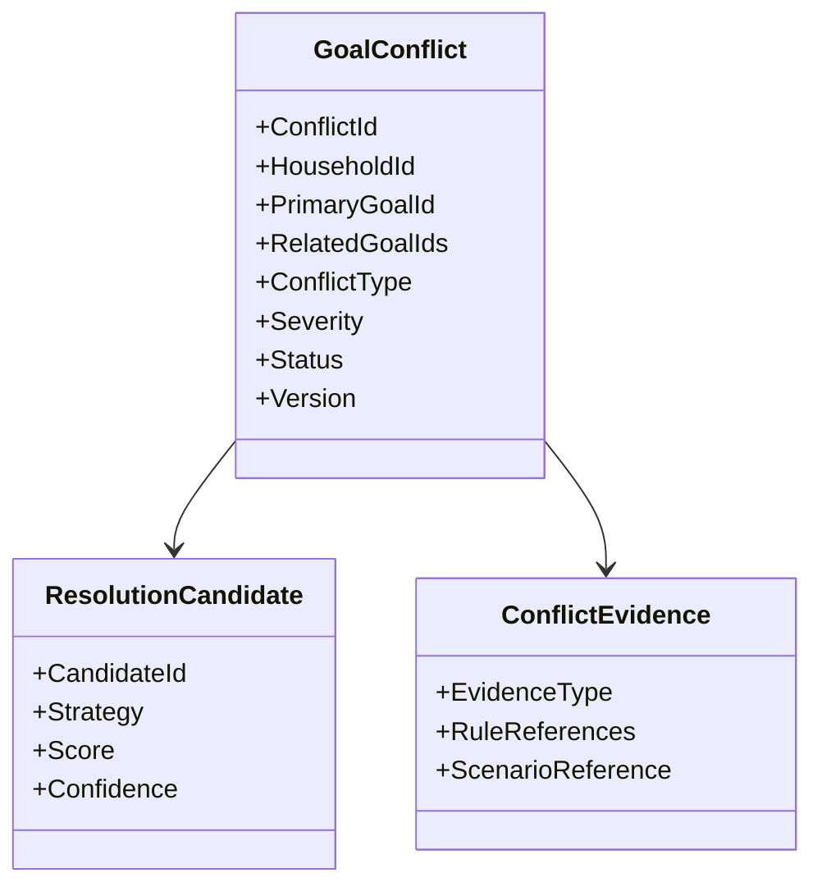
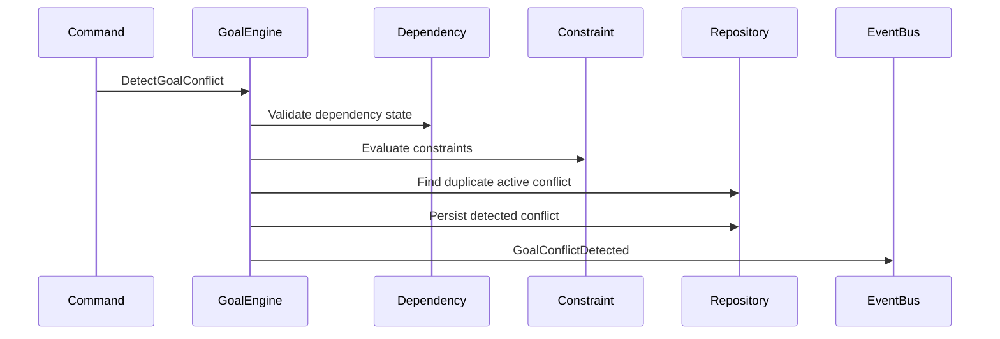
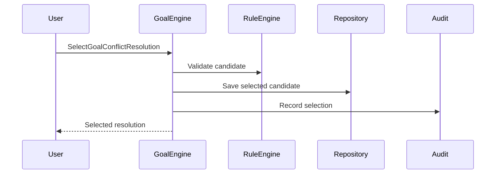
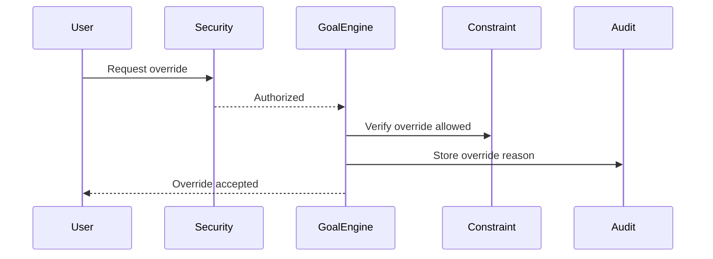
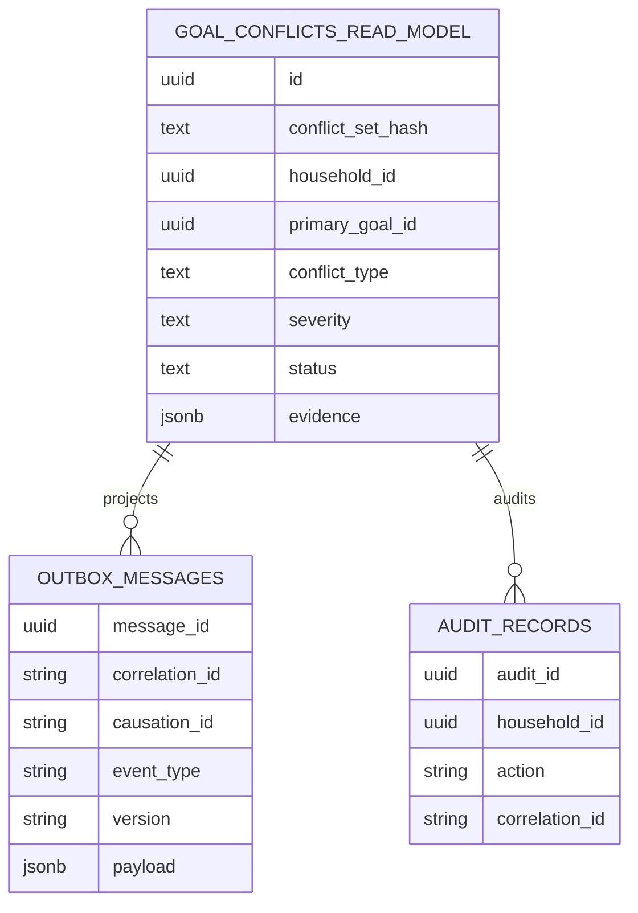
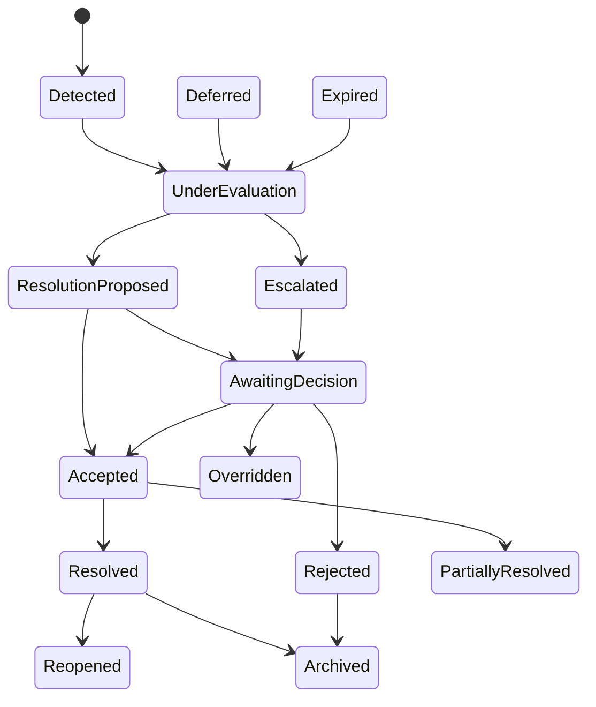
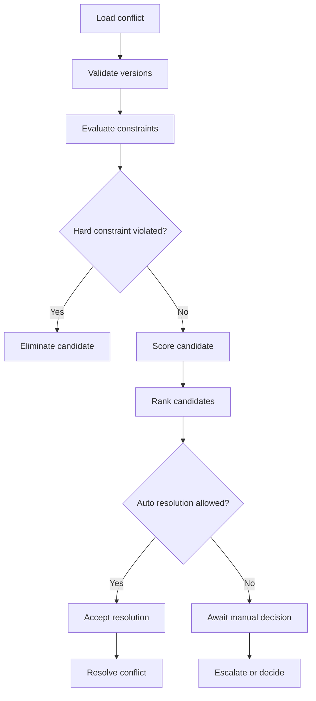
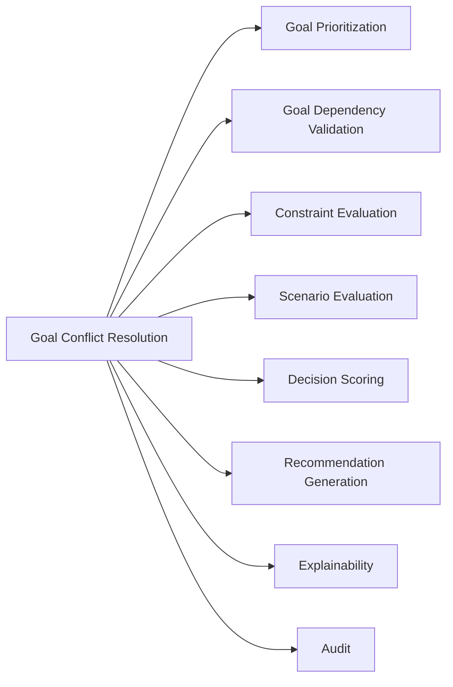

# Goal Conflict Resolution
## Split Navigation
- [Goal conflict detection](goal-conflict-resolution/detection-and-classification.md)
- [Goal conflict resolution workflow](goal-conflict-resolution/resolution-workflow.md)
- [Goal conflict governance and testing](goal-conflict-resolution/governance-and-testing.md)

## Document Control

Document Name: Goal Conflict Resolution

Document Path: knowledge/goal-conflict-resolution.md

Document Type: Enterprise Specification

Version: 1.0

Status: Canonical Specification

Domain: Goal Conflict Resolution

Bounded Context: Financial Profile and Decision

Owners: Project Atlas

Reviewers: Decision Engine, Recommendation, Scenario Engine, GoalApplicationService

Approval Authority: Project Atlas Knowledge Base Governance

Last Updated: 2026-07-12

Related Specifications:

- knowledge/goal-prioritization.md
- knowledge/goal-dependency.md
- knowledge/goal-lifecycle.md
- knowledge/life-goals.md
- knowledge/scenario-framework.md
- knowledge/decision-principles.md
- knowledge/decision-rule-catalog.md
- knowledge/domain-rule-catalog.md
- knowledge/constraint-rules.md
- knowledge/scoring-model.md
- knowledge/recommendation-priority-framework.md
- knowledge/command-catalog.md
- knowledge/domain-event-catalog.md
- knowledge/repository-catalog.md
- knowledge/domain-service-catalog.md
- knowledge/application-service-catalog.md
- knowledge/entity-catalog.md
- knowledge/value-object-catalog.md
- knowledge/enumeration-catalog.md

Source of Truth: Atlas Knowledge Base

Change Policy: Additive changes preserve historical replay and audit compatibility.

Catalog Alignment Decision: GoalConflict is not a standalone Aggregate, Entity, or Repository in the current Atlas Catalog. This specification treats conflict data as GoalPlan-owned conflict state plus read model projections. Mutations are GoalApplicationService use cases over GoalPlan. Published messages use canonical event metadata and remain GoalApplicationService events until the Domain Event Catalog adds goal-conflict-specific names.

# Catalog Alignment Summary

| Concern | Current Atlas Catalog Result | Final Atlas Name | Defined Here or Referenced | Implementation Artifact | Status |
|---|---|---|---|---|---|
| Domain | Domain Model Catalog includes Goals | Goals | Referenced | Goal domain behavior | Aligned |
| Bounded Context | Bounded Context Catalog lists Financial Profile and Decision | Financial Profile and Decision | Referenced | Goal conflict detection and decision coordination | Aligned |
| Module | Service Catalog lists GoalApplicationService | GoalApplicationService | Referenced | Application service | Aligned |
| Aggregate | Aggregate Catalog lists GoalPlan | GoalPlan | Referenced | Aggregate root | Aligned |
| Entity | Entity Catalog lists Goal | Goal | Referenced | Goal entity | Aligned |
| Conflict record | Not a Catalog entity | GoalPlan conflict state | Defined as owned state | GoalPlan internal record and read model | Aligned |
| Value Objects | Value Object Catalog does not list ConflictEvidence or ResolutionCandidate | JSON evidence and candidate records | Defined as persisted state shape | Owned data inside GoalPlan/read model | Aligned |
| Enumeration | Enumeration Catalog includes GoalStatus, RiskLevel, RecommendationPriority | Existing enums only | Referenced | String fields until Catalog enum exists | Aligned |
| Commands | Command Catalog does not list Goal conflict commands | GoalApplicationService use cases | Defined here | Application request handlers | Aligned |
| Domain Events | Domain Event Catalog standardizes metadata; Message Contract Catalog standardizes message fields | GoalApplicationService event messages | Defined here using metadata standard | Outbox messages | Aligned |
| Repository | Repository Catalog lists GoalRepository only | GoalRepository | Referenced | GoalPlan persistence | Aligned |
| Read Model | Repository Catalog allows query separation by aggregate repositories only | Goal conflict read model | Defined here | Projection, not aggregate repository | Aligned |
| Domain Services | Domain Service Catalog lists DecisionService, ScoringService, ScenarioService, ExplainabilityService, RiskService | Existing services | Referenced | Domain service collaboration | Aligned |
| Application Services | Service Catalog lists GoalApplicationService | GoalApplicationService | Referenced | Use case owner | Aligned |
| API Resource | API Governance defines resource URLs; no API catalog exists | /api/v1/goals/conflicts | Defined here | Goal resource subresource | Aligned |
| DTO | Message Contract Catalog defines standard fields only | Goal conflict request and response contracts | Defined here | API contracts | Aligned |
| Permissions | Permission Framework includes Goal, Decision, Policy resource types and actions | Goal:Read, Goal:Update, Decision:Approve, Goal:Restore | Referenced | Authorization checks | Aligned |
| Error Codes | API Governance defines error shape; no central error code list | GCR-ERR-* | Defined here | Module-local error codes | Aligned |
| Database Table | Database Catalog absent for Goal conflict table | goal_conflicts_read_model | Defined here | Read model table | Aligned |
| Outbox | Message Contract Catalog defines message fields | Outbox message | Referenced | Event publication | Aligned |
| Audit Record | Audit framework exists as knowledge file; Audit aggregate exists | AuditRepository | Referenced | Audit records | Aligned |
| Cache Keys | CacheService listed | Goal conflict cache keys | Defined here | CacheService keys | Aligned |
| Metrics | No metric catalog | Goal conflict metrics | Defined here | Observability metrics | Aligned |
| Scoring Model | Scoring Model defines 0 to 100 scoring | Normalized score | Referenced | Score interpretation only | Aligned |
| State Machine | Enumeration Catalog lacks conflict states | Conflict status string values | Defined here | Read model and use case state | Aligned |

# Non-Catalog Implementation Decision

GoalConflict, ConflictEvidence, ConflictScore, ConflictSet, ResolutionCandidate, ResolutionStrategy, ConflictExplanation, and ConflictSetHash are not promoted to Atlas Catalog Domain objects in this specification.

They are implementation-level records inside GoalPlan state, read model projections, API contracts, or audit payloads.

A dedicated conflict repository is not introduced. Conflict persistence uses GoalRepository for GoalPlan mutations and read model query mechanisms for search.

# Purpose

Goal Conflict Resolution defines how Project Atlas detects, evaluates, explains, resolves, audits, and reopens conflicts between Goals.

It exists because financial Goals compete for cash flow, liquidity, debt capacity, investment capacity, risk capacity, timeline, dependency order, household commitments, and regulatory constraints.

It is not Goal.

It is not Goal Priority.

It is not Goal Dependency.

It is not Goal Lifecycle.

It is not Recommendation.

It is the deterministic resolution layer that decides how incompatible Goal intents are handled before Decision, Recommendation, Scenario, ExecutionPlan, and Workflow actions proceed.

# Business Context

Project Atlas is a Life Financial Decision Operating System.

The user may want Housing, Education, Retirement, Investment, Family, Lifestyle, and Dream Goals at the same time.

These Goals may be individually valid but mutually infeasible.

A conflict exists when satisfying one Goal materially harms another Goal, violates a Constraint Rule, breaks dependency order, exceeds Budget, creates negative CashFlow, exceeds Risk capacity, or contradicts an accepted Decision.

Goal Conflict Resolution protects financial safety before optimization.

It preserves Hard Constraint, Legal Constraint, Liquidity Constraint, Dependency Constraint, and Mandatory Goal integrity.

It prevents contradictory Recommendations from reaching execution.

It provides explainability for why one Goal is maintained, deferred, reduced, accelerated, sequenced, suspended, archived, or escalated.

# Scope

In Scope:

- Detecting Goal conflicts.
- Classifying conflict type.
- Calculating conflict severity.
- Generating resolution candidates.
- Evaluating resolution candidates.
- Selecting deterministic default resolution when allowed.
- Requiring manual decision when business rules require.
- Persisting conflict state.
- Publishing conflict Domain Events.
- Producing explanation and audit data.
- Reopening conflicts after material changes.

Out of Scope:

- Creating new Goal categories.
- Creating new Atlas aggregates without Catalog approval.
- Replacing Goal Prioritization.
- Replacing Goal Dependency.
- Replacing Goal Lifecycle.
- Replacing Decision Engine.
- Replacing Recommendation Engine.
- Replacing Scenario Engine.
- Bypassing Constraint Rules.
- Executing Workflow tasks.

Upstream Dependencies:

- Goal Prioritization.
- Goal Dependency.
- Goal Lifecycle.
- Constraint Rules.
- Decision Rule Catalog.
- Domain Rule Catalog.
- Scenario outputs.
- Recommendation Priority.
- Scoring Model.

Downstream Consumers:

- GoalApplicationService.
- Decision Engine.
- Recommendation Engine.
- Scenario Engine.
- Projection Engine.
- Optimization Engine.
- Execution Plan Engine.
- Workflow Engine.
- Audit.
- Security.
- Reporting.

Ownership Boundary: GoalPlan aggregate ownership is confirmed in Aggregate Catalog. Conflict state is GoalPlan-owned and projected to read models for search.

Transaction Boundary: Conflict state mutation and event publication must correspond to a single committed state change.

Consistency Boundary: Household scope and GoalPlan scope.

# Terminology

Goal Conflict: A detected incompatibility between two or more Goals or Goal-related decisions.

Conflicting Goal: A Goal participating in a Conflict Set.

Conflict Set: The complete set of Goals and references involved in one conflict.

Conflict Category: The classified reason for conflict.

Conflict Severity: The impact level used to decide blocking, escalation, or automatic resolution.

Conflict Constraint: A Constraint Rule, Decision Rule, dependency, or financial condition causing the conflict.

Resolution Candidate: A possible action that may resolve or reduce the conflict.

Resolution Strategy: A named approach applied to a candidate.

Resolution Outcome: The final result after evaluation, decision, and persistence.

Manual Override: Authorized human decision to accept risk within permitted boundaries.

Conflict Evidence: Data proving why conflict exists.

Conflict Explanation: User-facing, expert-facing, and audit-facing reason structure.

Conflict Decision: Accepted, rejected, overridden, deferred, escalated, or resolved decision over conflict.

Unresolved Conflict: Conflict that remains active or partially resolved.

Catalog Note: Terms absent from Atlas Catalog are treated as specification-local labels for GoalPlan state, read models, API contracts, or audit payloads, not as new Domain objects.

# Business Meaning

Goal Conflict Resolution determines whether Goal priority is enough to proceed.

It determines whether lower-priority Goals must be deferred.

It determines whether a Goal must be blocked due to mandatory constraints.

It preserves Goal intent while protecting household safety.

It preserves accepted Decisions unless re-evaluation is required.

It prevents mutually inconsistent Recommendations.

It connects Scenario, Decision, Recommendation, Constraint Rule, Goal Dependency, and Goal Lifecycle.

# Responsibilities

1. Detect conflicts among active and candidate Goals.
2. Detect conflicts among Goal, Scenario, Decision, and Recommendation references.
3. Classify conflict category and severity.
4. Build conflict evidence.
5. Deduplicate conflicts.
6. Correlate conflicts across commands and events.
7. Generate resolution candidates.
8. Remove candidates that violate Hard Constraints.
9. Rank candidates deterministically.
10. Select allowed automatic resolution.
11. Require manual decision when automatic resolution is prohibited.
12. Explain selected and rejected candidates.
13. Persist conflict state.
14. Publish Domain Events.
15. Reopen conflicts on material change.
16. Archive resolved history.
17. Enforce authorization.
18. Enforce idempotency.
19. Preserve audit trail.
20. Support replay and historical reporting.

# Domain Ownership

Primary Domain: Goals.

Primary Bounded Context: Financial Profile and Decision.

Aggregate Root: GoalPlan is confirmed.

Entity Ownership: Goal is confirmed. Goal conflict data is GoalPlan-owned state, not a standalone Entity.

Value Object Ownership: Existing Value Object Catalog entries are used where applicable. ConflictEvidence, ResolutionCandidate, ConflictExplanation, and ConflictScore are JSON-compatible state records, not Catalog Value Objects.

Decision Ownership: DecisionSession is confirmed in Aggregate Catalog.

Recommendation Ownership: Recommendation is confirmed in Aggregate Catalog.

Scenario Ownership: Scenario is confirmed in Aggregate Catalog.

Repository Ownership: GoalRepository persists GoalPlan. Goal conflict search uses read model query access, not a new aggregate repository.

Event Publishing Ownership: GoalApplicationService publishes conflict event messages using Domain Event Catalog metadata standards.

# Conflict Model

Conflict Identity: Stable ConflictId.

Conflict Set: PrimaryGoalId plus RelatedGoalIds.

Primary Goal: Goal with highest direct conflict trigger.

Related Goals: Goals affected by the conflict.

Detected Constraints: Constraint references and Decision Rule references.

Evidence: Financial, timeline, dependency, scenario, recommendation, and audit data.

Severity: Low, Medium, High, Critical as specification-local severity values mapped to scoring and Constraint Rule severity.

Status: Conflict lifecycle status as specification-local read model state.

Resolution Candidates: Candidate actions with score and explanation.

Selected Resolution: Final selected strategy or no feasible resolution.

Decision Reference: DecisionSessionId when related.

Recommendation Reference: RecommendationId when related.

Scenario Reference: ScenarioId when related.

Audit Metadata: Actor, timestamp, correlation, causation, rule version, formula version.

Versioning: Conflict version and candidate version.

Concurrency Token: Required for state mutation.

# Conflict Taxonomy

| Conflict Type | Definition | Detection Condition | Required Evidence | Severity Factors | Constraint Type | Eligible Strategies | Ineligible Strategies | Escalation Condition | Example | Audit Requirement |
|---|---|---|---|---|---|---|---|---|---|---|
| Priority Conflict | Goals have incompatible priority outcomes. | Two Goals require same resource and both rank high. | Priority scores. | Score gap, urgency. | Soft | Sequence, Defer, Reallocate Funding. | Silent removal. | Equal Critical priority. | Retirement vs Education. | Score audit. |
| Timeline Conflict | Goal dates cannot both be met. | Target dates overlap with insufficient funding. | Dates, funding plan. | Deadline, penalty. | Soft or Hard | Change Target Date, Sequence Goals. | Ignore deadline. | Legal deadline. | Tax vs Travel. | Timeline audit. |
| Funding Conflict | Required funding exceeds available Budget. | Sum funding need exceeds available Budget. | Budget, amounts. | Gap size. | Soft or Hard | Reallocate Funding, Reduce Scope. | Overspend. | Mandatory Goal unfunded. | Housing vs Education. | Budget audit. |
| Cash Flow Conflict | Monthly contribution creates negative CashFlow. | Monthly Net Cashflow below required level. | CashFlow projection. | Deficit duration. | Hard when persistent. | Reduce Contribution, Defer. | Increase spending. | Insolvent path. | Mortgage vs Investment. | CashFlow audit. |
| Liquidity Conflict | Goal consumes required liquidity. | Emergency Fund below policy after funding. | Emergency Fund Months. | Liquidity gap. | Hard or Soft | Defer, Reduce Scope. | Drain reserve. | Below minimum reserve. | Dream vs Emergency. | Liquidity audit. |
| Resource Conflict | Goals require same limited resource. | Resource allocation exceeds capacity. | Resource plan. | Scarcity. | Soft | Sequence, Defer. | Double allocate. | Critical resource. | Time capacity. | Resource audit. |
| Dependency Conflict | Dependency order is violated. | Child proceeds before Parent satisfied. | Dependency graph. | Dependency weight. | Hard or Soft | Sequence Goals, Change Dependency. | Ignore Hard Dependency. | Hard dependency. | Investment before Emergency Fund. | Dependency audit. |
| Circular Dependency Conflict | Dependency graph contains cycle. | Cycle detection positive. | Cycle path. | Cycle scope. | Hard | Reject, Change Dependency. | Execute cycle. | Any cycle. | A depends B depends A. | Cycle audit. |
| Risk Conflict | Combined Goals exceed Risk capacity. | RiskLevel exceeds policy. | Risk assessment. | Severity, reversibility. | Soft or Hard | Reduce Scope, Defer. | Increase risk. | Red RiskLevel. | Leveraged investment. | Risk audit. |
| Debt Capacity Conflict | Goals exceed debt capacity. | DTI or debt service exceeds threshold. | Loan and liability data. | Debt ratio. | Hard or Soft | Defer, Reduce Scope. | Add debt. | Hard DTI breach. | Home vs car. | Debt audit. |
| Portfolio Allocation Conflict | Goal causes allocation drift. | Allocation Drift exceeds tolerance. | Portfolio data. | Drift size. | Soft | Rebalance, Reduce Scope. | Concentrate further. | IPS hard limit. | Stock concentration. | Portfolio audit. |
| Scenario Conflict | Scenario results disagree or fail. | Scenario output invalid or Red risk. | Scenario results. | Safety margin. | Hard or Soft | Reevaluate, Defer. | Use invalid scenario. | Invalid scenario. | Early retirement fails stress. | Scenario audit. |
| Constraint Conflict | Constraint Rule is triggered. | Constraint result Fail. | Rule result. | Severity. | Hard, Soft, Advisory | Follow constraint rule. | Bypass Hard. | Hard constraint. | Regulatory restriction. | Rule audit. |
| Mandatory Goal Conflict | Mandatory Goal competes with discretionary Goal. | Mandatory need unfunded. | Goal category and need. | Need level. | Hard or Soft | Defer discretionary. | Remove mandatory. | Mandatory unfunded. | Insurance vs Lifestyle. | Mandatory audit. |
| Household Goal Conflict | Household and individual intent conflict. | Household capacity insufficient. | Household commitments. | Household safety. | Soft | Manual Decision, Sequence. | Silent override. | Household safety risk. | Parent support vs travel. | Household audit. |
| Tax Conflict | Tax outcome conflicts with Goal timing. | Tax deadline or saving conflict. | Tax data. | Penalty. | Hard or Soft | Accelerate, Defer. | Miss legal date. | Legal tax deadline. | Tax payment vs vacation. | Tax audit. |
| Regulatory Conflict | Legal or regulatory rule blocks resolution. | Regulatory rule triggered. | Rule reference. | Legal impact. | Hard | Reject, Escalate. | Override automatically. | Any legal violation. | Restricted product. | Legal audit. |
| Execution Conflict | ExecutionPlan cannot run concurrently. | Execution dependency or capacity conflict. | ExecutionPlan data. | Blocker. | Soft or Hard | Sequence, Suspend. | Execute both. | Hard blocker. | Two funding actions. | Execution audit. |
| Recommendation Conflict | Recommendations contradict. | Recommendations propose incompatible actions. | Recommendation IDs. | Score gap. | Soft | Replace Recommendation, Require Manual Decision. | Execute both. | Critical contradiction. | Buy vs sell. | Recommendation audit. |
| State Conflict | Goal lifecycle state disallows action. | GoalStatus invalid for resolution. | Goal state. | Terminal state. | Hard | Reopen, Archive, Reject. | Mutate Archived. | Archived Goal. | Resolve archived. | Lifecycle audit. |
| Currency Conflict | Goals use incompatible currencies. | Currency mismatch without conversion. | CurrencyCode data. | FX risk. | Soft or Hard | Convert, Reevaluate. | Mix unconverted. | Missing FX rate. | USD asset vs TWD goal. | Currency audit. |
| Assumption Conflict | Assumptions differ across scenarios. | Version mismatch or incompatible assumption set. | Assumption versions. | Materiality. | Soft | Reevaluate, Align assumptions. | Compare incompatible. | Critical assumption missing. | Return assumption mismatch. | Assumption audit. |
| Data Quality Conflict | Required data is incomplete or stale. | Missing or stale inputs. | Data completeness. | Confidence. | Soft or Hard | Reevaluate, Escalate. | Decide silently. | Missing mandatory data. | Missing income. | Data audit. |

# Conflict Detection

Detection Trigger:

- Goal created.
- Goal updated.
- Goal activated.
- Goal deferred.
- Goal dependency changed.
- Goal priority recalculated.
- Scenario evaluated.
- Recommendation generated.
- Recommendation accepted.
- Decision accepted.
- Constraint triggered.
- Budget changed.
- CashFlow changed.
- Portfolio changed.
- Loan changed.
- Insurance changed.

Detection Timing:

- Synchronous during mutating commands when conflict would block operation.
- Asynchronous after material events when conflict does not block immediate consistency.
- Scheduled re-evaluation for stale or unresolved conflicts.

Synchronous Detection:

- Validate command.
- Load current Goal versions.
- Evaluate Hard Constraints.
- Evaluate Goal Dependency.
- Evaluate Budget and CashFlow.
- Reject or block before mutation when required.

Asynchronous Detection:

- Consume Domain Events.
- Load affected Goals.
- Recalculate conflict candidates.
- Publish GoalConflictDetected or GoalConflictReevaluated.

Command-triggered Detection:

- DetectGoalConflict.
- ReevaluateGoalConflict.
- ProposeGoalConflictResolution.
- AcceptGoalConflictResolution.

Event-triggered Detection:

- GoalActivated.
- GoalDeferred.
- GoalPriorityChanged.
- GoalDependencyBlocked.
- ScenarioEvaluated.
- RecommendationGenerated.
- DecisionAccepted.
- HardConstraintTriggered.

Duplicate Detection:

- Same HouseholdId.
- Same PrimaryGoalId.
- Same RelatedGoalIds.
- Same ConflictType.
- Same ScenarioId when scenario-specific.
- Same active status.

Conflict Correlation:

- CorrelationId links command journey.
- CausationId links source command or event.
- ConflictSetHash deduplicates active conflict sets.

Conflict Deduplication:

- Existing active conflict is updated or reevaluated.
- Duplicate event does not create duplicate conflict.
- Resolved conflict reopens only on material change.

Stale Conflict Detection:

- Conflict is stale when Goal version, Scenario version, Recommendation version, Decision version, or rule version changes.

False Positive Handling:

- Mark conflict Rejected when evidence fails.
- Preserve audit.
- Do not delete historical detection.

# Conflict Severity

Severity Levels:

- Low.
- Medium.
- High.
- Critical.

Severity values are specification-local and must not be treated as Enumeration Catalog members until the Enumeration Catalog is explicitly extended.

Severity Calculation:

```text
Conflict Severity Score = clamp(
    0.25 * Constraint Impact
  + 0.20 * Financial Impact
  + 0.15 * Time Sensitivity
  + 0.15 * Dependency Propagation
  + 0.10 * Irreversibility
  + 0.10 * User Impact
  + 0.05 * Confidence,
  0,
  100
)
```

Severity Mapping:

- 0 to 39 = Low.
- 40 to 59 = Medium.
- 60 to 84 = High.
- 85 to 100 = Critical.

Severity Escalation:

- Hard Constraint violation escalates to Critical.
- Regulatory conflict escalates to Critical.
- Circular Dependency escalates to High or Critical.
- Negative sustainable CashFlow escalates to Critical.
- Missing mandatory data escalates according to Data Integrity priority.

Severity Downgrade:

- Conflict resolved by updated data.
- Conflict evidence becomes non-material.
- Scenario result becomes feasible.
- Dependency readiness improves.

Hard Constraint Override:

- Automatic override is prohibited.
- Manual override is prohibited when legal or regulatory rule forbids it.
- Manual override requires authorization and audit when allowed.

Missing Data Impact:

- Missing mandatory data blocks automatic resolution.
- Missing optional data lowers confidence.

# Conflict Status and Lifecycle

| Status | Meaning | Entry Condition | Allowed Actions | Exit Condition | Invariant | Timeout | Audit |
|---|---|---|---|---|---|---|---|
| Detected | Conflict identified. | Detection succeeds. | Evaluate, defer, archive. | Evaluation begins. | Evidence exists. | Configured. | Required. |
| Under Evaluation | Rules and candidates are evaluated. | Evaluation starts. | Propose, escalate, reject. | Candidate result exists. | Versions locked. | Configured. | Required. |
| Resolution Proposed | Candidate proposed. | Candidate generated. | Select, reject, override. | Selection occurs. | Candidate version exists. | Candidate expiration. | Required. |
| Awaiting Decision | Manual decision required. | Auto resolution prohibited. | Accept, reject, override, escalate. | Decision made. | Actor required. | Configured. | Required. |
| Accepted | Resolution accepted. | Accept command succeeds. | Resolve, partial resolve. | Application succeeds. | Accepted decision immutable. | None. | Required. |
| Rejected | Candidate rejected. | Reject command succeeds. | Reevaluate, archive. | New evidence exists. | Reason required. | None. | Required. |
| Overridden | Authorized override applied. | Override command succeeds. | Resolve, escalate, archive. | Override applied. | Reason and permission required. | None. | Required. |
| Resolved | Conflict fully resolved. | Resolution succeeds. | Archive, reopen. | Material change. | Outcome immutable. | None. | Required. |
| Partially Resolved | Some Goals remain conflicting. | Partial application succeeds. | Reevaluate, resolve, escalate. | Remaining conflict resolved. | Remaining evidence exists. | Configured. | Required. |
| Deferred | Resolution postponed. | Defer command succeeds. | Reevaluate, escalate, archive. | Resume date or material change. | Deferral reason exists. | Resume date. | Required. |
| Escalated | Manual or policy authority required. | No feasible automatic result. | Decide, override, reject. | Authority decides. | Escalation reason exists. | Configured. | Required. |
| Expired | Candidate or conflict window expired. | Expiration reached. | Reevaluate, archive. | New evidence. | Expiration reason exists. | None. | Required. |
| Reopened | Previously resolved conflict active again. | Material change. | Evaluate. | Evaluation begins. | Prior resolution retained. | Configured. | Required. |
| Archived | Read-only history. | Archive command succeeds. | Restore when allowed. | Restore command succeeds. | Immutable unless restored. | Retention policy. | Required. |

# State Machine

State Transition Contract:

| State | Transition | Trigger | Guard | Side Effect | Domain Event | Illegal Transition | Recovery |
|---|---|---|---|---|---|---|---|
| Detected | Under Evaluation | ReevaluateGoalConflict | Evidence valid | Lock versions | GoalConflictReevaluated | Detected to Resolved | Reevaluate |
| Under Evaluation | Resolution Proposed | ProposeGoalConflictResolution | Candidate exists | Store candidates | GoalConflictResolutionProposed | Under Evaluation to Accepted | Propose first |
| Under Evaluation | Escalated | ProposeGoalConflictResolution | No feasible candidate | Escalate | GoalConflictEscalated | Under Evaluation to Resolved | Manual decision |
| Resolution Proposed | Awaiting Decision | SelectGoalConflictResolution | Manual required | Mark decision wait | GoalConflictResolutionSelected | Proposed to Archived | Decide first |
| Resolution Proposed | Accepted | AcceptGoalConflictResolution | Auto allowed or actor accepts | Store selected candidate | GoalConflictResolutionAccepted | Proposed to Resolved | Accept first |
| Awaiting Decision | Accepted | AcceptGoalConflictResolution | Authorized actor | Accept | GoalConflictResolutionAccepted | Awaiting to Archived | Decide |
| Awaiting Decision | Rejected | RejectGoalConflictResolution | Reason exists | Reject | GoalConflictResolutionRejected | Awaiting to Resolved | Reevaluate |
| Awaiting Decision | Overridden | OverrideGoalConflictResolution | Permission and reason | Override | GoalConflictResolutionOverridden | Awaiting to Resolved without reason | Escalate |
| Accepted | Resolved | ResolveGoalConflict | Application complete | Close conflict | GoalConflictResolved | Accepted to Archived | Resolve |
| Accepted | Partially Resolved | ResolveGoalConflict | Some goals remain | Keep active subset | GoalConflictPartiallyResolved | Accepted to Detected | Reevaluate |
| Resolved | Reopened | ReopenGoalConflict | Material change | Reopen | GoalConflictReopened | Resolved to Accepted | Reevaluate |
| Deferred | Under Evaluation | ReevaluateGoalConflict | Resume or material change | Evaluate | GoalConflictReevaluated | Deferred to Resolved | Evaluate |
| Escalated | Awaiting Decision | EscalateGoalConflict | Authority assigned | Notify | GoalConflictEscalated | Escalated to Resolved | Decide |
| Expired | Under Evaluation | ReevaluateGoalConflict | New evidence | Evaluate | GoalConflictReevaluated | Expired to Accepted | Propose |
| Resolved | Archived | ArchiveGoalConflict | Retention allowed | Archive | GoalConflictArchived | Resolved to Detected | Reopen |

# Resolution Principles

1. Legal Compliance always prevails.
2. Hard Constraint Preservation always prevails.
3. Mandatory Goal Protection precedes discretionary optimization.
4. Minimum Liquidity Protection precedes investment expansion.
5. Household Safety precedes individual preference.
6. Existing Commitment Preservation precedes new Recommendation when feasible.
7. Goal Intent Preservation is required when no safety rule is violated.
8. Dependency Integrity must be preserved.
9. Financial Sustainability must be preserved.
10. Risk Capacity must not be exceeded.
11. User Preference is applied after mandatory rules.
12. Higher Priority wins when constraints are equal.
13. Higher Urgency wins when priority is equal.
14. Reversible resolution is preferred when outcomes are uncertain.
15. Lower Cost of Delay is considered after safety.
16. Opportunity Cost is considered after liquidity.
17. Tax Impact cannot override legal compliance.
18. Execution Feasibility is mandatory before acceptance.
19. Explainability is required.
20. Auditability is required.
21. Least Disruptive Change is preferred.
22. Manual Decision Authority is required when policy disallows automation.

# Resolution Strategy Catalog

| Strategy | Business Meaning | Preconditions | Eligible Conflict Types | Ineligible Conflict Types | Permission | Financial Effect | Timeline Effect | Dependency Effect | Risk Effect | Lifecycle Effect | Reversible | Approval | Generated Commands | Generated Events | Audit Data | Example |
|---|---|---|---|---|---|---|---|---|---|---|---|---|---|---|---|---|
| Maintain | Keep current Goals unchanged. | Conflict non-material. | Low severity. | Hard Constraint. | User or system. | None. | None. | None. | None. | None. | Yes. | No. | ResolveGoalConflict. | GoalConflictResolved. | Reason. | Equal low impact. |
| Defer | Postpone lower Goal. | Deferrable Goal exists. | Funding, Timeline. | Legal deadline. | User or system. | Frees budget. | Delays Goal. | May satisfy parent. | Lowers risk. | GoalDeferred. | Yes. | Sometimes. | DeferGoalConflict. | GoalConflictDeferred. | Deferral reason. | Travel deferred. |
| Accelerate | Move higher Goal earlier. | Budget allows. | Deadline, Tax. | CashFlow deficit. | User. | Increases near-term use. | Earlier date. | May unblock child. | Varies. | GoalActivated. | Sometimes. | Yes. | AcceptGoalConflictResolution. | GoalConflictResolutionAccepted. | Reason. | Tax deadline. |
| Reduce Scope | Lower target amount or scope. | Scope can change. | Funding, Risk. | Mandatory minimum. | User. | Lowers amount. | May preserve date. | Varies. | Lowers risk. | Goal updated. | Yes. | Yes. | SelectGoalConflictResolution. | GoalConflictResolutionSelected. | Scope evidence. | Smaller home. |
| Increase Funding | Add contribution. | CashFlow available. | Funding. | Negative CashFlow. | User. | Higher contribution. | Faster completion. | None. | May raise risk. | In Progress. | Yes. | Yes. | AcceptGoalConflictResolution. | GoalConflictResolutionAccepted. | Funding source. | Extra savings. |
| Reallocate Funding | Move funding from lower Goal. | Lower Goal deferrable. | Funding, Liquidity. | Mandatory Goal removal. | User or system. | Shifts budget. | Varies. | Varies. | Varies. | GoalDeferred. | Yes. | Yes. | ResolveGoalConflict. | GoalConflictResolved. | Allocation. | Education first. |
| Sequence Goals | Apply dependency order. | Valid dependency order. | Dependency, Execution. | Circular dependency. | System. | Ordered. | Ordered. | Preserves DAG. | Lowers risk. | Multiple state effects. | Yes. | No. | ResolveGoalConflict. | GoalConflictResolved. | Order. | Emergency then investment. |
| Split Goal | Divide into phases. | Goal divisible. | Funding, Timeline. | Atomic legal Goal. | User. | Phased funding. | Phased. | Existing Goal remains source of truth. | Lowers risk. | GoalPlan state update. | Sometimes. | Yes. | GoalApplicationService use case. | GoalApplicationService event message. | Split reason. | Renovation phases. |
| Merge Goal | Combine overlapping Goals. | Duplicate intent. | Duplicate, Funding. | Distinct mandatory Goals. | User. | Consolidated. | Consolidated. | Simplifies. | Varies. | GoalPlan state update. | Sometimes. | Yes. | GoalApplicationService use case. | GoalApplicationService event message. | Merge reason. | Two travel goals. |
| Change Target Date | Move date. | Date flexible. | Timeline, Funding. | Legal deadline. | User. | Varies. | Date shift. | Varies. | Varies. | Goal updated. | Yes. | Yes. | SelectGoalConflictResolution. | GoalConflictResolutionSelected. | Date reason. | Home later. |
| Change Target Amount | Change amount. | Amount flexible. | Funding, Risk. | Mandatory minimum. | User. | Amount shift. | Varies. | Varies. | Varies. | Goal updated. | Yes. | Yes. | SelectGoalConflictResolution. | GoalConflictResolutionSelected. | Amount reason. | Reduce car budget. |
| Change Contribution | Change recurring amount. | CashFlow supports. | CashFlow, Funding. | Hard deficit. | User. | Contribution shift. | Completion shift. | None. | Varies. | Goal updated. | Yes. | Yes. | SelectGoalConflictResolution. | GoalConflictResolutionSelected. | Contribution. | Lower ETF contribution. |
| Change Dependency | Adjust dependency edge. | Dependency valid. | Dependency. | Hard dependency without evidence. | Authorized. | Varies. | Varies. | Changes DAG. | Varies. | Dependency event. | Yes. | Yes. | Requires Catalog validation. | GoalDependencyUpdated. | Dependency reason. | Soft dependency. |
| Suspend | Pause execution. | In Progress conflict. | Execution, CashFlow. | Legal mandate. | User or system. | Stops outflow. | Delays. | May block child. | Lowers risk. | On Hold. | Yes. | Sometimes. | DeferGoalConflict. | GoalConflictDeferred. | Suspend reason. | Pause renovation. |
| Archive | Close conflict history. | Terminal conflict. | Resolved, Rejected. | Active conflict. | System or user. | None. | None. | None. | None. | Archived. | Restore when allowed. | No. | ArchiveGoalConflict. | GoalConflictArchived. | Archive reason. | Historical closure. |
| Replace Recommendation | Suppress conflicting Recommendation. | Replacement available. | Recommendation. | Accepted Decision without review. | System or user. | Varies. | Varies. | None. | Varies. | Recommendation updated. | Yes. | Sometimes. | AcceptRecommendation or RejectRecommendation. | RecommendationGenerated. | Replacement reason. | Delay buy home. |
| Require Manual Decision | Ask authorized actor. | Automation prohibited. | High, Critical. | None. | Authorized user. | Unknown. | Unknown. | Unknown. | Unknown. | Awaiting Decision. | Yes. | Yes. | EscalateGoalConflict. | GoalConflictEscalated. | Decision reason. | Equal mandatory goals. |
| Escalate | Raise to authority. | No feasible auto result. | Critical. | None. | System. | None. | None. | None. | None. | Escalated. | Yes. | Yes. | EscalateGoalConflict. | GoalConflictEscalated. | Escalation. | Legal issue. |
| No Feasible Resolution | Mark unresolved. | All candidates eliminated. | Critical, Hard. | None. | System. | None. | None. | None. | None. | Escalated. | No. | Yes. | ProposeGoalConflictResolution. | GoalConflictEscalated. | Candidate audit. | Insolvent plan. |

# Resolution Candidate Generation

Candidate Inputs:

- Conflict evidence.
- Goal Priority.
- Goal Dependency.
- Goal Lifecycle state.
- Constraint results.
- Scenario outputs.
- Decision references.
- Recommendation references.
- Budget.
- CashFlow.
- Portfolio.
- Loan.
- Insurance.
- Household commitments.

Candidate Generation Rules:

- Generate candidates only for current Goal versions.
- Exclude archived Goals unless active dependency references them.
- Exclude candidates that violate Hard Constraints.
- Exclude candidates that violate Regulatory constraints.
- Exclude candidates without required permission.
- Preserve accepted Decisions unless re-evaluation is required.
- Preserve Mandatory Goals.
- Preserve minimum liquidity.

Candidate Filtering:

- Hard Constraint Elimination.
- Dominated Candidate Elimination.
- Missing Data Elimination.
- Permission Elimination.
- Expired Candidate Elimination.
- Duplicate Candidate Elimination.

Candidate Ranking:

```text
Candidate Score = clamp(
    0.20 * Goal Priority Fit
  + 0.15 * Financial Feasibility
  + 0.15 * Liquidity Protection
  + 0.10 * Risk Reduction
  + 0.10 * Dependency Integrity
  + 0.10 * Timeline Feasibility
  + 0.08 * User Preference Fit
  + 0.07 * Reversibility
  + 0.05 * Confidence,
  0,
  100
)
```

No Feasible Candidate Handling:

- Mark conflict Escalated.
- Emit GoalConflictEscalated.
- Preserve eliminated candidates in audit.
- Require manual decision when permitted.

# Resolution Evaluation

| Dimension | Definition | Input | Normalization | Weight Source | Hard Threshold | Score Range | Missing Data Rule | Example |
|---|---|---|---|---|---|---|---|---|
| Goal Priority | Fit with ranked Goals. | Priority Score. | 0 to 100. | goal-prioritization.md | None. | 0-100. | Recalculate or lower confidence. | Education outranks travel. |
| Urgency | Deadline pressure. | Target dates. | 0 to 100. | goal-prioritization.md | Legal date. | 0-100. | Escalate if mandatory. | Tax due date. |
| Financial Feasibility | Budget ability. | Budget, CashFlow. | 0 to 100. | scoring-model.md | Negative sustainable CashFlow. | 0-100. | Reject auto. | Monthly surplus. |
| Liquidity Impact | Reserve protection. | Emergency Fund Months. | 0 to 100. | constraint-rules.md | Minimum liquidity. | 0-100. | Reject auto. | Reserve below target. |
| Debt Impact | Debt capacity effect. | Loan, LiabilityPortfolio. | 0 to 100. | decision-rule-catalog.md | DTI breach. | 0-100. | Reject auto. | Mortgage capacity. |
| Risk Impact | Risk capacity. | RiskLevel. | 0 to 100. | constraint-rules.md | Red risk. | 0-100. | Escalate. | Leveraged investment. |
| Timeline Impact | Date feasibility. | TargetDate. | 0 to 100. | goal-prioritization.md | Mandatory deadline. | 0-100. | Escalate. | Tuition deadline. |
| Dependency Impact | DAG integrity. | GoalDependency. | 0 to 100. | goal-dependency.md | Circular dependency. | 0-100. | Reject. | Parent before child. |
| Household Impact | Household commitments. | Household. | 0 to 100. | Aggregate Catalog. | Household safety. | 0-100. | Manual decision. | Parent support. |
| Tax Impact | Tax effect. | Tax data. | 0 to 100. | Constraint Rules and Decision Rule Catalog. | Legal tax deadline. | 0-100. | Escalate. | Tax payment. |
| Regulatory Impact | Legal effect. | Constraint result. | 0 to 100. | constraint-rules.md | Regulatory restriction. | 0-100. | Reject. | Legal block. |
| Reversibility | Ability to undo. | Strategy. | 0 to 100. | Domain Rule Catalog. | None. | 0-100. | Lower confidence. | Defer vs sell. |
| Cost of Delay | Delay penalty. | Goal data. | 0 to 100. | goal-prioritization.md | Mandatory penalty. | 0-100. | Escalate. | Tuition late fee. |
| Opportunity Cost | Lost upside. | Scenario output. | 0 to 100. | scoring-model.md | None. | 0-100. | Lower confidence. | Miss investment return. |
| Execution Complexity | Implementation risk. | ExecutionPlan. | 0 to 100. | execution-plan-framework.md | Blocked action. | 0-100. | Escalate. | Multi-step refinance. |
| Confidence | Data quality. | Input completeness. | 0 to 100. | scoring-model.md | Missing mandatory data. | 0-100. | Reject auto. | Missing income. |

# Decision Matrix

| Condition | Winning Principle | Allowed Strategy | Prohibited Strategy | Escalation | Explanation Requirement |
|---|---|---|---|---|---|
| Hard Constraint vs Hard Constraint | Legal and safety precedence. | Escalate. | Auto override. | Required. | Full rule evidence. |
| Hard Constraint vs Soft Constraint | Hard Constraint wins. | Reject, Defer. | Bypass Hard. | If user impact high. | Rule severity. |
| Mandatory Goal vs Discretionary Goal | Mandatory Goal wins. | Defer discretionary. | Remove mandatory. | If equal mandatory. | Need evidence. |
| High Priority vs High Priority | Urgency then dependency. | Sequence, manual decision. | Random choice. | If equal. | Tie-break breakdown. |
| Equal Priority | Deterministic tie-break. | Sequence, manual decision. | Non-deterministic sort. | If material. | Tie-breaker trace. |
| Dependency Parent vs Child | Parent wins. | Sequence parent first. | Execute child first. | If cycle. | Dependency graph. |
| Liquidity vs Investment | Liquidity wins at minimum reserve. | Defer investment. | Drain reserve. | If reserve below minimum. | Liquidity rule. |
| Debt Repayment vs Investment | Higher risk-adjusted value wins after liquidity. | Reallocate funding. | Ignore Loan Interest. | If confidence low. | Return comparison. |
| Short-term vs Long-term | Safety then utility. | Sequence. | Sacrifice safety. | If severe tradeoff. | Horizon analysis. |
| Household Goal vs Individual Goal | Household safety wins. | Manual decision. | Silent override. | Required for material effect. | Household impact. |
| Legal Compliance vs Financial Optimization | Legal compliance wins. | Reject optimization. | Violate law. | Required. | Legal basis. |
| Accepted Decision vs New Recommendation | Accepted Decision preserved unless stale. | Reevaluate. | Replace silently. | If material change. | Decision history. |
| Existing Commitment vs New Goal | Commitment preserved when valid. | Defer new Goal. | Break commitment silently. | If hardship. | Commitment evidence. |

# Deterministic Tie-Breaking

Tie-break order:

1. Hard Constraint severity.
2. Legal or regulatory impact.
3. Mandatory Goal classification.
4. Goal Priority Score.
5. Urgency Score.
6. Deadline proximity.
7. Risk reduction.
8. Dependency Weight.
9. Recommendation Score.
10. User Preference Score.
11. CreatedAt.
12. Stable GoalId.

Identical Goals:

- Detect duplicate intent.
- Require merge, archive, or manual decision.
- Do not randomly select.

# Validation Rules

| Rule ID | Name | Applies To | Condition | Validation Logic | Error Code | Severity | Blocking | Audit | Example |
|---|---|---|---|---|---|---|---|---|---|
| GCR-VR-001 | Missing Goal | Conflict | Goal missing. | Reject. | GCR-ERR-001 | High | Yes | Yes | Primary Goal missing. |
| GCR-VR-002 | Missing Evidence | Conflict | Evidence empty. | Reject detection. | GCR-ERR-002 | Medium | Yes | Yes | No CashFlow data. |
| GCR-VR-003 | Duplicate Goal | Conflict Set | Same Goal repeated. | Reject duplicate. | GCR-ERR-003 | Medium | Yes | Yes | Goal twice. |
| GCR-VR-004 | Self Conflict | Conflict Set | Primary equals related only. | Reject. | GCR-ERR-004 | Medium | Yes | Yes | Self only. |
| GCR-VR-005 | Circular Dependency | Dependency | Cycle exists. | Reject resolution. | GCR-ERR-005 | Critical | Yes | Yes | A to B to A. |
| GCR-VR-006 | Archived Goal | Goal | Archived state. | Exclude unless referenced. | GCR-ERR-006 | Medium | Yes | Yes | Archived Goal. |
| GCR-VR-007 | Invalid Goal State | Goal | State disallows action. | Reject. | GCR-ERR-007 | High | Yes | Yes | Rejected Goal. |
| GCR-VR-008 | Invalid Strategy | Candidate | Strategy unsupported. | Reject candidate. | GCR-ERR-008 | Medium | Yes | Yes | Unknown strategy. |
| GCR-VR-009 | Invalid Conflict State | Conflict | Transition invalid. | Reject command. | GCR-ERR-009 | High | Yes | Yes | Resolved to Accepted. |
| GCR-VR-010 | Invalid Severity | Conflict | Severity unsupported. | Reject. | GCR-ERR-010 | Medium | Yes | Yes | Unknown severity. |
| GCR-VR-011 | Invalid Scenario | Scenario | Scenario invalid. | Reject auto. | GCR-ERR-011 | High | Yes | Yes | Draft Scenario. |
| GCR-VR-012 | Invalid Decision Reference | Decision | Reference missing. | Reject. | GCR-ERR-012 | Medium | Yes | Yes | Missing DecisionId. |
| GCR-VR-013 | Invalid Recommendation | Recommendation | Reference missing. | Reject. | GCR-ERR-013 | Medium | Yes | Yes | Missing RecommendationId. |
| GCR-VR-014 | Missing Permission | Command | Actor lacks permission. | Reject. | GCR-ERR-014 | Critical | Yes | Yes | Override denied. |
| GCR-VR-015 | Stale Version | Command | Version mismatch. | Reject. | GCR-ERR-015 | High | Yes | Yes | Stale candidate. |
| GCR-VR-016 | Concurrent Update | Command | Token mismatch. | Reject. | GCR-ERR-016 | High | Yes | Yes | Optimistic conflict. |
| GCR-VR-017 | Incomplete Data | Evidence | Mandatory missing. | Escalate or reject. | GCR-ERR-017 | High | Yes | Yes | Missing Budget. |
| GCR-VR-018 | Currency Mismatch | Evidence | Currency unconverted. | Reject auto. | GCR-ERR-018 | Medium | Yes | Yes | USD/TWD mix. |
| GCR-VR-019 | Invalid Date Range | Candidate | Start after end. | Reject candidate. | GCR-ERR-019 | Medium | Yes | Yes | Bad target date. |
| GCR-VR-020 | Invalid Target Amount | Candidate | Negative amount. | Reject. | GCR-ERR-020 | Medium | Yes | Yes | Negative target. |
| GCR-VR-021 | Invalid Priority | Goal | Priority missing. | Recalculate or reject. | GCR-ERR-021 | Medium | Yes | Yes | No score. |
| GCR-VR-022 | Hard Constraint Violation | Candidate | Hard rule fail. | Eliminate candidate. | GCR-ERR-022 | Critical | Yes | Yes | Negative CashFlow. |
| GCR-VR-023 | Mandatory Removal | Candidate | Removes mandatory Goal. | Reject. | GCR-ERR-023 | Critical | Yes | Yes | Remove insurance. |
| GCR-VR-024 | Unauthorized Override | Command | Override disallowed. | Reject. | GCR-ERR-024 | Critical | Yes | Yes | User lacks role. |
| GCR-VR-025 | Missing Override Reason | Command | Reason absent. | Reject. | GCR-ERR-025 | High | Yes | Yes | No reason. |
| GCR-VR-026 | Invalid Transition | Conflict | Transition not allowed. | Reject. | GCR-ERR-026 | High | Yes | Yes | Archived to Accepted. |
| GCR-VR-027 | Expired Candidate | Candidate | Candidate expired. | Reject. | GCR-ERR-027 | Medium | Yes | Yes | Old candidate. |
| GCR-VR-028 | Inconsistent Dependency | Evidence | DAG mismatch. | Reevaluate. | GCR-ERR-028 | High | Yes | Yes | Parent changed. |
| GCR-VR-029 | Conflicting Accepted Decisions | Decision | Accepted decisions conflict. | Escalate. | GCR-ERR-029 | High | Yes | Yes | Buy and sell. |
| GCR-VR-030 | Missing Idempotency Key | Command | State mutation lacks key. | Reject. | GCR-ERR-030 | High | Yes | Yes | Retry unsafe. |

# Business Rules

1. GCR-BR-001 Hard Constraint cannot be bypassed automatically.
2. GCR-BR-002 Legal Constraint always prevails.
3. GCR-BR-003 Mandatory Goal cannot be silently removed.
4. GCR-BR-004 Minimum liquidity must be preserved.
5. GCR-BR-005 Accepted Decision must not be replaced without re-evaluation.
6. GCR-BR-006 Manual Override requires authorization and reason.
7. GCR-BR-007 Resolution must be explainable.
8. GCR-BR-008 Resolution must be reproducible.
9. GCR-BR-009 Conflict must reference current Goal version.
10. GCR-BR-010 Circular Dependency must block execution.
11. GCR-BR-011 No Feasible Resolution requires escalation.
12. GCR-BR-012 Conflict re-evaluation is required after material change.
13. GCR-BR-013 Recommendation cannot execute itself.
14. GCR-BR-014 User decision has final authority where permitted.
15. GCR-BR-015 Historical resolution is immutable.
16. GCR-BR-016 Resolved conflict can reopen only on material change.
17. GCR-BR-017 Archived Goal is excluded unless referenced by active dependency.
18. GCR-BR-018 Conflict Resolution must not mutate unrelated Goals.
19. GCR-BR-019 Resolution must preserve aggregate invariants.
20. GCR-BR-020 Scenario-specific resolution must not leak across Scenarios.
21. GCR-BR-021 ConflictId must be stable.
22. GCR-BR-022 HouseholdId is required.
23. GCR-BR-023 PrimaryGoalId is required.
24. GCR-BR-024 RelatedGoalIds must not be empty.
25. GCR-BR-025 ConflictType remains a specification-local string until Enumeration Catalog is extended.
26. GCR-BR-026 ConflictStatus remains a specification-local string until Enumeration Catalog is extended.
27. GCR-BR-027 Severity remains a specification-local string mapped from scoring and rule severity.
28. GCR-BR-028 Conflict evidence is required before persistence.
29. GCR-BR-029 Detection must be deterministic.
30. GCR-BR-030 Duplicate active conflicts must be deduplicated.
31. GCR-BR-031 ConflictSetHash must include sorted Goal IDs.
32. GCR-BR-032 Current Goal version must be stored.
33. GCR-BR-033 Current Scenario version must be stored when used.
34. GCR-BR-034 Current Decision version must be stored when used.
35. GCR-BR-035 Current Recommendation version must be stored when used.
36. GCR-BR-036 Candidate version must be stored.
37. GCR-BR-037 Expired candidate cannot be accepted.
38. GCR-BR-038 Accepted candidate becomes immutable.
39. GCR-BR-039 Rejected candidate requires reason.
40. GCR-BR-040 Override requires reason.
41. GCR-BR-041 Override requires permission.
42. GCR-BR-042 Override cannot bypass prohibited legal rule.
43. GCR-BR-043 Resolution must list eliminated candidates.
44. GCR-BR-044 Candidate ranking must use stable tie-breaker.
45. GCR-BR-045 Equal score candidates must use deterministic order.
46. GCR-BR-046 CashFlow conflict must include projected deficit.
47. GCR-BR-047 Liquidity conflict must include Emergency Fund Months.
48. GCR-BR-048 Debt conflict must include debt ratio or Loan Interest evidence.
49. GCR-BR-049 Portfolio conflict must include allocation evidence.
50. GCR-BR-050 Dependency conflict must include dependency path.
51. GCR-BR-051 Circular dependency conflict must include cycle path.
52. GCR-BR-052 Regulatory conflict must include rule reference.
53. GCR-BR-053 Tax conflict must include date or tax effect.
54. GCR-BR-054 State conflict must include Goal lifecycle state.
55. GCR-BR-055 Data quality conflict must include missing fields.
56. GCR-BR-056 Conflict severity must be recalculated after evidence changes.
57. GCR-BR-057 Conflict status change must emit event.
58. GCR-BR-058 Conflict archive must preserve history.
59. GCR-BR-059 Conflict restore requires authorization.
60. GCR-BR-060 Conflict reopen requires material change.
61. GCR-BR-061 Material change includes Goal update.
62. GCR-BR-062 Material change includes Scenario update.
63. GCR-BR-063 Material change includes Decision change.
64. GCR-BR-064 Material change includes Recommendation change.
65. GCR-BR-065 Material change includes Constraint Rule update.
66. GCR-BR-066 Material change includes Budget change.
67. GCR-BR-067 Material change includes CashFlow change.
68. GCR-BR-068 Material change includes Loan change.
69. GCR-BR-069 Material change includes Portfolio change.
70. GCR-BR-070 Material change includes Insurance change.
71. GCR-BR-071 Command idempotency is required.
72. GCR-BR-072 Event idempotency is required.
73. GCR-BR-073 Domain Events must include CorrelationId.
74. GCR-BR-074 Domain Events must include CausationId.
75. GCR-BR-075 Domain Events must include OccurredAt.
76. GCR-BR-076 Audit is required for every state mutation.
77. GCR-BR-077 Security audit is required for denied permission.
78. GCR-BR-078 Tenant isolation is required when TenantId exists.
79. GCR-BR-079 Household isolation is required.
80. GCR-BR-080 PII and financial data must be protected.
81. GCR-BR-081 Read models must ignore duplicate EventId.
82. GCR-BR-082 Outbox retry must not duplicate business state.
83. GCR-BR-083 Repository must use optimistic concurrency.
84. GCR-BR-084 Search must support pagination.
85. GCR-BR-085 Archive query must exclude active results by default.
86. GCR-BR-086 API mutation must require idempotency key.
87. GCR-BR-087 API mutation must require concurrency header when updating existing conflict.
88. GCR-BR-088 DTO must not expose unauthorized evidence.
89. GCR-BR-089 Explanation must distinguish user-facing and audit-facing content.
90. GCR-BR-090 Manual override rate must be observable.
91. GCR-BR-091 Reopen rate must be observable.
92. GCR-BR-092 No feasible resolution rate must be observable.
93. GCR-BR-093 Conflict detection latency must be measurable.
94. GCR-BR-094 Candidate generation latency must be measurable.
95. GCR-BR-095 Conflict search must be indexed by HouseholdId.
96. GCR-BR-096 Conflict search must be indexed by Status.
97. GCR-BR-097 Conflict search must be indexed by Severity.
98. GCR-BR-098 Evidence JSON must be auditable.
99. GCR-BR-099 Resolution JSON must be auditable.
100. GCR-BR-100 Names absent from Catalog must remain implementation-local and must not be promoted to Domain objects by this specification.

# Complete Properties

| Name | Type | Nullable | Default | Description | Validation | Business Meaning | Example | Database Mapping | JSON Name | API Usage | Searchable | Sortable | Indexed | Encrypted | Auditable | Immutable | Source of Truth | Concurrency |
|---|---|---:|---|---|---|---|---|---|---|---|---:|---:|---:|---:|---:|---:|---|---|
| Id | UUID | No | generated | Conflict identity. | Required. | Stable identity. | uuid | id | id | All | Yes | Yes | Yes | No | Yes | Yes | Repository | Token |
| ConflictSetHash | string | No | generated | Deterministic conflict set hash. | Required. | Deduplication key. | hash | conflict_set_hash | conflictSetHash | Internal | Yes | Yes | Yes | No | Yes | Yes | GoalApplicationService | Token |
| TenantId | UUID | Yes | null | Tenant scope. | Required if multi-tenant. | Isolation. | uuid | tenant_id | tenantId | Internal | Yes | Yes | Yes | No | Yes | Yes | Security | Token |
| HouseholdId | UUID | No | none | Household scope. | Required. | Owner boundary. | uuid | household_id | householdId | All | Yes | Yes | Yes | No | Yes | Yes | Household | Token |
| PrimaryGoalId | UUID | No | none | Primary Goal. | Required. | Main conflicting Goal. | uuid | primary_goal_id | primaryGoalId | All | Yes | Yes | Yes | No | Yes | Yes | GoalPlan | Token |
| RelatedGoalIds | UUID[] | No | empty | Related Goals. | Non-empty. | Conflict participants. | array | related_goal_ids | relatedGoalIds | Detail | Yes | No | Yes | No | Yes | No | GoalPlan | Token |
| ConflictType | enum | No | none | Conflict category. | Catalog validation. | Why conflict exists. | Funding | conflict_type | conflictType | All | Yes | Yes | Yes | No | Yes | No | Conflict | Token |
| Severity | enum | No | Medium | Severity. | Supported value. | Impact level. | High | severity | severity | All | Yes | Yes | Yes | No | Yes | No | Conflict | Token |
| Status | enum | No | Detected | Conflict status. | Supported value. | Lifecycle state. | Detected | status | status | All | Yes | Yes | Yes | No | Yes | No | Conflict | Token |
| DetectedAt | datetime | No | now | Detection time. | Required. | Timing. | timestamp | detected_at | detectedAt | Detail | Yes | Yes | Yes | No | Yes | Yes | System | Token |
| DetectedBy | string | No | system | Detector. | Required. | Source actor. | GoalEngine | detected_by | detectedBy | Detail | Yes | Yes | No | No | Yes | Yes | System | Token |
| DetectionSource | string | No | none | Trigger source. | Required. | Source event or command. | GoalActivated | detection_source | detectionSource | Detail | Yes | Yes | No | No | Yes | Yes | System | Token |
| Evidence | json | No | {} | Conflict evidence. | Required. | Proof. | json | evidence | evidence | Detail | No | No | JSON index | Maybe | Yes | No | Domain | Token |
| ConstraintReferences | json | Yes | [] | Rule references. | Valid IDs. | Rule basis. | json | constraint_references | constraintReferences | Detail | No | No | JSON index | No | Yes | No | Rule Engine | Token |
| ScenarioId | UUID | Yes | null | Scenario reference. | Exists when present. | Scenario scope. | uuid | scenario_id | scenarioId | Filter | Yes | Yes | Yes | No | Yes | No | Scenario | Token |
| DecisionId | UUID | Yes | null | Decision reference. | Exists when present. | Decision link. | uuid | decision_id | decisionId | Filter | Yes | Yes | Yes | No | Yes | No | DecisionSession | Token |
| RecommendationId | UUID | Yes | null | Recommendation reference. | Exists when present. | Recommendation link. | uuid | recommendation_id | recommendationId | Filter | Yes | Yes | Yes | No | Yes | No | Recommendation | Token |
| SelectedResolution | json | Yes | null | Selected candidate. | Valid candidate. | Outcome. | json | selected_resolution | selectedResolution | Detail | No | No | JSON index | Maybe | Yes | No | Conflict | Token |
| CandidateId | UUID | Yes | null | Selected candidate identity. | Required after selection. | Candidate traceability. | uuid | candidate_id | candidateId | Detail | Yes | Yes | Yes | No | Yes | No | GoalApplicationService | Token |
| CandidateVersion | integer | Yes | null | Selected candidate version. | Required after selection. | Stale selection prevention. | 2 | candidate_version | candidateVersion | Mutation | No | Yes | Yes | No | Yes | No | GoalApplicationService | Token |
| CandidateExpiresAt | datetime | Yes | null | Candidate expiration. | Future when active. | Prevent stale decisions. | timestamp | candidate_expires_at | candidateExpiresAt | Detail | Yes | Yes | Yes | No | Yes | No | GoalApplicationService | Token |
| GoalVersion | integer | No | current | Primary Goal version. | Required. | Goal snapshot consistency. | 5 | goal_version | goalVersion | Detail | No | Yes | Yes | No | Yes | Yes | GoalPlan | Token |
| ScenarioVersion | integer | Yes | null | Scenario version. | Required when ScenarioId exists. | Scenario consistency. | 3 | scenario_version | scenarioVersion | Detail | No | Yes | Yes | No | Yes | Yes | Scenario | Token |
| DecisionVersion | integer | Yes | null | Decision version. | Required when DecisionId exists. | Decision consistency. | 4 | decision_version | decisionVersion | Detail | No | Yes | Yes | No | Yes | Yes | DecisionSession | Token |
| RecommendationVersion | integer | Yes | null | Recommendation version. | Required when RecommendationId exists. | Recommendation consistency. | 2 | recommendation_version | recommendationVersion | Detail | No | Yes | Yes | No | Yes | Yes | Recommendation | Token |
| RuleVersion | string | No | current | Rule version. | Required. | Rule replay. | 1.0 | rule_version | ruleVersion | Detail | Yes | Yes | Yes | No | Yes | Yes | Rule Engine | Token |
| OverrideReason | string | Yes | null | Override reason. | Required on override. | Human rationale. | reason | override_reason | overrideReason | Detail | No | No | No | No | Yes | No | Actor | Token |
| MaterialChangeReference | string | Yes | null | Material change reference. | Required on reopen. | Reopen basis. | event-1 | material_change_reference | materialChangeReference | Detail | Yes | Yes | No | No | Yes | No | Event | Token |
| DeferralReason | string | Yes | null | Deferral reason. | Required when deferred. | Deferral basis. | income update | deferral_reason | deferralReason | Detail | No | No | No | No | Yes | No | Actor | Token |
| ResumeDate | date | Yes | null | Resume date. | Valid date. | Deferral timing. | 2026-08-01 | resume_date | resumeDate | Detail | Yes | Yes | Yes | No | Yes | No | Actor | Token |
| EscalationReason | string | Yes | null | Escalation reason. | Required when escalated. | Escalation basis. | no candidate | escalation_reason | escalationReason | Detail | No | No | No | No | Yes | No | GoalApplicationService | Token |
| ArchiveReason | string | Yes | null | Archive reason. | Required when archived. | Archive basis. | retention | archive_reason | archiveReason | Detail | No | No | No | No | Yes | No | Actor | Token |
| RestoreReason | string | Yes | null | Restore reason. | Required when restored. | Restore basis. | review | restore_reason | restoreReason | Detail | No | No | No | No | Yes | No | Actor | Token |
| ResolutionExplanation | json | Yes | null | Explanation. | Required when resolved. | Explainability. | json | resolution_explanation | resolutionExplanation | Detail | No | No | JSON index | Maybe | Yes | No | Domain | Token |
| ResolvedAt | datetime | Yes | null | Resolution time. | Required when resolved. | Closure. | timestamp | resolved_at | resolvedAt | Detail | Yes | Yes | Yes | No | Yes | No | System | Token |
| ResolvedBy | string | Yes | null | Resolver. | Required when resolved. | Actor. | user | resolved_by | resolvedBy | Detail | Yes | Yes | No | No | Yes | No | Actor | Token |
| Version | integer | No | 1 | Version. | Positive. | Concurrency. | 3 | version | version | All | No | Yes | Yes | No | Yes | No | Repository | Token |
| ConcurrencyToken | string | No | generated | Concurrency token. | Required. | Optimistic concurrency. | token | concurrency_token | concurrencyToken | Mutation | No | No | Yes | No | Yes | No | Repository | Token |
| CorrelationId | string | No | command | Correlation identifier. | Required. | Traceability. | corr-1 | correlation_id | correlationId | All | Yes | Yes | Yes | No | Yes | No | Message Contract | Token |
| CausationId | string | No | command | Causation identifier. | Required. | Event causality. | cmd-1 | causation_id | causationId | Internal | Yes | Yes | Yes | No | Yes | No | Message Contract | Token |
| IdempotencyKey | string | Yes | null | Request idempotency key. | Required for mutation. | Retry safety. | idem-1 | idempotency_key | idempotencyKey | Mutation | Yes | Yes | Yes | No | Yes | No | Command | Token |
| CreatedAt | datetime | No | now | Created time. | Required. | Audit. | timestamp | created_at | createdAt | All | Yes | Yes | Yes | No | Yes | Yes | System | Token |
| CreatedBy | string | No | system | Creator. | Required. | Audit. | user | created_by | createdBy | Detail | Yes | Yes | No | No | Yes | Yes | Actor | Token |
| UpdatedAt | datetime | No | now | Updated time. | Required. | Audit. | timestamp | updated_at | updatedAt | All | Yes | Yes | Yes | No | Yes | No | System | Token |
| UpdatedBy | string | No | system | Updater. | Required. | Audit. | user | updated_by | updatedBy | Detail | Yes | Yes | No | No | Yes | No | Actor | Token |
| ArchivedAt | datetime | Yes | null | Archive time. | Required when archived. | Archive. | timestamp | archived_at | archivedAt | Detail | Yes | Yes | Yes | No | Yes | No | System | Token |
| ArchivedBy | string | Yes | null | Archiver. | Required when archived. | Archive audit. | user | archived_by | archivedBy | Detail | Yes | Yes | No | No | Yes | No | Actor | Token |

# Commands

The names below are GoalApplicationService use case commands. They are not registered Command Catalog entries. They follow Command Catalog metadata standards and mutate GoalPlan through GoalRepository.

## DetectGoalConflict

Command Name: DetectGoalConflict

Purpose: Detect active conflicts for a Goal or Conflict Set.

Actor: GoalApplicationService, Decision Engine, Recommendation Engine, or authorized user.

Permission: Requires Household access.

Input: HouseholdId, PrimaryGoalId, RelatedGoalIds, DetectionSource, CorrelationId.

Validation: Goal versions current, evidence available, actor authorized.

Preconditions: Goals exist and are not invalid for detection.

Aggregate: GoalPlan.

Transaction Boundary: Detect, deduplicate, persist Detected conflict, publish event.

Idempotency: DetectionSource plus ConflictSetHash plus IdempotencyKey.

Concurrency: Uses current Goal versions.

Side Effects: May request Recommendation refresh.

Domain Events: GoalConflictDetected.

Errors: Missing Goal, duplicate conflict, unauthorized actor.

Example JSON:

```json
{"householdId":"household-1","primaryGoalId":"goal-home","relatedGoalIds":["goal-retirement"],"detectionSource":"GoalActivated","correlationId":"corr-1"}
```

## ReevaluateGoalConflict

Purpose: Reevaluate existing conflict after material change.

Actor: GoalApplicationService or authorized system actor.

Permission: Household access.

Input: ConflictId, HouseholdId, Reason, CurrentVersion, CorrelationId.

Validation: Conflict exists, not archived, reason present.

Preconditions: Material change exists.

Aggregate: GoalPlan.

Transaction Boundary: Load, reevaluate evidence, update severity/status, publish event.

Idempotency: ConflictId plus CurrentVersion plus IdempotencyKey.

Concurrency: Requires ConcurrencyToken.

Side Effects: May reopen resolved conflict.

Domain Events: GoalConflictReevaluated, GoalConflictReopened.

Errors: Archived conflict, stale version, missing material change.

Example JSON:

```json
{"conflictId":"conflict-1","reason":"CashFlowChanged","currentVersion":2}
```

## ProposeGoalConflictResolution

Purpose: Generate and store resolution candidates.

Actor: GoalApplicationService or Recommendation Engine.

Permission: Household access.

Input: ConflictId, HouseholdId, CandidateScope, CorrelationId.

Validation: Conflict active, evidence complete, hard constraints available.

Preconditions: Conflict is Detected or Under Evaluation.

Aggregate: GoalPlan.

Transaction Boundary: Generate candidates, eliminate invalid candidates, persist candidate version, publish event.

Idempotency: ConflictId plus evidence hash plus IdempotencyKey.

Concurrency: Requires ConcurrencyToken.

Side Effects: May escalate when no feasible candidate exists.

Domain Events: GoalConflictResolutionProposed, GoalConflictEscalated.

Errors: Missing evidence, no feasible candidate, stale conflict.

Example JSON:

```json
{"conflictId":"conflict-1","candidateScope":"AllAllowedStrategies"}
```

## SelectGoalConflictResolution

Purpose: Select a proposed resolution candidate.

Actor: Authorized user, GoalApplicationService, or Decision Engine.

Permission: Decision:Approve from Permission Framework.

Input: ConflictId, CandidateId, CandidateVersion, SelectionReason.

Validation: Candidate exists, not expired, actor authorized.

Preconditions: Conflict has proposed candidates.

Aggregate: GoalPlan.

Transaction Boundary: Store selected candidate, update status, publish event.

Idempotency: ConflictId plus CandidateId plus CandidateVersion plus IdempotencyKey.

Concurrency: Requires ConcurrencyToken.

Side Effects: May move conflict to Awaiting Decision.

Domain Events: GoalConflictResolutionSelected.

Errors: Expired candidate, unauthorized actor, stale candidate.

Example JSON:

```json
{"conflictId":"conflict-1","candidateId":"candidate-1","selectionReason":"Preserve liquidity"}
```

## AcceptGoalConflictResolution

Purpose: Accept selected resolution.

Actor: Authorized user or system actor when automation is allowed.

Permission: Household access and decision permission when required.

Input: ConflictId, CandidateId, AcceptanceReason, CorrelationId.

Validation: Candidate selected, acceptance allowed, no Hard Constraint violation.

Preconditions: Conflict is Resolution Proposed or Awaiting Decision.

Aggregate: GoalPlan.

Transaction Boundary: Mark accepted, publish event, trigger downstream commands when permitted.

Idempotency: ConflictId plus CandidateId plus IdempotencyKey.

Concurrency: Requires ConcurrencyToken.

Side Effects: May trigger Goal lifecycle and Recommendation updates.

Domain Events: GoalConflictResolutionAccepted.

Errors: Acceptance prohibited, hard constraint, stale version.

Example JSON:

```json
{"conflictId":"conflict-1","candidateId":"candidate-1","acceptanceReason":"Accepted by user"}
```

## RejectGoalConflictResolution

Purpose: Reject selected or proposed resolution.

Actor: Authorized user or Decision Engine.

Permission: Household access.

Input: ConflictId, CandidateId, RejectionReason, CorrelationId.

Validation: Reason present, candidate exists.

Preconditions: Conflict has proposed or selected candidate.

Aggregate: GoalPlan.

Transaction Boundary: Mark rejected, persist reason, publish event.

Idempotency: ConflictId plus CandidateId plus RejectionReason plus IdempotencyKey.

Concurrency: Requires ConcurrencyToken.

Side Effects: May require new candidate generation.

Domain Events: GoalConflictResolutionRejected.

Errors: Missing reason, candidate missing, stale version.

Example JSON:

```json
{"conflictId":"conflict-1","candidateId":"candidate-1","rejectionReason":"User prefers later review"}
```

## OverrideGoalConflictResolution

Purpose: Apply authorized manual override.

Actor: Authorized user with override permission.

Permission: Goal:Update plus Decision:Approve from Permission Framework.

Input: ConflictId, OverrideReason, AcceptedRisk, CorrelationId.

Validation: Permission present, reason present, override allowed by Constraint Rules.

Preconditions: Conflict active and override is not legally prohibited.

Aggregate: GoalPlan.

Transaction Boundary: Store override, publish event, trigger audit.

Idempotency: ConflictId plus OverrideReason plus IdempotencyKey.

Concurrency: Requires ConcurrencyToken.

Side Effects: May keep conflicting Goals active.

Domain Events: GoalConflictResolutionOverridden.

Errors: Unauthorized override, legal prohibition, missing reason.

Example JSON:

```json
{"conflictId":"conflict-1","overrideReason":"Household decision","acceptedRisk":"Reduced liquidity"}
```

## DeferGoalConflictResolution

Purpose: Defer resolution until a date or material event.

Actor: Authorized user or GoalApplicationService.

Permission: Household access.

Input: ConflictId, DeferralReason, ResumeDate, CorrelationId.

Validation: Reason present, ResumeDate valid when present.

Preconditions: Conflict active and deferrable.

Aggregate: GoalPlan.

Transaction Boundary: Mark Deferred, publish event.

Idempotency: ConflictId plus DeferralReason plus IdempotencyKey.

Concurrency: Requires ConcurrencyToken.

Side Effects: May pause Recommendation execution.

Domain Events: GoalConflictDeferred.

Errors: Missing reason, non-deferrable conflict, stale version.

Example JSON:

```json
{"conflictId":"conflict-1","deferralReason":"Wait for income update","resumeDate":"2026-08-01"}
```

## EscalateGoalConflict

Purpose: Escalate conflict to manual or policy authority.

Actor: GoalApplicationService, Decision Engine, or authorized user.

Permission: Household access.

Input: ConflictId, EscalationReason, EscalationTarget, CorrelationId.

Validation: Reason present, escalation target maps to Household owner, Standard User, Financial Advisor, Tenant Administrator, or System Administrator roles from Permission Framework.

Preconditions: Conflict active.

Aggregate: GoalPlan.

Transaction Boundary: Mark Escalated, publish event.

Idempotency: ConflictId plus EscalationReason plus IdempotencyKey.

Concurrency: Requires ConcurrencyToken.

Side Effects: May notify user.

Domain Events: GoalConflictEscalated.

Errors: Missing reason, invalid target, archived conflict.

Example JSON:

```json
{"conflictId":"conflict-1","escalationReason":"No feasible resolution","escalationTarget":"HouseholdOwner"}
```

## ResolveGoalConflict

Purpose: Close conflict after accepted resolution is applied.

Actor: GoalApplicationService or authorized system actor.

Permission: Household access.

Input: ConflictId, ResolutionOutcome, ResolutionEvidence, CorrelationId.

Validation: Accepted or overridden resolution exists, evidence present.

Preconditions: Conflict is Accepted or Overridden.

Aggregate: GoalPlan.

Transaction Boundary: Mark Resolved or Partially Resolved, publish event.

Idempotency: ConflictId plus ResolutionOutcome plus IdempotencyKey.

Concurrency: Requires ConcurrencyToken.

Side Effects: Updates read model.

Domain Events: GoalConflictResolved, GoalConflictPartiallyResolved.

Errors: Missing evidence, partial unresolved Goals, stale version.

Example JSON:

```json
{"conflictId":"conflict-1","resolutionOutcome":"Resolved","resolutionEvidence":{"selectedStrategy":"Defer"}}
```

## ReopenGoalConflict

Purpose: Reopen resolved conflict after material change.

Actor: GoalApplicationService or authorized system actor.

Permission: Household access.

Input: ConflictId, ReopenReason, MaterialChangeReference, CorrelationId.

Validation: Material change exists, reason present.

Preconditions: Conflict is Resolved or Archived when restore allowed.

Aggregate: GoalPlan.

Transaction Boundary: Mark Reopened, publish event.

Idempotency: ConflictId plus MaterialChangeReference plus IdempotencyKey.

Concurrency: Requires ConcurrencyToken.

Side Effects: Requires reevaluation.

Domain Events: GoalConflictReopened.

Errors: Missing material change, unauthorized actor, retention restriction.

Example JSON:

```json
{"conflictId":"conflict-1","reopenReason":"GoalPriorityChanged","materialChangeReference":"event-1"}
```

## ArchiveGoalConflict

Purpose: Archive terminal conflict.

Actor: Authorized user or system actor.

Permission: Household access.

Input: ConflictId, ArchiveReason, CorrelationId.

Validation: Conflict terminal or expired.

Preconditions: Conflict resolved, rejected, expired, or no longer active.

Aggregate: GoalPlan.

Transaction Boundary: Mark Archived, publish event.

Idempotency: ConflictId plus ArchiveReason plus IdempotencyKey.

Concurrency: Requires ConcurrencyToken.

Side Effects: Excludes from active search.

Domain Events: GoalConflictArchived.

Errors: Active conflict, missing reason, unauthorized actor.

Example JSON:

```json
{"conflictId":"conflict-1","archiveReason":"Historical retention"}
```

## RestoreGoalConflict

Purpose: Restore archived conflict when allowed by retention and material change.

Actor: Authorized user or system actor.

Permission: Goal:Restore from Permission Framework.

Input: ConflictId, RestoreReason, CorrelationId.

Validation: Conflict archived, retention allows restore, reason present.

Preconditions: Archived conflict exists.

Aggregate: GoalPlan.

Transaction Boundary: Mark Reopened or Detected, publish event.

Idempotency: ConflictId plus RestoreReason plus IdempotencyKey.

Concurrency: Requires ConcurrencyToken.

Side Effects: Requires reevaluation.

Domain Events: GoalConflictReopened.

Errors: Retention violation, missing reason, unauthorized actor.

Example JSON:

```json
{"conflictId":"conflict-1","restoreReason":"Audit review"}
```

# Domain Events

The messages below are GoalApplicationService event messages following Domain Event Catalog metadata. They are not separate Catalog event families until the Domain Event Catalog is extended. Aggregate is GoalPlan.

| Event Name | Event Version | Aggregate | Trigger | Payload | Metadata | Publisher | Consumers | Ordering | Idempotency | Retry | Outbox | Audit | PII Classification | Example JSON |
|---|---|---|---|---|---|---|---|---|---|---|---|---|---|---|
| GoalConflictDetected | 1.0 | GoalPlan | Conflict detected | ConflictId, HouseholdId, ConflictType | CorrelationId, CausationId | GoalApplicationService | Decision, Recommendation | After detection | EventId | Yes | Yes | Yes | Financial | {"eventName":"GoalConflictDetected"} |
| GoalConflictReevaluated | 1.0 | GoalPlan | Re-evaluation completed | ConflictId, Severity | CorrelationId, CausationId | GoalApplicationService | Decision, Recommendation | After reevaluate | EventId | Yes | Yes | Yes | Financial | {"eventName":"GoalConflictReevaluated"} |
| GoalConflictResolutionProposed | 1.0 | GoalPlan | Candidates generated | ConflictId, CandidateIds | CorrelationId | GoalApplicationService | Recommendation | After evaluation | EventId | Yes | Yes | Yes | Financial | {"eventName":"GoalConflictResolutionProposed"} |
| GoalConflictResolutionSelected | 1.0 | GoalPlan | Candidate selected | ConflictId, CandidateId | CorrelationId | GoalApplicationService | Decision | After selection | EventId | Yes | Yes | Yes | Financial | {"eventName":"GoalConflictResolutionSelected"} |
| GoalConflictResolutionAccepted | 1.0 | GoalPlan | Resolution accepted | ConflictId, CandidateId | CorrelationId | GoalApplicationService | ExecutionPlan | After accept | EventId | Yes | Yes | Yes | Financial | {"eventName":"GoalConflictResolutionAccepted"} |
| GoalConflictResolutionRejected | 1.0 | GoalPlan | Resolution rejected | ConflictId, CandidateId, Reason | CorrelationId | GoalApplicationService | Recommendation | After reject | EventId | Yes | Yes | Yes | Financial | {"eventName":"GoalConflictResolutionRejected"} |
| GoalConflictResolutionOverridden | 1.0 | GoalPlan | Override applied | ConflictId, OverrideReason | CorrelationId | GoalApplicationService | Audit | After override | EventId | Yes | Yes | Yes | Financial | {"eventName":"GoalConflictResolutionOverridden"} |
| GoalConflictDeferred | 1.0 | GoalPlan | Conflict deferred | ConflictId, ResumeDate | CorrelationId | GoalApplicationService | Recommendation | After defer | EventId | Yes | Yes | Yes | Financial | {"eventName":"GoalConflictDeferred"} |
| GoalConflictEscalated | 1.0 | GoalPlan | Conflict escalated | ConflictId, EscalationReason | CorrelationId | GoalApplicationService | User, Audit | After escalate | EventId | Yes | Yes | Yes | Financial | {"eventName":"GoalConflictEscalated"} |
| GoalConflictResolved | 1.0 | GoalPlan | Conflict resolved | ConflictId, ResolutionOutcome | CorrelationId | GoalApplicationService | All consumers | After resolve | EventId | Yes | Yes | Yes | Financial | {"eventName":"GoalConflictResolved"} |
| GoalConflictPartiallyResolved | 1.0 | GoalPlan | Partially resolved | ConflictId, RemainingGoals | CorrelationId | GoalApplicationService | Decision | After partial resolve | EventId | Yes | Yes | Yes | Financial | {"eventName":"GoalConflictPartiallyResolved"} |
| GoalConflictReopened | 1.0 | GoalPlan | Material change | ConflictId, ReopenReason | CorrelationId | GoalApplicationService | Recommendation | After reopen | EventId | Yes | Yes | Yes | Financial | {"eventName":"GoalConflictReopened"} |
| GoalConflictArchived | 1.0 | GoalPlan | Conflict archived | ConflictId, ArchiveReason | CorrelationId | GoalApplicationService | Audit | After archive | EventId | Yes | Yes | Yes | Financial | {"eventName":"GoalConflictArchived"} |
| GoalConflictStatusChanged | 1.0 | GoalPlan | Any status change | ConflictId, OldStatus, NewStatus | CorrelationId | GoalApplicationService | Read models | Same transaction | EventId | Yes | Yes | Yes | Financial | {"eventName":"GoalConflictStatusChanged"} |

# Repository

Interface: GoalRepository is the aggregate repository from Repository Catalog. Goal conflict search uses a read model query component, not a new aggregate repository.

Aggregate Responsibility: Persist and query GoalConflict state under Household isolation.

Methods:

- GetByIdAsync.
- GetActiveConflictAsync.
- FindByGoalIdAsync.
- FindByConflictSetAsync.
- SearchAsync.
- ExistsAsync.
- AddAsync.
- UpdateAsync.
- ArchiveAsync.
- RestoreAsync.
- GetUnresolvedAsync.
- GetByScenarioAsync.
- GetByDecisionAsync.
- GetByRecommendationAsync.
- GetConflictsRequiringReevaluationAsync.

Query Methods:

- Filter by HouseholdId.
- Filter by GoalId.
- Filter by Status.
- Filter by Severity.
- Filter by ConflictType.
- Filter by ScenarioId.
- Filter by DecisionId.
- Filter by RecommendationId.

Specification Pattern: Query filters are application-layer read model filters.

Unit of Work: State change and outbox event share transaction.

Optimistic Concurrency: Required by ConcurrencyToken.

Pagination: Required for search.

Sorting: Status, Severity, DetectedAt, UpdatedAt.

Filtering: Household isolation is mandatory.

Projection: Summary and detail read models.

Archive Query: Exclude archived by default.

Tenant Isolation: Required when TenantId exists.

Household Isolation: Always required.

Performance Expectations: Search by HouseholdId and Status must use indexes.

# Domain Service Interaction

| Service Name | Responsibility | Input | Output | Invoked By | Invokes | Transaction Requirement | Failure Handling | Domain Rules Applied |
|---|---|---|---|---|---|---|---|---|
| Goal Prioritization | Rank Goal conflicts. | Goals, priority scores. | Priority fit. | Goal Conflict Resolution. | Scoring. | Read-only. | Lower confidence. | Priority rules. |
| Goal Dependency Validation | Validate DAG and blockers. | Dependency graph. | Dependency result. | Goal Conflict Resolution. | Dependency engine. | Read-only. | Block resolution. | Dependency rules. |
| Goal Lifecycle | Validate state actions. | GoalStatus. | State eligibility. | Goal Conflict Resolution. | Lifecycle state. | Read-only or command. | Reject invalid state. | Lifecycle rules. |
| Constraint Evaluation | Evaluate hard and soft rules. | Goals, evidence. | Constraint result. | Goal Conflict Resolution. | Rule Engine. | Read-only. | Reject hard violation. | Constraint rules. |
| Decision Scoring | Evaluate decision impact. | Candidate. | Decision score. | Goal Conflict Resolution. | Decision Engine. | Read-only. | Escalate. | Decision rules. |
| Scenario Evaluation | Validate feasibility. | ScenarioId. | Scenario result. | Goal Conflict Resolution. | Scenario Engine. | Read-only. | Mark stale. | Scenario rules. |
| Recommendation Generation | Generate replacement recommendation. | Resolution outcome. | Recommendation. | Goal Conflict Resolution. | Recommendation Engine. | After commit. | Retry outbox. | Recommendation rules. |
| Explainability | Build explanation. | Evidence, candidate. | Explanation. | Goal Conflict Resolution. | Audit. | Same transaction for stored explanation. | Reject if required explanation missing. | Explainability rules. |
| Financial Calculation | Calculate impacts. | CashFlow, Budget, Loan. | Financial impact. | Goal Conflict Resolution. | Projection Engine. | Read-only. | Lower confidence. | Financial rules. |
| Risk Evaluation | Evaluate risk capacity. | Goals, scenario. | Risk impact. | Goal Conflict Resolution. | Risk rules. | Read-only. | Escalate Red risk. | Risk rules. |

# Application Service Interaction

Application service owner is GoalApplicationService from Service Catalog.

Use Case: Detect conflicts.

Commands: DetectGoalConflict, ReevaluateGoalConflict.

Queries: Search conflicts, get conflict detail, get history.

Authorization: Household access and permission checks.

Transaction: One command per transaction.

Repository: GoalRepository for GoalPlan mutation; read model query component for search.

Domain Services: Goal Prioritization, Goal Dependency Validation, Constraint Evaluation.

Event Publishing: Outbox recommended.

DTO Mapping: Request and response DTOs are API contracts under API Governance and Message Contract standard fields.

Error Handling: Structured error catalog.

Idempotency: Required on mutating commands.

# API

API names are Goal resource subroutes under API Governance and use `/api/v1/` versioning.

| REST Endpoint | Method | Permission | Path Parameter | Query Parameter | Request | Response | HTTP Status | Error | Idempotency | Concurrency Header | Pagination | Sorting | Filtering | Rate Limit | Audit | Example |
|---|---|---|---|---|---|---|---|---|---|---|---|---|---|---|---|---|
| /api/v1/goals/conflicts/detect | POST | Goal:Execute | none | none | DetectGoalConflictRequest | ConflictDetailDto | 201 | ErrorResponse | Required | Optional | No | No | No | Yes | Yes | Detect conflicts |
| /api/v1/goals/conflicts | GET | Goal:Read | none | status,severity,type | none | ConflictSearchResponse | 200 | ErrorResponse | No | No | Yes | Yes | Yes | Yes | Yes | Search |
| /api/v1/goals/conflicts/{id} | GET | Goal:Read | id | none | none | ConflictDetailDto | 200 | ErrorResponse | No | No | No | No | No | Yes | Yes | Detail |
| /api/v1/goals/conflicts/{id}/reevaluate | POST | Goal:Execute | id | none | ReevaluateRequest | ConflictDetailDto | 200 | ErrorResponse | Required | Required | No | No | No | Yes | Yes | Reevaluate |
| /api/v1/goals/conflicts/{id}/candidates | GET | Goal:Read | id | version | none | ResolutionCandidateListDto | 200 | ErrorResponse | No | No | No | Yes | No | Yes | Yes | Candidates |
| /api/v1/goals/conflicts/{id}/propose | POST | Goal:Execute | id | none | ProposeResolutionRequest | ResolutionCandidateListDto | 200 | ErrorResponse | Required | Required | No | No | No | Yes | Yes | Propose |
| /api/v1/goals/conflicts/{id}/select | POST | Decision:Approve | id | none | ResolutionSelectionDto | ConflictDetailDto | 200 | ErrorResponse | Required | Required | No | No | No | Yes | Yes | Select |
| /api/v1/goals/conflicts/{id}/accept | POST | Decision:Approve | id | none | ResolutionDecisionDto | ConflictDetailDto | 200 | ErrorResponse | Required | Required | No | No | No | Yes | Yes | Accept |
| /api/v1/goals/conflicts/{id}/reject | POST | Decision:Approve | id | none | ResolutionDecisionDto | ConflictDetailDto | 200 | ErrorResponse | Required | Required | No | No | No | Yes | Yes | Reject |
| /api/v1/goals/conflicts/{id}/override | POST | Goal:Approve | id | none | ManualOverrideDto | ConflictDetailDto | 200 | ErrorResponse | Required | Required | No | No | No | Yes | Yes | Override |
| /api/v1/goals/conflicts/{id}/defer | POST | Goal:Update | id | none | DeferConflictRequest | ConflictDetailDto | 200 | ErrorResponse | Required | Required | No | No | No | Yes | Yes | Defer |
| /api/v1/goals/conflicts/{id}/escalate | POST | Goal:Execute | id | none | EscalateConflictRequest | ConflictDetailDto | 200 | ErrorResponse | Required | Required | No | No | No | Yes | Yes | Escalate |
| /api/v1/goals/conflicts/{id}/resolve | POST | Goal:Execute | id | none | ResolveConflictRequest | ConflictDetailDto | 200 | ErrorResponse | Required | Required | No | No | No | Yes | Yes | Resolve |
| /api/v1/goals/conflicts/{id}/reopen | POST | Goal:Update | id | none | ReopenConflictRequest | ConflictDetailDto | 200 | ErrorResponse | Required | Required | No | No | No | Yes | Yes | Reopen |
| /api/v1/goals/conflicts/{id}/archive | POST | Goal:Update | id | none | ArchiveConflictRequest | ConflictDetailDto | 200 | ErrorResponse | Required | Required | No | No | No | Yes | Yes | Archive |
| /api/v1/goals/conflicts/{id}/restore | POST | Goal:Restore | id | none | RestoreConflictRequest | ConflictDetailDto | 200 | ErrorResponse | Required | Required | No | No | No | Yes | Yes | Restore |
| /api/v1/goals/conflicts/{id}/history | GET | Goal:Read | id | page | none | ConflictHistoryDto | 200 | ErrorResponse | No | No | Yes | Yes | No | Yes | Yes | History |
| /api/v1/goals/conflicts/{id}/explanation | GET | Goal:Read | id | audience | none | ConflictExplanationDto | 200 | ErrorResponse | No | No | No | No | Yes | Yes | Yes | Explanation |

# DTO

DTO names are API contract names and not Domain Catalog objects.

DetectGoalConflictDto:

- householdId: UUID, required, maps to HouseholdId.
- primaryGoalId: UUID, required, maps to PrimaryGoalId.
- relatedGoalIds: UUID array, required, maps to RelatedGoalIds.
- detectionSource: string, required, maps to DetectionSource.
- scenarioId: UUID, optional, maps to ScenarioId.
- decisionId: UUID, optional, maps to DecisionId.
- recommendationId: UUID, optional, maps to RecommendationId.

GoalConflictCreateDto:

- primaryGoalId.
- relatedGoalIds.
- conflictType.
- severity.
- evidence.

GoalConflictUpdateDto:

- status.
- severity.
- selectedResolution.
- overrideReason.
- concurrencyToken.

GoalConflictDetailDto:

- id.
- householdId.
- primaryGoalId.
- relatedGoalIds.
- conflictType.
- severity.
- status.
- evidence.
- candidates.
- selectedResolution.
- explanation.
- auditSummary.
- version.
- concurrencyToken.

GoalConflictSummaryDto:

- id.
- primaryGoalId.
- conflictType.
- severity.
- status.
- detectedAt.
- updatedAt.

GoalConflictSearchDto:

- householdId.
- goalId.
- conflictType.
- severity.
- status.
- scenarioId.
- decisionId.
- recommendationId.
- page.
- pageSize.
- sort.

ResolutionCandidateDto:

- candidateId.
- strategy.
- score.
- confidence.
- financialEffect.
- timelineEffect.
- dependencyEffect.
- riskEffect.
- explanation.
- expiresAt.
- version.

ResolutionSelectionDto:

- conflictId.
- candidateId.
- candidateVersion.
- selectionReason.

ResolutionDecisionDto:

- conflictId.
- candidateId.
- decision.
- reason.

ManualOverrideDto:

- conflictId.
- overrideReason.
- acceptedRisk.
- approvalReference.

ConflictExplanationDto:

- whyConflictWasDetected.
- whichGoalsConflict.
- whichConstraintsWereViolated.
- whichRulesWereApplied.
- whichCandidatesWereConsidered.
- whichCandidatesWereEliminated.
- scoreBreakdown.
- selectedResolutionReason.
- rejectedAlternatives.
- confidence.
- missingData.
- assumptions.
- userFacingExplanation.
- expertExplanation.
- auditExplanation.

ConflictHistoryDto:

- conflictId.
- events.
- statusChanges.
- decisions.
- auditRecords.

# Error Catalog

| Error Code | HTTP Status | Meaning | Trigger | Retryable | User Message | Internal Message | Audit | Example |
|---|---:|---|---|---:|---|---|---:|---|
| GCR-ERR-001 | 404 | Missing Goal | Goal not found | No | Goal is unavailable. | Goal missing. | Yes | Missing primary Goal |
| GCR-ERR-002 | 400 | Missing Evidence | Evidence absent | Yes | Required data is missing. | Conflict evidence missing. | Yes | No CashFlow |
| GCR-ERR-003 | 409 | Duplicate Conflict | Existing active conflict | Yes | Conflict already exists. | Duplicate hash. | Yes | Duplicate detection |
| GCR-ERR-004 | 400 | Self Conflict | Goal conflicts only with itself | No | Conflict is invalid. | Self conflict. | Yes | Same Goal |
| GCR-ERR-005 | 409 | Circular Dependency | Cycle detected | No | Dependency cycle must be fixed. | Cycle path exists. | Yes | A-B-A |
| GCR-ERR-006 | 400 | Archived Goal | Archived Goal used | No | Archived Goal cannot be changed. | Archived state. | Yes | Archived conflict |
| GCR-ERR-007 | 400 | Invalid Goal State | State disallows action | No | Goal state is not valid. | Invalid GoalStatus. | Yes | Rejected Goal |
| GCR-ERR-008 | 400 | Invalid Strategy | Strategy unsupported | No | Resolution strategy is invalid. | Unknown strategy. | Yes | Bad strategy |
| GCR-ERR-009 | 409 | Invalid Conflict State | Transition invalid | No | Conflict state cannot change that way. | Invalid transition. | Yes | Resolved to Accepted |
| GCR-ERR-010 | 400 | Invalid Severity | Severity unsupported | No | Severity is invalid. | Unknown severity. | Yes | Bad severity |
| GCR-ERR-011 | 400 | Invalid Scenario | Scenario invalid | Yes | Scenario must be updated. | Invalid ScenarioStatus. | Yes | Draft Scenario |
| GCR-ERR-012 | 400 | Invalid Decision | Decision missing | Yes | Decision reference is invalid. | Missing DecisionId. | Yes | Bad decision |
| GCR-ERR-013 | 400 | Invalid Recommendation | Recommendation missing | Yes | Recommendation reference is invalid. | Missing RecommendationId. | Yes | Bad recommendation |
| GCR-ERR-014 | 403 | Missing Permission | Actor unauthorized | No | Permission denied. | Authorization failed. | Yes | Override denied |
| GCR-ERR-015 | 409 | Stale Version | Version mismatch | Yes | Please refresh and retry. | Stale version. | Yes | Candidate stale |
| GCR-ERR-016 | 409 | Concurrent Update | Token mismatch | Yes | Conflict changed. | Concurrency failure. | Yes | Token mismatch |
| GCR-ERR-017 | 400 | Incomplete Data | Mandatory missing | Yes | Required financial data missing. | Data incomplete. | Yes | Missing Budget |
| GCR-ERR-018 | 400 | Currency Mismatch | Currency unconverted | Yes | Currency data must be aligned. | Currency mismatch. | Yes | TWD/USD |
| GCR-ERR-019 | 400 | Invalid Date Range | Date invalid | No | Date range is invalid. | Date error. | Yes | Start after end |
| GCR-ERR-020 | 400 | Invalid Amount | Amount invalid | No | Amount is invalid. | Negative amount. | Yes | -100 |

# Database Mapping

Database mapping is a read model mapping. GoalPlan remains the aggregate persistence owner through GoalRepository.

Table: goal_conflicts_read_model

Schema: application read model schema.

Columns:

- id uuid primary key.
- conflict_set_hash text not null.
- tenant_id uuid null.
- household_id uuid not null.
- primary_goal_id uuid not null.
- related_goal_ids uuid[] not null.
- conflict_type text not null.
- severity text not null.
- status text not null.
- detected_at timestamptz not null.
- detected_by text not null.
- detection_source text not null.
- evidence jsonb not null.
- constraint_references jsonb null.
- scenario_id uuid null.
- decision_id uuid null.
- recommendation_id uuid null.
- selected_resolution jsonb null.
- candidate_id uuid null.
- candidate_version integer null.
- candidate_expires_at timestamptz null.
- goal_version integer not null.
- scenario_version integer null.
- decision_version integer null.
- recommendation_version integer null.
- rule_version text not null.
- override_reason text null.
- material_change_reference text null.
- deferral_reason text null.
- resume_date date null.
- escalation_reason text null.
- archive_reason text null.
- restore_reason text null.
- resolution_explanation jsonb null.
- resolved_at timestamptz null.
- resolved_by text null.
- version integer not null.
- concurrency_token text not null.
- correlation_id text not null.
- causation_id text not null.
- idempotency_key text null.
- created_at timestamptz not null.
- created_by text not null.
- updated_at timestamptz not null.
- updated_by text not null.
- archived_at timestamptz null.
- archived_by text null.

Primary Key: id.

Foreign Keys: Omitted from read model to avoid cross-aggregate write coupling; references are validated by application service.

Unique Constraints:

- household_id plus conflict_set_hash for active conflicts.

Check Constraints:

- version greater than zero.
- related_goal_ids not empty.
- severity supported.
- status supported.

Indexes:

- ix_goal_conflicts_household_id.
- ix_goal_conflicts_status.
- ix_goal_conflicts_severity.
- ix_goal_conflicts_primary_goal_id.
- ix_goal_conflicts_scenario_id.
- ix_goal_conflicts_decision_id.
- ix_goal_conflicts_recommendation_id.

Partial Indexes:

- active conflicts where archived_at is null.

JSONB Columns:

- evidence.
- constraint_references.
- selected_resolution.
- resolution_explanation.

Concurrency Column: concurrency_token.

Audit Columns: created_at, created_by, updated_at, updated_by, archived_at, archived_by.

Soft Delete or Archive: Archive only.

Tenant Isolation: tenant_id when present.

Household Isolation: household_id always.

Row-level Security Consideration: Required when database policy supports it.

Retention: Retain resolved and archived records for audit.

Migration Strategy: Additive schema changes only.

# PostgreSQL Schema

```sql
CREATE TABLE goal_conflicts_read_model (
  id uuid PRIMARY KEY,
  conflict_set_hash text NOT NULL,
  tenant_id uuid NULL,
  household_id uuid NOT NULL,
  primary_goal_id uuid NOT NULL,
  related_goal_ids uuid[] NOT NULL,
  conflict_type text NOT NULL,
  severity text NOT NULL,
  status text NOT NULL,
  detected_at timestamptz NOT NULL,
  detected_by text NOT NULL,
  detection_source text NOT NULL,
  evidence jsonb NOT NULL,
  constraint_references jsonb NULL,
  scenario_id uuid NULL,
  decision_id uuid NULL,
  recommendation_id uuid NULL,
  selected_resolution jsonb NULL,
  candidate_id uuid NULL,
  candidate_version integer NULL,
  candidate_expires_at timestamptz NULL,
  goal_version integer NOT NULL,
  scenario_version integer NULL,
  decision_version integer NULL,
  recommendation_version integer NULL,
  rule_version text NOT NULL,
  override_reason text NULL,
  material_change_reference text NULL,
  deferral_reason text NULL,
  resume_date date NULL,
  escalation_reason text NULL,
  archive_reason text NULL,
  restore_reason text NULL,
  resolution_explanation jsonb NULL,
  resolved_at timestamptz NULL,
  resolved_by text NULL,
  version integer NOT NULL,
  concurrency_token text NOT NULL,
  correlation_id text NOT NULL,
  causation_id text NOT NULL,
  idempotency_key text NULL,
  created_at timestamptz NOT NULL,
  created_by text NOT NULL,
  updated_at timestamptz NOT NULL,
  updated_by text NOT NULL,
  archived_at timestamptz NULL,
  archived_by text NULL,
  CONSTRAINT ck_goal_conflicts_read_model_version_positive CHECK (version > 0),
  CONSTRAINT ck_goal_conflicts_read_model_related_goal_ids_not_empty CHECK (cardinality(related_goal_ids) > 0)
);

CREATE UNIQUE INDEX ux_goal_conflicts_read_model_active_hash ON goal_conflicts_read_model (household_id, conflict_set_hash) WHERE archived_at IS NULL;
CREATE INDEX ix_goal_conflicts_read_model_household_id ON goal_conflicts_read_model (household_id);
CREATE INDEX ix_goal_conflicts_read_model_status ON goal_conflicts_read_model (status);
CREATE INDEX ix_goal_conflicts_read_model_severity ON goal_conflicts_read_model (severity);
CREATE INDEX ix_goal_conflicts_read_model_primary_goal_id ON goal_conflicts_read_model (primary_goal_id);
CREATE INDEX ix_goal_conflicts_read_model_scenario_id ON goal_conflicts_read_model (scenario_id);
CREATE INDEX ix_goal_conflicts_read_model_decision_id ON goal_conflicts_read_model (decision_id);
CREATE INDEX ix_goal_conflicts_read_model_recommendation_id ON goal_conflicts_read_model (recommendation_id);
CREATE INDEX ix_goal_conflicts_read_model_candidate_id ON goal_conflicts_read_model (candidate_id);
CREATE INDEX ix_goal_conflicts_read_model_correlation_id ON goal_conflicts_read_model (correlation_id);
CREATE INDEX ix_goal_conflicts_read_model_idempotency_key ON goal_conflicts_read_model (idempotency_key);
CREATE INDEX ix_goal_conflicts_read_model_active ON goal_conflicts_read_model (household_id, status) WHERE archived_at IS NULL;
CREATE INDEX ix_goal_conflicts_read_model_evidence_gin ON goal_conflicts_read_model USING gin (evidence);

COMMENT ON TABLE goal_conflicts_read_model IS 'Read model projection for GoalPlan-owned goal conflict state.';
COMMENT ON COLUMN goal_conflicts_read_model.conflict_set_hash IS 'Deterministic hash of HouseholdId, PrimaryGoalId, sorted RelatedGoalIds, ConflictType, and ScenarioId when present.';
```

# EF Core Mapping

EF Core mapping applies only to cloud-phase .NET persistence when Atlas uses EF Core.

Table Mapping: goal_conflicts_read_model.

Key: Id.

Property Mapping: All scalar columns mapped explicitly.

Enum Conversion: ConflictType, Severity, and Status as string until Catalog enum is confirmed.

Value Conversion: UUID and JSON values mapped through supported provider.

Owned Type: Evidence and ResolutionExplanation may be owned JSON values if Catalog confirms.

JSON Mapping: evidence, constraint_references, selected_resolution, resolution_explanation.

Relationships: References stored by ID; aggregate consistency enforced by GoalApplicationService.

Delete Behavior: Restrict.

Index: HouseholdId, Status, Severity, PrimaryGoalId.

Unique Constraint: household_id plus conflict_set_hash for active conflicts.

Check Constraint: Version greater than zero.

Concurrency Token: ConcurrencyToken.

Query Filter: archived_at is null for active queries.

Audit Fields: Required.

Archive Filter: Active search excludes archived by default.

Cloud-phase Fluent API mapping:

```csharp
public sealed class GoalConflictReadModelConfiguration : IEntityTypeConfiguration<GoalConflictReadModel>
{
    public void Configure(EntityTypeBuilder<GoalConflictReadModel> builder)
    {
        builder.ToTable("goal_conflicts_read_model");
        builder.HasKey(x => x.Id);

        builder.Property(x => x.Id).IsRequired();
        builder.Property(x => x.ConflictSetHash).HasColumnName("conflict_set_hash").HasMaxLength(256).IsRequired();
        builder.Property(x => x.TenantId).HasColumnName("tenant_id");
        builder.Property(x => x.HouseholdId).HasColumnName("household_id").IsRequired();
        builder.Property(x => x.PrimaryGoalId).HasColumnName("primary_goal_id").IsRequired();
        builder.Property(x => x.RelatedGoalIds).HasColumnName("related_goal_ids").IsRequired();
        builder.Property(x => x.ConflictType).HasColumnName("conflict_type").HasMaxLength(80).IsRequired();
        builder.Property(x => x.Severity).HasColumnName("severity").HasMaxLength(40).IsRequired();
        builder.Property(x => x.Status).HasColumnName("status").HasMaxLength(60).IsRequired();
        builder.Property(x => x.DetectedAt).HasColumnName("detected_at").IsRequired();
        builder.Property(x => x.DetectedBy).HasColumnName("detected_by").HasMaxLength(160).IsRequired();
        builder.Property(x => x.DetectionSource).HasColumnName("detection_source").HasMaxLength(160).IsRequired();
        builder.Property(x => x.Evidence).HasColumnName("evidence").HasColumnType("jsonb").IsRequired();
        builder.Property(x => x.ConstraintReferences).HasColumnName("constraint_references").HasColumnType("jsonb");
        builder.Property(x => x.ScenarioId).HasColumnName("scenario_id");
        builder.Property(x => x.DecisionId).HasColumnName("decision_id");
        builder.Property(x => x.RecommendationId).HasColumnName("recommendation_id");
        builder.Property(x => x.SelectedResolution).HasColumnName("selected_resolution").HasColumnType("jsonb");
        builder.Property(x => x.CandidateId).HasColumnName("candidate_id");
        builder.Property(x => x.CandidateVersion).HasColumnName("candidate_version");
        builder.Property(x => x.CandidateExpiresAt).HasColumnName("candidate_expires_at");
        builder.Property(x => x.GoalVersion).HasColumnName("goal_version").IsRequired();
        builder.Property(x => x.ScenarioVersion).HasColumnName("scenario_version");
        builder.Property(x => x.DecisionVersion).HasColumnName("decision_version");
        builder.Property(x => x.RecommendationVersion).HasColumnName("recommendation_version");
        builder.Property(x => x.RuleVersion).HasColumnName("rule_version").HasMaxLength(80).IsRequired();
        builder.Property(x => x.OverrideReason).HasColumnName("override_reason").HasMaxLength(2000);
        builder.Property(x => x.MaterialChangeReference).HasColumnName("material_change_reference").HasMaxLength(256);
        builder.Property(x => x.DeferralReason).HasColumnName("deferral_reason").HasMaxLength(2000);
        builder.Property(x => x.ResumeDate).HasColumnName("resume_date");
        builder.Property(x => x.EscalationReason).HasColumnName("escalation_reason").HasMaxLength(2000);
        builder.Property(x => x.ArchiveReason).HasColumnName("archive_reason").HasMaxLength(2000);
        builder.Property(x => x.RestoreReason).HasColumnName("restore_reason").HasMaxLength(2000);
        builder.Property(x => x.ResolutionExplanation).HasColumnName("resolution_explanation").HasColumnType("jsonb");
        builder.Property(x => x.ResolvedAt).HasColumnName("resolved_at");
        builder.Property(x => x.ResolvedBy).HasColumnName("resolved_by").HasMaxLength(160);
        builder.Property(x => x.Version).HasColumnName("version").IsRequired();
        builder.Property(x => x.ConcurrencyToken).HasColumnName("concurrency_token").HasMaxLength(128).IsRequired().IsConcurrencyToken();
        builder.Property(x => x.CorrelationId).HasColumnName("correlation_id").HasMaxLength(128).IsRequired();
        builder.Property(x => x.CausationId).HasColumnName("causation_id").HasMaxLength(128).IsRequired();
        builder.Property(x => x.IdempotencyKey).HasColumnName("idempotency_key").HasMaxLength(256);
        builder.Property(x => x.CreatedAt).HasColumnName("created_at").IsRequired();
        builder.Property(x => x.CreatedBy).HasColumnName("created_by").HasMaxLength(160).IsRequired();
        builder.Property(x => x.UpdatedAt).HasColumnName("updated_at").IsRequired();
        builder.Property(x => x.UpdatedBy).HasColumnName("updated_by").HasMaxLength(160).IsRequired();
        builder.Property(x => x.ArchivedAt).HasColumnName("archived_at");
        builder.Property(x => x.ArchivedBy).HasColumnName("archived_by").HasMaxLength(160);

        builder.HasIndex(x => new { x.HouseholdId, x.ConflictSetHash })
            .IsUnique()
            .HasFilter("archived_at IS NULL");
        builder.HasIndex(x => x.HouseholdId);
        builder.HasIndex(x => x.Status);
        builder.HasIndex(x => x.Severity);
        builder.HasIndex(x => x.PrimaryGoalId);
        builder.HasIndex(x => x.ScenarioId);
        builder.HasIndex(x => x.DecisionId);
        builder.HasIndex(x => x.RecommendationId);
        builder.HasIndex(x => x.CandidateId);
        builder.HasIndex(x => x.CorrelationId);
        builder.HasIndex(x => x.IdempotencyKey);

        builder.HasQueryFilter(x => x.ArchivedAt == null);
        builder.ToTable(t => t.HasCheckConstraint("ck_goal_conflicts_read_model_version_positive", "version > 0"));
    }
}
```

# Cache Strategy

Cache Eligibility:

- Conflict detail may be cached per Household.
- Candidate lists may be cached per conflict version.
- Explanation may be cached per explanation version.

Cache Key:

- GoalConflict:{HouseholdId}:{ConflictId}:{Version}.
- GoalConflictCandidates:{ConflictId}:{CandidateVersion}.
- GoalConflictExplanation:{ConflictId}:{Audience}:{Version}.

Tenant Scope: Include TenantId when present.

Household Scope: Always include HouseholdId.

TTL: Short TTL for active conflicts.

Sliding or Absolute Expiration: Absolute expiration preferred.

Invalidation:

- Conflict updated.
- Goal updated.
- Scenario updated.
- Decision updated.
- Recommendation updated.
- Constraint Rule updated.

Event-driven Invalidation:

- GoalConflictStatusChanged.
- GoalConflictResolved.
- GoalConflictReopened.

Conflict Candidate Cache: Invalidated by candidate version change.

Explanation Cache: Invalidated by evidence or resolution change.

Stale Data Handling: Return stale warning or refresh.

Cache Stampede: Use single-flight or lock.

Negative Cache: Short TTL only.

Security: Cache must not cross Household boundary.

Metrics: Hit rate, miss rate, stale rate.

# Security

Authentication: Required.

Authorization: Required by HouseholdId.

Permission: Manual override and restore require Catalog validation.

Tenant Isolation: Required when TenantId exists.

Household Isolation: Required.

Goal Ownership: Goals must belong to Household.

Manual Override Permission: Goal:Approve.

Decision Approval Permission: Decision:Approve.

Sensitive Financial Data: Evidence may contain financial data.

Data Masking: Required for unauthorized or summary views.

Encryption at Rest: Required by Atlas security policy.

Encryption in Transit: Required.

Logging Restrictions: Do not log raw evidence when sensitive.

Injection Protection: Parameterized queries only.

Mass Assignment Protection: DTO whitelist only.

Replay Protection: Idempotency keys and event deduplication.

Idempotency Security: Idempotency key scoped to actor and Household.

Abuse Prevention: Rate limit detection and search APIs.

Security Audit Events: Unauthorized access and denied override must be audited.

# Audit

Creation Audit: Required.

Detection Audit: Required.

Candidate Generation Audit: Required.

Selection Audit: Required.

Acceptance Audit: Required.

Rejection Audit: Required.

Override Audit: Required.

Resolution Audit: Required.

Reopen Audit: Required.

Archive Audit: Required.

Rule Evaluation Audit: Required.

Score Audit: Required.

Explanation Audit: Required.

Actor: Required.

Timestamp: Required.

Correlation ID: Required.

Causation ID: Required.

Before State: Required for mutation.

After State: Required for mutation.

Reason: Required for rejection, override, deferral, escalation, archive, restore.

Source: Command or Event.

Retention: Follow Atlas audit retention.

Immutability: Audit records are append-only.

# Explainability

Why Conflict Was Detected: Provide trigger and evidence.

Which Goals Conflict: List PrimaryGoalId and RelatedGoalIds.

Which Constraints Were Violated: List Constraint Rule IDs and results.

Which Rules Were Applied: List Business Rules and Decision Rules.

Which Candidates Were Considered: Include scores.

Which Candidates Were Eliminated: Include elimination reasons.

Score Breakdown: Include Candidate Score dimensions.

Why Final Resolution Was Selected: Explain winning principle.

Why Alternatives Were Rejected: Explain hard and soft reasons.

Confidence: Include data completeness and freshness.

Missing Data: List missing inputs.

Assumptions: Include versions.

User-facing Explanation: Concise, non-technical.

Expert Explanation: Full decision details.

Audit Explanation: Machine-readable and reproducible.

Machine-readable Explanation: JSON-compatible structure.

# Observability

Logs: Structured, without sensitive raw evidence.

Metrics:

- Conflict Detection Rate.
- Resolution Success Rate.
- Manual Override Rate.
- Reopen Rate.
- No Feasible Resolution Rate.
- Candidate Generation Latency.
- Resolution Latency.
- Rule Evaluation Failure.
- Event Publishing Failure.
- Repository Failure.
- Cache Hit Rate.

Traces: Use CorrelationId.

Health Indicators:

- Repository availability.
- Outbox backlog.
- Rule Engine availability.
- Candidate generation latency.

Alert Conditions:

- High Critical conflict count.
- Event publishing failure.
- Repository failure.
- Override spike.
- Reopen spike.

# Performance

Expected Volume: Must support large Household goal sets.

Maximum Goals per Household: 1,000 for design target.

Maximum Related Goals per Conflict: Configured by Configuration aggregate.

Query SLA: Search should return paged results efficiently.

Command SLA: Single command should avoid full-system scan.

Conflict Detection SLA: O(G + E + R) per affected Household.

Candidate Generation SLA: O(C * R) for candidates and rules.

Bulk Re-evaluation: Batch by HouseholdId.

Index Strategy: HouseholdId, Status, Severity, GoalId, active partial index.

N+1 Avoidance: Batch load Goals and references.

Pagination: Required.

JSONB Query Cost: Use GIN indexes only for audited evidence search.

Concurrency: Optimistic concurrency.

Locking: Avoid long locks.

Batch Processing: Use event-driven re-evaluation.

Memory Limit: Do not load unrelated Household conflicts.

Timeout: Commands must fail deterministically on timeout.

Retry: Idempotent commands only.

Benchmark Scenario: 1,000 Goals, 10,000 active conflicts, paged search, concurrent resolution.

# Concurrency and Idempotency

Concurrent Goal Updates: Reevaluate conflicts with stale Goal versions.

Concurrent Conflict Detection: Deduplicate by ConflictSetHash.

Duplicate Detection Command: Return existing active conflict.

Duplicate Accept Command: Return accepted result.

Stale Candidate Selection: Reject with stale version error.

Optimistic Concurrency: Required.

Idempotency Key: Required for mutation.

Event Deduplication: Consumers ignore duplicate EventId.

Outbox: Recommended for event reliability.

Retry: Safe only with same payload.

Conflict Recalculation: Required after material change.

Version Comparison: GoalVersion, ScenarioVersion, DecisionVersion, RecommendationVersion, RuleVersion.

# Data Retention and Archival

Active Retention: Active conflicts retained until resolved or archived.

Resolution History: Retained for audit.

Audit Retention: Follows Atlas audit retention.

Archive Trigger:

- Conflict resolved and no active dependency.
- Conflict rejected.
- Conflict expired.
- User or system archive command.

Restore Rules:

- Restore requires authorization.
- Restore requires retention allowance.
- Restore triggers reevaluation.

Legal Hold: Prevents deletion and anonymization when active.

Delete Policy: Physical delete prohibited for audited conflicts unless retention policy allows after anonymization.

Anonymization: Requires Catalog validation.

Historical Reporting: Uses archived and resolved records.

Event Retention: Events remain replayable.

# Example JSON

Detect Request:

```json
{"householdId":"household-1","primaryGoalId":"goal-housing","relatedGoalIds":["goal-retirement"],"detectionSource":"GoalActivated","correlationId":"corr-1"}
```

Detect Response:

```json
{"id":"conflict-1","status":"Detected","severity":"High","conflictType":"Funding Conflict","primaryGoalId":"goal-housing","relatedGoalIds":["goal-retirement"]}
```

Conflict Detail:

```json
{"id":"conflict-1","householdId":"household-1","conflictType":"Funding Conflict","severity":"High","status":"Resolution Proposed","evidence":{"monthlyDeficit":12000},"version":2}
```

Conflict Search Request:

```json
{"householdId":"household-1","status":"Detected","page":1,"pageSize":20}
```

Conflict Search Response:

```json
{"items":[{"id":"conflict-1","severity":"High","status":"Detected"}],"page":1,"pageSize":20,"total":1}
```

Resolution Candidate:

```json
{"candidateId":"candidate-1","strategy":"Defer","score":82,"confidence":90,"explanation":"Defer lower-priority Lifestyle Goal to preserve Retirement funding."}
```

Resolution Selection:

```json
{"conflictId":"conflict-1","candidateId":"candidate-1","selectionReason":"Preserve mandatory retirement funding."}
```

Accept Resolution:

```json
{"conflictId":"conflict-1","candidateId":"candidate-1","acceptanceReason":"Accepted by household owner."}
```

Reject Resolution:

```json
{"conflictId":"conflict-1","candidateId":"candidate-1","rejectionReason":"User wants alternative timing."}
```

Manual Override:

```json
{"conflictId":"conflict-1","overrideReason":"Household accepts temporary lower liquidity.","acceptedRisk":"Emergency Fund falls to monitored range."}
```

Conflict Explanation:

```json
{"whyConflictWasDetected":"Housing and retirement goals require the same monthly surplus.","selectedResolutionReason":"Retirement funding is mandatory and housing date is flexible."}
```

Conflict History:

```json
{"conflictId":"conflict-1","events":["GoalConflictDetected","GoalConflictResolutionProposed","GoalConflictResolved"]}
```

Domain Event:

```json
{"eventName":"GoalConflictResolved","eventVersion":"1.0","conflictId":"conflict-1","householdId":"household-1","correlationId":"corr-1","causationId":"cmd-1"}
```

Error Response:

```json
{"errorCode":"GCR-ERR-015","message":"Please refresh and retry.","correlationId":"corr-1"}
```

# Mermaid Diagrams

Class Diagram:



Conflict Detection Sequence Diagram:



Resolution Selection Sequence Diagram:



Manual Override Sequence Diagram:



Entity Relationship Diagram:



State Diagram:



Conflict Resolution Flowchart:



Domain Service Interaction Diagram:



# Testing

## Unit Tests

1. Detect Priority Conflict.
2. Detect Timeline Conflict.
3. Detect Funding Conflict.
4. Detect Cash Flow Conflict.
5. Detect Liquidity Conflict.
6. Detect Resource Conflict.
7. Detect Dependency Conflict.
8. Detect Circular Dependency Conflict.
9. Detect Risk Conflict.
10. Detect Debt Capacity Conflict.
11. Detect Portfolio Allocation Conflict.
12. Detect Scenario Conflict.
13. Detect Constraint Conflict.
14. Detect Mandatory Goal Conflict.
15. Detect Household Goal Conflict.
16. Detect Tax Conflict.
17. Detect Regulatory Conflict.
18. Detect Execution Conflict.
19. Detect Recommendation Conflict.
20. Detect State Conflict.
21. Detect Currency Conflict.
22. Detect Assumption Conflict.
23. Detect Data Quality Conflict.
24. Calculate Low severity.
25. Calculate Medium severity.
26. Calculate High severity.
27. Calculate Critical severity.
28. Escalate hard constraint to Critical.
29. Escalate regulatory conflict to Critical.
30. Downgrade conflict after evidence change.
31. Deduplicate same conflict set.
32. Reopen resolved conflict after material change.
33. Reject self conflict.
34. Reject duplicate Goal in conflict set.
35. Reject circular dependency.
36. Generate Maintain candidate.
37. Generate Defer candidate.
38. Generate Accelerate candidate.
39. Generate Reduce Scope candidate.
40. Generate Increase Funding candidate.
41. Generate Reallocate Funding candidate.
42. Generate Sequence Goals candidate.
43. Generate Change Target Date candidate.
44. Generate Change Target Amount candidate.
45. Generate Change Contribution candidate.
46. Eliminate Hard Constraint candidate.
47. Eliminate expired candidate.
48. Eliminate unauthorized override candidate.
49. Rank candidates deterministically.
50. Apply tie-breaker by Hard Constraint.
51. Apply tie-breaker by Legal impact.
52. Apply tie-breaker by Mandatory Goal.
53. Apply tie-breaker by Goal Priority.
54. Apply tie-breaker by Urgency.
55. Apply tie-breaker by stable GoalId.
56. Manual Override requires reason.
57. Manual Override requires permission.
58. Manual Override cannot bypass prohibited legal rule.
59. Resolution explanation includes selected reason.
60. Resolution explanation includes rejected alternatives.

## Integration Tests

61. Goal Repository integration loads Goals.
62. Decision integration preserves accepted Decision.
63. Recommendation integration replaces conflicting Recommendation.
64. Scenario integration rejects invalid Scenario.
65. Rule Engine integration handles Hard Constraint.
66. Event publishing emits GoalConflictDetected.
67. Event publishing emits GoalConflictResolved.
68. Outbox retries without duplicates.
69. PostgreSQL mapping persists JSON evidence.
70. Cache invalidates on GoalConflictStatusChanged.
71. Authorization blocks unauthorized Household.
72. Tenant isolation blocks cross-tenant access.
73. Household isolation blocks cross-household access.
74. Search pagination returns stable pages.
75. Search sorting by severity works.
76. Search filtering by status works.
77. Search filtering by ScenarioId works.
78. Search filtering by DecisionId works.
79. Search filtering by RecommendationId works.
80. Archive excludes conflict from active search.

## Validation Tests

81. Missing Goal returns GCR-ERR-001.
82. Missing Evidence returns GCR-ERR-002.
83. Duplicate Conflict returns GCR-ERR-003.
84. Self Conflict returns GCR-ERR-004.
85. Circular Dependency returns GCR-ERR-005.
86. Archived Goal returns GCR-ERR-006.
87. Invalid Goal State returns GCR-ERR-007.
88. Invalid Strategy returns GCR-ERR-008.
89. Invalid Conflict State returns GCR-ERR-009.
90. Invalid Severity returns GCR-ERR-010.
91. Invalid Scenario returns GCR-ERR-011.
92. Invalid Decision Reference returns GCR-ERR-012.
93. Invalid Recommendation Reference returns GCR-ERR-013.
94. Missing Permission returns GCR-ERR-014.
95. Stale Version returns GCR-ERR-015.
96. Concurrent Update returns GCR-ERR-016.
97. Incomplete Data returns GCR-ERR-017.
98. Currency Mismatch returns GCR-ERR-018.
99. Invalid Date Range returns GCR-ERR-019.
100. Invalid Target Amount returns GCR-ERR-020.

## Contract Tests

101. Detect request JSON matches DTO.
102. Detect response JSON matches DTO.
103. Conflict detail JSON matches DTO.
104. Search response JSON matches DTO.
105. Candidate JSON matches DTO.
106. Domain Event JSON includes metadata.
107. Error response JSON includes errorCode.
108. API requires idempotency key on mutation.
109. API requires concurrency header on update.
110. Event consumers ignore duplicate EventId.

## Security Tests

111. Cross-Household read denied.
112. Cross-Household write denied.
113. Cross-tenant read denied.
114. Override without permission denied.
115. Restore without permission denied.
116. Sensitive evidence masked in summary.
117. Mass assignment ignored.
118. Injection attempt rejected.
119. Replay attack deduplicated.
120. Security audit recorded.

## Performance Tests

121. Detect conflicts with 100 Goals.
122. Detect conflicts with 1,000 Goals.
123. Search 10,000 active conflicts.
124. Bulk re-evaluation completes in batches.
125. Concurrent resolution handles optimistic concurrency.
126. Candidate ranking handles 1,000 candidates.
127. Search pagination remains stable.
128. JSONB evidence query uses index.
129. Event throughput handles retries.
130. Cache hit rate measured.

# Edge Cases

1. One Goal conflicts with many Goals; group into one Conflict Set.
2. Many Goals conflict with one mandatory Goal; mandatory protection wins.
3. Goal Priority is missing; request recalculation or lower confidence.
4. Goal Priority changes during evaluation; candidate becomes stale.
5. Goal Target Date changes after candidate generation; candidate expires.
6. Goal Funding Source changes to unavailable source; reevaluate.
7. Goal is Active but dependency parent is Deferred; block child.
8. Goal is Completed; exclude from active detection.
9. Goal is Archived; exclude unless active dependency references it.
10. Goal has accepted Decision but new Scenario fails; reevaluate accepted Decision.
11. Resolution Candidate has expired; reject selection.
12. Candidate references stale Goal version; reject.
13. Manual Override lacks permission; reject and audit.
14. Manual Override lacks reason; reject.
15. Hard Constraint conflicts with Hard Constraint; escalate.
16. Mandatory Goal conflicts with Mandatory Goal; manual decision required.
17. No feasible candidate exists; escalate.
18. Circular Dependency exists; block execution.
19. Long dependency chain creates propagated conflict; include path.
20. Dependency Goal is Cancelled; reevaluate dependency and conflict.
21. Scenario is invalid; reject automatic resolution.
22. Decision is accepted but contradictory; escalate.
23. Recommendation is stale; regenerate or reject candidate.
24. Currency mismatch exists; reject automatic calculation.
25. Exchange rate is missing; lower confidence or reject.
26. Assumption version is missing; reject persisted resolution.
27. Cash Flow is negative; preserve liquidity and block unsafe Goal.
28. Liquidity falls below minimum; eliminate candidate.
29. Debt Capacity exceeded; block new debt Goal.
30. Risk Capacity exceeded; defer or reduce scope.
31. Household commitment conflicts with individual Goal; manual decision.
32. Individual Goal conflicts with Household Goal; household safety wins.
33. Tax Rule changes after candidate generation; expire candidate.
34. Regulatory Rule changes after acceptance; reopen conflict.
35. Resolution accepted but downstream command fails; mark partially resolved.
36. Accept command is duplicated; return original result.
37. Event publish fails; outbox retries.
38. Outbox publishes duplicate; consumer deduplicates.
39. Repository optimistic concurrency fails; return stale version.
40. Cache contains stale candidate; refresh and reject stale selection.
41. Conflict resolved but Goal changes immediately after; reopen.
42. Conflict reopened without material change; reject.
43. Partial Resolution leaves unresolved Goal; keep active subset.
44. Resolution affects only one Scenario; do not leak to other Scenarios.
45. Archived Goal is referenced by active dependency; include read-only evidence.
46. Explanation cannot be generated; reject acceptance if explanation required.
47. Rule Engine unavailable; defer or escalate according to severity.
48. User rejects all candidates; escalate or defer.
49. User accepts candidate that violates Hard Constraint; reject.
50. Conflict references deleted Recommendation; reevaluate.
51. Conflict references deleted Scenario; reject automatic resolution.
52. Conflict references missing Decision; mark data quality conflict.
53. Candidate score ties across all dimensions; stable ID tie-breaker.
54. Large conflict set exceeds configured maximum; split detection requires Catalog validation.
55. Restore archived conflict after retention expired; reject.

# Completion Checklist

- Catalog alignment documented.
- No new unverified Business Concept is treated as confirmed.
- Properties are complete.
- Validation is complete.
- Business Rules are complete.
- States and transitions are complete.
- Commands are complete.
- Domain Events are complete.
- Repository methods are complete.
- API is complete.
- DTO is complete.
- PostgreSQL DDL is complete.
- EF Core mapping is complete.
- Security is complete.
- Audit is complete.
- Explainability is complete.
- Testing is complete.
- Edge Cases exceed 40.
- Mermaid diagrams are present.
- Markdown is structured.

# Final Consistency Matrix

| Concern | Source Catalog | Final Atlas Name | Defined Here or Referenced | Implementation Artifact | Status |
|---|---|---|---|---|---|
| Domain | Domain Model Catalog | Goals | Referenced | Goal conflict behavior | Aligned |
| Bounded Context | Bounded Context Catalog | Financial Profile and Decision | Referenced | Cross-context use case | Aligned |
| Aggregate | Aggregate Catalog | GoalPlan | Referenced | Aggregate root | Aligned |
| Entity | Entity Catalog | Goal | Referenced | Goal entity | Aligned |
| Value Objects | Value Object Catalog | Money, Currency, Percentage, RiskScore, DateRange | Referenced | Financial value fields | Aligned |
| Enumerations | Enumeration Catalog | GoalStatus, RiskLevel, RecommendationPriority | Referenced | Existing enum inputs | Aligned |
| Commands | Command Catalog and Service Catalog | GoalApplicationService use cases | Defined here | Application command handlers | Aligned |
| Domain Events | Domain Event Catalog and Message Contract Catalog | GoalApplicationService event messages | Defined here | Outbox messages | Aligned |
| Repository | Repository Catalog | GoalRepository | Referenced | GoalPlan persistence | Aligned |
| Domain Services | Domain Service Catalog | DecisionService, ScoringService, ScenarioService, ExplainabilityService, RiskService | Referenced | Service collaboration | Aligned |
| Application Services | Service Catalog | GoalApplicationService | Referenced | Use case owner | Aligned |
| API Resource | API Governance Framework | /api/v1/goals/conflicts | Defined here | Goal subresource | Aligned |
| DTO | Message Contract Catalog | Goal conflict API contracts | Defined here | Request and response DTOs | Aligned |
| Permissions | Permission Framework | Goal:Read, Goal:Update, Goal:Execute, Goal:Approve, Goal:Restore, Decision:Approve | Referenced | Authorization rules | Aligned |
| Error Codes | API Governance Framework | GCR-ERR-* | Defined here | Module-local error model | Aligned |
| Database Table | Repository Catalog and Database mapping | goal_conflicts_read_model | Defined here | Read model projection | Aligned |
| Outbox | Message Contract Catalog | Outbox message | Referenced | Event delivery | Aligned |
| Audit Record | Aggregate Catalog and Repository Catalog | AuditRepository | Referenced | Audit persistence | Aligned |
| Cache Keys | Service Catalog | CacheService keys | Defined here | Cache entries | Aligned |
| Metrics | Observability section | Goal conflict metrics | Defined here | Operational metrics | Aligned |
| Scoring Model | Scoring Model | 0 to 100 normalized score | Referenced | Candidate and severity interpretation | Aligned |
| State Machine | Local state model over GoalPlan conflict state | Conflict status strings | Defined here | Read model state | Aligned |

# Version History

| Version | Date | Author or Owner | Change | Reason | Compatibility Impact | Migration Requirement |
|---|---|---|---|---|---|---|
| 1.0 | 2026-07-12 | Project Atlas | Enterprise Specification | Upgrade Goal Conflict Resolution to canonical specification | Additive with Catalog validation markers | Catalog entries must be confirmed before implementation |

## Phase 2 Executable Specification Addendum

### Conflict Execution Contract

| Field | Required | Description |
|---|---|---|
| ConflictExecutionId | Yes | Stable detection or resolution run identifier |
| ConflictId | Yes | Conflict state identifier |
| HouseholdId | Yes | Household scope |
| GoalPlanIds | Yes | Goals participating in the conflict |
| DetectionSource | Yes | Source event, command, scenario, or review |
| ResolutionCandidateSetVersion | Yes | Candidate set version |
| RuleVersionSet | Yes | Conflict, constraint, and decision rule versions |
| SourceSnapshotId | Yes | Source data snapshot |
| CorrelationId | Yes | Audit correlation |

### Required Commands

| Command | Actor | Output |
|---|---|---|
| ExecuteGoalConflictDetection | GoalApplicationService | GoalConflictDetected |
| ExecuteGoalConflictCandidateGeneration | GoalApplicationService | GoalConflictResolutionProposed |
| ExecuteGoalConflictResolution | GoalApplicationService | GoalConflictResolved |
| ReplayGoalConflictResolution | AdministrationApplicationService | GoalConflictResolutionReplayed |

### Addendum Validation Rules

| Rule ID | Rule | Failure |
|---|---|---|
| GCR-P2-VR-001 | Every conflict execution must reference source snapshot and rule version set. | Reject execution |
| GCR-P2-VR-002 | Resolution candidate selection must use current candidate set version. | Reject stale selection |
| GCR-P2-VR-003 | Replay must use original conflict state, rule versions, and source snapshot. | Reject replay |
| GCR-P2-VR-004 | Automatic resolution cannot bypass hard, legal, or liquidity constraints. | Reject resolution |

### Addendum Testing Matrix

| Test | Expected Result |
|---|---|
| Stale candidate selected | Selection is rejected |
| Missing rule version set | Detection execution fails |
| Hard constraint candidate | Candidate is eliminated |
| Historical replay | Original conflict outcome reproduces |
| Duplicate detection run | Idempotent result is returned |

| Version | Date | Description |
|---|---|---|
| 1.0-p2 | 2026-07-15 | Phase 2 executable addendum added. |

## Phase 2 Executable Specification Addendum

### Conflict Execution Contract

| Field | Required | Description |
|---|---|---|
| ConflictExecutionId | Yes | Stable detection or resolution run identifier |
| ConflictId | Yes | Conflict state identifier |
| HouseholdId | Yes | Household scope |
| GoalPlanIds | Yes | Goals participating in the conflict |
| DetectionSource | Yes | Source event, command, scenario, or review |
| ResolutionCandidateSetVersion | Yes | Candidate set version |
| RuleVersionSet | Yes | Conflict, constraint, and decision rule versions |
| SourceSnapshotId | Yes | Source data snapshot |
| CorrelationId | Yes | Audit correlation |

### Required Commands

| Command | Actor | Output |
|---|---|---|
| ExecuteGoalConflictDetection | GoalApplicationService | GoalConflictDetected |
| ExecuteGoalConflictCandidateGeneration | GoalApplicationService | GoalConflictResolutionProposed |
| ExecuteGoalConflictResolution | GoalApplicationService | GoalConflictResolved |
| ReplayGoalConflictResolution | AdministrationApplicationService | GoalConflictResolutionReplayed |

### Addendum Validation Rules

| Rule ID | Rule | Failure |
|---|---|---|
| GCR-P2-VR-001 | Every conflict execution must reference source snapshot and rule version set. | Reject execution |
| GCR-P2-VR-002 | Resolution candidate selection must use current candidate set version. | Reject stale selection |
| GCR-P2-VR-003 | Replay must use original conflict state, rule versions, and source snapshot. | Reject replay |
| GCR-P2-VR-004 | Automatic resolution cannot bypass hard, legal, or liquidity constraints. | Reject resolution |

### Addendum Testing Matrix

| Test | Expected Result |
|---|---|
| Stale candidate selected | Selection is rejected |
| Missing rule version set | Detection execution fails |
| Hard constraint candidate | Candidate is eliminated |
| Historical replay | Original conflict outcome reproduces |
| Duplicate detection run | Idempotent result is returned |

| Version | Date | Description |
|---|---|---|
| 1.0-p2 | 2026-07-15 | Phase 2 executable addendum added. |

