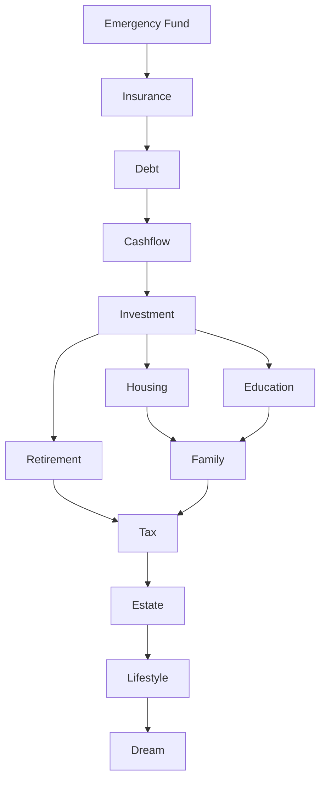
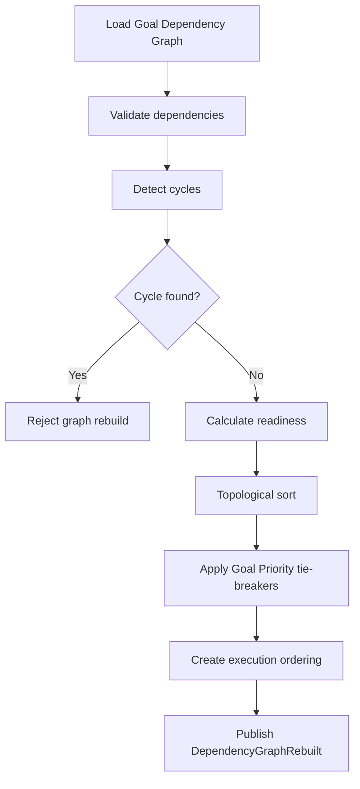
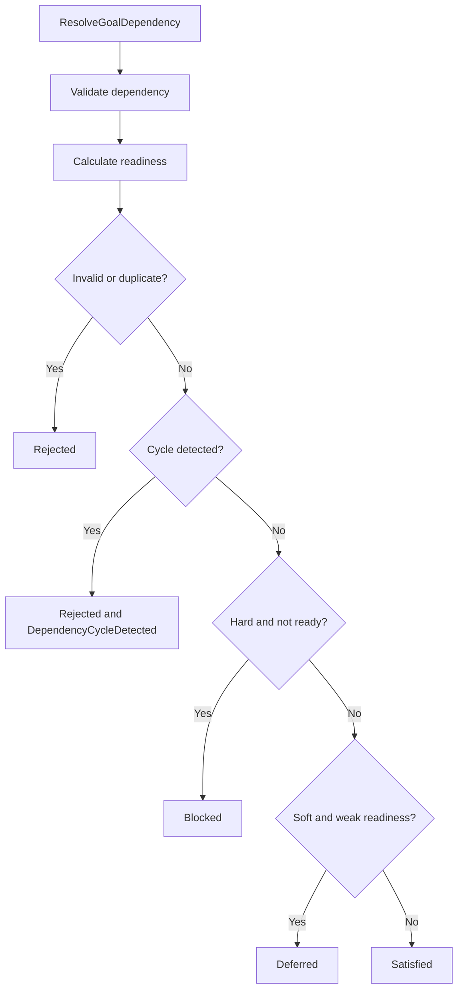
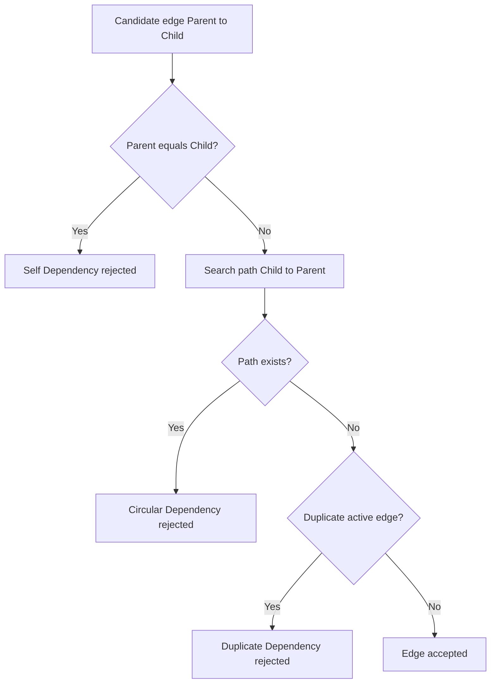

# Goal Dependency

Version: 1.0
Status: Enterprise Specification
Owner: Project Atlas

# Purpose

Goal Dependency defines the canonical domain specification for relationships between Goals in Atlas Goal Engine.

It is not a Goal because it does not represent a user objective, target amount, target date, progress, or owner.

It is not a Workflow because it does not execute actions or manage task state.

It is not a Recommendation because it does not advise the user to take an action.

It records, validates, resolves, orders, explains, and audits the dependency structure between Goals so Goal Engine, Recommendation Engine, Decision Engine, Scenario Engine, Projection Engine, Optimization Engine, Execution Plan Engine, and Workflow Engine can reason over prerequisite Goals, downstream Goals, blocking Goals, and execution order.

# Reference Alignment

Goal Dependency must remain consistent with:

1. goal.md
2. goal-prioritization.md
3. life-goals.md
4. decision-principles.md
5. decision-rule-catalog.md
6. constraint-rules.md
7. scoring-model.md
8. recommendation-priority-framework.md
9. execution-plan-framework.md
10. action-planning-framework.md
11. scenario-framework.md
12. optimization-engine-framework.md
13. projection-engine-framework.md

# Responsibilities

1. Dependency Definition: define directed relationships between Goals.
2. Dependency Validation: reject invalid, duplicate, circular, unauthorized, or unsupported dependencies.
3. Dependency Resolution: determine whether a dependency is Satisfied, Blocked, Deferred, Override, Rejected, or Resolved.
4. Dependency Ordering: produce prerequisite order for Goal funding and execution.
5. Dependency Graph: maintain a directed acyclic graph for Goal relationships.
6. Dependency Traversal: traverse upstream and downstream relationships deterministically.
7. Dependency Weight: quantify dependency strength from 0 to 100.
8. Dependency Priority: influence Goal Priority, Recommendation Score, Decision Score, Scenario Score, and Execution Score.
9. Dependency Readiness: calculate whether a dependent Goal is ready to proceed.
10. Dependency Blocking: identify Goals that cannot proceed because prerequisites are not satisfied.
11. Dependency Explanation: expose reason codes and plain-language explanations for ranking and execution surfaces.
12. Dependency Audit: preserve historical dependency decisions and graph rebuilds.

# Non-Responsibilities

1. Goal Dependency does not create Goals.
2. Goal Dependency does not approve Recommendations.
3. Goal Dependency does not execute ExecutionPlans.
4. Goal Dependency does not override Constraint Rules.
5. Goal Dependency does not invent assumptions.
6. Goal Dependency does not replace Goal Prioritization.
7. Goal Dependency does not replace Scenario comparison.
8. Goal Dependency does not replace Decision Rule Catalog.
9. Goal Dependency does not store Workflow task details.
10. Goal Dependency does not introduce new Atlas Business Concepts.

# Domain Model

## Entity

GoalDependency is the entity that links one Goal to another Goal.

Required fields:

| Field | Required | Description |
|---|---:|---|
| GoalDependencyId | Yes | Stable dependency identifier. |
| HouseholdId | Yes | Owner Household. |
| ParentGoalId | Yes | Upstream or prerequisite Goal. |
| ChildGoalId | Yes | Downstream or dependent Goal. |
| DependencyType | Yes | Type from Dependency Types. |
| DependencyStatus | Yes | Status from Dependency Status. |
| DependencyDirection | Yes | Direction semantics. |
| DependencyWeight | Yes | Strength from 0 to 100. |
| DependencyReadinessScore | Yes | Readiness from 0 to 100. |
| ReasonCode | Yes | Cataloged explanation code. |
| Version | Yes | Entity version. |
| CreatedAt | Yes | Creation timestamp. |
| UpdatedAt | Yes | Last update timestamp. |

## Value Object

GoalDependencyEdge:

```text
GoalDependencyEdge =
ParentGoalId
+ ChildGoalId
+ DependencyType
+ DependencyWeight
+ DependencyStatus
```

DependencyScoreBreakdown:

```text
DependencyScoreBreakdown =
DependencyWeight
+ DependencyReadinessScore
+ DependencyImpact
+ DependencyRisk
+ DependencyConfidence
```

# Dependency Types

| Type | Definition |
|---|---|
| Hard Dependency | Child Goal cannot proceed until Parent Goal is satisfied. |
| Soft Dependency | Child Goal may proceed with warning, penalty, or lower readiness. |
| Financial Dependency | Child Goal depends on funding, savings, income, asset, or liability condition. |
| Execution Dependency | Child ExecutionPlan or action depends on parent completion. |
| Temporal Dependency | Child Goal depends on dates, windows, sequence, or lead time. |
| Scenario Dependency | Child Goal depends on Scenario output, simulation result, or risk timeline. |
| Recommendation Dependency | Recommendation requires another Goal or recommendation result first. |
| Decision Dependency | Decision Score or decision feasibility depends on Goal state. |
| Resource Dependency | Child Goal depends on shared scarce resources. |
| Budget Dependency | Child Goal depends on available Budget. |
| CashFlow Dependency | Child Goal depends on Monthly Net Cashflow or cashflow stability. |
| Risk Dependency | Child Goal depends on risk reduction or risk threshold. |
| Portfolio Dependency | Child Goal depends on Portfolio allocation, concentration, or liquidity. |
| Insurance Dependency | Child Goal depends on Insurance coverage sufficiency. |
| Loan Dependency | Child Goal depends on debt, Loan Interest, DTI, or repayment state. |
| Housing Dependency | Child Goal depends on Housing affordability, sale, purchase, or rental state. |
| Education Dependency | Child Goal depends on Education funding, date, or Family requirement. |
| Retirement Dependency | Child Goal depends on Retirement readiness or retirement capital. |
| Family Dependency | Child Goal depends on Family obligation, dependents, or Parent Support. |
| Tax Dependency | Child Goal depends on tax deadline, tax saving, or compliance. |
| Estate Dependency | Child Goal depends on Estate planning readiness. |
| Lifestyle Dependency | Child Goal depends on discretionary capacity after mandatory Goals. |

# Dependency Status

| Status | Meaning |
|---|---|
| Pending | Dependency exists but has not been evaluated for current snapshot. |
| Satisfied | Parent requirement is met. |
| Unsatisfied | Parent requirement is not met. |
| Blocked | Child Goal cannot proceed because dependency is unsatisfied. |
| Deferred | Child Goal is intentionally postponed due to dependency state. |
| Expired | Dependency is no longer valid because time window or source condition expired. |
| Cancelled | Dependency was cancelled and is excluded from active graph. |
| Completed | Dependency reached final successful state and is retained for audit. |

# Dependency Direction

| Direction | Meaning |
|---|---|
| Parent | Upstream Goal that must be considered first. |
| Child | Downstream Goal affected by parent state. |
| Prerequisite | Parent must be satisfied before child can proceed. |
| Downstream | Goals affected by a parent Goal. |
| Upstream | Goals that affect a child Goal. |
| Bidirectional | Two Goals influence each other and must be represented as two directed dependencies with explicit reason codes. |

Bidirectional dependencies are not stored as a single graph edge. They must be modeled as two directed edges and validated for cycle safety.

# Dependency Weight

Dependency Weight is a normalized 0 to 100 measure of how strongly the Parent Goal affects the Child Goal.

```text
Dependency Weight = clamp(
    0.30 * Constraint Strength
  + 0.25 * Financial Coupling
  + 0.20 * Execution Coupling
  + 0.15 * Risk Coupling
  + 0.10 * Time Coupling,
  0,
  100
)
```

Weight definitions:

1. Constraint Strength measures Hard, Soft, Advisory, Regulatory, and Data Integrity pressure.
2. Financial Coupling measures shared funding, Budget, CashFlow, Loan, Portfolio, or Insurance dependency.
3. Execution Coupling measures whether ExecutionPlan sequence is blocked.
4. Risk Coupling measures risk introduced when the child proceeds too early.
5. Time Coupling measures deadline, lead time, or sequencing dependency.

# Dependency Readiness

Dependency Readiness Score is a normalized 0 to 100 measure of whether the Child Goal can proceed.

```text
Dependency Readiness Score = clamp(
    0.35 * Parent Satisfaction
  + 0.20 * Resource Availability
  + 0.15 * Constraint Clearance
  + 0.15 * Scenario Readiness
  + 0.10 * Execution Readiness
  + 0.05 * Dependency Confidence,
  0,
  100
)
```

Readiness interpretation:

| Score | Meaning |
|---:|---|
| 90 to 100 | Ready; dependency should not block child. |
| 75 to 89 | Mostly ready; proceed with monitoring. |
| 60 to 74 | Conditionally ready; warning required. |
| 40 to 59 | Weak readiness; child should normally be deferred. |
| 0 to 39 | Not ready; child is blocked unless allowed override exists. |

# Dependency Priority

Dependency Priority determines how dependencies affect ranking and downstream scores.

Goal Priority:

```text
Goal Priority Adjustment = Dependency Weight * (100 - Dependency Readiness Score) / 100
```

Recommendation Score:

```text
Recommendation Dependency Penalty = clamp(
    BlockingDependencyCount * 8
  + CriticalUnsatisfiedDependencyCount * 15
  + AverageDependencyPriorityPenalty,
  0,
  40
)
```

Decision Score:

```text
Decision Dependency Adjustment = clamp(
    SatisfiedCriticalDependencies * 5
  - UnsatisfiedCriticalDependencies * 12
  - CircularDependencyPenalty,
  -40,
  20
)
```

Scenario Score:

```text
Scenario Dependency Score = clamp(
    0.60 * GoalAchievementRatioOfPrerequisites
  + 0.25 * ScenarioReadiness
  + 0.15 * DependencyConfidence,
  0,
  100
)
```

Execution Score:

```text
Execution Dependency Score = clamp(
    0.50 * CompletedPrerequisiteActions
  + 0.30 * DependencyReadinessScore
  + 0.20 * ExecutionPlanReadiness,
  0,
  100
)
```

# Dependency Resolution

Allowed resolution outcomes:

1. Satisfied
2. Blocked
3. Deferred
4. Override
5. Rejected
6. Resolved

Resolution formula:

```text
Dependency Resolution =
if InvalidDependency then Rejected
else if CircularDependency then Rejected
else if HardDependency and DependencyReadinessScore < 75 then Blocked
else if SoftDependency and DependencyReadinessScore < 60 then Deferred
else if AllowedOverride and OverrideReason exists then Override
else if DependencyReadinessScore >= 75 then Satisfied
else Deferred
```

Resolution rules:

1. Rejected dependencies are not part of active graph.
2. Blocked dependencies stop child Goal funding and execution.
3. Deferred dependencies postpone child Goal ranking and allocation.
4. Override dependencies require reason, actor, and audit.
5. Resolved dependencies preserve final state for history.

# Dependency Conflict

Dependency conflict occurs when dependency order conflicts with Goal Priority, Recommendation Score, Decision Score, Scenario Score, Execution Score, resource allocation, or user preference.

Examples:

| Conflict | Resolution |
|---|---|
| Education vs Retirement | Education with fixed deadline can proceed if Retirement remains above policy; otherwise split funding by Priority Score and readiness. |
| Housing vs Investment | Housing is blocked when affordability or cashflow dependency fails; Investment proceeds only after liquidity and debt rules pass. |
| Insurance vs Lifestyle | Insurance blocks Lifestyle when coverage gap is material and dependents exist. |
| Debt vs Investment | Debt blocks Investment when Loan Interest exceeds risk-adjusted Expected ROI and liquidity is not impaired. |
| Tax vs Dream | Tax blocks Dream when legal or tax deadline exists. |
| Emergency vs Housing | Emergency Fund blocks Housing upgrade until minimum reserve is satisfied. |

# Dependency Cycle Detection

Goal Dependency must reject:

1. Cycle Detection positive result.
2. Loop Detection positive result.
3. Invalid Dependency.
4. Circular Dependency.
5. Self Dependency.
6. Duplicate Dependency.

Cycle detection rules:

1. ParentGoalId must not equal ChildGoalId.
2. Duplicate active edge with same ParentGoalId, ChildGoalId, and DependencyType is rejected.
3. Any new edge that creates a path from ChildGoalId back to ParentGoalId is rejected.
4. Cancelled and Completed dependencies are excluded from active cycle checks unless historical replay is requested.
5. Bidirectional dependencies require explicit two-edge validation and must not create execution deadlock.

# Dependency Graph

The active Goal Dependency Graph must be a directed acyclic graph.

```text
GoalDependencyGraph = Goals + ActiveGoalDependencyEdges
```

Graph requirements:

1. It must support Topological Sort.
2. It must support Dependency Traversal.
3. It must support Execution Ordering.
4. It must support upstream lookup.
5. It must support downstream lookup.
6. It must support blocking dependency detection.
7. It must support graph rebuild.
8. It must support graph cache invalidation.

Canonical Dependency Graph:



# Dependency Ordering

Dependency Ordering uses topological sort and then applies Goal Prioritization tie-breakers.

Ordering algorithm:

```text
1. Load active Goals.
2. Load active dependencies.
3. Remove Cancelled, Completed, and Expired edges from active graph.
4. Validate graph.
5. Detect cycles.
6. Calculate Dependency Weight.
7. Calculate Dependency Readiness Score.
8. Topologically sort by prerequisite direction.
9. Apply Goal Priority within same dependency level.
10. Apply Deadline Pressure within same priority band.
11. Apply stable GoalId tie-breaker.
```

Execution Ordering:



# Dependency Formula

Dependency Score:

```text
Dependency Score = clamp(
    0.30 * Dependency Weight
  + 0.25 * Dependency Impact
  + 0.20 * Dependency Risk
  + 0.15 * (100 - Dependency Readiness Score)
  + 0.10 * Dependency Confidence,
  0,
  100
)
```

Dependency Impact:

```text
Dependency Impact = max(
    FinancialImpact,
    CashFlowImpact,
    RiskReductionImpact,
    GoalPriorityImpact,
    ExecutionImpact
)
```

Dependency Risk:

```text
Dependency Risk = max(
    ConstraintRisk,
    LiquidityRisk,
    DebtRisk,
    InsuranceGapRisk,
    RetirementRisk,
    HousingRisk,
    ScenarioRisk
)
```

Dependency Confidence:

```text
Dependency Confidence = clamp(
    0.40 * DataCompleteness
  + 0.25 * ScenarioFreshness
  + 0.20 * RuleVersionValidity
  + 0.15 * AuditTraceability,
  0,
  100
)
```

# Commands

## CreateGoalDependency

Creates a dependency edge between ParentGoalId and ChildGoalId.

## UpdateGoalDependency

Updates type, status, weight, readiness, or reason code for an existing dependency.

## DeleteGoalDependency

Cancels a dependency edge. Physical deletion is not allowed for audited dependencies.

## ValidateGoalDependency

Validates identity, ownership, type, status, cycle safety, duplicate safety, and version compatibility.

## ResolveGoalDependency

Determines dependency outcome and updates blocking state.

## CalculateDependencyScore

Calculates Dependency Score, Dependency Weight, Dependency Impact, Dependency Risk, and Dependency Confidence.

## CalculateDependencyReadiness

Calculates Dependency Readiness Score and readiness explanation.

## RebuildDependencyGraph

Rebuilds the active Goal Dependency Graph for a Household.

## DetectDependencyCycle

Detects self-dependency, circular dependency, duplicate dependency, and invalid dependency graph state.

# Domain Events

1. GoalDependencyCreated
2. GoalDependencyUpdated
3. GoalDependencyDeleted
4. GoalDependencyResolved
5. GoalDependencyBlocked
6. GoalDependencySatisfied
7. GoalDependencyRejected
8. DependencyGraphRebuilt
9. DependencyCycleDetected
10. GoalDependencyReadinessCalculated
11. GoalDependencyScoreCalculated
12. GoalDependencyOverrideApplied

# Aggregate Interaction

| Aggregate | Interaction |
|---|---|
| Goal | Supplies ParentGoalId, ChildGoalId, status, category, priority, target amount, and target date. |
| Recommendation | Receives dependency penalties, prerequisite explanations, and suppression rules. |
| ExecutionPlan | Receives dependency ordering and blocked-action status. |
| Scenario | Supplies Scenario readiness, risk timeline, and Goal Achievement Ratio. |
| Decision | Receives dependency-adjusted feasibility and Decision Score impact. |
| Portfolio | Supplies Portfolio dependency signals for Investment, Retirement, and liquidity. |
| Loan | Supplies Loan dependency signals for Debt, Housing, Cashflow, and Interest. |
| Insurance | Supplies Insurance Gap and protection dependency state. |
| Budget | Supplies Budget availability and funding dependency state. |
| CashFlow | Supplies Monthly Net Cashflow, cashflow stability, and funding capacity. |
| Household | Supplies ownership and authorization boundary. |

# Business Rules

1. GoalDependencyId must be stable.
2. HouseholdId is required.
3. ParentGoalId is required.
4. ChildGoalId is required.
5. ParentGoalId must not equal ChildGoalId.
6. Parent Goal must belong to HouseholdId.
7. Child Goal must belong to HouseholdId.
8. Parent Goal must exist.
9. Child Goal must exist.
10. DependencyType must be valid.
11. DependencyStatus must be valid.
12. DependencyDirection must be valid.
13. DependencyWeight must be between 0 and 100.
14. DependencyReadinessScore must be between 0 and 100.
15. Active duplicate dependencies are rejected.
16. Circular dependencies are rejected.
17. Self dependencies are rejected.
18. Invalid dependencies are rejected.
19. Hard Dependency blocks child when unsatisfied.
20. Soft Dependency may defer child when readiness is low.
21. Financial Dependency must reference measurable financial condition.
22. Execution Dependency must align with ExecutionPlan dependency ordering.
23. Temporal Dependency must include date or sequence condition.
24. Scenario Dependency must reference fresh Scenario output or mark confidence low.
25. Recommendation Dependency must not create recommendation loops.
26. Decision Dependency must not override Hard constraints.
27. Resource Dependency must specify resource type.
28. Budget Dependency must use Budget availability.
29. CashFlow Dependency must use Monthly Net Cashflow or stability.
30. Risk Dependency must reference a risk dimension.
31. Portfolio Dependency must reference allocation, concentration, liquidity, or return.
32. Insurance Dependency must reference Insurance Gap or coverage sufficiency.
33. Loan Dependency must reference debt burden, Loan Interest, or repayment state.
34. Housing Dependency must reference affordability, loan, sale, purchase, or rental state.
35. Education Dependency must reference target date or funding need.
36. Retirement Dependency must reference Retirement Readiness Ratio or funding gap.
37. Family Dependency must reference dependents, Parent Support, or household obligation.
38. Tax Dependency must reference deadline, tax saving, or compliance.
39. Estate Dependency must not outrank Emergency dependency.
40. Lifestyle Dependency must depend on discretionary capacity.
41. Cancelled dependency is excluded from active graph.
42. Completed dependency is excluded from active blocking checks.
43. Expired dependency is excluded from active ordering.
44. Pending dependency must be evaluated before ranking.
45. Unsatisfied Hard Dependency sets child to Blocked.
46. Unsatisfied Soft Dependency may set child to Deferred.
47. Satisfied dependency must not block child Goal.
48. Override requires reason code.
49. Override requires authorized actor.
50. Override requires audit record.
51. Rejected dependency must not be persisted as active.
52. DeleteGoalDependency must cancel, not physically delete, audited dependency.
53. RebuildDependencyGraph must validate all active edges.
54. DetectDependencyCycle must run before CreateGoalDependency commits.
55. DetectDependencyCycle must run before UpdateGoalDependency changes ParentGoalId or ChildGoalId.
56. Dependency graph must be directed.
57. Dependency graph must be acyclic.
58. Topological Sort must be deterministic.
59. Dependency Traversal must support upstream lookup.
60. Dependency Traversal must support downstream lookup.
61. Execution Ordering must follow prerequisites before child Goals.
62. Dependency Weight must be recalculated when dependency type changes.
63. Dependency Readiness must be recalculated when Parent Goal status changes.
64. Dependency Readiness must be recalculated when Child Goal status changes.
65. Dependency Readiness must be recalculated when Budget changes.
66. Dependency Readiness must be recalculated when CashFlow changes.
67. Dependency Readiness must be recalculated when Scenario output changes.
68. Dependency Readiness must be recalculated when Constraint Rules change.
69. Goal Priority must consider blocking dependencies.
70. Recommendation Score must consider unsatisfied dependencies.
71. Decision Score must consider dependency feasibility.
72. Scenario Score must consider prerequisite Goal Achievement Ratio.
73. Execution Score must consider dependency readiness.
74. Emergency Fund dependency precedes discretionary Lifestyle.
75. Insurance dependency precedes Dream when household protection gap exists.
76. Debt dependency precedes Investment when Loan Interest exceeds risk-adjusted return.
77. Cashflow dependency precedes Housing when negative cashflow risk exists.
78. Investment dependency may precede Retirement when retirement funding relies on Portfolio.
79. Housing dependency may precede Family when housing stability is required.
80. Education dependency may precede Lifestyle when fixed deadline exists.
81. Retirement dependency may precede Estate when retirement sufficiency is not met.
82. Tax dependency may precede Estate when compliance deadline exists.
83. Family dependency may precede Lifestyle when dependents exist.
84. GoalDependencyCreated event must be emitted after successful creation.
85. GoalDependencyUpdated event must be emitted after successful update.
86. GoalDependencyDeleted event must be emitted after cancellation.
87. GoalDependencyResolved event must include outcome.
88. GoalDependencyBlocked event must include blocking parent.
89. GoalDependencySatisfied event must include satisfaction reason.
90. GoalDependencyRejected event must include rejection reason.
91. DependencyGraphRebuilt event must include graph version.
92. DependencyCycleDetected event must include cycle path.
93. Dependency calculations must include formula version.
94. Dependency calculations must include rule version.
95. Dependency calculations must include input snapshot hash.
96. Historical replay must use original dependency state.
97. Same input snapshot must produce same Dependency Score.
98. Same input snapshot must produce same graph ordering.
99. Idempotent command retry must not duplicate events.
100. Unauthorized actor must not read or mutate dependencies.

# Validation

Structural validation:

1. GoalDependencyId exists for update, delete, resolve, and score commands.
2. HouseholdId exists.
3. ParentGoalId exists.
4. ChildGoalId exists.
5. ParentGoalId differs from ChildGoalId.
6. DependencyType is supported.
7. DependencyStatus is supported.
8. DependencyDirection is supported.
9. Version is present for mutation.
10. ReasonCode is present when required.

Graph validation:

1. Active graph is directed.
2. Active graph is acyclic.
3. Duplicate edge does not exist.
4. Parent Goal is eligible.
5. Child Goal is eligible.
6. Cancelled edges are excluded.
7. Completed edges are excluded from blocking checks.
8. Expired edges are excluded from active ordering.
9. Bidirectional edges are modeled as two explicit directed edges.
10. Topological Sort can complete.

Financial validation:

1. Budget Dependency has Budget data.
2. CashFlow Dependency has CashFlow data.
3. Portfolio Dependency has Portfolio data.
4. Loan Dependency has Loan data.
5. Insurance Dependency has Insurance data.
6. Scenario Dependency has Scenario output or stale warning.
7. Retirement Dependency has retirement readiness data.
8. Housing Dependency has affordability or housing state data.
9. Tax Dependency has tax deadline or tax saving data.
10. Resource Dependency has resource scope.

Command validation:

1. Command id exists.
2. Idempotency key exists for state mutation.
3. Actor is authorized.
4. Input snapshot hash exists for persisted calculation.
5. DeleteGoalDependency includes deletion reason.
6. Override includes override reason.
7. RebuildDependencyGraph includes HouseholdId.
8. DetectDependencyCycle includes candidate edge.
9. CalculateDependencyScore includes formula version.
10. CalculateDependencyReadiness includes readiness input snapshot.

# Transaction Boundary

CreateGoalDependency transaction:

1. Validate command.
2. Load Parent Goal and Child Goal.
3. Verify Household ownership.
4. Validate dependency type and direction.
5. Detect duplicate dependency.
6. Detect cycle.
7. Calculate initial weight and readiness.
8. Persist dependency.
9. Rebuild affected graph cache.
10. Emit GoalDependencyCreated.

UpdateGoalDependency transaction:

1. Validate command.
2. Load existing dependency.
3. Verify version.
4. Validate proposed changes.
5. Detect duplicate or cycle if endpoints changed.
6. Recalculate score and readiness.
7. Persist update.
8. Rebuild affected graph cache.
9. Emit GoalDependencyUpdated.

Graph rebuild transaction:

1. Load active dependencies.
2. Validate graph.
3. Detect cycles.
4. Topologically sort.
5. Calculate graph version.
6. Persist graph snapshot.
7. Invalidate previous graph cache.
8. Emit DependencyGraphRebuilt.

# Error Handling

| Error | Handling |
|---|---|
| Missing ParentGoalId | Reject command. |
| Missing ChildGoalId | Reject command. |
| Self Dependency | Reject command and emit GoalDependencyRejected. |
| Duplicate Dependency | Reject command and return existing active dependency. |
| Circular Dependency | Reject command and emit DependencyCycleDetected. |
| Invalid DependencyType | Reject command. |
| Unauthorized Household | Reject command and audit security event. |
| Stale Scenario output | Lower Dependency Confidence and return stale warning. |
| Missing financial data | Reject or lower confidence according to dependency type. |
| Graph rebuild failure | Keep previous valid graph cache. |
| Idempotency conflict | Return original result when same payload; reject when payload differs. |
| Version conflict | Reject mutation and request refreshed dependency state. |

# Idempotency

State-changing commands must include Idempotency Key.

```text
Idempotency Identity =
CommandName
+ HouseholdId
+ GoalDependencyId or ParentGoalId + ChildGoalId
+ IdempotencyKey
+ InputSnapshotHash
```

Rules:

1. Same identity and same payload returns original result.
2. Same key with different payload is rejected.
3. Domain Events are not duplicated.
4. Graph rebuild with same graph input returns same graph version.
5. Cycle detection with same candidate edge returns same result.
6. DeleteGoalDependency is idempotent when dependency is already Cancelled.

# Security

1. Actor must be authorized for HouseholdId.
2. Parent Goal and Child Goal must belong to the same authorized Household unless Catalog explicitly allows shared household context.
3. Dependency graph must not expose another Household.
4. Audit records must include ActorId.
5. System actor must be distinguishable from user actor.
6. Override requires elevated permission or owner action.
7. Graph rebuild must enforce Household boundary.
8. Bulk dependency validation must not cross Household boundary.
9. Sensitive financial fields must follow Atlas data protection rules.
10. Unauthorized access must be audited.

# Audit

Audit record must include:

1. AuditId
2. CommandName
3. ActorId
4. HouseholdId
5. GoalDependencyId
6. ParentGoalId
7. ChildGoalId
8. DependencyType
9. Old DependencyStatus
10. New DependencyStatus
11. Old DependencyWeight
12. New DependencyWeight
13. Old DependencyReadinessScore
14. New DependencyReadinessScore
15. Resolution outcome
16. Cycle detection result
17. Graph version
18. Formula version
19. Rule version
20. Input snapshot hash
21. CreatedAt or UpdatedAt

Audit rules:

1. Audit is append-only.
2. Physical deletion of audited dependency records is prohibited.
3. Historical replay must use original dependency state.
4. Override must include reason.
5. Rejected dependency must include rejection reason.

# Performance

Dependency Graph Cache:

1. Cache active graph by HouseholdId and graph version.
2. Cache upstream adjacency list.
3. Cache downstream adjacency list.
4. Cache topological ordering.
5. Invalidate cache on dependency mutation or Goal status mutation.

Incremental Graph Update:

1. Recalculate only affected connected component when possible.
2. Rebuild full graph when dependency endpoints change.
3. Rebuild full graph when cycle detection cannot be localized.
4. Rebuild full graph when graph version is missing.

Topological Sort:

```text
Complexity = O(G + E)
```

Cycle Detection:

```text
Complexity = O(G + E)
```

Bulk Dependency Validation:

```text
Complexity = O(E + G + R)
```

Where:

1. G = Goal count.
2. E = active dependency edge count.
3. R = applicable rule count.

Complexity Analysis:

| Operation | Complexity |
|---|---|
| Create one dependency | O(G + E) for cycle validation. |
| Update one non-endpoint field | O(1) plus score recalculation. |
| Update dependency endpoints | O(G + E). |
| Delete dependency by cancellation | O(1) plus cache invalidation. |
| Rebuild graph | O(G + E). |
| Topological Sort | O(G + E). |
| Upstream traversal | O(G + E) worst case. |
| Downstream traversal | O(G + E) worst case. |
| Bulk validation | O(G + E + R). |

# Example

1. Emergency Fund must be satisfied before Lifestyle expansion.
2. Insurance coverage must be adequate before Dream Goal funding when dependents exist.
3. High-interest Debt must be reduced before taxable Investment when Loan Interest exceeds expected return.
4. Cashflow stability must be satisfied before Housing upgrade.
5. Housing sale must complete before second-home purchase funding is released.
6. Education funding deadline blocks discretionary Travel.
7. Retirement readiness blocks Early Retirement Goal.
8. Tax payment deadline blocks Dream purchase.
9. Portfolio concentration reduction blocks aggressive Investment Goal.
10. Emergency medical need blocks home renovation.
11. Parent Support funding blocks Lifestyle upgrade when Family Requirement is active.
12. Loan refinance depends on Loan data freshness.
13. Insurance review depends on household dependent data.
14. Scenario comparison depends on Scenario output freshness.
15. ExecutionPlan action depends on Recommendation acceptance.
16. Estate planning depends on Family and Retirement readiness.
17. Education Goal depends on Budget and target date.
18. Housing Goal depends on CashFlow and Loan affordability.
19. Investment Goal depends on Emergency Fund and risk tolerance.
20. Dream Goal depends on mandatory Goals being satisfied.

# Mermaid

Dependency Resolution Flow:



Cycle Detection Flow:



# Testing

1. CreateGoalDependency creates valid Hard Dependency.
2. CreateGoalDependency creates valid Soft Dependency.
3. CreateGoalDependency rejects missing HouseholdId.
4. CreateGoalDependency rejects missing ParentGoalId.
5. CreateGoalDependency rejects missing ChildGoalId.
6. CreateGoalDependency rejects self dependency.
7. CreateGoalDependency rejects duplicate active edge.
8. CreateGoalDependency rejects invalid DependencyType.
9. CreateGoalDependency rejects invalid DependencyDirection.
10. CreateGoalDependency rejects unauthorized Household.
11. UpdateGoalDependency updates DependencyType.
12. UpdateGoalDependency updates DependencyStatus.
13. UpdateGoalDependency updates ReasonCode.
14. UpdateGoalDependency rejects version conflict.
15. UpdateGoalDependency detects cycle after endpoint change.
16. DeleteGoalDependency changes status to Cancelled.
17. DeleteGoalDependency does not physically delete audited dependency.
18. ValidateGoalDependency accepts valid dependency.
19. ValidateGoalDependency rejects circular dependency.
20. ValidateGoalDependency rejects duplicate dependency.
21. ValidateGoalDependency rejects invalid status.
22. ResolveGoalDependency returns Satisfied when readiness is high.
23. ResolveGoalDependency returns Blocked for unsatisfied Hard Dependency.
24. ResolveGoalDependency returns Deferred for weak Soft Dependency.
25. ResolveGoalDependency returns Override with authorized reason.
26. ResolveGoalDependency rejects override without reason.
27. CalculateDependencyScore returns 0 to 100.
28. CalculateDependencyReadiness returns 0 to 100.
29. Dependency Weight returns 0 to 100.
30. Dependency Confidence returns 0 to 100.
31. Hard Dependency with readiness below 75 blocks child.
32. Soft Dependency with readiness below 60 defers child.
33. Pending dependency is evaluated before ranking.
34. Satisfied dependency does not block child.
35. Unsatisfied Hard Dependency blocks child funding.
36. Unsatisfied Hard Dependency blocks child execution.
37. Unsatisfied Soft Dependency lowers Goal Priority.
38. Dependency Priority adjusts Recommendation Score.
39. Dependency Priority adjusts Decision Score.
40. Dependency Priority adjusts Scenario Score.
41. Dependency Priority adjusts Execution Score.
42. Emergency Fund dependency precedes Lifestyle.
43. Insurance dependency precedes Dream.
44. Debt dependency precedes Investment when interest is high.
45. CashFlow dependency precedes Housing when cashflow is negative.
46. Portfolio dependency blocks aggressive Investment.
47. Loan dependency blocks Housing when DTI is high.
48. Tax dependency blocks Dream when deadline exists.
49. Family dependency blocks Lifestyle when dependents require funding.
50. Retirement dependency blocks Estate when readiness is below policy.
51. RebuildDependencyGraph builds graph for valid edges.
52. RebuildDependencyGraph excludes Cancelled edges.
53. RebuildDependencyGraph excludes Expired edges.
54. RebuildDependencyGraph preserves Completed edges for audit only.
55. RebuildDependencyGraph rejects cycle.
56. DetectDependencyCycle detects direct cycle.
57. DetectDependencyCycle detects indirect cycle.
58. DetectDependencyCycle detects self dependency.
59. DetectDependencyCycle detects duplicate dependency.
60. Topological Sort orders prerequisites before children.
61. Topological Sort is deterministic for identical inputs.
62. Upstream traversal returns all prerequisites.
63. Downstream traversal returns all affected Goals.
64. Dependency graph cache is created after rebuild.
65. Dependency graph cache is invalidated after create.
66. Dependency graph cache is invalidated after update.
67. Dependency graph cache is invalidated after delete.
68. Incremental graph update recalculates affected component.
69. Full graph rebuild runs when endpoint changes.
70. Graph version changes after dependency mutation.
71. Same idempotency key returns original creation result.
72. Same idempotency key with different payload rejects.
73. Retry does not duplicate GoalDependencyCreated.
74. Retry does not duplicate GoalDependencyUpdated.
75. Retry does not duplicate GoalDependencyDeleted.
76. Unauthorized read is rejected.
77. Unauthorized write is rejected.
78. Unauthorized override is rejected.
79. Security audit records unauthorized access.
80. Audit record includes old status.
81. Audit record includes new status.
82. Audit record includes old readiness.
83. Audit record includes new readiness.
84. Audit record includes formula version.
85. Audit record includes rule version.
86. Audit record includes input snapshot hash.
87. Historical replay uses original graph version.
88. Historical replay excludes current assumptions unless requested.
89. Stale Scenario output lowers confidence.
90. Missing Budget data rejects Budget Dependency.
91. Missing CashFlow data rejects CashFlow Dependency.
92. Missing Portfolio data rejects Portfolio Dependency.
93. Missing Loan data rejects Loan Dependency.
94. Missing Insurance data rejects Insurance Dependency.
95. Missing tax deadline rejects Tax Dependency when deadline required.
96. Expired Temporal Dependency is excluded from active ordering.
97. Cancelled dependency is excluded from active graph.
98. Completed dependency is excluded from blocking checks.
99. Bidirectional relationship requires two directed edges.
100. Bidirectional edges are validated for deadlock.
101. Invalid ReasonCode rejects override.
102. Invalid formula version rejects persisted calculation.
103. Invalid rule version rejects persisted calculation.
104. Dependency graph handles zero dependencies.
105. Dependency graph handles one dependency.
106. Dependency graph handles 1,000 dependencies.
107. Bulk validation reports all invalid edges.
108. Bulk validation processes valid independent edges.
109. Graph rebuild keeps previous cache on failure.
110. Goal status change recalculates readiness.
111. Budget change recalculates readiness.
112. CashFlow change recalculates readiness.
113. Scenario update recalculates readiness.
114. Constraint Rule change recalculates readiness.
115. Goal Priority update recalculates dependency priority impact.
116. Recommendation dismissal does not delete dependency.
117. ExecutionPlan completion can satisfy Execution Dependency.
118. Parent Goal completion can satisfy dependency.
119. Child Goal cancellation cancels active dependencies.
120. Parent Goal cancellation blocks or rejects child dependencies.

# Edge Cases

1. Parent Goal is missing.
2. Child Goal is missing.
3. Parent Goal equals Child Goal.
4. Parent Goal belongs to another Household.
5. Child Goal belongs to another Household.
6. Parent Goal is Completed.
7. Child Goal is Completed.
8. Parent Goal is Cancelled.
9. Child Goal is Cancelled.
10. Dependency is duplicated with different ReasonCode.
11. Dependency is duplicated with different type.
12. Dependency forms direct cycle.
13. Dependency forms indirect cycle.
14. Bidirectional dependency creates execution deadlock.
15. DependencyType is unknown.
16. DependencyStatus is unknown.
17. DependencyDirection is unknown.
18. DependencyWeight is negative.
19. DependencyWeight exceeds 100.
20. Readiness Score is negative.
21. Readiness Score exceeds 100.
22. Scenario output is stale.
23. Scenario output is missing.
24. Budget data is missing.
25. CashFlow data is missing.
26. Portfolio data is missing.
27. Loan data is missing.
28. Insurance data is missing.
29. Tax deadline is missing.
30. Temporal window is expired.
31. Parent deadline is after child deadline.
32. Child deadline is before prerequisite can complete.
33. Emergency override conflicts with frozen dependency.
34. User preference conflicts with Hard Dependency.
35. Recommendation dependency references dismissed Recommendation.
36. Decision dependency references rejected Decision.
37. Execution Dependency references cancelled ExecutionPlan.
38. Resource Dependency has zero available resource.
39. Budget Dependency has negative available budget.
40. CashFlow Dependency has negative Monthly Net Cashflow.
41. Loan Dependency has variable interest without assumption.
42. Portfolio Dependency has unavailable valuation.
43. Insurance Dependency has unknown coverage.
44. Retirement Dependency has missing horizon.
45. Education Dependency has missing target date.
46. Housing Dependency has missing affordability data.
47. Estate Dependency has incomplete family ownership data.
48. Lifestyle Dependency conflicts with Insurance Gap.
49. Graph cache is stale.
50. Graph version is missing.
51. Graph rebuild fails after dependency mutation.
52. Audit write fails.
53. Domain Event write fails.
54. Idempotency key is reused with different payload.
55. Historical dependency references deprecated formula version.
56. Historical dependency references deprecated rule version.
57. Bulk validation contains mixed valid and invalid edges.
58. Topological Sort receives empty graph.
59. Topological Sort receives disconnected graph.
60. Dependency traversal exceeds configured depth.

# Version History

| Version | Date | Notes |
|---|---|---|
| v1.0 | 2026-07-11 | Enterprise Specification for Atlas Goal Dependency. |

## Phase 2 Executable Specification Addendum

### Dependency Graph Execution Contract

| Field | Required | Description |
|---|---|---|
| DependencyGraphExecutionId | Yes | Stable graph calculation identifier |
| HouseholdId | Yes | Household scope |
| GraphVersion | Yes | Generated dependency graph version |
| DependencyIds | Yes | Dependency edges included |
| SourceSnapshotId | Yes | Source goal and financial snapshot |
| FormulaVersionSet | Yes | Dependency score and readiness formulas |
| RuleVersionSet | Yes | Dependency and constraint rules |
| TopologicalOrderHash | Yes | Deterministic ordering hash |
| CorrelationId | Yes | Audit correlation |

### Required Commands

| Command | Actor | Output |
|---|---|---|
| ExecuteDependencyGraphRebuild | GoalDependencyApplicationService | DependencyGraphRebuilt |
| ExecuteDependencyReadinessEvaluation | GoalDependencyApplicationService | GoalDependencyReadinessCalculated |
| ExecuteDependencyCycleValidation | GoalDependencyApplicationService | DependencyCycleValidationCompleted |
| ReplayDependencyGraph | AdministrationApplicationService | DependencyGraphReplayed |

### Addendum Validation Rules

| Rule ID | Rule | Failure |
|---|---|---|
| GDP-P2-VR-001 | Graph rebuild must include source snapshot, formula versions, and rule versions. | Reject rebuild |
| GDP-P2-VR-002 | Topological order must be deterministic for identical graph input. | Reject graph |
| GDP-P2-VR-003 | Replay must use original graph version and dependency states. | Reject replay |
| GDP-P2-VR-004 | Active cycle validation must exclude cancelled, completed, and expired edges. | Reject validation |

### Addendum Testing Matrix

| Test | Expected Result |
|---|---|
| Same graph input | Same topological order hash |
| Cancelled edge in cycle path | Edge is excluded from active cycle check |
| Missing formula version | Graph rebuild fails |
| Historical replay | Original graph version reproduces |
| Source goal status changed | Readiness recalculates |

| Version | Date | Notes |
|---|---|---|
| v1.0-p2 | 2026-07-15 | Phase 2 executable addendum added. |

## Phase 2 Executable Specification Addendum

### Dependency Graph Execution Contract

| Field | Required | Description |
|---|---|---|
| DependencyGraphExecutionId | Yes | Stable graph calculation identifier |
| HouseholdId | Yes | Household scope |
| GraphVersion | Yes | Generated dependency graph version |
| DependencyIds | Yes | Dependency edges included |
| SourceSnapshotId | Yes | Source goal and financial snapshot |
| FormulaVersionSet | Yes | Dependency score and readiness formulas |
| RuleVersionSet | Yes | Dependency and constraint rules |
| TopologicalOrderHash | Yes | Deterministic ordering hash |
| CorrelationId | Yes | Audit correlation |

### Required Commands

| Command | Actor | Output |
|---|---|---|
| ExecuteDependencyGraphRebuild | GoalDependencyApplicationService | DependencyGraphRebuilt |
| ExecuteDependencyReadinessEvaluation | GoalDependencyApplicationService | GoalDependencyReadinessCalculated |
| ExecuteDependencyCycleValidation | GoalDependencyApplicationService | DependencyCycleValidationCompleted |
| ReplayDependencyGraph | AdministrationApplicationService | DependencyGraphReplayed |

### Addendum Validation Rules

| Rule ID | Rule | Failure |
|---|---|---|
| GDP-P2-VR-001 | Graph rebuild must include source snapshot, formula versions, and rule versions. | Reject rebuild |
| GDP-P2-VR-002 | Topological order must be deterministic for identical graph input. | Reject graph |
| GDP-P2-VR-003 | Replay must use original graph version and dependency states. | Reject replay |
| GDP-P2-VR-004 | Active cycle validation must exclude cancelled, completed, and expired edges. | Reject validation |

### Addendum Testing Matrix

| Test | Expected Result |
|---|---|
| Same graph input | Same topological order hash |
| Cancelled edge in cycle path | Edge is excluded from active cycle check |
| Missing formula version | Graph rebuild fails |
| Historical replay | Original graph version reproduces |
| Source goal status changed | Readiness recalculates |

| Version | Date | Notes |
|---|---|---|
| v1.0-p2 | 2026-07-15 | Phase 2 executable addendum added. |
