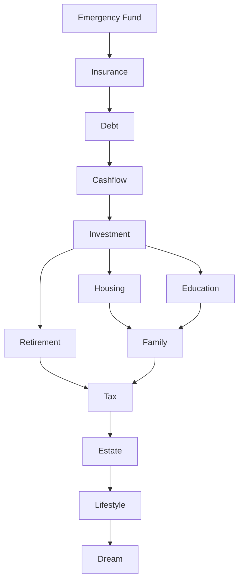
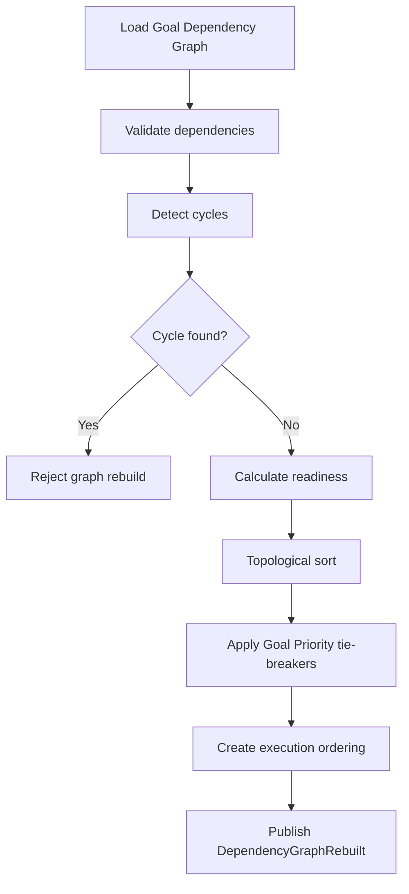

# Goal dependency resolution and graph
# Dependency Resolution

Allowed resolution outcomes:

1. Satisfied
2. Blocked
3. Deferred
4. Override
5. Rejected
6. Resolved

Resolution formula:

```text
Dependency Resolution =
if InvalidDependency then Rejected
else if CircularDependency then Rejected
else if HardDependency and DependencyReadinessScore < 75 then Blocked
else if SoftDependency and DependencyReadinessScore < 60 then Deferred
else if AllowedOverride and OverrideReason exists then Override
else if DependencyReadinessScore >= 75 then Satisfied
else Deferred
```

Resolution rules:

1. Rejected dependencies are not part of active graph.
2. Blocked dependencies stop child Goal funding and execution.
3. Deferred dependencies postpone child Goal ranking and allocation.
4. Override dependencies require reason, actor, and audit.
5. Resolved dependencies preserve final state for history.


# Dependency Conflict

Dependency conflict occurs when dependency order conflicts with Goal Priority, Recommendation Score, Decision Score, Scenario Score, Execution Score, resource allocation, or user preference.

Examples:

| Conflict | Resolution |
|---|---|
| Education vs Retirement | Education with fixed deadline can proceed if Retirement remains above policy; otherwise split funding by Priority Score and readiness. |
| Housing vs Investment | Housing is blocked when affordability or cashflow dependency fails; Investment proceeds only after liquidity and debt rules pass. |
| Insurance vs Lifestyle | Insurance blocks Lifestyle when coverage gap is material and dependents exist. |
| Debt vs Investment | Debt blocks Investment when Loan Interest exceeds risk-adjusted Expected ROI and liquidity is not impaired. |
| Tax vs Dream | Tax blocks Dream when legal or tax deadline exists. |
| Emergency vs Housing | Emergency Fund blocks Housing upgrade until minimum reserve is satisfied. |


# Dependency Cycle Detection

Goal Dependency must reject:

1. Cycle Detection positive result.
2. Loop Detection positive result.
3. Invalid Dependency.
4. Circular Dependency.
5. Self Dependency.
6. Duplicate Dependency.

Cycle detection rules:

1. ParentGoalId must not equal ChildGoalId.
2. Duplicate active edge with same ParentGoalId, ChildGoalId, and DependencyType is rejected.
3. Any new edge that creates a path from ChildGoalId back to ParentGoalId is rejected.
4. Cancelled and Completed dependencies are excluded from active cycle checks unless historical replay is requested.
5. Bidirectional dependencies require explicit two-edge validation and must not create execution deadlock.


# Dependency Graph

The active Goal Dependency Graph must be a directed acyclic graph.

```text
GoalDependencyGraph = Goals + ActiveGoalDependencyEdges
```

Graph requirements:

1. It must support Topological Sort.
2. It must support Dependency Traversal.
3. It must support Execution Ordering.
4. It must support upstream lookup.
5. It must support downstream lookup.
6. It must support blocking dependency detection.
7. It must support graph rebuild.
8. It must support graph cache invalidation.

Canonical Dependency Graph:




# Dependency Ordering

Dependency Ordering uses topological sort and then applies Goal Prioritization tie-breakers.

Ordering algorithm:

```text
1. Load active Goals.
2. Load active dependencies.
3. Remove Cancelled, Completed, and Expired edges from active graph.
4. Validate graph.
5. Detect cycles.
6. Calculate Dependency Weight.
7. Calculate Dependency Readiness Score.
8. Topologically sort by prerequisite direction.
9. Apply Goal Priority within same dependency level.
10. Apply Deadline Pressure within same priority band.
11. Apply stable GoalId tie-breaker.
```

Execution Ordering:



