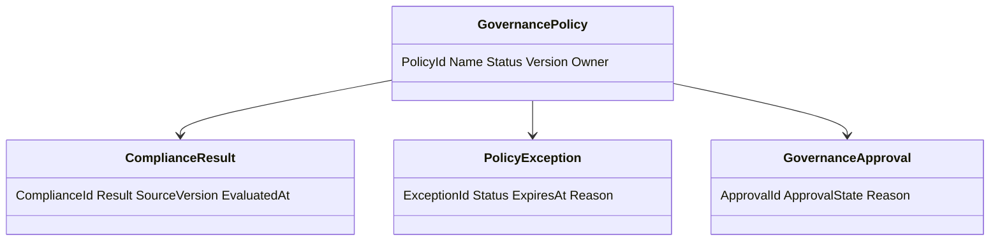
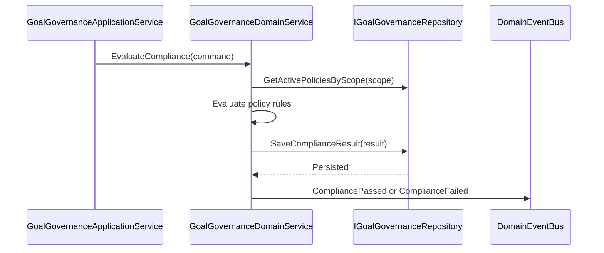
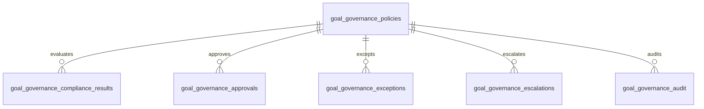
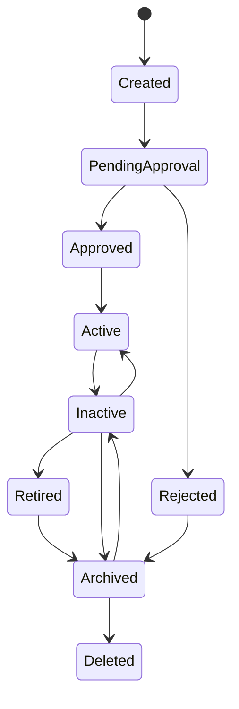
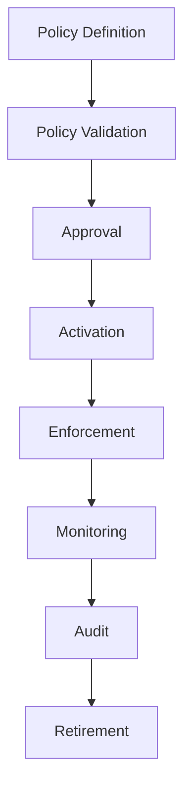
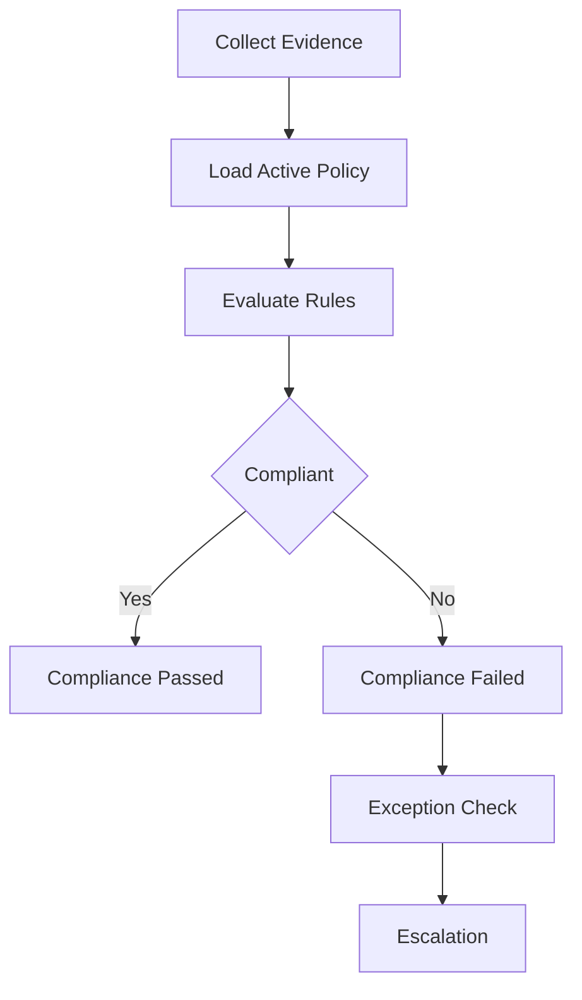
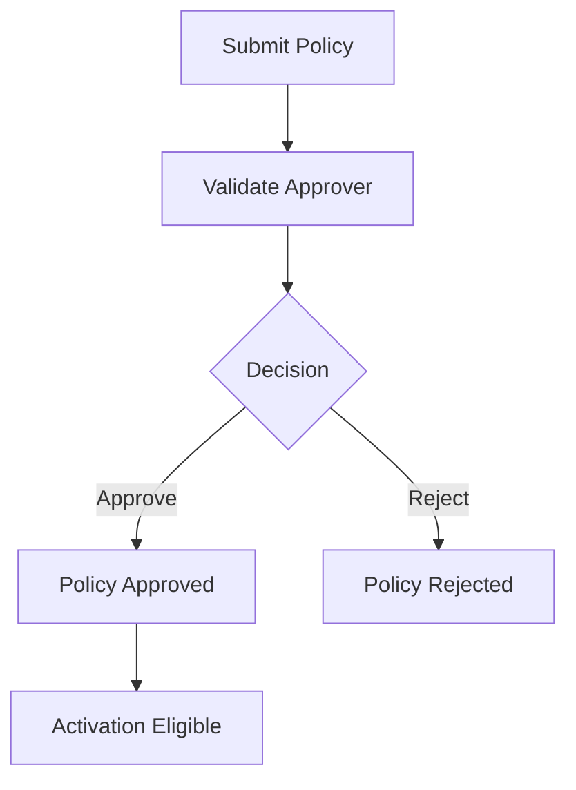

# Goal Governance
Version: 1.0
## Split Navigation
- [Goal governance policy and compliance](goal-governance/policy-and-compliance.md)
- [Goal governance approval and monitoring](goal-governance/approval-and-monitoring.md)
- [Goal governance audit and testing](goal-governance/audit-and-testing.md)
Status: Enterprise Specification
Owner: Project Atlas
Source of Truth: Atlas Goal Governance Specification
Last Updated: 2026-07-13
# Goal Governance Overview
## Purpose
Goal Governance defines how Atlas controls policy, approval, compliance, exception, escalation, monitoring, audit, and reporting behavior for GoalPlan. It coordinates governance with GoalPlan, Milestone, Task, Goal Progress Tracking, Goal Metrics, Goal Dashboard, Goal Analytics, Goal Reporting, Goal Insights, Goal Optimization, Goal Execution, Goal Review, DecisionSession, Recommendation, Scenario, Portfolio, CashFlow, Notification, User, Workflow, Automation, and Business Calendar.
It preserves existing Atlas domain ownership and existing catalog naming.
## Business Meaning
Goal Governance ensures that goal planning, progress, metrics, reporting, insight, optimization, execution, review, decision, recommendation, scenario, portfolio, and cashflow activity follows approved policy. Governance provides policy enforcement, compliance evidence, approval traceability, exception control, escalation control, retention evidence, and audit readiness.
Governance does not directly change source domain behavior unless an explicit command in that domain is invoked.
## Governance Lifecycle
Governance lifecycle starts when a policy is created. The policy is validated, approved, activated, enforced, monitored, reported, deactivated, archived, restored, retired, or deleted according to policy lifecycle rules.
Compliance evaluation creates governed evidence and does not silently change source data. Exception handling records requested exception, approval state, expiration, escalation, and audit evidence.
## Governance Scope
Governance scope can be GoalPlan, Milestone, Task, Goal Progress Tracking, Goal Metrics, Goal Dashboard, Goal Analytics, Goal Reporting, Goal Insights, Goal Optimization, Goal Execution, Goal Review, DecisionSession, Recommendation, Scenario, Portfolio, CashFlow, Notification, User, Workflow, Automation, Business Calendar, household, tenant when present, or global policy scope. Scope must preserve HouseholdId.
Scope must preserve TenantId when tenant scope exists. Scope must not include unauthorized data.
## Governance Objectives
Governance objectives are policy consistency, compliance validation, approval control, auditability, exception visibility, escalation timing, risk reduction, financial discipline, execution control, review cadence, decision quality, recommendation discipline, and data protection. Each objective must be measurable through policy state, compliance result, exception count, escalation count, audit completeness, and resolution time.
## Governance Principles
Governance must be explicit. Governance must be auditable.
Governance must be permission-aware. Governance must be deterministic for the same policy version and source version.
Governance must distinguish hard policy failure from soft warning. Governance must never hide exception or approval evidence.
Governance must not expand user access.
## Ownership
Goal Governance owns policy definition, policy lifecycle, compliance evaluation, exception records, escalation policy, approval evidence, governance reports, and governance projections. GoalPlan owns goal business state.
Each related domain owns its own business data and lifecycle. Audit owns immutable evidence.
Security owns authorization and masking enforcement. Application Service owns orchestration and transaction boundary.
Repository owns persistence and projections.
## Relationship with Goal
GoalPlan supplies governed target, status, priority, category, lifecycle, owner, target date, and target amount. Goal Governance does not mutate GoalPlan.
Goal policy violations may block execution, approval, or reporting projection according to policy.
## Relationship with Milestone
Milestone supplies checkpoint, due date, blocker, dependency, and completion evidence. Milestone governance validates timeline, dependency, and completion discipline.
## Relationship with Task
Task supplies execution unit evidence when existing task tracking is available. Task governance validates task state only within existing task ownership.
## Relationship with Goal Progress
Goal Progress Tracking supplies progress percent, completion score, health score, confidence score, and schedule variance. Progress governance validates freshness, completeness, unexpected decrease, and completion consistency.
## Relationship with Goal Metrics
Goal Metrics supplies KPI, threshold, health, risk, priority, forecast, and trend evidence. Metric governance validates unit, precision, threshold compliance, and calculation freshness.
## Relationship with Goal Dashboard
Goal Dashboard consumes governance status, policy violations, exception counts, escalation counts, and approval needs. Dashboard projection must be permission-filtered.
## Relationship with Goal Analytics
Goal Analytics supplies trend, anomaly, forecast, and comparative evidence for compliance evaluation. Analytics version must be recorded when used.
## Relationship with Goal Reporting
Goal Reporting includes governance report, compliance result, policy status, exception history, approval history, and audit evidence. Report snapshots preserve governance state at generation time.
## Relationship with Goal Insights
Goal Insights may trigger compliance evaluation and may receive governance violation evidence. Insight mapping records PolicyId and ComplianceEvaluationId when applicable.
## Relationship with Goal Optimization
Goal Optimization candidates must satisfy active governance policies before approval. Optimization evidence records policy version and exception state.
## Relationship with Goal Execution
Goal Execution must satisfy execution governance policy before start, retry, completion, rollback, or archive. Execution state changes may trigger compliance evaluation.
## Relationship with Goal Review
Goal Review may approve policy, approve exception, reject policy, or verify compliance result. Review findings must remain masked when required.
## Relationship with Decision
DecisionSession may approve policy, approve exception, reject governance action, or record rationale. Decision mapping records DecisionSessionId and decision status.
## Relationship with Recommendation
Recommendation is governed by adoption, priority, suppression, approval, and evidence policies. Governance does not create Recommendation without explicit command.
## Relationship with Scenario
Scenario assumptions and scenario results are governed by scenario policy and comparison rules. Scenario governance records ScenarioId and ScenarioVersion.
## Relationship with Portfolio
Portfolio governance validates authorized portfolio evidence, valuation freshness, risk limits, liquidity constraints, and masking. Portfolio data requires portfolio permission.
## Relationship with CashFlow
CashFlow governance validates contribution capacity, period alignment, funding gap, budget discipline, and masking. CashFlow data requires cashflow permission.
## Relationship with Notification
Notification receives escalation, violation, approval needed, exception expiring, and compliance failed triggers. Notification suppression must not remove governance history.
## Relationship with User
User supplies actor, approver, policy administrator, exception requester, permission, locale, and masking context. User permission is evaluated for every command and projection.
## Relationship with Workflow
Workflow supplies approval routing, policy review steps, exception review steps, and escalation state. Workflow state must remain consistent with governance state.
## Relationship with Automation
Automation may trigger scheduled compliance evaluation, policy activation, escalation, notification, or governance report generation. Automation run id must be recorded.
## Relationship with Business Calendar
Business Calendar supplies valid approval windows, escalation windows, review cadence, execution windows, and policy effective windows. Governance deadlines must use Business Calendar rules when configured.
# Governance Architecture
## Governance Engine
Governance Engine coordinates policy evaluation, compliance checks, exception handling, escalation, approval, monitoring, reporting, and audit. It uses policy version and source version to produce deterministic results.
## Policy Engine
Policy Engine stores policy definitions, policy scope, activation state, enforcement rules, exception rules, approval rules, and audit rules. It evaluates policy applicability before compliance evaluation.
## Compliance Engine
Compliance Engine compares source evidence with active policy rules. It returns passed, failed, warning, not applicable, or exception applied.
## Approval Engine
Approval Engine validates approver permission, Workflow state, DecisionSession mapping, approval reason, and effective time. Approval state is immutable after final decision except by new policy version.
## Audit Engine
Audit Engine records policy lifecycle, compliance result, approval, rejection, exception, escalation, report generation, and access. Audit records are append-only.
## Risk Engine
Risk Engine evaluates risk policy, risk threshold, risk trend, critical risk, and risk exception. Risk governance output may trigger escalation.
## Monitoring Engine
Monitoring Engine observes policy state, compliance state, exception expiration, escalation deadline, and violation trend. Monitoring output feeds dashboard, report, notification, and analytics.
## Reporting Engine
Reporting Engine produces governance report and compliance evidence snapshots. Report generation records policy version, source version, actor, projection, and masking mode.
## Escalation Engine
Escalation Engine routes violations, approval delays, exception expiration, and repeated failure to configured escalation recipients. Escalation respects Business Calendar and notification preference.
## Exception Engine
Exception Engine validates exception request, exception approval, expiration, scope, mitigation, and audit evidence. Exception cannot remove source violation history.
# Governance Domains
## Goal Policy
Goal Policy governs GoalPlan lifecycle, status, priority, target date, and ownership.
## Priority Governance
Priority Governance governs priority score, priority changes, priority conflicts, and business value alignment.
## Budget Governance
Budget Governance governs budget usage, target amount, funding gap, budget variance, and financial thresholds.
## Cash Flow Governance
Cash Flow Governance governs CashFlow period alignment, contribution capacity, deficit, surplus, and funding cadence.
## Risk Governance
Risk Governance governs risk score, risk trend, critical risk, mitigation evidence, and escalation.
## Decision Governance
Decision Governance governs decision quality, pending age, approval requirements, and decision traceability.
## Recommendation Governance
Recommendation Governance governs recommendation ranking, adoption, suppression, impact evidence, and completion.
## Execution Governance
Execution Governance governs execution approval, start, retry, timeout, rollback, cancellation, and completion verification.
## Review Governance
Review Governance governs review cadence, participants, approval, result, and action item closure.
## Portfolio Governance
Portfolio Governance governs portfolio evidence, valuation time, liquidity, allocation, and risk where authorized.
## Scenario Governance
Scenario Governance governs scenario version, assumptions, baseline comparison, and stale scenario handling.
## Compliance Governance
Compliance Governance governs compliance result, exception state, failure severity, and remediation.
## Audit Governance
Audit Governance governs audit evidence, retention, access, immutability, and traceability.
## Change Governance
Change Governance governs policy versioning, effective dates, approval, activation, deactivation, archive, and restore.
# Governance Policies
## Goal Lifecycle Policy
Name: Goal Lifecycle Policy Purpose: Control valid GoalPlan lifecycle actions.
Business Meaning: Prevent invalid goal operations and preserve lifecycle evidence. Scope: GoalPlan.
Owner: Goal Governance.
Inputs: GoalPlan status, command, actor, source version. Outputs: Compliance result, violation reason, enforcement action.
Validation: GoalPlan exists and actor has permission. Enforcement Rules: Block prohibited lifecycle command.
Exception Rules: Exception requires approval and expiration. Escalation Rules: Escalate repeated blocked command.
Approval Rules: Approval required for override. Audit Rules: Record command, actor, policy version, and result.
Example: Archived GoalPlan cannot start execution.
## Priority Governance Policy
Name: Priority Governance Policy Purpose: Control priority alignment and priority changes.
Business Meaning: Ensure high-value goals are not hidden by low priority. Scope: GoalPlan and Goal Metrics.
Owner: Goal Governance.
Inputs: PriorityScore, BusinessValueScore, RiskScore, ReviewResult. Outputs: Compliance result and priority warning.
Validation: Scores must be between 0 and 100. Enforcement Rules: Warn or require review when alignment gap exceeds threshold.
Exception Rules: Exception requires reason. Escalation Rules: Escalate unresolved high-value priority mismatch.
Approval Rules: Review approval required for override. Audit Rules: Record score values and reviewer.
Example: Business value 90 with priority 40 requires review.
## Budget Governance Policy
Name: Budget Governance Policy Purpose: Control budget variance and funding gap.
Business Meaning: Prevent financially infeasible goal execution. Scope: GoalPlan, Goal Metrics, CashFlow.
Owner: Goal Governance.
Inputs: BudgetUsagePercent, FundingGap, Currency, Period. Outputs: Compliance result, severity, remediation signal.
Validation: Currency and period are required. Enforcement Rules: Block approval when hard budget cap is exceeded.
Exception Rules: Exception requires financial approval. Escalation Rules: Escalate critical funding gap.
Approval Rules: Approval required for hard cap exception. Audit Rules: Record financial evidence with masking.
Example: Funding gap above threshold blocks execution approval.
## Cash Flow Governance Policy
Name: Cash Flow Governance Policy Purpose: Control contribution capacity and period alignment.
Business Meaning: Ensure planned execution fits available CashFlow. Scope: CashFlow and GoalPlan.
Owner: Goal Governance.
Inputs: ContributionCapacity, RequiredContribution, CashFlowPeriod. Outputs: Compliance result and capacity ratio.
Validation: CashFlow period must match goal period. Enforcement Rules: Warn or block when capacity ratio is below threshold.
Exception Rules: Exception expires at period close. Escalation Rules: Escalate persistent deficit.
Approval Rules: Approval required for deficit override. Audit Rules: Record period and masked values.
Example: Required contribution exceeds available contribution.
## Risk Governance Policy
Name: Risk Governance Policy Purpose: Control risk threshold and escalation.
Business Meaning: Make risk exposure visible before action. Scope: Goal Metrics, Goal Insights, Goal Execution.
Owner: Goal Governance.
Inputs: RiskScore, RiskTrend, HealthScore, MitigationState. Outputs: Compliance result, risk severity, escalation flag.
Validation: RiskScore and HealthScore must be between 0 and 100. Enforcement Rules: Critical risk requires approval before execution.
Exception Rules: Exception requires mitigation. Escalation Rules: Escalate critical unresolved risk.
Approval Rules: Risk owner approval required. Audit Rules: Record risk score and mitigation evidence.
Example: RiskScore 82 requires approval.
## Decision Governance Policy
Name: Decision Governance Policy Purpose: Control decision quality and pending decisions.
Business Meaning: Prevent execution without required decision clarity. Scope: DecisionSession and GoalPlan.
Owner: Goal Governance.
Inputs: DecisionStatus, DecisionAgeDays, DecisionQuality, RequiredApproval. Outputs: Compliance result and decision blocker.
Validation: Required DecisionSession must exist. Enforcement Rules: Block execution when required decision is pending.
Exception Rules: Exception requires authorized override. Escalation Rules: Escalate stale pending decision.
Approval Rules: Decision approval required when configured. Audit Rules: Record DecisionSessionId and status.
Example: Pending decision older than 14 days escalates.
## Recommendation Governance Policy
Name: Recommendation Governance Policy Purpose: Control recommendation adoption and suppression.
Business Meaning: Ensure recommendation decisions are traceable. Scope: Recommendation and GoalPlan.
Owner: Goal Governance.
Inputs: RecommendationStatus, ExpectedImpact, AdoptionState, SuppressionReason. Outputs: Compliance result and adoption signal.
Validation: Recommendation must exist when referenced. Enforcement Rules: Require reason for suppression of high impact recommendation.
Exception Rules: Exception requires expiration. Escalation Rules: Escalate unresolved high impact adoption gap.
Approval Rules: Approval required for permanent suppression. Audit Rules: Record RecommendationId and rationale.
Example: High impact recommendation suppressed without reason fails compliance.
## Execution Governance Policy
Name: Execution Governance Policy Purpose: Control execution start, retry, rollback, cancellation, and completion.
Business Meaning: Ensure execution is authorized, recoverable, and auditable. Scope: Goal Execution.
Owner: Goal Governance.
Inputs: ExecutionStatus, Mode, RetryCount, TimeoutRisk, VerificationResult. Outputs: Compliance result and enforcement decision.
Validation: Execution context must include policy version. Enforcement Rules: Block start when required approval is missing.
Exception Rules: Exception requires operator reason. Escalation Rules: Escalate repeated failure or timeout.
Approval Rules: Approval required for override and rollback exception. Audit Rules: Record execution id and operator.
Example: Retry beyond policy limit is blocked.
## Review Governance Policy
Name: Review Governance Policy Purpose: Control review cadence and review completion.
Business Meaning: Ensure goals receive timely and complete review. Scope: Goal Review.
Owner: Goal Governance.
Inputs: ReviewStatus, ReviewDueDate, ReviewResult, ParticipantState. Outputs: Compliance result and overdue flag.
Validation: Review due date is required. Enforcement Rules: Escalate overdue required review.
Exception Rules: Exception requires revised due date. Escalation Rules: Escalate overdue critical review.
Approval Rules: Review owner approval required. Audit Rules: Record review id and result.
Example: Quarterly review overdue by 10 business days escalates.
## Audit Retention Policy
Name: Audit Retention Policy Purpose: Control retention and immutability of governance evidence.
Business Meaning: Preserve governance evidence for audit. Scope: Governance audit, compliance history, approval history, exception history.
Owner: Audit.
Inputs: RecordType, CreatedAt, RetentionClass, DeletionRequest. Outputs: Compliance result and retention action.
Validation: Retention class is required. Enforcement Rules: Block delete before retention expiry.
Exception Rules: Exception requires audit approval. Escalation Rules: Escalate unauthorized deletion request.
Approval Rules: Audit owner approval required. Audit Rules: Record retention decision.
Example: Compliance history cannot be deleted before retention period.
# Compliance Rules
## Policy Compliance
Active policy must have approved version, effective window, owner, scope, and enforcement rules.
## Business Compliance
Goal business actions must satisfy active policies for lifecycle, priority, review, and execution.
## Financial Compliance
Budget, CashFlow, Portfolio, and financial evidence must satisfy financial policy and masking rules.
## Execution Compliance
Goal Execution must satisfy approval, dependency, retry, timeout, rollback, and completion verification policy.
## Decision Compliance
DecisionSession must satisfy required decision, pending age, approval, and rationale rules.
## Recommendation Compliance
Recommendation must satisfy adoption, suppression, impact, and traceability rules.
## Audit Compliance
Governance actions must have immutable audit evidence.
## Retention Compliance
Deletion and archive actions must satisfy retention policy.
## Data Compliance
Source data must preserve scope, source version, masking, and authorized projection.
## Authorization Compliance
Every command and query must pass authorization before execution or projection.
# Governance Workflow
## Policy Definition
Policy Definition captures name, purpose, scope, owner, rules, exception rules, escalation rules, approval rules, and audit rules.
## Policy Activation
Policy Activation requires approval, effective date, scope validation, and conflict check.
## Policy Validation
Policy Validation checks syntax, scope, owner, inputs, outputs, enforcement rules, exception rules, and approval rules.
## Policy Enforcement
Policy Enforcement evaluates active policy against source evidence and applies pass, fail, warning, block, or exception.
## Exception Handling
Exception Handling validates request, reason, approver, expiration, mitigation, and audit evidence.
## Escalation
Escalation routes unresolved failure, overdue approval, expiring exception, and repeated violation.
## Approval
Approval records approver, approval state, DecisionSession mapping when used, rationale, and time.
## Monitoring
Monitoring observes compliance state, policy state, exception state, escalation state, and trend.
## Audit
Audit records policy, compliance, exception, approval, rejection, escalation, report, access, and retention events.
## Retirement
Retirement deactivates policy after replacement, expiry, or governance decision.
# Validation Rules
1. PolicyId must be globally unique. 2. Policy name is required. 3. Policy name must follow catalog naming. 4. Policy scope is required. 5. Policy owner is required. 6. Policy version is required. 7. Policy status is required. 8. Policy effective date is required for activation. 9. Policy expiration date must be after effective date when present. 10. Active policy must be approved. 11. Policy definition must include enforcement rules. 12. Policy definition must include audit rules. 13. Exception rules are required when exceptions are allowed. 14. Escalation rules are required for critical policies. 15. Approval rules are required when override is allowed. 16. ComplianceEvaluationId must be globally unique. 17. Compliance result must be Passed, Failed, Warning, NotApplicable, or ExceptionApplied. 18. Compliance evaluation must include source version hash. 19. Compliance evaluation must include policy version. 20. Compliance evaluation must include evaluated time. 21. Compliance evaluation must include actor or system actor. 22. Failed compliance must include violation reason. 23. Warning compliance must include warning reason. 24. ExceptionApplied must reference approved exception. 25. ExceptionId must be globally unique. 26. Exception request must include reason. 27. Exception must include expiration date. 28. Exception approval requires approver permission. 29. Escalation must include recipient or role. 30. Approval must include approver id. 31. Rejection must include rejection reason. 32. Archive requires inactive or retired policy. 33. Restore requires archived policy. 34. Delete requires retention validation. 35. TenantId is required when tenant scope exists. 36. HouseholdId is required for household-scoped policy. 37. Projection field must be allowed. 38. Sorting field must be allowed. 39. Pagination limit must be within API maximum. 40. Audit metadata is required for every command.
# Business Rules
1. Governance must preserve Atlas domain ownership. 2. Governance must not redesign Atlas. 3. Governance must not create unrelated business concepts. 4. Governance naming must follow existing catalog. 5. Active policy must be approved before enforcement. 6. Inactive policy must not block operations. 7. Archived policy must be read-only. 8. Deleted policy cannot be restored. 9. Policy version is immutable after activation. 10. Policy update creates a new version when active. 11. Policy activation requires valid effective window. 12. Policy deactivation requires reason. 13. Policy rejection requires reason. 14. Policy archive requires inactive state. 15. Policy restore requires retention validation. 16. Compliance evaluation must use active policy version. 17. Compliance evaluation must record source version. 18. Compliance failure must record violation. 19. Compliance warning must record warning. 20. Not applicable result must record reason. 21. Exception cannot erase violation history. 22. Exception must have expiration date. 23. Expired exception cannot apply. 24. Exception approval requires permission. 25. Exception rejection requires reason. 26. Escalation must respect Business Calendar when configured. 27. Escalation must record escalation recipient. 28. Notification failure must not remove escalation history. 29. Audit failure must block policy state change when audit is required. 30. Field-level security applies before projection. 31. Masked data must remain masked in cache. 32. Aggregation must not leak unauthorized data. 33. Policy administrator permission is required to create policy. 34. Policy administrator permission is required to update policy. 35. Policy approver permission is required to approve policy. 36. Policy approver permission is required to reject policy. 37. Compliance read permission is required to view compliance result. 38. Governance report permission is required to generate report. 39. GoalPlan lifecycle policy can block invalid goal action. 40. Priority policy can require review. 41. Budget policy can block execution approval. 42. Cash Flow policy can block infeasible funding action. 43. Risk policy can trigger escalation. 44. Decision policy can block execution when decision is pending. 45. Recommendation policy can require suppression reason. 46. Execution policy can block start. 47. Execution policy can block retry beyond limit. 48. Execution policy can require rollback approval. 49. Review policy can escalate overdue review. 50. Portfolio policy requires portfolio permission. 51. Scenario policy requires ScenarioVersion. 52. Audit policy blocks early deletion. 53. Change policy requires version history. 54. Automation-triggered compliance must record AutomationRunId. 55. Workflow approval must record WorkflowInstanceId. 56. Decision approval must record DecisionSessionId. 57. Governance report must use permission-filtered projection. 58. Dashboard governance counts must be scoped. 59. Reporting snapshot must preserve governance state. 60. Analytics can use compliance trends only from authorized data. 61. Insights can use governance evidence without expanding visibility. 62. Optimization candidates must satisfy active policy before approval. 63. Execution must satisfy active policy before start. 64. Compliance cache invalidates on policy activation. 65. Compliance cache invalidates on policy deactivation. 66. Compliance cache invalidates on source version change. 67. Policy cache invalidates on policy update. 68. Permission change invalidates user governance cache. 69. Masking change invalidates cached projections. 70. Materialized views must use committed data. 71. Governance history is append-only. 72. Compliance history is append-only. 73. Approval history is append-only. 74. Exception history is append-only. 75. Policy history is append-only. 76. Concurrent update must use optimistic version. 77. Duplicate active policy for same scope and type is not allowed. 78. Conflicting policy activation must fail validation. 79. Critical compliance failure must be eligible for notification. 80. Repeated compliance failure must be eligible for escalation. 81. Retention policy controls delete. 82. Archive does not delete compliance history. 83. Restore must revalidate current conflicts. 84. Deactivate must not remove historical compliance results. 85. Policy report generation must record actor. 86. Compliance report generation must record source versions. 87. Exception report must include expiration state. 88. Approval state cannot change without command. 89. Policy owner change requires audit. 90. Governance state transition must emit domain event.
# State Machine
## States
- Created
- PendingApproval
- Approved
- Rejected
- Active
- Inactive
- Retired
- Archived
- Deleted
## Transitions
- Created -> PendingApproval by SubmitPolicyForApproval.
- PendingApproval -> Approved by ApprovePolicy.
- PendingApproval -> Rejected by RejectPolicy.
- Approved -> Active by ActivatePolicy.
- Active -> Inactive by DeactivatePolicy.
- Inactive -> Active by ActivatePolicy.
- Inactive -> Retired by RetirePolicy.
- Retired -> Archived by ArchivePolicy.
- Rejected -> Archived by ArchivePolicy.
- Inactive -> Archived by ArchivePolicy.
- Archived -> Inactive by RestorePolicy.
- Archived -> Deleted by DeletePolicy.
## Triggers
- CreatePolicy
- UpdatePolicy
- ActivatePolicy
- DeactivatePolicy
- ApprovePolicy
- RejectPolicy
- ArchivePolicy
- RestorePolicy
- DeletePolicy
- EvaluateCompliance
- GenerateGovernanceReport
- ExceptionRequested
- ExceptionApproved
- ExceptionExpired
- EscalationTriggered
## Invariant
PolicyId, created time, created by, original scope, and first version are immutable. Active policy must be approved and must have effective date.
Archived and Deleted policy cannot be updated except by restore or retention operation. Compliance result cannot be changed after persistence.
## Illegal Transition
- Deleted -> Active
- Deleted -> Approved
- Archived -> Active
- Rejected -> Active
- Created -> Active
- PendingApproval -> Active
- Active -> Deleted
- Retired -> Active
- Approved -> Deleted
- Inactive -> Deleted without archive
# Commands
## CreatePolicy
Creates a policy definition with scope, owner, rules, and audit configuration.
## UpdatePolicy
Updates editable policy fields and creates new version when required.
## ActivatePolicy
Activates approved policy for its effective window.
## DeactivatePolicy
Deactivates active policy with reason.
## ApprovePolicy
Approves pending policy.
## RejectPolicy
Rejects pending policy with reason.
## ArchivePolicy
Archives inactive, retired, or rejected policy.
## RestorePolicy
Restores archived policy after conflict validation.
## DeletePolicy
Deletes eligible policy after retention validation.
## EvaluateCompliance
Evaluates active policies against source evidence.
## GenerateGovernanceReport
Generates governance report projection and audit record.
## RequestPolicyException
Creates exception request.
## ApprovePolicyException
Approves exception with expiration and mitigation.
## RejectPolicyException
Rejects exception with reason.
## TriggerGovernanceEscalation
Creates escalation record and notification trigger.
## RefreshPolicyCache
Invalidates and refreshes policy cache.
## RefreshComplianceCache
Invalidates and refreshes compliance cache.
# Domain Events
## PolicyCreated
Emitted after policy creation.
## PolicyUpdated
Emitted after policy update.
## PolicyActivated
Emitted after activation.
## PolicyDeactivated
Emitted after deactivation.
## PolicyApproved
Emitted after approval.
## PolicyRejected
Emitted after rejection.
## CompliancePassed
Emitted after passed compliance evaluation.
## ComplianceFailed
Emitted after failed compliance evaluation.
## GovernanceReportGenerated
Emitted after governance report generation.
## PolicyArchived
Emitted after policy archive.
## PolicyRestored
Emitted after policy restore.
## PolicyDeleted
Emitted after policy delete.
## PolicyExceptionRequested
Emitted after exception request.
## PolicyExceptionApproved
Emitted after exception approval.
## PolicyExceptionRejected
Emitted after exception rejection.
## PolicyExceptionExpired
Emitted after exception expiration.
## GovernanceEscalationTriggered
Emitted after escalation trigger.
## ComplianceWarningRaised
Emitted after warning compliance result.
# Repository
## Interface
IGoalGovernanceRepository persists policy aggregate, compliance history, approval history, exception history, escalation history, report history, and projections.
## Methods
- AddPolicy
- UpdatePolicy
- GetPolicyById
- GetActivePoliciesByScope
- SearchPolicies
- SaveComplianceResult
- GetComplianceResult
- SearchComplianceResults
- SaveApprovalHistory
- SaveException
- SaveEscalation
- SaveGovernanceReport
- ArchivePolicy
- RestorePolicy
- DeletePolicy
- GetPolicyProjection
- GetComplianceProjection
- GetDashboardProjection
## Queries
- PoliciesByStatus
- PoliciesByScope
- PoliciesByOwner
- ActivePolicies
- PendingApprovalPolicies
- ComplianceResultsByScope
- FailedComplianceResults
- ExceptionResults
- ExpiringExceptions
- EscalationResults
- GovernanceReportHistory
## Filtering
- PolicyId
- PolicyName
- Status
- Scope
- Owner
- TenantId
- HouseholdId
- EffectiveDateRange
- ExpirationDateRange
- ComplianceResult
- HasException
- HasEscalation
- CreatedDateRange
## Sorting
- createdAt desc
- updatedAt desc
- effectiveAt desc
- expiresAt asc
- status asc
- scope asc
- owner asc
- severity desc
## Aggregation
- CountByPolicyStatus
- CountByComplianceResult
- CountByScope
- CountByExceptionState
- CountByEscalationState
- FailedComplianceCount
- ExpiringExceptionCount
- PendingApprovalCount
## Projection
- PolicySummaryProjection
- PolicyDetailProjection
- ComplianceSummaryProjection
- ComplianceDetailProjection
- GovernanceReportProjection
- ExceptionProjection
- DashboardProjection
## Specification
- ActivePolicySpecification
- VisiblePolicySpecification
- PendingApprovalPolicySpecification
- FailedComplianceSpecification
- ExceptionActiveSpecification
- EscalationRequiredSpecification
- AuditGovernanceSpecification
# Domain Service Interaction
- GoalGovernanceDomainService validates policy lifecycle, compliance rules, exceptions, escalations, and business rules.
- GoalProgressDomainService supplies progress evidence.
- GoalMetricsDomainService supplies metric and threshold evidence.
- GoalDashboardDomainService consumes governance projection.
- GoalAnalyticsDomainService consumes compliance trend evidence.
- GoalReportingDomainService generates governance report snapshots.
- GoalInsightDomainService consumes governance violation evidence.
- GoalOptimizationDomainService validates optimization candidate compliance.
- GoalExecutionDomainService validates execution compliance.
- GoalReviewDomainService supplies review approval and verification.
- DecisionDomainService supplies decision approval and rationale.
- RecommendationDomainService supplies recommendation governance evidence.
- ScenarioDomainService supplies scenario version and assumption evidence.
- PortfolioDomainService supplies authorized portfolio evidence.
- CashFlowDomainService supplies authorized cashflow evidence.
- NotificationDomainService receives escalation and approval triggers.
- WorkflowDomainService supplies approval routing and workflow state.
- AutomationDomainService supplies scheduled compliance run context.
- BusinessCalendarDomainService supplies governance windows and escalation deadlines.
- AuditDomainService records policy, compliance, exception, approval, escalation, and report history.
- SecurityDomainService evaluates authorization and masking.
- CacheDomainService invalidates policy and compliance projections.
# Application Service Interaction
- GoalGovernanceApplicationService coordinates command handlers, query handlers, and unit of work.
- CreatePolicyHandler validates create DTO and calls domain service.
- UpdatePolicyHandler validates version and editable fields.
- ActivatePolicyHandler validates approval, effective window, and conflicts.
- DeactivatePolicyHandler records reason and state change.
- ApprovePolicyHandler validates approver authority.
- RejectPolicyHandler validates rejection reason.
- ArchivePolicyHandler makes policy read-only.
- RestorePolicyHandler revalidates conflicts and retention.
- DeletePolicyHandler validates retention and deletes eligible policy.
- EvaluateComplianceHandler collects source evidence and persists compliance result.
- GenerateGovernanceReportHandler creates report projection and audit record.
- PolicyExceptionHandler manages request, approval, rejection, and expiration.
- GovernanceSearchQueryHandler applies filtering, sorting, projection, and pagination.
# API
## REST Endpoints
- GET /api/goal-governance/policies
- POST /api/goal-governance/policies
- GET /api/goal-governance/policies/{policyId}
- PUT /api/goal-governance/policies/{policyId}
- POST /api/goal-governance/policies/{policyId}/approve
- POST /api/goal-governance/policies/{policyId}/reject
- POST /api/goal-governance/policies/{policyId}/activate
- POST /api/goal-governance/policies/{policyId}/deactivate
- POST /api/goal-governance/policies/{policyId}/archive
- POST /api/goal-governance/policies/{policyId}/restore
- DELETE /api/goal-governance/policies/{policyId}
- POST /api/goal-governance/compliance/evaluate
- GET /api/goal-governance/compliance
- POST /api/goal-governance/reports
- GET /api/goal-governance/reports/{reportId}
- POST /api/goal-governance/exceptions
## HTTP Methods
GET reads governance projections. POST creates, approves, rejects, activates, deactivates, archives, restores, evaluates, reports, or creates exception.
PUT updates eligible policy fields. DELETE deletes eligible policy after retention validation.
## Request
Create Policy request includes name, scope, owner, rules, exception rules, escalation rules, approval rules, and audit rules. Update Policy request includes version, editable fields, and update reason.
Activate Policy request includes effective time and activation reason. Compliance request includes scope, source version mode, policy ids, and evaluation mode.
Report request includes scope, date range, projection, and masking mode. Exception request includes policy id, scope, reason, expiration, and mitigation.
## Response
Policy response returns policy detail, lifecycle, version, permissions, and audit metadata. Compliance response returns result, policy version, source version, violations, warnings, exceptions, and evaluated time.
Governance report response returns report id, scope, summary, compliance counts, exceptions, escalations, and generated time. Search response returns paginated policy or compliance results.
## Errors
- 400 invalid request
- 401 unauthenticated
- 403 forbidden
- 404 policy not found
- 409 concurrency conflict
- 410 inactive policy
- 422 validation failed
- 423 policy locked
- 429 rate limited
- 500 internal error
## Pagination
Pagination uses pageNumber, pageSize, totalCount, totalPages, hasNextPage, and hasPreviousPage.
## Filtering
Filtering supports status, scope, owner, policy name, effective date, compliance result, exception state, escalation state, householdId, tenantId, and created date.
## Sorting
Sorting supports createdAt, updatedAt, effectiveAt, expiresAt, status, scope, owner, compliance result, and severity.
## Projection
Projection supports policy summary, policy detail, compliance summary, compliance detail, governance report, exception, dashboard, and audit-safe views.
## Compliance API
Compliance API evaluates policies, searches compliance results, returns violation detail, and returns exception state.
## Governance Report API
Governance Report API generates report, reads report, searches report history, and exports masked report projection.
# DTO
## Create DTO
Includes policy name, scope, owner, enforcement rules, exception rules, escalation rules, approval rules, audit rules, and effective window.
## Update DTO
Includes policy id, version, editable fields, update reason, and expected state.
## Detail DTO
Includes policy detail, rule definitions, lifecycle history, approval history, exception rules, compliance summary, permissions, and audit metadata.
## Summary DTO
Includes policy id, name, scope, status, owner, version, effective date, expiration date, and compliance state.
## Search DTO
Includes filters, sorting, pagination, projection, and masking mode.
## Policy DTO
Includes policy fields, scope, owner, rules, version, lifecycle, and timestamps.
## Compliance DTO
Includes compliance id, policy id, result, source version, violations, warnings, exceptions, evaluated time, and actor.
## Governance Report DTO
Includes report id, scope, period, policy counts, compliance counts, exception counts, escalation counts, and generated time.
## Exception DTO
Includes exception id, policy id, scope, reason, mitigation, approval state, expiration date, and audit metadata.
# Database Mapping
## Table
- goal_governance_policies
- goal_governance_policy_versions
- goal_governance_compliance_results
- goal_governance_approvals
- goal_governance_exceptions
- goal_governance_escalations
- goal_governance_reports
- goal_governance_audit
## Columns
- policy_id uuid primary key
- tenant_id uuid null
- household_id uuid null
- name varchar(160) not null
- scope_type varchar(80) not null
- scope_id uuid null
- owner varchar(120) not null
- status varchar(40) not null
- version_number int not null
- policy_key varchar(240) not null
- effective_at timestamptz null
- expires_at timestamptz null
- approved_at timestamptz null
- archived_at timestamptz null
- created_at timestamptz not null
- updated_at timestamptz not null
- row_version int not null
## Indexes
- ix_goal_governance_policies_scope_status
- ix_goal_governance_policies_owner
- ix_goal_governance_policies_effective
- ix_goal_governance_policies_household
- ix_goal_governance_compliance_scope
- ix_goal_governance_compliance_result
- ix_goal_governance_exceptions_expiration
- ux_goal_governance_active_policy_key
## Constraints
- status in supported policy states
- version_number greater than zero
- effective_at before expires_at when expires_at exists
- compliance result in supported compliance states
- exception expiration after request time
## FK
- policy_id references goal_governance_policies for versions, compliance, approvals, exceptions, escalations, reports, and audit.
- household_id references households when present.
- decision_session_id references decision_sessions when present.
- workflow_instance_id references workflow instances when present.
## Unique
- Unique active policy key per scope and policy type.
- Unique policy version per policy.
## Check Constraint
- Lifecycle timestamp must match policy status.
- Compliance result must have violation reason when failed.
## Partition Strategy
- Partition compliance results, audit, reports, and escalations by created_at month.
# PostgreSQL Schema
```sql
CREATE TABLE goal_governance_policies (
  policy_id uuid PRIMARY KEY,
  tenant_id uuid NULL,
  household_id uuid NULL,
  name varchar(160) NOT NULL,
  scope_type varchar(80) NOT NULL,
  scope_id uuid NULL,
  owner varchar(120) NOT NULL,
  status varchar(40) NOT NULL,
  version_number int NOT NULL DEFAULT 1,
  policy_key varchar(240) NOT NULL,
  rule_payload jsonb NOT NULL DEFAULT '{}'::jsonb,
  exception_payload jsonb NOT NULL DEFAULT '{}'::jsonb,
  escalation_payload jsonb NOT NULL DEFAULT '{}'::jsonb,
  approval_payload jsonb NOT NULL DEFAULT '{}'::jsonb,
  audit_payload jsonb NOT NULL DEFAULT '{}'::jsonb,
  effective_at timestamptz NULL,
  expires_at timestamptz NULL,
  approved_at timestamptz NULL,
  archived_at timestamptz NULL,
  created_by uuid NULL,
  updated_by uuid NULL,
  created_at timestamptz NOT NULL DEFAULT now(),
  updated_at timestamptz NOT NULL DEFAULT now(),
  row_version int NOT NULL DEFAULT 1,
  CONSTRAINT ck_goal_governance_policies_status CHECK (status IN ('Created','PendingApproval','Approved','Rejected','Active','Inactive','Retired','Archived','Deleted')),
  CONSTRAINT ck_goal_governance_policies_version CHECK (version_number > 0),
  CONSTRAINT ck_goal_governance_policies_dates CHECK (expires_at IS NULL OR effective_at IS NULL OR expires_at > effective_at)
);
CREATE TABLE goal_governance_compliance_results (
  compliance_id uuid PRIMARY KEY,
  policy_id uuid NOT NULL REFERENCES goal_governance_policies(policy_id),
  tenant_id uuid NULL,
  household_id uuid NULL,
  scope_type varchar(80) NOT NULL,
  scope_id uuid NULL,
  result varchar(40) NOT NULL,
  source_version_hash varchar(128) NOT NULL,
  policy_version int NOT NULL,
  violation_payload jsonb NOT NULL DEFAULT '[]'::jsonb,
  warning_payload jsonb NOT NULL DEFAULT '[]'::jsonb,
  exception_id uuid NULL,
  evaluated_by uuid NULL,
  evaluated_at timestamptz NOT NULL DEFAULT now(),
  correlation_id uuid NOT NULL,
  CONSTRAINT ck_goal_governance_compliance_result CHECK (result IN ('Passed','Failed','Warning','NotApplicable','ExceptionApplied'))
);
CREATE TABLE goal_governance_approvals (
  approval_id uuid PRIMARY KEY,
  policy_id uuid NOT NULL REFERENCES goal_governance_policies(policy_id),
  decision_session_id uuid NULL,
  workflow_instance_id uuid NULL,
  approval_state varchar(40) NOT NULL,
  reason varchar(800) NOT NULL,
  approver_id uuid NULL,
  occurred_at timestamptz NOT NULL DEFAULT now(),
  correlation_id uuid NOT NULL
);
CREATE TABLE goal_governance_exceptions (
  exception_id uuid PRIMARY KEY,
  policy_id uuid NOT NULL REFERENCES goal_governance_policies(policy_id),
  scope_type varchar(80) NOT NULL,
  scope_id uuid NULL,
  reason varchar(800) NOT NULL,
  mitigation varchar(800) NULL,
  status varchar(40) NOT NULL,
  expires_at timestamptz NOT NULL,
  requested_by uuid NULL,
  approved_by uuid NULL,
  created_at timestamptz NOT NULL DEFAULT now(),
  CONSTRAINT ck_goal_governance_exception_dates CHECK (expires_at > created_at)
);
CREATE TABLE goal_governance_escalations (
  escalation_id uuid PRIMARY KEY,
  policy_id uuid NOT NULL REFERENCES goal_governance_policies(policy_id),
  compliance_id uuid NULL,
  severity varchar(20) NOT NULL,
  recipient varchar(160) NOT NULL,
  status varchar(40) NOT NULL,
  message varchar(1200) NOT NULL,
  created_at timestamptz NOT NULL DEFAULT now(),
  correlation_id uuid NOT NULL
);
CREATE TABLE goal_governance_reports (
  report_id uuid PRIMARY KEY,
  tenant_id uuid NULL,
  household_id uuid NULL,
  scope_type varchar(80) NOT NULL,
  report_payload jsonb NOT NULL DEFAULT '{}'::jsonb,
  generated_by uuid NULL,
  generated_at timestamptz NOT NULL DEFAULT now(),
  correlation_id uuid NOT NULL
);
CREATE TABLE goal_governance_audit (
  audit_id uuid PRIMARY KEY,
  policy_id uuid NULL,
  action varchar(80) NOT NULL,
  actor_id uuid NULL,
  payload jsonb NOT NULL DEFAULT '{}'::jsonb,
  occurred_at timestamptz NOT NULL DEFAULT now(),
  correlation_id uuid NOT NULL
);
CREATE INDEX ix_goal_governance_policies_scope_status ON goal_governance_policies(scope_type, scope_id, status);
CREATE INDEX ix_goal_governance_policies_owner ON goal_governance_policies(owner);
CREATE INDEX ix_goal_governance_policies_effective ON goal_governance_policies(effective_at, expires_at);
CREATE INDEX ix_goal_governance_policies_household ON goal_governance_policies(household_id);
CREATE INDEX ix_goal_governance_compliance_scope ON goal_governance_compliance_results(scope_type, scope_id);
CREATE INDEX ix_goal_governance_compliance_result ON goal_governance_compliance_results(result);
CREATE INDEX ix_goal_governance_exceptions_expiration ON goal_governance_exceptions(expires_at);
CREATE UNIQUE INDEX ux_goal_governance_active_policy_key ON goal_governance_policies(policy_key) WHERE status = 'Active';
CREATE VIEW v_goal_governance_policy_summary AS
SELECT policy_id, household_id, name, scope_type, scope_id, owner, status, version_number, effective_at, expires_at, created_at, updated_at
FROM goal_governance_policies
WHERE status <> 'Deleted';
CREATE MATERIALIZED VIEW mv_goal_governance_compliance_dashboard AS
SELECT household_id, result, count(*) AS compliance_count, max(evaluated_at) AS last_evaluated_at
FROM goal_governance_compliance_results
GROUP BY household_id, result;
```
# EF Core Mapping
- Fluent API maps GoalGovernancePolicy to goal_governance_policies with policy_id primary key.
- Owned Types map rule payload, exception payload, escalation payload, approval payload, audit payload, report payload, violations, and warnings as JSON.
- Indexes map scope status, owner, effective window, household, compliance scope, compliance result, exception expiration, and active policy key.
- Query Filters exclude Deleted by default and enforce tenant scope when tenant scope exists.
- Value Conversion stores PolicyStatus, ComplianceResult, ApprovalState, ExceptionStatus, EscalationStatus, and Severity as strings.
- Concurrency token uses row_version column.
- Navigation maps compliance results, approvals, exceptions, escalations, reports, and audit records.
# Cache Strategy
- Redis Key: atlas:goal-governance:{tenantId}:{householdId}:policies:active
- Redis Key: atlas:goal-governance:{tenantId}:{householdId}:policy:{policyId}
- Redis Key: atlas:goal-governance:{tenantId}:{householdId}:compliance:{scopeType}:{scopeId}
- Redis Key: atlas:goal-governance:{tenantId}:{householdId}:dashboard
- TTL: active policy cache 600 seconds.
- TTL: policy detail cache 900 seconds.
- TTL: compliance cache 300 seconds.
- TTL: dashboard cache 180 seconds.
- Refresh Strategy: refresh after policy change, compliance evaluation, exception change, approval change, and materialized view refresh.
- Invalidation: invalidate by policy id, scope, household id, tenant id, permission change, masking change, source version change, and lifecycle event.
- Policy Cache stores active policy definitions by scope.
- Compliance Cache stores permission-filtered compliance projections only.
# Security
- Authorization requires authenticated user and household access.
- Permissions include GoalGovernance.PolicyRead.
- Permissions include GoalGovernance.PolicyCreate.
- Permissions include GoalGovernance.PolicyUpdate.
- Permissions include GoalGovernance.PolicyApprove.
- Permissions include GoalGovernance.PolicyActivate.
- Permissions include GoalGovernance.PolicyArchive.
- Permissions include GoalGovernance.PolicyDelete.
- Permissions include GoalGovernance.ComplianceRead.
- Permissions include GoalGovernance.ComplianceEvaluate.
- Permissions include GoalGovernance.ReportGenerate.
- Permissions include GoalGovernance.AuditRead.
- Policy Administration requires explicit policy administrator permission.
- Field Level Security masks financial, portfolio, cashflow, restricted review, operator, and audit-sensitive evidence.
- Data Masking applies before cache, dashboard, report, export, notification, and API projection.
# Audit
- Policy History records created, updated, approved, rejected, activated, deactivated, retired, archived, restored, and deleted.
- Compliance History records policy id, policy version, source version, result, violations, warnings, exceptions, actor, and evaluated time.
- Approval History records approver, approval state, reason, DecisionSessionId, WorkflowInstanceId, and occurred time.
- Exception History records request, approval, rejection, expiration, mitigation, and scope.
- Governance History records report generation, escalation, access, cache invalidation, and retention decisions.
# Performance
- Policy Evaluation Optimization uses active policy cache, scope index, policy key, and source version hash.
- Incremental Compliance Check evaluates only changed source scopes and affected policies.
- Parallel Validation evaluates independent policy scopes concurrently with bounded concurrency.
- Caching stores active policies, compliance projections, dashboard projections, and report summaries.
- Materialized Views aggregate compliance counts, failed counts, warning counts, and exception counts.
- Read Optimization uses summary projections, covering indexes, and keyset pagination.
# Example JSON
## Create Policy
```json
{
  "name": "Budget Governance Policy",
  "scope": {"type": "GoalPlan", "id": "1f2e3d4c-0000-4000-9000-000000000001"},
  "owner": "Goal Governance",
  "rules": {"budgetVarianceLimit": 10},
  "approvalRules": {"required": true}
}
```
## Update Policy
```json
{
  "policyId": "2a2506af-bd44-4a0b-a001-000000000001",
  "version": 2,
  "rules": {"budgetVarianceLimit": 12},
  "reason": "Threshold adjusted"
}
```
## Activate Policy
```json
{
  "policyId": "2a2506af-bd44-4a0b-a001-000000000001",
  "effectiveAt": "2026-07-13T00:00:00Z",
  "reason": "Approved policy activation"
}
```
## Compliance Result
```json
{
  "policyId": "2a2506af-bd44-4a0b-a001-000000000001",
  "result": "Failed",
  "sourceVersionHash": "goal-v17",
  "violations": [{"code": "BudgetVarianceExceeded"}]
}
```
## Governance Report
```json
{
  "scope": {"type": "Household", "id": "7b9f7d3a-1000-4000-9000-000000000001"},
  "period": {"from": "2026-07-01", "to": "2026-07-31"},
  "projection": "summary"
}
```
## Search
```json
{
  "filters": {"status": ["Active"], "scope": "GoalPlan"},
  "sorting": [{"field": "effectiveAt", "direction": "desc"}],
  "pagination": {"pageNumber": 1, "pageSize": 20}
}
```
## Exception
```json
{
  "policyId": "2a2506af-bd44-4a0b-a001-000000000001",
  "reason": "Approved temporary funding exception",
  "mitigation": "Review at next Goal Review",
  "expiresAt": "2026-08-13T00:00:00Z"
}
```
# Mermaid
## Class Diagram

## Sequence Diagram

## ER Diagram

## State Diagram

## Governance Workflow

## Compliance Flow

## Approval Flow

# Testing
## Unit Test
Unit tests validate policy lifecycle, validation rules, compliance evaluation, exception rules, escalation rules, approval rules, and masking.
## Integration Test
Integration tests validate repository, API, domain events, cache invalidation, security, report generation, and audit trail.
## Compliance Test
Compliance tests validate passed, failed, warning, not applicable, exception applied, and source version handling.
## Performance Test
Performance tests validate active policy lookup, compliance evaluation latency, dashboard read latency, and materialized view refresh.
## Concurrency Test
Concurrency tests validate policy update conflict, duplicate activation, concurrent approval, exception race, and compliance evaluation race.
## Stress Test
Stress tests validate large policy count, high compliance volume, high exception volume, and report generation load.
## Policy Validation Test
Policy validation tests validate scope, owner, rules, effective dates, approval rules, exception rules, escalation rules, and audit rules.
# Edge Cases
1. Policy is activated while another active policy conflicts. 2. Policy is rejected after approval request. 3. Policy effective date is in the past. 4. Policy expiration date is before effective date. 5. Compliance evaluation runs while policy is deactivated. 6. Compliance evaluation runs with stale source version. 7. Exception expires during compliance evaluation. 8. Exception is approved after escalation. 9. Exception is rejected after compliance failure. 10. Escalation recipient is missing. 11. Notification delivery fails. 12. Audit write fails. 13. User loses permission after policy cache is created. 14. Field masking changes after compliance result is cached. 15. Dashboard aggregation lags compliance evaluation. 16. Report generation includes archived policy. 17. Delete request violates retention. 18. Restore request conflicts with active policy. 19. Approval arrives after policy archive. 20. Activation arrives before approval. 21. Deactivation arrives during compliance evaluation. 22. Automation trigger is duplicated. 23. Workflow approval step is skipped. 24. Business Calendar blackout affects escalation due date. 25. Portfolio permission is revoked. 26. CashFlow period is closed. 27. Scenario version changes during evaluation. 28. DecisionSession is closed before approval. 29. Recommendation suppression has no reason. 30. Execution tries to start with failed compliance. 31. Optimization candidate becomes stale after compliance pass. 32. Goal Review is overdue. 33. Goal Progress is stale. 34. Metric threshold changes during evaluation. 35. Pagination token references deleted policy. 36. Sorting by unsupported field. 37. Projection requests restricted audit fields. 38. Tenant scope is missing in tenant-aware environment. 39. Aggregation could reveal restricted compliance count. 40. Materialized view refresh fails.
# Version History
| Version | Date | Change | Owner |
|---|---|---|---|
| 1.0 | 2026-07-13 | Enterprise Specification for Goal Governance. | Project Atlas |

## Phase 2 Executable Specification Addendum

### Governance Evaluation Contract

| Field | Required | Description |
|---|---|---|
| GovernanceEvaluationId | Yes | Stable compliance evaluation identifier |
| PolicyId | Yes | Policy being evaluated |
| PolicyVersion | Yes | Immutable policy version |
| HouseholdId | Yes | Household scope when applicable |
| ScopeType | Yes | Governed source scope |
| ScopeId | No | Governed source identifier |
| SourceVersionHash | Yes | Source evidence version |
| ComplianceResult | Yes | Passed, Failed, Warning, NotApplicable, ExceptionApplied |
| CorrelationId | Yes | Audit correlation |

### Required Commands

| Command | Actor | Output |
|---|---|---|
| ExecuteGoalGovernanceEvaluation | GoalGovernanceApplicationService | GoalGovernanceComplianceEvaluated |
| ExecuteGoalGovernanceExceptionReview | GoalGovernanceApplicationService | GoalGovernanceExceptionReviewed |
| ExecuteGoalGovernanceEscalation | GoalGovernanceApplicationService | GoalGovernanceEscalated |
| ReplayGoalGovernanceEvaluation | AdministrationApplicationService | GoalGovernanceEvaluationReplayed |

### Addendum Validation Rules

| Rule ID | Rule | Failure |
|---|---|---|
| GGV-P2-VR-001 | Evaluation must reference policy version and source version hash. | Reject evaluation |
| GGV-P2-VR-002 | Exception must have reason, mitigation, approval state, and expiration. | Reject exception |
| GGV-P2-VR-003 | Escalation must preserve Business Calendar timing when configured. | Reject escalation |
| GGV-P2-VR-004 | Replay must use original policy version and source evidence. | Reject replay |

### Addendum Testing Matrix

| Test | Expected Result |
|---|---|
| Missing policy version | Evaluation fails |
| Expired exception | Compliance does not apply exception |
| Failed compliance | Escalation or notification follows policy |
| Historical replay | Original compliance result reproduces |
| Unauthorized policy scope | Evaluation is rejected and audited |

| Version | Date | Change |
|---|---|---|
| 1.0-p2 | 2026-07-15 | Phase 2 executable addendum added. |

## Phase 2 Executable Specification Addendum

### Governance Evaluation Contract

| Field | Required | Description |
|---|---|---|
| GovernanceEvaluationId | Yes | Stable compliance evaluation identifier |
| PolicyId | Yes | Policy being evaluated |
| PolicyVersion | Yes | Immutable policy version |
| HouseholdId | Yes | Household scope when applicable |
| ScopeType | Yes | Governed source scope |
| ScopeId | No | Governed source identifier |
| SourceVersionHash | Yes | Source evidence version |
| ComplianceResult | Yes | Passed, Failed, Warning, NotApplicable, ExceptionApplied |
| CorrelationId | Yes | Audit correlation |

### Required Commands

| Command | Actor | Output |
|---|---|---|
| ExecuteGoalGovernanceEvaluation | GoalGovernanceApplicationService | GoalGovernanceComplianceEvaluated |
| ExecuteGoalGovernanceExceptionReview | GoalGovernanceApplicationService | GoalGovernanceExceptionReviewed |
| ExecuteGoalGovernanceEscalation | GoalGovernanceApplicationService | GoalGovernanceEscalated |
| ReplayGoalGovernanceEvaluation | AdministrationApplicationService | GoalGovernanceEvaluationReplayed |

### Addendum Validation Rules

| Rule ID | Rule | Failure |
|---|---|---|
| GGV-P2-VR-001 | Evaluation must reference policy version and source version hash. | Reject evaluation |
| GGV-P2-VR-002 | Exception must have reason, mitigation, approval state, and expiration. | Reject exception |
| GGV-P2-VR-003 | Escalation must preserve Business Calendar timing when configured. | Reject escalation |
| GGV-P2-VR-004 | Replay must use original policy version and source evidence. | Reject replay |

### Addendum Testing Matrix

| Test | Expected Result |
|---|---|
| Missing policy version | Evaluation fails |
| Expired exception | Compliance does not apply exception |
| Failed compliance | Escalation or notification follows policy |
| Historical replay | Original compliance result reproduces |
| Unauthorized policy scope | Evaluation is rejected and audited |

| Version | Date | Change |
|---|---|---|
| 1.0-p2 | 2026-07-15 | Phase 2 executable addendum added. |
