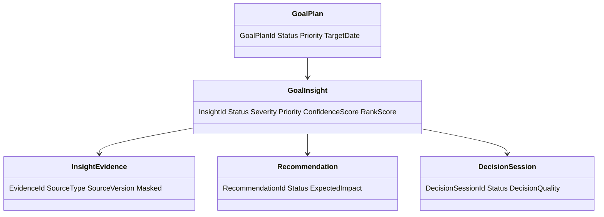
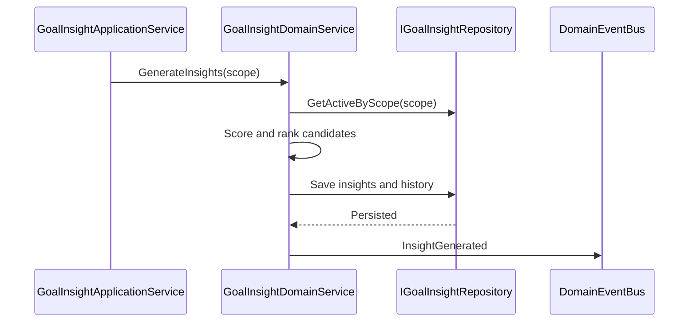
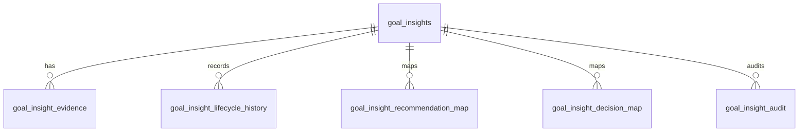
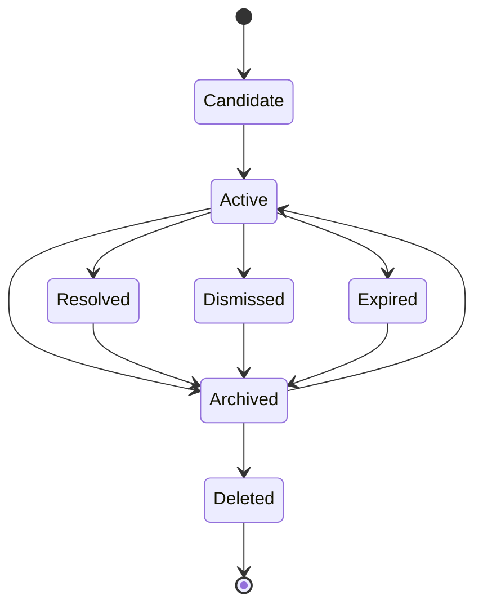
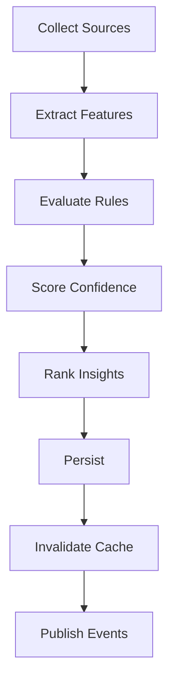
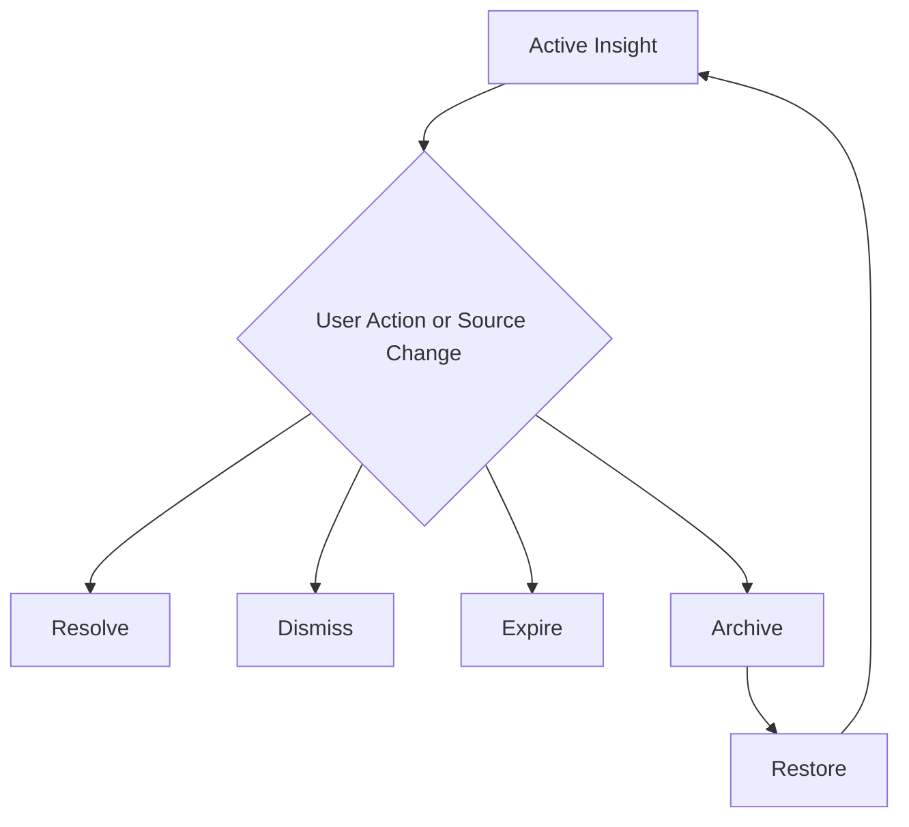

# Goal Insights
Version: 1.0
## Split Navigation
- [Goal insights generation](goal-insights/generation.md)
- [Goal insights dashboard and actions](goal-insights/dashboard-and-actions.md)
- [Goal insights governance and testing](goal-insights/governance-and-testing.md)
Status: Enterprise Specification
Owner: Project Atlas
Source of Truth: Atlas Goal Insights Specification
Last Updated: 2026-07-13
# Goal Insights Overview
## Purpose
Goal Insights defines how Atlas detects, generates, scores, ranks, resolves, dismisses, archives, restores, deletes, secures, audits, and serves insights for GoalPlan. It coordinates with GoalPlan, Milestone, Task, Goal Progress Tracking, Goal Metrics, Goal Dashboard, Goal Analytics, Goal Reporting, Goal Review, DecisionSession, Recommendation, Scenario, Portfolio, CashFlow, Notification, and User. It preserves existing Atlas domain ownership and existing catalog naming.
## Business Meaning
Goal Insights converts governed goal data into explainable observations. Each insight identifies a condition, evidence, severity, priority, confidence score, trigger, lifecycle state, expiration policy, and recommended action mapping. Insights support planning review, dashboard focus, reporting evidence, notification, decision support, and recommendation adoption.
## Insight Lifecycle
Insight lifecycle begins when a rule, event, schedule, or recalculation creates an insight candidate. The candidate is validated, scored, ranked, permission-filtered, persisted, cached, and published. The active insight may be resolved, dismissed, expired, archived, restored, or deleted when policy allows. Resolved, dismissed, expired, archived, and deleted states remain auditable according to retention policy.
## Ownership
GoalPlan owns goal business state. Goal Insights owns insight definitions, evidence links, scoring, ranking, lifecycle, expiration, and projection metadata. Recommendation owns recommendation content and adoption lifecycle. DecisionSession owns decision content and outcome lifecycle.
Scenario owns scenario assumptions and comparison results. Portfolio owns portfolio evidence where authorized. CashFlow owns cashflow evidence where authorized. Notification owns delivery and escalation records.
User owns visibility, acknowledgement, preference, and masking context.
## Insight Sources
GoalPlan supplies status, target date, target amount, priority, category, owner, and lifecycle. Milestone supplies timeline, completion, overdue state, dependency state, and blocker evidence. Task supplies execution state when existing goal task tracking is available. Goal Progress Tracking supplies progress percent, completion score, health score, confidence score, schedule variance, and expected completion.
Goal Metrics supplies KPI values, thresholds, trend values, and metric history. Goal Dashboard supplies snapshot context and widget filter state. Goal Analytics supplies trend, anomaly, forecast, comparison, and indicator output. Goal Reporting supplies report snapshots and generated report context.
Goal Review supplies review result, review findings, action items, and approval state. DecisionSession supplies pending, accepted, rejected, and completed decision states. Recommendation supplies recommended action, ranking, adoption state, expected impact, and realized impact. Scenario supplies baseline, forecast, stress, what-if, and assumption version.
Portfolio supplies allocation, liquidity, risk, valuation, and performance evidence where authorized. CashFlow supplies contribution capacity, surplus, deficit, budget pressure, and funding gap evidence where authorized. Notification supplies trigger, delivery, suppression, escalation, and acknowledgement evidence. User supplies authorization, preference, locale, and field masking context.
## Insight Categories
Progress Insight identifies progress movement, progress gap, or progress acceleration. Financial Insight identifies budget pressure, funding gap, or financial variance. Cash Flow Insight identifies contribution capacity, surplus, deficit, or timing pressure. Goal Health Insight identifies health score changes and combined goal condition.
Priority Insight identifies priority alignment or misalignment. Dependency Insight identifies blocked dependency, critical dependency, or dependency risk. Milestone Insight identifies milestone variance, milestone completion, or milestone blocker. Delay Insight identifies expected completion later than target.
Forecast Insight identifies material forecast movement or forecast confidence change. Recommendation Insight identifies adoption, suppression, or recommendation impact condition. Decision Insight identifies pending, stale, accepted, rejected, or completed decision impact. Risk Insight identifies risk threshold crossing or risk trend.
Behavior Insight identifies update cadence, review cadence, and activity patterns where allowed. Portfolio Insight identifies portfolio funding, liquidity, allocation, and risk evidence. Scenario Insight identifies baseline difference, scenario delta, or assumption-driven outcome. Optimization Insight identifies a better path suggested by existing optimization output.
Trend Insight identifies historical movement, rolling average change, or sustained direction. Opportunity Insight identifies favorable timing, surplus, or acceleration opportunity.
## Insight Generation Strategy
Generation uses rule-based detection, event-driven updates, scheduled refresh, incremental recalculation, historical comparison, forecast comparison, scenario comparison, threshold detection, anomaly detection, and pattern detection. Generation must be deterministic for identical source versions and permission context. Generation records rule version, formula version, source version, generated time, and actor or system identity.
## Relationship with Goal
Every goal-scoped insight references GoalPlanId. Goal Insights does not mutate GoalPlan. GoalPlan lifecycle controls whether insights can be generated, refreshed, resolved, dismissed, archived, restored, or deleted.
## Relationship with Milestone
Milestone evidence may create milestone, delay, dependency, progress, and forecast insights. MilestoneId is preserved when drill-down is authorized.
## Relationship with Task
Task evidence may support progress, delay, dependency, and behavior insights when task tracking exists. Task insight evidence remains subordinate to GoalPlan and Milestone consistency.
## Relationship with Goal Progress
Goal Progress Tracking is the primary source for progress, completion, health, confidence, and schedule insights. Progress freshness affects insight confidence score.
## Relationship with Goal Metrics
Goal Metrics supplies thresholds, warning ranges, critical ranges, units, precision, trend values, and calculation time. Metric evidence must preserve unit and precision.
## Relationship with Goal Dashboard
Goal Dashboard consumes insight summaries, counts, ranking, severity distribution, priority distribution, and top insight projections. Dashboard filters must not expand visibility beyond permission.
## Relationship with Goal Analytics
Goal Analytics supplies indicators, anomalies, forecasts, trends, comparisons, and historical signals. Analytics calculation version is stored in supporting evidence.
## Relationship with Goal Reporting
Goal Reporting includes insight sections, insight history, resolved insight summary, and audit evidence. Report snapshots preserve insight state at generation time.
## Relationship with Goal Review
Goal Review may create review-related insights and may resolve insights through approved review action. Restricted review findings remain masked when required.
## Relationship with Decision
DecisionSession may create decision insights and may resolve decision-related insights. Decision mapping records DecisionSessionId and status.
## Relationship with Recommendation
Recommendation mapping links insight evidence to recommended action without duplicating Recommendation ownership. Recommendation adoption may resolve or lower severity of related insight.
## Relationship with Scenario
Scenario comparison may create forecast, risk, opportunity, and optimization insights. Scenario evidence records ScenarioId, ScenarioVersion, baseline, and assumption summary.
## Relationship with Portfolio
Portfolio evidence may create financial, risk, liquidity, and opportunity insights where authorized. Portfolio evidence records valuation time and masking state.
## Relationship with CashFlow
CashFlow evidence may create contribution, budget pressure, deficit, surplus, and funding gap insights. CashFlow evidence records period and currency.
## Relationship with Notification
Notification may be triggered by severity, priority, threshold crossing, expiration, or lifecycle change. Notification suppression does not remove insight audit history.
## Relationship with User
User permissions determine visibility, masking, acknowledgement, dismissal, and access to evidence. User preference may affect notification delivery but not insight facts.
# Insight Architecture
## Data Collection
Data collection reads authorized source data from existing Atlas domains. It records source type, source identifier, source version, collected time, and masking state.
## Feature Extraction
Feature extraction converts source fields into calculation inputs. It preserves unit, precision, currency, period, and timestamp.
## Aggregation
Aggregation combines source values by goal, household, category, severity, priority, period, scenario, and status. Aggregated counts must not leak unauthorized data.
## Scoring
Scoring calculates severity, priority, confidence score, rank score, and expiration. Scoring must be deterministic for the same inputs.
## Ranking
Ranking orders active insights by severity, priority, confidence score, target proximity, freshness, and created time. Ranking must be stable for equal values.
## Recommendation Mapping
Recommendation mapping associates insight evidence with existing Recommendation records. Mapping must not create a new Recommendation unless a Recommendation command is invoked.
## Decision Mapping
Decision mapping associates insight evidence with existing DecisionSession records. Mapping must not create a new DecisionSession unless a Decision command is invoked.
## Risk Detection
Risk detection evaluates risk score, risk trend, health score, schedule variance, financial pressure, and dependency blockers. Critical risk insights are eligible for notification.
## Forecast Engine
Forecast engine compares expected completion, budget forecast, cash flow forecast, milestone forecast, and scenario forecast. Forecast output records confidence interval when available.
## Historical Learning
Historical learning compares current values with previous periods, rolling windows, resolved insights, and dismissed insights. It does not change source domain state.
## Caching
Caching stores only permission-filtered and masking-aware projections. Cache invalidation follows source version, lifecycle, permission, and masking changes.
## Permission Model
Permission model evaluates user, household, tenant when present, field-level access, domain permission, and projection permission. Permission evaluation occurs before response, cache, export, dashboard, report, or notification projection.
# Insight Categories
## Progress Insight
Progress Insight uses progress percent, expected progress, completion score, schedule variance, and source freshness. It creates a signal when progress is behind, ahead, stalled, volatile, or materially changed.
## Financial Insight
Financial Insight uses budget usage, funding gap, target amount, realized amount, and financial variance. It creates a signal when financial capacity threatens or improves goal completion.
## Cash Flow Insight
Cash Flow Insight uses CashFlow surplus, deficit, contribution capacity, and period alignment. It creates a signal when goal funding timing needs attention.
## Goal Health Insight
Goal Health Insight uses health score, risk score, schedule variance, budget variance, and confidence score. It creates a signal when the combined condition changes materially.
## Priority Insight
Priority Insight uses priority score, business value, risk, deadline, and review result. It creates a signal when priority appears misaligned with impact.
## Dependency Insight
Dependency Insight uses blocked dependency count, critical dependency count, and dependency age. It creates a signal when dependency state blocks progress.
## Milestone Insight
Milestone Insight uses milestone completion, overdue count, expected milestone count, and blocker state. It creates a signal when timeline evidence deviates from plan.
## Delay Insight
Delay Insight uses expected completion date, target date, schedule variance, and milestone trend. It creates a signal when completion is forecast after target.
## Forecast Insight
Forecast Insight uses previous forecast, current forecast, confidence interval, and scenario output. It creates a signal when forecast moves materially.
## Recommendation Insight
Recommendation Insight uses recommendation status, expected impact, realized impact, and adoption state. It creates a signal when recommendation action changes expected outcome.
## Decision Insight
Decision Insight uses decision status, decision age, decision quality, and decision impact. It creates a signal when a decision is stale or materially changes direction.
## Risk Insight
Risk Insight uses risk score, risk trend, health score, dependency blocker, and financial pressure. It creates a signal when risk crosses warning or critical thresholds.
## Behavior Insight
Behavior Insight uses permitted activity cadence, update frequency, review cadence, and acknowledgement history. It creates a signal when engagement patterns affect execution.
## Portfolio Insight
Portfolio Insight uses allocation, liquidity, risk, valuation time, and performance where authorized. It creates a signal when portfolio state affects goal funding.
## Scenario Insight
Scenario Insight uses baseline result, scenario result, assumptions, and scenario version. It creates a signal when scenario comparison is materially different.
## Optimization Insight
Optimization Insight uses existing optimization output, current plan score, optimized plan score, and constraints. It creates a signal when a better path exists.
## Trend Insight
Trend Insight uses history, rolling average, growth rate, decline rate, and anomaly state. It creates a signal when movement is sustained.
## Opportunity Insight
Opportunity Insight uses surplus, schedule lead, low risk, favorable scenario, and recommendation impact. It creates a signal when acceleration or improvement is possible.
# Insight Model
## Progress Insight Model
Name: Progress Insight Business Meaning: Progress movement is below or above expected pace. Severity: medium by default and high when delay risk is material. Priority: high when target date is near.
Confidence Score: min(SourceFreshnessScore, GoalProgressConfidenceScore). Supporting Evidence: ActualProgressPercent, ExpectedProgressPercent, ScheduleVariance, UpdatedAt. Business Rule: ProgressBelowExpectedRule. Calculation Formula: ProgressGap = ExpectedProgressPercent - ActualProgressPercent.
Threshold: ProgressGap >= 5 creates warning and ProgressGap >= 15 creates critical review signal. Trigger: GoalProgressUpdated or scheduled refresh. Lifecycle: Candidate to Active to Resolved, Dismissed, Expired, Archived, or Deleted. Expiration Policy: Expires when progress source version changes or GoalPlan completes.
Recommended Actions: Review milestones, refresh progress, evaluate recommendation. Example: Actual progress is 42 percent and expected progress is 55 percent.
## Financial Insight Model
Name: Financial Insight Business Meaning: Budget or funding condition may affect GoalPlan completion. Severity: high when funding gap exists. Priority: high when target date is near.
Confidence Score: weighted average of budget freshness and cashflow freshness. Supporting Evidence: BudgetUsagePercent, FundingGap, CashFlowSurplus, Currency, Period. Business Rule: FinancialPressureRule. Calculation Formula: FundingGap = RequiredContribution - AvailableContribution.
Threshold: FundingGap > 0 creates active insight. Trigger: CashFlowUpdated, MetricCalculated, or scheduled refresh.
Lifecycle: Candidate to Active to Resolved, Dismissed, Expired, Archived, or Deleted. Expiration Policy: Expires when CashFlow period changes or recalculation clears the gap.
Recommended Actions: Review contribution, scenario, and recommendation. Example: Required contribution exceeds available contribution by 1200.
## Cash Flow Insight Model
Name: Cash Flow Insight Business Meaning: CashFlow capacity indicates surplus, deficit, or timing pressure.
Severity: medium by default and high for persistent deficit. Priority: medium or high based on target proximity.
Confidence Score: CashFlowConfidenceScore adjusted by period freshness. Supporting Evidence: CashFlowPeriod, SurplusDeficit, ContributionCapacity, RequiredContribution.
Business Rule: CashFlowCapacityRule. Calculation Formula: CapacityRatio = AvailableContribution / RequiredContribution.
Threshold: CapacityRatio < 1 creates warning. Trigger: CashFlowUpdated.
Lifecycle: Candidate to Active to Resolved, Dismissed, Expired, Archived, or Deleted. Expiration Policy: Expires when CashFlow period closes.
Recommended Actions: Adjust contribution schedule or compare scenario. Example: Available contribution covers 82 percent of required contribution.
## Goal Health Insight Model
Name: Goal Health Insight Business Meaning: Combined goal condition changed materially.
Severity: high when health score falls below threshold. Priority: high when health is declining.
Confidence Score: GoalProgressConfidenceScore. Supporting Evidence: HealthScore, RiskScore, BudgetVariance, ScheduleVariance.
Business Rule: HealthChangeRule. Calculation Formula: HealthDelta = CurrentHealthScore - PreviousHealthScore.
Threshold: absolute HealthDelta >= 5 creates insight. Trigger: GoalHealthChanged.
Lifecycle: Candidate to Active to Resolved, Dismissed, Expired, Archived, or Deleted. Expiration Policy: Expires on next health recalculation.
Recommended Actions: Review dashboard, analytics, and recommendations. Example: Health score changed from 78 to 68.
## Priority Insight Model
Name: Priority Insight Business Meaning: Priority may not align with business value or risk.
Severity: medium. Priority: medium by default and high when business value is high.
Confidence Score: min(MetricConfidenceScore, ReviewConfidenceScore). Supporting Evidence: PriorityScore, BusinessValueScore, RiskScore, ReviewResult.
Business Rule: PriorityAlignmentRule. Calculation Formula: AlignmentGap = BusinessValueScore - PriorityScore.
Threshold: AlignmentGap >= 20 creates insight. Trigger: MetricCalculated or ReviewCompleted.
Lifecycle: Candidate to Active to Resolved, Dismissed, Expired, Archived, or Deleted. Expiration Policy: Expires when priority changes or review updates.
Recommended Actions: Review priority and decision. Example: High business value goal has low priority score.
## Dependency Insight Model
Name: Dependency Insight Business Meaning: Dependency state may block progress.
Severity: high when critical dependency is blocked. Priority: high.
Confidence Score: DependencyFreshnessScore. Supporting Evidence: BlockedDependencyCount, CriticalDependencyCount, DependencyAgeDays.
Business Rule: DependencyBlockingRule. Calculation Formula: BlockerScore = CriticalDependencyCount * 20 + BlockedDependencyCount * 10.
Threshold: BlockerScore >= 20 creates insight. Trigger: DependencyChanged or scheduled refresh.
Lifecycle: Candidate to Active to Resolved, Dismissed, Expired, Archived, or Deleted. Expiration Policy: Expires when blockers clear.
Recommended Actions: Resolve dependency or trigger notification. Example: Two critical dependencies are blocked.
## Milestone Insight Model
Name: Milestone Insight Business Meaning: Milestone state affects timeline and completion probability.
Severity: medium. Priority: high when milestone is critical.
Confidence Score: MilestoneFreshnessScore. Supporting Evidence: MilestoneCompletionPercent, OverdueMilestoneCount, ExpectedMilestoneCount.
Business Rule: MilestoneVarianceRule. Calculation Formula: MilestoneGap = ExpectedCompletedMilestones - ActualCompletedMilestones.
Threshold: MilestoneGap >= 1 creates insight. Trigger: MilestoneUpdated.
Lifecycle: Candidate to Active to Resolved, Dismissed, Expired, Archived, or Deleted. Expiration Policy: Expires on milestone synchronization.
Recommended Actions: Review milestone plan. Example: One expected milestone remains incomplete.
## Delay Insight Model
Name: Delay Insight Business Meaning: Expected completion date exceeds target date.
Severity: high. Priority: high.
Confidence Score: ForecastConfidenceScore. Supporting Evidence: ExpectedCompletionDate, TargetDate, DelayDays.
Business Rule: DelayForecastRule. Calculation Formula: DelayDays = ExpectedCompletionDate - TargetDate.
Threshold: DelayDays > 0 creates insight. Trigger: GoalForecastChanged.
Lifecycle: Candidate to Active to Resolved, Dismissed, Expired, Archived, or Deleted. Expiration Policy: Expires on forecast recalculation.
Recommended Actions: Evaluate schedule recovery or scenario. Example: Forecast completion is 14 days late.
## Forecast Insight Model
Name: Forecast Insight Business Meaning: Forecast output changed materially.
Severity: medium. Priority: medium.
Confidence Score: ForecastConfidenceScore. Supporting Evidence: PreviousForecast, CurrentForecast, ConfidenceInterval.
Business Rule: ForecastChangeRule. Calculation Formula: ForecastDeltaDays = CurrentForecastDate - PreviousForecastDate.
Threshold: absolute ForecastDeltaDays >= 7 creates insight. Trigger: AnalyticsCalculated.
Lifecycle: Candidate to Active to Resolved, Dismissed, Expired, Archived, or Deleted. Expiration Policy: Expires at next forecast version.
Recommended Actions: Review forecast assumptions. Example: Completion forecast moved by 10 days.
## Recommendation Insight Model
Name: Recommendation Insight Business Meaning: Recommendation adoption status affects goal outcome.
Severity: medium. Priority: medium.
Confidence Score: RecommendationConfidenceScore. Supporting Evidence: RecommendationStatus, ExpectedImpact, RealizedImpact.
Business Rule: RecommendationAdoptionRule. Calculation Formula: AdoptionGap = ExpectedImpact - RealizedImpact.
Threshold: Accepted recommendation with positive AdoptionGap creates insight. Trigger: RecommendationUpdated.
Lifecycle: Candidate to Active to Resolved, Dismissed, Expired, Archived, or Deleted. Expiration Policy: Expires when recommendation closes.
Recommended Actions: Review adoption progress. Example: Accepted recommendation has not improved progress.
## Decision Insight Model
Name: Decision Insight Business Meaning: Decision state changes goal direction or risk.
Severity: medium. Priority: high when decision blocks goal progress.
Confidence Score: DecisionQualityScore. Supporting Evidence: DecisionStatus, DecisionImpact, DecisionAgeDays.
Business Rule: DecisionStalenessRule. Calculation Formula: DecisionAgeDays = Today - DecisionCreatedDate.
Threshold: Pending decision age >= 14 days creates insight. Trigger: DecisionUpdated or scheduled refresh.
Lifecycle: Candidate to Active to Resolved, Dismissed, Expired, Archived, or Deleted. Expiration Policy: Expires when decision closes.
Recommended Actions: Complete or reject pending decision. Example: Decision remains pending for 18 days.
## Risk Insight Model
Name: Risk Insight Business Meaning: Risk exposure crosses warning or critical threshold.
Severity: critical when RiskScore >= 80. Priority: high.
Confidence Score: RiskScoreConfidence. Supporting Evidence: RiskScore, RiskTrend, HealthScore.
Business Rule: RiskThresholdRule. Calculation Formula: RiskAdjustedHealth = HealthScore - RiskScore * 0.4.
Threshold: RiskScore >= 70 creates insight. Trigger: MetricCalculated or RiskChanged.
Lifecycle: Candidate to Active to Resolved, Dismissed, Expired, Archived, or Deleted. Expiration Policy: Expires when risk score drops below threshold.
Recommended Actions: Review risk mitigation. Example: Risk score reached 76.
## Behavior Insight Model
Name: Behavior Insight Business Meaning: User activity pattern affects goal execution.
Severity: low. Priority: medium.
Confidence Score: ActivityFreshnessScore. Supporting Evidence: ActivityCount, ReviewCompletion, UpdateFrequency.
Business Rule: BehaviorPatternRule. Calculation Formula: ActivityGapDays = Today - LastMeaningfulActivityDate.
Threshold: ActivityGapDays >= 30 for active goal creates insight. Trigger: Scheduled refresh.
Lifecycle: Candidate to Active to Resolved, Dismissed, Expired, Archived, or Deleted. Expiration Policy: Expires when activity resumes.
Recommended Actions: Review goal or notification preference. Example: No meaningful update for 35 days.
## Portfolio Insight Model
Name: Portfolio Insight Business Meaning: Portfolio state affects goal funding or risk.
Severity: medium. Priority: medium.
Confidence Score: PortfolioValuationFreshnessScore. Supporting Evidence: PortfolioRisk, Liquidity, Allocation, ValuationTime.
Business Rule: PortfolioExposureRule. Calculation Formula: LiquidityGap = RequiredLiquidAmount - AvailableLiquidAmount.
Threshold: LiquidityGap > 0 creates insight. Trigger: PortfolioUpdated.
Lifecycle: Candidate to Active to Resolved, Dismissed, Expired, Archived, or Deleted. Expiration Policy: Expires on new valuation.
Recommended Actions: Review allocation and scenario. Example: Liquidity gap exists for goal funding.
## Scenario Insight Model
Name: Scenario Insight Business Meaning: Scenario comparison reveals material difference from baseline.
Severity: medium. Priority: medium.
Confidence Score: ScenarioConfidenceScore. Supporting Evidence: BaselineOutcome, ScenarioOutcome, Assumptions.
Business Rule: ScenarioDifferenceRule. Calculation Formula: ScenarioDelta = ScenarioOutcomeScore - BaselineOutcomeScore.
Threshold: absolute ScenarioDelta >= 10 creates insight. Trigger: ScenarioCalculated.
Lifecycle: Candidate to Active to Resolved, Dismissed, Expired, Archived, or Deleted. Expiration Policy: Expires when scenario version changes.
Recommended Actions: Compare scenario and decide. Example: Optimistic scenario improves completion probability by 12 points.
## Optimization Insight Model
Name: Optimization Insight Business Meaning: Existing optimization output indicates improved goal path.
Severity: medium. Priority: medium.
Confidence Score: OptimizationConfidenceScore. Supporting Evidence: CurrentPlanScore, OptimizedPlanScore, ConstraintSet.
Business Rule: OptimizationOpportunityRule. Calculation Formula: Improvement = OptimizedPlanScore - CurrentPlanScore.
Threshold: Improvement >= 5 creates insight. Trigger: AnalyticsCalculated or scheduled refresh.
Lifecycle: Candidate to Active to Resolved, Dismissed, Expired, Archived, or Deleted. Expiration Policy: Expires on plan update.
Recommended Actions: Review recommendation. Example: Optimized contribution plan improves score by 8.
## Trend Insight Model
Name: Trend Insight Business Meaning: Historical movement shows sustained growth or decline.
Severity: medium. Priority: medium.
Confidence Score: TrendConfidenceScore. Supporting Evidence: HistoricalValues, RollingAverage, TrendSlope.
Business Rule: TrendDetectionRule. Calculation Formula: TrendSlope = linear regression slope over rolling window.
Threshold: absolute TrendSlope >= configured threshold creates insight. Trigger: MetricCalculated.
Lifecycle: Candidate to Active to Resolved, Dismissed, Expired, Archived, or Deleted. Expiration Policy: Expires when rolling window changes.
Recommended Actions: Review trend details. Example: Progress trend declined for three periods.
## Opportunity Insight Model
Name: Opportunity Insight Business Meaning: Evidence indicates favorable chance to improve outcome.
Severity: low. Priority: medium.
Confidence Score: OpportunityConfidenceScore. Supporting Evidence: Surplus, AheadOfScheduleDays, LowRiskScore.
Business Rule: OpportunityRule. Calculation Formula: OpportunityScore = SurplusScore + ScheduleLeadScore - RiskPenalty.
Threshold: OpportunityScore >= 70 creates insight. Trigger: Scheduled refresh or metric calculation.
Lifecycle: Candidate to Active to Resolved, Dismissed, Expired, Archived, or Deleted. Expiration Policy: Expires when opportunity condition ends.
Recommended Actions: Consider acceleration or recommendation adoption. Example: Goal is ahead of schedule with CashFlow surplus.
# Insight Generation Rules
## Rule-based
Rule-based generation evaluates defined business rules against source evidence. Rule output must include rule code, rule version, formula code, source version hash, and calculated values.
## Event-driven
Event-driven generation runs after committed source events. Event-driven generation must be idempotent by event id and insight key.
## Scheduled
Scheduled generation runs by configured cadence. Scheduled generation must record schedule id and execution window.
## Incremental
Incremental generation reads only changed source scope and existing active insight keys. Incremental generation must not skip dependent insights.
## Historical Comparison
Historical comparison evaluates prior values, rolling windows, resolved insights, and previous periods. Historical comparison must use consistent period boundaries.
## Forecast Comparison
Forecast comparison evaluates prior forecast, current forecast, target date, and confidence interval. Forecast comparison must record forecast version.
## Scenario Comparison
Scenario comparison evaluates scenario result against baseline result. Scenario comparison must record ScenarioId, ScenarioVersion, and assumptions.
## Threshold Detection
Threshold detection creates insights when warning or critical thresholds are crossed. Threshold detection records previous threshold state and current threshold state.
## Anomaly Detection
Anomaly detection identifies values outside expected historical range. Anomaly detection records baseline window and anomaly score.
## Pattern Detection
Pattern detection identifies repeated delay, repeated dismissal, repeated funding gap, or repeated risk escalation. Pattern detection records pattern window and match count.
# Validation Rules
1. InsightId must be globally unique. 2. HouseholdId is required. 3. TenantId is required when tenant scope exists. 4. GoalPlanId is required for goal-scoped insight. 5. Category must be one of the supported insight categories. 6. Name must follow catalog naming. 7. Status must be Candidate, Active, Resolved, Dismissed, Expired, Archived, or Deleted. 8. Severity must be info, low, medium, high, or critical. 9. Priority must be low, medium, high, or urgent. 10. Confidence score must be between 0 and 100. 11. Rank score must be greater than or equal to 0. 12. Rule code is required. 13. Rule version is required. 14. Formula code is required. 15. Source version hash is required. 16. Trigger code is required. 17. Supporting evidence cannot be empty for Active insight. 18. Financial evidence must include currency and period. 19. CashFlow evidence must include CashFlow period. 20. Portfolio evidence must include valuation time. 21. Scenario evidence must include ScenarioId and ScenarioVersion. 22. Recommendation mapping must reference an existing Recommendation when present. 23. Decision mapping must reference an existing DecisionSession when present. 24. Expiration time must be after creation time. 25. Resolved insight must include resolution reason. 26. Dismissed insight must include dismissal reason. 27. Archived insight must be read-only. 28. Deleted insight must satisfy retention policy. 29. Duplicate active insight key is not allowed. 30. Permission context must be recorded. 31. Masked projection must not expose restricted fields. 32. Notification trigger must include severity threshold. 33. Bulk generation request must include scope. 34. Search date range must be valid. 35. Sorting field must be allowed. 36. Projection field must be allowed. 37. Pagination limit must be within API maximum. 38. Update must preserve immutable identifiers. 39. Recalculate must use current source versions. 40. Resolve cannot apply to expired insight. 41. Dismiss cannot apply to archived insight. 42. Restore cannot apply to deleted insight. 43. Audit metadata is required for every command. 44. Created time cannot be later than updated time. 45. Lifecycle timestamp must match lifecycle state.
# Business Rules
1. Insight generation must preserve Atlas domain ownership. 2. Insight generation must not mutate GoalPlan. 3. Insight generation must not create new unrelated business concepts. 4. Insight generation must use existing catalog naming. 5. Insight generation must be deterministic for identical source versions. 6. Only authorized users can view insight detail. 7. Field-level security applies before projection. 8. Masked evidence must remain masked in cache. 9. Archived GoalPlan cannot create new Active insight. 10. Cancelled GoalPlan can only show historical insights. 11. Completed GoalPlan can create completion and archive insights only. 12. Duplicate active insight for the same insight key must be merged. 13. Higher severity insight wins duplicate merge priority. 14. Critical insight must be eligible for notification. 15. Notification suppression cannot delete insight. 16. Dismissed insight remains visible in audit history. 17. Resolved insight must record resolution source. 18. Expired insight must not trigger notification. 19. Archived insight must be read-only. 20. Restored insight returns to the previous eligible state. 21. Deleted insight requires retention policy permission. 22. Insight confidence decreases when source data is stale. 23. Insight priority increases when target date is near. 24. Financial insight requires authorized financial evidence. 25. Portfolio insight requires portfolio permission. 26. Cash Flow insight requires cashflow permission. 27. Scenario insight requires scenario permission. 28. Recommendation insight requires recommendation permission. 29. Decision insight requires decision permission. 30. Goal Review can resolve review-related insight. 31. Goal Reporting must snapshot insight state at report generation time. 32. Goal Dashboard must use permission-filtered projection. 33. Goal Analytics calculation version must be recorded. 34. Goal Metrics threshold state must be recorded. 35. Goal Progress freshness must affect confidence. 36. Milestone blocker creates dependency insight when critical. 37. Overdue milestone may create delay insight. 38. Funding gap may create financial insight. 39. CashFlow deficit may create Cash Flow insight. 40. Forecast after target date creates delay insight. 41. Forecast confidence below threshold lowers ranking. 42. Opportunity insight cannot be critical severity. 43. Behavior insight cannot expose private activity beyond permission. 44. Historical comparison uses consistent periods. 45. Scenario comparison must compare against named baseline. 46. Anomaly detection must record baseline window. 47. Pattern detection must record pattern window. 48. Incremental generation must only read changed source scope. 49. Scheduled generation must be idempotent per schedule window. 50. Manual generation must record actor. 51. System generation must record system actor. 52. Bulk generation must enforce per-scope authorization. 53. Insight ranking must be deterministic for equal inputs. 54. Severity must dominate ranking over creation time. 55. Priority must dominate ranking within same severity. 56. Expired insights are excluded from default active queries. 57. Archived insights are excluded from default active queries. 58. Resolved insights are excluded from active notification evaluation. 59. Dismissed insights are excluded from active notification evaluation. 60. Restored insight must revalidate source availability. 61. Source deletion must expire dependent active insight. 62. Source masking change must invalidate cached projection. 63. Permission change must invalidate user insight cache. 64. Rule version change must trigger recalculation. 65. Formula version change must trigger recalculation. 66. Threshold change must trigger recalculation. 67. User preference change may alter notification but not insight evidence. 68. All insight commands must write audit trail. 69. All lifecycle events must include correlation id. 70. Concurrency conflict must use optimistic version. 71. Search must enforce HouseholdId scope. 72. Aggregation must not leak unauthorized counts. 73. Export must use masked projection when required. 74. Insight evidence must be reproducible from source versions. 75. Resolution cannot remove supporting evidence. 76. Dismiss reason is required for manual dismissal. 77. Critical unresolved insight cannot be silently hidden. 78. Notification delivery failure must not roll back insight creation. 79. Cache refresh failure must not roll back persisted insight. 80. Materialized view refresh must use committed data.
# State Machine
## States
- Candidate
- Active
- Resolved
- Dismissed
- Expired
- Archived
- Deleted
## Transitions
- Candidate -> Active by validation success.
- Candidate -> Deleted by validation failure retention policy.
- Active -> Resolved by ResolveInsight.
- Active -> Dismissed by DismissInsight.
- Active -> Expired by expiration policy.
- Active -> Archived by ArchiveInsight.
- Resolved -> Archived by ArchiveInsight.
- Dismissed -> Archived by ArchiveInsight.
- Expired -> Archived by ArchiveInsight.
- Archived -> Active by RestoreInsight when source remains valid.
- Archived -> Deleted by DeleteInsight.
- Resolved -> Active by RecalculateInsight when condition reappears.
- Dismissed -> Active by RecalculateInsight when critical condition reappears.
## Triggers
- CreateInsight
- GenerateInsights
- RefreshInsight
- RecalculateInsight
- ResolveInsight
- DismissInsight
- ArchiveInsight
- RestoreInsight
- DeleteInsight
- SourceChanged
- ScheduleElapsed
- PermissionChanged
## Invariant
InsightId, HouseholdId, GoalPlanId when present, created time, and created by are immutable. Active insight must have evidence, severity, priority, confidence score, rule version, source version, and permission context.
Archived and Deleted insights cannot be updated except by RestoreInsight when allowed or retention operation.
## Illegal Transition
- Deleted -> Active
- Deleted -> Resolved
- Deleted -> Dismissed
- Archived -> Resolved
- Archived -> Dismissed
- Expired -> Dismissed
- Resolved -> Dismissed
- Dismissed -> Resolved
- Candidate -> Archived
- Active -> Deleted without retention validation
# Commands
## CreateInsight
Creates a validated insight from authorized scope, evidence, rule, and formula data.
## RefreshInsight
Refreshes source version, evidence summary, ranking, cache, and projection.
## RecalculateInsight
Recalculates severity, priority, confidence, rank, expiration, and evidence.
## ArchiveInsight
Moves an eligible insight to Archived state and makes it read-only.
## RestoreInsight
Restores an archived insight after source, permission, and lifecycle validation.
## DismissInsight
Dismisses an active insight with reason, actor, and optional suppression period.
## ResolveInsight
Resolves an active insight with reason, resolution source, and optional mapping.
## DeleteInsight
Deletes an eligible insight after retention validation.
## GenerateInsights
Generates insights by scope, source version, category, and trigger.
## UpdateInsightEvidence
Updates evidence after authorized recalculation.
## RankInsights
Recomputes rank for active insight projections.
## MapInsightRecommendation
Links insight to existing Recommendation.
## MapInsightDecision
Links insight to existing DecisionSession.
## ExpireInsight
Expires insight when expiration policy or source invalidation applies.
## BulkGenerateInsights
Generates insights for multiple goal scopes with per-item result.
## BulkResolveInsights
Resolves multiple insights with shared reason and per-item audit.
## BulkDismissInsights
Dismisses multiple insights with shared reason and per-item audit.
## PublishInsightNotification
Publishes eligible insight notification trigger.
## InvalidateInsightCache
Invalidates summary, detail, dashboard, and search cache entries.
# Domain Events
## InsightCreated
Emitted after an insight is created.
## InsightUpdated
Emitted after evidence, scoring, ranking, or lifecycle metadata changes.
## InsightResolved
Emitted after ResolveInsight succeeds.
## InsightDismissed
Emitted after DismissInsight succeeds.
## InsightArchived
Emitted after ArchiveInsight succeeds.
## InsightRestored
Emitted after RestoreInsight succeeds.
## InsightDeleted
Emitted after DeleteInsight succeeds.
## InsightGenerated
Emitted after generation creates or updates insight records.
## InsightExpired
Emitted after expiration policy changes insight state.
## InsightRecalculated
Emitted after recalculation succeeds.
## InsightRefreshed
Emitted after refresh succeeds.
## InsightRankChanged
Emitted when rank score materially changes.
## InsightSeverityChanged
Emitted when severity changes.
## InsightPriorityChanged
Emitted when priority changes.
## InsightConfidenceChanged
Emitted when confidence score changes.
## InsightEvidenceChanged
Emitted when supporting evidence changes.
## InsightRecommendationMapped
Emitted when Recommendation mapping is created.
## InsightDecisionMapped
Emitted when DecisionSession mapping is created.
## InsightNotificationTriggered
Emitted when notification trigger is published.
## InsightCacheInvalidated
Emitted when insight cache is invalidated.
## InsightBulkGenerated
Emitted when bulk generation completes.
# Repository
## Interface
IGoalInsightRepository persists insight aggregate, evidence, lifecycle history, mappings, audit, and projections.
## Methods
- Add
- Update
- GetById
- GetByInsightKey
- GetActiveByGoalPlanId
- GetByHouseholdId
- Search
- Archive
- Restore
- Delete
- Resolve
- Dismiss
- Expire
- SaveEvidence
- SaveLifecycleHistory
- SaveRecommendationMapping
- SaveDecisionMapping
- GetDashboardProjection
- GetSummaryProjection
- GetSeverityAggregation
- GetPriorityAggregation
- GetTrendAggregation
## Queries
- ActiveInsightsByGoalPlan
- InsightsBySeverity
- InsightsByPriority
- InsightsByCategory
- InsightsByStatus
- InsightsBySourceVersion
- InsightsByRecommendation
- InsightsByDecision
- InsightsByScenario
- InsightsExpiringBefore
- UnresolvedCriticalInsights
- InsightDashboardSummary
- InsightSearchResult
## Filtering
- GoalPlanId
- HouseholdId
- TenantId
- Category
- Status
- Severity
- Priority
- ConfidenceRange
- CreatedDateRange
- ExpirationDateRange
- ResolvedDateRange
- DismissedDateRange
- SourceType
- RecommendationId
- DecisionSessionId
- ScenarioId
- MilestoneId
- HasNotification
## Sorting
- severity desc
- priority desc
- confidenceScore desc
- createdAt desc
- expiresAt asc
- category asc
- status asc
- updatedAt desc
- rank asc
## Aggregation
- CountBySeverity
- CountByPriority
- CountByCategory
- CountByStatus
- AverageConfidence
- CriticalUnresolvedCount
- ExpiredCount
- ResolvedCount
- DismissedCount
- NotificationEligibleCount
## Projection
- InsightSummaryProjection
- InsightDetailProjection
- InsightDashboardProjection
- InsightEvidenceProjection
- InsightRecommendationProjection
- InsightSearchProjection
## Specification
- ActiveInsightSpecification
- VisibleInsightSpecification
- CriticalInsightSpecification
- ExpiredInsightSpecification
- UnresolvedInsightSpecification
- GoalScopedInsightSpecification
- DashboardInsightSpecification
- AuditInsightSpecification
# Domain Service Interaction
- GoalInsightDomainService validates insight lifecycle and business rules.
- GoalProgressDomainService supplies progress freshness and health score.
- GoalMetricsDomainService supplies thresholds and metric values.
- GoalAnalyticsDomainService supplies trend, anomaly, forecast, and comparison signals.
- GoalReviewDomainService supplies review findings and review resolution.
- RecommendationDomainService supplies recommendation mapping and adoption state.
- DecisionDomainService supplies decision mapping and decision status.
- ScenarioDomainService supplies scenario comparison and assumption version.
- NotificationDomainService receives eligible notification triggers.
- AuditDomainService records command, event, evidence, and access history.
- SecurityDomainService evaluates permission and field masking.
- CacheDomainService invalidates insight projections after changes.
# Application Service Interaction
- GoalInsightApplicationService coordinates command handlers and unit of work.
- CreateInsightHandler validates DTO and calls domain service.
- GenerateInsightsHandler collects sources and executes generation rules.
- RefreshInsightHandler refreshes source versions and cache.
- RecalculateInsightHandler recalculates formula, confidence, severity, and ranking.
- ResolveInsightHandler applies resolution and audit trail.
- DismissInsightHandler validates reason and user permission.
- ArchiveInsightHandler makes insight read-only.
- RestoreInsightHandler revalidates source and lifecycle.
- DeleteInsightHandler validates retention and deletes eligible records.
- SearchInsightsQueryHandler applies filters, sorting, projection, and pagination.
- DashboardInsightsQueryHandler returns dashboard projection.
- BulkInsightHandler performs batch generation, resolution, and dismissal with optimistic concurrency.
# API
## REST Endpoints
- GET /api/goal-insights
- POST /api/goal-insights
- GET /api/goal-insights/{insightId}
- POST /api/goal-insights/generate
- POST /api/goal-insights/{insightId}/refresh
- POST /api/goal-insights/{insightId}/recalculate
- POST /api/goal-insights/{insightId}/resolve
- POST /api/goal-insights/{insightId}/dismiss
- POST /api/goal-insights/{insightId}/archive
- POST /api/goal-insights/{insightId}/restore
- DELETE /api/goal-insights/{insightId}
- POST /api/goal-insights/bulk/generate
- POST /api/goal-insights/bulk/resolve
- GET /api/goal-insights/dashboard
- GET /api/goals/{goalPlanId}/insights
## HTTP Methods
GET reads insight projections. POST creates, generates, refreshes, recalculates, resolves, dismisses, archives, restores, or bulk processes.
DELETE deletes eligible insight records after retention validation.
## Request
Create request includes goalPlanId, category, name, severity, priority, confidenceScore, evidence, ruleVersion, and expirationTime. Generate request includes scope, goalPlanId, householdId, categories, sourceVersionMode, and forceRecalculate.
Resolve request includes reason, resolutionSource, relatedRecommendationId, and relatedDecisionSessionId. Dismiss request includes reason and optional suppressUntil.
Search request includes filters, pagination, sorting, and projection.
## Response
Detail response returns insight, evidence, lifecycle, mappings, permissions, and audit metadata. Summary response returns category, severity, priority, confidence, status, title, and created time.
Dashboard response returns counts, distributions, top insights, stale counts, and notification eligible counts. Bulk response returns processed, created, updated, skipped, failed, and correlation id.
## Errors
- 400 invalid request
- 401 unauthenticated
- 403 forbidden
- 404 insight not found
- 409 concurrency conflict
- 410 expired source
- 422 validation failed
- 429 rate limited
- 500 internal error
## Pagination
Pagination uses pageNumber, pageSize, totalCount, totalPages, hasNextPage, and hasPreviousPage.
## Filtering
Filtering supports status, category, severity, priority, confidence range, source type, date range, goalPlanId, householdId, recommendationId, decisionSessionId, scenarioId, and milestoneId.
## Sorting
Sorting supports severity, priority, confidenceScore, rank, createdAt, updatedAt, expiresAt, category, and status.
## Projection
Projection supports summary, detail, dashboard, evidence, recommendation, decision, and audit-safe views.
## Bulk API
Bulk API supports generate, resolve, dismiss, archive, restore, and cache invalidation with per-item results and correlation id.
# DTO
## Create DTO
Includes goalPlanId, category, name, severity, priority, confidenceScore, evidence, ruleCode, formulaCode, triggerCode, expirationTime, and recommendedActions.
## Update DTO
Includes insightId, version, severity, priority, confidenceScore, evidence, expirationTime, and updateReason.
## Detail DTO
Includes insight detail, evidence list, lifecycle history, recommendation mapping, decision mapping, permissions, and audit metadata.
## Summary DTO
Includes insightId, category, name, status, severity, priority, confidenceScore, rankScore, createdAt, and expiresAt.
## Search DTO
Includes filters, sorting, pagination, projection, and masking mode.
## Insight DTO
Includes core insight fields, source version, trigger, lifecycle state, and timestamps.
## Recommendation DTO
Includes recommendationId, status, expectedImpact, realizedImpact, and mapping reason.
## Evidence DTO
Includes evidenceId, sourceType, sourceId, sourceVersion, evidenceValue, masked, and createdAt.
## Dashboard DTO
Includes total count, severity distribution, priority distribution, category distribution, top insights, and stale count.
## Lifecycle DTO
Includes fromStatus, toStatus, reason, actorId, occurredAt, and correlationId.
# Database Mapping
## Table
- goal_insights
- goal_insight_evidence
- goal_insight_lifecycle_history
- goal_insight_recommendation_map
- goal_insight_decision_map
- goal_insight_audit
## Columns
- insight_id uuid primary key
- tenant_id uuid null
- household_id uuid not null
- goal_plan_id uuid null
- category varchar(80) not null
- name varchar(160) not null
- status varchar(40) not null
- severity varchar(20) not null
- priority varchar(20) not null
- confidence_score numeric(5,2) not null
- rank_score numeric(10,4) not null
- insight_key varchar(240) not null
- rule_code varchar(120) not null
- rule_version varchar(40) not null
- formula_code varchar(120) not null
- source_version_hash varchar(128) not null
- trigger_code varchar(80) not null
- evidence_summary jsonb not null
- permission_context jsonb not null
- recommended_actions jsonb not null
- expires_at timestamptz null
- resolved_at timestamptz null
- dismissed_at timestamptz null
- archived_at timestamptz null
- created_at timestamptz not null
- updated_at timestamptz not null
- version int not null
## Indexes
- ix_goal_insights_household_status
- ix_goal_insights_goal_status
- ix_goal_insights_category_severity
- ix_goal_insights_priority_rank
- ix_goal_insights_expires_at
- ix_goal_insights_source_version
- ix_goal_insights_created_at
- ux_goal_insights_active_key
## Constraints
- confidence_score between 0 and 100
- rank_score greater than or equal to 0
- status in supported states
- severity in supported severity values
- priority in supported priority values
- created_at less than or equal to updated_at
- expires_at is null or expires_at greater than created_at
## FK
- goal_plan_id references goal_plans when present
- household_id references households
- recommendation_id references recommendations when present
- decision_session_id references decision_sessions when present
- scenario_id references scenarios when present
- milestone_id references milestones when present
## Unique
- Unique active insight key per household, goal, category, rule, and source scope.
## Check Constraint
- Lifecycle timestamp must match lifecycle status.
## Partition Strategy
- Partition audit and lifecycle history by created_at month for large installations.
# PostgreSQL Schema
```sql
CREATE TABLE goal_insights (
  insight_id uuid PRIMARY KEY,
  tenant_id uuid NULL,
  household_id uuid NOT NULL,
  goal_plan_id uuid NULL,
  category varchar(80) NOT NULL,
  name varchar(160) NOT NULL,
  status varchar(40) NOT NULL,
  severity varchar(20) NOT NULL,
  priority varchar(20) NOT NULL,
  confidence_score numeric(5,2) NOT NULL,
  rank_score numeric(10,4) NOT NULL DEFAULT 0,
  insight_key varchar(240) NOT NULL,
  rule_code varchar(120) NOT NULL,
  rule_version varchar(40) NOT NULL,
  formula_code varchar(120) NOT NULL,
  source_version_hash varchar(128) NOT NULL,
  trigger_code varchar(80) NOT NULL,
  evidence_summary jsonb NOT NULL DEFAULT '{}'::jsonb,
  permission_context jsonb NOT NULL DEFAULT '{}'::jsonb,
  recommended_actions jsonb NOT NULL DEFAULT '[]'::jsonb,
  expires_at timestamptz NULL,
  resolved_at timestamptz NULL,
  dismissed_at timestamptz NULL,
  archived_at timestamptz NULL,
  created_by uuid NULL,
  updated_by uuid NULL,
  created_at timestamptz NOT NULL DEFAULT now(),
  updated_at timestamptz NOT NULL DEFAULT now(),
  version int NOT NULL DEFAULT 1,
  CONSTRAINT ck_goal_insights_confidence CHECK (confidence_score >= 0 AND confidence_score <= 100),
  CONSTRAINT ck_goal_insights_rank CHECK (rank_score >= 0),
  CONSTRAINT ck_goal_insights_status CHECK (status IN ('Candidate','Active','Resolved','Dismissed','Expired','Archived','Deleted')),
  CONSTRAINT ck_goal_insights_severity CHECK (severity IN ('info','low','medium','high','critical')),
  CONSTRAINT ck_goal_insights_priority CHECK (priority IN ('low','medium','high','urgent')),
  CONSTRAINT ck_goal_insights_dates CHECK (expires_at IS NULL OR expires_at > created_at)
);
CREATE TABLE goal_insight_evidence (
  evidence_id uuid PRIMARY KEY,
  insight_id uuid NOT NULL REFERENCES goal_insights(insight_id),
  source_type varchar(80) NOT NULL,
  source_id uuid NULL,
  source_version varchar(120) NOT NULL,
  evidence_value jsonb NOT NULL,
  masked boolean NOT NULL DEFAULT false,
  created_at timestamptz NOT NULL DEFAULT now()
);
CREATE TABLE goal_insight_lifecycle_history (
  history_id uuid PRIMARY KEY,
  insight_id uuid NOT NULL REFERENCES goal_insights(insight_id),
  from_status varchar(40) NULL,
  to_status varchar(40) NOT NULL,
  reason varchar(400) NULL,
  actor_id uuid NULL,
  occurred_at timestamptz NOT NULL DEFAULT now(),
  correlation_id uuid NOT NULL
);
CREATE TABLE goal_insight_recommendation_map (
  insight_id uuid NOT NULL REFERENCES goal_insights(insight_id),
  recommendation_id uuid NOT NULL,
  mapping_reason varchar(400) NOT NULL,
  created_at timestamptz NOT NULL DEFAULT now(),
  PRIMARY KEY (insight_id, recommendation_id)
);
CREATE TABLE goal_insight_decision_map (
  insight_id uuid NOT NULL REFERENCES goal_insights(insight_id),
  decision_session_id uuid NOT NULL,
  mapping_reason varchar(400) NOT NULL,
  created_at timestamptz NOT NULL DEFAULT now(),
  PRIMARY KEY (insight_id, decision_session_id)
);
CREATE TABLE goal_insight_audit (
  audit_id uuid PRIMARY KEY,
  insight_id uuid NULL,
  action varchar(80) NOT NULL,
  actor_id uuid NULL,
  payload jsonb NOT NULL DEFAULT '{}'::jsonb,
  occurred_at timestamptz NOT NULL DEFAULT now(),
  correlation_id uuid NOT NULL
);
CREATE INDEX ix_goal_insights_household_status ON goal_insights(household_id, status);
CREATE INDEX ix_goal_insights_goal_status ON goal_insights(goal_plan_id, status);
CREATE INDEX ix_goal_insights_category_severity ON goal_insights(category, severity);
CREATE INDEX ix_goal_insights_priority_rank ON goal_insights(priority, rank_score DESC);
CREATE INDEX ix_goal_insights_expires_at ON goal_insights(expires_at);
CREATE INDEX ix_goal_insights_source_version ON goal_insights(source_version_hash);
CREATE UNIQUE INDEX ux_goal_insights_active_key ON goal_insights(household_id, insight_key) WHERE status = 'Active';
CREATE VIEW v_goal_insight_summary AS
SELECT insight_id, household_id, goal_plan_id, category, status, severity, priority, confidence_score, rank_score, created_at, updated_at
FROM goal_insights
WHERE status <> 'Deleted';
CREATE MATERIALIZED VIEW mv_goal_insight_dashboard AS
SELECT household_id, status, severity, priority, category, count(*) AS insight_count, avg(confidence_score) AS average_confidence
FROM goal_insights
WHERE status <> 'Deleted'
GROUP BY household_id, status, severity, priority, category;
```
# EF Core Mapping
- Fluent API maps GoalInsight to goal_insights with insight_id primary key.
- Owned Types map evidence summary, permission context, and recommended actions as JSON value objects.
- Indexes map household status, goal status, category severity, priority rank, expiration, source version, and active insight key.
- Query Filters exclude Deleted by default and enforce tenant scope when tenant scope exists.
- Value Conversion stores InsightStatus, InsightSeverity, InsightPriority, InsightCategory, and TriggerCode as strings.
- Concurrency token uses version column.
- Navigation maps evidence, lifecycle history, recommendation mapping, and decision mapping.
# Cache Strategy
- Redis Key: atlas:goal-insights:{tenantId}:{householdId}:summary
- Redis Key: atlas:goal-insights:{tenantId}:{householdId}:goal:{goalPlanId}:active
- Redis Key: atlas:goal-insights:{tenantId}:{householdId}:dashboard
- Redis Key: atlas:goal-insights:{tenantId}:{householdId}:detail:{insightId}
- TTL: summary 300 seconds.
- TTL: dashboard 180 seconds.
- TTL: detail 600 seconds.
- TTL: search 120 seconds.
- Refresh Strategy: refresh after command success and scheduled materialized view refresh.
- Invalidation: invalidate by insight id, goal id, household id, permission change, masking change, source version change, rule version change, and lifecycle event.
- Insight Cache: cache only permission-filtered and masking-aware projections.
# Security
- Authorization requires authenticated user and household access.
- Permissions include GoalInsight.Read.
- Permissions include GoalInsight.Generate.
- Permissions include GoalInsight.Resolve.
- Permissions include GoalInsight.Dismiss.
- Permissions include GoalInsight.Archive.
- Permissions include GoalInsight.Delete.
- Permissions include GoalInsight.Export.
- Permissions include GoalInsight.AuditRead.
- Field Level Security masks financial, portfolio, cashflow, and restricted review evidence.
- Data Masking applies before cache, dashboard, report, export, and notification projection.
- Recommendation and Decision mappings require permission to related domain data.
- Aggregation must not leak restricted counts across unauthorized scope.
# Audit
- Insight History records created, updated, generated, refreshed, recalculated, resolved, dismissed, expired, archived, restored, and deleted.
- Lifecycle History records from status, to status, reason, actor, occurred time, and correlation id.
- Evidence History records source type, source id, source version, masked state, and value hash.
- Decision History records decision mapping and decision-driven resolution.
- Audit Trail records request id, command, actor, permission context, before value, after value, and event id.
# Performance
- Incremental Generation reads changed source scopes and active insight keys.
- Batch Processing partitions work by household, goal, category, and source version.
- Parallel Processing may run independent goal scopes concurrently with bounded concurrency.
- Caching stores summary, dashboard, detail, and search projections.
- Materialized Views aggregate dashboard counts and confidence averages.
- Read Optimization uses summary projection, covering indexes, and keyset pagination.
# Example JSON
## Create
```json
{
  "goalPlanId": "1f2e3d4c-0000-4000-9000-000000000001",
  "category": "Progress Insight",
  "name": "Progress below expected pace",
  "severity": "medium",
  "priority": "high",
  "confidenceScore": 82.5,
  "trigger": "GoalProgressUpdated"
}
```
## Update
```json
{
  "insightId": "8c3d7f4a-6b21-4f2f-9f1a-7b2a9b2c1001",
  "version": 3,
  "confidenceScore": 84.0,
  "expirationTime": "2026-08-13T00:00:00Z"
}
```
## Detail
```json
{
  "insightId": "8c3d7f4a-6b21-4f2f-9f1a-7b2a9b2c1001",
  "status": "Active",
  "category": "Progress Insight",
  "severity": "medium",
  "priority": "high",
  "confidenceScore": 82.5,
  "evidence": [{"sourceType": "GoalProgress", "sourceVersion": "v7"}]
}
```
## Summary
```json
{
  "totalCount": 12,
  "criticalCount": 1,
  "highCount": 3,
  "averageConfidence": 78.4
}
```
## Search
```json
{
  "filters": {"status": "Active", "severity": ["high", "critical"]},
  "sorting": [{"field": "rankScore", "direction": "desc"}],
  "pagination": {"pageNumber": 1, "pageSize": 20}
}
```
## Resolve
```json
{
  "insightId": "8c3d7f4a-6b21-4f2f-9f1a-7b2a9b2c1001",
  "reason": "Milestone and progress were synchronized",
  "resolutionSource": "GoalReview"
}
```
## Dismiss
```json
{
  "insightId": "8c3d7f4a-6b21-4f2f-9f1a-7b2a9b2c1001",
  "reason": "User accepted known risk",
  "suppressUntil": "2026-08-13T00:00:00Z"
}
```
# Mermaid
## Class Diagram

## Sequence Diagram

## ER Diagram

## State Diagram

## Insight Generation Flow

## Insight Lifecycle Flow

# Testing
## Unit Test
Unit tests validate formulas, lifecycle rules, duplicate keys, severity, priority, confidence, expiration, and permissions.
## Integration Test
Integration tests validate repository, API, domain events, cache invalidation, security, and audit trail.
## Calculation Test
Calculation tests validate scoring, ranking, threshold detection, historical comparison, forecast comparison, and scenario comparison.
## Performance Test
Performance tests validate generation latency, dashboard read latency, materialized view refresh, and cache hit rate.
## Load Test
Load tests validate bulk generation, search pagination, concurrent dashboard reads, and event throughput.
## Concurrency Test
Concurrency tests validate optimistic version conflict, duplicate merge, parallel generation, and cache consistency.
# Edge Cases
1. GoalPlan is completed during insight generation. 2. GoalPlan is archived before command commit. 3. GoalPlan is cancelled after active insight exists. 4. Source metric is missing. 5. Source progress is stale. 6. CashFlow period does not align with goal period. 7. Portfolio valuation is stale. 8. Scenario version changes during comparison. 9. Recommendation is archived while mapped to insight. 10. DecisionSession is deleted by retention policy. 11. Milestone is removed before evidence read. 12. Task tracking is disabled for a goal. 13. User loses permission after cache creation. 14. Field masking rule changes after insight creation. 15. Duplicate generation happens in parallel. 16. Critical insight notification fails. 17. Insight expiration occurs during search. 18. Resolve command arrives after dismiss command. 19. Dismiss command lacks reason. 20. Archive command targets active critical insight. 21. Restore command targets source-deleted insight. 22. Delete command violates retention. 23. Bulk generation partially fails. 24. Dashboard aggregation lags active query. 25. Materialized view refresh fails. 26. Rule version changes while scheduled job runs. 27. Formula returns division by zero. 28. Confidence score becomes null from missing evidence. 29. Anomaly baseline has insufficient history. 30. Historical window crosses calendar boundary. 31. Forecast confidence interval is wider than threshold. 32. Search asks for unauthorized projection. 33. Export requests masked financial evidence. 34. Notification suppression expires during generation. 35. Tenant scope is missing in tenant-aware environment. 36. Clock skew makes expiration earlier than creation. 37. Pagination token references deleted insight. 38. Sorting by unsupported field. 39. Aggregation count could reveal restricted insight. 40. Cache contains old masked projection.
# Version History
| Version | Date | Change | Owner |
|---|---|---|---|
| 1.0 | 2026-07-13 | Enterprise Specification for Goal Insights. | Project Atlas |

## Phase 2 Executable Specification Addendum

### Insight Generation Contract

| Field | Required | Description |
|---|---|---|
| InsightGenerationId | Yes | Stable generation run identifier |
| InsightId | No | Existing insight when refresh or recalculation applies |
| HouseholdId | Yes | Household scope |
| GoalPlanId | No | Goal scope when applicable |
| InsightKey | Yes | Deduplication key |
| RuleVersion | Yes | Insight rule version |
| FormulaVersion | Yes | Formula version when calculated |
| SourceVersionHash | Yes | Source evidence version |
| PermissionContextHash | Yes | Visibility and masking context |
| CorrelationId | Yes | Audit correlation |

### Required Commands

| Command | Actor | Output |
|---|---|---|
| ExecuteGoalInsightGeneration | GoalInsightApplicationService | GoalInsightGenerated |
| ExecuteGoalInsightResolution | GoalInsightApplicationService | GoalInsightResolved |
| ExecuteGoalInsightDismissal | GoalInsightApplicationService | GoalInsightDismissed |
| ReplayGoalInsightGeneration | AdministrationApplicationService | GoalInsightGenerationReplayed |

### Addendum Validation Rules

| Rule ID | Rule | Failure |
|---|---|---|
| GIS-P2-VR-001 | Generation must include rule version, source version, and permission context hash. | Reject generation |
| GIS-P2-VR-002 | Active insight key must be unique per household and scope. | Merge or reject duplicate |
| GIS-P2-VR-003 | Dismissal requires reason and optional suppression window validation. | Reject dismissal |
| GIS-P2-VR-004 | Replay must not publish notification or mutate current insight state. | Reject replay |

### Addendum Testing Matrix

| Test | Expected Result |
|---|---|
| Duplicate insight key | Existing active insight is updated or merged |
| Missing source version | Generation fails |
| Dismiss without reason | Dismissal is rejected |
| Permission context changes | Cache invalidates and projection is rebuilt |
| Historical replay | Insight output reproduces without side effects |

| Version | Date | Change |
|---|---|---|
| 1.0-p2 | 2026-07-15 | Phase 2 executable addendum added. |

## Phase 2 Executable Specification Addendum

### Insight Generation Contract

| Field | Required | Description |
|---|---|---|
| InsightGenerationId | Yes | Stable generation run identifier |
| InsightId | No | Existing insight when refresh or recalculation applies |
| HouseholdId | Yes | Household scope |
| GoalPlanId | No | Goal scope when applicable |
| InsightKey | Yes | Deduplication key |
| RuleVersion | Yes | Insight rule version |
| FormulaVersion | Yes | Formula version when calculated |
| SourceVersionHash | Yes | Source evidence version |
| PermissionContextHash | Yes | Visibility and masking context |
| CorrelationId | Yes | Audit correlation |

### Required Commands

| Command | Actor | Output |
|---|---|---|
| ExecuteGoalInsightGeneration | GoalInsightApplicationService | GoalInsightGenerated |
| ExecuteGoalInsightResolution | GoalInsightApplicationService | GoalInsightResolved |
| ExecuteGoalInsightDismissal | GoalInsightApplicationService | GoalInsightDismissed |
| ReplayGoalInsightGeneration | AdministrationApplicationService | GoalInsightGenerationReplayed |

### Addendum Validation Rules

| Rule ID | Rule | Failure |
|---|---|---|
| GIS-P2-VR-001 | Generation must include rule version, source version, and permission context hash. | Reject generation |
| GIS-P2-VR-002 | Active insight key must be unique per household and scope. | Merge or reject duplicate |
| GIS-P2-VR-003 | Dismissal requires reason and optional suppression window validation. | Reject dismissal |
| GIS-P2-VR-004 | Replay must not publish notification or mutate current insight state. | Reject replay |

### Addendum Testing Matrix

| Test | Expected Result |
|---|---|
| Duplicate insight key | Existing active insight is updated or merged |
| Missing source version | Generation fails |
| Dismiss without reason | Dismissal is rejected |
| Permission context changes | Cache invalidates and projection is rebuilt |
| Historical replay | Insight output reproduces without side effects |

| Version | Date | Change |
|---|---|---|
| 1.0-p2 | 2026-07-15 | Phase 2 executable addendum added. |
