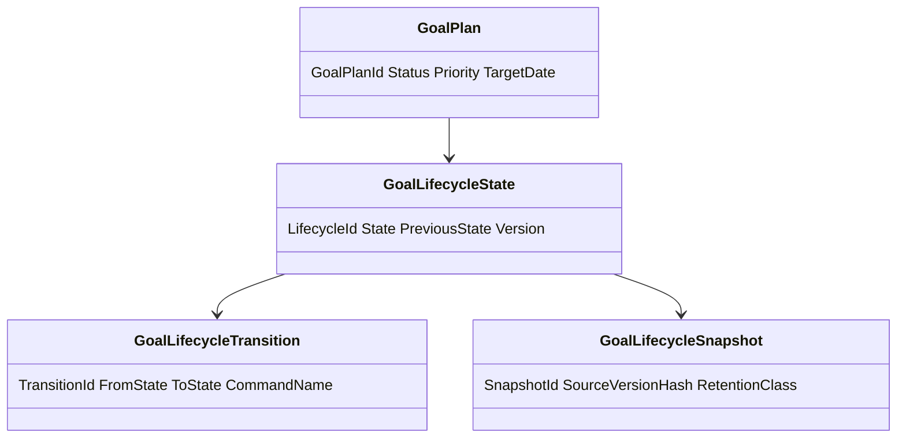
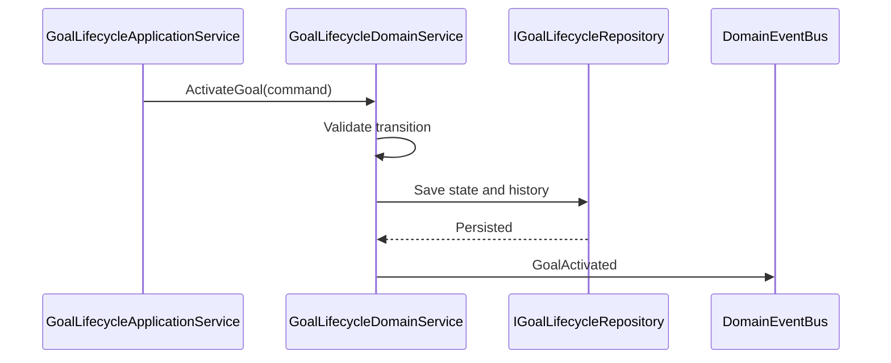
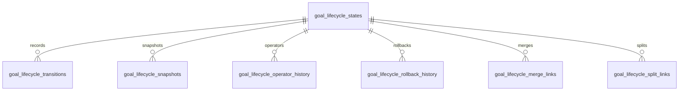
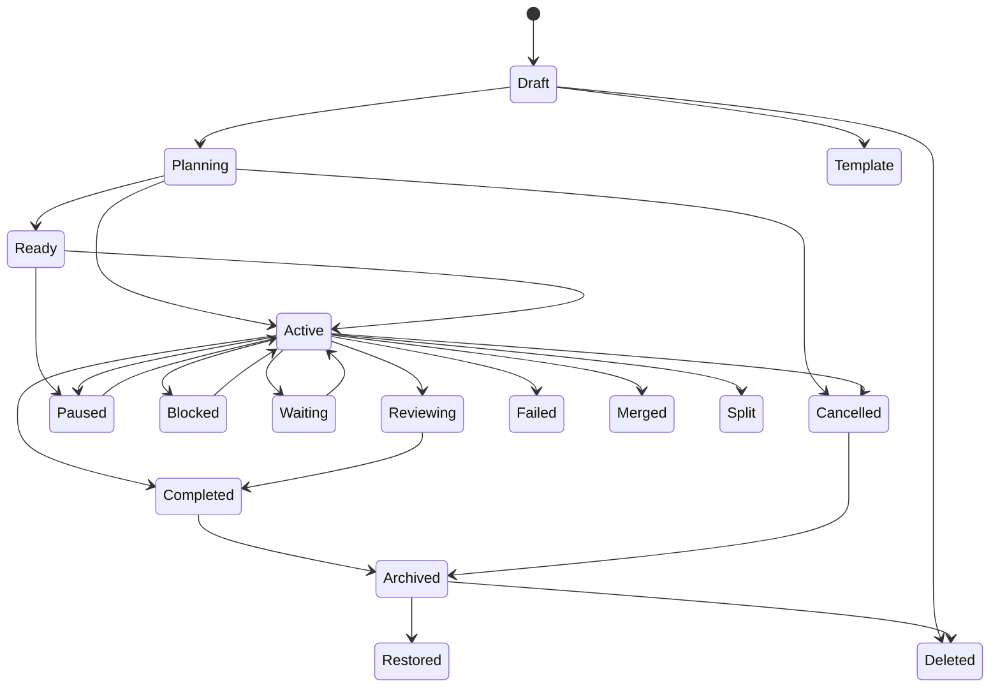
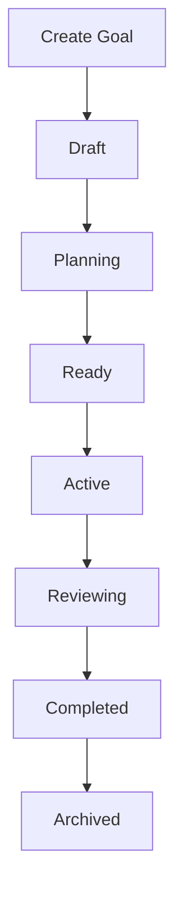
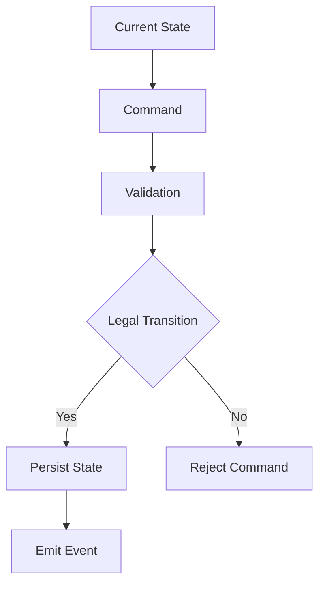
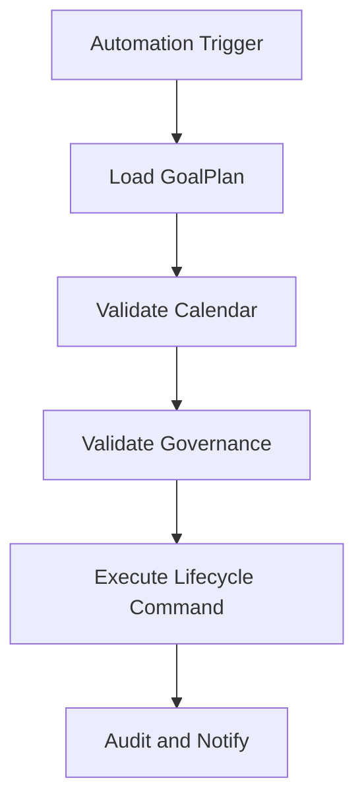

> **ADR-001 PWA Runtime Alignment:** Atlas v1 uses PWA v1 Runtime, Browser Runtime, and IndexedDB Runtime. Future Cloud Architecture is optional future mapping and must not be required for v1.\r\n\r\n# Goal Lifecycle Management
Version: 1.0
## Split Navigation
- [Goal lifecycle states](goal-lifecycle-management/states-and-transitions.md)
- [Goal lifecycle automation and execution](goal-lifecycle-management/automation-and-execution.md)
- [Goal lifecycle governance and testing](goal-lifecycle-management/governance-and-testing.md)
Status: Enterprise Specification
Owner: Project Atlas
Source of Truth: Atlas Goal Lifecycle Management Specification
Last Updated: 2026-07-13
# Goal Lifecycle Management Overview
## Purpose
Goal Lifecycle Management defines the governed lifecycle behavior for GoalPlan from creation through planning, activation, execution, completion, cancellation, archival, restoration, deletion, template use, snapshot use, merge, split, and historical retention.
It coordinates lifecycle behavior with GoalPlan, Milestone, Task, Goal Progress Tracking, Goal Metrics, Goal Dashboard, Goal Analytics, Goal Reporting, Goal Insights, Goal Optimization, Goal Execution, Goal Governance, Goal Review, DecisionSession, Recommendation, Scenario, Portfolio, CashFlow, Notification, Workflow, Automation, Business Calendar, and User.
It preserves existing Atlas domain ownership and existing catalog naming.
## Business Meaning
Goal Lifecycle Management makes every GoalPlan state observable, valid, recoverable, auditable, permission-aware, and consistent across planning, execution, review, optimization, governance, reporting, and notification.
Lifecycle state is a business control for whether a GoalPlan can be edited, activated, paused, blocked, completed, cancelled, archived, restored, deleted, merged, split, templated, snapshotted, or retained as historical evidence.
Lifecycle management does not replace GoalPlan business ownership.
## Lifecycle Scope
Lifecycle scope covers GoalPlan state, allowed commands, allowed events, state validation, transition validation, lifecycle audit, lifecycle projections, lifecycle automation, retention, restoration, and recovery.
Scope includes linked Milestone, Task, progress, metrics, dashboard, analytics, reporting, insights, optimization, execution, governance, review, decision, recommendation, scenario, portfolio, cashflow, notification, workflow, automation, calendar, and user evidence only as coordination inputs.
Scope must preserve HouseholdId.
Scope must preserve TenantId when tenant scope exists.
## Lifecycle Objectives
Lifecycle objectives are valid state control, consistent transitions, governance compliance, permission enforcement, audit traceability, automated lifecycle movement, recovery from failed transitions, retention discipline, and reliable projections.
Objectives are measured through transition success rate, invalid transition count, stale state count, blocked count, recovery count, archive count, restore count, and audit completeness.
## Lifecycle Governance
Lifecycle governance is enforced through Goal Governance policies, permission checks, state invariants, transition rules, Business Calendar windows, Workflow approvals, Automation triggers, audit requirements, and retention rules.
Governance can block lifecycle movement when compliance fails.
Governance cannot silently change lifecycle state without command and event.
## Ownership
GoalPlan owns lifecycle state.
Goal Lifecycle Management owns lifecycle rules, state matrix, transition validation, lifecycle automation, recovery, retention, and lifecycle projections.
Goal Governance owns policy enforcement.
Goal Execution owns execution state and execution results.
Audit owns immutable lifecycle evidence.
Security owns authorization and masking.
Repository owns persistence and query.
Application Service owns orchestration and transaction boundary.
## Relationship with Goal
GoalPlan is the lifecycle aggregate boundary.
Lifecycle state must always belong to a GoalPlan.
Lifecycle transition must not mutate unrelated aggregates.
## Relationship with Milestone
Milestone state can block, support, or verify lifecycle transition.
Completed milestones can support CompleteGoal.
Blocked milestones can trigger BlockGoal.
## Relationship with Task
Task state can support execution readiness, active progress, waiting state, and completion verification when existing task tracking is available.
Task lifecycle remains owned by Task.
## Relationship with Goal Progress
Goal Progress Tracking supplies progress percent, completion score, confidence score, health score, and synchronization state.
Completed GoalPlan must have progress at 100 percent unless governance exception applies.
## Relationship with Goal Metrics
Goal Metrics supplies status metrics, risk score, health score, forecast accuracy, financial variance, and lifecycle KPIs.
Metric evidence must record calculation time.
## Relationship with Goal Dashboard
Goal Dashboard consumes lifecycle summary, state distribution, active goals, blocked goals, overdue states, archived states, and recent transitions.
Dashboard projection must be permission-filtered.
## Relationship with Goal Analytics
Goal Analytics consumes lifecycle history, transition duration, failure rate, blocked duration, retry count, and recovery trend.
Analytics output must preserve source version.
## Relationship with Goal Reporting
Goal Reporting includes lifecycle state, transition history, operator history, archive history, restore history, rollback history, and lifecycle evidence.
Report snapshots preserve lifecycle state at generation time.
## Relationship with Goal Insights
Goal Insights may be created from lifecycle delays, unexpected state, blocked duration, stale draft, overdue review, failed execution, or lifecycle anomaly.
Insight evidence records GoalPlanId and lifecycle state.
## Relationship with Goal Optimization
Goal Optimization may require Ready or Active state before candidate approval.
Approved optimization may create execution plan input but cannot change lifecycle state without command.
## Relationship with Goal Execution
Goal Execution can move GoalPlan to Active, Paused, Blocked, Waiting, Completed, Failed, or Rollback-related state through explicit command policy.
Execution result must be auditable before lifecycle synchronization.
## Relationship with Goal Governance
Goal Governance validates lifecycle policies, transition permissions, archive rules, retention rules, and exception handling.
Governance failure can block transition.
## Relationship with Goal Review
Goal Review can move GoalPlan into Reviewing state and can verify Completed, Failed, Cancelled, or Archived movement.
Review findings remain masked when required.
## Relationship with Decision
DecisionSession can approve, reject, block, or authorize lifecycle transitions.
Decision mapping records DecisionSessionId and decision status.
## Relationship with Recommendation
Recommendation can suggest lifecycle action and can be affected by lifecycle state.
Recommendation lifecycle remains owned by Recommendation.
## Relationship with Scenario
Scenario can support Planning, Ready, Simulation, Snapshot, and Historical evidence.
Scenario evidence records ScenarioId and ScenarioVersion.
## Relationship with Portfolio
Portfolio evidence may block or support Ready, Active, Completed, or Failed state where authorized.
Portfolio data requires portfolio permission.
## Relationship with CashFlow
CashFlow evidence may block or support Ready, Active, Waiting, Completed, or Failed state where authorized.
CashFlow period must be recorded.
## Relationship with Notification
Notification is triggered by lifecycle changes, blocked state, waiting state, review due, completion, cancellation, archive, restore, delete, expiration, merge, split, and automation.
Notification suppression does not remove lifecycle history.
## Relationship with Workflow
Workflow can control approval routing and transition ordering.
Workflow state must remain consistent with lifecycle state.
## Relationship with Automation
Automation can trigger activation, completion, archive, reminder, review, escalation, recovery, and cleanup.
Automation run id must be recorded.
## Relationship with Business Calendar
Business Calendar supplies working days, blackout windows, review windows, archive timing, reminder timing, and escalation timing.
Lifecycle deadlines must respect Business Calendar when configured.
## Relationship with User
User supplies actor, owner, approver, operator, permission, preference, locale, and masking context.
User permission is evaluated before command and projection.
# Lifecycle Architecture
## Lifecycle Coordinator
Lifecycle Coordinator orchestrates commands, validates transition, persists state, writes history, emits events, invalidates cache, and coordinates notifications.
## Lifecycle Engine
Lifecycle Engine evaluates allowed states, allowed transitions, invariants, entry criteria, exit criteria, and lifecycle policies.
## State Machine
State Machine defines states, transitions, triggers, invariants, and illegal transitions.
It is deterministic for the same source state, command, and policy version.
## Workflow Integration
Workflow Integration maps Workflow approvals and steps to lifecycle transition preconditions.
Workflow cannot bypass lifecycle validation.
## Automation Integration
Automation Integration triggers lifecycle commands using configured automation rules.
Automation must record automation run id.
## Validation Engine
Validation Engine evaluates state, dependency, progress, financial, schedule, ownership, permission, and consistency validation.
## Audit Engine
Audit Engine records transition, operator, command, event, source version, before state, after state, and rollback evidence.
## Monitoring Engine
Monitoring Engine observes lifecycle distribution, stale states, blocked duration, transition failures, reminders, escalations, and recovery.
## Recovery Engine
Recovery Engine handles failed transition, partial synchronization, stale lock, rollback, retry, and compensation.
## Retention Engine
Retention Engine enforces archive, restore, delete, snapshot, historical retention, and audit retention rules.
# Lifecycle Stages
## Draft
Purpose: Capture editable GoalPlan intent before formal planning.
Entry Criteria: CreateGoal succeeds with required owner and scope.
Exit Criteria: Minimum planning data is present and validation passes.
Allowed Commands: UpdateGoal, DeleteGoal, ConvertToTemplate, CreateSnapshot.
Allowed Events: GoalCreated, GoalUpdated, GoalDeleted, GoalTemplateCreated, GoalSnapshotCreated.
Business Constraints: Draft is excluded from active execution and default progress aggregation.
## Planning
Purpose: Prepare GoalPlan details, assumptions, milestones, dependencies, financial inputs, and review evidence.
Entry Criteria: Draft has minimum required goal attributes.
Exit Criteria: Planning validation, governance validation, and owner validation pass.
Allowed Commands: UpdateGoal, ActivateGoal, CancelGoal, CreateSnapshot, SplitGoal.
Allowed Events: GoalUpdated, GoalActivated, GoalCancelled, GoalSnapshotCreated, GoalSplit.
Business Constraints: Planning can use Scenario and CashFlow evidence but cannot execute.
## Ready
Purpose: Mark GoalPlan as validated and eligible for activation.
Entry Criteria: Lifecycle validation and governance validation pass.
Exit Criteria: Activation, pause, cancellation, or archive command is accepted.
Allowed Commands: ActivateGoal, PauseGoal, CancelGoal, ArchiveGoal, CreateSnapshot.
Allowed Events: GoalActivated, GoalPaused, GoalCancelled, GoalArchived, GoalSnapshotCreated.
Business Constraints: Ready state must remain consistent with dependency and permission validation.
## Active
Purpose: Represent an executing or trackable GoalPlan.
Entry Criteria: ActivateGoal succeeds or execution synchronization activates the goal.
Exit Criteria: Pause, block, wait, review, complete, fail, cancel, archive, split, or merge command succeeds.
Allowed Commands: UpdateGoal, PauseGoal, BlockGoal, CompleteGoal, CancelGoal, MergeGoal, SplitGoal, CreateSnapshot.
Allowed Events: GoalUpdated, GoalPaused, GoalBlocked, GoalCompleted, GoalCancelled, GoalMerged, GoalSplit, GoalSnapshotCreated.
Business Constraints: Active participates in progress, metrics, dashboard, analytics, insights, optimization, execution, review, recommendation, and notification.
## Paused
Purpose: Temporarily stop active movement without cancelling the GoalPlan.
Entry Criteria: PauseGoal succeeds from Ready, Active, Waiting, Reviewing, or Blocked when policy permits.
Exit Criteria: ResumeGoal, CancelGoal, ArchiveGoal, or DeleteGoal succeeds.
Allowed Commands: ResumeGoal, CancelGoal, ArchiveGoal, CreateSnapshot.
Allowed Events: GoalResumed, GoalCancelled, GoalArchived, GoalSnapshotCreated.
Business Constraints: Paused state does not reset progress and must preserve prior active evidence.
## Blocked
Purpose: Represent a GoalPlan that cannot progress because a dependency, governance, financial, schedule, decision, or execution condition blocks it.
Entry Criteria: BlockGoal succeeds or validation detects blocking condition.
Exit Criteria: UnblockGoal, CancelGoal, ArchiveGoal, or Review transition succeeds.
Allowed Commands: UnblockGoal, CancelGoal, ArchiveGoal, CreateSnapshot.
Allowed Events: GoalBlocked, GoalUnblocked, GoalCancelled, GoalArchived, GoalSnapshotCreated.
Business Constraints: Blocked state must include blocker reason and blocker source.
## Waiting
Purpose: Represent a GoalPlan waiting for decision, approval, cashflow period, portfolio event, Business Calendar window, workflow step, or automation window.
Entry Criteria: Transition precondition requires external or scheduled wait.
Exit Criteria: Required waiting condition resolves or timeout policy applies.
Allowed Commands: UpdateGoal, ResumeGoal, CancelGoal, ArchiveGoal, CreateSnapshot.
Allowed Events: GoalUpdated, GoalResumed, GoalCancelled, GoalArchived, GoalSnapshotCreated.
Business Constraints: Waiting state must include wait reason and expected resume condition.
## Reviewing
Purpose: Represent a GoalPlan under Goal Review, governance review, decision review, or approval review.
Entry Criteria: Review workflow or review command starts.
Exit Criteria: Review completes and next lifecycle command succeeds.
Allowed Commands: UpdateGoal, CompleteGoal, CancelGoal, PauseGoal, CreateSnapshot.
Allowed Events: GoalUpdated, GoalCompleted, GoalCancelled, GoalPaused, GoalSnapshotCreated.
Business Constraints: Reviewing must preserve review id when review controls lifecycle movement.
## Completed
Purpose: Represent a closed GoalPlan with completion criteria met.
Entry Criteria: CompleteGoal succeeds after validation.
Exit Criteria: ArchiveGoal, RestoreGoal through approved correction, or CreateSnapshot succeeds.
Allowed Commands: ArchiveGoal, CreateSnapshot.
Allowed Events: GoalCompleted, GoalArchived, GoalSnapshotCreated.
Business Constraints: Completed GoalPlan must remain 100 percent complete and read-only except allowed archive or correction.
## Succeeded
Purpose: Represent success outcome where success evidence is separated from administrative completion.
Entry Criteria: Completion verification confirms success criteria.
Exit Criteria: CompleteGoal, ArchiveGoal, or CreateSnapshot succeeds.
Allowed Commands: CompleteGoal, ArchiveGoal, CreateSnapshot.
Allowed Events: GoalCompleted, GoalArchived, GoalSnapshotCreated.
Business Constraints: Succeeded must include success evidence and verification time.
## Failed
Purpose: Represent a GoalPlan whose success criteria cannot be met under current approved state.
Entry Criteria: Execution, review, governance, or decision confirms failure.
Exit Criteria: CancelGoal, ArchiveGoal, RestoreGoal, SplitGoal, or CreateSnapshot succeeds.
Allowed Commands: CancelGoal, ArchiveGoal, RestoreGoal, SplitGoal, CreateSnapshot.
Allowed Events: GoalCancelled, GoalArchived, GoalRestored, GoalSplit, GoalSnapshotCreated.
Business Constraints: Failed state must include failure reason and source evidence.
## Cancelled
Purpose: Represent a GoalPlan intentionally stopped before completion.
Entry Criteria: CancelGoal succeeds.
Exit Criteria: ArchiveGoal, RestoreGoal, or CreateSnapshot succeeds.
Allowed Commands: ArchiveGoal, RestoreGoal, CreateSnapshot.
Allowed Events: GoalCancelled, GoalArchived, GoalRestored, GoalSnapshotCreated.
Business Constraints: Cancelled GoalPlan cannot reactivate without restore and validation.
## Archived
Purpose: Preserve a read-only GoalPlan for history and reporting.
Entry Criteria: ArchiveGoal succeeds.
Exit Criteria: RestoreGoal or DeleteGoal succeeds.
Allowed Commands: RestoreGoal, DeleteGoal, CreateSnapshot.
Allowed Events: GoalArchived, GoalRestored, GoalDeleted, GoalSnapshotCreated.
Business Constraints: Archived GoalPlan cannot update business fields.
## Deleted
Purpose: Represent a retained deletion marker or removed record according to retention policy.
Entry Criteria: DeleteGoal succeeds after retention validation.
Exit Criteria: None unless storage policy supports administrative recovery.
Allowed Commands: None.
Allowed Events: GoalDeleted.
Business Constraints: Deleted GoalPlan is excluded from default query and cannot transition.
## Restored
Purpose: Represent a GoalPlan returned from Archived, Cancelled, Failed, or Deleted marker when policy permits.
Entry Criteria: RestoreGoal succeeds.
Exit Criteria: Planning, Ready, Active, Paused, Completed, or Archived state is assigned by restore policy.
Allowed Commands: UpdateGoal, ActivateGoal, PauseGoal, ArchiveGoal, CreateSnapshot.
Allowed Events: GoalRestored, GoalUpdated, GoalActivated, GoalPaused, GoalArchived, GoalSnapshotCreated.
Business Constraints: Restored state must revalidate source, ownership, permission, and governance.
## Expired
Purpose: Represent a GoalPlan no longer valid because target date, policy window, scenario validity, or business window expired.
Entry Criteria: ExpireGoal succeeds or automation detects expiration.
Exit Criteria: ArchiveGoal, RestoreGoal, CancelGoal, or CreateSnapshot succeeds.
Allowed Commands: ArchiveGoal, RestoreGoal, CancelGoal, CreateSnapshot.
Allowed Events: GoalExpired, GoalArchived, GoalRestored, GoalCancelled, GoalSnapshotCreated.
Business Constraints: Expired state must include expiration reason and evaluated time.
## Merged
Purpose: Represent a GoalPlan whose scope was merged into another GoalPlan.
Entry Criteria: MergeGoal succeeds.
Exit Criteria: ArchiveGoal or CreateSnapshot succeeds.
Allowed Commands: ArchiveGoal, CreateSnapshot.
Allowed Events: GoalMerged, GoalArchived, GoalSnapshotCreated.
Business Constraints: Merged state must reference target GoalPlanId.
## Split
Purpose: Represent a GoalPlan separated into multiple GoalPlan records.
Entry Criteria: SplitGoal succeeds.
Exit Criteria: ArchiveGoal or CreateSnapshot succeeds.
Allowed Commands: ArchiveGoal, CreateSnapshot.
Allowed Events: GoalSplit, GoalArchived, GoalSnapshotCreated.
Business Constraints: Split state must reference child GoalPlanIds.
## Template
Purpose: Represent reusable GoalPlan pattern created from allowed source state.
Entry Criteria: ConvertToTemplate succeeds.
Exit Criteria: CloneGoal or ArchiveGoal succeeds.
Allowed Commands: CloneGoal, ArchiveGoal, CreateSnapshot.
Allowed Events: GoalTemplateCreated, GoalArchived, GoalSnapshotCreated.
Business Constraints: Template must not include unauthorized personal financial data.
## Snapshot
Purpose: Represent immutable point-in-time GoalPlan evidence.
Entry Criteria: CreateSnapshot succeeds.
Exit Criteria: Archive by retention policy.
Allowed Commands: ArchiveGoal.
Allowed Events: GoalSnapshotCreated, GoalArchived.
Business Constraints: Snapshot is immutable and must record source version hash.
## Historical
Purpose: Represent retained lifecycle evidence for audit, reporting, analytics, and replay.
Entry Criteria: Archive, delete marker, snapshot, merge, split, or retention process creates historical record.
Exit Criteria: Retention expiration or administrative archive process.
Allowed Commands: CreateSnapshot.
Allowed Events: GoalSnapshotCreated.
Business Constraints: Historical state is read-only and permission-filtered.
# Lifecycle Transition Rules
## Legal Transitions
- Draft -> Planning by UpdateGoal when minimum attributes exist.
- Draft -> Template by ConvertToTemplate when template validation passes.
- Draft -> Deleted by DeleteGoal when retention allows.
- Planning -> Ready by UpdateGoal when validation passes.
- Planning -> Active by ActivateGoal when governance allows.
- Planning -> Cancelled by CancelGoal.
- Planning -> Split by SplitGoal when split validation passes.
- Ready -> Active by ActivateGoal.
- Ready -> Paused by PauseGoal.
- Ready -> Cancelled by CancelGoal.
- Ready -> Archived by ArchiveGoal.
- Active -> Paused by PauseGoal.
- Active -> Blocked by BlockGoal.
- Active -> Waiting by workflow, automation, decision, cashflow, or calendar condition.
- Active -> Reviewing by review trigger.
- Active -> Completed by CompleteGoal.
- Active -> Succeeded by success verification.
- Active -> Failed by execution or review failure.
- Active -> Cancelled by CancelGoal.
- Active -> Merged by MergeGoal.
- Active -> Split by SplitGoal.
- Paused -> Active by ResumeGoal.
- Paused -> Cancelled by CancelGoal.
- Paused -> Archived by ArchiveGoal.
- Blocked -> Active by UnblockGoal.
- Blocked -> Reviewing by review trigger.
- Blocked -> Cancelled by CancelGoal.
- Waiting -> Active by ResumeGoal when wait condition resolves.
- Waiting -> Blocked by timeout or blocking condition.
- Waiting -> Cancelled by CancelGoal.
- Reviewing -> Active by review completion requiring continuation.
- Reviewing -> Completed by CompleteGoal.
- Reviewing -> Failed by review failure.
- Reviewing -> Cancelled by CancelGoal.
- Succeeded -> Completed by CompleteGoal.
- Completed -> Archived by ArchiveGoal.
- Failed -> Cancelled by CancelGoal.
- Failed -> Archived by ArchiveGoal.
- Cancelled -> Archived by ArchiveGoal.
- Cancelled -> Restored by RestoreGoal.
- Archived -> Restored by RestoreGoal.
- Archived -> Deleted by DeleteGoal.
- Restored -> Planning by restore policy.
- Restored -> Ready by restore policy.
- Restored -> Active by restore policy.
- Expired -> Archived by ArchiveGoal.
- Expired -> Restored by RestoreGoal.
- Merged -> Archived by ArchiveGoal.
- Split -> Archived by ArchiveGoal.
- Template -> Draft by CloneGoal.
- Template -> Archived by ArchiveGoal.
- Snapshot -> Historical by retention process.
## Illegal Transitions
- Deleted -> Active.
- Deleted -> Completed.
- Deleted -> Archived.
- Archived -> Active without RestoreGoal.
- Completed -> Active without approved correction.
- Cancelled -> Active without RestoreGoal.
- Failed -> Completed without review or execution correction.
- Draft -> Completed.
- Planning -> Completed.
- Ready -> Completed.
- Template -> Completed.
- Snapshot -> Active.
- Historical -> Active.
## Trigger
Triggers are domain commands, domain events, Workflow transitions, Automation runs, Business Calendar schedule, governance decision, review result, execution result, optimization approval, recommendation adoption, decision status, and retention process.
## Pre-condition
Pre-condition includes current state, command permission, ownership, source version, dependency state, progress state, financial state, schedule state, governance result, workflow state, automation context, and audit readiness.
## Post-condition
Post-condition includes new state, transition history, domain event, cache invalidation, dashboard projection update, reporting evidence, notification trigger, and audit record.
## Invariant
GoalPlanId, HouseholdId, owner scope, created time, source state, and transition id are immutable.
Terminal state cannot be changed except by approved restore, archive, snapshot, or retention process.
## Rollback Strategy
Rollback restores prior lifecycle state only when persistence, event publication, or synchronization fails before external side effect is committed.
Committed domain event requires compensating transition instead of silent rollback.
## Recovery Strategy
Recovery detects stuck transition, stale lock, missing event, cache mismatch, projection lag, failed notification, and partial synchronization.
Recovery records RecoveryId, reason, actor or system actor, and result.
# Lifecycle Validation
## State Validation
State must be one of the supported lifecycle stages and must match allowed command set.
## Dependency Validation
Dependencies must be resolved before Ready, Active, Complete, Merge, or Split when policy requires.
## Progress Validation
Progress must be valid for Active, Completed, Succeeded, Failed, and Archived states.
## Financial Validation
Financial evidence must satisfy budget, CashFlow, Portfolio, and governance policies when state requires readiness or completion.
## Schedule Validation
Target date, Business Calendar, milestone dates, review windows, and automation windows must be valid.
## Ownership Validation
GoalPlan owner, HouseholdId, TenantId when present, and operator permission must align.
## Permission Validation
Command permission, field permission, lifecycle permission, restore permission, delete permission, and archive permission must be evaluated.
## Consistency Validation
Lifecycle state must match progress, metrics, execution, governance, review, recommendation, decision, scenario, notification, and projection state.
# Lifecycle Automation
## Automatic Activation
Automatic Activation moves Ready to Active when policy, schedule, dependency, and approval conditions pass.
## Automatic Completion
Automatic Completion completes GoalPlan when completion criteria, execution result, progress, and verification pass.
## Automatic Archive
Automatic Archive archives terminal GoalPlan after retention and Business Calendar rules pass.
## Automatic Reminder
Automatic Reminder triggers notification for stale Draft, overdue Review, Blocked state, Waiting state, and approaching target date.
## Automatic Review
Automatic Review moves eligible GoalPlan to Reviewing according to review cadence.
## Automatic Escalation
Automatic Escalation triggers governance or notification escalation for long Blocked, long Waiting, failed validation, or overdue decision.
## Automatic Recovery
Automatic Recovery repairs stale lifecycle lock, missing projection, failed cache invalidation, or incomplete synchronization.
## Automatic Cleanup
Automatic Cleanup applies archive, snapshot retention, expired exception cleanup, and deleted marker retention policy.
# Validation Rules
1. GoalPlanId is required. 2. HouseholdId is required. 3. TenantId is required when tenant scope exists. 4. Lifecycle state is required. 5. Current state must be supported. 6. Target state must be supported. 7. Command must be supported. 8. Command must be allowed from current state. 9. Transition must be legal. 10. Illegal transition must be rejected. 11. Actor is required for manual command. 12. System actor is required for automation. 13. CorrelationId is required. 14. CausationId is required for event-driven command. 15. Source version hash is required. 16. Policy version is required when governance applies. 17. WorkflowInstanceId is required when workflow controls transition. 18. AutomationRunId is required when automation triggers transition. 19. Business Calendar window must be valid when scheduling applies. 20. Owner must have access to GoalPlan. 21. Operator must have lifecycle permission. 22. Restore requires archive, cancel, failed, expired, or permitted deleted marker. 23. Delete requires retention validation. 24. Archive requires allowed terminal or policy-approved state. 25. Complete requires completion criteria. 26. Completed state requires progress 100 unless exception applies. 27. Cancel requires cancellation reason. 28. Block requires blocker reason and blocker source. 29. Unblock requires blocker resolution. 30. Pause requires pausable state. 31. Resume requires paused, waiting, blocked, or restored state. 32. Merge requires target GoalPlanId. 33. Split requires child GoalPlanIds. 34. Snapshot requires source version hash. 35. Template requires template-safe field validation. 36. Expire requires expiration reason. 37. Transition timestamp is required. 38. Transition timestamp cannot be before creation time. 39. Transition history must be append-only. 40. Audit metadata is required. 41. Projection fields must be allowed. 42. Sorting fields must be allowed. 43. Pagination limit must be within API maximum. 44. Cache key must include tenant when tenant scope exists. 45. Masked fields must not appear in unauthorized projection.
# Business Rules
1. Lifecycle management must preserve Atlas domain ownership. 2. Lifecycle management must not redesign Atlas. 3. Lifecycle management must not create unrelated business concepts. 4. Lifecycle naming must follow existing catalog. 5. GoalPlan owns lifecycle state. 6. Draft is editable by authorized owner. 7. Draft is excluded from active dashboard counts. 8. Draft can be deleted when retention allows. 9. Planning requires minimum goal attributes. 10. Planning can be updated until activated or cancelled. 11. Ready requires validation success. 12. Ready cannot complete directly. 13. Active participates in progress tracking. 14. Active participates in metrics. 15. Active participates in dashboard. 16. Active participates in analytics. 17. Active participates in insights. 18. Active participates in optimization. 19. Active participates in execution. 20. Active participates in review. 21. Active can be paused by authorized user. 22. Active can be blocked by dependency failure. 23. Active can become waiting for decision, workflow, automation, cashflow, or calendar. 24. Paused must preserve progress. 25. Paused must not reset metrics. 26. Paused can resume when validation passes. 27. Blocked requires blocker reason. 28. Blocked requires blocker source. 29. Blocked can trigger notification. 30. Blocked can trigger insight. 31. Blocked can trigger escalation. 32. Waiting requires wait reason. 33. Waiting requires expected resume condition. 34. Reviewing requires review context. 35. Reviewing can complete only after review validation. 36. Completed requires completion criteria. 37. Completed GoalPlan must remain 100 percent complete. 38. Completed GoalPlan is read-only except archive, snapshot, or approved correction. 39. Succeeded requires success evidence. 40. Succeeded must become Completed or Archived by policy. 41. Failed requires failure reason. 42. Failed can be archived. 43. Failed can be restored only with approval. 44. Cancelled requires cancellation reason. 45. Cancelled cannot activate without restore. 46. Archived is read-only. 47. Archived is excluded from default active queries. 48. Archived can restore when retention allows. 49. Deleted cannot transition. 50. Deleted is excluded from default query. 51. Restored requires source revalidation. 52. Restored requires permission revalidation. 53. Restored requires governance revalidation. 54. Expired requires expiration reason. 55. Expired can be archived. 56. Expired can be restored with approval. 57. Merged requires target GoalPlanId. 58. Merged source is read-only after merge. 59. Split requires child GoalPlanIds. 60. Split source is read-only after split unless policy allows. 61. Template must not include unauthorized financial data. 62. Template can be cloned by authorized user. 63. Snapshot is immutable. 64. Snapshot must record source version hash. 65. Historical state is read-only. 66. Historical projection must be permission-filtered. 67. Goal Governance can block transition. 68. Goal Execution can synchronize lifecycle only through explicit command. 69. Goal Optimization cannot change lifecycle directly. 70. Goal Insights cannot change lifecycle directly. 71. Recommendation cannot change lifecycle directly. 72. DecisionSession can authorize transition when mapped. 73. Scenario evidence must record ScenarioVersion. 74. Portfolio evidence requires portfolio permission. 75. CashFlow evidence requires cashflow permission. 76. Notification failure must not roll back lifecycle transition. 77. Cache failure must not roll back lifecycle transition. 78. Projection lag must expose generated time. 79. Audit failure must block transition when audit is required. 80. Transition history is append-only. 81. State history is append-only. 82. Operator history is append-only. 83. Rollback history is append-only. 84. Restore history is append-only. 85. Archive history is append-only. 86. Delete requires retention permission. 87. Merge requires permission on source and target. 88. Split requires permission on source and children. 89. Clone requires permission on template. 90. Automatic Activation requires policy approval. 91. Automatic Completion requires verification evidence. 92. Automatic Archive requires retention window. 93. Automatic Reminder respects user preference. 94. Automatic Review respects Business Calendar. 95. Automatic Escalation respects escalation policy. 96. Automatic Recovery must record recovery result. 97. Automatic Cleanup must not delete audit evidence early. 98. Workflow cannot bypass lifecycle validation. 99. Automation cannot bypass lifecycle validation. 100. Business Calendar blackout blocks scheduled lifecycle transition unless override permission exists. 101. Concurrent lifecycle update must use optimistic version. 102. Duplicate command must be idempotent by command id. 103. Event replay must reproduce lifecycle state. 104. State change must emit domain event after persistence. 105. Domain event must include prior state and new state. 106. Lifecycle cache invalidates after state change. 107. Dashboard projection invalidates after state change. 108. Reporting snapshot must preserve state at generation time. 109. Analytics must use committed state history. 110. Security masking applies before API response.
# State Machine
## Complete State Matrix
| From | To | Command | Guard |
|---|---|---|---|
| Draft | Planning | UpdateGoal | minimum attributes |
| Draft | Template | ConvertToTemplate | template validation |
| Draft | Deleted | DeleteGoal | retention allowed |
| Planning | Ready | UpdateGoal | validation passed |
| Planning | Active | ActivateGoal | governance passed |
| Planning | Cancelled | CancelGoal | reason present |
| Ready | Active | ActivateGoal | dependency clear |
| Ready | Paused | PauseGoal | permission |
| Ready | Archived | ArchiveGoal | policy allowed |
| Active | Paused | PauseGoal | permission |
| Active | Blocked | BlockGoal | blocker present |
| Active | Waiting | UpdateGoal | waiting condition |
| Active | Reviewing | UpdateGoal | review started |
| Active | Completed | CompleteGoal | criteria met |
| Active | Failed | UpdateGoal | failure evidence |
| Active | Cancelled | CancelGoal | reason present |
| Active | Merged | MergeGoal | target present |
| Active | Split | SplitGoal | children present |
| Paused | Active | ResumeGoal | validation passed |
| Blocked | Active | UnblockGoal | blocker resolved |
| Waiting | Active | ResumeGoal | wait resolved |
| Reviewing | Completed | CompleteGoal | review verified |
| Completed | Archived | ArchiveGoal | retention allowed |
| Cancelled | Archived | ArchiveGoal | retention allowed |
| Archived | Restored | RestoreGoal | validation passed |
| Archived | Deleted | DeleteGoal | retention allowed |
| Expired | Archived | ArchiveGoal | retention allowed |
| Template | Draft | CloneGoal | permission |
## Transitions
Transitions are valid only when the current state, target state, command, permission, validation, governance, and audit requirements pass.
## Triggers
Triggers include domain commands, domain events, workflow transitions, automation runs, Business Calendar schedule, execution result, review result, governance decision, decision status, recommendation adoption, optimization approval, and retention process.
## Invariants
GoalPlanId is immutable.
HouseholdId is immutable.
CreatedAt is immutable.
Deleted state is terminal.
Snapshot is immutable.
Completed remains 100 percent complete.
Archived is read-only.
Transition history is append-only.
## Illegal Transitions
Illegal transitions include any transition not listed in the state matrix, any transition without permission, any transition without audit metadata, and any transition that violates governance.
# Commands
## CreateGoal
Creates Draft GoalPlan with owner and scope.
## UpdateGoal
Updates editable fields when state allows.
## ActivateGoal
Moves eligible GoalPlan to Active.
## PauseGoal
Moves eligible GoalPlan to Paused.
## ResumeGoal
Moves Paused, Waiting, Blocked, or Restored GoalPlan to eligible active state.
## BlockGoal
Moves eligible GoalPlan to Blocked with blocker reason.
## UnblockGoal
Clears blocker and resumes eligible state.
## CompleteGoal
Moves eligible GoalPlan to Completed after verification.
## CancelGoal
Moves eligible GoalPlan to Cancelled with reason.
## ArchiveGoal
Moves eligible GoalPlan to Archived.
## RestoreGoal
Restores archived, cancelled, failed, expired, or permitted deleted marker.
## DeleteGoal
Deletes eligible GoalPlan after retention validation.
## MergeGoal
Merges source GoalPlan into target GoalPlan.
## SplitGoal
Splits GoalPlan into child GoalPlan records.
## CloneGoal
Creates GoalPlan from Template.
## ConvertToTemplate
Creates Template state from eligible GoalPlan.
## CreateSnapshot
Creates immutable lifecycle snapshot.
## ExpireGoal
Moves eligible GoalPlan to Expired.
## GenerateLifecycleReport
Creates lifecycle report projection.
## RecalculateLifecycleState
Revalidates state against source evidence.
# Domain Events
## GoalCreated
Emitted after CreateGoal succeeds.
## GoalUpdated
Emitted after UpdateGoal succeeds.
## GoalActivated
Emitted after ActivateGoal succeeds.
## GoalPaused
Emitted after PauseGoal succeeds.
## GoalResumed
Emitted after ResumeGoal succeeds.
## GoalBlocked
Emitted after BlockGoal succeeds.
## GoalUnblocked
Emitted after UnblockGoal succeeds.
## GoalCompleted
Emitted after CompleteGoal succeeds.
## GoalCancelled
Emitted after CancelGoal succeeds.
## GoalArchived
Emitted after ArchiveGoal succeeds.
## GoalRestored
Emitted after RestoreGoal succeeds.
## GoalDeleted
Emitted after DeleteGoal succeeds.
## GoalMerged
Emitted after MergeGoal succeeds.
## GoalSplit
Emitted after SplitGoal succeeds.
## GoalSnapshotCreated
Emitted after CreateSnapshot succeeds.
## GoalExpired
Emitted after ExpireGoal succeeds.
## GoalTemplateCreated
Emitted after ConvertToTemplate succeeds.
## GoalLifecycleValidationFailed
Emitted after validation failure when event policy records failure.
## GoalLifecycleRecoveryCompleted
Emitted after lifecycle recovery succeeds.
# Repository
## Interface
IGoalLifecycleRepository persists GoalPlan lifecycle state, transition history, state history, operator history, rollback history, snapshots, templates, merge links, split links, and projections.
## Methods
- Add
- Update
- GetById
- GetByLifecycleState
- GetByHouseholdId
- GetActiveByGoalPlanId
- Search
- SaveTransitionHistory
- SaveStateHistory
- SaveOperatorHistory
- SaveRollbackHistory
- SaveSnapshot
- SaveTemplate
- SaveMergeLink
- SaveSplitLink
- Archive
- Restore
- Delete
- GetSummaryProjection
- GetDetailProjection
- GetLifecycleProjection
## Queries
- GoalsByState
- GoalsByOwner
- GoalsByHousehold
- ActiveGoals
- BlockedGoals
- WaitingGoals
- PausedGoals
- ReviewGoals
- ArchivedGoals
- ExpiredGoals
- HistoricalGoals
- TemplateGoals
## Filtering
- GoalPlanId
- HouseholdId
- TenantId
- OwnerId
- LifecycleState
- Category
- Priority
- CreatedDateRange
- UpdatedDateRange
- TargetDateRange
- ArchivedDateRange
- HasBlocker
- HasWorkflow
- HasAutomation
## Sorting
- createdAt desc
- updatedAt desc
- targetDate asc
- priority desc
- lifecycleState asc
- healthScore desc
- progressPercent desc
- archivedAt desc
## Aggregation
- CountByState
- CountByOwner
- CountByCategory
- CountByPriority
- ActiveCount
- BlockedCount
- WaitingCount
- CompletedCount
- ArchivedCount
- AverageStateDuration
## Projection
- LifecycleSummaryProjection
- LifecycleDetailProjection
- StateProjection
- TransitionProjection
- SnapshotProjection
- ArchiveProjection
- DashboardProjection
## Specification
- ActiveGoalSpecification
- EditableGoalSpecification
- RestorableGoalSpecification
- DeletableGoalSpecification
- ArchivableGoalSpecification
- CompletableGoalSpecification
- BlockedGoalSpecification
- HistoricalGoalSpecification
# Domain Service Interaction
- GoalLifecycleDomainService validates state and transitions.
- GoalProgressDomainService validates progress consistency.
- GoalMetricsDomainService supplies metrics and lifecycle KPIs.
- GoalDashboardDomainService consumes lifecycle projection.
- GoalAnalyticsDomainService consumes lifecycle history.
- GoalReportingDomainService generates lifecycle reports.
- GoalInsightDomainService consumes lifecycle anomaly evidence.
- GoalOptimizationDomainService validates optimization-related readiness.
- GoalExecutionDomainService supplies execution results and synchronization.
- GoalGovernanceDomainService enforces lifecycle policy.
- GoalReviewDomainService supplies review state and verification.
- DecisionDomainService supplies approval and blocker decisions.
- RecommendationDomainService supplies recommendation adoption context.
- ScenarioDomainService supplies scenario version and simulation context.
- PortfolioDomainService supplies authorized portfolio readiness evidence.
- CashFlowDomainService supplies authorized cashflow readiness evidence.
- NotificationDomainService receives lifecycle notification triggers.
- WorkflowDomainService supplies workflow state and approvals.
- AutomationDomainService supplies automation run context.
- BusinessCalendarDomainService validates windows and deadlines.
- AuditDomainService records lifecycle evidence.
- SecurityDomainService evaluates permission and masking.
- CacheDomainService invalidates lifecycle projections.
# Application Service Interaction
- GoalLifecycleApplicationService coordinates commands, queries, transaction boundary, and event publication.
- CreateGoalHandler creates Draft state.
- UpdateGoalHandler updates editable state and validates transition.
- ActivateGoalHandler validates readiness and activates.
- PauseGoalHandler validates pause permission.
- ResumeGoalHandler revalidates state and resumes.
- BlockGoalHandler records blocker reason.
- UnblockGoalHandler resolves blocker and resumes.
- CompleteGoalHandler verifies completion criteria.
- CancelGoalHandler records cancellation reason.
- ArchiveGoalHandler validates archive policy.
- RestoreGoalHandler revalidates source and permission.
- DeleteGoalHandler validates retention.
- MergeGoalHandler validates source and target.
- SplitGoalHandler validates child goal creation.
- CloneGoalHandler creates goal from template.
- ConvertToTemplateHandler validates template-safe fields.
- CreateSnapshotHandler persists immutable snapshot.
- ExpireGoalHandler records expiration reason.
- SearchGoalLifecycleQueryHandler applies filters, sorting, pagination, and projection.
# API
## Future Cloud Architecture Endpoints
- GET /api/goals
- POST /api/goals
- GET /api/goals/{goalPlanId}
- PUT /api/goals/{goalPlanId}
- POST /api/goals/{goalPlanId}/activate
- POST /api/goals/{goalPlanId}/pause
- POST /api/goals/{goalPlanId}/resume
- POST /api/goals/{goalPlanId}/block
- POST /api/goals/{goalPlanId}/unblock
- POST /api/goals/{goalPlanId}/complete
- POST /api/goals/{goalPlanId}/cancel
- POST /api/goals/{goalPlanId}/archive
- POST /api/goals/{goalPlanId}/restore
- DELETE /api/goals/{goalPlanId}
- POST /api/goals/{goalPlanId}/merge
- POST /api/goals/{goalPlanId}/split
- POST /api/goals/{goalPlanId}/clone
- POST /api/goals/{goalPlanId}/template
- POST /api/goals/{goalPlanId}/snapshot
- POST /api/goals/{goalPlanId}/expire
- GET /api/goals/{goalPlanId}/lifecycle
- GET /api/goals/lifecycle/summary
## HTTP Methods
GET reads lifecycle projections.
POST creates and performs lifecycle operations.
PUT updates editable fields.
DELETE deletes eligible GoalPlan after retention validation.
## Request
Create request includes owner, household, category, target, priority, and initial context.
Update request includes version, editable fields, and update reason.
Lifecycle operation request includes expected state, reason, source version, policy version, and correlation id.
Snapshot request includes projection, source version, and retention class.
Search request includes filters, sorting, pagination, and projection.
## Response
Detail response returns GoalPlan, lifecycle state, transition history, permissions, and audit metadata.
Summary response returns state, progress, health, priority, target date, and updated time.
Lifecycle response returns current state, legal commands, illegal commands, transition history, and automation state.
Bulk response returns processed, succeeded, failed, skipped, and per-item errors.
## Errors
- 400 invalid request
- 401 unauthenticated
- 403 forbidden
- 404 goal not found
- 409 concurrency conflict
- 410 stale source
- 422 validation failed
- 423 lifecycle locked
- 424 dependency blocked
- 429 rate limited
- 500 internal error
## Pagination
Pagination uses pageNumber, pageSize, totalCount, totalPages, hasNextPage, and hasPreviousPage.
## Filtering
Filtering supports lifecycle state, owner, household, priority, category, date range, blocker, workflow, automation, archived, historical, and template.
## Sorting
Sorting supports createdAt, updatedAt, targetDate, priority, lifecycleState, healthScore, progressPercent, and archivedAt.
## Projection
Projection supports summary, detail, lifecycle, state, transition, snapshot, archive, dashboard, and audit-safe views.
## Bulk Operations
Bulk operations support activate, pause, resume, archive, restore, snapshot, and expire with per-item result.
## Lifecycle Operations
Lifecycle operations include activate, pause, resume, block, unblock, complete, cancel, archive, restore, delete, merge, split, clone, template, snapshot, and expire.
# DTO
## Create DTO
Includes owner, household, category, target amount, target date, priority, description, and initial lifecycle context.
## Update DTO
Includes goalPlanId, version, editable fields, and update reason.
## Lifecycle DTO
Includes goalPlanId, current state, previous state, allowed commands, blocked commands, transition id, and source version.
## State DTO
Includes state, state reason, enteredAt, enteredBy, duration, and invariants.
## Transition DTO
Includes transition id, from state, to state, command, trigger, actor, reason, occurredAt, and correlation id.
## Snapshot DTO
Includes snapshot id, goalPlanId, source version hash, projection, createdAt, and retention class.
## Archive DTO
Includes goalPlanId, archive reason, archivedBy, archivedAt, and retention class.
## Restore DTO
Includes goalPlanId, restore reason, target state, restoredBy, and restoredAt.
## Search DTO
Includes filters, sorting, pagination, projection, and masking mode.
## Summary DTO
Includes goalPlanId, lifecycle state, priority, progress percent, health score, target date, and updatedAt.
## Detail DTO
Includes full lifecycle detail, transition history, state history, operator history, rollback history, permissions, and audit metadata.
# PWA Runtime Mapping
## Table
- goal_lifecycle_states
- goal_lifecycle_transitions
- goal_lifecycle_snapshots
- goal_lifecycle_templates
- goal_lifecycle_merge_links
- goal_lifecycle_split_links
- goal_lifecycle_operator_history
- goal_lifecycle_rollback_history
## Columns
- lifecycle_id uuid primary key
- tenant_id uuid null
- household_id uuid not null
- goal_plan_id uuid not null
- state varchar(40) not null
- previous_state varchar(40) null
- state_reason varchar(800) null
- source_version_hash varchar(128) not null
- policy_version varchar(40) null
- workflow_instance_id uuid null
- automation_run_id uuid null
- entered_at timestamptz not null
- entered_by uuid null
- archived_at timestamptz null
- deleted_at timestamptz null
- created_at timestamptz not null
- updated_at timestamptz not null
- version int not null
## Indexes
- ix_goal_lifecycle_goal_state
- ix_goal_lifecycle_household_state
- ix_goal_lifecycle_tenant_state
- ix_goal_lifecycle_entered_at
- ix_goal_lifecycle_archived_at
- ix_goal_lifecycle_workflow
- ix_goal_lifecycle_automation
- ux_goal_lifecycle_goal_current
## Constraints
- state in supported lifecycle states
- entered_at after or equal created_at
- version greater than zero
- source_version_hash required
- deleted_at null unless state is Deleted
## FK
- goal_plan_id references goal_plans
- household_id references households
- workflow_instance_id references workflow instances when present
- automation_run_id references automation runs when present
## Unique
- Unique current lifecycle row per GoalPlan.
- Unique transition sequence per GoalPlan.
- Unique snapshot sequence per GoalPlan.
## Check Constraint
- Completed state requires progress 100 in projection or approved exception.
- Deleted state requires deleted_at.
## Partition Strategy
- Partition transitions, snapshots, operator history, and rollback history by created_at month.
# Future Cloud Mapping Schema
```sql
CREATE TABLE goal_lifecycle_states (
  lifecycle_id uuid PRIMARY KEY,
  tenant_id uuid NULL,
  household_id uuid NOT NULL,
  goal_plan_id uuid NOT NULL,
  state varchar(40) NOT NULL,
  previous_state varchar(40) NULL,
  state_reason varchar(800) NULL,
  source_version_hash varchar(128) NOT NULL,
  policy_version varchar(40) NULL,
  workflow_instance_id uuid NULL,
  automation_run_id uuid NULL,
  entered_at timestamptz NOT NULL DEFAULT now(),
  entered_by uuid NULL,
  archived_at timestamptz NULL,
  deleted_at timestamptz NULL,
  created_at timestamptz NOT NULL DEFAULT now(),
  updated_at timestamptz NOT NULL DEFAULT now(),
  version int NOT NULL DEFAULT 1,
  CONSTRAINT ck_goal_lifecycle_state CHECK (state IN ('Draft','Planning','Ready','Active','Paused','Blocked','Waiting','Reviewing','Completed','Succeeded','Failed','Cancelled','Archived','Deleted','Restored','Expired','Merged','Split','Template','Snapshot','Historical')),
  CONSTRAINT ck_goal_lifecycle_version CHECK (version > 0),
  CONSTRAINT ck_goal_lifecycle_deleted CHECK ((state = 'Deleted' AND deleted_at IS NOT NULL) OR state <> 'Deleted')
);
CREATE TABLE goal_lifecycle_transitions (
  transition_id uuid PRIMARY KEY,
  goal_plan_id uuid NOT NULL,
  from_state varchar(40) NULL,
  to_state varchar(40) NOT NULL,
  command_name varchar(120) NOT NULL,
  trigger_name varchar(120) NOT NULL,
  reason varchar(800) NULL,
  actor_id uuid NULL,
  source_version_hash varchar(128) NOT NULL,
  occurred_at timestamptz NOT NULL DEFAULT now(),
  correlation_id uuid NOT NULL,
  sequence_number int NOT NULL,
  CONSTRAINT ck_goal_lifecycle_transition_sequence CHECK (sequence_number > 0)
);
CREATE TABLE goal_lifecycle_snapshots (
  snapshot_id uuid PRIMARY KEY,
  goal_plan_id uuid NOT NULL,
  source_version_hash varchar(128) NOT NULL,
  snapshot_payload jsonb NOT NULL DEFAULT '{}'::jsonb,
  retention_class varchar(80) NOT NULL,
  created_by uuid NULL,
  created_at timestamptz NOT NULL DEFAULT now()
);
CREATE TABLE goal_lifecycle_templates (
  template_id uuid PRIMARY KEY,
  source_goal_plan_id uuid NOT NULL,
  template_payload jsonb NOT NULL DEFAULT '{}'::jsonb,
  created_by uuid NULL,
  created_at timestamptz NOT NULL DEFAULT now()
);
CREATE TABLE goal_lifecycle_merge_links (
  merge_id uuid PRIMARY KEY,
  source_goal_plan_id uuid NOT NULL,
  target_goal_plan_id uuid NOT NULL,
  reason varchar(800) NOT NULL,
  created_at timestamptz NOT NULL DEFAULT now()
);
CREATE TABLE goal_lifecycle_split_links (
  split_id uuid PRIMARY KEY,
  source_goal_plan_id uuid NOT NULL,
  child_goal_plan_id uuid NOT NULL,
  reason varchar(800) NOT NULL,
  created_at timestamptz NOT NULL DEFAULT now()
);
CREATE TABLE goal_lifecycle_operator_history (
  operator_history_id uuid PRIMARY KEY,
  goal_plan_id uuid NOT NULL,
  operator_id uuid NULL,
  action varchar(120) NOT NULL,
  occurred_at timestamptz NOT NULL DEFAULT now(),
  correlation_id uuid NOT NULL
);
CREATE TABLE goal_lifecycle_rollback_history (
  rollback_id uuid PRIMARY KEY,
  goal_plan_id uuid NOT NULL,
  from_state varchar(40) NOT NULL,
  to_state varchar(40) NOT NULL,
  reason varchar(800) NOT NULL,
  occurred_at timestamptz NOT NULL DEFAULT now(),
  correlation_id uuid NOT NULL
);
CREATE INDEX ix_goal_lifecycle_goal_state ON goal_lifecycle_states(goal_plan_id, state);
CREATE INDEX ix_goal_lifecycle_household_state ON goal_lifecycle_states(household_id, state);
CREATE INDEX ix_goal_lifecycle_tenant_state ON goal_lifecycle_states(tenant_id, state);
CREATE INDEX ix_goal_lifecycle_entered_at ON goal_lifecycle_states(entered_at);
CREATE INDEX ix_goal_lifecycle_archived_at ON goal_lifecycle_states(archived_at);
CREATE INDEX ix_goal_lifecycle_workflow ON goal_lifecycle_states(workflow_instance_id);
CREATE INDEX ix_goal_lifecycle_automation ON goal_lifecycle_states(automation_run_id);
CREATE UNIQUE INDEX ux_goal_lifecycle_goal_current ON goal_lifecycle_states(goal_plan_id);
CREATE UNIQUE INDEX ux_goal_lifecycle_transition_sequence ON goal_lifecycle_transitions(goal_plan_id, sequence_number);
CREATE VIEW v_goal_lifecycle_summary AS
SELECT lifecycle_id, household_id, goal_plan_id, state, previous_state, entered_at, updated_at
FROM goal_lifecycle_states
WHERE state <> 'Deleted';
CREATE MATERIALIZED VIEW mv_goal_lifecycle_dashboard AS
SELECT household_id, state, count(*) AS goal_count, max(updated_at) AS last_updated_at
FROM goal_lifecycle_states
WHERE state <> 'Deleted'
GROUP BY household_id, state;
```
# Future Cloud Mapping
- Fluent API maps GoalLifecycleState to goal_lifecycle_states with lifecycle_id primary key.
- Owned Types map snapshot payload and template payload as JSON.
- Indexes map goal state, household state, tenant state, entered time, archived time, workflow, automation, and current goal lifecycle row.
- Value Conversion stores GoalLifecycleState, command name, trigger name, retention class, and lifecycle reason code as strings.
- Query Filters exclude Deleted by default and enforce tenant scope when tenant scope exists.
- Concurrency token uses version column.
- Navigation maps transitions, snapshots, templates, merge links, split links, operator history, and rollback history.
# Cache Strategy
- Redis Key: atlas:goal-lifecycle:{tenantId}:{householdId}:summary
- Redis Key: atlas:goal-lifecycle:{tenantId}:{householdId}:goal:{goalPlanId}
- Redis Key: atlas:goal-lifecycle:{tenantId}:{householdId}:transition:{goalPlanId}
- Redis Key: atlas:goal-lifecycle:{tenantId}:{householdId}:dashboard
- Lifecycle Cache stores current state, allowed commands, blocked commands, and generated time.
- Transition Cache stores recent transition history and state matrix result.
- TTL: summary 180 seconds.
- TTL: lifecycle detail 300 seconds.
- TTL: transition cache 600 seconds.
- TTL: dashboard 120 seconds.
- Refresh Strategy: refresh after transition, snapshot, archive, restore, merge, split, template, and materialized view refresh.
- Invalidation: invalidate by goal id, household id, tenant id, state change, permission change, masking change, governance change, and source version change.
# Security
- Authorization requires authenticated user and household access.
- Permissions include GoalLifecycle.Read.
- Permissions include GoalLifecycle.Create.
- Permissions include GoalLifecycle.Update.
- Permissions include GoalLifecycle.Activate.
- Permissions include GoalLifecycle.Pause.
- Permissions include GoalLifecycle.Resume.
- Permissions include GoalLifecycle.Block.
- Permissions include GoalLifecycle.Complete.
- Permissions include GoalLifecycle.Cancel.
- Permissions include GoalLifecycle.Archive.
- Permissions include GoalLifecycle.Restore.
- Permissions include GoalLifecycle.Delete.
- Permissions include GoalLifecycle.Merge.
- Permissions include GoalLifecycle.Split.
- Permissions include GoalLifecycle.Template.
- Permissions include GoalLifecycle.Snapshot.
- Lifecycle Permissions evaluate current state, target state, command, owner, household, and override authority.
- Field Level Security masks financial, portfolio, cashflow, review, operator, and audit-sensitive evidence.
- Data Masking applies before cache, dashboard, report, export, notification, and API projection.
# Audit
- Lifecycle History records every lifecycle state and reason.
- Transition History records from state, to state, command, trigger, actor, source version, occurred time, and correlation id.
- State History records state entry, duration, exit, and policy version.
- Operator History records operator action, permission context, and masking mode.
- Rollback History records rollback reason, prior state, restored state, and recovery result.
# Performance
- Lifecycle Optimization uses current state index, state matrix cache, and allowed command projection.
- Transition Optimization uses transition sequence index and keyset pagination.
- Batch State Update partitions by household, state, priority, and target date.
- Parallel Processing runs independent lifecycle evaluations with bounded concurrency.
- Caching stores lifecycle detail, transition history, dashboard summary, and state matrix.
- Materialized Views aggregate lifecycle state counts and last updated time.
# Example JSON
## Create
```json
{"ownerId":"2b4fd7c0-0000-4000-9000-000000000001","householdId":"7b9f7d3a-1000-4000-9000-000000000001","category":"Retirement","targetDate":"2035-12-31","priority":"high"}
```
## Update
```json
{"goalPlanId":"1f2e3d4c-0000-4000-9000-000000000001","version":3,"title":"Retirement reserve","reason":"Planning detail updated"}
```
## Activate
```json
{"goalPlanId":"1f2e3d4c-0000-4000-9000-000000000001","expectedState":"Ready","reason":"Readiness validation passed"}
```
## Pause
```json
{"goalPlanId":"1f2e3d4c-0000-4000-9000-000000000001","reason":"Waiting for portfolio update"}
```
## Resume
```json
{"goalPlanId":"1f2e3d4c-0000-4000-9000-000000000001","reason":"Portfolio evidence refreshed"}
```
## Complete
```json
{"goalPlanId":"1f2e3d4c-0000-4000-9000-000000000001","verificationEvidence":{"progressPercent":100},"reason":"Completion criteria met"}
```
## Archive
```json
{"goalPlanId":"1f2e3d4c-0000-4000-9000-000000000001","retentionClass":"GoalHistory","reason":"Terminal state archived"}
```
## Restore
```json
{"goalPlanId":"1f2e3d4c-0000-4000-9000-000000000001","targetState":"Planning","reason":"Approved correction"}
```
## Snapshot
```json
{"goalPlanId":"1f2e3d4c-0000-4000-9000-000000000001","projection":"Detail","retentionClass":"Audit"}
```
## Search
```json
{"filters":{"state":["Active","Blocked"]},"sorting":[{"field":"targetDate","direction":"asc"}],"pagination":{"pageNumber":1,"pageSize":20}}
```
## Detail
```json
{"goalPlanId":"1f2e3d4c-0000-4000-9000-000000000001","state":"Active","progressPercent":66.5,"healthScore":82.0,"allowedCommands":["PauseGoal","CompleteGoal","CancelGoal"]}
```
# Mermaid
## Class Diagram

## Sequence Diagram

## ER Diagram

## Complete State Diagram

## Lifecycle Flow

## Transition Matrix

## Automation Flow

# Testing
## Unit Test
Unit tests validate state rules, transition rules, invariants, command guards, validation rules, and lifecycle policies.
## Integration Test
Integration tests validate repository, API, domain events, cache invalidation, dashboard projection, reporting, security, and audit.
## Lifecycle Test
Lifecycle tests validate create, update, activate, pause, resume, block, unblock, complete, cancel, archive, restore, delete, merge, split, clone, template, snapshot, and expire.
## Transition Test
Transition tests validate every legal transition and every illegal transition.
## Validation Test
Validation tests validate state, dependency, progress, financial, schedule, ownership, permission, and consistency checks.
## Concurrency Test
Concurrency tests validate optimistic version, duplicate command, concurrent activation, concurrent completion, restore race, and archive race.
## Performance Test
Performance tests validate lifecycle query latency, transition throughput, materialized view refresh, and cache hit rate.
## Recovery Test
Recovery tests validate stale lock, failed event publication, failed cache invalidation, projection lag, and rollback history.
# Edge Cases
1. CreateGoal receives duplicate command id. 2. Draft is deleted before planning validation finishes. 3. Planning becomes Ready while governance policy changes. 4. Ready activation collides with cancellation. 5. Active completion collides with pause. 6. Active cancellation collides with execution completion. 7. Blocked state has missing blocker source. 8. Unblock occurs while dependency remains blocked. 9. Waiting condition expires. 10. Business Calendar blackout starts before scheduled activation. 11. Workflow approval is rejected. 12. Automation trigger is duplicated. 13. Review completes with failure. 14. Progress reports 100 while goal is not complete. 15. Completed goal receives progress decrease. 16. Archived goal receives update request. 17. Deleted goal receives restore request. 18. Restore target state conflicts with governance. 19. Merge target is archived. 20. Split child creation partially fails. 21. Template contains masked financial field. 22. Snapshot source version is stale. 23. Expire runs after completion. 24. Cancel runs after archive. 25. Archive runs before retention window. 26. Delete violates retention policy. 27. Portfolio permission is revoked during validation. 28. CashFlow period closes during activation. 29. Scenario version changes during planning. 30. DecisionSession closes before transition. 31. Recommendation is archived during lifecycle sync. 32. Execution rollback requests lifecycle rollback. 33. Governance exception expires during transition. 34. Notification delivery fails. 35. Cache invalidation fails. 36. Materialized view refresh fails. 37. Projection asks for restricted fields. 38. Search uses unsupported sorting field. 39. Pagination token references deleted goal. 40. Tenant scope is missing in tenant-aware environment. 41. Clock skew makes transition time earlier than creation. 42. Operator loses permission after command validation. 43. Audit write fails before event publication. 44. Domain event publication fails after persistence. 45. Recovery finds state history without projection.
# Version History
| Version | Date | Change | Owner |
|---|---|---|---|
| 1.0 | 2026-07-13 | Enterprise Specification for Goal Lifecycle Management. | Project Atlas |

## Phase 2 Executable Specification Addendum

### Lifecycle Transition Execution Contract

| Field | Required | Description |
|---|---|---|
| LifecycleTransitionExecutionId | Yes | Stable transition execution identifier |
| GoalPlanId | Yes | Goal being transitioned |
| HouseholdId | Yes | Household scope |
| FromState | Yes | Current lifecycle state |
| ToState | Yes | Target lifecycle state |
| CommandName | Yes | Lifecycle command |
| PolicyVersion | Yes | Lifecycle policy version |
| SourceVersionHash | Yes | Source state version |
| TransitionSequence | Yes | Deterministic transition sequence number |
| CorrelationId | Yes | Audit correlation |

### Required Commands

| Command | Actor | Output |
|---|---|---|
| ExecuteGoalLifecycleTransition | GoalLifecycleApplicationService | GoalLifecycleTransitioned |
| ExecuteGoalLifecycleSnapshot | GoalLifecycleApplicationService | GoalLifecycleSnapshotCreated |
| ExecuteGoalLifecycleRecovery | GoalLifecycleApplicationService | GoalLifecycleRecovered |
| ReplayGoalLifecycleTransition | AdministrationApplicationService | GoalLifecycleTransitionReplayed |

### Addendum Validation Rules

| Rule ID | Rule | Failure |
|---|---|---|
| GLM-P2-VR-001 | Transition must reference policy version and source version hash. | Reject transition |
| GLM-P2-VR-002 | Transition sequence must be strictly increasing per GoalPlan. | Reject transition |
| GLM-P2-VR-003 | Snapshot must be immutable and include source version hash. | Reject snapshot |
| GLM-P2-VR-004 | Replay must not emit new lifecycle side effects. | Reject replay |

### Addendum Testing Matrix

| Test | Expected Result |
|---|---|
| Illegal transition | Transition is rejected |
| Duplicate sequence | Transition is rejected |
| Snapshot without source hash | Snapshot is rejected |
| Recovery after failed event publication | State and outbox are reconciled |
| Historical replay | Original state sequence reproduces |

| Version | Date | Change |
|---|---|---|
| 1.0-p2 | 2026-07-15 | Phase 2 executable addendum added. |

## Phase 2 Executable Specification Addendum

### Lifecycle Transition Execution Contract

| Field | Required | Description |
|---|---|---|
| LifecycleTransitionExecutionId | Yes | Stable transition execution identifier |
| GoalPlanId | Yes | Goal being transitioned |
| HouseholdId | Yes | Household scope |
| FromState | Yes | Current lifecycle state |
| ToState | Yes | Target lifecycle state |
| CommandName | Yes | Lifecycle command |
| PolicyVersion | Yes | Lifecycle policy version |
| SourceVersionHash | Yes | Source state version |
| TransitionSequence | Yes | Deterministic transition sequence number |
| CorrelationId | Yes | Audit correlation |

### Required Commands

| Command | Actor | Output |
|---|---|---|
| ExecuteGoalLifecycleTransition | GoalLifecycleApplicationService | GoalLifecycleTransitioned |
| ExecuteGoalLifecycleSnapshot | GoalLifecycleApplicationService | GoalLifecycleSnapshotCreated |
| ExecuteGoalLifecycleRecovery | GoalLifecycleApplicationService | GoalLifecycleRecovered |
| ReplayGoalLifecycleTransition | AdministrationApplicationService | GoalLifecycleTransitionReplayed |

### Addendum Validation Rules

| Rule ID | Rule | Failure |
|---|---|---|
| GLM-P2-VR-001 | Transition must reference policy version and source version hash. | Reject transition |
| GLM-P2-VR-002 | Transition sequence must be strictly increasing per GoalPlan. | Reject transition |
| GLM-P2-VR-003 | Snapshot must be immutable and include source version hash. | Reject snapshot |
| GLM-P2-VR-004 | Replay must not emit new lifecycle side effects. | Reject replay |

### Addendum Testing Matrix

| Test | Expected Result |
|---|---|
| Illegal transition | Transition is rejected |
| Duplicate sequence | Transition is rejected |
| Snapshot without source hash | Snapshot is rejected |
| Recovery after failed event publication | State and outbox are reconciled |
| Historical replay | Original state sequence reproduces |

| Version | Date | Change |
|---|---|---|
| 1.0-p2 | 2026-07-15 | Phase 2 executable addendum added. |
