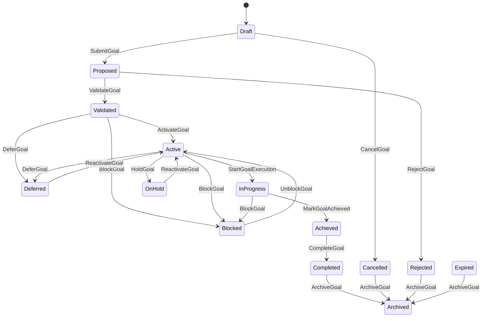
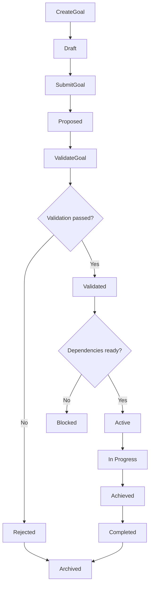

# Goal Lifecycle

Version: 1.0
Status: Enterprise Specification
Owner: Project Atlas
Domain Positioning: Goal Lifecycle Domain Specification

# Purpose

Goal Lifecycle defines the authoritative state model for Goal state changes in Atlas Goal Engine.

It records how a Goal moves from creation intent to completion, cancellation, deferral, archival, or rejection. It coordinates Goal state with Goal Dependency, Goal Prioritization, Domain Events, Commands, Decision Rules, Domain Rules, Enumeration Catalog, and Aggregate Catalog without redesigning Atlas.

Goal Lifecycle is not Goal itself. Goal remains the business objective owned by the user or Household.

Goal Lifecycle is not Workflow. WorkflowStatus exists in Enumeration Catalog, but Goal Lifecycle does not manage task orchestration.

Goal Lifecycle is not Recommendation. Recommendation may be affected by Goal state, but it does not own Goal state.

# Responsibilities

1. Define valid Goal lifecycle states.
2. Define valid state transitions.
3. Validate lifecycle commands before mutation.
4. Emit lifecycle Domain Events after committed state changes.
5. Coordinate Goal state with GoalDependency status.
6. Coordinate Goal state with Goal Priority calculation.
7. Coordinate Goal state with Recommendation suppression, activation, or refresh.
8. Coordinate Goal state with DecisionSession and Scenario outputs.
9. Coordinate Goal state with ExecutionPlan ordering.
10. Preserve audit trail for lifecycle changes.
11. Enforce idempotency for retryable commands.
12. Support deterministic replay from Domain Events.

# Non-Responsibilities

1. It does not define new Goal categories.
2. It does not define new aggregates outside Aggregate Catalog.
3. It does not replace Goal Dependency.
4. It does not replace Goal Prioritization.
5. It does not calculate Recommendation Score directly.
6. It does not execute Workflow tasks.
7. It does not invent missing Command Catalog entries.
8. It does not invent missing Domain Event Catalog entries.
9. It does not bypass Constraint Rules.
10. It does not bypass authorization.

# Service Classification

Goal Lifecycle is a Domain Specification for GoalPlan lifecycle behavior.

Catalog alignment:

| Item | Catalog Status |
|---|---|
| GoalPlan aggregate | Confirmed in Aggregate Catalog |
| Household aggregate | Confirmed in Aggregate Catalog |
| Scenario aggregate | Confirmed in Aggregate Catalog |
| DecisionSession aggregate | Confirmed in Aggregate Catalog |
| Recommendation aggregate | Confirmed in Aggregate Catalog |
| GoalStatus enumeration | Confirmed in Enumeration Catalog |
| WorkflowStatus enumeration | Confirmed in Enumeration Catalog |
| Goal lifecycle commands | 需要 Catalog 驗證 |
| Goal lifecycle Domain Events | 需要 Catalog 驗證 |
| Goal entity | 需要 Catalog 驗證 because knowledge/goal.md was not present in workspace |

# Domain Dependencies

1. Goal Dependency supplies blocking, prerequisite, and readiness information.
2. Goal Prioritization supplies Priority Score, Goal Level, and ranking impact.
3. Domain Event Catalog supplies event metadata standards and naming rules.
4. Command Catalog supplies command metadata standards and naming rules.
5. Decision Rule Catalog supplies decision rule categories and priorities.
6. Domain Rule Catalog supplies deterministic rule category requirements.
7. Enumeration Catalog supplies GoalStatus, DecisionStatus, ScenarioStatus, WorkflowStatus, JobStatus, RiskLevel, RecommendationPriority, and CurrencyCode.
8. Aggregate Catalog supplies GoalPlan, Household, Scenario, DecisionSession, Recommendation, AssetPortfolio, LiabilityPortfolio, Loan, RetirementPlan, Policy, and Configuration.

# Aggregate Interaction

| Aggregate | Interaction |
|---|---|
| GoalPlan | Owns Goal lifecycle consistency boundary. |
| Household | Owns authorization and household-level lifecycle scope. |
| Scenario | Supplies ScenarioStatus and simulation readiness before activation or approval. |
| DecisionSession | Records accepted or rejected decision impact on Goal state. |
| Recommendation | Consumes lifecycle state to show, suppress, refresh, or archive Recommendations. |
| AssetPortfolio | Supplies Investment and Retirement readiness signals. |
| LiabilityPortfolio | Supplies debt and liability readiness signals. |
| Loan | Supplies Housing, Debt, and Cashflow lifecycle constraints. |
| RetirementPlan | Supplies Retirement Goal readiness and completion signals. |
| Policy | Supplies policy and insurance protection signals. |
| Configuration | Supplies versioned rule, command, event, and assumption configuration. |

# Lifecycle States

GoalStatus exists in Enumeration Catalog. The detailed state values below require Catalog validation before implementation.

| State | Catalog Status | Meaning |
|---|---|---|
| Draft | 需要 Catalog 驗證 | Goal exists as editable intent and is not eligible for ranking. |
| Proposed | 需要 Catalog 驗證 | Goal is structurally valid and awaiting review or activation. |
| Validated | 需要 Catalog 驗證 | Goal passed structural and domain validation. |
| Active | Confirmed by life-goals.md | Goal participates in priority, dependency, recommendation, and execution decisions. |
| Blocked | 需要 Catalog 驗證 | Goal cannot progress because dependency, constraint, data, or resource condition is unresolved. |
| Deferred | Confirmed by goal-prioritization.md | Goal is intentionally postponed. |
| On Hold | Confirmed by life-goals.md | Goal is paused and excluded unless explicitly included. |
| In Progress | 需要 Catalog 驗證 | Goal has accepted Recommendation, allocation, or ExecutionPlan activity. |
| Achieved | 需要 Catalog 驗證 | Goal success criteria are met but final closure is pending. |
| Completed | Confirmed by life-goals.md | Goal is closed successfully and excluded from active ranking. |
| Cancelled | Confirmed by life-goals.md | Goal is intentionally cancelled and excluded from active ranking. |
| Rejected | 需要 Catalog 驗證 | Goal cannot enter lifecycle because validation, rule, authorization, or constraint failed. |
| Archived | 需要 Catalog 驗證 | Goal is read-only for history and replay. |
| Expired | 需要 Catalog 驗證 | Goal is no longer valid because target date or time window passed. |

# State Transition

| No. | From | To | Command | Required Condition |
|---:|---|---|---|---|
| 1 | None | Draft | CreateGoal | Required input accepted. |
| 2 | Draft | Proposed | SubmitGoal | Draft has minimum Goal attributes. |
| 3 | Draft | Cancelled | CancelGoal | Actor is authorized. |
| 4 | Proposed | Validated | ValidateGoal | Structural and domain validation pass. |
| 5 | Proposed | Rejected | RejectGoal | Validation, authorization, or rule failure occurs. |
| 6 | Validated | Active | ActivateGoal | Dependencies and required data are acceptable. |
| 7 | Validated | Deferred | DeferGoal | Actor chooses postponement or resource shortage exists. |
| 8 | Validated | Blocked | BlockGoal | Hard dependency or hard constraint blocks activation. |
| 9 | Active | In Progress | StartGoalExecution | Accepted Recommendation or ExecutionPlan exists. |
| 10 | Active | On Hold | HoldGoal | Actor pauses active Goal. |
| 11 | Active | Deferred | DeferGoal | Budget, CashFlow, or priority requires postponement. |
| 12 | Active | Blocked | BlockGoal | Dependency becomes unsatisfied. |
| 13 | Active | Cancelled | CancelGoal | Actor cancels before completion. |
| 14 | In Progress | Achieved | MarkGoalAchieved | Success metrics meet completion criteria. |
| 15 | In Progress | Blocked | BlockGoal | Execution or dependency blocker emerges. |
| 16 | In Progress | On Hold | HoldGoal | Actor pauses execution. |
| 17 | Achieved | Completed | CompleteGoal | Final validation and audit pass. |
| 18 | Blocked | Active | UnblockGoal | Blocking condition is resolved. |
| 19 | Blocked | Deferred | DeferGoal | Blocking condition remains but Goal is retained. |
| 20 | Deferred | Active | ReactivateGoal | Deferral reason is resolved. |
| 21 | On Hold | Active | ReactivateGoal | Hold reason is cleared. |
| 22 | On Hold | Cancelled | CancelGoal | Actor cancels paused Goal. |
| 23 | Deferred | Cancelled | CancelGoal | Actor cancels deferred Goal. |
| 24 | Any non-terminal | Expired | ExpireGoal | Target date or time window expires. |
| 25 | Completed | Archived | ArchiveGoal | Retention and read-only requirements pass. |
| 26 | Cancelled | Archived | ArchiveGoal | Retention and read-only requirements pass. |
| 27 | Rejected | Archived | ArchiveGoal | Rejection is preserved for audit. |
| 28 | Expired | Archived | ArchiveGoal | Expiration is preserved for audit. |

# Commands

Command IDs for Goal lifecycle commands require Catalog validation because Command Catalog does not currently list Goal lifecycle commands.

## CMD-GLC-0001 CreateGoal

Purpose: Create a Goal in Draft state.

Actor: Authorized user or system actor for Household.

Required Input: CommandId, IdempotencyKey, HouseholdId, GoalName, GoalCategory, Owner, CorrelationId.

Optional Input: TargetAmount, TargetDate, Description, InitialPriority, SourceRecommendationId, ScenarioId.

Preconditions: Household exists; actor can create Goal for Household; GoalCategory follows existing Catalog or requires validation.

Validation: Required input present; duplicate active Goal check; TargetAmount non-negative when present; TargetDate valid when present.

Idempotency Key: CreateGoal:HouseholdId:IdempotencyKey:InputSnapshotHash.

Transaction Boundary: Validate input, create Draft Goal under GoalPlan, persist audit, emit event atomically.

Result: Draft Goal with GoalId and Version.

Domain Events: GoalCreated, GoalLifecycleStateChanged.

Error Cases: Unauthorized actor, missing HouseholdId, invalid category, duplicate Goal, invalid TargetAmount, idempotency conflict.

Audit Data: ActorId, HouseholdId, GoalId, command payload hash, old state None, new state Draft, occurred timestamp.

## CMD-GLC-0002 SubmitGoal

Purpose: Move Draft Goal to Proposed.

Actor: Authorized user or system actor.

Required Input: CommandId, IdempotencyKey, HouseholdId, GoalId, ExpectedVersion, CorrelationId.

Optional Input: SubmissionNote.

Preconditions: Goal is Draft; Goal belongs to Household.

Validation: ExpectedVersion matches; minimum Goal attributes present; Goal is not terminal.

Idempotency Key: SubmitGoal:GoalId:ExpectedVersion:IdempotencyKey.

Transaction Boundary: Validate, transition Draft to Proposed, persist state and event.

Result: Proposed Goal.

Domain Events: GoalSubmitted, GoalLifecycleStateChanged.

Error Cases: Version conflict, invalid state, missing required attributes, unauthorized actor.

Audit Data: ActorId, GoalId, old state Draft, new state Proposed, ExpectedVersion, reason.

## CMD-GLC-0003 ValidateGoal

Purpose: Validate Proposed Goal for activation eligibility.

Actor: Goal Engine or authorized system actor.

Required Input: CommandId, IdempotencyKey, HouseholdId, GoalId, ExpectedVersion, RuleVersion, CorrelationId.

Optional Input: ScenarioId, RecommendationId, ValidationScope.

Preconditions: Goal is Proposed; required catalogs and rules are available.

Validation: Goal structure, category, owner, amount, target date, dependencies, constraints, and duplicate risk.

Idempotency Key: ValidateGoal:GoalId:ExpectedVersion:RuleVersion:IdempotencyKey.

Transaction Boundary: Validate all rules, transition to Validated or Rejected, emit corresponding event.

Result: Validated Goal or Rejected Goal with reasons.

Domain Events: GoalValidated, GoalRejected, GoalLifecycleStateChanged.

Error Cases: Missing rule version, invalid category, dependency cycle, hard constraint, stale input.

Audit Data: RuleVersion, validation result, triggered rules, ActorId, GoalId, state change.

## CMD-GLC-0004 ActivateGoal

Purpose: Move Validated, Deferred, On Hold, or Blocked Goal to Active when conditions allow.

Actor: Authorized user or Goal Engine.

Required Input: CommandId, IdempotencyKey, HouseholdId, GoalId, ExpectedVersion, ActivationReason, CorrelationId.

Optional Input: ScenarioId, RecommendationId, PrioritySnapshotId.

Preconditions: Goal is Validated, Deferred, On Hold, or Blocked; blockers resolved or override allowed.

Validation: Dependency readiness; constraint clearance; Goal Priority availability; authorization.

Idempotency Key: ActivateGoal:GoalId:ExpectedVersion:IdempotencyKey.

Transaction Boundary: Validate readiness, transition to Active, request priority recalculation, emit events atomically.

Result: Active Goal.

Domain Events: GoalActivated, GoalLifecycleStateChanged, GoalPriorityRecalculationRequested.

Error Cases: Dependency blocked, hard constraint, version conflict, unauthorized actor.

Audit Data: ActivationReason, dependency result, priority snapshot, ActorId, old state, new state.

## CMD-GLC-0005 DeferGoal

Purpose: Move eligible Goal to Deferred.

Actor: Authorized user, Goal Engine, or Decision Engine.

Required Input: CommandId, IdempotencyKey, HouseholdId, GoalId, ExpectedVersion, DeferralReason, CorrelationId.

Optional Input: ResumeDate, RelatedGoalDependencyId, RelatedDecisionSessionId.

Preconditions: Goal is not terminal.

Validation: Deferral reason present; ResumeDate valid when present; actor authorized.

Idempotency Key: DeferGoal:GoalId:ExpectedVersion:DeferralReason:IdempotencyKey.

Transaction Boundary: Persist Deferred state, update dependency and priority effects, emit events.

Result: Deferred Goal.

Domain Events: GoalDeferred, GoalLifecycleStateChanged, GoalPriorityRecalculationRequested.

Error Cases: Terminal Goal, missing reason, invalid ResumeDate, authorization failure.

Audit Data: DeferralReason, ResumeDate, dependency context, ActorId, old state, new state.

## CMD-GLC-0006 BlockGoal

Purpose: Move eligible Goal to Blocked because a dependency, constraint, resource, or data condition prevents progress.

Actor: Goal Engine, Decision Engine, or authorized system actor.

Required Input: CommandId, IdempotencyKey, HouseholdId, GoalId, ExpectedVersion, BlockReason, CorrelationId.

Optional Input: GoalDependencyId, ConstraintRuleId, DecisionRuleId, ScenarioId.

Preconditions: Goal is not terminal.

Validation: BlockReason present; blocking source exists or is marked 需要 Catalog 驗證; actor authorized.

Idempotency Key: BlockGoal:GoalId:ExpectedVersion:BlockReason:IdempotencyKey.

Transaction Boundary: Persist Blocked state, persist blocker reference, emit events.

Result: Blocked Goal.

Domain Events: GoalBlocked, GoalLifecycleStateChanged.

Error Cases: Missing blocker, terminal Goal, version conflict, unauthorized actor.

Audit Data: BlockReason, blocker reference, ActorId, old state, new state.

## CMD-GLC-0007 StartGoalExecution

Purpose: Move Active Goal to In Progress when execution begins.

Actor: Execution Plan Engine, Workflow Engine, or authorized user.

Required Input: CommandId, IdempotencyKey, HouseholdId, GoalId, ExpectedVersion, ExecutionPlanId, CorrelationId.

Optional Input: RecommendationId, DecisionSessionId, StartedAt.

Preconditions: Goal is Active; ExecutionPlan exists or requires Catalog validation; dependencies are satisfied or overridden.

Validation: ExecutionPlan is eligible; Goal is not blocked; actor authorized.

Idempotency Key: StartGoalExecution:GoalId:ExecutionPlanId:ExpectedVersion:IdempotencyKey.

Transaction Boundary: Transition Goal to In Progress, link execution reference, emit events.

Result: In Progress Goal.

Domain Events: GoalExecutionStarted, GoalLifecycleStateChanged.

Error Cases: Goal not Active, blocked dependency, missing ExecutionPlanId, version conflict.

Audit Data: ExecutionPlanId, RecommendationId, ActorId, old state, new state.

## CMD-GLC-0008 CompleteGoal

Purpose: Move Achieved Goal to Completed.

Actor: Authorized user or Goal Engine.

Required Input: CommandId, IdempotencyKey, HouseholdId, GoalId, ExpectedVersion, CompletionEvidence, CorrelationId.

Optional Input: ScenarioId, RecommendationId, CompletedAt.

Preconditions: Goal is Achieved.

Validation: Completion criteria met; no unresolved hard blockers; evidence present.

Idempotency Key: CompleteGoal:GoalId:ExpectedVersion:IdempotencyKey.

Transaction Boundary: Persist Completed state, close active lifecycle effects, emit events.

Result: Completed Goal.

Domain Events: GoalCompleted, GoalLifecycleStateChanged, GoalPriorityRecalculationRequested.

Error Cases: Goal not Achieved, missing evidence, unresolved blocker, unauthorized actor.

Audit Data: CompletionEvidence, ActorId, old state, new state, completion timestamp.

## CMD-GLC-0009 CancelGoal

Purpose: Move non-terminal Goal to Cancelled.

Actor: Authorized user.

Required Input: CommandId, IdempotencyKey, HouseholdId, GoalId, ExpectedVersion, CancellationReason, CorrelationId.

Optional Input: ReplacementGoalId.

Preconditions: Goal is not Completed, Cancelled, Archived, or Rejected.

Validation: CancellationReason present; replacement Goal belongs to Household when present.

Idempotency Key: CancelGoal:GoalId:ExpectedVersion:CancellationReason:IdempotencyKey.

Transaction Boundary: Persist Cancelled state, cancel active dependency effects, emit events.

Result: Cancelled Goal.

Domain Events: GoalCancelled, GoalLifecycleStateChanged, GoalPriorityRecalculationRequested.

Error Cases: Terminal Goal, missing reason, invalid replacement, unauthorized actor.

Audit Data: CancellationReason, ReplacementGoalId, ActorId, old state, new state.

## CMD-GLC-0010 ArchiveGoal

Purpose: Move terminal Goal to Archived.

Actor: Authorized user, system retention process, or Goal Engine.

Required Input: CommandId, IdempotencyKey, HouseholdId, GoalId, ExpectedVersion, ArchiveReason, CorrelationId.

Optional Input: RetentionPolicyId.

Preconditions: Goal is Completed, Cancelled, Rejected, or Expired.

Validation: ArchiveReason present; retention rules pass; actor authorized.

Idempotency Key: ArchiveGoal:GoalId:ExpectedVersion:ArchiveReason:IdempotencyKey.

Transaction Boundary: Persist Archived state, freeze mutable fields, emit events.

Result: Archived Goal.

Domain Events: GoalArchived, GoalLifecycleStateChanged.

Error Cases: Goal not terminal, missing ArchiveReason, retention violation, authorization failure.

Audit Data: ArchiveReason, RetentionPolicyId, ActorId, old state, new state.

## CMD-GLC-0011 HoldGoal

Purpose: Move Active or In Progress Goal to On Hold.

Actor: Authorized user or Goal Engine.

Required Input: CommandId, IdempotencyKey, HouseholdId, GoalId, ExpectedVersion, HoldReason, CorrelationId.

Optional Input: ResumeDate.

Preconditions: Goal is Active or In Progress.

Validation: HoldReason present; ResumeDate valid when present; actor authorized.

Idempotency Key: HoldGoal:GoalId:ExpectedVersion:HoldReason:IdempotencyKey.

Transaction Boundary: Persist On Hold state, pause lifecycle effects, emit events.

Result: On Hold Goal.

Domain Events: GoalHeld, GoalLifecycleStateChanged.

Error Cases: Invalid state, missing HoldReason, invalid ResumeDate, authorization failure.

Audit Data: HoldReason, ResumeDate, ActorId, old state, new state.

## CMD-GLC-0012 ReactivateGoal

Purpose: Move Deferred or On Hold Goal back to Active.

Actor: Authorized user or Goal Engine.

Required Input: CommandId, IdempotencyKey, HouseholdId, GoalId, ExpectedVersion, ReactivationReason, CorrelationId.

Optional Input: PrioritySnapshotId.

Preconditions: Goal is Deferred or On Hold.

Validation: ReactivationReason present; dependency readiness acceptable; actor authorized.

Idempotency Key: ReactivateGoal:GoalId:ExpectedVersion:ReactivationReason:IdempotencyKey.

Transaction Boundary: Persist Active state, request priority recalculation, emit events.

Result: Active Goal.

Domain Events: GoalReactivated, GoalLifecycleStateChanged, GoalPriorityRecalculationRequested.

Error Cases: Invalid state, dependency blocked, missing reason, authorization failure.

Audit Data: ReactivationReason, dependency result, ActorId, old state, new state.

## CMD-GLC-0013 UnblockGoal

Purpose: Move Blocked Goal to Active when blocker is resolved.

Actor: Goal Engine, Decision Engine, or authorized user.

Required Input: CommandId, IdempotencyKey, HouseholdId, GoalId, ExpectedVersion, ResolutionReason, CorrelationId.

Optional Input: GoalDependencyId, ConstraintRuleId, ScenarioId.

Preconditions: Goal is Blocked.

Validation: Blocking condition resolved; ResolutionReason present; actor authorized.

Idempotency Key: UnblockGoal:GoalId:ExpectedVersion:ResolutionReason:IdempotencyKey.

Transaction Boundary: Persist Active state, clear blocker reference, emit events.

Result: Active Goal.

Domain Events: GoalUnblocked, GoalLifecycleStateChanged, GoalPriorityRecalculationRequested.

Error Cases: Goal not Blocked, blocker unresolved, missing reason, authorization failure.

Audit Data: ResolutionReason, blocker reference, ActorId, old state, new state.

## CMD-GLC-0014 MarkGoalAchieved

Purpose: Move Active or In Progress Goal to Achieved after success metrics are met.

Actor: Authorized user or Goal Engine.

Required Input: CommandId, IdempotencyKey, HouseholdId, GoalId, ExpectedVersion, SuccessMetrics, CorrelationId.

Optional Input: CompletionEvidence, ScenarioId, RecommendationId.

Preconditions: Goal is Active or In Progress.

Validation: SuccessMetrics meet Goal criteria; no unresolved hard blocker; actor authorized.

Idempotency Key: MarkGoalAchieved:GoalId:ExpectedVersion:IdempotencyKey.

Transaction Boundary: Persist Achieved state, store success metrics, emit events.

Result: Achieved Goal.

Domain Events: GoalAchieved, GoalLifecycleStateChanged.

Error Cases: Success metrics not met, blocked Goal, version conflict, authorization failure.

Audit Data: SuccessMetrics, evidence, ActorId, old state, new state.

## CMD-GLC-0015 ExpireGoal

Purpose: Move non-terminal Goal to Expired when target date or time window is no longer valid.

Actor: Goal Engine or authorized system actor.

Required Input: CommandId, IdempotencyKey, HouseholdId, GoalId, ExpectedVersion, ExpirationReason, CorrelationId.

Optional Input: ExpiredAt.

Preconditions: Goal is not Completed, Cancelled, Rejected, Expired, or Archived.

Validation: Expiration condition exists; ExpirationReason present; actor authorized.

Idempotency Key: ExpireGoal:GoalId:ExpectedVersion:ExpirationReason:IdempotencyKey.

Transaction Boundary: Persist Expired state, suppress active lifecycle effects, emit events.

Result: Expired Goal.

Domain Events: GoalExpired, GoalLifecycleStateChanged, GoalPriorityRecalculationRequested.

Error Cases: Terminal Goal, missing ExpirationReason, unsupported expiration condition, authorization failure.

Audit Data: ExpirationReason, ExpiredAt, ActorId, old state, new state.

## CMD-GLC-0016 RejectGoal

Purpose: Move Proposed or Validated Goal to Rejected when validation, rule, or authorization result prevents lifecycle continuation.

Actor: Goal Engine, Decision Engine, or authorized system actor.

Required Input: CommandId, IdempotencyKey, HouseholdId, GoalId, ExpectedVersion, RejectionReason, CorrelationId.

Optional Input: RuleId, ConstraintRuleId, DecisionSessionId.

Preconditions: Goal is Proposed or Validated.

Validation: RejectionReason present; rejection source recorded; actor authorized.

Idempotency Key: RejectGoal:GoalId:ExpectedVersion:RejectionReason:IdempotencyKey.

Transaction Boundary: Persist Rejected state, record rejection metadata, emit events.

Result: Rejected Goal.

Domain Events: GoalRejected, GoalLifecycleStateChanged.

Error Cases: Invalid state, missing reason, version conflict, authorization failure.

Audit Data: RejectionReason, rule reference, ActorId, old state, new state.

# Domain Events

Event IDs for Goal lifecycle events require Catalog validation because Domain Event Catalog does not currently list Goal lifecycle events.

## EVT-GLC-0001 GoalCreated

Trigger: CreateGoal commits a new Draft Goal.

Producer: Goal Engine.

Consumers: Goal Engine, Recommendation Engine, Decision Engine, Scenario Engine, Projection Engine, Optimization Engine, Execution Plan Engine, Workflow Engine, Audit.

Required Payload: GoalId, GoalName, GoalCategory, Owner, InitialState.

AggregateId: GoalPlanId or GoalId; 需要 Catalog 驗證.

HouseholdId: Required.

CorrelationId: Required.

CausationId: CommandId.

OccurredAt: Required.

Schema Version: 1.0.

Ordering Requirement: Must occur before any lifecycle transition for the same GoalId.

Replay Requirement: Recreates Draft Goal state.

Idempotency Requirement: EventId must be unique; consumers ignore duplicate EventId.

## EVT-GLC-0002 GoalSubmitted

Trigger: SubmitGoal moves Draft to Proposed.
Producer: Goal Engine.
Consumers: Goal Engine, Decision Engine, Audit.
Required Payload: GoalId, OldState, NewState, SubmittedBy.
AggregateId: GoalPlanId or GoalId; 需要 Catalog 驗證.
HouseholdId: Required.
CorrelationId: Required.
CausationId: CommandId.
OccurredAt: Required.
Schema Version: 1.0.
Ordering Requirement: After GoalCreated.
Replay Requirement: Applies Proposed state.
Idempotency Requirement: Ignore duplicate EventId.

## EVT-GLC-0003 GoalValidated

Trigger: ValidateGoal passes validation.
Producer: Goal Engine.
Consumers: Goal Engine, Goal Prioritization, Recommendation Engine, Audit.
Required Payload: GoalId, ValidationResult, RuleVersion, TriggeredRules.
AggregateId: GoalPlanId or GoalId; 需要 Catalog 驗證.
HouseholdId: Required.
CorrelationId: Required.
CausationId: CommandId.
OccurredAt: Required.
Schema Version: 1.0.
Ordering Requirement: After GoalSubmitted.
Replay Requirement: Applies Validated state and validation metadata.
Idempotency Requirement: Ignore duplicate EventId.

## EVT-GLC-0004 GoalRejected

Trigger: ValidateGoal or RejectGoal rejects Goal.
Producer: Goal Engine.
Consumers: Goal Engine, Recommendation Engine, Decision Engine, Audit.
Required Payload: GoalId, RejectionReason, TriggeredRules, OldState, NewState.
AggregateId: GoalPlanId or GoalId; 需要 Catalog 驗證.
HouseholdId: Required.
CorrelationId: Required.
CausationId: CommandId.
OccurredAt: Required.
Schema Version: 1.0.
Ordering Requirement: After proposed or validation attempt.
Replay Requirement: Applies Rejected state.
Idempotency Requirement: Ignore duplicate EventId.

## EVT-GLC-0005 GoalActivated

Trigger: ActivateGoal commits Active state.
Producer: Goal Engine.
Consumers: Goal Prioritization, Goal Dependency, Recommendation Engine, Scenario Engine, Execution Plan Engine, Audit.
Required Payload: GoalId, OldState, NewState, ActivationReason, PrioritySnapshotId.
AggregateId: GoalPlanId or GoalId; 需要 Catalog 驗證.
HouseholdId: Required.
CorrelationId: Required.
CausationId: CommandId.
OccurredAt: Required.
Schema Version: 1.0.
Ordering Requirement: After GoalValidated, GoalDeferred, GoalBlocked, or GoalHeld.
Replay Requirement: Applies Active state and triggers derived read model rebuild.
Idempotency Requirement: Ignore duplicate EventId.

## EVT-GLC-0006 GoalDeferred

Trigger: DeferGoal commits Deferred state.
Producer: Goal Engine.
Consumers: Goal Prioritization, Goal Dependency, Recommendation Engine, Execution Plan Engine, Audit.
Required Payload: GoalId, OldState, NewState, DeferralReason, ResumeDate.
AggregateId: GoalPlanId or GoalId; 需要 Catalog 驗證.
HouseholdId: Required.
CorrelationId: Required.
CausationId: CommandId.
OccurredAt: Required.
Schema Version: 1.0.
Ordering Requirement: After source state event for the same Goal.
Replay Requirement: Applies Deferred state.
Idempotency Requirement: Ignore duplicate EventId.

## EVT-GLC-0007 GoalBlocked

Trigger: BlockGoal commits Blocked state.
Producer: Goal Engine.
Consumers: Goal Dependency, Goal Prioritization, Recommendation Engine, Decision Engine, Audit.
Required Payload: GoalId, OldState, NewState, BlockReason, BlockingReference.
AggregateId: GoalPlanId or GoalId; 需要 Catalog 驗證.
HouseholdId: Required.
CorrelationId: Required.
CausationId: CommandId.
OccurredAt: Required.
Schema Version: 1.0.
Ordering Requirement: After source state event and before unblock event.
Replay Requirement: Applies Blocked state and blocker metadata.
Idempotency Requirement: Ignore duplicate EventId.

## EVT-GLC-0008 GoalExecutionStarted

Trigger: StartGoalExecution commits In Progress state.
Producer: Execution Plan Engine or Goal Engine.
Consumers: Goal Engine, Workflow Engine, Recommendation Engine, Audit.
Required Payload: GoalId, ExecutionPlanId, OldState, NewState, StartedAt.
AggregateId: GoalPlanId or GoalId; 需要 Catalog 驗證.
HouseholdId: Required.
CorrelationId: Required.
CausationId: CommandId.
OccurredAt: Required.
Schema Version: 1.0.
Ordering Requirement: After GoalActivated.
Replay Requirement: Applies In Progress state.
Idempotency Requirement: Ignore duplicate EventId.

## EVT-GLC-0009 GoalAchieved

Trigger: MarkGoalAchieved confirms success metrics.
Producer: Goal Engine.
Consumers: Goal Engine, Recommendation Engine, Decision Engine, Audit.
Required Payload: GoalId, SuccessMetrics, OldState, NewState, Evidence.
AggregateId: GoalPlanId or GoalId; 需要 Catalog 驗證.
HouseholdId: Required.
CorrelationId: Required.
CausationId: CommandId.
OccurredAt: Required.
Schema Version: 1.0.
Ordering Requirement: After GoalExecutionStarted or GoalActivated.
Replay Requirement: Applies Achieved state.
Idempotency Requirement: Ignore duplicate EventId.

## EVT-GLC-0010 GoalCompleted

Trigger: CompleteGoal commits Completed state.
Producer: Goal Engine.
Consumers: Goal Prioritization, Goal Dependency, Recommendation Engine, Decision Engine, Audit.
Required Payload: GoalId, OldState, NewState, CompletionEvidence, CompletedAt.
AggregateId: GoalPlanId or GoalId; 需要 Catalog 驗證.
HouseholdId: Required.
CorrelationId: Required.
CausationId: CommandId.
OccurredAt: Required.
Schema Version: 1.0.
Ordering Requirement: After GoalAchieved.
Replay Requirement: Applies Completed terminal state.
Idempotency Requirement: Ignore duplicate EventId.

## EVT-GLC-0011 GoalCancelled

Trigger: CancelGoal commits Cancelled state.
Producer: Goal Engine.
Consumers: Goal Prioritization, Goal Dependency, Recommendation Engine, Execution Plan Engine, Audit.
Required Payload: GoalId, OldState, NewState, CancellationReason, ReplacementGoalId.
AggregateId: GoalPlanId or GoalId; 需要 Catalog 驗證.
HouseholdId: Required.
CorrelationId: Required.
CausationId: CommandId.
OccurredAt: Required.
Schema Version: 1.0.
Ordering Requirement: After current state event and before archive.
Replay Requirement: Applies Cancelled terminal state.
Idempotency Requirement: Ignore duplicate EventId.

## EVT-GLC-0012 GoalArchived

Trigger: ArchiveGoal commits Archived state.
Producer: Goal Engine.
Consumers: Goal Engine, Audit, Reporting.
Required Payload: GoalId, OldState, NewState, ArchiveReason, RetentionPolicyId.
AggregateId: GoalPlanId or GoalId; 需要 Catalog 驗證.
HouseholdId: Required.
CorrelationId: Required.
CausationId: CommandId.
OccurredAt: Required.
Schema Version: 1.0.
Ordering Requirement: After terminal state event.
Replay Requirement: Applies Archived read-only state.
Idempotency Requirement: Ignore duplicate EventId.

## EVT-GLC-0013 GoalLifecycleStateChanged

Trigger: Any valid lifecycle state transition.
Producer: Goal Engine.
Consumers: Goal Engine, Audit, read models.
Required Payload: GoalId, OldState, NewState, ReasonCode, CommandName.
AggregateId: GoalPlanId or GoalId; 需要 Catalog 驗證.
HouseholdId: Required.
CorrelationId: Required.
CausationId: CommandId.
OccurredAt: Required.
Schema Version: 1.0.
Ordering Requirement: Must share order with the specific state event.
Replay Requirement: Rebuilds lifecycle history.
Idempotency Requirement: Ignore duplicate EventId and duplicate state version.

## EVT-GLC-0014 GoalPriorityRecalculationRequested

Trigger: State change affects Goal ranking.
Producer: Goal Engine.
Consumers: Goal Prioritization, Recommendation Engine, Decision Engine.
Required Payload: GoalId, TriggerState, RecalculationReason.
AggregateId: GoalPlanId or GoalId; 需要 Catalog 驗證.
HouseholdId: Required.
CorrelationId: Required.
CausationId: CommandId.
OccurredAt: Required.
Schema Version: 1.0.
Ordering Requirement: After state-changing event.
Replay Requirement: May be replayed to rebuild derived priority read models.
Idempotency Requirement: Consumers deduplicate by EventId and GoalVersion.

## EVT-GLC-0015 GoalHeld

Trigger: HoldGoal commits On Hold state.
Producer: Goal Engine.
Consumers: Goal Engine, Recommendation Engine, Execution Plan Engine, Workflow Engine, Audit.
Required Payload: GoalId, OldState, NewState, HoldReason, ResumeDate.
AggregateId: GoalPlanId or GoalId; 需要 Catalog 驗證.
HouseholdId: Required.
CorrelationId: Required.
CausationId: CommandId.
OccurredAt: Required.
Schema Version: 1.0.
Ordering Requirement: After Active or In Progress state event.
Replay Requirement: Applies On Hold state.
Idempotency Requirement: Ignore duplicate EventId.

## EVT-GLC-0016 GoalReactivated

Trigger: ReactivateGoal commits Active state.
Producer: Goal Engine.
Consumers: Goal Prioritization, Goal Dependency, Recommendation Engine, Execution Plan Engine, Audit.
Required Payload: GoalId, OldState, NewState, ReactivationReason.
AggregateId: GoalPlanId or GoalId; 需要 Catalog 驗證.
HouseholdId: Required.
CorrelationId: Required.
CausationId: CommandId.
OccurredAt: Required.
Schema Version: 1.0.
Ordering Requirement: After Deferred or On Hold state event.
Replay Requirement: Applies Active state.
Idempotency Requirement: Ignore duplicate EventId.

## EVT-GLC-0017 GoalUnblocked

Trigger: UnblockGoal commits Active state.
Producer: Goal Engine.
Consumers: Goal Dependency, Goal Prioritization, Recommendation Engine, Decision Engine, Audit.
Required Payload: GoalId, OldState, NewState, ResolutionReason, ResolvedBlockingReference.
AggregateId: GoalPlanId or GoalId; 需要 Catalog 驗證.
HouseholdId: Required.
CorrelationId: Required.
CausationId: CommandId.
OccurredAt: Required.
Schema Version: 1.0.
Ordering Requirement: After GoalBlocked for the same GoalId.
Replay Requirement: Applies Active state and clears active blocker metadata.
Idempotency Requirement: Ignore duplicate EventId.

## EVT-GLC-0018 GoalExpired

Trigger: ExpireGoal commits Expired state.
Producer: Goal Engine.
Consumers: Goal Prioritization, Goal Dependency, Recommendation Engine, Decision Engine, Audit.
Required Payload: GoalId, OldState, NewState, ExpirationReason, ExpiredAt.
AggregateId: GoalPlanId or GoalId; 需要 Catalog 驗證.
HouseholdId: Required.
CorrelationId: Required.
CausationId: CommandId.
OccurredAt: Required.
Schema Version: 1.0.
Ordering Requirement: After current non-terminal state event and before archive.
Replay Requirement: Applies Expired state.
Idempotency Requirement: Ignore duplicate EventId.

# Business Rules

1. GLC-BR-001 Goal lifecycle state must use GoalStatus semantics from Enumeration Catalog or be marked 需要 Catalog 驗證.
2. GLC-BR-002 GoalPlan is the consistency boundary for Goal lifecycle changes.
3. GLC-BR-003 HouseholdId is required for every lifecycle command.
4. GLC-BR-004 Actor authorization is required before validation.
5. GLC-BR-005 Invalid command emits no Domain Event.
6. GLC-BR-006 Every state mutation must emit at least one lifecycle Domain Event.
7. GLC-BR-007 Every event must include CorrelationId.
8. GLC-BR-008 Every event must include CausationId.
9. GLC-BR-009 Every event must include OccurredAt.
10. GLC-BR-010 GoalCreated must precede all other lifecycle events for the same GoalId.
11. GLC-BR-011 Draft can transition only to Proposed or Cancelled.
12. GLC-BR-012 Proposed can transition only to Validated, Rejected, or Cancelled.
13. GLC-BR-013 Validated can transition only to Active, Deferred, Blocked, Cancelled, or Expired.
14. GLC-BR-014 Active can transition only to In Progress, On Hold, Deferred, Blocked, Cancelled, Expired, or Achieved.
15. GLC-BR-015 In Progress can transition only to Achieved, Blocked, On Hold, Cancelled, or Expired.
16. GLC-BR-016 Achieved can transition only to Completed, Cancelled, or Archived.
17. GLC-BR-017 Completed can transition only to Archived.
18. GLC-BR-018 Cancelled can transition only to Archived.
19. GLC-BR-019 Rejected can transition only to Archived.
20. GLC-BR-020 Expired can transition only to Archived.
21. GLC-BR-021 Archived is read-only.
22. GLC-BR-022 Completed Goal is excluded from active ranking.
23. GLC-BR-023 Cancelled Goal is excluded from active ranking.
24. GLC-BR-024 Archived Goal is excluded from active ranking.
25. GLC-BR-025 Rejected Goal is excluded from active ranking.
26. GLC-BR-026 Active Goal participates in Goal Prioritization.
27. GLC-BR-027 Deferred Goal remains visible for audit and future activation.
28. GLC-BR-028 On Hold Goal is excluded unless explicitly included by command scope.
29. GLC-BR-029 Blocked Goal must include blocking reason.
30. GLC-BR-030 Deferred Goal must include deferral reason.
31. GLC-BR-031 Cancelled Goal must include cancellation reason.
32. GLC-BR-032 Archived Goal must include archive reason.
33. GLC-BR-033 Rejected Goal must include rejection reason.
34. GLC-BR-034 CompleteGoal requires completion evidence.
35. GLC-BR-035 StartGoalExecution requires ExecutionPlanId.
36. GLC-BR-036 ActivateGoal requires dependency readiness or authorized override.
37. GLC-BR-037 Hard Dependency can block activation.
38. GLC-BR-038 Circular dependency blocks validation.
39. GLC-BR-039 Goal Priority recalculation is requested after Active, Deferred, Blocked, Completed, Cancelled, or Archived transitions.
40. GLC-BR-040 Recommendation refresh is requested after lifecycle state affects visibility.
41. GLC-BR-041 Scenario output must be fresh when activation depends on Scenario.
42. GLC-BR-042 DecisionSession outcome may activate, defer, or reject Goal.
43. GLC-BR-043 Constraint Rule failure can reject or block Goal.
44. GLC-BR-044 Data Integrity failure rejects command.
45. GLC-BR-045 Regulatory issue blocks or rejects Goal according to Constraint Rules.
46. GLC-BR-046 Duplicate active Goal must be detected before CreateGoal commits.
47. GLC-BR-047 TargetAmount must be non-negative when present.
48. GLC-BR-048 TargetDate must be valid when present.
49. GLC-BR-049 Goal category must follow existing Catalog or be marked 需要 Catalog 驗證.
50. GLC-BR-050 Goal owner is required when Catalog requires owner.
51. GLC-BR-051 Command ExpectedVersion must match current Goal version.
52. GLC-BR-052 Version conflict rejects mutation.
53. GLC-BR-053 Idempotent retry must not duplicate events.
54. GLC-BR-054 Same idempotency key with different payload rejects command.
55. GLC-BR-055 Audit record is required for every lifecycle mutation.
56. GLC-BR-056 Audit records are append-only.
57. GLC-BR-057 Historical replay must preserve original event order.
58. GLC-BR-058 Event schema additions must be backward compatible.
59. GLC-BR-059 Breaking event changes require new Schema Version.
60. GLC-BR-060 Terminal state cannot return to Active.
61. GLC-BR-061 Archived state cannot transition to any non-archived state.
62. GLC-BR-062 ExpireGoal cannot apply when Goal is Completed or Cancelled.
63. GLC-BR-063 BlockGoal cannot apply to terminal state.
64. GLC-BR-064 DeferGoal cannot apply to terminal state.
65. GLC-BR-065 HoldGoal cannot apply to terminal state.
66. GLC-BR-066 ReactivateGoal cannot apply to Completed, Cancelled, Rejected, Expired, or Archived state.
67. GLC-BR-067 GoalLifecycleStateChanged must include old state and new state.
68. GLC-BR-068 Specific lifecycle event and GoalLifecycleStateChanged must share causation.
69. GLC-BR-069 Command handler must validate authorization before loading sensitive aggregate details.
70. GLC-BR-070 Lifecycle read models must ignore duplicate EventId.
71. GLC-BR-071 Lifecycle replay must not call external engines.
72. GLC-BR-072 Derived priority requests may be replayed but must remain idempotent.
73. GLC-BR-073 Bulk lifecycle operations must preserve per-Goal transaction boundaries unless explicitly atomic.
74. GLC-BR-074 Lifecycle state must not be inferred from UI only.
75. GLC-BR-075 WorkflowStatus must not replace GoalStatus.
76. GLC-BR-076 RecommendationPriority must not replace Goal Priority.
77. GLC-BR-077 RiskLevel may block activation only through rules or dependency.
78. GLC-BR-078 Household boundary cannot be crossed by lifecycle command.
79. GLC-BR-079 System actor must be identified separately from user actor.
80. GLC-BR-080 State transition explanation is required for user-facing changes.
81. GLC-BR-081 Goal lifecycle command IDs require Catalog validation before implementation.
82. GLC-BR-082 Goal lifecycle event IDs require Catalog validation before implementation.
83. GLC-BR-083 Goal entity fields require Catalog validation until knowledge/goal.md is available.
84. GLC-BR-084 Command payload hash must be stored for idempotency.
85. GLC-BR-085 Event ordering is per GoalId and AggregateId.
86. GLC-BR-086 Projection Engine consumes lifecycle state only after committed event.
87. GLC-BR-087 Optimization Engine must not optimize against Rejected or Archived Goals.
88. GLC-BR-088 Execution Plan Engine must not start execution for Blocked Goals.
89. GLC-BR-089 Workflow Engine must not create workflow for Rejected Goals.
90. GLC-BR-090 CancelGoal must update dependent GoalDependency effects.

# Decision Rules

1. DR-GL-001 Goal Alignment must pass before activation when Scenario is involved.
2. DR-GL-002 Active Goal with Hard Dependency unsatisfied becomes Blocked.
3. DR-GL-003 Deferred Goal may reactivate when dependency readiness reaches policy threshold.
4. DR-GL-004 Completed Goal suppresses related active Recommendations.
5. DR-GL-005 Cancelled Goal suppresses related active Recommendations unless replacement Goal exists.
6. DR-GL-006 Rejected Goal must not generate final Recommendation.
7. DR-GL-007 Archived Goal is read-only and excluded from scoring.
8. DR-GL-008 Goal with stale Scenario output cannot move to Active without warning or recalculation.
9. DR-GL-009 Goal that violates Hard constraint moves to Rejected or Blocked according to rule severity.
10. DR-GL-010 Goal with missing mandatory data remains Draft, Proposed, or Rejected.
11. DR-GL-011 Emergency Goal can activate before optional dependency only when Hard constraints pass.
12. DR-GL-012 Insurance Gap can block Lifestyle Goal activation.
13. DR-GL-013 Negative sustainable CashFlow can block Housing and Lifestyle Goals.
14. DR-GL-014 High Debt burden can defer Investment Goal.
15. DR-GL-015 Retirement readiness shortfall can defer Dream Goal.
16. DR-GL-016 Education deadline can activate Education Goal before Lifestyle Goal.
17. DR-GL-017 Tax deadline can activate Tax Goal before optional Goals.
18. DR-GL-018 Portfolio concentration can block aggressive Investment Goal.
19. DR-GL-019 Goal Priority must be recalculated after lifecycle state changes that affect ranking.
20. DR-GL-020 Lifecycle state cannot override Regulatory or Data Integrity priority.

# Validation

1. Validate command metadata against Command Catalog standard.
2. Validate event metadata against Domain Event Catalog standard.
3. Validate GoalStatus against Enumeration Catalog or mark 需要 Catalog 驗證.
4. Validate aggregate ownership against Aggregate Catalog.
5. Validate Household ownership.
6. Validate Actor authorization.
7. Validate ExpectedVersion.
8. Validate transition is listed in State Transition.
9. Validate required reason for Blocked, Deferred, Cancelled, Rejected, Archived, and Expired.
10. Validate idempotency key for mutating command.
11. Validate CorrelationId and CausationId.
12. Validate no terminal-state mutation.
13. Validate no Archived-state mutation.
14. Validate dependency readiness before activation.
15. Validate Scenario freshness when Scenario is used.
16. Validate Recommendation reference when command is recommendation-driven.
17. Validate ExecutionPlan reference when execution starts.
18. Validate duplicate Goal risk.
19. Validate TargetAmount.
20. Validate TargetDate.

# Transaction Boundary

Single Goal lifecycle mutation:

1. Authorize actor.
2. Validate command identity and idempotency.
3. Load GoalPlan aggregate.
4. Load Goal state and ExpectedVersion.
5. Validate transition.
6. Validate dependency and rule requirements.
7. Mutate state.
8. Persist aggregate version.
9. Persist audit record.
10. Publish Domain Events.

Atomicity:

1. State mutation and audit write must commit together.
2. Events must correspond to committed state.
3. Invalid commands must not emit events.
4. Derived recalculation requests must be idempotent.
5. Failure before commit leaves prior state unchanged.

# Error Handling

| Error | Handling |
|---|---|
| Missing command metadata | Reject command. |
| Unauthorized actor | Reject command and audit security event. |
| Invalid HouseholdId | Reject command. |
| Missing GoalId | Reject command. |
| Version conflict | Reject command. |
| Invalid transition | Reject command. |
| Terminal state mutation | Reject command. |
| Archived state mutation | Reject command. |
| Missing reason | Reject command. |
| Dependency blocked | Block or reject according to command. |
| Constraint violation | Reject, block, or defer according to rule severity. |
| Idempotency conflict | Return original result or reject changed payload. |
| Event publication failure | Roll back if within transaction; otherwise retry outbox. |
| Audit failure | Roll back mutation. |

# Idempotency

Lifecycle command idempotency identity:

```text
CommandName
+ HouseholdId
+ GoalId
+ ExpectedVersion
+ IdempotencyKey
+ InputSnapshotHash
```

Rules:

1. Same identity and same payload returns original result.
2. Same key and different payload rejects command.
3. Domain Events are not duplicated.
4. Audit records are not duplicated.
5. State version is not incremented on duplicate retry.
6. Derived recalculation requests deduplicate by GoalId and GoalVersion.

# Security

1. Actor must be authorized for HouseholdId.
2. Goal lifecycle mutation cannot cross Household boundary.
3. System actor must be identified.
4. User actor must be identified.
5. Sensitive payload must not be exposed to unauthorized consumers.
6. Audit must record security context.
7. Archive and cancellation may require owner action.
8. Override of Blocked or Deferred state requires authorization.
9. Bulk lifecycle operations must enforce per-Household authorization.
10. Replay must not expose events outside authorized scope.

# Audit

Audit data must include:

1. AuditId.
2. CommandId.
3. CommandName.
4. ActorId.
5. ActorType.
6. HouseholdId.
7. GoalId.
8. GoalPlanId if available.
9. OldState.
10. NewState.
11. ReasonCode.
12. ExpectedVersion.
13. NewVersion.
14. CorrelationId.
15. CausationId.
16. EventIds.
17. RuleVersion.
18. InputSnapshotHash.
19. OccurredAt.
20. Security context.

# Performance

1. Load GoalPlan by HouseholdId and GoalId index.
2. Use optimistic concurrency with ExpectedVersion.
3. Cache lifecycle transition table in memory by version.
4. Cache command and event metadata by schema version.
5. Avoid full dependency graph rebuild for simple Draft or Proposed changes.
6. Trigger incremental dependency readiness recalculation for state changes.
7. Batch read model updates by CorrelationId.
8. Use outbox pattern for event publication when infrastructure requires retry.
9. Keep replay deterministic and side-effect free.
10. Partition lifecycle event streams by HouseholdId or GoalId.

Complexity:

| Operation | Complexity |
|---|---|
| Single state transition | O(1) plus validation reads. |
| Dependency readiness check | O(D), where D is dependency count for Goal. |
| Priority recalculation request | O(1) event emission. |
| Lifecycle replay for one Goal | O(E), where E is lifecycle event count. |
| Bulk lifecycle validation | O(G + E), where G is Goals and E is related events. |

# Example

1. User creates Emergency Fund Goal; state becomes Draft.
2. User submits Goal; state becomes Proposed.
3. Goal Engine validates required amount and target date; state becomes Validated.
4. Goal Dependency confirms no blocking prerequisite; state becomes Active.
5. Goal Prioritization receives recalculation request.
6. Recommendation Engine generates funding recommendation.
7. User accepts recommendation and ExecutionPlan is available; state becomes In Progress.
8. Funding reaches target; state becomes Achieved.
9. Completion evidence is accepted; state becomes Completed.
10. Goal is later archived for history; state becomes Archived.

# Mermaid

State Machine:



Lifecycle Flow:



Command Flow:

```mermaid
sequenceDiagram
  participant Actor
  participant GoalEngine
  participant GoalPlan
  participant Dependency
  participant Priority
  participant Audit
  Actor->>GoalEngine: Lifecycle Command
  GoalEngine->>GoalEngine: Authorization and validation
  GoalEngine->>GoalPlan: Load Goal and ExpectedVersion
  GoalEngine->>Dependency: Check readiness when required
  GoalEngine->>GoalPlan: Apply state transition
  GoalEngine->>Audit: Persist audit record
  GoalEngine->>Priority: Emit recalculation request when required
  GoalEngine-->>Actor: Command result
```

# Testing

1. CreateGoal creates Draft state.
2. CreateGoal emits GoalCreated.
3. CreateGoal emits GoalLifecycleStateChanged.
4. CreateGoal rejects missing HouseholdId.
5. CreateGoal rejects unauthorized actor.
6. CreateGoal rejects duplicate active Goal.
7. SubmitGoal moves Draft to Proposed.
8. SubmitGoal rejects non-Draft state.
9. SubmitGoal rejects version conflict.
10. ValidateGoal moves Proposed to Validated.
11. ValidateGoal moves invalid Proposed to Rejected.
12. ValidateGoal emits GoalValidated.
13. ValidateGoal emits GoalRejected on failure.
14. ActivateGoal moves Validated to Active.
15. ActivateGoal moves Deferred to Active.
16. ActivateGoal moves On Hold to Active.
17. ActivateGoal rejects unresolved Hard Dependency.
18. ActivateGoal emits GoalActivated.
19. DeferGoal moves Active to Deferred.
20. DeferGoal moves Validated to Deferred.
21. DeferGoal rejects missing reason.
22. DeferGoal emits GoalDeferred.
23. BlockGoal moves Active to Blocked.
24. BlockGoal moves Validated to Blocked.
25. BlockGoal rejects missing blocker.
26. BlockGoal emits GoalBlocked.
27. StartGoalExecution moves Active to In Progress.
28. StartGoalExecution rejects Blocked Goal.
29. StartGoalExecution requires ExecutionPlanId.
30. StartGoalExecution emits GoalExecutionStarted.
31. MarkGoalAchieved moves In Progress to Achieved.
32. MarkGoalAchieved rejects missing success metrics.
33. CompleteGoal moves Achieved to Completed.
34. CompleteGoal rejects Active state.
35. CompleteGoal requires completion evidence.
36. CompleteGoal emits GoalCompleted.
37. CancelGoal moves Draft to Cancelled.
38. CancelGoal moves Active to Cancelled.
39. CancelGoal rejects Completed state.
40. CancelGoal emits GoalCancelled.
41. ArchiveGoal moves Completed to Archived.
42. ArchiveGoal moves Cancelled to Archived.
43. ArchiveGoal moves Rejected to Archived.
44. ArchiveGoal rejects Active state.
45. ArchiveGoal emits GoalArchived.
46. ExpireGoal moves non-terminal expired Goal to Expired.
47. Expired moves to Archived.
48. Archived cannot transition.
49. Completed cannot reactivate.
50. Cancelled cannot reactivate.
51. Rejected cannot activate.
52. Terminal states exclude Goal from active ranking.
53. Active state participates in priority.
54. Deferred state requests priority recalculation.
55. Blocked state requests recommendation refresh.
56. Completed state suppresses related Recommendation.
57. Cancelled state suppresses related Recommendation.
58. GoalLifecycleStateChanged includes old and new state.
59. All events include HouseholdId.
60. All events include CorrelationId.
61. All events include CausationId.
62. All events include OccurredAt.
63. Duplicate command retry returns original result.
64. Duplicate command retry does not duplicate events.
65. Same idempotency key with different payload rejects.
66. Version conflict rejects mutation.
67. Unauthorized mutation is audited.
68. Audit record includes ActorId.
69. Audit record includes old state.
70. Audit record includes new state.
71. Audit record includes command name.
72. Audit record includes event IDs.
73. Replay reconstructs Draft to Completed history.
74. Replay ignores duplicate EventId.
75. Replay preserves event ordering.
76. Event schema version is stored.
77. Command payload hash is stored.
78. TargetAmount negative rejects command.
79. Invalid TargetDate rejects command.
80. Invalid Goal category is marked or rejected.
81. Dependency readiness blocks activation.
82. Dependency readiness allows activation.
83. Scenario stale output blocks or warns according to rule.
84. Scenario fresh output allows validation.
85. Recommendation reference is stored when present.
86. ExecutionPlan reference is stored when execution starts.
87. Goal Priority recalculation request emitted after activation.
88. Goal Priority recalculation request emitted after deferral.
89. Goal Priority recalculation request emitted after completion.
90. Goal Priority recalculation request emitted after cancellation.
91. WorkflowStatus does not replace GoalStatus.
92. RecommendationPriority does not replace Goal Priority.
93. Household boundary is enforced.
94. System actor is distinguishable.
95. User actor is distinguishable.
96. Archive requires terminal state.
97. HoldGoal pauses Active Goal.
98. ReactivateGoal resumes On Hold Goal.
99. ReactivateGoal resumes Deferred Goal.
100. Blocked Goal can unblock after blocker resolution.
101. ExpireGoal rejects Completed Goal.
102. ExpireGoal rejects Cancelled Goal.
103. Bulk validation reports invalid transitions.
104. Read model consumes GoalLifecycleStateChanged.
105. Outbox retry does not duplicate consumer state.

# Edge Cases

1. GoalId is missing.
2. HouseholdId is missing.
3. ActorId is missing.
4. Actor lacks Household access.
5. Goal belongs to another Household.
6. GoalStatus value is not confirmed in Catalog.
7. CommandName is not confirmed in Command Catalog.
8. EventName is not confirmed in Domain Event Catalog.
9. Goal entity fields are unavailable because knowledge/goal.md is missing.
10. Duplicate CreateGoal retry.
11. Idempotency key reused with changed payload.
12. ExpectedVersion is stale.
13. Draft submitted without required attributes.
14. Proposed validated with invalid category.
15. Active Goal cancelled during priority recalculation.
16. Deferred Goal target date expires.
17. Blocked Goal blocker is deleted.
18. On Hold Goal has active ExecutionPlan.
19. In Progress Goal loses dependency readiness.
20. Achieved Goal completion evidence is rejected.
21. Completed Goal receives CancelGoal.
22. Cancelled Goal receives ActivateGoal.
23. Archived Goal receives Update command.
24. Rejected Goal receives CompleteGoal.
25. Expired Goal receives StartGoalExecution.
26. Goal target amount changes during validation.
27. Goal target date changes during activation.
28. Scenario output becomes stale during activation.
29. Recommendation is dismissed during StartGoalExecution.
30. ExecutionPlan is cancelled during StartGoalExecution.
31. Domain Event publication fails.
32. Audit write fails.
33. Dependency service unavailable.
34. Priority recalculation request fails.
35. Replay receives events out of order.
36. Replay receives duplicate events.
37. Replay receives missing GoalCreated.
38. Event schema version unsupported.
39. Command schema version unsupported.
40. Rule version unsupported.
41. CorrelationId is missing.
42. CausationId is missing.
43. OccurredAt is missing.
44. Completion evidence is empty.
45. Cancellation reason is empty.
46. Deferral reason is empty.
47. Block reason is empty.
48. Archive reason is empty.
49. ReplacementGoalId belongs to another Household.
50. Bulk lifecycle command mixes Households.
51. Terminal state transition requested by system actor without permission.
52. Goal lifecycle read model is stale.
53. GoalPlan aggregate version is missing.
54. GoalPlan aggregate cannot be loaded.
55. Optimization Engine consumes Archived Goal.

# Version History

| Version | Date | Notes |
|---|---|---|
| v1.0 | 2026-07-12 | Enterprise Specification for Atlas Goal Lifecycle. |

## Phase 2 Executable Specification Addendum

### Lifecycle Command Contract

| Field | Required | Description |
|---|---|---|
| LifecycleCommandExecutionId | Yes | Stable command execution identifier |
| CommandName | Yes | Lifecycle command name |
| HouseholdId | Yes | Household scope |
| GoalId | Yes | Goal identifier |
| ExpectedVersion | Yes | Optimistic concurrency version |
| OldState | Yes | State before command |
| NewState | Yes | State after command |
| InputSnapshotHash | Yes | Command payload and source input hash |
| RuleVersion | Yes | Lifecycle rule version |
| CorrelationId | Yes | Audit correlation |

### Required Commands

| Command | Actor | Output |
|---|---|---|
| ExecuteGoalLifecycleCommand | GoalApplicationService | GoalLifecycleStateChanged |
| ValidateGoalLifecycleCommand | GoalApplicationService | GoalLifecycleCommandValidated |
| RebuildGoalLifecycleReadModel | ProjectionApplicationService | GoalLifecycleReadModelRebuilt |
| ReplayGoalLifecycleEvents | AdministrationApplicationService | GoalLifecycleEventsReplayed |

### Addendum Validation Rules

| Rule ID | Rule | Failure |
|---|---|---|
| GLC-P2-VR-001 | Every mutating command must include idempotency key, expected version, and input snapshot hash. | Reject command |
| GLC-P2-VR-002 | State transition must exist in the authoritative transition table. | Reject command |
| GLC-P2-VR-003 | Event replay must preserve original event order and ignore duplicate event ids. | Reject replay |
| GLC-P2-VR-004 | Terminal and archived state mutations require explicit allowed command. | Reject command |

### Addendum Testing Matrix

| Test | Expected Result |
|---|---|
| Missing idempotency key | Command is rejected |
| Invalid transition | Command is rejected |
| Duplicate event replay | Duplicate event is ignored |
| Version conflict | Command is rejected |
| Terminal state activation | Command is rejected |

| Version | Date | Notes |
|---|---|---|
| v1.0-p2 | 2026-07-15 | Phase 2 executable addendum added. |

## Phase 2 Executable Specification Addendum

### Lifecycle Command Contract

| Field | Required | Description |
|---|---|---|
| LifecycleCommandExecutionId | Yes | Stable command execution identifier |
| CommandName | Yes | Lifecycle command name |
| HouseholdId | Yes | Household scope |
| GoalId | Yes | Goal identifier |
| ExpectedVersion | Yes | Optimistic concurrency version |
| OldState | Yes | State before command |
| NewState | Yes | State after command |
| InputSnapshotHash | Yes | Command payload and source input hash |
| RuleVersion | Yes | Lifecycle rule version |
| CorrelationId | Yes | Audit correlation |

### Required Commands

| Command | Actor | Output |
|---|---|---|
| ExecuteGoalLifecycleCommand | GoalApplicationService | GoalLifecycleStateChanged |
| ValidateGoalLifecycleCommand | GoalApplicationService | GoalLifecycleCommandValidated |
| RebuildGoalLifecycleReadModel | ProjectionApplicationService | GoalLifecycleReadModelRebuilt |
| ReplayGoalLifecycleEvents | AdministrationApplicationService | GoalLifecycleEventsReplayed |

### Addendum Validation Rules

| Rule ID | Rule | Failure |
|---|---|---|
| GLC-P2-VR-001 | Every mutating command must include idempotency key, expected version, and input snapshot hash. | Reject command |
| GLC-P2-VR-002 | State transition must exist in the authoritative transition table. | Reject command |
| GLC-P2-VR-003 | Event replay must preserve original event order and ignore duplicate event ids. | Reject replay |
| GLC-P2-VR-004 | Terminal and archived state mutations require explicit allowed command. | Reject command |

### Addendum Testing Matrix

| Test | Expected Result |
|---|---|
| Missing idempotency key | Command is rejected |
| Invalid transition | Command is rejected |
| Duplicate event replay | Duplicate event is ignored |
| Version conflict | Command is rejected |
| Terminal state activation | Command is rejected |

| Version | Date | Notes |
|---|---|---|
| v1.0-p2 | 2026-07-15 | Phase 2 executable addendum added. |
