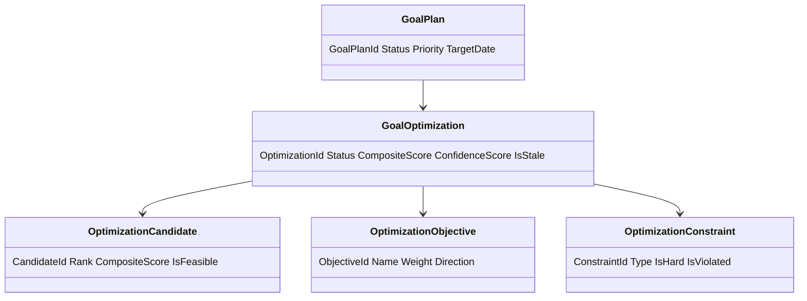
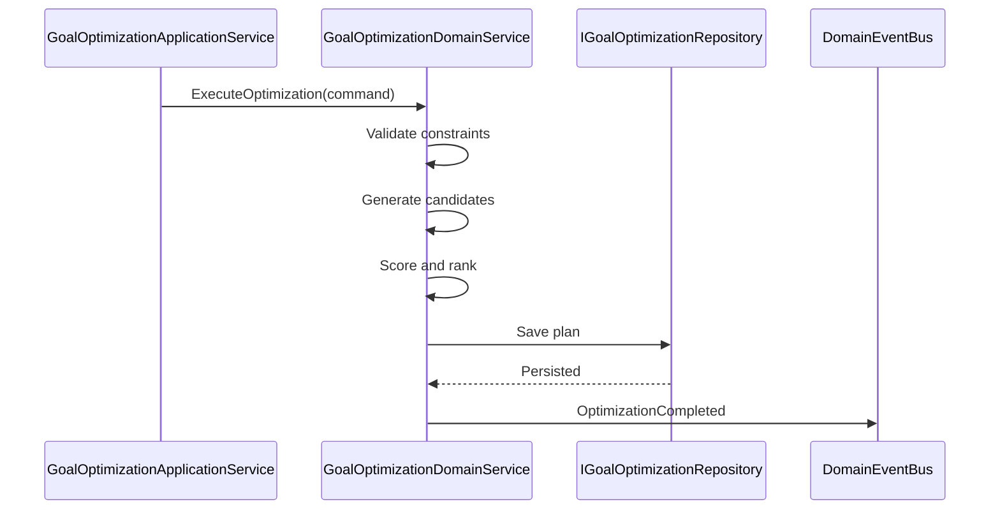
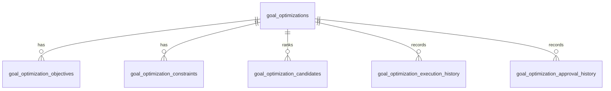
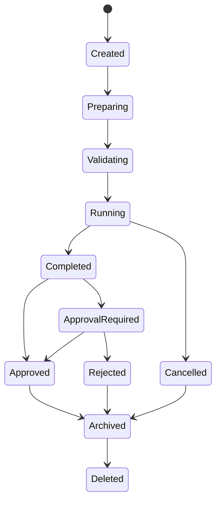
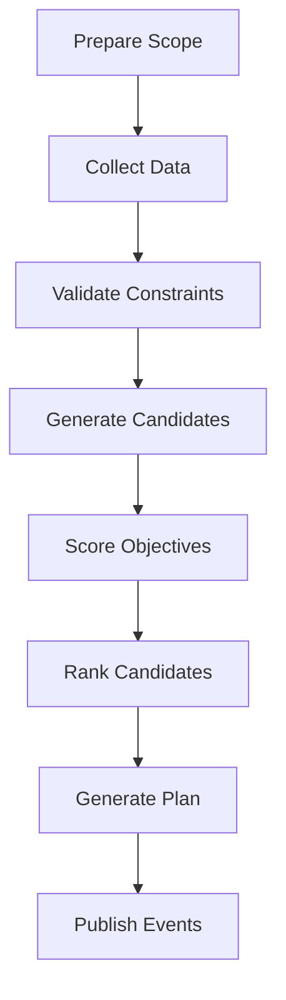
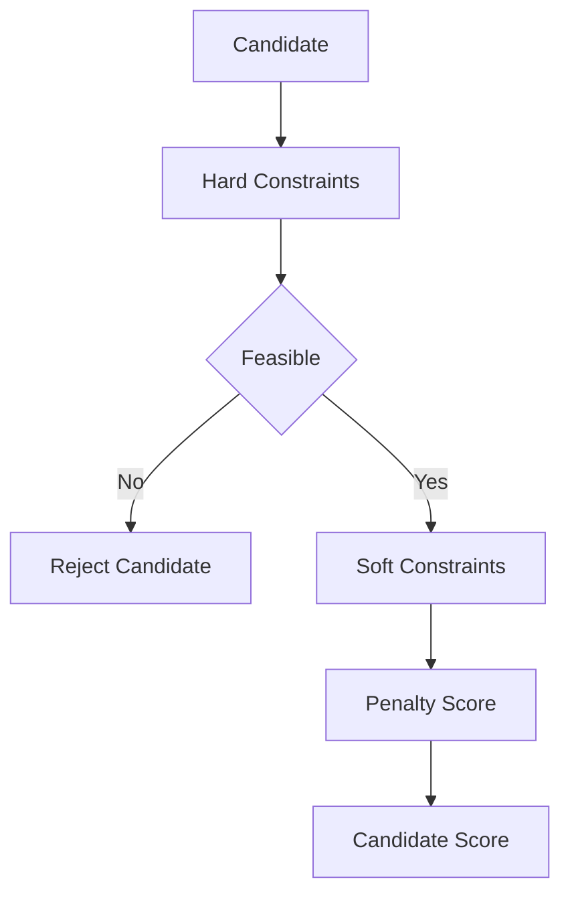
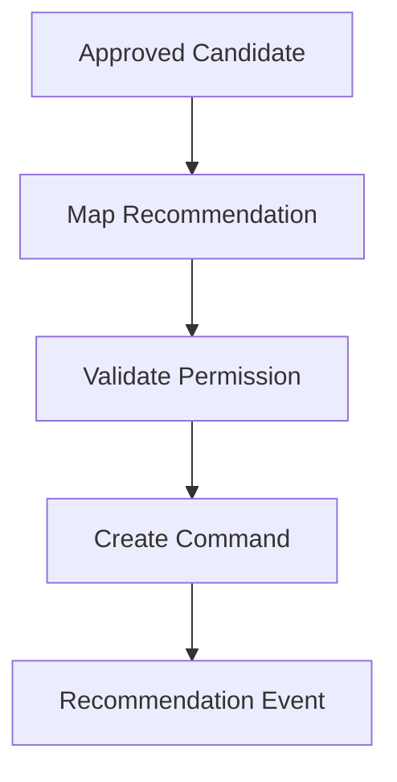

# Goal Optimization
Version: 1.0
## Split Navigation
- [Goal optimization strategy and objectives](goal-optimization/strategy-and-objectives.md)
- [Goal optimization execution workflow](goal-optimization/execution-workflow.md)
- [Goal optimization governance and testing](goal-optimization/governance-and-testing.md)
Status: Enterprise Specification
Owner: Project Atlas
Source of Truth: Atlas Goal Optimization Specification
Last Updated: 2026-07-13
# Goal Optimization Overview
## Purpose
Goal Optimization defines how Atlas creates, updates, executes, cancels, approves, rejects, archives, restores, deletes, secures, audits, and serves optimization plans for GoalPlan. It coordinates optimization with GoalPlan, Milestone, Task, Goal Progress Tracking, Goal Metrics, Goal Dashboard, Goal Analytics, Goal Reporting, Goal Insights, Goal Review, DecisionSession, Recommendation, Scenario, Portfolio, CashFlow, Notification, and User.
It preserves existing Atlas domain ownership and existing catalog naming.
## Business Meaning
Goal Optimization evaluates possible goal paths and ranks candidates by objective functions, constraints, risk, schedule, financial impact, cashflow capacity, scenario outcome, recommendation impact, and decision readiness. An optimization result is decision support and recommendation input.
Optimization does not automatically change GoalPlan, Milestone, Task, Portfolio, CashFlow, Recommendation, DecisionSession, or Scenario state.
## Optimization Lifecycle
Optimization lifecycle starts when CreateOptimization or GenerateOptimizationPlan establishes a governed optimization request. The request is prepared, validated, executed, scored, ranked, reviewed, approved, rejected, cancelled, archived, restored, or deleted according to lifecycle policy.
Approved optimization output may be mapped to Recommendation or DecisionSession through explicit commands.
## Optimization Scope
Optimization scope can be single GoalPlan, multiple GoalPlan records, household, portfolio-related, cashflow-related, scenario-related, recommendation-related, decision-related, milestone-related, or review-related. Scope must preserve HouseholdId.
Scope must preserve TenantId when tenant scope exists. Scope must not include unauthorized source data.
## Optimization Objectives
Optimization objectives include time improvement, financial efficiency, cashflow feasibility, priority alignment, dependency clearance, risk reduction, portfolio fit, scenario advantage, recommendation value, decision quality, resource balance, milestone reliability, goal sequence improvement, and multi-goal balance. Each objective has inputs, outputs, formula, direction, constraints, weight, priority, validation, example, and business usage.
## Optimization Constraints
Constraints define the permitted solution space. Hard constraints must never be violated.
Soft constraints may be penalized in scoring. Constraint violations must be visible in candidate detail.
## Relationship with Goal
GoalPlan supplies target amount, target date, status, priority, category, health, progress, owner, and lifecycle. Goal Optimization does not mutate GoalPlan.
Approved optimization requires explicit downstream command before any goal change.
## Relationship with Milestone
Milestone supplies schedule, completion, blocker, dependency, and sequencing evidence. Optimization may propose milestone sequencing or timing candidates without modifying milestones.
## Relationship with Task
Task supplies execution effort and status when existing task tracking is available. Task data must remain subordinate to GoalPlan and Milestone consistency.
## Relationship with Goal Progress
Goal Progress Tracking supplies current progress, completion score, confidence score, schedule variance, forecast completion, and health score. Optimization uses progress freshness to score candidate reliability.
## Relationship with Goal Metrics
Goal Metrics supplies KPI values, thresholds, trend, health, risk, priority, completion probability, and forecast accuracy. Metric unit, precision, and calculation time must be preserved.
## Relationship with Goal Dashboard
Goal Dashboard consumes optimization summaries, plan status, candidate ranking, and approved optimization indicators. Dashboard projection must be permission-filtered.
## Relationship with Goal Analytics
Goal Analytics supplies trend, comparison, anomaly, forecast, and indicator data. Analytics calculation version must be recorded in optimization evidence.
## Relationship with Goal Reporting
Goal Reporting may include optimization plan, candidate scoring, approval status, rejection reason, and audit trail. Report snapshots must preserve optimization state at generation time.
## Relationship with Goal Insights
Goal Insights may trigger optimization and may consume optimization output as insight evidence. Insight mapping must record OptimizationId and candidate id.
## Relationship with Goal Review
Goal Review may request, approve, reject, or evaluate optimization output when authorized. Review findings must remain masked when required.
## Relationship with Decision
DecisionSession may evaluate optimization plans and record approval or rejection rationale. Decision mapping records DecisionSessionId and decision status.
## Relationship with Recommendation
Recommendation may be generated from approved optimization candidates through explicit Recommendation command. Optimization does not own Recommendation lifecycle.
## Relationship with Scenario
Scenario supplies assumptions, baseline, forecast, stress result, and what-if comparison. Optimization candidates must record ScenarioId and ScenarioVersion when scenario data is used.
## Relationship with Portfolio
Portfolio supplies allocation, liquidity, risk, performance, and valuation evidence where authorized. Portfolio constraints apply before candidate approval.
## Relationship with CashFlow
CashFlow supplies contribution capacity, surplus, deficit, and funding gap evidence where authorized. Cash Flow constraints apply to financial feasibility.
## Relationship with Notification
Notification may be triggered by optimization completion, approval need, rejection, cancellation, or execution failure. Notification suppression does not remove audit history.
## Relationship with User
User supplies permission, preference, approval authority, field masking context, locale, and ownership. User preference constraints are applied when authorized and recorded.
# Optimization Architecture
## Optimization Engine
Optimization Engine executes candidate generation, objective evaluation, constraint enforcement, scoring, and ranking. It must be deterministic for identical source versions and configuration.
## Constraint Engine
Constraint Engine validates hard constraints and calculates soft constraint penalties. It records every violation and penalty.
## Objective Function
Objective Function converts business objective into a measurable formula. Each function declares direction, weight, priority, inputs, outputs, and validation.
## Scoring Engine
Scoring Engine calculates candidate score, penalty score, confidence score, and composite score. Scoring formula version must be recorded.
## Simulation Engine
Simulation Engine evaluates candidate effects using existing scenario, forecast, and cashflow data. Simulation output does not modify source domains.
## Forecast Engine
Forecast Engine estimates completion date, budget outcome, cashflow feasibility, milestone reliability, risk change, and completion probability. Forecast confidence must be recorded.
## Recommendation Engine
Recommendation Engine maps approved candidates to existing Recommendation behavior through explicit command. It does not create recommendation state implicitly.
## Decision Engine
Decision Engine maps approval, rejection, and tradeoff evaluation to DecisionSession when authorized. It does not create decision state implicitly.
## Evaluation Engine
Evaluation Engine compares candidates against baseline, thresholds, prior optimization, scenario, and business value. Evaluation produces explainable ranking.
## Caching Layer
Caching Layer stores permission-filtered optimization summaries, detail projections, plan projections, and candidate lists. Cache keys include tenant, household, optimization id, scope, and projection.
## Audit Layer
Audit Layer records request, execution, scoring, constraint result, candidate selection, approval, rejection, cancellation, archive, restore, delete, and access.
# Optimization Strategies
## Time Optimization
Time Optimization minimizes expected completion date and schedule variance while respecting hard constraints.
## Financial Optimization
Financial Optimization minimizes budget variance, funding gap, and cost while preserving feasibility.
## Cash Flow Optimization
Cash Flow Optimization aligns contributions with CashFlow capacity and period constraints.
## Priority Optimization
Priority Optimization aligns work sequence with priority score, business value, risk, and deadline.
## Dependency Optimization
Dependency Optimization reduces blockers and improves feasible sequencing.
## Risk Optimization
Risk Optimization minimizes risk score and risk-adjusted progress loss.
## Portfolio Optimization
Portfolio Optimization improves goal funding feasibility using authorized portfolio evidence.
## Scenario Optimization
Scenario Optimization identifies the best candidate under selected Scenario assumptions.
## Recommendation Optimization
Recommendation Optimization ranks candidates by expected recommendation impact and adoption feasibility.
## Decision Optimization
Decision Optimization clarifies tradeoffs and decision readiness.
## Resource Optimization
Resource Optimization balances available effort, contribution capacity, and execution sequence.
## Milestone Optimization
Milestone Optimization improves milestone order, timing, and completion probability.
## Goal Sequence Optimization
Goal Sequence Optimization ranks goals by priority, dependency, financial feasibility, and risk.
## Multi Goal Optimization
Multi Goal Optimization balances competing GoalPlan records within household scope.
# Objective Functions
## Time Efficiency Objective
Name: Time Efficiency Objective Business Meaning: Reduce expected completion delay.
Inputs: TargetDate, ExpectedCompletionDate, MilestoneDates, ScheduleVariance. Outputs: TimeScore, DelayDays, CandidateCompletionDate.
Formula: TimeScore = max(0, 100 - DelayDays * 2 - ScheduleVariancePenalty). Optimization Direction: Maximize TimeScore.
Constraints: Time Constraints, Dependency Constraints, Milestone Constraints. Weight: 0.14.
Priority: high. Validation: TargetDate and ExpectedCompletionDate are required.
Example: Candidate reduces delay from 20 days to 5 days. Business Usage: Used to prioritize schedule recovery.
## Financial Efficiency Objective
Name: Financial Efficiency Objective Business Meaning: Reduce budget variance and funding gap.
Inputs: BudgetUsagePercent, FundingGap, RequiredContribution, AvailableContribution. Outputs: FinancialScore, FundingGapReduction, BudgetVariance.
Formula: FinancialScore = max(0, 100 - abs(BudgetVariancePercent) - FundingGapPenalty). Optimization Direction: Maximize FinancialScore.
Constraints: Budget Constraints, Cash Flow Constraints, User Preference Constraints. Weight: 0.13.
Priority: high. Validation: Currency and period are required.
Example: Candidate lowers funding gap by 1200. Business Usage: Used to select financially feasible path.
## Cash Flow Feasibility Objective
Name: Cash Flow Feasibility Objective Business Meaning: Align goal contribution with available CashFlow.
Inputs: CashFlowSurplus, ContributionCapacity, RequiredContribution, Period. Outputs: CashFlowScore, CapacityRatio, DeficitAmount.
Formula: CashFlowScore = min(100, CapacityRatio * 100) - DeficitPenalty. Optimization Direction: Maximize CashFlowScore.
Constraints: Cash Flow Constraints, Budget Constraints. Weight: 0.12.
Priority: high. Validation: CashFlow period must align with goal period.
Example: Candidate keeps contribution below available capacity. Business Usage: Used to avoid infeasible funding plans.
## Priority Alignment Objective
Name: Priority Alignment Objective Business Meaning: Align candidate with priority and business value.
Inputs: PriorityScore, BusinessValueScore, RiskScore, DeadlineProximity. Outputs: PriorityAlignmentScore, AlignmentGap.
Formula: PriorityAlignmentScore = 100 - abs(BusinessValueScore - PriorityScore) + DeadlineBonus - RiskPenalty. Optimization Direction: Maximize PriorityAlignmentScore.
Constraints: Priority Constraints, User Preference Constraints. Weight: 0.08.
Priority: medium. Validation: PriorityScore must be between 0 and 100.
Example: Candidate moves high value goal earlier. Business Usage: Used for goal sequencing.
## Dependency Clearance Objective
Name: Dependency Clearance Objective Business Meaning: Reduce blocked dependencies and critical path risk.
Inputs: BlockedDependencyCount, CriticalDependencyCount, DependencyAgeDays. Outputs: DependencyScore, BlockerReduction.
Formula: DependencyScore = max(0, 100 - CriticalDependencyCount * 25 - BlockedDependencyCount * 10 - DependencyAgePenalty). Optimization Direction: Maximize DependencyScore.
Constraints: Dependency Constraints, Time Constraints. Weight: 0.09.
Priority: high. Validation: Dependency graph must be acyclic.
Example: Candidate resolves two blockers before execution. Business Usage: Used to improve feasibility.
## Risk Reduction Objective
Name: Risk Reduction Objective Business Meaning: Reduce risk exposure while preserving progress.
Inputs: RiskScore, RiskTrend, HealthScore, ConfidenceScore. Outputs: RiskAdjustedScore, RiskReduction.
Formula: RiskAdjustedScore = HealthScore - RiskScore * 0.4 + ConfidenceScore * 0.2. Optimization Direction: Maximize RiskAdjustedScore.
Constraints: Risk Constraints, Regulatory Constraints. Weight: 0.11.
Priority: high. Validation: RiskScore must be between 0 and 100.
Example: Candidate lowers risk score from 74 to 55. Business Usage: Used for risk-aware planning.
## Portfolio Fit Objective
Name: Portfolio Fit Objective Business Meaning: Improve portfolio-supported feasibility where authorized.
Inputs: Liquidity, Allocation, PortfolioRisk, RequiredLiquidAmount, ValuationTime. Outputs: PortfolioScore, LiquidityGap, AllocationFit.
Formula: PortfolioScore = LiquidityFitScore + AllocationFitScore - PortfolioRiskPenalty. Optimization Direction: Maximize PortfolioScore.
Constraints: Portfolio Constraints, Risk Constraints, User Preference Constraints. Weight: 0.08.
Priority: medium. Validation: Portfolio permission and valuation time are required.
Example: Candidate uses available liquidity without increasing risk beyond threshold. Business Usage: Used for portfolio-sensitive goals.
## Scenario Advantage Objective
Name: Scenario Advantage Objective Business Meaning: Select candidate with strongest scenario result.
Inputs: BaselineOutcome, ScenarioOutcome, ScenarioConfidence, ScenarioVersion. Outputs: ScenarioScore, ScenarioDelta.
Formula: ScenarioScore = 50 + ScenarioDelta * 2 + ScenarioConfidence * 0.2. Optimization Direction: Maximize ScenarioScore.
Constraints: Scenario Constraints, User Preference Constraints. Weight: 0.07.
Priority: medium. Validation: ScenarioId and ScenarioVersion are required.
Example: Candidate improves completion probability by 12 points. Business Usage: Used for what-if comparison.
## Recommendation Value Objective
Name: Recommendation Value Objective Business Meaning: Favor candidates with strong recommendation impact and adoption feasibility.
Inputs: ExpectedImpact, AdoptionFeasibility, RecommendationStatus. Outputs: RecommendationScore, ExpectedValue.
Formula: RecommendationScore = ExpectedImpact * 0.7 + AdoptionFeasibility * 0.3. Optimization Direction: Maximize RecommendationScore.
Constraints: Recommendation Constraints, User Preference Constraints. Weight: 0.06.
Priority: medium. Validation: Recommendation mapping must reference existing Recommendation when present.
Example: Candidate maps to high impact recommendation. Business Usage: Used to prepare recommendation output.
## Decision Readiness Objective
Name: Decision Readiness Objective Business Meaning: Favor candidates with clear tradeoffs and decision readiness.
Inputs: DecisionStatus, DecisionQuality, EvidenceCompleteness, ApprovalNeed. Outputs: DecisionScore, ReadinessLevel.
Formula: DecisionScore = DecisionQuality * 0.5 + EvidenceCompleteness * 0.5 - ApprovalPenalty. Optimization Direction: Maximize DecisionScore.
Constraints: Decision Constraints, Authorization Constraints. Weight: 0.05.
Priority: medium. Validation: Approval authority must be known when approval is required.
Example: Candidate has complete evidence and no pending decision blocker. Business Usage: Used to reduce decision latency.
## Milestone Reliability Objective
Name: Milestone Reliability Objective Business Meaning: Improve milestone sequence and completion reliability.
Inputs: MilestoneCompletionPercent, OverdueMilestoneCount, MilestoneCriticality. Outputs: MilestoneScore, ReliabilityDelta.
Formula: MilestoneScore = MilestoneCompletionPercent - OverdueMilestoneCount * 10 + CriticalityFitBonus. Optimization Direction: Maximize MilestoneScore.
Constraints: Milestone Constraints, Dependency Constraints. Weight: 0.07.
Priority: medium. Validation: Milestone identifiers must be valid.
Example: Candidate moves critical milestone earlier. Business Usage: Used to stabilize execution plan.
# Constraint Model
## Hard Constraints
Hard constraints cannot be violated by any approved candidate. Violation marks candidate infeasible.
## Soft Constraints
Soft constraints create penalties and remain visible in candidate detail. Soft constraint penalty affects ranking.
## Budget Constraints
Budget constraints enforce target amount, budget cap, contribution limits, and variance thresholds.
## Time Constraints
Time constraints enforce target date, minimum lead time, milestone date, and schedule feasibility.
## Cash Flow Constraints
Cash Flow constraints enforce available contribution, period alignment, surplus, deficit, and funding gap.
## Dependency Constraints
Dependency constraints enforce dependency order, blocker clearance, and acyclic graph.
## Risk Constraints
Risk constraints enforce maximum risk score, risk trend limit, and critical risk handling.
## Priority Constraints
Priority constraints enforce priority order and approved priority exceptions.
## Scenario Constraints
Scenario constraints enforce selected ScenarioId, ScenarioVersion, baseline, and assumption validity.
## Portfolio Constraints
Portfolio constraints enforce portfolio permission, liquidity, allocation, valuation time, and risk limits.
## Regulatory Constraints
Regulatory constraints enforce compliance restrictions already represented in existing Atlas governance.
## User Preference Constraints
User preference constraints enforce user-approved preferences, excluded options, notification preference, and masking.
# Optimization Workflow
## Preparation
Preparation validates scope, source availability, permission, objective set, constraint set, and execution mode.
## Data Collection
Data Collection reads authorized GoalPlan, Milestone, Task, Progress, Metrics, Analytics, Insights, Review, Decision, Recommendation, Scenario, Portfolio, CashFlow, Notification, and User data.
## Constraint Validation
Constraint Validation evaluates hard and soft constraints before candidate generation.
## Optimization Execution
Optimization Execution generates candidates and evaluates objective functions.
## Candidate Generation
Candidate Generation creates feasible solution candidates with source version and formula version.
## Scoring
Scoring calculates objective scores, constraint penalties, confidence score, and composite score.
## Ranking
Ranking orders candidates by feasibility, composite score, priority, risk, confidence, and tie-breaker.
## Recommendation
Recommendation maps approved candidates to Recommendation through explicit command.
## Approval
Approval records approver, decision, approved candidate, and rationale.
## Execution
Execution applies downstream changes only through explicit domain commands.
## Monitoring
Monitoring compares approved candidate outcome against actual progress, metrics, and insights.
## Rollback
Rollback cancels execution mapping or restores previous optimization state when allowed.
# Validation Rules
1. OptimizationId must be globally unique. 2. HouseholdId is required. 3. TenantId is required when tenant scope exists. 4. Scope must include at least one GoalPlan or household-level target. 5. User must have optimization permission for scope. 6. GoalPlan references must exist. 7. Archived GoalPlan cannot be optimized for active execution. 8. Cancelled GoalPlan cannot be optimized for active execution. 9. Completed GoalPlan can only be optimized for historical review. 10. Objective set cannot be empty. 11. Constraint set cannot be empty. 12. Hard constraints must be evaluated before approval. 13. Soft constraint penalty must be numeric. 14. Objective weight must be greater than or equal to 0. 15. Total active objective weight must be greater than 0. 16. Objective priority must be valid. 17. Candidate id must be unique within optimization. 18. Candidate score must be between 0 and 100. 19. Confidence score must be between 0 and 100. 20. Candidate rank must be positive. 21. Approved candidate must be feasible. 22. Rejected optimization must include rejection reason. 23. Cancelled optimization must include cancellation reason. 24. Archived optimization must be read-only. 25. Deleted optimization must satisfy retention policy. 26. Scenario evidence must include ScenarioId and ScenarioVersion. 27. Portfolio evidence requires portfolio permission. 28. CashFlow evidence requires cashflow permission. 29. Recommendation mapping must reference existing Recommendation when present. 30. Decision mapping must reference existing DecisionSession when present. 31. Execution cannot start without source version hash. 32. Source version hash must be recorded. 33. Formula version must be recorded. 34. Constraint version must be recorded. 35. Request must include correlation id. 36. Batch request must include item scope. 37. Search date range must be valid. 38. Sorting field must be allowed. 39. Projection field must be allowed. 40. Pagination limit must be within API maximum. 41. Update must preserve immutable identifiers. 42. Restore cannot apply to deleted optimization. 43. Approve cannot apply to cancelled optimization. 44. Reject cannot apply to archived optimization. 45. Execute cannot apply to rejected optimization. 46. Audit metadata is required for every command.
# Business Rules
1. Optimization must preserve Atlas domain ownership. 2. Optimization must not mutate GoalPlan directly. 3. Optimization must not mutate Milestone directly. 4. Optimization must not mutate Task directly. 5. Optimization must not mutate Portfolio directly. 6. Optimization must not mutate CashFlow directly. 7. Optimization must not create Recommendation without explicit command. 8. Optimization must not create DecisionSession without explicit command. 9. Optimization must not create unrelated business concepts. 10. All naming must follow existing catalog naming. 11. Only authorized users can create optimization. 12. Only authorized users can execute optimization. 13. Only authorized users can approve optimization. 14. Only authorized users can reject optimization. 15. Only authorized users can delete optimization. 16. Field-level security applies before projection. 17. Masked data must remain masked in cache. 18. Aggregation must not leak unauthorized data. 19. Hard constraints must never be violated by approved candidate. 20. Soft constraints must affect candidate score. 21. Constraint violations must be visible in candidate detail. 22. Candidate score must be reproducible from recorded inputs. 23. Ranking must be deterministic for equal inputs. 24. Higher feasibility outranks higher score when hard constraints fail. 25. Higher composite score outranks lower score among feasible candidates. 26. Higher confidence outranks lower confidence when score ties. 27. Lower risk outranks higher risk when confidence ties. 28. Earlier completion outranks later completion when risk ties. 29. Approved candidate must be retained. 30. Rejected candidate rationale must be retained. 31. Cancelled execution cannot emit approval event. 32. Archived optimization is read-only. 33. Restored optimization must revalidate source availability. 34. Deleted optimization requires retention permission. 35. Source version change must mark previous candidate stale. 36. Rule version change must trigger recalculation. 37. Formula version change must trigger recalculation. 38. Constraint version change must trigger recalculation. 39. Permission change must invalidate user optimization cache. 40. Masking change must invalidate cached projections. 41. Dashboard projection must use permission-filtered data. 42. Reporting snapshot must preserve optimization state. 43. Insight trigger must record OptimizationId. 44. Review approval must record ReviewId when used. 45. Decision approval must record DecisionSessionId when used. 46. Recommendation mapping must record candidate id. 47. Scenario optimization must compare against baseline. 48. Portfolio optimization requires valuation time. 49. Cash Flow optimization requires period alignment. 50. Multi Goal Optimization must preserve HouseholdId. 51. Multi Goal Optimization must not cross household boundary. 52. Tenant-aware optimization must preserve TenantId. 53. Batch optimization must isolate item failures. 54. Execution failure must not delete optimization history. 55. Cache failure must not roll back persisted optimization. 56. Notification failure must not roll back optimization completion. 57. Optimization completed event must occur after persistence. 58. Approval event must occur after state change. 59. Rejection event must occur after state change. 60. Cancellation event must occur after state change. 61. Audit trail is required for every command. 62. Execution history is append-only. 63. Candidate history is append-only after completion. 64. Approved candidate cannot be changed without new optimization version. 65. Optimization version increments on update. 66. Optimistic concurrency is required for updates. 67. Active optimization cannot be deleted without cancellation. 68. Active optimization can be cancelled by authorized actor. 69. Completed optimization can be approved or rejected. 70. Approved optimization can be archived. 71. Rejected optimization can be archived. 72. Cancelled optimization can be archived. 73. Archived optimization can be restored if retention allows. 74. Restored optimization returns to previous eligible state. 75. Stale optimization cannot be approved. 76. Stale optimization must be refreshed or re-executed. 77. Optimization plan must include selected objectives. 78. Optimization plan must include evaluated constraints. 79. Optimization plan must include candidate ranking. 80. Optimization plan must include source version hash. 81. Optimization plan must include confidence score. 82. Optimization plan must include business rationale. 83. Objective weight changes require recalculation. 84. Constraint changes require recalculation. 85. Scenario assumption changes require recalculation. 86. Portfolio valuation changes require recalculation. 87. CashFlow period changes require recalculation. 88. Goal Progress changes may trigger incremental optimization. 89. Goal Metrics threshold changes may trigger incremental optimization. 90. Goal Insights critical signal may trigger optimization. 91. Notification may be triggered when approval is required. 92. Notification may be triggered when optimization completes. 93. Export must use masked projection when required. 94. API response must include stale indicator when source versions changed. 95. Search must enforce scope filtering. 96. Materialized views must use committed data.
# State Machine
## States
- Created
- Preparing
- Validating
- Running
- Completed
- ApprovalRequired
- Approved
- Rejected
- Cancelled
- Archived
- Deleted
## Transitions
- Created -> Preparing by ExecuteOptimization.
- Preparing -> Validating after data collection.
- Validating -> Running when constraints are valid.
- Validating -> Cancelled when validation fails and cancellation is requested.
- Running -> Completed when execution succeeds.
- Running -> Cancelled when cancellation succeeds.
- Completed -> ApprovalRequired when approval is required.
- Completed -> Approved when auto-approval is allowed.
- ApprovalRequired -> Approved by ApproveOptimization.
- ApprovalRequired -> Rejected by RejectOptimization.
- Approved -> Archived by ArchiveOptimization.
- Rejected -> Archived by ArchiveOptimization.
- Cancelled -> Archived by ArchiveOptimization.
- Archived -> Completed by RestoreOptimization when previous state was Completed.
- Archived -> ApprovalRequired by RestoreOptimization when previous state was ApprovalRequired.
- Archived -> Deleted by DeleteOptimization.
## Triggers
- CreateOptimization
- UpdateOptimization
- ExecuteOptimization
- CancelOptimization
- ApproveOptimization
- RejectOptimization
- ArchiveOptimization
- RestoreOptimization
- DeleteOptimization
- GenerateOptimizationPlan
- SourceChanged
- ConstraintChanged
- ObjectiveChanged
## Invariant
OptimizationId, HouseholdId, created time, created by, and original scope are immutable. Running optimization must have objective set, constraint set, source version hash, and formula version.
Approved optimization must have approved candidate id, approver, approval time, and approval rationale. Archived and Deleted optimization cannot be updated except by restore or retention operation.
## Illegal Transition
- Deleted -> Created
- Deleted -> Approved
- Deleted -> Running
- Archived -> Running
- Cancelled -> Approved
- Rejected -> Approved
- Created -> Approved
- Running -> Approved
- ApprovalRequired -> Running
- Completed -> Running without new execution version
# Commands
## CreateOptimization
Creates optimization request with scope, objectives, constraints, and execution settings.
## UpdateOptimization
Updates editable optimization fields before execution or when lifecycle allows.
## ExecuteOptimization
Runs validation, candidate generation, scoring, ranking, and plan creation.
## CancelOptimization
Cancels eligible optimization execution or approval wait.
## ApproveOptimization
Approves selected feasible candidate with rationale and authority.
## RejectOptimization
Rejects optimization output with reason and optional candidate reference.
## ArchiveOptimization
Archives optimization and makes it read-only.
## RestoreOptimization
Restores archived optimization after retention and source validation.
## DeleteOptimization
Deletes eligible optimization after retention validation.
## GenerateOptimizationPlan
Generates a plan and candidate ranking for authorized scope.
## RecalculateOptimization
Recalculates candidates after source, objective, or constraint version change.
## RefreshOptimization
Refreshes source versions and stale indicators.
## MapOptimizationRecommendation
Maps approved candidate to existing Recommendation behavior.
## MapOptimizationDecision
Maps approval or rejection to DecisionSession.
## ExportOptimization
Exports masked optimization projection.
## BatchExecuteOptimization
Executes multiple optimization scopes with per-item result.
# Domain Events
## OptimizationCreated
Emitted after optimization request is created.
## OptimizationUpdated
Emitted after editable fields change.
## OptimizationStarted
Emitted after execution starts.
## OptimizationCompleted
Emitted after execution completes successfully.
## OptimizationCancelled
Emitted after cancellation succeeds.
## OptimizationApproved
Emitted after approval succeeds.
## OptimizationRejected
Emitted after rejection succeeds.
## OptimizationArchived
Emitted after archive succeeds.
## OptimizationRestored
Emitted after restore succeeds.
## OptimizationPlanGenerated
Emitted after plan and candidate ranking are generated.
## OptimizationDeleted
Emitted after delete succeeds.
## OptimizationRefreshed
Emitted after source refresh succeeds.
## OptimizationRecalculated
Emitted after recalculation succeeds.
## OptimizationCandidateRanked
Emitted after candidate ranking changes.
## OptimizationConstraintViolated
Emitted when a hard or soft constraint violation is recorded.
## OptimizationRecommendationMapped
Emitted when Recommendation mapping is created.
## OptimizationDecisionMapped
Emitted when DecisionSession mapping is created.
## OptimizationNotificationTriggered
Emitted when notification trigger is published.
# Repository
## Interface
IGoalOptimizationRepository persists optimization aggregate, objectives, constraints, candidates, execution history, approval history, mappings, and projections.
## Methods
- Add
- Update
- GetById
- GetByScope
- GetActiveByGoalPlanId
- Search
- SaveObjective
- SaveConstraint
- SaveCandidate
- SaveExecutionHistory
- SaveApprovalHistory
- SaveRecommendationMapping
- SaveDecisionMapping
- Archive
- Restore
- Delete
- GetPlanProjection
- GetSummaryProjection
- GetDashboardProjection
## Queries
- OptimizationsByGoalPlan
- OptimizationsByHousehold
- OptimizationsByStatus
- OptimizationsByObjective
- OptimizationsByConstraint
- OptimizationsByScenario
- OptimizationsByRecommendation
- OptimizationsByDecision
- StaleOptimizations
- ApprovalRequiredOptimizations
- CompletedOptimizations
## Filtering
- GoalPlanId
- HouseholdId
- TenantId
- Status
- ObjectiveType
- ConstraintType
- ScenarioId
- RecommendationId
- DecisionSessionId
- CreatedDateRange
- CompletedDateRange
- ApprovedDateRange
- HasViolation
- IsStale
## Sorting
- createdAt desc
- updatedAt desc
- completedAt desc
- approvedAt desc
- compositeScore desc
- confidenceScore desc
- status asc
- objectiveType asc
## Aggregation
- CountByStatus
- CountByObjective
- CountByConstraintViolation
- AverageCompositeScore
- AverageConfidenceScore
- ApprovalRequiredCount
- StaleCount
- CompletedCount
## Projection
- OptimizationSummaryProjection
- OptimizationDetailProjection
- OptimizationPlanProjection
- CandidateProjection
- ConstraintProjection
- ObjectiveProjection
- DashboardProjection
## Specification
- ActiveOptimizationSpecification
- VisibleOptimizationSpecification
- ApprovalRequiredOptimizationSpecification
- StaleOptimizationSpecification
- GoalScopedOptimizationSpecification
- FeasibleCandidateSpecification
- AuditOptimizationSpecification
# Domain Service Interaction
- GoalOptimizationDomainService validates lifecycle, objectives, constraints, and candidate ranking.
- GoalProgressDomainService supplies progress and schedule inputs.
- GoalMetricsDomainService supplies metrics, thresholds, and KPI inputs.
- GoalAnalyticsDomainService supplies trend, forecast, comparison, and anomaly inputs.
- GoalInsightDomainService supplies insight triggers and optimization evidence.
- GoalReviewDomainService supplies review findings and approval context.
- RecommendationDomainService receives approved candidate mapping.
- DecisionDomainService receives decision mapping and approval rationale.
- ScenarioDomainService supplies assumptions and scenario comparison.
- PortfolioDomainService supplies authorized valuation, liquidity, allocation, and risk evidence.
- CashFlowDomainService supplies authorized surplus, deficit, contribution capacity, and period evidence.
- NotificationDomainService receives completion and approval triggers.
- AuditDomainService records request, execution, scoring, approval, rejection, and access.
- SecurityDomainService evaluates authorization and field masking.
- CacheDomainService invalidates optimization projections.
# Application Service Interaction
- GoalOptimizationApplicationService coordinates commands, queries, and unit of work.
- CreateOptimizationHandler validates create DTO and calls domain service.
- UpdateOptimizationHandler validates version and editable fields.
- ExecuteOptimizationHandler collects sources, validates constraints, executes objective functions, and persists results.
- CancelOptimizationHandler validates lifecycle and writes cancellation history.
- ApproveOptimizationHandler validates authority and approved candidate.
- RejectOptimizationHandler validates reason and writes decision history.
- ArchiveOptimizationHandler makes optimization read-only.
- RestoreOptimizationHandler revalidates source availability and retention.
- DeleteOptimizationHandler validates retention and deletes eligible records.
- GenerateOptimizationPlanHandler creates plan projection and candidate ranking.
- SearchOptimizationQueryHandler applies filters, sorting, projection, and pagination.
- BatchOptimizationHandler executes multiple scopes with isolated item results.
# API
## REST Endpoints
- GET /api/goal-optimizations
- POST /api/goal-optimizations
- GET /api/goal-optimizations/{optimizationId}
- PUT /api/goal-optimizations/{optimizationId}
- POST /api/goal-optimizations/{optimizationId}/execute
- POST /api/goal-optimizations/{optimizationId}/cancel
- POST /api/goal-optimizations/{optimizationId}/approve
- POST /api/goal-optimizations/{optimizationId}/reject
- POST /api/goal-optimizations/{optimizationId}/archive
- POST /api/goal-optimizations/{optimizationId}/restore
- DELETE /api/goal-optimizations/{optimizationId}
- POST /api/goal-optimizations/generate-plan
- POST /api/goal-optimizations/batch/execute
- GET /api/goals/{goalPlanId}/optimizations
## HTTP Methods
GET reads optimization projections. POST creates, executes, cancels, approves, rejects, archives, restores, generates, or batches optimization.
PUT updates eligible optimization fields. DELETE deletes eligible optimization records after retention validation.
## Request
Create request includes scope, objective set, constraint set, execution mode, scenario references, and preference settings. Update request includes version, objective changes, constraint changes, and update reason.
Execute request includes source version mode, candidate limit, timeout, and force refresh flag. Approve request includes candidate id, rationale, approval source, and optional DecisionSessionId.
Reject request includes reason, rejected candidate ids, and optional DecisionSessionId. Search request includes filters, sorting, pagination, and projection.
## Response
Detail response returns optimization, objectives, constraints, candidates, scoring, lifecycle, permissions, and audit metadata. Summary response returns status, top candidate, composite score, confidence score, stale state, and timestamps.
Plan response returns candidate ranking, constraint results, objective scores, recommendation mapping, and decision mapping. Batch response returns processed, completed, failed, skipped, and per-item errors.
## Errors
- 400 invalid request
- 401 unauthenticated
- 403 forbidden
- 404 optimization not found
- 409 concurrency conflict
- 410 stale source
- 422 validation failed
- 423 execution locked
- 429 rate limited
- 500 internal error
## Pagination
Pagination uses pageNumber, pageSize, totalCount, totalPages, hasNextPage, and hasPreviousPage.
## Filtering
Filtering supports status, objective type, constraint type, score range, confidence range, goalPlanId, householdId, scenarioId, recommendationId, decisionSessionId, date range, stale state, and violation state.
## Sorting
Sorting supports createdAt, updatedAt, completedAt, approvedAt, compositeScore, confidenceScore, status, and objective type.
## Projection
Projection supports summary, detail, plan, candidate, constraint, objective, dashboard, and audit-safe views.
## Batch API
Batch API supports execute, refresh, recalculate, archive, restore, and export with per-item result and correlation id.
# DTO
## Create DTO
Includes scope, objective set, constraint set, scenario references, execution mode, candidate limit, and preference settings.
## Update DTO
Includes optimizationId, version, objective changes, constraint changes, candidate limit, and update reason.
## Detail DTO
Includes optimization detail, objectives, constraints, candidates, lifecycle history, execution history, mappings, permissions, and audit metadata.
## Summary DTO
Includes optimizationId, status, scope, top candidate score, confidence score, stale flag, createdAt, and updatedAt.
## Search DTO
Includes filters, sorting, pagination, projection, and masking mode.
## Optimization DTO
Includes core optimization identifiers, scope, status, source version hash, formula version, constraint version, and timestamps.
## Optimization Plan DTO
Includes baseline, candidate list, candidate ranking, objective scores, constraint results, recommendation mapping, and decision mapping.
## Constraint DTO
Includes constraint type, hard flag, input values, violation state, penalty score, and explanation.
## Objective DTO
Includes objective name, weight, priority, inputs, outputs, formula, score, and explanation.
# Database Mapping
## Table
- goal_optimizations
- goal_optimization_objectives
- goal_optimization_constraints
- goal_optimization_candidates
- goal_optimization_execution_history
- goal_optimization_approval_history
- goal_optimization_recommendation_map
- goal_optimization_decision_map
- goal_optimization_audit
## Columns
- optimization_id uuid primary key
- tenant_id uuid null
- household_id uuid not null
- goal_plan_id uuid null
- status varchar(40) not null
- scope_type varchar(60) not null
- source_version_hash varchar(128) not null
- formula_version varchar(40) not null
- constraint_version varchar(40) not null
- objective_version varchar(40) not null
- top_candidate_id uuid null
- composite_score numeric(6,2) null
- confidence_score numeric(5,2) null
- is_stale boolean not null
- execution_started_at timestamptz null
- execution_completed_at timestamptz null
- approved_at timestamptz null
- rejected_at timestamptz null
- cancelled_at timestamptz null
- archived_at timestamptz null
- created_at timestamptz not null
- updated_at timestamptz not null
- version int not null
## Indexes
- ix_goal_optimizations_household_status
- ix_goal_optimizations_goal_status
- ix_goal_optimizations_scope
- ix_goal_optimizations_score
- ix_goal_optimizations_stale
- ix_goal_optimizations_created_at
- ix_goal_optimization_candidates_rank
- ux_goal_optimization_candidate_rank
## Constraints
- composite_score between 0 and 100 when present
- confidence_score between 0 and 100 when present
- status in supported states
- created_at less than or equal to updated_at
- approved_at is null or status is Approved or Archived
## FK
- goal_plan_id references goal_plans when present
- household_id references households
- optimization_id references goal_optimizations for child tables
- recommendation_id references recommendations when present
- decision_session_id references decision_sessions when present
- scenario_id references scenarios when present
## Unique
- Unique candidate rank per optimization.
- Unique active optimization key per household, scope, objective version, and constraint version when status is active.
## Check Constraint
- Score and confidence values must remain between 0 and 100.
- Lifecycle timestamp must match lifecycle status.
## Partition Strategy
- Partition execution history and audit by created_at month for large installations.
# PostgreSQL Schema
```sql
CREATE TABLE goal_optimizations (
  optimization_id uuid PRIMARY KEY,
  tenant_id uuid NULL,
  household_id uuid NOT NULL,
  goal_plan_id uuid NULL,
  status varchar(40) NOT NULL,
  scope_type varchar(60) NOT NULL,
  source_version_hash varchar(128) NOT NULL,
  formula_version varchar(40) NOT NULL,
  constraint_version varchar(40) NOT NULL,
  objective_version varchar(40) NOT NULL,
  top_candidate_id uuid NULL,
  composite_score numeric(6,2) NULL,
  confidence_score numeric(5,2) NULL,
  is_stale boolean NOT NULL DEFAULT false,
  request_payload jsonb NOT NULL DEFAULT '{}'::jsonb,
  result_summary jsonb NOT NULL DEFAULT '{}'::jsonb,
  execution_started_at timestamptz NULL,
  execution_completed_at timestamptz NULL,
  approved_at timestamptz NULL,
  rejected_at timestamptz NULL,
  cancelled_at timestamptz NULL,
  archived_at timestamptz NULL,
  created_by uuid NULL,
  updated_by uuid NULL,
  created_at timestamptz NOT NULL DEFAULT now(),
  updated_at timestamptz NOT NULL DEFAULT now(),
  version int NOT NULL DEFAULT 1,
  CONSTRAINT ck_goal_optimizations_status CHECK (status IN ('Created','Preparing','Validating','Running','Completed','ApprovalRequired','Approved','Rejected','Cancelled','Archived','Deleted')),
  CONSTRAINT ck_goal_optimizations_score CHECK (composite_score IS NULL OR (composite_score >= 0 AND composite_score <= 100)),
  CONSTRAINT ck_goal_optimizations_confidence CHECK (confidence_score IS NULL OR (confidence_score >= 0 AND confidence_score <= 100))
);
CREATE TABLE goal_optimization_objectives (
  objective_id uuid PRIMARY KEY,
  optimization_id uuid NOT NULL REFERENCES goal_optimizations(optimization_id),
  name varchar(120) NOT NULL,
  weight numeric(8,4) NOT NULL,
  priority varchar(20) NOT NULL,
  direction varchar(20) NOT NULL,
  formula_code varchar(120) NOT NULL,
  inputs jsonb NOT NULL DEFAULT '{}'::jsonb,
  outputs jsonb NOT NULL DEFAULT '{}'::jsonb,
  score numeric(6,2) NULL,
  created_at timestamptz NOT NULL DEFAULT now(),
  CONSTRAINT ck_goal_optimization_objective_weight CHECK (weight >= 0),
  CONSTRAINT ck_goal_optimization_objective_score CHECK (score IS NULL OR (score >= 0 AND score <= 100))
);
CREATE TABLE goal_optimization_constraints (
  constraint_id uuid PRIMARY KEY,
  optimization_id uuid NOT NULL REFERENCES goal_optimizations(optimization_id),
  constraint_type varchar(80) NOT NULL,
  is_hard boolean NOT NULL,
  is_violated boolean NOT NULL DEFAULT false,
  penalty_score numeric(6,2) NOT NULL DEFAULT 0,
  inputs jsonb NOT NULL DEFAULT '{}'::jsonb,
  result jsonb NOT NULL DEFAULT '{}'::jsonb,
  created_at timestamptz NOT NULL DEFAULT now(),
  CONSTRAINT ck_goal_optimization_constraint_penalty CHECK (penalty_score >= 0)
);
CREATE TABLE goal_optimization_candidates (
  candidate_id uuid PRIMARY KEY,
  optimization_id uuid NOT NULL REFERENCES goal_optimizations(optimization_id),
  rank int NOT NULL,
  is_feasible boolean NOT NULL,
  composite_score numeric(6,2) NOT NULL,
  confidence_score numeric(5,2) NOT NULL,
  objective_scores jsonb NOT NULL DEFAULT '{}'::jsonb,
  constraint_results jsonb NOT NULL DEFAULT '{}'::jsonb,
  explanation jsonb NOT NULL DEFAULT '{}'::jsonb,
  created_at timestamptz NOT NULL DEFAULT now(),
  CONSTRAINT ck_goal_optimization_candidate_rank CHECK (rank > 0),
  CONSTRAINT ck_goal_optimization_candidate_score CHECK (composite_score >= 0 AND composite_score <= 100),
  CONSTRAINT ck_goal_optimization_candidate_confidence CHECK (confidence_score >= 0 AND confidence_score <= 100)
);
CREATE TABLE goal_optimization_execution_history (
  execution_id uuid PRIMARY KEY,
  optimization_id uuid NOT NULL REFERENCES goal_optimizations(optimization_id),
  status varchar(40) NOT NULL,
  started_at timestamptz NOT NULL,
  completed_at timestamptz NULL,
  message varchar(800) NULL,
  correlation_id uuid NOT NULL
);
CREATE TABLE goal_optimization_approval_history (
  approval_id uuid PRIMARY KEY,
  optimization_id uuid NOT NULL REFERENCES goal_optimizations(optimization_id),
  candidate_id uuid NULL,
  decision varchar(40) NOT NULL,
  reason varchar(800) NOT NULL,
  actor_id uuid NULL,
  occurred_at timestamptz NOT NULL DEFAULT now(),
  correlation_id uuid NOT NULL
);
CREATE TABLE goal_optimization_recommendation_map (
  optimization_id uuid NOT NULL REFERENCES goal_optimizations(optimization_id),
  recommendation_id uuid NOT NULL,
  candidate_id uuid NOT NULL,
  mapping_reason varchar(400) NOT NULL,
  created_at timestamptz NOT NULL DEFAULT now(),
  PRIMARY KEY (optimization_id, recommendation_id)
);
CREATE TABLE goal_optimization_decision_map (
  optimization_id uuid NOT NULL REFERENCES goal_optimizations(optimization_id),
  decision_session_id uuid NOT NULL,
  candidate_id uuid NULL,
  mapping_reason varchar(400) NOT NULL,
  created_at timestamptz NOT NULL DEFAULT now(),
  PRIMARY KEY (optimization_id, decision_session_id)
);
CREATE INDEX ix_goal_optimizations_household_status ON goal_optimizations(household_id, status);
CREATE INDEX ix_goal_optimizations_goal_status ON goal_optimizations(goal_plan_id, status);
CREATE INDEX ix_goal_optimizations_scope ON goal_optimizations(scope_type, household_id);
CREATE INDEX ix_goal_optimizations_score ON goal_optimizations(composite_score DESC, confidence_score DESC);
CREATE INDEX ix_goal_optimizations_stale ON goal_optimizations(is_stale);
CREATE INDEX ix_goal_optimization_candidates_rank ON goal_optimization_candidates(optimization_id, rank);
CREATE UNIQUE INDEX ux_goal_optimization_candidate_rank ON goal_optimization_candidates(optimization_id, rank);
CREATE VIEW v_goal_optimization_summary AS
SELECT optimization_id, household_id, goal_plan_id, status, scope_type, composite_score, confidence_score, is_stale, created_at, updated_at
FROM goal_optimizations
WHERE status <> 'Deleted';
CREATE MATERIALIZED VIEW mv_goal_optimization_dashboard AS
SELECT household_id, status, scope_type, count(*) AS optimization_count, avg(composite_score) AS average_score, avg(confidence_score) AS average_confidence
FROM goal_optimizations
WHERE status <> 'Deleted'
GROUP BY household_id, status, scope_type;
```
# EF Core Mapping
- Fluent API maps GoalOptimization to goal_optimizations with optimization_id primary key.
- Owned Types map request payload, result summary, objective inputs, objective outputs, constraint result, and candidate explanation as JSON.
- Indexes map household status, goal status, scope, score, stale flag, and candidate rank.
- Query Filters exclude Deleted by default and enforce tenant scope when tenant scope exists.
- Value Conversion stores OptimizationStatus, ScopeType, ObjectiveDirection, ConstraintType, and Priority as strings.
- Concurrency token uses version column.
- Navigation maps objectives, constraints, candidates, execution history, approval history, recommendation mapping, and decision mapping.
# Cache Strategy
- Redis Key: atlas:goal-optimizations:{tenantId}:{householdId}:summary
- Redis Key: atlas:goal-optimizations:{tenantId}:{householdId}:goal:{goalPlanId}
- Redis Key: atlas:goal-optimizations:{tenantId}:{householdId}:detail:{optimizationId}
- Redis Key: atlas:goal-optimizations:{tenantId}:{householdId}:plan:{optimizationId}
- TTL: summary 300 seconds.
- TTL: detail 600 seconds.
- TTL: plan 900 seconds.
- TTL: dashboard 180 seconds.
- Refresh Strategy: refresh after command success, execution completion, approval, rejection, archive, restore, and materialized view refresh.
- Invalidation: invalidate by optimization id, goal id, household id, permission change, masking change, source version change, objective change, and constraint change.
- Optimization Cache: cache only permission-filtered and masking-aware projections.
# Security
- Authorization requires authenticated user and household access.
- Permissions include GoalOptimization.Read.
- Permissions include GoalOptimization.Create.
- Permissions include GoalOptimization.Update.
- Permissions include GoalOptimization.Execute.
- Permissions include GoalOptimization.Approve.
- Permissions include GoalOptimization.Reject.
- Permissions include GoalOptimization.Archive.
- Permissions include GoalOptimization.Delete.
- Permissions include GoalOptimization.Export.
- Permissions include GoalOptimization.AuditRead.
- Field Level Security masks financial, portfolio, cashflow, and restricted review evidence.
- Data Masking applies before cache, dashboard, report, export, and notification projection.
- Portfolio and CashFlow evidence require dedicated domain permission.
# Audit
- Optimization History records created, updated, started, completed, cancelled, approved, rejected, archived, restored, and deleted.
- Execution History records execution id, status, source versions, started time, completed time, and correlation id.
- Decision History records approval or rejection rationale and DecisionSession mapping.
- Recommendation History records candidate to Recommendation mapping.
- Audit Trail records command, actor, permission context, before value, after value, source version, and event id.
# Performance
- Incremental Optimization reads changed source scopes and stale optimization keys.
- Parallel Optimization executes independent goal scopes concurrently with bounded concurrency.
- Batch Optimization partitions work by household, goal, strategy, and source version.
- Materialized Views aggregate dashboard counts, average score, and average confidence.
- Caching stores summary, detail, plan, dashboard, and search projections.
- Read Optimization uses covering indexes, summary projections, and keyset pagination.
# Example JSON
## Create
```json
{
  "scope": {"goalPlanId": "1f2e3d4c-0000-4000-9000-000000000001"},
  "objectives": [{"name": "Time Efficiency Objective", "weight": 0.14}],
  "constraints": [{"type": "Cash Flow Constraints", "hard": true}],
  "candidateLimit": 5
}
```
## Update
```json
{
  "optimizationId": "7d12b25e-4d4f-4a33-9e49-000000000001",
  "version": 2,
  "objectiveChanges": [{"name": "Risk Reduction Objective", "weight": 0.11}],
  "updateReason": "Risk priority changed"
}
```
## Execute
```json
{
  "optimizationId": "7d12b25e-4d4f-4a33-9e49-000000000001",
  "sourceVersionMode": "Current",
  "candidateLimit": 5,
  "forceRefresh": true
}
```
## Approve
```json
{
  "optimizationId": "7d12b25e-4d4f-4a33-9e49-000000000001",
  "candidateId": "97de64d1-205b-4c8c-9d0a-000000000010",
  "reason": "Best feasible score with acceptable cash flow impact"
}
```
## Reject
```json
{
  "optimizationId": "7d12b25e-4d4f-4a33-9e49-000000000001",
  "reason": "Candidate violates user preference constraints"
}
```
## Detail
```json
{
  "optimizationId": "7d12b25e-4d4f-4a33-9e49-000000000001",
  "status": "Completed",
  "compositeScore": 84.25,
  "confidenceScore": 79.4,
  "isStale": false
}
```
## Search
```json
{
  "filters": {"status": ["Completed", "ApprovalRequired"], "isStale": false},
  "sorting": [{"field": "compositeScore", "direction": "desc"}],
  "pagination": {"pageNumber": 1, "pageSize": 20}
}
```
## Optimization Plan
```json
{
  "optimizationId": "7d12b25e-4d4f-4a33-9e49-000000000001",
  "topCandidateId": "97de64d1-205b-4c8c-9d0a-000000000010",
  "candidateCount": 5,
  "constraintViolations": 0,
  "recommendationMappingAllowed": true
}
```
# Mermaid
## Class Diagram

## Sequence Diagram

## ER Diagram

## State Diagram

## Optimization Flow

## Constraint Evaluation Flow

## Recommendation Flow

# Testing
## Unit Test
Unit tests validate objective formulas, constraint evaluation, scoring, ranking, lifecycle, and validation rules.
## Integration Test
Integration tests validate repository, API, domain events, cache invalidation, security, and audit trail.
## Optimization Test
Optimization tests validate candidate generation, feasibility, ranking stability, and stale source handling.
## Constraint Test
Constraint tests validate hard constraints, soft penalties, budget constraints, time constraints, cashflow constraints, dependency constraints, risk constraints, scenario constraints, and portfolio constraints.
## Performance Test
Performance tests validate execution latency, candidate count, dashboard read latency, and materialized view refresh.
## Concurrency Test
Concurrency tests validate optimistic concurrency, duplicate execution, cancellation during running, and approval conflicts.
## Stress Test
Stress tests validate multi-goal optimization, batch execution, large candidate sets, and cache pressure.
# Edge Cases
1. GoalPlan is completed during optimization execution. 2. GoalPlan is archived before approval. 3. GoalPlan is cancelled after candidate generation. 4. Source progress is stale. 5. Metric threshold changes during execution. 6. CashFlow period does not align with candidate period. 7. Portfolio valuation becomes stale. 8. Scenario version changes during execution. 9. Recommendation is archived while candidate maps to it. 10. DecisionSession is closed before approval. 11. Milestone dependency graph contains a cycle. 12. Task tracking is disabled. 13. User loses permission after execution starts. 14. Field masking changes after cache creation. 15. Duplicate execution request arrives in parallel. 16. Cancellation arrives while scoring is running. 17. Approval arrives after cancellation. 18. Rejection arrives after approval. 19. Candidate violates hard constraint. 20. Candidate only violates soft constraint. 21. Objective weights sum to zero. 22. Objective input is missing. 23. Formula returns division by zero. 24. Candidate confidence is null. 25. All candidates are infeasible. 26. Candidate ranking ties. 27. Batch execution partially fails. 28. Materialized view refresh fails. 29. Cache invalidation fails. 30. Notification delivery fails. 31. Export requests masked financial evidence. 32. Search asks for unauthorized projection. 33. Pagination token references deleted optimization. 34. Sorting by unsupported field. 35. Aggregation could reveal restricted optimization. 36. Tenant scope is missing in tenant-aware environment. 37. Clock skew makes completion earlier than start. 38. Restore targets source-deleted optimization. 39. Delete violates retention policy. 40. Approved candidate becomes stale before downstream command.
# Version History
| Version | Date | Change | Owner |
|---|---|---|---|
| 1.0 | 2026-07-13 | Enterprise Specification for Goal Optimization. | Project Atlas |

## Phase 2 Executable Specification Addendum

### Optimization Execution Contract

| Field | Required | Description |
|---|---|---|
| OptimizationExecutionId | Yes | Stable optimization run identifier |
| OptimizationId | Yes | Optimization definition identifier |
| HouseholdId | Yes | Household scope |
| GoalPlanIds | Yes | Goals included in scope |
| ObjectiveVersion | Yes | Objective function version |
| ConstraintVersionSet | Yes | Hard and soft constraint versions |
| SourceSnapshotId | Yes | Source data snapshot |
| CandidateSetVersion | Yes | Generated candidate set version |
| CorrelationId | Yes | Audit correlation |

### Required Commands

| Command | Actor | Output |
|---|---|---|
| ExecuteGoalOptimization | GoalOptimizationApplicationService | GoalOptimizationExecuted |
| ApproveGoalOptimizationCandidate | GoalOptimizationApplicationService | GoalOptimizationCandidateApproved |
| RejectGoalOptimizationCandidate | GoalOptimizationApplicationService | GoalOptimizationCandidateRejected |
| ReplayGoalOptimization | AdministrationApplicationService | GoalOptimizationReplayed |

### Addendum Validation Rules

| Rule ID | Rule | Failure |
|---|---|---|
| GOP-P2-VR-001 | Optimization must include source snapshot, objective version, and constraint versions. | Reject execution |
| GOP-P2-VR-002 | Candidate approval must use current candidate set version. | Reject stale approval |
| GOP-P2-VR-003 | Infeasible candidates cannot map to recommendations. | Reject mapping |
| GOP-P2-VR-004 | Replay must not create recommendations or notifications. | Reject replay |

### Addendum Testing Matrix

| Test | Expected Result |
|---|---|
| Missing objective version | Optimization fails |
| Candidate violates hard constraint | Candidate is rejected |
| Stale candidate approval | Approval is rejected |
| All candidates infeasible | Escalation or no-solution result returned |
| Historical replay | Original ranking reproduces without side effects |

| Version | Date | Change |
|---|---|---|
| 1.0-p2 | 2026-07-15 | Phase 2 executable addendum added. |

## Phase 2 Executable Specification Addendum

### Optimization Execution Contract

| Field | Required | Description |
|---|---|---|
| OptimizationExecutionId | Yes | Stable optimization run identifier |
| OptimizationId | Yes | Optimization definition identifier |
| HouseholdId | Yes | Household scope |
| GoalPlanIds | Yes | Goals included in scope |
| ObjectiveVersion | Yes | Objective function version |
| ConstraintVersionSet | Yes | Hard and soft constraint versions |
| SourceSnapshotId | Yes | Source data snapshot |
| CandidateSetVersion | Yes | Generated candidate set version |
| CorrelationId | Yes | Audit correlation |

### Required Commands

| Command | Actor | Output |
|---|---|---|
| ExecuteGoalOptimization | GoalOptimizationApplicationService | GoalOptimizationExecuted |
| ApproveGoalOptimizationCandidate | GoalOptimizationApplicationService | GoalOptimizationCandidateApproved |
| RejectGoalOptimizationCandidate | GoalOptimizationApplicationService | GoalOptimizationCandidateRejected |
| ReplayGoalOptimization | AdministrationApplicationService | GoalOptimizationReplayed |

### Addendum Validation Rules

| Rule ID | Rule | Failure |
|---|---|---|
| GOP-P2-VR-001 | Optimization must include source snapshot, objective version, and constraint versions. | Reject execution |
| GOP-P2-VR-002 | Candidate approval must use current candidate set version. | Reject stale approval |
| GOP-P2-VR-003 | Infeasible candidates cannot map to recommendations. | Reject mapping |
| GOP-P2-VR-004 | Replay must not create recommendations or notifications. | Reject replay |

### Addendum Testing Matrix

| Test | Expected Result |
|---|---|
| Missing objective version | Optimization fails |
| Candidate violates hard constraint | Candidate is rejected |
| Stale candidate approval | Approval is rejected |
| All candidates infeasible | Escalation or no-solution result returned |
| Historical replay | Original ranking reproduces without side effects |

| Version | Date | Change |
|---|---|---|
| 1.0-p2 | 2026-07-15 | Phase 2 executable addendum added. |
