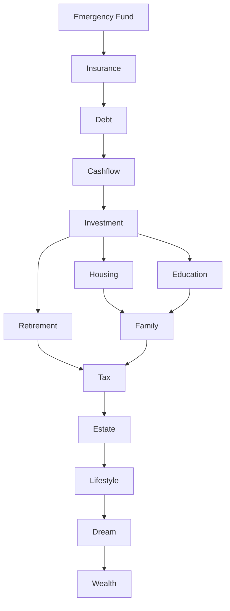
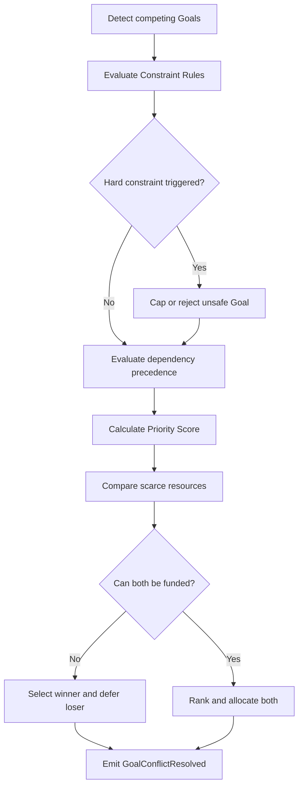
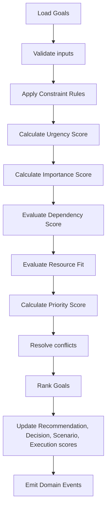
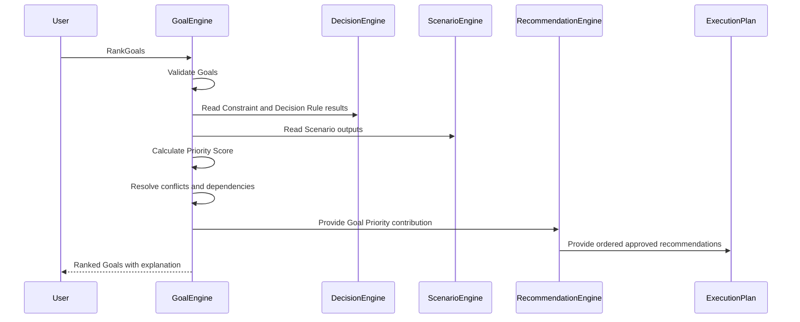

# Goal Prioritization

Version: 1.0
Status: Enterprise Specification
Owner: Project Atlas

# Purpose

Goal Prioritization defines the canonical decision layer that ranks all Goals in Atlas Goal Engine.

It is not a Goal because it does not represent a user objective, target amount, target date, owner, or funding progress.

It is not a Recommendation because it does not tell the user which action to take.

It orders Goals so that Goal Engine, Decision Engine, Scenario Engine, Recommendation Engine, and ExecutionPlan can allocate scarce budget, time, attention, and risk capacity in a deterministic, explainable, auditable, and reproducible way.

Goal Prioritization answers one enterprise question:

```text
Given all active, planned, deferred, and competing Goals, which Goal must be served first, and why?
```

# Responsibilities

Goal Prioritization is responsible for:

1. Goal Ranking: produce a stable ordered list of Goals for a Household.
2. Priority Calculation: calculate a normalized Priority Score from 0 to 100.
3. Urgency Detection: detect deadlines, penalties, opportunity windows, risk escalation, and time-sensitive needs.
4. Conflict Resolution: resolve competing Goals such as Housing, Retirement, Education, Travel, Entrepreneurship, and Early Retirement.
5. Resource Allocation: assign available budget, cashflow, time, and risk capacity to ranked Goals.
6. Budget Competition: decide how limited monthly surplus is distributed across Goal funding needs.
7. Time Competition: sequence Goals that require the same calendar period or execution attention.
8. Dependency Resolution: enforce prerequisites such as Emergency Fund before optional Investment expansion.
9. Recommendation Weight: supply Goal Priority as an input to Recommendation Score.
10. Execution Ordering: determine which approved Recommendation and ExecutionPlan should run first.

# Non-Responsibilities

Goal Prioritization does not:

1. Create new Goals.
2. Approve a Recommendation.
3. Execute an ExecutionPlan.
4. Override Hard constraints from Constraint Rules.
5. Invent missing assumptions.
6. Replace Scenario comparison.
7. Replace Decision Score.
8. Replace user-owned Goal status.
9. Bypass audit.
10. Change Catalog names.

# Enterprise Inputs

Priority calculation consumes:

1. Goal
2. Life Goals
3. Decision Principles
4. Decision Rule Catalog
5. Scoring Model
6. Recommendation Priority Framework
7. Constraint Rules
8. Scenario Framework
9. Projection Engine Framework
10. Optimization Engine Framework
11. Financial Philosophy
12. Execution Plan Framework
13. Action Planning Framework
14. Budget
15. CashFlow
16. Portfolio
17. Loan
18. Insurance
19. Scenario
20. Decision

# Priority Dimensions

Every active or planned Goal is scored against the following dimensions. Each dimension is normalized to 0 to 100 before weighting.

| Dimension | Meaning |
|---|---|
| Financial Impact | Expected improvement to net worth, cashflow, liability position, or long-term sustainability. |
| Risk Reduction | Reduction in liquidity, insurance, debt, housing, retirement, or concentration risk. |
| Time Sensitivity | Degree to which delay worsens feasibility or cost. |
| Deadline | Proximity and strictness of target date or legal date. |
| Life Stage | Relevance to current household stage, age, dependents, and planning horizon. |
| Dependency | Whether another Goal, Recommendation, Scenario, or ExecutionPlan depends on this Goal. |
| Legal Requirement | Regulatory, contractual, tax, or mandatory compliance requirement. |
| Cashflow Impact | Positive or negative recurring cashflow effect. |
| Investment Opportunity | Expected value of investing now versus later. |
| Loan Interest | Interest saved or interest burden avoided. |
| Tax Saving | Tax reduction or avoidance of tax penalty. |
| Insurance Gap | Severity of coverage shortfall. |
| Family Requirement | Mandatory household, child, parent support, or shared family obligation. |
| Emergency | Immediate survivability or financial continuity need. |
| Health | Medical, health protection, or health-related financial resilience. |
| Education | Child education, self-education, or planned education funding need. |
| Retirement | Retirement readiness and funding sustainability. |
| Housing | Housing affordability, stability, upgrade, purchase, or rental strategy impact. |
| Lifestyle | Quality-of-life value after mandatory needs and constraints. |
| User Preference | Explicit user priority within allowed constraints. |
| AI Confidence | Confidence in calculation quality, data completeness, and model stability. |
| Expected ROI | Financial return relative to required funding. |
| Expected Utility | Total expected benefit including non-investment utility. |
| Expected Satisfaction | Expected subjective satisfaction when financially feasible. |

# Priority Score

Priority Score is the canonical Goal ranking score.

```text
Priority Score = clamp(
    0.22 * Urgency Score
  + 0.26 * Importance Score
  + 0.16 * Dependency Score
  + 0.12 * Constraint Score
  + 0.10 * Resource Fit Score
  + 0.08 * User Preference Score
  + 0.06 * AI Confidence Score
  + Critical Override
  - Deferral Penalty,
  0,
  100
)
```

Weight definitions:

| Component | Weight | Explanation |
|---|---:|---|
| Urgency Score | 22% | Captures deadline, penalty, opportunity cost, risk, and time window. |
| Importance Score | 26% | Captures financial impact, risk, return, need, and user preference. |
| Dependency Score | 16% | Rewards prerequisite Goals that unblock other Goals. |
| Constraint Score | 12% | Reflects regulatory, Hard, Soft, and Advisory constraint pressure. |
| Resource Fit Score | 10% | Measures feasibility with current budget, time, income, and cashflow. |
| User Preference Score | 8% | Preserves declared user intent after mandatory needs are satisfied. |
| AI Confidence Score | 6% | Reduces rank volatility when data quality is weak. |
| Critical Override | variable | Applies when Emergency, Legal Requirement, Health, or Hard constraint requires elevation. |
| Deferral Penalty | variable | Applies when a Goal is intentionally deferred, blocked, stale, or infeasible. |

Score rules:

1. All component scores must be normalized to 0 to 100.
2. The final score must be clamped to 0 to 100.
3. Hard constraints may cap or override rank before numeric sorting.
4. Missing mandatory inputs reject calculation.
5. Identical inputs must produce identical score and rank.

# Goal Categories

Goal Prioritization supports these canonical categories:

1. Emergency
2. Debt
3. Cashflow
4. Investment
5. Insurance
6. Housing
7. Education
8. Retirement
9. Family
10. Tax
11. Estate
12. Lifestyle
13. Dream

Category alignment with Life Goals:

| Goal Prioritization Category | Life Goals Alignment |
|---|---|
| Emergency | Financial, Health, Family |
| Debt | Financial, Housing |
| Cashflow | Financial |
| Investment | Financial, Retirement |
| Insurance | Family, Health, Financial |
| Housing | Housing |
| Education | Family, Career, Lifestyle |
| Retirement | Retirement |
| Family | Family |
| Tax | Financial, Estate |
| Estate | Retirement, Family |
| Lifestyle | Lifestyle |
| Dream | Lifestyle, Career, Financial |

# Goal Levels

| Level | Score Range | Meaning |
|---|---:|---|
| Critical | 90 to 100 | Immediate or mandatory priority; delay may cause major harm, violation, insolvency, or loss of essential protection. |
| High | 75 to 89 | Strong priority with clear financial, risk, dependency, or deadline value. |
| Medium | 60 to 74 | Valid Goal that should be funded after higher-priority needs. |
| Low | 40 to 59 | Useful but not urgent; schedule only when resources permit. |
| Optional | 20 to 39 | Discretionary Goal with low mandatory value. |
| Deferred | 0 to 19 | Not currently fundable, blocked, stale, or intentionally postponed. |

# Urgency Calculation

Urgency Score captures how costly it is to delay a Goal.

```text
Urgency Score = clamp(
    0.30 * Deadline Pressure
  + 0.22 * Penalty Severity
  + 0.18 * Opportunity Cost
  + 0.20 * Risk Escalation
  + 0.10 * Time Window Scarcity,
  0,
  100
)
```

Component definitions:

| Component | Definition |
|---|---|
| Deadline Pressure | 100 when target date is overdue or within required lead time; decreases as available months increase. |
| Penalty Severity | Financial, legal, tax, insurance, interest, or execution penalty caused by delay. |
| Opportunity Cost | Expected lost return, lost discount, lost compounding, or lost Scenario value from waiting. |
| Risk Escalation | Increase in liquidity, debt, health, family, retirement, housing, or insurance risk caused by delay. |
| Time Window Scarcity | Availability of an action window, enrollment window, rate lock, tax year, application period, or limited opportunity. |

Deadline Pressure formula:

```text
Deadline Pressure =
if MonthsToDeadline <= 0 then 100
else clamp(100 * (RequiredLeadMonths / MonthsToDeadline), 0, 100)
```

Penalty Severity formula:

```text
Penalty Severity = clamp(
    100 * ExpectedDelayPenaltyAmount / Max(GoalTargetAmount, MonthlyCoreExpense, 1),
    0,
    100
)
```

Opportunity Cost formula:

```text
Opportunity Cost = clamp(
    100 * ExpectedLostValueFromDelay / Max(GoalTargetAmount, 1),
    0,
    100
)
```

Risk Escalation formula:

```text
Risk Escalation = max(
    LiquidityRiskDelta,
    DebtRiskDelta,
    InsuranceGapRiskDelta,
    RetirementRiskDelta,
    HousingRiskDelta,
    HealthRiskDelta
)
```

Time Window Scarcity formula:

```text
Time Window Scarcity =
if WindowClosesWithinRequiredLeadTime then 100
else clamp(100 * RequiredLeadMonths / MonthsUntilWindowClose, 0, 100)
```

# Importance Calculation

Importance Score captures the intrinsic value of achieving the Goal.

```text
Importance Score = clamp(
    0.30 * Impact
  + 0.25 * Risk
  + 0.18 * Return
  + 0.17 * Need
  + 0.10 * Preference,
  0,
  100
)
```

Impact:

```text
Impact = normalized score of projected improvement in Net Worth, Monthly Net Cashflow, Emergency Fund Months, Debt Service Ratio, Retirement Readiness Ratio, Goal Achievement Ratio, or Scenario Safety Margin.
```

Risk:

```text
Risk = normalized score of risk reduction across liquidity, debt, insurance, retirement, housing, portfolio concentration, legal, family, health, and cashflow risks.
```

Return:

```text
Return = clamp(100 * ExpectedROI / TargetROI, 0, 100)
```

Need:

```text
Need = max(Emergency Need, Legal Need, Family Need, Health Need, Insurance Need, Housing Need, Retirement Need, Education Need)
```

Preference:

```text
Preference = normalized explicit user priority after Constraint Rules and Decision Principles are applied.
```

# Dependency Rule

Goal Prioritization must evaluate dependency before final ranking. A dependent Goal cannot outrank an unmet prerequisite when the prerequisite is required for feasibility or safety.

Canonical dependency chain:

```text
Emergency Fund
↓
Insurance
↓
Debt
↓
Cashflow
↓
Investment
↓
Housing
↓
Education
↓
Retirement
↓
Family
↓
Tax
↓
Estate
↓
Lifestyle
↓
Dream
↓
Wealth
```

Dependency Score formula:

```text
Dependency Score = clamp(
    45 * IsPrerequisiteForActiveGoal
  + 25 * NumberOfBlockedGoalsNormalized
  + 20 * DownstreamFundingImpact
  + 10 * ExecutionDependencyImpact,
  0,
  100
)
```

Dependency Graph:



# Goal Conflict

Goal Conflict occurs when two or more Goals compete for the same budget, time window, income capacity, liquidity reserve, debt capacity, risk capacity, or execution attention.

Conflict examples:

| Conflict | Sorting Rule |
|---|---|
| Buy Home vs Retirement | Reject or defer Housing if it causes Retirement Funding Ratio to fall below policy or creates Red risk timeline. |
| Buy Home vs Education | Education with fixed deadline and family obligation outranks discretionary housing upgrade. |
| Education vs Travel | Education outranks Travel when target date is fixed and funding gap exists. |
| Entrepreneurship vs Emergency Fund | Emergency Fund and Insurance outrank Entrepreneurship until survivability threshold is met. |
| Early Retirement vs Child Education | Child Education and Family Requirement outrank Early Retirement unless Education is fully funded. |
| Loan Repayment vs Investment | Higher after-tax guaranteed Loan Interest outranks Investment when risk-adjusted Expected ROI is lower. |
| Tax Saving vs Lifestyle | Tax with legal deadline outranks Lifestyle. |
| Insurance Gap vs Dream | Insurance Gap outranks Dream when household has dependents or material protection shortfall. |

Conflict Resolution formula:

```text
Conflict Winner = highest Goal after applying:
1. Constraint precedence
2. Dependency precedence
3. Critical Override
4. Priority Score
5. Urgency Score
6. Importance Score
7. User Preference
8. Stable GoalId tie-breaker
```

Conflict Resolution flow:



# Resource Competition

Resource competition is evaluated after constraints and dependencies.

Budget shortage:

1. Fund Critical Goals first.
2. Reserve mandatory expenses and minimum liquidity.
3. Allocate to prerequisites before downstream Goals.
4. Allocate to Goals with deadline penalties.
5. Allocate to Goals with highest risk reduction per currency unit.
6. Allocate remaining surplus by Priority Score.
7. Defer Optional and Dream Goals when surplus is insufficient.

Time shortage:

1. Execute legal, tax, health, and emergency actions first.
2. Execute dependency blockers before optimization actions.
3. Execute deadline-bound Goals before flexible Goals.
4. Use ExecutionPlan dependencies for final sequencing.

Income shortage:

1. Protect core living expenses.
2. Preserve Emergency Fund.
3. Reduce discretionary Goal funding.
4. Recalculate Housing, Investment, Lifestyle, Dream, and Early Retirement timing.
5. Trigger Recommendation update when funding gap persists.

Allocation formula:

```text
Goal Allocation Share =
AvailableGoalBudget
* (AdjustedPriorityScore / Sum(AdjustedPriorityScore of eligible Goals))
```

Adjusted Priority Score:

```text
AdjustedPriorityScore =
Priority Score
* FundingEligibility
* ResourceFitMultiplier
* DependencyReadiness
```

# Recommendation Integration

Goal Priority affects downstream scores but does not replace them.

Recommendation Score:

```text
Recommendation Score = clamp(
    Base Recommendation Score
  + 0.15 * Goal Priority Contribution
  - Goal Conflict Penalty,
  0,
  100
)
```

Decision Score:

```text
Decision Score = clamp(
    Base Decision Score
  + 0.10 * Goal Alignment Contribution
  + 0.05 * Priority Urgency Contribution
  - Constraint Penalty,
  0,
  100
)
```

Scenario Score:

```text
Scenario Score = clamp(
    Base Scenario Score
  + 0.12 * Goal Achievement Ratio Weighted By Goal Priority
  - High Priority Goal Failure Penalty,
  0,
  100
)
```

Execution Score:

```text
Execution Score = clamp(
    Base Execution Score
  + 0.20 * Source Goal Priority
  + 0.10 * Dependency Readiness
  - Execution Blocker Penalty,
  0,
  100
)
```

Priority Calculation Flow:



# Decision Rules

1. DR-GLP-001 Emergency Goal outranks all discretionary Goals when Emergency Fund Months is below policy target.
2. DR-GLP-002 Legal Requirement outranks Optimization Goals when a legal deadline exists.
3. DR-GLP-003 Health-related Critical Goal outranks Lifestyle and Dream Goals.
4. DR-GLP-004 Insurance Gap outranks Investment when dependents exist and coverage is materially insufficient.
5. DR-GLP-005 Debt Goal outranks Investment when guaranteed after-tax Loan Interest exceeds risk-adjusted Expected ROI.
6. DR-GLP-006 Cashflow Goal outranks Housing upgrade when Monthly Net Cashflow would become negative.
7. DR-GLP-007 Retirement Goal outranks Dream Goal when Retirement Readiness Ratio is below policy target.
8. DR-GLP-008 Education Goal with fixed deadline outranks Travel Goal.
9. DR-GLP-009 Tax Goal with current-year deadline outranks optional Investment rebalance.
10. DR-GLP-010 Emergency Fund must be funded before optional Lifestyle expansion.
11. DR-GLP-011 Goal with unmet prerequisite cannot be ranked above its prerequisite.
12. DR-GLP-012 Goal violating Hard constraint must be rejected, capped, or deferred.
13. DR-GLP-013 Goal violating Soft constraint receives a priority penalty unless it resolves higher risk.
14. DR-GLP-014 User Preference cannot override Regulatory constraint.
15. DR-GLP-015 User Preference cannot override persistent negative Monthly Net Cashflow.
16. DR-GLP-016 Goal with stale Scenario output must not receive Critical level unless based on Emergency or Legal Requirement.
17. DR-GLP-017 Goal with low AI Confidence must receive confidence discount.
18. DR-GLP-018 Goal with missing mandatory Target Date must fail validation when deadline scoring is required.
19. DR-GLP-019 Goal with missing Target Amount must fail validation when funding score is required.
20. DR-GLP-020 Active Goal outranks Planned Goal when scores are equal.
21. DR-GLP-021 Planned Goal outranks Deferred Goal when scores are equal.
22. DR-GLP-022 Completed Goal must not be ranked.
23. DR-GLP-023 Cancelled Goal must not be ranked.
24. DR-GLP-024 On Hold Goal may be ranked only when RecalculatePriority explicitly includes it.
25. DR-GLP-025 Goal with higher Deadline Pressure wins tie over lower Deadline Pressure.
26. DR-GLP-026 Goal with higher Risk Reduction wins tie over higher Expected Satisfaction.
27. DR-GLP-027 Goal with higher Family Requirement wins tie over Lifestyle.
28. DR-GLP-028 Goal with lower Resource Fit may be deferred even when Importance is high.
29. DR-GLP-029 Goal that unlocks more blocked Goals receives dependency boost.
30. DR-GLP-030 Budget allocation must preserve minimum liquidity.
31. DR-GLP-031 Budget allocation must not increase Debt Service Ratio beyond policy threshold.
32. DR-GLP-032 Investment Opportunity must be discounted by liquidity risk.
33. DR-GLP-033 Loan Interest savings must be compared against after-tax investment return.
34. DR-GLP-034 Tax Saving must consider execution deadline and compliance risk.
35. DR-GLP-035 Housing Goal must consider Housing Burden Ratio and Debt Service Ratio.
36. DR-GLP-036 Retirement Goal must consider longevity horizon from Scenario Framework.
37. DR-GLP-037 Education Goal must consider education inflation when available.
38. DR-GLP-038 Family Goal must consider dependents and Parent Support obligations.
39. DR-GLP-039 Estate Goal must not outrank Critical liquidity need.
40. DR-GLP-040 Dream Goal must be Optional unless all mandatory prerequisites are met.
41. DR-GLP-041 Lifestyle Goal must not reduce Emergency Fund below policy target.
42. DR-GLP-042 Entrepreneurship Goal must include income interruption risk.
43. DR-GLP-043 Early Retirement Goal must fail if stress scenario shows Red survivability risk.
44. DR-GLP-044 Goal rank must be deterministic for identical inputs.
45. DR-GLP-045 Goal rank must include explanation metadata.
46. DR-GLP-046 FreezePriority prevents automatic rank mutation except for Emergency, Legal Requirement, or data integrity correction.
47. DR-GLP-047 UnfreezePriority restores normal recalculation.
48. DR-GLP-048 GoalPriorityChanged event must include old and new score.
49. DR-GLP-049 GoalConflictResolved event must include winner, deferred Goals, and reason codes.
50. DR-GLP-050 Priority calculation must record formula version, assumption version, and rule version.

# Commands

## CalculateGoalPriority

Calculates Priority Score for one Goal.

Required input:

1. GoalId
2. HouseholdId
3. Goal version
4. Financial snapshot
5. Assumption version
6. Formula version

Output:

1. Priority Score
2. Goal Level
3. Component scores
4. Explanation metadata
5. Domain events

## RecalculatePriority

Recalculates all eligible Goal priorities for a Household or Scenario.

## ResolveGoalConflict

Resolves budget, time, dependency, or constraint conflict between Goals.

## UpdateGoalPriority

Persists calculated priority state when validation passes.

## RankGoals

Returns stable ordered Goals after scoring, constraints, dependencies, and tie-breakers.

## FreezePriority

Locks a Goal priority from ordinary automatic recalculation.

## UnfreezePriority

Restores automatic recalculation for a frozen Goal.

# Domain Events

1. GoalPriorityCalculated
2. GoalPriorityChanged
3. GoalConflictResolved
4. GoalDeferred
5. GoalActivated
6. GoalPriorityFrozen
7. GoalPriorityUnfrozen
8. GoalRankingCompleted
9. GoalResourceAllocated
10. GoalPriorityCalculationRejected

# Aggregate Interaction

| Aggregate | Interaction |
|---|---|
| Goal | Source entity for priority scoring, status, category, target amount, target date, and owner. |
| Recommendation | Receives Goal Priority contribution and conflict penalties. |
| ExecutionPlan | Receives execution ordering and dependency sequencing. |
| Scenario | Supplies projection outputs, KPI deltas, risk level, and Goal Achievement Ratio. |
| Portfolio | Supplies allocation, investment return, concentration, liquidity, and investment opportunity data. |
| Loan | Supplies Loan Interest, debt burden, DTI, amortization, and early repayment impact. |
| Insurance | Supplies Insurance Gap and protection risk. |
| Budget | Supplies available funding and spending limits. |
| CashFlow | Supplies Monthly Net Cashflow, emergency fund capacity, and income shortage signals. |
| Decision | Consumes priority-adjusted Decision Score and stores audit metadata. |

# Business Rules

1. Priority Score must be between 0 and 100.
2. Priority Score must be deterministic.
3. Priority Score must be reproducible from stored snapshots.
4. Critical Override must be explainable.
5. Deferral Penalty must be explainable.
6. Hard constraints override numeric score.
7. Regulatory constraint outranks all non-regulatory Goals.
8. Data Integrity failure rejects calculation.
9. Missing mandatory GoalId rejects command.
10. Missing HouseholdId rejects command.
11. Completed Goals are excluded from active ranking.
12. Cancelled Goals are excluded from active ranking.
13. Deferred Goals remain visible for audit.
14. Frozen Goals retain existing score unless allowed override applies.
15. Unfrozen Goals recalculate on next trigger.
16. Emergency Fund prerequisite is evaluated before optional Investment.
17. Insurance prerequisite is evaluated before wealth expansion.
18. Debt sustainability is evaluated before discretionary Lifestyle.
19. Cashflow sustainability is evaluated before Housing upgrade.
20. Investment funding is evaluated after liquidity and debt checks.
21. Housing affordability must include Housing Burden Ratio.
22. Retirement priority must include Retirement Readiness Ratio.
23. Education priority must include deadline and education inflation when available.
24. Family Requirement may elevate priority when dependents exist.
25. Tax Saving must include deadline and compliance requirement.
26. Estate Goal must not override immediate solvency needs.
27. Dream Goal must be Deferred when prerequisites fail.
28. Lifestyle Goal must be Optional when budget is insufficient.
29. Health Goal may be Critical when delay causes material risk.
30. Legal Requirement may be Critical even when financial ROI is low.
31. High Expected ROI cannot override negative sustainable cashflow.
32. High Expected Satisfaction cannot override Hard constraint.
33. User Preference cannot override legal or data integrity rules.
34. AI Confidence below policy threshold reduces score.
35. AI Confidence cannot create Critical level by itself.
36. Goal with stale Scenario output must expose stale warning.
37. Goal with missing Scenario dependency must receive lower confidence.
38. Priority calculation must store component score breakdown.
39. Priority calculation must store triggered Decision Rules.
40. Priority calculation must store Constraint Rules results.
41. Priority calculation must store formula version.
42. Priority calculation must store assumption version.
43. Priority calculation must store calculation timestamp.
44. Priority calculation must store input snapshot hash.
45. RankGoals must use stable tie-breaker.
46. RankGoals must not mutate Goals unless UpdateGoalPriority is called.
47. ResolveGoalConflict must record loser disposition.
48. GoalDeferred event must include deferral reason.
49. GoalActivated event must include activation reason.
50. GoalPriorityChanged event must include old score and new score.
51. GoalPriorityCalculated event must include Goal Level.
52. GoalRankingCompleted event must include ranked Goal count.
53. Resource allocation must preserve mandatory expenses.
54. Resource allocation must preserve configured emergency reserve.
55. Resource allocation must not allocate negative amount.
56. Resource allocation must not exceed available budget.
57. Resource allocation must respect dependency readiness.
58. Budget competition must be recalculated after income change.
59. Time competition must be recalculated after deadline change.
60. Income shortage triggers recalculation.
61. Major cashflow change triggers recalculation.
62. New Loan triggers recalculation.
63. Insurance coverage change triggers recalculation.
64. Portfolio value shock triggers recalculation.
65. Scenario recalculation may trigger Goal priority recalculation.
66. Recommendation dismissal does not delete Goal priority.
67. ExecutionPlan completion may change Goal status and priority.
68. Goal target date change triggers recalculation.
69. Goal target amount change triggers recalculation.
70. Goal category change triggers recalculation.
71. Goal status change triggers recalculation.
72. Duplicate Goals must be detected before ranking.
73. Circular dependency must reject ranking.
74. Dependency graph must be acyclic.
75. Priority Level must derive from score after overrides.
76. Critical Goals must appear before High Goals unless blocked by Hard constraint.
77. Optional Goals must not suppress Critical Recommendations.
78. Deferred Goals must not receive budget allocation by default.
79. Audit must preserve prior priority values.
80. Historical replay must not use current assumptions unless explicitly requested.
81. Same input snapshot must produce same Domain Events except timestamp metadata.
82. Command idempotency must prevent duplicate priority events.
83. Security policy must restrict Household data access.
84. Calculation failure must not partially update ranking state.
85. Bulk ranking must process all valid Goals and report rejected Goals.
86. Goal conflict result must be explainable to user-facing surfaces.
87. Priority integration must not double-count Goal Alignment in Recommendation Score.
88. Score component weights must total 100% before overrides.
89. Overrides must be bounded and auditable.
90. Priority calculation must be versioned.

# Validation

Structural validation:

1. GoalId exists.
2. HouseholdId exists.
3. Goal belongs to Household.
4. Goal status is valid.
5. Goal category is valid.
6. Goal level is derivable.
7. Target Date is valid when required.
8. Target Amount is valid when required.
9. Owner is valid when required.
10. Goal version is current or explicitly historical.

Financial validation:

1. Budget data is available.
2. CashFlow data is available.
3. Required Loan data is available for Debt or Housing Goals.
4. Required Insurance data is available for Insurance Goals.
5. Portfolio data is available for Investment Goals.
6. Scenario outputs are available when Scenario Score integration is requested.
7. Amounts are non-negative unless Catalog explicitly allows otherwise.
8. Rates are within configured bounds.
9. Funding gap is calculable.
10. Goal funding ratio is calculable.

Rule validation:

1. Constraint Rules version exists.
2. Decision Rule Catalog version exists.
3. Scoring Model version exists.
4. Formula version exists.
5. Assumption version exists.
6. Dependency graph is acyclic.
7. Component weights total 100%.
8. Critical Override is allowed by rule.
9. Deferral Penalty is allowed by rule.
10. Tie-breaker is stable.

Command validation:

1. Command id is present.
2. Idempotency key is present.
3. Actor is authorized.
4. Input snapshot hash is present for persisted updates.
5. FreezePriority requires reason.
6. UnfreezePriority requires reason.
7. ResolveGoalConflict requires at least two Goals.
8. UpdateGoalPriority requires calculated score.
9. RankGoals requires a valid HouseholdId.
10. RecalculatePriority requires recalculation trigger.

# Transaction Boundary

Single Goal calculation transaction:

1. Validate command.
2. Load Goal and required aggregates.
3. Build immutable calculation snapshot.
4. Calculate component scores.
5. Calculate Priority Score.
6. Derive Goal Level.
7. Persist priority result.
8. Emit Domain Events.

Bulk ranking transaction:

1. Load all eligible Goals.
2. Validate each Goal independently.
3. Calculate scores without mutation.
4. Resolve dependencies.
5. Resolve conflicts.
6. Produce ranked list.
7. Persist ranking version atomically.
8. Emit one GoalRankingCompleted event plus per-Goal change events.

Atomicity rules:

1. A failed persisted update must not leave partial ranking.
2. Domain Events must correspond to committed state.
3. Calculation-only commands may return results without persistence.
4. UpdateGoalPriority must be atomic per Goal.
5. RankGoals persistence must be atomic per ranking version.

# Error Handling

| Error | Handling |
|---|---|
| Missing mandatory data | Reject command with validation error. |
| Invalid Goal status | Reject command. |
| Invalid category | Reject command. |
| Invalid assumption version | Reject command. |
| Hard constraint triggered | Cap, reject, or defer according to Constraint Rules. |
| Circular dependency | Reject ranking and emit calculation rejected event. |
| Duplicate Goal | Return warning or merge candidate; do not silently merge. |
| Stale Scenario output | Apply confidence discount and stale warning. |
| Insufficient budget | Allocate by resource competition rules or defer lower Goals. |
| Idempotency conflict | Return original result if payload matches; reject if payload differs. |
| Unauthorized access | Reject and audit security event. |
| Calculation overflow | Reject command and record diagnostic metadata. |

# Idempotency

Every command that persists state must include an Idempotency Key.

Idempotency identity:

```text
Idempotency Identity =
CommandName
+ HouseholdId
+ GoalId or RankingScope
+ IdempotencyKey
+ InputSnapshotHash
```

Rules:

1. Repeated command with same identity and same payload returns original result.
2. Repeated command with same key and different payload is rejected.
3. Domain Events must not be duplicated.
4. RankGoals must not create duplicate ranking versions for the same identity.
5. FreezePriority and UnfreezePriority must be idempotent.
6. ResolveGoalConflict must return same winner for same input snapshot.

# Security

Security requirements:

1. Actor must be authorized for HouseholdId.
2. Goal data must not cross Household boundary.
3. Ranking must not expose unrelated Household Goals.
4. Audit records must include ActorId.
5. System actor must be distinguishable from user actor.
6. Sensitive financial fields must follow Atlas data protection rules.
7. Calculation snapshots must not leak to unauthorized consumers.
8. User Preference changes must be attributable.
9. FreezePriority and UnfreezePriority require privileged permission or owner action.
10. Bulk recalculation must enforce row-level ownership.

# Audit

Audit record must include:

1. AuditId
2. CommandName
3. ActorId
4. HouseholdId
5. GoalId
6. Old Priority Score
7. New Priority Score
8. Old Goal Level
9. New Goal Level
10. Component score breakdown
11. Triggered Decision Rules
12. Triggered Constraint Rules
13. Conflict result
14. Dependency result
15. Resource allocation result
16. Formula version
17. Assumption version
18. Rule version
19. Input snapshot hash
20. CalculatedAt

Audit rules:

1. Audit records are append-only.
2. Historical replay must reference original versions.
3. Manual overrides must include reason.
4. Frozen priority state must be auditable.
5. Domain Events must reference audit records.

# Performance

Large Goal ranking strategy:

1. Pre-filter excluded statuses: Completed and Cancelled.
2. Partition Goals by HouseholdId.
3. Cache immutable financial snapshot per ranking run.
4. Cache normalized dimension values per Goal version.
5. Evaluate Hard constraints before expensive Scenario integration.
6. Evaluate dependency graph once per ranking run.
7. Use topological sorting for dependency ordering.
8. Use stable sort after score calculation.
9. Batch Domain Event creation.
10. Store ranking version as immutable output.

Complexity:

| Operation | Complexity |
|---|---|
| Single Goal priority calculation | O(D + R), where D is dimensions and R is applicable rules. |
| Dependency graph validation | O(G + E), where G is Goals and E is dependency edges. |
| Bulk score calculation | O(G * (D + R)). |
| Conflict detection naive | O(G^2). |
| Conflict detection indexed by resource | O(G + C), where C is conflict groups. |
| Stable ranking sort | O(G log G). |
| Resource allocation | O(G). |
| Full optimized ranking | O(G * (D + R) + E + G log G + C). |

Performance rules:

1. Ranking 1,000 Goals must avoid Scenario recalculation per Goal unless explicitly requested.
2. Expensive projection reads must use existing Scenario outputs.
3. Missing Scenario outputs must be marked stale or unavailable, not recomputed implicitly.
4. Bulk RankGoals should return partial validation failures without blocking valid independent Goals unless dependency graph is invalid.
5. Ranking output must be pageable for UI consumption.

# Examples

1. Emergency Fund below policy target receives Critical level and outranks Travel.
2. Insurance Gap for household with children outranks ETF contribution increase.
3. Credit card debt at high Loan Interest outranks taxable investment.
4. Mortgage prepayment loses to Investment when Loan Interest is low and liquidity is strong.
5. Education tuition due in six months outranks home renovation.
6. Tax payment due this year outranks discretionary Lifestyle spending.
7. Retirement funding gap outranks Dream purchase when age is near target retirement.
8. Housing upgrade is Deferred when it causes negative Monthly Net Cashflow.
9. First Home Goal is High when Housing Burden Ratio remains within policy and Emergency Fund is funded.
10. Early Retirement is Deferred when stress Scenario creates Red risk timeline.
11. Parent Support becomes High when Family Requirement is active and deadline is fixed.
12. Health-related expense becomes Critical when delay increases material risk.
13. Entrepreneurship is Deferred until Emergency Fund, Insurance, and Cashflow prerequisites are met.
14. Travel remains Optional when Retirement Readiness Ratio is below target.
15. Estate planning becomes High when Family Requirement and asset complexity are high.
16. Tax Saving becomes High when deadline is near and savings are material.
17. Portfolio diversification Goal becomes High when concentration breaches IPS tolerance.
18. Education savings becomes Medium when deadline is long and funding ratio is on track.
19. Dream Goal becomes Low when all mandatory Goals are funded but budget remains limited.
20. Loan refinance Goal becomes High when interest saving is material and execution window is limited.

# Execution Flow



# Testing

1. Calculate Priority Score returns 0 to 100.
2. Critical score maps to Critical level.
3. High score maps to High level.
4. Medium score maps to Medium level.
5. Low score maps to Low level.
6. Optional score maps to Optional level.
7. Deferred score maps to Deferred level.
8. Missing GoalId rejects command.
9. Missing HouseholdId rejects command.
10. Unauthorized Household rejects command.
11. Completed Goal is excluded.
12. Cancelled Goal is excluded.
13. Active Goal is included.
14. Planned Goal is included.
15. On Hold Goal is included only when configured.
16. Frozen Goal does not change under ordinary recalculation.
17. Frozen Goal changes under Emergency override.
18. Unfrozen Goal recalculates.
19. Deadline overdue sets Deadline Pressure to 100.
20. Far deadline reduces Deadline Pressure.
21. Penalty Severity increases Urgency Score.
22. Opportunity Cost increases Urgency Score.
23. Risk Escalation increases Urgency Score.
24. Time Window Scarcity increases Urgency Score.
25. Importance Score uses Impact.
26. Importance Score uses Risk.
27. Importance Score uses Return.
28. Importance Score uses Need.
29. Importance Score uses Preference.
30. User Preference cannot exceed Hard constraint.
31. Emergency Fund outranks Travel.
32. Insurance Gap outranks Investment when dependents exist.
33. Debt outranks Investment when Loan Interest exceeds Expected ROI.
34. Investment outranks low-interest Debt when risk-adjusted return is superior and liquidity is strong.
35. Tax deadline outranks Lifestyle.
36. Health Critical outranks Dream.
37. Education fixed deadline outranks Travel.
38. Housing upgrade is deferred when cashflow becomes negative.
39. Retirement outranks Dream when readiness is below target.
40. Estate does not outrank Emergency.
41. Dependency graph accepts acyclic graph.
42. Dependency graph rejects cycle.
43. Dependency prerequisite outranks dependent Goal.
44. Dependency boost increases prerequisite score.
45. Conflict winner uses Constraint precedence first.
46. Conflict winner uses Dependency precedence second.
47. Conflict winner uses Priority Score third.
48. Conflict winner uses Urgency tie-breaker.
49. Conflict winner uses stable GoalId final tie-breaker.
50. Budget allocation preserves emergency reserve.
51. Budget allocation never exceeds available budget.
52. Budget allocation does not allocate to Deferred Goal by default.
53. Resource Fit lowers infeasible Goal.
54. Income shortage recalculates ranking.
55. Cashflow shock recalculates ranking.
56. Loan creation recalculates ranking.
57. Insurance update recalculates ranking.
58. Portfolio shock recalculates ranking.
59. Scenario stale output lowers AI Confidence.
60. Missing Scenario output does not silently recalculate.
61. Recommendation Score receives Goal Priority contribution.
62. Decision Score receives Goal Alignment contribution.
63. Scenario Score receives weighted Goal Achievement Ratio.
64. Execution Score receives Source Goal Priority.
65. GoalPriorityCalculated event is emitted.
66. GoalPriorityChanged event is emitted on score change.
67. No GoalPriorityChanged event is emitted when score is unchanged.
68. GoalConflictResolved event includes winner.
69. GoalDeferred event includes reason.
70. GoalActivated event includes reason.
71. Duplicate idempotency key returns original result.
72. Same idempotency key with different payload rejects.
73. Domain Events are not duplicated by retry.
74. Audit record contains old and new score.
75. Audit record contains component breakdown.
76. Audit record contains triggered rules.
77. Audit record contains formula version.
78. Audit record contains assumption version.
79. Historical replay uses original versions.
80. Current assumptions are not used for historical replay unless requested.
81. Missing Target Amount rejects funding calculation.
82. Missing Target Date rejects deadline-required calculation.
83. Invalid category rejects command.
84. Invalid status rejects command.
85. Negative target amount rejects command.
86. Invalid rate rejects command.
87. Circular dependency rejects ranking.
88. Duplicate Goal returns warning.
89. Bulk ranking processes valid independent Goals.
90. Bulk ranking fails when dependency graph is invalid.
91. Stable sorting returns same order for same inputs.
92. Ranking 1,000 Goals avoids per-Goal Scenario recalculation.
93. Ranking output is pageable.
94. Calculation-only command does not persist.
95. UpdateGoalPriority persists score.
96. RankGoals persistence is atomic.
97. Transaction rollback prevents partial ranking.
98. Security audit records unauthorized access.
99. FreezePriority requires reason.
100. UnfreezePriority requires reason.
101. Critical Override is bounded.
102. Deferral Penalty is bounded.
103. Weight total validation rejects invalid configuration.
104. Resource competition handles zero available budget.
105. Resource competition handles insufficient income.

# Edge Cases

1. Goal has no Target Date.
2. Goal has no Target Amount.
3. Goal target date is in the past.
4. Goal target amount is zero.
5. Goal funding ratio exceeds 100%.
6. Goal already completed but status is Active.
7. Goal has duplicate name and same category.
8. Goal has duplicate funding source.
9. Goal has circular dependency.
10. Goal depends on Cancelled Goal.
11. Goal depends on Completed Goal.
12. Goal is frozen during Emergency.
13. Goal is frozen during legal deadline.
14. Goal is Deferred but user preference is high.
15. Goal is Dream but Emergency Fund is below target.
16. Goal is Housing but debt ratio is above policy.
17. Goal is Investment but Portfolio concentration is high.
18. Goal is Retirement but Scenario horizon is too short.
19. Goal is Education with missing education inflation.
20. Goal is Insurance with unknown coverage.
21. Goal is Tax with missing tax deadline.
22. Goal is Estate with missing family ownership data.
23. Goal has stale Scenario result.
24. Goal has conflicting Scenario outputs.
25. Budget is zero.
26. Monthly Net Cashflow is negative.
27. Income drops to zero.
28. Loan Interest is variable and missing future assumption.
29. Expected ROI is negative.
30. Expected Utility is high but financial feasibility is low.
31. Expected Satisfaction is high but Hard constraint fails.
32. AI Confidence is low.
33. AI Confidence is unavailable.
34. User Preference conflicts with spouse preference.
35. Two Goals have identical scores.
36. More than two Goals compete for the same budget.
37. Time window closes before execution can start.
38. Legal deadline is overdue.
39. Emergency occurs during bulk ranking.
40. Ranking command is retried after partial infrastructure failure.
41. Domain Event write succeeds but transaction fails.
42. Audit write fails.
43. Historical assumption version is deprecated.
44. Formula version is unsupported.
45. Constraint Rule version is unsupported.

# Version History

| Version | Date | Notes |
|---|---|---|
| v1.0 | 2026-07-11 | Enterprise Specification for Atlas Goal Prioritization. |

## Phase 2 Executable Specification Addendum

### Priority Calculation Contract

| Field | Required | Description |
|---|---|---|
| PriorityCalculationId | Yes | Stable priority calculation identifier |
| HouseholdId | Yes | Household scope |
| GoalId | Yes | Goal being ranked |
| PriorityModelVersion | Yes | Priority model version |
| RuleVersionSet | Yes | Priority and constraint rule versions |
| SourceSnapshotId | Yes | Source data snapshot |
| ScoreBreakdown | Yes | Weighted score components |
| PriorityRank | Yes | Deterministic rank |
| CorrelationId | Yes | Audit correlation |

### Required Commands

| Command | Actor | Output |
|---|---|---|
| ExecuteGoalPriorityCalculation | GoalPriorityApplicationService | GoalPriorityCalculated |
| ExecuteGoalPriorityRanking | GoalPriorityApplicationService | GoalPriorityRankingCompleted |
| FreezeGoalPriority | GoalPriorityApplicationService | GoalPriorityFrozen |
| ReplayGoalPriorityCalculation | AdministrationApplicationService | GoalPriorityCalculationReplayed |

### Addendum Validation Rules

| Rule ID | Rule | Failure |
|---|---|---|
| GPR-P2-VR-001 | Priority calculation must reference model version, rule versions, and source snapshot. | Reject calculation |
| GPR-P2-VR-002 | Weight totals must equal configured model total. | Reject model |
| GPR-P2-VR-003 | Ranking ties must use deterministic tie-breakers. | Reject ranking |
| GPR-P2-VR-004 | Replay must use original assumption, formula, and rule versions. | Reject replay |

### Addendum Testing Matrix

| Test | Expected Result |
|---|---|
| Invalid weight total | Model validation fails |
| Two goals tie | Stable deterministic order returned |
| Frozen priority recalculation | Existing frozen rank is preserved |
| Missing source snapshot | Calculation is rejected |
| Historical replay | Original priority score reproduces |

| Version | Date | Notes |
|---|---|---|
| v1.0-p2 | 2026-07-15 | Phase 2 executable addendum added. |

## Phase 2 Executable Specification Addendum

### Priority Calculation Contract

| Field | Required | Description |
|---|---|---|
| PriorityCalculationId | Yes | Stable priority calculation identifier |
| HouseholdId | Yes | Household scope |
| GoalId | Yes | Goal being ranked |
| PriorityModelVersion | Yes | Priority model version |
| RuleVersionSet | Yes | Priority and constraint rule versions |
| SourceSnapshotId | Yes | Source data snapshot |
| ScoreBreakdown | Yes | Weighted score components |
| PriorityRank | Yes | Deterministic rank |
| CorrelationId | Yes | Audit correlation |

### Required Commands

| Command | Actor | Output |
|---|---|---|
| ExecuteGoalPriorityCalculation | GoalPriorityApplicationService | GoalPriorityCalculated |
| ExecuteGoalPriorityRanking | GoalPriorityApplicationService | GoalPriorityRankingCompleted |
| FreezeGoalPriority | GoalPriorityApplicationService | GoalPriorityFrozen |
| ReplayGoalPriorityCalculation | AdministrationApplicationService | GoalPriorityCalculationReplayed |

### Addendum Validation Rules

| Rule ID | Rule | Failure |
|---|---|---|
| GPR-P2-VR-001 | Priority calculation must reference model version, rule versions, and source snapshot. | Reject calculation |
| GPR-P2-VR-002 | Weight totals must equal configured model total. | Reject model |
| GPR-P2-VR-003 | Ranking ties must use deterministic tie-breakers. | Reject ranking |
| GPR-P2-VR-004 | Replay must use original assumption, formula, and rule versions. | Reject replay |

### Addendum Testing Matrix

| Test | Expected Result |
|---|---|
| Invalid weight total | Model validation fails |
| Two goals tie | Stable deterministic order returned |
| Frozen priority recalculation | Existing frozen rank is preserved |
| Missing source snapshot | Calculation is rejected |
| Historical replay | Original priority score reproduces |

| Version | Date | Notes |
|---|---|---|
| v1.0-p2 | 2026-07-15 | Phase 2 executable addendum added. |
