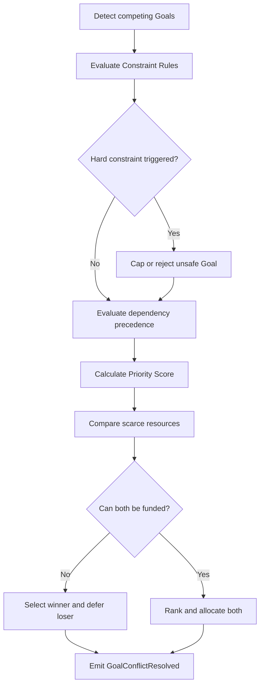
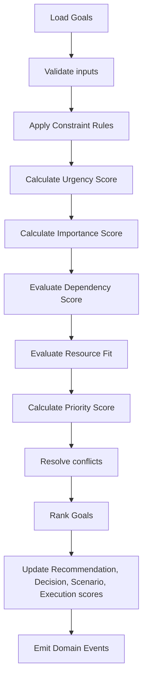

# Goal prioritization conflicts and recommendations
# Goal Conflict

Goal Conflict occurs when two or more Goals compete for the same budget, time window, income capacity, liquidity reserve, debt capacity, risk capacity, or execution attention.

Conflict examples:

| Conflict | Sorting Rule |
|---|---|
| Buy Home vs Retirement | Reject or defer Housing if it causes Retirement Funding Ratio to fall below policy or creates Red risk timeline. |
| Buy Home vs Education | Education with fixed deadline and family obligation outranks discretionary housing upgrade. |
| Education vs Travel | Education outranks Travel when target date is fixed and funding gap exists. |
| Entrepreneurship vs Emergency Fund | Emergency Fund and Insurance outrank Entrepreneurship until survivability threshold is met. |
| Early Retirement vs Child Education | Child Education and Family Requirement outrank Early Retirement unless Education is fully funded. |
| Loan Repayment vs Investment | Higher after-tax guaranteed Loan Interest outranks Investment when risk-adjusted Expected ROI is lower. |
| Tax Saving vs Lifestyle | Tax with legal deadline outranks Lifestyle. |
| Insurance Gap vs Dream | Insurance Gap outranks Dream when household has dependents or material protection shortfall. |

Conflict Resolution formula:

```text
Conflict Winner = highest Goal after applying:
1. Constraint precedence
2. Dependency precedence
3. Critical Override
4. Priority Score
5. Urgency Score
6. Importance Score
7. User Preference
8. Stable GoalId tie-breaker
```

Conflict Resolution flow:




# Resource Competition

Resource competition is evaluated after constraints and dependencies.

Budget shortage:

1. Fund Critical Goals first.
2. Reserve mandatory expenses and minimum liquidity.
3. Allocate to prerequisites before downstream Goals.
4. Allocate to Goals with deadline penalties.
5. Allocate to Goals with highest risk reduction per currency unit.
6. Allocate remaining surplus by Priority Score.
7. Defer Optional and Dream Goals when surplus is insufficient.

Time shortage:

1. Execute legal, tax, health, and emergency actions first.
2. Execute dependency blockers before optimization actions.
3. Execute deadline-bound Goals before flexible Goals.
4. Use ExecutionPlan dependencies for final sequencing.

Income shortage:

1. Protect core living expenses.
2. Preserve Emergency Fund.
3. Reduce discretionary Goal funding.
4. Recalculate Housing, Investment, Lifestyle, Dream, and Early Retirement timing.
5. Trigger Recommendation update when funding gap persists.

Allocation formula:

```text
Goal Allocation Share =
AvailableGoalBudget
* (AdjustedPriorityScore / Sum(AdjustedPriorityScore of eligible Goals))
```

Adjusted Priority Score:

```text
AdjustedPriorityScore =
Priority Score
* FundingEligibility
* ResourceFitMultiplier
* DependencyReadiness
```


# Recommendation Integration

Goal Priority affects downstream scores but does not replace them.

Recommendation Score:

```text
Recommendation Score = clamp(
    Base Recommendation Score
  + 0.15 * Goal Priority Contribution
  - Goal Conflict Penalty,
  0,
  100
)
```

Decision Score:

```text
Decision Score = clamp(
    Base Decision Score
  + 0.10 * Goal Alignment Contribution
  + 0.05 * Priority Urgency Contribution
  - Constraint Penalty,
  0,
  100
)
```

Scenario Score:

```text
Scenario Score = clamp(
    Base Scenario Score
  + 0.12 * Goal Achievement Ratio Weighted By Goal Priority
  - High Priority Goal Failure Penalty,
  0,
  100
)
```

Execution Score:

```text
Execution Score = clamp(
    Base Execution Score
  + 0.20 * Source Goal Priority
  + 0.10 * Dependency Readiness
  - Execution Blocker Penalty,
  0,
  100
)
```

Priority Calculation Flow:




# Decision Rules

1. DR-GLP-001 Emergency Goal outranks all discretionary Goals when Emergency Fund Months is below policy target.
2. DR-GLP-002 Legal Requirement outranks Optimization Goals when a legal deadline exists.
3. DR-GLP-003 Health-related Critical Goal outranks Lifestyle and Dream Goals.
4. DR-GLP-004 Insurance Gap outranks Investment when dependents exist and coverage is materially insufficient.
5. DR-GLP-005 Debt Goal outranks Investment when guaranteed after-tax Loan Interest exceeds risk-adjusted Expected ROI.
6. DR-GLP-006 Cashflow Goal outranks Housing upgrade when Monthly Net Cashflow would become negative.
7. DR-GLP-007 Retirement Goal outranks Dream Goal when Retirement Readiness Ratio is below policy target.
8. DR-GLP-008 Education Goal with fixed deadline outranks Travel Goal.
9. DR-GLP-009 Tax Goal with current-year deadline outranks optional Investment rebalance.
10. DR-GLP-010 Emergency Fund must be funded before optional Lifestyle expansion.
11. DR-GLP-011 Goal with unmet prerequisite cannot be ranked above its prerequisite.
12. DR-GLP-012 Goal violating Hard constraint must be rejected, capped, or deferred.
13. DR-GLP-013 Goal violating Soft constraint receives a priority penalty unless it resolves higher risk.
14. DR-GLP-014 User Preference cannot override Regulatory constraint.
15. DR-GLP-015 User Preference cannot override persistent negative Monthly Net Cashflow.
16. DR-GLP-016 Goal with stale Scenario output must not receive Critical level unless based on Emergency or Legal Requirement.
17. DR-GLP-017 Goal with low AI Confidence must receive confidence discount.
18. DR-GLP-018 Goal with missing mandatory Target Date must fail validation when deadline scoring is required.
19. DR-GLP-019 Goal with missing Target Amount must fail validation when funding score is required.
20. DR-GLP-020 Active Goal outranks Planned Goal when scores are equal.
21. DR-GLP-021 Planned Goal outranks Deferred Goal when scores are equal.
22. DR-GLP-022 Completed Goal must not be ranked.
23. DR-GLP-023 Cancelled Goal must not be ranked.
24. DR-GLP-024 On Hold Goal may be ranked only when RecalculatePriority explicitly includes it.
25. DR-GLP-025 Goal with higher Deadline Pressure wins tie over lower Deadline Pressure.
26. DR-GLP-026 Goal with higher Risk Reduction wins tie over higher Expected Satisfaction.
27. DR-GLP-027 Goal with higher Family Requirement wins tie over Lifestyle.
28. DR-GLP-028 Goal with lower Resource Fit may be deferred even when Importance is high.
29. DR-GLP-029 Goal that unlocks more blocked Goals receives dependency boost.
30. DR-GLP-030 Budget allocation must preserve minimum liquidity.
31. DR-GLP-031 Budget allocation must not increase Debt Service Ratio beyond policy threshold.
32. DR-GLP-032 Investment Opportunity must be discounted by liquidity risk.
33. DR-GLP-033 Loan Interest savings must be compared against after-tax investment return.
34. DR-GLP-034 Tax Saving must consider execution deadline and compliance risk.
35. DR-GLP-035 Housing Goal must consider Housing Burden Ratio and Debt Service Ratio.
36. DR-GLP-036 Retirement Goal must consider longevity horizon from Scenario Framework.
37. DR-GLP-037 Education Goal must consider education inflation when available.
38. DR-GLP-038 Family Goal must consider dependents and Parent Support obligations.
39. DR-GLP-039 Estate Goal must not outrank Critical liquidity need.
40. DR-GLP-040 Dream Goal must be Optional unless all mandatory prerequisites are met.
41. DR-GLP-041 Lifestyle Goal must not reduce Emergency Fund below policy target.
42. DR-GLP-042 Entrepreneurship Goal must include income interruption risk.
43. DR-GLP-043 Early Retirement Goal must fail if stress scenario shows Red survivability risk.
44. DR-GLP-044 Goal rank must be deterministic for identical inputs.
45. DR-GLP-045 Goal rank must include explanation metadata.
46. DR-GLP-046 FreezePriority prevents automatic rank mutation except for Emergency, Legal Requirement, or data integrity correction.
47. DR-GLP-047 UnfreezePriority restores normal recalculation.
48. DR-GLP-048 GoalPriorityChanged event must include old and new score.
49. DR-GLP-049 GoalConflictResolved event must include winner, deferred Goals, and reason codes.
50. DR-GLP-050 Priority calculation must record formula version, assumption version, and rule version.

